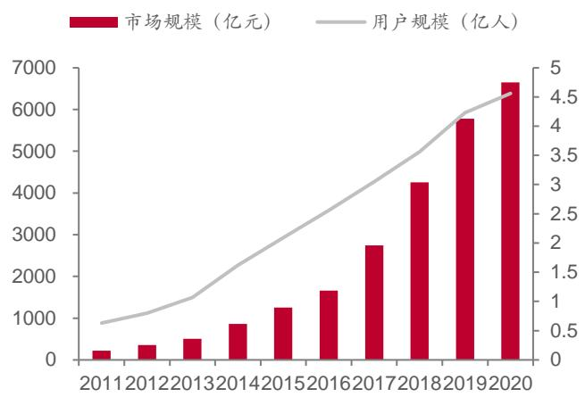
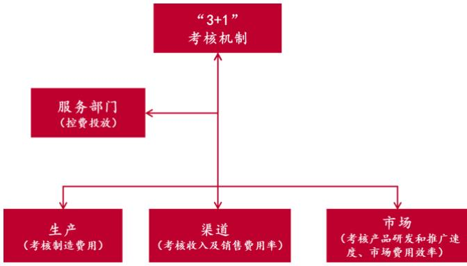
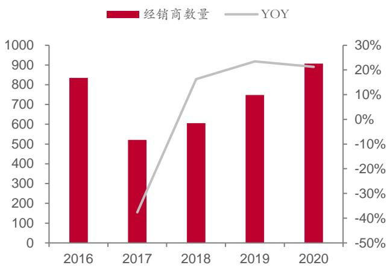

千味央廚（001215.SZ）/食品饮料

证券研究报告/公司深度报告

2021年9月6日

评级：买入（首次)市场价格：22.62 元

<table><tr><td>指标</td><td>2019A</td><td>2020A</td><td>2021E</td><td>2022E</td><td>2023E</td></tr><tr><td>营业收入（百万元）</td><td>889</td><td>944</td><td>1259</td><td>1576</td><td>1981</td></tr><tr><td>增长率 yoy%</td><td>26.82%</td><td>6.20%</td><td>33.35%</td><td>25.16%</td><td>25.69%</td></tr><tr><td>净利润（百万元）</td><td>74</td><td>77</td><td>90</td><td>110</td><td>141</td></tr><tr><td>增长率yoy%</td><td>26.32%</td><td>3.33%</td><td>17.50%</td><td>22.48%</td><td>28.33%</td></tr><tr><td>每股收益（元）</td><td>0.87</td><td>0.90</td><td>1.06</td><td>1.30</td><td>1.66</td></tr><tr><td>每股现金流量</td><td>1.02</td><td>1.15</td><td>2.03</td><td>1.22</td><td>2.43</td></tr><tr><td>净资产收益率</td><td>18.27%</td><td>13.15%</td><td>12.60%</td><td>13.16%</td><td>14.45%</td></tr><tr><td>P/E</td><td>25.97</td><td>25.14</td><td>21.39</td><td>17.47</td><td>13.61</td></tr><tr><td>PEG</td><td>1.84</td><td>1.11</td><td>1.40</td><td>1.24</td><td>0.60</td></tr><tr><td>P/B</td><td>4.74</td><td>3.31</td><td>2.69</td><td>2.30</td><td>1.97</td></tr></table>

备注：采用2021年9 月6 日收盘价

<table><tr><td colspan="2">基本状况</td></tr><tr><td>总股本(百万股)</td><td>85.10</td></tr><tr><td>流通股本(百万股)</td><td>21.28</td></tr><tr><td>市价(元)</td><td>22.62</td></tr><tr><td>市值(百万元)</td><td>1,925.06</td></tr><tr><td>流通市值(百万元)</td><td>481.35</td></tr></table>

# 股价与行业-市场走势对比

# 相关报告

# 报告摘要

核心观点：本文研究了餐饮端速冻米面制品赛道的特征和潜在规模，并以横向对比的方式研究了千味的特殊定位和先发优势，认为餐饮端速冻米面制品是强确定性的朝阳赛道，千味 $\cdot$ 定制化”商业模式卡位精准，在历史、治理、研发、销售、产品、渠道都与三全、安井有别，目前先发优势已初步形成。我们看好千味持续深耕餐饮端速冻米面领域，利用先发优势实现正向迭代，借力餐饮端高景气打开自身空间。

速冻米面制品餐饮端是强确定性的朝阳赛道。我国速冻米面制品是速冻食品中规模最大的品类，2019 年收入规模 773.5 亿元，5 年复合增速 $8 \%$ 。考虑到速冻米面目前在整体米面制品市场中的渗透率仍不算高，未来速冻米面制品的增长仍旧具备想象空间。我们认为对于速冻米面而言，餐饮端的机会主要来源于餐饮去面点师化逻辑下速冻米面的渗透率提升。根据我们的测算，对标日本，中性假设下我国餐饮端速冻米面制品潜在规模近800亿，对应2019 年的规模增长超 5倍。

千味 $\mathfrak { a } _ { \sf B + }$ 定制化”商业模式卡位精准，先发优势已初步形成。千味避开速冻米面C端红海，专攻B 端，尤其是大B定制渠道，具备餐饮基因和大B 思维，坚持做“困难而正确的事”。目前公司已积累一批稳定的优质客户群体，在销售端拥有较高的“投入产出比”和较快的周转，使得其盈利能力在同行中一枝独秀。此外，优质客户不但是公司营收稳定的增长极，也为公司品牌提供强大的背书，有助于客户边界进一步打开。

公司未来成长空间广阔，重客渠道绵延，多渠道拓展： $\textcircled{1}$ 餐饮端仍是目前速冻米面制品行业增速最快且最具想象空间的终端，且定制化 2B 业务竞争环境宽松，盈利能力更高； $\textcircled{2}$ 公司拥有高质量的存量客户可自然增长，同时公司积极开发细分赛道龙头和潜力客户，新客户亦可贡献增量； $\textcircled{3}$ 目前产能是公司主要限制，公司积极进行产能布局，规划产能翻番； $\textcircled{4}$ 近年来着手小B 端和C端布局，未来新业务亦值得期待。

首次覆盖给予“买入”评级。我们认为千味央厨商业模式卡位精准，先发优势初步形成，未来成长空间广阔。我们预计公司2021-2023 年收入分别为12.59、15.76、19.81亿元，归母净利润分别为0.90、1.10、1.41亿元，EPS分别为1.06、1.30、1.66元，首次覆盖给予“买入”评级。

风险提示：新客户开发不及预期，疫情反复影响，行业竞争加剧，食品安全问题，研究报告使用的公开资料可能存在信息滞后或更新不及时的风险。

# 投资主题

# 投资逻辑

1）行业具备高成长性：速冻米面制品餐饮端是强确定性的朝阳赛道。根据Frost&Sullivan和中国食协冷冻冷藏食品专业委员会的数据，我国速冻米面制品是速冻食品中规模最大的品类，2015 年后加速增长，2017、2018 年两年增速均超过 $1 0 \%$ ，2019年收入规模773.5 亿元，5 年复合增速 $8 \%$ 。考虑到速冻米面目前在整体米面制品市场中的渗透率仍不算高，未来速冻米面制品的增长仍旧具备想象空间。我们认为对于速冻米面而言，餐饮端的机会主要来源于餐饮去面点师化逻辑下速冻米面的渗透率提升。根据我们的测算，对标日本，中性假设下我国餐饮端速冻米面制品潜在规模近 800亿，对应2019 年的规模增长超5倍。

2)千味 ${ \bf \sp { 6 6 } } 2 { \bf B } +$ 定制化”商业模式卡位精准，先发优势已初步形成。千味避开速冻米面C端红海，专攻B 端，尤其是大B 定制渠道，具备餐饮基因和大B 思维，坚持做“困难而正确的事”。目前公司已积累一批稳定的优质客户群体，在销售端拥有较高的“投入产出比”和较快的周转，使得其盈利能力在同行中一枝独秀。此外，优质客户不但是公司营收稳定的增长极，也为公司品牌提供强大的背书，有助于客户边界进一步打开。

# 有别于市场观点

1）公司未来成长空间：市场认为公司定位B 端，体量小且成长空间难以打开。我们认为公司未来成长空间广阔： $\textcircled{1}$ 餐饮端仍是目前速冻米面制品增速最快且最具想象空间的终端，未来速冻米面制品餐饮端收入有望达763 亿，且定制化 2B 业务竞争环境宽松，盈利能力更高； $\textcircled{2}$ 公司拥有高质量的存量客户可自然增长，同时公司积极开拓龙头重客，新客户亦可贡献增量； $\textcircled{3}$ 目前产能是公司主要限制，公司积极进行产能布局，规划产能翻番； $\textcircled{4}$ 近年来公司着手小B 端和C 端布局，未来新业务亦值得期待。

2）公司盈利能力持续性：市场认为公司“小规模、定制化”的商业模式不具备规模效应。我们认为，餐饮端速冻米面制品是销售导向而非产品导向，成本优势虽然重要但不是全部。同于家庭消费以产品为主，餐饮供应商需要为餐饮企业提供稳定的高质商品及高效的服务。随着与大客户的关系的稳定与合作的加深，客户对千味的依赖程度将会增强，进而成为千味稳定增长极。

# 股价表现催化剂

短期看疫情稳定后线下餐饮消费与餐饮企业客户需求恢复拉动公司业绩改善，中期看新建产能释放增强业绩弹性，长期看新的大B、小B客户拓展、C端市场开拓。

核心假设风险：新客户开发不及预期、疫情反复、行业竞争加剧、食品安全问题

# 内容目录

# 一、餐饮端速冻米面：大相径庭，大有可为. - 5 -

# 二、对比研究：为什么是千味央厨？ ….- 11 -

# 三、未来看点：重客端绵延，多渠道拓展... …- 20 -

# 四、盈利预测与估值.. …- 23 -

# 图表目录

图表1：Sysco烹饪和产品解决方案.. . - 5 -图表2：三全绿标与红标水饺.. - 5 -图表3：我国速冻米面制品市场规模.. .- 6 -图表4：日本速冻食品商业/零售产量历史对比（万吨） . - 7 -图表5：日本外出就餐比例. . - 7 -图表6：餐饮行业收入.. …- 8 -图表7：中国在线外卖行业规模.. …- 8 -图表8：各餐饮业态人力成本（2019） - 8 -图表9：中国餐饮连锁化率... …- 9 -图表10：2020年中、日、美餐饮连锁化率， . - 9 -图表11：某粥铺部分点心品类.. …- 9 -图表12：餐饮端速冻米面制品空间测算（亿元） …-10 -图表13：千味、三全、安井历史沿革... …-11 -图表14：千味、三全、安井营收（亿元）与增速.. …-1 -图表15：三全、安井股权结构图（截至2021Q1） ..- 13 -图表16：千味央厨股权结构图（IPO前）.. …-13 -图表17：三全“自下而上”研发新品 …-14 -图表18：千味央厨油条家族.. …-14-图表19：安井研发基地布局 -14 -图表20：安井销售模式.. . - 15 -图表21：三全考核机制. -15-图表22：千味营销中心架构设置.. …-15 -图表23：千味、三全、安井产品结构对比（2020）. -16-图表24：安井、千味、三全渠道结构（2020）， …-17-图表25：千味主要产品销售额（万元） …-18 -图表26：千味、安井、三全19 年末预收账款占20Q1营收比. …-.18-图表27：千味、安井、三全大客户销售占比.. .- 18 -图表28：三全、安井、千味销售人员人均创收(2020). …-19 -图表29：三全、安井、千味销售费用率对比.... …-19-图表.0：千味、安、三全存货周转率及应收账.周转率.….-19-图表31：百胜中国2016-2020年门店数.. …- 20 -图表32：千味对百胜销售占比.. …-\* 0 -图表33：千味主要客户. …- 1 -图表34：千味前五大直营客户营收占比. …- 1-图表35：餐饮细分赛道主要企业与千味主要客户. .- 21 -图表36：千味经销商数量. …- 2 -图表37：千味经销商返利情况.. …-\* 22 -图表38：千味早饭师海报. …- 22 -图表39：千味早饭师门店. …- 2 -图表4：千味央厨业务分预测（百万元……- 23-图表41：千味央厨盈利预测.. …- 24 -图表42：可比公司估值表.. …- 24 -图表43：千味央厨三大财务报表预测（单位：百万元） …-\* 26 -

# 一、餐饮端速冻米面：大相径庭，大有可为

# 1.1生意特点：性价比和客户体验是关键

餐饮渠道速冻米面制品的本质是面点解决方案。餐饮端速冻米面是餐饮供应链的一小部分。餐饮供应链的核心是供需的匹配，以服务下游餐饮企业为主要目的，提供经营所需的各类食材，其中速冻米面制品应用的主要目的在于通过完善而有针对性的产品矩阵提供一站式服务来逐步替代面点师的工作。

  
图表1：Sysco烹饪和产品解决方案

来源：Sysco官网、中泰证券研究所

“省钱”和“省事”是餐饮企业的核心诉求，对应性价比和客户体验是餐饮渠道速冻米面制品要解决的核心问题。

性价比和渠道是速冻米面小B端竞争的关键。速冻米面制品同质性相对较强，餐饮企业获取食材的渠道丰富，对价格相对敏感，且切换供应商成本较低，因此餐饮客户粘性较低。这一方面对速冻米面餐饮供应商的产品性价比提出了更高的要求。与此同时，经销商的资源与销售策略等等方面都会对终端决策产生影响，因此渠道的广度、深度、数量与质量都会对小B 端销售产生重要影响。

  
图表2：三全绿标与红标水饺  
来源：京东、中泰证券研究所

客户体验是速冻米面连锁大B端竞争的关键，也是连锁大B 端速冻米面供应商的天然使命。不同于家庭消费以产品为主，餐饮供应商需要为餐饮企业提供稳定的高质商品及高效的服务。服务一个餐饮企业的小组通常需要包括研发、生产、采购、质控、物流等所有部门，当客户有需求时，需要供应商企业在几天之内给出整个新品采购、供货全流程的细节；一旦发生食品投诉事件，还需要在更短时间内找到出问题的环节。因此，高效的服务体现在两个方面： $\textcircled{1}$ 以强大的研发能力保证产品的品质及其稳定性； $\textcircled{2}$ 以柔性供应链满足客户定制化需求，以较弱的规模效应换取更强的用户粘性。

# 连锁餐饮是否会自建中央工厂？

$\textcircled{1}$ 国内的餐饮连锁率虽然在提高，但是结构上天然难走向超高集中度，因此自建中央工厂覆盖全部SKU较为困难； $\textcircled{2}$ 米面在食材中占比大致$5 \%$ ，生产工艺却相对复杂，收入产出不匹配，因此连锁餐饮自建中央工厂生产米面制品的性价比较低。

# 食品加工巨头是否会入局进而改写行业格局？

餐饮端速冻米面制品是销售导向而非产品导向，成本优势虽然重要但不是全部。益海嘉里等食品加工巨头虽在供应链、原材料成本等方面有优势，但在餐饮端速冻米面制品的销售和资源积累上仍有欠缺，若要入局速冻米面需要对架构和人才等诸多方面进行调整。目前来看，虽然食品加工巨头短期内难以快速入局，但是需要看到其在成本端的优势，以及其入局后竞争加剧对行业格局的冲击。

# 1.2 市场规模：万亿餐饮市场打开餐饮端5 倍空间

速冻米面制品增速重回快车道。根据Frost & Sullivan和中国食协冷冻冷藏食品专业委员会的数据，我国速冻米面制品是速冻食品中规模最大的品类，收入规模 2014年小幅下滑，2015年后加速增长，2017、2018年两年增速均超过 $10 \%$ ，2019 年收入规模 773.5 亿元，5 年复合增速$8 \%$ 。考虑到速冻米面目前在整体米面制品市场中的渗透率仍不算高，未来速冻米面制品的增长仍旧具备想象空间。

  
图表3：我国速冻米面制品市场规模

来源：Frost&Sullivan、中国食协冷冻冷藏食品专业委员会、中泰证券研究所从日本的经验看速冻米面制品的推动因素，餐饮端具备较大的弹性。根据日本冷冻食品协会统计，1970s后，由于电冰箱的普及完成，家庭冷冻食品消费量趋于平稳，而餐饮端则伴随外食增长迅速扩容，1970-1990年日本商业用速冻食品产量增速明显高于家庭端，带动速冻食品整体产量快速增长。从我国速冻米面制品的情况看，速冻米面制品的下游主要是餐饮、家庭两端，家庭是速冻米面的最初的下游，目前进入相对稳定的时期，短期不会有大的变化。餐饮端是速冻米面的第二个渗透的渠道，目前仍旧高景气，且需求仍旧没有完全释放。

  
图表4：日本速冻食品商业/零售产量历史对比（万吨）  
来源：日本冷冻食品协会、中泰证券研究所

  
图表5：日本外出就餐比例  
来源：日本食品服务协会、中泰证券研究所

餐饮4 万亿市场赋予速冻米面制品高增长的想象空间。2019 年，餐饮行业市场规模达 46721 亿元，同比增长 $9 . 4 \%$ ，10-19年复合增速达$1 1 . 4 \%$ 。20 年受疫情影响，餐饮行业收入同比减少 $1 5 . 4 \%$ 至39527亿元。尽管如此，中国在线外卖行业在疫情下仍旧维持较高增长，为餐饮行业持续贡献营收，预计未来也将是餐饮行业增长的一大推动因素，餐饮渠道高景气可以看很远。

  
图表6：餐饮行业收入  
来源：国家统计局、中国饭店协会、中国烹饪协会、中泰证券研究所

  
图表7：中国在线外卖行业规模  
来源：艾媒咨询、中泰证券研究所

对于速冻米面而言，餐饮端的机会主要来源于餐饮去面点师化逻辑下速冻米面的渗透率提升。具体来看，餐饮端提升速冻米面渗透率的动力主要来源于以下诉求： $\textcircled{1}$ 对于餐饮业整体，米面制品工艺复杂，制作耗时较长，餐饮行业“前端要流量，后端要效益”，速冻米面制品通过“生产前置”的方式有效降低餐饮运营中人工成本，同时缩短食材加工时间，提升上菜速度，从而进一步提升翻台率和单位面积产出； $\textcircled{2}$ 对于连锁餐饮，速冻米面制品种类繁多，合格的面点师资源相对稀缺，速冻米面制品可以保证门店品控稳定和标准化口感，且降低了门店对于面点师的要求，使得连锁餐饮更具备复制力； $\textcircled{3}$ 对于小B餐饮，速冻米面制品有助于提升SKU数量，增加盈利点，同时外卖业务的食用时间延迟也对于米面类食品的外观和口感提出了更高的要求； $\textcircled{4}$ 对于团餐业务，速冻米面更符合出餐量大、时间要求苛刻、价格敏感性强等团餐的特点。

图表8：各餐饮业态人力成本（2019）  

<table><tr><td></td><td>正餐</td><td>火锅</td><td>快餐</td><td>团餐</td><td>西餐休闲餐饮</td><td>日料</td></tr><tr><td>一线员工平均工资：元</td><td>4068.58</td><td>3400</td><td>3494</td><td>3568</td><td>3808</td><td>4129</td></tr><tr><td>一线员工平均工资同比变动</td><td>10.65%</td><td>7.41%</td><td>8.30%</td><td>5.55%</td><td>10.69%</td><td>29.89%</td></tr><tr><td>管理层员工工资：元</td><td>8492</td><td>6571</td><td>7008</td><td>6871</td><td>6302</td><td>7486</td></tr><tr><td>管理层员工平均工资同比变动</td><td>10.44%</td><td>8.00%</td><td>10.80%</td><td>7.94%</td><td>10.09%</td><td>28.28%</td></tr><tr><td>人力成本占比</td><td>23.77%</td><td>20.36%</td><td>21.22%</td><td>38.99%</td><td>27.82%</td><td>15.78%</td></tr><tr><td>人力成本占比同比变动</td><td>1.99%</td><td>3.05%</td><td>0.12%</td><td>1.89%</td><td>2.30%</td><td>1.43%</td></tr></table>

来源：中国饭店协会、中泰证券研究所

  
图表9：中国餐饮连锁化率  
来源：欧睿、中泰证券研究所

  
图表10：2020年中、日、美餐饮连锁化率

来源：欧睿、中泰证券研究所

  
图表11：某粥铺部分点心品类  
来源：美团、中泰证券研究所

对标日本，中性假设下我国餐饮端速冻米面制品潜在规模近 800 亿，对应增长超5倍。根据中国冷冻冷藏食品专业委员会数据，19 年我国速冻米面行业整体收入为773.5 亿元。根据 IBISWorld，我国速冻米面食品中，超市渠道占 $61 \%$ ，小的零售终端占 $23 \%$ ，其他渠道仅为 $16 \%$ ，即我国速冻米面行业餐饮和家庭收入占比分别为 $16 \%$ 和 $84 \%$ ，对应市场规模分别为124亿元和650 亿元。我们认为速冻米面制品餐饮端的增长驱动主要在于： $\textcircled{1}$ 餐饮连锁化率提升； $\textcircled{2}$ 速冻米面制品在非连锁餐饮端的渗透率提升。根据我们的测算，在连锁化率和渗透率达到日本当前水平时，中国速冻米面制品餐饮端市场潜在空间达763亿，对应2019 年124亿元的规模增长超5倍，其中连锁大B端市场潜在空间达489 亿。

图表12：餐饮端速冻米面制品空间测算（亿元）  

<table><tr><td>餐饮业总收入（2019)</td><td>原材料成本占营收比，米面占原材料成本比</td><td></td><td>速冻米面渗透率</td><td>B端速冻米面市场规模</td></tr><tr><td>46,721</td><td>41.87%</td><td>5%</td><td>78%</td><td>762.92</td></tr><tr><td>餐饮业总收入(2019)</td><td>连锁化率</td><td></td><td></td><td>原材料成本占营收比米面占原材料成本比大B 端速冻米面市场规模</td></tr><tr><td>46,721</td><td>50%</td><td>41.87%</td><td>5%</td><td>489.05</td></tr></table>

来源：国家统计局、中国饭店协会、欧睿、日本农林水产省、中泰证券研究所注：“我国餐饮收入”为国家统计局2019 年数据（剔除疫情因素影响)；“原材料成本占营收比”为中国酒店业协会数据；“米面占原材料比”来自渠道调研；“连锁化率”对标欧睿统计日本2019 年水平；“速冻米面渗透率”对标日本农林水产省统计2015 年日本加工食品在外食产业领域渗透率。

# 二、对比研究：为什么是千味央厨？

2.1历史&治理：后起之秀，具备餐饮基因历史沿革：三全、安井领先千味 10-20 年，千味错位竞争，突出重围。

  
图表13：千味、三全、安井历史沿革  
来源：公司公告、公司官网、中泰证券研究所

  
图表14：千味、三全、安井营收（亿元）与增速  
来源：招股说明书、中泰证券研究所

千味央厨脱胎于思念，16 年独立，专注服务餐饮B 端。千味央厨主营业务为面向餐饮企业的速冻面米制品的研发、生产和销售。2012年，郑州思念出资成立千味央厨有限公司，主要负责服务餐饮B端的业务，同年芝麻球单品销售过亿元。2013 年，公司成立郑州、上海两大基地。2016年公司从郑州思念体系中独立出来，完成股份制改革，引入外部投资者，更名为郑州千味央厨食品股份有限公司。公司脱胎于思念，自成立之初，就明确服务餐饮B端的使命，秉承“只为餐饮、厨师之选”的战略定位，致力于为餐饮企业提供定制化、标准化的速冻食品及相关餐饮后厨解决方案。

三全是C 端老牌速冻米面龙头，16 年进军B 端，18、19 年持续加码。三全食品厂于1993 年在河南郑州成立主要产品是以速冻水饺、汤圆等面米为主的中式速冻及常温食品。收购龙凤以后，多年来稳居C端速冻面米制品市占率第一。2018 年后，公司确立大力发展餐饮业务的战略规划，积极拓宽消费场景，丰富产品线并开始渠道改革。

安井是速冻后起之秀，错位布局餐饮流通火锅料，动力强劲。安井食品于2001年成立，初创期主要通过经销出售速冻食品，2004-2005 年开始生产销售速冻鱼糜制品布局餐饮流通渠道，B 端客户以麻辣烫、烧烤等小B 餐饮，通过多年发展成为BC 兼顾的速冻火锅料龙头。

公司治理：千味股权结构与安井相似，但管理层和大股东利益基本一致，自成立之初就将餐饮供应链作为自己的使命。

千味：公司实控人为思念创始人，主要高管多曾任职于思念。公司实控人为郑州思念创始人李伟，他通过共青城城之集掌握公司 $6 2 . 5 \%$ 股权。第二大股东前海新希望持股 $8 . 9 4 \%$ ，其中公司董事长孙剑是其有限合伙人，持股 $4 \%$ 。深圳网聚、宿迁涵邦分别为绝味食品、京东的子公司，二者合计持股比例 $1 0 . 3 \%$ 。共青城凯立持股 $5 . 4 3 \%$ ，系李伟实控公司部分高管持股平台，出资合伙人包括公司总经理、副总、董秘、销售总监等管理层。公司董事长、总经理和分管财务的副总经理均在郑州思念有较长时间的任职，速冻食品从业经验丰富，且管理团队和大股东具备较为紧密的连接。

安井：职业经理人模式，所有权和经营权分离。截至2021年1季度末，安井控股股东国力民生持股 $3 8 . 1 3 \%$ ，不参与实际经营。总经理张清苗先生于1998年筹建无锡华顺民生食品公司，2007 年负责整合厦门华顺和无锡华顺。2010年公司实行管理层持股，截至2021年1季度末，除董事长刘鸣鸣先生外，总经理张清苗先生、副总经理黄清松总、黄建联总持股，合计持股 $4 . 8 2 \%$ 。

三全：家族控股，参与一线经营。三全创始人是陈泽民先生，1990 年发明出中国第一颗速冻汤圆。截至 2021年1季度末，陈泽民先生以及一致行动人陈南先生、陈希先生、贾岭达女士以及控股的三家持股平台，合计持股 $6 4 . 8 \%$ 。陈南先生、陈希先生分别任公司董事长、总经理，指导公司战略规划并负责一线经营。

  
图表15：三全、安井股权结构图（截至2021Q1）  
来源：公司公告、中泰证券研究所

  
图表16：千味央厨股权结构图（IPO前）

来源：招股说明书、中泰证券研究所

# 2.2 研发&销售：紧密围绕餐饮大客户需求

研发模式：分餐饮消费场景的研发是其他企业没有的思路，千味具备一定优势。

千味：“模拟餐厅后厨”实验室高效服务餐饮大客户，依托现有产品进行场景化的深入研究。公司技术研发部下设产品研发、工艺研发、设备研发、包装研发等四个专业研究室和上海研发室，其中，产品研发又分设球类、酥类、油条、面点、烘焙类、创新类六个研发小组，分工明确，效率更高。纵向提升方面，公司较早便在行业内建立了“模拟餐厅后厨”的研发实验室，并组建了专业的餐饮研发团队，以模拟餐厅后厨工艺的产品研发及制作为出发点，最大程度还原餐企后厨的制作工艺，为食客提供最佳的就餐体验。横向扩充方面，公司对单一产品分餐饮消费场景进行研发，以油条为例，公司从2012年开始进行油条细分场景下的市场研究，细分出火锅、快餐、自助餐、宴席、早餐、外卖六大场景，并针对性推出茴香小油条、麻辣烫小油条、火锅涮煮油条、外卖专用油条等多款创新性产品。

三全：自下而上研发模式，洞察市场需求。过去三全采取自上而下的新品研发，由管理层及有关人员发起，研发新产品后进行推广铺货；改革后以深耕市场的产品经理为核心，洞察不同区域市场热点需求，借鉴绿标产品定制化模式，由产品经理和研发部门共同参与新品开发，渠道部门和产品经理自行决定费用投放、终端推广。

安井：持续推新，储备充分，“产地研”适应不同市场需求。安井按照“研发一代、生产一代、储备一代”的新品规划思路来进行产品研发，每年都推出了一系列较为成功的新产品（如千夜豆腐、手抓饼等)，不断保持产品竞争力。研发模式方面，安井采用“产地研”模式，为了适应不同市场的消费需求，各个基地承担了新品研发任务，由总部进行基础研究、营销策略设计。例如，厦门基地主要负责中高端火锅料研发，无锡基地主要负责米面研发，泰州基地主要负责通路火锅料研发，辽宁和西南主要负责各地辖区当地口味研发。

  
图表17：三全“自下而上”研发新品  
来源：公司公告、中泰证券研究所

  
图表18：千味央厨油条家族  
来源：公司公告、中泰证券研究所

来源：招股说明书、中泰证券研究所

  
图表19：安井研发基地布局

# 销售模式：千味以直营大客户为立身根本。

千味：基于大客户搭建销售架构，将“大客户优先”贯穿始终。公司内部树立“大客户优先”理念，形成对接大客户的内部小组，公司董事长和总经理为小组负责人，确保内部组织能够快速响应大客户的需求。公司单独设立重客部，主要负责为肯德基、必胜客、九毛九、海底捞等直营客户提供服务。公司自成立之初就是百胜中国的供应商，前五大客户包括百胜中国、华莱士、佛山麦点食品（九毛九、太二酸菜鱼）、真功夫和永和大王均已保持多年合作关系。

◼三全：零售、餐饮事业部独立运营， $\sqrt { 3 + 1 } ^ { 3 }$ 模式以产品经理为核心。三全2018 年开始在餐饮市场试点事业部制，后于2019 年3月对全公司进行事业部改革。红标事业部负责零售市场，绿标事业部负责餐饮市场。公司对两个事业部分开考核，产品、渠道和生产三大板块以损益考核为导向，完全“市场化”，即产品经理负责产品整个开发-销售的过程，渠道、生产部门根据产品的盈利能力决定销售/生产特定产品；中后台部门三大板块共享。

安井：传统渠道为主，资源向优质经销商倾斜。安井在发展初期就将战略重点放在速冻火锅料，由于产品主要适用火锅店、烧烤摊、麻辣烫等小吃店，以小B为主，公司决定主攻传统渠道，在发展过程中凝聚了一批擅长服务小B的经销商资源，并且发展出一套针对小B的打法。公司根据经销商的资金规模、渠道资源等选择经销商，并对优质、具有规模效应、忠诚度高的经销商倾斜资源，实现公司与经销商共同发展壮大。做到极致的经销商管理已然成为了安井的核心竞争力之一。

  
图表20：安井销售模式

来源：公司公告、中泰证券研究所来源：公司公告、中泰证券研究所来源：公司公告、中泰证券研究所

  
图表21：三全考核机制

  
图表22：千味营销中心架构设置

# 2.3产品&渠道：错位竞争，做难做的事

# 产品：千味主攻油炸点心细分赛道，全力聚焦米面制品。

  
图表23：千味、三全、安井产品结构对比（2020)  
来源：公司公告、公司官网、中泰证券研究所

千味：以创新面点类速冻米面制品为主，油条是明星品类。公司以创新面点类速冻米面制品为主，主要分为油炸、烘焙和蒸煮类。油炸类产品包括速冻油条、芝士球等产品，2020 年收入占比 $55 \%$ ，其中油条品类是公司最主要品类，2020 年公司前十大产品中3大单品属于油条品类，销售额合计约1.36亿元;烘焙类产品包括蛋挞皮、冷冻华夫面团等，2020年收入占比 $1 9 \%$ ；蒸煮类产品包括猪猪包、鸡宝宝卡通包等面点产品，2020 年收入占比 $20 \%$ 。

安井：火锅料制品起家，米面方面聚焦发面类、主食类产品。安井从成立之初起经营鱼糜制品、速冻肉制品，凭借沿海原料资源优势，速冻火锅料业务迅速发展并贡献了大部分营收。公司12年推出的大单品手抓饼、15 年推出的红糖馒头均成为爆款。公司2016 年提出“面米制品为辅”，2018年提出“三剑合璧”，2019年又提出“主食发力，均衡发展”，大力发展米面制品业务。在米面制品方面，公司避开水饺汤圆等传统米面制品红海，选择了高成长的发面类赛道。2020 年米面制品贡献了 $24 \%$ 的营收，同比增速达 $1 9 . 7 2 \%$ o

◼三全：传统速冻米面制品起家，围绕场景发展产品矩阵。三全以速冻汤圆、水饺起家，2020 年汤圆、水饺、粽子的收入占比达 $6 8 \%$ ，稳占零售端龙头。公司从“品类聚焦”转为“场景聚焦”，从早餐、涮烤、备餐等核心消费场景切入，2017 年提出成为“早餐点心集成服务商”，2020年又布局涮烤场景，推出锁鲜装丸子、涮烤配菜等，公司涮烤品类 2020年实现收入5.26亿元。

渠道：千味“只为餐饮”，以大Β为重中之重。

  
图表24：安井、千味、三全渠道结构（2020)

来源：公司公告、招股说明书、中泰证券研究所

千味：直营专供大B，初步形成先发优势。公司以直营定制模式服务大B客户，主要以品牌知名度较高的连锁餐饮客户为主，已积累一批稳定的优质客户群体。且大B选择供应商时通常会有 3-5 年考察期，一旦达成合作不会轻易更换，公司先发优势初步形成。20 年公司直营定制模式占比达 $30 \%$ 。

安井：以优质经销商渗透小B，逐渐转向“BC兼顾、双轮驱动”。公司在前期发展过程中积累了一批优质的经销商资源，销售人员对经销商进行“贴身服务”，对经销商形成了较好的掌控力。近年来，伴随火锅店对消费者教育的完成，经销商乘势攻入零售端。公司19 年提出“BC 兼顾、双轮驱动”，2019年9月公司推出面向家庭消费的锁鲜装产品，同时新招拥有丰富BC资源的经销商，加速C 端渗透。2020 年，公司经销商渠道占比 $84 \%$ ，商超渠道占比 $12 \%$ 。

三全：巧借现代渠道东风，逐渐发力B端和创新渠道。公司借力现代渠道的兴起在 2000 年初期实现快速发展。2018 年公司速冻米面在零售渠道占据绝对龙头低温，调整战略“重点发展餐饮市场业务”，并对于组织架构、激励机制做出一系列改革调整。同时公司积极拓展生鲜电商等新渠道，线上线下渠道融合发展。2020 年公司零售及创新渠道占比 $86 \%$ ,餐饮渠道占比 $14 \%$ 。

为什么说“大 $\mathsf { B } +$ 定制”是“困难而正确的事”？ $\textcircled{1}$ 相较于小B和C端，大B渠道具备较强的自加强效应。千味销售端拥有较高的“投入产出比”和较快的周转，体现在较低的销售费用、较高的销售人员创收以及较快的存货周转和应收账款周转速度； $\textcircled{2}$ 连锁大B的话语权较强，占款能力也较强，千味预收款项的营收占比较低，大B拥有一定账期； $\textcircled{3}$ 定制化产品规模效应不明显，且连锁大B享有定制产品的在一定时期内的独家销售权，大单品思维的公司不愿以此为重点。

图表25：千味主要产品销售额（万元）  

<table><tr><td>产品</td><td>销售额</td><td>占总体营收比</td></tr><tr><td>1*18*16蛋挞皮</td><td>8,664.30</td><td>9%</td></tr><tr><td>千味260g芝麻球</td><td>9,830.79</td><td>10%</td></tr><tr><td>KFC冷冻油条(60g)</td><td>6,503.15</td><td>7%</td></tr><tr><td>千味400g 香芋地瓜丸</td><td>5,272.30</td><td>6%</td></tr><tr><td>千味450g 香脆油条</td><td>4,460.20</td><td>5%</td></tr><tr><td>百胜原味冷冻华夫面团</td><td>1,729.94</td><td>2%</td></tr><tr><td>千味 360g 卡通猪猪包</td><td>2,747.64</td><td>3%</td></tr><tr><td>千味1200g 安心大油条</td><td>2,611.47</td><td>3%</td></tr><tr><td>千味 300g 脆皮香蕉</td><td>1,515.17</td><td>2%</td></tr></table>

来源：招股说明书、中泰证券研究所

  
图表26：千味、安井、三全19 年末预收账款占20Q1营收比

来源：公司公告、中泰证券研究所来源：公司公告、中泰证券研究所来源：公司公告、中泰证券研究所来源：公司公告、中泰证券研究所

  
图表27：千味、安井、三全大客户销售占比  
来源：公司公告、中泰证券研究所

  
图表28：三全、安井、千味销售人员人均创收(2020)

  
图表29：三全、安井、千味销售费用率对比

  
图表30：千味、安井、三全存货周转率及应收账款周转率（%）

# 三、未来看点：重客端绵延，多渠道拓展

# 3.1大B 端：新老客户次第开花

老客户自然增长与合作加深为千味未来营收提供稳定增长极。一方面，近年来公司下游大客户保持稳定增长。百胜中国拥有的门店数从16年的 7500 余家增长至 20 年的10500 余家，复合增速达 $8 . 7 8 \%$ ；营收由2016年的 68亿美元增长至 20年的 83亿美元，复合增速达 $5 . 1 1 \%$ 。另一方面，随着与大客户的关系稳定、合作加深，客户对千味的依赖程度逐渐强烈。以百胜中国为例，千味从成立之初向其提供蛋挞皮，后又将产品延伸到安心油条、华夫饼、冷冻面团、烙饼、牛角包、酥饼等多个品类，千味对百胜中国的销售额占百胜中国营收的比重由17年的 $3 . 8 1 \text{‰}$ 上升至20年的 $4 . 0 9 \text{‰}$ 。

公司老客戶增长势头良好，短期看疫情稳定后的恢复逻辑，长期看客戶粘性较强，有望成为千味稳定增长极。

  
图表31：百胜中国2016-2020 年门店数  
来源：公司公告、中泰证券研究所

  
图表32：千味对百胜销售占比

来源：公司公告、中泰证券研究所注：百胜营收按历史汇率换算，单位为CNY

新客户贡献增加，细分赛道仍有很大空间。从原因看，公司大客户为公司提供了强大的背书。公司在百胜中国供应商体系中为最高级T1级，领先同行。新兴餐饮连锁企业在建立供应商体系时，选用知名餐饮企业的供应商是最为快捷、高效、安全的方式。从结果看，公司前五大客户营收占比呈下降趋势，近年来公司成功进入海底捞、真功夫、九毛九、呷哺呷哺等知名连锁餐饮品牌企业的供应链，新客户收入贡献增加。从趋势看，公司积极开拓细分餐饮赛道的龙头企业客户和潜力企业客户，目前在餐饮细分赛道龙头企业中，千味仍有企业尚未覆盖，未来仍有开发空间。

  
图表33：千味主要客户  
来源：公司公告、中泰证券研究所

  
图表34：千味前五大直营客户营收占比  
来源：公司公告、中泰证券研究所

图表 35：餐饮细分赛道主要企业与千味主要客户  

<table><tr><td>赛道</td><td>代表企业</td><td>千味客户</td></tr><tr><td>火锅</td><td>海底捞、呷哺呷哺、九毛九、小肥羊、凑凑、椰子不语等</td><td>小肥羊、海底捞、呷哺呷哺、九毛九等</td></tr><tr><td>西式快餐</td><td>KFC、麦当劳、德克士、汉堡王、必胜客、SUBWAY、达美乐、棒KFC、必胜客、塔可贝尔、华莱士、棒约翰、 约翰、乐凯撒、比格、华莱士、塔可贝尔、萨莉亚等</td><td>德克士、汉堡王、SUBWAY等</td></tr><tr><td>中式快餐</td><td>老乡鸡、真功夫、味千拉面、永和大王、吉野家、亚惠美食、老娘永和大王、老乡鸡、乡村基、东方既白、 舅、和府捞面等</td><td>真功夫等</td></tr><tr><td>小吃</td><td>周黑鸭、绝味鸭脖、正新鸡排、煌上煌、紫燕百味鸡、廖记棒棒鸡、杨国福麻辣烫、魏家凉皮、许留山、阿香 张亮麻辣烫、沙县小吃、小杨生煎、杨国福麻辣烫等</td><td>米线、大娘水饺、包道等</td></tr></table>

来源：公司公告、中泰证券研究所

# 3.2 小B 端&C端：初步试水，亦可期待

公司小B 端主要为团餐和乡厨等，主要为其节省人力成本并解决品控问题。公司小B端主要可以分为承办地区性红白事的乡厨、团餐、和小餐饮（小宾馆）3大部分。团餐要求高度标准化、快速的出餐时间与稳定的产品品质，速冻食品能很好的解决其同店。乡厨则由原来几十人操作到现在夫妻搭档承办，多数都会采购成品或半成品以节省人力成本。

公司以经销模式覆盖小B客户，逐步培育出忠诚度较高的大商。从原因看， $\textcircled{1}$ 经销商对于三、四线城市目标市场的开发和渗透更有优势； $\textcircled{2}$ 国内中小餐饮企业数量多且分散，管理难度较大，经销商的仓库可作为公司各区域市场的中转仓，在管理和仓储上有助公司降低管理成本； $\textcircled{3}$ 中小餐饮门店对食材配送的及时性和稳定性要求较高，经销模式可以提升配送效率和终端餐饮客户满意度。从举措看，公司要求销售人员定期拜访经销商，从2018年起对经销商实施销售返利政策，考核期内含税采购额实现同期 $20 \%$ 以上增长可享受回款额 $1 \%$ 的奖励。2018-2020 年公司经销商返利分别为158、249、103万元，占经销商收入的 $0 . 4 \% . 0 . 5 \%$ $0 . 2 \%$ 。从结果看， $\textcircled { 1 } 2 0 1 7 { - } 2 0 2 0$ 年公司经销商数量持续增长，分别为521、606、748、907家； $\textcircled{2}$ 经销商平均创收也出现微增，2020 年经销商平均创收达到 67 万元； $\textcircled{3}$ 公司销售100 万元以上的经销商忠诚度高，收入占比提升。

  
图表36：千味经销商数量  
来源：公司公告、中泰证券研究所

  
图表37：千味经销商返利情况  
来源：公司公告、中泰证券研究所

公司以“早饭师”试水C端，看好协同效应。2021年1月，“早饭师”在郑州开出首店，千味将经营触角伸向了餐饮C端市场。“早饭师”由千味央厨控股子公司四面山河开设，其油条、面点等早餐品种均来自千味央厨。“早饭师”主打各种各样网红吃法的油条，如“掼蛋大油条”“金包银糍粑油条”“热狗油条”“席卷天下豆皮”等，目标2021年在郑州开100 家店。我们认为“早饭师”的尝试对千味央厨的意义更多在于加深企业对于餐饮端一线终端的理解，为公司产品创新提供更为广阔的消费和反馈场景，对于产品研发的意义先于实现门店销量增长。

  
图表38：千味早饭师海报  
来源：千味早饭师官方微信公众号、中泰证券研究所

  
图表39：千味早饭师门店

来源：千味早饭师官方微信公众号、中泰证券研究所

# 四、盈利预测与估值

# 5.1盈利预测

# 我们的盈利预测基于以下假设:

(1)伴随疫情恢复，预计餐饮逐步恢复高增长，连锁化率将进一步提升，拉动公司产品销售；（2）直销渠道毛利率维持平稳，伴随外卖渗透率提升，经销渠道将贡献更多的营收，且规模效应下毛利率稳中有升，带动整体毛利率的提升；（3）2021年原材料成本有下降趋势，毛利率提升逻辑较为顺畅。

图表40：千味央厨业务拆分预测（百万元）  

<table><tr><td></td><td>2017</td><td>2018</td><td>2019</td><td>2020</td><td>2021E</td><td>2022E</td><td>2023E</td></tr><tr><td>直销收入</td><td></td><td></td><td></td><td></td><td></td><td></td><td></td></tr><tr><td>同比</td><td>240.64</td><td>285.16 18.5%</td><td>364.51 27.8%</td><td>336.78 -7.6%</td><td>440.49 30.8%</td><td>524.62 19.1%</td><td>615.73</td></tr><tr><td></td><td></td><td></td><td></td><td></td><td></td><td></td><td>17.4%</td></tr><tr><td>烘焙类</td><td></td><td>141</td><td>180</td><td>152</td><td>196</td><td>236</td><td>273</td></tr><tr><td>yoy</td><td></td><td></td><td>27.7%</td><td>-15.6%</td><td>29.4%</td><td>20.0%</td><td>16.0%</td></tr><tr><td>油炸类</td><td></td><td>106</td><td>141</td><td>145</td><td>200</td><td></td><td></td></tr><tr><td>yoy</td><td></td><td></td><td>33.0%</td><td>2.7%</td><td>37.7%</td><td>240 20.0%</td><td>288 20.0%</td></tr><tr><td>蒸煮类</td><td></td><td></td><td></td><td></td><td></td><td></td><td></td></tr><tr><td></td><td></td><td>33</td><td>36</td><td>34</td><td>37</td><td>41</td><td>45</td></tr><tr><td>yoy</td><td></td><td></td><td>9.7%</td><td>-7.4%</td><td>10.0%</td><td>10.0%</td><td>10.0%</td></tr><tr><td>菜肴类及其他</td><td></td><td>5</td><td>7</td><td></td><td></td><td></td><td></td></tr><tr><td>yoy</td><td></td><td></td><td>41.1%</td><td>6 -11.7%</td><td>7</td><td>8</td><td>9</td></tr><tr><td>毛利率</td><td>27.95%</td><td>28.41%</td><td>29.33%</td><td>23.19%</td><td>16.2%</td><td>16.2%</td><td>16.2%</td></tr><tr><td></td><td></td><td></td><td></td><td></td><td>25.2%</td><td>25.0%</td><td>24.9%</td></tr><tr><td>经销收入</td><td>352.26</td><td>415.69</td><td>524.12</td><td>605.45</td><td>816.47</td><td>1,048.96</td><td>1,362.55</td></tr><tr><td>同比</td><td></td><td>18.0%</td><td>26.1%</td><td>15.5%</td><td>34.9%</td><td>28.5%</td><td></td></tr><tr><td>油炸类</td><td></td><td></td><td></td><td></td><td></td><td></td><td>29.9%</td></tr><tr><td></td><td></td><td>296</td><td>350</td><td>376</td><td>460</td><td>535</td><td>632</td></tr><tr><td>yoy</td><td></td><td></td><td>18.4%</td><td>7.4%</td><td>22.4%</td><td>16.2%</td><td>18.2%</td></tr><tr><td>蒸煮类</td><td></td><td></td><td></td><td></td><td></td><td></td><td></td></tr><tr><td></td><td></td><td>102</td><td>140</td><td>150</td><td>218</td><td>294</td><td>412</td></tr><tr><td>yoy</td><td></td><td></td><td>37.0%</td><td>6.8%</td><td>45.4%</td><td>35.0%</td><td>40.0%</td></tr><tr><td>烘焙类</td><td></td><td></td><td></td><td></td><td></td><td></td><td></td></tr><tr><td></td><td></td><td>12</td><td>18</td><td>36</td><td>64</td><td>109</td><td>168</td></tr><tr><td>yoy</td><td></td><td></td><td>47.2%</td><td>100.3%</td><td>78.5%</td><td>70.0%</td><td>55.0%</td></tr><tr><td>菜肴类及其他</td><td></td><td></td><td></td><td></td><td></td><td></td><td></td></tr><tr><td></td><td></td><td>5</td><td>16</td><td>44</td><td>74</td><td>111</td><td>150</td></tr><tr><td></td><td></td><td></td><td>202.8%</td><td></td><td></td><td></td><td></td></tr><tr><td>yoy</td><td></td><td></td><td></td><td>180.1%</td><td>70.0%</td><td>50.0%</td><td>35.0%</td></tr></table>

<table><tr><td>毛利率</td><td>19.00%</td><td>20.62%</td><td>21.06%</td><td>20.62%</td><td>21.3%</td><td>21.3%</td><td>21.8%</td></tr><tr><td>其他收入</td><td></td><td></td><td></td><td></td><td></td><td></td><td></td></tr><tr><td></td><td>0.42</td><td>0.35</td><td>0.65</td><td>2.14</td><td>2.35</td><td>2.59</td><td>2.85</td></tr><tr><td>同比</td><td></td><td>-15.1%</td><td>84.1%</td><td>228.6%</td><td>10.0%</td><td>10.0%</td><td>10.0%</td></tr><tr><td>毛利率</td><td>98.49%</td><td>97.15%</td><td>89.65%</td><td>98.31%</td><td>95.0%</td><td>95.0%</td><td>95.0%</td></tr><tr><td>合计收入</td><td></td><td></td><td></td><td></td><td>1,259.32</td><td>1,576.17</td><td>1,981.14</td></tr><tr><td></td><td>593.32</td><td>701.20</td><td>889.28</td><td>944.37</td><td></td><td></td><td></td></tr><tr><td>同比</td><td></td><td>18.2%</td><td>26.8%</td><td>6.2%</td><td>33.3%</td><td>25.2%</td><td>25.7%</td></tr><tr><td>毛利率</td><td>22.69%</td><td>23.83%</td><td>24.50%</td><td>21.71%</td><td>22.78%</td><td>22.63%</td><td>22.84%</td></tr></table>

来源：公司公告、中泰证券研究所

我们预计公司2021-2023 年收入分别为12.59、15.76、19.81亿元，归母净利润分别为0.90、1.10、1.41亿元，EPS分别为1.06、1.30、1.66元，对应 PE为 21 倍、17 倍、14 倍。

图表41：千味央厨盈利预测  

<table><tr><td>指标</td><td>2019A</td><td>2020A</td><td>2021E</td><td>2022E</td><td>2023E</td></tr><tr><td>营业收入（百万元)</td><td>889</td><td>944</td><td>1259</td><td>1576</td><td>1981</td></tr><tr><td>增长率 yoy%</td><td>26.82</td><td>6.20</td><td>33.35</td><td>25.16</td><td>25.69</td></tr><tr><td>净利润</td><td>74</td><td>77</td><td>90</td><td>110</td><td>141</td></tr><tr><td>增长率 yoy%</td><td>26.32</td><td>3.33</td><td>17.50</td><td>22.48</td><td>28.33</td></tr><tr><td>每股收益（元）</td><td>0.87</td><td>0.90</td><td>1.06</td><td>1.30</td><td>1.66</td></tr><tr><td>每股现金流量</td><td>1.02</td><td>1.15</td><td>2.03</td><td>1.22</td><td>2.43</td></tr><tr><td>净资产收益率</td><td>18.27</td><td>13.15</td><td>12.60</td><td>13.16</td><td>14.45</td></tr><tr><td>P/E</td><td>25.97</td><td>25.14</td><td>21.39</td><td>17.47</td><td>13.61</td></tr><tr><td>PEG</td><td>1.84</td><td>1.11</td><td>1.40</td><td>1.24</td><td>0.60</td></tr><tr><td>P/B</td><td>4.74</td><td>3.31</td><td>2.69</td><td>2.30</td><td>1.97</td></tr></table>

来源：Wind、中泰证券研究所

# 5.2估值

首次覆盖给予“买入”评级。我们选取生意模式与千味央厨接近的冷冻烘焙食品龙头立高食品、速冻食品龙头安井食品和三全食品作为可比公司。可比公司2021年市值加权平均动态 PE为 55X，考虑到千味央厨商业模式卡位精准，先发优势初步形成，未来成长空间广阔，首次覆盖，给予“买入”评级。

图表42：可比公司估值表  

<table><tr><td rowspan="2">公司简称</td><td rowspan="2">股价 2021/9/6</td><td rowspan="2">市值(mn) 2021/9/6</td><td colspan="6">EPS （元)</td><td colspan="6">市盈率(x)</td></tr><tr><td>18A</td><td>19A</td><td>20A</td><td>21E</td><td>22E</td><td>23E</td><td>18A</td><td>19A</td><td>20A</td><td>21E</td><td>22E</td><td>23E</td></tr><tr><td>立高食品</td><td>131.80</td><td>22,319</td><td>0.47</td><td>1.43</td><td>1.83</td><td>1.69</td><td>2.12</td><td>2.98</td><td>280</td><td>92</td><td>72</td><td>78</td><td>62</td><td>44</td></tr><tr><td>安井食品</td><td>164.28</td><td>40,154</td><td>1.25</td><td>1.67</td><td>2.61</td><td>3.11</td><td>4.12</td><td>5.33</td><td>131</td><td>98</td><td>63</td><td>53</td><td>40</td><td>31</td></tr><tr><td>三全食品</td><td>15.40</td><td>13,539</td><td>0.13</td><td>0.27</td><td>0.96</td><td>0.65</td><td>0.74</td><td>0.83</td><td>118</td><td>57</td><td>16</td><td>24</td><td>21</td><td>19</td></tr></table>

<table><tr><td colspan="2">按市值加权平均值</td><td>25,337</td><td></td><td></td><td></td><td></td><td></td><td></td><td>173</td><td>89</td><td>57</td><td>55</td><td>43</td><td>33</td></tr><tr><td>中间值</td><td></td><td>22,319</td><td></td><td></td><td></td><td></td><td></td><td></td><td>131</td><td>92</td><td>63</td><td>53</td><td>40</td><td>31</td></tr><tr><td>千味央厨</td><td>22.62</td><td>1,925</td><td></td><td>0.69 0.87 0.90 1.06 1.30 1.66</td><td></td><td></td><td></td><td></td><td>33</td><td>26</td><td>25</td><td>21</td><td>17</td><td>14</td></tr></table>

来源：Wind、中泰证券研究所注：21年-23年EPS来自中泰证券研究所预测

# 5.3风险提示

新客户开发不及预期。公司属“2B $^ +$ 定制化”商业模式，以B端大客户为主，若新客户开发不及预期将影响公司业绩。原材料价格大幅上升。公司产品原材料占其主营业务成本比重较大，因此原材料价格波动将影响公司的毛利率和盈利能力。行业竞争加剧。考虑到餐饮端景气度高，龙头企业近年来发力餐饮供应链，未来行业竞争可能将变得更加激烈。食品安全事件。若公司产品出现食品安全事故，将对公司品牌形象产生重大打击，进而影响市场份额。  
□ 市场空间测算偏差风险。报告内行业市场空间测算基于一定的前提假设条件，或因假设条件达不到或测算方法的局限性导致结果不及预期。产能投放不及预期风险。  
$\sqsubset$ 疫情反复影响公司业绩风险。研究报告使用的公开资料可能存在信息滞后或更新不及时的风险。

图表43：千味央厨三大财务报表预测（单位：百万元）  
利润表（人民币百万元）  

<table><tr><td></td><td>2019A</td><td>2020A</td><td>2021E</td><td>2021E</td><td>2023E</td></tr><tr><td>营业总收入</td><td>889</td><td>944</td><td>1,259</td><td>1,576</td><td>1,981</td></tr><tr><td>增长率</td><td>26.8%</td><td>6.2%</td><td>33.3%</td><td>25.2%</td><td>25.7%</td></tr><tr><td>营业成本</td><td>-671</td><td>-739</td><td>-972</td><td>-1,219</td><td>-1,529</td></tr><tr><td>%销售收入</td><td>75.5%</td><td>78.3%</td><td>77.2%</td><td>77.4%</td><td>77.2%</td></tr><tr><td>毛利</td><td>218</td><td>205</td><td>287</td><td>357</td><td>452</td></tr><tr><td>%销售收入</td><td>24.5%</td><td>21.7%</td><td>22.8%</td><td>22.6%</td><td>22.8%</td></tr><tr><td>营业税金及附加</td><td>-7</td><td>-9</td><td>-10</td><td>-13</td><td>-18</td></tr><tr><td>%销售收入</td><td>0.8%</td><td>0.9%</td><td>0.8%</td><td>0.9%</td><td>0.9%</td></tr><tr><td>营业费用</td><td>-44</td><td>-31</td><td>-43</td><td>-56</td><td>-71</td></tr><tr><td>%销售收入</td><td>5.0%</td><td>3.3%</td><td>3.5%</td><td>3.6%</td><td>3.6%</td></tr><tr><td>管理费用</td><td>-64</td><td>-79</td><td>-116</td><td>-143</td><td>-177</td></tr><tr><td>%销售收入</td><td>7.2%</td><td>8.39%</td><td>9.20%</td><td>9.1%</td><td>9.0%</td></tr><tr><td>息税前利润（EBIT）</td><td>102</td><td>86</td><td>117</td><td>144</td><td>186</td></tr><tr><td>%销售收入</td><td>11.5%</td><td>9.1%</td><td>9.3%</td><td>9.1%</td><td>9.4%</td></tr><tr><td>财务费用</td><td>-1</td><td>-3</td><td>-1</td><td>-1</td><td>-1</td></tr><tr><td>%销售收入</td><td>0.1%</td><td>0.4%</td><td>0.1%</td><td>0.1%</td><td>0.1%</td></tr><tr><td>资产减值损失</td><td>0</td><td>0</td><td>0</td><td>0</td><td>0</td></tr><tr><td>公允价值变动收益</td><td>-1</td><td>-1</td><td>0</td><td>0</td><td>0</td></tr><tr><td>投资收益</td><td>0</td><td>0</td><td>1</td><td>1</td><td>1</td></tr><tr><td>%税前利润</td><td>0.0%</td><td>0.0%</td><td>0.4%</td><td>0.4%</td><td>0.3%</td></tr><tr><td>营业利润</td><td>101</td><td>82</td><td>117</td><td>144</td><td>185</td></tr><tr><td>营业利润率</td><td>11.4%</td><td>8.6%</td><td>9.3%</td><td>9.1%</td><td>9.3%</td></tr><tr><td>营业外收支</td><td>-1</td><td>0</td><td>0</td><td>0</td><td>0</td></tr><tr><td>税前利润</td><td>100</td><td>82</td><td>118</td><td>144</td><td>185</td></tr><tr><td>利润率</td><td>11.2%</td><td>8.6%</td><td>9.3%</td><td>9.1%</td><td>9.3%</td></tr><tr><td>所得税</td><td>-23</td><td>-24</td><td>-28</td><td>-34</td><td>-44</td></tr><tr><td>所得税率</td><td>23.3%</td><td>28.8%</td><td>23.5%</td><td>23.5%</td><td>23.5%</td></tr><tr><td>净利润</td><td>74</td><td>77</td><td>90</td><td>110</td><td>141</td></tr><tr><td>少数股东损益</td><td>0</td><td>0</td><td>0</td><td>0</td><td>0</td></tr><tr><td>归属于母公司的净利润</td><td>74</td><td>77</td><td>90</td><td>110</td><td>141</td></tr><tr><td>净利率</td><td>8.3%</td><td>8.1%</td><td>7.1%</td><td>7.0%</td><td>7.1%</td></tr></table>

现金流量表（人民币百万元）  

<table><tr><td></td><td>2019A</td><td>2020A</td><td>2021E</td><td>2021E</td><td>2023E</td></tr><tr><td>净利润</td><td>74</td><td>77</td><td>90</td><td>110</td><td>141</td></tr><tr><td>加:折旧和摊销</td><td>1,054</td><td>1,905</td><td>28</td><td>30</td><td>33</td></tr><tr><td>资产减值准备</td><td>1</td><td>0</td><td>0</td><td>0</td><td>0</td></tr><tr><td>公允价值变动损失</td><td>1</td><td>-1</td><td>0</td><td>0</td><td>0</td></tr><tr><td>财务费用</td><td>-1</td><td>1</td><td>1</td><td>1</td><td>1</td></tr><tr><td>投资收益</td><td>0</td><td>0</td><td>-1</td><td>-1</td><td>-1</td></tr><tr><td>少数股东损益</td><td>0</td><td>0</td><td>0</td><td>0</td><td>0</td></tr><tr><td>营运资金的变动</td><td>32</td><td>-117</td><td>55</td><td>-37</td><td>32</td></tr><tr><td>经营活动现金净流</td><td>86</td><td>98</td><td>173</td><td>104</td><td>207</td></tr><tr><td>固定资本投资</td><td>-232</td><td>-50</td><td>-60</td><td>-60</td><td>-50</td></tr><tr><td>投资活动现金净流</td><td>-192</td><td>-95</td><td>-59</td><td>-59</td><td>-49</td></tr><tr><td>股利分配</td><td>0</td><td>0</td><td>0</td><td>0</td><td>0</td></tr><tr><td>其他</td><td>28</td><td>35</td><td>26</td><td>13</td><td>-57</td></tr><tr><td>筹资活动现金净流</td><td>28</td><td>35</td><td>26</td><td>13</td><td>-57</td></tr><tr><td>现金净流量</td><td>-78</td><td>38</td><td>140</td><td>58</td><td>100</td></tr></table>

来源：Wind、中泰证券研究所

资产负债表（人民币百万元）  

<table><tr><td></td><td>2019A</td><td>2020A</td><td>2021E</td><td>2021E</td><td>2023E</td></tr><tr><td>货币资金</td><td>79</td><td>117</td><td>258</td><td>315</td><td>416</td></tr><tr><td>应收款项</td><td>45</td><td>52</td><td>73</td><td>79</td><td>107</td></tr><tr><td>存货</td><td>99</td><td>116</td><td>169</td><td>187</td><td>260</td></tr><tr><td>其他流动资产</td><td>41</td><td>47</td><td>54</td><td>63</td><td>76</td></tr><tr><td>流动资产</td><td>263</td><td>333</td><td>554</td><td>645</td><td>858</td></tr><tr><td>%总资产</td><td>31.4%</td><td>34.9%</td><td>45.9%</td><td>48.6%</td><td>55.1%</td></tr><tr><td>长期投资</td><td>0</td><td>0</td><td>0</td><td>0</td><td>0</td></tr><tr><td>固定资产</td><td>342</td><td>543</td><td>546</td><td>547</td><td>546</td></tr><tr><td>%总资产</td><td>40.8%</td><td>56.8%</td><td>45.2%</td><td>41.2%</td><td>35.0%</td></tr><tr><td>无形资产</td><td>39</td><td>39</td><td>38</td><td>36</td><td>35</td></tr><tr><td>非流动资产</td><td>575</td><td>622</td><td>654</td><td>683</td><td>699</td></tr><tr><td>%总资产</td><td>68.6%</td><td>65.1%</td><td>54.1%</td><td>51.4%</td><td>44.9%</td></tr><tr><td>资产总计</td><td>838</td><td>956</td><td>1,207</td><td>1,328</td><td>1,557</td></tr><tr><td>短期借款</td><td>30</td><td>15</td><td>0</td><td>1</td><td>0</td></tr><tr><td>应付款项</td><td>151</td><td>142</td><td>252</td><td>244</td><td>384</td></tr><tr><td>其他流动负债</td><td>150</td><td>148</td><td>169</td><td>172</td><td>174</td></tr><tr><td>流动负债</td><td>331</td><td>305</td><td>422</td><td>417</td><td>558</td></tr><tr><td>长期贷款</td><td>0</td><td>55</td><td>55</td><td>55</td><td>0</td></tr><tr><td>其他长期负债</td><td>102</td><td>14</td><td>17</td><td>18</td><td>20</td></tr><tr><td>负债</td><td>432</td><td>373</td><td>493</td><td>490</td><td>579</td></tr><tr><td>普通股股东权益</td><td>406</td><td>582</td><td>714</td><td>838</td><td>979</td></tr><tr><td>少数股东权益</td><td>0</td><td>0</td><td>0</td><td>0</td><td>0</td></tr><tr><td>负债股东权益合计</td><td>838</td><td>956</td><td>1,207</td><td>1,328</td><td>1,557</td></tr></table>

比率分析  

<table><tr><td></td><td>2019A</td><td>2020A</td><td>2021E</td><td>2021E</td><td>2023E</td></tr><tr><td>每股指标</td><td></td><td></td><td></td><td></td><td></td></tr><tr><td>每股收益(元)</td><td>0.87</td><td>0.90</td><td>1.06</td><td>1.30</td><td>1.66</td></tr><tr><td>每股净资产(元)</td><td>4.77</td><td>6.84</td><td>8.39</td><td>9.84</td><td>11.50</td></tr><tr><td>每股经营现金净流(元)</td><td>1.02</td><td>1.15</td><td>2.03</td><td>1.22</td><td>2.43</td></tr><tr><td>每股股利(元)</td><td>0.00</td><td>0.00</td><td>0.00</td><td>0.00</td><td>0.00</td></tr><tr><td>回报率</td><td></td><td></td><td></td><td></td><td></td></tr><tr><td>净资产收益率</td><td>18.27%</td><td>13.15%</td><td>12.60%</td><td>13.16%</td><td>14.45%</td></tr><tr><td>总资产收益率</td><td>8.84%</td><td>8.01%</td><td>7.45%</td><td>8.30%</td><td>9.08%</td></tr><tr><td>投入资本收益率</td><td>57.57%</td><td>25.07%</td><td>18.07%</td><td>23.21%</td><td>26.22%</td></tr><tr><td>增长率</td><td></td><td></td><td></td><td></td><td></td></tr><tr><td>营业总收入增长率</td><td>26.82%</td><td>6.20%</td><td>33.35%</td><td>25.16%</td><td>25.69%</td></tr><tr><td>EBIT增长率</td><td>25.71%</td><td>-16.46%</td><td>38.86%</td><td>22.74%</td><td>28.87%</td></tr><tr><td>净利润增长率</td><td>26.32%</td><td>3.33%</td><td>17.50%</td><td>22.48%</td><td>28.33%</td></tr><tr><td>总资产增长率</td><td>34.00%</td><td>14.00%</td><td>26.36%</td><td>9.97%</td><td>17.30%</td></tr><tr><td>资产管理能力</td><td></td><td></td><td></td><td></td><td></td></tr><tr><td>应收账款周转天数</td><td>17.5</td><td>18.5</td><td>18.0</td><td>17.5</td><td>17.0</td></tr><tr><td>存货周转天数</td><td>31.3</td><td>41.0</td><td>40.7</td><td>40.7</td><td>40.6</td></tr><tr><td>应付账款周转天数</td><td>59.0</td><td>65.7</td><td>66.2</td><td>66.4</td><td>66.4</td></tr><tr><td>固定资产周转天数</td><td>105.5</td><td>168.6</td><td>155.6</td><td>124.8</td><td>99.3</td></tr><tr><td>偿债能力</td><td></td><td></td><td></td><td></td><td></td></tr><tr><td>净负债/股东权益</td><td>-21.54%</td><td>-31.56%</td><td>-35.91%</td><td>-42.49%</td><td>-125.00%</td></tr><tr><td>EBIT利息保障倍数</td><td>138.0</td><td>25.0</td><td>185.5</td><td>147.5</td><td>129.8</td></tr><tr><td>资产负债率</td><td>51.59%</td><td>39.06%</td><td>40.84%</td><td>36.93%</td><td>37.15%</td></tr></table>