# 受益餐饮工业化趋势，大B 端壁垒赋能小B端降维打击

千味央廚首次覆盖报告

# 核心观点

我们在《从品类属性出发，探讨速冻米面发展规律》中详细探讨了速冻米面行业的品类属性、成长驱动力、竞争要素和竞争格局，干味央厨作为 B 端代表企业，大客户壁垒深厚，大单品优势突出，场景化研发服务能力领先，有望深度受益餐饮工业化趋势，在品类和渠道端迎来成长双击！

专注于餐饮端速冻米面，餐饮供应链浪潮下快速增长。公司脱胎于速冻米面龙头之一的思念集团，作为肯德基重要供应商起家，深耕餐饮渠道多年，目前已形成连锁餐饮大客户定制品和中小餐饮客户通用品双轮驱动的渠道布局，品类涵盖油炸、蒸煮、烘焙、菜肴产品。公司营收保持快速增长，2021 年实现收入12.74 亿元、同比增长 $3 5 \%$ ，2017-21年CAGR达 $21 \%$ ，2021 年实现归母净利润0.88 亿元、同比增长 $16 \%$ ，扣非净利润 0.86 亿元、同比增长 $4 7 \%$ ，2017-21年归母净利润CAGR为$1 7 \%$ ，盈利能力保持稳健。

绑定大客户具备先发优势，大单品性价比突出，场景化服务能力强。公司竞争优势主要体现在三方面：1）战略上：成立以来专注深耕餐饮，连锁餐饮大客户开发壁垒高、粘性强，公司先发优势显著；2）产品上：油炸类优势突出，基于场景化的扩品类能力强；3）渠道上：大客户的灯塔效应为开发其他连锁餐饮客户提供品牌背书，品牌效应也有助于经销商开发小B 餐饮终端。

大B 小 B 双轮驱动，品类场景化延展。渠道方面，大B 端存量客户增长稳健，增量连锁客户扩展空间大，小 B 端经销渠道建设完善的空间较大；产品方面，在对优势产品如油条进行场景化适配研发新品外，蒸煎饺、米糕等新品亦表现强势，有望成为新的大单品拉动增长；产能方面，IPO 募资投入新乡千味三期工厂产能建设，同时通过轻资产模式在安徽等地加快异地产能投放，解决增长瓶颈。

# 盈利预测与投资建议

餐饮连锁化、工业化是大势所趋，公司有望凭借大B 端先发优势和产品与服务能力加速成长。我们预测公司 2022-2024 年 EPS 分别为 $1 . 2 5 / 1 . 6 0 / 2 . 1 9$ 元，可比公司2022 年PE 为 34倍，由于公司 2022-24 年预期业绩 CAGR 为 $3 2 . 4 \%$ ，显著高于可比公司平均值，因此给予公司 $2 5 \%$ 溢价即22年43倍PE，对应目标价53.75元，首次覆盖给予“增持”评级。

# 风险提示

$\bullet$ 原材料价格大幅上涨；餐饮需求复苏不及预期；市场竞争加剧；新品推广不及预期；食品安全问题等。

公司主要财务信息  

<table><tr><td colspan="6">公可工安财力后忌</td></tr><tr><td></td><td>2020A</td><td>2021A</td><td>2022E</td><td>2023E</td><td>2024E</td></tr><tr><td>营业收入(百万元)</td><td>944</td><td>1,274</td><td>1,585</td><td>1,975</td><td>2,459</td></tr><tr><td>同比增长(%)</td><td>6.2%</td><td>34.9%</td><td>24.5%</td><td>24.6%</td><td>24.5%</td></tr><tr><td>营业利润(百万元)</td><td>100</td><td>112</td><td>139</td><td>179</td><td>245</td></tr><tr><td>同比增长(%)</td><td>1.6%</td><td>11.5%</td><td>24.7%</td><td>28.5%</td><td>37.3%</td></tr><tr><td>归属母公司净利润(百万元)</td><td>77</td><td>88</td><td>108</td><td>139</td><td>190</td></tr><tr><td>同比增长(%)</td><td>3.3%</td><td>15.5%</td><td>22.5%</td><td>28.1%</td><td>36.9%</td></tr><tr><td>每股收益（元）</td><td>0.88</td><td>1.02</td><td>1.25</td><td>1.60</td><td>2.19</td></tr><tr><td>毛利率(%)</td><td>21.7%</td><td>22.4%</td><td>22.6%</td><td>23.0%</td><td>23.3%</td></tr><tr><td>净利率(%)</td><td>8.1%</td><td>6.9%</td><td>6.8%</td><td>7.0%</td><td>7.7%</td></tr><tr><td>净资产收益率(%)</td><td>15.5%</td><td>11.5%</td><td>10.5%</td><td>11.8%</td><td>14.2%</td></tr><tr><td>市盈率</td><td>56.4</td><td>48.8</td><td>39.8</td><td>31.1</td><td>22.7</td></tr><tr><td>市净率</td><td>7.4</td><td>4.5</td><td>3.9</td><td>3.5</td><td>3.0</td></tr></table>

来源：公司数据.东方证券研究所预测.每股收益使用最新股本全面摊薄计算.有关分析师的申明，见本报告最后部分。其他重要信息披露见分析师申明之后部分，或请与您的投资代表联系。并请阅读本证券研究报告最后一页的免责申明。

<table><tr><td>投资评级</td><td>增持（首次）</td></tr><tr><td>股价（2022年05月27日）</td><td>49.84元</td></tr><tr><td>目标价格</td><td>53.75元</td></tr><tr><td>52 周最高价/最低价</td><td>75.35/18.85元</td></tr><tr><td>总股本/流通A股(万股）</td><td>8,663/2,128</td></tr><tr><td>A股市值（百万元）</td><td>4,318</td></tr><tr><td>国家/地区</td><td>中国</td></tr><tr><td>行业</td><td>食品饮料</td></tr><tr><td>报告发布日期</td><td>2022年05月29日</td></tr></table>

<table><tr><td colspan="4">股价表现</td></tr><tr><td></td><td>1周 1月</td><td>3月</td><td>12月</td></tr><tr><td>绝对表现</td><td>1.14</td><td>6.34 3.7</td><td></td></tr><tr><td>相对表现</td><td>1.24 2.57</td><td>12.79</td><td></td></tr><tr><td>沪深300</td><td>-0.1 3.77</td><td>-9.09</td><td>-28.91</td></tr></table>

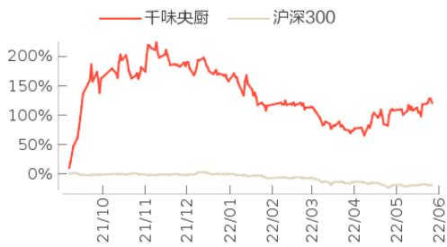

# 相关报告

# 证券分析师

谢宁铃 xieningling@orientsec.com.cn执业证书编号：S0860520070001

从品类属性出发，探讨速冻米面发展规 2022-05-13律：—速冻行业深度报告之二  
速冻风起，正当好时候：——从日本经验 2020-11-30看我国速冻行业发展

# 目录

公司简介：差异化定位，专为餐饮之选 5

业务：专注餐饮端速冻米面制品. 5治理：思念创始人李伟为实控人，高管团队多出自思念 .6经营：收入保持快速增长，盈利能力稳健

# 竞争优势：绑定大客户具备先发优势，大单品性价比突出，场景服务能力强10

战略：专注深耕餐饮，具备先发优势和战略定力. ..10  
产品：油炸类优势突出，基于场景化的扩品类能力强. ..13  
渠道：大客户灯塔效应提供背书，直营经销双管齐下. ..16

成长路径：大B小B双轮驱动，品类场景化延展. 18

大B 端：存量客户增长稳健，增量客户扩展空间大. .18  
小 B 端：加强渠道建设，复制大 B 端产品优势 .20  
扩品类：蒸煎饺、米糕有望成为新大单品 .22  
扩产能：募资加大产能投放，解决增长瓶颈. .22

盈利预测与投资建议. .24

盈利预测 .24   
投资建议 .25

风险提示.. .26

# 图表目录

图1：公司发展历程及重要事件. ……… ….图2：干味央厨主要产品及SKU数量（2020 年）…. ………………………………… ….5图3：公司供应的连锁品牌客户.. 5图4：公司营收及同比增速.. ……………………………… ….图5：公司分品类收入结构(2021 年) …………………………………… …….图6：公司按直营和经销渠道划分的收入构成…图7：公司按通用品和定制品划分的收入构成（2020年） …… …….6图8：公司股权结构（截至2022年3月31日） ….图9：公司主要高管人员履历信息.. 7图10：公司营收及同比增速（单位：亿元） …… …7图11：公司收入分季度构成. …… .图12：公司分品类收入情况（单位：亿元）…… …………… …图13：公司2021年主营业务营业成本构成. …………………… ……图14：公司整体毛利率情况. ……… ….8图 15：公分品类毛利率情况9图16：公司分渠道毛利率情况. ……… …图17：公司归母净利润及同比增速 …… .图18：公司期间费用率和净利率…… …… ….图19：干味/三全/安井/立高2021年营收规模（亿元）. …… ….1图20：干味/三全/安井/立高2018-2021年营收增速.. … 1图21：干味/三全/安井/立高2018-2021 年毛利率… …1图22：干味/三全/安井/立高2018-2021 年净利率… ………图23：公司2020年前五大直营客户销售情况 …………图 24：公司2017-2021年前五大直营客户收入规模及占比……11图25：百胜中国供应链管理体系. ……………………… .1图 26：针对大客户定制化生产所要求的能力特点. .1图27：公司2017-2020 年在售 SKU数量…… …… …3图28：公司分品类平均每SKU收入（2020年）. …… .1图29：公司分品类产品均价（元/kg） …图30：公司分品类产品均价同比变化幅度. … ………图31：公司销售额前十大产品情况（以 2019 年为基准）…. ……图32：公司前三大产品线收入及占总营收比重（单位：亿元）. …………图 33：干味央厨油条产品矩阵…… 15图34：公司油条产品覆盖诸多用餐场景.. …………

图35：公司主要研发项目  
图36：公司销售体系组织架构  
图37：公司直营渠道收入及同比增速(单位：亿元)  
图38：公司经销渠道收入及同比增速(单位：亿元)  
图39：公司经销商数量变化情况.  
图40：公司不同销售规模的经销商数量分布.  
图41：公司来自百胜中国及其关联方的收入和该收入与百胜中国总营收的比值  
图42：百胜中国营收及同比增速（单位：亿人民币） .. 19图43：肯德基中国门店数量及同比增速. .. 19图44：海底捞营收和门店数量情况.  
图45：公司其他现有门店数量超过1000 家的直营客户 ..19图46：公司来自华莱士的收入(单位：万元) .20图47：公司来自百胜之外其他直营客户的收入. ..20图48：公司向肯德基供应胡辣汤等新品... ….0图49：公司通过旗下品牌焙伦将产品延伸至咖啡茶饮场景.  
图 50：公司分区域收入构成(2020 年) ..21图51：公司销售人员数量（人） ..21图52：公司来自不同规模经销商的收入构成.  
图53：公司年销售额在100万元以上经销商情况 ..1图54：公司的蒸煎饺产品. .22图55：公司代表性的新式面点类产品. ..22图 56：公司现有产能及未来规划（自建产能，不含委托加工和租赁） .3图57：IPO募集资金的主要投向.. ..24图 58：新乡三期新建产能项目投资概算 .24

表1：盈利预测核心假设 .24  
表2：可比公司估值表.. .25

# 公司简介：差异化定位，专为餐饮之选

# 业务：专注餐饮端速冻米面制品

专注于 B 端，以米面制品为主。公司脱胎于思念食品餐饮业务，最早为肯德基研发并供应早餐油条，后独立成长为综合性的米面制品供应商。与三全、思念以C 端（家庭）米面制品为主不同，干味央厨从创立之初就专注于服务 B 端(餐饮)客户，而 B 端又可以分为以连锁餐饮为代表的大B 端和以小餐饮、团餐为主的小 B 端。其中大 B 端产品以按客户需求定制为主，且由公司直接供货，直营模式占公司 2021 年总收入的 4 成，而餐饮行业高度分散的特点又决定了小 B 端市场在总量上远大于连锁客户，以通用品为主的经销渠道在 2021 年为公司贡献了 6 成收入。分品类看，以油条为代表的油炸品是公司目前的主要品类，2021 年收入 6.6 亿元，收入占比 $52 \%$ ，烘焙类、蒸煮类产品各占 $20 \%$ 左右。公司在疫情前后均保持了稳健较快的增长速度，2020年在疫情之下亦实现正增长，2021 年随着疫后餐饮端需求复苏，实现营收 12.74 亿元，同比增长 $3 5 \%$ 。

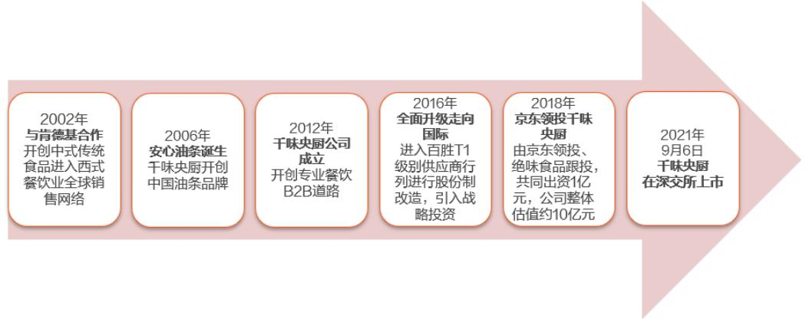  
图1：公司发展历程及重要事件  
数据来源：公司官网、公司公告、东方证券研究所

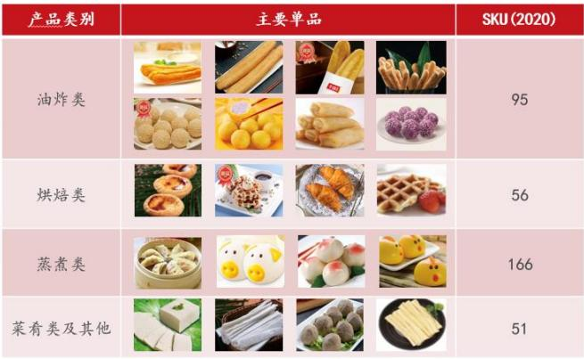  
图2：干味央厨主要产品及 SKU数量（2020 年）  
数据来源：公司官网、公司公告、东方证券研究所

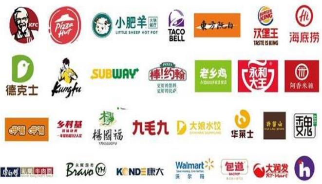  
图3：公司供应的连锁品牌客户  
数据来源：公司公告、东方证券研究所

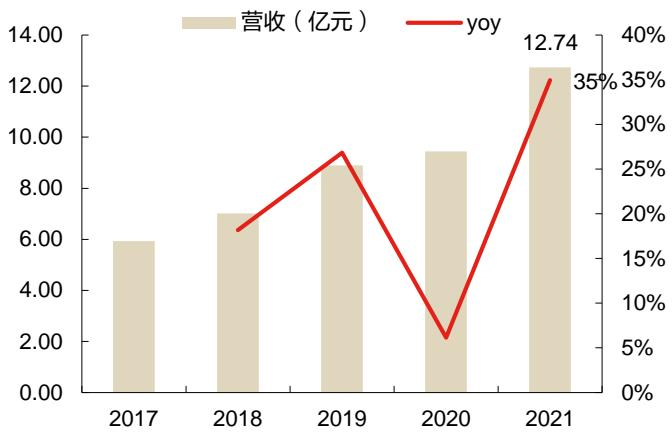  
图4：公司营收及同比增速

数据来源：公司公告、东方证券研究所数据来源：公司公告、东方证券研究所

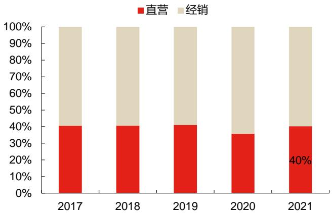  
图6：公司按直营和经销渠道划分的收入构成  
数据来源：公司公告、东方证券研究所

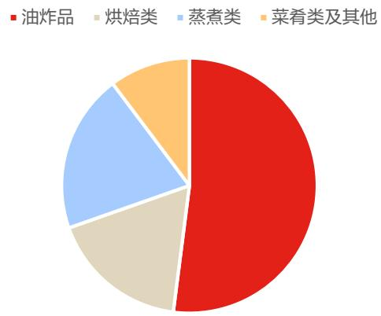  
图5：公司分品类收入结构（2021年）

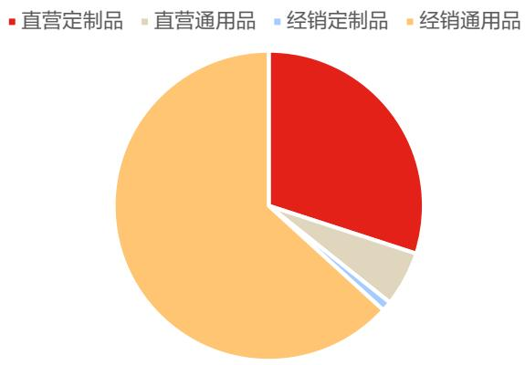  
图7：公司按通用品和定制品划分的收入构成（2020年）  
数据来源：公司公告、东方证券研究所

# 治理：思念创始人李伟为实控人，高管团队多出自思念

思念创始人掌舵，高管团队多来自思念深耕行业多年。公司控股股东、实际控制人为思念食品创始人李伟，通过共青城城之集间接持股约 $46 \%$ ，并已于2017 年将所持有思念股权(约占思念总股本 $70 \%$ ）以 3.8 亿元转让给思念管理层团队并退出董事会，以解决同业竞争问题。京东集团和绝味食品旗下投资平台网聚资本亦是公司股东。千味央厨的高管团队中大多具有思念食品工作经历，并在速冻行业深耕多年，并通过共青城凯立、前海新希望等间接持股。我们认为创始人解决股权问题、多位思念创业骨干相继加入，体现了公司专注于 B 端餐饮的战略定力。

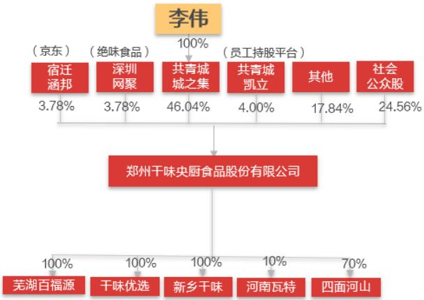  
图8：公司股权结构（截至2022年3月31日）  
数据来源：公司公告、东方证券研究所

图9：公司主要高管人员履历信息  

<table><tr><td>姓名</td><td>职务</td><td>入司 时间</td><td>职业履历</td></tr><tr><td>孙剑</td><td>董事长</td><td>2018年</td><td></td></tr><tr><td>白瑞</td><td>总经理</td><td>2012年</td><td>2004年加入郑州思念，曾结算部经理、</td></tr><tr><td>王植宾</td><td>则总经理</td><td>201年</td><td>2005年加入郑州思含部，曾任总成本会计、</td></tr><tr><td>徐振江</td><td>副总经理/ 董秘</td><td>2015年 9月</td><td>曾任宋河酒业金助理、洛阳杜总经得 业经验丰富</td></tr><tr><td>王向阳</td><td>监事会 主席</td><td>2012年 4月</td><td>历任郑州第五粮油食品公司生产管理车间 主任、河南秦科技有限司品研发部</td></tr></table>

数据来源：公司公告、东方证券研究所注：持股比例为上市后

# 经营：收入保持快速增长，盈利能力稳健

收入保持稳健较快增长，疫后复苏重回快速成长通道。千味央厨收入端保持较快增长，虽然 2020年由于疫情影响餐饮端需求，收入增长有所放缓，但 2021 年恢复迅速，实现收入12.74 亿元、同比增长 $3 5 \%$ ，2017-2021年CAGR达 $21 \%$ 。虽然公司主要品类的季节性并不强（油条vs 汤圆/粽子），但由于宴席、乡厨等部分消费场景多集中在春节等节庆前后，每年的 8 月份至次年 2 月份为速冻米面制品消费旺季，经销商集中备货之下，每年 4 季度收入占全年比重最高，下半年收入占比约为 $5 5 \mathrm { - } 6 0 \%$ 。随着未来公司产品品类、消费场景的多元化，全年收入构成有望更加均衡。

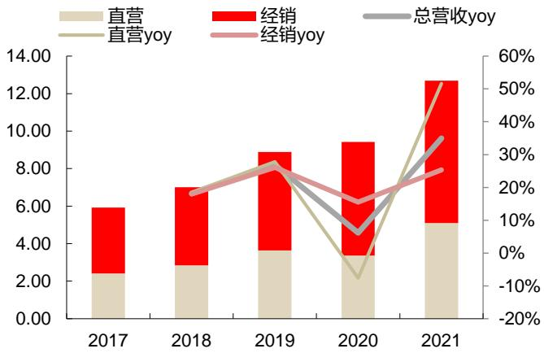  
图10：公司营收及同比增速（单位：亿元）  
数据来源：公司公告，东方证券研究所

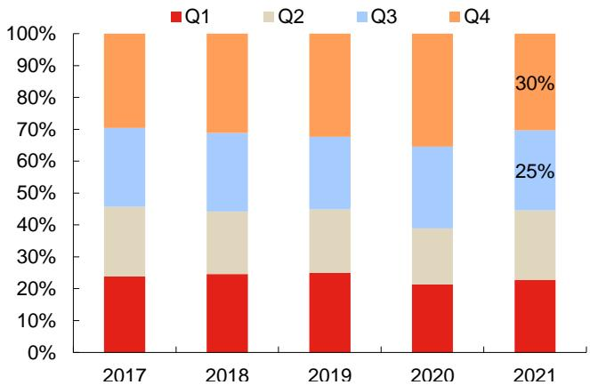  
图11：公司收入分季度构成  
数据来源：公司公告，东方证券研究所

从销售模式看，公司作为国内知名的餐饮速冻面米制品供应商，主要为餐饮企业、团餐、酒店、宴席提供定制化和标准化的速冻面米制品，公司主要采取直营和经销两种模式进行销售。公司对经销客户主要销售通用品，对直营客户主要销售定制品。2021 年公司直营渠道收入 5.11 亿元，同比增长 $52 \%$ ，经销渠道收入7.59 亿元，同比增长 $2 5 \%$ ，直营/经销收入占比分别为 $4 0 \% / 6 0 \%$ 。

公司产品以油炸类为主，烘焙蒸煮类呈结构性增长。收入品类构成上，2021 年公司油炸类、烘焙类、蒸煮 类、菜 肴类 及 其 他 分 别实 现 收 入 $6 . 6 0 / 2 . 2 3 / 2 . 5 6 / 1 . 3 0$ 亿元，收入占比$5 2 \% / 1 8 \% / 2 0 \% 1 0 \%$ ，油炸类保持第一大品类的核心地位，2020 年疫情期间仍保持 $6 \%$ 增速，2021 年同比增长 $2 7 \%$ ；蒸煮类2021 年增速 $3 9 \%$ ，主要受益于各类面点、卡通包带来的销量提升；烘焙类主要向肯德基提供蛋挞皮、华夫饼等，收入受疫情影响相对更大，2020/21 年分别增长 $. 5 \% / 1 9 \%$ ；菜肴类制品包括干页豆腐、火锅料等，2021 年受益于蒸煎饺放量同比大增 $162 \%$ o成本以粮油原材料成本为主，上游定价偏大宗。公司产品以米面、油脂、糖类等粮油原材料为主，粮油原材料性质偏大宗，价格波动与上游农业生产有关，因此成本有一定价格波动的压力。公司毛利率整体稳定，2021 年毛利率较 20 年小幅提高 $0 . 7 \mathsf { p c t }$ 至 $2 2 . 4 \%$ ，2020 年同比下降 2.8cpt 主要由于执行新收入准则将运输费由销售费用归入营业成本，剔除这部分因素后毛利率约为 $24 \%$ ,与2019 年基本持平。

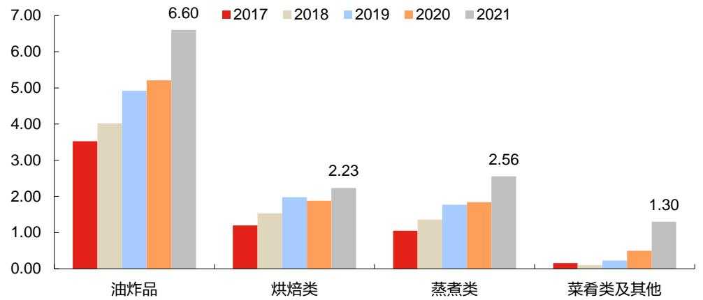  
图12：公司分品类收入情况（单位：亿元）  
数据来源：公司公告、东方证券研究所

分品类看，2021 年油炸类/烘焙类/蒸煮类/菜肴类毛利率分别为 $2 0 . 7 \% / 2 5 . 0 \% / 2 3 . 4 \% / 2 1 . 6 \%$ ，历史上油炸类产品毛利率稳定在 $20 \%$ 以上，烘焙类毛利率较高主要与烘焙类以直营客户为主有关。2021 年直营和经销的毛利率分别为 $2 3 . 1 \%$ 和 $2 1 . 4 \%$ ，分别同比下降0.1pct 和上升 $0 . 8 \mathsf { p c t }$ 由于直营模式主要供给大型连锁餐饮客户，双方合作程度深，公司提供全方面个性化需求的定制品，因此直营毛利率高于经销毛利率。在物流模式上，直营模式由公司组织运输并承担运费，而经销模式中由客户自提或委托代办运输，客户须自行承担运费，因此在 2020 年在实行新准则将运费计入成本时，直营毛利率小幅下降。

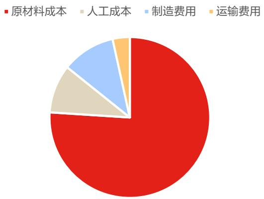  
图13：公司2021年主营业务营业成本构成  
数据来源：公司公告、东方证券研究所注：新准则下运费由销售费用计入成本

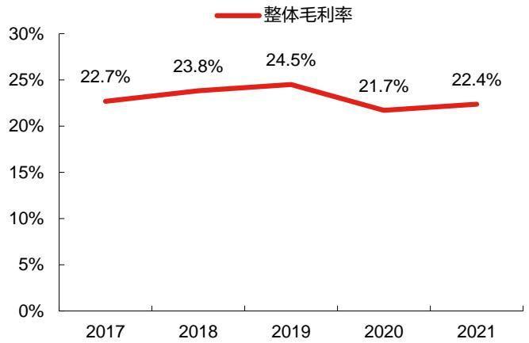  
图14：公司整体毛利率情况

数据来源：公司公告、东方证券研究所数据来源：公司公告、东方证券研究所数据来源：公司公告、东方证券研究所注：新准则下运费由销售费用计入成本净利润保持稳健较快增长，盈利能力稳定。公司 2017-2021 年归母净利润从 0.47 亿元增至 0.88亿元，CAGR为 $1 7 \%$ ，整体增长较为稳健。由于公司专注服务 B 端客户且直营客户体量大，因此销售费用主要包括职工薪酬，运输费用从 2020 年起计入营业成本，广告推广、促销费等 C 端相关的费用较少，故销售费用较低。2021年归母净利润 0.88 亿元同比增长 $16 \%$ ，增速低于收入主要由于 2020 年疫情期间政府补贴较多，2021 年扣非归母净利润 0.86 亿元同比增长 $4 7 \%$ ，快于收入增速。公司净利率保持稳定在 $7 \% - 8 \%$ ，2020年扣非净利率略有下降主要是受疫情影响，2021 年已有恢复。

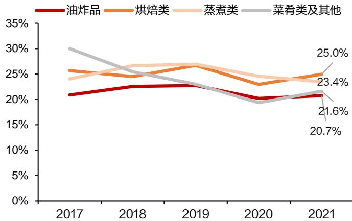  
图15：公司分品类毛利率情况

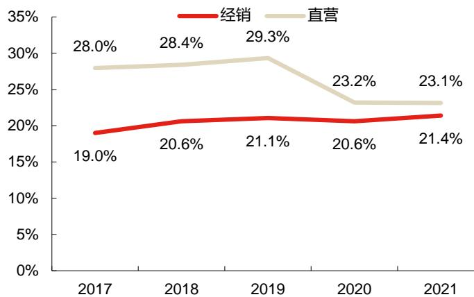  
图16：公司分渠道毛利率情况

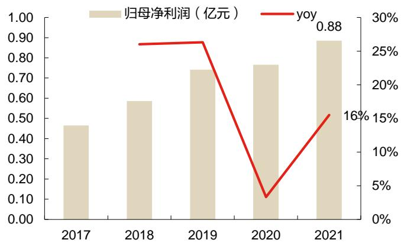  
图17：公司归母净利润及同比增速  
数据来源：公司公告、东方证券研究所

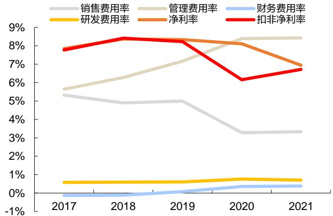  
图18：公司期间费用率和净利率  
数据来源：公司公告、东方证券研究所

横向对比看，公司虽然目前体量仍小，但收入增速快、净利率稳定。公司发展时间晚于三全安井，同时初期以直营客户定制生产为主，而三全以 C 端销售为主，安井以小B 端开放场景为主、BC兼顾，因此公司收入体量相对较小，但今年来受益于餐饮连锁化和工业化趋势，收入增速亦更高。公司毛利率低于同行主要是由于专注于 B 端渠道，与C 端的“高毛利高费用”的特征相比，B 端则是“低毛利低费用”，因此净利率在疫情前居于行业领先水平，同行公司2020 年净利率显著提升主要是 C 端需求受益于疫情，稳态情况下会有一定回归。考虑到公司目前体量尚小，未来规模效应带来的费用摊薄空间也较大。

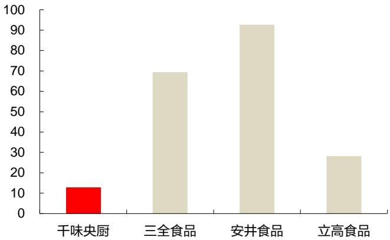  
图19：干味/三全/安井/立高2021年营收规模（亿元）

数据来源：公司公告、东方证券研究所数据来源：公司公告、东方证券研究所数据来源：公司公告、东方证券研究所

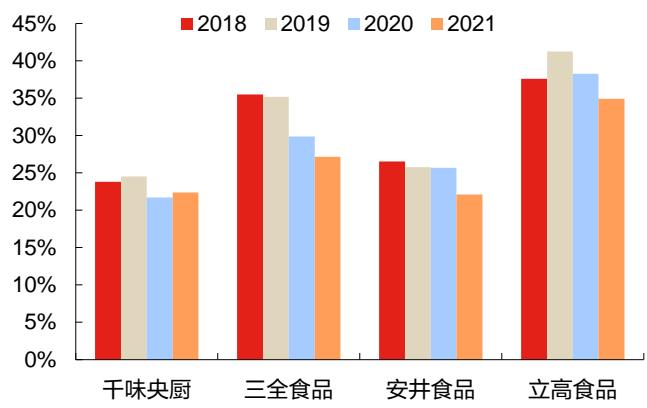  
图 21：干味/三全/安井/立高 2018-2021年毛利率

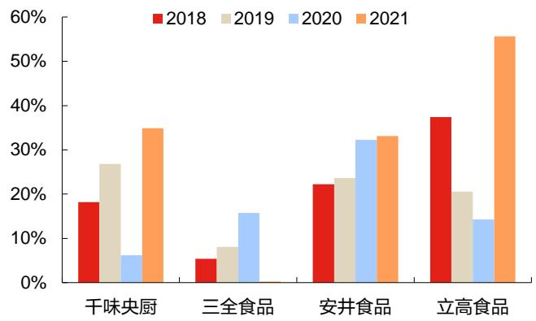  
图 20：干味/三全/安井/立高 2018-2021年营收增速

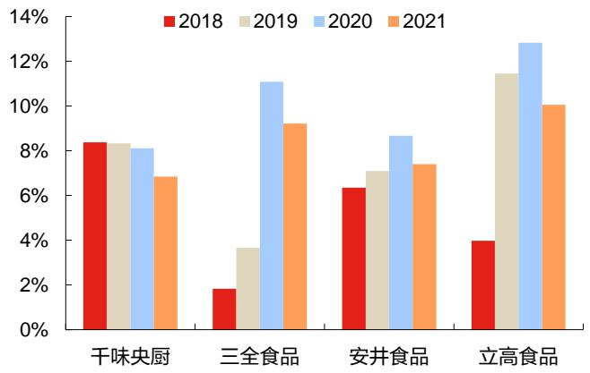  
图 22：干味/三全/安井/立高2018-2021年净利率  
数据来源：公司公告、东方证券研究所

# 竞争优势：绑定大客户具备先发优势，大单品性价比突出，场景服务能力强

# 战略：专注深耕餐饮，具备先发优势和战略定力

战略定位富有远见，顺应餐饮工业化趋势。在 C 端速冻米面发展较快、B 端市场尚未起势时，千味央厨便确立了专注餐饮的战略定位，同期三全、思念、湾仔码头等大型速冻米面企业的重心则在 C 端。近年来商超作为 C 端产品的主要销售渠道，越来越受到便利店、电商、社区团购等新兴零售业态的冲击，也给在商超渠道投入较大的速冻企业带来压力；干味央厨则由于始终专注餐饮端，没有历史包袱，在餐饮工业化浪潮来临时能够轻装上阵。

主要客户覆盖百胜中国、华莱土、海底捞、呷哺呷哺等大型餐饮连锁企业以及区域型餐饮客户等。在多年餐饮市场的持续深耕下，公司品牌信誉与知名度逐渐提升，与主要合作伙伴建立了稳定的合作关系。公司 2020 年前五大直营客户分别为百胜中国、华莱士、海底捞、真功夫、九毛九，合计贡献近 9 成的直营收入和 $31 \%$ 的总营收，2017-2021 年每年前五大直营客户占总收入比重稳中有降，主要由于新开拓客户、客户结构更多元化。

图 23：公司 2020 年前五大直营客户销售情况  

<table><tr><td>客户名称</td><td>相应品牌</td><td></td><td>占直收入</td><td>总收</td></tr><tr><td>百胜中国控股有限公司及其关联方</td><td>肯德、必胜</td><td>22,067</td><td>65.5%</td><td>23.4%</td></tr><tr><td>福建省华莱士食品股份有限公司及其关联方</td><td>华莱士</td><td>4,000</td><td>11.9%</td><td>4.2%</td></tr><tr><td>四川海之雁贸易有限公司及其关联方</td><td>海底捞</td><td>2087</td><td>6.2%</td><td>2.2%</td></tr><tr><td>东莞市补给舰供应链管理有限公司及其关联方</td><td>真功夫</td><td>665</td><td>2.0%</td><td>0.7%</td></tr><tr><td>佛山市麦点食品有限公司及其关联方</td><td>九毛九</td><td>583</td><td>1.7%</td><td>0.6%</td></tr><tr><td>合计</td><td></td><td>29,402</td><td>87.3%</td><td>31.1%</td></tr></table>

数据来源：公司公告，东方证券研究所注：2021 年报未披露具体客户，因此采用2020 年数据

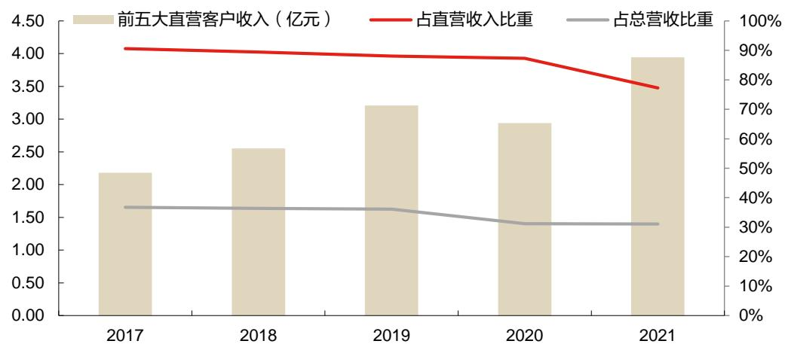  
图 24：公司2017-2021 年前五大直营客户收入规模及占比  
数据来源：公司公告，东方证券研究所 注：每年前五大客户有所变动，以当年为准

连锁餐饮大客户开发壁垒高、粘性强，千味央厨先发优势明显。供应链管理是大型连锁餐饮企业经营的重中之重，对供应商在产品品质、食品安全、服务能力要求天然更高。速冻米面制品又由于以下几个特点进一步提升了门槛：1）米面制品并不是中间食材，而是直接呈现给消费者的成品，产品品质直接影响餐饮品牌口碑；2）米面产品创新较多，大客户往往要求定制化生产，对厂家的研发、服务能力要求高；3）对于需要外购米面制品的大客户，米面制品往往是核心菜品的补充，占总成本比重小，价格敏感度低，更看重一揽子解决能力和品质稳定性。这些特点都会提升大客户选择速冻米面供应商的门槛，小厂家以价格优势切入的机会较小，即使进入供应链更多也是作为对干味央厨的补充。由于认证周期长、占总成本比重小，除非发生重大食品安全事故，餐饮大客户一般不会轻易更换米面制品供应商，公司的先发优势十分明显。

以百胜中国为例，百胜实行严格的新供应商准入机制，包括风险评估、资质审查、工厂准入审核等，标准高周期长。进入供应链体系后，百胜还会对供应商进行全面的绩效管理和定期检查，将供应商按评分高低分类为 T1-T4 级供应商，T1 级(即干味央厨所属的类别）为最佳供应商，将获得百胜奖励。除了严格的准入与定期审核机制外，百胜还会赋能供应商能力提升，包括传授食品安全与质量管理方法、技术培训、产品研发、生产过程管理等多方面，扶持优质供应商与百胜中国共同成长。

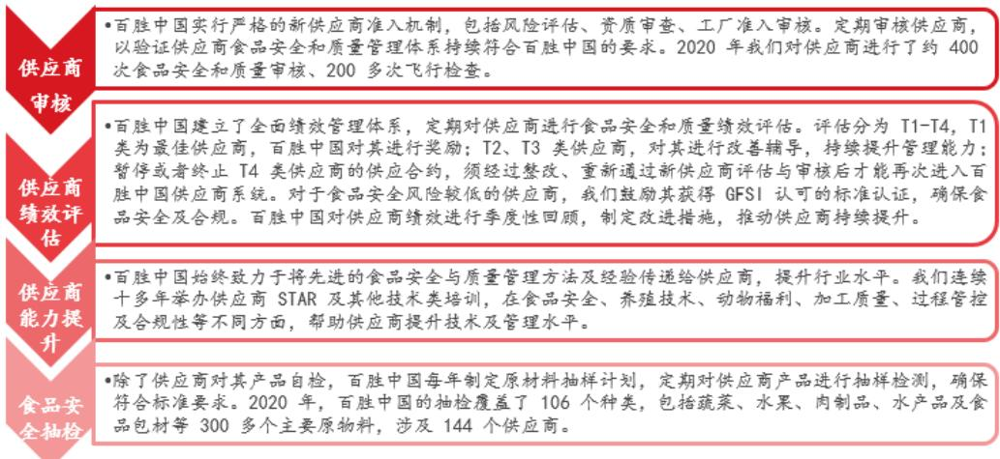  
图25：百胜中国供应链管理体系  
数据来源：百胜中国官网，东方证券研究所

大 B 端需要的是一揽子解决方案而不仅是产品生产，对速冻企业的能力要求不同于 C 端。大客户所要求的定制生产模式具有独特的特点，在营销、研发、采购、生产和管理等方面对速冻企业能力的要求不同，需要的不只是产品本身，而是从菜单设计、产品开发、产品销售到技术支持、干线物流运输以及后续服务咨询等在内的整体解决方案。千味央厨在多年专注B 端的发展过程中，建立了个性化、贴近客户的营销系统，技术能力强大、反应快速的研发系统，与供应商密切协作、及时灵活的采购系统，多功能、灵活的生产系统，适应客户严格标准、具有包容性的质量管理系统，对外与客户及时沟通、对内与各部门及时协调的管理系统。公司还会与餐饮客户定期研讨产品升级方向，调整供应产品的配方、口感、包装等要素，共同讨论解决方案及新品提案，同时对产品的后续加工条件、餐饮企业的后厨布局设计提供要求与建议。

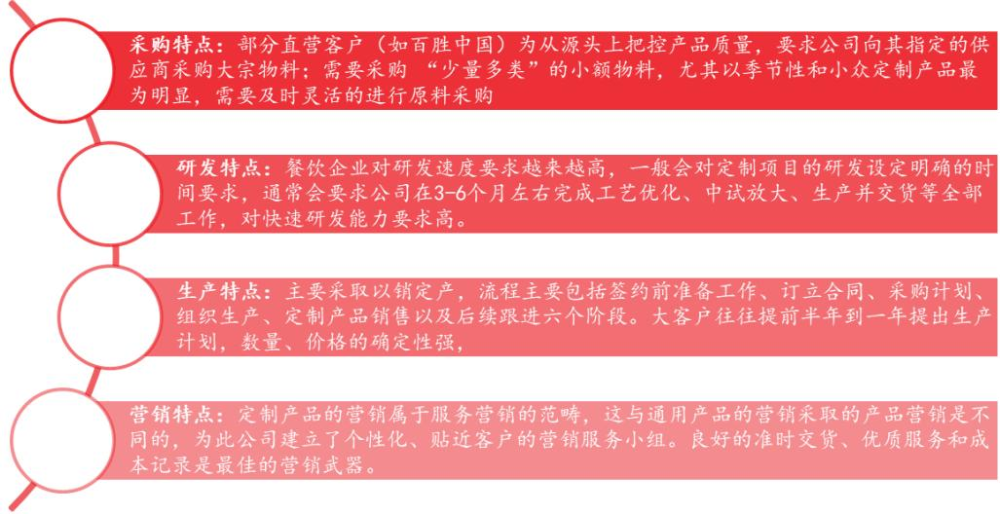  
图 26：针对大客户定制化生产所要求的能力特点  
数据来源：公司公告，东方证券研究所

与大客户共同成长，也有利于打磨公司产品研发与生产管理能力。百胜、海底捞等头部连锁客户不仅能够给公司贡献持续稳定的收入，他们作为餐饮业领军企业，对产品品质、新品创意、质量稳定性、食品安全等方面的要求都处于领先地位，公司在进行定制化生产和后续服务过程中能够得到高水平的指导反馈，从而不断迭代产品和供应链，服务大 B 客户能够使公司的学习曲线较小B 端和C 端更为陡峭。定制生产本身是一种相互支持和相互依赖的经营模式，可以控制运营成本，强化公司的业务重点和核心竞争力，分散风险和获取资源，塑造公司品牌和商誉，掌握速冻面米新产品研发的最新进展，积蓄和提升公司的研发实力。同时，可以利用客户的产品市场拓展本公司的产品市场，实现了客户利益与资源的共享。

# 产品：油炸类优势突出，基于场景化的扩品类能力强

油炸类产品为优势品类，烘焙、蒸煮种类增长强劲，四大产品线齐头并进。公司早期以油条、芝麻球为核心的油炸类产品切入餐饮供应链，多年的经营、场景化研发使公司在这一细分领域拥有市场领先地位，2021 年油炸类/烘焙类/蒸煮类/菜肴类分别实现收入 $6 . 6 0 / 2 . 2 3 / 2 . 5 6 / 1 . 3 0$ 亿元，2017-2021年CAGR分别为 $+ 1 7 \% / + 1 7 \% / + 2 5 \% / + 6 9 \%$ 。公司目前已经形成油条类、油炸糯米类、蒸煎饺类、烘焙类四大优势产品线。这种产品线优势体现在从研发、生产、质控到销售全过程。从研发端看，公司主要研发资源向四大优势产品倾斜，在产品上不断推陈出新，以新品引领市场发展；从生产端看，公司四大优势产品线都有生产规模优势，生产过程中能够降本增效；从质控端看，公司质量控制体系较为完善，在产品质量上具有较强的优势；从销售端看，四大产品线产品具有较高的市场占有率和美誉度。

专注 B 端后厨研发，不断适应市场推陈出新保持产品活力。公司不断推出餐饮渠道适销产品，围绕场景进行新品研发，提升渠道品类叠加效应。截至 2020 年末公司拥有共计 368 个 SKU，其中油炸类/烘焙类/蒸煮类/菜肴类分别有 95/56/166/51 个 SKU。

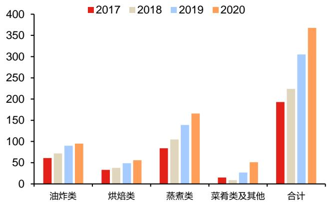  
图27：公司2017-2020年在售SKU数量  
数据来源：公司公告，东方证券研究所

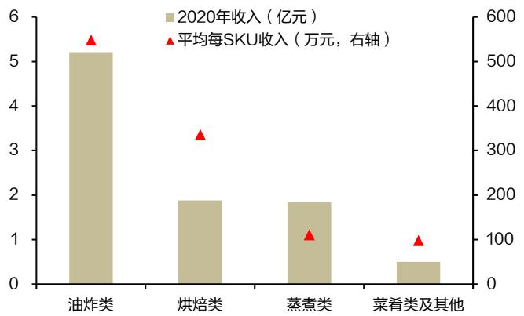  
图28：公司分品类平均每SKU收入（2020 年）  
数据来源：公司公告，东方证券研究所

产品价格整体稳定，短期变动与单品结构有关。公司油炸类产品平均价格稳中有升，蒸煮类产品价格保持平稳；而烘焙类产品价格在 2017-2019 年均价上涨主因向百胜新增供应华夫面团、可颂面团等高单价 SKU，而 2020 年烘焙类产品均价较 2019 年下降 $1 4 . 5 \%$ ，主因百胜巧克力华夫面团、玫瑰酥饼等高单价的 SKU 在 2020 年没有销售。整体来看公司存量产品均价较为稳定，品类价格波动主要受单品结构影响。

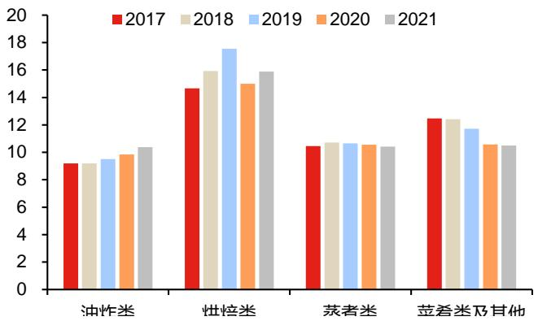  
图29：公司分品类产品均价（元/kg）

数据来源：公司公告，东方证券研究所

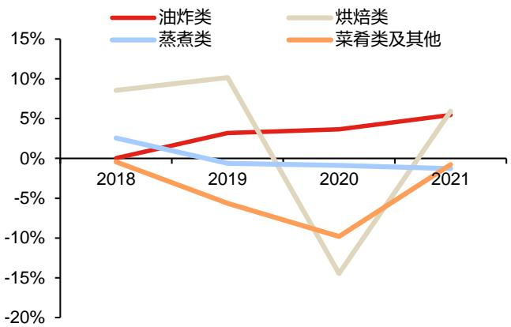  
图30：公司分品类产品均价同比变化幅度  
数据来源：公司公告，东方证券研究所

核心大单品油条竞争力突出，并与多场景结合研发新品。油条的制作工序较其他蒸煮类面点更繁琐，炸油条是早点师傅的一门传统手艺，酥脆的口感是评价品质优劣的重要标准，导致油条是一个“速冻化”较晚的品类。公司作为中国速冻油条品牌的开创者，通过多年工艺改进解决了油条工业化生产的问题，在细分品类上保持领先优势，主要体现为：1）单品销量行业领先，生产自动化和规模效应显著，奠定成本与性价比优势；2）产品质量过硬，品类齐全能够满足多个场景需求；3）速冻油条开创者，已经建立起“品牌 $\eqcirc$ 品类”的认知。凭借产品优势，公司依靠香脆油条、安心大油条等品类覆盖早餐、主食等场景，替代手工油条，同时基于产品能力持续推出适应其他就餐场景的新品。

图31：公司销售额前十大产品情况（以2019年为基准）  

<table><tr><td></td><td colspan="3">2020年度</td><td colspan="3">2019年度</td><td colspan="3">2018年度</td><td colspan="2">2017年度</td></tr><tr><td>项目</td><td>销售额</td><td>单价</td><td>变动幅度</td><td>销售额</td><td>单价</td><td>变动幅度</td><td>销售额</td><td>单价</td><td>变动幅度</td><td>销售额</td><td>单价</td></tr><tr><td>1*18*16蛋挞皮</td><td>8664</td><td>14.7</td><td>1.5%</td><td>9107</td><td>14.5</td><td>1.3%</td><td>7953</td><td>14.3</td><td>1.9%</td><td>7097</td><td>14.0</td></tr><tr><td>千味260g芝麻球</td><td>9831</td><td>8.0</td><td>-0.1%</td><td>9034</td><td>8.0</td><td>2.2%</td><td>8955</td><td>7.8</td><td>0.3%</td><td>8539</td><td>7.8</td></tr><tr><td>KFC冷冻油条（60g)</td><td>6503</td><td>11.8</td><td>0.7%</td><td>6815</td><td>11.8</td><td>0.5%</td><td>4498</td><td>11.7</td><td></td><td></td><td></td></tr><tr><td>千味400g香芋地瓜丸</td><td>5272</td><td>8.6</td><td>4.3%</td><td>5015</td><td>8.2</td><td>0.1%</td><td>4638</td><td>8.2</td><td></td><td></td><td></td></tr><tr><td>千味450g香脆油条</td><td>4460</td><td>10.5</td><td>1.2%</td><td>4345</td><td>10.3</td><td>1.0%</td><td>3931</td><td>10.2</td><td>-2.4%</td><td>3634</td><td>10.5</td></tr><tr><td>百胜原味冷冻华夫面团</td><td>1730</td><td>40.6</td><td>-4.1%</td><td>2805</td><td>42.4</td><td>0.1%</td><td>1196</td><td>42.4</td><td></td><td></td><td></td></tr><tr><td>千味360g卡通猪猪包</td><td>2748</td><td>14.8</td><td>1.1%</td><td>2672</td><td>14.7</td><td>2.2%</td><td>1850</td><td>14.3</td><td>-1.3%</td><td>615</td><td>14.5</td></tr><tr><td>千味1200g安心大油条</td><td>2611</td><td>8.8</td><td>5.5%</td><td>1963</td><td>8.3</td><td>-3.9%</td><td>927</td><td>8.7</td><td></td><td></td><td></td></tr><tr><td>千味300克脆皮香蕉</td><td>1515</td><td>9.5</td><td>0.5%</td><td>1757</td><td>9.5</td><td>2.6%</td><td>1866</td><td>9.2</td><td>-0.1%</td><td>2137</td><td>9.2</td></tr><tr><td>百360g蛋芯油条</td><td></td><td></td><td></td><td>1629</td><td>16.47</td><td></td><td></td><td></td><td></td><td>22022</td><td></td></tr><tr><td>合计</td><td colspan="2">43335</td><td colspan="2">45142</td><td colspan="2"></td><td colspan="2">35814</td><td colspan="2"></td><td></td></tr></table>

数据来源：公司公告，东方证券研究所注：单价为元/kg

大单品战略成效显著，未来有望继续涌现多个亿量级产品线。2021 年公司围绕打造核心大单品开展业务，在保持油条单品优势的基础上，又开始培育和打造其他大单品，前三大产品线油条/蒸煎饺/面点 2021 年收入分别为 $3 . 5 1 / 1 . 3 5 / 1 . 2 1$ 亿元，分别同比 $+ 3 5 \% / + 1 6 8 \% / + 3 0 \%$ 。在产品策略上，公司未来将继续围绕油条、油炸糯米类、蒸煎饺、烘焙类四大优势产品线，稳固自身在油条产品上的领先地位，同时加大其他大单品的开发和推广力度，有望在未来 3-5 年内形成 3-5 个亿元核心大单品。

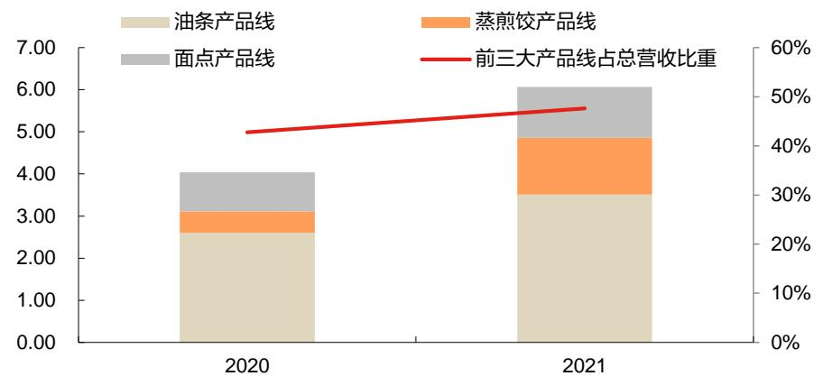  
图32：公司前三大产品线收入及占总营收比重（单位：亿元）  
数据来源：公司公告，东方证券研究所

前端紧抓需求趋势，后端模拟餐厅厨房研发，基于场景化的扩品类能力强。公司作为大型速冻米面企业中唯一专注餐饮的玩家，一大优势在于对餐饮终端需求的理解力与敏感度，这种。多年来不断推出差异化的餐饮渠道产品，持续创新与开发产品类别，拥有适合西式快餐、中式快餐、乡厨等不同场景需求的300 余种速冻面米制品单品。纵向上，公司建立“模拟餐厅后厨”的研发实验室，组建了专业的研发团队，模拟餐饮后厨工艺产品研发及制作，为顾客提供极佳就餐体验。横向上，公司对现有产品进行场景化深入研究，以油条为例，公司从 2012年开始进行油条细分场景下的市场研究，细分出火锅、快餐、自助餐、宴席、早餐、外卖六大场景，并针对性推出茴香小油条、麻辣烫小油条、火锅涮煮油条、外卖专用油条等多款创新性产品。

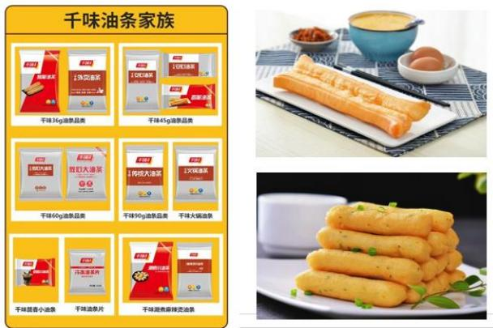  
图33：干味央厨油条产品矩阵

数据来源：公司官网，东方证券研究所

图34：公司油条产品覆盖诸多用餐场景  

<table><tr><td>细分场景</td><td>主要产品</td></tr><tr><td>早餐主食</td><td>安心（大）油条、油条3代、葱香小油条、 油条片（配饭团/粥）、油条面坯</td></tr><tr><td>正餐/配菜/ 小吃</td><td>香脆油条、精品茴香小油条</td></tr><tr><td>火锅麻辣烫</td><td>火锅油条、涮煮小油条、麻辣烫小油条、 精品茴香小油条</td></tr><tr><td>休闲餐</td><td>安心油条、精品茴香小油条</td></tr></table>

数据来源：公司官网，东方证券研究所

下午茶正处蓝海阶段，焙伦打造星级茶点。当前下午茶市场正处于需求大于供给的蓝海阶段，在新一线城市中，商户数量、消费订单数增长最快。公司旗下烘焙品牌焙伦对下午茶场景进行深入研究，打磨高级出餐品质，提供可颂、蛋挞、曲奇、华夫四大系列产品，以实际行动践行品牌使命——打造烘焙半成品领域的专业服务商。

研发精益求精，场景经验和专利技术积累丰富。公司研发中心先后取得了无铝安心油条、油条的工业化生产、芝麻球的工业化生产等多项具有自主知识产权的科研成果和核心技术，开发上市的各类速冻面米产品 300 余个，产品开发及创新推动了公司规模的快速成长及转型。尤其在安心油条、卡通包、手工挞皮等方面，引领了行业发展方向。截至2021 年末，公司共有研发、技术人员 42 名，拥有专利 46 项(2020 年末)，新口味酥饼、冷冻三明治面团、注心油条、麻酱烧饼、基础面点的工业化生产研究等项目处于研发阶段。公司 2021 年研发费用为 899 万元，研发费用率为 $0 . 7 1 \%$ ，我们认为对于餐饮速冻食品而言，表观的研发费用投入只是一方面，更多还是在于人才团队对客户需求、餐饮场景日积月累的理解。上市后公司计划投资 0.6 亿元用于改建研发中心和总部基地，加大人才引进与设备购买力度，有望进一步提升产品研发实力。

图35：公司主要研发项目  

<table><tr><td>主要发</td><td>项目目的</td><td>进展</td><td>拟达到目标</td><td>预计对公司未来发展的影响</td></tr><tr><td>油条类</td><td>实现全自动工业化油条生产线， 提升产品品质，增加利润，提 高产品竞争力</td><td>试验阶段</td><td>从原料到包装整体成本精进。化生产进行技术研究，保持行业</td><td>作为主力品种，继续对油条工业 领先地位。</td></tr><tr><td>油炸制品</td><td></td><td>中试阶段</td><td></td><td>自富品化新型的生产方式</td></tr><tr><td>烘焙类</td><td>富现有品线，提升产</td><td>试产阶段</td><td>多品类持异员类更加</td><td>烘焙类预烤产品，进行技术升级 能低成本 啡茶饮类门店的发展趋势。</td></tr><tr><td>蒸煎饺类</td><td>实现蒸煎饺市场占有率的突破</td><td>生产阶段</td><td>味扩展到7个以上，成本精丰产品品类，自动化、规模化</td><td></td></tr></table>

数据来源：公司公告，东方证券研究所

# 渠道：大客户灯塔效应提供背书，直营经销双管齐下

公司的销售体系分为直营与经销两大部分。营销中心负责市场营销业务，进行市场开拓、销售业务、品牌推广及产品管理等工作，由营销副总经理负责管理。营销中心下设重客部、经销商客户部、渠道拓展部、行销部及产品管理部等，其中重客部主要负责为百胜中国、华莱士、九毛九、真功夫、海底捞等直营客户提供服务；经销商客户部主要服务于区域型餐饮客户，依托经销商进行销售。经销商客户部在全国设大区经理、省区经理，大区经理、省区经理常驻相应的销售区域，负责对所属区域的运营管理，统筹布局本区域的销售规划，包括新市场的开拓、原有市场的维护、经销商管理和售后服务等。

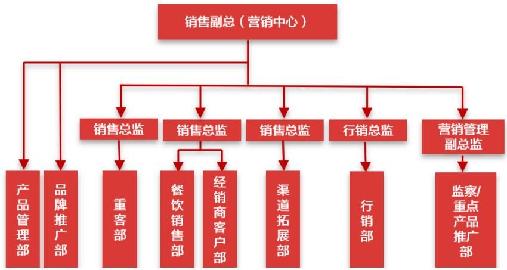  
图36：公司销售体系组织架构  
数据来源：公司公告，东方证券研究所

大客户具有灯塔效应，在大客户背书之下，公司开拓其他连锁餐饮客户属于降维打击，也有利于向开发小终端树立品牌效应。如我们上文所述，直营客户对速冻企业的综合服务能力要求高，百胜中国、海底捞作为餐饮业供应链管理的标杆企业，其对公司研发、生产、服务能力的认可对于其他二线品牌、区域连锁客户具有示范效应。虽然小B 端主要看重产品性价比，但在产品品质和价格接近时，肯德基、海底捞的品牌背书也会对经销商开发终端餐饮客户、做试吃推广提供帮助。

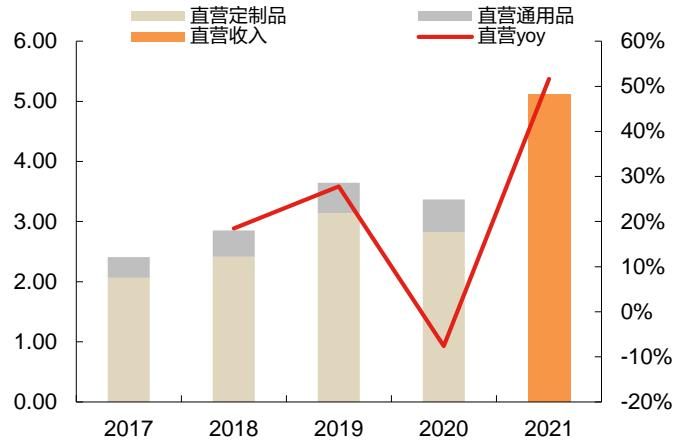  
图37：公司直营渠道收入及同比增速（单位：亿元）  
数据来源：公司公告、东方证券研究所

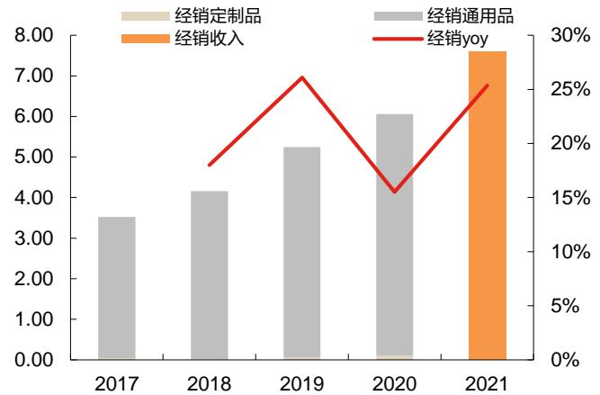  
图38：公司经销渠道收入及同比增速（单位：亿元）  
数据来源：公司公告、东方证券研究所

通过经销渠道辐射广大小B 终端，经销商主要面向流通和餐饮。中国各地都有规模庞大的中小餐饮企业和乡厨队伍，大多数不是公司化运营，但主导了中国广大的农村和乡镇的红白喜事宴席，产品的需求量大。但其产品研发、物流配送、财务结算体系并不支撑和该类型的餐饮企业、乡厨的直接合作。这类餐饮企业或者乡厨有固定的原料和半成品供应商，而这些供应商大多在海鲜批发市场、调味品、冻品批发市场，因此公司过去合作的经销商更多是面向流通环节。同时随着经销商之间竞争加剧、餐饮供应链的发展，越来越多经销商从“坐商”向“行商”转型，主动出击开发餐饮终端，直接为餐饮企业上门供货。

经销商数量稳步增长，增加中小型经销商助力渠道下沉。公司早期在大客户服务积累的优势使得公司在面对小B 市场时，凭借过往的产品和服务口碑，能低价、快速地打入渠道，覆盖小 B 市场。公司总体经销商渠道较为精简，以面向流通渠道为主。公司 2020 年末签约经销商 907 个，同比净增长 159 个，主要由于 10-100 万元规模的小经销商增加 141 个，数量增速较快，充分说明公司在全国市场渗透率的提高。公司经销商的下游主要仍是流通渠道，直接面向终端小B 餐饮客户的较少。销售额 100 万以上的经销商整体粘性较强，复购率较高，因此数量较稳定、忠诚度高，数量从 2017 年的 96 家上升至2020 年的 130 家，占经销收入比例稳定在 $7 0 \% - 7 5 \%$ 左右，是贡献收入主力。

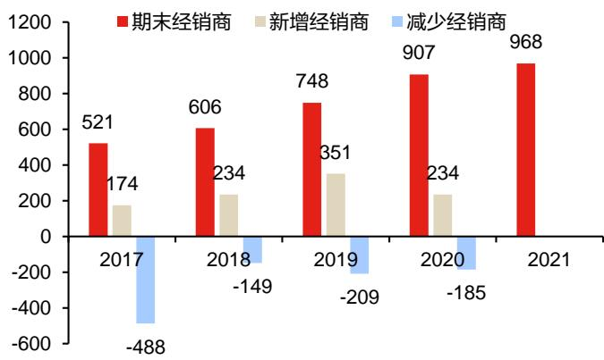  
图39：公司经销商数量变化情况  
数据来源：公司公告，东方证券研究所

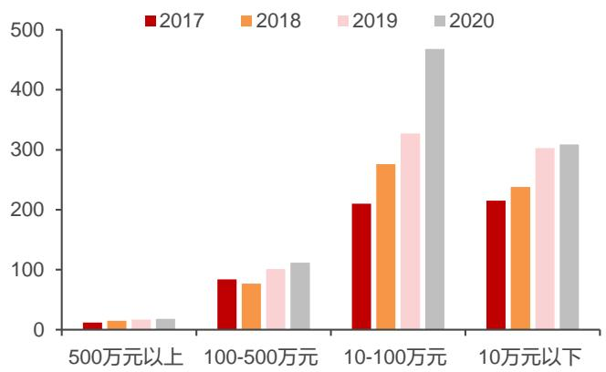  
图40：公司不同销售规模的经销商数量分布  
数据来源：公司公告，东方证券研究所

# 成长路径：大B小B双轮驱动，品类场景化延展

# 大B端：存量客户增长稳健，增量客户扩展空间大

跟随自然扩张 $^ { \ast }$ 品类创新，百胜体系有望保持稳健增长。现有直营大客户是公司的基础，多年合作让公司对客户需求的把握更准确，利于深入合作以加强营收增长。一方面，直营大客户自身规模保持稳定增长。百胜中国的门店数从 2016 年的 $7 5 0 0 +$ 家增至2021年底的11788家，CAGR为$9 . 5 \%$ ，其中肯德基门店数量从 16 年底的 5224 家增长到 21 年底已达 8168 家，5 年 CAGR 为$9 . 4 \%$ ；总营收规模从 16 年 468 亿元增至 21 年 628 亿元，超过疫情前 2019 年的 612 亿元。与此同时，公司来自百胜体系的收入也从 17 年的 1.78 亿元增长到 21 年的 2.45 亿元，20 年受疫情影响为 2.21 亿元，若以该收入与百胜中国总营收的比值衡量千味央厨在百胜供应链的渗透程度，也呈现整体稳定。产品方面，公司由最早供应油条、蛋挞皮，到现在延伸至烙饼、冷冻面团、华夫饼等多项产品，持续扩品类挖掘大客户的潜力和供应链份额。

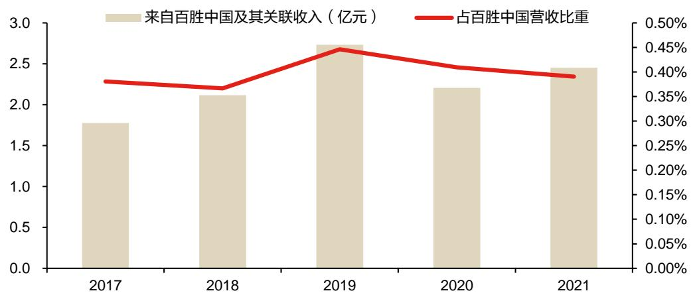  
图 41：公司来自百胜中国及其关联方的收入和该收入与百胜中国总营收的比值  
数据来源：公司公告，东方证券研究所

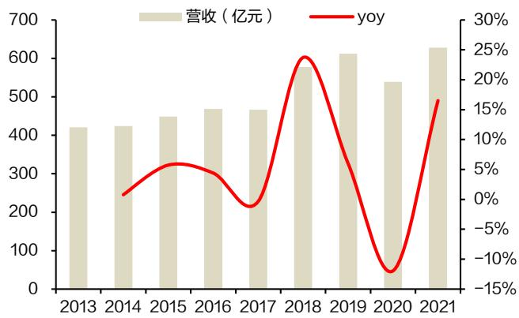  
图42：百胜中国营收及同比增速（单位：亿人民币）  
数据来源：公司公告，东方证券研究所

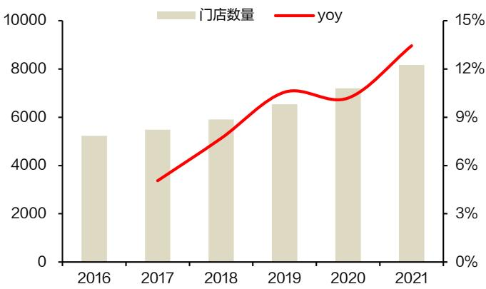  
图43：肯德基中国门店数量及同比增速  
数据来源：公司公告，东方证券研究所

品类延展进行时，其他直营客户增长潜力大。除了百胜中国外，公司其他大客户如海底捞、九毛九、杨国福等连锁餐饮企业较肯德基这样的成熟品牌，整体上开店空间更大、增长更快，客户扩张带来的自然增速更高；同时公司成为百胜中国供应商已有十余年，各方面合作更为成熟，而其他部分大客户近两三年才开始与千味合作，未来随着公司产能和团队扩张，速冻米面在中餐的应用场景更多，品类延展和渗透的空间较大。2020 年疫情之下，公司来自百胜之外的直营客户收入逆势增长，充分显示了其他客户增长潜力，以华莱士为例，公司来自该客户收入由2016 年的1344 万元增长到 2020 年的 4000 万元。我们认为在百胜体系保持稳健增长的同时，其他大客户有望持续快速放量。

随着我国餐饮工业化浪潮加速，未来新客户开发空间可期。中国地大物博，各地饮食习惯不同，风格不同，也诞生了很多在区域市场特色鲜明的餐饮品牌，如老乡鸡、乡村基等。这些餐饮连锁企业具有典型的区域饮食风格特征，在某些区域开店比较密集，部分省份或者区域店面数量达到几百家甚至上千家，且已经初步建立了食材供应链。公司下一步将加大开发区域性连锁餐饮企业客户，有望在未来 3-5 年之内开发一批合作紧密、业务量大的餐饮连锁新秀客户，为大 B 端业务发展带来源源不断的动力。

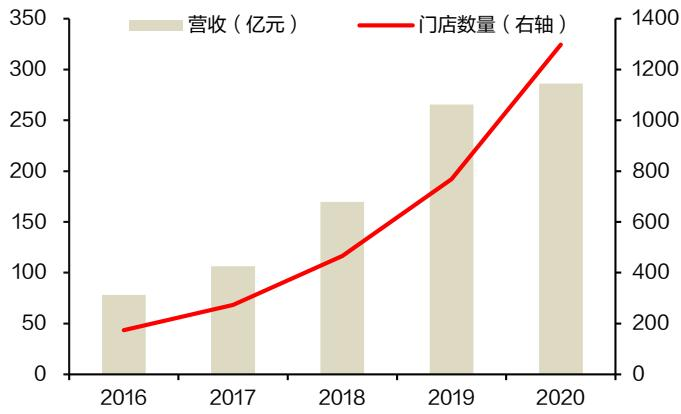  
图44：海底捞营收和门店数量情况  
数据来源：公司公告，东方证券研究所

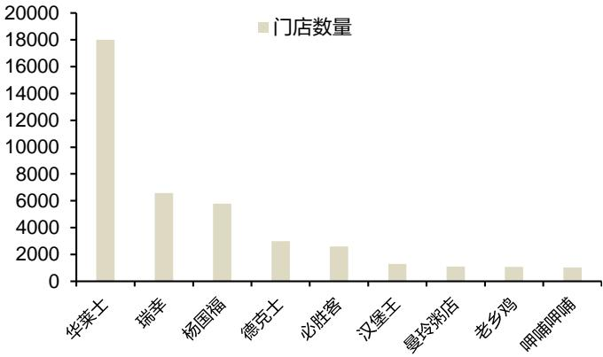  
图45：公司其他在国内拥有超1000家门店的客户（部分）  
数据来源：公司公告，腾讯新闻，百度新闻，东方证券研究所注：华莱士为截至 21H1，瑞幸为截至22Q1，德克士、杨国福为截至21Q3，汉堡王为截至20 年6 月，其余为截至21 年底

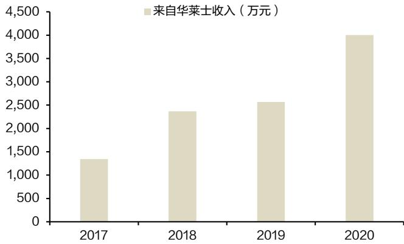  
图46：公司来自华莱士的收入（单位：万元）

数据来源：公司公告，东方证券研究所数据来源：公司官方公众号，东方证券研究所数据来源：公司公告，东方证券研究所

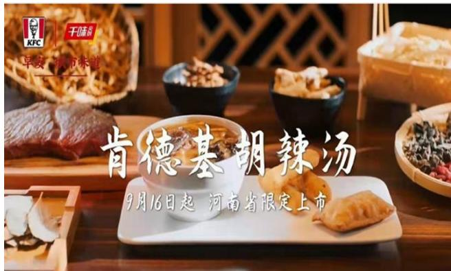  
图48：公司向肯德基供应胡辣汤等新品

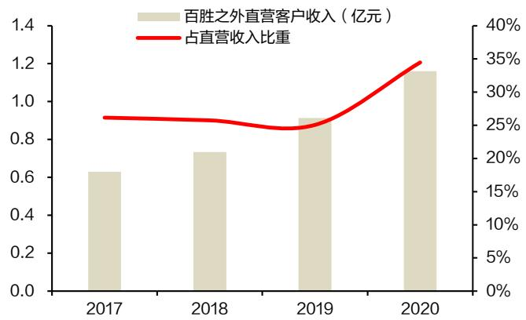  
图47：公司来自百胜之外其他直营客户的收入

  
图49：公司通过旗下品牌焙伦将产品延伸至咖啡茶饮场景  
数据来源：公司官方公众号，东方证券研究所

# 小B端：加强渠道建设，复制大B 端产品优势

聚焦直营大客户的同时，经销渠道也有较大发展空间。干味发轫于百胜供应商，直营定制生产一直以来都是公司的战略重心，现有直营客户是公司的立身之本，但随着公司规模扩大和餐饮端米面制品需求的加速释放，公司有资源也有动力加强经销渠道建设。虽然公司销售人员较少主要是服务大客户的商业模式决定，但随着经销收入规模的快速增长，横向比较其他以B 端为主的食品调味品企业，公司的销售队伍也确实有较大的壮大空间。从 2020 年下半年，公司已经开始加大销售人员的配置，2020 年销售人员较 19 年增加 88 人，截至 2021 年末公司销售人员为 223 人，同比 2020 年增长 $2 7 \%$ 。经销商更多需要销售人员定期拜访维护、指导，销售团队逐渐壮大有望保障渠道策略的执行力。

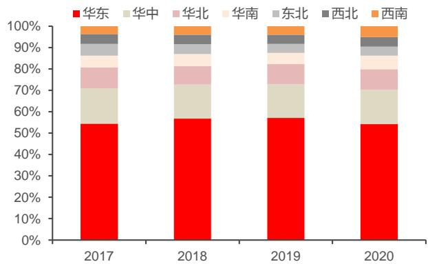  
图50：公司分区域收入构成（2020年）  
数据来源：公司公告，东方证券研究所 注：公司前两大直营客户归属华东

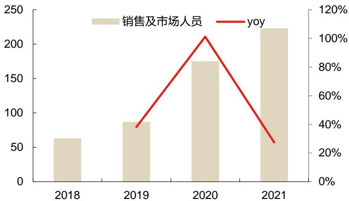  
图51：公司销售人员数量（人）  
数据来源：公司公告，东方证券研究所

传统优势市场之外，华北、华南等区域有较大渗透空间。从区域上看，华东地区是公司主要销售地区，2020年营收占比高达 $54 \%$ （公司前两大直营客户必胜上海和华莱士归属华东地区，占公司总收入近3 成），其次为华中地区占比 $16 \%$ ；华南、华北收入占比较低，但人口密集、且有面点或米面制品饮食传统，终端需求同样旺盛，未来随着公司在当地市场经销商布局和管理逐渐完善，具备较大潜力。

经销渠道建设坚持聚焦大客户深度服务，重点扶持头部经销商开发餐饮终端。销售额 100 万元以上的经销商贡献了公司经销渠道 7 成收入，这些头部经销商自身实力过硬、对公司的忠诚度也更高，流通批发和餐饮环节的优质经销商资源比较稀缺，公司的经销渠道也还处于建设完善期，聚焦优质经销商共同成长，无论从卡位还是投入产出比上都是更有效率的选择。因此公司未来将优先增强对头部经销商的服务，一方面与经销商形成厂商联合项目制共同体，确定共同愿景，制定短期的阶段性目标，给予经销商客户渠道开发的白皮书指引，年度不间断推进客户开发工作的落地；另一方面，公司业务和市场人员带领经销商业务团队，开发二批和终端网络，通过开发早餐、团餐等渠道，提高产品铺货率，带动销量提升，并提高经销商团队的业务能力，帮助经销商组织核心二批和终端客户产品品鉴会；此外，协助经销商提升内部管理水平，帮助经销商制定销售目标分解计划，协助经销商制定考核方案，规划过程管理，提高组织力，充分调动经销商团队成员的积极性。2021 年占比前 20 名经销商销售额为 2.06 亿，同比增长 $50 \%$ ，显著高于经销渠道整体$2 5 \%$ 的增速，加大对核心经销商培育和支持的效果初步显现。

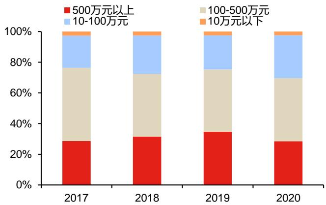  
图52：公司来自不同规模经销商的收入构成  
数据来源：公司公告，东方证券研究所

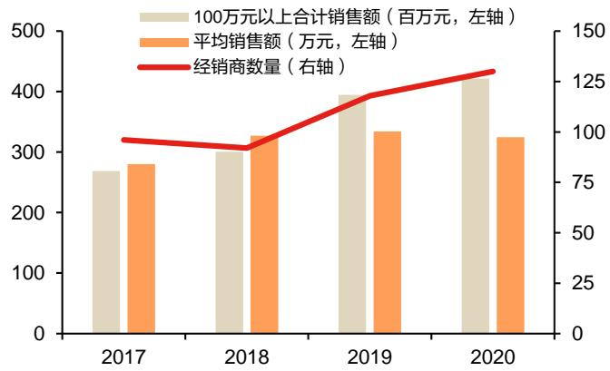  
图53：公司年销售额在100 万元以上经销商情况

数据来源：公司公告，东方证券研究所

# 扩品类：蒸煎饺、米糕有望成为新大单品

未来餐饮风向标将由大型连锁企业引领，公司有望跟随客户“近水楼台先得月”。随着我国餐饮连锁化率不断提升，以及短视频、大众点评等媒介加快了饮食潮流传播速度，未来中餐领域的菜品创新有望越来越由头部餐饮企业引领。如我们在《速冻行业深度报告之二：从品类属性出发，探讨速冻米面发展规律》中所述，速冻米面具有一定的产品逻辑，新品对于拉动销量增长、增厚渠道利润和提升盈利能力都至关重要，千味作为唯一一家专业服务大型连锁客户的速冻企业，在未来打造新爆款产品方面具备优势：1）对餐饮需求的把握能力：千味对于大B客户每年都会提交一系列产品方案供客户选择，根据客户反馈选择重点进行打磨，客户也会提出创新需求与方向，有利于千味抓住爆款大单品趋势；2）爆款的规模化生产优势：由于大B客户规模大，产品起量速度快，有利于快速形成生产上的规模优势。

蒸煎饺、米糕强势亮相，有望成为新的大单品拉动增长。公司面向小B 端已陆续推出蒸煮类新品米糕、蒸煎饺，市场反馈良好，有望贡献新增长点。千味蒸煎饺针对行业痛点攻坚突破，利用新技术推出堆蒸不破皮、保温2 小时不干硬且馅料升级的蒸煎饺，性价比高适合团餐场景，推动蒸煎饺市场进一步扩容，目前单品规模在业内已位居前列。干味乳酸菌夹心米糕外观升级颜值高，食欲感强；配方升级首创乳酸菌发酵，联合国际乳酸菌品牌开发，采用适合米糕发酵的乳酸菌菌种，对人体有益；同时干味针对糕类产品痛点，采用食品级托盘，隔离水汽，不易破损，方便卫生，打造另类夹心糕点，提升产品竞争优势。

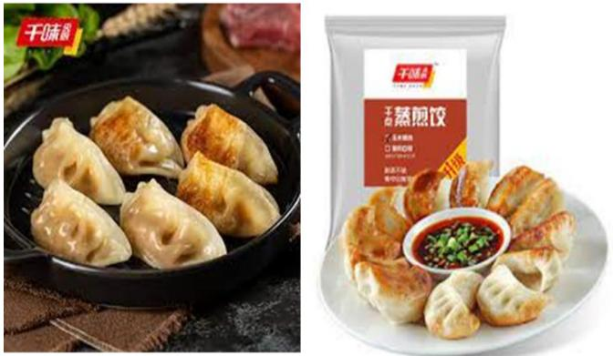  
图54：公司的蒸煎饺产品  
数据来源：公司官网，东方证券研究所

  
图55：公司代表性的新式面点类产品  
数据来源：公司官网，东方证券研究所

# 扩产能：募资加大产能投放，解决增长瓶颈

速冻米面具有季节性 $: +$ 大小B客户需求增速高，旺季产能瓶颈已对增长造成限制。一方面速冻面米制品行业具有较为明显的季节性特征，每年的 8 月份至次年 2 月份为销售旺季，因此生产端也呈现出季节性，在生产淡季很难保证每天16 小时的连续生产；另一方面受客户采购习惯和产品有效期限制，企业很难在生产淡季大规模生产备货，因此一般速冻面米制品实际生产能力只能达到设计生产能力 $7 0 \mathrm { - } 8 0 \%$ 。随着B 端速冻米面需求增长，公司的产能利用率逐渐提升，2018/19 年产能利用率达 $1 0 0 . 4 \% / 8 1 . 3 \%$ ，2020年随着新产能投产 $\mathbf { + }$ 疫情影响导致全年表观产能利用率较低，但疫情复苏后2020 年下半年产能利用率已达到 $7 6 . 5 \%$ ，未来随着下游需求快速增长，旺季产能缺口已成为限制公司接单排产的重要瓶颈。

上市募投解决产能瓶颈，未来将循序渐进推动全国化产能布局。公司于 2017 年成立子公司新乡干味新建生产厂区，工程分为一期、二期、三期，设计产能分别为 $6 . 8 / 4 . 8 / 8 . 0$ 万吨，同时现有红枫里厂区计划将改建为研发中心及总部基地。新乡一期、二期分别已于 2018 年末、2019 年末投产，三期为 IPO 募投项目，据公司招股说明书，新乡千味三期项目有望于 2023 年 6 月末建成投产、假设 $2 0 2 3 / 2 4$ 年产能可达到设计产能的 $30 \% / 7 0 \%$ ，公司整体 2023/24 年将分别达成 14/17.2万吨自建总产能，其中2024年17.2万吨产能构成为新乡一期6.8万吨 $^ +$ 二期4.8万吨 $\cdot +$ 三期5.6万吨(设计产能的 $70 \%$ ）。此外公司也在有序推进异地产能布局，以节约运费增强产品竞争力、提高市场反应速度，已于 2021 年 4 月在安徽芜湖设立子公司百福源，将以轻资产租赁方式投放产能，投产后有利于就近覆盖华东消费市场。

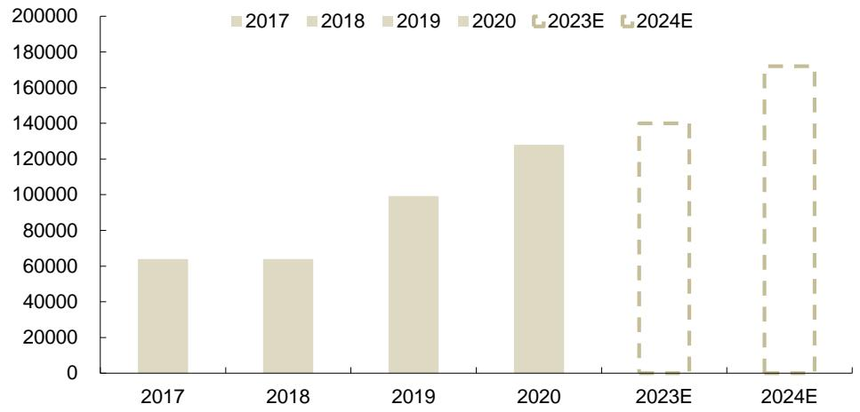  
图56：公司现有产能及未来规划（自建产能，不含委托加工和租赁）  
数据来源：公司公告，东方证券研究所注：2023/24 年为公司按项目规划预测的实际产能，不是设计产能；预测值根据公司招股书披露，假设条件为 2023 年 6 月新乡干味三期建成投产

# 公司 IP0 募资 3.34 亿元，结合自有资金将共投资 4.37 亿元用于建设新乡干味（三期)项目和总部基地及研发中心项目：

新乡干味（三期）项目：项目拟投资 3.77 亿元，本项目总用地面积35,288 平方米，总建筑面积 53,760 平方米，其中食品加工车间(双层)30,000 平方米、立体冷库 23,760 平方米。本项目建成达产后，将形成年产 8 万吨速冻面米制品的生产规模且将有效扩大公司生产规模，促进公司现有业务在深度和广度上的全方位发展，进一步巩固和提高公司在速冻面米制品行业内的地位。

总部基地及研发中心项目：项目拟投资0.60亿元，通过本项目的建设，公司将改建研发中心建筑面积 900 平方米，改建总部办公区、会议室建筑面积 2400 平方米，新增研发中心专业技术人员 8 名，新增总部管理支持、市场营销人员一百余名。该项目有利于提升公司的研发和试验检测的硬件水平，提升公司的产品品质、降低成本，吸引人才、提升公司竞争力。

图57：IPO 募集资金的主要投向  

<table><tr><td>序号</td><td>项目名称</td><td>投金建设</td><td></td><td>作用目的</td></tr><tr><td>1</td><td>新乡千味央 厨食品有限 公司食品加37，682 工建设项目 （三期）</td><td>24,976</td><td></td><td>新建厂房、冷库、购置先进 生产设备及自动化立体仓储 24个月设备，除扩大公司产品产能 和冷藏能力外，还将提升公 司生产效率。</td></tr><tr><td>2</td><td>总部基地及 研发中心建5,980 设项目</td><td>3,237</td><td></td><td>建设总部管理运营基地、升 级研发中心，提升公司管理 24个月运营效率、吸引人才，增强 公司研发软硬件实力，进一</td></tr><tr><td colspan="2">合计 43.66228.212</td><td></td><td></td><td>步巩固公司技术优势。</td></tr></table>

数据来源：公司公告，东方证券研究所

图 58：新乡三期新建产能项目投资概算  

<table><tr><td>房号</td><td>投资内容</td><td>投资估算</td><td>占总投资比例</td></tr><tr><td></td><td>建设投资</td><td>33,928.00</td><td>90.04%</td></tr><tr><td>1</td><td>建筑工程费</td><td>21,712.00</td><td>57.62%</td></tr><tr><td>1.1</td><td>工程建设费</td><td>17,892.00</td><td>47.48%</td></tr><tr><td>1.2</td><td>办公室装修费</td><td>270.00</td><td>0.72%</td></tr><tr><td>1.3</td><td>车间配套设施建设费</td><td>3,450.00</td><td>9.16%</td></tr><tr><td>1.4</td><td>工程建设其他费用</td><td>100.00</td><td>0.27%</td></tr><tr><td>2</td><td>设备投入</td><td>12,216.00</td><td>32.42%</td></tr><tr><td>二</td><td>基本预备费</td><td>1,696.40</td><td>4.50%</td></tr><tr><td>三</td><td>铺底流动资金</td><td>2,057.99</td><td>5.46%</td></tr><tr><td colspan="2">项目投资总额</td><td>37,682.39</td><td>100.00%</td></tr></table>

数据来源：公司公告，东方证券研究所

# 盈利预测与投资建议

# 盈利预测

# 我们对公司 2022-24 年盈利预测做如下假设：

1．营业收入：公司未来营收增长主要受益于餐饮标准化程度提升和人力成本上涨带来速冻米面制品需求增长，公司在渠道端(发展大B 端客户、加强小B 端经销网络建设)、产品端（持续推出新大单品）、产能端（募资进行产能扩张）持续发力，驱动各品类产品收入快速增长，我们预计 22-24 年公司收入增速分别为 $2 4 . 5 \% / 2 4 . 6 \% / 2 4 . 5 \%$ o

2.毛利率：公司毛利率短期受原材料价格影响较大，2021 年油脂、糖类、面粉、包材价格上涨，成本端率承压，22 年 2 月以来面粉、油脂价格维持在高位，但公司已从 21 年底起对部分产品进行提价传导。长期看，原材料价格回落、生产端的规模效应将有利于毛利率改善，预计 22-24 年稳中有升，我们预计 22-24 年公司毛利率分别为 $2 2 . 6 \% / 2 3 . 0 \% / 2 3 . 3 \%$ o

3. 期间费用：1）销售费用率：未来加大经销渠道建设，假设 22-24 年分别为 $3 . 6 \% / 3 . 7 \% / 3 . 7 \%$ .,2)管理费用率：考虑到股权激励费用和收入增长带来的规模效应，22-24年分别为$8 . 9 \% / 8 . 7 \% / 7 . 9 \%$ 。

4.营业所得税：假设 22-24 年营业所得税率维持为 $23 \%$ o

表1：盈利预测核心假设  

<table><tr><td></td><td>2020A</td><td>2021A</td><td>2022E</td><td>2023E</td><td>2024E</td></tr><tr><td>油炸品</td><td></td><td></td><td></td><td></td><td></td></tr><tr><td>销售收入(百万元）</td><td>521.5</td><td>660.5</td><td>797.5</td><td>957.0</td><td>1,171.4</td></tr><tr><td>增长率</td><td>6.0%</td><td>26.7%</td><td>20.8%</td><td>20.0%</td><td>22.4%</td></tr><tr><td>毛利率</td><td>20.2%</td><td>20.7%</td><td>21.0%</td><td>21.0%</td><td>21.2%</td></tr><tr><td>烘焙类</td><td></td><td></td><td></td><td></td><td></td></tr><tr><td>销售收入(百万元)</td><td>187.5</td><td>223.4</td><td>262.9</td><td>308.4</td><td>361.7</td></tr><tr><td>增长率</td><td>-5.1%</td><td>19.1%</td><td>17.7%</td><td>17.3%</td><td>17.3%</td></tr></table>

有关分析师的申明，见本报告最后部分。其他重要信息披露见分析师申明之后部分，或请与您的投资代表联系。并请阅读本证券研究报告最后一页的免责申明。

<table><tr><td>毛利率</td><td>22.9%</td><td>25.0%</td><td>25.9%</td><td>27.3%</td><td>27.5%</td></tr><tr><td>蒸煮类</td><td></td><td></td><td></td><td></td><td></td></tr><tr><td>销售收入(百万元）</td><td>183.6</td><td>255.5</td><td>302.6</td><td>363.2</td><td>437.1</td></tr><tr><td>增长率</td><td>3.9%</td><td>39.2%</td><td>18.5%</td><td>20.0%</td><td>20.4%</td></tr><tr><td>毛利率</td><td>24.5%</td><td>23.4%</td><td>22.9%</td><td>23.5%</td><td>24.8%</td></tr><tr><td>菜肴类及其他</td><td></td><td></td><td></td><td></td><td></td></tr><tr><td>销售收入(百万元）</td><td>49.7</td><td>130.2</td><td>216.7</td><td>339.2</td><td>479.7</td></tr><tr><td>增长率</td><td>121.7%</td><td>162.1%</td><td>66.4%</td><td>56.6%</td><td>41.4%</td></tr><tr><td>毛利率</td><td>19.3%</td><td>21.6%</td><td>21.7%</td><td>22.5%</td><td>22.5%</td></tr><tr><td>其他业务</td><td></td><td></td><td></td><td></td><td></td></tr><tr><td>销售收入(百万元）</td><td>2.1</td><td>4.3</td><td>5.6</td><td>7.3</td><td>9.5</td></tr><tr><td>增长率</td><td>228.7%</td><td>101.7%</td><td>30.0%</td><td>30.0%</td><td>30.0%</td></tr><tr><td>毛利率</td><td>98.4%</td><td>98.1%</td><td>95.0%</td><td>95.0%</td><td>95.0%</td></tr><tr><td>合计</td><td>944.4</td><td>1,273.9</td><td>1,585.4</td><td>1,975.1</td><td>2,459.4</td></tr><tr><td>增长率</td><td>6.2%</td><td>34.9%</td><td>24.5%</td><td>24.6%</td><td>24.5%</td></tr><tr><td>综合毛利率</td><td>21.7%</td><td>22.4%</td><td>22.6%</td><td>23.0%</td><td>23.3%</td></tr></table>

资料来源：公司数据，东方证券研究所预测

# 投资建议

根据前述假设，我们预测公司 2022-2024 年 EPS 分别为 $1 . 2 5 / 1 . 6 0 / 2 . 1 9$ 元。选取同样所属速冻食品行业的安井食品、三全食品、立高食品、味知香、巴比食品作为可比公司，可比公司2022 年PE为34倍，由于公司2022-24年预期业绩CAGR为 $3 2 . 4 \%$ ，显著高于可比公司平均值，因此给予公司 $2 5 \%$ 溢价即 22 年 43 倍PE，对应目标价 53.75 元，首次覆盖给予“增持”评级。

表2：可比公司估值表  

<table><tr><td rowspan="2">公司</td><td rowspan="2">股价(元) 22/5/27</td><td colspan="4">每股收益（元）</td><td colspan="4">市盈率</td><td rowspan="2">22-24E 业绩 CAGR</td></tr><tr><td>2021A</td><td>2022E</td><td>2023E</td><td>2024E</td><td>2021A</td><td>2022E</td><td>2023E</td><td>2024E</td></tr><tr><td>立高食品</td><td>72.59</td><td>1.67</td><td>1.75</td><td>2.52</td><td>3.44</td><td>43.42</td><td>41.49</td><td>28.84</td><td>21.12</td><td>40.2%</td></tr><tr><td>安井食品</td><td>125.49</td><td>2.33</td><td>3.33</td><td>4.25</td><td>5.26</td><td>53.94</td><td>37.72</td><td>29.52</td><td>23.87</td><td>25.7%</td></tr><tr><td>味知香</td><td>57.71</td><td>1.33</td><td>1.65</td><td>2.07</td><td>2.63</td><td>43.51</td><td>35.02</td><td>27.91</td><td>21.98</td><td>26.2%</td></tr><tr><td>三全食品</td><td>19.54</td><td>0.73</td><td>0.85</td><td>0.96</td><td>1.09</td><td>26.81</td><td>22.90</td><td>20.26</td><td>17.98</td><td>12.9%</td></tr><tr><td>巴比食品</td><td>27.72</td><td>1.27</td><td>0.99</td><td>1.25</td><td>1.53</td><td>21.90</td><td>27.97</td><td>22.26</td><td>18.10</td><td>24.3%</td></tr><tr><td>调整后平均</td><td></td><td></td><td></td><td></td><td></td><td></td><td>34</td><td>26</td><td>20</td><td>25.4%</td></tr></table>

数据来源：朝阳永续，东方证券研究所

# 风险提示

1)原材料价格大幅上涨风险：公司的主要原材料为面粉、油脂等大宗农产品，虽然公司能够凭借规模优势进行锁价，但如果上游价格出现持续、大幅上涨，仍会对公司产生成本压力，导致毛利率不及预期的风险；

2) 餐饮需求复苏不及预期风险：公司下游客户以大小B 端餐饮为主，餐饮消费受到疫情反复、居民消费力等因素影响，若复苏不及预期，则可能影响公司收入增速；

3）市场竞争加剧风险：公司从事的速冻米面制品行业存在大量地方性中小企业，部分以火锅料生产为主的企业也在扩大米面产品布局，若行业竞争加剧则可能影响公司的市场份额提升速度，也会增大价格战风险和提价传导难度；

4）新品推广不及预期风险：新品、次新品是速冻米面品类市场扩容和盈利能力改善的重要驱动力，若客户对新品如菜肴类产品反馈不及预期，可能会对公司成长速度造成影响；

5）食品安全风险：公司的大B 端连锁客户对食品安全和企业形象要求很高，公司多年以来食品安全、质量控制能力受到客户持续认可，但若生产环节供应链（如公司的供应商)出现偶发食品安全问题，将会对公司品牌形象造成损害，从而导致大客户流失风险；

附表：财务报表预测与比率分析  

<table><tr><td colspan="6">资产负债表</td></tr><tr><td>单位：百万元</td><td>2020A</td><td>2021A</td><td>2022E</td><td>2023E</td><td>2024E</td></tr><tr><td>货币资金</td><td>117</td><td>332</td><td>413</td><td>515</td><td>641</td></tr><tr><td>应收票据、账款及款项融资</td><td>52</td><td>62</td><td>77</td><td>97</td><td>120</td></tr><tr><td>预付账款</td><td>11</td><td>5</td><td>6</td><td>8</td><td>9</td></tr><tr><td>存货</td><td>116</td><td>162</td><td>201</td><td>249</td><td>309</td></tr><tr><td>其他</td><td>36</td><td>32</td><td>40</td><td>43</td><td>46</td></tr><tr><td>流动资产合计</td><td>333</td><td>593</td><td>738</td><td>911</td><td>1,126</td></tr><tr><td>长期股权投资</td><td>0</td><td>0</td><td>0</td><td>0</td><td>0</td></tr><tr><td>固定资产</td><td>543</td><td>606</td><td>857</td><td>1,049</td><td>1,176</td></tr><tr><td>在建工程</td><td>1</td><td>30</td><td>52</td><td>54</td><td>41</td></tr><tr><td>无形资产</td><td>39</td><td>38</td><td>37</td><td>36</td><td>35</td></tr><tr><td>其他</td><td>39</td><td>73</td><td>50</td><td>50</td><td>50</td></tr><tr><td>非流动资产合计</td><td>622</td><td>747</td><td>998</td><td>1,190</td><td>1,302</td></tr><tr><td>资产总计</td><td>956</td><td>1,341</td><td>1,736</td><td>2,102</td><td>2,428</td></tr><tr><td>短期借款</td><td>15</td><td>15</td><td>218</td><td>401</td><td>483</td></tr><tr><td>应付票据及应付账款</td><td>142</td><td>144</td><td>178</td><td>221</td><td>274</td></tr><tr><td>其他</td><td>148</td><td>168</td><td>169</td><td>170</td><td>172</td></tr><tr><td>流动负债合计</td><td>305</td><td>326</td><td>566</td><td>792</td><td>929</td></tr><tr><td>长期借款</td><td>55</td><td>35</td><td>35</td><td>35</td><td>35</td></tr><tr><td>应付债券</td><td>0</td><td>0</td><td>0</td><td>0</td><td>0</td></tr><tr><td>其他</td><td>14</td><td>26</td><td>26</td><td>26</td><td>26</td></tr><tr><td>非流动负债合计</td><td>69</td><td>61</td><td>61</td><td>61</td><td>61</td></tr><tr><td>负债合计</td><td>373</td><td>388</td><td>627</td><td>854</td><td>990</td></tr><tr><td>少数股东权益</td><td>(0)</td><td>(0)</td><td>(0)</td><td>(0)</td><td>(0)</td></tr><tr><td>实收资本（或股本）</td><td>64</td><td>87</td><td>87</td><td>87</td><td>87</td></tr><tr><td>资本公积</td><td>239</td><td>499</td><td>546</td><td>546</td><td>546</td></tr><tr><td>留存收益</td><td>280</td><td>368</td><td>477</td><td>615</td><td>806</td></tr><tr><td>其他</td><td>0</td><td>0</td><td>0</td><td>0</td><td>0</td></tr><tr><td>股东权益合计</td><td>582</td><td>953</td><td>1,109</td><td>1,248</td><td>1,438</td></tr><tr><td>负债和股东权益总计</td><td>956</td><td>1,341</td><td>1,736</td><td>2,102</td><td>2,428</td></tr></table>

现金流量表  

<table><tr><td>单位：百万元</td><td>2020A</td><td>2021A</td><td>2022E</td><td>2023E</td><td>2024E</td></tr><tr><td>净利润</td><td>77</td><td>87</td><td>108</td><td>139</td><td>190</td></tr><tr><td>折旧摊销</td><td>76</td><td>(69)</td><td>10</td><td>26</td><td>38</td></tr><tr><td>财务费用</td><td>3</td><td>5</td><td>3</td><td>9</td><td>13</td></tr><tr><td>投资损失</td><td>0</td><td>0</td><td>0</td><td>0</td><td>0</td></tr><tr><td>营运资金变动</td><td>82</td><td>(37)</td><td>(28)</td><td>(27)</td><td>(34)</td></tr><tr><td>其它</td><td>(141)</td><td>112</td><td>21</td><td>(1)</td><td>(1)</td></tr><tr><td>经营活动现金流</td><td>98</td><td>98</td><td>114</td><td>146</td><td>207</td></tr><tr><td>资本支出</td><td>(472)</td><td>(22)</td><td>(282)</td><td>(218)</td><td>(150)</td></tr><tr><td>长期投资</td><td>0</td><td>0</td><td>0</td><td>0</td><td>0</td></tr><tr><td>其他</td><td>377</td><td>(161)</td><td>1</td><td>1</td><td>1</td></tr><tr><td>投资活动现金流</td><td>(95)</td><td>(183)</td><td>(281)</td><td>(217)</td><td>(149)</td></tr><tr><td>债权融资</td><td>59</td><td>(13)</td><td>0</td><td>0</td><td>0</td></tr><tr><td>股权融资</td><td>100</td><td>283</td><td>47</td><td>0</td><td>0</td></tr><tr><td>其他</td><td>(124)</td><td>29</td><td>201</td><td>173</td><td>68</td></tr><tr><td>筹资活动现金流</td><td>35</td><td>299</td><td>248</td><td>173</td><td>68</td></tr><tr><td>汇率变动影响</td><td>0</td><td>0</td><td>-0</td><td>-0</td><td>-0</td></tr><tr><td>现金净增加额</td><td>38</td><td>215</td><td>81</td><td>102</td><td>126</td></tr></table>

资料来源：东方证券研究所

利润表  

<table><tr><td>单位：百万元</td><td>2020A</td><td>2021A</td><td>2022E</td><td>2023E</td><td>2024E</td></tr><tr><td>营业收入</td><td>944</td><td>1,274</td><td>1,585</td><td>1,975</td><td>2,459</td></tr><tr><td>营业成本</td><td>739</td><td>989</td><td>1,228</td><td>1,521</td><td>1,886</td></tr><tr><td>营业税金及附加</td><td>9</td><td>12</td><td>14</td><td>18</td><td>22</td></tr><tr><td>销售费用</td><td>31</td><td>42</td><td>58</td><td>72</td><td>91</td></tr><tr><td>管理费用及研发费用</td><td>86</td><td>116</td><td>152</td><td>185</td><td>212</td></tr><tr><td>财务费用</td><td>3</td><td>5</td><td>3</td><td>9</td><td>13</td></tr><tr><td>资产、信用减值损失</td><td>(0)</td><td>0</td><td>0</td><td>0</td><td>0</td></tr><tr><td>公允价值变动收益</td><td>(1)</td><td>0</td><td>1</td><td>1</td><td>1</td></tr><tr><td>投资净收益</td><td>0</td><td>0</td><td>0</td><td>0</td><td>0</td></tr><tr><td>其他</td><td>25</td><td>2</td><td>7</td><td>8</td><td>9</td></tr><tr><td>营业利润</td><td>100</td><td>112</td><td>139</td><td>179</td><td>245</td></tr><tr><td>营业外收入</td><td>2</td><td>3</td><td>3</td><td>3</td><td>3</td></tr><tr><td>营业外支出</td><td>2</td><td>1</td><td>1</td><td>1</td><td>1</td></tr><tr><td>利润总额</td><td>100</td><td>113</td><td>141</td><td>180</td><td>247</td></tr><tr><td>所得税</td><td>24</td><td>26</td><td>32</td><td>42</td><td>57</td></tr><tr><td>净利润</td><td>77</td><td>87</td><td>108</td><td>139</td><td>190</td></tr><tr><td>少数股东损益</td><td>(0)</td><td>(1)</td><td>0</td><td>0</td><td>0</td></tr><tr><td>归属于母公司净利润</td><td>77</td><td>88</td><td>108</td><td>139</td><td>190</td></tr><tr><td>每股收益（元）</td><td>0.88</td><td>1.02</td><td>1.25</td><td>1.60</td><td>2.19</td></tr></table>

主要财务比率  

<table><tr><td></td><td>2020A</td><td>2021A</td><td>2022E</td><td>2023E</td><td>2024E</td></tr><tr><td>成长能力</td><td></td><td></td><td></td><td></td><td></td></tr><tr><td>营业收入</td><td>6.2%</td><td>34.9%</td><td>24.5%</td><td>24.6%</td><td>24.5%</td></tr><tr><td>营业利润</td><td>1.6%</td><td>11.5%</td><td>24.7%</td><td>28.5%</td><td>37.3%</td></tr><tr><td>归属于母公司净利润</td><td>3.3%</td><td>15.5%</td><td>22.5%</td><td>28.1%</td><td>36.9%</td></tr><tr><td>获利能力</td><td></td><td></td><td></td><td></td><td></td></tr><tr><td>毛利率</td><td>21.7%</td><td>22.4%</td><td>22.6%</td><td>23.0%</td><td>23.3%</td></tr><tr><td>净利率</td><td>8.1%</td><td>6.9%</td><td>6.8%</td><td>7.0%</td><td>7.7%</td></tr><tr><td>ROE</td><td>15.5%</td><td>11.5%</td><td>10.5%</td><td>11.8%</td><td>14.2%</td></tr><tr><td>ROIC</td><td>14.5%</td><td>10.7%</td><td>9.1%</td><td>9.4%</td><td>10.9%</td></tr><tr><td>偿债能力</td><td></td><td></td><td></td><td></td><td></td></tr><tr><td>资产负债率</td><td>39.1%</td><td>28.9%</td><td>36.1%</td><td>40.6%</td><td>40.8%</td></tr><tr><td>净负债率</td><td>0.0%</td><td>0.0%</td><td>0.0%</td><td>0.0%</td><td>0.0%</td></tr><tr><td>流动比率</td><td>1.09</td><td>1.82</td><td>1.31</td><td>1.15</td><td>1.21</td></tr><tr><td>速动比率</td><td>0.71</td><td>1.32</td><td>0.95</td><td>0.84</td><td>0.88</td></tr><tr><td>营运能力</td><td></td><td></td><td></td><td></td><td></td></tr><tr><td>应收账款周转率</td><td>19.5</td><td>22.3</td><td>22.7</td><td>22.7</td><td>22.7</td></tr><tr><td>存货周转率</td><td>6.9</td><td>7.1</td><td>6.8</td><td>6.8</td><td>6.8</td></tr><tr><td>总资产周转率</td><td>1.1</td><td>1.1</td><td>1.0</td><td>1.0</td><td>1.1</td></tr><tr><td>每股指标（元）</td><td></td><td></td><td></td><td></td><td></td></tr><tr><td>每股收益</td><td>0.88</td><td>1.02</td><td>1.25</td><td>1.60</td><td>2.19</td></tr><tr><td>每股经营现金流</td><td>1.53</td><td>1.14</td><td>1.32</td><td>1.68</td><td>2.39</td></tr><tr><td>每股净资产</td><td>6.72</td><td>11.01</td><td>12.81</td><td>14.41</td><td>16.60</td></tr><tr><td>估值比率</td><td></td><td></td><td></td><td></td><td></td></tr><tr><td>市盈率</td><td>56.4</td><td>48.8</td><td>39.8</td><td>31.1</td><td>22.7</td></tr><tr><td>市净率</td><td>7.4</td><td>4.5</td><td>3.9</td><td>3.5</td><td>3.0</td></tr><tr><td>EV/EBITDA</td><td>22.5</td><td>84.9</td><td>26.6</td><td>18.9</td><td>13.6</td></tr><tr><td>EV/EBIT</td><td>39.0</td><td>34.7</td><td>28.5</td><td>21.5</td><td>15.6</td></tr></table>

# 分析师申明

每位负责撰写本研究报告全部或部分内容的研究分析师在此作以下声明：

分析师在本报告中对所提及的证券或发行人发表的任何建议和观点均准确地反映了其个人对该证券或发行人的看法和判断；分析师薪酬的任何组成部分无论是在过去、现在及将来，均与其在本研究报告中所表述的具体建议或观点无任何直接或间接的关系。

# 投资评级和相关定义

报告发布日后的 12 个月内的公司的涨跌幅相对同期的上证指数/深证成指的涨跌幅为基准；

# 公司投资评级的量化标准

买入：相对强于市场基准指数收益率 $1 5 \%$ 以上；

增持：相对强于市场基准指数收益率 $5 \% \sim 1 5 \%$ 中性：相对于市场基准指数收益率在 $. 5 \% \sim + 5 \%$ 之间波动；

减持：相对弱于市场基准指数收益率在 $. 5 \%$ 以下。

未评级 — 由于在报告发出之时该股票不在本公司研究覆盖范围内，分析师基于当时对该股票的研究状况，未给予投资评级相关信息。

暂停评级 —— 根据监管制度及本公司相关规定，研究报告发布之时该投资对象可能与本公司存在潜在的利益冲突情形；亦或是研究报告发布当时该股票的价值和价格分析存在重大不确定性，缺乏足够的研究依据支持分析师给出明确投资评级；分析师在上述情况下暂停对该股票给予投资评级等信息，投资者需要注意在此报告发布之前曾给予该股票的投资评级、盈利预测及目标价格等信息不再有效。

# 行业投资评级的量化标准：

看好：相对强于市场基准指数收益率 $5 \%$ 以上；

中性：相对于市场基准指数收益率在 $. 5 \% \sim + 5 \%$ 之间波动；

看淡：相对于市场基准指数收益率在 $. 5 \%$ 以下。

未评级：由于在报告发出之时该行业不在本公司研究覆盖范围内，分析师基于当时对该行业的研究状况，未给予投资评级等相关信息。

暂停评级：由于研究报告发布当时该行业的投资价值分析存在重大不确定性，缺乏足够的研究依据支持分析师给出明确行业投资评级；分析师在上述情况下暂停对该行业给予投资评级信息，投资者需要注意在此报告发布之前曾给予该行业的投资评级信息不再有效。

# 免责声明

本证券研究报告（以下简称“本报告”）由东方证券股份有限公司（以下简称“本公司”）制作及发布。

。本公司不会因接收人收到本报告而视其为本公司的当然客户。本报告的全体接收人应当采取必要措施防止本报告被转发给他人。

本报告是基于本公司认为可靠的且目前已公开的信息撰写，本公司力求但不保证该信息的准确性和完整性，客户也不应该认为该信息是准确和完整的。同时，本公司不保证文中观点或陈述不会发生任何变更，在不同时期，本公司可发出与本报告所载资料、意见及推测不一致的证券研究报告。本公司会适时更新我们的研究，但可能会因某些规定而无法做到。除了一些定期出版的证券研究报告之外，绝大多数证券研究报告是在分析师认为适当的时候不定期地发布。

在任何情况下，本报告中的信息或所表述的意见并不构成对任何人的投资建议，也没有考虑到个别客户特殊的投资目标、财务状况或需求。客户应考虑本报告中的任何意见或建议是否符合其特定状况，若有必要应寻求专家意见。本报告所载的资料、工具、意见及推测只提供给客户作参考之用，并非作为或被视为出售或购买证券或其他投资标的的邀请或向人作出邀请。

本报告中提及的投资价格和价值以及这些投资带来的收入可能会波动。过去的表现并不代表未来的表现，未来的回报也无法保证，投资者可能会损失本金。外汇汇率波动有可能对某些投资的价值或价格或来自这一投资的收入产生不良影响。那些涉及期货、期权及其它衍生工具的交易，因其包括重大的市场风险，因此并不适合所有投资者。

在任何情况下，本公司不对任何人因使用本报告中的任何内容所引致的任何损失负任何责任，投资者自主作出投资决策并自行承担投资风险，任何形式的分享证券投资收益或者分担证券投资损失的书面或口头承诺均为无效。

本报告主要以电子版形式分发，间或也会辅以印刷品形式分发，所有报告版权均归本公司所有。未经本公司事先书面协议授权，任何机构或个人不得以任何形式复制、转发或公开传播本报告的全部或部分内容。不得将报告内容作为诉讼、仲裁、传媒所引用之证明或依据，不得用于营利或用于未经允许的其它用途。

经本公司事先书面协议授权刊载或转发的，被授权机构承担相关刊载或者转发责任。不得对本报告进行任何有悖原意的引用、删节和修改。

提示客户及公众投资者慎重使用未经授权刊载或者转发的本公司证券研究报告，慎重使用公众媒体刊载的证券研究报告。

# 东方证券研究所

地址： 上海市中山南路 318 号东方国际金融广场 26 楼  
电话： 021-63325888  
传真： 021-63326786  
网址： www.dfzq.com.cn