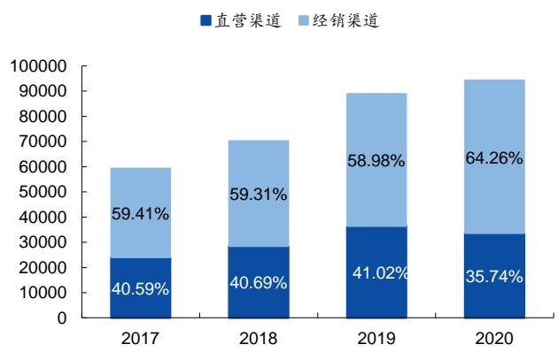
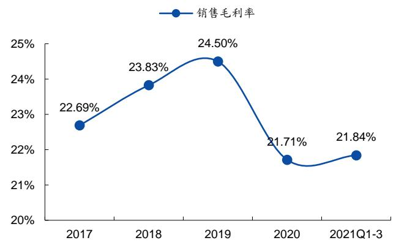
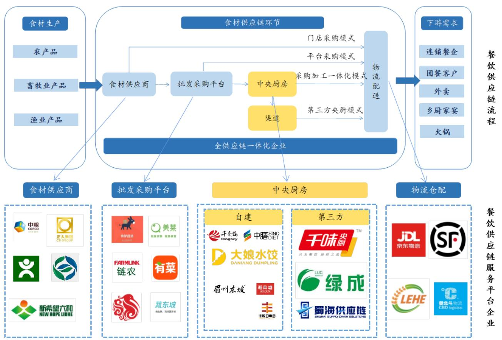
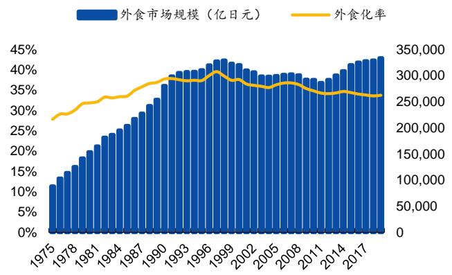

# 餐饮工业东风起，B端蓝海乘风上

# 买入|首次推荐

# —千味央厨（001215）首次覆盖报告

# 报告要点：

# • 速冻面米领先企业，立足华东拓展内陆

公司深耕面向餐饮企业的速冻面米制品的研发、生产和销售，主营油炸类、蒸煮类、烘焙类和菜肴类产品。公司通过直营端深度绑定百胜中国、华莱士、九毛九、真功夫、海底捞等大型连锁餐企；经销端通过经销商渗透低线团餐、外卖及乡厨市场，逐步从华东沿海向内陆渗透。

# ● 餐饮供应链降本增效需求迫切，第三方中央廚房渗透空间广

餐饮业高采购成本、高人工成本、高租金成本及低毛利率的多痛点导致餐企竞争加剧、倒闭率高企。下游连锁化率的提升、团餐1.53 万亿的巨大市场空间、外卖市场的高速扩张、乡厨市场的下沉需求都为能够降本提效的餐饮供应链提供了广阔市场空间。而天然适应标准化生产、能够有效降低备餐时间、缩减后厨面积及人员配置、降低食材成本的速冻食品成为了解决方案，根据测算以供应速冻食品作为餐企的第三方厨房可提升餐企9.1-14.5pcts的利润率。当前我国速冻食品餐饮端渗透率仅为 $36 \%$ ，对标20世纪80年代日本的 $60 \%$ 尚有较大发展空间。

# • 只为餐饮后厨之选，多维度铸造竞争优势

公司凭借提供速冻面米半成品成为餐企的第三方央厨，先发切入B端，通过直营端大B客户灯塔效应吸引优质连锁餐企；经销商渗透低线城市下沉团餐、乡厨、外卖市场；3-6月快速研发提供技术护城河；募投项目扩产提供产能支撑，四维度全面提升市场份额，是具备长期竞争优势的“中式速冻面米 $^ { + }$ 餐饮供应链解决方案”双属性稀缺标的。未来随着直营端客户规模的进一步扩张和新客户的拓展及经销端经销商数量及单点势能的持续增加，公司将持续获得业绩增长势能。

# ● 投资建议与盈利预测

公司依靠完善的供应链、严格的全流程品控机制以及快速相应的研发能力为餐企提供降本提效的解决方案。B端餐饮市场工业化变革带来广阔空间，公司通过直营端提升价格、经销端打开销量，实现量价齐增扩展营收。速冻面米餐饮端行业集中度较低，公司上市后通过扩产突破产能瓶颈，有望加速开拓直营及经销端客户，提升市占率。考虑公司直营客户及经销端，中长期成长高确定性，我们预测公司 2021-2023 年EPS 为1.05/1.39/1.77对应现价PE分别为61/46/36X，首次覆盖并给予“买入”评级。

食品安全事件风险、行业竞争加剧风险、原材料价格上涨风险、产能建设及爬坡不及预期

# ● 风险提示

<table><tr><td>基本数据</td></tr><tr><td>52 周最高/最低价(元)：73.0/22.62</td></tr><tr><td>A股流通股（百万股)： 21.28</td></tr><tr><td>A股总股本（百万股)： 85.10</td></tr><tr><td>流通市值(百万元)： 1358.09</td></tr><tr><td>总市值（百万元）： 5431.35</td></tr></table>

  
过去一年股价走势   
资料来源：Wind

# 相关研究报告

# 报告作者

附表：盈利预测   

<table><tr><td>财务数据和估值</td><td>2019A</td><td>2020A</td><td>2021E</td><td>2022E</td><td>2023E</td></tr><tr><td>营业收入(百万元)</td><td>889.28</td><td>944.37</td><td>1276.57</td><td>1613.47</td><td>2008.51</td></tr><tr><td>收入同比(%)</td><td>26.82</td><td>6.20</td><td>35.18</td><td>26.39</td><td>24.48</td></tr><tr><td>归母净利润(百万元)</td><td>74.12</td><td>76.59</td><td>89.43</td><td>118.43</td><td>150.84</td></tr><tr><td>归母净利润同比(%)</td><td>26.32</td><td>3.33</td><td>16.76</td><td>32.44</td><td>27.36</td></tr><tr><td>ROE(%)</td><td>18.27</td><td>13.15</td><td>9.04</td><td>10.69</td><td>11.98</td></tr><tr><td>每股收益(元)</td><td>0.87</td><td>0.90</td><td>1.05</td><td>1.39</td><td>1.77</td></tr><tr><td>市盈率(P/E)</td><td>73.28</td><td>70.92</td><td>60.74</td><td>45.86</td><td>36.01</td></tr></table>

资料来源：Wind，国元证券研究所

# 目录

1.速冻面米领军企业，立足华东拓展内陆 5  
1.1 产品：深耕细作中西面点，产品结构不断丰富 5  
1.2历史：受思念之渔，细分赛道破局... .6  
1.3渠道：直营经销双管齐下，立足华东拓展内陆， .9  
1.4 财务分析：营收快速增长，盈利能力保持稳定 10  
2.餐饮供应链空间广阔，B端速冻大有可为.. 12  
2.1“三高一低”催化降本提效，多业态发展打开餐饮供应链空间 12  
2.2降本提效推动餐饮供应链升级，第三方中央厨房前景广阔. 15  
2.2.1 中央厨房整合升级餐饮供应链，降本提效渗透率逐步攀升... 15  
2.2.2自建央厨成本入不敷出，第三方央厨前景广阔. 17  
2.3复盘日本速冻食品发展，餐饮端渗透率有望快速提升 18  
3.只为餐饮后厨之选，多维度铸造竞争优势.. 20  
3.1完善供应链解决餐企经营痛点，定制化服务增强客户粘性， 20  
3.2直营端拥抱大B客户，经销端下沉渗透中小餐企.. 22  
3.3快速响应能力筑技术护城河，横向拓展焕发优势单品潜能. 24  
3.4直营端门店业绩拓销量，经销端量增叠加单点势能增加拓空间.. 26  
3.5募投项目扩产提效，加速进军速冻面米餐饮市场.. 27  
4.盈利预测和投资建议.. 28  
5.风险提示.. 28

# 图表目录

图1：千味央厨产品矩阵.. 5  
图2：菜肴类产品营收占比不断提升(单位：万元) 6  
图3：蒸煮类和菜肴类在售单品数快速扩容（单位：个) 6  
图4：千味央厨发展历程.. 7  
图5：千味央厨股权结构（截至2021年9 月6 日) 8  
图6：千味央厨下游渠道.. 9  
图7：直营渠道占比总营收约 $40 \%$ （单位：万元） .9  
图8：近年来公司经销商数量快速增加(单位：个) .9  
图9：华东地区收入比重占比超过 $50 \%$ （单位：万元） 10  
图10：千味央厨营收稳步增长.. ..11  
图11：千味央厨归母净利润恢复快速增长 ..11  
图12：近年来公司毛利率稳中有升... ..1  
图13：烘焙类、蒸煮类产品抬升综合毛利率水平 ..11  
图14：公司销售净利率处于行业平均以上. 12  
图15：千味央厨销售费用率维持低位且有下降趋势. .12  
图16：近年来国内餐饮收入逐年攀升. .12  
图17：消费者外出就餐意愿提升. 12

图18：餐饮业成本占比.  
图19：餐饮业人工成本逐年攀升. 13图20：餐饮业直接原材料成本呈上涨趋势.. 13图21：商铺平均租金不断上涨（单位：元 $/ \mathsf { m } ^ { 2 }$ 13图22：团餐市场规模广. …14图 23：2020中国团餐企业经营场景分布……14图 24：懒宅人群扩大，“懒”文化盛行……14图25：外卖市场规模高速扩张，  
图26：中国餐饮连锁化率远低于日本、美国. 15图27：2011-2019年中国连锁餐饮企业门店发展情况.  
图28：餐饮供应链流程及主要参与企业.. …16图29：连锁餐饮中央厨房渗透率不断上升 …… …. 7图30：2014-2018年中央厨房市场规模及增速.  
图31：中央厨房产能过剩问题严重  
图32：我国餐饮行业中小餐企占主导.. … 18图33：第三方中央厨房的优势. … 18图34：日本75-90 年外食化率及外食市场规模高增 … 19图35：日本75-90租金及人工成本高企.  
图36：日本75-90年速冻食品餐饮端高速发展.. ….19图37：日本75-90 年速冻食品餐饮端占比达 $60 \%$ 以上 . 19图38：我国冷库容量继续扩容.. … 0图39：我国冷链运输车保有 … 20图40：近年来我国速冻行业高速发展. …. 20图41：我国速冻餐饮端渗透率仍然较低.. …. 20图42：千味央厨解决传统餐企采购市场痛点 ….1图43：千味直营客户定制化服务流程 ….图44：公司优质客户集聚增强灯塔效应.. . 22图45：疫情前公司前五大直营客户稳占总营收 $36 \%$ 以上 . 22图46：依靠经销商渗透公司在低线城市销售额保持高增速（单位：万元）.23图47：直营模式毛利率相较经销模式更高.. .24图48：直营模式平均单价相较经销模式更高. .24图49：2019 年千味前十大单品占比总营收超 $50 \%$ (单位：万元) ….2 4图50：公司对于爆款单品油条进行横向细分场景拓展.  
图51：百胜中国门店数高速扩张，  
图52：国潮连锁餐饮兴起提供更快销售额增长..  
图53：除去疫情影响经销商数量及单点势能持续增加.. . 7图54：100万元以上销售额经销商数量及占比经销收入..

表1：管理层行业经验丰富，持股激发动力（截至2021 年9 月6 日）…….8  
表2：中央厨房能针对性解决餐饮企业痛点. .16  
表3：核心技术人员全部脱身于思念技术部门.. .25  
表4：募投项目基本情况.. .27  
表5：可比上市公司估值对比 28

# 1.速冻面米领军企业，立足华东拓展内陆

# 1.1 产品：深耕细作中西面点，产品结构不断丰富

打造多维产品矩阵，业绩快速增长。公司主营面向餐饮企业的速冻面米制品的研发、生产和销售。经过近十年的经验积累和产品研发，公司形成了油炸类、烘焙类、蒸煮类、菜肴类四大类速冻面米制品的多维产品布局，截至2020 年末在售产品数达368个。2017-2019年，公司总营收和归母净利润CAGR分别为 $2 2 . 4 3 \% . 2 6 . 1 7 \%$ 。受新冠疫情影响，2020 年公司总营收 9.44 亿元、归母净利润 0.77 亿元，分别同比增加 $6 . 2 0 \%$ $3 . 3 3 \%$ 。

1）油炸类产品：主要包括油条系列及油炸点心系列产品，2020年合计收入5.21亿元，同比增长 $6 . 0 3 \%$ ，占比总营收 $5 5 . 3 4 \%$ ，是公司的核心收入来源同时也是传统优势业务。

2）烘焙系列产品:2020 年实现烘焙系列产品营收1.88 亿元，占比总营收 $1 9 . 9 0 \%$ 。  
2019 年公司发布“焙伦”品牌，正式进军冷冻烘焙市场。

3）蒸煮类产品：2020 年蒸煮类产品实现收入1.84亿，占比总营收 $1 9 . 4 8 \%$ 。公司着重发力中式糕点的外观设计，其中明星单品卡通猪猪包广受欢迎。

4）莱肴类及其他产品：为满足客户对产品多样性的需求，2020年公司净增加24个菜肴类新单品，主要为平均价格较低的蒸煎饺、杂粮调理包等产品，实现收入0.50亿，同比增长 $1 2 1 . 7 4 \%$ 。

  
图1：千味央厨产品矩阵   
资料来源：招股说明书，国元证券研究所

  
图2：莱肴类产品营收占比不断提升（单位：万元)  
资料来源：Wind，国元证券研究所

  
图3：蒸煮类和莱肴类在售单品数快速扩容（单位：个)

资料来源：Wind，国元证券研究所

# 1.2 历史：受思念之渔，细分赛道破局

复盘历史，千味央廚战略眼光独到，发挥脫胎于思念的产品、渠道先发优势，差异化竞争完成突围。

2002-2012 年，孕育于思念，积累产品、渠道资源。2002 年肯德基开始尝试中国本土化营销，推出早餐粥系列，就此打开了与彼时还在思念体内孕育的千味的合作窗口。在这一阶段，传统的速冻面米产品如水饺、汤圆、粽子等在消费者中广受欢迎，行业集中度较高，千味另辟蹊径选择在油条、芝麻球等细分品类上利用差异化竞争积累优势产品和渠道资源。

2012-2016 年，脱胎于思念，全面升级快速成长。2012 年思念业绩下滑，受困于食品安全事故，于年末宣布于新加坡退市。同年4月千味有限由郑州思念全资设立，千味央厨公司正式成立。2016 年公司进入百胜T1 供应商体系。

2016 年至今，股份制改革实现独立，增资扩产高质量发展。2016 年公司完成股份制改革，正式从郑州思念体系中独立出来。通过三次增资，公司实现设计产能 10万吨以上，公司进入高质量发展优化期。2019 年，公司通过发布“焙伦”品牌进军烘焙市场，通过与海底捞建立合作切入火锅料领域。

  
图4：千味央厨发展历程  
资料来源：公司官网，招股说明书，国元证券研究所

股权集中，高管行业经验丰富，间接持股激发积极性。公司实控人为创始人李伟，其通过共青城城之集间接持有公司 $4 6 . 8 7 \%$ 的股份，股权高度集中。高层管理团队多曾在思念任职，拥有丰富的行业经验，并作为前海新希望及共青城凯利的有限合伙人间接持有公司股份。此外，2018 年 10 月19 日京东子公司宿迁涵邦成为公司战略投资者，持股比例达 $3 , 8 4 \%$ ，双方约定在线上平台、线下业态、物流领域等方面进行合作。

  
图5：千味央厨股权结构（截至2021年9月6日）  
资料来源：招股说明书，国元证券研究所

表1：管理层行业经验丰富，持股激发动力（截至2021 年 $\mathfrak { s }$ 月6日)  

<table><tr><td>姓名</td><td>职务</td><td>学历</td><td>从业经历</td><td>持股方式</td><td>间接持股 比例</td></tr><tr><td rowspan="3">孙剑</td><td rowspan="3">董事长</td><td rowspan="3"></td><td>2018 年7 月至今，任职于本公司，现任公司董事长，新乡千味执行董事。先后</td><td>8%持股前海新希</td><td rowspan="3">0.54%</td></tr><tr><td>本科供职于河南省天隆实业有限公司、郑州思念、河南一生缘食品有限公司、郑州中</td><td>望间接持有</td></tr><tr><td>部大观地产有限公司。</td><td></td></tr><tr><td rowspan="3">白瑞</td><td rowspan="3">董事&amp;总经理</td><td rowspan="3">硕士</td><td>2012 年 4 月至今，任职于本公司，中级会计师，现任公司董事、总经理，新乡</td><td rowspan="3">1.40%持股共青城</td><td rowspan="3">0.06%</td></tr><tr><td>千味经理。先后供职于河南冠联装饰工程有限公司、海信科龙电器股份有限公司</td></tr><tr><td>河南分公司、郑州思念。</td></tr><tr><td rowspan="3">王植宾</td><td rowspan="3">董事&amp;副总经 理&amp;财务总监</td><td rowspan="3">本科</td><td>2012 年4 月至今，任职于本公司，现任公司董事、副总经理、财务总监。先后</td><td rowspan="3">1.36%持股共青城</td><td rowspan="3">0.06%</td></tr><tr><td>供职于任宏大（集团）有限责任公司、郑州章光101生发科技有限公司、郑州</td></tr><tr><td></td></tr><tr><td rowspan="3">徐振江</td><td rowspan="3">副总经理&amp;董 事会秘书</td><td rowspan="3">硕士</td><td>思念。</td><td rowspan="3">1.13%持股共青城</td><td rowspan="3">0.05%</td></tr><tr><td>2015 年 9 月至今，任职于本公司，现任公司副总经理兼董事会秘书。先后供职 于广州南方人物周刊、河南商报社、河南宋河酒业股份公司、洛阳次祖杜康销售</td></tr><tr><td>有限公司、河南骏域基金管理有限公司。</td></tr><tr><td rowspan="2">王向阳</td><td rowspan="2">监事</td><td rowspan="2">本科</td><td>2012 年 4 月至今，任职于本公司，现任公司监事。先后供职于任郑州市第五粮 1.58%持股共青城</td><td></td><td rowspan="2"></td></tr><tr><td>油食品公司、河南兴秦科技有限公司、郑州思念。</td><td></td></tr></table>

资料来源：招股说明书，国元证券研究所

# 1.3 渠道：直营经销双管齐下，立足华东拓展内陆

直营渠道绑定大B客户，经销渠道下沉渗透，双管齐下拓业绩。千味央厨主要采取直营和经销两种模式进行销售，其中直营渠道占比总营收约 $40 \%$ 。1）直营渠道：主要销售定制产品，公司独立设置了重客部，为百胜中国、华莱士、九毛九、真功夫、海底捞等品牌知名度较高的连锁餐饮客户提供服务。2）经销渠道：主要销售通用产品。公司通过设立经销商客户部，依托经销商对餐饮商户、团餐食堂、酒店、乡厨、社区团购等终端客户进行销售。截至2020 年12 月末，公司经销客户数量达907家。2020 年经销渠道占比总营收 $6 4 . 2 6 \%$ ，2017-2020年CAGR达 $1 9 . 7 9 \%$ o

  
图6：千味央厨下游渠道  
资料来源：招股说明书，国元证券研究所

  
图7：直营渠道占比总营收约 $40 \%$ （单位：万元）

  
图8：近年来公司经销商数量快速增加（单位：个)

资料来源：公司招股说明书，国元证券研究所资料来源：公司招股说明书，国元证券研究所

稳扎稳打华东市场，其他区域齐头并进。公司前两大直营客户必胜（上海）食品有限公司、福建省华莱士食品股份有限公司归属华东地区，2020 年两家客户收入占比总营收达 $2 7 . 6 1 \%$ 。凭借成熟的销售渠道的建立以及稳定的产品品质的维持，华东已成为公司的根据地市场，2020 年分区域收入占比达 $5 4 . 1 0 \%$ 。其它市场收入占比基本较为均衡，华中和华北是第二和第三大市场，随着下游直营客户的进一步发展，公司将巩固华东市场。同时依托子公司芜湖百福源的建立以及经销模式对于三、四线城市的渗透，公司将稳步向内陆挺进，中西部市场收入占比有望持续抬升。

  
图9：华东地区收入比重占比超过 $50 \%$ （单位：万元)  
资料来源：公司招股说明书，国元证券研究所

# 1.4 财务分析：营收快速增长，盈利能力保持稳定

公司总营收及归母净利润近年来快速增长。2017-2020年公司营业收入快速增长，3 年 CAGR达 $1 6 . 7 6 \%$ ，2020 年营业收入达到 9.44 亿元，同比增加 $6 . 2 0 \%$ 。2017-2020 年公司归母净利润逐年提升，3 年 CAGR达 $1 8 . 0 5 \%$ ，2020年达到0.77亿元，同比增加 $3 . 3 3 \%$ 。随着疫情得以控制、下游餐饮等客户逐渐复苏，2021年Q1-Q3公司总营收和归母净利润分别同比增长 $4 5 . 9 2 \%$ 和 $1 6 . 0 1 \%$ 。

  
图10：千味央廚营收稳步增长  
资料来源：Wind，国元证券研究所

  
图11：千味央厨归母净利润恢复快速增长

资料来源：Wind，国元证券研究所

烘焙类、蒸煮类产品抬升公司整体毛利率。公司 2020 年毛利率为 $2 1 . 7 1 \%$ ，较2019年下降主要系因会计准则调整，2406.47 万元运输费用计入营业成本。还原后，2020年毛利率为 $2 4 . 2 6 \%$ ，较2019年略有下滑。2017-2019年以来公司毛利率逐年上升，主要得益于高毛利的烘焙类、蒸煮类产品销售占比的提升。

  
图12：近年来公司毛利率稳中有升

  
图13：烘焙类、蒸煮类产品抬升综合毛利率水平

资料来源：Wind，国元证券研究所资料来源：Wind，国元证券研究所

公司的盈利能力较强，销售净利率处在行业平均以上水平。2017-2020 年，公司销售净利率均保持在 $8 \%$ 以上，处于行业前列。这得益于公司良好的费用管控能力，2017-2020 年公司销售费用率一直维持较低水平，稳定于 $5 \%$ 以下，且呈下降趋势，处于同行业的最低水平，主要系公司业务以餐饮客户为主，广告宣传费较低。

  
图14：公司销售净利率处于行业平均以上  
资料来源：Wind，国元证券研究所

  
图15：千味央厨销售费用率维持低位且有下降趋势

资料来源：Wind，国元证券研究所

# 2.餐饮供应链空间广阔，B端速冻大有可为

# 2.1“三高一低”催化降本提效，多业态发展打开餐饮供应链空间

消费者外出就餐意愿加强，餐饮行业空间广阔。随着中国经济的不断发展，人民收入水平的不断提高，餐饮业迎来了快速发展。2019 年，中国餐饮收入达 4.67 万亿元，同比增长 $9 . 3 8 \%$ 。但相比美国市场，2019年中国年人均餐饮消费仅为3314元，不足美国的五分之一，餐饮市场未来仍有较大发展空间。此外，根据中国餐饮大数据榜单数据显示，2018 年外出就餐同比增长 $1 1 \%$ ，远超同期家庭烹饪的 $2 \%$ ，同时外卖以 $23 \%$ 的增速快速扩张。外卖与外出就餐意愿的快速提升将进一步提升中国餐饮企业收入。

  
图16：近年来国内餐饮收入逐年攀升

  
图17：消费者外出就餐意愿提升

资料来源：国家统计局，国元证券研究所资料来源：中国饭店协会，中国产业信息协会，客如云，国元证券研究所“三高一低”成餐饮企业发展困境，疫情催化供应链降本增效。近年来众多餐饮商家面临着房租、人力成本、食材成本不断升高、毛利持续降低的“三高一低”的困境，利润空间被不断压缩。根据《2018 年中国餐饮报告》显示，2018 年全国有近

300 万家餐厅倒闭，倒闭率高达 $70 \%$ 。此外，疫情的冲击使得餐饮企业面临营收下滑的同时还要承担来自人力及租金成本的压力，亏损严重。众多中小企业因资金链断裂而不得不退出市场。在巨大压力下，餐企亟需通过餐饮供应链降本提效助力行业升级。而我们对餐饮下游业态进行拆分后，发现团餐、外卖、连锁、乡厨构成目前餐饮供应链主要需求来源。

  
图18：餐饮业成本占比

  
图19：餐饮业人工成本逐年攀升

资料来源：中国餐饮业年度报告，国元证券研究所资料来源：国家统计局，国元证券研究所资料来源：Wind，国元证券研究所

  
图20：餐饮业直接原材料成本呈上涨趋势   
资料来源：Wind，国元证券研究所

  
图21：商铺平均租金不断上涨（单位：元 $I _ { \mathbf { m } } { } ^ { 2 } .$

团餐：抗风险高潜力餐饮业态，多痛点铸食材供应优质赛道。团餐是最具潜力的餐饮业态，下游直面 51.4 万学校/2.7 亿在校生、1570 万家机关单位/1.8 亿城镇就业人员，全国团餐受众约6.7 亿人，接近中国一半的人口，2019 年营业额达1.5万亿元。疫情期间，由于团餐主要服务于机关事业单位、军队、医院等受疫情影响较小的消费场景，抗风险能力较强，2020 年实现营收逆势增长，预计达 1.53 万亿元。团餐行业存在上游议价能力弱、供应链集约化低等痛点，同时兼具采购量大品少、安全要求高等特点，促使其成为餐饮供应链应用的优质赛道。

  
图22：团餐市场规模广阔  
资料来源：中国饭店协会，艾媒咨询，国元证券研究所

  
图23：2020中国团餐企业经营场景分布  
资料来源：中国饭店协会，国元证券研究所

外卖：疫情加速餐企建设外卖渠道，高时效性、高性价比需求助推餐饮供应链发展。近年来消费者对饮食便捷化需求不断提升，外卖产业持续快速增长，2011-2020 年CAGR达 $4 6 . 1 7 \%$ ，远超同期餐饮平均增速水平。而疫情的爆发加速了餐饮企业建设外卖渠道，增强自身抗风险能力。根据阿里本地生活大数据，2019 年4 月到 2021年4月间，餐饮企业门店中堂食 $^ +$ 外卖模式比例从 $3 5 \%$ 提高至 $40 \%$ ，纯外卖比例从$4 \%$ 提高至 $7 \%$ ，且在疫情后稳定定在这一水平。此外，外卖的核心特点是便捷性，要求外卖餐饮店要尽量缩短备餐时间。订单的快速增长 $^ +$ 缩短配送时间的诉求，决定了外卖餐饮店急需快速响应的餐饮供应链。

  
图24：懒宅人群扩大，“懒”文化盛行  
资料来源：国元证券研究所注：月活跃用户指当月使用手机APP订购外卖或上门服务的人群

  
图25：外卖市场规模高速扩张  
资料来源：中国饭店协会，国元证券研究所

连锁：餐饮连锁程度稳步提高，高标准化倒逼食材供应链需求。近些年随着品牌和管理赋能的积累，我国餐饮企业连锁化程度不断提高，从 2015 年的 $1 2 . 3 7 \%$ 不断提升至 2020 年的 $1 7 . 4 0 \%$ 。但相比日美超过 $50 \%$ 的连锁率仍有较大提升空间。根据中国饭店协会调查，2019 年直营餐企平均门店数量为 50.77 家，同比增加10家；加盟餐企平均门店数量则为159.32 家，同比增加21 家。行业平均连锁化程度持续提高。而连锁餐饮企业出于管理效率、成本以及安全性考虑将助推餐饮供应链发展。

  
图26：中国餐饮连锁化率远低于日本、美国  
资料来源：欧睿，国元证券研究所

  
图27：2011-2019年中国连锁餐饮企业门店发展情况  
资料来源：国家统计局，国元证券研究所

乡厨市场广阔，为餐饮供应链下沉奠定基础。农村家宴是我国传统饮食文化的重要组成部分，由于农村宴席聚餐人数多，原材料采购品种、渠道复杂，加工过程和加工方式不规范，一方面会造成宴席品质不同，给举办方增加过多负担，另一方面，会诱发食品安全风险。根据公司数据统计，目前农村宴席每桌成本约为300-600元，每次约为 30-60 桌。广阔的农村家宴市场为餐饮供应链下沉到三、四线城市及农村奠定了基础。

# 2.2降本提效推动餐饮供应链升级，第三方中央厨房前景广阔

# 2.2.1中央廚房整合升级餐饮供应链，降本提效渗透率逐步攀升

中央厨房本质上是对餐饮供应链的整合升级和工业化改造。中央厨房负责将餐饮供应链中的食材采购、加工处理及物流运输等环节进行整合，由其向门店按需供应原材料/净菜/半成品，并提供配送服务。

  
图28：餐饮供应链流程及主要参与企业  
资料来源：中物联冷链委，国元证券研究所

中央廚房通过统一的加工和调度提高集中化程度并降低綜合成本，有望提升餐企9.1-14.5pct 的净利润。中央厨房通过规模化采购、节约后厨面积以及缩减后厨人工配置来有效降低餐企经营成本，扩大经营利润。此外，中央厨房能够确保菜品的标准化和安全性，有利于餐企实现规模扩张。根据测算，中央厨房能够提升餐企9.1-14.5pct的净利润。

表2：中央厨房能针对性解决餐饮企业痛点  

<table><tr><td>优势</td><td>影响路径</td><td>占比餐企营收</td><td>效果</td><td>假设条件 提升净利润</td></tr><tr><td rowspan="6">规模化降低成本</td><td rowspan="3">原材料成本</td><td rowspan="3">35-40%</td><td>规模化采购提升上游议价能力</td><td>降低食材采购成 3.5-4pct</td></tr><tr><td>行业平均后厨损耗率约为5-8%，中央厨房可通过精准匹配</td><td>本10%</td></tr><tr><td>采购端和初加工环节，降低食材损耗率</td><td>损耗率降低到1%1.4-2.8pct</td></tr><tr><td rowspan="4">人工成本</td><td rowspan="4">20-25%</td><td>后厨人工成本占比总人工成本的 45%，通过中央厨房统一</td><td></td></tr><tr><td>采购及加工流程，后厨人员对成品或半成品进行加热、混降低后厨人工成</td><td></td></tr><tr><td>合等简单操作后即可出餐，既实现出品效率的提升，也可本30-40%</td><td>2.7-4.5pct</td></tr><tr><td>降低对高技能厨师的依赖、缩减人工开支</td><td></td></tr></table>

<table><tr><td rowspan="2"></td><td rowspan="2">租金成本</td><td rowspan="2">10-15%</td><td>行业惯用的连锁餐饮企业前厅、后厨面积规划配比通常为</td><td rowspan="2">降低租金成本 15%-21%</td><td rowspan="2">1.5-3.2pct</td></tr><tr><td>中餐3：1、西餐7：3，后厨面积占比25-35%。建立中央</td></tr><tr><td>产品标准化</td><td>简化流程</td><td></td><td>厨房能够可节省60%的后厨面积占用 提升出品效率，保证口味统一，提升食品安全，加快产品</td><td></td><td></td></tr><tr><td>加速更新迭代</td><td>产品研发外包</td><td></td><td></td><td></td><td></td></tr><tr><td></td><td>更新</td><td></td><td>总计</td><td></td><td>9.1-14.5pct</td></tr></table>

资料来源：《浅谈我国餐饮产业链中央厨房中预制菜的发展趋势》，国元证券研究所

中央厨房连锁餐企渗透率逐年攀升，2018 年达 $7 2 . 4 \%$ 。根据中研普华产业研究院数据显示，中央厨房在连锁餐企中的渗透率从 2014 年 $6 4 . 4 \%$ 不断上升至2018年的 $7 2 . 4 0 \%$ ；国内中央厨房市场规模从 2014 年的 1270 亿元快速增长至 2018 年的2758 亿元，4年 CAGR 达 $2 1 . 4 9 \%$ 。

  
图29：连锁餐饮中央厨房渗透率不断上升  
资料来源：中研普华产业研究院，国元证券研究所

  
图30：2014-2018 年中央厨房市场规模及增速  
资料来源：中研普华产业研究院，国元证券研究所

# 2.2.2自建央厨成本入不敷出，第三方央厨前景广阔

自建央厨产能过剩问题严重，过高的前期投入及后期运营成本入不敷出。根据华经产业研究院数据显示，截至2019 年我国中央厨房产能利用率仅预计达到 $5 5 \%$ 。非理性、热启动、预见性不足，导致大部分中央厨房严重产能过剩，反噬企业利润，甚至出现倒逼前端加速开店的现象。目前，我国餐饮行业竞争格局较为分散，数量庞大的中小商家在餐饮行业中占据主导地位，而自建中央廚房高昂的前期投入以及后期管理成本显然不适宜当前我国中小餐企占主导的竞争格局。

  
图31：中央厨房产能过剩问题严重

  
图32：我国餐饮行业中小餐企占主导   
资料来源：中国饭店协会，国元证券研究所注：限额以上餐企指年营业收入达到200万元以上餐企

资料来源：华经产业研究院，国元证券研究所

第三方央厨相比自建央厨可节省建设、采购、运营成本、研发及品控能力更强，面对下游多元化市场未来份额有望进一步提升。第三方央廚是本质上是在自建央廚的基础上对餐企生产功能的进一步剥离，使得餐企从重资产向轻资产转型，更利于规模扩张。根据新思界产业研究中心数据显示，目前我国第三方中央厨房市场占有率仅为 $1 4 . 4 \%$ 。当前中国餐饮工业化趋势明显，餐饮供应链需求旺盛，我们认为第三方央厨未来份额有望进一步提升。

  
图33：第三方中央厨房的优势  
资料来源：国元证券研究所

# 2.3复盘日本速冻食品发展，餐饮端渗透率有望快速提升

复盘日本速冻食品发展历史，1975-1990 年餐饮业的高速发展以及租金成本和人力成本的上升带动了餐饮端速冻食品的快速扩容。1975-1990 年间，日本餐饮业步入黄金发展期，外出就餐比例从 $2 8 . 4 \%$ 提升至 $4 1 . 2 \%$ ，广义餐饮市场规模从8.78万亿日元增长到28.08万亿日元，15年 $\mathsf { C A G R 8 . 0 6 \% }$ 。同时租金成本与人工成本的不断提升催化了对于餐饮供应链升级改造的需求，带动了餐饮端速冻食品需求扩张。1975 年-1990 年间日本餐饮端应用速冻食品从 224.82 吨增长至 1990 年的 772.32吨，15年CAGR达 $8 . 5 8 \%$ ，餐饮端占比稳定超过 $60 \%$ 。

  
图34：日本75-90 年外食化率及外食市场规模高增

  
图35：日本75-90 租金及人工成本高企

资料来源：日本冷冻协会，国元证券研究所资料来源：Wind，日本国家税务局，国元证券研究所

  
图36：日本75-90 年速冻食品餐饮端高速发展  
资料来源：日本冷冻协会，国元证券研究所

  
图37：日本75-90年速冻食品餐饮端占比达 $60 \%$ 以上  
资料来源：日本冷冻协会，国元证券研究所

我国目前经济和餐饮业发展水平与日本上世纪 1975-1990 年相近，随着我国冷链基建的持续完善，我国速冻行业迎来高速发展。2020 年中国人均GDP 达到 1.13 万美元，外出就餐比例已超 $30 \%$ ，达到日本上世纪80年代水平。同时我国餐饮行业同样面临着降本提效的需求，随着我国冷链基建的持续完善，我国速冻行业迎来高速发展。2011-2020 年间我国速冻行业 CAGR达 $1 0 . 9 4 \%$ ,2020年时达1393亿元。2018年时我国速冻食品餐饮端占比 $36 \%$ ，对比日本1975-1990年间的 $60 \%$ 以上，我国速冻食品餐饮端提升空间巨大。

  
图38：我国冷库容量继续扩容

  
图39：我国冷链运输车保有

资料来源：中物联冷链委，国元证券研究所资料来源：中物联冷链委，国元证券研究所资料来源：艾媒咨询，国元证券研究所

  
图40：近年来我国速冻行业高速发展  
资料来源：艾媒咨询，国元证券研究所

  
图41：我国速冻餐饮端渗透率仍然较低

# 3.只为餐饮后厨之选，多维度铸造竞争优势

# 3.1 完善供应链解决餐企经营痛点，定制化服务增强客户粘性

千味供应链只为餐饮后厨之选，解决传统餐企经营的多个痛点。以B端速冻面米制品起家的第三方中央厨房，千味有效避开了C端速冻面米市场三全、思念与湾仔码头的寡头竞争格局，实现错位竞争，通过开发出适应连锁餐饮企业加工工艺、后厨设备和厨师操作习惯的速冻食品和技术支持体系，解决了下游餐企标准化低、选择范围小和成本控制难的多个痛点。

  
图42：千味央厨解决传统餐企采购市场痛点  
资料来源：国元证券研究所

全方位“保姆级”定制服务提供针对性解决方案，增强客户粘性。公司下设重客部主要为直营客户提供菜单设计、产品开发、产品销售、技术支持、干线物流运输以及后续服务咨询等在内的全方位定制服务。公司与餐饮客户定期研讨产品升级的解决方案及新品提案，同时对产品的后续加工条件、餐饮企业的后厨布局设计提供要求与建议。这种全方位“保姆级”的定制服务使得公司与客户深度绑定，通过不断增加新产品的合作，客户粘性降持续增强。

  
图43：千味直营客户定制化服务流程  
资料来源：招股说明书，国元证券研究所

知名食材供应商提供信用背书，提前锁价防风险。千味与国内食品供应龙头，如中粮国际、益海嘉里、河南黄国粮业和郑州容大等均建立了稳定的合作关系，知名食品生产商在供应链中的背书能减缓下游餐企客户对于安全性的担忧。公司对于面粉类、米粉类、油脂类等通用性的大宗农产品根据销售、生产需求通过年度招标比价或议价方式确定供应商，提前锁定价格或批量采购，防范价格波动带来的风险。

# 3.2直营端拥抱大B客户，经销端下沉渗透中小餐企

直营端绑定大B客户，优质客户集聚增强灯塔效应。百胜中国作为国内餐饮连锁的龙头对于供应商的硬件设施、研发能力、生产管理和产品质量控制能力有极高的要求，其与公司的长期合作以及对于公司的肯定为公司提供了强大的信用背书并形成灯塔效应，吸引了如华莱士、真功夫、九毛九、海底捞等知名餐饮品牌陆续与公司展开合作，使灯塔效应进一步增强。依靠下游直营客户稳定的规模扩张，2017-2019年间公司前五大直营客户销售额稳占总营收 $36 \%$ 以上。

  
图44：公司优质客户集聚增强灯塔效应  
资料来源：国元证券研究所

  
图45：疫情前公司前五大直营客户稳占总营收 $36 \%$ 以上  
资料来源：国元证券研究所

经销端当地经销商渗透低线城市，助推公司挺进内陆。国内中小餐饮企业数量较多且较为分散，公司借助经销商在当地的销售渠道对于三、四线城市目标市场进行开发和渗透，可节省管理成本。依靠经销商赋能，公司 2017-2020 年间在华中、华北、华南及西南地区销售额 CAGR 均达 $1 5 \%$ 以上，尤其西南地区达 $3 0 . 7 2 \%$ ，未来公司将进一步渗透低基数的内陆广阔市场。

  
图46：依靠经销商渗透公司在低线城市销售额保持高增速（单位：万元）  
资料来源：招股说明书，国元证券研究所

直营模式定制产品价优毛利率高，经销模式主打性价比，双渠道量价齐增推动公司业绩开花。公司在直营渠道主要销售定制产品，2017-2019 年，公司直营模式下毛利率一直稳定高于经销模式8pct左右。2020年运输费用重分类计入主营业务成本，经销模式与直营模式的毛利率差距有所缩减。直营模式毛利水平高主要系定制产品相对于通用产品品质更好，同时附加定制化服务溢价性更高。此外，公司向百胜中国、华莱士等大型直营客户独家供应部分产品，毛利率水平得到进一步提升。经销端中小型企业重视成本最小化和短期效益，因此公司通用产品主打性价比，单价与毛利率低但销量较高。公司近年来除 2020 年疫情影响下直营模式销售单价略有下滑外，两端产品均呈现量价齐升的良好态势，推动公司业绩快速增长。

  
图47：直营模式毛利率相较经销模式更高  
资料来源：招股说明书，国元证券研究所

  
图48：直营模式平均单价相较经销模式更高

资料来源：招股说明书，国元证券研究所

爆款单品多点开花，提高营销效率降低生产成本。2019 年公司前10 大单品销售额占比总营收达 $5 0 . 7 6 \%$ ，其中7个为主打性价比的经销端通用产品。从品类分布来看，2019 年前十大单品中有4 个为油条系列产品，公司依靠直营端明星产品KFC冷冻油条成功以点带面，将通用油条系列产品推广至经销端，实现同系列产品的多渠道扩容。公司通过主打爆款单品策略解决了品类繁杂的速冻面米工业化生产问题，降低了生产成本，同时提高了营销及管理效率。

  
图49：2019 年千味前十大单品占比总营收超 $50 \%$ 单位：万元)  
资料来源：招股说明书，国元证券研究所

# 3.3 快速响应能力筑技术护城河，横向拓展焕发优势单品潜能

3-6月完成定制研发，快速研发能力筑护城河。直营客户对定制项目的研发设定明确的时间要求，通常需要公司在3-6 个月左右完成工艺优化、中试放大、生产并交货等全部工作。公司在快速研发方面保持了良好的记录，2018 年完成 40 多项新产品上市，其中为肯德基研发并上市了7 个新品，得到了客户的肯定。2019 年，公司荣获百胜中国“技术研发奖”。快速研发能力为公司构筑了雄浑护城河，使公司不单单只是一个速冻面米生产商，而更是一个能够快速响应客户需求的解决方案提供者。

核心技术人员全部脱身于思念技术部门，投身千味持续注入研发动能。思念授之以鱼，2018 年12月21日以公允价值56.69 万元（含税）转让给公司10 项专利，目前在用专利5 项，其中实用新型专利4 项。这使得千味央厨在发展初期具有一定的产品及生产技术支撑。但更重要的的是，思念授之以渔，公司在脱身于思念的核心技术人员的带领下，截至2021 年8 月25 日共获得46 项发明专利，其中实用新型专利 8 项，外观设计专利 37 项。为公司提升生产效率、丰富产品矩阵、改善产品外观及质量、提升产品竞争力等方面提供了强劲技术支撑。

表3：核心技术人员全部脱身于思念技术部门  

<table><tr><td>姓名</td><td>职务</td><td>学历</td><td>从业经历</td></tr><tr><td rowspan="3">贾学明</td><td rowspan="3">技术研发部总监</td><td></td><td>2012 年6月至今，任职于本公司，现任公司公司技术研发部总监。曾历任郑州思念面点师、研发组长、</td></tr><tr><td></td><td>大专技术经理和高级研发工程师，明研发了公司第一代油条、蛋挞以及象形面点和休闲产品，如安心油条、</td></tr><tr><td></td><td>千层面奶黄包等销量高、热点高的产品。</td></tr><tr><td>程燕</td><td>技术研发部工程师</td><td>本科</td><td>2012 年 6 月至今，任职于本公司，现任公司公司技术研发部工程师。曾任任郑州思念技术研发资料管 理员。</td></tr><tr><td>朱国新</td><td>技术研发部工程师</td><td>大专</td><td>2012 年 6 月至今，任职于本公司，现任公司公司技术研发部工程师。曾任郑州思念技术部工程师。目 前主要对公司现有生产设备进行创新升级，研发了豆腐切丁机、红豆派上浆装置等新型设备。</td></tr><tr><td>李欢</td><td>技术研发部工程师</td><td>大专</td><td>2013 年 9 月至今，任职于本公司，现任公司公司技术研发部工程师。曾任任郑州思念研发中心配方专 员。主持设计研发了鲜肉酥饼、红豆派、青团、荷叶包饭等产品。</td></tr><tr><td>姬真真</td><td>技术研发部工程师</td><td>本科</td><td>2012 年6 月至今，任职于本公司，现任公司公司技术研发部工程师。曾任任郑州思念技术资料统计员、 研发员。主持研发了芝麻球、地瓜丸等明星产品以及糯米糍、芝士薯球等直营客户定制产品。</td></tr></table>

资料来源：招股说明书，国元证券研究所

针对应用场景横向挖掘优势单品潜力，技改提效筑造成本优势。公司依托现有优势单品进行场景化的深入研究，横向开发其增长潜力，研发出适应不同消费场景的系列产品。此外，公司通过对生产线进行生产改造，实现年度油条生产吨工时节约$2 2 . 5 \%$ ，单班产量提高 $1 4 . 3 \%$ ，年度废次品下降 $0 . 3 3 \%$ ，通过配方、工艺、设备改造，油条产线人均劳效提升1倍，从而在生产成本上相较于竞品有一定优势。

  
图 50：公司对于爆款单品油条进行横向细分场景拓展  
资料来源：招股说明书，国元证券研究所

# 3.4 直营端门店业绩拓销量，经销端量增叠加单点势能增加拓空间

直营客户门店数高速增长叠加纵向拓展合作，为公司未来直营端业绩增长持续注入动能。依托公司最大直营客户百胜中国的规模稳定增长及纵向业务的拓展，2017-2019年，公司对其销售额由1.78亿元增长至2.73亿元，2年CAGR达 $2 3 . 8 4 \%$ ,稳占公司 $30 \%$ 左右的总营收。此外，华莱士、九毛九、海底捞等国潮连锁餐饮门店的高速扩张为公司在直营端销售额注入了高速增长动能，2020 年公司对华莱士销售额达 4000.19 万元，同比增长 $5 5 . 8 2 \%$ 。未来依托直营客户门店数和营收的进一步扩张及新客户的拓展，公司有望在直营端持续享有行业增长红利。

  
图51：百胜中国门店数高速扩张

  
图52：国潮连锁餐饮兴起提供更快销售额增长

资料来源：百胜中国年报，国元证券研究所资料来源：华莱士、海底捞、九毛九公司年报，国元证券研究所经销端经销商持续量增，返利买赠政策提升百万以上单点势能，打开经销端业绩增长空间。2017-2020 年间，公司经销商数量保持每年增速达 $1 5 \%$ 以上，为公司对低线城市的渗透提供增长极。此外，公司对经销商实施返利与买赠政策，返利额与买赠额与订货量挂钩，提升百万级以上经销商单点势能。2017-2020 年间，公司年销售金额 100 万元以上经销商客户单点势能由 280.08 万元增长至 324.48 万元。依托经销商数量总体的提升提供下沉动能叠加百万级以上经销商单点势能的增加，公司未来有望在经销端持续拓展业绩。

  
图 53：除去疫情影响经销商数量及单点势能持续增加  
资料来源：招股说明书，国元证券研究所

  
图54：100 万元以上销售额经销商数量及占比经销收入

资料来源：招股说明书，国元证券研究所

# 3.5 募投项目扩产提效，加速进军速冻面米餐饮市场

募资扩产突破产能瓶颈，总产能将达19.6 万吨，是现有产能 12.8 万吨的1.53 倍。最近三年，公司产品市场需求旺盛，产品销量稳步增长，2017 年至2019 年公司产品销量CAGR达 $1 8 . 1 5 \%$ 。速冻米面行业具有较强的季节性，在销售旺季公司产销矛盾较为突出，现有的产能已无法充分满足来自市场的消费需求。公司募投项目新乡千味(三期)工程预计于2023年6月开始逐步投产，完全达产后将达19.6 万吨，是 2020 年产能水平的 1.53 倍。公司产能总量落地节奏合理，随着产能陆续释放，公司业绩增长呈高确定性。

建设研究中心增强公司定制化服务能力，提升管理效率。在餐饮业迅速发展背景下，速冻面米制品需求愈加旺盛，公司业务规模将进一步扩大尤其是定制化业务，公司将通过募集资金扩建现有研发中心以及总部办公场地、购置先进研发、管理软硬件设备，确保公司定制化服务、新品研发、技术创新、质量控制等研发能力以及总部管理效率得以持续提升。

表4：募投项目基本情况  

<table><tr><td>募集资金使用项目</td><td>投资总额 (万元)</td><td>拟使用募集资金 (万元)</td><td>工期（月）</td><td>建成产能目标 (万吨)</td></tr><tr><td>新乡千味央厨食品有限公司食品加工建设项目（三期)</td><td>37682.39</td><td>24975.6</td><td>24</td><td>8</td></tr><tr><td>总部基地及研发中心建设项目</td><td>5979.98</td><td>3236.61</td><td>24</td><td></td></tr><tr><td>合计</td><td>43662.37</td><td>28212.21</td><td></td><td>8</td></tr></table>

资料来源：招股说明书，国元证券研究所

# 4.盈利预测和投资建议

公司依靠完善的供应链、严格的全流程品控机制以及快速相应的研发能力为餐企提供降本提效的解决方案。B 端餐饮市场工业化变革带来广阔空间，公司通过直营端提升价格、经销端打开销量，实现量价齐增扩展营收。速冻面米餐饮端行业集中度较低，公司上市后通过扩产突破产能瓶颈，有望加速开拓直营及经销端客户，提升市占率。我们预计公司 2021-2023 年实现营业收入12.77、16.13、20.09 亿元，实现净利润 0.89、1.18、1.51 亿元，对应 EPS 为1.05、1.39、1.77 元，对应 PE 为61x、46x、36x，首次覆盖给予“买入”评级。

表5：可比上市公司估值对比  

<table><tr><td rowspan="2">代码</td><td rowspan="2">公司名称</td><td rowspan="2">总市值 （亿元)</td><td colspan="5">EPS(元)</td><td rowspan="2">PE 2023E</td></tr><tr><td>2021E</td><td>2022E</td><td>2023E</td><td>2021E</td><td>2022E</td></tr><tr><td>002216.SZ</td><td>三全食品</td><td>163.35</td><td>0.64</td><td>0.76</td><td>0.89</td><td>29.03</td><td>24.45</td><td>20.88</td></tr><tr><td>603345.SH</td><td>安井食品</td><td>442.77</td><td>2.97</td><td>3.94</td><td>5.07</td><td>60.99</td><td>45.98</td><td>35.73</td></tr><tr><td>605338.SH</td><td>巴比食品</td><td>84.79</td><td>1.13</td><td>0.88</td><td>1.10</td><td>30.26</td><td>38.85</td><td>31.08</td></tr><tr><td>300973.SZ</td><td>立高食品</td><td>299.47</td><td>1.62</td><td>2.16</td><td>2.92</td><td>83.65</td><td>62.74</td><td>46.41</td></tr><tr><td></td><td>平均值</td><td></td><td></td><td></td><td></td><td>50.98</td><td>43.00</td><td>33.52</td></tr><tr><td>001215.SZ</td><td>千味央廚</td><td>54.31</td><td>1.05</td><td>1.39</td><td>1.77</td><td>60.78</td><td>45.91</td><td>36.06</td></tr></table>

资料来源：Wind，国元证券研究所注：三全食品估值引用Wind一致盈利预测（2021年11月26日）

# 5.风险提示

食品安全事件风险、行业竞争加剧风险、原材料价格上涨风险、产能建设及爬坡不及预期