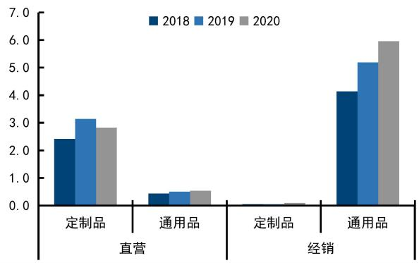
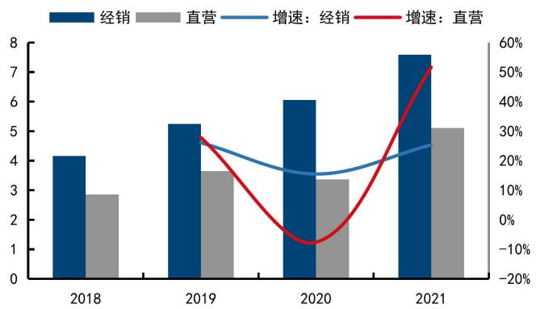
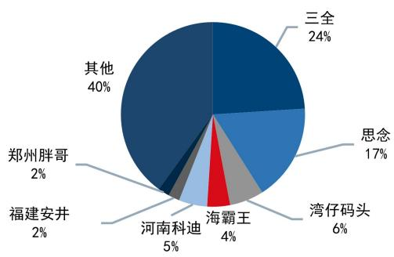
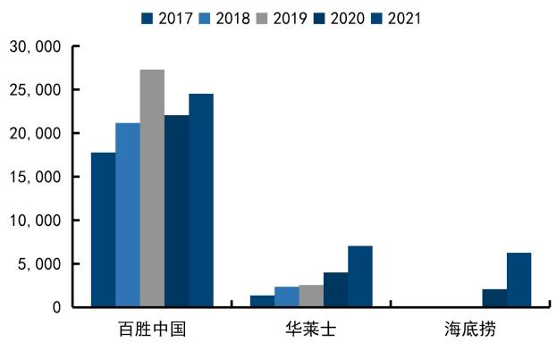
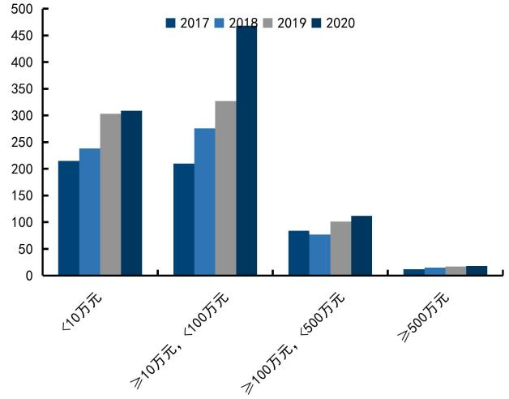

# 千味央厨（001215.SZ)中国领先的餐饮渠道速冻面米制品供应商

# 核心观点

公司概况：起源于大B 客户的中国速冻面米制品餐饮市场细分龙头。公司2012 年成立，致力于为餐饮企业提供速冻面米制品的全面供应解决方案，核心客户以百胜中国、海底捞等多家全国性知名连锁餐饮为主。经过10 多年的发展，公司已成长成为中国领先的餐饮渠道速冻面米制品提供商，在油条、芝麻球等细分品类市场份额行业第一。

行业分析：在餐饮企业降本提效诉求下，近年来餐饮供应链工业化趋势非常明显，我们测算速冻面米制品B 端市场未来有望维持 15%以上的增速。2019年我国速冻面米制品行业实现营收约 770 亿元，5 年复合增长率约 $8 \%$ ，而餐饮端消费占比尚不足 $20 \%$ ，对标日本仍有较大提升空间。疫情后餐饮连锁化率呈加速发展态势，同时餐饮企业降本提效和标准化的诉求更强，速冻面米制品餐饮市场有望加速发展：保守测算，我们预计未来 3-5 年速冻面米制品行业B 端市场有望维持 $1 5 \%$ 以上的年复合增速。

核心竞争力：依托服务大B 客户积累起来的研发、产品优势显著。公司从为百胜、海底捞等大客户做面米制品解决方案服务起家，由于大B 客户对消费者需求更敏感、对产品要求更高，这使得公司在产品端的研发和生产能力领先同行。公司作为最早深耕餐饮端速冻面米制品市场的企业，较早在行业内建立了“模拟餐厅后厨”研发实验室，其大单品芝麻球（不易破）、油条（更酥脆）等市占率领先同行；截止 2020 年底公司 SKU 368 个，产品储备丰富。

成长能力分析：大B 端基本盘增速稳定，降维拓展小 B 端优势显著。 $\textcircled{1}$ 在大B端，一方面公司和百胜、海底捞等老客户合作粘性强，仍有成长空间，同时与老乡鸡、瑞幸等新客户合作亦有增长潜力。 $\textcircled{2}$ 小B 端市场空间大、前景广阔，公司依托核心产品优势和大客户背书，在小B 端拓展前景看好。我们预计未来小B端公司业绩增长速度将维持较高水平。 $\textcircled{3}$ 公司近期推出岑夫子、千味解忧炸货铺及纳百味品牌系列积极拓展C 端市场或成为新的增长点。

盈利预测与投资建议：短期看受益于疫情放开业绩弹性较大，长期看持续成长能力强。短期看，2023 年疫情管控放开背景下，随着餐饮企业经营改善，公司有望充分受益；长期看，餐饮供应链工业化加速趋势明确，公司核心竞争力突出，持续成长能力强。我们预计公司 22-24 年收入和利润分别为14.8/19.0/24.1亿元和 $1 . 0 / 1 . 3 / 1 . 7$ 亿元，现价对应 PE 分别 57/42/32X，股价合理区间 62-80 元，首次覆盖给予“买入”评级。

风险提示：疫情反复影响餐饮业，行业竞争加剧，原材料价格大幅波动，对 大客户过度依赖等。

# 公司研究·深度报告

# 食品饮料·食品加工

证券分析师：陈青青 联系人：胡瑞阳  
0755-22940855 0755-81982908  
0755-81983057  
chenqingq@guosen.com.cn huruiyang@guosen.com.cn  
S0980520110001

<table><tr><td colspan="2">基础数据</td></tr><tr><td>投资评级</td><td>买入(维持)</td></tr><tr><td>合理估值</td><td>61.60-79.50元</td></tr><tr><td>收盘价</td><td>65.56元</td></tr><tr><td>总市值/流通市值</td><td>5680/2965 百万元</td></tr><tr><td>52周最高价/最低价</td><td>69.49/37.11元</td></tr><tr><td>近3个月日均成交额</td><td>79.51百万元</td></tr></table>

  
市场走势  
资料来源：Wind、国信证券经济研究所整理

# 相关研究报告

<table><tr><td>盈利预测和财务指标</td><td>2020</td><td>2021</td><td>2022E</td><td>2023E</td><td>2024E</td></tr><tr><td>营业收入(百万元)</td><td>944</td><td>1,274</td><td>1,479</td><td>1,902</td><td>2,412</td></tr><tr><td>(+/-%)</td><td>6.2%</td><td>34.9%</td><td>16.1%</td><td>28.6%</td><td>26.8%</td></tr><tr><td>净利润(百万元)</td><td>77</td><td>88</td><td>96</td><td>129</td><td>173</td></tr><tr><td>(+/-%)</td><td>3.3%</td><td>15.5%</td><td>8.4%</td><td>34.7%</td><td>34.1%</td></tr><tr><td>每股收益（元）</td><td>1.20</td><td>1.02</td><td>1.11</td><td>1.49</td><td>2.00</td></tr><tr><td>EBIT Margin</td><td>8.3%</td><td>9.0%</td><td>8.4%</td><td>8.9%</td><td>9.2%</td></tr><tr><td>净资产收益率（ROE)</td><td>13.2%</td><td>9.3%</td><td>9.2%</td><td>11.1%</td><td>13.1%</td></tr><tr><td>市盈率(PE)</td><td>52.4</td><td>61.6</td><td>56.8</td><td>42.2</td><td>31.5</td></tr><tr><td>EV/EBITDA</td><td>39.5</td><td>38.3</td><td>33.1</td><td>25.2</td><td>20.3</td></tr><tr><td>市净率(PB)</td><td>6.89</td><td>5.71</td><td>5.23</td><td>4.69</td><td>4.13</td></tr></table>

资料来源：Wind、国信证券经济研究所预测  
注：摊薄每股收益按最新总股本计算

# 内容目录

# 公司概况：中国领先的餐饮渠道速冻面米制品供应商 5

# 行业分析：我国速冻面米制品行业餐饮端市场有望维持 $15 \%$ 以上的稳定增长 10

# 竞争优势：深耕速冻面米行业餐饮端市场，研发能力强、渠道壁垒高. 18

# 成长性分析：大B 端基本盘稳定，小B 端快速拓展、空间广阔．. 23

# 盈利预测：短期业绩弹性较大，中长期持续增长能力强. 26

# 估值与投资建议：质地优秀的受益于疫情放开的餐饮供应链龙头企业. 28

# 风险提示.. 31

# 附表：财务预测与估值. 32

# 免责声明.. 33

# 图表目录

图1：2017-2021年公司营收年复合增长率为 $2 1 . 0 7 \%$ . 5  
图2：2017-2021年公司归母净利润年复合增长率为 $1 6 . 9 8 \%$ 5  
图3：公司发展历程示意图 6  
图4：2020 年公司各原材料采购金额占比示意图 .6  
图5：速冻制品产业链关系图 6  
图6：公司各渠道产品营收变化图（亿元） 7  
图7：公司各渠道营收变化图（亿元； $\%$ ） 7  
图8：公司销售部门架构合理、权责清晰 7  
图9：公司产品包括油炸类、烘焙类、蒸煮类、菜肴类及其他四大类 8  
图10：公司油炸类产品占比最大，菜肴类产品快速增长， 8  
图11：公司各产品营收占比示意图 8  
图12：公司股权结构示意图. 9  
图13：公司设立以来的股本形成及其变化过程示意图 9  
图14：中国速冻食品市场平稳增长.. 11  
图15：中国人均速冻食品消费量与发达国家差距较大（kg) 11  
图16：中国速冻食品餐饮端消费占比呈逐年上升趋势 11  
图17：中国速冻面米制品在速冻食品中占比最大， 11  
图18：中国速冻面米制品市场规模持续扩大.. 12  
图19：2020 年我国速冻面米制品C 端渠道销售额占比 $84 \%$ 12  
图20：2019 年我国速冻面米食品市场产量结构图 12  
图21：2020 年我国传统速冻面米市场竞争格局. 12  
图22：中国餐饮市场规模及增速. 13  
图23：中国餐饮连锁化率稳步提升（%) 13  
图24：中国餐饮连锁化率尚有较大提升空间. 13  
图25：中国餐饮连锁门店数量等级分布情况图 13  
图26：2019 年餐饮业各项成本占比图.. 14  
图27：2019 年餐饮业各项成本占比同比变化图（pct) 14  
图28：中国餐饮外卖行业快速增长. 14  
图29：中国外卖消费者规模快速增长 14  
图30：中国团餐市场规模逐年增加.. 15  
图31：2020 年团餐企业经营场景分布图 15  
图32：日本冷冻食品生产量（上）与不同渠道消费量（下）变化趋势示意图 16  
图33：中国人均 GDP 相当于日本1981-1984 年的水平 17  
图34：日本人均速冻食品消费量变化图. 17  
图35：1975-1990 年日本餐饮业市场规模复合增速约 $8 \%$ . 17  
图36：千味央厨毛利率与同行相比略低 18  
图37：千味央厨净利率高于同行. 18  
图38：千味央厨销售费用率低于同行. 19  
图39：千味央厨期间费用率低于同行. 19  
图40：公司持续增加研发投入. 20  
图41：公司产品矩阵逐渐丰富. 20  
图42： 公司油条系列产品的研发历程 20  
图43： 公司油条产品品类业内领先. 21  
图44： 公司部分代表客户列表. 22  
图45： 公司独家供货产品的销售金额及占比示意图 22  
图46： 公司产能利用率较高. 22  
图47：公司核心直营客户销售额变化（万元） 24  
图48：公司部分核心直营客户销售额年复合增长率（%） 24  
图49：公司经销商数量逐年递增 25  
图50：公司对前五直营客户销售额年复合增长率（%） 25

# 表1：截止 2021 年底公司核心管理人员及个人履历表. 9

表2：激励计划拟授予限制性股票的分配情况表 10  
表3：中国速冻食品行业公司信息梳理表. 12  
表4：速冻面米制品餐饮端市场有望快速成长 17  
表5：公司核心技术人员及个人履历表.. 19  
表6：公司主要产品销售额变化表（万元） 21  
表7：公司产能预计释放节奏. 23  
表8：公司直营客户的门店拓展情况表 24  
表9：公司前5 名经销商客户营收增速情况表. 25  
表10：公司推出三个面对C 端的子品牌及系列产品，积极布局C端， 25  
表11：公司主要业务未来三年营收预测表 27  
表12：未来3年盈利预测表. 27  
表13：公司盈利预测假设条件（%） 28  
表14：资本成本假设. 28  
表15：绝对估值相对折现率和永续增长率的敏感性分析（元） 28  
表16：可比公司的估值对比. 29

# 公司概况：中国领先的餐饮渠道速冻面米制品供应商

# 公司简介：源于思念，深耕餐饮渠道的速冻面米制品供应商

千味央厨成立于 2012 年，始终致力于为餐饮企业提供速冻面米制品从研发、生产到销售的全面供应解决方案。经过近10 年的发展，公司逐渐成长成为中国领先的餐饮渠道速冻面米制品提供商，还是百胜中国最大的速冻面米制品供应商和 TI级供应商以及华莱士派类产品（如豌豆紫薯派）独家供应商。公司的油条、蛋挞、芝麻球、蒸煎饺均是过亿级别的优势大单品。近年来，随着经销渠道的拓展和与大客户合作的持续深入，公司业绩实现稳定增长：2021 年公司实现营收12.74 亿元，2017-2021 年复合增长率为 $2 1 . 0 7 \%$ ；实现归母净利润0.88亿元，2017-2021年复合增长率为 16. $98 \%$ 。

  
图1：2017-2021年公司营收年复合增长率为 $2 1 . 0 7 \%$

  
图2：2017-2021 年公司归母净利润年复合增长率为 $1 6 , 9 8 \%$

资料来源：wind、国信证券经济研究所整理资料来源：wind、国信证券经济研究所整理

公司前身是思念集团的餐饮事业部，2012 年由思念集团出资设立，负责拓展速冻面米制品的餐饮端业务，后通过实控人李伟和思念管理层的股权相互转让独立出思念体系，并于2021年上市。公司的发展历程可以分为以下三个阶段：

2002-2012 年 起步阶段：公司于 2002 年开始与肯德基合作，开创中式传统食品进入西式餐饮业的先例，2006 年研发出安心油条，开创中国油条品牌，2012 年首创专业餐饮 B2B 道路，同年芝麻球单品销量过亿。

2013-2017年快速发展阶段：公司在2014 年实现餐饮定制化服务，2015 年逐渐完成精细化管理，并正式启动上市计划，2016 年公司品牌全新升级，明确了“只为厨饮、厨师之选”、“餐饮专供速冻面米领导品牌”的品牌定位和企业定位方向，成功进入百胜T1级别供应商行列，并引入战略投资。

2018-今餐赢天下：2018 年公司全新领导班子组建完毕，同年京东领投1亿元，2019 年公司涉足烘焙领域，未来公司将继续致力于为客户提供全面的速冻面米制品供应解决方案。

  
图3：公司发展历程示意图  
资料来源：公司官网、国信证券经济研究所整理

# 商业模式：为餐饮企业提供速冻面米制品全面供应解决方案

速冻食品供应链概况：速冻制品产业链的上游为农牧渔等原材料供应商、初加工企业，中游为速冻食品制造企业、冷链设备供应商，下游为冷链物流产业、销售渠道。其中，下游的销售渠道主要是面向消费者的 C 端零售渠道(KA、便利店、农贸市场等）和面向餐饮、企业团餐、酒店等的B 端销售渠道。公司位于产业链中游，为下游B 端客户提供速冻面米等制品的定制化服务。

原材料采购：以面粉、米粉、油脂等大宗商品为主。公司原辅材料采购主要分面粉类、米粉类、油脂类、肉类等大宗商品，以及杂粮、蔬菜、添加剂、调味品等小额物料两大类。2020 年公司原材料面粉及米粉类、油脂及糖类、杂粮类、辅料类、包装类的采购金额占比分别为 $42 \%$ $1 5 \%$ 、 $5 \%$ $1 9 \%$ $1 9 \%$ 。

  
图4：2020 年公司各原材料采购金额占比示意图

  
图5：速冻制品产业链关系图

资料来源：公司招股说明书、国信证券经济研究所整理资料来源：公司招股说明书、国信证券经济研究所整理

# 销售模式：通过直营 $\mathbf { + }$ 经销全面覆盖各类餐饮客户

直营模式：公司与大型连锁餐饮直接对接，为客户提供速冻面米制品从研发、生产到销售的全面供应解决方案，以销售定制品为主，2021 年公司直营模式实现收入5.11亿元，占比约 $40 \%$ ，2018-2021年复合增长率为 $2 1 . 5 \%$ ，其中2021 年增长较快主要系加速拓展客户以及部分经销客户归入直营所致。

经销模式：公司通过经销商覆盖小B 端餐饮、乡厨、团餐等客户（在销售额中，团餐客户占比 $30 \%$ ，乡村宴席占比 $30 \%$ ，中小餐饮占比 $40 \%$ ），以销售通用品为主，2021 年公司经销模式实现收入7.59 亿元，占比约 $60 \%$ ,2018-2021年复合增长率为 $2 2 . 2 \%$ 。

  
图6：公司各渠道产品营收变化图（亿元）

资料来源：公司招股说明书、国信证券经济研究所整理资料来源：公司招股说明书、国信证券经济研究所整理公司销售部门架构合理、权责清晰。公司市场营销工作由营销中心负责，由营销副总经理管理。营销中心下设重客部（主要负责为百胜中国、华莱士、九毛九、真功夫、海底捞等直营客户提供服务）、经销商客户部（主要服务于区域型餐饮客户，依托经销商进行销售）、渠道拓展部（主要负责拓展新零售等新业务）、行销部及产品管理部（主要负责营销中心在渠道和客户开发、服务提升方面的工作）、产品管理部（负责产品管理和品牌推广等工作）等。同时，公司设立销售支持部负责销售订单的处理、物流运输、销售数据分析及客诉处理。经过多年的实践、调整和改进，公司已经形成了一套机构设置合理、人员配置得当、区域布局合理的销售管理体系。

  
图7：公司各渠道营收变化图（亿元；%）

  
图8：公司销售部门架构合理、权责清晰

资料来源：公司招股说明书、国信证券经济研究所整理业务结构：公司产品主要分为油炸类、烘焙类、蒸煮类、菜肴类及其他四大类。公司产品按照加工方式可分为油炸类、烘焙类、蒸煮类、菜肴类及其他四大类，具体产品包括油条、芝麻球、蛋挞皮、地瓜丸以及卡通包等。2021 年油炸类、烘焙类、蒸煮类、菜肴类的营收分别为 6.60/2.23/2.56/1.30 亿元，占比分别为51. $8 5 \% / 1 7 . 5 3 \% / 2 0 . 0 6 \% / 1 0 . 2 2 \%$ ，2017-2021年复合增长率分别为17.02%/16. $76 \%$ /24. $96 \%$ /68. $83 \%$ 。

  
图9：公司产品包括油炸类、烘焙类、蒸煮类、菜肴类及其他四大类

资料来源：公司招股说明书、国信证券经济研究所整理资料来源：公司招股说明书、国信证券经济研究所整理资料来源：公司招股说明书、国信证券经济研究所整理

  
图10：公司油炸类产品占比最大，菜肴类产品快速增长

  
图11：公司各产品营收占比示意图

# 股权结构：原思念创始人李伟为实控人，高管大多出自思念

原思念创始人李伟加码餐饮供应链，为公司实控人。公司控股股东为公青城城之集，持股比例为 $4 6 . 0 3 \%$ ，实际控制人为李伟。2012 年思念设立公司之后，于2016年将 $100 \%$ 股权转让给郑州集之城，随后公司多次增资并引入战略投资者。随着公司餐饮定制化业务蒸蒸日上，社会餐饮专业化分工趋势渐起，公司启动上市计划，为避免同业竞争，李伟将所持思念的全部股权转让给思念管理层，正式退出思念体系。此外，核心高管也大多出自思念，在速冻面米行业从业多年，拥有丰富的行业经验。

  
图12：公司股权结构示意图  
资料来源：Choice、国信证券经济研究所整理

  
图13：公司设立以来的股本形成及其变化过程示意图  
资料来源：公司招股说明书、国信证券经济研究所整理

表1：截止2021年底公司核心管理人员及个人履历表  

<table><tr><td>姓名</td><td>职务</td><td>个人简历</td><td>持股比例</td></tr><tr><td>孙剑</td><td>董事长</td><td>1995 年9 月至2000 年 10 月任河南省天隆实业有限公司业务员；2000 年 10 月至2010 年9 月历任郑州思念业务代 表、上海公司经理、香港公司经理、营销中心副总经理；2010 年 10 月至 2013 年 9 月，任河南一生缘食品有限公 司销售总经理；2013 年10月至2018 年6 月，任郑州中部大观地产有限公司副总经理；2018 年7 月至今在本公司 工作，现任公司董事长，新乡千味执行董事。</td><td>0.16%</td></tr><tr><td>白瑞</td><td>董率经理</td><td></td><td>0.11%</td></tr><tr><td>王植宾</td><td></td><td></td><td>0.10%</td></tr><tr><td>陈伏铭董事</td><td></td><td>1999 年 7 月至 2001 年 11 历任郑州油脂化学集团有限责任公司财务部会计、主管会计；2001 年 11 月至 2008 年3 月任北京中路华会计师事务所有限公司河南分公司注册会计师、审计部负责人；2008 年4 月至今任黄河大观财务 总监，现任公司董事。</td><td></td></tr><tr><td>王珊珊董事</td><td></td><td>2007 年4 月至2010 年4 月任中国惠普有限公司项目经理&amp;D0A专家；2010 年4 月至2011年4 月任亚信联创股份有 限公司询顾间：股01年有5公司01年百时代络技术(北)有限公司产品经理=2014年科月至限2公16 战略投资部资深投资经理；2018 年7 月至今任北京京东世纪贸易有限公司战略投资部投资总监，现任公司董事。</td><td></td></tr></table>

资料来源：wind、公司招股说明书、国信证券经济研究所整理

注：公司管理层无直接持股，但通过前海新希望/共青城凯立间接持有部公司股份股权激励目标稳健，进一步绑定核心团队成员利益。2021 年 11 月，公司出台限制性股票激励计划： $\textcircled{1}$ 拟授予的限制性股票总计 156.84 万股，约占总股本的1. $84 \%$ ，其中预留部分约占此次限制性股票拟授予总额的 $2 , 6 9 \%$ ，首次授予价格为31.01元/股； $\textcircled{2}$ 授予对象：董事长孙剑、总经理白瑞、财务总监王植宾、董秘徐振江4 位核心管理层与其余76 为核心人员； $\textcircled{3}$ 考核目标：以2020年营业收入为基数，2021-2023 年营业收入增长分别不低于 $3 5 \% / 6 7 \% / 1 0 1 \%$ ，设置年度目标值的$80 \%$ 为业绩考核目标触发值，同时设置个人层面业绩考核要求。综合来看，此次股权激励目标设置稳健，有利于进一步绑定公司核心管理层利益，助力公司长远发展。

表2：激励计划拟授予限制性股票的分配情况表  

<table><tr><td>姓名</td><td>职务</td><td>授予的限制性股票数量（股）</td><td>占授予限制性股票总数的比例</td></tr><tr><td>孙剑</td><td>董事长</td><td>142,900</td><td>9.11%</td></tr><tr><td>白瑞</td><td>董事、总经理</td><td>97,400</td><td>6.21%</td></tr><tr><td>王植宾</td><td>董事、副总经理、财务总监</td><td>87,700</td><td>5.59%</td></tr><tr><td>徐振江</td><td>副总经理、董事会秘书</td><td>116,900</td><td>7.45%</td></tr><tr><td>核心人员（76人）</td><td></td><td>1,081,300</td><td>68.94%</td></tr><tr><td>预留股份</td><td></td><td>42,200</td><td>2.69%</td></tr><tr><td>合计</td><td></td><td>1,568,400</td><td>100.00%</td></tr></table>

资料来源：公司公告、国信证券经济研究所整理

# 行业分析：我国速冻面米制品行业餐饮端市场有望维持 $15 \%$ 以上的稳定增长

千亿速冻食品市场，速冻面米制品占比最大基本概念：速冻食品是指以米、面、肉类、蔬菜等为原料，通过急速低温 $( - 1 8 ^ { \circ } C$ 以下）工艺进行加工，并在连贯低温条件下运输储存，能够最大限度地保持食品本身的色泽风味及营养成分，具有美味、方便、卫生、健康、实惠等优点。

市场规模：截止 2021 年，根据前瞻产业研究院数据，我国速冻行业销售额约 1755亿元，近5 年复合增速约 $14 \%$ ，未来5年有望维持 $10 \%$ 左右的增速。但我国每年人均速冻食品消费量不足10kg，与发达国家相比尚有较大提升空间。

竞争格局：行业集中度低，龙头多元化发展，成长空间广阔。行业内知名公司，如速冻调理制品龙头安井食品等，老牌速冻食品企业三全、思念等，餐饮供应链领先企业千味央厨、味知香等目前营收尚不及百亿，市占率仅为个位数；但头部企业业务线丰富，成长空间大。

分产品：中国速冻食品可大致分为速冻调制食品（速冻鱼糜制品、速冻肉制品）、速冻面米制品（水饺、汤圆等）、速冻其他食品（农产速冻食品、水产速冻食品、畜产速冻食品等）三类，其中速冻面米制品占比最大，约 $52 \%$ ，速冻调理制品占比约 $33 \%$ 。

分渠道：根据《2021 中国餐饮产业生态白皮书》，我国餐饮端速冻食品消费占比逐年上升，2019 年为 $48 \%$ ；未来随着餐饮供应工业化的加速发展，B 端市场拓展空间广阔。

  
图14：中国速冻食品市场平稳增长

  
图15：中国人均速冻食品消费量与发达国家差距较大（kg)

资料来源：Frost&Sullivan、前瞻产业研究院、国信证券经济研究所整理

资料来源：中国食品监督局、艾媒数据中心、国信证券经济研究所整理

  
图16：中国速冻食品餐饮端消费占比呈逐年上升趋势  
资料来源：《2021中国餐饮产业生态白皮书》、国信证券经济研究所整理

  
图17：中国速冻面米制品在速冻食品中占比最大

资料来源：《2021中国餐饮产业生态白皮书》、国信证券经济研究所整理

# 速冻面米制品传统C 端市场成熟，B 端市场前景广阔

随着面点类新品的开发以及餐饮端需求的增加，中国速冻面米制品市场保持平稳增长。根据《2019 年中国冷冻冷藏食品工业经济运行报告》，2019 年我国速冻面米行业实现营收 773.5 亿元，同比增长 $4 . 6 \%$ ，近5 年复合增长率约为 $8 \%$ 。行业目前处于稳步成长期，增量市场空间巨大，在渠道、品牌、产品等方面拥有优势的企业均可分得一杯羹。

分产品看，传统速冻面米市场存量竞争，新型速冻面点市场快速发展。分产品看，以水饺、汤圆等为代表的传统C 端产品市场发展较为成熟，是速冻面米食品市场中传统且主要的品类，合计占比约 $60 \%$ ，市场以存量竞争为主，竞争较激烈，已形成三全食品、思念食品和湾仔码头三大龙头品牌占据主要市场份额的竞争格局。随着生产技术的进步，新入局厂商通过产品创新推出速冻面点类产品切入市场，如安井的红糖馒头、紫薯糯米球、千味央厨的油条等，该类新型速冻面米制品正快速成长。

分渠道看，速冻面米制品销售主要面向C 端，B 端前景广阔。2020 年我国速冻面米制品 C 端渠道销售额占比 $84 \%$ ，以汤圆、水饺为主，商超、便利店为最核心的销售渠道；而B 端占比仅为 $16 \%$ ，市场规模尚小。面米制品食用频率高，但制作费时费力且溢价较低，随着餐饮行业连锁化、供应链工业化水平的逐步提升，我们认为速冻面米制品在餐饮端市场仍有较大的成长空间。

  
图18：中国速冻面米制品市场规模持续扩大

  
图19：2020 年我国速冻面米制品C端渠道销售额占比 $84 \%$

资料来源：13-17 年数据来自Frost &SulIivan、18-19 年数据来自《2019 年中国冷冻冷藏食品工业经济运行报告》、国信证券经济研究所整理

资料来源：公司公告、国信证券经济研究所整理资料来源：观研天下整理、国信证券经济研究所整理资料来源：观研天下整理、国信证券经济研究所整理

  
图20：2019 年我国速冻面米食品市场产量结构图

  
图21：2020 年我国传统速冻面米市场竞争格局

表3：中国速冻食品行业公司信息梳理表  

<table><tr><td>公司名称</td><td>成立时间</td><td>营收规模净利率</td><td></td><td>主要产品及营收占比</td><td>渠道营收占比</td></tr><tr><td>千味央厨</td><td></td><td>2012年12.74亿元</td><td>7%</td><td>油炸品：收入6.60 亿元，占比51.85%；</td><td>烘焙类：收入2.53 亿元，占17.53%经销收入占比59.58%，主要销对为以餐</td></tr><tr><td>三全食品</td><td></td><td>2001年69.43亿元</td><td>9%</td><td>菜肴类及其他：收入1.30亿元，占比10.22%； 速冻面米制品：收入60.32 亿元，占比 86.87%； 速冻调制食品：收入7.46亿元，占比10.74%； 冷藏及短保类：收入1.23亿元，占比1.77%； 其他业务收入：收入0.42亿元，占比0.62%</td><td>零售及创新市场占比83.13%； 餐饮市场占比16.87%</td></tr><tr><td>安井食品</td><td>2001年</td><td>92.7亿元</td><td>7%</td><td>速冻鱼糜制品：收入34.78亿元，占比37.51%； 速速冻制品收入20.44亿元，占比2.1%； 菜肴制品：收入14.29亿元，占比15.41%；</td><td>经销占比83.29%； 超占9.95% 电商占比1.97%</td></tr><tr><td>巴比食品</td><td></td><td>2010年13.75亿元</td><td>23%</td><td>包装物及辅料收入0.90亿元，占比6.57%；</td><td>特许加盟销售收入占比1.55%， 团餐售收入15.62%</td></tr><tr><td>海欣食品</td><td></td><td>2004年15.5亿元</td><td>-2%</td><td>速冻鱼肉制品及肉制品：收入13.37亿元，占比86.26%； 常温休闲食品：收入1.17亿元，占比7.52%； 速冻面米制品：收入0.73亿元，占比4.69%；</td><td>流通渠道营收占比63.23%， 现代渠道营收占比20.09%， 特通渠道营收占比 9.82%，</td></tr></table>

<table><tr><td colspan="5">速冻菜肴制品：收入0.11亿元，占比0.73% 丸制品：收入4.16亿元，占比25.21%；</td></tr><tr><td>惠发食品</td><td>2005年16.5亿元</td><td>-8%</td><td>油炸品：收入3.17亿元，占比19.21%；</td><td></td><td>经销商营收占比62.06%， 商超营收占比1.46%，</td></tr><tr><td colspan="5"></td></tr><tr><td rowspan="3">思念食品 1997 年</td><td rowspan="3"></td><td rowspan="3">70亿元（2019）</td><td>供应链：收入3.69亿元，占比22.36%； 串制品：收入0.93亿元，占比5.64%；</td><td>终端直销营收占比11.82%，</td></tr><tr><td>肠制品：收入1.19亿元，占比7.21%；</td><td>供应链营收占比23.21%</td></tr><tr><td></td><td>C端渠道为主</td></tr><tr><td>湾仔码头</td><td>1977 年</td><td>最高约60亿元</td><td></td><td></td><td>C端渠道为主</td></tr><tr><td>海霸王</td><td>1975 年</td><td>21亿元以上</td><td></td><td></td><td>现代渠道、餐饮、电商为主 牛肉类：收入3.55 亿元，占比 46.41%；销售渠道分为零售渠道（包括经销店，加盟</td></tr><tr><td rowspan="3">味知香</td><td>2008年7.65亿元</td><td></td><td>17%</td><td></td><td>鱼类：收入0.98亿元，占比12.81%；店），批发渠道，直销及其他渠道和电商渠道 家禽类：收入1.05亿元，占比13.73%；零售渠道占比62.39%(经销店17.03%，加盟店</td></tr><tr><td></td><td></td><td></td><td></td><td>虾类：收入0.97 亿元，占比 12.68%；45.36%)，批发渠道占比 31.76%，直销及其他</td></tr><tr><td></td><td></td><td></td><td>猪肉类：收入0.58亿元，占比7.58%；</td><td>占比2.46%，电商渠道占比1.99%</td></tr></table>

资料来源：wind、各公司公告、国信证券经济研究所整理

餐饮企业连锁化趋势下对产品标准化的需求提升。根据国家统计局数据，2021 年中国餐饮收入 4.69 万亿元，同比增长 $1 8 . 6 0 \%$ ，随着疫情管控的逐步放松，餐饮业疫后复苏趋势明确。同时，疫情下，餐饮企业加速连锁化发展，餐饮企业对上菜速度快、菜品更新快等的诉求催化对高标准化餐饮半成品的需求，餐饮供应链工业加速发展。根据美团发布的《中国餐饮大数据 2021》，近年来我国餐饮连锁化率逐渐提升，2021 年为 $1 8 . 6 \%$ ，但相比其他国家/地区仍有较大提升空间。

  
图22：中国餐饮市场规模及增速

  
图23：中国餐饮连锁化率稳步提升(%)

资料来源：国家统计局，国信证券经济研究所整理资料来源：中国食品监督局、艾媒数据中心、国信证券经济研究所整理

  
图24：中国餐饮连锁化率尚有较大提升空间

  
图25：中国餐饮连锁门店数量等级分布情况图

资料来源：Euromonitor、国信证券经济研究所整理资料来源：《中国餐饮大数据2021》、国信证券经济研究所整理成本上升、经营压力增大，进一步催化餐饮企业对高标准半成品的需求。根据中国饭店协会发布的《2020 中国餐饮年度报告》2019 年我国餐饮业中房租及物业、人工成本占比分别为 $1 1 . 7 7 \%$ 和 $2 1 . 3 5 \%$ ，同比 2018 年分别上涨 3.39 和 3.69 个百分点。相较于自制菜品，速冻半成品可以为餐饮企业节省人工成本，并通过规模化采购降低原材料成本。因此随着人力、租金等成本的不断上涨，进一步催化餐饮企业对餐饮高标准半成品的需求。

  
图26：2019 年餐饮业各项成本占比图

  
图27：2019年餐饮业各项成本占比同比变化图（pct)

资料来源：中国饭店协会、国信证券经济研究所整理资料来源：中国饭店协会、国信证券经济研究所整理外卖的爆发推动快速响应的食材供应需求不断提升。随着线上订餐及配送服务的日益成熟，我国外卖市场发展迅速。中商产业研究院数据，2021 年中国外卖产业规模为 8117 亿元，近5 年复合增速约 $3 7 \%$ ；截至 2021 年底，外卖消费者规模达到约 5.4 亿人，在整体网民中占比过半。随着外卖订单的快速增长，缩减制作时间、产品标准化已成为外卖商家的痛点，这也给予速冻行业更多发展机会。

  
图28：中国餐饮外卖行业快速增长

  
图29：中国外卖消费者规模快速增长

资料来源：中商产业研究院、国信证券经济研究所整理资料来源：中商产业研究院、国信证券经济研究所整理

# 标准化程度更高的团餐与乡厨市场快速发展推动餐饮供应链行业快速扩容。

团餐本身具有可预测、规模大、标准化、订单稳定且时效长等特点，是速冻食品重要的应用场景之一。团餐是我国餐饮结构中重要的类型之一，主要集中在学校食堂、机关食堂、企业食堂等场景。根据团餐谋发布的《2022 中国团餐行业发展报告》统计分析显示：目前中国团餐业市场规模约 1.8 万亿，预计 2026 年将达到 3.6 万亿左右，复合增速 $1 5 \%$ ，高于餐饮行业整体，是餐饮业态中的高增长细分赛道。团餐本身具有可预测、规模大、标准化、订单稳定且时效长等特点，利于企业进行规模化采购以降低边际成本，是速冻食品重要的应用场景之一。团餐市场的快速发展有望助力速冻食品在餐饮产业链的快速渗透。

农村家宴市场空间广阔，标准化程度高，为速冻食品下沉至三四线城市及农村打下基础。农村家宴是我国传统饮食文化的重要组成部分，在农村，遇红白喜事人们会在自家院子里搭棚子，垒起灶台，请乡厨来宴请亲朋好友，这种风俗从古代一直延续至今。农村家宴市场虽然较少有人关注，但是近年来随着乡镇居民生活条件的改善，成长快速。根据报道，2017 年仅海宁100人以上的农村家宴就举办了1.5 万户次，按照“目前农村宴席每桌成本约为300-600 元，每次约为30-60 桌”估算，仅海宁（约70万人口）的农村家宴市场规模近4 亿，可见农村家宴市场空间广阔，有望助力速冻食品下沉至三四线城市及农村。

  
图30：中国团餐市场规模逐年增加  
资料来源：《2022 年度中国团餐发展报告》、国信证券经济研究所整理

  
图31：2020 年团餐企业经营场景分布图  
资料来源：《2020 年度中国团餐发展报告》、国信证券经济研究所整理

# 对标日本：我国速冻面米制品餐饮端市场未来有望快速成长

复盘日本市场：快餐兴起驱动速冻食品行业快速扩容、升级。日本速冻食品市场在政府的支持下开始发展，在快餐标准化诉求的驱动下快速成长，此后速冻食品也逐渐成为居民日常饮食的重要组成部分。日本速冻食品市场的发展可大致分为3 个阶段：

$\textcircled{1}$ 1945-1965 年萌芽期：时逢日本战后经济复苏期，食品紧缺下政府大力发展食品工业为速冻食品的发展提供了契机，冷藏设施的建设、制冷技术和包装材料的发展成为行业发展的基石，机关、团体、学校等供食的增加扩大了下游消费市场。但由于食品制作和加工技术尚未成熟，这个时期的产品主要以初加工的水产品和农产品为主。

$\textcircled{2}$ 1966-1997 年快速发展期（生产量复合增速约 $10 \%$ ，消费量复合增速约 $12 \%$ ):这一时期日本政府出台“冷藏链计划”，冷藏设备、制冷技术、冷链运输进一步发展，到70 年代中期，日本基本形成比较完善的冷冻食品工业体系。在速冻食品市场加速发展的阶段各企业纷纷通过改进生产管理方式、加速产品创新、甚至降价等方式抢占市场份额，市场竞争较为激烈。随着快餐的兴起（1970 年），B 端餐饮对食材的标准化需求成为行业扩容的主要推动力。这一时期随着食品加工和包装技术的进步，预制菜制品快速增长，并逐渐发展成为日本主要的速冻食品。

$\textcircled{3}$ 1998 年至今成熟期（生产量复合增速约 $0 . 2 \%$ ，消费量复合增速约 $1 \%$ ）：日本经济泡沫破裂后，餐饮行业发展停滞，此时在家庭端小型化和老龄化趋势下，日本消费者对于便捷饮食的诉求增加，因此速冻食品零售端的消费占比逐渐提升，速冻食品也逐渐成为日本居民日常饮食中重要的组成部分。

  
图32：日本冷冻食品生产量（上）与不同渠道消费量（下）变化趋势示意图  
资料来源：日本冷冻食品协会、国信证券经济研究所整理

中国速冻食品面米制品市场整体处于平稳发展阶段，餐饮端在降成本、标准化诉求增强的情况下，消费占比有望逐年提升，餐饮端市场未来有望实现 $15 \% +$ 的快速成长。根据《2019 年中国冷冻冷藏食品工业经济运行报告》，2019 年我国速冻面米行业实现营收 773.5 亿元，同比增长 $4 . 6 \%$ ，近5 年复合增长率约为 $8 \%$ 。此外，根据《2021 中国餐饮产业生态白皮书》，我国餐饮端速冻食品消费占比逐年上升，2019 年为 $48 \%$ ，而目前速冻面米在我国餐饮端消费占比仅 $16 \%$ 。对标日本，目前中国人均GDP 相当于日本1981-1984 年的水平，人均速冻食品消费量相当于日本 1985-1990 年的水平，且餐饮业的发展速度亦与日本餐饮业在 1980年左右的增速相近，故综合来看，当前我国速冻食品行业的发展特征与日本速冻食品市场的“快速发展期”类似，但餐饮端消费占比与日本（ $70 \%$ 左右）差距较大，原因可能有 $\textcircled{1}$ 中式餐饮制作过程繁琐，标准化难度较大， $\textcircled{2}$ 上游速冻食品厂商的生产技术有待提高。当前，中国餐饮供应链的工业化发展已是大势所趋，随着我国餐饮业降成本、标准化诉求的增加，叠加我国餐饮业规模持续扩大（近年来复合增速约 $9 \%$ ）以及疫情后餐饮连锁化加速发展（2020 年中国餐饮连锁化率环比提升1.9pct，相比往年显著加快），我们认为速冻面米制品作为我国速冻食品中占比最大的品类和中式餐饮中食用频繁、溢价能力较低且更易标准化的品类，未来在餐饮端市场亦有望实现 $15 \% +$ 的增长：假设我国速冻面米制品市场未来5年增速 $8 \%$ ，在B 端占比每年提升 $1 \% / 2 \% / 3 \%$ 的假设下，未来 5 年我国速冻面米制品行业餐饮端市场的年复合增长率分别约为 $1 4 \% I 1 9 \% I 2 3 \%$ 。

  
图33：中国人均GDP 相当于日本1981-1984年的水平

  
图34：日本人均速冻食品消费量变化图

资料来源：wind、国信证券经济研究所整理资料来源：日本冷冻食品协会、国信证券经济研究所整理资料来源：日本冷冻食品协会、国信证券经济研究所整理

  
图35：1975-1990 年日本餐饮业市场规模复合增速约 $8 \%$

表4：速冻面米制品餐饮端市场有望快速成长  

<table><tr><td colspan="6">年增长率</td><td rowspan="2">5年复合增长率</td></tr><tr><td>每年渗透率提升幅度</td><td>2021</td><td>2022</td><td>2023</td><td>2024</td><td>2025</td></tr><tr><td>1%</td><td>14.75%</td><td>14.35%</td><td>14.00%</td><td>13.68%</td><td>13.40%</td><td>14.04%</td></tr><tr><td>2%</td><td>21.50%</td><td>20.00%</td><td>18.80%</td><td>17.82%</td><td>17.00%</td><td>19.01%</td></tr><tr><td>3%</td><td>28.25%</td><td>25.05%</td><td>22.73%</td><td>20.96%</td><td>19.57%</td><td>23.27%</td></tr></table>

资料来源：公司公告、国信证券经济研究所整理

# 竞争优势：深耕速冻面米行业餐饮端市场，研发能力強、渠道壁垒高

中国速冻面米制品市场发展较成熟，品类多样，但单品空间有限，且产品同质化明显，竞争较为激烈，不同的业务模式对企业经营提出不同的要求：

大B业务考验企业的产品定制化、高标准供应生产的能力，虽然业务拓展时间周期长、难度较大，但客户粘性高，先入局的企业往往能够形成一定的渠道壁垒。

小B业务考验产品创新性及性价比，龙头企业多通过产品研发、培育大单品破局，能够率先洞察消费者需求且研发能力强的企业有望先一步挖掘潜力大单品，获得更快的成长，但渠道壁垒较低。

C 端业务则更看重品牌的知名度，需要企业进行长时间持续的营销宣传。

综合来看，我们认为在速冻面米制品市场能够突围的企业或能够敏锐地洞察消费者需求、在产品研发上具有领先性（如千味央厨），或拥有较强的渠道壁垒（如安井食品、千味央厨)，或在消费者心目中拥有较强的品牌知名度（如三全食品)。

# 大B 端生意模式：高研发要求、易形成客戶粘性和渠道壁垒

通过分析速冻制品行业大B 端、小B 端和 C 端业务商业模式的差异，可以看出大B 端生意模式有低毛利、高净利的特征，考验企业的研发能力、定制化能力和生产供应能力，虽然与客户建立供应关系需要较长的考验周期，但一旦形成合作，亦不会被轻易更换，因此大B 端生意更易形成较强的客户粘性和渠道壁垒。

速冻面米制品大 B 端、小 B 端和 C 端业务商业模式的差异：C 端业务直接面向消费者，需要通过宣传和在商超、流通等渠道的大面积铺货提高产品曝光率，因此品牌效应强，溢价高，但相应的费用投入更多，如三全食品的毛利率和销售费用率均处于行业较高水平。大B 端（大型餐饮企业）对产品有更多的差异化、特色化需求，因此产品多为定制，对上游供应商的研发能力、生产能力和供应能力等要求最高，定制化生产下供应商毛利高于小 B 端供应商但低于 C 端厂商，且稳定供应后费用投入最低，如千味央厨的毛利率和期间费用率均较低；此外进入大B 端时间周期长，但成为供应商后也不会被轻易更换，渠道壁垒较高。小B 端生意面向数量庞大、分布分散的中小餐饮企业，这些餐饮企业更重视产品性价比、质量稳定性等，因此厂商多采用经销方式覆盖，并通过培育大单品的方式向客户提供高性价比的产品，因此小 B 端生意可以通过规模效应提高毛利率，需要持续开拓经销商和一定的终端推广费用，但成功地推营销后的产品放量更快。

  
图36：千味央厨毛利率与同行相比略低

  
图37：千味央厨净利率高于同行

资料来源：wind、国信证券经济研究所整理资料来源：wind、国信证券经济研究所整理注：安井食品虽然主营小B 端业务，但也有C端业务，且营收规模远大于千味央厨，因此毛利率比千味央厨稍高

注：疫情利好 C 端企业，三全主营C 端，安井 BC 兼顾，故 2020、2021年千味央厨净利率相比之下较低

  
图38：千味央厨销售费用率低于同行

  
图39：千味央厨期间费用率低于同行

资料来源：wind、国信证券经济研究所整理资料来源：wind、国信证券经济研究所整理

# 卓越的研发实力满足客户对产品品质和更新速率的要求

公司在速冻面米行业的餐饮端深耕多年，拥有专业的研发团队、行业领先的研发技术和生产技术。公司以模拟餐厅后厨工艺和节约餐厅后厨成本为产品设计原则，研发生产符合餐饮企业安全卫生、标准化等采购需求的速冻面米制品。

研发团队源自思念集团，行业经验丰富，团队建设先进。 $\textcircled{1}$ 公司的核心技术人员均出自思念集团，在速冻面米制品行业从业多年，拥有丰富的行业经验。截止2021 年底，公司拥有41名技术人员，并通过他们在产品研发、小试、中试和改良等阶段的研发贡献确定职级和薪酬，激励其充分发挥技术能力。2020 年公司技术人员平均薪酬约 11 万，在公司内部仅次于营销人员，与同行相比处于中游位置，是当地平均工资水平的近 2 倍。 $\textcircled{2}$ 在研发团队建设上，公司较早在行业内建立了“模拟餐厅后厨”研发实验室，以模拟餐厅后厨工艺的产品研发及制作为出发点进行产品设计和研发。公司技术研发部下设产品研发、工艺研发、设备研发、包装研发等四个专业研究室和上海研发室，其中，产品研发又分设球类、酥类、油条、面点、烘焙类、创新类六个研发小组。上海研发室主要负责掌握国内新品动态和新品研发，自成立以来，先后取得了无铝安心油条、油条的工业化生产、芝麻球的工业化生产等多项具有自主知识产权的科研成果和核心技术，推动了企业规模的快速成长及转型。

表5：公司核心技术人员及个人履历表  

<table><tr><td>姓名</td><td>职务 个人简历</td><td></td></tr><tr><td>贾学明</td><td>技术研发</td><td>1997年7月至2004年2月从事餐饮面点师工作；2004年3月至2012年5月，历任郑州思念面点师、研发组长、技术经理和 高级发师，年今在公司作司技部总。黄公第一代条、蛋形全</td></tr><tr><td>程燕</td><td>技术研发师</td><td>国发酵面食优秀科技工作者”称号。 2年月至体系2年5月任以思及令研发资料管理员；2012年6月至今在本公司工作，现任技术研发部研发工程师，</td></tr><tr><td>朱国新</td><td>技术研发师</td><td></td></tr></table>

浆装置等新型设备。  

<table><tr><td>李欢</td><td>技术研发师</td><td>20产12月至20的3年计月发任郑州念研发中心配员；203、年9至今在公司工作，现任技术研发部工国金师本欢</td></tr><tr><td rowspan="3">姬真真</td><td></td><td></td></tr><tr><td></td><td>技术研发2。6年6月至012年5任郑州思念技术资料统计员、研发2012年6月至在公司工作，现任技术研发部研发工程</td></tr><tr><td></td><td></td></tr></table>

资料来源：公司招股说明书、国信证券经济研究所整理

研发技术卓越，保证产品快速更新迭代。 $\textcircled{1}$ 近年来，公司在研发端持续增加投入，截止 2020 年底已拥有 368 个 SKU，产品矩阵逐渐丰富。 $\textcircled{2}$ 公司能够根据客户要求，快速转化为对相应产品高质量、高标准化的生产，如“注芯油条”、“墨鱼汁油条”、“文化流量包”、“花瓣米糕”等，2018年公司推出 40 多款新品，其中为肯德基研发并上市了7个新品，得到了客户的肯定。 $\textcircled{3}$ 公司通过拓展现有产品的应用场景培育具有差异化、系列化的大单品矩阵，目前油条类、蛋挞类、芝麻球类、面点类均是含税收入过亿元的品类。以油条为例，公司从 2012 年开始进行油条细分场景下的市场研究，细分出火锅、快餐、自助餐、宴席、早餐、外卖六大场景，并针对性推出茴香小油条、麻辣烫小油条、火锅涮煮油条、外卖专用油条等多款创新性产品。消费场景的拓展有效帮助油条产品进入多样化的销售终端并持续放量，目前公司油条产品的市占率第一且有进一步提高的空间。

  
图40：公司持续增加研发投入

  
图41：公司产品矩阵逐渐丰富

资料来源：wind、国信证券经济研究所整理资料来源：公司招股说明书、国信证券经济研究所整理资料来源：公司官方公众号、国信证券经济研究所整理自主研发生产设备，提高生产效率。公司与国内机械设备制造企业合作学习国外先进技术并开发适用于国内速冻食品的生产设备，此外，公司根据自身需求研制非标专用设备，弥补速冻面米制品生产的自动化设备不足，如蛋饼机、蛋挞切块机、油炸锅等，从而保证创新产品快速量产，公司已取得油条的工业化生产、芝麻球的工业化生产、无铝安心油条等多项具有自主知识产权的科研成果和核心技术。

  
图42：公司油条系列产品的研发历程

  
图43：公司油条产品品类业内领先  
资料来源：公司官方公众号、国信证券经济研究所整理

表6：公司主要产品销售额变化表（万元）  

<table><tr><td>单位：万元</td><td>2017</td><td>2018</td><td>2019</td><td>2020</td></tr><tr><td>1*18*16蛋挞皮</td><td>7,097.04</td><td>7,952.65</td><td>9,107.33</td><td>8,664.30</td></tr><tr><td>千味260g芝麻球</td><td>8,538.82</td><td>8,954.79</td><td>9,033.79</td><td>9,830.79</td></tr><tr><td>KFC冷冻油条（60g）</td><td>-</td><td>4,497.85</td><td>6,815.12</td><td>6,503.15</td></tr><tr><td>千味400g香芋地瓜丸</td><td>-</td><td>4,403.52</td><td>5,015.23</td><td>5,272.30</td></tr><tr><td>千味450g 香脆油条</td><td>3,634.10</td><td>3,931.38</td><td>4,344.96</td><td>4,460.20</td></tr><tr><td>百胜原味冷冻华夫面团</td><td>-</td><td>1,196.04</td><td>2,804.94</td><td>1,729.94</td></tr><tr><td>千味360g卡通猪猪包</td><td>615.43</td><td>1,850.14</td><td>2,671.56</td><td>2,747.64</td></tr><tr><td>千味1200g放心大油条</td><td>-</td><td>927.31</td><td>1,963.33</td><td>2,611.47</td></tr><tr><td>千味300 克脆皮香蕉</td><td>2,136.65</td><td>1,865.72</td><td>1,756.57</td><td>1,515.17</td></tr><tr><td>百胜360g蛋芯油条</td><td>-</td><td>-</td><td>1,628.91</td><td>-</td></tr><tr><td>合计</td><td>22,022.04</td><td>35,813.69</td><td>45,141.74</td><td>43,334.97</td></tr></table>

资料来源：公司招股说明书、国信证券经济研究所整理

# 与大客戶建立长期稳定的合作关系，渠道壁垒高

为直营客户提供速冻面米制品的一体化解决方案，建立长期稳定的合作关系： $\textcircled{1}$ 公司为直营客户提供菜单设计、产品开发、产品销售、技术支持、干线物流运输以及后续服务咨询等在内的整体解决方案； $\textcircled{2}$ 公司与餐饮客户定期研讨产品升级方向，调整供应产品的配方、口感、包装等要素，共同讨论解决方案及新品提案，同时对产品的后续加工条件、餐饮企业的后厨布局设计提供要求与建议。如随着合作的深入，公司已成为肯德基油条产品的独家供应商，每年为肯德基提出多个新品提案，合作 SKU 数约 20-30个。

市场先发优势显著，优质客户资源丰富。公司自成立之初始终坚持为餐饮连锁企业提供速冻面米制品解决方案的战略定位，深耕速冻面米制品 B 端餐饮渠道，利用出色的品控能力和强大的研发实力积累了一批优质客户（肯德基、必胜客、华莱士、海底捞、真功夫、九毛九、呷哺呷哺等）。2016 年公司成为百胜T1 级别供应商，是全国面米类唯一入围的优质经销商，还是百胜中国油条类产品和华莱士派类产品（如豌豆紫薯派）的独家供应商，2019 年独家供货产品的销售金额增速约 $2 7 \%$ ，2020 年受疫情影响有所下滑。多年来公司已与客户建立了长期稳定的合作关系，由于大型连锁餐饮对口味及产品质量稳定性等有较高要求，供应商的进入门槛较高，但也不会轻易更换已有供应商，新兴餐饮连锁企业在建立供应商体系时，选用知名餐饮企业的供应商为最快捷、高效、安全的方式，因此公司在餐饮渠道已积累了较为显著的品牌优势。

  
图44：公司部分代表客户列表  
资料来源：公司招股说明书、国信证券经济研究所整理

  
图45：公司独家供货产品的销售金额及占比示意图

资料来源：公司招股说明书、国信证券经济研究所整理

# “自建 $\scriptstyle +$ 租赁”产能建设保障营收增速

由于我国国庆节、春节和元宵节等大型传统节日大多集中在每年的 8 月份至次年2 月份，该时间段内社会活动也相对较多，餐饮业进入旺季，公司销量也较高，因此公司的生产经营具有较强的季节性（二季度销售占比不足 $20 \%$ ，为最低；四季度占比 $30 \%$ 以上，为最高）。在销售旺季期间，公司面临一定产能瓶颈。考虑资金和时间成本，公司采用“自建 $^ +$ 租赁”方式补充产能： $\textcircled{1}$ 自建产能：公司利用募集资金建设新乡三期工厂，产能约 8 万吨，预计将于 2023 年 6 月开始投产，2023 年产能利用率 $30 \%$ ，2024 年产能利用率达到 $70 \%$ $\textcircled{2}$ 租赁工厂：为节约资金并实现产能的快速建设，公司还在安徽芜湖租赁工厂，其1 期已投产，产能约5 万吨左右；2 期预计 23 年中旬启动建设，24 年上半年投产，产能约 4-5 万吨。

  
图46：公司产能利用率较高

资料来源：公司招股说明书、国信证券经济研究所整理注：2020 年产能利用率偏低主要受疫情影响下开工率不足，新乡千味食品加工建设项目二期工程于 2020年 2 月投产，产能释放需要一定过程。

表7：公司产能预计释放节奏  

<table><tr><td></td><td>2020</td><td>2021E</td><td>2022E</td><td>2023E</td><td>2024E</td></tr><tr><td>公司产能释放节奏（万吨）</td><td>12.8</td><td>14.2</td><td>17.7</td><td>21.6</td><td>27.0</td></tr><tr><td>投产工厂</td><td></td><td></td><td></td><td>新乡一期投产增加芜湖工产能接近5万三期预23年中产新多三期产能设产能</td><td></td></tr></table>

资料来源：公司公告、国信证券经济研究所整理

# 成长性分析：大B 端基本盘稳定，小B 端快速拓展、空间广阔

老客户深化合作、新客户积极拓展，大B业务有望稳定增长对于直营老客户，公司的营收增长主要来源于： $\textcircled{1}$ 客户门店拓展 $\cdot ^ { + }$ 覆盖门店比例上升：中国餐饮连锁化趋势加强，连锁化率和不同等级的连锁餐饮数量均呈上升趋势，公司前五直营客户门店数量亦在逐年增加（如百胜中国预计每年通过渠道下沉增加 $1 0 0 0 +$ 家门店，华莱士近几年加速开店，每年计划新增约1000-2000家门店），同时随着合作的深入，公司覆盖门店比例亦有望提升（如华莱士等）。$\textcircled{2}$ 品类拓展：随着公司与老客户合作的深入，公司能够较为准确地把握客户需求，在现有产品的基础上，努力拓展供应的品类，除了速冻面米制品以外，公司还在争取获得如烘焙类产品、预调理食品、蔬菜类产品等多品类产品的供应权。以肯德基为例，公司从最早向其提供蛋挞皮开始，到现在产品延伸到安心油条、华夫饼、冷冻面团、烙饼、牛角包、酥饼等多个品类。 $\textcircled{3}$ 通过定制产品提升毛利空间：公司直营模式毛利更高，主要系（i）经销模式下公司定价会给予经销商一定的毛利空间；（i）公司在业内已形成了较好知名度、企业信誉和较强的规模、优质客户优势，面对下游直销客户具有一定议价权；（ⅲi）公司为满足客户的个性化需求，在直销模式下为大型连锁餐饮企业提供的定制产品毛利率较高。

分客户看，2021 年公司前五名直销客户依次为百胜中国、华莱士、海底捞、老乡鸡和瑞幸，其中百胜中国、海底捞和华莱士又是公司第一梯队的大客户：

2021 年百胜中国在公司直营销售中占比 $48 \%$ 左右，公司为其提供的主要产品包括蛋挞、油条等，此外公司每年还持续为其研发上新。综合考虑百胜中国每年门店的拓展速度、上新速度以及供货体量，我们预计公司对百胜中国的销售体量每年维持 $5 . 8 \%$ 的增长。华莱士和海底捞是公司近年来拓展的高增长大客户，2021 年经营受疫情影响较大，随着疫情管控的放开、合作品类的增加以及客户门店的拓展，我们预计未来公司对这两个客户的营收体量仍能维持较高水平的增长。老乡鸡和瑞幸是公司近 1-2 年拓展的潜力大客户，目前营收增量基数尚小，未来随着合作深入以及客户门店的拓展，营收体量有望高速增长。

同时，公司积极关注连锁餐饮市场崛起的“新秀”，如TIMS 等，未来将加大力度开发区域性连锁餐饮企业客户。此外，公司结合产品特点和零售、餐饮业态的新变化，创新性地开发连锁商超等B 端新渠道，如沃尔玛、盒马等。2021 年疫情下公司加大对大客户的开发力度，把一些成长性较高、未来发展潜力大的餐饮企业也纳入大客户管理体系中——截至到 2021 年12 月底，公司大客户数量为168 家，相比 2020 年年底的 87 家。

  
图47：公司核心直营客户销售额变化（万元）

  
图48：公司部分核心直营客户销售额年复合增长率（%）

资料来源：公司招股说明书、国信证券经济研究所整理资料来源：公司招股说明书、国信证券经济研究所整理

表8：公司直营客户的门店拓展情况表  

<table><tr><td></td><td>目前门店数</td><td>预计每年拓展数</td><td>门店数上限</td><td>统计截止日期</td></tr><tr><td></td><td>12409(其中肯德基约 8675 家，必胜客约 2806 家） 百胜中国自营10461家（肯德基7720 家，必胜客2573 家） 加盟1709家（肯德基790家，必胜客138家）</td><td>2022年新增1000-1200家门店</td><td></td><td>2022年9月</td></tr><tr><td>华莱士</td><td></td><td>家左右，多位于低线城市 20091家开店速度加快，预计每年100-2000</td><td></td><td>2022年6月</td></tr><tr><td>海底捞</td><td>1435家</td><td>预计重新启动关停的门店</td><td>约2700家</td><td>2022年6月</td></tr><tr><td>真功夫</td><td>526家</td><td>100家</td><td>-</td><td>2022年10月</td></tr><tr><td>九毛九</td><td>516家</td><td>150家（太二）</td><td>未来三年太二开间</td><td>2022年11月</td></tr><tr><td>呷哺呷哺</td><td>1008家，呷脯呷脯810家，湊湊火锅198家</td><td>每年新开80-100家</td><td>800-1000（凑湊）</td><td>2022年6月</td></tr><tr><td>老乡鸡</td><td>1000+，997 家直营店，102 家加盟店</td><td>3年内开设700家直营店</td><td>一</td><td>2022年6月</td></tr><tr><td>杨国福</td><td>6000+，仅3家直营店</td><td>每年新增近1000 家</td><td>2025年增至9000家</td><td>2022年10月</td></tr><tr><td>TIMS</td><td>500+，其中自营门店460 多家，加盟门店50 多家平均每年开500-600家左右新店，以</td><td>直营店为主</td><td>2026 年前开店 2750 家</td><td>2022年10月</td></tr><tr><td>瑞幸咖啡</td><td></td><td></td><td>一线城市上限1000 家，新一线</td><td>2022年9月</td></tr></table>

资料来源：公司招股说明书、国信证券经济研究所整理

# 培育优势大单品、积极拓展经销渠道，小B拓展空间广阔

速冻面米制品小B 端竞争较为激烈，渠道壁垒相对较低，公司通过集中资源深度赋能大经销商持续推进渠道建设。随着渠道拓展，公司经销商数量逐年增加，截止 2021 年底，拥有经销商 968 家。为提高经销商服务质量与效率，2021 年公司采取“聚焦大客户深度服务”、“拓展渠道商”的管理模式重点赋能头部经销商，效果初步显现———2021 年占比前 20 名经销商销售额为 2.06 亿，同比增幅为$5 0 . 1 4 \%$ ，高于 2021 年经销模式 $2 5 . 3 5 \%$ 的增幅。此外，为增强经销商服务，2021年公司增加销售及市场人员 38人，合计 213 人。深化与头部经销商的合作也有利于帮助公司拉动大经销商的销量并在小 B 端形成一定的渠道壁垒。

产品方面，公司在经销渠道销售通过差异化面点产品抢占增量市场，其中油条、芝麻球、蒸煎饺是公司的过亿优势大产品，米糕、大包子等是公司培育的潜力单品。其中，油条是中国传统美食，预计市场空间约 200 亿左右，工业制作替代手工制作趋势明显；公司是中国油条品牌的开创者，油条生产技术行业领先，品类丰富，且产品拥有大客户的背书，市场竞争力较强，因此近年来随着渠道的拓展，油条的增速 $30 \%$ 左右）始终高于公司平均水平，且未来我们认为油条仍有望维持 $30 \%$ 左右的增长。此外，蒸煎饺是公司去年成功推出的大单品，后期制作方便且产品性价比高，预计未来 1-2 年仍能保持较高速的成长。同时，公司还在培育米糕、大包子等潜力大单品，未来有望贡献新的增量。

  
图49：公司经销商数量逐年递增

  
图50：公司对前五直营客户销售额年复合增长率（%）

资料来源：公司公告、国信证券经济研究所整理资料来源：公司招股说明书、国信证券经济研究所整理

表9：公司前5 名经销商客户营收增速情况表  

<table><tr><td></td><td>2017-2019年</td><td>2017-2020年</td></tr><tr><td>武汉市江汉区昌盛海鲜食品批发部及其关联方</td><td></td><td>21%</td></tr><tr><td>郑州市惠济区信基冻品水产大世界盼盼商行及其关联方</td><td>2020年增速-6%</td><td></td></tr><tr><td>郑州市惠济区中原物流港仁泰丰源食品商行及其关联方</td><td>34%</td><td>16%</td></tr><tr><td>青白江区锦粹食品商行及其关联方（成都市）</td><td>42%</td><td>26%</td></tr><tr><td>北京丽春达贸易有限公司及其关联方</td><td>22%</td><td>4%</td></tr></table>

资料来源：公司招股说明书、国信证券经济研究所整理

# 聚焦细分场景积极布局C端，构筑全新增长曲线

积极布局C 端，打造全新成长曲线。 $\textcircled{1}$ 组织架构：公司董事长挂帅，成立C端事业部。 $\textcircled{2}$ 品牌及产品：针对细分场景，基于公司本身的技术储备，公司推出三个子品牌及系列产品—在地方特色美食领域推出“岑夫子”系列产品，瞄准空气炸锅等场景推出“千味解忧炸货铺”系列产品，针对日常消费场景推出“纳百味”系列产品。 $\textcircled{3}$ 渠道：在C 端主要拓展新零售、线上、区域性批发市场等渠道。

表10：公司推出三个面对C 端的子品牌及系列产品，积极布局C端

<table><tr><td colspan="2">“岑夫子”</td><td>“千味解忧炸货铺”</td><td>“纳百味”</td><td></td></tr><tr><td>品牌</td><td>岑夫子 岑夫子</td><td>会上市 炸锅而</td><td>百</td><td></td></tr><tr><td>细分场景</td><td>地方特色美食 以继承传统+跨界组合+年轻化创新的核心路线，以聚焦“宅经济“懒人经济“健康经济”，主打</td><td>空气炸锅等场景</td><td>“纳百味”系列产品 来自千味央厨高性价比优势产品的转</td><td>在品设餐上以能量情。</td></tr><tr><td>品牌路线</td><td colspan="4">夫，新国格，意美食气美食专属品 “靓汤云吞”（特色：汤底由中国非遗技艺传承人亲自小龙虾芝士大挞、一口酥小蛋挞、黑椒肉</td></tr><tr><td>代表产品</td><td colspan="4">指导，系传统特色云吞与经典广式靓汤与泰式冬阴丁多多爆汁肠、台式千层大方酥在内的七一 功汤创意组合下的全新品类） 大产品。</td></tr></table>

资料来源：大河财立方、国信证券经济研究所整理和预测

# 盈利预测：短期业绩弹性较大，中长期持续增长能力強

假设前提：疫情放开后餐饮逐渐恢复、渠道拓展如期推进

我们的盈利预测基于以下假设条件：

# 分业务结构营收假设：

油炸品主要包括油条、芝麻球、地瓜丸等。其中油条是公司的优势大单品（市占率第一），产品品类齐全，使用范围广，在公司直营和经销渠道均为主推的产品，2021年营收达3.51亿元 $( + 3 4 . 4 8 \% )$ ），在油炸品类中占比约 $53 \%$ 。油条食用场景丰富（早餐、配菜、宴席、点心等），制作工业化趋势明显，随着渠道的拓展，公司油条未来市占率有望持续提高，故我们预计油条未来3年有望保持 $30 \%$ 左右的增速；预计油炸品类未来 3 年有望维持 $20 \%$ 左右的增速。

烘焙类产品主要包括手工蛋挞皮、华夫饼等，其中手工蛋挞皮等为公司为肯德基专供的单品，这部分的供应较为稳定，但增速较低；公司还与如茶颜悦色、奈雪的茶、瑞幸咖啡（曲奇）、太平洋咖啡（欧包）等茶饮和咖啡连锁店建立合作，打开产品消费场景；烘焙产品多为公司为客户的定制化产品，随着合作品类的增加，我们预计烘焙类产品未来 3 年有望实现 $2 5 \% - 3 0 \%$ 左右的增长。

蒸煮类产品包括饺子、形象面点（卡通包等）、米糕等，在产品上与三全、安井等形成错位竞争。虽如米糕、大包子等是公司正在培育的单品，但目前该品类中尚无公司核心单品，随着渠道的拓展我们预计未来3年有望实现$1 5 \% - 2 0 \%$ 左右的增长。

菜肴及其他制品包括千页豆腐、撒尿肉丸、蒸煎饺等，今年来公司利用自身的餐饮渠道优势、主要通过外购的形式切入速冻火锅料市场，来完善自身的产品线。此外，从团餐渠道突围的蒸煎饺已成为公司的大单品，2021 年营收1.35 亿，2022 年营收有望突破两亿，正快速成长。因此我们预计菜肴及其他品类有望实现 $50 \%$ 左右的高速增长。

# 毛利率与费用率假设：

毛利率：随着营收体量的增大，规模效应逐渐显现，我们假设公司各业务毛利率均呈现稳步增长状态；其中油炸品类由于产品结构调整，毛利率改善最快；烘焙品类由于定制化产品较多，随着营收规模增大，毛利率改善较快；菜肴类及蒸煮类品类的毛利率则温和改善。

费用端：随着公司营收体量的增大，销售费率和管理费率逐渐降低；但随着公司小 B 端销售占比的增加（小 B 端业务相比大B 端需要更多的销售费用支持），销售费率逐渐增长。

表11：公司主要业务未来三年营收预测表  

<table><tr><td colspan="2"></td><td>2019</td><td>2020</td><td>2021</td><td>2022E</td><td>2023E</td><td>2024E</td></tr><tr><td colspan="2">油炸品</td><td></td><td></td><td></td><td></td><td></td><td></td></tr><tr><td>营收：亿元</td><td></td><td>4.92</td><td>5.21</td><td>6.60</td><td>7.26</td><td>9.08</td><td>11.16</td></tr><tr><td>增速：%</td><td></td><td>22.39%</td><td>5.89%</td><td>26.68%</td><td>10.00%</td><td>25.00%</td><td>23.00%</td></tr><tr><td>毛利率：%</td><td></td><td>22.73%</td><td>20.18%</td><td>20.72%</td><td>21.70%</td><td>22.50%</td><td>23.00%</td></tr><tr><td>蒸煮类</td><td></td><td></td><td></td><td></td><td></td><td></td><td></td></tr><tr><td></td><td>营收：亿元</td><td>1.77</td><td>1.84</td><td>2.56</td><td>2.71</td><td>3.26</td><td>3.84</td></tr><tr><td>增速：%</td><td></td><td>30.15%</td><td>3.95%</td><td>39.13%</td><td>6.00%</td><td>20.00%</td><td>18.00%</td></tr><tr><td>毛利率：%</td><td></td><td>26.92%</td><td>24.55%</td><td>23.45%</td><td>24.00%</td><td>24.10%</td><td>24.20%</td></tr><tr><td>烘焙类</td><td></td><td></td><td></td><td></td><td></td><td></td><td></td></tr><tr><td></td><td>营收：亿元</td><td>1.98</td><td>1.88</td><td>2.23</td><td>2.56</td><td>3.33</td><td>4.27</td></tr><tr><td>增速：%</td><td></td><td>29.41%</td><td>-5.05%</td><td>18.62%</td><td>15.00%</td><td>30.00%</td><td>28.00%</td></tr><tr><td>毛利率：%</td><td></td><td>26.70%</td><td>22.94%</td><td>24.95%</td><td>22.00%</td><td>23.00%</td><td>23.50%</td></tr><tr><td>菜肴类及其他</td><td></td><td></td><td></td><td></td><td></td><td></td><td></td></tr><tr><td></td><td>营收：亿元</td><td>0.22</td><td>0.50</td><td>1.30</td><td>2.21</td><td>3.32</td><td>4.81</td></tr><tr><td>增速：%</td><td></td><td>120.00%</td><td>127.27%</td><td>160.00%</td><td>70.00%</td><td>50.00%</td><td>45.00%</td></tr><tr><td>毛利率：%</td><td></td><td>22.98%</td><td>19.34%</td><td>21.59%</td><td>24.00%</td><td>24.10%</td><td>24.20%</td></tr></table>

资料来源：Wind、国信证券经济研究所整理和预测

# 未来 3 年业绩预测：未来 3 年复合增速 $20 \%$ 以上

按上述假设条件，我们得到公司 22-24 年收入分别为 14.79/19.02/24.12 亿元，增速分别为 $1 6 . \ 1 \% / 2 8 . \ 6 \% / 2 6 . \ 8 \%$ ；归属母公司净利润0.96/1.29/1.73 亿元，增速分别为 $8 . 4 \% 3 4 . 7 \% 3 4 . 1 \%$ ；每股收益分别为1.11/1.49/2.00元。

表12：未来3 年盈利预测表  

<table><tr><td colspan="4"></td></tr><tr><td></td><td>2021</td><td>2022E</td><td>2023E</td></tr><tr><td>营业收入：亿元</td><td>12.74</td><td>14.79</td><td>19.02 24.12</td></tr><tr><td>营业成本：亿元</td><td>9.89</td><td>11.43 14.59</td><td>18.41</td></tr><tr><td>销售费用：亿元</td><td>0.42</td><td>0.52 0.70</td><td>0.94</td></tr><tr><td>管理费用：亿元</td><td>1.07</td><td>1.35</td><td>1.69 2.11</td></tr><tr><td>财务费用：亿元</td><td>0.05</td><td>0.00</td><td>0.02 -0.03</td></tr><tr><td>营业利润：亿元</td><td>1.12</td><td>1.24</td><td>1.68 2.26</td></tr><tr><td>利润总额：亿元</td><td>1.13</td><td>1.26</td><td>1.70 2.28</td></tr><tr><td>归属于母公司净利润：亿元</td><td>0.88</td><td>0.96</td><td>1.29 1.73</td></tr><tr><td>EPS：元/股</td><td>1.02</td><td>1.11</td><td>1.49 2.00</td></tr><tr><td>ROE:%</td><td>9.28%</td><td>9.21%</td><td>11.13% 13.12%</td></tr></table>

资料来源：Wind、国信证券经济研究所整理和预测

# 估值与投资建议：质地优秀的受益于疫情放开的餐饮供应链龙头企业

考虑公司的业务特点，我们采用绝对估值和相对估值两种方法来估算公司的合理价值区间。

# 绝对估值：61.6-83.0元

由于公司商业模式具有持续增长能力，我们认为适合绝对估值方法，如下文。盈利预测假设前提正如前文所述，我们在此不再赘述。其他参数:我们取十年期国债收益率 $2 . 8 3 \%$ 作为无风险利率，参考行业和公司情况假设无杠杆 Beta 为0.9，股票风险溢价为 6. $80 \%$ 。详细假设见表 13 和表14。根据以上提到的主要假设条件，得到公司的合理价值区间为61.6-83.0 元。

未来10年估值假设条件见下表：

表13：公司盈利预测假设条件 $( \% )$   

<table><tr><td></td><td>2019</td><td>2020</td><td>2021E</td><td>2022E</td><td>2023E</td><td>2024E</td><td>2025E</td><td>2026E</td></tr><tr><td>营业收入增长率</td><td>26.82%</td><td>6.20%</td><td>34.89%</td><td>16.08%</td><td>28.62%</td><td>26.81%</td><td>24.84%</td><td>22.70%</td></tr><tr><td>营业成本/营业收入</td><td>75.50%</td><td>78.29%</td><td>77.64%</td><td>77.28%</td><td>76.70%</td><td>76.36%</td><td>76.01%</td><td>75.68%</td></tr><tr><td>管理费用/营业收入</td><td>7.04%</td><td>8.26%</td><td>8.35%</td><td>9.00%</td><td>8.80%</td><td>8.70%</td><td>8.60%</td><td>8.50%</td></tr><tr><td>研发费用/销售收入</td><td>0.60%</td><td>0.76%</td><td>0.71%</td><td>0.90%</td><td>0.88%</td><td>0.87%</td><td>0.86%</td><td>0.85%</td></tr><tr><td>销售费用/销售收入</td><td>5.00%</td><td>3.28%</td><td>3.33%</td><td>3.50%</td><td>3.70%</td><td>3.90%</td><td>4.00%</td><td>4.10%</td></tr><tr><td>营业税及附加/营业收入</td><td>0.84%</td><td>0.94%</td><td>0.91%</td><td>0.85%</td><td>0.90%</td><td>0.89%</td><td>0.88%</td><td>0.89%</td></tr><tr><td>所得税税率</td><td>23.89%</td><td>23.52%</td><td>23.04%</td><td>25.00%</td><td>25.00%</td><td>25.00%</td><td>25.00%</td><td>25.00%</td></tr><tr><td>股利分配比率</td><td>1.31%</td><td>5.37%</td><td>7.53%</td><td>8.00%</td><td>8.00%</td><td>8.00%</td><td>8.00%</td><td>8.00%</td></tr></table>

资料来源：wind，国信证券经济研究所预测

表14：资本成本假设  

<table><tr><td></td><td></td><td></td><td></td></tr><tr><td>无杠杆 Beta</td><td>0.9</td><td>T</td><td>25.00%</td></tr><tr><td>无风险利率</td><td>2.83%</td><td>Ka</td><td>8.95%</td></tr><tr><td>股票风险溢价</td><td>6.80%</td><td>有杠杆 Beta</td><td>0.97</td></tr><tr><td>公司股价（元）</td><td>62.78</td><td>Ke</td><td>9.40%</td></tr><tr><td>发行在外股数（百万）</td><td>87</td><td>E/(D+E)</td><td>91.04%</td></tr><tr><td>股票市值(E，百万元)</td><td>5439</td><td>D/(D+E)</td><td>8.96%</td></tr><tr><td>债务总额(D，百万元)</td><td>535</td><td>WACC</td><td>8.99%</td></tr><tr><td>Kd</td><td>6.45%</td><td>永续增长率（10年后）</td><td>2.0%</td></tr></table>

资料来源：国信证券经济研究所假设

# 绝对估值的敏感性分析

该绝对估值相对于 WACC 和永续增长率较为敏感，下表为敏感性分析。

表15：绝对估值相对折现率和永续增长率的敏感性分析（元）  

<table><tr><td colspan="2" rowspan="2"></td><td colspan="4">WACC变化</td></tr><tr><td>8.0%</td><td>8.5% 8.99%</td><td>9.5%</td></tr><tr><td rowspan="5">永续 率变 化</td><td>3.0%</td><td>99.95</td><td>88.90 79.75</td><td>10.0% 72.05 65.49</td></tr><tr><td>2.5%</td><td>92.50</td><td>82.95 74.92</td><td>68.08 62.19</td></tr><tr><td>2.0%</td><td>86.29</td><td>77.91 70.77</td><td>64.63 59.29</td></tr><tr><td>1.5%</td><td>81.04</td><td>73.59 67.18</td><td>61.62 56.74</td></tr></table>

<table><tr><td>1.0%</td><td></td><td></td><td>69.85</td><td>64.04</td><td>58.96</td><td>54.47</td></tr><tr><td></td><td>76.54</td><td></td><td></td><td></td><td></td><td></td></tr></table>

资料来源：国信证券经济研究所分析

# 相对估值：59.7-79.5 元

我们选取与公司同行业的安井食品、三全食品、巴比食品和立高食品作比较，采用PE法估值。其中：

三全食品是中国传统速冻面米制品市场的龙头企业，主要产品为水饺汤圆粽子（占比 $60 \% +$ ），渠道销售以C端为主（占比 $80 \% +$ ），由于速冻面米制品传统市场为存量市场，因此近年来公司积极向速冻面点和速冻调理制品等方向拓展产品线，并积极拓展 B 端渠道，近三年营收 CAGR 为 $7 . 8 \%$ ，归母净利润CAGR 为 $8 4 . 5 \%$ （公司于 2018 年起对餐饮和零售业务进行改革调整，净利率显著提高，且疫情下，公司C端业务受益）；

安井食品是中国速冻调理制品的绝对龙头，在产能、产品、渠道等方面综合竞争优势显著，主要产品为速冻调理制品（占比 $60 \% +$ ），主要面向B端销售，近年来产品线逐渐向速冻面点制品、预制菜肴延伸，并在积极拓展C 端渠道，公司所处赛道空间大且增速稳定，公司近三年营收 CAGR 为 $2 9 . 6 \%$ ，归母净利润CAGR 为 $3 6 . 2 \%$ ;

巴比食品是“连锁门店销售为主，团体供餐销售为辅”的中式面点速冻食品制造企业，主要通过设立直营/加盟门店的方式向C 端消费者销售包子、面点等各式早餐，公司成长空间广阔，但开店模式下成长速度较慢，近三年营收CAGR为 $1 5 . 7 \%$ ，归母净利润 CAGR 为 $3 0 . 0 \%$ （疫情对公司经营影响较大）；

立高食品是冷冻烘焙赛道绝对龙头，主要从事烘焙食品原料（奶油、酱料等)及冷冻烘焙食品的研发、生产和销售，销售渠道以烘焙店、商超等B端为主，公司处在快速成长的蓝海赛道，有望充分有享受行业加速发展的红利，但疫情对公司的影响较大，公司近三年营收 CAGR 为 $2 9 . 0 \%$ ，归母净利润CAGR为$7 5 . 9 \%$ 。

考虑到随着疫情管控的放开，餐饮企业经营改善，2023 年公司有望充分受益，业绩弹性较大；此后我们预计公司有望恢复 $20 \%$ 的稳定增长。综合考虑各公司的发展空间、成长的可持续性及增速等，我们认为给予公司 2024 年 30-40 倍 PE 的估值是合理的，对应价格区间为 59.7-79.5 元。

表16：可比公司的估值对比  

<table><tr><td rowspan="2">代码</td><td rowspan="2">公司简称</td><td rowspan="2">股价</td><td colspan="4">总市值</td><td colspan="5">PE</td><td colspan="2">ROE</td></tr><tr><td>亿元</td><td>21A</td><td>EPS 22E</td><td>23E</td><td>24E</td><td></td><td>21A</td><td>22E</td><td>23E</td><td>24E</td><td>(21A)</td></tr><tr><td>001215</td><td>千味央厨</td><td>62</td><td>53.72</td><td>0.97</td><td>1.12</td><td>1.6</td><td>2.2</td><td>59.75</td><td></td><td>82.38</td><td>57.58</td><td>41.82</td><td>9.28</td></tr><tr><td>可比公司：</td><td></td><td></td><td></td><td></td><td></td><td></td><td></td><td></td><td></td><td></td><td></td><td></td><td></td></tr><tr><td>605338</td><td>巴比食品</td><td>30.65</td><td>76.01</td><td>1.2</td><td>0.92</td><td>1.16</td><td>1.42</td><td>28.96</td><td></td><td>99.66</td><td>79.54</td><td>64.91</td><td>16.45</td></tr><tr><td>300973</td><td>立高食品</td><td>91.99</td><td>155.78</td><td>1.6</td><td>0.95</td><td>1.77</td><td>2.39</td><td>82.55</td><td></td><td>96.83</td><td>51.97</td><td>38.49</td><td>14.26</td></tr><tr><td>002216</td><td>三全食品</td><td>18.04</td><td>158.6</td><td>0.66</td><td>0.89</td><td>0.99</td><td>1.11</td><td></td><td>30.48</td><td>103.39</td><td>92.47</td><td>82.51</td><td>19.82</td></tr><tr><td>603345</td><td>安井食品</td><td>164.22</td><td>481.65</td><td>2.94</td><td>3.53</td><td>4.54</td><td>5.69</td><td></td><td>58.1</td><td>26.02</td><td>20.25</td><td>16.17</td><td>13.45</td></tr><tr><td colspan="2">均值</td><td>76.23</td><td>218.01</td><td>1.6</td><td>1.57</td><td>2.12</td><td>2.65</td><td>50.02</td><td></td><td>81.48</td><td>61.06</td><td>50.52</td><td>15.99</td></tr></table>

资料来源：Wind，国信证券经济研究所整理及预测

# 投资建议：质地优秀的餐饮供应链细分龙头

公司是我国 Β 端速冻面米制品行业的领先企业，明年疫情放开背景下，随着餐饮企业经营改善，公司有望充分受益；同时长期看餐饮供应链工业化加速趋势明确，公司核心竞争力突出，持续成长能力强。综合上述几个方面的估值，我们认为公司股票合理估值区间在 61.6-79.5 元之间，对应 2024 年动态市盈率分别为 30 倍和 40 倍。我们认为公司作为餐饮端领先的速冻面米制品供应商，先发优势显著，成长空间广阔，首次覆盖给予“买入”评级。

# 风险提示

# 估值的风险

我们采取绝对估值和相对估值方法计算得出公司的合理估值在 61.6-79.5 元之间，但该估值是建立在较多假设前提的基础上计算而来的，特别是对公司未来几年自由现金流的计算、加权资本成本（WACC）的计算、TV 增长率的假定和可比公司的估值参数的选定，都加入了很多个人的判断：

1、可能由于对公司显性期和半显性期收入和利润增长估计偏乐观，导致未来 10年自由现金流计算值偏高，从而导致估值偏乐观的风险；

2、加权资本成本（WACC）对公司估值影响非常大，我们在计算 WACC 时假设无风险利率为 $2 . 8 3 \%$ 、风险溢价 $6 . 8 \%$ ，可能仍然存在对该等参数估计或取值偏低、导致 WACC 计算值较低，从而导致公司估值高估的风险；

3、我们假定未来10年后公司TV增长率为 $2 \%$ ，公司所处行业可能在未来10年后发生较大的不利变化，公司持续成长性实际很低或负增长，从而导致公司估值高估的风险；

4、相对估值时我们选取了与公司同行业的公司进行比较，同时考虑公司成长性，最终给予公司 2024 年 30-40 倍 PE 估值，可能未充分考虑市场整体估值偏高的风险。

# 盈利预测的风险

第一、若经济出现大幅波动，消费需求下降，可能导致餐饮业增速放缓；

第二、疫情反复影响餐饮业经营，公司主营 B 端业务，有可能影响整体公司增速。

# 经营风险

第一、随公司规模的快速扩张很容易出现管理滞后的现象，造成公司管理效率降低，竞争力下降。公司的快速发展需要高效的运营管理及内部协同，为此需要不断打通边界，强化和完善各类管理制度，规范和优化业务流程，并通过信息化手段，构建管理自动化体系，提高信息流、物流与资金流的周转效率，形成较为科学、完善的内部流转系统，对公司规模快速扩张形成强力支撑；

第二、公司由于渠道拓展新市场与推广新产品而使得费用支出超出预期的风险。新市场的开拓与新产品的推广会带来费用开支的大幅度增加，若控制不力，会对利润形成较大吞噬。

# 市场风险

第一、在餐饮供应链工业化发展的大背景下，随着更多厂商的参与，未来市场竞争可能存加剧风险，影响公司赛道上的议价力及固有优势；

第二、公司原材料包括面粉及米粉类、油脂及糖类、辅料类、包装类等，在成本持续上涨的大背景下，公司成本端压力较大；

第三、如果出现行业性事件，如行业内其他企业经营不规范造成食品质量安全事件，也可能会对本企业造成影响。

附表：财务预测与估值   

<table><tr><td>资产负债表（百万元）</td><td>2020</td><td>2021</td><td>2022E</td><td>2023E</td><td>2024E</td></tr><tr><td>现金及现金等价物</td><td>117</td><td>332</td><td>785</td><td>632</td><td>679</td></tr><tr><td>应收款项</td><td>52</td><td>71</td><td>81</td><td>104</td><td>132</td></tr><tr><td>存货净额</td><td>116</td><td>162</td><td>185</td><td>238</td><td>302</td></tr><tr><td>其他流动资产</td><td>47</td><td>29</td><td>37</td><td>48</td><td>60</td></tr><tr><td>流动资产合计</td><td>333</td><td>593</td><td>1088</td><td>1022</td><td>1173</td></tr><tr><td>固定资产</td><td>544</td><td>636</td><td>720</td><td>795</td><td>811</td></tr><tr><td>无形资产及其他</td><td>39</td><td>38</td><td>38</td><td>37</td><td>37</td></tr><tr><td>投资性房地产</td><td>39</td><td>73</td><td>73</td><td>73</td><td>73</td></tr><tr><td>长期股权投资</td><td>0</td><td>0</td><td>0</td><td>0</td><td>0</td></tr><tr><td>资产总计</td><td>956</td><td>1341</td><td>1919</td><td>1927</td><td>2094</td></tr><tr><td>短期借款及交易性金融</td><td></td><td></td><td></td><td></td><td></td></tr><tr><td>负债</td><td>19</td><td>25</td><td>500</td><td>300</td><td>200</td></tr><tr><td>应付款项</td><td>142</td><td>144</td><td>164</td><td>211</td><td>268</td></tr><tr><td>其他流动负债</td><td>144</td><td>157</td><td>153</td><td>197</td><td>250</td></tr><tr><td>流动负债合计</td><td>305</td><td>326</td><td>817</td><td>708</td><td>718</td></tr><tr><td>长期借款及应付债券</td><td>55</td><td>35</td><td>35</td><td>35</td><td>35</td></tr><tr><td>其他长期负债</td><td>14</td><td>26</td><td>26</td><td>26</td><td>26</td></tr><tr><td>长期负债合计</td><td>69</td><td>61</td><td>61</td><td>61</td><td>61</td></tr><tr><td>负债合计</td><td>373</td><td>388</td><td>879</td><td>769</td><td>780</td></tr><tr><td>少数股东权益</td><td>(0)</td><td>(0)</td><td>(2)</td><td>(3)</td><td>(6)</td></tr><tr><td>股东权益</td><td>582</td><td>954</td><td>1042</td><td>1161</td><td>1320</td></tr><tr><td>负债和股东权益总计</td><td>956</td><td>1341</td><td>1919</td><td>1927</td><td>2094</td></tr></table>

<table><tr><td>利润表（百万元）</td><td>2020</td><td>2021</td><td>2022E</td><td>2023E</td><td>2024E</td></tr><tr><td>营业收入</td><td>944</td><td>1274</td><td>1479</td><td>1902</td><td>2412</td></tr><tr><td>营业成本</td><td>739</td><td>989</td><td>1143</td><td>1459</td><td>1841</td></tr><tr><td>营业税金及附加</td><td>9</td><td>12</td><td>13</td><td>17</td><td>21</td></tr><tr><td>销售费用</td><td>31</td><td>42</td><td>52</td><td>70</td><td>94</td></tr><tr><td>管理费用</td><td>79</td><td>107</td><td>135</td><td>169</td><td>211</td></tr><tr><td>研发费用</td><td>7</td><td>9</td><td>13</td><td>17</td><td>21</td></tr><tr><td>财务费用</td><td>3</td><td>5</td><td>(0)</td><td>2</td><td>(3)</td></tr><tr><td>投资收益</td><td>0</td><td>0</td><td>0</td><td>0</td><td>0</td></tr><tr><td>资产减值及公允价值变</td><td></td><td></td><td></td><td></td><td></td></tr><tr><td>动</td><td>(1)</td><td>0</td><td>0</td><td>0</td><td>0</td></tr><tr><td>其他收入</td><td>18</td><td>(7)</td><td>(13)</td><td>(17)</td><td>(21)</td></tr><tr><td>营业利润</td><td>100</td><td>112</td><td>124</td><td>168</td><td>226</td></tr><tr><td>营业外净收支</td><td>0</td><td>2</td><td>2</td><td>2</td><td>2</td></tr><tr><td>利润总额</td><td>100</td><td>113</td><td>126</td><td>170</td><td>228</td></tr><tr><td>所得税费用</td><td>24</td><td>26</td><td>32</td><td>42</td><td>57</td></tr><tr><td>少数股东损益</td><td>(0)</td><td>(1)</td><td>(1)</td><td>(2)</td><td>(2)</td></tr><tr><td>归属于母公司净利润</td><td>77</td><td>88</td><td>96</td><td>129</td><td>173</td></tr></table>

<table><tr><td>关键财务与估值指标</td><td>2020</td><td>2021</td><td>2022E</td><td>2023E</td><td>2024E</td></tr><tr><td>每股收益</td><td>1.20</td><td>1.02</td><td>1.11</td><td>1.49</td><td>2.00</td></tr><tr><td>每股红利</td><td>0.06</td><td>0.08</td><td>0.09</td><td>0.12</td><td>0.16</td></tr><tr><td>每股净资产</td><td>9.12</td><td>11.01</td><td>12.03</td><td>13.40</td><td>15.24</td></tr><tr><td>ROIC</td><td>12%</td><td>11%</td><td>10%</td><td>12%</td><td>14%</td></tr><tr><td>ROE</td><td>13%</td><td>9%</td><td>9%</td><td>11%</td><td>13%</td></tr><tr><td>毛利率</td><td>22%</td><td>22%</td><td>23%</td><td>23%</td><td>24%</td></tr><tr><td>EBIT Margin</td><td>8%</td><td>9%</td><td>8%</td><td>9%</td><td>9%</td></tr><tr><td>EBITDA Margin</td><td>12%</td><td>12%</td><td>13%</td><td>13%</td><td>13%</td></tr><tr><td>收入增长</td><td>6%</td><td>35%</td><td>16%</td><td>29%</td><td>27%</td></tr><tr><td>净利润增长率</td><td>3%</td><td>16%</td><td>8%</td><td>35%</td><td>34%</td></tr><tr><td>资产负债率</td><td>39%</td><td>29%</td><td>46%</td><td>40%</td><td>37%</td></tr><tr><td>息率</td><td>0.1%</td><td>0.1%</td><td>0.1%</td><td>0.2%</td><td>0.3%</td></tr><tr><td>P/E</td><td>52.4</td><td>61.6</td><td>56.8</td><td>42.2</td><td>31.5</td></tr><tr><td>P/B</td><td>6.9</td><td>5.7</td><td>5.2</td><td>4.7</td><td>4.1</td></tr><tr><td>EV/EBITDA</td><td>39.5</td><td>38.3</td><td>33.1</td><td>25.2</td><td>20.3</td></tr></table>

资料来源：Wind、国信证券经济研究所预测

<table><tr><td>现金流量表（百万元）</td><td>2020</td><td>2021</td><td>2022E</td><td>2023E</td><td>2024E</td></tr><tr><td>净利润</td><td>77</td><td>88</td><td>96</td><td>129</td><td>173</td></tr><tr><td>资产减值准备</td><td>0</td><td>0</td><td>0</td><td>0</td><td>0</td></tr><tr><td>折旧摊销</td><td>32</td><td>38</td><td>67</td><td>77</td><td>85</td></tr><tr><td>公允价值变动损失</td><td>1</td><td>(0)</td><td>0</td><td>0</td><td>0</td></tr><tr><td>财务费用</td><td>3</td><td>5</td><td>(0)</td><td>2</td><td>(3)</td></tr><tr><td>营运资本变动</td><td>(133)</td><td>(51)</td><td>(25)</td><td>4</td><td>6</td></tr><tr><td>其它</td><td>(0)</td><td>(1)</td><td>(1)</td><td>(2)</td><td>(2)</td></tr><tr><td>经营活动现金流</td><td>(23)</td><td>74</td><td>137</td><td>209</td><td>262</td></tr><tr><td>资本开支</td><td>0</td><td>(130)</td><td>(151)</td><td>(151)</td><td>(101)</td></tr><tr><td>其它投资现金流</td><td>0</td><td>0</td><td>0</td><td>0</td><td>0</td></tr><tr><td>投资活动现金流</td><td>0</td><td>(130)</td><td>(151)</td><td>(151)</td><td>(101)</td></tr><tr><td>权益性融资</td><td>0</td><td>349</td><td>0</td><td>0</td><td>0</td></tr><tr><td>负债净变化</td><td>55</td><td>(20)</td><td>0</td><td>0</td><td>0</td></tr><tr><td>支付股利、利息</td><td>(4)</td><td>(7)</td><td>(8)</td><td>(10)</td><td>(14)</td></tr><tr><td>其它融资现金流</td><td>(40)</td><td>(26)</td><td>475</td><td>(200)</td><td>(100)</td></tr><tr><td>融资活动现金流</td><td>61</td><td>271</td><td>467</td><td>(210)</td><td>(114)</td></tr><tr><td>现金净变动</td><td>38</td><td>215</td><td>453</td><td>(153)</td><td>47</td></tr><tr><td>货币资金的期初余额</td><td>79</td><td>117</td><td>332</td><td>785</td><td>632</td></tr><tr><td>货币资金的期末余额</td><td>117</td><td>332</td><td>785</td><td>632</td><td>679</td></tr><tr><td>企业自由现金流</td><td>0</td><td>(55)</td><td>(16)</td><td>58</td><td>156</td></tr><tr><td>权益自由现金流</td><td>0</td><td>(101)</td><td>459</td><td>(144)</td><td>59</td></tr></table>

# 免责声明

# 分析师声明

作者保证报告所采用的数据均来自合规渠道；分析逻辑基于作者的职业理解，通过合理判断并得出结论，力求独立、客观、公正，结论不受任何第三方的授意或影响；作者在过去、现在或未来未就其研究报告所提供的具体建议或所表述的意见直接或间接收取任何报酬，特此声明。

国信证券投资评级  

<table><tr><td>类别</td><td>级别</td><td>说明</td></tr><tr><td rowspan="4">股票 投资评级</td><td>买入</td><td>股价表现优于市场指数 20%以上</td></tr><tr><td>增持</td><td>股价表现优于市场指数10%-20%之间</td></tr><tr><td>中性</td><td>股价表现介于市场指数土10%之间</td></tr><tr><td>卖出</td><td>股价表现弱于市场指数 10%以上</td></tr><tr><td rowspan="3">投行业级</td><td>超配</td><td>行业指数表现优于市场指数 10%以上</td></tr><tr><td>中性</td><td>行业指数表现介于市场指数土10%之间</td></tr><tr><td>低配</td><td>行业指数表现弱于市场指数 10%以上</td></tr></table>

# 重要声明

本报告由国信证券股份有限公司（已具备中国证监会许可的证券投资咨询业务资格）制作；报告版权归国信证券股份有限公司（以下简称“我公司”）所有。，本公司不会因接收人

收到本报告而视其为客户。未经书面许可，任何机构和个人不得以任何形式使用、复制或传播。任何有关本报告的摘要或节选都不代表本报告正式完整的观点，一切须以我公司向客户发布的本报告完整版本为准。

本报告基于已公开的资料或信息撰写，但我公司不保证该资料及信息的完整性、准确性。本报告所载的信息、资料、建议及推测仅反映我公司于本报告公开发布当日的判断，在不同时期，我公司可能撰写并发布与本报告所载资料、建议及推测不一致的报告。我公司不保证本报告所含信息及资料处于最新状态；我公司可能随时补充、更新和修订有关信息及资料，投资者应当自行关注相关更新和修订内容。我公司或关联机构可能会持有本报告中所提到的公司所发行的证券并进行交易，还可能为这些公司提供或争取提供投资银行、财务顾问或金融产品等相关服务。本公司的资产管理部门、自营部门以及其他投资业务部门可能独立做出与本报告中意见或建议不一致的投资决策。

本报告仅供参考之用，不构成出售或购买证券或其他投资标的要约或邀请。在任何情况下，本报告中的信息和意见均不构成对任何个人的投资建议。任何形式的分享证券投资收益或者分担证券投资损失的书面或口头承诺均为无效。投资者应结合自己的投资目标和财务状况自行判断是否采用本报告所载内容和信息并自行承担风险，我公司及雇员对投资者使用本报告及其内容而造成的一切后果不承担任何法律责任。

# 证券投资咨询业务的说明

本公司具备中国证监会核准的证券投资咨询业务资格。证券投资咨询，是指从事证券投资咨询业务的机构及其投资咨询人员以下列形式为证券投资人或者客户提供证券投资分析、预测或者建议等直接或者间接有偿咨询服务的活动：接受投资人或者客户委托，提供证券投资咨询服务；举办有关证券投资咨询的讲座、报告会、分析会等；在报刊上发表证券投资咨询的文章、评论、报告，以及通过电台、电视台等公众传播媒体提供证券投资咨询服务；通过电话、传真、电脑网络等电信设备系统，提供证券投资咨询服务；中国证监会认定的其他形式。

发布证券研究报告是证券投资咨询业务的一种基本形式，指证券公司、证券投资咨询机构对证券及证券相关产品的价值、市场走势或者相关影响因素进行分析，形成证券估值、投资评级等投资分析意见，制作证券研究报告，并向客户发布的行为。

# 国信证券经济研究所

深圳深圳市福田区福华一路 125 号国信金融大厦 36 层邮编：518046总机：0755-82130833

上海  
上海浦东民生路 1199 弄证大五道口广场 1号楼 12 层  
邮编：200135  
北京  
北京西城区金融大街兴盛街 6 号国信证券 9 层  
邮编：100032