# 协鑫能科（002015.SZ）清洁电力运营商，率先探索新能源 RWA

# 核心观点

深耕清洁能源领域二十余载，中报业绩预增20-35%。协鑫能科主营燃机热电联产和能源服务。公司2024年营业收入98亿元，同比 $- 3 . 4 \%$ ；因部分换电资产减值，2024年归母净利润4.9亿元，同比- $4 6 \%$ 。截至去年底公司并网装机 5.9GW，其中燃机热电联产 2GW，燃煤热电联产203MW，光伏发电2GW，风电818MW，垃圾发电149MW，储能662MW。燃机热电联产2024年实现营业收入52.4亿元，占比 $5 3 . 4 \%$ ；蒸汽销售2024 年营收为26.8亿元；能源服务（虚拟电厂、能源交易、节能改造等）营业收入11.9亿元，占比 $1 2 . 2 \%$ 。公司预告 2025 年上半年公司实现归母净利润4.93-5.55亿元，同比 $+ 2 0 \% - 3 5 \%$ ，对应 2025Q2 公司实现归母净利润 2.39-3.01 亿元，同比 $+ 7 \% - 3 5 \%$ ，环比 $- 6 \%$ 至$+ 1 8 \%$ 。

率先探索新能源发电资产发行RWA。RWA（现实世界资产）是指将实体资产（如房产、设备、基础设施、债券、光伏电站）或权益（收益权、知识产权）转化为可以在区块链上交易的数字代币。2024 年 12 月协鑫能科与蚂蚁数科合作完成国内首单光伏实体资产 RWA，融资金额超 2 亿元人民币，底层资产为位于湖北、湖南两省的 82MW户用分布式光伏电站。

新能源RWA市场大有可为。RWA 具备以下优势：1）区块链赋能：实现资产数字化确权，确保数据不可篡改且可追溯，比较其他资产证券化形式大幅缩短发行周期和减少发行成本，融资效率得到提升；2）跨境融资突破：通过合规渠道在境外发行，吸引国际绿色资金。目前国内协鑫能科、朗新集团、元隆雅图均已完成RWA项目实践。据RWA监测平台rwa.xyz数据，截至 7 月 6 日链上总 RWA 价值约 248 亿美元；稳定币总价值约2417.2 亿美元。

RWA带动公司能源服务发展。伴随《香港稳定币》条款落地，新能源 RWA获得越来越多的产业项目方关注。2025年 6月协鑫能科与蚂蚁数科成立合资公司蚂蚁鑫能，合资公司定位是优先为国内分布式能源资产提供RWA 发行服务。通过参与新能源 RWA 业务公司可开拓更大规模的虚拟电厂聚合业务、能源交易业务等。截至去年底公司在江苏省虚拟电厂可调负荷规模约 300MW，占省内 $20 \%$ ；公司需求响应规模约 500MW，未来还将稳步提高。能源服务业务收入在 2024年达到 11亿，同比增长超过 $33 \%$ 。

风险提示：原材料波动风险、有息负债比例较高、市场竞争加剧风险。

投资建议：我们预计公司 2025-2027 年实现归母净利润 9.0/9.8/10.5 亿元，同比增长 $8 4 \% / 9 \% / 7 \%$ ，对应当前 PE 为 24/21/20倍，首次覆盖。

# 公司研究·财报点评

# 电力设备·其他电源设备Ⅱ

证券分析师：王蔚祺 证券分析师：李恒源   
010-88005313 021-60875174   
wangweiqi2@guosen.com.cnlihengyuan@guosen.com.cn   
S0980520080003 S0980520080009   
证券分析师：徐文辉   
021-60375426   
xuwenhui@guosen.com.cn   
S0980524030001

<table><tr><td colspan="2">基础数据</td></tr><tr><td>投资评级</td><td>无评级</td></tr><tr><td>合理估值</td><td></td></tr><tr><td>收盘价</td><td>13.06元</td></tr><tr><td>总市值/流通市值</td><td>21201/21201 百万元</td></tr><tr><td>52周最高价/最低价</td><td>15.00/6.30元</td></tr><tr><td>近3个月日均成交额</td><td>861.00百万元</td></tr></table>

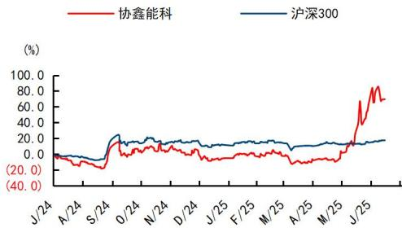  
市场走势  
资料来源：Wind、国信证券经济研究所整理

# 相关研究报告

<table><tr><td>盈利预测和财务指标</td><td>2023</td><td>2024</td><td>2025E</td><td>2026E</td><td>2027E</td></tr><tr><td>营业收入（百万元）</td><td>10,144</td><td>9,796</td><td>10,900</td><td>11,500</td><td>11,900</td></tr><tr><td>(+/-%)</td><td>-5.0%</td><td>-3.4%</td><td>11.3%</td><td>5.5%</td><td>3.5%</td></tr><tr><td>净利润(百万元)</td><td>909</td><td>489</td><td>900</td><td>983</td><td>1054</td></tr><tr><td>(+/-%)</td><td>33.7%</td><td>-46.2%</td><td>84.1%</td><td>9.2%</td><td>7.2%</td></tr><tr><td>每股收益（元）</td><td>0.56</td><td>0.30</td><td>0.55</td><td>0.61</td><td>0.65</td></tr><tr><td>EBIT Margin</td><td>10.9%</td><td>16.6%</td><td>16.3%</td><td>16.9%</td><td>17.4%</td></tr><tr><td>净资产收益率（ROE）</td><td>8.5%</td><td>4.3%</td><td>7.4%</td><td>7.7%</td><td>7.8%</td></tr><tr><td>市盈率 (PE)</td><td>23.3</td><td>43.4</td><td>23.5</td><td>21.6</td><td>20.1</td></tr><tr><td>EV/EBITDA</td><td>20.2</td><td>17.8</td><td>14.4</td><td>13.6</td><td>12.7</td></tr><tr><td>市净率(PB)</td><td>1.65</td><td>1.57</td><td>1.50</td><td>1.43</td><td>1.36</td></tr></table>

资料来源：Wind、国信证券经济研究所预测  
注：摊薄每股收益按最新总股本计算

# 公司概况

# 公司聚焦能源资产与能源交易服务业务

协鑫能科（002015.SZ）是协鑫（集团）控股有限公司旗下核心企业，专注于清洁能源资产运营与综合能源服务，业务涵盖清洁能源生产、虚拟电厂、户用能源系统、储能、碳资产管理等多个板块。2009 年，公司前身保利协鑫有限公司成立，主营清洁能源发电及热电联产业务。2019年公司借壳霞客环保上市，并更名为协鑫能科。2022 年公司通过定增及可转债连续募资建设新能源车换电站及碳酸锂工厂。2023年公司增资 3亿元入股星临科技，布局 AI算力赛道。2024年底，公司与蚂蚁数科达成战略合作，以湖南、湖北 82MW 户用光伏电站为底层资产，发行RWA代币募资 2 亿元，标志着国内首单光伏 RWA的诞生。

一、在发电业务方面：2024年公司热电联产、新能源资产的装机容量进一步提升。截至 2024年底，公司并网装机总量 5.87GW，其中燃机热电联产装机 2.02GW，燃煤热电联产装机 0.2GW，光伏发电装机 2.02GW，风电装机 0.82GW，储能 0.66GW，垃圾发电 0.1GW，可再生能源装机占发电总装机的比例为 $5 7 . 4 \%$ 。2024年公司实现电力销售 91亿千瓦时，平均电价 0.68元（含税）。

二、在能源服务业务方面，公司重点开发分布式能源资产，扩大节能服务业务规模。在节能服务领域公司大力开发分布式光伏，打造“鑫零碳”工商业分布式品牌、“鑫阳光”户用分布式品牌。截至 2024 年 12 月 31 日，公司分布式光伏项目并网装机容量 1.56GW，年内实现转让 549MW。

三、在能源交易业务方面，公司着重在虚拟电厂、售电领域加大布局力度。截至2024年末公司在江苏省虚拟电厂可调负荷规模约 300MW，占省内实际可调负荷规模比例约 $20 \%$ ，需求响应规模约 500MW。同时公司在其它区域市场也持续开拓虚拟电厂，不断提高负荷聚合规模。公司还在江苏、浙江、广东、山东、蒙西、川渝等电力负荷集中区域持续拓展售电业务。2024年公司参与市场化交易服务电量270.57 亿 kWh；绿电交易 4.42 亿 kWh，国内国际绿证对应电量合计 12.24 亿 kWh。

四、新型储能业务方面，2024年公司重点在江苏、浙江、广东等区域布局新型储能项目。截至 2024 年末公司电网侧储能总规模 650MW/1300MWh，用户侧储能总规模 11.75MW/31.96MWh。

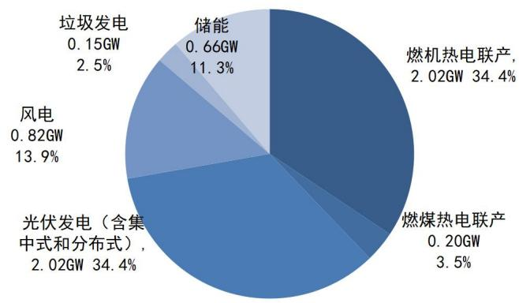  
图1：公司装机结构  
资料来源：公司年报，国信证券经济研究所整理

公司股权结构相对集中，实控人为朱共山。截至 2025年 6月 26日，公司第一大股东为上海其辰，持有公司 36. $7 9 \%$ 的股份，上海其辰由协鑫集团 $100 \%$ 控股，公司实控人为朱共山。金证资管、协鑫创展、杨明焕分别持有公司 $5 . 9 2 \% . 5 . 3 1 \% . 3 . 0 7 \%$ 的股权。其中上海其辰与协鑫创展为一致行动人。

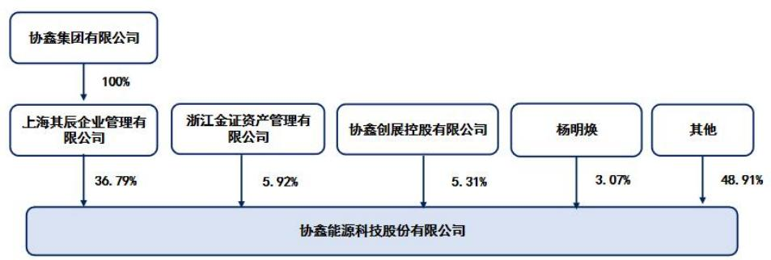  
图2：公司股权结构（截至 2025年 6月 26日）

资料来源：wind，国信证券经济研究所整理，注：上海其辰与协鑫创展为一致行动人公司管理层产业经验丰富。公司董事长朱钰峰先生担任中华全国青年联合会常务委员会委员、中国青年企业家协会副会长、中国电力企业联合会副理事长等职务，曾荣膺“2017中国新能源十大年度人物”、“2021 年度中国能源行业领军人物”等荣誉。公司总裁费智博士在多家公司担任高管，对新能源行业发展有较深刻的发展经验。公司其他高管亦从业多年，产业经验较为丰富。

表1：协鑫能科核心管理人员  

<table><tr><td>姓名</td><td>学历</td><td>现职位</td><td>个人简历</td></tr><tr><td>朱钰峰</td><td>本科</td><td>董事长</td><td>1981 年生，现任协鑫集团党委书记、副董事长兼总裁、协鑫集团(PRC) 董事、协鑫科技董事会副主席、协鑫新能源董事会副主席、协鑫能科 董事长、协鑫集成董事长。</td></tr><tr><td>费智</td><td>博士</td><td></td><td>1967 年生，曾任南通天生港发电有限公司总经理助理、总经理，龙源 总裁，董事副经理.国电科技环保总经理、鑫智慧能源事总经理经 理、协鑫集团副董事长。</td></tr><tr><td>彭毅</td><td>硕士</td><td>总监</td><td>1973 年生，历任保利协鑫财经管理部总经理、协鑫（集团）财经管理 副总裁,财务部副总经理、会计共享中心总经理，协鑫电力（集团）财务总监兼财 经管理部总经理，协鑫智慧能源（苏州）董事、副总经理兼财务总监， 现任协鑫能科副总裁兼财务总监。</td></tr><tr><td>杨而立</td><td>本科</td><td>董事会秘书</td><td>1984 年生，曾任中国建设银行上海市分行营业部业务部总经理，中国 建设海房金部战略中心任协鑫管理有限公司资 现任协鑫能科助理副总裁兼董事会秘书。</td></tr></table>

资料来源：Wind，国信证券经济研究所整理

# 公司 2025 年上半年业绩预增 $20 \text{‰}$

公司预告 2025 年上半年公司实现归母净利润 4.93-5.55 亿元，同比 $+ 2 0 \% - 3 5 \%$ ，对应 2025Q2 公司实现归母净利润 2.39-3.01 亿元，同比 $+ 7 \% - 3 5 \%$ ，环比- $\cdot 6 \%$ 至 $+ 1 8 \%$ 。2023-2024 年公司营业收入连续小幅下降，主要系公司持续优化资产结构，2023年公司转让无锡、南京、濮院、北京华润等多个化石能源发电项目股权，转让总规模约 800MW。公司燃煤燃机装机占比从 2022年的 $7 5 \%$ 下降到 2024 年末的 $34 \%$ 。与此同时随着由于煤炭和天然气等燃料价格同比下降，燃煤和燃机电厂盈利能力有所提升。

2024年公司实现营业收入 98亿元，同比 $- 3 . 4 \%$ ，但是从结构来看能源服务业务收入达到 11.93亿元，同比大幅增长 $33 \%$ ，毛利率达到 $5 9 \%$ ，远高于其他业务板块。公司 2024 年归母净利润 4.9 亿元，同比- $4 6 \%$ ，2024 年业绩大幅下滑系公司对于部分运营效益不佳的换电资产进行 2.6 亿元的资产减值，同时计提 1.2亿元信用减值所致。

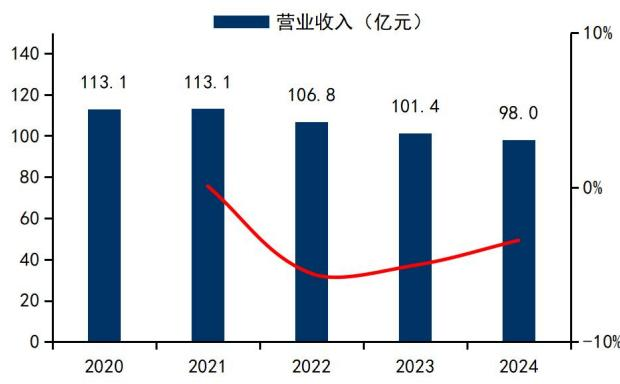  
图3：协鑫能科营业收入及增速（单位：亿元、%）

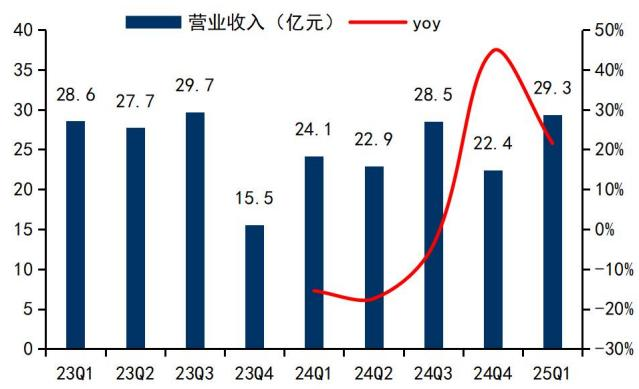  
图4：协鑫能科单季营业收入及增速（单位：亿元、%）

资料来源：公司公告、Wind、国信证券经济研究所整理资料来源：公司公告、Wind、国信证券经济研究所整理资料来源：公司公告、Wind、国信证券经济研究所整理，注2025H1业绩为业绩预告中值

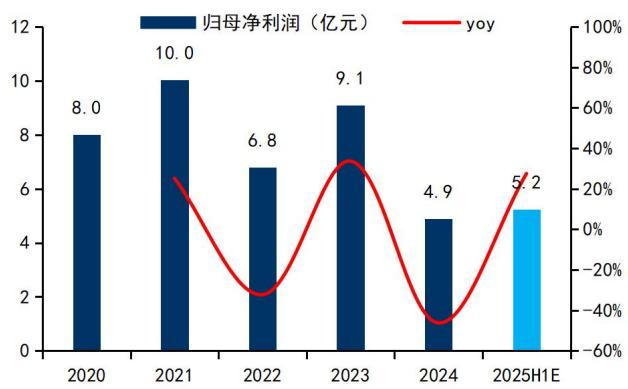  
图5：协鑫能科归母净利润（单位：亿元）  
资料来源：公司公告、Wind、国信证券经济研究所整理，注 2025Q2业绩为业绩预告中值测算

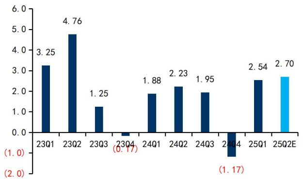  
图6：协鑫能科单季归母净利润（单位：亿元）

表2：协鑫能科2024年度财务数据  

<table><tr><td></td><td>营业收入（亿元）营业成本（亿元）毛利率</td><td></td><td>营业收入同比 营业成本同比 毛利率同比</td><td></td></tr><tr><td></td><td></td><td>分产品</td><td></td><td></td></tr><tr><td>电力销售</td><td>52.35 38.68</td><td>26.1%</td><td>-14.0%</td><td>-15.8% +1.5pct</td></tr><tr><td>蒸汽销售</td><td>26.79 22.63</td><td>15.5%</td><td>-19.8% -22.3%</td><td>+2.7pct</td></tr><tr><td>能源服务</td><td>11.94 4.89</td><td>59.0%</td><td>+337.3% +334.3%</td><td>+0.3pct</td></tr><tr><td></td><td></td><td>分地区</td><td></td><td></td></tr><tr><td>国内销售</td><td>97.96 70.86</td><td>27.7%</td><td>-5.4% -11.9%</td><td>+5.3pct</td></tr></table>

资料来源：wind，国信证券经济研究所整理

利润率整体较为稳定。2024年公司毛利率 27. $66 \%$ ，同比上升 5.9ct，2025Q1 毛利率 $2 3 . 3 \%$ ，同比上升 0.5pct；2024年公司净利率 $5 . 9 4 \%$ ，同比下降 3.55pct，2025Q1净利率 $1 0 . 2 1 \%$ ，环比上升 1.6pct。

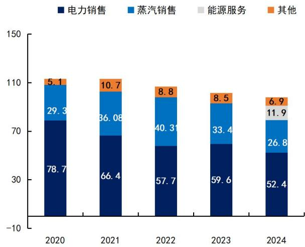  
图7：协鑫能科业务营收结构（单位：亿元）

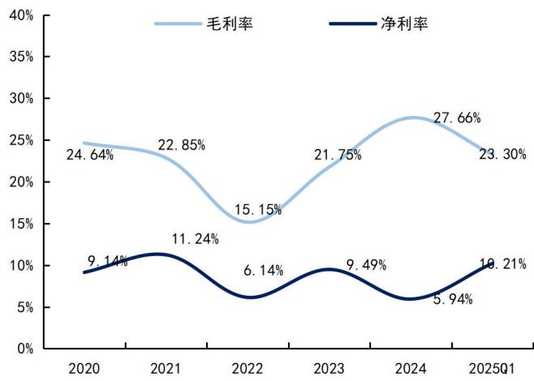  
图8：协鑫能科毛利率、净利率变化情况

资料来源：公司公告、Wind、国信证券经济研究所整理资料来源：公司公告、Wind、国信证券经济研究所整理费用率方面 2024 年销售费用率/管理费用率/研发费用率/财务费用率分别为$1 . 1 \% / 8 . 1 \% 0 . 3 \% / 7 . 3 \%$ ，销售费用率同比下降 0.1pct，管理费用率同比上升0.1pct，研发费用率同比持平，财务费用率同比上升 0.5pct。

公司经营活动现金流整体呈现净流入。2024 全年实现公司经营活动现金流净额24.3 亿元，2025Q1 实现 3.9 亿元。

公司资产负债率总体较为稳定。2024年为 $6 6 . 7 \%$ ，同比上升 7pct，2025Q1 为 $6 6 . 2 \%$ 。

公司减值情况来看，2022-2024 年呈现逐渐上升趋势，2024 年合计减值 3.82 亿元，包括2.62亿元资产减值损失及1.2亿元信用减值损失。资产减值计提包括换电站、GPU 服务器、电池模块芯片等存货跌价准备 8400 万元和固定资产、在建工程等资产减值 1.77 亿元。

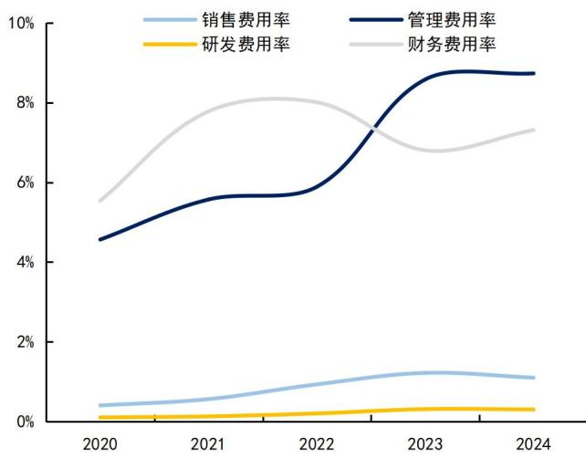  
图9：协鑫能科费用率变化情况

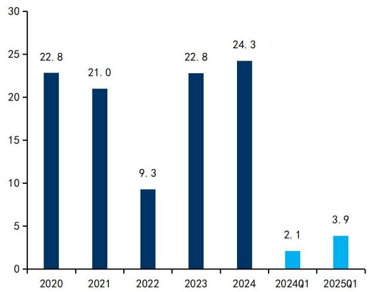  
图10：协鑫能科经营性现金流净额情况（亿元）

资料来源：公司公告、Wind、国信证券经济研究所整理资料来源：公司公告、Wind、国信证券经济研究所整理资料来源：公司公告、Wind、国信证券经济研究所整理资料来源：公司公告、Wind、国信证券经济研究所整理

  
图11：协鑫能科资产负债情况

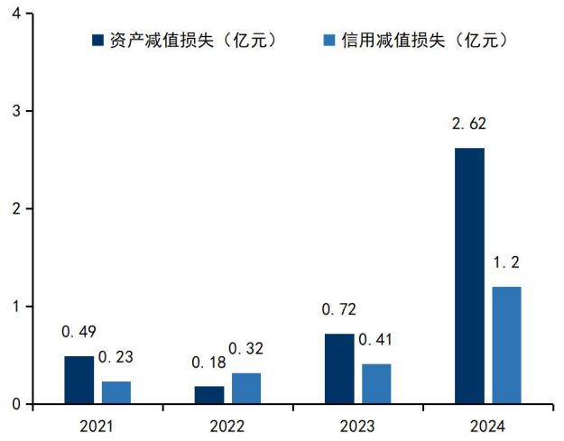  
图12：协鑫能科减值情况

# 公司率先探索新能源发电资产 RWA

# 稳定币介绍

稳定币是一种旨在与某些资产（通常是货币）维持相对稳定价值的虚拟资产。其主要特征在于通过足额资产储备或算法机制，将币值保持与目标资产（如美元、人民币、黄金等）基本挂钩，从而减小价格波动。稳定币既具备数字货币的便捷性和透明度，又具备法币资产的稳定性，被广泛用作区块链生态中“链上现金”。

基于不同价格维持机制和运作方式，稳定币主要分为四大类：法币挂钩稳定币、加密资产抵押稳定币、算法稳定币、商品抵押稳定币。目前稳定币以法币挂钩型为主，其中锚定美元的稳定币占据市场主导地位。截至 2025年 5月末，法币挂钩稳定币约占稳定币总规模的 $9 7 \%$ ，据 rwa.xyz 数据，截至 7 月 6 日稳定币总价值约 2417 亿美元。

表3：不同的稳定币模式  

<table><tr><td>类型</td><td>中心化程度</td><td>信用基础/抵押品</td><td>代表稳定币</td><td>潜在风险</td></tr><tr><td>法币挂钩稳定币高</td><td></td><td>法币基础+现金国债等资 USDT/USDC</td><td></td><td>抵押品挤兑及流动性风险</td></tr><tr><td>加定资产抵押型</td><td>低</td><td></td><td></td><td>资产脱锚及清算风险</td></tr><tr><td>算法稳定币</td><td>高</td><td>纯算法稳定机制调节代币 供给；部分抵押+算法稳定 AMPL 机制</td><td></td><td>脱锚及下跌死亡螺旋</td></tr><tr><td>商品抵押稳定币低</td><td></td><td>黄金，原油，国债等资产PAXG</td><td></td><td>抵押品挤兑及流动性风险</td></tr></table>

资料来源：AIYING Compliance，国信证券经济研究所整理

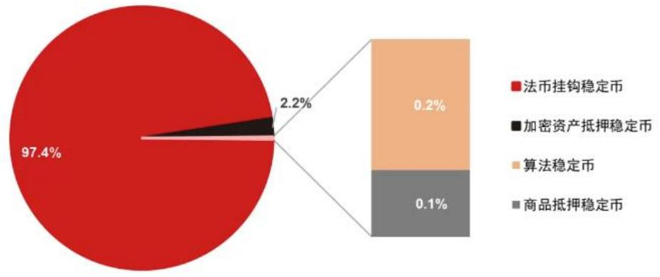  
图13：四类稳定币市值规模占比（截至2025年5月末）

资料来源：CoinGecko，国信证券经济研究所整理

# 《香港稳定币》条款落地推动稳定币行业发展

香港于 2025 年 5 月 21 日正式通过《稳定币条例》，旨在通过统一发牌制度、资本与储备监管、跨境流通规范，解决稳定币行业长期存在的透明度不足、赎回风险等问题，同时为合规机构开辟清晰的入场路径。核心监管逻辑：1）统一发牌制度：由香港金融管理局统一发牌，要求发行人实缴资本 $\geqslant 2 5 0 0$ 万港元，强化资本充足性；2）储备资产隔离：稳定币需 $100 \%$ 锚定高流动性资产（如现金、国债），并通过独立审计机构月度披露，确保每一枚稳定币均有足额资产支撑；3）多法币兼容：允许 USDC、USDT等非港元稳定币合规流通，同时支持未来港元稳定币（如圆币科技 HKDR）发行，形成“美元稳定币对接国际市场 $^ +$ 港元稳定币连接内地”的双轨格局。

表4：《稳定币条例》收益类型、政策要点及代表企业  

<table><tr><td>收益类型</td><td>政策要点</td><td>代表企业</td></tr><tr><td>沙盒持牌机构</td><td>金统一发牌，沙盒参与者或</td><td>京东币链、渣打银行</td></tr><tr><td>跨境支付服务提供商</td><td>开放非港元稳定币流通，支持秒 级跨境结算</td><td>华峰超纤、青岛金王</td></tr><tr><td>RWA 项目方</td><td>稳宾币资产代币化提供计价与</td><td>协鑫能科、郎新集团</td></tr></table>

资料来源：香港金管局官网，国信证券经济研究所整理

# 我国 RWA 市场正处于快速发展期

RWA（现实世界资产， Real World Assets）是指将实体资产（如房产、设备、基础设施、债券、光伏电站）或权益（收益权、知识产权）转化为可以在区块链上交易的数字代币。我国 RWA市场正处于快速发展期，呈现出多元且创新的态势。

表5：RWA项目实践  

<table><tr><td>项目内容</td><td></td></tr><tr><td>协鑫能科</td><td>协鑫能科以南北2模户用光伏电站为底层资产单，发行RWA代币募资2</td></tr><tr><td>朗新集团</td><td>郎新科技将旗下部分充电桩作为RWA 锚定资产，借助蚂蚁链的区块链与IoT技 术，使每个数字资产代表对应充电桩的部分收益权。</td></tr><tr><td>元隆雅图</td><td>与香港胜利证券携手开拓 IP 文创周边 RWA 全球市场。</td></tr></table>

资料来源：公司公告，国信证券经济研究所整理

香港《稳定币条例》通过合规储备监管 $^ +$ 沙盒场景试点，为 RWA与稳定币的融合提供信任底座与流通通道，推动稳定币与 RWA 市场快速发展。据 rwa.xyz，截至 7月 6 日，链上总 RWA 价值约 248 亿美元，相比 30 天前同比增长 $6 \%$ ；稳定币总价值约 2417.2 亿美元，相比 30 天前同比增长 $2 \%$ ；持有人规模为 28万人，相比 30天前同比增长 $9 0 . 8 \%$ 。

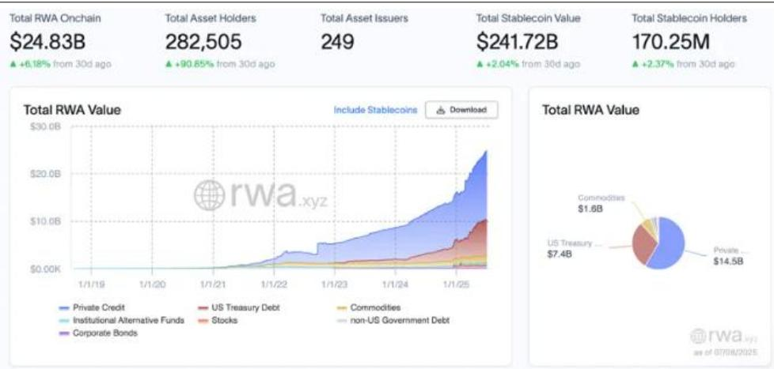  
图14：全球链上 RWA 价值突破 248 亿美元（截至 2025 年 7 月 6 日）  
资料来源：RWA.xyz 官网，国信证券经济研究所整理

# 成立 RWA 合资公司可扩大能源服务版图

2025年 6月协鑫能科与蚂蚁数科成立合资公司蚂蚁鑫能，合资公司定位是优先为国内分布式能源资产提供RWA发行服务。通过参与新能源 RWA 业务，公司可开拓更大规模的虚拟电厂聚合业务、能源交易业务等。截至去年底公司在江苏省虚拟电厂可调负荷规模约 300MW，占省内 $20 \%$ ；公司需求响应规模约 500MW，未来还将稳步提高。

# 盈利预测

# $\spadesuit$ 盈利预测

电力销售：伴随公司新能源发电装机量不断上升，我们预计公司售电量将稳步上升。基于此，我们假设 2025-2027 年电力销售业务收入增速分别为 $1 1 / 3 / 3 \%$ ，毛利率分别为 $2 5 \% / 2 4 \% / 2 4 \%$ 。

蒸汽销售：我们预计公司蒸汽生产保持稳健发展，基于此，我们假设 2025-2027年公司蒸汽销售业务收入增速分别为 $5 \% / 0 \% / 0 \%$ ，毛利率稳定，假设 2025-2027 年该业务毛利率分别为 $1 3 \% / 1 4 \% / 1 4 \%$ 。

能源服务：该业务包括虚拟电厂、能源交易、节能改造等，我们预计未来几年将得到快速发展。基于此，我们假设 2025-2027 年公司能源服务业务收入增速分别为 $3 4 \% / 2 5 \% / 1 0 \%$ ，毛利率稳定，假设 2025-2027 年该业务毛利率分别为$5 5 \% / 5 5 \% / 5 5 \%$ 。

# 公司 2025-2027 年营收入预测如下：

表6：协鑫能科营收预测拆分（单位：亿元、%）  

<table><tr><td>收入分类预测(亿元)</td><td>2023</td><td>2024</td><td>2025E</td><td>2026E</td><td>2027E</td></tr><tr><td></td><td></td><td></td><td></td><td></td><td></td></tr><tr><td>电力销售 营业收入</td><td>59.6</td><td>52.3</td><td>58.0</td><td>60.0</td><td>62.0</td></tr><tr><td>增长率</td><td>3%</td><td>-12%</td><td>11%</td><td>3%</td><td>3%</td></tr><tr><td>毛利率</td><td></td><td>26%</td><td>25%</td><td>24%</td><td>24%</td></tr><tr><td>蒸汽销售</td><td>24%</td><td></td><td></td><td></td><td></td></tr><tr><td></td><td>33.4</td><td>26.8</td><td>28.0</td><td>28.0</td><td></td></tr><tr><td>营业收入 增长率</td><td></td><td>-20%</td><td></td><td></td><td>28.0</td></tr><tr><td>毛利率</td><td>-17%</td><td></td><td>5%</td><td>0%</td><td>0%</td></tr><tr><td>能源服务</td><td>13%</td><td>16%</td><td>13%</td><td>14%</td><td>14%</td></tr><tr><td></td><td></td><td></td><td></td><td></td><td></td></tr><tr><td>营业收入</td><td></td><td>11.9</td><td>16.0</td><td>20.0</td><td>22.0</td></tr><tr><td>增长率</td><td></td><td></td><td>34%</td><td>25%</td><td>10%</td></tr><tr><td>毛利率 其他</td><td></td><td>59%</td><td>55%</td><td>55%</td><td>55%</td></tr><tr><td></td><td></td><td></td><td></td><td></td><td></td></tr><tr><td>营业收入</td><td>8.5</td><td>6.9</td><td>7.0</td><td>7.0</td><td>7.0</td></tr><tr><td>毛利率</td><td>41%</td><td>32%</td><td>30%</td><td>30%</td><td>30%</td></tr><tr><td>合计</td><td></td><td></td><td></td><td></td><td></td></tr><tr><td>营业收入</td><td>101.4</td><td>98.0</td><td>109.0</td><td>115.0</td><td>119.0</td></tr><tr><td>增长率</td><td>-5%</td><td>-3%</td><td>11%</td><td>6%</td><td>3%</td></tr><tr><td>毛利率</td><td>22%</td><td>28%</td><td>27%</td><td>27%</td><td>28%</td></tr></table>

资料来源：Wind、国信证券经济研究所整理

综上所述，我们预计公司 2025-2027 年实现营收 $1 0 9 / 1 1 5 / 1 1 9$ 亿元，同比增长$1 1 \% / 6 \% / 3 \%$ ，2025-2027年公司毛利率分别为 $2 7 \% / 2 7 \% / 2 8 \%$ 。

费用率方面，我们假设 2025-2027 年销售费用率为 $1 \% / 1 \% / 1 \%$ ，管理费用率为$8 . 3 \% / 8 . 4 \% / 8 . 3 \%$ ，研发费用率为 $0 . 3 \% / 0 . 3 \% / 0 . 3 \%$ ，所得税税率为 $2 5 \% / 2 5 \% / 2 5 \%$ ，股利分配比率为 $4 0 \% / 4 0 \% / 4 0 \%$ 。

表7：公司盈利预测假设条件（%）  

<table><tr><td></td><td></td><td colspan="9">2023 2024 2025E 2026E 2027E 2028E 2029E 2030E 2031E 2032E 2033E 2034E</td></tr><tr><td>营业收入增长率</td><td></td><td></td><td>-5.0%-3.4% 11.3% 5.5% 3.5% 2.0% 2.0% 1.5% 1.0% 1.0% 1.0% 1.0%</td><td></td><td></td><td></td><td></td><td></td><td></td><td></td><td></td></tr><tr><td>营业成本/营业收入</td><td></td><td></td><td></td><td></td><td></td><td>78.3% 72.3% 73.4% 72.7% 72.3% 73.0% 73.0% 73.0% 73.0% 73.0% 73.0% 73.0%</td><td></td><td></td><td></td><td></td><td></td></tr><tr><td>销售费用率</td><td></td><td></td><td></td><td></td><td></td><td>1.2%  1.1% 1.0% 1.0% 1.0% 1.0% 1.0% 1.0% 1.0% 1.0% 1.0% 1.0%</td><td></td><td></td><td></td><td></td><td></td></tr><tr><td>管理费用率</td><td></td><td>8.6% 8.7% 8.3% 8.4% 8.3% 8.2% 8.2% 8.2% 8.2% 8.2% 8.2% 8.2%</td><td></td><td></td><td></td><td></td><td></td><td></td><td></td><td></td><td></td></tr><tr><td>研发费用率</td><td></td><td>0.3%0.3%0.3%0.3%0.3%</td><td></td><td></td><td></td><td></td><td></td><td></td><td></td><td>0.3%0.3% 0.3% 0.3%0.3% 0.3% 0.3%</td><td></td></tr><tr><td>营业税金及附加/营业收入</td><td></td><td>0.7%0.9%0.7%0.7%0.7%0.7%0.7%0.7%0.7%0.7% 0.7%0.7%</td><td></td><td></td><td></td><td></td><td></td><td></td><td></td><td></td><td></td></tr><tr><td>所得税税率</td><td></td><td>23.4% 37.8% 25.0% 25.0% 25.0% 25.0% 25.0% 25.0% 25.0% 25.0% 25.0% 25.0%</td><td></td><td></td><td></td><td></td><td></td><td></td><td></td><td></td><td></td></tr><tr><td>股利分配比率</td><td></td><td>22.6% 32.3% 40.0% 40.0% 40.0% 40.0% 40.0% 40.0% 40.0% 40.0% 40.0% 40.0%</td><td></td><td></td><td></td><td></td><td></td><td></td><td></td><td></td><td></td></tr></table>

资料来源: Wind，国信证券经济研究所整理及预测

# 未来三年业绩预测

表8：公司未来三年业绩预测  

<table><tr><td></td><td>2024</td><td>2025E</td><td>2026E</td><td>2027E</td></tr><tr><td>营业收入（亿元）</td><td>97.96</td><td>109.00</td><td>115.00</td><td>119.00</td></tr><tr><td>营业成本（亿元）</td><td>70.86</td><td>79.96</td><td>83.58</td><td>86.00</td></tr><tr><td>销售费用（亿元）</td><td>1.08</td><td>1.09</td><td>1.15</td><td>1.19</td></tr><tr><td>管理费用（亿元）</td><td>8.55</td><td>9.05</td><td>9.66</td><td>9.88</td></tr><tr><td>研发费用（亿元）</td><td>0.3</td><td>0.33</td><td>0.35</td><td>0.36</td></tr><tr><td>财务费用（亿元）</td><td>7.16</td><td>5.46</td><td>5.90</td><td>6.25</td></tr><tr><td>营业利润（亿元）</td><td>9.44</td><td>13.20</td><td>14.31</td><td>15.25</td></tr><tr><td>利润总额（亿元）</td><td>9.36</td><td>13.20</td><td>14.31</td><td>15.25</td></tr><tr><td>归属于母公司净利润（亿元）</td><td>4.89</td><td>9.00</td><td>9.83</td><td>10.54</td></tr><tr><td>EPS(元)</td><td>0.30</td><td>0.55</td><td>0.61</td><td>0.65</td></tr><tr><td>ROE</td><td>4%</td><td>7%</td><td>8%</td><td>8%</td></tr></table>

资料来源:Wind，国信证券经济研究所整理及预测

按照上述假设条件，预计公司 2025-2027 年实现归母净利润 $9 . 0 / 9 . 8 / 1 0 . 5$ 亿元，同比增长 $8 4 \% / 9 \% / 7 \%$ ，EPS 分别为 0.55/0.61/0.65 元。

# 可比公司比较

我们选取主营业务及主要产品与协鑫能科相近的华光环能、皖能电力和国电电力作为可比公司。其中：1）华光环能主营业务包括热电联产，与公司主营业务电力销售、蒸汽销售接近；2）皖能电力主营业务包括电力、蒸汽、热水的生产和供应等，与公司主营业务电力销售、蒸汽销售接近；3）国电电力主要从事电力、热力生产和销售等业务。三家公司与协鑫能科业务产品相近，具有可比性。

表 3：可比公司估值表（2025年 7月 14日）  

<table><tr><td rowspan="2">代码</td><td rowspan="2">公司简称</td><td rowspan="2">股价</td><td rowspan="2">总市值 亿元</td><td colspan="2">EPS</td><td colspan="4">PE</td><td rowspan="2">投资评级</td></tr><tr><td>2024A</td><td>2025E</td><td>2026E</td><td>2024A</td><td>2025E</td><td>2026E</td></tr><tr><td>600475.SZ</td><td>华光环能</td><td>16.7</td><td>160</td><td>0.81</td><td>0.92</td><td>1.04</td><td>20.6</td><td>18.2</td><td>16.1</td><td>无评级</td></tr><tr><td>000543.SZ</td><td>皖能电力</td><td>7.47</td><td>169</td><td>0.98</td><td>1.04</td><td>1.09</td><td>7.6</td><td>7.2</td><td>6.9</td><td>无评级</td></tr><tr><td>600795.SH</td><td>国电电力</td><td>4.75</td><td>847</td><td>0.4</td><td>0.46</td><td>0.5</td><td>11.9</td><td>10.3</td><td>9.5</td><td>无评级</td></tr><tr><td>平均</td><td></td><td></td><td></td><td></td><td></td><td></td><td>13.4</td><td>11.9</td><td>10.8</td><td></td></tr><tr><td>002015.SZ</td><td>协鑫能科</td><td>13.06</td><td>212</td><td>0.55</td><td>0.61</td><td>0.65</td><td>23.5</td><td>21.6</td><td>20.1</td><td>无评级</td></tr></table>

资料来源: Wind、国信证券经济研究所整理与预测，注：华光环能、皖能电力、国电电力盈利预测取自wind一致预测

# 投资建议

我 们 预 计 公 司 2025-2027 年 实 现 归 母 净 利 润 9.0/9.8/10.5 亿元，同比增长$8 4 \% / 9 \% / 7 \%$ ，对应当前 PE 为 24/21/20 倍，首次覆盖。

# 风险提示

# 盈利预测的风险

我们假设公司 2025-2027 年我们预计实现营收 109/115/119 亿元，同比增长$1 1 \% / 6 \% / 3 \%$ ，可能存在对公司产品销量及行业需求预计偏乐观、进而高估未来3 年业绩的风险。

我们预计公司 2025-2027 年毛利率 $2 7 \% / 2 7 \% / 2 8 \%$ ，可能存在对公司成本估计偏低、毛利高估，从而导致对公司未来 3 年盈利预测值高于实际值的风险。

若换电站业务开拓不及预期，行业竞争加剧可能也存在未来几年业绩高估的风险。

根据 Wind 数据，2025 年一季度末公司有息负债率（有息负债/总资产）为42. $66 \%$ ，据此计算公司有息负债总额达到 174 亿元，有息负债占 2025 年一季度末净资产的比例达到 $1 2 6 . 3 \%$ 。若未来融资成本提高，可能导致财务费用提升影响盈利预测。

# 经营风险

电力全面市场化交易行业背景下，公司将重点发力虚拟电厂、能源交易、能源聚合、碳中和等轻资产业务，此类业务对公司整体的运营能力提出了新的要求，如公司未能及时打造专业完善的人才体系，可能导致资产收益能力、电力交易能力未及预期，进而影响公司收益。此外，新赛道的开启往往伴随着激烈的低价竞争，为快速抢占市场份额，部分竞争对手可能采取激进的价格策略，通过短期让利换取规模扩张，导致行业整体盈利空间承压。激烈的竞争之下，公司市场开拓可能不及预期，整体利润收益可能亦将受到影响。公司有息负债率较高，若未来融资成本提升，可能带来现金流压力乃至偿债风险。

# 政策变动风险

2025 年 2 月，国家发展改革委、国家能源局联合印发《深化新能源上网电价市场化改革促进新能源高质量发展的通知》（发改价格[2025]136 号），明确推动电价全面由市场形成，促使行业进入阶段性调整期。电价和电量方面实施新老划断政策，2025 年 5 月 31 日后并网的电站，已不再实行固定电价，电力市场化改革不断深入。若政策发生变动，则会对公司产生影响。

财务预测与估值   

<table><tr><td>资产负债表（百万元）</td><td>2023</td><td>2024</td><td>2025E</td><td>2026E</td><td>2027E</td></tr><tr><td>现金及现金等价物</td><td>3167</td><td>4151</td><td>4500</td><td>4500</td><td>4500</td></tr><tr><td>应收款项</td><td>3847</td><td>5010</td><td>5375</td><td>5671</td><td>5868</td></tr><tr><td>存货净额</td><td>412</td><td>640</td><td>438</td><td>458</td><td>471</td></tr><tr><td>其他流动资产</td><td>1313</td><td>1896</td><td>2399</td><td>2758</td><td>3096</td></tr><tr><td>流动资产合计</td><td>8973</td><td>11968</td><td>12722</td><td>13402</td><td>13956</td></tr><tr><td>固定资产</td><td>14380</td><td>20091</td><td>21497</td><td>22257</td><td>21910</td></tr><tr><td>无形资产及其他</td><td>2534</td><td>2664</td><td>2607</td><td>2551</td><td>2494</td></tr><tr><td>其他长期资产</td><td>3099</td><td>3342</td><td>3815</td><td>4600</td><td>4760</td></tr><tr><td>长期股权投资</td><td>2907</td><td>2394</td><td>2394</td><td>2394</td><td>2394</td></tr><tr><td>资产总计</td><td>31893</td><td>40459</td><td>43036</td><td>45204</td><td>45514</td></tr><tr><td>短期借款及交易性金融</td><td></td><td></td><td></td><td></td><td></td></tr><tr><td>负债</td><td>4686</td><td>6033</td><td>7596</td><td>8744</td><td>8110</td></tr><tr><td>应付款项</td><td>1070</td><td>1175</td><td>1095</td><td>1145</td><td>1178</td></tr><tr><td>其他流动负债</td><td>3440</td><td>4915</td><td>5406</td><td>5663</td><td>5824</td></tr><tr><td>流动负债合计</td><td>9300</td><td>12370</td><td>14097</td><td>15552</td><td>15112</td></tr><tr><td>长期借款及应付债券</td><td>5772</td><td>8596</td><td>8596</td><td>8596</td><td>8596</td></tr><tr><td>其他长期负债</td><td>3955</td><td>6029</td><td>6191</td><td>6191</td><td>6191</td></tr><tr><td>长期负债合计</td><td>9727</td><td>14625</td><td>14787</td><td>14787</td><td>14787</td></tr><tr><td>负债合计</td><td>19027</td><td>26995</td><td>28884</td><td>30339</td><td>29899</td></tr><tr><td>少数股东权益</td><td>1891</td><td>1725</td><td>1671</td><td>1761</td><td>1851</td></tr><tr><td>股东权益</td><td>10975</td><td>11739</td><td>12481</td><td>13104</td><td>13764</td></tr><tr><td>负债和股东权益总计</td><td>31893</td><td>40459</td><td>43036</td><td>45204</td><td>45514</td></tr></table>

<table><tr><td>关键财务与估值指标</td><td>2023</td><td>2024</td><td>2025E</td><td>2026E</td><td>2027E</td></tr><tr><td>每股收益</td><td>0.56</td><td>0.30</td><td>0.55</td><td>0.61</td><td>0.65</td></tr><tr><td>每股红利</td><td>0.13</td><td>0.10</td><td>0.22</td><td>0.24</td><td>0.26</td></tr><tr><td>每股净资产</td><td>7.93</td><td>8.29</td><td>8.72</td><td>9.16</td><td>9.62</td></tr><tr><td>ROIC</td><td>7%</td><td>4%</td><td>5%</td><td>5%</td><td>5%</td></tr><tr><td>ROE</td><td>9%</td><td>4%</td><td>7%</td><td>8%</td><td>8%</td></tr><tr><td>毛利率</td><td>22%</td><td>28%</td><td>27%</td><td>27%</td><td>28%</td></tr><tr><td>EBIT Margin</td><td>11%</td><td>17%</td><td>16%</td><td>17%</td><td>17%</td></tr><tr><td>EBITDA Margin</td><td>20%</td><td>28%</td><td>32%</td><td>33%</td><td>34%</td></tr><tr><td>收入增长</td><td>-5%</td><td>-3%</td><td>11%</td><td>6%</td><td>3%</td></tr><tr><td>净利润增长率</td><td>34%</td><td>-46%</td><td>84%</td><td>9%</td><td>7%</td></tr><tr><td>资产负债率</td><td>60%</td><td>67%</td><td>67%</td><td>67%</td><td>66%</td></tr><tr><td>息率</td><td>1.0%</td><td>0.7%</td><td>1.7%</td><td>1.9%</td><td>2.0%</td></tr><tr><td>P/E</td><td>23.3</td><td>43.4</td><td>23.5</td><td>21.6</td><td>20.1</td></tr><tr><td>P/B</td><td>1.6</td><td>1.6</td><td>1.5</td><td>1.4</td><td>1.4</td></tr><tr><td>EV/EBITDA</td><td>20.2</td><td>17.8</td><td>14.4</td><td>13.6</td><td>12.7</td></tr></table>

资料来源：Wind、国信证券经济研究所预测

<table><tr><td>利润表（百万元）</td><td>2023</td><td>2024</td><td>2025E</td><td>2026E</td><td>2027E</td></tr><tr><td>营业收入</td><td>10144</td><td>9796</td><td>10900</td><td>11500</td><td>11900</td></tr><tr><td>营业成本</td><td>7938</td><td>7086</td><td>7996</td><td>8358</td><td>8600</td></tr><tr><td>营业税金及附加</td><td>74</td><td>89</td><td>76</td><td>81</td><td>83</td></tr><tr><td>销售费用</td><td>124</td><td>108</td><td>109</td><td>115</td><td>119</td></tr><tr><td>管理费用</td><td>870</td><td>855</td><td>905</td><td>966</td><td>988</td></tr><tr><td>研发费用</td><td>32</td><td>30</td><td>33</td><td>35</td><td>36</td></tr><tr><td>财务费用</td><td>690</td><td>716</td><td>546</td><td>590</td><td>625</td></tr><tr><td>投资收益</td><td>906</td><td>280</td><td>210</td><td>200</td><td>200</td></tr><tr><td>资产减值及公允价值变</td><td></td><td></td><td></td><td></td><td></td></tr><tr><td>动</td><td>(114)</td><td>(382)</td><td>(200)</td><td>(200)</td><td>(200)</td></tr><tr><td>其他收入</td><td>181</td><td>515</td><td>275</td><td>275</td><td>275</td></tr><tr><td>营业利润</td><td>1276</td><td>944</td><td>1320</td><td>1431</td><td>1525</td></tr><tr><td>营业外净收支</td><td>(19)</td><td>(8)</td><td>0</td><td>0</td><td>0</td></tr><tr><td>利润总额</td><td>1257</td><td>936</td><td>1320</td><td>1431</td><td>1525</td></tr><tr><td>所得税费用</td><td>295</td><td>354</td><td>330</td><td>358</td><td>381</td></tr><tr><td>少数股东损益</td><td>53</td><td>93</td><td>90</td><td>90</td><td>90</td></tr><tr><td>归属于母公司净利润</td><td>909</td><td>489</td><td>900</td><td>983</td><td>1054</td></tr></table>

<table><tr><td>现金流量表（百万元）</td><td>2020</td><td>2024</td><td>2025E</td><td>2026E</td><td>2027E</td></tr><tr><td>净利润</td><td>909</td><td>489</td><td>900</td><td>983</td><td>1054</td></tr><tr><td>资产减值准备</td><td>(72)</td><td>(262)</td><td>(150)</td><td>(150)</td><td>(150)</td></tr><tr><td>折旧摊销</td><td>885</td><td>1082</td><td>1700</td><td>1847</td><td>1954</td></tr><tr><td>公允价值变动损失</td><td>0</td><td>(5)</td><td>(5)</td><td>(5)</td><td>(5)</td></tr><tr><td>财务费用</td><td>690</td><td>716</td><td>546</td><td>590</td><td>625</td></tr><tr><td>营运资本变动</td><td>777</td><td>(284)</td><td>(236)</td><td>(368)</td><td>(355)</td></tr><tr><td>其它</td><td>(219)</td><td>1405</td><td>743</td><td>635</td><td>670</td></tr><tr><td>经营活动现金流</td><td>2279</td><td>2425</td><td>2953</td><td>2942</td><td>3167</td></tr><tr><td>资本开支</td><td>(3260)</td><td>(6234)</td><td>(3050)</td><td>(2550)</td><td>(1550)</td></tr><tr><td>其它投资现金流</td><td>1908</td><td>1000</td><td>(268)</td><td>(590)</td><td>35</td></tr><tr><td>投资活动现金流</td><td>(1351)</td><td>(5234)</td><td>(3318)</td><td>(3140)</td><td>(1515)</td></tr><tr><td>权益性融资</td><td>108</td><td>562</td><td>0</td><td>0</td><td>0</td></tr><tr><td>负债净变化</td><td>(663)</td><td>3998</td><td>1563</td><td>1148</td><td>(634)</td></tr><tr><td>支付股利、利息</td><td>(436)</td><td>(276)</td><td>(302)</td><td>(360)</td><td>(393)</td></tr><tr><td>其它融资现金流</td><td>231</td><td>1174</td><td>1563</td><td>1148</td><td>(634)</td></tr><tr><td>融资活动现金流</td><td>(1681)</td><td>3568</td><td>715</td><td>198</td><td>(1652)</td></tr><tr><td>现金净变动</td><td>(754)</td><td>759</td><td>349</td><td>0</td><td>0</td></tr><tr><td>货币资金的期初余额</td><td>3769</td><td>3167</td><td>4151</td><td>4500</td><td>4500</td></tr><tr><td>货币资金的期末余额</td><td>3167</td><td>4151</td><td>4500</td><td>4500</td><td>4500</td></tr><tr><td>企业自由现金流</td><td>(751)</td><td>(4423)</td><td>(249)</td><td>389</td><td>1605</td></tr><tr><td>权益自由现金流</td><td>(1943)</td><td>(870)</td><td>904</td><td>1094</td><td>502</td></tr></table>

# 免责声明

# 分析师声明

作者保证报告所采用的数据均来自合规渠道；分析逻辑基于作者的职业理解，通过合理判断并得出结论，力求独立、客观、公正，结论不受任何第三方的授意或影响；作者在过去、现在或未来未就其研究报告所提供的具体建议或所表述的意见直接或间接收取任何报酬，特此声明。

国信证券投资评级  

<table><tr><td>投资评级标准</td><td>类别</td><td>级别</td><td>说明</td></tr><tr><td rowspan="5">报告中投资建议所涉及的评级（如有）分为股票评 级和行业评级(另有说明的除外评级标准为报 告发布日后的6到12个月内公司股价(或行业指数) 相对同期相关证券市场代表性指数的涨跌幅作为基 准。A股市场以沪深300指数（000300.SH）作为基 准；新三板市场以三板成指（899001.CSI）为基准； 香市场以生指数(H) )准：美国市场 (IXIC.GI）为基准。</td><td rowspan="4">股票 投资评级</td><td>优于大市</td><td>股价表现优于市场代表性指数10%以上</td></tr><tr><td>中性</td><td>股价表现介于市场代表性指数土10%之间</td></tr><tr><td>弱于大市</td><td>股价表现弱于市场代表性指数10%以上</td></tr><tr><td>无评级</td><td>股价与市场代表性指数相比无明确观点</td></tr><tr><td rowspan="3">投行业级</td><td>优于大市</td><td>行业指数表现优于市场代表性指数10%以上</td></tr><tr><td rowspan="2"></td><td>中性</td><td>行业指数表现介于市场代表性指数土10%之间</td></tr><tr><td>弱于大市</td><td>行业指数表现弱于市场代表性指数10%以上</td></tr></table>

# 重要声明

本报告由国信证券股份有限公司（已具备中国证监会许可的证券投资咨询业务资格）制作；报告版权归国信证券股份有限公司（以下简称“我公司”）所有。本报告仅供我公司客户使用，本公司不会因接收人收到本报告而视其为客户。未经书面许可，任何机构和个人不得以任何形式使用、复制或传播。任何有关本报告的摘要或节选都不代表本报告正式完整的观点，一切须以我公司向客户发布的本报告完整版本为准。

本报告基于已公开的资料或信息撰写，但我公司不保证该资料及信息的完整性、准确性。本报告所载的信息、资料、建议及推测仅反映我公司于本报告公开发布当日的判断，在不同时期，我公司可能撰写并发布与本报告所载资料、建议及推测不一致的报告。我公司不保证本报告所含信息及资料处于最新状态；我公司可能随时补充、更新和修订有关信息及资料，投资者应当自行关注相关更新和修订内容。我公司或关联机构可能会持有本报告中所提到的公司所发行的证券并进行交易，还可能为这些公司提供或争取提供投资银行、财务顾问或金融产品等相关服务。本公司的资产管理部门、自营部门以及其他投资业务部门可能独立做出与本报告中意见或建议不一致的投资决策。

本报告仅供参考之用，不构成出售或购买证券或其他投资标的要约或邀请。在任何情况下，本报告中的信息和意见均不构成对任何个人的投资建议。任何形式的分享证券投资收益或者分担证券投资损失的书面或口头承诺均为无效。投资者应结合自己的投资目标和财务状况自行判断是否采用本报告所载内容和信息并自行承担风险，我公司及雇员对投资者使用本报告及其内容而造成的一切后果不承担任何法律责任。

# 证券投资咨询业务的说明

本公司具备中国证监会核准的证券投资咨询业务资格。证券投资咨询，是指从事证券投资咨询业务的机构及其投资咨询人员以下列形式为证券投资人或者客户提供证券投资分析、预测或者建议等直接或者间接有偿咨询服务的活动：接受投资人或者客户委托，提供证券投资咨询服务；举办有关证券投资咨询的讲座、报告会、分析会等；在报刊上发表证券投资咨询的文章、评论、报告，以及通过电台、电视台等公众传播媒体提供证券投资咨询服务；通过电话、传真、电脑网络等电信设备系统，提供证券投资咨询服务；中国证监会认定的其他形式。

发布证券研究报告是证券投资咨询业务的一种基本形式，指证券公司、证券投资咨询机构对证券及证券相关产品的价值、市场走势或者相关影响因素进行分析，形成证券估值、投资评级等投资分析意见，制作证券研究报告，并向客户发布的行为。

# 国信证券经济研究所

深圳深圳市福田区福华一路 125 号国信金融大厦 36 层邮编：518046 总机：0755-82130833

上海  
上海浦东民生路 1199 弄证大五道口广场 1 号楼 12 层  
邮编：200135  
北京  
北京西城区金融大街兴盛街 6 号国信证券 9 层  
邮编：100032