# 稀缺 K12 教培龙头，修复正当时

# 好未来：K12 教培龙头，转型素质教育 $^ +$ 教育科技

2021 年为响应国家双减政策，公司停止在中国大陆提供 K9 学科类校外培训服务，关闭近 $90 \%$ 教学点，业务转型素质教育 $^ +$ 教育科技：1）原线下培优转型学而思素养，推出思维、人文等课程；2）学而思网校全面布局素质教育；3）自主研发并推出智能教辅和硬件，如学而思学习机；4）推出数学解题讲题 AI 大模型 MathGPT，并落地多项应用。2025 财年（2024 年 3 月-2025 年 2 月）公司总收入22.5 亿美元/yoy $+ 5 1 \%$ ，恢复到 2021 财年的 $50 \%$ 。其中学而思素养、学习机是最主要的增长驱动。

# 非学科优质供给稀缺，素养网点加密进行时

双减后校外学科类培训机构被强制压减近 9 成，我们根据大众点评统计了 19 个核心城市的校外培训机构情况，地方上成建制的品牌连锁非学科培训机构仍然较少。根据学而思 App 上的显示，截至 2025 年 4 月公司在全国共有 $4 5 0 +$ 教学点，在北京、上海、广州、杭州、天津的教学点数重新超过 20 个。2025 财年公司学习服务和其他业务收入 15.4 亿美元，同比增长 $46 \%$ ，我们预计未来三年复合增速 $20 \% +$ 。

# 学而思网校产品不断丰富，用户量快速增长

双减后在线教育行业重新洗牌，学而思网校是留存下的优质机构之一。目前网校素质化转型已经有所成效，课程包括人文、科学等。有别于传统的双师直播大班课，近期网校还推出了直播思维小班课。根据 Questmobile，2025 年 3 月学而思网校的 MAU 体量达到 219 万人，同比增长 $1 5 8 \%$ ，位居 K12 在线教育第一。

# AI学习机推陈出新，扩充价格带提升渗透

“后双减”时代，学习平板承载培训补习需求。2023 年 2 月公司推出第一款学习机，以自研内容为核心卖点，快速占据领先地位。公司从高端机型开始发力，逐步拓展至大众，2025 年新款价格下探到 2000 多元，有望进一步扩大渗透。

# 盈利预测、估值和评级

我 们 预 计 公 司 FY2026-FY2028 的 Non-GAAP 归 母 净 利 润 为$2 . 1 4 / 3 . 2 9 / 4 . 6 0$ 亿美元,FY2025-FY2028 的 Non-GAAP 归母净利润CAGR 为 $45 \%$ ，对应 PEG 为 0.66 倍。参考行业，我们给予公司 FY20260.80 倍 PEG，目标价 12.76 美元，首次覆盖给予“增持”评级。

# 风险提示

政策波动，硬件等新业务不及预期，行业竞争加剧，口碑下滑。

海外和传媒互联网组   
分析师：易永坚(执业S1130525020001)   
yiyongjian@gjzq.com.cn   
分析师：徐熠雯(执业S1130525030005)   
xuyiwen@gjzq.com.cn

市价(美元)：10.55元目标价(美元)：12.76元

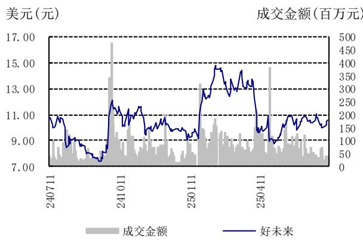

公司基本情况（百万美元）  

<table><tr><td rowspan="2">项目</td><td rowspan="2">FY2024 FY2025</td><td colspan="4">FY2026E FY2027E FY2028E</td></tr><tr><td>1,490 2,250</td><td>2,928</td><td>3,656</td><td>4,410</td></tr><tr><td>营业收入 营业收入增长率</td><td>46.2%</td><td>51.0%</td><td>30.1%</td><td>24.9%</td><td>20.6%</td></tr><tr><td>归母净利润</td><td>-4</td><td>85</td><td>141</td><td>238</td><td>350</td></tr><tr><td>归母净利润增长率</td><td>97.4%</td><td>2467.5%</td><td>66.6%</td><td>68.9%</td><td>46.8%</td></tr><tr><td>Non-GAAP归母净利润</td><td>85</td><td>150</td><td>214</td><td>329</td><td>460</td></tr><tr><td>Non-GAAP归母净利润</td><td>416%</td><td>75%</td><td>43%</td><td>54%</td><td>40%</td></tr><tr><td>增长率</td><td></td><td></td><td></td><td></td><td></td></tr><tr><td>摊薄每股收益(美元) 每股经营性现金流净额</td><td>-0.01 0.51</td><td>0.14 0.66</td><td>0.22</td><td>0.39</td><td>0.57</td></tr><tr><td>ROE(归属母公司)(摊薄)</td><td>-0.1%</td><td>2.2%</td><td>0.84</td><td>0.97</td><td>1.11</td></tr><tr><td>P/E</td><td></td><td>92.30</td><td>3.5%</td><td>5.7%</td><td>7.8%</td></tr><tr><td>P/S</td><td>-2,491.21 5.97</td><td>3.47</td><td>45.54 2.19</td><td>26.96 1.76</td><td>18.36 1.46</td></tr></table>

来源：公司年报、国金证券研究所；FY2025 为 2024 年 3月-2025年2月

# 内容目录

1. 好未来：K12 教培龙头，转型素质教育 $^ +$ 教育科技. 4  
1.1 双减后成功转型，培训业务作为基本盘快速修复，智能硬件成为又一增长点. 4  
1.2 FY25 收入恢复至双减前高点的 5 成，近 2 年收入 CAGR约 $50 \% .$ . 5  
1.3 创始人、董事长张邦鑫持股 $2 7 \%$ ，拥有 $73 \%$ 投票权.. 7  
2. 学习服务业务：素质转型进展佳，修复空间大.. 7  
2.1 学而思素养：非学科优质供给稀缺，核心城市加密进行时.. 7  
2.2 学而思网校：在线教育竞争回归理性，公司产品不断丰富，用户量快速增长. 10  
3. 教育科技：核心战略方向，大模型及 AI 应用持续落地.. 12  
3.1 AI 学习机：推陈出新，扩充价格带提升渗透. 12  
3.2 AI 软件：以小思 AI、英语天天练为代表，多点开花.. 13  
4. 盈利预测与投资建议.. 15  
4.1 盈利预测.. 15  
4.2 投资建议及估值. 16  
5. 风险提示.. 18

# 图表目录

图表 1： 公司发展历程：深耕 K12 教培行业近 20 年. 4  
图表 2： 学而思素养是公司目前最主要的业务.. 5  
图表 3： FY2023-FY2025 公司收入快速恢复... 6  
图表 4： FY2024-FY2025 公司 NG 归母净利率回正.. 6  
图表 5： FY2025 公司学习服务业务贡献更多收入增量. 6  
图表 6： FY2024-FY2025 学习服务业务占比保持 $70 \%$ 左右. 6  
图表 7： 双减前公司教学点数量最高超过 1000 个.. 6  
图表 8： 双减前公司最高全职教师数量接近 4.5 万名.. 6  
图表 9： 公司董事会和高管成员及其持股比例情况（来自 2025 财年年报,截至 2025年 4月 30 日） 7  
图表 10： 学而思素养课程产品丰富.. 7  
图表 11： 公司在一二线城市的线下教学点密度尚低，相对双减前恢复率仅 4 成. 8  
图表 12： 学而思素养在全国 19 个一线和新一线城市中的市占率大多不到 $2 \% .$ .. 9  
图表 13： 公司线下教学点自 2022 年暑期开始出现小幅扩张，近两年线下开店复合增速约 $50 \%$ .. 9  
图表 14： 公司 2024 财年全职员工数量同比扩张 $2 8 \% .$ ... 9  
图表 15： 学而思网校针对 K12 阶段学生的产品矩阵不断丰富.. 10  
图表 16： 学而思网校推出思维小班等创新模式，采用小班直播形式. 10  
图表 17： 学而思网校 MAU（万人）领先同业... 11  
图表 18： 25 年3 月学而思网校 MAU 同比增长近 $1 5 0 \%$ .. 11  
图表 19： 学而思网校活跃用户数高速增长下，30 天留存率仍然保持稳定. 11  
图表 20： 自 2023 年推出第一款学习机以来，公司保持每年 2-3 款新品的迭代速度.. . 12  
图表 21： 2025 年一季度学习平板销量保持较快增长.. 13  
图表 22： 全国学习机渗透率（近 2 年累计）约 $5 \% .$ .. 13  
图表 23： 小思 AI 提供 AI 问答等多项 AI 学习工具 . 13  
图表 24： 九章答疑功能更简洁，更侧重题目讲解.. 13  
图表 25： 九章答疑小思老师引导学生解题.. 14  
图表 26： 九章答疑精准练功能提供个性化练习规划.. 14  
图表 27： 英语天天练采用游戏化的方式提升练习粘性. 14  
图表 28： 英语天天练月活用户数量迅速超过 500 万人. 14  
图表 29： 公司收入预测.. . 15  
图表 30： 公司成本、费用预测 . . 15  
图表 31： 可比公司估值比较（市盈率法）（更新于 2025 年 7 月 11 日） 16  
图表 32： 可比公司估值比较（PEG 估值法）（更新于 2025 年7 月 11 日） 17

# 1. 好未来：K12 教培龙头，转型素质教育+教育科技

# 1.1 双减后成功转型，培训业务作为基本盘快速修复，智能硬件成为又一增长点

公司于 2005 年成立，以小学数学课外培训起家，业务起步于北京。2010 年公司在美国纽交所上市，是第二个在美上市的中国教育公司，当时业务覆盖北京、上海、武汉、天津、广州、深圳六大核心城市。2011 年，公司将小班形式课程正式命名为学而思。2013 年，学而思教育正式更名为好未来。截至双减前，公司已经形成了完整的针对 K12 阶段学生的涵盖核心学科的综合辅导服务矩阵，并通过不同品牌提供不同的服务项目，例如通过“学而思”“摩比”和“励步”提供小班课程服务，通过“爱智康”提供个性化高端服务，通过“顺顺留学”提供留学咨询服务，通过“学而思网校”提供在线课程服务。截至 2021 年2 月底，公司的教育网络包括中国 109 个城市和美国 1 个城市的 1098 个学习中心和 990个服务中心，以及在线教育平台，全职+兼职老师总数达到 5.6 万人。2021 财年（2020年3 月-2021 年 2 月），公司正价长期课程的季度平均入学人次达到约 470 万，总收入达到45 亿美元（约合人民币 291 亿元），这也是双减前的历史高点。

2021 年 7 月底中共中央办公厅、国务院办公厅印发《关于进一步减轻义务教育阶段学生作业负担和校外培训负担的意见》（简称“双减”政策）。为响应监管政策的变化，自 2021年 12 月 31 日起，公司停止了在中国大陆提供面向 K9 阶段的学科类校外培训服务，关闭了近 90%的线下教学点。2022-2023年公司进行了大量的转型动作，以素质教育和教育科技为核心，主要包括：1）原线下培优转型为学而思素养，品牌主张升级为“面向未来的能力”，推出四大课程产品：创新思维、编程、人文美育、科学实验，来培养孩子的创新素养，并开始重新开设线下教学点；2）学而思网校全面布局素质教育，推出人文、科学、编程、设计创造、艺术表达等课程；3）自主研发全新智能教辅，例如学而思秘籍、学而思周周学等，学而思智能推出硬件学拍拍、学而思学习机、摩比思维机；4）研发九章大模型，以数学领域的解题和讲题算法为核心，2023 年 11 月成为首批通过备案的教育大模型。

图表1：公司发展历程：深耕K12教培行业近20年  

<table><tr><td>年份</td><td>重要事件</td></tr><tr><td>2006</td><td>高考网正式上线运营</td></tr><tr><td>2007</td><td>进入家教市场，成立智康1对1</td></tr><tr><td></td><td>走出海淀，在东城区设立服务中心 成立上海、武汉、天津分校</td></tr><tr><td>2008 2009</td><td>成立广州分校，在四川建立2 所希望小学</td></tr><tr><td>2010</td><td>成立深圳分校，美国纽交所上市，学而思网校正式上线运营</td></tr><tr><td>2011</td><td>成立成都、杭州、南京、西安分校，幼教品牌摩比思维馆正式上线，小班形式课程正式命名为学而思</td></tr><tr><td>2012</td><td>成立郑州、重庆、太原、苏州、沈阳分校</td></tr><tr><td>2013</td><td>学而思教育正式更名为好未来，发行 2.3 亿美元可转债</td></tr><tr><td>2014</td><td>成立长沙、石家庄、济南、青岛分校</td></tr><tr><td>2015</td><td>发布高考帮和考研帮，全资收购励步英语</td></tr><tr><td>2018</td><td>成立脑科学实验室，定增5亿美元</td></tr><tr><td>2019</td><td>与联合国教科文组织达成战略合作，实施人工智能促进未来教育计划，定增5 亿美元</td></tr><tr><td>2020</td><td>好未来AI 团队斩获 UbiComp2020 国际竞赛冠军，学而思网校连续 3 年入围中国互联网百强，定增 15 亿美元</td></tr><tr><td></td><td>好未来 ToB 业务升级美校品牌正式亮相，顺顺留学品牌战略升级为轻舟留学，定增 10 亿美元，发行 23 亿美元可</td></tr><tr><td>2021</td><td>转债（已于 2021 年10月全部回购） 学而思素养的品牌主张升级为面向未来的能力，推出四大课程产品（创新思维、编程、人文美育、科学实验）培</td></tr><tr><td></td><td>养孩子的创新素养；</td></tr><tr><td></td><td>自主研发全新智能教辅（学而思秘籍、学而思周周学等）定位普惠；</td></tr><tr><td>2022</td><td>学而思网校全面布局素质教育，全面升级人文、科学、编程等课程，推出设计创造、艺术表达等素养课；</td></tr><tr><td></td><td>学而思智能推出新款教育智能硬件学拍拍； 美校全面升级发布子品牌美校智慧教育；</td></tr><tr><td></td><td></td></tr><tr><td></td><td>发布全品类抖音电商直播间学家优品（后改名为学而思优品)，助力乡村振兴；</td></tr></table>

<table><tr><td>年份</td><td>重要事件</td></tr><tr><td></td><td>好未来算法团队荣获2022 国际计算机教育数据挖掘一项冠军和一项亚军</td></tr><tr><td rowspan="4">2023</td><td>学而思学习机（经典款）正式上线；</td></tr><tr><td>摩比思维机上线；</td></tr><tr><td>学而思研发九章大模型，以数学领域的解题和讲题算法为核心；</td></tr><tr><td>学而思网校正式发布全新产品学而思大阅读，先后升级博物、科学、编程教育产品</td></tr><tr><td>2025</td><td>学而思宣布旗下学习机、学练机等智能教育硬件产品将接入DeepSeek 大模型</td></tr></table>

来源：公司官网，公司年报，环球网，国金证券研究所

2025 财年(2024 年 3 月-2025 年 2 月)公司总收入 22.5 亿美元（约合人民币 164 亿元），其中学习服务业务占总收入比重超过 60%，当中学而思素养（即线下培优小班）是最主要的板块，其余学习服务业务还包括学而思网校、高中学科培训等。内容业务占总收入比重约 30%，当中学习平板是最主要的品类，其余内容产品还包括智能教辅教材等。公司的业务结构和双减前有较大不同，新增了内容板块，双减前，公司绝大部分收入来自培训业务。

图表2：学而思素养是公司目前最主要的业务  

<table><tr><td></td><td>业务</td><td>品牌</td><td>品牌介绍</td></tr><tr><td rowspan="3">学习服务</td><td rowspan="2">K9素质教育</td><td>学而思素</td><td>专注3-6岁儿章和少素教育服</td></tr><tr><td></td><td></td></tr><tr><td colspan="2">高中</td></tr><tr><td rowspan="2"></td><td rowspan="2">海外、to B等</td><td>Think Academy</td><td>海外K12 数理培训品牌</td></tr><tr><td>未来学校</td><td>提供完整的直播管理SaaS、数字内容资源、AI系统解决方案</td></tr><tr><td rowspan="2">学习内容</td><td>教辅教材 智能学习平板</td><td>学而思秘籍等</td><td>涵盖儿童成长、智能教辅等千种图书产品</td></tr><tr><td></td><td>学而思智能</td><td>专注智慧学习的教育硬件品牌</td></tr></table>

来源：公司官网，国金证券研究所

# 1.2 FY25 收入恢复至双减前高点的5 成，近2 年收入 CAGR约 50%

双减政策影响下，公司收入从 2022 年寒假（2022 财年 Q4）开始骤降，2023 财年（2022年 3 月-2023 年 2 月）公司总收入 10.2亿美元（约合人民币71 亿元），同比下降77%。分业务来看，按照公司财报披露的口径，2023 财年学习服务和其他业务（主要包括小班课程、个性化课程、在线教育课程）收入 8.5 亿美元（约合人民币 59 亿元），同比下降 80%；学习内容解决方案业务收入 1.7 亿美元（约合人民币 12 亿元），占比 16%，同比增长 44%。

2023 年春季学期（2024 财年 Q1），公司营收开始恢复正增长。整个 2024 财年公司总收入14.9 亿美元（约合人民币 107 亿元），同比增长 46%，其中学习服务和其他业务收入 10.5亿美元（约合人民币 75 亿元），同比增长 23%；学习内容解决方案业务收入 4.4 亿美元（约合人民币 32 亿元），占比提升到了 29%，同比增长 164%。其中，线下培优小班和学习机是主要增长动力。

2025 财年公司总收入 22.5 亿美元（约合人民币 164 亿元），同比增长 51%，恢复到 2021财年的 50%。其中 Q1-4 分别实现收入 4.1/6.2/6.1/6.1 亿美元，同比增长 50%/50%/62%/42%。线下培优小班和学习机仍然是最大的收入贡献和主要增长动力。2025 财年学习服务和其他业务收入 15.4 亿美元（约合人民币 112 亿元），同比增长 46%；学习内容解决方案业务收入 7.2 亿美元（约合人民币 52 亿元），占比提升到了 32%，同比增长 63%。

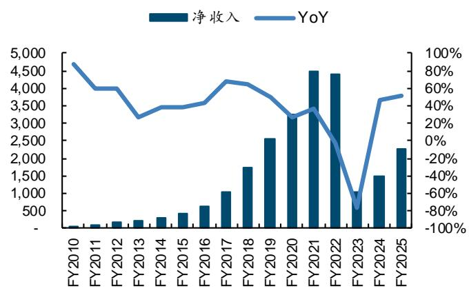  
图表3：FY2023-FY2025公司收入快速恢复

来源：Bloomberg，国金证券研究所；单位：百万美元来源：公司公告，国金证券研究所；单位：百万美元来源：Bloomberg，国金证券研究所；单位：百万美元来源：公司公告，国金证券研究所来源：Bloomberg，国金证券研究所来源：Bloomberg，国金证券研究所

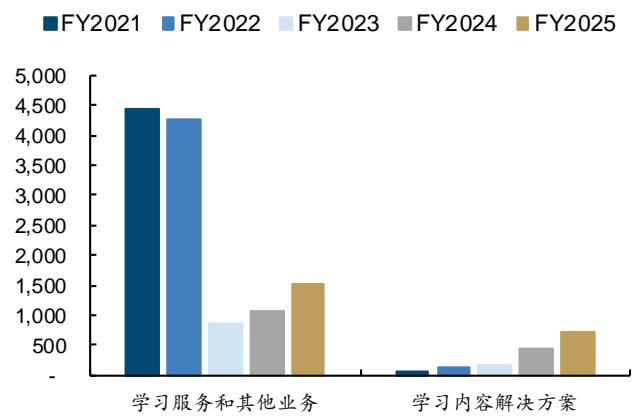  
图表5：FY2025公司学习服务业务贡献更多收入增量

  
图表7：双减前公司教学点数量最高超过1000个

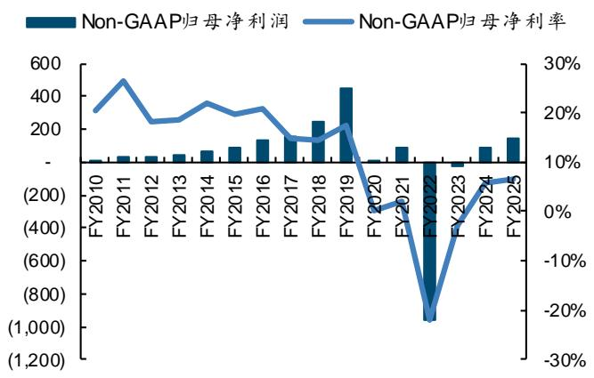  
图表4：FY2024-FY2025公司NG归母净利率回正

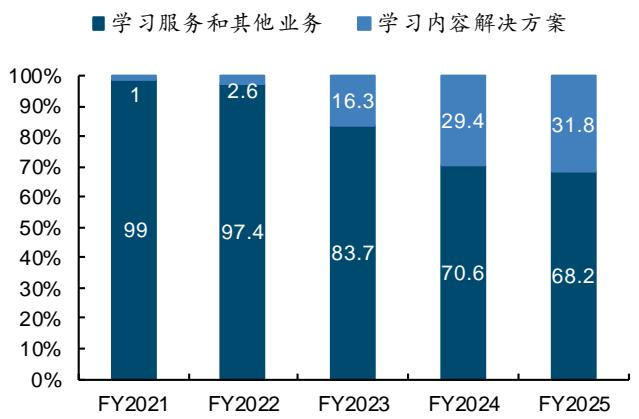  
图表6：FY2024-FY2025学习服务业务占比保持70%左右

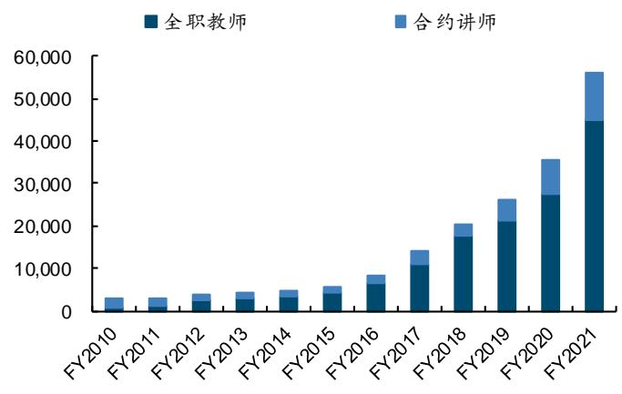  
图表8：双减前公司最高全职教师数量接近4.5万名

# 1.3 创始人、董事长张邦鑫持股27%，拥有73%投票权

同股不同权架构，公司创始人张邦鑫现任董事长兼 CEO，截至 2025 年 4 月 30 日持股比例27.3%，拥有 73%投票权。公司联合创始人刘亚超现任董事兼 COO，持股比例 4.2%，拥有5.4%投票权。公司现任总裁兼 CFO 彭壮壮于 2020 年 3 月加入公司，曾担任公司战略副总裁，此前曾在微软、麦肯锡工作。公司现任 CTO 田密于 2019 年 5 月加入公司，曾负责学而思培优的产品技术，此前曾在阿里巴巴、高德地图工作。目前整个高管团队稳定。

图表9：公司董事会和高管成员及其持股比例情况 （来自2025 财年年报，截至2025 年4月30 日)  

<table><tr><td>姓名</td><td>年龄</td><td>职位</td><td></td><td>履历持股比例</td><td>投票权比例</td></tr><tr><td rowspan="2">张邦鑫</td><td rowspan="2">44</td><td rowspan="2">董事长兼CEO</td><td>公司创始人，2002 年9 月至2007 年4 月就读于北京大学生命科</td><td rowspan="2">27.3%</td><td rowspan="2">73.2%</td></tr><tr><td>学学院研究生课程</td></tr><tr><td>刘亚超</td><td>43</td><td>董事兼CoO</td><td>公司联合创始人，2003 年7 月获得北京大学力学学士学位，2008 年7月获得中国科学院力学研究所博士学位</td><td>4.2%</td><td>5.4%</td></tr><tr><td>张凯夫</td><td>40</td><td>独立董事</td><td>阿里巴巴集团全球数字商务副总裁</td><td>*</td><td>*</td></tr><tr><td>Yi Wang</td><td>53</td><td>独立董事</td><td>哈佛大学上海中心执行主任</td><td></td><td></td></tr><tr><td>冯雁</td><td>48</td><td>独立董事</td><td>攜程金融首席执行官以及攜程集团高级副总裁</td><td>*</td><td></td></tr><tr><td rowspan="2">彭壮壮</td><td rowspan="2">51</td><td rowspan="2"></td><td>2020 年3 月加入公司，曾负责设计公司整体战略并领导各业务部 总裁兼 CFO 门的战略规划流程。加入公司前，曾任微软大中华区业务战略总</td><td>*</td><td>*</td></tr><tr><td>经理，全球管理咨询公司麦肯锡北京办公室的顾问和合伙人</td><td></td><td></td></tr><tr><td>田密</td><td>42</td><td>CTO</td><td>2019 年5 月加入公司，曾负责学而思培优的产品技术。加入公司</td><td>*</td><td>*</td></tr><tr><td colspan="7">前，曾任阿里巴巴高级技术总监，高德地图技术副总裁 所有董事会和高管成员</td></tr></table>

来源：公司公告，国金证券研究所（星号表示比例小于 1%）

# 2. 学习服务业务：素质转型进展佳，修复空间大

# 2.1 学而思素养：非学科优质供给稀缺，核心城市加密进行时

学而思素养采用线下面授的课堂组织形式（家长和学生也可以根据实际需求选择在线网课的课堂形式），小班化教学，小学满班16-18人。根据官网，目前学而思素养提供7门课程，分别是人工智能编程、机器人、学而思研学、科学实验、科学思维、人文创作、学而思围棋，主要面向 1-6 年级。其中，科学思维和人文创作是最受欢迎的两门课程。科学思维是学习科学类综合知识，带领孩子在真实生活情景中探索解决问题的方案，而人文创作是以培养孩子创作能力为核心，帮助孩子将阅读的收获转化为表达的动力。课程价格与过去的学科培训价格接近，大约 3000-4000 元/学期，一周一次课，每次课 2 课时，单课时价格约为 130-200 元。

图表10：学而思素养课程产品丰富  

<table><tr><td>课程产品</td><td>课程内容</td></tr><tr><td>人工智能编程</td><td>专为青少年设计的Python 编程学习体系，课程带领孩子用编程解决真实复杂问题。对有挑战需求的学员，提供 C++课 程及参与科创挑战活动的服务。</td></tr><tr><td>机器人</td><td>使用乐高积木等专业教具组装搭建机器人外观、用编程运行机器人功能的创造性课程。课程覆盖 3-18 岁全年龄段，与</td></tr><tr><td>学而思研学</td><td>乐高教育达成战略合作，并为学员搭建多种参与国内外机器人科创挑战活动的舞台。 以旅行等场景组织孩子进行实践体验式学习，目前在全国已有历史、文化、科技、美育板块多条主题线路。</td></tr><tr><td>科学实验</td><td>以实验为载体，搭建从好奇心到科学素养的桥梁。课程内容结合 STEAM 教育理念，涵盖物质科学、生命科学、地球与</td></tr><tr><td>科学思维</td><td>宇宙、技术与工程四大基础科学领域。 讲授科学类综合知识，带领孩子在真实生活情景中探索解决问题的方案。课程内容设置建筑与结构、城市与生活、地</td></tr><tr><td>人文创作</td><td>球与空间、逻辑与关系、经济与规律、信息与智能六大主题单元。 以培养孩子的创造能力为核心，设置文学鉴赏、百科博物和人类进程三大阅读体系，通过小游戏、小剧场等趣味课堂 活动带领孩子进行阅读，并输出剧目表演、场景演说、剧本创编、文学评论、主题辩论、项目策划等作品。</td></tr></table>

# 课程产品

# 学而思围棋

提供从零基础启蒙到专业冲段的线下小班围棋辅导。

来源：学而思素养官网，国金证券研究所

素养网点目前覆盖近 40 个城市，主要为一二线城市。考虑到教育需求和家庭付费能力，公司业务扩张遵循由高线城市出发，加密到一定程度再向低线城市渗透的路径。转型素质教育后，公司率先在一二线城市恢复扩张，根据我们在学而思 App 上的统计，截至 2025年 4 月 10 日，公司在北京、上海、广州、杭州、天津这 5个城市的教学点数重新超过20个，在深圳、成都、重庆、武汉、苏州、西安、南京、长沙、郑州、佛山、济南这 11 个城市的教学点数超过 10 个。然而，相比双减前，公司在高线城市的教学点总数仅为高峰期的 4 成。根据财报，2021 年 2 月底，公司在北京、上海的教学点数量超过 100 家，在广州、深圳、南京、杭州的教学点数量超过 50 家，共有 14 个城市教学点数量超过 20个。

图表11：公司在一二线城市的线下教学点密度尚低，相对双减前恢复率仅4成  

<table><tr><td>城市</td><td>2021年2月（高点）</td><td>2025年4 月</td><td>恢复率</td><td></td><td>城市2021年2月(高点)</td><td>2025年4 月</td><td>恢复率</td></tr><tr><td colspan="8">一线城市恢复率：29%</td></tr><tr><td>北京</td><td>155</td><td>40</td><td>26%</td><td>广州</td><td>81</td><td>28</td><td>35%</td></tr><tr><td>上海</td><td>100</td><td>35</td><td>35%</td><td>深圳</td><td>79</td><td>18</td><td>23%</td></tr><tr><td colspan="8">新一线城市恢复率：42%</td></tr><tr><td>成都</td><td>26</td><td>17</td><td>65%</td><td>天津</td><td>45</td><td>24</td><td>53%</td></tr><tr><td>重庆</td><td>46</td><td>12</td><td>26%</td><td>郑州</td><td>26</td><td>11</td><td>42%</td></tr><tr><td>杭州</td><td>65</td><td>22</td><td>34%</td><td>东莞</td><td>4</td><td>8</td><td>200%</td></tr><tr><td>武汉</td><td>35</td><td>10</td><td>29%</td><td>青岛</td><td>12</td><td>9</td><td>75%</td></tr><tr><td>苏州</td><td>34</td><td>15</td><td>44%</td><td>佛山</td><td>8</td><td>13</td><td>163%</td></tr><tr><td>西安</td><td>37</td><td>16</td><td>43%</td><td>宁波</td><td>5</td><td>3</td><td>60%</td></tr><tr><td>南京</td><td>79</td><td>14</td><td>18%</td><td>合肥</td><td>14</td><td>3</td><td>21%</td></tr><tr><td>长沙</td><td>16</td><td>14</td><td>88%</td><td></td><td></td><td></td><td></td></tr><tr><td colspan="8">二线城市恢复率：21%</td></tr><tr><td>昆明</td><td>2</td><td>1</td><td>50%</td><td>南昌</td><td>8</td><td>9</td><td>113%</td></tr><tr><td>沈阳</td><td>26</td><td>8</td><td>31%</td><td>惠州</td><td>3</td><td></td><td>0%</td></tr><tr><td>济南</td><td>17</td><td>12</td><td>71%</td><td>常州</td><td>5</td><td>6</td><td>120%</td></tr><tr><td>无锡</td><td>6</td><td>8</td><td>133a</td><td>嘉兴</td><td>1</td><td></td><td>0%</td></tr><tr><td>厦门</td><td>2</td><td>1</td><td>50%</td><td>徐州</td><td>4</td><td>1</td><td>25%</td></tr><tr><td>福州</td><td>11</td><td>9</td><td>82%</td><td>南通</td><td>3</td><td>5</td><td>167%</td></tr><tr><td>温州</td><td>4</td><td>6</td><td>150%</td><td>太原</td><td>12</td><td>7</td><td>58%</td></tr><tr><td>金华</td><td>1</td><td></td><td>0%</td><td>保定</td><td>1</td><td></td><td>0%</td></tr><tr><td>哈尔滨</td><td>1</td><td></td><td>0%</td><td>珠海</td><td>1</td><td></td><td>0%</td></tr><tr><td>大连</td><td>3</td><td>3</td><td>100%</td><td>中山</td><td>2</td><td></td><td>0%</td></tr><tr><td>贵阳</td><td>4</td><td>3</td><td>75%</td><td>兰州</td><td>4</td><td></td><td>0%</td></tr><tr><td>南宁</td><td>1</td><td></td><td>0%</td><td>临沂</td><td>2</td><td></td><td>0%</td></tr><tr><td>泉州</td><td>1</td><td></td><td>0%</td><td>潍坊</td><td>2</td><td></td><td>0%</td></tr><tr><td>石家庄</td><td>12</td><td>4</td><td>33%</td><td>烟台</td><td>2</td><td></td><td>0%</td></tr><tr><td>长春</td><td>3</td><td>4</td><td>133%</td><td>绍兴</td><td>2</td><td></td><td>0%</td></tr><tr><td></td><td></td><td></td><td></td><td></td><td></td><td></td><td></td></tr></table>

来源：学而思 App，公司财报，国金证券研究所

双减后校外学科类培训机构被强制压减近 9成，优质合规的非学科产品供给稀缺。根据教育部基础教育司的数据，2022 年 9 月，校外学科类校外培训机构中，线下机构压减比例达到 95.6%，线上机构压减比例达到 87.1%。非学科产品经过两年多发展，截至目前，优质合规的供给仍然稀缺。我们根据大众点评统计了 19 个一线和新一线城市的校外培训机构情况，地方上成建制的品牌连锁非学科培训机构仍然较少。

我们通过线下教学点理论可承载学生数/（当地 K12 在读学生数\*参培率）来估算公司在个地方的市占率情况，其中线下教学点理论可承载学生数=平均 15 间教室\*班均 15 人\*6 个时间段排班。结果来看，公司在北京、上海、广州、深圳、天津、杭州、南京等过去的优势区域市场份额明显回落，在近一半的一线和新一线城市中的市占率不到 2.5%。

图表12：学而思素养在全国19 个一线和新一线城市中的市占率大多不到2%  

<table><tr><td>城市</td><td>数（个）</td><td>数（万人）</td><td>线下教学点k12 在校生总市占率2021 年高峰 估算邨市占率估算</td><td></td><td>地方竞争情况</td></tr><tr><td></td><td colspan="5"></td></tr><tr><td>广州</td><td>28</td><td>254</td><td>2.5%</td><td>一线城市（假设双减前参培率 70%，双减后降至 60%) 6.2%</td><td>卓越教育（65)、新东方（40)</td></tr><tr><td>深圳</td><td>18</td><td>245</td><td>1.7%</td><td>6.2%</td><td>新东方（19)、桃李未来（12)</td></tr><tr><td>北京</td><td>40</td><td>226</td><td>4.0%</td><td>13.2%</td><td>新东方（20)、高思教育（13)</td></tr><tr><td>上海</td><td>35</td><td>220</td><td>3.6%</td><td>8.8%</td><td>昂立智立方（24)、新东方（16)</td></tr><tr><td>新一线城市（假设参双减前培率 50%，双减后降至 40%)</td><td colspan="5"></td></tr><tr><td>重庆</td><td>12</td><td>454</td><td>0.9%</td><td></td><td></td></tr><tr><td>成都</td><td>17</td><td>269</td><td>2.1%</td><td>2.7% 2.6%</td><td>新东方（35)、三中英才（35) 新东方（23）</td></tr><tr><td>郑州</td><td>11</td><td>238</td><td>1.6%</td><td>2.9%</td><td>心田花开（20)、新东方（15)、英孚（7)、卡巴科技兔(5)</td></tr><tr><td>西安</td><td>16</td><td>195</td><td>2.8%</td><td>5.1%</td><td>新东方（29)</td></tr><tr><td>苏州</td><td>15</td><td>182</td><td>2.8%</td><td>5.0%</td><td>新东方（20)、凤凰机器人（5)</td></tr><tr><td>长沙</td><td>14</td><td>180</td><td>2.6%</td><td>2.4%</td><td>新东方（18)、心田花开（6)</td></tr><tr><td>天津</td><td>24</td><td>175</td><td>4.6%</td><td>7.0%</td><td>锐满分（32)、新东方（18)、瑞思（9)</td></tr><tr><td>武汉</td><td>10</td><td>162</td><td>2.1%</td><td>5.8%</td><td>卡巴编程（28)、新东方（24)</td></tr><tr><td>东莞</td><td>8</td><td>159</td><td>1.7%</td><td>0.7%</td><td>星火（30)、卓越教育（6)、新东方（2)、瑞思（4)</td></tr><tr><td>杭州</td><td>22</td><td>157</td><td>4.7%</td><td>11.2%</td><td>新东方（34)</td></tr><tr><td>佛山</td><td>13</td><td>151</td><td>2.9%</td><td>1.4%</td><td>星火（27)、卓越教育（12)、新东方（10)、唐人街（8)、晓培优（7)</td></tr><tr><td>青岛</td><td>9</td><td>149</td><td>2.0%</td><td>2.2%</td><td>新东方（12)、龙文（10)</td></tr><tr><td>合肥</td><td>3</td><td>148</td><td>0.7%</td><td>2.6%</td><td>新东方（19)、托特科学（4)、弗恩（15)</td></tr><tr><td>宁波</td><td>3</td><td>118</td><td>0.9%</td><td>1.1%</td><td>新东方（4)、小码王(3)</td></tr><tr><td>南京</td><td>14</td><td>113</td><td>4.2%</td><td>18.8%</td><td>新东方（28)、点津文化（13)、力学堂（13)</td></tr></table>

来源：各城市统计局，各城市教育局，学而思 App，国金证券研究所（统计时间为 2025 年 4 月 22 日）

线下业务的核心资源是教学点和教师，两方面未见瓶颈。教学点的开设需要办学许可证和足够的资金支持。双减后，公司在全国主要城市保留了 100 多家网点，拥有存量办学许可证，为后续申请新的办学许可证或者新增教学点备案提供基础。一般而言，新开一家线下教学点的前期投入大约小几百万元（半年租金+装修成本），截至 2024 年 11 月 30 日，公司账面净现金约 40 亿美元，资金充足。为了保障教学质量和品牌口碑，教师的培养速度是限制扩张速度的一大因素。公司倾向于从大学毕业生中招聘教师，其中许多来自中国顶尖高校。每位新入职的全职教师都需要接受特定的标准化培训，内容涵盖教育内容、教学技能和技巧，以及公司的企业文化和价值观。根据我们在学而思 App 上的校区统计，截至2025 年 4 月公司在全国共有 450+教学点，近两年复合增速约 $50 \%$ 。

图表13：公司线下教学点自2022 年暑期开始出现小幅扩张，近两年线下开店复合增速约 $50 \%$   

<table><tr><td>截止日</td><td>2022/5/31</td><td>2022/8/31</td><td>2022/11/30</td><td>2023/2/28</td><td>2023/5/31</td></tr><tr><td>财季</td><td>FY23Q1</td><td>FY23Q2</td><td>FY23Q3</td><td>FY23Q4</td><td>FY24Q1</td></tr><tr><td>线下教学点数（个)</td><td>100-150</td><td>小幅增加</td><td>小幅增加</td><td>170</td><td>约200</td></tr></table>

来源：公司公开业绩交流会，国金证券研究所

图表14：公司2024财年全职员工数量同比扩张28%  

<table><tr><td>截止日</td><td>2021/2/28</td><td>2022/2/28</td><td>2023/2/28</td><td>2024/2/29</td></tr><tr><td>财季</td><td>FY21Q4</td><td>FY22Q4</td><td>FY23Q4</td><td>FY24Q4</td></tr><tr><td>全职员工数量（名)</td><td>70914</td><td>16200</td><td>11700</td><td>15000</td></tr></table>

来源：公司公告，国金证券研究所

# 2.2 学而思网校：在线教育竞争回归理性，公司产品不断丰富，用户量快速增长

学而思网校产品持续创新，新推思维小班课程。学而思网校于 2010年正式上线，2016年开创“小班直播+个性化辅导”的授课模式，2018 年升级课程模式为“主讲老师+班主任”的双师直播模式（班主任一个班带 30 人，每位主讲老师和多位班主任搭档，通常一个直播间可承载上百名学生一同上课），将自主研发的语音识别、语音评测等 AI 技术作为辅助教学手段引入课堂。2021 年响应国家政策要求，学而思网校全面停止义务教育阶段的学科类校外培训服务，目前主要为 6-14 岁学生提供素质教育服务。经过 3 年多的发展，学而思网校的产品矩阵拓展至人文创作、科学、编程与机器人、国际象棋、博物、大阅读、剑桥英语、思维小班等多门课程，授课形式从传统的双师直播大班课，拓展到线上直播小班（10-12 人）、线上 1v6 直播互动课。例如 2025 年 3 月以来主推的思维小班课，有别于市面上主流的双师直播大班课，公司采用 6-12 人小班直播的授课形式，主讲老师与辅导老师同一人，能够给孩子提供更具针对性的教学过程。

图表15：学而思网校针对K12 阶段学生的产品矩阵不断丰富  

<table><tr><td colspan="2">年级</td></tr><tr><td>预备</td><td>人文创作、科学、编程、大阅读、剑桥英语、思维小班、数理思维</td></tr><tr><td>1-3年级</td><td>人文创作、科学、编程、国际象棋、大阅读、剑桥英语、自然博物、思维小班、数理思维、图书</td></tr><tr><td>4-6年级</td><td>人文创作、科学、编程、国际象棋、大阅读、剑桥英语、自然博物、数理思维、图书</td></tr><tr><td>预初-初二</td><td>人文创作、英语/数学/物理图书、科学、编程、自然博物</td></tr><tr><td>初三</td><td>数学大招、化学口诀、英语写作、物理公式、学习规划、自然博物、图书</td></tr><tr><td>高一高三</td><td>数学大招、化学口诀、英语写作、物理公式、目标大学规划、备考贴士、家长课堂</td></tr></table>

来源：学而思网校 App，国金证券研究所

图表16：学而思网校推出思维小班等创新模式，采用小班直播形式  

<table><tr><td></td><td>人文创作</td><td>大阅读</td><td>思维小班</td><td>新数学</td></tr><tr><td>学习形式</td><td>双师直播大班课</td><td>3v3真人互动精讲视频</td><td>6-12人小班直播</td><td>3v3 真人互动精讲视频</td></tr><tr><td>学习重点</td><td>直播为主， 双师带教</td><td>教材为主， 配套真人互动课和伴学服务</td><td>直播为主， 主讲1对1 辅导</td><td>教材为主， 配套真人互动课和伴学服务</td></tr><tr><td>课程费用</td><td>按季收费， 一季2000-3000元</td><td>按年收费， 原价一年 400-5000 元，</td><td>按季收费， 一季3000-4000元</td><td>按年收费， 原价一年 4000-5000 元，</td></tr><tr><td></td><td></td><td>当前折扣价一年 2000-3000 元</td><td></td><td>当前折扣价一年 2000-3000 元</td></tr><tr><td></td><td>适用人群适合基础好，培优语文</td><td>适合打基础</td><td>适合基础好，培优数学</td><td>适合打基础</td></tr></table>

来源：学而思网校 App，国金证券研究所

双减后 K12在线教育行业重新洗牌，存量机构中，较具规模和实力的营利性机构主要为学而思网校、高途、猿辅导、作业帮、有道。2024 年暑期，各家机构开始恢复积极招生。趋势来看，学而思网校在经过 2024 年暑期招生后整体用户保持增长趋势，逐渐拉开与同行的差距，同时，其活跃用户 30 天留存率稳定在 16-20%区间。根据 Questmobile，2025 年3 月学而思网校的 MAU 体量达到 219 万人，同比增长 158%，与非营利组织希望学并列 K12在线教育第一；活跃用户 30 天留存率 16.02%，环比稳定。

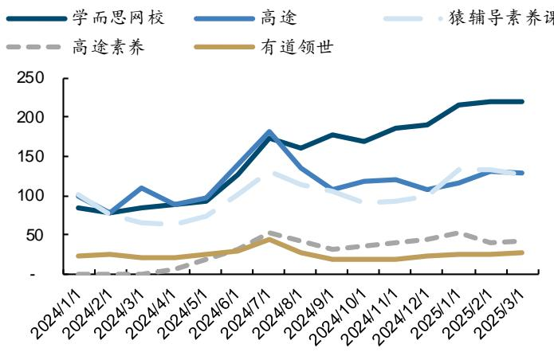  
图表17：学而思网校MAU（万人）领先同业

来源：questmobile，国金证券研究所来源：questmobile，国金证券研究所；标星号为非营利组织来源：Questmobile，国金证券研究所

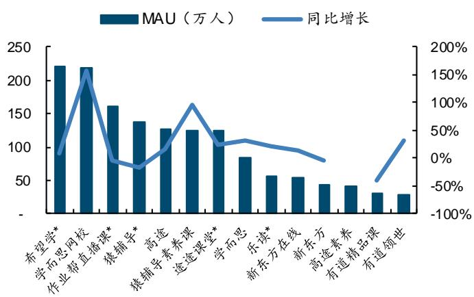  
图表18：25年 $_ { 3 }$ 月学而思网校 MAU同比增长近150%

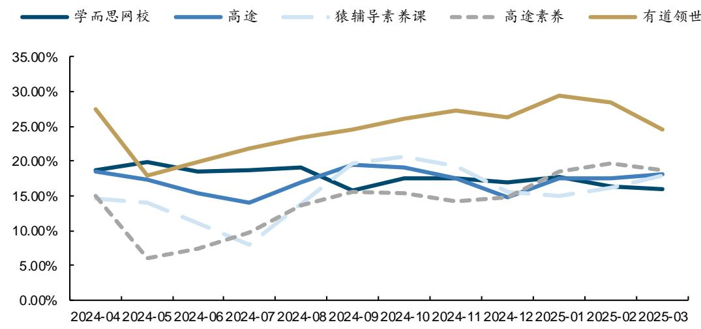  
图表19：学而思网校活跃用户数高速增长下，30天留存率仍然保持稳定

# 3. 教育科技：核心战略方向，大模型及AI应用持续落地

教育科技是公司重要战略方向之一。2021 年响应双减政策，公司停止中国大陆的K9学科类校外培训服务，转型素质教育和教育科技。公司在教育科技领域探索较为前瞻。2017 年公司就成立了人工智能实验室，研究通过 AI 技术来赋能公司的各个事业线，2018 年成立脑科学实验室，希望通过脑科学研究及反馈，帮助学生匹配个性化学习内容、动态调整大脑学习状态，同时与斯坦福大学达成 AI+教育战略合作，探索人工智能、机器学习和脑科学的协同配合。2023 年 5 月公司公布正在进行自研数学大模型的研发，并于 2023 年8月推出数学垂类大模型 MathGPT。目前，公司的大模型应用已经在学习机硬件上落地，2025年 1 月结合 DeepSeek 能力推出了答疑助手“随时问”App 等。

# 3.1 AI 学习机：推陈出新，扩充价格带提升渗透

AI 学习机是公司近两年增长最快的业务之一。2023年 2 月公司推出第一款学习机——经典版 2023，此后保持每年 2-3 款新品的迭代速度。2025 年 5 月推出 3 款新品，目前已经共有 8 款 SKU 在售，从最开始的 4500-9000 元高端机型，扩充到 2000-3000 元大众价位，并拓展至学练机品类。学而思学习机的 AI 能力主要包括 AI 精准学、AI 作业/作文批改、AI 指尖查词翻译、AI 口语分级练习、随时问等，基本囊括了市场上的主流 AI 功能。较具特色的是，学而思学习机上配备了自研内容，包括自研的校内学科类和校外素养类课程（培优体系），这是产品最具差异化的特征。

图表20：自2023 年推出第一款学习机以来，公司保持每年2-3 款新品的迭代速度  

<table><tr><td>时间</td><td>新品</td><td>新品升级点</td><td>价格</td></tr><tr><td rowspan="2">2023 年 2月</td><td>推出学而思学习机</td><td>核心理念“好老师、好内容；好屏幕、好视力”。首发 当日，学而思学习机销量超过 6000 台。</td><td>首发价4599 元</td></tr><tr><td>推出学而思学习机旗舰版</td><td></td><td>首发价分别为6599 元、8599</td></tr><tr><td rowspan="2">2023年12月 2024年5月</td><td>xPad2 Pro和xPad2 Pro Max</td><td>增加 AI 辅导功能精准学、对话学等，升级硬件。</td><td>元</td></tr><tr><td>推出学而思学习机经典版 2024</td><td>相比 2023年版硬件配置大幅升级，搭载旗舰版AI辅</td><td>首发价4999 元</td></tr><tr><td>2024年8月</td><td>推出学而思学练机</td><td>导功能，内容围绕新课标进行升级。 集练习、学习、阅读为一体。</td><td>首发价3999 元</td></tr><tr><td>2024年11月</td><td>推出学而思学习机s3</td><td>高性价比学习机。</td><td>首发价3899 元</td></tr><tr><td></td><td></td><td>AI 功能升级，搭载 DeepSeek+自研九章大模型，T和S</td><td></td></tr><tr><td rowspan="4">2025年5 月</td><td></td><td>推出学而思学习机 T4 旗舰款、系列均有58 款AI 工具，P 系列有50 款 AI 工具。内容</td><td>首发价格分别为7299 元、</td></tr><tr><td></td><td>学而思学习机 S4经典款、学而上继续增加课程和题目，并增加了启蒙内容。推出学</td><td></td></tr><tr><td></td><td>思学习机 P4 标准款而思 Care+计划，即已经购买了学而思硬件设备的老用</td><td>4899元、2699元</td></tr><tr><td></td><td>户，在 1200 天内可以五折换新。</td><td></td></tr></table>

来源：多知网，学而思官方微信公众号，国金证券研究所

“后双减”时代，学习平板承载培训补习需求，出现内容为王的竞争路线。早期的学习机强调内容资源的聚合，智能化、优质资源需求不高，后由于公共卫生事件，学习平板作为网课载体，家长监管、大屏护眼、作业批改等需求旺盛，带动学习平板工具属性增强，后“双减”时代，学习平板顺势承载了培训补习需求，对高质量、个性化内容需求加强，教培企业入局、生成式 AI 应用进一步加强了“内容为王”的竞争路线。据洛图科技数据，2024 年学习平板市场（包括了学习机和学练机）全渠道销量 592 万台，同比增长 26%，销售额 191 亿元，同比增长 38%；2025 年一季度销量 127 万台，同比增长 29%，销售额40亿元，同比增长 16%。渠道结构来看，2024 年以来线上渠道销量占比约 65-70%，内容电商渠道增速亮眼。2025 年一季度，线上渠道销量保持 40%的快速增长。品牌格局来看，2025年一季度，作业帮、学而思、科大讯飞、步步高、小猿和小度为销量前六的品牌，合计销量份额（CR6）高达 74.4%。其中，作业帮线上线下齐发力，销量占比接近 30%；学而思以线上为主阵地，销量份额超过 13%；科大讯飞凭借成熟的线下渠道以及线上配合，销量份额约为 12%。

图表21：2025 年一季度学习平板销量保持较快增长  

<table><tr><td rowspan="2">时间区间</td><td colspan="2">销量</td><td colspan="2">销售额</td></tr><tr><td>销量（万台）</td><td>同比增长</td><td>销售额（亿元)</td><td>同比增长</td></tr><tr><td>2023</td><td>472.0</td><td>/</td><td>138.5</td><td>/</td></tr><tr><td>2024</td><td>592.3</td><td>26%</td><td>190.6</td><td>38%</td></tr><tr><td>2025Q1</td><td>126.5</td><td>29%</td><td>40.2</td><td>16%</td></tr><tr><td>2025Q1线上</td><td>86.3</td><td>40%</td><td>/</td><td>/</td></tr><tr><td>2025Q1线下</td><td>40.2</td><td>11%</td><td>/</td><td>/</td></tr></table>

来源：洛图科技，国金证券研究所

对标学科培训参培率，学习机的渗透率仍然有较大提升空间。“后双减”时代学习机产品的价值量有了明显的提升，近两年（2023 年+2024 年）的学习机累积出货量约达 1064 万台（来自洛图科技），相对于 2.3 亿全国 K12 学生的渗透率约 $5 \%$ 。

图表22：全国学习机渗透率（近2年累计）约5%  

<table><tr><td></td><td>数额</td><td>单位</td></tr><tr><td>学习机近2 年累计销量</td><td>1,064</td><td>万台</td></tr><tr><td>一线和新一线城市K12学生数量(2023年）</td><td>3795</td><td>万人</td></tr><tr><td>学习机渗透率</td><td>28%</td><td></td></tr><tr><td>全国K12学生数量（2023 年)</td><td>22,976</td><td>万人</td></tr><tr><td>学习机渗透率</td><td>5%</td><td></td></tr><tr><td>参考：全国K12 校外学科培训参培率(2019 年)</td><td>24%</td><td></td></tr></table>

来源：教育部，各地方教育局，洛图科技，中国教育财政科学研究所，国金证券研究所

# 3.2 AI 软件：以小思 AI、英语天天练为代表，多点开花

公司现已推出“小思 AI”、“九章答疑”2 款 AI 答疑产品。2025 年 2 月 14 日，公司正式发布答疑助手“随时问”App（现已改名为“小思 AI”）。这款应用融入了九章大模型和DeepSeek 双模型，除了免费答疑，还集成了 AI 拍照答疑、AI 作业检查、AI 作文批改、AI 错题本等中小学生高频使用的学习工具，并且提供自研互动讲解视频，这款产品目前是免费的。另一款 AI 伴学产品是“九章答疑”，这款应用设计更简洁，答疑过程更多侧重解题，包括设计了“小思老师”（复杂多轮引导对话）和“小智老师”（快速精准对话）两种讲解模式。“九章答疑”项目研发历时两年，由好未来集团联合暨南大学广东智慧研究院联合打造，获得了国家重点研发计划、科技创新 2030-“新一代人工智能”重大项目等多项国家级科研计划支持。目前该产品已经在北京市宏志中学、北京市广渠门中学、北京中法实验学校、武汉市光谷第三小学、广东省暨南大学附属崇德小学、深圳市高级中学等全国多地多个中小学应用试点。

  
图表23：小思AI提供AI问答等多项AI学习工具  
来源：小思AI 国金证券研究所

  
图表24：九章答疑功能更简洁，更侧重题目讲解  
来源：九章答疑 国金证券研究所

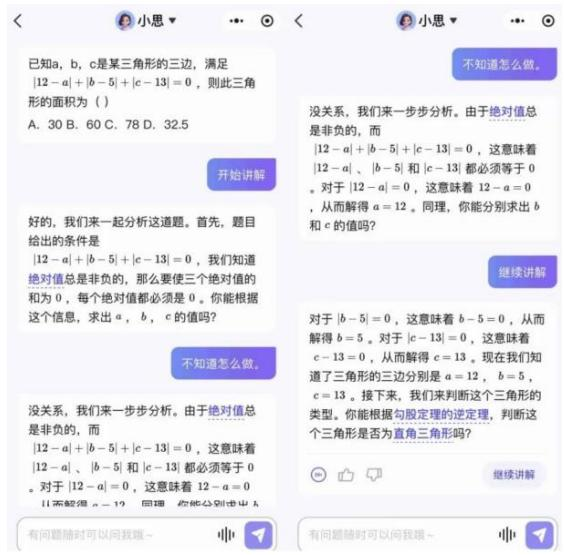  
图表25：九章答疑小思老师引导学生解题  
来源：九章答疑 多知 国金证券研究所

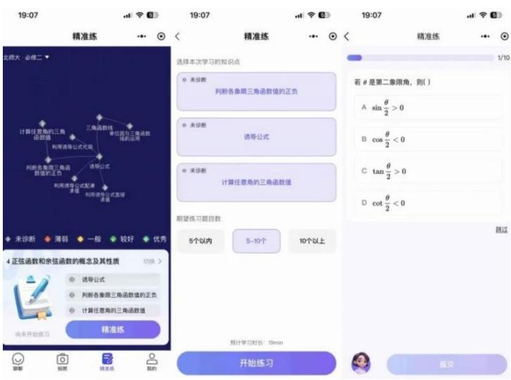  
图表26：九章答疑精准练功能提供个性化练习规划  
来源：九章答疑 多知 国金证券研究所

另外，公司还推出了“天天练”系列App，其中“英语天天练”最为热门。“天天练”系列产品更具内容属性，与校内教材高度贴合，结合自身的教研内容和教学方法进行内容和产品设计，并将 AI 能力融合进教研、教学环节，包括 AI 生成教学内容、AI 个性化推荐内容等。公司的“天天练”系列产品还结合了游戏玩法，来提升用户粘性。例如英语天天练套用角色扮演类游戏，通过用英语开口对话，完成作业练习，玩家可获得升级奖励。这款App 借助 AI 进行内容的个性化推荐，基于课本单元单词，让 AI 扩展为句子，句子难度适配学生水平。根据 Questmobile 数据，2024 年 1 月以来，英语天天练 App 的月活用户数量快速从不到 50 万人增长至 2025 年 4 月的 511 万人，日活用户数从不到 4 万人增长至45 万人。目前该系列应用采取订阅收费制，VIP 月卡 79 元，年卡 358 元。

  
图表27：英语天天练采用游戏化的方式提升练习粘性  
来源：英语天天练，国金证券研究所

  
图表28：英语天天练月活用户数量迅速超过500万人  
来源：Questmobile，国金证券研究所

# 4. 盈利预测与投资建议

# 4.1 盈利预测

收入端：我们预计公司 FY2026-FY2028 总收入 29.28 亿美元、36.56 亿美元、44.10 亿美元，同比增长 30%、25%、21%。其中，学习服务业务收入同比增长 30%、26%、23%，这主要受到线下新开教学点、老教学点爬坡以及入学人次增长推动。内容业务收入同比增长$30 \%$ 、 $22 \%$ 、 $16 \%$ ，这主要受到 AI 学习平板销量增长推动，以及部分递延确收的有所贡献。

成本费用端：我们预计公司 FY2026-FY2028 毛利率 53.3%、53.4%、53.6%，同比+0.0ppt、+0.1ppt、+0.1ppt，主要考虑到学习服务板块线下新开网点或产生前置成本，以及硬件方面拓展低价格带产品+分销渠道，但被网点爬坡和硬件成本端规模效益抵消。销售费用率33.0%、32.0%、31.0%，预计硬件业务随着渠道结构的调整，销售费率有望下降。管理费用率 17.2%、15.5%、14.5%，预计随着收入增长产生规模效应。

利润端：我们预计公司 FY2026-FY2028 经营利润 0.92 亿美元、2.17 亿美元、3.56 亿美元，Non-GAAP 经营利润 1.65 亿美元、3.08 亿美元、4.66 亿美元，Non-GAAP 经营利润率5.6%、8.4%、10.6%。归母净利润为 1.36 亿美元、2.34 亿美元、3.44 亿美元，Non-GAAP归母净利润为 2.09 亿美元、3.25 亿美元、4.54 亿美元，Non-GAAP 归母净利润率 7.1%、$8 . 9 \%$ 、 $1 0 . 3 \%$ 。

图表29：公司收入预测  

<table><tr><td>单位：百万美元</td><td>FY2023</td><td>FY2024</td><td>FY2025</td><td>FY2026E</td><td>FY2027E</td><td>FY2028E</td></tr><tr><td>财年截止日期</td><td>2023/2/28</td><td>2024/2/29</td><td>2025/2/28</td><td>2026/2/28</td><td>2027/2/28</td><td>2028/2/29</td></tr><tr><td colspan="7">总收入</td></tr><tr><td>收入</td><td>1,020</td><td>1,490</td><td>2,250</td><td>2,928</td><td>3,656</td><td>4,410</td></tr><tr><td>YoY</td><td>-77%</td><td>46%</td><td>51%</td><td>30%</td><td>25%</td><td>21%</td></tr><tr><td colspan="7">学习服务业务</td></tr><tr><td>收入</td><td>854</td><td>1,070</td><td>1,557</td><td>2,029</td><td>2,560</td><td>3,137</td></tr><tr><td>YoY</td><td>-80%</td><td>25%</td><td>45%</td><td>30%</td><td>26%</td><td>23%</td></tr><tr><td>相比双减前高点恢复率</td><td>19%</td><td>24%</td><td>35%</td><td>46%</td><td>58%</td><td>71%</td></tr><tr><td>营收占比</td><td>84%</td><td>72%</td><td>69%</td><td>69%</td><td>70%</td><td>71%</td></tr><tr><td colspan="7">内容业务</td></tr><tr><td>收入</td><td>166</td><td>420</td><td>694</td><td>899</td><td>1,096</td><td>1,272</td></tr><tr><td>YoY</td><td>44%</td><td>153%</td><td>65%</td><td>30%</td><td>22%</td><td>16%</td></tr><tr><td>营收占比</td><td>16%</td><td>28%</td><td>31%</td><td>31%</td><td>30%</td><td>29%</td></tr></table>

来源：公司公告，国金证券研究所估算及预测

图表30：公司成本、费用预测  

<table><tr><td>单位：百万美元</td><td>FY2023</td><td>FY2024</td><td>FY2025</td><td>FY2026E</td><td>FY2027E</td><td>FY2028E</td></tr><tr><td>财年截止日期</td><td>2023/2/28</td><td>2024/2/29</td><td>2025/2/28</td><td>2026/2/28</td><td>2027/2/28</td><td>2028/2/29</td></tr><tr><td>毛利</td><td>583</td><td>806</td><td>1,200</td><td>1,562</td><td>1,953</td><td>2,362</td></tr><tr><td>YoY</td><td>-73%</td><td>38%</td><td>49%</td><td>30%</td><td>25%</td><td>21%</td></tr><tr><td>毛利率</td><td>57.2%</td><td>54.1%</td><td>53.3%</td><td>53.3%</td><td>53.4%</td><td>53.6%</td></tr><tr><td>同比变动</td><td>7.4%</td><td>-3.1%</td><td>-0.7%</td><td>0.0%</td><td>0.1%</td><td>0.1%</td></tr><tr><td>销售费用</td><td>283</td><td>462</td><td>749</td><td>966</td><td>1,170</td><td>1,367</td></tr><tr><td>YoY</td><td>-75%</td><td>63%</td><td>62%</td><td>29%</td><td>21%</td><td>17%</td></tr><tr><td>销售费用率</td><td>27.8%</td><td>31.0%</td><td>33.3%</td><td>33.0%</td><td>32.0%</td><td>31.0%</td></tr><tr><td>同比变动</td><td>2.3%</td><td>3.2%</td><td>2.3%</td><td>-0.3%</td><td>-1.0%</td><td>-1.0%</td></tr><tr><td>管理费用</td><td>414</td><td>430</td><td>459</td><td>504</td><td>567</td><td>639</td></tr></table>

<table><tr><td>单位：百万美元</td><td>FY2023</td><td>FY2024</td><td>FY2025</td><td>FY2026E</td><td>FY2027E</td><td>FY2028E</td></tr><tr><td>YoY</td><td>-66%</td><td>4%</td><td>7%</td><td>10%</td><td>13%</td><td>13%</td></tr><tr><td>管理费用率</td><td>40.6%</td><td>28.8%</td><td>20.4%</td><td>17.2%</td><td>15.5%</td><td>14.5%</td></tr><tr><td>同比变动</td><td>13.3%</td><td>-11.7%</td><td>-8.5%</td><td>-3.2%</td><td>-1.7%</td><td>-1.0%</td></tr><tr><td>经营利润</td><td>(91)</td><td>(69)</td><td>(3)</td><td>92</td><td>217</td><td>356</td></tr><tr><td>经营利润率</td><td>-8.9%</td><td>-4.6%</td><td>-0.1%</td><td>3.1%</td><td>5.9%</td><td>8.1%</td></tr><tr><td>同比变动</td><td>5.1%</td><td>4.3%</td><td>4.5%</td><td>3.3%</td><td>2.8%</td><td>2.1%</td></tr><tr><td>Non-GAAP经营利润</td><td>18</td><td>20</td><td>62</td><td>165</td><td>308</td><td>466</td></tr><tr><td>YoY</td><td>NA</td><td>10%</td><td>214%</td><td>168%</td><td>86%</td><td>51%</td></tr><tr><td>Non-GAAP经营利润率</td><td>1.7%</td><td>1.3%</td><td>2.7%</td><td>5.6%</td><td>8.4%</td><td>10.6%</td></tr><tr><td>同比变动</td><td>11.8%</td><td>-0.4%</td><td>1.4%</td><td>2.9%</td><td>2.8%</td><td>2.1%</td></tr><tr><td>股权激励费用</td><td>109</td><td>89</td><td>65</td><td>73</td><td>91</td><td>110</td></tr><tr><td>YoY</td><td>-38%</td><td>-18%</td><td>-27%</td><td>13%</td><td>25%</td><td>21%</td></tr><tr><td>营收占比</td><td>10.6%</td><td>6.0%</td><td>2.9%</td><td>2.5%</td><td>2.5%</td><td>2.5%</td></tr></table>

来源：公司公告，国金证券研究所预测

# 4.2 投资建议及估值

我们采用 PEG 估值法对公司进行估值。我们选取教培公司新东方、学大教育、有道、高途4 家可比公司。我们预计公司 FY2026-FY2028 的 Non-GAAP 归母净利润为 2.14 亿美元、3.29 亿美元、4.60 亿美元，对应 PE 为 30 倍、20 倍、14 倍。可比公司 2025-2027 年平均PE 为 27 倍、32 倍、18 倍。结合利润增速来看，预计公司 FY2025-FY2028E 的 Non-GAAP 归母净利润 CAGR 为 45%，对应 PEG 为 0.66 倍。可比公司当前平均PEG 为0.80 倍。

纵观整个教培行业，公司作为全国性培训机构天花板高，也是目前增速斜率最大的上市公司之一，线下素养、网校、学习机等业务有较大发展空间，且线下素养开店模型成熟，作为基本盘利润贡献可预期。参考行业，我们给予公司 FY2026 0.80 倍 PEG，对应市值 78亿美元，目标价 12.76 美元，给予“增持”评级。

图表31：可比公司估值比较（市盈率法）（更新于2025年7月11日）  

<table><tr><td rowspan="2">代码</td><td rowspan="2">名称</td><td></td><td colspan="4">202经调整归母净利润（百万美元/百万元)</td><td colspan="3"></td></tr><tr><td>总市值</td><td></td><td></td><td></td><td></td><td>2025E</td><td></td><td>2027E</td></tr><tr><td>9901.HK</td><td>新东方</td><td>68357</td><td>381</td><td>473</td><td>612</td><td>685</td><td>18</td><td>14</td><td>13</td></tr><tr><td>000526.SZ</td><td>学大教育</td><td>5821</td><td>180</td><td>231</td><td>285</td><td>344</td><td>25</td><td>20</td><td>17</td></tr><tr><td>GOTU.N</td><td>高途*</td><td>887</td><td>-148</td><td>-29</td><td>13</td><td>38</td><td>-31</td><td>68</td><td>23</td></tr><tr><td>DAO.N</td><td>有道*</td><td>1055</td><td>11</td><td>27</td><td>43</td><td>59</td><td>39</td><td>25</td><td>18</td></tr><tr><td></td><td>平均值(剔除负值)</td><td></td><td></td><td></td><td></td><td></td><td>27</td><td>32</td><td>18</td></tr><tr><td>TAL.N</td><td>好未来</td><td>6436</td><td>150</td><td>214</td><td>329</td><td>460</td><td>30</td><td>20</td><td>14</td></tr></table>

来源：Bloomberg，Wind，国金证券研究所；注：美股（高途、有道、好未来）市值为美元，港股（新东方）为港元，A 股（学大教育）为人民币；新东方、高途、有道、好未来归母净利润为经调整口径；新东方、好未来的每股盈利为美元，其余为人民币；新东方财年为 FY2024-FY2027，截止日期为每年 5 月 31日；好未来财年为 FY2025-FY2028，截止日期为每年 2 月 28/29 日；其余财年与自然年一致；高途、有道盈利预测采用彭博一致预期，其他为国金预测。

图表32：可比公司估值比较（PEG估值法）（更新于2025年7月11日）  

<table><tr><td rowspan="2">代码</td><td rowspan="2">名称</td><td rowspan="2">股价</td><td colspan="4">经调整净利润增速</td><td rowspan="2">2025PE</td><td rowspan="2">2025PEG</td></tr><tr><td>2025E</td><td>2026E</td><td></td><td>2027E  2024-2027E</td></tr><tr><td>9901.HK</td><td>新东方</td><td>41.30</td><td>24%</td><td>29%</td><td>12%</td><td>22%</td><td>18</td><td>0.85</td></tr><tr><td>000526.SZ</td><td>学大教育</td><td>47.77</td><td>28%</td><td>23%</td><td>21%</td><td>24%</td><td>25</td><td>1.05</td></tr><tr><td>GOTU.N</td><td>高途*</td><td>3.58</td><td>/</td><td>/</td><td>192%</td><td>/</td><td>/</td><td>/</td></tr><tr><td>DAO.N</td><td>有道*</td><td>8.82</td><td>147%</td><td>57%</td><td>38%</td><td>75%</td><td>39</td><td>0.52</td></tr><tr><td></td><td>平均值（别除负值）</td><td></td><td></td><td></td><td></td><td></td><td>27</td><td>0.80</td></tr><tr><td>TAL.N</td><td>好未来</td><td>10.55</td><td>43%</td><td>54%</td><td>40%</td><td>45%</td><td>30</td><td>0.66</td></tr></table>

来源：Bloomberg，Wind，国金证券研究所；注：美股（高途、有道、好未来）股价为美元，港股（新东方）为港元，A 股（学大教育）为人民币；新东方财年为 FY2024-FY2027，截止日期为每年 5 月 31 日；好未来财年为 FY2025-FY2028，截止日期为每年2 月28/29 日；其余财年与自然年一致；高途、有道盈利预测采用彭博一致预期，其他为国金预测。

# 5. 风险提示

政策波动。2021 年“双减”政策对义务教育阶段学科类校外培训强制压减，对行业打击极大。经过近 4 年整治，目前国家和监管机构对于非学科类校外培训持积极态度，但仍伴随常态化的监管。如果未来对于非学科培训的政策有所收紧，则可能对公司业务造成负面影响。

硬件等新业务拓展不及预期。智能硬件等新业务前期投入较大，若技术研发、产品开发、市场拓展等进展不佳，销量存在低于预期的可能，也可能影响公司盈利释放。

行业竞争加剧。素质教育、智能学习软硬件等领域成为教培行业新热点，跨界参与者众多，若公司产品服务力、运营能力不够强，则可能面临盈利能力恶化、市场份额下降。

品牌口碑下滑。公司近两年大规模新开教学点，同时推出较多新产品与服务，包括素质教育课程、智能学习设备等，如果扩张速度超过可承载范围，出现例如新老师培训不到位、网点管理混乱、硬件产品使用效果不佳等问题，造成品牌口碑下滑，将对公司发展造成不利。

附录：利润表预测摘要   

<table><tr><td colspan="7"></td></tr><tr><td>利润表 项目/报告期</td><td>FY2023A</td><td>FY2024A</td><td>FY2025A</td><td>FY2026E</td><td>FY2027E</td><td>单位：美元(百万) FY2028E</td></tr><tr><td>营业收入</td><td>1,020</td><td>1,490</td><td>2,250</td><td>2,928</td><td>3,656</td><td>4,410</td></tr><tr><td>营业成本</td><td>436</td><td>684</td><td>1,050</td><td>1,366</td><td>1,702</td><td>2,048</td></tr><tr><td></td><td>583</td><td>806</td><td>1,200</td><td>1,562</td><td>1,953</td><td>2,362</td></tr><tr><td>其他收入</td><td>0</td><td>0</td><td>0</td><td>0</td><td>0</td><td>0</td></tr><tr><td>销售费用</td><td>283</td><td>462</td><td>749</td><td>966</td><td>1,170</td><td>1,367</td></tr><tr><td>管理费用</td><td>414</td><td>430</td><td>459</td><td>504</td><td>567</td><td>639</td></tr><tr><td>营业利润</td><td>-113</td><td>-86</td><td>-7</td><td>92</td><td>217</td><td>356</td></tr><tr><td>利息收入</td><td>62</td><td>85</td><td>83</td><td>89</td><td>88</td><td>92</td></tr><tr><td>利息支出</td><td>0</td><td>0</td><td>0</td><td>0</td><td>0</td><td></td></tr><tr><td>权益性投资损益</td><td>-2</td><td>-6</td><td>-10</td><td>0</td><td>0</td><td></td></tr><tr><td>其他非经营性损益</td><td>-90</td><td>2</td><td>52</td><td>0</td><td>0</td><td></td></tr><tr><td>其他损益</td><td>32</td><td>16</td><td>4</td><td>0</td><td>0</td><td></td></tr><tr><td>除税前利润</td><td>-112</td><td>11</td><td>123</td><td>181</td><td>305</td><td>448</td></tr><tr><td>所得税</td><td>20</td><td>15</td><td>38</td><td>40</td><td>67</td><td>99</td></tr><tr><td>净利润（含少数股东损益）</td><td>-132</td><td>-4</td><td>84</td><td>141</td><td>238</td><td>350</td></tr><tr><td>少数股东损益</td><td>4</td><td>-1</td><td>-0</td><td>0</td><td>0</td><td>o</td></tr><tr><td>净利润</td><td>-136</td><td>-4</td><td>85</td><td>141</td><td>238</td><td>350</td></tr><tr><td>优先股利及其他调整项</td><td>0</td><td>0</td><td>0</td><td>0</td><td>0</td><td>o</td></tr><tr><td>归属普通股东净利润</td><td>-136</td><td>-4</td><td>85</td><td>141</td><td>238</td><td>350 ……</td></tr></table>

来源：公司年报、国金证券研究所

# 投资评级的说明：

买入：预期未来 $^ { 6 - 1 2 }$ 个月内上涨幅度在 $1 5 \%$ 以上；  
增持：预期未来 6－12个月内上涨幅度在 $5 \% - 1 5 \%$ ；  
中性：预期未来 6－12个月内变动幅度在 $- 5 \% - 5 \%$ ；  
减持：预期未来 6－12个月内下跌幅度在 $5 \%$ 以上。

# 特别声明：

国金证券股份有限公司经中国证券监督管理委员会批准，已具备证券投资咨询业务资格。

本报告版权归“国金证券股份有限公司”（以下简称“国金证券”）所有，未经事先书面授权，任何机构和个人均不得以任何方式对本报告的任何部分制作任何形式的复制、转发、转载、引用、修改、仿制、刊发，或以任何侵犯本公司版权的其他方式使用。经过书面授权的引用、刊发，需注明出处为“国金证券股份有限公司”，且不得对本报告进行任何有悖原意的删节和修改。

本报告的产生基于国金证券及其研究人员认为可信的公开资料或实地调研资料，但国金证券及其研究人员对这些信息的准确性和完整性不作任何保证。本报告反映撰写研究人员的不同设想、见解及分析方法，故本报告所载观点可能与其他类似研究报告的观点及市场实际情况不一致，国金证券不对使用本报告所包含的材料产生的任何直接或间接损失或与此有关的其他任何损失承担任何责任。且本报告中的资料、意见、预测均反映报告初次公开发布时的判断，在不作事先通知的情况下，可能会随时调整，亦可因使用不同假设和标准、采用不同观点和分析方法而与国金证券其它业务部门、单位或附属机构在制作类似的其他材料时所给出的意见不同或者相反。

本报告仅为参考之用，在任何地区均不应被视为买卖任何证券、金融工具的要约或要约邀请。本报告提及的任何证券或金融工具均可能含有重大的风险，可能不易变卖以及不适合所有投资者。本报告所提及的证券或金融工具的价格、价值及收益可能会受汇率影响而波动。过往的业绩并不能代表未来的表现。

客户应当考虑到国金证券存在可能影响本报告客观性的利益冲突，而不应视本报告为作出投资决策的唯一因素。证券研究报告是用于服务具备专业知识的投资者和投资顾问的专业产品，使用时必须经专业人士进行解读。国金证券建议获取报告人员应考虑本报告的任何意见或建议是否符合其特定状况，以及（若有必要）咨询独立投资顾问。报告本身、报告中的信息或所表达意见也不构成投资、法律、会计或税务的最终操作建议，国金证券不就报告中的内容对最终操作建议做出任何担保，在任何时候均不构成对任何人的个人推荐。

在法律允许的情况下，国金证券的关联机构可能会持有报告中涉及的公司所发行的证券并进行交易，并可能为这些公司正在提供或争取提供多种金融服务。

本报告并非意图发送、发布给在当地法律或监管规则下不允许向其发送、发布该研究报告的人员。国金证券并不因收件人收到本报告而视其为国金证券的客户。本报告对于收件人而言属高度机密，只有符合条件的收件人才能使用。根据《证券期货投资者适当性管理办法》，本报告仅供国金证券股份有限公司客户中风险评级高于 C3 级(含 C3 级）的投资者使用；本报告所包含的观点及建议并未考虑个别客户的特殊状况、目标或需要，不应被视为对特定客户关于特定证券或金融工具的建议或策略。对于本报告中提及的任何证券或金融工具，本报告的收件人须保持自身的独立判断。使用国金证券研究报告进行投资，遭受任何损失，国金证券不承担相关法律责任。

若国金证券以外的任何机构或个人发送本报告，则由该机构或个人为此发送行为承担全部责任。本报告不构成国金证券向发送本报告机构或个人的收件人提供投资建议，国金证券不为此承担任何责任。

此报告仅限于中国境内使用。国金证券版权所有，保留一切权利。

上海  
电话：021-80234211  
邮箱：researchsh@gjzq.com.cn  
邮编：201204  
地址：上海浦东新区芳甸路 1088 号紫竹国际大厦 5 楼  
北京  
电话：010-85950438  
邮箱：researchbj@gjzq.com.cn  
邮编：100005  
地址：北京市东城区建内大街 26 号新闻大厦 8 层南侧  
深圳  
电话：0755-86695353  
邮箱：researchsz@gjzq.com.cn  
邮编：518000  
地址：深圳市福田区金田路 2028 号皇岗商务中心18 楼 1806