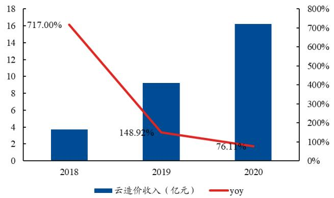

审慎增持 （维持）

市场数据  

<table><tr><td>市场数据日期</td><td>2021-07-30</td></tr><tr><td>收盘价(元）</td><td>62.99</td></tr><tr><td>总股本(百万股)</td><td>1187.42</td></tr><tr><td>流通股本(百万股)</td><td>991.52</td></tr><tr><td>总市值(百万元)</td><td>74769.91</td></tr><tr><td>流通市值(百万元)</td><td>62414.37</td></tr><tr><td>净资产(百万元)</td><td>6601.98</td></tr><tr><td>总资产(百万元)</td><td>9759.69</td></tr><tr><td>每股净资产（元)</td><td>5.56</td></tr></table>

来源：WIND，兴业证券经济与金融研究院整理

# 相关报告

《云转型进入收获期，回购彰显发展信心》2021-04-04  
《云转型进一步加速，施工业务稳步增长》2020-03-26  
《转型正当时，数字造价业务云化加速》2019-07-31

# 广联达002410.SZ云计算稀缺龙头，迎收入、利润率双升

2021年08月01日

主要财务指标  

<table><tr><td>会计年度</td><td>2020</td><td>2021E</td><td>2022E</td><td>2023E</td></tr><tr><td>营业收入(百万元)</td><td>4005</td><td>4988</td><td>6166</td><td>7553</td></tr><tr><td>同比增长</td><td>13.1%</td><td>24.5%</td><td>23.6%</td><td>22.5%</td></tr><tr><td>归母净利润(百万元)</td><td>330</td><td>645</td><td>939</td><td>1240</td></tr><tr><td>同比增长</td><td>40.5%</td><td>95.3%</td><td>45.6%</td><td>32.0%</td></tr><tr><td>毛利率</td><td>88.7%</td><td>88.8%</td><td>88.5%</td><td>87.6%</td></tr><tr><td>净利润率</td><td>8.3%</td><td>12.9%</td><td>15.2%</td><td>16.4%</td></tr><tr><td>每股收益(元)</td><td>0.28</td><td>0.54</td><td>0.79</td><td>1.04</td></tr><tr><td>每股经营现金流(元）</td><td>1.58</td><td>1.30</td><td>1.06</td><td>1.34</td></tr></table>

# 投资要点

世界级建筑信息化龙头，坐拥宽深护城河。公司是建筑信息化领域的领先企业，2010 年上市之初造价业务市场占有率即达到 $5 3 \%$ 。2015-2020年，收入复合增速为 $2 1 . 0 7 \%$ 。2020年公司完成一系列资本动作：1.完成27 亿元定增，高瓴15 亿大手笔认购。2.完成新一轮股权激励，彰显业绩信心;3.实现对洛阳鸿业 $9 0 . 6 7 \%$ 股权收购。

造价云转型顺利推进，净利率进入上升拐点。公司造价业务全面转云，产品云化可以为公司打开市场规模，提升产品粘性，平滑业绩周期。造价核心产品包括云算量、云计价、数据服务。当前4 批共计 25个地区已经进入云转型，转型率、续费率、满意度数据表现出色。伴随云化进程的持续推进，公司合同负债占比提升，净利率进入上升拐点。

施工业务成长空间广阔，八三发力做大收入。施工业务潜在市场空间达千亿级别，政策持续支持建筑信息化发展。公司打造智慧工地、BIM建造、数字企业三大板块开拓施工市场。公司目标八三期间通过打造平台 $^ +$ 模块产品体系，建设金字塔型销售体系，创造“多”“快”“好”“省”客户价值，服务10 万项目数，做大做强施工业务。公司2021年发布BIM 工具类软件免费使用计划，有望扩大公司市场优势。

盈利预测与投资建议：根据公司年报，我们调整盈利预测，预计公司2021-2023 年分别实现归母净利润 6.45/9.39/12.40亿元，维持“审慎增持”评级。

风险提示：新冠疫情等不可抗力带来的不确定性风险；技术及产品研发不及预期的风险；知识产权保护的风险。

# 目 录

# 一、世界级建筑信息化龙头，云转型进入收获期.. - 4 -

# 二、造价业务：护城河宽深，云化全面推进. .- 8 -

# 三、施工业务：市场空间广阔，收入正放量 .- 14 -

# 4、盈利预测与投资建议， .-23 -

图1、广联达发展历史. .- 4 -图2、广联达股东持股结构图 .- 4 -图3、广联达 2020 年各类业务营收占比 .-5 -图4、广联达2015-2021Q1营业收入及增长率 …- 6 -图5、广联达2015-2021Q1毛利率情况.. …- 9 -图6、广联达2015-2021Q1费用率情况 …-10 -图7、广联达2015-2021Q1归母净利润及增长率 …- 10 -图 8、公司业绩增速和下游新开工关系 …-9 -图9、云计价GCCP6. …- 10 -图10、土建计量平台. …- 10 -图11、广联达云转型地区. …- 11 -图12、广联达造价业务成长路径 …- 12 -图13、2016-2021Q1 净利率情况. …-13 -图14、2016-2021Q1费用率情况 - 13 -图15、2018-2020 造价云收入及增速 …- 13 -图16、2017-2021Q1云预收及占比. …- 13 -图17、广联达云业务转型期间股价表现 …- 14 -图18、2012-2019 中国建筑信息模型市场规模， .- 15 -图19、2017年国内BIM软件渗透情况. …- 17 -图20、2019年BIM行业国内厂商竞争格局. …- 18 -图21、广联达施工业务三大板块， …-19 -图22、广联达施工三大板块核心产品 …- 20 -图23、平台 $^ +$ 模块产品体系.. …- 20 -图24、八三规划做大收入.. …- 21 -图25、接入平台应用快速增长 .- 21 -图26、数字施工业务居家工程项目建造过程. …- 2 -图27、数字施工实现多快好省价值目标 - 22-图 28、广联达BIM工具类产品普及及风暴发布会产品免费使用政策……- 23 -表1、公司2020年定增情况. .- 7 -表2、广联达 2020 年限制性股权激励概况 .- 8 -表3、公司云转型进度.. .. - 11 -表4、云合同相关数据（亿元） .- 14 -表5、促进建筑信息化发展相关政策 …-15 -表6、国内BIM行业主要参与厂商情况. …-17-表7、公司盈利预测假设 …- 23 -表8、公司盈利预测结果 - 24-表9、公司估值分析结果 …- 24-

# 一、世界级建筑信息化龙头，云转型进入收获期

# 1.1世界级建筑信息化龙头，云战略推进顺利

公司成立于1998 年，2010 年上市，并重组梦龙软件、兴安得力软件。2014 年，收购全球领先的 MEP（暖通、电气和给排水）设计和施工软件公司芬兰Progman。2013 年，发布广联达云战略。目前，公司业务由招投标拓展至设计和施工阶段，成长为一家可以提供覆盖工程项目全生命周期的关键产品和服务，服务全球一百多个国家的二十余万家企业的数字建筑平台服务商。

  
图1、广联达发展历史  
资料来源：公司官网，兴业证券经济与金融研究院整理

公司创始团队持有 $2 8 . 7 3 \%$ 股权，董事长刁志中先生是公司实控人。在广联达成立之初，由刁志中、涂建华、陈晓红、王金洪、邱世勋、王晓芳、安景合七位创始人发起，根据公司2020 年年报披露数据，目前创始团队目前共计持有公司 $2 8 . 7 3 \%$ 股份。其中，董事长刁志中先生直接持有上市公司 $1 6 . 1 0 \%$ 股份，是公司的实际控制人，同时担任全联房地产商会副会长及数字城市分会会长、中国软件行业协会副理事长、中关村数字建筑绿色发展联盟理事长。

  
图2、广联达股东持股结构图  
资料来源：Wind，兴业证券经济与金融研究院整理

# 1.2 云转型进入收获期，利润率有望持续提升

公司发展至今，已经形成数字造价、数字施工两大主营业务板块，以及多个创新业务单元。从财务拆分角度主要由四块业务构成，分别为：数字造价业务、数字施工业务、创新业务、海外业务。

数字造价业务：是公司具有高壁垒的核心业务，主要为建设工程造价（工程成本、工程量计算）提供工具类软件产品及数据服务。公司在国内该业务领域有较高的市场占有率，其商业模式正由销售软件产品逐步转向提供服务的 SaaS模式。

数字施工业务：是公司正重点突破的成长业务，目前已经形成数字施工整体解决方案。包括：广联达数字项目管理( $\mathbf { B I M + }$ 智慧工地）平台基础上，岗位级、项目级、企业级等多个数字化应用系统。

创新业务：包括数字供采、数字城市、数字装修、数字金融等多个创新业务单元，是公司面向建筑行业不同细分市场提供多类型业务支持和保障，当前规模较小。

海外业务：一部分为数字造价业务的国际化系列产品 Cubicost，主要开拓香港、新加坡、马来西亚和印尼等东南亚市场；另一部分依托芬兰子公司机电专业BIM相关业务，形成 MagiCAD产品线，主要覆盖欧美等市场。

根据公司 2020 年年报统计，数字造价业务带来的营业收入为 27.91 亿元，数字施工业务收入为9.43 亿元，海外业务收入为1.48 亿元，其他业务收入为1.23 亿元，上述各业务占总营业收入比例分别为 $6 9 . 6 8 \%$ $2 3 . 5 5 \%$ $3 . 6 8 \%$ $3 . 0 8 \%$ 。

  
图3、广联达2020 年各类业务营收占比  
资料来源：Wind，兴业证券经济与金融研究院整理

公司收入持续较快增长，2015-2020 年，公司营收复合增长率为 $2 1 . 0 7 \%$ 。其中，2020 年公司实现营收40.05 亿，同比增长 $1 3 . 1 0 \%$ ；2021 年一季度公司实现营收

8.49 亿元，同比增长 $4 9 . 8 9 \%$ 。2020 年公司造价业务收入为 27.91 亿元，同比增长$1 3 . 8 3 \%$ ，占总收入比重 $6 9 . 6 8 \%$ 。是公司收入、利润的主要来源。

目前，公司造价业务持续云化转型。2020 年实现云造价收入16.22 亿元，同比增长 $7 6 . 1 1 \%$ ；签署云合同22.34 亿元，同比增长 $5 9 . 5 5 \%$ ；期末云合同负债15.06亿元，较期初增长 $6 8 . 5 5 \%$ 。根据2021年半年度业绩预告，受益于数字造价业务云转型在全国的顺利推进，2021上半年公司营收保持快速增长。

  
图4、广联达 2015-2021Q1 营业收入及增长率  
资料来源：公司年报，兴业证券经济与金融研究院整理

净利润方面，公司正进入云转型的收获期，利润率有望快速提升。毛利率长期保持在 $9 0 \%$ 左右。此前由于公司造价业务大力推进云化战略，相关收入由一次性确认转变为按服务期间分期确认，同时为推进云转型和施工业务产品和市场开发，公司近年来在研发、销售费用端投入显著，导致公司此前利润率水平有所下降。

  
图 5、广联达 2015-2021Q1 毛利率情况  
资料来源：Wind，兴业证券经济与金融研究院整理

  
图 6、广联达 2015-2021Q1 费用率情况  
资料来源：Wind，兴业证券经济与金融研究院整理

目前，随着数字造价业务云转型逐渐进入收获期，公司利润率水平有望持续改善。2020年和2021Q1公司分别实现归母净利润3.30亿、0.77亿，同比增加 $4 0 . 4 8 \%$ $4 4 . 7 1 \%$ 。2021 年上半年，公司预计实现归母净利润 2.65 亿元左右，同比增长约$1 0 3 . 8 1 \%$

  
图7、广联达 2015-2021Q1 归母净利润及增长率   
资料来源：Wind，兴业证券经济与金融研究院整理

# 1.3、资本运作效率高，股权激励彰显业绩信心

公司 2020 年以来进行了一系列资本运作。1.完成27 亿元定增。2.完成新一轮股权激励；3.实现对洛阳鸿业 90.67%股权收购。

2020年进行定增募资，高瓴大手笔认购。公司于2020年6 月16日披露定增方案，增发拟募集资金总额约为27 亿元，此次定增主要投向BIM、大数据、AI等方向，有助于公司深化建筑信息化布局。本次定增，参与方包括高瓴资本、UBSAG、华融瑞通投资，其中高瓴资本获配 15 亿元。

表1、公司2020 年定增情况  

<table><tr><td>时间</td><td>募资方式</td><td>发行对象</td><td>获配金额（亿元）</td><td>募资用途</td></tr><tr><td rowspan="3"></td><td></td><td>高瓴资本</td><td>15亿元</td><td>用于“造价大数据及AI应用项 目”、“数字项目集成管理平台</td></tr><tr><td>2020/6增发股份</td><td>UBS AG</td><td>9亿元</td><td>项目”、“BIMDeco装饰一体化 平台项目”、“BIM三维图形平</td></tr><tr><td></td><td>华融瑞通投资</td><td>3亿元</td><td>台项目”、“广联达数字建筑产 品研发及产业化基地”及“偿还 公司债券”六个项目。</td></tr></table>

资料来源：Wind、兴业证券经济与金融研究院整理

股权激励行权考核利润，彰显业绩增长信心。2020 年11月，公司实施新一轮股权激励，向公司董事、高级管理人员、核心管理人员、核心技术骨干共计496人，授予股票期权与限制性股票激励。其中，股票期权123.50万份，行权价格55.39元/股；限制性股票501.80 万股，授予价格34.91 元/股，合计约占公司股本总额的 $0 . 5 3 \%$ 。公司股权激励的持续推进有利于将公司利益和员工利益深度绑定，加速公司发展。同时公司新一期股权激励解锁目标以利润为考核指标，体现了公司对云转型成功的信心。

表2、广联达2020 年限制性股权激励概况  

<table><tr><td>解禁期名称考核年度</td><td></td><td>凈利润要求</td><td>由 计划得 增速</td><td>还原激励摊销费用后的 凈利润指引及其增速</td></tr><tr><td>解禁期一</td><td>2020 年</td><td>不低于3.2亿元</td><td>/</td><td>3.3亿元</td></tr><tr><td>解禁期二</td><td>2021年</td><td>不低于6.5亿元</td><td>103%</td><td>7.9亿元/137%</td></tr><tr><td>解禁期三</td><td>2022 年</td><td>不低于9.5亿元</td><td>46%</td><td>10.0亿元/27%</td></tr></table>

资料来源：Wind、兴业证券经济与金融研究院整理

收购洛阳鸿业，实现朝上游设计环节重要布局。2020 年 10 月，公司以 4.08 亿元现金收购鸿业科技 $9 0 . 6 7 2 6 \%$ 的股权。公司原持有鸿业科技 $9 . 3 2 7 4 \%$ 的股权，本次交易完成后，鸿业科技将成为公司的全资子公司。鸿业科技为设计行业提供全方位的专业信息化产品与服务。鸿业科技的传统 CAD 设计产品、市政公路及管线设计产品、BIM设计产品在市场中均处于领先地位。收购鸿业科技帮主公司实现设计环节布局，完善公司在数字建筑产业链的布局，协同效应可期。

# 二、造价业务：护城河宽深，云化全面推进

广联达是国内较早从事工程造价软件开发的企业，产品从最初的预算软件已经发展为包括工程造价系列软件、工程项目管理等多系列产品，目前公司官网造价管理展示产品达到18款。

# 2.1造价软件坐拥宽深护城河，产品线全面云化

公司造价软件业务发展较早，目前具有显著的领先优势。根据公司招股说明书，公司造价软件市占率约为 $5 3 \%$ 。公司2013 年正式发布云战略，公司造价业务全面转云，传统计价转为云计价、传统算量转为云算量、信息服务升级为数据服务。2015 年，公司成功发布国内首款云计价产品；2018 年，云算量产品全国发版上市。目前计价、算量等业务线产品均已实现产品云化及市场推广，造价业务云转型已实现全国覆盖。

# 产品云化可以从三方面为公司带来帮助：1.打开市场规模。2.提升产品粘性。3.平滑业绩周期。

1.打开市场规模。市场规模的打开分为存量市场及增量市场。存量市场：由于公司已经是行业龙头，占据极高市场份额，因此有大量存量客户，部分存量客户对新技术新产品不敏感，通过产品统一云化，有助于激活存量客户，引导客户订阅式付费，及时体验新产品、新技术，从而缩短付费周期，提升付费空间。增量市场：一方面传统License 付费背景下，存在大量盗版用户，云模式下无法盗版，同时订阅模式下使用价格下降，促使盗版用户转化。云模式下产品快速更新，更好的用户体验也有望吸引增量客户。

2.提升产品粘性。云产品模式下，云端可以有效汇聚用户行为数据，不同场景数据积累越多，公司对不同类型客户需求理解越深刻，进而持续优化数据模型和算法，提升用户体验，增强用户黏性，形成正向飞轮。

3.平滑业绩周期。公司造价软件业务主要为建筑工程企业提供工具类软件，因此公司营业收入和建筑企业下游开工状况紧密相关，根据我们对新开工面积和公司收入增速的对比，可以发现，在2017 年之前，两者存在较强线性关系。通过产品云化，可以将盈利模式从一次性收费转变为订阅式收费，从一次性付款转变为按年等时间进行持续付费，从而实现业绩周期平滑。

  
图 5、公司业绩增速和下游新开工关系  
资料来源：Wind，兴业证券经济与金融研究院整理

我们对其代表性产品进行简单介绍。

云计价：云计价是广联达软件股份有限公司推出的平台性产品，主要为计价客户群提供概算、预算、结算阶段的数据编制、审核、积累、分析和挖掘再利用等。以公司推出的广联达新计价 $\mathrm { G C C P 6 . 0 }$ 为例，该产品满足国标清单计价和市场清单计价两种模式，覆盖了民建工程造价全专业、全岗位、全过程的清单计价业务场景，通过“一库两端一体化”的产品形态，为造价人员应用提质增效，帮助企业统一作业标准数据、管理造价成果数据，助力企业建立建安成本数据库而推出的整体解决方案。

  
图6、云计价GCCP6.0

资料来源：公司官网，兴业证券经济与金融研究院整理云算量：以土建计量平台为例，广联达土建计量平台可以帮助工程造价企业和从业者解决土建专业估概算、招投标预算、施工进度变更、竣工结算全过程各阶段算量、提量、检查、审核全流程业务，实现一站式的BIM土建计量。

  
图7、土建计量平台  
资料来源：公司官网，兴业证券经济与金融研究院整理

# 2.2七三规划顺利收官，八三规划打开新空间

2017 年，广联达开启第七个三年规划“七三”规划，公司的造价产品云化全国推广正式开始。整个云化过程在全国不同地区分批推进，推广过程中重点关注存量客户转化率、转化客户续费率、用户满意度等指标。

首先从区域角度，2017 年共计6 个地区推广云转型试点；2018 年从6 个扩大至11 个；2019 年从 11 个省市扩大至21个省市；2020 年从 21个省市扩大至 25 个省市；目前公司造价业务云转型在全国范围内实现全面覆盖。

  
图8、广联达云转型地区  
资料来源：广联达2020 投资者大会，兴业证券经济与金融研究院整理

从转化率及续费率角度，根据公司统计数据，前 4 批共计25 个地区数据均较为理想。截止2020 年底，2020 年新转型地区全年产品综合转化率达到 $5 0 \%$ ，2019年转型的 10 个地区的产品综合转化率超过 $8 0 \%$ ，续费率达 $8 8 \%$ ；2019 年之前已转型的11个地区产品综合转化率、续费率均超过 $8 5 \%$ 。并且在疫情背景下，数字造价业务充分利用转云后的优势，通过“云授权”、“云开锁”等方式进行线上续费，2020 年H1内有超 $4 0 \%$ 的续费来自线上续费。在转型过程中，公司产品保持了较高的客户满意度，根据公司2020 年投资者大会披露数据，2019 年之前转型地区，客户满意度达到 $9 0 \%$ 。

表3、公司云转型进度  

<table><tr><td>批次</td><td>地区</td><td>2017(6个地区)</td><td>2018(11 个地区)</td><td>2019(21 个地区)</td><td>2020(25个地区)</td></tr><tr><td>1</td><td>吉林、宁夏、山西、 湖北、云南、黑龙江</td><td>计价存量用户转化率 80%</td><td>计价存量用户转化率 85% 算量存量用戶转化率 50%</td><td>计价存量用户转化 率&gt;80%</td><td>计价存量用户转化 率&gt;85%</td></tr><tr><td>2</td><td>重庆、西河疆、</td><td></td><td></td><td>计价存量用户转化率 算量存量用户转化率 50%</td><td>计价存量用户转化 计价存量用户转化</td></tr></table>

<table><tr><td>3</td><td></td><td>北京、上海、广东、 天津、河北、陕西、 甘肃、贵州、内蒙、</td><td></td><td>计价存量用户转化 率&gt;50%</td><td>计价存量用户转化 率&gt;70%</td></tr><tr><td>4</td><td></td><td>青海 湖南、江西、四川、 山东</td><td></td><td></td><td>截至至2020 年底转化率 达50%</td></tr></table>

资料来源：公司公告，兴业证券经济与金融研究院整理

“八三”规划明确两大路径打开造价市场空间。在“七三”期间，公司造价业务转云取得了优秀的成绩，2020 年初的“八三”规划进一步明确成长路线。公司八三规划覆盖2020-2023 年度。根据公司八三规划，下一个阶段将通过两大基本路径，保障业务稳步前行。1.客户量层面：转型收尾，立足现有转型基础，首先保障剩余地区云转型的顺利完成，并推进对盗版软件的替换进一步提升市场份额。2.客单价层面：通过对客户行为数据的学习分析，提供更多不同类型的增值服务提升ARPU值。

  
图9、广联达造价业务成长路径  
资料来源：广联达2020投资者大会，兴业证券经济与金融研究院整理

# 2.3 云转型成果持续获财报验证，核心指标优异

公司造价业务推进云化之后，受商业模式转变，为公司财务表现带来一定影响。

# 1．净利率下降，费用率上升

传统的 License付费模式下，客户首次购买付费高，后续主要是软件产品维护费用。转变为订阅式收费后，单个年份付费金额比购买 license 价格下降较多，从而收入端在转型期会出现增速放缓，但是人员薪酬等费用多是当期确认，进而带来

净利率下降，费用率上升。

  
图10、2016-2021Q1 凈利率情况  
资料来源：Wind，兴业证券经济与金融研究院整理

  
图11、2016-2021Q1 费用率情况  
资料来源：Wind，兴业证券经济与金融研究院整理

公司目前造价业务云转型已经基本完成，可以看到，公司净利率在2020 年已经企稳回升，进入拐点，后续利润率的恢复，利润增速的提升值得期待。同时公司股权激励解锁目标对利润指标的考核也体现了公司对利润表现的信心。

# 2．合同负债占比上升

客户订阅模式下的付费，会在期初计入合同负债（原预收款）项，合同负债会成为公司业务进展前置指标。对于云业务进展核心指标主要体现为1.云收入；2.云预收；3.云合同。公司核心指标近几年表现良好。

  
图12、2018-2020 造价云收入及增速  
资料来源：Wind，兴业证券经济与金融研究院整理

  
图13、2017-2021Q1云预收及占比  
资料来源：Wind，兴业证券经济与金融研究院整理

表4、云合同相关数据（亿元）  

<table><tr><td>产品线</td><td>2019</td><td>同比增減</td><td>2020</td><td>同比增减</td><td>2020Q1</td><td>同比增減</td></tr><tr><td>云计价</td><td>4.8</td><td>183.20%</td><td>8.03</td><td>67.31%</td><td>1.14</td><td>128.00%</td></tr><tr><td>云算量</td><td>4.46</td><td>173.56%</td><td>7.15</td><td>60.35%</td><td>1.07</td><td>114.00%</td></tr><tr><td>工程信息</td><td>4.75</td><td>47.19%</td><td>7.16</td><td>50.94%</td><td>1.09</td><td>84.75%</td></tr><tr><td>合计</td><td>14.01</td><td>113.89%</td><td>22.34</td><td>59.55%</td><td>3.30</td><td>107.55%</td></tr></table>

资料来源：公司年报，兴业证券经济与金融研究院整理

公司整个转云战略得到市场充分认可，在转云过程中，公司云业务核心指标的良好表现带来公司股价的持续上行。

  
图 14、广联达云业务转型期间股价表现  
资料来源：Wind，兴业证券经济与金融研究院整理

# 三、施工业务：市场空间广阔，收入正放量

建筑信息化市场空间巨大，公司为了进一步打开成长空间，朝上下游持续延伸，上游通过收购洛阳鸿业布局设计环节，下游围绕施工业务重点打造新增长引擎。

# 3.1施工业务市场空间广阔，BIM应用正当时

据统计，我国每年新开施工项目数 30-40 万，在施工项目数约100 万，假设单项目年服务费10万元，整个市场规模在千亿级别。假设公司每年覆盖10万项目数，年收入可达百亿级别，相比公司2020 年施工9.4 亿收入，成长空间广阔。根据智研咨询数据，2019年我国BIM市场规模达到57.81亿元，2012-2019复合增长率达到 $3 7 . 6 6 \%$ ，连续七年实现高速增长。

  
图15、2012-2019 中国建筑信息模型市场规模  
资料来源：智研咨询，兴业证券经济与金融研究院整理

国内建筑业产业市场规模巨大、建筑信息化渗透率低、国家积极发布多项政策引导产业升级，其中 BIM(Building Information Modeling)、IOT 等技术应用是政策明确支持方向。2018 年以来，国家先后发布《城市轨道交通工程BIM 应用指南》、《关于推动智能建造与建筑工业化协同发展的指导意见》、《关于加快新型建筑工业化发展的若干意见》。这些政策对建筑业信息化提出了明确要求，包括企业信息化行业监管与服务、信息化专项信息技术应用和信息化标准，指出要以大力发展建筑工业化为载体，以数字化、智能化升级为动力，创新突破相关核心技术，加大智能建造在工程建设各环节应用。

表5、促进建筑信息化发展相关政策  

<table><tr><td>时间</td><td>发布单位</td><td>文件名称</td><td>主要内容</td></tr><tr><td>2020/9/4</td><td>住建部</td><td>《关于加快新型建筑工 业化发展的若干意见》</td><td>新型建筑工业化是通过新一代信息技术驱动， 以工程全寿命期系统化集成设计、精益化生产 施工为主要手段，整合工程全产业链、价值链 和创新链，实现工程建设高效益、高质量、低 消耗、低排放的建筑工业化。</td></tr><tr><td>2020/7</td><td></td><td>指导意见》</td><td>以大力发展建筑工业化为载体，以数字化、智 《关于推动智能建造与能化升级为动力，创新突破相关核心技术，加 住建部建筑工业化协同发展的大智能建造在工程建设各环节应用，形成涵盖 科研、设计、生产加工、施工装配、运营等全 产业链融合一体的智能建造产业体系。</td></tr></table>

<table><tr><td>2018/5</td><td>住建部</td><td>《城市轨道交通工程 BIM应用指南》</td><td>城市轨道交通工程BIM应用指南城市轨道交通 工程应结合实际制定BIM发展规划，建立全生 命期技术标准与管理体系，开展示范应用，逐 步普及推广，推动各参建方共享多维BIM信息、 实施工程管理。</td></tr><tr><td>2017/5/4</td><td>国务院</td><td>规划》</td><td>加快推进建筑信息模型（BIM）技术在规划、 《建筑业发展“十三五”工程勘察设计、施工和运营维护全过程的集成 应用，支持基于具有自主知识产权三维图形平 台的国产BIM软件的研发和推广使用。</td></tr><tr><td>2017/2/24</td><td>国务院</td><td>健康发展的意见》</td><td>推进建筑产业现代化，推广智能和装配式建筑， 加快推进建筑信息模型（BIM）技术在规划、 《关于促进建筑业持续勘察、设计、施工和运营维护全过程的集成应 用，实现工程建设项目全生命周期数据共享和 信息化管理。</td></tr><tr><td>2016/9/18住建部</td><td></td><td></td><td>“十三五”时期，全面提高建筑业信息化水平， 着力增强BIM、大数据、智能化、移动通讯、 《2016-2020 年建筑业云计算、物联网等信息技术集成应用能力，建 信息化发展纲要》筑业数字化、网络化、智能化取得突破性进展， 初步建成一体化行业监管和服务平台，数据资 源利用水平和信息服务能力明显提升。</td></tr><tr><td></td><td>2015/6/16住建部</td><td></td><td>到2020 年末，建筑行业甲级勘察、设计单位以 《关于推进建筑信息模及特级、一级房屋建筑工程施工企业应掌握并 型应用的指导意见》实现BIM与企业管理系统和其他信息技术的一 体化集成应用。</td></tr></table>

资料来源：住建部，国务院，兴业证券经济与金融研究院整理

BIM技术应用正当时。BIM的核心是利用数字化技术，建立建筑工程虚拟模型，为模型提供完整的信息库。通过BIM技术的应用，能够有效提升项目生产效率，提高建筑主梁，缩短工期，降低成本。在政策的推动下，BIM应用发展加速，已经从政策推动进入到价值落地阶段，渗透率由 2017 年的 $1 0 . 4 \%$ 提升至2020年的约 $4 0 \%$ ，但相比于美国2012 年的 $7 1 \%$ 的渗透率尚有很大的发展空间。

  
图16、2017 年国内BIM 软件渗透情况  
资料来源：智研咨询，兴业证券经济与金融研究院整理

目前全球建筑信息化软件巨头是 Autodesk，基于自主研发的基础软件实现三维设计、工程设计及娱乐软件全面领导地位。广联达是国内建筑信息化龙头，在资产规模、营收能力和技术水平对于其他厂商优势显著。

表 6、国内 BIM 行业主要参与厂商情况  

<table><tr><td>公司</td><td>成</td><td>是上市</td><td>主营业务 为制造业、工程建设</td><td>主要产品</td><td>产品技术优</td></tr><tr><td>Autodesk 1982</td><td></td><td>1985 年</td><td>行业、基础设施业以 及传媒娱乐业提供数 字化设计、工程与娱 乐软件服务和解决方 案 围绕基础设施项目的</td><td>主要产品为AutoCAD</td><td>境外建筑信 息化软件领 导企发业，自 软件</td></tr><tr><td>Bentley</td><td>1984</td><td></td><td>功能最全面的集成软 件和技术服务</td><td>主要产品为 ProjectWise</td><td></td></tr><tr><td>广联达</td><td>1998</td><td>2010 年A股 上市</td><td>主营业务以信息化软 件的销售为主，可以 划分为工程造价业务 和工程施工业务这两 大业务板块，其中工 地、数字企业等细分 业务方向。</td><td>产品包括工程造价、工程 施工、工程信息、工程教 育、企业管理、公共资源 交易服务、金融等余</td><td>国内建筑信 息化龙头企 业，具备自有 模型业链产 品覆盖，造价 著</td></tr><tr><td>品茗股份2011</td><td></td><td>2021年 科创板 上市</td><td>主营业务是提供施工 阶段的“数字建造”应 用化技术及产品，业 务划分为建筑信息化 软件和智慧工地产 品，其中建筑信息化</td><td>主要产品包括品茗BIM 施工策划软件、品茗 BIM模板工程设计软 件、品茗建筑安全计算软 件、品茗BIM 算量软 件、品茗胜算造价计控软</td><td>聚焦施工阶 段，产品覆 盖广度接近 境内行业龙 头，施工软件 及智慧工地</td></tr></table>

<table><tr><td rowspan="2"></td><td rowspan="2">鸿业科技1993</td><td rowspan="2">摘牌</td><td>软件包括BIM 系列软 件 件和造价系列软件</td><td>主要产品为乐建BIM</td><td>产品在行业 内竞争优势 明显</td></tr><tr><td>从事建筑工程、市政 新三板工程辅助设计和模拟 分析计算软件的研 发、销售及服务。</td><td>建筑设计软件、鸿业市政 道路设计软件、 Roadleader（路立得）软 设计软件、全年负荷计算 及能耗分析软件、鸿业 建筑给排水设计软件。</td><td>以设计软件 为主，具备 BIM应用软 件研发能力</td></tr><tr><td>斯维尔</td><td>2000</td><td>新三板 掛牌</td><td>主营业务是建设行业 BIM 软件产品和解决 方案的研发及销售，致 力于提供工程设计、 工程造价、工程管理、 电子政务等建设行业 信息化解决方案和产安装算量等。</td><td>主要产品为以造价软件 SUP(smartunifictionplant) 系列软件、斯维尔BIM- 三维算量 ForRevit、斯维 尔三维算量软件、斯维尔</td><td>为主，具备 BIM应用软 件、智慧工 地产品研发 能力</td></tr><tr><td>盈建科2010</td><td></td><td>2021年 上市创 业板</td><td>品。 从事建筑工程、市政 发、销售及服务。</td><td>工程辅助设计和模主要计件系统建筑</td><td>以结构设计 软件为主， 具备 BIM 应用软件研</td></tr><tr><td>探索者</td><td>1999</td><td></td><td></td><td>主要产品包括探索者结 系 两大类</td><td>发能力 以结构设计 教件为主 发能力</td></tr><tr><td>上海鲁班2001</td><td></td><td>板</td><td>致力于BIM 技术的</td><td>主要产品包括 LubanPDS 工程成未数据平合业</td><td>具备BIM 应用件，智</td></tr></table>

资料来源：品茗股份招股书，兴业证券经济与金融研究院整理

根据测算，2019 年广联达占据国内BIM 行业市场 $5 3 . 4 6 \%$ 的市场份额，品茗股份和盈建科分别占据市场份额 $2 . 6 4 \%$ 和 $2 . 1 4 \%$ 。

  
图17、2019 年BIM 行业国内厂商竞争格局  
资料来源：Wind，兴业证券经济与金融研究院整理

# 3.2 打造三大产品板块，体系朝平台+模块升级

广联达顺应行业趋势，面向施工领域，推出三大产品板块，分别是智慧工地、BIM建造、数字企业。覆盖了岗位级、项目级、企业级应用体系。

  
图18、广联达施工业务三大板块  
资料来源：公司公告，兴业证券经济与金融研究院整理

智慧工地：主要围绕智慧工地现场管理等业务场景，推出各类软硬件产品，打造一体化智慧工地解决方案。核心产品为：广联达智能物料验收系统、智能安全帽、协筑等产品，通过 IOT、AI、云计算等技术帮助工地实现物料精准验收、人员安全管理、项目信息高效沟通等功能。

BIM建造：面向施工阶段，提供基于BIM项目精细化管理产品和服务解决方案。核心产品包括BIM 5D、斑马进度计划、BIM模板脚手架设计、BIM施工现场布置等。通过对BIM技术的应用，实现对项目的精细化管理，

数字企业：主要包括项目管理、集采等业务。该业务核心产品包括广联达协同运营、广联达集采电商、施工企业项目管理系统、企业BI数据决策平台。

  
图 19、广联达施工三大板块核心产品  
资料来源：公司官网，兴业证券经济与金融研究院整理

当前公司产品体系进一步升级，BIM 建造和智慧工地产品深度融合，打造广联达数字项目管理（ $\mathbf { B I M + }$ 智慧工地）平台，构建平台 $+ .$ 模块产品矩阵，从而实现对平台、技术、应用的整合，实现规模效应。

数字项目管理平台底层依托BIM技术、云边协同计算、大数据、人工智能、物联网等技术，提供包括BIM模型转换接入、硬件设备控制、工地图像分析、业务系统集成和数据共享等多项服务，实现要素平台化。基于平台，公司可以为施工项目部提供整体的数字化解决方案，从项目的生产要素（人员、机械、物料、工艺方法等）及管理要素（进度、质量、安全、成本等）出发，通过提供标准化的产品，打造模块化组件，为施工企业带来作业数字化、管理系统化、决策智慧化三大转化。

  
图20、平台 $\mathbf { + }$ 模块产品体系  
资料来源：广联达2020 投资者大会，兴业证券经济与金融研究院整理

公司产品升级取得良好效果。2019 年基于数字项目管理平台的项目级产品营收在施工业务产品总营收中占比过半，2020 年，数字项目管理平台加速规模化进程，加快对工程项目的覆盖。截至2020 年末，数字施工项目级产品累计服务项目数达到3.8万个，劳务、物料、项目BI等重点模块应用率大幅提升；岗位级产品持续快速放量，入口效应逐步显现。

# 3.3八三期间发力产品、渠道，明确做大收入

面向下一阶段施工业务发展，公司在“八三”发展期间，明确进一步做大收入，做强业务。核心通过三大措施，1.打造具备快速规模化能力的产品支撑更多项目需求；2.健全渠道体系，打造规模化能力；3.做强产品价值，引领客户需求。

  
图21、八三规划做大收入

资料来源：广联达2020投资者大会，兴业证券经济与金融研究院整理产品层面：基于数字项目集成管理平台，将不同项目场景中的应用接入平台。数字项目管理平台由技术、业务、数据三大中台构成，规模化服务不同的项目，从而产生更多的数据，进一步用化算法，算法提升进而丰富应用，形成施工建造产品矩阵正循环。根据公司 2020 年年报，基于数字项目管理平台的模块已经增加至54 个。此外公司持续保持技术投入，公司2020 年定增募资27 亿，继续投入数字项目管理平台等方向。

  
图22、接入平台应用快速增长  
资料来源：广联达2020 投资者大会，兴业证券经济与金融研究院整理

渠道层面：公司打造金字塔型渠道体系，在29 省市构建直营渠道，面向不同客户采用铁三角 $^ +$ 特种兵的运营模式，实现规模化推广及快速实施交付。

  
图23、数字施工业务居家工程项目建造过程  
资料来源：广联达2020投资者大会，兴业证券经济与金融研究院整理

价值层面：公司致力于创造“多”“快”“好”“省”四大价值。

“多”——资源高效配置，多项目集约化管理。企业通过数字化转型，充分优化企业资源配置效率，打通项目与企业间的数据盲点，基于数据驱动进行科学决策，实现企业多项目集约化管理。

“快”——大幅度缩短项目工期，实现 $5 0 \%$ 的进度加速。企业通过数字化转型，先模拟再施工，零成本试错，实现设计方案最优、施工方案可行、经济方案合理。提升生产效率，减少窝工、返工和变更，实现按期交付甚至进度提前的目标。

“好”——实现建造过程“零”质量缺陷、“零”安全事故，交付工业级品质的建筑产品。企业通过数字化转型，在工程现场借助专业AI系统，对上百万张影像和现场照片进行智能识别，杜绝安全事故，消除质量缺陷。

“省”——将建造成本降低1/3，碳排放量减少 $5 0 \%$ 。通过数字化转型，实现节本降耗，最大化减少施工浪费，提高企业利润。

  
图24、数字施工实现多快好省价值目标  
资料来源：广联达2020 投资者大会，兴业证券经济与金融研究院整理

此外公司致力于引领市场需求，打造产品生态。2021 年2 月25日，公司召开广联达BIM 工具类产品普及风暴发布会。发布会上公司推出风暴普及计划，推出免费的产品使用政策与培训课程，有利于培养市场对BIM工具类软件使用习惯，引领客户需求。

公司积极的新品战略和推广政策有望将更多的从业人员转化为公司产品的使用用户，提升公司BIM 软件的知名度与渗透率，同时 180天内使用天数大于等于15次继续赠送180 天免费权限的策略有望识别真正的潜在用户并提高用户粘性，将推广费用转化为续约收入，打开市场空间。

  
资料来源：广联达 2021工具类产品及风暴发布会，兴业证券经济与金融研究院整理

通过以上举措，公司施工业务有望进一步做大做强，达到服务10 万项目业务成果可期。

# 4、盈利预测与投资建议

我们看好公司建筑信息化龙头地位，公司造价业务云转型顺利，“八三”期间转型有望顺利完成，并实现客户数量、客单价提升。施工业务市场空间广阔，公司打造平台 $+ .$ 模块产品体系，发力渠道，创造价值，完成服务10万项目可期。

毛利率方面，预计工程施工业务受益于云转型逐步完成而稳步提升，工程造价业务和海外业务保持相对稳定。

图 25、广联达 BIM 工具类产品普及及风暴发布会产品免费使用政策  
表7、公司盈利预测假设  

<table><tr><td colspan="2">年份</td><td>2019</td><td>2020</td><td>2021E</td><td>2022E</td><td>2023E</td></tr><tr><td rowspan="2">工程造价业务</td><td>同比增长率%</td><td>19.17%</td><td>13.83%</td><td>23.00%</td><td>22.00%</td><td>20.00%</td></tr><tr><td>毛利率%</td><td>93.95%</td><td>94.17%</td><td>95.30%</td><td>95.00%</td><td>94.00%</td></tr><tr><td rowspan="2">工程施工业务</td><td>同比增长率%</td><td>29.58%</td><td>10.52%</td><td>40.00%</td><td>30.00%</td><td>30.00%</td></tr><tr><td>毛利率%</td><td>75.97%</td><td>72.07%</td><td>72.00%</td><td>72.50%</td><td>73.00%</td></tr><tr><td rowspan="2">海外业务</td><td>同比增长率%</td><td>0.00%</td><td>7.43%</td><td>10.00%</td><td>12.00%</td><td>15.00%</td></tr><tr><td>毛利率%</td><td>88.88%</td><td>89.54%</td><td>90.00%</td><td>90.00%</td><td>90.00%</td></tr><tr><td rowspan="2">其他主营业务</td><td>同比增长率%</td><td>-2.64%</td><td>202.30%</td><td>10.00%</td><td>10.00%</td><td>10.00%</td></tr><tr><td>毛利率%</td><td>91.02%</td><td>80.08%</td><td>85.00%</td><td>88.00%</td><td>90.00%</td></tr></table>

资料来源：Wind，兴业证券经济与金融研究院整理

我们假设公司 2021-2023年营收增速分别为 $2 4 . 5 \% . 2 3 . 6 \% . 2 2 . 5 \%$ ，对应营收49.88、61.66、75.53 亿元；归母净利润增速分别为 $9 5 . 3 \%$ 、 $4 5 . 6 \%$ 、 $3 2 . 0 \%$ ，对应归母净利润6.45、9.39、12.40亿元。

表8、公司盈利预测结果  

<table><tr><td>会计年度</td><td>2020</td><td>2020E</td><td>2021E</td><td>2022E</td></tr><tr><td>营业收入(百万元)</td><td>4005</td><td>4988</td><td>6166</td><td>7553</td></tr><tr><td>增长率</td><td>13.1%</td><td>24.5%</td><td>23.6%</td><td>22.5%</td></tr><tr><td>营业利润 (百万元)</td><td>414</td><td>812</td><td>1177</td><td>1556</td></tr><tr><td>增长率</td><td>42.6%</td><td>96.1%</td><td>44.9%</td><td>32.2%</td></tr><tr><td>归母净利润 (百万元)</td><td>330</td><td>645</td><td>939</td><td>1240</td></tr><tr><td>增长率</td><td>40.5%</td><td>95.3%</td><td>45.6%</td><td>32.0%</td></tr><tr><td>最新摊薄每股收益(元)</td><td>0.28</td><td>0.54</td><td>0.79</td><td>1.04</td></tr><tr><td>每股净资产(元)</td><td>5.39</td><td>4.60</td><td>5.39</td><td>6.45</td></tr><tr><td>动态市盈率 (倍)</td><td>226.3</td><td>115.9</td><td>79.6</td><td>60.3</td></tr><tr><td>市净率 (倍)</td><td>11.7</td><td>13.7</td><td>11.7</td><td>9.8</td></tr></table>

资料来源：Wind，兴业证券经济与金融研究院整理

广联达当前正处于云转型的后半场，由于公司费用用较高，采用市净率进行估值，并选择同在云计算行业的金山办公、用友网络和金蝶国际作为可比公司。根据我们的盈利预测，广联达 2021-2023 市净率为 14.99/12.13/9.90 倍。

表9、公司估值分析结果  

<table><tr><td></td><td>年份</td><td>2019</td><td>2020</td><td>2021E</td><td>2022E</td><td>2023E</td></tr><tr><td rowspan="2">金山办公</td><td>营业收入（百万元)</td><td>1579.52</td><td>2260.97</td><td>3422.92</td><td>4748.99</td><td>6395.32</td></tr><tr><td>市销率（倍）</td><td>95.73</td><td>66.88</td><td>44.18</td><td>31.84</td><td>23.64</td></tr><tr><td>用友网络</td><td>营业收入（百万元) 市销率(倍)</td><td>8509.66 13.76</td><td>8524.59 13.74</td><td>10375.42 11.29</td><td>13211.24 8.86</td><td>16782.70 6.98</td></tr><tr><td>金蝶国际</td><td>营业收入（百万元) 市销率(倍)</td><td>3409.74 24.63</td><td>3429.57 24.48</td><td>4201.15 19.99</td><td>5295.37 15.86</td><td>6622.37 12.68</td></tr><tr><td>广联达</td><td>营业收入(百万元) 市销率（倍）</td><td>3540.65 21.12</td><td>4004.64 18.67</td><td>4987.55 14.99</td><td>6165.54 12.13</td><td>7553.28 9.90</td></tr></table>

资料来源：Wind，兴业证券经济与金融研究院整理

# 5、风险提示

1、新冠疫情等不可抗力带来的不确定性风险：2020 年全球爆发新冠疫情，尽管国内疫情已基本稳定，各国政府也积极采取措施控制疫情发展，但疫情的结束时间及最终影响仍为不确定因素。如疫情等不可抗力因素发生，可能影响宏观经济，进而影响公司部分合同交付及海外业务的发展。

2、技术及产品研发不及预期的风险：当前建筑业处在转型升级过程中，公司必须快速、准确地理解转型中的客户业务需求，及时洞察未来的发展趋势，并将其转化为产品及解决方案。如果公司对客户业务的理解不够深入，则会面临产品设计不佳，与客户需求契合度不高的风险。

3、知识产权保护的风险：软件行业的核心在于软件著作权、专利等知识产权，若未来知识产权被第三方侵害，可能对公司的营业绩造成一定的影响。