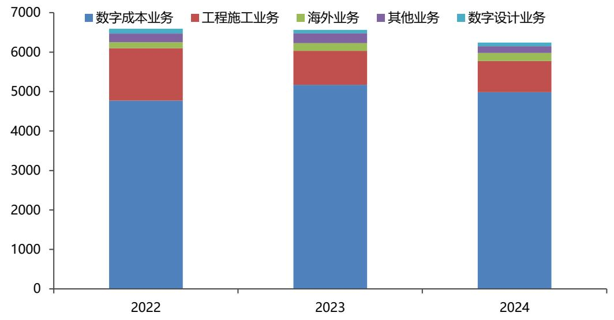
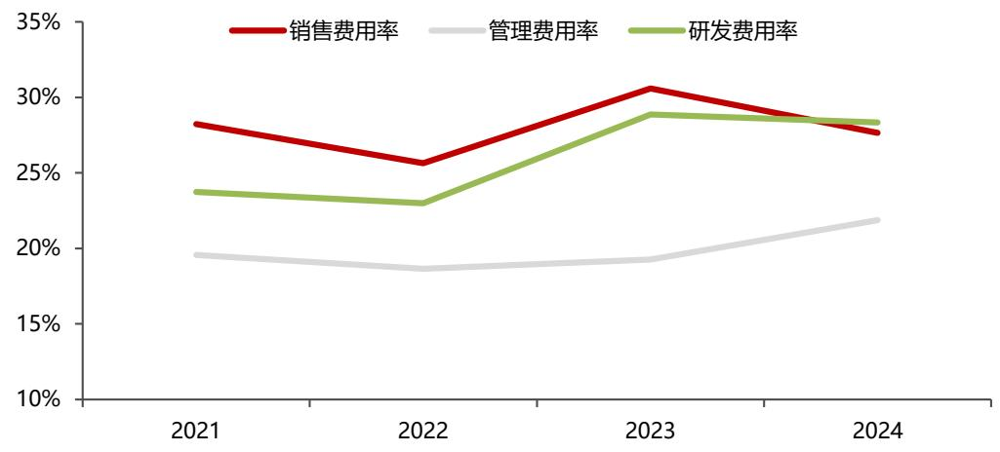
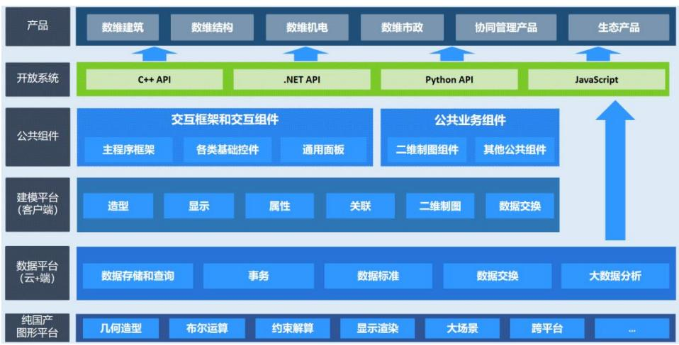
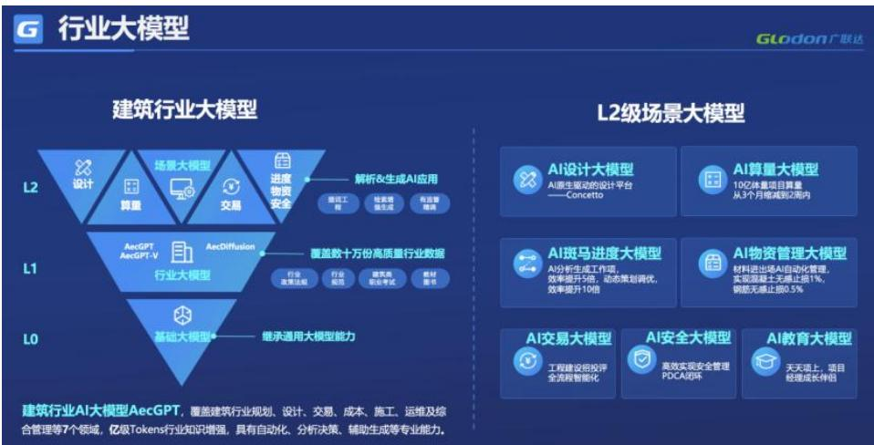
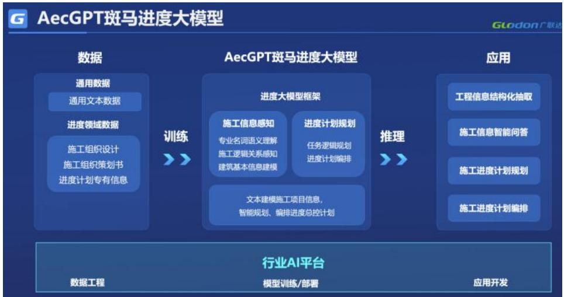

广联达（002410.SZ）公司动态报告

# 触底反转，向 AI 而生

➢ 核心业务稳步发展，2024 年业绩大幅改善。1）核心业务稳步发展：数字成本业务持续从单岗位工具向成本全过程应用场景升级，传统造价工具续费率、应用率保持稳定，成本测算产品深耕大客户、应用率不断提升；数维设计业务方面，数维房建完成多个价值标杆打造，数维道路设计方案能力全面覆盖路桥隧专业，截至 2024 年应用项目数量增长至 1440 家。数字施工业务主动调整经营思路，从追求经营规模转向对利润和现金流的管理。2）毛利率上升、费用端持续优化，推动 2024 年净利润快速回暖：2024 年公司归母净利润 2.5 亿元，同比增长$1 1 6 . 1 9 \%$ 。实现扣非归母净利润 1.74 亿元，同比增长 $2 1 9 . 9 2 \%$ 。

➢ 政策有望推动下游景气度回暖，SaaS 龙头有望开启发展新征程。1）政策推动下游回暖：2024 年 9 月，中国央行会同国家金融监督管理总局出台四项金融支持房地产政策；《2025 年国务院政府工作报告》提出，持续用力推动房地产市场止跌回稳，有序搭建相关基础性制度，加快构建房地产发展新模式。公司下游主要为地产、基建行业，政策大力支持房地产健康发展，有助于推动下游回暖，进而下游信息化开支有望持续提升。2）SaaS 业务价值凸显：公司 SaaS 业务毛利率稳定，数字成本业务、数字设计业务毛利率均保持 $90 \%$ 以上，施工业务毛利率在 2024 年改善，带动整体毛利率稳中有升。

➢ AI 大模型及应用端全面布局，将深刻行业理解和智能化深度结合。1）多层次打造专业行业模型：公司已经发布建筑行业 AI 大模型 AecGPT 以及建筑行业多专业场景大模型，包括建筑行业 AI 大模型 AecGPT，以及建筑行业多专业场景大模型，覆盖建筑方案设计、算量、进度、物资管理、交易、安全、教育等 7个领域，重点解决建筑场景中具体的业务场景问题。2）AI 与实际业务充分结合：成本测算产品发布 $" \mathsf { A l }$ 智能” 功能，准确率提升至约 $70 \%$ ；数维道路设计的 AI选线功能使方案设计效率提升 $50 \%$ ，应用企业数量同比提升 $240 \%$ 。AI 算量方面，模型通过对工程图纸、工程量表及工程文档等数据的训练，进行版面分析和多模态能力推理。以新一代基建算量产品为例，一个 10 亿规模的公路项目进场前的集中式工程量复核，传统模式下通常需要 3 个月左右的时间，而借助 AI 能力可将这一过程可缩短至 2 周内。

➢ 投资建议：公司是国内领先的数字建筑平台服务商，数字成本等业务 SaaS模式价值凸显，数字施工业务毛利率回暖，费用端持续优化，推动业绩快速回暖。长期看，公司积极布局 AI，将自身深刻行业理解与 AI 技术深度融合，有望打开新的增长空间。预计公司 2025-2027 年归母净利润为 4.50/6.63/8.35 亿元，对应 PE 分别为 50X、34X、27X，维持“推荐”评级。

➢ 风险提示：行业需求端景气度波动；行业竞争加剧；AI 等新技术路径存在不确定性。

2025 年 06 月 03 日推荐 维持评级当前价格： 13.67 元分析师 吕伟执业证书： S0100521110003邮箱： lvwei_yj@mszq.com分析师 郭新宇执业证书： S0100518120001邮箱： guoxinyu@mszq.com

# 相关研究

1.广联达（002410.SZ）2024 年半年报点评：2024Q2单季利润明显回暖，龙头长期潜力可期-2024/08/25  
2.广联达（002410.SZ）2023 年三季报点评：短期业绩承压不改长期趋势，新业务逐步显示成长动能-2023/10/27  
3.广联达（002410.SZ）2023 年半年报点评：短期业绩承压不改长期趋势，看好核心业务逐步回暖-2023/08/22

[盈利预测与财务指标Table_Forcast]   

<table><tr><td>项目/年度</td><td>2024A</td><td>2025E</td><td>2026E</td><td>2027E</td></tr><tr><td>营业收入（百万元）</td><td>6,240</td><td>6,535</td><td>7,075</td><td>7,440</td></tr><tr><td>增长率 (%)</td><td>-4.9</td><td>4.7</td><td>8.3</td><td>5.2</td></tr><tr><td>归属母公司股东净利润 (百万元)</td><td>250</td><td>450</td><td>663</td><td>835</td></tr><tr><td>增长率(%)</td><td>116.2</td><td>79.5</td><td>47.6</td><td>25.9</td></tr><tr><td>每股收益（元）</td><td>0.15</td><td>0.27</td><td>0.40</td><td>0.51</td></tr><tr><td>PE</td><td>90</td><td>50</td><td>34</td><td>27</td></tr><tr><td>PB</td><td>3.8</td><td>3.7</td><td>3.5</td><td>3.3</td></tr></table>

资料来源：Wind，民生证券研究院预测；（注：股价为 2025年 5月30日收盘价）

# 目录

1 核心业务稳步发展，2024 年业绩大幅改善 3  
2 政策推动下游景气度回暖，SaaS 龙头开启发展新征程 5  
3 AI 大模型及应用端全面布局，将深刻行业理解和智能化深度结合. ..8  
4 投资建议 . 11  
5 风险提示 . 12  
插图目录 . 14  
表格目录 . 14

# 1 核心业务稳步发展，2024 年业绩大幅改善

2024 年，公司各项业务稳步发展，取得多个成果。1）数字成本业务：持续从单岗位工具向成本全过程应用场景升级，传统造价工具续费率、应用率保持稳定，成本测算产品深耕大客户、应用率不断提升。同时，指标网、采购建议价等数据类产品快速增长。指标网单项级指标覆盖率由 $5 3 . 7 8 \%$ 提升到 $7 9 . 2 5 \%$ ， $100 \%$ 覆盖居住、办公、厂房等主流房建业态，应用率、客户满意度及收入均实现快速增长。2）数字施工业务：主动调整经营思路，从追求经营规模转向对利润和现金流的管理。3）数维设计业务：数维房建完成多个价值标杆打造，设计算量一体化价值在实际生产项目中得到验证；数维道路设计方案能力全面覆盖路桥隧专业，应用项目数量增长至 1440 家；数维道路 AI 选线功能，让方案设计效率提升 $50 \%$ ，应用企业数量同比提升 $240 \%$ 。4）海外业务：数字成本业务在亚洲区域如马来西亚、印尼等实现收入快速增长，设计业务在欧洲地区持续保持增长态势。

  
图1：公司收入变化（分业务）（百万元）

资料来源：iFinD，民生证券研究院

毛利率上升、费用端持续优化，2024 年公司净利润快速回暖。公司 2024 年销售费用率合理优化，同时整体毛利率较 2023 年提升约 2 个百分点，推动公司净利润快速回暖。2024 年公司归母净利润 2.5 亿元，同比增长 $1 1 6 . 1 9 \%$ 。实现扣非归母净利润 1.74 亿元，同比增长 $2 1 9 . 9 2 \%$ 。

  
图2：公司主要费用率变化情况  
资料来源：iFinD，民生证券研究院

股权激励涉及范围广、业绩考核目标较高，体现公司未来发展信心。1）2025年 3 月 14 日公司发布 2025 年股票期权激励计划(草案)，激励计划授予的激励对象共计 485 人，拟授予的股票期权数量为 2643.95 万份，约占本激励计划公告时公司股本总额的 $1 . 6 0 \%$ 。2）行权考核年度设定为 2025-2026 年，每个会计年度进行一次独立考核，以净利润作为核心考核指标，2025 年净利润目标值为 5.63 亿元，触发值为 3.94 亿元；2026 年设定双重目标条件，目标值需满足以下两个条件之一：以 2025 年净利润为基数，2026 年净利润增长率不低于 $30 \%$ ；2025-2026 年累计净利润不低于12.95亿元。触发值需满足以下两个条件之一：以2025年净利润为基数，2026 年净利润增长率不低于 $20 \%$ ；2025-2026 年累计净利润不低于 8.66 亿元。较高的业绩考核目标，体现公司对未来发展的信心。

表1：广联达 2025 年股票期权激励计划(草案)中设定的业绩考核目标  

<table><tr><td colspan="4">各年度业绩考核目标</td></tr><tr><td rowspan="2">行权期</td><td rowspan="2">对应考核年度</td><td colspan="2">净利润(A)</td></tr><tr><td>目标值 (Am)</td><td>触发值(An)</td></tr><tr><td>第一个行权期</td><td>2025</td><td>5.63亿元</td><td>3.94亿元</td></tr><tr><td>第二个行权期</td><td>2026</td><td>需满足以下两个条件之一：1、以 2025 年净利润为基数，2026 年净 利润增长率不低于 30%；2、</td><td>需满足以下两个条件之一: 1、以2025 年净利润为基 数，2026 年凈利润增长率不 低于20%；2、2025-2026</td></tr></table>

资料来源：公司公告，民生证券研究院整理

# 2 政策推动下游景气度回暖，SaaS 龙头开启发展新征程

政策大力支持房地产健康发展，有助于推动公司下游景气度回暖。2024 年 9月 29 日，中国央行会同国家金融监督管理总局出台四项金融支持房地产政策，涉及商业性个人住房贷款利率定价机制、个人住房贷款最低首付款比例、保障性住房再贷款以及延长部分房地产金融政策期限。以商业性个人住房贷款利率定价机制为例，主要有两方面优化：一是允许变更房贷利率在 LPR(贷款市场报价利率)基础上的加点幅度，二是取消房贷利率重定价周期最短为一年的限制。

表2：中国央行会同国家金融监督管理总局出台四项金融支持房地产政策梳理  

<table><tr><td>政策名称</td><td>主要内容</td></tr><tr><td>中国人民银行关于完善商业性个人 住房贷款利率定价机制的公告《中 国人民银行公告〔2024〕第11 号》</td><td>借款人申请商业性个人住房贷款时，可以选择固定利率或浮动利率作为定价方式。合同约定为固定利 率的，利率水平在合同期保持不变。合同约定为浮动利率的，利率以最近一个月贷款市场报价利率为 定价基准加点形成（加点可为负值），加点幅度应体现市场供求、借款人风险溢价等因素</td></tr><tr><td>《中国人民银行 国家金融监督管理 总局关于优化个人住房贷款最低首 付款比例政策的通知》</td><td>对于贷款购买住房的居民家庭，商业性个人住房贷款不再区分首套、二套住房，最低首付款比例统- 为不低于15%。在全国统一的最低首付款比例基础上，中国人民银行各省级分行、国家金融监督管 理总局各派出机构按照因城施策原则，根据辖区各城市政府调控要求，自主确定辖区各城市是否设定 差别化的最低首付款比例政策，并确定辖区各城市最低首付款比例下限</td></tr><tr><td>《中国人民银行办公厅关于优化保 障性住房再贷款有关要求的通知》</td><td>为支持地方国有企业以合理价格收购已建成未出售商品房用作保障性住房，进一步增强对金融机构和 收购主体的市场化激励，中国人民银行决定对保障性住房再贷款有关事项进行调整优化。对于金融机 构发放的符合要求的贷款，中国人民银行向金融机构发放再贷款的比例从贷款本金的 60%提升到 100%</td></tr><tr><td>《中国人民银行 国家金融监督管理 总局关于延长部分房地产金融政策 期限的通知》</td><td>《中国人民银行 中国银行保险监督管理委员会关于做好当前金融支持房地产市场平稳健康发展工作 的通知》（银发〔2022〕254 号）中支持开发贷款、信托贷款等存量融资合理展期政策的适用期限 延长至 2026 年 12 月 31 日。《中国人民银行办公厅 国家金融监督管理总局办公厅关于做好经营性 物业贷款管理的通知》（银办发〔2024〕8号）中有关政策有适用期限的，将适用期限延长至2026 年12月31日</td></tr></table>

资料来源：中国政府网，民生证券研究院整理

政府工作报告大力支持地产等行业健康发展。《2025 年国务院政府工作报告》提出：持续用力推动房地产市场止跌回稳，有序搭建相关基础性制度，加快构建房地产发展新模式。在基建领域，加快补齐县城基础设施和公共服务短板，同时发展数字化、智能化基础设施，完善无障碍适老化配套设施，提升社区综合服务功能，打造宜居、韧性、智慧城市。公司下游主要为地产、基建行业，政策大力支持房地产健康发展，有助于推动下游回暖，进而下游信息化开支有望持续提升。

公司 SaaS 业务毛利率稳定、施工业务毛利率改善，带动 2024 年整体毛利率提升。公司是国内建筑信息化领域 SaaS 龙头，数字成本业务以 SaaS 模式提供涵盖工具、数据的软件产品和服务。同时，数字设计业务具体包括面向房建领域的Concetto、数维房建设计、BIMMake、BIMFace 等产品和面向基建业务的数维道路设计、BIMTwins 等产品。通过全过程数据互通标准应用，实现跨阶段 BIM 数据应用，产品化程度较高。公司 SaaS 业务毛利率稳定，数字成本业务、数字设计业务毛利率均保持 $90 \%$ 以上，施工业务毛利率在 2024 年改善，带动整体毛利率稳中有升。

  
图3：广联达部分业务及整体毛利率

资料来源：iFinD，民生证券研究院

自主知识产权的三维图形平台，是公司长期积累的底层核心能力的体现。1）三维图形引擎：包含几何引擎与显示引擎，是通用且技术壁垒高的底层技术。其中，几何引擎的稳定性经过长时间打磨，具有稀缺性；显示引擎在超大规模场景的显示数据调度与渲染性能方面领先，渲染效果接近先进游戏引擎。几何引擎的多种技术体系支持多种复杂应用，关键的布尔运算算法稳定性领先，且该引擎已通过多款大型软件检验并对外开放。2）设计平台：为不同行业三维数字化工具研发提供一体化二次开发平台，集成自主三维图形引擎全部能力，内置参数化建模引擎，支持构件级云协同，具备高效处理大规模设计场景的能力，可支持多业态正向设计全流程，已在多个领域的大型系统中得到应用。3）图形轻量化引擎：为下游多种应用提供轻量化 BIM 开发环境，支持多种标准模型格式的云端轻量化处理与 WEB 端浏览，兼顾渲染性能与真实感效果，提供创新开发组件模块降低开发门槛，技术达到国内领先水平，在多个应用领域广泛应用，公有云版本注册 ISV 众多，活跃 BIM 应用丰富，还对行业头部企业私有化部署进行开发。

  
图4：广联达设计平台 GDMP

资料来源：广联达官方公众号，民生证券研究院

公司建筑业务平台（GBP）聚焦 “业务连接” ，为行业客户和伙伴提供专业、领先、安全、可控的行业数字化 PaaS 底座。1）“平台 $^ +$ 组件” 沉淀核心能力：基于公司在设计、造价和施工等核心业务领域的数字化能力积累，打造了多个产品平台，为公司核心产品拓展新业务、新行业、新参与方提供系统级能力复用。2）“全过程一体化” 激活连接价值：围绕项目全过程一体化的复杂业务场景，构建全新的一体化基础设施，实现从单点解决方案到系统解决方案的能力升级，有效支撑量价一体、设计算量一体化等价值场景落地。3）“BIM 开发平台” 赋能生态创新：围绕 BIM 模型从创建到应用的全过程，提供 BIM 应用开发平台，支持跨行业生态伙伴。借助公司在品牌、市场、渠道等方面的资源，助力生态伙伴开拓市场和进行商业推广。

# 3 AI 大模型及应用端全面布局，将深刻行业理解和智能化深度结合

发布行业及多专业场景大模型，致力于 AI 在建筑行业的深度应用。2024 年5 月，广联达发布建筑行业 AI 大模型 AecGPT，是聚焦建筑行业整体的 L1 大模型；2024 年 8 月广联达发布建筑行业多专业场景大模型，覆盖建筑方案设计、算量、进度、物资管理、交易、安全、教育等 7 个领域，重点解决建筑场景中具体的业务场景问题，其业务贴合性更高，针对性更强，应用效果也更优。

  
图5：广联达发布的行业大模型以及建筑行业多专业场景大模型  
资料来源：广联达官方公众号，民生证券研究院

从 7 个专业场景大模型，可以看到 AI 能力与深刻行业理解的结合。以部分专业场景大模型为例：

1）AI 算量大模型：对算量业务流程深入解构，通过对工程图纸、工程量表及工程文档等数据的训练，进行版面分析和多模态能力推理。以新一代基建算量产品为例，在传统算量模式下，一个10亿规模的公路项目进场前的集中式工程量复核，通常需要 3 个月左右的时间。而借助 AI 算量大模型，这一过程可缩短至 2 周内。

2）AI斑马进度大模型：建筑行业项目按时履约率低，进度管理至关重要。广联达运用 AI 斑马进度大模型打造新一代斑马进度平台，将进度管理相关文本和BIM 模型等数据纳入训练。该平台具备强大的信息提取能力，可从海量文字、表格、图片融合的文档中，精准召回关键信息并理解。在投标计划编制和施工阶段计划制定时，AI 计划助手采用 copilot 模式，大大简化计划编制流程。

  
图6：AecGPT 斑马进度大模型  
资料来源：广联达官方公众号，民生证券研究院

表3：广联达建筑行业多专业场景大模型梳理  

<table><tr><td>大模型名称</td><td>应用场景</td><td>核心能力</td><td>应用效果</td></tr><tr><td>AI设计大模型</td><td>建筑设计</td><td>通过设计文本、图纸及模型数据训练，实现设计 规范检索、智能排布及设计生成</td><td>提升设计合理性和价值，辅助建 筑师提高设计效率，优化项目周 期和成本</td></tr><tr><td>AI算量大模型</td><td>施工造价算量</td><td>对算量相关数据训练，具备版面分析、多模态能 力推理，实现算量流程部分自动化</td><td>大幅缩短算量时间，提高算量岗 位工作效益</td></tr><tr><td>AI斑马进度大模型</td><td>建筑项目进度管理</td><td>对进度管理文本和 BIM 模型数据训练，实现信息 提取和计划编制优化</td><td>缩短计划编制时长，提升项目履 约率，确保关键工期节点零延误</td></tr><tr><td>AI物资管理大模型</td><td>项目物资管理</td><td>对物资管控现场数据训练，具备版面分析、语义 理解及目标检测与识别能力</td><td>提升物资进出场过磅效率，节约 人工，实现智能管控，助力项目 材料止损 1%</td></tr><tr><td>AI交易大模型</td><td>工程建设招投标</td><td>对交易环节数据训练，具备语义理解、规则推 理、内容生成能力</td><td>提升招标投标活动效率、规范性 和公正性，规范市场秩序</td></tr><tr><td>AI安全管理大模型</td><td>工地现场安全管理</td><td>采集工地现场数据训练，具备视频分析、图像识 别、语义理解技术</td><td>实现对工地潜在危险源预警、隐 患识别等，高效实现安全管理 PDCA闭环</td></tr><tr><td>AI教育大模型</td><td>建筑行业教育培训、 项目管理</td><td>对行业经验、法规标准等数据训练，为项目管理 者提供知识和解决方案</td><td>帮助项目管理者沉淀行业知识， 快速获取信息解决日常问题</td></tr></table>

资料来源：广联达官方公众号，民生证券研究院

在实际业务中，广联达已经将 AI 与业务充分结合。

AI 赋能数字成本业务：清标、成本测算等效率大幅提升。AI 自动识别图纸中的构件与材料信息，推动算量、计价从数字化到智能化升级，提升工作效率和决策精准性。2024 年公司数字成本业务借助行业 AI 赋能，突破多维数据科目自动映射，提升客户成本精细化管理水平，如清标产品通过 AI 加持，标书识别、检查能力显著提高；成本测算产品发布 “AI 智能” 功能，准确率提升至约 $70 \%$ 。

AI 赋能数字施工业务：结合 AI 算法和数据分析，生成与优化施工计划，辅助物资管理、监管塔机安全，减少资源浪费，提升项目执行效率和安全性。公司利用AI技术助力项目提质增效，如智能塔吊防碰撞技术借助 AI实现突破，产品竞争力行业领先；后续还将持续深化 AI在物料管理、劳务管理等方面的应用，提升产品价值。

AI 赋能数字设计业务：AI 赋能设计工具，基于生成式设计优化方案，帮助建筑师快速生成多种设计选项并提供成本估算，提升创新效率。具体来看，在 AI 加持下实现概念方案自动生成、道路选线方案自动生成等能力，为客户提供高质量数字化产品和方案。数维道路设计的 AI选线功能使方案设计效率提升 $50 \%$ ，应用企业数量同比提升 $240 \%$ 。

以公司主要研发项目为例，可以看出公司未来将利用AI对业务进行全面赋能，通过数据 $+ \mathsf { A l }$ 智能分析驱动项目管理者科学高效合理决策，也可以通过 $\mathsf { A l } +$ 交易解决方案完成招标、投标、清标、评标系统性覆盖。

表4：公司部分涉及 AI 的主要研发项目  

<table><tr><td>主要研发项目名称</td><td>项目目的</td><td>项目进展</td><td>拟达到的目标</td><td>预计对公司未来发展的影响</td></tr><tr><td>工程计价协作平台 项目</td><td>基于该项目，升级目 前造价从业组织和岗 位的生产能力，大幅 提升岗位作业数字化 能力并赋能组织提升 企业提质增效</td><td>开发完成</td><td>协作平台，创建新的工作协同 方式，可以实现基于云计价平 台的协同办公等，提供 AI加速 组件等系列产品，满足企业作 业场景数字化的提质增效诉求</td><td>保持造价产品的领先地位，将进一步 提升公司产品的竞争力</td></tr><tr><td>BIM 数字驱动综合 项目管理系统</td><td>围绕房建、基建项目 管理业务，基于业务 本质、数据融合、数 字驱动及 AI技术， 通过数据+连接+算 法+AI 智能分析，为 项目提供更高效、实 时的决策系统 通过服务政务端（G</td><td>用户应用驱动产品价值升 级，夯实周转材料策划、 限额领料等场景价值；向 公路铁路项目，实现物资 主材损耗管理，产生协同 价值。产品的数据采集、 治理、分析、决策各环节 全面接入AI，提升效益</td><td>通过数据+AI 智能分析驱动项 目管理者科学高效合理决策， 帮助项目保障履约和提升利 润，至少为项目利润提升 1%</td><td>有助于提升公司技术壁垒，目前市场 上 PMSmart 没有竞品，系统融合 BIM 模型、算量数据、计价数据、 施工计划数据、物资数据、劳务数 据，融合行业 AI 智能数据治理及分 析技术等，技术难度高，门槛高；有 助于提升施工企业在项目管理上的数 字化、精细化管理意识</td></tr><tr><td>工程交易产品</td><td>端）与企业端（B 端）双轮驱动，以电 子招投标、数据协同 等数字化手段+AI 技术推动建筑行业交 易流程透明化、高效 化，加速全产业链数 字化升级</td><td>1.完成交易业务配置化平 台搭建，核心场景配置覆 盖率≥60%，构建可复用的 业务资产；2.全面适配主 流大模型，AI+交易解决方 案完成招标、投标、清 标、评标系统性覆盖，并 在标杆客户侧完成试标验 证</td><td>通过全面平台+组件化升级， 解决公共资源交易行业的难关 痛点，提高大型项目交付效率 与质量；打造 AI 交易整体解决 方案，提高交易效率、增强行 业监督，进一步规范市场秩 序、优化营商环境，助力建成 全国统一大市场</td><td>工程交易产品助力行业数字化智能化 建设，AI 交易整体解决方案助力招 投标高质量发展，进一步强化公司在 工程交易领域产品核心竞争力</td></tr></table>

资料来源：公司 2024 年年报，民生证券研究院梳理

# 4 投资建议

公司是国内领先的数字建筑平台服务商，数字成本等业务 SaaS 模式价值凸显，数字施工业务毛利率回暖，费用端持续优化，推动业绩快速回暖。长期看，公司积极布局AI，将自身深刻行业理解与AI技术深度融合，有望打开新的增长空间。预计公司 2025-2027 年归母净利润为 4.50/6.63/8.35 亿元，对应 PE 分别为50X、34X、27X，维持“推荐”评级。

# 5 风险提示

1）行业需求端景气度波动的风险。公司主要下游是地产、基建等行业，下游需求的释放节奏可能存在一定不确定性，进而给公司订单等获取带来一定不确定性。

2）行业竞争加剧的风险。行业内具有多个竞争者，可能在造价、施工等细分领域造成竞争加剧的情况，进而给公司发展带来风险。

3）AI 等新技术路径存在不确定性。目前数字建筑行业正在积极与 AI 融合，但相关融合尚处于早期，如果 AI 技术路径变化，可能给公司业务带来不确定性。

公司财务报表数据预测汇总  

<table><tr><td>利润表 (百万元)</td><td>2024A</td><td>2025E</td><td>2026E</td><td>2027E</td></tr><tr><td>营业总收入</td><td>6,240</td><td>6,535</td><td>7,075</td><td>7,440</td></tr><tr><td>营业成本</td><td>972</td><td>1,018</td><td>1,097</td><td>1,147</td></tr><tr><td>营业税金及附加</td><td>53</td><td>65</td><td>71</td><td>74</td></tr><tr><td>销售费用</td><td>1,725</td><td>1,764</td><td>1,840</td><td>1,860</td></tr><tr><td>管理费用</td><td>1,365</td><td>1,372</td><td>1,415</td><td>1,414</td></tr><tr><td>研发费用</td><td>1,769</td><td>1,830</td><td>1,910</td><td>2,009</td></tr><tr><td>EBIT</td><td>345</td><td>487</td><td>745</td><td>946</td></tr><tr><td>财务费用</td><td>-18</td><td>-37</td><td>-34</td><td>-37</td></tr><tr><td>资产减值损失</td><td>-63</td><td>-6</td><td>-6</td><td>-6</td></tr><tr><td>投资收益</td><td>4</td><td>7</td><td>7</td><td>7</td></tr><tr><td>营业利润</td><td>318</td><td>536</td><td>792</td><td>997</td></tr><tr><td>营业外收支</td><td>-8</td><td>1</td><td>1</td><td>1</td></tr><tr><td>利润总额</td><td>310</td><td>537</td><td>793</td><td>998</td></tr><tr><td>所得税</td><td>39</td><td>54</td><td>79</td><td>100</td></tr><tr><td>净利润</td><td>271</td><td>483</td><td>713</td><td>898</td></tr><tr><td>归属于母公司净利润</td><td>250</td><td>450</td><td>663</td><td>835</td></tr><tr><td>EBITDA</td><td>833</td><td>1,023</td><td>1,311</td><td>1,585</td></tr></table>

<table><tr><td>资产负债表 （百万元)</td><td>2024A</td><td>2025E</td><td>2026E</td><td>2027E</td></tr><tr><td>货币资金</td><td>3,905</td><td>3,660</td><td>4,131</td><td>4,593</td></tr><tr><td>应收账款及票据</td><td>826</td><td>824</td><td>892</td><td>938</td></tr><tr><td>预付款项</td><td>25</td><td>20</td><td>22</td><td>23</td></tr><tr><td>存货</td><td>50</td><td>50</td><td>54</td><td>57</td></tr><tr><td>其他流动资产</td><td>110</td><td>364</td><td>367</td><td>370</td></tr><tr><td>流动资产合计</td><td>4,915</td><td>4,918</td><td>5,466</td><td>5,980</td></tr><tr><td>长期股权投资</td><td>247</td><td>247</td><td>247</td><td>247</td></tr><tr><td>固定资产</td><td>1,526</td><td>1,567</td><td>1,592</td><td>1,615</td></tr><tr><td>无形资产</td><td>1,265</td><td>1,354</td><td>1,421</td><td>1,484</td></tr><tr><td>非流动资产合计</td><td>5,316</td><td>5,554</td><td>5,706</td><td>5,811</td></tr><tr><td>资产合计</td><td>10,231</td><td>10,472</td><td>11,173</td><td>11,791</td></tr><tr><td>短期借款</td><td>8</td><td>8</td><td>8</td><td>8</td></tr><tr><td>应付账款及票据</td><td>552</td><td>580</td><td>625</td><td>650</td></tr><tr><td>其他流动负债</td><td>3,503</td><td>3,535</td><td>3,780</td><td>3,936</td></tr><tr><td>流动负债合计</td><td>4,063</td><td>4,124</td><td>4,413</td><td>4,595</td></tr><tr><td>长期借款</td><td>0</td><td>0</td><td>0</td><td>0</td></tr><tr><td>其他长期负债</td><td>89</td><td>91</td><td>148</td><td>152</td></tr><tr><td>非流动负债合计</td><td>89</td><td>91</td><td>148</td><td>152</td></tr><tr><td>负债合计</td><td>4,152</td><td>4,215</td><td>4,561</td><td>4,746</td></tr><tr><td>股本</td><td>1,652</td><td>1,652</td><td>1,652</td><td>1,652</td></tr><tr><td>少数股东权益</td><td>120</td><td>154</td><td>204</td><td>267</td></tr><tr><td>股东权益合计</td><td>6,080</td><td>6,258</td><td>6,611</td><td>7,045</td></tr><tr><td>负债和股东权益合计</td><td>10,231</td><td>10,472</td><td>11,173</td><td>11,791</td></tr></table>

资料来源：公司公告、民生证券研究院预测

<table><tr><td>主要财务指标</td><td>2024A</td><td>2025E</td><td>2026E</td><td>2027E</td></tr><tr><td>成长能力(%)</td><td></td><td></td><td></td><td></td></tr><tr><td>营业收入增长率</td><td>-4.93</td><td>4.73</td><td>8.27</td><td>5.15</td></tr><tr><td>EBIT 增长率</td><td>19.41</td><td>41.00</td><td>53.11</td><td>26.96</td></tr><tr><td>净利润增长率</td><td>116.19</td><td>79.50</td><td>47.60</td><td>25.86</td></tr><tr><td>盈利能力(%)</td><td></td><td></td><td></td><td></td></tr><tr><td>毛利率</td><td>84.33</td><td>84.42</td><td>84.50</td><td>84.59</td></tr><tr><td>净利润率</td><td>4.04</td><td>6.88</td><td>9.38</td><td>11.22</td></tr><tr><td>总资产收益率 ROA</td><td>2.45</td><td>4.29</td><td>5.94</td><td>7.08</td></tr><tr><td>净资产收益率 ROE</td><td>4.20</td><td>7.36</td><td>10.36</td><td>12.32</td></tr><tr><td>偿债能力</td><td></td><td></td><td></td><td></td></tr><tr><td>流动比率</td><td>1.21</td><td>1.19</td><td>1.24</td><td>1.30</td></tr><tr><td>速动比率</td><td>1.17</td><td>1.10</td><td>1.15</td><td>1.21</td></tr><tr><td>现金比率</td><td>0.96</td><td>0.89</td><td>0.94</td><td>1.00</td></tr><tr><td>资产负债率 (%)</td><td>40.58</td><td>40.25</td><td>40.83</td><td>40.25</td></tr><tr><td>经营效率</td><td></td><td></td><td></td><td></td></tr><tr><td>应收账款周转天数</td><td>47.98</td><td>50.00</td><td>50.00</td><td>50.00</td></tr><tr><td>存货周转天数</td><td>18.61</td><td>20.00</td><td>20.00</td><td>20.00</td></tr><tr><td>总资产周转率</td><td>0.59</td><td>0.63</td><td>0.65</td><td>0.65</td></tr><tr><td>每股指标（元）</td><td></td><td></td><td></td><td></td></tr><tr><td>每股收益</td><td>0.15</td><td>0.27</td><td>0.40</td><td>0.51</td></tr><tr><td>每股净资产</td><td>3.61</td><td>3.69</td><td>3.88</td><td>4.10</td></tr><tr><td>每股经营现金流</td><td>0.72</td><td>0.51</td><td>0.89</td><td>1.00</td></tr><tr><td>每股股利</td><td>0.15</td><td>0.22</td><td>0.28</td><td>0.35</td></tr><tr><td>估值分析</td><td></td><td></td><td></td><td></td></tr><tr><td>PE</td><td>90</td><td>50</td><td>34</td><td>27</td></tr><tr><td>PB</td><td>3.8</td><td>3.7</td><td>3.5</td><td>3.3</td></tr><tr><td>EV/EBITDA</td><td>23.65</td><td>19.26</td><td>15.03</td><td>12.43</td></tr><tr><td>股息收益率 (%)</td><td>1.10</td><td>1.59</td><td>2.06</td><td>2.59</td></tr></table>

<table><tr><td>现金流量表 (百万元)</td><td>2024A</td><td>2025E</td><td>2026E</td><td>2027E</td></tr><tr><td>净利润</td><td>271</td><td>483</td><td>713</td><td>898</td></tr><tr><td>折旧和摊销</td><td>488</td><td>537</td><td>566</td><td>639</td></tr><tr><td>营运资金变动</td><td>291</td><td>-257</td><td>109</td><td>21</td></tr><tr><td>经营活动现金流</td><td>1,194</td><td>837</td><td>1,475</td><td>1,650</td></tr><tr><td>资本开支</td><td>-435</td><td>-613</td><td>-639</td><td>-713</td></tr><tr><td>投资</td><td>66</td><td>0</td><td>0</td><td>0</td></tr><tr><td>投资活动现金流</td><td>-353</td><td>-690</td><td>-632</td><td>-706</td></tr><tr><td>股权募资</td><td>0</td><td>0</td><td>0</td><td>0</td></tr><tr><td>债务募资</td><td>8</td><td>-26</td><td>0</td><td>0</td></tr><tr><td>筹资活动现金流</td><td>-625</td><td>-393</td><td>-372</td><td>-483</td></tr><tr><td>现金净流量</td><td>221</td><td>-245</td><td>471</td><td>462</td></tr></table>

# 插图目录

图 2：图 3：图 4： 公司收入变化（分业务）（百万元） ........................................................................................... .. 3  
公司主要费用率变化情况.. ... ............. ......................................................................................... . 4  
广联达部分业务及整体毛利率.. ........................................................................................ ... 6  
广联达设计平台 GDMP.. ....................................................................................... ..... 7  
广联达发布的行业大模型以及建筑行业多专业场景大模型. .............................................................................. ... 8  
图 6： AecGPT 斑马进度大模型 .

# 表格目录

盈利预测与财务指标 .............................................................................................表 1： 广联达 2025 年股票期权激励计划(草案)中设定的业绩考核目标 .. ............................................................. . 1. 4  
表 2： 中国央行会同国家金融监督管理总局出台四项金融支持房地产政策梳理 ..................................................................表 3： 广联达建筑行业多专业场景大模型梳理 ............................................................................................................................ .... 5.... 9  
表 4： 公司部分涉及 $\mathsf { A l }$ 的主要研发项目 .................................................................. .10  
公司财务报表数据预测汇总 .............. ........................................ ..13

# 分析师承诺

本报告署名分析师具有中国证券业协会授予的证券投资咨询执业资格并登记为注册分析师，基于认真审慎的工作态度、专业严谨的研究方法与分析逻辑得出研究结论，独立、客观地出具本报告，并对本报告的内容和观点负责。本报告清晰准确地反映了研究人员的研究观点，结论不受任何第三方的授意、影响，研究人员不曾因、不因、也将不会因本报告中的具体推荐意见或观点而直接或间接收到任何形式的补偿。

评级说明  

<table><tr><td colspan="2">投资建议评级标准</td><td>评级</td><td>说明</td></tr><tr><td rowspan="6">以报告发同后的12个内公司股价或行业 中：A 股以沪深 300 指数为基准；新三板以三 板成指或三板做市指数为基准；港股以恒生指 数为基准；美股以纳斯达克综合指数或标普 500指数为基准。</td><td rowspan="5">公司评级</td><td>推荐</td><td>相对基准指数涨幅15%以上</td></tr><tr><td>谨慎推荐</td><td>相对基准指数涨幅5%~15%之间</td></tr><tr><td></td><td></td></tr><tr><td>回避</td><td>相对基准指数跌幅 5%以上</td></tr><tr><td>推荐</td><td>相对基准指数涨幅 5%以上</td></tr><tr><td rowspan="2">行业评级 中性</td><td></td><td>相对基准指数涨幅-5%~5%之间</td></tr><tr><td>回避</td><td>相对基准指数跌幅 5%以上</td></tr></table>

# 免责声明

民生证券股份有限公司（以下简称“本公司”）具有中国证监会许可的证券投资咨询业务资格。

本报告仅供本公司境内客户使用。本公司不会因接收人收到本报告而视其为客户。本报告仅为参考之用，并不构成对客户的投资建议，不应被视为买卖任何证券、金融工具的要约或要约邀请。本报告所包含的观点及建议并未考虑获取本报告的机构及个人的具体投资目的、财务状况、特殊状况、目标或需要，客户应当充分考虑自身特定状况，进行独立评估，并应同时考量自身的投资目的、财务状况和特定需求，必要时就法律、商业、财务、税收等方面咨询专家的意见，不应单纯依靠本报告所载的内容而取代自身的独立判断。在任何情况下，本公司不对任何人因使用本报告中的任何内容而导致的任何可能的损失负任何责任。

本报告是基于已公开信息撰写，但本公司不保证该等信息的准确性或完整性。本报告所载的资料、意见及预测仅反映本公司于发布本报告当日的判断，且预测方法及结果存在一定程度局限性。在不同时期，本公司可发出与本报告所刊载的意见、预测不一致的报告，但本公司没有义务和责任及时更新本报告所涉及的内容并通知客户。

在法律允许的情况下，本公司及其附属机构可能持有报告中提及的公司所发行证券的头寸并进行交易，也可能为这些公司提供或正在争取提供投资银行、财务顾问、咨询服务等相关服务，本公司的员工可能担任本报告所提及的公司的董事。客户应充分考虑可能存在的利益冲突，勿将本报告作为投资决策的唯一参考依据。

若本公司以外的金融机构发送本报告，则由该金融机构独自为此发送行为负责。该机构的客户应联系该机构以交易本报告提及的证券或要求获悉更详细的信息。本报告不构成本公司向发送本报告金融机构之客户提供的投资建议。本公司不会因任何机构或个人从其他机构获得本报告而将其视为本公司客户。

本报告的版权仅归本公司所有，未经书面许可，任何机构或个人不得以任何形式、任何目的进行翻版、转载、发表、篡改或引用。所有在本报告中使用的商标、服务标识及标记，除非另有说明，均为本公司的商标、服务标识及标记。本公司版权所有并保留一切权利。

# 民生证券研究院：

上海：上海市虹口区杨树浦路 188 号星立方大厦 7 层； 200082  
北京：北京市东城区建国门内大街 28 号民生金融中心 A 座 18 层； 100005  
深圳：深圳市福田区中心四路 1 号嘉里建设广场 1 座 10 层 01 室； 518048