广联达(002410)

# 大踏步走向云化第二阶段一一新成本平台激活客戶数据价值-广联达深度报告

# 投资要点

# 我国建筑业营收增速下降并进入追求盈利阶段，精细化成本管控愈发重要

2017-2021 年57 家典型上市房企营收增速中位数从接近 $3 0 \%$ 降至 $1 5 \%$ 左右，归母净利润增速中位数从接近 $4 0 \%$ 降至 $- 2 6 \%$ ，归母净利率中位数从 $1 2 . 1 \%$ 降至 $4 . 7 \%$ ，企业生存压力持续加大，同时 2020 年我国全面推进造价市场化改革，造价数据库的建设成为企业项目管控的核心工作，企业数据能力建设迫在眉睫。

# 广联达充分发挥造价业务云转型带来的平台属性和客户粘性，打造新成本平台激活客户云端数据价值，能够通过数据分析提升成本管控的高效性和精确性

公司在2022年的大背景下，顺势而为推出新成本平台，以平台 $^ +$ 组件的形式，针对建设方前期策划难、标准不统一、经验难沉淀等难题提供了基于流程的数据驱动成本管理解决方案，针对施工方分拆整理难、数据流转难、规划落地难等痛点提供了三步自动分包的解决方案，甲乙双方均统一了数据标准，解决了流转和积累问题，实现了数据驱动的精准成本管控，提升了数据利用效率。

# 新成本平台将公司 SaaS 收入天花板提升一倍，并有望带动设计施工等产品销售

（1）新增收入空间：我们预计新成本平台市场空间为245亿元，公司年收入新增空间有望达到119亿元，有望成为带动公司2023-2025年九三计划的主要成长动力；

（2）带动其他产品销售：新成本平台可以理解为一个工程项目的数据汇集平台，向上连接设计和造价阶段，向下连接施工阶段，有望配套带动公司的施工、设计新产品的销售；

（3）未来走向智能化：公司持续在人工智能领域加大投入，云AI已从造价扩展到施工与设计，未来有望进一步扩展至全产品线，助力建筑企业实现产业数字化，全面释放建筑行业数据价值，期待新成本平台的智能化升级；

# □盈利预测

我们认为新成本平台有望为公司带来百亿潜在空间，短期内客户粘性强、中期内带动施工和设计等产品放量、长期有望驱动公司产品智能化升级，预计公司2022-2024 年总营收分别达到67.99/83.85/101.45亿 $+ 2 0 . 9 8 \% / 2 3 . 3 3 \% / 2 0 . 9 9 \%$ )，归母净利润分别达到9.77/13.73/17.26亿 $+ 4 7 . 7 6 \% / 4 0 . 6 0 \% / 2 5 . 6 7 \%$ )，维持“买入”评级。

# 风险提示

客户实际需求及新产品推广不及预期的风险、协同效应和智能化功能升级的进展不及预期的风险、竞争加剧的风险等

# 投资评级：买入(维持)

分析师：李佩京执业证书号：S1230522060001lipeijing@stocke.com.cn

<table><tr><td>基本数据</td></tr><tr><td>收盘价 Y65.00</td></tr><tr><td>总市值(百万元) 77,440.15</td></tr><tr><td>总股本(百万股) 1,191.39</td></tr></table>

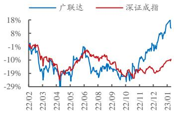  
股票走势图

# 相关报告

1《业绩高增长，股票激励彰显发展信心——广联达 2022 年三季报点评》2022.10.312《造价业务稳中有进，施工业务增速提升——广联达 2022 年半年报点评》 2022.08.273《广联达：数字建筑领军，战略驱动成长》2022.04.01

财务摘要   

<table><tr><td>(百万元)</td><td>2021A</td><td>2022E</td><td>2023E</td><td>2024E</td></tr><tr><td>营业收入</td><td>5,619</td><td>6,799</td><td>8,385</td><td>10,145</td></tr><tr><td>(+/−) (%)</td><td>40.32%</td><td>20.98%</td><td>23.33%</td><td>20.99%</td></tr><tr><td>归母净利润</td><td>661</td><td>977</td><td>1,373</td><td>1,726</td></tr><tr><td>(+/−) (%)</td><td>100.06%</td><td>47.76%</td><td>40.60%</td><td>25.67%</td></tr><tr><td>每股收益(元)</td><td>0.55</td><td>0.82</td><td>1.15</td><td>1.45</td></tr><tr><td>P/E</td><td>117.16</td><td>79.29</td><td>56.40</td><td>44.88</td></tr></table>

资料来源：wind、浙商证券研究所

# 投资案件

# D 盈利预测、评级

我们认为新成本平台有望为公司带来百亿潜在空间，短期内客户粘性强、中期内带动施工和设计等产品放量、长期有望驱动公司产品智能化升级，预计公司2022-2024年总营收分别达到67.99/83.85/101.45亿 $+ 2 0 . 9 8 \% / 2 3 . 3 3 \% \ / 2 0 . 9 9 \%$ )，归母净利润分别达到9.77/13.73/17.26亿 $+ 4 7 . 7 6 \% / 4 0 . 6 0 \% / 2 5 . 6 7 \%$ )，维持“买入”评级。

# 关键假设

1）数字新平台的客户需求强，具备足够的付费意愿和付费能力，市场空间大；  
2）公司能够有效复用销售能力，渗透率能够快速提升；  
3）新成本平台能和设计、造价、施工业务形成协同，带动其他业务一起放量；  
4）客户对公司的产品矩阵以及后续智能化功能升级有足够的付费意愿和能力；

# 我们与市场的观点的差异

1、我们认为造价业务成功云化是未来发展数据服务类业务的重要基础，这类似于互联网公司在积攒高粘性流量后，通过多种方式进行流量变现。数字新成本产品仅是广联达云化成功后的拓展的一种应用，未来可以期待的数据服务类模块空间广阔。

2、市场担忧公司的新成本平台的增长潜力和实际落地情况；  
我们认为新成本平台具备高客户粘性，公司的销售能力能够得到充分复用，并且产品直击用户痛点，在面临生存压力的背景下，客户愿意为产品的降本增效功能买单；

# • 股价上涨的催化因素

数字新平台的订单量、渗透率、续费率、合作客户数量等。

# 风险提示

客户实际需求及新产品推广不及预期的风险、协同效应、智能化功能升级的进展不及预期的风险、竞争加剧的风险、政策相关的风险等。

# 正文目录

# 建筑企业迈入数据驱动管理红利时代，数字化升级迫在眉睫.

1.1建筑行业整体进入微利时代，甲乙双方压力逐渐加大. .5  
1.2 建筑方和施工方数字化程度仍较低，痛点在于数据积累不足和流转不畅 ..7  
1.2.1建设方：前期估不准导致成本失控. ..7  
1.2.2施工方：后期落地难导致成本控不住， .8

# 新成本平台通过激活存量数据价值，为甲乙双方提效降本.

2.1建设方平台：前期项目数据标准化，实现精准成本管理，  
2.2 施工方平台：自动分拆整理提升效率，构建数据流闭环实现沉淀

# 有望再造一个造价业务的空间，并带动施工和设计产品销售....

3.1商业模式：SaaS订阅制 $^ +$ 增值数据包，可为客户提供多样性选择. ..14  
3.2 新成本平台开辟了新领域，市场空间有望达到 245 亿，公司年创收有望达到 120 亿 ..15  
3.3短期：新成本平台客户粘性强，有望为公司贡献持续增长动力.. …. 16  
3.4 中期：打通建造全生命周期，有望带动设计、造价、施工业务实现放量.. ….18  
3.5 长期：全产品线智能化升级可期，建筑业数据价值有望逐步释放. ..19

# 盈利预测、估值及风险提示…

4.1盈利预测及估值， …. 19   
4.2 风险提示…. .21

# 图表目录

图1：部分发达国家城镇人均住房面积(平方米) … ……5  
图2：中国城镇人口总数级城镇化率（亿、 $\%$ ). … ….5  
图3：建筑业总产值（万亿、 $\%$ ) ….5  
图4：行业典型上市房企营收、利润规模及增速（亿元、 $\%$ ) ….  
图5：行业典型上市房企整体利润率水平及变动（ $1 \%$ ) …… …….6  
图6：我国头部承包商营收及增速中位数（亿元、 $\%$ ) ….6  
图7：我国头部承包商毛利率、归母净利润中位数 $1 \%$ ) … …………………… ……6  
图8：建筑IT发展空间大.. … ….7  
图9：地产行业发展曲线.. … ….7  
图10：我国造价制度发展历程. … ….  
图11：建设方成本管理的难点.  
图12：前期成本策划不完善导致建设方成本失控.  
图13：施工方成本管控的环节. …….9  
图14：施工方成本管控的痛点. …….9  
图15：广联达数字新成本平台架构.. … …….9  
图16：建设方成本管理发展趋势. … . 10  
图 17：建设方数字新成本平台的价值……10  
图18：建设方数字新成本平台架构… …… 10  
图19：从Excel升级为线上标准化指标库.. ….1  
图20：通过数字新成本平台建立各业态成本数据标准， ….11  
图21：用指标数据服务编制建安费.. …….1  
图22：编制分项清单..  
图23：参考案例、指标网对比、广材网信息查询.  
图24：查看材料价格趋势分析.. ……. 12  
图25：历史成本数据积累. … …….12  
图26：施工方数字新成本平台的价值， .12  
图27：施工方数字新成本平台架构… 13  
图28：收入分拆——从十几步手工操作升级为三步自动汇总. ……. 13  
图29：施工方数字新成本平台数据流.. ….14  
图30：公司产品演进图. .14  
图31：广联达数字新成本平台 web登录界面 ……. 15  
图32：建设方、施工方项目案例... …. 17  
图33：广联达AI开放平台功能及产品. ….19

# 表1：潜在市场空间预计—按项目数.. 15

表2：潜在市场空间预计-按客户数， ….16表3：公司收入空间.. …… .表4：造价业务云化转型进展.. ..17表5：公司产品清单.. … 18表6：公司盈利预测（亿元、 $\%$ ) … …… …… 20表7：可比公司估值（2023.2.1，选取头部 saas 公司）…表附录：三大报表预测值. .22

# 1建筑企业迈入数据驱动管理红利时代，数字化升级迫在眉睫

2022 年3 月公司发布全新产品——数字新成本平台，这是一套针对建筑行业“微利”时代企业降本增效难题的数字化云平台，建设方可在线上平台进行以项目成本参数（计价算量等）设计为核心的成本管控，施工方可在线上平台进行自动分包和作业管理等功能，双方涉及的过程、结果数据可不断沉淀在平台上，也可外接指标网、广材网等数据服务以供参考和决策。

# 1.1 建筑行业整体进入微利时代，甲乙双方压力逐渐加大

历经十余年的发展，我国城镇居民住房紧张的情况已得到大幅缓解，人均住房面积已处于亚洲较高水平，城镇化速度下降。根据《2022 建设方数字化白皮书》，2019 年我国城镇居民人均住房建筑面积已达到 39.8平方米，折算成使用面积已经达到 30-31平方米，接近日本（33.5），高于新加坡（30）和韩国（28）；在套户比方面，2020年东部、中部、西部、东北各地区城镇套户比均已超过1，整体超过德国（1.02）、英国（1.03)，低于美国（1.15）、日本（1.16）；2020年中国常驻人口城镇化率 $6 3 . 9 \%$ ，户籍人口城镇化率 $45 \%$ ,城镇化速度明显减低。

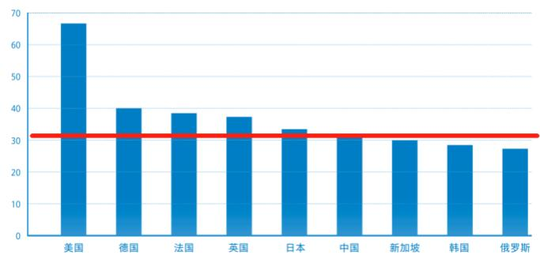  
图1：部分发达国家城镇人均住房面积（平方米）  
资料来源：各国统计局数据、国家统计局数据、易居研究院、浙商证券研究所

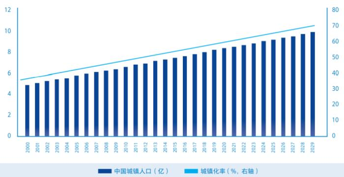  
图2：中国城镇人口总数级城镇化率（亿、 $\%$ )  
资料来源：国家统计局数据、泽平宏观分析、浙商证券研究所

建筑行业整体增速放缓，从粗放式向精细化管理过渡。2010 年以来，建筑业总产值增速从 $20 \%$ 逐步降低至 $1 0 \%$ ，个别年份出现个位数增长，建筑企业规模缩减、经营模式转换、竞争格局分化，强者愈强的“马太效应”不断凸显。

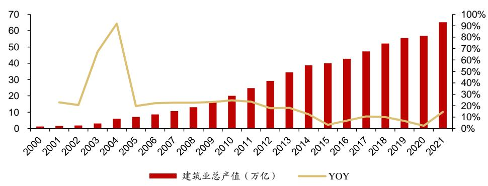  
图3：建筑业总产值（万亿、 $\%$ )  
资料来源：wind、浙商证券研究所

对建设方而言，行业增速下行和房住不炒背景下，提升建筑品质、优化建造成本、提升效益成为企业生存的必然选择。根据 CRIC，金额方面，57 家典型上市房企 2021 年整体营业收入3.91万亿 $+ 1 6 \%$ )，增速持续下滑，毛利润0.78亿元、归母净利润0.26万亿，归母净利润增速的中位数为 $- 2 6 \%$ ；比率方面，2018-2021年整体毛利率持续下降，中位数从$3 1 . 2 \%$ 降至 $1 9 . 3 \%$ ，带动归母净利率中位数从 $1 2 . 1 \%$ 降至 $4 . 7 \%$ 。

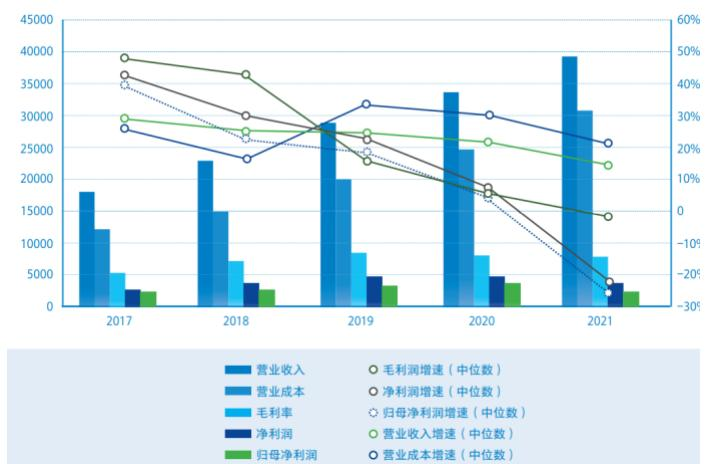  
图4：行业典型上市房企营收、利润规模及增速（亿元、 $\%$ )  
资料来源：克而瑞《2021年房企盈利能力报告》、浙商证券研究所，注：为与 $\mathrm { H }$ 股上市房企统一口径，A股上市房企毛利润计算中扣除税金及附加

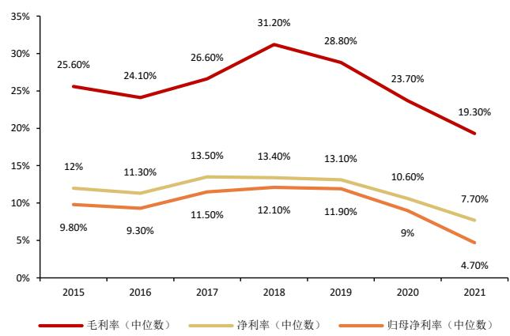  
图5：行业典型上市房企整体利润率水平及变动 $( \%$ )   
资料来源：克而瑞《2021年房企盈利能力报告》、浙商证券研究所，注：为与 $\mathrm { H }$ 股上市房企统一口径，A股上市房企毛利润计算中扣除税金及附加

对施工方而言，人力成本等期间支出持续挤压利润空间。中国建筑、中国中铁、中国铁建、中国交建、中国电建五家头部总包商收入增速中位数从 2017年的 $8 . 2 1 \%$ 增长至2021年的 $1 2 . 0 5 \%$ 、毛利率中位数从 $1 0 . 4 9 \%$ 上升至 $1 1 . 3 3 \%$ 的同时，归母净利润增速中位数从$1 4 . 7 7 \%$ 持续下降至 $1 0 . 2 6 \%$ 、归母净利润率中位数从 $2 . 7 6 \%$ 下降至 $2 . 5 7 \%$ ，施工企业若缺乏科学有效的成本管理手段，无法有效地持续降低成本和规避风险点，未来将极易出现亏损。

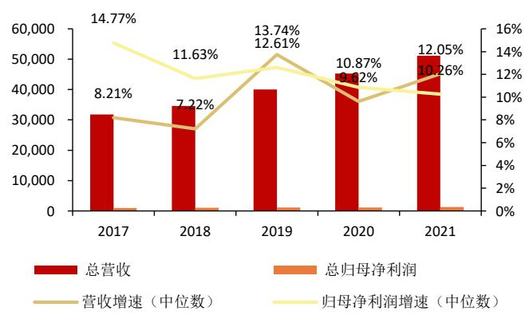  
图6：我国头部承包商营收及增速中位数（亿元、 $\%$ )  
资料来源：wind、浙商证券研究所

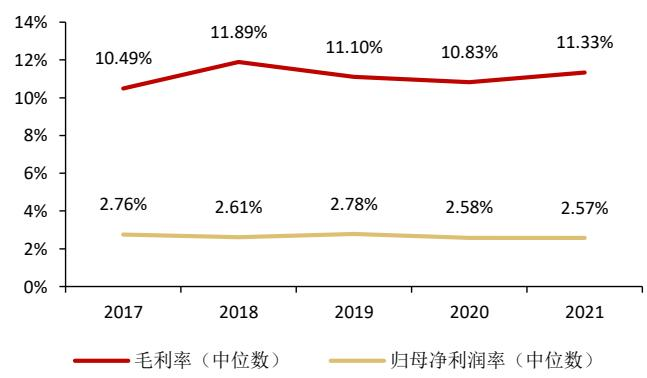  
图7：我国头部承包商毛利率、归母净利润中位数 $( \%$ )  
资料来源：wind、浙商证券研究所

我国建筑行业已进入管理能力驱动变革的时代，当前信息化渗透率低，数字化空间巨大。在客户所处行业下行周期中，使用信息化的手段来降本增效的需求更加急迫，2021年我国建筑信息化投入占建筑业总产值仅 $0 . 0 8 \%$ ，远低于美国 $1 \%$ 的水平。

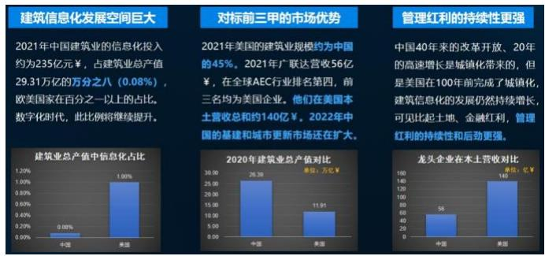  
图8：建筑IT发展空间大  
资料来源：公司公告、wind、浙商证券研究所  
图10：我国造价制度发展历程

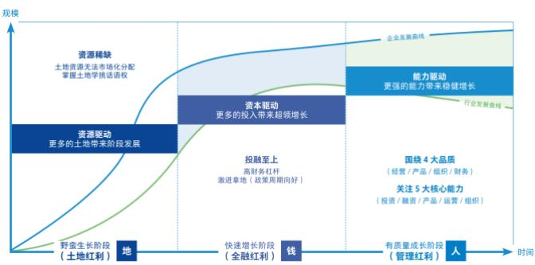  
图9：地产行业发展曲线  
资料来源：赛普地产研究院《房地产管理变革关键词》、浙商证券研究所

2020 年以来造价市场化改革加速，推动企业自行积累造价数据以实现项目成本收支的精细化管控。我国以前采用政府定额预算制度控制造价，这是国家在计划经济时代为加强建设管理、合理安排劳动力资源制定的一项管理控制制度，随着经济的发展已经难以适应当前的市场状况，2013 年开始我国逐步将造价权交还市场，2020 年《工程造价改革工作方案》明确取消最高投标限价按定额计价的规定，造价市场化改革加速推进，企业将不得不更加依赖自身经验和数据积累进行收支规划，造价数据库建设迫在眉睫。

<table><tr><td>1985年以前</td><td colspan="2">政府定价：统一量+固定价+ 统一费</td></tr><tr><td>1985-2003年</td><td>政府指导价：统一量+指导价+竞争费</td><td></td></tr><tr><td>2013-2019年</td><td colspan="2">市场调节价：清单量 +调节价+竞争费(实现量价分离)</td></tr><tr><td></td><td>2013年 十八届三中全会 2014年 住建部</td><td>凡是能由市场形成价格的都交给市场，政府不进行不当干预。 《关于进一步推进工程造价管理改革的指导意见》</td></tr><tr><td>2020年至今</td><td colspan="2">市场形成价：清单计量+市场询价+自主报价+竞争定价</td></tr><tr><td rowspan="4"></td><td>2020年 住建部《工程造价改革工作方案》</td><td>明确取消最高投标限价按定额计价的规定，并将逐步停止发布预 算定额，明确提出推行清单计量、市场询价、自主报价、竞争定</td></tr><tr><td>2021年</td><td>价的工程计价方式，从而进一步完善工程造价市场形成机制； 住建部《〈建设工程工程量清单计价明确提出将取消招标控制价以预算定额作为编制依据，投标人可</td></tr><tr><td>2021年</td><td>标准（征求意见稿）〉意见的函》采用企业定额进行投标； 住建部《建筑工理程施工发包与承包</td></tr><tr><td>2022年 住建部《房屋建筑与装饰工程特征分 类与描述标(征求意见稿)》</td><td></td></tr></table>

资料来源：住建部、咸宁新闻网、建筑云在线、浙商证券研究所

# 1.2 建筑方和施工方数字化程度仍较低，痛点在于数据积累不足和流转不畅

目前我国建筑方、施工方多以 Excel 电子表格、纸质表格等形式进行收支数据的存储、处理和流转，一方面传递过程繁琐且容易出错，另一方面数据难以真正沉淀、难以作为后续项目的参考。

# 1.2.1 建设方：前期估不准导致成本失控

痛点：建设方要管理项目的全过程，但目前存在前期成本估不准、执行过程控不住等问题，其中前期设计阶段策划对成本影响较大：

（1）立项、设计阶段：标准多为纸质文件或表格，执行易出差变形，不便于调用及审核，数据缺少系统化的积累，数据查找调用效率低，资产流失；缺少全面系统的科目和适配的优化做法总结，决策、审核缺少全面系统的数据支撑。

（2）采购阶段：目标成本与合同分解的层级关系难以有效对应；招标清单编制难，清标效率低，招采存在控制风险；

（3）实施和结算阶段：前期测算定位不精准、地块条件不明、对政策了解不明、市场调研和预判存在偏差、地块定位调整、开发节奏变动等导致后期存在大量适配变更。

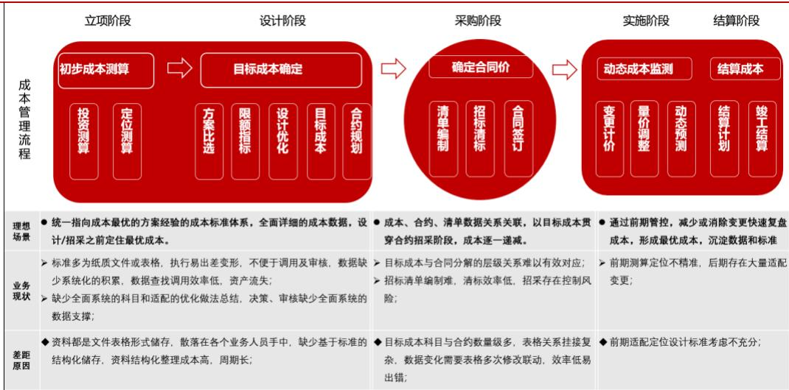  
图11：建设方成本管理的难点  
资料来源：广联达公众号、浙商证券研究所

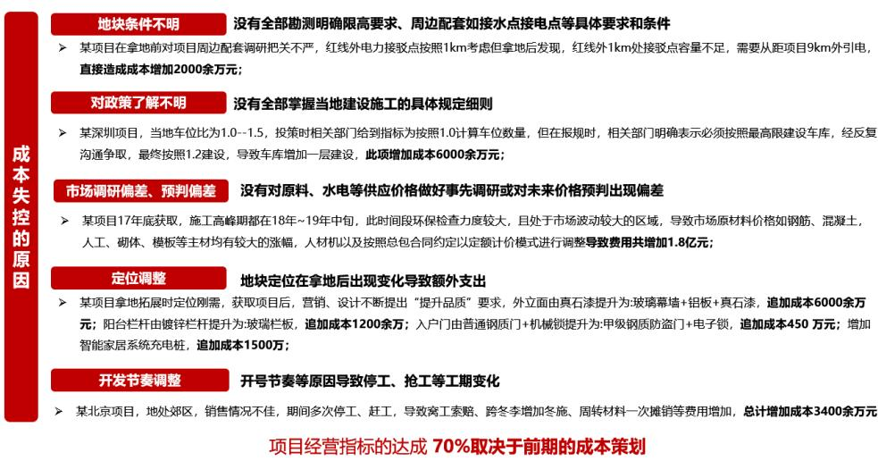  
图12：前期成本策划不完善导致建设方成本失控  
资料来源：广联达公众号、浙商证券研究所

# 1.2.2 施工方：后期落地难导致成本控不住

痛点：施工方成本管控的痛难点侧重于收入分拆、投标报价、标准落地等：

（1）标准难落地：施工方在执行过程中动作容易变形，导致标准制度落地执行难；（2）缺乏敏捷性：因为信息不互通，各地域材料、人工价格和资源不能及时很好的利用，各项目之间，横向沟通缺乏桥梁，导致项目间无法快速进行对标分析；（3）新人难上手：成本相关业务，均采用电子表格编制，套表繁琐，大量链接公式极易出错，数据的校核费时耗力，一般新人很难上手；

（4）数据难流转：各部门之间作业口径不一致，管理系统与作业工具之间数据不通，导致数据无法有效流转；

（5）数据难复用：施工方积累的一些数据及价格，基于Excel表来存储，导致作业过程中，查找调用数据效率低；

（6）数据难沉淀：作业标准及口径不统一，导致很难将项目数据汇总整理，且数据大部分基于人工统计分析，数据真实性、及时性很难保障；

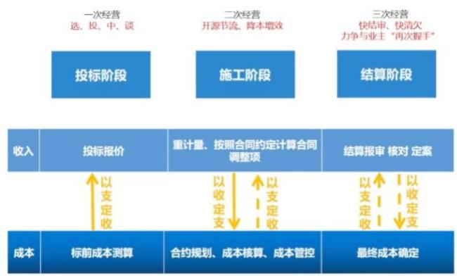  
图13：施工方成本管控的环节  
资料来源：广联达公众号、浙商证券研究所

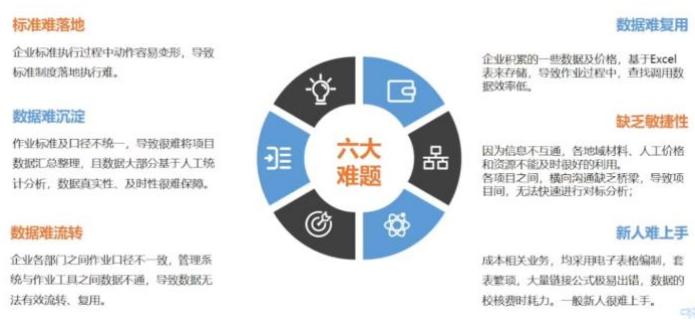  
图14：施工方成本管控的痛点  
资料来源：广联达公众号、浙商证券研究所

# 2 新成本平台通过激活存量数据价值，为甲乙双方提效降本

数字新成本平台有望系统化解决企业造价数据积累和应用难题。该平台面向企业精细化管理的诉求，针对建设方、施工方分别搭建了以企业成本数据积累与应用的闭环打通为核心的解决方案，赋能企业实现数据资产化、作业高效化、决策智能化，能够助力企业实现“目标估（定）得准、过程控得住、成本0浪费”。

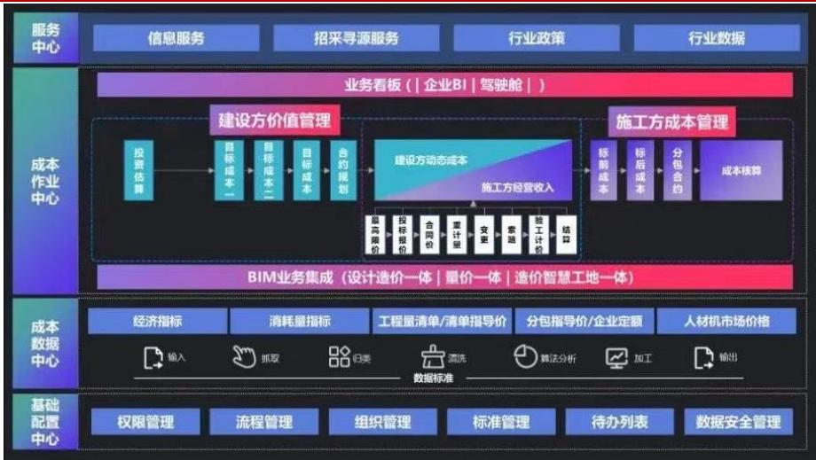  
图15：广联达数字新成本平台架构  
资料来源：公司官网、公司公众号、浙商证券研究所

# 2.1 建设方平台：前期项目数据标准化，实现精准成本管理

项目成本管控提升的关键在于前期估的准，执行控的住，仅靠人的经验管理很难实现规模化的复制，要解决这一问题，数字化转型是大势所趋，数字新成本平台为建设方提供了对应版本，能够实现降本增效的作用。

价值：标准化、线上化的数字新成本平台可实现数据驱动的精准成本管理。生存压力驱动建设方升级成本管理模式，传统的成本策划对实施过程难以精确把控，公司的数字新成本平台将前期成本策划和中后期成本管控均标准化、线上化、数字化，能够帮助甲方实现数据驱动的精准成本管理。

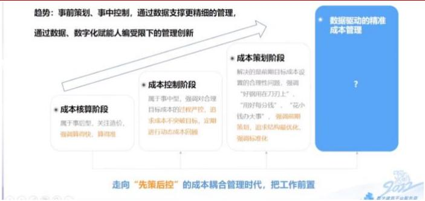  
图16：建设方成本管理发展趋势  
资料来源：广联达“数字建筑周”、浙商证券研究所

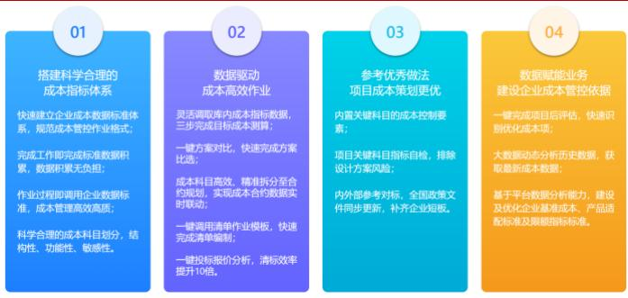  
图17：建设方数字新成本平台的价值   
资料来源：公司官网、浙商证券研究所

架构：平台 $+$ 组件形式提供服务。数据中心负责定标准、存数据；作业中心负责管成本、用数据；此外还可外接应用中心调用云计价、指标神器、指标网、广材网等增值模块；也可与企业管理平台互通。

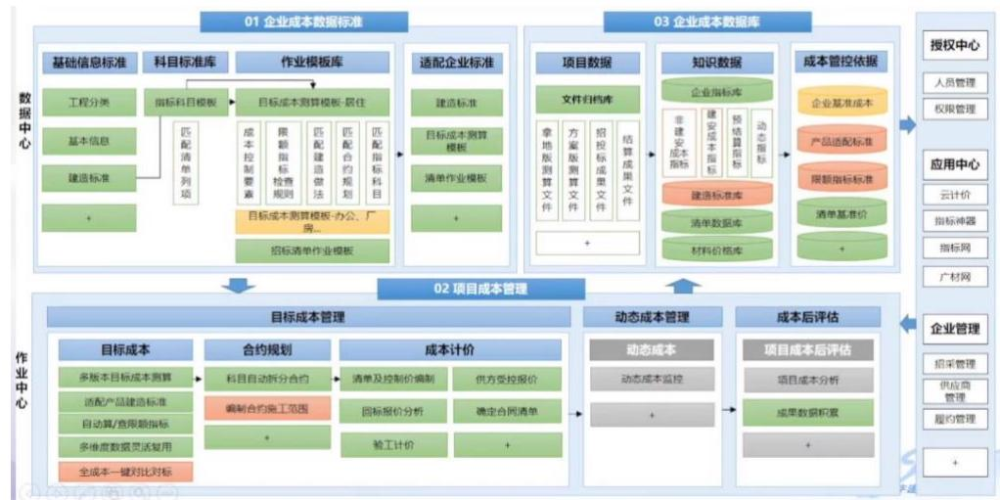  
图18：建设方数字新成本平台架构  
资料来源：广联达“数字建筑周”、浙商证券研究所

# 具体功能：以数据驱动建设方的全流程成本管理。

（1）数据中心帮助建设方快速建立各业态成本数据标准，为后续编制清单及制定数据库奠定基础。企业从开始编制清单说明，只要按要求填写，即可形成可留存复用的模板；过渡到清单标准层面，指标细度也尽可能按照自身成本管控能力实现自行设置。

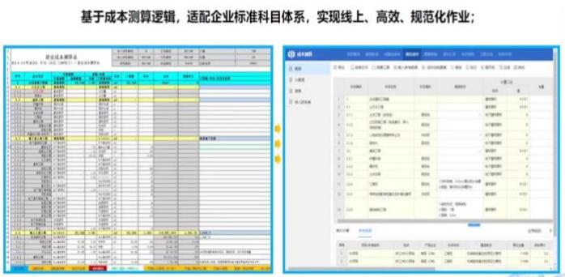  
图19：从Excel升级为线上标准化指标库  
资料来源：广联达公众号、浙商证券研究所

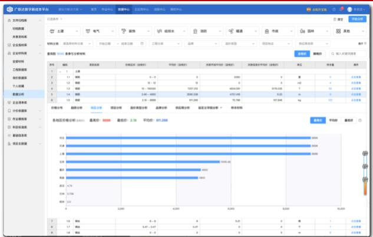  
图20：通过数字新成本平台建立各业态成本数据标准  
资料来源：广联达公众号、浙商证券研究所

（2）作业中心打通了从目标成本与清单编制、投标报价到回标分析等复杂环节，实现成本作业线上化。提供了基于业务流程的作业中心模块，内置快速调整人材机数据的功能；包括将目标成本业务流程标准化，建立了从基础资料、建造标准、适配检查、设计指标、非建安成本、建安成本、费用汇总、合约规划、工程支出、招采计划等业务处理模型；在清单编制版块，将上述数据中心与作业中心实现关联，便于直接调用基准价，实现归档数据的快速复用，可对标审核、指标分析、快速生成多种清单。

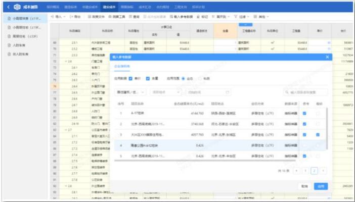  
图21：用指标数据服务编制建安费  
资料来源：广联达公众号、浙商证券研究所

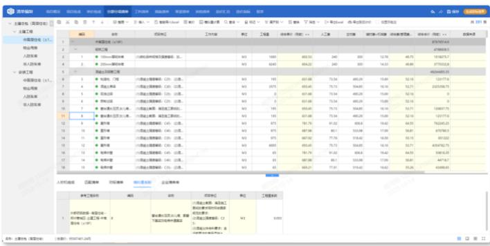  
图22：编制分项清单  
资料来源：广联达公众号、浙商证券研究所

（3）可外接“指标网”、“广材网”数据，帮助建设方快速参考优秀案例、对比关键指标、掌握材料价格。作业中心内置了各区政策文件、优秀做法案例，可供企业参考，支持同项目/不同阶段成本、不同项目间成本一键对比对标，也可外接“广材网”云助手查阅材料价格信息。

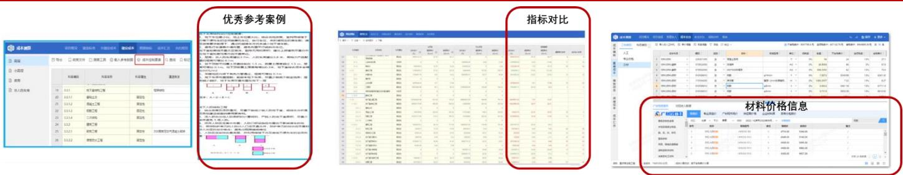  
图23：参考案例、指标网对比、广材网信息查询  
资料来源：广联达公众号、浙商证券研究所

（4）过程和结果数据可实现自动沉淀。每一个实际项目实施过程中，被存储的成果性文件数据，会经过自动清洗、拆分指标、清单、材料流入对应的数据库，实现数据的结构性存储，实现作业数据的沉淀，便于后续直接调用。

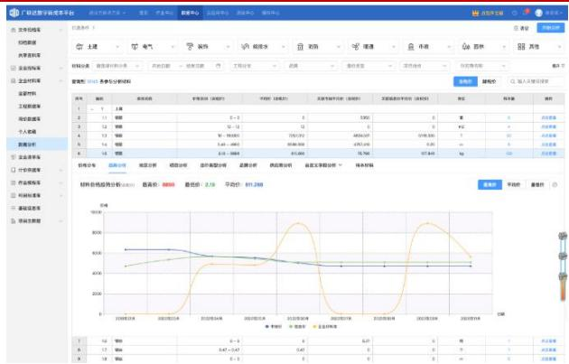  
图24：查看材料价格趋势分析  
资料来源：广联达公众号、浙商证券研究所

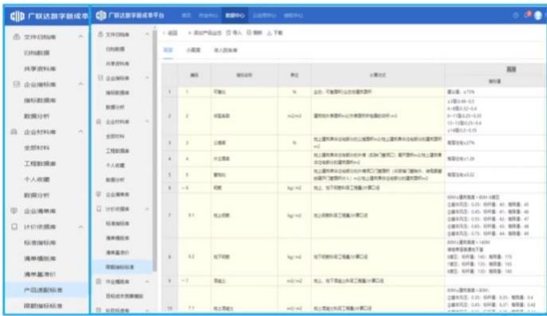  
图25：历史成本数据积累  
资料来源：广联达公众号、浙商证券研究所

项目流程：标准化程度高。公司首次入场实施时，将与建设方共同梳理以往项目的成本科目形成标准化指标库，并将以往标杆项目数据录入到线上形成冷启动数据库；在单个项目中，建设方可自行为不同岗位（招采、生产、技术、财务、造价员等）开通账号各司其职，由于数据保存在线上，因此单个环节成本变化时可自动同步更新，项目竣工验收完毕后数据打包入库不得修改，计费终止。

# 2.2 施工方平台：自动分拆整理提升效率，构建数据流闭环实现沉淀

价值：数字新成本平台可为施工方作业提供更为高效精准的依据，解决现场与市场联动的问题。除了与建设方一致的成本驱动的精细化管理价值以外，施工方平台可为具体执行人员提供更为精准、及时、同步的数据和信息，避免了修改后的数据在各环节之间的传递难题。

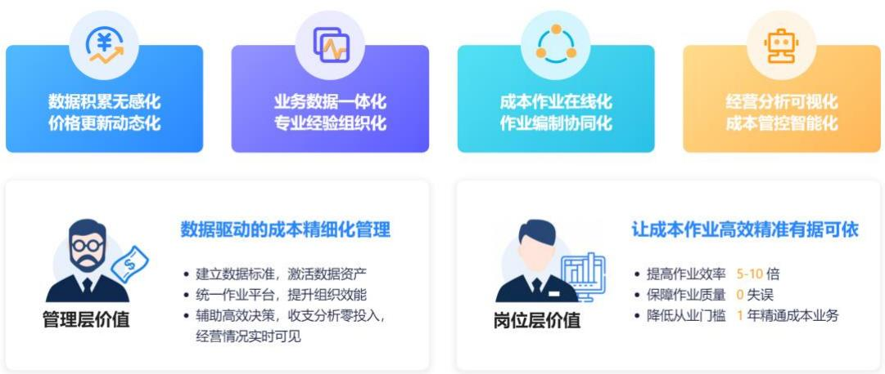  
图26：施工方数字新成本平台的价值  
资料来源：公司官网、浙商证券研究所

架构：与建设方平台类似，侧重投标、收入、分包管理。作业中心主要涵盖投标、收入、成本、分包管理功能，数据中心负责存储对应数据，也可外接云应用中心获得招财寻源、人工询价等特色服务。

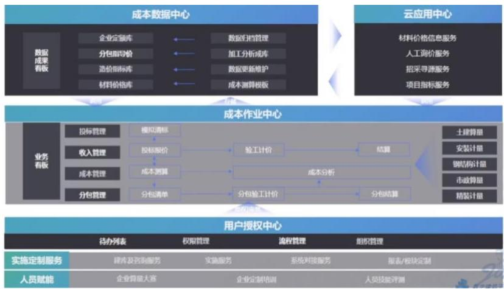  
图27：施工方数字新成本平台架构  
资料来源：广联达公众号、浙商证券研究所

# 具体特色功能：自动分拆整理、闭环数据流。

(1）自动化分拆整理收入数据大幅增效。施工方主要以 Excel的形式进行中标预算拆分和整理，历经土建安装拆分、清单合并、分包区分等十几步，涉及大量手工复制黏贴、公式编辑操作，对新人很不友好，极易出错，出错后需要人工一步步复核，如果分包模式调整则还需要再次手工一步步调整；公司提供的施工方新成本平台在合同预算收入导入到成本测算模块中后仅需分包归集、提取自购材料、其他费用归集三步即可自动按成本分析的维度实现自动汇总，并且具备联动刷新数据的功能，大幅提升效率、减少出错可能。

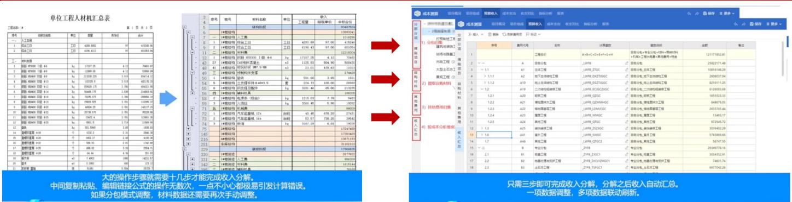  
图28：收入分拆——从十几步手工操作升级为三步自动汇总  
资料来源：广联达公众号、浙商证券研究所

（2）施工方过程结果数据形成闭环持续沉淀。施工方历史数据整理分析形成标准数据后，叠加价格因素形成标准分包指导价、成本测算模板，形成企业定额数据，员工可在各个作业环节调用、编制和对比分析，对应环节结束后自动归档到项目数据库中，并通过算法提取数据形成数据仓库，也可与外部价格数据挂接实现实时自动更新，并通过API与OA、招采项目管理等系统实现联通。

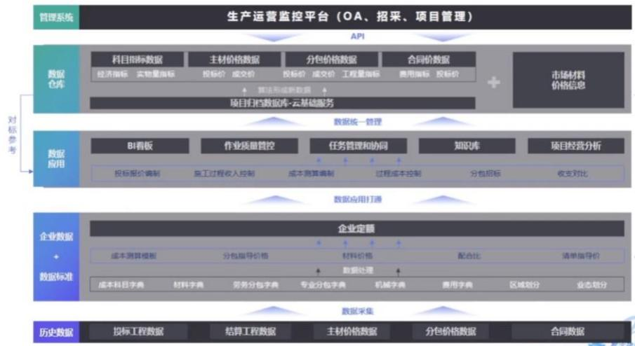  
图29：施工方数字新成本平台数据流  
资料来源：广联达公众号、浙商证券研究所

# 3 有望再造一个造价业务的空间，并带动施工和设计产品销售

公司致力于成为全球领先的数字建筑平台服务商。横向，业务范围逐步覆盖造价、施工、设计等建筑全产业环节；纵向，单个环节的服务能力不断深化，为不同岗位、项目、企业提供更为丰富的增值服务功能模块。

我们认为新成本平台有望成为公司并肩于造价、施工的重要产品，是公司在云化转型成功后，在数据增值服务上的一个重要尝试。有望为公司带来百亿潜在空间，短期内客户粘性强、中期内带动施工和设计等产品放量、长期有望驱动公司产品智能化升级。

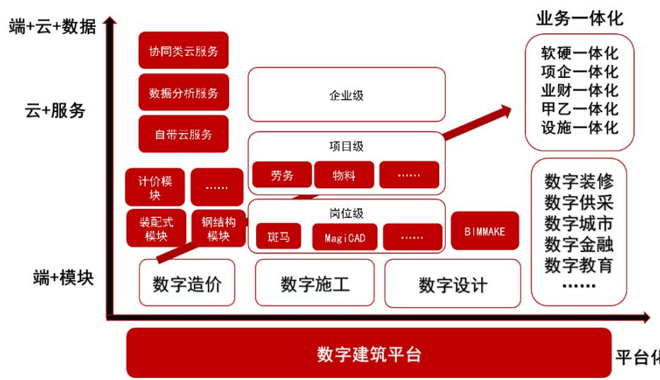  
图30：公司产品演进图  
资料来源：公司公告、浙商证券研究所

# 3.1 商业模式：SaaS 订阅制 $+ i$ 增值数据包，可为客户提供多样性选择

# 数字新成本的产品架构和商业模式和造价业务一样都是 SaaS 订阅制：

系统线上化：数字新成本平台为建设方、施工方均提供了Web 端登录入口，相关人员可通过账号登录，所有操作均在线上，数据默认在云端，实现了系统全线上化；

付费订阅化：新成本平台以项目为单位进行年度订阅收费，客户也可自选“指标网”、“广材网”等数据信息服务以及人工询价等增值服务，按需付费。

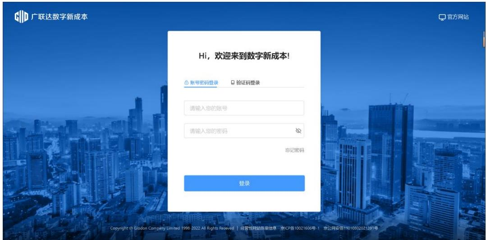  
图31：广联达数字新成本平台web 登录界面  
资料来源：公司官网、浙商证券研究所

# 3.2 新成本平台开辟了新领域，市场空间有望达到 245 亿，公司年创收有望达到120亿

我们认为新成本平台是公司云转型之后的又一力作，单业务潜在市场空间超过百亿。

# 市场空间测算方式一：按新开工项目数测算

预计新成本平台每年的市场空间为 252 亿元。根据国家统计局，2021 年新开工项目287760 个，假设未来每年新增 28 万个项目；根据公众号《BIM 改变未来》，BIM施工建模及深化设计软件旗舰版年费 5000 元，假设新成本平台年费定价为施工方1万元、建设方2万元；根据楼盘网，拿地到出售一般需要 3-5 年，假设均为 3 年，可以得到按项目数计算，每年市场规模 252 亿元。

表1：潜在市场空间预计—按项目数  

<table><tr><td>参数</td><td>数值</td><td>数据来源&amp;计算方式</td></tr><tr><td>全国新开工项目个数</td><td>287760个</td><td>国家统计局局长宁吉喆介绍 2021 年新开工项目287760 个，假设未来每年新增 28万个项目</td></tr><tr><td>单个项目向施工方每年收费金额</td><td>1万元</td><td>假设新成本平台年费与BIM施工建模及深化设计软件旗舰版（每年5000元）相 等，施工方购买2套（管理+实施）</td></tr><tr><td>单个项目向建设方每年收费金额</td><td>2万元</td><td>本平台费与建深设年000)</td></tr><tr><td>单个项目施工年限</td><td>3年</td><td>根据楼盘网，拿地到出售一般需要 3-5 年，假设均为 3年</td></tr><tr><td>每年市场规模估算</td><td>252亿元</td><td>28*(1+2)*3</td></tr></table>

资料来源：国新办、国家统计局、公众号《BIM改变未来》、楼盘网、浙商证券研究所

# 市场空间测算方式二：按覆盖客戶数测算

预计新成本平台每年的市场空间为 238 亿元。根据公司官网，目前公司已覆盖34 万家企业客户，由于公司 2010年上市时的招股书披露造价产品市占率超过 $50 \%$ ，以及2021年公司数字造价业务营收38.13 亿，同业品茗科技建筑信息化软件营收2.45 亿、盈建科总营收2.31

亿，因此假设公司市占率达到 $70 \%$ ；假设新成本平台年费与BIM施工建模及深化设计软件旗舰版（每年5000 元）相等，每个企业客户购买20 套，可以得到按客户数计算，每年市场规模 238 亿元。

表2：潜在市场空间预计-按客户数  

<table><tr><td></td><td>数值</td><td>数据来源&amp;计算方式</td></tr><tr><td>广联达覆盖企业客户数</td><td>34万</td><td>公司官网-服务企业客户34万+</td></tr><tr><td>广联达市占率</td><td>70%</td><td>2010 年公司招股书“造价产品市占率超过50%”，2021 年公司数字造价业务营收 38.13 亿，同业品茗科技建筑信息化软件营收2.45 亿、盈建科总营收2.31 亿，公司造价业务占 三家合计的 88.9%，因此假设公司市占率达到 70%</td></tr><tr><td>单个企业的ARPU值</td><td>10万/年</td><td>假设新成本平台年费与BIM施工建模及深化设计软件旗舰版（每年5000 元）相等，每个 企业客户购买 20套(大型客户管理+设计+咨询+实施各个环节购买五套)</td></tr><tr><td>年均市场规模</td><td>238亿元</td><td>34*0.7*0.5*20</td></tr></table>

资料来源：公司官网、wind、公众号《BIM改变未来》、浙商证券研究所

长期来看，公司每年收入空间上限约为 119 亿元。公司目前覆盖了34 万家企业客户，假设仅为现有客户存在复购需求，且为了剔除其中的小型客户，假设已覆盖客户的购买率上限为 $50 \%$ ，每个企业购买 20 套，则公司年收入新增空间为119 亿元。

表3：公司收入空间  

<table><tr><td></td><td>数值</td><td>数据来源&amp;计算方式</td></tr><tr><td>广联达覆盖企业客户数</td><td>34万</td><td>公司官网-服务企业客户34万+，假设主要是公司的现有客户产生复购需求。</td></tr><tr><td>广联达市占率</td><td>70%</td><td>2010 年公司招股书“造价产市占率超过50%”，2021 年公司数字造价业务营收 38.13 亿，同业品茗科技建筑信息化软件营收 2.45 亿、盈建科总营收 2.31 亿，因此假设公司市 占率达到70%</td></tr><tr><td>已覆盖客户的购买率上限</td><td>50%</td><td>主要是较大的项目需要使用数字新成本产品，一些小型建设方或不是目标客户。</td></tr><tr><td>单个企业的 ARPU值</td><td>10万/年</td><td>假设新成本年费与BIM施工建模及深化设计软件旗舰版（每年 5000 元）相等，每个企业 客户购买 20套（大型客户管理+设计+咨询+实施各个环节购买五套)</td></tr><tr><td>年均市场规模</td><td>119亿元</td><td>34*70%*50%*0.5*20</td></tr></table>

资料来源：公司官网、公众号《BIM改变未来》、浙商证券研究所

# 3.3 短期：新成本平台客户粘性强，有望为公司贡献持续增长动力

(1) 客户降本增效需求愈发凸显，成本节省、效率提升看得见，客户付费意愿有望逐步增强。我们认为当前背景下客户本身的降本增效需求有望得到持续激发，公司适时推出的新成本平台明确针对客户痛点、直接满足客户需求，例如建设方咸阳地产龙头陕西丽彩实业集团试点项目从前端把控成本，节省了高层地下钢筋含量，4万平方米地下建筑面积工优化成本375 万元，折合每平方米节省93.75元；施工方中铁城建三公司试点项目成本测算时间从5 天缩短到1天，中建八局西北分公司试点项目结算分析从2个人 $_ { \cdot + 1 }$ 个月缩短为1个人不到3小时。

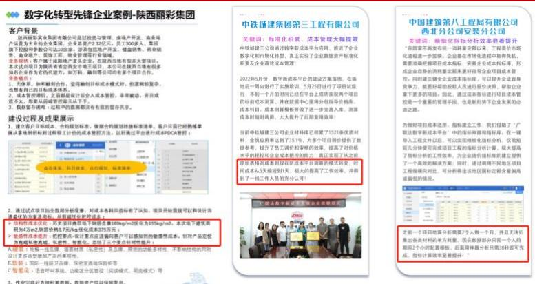  
图32：建设方、施工方项目案例  
资料来源：广联达公众号、浙商证券研究所

（2）客户的标准模板、数据均沉淀在线上平台且随时间不断积累，转换成本随时间不断提高。在新成本平台上客户可完成全流程管控，以往的标准、模板、数据、经验均不断沉淀在平台上，客户“越用越顺手、越用越习惯”，管理习惯也不断和平台相融合，转换成本持续提升。根据广联达河北公众号，目前数字新成本平台中已有超7万家企业、累计存储了成本数据3569 万多条、复用占比高达 $64 \%$ 、存储项目6万多个、整体复用达到10万多次。

(3）产品高度标准化，结合公司造价业务的市场地位有望在短时间内展现网络效应优势。根据信天创投，2020 年公司造价软件市占率接近 $60 \%$ ，处于绝对龙头地位，根据广联达河北公众号，数字新成本平台平台发版迭代 40 余次，运行了72 万余个节点账号，携手9万余家建筑行业企业，突破了超3000个实际建筑项目应用，落地了400多家实践标杆应用企业，网络效应初显。

（4）订阅制付费模式不断培养客户 $\therefore$ 智和付费习惯，持续提升品牌价值。根据公司年报，截至 2021 年全国已有29 个地区完成云化转型，2018-2021 年各年新增地区的转化率保持在 $50 \%$ 以上，以前年份转化率和续费率基本在 $8 5 \%$ 以上，且呈逐年提升态势，2019-2021 年云合同增速 $1 1 3 . 8 2 \% / 5 9 . 5 5 \% / 3 8 . 7 7 \%$ ，也呈现快速增长趋势，我们认为公司的造价业务 Saas 化转型能够充分说明订阅制付费模式能够培养客户心智和付费习惯，数字新成本平台有望进一步提升公司的品牌价值。

表4：造价业务云化转型进展  

<table><tr><td></td><td>2017</td><td>2018</td><td>2019</td><td>2020</td><td>2021</td></tr><tr><td rowspan="5">20个7年</td><td rowspan="5">计什价业务</td><td>计价业务：</td><td></td><td></td><td></td></tr><tr><td></td><td></td><td></td><td></td></tr><tr><td></td><td></td><td></td><td></td></tr><tr><td>转化率50%+</td><td></td><td></td><td></td></tr><tr><td>计价业务：</td><td></td><td></td><td></td></tr><tr><td rowspan="3">0185年</td><td></td><td>转化业务%</td><td> 0+</td><td></td><td></td></tr><tr><td></td><td></td><td></td><td></td><td></td></tr><tr><td>转化率 50%+</td><td></td><td></td><td></td><td></td></tr><tr><td>新增19年个</td><td></td><td></td><td>综化率 50%</td><td></td><td></td></tr><tr><td>0增04年</td><td></td><td></td><td></td><td>综化率 50%</td><td></td></tr><tr><td>2021 年 新增 4 个</td><td></td><td></td><td></td><td></td><td>综合： 转化率 60%+</td></tr></table>

资料来源：公司年报、浙商证券研究所

# 3.4 中期：打通建造全生命周期，有望带动设计、造价、施工业务实现放量

新成本平台有望进一步推动公司实现全流程覆盖，带动其他产品销售。建筑项目流程分为立项、设计、招采、施工、结算五步，公司在设计（细分设计平台 $^ +$ 构件坞）、招采（计量和云计价平台 $+$ 指标网广材网）、施工（进度管理系统）领域通过平台 $^ +$ 组件的形式已实现覆盖，推出了90 余软件、平台及组件产品，新成本平台有望将业务拓展至前期立项（成本策划）和后期结算阶段，同时以数据驱动的成本管理为核心贯穿建造全流程，与设计、造价、施工产品有望形成协同效应。

公司有望打造覆盖建筑行业全周期、客户深度共建的数字项目集成管理平台。新成本平台发布后，公司的数字项目集成管理平台初步成型，包含了业务中台、数据中台和技术中台，内置了大量的成熟稳定、开箱即用的技术组件和业务组件，覆盖建筑行业数字化涉及到的完整技术体系和场景。未来，平台的二次开发能力将面向市场开放，开发人员和团队可以针对自身的个性化需求进行定制开发，公司将携手客户的信息化部门、数科公司和数字生态里的独立软件服务商，共同为行业提供一体化解决方案。

表5：公司产品清单  

<table><tr><td>数字设计</td><td>数字建设方</td><td>数字造价</td><td>数字施工</td><td>数字城市</td><td>国际业务</td></tr><tr><td>BIMSpace 建筑设计产品</td><td>建设方成本数据系统</td><td>BIM安装计量GQI</td><td>BIM5D</td><td>广乌师</td><td>E-tender</td></tr><tr><td>电力隧道设计软件</td><td>建设方工程管理系统</td><td>BIM 钢结构计量GJG</td><td>BIMFACE</td><td>广鲟河</td><td>TAS国际土建算</td></tr><tr><td>负荷计算</td><td>建设方设计管理系统</td><td>BIM 市政计量 GMA</td><td>BIMMAKE施工建（新一代场布建模 基于CM的园区设施一体化管理TBQ国际计价</td><td></td><td></td></tr><tr><td>构件坞</td><td>建设方项目全过程管理</td><td>BIM土建计量GTJ</td><td>BIM 工序动画制作软件</td><td></td><td>TME国际机电算</td></tr><tr><td>管立得供水设计软件</td><td>建设方智慧工地系统</td><td>BIM装饰计量 DecoCost</td><td>CAD快速看图</td><td></td><td>TRB国际钢筋算</td></tr><tr><td>管立得市政管网设计软件</td><td></td><td>地铁工程GDT</td><td>MagiCAD</td><td></td><td></td></tr><tr><td>广联达 BIM 模型审查软件</td><td></td><td>电力算量GMS</td><td>MagiCloud</td><td></td><td></td></tr><tr><td>广联达 BIM 设计管理平台</td><td></td><td>服务新干线</td><td>斑马进度计划</td><td></td><td></td></tr><tr><td>广联达企业级族库管理平台</td><td></td><td>服务新干线—-答疑解惑</td><td>广联达AI钢筋/钢管点根</td><td></td><td></td></tr><tr><td>广联达数维设计平台</td><td></td><td>广材网</td><td>广联达 BIM+技术管理系统</td><td></td><td></td></tr><tr><td>广联达数字化审图系统</td><td></td><td>广材助手</td><td>广联达 BIM+智慧工地数据决策系统</td><td></td><td></td></tr><tr><td>海绵城市设计软件</td><td></td><td>广联达G+工作台</td><td>广联达 BIMMAKE</td><td></td><td></td></tr><tr><td>鸿城 InraFuser</td><td></td><td>广联达电力云计价软件 GEC5.0</td><td>广联达 BIMVR 安全教育系统</td><td></td><td></td></tr><tr><td>建筑性能分析平台</td><td></td><td>广联达公路云计价软件 GHW5.0</td><td>广联达 BIM劳务管理系统</td><td></td><td></td></tr><tr><td>路易 BIM 道路设计软件</td><td></td><td>广联达煤炭计价软件 GCN</td><td>广联达成本测算系统</td><td></td><td></td></tr><tr><td>暖通空调设计</td><td></td><td>广联达煤炭云计价平台 6.0</td><td>广联达搅拌站材料核算系统</td><td></td><td></td></tr><tr><td>热力管网</td><td></td><td>广联达民航计价软件 GCA</td><td>广联达酷爱点</td><td></td><td></td></tr><tr><td>日照分析软件</td><td></td><td>广联达清标</td><td>广联达施工企业生产管理解决方案</td><td></td><td></td></tr><tr><td>市政道路设计软件</td><td></td><td>广联达石油石化云计价软件 GPC5.0</td><td>广联达施工企业项目管理解决方案</td><td></td><td></td></tr><tr><td>综合管廊设计软件</td><td></td><td>广联达市场化计价平台</td><td>广联达施工企业智慧安全解决方案</td><td></td><td></td></tr><tr><td></td><td></td><td>广联达水工云计价软件 GHC5.0</td><td>广联达数字采购解决方案</td><td></td><td></td></tr><tr><td></td><td></td><td>广联达水工云计价软件 GHC5.0-水工 港口</td><td>广联达现场物料追踪系统</td><td></td><td></td></tr><tr><td></td><td></td><td>广联达水利水电云计价软件 GWH5.0</td><td>广联达线性基建工程决策支持系统</td><td></td><td></td></tr><tr><td></td><td></td><td>广联达投标 GEB7</td><td>广联达云项目管理解决方案</td><td></td><td></td></tr><tr><td></td><td></td><td>广联达土地整理计价软件 GLC2014</td><td>广联达智能物料验收系统</td><td></td><td></td></tr><tr><td></td><td></td><td>广联达冶金计价软件 GMT</td><td>企业BI数据决策平台</td><td></td><td></td></tr><tr><td></td><td></td><td>广联达云计价 GCCP6.0</td><td>协筑</td><td></td><td></td></tr><tr><td></td><td></td><td>建筑课堂</td><td></td><td></td><td></td></tr><tr><td></td><td></td><td>企业指标应用平台</td><td></td><td></td><td></td></tr><tr><td></td><td></td><td>指标网</td><td></td><td></td><td></td></tr></table>

资料来源：公司官网、浙商证券研究所

# 3.5 长期：全产品线智能化升级可期，建筑业数据价值有望逐步释放

公司未来产品有望全面智能化升级，进一步释放数据价值。目前公司持续在人工智能领域加大投入，云AI已从造价扩展到施工与设计，未来有望进一步扩展至全产品线，助力建筑企业实现产业数字化，全面释放建筑行业数据价值。

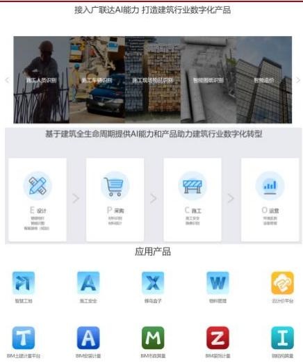  
图33：广联达AI开放平台功能及产品  
资料来源：公司官网、浙商证券研究所

# 4 盈利预测、估值及风险提示

# 4.1 盈利预测及估值

# 营收：

预计2022-2024年总营收分别达到 67.99/83.85/101.45亿 $+ 2 0 . 9 8 \% / 2 3 . 3 3 \% / 2 0 . 9 9 \%$ )

（1）新成本平台业务：基于公司在造价业务上的深厚客户积累，我们预计新成本平台有望借助公司在全国的营销网络实现推广，预计2022-2024年营收分别达到 3.50/5.12/7.25亿 $+ 4 6 . 2 5 \% / 4 1 . 5 4 \%$ )

（2）造价业务：2021年营收38.13亿（ $+ 3 6 . 6 4 \%$ )，我们认为2022年疫情影响了客户需求从而暂时抑制了收入，2023-2024 年该业务有望随着经济恢复而反弹，预计 2022-2024年营收分别达到43.32/53.49/63.01亿 $+ 1 3 . 6 0 \% / 2 3 . 4 9 \% / 1 7 . 7 9 \%$ )

（3）施工业务：2021年营收12.06亿（ $+ 2 7 . 8 2 \%$ )，我们认为2022年客户开工延迟影响了收入，2023-2024 年该业务有望随着客户开工而企稳恢复，预计 2022-2024 年营收分别达到 $1 5 . 5 3 / 2 0 . 1 9 / 2 6 . 4 9$ 亿 $+ 2 8 . 8 2 \% / 3 0 . 0 2 \% / 3 1 . 2 0 \%$

（4）数字设计、海外及其他业务：2021年营收5.43亿（ $+ 1 5 4 . 8 3 \%$ )，我们预计未来将仍长期处于投入阶段，预计2022-2024年营收达到 $5 . 6 4 / 5 . 0 4 / 4 . 7 0$ 亿 $+ 3 . 7 3 \% / - 1 0 . 5 5 \% / .$ .$6 . 8 0 \%$ )

毛利率：2021 年毛利率 $8 3 . 9 5 \%$ ，2022 年受到疫情的影响，随着更高毛利的新成本平台、增值服务等业务的不断推广，预计未来整体毛利率将逐步企稳，预计 2022-2024 年毛利率为 $8 0 . 8 9 \% / 8 0 . 3 9 \% / 7 9 . 2 3 \%$

费用率：我们认为公司未来人员增速有望得到控制，并且随着公司收入规模的扩大和运营能力的提升，销售、管理、研发费用率有望逐步减少，预计 2022-2024 年销售费用率

$2 6 . 6 1 \% / 2 5 . 9 9 \% / 2 5 . 3 6 \%$ 、管理费用率 $1 7 . 6 5 \% / 1 6 . 4 0 \% / 1 5 . 7 9 \%$ 、研发费用率$2 0 . 5 7 \% / 2 0 . 1 1 \% / 1 9 . 2 6 \%$

归母净利润：预计2022-2024年归母净利润分别达到9.77/13.73/17.26亿[] $( + 4 7 . 7 6 \% / 4 0 . 6 0 \% / 2 5 . 6 7 \% )$ 。

表6：公司盈利预测（亿元、 $\%$ )  

<table><tr><td></td><td>2021</td><td>2022E 2023E</td><td>2024E</td></tr><tr><td>总营收</td><td>56.19</td><td>67.99 83.85</td><td>101.45</td></tr><tr><td>YOY</td><td>40.32%</td><td>20.98% 23.33%</td><td>20.99%</td></tr><tr><td>1、新成本平台业务收入</td><td></td><td>3.50 5.12</td><td>7.25</td></tr><tr><td>YOY</td><td></td><td>46.25%</td><td>41.54%</td></tr><tr><td>2、数字造价业务收入</td><td>38.13</td><td>43.32 53.49</td><td>63.01</td></tr><tr><td>YOY</td><td>36.64%</td><td>13.60% 23.49%</td><td>17.79%</td></tr><tr><td>3、数字施工业务收入</td><td>12.06</td><td>15.53 20.19</td><td>26.49</td></tr><tr><td>YOY</td><td>27.82%</td><td>28.82% 30.02%</td><td>31.20%</td></tr><tr><td>4数宇设计、海外及其</td><td>5.43</td><td>5.64 5.04</td><td>4.70</td></tr><tr><td>YOY</td><td>154.83%</td><td>3.73% -10.55%</td><td>-6.80%</td></tr><tr><td>整体毛利率</td><td>83.95%</td><td>80.89% 80.39%</td><td>79.23%</td></tr><tr><td>销售费用率</td><td>28.24%</td><td>26.61% 25.99%</td><td>25.36%</td></tr><tr><td>管理费用率</td><td>19.56%</td><td>17.65% 16.40%</td><td>15.79%</td></tr><tr><td>研发费用率</td><td>22.63%</td><td>20.57% 20.11%</td><td>19.26%</td></tr><tr><td>归母净利润</td><td>6.61</td><td>9.77</td><td>13.73 17.26</td></tr><tr><td>YOY</td><td>100.06%</td><td>47.76% 40.60%</td><td>25.67%</td></tr></table>

资料来源：wind、浙商证券研究所

# 估值：

我们预测公司2022-2024年总营收分别达到 $6 7 . 9 9 / 8 3 . 8 5 / 1 0 1 . 4 5$ 亿 $+ 2 0 . 9 8 \% / 2 3 . 3 3 \%$ $/ 2 0 . 9 9 \%$ )，归母净利润分别达到9.77/13.73/17.26亿 $\mathrm { ( + 4 7 . 7 6 \% / 4 0 . 6 0 \% / 2 5 . 6 7 \% }$ )，我们认为短期新成本平台有望为公司带来百亿潜在空间，短期内客户粘性强、中期内带动施工和设计等产品放量、长期有望驱动公司产品智能化升级，维持“买入”评级。

表7：可比公司估值（2023.2.1，选取头部 saas 公司）  

<table><tr><td colspan="10">总营收</td></tr><tr><td></td><td>总市值(亿)</td><td>收盘价</td><td>2021A</td><td>2022E</td><td>2023E</td><td>2024E</td><td>2021A</td><td>PS 2022E</td><td>2023E</td><td>2024E</td></tr><tr><td>688111.SH 金山办公</td><td>1,342.15</td><td>291.00</td><td>32.80</td><td>39.89</td><td>52.81</td><td>69.49</td><td>40.92</td><td>33.64</td><td>25.42</td><td>19.31</td></tr><tr><td>600588.SH 用友网络</td><td>848.79</td><td>24.72</td><td>89.32</td><td>103.94</td><td>126.94</td><td>156.23</td><td>9.50</td><td>8.17</td><td>6.69</td><td>5.43</td></tr><tr><td>平均值</td><td>1,095.47</td><td></td><td>61.06</td><td>71.92</td><td>89.88</td><td>112.86</td><td>25.21</td><td>20.90</td><td>16.05</td><td>12.37</td></tr><tr><td>002410.SZ广联达</td><td>774.40</td><td>65.00</td><td>56.19</td><td>67.99</td><td>83.85</td><td>101.45</td><td>13.78</td><td>11.39</td><td>9.24</td><td>7.63</td></tr></table>

资料来源：wind、浙商证券研究所， $\mathrm { P S } { = }$ 总市值/总营收

# 4.2 风险提示

客户实际需求及新产品推广不及预期的风险：新成本平台的业绩依赖客户需求的急迫程度、付费的意愿和能力、全国新开工项目数量、产品推广和渗透率、销售单价、销售渠道和能力等因素，如果上述任一环节不及预期都有可能影响业绩表现；

协同效应、智能化功能升级的进展不及预期的风险：存在产品之间协同效应较弱，无法带动其他产品销售的风险，公司产品的智能化功能研发落地推广不及预期的风险；

竞争加剧的风险等其他风险：存在成本管控业务同业竞争加剧的风险；

表附录：三大报表预测值  
资产负债表  

<table><tr><td>(百万元）</td><td>2021A</td><td>2022E</td><td>2023B</td><td>2024E</td></tr><tr><td>流动资产</td><td>5,122</td><td>5,586</td><td>7,065</td><td>8,600</td></tr><tr><td>现金</td><td>4,050</td><td>4,548</td><td>5,813</td><td>7,178</td></tr><tr><td>交易性金融资产</td><td>0</td><td>0</td><td>0</td><td>0</td></tr><tr><td>应收账项</td><td>524</td><td>468</td><td>610</td><td>714</td></tr><tr><td>其它应收款</td><td>75</td><td>76</td><td>87</td><td>93</td></tr><tr><td>预付账款</td><td>36</td><td>45</td><td>53</td><td>63</td></tr><tr><td>存货</td><td>71</td><td>72</td><td>108</td><td>136</td></tr><tr><td>其他</td><td>366</td><td>376</td><td>394</td><td>417</td></tr><tr><td>非流动资产</td><td>4,946</td><td>5,227</td><td>5,429</td><td>5,582</td></tr><tr><td>金额资产类</td><td>723</td><td>573</td><td>423</td><td>273</td></tr><tr><td>长期投资</td><td>326</td><td>348</td><td>368</td><td>386</td></tr><tr><td>固定资产</td><td>824</td><td>826</td><td>822</td><td>817</td></tr><tr><td>无形资产</td><td>531</td><td>781</td><td>901</td><td>981</td></tr><tr><td>在建工程</td><td>396</td><td>596</td><td>796</td><td>996</td></tr><tr><td>其他</td><td>2,147</td><td>2,105</td><td>2,120</td><td>2,130</td></tr><tr><td>资产总计</td><td>10,068</td><td>10,814</td><td>12,494</td><td>14,182</td></tr><tr><td>流动负债</td><td>3,637</td><td>4,249</td><td>4,882</td><td>5,195</td></tr><tr><td>短期借款</td><td>0</td><td>0</td><td>0</td><td>0</td></tr><tr><td>应付款项</td><td>268</td><td>244</td><td>409</td><td>434</td></tr><tr><td>预收账款</td><td>0</td><td>0</td><td>0</td><td>0</td></tr><tr><td>其他</td><td>3,369</td><td>4,004</td><td>4,474</td><td>4,761</td></tr><tr><td>非流动负债</td><td>158</td><td>178</td><td>198</td><td>218</td></tr><tr><td>长期借款</td><td>0</td><td>0</td><td>0</td><td>0</td></tr><tr><td>其他</td><td>158</td><td>178</td><td>198</td><td>218</td></tr><tr><td>负债合计</td><td>3,795</td><td>4,426</td><td>5,080</td><td>5,413</td></tr><tr><td>少数股东权益</td><td>485</td><td>559</td><td>662</td><td>792</td></tr><tr><td>归属母公司股东权</td><td>5,788</td><td>5,829</td><td>6,752</td><td>7,978</td></tr><tr><td>负债和股东权益</td><td>10,068</td><td>10,814</td><td>12,494</td><td>14,182</td></tr></table>

现金流量表  

<table><tr><td>(百万元)</td><td>2021A</td><td>2022E</td><td>2023E</td><td>2024E</td></tr><tr><td>经营活动现金流</td><td>1,601</td><td>2,263</td><td>1,826</td><td>2,241</td></tr><tr><td>净利润</td><td>719</td><td>1,050</td><td>1,476</td><td>1,856</td></tr><tr><td>折旧摊销</td><td>193</td><td>130</td><td>146</td><td>163</td></tr><tr><td>财务费用</td><td>18</td><td>0</td><td>0</td><td>0</td></tr><tr><td>投资损失</td><td>16</td><td>34</td><td>(17)</td><td>(20)</td></tr><tr><td>营运资金变动</td><td>715</td><td>1,025</td><td>199</td><td>221</td></tr><tr><td>其它</td><td>(60)</td><td>25</td><td>21</td><td>21</td></tr><tr><td>投资活动现金流</td><td>(1,541)</td><td>(849)</td><td>(131)</td><td>(396)</td></tr><tr><td>资本支出</td><td>(720)</td><td>(577)</td><td>(525)</td><td>(495)</td></tr><tr><td>长期投资</td><td>(70)</td><td>128</td><td>130</td><td>132</td></tr><tr><td>其他</td><td>(751)</td><td>(400)</td><td>264</td><td>(33)</td></tr><tr><td>筹资活动现金流</td><td>(819)</td><td>(916)</td><td>(430)</td><td>(480)</td></tr><tr><td>短期借款</td><td>(3)</td><td>0</td><td>0</td><td>0</td></tr><tr><td>长期借款</td><td>(0)</td><td>0</td><td>0</td><td>0</td></tr><tr><td>其他</td><td>(816)</td><td>(916)</td><td>(430)</td><td>(480)</td></tr><tr><td>现金净增加额</td><td>(772)</td><td>499</td><td>1,264</td><td>1,365</td></tr></table>

资料来源：wind，浙商证券研究所

利润表  

<table><tr><td>(百万元)</td><td>2021A</td><td>2022E</td><td>2023E</td><td>2024E</td></tr><tr><td>营业收入</td><td>5,619</td><td>6,799</td><td>8,385</td><td>10,145</td></tr><tr><td>营业成本</td><td>893</td><td>1,299</td><td>1,644</td><td>2,108</td></tr><tr><td>营业税金及附加</td><td>46</td><td>48</td><td>50</td><td>51</td></tr><tr><td>营业费用</td><td>1,587</td><td>1,809</td><td>2,180</td><td>2,572</td></tr><tr><td>管理费用</td><td>1,099</td><td>1,200</td><td>1,375</td><td>1,602</td></tr><tr><td>研发费用</td><td>1,333</td><td>1,399</td><td>1,686</td><td>1,954</td></tr><tr><td>财务费用</td><td>(53)</td><td>(20)</td><td>(15)</td><td>(10)</td></tr><tr><td>资产减值损失</td><td>(1)</td><td>(1)</td><td>(1)</td><td>(1)</td></tr><tr><td>公允价值变动损益</td><td>0</td><td>0</td><td>0</td><td>0</td></tr><tr><td>投资净收益</td><td>(16)</td><td>(34)</td><td>17</td><td>20</td></tr><tr><td>其他经营收益</td><td>86</td><td>68</td><td>67</td><td>51</td></tr><tr><td>营业利润</td><td>758</td><td>1,077</td><td>1,527</td><td>1,918</td></tr><tr><td>营业外收支</td><td>(9)</td><td>(5)</td><td>(5)</td><td>(5)</td></tr><tr><td>利润总额</td><td>749</td><td>1,072</td><td>1,522</td><td>1,913</td></tr><tr><td>所得税</td><td>31</td><td>21</td><td>46</td><td>57</td></tr><tr><td>净利润</td><td>719</td><td>1,050</td><td>1,476</td><td>1,856</td></tr><tr><td>少数股东损益</td><td>58</td><td>74</td><td>103</td><td>130</td></tr><tr><td>归属母公司净利润</td><td>661</td><td>977</td><td>1,373</td><td>1,726</td></tr><tr><td>EBITDA</td><td>916</td><td>1,261</td><td>1,683</td><td>2,092</td></tr><tr><td>EPS（最新摊薄)</td><td>0.55</td><td>0.82</td><td>1.15</td><td>1.45</td></tr></table>

主要财务比率  

<table><tr><td></td><td>2021A</td><td>2022E</td><td>2023E</td><td>2024E</td></tr><tr><td>成长能力</td><td></td><td></td><td></td><td></td></tr><tr><td>营业收入</td><td>40.32%</td><td>20.98%</td><td>23.33%</td><td>20.99%</td></tr><tr><td>营业利润</td><td>83.10%</td><td>41.98%</td><td>41.84%</td><td>25.58%</td></tr><tr><td>归属母公司净利润</td><td>100.06%</td><td>47.76%</td><td>40.60%</td><td>25.67%</td></tr><tr><td>获利能力</td><td></td><td></td><td></td><td></td></tr><tr><td>毛利率</td><td>83.95%</td><td>80.89%</td><td>80.39%</td><td>79.23%</td></tr><tr><td>净利率</td><td>11.88%</td><td>14.37%</td><td>16.38%</td><td>17.01%</td></tr><tr><td>ROE</td><td>11.42%</td><td>16.76%</td><td>20.34%</td><td>21.63%</td></tr><tr><td>ROIC</td><td>10.91%</td><td>17.15%</td><td>19.89%</td><td>21.14%</td></tr><tr><td>偿债能力</td><td></td><td></td><td></td><td></td></tr><tr><td>资产负债率</td><td>37.69%</td><td>40.93%</td><td>40.66%</td><td>38.17%</td></tr><tr><td>净负债比率</td><td>60.50%</td><td>69.30%</td><td>68.52%</td><td>61.72%</td></tr><tr><td>流动比率</td><td>1.41</td><td>1.31</td><td>1.45</td><td>1.66</td></tr><tr><td>速动比率</td><td>1.28</td><td>1.20</td><td>1.33</td><td>1.54</td></tr><tr><td>营运能力</td><td></td><td></td><td></td><td></td></tr><tr><td>总资产周转率</td><td>0.57</td><td>0.65</td><td>0.72</td><td>0.76</td></tr><tr><td>应收账款周转率</td><td>12.13</td><td>14.71</td><td>17.03</td><td>16.91</td></tr><tr><td>应付账款周转率</td><td>4.92</td><td>5.07</td><td>5.03</td><td>5.00</td></tr><tr><td>每股指标(元)</td><td></td><td></td><td></td><td></td></tr><tr><td>每股收益</td><td>0.55</td><td>0.82</td><td>1.15</td><td>1.45</td></tr><tr><td>每股经营现金</td><td>1.34</td><td>1.90</td><td>1.53</td><td>1.88</td></tr><tr><td>每股净资产</td><td>4.86</td><td>4.89</td><td>5.67</td><td>6.70</td></tr><tr><td>估值比率</td><td></td><td></td><td></td><td></td></tr><tr><td>P/E</td><td>117.16</td><td>79.29</td><td>56.40</td><td>44.88</td></tr><tr><td>P/B</td><td>13.38</td><td>13.29</td><td>11.47</td><td>9.71</td></tr><tr><td>EV/EBITDA</td><td>78.72</td><td>57.85</td><td>42.61</td><td>33.62</td></tr></table>

# 股票投资评级说明

以报告日后的6个月内，证券相对于沪深300指数的涨跌幅为标准，定义如下：

1.买入：相对于沪深300指数表现 $+ 2 0 \%$ 以上；  
2.增持：相对于沪深300指数表现 $+ 1 0 \% \sim + 2 0 \%$   
3.中性：相对于沪深300 指数表现 $- 1 0 \% \sim + 1 0 \%$ 之间波动；  
4.减持：相对于沪深300指数表现 $- 1 0 \%$ 以下。

# 行业的投资评级：

以报告日后的6个月内，行业指数相对于沪深300指数的涨跌幅为标准，定义如下：  
1.看好：行业指数相对于沪深 300 指数表现 $+ 1 0 \% \nu$ 以上；  
2.中性：行业指数相对于沪深 300 指数表现 $- \ 1 0 \% \sim \ + \ 1 0 \%$ 以上；  
3.看淡：行业指数相对于沪深300指数表现 $- 1 0 \%$ 以下。  
我们在此提醒您，不同证券研究机构采用不同的评级术语及评级标准。我们采用的是相对评级体系，表示投资的相对比重。  
建议：投资者买入或者卖出证券的决定取决于个人的实际情况，比如当前的持仓结构以及其他需要考虑的因素。投资者不应仅仅依靠投资评级来推断结论。

# 法律声明及风险提示

本报告由浙商证券股份有限公司（已具备中国证监会批复的证券投资咨询业务资格，经营许可证编号为：Z39833000）制作。本报告中的信息均来源于我们认为可靠的已公开资料，但浙商证券股份有限公司及其关联机构（以下统称“本公司”）对这些信息的真实性、准确性及完整性不作任何保证，也不保证所包含的信息和建议不发生任何变更。本公司没有将变更的信息和建议向报告所有接收者进行更新的义务。

本报告仅供本公司的客户作参考之用。本公司不会因接收人收到本报告而视其为本公司的当然客户。

本报告仅反映报告作者的出具日的观点和判断，在任何情况下，本报告中的信息或所表述的意见均不构成对任何人的投资建议，投资者应当对本报告中的信息和意见进行独立评估，并应同时考量各自的投资目的、财务状况和特定需求。对依据或者使用本报告所造成的一切后果，本公司及/或其关联人员均不承担任何法律责任。

本公司的交易人员以及其他专业人士可能会依据不同假设和标准、采用不同的分析方法而口头或书面发表与本报告意见及建议不一致的市场评论和/或交易观点。本公司没有将此意见及建议向报告所有接收者进行更新的义务。本公司的资产管理公司、自营部门以及其他投资业务部门可能独立做出与本报告中的意见或建议不一致的投资决策。

本报告版权均归本公司所有，未经本公司事先书面授权，任何机构或个人不得以任何形式复制、发布、传播本报告的全部或部分内容。经授权刊载、转发本报告或者摘要的，应当注明本报告发布人和发布日期，并提示使用本报告的风险。未经授权或未按要求刊载、转发本报告的，应当承担相应的法律责任。本公司将保留向其追究法律责任的权利。

# 浙商证券研究所

上海总部地址：杨高南路729 号陆家嘴世纪金融广场1号楼 25 层  
北京地址：北京市东城区朝阳门北大街8号富华大厦E座4层  
深圳地址：广东省深圳市福田区广电金融中心33层  
上海总部邮政编码：200127  
上海总部电话：(8621) 80108518  
上海总部传真：(8621) 80106010  
浙商证券研究所：https://www.stocke.com.cn