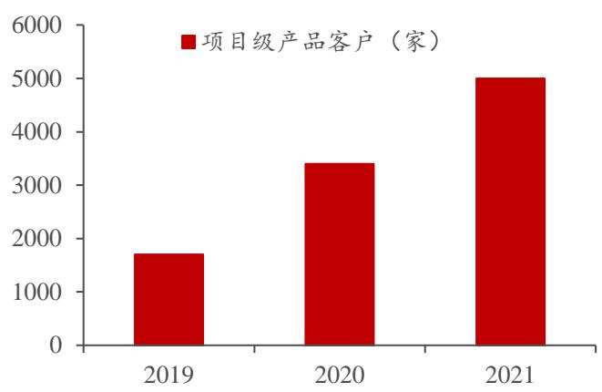

广联达（002410.SZ）公司深度报告

# 拥抱建筑数字化拐点，SaaS 龙头星辰大海刚启航

转云之路方兴未艾，SaaS 红利“才露尖尖角”。1）云转型势如破竹：公司2021年对最后四个地区开始云转型，2021年末转化率已经达到 $60 \%$ ，好于过往年份新地区转化率。转云后各项数据亮眼，2021 年云收入增速达 $5 8 \%$ ，整体归母净利润实现翻倍增长，经营性净现金流持续明显改善。2）造价业务云收入仍具备较大成长空间：造价业务中性测算空间约为 80 亿元，云业务空间近 70 亿元。2021 年云合同负债、云合同额保持 $30 \%$ 以上增速，一方面造价云收入仍具备较高成长空间，另一方面 SaaS 模式红利才刚刚开始体现。

他山之石：云龙头标杆效应显著，广联达全面锚定先行者。1）云龙头稳定成长体现自身价值：Autodesk 是全球 SaaS 领域龙头，2021 年收入增速 $1 6 \%$ ARR 增速 $1 6 \%$ ,递延收入增速 $12 \%$ ，预期 2022 年收入及ARR 增速保持在 $1 5 \%$ 左右，具有持续成长能力。2）全面锚定先行者：SaaS 模式的价值在于现金流改善 $^ +$ 确定性提升，广联达与Autodesk 全面对标：一是云收入已经实现较高占比，二是具有较高产品化程度，公司造价业务毛利率超 $90 \%$ ，三是转云后现金流改善明显。公司在云业务上全面锚定先行者，SaaS 模式价值凸显。

展望第二成长曲线：逻辑顺畅 $^ +$ 订单在手 $^ +$ 空间大，施工业务成长可期。1)成长性良好：订单持续保持高增。施工业务以集团为重点快速推进，规模化采购成为成长重要动力。2021 年施工业务收入增速近 $30 \%$ ，2021H1 新签合同额同比增速超 $100 \%$ ，2021 年全年合同额同比高增。2）发展逻辑：施工企业降本增效势在必行。建筑业整体发展趋缓，行业内公司利润率承压，降本增效势在必行，而信息化是降本增效的重要抓手；国外可比公司Procore近五年收入端保持约$50 \%$ 复合增速，验证行业成长逻辑。3）空间测算：保守/中性/乐观条件下，长期看公司施工业务可得市场空间在 110/220/330 亿元。

# 长期新增长极：设计业务实现突破，数字供采等新业务不断验证发展潜力。

1）设计业务：2021年实现营收1.31亿元，增速 $2 5 0 . 1 2 \%$ 。公司打造设计领域多专业平台协同，未来大规模推广潜力可期。2)海外业务：造价、施工等产品具备规模化能力，重点区域业务快速推进。3）数字供采等业务：数字供采平台"平方网”快速发展，数字城市CIM 等业务标杆案例不断落地。

投资建议：广联达是工程造价领域的龙头企业，造价业务 SaaS 转型价值凸显，数字施工业务有望成为公司未来新的核心成长动能，设计、数字供采等业务逐步推广验证自身发展潜力。预计公司 22-24 年收入为 69.12/83.67/101.82 亿元，根据分部估值法测算，公司合理估值 916 亿元，价值明显低估，同时云龙头长期价值与成长空间值得期待，因此维持“推荐”评级。

风险提示：行业竞争加剧，产品研发进度不及预期；疫情影响下游景气度。

2022年04月05日推荐 维持评级当前价格： 52.88元

分析师：吕伟  
执业证号：S0100521110003  
电话： 021-80508288  
邮箱： lwwei_yj@mszq.com  
分析师：郭新宇  
执业证号：S0100518120001  
电话： 01085127654  
邮箱： guoxinyu@mszq.com

# 相关研究

1.广联达(002410）2021年年报点评：云业务成长性良好，施工、设计业务实现重要突破2.广联达(002410)2021 年业绩预告点评：业绩整体超预期，云龙头高成长有望延续3.广联达(002410)2021 年半年度业绩预告点评：2021Q2 业绩翻倍增长，转云成果持续显现  
4.广联达(002410)2021 年一季度报告点评：近两年收入复合增速超 $30 \%$ ，云合同保持高增  
5.广联达（002410）2020年年报点评：云转型持续推进，看好云业务持续成长

盈利预测与财务指标   

<table><tr><td>项目/年度</td><td>2021A</td><td>2022E</td><td>2023E</td><td>2024E</td></tr><tr><td>营业收入（百万元）</td><td>5619</td><td>6912</td><td>8367</td><td>10182</td></tr><tr><td>增长率(%)</td><td>40.3</td><td>23.0</td><td>21.0</td><td>21.7</td></tr><tr><td>归属母公司股东净利润（百万元）</td><td>661</td><td>976</td><td>1289</td><td>1698</td></tr><tr><td>增长率(%)</td><td>100.1</td><td>47.6</td><td>32.1</td><td>31.7</td></tr><tr><td>每股收益（元）</td><td>0.56</td><td>0.82</td><td>1.08</td><td>1.43</td></tr><tr><td>PE</td><td>95</td><td>65</td><td>49</td><td>37</td></tr><tr><td>PB</td><td>10.9</td><td>9.8</td><td>8.5</td><td>7.2</td></tr></table>

资料来源 $:$ Wind，民生证券研究院预测；(注：股价为2022 年4月1日收盘价）

# 目录

# 1 转云之路方兴未艾，SaaS 红利“才露尖尖角”. .3

# 2 全球领军者的启示：稳健持久的 SaaS 终极红利

# 3展望第二成长曲线：施工业务有望实现高增 12

# 新增长极：设计业务实现突破，海外业务前景长期向好 19

# 5下游企稳利好需求回暖，积极回购彰显发展信心 24

# 6 盈利预测与估值分析 27

# 7 风险提示 31

# 插图目录 33

# 表格目录 33

# 1 转云之路方兴未艾，SaaS 红利“才露尖尖角”

# 1.1 转云之路势如破竹，云收入继续保持高速增长

2021 年最后四个地区推进云转型，转型整体顺利。回顾公司造价业务云转型，2018 年以前是在 6 个收入体量相对较小地区的计价业务进行转型试点，积累转型经验；2018年转型业务范围扩大至计价、算量和工程信息，转型区域扩大到11个中等收入体量地区；2019 年继续扩大10个地区；2021 年在江苏、浙江、安徽、福建这最后四个地区全面推进云转型，2021 年末四个地区转化率已达到 $60 \%$ -取得显著成效。

老地区标杆效应显著，转型第二年转化率、续费率均超 $80 \%$ 。广联达的地区拓展过程呈现如下规律：老地区（在当年年初已经转型区域)的转化率、续费率均在 $80 \%$ 以上，新地区（当年新转化的地区）的转化率一般在 $50 \%$ 左右（2021年超过此水平），第二年成为老地区之后就达到 $80 \%$ 以上。老地区的转型成功产生了充分的示范效应，公司积累经验和标杆效应后更有利于未来拓展。

  
图1：公司转云历程  
资料来源：公司历年年报，民生证券研究院

转云后各项云化数据表现亮眼，2021云收入保持 $50 \%$ 以上高增长，云合同负债、云合同仍保持 $30 \%$ 以上增速。1)云收入：2017-2021年复合增速 $1 7 5 \%$ -2021 云收入增速达 $5 8 \%$ 。2）云合同负债：2017-2021年复合增速约为 $100 \%$ -2021增速达 $3 6 \%$ 3云合同2017-2020年复合增速 $105 \%$ 2021增速达 $3 9 \%$ 。

  
图2：公司云收入、云合同负债、云合同变化情况及增速

资料来源：公司历年年报，民生证券研究院

表1：广联达云收入、云合同负债及收入、转云进度等相关情况  

<table><tr><td></td><td>2017</td><td>2018</td><td>2019</td><td>2020</td><td>2021</td></tr><tr><td>云收入(亿元）</td><td>0.5</td><td>3.7</td><td>9.2</td><td>16.2</td><td>25.6</td></tr><tr><td>云收入增速</td><td></td><td>722%</td><td>149%</td><td>76%</td><td>58%</td></tr><tr><td>试点地区数量（个)</td><td>6</td><td>11</td><td>21</td><td>25</td><td>29（最后四 个地区）</td></tr><tr><td>云合同负债余额(亿元）</td><td>1.3</td><td>4.1</td><td>8.9</td><td>15.1</td><td>20.5</td></tr><tr><td>同期总收入（亿元）</td><td>23.6</td><td>29.0</td><td>35.4</td><td>40.0</td><td>56.2</td></tr><tr><td>云收入占总收入比重</td><td>2%</td><td>13%</td><td>26%</td><td>40%</td><td>46%</td></tr><tr><td>云收入占造价业务比重</td><td>3%</td><td>18%</td><td>38%</td><td>58%</td><td>67%</td></tr></table>

资料来源：广联达历年年报，民生证券研究院

转云后 SaaS 模式红利开始在财报中体现：1）利润端：归母净利润 2018 年开始逐渐下滑，原因是转云后确收延后以及投入加大，但从 2020 年开始公司归母净利润开始实现正增长，2021年保持高增态势。2）经营性净现金流：转云初期经营性净现金流水平低于营业利润，但随着转云的不断成功，从 2019 年初开始，经营性净现金流开始明显超过营业利润，显示转云后 SaaS 模式的优越性。

  
图3：公司营业利润和经营性净现金流变化情况   
资料来源 $:$ wind，民生证券研究院

  
图4：2012-2021 年归母净利润（亿元)及增速  
资料来源：wind，民生证券研究院

# 1.2 未来成长:中性测算下，造价业务云收入仍具备近三倍成长空间

空间测算：1)造价员数量：根据《工程造价事业发展“十三五”规划》，在“十二五”末，全国从事工程造价的专业技术人员数量就达到了145 万人，同时根据《2020 年工程造价咨询统计公报》，2020 年末工程造价咨询企业从业人员约79万人，但这只是对第三方咨询企业的统计，施工单位、设计院等方仍需要配备一定数量的造价员。综合考虑，长期看，在保守/中性/乐观假设下，我们预计国内造价员数量为130/140/150万人左右。

2）公司市占率：广联达在造价领域市占率在 2010 年上市之初就达到 $50 \%$ -多年来在细分领域持续保持领先地位。我们认为，随着公司产品力不断提升以及品牌效应的加强，转云的进程更会进步提升市场集中度，长期来看，我们预计公司市场份额有望提升至 $70 \% - 9 0 \%$ 。

3）单价：根据公司披露（2020年），公司云化部分的客单价5000元人民币左右，力保云转型的成功。随着公司云转型逐渐走向成功，市场地位与产品粘性进一步巩固，随着产品升级与更多增值服务，其单价大概率具备向上提升潜力，长期看，在保守/中性/乐观假设下，我们预计公司单价有望提升至6000/7000/9000元/年。

测算结果：造价业务中性测算空间约为 80 亿元，云业务中性测算空间近 70亿元。根据测算，公司造价业务长期空间在保守/中性/乐观假设下有望达到55/78/122 亿元。根据公司对于造价业务的规划，长期内要实现有 $80 \%$ 以上的用户成功转型，因此我们假设云业务渗透率保守/中性/乐观为 $8 0 \% / 8 5 \% / 9 0 \%$ 则云业务的市场空间在保守/中性/乐观假设下有望达到 44/67/109 亿元。

表2：对公司造价业务、云业务长期空间的测算  

<table><tr><td></td><td>保守 中性</td><td></td><td>乐观</td></tr><tr><td>造价员数量（万人）</td><td>130</td><td>140</td><td>150</td></tr><tr><td>公司市占率</td><td>70%</td><td>80%</td><td>90%</td></tr><tr><td>公司客单价（万元）</td><td>0.6</td><td>0.7</td><td>0.9</td></tr><tr><td>公司造价业务市场空间（亿元）</td><td>55</td><td>78</td><td>122</td></tr><tr><td>公司云业务占比</td><td>80%</td><td>85%</td><td>90%</td></tr><tr><td>公司云业务市场空间（亿元）</td><td>44</td><td>67</td><td>109</td></tr></table>

资料来源：《工程造价事业发展“十三五”规划》、 $\langle 2 0 2 0$ 年工程造价咨询统计公报》，民生证券研究院测算

# 2 全球领军者的启示：稳健持久的 SaaS 终极红利

# 2.1 Autodesk：稳健增长体现价值，云龙头标杆效应显著

Autodesk 作为全球SaaS 领域龙头，2021年整体稳健增长。2021年Autodesk 实现总收入44 亿美元，增速 $1 6 \%$ ；营业利润 6 亿美元，与上一年基本持平。经营性净现金流 15 亿元，同比增长 $7 \%$ 。

考察 SaaS 业务 订阅收入保持 $15 \%$ 以上增长。2021年SaaS业务持续发展，ARR为42亿美元，增速 $1 6 \%$ ；递延收入为47 亿美元，增速 $12 \%$ 。

Autodesk 对未来发展仍保持乐观，收入及 ARR 增速保持在 $15 \%$ 左右。根据 Autodesk 官网投资者交流材料，预期 2022 年总收入达到 50-51 亿美元，增速区间为 $1 4 - 1 7 \%$ ；ARR达到 47-48 亿美元，增速区间为 $1 4 - 1 7 \%$ ；订单59-60亿美元，增速 $2 2 - 2 5 \%$ 。

  
图 5：Autodesk 主要 SaaS 业务指标变化情况

资料来源 $:$ wind，民生证券研究院

核心业务长期强劲增长。Autodesk 以建筑领域软件起家，2021 年建筑领域业务仍是公司增速最高的业务，增速近 $20 \%$ ，2016-2021年复合增速 $1 7 \%$ AutoCad 是近五年增长最快的业务，2021 年也保持了近 $1 5 \%$ 增长。2016-2021年复合增速超 $30 \%$ 。

表 3：Autodesk 四项业务收入、2021 年增速、2016-2021 年复合增速情况  

<table><tr><td>各项业务收入</td><td>2016</td><td>2017</td><td>2018</td><td>2019</td><td>2020</td><td>2021</td><td>2021年 增速</td><td>2016-2021 年复合增速</td></tr><tr><td>建筑，工程和施工（亿 美元）</td><td>8.8</td><td>8.7</td><td>10.2</td><td>13.8</td><td>16.5</td><td>19.6</td><td>19%</td><td>17%</td></tr><tr><td>制造收入（亿美元） AutoCAD及</td><td>6.3</td><td>5.9</td><td>6.2</td><td>7.3</td><td>8.0</td><td>8.8</td><td>10%</td><td>7%</td></tr><tr><td>AutoCAD LT（亿美 元）</td><td>3.3</td><td>4.0</td><td>7.3</td><td>9.5</td><td>11.0</td><td>12.5</td><td>14%</td><td>31%</td></tr><tr><td>媒体和娱乐（亿美 元）</td><td>1.4</td><td>1.5</td><td>1.8</td><td>2.0</td><td>2.2</td><td>2.6</td><td>18%</td><td>13%</td></tr></table>

资料来源：wind，民生证券研究院

# 2.2 对标 Autodesk：广联达转云成功只是第一步，SaaS红利释放刚开始

# 2.2.1 SaaS 公司价值：现金流改善 $^ +$ 确定性提升，模式价值凸显

一个公司的核心价值判断：能够持续创造现金流且具有较高确定性。根据现金流折现估值法，决定一个公司价值的因素有以下几个：1．创造现金流的能力，是决定公司价值的核心因素。2.WACC：公司整体平均资金成本。3．永续期增长率。

一般来说，能够持续创造现金流且稳定增长的公司，融资成本也会相对低，同时假设其保持一定速度的长期增长也就更加合理。因此公司的价值，核心还是在于能否能够持续创造现金流，且拥有较高的确定性。

图6：FCFF现金流折现公式

$$
P V ( F C F F ) = \sum _ { t = 1 } ^ { n = 1 0 } { \frac { F C F F } { ( 1 + W A C C ) ^ { t } } } + { \frac { F C F F _ { n } } { ( 1 + W A C C ) ^ { n } \times ( W A C C - T V ) } }
$$

资料来源：民生证券研究院整理

SaaS 模式较传统软件模式的优势：现金流、确定性双重提升，模式价值凸显。1）确定性提升。改一次性收入为年度收费，保证续费率后现金流的可见度大幅提升。2）收费环节前置，大量现金提前收到，现金流快速提升。SaaS 模式为按年度或月度等收取订阅费用，但往往提前收到现金（比如收入按月确认，但提前收了一年的现金），提升了公司现金流水平的同时减小了坏账风险。

判断 SaaS 公司是否优质的重要指标。1）收入类：合同额、销售额、递延收入、MRR/ARR 等，其中MRR/ARR 为核心指标。2）留存率：包括客户留存率和客户续费率。3）价值衡量：包括客户生命周期价值、客户获取成本等。对于正处于成长期的公司，由于行业等特性不同，相关指标应灵活运用。

表 4：对于 SaaS 公司的部分重点判断指标  

<table><tr><td>大类指标</td><td>细分类</td><td>具体指标</td><td>指标意义</td></tr><tr><td>收入</td><td>合同额</td><td>TCV</td><td>包括多年合同的全部采购项金额</td></tr><tr><td></td><td></td><td>ACV</td><td>1年的采购项金额</td></tr><tr><td></td><td>销售额</td><td>收入</td><td>财务报表上的营收</td></tr><tr><td></td><td>递延收入</td><td>Deferred Revenue</td><td>已经到账但不能被确认的收入，反映了业务前景</td></tr><tr><td></td><td>经常性收入</td><td>ARR/MRR</td><td>年经常性收入/月经常性收入，也就是通常的订阅收入，是 SaaS 业务的核心指标</td></tr><tr><td></td><td>每客户平均收入</td><td>ARPA</td><td>订阅收入/用户数量</td></tr><tr><td>留存率</td><td>客户留存率</td><td>Customer Retention Rate</td><td>（本期末客户数-本期内新增客户数）/上期末客户数</td></tr><tr><td></td><td>客户续费率</td><td>Customer Renewal Rate</td><td>本期续费客户数/本期应续费客户数</td></tr><tr><td>价值衡量</td><td>客户生命周期价值</td><td>LTV</td><td>客户在整个生命周期贡献的平均收入</td></tr><tr><td></td><td>客户获取成本</td><td>CAC</td><td>每获取一个新客户，需要付出的一次性成本，当年销售费用/新 增客户数量</td></tr></table>

资料来源：民生证券研究院整理

对标 Autodesk，我们认为广联达造价业务已经实现了成功的云转型，主要从收入占比、产品化程度和现金流水平来进行对比分析。

# 2.2.2 对标之一：云收入占比高，广联达云收入占比有望继续提升

广联达云收入占比有望持续提升。1）Autodesk：ARR 在 2021 年已经占收入比重超 $9 5 \%$ ;2）广联达:2021 年广联达云收入占造价业务收入比重达到近 $70 \%$ -且仍处于提升的过程；2021年最后4个地区进入全面云转型，预计将在2022年底完成云转型三个 $80 \%$ 的目标（转型覆盖 $80 \%$ 的地区，有 $80 \%$ 的存量用户成功转型，已转型的用户第二年续费率超过 $80 \%$ )，进而带动云收入占比进一步提升。

  
图7：Autodesk的ARR、收入以及ARR 占收入比

资料来源 $:$ wind，民生证券研究院资料来源 $:$ wind，民生证券研究院

  
图8：广联达云收入、造价收入以及云占造价业务比例

未来云业务增值业务有望成为发展新动力。1）造价市场化改革：主要是造价市场化改革带来的数据类增值服务，包括广材数聚等产品和服务。2）产品细分：针对基建等细分行业拓展品类，与现有造价业务形成良好协同。3 )电子政务业务：为全国超过 200 个行业主管部门、公共资源交易中心和建设工程交易中心提供产品及解决方案。2021 年公共资源交易管理系统的运维收入占比持续提升，市场化清标产品实现收入的快速增长。2021 年 9 月，公司中标深圳智慧政务平台 1.03亿元项目，实现北上广深一线城市全覆盖，未来与造价业务的联动以及商业模式的创新潜力可期。

  
图9：公司公共资源智慧交易应用体系

资料来源：公司官网，民生证券研究院

# 2.2.3 对标之二：实现较高产品化程度，广联达造价业务毛利率持续高于 Autodesk

两家公司产品化程度均较高，广联达造价业务保持 $90 \%$ 以上毛利率。1)Autodesk :毛利率在转云期间出现一定程度波动，但转云成功后毛利率回升至 $90 \%$ 左右。2）广联达：云业务由于仍处于拓展中，导致造价业务毛利率有小幅波动，但仍保持在 $90 \%$ 以上的水平。

  
图 10：Autodesk 毛利率、广联达造价业务毛利率变化情况

资料来源 $:$ wind，民生证券研究院

# 2.2.4 对标之三：转云成功后，现金流改善明显

转云成功后，两家公司现金流都出现明显改善。1）Autodesk：转云初期经营性净现金流承压，但2018 年开始好转，2019-2021 年经营性净现金流水平持续提升且明显高于营业利润，体现了SaaS 模式的优势。2）广联达：转云期经营性净现金流增速也有所波动，但 2019 年开始回暖，2020 年、2021 年经营性净现金流规模较先前明显提升。

  
图11：Autodesk 经营性净现金流和营业利润变化

资料来源 $:$ wind，民生证券研究院资料来源 $:$ wind，民生证券研究院

  
图12：广联达经营性净现金流及其增速变化

# 3 展望第二成长曲线：施工业务有望实现高增

# 3.1 成长：2021 年收入逆势同比增长近 $30 \%$ ，在手合同额高速增长

2021年施工业务迎来多个变化：在宏观环境不利的背景下，施工收入仍然逆势增长近 $30 \%$ ，同时合同额实现高增，预示公司正在把握国内施工业务数字化的拐点。1）收入端：2021 年施工业务收入12.06 亿元，同比增长 $2 8 \%$ ，增速较2020 年提升。其中，2021 年7-9 月实现营业收入3.54亿元，同比增长 $9 0 . 8 7 \%$ -施工业务在 2021 年下半年有加速成长迹象。2）合同端：公司 2021 年上半年新签合同额同比增速超过 $100 \%$ ，2021 年全年新签署合同额实现了高速增长。

  
图13：广联达施工业务收入变化情况

资料来源 $:$ wind，民生证券研究院

销售方面：1）规模化拓展：两年间项目级客户数量实现翻倍增长。2021年新增项目数1.6万个，新增客户1600家，尤其在特一级资质施工企业中实现了较好拓展。从 2019 年以来客户和数量变化看，2019 年项目级产品客户数量 1700家，2021年已经达到5000家；2019年项目级产品项目数量2.3万个，2021年已经达到5.5万个。

2）以集团为重点快速推进，头部客户采取重点服务方式：公司在头部客户实现了较好突破，集团规模化采购的模式得到了快速推广，劳务、物料单产品合同中超过一半来自于规模化采购，规模化采购有望成为推动公司施工业务成长的重要动力。

  
图14：公司项目级产品客户数量

资料来源 $:$ wind，民生证券研究院

  
图15：公司项目级产品项目数量  
资料来源：wind，民生证券研究院

产品方面：公司产品及解决方案切实助力客户降本增效，同时推广云化产品。1）帮助客户降本增效：传统施工领域是粗放式管理，各个环节缺乏精细化管理。公司的施工产品及解决方案从“人、机、料、法、环”等方面出发，切实帮助施工企业降本增效。以公司的物料管理产品为例，该产品实现无人/自助过磅项目的验证，平均为客户节约 $3 \%$ 的材料成本。2）推广云化产品：施工云产品线（BIM技术产品线 )实现了客户数和项目数的快速拓展。2021 年斑马进度全年新增用户18万，覆盖7万多个项目，增长幅度超过2020年。

  
图16：公司斑马进度产品基本功能  
资料来源：公司官网，民生证券研究院

  
图17：公司斑马进度产品新增用户和项目数情况

资料来源：wind，民生证券研究院

# 3.2 发展逻辑 :行业空间广阔奠定发展基础，施工企业降本增效需求是重要催化

# 3.2.1 建筑业信息化水平仍低，行业未来发展空间广阔

我国建筑业总产值 2021 年已经达到 29 万亿，但信息化程度较低，全球范围内亦是如此。2021 年国内建筑业总产值达到 29 万亿，但根据中国建筑业协会统计，建筑信息化投入在建筑业总产值中的占比仅为 $0 . 0 8 \%$ 而欧美发达国家为 $1 \%$ 左右。从全球范围来看，建筑业信息化在行业信息化里面也处于较低水平。根据麦肯锡数据，建筑行业在其行业信息化指数中排倒数第二位，属于信息化程度较低的行业。

  
图 18：全球建筑行业信息化程度相对较低，落后于多个行业  
资料来源：麦肯锡、Procore 招股书，民生证券研究院

# 3.2.2 行业利润承压，施工企业降本增效势在必行

行业增长承压，建筑业新开工面积连续三年下滑。根据国内建筑业新开工面积及增速变化，2021年国内建筑业新开工面积增速为 $- 4 \%$ ，这也是自 2019 年以来第三年增速绝对值为负。

  
图19：国内建筑业新开工面积（季度）及增速情况

资料来源 $:$ wind，民生证券研究院

行业内公司利润率承压，降本增效势在必行。考察年建筑施工行业(中信行业)归母净利润平均水平，2020 年行业归母净利润平均数的增速呈现下滑趋势，同时行业净利润/营业总收入的平均值在 2020 年已经下滑至 $2 \%$ 左右，而2011-2017年水平为 $4 \mathrm { - } 7 \%$ 。在行业增长趋缓、利润率承压的情况下，行业整体降本增效已是势在必行。

  
图20:建筑施工（中信行业）归母净利润平均数及增速

  
图21：建筑施工（中信行业）净利润/营业总收入

资料来源 $:$ wind，民生证券研究院资料来源：wind，民生证券研究院

信息化是施工企业降本增效的重要抓手。传统施工方式是粗放化管理，管理靠经验，具体计划则难以做到精准制定，对原材料、人工等管控能力差，给成本带来压力。广联达施工算量产品能够实现原材料、不同类型工人需求的精准计算，准确把握工程量数据这一提质增效的核心，进而带来施工项目管理的降本增效。

  
图22：广联达施工算量业务对施工项目的提质增效带来帮助

资料来源：公司 2021 年 5 月 18 日调研活动附件之演示文稿，民生证券研究院

# 3.3 他山之石：全球施工管理领军者 Procore 近五年收入端保持近 $50 \%$ 复合增速

建筑软件公司 Procore2002 年成立于美国，是施工管理领域的领先企业。公司为总承包商、施工企业、建筑师和工程师等建筑领域参与者提供软件产品。

收入快速增长，投入加大导致利润持续下滑。1)收入端：Procore2021 年收入为 5.15亿美元，2017-2021 年收入复合增速 $46 \%$ ; 2)利润端:Procore 仍处于业务快速拓展期，投入持续加大，因此利润端承压，2021 年净利润-2.65 亿美元，同比下滑 $16 8 \%$ 。

  
图23： Procore 收入及增速变化

资料来源 $:$ wind，民生证券研究院资料来源：wind，民生证券研究院

  
图24：Procore 净利润及增速变化

保持较高的产品化水平，同时费用率持续高企。1)毛利率：Procore 近三年毛利率稳定在 $80 \%$ 左右，说明产品化程度较高。2）主要费用率：Procore销售费用率、管理费用率、研发费用率持续高企，主要由于Procore 处于市场快速拓展期，费用投入较高。

  
图 25：Procore 毛利率变化

资料来源 $:$ wind，民生证券研究院资料来源 $:$ wind，民生证券研究院

  
图26：Procore 主要费用率变化

Procore 的平台包含四大类功能，涉及施工全生命周期流程。平台包含投标、调度、BIM、劳工跟踪、财务管理等工具模块，并开放 api，集成了大量第三方应用，生态不断完善。目前平台由四大类功能组成，分别是预建设（为建设项目选择正确的专业承包商和供应商等）项目管理（连接整个建设项目团队，实时协作提升效率）资源管理（跟踪劳动生产率来改善低效、延迟等问题）管理财务（施工现场实时连接现场和办公室、发票收集和审查，预算预测和跟踪等）。

  
图 27： Procore 自身平台包含四大类功能  
资料来源：Procore 招股说明书，民生证券研究院

未来增长策略：1）持续投入带来公司客户数量的不断提升，仍有广阔的拓展空间：Procore2019 年客户8506家，到2021 年客户数量已经超过15000 家。根据招股说明书，Procore 可覆盖的客户数量预计将超过 40 万家。

2 通过产品和平台切实为客户降本增效 :Procore提供一套全面的工作流程，贯穿施工生命周期，而且已经为大量客户实现了降本增效，因此具有长期推广的能力。

表 5：Procore 的部分典型案例  

<table><tr><td>项目</td><td>面临的挑战</td><td>提升效率、降低成本的情况</td></tr><tr><td>JVACC</td><td>建设地形复杂、沟通成本高且效 率低</td><td>应用了 Procore Project Management 和 Quality and Safety 两个产品，节省 50%施工时间，效率提升 200%，24 小时响应安全和管理的问题</td></tr><tr><td>Precise Development</td><td>需要手动协调不同方的时间和进 度；劳动力成本增加</td><td>节省 40%时间、实现 100%的透明管理和财务管理，能 够接触到实时提交的文件和其他信息</td></tr><tr><td>MDC</td><td>依靠手工来完成图纸、项目报告 和沟通，项目数量增加的时候难 以保证效率</td><td>应用了 Project Management, Quality &amp; Safety, Project Financials、 Correspondence Management 等产品，节省75%的施工时间、在 MDC 内部的数字化 转型计划中，Procore 发挥了重要作用</td></tr></table>

资料来源：公司官网，民生证券研究院

# 3.4 成长空间：保守测算施工业务空间超 100 亿元

公司施工业务包含了企业级、项目级、岗位级三大类产品，其中基于数字项目管理平台的项目级产品目前是贡献营收的主力，施工业务也多通过与具体项目结合的形式开展，因此我们主要以项目为基础进行测算。

新开工项目数量：根据国内固定资产投资本年新开工项目数量，2017 年国内固定资产投资新开工项目数量约为 65 万个，后续未有同口径公开数据披露。但我们参考国内固定资产投资完成额可以发现，2021 年国内固定资产投资完成额较2017年下降约 $1 4 \%$ 。由于缺少新开工项目数量的同口径数据，我们假设长期看，随着稳增长等政策发力，每年新开工项目数量有望稳定在 55 万个左右。

（注：65万个下降 $1 4 \%$ 约为 55 万个，我们假设在稳增长等政策助力下，新开工数量有望稳定在 55万个/年）。

公司渗透率：公司在造价领域多年领先市场，具有较丰富的客户资源和较强品牌影响力，同时公司目前在施工领域每年新增项目数量超过1万个。假设长期看，保守/中性/乐观条件下，公司在国内项目的渗透率有望达到 $10 \%$ ， $20 \%$ ， $30 \%$ 。

项目单体体量：根据公司披露，公司表示每个项目施工信息化体量有望达到20万元级别。

测算结果：保守/中性/乐观条件下，长期看公司施工业务可得市场空间在110/220/330亿元。

表6：公司施工业务可得市场空间测算  

<table><tr><td></td><td>保守</td><td>中性</td><td>乐观</td></tr><tr><td>每年新开工项目数（万个)</td><td>55</td><td>55</td><td>55</td></tr><tr><td>公司渗透率</td><td>10%</td><td>20%</td><td>30%</td></tr><tr><td>公司覆盖项目数量（万个）</td><td>5.5</td><td>11.0</td><td>16.5</td></tr><tr><td>项目单体体量（万元）</td><td>20</td><td>20</td><td>20</td></tr><tr><td>公司可得市场空间（亿元）</td><td>110</td><td>220</td><td>330</td></tr></table>

资料来源：wind、公司公开投资者互动关系平台，民生证券研究院测算

# 4 新增长极:设计业务实现突破，海外业务前景长期向好

# 4.1 设计业务：市场拓展不断推进，21 年收入翻倍增长

公司具有自主知识产权的 BIM 三维图形平台，可以在此基础上研发建筑、结构、机电等设计工具软件。依托于自主平台及全面的设计工具软件，公司可以实现数据协同，实现设计、施工、运维的全流程模拟。

  
图28：公司通过设计平台，实现数据协同，打通设计、施工、运维的全流程模拟

资料来源：公司 2021 年 5 月 18 日调研活动附件之演示文稿，民生证券研究院

策略、渠道、市场等方面齐发力，数维建筑设计产品公测版装机量超过1700个。公司在策略上聚焦三维正向设计解决方案 BIMSpace 和Civil 市政设计产品集等核心产品，加大营销力度；在渠道管理上通过组织规划设计和服务支持，强化目标管理体系，并在市场活动上不断营造广联达品牌影响力。截至2021年底，公司数维建筑设计产品公测版装机量超过1700个。

设计业务实现快速增长。数字设计业务2021年实现营业收入1.31亿元，同比增长 $2 5 0 . 1 2 \%$ 。从主要子公司来看，设计业务的主要负责公司之一的鸿业科技，历史上实现稳定发展，2012-2019 年收入复合增速 $1 7 \%$ ，归母净利润复合增速 $3 3 \%$ 。在未来与母公司的不断融合下，鸿业科技有望不断提升发展潜力。

  
图29：鸿业科技收入（亿元）及增速

资料来源 $:$ wind，民生证券研究院

  
图30：鸿业科技归母净利润（亿元）及增速   
资料来源：wind，民生证券研究院

未来发展战略 :完整产品体系基础上多专业平台协同，未来持续快速推广。1)多专业平台协同：公司积累了多年的三维构件库，在此基础上形成了建筑设计软件、结构设计软件、机电设计软件、市政路桥、市政管线这五大方面的完整的产品体系，并通过设计项目的协同管理平台管理相关模块的协同，实现造价、施工、设计一体化发展。2)市场规划：未来2-3年会进入推广期，以用户数量、市场占有率为第一目标，以“精益化设计思想、工业化设计模式、数字化设计手段”为理念，将业务推广至更多客户。

  
图 31：数字设计是数字建筑平台的重要组成部分

资料来源：公司 2021 年 5 月 18 日调研活动附件之演示文稿，民生证券研究院

# 4.2 海外业务：稳步发展，待疫情缓解后有望加速推进

数字造价、数字施工的海外业务不断推进。1）数字造价国际化：国际算量Cubicost TAS产品具备了快速规模化能力，能够通过计算规则库的快速配置满足本地化规则。Cubicost产品在新加坡、马来西亚、香港等东南亚重点区域进行规模化推广。2）数字施工：MagiCAD产品通过授权模式创新和扩展线上服务等方式推广，深耕北欧等重点市场，重点区域如英国、德国、意大利实现快速增长。

表7：公司海外业务发展情况梳理  

<table><tr><td></td><td>2017</td><td>2018</td><td>2019</td><td>2020</td><td>2021</td></tr><tr><td>造价</td><td>国际化产品 Cubicost 产品在亚 洲、英国、中东等 市场继续稳步发 展、在战略市场印 尼等地持续布局</td><td>Cubicost产品线完 成样板客户113 家，样板工程超过 212个</td><td>Cubicost 系列产品 全球正式发布，产 品质量得到持续提 升</td><td>国际算量Cubicost TAS产品具备了快 速规模化能力。国 际计价 Cubicost TBQ产品在新加坡 等地开启规模化推 广，在东南亚地区 的应用率和口碑均 有大幅度提升</td><td>Cubicost产品在新 加坡、马来西亚、 香港等东南亚重点 区域进行规模化推 广</td></tr><tr><td>施工</td><td>球范围内保持10% 以上的增长； MagiCloud 已拥有来自 100 多 个国家的10万名 用户</td><td>MagiCad 业务在全MagiCAD 发布新版 本，全年新增授权 3700个; MagiCAD Cloud 的云端服务获得全 球100多个国家的 14万用户认可</td><td>发布 MagiCAD 2020主版本， MagiCAD 在北欧等 主要市场区域的收 入均保持稳定增长</td><td>MagiCAD产品通过 授权模式创新和扩 展线上服务等方式 持续推广</td><td>MagiCAD 业务持 续在北欧优势市场 开展深度经营，在 英国，德国，意大 利等市场加大新客 户开拓力度</td></tr></table>

资料来源：公司相关年份年报，民生证券研究院

公司海外业务稳步发展，待疫情缓解后有望加速推进。公司海外业务2015-2019年复合收入增速为 $12 \%$ 。2020年开始受疫情影响，增速下滑，但相关产品仍在国外持续拓展。我们认为，公司的造价、施工等产品在国外市场具有一定影响力和竞争力，待疫情逐步缓解后，相关业务有望加速推进。

  
图 32：公司海外业务收入及增速

资料来源 $:$ wind，民生证券研究院

Autodesk 经验：全球化拓展是其重要增长极。Autodesk 是一家美国公司，但其非美国地区收入的增速从 2017 年开始逐步超过美国地区收入增速，因此可见全球化销售是 Autodesk 能够持续成长的重要动力。

  
图 33：Autodesk 主要 SaaS 业务指标变化情况  
资料来源 $:$ wind，民生证券研究院

# 4.3 供采、城市等业务：不断验证发展潜力，未来与造价等业务协同效应可期

数字供采业务：公司近年来加大布局，充分发挥其与现有业务的联动效应。2021 年“平方网”建立了30万家的供应商库信息，帮助采购方客户解决需求3万条次，帮助10万多家次供应商实现线上采购需求的推荐与线下对接。

  
图34：公司数字供采业务进展情况

资料来源：公司官网，民生证券研究院

数字城市业务：CIM业务不断落地重要订单，发展潜力可期。公司相关业务以新城新区、园区、高校相关解决方案为基础，目前拓展到新城建等领域。重庆智慧广阳岛（一期）建设项目、福建泉州芯谷智慧园区项目、福建福州滨海规建管建设项目通过验收，标杆效应逐步树立。2021 年 3 月公司发布最新中标信息，中标成都市新津区公园城市建设局新津区城市信息模型(CIM)规建管运系统建设服务采购项目，中标金额为2178 万元。标杆项目的不断落地，验证公司在城市CIM领域的发展潜力，未来成长性可期。

除此之外，公司在数字金融、教育等领域也加大布局力度。1 )数字金融领域：累计通过金融科技平台为300多家施工单位提供供应链金融服务。2）数字高校领域：围绕建筑类院校人才服务链，积极构建数字化人才培养平台，2021 年为30万余师生在疫情期间提供线上就业支持；围绕教育部 $1 + \mathsf X$ 政策组织3万多位学生测评，为学生完成岗位能力培养打通关键路径。

# 5下游企稳利好需求回暖，积极回购彰显发展信心

# 5.1 下游企稳：地产调控出现边际改善，下游景气度回暖利好公司发展

# 5.1.1 政策层推动对地产合理调控，行业边际回暖可期

从中央层面政策看，2021 年中央经济工作会议、2022 年政府工作报告等重要会议、文件都提出房地产要向新发展模式转型，强调要满足正常购房的合理需求。1)2021年中央经济工作会议指出“加强预期引导，探索新的发展模式，支持商品房市场更好满足购房者的合理住房需求，因城施策促进房地产业良性循环和健康发展”。2）2022 年政府工作报告指出“支持商品房市场更好满足购房者的合理住房需求，因城施策促进房地产业良性循环和健康发展”。

从地方层面政策看，目前国内已经有多个城市对于地产调控开始进行合理调整。郑州为促进楼市良循环和健康发展提出了19 项措施，其中，对拥有一套住房并已结清相应房贷款的家庭，为改善居住条件再次申请贷款购买普通商品住房，银行业金融机构执行首套房贷款政策。哈尔滨市住房和城乡建设局公告称，《哈尔滨市人民政府办公厅关于进一步加强房地产市场调控工作的通知》已完成其阶段性调控使命，拟予以废止。

表 8：部分地区开始调整地产调控政策  

<table><tr><td>地区</td><td>政策要点</td></tr><tr><td>郑州市</td><td>对拥有一套住房并已结清相应购房贷款的家庭，为改善居住条件再次申请贷款购买普通商品 住房，银行业金融机构执行首套房贷款政策；子女、近亲属在郑工作、生活的，鼓励老年人 来郑投亲养老，允许其投靠家庭新购一套住房</td></tr><tr><td>哈尔滨</td><td>哈尔滨市住房和城乡建设局公告，《哈尔滨市人民政府办公厅关于进一步加强房地产市场调 控工作的通知》已完成其阶段性调控使命，拟予以废止。此前在哈尔滨主城区购房 3 年之 后上市交易，如果取消之后所有房子均可直接上市流通</td></tr></table>

资料来源：河南省人民政府门户网站、腾讯网，民生证券研究院

# 5.1.2 地产行业是公司下游之一，下游的回暖利于公司发展

商业地产景气度对公司影响整体可控，但仍具有一定影响。根据公司披露，1)造价业务：按照合同口径统计客户结构来看，施工单位占比约一半，房地产开发商占比约 $10 \%$ ，剩下主要由中介咨询机构、非房地产建设单位、政府、学校等构成。2）施工业务：客户主要是施工单位，目标客户会同时承接房地产、公共建筑、市政和基础设施建设等多种工程，但大部分以房建领域的公共建筑为主。

历史上看公司收入增速与国内地产业景气度具有一定相关性，转云后相关性有所减弱。从公司历史收入增速与国内房地产开发投资完成额增速来看，二者在历史上具有一定相关性，随着公司云转型带来收入模式的转变，相关性在 2020 年以来逐渐减弱。但作为公司重要下游之一，房地产业的回暖仍将给公司带来利好。

  
图 35：国内房地产开发投资完成额增速与广联达收入增速的对比  
资料来源 $:$ wind，民生证券研究院

# 5.1.3 稳增长基调下基建重要性提升，公司同样有望受益

基建作为稳增长政策的重要部分有望持续发力，有望成为公司下游景气度的重要支撑。2022 年《政府工作报告》中提出“适度超前开展基础设施投资。建设重点水利工程、综合立体交通网、重要能源基地和设施”、“加强县城基础设施建设，启动乡村建设行动，强化规划引领，加强水电路气信邮等基础设施建设”。

公司造价业务中房地产客户开发商占比仅约 $10 \%$ ，施工业务以房建领域的公共建筑为主，因此基建等建设的发力，也有望成为公司下游景气度的重要支撑。

表9：2022 年《政府工作报告》中关于基础设施建设的相关内容  

<table><tr><td>任务要点</td><td>具体任务</td></tr><tr><td>要用好政府投资资</td><td>强化绩效导向，坚持“资金、要素跟着项目走”，合理扩大使用范围，支持在建项</td></tr><tr><td>金，带动扩大有效 投资</td><td>目后续融资，开工一批具备条件的重大工程、新型基础设施、老旧公用设施改造等 建设项目</td></tr><tr><td>积极扩大有效投资</td><td>围绕国家重大战略部署和“十四五”规划，适度超前开展基础设施投资。建设重点 水利工程、综合立体交通网、重要能源基地和设施，加快城市燃气管道、给排水管 道等管网更新改造，完善防洪排涝设施，继续推进地下综合管廊建设。中央预算内 投资安排 6400 亿元。政府投资更多向民生项目倾斜，加大社会民生领域补短板力 度</td></tr><tr><td>提升新型城镇化质 量</td><td>加强县城基础设施建设。稳步推进城市群、都市圈建设，促进大中小城市和小城镇 协调发展</td></tr><tr><td>扎实稳妥推进农村 改革发展</td><td>启动乡村建设行动，强化规划引领，加强水电路气信邮等基础设施建设，因地制宜 推进农村改厕和污水垃圾处理</td></tr></table>

资料来源：中国政府网，民生证券研究院

# 5.2 积极回购:第三次回购金额远超前两次，体现长期发展信心

公司本次回购计划 10 亿，规模远超前两次，体现长期发展信心。公司上市至今进行过三次股票回购(股权激励注销除外），三次回购金额分别约为4亿、4 亿、10亿（按回购上限计算）。其中，第三次回购仍在进行中，根据公司最新公告，已经回购约 8.5 亿。积极的回购体现了公司对于发展长期前景的信心。

  
图36：公司历史回购情况

资料来源 $:$ wind，民生证券研究院(股权激励注销除外)

表 10：公司历史回购数量、价格等信息梳理  

<table><tr><td></td><td>第一次回购 （已完成）</td><td>第二次回购 （已完成）</td><td>第三次回购（进行中）</td></tr><tr><td colspan="4">回购预案</td></tr><tr><td>预计回购数量(万股)</td><td>500</td><td>500</td><td>1250</td></tr><tr><td>价格上限(元)</td><td>80</td><td>80</td><td>80</td></tr><tr><td>资金来源</td><td>自有资金</td><td>自有资金</td><td>自有资金</td></tr><tr><td>预案日</td><td>2020-07-30</td><td>2021-03-30</td><td>2021-09-02</td></tr><tr><td colspan="4">回购实施</td></tr><tr><td>最新公告日期</td><td>2020-09-25</td><td>2021-08-03</td><td>2022-03-02</td></tr><tr><td>已回购数量（万股）</td><td>573</td><td>598</td><td>1373</td></tr><tr><td>占总股本比例(%)</td><td>0.48%</td><td>0.50%</td><td>1.15%</td></tr><tr><td>已回购金额(万元)</td><td>39997</td><td>39998</td><td>84831</td></tr><tr><td>回购均价(元）</td><td>69.82</td><td>66.85</td><td>61.79</td></tr></table>

资料来源：wind，民生证券研究院

# 6 盈利预测与估值分析

# 6.1 盈利预测

造价业务：公司造价云转型已经基本成功，云模式的推进加上公司在造价领域的市场优势，造价业务整体有望稳步发展。根据我们前文测算，公司造价业务远期空间中性估计在 70 亿左右，根据公司已有业务规模及市场地位，我们预计造价业务有望保持稳定增长，假设 2022-2024 年造价业务增速分别为 $20 \%$ $1 5 \%$ $1 5 \%$ 。

施工业务：公司施工业务处于成长期，市场空间广阔且公司具有较强竞争力。根据公司充足的在手订单和未来成长性，假设 2022-2024 年施工业务增速分别为$40 \%$ $3 5 \%$ $3 5 \%$ 。

设计业务：公司设计业务 2021 年已经有试点落地，相关收入已经实现了高速增长，后续随推广力度加大有望持续增长。凭借公司在造价、施工领域的市场基础、品牌力以及公司的销售能力，以及国产替代的大趋势推动，公司的设计业务有望保持高成长。假设 2022-2024 年施工业务增速分别为 $50 \%$ $40 \%$ $30 \%$ 。

海外业务:海外业务受疫情影响增速相对较低，但随着疫情的逐步缓解和跨国商业活动逐步恢复正常，公司凭借自身产品力有望持续拓展海外市场，我们假设2022 年海外业务可能仍受疫情影响，2023 年开始逐步恢复，2022-2024 年海外业务增速分别为 $10 \%$ $20 \%$ $20 \%$ 。

其他业务：公司其他业务包括数字供采、城市 CIM 建设、数字金融、数字教育等。数字供采等业务持续推进，均保持快速发展态势；城市领域重庆智慧广阳岛(一期）建设项目、福建泉州芯谷智慧园区等项目通过验收。考虑到相关业务基数较低且处于发展初期，我们假设 2022-2024 年其他业务增速分别为 $50 \%$ $30 \%$ $30 \%$ 。

毛利率：1）造价业务：未来云收入占造价收入的比重仍将持续提升，云业务毛利率较高，因此带动毛利率稳中有升，预计 2022-2024 年毛利率分别为 $9 2 \%$ $9 2 \%$ $93 \%$ 。2)施工业务：未来随着市场拓展，存在硬件占比小幅提升的可能性，因此毛利率可能有所波动，但公司整体产品化的战略仍将推行，因此毛利率不会出现大幅度下滑，预计 2022-2024 年毛利率分别为 $6 6 \%$ ， $6 6 \%$ $6 6 \%$ 。3)海外业务：公司在海外推行相对成熟、产品化程度较高的产品，因此毛利率水平有望维持，预计 2022-2024 年毛利率分别为 $89 \%$ $90 \%$ $90 \%$ 。4）设计业务：产品化程度较高，因此有望保持高毛利率水平预计 2022-2024 年毛利率分别为 $9 6 \%$ $9 6 \%$ $9 6 \%$ 。5）其他业务：随着数字供采、城市业务等业务的发展，公司下游面对G 端等客户，同时其他新业务模式不断探索，因此预计毛利率可能在一定程度承压。但公司自身产品化基因不变，对项目精挑细选，毛利率将保持相对稳定，预计 2022-2024 年毛利率分别为 $3 7 \%$ $3 7 \%$ $3 8 \%$ 。

表 11：公司各项业务收入预测及毛利率预测  

<table><tr><td></td><td>2020</td><td>2021</td><td>2022E</td><td>2023E</td><td>2024E</td></tr><tr><td>造价收入（亿元）</td><td>27.9</td><td>38.1</td><td>45.8</td><td>52.6</td><td>60.5</td></tr><tr><td>增速</td><td>14%</td><td>37%</td><td>20%</td><td>15%</td><td>15%</td></tr><tr><td>毛利率</td><td>94%</td><td>92%</td><td>92%</td><td>92%</td><td>93%</td></tr><tr><td>施工收入（亿元）</td><td>9.4</td><td>12.1</td><td>16.9</td><td>22.8</td><td>30.8</td></tr><tr><td>增速</td><td>11%</td><td>28%</td><td>40%</td><td>35%</td><td>35%</td></tr><tr><td>毛利率</td><td>72%</td><td>66%</td><td>66%</td><td>66%</td><td>66%</td></tr><tr><td>海外收入（亿元）</td><td>1.5</td><td>1.5</td><td>1.7</td><td>2.0</td><td>2.4</td></tr><tr><td>增速</td><td>8%</td><td>10%</td><td>10%</td><td>20%</td><td>20%</td></tr><tr><td>毛利率</td><td>90%</td><td>89%</td><td>89%</td><td>90%</td><td>90%</td></tr><tr><td>设计业务（亿元）</td><td>0.4</td><td>1.3</td><td>2.0</td><td>2.8</td><td>3.6</td></tr><tr><td>增速</td><td></td><td>251%</td><td>50%</td><td>40%</td><td>30%</td></tr><tr><td>毛利率</td><td></td><td>96%</td><td>96%</td><td>96%</td><td>96%</td></tr><tr><td>其他主营业务收入（亿元）</td><td>1.2</td><td>3.2</td><td>4.8</td><td>6.2</td><td>8.1</td></tr><tr><td>增速</td><td>27%</td><td>160%</td><td>50%</td><td>30%</td><td>30%</td></tr><tr><td>毛利率</td><td>81%</td><td>37%</td><td>37%</td><td>37%</td><td>38%</td></tr><tr><td>总收入(亿元）</td><td>40.1</td><td>56.2</td><td>69.1</td><td>83.7</td><td>101.8</td></tr><tr><td>增速</td><td>13%</td><td>40%</td><td>23%</td><td>21%</td><td>22%</td></tr><tr><td>毛利率</td><td>88%</td><td>83%</td><td>85%</td><td>84%</td><td>83%</td></tr></table>

资料来源：wind，民生证券研究院预测

主要费用率：1）销售费用率：公司处于施工业务、设计业务的拓展期，因此预计销售总投入仍将持续，但随着收入增长，销售费用率有望保持相对平稳。预计2022-2024 年销售费用率分别为 $2 7 \%$ $2 7 \%$ $2 6 \%$ 。2）管理费用率：公司内部管理体系较成熟，可以支撑公司未来发展，因此预计管理费用率将小幅下滑，2022-2024 年管理费用率分别为 $1 8 \%$ $1 8 \%$ $1 7 \%$ 。3）研发费用率：公司造价、施工业务产品基本成熟，设计业务产品也完成了基础研发进入到了试点阶段。考虑到公司需要持续投入研发以保证产品竞争力和新技术的前瞻性，预计公司研发投入绝对额将保持一定强度，但研发费用率有望保持平稳，预计 2022-2024 年研发费用率分别为 $24 \%$ $24 \%$ ， $24 \%$ 。

表 12：公司主要费用率预测  

<table><tr><td></td><td>2020</td><td>2021</td><td>2022E</td><td>2023E</td><td>2024E</td></tr><tr><td>销售费用率</td><td>31%</td><td>28%</td><td>27%</td><td>27%</td><td>26%</td></tr><tr><td>管理费用率</td><td>22%</td><td>20%</td><td>18%</td><td>18%</td><td>17%</td></tr><tr><td>研发费用率</td><td>27%</td><td>24%</td><td>24%</td><td>24%</td><td>24%</td></tr></table>

资料来源：wind，民生证券研究院预测

# 6.2 估值分析

1.公司历史估值：从近三年PE(ttm）来看，公司最新PE(ttm）处于近三年历史分位数的 $9 \%$ ，处于历史估值低位。

  
图37：公司近三年历史PE（ttm）变化情况

资料来源 $:$ wind，民生证券研究院

2.同行业可比公司估值对比：选取计算机行业 SaaS 领域领军企业石基信息、用友网络、金山办公，由于 SaaS公司的商业模式特性，用 PS 法估值更为合适。相关公司2022 年平均PS 为11X（wind一致预期），公司2022年PS 为9X，具有一定估值优势。

表 13：可比公司 PE 数据对比  

<table><tr><td rowspan="2">股票代码</td><td rowspan="2">公司简称</td><td rowspan="2">收盘价 （元）</td><td rowspan="2">市值（亿 元）</td><td colspan="3">收入（亿元）</td><td colspan="3">PS（倍）</td></tr><tr><td>2020A</td><td>2021E</td><td>2022E</td><td>2020A</td><td>2021E</td><td>2022E</td></tr><tr><td>600588.SH</td><td>用友网络</td><td>22.84</td><td>785</td><td>85.25</td><td>89.32</td><td>110.53</td><td>9</td><td>9</td><td>7</td></tr><tr><td>688111.SH</td><td>金山办公</td><td>184.99</td><td>853</td><td>22.61</td><td>32.8</td><td>44.54</td><td>38</td><td>26</td><td>19</td></tr><tr><td>002153.SZ</td><td>石基信息</td><td>20.58</td><td>309</td><td>33.17</td><td>36.41</td><td>43.19</td><td>9</td><td>8</td><td>7</td></tr><tr><td></td><td>平均</td><td></td><td></td><td></td><td></td><td></td><td>19</td><td>14</td><td>11</td></tr><tr><td>002410.SZ</td><td>广联达</td><td>52.88</td><td>629</td><td>39.47</td><td>56.19</td><td>69.12</td><td>16</td><td>11</td><td>9</td></tr></table>

资料来源 $:$ wind，民生证券研究院预测注：可比公司数据采用 Wind 一致预期，股价时间为 2022 年 4 月 1 日；用友网络、金山办公、广联达已发布 2021 年年报，我们采用年报数据。

# 3.分部估值法：公司业务板块较多且不同板块之间具有差异化，因此我们采取分部估值法进行估值：

1）造价业务：公司云收入占造价业务比例已经达到 $70 \%$ 左右，且造价业务本身产品化程度较高，毛利率超 $90 \%$ ，因此我们认为在商业模式和业务价值方面可以和海外云龙头 Autodesk 对标。Autodesk 近三年 PS 估值中枢为 15X，考虑到广联达造价业务云收入增速显著高于Autodesk，保守起见，我们给予公司造价业务2022年15XPS，对应对应估值约为687亿元。

2）施工业务：施工业务虽然目前商业模式以项目制为主，但考虑到施工业务处于订单高速增长早期，且施工数字化拐点已经到来未来具备 SaaS 转型潜力，综合保守考虑给予 10X 估值，公司 2022 年预计收入为 16.9 亿元，对应估值为 169亿元。

3）设计业务：设计业务本身产品化程度较高，毛利率超 $90 \%$ ，因此我们认为在商业模式和业务价值方面可以和海外云龙头Autodesk 对标，具备巨大国产替代空间且处于成长早期，参考 A 股同类公司中望软件，给予 2022 年 30XPS，公司2022 年预计收入为2 亿元，对应估值为 60 亿元。

总结：暂不考虑体量较小的海外与其他业务，按照分部估值法加总，公司合理估值水平约为 916亿元。

表 14：公司分部估值法分析  

<table><tr><td>业务</td><td>2022 年收入(亿元）</td><td>PS估值（倍）</td><td>合理估值水平（亿元）</td></tr><tr><td>造价</td><td>45.8</td><td>15</td><td>687</td></tr><tr><td>施工</td><td>16.9</td><td>10</td><td>169</td></tr><tr><td>设计</td><td>2.0</td><td>30</td><td>60</td></tr><tr><td>总计</td><td></td><td></td><td>916</td></tr></table>

资料来源：wind，民生证券研究院预测

# 6.3 投资建议

广联达是工程造价领域的龙头企业，造价业务 SaaS 转型价值凸显，数字施工业务有望成为公司未来新的核心成长动能，设计、数字供采等业务逐步推广验证自身发展潜力。根据分部估值法测算，合理估值 916 亿元，价值明显低估，同时云龙头长期价值与成长空间值得期待，因此维持“推荐”评级。

# 7风险提示

1）行业竞争加剧的风险。公司在施工等领域面临多个竞争对手，且行业格局并未固定，竞争的加剧可能导致利润率波动等风险。

2 )产品研发进度不及预期。设计等产品技术壁垒较高，且涉及多个细分方向，需要大量人力物力持续投入研发，且作为新业务，存在进度不及预期的风险。

3)疫情影响下游景气度。公司下游主要为建筑施工企业，受疫情影响相对明显，疫情波动可能带来项目确收和订单落地的进度延后。

公司财务报表数据预测汇总  

<table><tr><td>利润表（百万元）</td><td>2021A</td><td>2022E</td><td>2023E</td><td>2024E</td></tr><tr><td>营业总收入</td><td>5619</td><td>6912</td><td>8367</td><td>10182</td></tr><tr><td>营业成本</td><td>893</td><td>1057</td><td>1319</td><td>1682</td></tr><tr><td>营业税金及附加</td><td>46</td><td>56</td><td>68</td><td>83</td></tr><tr><td>销售费用</td><td>1587</td><td>1866</td><td>2259</td><td>2647</td></tr><tr><td>管理费用</td><td>1099</td><td>1244</td><td>1506</td><td>1731</td></tr><tr><td>研发费用</td><td>1333</td><td>1659</td><td>2008</td><td>2444</td></tr><tr><td>EBIT</td><td>662</td><td>1027</td><td>1362</td><td>1791</td></tr><tr><td>财务费用</td><td>-53</td><td>-8</td><td>-20</td><td>-30</td></tr><tr><td>资产减值损失</td><td>-1</td><td>-10</td><td>-20</td><td>-20</td></tr><tr><td>投资收益</td><td>-16</td><td>-20</td><td>84</td><td>102</td></tr><tr><td>营业利润</td><td>758</td><td>1158</td><td>1574</td><td>2060</td></tr><tr><td>营业外收支</td><td>-9</td><td>4</td><td>-11</td><td>-5</td></tr><tr><td>利润总额</td><td>749</td><td>1162</td><td>1563</td><td>2055</td></tr><tr><td>所得税</td><td>31</td><td>92</td><td>136</td><td>179</td></tr><tr><td>净利润</td><td>719</td><td>1070</td><td>1428</td><td>1876</td></tr><tr><td>归属于母公司净利润</td><td>661</td><td>976</td><td>1289</td><td>1698</td></tr><tr><td>EBITDA</td><td>916</td><td>1267</td><td>1607</td><td>2039</td></tr></table>

<table><tr><td>资产负债表（百万元）</td><td>2021A</td><td>2022E</td><td>2023E</td><td>2024E</td></tr><tr><td>货币资金</td><td>4050</td><td>6235</td><td>8575</td><td>11667</td></tr><tr><td>应收账款及票据</td><td>524</td><td>642</td><td>739</td><td>884</td></tr><tr><td>预付款项</td><td>36</td><td>43</td><td>54</td><td>69</td></tr><tr><td>存货</td><td>71</td><td>84</td><td>103</td><td>128</td></tr><tr><td>其他流动资产</td><td>441</td><td>421</td><td>433</td><td>546</td></tr><tr><td>流动资产合计</td><td>5122</td><td>7425</td><td>9904</td><td>13293</td></tr><tr><td>长期股权投资</td><td>326</td><td>326</td><td>326</td><td>326</td></tr><tr><td>固定资产</td><td>824</td><td>690</td><td>551</td><td>407</td></tr><tr><td>无形资产</td><td>531</td><td>563</td><td>605</td><td>657</td></tr><tr><td>非流动资产合计</td><td>4946</td><td>4803</td><td>4685</td><td>4572</td></tr><tr><td>资产合计</td><td>10068</td><td>12227</td><td>14588</td><td>17865</td></tr><tr><td>短期借款</td><td>0</td><td>0</td><td>0</td><td>0</td></tr><tr><td>应付账款及票据</td><td>268</td><td>318</td><td>397</td><td>506</td></tr><tr><td>其他流动负债</td><td>3369</td><td>4754</td><td>5946</td><td>7574</td></tr><tr><td>流动负债合计</td><td>3637</td><td>5072</td><td>6343</td><td>8080</td></tr><tr><td>长期借款</td><td>0</td><td>0</td><td>0</td><td>0</td></tr><tr><td>其他长期负债</td><td>158</td><td>158</td><td>158</td><td>158</td></tr><tr><td>非流动负债合计</td><td>158</td><td>158</td><td>158</td><td>158</td></tr><tr><td>负债合计</td><td>3795</td><td>5230</td><td>6500</td><td>8238</td></tr><tr><td>股本</td><td>1189</td><td>1190</td><td>1190</td><td>1190</td></tr><tr><td>少数股东权益</td><td>485</td><td>580</td><td>718</td><td>897</td></tr><tr><td>股东权益合计</td><td>6273</td><td>6997</td><td>8088</td><td>9627</td></tr><tr><td>负债和股东权益合计</td><td>10068</td><td>12227</td><td>14588</td><td>17865</td></tr></table>

资料来源：公司公告、民生证券研究院预测

<table><tr><td>主要财务指标</td><td>2021A</td><td>2022E</td><td>2023E</td><td>2024E</td></tr><tr><td>成长能力(%)</td><td></td><td></td><td></td><td></td></tr><tr><td>营业收入增长率</td><td>40.32</td><td>23.01</td><td>21.05</td><td>21.69</td></tr><tr><td>EBIT 增长率</td><td>124.49</td><td>55.18</td><td>32.65</td><td>31.42</td></tr><tr><td>凈利润增长率</td><td>100.06</td><td>47.63</td><td>32.09</td><td>31.70</td></tr><tr><td>盈利能力（%）</td><td></td><td></td><td></td><td></td></tr><tr><td>毛利率</td><td>84.12</td><td>84.71</td><td>84.23</td><td>83.48</td></tr><tr><td>净利润率</td><td>12.79</td><td>15.48</td><td>17.06</td><td>18.43</td></tr><tr><td>总资产收益率 ROA</td><td>6.57</td><td>7.98</td><td>8.84</td><td>9.50</td></tr><tr><td>净资产收益率 ROE</td><td>11.42</td><td>15.20</td><td>17.49</td><td>19.44</td></tr><tr><td>偿债能力</td><td></td><td></td><td></td><td></td></tr><tr><td>流动比率</td><td>1.41</td><td>1.46</td><td>1.56</td><td>1.65</td></tr><tr><td>速动比率</td><td>1.37</td><td>1.44</td><td>1.54</td><td>1.61</td></tr><tr><td>现金比率</td><td>1.11</td><td>1.23</td><td>1.35</td><td>1.44</td></tr><tr><td>资产负债率(%)</td><td>37.69</td><td>42.77</td><td>44.56</td><td>46.11</td></tr><tr><td>经营效率</td><td></td><td></td><td></td><td></td></tr><tr><td>应收账款周转天数</td><td>32.13</td><td>31.49</td><td>30.86</td><td>30.24</td></tr><tr><td>存货周转天数</td><td>28.99</td><td>29.02</td><td>28.44</td><td>27.87</td></tr><tr><td>总资产周转率</td><td>0.56</td><td>0.57</td><td>0.57</td><td>0.57</td></tr><tr><td>每股指标（元）</td><td></td><td></td><td></td><td></td></tr><tr><td>每股收益</td><td>0.56</td><td>0.82</td><td>1.08</td><td>1.43</td></tr><tr><td>每股净资产</td><td>4.86</td><td>5.39</td><td>6.19</td><td>7.33</td></tr><tr><td>每股经营现金流</td><td>1.35</td><td>2.23</td><td>2.31</td><td>2.93</td></tr><tr><td>每股股利</td><td>0.00</td><td>0.30</td><td>0.30</td><td>0.30</td></tr><tr><td>估值分析</td><td></td><td></td><td></td><td></td></tr><tr><td>PE</td><td>95</td><td>65</td><td>49</td><td>37</td></tr><tr><td>PB</td><td>10.9</td><td>9.8</td><td>8.5</td><td>7.2</td></tr><tr><td>EV/EBITDA</td><td>64.36</td><td>44.83</td><td>33.89</td><td>25.19</td></tr><tr><td>股息收益率(%)</td><td>0.00</td><td>0.57</td><td>0.57</td><td>0.57</td></tr></table>

<table><tr><td>现金流量表（百万元）</td><td>2021A</td><td>2022E</td><td>2023E</td><td>2024E</td></tr><tr><td>净利润</td><td>719</td><td>1070</td><td>1428</td><td>1876</td></tr><tr><td>折旧和摊销</td><td>193</td><td>240</td><td>244</td><td>249</td></tr><tr><td>营运资金变动</td><td>715</td><td>1327</td><td>1121</td><td>1430</td></tr><tr><td>经营活动现金流</td><td>1601</td><td>2652</td><td>2750</td><td>3487</td></tr><tr><td>资本开支</td><td>-720</td><td>-112</td><td>-148</td><td>-150</td></tr><tr><td>投资</td><td>-946</td><td>20</td><td>10</td><td>10</td></tr><tr><td>投资活动现金流</td><td>-1541</td><td>-111</td><td>-53</td><td>-38</td></tr><tr><td>股权募资</td><td>636</td><td>1</td><td>0</td><td>0</td></tr><tr><td>债务募资</td><td>-3</td><td>0</td><td>0</td><td>0</td></tr><tr><td>筹资活动现金流</td><td>-819</td><td>-356</td><td>-357</td><td>-357</td></tr><tr><td>现金净流量</td><td>-772</td><td>2185</td><td>2340</td><td>3092</td></tr></table>

# 插图目录

图1：公司转云历程. 3  
图2：公司云收入、云合同负债、云合同变化情况及增速. ..4  
图3：公司营业利润和经营性净现金流变化情况.  
图4：2012-2021年归母净利润（亿元）及增速  
图5：Autodesk主要SaaS业务指标变化情况. .7  
图6：FCFF现金流折现公式. ..8  
图7：Autodesk的ARR、收入以及ARR占收入比 9  
图8：广联达云收入、造价收入以及云占造价业务比例， …  
图9：公司公共资源智慧交易应用体系. ..10  
图10：Autodesk 毛利率、广联达造价业务毛利率变化情况.. .1  
图11：Autodesk经营性净现金流和营业利润变化. ..11  
图12：广联达经营性净现金流及其增速变化. ..11  
图13：广联达施工业务收入变化情况 .12  
图14：公司项目级产品客户数量. .13  
图15：公司项目级产品项目数量... ..13  
图16：公司斑马进度产品基本功能.. .13  
图17：公司斑马进度产品新增用户和项目数情况.. 13  
图18：全球建筑行业信息化程度相对较低，落后于多个行业. ..14  
图19：国内建筑业新开工面积（季度）及增速情况 ..14  
图20：建筑施工（中信行业）归母净利润平均数及增速. .15  
图21：建筑施工（中信行业）净利润/营业总收入. ….15  
图23广联施算业务对施工项目的提质增效带来帮助 —…—  
图24：Procore 净利润及增速变化. .16  
图25:Procore 毛利率变化.. ..16  
图26:Procore 主要费用率变化.. .16  
图27:Procore自身平台包含四大类功能. ..17  
图 28：公司通过设计平台，实现数据协同，打通设计、施工、运维的全流程模拟 .19  
图29：鸿业科技收入（亿元）及增速 ..20  
图30：鸿业科技归母净利润（亿元）及增速 .20  
图31：数字设计是数字建筑平台的重要组成部分. ..20  
图32：公司海外业务收入及增速. .21  
图33：Autodesk主要SaaS业务指标变化情况. .22  
图34：公司数字供采业务进展情况.. .22  
图35：国内房地产开发投资完成额增速与广联达收入增速的对比. .25  
图36：公司历史回购情况. .26  
图37：公司近三年历史PE（ttm）变化情况. .29

# 表格目录

盈利预测与财务指标. .1表1：广联达云收入、云合同负债及收入、转云进度等相关情况. .表2：对公司造价业务、云业务长期空间的测算. ….表3：Autodesk 四项业务收入、2021 年增速、2016-2021年复合增速情况.. ….表4：对于Saas 公司的部分重点判断指标. …表5：Procore 的部分典型案例 .17表6：公司施工业务可得市场空间测算. ..18表7：公司海外业务发展情况梳理 ..表8：部分地区开始调整地产调控政策.. ..24表9：2022 年《政府工作报告》中关于基础设施建设的相关内容. .25

22223  
公司财务报表数据预测汇总. .32

# 分析师承诺

本报告署名分析师具有中国证券业协会授予的证券投资咨询执业资格并登记为注册分析师，基于认真审慎的工作态度、专业严谨的研究方法与分析逻辑得出研究结论，独立、客观地出具本报告，并对本报告的内容和观点负责。本报告清晰准确地反映了研究人员的研究观点，结论不受任何第三方的授意、影响，研究人员不曾因、不因、也将不会因本报告中的具体推荐意见或观点而直接或间接收到任何形式的补偿。

评级说明  

<table><tr><td colspan="2">投资建议评级标准</td><td>评级</td><td>说明</td></tr><tr><td rowspan="6">以报告布日后的12个月公司服(或行业 中：A 股以沪深 300 指数为基准；新三板以三 板成指或三板做市指数为基准；港股以恒生指 数为基准；美股以纳斯达克综合指数或标普 500指数为基准。</td><td rowspan="5">公司评级</td><td>推荐</td><td>相对基准指数涨幅15%以上</td></tr><tr><td>谨慎推荐</td><td>相对基准指数涨幅5%~1%之间</td></tr><tr><td></td><td></td></tr><tr><td>回避</td><td>相对基准指数跌幅 5%以上</td></tr><tr><td>推荐</td><td>相对基准指数涨幅 5%以上</td></tr><tr><td rowspan="2">行业评级 中性</td><td></td><td>相对基准指数涨幅-5%~5%之间</td></tr><tr><td>回避</td><td>相对基准指数跌幅 5%以上</td></tr></table>

# 免责声明

民生证券股份有限公司（以下简称“本公司”）具有中国证监会许可的证券投资咨询业务资格。

本报告仅供本公司境内客户使用。本公司不会因接收人收到本报告而视其为客户。本报告仅为参考之用，并不构成对客户的投资建议，不应被视为买卖任何证券、金融工具的要约或要约邀请。本报告所包含的观点及建议并未考虑个别客户的特殊状况、目标或需要，客户应当充分考虑自身特定状况，不应单纯依靠本报告所载的内容而取代个人的独立判断。在任何情况下，本公司不对任何人因使用本报告中的任何内容而导致的任何可能的损失负任何责任。

本报告是基于已公开信息撰写，但本公司不保证该等信息的准确性或完整性。本报告所载的资料、意见及预测仅反映本公司于发布本报告当日的判断，且预测方法及结果存在一定程度局限性。在不同时期，本公司可发出与本报告所刊载的意见、预测不一致的报告，但本公司没有义务和责任及时更新本报告所涉及的内容并通知客户。

在法律允许的情况下，本公司及其附属机构可能持有报告中提及的公司所发行证券的头寸并进行交易，也可能为这些公司提供或正在争取提供投资银行、财务顾问、咨询服务等相关服务，本公司的员工可能担任本报告所提及的公司的董事。客户应充分考虑可能存在的利益冲突，勿将本报告作为投资决策的唯一参考依据。

若本公司以外的金融机构发送本报告，则由该金融机构独自为此发送行为负责。该机构的客户应联系该机构以交易本报告提及的证券或要求获悉更详细的信息。本报告不构成本公司向发送本报告金融机构之客户提供的投资建议。本公司不会因任何机构或个人从其他机构获得本报告而将其视为本公司客户。

本报告的版权仅归本公司所有，未经书面许可，任何机构或个人不得以任何形式、任何目的进行翻版、转载、发表、篡改或引用。所有在本报告中使用的商标、服务标识及标记，除非另有说明，均为本公司的商标、服务标识及标记。本公司版权所有并保留-切权利。

# 民生证券研究院：

上海：上海市浦东新区浦明路 8 号财富金融广场1幢 5F；200120  
北京：北京市东城区建国门内大街 28号民生金融中心A 座 18 层；100005  
深圳：广东省深圳市深南东路 5016 号京基一百大厦 A 座 6701-01 单元；518001