# WESTERN西部证券

# 公司深度研究|广联达

# 走在修复的道路上

广联达（002410.SZ）深度报告

# • 核心结论

核心结论：我们预计广联达2025-2027 年营收分别为63.13亿元、65.04 亿元、67.25 亿元，同比增加 $1 . 2 \%$ $3 \%$ $3 . 4 \%$ ，归母公司净利润分别为4.87亿元、6.01亿元、7亿元，同比增加 $9 4 . 5 \%$ $2 3 . 4 \%$ 、 $1 6 . 4 \%$ 。参考可比公司，测算公司2025 年目标市值 292.3 亿元，对应目标价格17.69 元，维持“买入”评级。走在修复的道路上。作为建筑业数字化平台服务的龙头厂商，广联达的业务已覆盖建筑工程从设计、成本到施工管理的全过程。而面对终端市场房地产行业的调整，公司正在通过业务的聚焦以及费用的管控优化，以期实现盈利侧的持续修复。我们认为，作为公司的基石业务，数字成本业务未来依旧能够保持韧性发展。

1）造价数据工具一体化，适配造价市场化的变革需求。将于2025 年9 月1日起正式实施的新版《建设工程工程量清单计价标准》更加强调市场价格信息、工程造价数据库，以及投标人自身的装备水平、管理水平和成本消耗等多元要素，将深刻推动造价市场化改革，同时将带动行业对数据类产品需求的进一步增长。广联达旗下的指标网、采购建议价等工程信息产品有望迎来发展契机，实现业务收入的提升。

2）成本测算核算一体化，支撑工程项目精细化管理。在建筑行业微利化竞争与数字化转型的双重驱动下，成本管控能力已成为企业生存发展的核心。广联达数字新成本通过构建数据驱动的全场景解决方案，能够帮助施工企业实现精细化成本管理。我们认为，数字新成本业务具备较大的潜在成长空间，经测算，在特定渗透率条件下，其未来每年能够触达的营收规模能够达到 30 亿元。

3）新建更新一体化，助力城市更新。城市更新政策的全面推进为工程造价行业的发展注入了新动能。而融合了拆除、加固等新功能模块及AI 智能算量的广联达城市更新一体化解决方案，顺应了时代的新需求，产品价值量有望进一步提升。

4）行业一体化，向基建能源领域横向拓展。相较于房地产市场，基建市场依旧展现出显著的景气韧性。公司在基建及能源领域中11 个行业的拓展能够有效帮助抵御民建市场的波动。

风险提示：建筑业景气度持续承压的风险；新产品拓展不及预期；基建及能源市场拓展不及预期；数字施工业务毛利率改善不及预期；技术革新的风险。

• 核心数据  

<table><tr><td></td><td>2023</td><td>2024</td><td>2025E</td><td>2026E</td><td>2027E</td></tr><tr><td>营业收入（百万元）</td><td>6,563</td><td>6,240</td><td>6,313</td><td>6,504</td><td>6,725</td></tr><tr><td>增长率</td><td>-0.4%</td><td>-4.9%</td><td>1.2%</td><td>3.0%</td><td>3.4%</td></tr><tr><td>归母净利润 (百万元)</td><td>116</td><td>250</td><td>487</td><td>601</td><td>700</td></tr><tr><td>增长率</td><td>-88.0%</td><td>116.2%</td><td>94.5%</td><td>23.4%</td><td>16.4%</td></tr><tr><td>每股收益（EPS)</td><td>0.07</td><td>0.15</td><td>0.29</td><td>0.36</td><td>0.42</td></tr><tr><td>市盈率 (P/E)</td><td>190.2</td><td>88.0</td><td>45.2</td><td>36.7</td><td>31.5</td></tr><tr><td>市净率 (P/B)</td><td>3.7</td><td>3.7</td><td>3.6</td><td>3.4</td><td>3.2</td></tr></table>

数据来源：公司财务报表，西部证券研发中心

<table><tr><td>公司评级</td><td>买入</td></tr><tr><td>股票代码</td><td>002410.SZ</td></tr><tr><td>前次评级</td><td>买入</td></tr><tr><td>评级变动</td><td>维持</td></tr><tr><td>当前价格</td><td>13.34</td></tr></table>

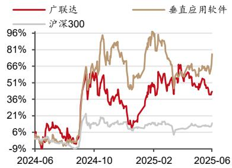  
近一年股价走势

<table><tr><td>分析师</td></tr><tr><td>郑宏达S0800524020001</td></tr><tr><td>13918906471</td></tr><tr><td>zhenghongda@research.xbmail.com.cn</td></tr><tr><td></td></tr><tr><td>周成S0800525040004</td></tr><tr><td>17749753660</td></tr><tr><td></td></tr><tr><td>zhoucheng@research.xbmail.com.cn</td></tr></table>

# 相关研究

广联达：继续聚焦盈利能力的修复一广联达(002410.SZ) 2024 年 年 报 点 评2025-03-26  
广联达：控费继续助力利润端同比改善，Q3新签云合同有所承压—广联达（002410.SZ）2024 年三季报点评 2024-11-01  
广联达：控费效果显现，Q2单季归母净利润同比增速转正—广联达(002410.SZ)2024年半年报点评 2024-08-25

# 内容目录

投资要点…. 4  
关键假设.. .4  
区别于市场的观点， ..4  
股价上涨催化剂， .4  
估值与目标价. .4  
广联达核心指标概览， ..5  
一、广联达：走在修复的道路上 ..6  
1.1 建筑业数字化平台服务商，业务覆盖建筑工程全过程 ..6  
1.2财务复盘：聚焦盈利能力的修复. ..6  
二、四个“一体化”继续支撑成本业务的韧性发展 ..9  
2.1广联达数字成本业务展现发展韧性， ..  
2.2四个“一体化”继续支撑成本业务的韧性发展. .. 10  
2.2.1 造价数据工具一体化，适配新清单下造价市场化变革的需求 .. 10  
2.2.2成本测算核算一体化，支撑工程项目精细化管理. .11  
2.2.3 新建更新一体化，助力城市更新. ..13  
2.2.4行业一体化，向基建能源领域横向拓展， .. 15  
2.2.5从经营指标侧看不同一体化解决方案可能带来的积极影响 ..15  
三、盈利预测与估值.. ..16  
3.1盈利预测... ..16  
3.1.1关键假设.  
3.1.2业绩预测. ..18  
3.2 估值与评级  
四、风险提示.. ..18

# 图表目录

图1：广联达核心指标概览图. .5  
图2：广联达围绕建筑行业数字化转型领域的产品汇总 .6  
图3：广联达营收自2023年开始出现下滑. .7  
图4：公司净利润正处于修复期. ..7  
图5：广联达营收结构的变化. .7  
图6：广联达总体毛利率和净利率情况， .8  
图7：广联达主要分项业务的毛利率. .8  
图8：广联达期间费用率（不含财务费用率) .8  
图9：广联达销售、管理及研发费率 .8  
图10：2013年至今中国每年房屋新开工面积情况. ..9  
图11：2013年至今中国每年房屋施工面积情况.. ..9  
图12：广联达数字成本业务19年以来的营收变化情况， ..9  
图13：成本业务暂未出现房屋新开工及施工面积的大幅萎缩情况 ..9  
图14：广联达数字成本业务19 年以来新签云合同变化情况. ..10  
图 15：24Q4 单季新签云合同额同比回升. .. 10  
图 16：造价数据工具一体化解决方案通过多元计价依据应对新清单要求下的市场询价和合理  
定价… .11  
图17：建筑行业产值利润率水平持续滑落，24 年创下近十年最低水平， .11  
图 18：广联达成本测算核算一体化解决方案有效支撑项目各阶段成本管控业务作业.….12  
图19：广联达数字新成本以AI算法为驱动高效完成成本测算.. ..12  
图20：新成本实时归集预算收入、目标成本和实际成本数据流. .. 12  
图21：21-24年间中国累计完成超过20万个城市更新项目， ..13  
图 22：21-24 年间中国城市更新项目投资额累计超过16 万亿元 .. 13  
图23：广联达覆盖全专业、全场景及全流程的城市更新一体化解决方案.  
图24：广联达新版算量软件加入拆除、加固等城市更新模块.. .14  
图25：广联达新版算量软件引入AI图像技术实现无图纸一键算量. ….14  
图26：相较于房地产市场，基建市场展现出显著的景气韧性.. .15  
图27：广联达行业一体化解决方案覆盖水利、光伏、公路、煤炭等11个行业领域.. ….15  
图28：24年下半年开始数字施工业务的营收同比回正.. .. 17  
图29：数字施工业务毛利率从24年上半年即开始回升. ..17  
表1：广联达数字新成本业务未来价值量测算， .13  
表2：不同一体化的解决方案对广联达数字成本业务可能带来的积极影响 .16  
表3：公司 2025 年-2027 年营业收入预测 .17  
表4：可比公司估值情况. .18

# 投资要点

# 关键假设

（1）数字造价业务：作为业绩前瞻性指标，公司去年新签云合同额同比减少 $4 \%$ ，预示今年民建市场在营收端可能仍将有一定的下滑。而考虑今年城市更新版土建算量软件的发布，9 月份新清单带来计价软件升级及工程数据信息的需求增加等，我们预计在云合同端将率先帮助数字成本业务实现边际改善。另，基建及能源领域仍然具备一定景气度，能够帮助平滑民建市场波动带来的影响。我们假定25-27 年数字成本业务的营收增速分别为. $. 3 . 2 \%$ $0 . 2 \%$ 、 $1 . 4 \%$ 。毛利率端，数字成本业务主要以标准化工具或平台软件形式呈现，假定未来三年毛利率维持在 $93 \%$ 的水平。

(2）数字施工业务：公司24 年开始对施工业务进行经营策略调整，产品侧聚焦单品，营销侧聚焦核心区域和重点客户。从结果上看，从 24 年下半年开始公司数字施工业务的营收同比回正，而毛利率从上半年即开始回升。25 年，公司继续聚焦三个核心单品（劳务、物料及塔吊)。我们假定 25-27 年数字施工业务的营收增速分别为 $20 \%$ 、 $1 5 \%$ 、 $10 \%$ 。毛利率端，假定施工业务毛利维持改善的趋势，未来三年毛利率为 $40 \%$ 、 $45 \%$ 、 $50 \%$ o

(3）数字设计业务：尚处于初创布局阶段，预计短期内公司仍将着眼于数维系列设计软件产品的迭代和打磨。部分单品如数维道路设计软件 24 年完成标杆项目打造，预计将逐步给公司带来营收增量。假定数字设计业务 25-27 年收入增速保持在 $1 5 \%$ 。另，与成本业务类似，设计业务主要以标准化工具软件产品形式呈现，假定毛利率维持在 $9 6 \%$ 的水平。

(4）海外业务：假定25-27 年保持 $10 \%$ 的增速稳健经营（参考过去3 年的CAGR)，毛利率维持在 $8 8 \%$ (海外业务亦以输出标准软件产品为主，近三年毛利率在 $8 6 \% - 8 9 \%$ 之间)。

(5）其他主营业务：涉及较多子领域，营收占比较小，我们参考过往3 年的平均水平，假定25-27 年的营收规模保持在 1.76 亿元，毛利率 $40 \%$ 。

# 区别于市场的观点

市场担心广联达数字成本业务受到房地产市场的影响，未来可能出现较大程度的规模收缩。而我们认为，这其中存在一定的预期差，数字成本业务具备保持韧性发展的基础，主要源自4 个方面：1）工程量新清单将推动造价市场化变革，带动行业对数据类产品需求的进一步增长；2）数字新成本业务使广联达从岗位级工具拓展至全过程成本管理，实现了业务覆盖面的扩张；3）城市更新为算量软件带来新的增量需求；4）基建市场展现出显著的景气韧性，公司在基建及能源领域11 个行业的拓展能够帮助抵御民建市场的波动。

# 股价上涨催化剂

9 月1 日新版《建设工程工程量清单计价标准》正式实施；公司净利润端的修复持续兑现。

# 估值与目标价

我们预计广联达25-27年营收分别为63.13亿元、65.04亿元、67.25亿元，同比增加 $1 . 2 \%$ $3 \%$ 、 $3 . 4 \%$ ，归母公司净利润分别为4.87亿元、6.01亿元、7亿元，同比增加 $9 4 . 5 \%$ $2 3 . 4 \%$ 、 $1 6 . 4 \%$ 。选取应用软件领域的金山办公、用友网络、恒生电子作为可比公司，其中金山办公、用友网络与广联达类似，均为 SaaS 类公司，而恒生电子聚焦金融IT 领域，与广联达分属于不同垂直行业的信息化龙头公司。考虑广联达在建筑行业信息化赛道的领先地位，且处于盈利修复期，预期未来三年的利润复合增速超过可比公司，给予公司 2025年 60 倍PE 的估值，目标市值 292.3 亿元，对应目标价格 17.69 元，维持“买入”评级。

# 广联达核心指标概览

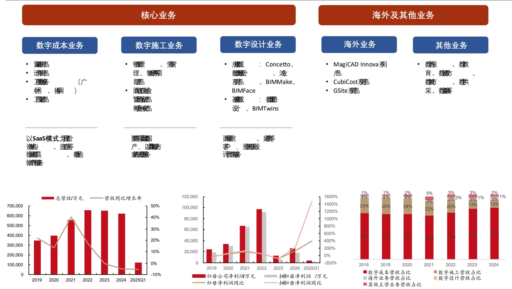  
图1：广联达核心指标概览图  
资料来源：广联达2024 年年度报告，Wind，西部证券研发中心

# 一、广联达：走在修复的道路上

# 1.1 建筑业数字化平台服务商，业务覆盖建筑工程全过程

从单一的工程造价软件厂商到建筑业数字化平台服务的领头羊。广联达是国内最早的建筑工程软件供应商之一。成立之初，公司着眼于工程概预算领域，先后开发清单计价软件、企业定额管理工具、清单算量软件。如今，公司的主营业务已全面覆盖建筑工程从设计、成本管理到施工管理的全过程，形成了以“数字设计、数字成本、数字施工”三大业务为核心的数智化产品体系。此外，公司还布局教育、金融、城市等延展性数字化解决方案，构建覆盖产业链全参与方的服务能力。

数字成本业务是公司的基本盘板块，涵盖算量系列（土建、安装、装饰、市政、钢结构等）、计价系列（覆盖民建以及公路、水利、冶金等其他11个基建及额能源行业）、工程数据服务（广材网、指标网）等产品，以SaaS 模式为工程造价咨询机构、施工企业等核心目标客户提供成本全过程数字化管理服务；

数字施工类业务聚焦项目施工阶段的物资、劳务、智能设备等管理，提供从项目级到企业级的“平台+组件”解决方案，融合IoT、AI、BIM技术，助力施工现场精细化、智能化。  
数字设计业务主要面向设计院、建设方等客户，提供三维正向设计平台与服务，涵盖房建领域的广联达数维方案设计 Concetto、数维房屋设计软件、鸿业系列产品等，以及基建领域的广联达数维道路设计软件等。  
海外业务方面，面向全球的设计院、咨询公司、施工企业提供涵盖设计、性能分析、成本、施工的全过程阶段的产品和服务，具体产品主要包括设计阶段的 MagiCAD 系列产品、成本阶段的 CubiCost系列产品，以及施工阶段的GSite 系列产品等。

<table><tr><td colspan="3">核心业务</td><td colspan="2">海外及其他业务</td></tr><tr><td colspan="3"></td><td colspan="3"></td></tr><tr><td colspan="2">数字成本业务</td><td>数字施工业务 、薷</td><td>数字设计业务 :Concetto、</td><td>海外业务 • MagiCAD Innova到</td><td>其他业务 •数服 、数</td></tr><tr><td>· 计 㭎、搁） ·程蟲</td><td>（广</td><td>理、颗 和品</td><td>数 、灃 系 、BIMMake、 BIMFace 设、BIMTwins</td><td>• CubiCost磊 •GSite</td><td>育、数 、供 采、娄</td></tr><tr><td>以Saas模式 构 轨务</td><td>、 “、施</td><td>聚国 产， 新务</td><td>面院 密 评务</td><td></td><td></td></tr></table>

资料来源：广联达24年年度报告，西部证券研发中心

# 1.2财务复盘：聚焦盈利能力的修复

# 整体营收自 23 年开始出现一定的承压，净利润自 24 年开启修复。

公司整体营收自23 年开始出现下滑，23 年、24 年及 25Q1 分别同比下降 $0 . 4 \%$ $4 . 9 \%$ 及 $5 . 5 \%$ 。而拆分业务看，数字施工业务的收缩是造成营收下滑的主要因素，24 年数字施工业务实现收入7.87亿元，相较22年的峰值下滑超过 $40 \%$ 。而背后的核心因素则是建筑行业景气度的承压，建设项目开工数量下降，施工企业对于数字化投入趋于谨慎。

19-22年间公司归母公司净利润快速增长，复合增速达到 $60 \%$ 。23年，在营收端出现承压，而成本费用端保持刚性支出的情况下，广联达净利润出现了较大幅度的下滑。而24 年通过人员规模的优化及费用端的积极管控，利润端得到了一定的修复。而参考公司发布的新一期股权激励计划，其中公司层面业绩考核指标锚定未来两年的净利润，以25 年为例，触发值3.94 亿元，目标值 5.63 亿元，表明公司经营端将继续聚焦实现盈利的持续修复。

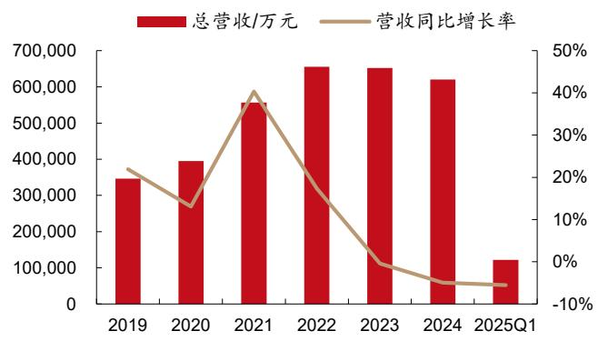  
图3：广联达营收自2023年开始出现下滑

资料来源：Wind，西部证券研发中心资料来源：Wind，西部证券研发中心

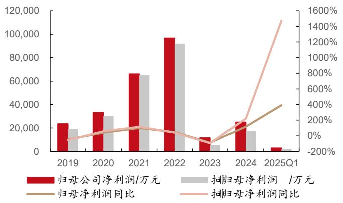  
图4：公司净利润正处于修复期

随着施工业务近几年营收规模的收缩，公司营收结构亦发生小幅变化。数字成本业务的营收占比从 21 年之前的约 $70 \%$ 逐步提升至24年的 $80 \%$ ，是公司最为核心的标杆业务。与之相反地，施工业务营收占比下降至 $13 \%$ 。而除成本及施工业务外，其他业务的营收占比均在 $5 \%$ 以下。尤其地，数字设计业务营收占比约 $1 \%$ ，仍然处于发展的初期，依旧是公司由成本及施工向上游设计端进行纵深延展的战略布局型业务。

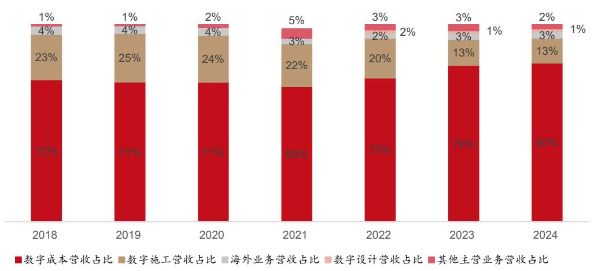  
图5：广联达营收结构的变化  
资料来源：Wind，西部证券研发中心

公司毛利率水平的波动主要受营收结构变化及施工业务的影响，凈利率水平仍处於修复阶段。

公司整体毛利率水平的波动主要受营收结构变化及施工业务的影响。成本业务、设计业务及海外业务主要以标准化软件产品的形式输出，毛利率维持在 $90 \%$ 左右的水平。而数字施工业务随着业务形态的变化（由早期为客户提供软件产品转为软硬一体的解决方案)，叠加近几年行业弱景气度下交付周期延长，毛利率由 $80 \%$ 以上下降至 23 年的低点 $3 1 . 5 \%$ 。24 年公司在施工业务战略打法上进行了调整，开始聚焦核心业务场景，打磨和推广客户刚需的项目级标准化单品，毛利率水平有所回升，但与其他类业务相比仍然较低，一定程度仍然拖累了公司整体的毛利率。

公司归母净利率侧的变化主要受到费用率的影响，波动幅度显著大于毛利率。净利率水平正处于逐步修复的阶段，25Q1 相较 24Q1 提升接近 2pct。

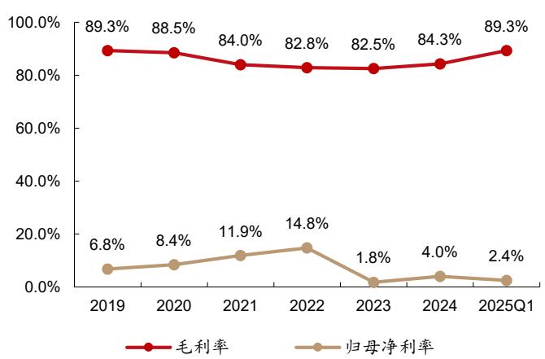  
图6：广联达总体毛利率和净利率情况

资料来源：Wind，西部证券研发中心资料来源：Wind，西部证券研发中心

  
图7：广联达主要分项业务的毛利率

费用率水平呈现波动变化，预期 25 年费用端仍将实施主动的控制。19-22 年公司各项费用率水平均呈现向下的趋势，对应这一期间公司造价软件产品由 License 授权制向订阅制转型逐步完成，营销端及研发端迈向成熟。而 23 年，营收及费用投入增速的不匹配导致了费用率的快速攀升。24 年公司销售及研发费用分别同比减少了 $1 4 . 1 \%$ 及 $6 . 6 \%$ ，带动了费用率水平的回落，管理费用的同比增加 $7 . 9 \%$ ，则主要是由于24Q1人员调整导致的一次性补偿金支出增加所致。而根据广联达投资者交流纪要中披露的信息，25Q1 公司继续对部分业务进行了调整，对相应的岗位人员进行了优化，以实现最大化的释放组织潜力。可以预期，25 年公司在费用端仍然将实施主动的控制。

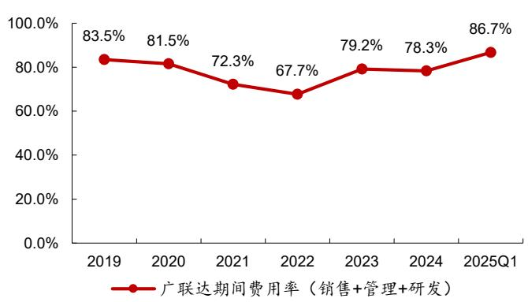  
图8：广联达期间费用率（不含财务费用率）

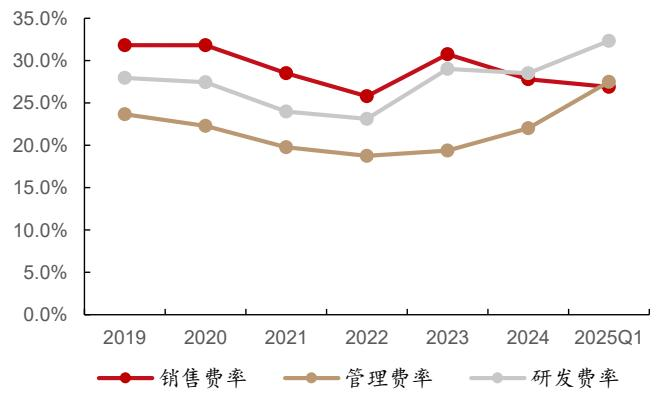  
图9：广联达销售、管理及研发费率

资料来源：Wind，西部证券研发中心资料来源：Wind，西部证券研发中心

# 二、四个“一体化”继续支撑成本业务的韧性发展

# 2.1广联达数字成本业务展现发展韧性

房地产行业正经历显著的调整。其最直观的体现是房屋新开工面积自 2020 年起呈现持续的下滑态势，标志着行业从过去依赖规模扩张的高速增长阶段，迈入以质量和效益为核心的转型发展周期。数据显示，2024 年全国房屋新开工面积约 7.4 亿平方米，相较 19 年的峰值下降约 $67 . 5 \%$ 。与之相对应地，房屋施工面积自21年触顶后，亦开始逐步下降，24年房屋施工面积约73.3 亿平米，相较 21 年下降 $2 4 . 8 \%$ 。

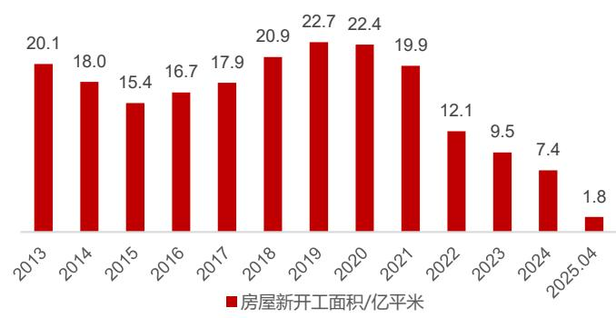  
图10：2013 年至今中国每年房屋新开工面积情况  
资料来源：Wind，西部证券研发中心

资料来源：Wind，西部证券研发中心

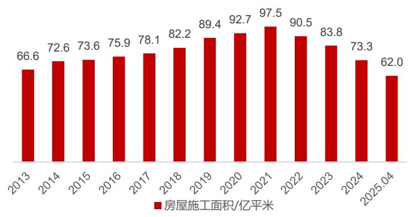  
图11：2013年至今中国每年房屋施工面积情况

广联达数字成本业务与房地产市场并不完全同频。广联达数字成本业务营收 21-23 年间仍保持增长，24 年出现小幅下滑，25Q1 同比下滑幅度与 24 年接近。尽管出现了一定的增长压力，但与房屋新开工面积及施工面积近年来所表征出来的房建市场承压的情况相比，公司的数字成本业务在业绩端显现了充足的发展韧性。拉长时间维度看，过往 13-20 年间公司成本业务的营收与每年房屋新开工面积同比变化间呈现了较强的相关性，但2020 年后随着公司造价业务向订阅制模式的转型深入，两者间的相关性明显减弱。另外也可以看到，2020 年后成本业务的营收与每年房屋整体施工面积的同比变化的相关性有所增强。这其中的原因可能是，造价软件产品贯穿工程建设项目从招投标概预算至竣工时的结算整个过程，而订阅制模式后对软件的需求与存量项目数量的相关度大于增量。

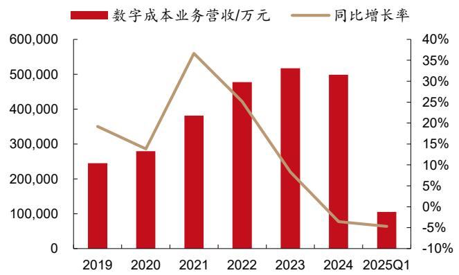  
图12：广联达数字成本业务19年以来的营收变化情况

资料来源：Wind，广联达投资者关系管理信息-20250429，西部证券研发中心数字成本业务新签云合同额亦受到建筑行业景气度的扰动，但 24 年四季度显示出了一定的边际改善迹象。成本业务新签云合同额作为前瞻指标项，能够更加真实反映目前成本业务受到下游市场影响的程度。23 年公司新签署云合同（含造价工具软件及数字新成本)表观值35.64亿元，同比下降约 $9 . 1 \%$ ，但根据公司披露的信息，23年公司主动取消了三年合同的销售政策，剔除这个影响，云合同与 22 年同期略微下降。而 24 年广联达签署云合同 34.24 亿元，同比减少约 $4 \%$ 。可以看到，云合同项受到了建筑产业景气度的影响，但相较于前述房屋新开工面积及施工面积等行业指标项，同比下降幅度相对较小。另，24Q4 单季新签云合同额是同比回升的，显示出了边际改善的迹象。

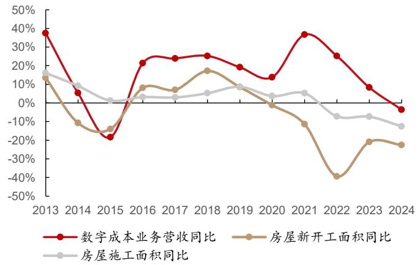  
图13：成本业务暂未出现房屋新开工及施工面积的大幅萎缩情况  
资料来源：Wind，西部证券研发中心

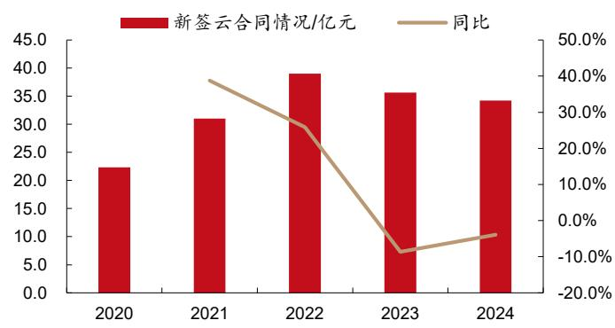  
图14：广联达数字成本业务19 年以来新签云合同变化情况  
资料来源：广联达2020 至2024 年各年度报告，西部证券研发中心

  
图15：24Q4 单季新签云合同额同比回升  
资料来源：广联达投资者关系管理信息，广联达 22 年年报及 23 年中报，西部证券研发中心

# 2.2 四个“一体化”继续支撑成本业务的韧性发展

# 2.2.1 造价数据工具一体化，适配新清单下造价市场化变革的需求

新清单计价标准发布，推动造价市场化改革。2024 年 12 月，住建部发布《建设工程工程量清单计价标准》，新的国家标准将于 2025 年9 月1 日起正式实施。这一全新标准的推行，标志着造价市场化改革进入关键阶段，为行业发展带来新的变革。新清单明确不再将政府定额和信息价作为主要计价依据，转而强调市场价格信息、工程造价数据库，以及投标人自身的装备水平、管理水平和成本消耗等多元要素，以此综合确定工程造价。这种计价规则的转变，促使行业各方更加重视市场真实数据的掌握，对增强市场意识和提升成本管控能力提出了更高要求。

面对新清单带来的变革，广联达有望凭借其深厚的技术积累和丰富的数据沉淀，迎来重要发展契机。新清单的实施，将推动市场对数据类产品的需求进一步增长，广联达旗下的指标网、采购建议价等数据类产品有望迎来发展契机，实现业务收入的提升。

广联达指标网综合单价已发布超过 93 万条的综合单价数据，覆盖本地用户常用清单数据的前 $90 \%$ ，其提供的项目成本指标及单项工程指标让项目估价及定价有数可依。而广材网为用户提供钢材、水泥、混凝土、砂石、电缆、苗木、人工机械等大宗主材的每日价格及历史价格趋势，让主材定价更加合理。另，广联达的云计价工具产品在适配新清单规则和报表格式的同时，与指标网、广材网无缝衔接，形成“工具 $^ +$ 数据服务”的一体化方案帮助用户实现快速的组价和合理定价。

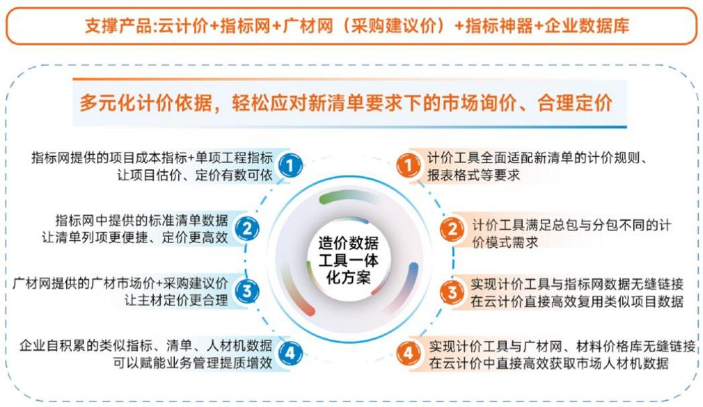  
图16：造价数据工具一体化解决方案通过多元计价依据应对新清单要求下的市场询价和合理定价  
资料来源：“广联达设计成本业务”微信公众号，西部证券研发中心

# 2.2.2 成本测算核算一体化，支撑工程项目精细化管理

在建筑行业微利化竞争与数字化转型的双重驱动下，成本管控能力已成为企业生存与发展的核心。根据中国建筑业协会发布的历年建筑业发展统中的数据，建筑行业产值利润率水平从 2014 年的 $3 . 6 \%$ 持续滑落至2024年的 $2 . 3 \%$ ，创下近十年最低水平。在这种背景下，项目成本精细化管理将从提升效益的"可选策略"转变为生存必需的"核心能力"。企业需要精准把控项目全生命周期，从前期预算编制、施工过程管控到后期成本核算，实现对人、材、机等生产要素的高效配置降低运营成本，才能够在激烈的市场竞争中占据一席之地，实现可持续发展。

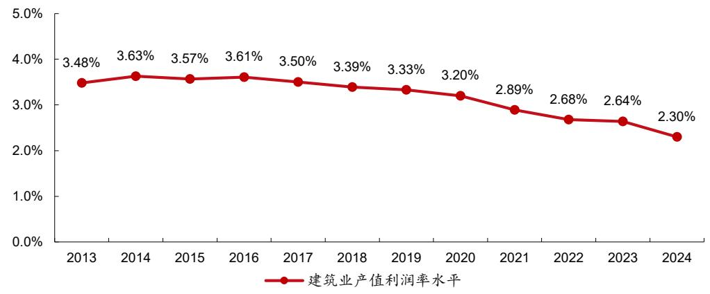  
图17：建筑行业产值利润率水平持续滑落，24 年创下近十年最低水平  
资料来源：中国建筑业协会，西部证券研发中心

# 广联达成本测算核算一体化解决方案通过构建数据驱动的全场景解决方案，帮助建筑施工企业、房地产开发商等目标客户实现精细化成本管理。

广联达成本测算核算一体化解决方案以数字新成本的产品形态呈现，其中内嵌了成本测算、成本核算、广材网、指标网及企业数据库等支撑产品。数字新成本以数据资产化、作业高效化、决策智能化为业务核心逻辑，依托BIM、云计算、AI等技术，打通项目全生命周期的成本数据闭环。通过建立统一的成本指标体系和数据中心，将设计、施工、采购等环节的业务数据沉淀为企业数据资产。以智能算量、自动拆分分包清单等功能，实现工程量计算、成本测算等核心业务的在线化和自动化。同时利用AI 算法和大数据分析，实时跟踪项目成本变动，通过多维度收支对比和数据穿透技术，精确定位成本风险点位。由此，由“数据积累-在线作业-智能分析”的闭环，帮助客户在投标决策、目标设定、过程管控等关键场景中实现降本增效，最终达成精细化成本管理目标。

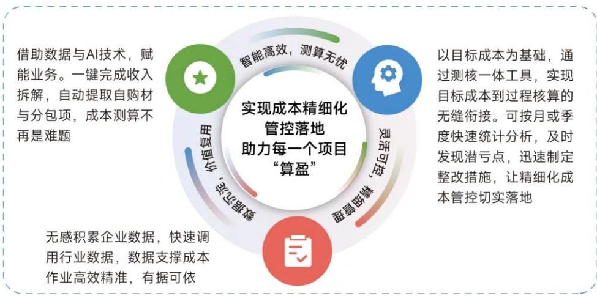  
图18：广联达成本测算核算一体化解决方案有效支撑项目各阶段成本管控业务作业  
资料来源：“广联达造价圈”微信公众号，西部证券研发中心

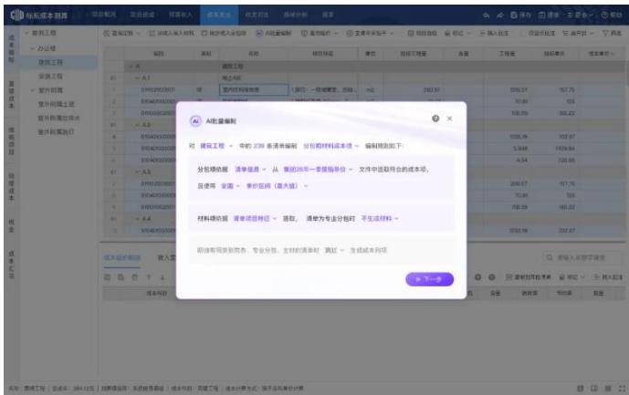  
图19：广联达数字新成本以AI算法为驱动高效完成成本测算  
资料来源：“广联达造价圈”微信公众号，西部证券研发中心

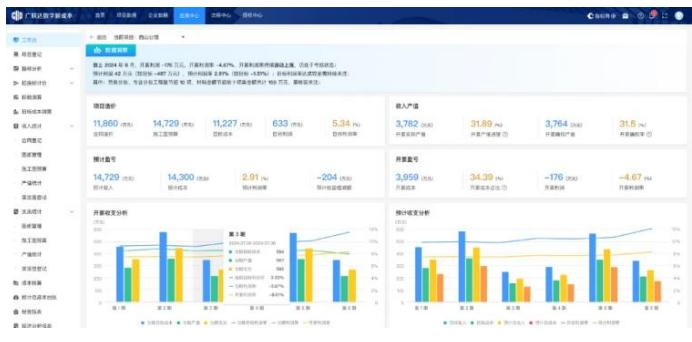  
图20：新成本实时归集预算收入、目标成本和实际成本数据流  
资料来源：“广联达造价圈”微信公众号，西部证券研发中心

我们认为，广联达数字新成本业务具备较大的潜在价值空间。经过测算，在特定的渗透率下，其未来每年能够触达的营收规模能够达到 30 亿元。其中的关键假定包括：

以具备建筑工程特级及一级资质的施工总承包企业作为核心目标客户，这部分企业所承接的项目体量大且复杂度高，在当前建筑行业产值利润率不断下滑的背景下对于成本管控的需求更加迫切。假定未来广联达数字新成本在特级及一级资质的总承包企业中分别实现 $60 \%$ 及 $30 \%$ 的渗透，且平均每家企业每年采用数字新成本解决方案的项目数分别为 20 个和10 个（若一个项目3 年的建设周期，即对应每年特一级企业5-6个新项目及一级企业3-4个新项目采用数字本方案)。

单个项目采用数字先成本方案的价格测算，参考广联达官网中给出的销售指导价，其中每个项目收支管理费用为1万元/年，另市场化计价产品单价2,400 元/节点/年，成本测算产品单价 2,400 元/节点/年，以及企业数据库单价2,400 元/节点/年（含材料库、指标库及指标神器)，假定平均每个项目 10-15 个节点，合计单一项目订阅费用约 8.2-11.8万元/年，近似按10 万元/年进行测算。

表1：广联达数字新成本业务未来价值量测算  

<table><tr><td>条目</td><td>值 公式</td></tr><tr><td>具有建筑工程特级资质的施工总承包企业数量/个 500</td><td>A</td></tr><tr><td>广联达数字新成本渗透率</td><td>60% B</td></tr><tr><td>平均每家企业每年采用数字新成本解决方案的项目数/个</td><td>20 C</td></tr><tr><td>具有建筑工程一级资质的施工总承包企业数量/个</td><td>8,000 D</td></tr><tr><td>广联达数字新成本渗透率</td><td>30% E</td></tr><tr><td>平均每家企业每年采用数字新成本解决方案的项目数/个</td><td>10 F</td></tr><tr><td>每年覆盖项目总数/个</td><td>30,000 G=A*B*C+D*E*F</td></tr><tr><td>广联达数字新成本价格（万元/项目/年)</td><td>10 H</td></tr><tr><td>广联达数字新成本价值量（亿元/年)</td><td>30 J=G*H</td></tr></table>

资料来源：“建筑业政策解读”微信公众号，“湖北省市政工程协会”微信公众号，西部证券研发中心

# 2.2.3 新建更新一体化，助力城市更新

国家围绕城市更新形成多维度支持体系。2021 年，“实施城市更新行动”被写入政府工作报告和“十四五”规划，成为新型城镇化建设的核心内容。此后，2021-2024 年间，中国城市累计实施更新项目数量超过 20 万个，投资强度在 2022 年达峰值5.8 万亿元，四年累计超过16 万亿元。2025 年5 月，中共中央办公厅、国务院办公厅发布《关于持续推进城市更新行动的意见》，部署了八项主要任务：加强既有建筑改造利用，推进城镇老旧小区整治改造，开展完整社区建设，推进老旧街区、老旧厂区、城中村等更新改造，完善城市功能，加强城市基础设施建设改造，修复城市生态系统 保护传承城市历史文化。作为城市更新领域的顶层设计，《意见》明确了推动城市更新的“时间表”、“路线图”和“施工图”。而这可能也为城市更新按下“加速键”，后续投资力度或迎加强。

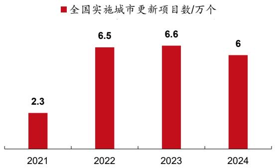  
图21：21-24年间中国累计完成超过20万个城市更新项目

资料来源：中国经营报，时代周报，中国政府网，西部证券研发中心资料来源：中国经营报，时代周报，中国政府网，西部证券研发中心城市更新政策的全面推进为工程造价软件行业的发展注入了新动能。在建筑行业面临从“规模化”向“高质量”发展的转型时期，城市更新政策为行业发展提供了新的增量。而产业结构的逐步变化，一定程度上可能也将重塑工程算量造价软件行业的发展方向。一方面，更新改造项目涉及大量拆除、加固、修缮等特殊工程，这些内容在新建项目中较少出现，需软件提供针对性的模块。另外，与新建项目相比，更新改造项目催生了更多算量场景智能化的需求。新建项目通常具备完整的设计图纸和规划数据，而更新改造项目普遍面临无图纸、数据缺失或与现状不符的问题。例如，旧改项目中常见的历史建筑可能缺乏精确的结构图纸，需依赖 3D 扫描、AI图像识别等技术重构模型。此外，软件需支持多源数据融合，如将GIS 地理信息、历史竣工图与现场实测数据整合，以应对地下管线位置不明、结构老化程度不确定等挑战。因此，随着城市更新政策的深化，具备AI识别、 $B | M + G | S$ 融合、全生命周期管理能力的软件将成为市场主流，推动行业向精细化、智能化转型。

  
图22：21-24年间中国城市更新项目投资额累计超过16万亿元

广联达推出城市更新一体化解决方案，顺应时代新需求，巩固自身竞争优势。在城市更新的大背景下，作为算量计价软件领域的龙头企业，广联达亦推出新建更新一体化解决方案。在广联达 2026 新版算量产品中，通过AI技术和智能化算法，推出了全新的装饰算量、安装算量、市政算量解决方案，应对老旧小区改造、机电安装升级、市政工程扩建等复杂需求，为建筑行业的未来趋势，即修缮与改造，提供支持。无论是无图纸算量、复杂系识别，还是市政工程的精准城，广联达都能提供高效、精准的解决方案，助力城市更新项目高效推进。

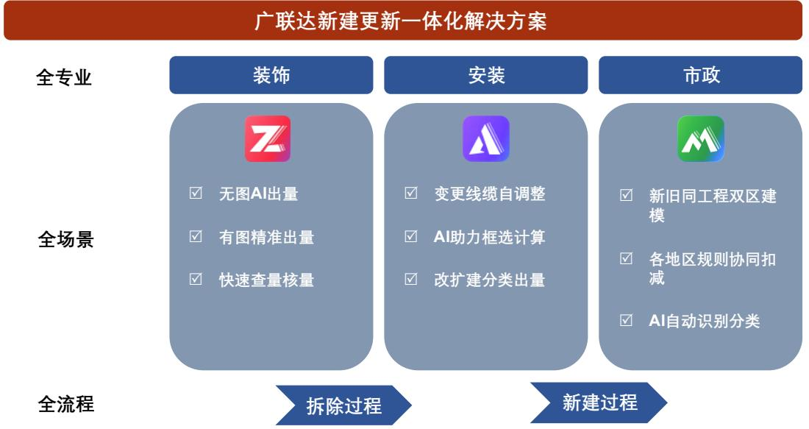  
图23：广联达覆盖全专业、全场景及全流程的城市更新一体化解决方案  
资料来源：“广联达安徽”微信公众号，西部证券研发中心

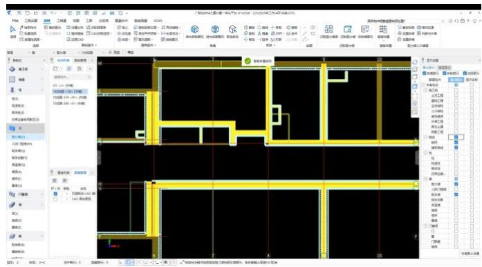  
图24：广联达新版算量软件加入拆除、加固等城市更新模块

资料来源：“广联达数字教育”微信公众号，西部证券研发中心资料来源：“广联达数字教育”微信公众号，西部证券研发中心

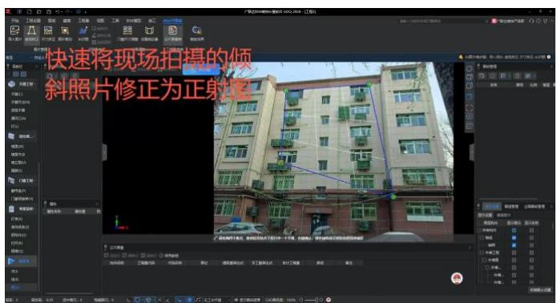  
图25：广联达新版算量软件引入AI图像技术实现无图纸一键算量

# 2.2.4 行业一体化，向基建能源领域横向拓展

相较于房地产市场，基建市场展现出显著的景气韧性。国家“十四五”规划及“双碳”目标推动下，新基建、交通强国、城市更新等战略加速落地，2024 年全国基建投资同比增长 $9 . 2 \%$ ，显著高于房地产开发投资的 $. 1 0 . 6 \%$ 。我们认为，这种分化既源于政策导向的差异，也反映出基建作为经济压舱石的战略定位，其景气度不仅为建筑业提供转型缓冲空间，更通过投资乘数效应持续拉动上下游产业链的增长。

  
图26：相较于房地产市场，基建市场展现出显著的景气韧性  
资料来源：Wind，西部证券研发中心

广联达在持续沉淀核心能力以外，拓展新行业，发展新的可能性。当前，除房建市场外，广联达造价产品还覆盖11大行业，为从事水利水电行业、农田行业、土地整理行业、电力行业、新能源发电行业、石油石化行业、公路行业、冶金行业、煤炭行业、民航行业、水工行业的工程造价业务开发工具软件。通过不同行业的业务流程的内置，并与民建的计价工具无缝衔接，可直接借用全国各地定额，同时在广材网和指标网里提供行业的计价依据，支撑客户做好业务拓展。向基建及能源领域的横向拓展，能够深刻帮助广联达抵御民建市场波动的风险。

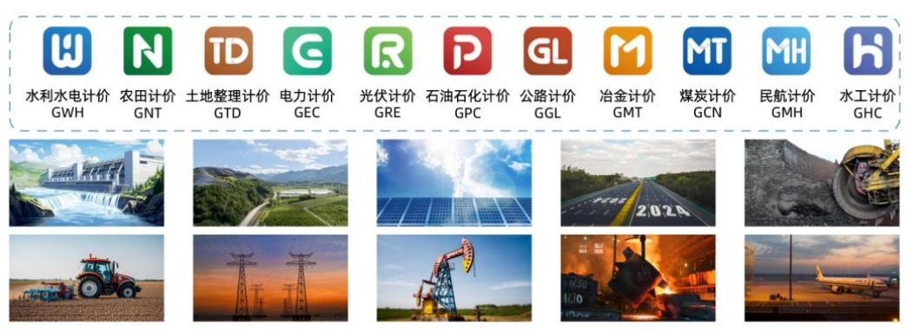  
图27：广联达行业一体化解决方案覆盖水利、光伏、公路、煤炭等11个行业领域

资料来源：“广联达造价圈”微信公众号，西部证券研发中心

# 2.2.5 从经营指标侧看不同一体化解决方案可能带来的积极影响

数字成本业务的成长可简化 ARPU值(即单一客户贡献价值）\*订阅用户数两个驱动因子。同时，SaaS 订阅模式中，续费率是反映客户留存的重要指标项。以此为衡量基准，我们从定性的角度分析，不同一体化的解决方案对广联达数字成本业务可能带来的积极影响：

造价工具数据一体化解决方案：面对新清单实施下的造价市场化改革，企业在原有工具软件的订阅基础上将新增对于工程信息等数据类产品的需求，进而推升成本业务的客单价水平。另，匹配新清单规范中的计量规则，对于工具软件本身也是一次重大的版本升级，软件的价值量会有所提高，且能够促进既有客户的留存。

成本测算核算一体化解决方案：数字新成本业务使得广联达从单一的工具软件拓展至贯穿项目全周期的成本管理，其所能覆盖的用户也从一线造价人员扩展到项目成本管理人员。因此，从可触达的用户数量以及给单一客户带来的价值量两个维度，成本测算核算一体化都能够给数成本业务带来提升。

新建更新一体化解决方案：融合了拆除、加固等新功能模块及AI 智能算量的新版算量软件的价值有所提升，同时考虑越来越多下游企业将同时承担新建和城市更新两类项目，广联达新建更新一体化解决方案无疑能够有效促进客户的续费。

行业一体化解决方案：广联达所能渗透的行业及可触达的客户数量将显著增加。

表2：不同一体化的解决方案对广联达数字成本业务可能带来的积极影响  

<table><tr><td rowspan="2">一体化解决方案</td><td colspan="3">数字成本业务营收 = 客单价ARPUX 订阅客户数量 客戶留存度指标</td></tr><tr><td>ARPU</td><td>订阅客户数量</td><td>续费率</td></tr><tr><td>造价工具数据一体化</td><td>↑</td><td></td><td>个</td></tr><tr><td>成本测算核算一体化</td><td>↑</td><td>↑</td><td></td></tr><tr><td>新建更新一体化</td><td>↑</td><td></td><td>↑</td></tr><tr><td>行业一体化</td><td></td><td>↑</td><td></td></tr></table>

资料来源：西部证券研发中心

# 三、盈利预测与估值

# 3.1盈利预测

# 3.1.1关键假设

结合前述分析，我们首先针对公司各业务领域的营收进行预测：

数字造价业务：作为业绩前瞻性指标，公司去年新签云合同额同比减少 $4 \%$ ，预示今年民建市场在营收端可能仍将有一定的下滑。而考虑今年城市更新版土建算量软件的发布，9 月份新清单带来计价软件升级及工程数据信息的需求增加等，我们预计在云合同端将率先帮助数字成本业务实现边际改善。另，基建及能源领域仍然具备一定景气度，能够帮助平滑民建市场波动带来的影响。我们假定 25-27 年数字成本业务的营收增速分别为$. 3 . 2 \%$ $0 . 2 \%$ 、 $1 . 4 \%$ 。毛利率端，数字成本业务主要以标准化工具或平台软件形式呈现，假定未来三年毛利率维持在 $93 \%$ 的水平。

数字施工业务：公司 24 年开始对施工业务进行经营策略调整，产品侧聚焦单品，营销侧聚焦核心区域和重点客户。从结果上看，从 24 年下半年开始公司数字施工业务的营收同比回正，而毛利率从上半年即开始回升。25 年，公司继续聚焦三个核心单品（劳务、物料及塔吊)。我们假定25-27 年数字施工业务的营收增速分别为 $2 0 \% , 1 5 \% , 1 0 \% ,$ 。毛利率端，假定施工业务毛利维持改善的趋势，未来三年毛利率为 $40 \%$ 、 $45 \%$ 、 $50 \%$ o数字设计业务：尚处于初创布局阶段，预计短期内公司仍将着眼于数维系列设计软件产品的迭代和打磨。部分单品如数维道路设计软件 24 年完成标杆项目打造，预计将逐步给公司带来营收增量。假定数字设计业务 25-27 年收入增速保持在 $1 5 \%$ 。另，与数字成本业务类似，数字设计业务主要以标准化工具软件产品形式呈现，假定毛利率维持在 $9 6 \%$ 的水平。

  
图28：24年下半年开始数字施工业务的营收同比回正  
资料来源：Wind，西部证券研发中心

  
图29：数字施工业务毛利率从24 年上半年即开始回升  
资料来源：Wind，西部证券研发中心

海外业务：假定 25-27 年海外业务保持 $10 \%$ 的增速稳健经营(参考过去3年的CAGR)，毛利率水平维持在 $8 8 \%$ (海外业务亦以输出标准软件产品为主，近三年毛利率在 $8 6 \% - 8 9 \%$ 之间)。

$\bullet$ 其他主营业务：涉及较多子领域，过往3-4 年营收体量在1.3亿元至2.6 亿元间，营收占比较小，我们参考过往3 年的平均水平，假定 25-27 年的营收规模保持在 1.76 亿元，毛利率 $40 \%$ 。

表3：公司2025年-2027年营业收入预测  

<table><tr><td>指标项</td><td>2023</td><td>2024</td><td>2025E</td><td>2026E</td><td>2027E</td></tr><tr><td colspan="6">数字成本业务</td></tr><tr><td>营业收入/亿元</td><td>51.70</td><td>49.86</td><td>48.29</td><td>48.40</td><td>49.10</td></tr><tr><td>同比</td><td>8.3%</td><td>-3.6%</td><td>-3.2%</td><td>0.2%</td><td>1.4%</td></tr><tr><td>毛利率</td><td>92.5%</td><td>93.4%</td><td>93.0%</td><td>93.0%</td><td>93.0%</td></tr><tr><td colspan="6">数字施工业务</td></tr><tr><td>营业收入/亿元</td><td>8.62</td><td>7.87</td><td>9.44</td><td>10.86</td><td>11.94</td></tr><tr><td>同比</td><td>-35.0%</td><td>-8.7%</td><td>20.0%</td><td>15.0%</td><td>10.0%</td></tr><tr><td>毛利率</td><td>31.5%</td><td>35.9%</td><td>40.0%</td><td>45.0%</td><td>50.0%</td></tr><tr><td colspan="6">数字设计业务</td></tr><tr><td>营业收入/亿元</td><td>0.87</td><td>0.90</td><td>1.04</td><td>1.19</td><td>1.37</td></tr><tr><td>同比</td><td>-27.3%</td><td>3.3%</td><td>15.0%</td><td>15.0%</td><td>15.0%</td></tr><tr><td>毛利率</td><td>98.1%</td><td>95.7%</td><td>96.0%</td><td>96.0%</td><td>96.0%</td></tr><tr><td colspan="6">海外业务</td></tr><tr><td>营业收入/亿元</td><td>1.94</td><td>2.03</td><td>2.24</td><td>2.46</td><td>2.71</td></tr><tr><td>同比</td><td>26.4%</td><td>5.1%</td><td>10.0%</td><td>10.0%</td><td>10.0%</td></tr><tr><td>毛利率</td><td>88.9%</td><td>87.4% 其他主营业务</td><td>88.0%</td><td>88.0%</td><td>88.0%</td></tr><tr><td colspan="6"></td></tr><tr><td>营业收入/亿元</td><td>2.12</td><td>1.36</td><td>1.76</td><td>1.76</td><td>1.76</td></tr><tr><td>同比</td><td>17.5%</td><td>-35.8%</td><td>29.4%</td><td>0.0%</td><td>0.0%</td></tr><tr><td>毛利率</td><td>33.9%</td><td>19.4% 其他</td><td>40.0%</td><td>40.0%</td><td>40.0%</td></tr><tr><td colspan="6"></td></tr><tr><td>营业收入/亿元</td><td>0.39</td><td>0.37</td><td>0.37</td><td>0.37</td><td>0.37</td></tr></table>

<table><tr><td>营业总收入/亿元</td><td>65.63</td><td>62.40</td><td>63.13</td><td>65.04</td><td>67.25</td></tr><tr><td>营业总收入-YoY</td><td>-0.4%</td><td>-4.9%</td><td>1.2%</td><td>3.0%</td><td>3.4%</td></tr><tr><td>毛利率</td><td>82.6%</td><td>84.4%</td><td>83.5%</td><td>83.5%</td><td>83.9%</td></tr></table>

资料来源：Wind，西部证券研发中心

# 3.1.2业绩预测

根据相关假设，综合各项业务，我们预计广联达 2025-2027 年营收分别为 63.13 亿元、65.04亿元、67.25亿元，同比增加 $1 . 2 \% , 3 \% , 3 . 4 \%$ ，归母公司净利润分别为4.87亿元、6.01 亿元、7 亿元，同比增加 $9 4 . 5 \%$ 、 $2 3 . 4 \%$ 、 $1 6 . 4 \%$ 。

# 3.2 估值与评级

针对广联达的估值，我们选取应用软件领域的金山办公、用友网络、恒生电子作为可比公司。其中，金山办公、用友网络与广联达类似，均为 SaaS 类公司，而恒生电子聚焦金融IT 领域，与广联达分属于不同垂直行业的信息化龙头公司。考虑广联达在建筑行业信息化赛道的领先地位，且公司处于盈利修复期，预期未来三年的利润复合增速超过可比公司，给予公司 2025 年 60 倍 PE 的估值，目标市值 292.3 亿元，对应目标价格 17.69 元，维持“买入”评级。

表4：可比公司估值情况  

<table><tr><td rowspan="2">公司名称</td><td rowspan="2">股票代码</td><td rowspan="2">市值 （亿元)</td><td colspan="4">归母公司净利润（亿元)</td><td colspan="3">PE/倍</td></tr><tr><td>2025E</td><td>2026E</td><td>2027E</td><td>24.27年</td><td>2025E</td><td>2026E</td><td>2027E</td></tr><tr><td>金山办公</td><td>688111.SH</td><td>1292.08</td><td>19.24</td><td>23.37</td><td>28.41</td><td>20.0%</td><td>67.1</td><td>55.3</td><td>45.5</td></tr><tr><td>用友网络</td><td>600588.SH</td><td>449.34</td><td>(2.08)</td><td>3.01</td><td>7.45</td><td>-</td><td>-</td><td>149.5</td><td>60.3</td></tr><tr><td>恒生电子</td><td>600570.SH</td><td>611.04</td><td>12.33</td><td>14.18</td><td>16.64</td><td>16.8%</td><td>49.5</td><td>43.1</td><td>36.7</td></tr><tr><td>平均</td><td>-</td><td>-</td><td>-</td><td>-</td><td>-</td><td>-</td><td>58.3</td><td>82.6</td><td>47.5</td></tr><tr><td>广联达</td><td>002410.SZ</td><td>220.37</td><td>4.87</td><td>6.01</td><td>7.00</td><td>40.9%</td><td>45.2</td><td>36.7</td><td>31.5</td></tr></table>

资料来源：Wind，西部证券研发中心，除广联达外其余公司盈利数据为 Wind 一致性预测值（截至2025 年6 月25日）

# 四、风险提示

建筑行业景气度持续承压的风险：如若建筑行业景气度受房地产市场影响而持续承压，新开工项目数量继续减少，设计、造价、施工等产业链上的企业整体盈利能力下降，资本开支收缩。下游的波动和低迷将导致客户对公司产品的需求降低或延迟执行，进而影响公司盈利水平。

新产品拓展不及预期的风险：如若对公司数字新成本、融合城市更新模块的新版算量软件等产品，客户接受度不及预期，无法带来ARPU 值或订阅客户数量的提升，则公司未来的成长可能受到影响。

基建及能源市场拓展不及预期的风险：公司在基建及能源市场的拓展是抵御民建市场波动的重要保障，如若公司成本、施工等相关产品在基建及能源领域拓展不及预期，则公司整体经营韧性将有所削弱。

数字施工业务毛利率改善不及预期的风险：如若未来数字施工业务无法形成规模效应推销成本，毛利率依旧处于低位，则其仍将继续拖累公司整体的盈利能力。

技术革新的风险：人工智能等前沿技术未来可能也将深刻影响着建筑行业，未来若公司不能持续保持技术创新，则可能面临竞争优势被削弱、市场占有率降低等风险，进而对公司的经济效益及发展前景造成不利影响。

财务报表预测和估值数据汇总  

<table><tr><td>资产负债表（百万元）</td><td>2023</td><td>2024</td><td>2025E</td><td>2026E</td><td>2027E</td><td>利润表（百万元)</td><td>2023</td><td>2024</td><td>2025E</td><td>2026E</td><td>2027E</td></tr><tr><td>现金及现金等价物</td><td>3,697</td><td>3,905</td><td>4,370</td><td>5,155</td><td>5,986</td><td>营业收入</td><td>6,563</td><td>6,240</td><td>6,313</td><td>6,504</td><td>6,725</td></tr><tr><td>应收款项</td><td>942</td><td>887</td><td>871</td><td>724</td><td>648</td><td>营业成本</td><td>1,141</td><td>972</td><td>1,041</td><td>1,076</td><td>1,084</td></tr><tr><td>存货净额</td><td>49</td><td>50</td><td>59</td><td>54</td><td>57</td><td>营业税金及附加</td><td>50</td><td>53</td><td>63</td><td>65</td><td>67</td></tr><tr><td>其他流动资产</td><td>138</td><td>73</td><td>120</td><td>110</td><td>101</td><td>销售费用</td><td>2,008</td><td>1,725</td><td>1,639</td><td>1,639</td><td>1,688</td></tr><tr><td>流动资产合计</td><td>4,826</td><td>4,915</td><td>5,421</td><td>6,044</td><td>6,793</td><td>管理费用</td><td>3,159</td><td>3,133</td><td>2,970</td><td>2,955</td><td>3,013</td></tr><tr><td>固定资产及在建工程</td><td>1,525</td><td>1,527</td><td>1,431</td><td>1,336</td><td>1,240</td><td>财务费用</td><td>(25)</td><td>（18)</td><td>(25)</td><td>(23)</td><td>(22)</td></tr><tr><td>长期股权投资</td><td>271</td><td>247</td><td>287</td><td>268</td><td>267</td><td>其他费用/(-收入)</td><td>62</td><td>57</td><td>17</td><td>26</td><td>24</td></tr><tr><td>无形资产</td><td>1,647</td><td>1,627</td><td>1,619</td><td>1,609</td><td>1,513</td><td>营业利润</td><td>170</td><td>318</td><td>608</td><td>766</td><td>871</td></tr><tr><td>其他梳动资产</td><td>2,407</td><td>1,916</td><td>1,895</td><td>1,890</td><td>1,881</td><td>营业外净收支</td><td>(19)</td><td>(8)</td><td>(18)</td><td>(17)</td><td>(16)</td></tr><tr><td>梳动资产合计</td><td>5,850</td><td>5,316</td><td>5,232</td><td>5,104</td><td>4,902</td><td>利润总额</td><td>150</td><td>310</td><td>590</td><td>749</td><td>854</td></tr><tr><td>资产总计</td><td>10,676</td><td>10,231</td><td>10,653</td><td>11,147 11,694</td><td></td><td>所得税费用</td><td>31</td><td>39</td><td>78</td><td>116</td><td>117</td></tr><tr><td>短期借款</td><td>3</td><td>8</td><td>5</td><td>5</td><td>6</td><td>净利润</td><td>119</td><td>271</td><td>513</td><td>633</td><td>737</td></tr><tr><td>应付款项</td><td>4,109</td><td>4,015</td><td>4,228</td><td>4,332</td><td>4,424</td><td>少数股东损益</td><td>3</td><td>20</td><td>26</td><td>32</td><td>37</td></tr><tr><td>其他流动负债</td><td>37</td><td>40</td><td>34</td><td>37</td><td>37</td><td>归属於母公司凈利润</td><td>116</td><td>250</td><td>487</td><td>601</td><td>700</td></tr><tr><td>流动负债合计</td><td>4,149</td><td>4,063</td><td>4,267</td><td>4,374</td><td>4,467</td><td></td><td></td><td></td><td></td><td></td><td></td></tr><tr><td>长期借款及应付债券</td><td>0</td><td>0</td><td>0</td><td>0</td><td>0</td><td>财务指标</td><td>2023</td><td>2024</td><td>2025E</td><td>2026E</td><td>2027E</td></tr><tr><td>其他长期负债</td><td>149</td><td>89</td><td>135</td><td>124</td><td>116</td><td>盈利能力</td><td></td><td></td><td></td><td></td><td></td></tr><tr><td>长期负债合计</td><td>149</td><td>89</td><td>135</td><td>124</td><td>116</td><td>ROE</td><td>1.9%</td><td>4.2%</td><td>8.1%</td><td>9.6%</td><td>10.5%</td></tr><tr><td>负债合计</td><td>4,297</td><td>4,152</td><td>4,402</td><td>4,499</td><td>4,584</td><td>毛利率</td><td>82.6%</td><td>84.4%</td><td>83.5%</td><td>83.5%</td><td>83.9%</td></tr><tr><td>股本</td><td>1,665</td><td>1,652</td><td>1,652</td><td>1,652</td><td>1,652</td><td>营业利润率</td><td>2.6%</td><td>5.1%</td><td>9.6%</td><td>11.8%</td><td>12.9%</td></tr><tr><td>股东权益</td><td>6,379</td><td>6,080</td><td>6,251</td><td>6,649</td><td>7,111</td><td>销售净利率</td><td>1.8%</td><td>4.3%</td><td>8.1%</td><td>9.7%</td><td>11.0%</td></tr><tr><td rowspan="3">负债和股东权益总计</td><td>10,676</td><td>10,231</td><td>10,653</td><td>11,147</td><td>11,694</td><td>成长能力</td><td></td><td></td><td></td><td></td><td></td></tr><tr><td></td><td></td><td></td><td></td><td></td><td>营业收入增长率</td><td>-0.4%</td><td>-4.9%</td><td>1.2%</td><td>3.0%</td><td>3.4%</td></tr><tr><td>2023</td><td>2024</td><td>2025E</td><td>2026E</td><td>2027E</td><td>营业利润增长率</td><td>-84.5%</td><td>87.3%</td><td>91.6%</td><td>25.9%</td><td>13.6%</td></tr><tr><td>净利润</td><td>119</td><td>271</td><td>513</td><td>633</td><td>737</td><td>归母净利润增长率</td><td>-88.0%116.2%</td><td></td><td>94.5%</td><td>23.4%</td><td>16.4%</td></tr><tr><td>折旧摊销</td><td>406</td><td>444</td><td>367</td><td>403</td><td>401</td><td>偿债能力</td><td></td><td></td><td></td><td></td><td></td></tr><tr><td>利息费用</td><td>(25)</td><td>（18)</td><td>(25)</td><td>(23)</td><td>(22)</td><td>资产负债率</td><td>40.3%</td><td>40.6%</td><td>41.3%</td><td>40.4%</td><td>39.2%</td></tr><tr><td>其他</td><td>137</td><td>497</td><td>221</td><td>268</td><td>179</td><td>流动比</td><td>1.16</td><td>1.21</td><td>1.27</td><td>1.38</td><td>1.52</td></tr><tr><td>经营活动现金流</td><td>637</td><td>1,194</td><td>1,076</td><td>1,280</td><td>1,294</td><td>速动比</td><td>1.15</td><td>1.20</td><td>1.26</td><td>1.37</td><td>1.51</td></tr><tr><td>资本支出</td><td>(288)</td><td>(61）</td><td>(254)</td><td>（284)</td><td>(206)</td><td></td><td></td><td></td><td></td><td></td><td></td></tr><tr><td>其他</td><td>(381)</td><td>(292)</td><td>(53)</td><td>0</td><td>0</td><td>每股指标与估值</td><td>2023</td><td>2024</td><td>2025E</td><td>2026E</td><td>2027E</td></tr><tr><td>投资活动现金流</td><td>(669)</td><td>(353)</td><td>(307)</td><td>(284)</td><td>(206)</td><td>每股指标</td><td></td><td></td><td></td><td></td><td></td></tr><tr><td>债务融资</td><td>24</td><td>11</td><td>30</td><td>22</td><td>21</td><td>EPS</td><td>0.07</td><td>0.15</td><td>0.29</td><td>0.36</td><td>0.42</td></tr><tr><td>权益融资</td><td>(64)</td><td>(182)</td><td>(334)</td><td>(233)</td><td>(278)</td><td>BVPS</td><td>3.56</td><td>3.61</td><td>3.70</td><td>3.92</td><td>4.17</td></tr><tr><td>其它</td><td>(580)</td><td>(454)</td><td>0</td><td>0</td><td>0</td><td>估值</td><td></td><td></td></table>

数据来源：公司财务报表，西部证券研发中心

西部证券—投资评级说明  

<table><tr><td>行业评级</td><td>超配： 中配： 低配：</td><td>行业预期未来6-12个月内的涨幅超过市场基准指数10%以上 行业预期未来6-12个月内的波动幅度介于市场基准指数-10%到10%之间 行业预期未来6-12个月内的跌幅超过市场基准指数10%以上</td></tr><tr><td>公司评级</td><td>买入： 增持： 中性：</td><td>公司未来6-12个月的投资收益率领先市场基准指数20%以上 公司未来6-12个月的投资收益率领先市场基准指数 5%到 20%之间 公司未来6-12个月的投资收益率与市场基准指数变动幅度相差-5%到5%</td></tr></table>

报告中所涉及的投资评级采用相对评级体系，基于报告发布日后 6-12 个月内公司股价（或行业指数）相对同期当地市场基准指数的市场表现预期。其中，A 股市场以沪深 300 指数为基准；香港市场以恒生指数为基准；美国市场以标普 500 指数为基准。

# 分析师声明

本人具有中国证券业协会授予的证券投资咨询执业资格并注册为证券分析师，以勤勉的职业态度、专业审慎的研究方法，使用合法合规的信息，独立、客观地出具本报告。本报告清晰准确地反映了本人的研究观点。本人不曾因，不因，也将不会因本报告中的具体推荐意见或观点而直接或间接收到任何形式的补偿。

# 联系地址

联系地址：上海市浦东新区耀体路 276 号12 层北京市西城区丰盛胡同 28号太平洋保险大厦513室深圳市福田区深南大道 6008号深圳特区报业大厦10C

联系电话：021-38584209

# 免责声明

本报告由西部证券股份有限公司（已具备中国证监会批复的证券投资咨询业务资格）制作。本报告仅供西部证券股份有限公司（以下简称“本公司”机构客户使用。本报告在未经本公司公开披露或者同意披露前，系本公司机密材料，如件人（或收到的电子邮件含错误信息)，请立即通知发件人，及时删除该邮件及所附报告并予以保密。发送本报告的电子邮件可能含有保密信息、版权专有信息或私人信息，未经授权者请勿针对邮件内容进行任何更改或以任何方式传播、复制、转发或以其他任何形式使用，发件人保留与该邮件相关的一切权利。同时本公司无法保证互联网传送本报告的及时、安全、无遗漏、无错误或无病毒，敬请谅解。

本报告基于已公开的信息编制，但本公司对该等信息的真实性、准确性及完整性不作任何保证。本报告所载的意见、评估及预测仅为本报告出具日的观点和判断，该等意见、评估及预测在出具日外无需通知即可随时更改。在不同时期，本公司可能会发出与本报告所载意见、评估及预测不一致的研究报告。同时，本报告所指的证券或投资标的的价格、价值及投资收入可能会波动。本公司不保证本报告所含信息保持在最新状态。对于本公司其他专业人士（包括但不限于销售人员、交易人员）根据不同假设、研究方法、即时动态信息及市场表现，发表的与本报告不一致的分析评论或交易观点，本公司没有义务向本报告所有接收者进行更新。本公司对本报告所含信息可在不发出通知的情形下做出修改，投资者应当自行关注相应的更新或修改。

本公司力求报告内容客观、公正，但本报告所载的观点、结论和建议仅供投资者参考之用，并为购买或出售证券或其他投资标的的邀请或保证。客户不应以本报告取代其独立判断或根据本报告做出决策。该等观点、建议并未考虑到获取本报告人员的具体投资目的、财务状况以及特定需求，在任何时候均不构成对客户私人投资建议。投资者应当充分考虑自身特定状况，并完整理解和使用本报告内容，不应视本报告为做出投资决策的唯一因素，必要时应就法律、商业、财务、税收等方面咨询专业财务顾问的意见。本公司以往相关研究报告预测与分析的准确，不预示与担保本报告及本公司今后相关研究报告的表现。对依据或者使用本报告及本公司其他相关研究报告所造成的一切后果，本公司及作者不承担任何法律责任。

在法律许可的情况下，本公司可能与本报告中提及公司正在建立或争取建立业务关系或服务关系。因此，投资者应当考虑到本公司及/或其相关人员可能存在影响本报告观点客观性的潜在利益冲突。对于本报告可能附带的其它网站地址或超级链接，本公司不对其内容负责，链接内容不构成本报告的任何部分，仅为方便客户查阅所用，浏览这些网站可能产生的费用和风险由使用者自行承担。

本公司关于本报告的提示（包括但不限于本公司工作人员通过电话、短信、邮件、微信、微博、博客、QQ、视频网站、百度官方贴吧、论坛、BBS）仅为研究观点的简要沟通，投资者对本报告的参考使用须以本报告的完整版本为准。

本报告版权仅为本公司所有。未经本公司书面许可，任何机构或个人不得以翻版、复制、发表、引用或再次分发他人等任何形式侵犯本公司版权。如征得本公司同意进行引用、刊发的，需在允许的范围内使用，并注明出处为“西部证券研究发展中心”，且不得对本报告进行任何有悖原意的引用、删节和修改。如未经西部证券授权，私自转载或者转发本报告，所引起的一切后果及法律责任由私自转载或转发者承担。本公司保留追究相关责任的权力。所有本报告中使用的商标、服务标记及标记均为本公司的商标、服务标记及标记。

本公司具有中国证监会核准的“证券投资咨询”业务资格，经营许可证编号为：91610000719782242D。