广联达(002410)

# 大模型助力智慧建筑未来可期，新成本产品加倍云收入空间——广联达点评报告

# 投资要点

核心逻辑：公司是中国领先的智慧建筑平台型软件厂商，公司将迎来AI带动估值提升 $+$ 业绩超预期的戴维斯双击。

# 超预期逻辑

1、市场预期：一方面市场还没有考虑假设AI大模型引入建筑类工具软件，是否要对未来格局进行重估。另一方面，市场担心公司 2022 年造价产品云转型结束后，未来云收入增长弹性不足。

2、我们认为：

1）公司业务超预期：AI大模型有望在建筑行业多点应用，公司是最有希望落地智慧建筑类产品的公司，因此AI大模型有望带动公司的估值提升。

2）公司业绩超预期：新成本业务的市场空间约为245 亿，可以重塑一个造价业务，有望提升公司云收入增长，增强中长期云业务成长空间和确定性。

# □驱动因素：

1、AI大模型驱动估值：以GPT4为代表的各类大模型开始不断推出，他们提升了全行业智能化水平，并最先在工具类软件和图形软件上应用。广联达作为工具型软件厂商和建筑垂直领域的龙头厂商，可接入大模型，获得更强的技术赋能，打造智能化建筑产品，实现成本减低和收入提升。

2、数字新成本带动收入：建筑行业的业主和施工方有强烈的降本增效动力，数字新成本的市场空间超预期，我们测算，该产品的市场空间245 亿，给广联达带来的收入空间119 亿。另外，数字新成本的产品意义超预期。一方面，数字新成本是广联达帮助客户形成数据要素资产的重要产品。另一方面，数字新成本可以向上可以联动建筑的设计和造价环节，向下可以联动施工环节，可以带动广联达设计、造价、施工产品的销售。

# 】检验与催化

1、检验指标：新成本平台的新增合同情况等，各类大模型推出的节奏，公司智能产品不断推出。

2、催化剂：公司“九三计划”不断披露等。

# 研究价值

1、与众不同的认识：市场认为公司云转型后未来增长的弹性可能不足。我们认为AI大模型应用能为公司带来新的增长点，同时也能降低成本费用，叠加新成本业务带来的远期空间，未来利润率有望提升。

2、与前不同的认识：以前认为公司未来的增长主要靠新成本平台业务。现在认为大模型可全面赋能建筑行业应用带来收入提升，认知变化原因为大模型进展超预期。

# 盈利预测和估值

1、预计23-25 年营收 $8 5 . 8 6 / 1 1 1 . 2 9 / 1 4 0 . 1 4$ 亿 $( + 3 0 . 2 8 \% / 2 9 . 6 1 \% / 2 5 . 9 2 \%$ ），归母净利润13.03/18.56/25.20亿 $+ 3 4 . 8 3 \% / 4 2 . 4 1 \% / 3 5 . 7 7 \%$ )，EPS为1.09/1.56/2.12元。

2、在估值角度，选取AI工具类软件公司和云服务公司金山办公、用友网络作为可比公司，给与公司2023 年109 倍 PE，公司 2023 年的目标市值是 1417 亿，维持“买入”评级。

# 风险提示

1、全行业和公司产品的智能化产品落地速度不及预期的风险。

2、公司云化产品推进速度不及预期的风险。

# 投资评级：买入(维持)

分析师：刘雯蜀 执业证书号：s1230523020002 liuwenshu03@stocke.com.cn

分析师：李佩京执业证书号：S1230522060001lipeijing@stocke.com.cn

<table><tr><td>基本数据</td></tr><tr><td>收盘价 Y65.00</td></tr><tr><td>总市值(百万元) 77,440.15</td></tr><tr><td>总股本(百万股) 1,191.39</td></tr></table>

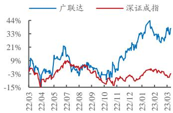  
股票走势图

# 相关报告

1《Q4施工业务暂时承压，新成本业务有望带动业绩成长》  
2023.02.21  
2《大踏步走向云化第二阶段——新成本平台激活客户数据价值——广联达深度报告》  
2023.02.03  
3《业绩高增长，股票激励彰显发展信心——广联达2022 年三季报点评》 2022.10.31

3、公司客户主要是业主方、施工方等，容易受到基建、房建投资和建设周期影响，业绩具有周期性风险。

4、全行业在短期内AI相关公司股价已上涨较多的风险。

财务摘要   

<table><tr><td>(百万元)</td><td>2022A</td><td>2023E</td><td>2024E</td><td>2025E</td></tr><tr><td>营业收入</td><td>6,591</td><td>8,586</td><td>11,129</td><td>14,014</td></tr><tr><td>(+/-) (%)</td><td>17.29%</td><td>30.28%</td><td>29.61%</td><td>25.92%</td></tr><tr><td>归母净利润</td><td>967</td><td>1,303</td><td>1,856</td><td>2,520</td></tr><tr><td>(+/-) (%)</td><td>46.26%</td><td>34.83%</td><td>42.41%</td><td>35.77%</td></tr><tr><td>每股收益(元)</td><td>0.81</td><td>1.09</td><td>1.56</td><td>2.12</td></tr><tr><td>P/E</td><td>80.10</td><td>59.41</td><td>41.72</td><td>30.73</td></tr></table>

资料来源：wind，浙商证券研究所

# 正文目录

# 业务逻辑超预期：AI大模型有望在建筑行业多点应用并为公司带来“价值涌现”

1.1行业：生成式AI大模型已在建筑业内逐步落地 .5  
1.2 为什么广联达最有望实现建筑智能化模型的落地？ .6  
1.3 广联达落地的产品和功能？ ….8  
1.4AI大模型能给广联达带来什么？. 9

# ！远期业绩超预期：新成本业务有望打开公司长期成长空间..

2.1商业模式：SaaS订阅制 $^ +$ 增值数据包，可为客户提供多样性选择. .11  
2.2 新成本平台开辟了新领域，市场空间有望达到 245亿，公司年创收有望达到 120亿， .12  
2.3短期：新成本平台客户粘性强，有望为公司贡献持续增长动力.. .13  
2.4 中期：打通建造全生命周期，有望带动设计、造价、施工业务实现放量. ..14  
2.5 长期：全产品线智能化升级可期，建筑业数据价值有望逐步释放. ..15

# 3盈利预测和估值… 1

# 4 风险提示……

# 图表目录

图1：Microsoft 365 Copilot. ….5图2：ChatGPT 插件… …………… …….5图3：Midjourney 中快速生成以三一重工集团企业 logo 和手稿为底图的科技感雕塑方案. ……………… …….6图4：某项目中Stable Diffusion通过设计师的手稿快速形成效果图. ….图5：数据 $^ +$ 项目 $+$ 客户积累…… …6图 6：广联达具备深厚的垂直领域积累.. ……………… ….7图7：申万计算机行业软件开发及IT服务公司2021 年排名. ….图8：公司研发投入持续提升（亿元、 $\%$ ) ….8图9：广联达智能组价.. ….图10：广联达蜂鸟盒子.. ….9图11：AI技术的应用可为公司带来收入增长和成本费用的降低. … ……. 10图12：行业典型上市房企整体利润率水平及变动 $1 \%$ ) . ….11图13：广联达数字新成本平台架构.. 11图14：公司产品演进图…  
图15：广联达数字新成本平台web 登录界面 ….1图16：建设方、施工方项目案例... ….1图17：广联达AI开放平台功能及产品. …… …. 16表1：潜在市场空间预计-按项目数， …. 12表2：潜在市场空间预计-按客户数. ….1表3：公司收入空间.. …. 13表4：公司产品清单. … …… …… 15表5：盈利预测（亿元、 $\%$ ) 17表6：可比公司情况（亿元，2023.3.24） …. 17表附录：三大报表预测值.

# 1业务逻辑超预期：AI大模型有望在建筑行业多点应用并为公司带来“价值涌现”

# 1.1 行业：生成式 AI大模型已在建筑业内逐步落地

AI大模型从根本上上简化了人机沟通成本，其中的 ChatGPT是一种強大的语言生成工具，多模态大模型也在不断推出，这一类大模型均具有改变建筑行业的潜力。建筑师、造价员等专业工种，均可以利用AI大模型的能力。

场景一：从微软在Office 中添加了强大的GPT-4 功能，在近期推出Microsoft365 Copilot 全家桶看来，工具软件是 AI 大模型最好的落地场景之一。建筑师、造价员均需要专业工具软件来应对日常工作，比如设计软件和造价软件等。若将这一类工具性软件比于文书类工作软件 Office，office 中嵌入的 GPT的超强智能处理能力，也可以同样适用于建筑类的工具软件中。

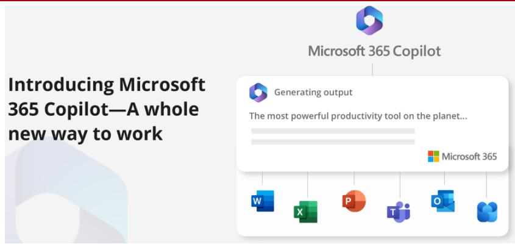  
图1:Microsoft 365 Copilot   
资料来源：AglilzTech、Microsoft、浙商证券研究所

场景二：建筑师、造价员等都要应对各类的甲方需求，需要不断的沟通和服务来加强和客户的沟通和协作，借助基于 ChatGPT 的插件，建筑师可以更有效地沟通和协作，生成详细的设计文档，并探索新的创新设计理念。这项技术可以帮助建筑师提高效率、生产力，从而在实践中取得更大的成功。

  
图2：ChatGPT插件  
资料来源：OSCHINA、开源资讯、浙商证券研究所

场景三：建筑设计等领域，AI大模型可以帮助建筑师简化设计流程，并增强创造力。目前建筑领域已开始有 AI 大模型应用。基于 GPT 和耗散模型 (Diffusion Models) 的各种大模型生成式AI(AIGC) 技术的迅速发展，也催生了OpenAI、Anthropic、MidJourney和

Stability AI等一批新的独角兽公司，根据奥雅股份，MidJourney 生成的图片更加具有发散性和不确定性，可用于方案初期设计，而 Stable Diffusion 可让配合包括 ControlNet 在内的插件，让设计师实现多次微调，快速从手稿生成效果图。

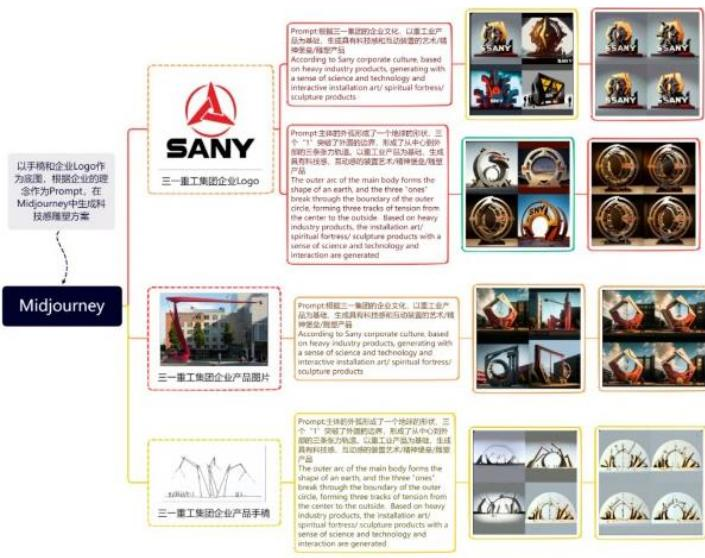  
图3：Midjourney 中快速生成以三一重工集团企业 logo和手稿为底图的科技感雕塑方案  
资料来源：MidJourney、深圳奥雅设计股份有限公司、浙商证券研究所

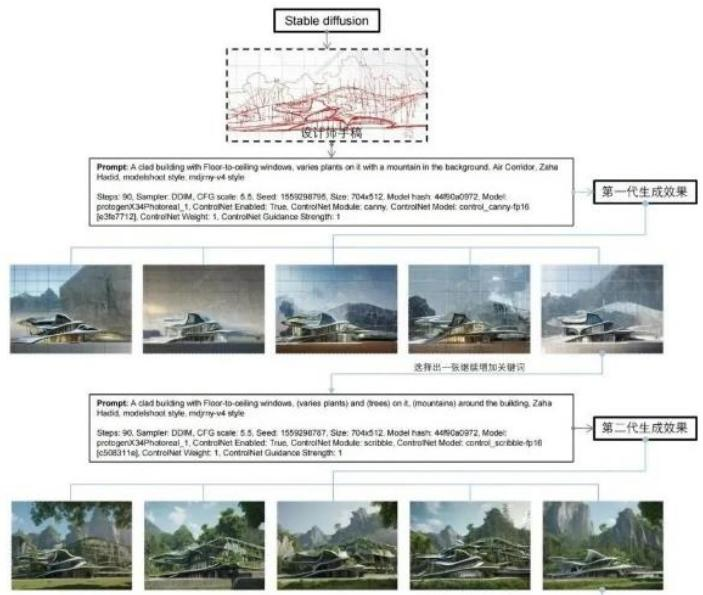  
图4：某项目中Stable Diffusion 通过设计师的手稿快速形成效果图  
资料来源：深圳奥雅设计股份有限公司、浙商证券研究所

# 1.2 为什么广联达最有望实现建筑智能化模型的落地?

与通用大模型厂商相比，公司在垂直领域积累深厚、研发投入大、落地场景丰富且具体，有望率先受益与于大模型的发展：

（1）公司具备海量数据积淀、丰富的项目经验、深厚的客户关系

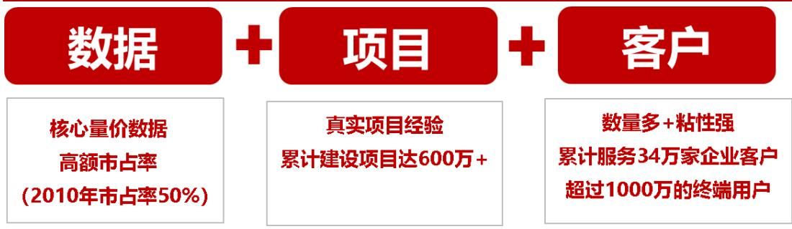  
图5：数据 $^ +$ 项目+客户积累  
资料来源：wind、公司官网、浙商证券研究所

数据：造价业务涉及建筑项目的核心量价数据，是公司AI训练的数据基石。根据wind，公司2010 年上市时的造价产品市占率就已超过 $50 \%$ ，2022 年公司数字造价业务收入47.73亿，市占率遥遥领先；

案例：持续累积真实项目经验。以新成本平台为例，客户在初次上线前，需要先将历史项目经验及数据进行标准化并导入平台，后续使用过程中的标准模板、数据也全部沉淀在平台数据库中，根据公司官网，公司已累计建设项目达600万 $^ +$ ，不同种类的项目经验不断累积可为AI训练提供丰富的案例库；

客户：1）客户数量多，根据公司官网，公司已累计服务了34万家企业客户和超过1000 万的终端用户，客户粘性不断增强。2）客户粘性强：2022 年公司造价业务脱离项目制，完成了全面云转型，高度标准化的产品有望带来网络效应，订阅制付费模式将不断培养客户心智和付费习惯，持续提升品牌价值。

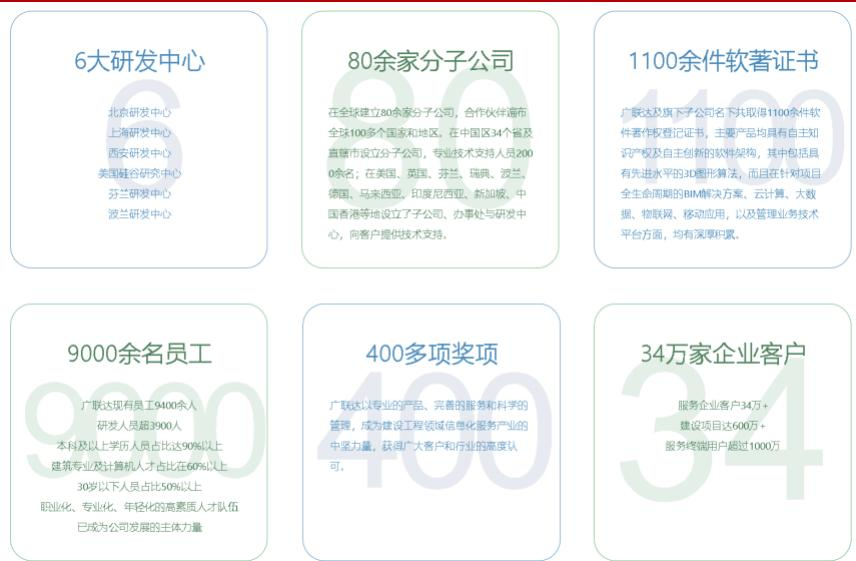  
图6：广联达具备深厚的垂直领域积累  
资料来源：公司官网、浙商证券研究所

# （2）收入规模大的公司，更有能力投入到这一轮的AI智能化对决中

大模型训练的资金门槛较高，参数量的使用与算力成正相关，训练所需金额随着模型参数的提升而上升。根据 21 世纪经济报道、IDC 指出，基于参数数量和 token数量估算，GPT-3 训练一次的成本约为 140 万美元；对于一些更大的 LLM模型，比如拥有2800亿参数的Gopher和拥有5400 亿参数的 PaLM，采用同样的公式可得出，训练成本介于200万-1200 万美元之间，以GPT-3.5为模型的ChatGPT模型，则需要460 万-500万美元。

公司研发投入位于国内前列。根据 wind，申万计算机行业中软件开发及IT服务公司共有260家，2021年公司营业总收入排名第30位、研发费用排名第10位、研发费用率排名第19位；2018-2022公司研发投入从7.27亿提升至15.15亿，CAGR达到 $2 0 . 1 5 \%$ ，公司持续进行造价大数据及AI应用项目研发，结合当前市场需求和技术发展趋势，融合人工智能、大数据、云计算等技术，升级在细分专业领域造价的产品，推动产品向云 $^ +$ 端 $+ .$ 数据持续迭代。

图7：申万计算机行业软件开发及IT服务公司2021 年排名  

<table><tr><td>排名</td><td>证券简称</td><td>营业总收入(亿)</td><td>排</td><td></td><td>证券简称研发费用（亿）</td><td>排名</td><td>证券简称</td><td>研发人员（人）</td></tr><tr><td>1</td><td>A1</td><td>1.223.85</td><td>1</td><td>A2</td><td>43.38</td><td>1</td><td>A3</td><td>10.350</td></tr><tr><td>2</td><td>B1</td><td>676.38</td><td>2</td><td>$B2}$</td><td>31.29</td><td>2</td><td>B3</td><td>8.367</td></tr><tr><td>3</td><td>C1</td><td>657.75</td><td>3</td><td>$C2}$</td><td>28.30</td><td>3</td><td>C3</td><td>7.693</td></tr><tr><td>4</td><td>D1</td><td>235.16</td><td>4</td><td>$D2$</td><td>21.39</td><td>4</td><td>D3</td><td>7.018</td></tr><tr><td>5</td><td>E1</td><td>183.14</td><td>5</td><td>E2</td><td>20.88</td><td>5</td><td>E3</td><td>6.927</td></tr><tr><td>6</td><td>F1</td><td>166.23</td><td>6</td><td>$F2$</td><td>18.47</td><td>6</td><td>F3</td><td>6,427</td></tr><tr><td>7</td><td>G1</td><td>117.59</td><td>7</td><td>$G2$</td><td>17.48</td><td>7</td><td>G3</td><td>6.254</td></tr><tr><td>8</td><td>H1</td><td>117.59</td><td>8</td><td>$H2$</td><td>17.04</td><td>8</td><td>$H3$</td><td>6.065</td></tr><tr><td>9</td><td>11</td><td>113.56</td><td>9</td><td>12</td><td>13.34</td><td>9</td><td>13</td><td>5.947</td></tr><tr><td>10</td><td>J1</td><td>108.86</td><td>10</td><td>广联达</td><td>13.33</td><td>10</td><td>J3</td><td>5.516</td></tr><tr><td>11</td><td>K1</td><td>108.84</td><td>11</td><td></td><td>12.90</td><td>11</td><td>K3</td><td>5.388</td></tr><tr><td>12</td><td>L1</td><td>108.82</td><td>12</td><td>-</td><td>12.90</td><td>12</td><td>L3</td><td>5.118</td></tr><tr><td>13</td><td>M1</td><td>105.05</td><td>13</td><td></td><td>10.82</td><td>13</td><td>M3</td><td>5,103</td></tr><tr><td>14</td><td>N1</td><td>103.52</td><td>14</td><td>-</td><td>10.01</td><td>14</td><td>N3</td><td>4.599</td></tr><tr><td>15</td><td>01</td><td>102.81</td><td>15</td><td>-</td><td>9.77</td><td>15</td><td>03</td><td>4.388</td></tr><tr><td>16</td><td>P1</td><td>95.69</td><td>16</td><td>-</td><td>9.13</td><td>16</td><td>P3</td><td>4,103</td></tr><tr><td>17</td><td>Q1</td><td>89.62</td><td>17</td><td></td><td>8.73</td><td>17</td><td>Q3</td><td>4,080</td></tr><tr><td>18</td><td>R1</td><td>89.32</td><td>18</td><td></td><td>8.52</td><td>18</td><td>R3</td><td>4.010</td></tr><tr><td>19</td><td>S1</td><td>87.35</td><td>19</td><td>-</td><td>8.46</td><td>19</td><td>广联达</td><td>3.933</td></tr><tr><td>20</td><td>T1</td><td>79.76</td><td>20</td><td></td><td>8.43</td><td>20</td><td>-</td><td>3,793</td></tr><tr><td>21</td><td>U1</td><td>77.00</td><td>21</td><td>-</td><td>8.28</td><td>21</td><td>-</td><td>3.679</td></tr><tr><td>22</td><td></td><td>74.66</td><td>22</td><td>-</td><td>8.03</td><td>22</td><td>-</td><td>3.550</td></tr><tr><td>23</td><td>W1</td><td>68.05</td><td>23</td><td>-</td><td>7.28</td><td>23</td><td>-</td><td>3.465</td></tr><tr><td>24</td><td>×1</td><td>66.46</td><td>24</td><td>-</td><td>5.93</td><td>24</td><td>-</td><td>3.159</td></tr><tr><td>25</td><td>Y1</td><td>62.81</td><td>25</td><td></td><td>5.75</td><td>25</td><td>-</td><td>3,014</td></tr><tr><td>26</td><td>Z1</td><td>62.24</td><td>26</td><td>-</td><td>5.72</td><td>26</td><td>-</td><td>2.915</td></tr><tr><td>27</td><td>AA1</td><td>58.87</td><td>27</td><td></td><td>5.69</td><td>27</td><td>-</td><td>2.857</td></tr><tr><td>28</td><td>AB1</td><td>58.09</td><td>28</td><td>-</td><td>5.43</td><td>28</td><td>-</td><td>2,811</td></tr><tr><td>29</td><td>AC1</td><td>57.52</td><td>29</td><td>-</td><td>5.36</td><td>29</td><td>-</td><td>2.766</td></tr><tr><td>30</td><td>广联达</td><td>56.19</td><td>30</td><td></td><td>5.34</td><td>30</td><td>-</td><td>2.647</td></tr></table>

资料来源：wind、浙商证券研究所

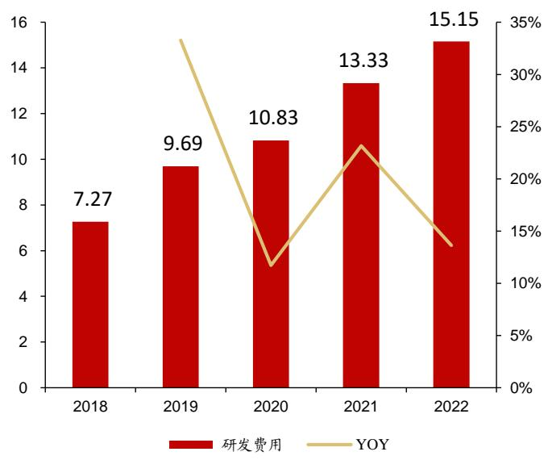  
图8：公司研发投入持续提升（亿元、 $\%$ )  
资料来源：wind、浙商证券研究所

# （3）公司具备真实、具体的落地场景和广泛的客户群体，应用迭代速度相对更快

公司的新产品、新模块可在广泛的用客户群体中快速落地，以数字新成本平台为例，根据广联达河北公众号，2022 年初上线至今已服务了超7 万家企业、累计存储了成本数据3569万多条、复用占比高达 $64 \%$ 、存储项目6万多个、整体复用达到10万多次，一年内发版迭代40 余次，运行了72 万余个节点账号，携手9 万余家建筑行业企业，突破了超3000个实际建筑项目应用，落地了400多家实践标杆应用企业。

# 1.3广联达落地的产品和功能?

# 公司目前已在造价、施工、设计各个领域落地基于AI模型的产品和功能：

（1）造价业务：公司基于深度学习的交互式生成技术，在造价业务中利用大模型技术提供了智能组价和智能算量等服务，有望提升造价员效率，减轻企业造价人员薪酬成本，未来公司可按项目规模进行收费；此外，新成本平台未来也可升级智能化功能，根据建设方自身特点和历史项目情况为其提供前期方案建议，降低企业咨询成本；

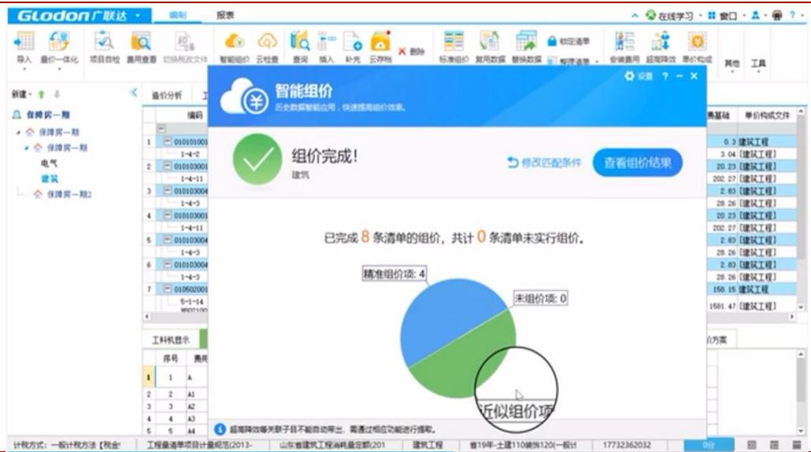  
图9：广联达智能组价  
资料来源：公司官网、浙商证券研究所

（2）施工业务：自主研发的劳务人脸识别终端实现量产，CV安全隐患识别算法集成进入施工蜂鸟盒子产品，助力蜂鸟系统成功入选工信部《国家人工智能创新应用先导区“智赋百景”》建设施工现场AI智能安全巡检应用场景典型案例，未来有望进一步推广；

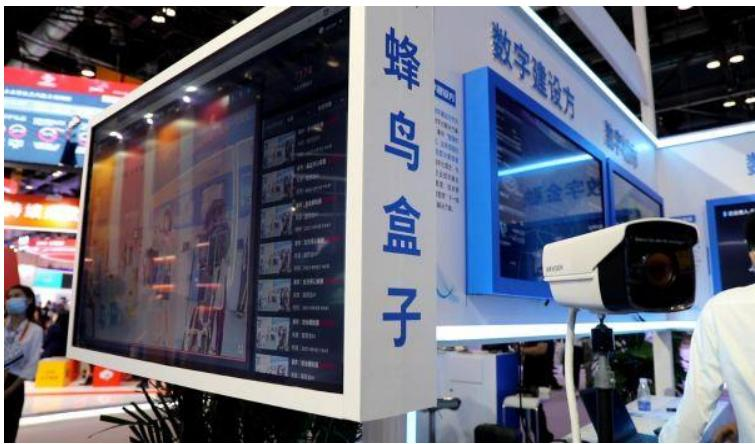  
图10：广联达蜂鸟盒子  
资料来源：海淀报、浙商证券研究所

（3）设计业务：智能设计中的强排工具（按照建筑强制性规范布置建筑）进入用户验证，实时日照分析性能国内领先，未来可结合多模态的大模型提供方案设计功能；

# 1.4 AI大模型能给广联达带来什么?

# 我们认为，AI技术的应用可以为公司带来收入增长和成本费用的降低:

收入端，现有产品可进行智能化升级减少客户的学习成本和工作量，提升客户体验，在尽可能减少客户工作量的同时也能不断积累客户粘性和使用习惯，增强客户的续费意愿；此外，公司也可基于海量历史数据和经验的训练和推理，不断推出智能化的新功能、新模块，拓展业务范围、提高单个客户ARPU值；

成本端，AI可进一步辅助技术和产品研发，提升研发效率，节省研发投入。

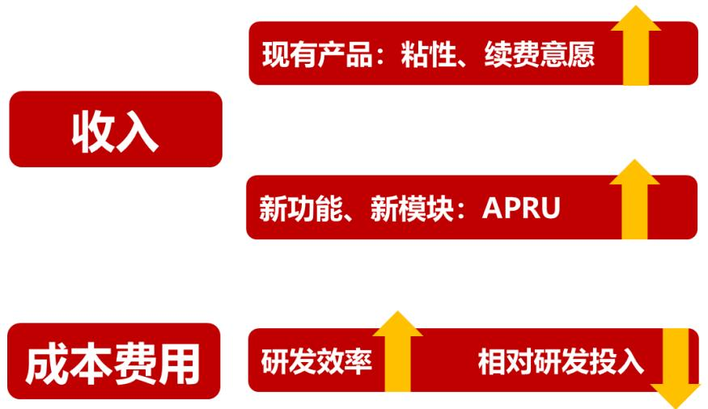  
图11：AI技术的应用可为公司带来收入增长和成本费用的降低  
资料来源：浙商证券研究所

# 2 远期业绩超预期：新成本业务有望打开公司长期成长空间

行业增速下行和房住不炒背景下，提升建筑品质、优化建造成本、提升效益成为企业生存的必然选择。根据 CRIC，金额方面，57 家典型上市房企2021 年整体营业收入3.91万亿（ $+ 1 6 \%$ ），增速持续下滑，毛利润0.78亿元、归母净利润0.26万亿，归母净利润增速的中位数为 $- 2 6 \%$ ；比率方面，2018-2021年整体毛利率持续下降，中位数从 $3 1 . 2 \%$ 降至$1 9 . 3 \%$ ，带动归母净利率中位数从 $1 2 . 1 \%$ 降至 $4 . 7 \%$ 。

数字新成本平台有望系统化解决企业造价数据积累和应用难题。该平台面向企业精细化管理的诉求，针对建设方、施工方分别搭建了以企业成本数据积累与应用的闭环打通为核心的解决方案，赋能企业实现数据资产化、作业高效化、决策智能化，能够助力企业实现“目标估（定）得准、过程控得住”。

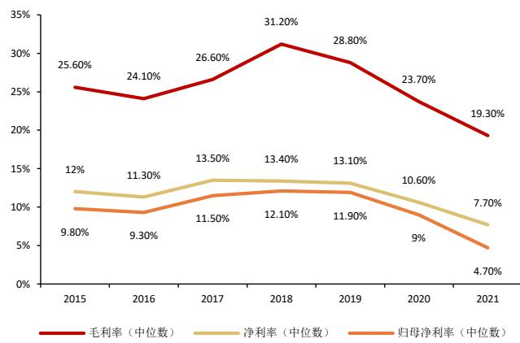  
图12：行业典型上市房企整体利润率水平及变动 $( \%$ )  
资料来源：克而瑞 $\langle \langle 2 0 2 1$ 年房企盈利能力报告》、浙商证券研究所，注：为与 $\mathrm { H }$ 股上市房企统一口径，A股上市房企毛利润计算中扣除税金及附加

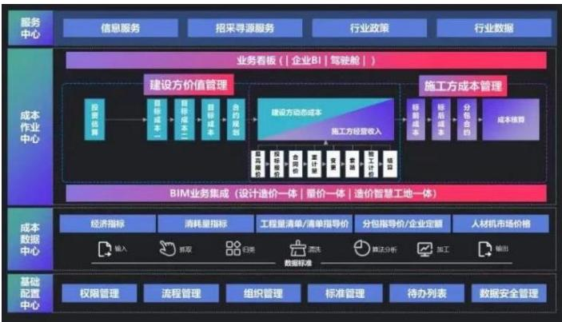  
图13：广联达数字新成本平台架构  
资料来源：公司官网、公司公众号、浙商证券研究所

我们认为新成本平台有望成为公司并肩于造价、施工的重要产品，是公司在云化转型成功后，在数据增值服务上的一个重要尝试。有望为公司带来百亿潜在空间，短期内客户粘性强、中期内带动施工和设计等产品放量、长期有望驱动公司产品智能化升级。

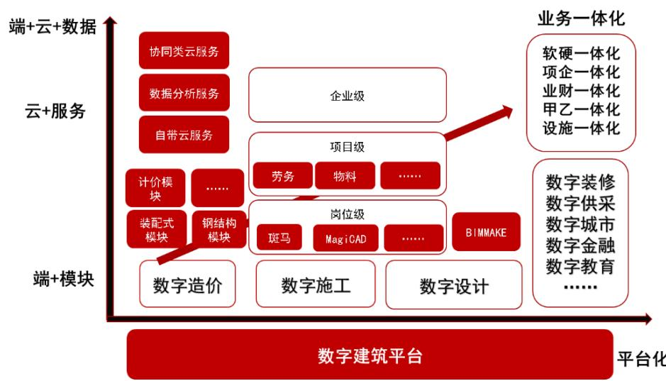  
图14：公司产品演进图  
资料来源：公司公告、浙商证券研究所

# 2.1 商业模式：SaaS 订阅制 $+$ 增值数据包，可为客户提供多样性选择

# 数字新成本的产品架构和商业模式和造价业务一样都是 SaaS 订阅制：

系统线上化：数字新成本平台为建设方、施工方均提供了Web 端登录入口，相关人员可通过账号登录，所有操作均在线上，数据默认在云端，实现了系统全线上化；

付费订阅化：新成本平台以项目为单位进行年度订阅收费，客户也可自选“指标网”、“广材网”等数据信息服务以及人工询价等增值服务，按需付费。

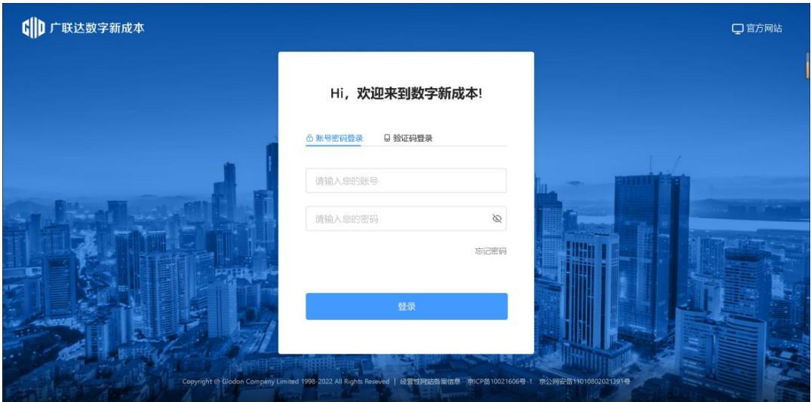  
图15：广联达数字新成本平台web登录界面  
资料来源：公司官网、浙商证券研究所

# 2.2 新成本平台开辟了新领域，市场空间有望达到 245 亿，公司年创收有望达到120亿

我们认为新成本平台是公司云转型之后的又一力作，单业务潜在市场空间超过百亿。

# 市场空间测算方式一：按新开工项目数测算

预计新成本平台每年的市场空间为 252 亿元。根据国家统计局，2021 年新开工项目287760 个，假设未来每年新增 28 万个项目；根据公众号《BIM改变未来》，BIM 施工建模及深化设计软件旗舰版年费 5000 元，假设新成本平台年费定价为施工方1万元、建设方2万元；根据楼盘网，拿地到出售一般需要3-5 年，假设均为 3年，可以得到按项目数计算，每年市场规模 252 亿元。

表1：潜在市场空间预计-按项目数  

<table><tr><td>参数</td><td>数值</td><td>数据来源&amp;计算方式</td></tr><tr><td>全国新开工项目个数</td><td>287760个</td><td>国家统计局局长宁吉喆介绍 2021 年新开工项目287760 个，假设未来每年新增 28万个项目</td></tr><tr><td>单个项目向施工方每年收费金额</td><td>1万元</td><td>假设新成本平台年费与 BIM施工建模及深化设计软件旗舰版（每年 5000元）相 等，施工方购买2套（管理+实施）</td></tr><tr><td>单个项目向建设方每年收费金额</td><td>2万元</td><td>假设新成本平台年费与BIM施工建模及深化设计软件旗舰版（每年5000元）相 等，建设方购买4套（管理+设计+咨询+实施）</td></tr><tr><td>单个项目施工年限</td><td>3年</td><td>根据楼盘网，拿地到出售一般需要3-5年，假设均为3年</td></tr><tr><td>每年市场规模估算</td><td>252亿元</td><td>28*(1+2)*3</td></tr></table>

资料来源：国新办、国家统计局、公众号《BIM改变未来》、楼盘网、浙商证券研究所

# 市场空间测算方式二：按覆盖客户数测算

预计新成本平台每年的市场空间为 238 亿元。根据公司官网，目前公司已覆盖 34 万家企业客户，由于公司2010年上市时的招股书披露造价产品市占率超过 $50 \%$ ，以及2021年公司数字造价业务营收 38.13 亿，同业品茗科技建筑信息化软件营收2.45 亿、盈建科总营收2.31亿，因此假设公司市占率达到 $70 \%$ ；假设新成本平台年费与BIM施工建模及深化设计软件旗舰版（每年5000元）相等，每个企业客户购买20 套，可以得到按客户数计算，每年市场规模238亿元。

表2：潜在市场空间预计-按客户数  

<table><tr><td></td><td>数值</td><td>数据来源&amp;计算方式</td></tr><tr><td>广联达覆盖企业客户数</td><td>34万</td><td>公司官网-服务企业客户34万+</td></tr><tr><td>广联达市占率</td><td>70%</td><td>2010 年公司招股书“造价产品市占率超过 50%”，2021 年公司数字造价业务营收 38.13 亿，同业品茗科技建筑信息化软件营收2.45 亿、盈建科总营收 2.31 亿，公司造价业务占 三家合计的 88.9%，因此假设公司市占率达到 70%</td></tr><tr><td>单个企业的ARPU值</td><td>10万/年</td><td>成平合B 建深化版(年购无)相等，个</td></tr><tr><td>年均市场规模</td><td>238亿元</td><td>34*0.7*0.5*20</td></tr></table>

资料来源：公司官网、wind、公众号《BIM改变未来》、浙商证券研究所

长期来看，公司每年收入空间上限约为 119 亿元。公司目前覆盖了34 万家企业客户，假设仅为现有客户存在复购需求，且为了剔除其中的小型客户，假设已覆盖客户的购买率上限为 $50 \%$ ，每个企业购买 20 套，则公司年收入新增空间为119 亿元。

表3：公司收入空间  

<table><tr><td></td><td>数值</td><td>数据来源&amp;计算方式</td></tr><tr><td>广联达覆盖企业客户数</td><td>34万</td><td>公司官网-服务企业客户34万+，假设主要是公司的现有客户产生复购需求。</td></tr><tr><td>广联达市占率</td><td>70%</td><td>2010 年公司招股书“造价产市占率超过50%”，2021 年公司数字造价业务营收 38.13 亿，同业品茗科技建筑信息化软件营收 2.45 亿、盈建科总营收 2.31 亿，因此假设公司市 占率达到 70%</td></tr><tr><td>已覆盖客户的购买率上限</td><td>50%</td><td>主要是较大的项目需要使用数字新成本产品，一些小型建设方或不是目标客户。</td></tr><tr><td>单个企业的 ARPU值</td><td>10万/年</td><td>假设新成本年费与BIM施工建模及深化设计软件旗舰版（每年 5000 元）相等，每个企业 客户购买 20套（大型客户管理+设计+咨询+实施各个环节购买五套)</td></tr><tr><td>年均市场规模</td><td>119亿元</td><td>34*70%*50%*0.5*20</td></tr></table>

资料来源：公司官网、公众号《BIM改变未来》、浙商证券研究所

# 2.3 短期：新成本平台客户粘性强，有望为公司贡献持续增长动力

客户降本增效需求愈发凸显，成本节省、效率提升看得见，客户付费意愿有望逐步增强。我们认为当前背景下客户本身的降本增效需求有望得到持续激发，公司适时推出的新成本平台明确针对客户痛点、直接满足客户需求，例如建设方咸阳地产龙头陕西丽彩实业集团试点项目从前端把控成本，节省了高层地下钢筋含量，4万平方米地下建筑面积工优化成本 375 万元，折合每平方米节省 93.75 元；施工方中铁城建三公司试点项目成本测算时间从5天缩短到1天，中建八局西北分公司试点项目结算分析从2个人 $_ { \cdot + 1 }$ 个月缩短为1个人不到3小时。

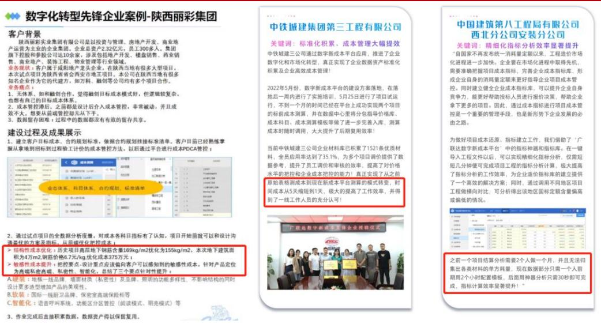  
图16：建设方、施工方项目案例  
资料来源：广联达公众号、浙商证券研究所

（2）客户的标准模板、数据均沉淀在线上平台且随时间不断积累，转换成本随时间不断提高。在新成本平台上客户可完成全流程管控，以往的标准、模板、数据、经验均不断沉淀在平台上，客户“越用越顺手、越用越习惯”，管理习惯也不断和平台相融合，转换成本持续提升。根据广联达河北公众号，目前数字新成本平台中已有超7万家企业、累计存储了成本数据 3569 万多条、复用占比高达 $6 4 \%$ 、存储项目6万多个、整体复用达到10万多次。

（3）产品高度标准化，结合公司造价业务的市场地位有望在短时间内展现网络效应优势。根据广联达河北公众号，数字新成本平台平台发版迭代 40 余次，运行了72 万余个节点账号，携手9 万余家建筑行业企业，突破了超3000 个实际建筑项目应用，落地了400多家实践标杆应用企业，网络效应初显。

(4）订阅制付费模式不断培养客户心智和付费习惯，持续提升品牌价值。根据公司年报，公司已完成造价业务的云转型，我们认为订阅制付费模式能够培养客户心智和付费习惯，数字新成本平台有望进一步提升公司的品牌价值。

# 2.4 中期：打通建造全生命周期，有望带动设计、造价、施工业务实现放量

新成本平台有望进一步推动公司实现全流程覆盖，带动其他产品销售。建筑项目流程分为立项、设计、招采、施工、结算五步，公司在设计（细分设计平台 $^ +$ 构件坞）、招采（计量和云计价平台 $+$ 指标网广材网）、施工（进度管理系统）领域通过平台 $^ +$ 组件的形式已实现覆盖，推出了90 余软件、平台及组件产品，新成本平台有望将业务拓展至前期立项（成本策划）和后期结算阶段，同时以数据驱动的成本管理为核心贯穿建造全流程，与设计、造价、施工产品有望形成协同效应。

公司有望打造覆盖建筑行业全周期、客户深度共建的数字项目集成管理平台。新成本平台发布后，公司的数字项目集成管理平台初步成型，包含了业务中台、数据中台和技术中台，内置了大量的成熟稳定、开箱即用的技术组件和业务组件，覆盖建筑行业数字化涉及到的完整技术体系和场景。未来，平台的二次开发能力将面向市场开放，开发人员和团队可以针对自身的个性化需求进行定制开发，公司将携手客户的信息化部门、数科公司和数字生态里的独立软件服务商，共同为行业提供一体化解决方案。

表4：公司产品清单  

<table><tr><td>数字设计</td><td>数字建设方</td><td>数字造价</td><td>数字施工</td><td>数字城市</td><td>国际业务</td></tr><tr><td>BIMSpace 建筑设计产品</td><td>建设方成本数据系统</td><td>BIM安装计量GQI</td><td>BIM5D</td><td>广乌师</td><td>E-tender</td></tr><tr><td>电力隧道设计软件</td><td>建设方工程管理系统</td><td>BIM 钢结构计量 GJG</td><td>BIMFACE</td><td>广鲟河</td><td>TAS国际土建算</td></tr><tr><td>负荷计算</td><td>建设方设计管理系统</td><td>BIM 市政计量 GMA</td><td>BIMMAKE施工建模（新一代场布建模基于CIM的园区设施一体化管理TBQ国际计价</td><td></td><td></td></tr><tr><td>构件坞</td><td>建设方项目全过程管理 系统</td><td>BIM土建计量GTJ</td><td>BIM 工序动画制作软件</td><td></td><td>TME 国际机电算 量</td></tr><tr><td>管立得供水设计软件</td><td>建设方智慧工地系统</td><td>BIM 装饰计量 DecoCost</td><td>CAD快速看图</td><td></td><td>TRB国际钢筋算</td></tr><tr><td>管立得市政管网设计软件</td><td></td><td>地铁工程 GDT</td><td>MagiCAD</td><td></td><td></td></tr><tr><td>广联达 BIM 模型审查软件</td><td></td><td>电力算量GMS</td><td>MagiCloud</td><td></td><td></td></tr><tr><td>广联达 BIM设计管理平台</td><td></td><td>服务新干线</td><td>斑马进度计划</td><td></td><td></td></tr><tr><td>广联达企业级族库管理平台</td><td></td><td>服务新干线—-答疑解惑</td><td>广联达AI钢筋/钢管点根</td><td></td><td></td></tr><tr><td>广联达数维设计平台</td><td></td><td>广材网</td><td>广联达BIM+技术管理系统</td><td></td><td></td></tr><tr><td>广联达数字化审图系统</td><td></td><td>广材助手</td><td>广联达 BIM+智慧工地数据决策系统</td><td></td><td></td></tr><tr><td>海绵城市设计软件</td><td></td><td>广联达G+工作台</td><td>广联达 BIMMAKE</td><td></td><td></td></tr><tr><td>鸿城 InfraFuser</td><td></td><td>广联达电力云计价软件 GEC5.0</td><td>广联达 BIMVR安全教育系统</td><td></td><td></td></tr><tr><td>建筑性能分析平台</td><td></td><td>广联达公路云计价软件 GHW5.0</td><td>广联达 BIM劳务管理系统</td><td></td><td></td></tr><tr><td>路易 BIM道路设计软件</td><td></td><td>广联达煤炭计价软件 GCN</td><td>广联达成本测算系统</td><td></td><td></td></tr><tr><td>暖通空调设计</td><td></td><td>广联达煤炭云计价平台 6.0</td><td>广联达搅拌站材料核算系统</td><td></td><td></td></tr><tr><td>热力管网</td><td></td><td>广联达民航计价软件 GCA</td><td>广联达酷爱点</td><td></td><td></td></tr><tr><td>日照分析软件</td><td></td><td>广联达清标</td><td>广联达施工企业生产管理解决方案</td><td></td><td></td></tr><tr><td>市政道路设计软件</td><td></td><td>广联达石油石化云计价软件 GPC5.0</td><td>广联达施工企业项目管理解决方案</td><td></td><td></td></tr><tr><td>综合管廊设计软件</td><td></td><td>广联达市场化计价平台</td><td>广联达施工企业智慧安全解决方案</td><td></td><td></td></tr><tr><td></td><td></td><td>广联达水工云计价软件 GHC5.0</td><td>广联达数字采购解决方案</td><td></td><td></td></tr><tr><td></td><td></td><td>广联达水工云计价软件 GHC5.0水工</td><td>广联达现场物料追踪系统</td><td></td><td></td></tr><tr><td></td><td></td><td>广联达水利水电云计价软件 GWH5.0</td><td>广联达线性基建工程决策支持系统</td><td></td><td></td></tr><tr><td></td><td></td><td>广联达投标 GEB7</td><td>广联达云项目管理解决方案</td><td></td><td></td></tr><tr><td></td><td></td><td>广联达土地整理计价软件 GLC2014</td><td>广联达智能物料验收系统</td><td></td><td></td></tr><tr><td></td><td></td><td>广联达冶金计价软件 GMT</td><td>企业BI数据决策平台</td><td></td><td></td></tr><tr><td></td><td></td><td>广联达云计价 GCCP6.0</td><td>协筑</td><td></td><td></td></tr><tr><td></td><td></td><td>建筑课堂</td><td></td><td></td><td></td></tr><tr><td></td><td></td><td>企业指标应用平台</td><td></td><td></td><td></td></tr><tr><td></td><td></td><td>指标网</td><td></td><td></td><td></td></tr></table>

资料来源：公司官网、浙商证券研究所

# 2.5 长期：全产品线智能化升级可期，建筑业数据价值有望逐步释放

公司未来产品有望全面智能化升级，进一步释放数据价值。目前公司持续在人工智能领域加大投入，云AI已从造价扩展到施工与设计，未来有望进一步扩展至全产品线，助力建筑企业实现产业数字化，全面释放建筑行业数据价值。

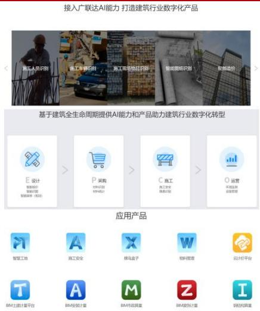  
图17：广联达AI开放平台功能及产品  
资料来源：公司官网、浙商证券研究所

# 3盈利预测和估值

预计2023-2025年营收达到85.86/111.29/140.14亿 $+ 3 0 . 2 8 \% / 2 9 . 6 1 \% / 2 5 . 9 2 \%$ ) :

（1）数字造价业务：我们认为2022年疫情影响了客户需求从而暂时抑制了收入，2023-2025 年该业务有望随着经济恢复、新成本业务的推广而反弹，预计 2023-2025 年营收分别达到 $6 0 . 0 1 / 7 7 . 1 8 / 9 7 . 7 0$ 亿 $+ 2 5 . 7 4 \% / 2 8 . 6 0 \% / 2 6 . 5 9 \%$

（2）施工业务：我们认为2022 年客户开工延迟影响了收入，2023-2024年该业务有望随着客户开工而企稳恢复，预计2023-2025 年营收分别达到 $1 9 . 2 9 / 2 5 . 3 6 / 3 2 . 8 3$ 亿$+ 4 5 . 4 2 \% / 3 1 . 4 8 \% / 2 9 . 4 4 \%$

（3）数字设计、海外及其他业务：我们预计随着经济的恢复和公司在设计、海外等方向的拓展有望实现增长，预计2023-2025 年营收分别达到 6.56 /8.75 /9.61 亿$\mathit { \Theta } + 3 3 . 4 0 \% / 3 3 . 3 9 \% / 9 . 8 6 \%$

毛利率：2022 年受到疫情的影响，随着更高毛利的新成本平台、增值服务等业务的不断推广，预计未来整体毛利率将逐步企稳，预计2023-2025 年毛利率为$8 1 . 2 4 \% / 8 0 . 7 4 \% / 8 0 . 7 0 \%$ .,

费用率：我们认为公司未来人员增速有望得到控制，并且随着公司收入规模的扩大和运营能力的提升，销售、管理、研发费用率有望逐步减少，预计 2023-2025 年销售费用率$2 3 . 4 8 \% / 2 1 . 6 2 \% / 2 0 . 5 0 \%$ 、管理费用率 $1 7 . 8 8 \% / 1 8 . 0 8 \% / 1 8 . 3 5 \%$ 、研发费用率$2 1 . 5 0 \% / 2 0 . 6 2 \% / 1 9 . 8 1 \%$ .,

归母净利润：预计2023-2025 年归母净利润分别达到 $1 3 . 0 3 / 1 8 . 5 6 / 2 5 . 2 0$ 亿[ $\mathrm { \zeta } + 3 4 . 8 3 \% / 4 2 . 4 1 \% / 3 5 . 7 7 \%$ )。

表5：盈利预测（亿元、 $\%$ )  

<table><tr><td></td><td>2022 2023E</td><td>2024E</td><td>2025E</td></tr><tr><td>总营收</td><td>65.91 85.86</td><td>111.29</td><td>140.14</td></tr><tr><td>YOY</td><td>17.29% 30.28%</td><td>29.61%</td><td>25.92%</td></tr><tr><td>1、数字造价业务收入</td><td>47.73 60.01</td><td>77.18</td><td>97.70</td></tr><tr><td>YOY</td><td>25.16% 25.74%</td><td>28.60%</td><td>26.59%</td></tr><tr><td>2、数字施工业务收入</td><td>13.26 19.29</td><td>25.36</td><td>32.83</td></tr><tr><td>YOY</td><td>10.03% 45.42%</td><td>31.48%</td><td>29.44%</td></tr><tr><td>3数字设计、海外及其他业务</td><td>4.92 6.56</td><td>8.75</td><td>9.61</td></tr><tr><td>YOY</td><td></td><td>33.40% 33.39%</td><td>9.86%</td></tr><tr><td>整体毛利率</td><td>82.95%</td><td>81.24% 80.74%</td><td>80.70%</td></tr><tr><td>销售费用率</td><td>25.64%</td><td>23.48% 21.62%</td><td>20.50%</td></tr><tr><td>管理费用率</td><td>18.65%</td><td>17.88% 18.08%</td><td>18.35%</td></tr><tr><td>研发费用率</td><td>22.99%</td><td>21.50% 20.62%</td><td>19.81%</td></tr><tr><td>归母净利润</td><td>9.67</td><td>13.03</td><td>18.56 25.20</td></tr><tr><td>YOY</td><td>46.26%</td><td>34.83%</td><td>42.41% 35.77%</td></tr></table>

资料来源：wind、浙商证券研究所

选取AI工具类软件公司和云服务公司金山办公、用友网络作为可比公司，给与公司2023 年109 倍PE，公司2023 年的目标市值是1417 亿，维持“买入”评级。

表6：可比公司情况（亿元，2023.3.24)  

<table><tr><td colspan="7">营业收入</td><td colspan="3">归母净利润</td><td colspan="4">PE</td></tr><tr><td>公司简称</td><td>总市值</td><td>2022A</td><td></td><td></td><td></td><td></td><td></td><td></td><td></td><td></td><td></td><td>2023E 2024E 2025E 2022A 2023E 2024E 2025E 2022A 2023E 2024E 2025E</td><td></td></tr><tr><td>金山办公</td><td>1,808.00</td><td>38.85</td><td>52.36</td><td>69.51</td><td>90.50</td><td>11.18</td><td>16.20</td><td>21.93</td><td></td><td></td><td>27.68 161.79 111.58</td><td>82.45</td><td>65.33</td></tr><tr><td>用友网络</td><td>892.34</td><td>92.62</td><td>125.47</td><td></td><td>155.52191.99</td><td>2.19</td><td>8.40</td><td></td><td></td><td></td><td>12.76 19.49  407.15  106.22</td><td>69.94</td><td>45.78</td></tr><tr><td>平均</td><td></td><td></td><td></td><td></td><td></td><td></td><td></td><td></td><td></td><td></td><td>284.47108.90</td><td>76.20</td><td>55.56</td></tr><tr><td>广联达</td><td>774.00</td><td>65.91</td><td>85.86</td><td></td><td>111.29140.14</td><td>9.67</td><td>13.03</td><td></td><td>18.5625.20</td><td>80.10</td><td>59.41</td><td>41.72</td><td>30.73</td></tr></table>

资料来源：wind、浙商证券研究所

# 4风险提示

1、全行业和公司产品的智能化产品落地速度不及预期的风险：若智能化产品落地不及预期，则可能对行业和公司业绩产生不利影响；  
2、公司云化产品推进速度不及预期的风险：公司业务高度依赖云化产品的推广速度，若推进不及预期则可能影响公司成长性；  
3、公司客户主要是业主方、施工方等，容易受到基建、房建投资和建设周期影响，业绩具有周期性风险；  
4、全行业在短期内AI相关公司股价已上涨较多的风险；

表附录：三大报表预测值  
资产负债表  

<table><tr><td>(百万元）</td><td>2022A</td><td>2023E</td><td>2024E</td><td>2025E</td></tr><tr><td>流动资产</td><td>5,797</td><td>8,739</td><td>11,195</td><td>14,055</td></tr><tr><td>现金</td><td>4,344</td><td>6,953</td><td>8,836</td><td>11,029</td></tr><tr><td>交易性金融资产</td><td>0</td><td>0</td><td>0</td><td>0</td></tr><tr><td>应收账项</td><td>1,049</td><td>1,331</td><td>1,919</td><td>2,417</td></tr><tr><td>其它应收款</td><td>58</td><td>61</td><td>50</td><td>74</td></tr><tr><td>预付账款</td><td>72</td><td>56</td><td>69</td><td>81</td></tr><tr><td>存货</td><td>87</td><td>136</td><td>100</td><td>214</td></tr><tr><td>其他</td><td>187</td><td>201</td><td>222</td><td>240</td></tr><tr><td>非流动资产</td><td>5,749</td><td>5,600</td><td>5,761</td><td>5,873</td></tr><tr><td>金额资产类</td><td>638</td><td>488</td><td>338</td><td>188</td></tr><tr><td>长期投资</td><td>342</td><td>364</td><td>384</td><td>402</td></tr><tr><td>固定资产</td><td>1,424</td><td>1,406</td><td>1,383</td><td>1,358</td></tr><tr><td>无形资产</td><td>676</td><td>926</td><td>1,046</td><td>1,126</td></tr><tr><td>在建工程</td><td>54</td><td>254</td><td>454</td><td>654</td></tr><tr><td>其他</td><td>2,615</td><td>2,162</td><td>2,157</td><td>2,145</td></tr><tr><td>资产总计</td><td>11,545</td><td>14,339</td><td>16,956</td><td>19,928</td></tr><tr><td>流动负债</td><td>4,576</td><td>5,894</td><td>6,923</td><td>7,636</td></tr><tr><td>短期借款</td><td>4</td><td>4</td><td>4</td><td>4</td></tr><tr><td>应付款项</td><td>546</td><td>900</td><td>1,064</td><td>1,490</td></tr><tr><td>预收账款</td><td>0</td><td>0</td><td>0</td><td>0</td></tr><tr><td>其他</td><td>4,026</td><td>4,990</td><td>5,855</td><td>6,142</td></tr><tr><td>非流动负债</td><td>168</td><td>227</td><td>247</td><td>267</td></tr><tr><td>长期借款</td><td>0</td><td>0</td><td>0</td><td>0</td></tr><tr><td>其他</td><td>168</td><td>227</td><td>247</td><td>267</td></tr><tr><td>负债合计</td><td>4,744</td><td>6,121</td><td>7,170</td><td>7,903</td></tr><tr><td>少数股东权益</td><td>489</td><td>603</td><td>764</td><td>983</td></tr><tr><td>归属母公司股东权</td><td>6,312</td><td>7,615</td><td>9,022</td><td>11,042</td></tr><tr><td>负债和股东权益</td><td>11,545</td><td>14,339</td><td>16,956</td><td>19,928</td></tr></table>

现金流量表  

<table><tr><td>(百万元)</td><td>2022A</td><td>2023E</td><td>2024E</td><td>2025E</td></tr><tr><td>经营活动现金流</td><td>1,648</td><td>3,059</td><td>2,530</td><td>3,173</td></tr><tr><td>净利润</td><td>1,012</td><td>1,417</td><td>2,018</td><td>2,740</td></tr><tr><td>折旧摊销</td><td>281</td><td>171</td><td>187</td><td>204</td></tr><tr><td>财务费用</td><td>4</td><td>0</td><td>0</td><td>0</td></tr><tr><td>投资损失</td><td>8</td><td>26</td><td>56</td><td>70</td></tr><tr><td>营运资金变动</td><td>330</td><td>1,364</td><td>235</td><td>124</td></tr><tr><td>其它</td><td>12</td><td>81</td><td>35</td><td>35</td></tr><tr><td>投资活动现金流</td><td>(964)</td><td>(508)</td><td>(218)</td><td>(500)</td></tr><tr><td>资本支出</td><td>(849)</td><td>(156)</td><td>(539)</td><td>(509)</td></tr><tr><td>长期投资</td><td>(16)</td><td>128</td><td>130</td><td>132</td></tr><tr><td>其他</td><td>(99)</td><td>(481)</td><td>191</td><td>(123)</td></tr><tr><td>筹资活动现金流</td><td>(374)</td><td>58</td><td>(430)</td><td>(480)</td></tr><tr><td>短期借款</td><td>4</td><td>0</td><td>0</td><td>0</td></tr><tr><td>长期借款</td><td>0</td><td>0</td><td>0</td><td>0</td></tr><tr><td>其他</td><td>(378)</td><td>58</td><td>(430)</td><td>(480)</td></tr><tr><td>现金净增加额</td><td>332</td><td>2,609</td><td>1,883</td><td>2,193</td></tr></table>

资料来源：wind，浙商证券研究所

利润表  

<table><tr><td>(百万元)</td><td>2022A</td><td>2023E</td><td>2024E</td><td>2025E</td></tr><tr><td>营业收入</td><td>6,591</td><td>8,586</td><td>11,129</td><td>14,014</td></tr><tr><td>营业成本</td><td>1,124</td><td>1,611</td><td>2,143</td><td>2,705</td></tr><tr><td>营业税金及附加</td><td>48</td><td>52</td><td>56</td><td>56</td></tr><tr><td>营业费用</td><td>1,690</td><td>2,016</td><td>2,406</td><td>2,873</td></tr><tr><td>管理费用</td><td>1,229</td><td>1,535</td><td>2,012</td><td>2,571</td></tr><tr><td>研发费用</td><td>1,515</td><td>1,846</td><td>2,295</td><td>2,777</td></tr><tr><td>财务费用</td><td>(33)</td><td>(20)</td><td>(15)</td><td>(10)</td></tr><tr><td>资产减值损失</td><td>(9)</td><td>(1)</td><td>(1)</td><td>(1)</td></tr><tr><td>公允价值变动损益</td><td>0</td><td>0</td><td>0</td><td>0</td></tr><tr><td>投资净收益</td><td>(8)</td><td>(26)</td><td>(56)</td><td>(70)</td></tr><tr><td>其他经营收益</td><td>135</td><td>43</td><td>33</td><td>14</td></tr><tr><td>营业利润</td><td>1,096</td><td>1,543</td><td>2,189</td><td>2,965</td></tr><tr><td>营业外收支</td><td>(18)</td><td>(19)</td><td>(19)</td><td>(19)</td></tr><tr><td>利润总额</td><td>1,078</td><td>1,523</td><td>2,170</td><td>2,946</td></tr><tr><td>所得税</td><td>66</td><td>107</td><td>152</td><td>206</td></tr><tr><td>净利润</td><td>1,012</td><td>1,417</td><td>2,018</td><td>2,740</td></tr><tr><td>少数股东损益</td><td>45</td><td>113</td><td>161</td><td>219</td></tr><tr><td>归属母公司净利润</td><td>967</td><td>1,303</td><td>1,856</td><td>2,520</td></tr><tr><td>EBITDA</td><td>1,440</td><td>1,760</td><td>2,458</td><td>3,270</td></tr><tr><td>EPS（最新摊薄)</td><td>0.81</td><td>1.09</td><td>1.56</td><td>2.12</td></tr></table>

主要财务比率  

<table><tr><td></td><td>2022A</td><td>2023E</td><td>2024E</td><td>2025E</td></tr><tr><td>成长能力</td><td></td><td></td><td></td><td></td></tr><tr><td>营业收入</td><td>17.29%</td><td>30.28%</td><td>29.61%</td><td>25.92%</td></tr><tr><td>营业利润</td><td>44.53%</td><td>40.74%</td><td>41.88%</td><td>35.46%</td></tr><tr><td>归属母公司净利润</td><td>46.26%</td><td>34.83%</td><td>42.41%</td><td>35.77%</td></tr><tr><td>获利能力</td><td></td><td></td><td></td><td></td></tr><tr><td>毛利率</td><td>82.85%</td><td>81.24%</td><td>80.74%</td><td>80.70%</td></tr><tr><td>净利率</td><td>14.75%</td><td>15.18%</td><td>16.68%</td><td>17.98%</td></tr><tr><td>ROE</td><td>15.32%</td><td>17.12%</td><td>20.58%</td><td>22.83%</td></tr><tr><td>ROIC</td><td>15.71%</td><td>17.72%</td><td>21.30%</td><td>23.47%</td></tr><tr><td>偿债能力</td><td></td><td></td><td></td><td></td></tr><tr><td>资产负债率</td><td>41.09%</td><td>42.69%</td><td>42.29%</td><td>39.66%</td></tr><tr><td>净负债比率</td><td>69.76%</td><td>74.48%</td><td>73.27%</td><td>65.72%</td></tr><tr><td>流动比率</td><td>1.27</td><td>1.48</td><td>1.62</td><td>1.84</td></tr><tr><td>速动比率</td><td>1.19</td><td>1.42</td><td>1.56</td><td>1.77</td></tr><tr><td>营运能力</td><td></td><td></td><td></td><td></td></tr><tr><td>总资产周转率</td><td>0.61</td><td>0.66</td><td>0.71</td><td>0.76</td></tr><tr><td>应收账款周转率</td><td>8.54</td><td>7.26</td><td>6.88</td><td>6.49</td></tr><tr><td>应付账款周转率</td><td>2.81</td><td>2.25</td><td>2.18</td><td>2.12</td></tr><tr><td>每股指标(元)</td><td></td><td></td><td></td><td></td></tr><tr><td>每股收益</td><td>0.81</td><td>1.09</td><td>1.56</td><td>2.12</td></tr><tr><td>每股经营现金</td><td>1.38</td><td>2.57</td><td>2.12</td><td>2.66</td></tr><tr><td>每股净资产</td><td>5.30</td><td>6.39</td><td>7.57</td><td>9.27</td></tr><tr><td>估值比率</td><td></td><td></td><td></td><td></td></tr><tr><td>P/E</td><td>80.10</td><td>59.41</td><td>41.72</td><td>30.73</td></tr><tr><td>P/B</td><td>12.27</td><td>10.17</td><td>8.58</td><td>7.01</td></tr><tr><td>EV/EBITDA</td><td>46.66</td><td>40.12</td><td>27.96</td><td>20.35</td></tr></table>

# 股票投资评级说明

以报告日后的6个月内，证券相对于沪深300指数的涨跌幅为标准，定义如下：

1.买入：相对于沪深300指数表现 $+ 2 0 \%$ 以上；  
2.增持：相对于沪深300指数表现 $+ 1 0 \% \sim + 2 0 \%$   
3.中性：相对于沪深300指数表现 $- 1 0 \% \sim + 1 0 \%$ 之间波动；  
4.减持：相对于沪深300指数表现 $- 1 0 \%$ 以下。

# 行业的投资评级：

以报告日后的6个月内，行业指数相对于沪深300指数的涨跌幅为标准，定义如下：  
1.看好：行业指数相对于沪深 300 指数表现 $+ 1 0 \% \nu$ 以上；  
2.中性：行业指数相对于沪深 300 指数表现 $- \ 1 0 \% \sim \ + \ 1 0 \%$ 以上；  
3.看淡：行业指数相对于沪深300指数表现 $- 1 0 \%$ 以下。  
我们在此提醒您，不同证券研究机构采用不同的评级术语及评级标准。我们采用的是相对评级体系，表示投资的相对比重。  
建议：投资者买入或者卖出证券的决定取决于个人的实际情况，比如当前的持仓结构以及其他需要考虑的因素。投资者不应仅仅依靠投资评级来推断结论。

# 法律声明及风险提示

本报告由浙商证券股份有限公司（已具备中国证监会批复的证券投资咨询业务资格，经营许可证编号为：Z39833000）制作。本报告中的信息均来源于我们认为可靠的已公开资料，但浙商证券股份有限公司及其关联机构（以下统称“本公司”）对这些信息的真实性、准确性及完整性不作任何保证，也不保证所包含的信息和建议不发生任何变更。本公司没有将变更的信息和建议向报告所有接收者进行更新的义务。

本报告仅供本公司的客户作参考之用。本公司不会因接收人收到本报告而视其为本公司的当然客户。

本报告仅反映报告作者的出具日的观点和判断，在任何情况下，本报告中的信息或所表述的意见均不构成对任何人的投资建议，投资者应当对本报告中的信息和意见进行独立评估，并应同时考量各自的投资目的、财务状况和特定需求。对依据或者使用本报告所造成的一切后果，本公司及/或其关联人员均不承担任何法律责任。

本公司的交易人员以及其他专业人士可能会依据不同假设和标准、采用不同的分析方法而口头或书面发表与本报告意见及建议不一致的市场评论和/或交易观点。本公司没有将此意见及建议向报告所有接收者进行更新的义务。本公司的资产管理公司、自营部门以及其他投资业务部门可能独立做出与本报告中的意见或建议不一致的投资决策。

本报告版权均归本公司所有，未经本公司事先书面授权，任何机构或个人不得以任何形式复制、发布、传播本报告的全部或部分内容。经授权刊载、转发本报告或者摘要的，应当注明本报告发布人和发布日期，并提示使用本报告的风险。未经授权或未按要求刊载、转发本报告的，应当承担相应的法律责任。本公司将保留向其追究法律责任的权利。

# 浙商证券研究所

上海总部地址：杨高南路729 号陆家嘴世纪金融广场1号楼 25 层  
北京地址：北京市东城区朝阳门北大街8号富华大厦E座4层  
深圳地址：广东省深圳市福田区广电金融中心33层  
上海总部邮政编码：200127  
上海总部电话：(8621) 80108518  
上海总部传真：(8621) 80106010  
浙商证券研究所：https://www.stocke.com.cn