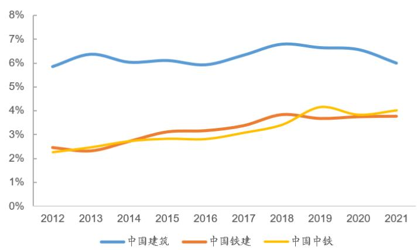

2023年01月13日

# 广联达（002410.SZ)

买入 (首次评级)

公司深度研究证券研究报告

# 造价为盾，施工为矛，剑指一体化数字建筑平台

计算机组  
分析师：孟灿(执业 S1130522050001)  
mengcan@gjzq.com.cn  
联系人：纪超  
jichao@gjzq.com.cn

# 投资逻辑

建筑行业信息化空间大，渗透率低。2021年我国建筑业总产值达29.3万亿元，增加值8万亿元，占GDP总额 $7 \%$ ，是国民经济支柱产业，建筑信息化投入在总产值中占比仅为 $0 . 0 8 \%$ 。基于我国庞大的建筑产业体量和当前较低的信息化水平，信息化率每增加$0 . 1 \%$ ，都将带来超过百亿元的建筑信息化市场空间。

造价业务为公司基本盘，云转型助力量价齐升，订阅制平滑收入波动。公司造价业务的收入模型可拆解为“用户数量 $\looparrowleft\langle { A R P U ^ { \prime \prime } }$ ，对应量价两个维度。我们认为，无论是用户数量，还是ARPU 值，增长空间都依然很大。造价业务作为公司的基本盘，云转型后波动性得以平抑，且打开了更多增长空间。预计公司造价业务 2022-2024 年的收入分别为45.84、53.9、61.99亿元。

降本增效逻辑验证下，施工业务从大客户大项目端突破。施工环节信息化尚为蓝海，数字化渗透率低，发展潜力大，竞争格局较为分散，公司目前处于领先地位。施工业务主要驱动力由政策逐步转向用户降本增效的真实需求。公司从大客户大项目着手，推动企业级管理产品和项目级智慧工地解决方案落地。

公司 2022 年前三季度实现收入 44.61 亿元，同比增长 $2 3 . 8 9 \%$ ，实现净利润 6.38 亿元，同比增长 $3 4 . 2 7 \%$ 。远期看，公司有望成为领先的“设计-造价-施工”一体化发展数字建筑平台。相关布局已经展开，云转型和底层自研图形平台提供重要支撑。

# 投资建议

我们预计公司2022-2024 年的收入分别为68.42/82.16/97.03 亿元，净利润分别为 $9 . 5 / 1 2 . 8 / 1 5 . 8 2$ 亿元，对应 $\mathbb { S } \mathsf { P S } 5 . 7 4 / 6 . 9 / 8 . 1 $ 5元，当前股价对应 2022-2024 年 PS 分别为 $1 0 . 8 { \times } / 9 { \times } / 7 . 6 { \times }$ ，给予公司 2023 年13 倍 PS，对应 2023 年目标价 89.7 元/股，首次覆盖，给予“买入”评级。

# 风险提示

下游景气度不及预期；基建业务拓展不及预期；施工业务客户拓展不及预期；市场竞争加剧风险；限售股解禁风险。

市价(人民币)：61.98元目标价(人民币)：89.70元

公司基本情况(人民币）  

<table><tr><td>项目</td><td>2020</td><td>2021</td><td>2022E</td><td>2023E</td><td>2024E</td></tr><tr><td>营业收入(百万元)</td><td>4,005</td><td>5,619</td><td>6,842</td><td>8,216</td><td>9,703</td></tr><tr><td>营业收入增长率</td><td></td><td>13.10% 40.32%</td><td>21.76%</td><td>20.08%</td><td>18.10%</td></tr><tr><td>归母净利润(百万元)</td><td>330</td><td>661</td><td>950</td><td>1,280</td><td>1,582</td></tr><tr><td>归母净利润增长率</td><td></td><td>40.55%100.06</td><td>43.69%</td><td>34.79%</td><td>23.55%</td></tr><tr><td></td><td></td><td>%</td><td></td><td></td><td></td></tr><tr><td>摊薄每股收益(元)</td><td>0.279</td><td>0.556</td><td>0.797</td><td>1.075</td><td>1.328</td></tr><tr><td>每股经营性现金流净额</td><td>1.58</td><td>1.35</td><td>1.30</td><td>1.48</td><td>1.80</td></tr><tr><td>ROE(归属母公司)(摊薄)</td><td></td><td>5.16% 11.42%</td><td>14.80%17.65%</td><td></td><td>18.87%</td></tr><tr><td>P/S</td><td>23.31</td><td>13.54</td><td>10.79</td><td>8.99</td><td>7.61</td></tr><tr><td>P/B</td><td>14.58</td><td>13.15</td><td>11.51</td><td>10.18</td><td>8.81</td></tr></table>

来源：公司年报、国金证券研究所

# 内容目录

1.千亿建筑信息化市场，公司独占鳌头.. 5  
1.1 建筑信息化数字化空间巨大，对比国外渗透率低. 5  
1.2公司是我国建筑信息化领域龙头.. 7  
1.3 基建业务成为重要增长点. 10  
2.造价业务云转型成功在即，增量空间可期. 11  
2.1 造价业务云转型基本完成.. 11  
2.2云转型平抑造价业务收入波动. 12  
2.3量：基建有望贡献增量，盗版替代助力真实市占率提升. 13  
2.4价：三重因素驱动ARPU值提升.. 14  
3.降本增效需求驱动施工业务增长. 16  
3.1 施工信息化赛道尚为蓝海，增长潜力巨大.. 17  
3.2用户降本增效的核心需求成为主驱动力.. 17  
3.3 基建施工增量可期... 19  
4.“设计-造价-施工”一体化发展，自研底层图形平台为重要支撑 20  
4.1“设计-造价-施工”一体化发展势在必行. 20  
4.2 设计业务“云+端”模式跨越式发展，设计算量一体化打开成长空间. 21  
4.3数字新成本解决方案为建设方和施工方提供精细化成本管理. 23  
4.4数字项目集成管理平台初具对外开放能力. 23  
4.5自研底层图形平台提供重要技术支撑.. 24  
5.盈利预测与投资建议.. 25  
6.风险提示... 27

# 图表目录

图表1：我国建筑业总产值稳步提升. 5  
图表2：我国建筑业增加值占GDP 比重在 $7 \%$ 上下波动.. 5  
图表3：建筑业在我国各行业中数字化程度较低.. 6  
图表4：我国建筑业利润总额不断上升(亿元) 6  
图表5：我国建筑业产值利润率呈下降趋势.. 6  
图表6：公司在建筑信息化赛道竞争优势明显. 7  
图表7：公司在行业内收入规模领先. 8  
图表8：公司毛利率位居行业前列.. 8  
图表9：公司收入规模突破50 亿元. 8  
图表10：公司利润端情况. 8  
图表 11：近年来公司净利率逐年提升. 8  
图表12：公司费用率呈现下降趋势.. .8  
图表13：造价业务为其他业务及并购提供坚实现金流（单位：亿元) 9  
图表14：三维图形行业级应用：BIMFACE 平台.. ..9  
图表15：三维图形规建管一体化平台：从BIM到CIM.. ..9  
图表16：横纵并肩打造的数字建筑平台为公司核心竞争力. 10  
图表17：基建成为“稳增长”的重要抓手... 10  
图表18：造价业务云转型提升收入空间. 11  
图表19：量\*价“双漏斗模型”.. 11  
图表20：公司造价业务云转型即将成功完成.. 12  
图表21：公司造价业务中云收入占比逐年提升， 12  
图表22：转云后造价收入增速和国内建筑业新开工面积增速相关性减弱， 13  
图表 23：2021 年各类别工程造价咨询业务收入占比.. 13  
图表24：造价业务反盗版模型 14  
图表25：公司云计价平台GCCP6.0... 14  
图表26：公司云计价平台GCCP6.0 智能组价功能. 14  
图表27：部分客户采购公司造价软件招投标公示信息.. .14  
图表28：基建设计软件年费普遍高于房建设计软件年费 .16  
图表 29：市场化计价平台实现了投标报价数据秒级分析. 16  
图表30：公司市场化计价平台具备智能收支对比功能. .16  
图表31：BIM+智慧工地数据决策系统能实现精准分析、智能决策、科学评价.. 17  
图表32：公司施工业务收入规模领先. 17  
图表33：政策推动下施工信息化快速发展.... .18  
图表34：2021 年中国建筑、中国铁建、中国中铁新签合同额领先八大“中字头"建筑央企， 18  
图表35：中国建筑、中国铁建、中国中铁利润率较低.. .18  
图表36：智慧物料产品帮助客户实现降本增效.. .19  
图表 37：“十四五”期间基建项目数字化市场规模预计每年可达约172 亿元（公铁轨） .19  
图表38：BIM技术助力EPC三位一体协同.. 20  
图表39：EPC模式可充分发挥设计主导作用.... .20  
图表40：数字化转型驱动设计企业实现“精品、精细、精益”. 21  
图表41：公司数字设计产品矩阵.. .22  
图表42：公司数字设计产品实现了设计算量一体化. 22  
图表43：公司数维房建设计产品集打通设计、造价业务信息孤岛.. .23  
图表44：数字新成本解决方案为面向项目成本管控领域的企业级整体解决方案. 23  
图表45：数字项目集成管理平台初具对外开放能力.， 24  
图表46：公司坚持自研底层图形平台以实现自主、安全、可控， 25  
图表47：核心估值假设. 26  
图表48：可比公司估值比较(市销率法) 26

# 1.干亿建筑信息化市场，公司独占鳌头

对于软件企业/信息化厂商来说，选择深耕的赛道大小决定了其发展空间上限。公司作为我国建筑信息化赛道龙头，所服务的建筑业为国民经济支柱产业，增加值占我国 GDP 总额7%左右，且数字化信息化渗透率低，发展潜力巨大。

软件行业往往呈现“强者愈强”的马太效应。公司作为我国建筑造价领域的龙头，不断向施工、设计等环节延伸，且基于数字项目集成管理平台开始探索PaaS+SaaS 使能者模式，龙头地位有望进一步巩固。

# 1.1 建筑信息化数字化空间巨大，对比国外渗透率低

建筑业是国民经济支柱产业，市场规模大，且我国建筑业信息化渗透水平尚低，成长空间大。2021 年，我国建筑业总产值已达 29.3 万亿元，建筑业增加值达 8 万亿元，占 GDP总额7.0%。2010 年以来，建筑业增加值占国内生产总值的比例始终保持在 6.6%以上，在 7%左右波动。2021 年虽有所下降，但仍达到 $7 . 0 \%$ ，国民经济支柱地位稳固。

  
图表1：我国建筑业总产值稳步提升  
来源：Wind，国金证券研究所

  
图表2：我国建筑业增加值占GDP比重在7%上下波动  
来源：Wind，国金证券研究所

根据中国建筑业协会数据，国内建筑行业信息化投入水平仍然较低，信息化投入占建筑行业总产值约为 0.08%(2018 年)，我国大中型建筑企业研发费用支出占企业营业额的比例不足2%。麦肯锡全球研究院发布的《数字时代的中国：打造具有全球竞争力的新经济》报告显示，中国建筑业是就业占比最高的行业之一，同时也是数字化程度最低的行业之一。建筑行业数字化投入仍有较大的提升空间。根据中研普华数据，2025 年我国建筑信息化市场规模有望达到 1076 亿元。

  
图表3：建筑业在我国各行业中数字化程度较低  
来源：麦肯锡全球研究院，国金证券研究所

建筑企业利润承压急需精益管理，亟待信息化助力。从建筑企业主营业务利润变动趋势来看，我国建筑企业利润整体呈现增长态势，但利润增速逐年放缓，产值利润率（利润总额与总产值之比）亦呈下降趋势。建筑企业的粗放式发展模式已经进入瓶颈期，野蛮扩张不再。在资金压力和投资下行下，精益管理、成本控制更加受到重视。信息化转型、实现数字赋能越来越成为建筑企业缓解成本压力的有效手段，信息化厂商有望迎来更多机遇。

  
图表4：我国建筑业利润总额不断上升(亿元)

  
图表5：我国建筑业产值利润率呈下降趋势

来源：Wind，国金证券研究所来源：Wind，国金证券研究所

# 1.2公司是我国建筑信息化领域龙头

从竞争格局来看，我国建筑信息化起步相对较晚，目前国内企业产品主要集中于应用软件、管理平台软件、智慧工地领域。建筑信息化行业综合性、学科交叉性强，现阶段我国已实现全产业链产品覆盖的企业数量较少，部分细分领域已形成一批具有较强竞争力的优质企业。在设计领域，我国业内代表性企业主要有鸿业科技（已被公司收购)、盈建科等；在造价领域，国内主要竞争者有品茗科技、斯维尔、海迈科技等；在施工、智慧工地领域，则有品茗科技等。综合来看，公司在规模和产业各环节布局都处于龙头地位。目前，公司在造价领域占据我国乃至全球的王者地位；在施工领域不断取得大客户大项目上的突破，施工已成为公司近年来的重要增长极；设计领域则在收购鸿业科技的基础上进行了整合，并基于自研图形平台推出了新的产品，有望率先成为国内建筑信息化全产业链覆盖的龙头企业。

图表6：公司在建筑信息化赛道竞争优势明显  

<table><tr><td>序 号</td><td>公司</td><td>相关业务情况</td><td>2021 年营收规模 (亿元)</td><td>主要涉及业务</td></tr><tr><td>1</td><td>广联达 002410.SZ</td><td>成立于 1998 年，定位为数字建筑平台服务商，立足建筑产业，围绕 工程项目的全生命周期，为客户提供建设工程领域专业的软硬件产 品和解决方案，以及产业大数据、产业新金融等增值服务。</td><td>56.19</td><td>造价、施工、设计</td></tr><tr><td>2</td><td>鸿业科技 831585.NQ</td><td>成立于 1993 年，已于 2019 年终止挂牌，并在 2020 年被广联达收购 为全资子公司；专业从事工程应用软件研发及模型数据信息服务，为1.01(2018 年) 工程行业提供建筑信息模型及智慧城市三维图形平台。</td><td></td><td>设计</td></tr><tr><td>3</td><td>品茗科技 688109.SH</td><td>立足于建筑行业、面向“数字建造”的对象和过程，提供自施工准备 阶段至竣工验收阶段的应用化技术、产品及解决方案，满足各方在成 本、安全、质量、进度、信息管控等方面的信息化需求。 新点软件成立于1998 年，是政企数字化整体解决方案提供商。公司</td><td>4.75</td><td>施工、造价</td></tr><tr><td>4</td><td>新点软件 688232.SH</td><td>围绕智慧招采、智慧政务、数字建筑三大核心业务领域，为各级政府 部门、大型集团企业及相关行业单位提供从规划咨询、软件开发与智 能设备研发、实施交付到持续运营维护的全方位服务。</td><td>27.94</td><td>造价、施工</td></tr><tr><td>5</td><td>盈建科 300935.SZ</td><td>成立于2010 年，致力于建筑结构设计和BIM相关软件产品的开发、 销售及技术服务，是专业为建筑行业和基础设施领域提供 BIM 标准 化软件产品及综合解决方案的高新技术企业。</td><td>2.31</td><td>设计、BIM</td></tr><tr><td>6</td><td>斯维尔 838470.NQ</td><td>成立于 2000 年，主要向建设工程相关企事业单位、从业人员、政府 主管部门、高校等用户提供设计类、造价类和管理类等标准化软件， 定制软件技术开发和技术服务等.</td><td>1.13</td><td>设计、造价、管理</td></tr><tr><td>7</td><td>海迈科技 830892.NQ</td><td>成立2002 年，立足于建筑软件和信息技术服务产业，主要从事建筑 业软件产品研发和服务、建设领域系统开发、应用集成及服务。在工 程造价信息化方面具有成熟的产品和解决方案。</td><td>0.77</td><td>造价</td></tr></table>

来源：Wind，各公司官网，国金证券研究所

建筑信息化行业呈现单寡头格局，公司是我国建筑信息化领域龙头。公司目前在建筑信息化全产业链皆有布局，收入体量在行业内位居第一，领先同行业其他公司数倍，凸显公司行业龙头地位。随着公司云转型进入尾声，公司收入增速得以释放，2021 年在收入高基数下收入增速大幅提升至 40%。近年来公司毛利率较低的数字施工业务收入占比不断提升，公司整体毛利率水平有所下滑，但仍位居行业前列。

  
图表7：公司在行业内收入规模领先  
来源：Wind，国金证券研究所

  
图表8：公司毛利率位居行业前列  
来源：Wind，国金证券研究所

公司2021 年实现营收56.19 亿元，同比增长 $4 0 . 3 2 \%$ ，实现净利润 6.61 亿元，同比增长100.06%，公司云转型效果显现，业绩逐渐放量。近年来公司盈利能力不断增强，2021 年净利率提升至12.92%，费用端管控合理，销售、研发、管理费用率呈下降趋势。公司2022年前三季度实现营收 44.61 亿元，同比增长 23.89%，实现净利润 6.38 亿元，同比增长34.27%，疫情影响下仍保持快速增长态势。从目前公司的收入体量的视角来看，与近千亿级的建筑信息化潜在市场规模来看，公司仍存在较大成长空间。

  
图表9：公司收入规模突破50亿元

  
图表10：公司利润端情况

来源：Wind，国金证券研究所来源：Wind，国金证券研究所

  
图表11：近年来公司凈利率逐年提升  
来源：Wind，国金证券研究所

  
图表12：公司费用率呈现下降趋势  
来源：Wind，国金证券研究所

造价业务作为基本盘，为公司其他业务投入及并购提供坚实现金流。成立二十余年来，公司造价业务不断成长。2021 年公司造价业务实现收入38.1 亿元，占公司营收的 67.9%，毛利率为 92.3%。目前公司施工业务尚未实现盈亏平衡，设计业务处于初期投入阶段，2014 年公司以 1800 万欧元收购全球领先的设计和施工软件企业芬兰Progman 0y 公司 100%的股权，2020 年公司以 4.1 亿元收购鸿业科技 90.7%股权并设立数字设计 BG，此外公司正进行数维设计产品的自研。造价业务的市场优势地位及强劲的盈利能力为其他业务投入

提供了坚实的现金流和良好的发展基础。

  
图表13：造价业务为其他业务及并购提供坚实现金流（单位：亿元）  
来源：Wind，国金证券研究所

自研三维图形构筑底层核心竞争力。在软件架构方面，公司软件为独立开发平台，不依托、内嵌其他平台，可有效避免知识产权纠纷。图形引擎升级内核，强化对数维设计产品的支持，不仅能够满足二、三维的联动以及一些主流格式的互通，还能够精准完成对复杂构件的定义、提升大项目复杂场景绘制性能，且全部拥有自主知识产权，位于行业领先水平。

  
图表14：三维图形行业级应用：BIMFACE平台  
来源：公司官网，国金证券研究所

  
图表15：三维图形规建管一体化平台：从BIM到CIM  
来源：公司官网，国金证券研究所

公司率先搭建行业 PaaS 平台。横向的 PaaS 平台包含了基于数字项目集成管理平台打造的业务中台、数据中台以及集合了BIM、云、大、物、移、智、链技术的技术中台，全部具有自主知识产权。建筑产业有50 多个垂直子行业，因此在横向的平台之上，公司通过自研、投资、合作布局了一系列纵向一体化平台，横纵一起组成了整个行业的 PaaS 平台。在这个平台之上，公司使能客户的信息化部门、数科公司和数字生态里的软件服务商，共同为行业提供各类 SaaS 应用。

  
图表16：橫纵并肩打造的数字建筑平台为公司核心竞争力  
来源：公司官网，国金证券研究所

# 1.3 基建业务成为重要增长点

基建成为“稳增长”的重要抓手，超4 万亿专项债加快基建发展。财政部数据显示，2022年已累计发行超4 万亿专项债，重点投向基建领域。2022 年 1-11 月，基建投资持续发力，同比增长 11.65%。在经济衰退期间，基建对经济增长的拉动作用明显，将持续作为经济“稳增长”的重要抓手。此外，根据 2023 年1月5 日国资委中央企业负责人会议等相关内容，预计 2023 年基建投资需求仍然强势，高基数下增速或小幅回落至 8%，但 2022-2023年两年平均增速仍将保持在10%左右。

地产行业下行对公司影响有限。一方面，地产调控相关政策对房建中的商品房造成了一定的影响，但公司房建客户中除商品房外，还存在一定数量的属于甲方非开发商的经济适用房和工业用房，此外，公司下游客户中还包括基建、工建类客户；另一方面，公司核心客户以建筑行业头部企业为主，头部企业抵抗风险能力较强，在行业下行时更倾向于利用信息化手段降本增效。考虑到公司云转型后，公司业务与建筑业新开工面积相关度大大降低，因此公司受地产行业下行影响有限。

  
图表17：基建成为“稳增长”的重要抓手  
来源：Wind，国金证券研究所

客户迫切需要通过数字化转型实现降本增效，提升运营效率。地产下行挤压了下游施工企业利润，客户纷纷寻求通过数字化手段实现降本增效，提升运营效率。2022 年 1 月，中建、中交等“中字头”央企向基建领域转型，2022 年全国各省基础设施项目在年度“重点项目”的比例均大幅上升。受到疫情、资金等原因的影响，公司在基建业务合同端转化受到一定影响，但前三季度项目数量已达到 2021 年全年总量。

基建业务以线性工程为核心，已形成数字基建解决方案。基建业务整合基建生产、基建BI后的基建解决方案突出数字化指挥调度功能，为基建项目各层级管理者打造可视化管理现场。公司 2021 年 6 月发布的数字基建整体解决方案中包含工具类产品 BIM 参数化建模、基建斑马进度，项目级数字化解决方案基建物料、基建劳务、基建进度、数字基建指挥调度平台等。

面向基建的数维市政设计产品已经进入样板客户和样板渠道阶段。市政领域的数维道路设计产品快速完成了底层平台的平滑切换，在不影响老产品使用的基础上，已完全切换成自主知识产权的图形平台。

# 2.造价业务云转型成功在即，增量空间可期

公司造价业务的收入模型可以拆解为“用户数量\*ARPU”，对应量价两个维度。我们认为，无论是用户数量还是ARPU值，增长空间都不可忽视。造价业务作为公司目前的基本盘，云转型后波动性得以平抑，且打开了更大增长空间。

  
图表18：造价业务云转型提升收入空间  
来源：公司公告，国金证券研究所

  
图表19：量\*价“双漏斗模型”  
来源：公司公告，国金证券研究所

# 2.1造价业务云转型基本完成

公司造价业务已基本完成云转型。公司2015年开启造价云转型试点，采用新型“云+端”产品架构的云计价产品正式发版，并完成几个省市的试点工作；2017 年计价业务在6 个试点地区逐步推广 SaaS 模式，商业模式逐步由销售软件产品转向提供服务，工程信息业务作为增值服务亦转向 SaaS 模式；2018 年转型地区扩大至 11 个，转型业务范围由工程计价扩展至全造价业务；2019、2020 年转型区域分别扩大至21、25 个；2021 年，江苏、浙江、福建、安徽最后4 个地区也进入云转型阶段。公司衡量造价业务云转型成功的指标为“三个80%”：有80%的地区完成转型、转化率和次年续费率超过80%。随着2021 年最后4 个地区进入转型阶段，公司 29 个业务地区已全面进入云转型，公司造价业务云转型即将成功完成。

图表20：公司造价业务云转型即将成功完成  

<table><tr><td>转型时间</td><td>转型地区</td><td>衡量指标</td><td>2017</td><td>2018</td><td>2019</td><td>2020</td><td>2021</td><td>2022H1</td></tr><tr><td rowspan="3">2017年及 之前</td><td rowspan="3">6个：湖北、云南、 山西、黑龙江、吉林、 宁夏</td><td>转化率</td><td>计价80%</td><td>计价85% 算量50%</td><td>计价 80%+ 算量 80%+</td><td>85%+</td><td>85%</td><td></td></tr><tr><td>续费率</td><td>计价85%</td><td>计价 85%+</td><td>计价80$</td><td>85%+</td><td>85%</td><td></td></tr><tr><td>转化率</td><td></td><td>计 50%</td><td>计价 80%</td><td>85%+</td><td>85%+</td><td></td></tr><tr><td></td><td>辽宁、广西、新疆 10个：北、上海、</td><td>续费率</td><td></td><td></td><td>计价80%+ 算量80%+</td><td>85%+</td><td>85%+</td><td></td></tr><tr><td rowspan="2">2019年</td><td rowspan="2">陕西、贵州、内蒙、 甘肃、青海（西藏)</td><td>转化率</td><td></td><td></td><td></td><td>80%+</td><td>85%+</td><td></td></tr><tr><td>续费率</td><td></td><td></td><td>计价 50% 算量50%+</td><td>88%</td><td>90%</td><td></td></tr><tr><td rowspan="2">2020 年</td><td rowspan="2">4个：四川、湖南、 江西、山东</td><td>转化率</td><td></td><td></td><td></td><td>计价 50%+ 算量 50%+</td><td>80%</td><td>70%</td></tr><tr><td>续费率</td><td></td><td></td><td></td><td></td><td>85%+</td><td>80%</td></tr><tr><td>2021年</td><td>4个：江苏、浙江、 福建、安徽</td><td>转化率 续费率</td><td></td><td></td><td></td><td></td><td>60%+</td><td>60% 80%+</td></tr></table>

来源：公司公告，国金证券研究所

  
图表21：公司造价业务中云收入占比逐年提升  
来源：公司公告，国金证券研究所

# 2.2云转型平抑造价业务收入波动

云转型有效平抑了公司造价业务收入波动。云转型前的 License 授权模式下，公司造价业务收入主要来自软件新购和升级，受每年新开工项目数量影响较大。云转型后，License授权模式转为 SaaS 订阅模式，影响造价业务收入的主要因素转变为造价从业人员数量和存量项目数量，造价业务收入增速和建筑业新开工面积增速的相关性显著减弱，造价业务增速波动性降低。

  
图表22：转云后造价收入增速和国内建筑业新开工面积增速相关性减弱  
来源：Wind，国金证券研究所

公司造价业务的收入模型可以拆解为“用户数量\*ARPU”，对应量价两个维度。我们认为，即使公司已成为造价领域的龙头，用户数量和 ARPU 值仍有长足的增长潜力。并且云转型的顺利推进有望为造价业务打开更多增长空间。

# 2.3 量：基建有望贡献增量，盜版替代助力真实市占率提升

用户数量的增长逻辑在于：

# 1）基建有望贡献增量

2021 年，工程造价咨询企业业务收入中房建（含市政）收入占比 76.6%。目前公司的基建算量产品还处于研发过程中，尚未开始商业化进程。随着后续基建算量产品推向市场，来自水利、交通类别的用户数量增量可期。相比于房建类建筑工程项目在建筑结构、用材、施工方式等方面的相对趋同，不同类别的基建工程在建筑结构、用材、施工方式、计价等方面差异较大。在公路、轨道、水利等细分市场仍有相应垂直厂商凭借多年深耕，占据一定市场份额。基建市场需求较房建更为分散，公司凭借在房建领域积累的经验和客户资源，有望逐步在基建造价市场提升市占率。

  
图表23：2021 年各类别工程造价咨询业务收入占比  
来源：住建部，国金证券研究所

# 2）云转型有助于“盗版替代”

云转型倒逼盗版用户转正。在云转型之前，造价软件采用License 授权模式，用户一次性购买后可在终端上使用数年，在定额库更新时才需进行大幅度升级。云转型之后，一方面，云化后的初始年度付费金额下降，同时功能更加丰富，并可以根据所选模块按需付费，有利于降低用户的使用门槛，提升付费意愿；另一方面，云化后“云+端”的模式下盗版用户更容易被公司识别上锁，倒逼盗版用户向正版转化。2019 年公司披露，云转型后正版和盗版用户的比例由云转型前的1:1 转为1:0.8。乐观估计若云转型后盗版用户完全转化为正版用户，公司造价软件用户数将较转云前翻倍。

  
图表24：造价业务反盗版模型  
来源：公司公告，国金证券研究所

# 2.4价：三重因素驱动ARPU值提升

ARPU值的增长逻辑在于：

1）云化使基于AI、大数据的应用开发成为可能，新模块功能、敏捷迭代助力ARPU 值提升。转云前，庞大用户在使用单机软件时的海量数据无法上传至云侧加以分析，云化让基于海量造价工程数据的 AI、大数据应用开发成为可能，也有助于识别更多细分领域未被满足的需求，例如计价软件的智能组价、云检查等功能，均是基于云端大数据开发，可有效降低造价员工作量。造价相关细分模块众多，包括计价类、算量类、安装类、土建类等，云化转型有利于后续在细分领域开发更深入的功能，持续挖掘单客户价值。

  
图表25：公司云计价平台GCCP6.0  
来源：公司官网，国金证券研究所

  
图表26：公司云计价平台GCCP6.0智能组价功能  
来源：公司官网，国金证券研究所

云转型后公司产品应用场景不断丰富。截至 2020 年 Q4，公司云化部分的客单价在 4,000至5,000 元区间。通过梳理下游客户采购公示信息，我们发现，公司在各地采取灵活多样的销售策略，单计量/计价平台网络版每节点新购/升级价格多位于 2,000-4,000 元价格带，云算量+云计价多模块产品升级价格则已达每套每年万元级。学校多以网络版多节点方式采购各计量/计价平台，地方工程造价管理站则通常采购多模块产品并同时采购广材网等增值服务。

图表27：部分客户采购公司造价软件招投标公示信息  

<table><tr><td>时间</td><td>项目名称</td><td>采购方</td><td>采购内容</td><td>采购金额</td><td>单价</td></tr><tr><td>2018.11</td><td>2018 年合肥铁路工程学 校“工程造价”计量软 件单一来源采购公示</td><td>合肥铁路工 程学校</td><td>广联达BIM土建计量平台升级（1.安徽省 2018 新清 单及2018 新定额；2.土建钢筋二合一平台；3.共57 节点)</td><td>17.3万元</td><td>3,035元/ 节点</td></tr></table>

<table><tr><td>2020.12</td><td>工程造价实训室项目</td><td>西藏职业技 术学院</td><td>广联达BIM土建计量平台V1.0.25（单价2,900元， 58节点）； 广联达 BIM安装计量软件 V2021（单价 2，900 元，58 节点)； 广联达云计价平台软件 V6.0（单价 2,900 元，58 节 点)：</td><td>50.46万 元</td><td>2,900元/ 节点</td></tr><tr><td>2020.12</td><td>衡阳市建设工程造价管 理站关于其他行业应用 的网上超市采购项目</td><td>衡阳市建设 工程造价管 理站</td><td>广联达软件转型升级（云算量（钢筋+土建）+云计价 +安装算量+精装算量+装配式算量+钢结构算量+市政 算量+广材网+数据包)，4套</td><td>6.48万元</td><td>1.62万元/ 套</td></tr><tr><td>2020.12</td><td>永州市建设工程造价站 关于其他行业应用的网 上超市采购合同履约验 收公告</td><td>永州市建设 工程造价站</td><td>广联达转型升级（钢筋 2021+土建 2021+云计价 6.0+2个行业软件)</td><td>1.88万元</td><td>1.88万元/ 套</td></tr><tr><td>2021.10</td><td>租赁广联达工程计价算 量软件</td><td>昆明市五华 区审计局</td><td>计量软件（土建版）+计价软件（含云南省建设工程 造价 2020 版计价标准）+2 个行业模块+其他增值 服务，2套3年 广联达BIM土建计量平台V1.0.25（单价2,580元，</td><td>56,880元</td><td>9,480元/ 套/年</td></tr><tr><td>2021.11</td><td>贵市中等职业学校工 专业工程造价软件项目</td><td>（集团）</td><td>48节点）； 广联达土建算量评分软件 2018（2,280元，一套）； 广计价平2.0。 套)； 广联达 BIM安装计量软件 V2021（单价 2，280 元，48 节点)；</td><td>34.8万元</td><td>2.280元) 节点</td></tr><tr><td>2021.12</td><td>江苏省句容中等专业学 校工程造价算量软件采</td><td>江苏省句容 中等专业学 点</td><td>广联达安装算量评分软件V1.0(2,280 元，一套) BIM土建计量平台V1.0.25、云计价平台V6.0，30 节</td><td>19.8万元</td><td>计价+算量</td></tr><tr><td>2022.1</td><td>工程造价专业安装工程 实训软件资源包采购</td><td>贵州电子信 息职业技术 学院</td><td>新增购置 30 个节点，并将原有节点升级，将建筑工 程系“广联达BIM安装计量软件”节点统一为 60 个 节点，并支持最新的 BIM安装计量软件</td><td>12万</td><td>新购+升级 平均2,000 元/节点</td></tr><tr><td>2022.1</td><td>工程造价计价软件续费</td><td>北京交通大 学</td><td>云计价、土建算量、广材信息、整体化解决方案；电 子锁数量：续费（单机锁，其中三把锁包含北京和河 北定额，其余四把需包含北京定额），添置（单机 锁，均需包含北京定额)</td><td>31.8万元</td><td></td></tr><tr><td>2022.9</td><td>马验山职业技学院工</td><td>马宋山现业</td><td>广联达 BIM土建计量平台 V1.0.25，65 节点</td><td>20.7万元</td><td>3.185元</td></tr><tr><td>2022.9</td><td>2022 年山东建筑大学工 造价款件购置与升级</td><td>山东建筑大 学</td><td>广联达 BIM安装计量软件 V2021，120 节点</td><td>98,880元</td><td>824元/节 点</td></tr><tr><td>2022.9</td><td></td><td></td><td>广联达行业专用软件(计价三年)</td><td>13,700元</td><td>4.567元</td></tr></table>

来源：天眼查，国金证券研究所

# 2）基建产品线拓展有望提升ARPU值

基建算量新产品未来可期。公司目前的数字造价业务大部分集中在房建领域，市政算量等行业算量还未重点投入，尚无法满足客户精细化管理的诉求。2022 年起，公司启动了基建算量产品的研发，公路算量、新市政算量等产品未来可期。

相比房建工程，基建工程复杂程度更高，预估对应造价软件价格也更高，尤其是在算量环节。参考海外房建设计与基建设计软件的价格差异，Bentley 铁路设计软件年费超过7,000美元，公路设计软件年费 5,661 美元；Autodesk 旗下 AutoCAD 年费为 1,865 美元，Revit年费 2,675 美元。基建领域设计软件价格普遍高于房建领域常用的设计软件。因此我们认为基建造价产品的 ARPU值大概率高于房建造价产品，公司向基建造价业务的拓展也有利于提升ARPU值。

图表28：基建设计软件年费普遍高于房建设计软件年费  

<table><tr><td colspan="3">项目 产品 年费</td></tr><tr><td rowspan="2">基建</td><td>Bentley：铁路设计软件</td><td>$7,046</td></tr><tr><td>Bentley：公路设计软件</td><td>$5,661</td></tr><tr><td rowspan="2">房建</td><td>Autodesk: AutoCAD</td><td>$1,865</td></tr><tr><td>Autodesk: Revit</td><td>$2,675</td></tr></table>

来源：AutoCAD 官网，Revit官网，Bentley官网，国金证券研究所

# 3）造价市场化催生增量需求

造价市场化改革已经启动。2020 年7 月 24 日，国家住建部发布《关于印发工程造价改革工作方案的通知》。2022 年1 月，住建部《“十四五”建筑业发展规划》指出，深化工程造价改革，完善工程计价依据体系，从国情出发，借鉴国际做法，改进工程计量和计价规则，优化计价依据编制、发布和动态管理机制，更加适应市场化需要。搭建市场价格信息发布平台，鼓励企事业单位和行业协会通过平台发布人工、材料、机械等市场价格信息，进一步完善工程造价市场形成机制。目前造价市场化改革仍处于试点阶段，但长远看必将给行业带来巨大变革。过去“定额”制度下的造价软件，其核心是基于定额库通过软件提升客户工作效率。随着造价市场化推进，定额逐渐取消发布，未来价格不再具有统一标准，客户成本管控与效率提升需求下，对广材网、广材助手的数据增值服务需求将进一步增加。

  
图表29：市场化计价平台实现了投标报价数据秒级分析  
图表30：公司市场化计价平台具备智能收支对比功能  
来源：公司官网，国金证券研究所

<table><tr><td colspan="10">清单分析 报表 √ A单位(第1轮) √</td></tr><tr><td colspan="7">基准价-招标拉制价</td><td colspan="2">差异率(%)：无 √ 税前</td></tr><tr><td></td><td>编码</td><td>名称</td><td></td><td></td><td colspan="2">综合单价(模的带的)&lt;(%))</td><td colspan="2"></td></tr><tr><td></td><td>v1</td><td></td><td></td><td></td><td></td><td></td><td colspan="2">综合单价 (单位</td></tr><tr><td>1</td><td colspan="6">幕墙工程 A惠增工程</td><td colspan="2"></td></tr><tr><td>2</td><td>v1.1</td><td>磨砂钢化玻璃幕墙</td><td>998.39</td><td></td><td colspan="2">752.82</td><td></td><td>727.01</td></tr><tr><td>3 4</td><td>&gt; 01</td><td>适明钢化骏璃票增</td><td>1064.73</td><td></td><td colspan="2">740.76</td><td></td><td>776.8</td></tr><tr><td></td><td>&gt;02</td><td></td><td></td><td></td><td colspan="2"></td><td></td><td></td></tr><tr><td>56</td><td></td><td></td><td>10186</td><td></td><td colspan="2">9772</td><td></td><td></td></tr><tr><td>7</td><td></td><td>12mm单片超白钢化玻璃幕墙</td><td>8222</td><td></td><td colspan="2">70.56</td><td></td><td>702.01</td></tr><tr><td></td><td>&gt; 05</td><td>钢化玻璃惠墙</td><td>818.98</td><td></td><td colspan="2">770.54</td><td></td><td>825.37</td></tr><tr><td>8</td><td>&gt;06</td><td>横向装饰格册</td><td>1157.74</td><td></td><td colspan="2">870.35</td><td></td><td>924.94</td></tr><tr><td>9</td><td>&gt;07</td><td>钢化玻璃圈形采光顶</td><td>1305.83</td><td></td><td colspan="2">944.64</td><td></td><td>957.72</td></tr><tr><td>10</td><td></td><td></td><td>437.85</td><td></td><td colspan="2"></td><td></td><td>606.5</td></tr><tr><td>11</td><td>&gt;09</td><td>铝合金防雨西叶</td><td></td><td></td><td colspan="2">413.45</td><td>-557</td><td></td></tr><tr><td>12</td><td> 10</td><td>银白色不锈码板</td><td>673.22</td><td></td><td colspan="2">624.69</td><td>-7.21</td><td>730.16 745.65</td></tr><tr><td>13</td><td></td><td>深灰色不锈码板事墙</td><td>673.22</td><td></td><td colspan="2">624.69 A2</td><td>-7.21</td><td>CA0</td></tr><tr><td>14</td><td>\12</td><td></td><td>422 13</td><td colspan="2"></td><td></td><td colspan="2"></td></tr></table>

来源：公司官网，国金证券研究所

# 3.降本增效需求驱动施工业务增长

在过去的二十多年里，工程造价环节实现了全面的电算化，公司也成长为该领域的龙头，而施工环节数字化尚为蓝海，数字化渗透率低，发展潜力大，竞争格局较为分散。

施工业务是公司目前着手突破的第二增长曲线，并且在项目端、企业端的尝试均取得了一定成果，在占建筑工程成本半数以上的物料部分已跑通客户成功指标体系，可为项目方节省材料成本的 3%。施工环节数字化的主要驱动力已由政策驱动转向企业降本增效的真实需求。且随着头部施工企业业务决策链上移对产品提出更高要求，施工信息化市场份额有

望向公司等龙头集中。

# 3.1 施工信息化赛道尚为蓝海，增长潜力巨大

数字施工业务板块是公司重点突破的成长业务，主要聚焦工程项目建造过程，通过“平台+组件”的模式，为施工企业提供涵盖项目管理到企业管理的平台化解决方案，具体包括项目端的BIM+智慧工地系列产品，以及面向施工企业层级的项企一体化产品。

  
图表31：BIM+智慧工地数据决策系统能实现精准分析、智能决策、科学评价  
来源：公司官网，国金证券研究所

施工数字化转型处于持续提升的发展期，市场渗透率较低，发展潜力大。按每年50 多万的新开工项目数乘以每个项目约 20 万元的信息化投入计算，施工信息化市场规模将超过1,000 亿元。施工信息化赛道目前竞争格局较为分散，公司占据领先地位。公司与品茗科技为施工信息化领域的头部企业。

  
图表32：公司施工业务收入规模领先  
来源：Wind，国金证券研究所

# 3.2用户降本增效的核心需求成为主驱动力

施工信息化市场此前主要由政策驱动。早期施工信息化主要由政府出台的强制性政策驱动，对应劳务实名制、安全管理类等产品。各地政府与相关部门陆续出台落实智能建造的相关政策，为引导和促进智慧工地建设发布实施智慧工地标准及评价。但是单纯为了满足监管要求的劳务实名制、安全管理类施工产品技术壁垒相对不高，当地的市场份额由小型长尾厂商占据，竞争者众多。

图表33：政策推动下施工信息化快速发展  

<table><tr><td>时间</td><td>主体</td><td>主要内容</td></tr><tr><td>2020.7</td><td>住建部等十三个部门《关于推 动智能建造与建筑工业化协同 发展的指导意见》</td><td>大力推进先进制造设备、智能设备及智慧工地相关装备研发、制造和推广应用，提升各类 施工机具的性能和效率，提高机械化施工程度。加快传感器、高速移动通讯、无线射频、 近场通讯及二维码识别等建筑物联网技术应用，提升数据资源利用水平和信息服务能力。</td></tr><tr><td>2020.9</td><td>住建部《城市信息模型 (CIM）基础平台技术导则》</td><td>遵循“政府主导、多方参与，因地制宜、以用促建，融合共享、安全可靠，产用结合、协 同突破”的原则，统一管理CIM数据资源，提供各类数据、服务和应用接口，满足数据汇 聚、业务协同和信息联动的要求。</td></tr><tr><td>2020.9</td><td>住建部等九个部门《加快新型 建筑工业化发展的若干意见》</td><td>通过新一代信息技术驱动，以工程全寿命期系统化集成设计、精益化生产施工为主要手 段，整合工程全产业链、价值链和创新链，实现工程建设高效益、高质量、低消耗、低排 放的建筑工业化。</td></tr><tr><td>2022.1</td><td>住建部《“十四五”建筑业发 展规划》</td><td>将加快智能建造与新型建筑工业化协同发展作为主要任务中的首要任务。</td></tr></table>

来源：住建部，国金证券研究所

利润承压下，头部施工企业积极寻求通过数字化手段降本增效。施工环节市场份额多集中于头部建筑业企业。根据国家统计局发布的《党的十八大以来经济社会发展成就系列报告之四》，2021 年我国特、一级建筑业企业数量达到 1.6 万家，占全部建筑业企业比重为12.1%，占建筑业产值比重达 68.0%。全国每年有较大比例的新开工项目集中在特、一级企业，是公司重点推广的目标，另外一些市场化程度及管理水平比较高的中等规模民营企业也是公司的重要客户。随着近年来施工企业利润水平承压，头部施工企业也在积极寻求通过数字化手段实现降本增效，提升运营效率。

  
图表34：2021 年中国建筑、中国铁建、中国中铁新签合同额领先八大“中字头”建筑央企  
来源：Wind，国金证券研究所

  
图表35：中国建筑、中国铁建、中国中铁利润率较低  
来源：Wind，国金证券研究所

施工企业降本增效内生需求驱动力日益增强，业务决策链上移。随着数字化转型逐渐上升至施工领域央国企的公司战略，客户信息化资金投入更集中，业务决策链上移，对产品的要求提高，总部对各个项目的指导意见与强制要求也更多。央国企的业务出于对品质和安全管控的要求，对项目管理和相关建筑信息化产品、解决方案的要求更高，一些产品、解决方案的要求仅有公司等龙头企业可以满足。头部施工企业业务决策链上移有利于订单向公司等施工信息化龙头集中。公司也在 2022 年着力推进头部客户和重点项目的深度经营，借助施工企业项企一体化管理诉求，推动企业级管理产品和项目级智慧工地解决方案的落地，与多家头部施工企业展开战略级合作。

供给端不断突破，切实为客户实现降本增效。随着需求端来自降本增效内生驱动的需求扩大，在供给端公司也不断突破。2021 年，公司项目级产品智慧物料实现快速突破，覆盖上百家企业 7,000 多个项目的物资管理，验证了进出场环节客户成功指标闭环，用数字化手段帮助客户平均节约 3%左右的材料成本。在建筑工程中，材料成本约占总成本的 50%-70%，智慧物料产品为客户省下的原料成本足以覆盖采购产品的花费，因此客户有足够的动力采购公司的智慧物料产品。2022 年上半年新签署合同中，企业级产品占比维持在 15%左右，其中生产管理和安全管理解决方案贡献较大；项目级产品占比维持在 85%左右，其中劳务管理、物料管理对合同贡献较多。随着更多产品客户成功指标体系跑通和合同的签订，供给能力进一步增强，公司施工业务规模有望进一步拓展。

  
图表36：智慧物料产品帮助客户实现降本增效  
来源：公司公告，国金证券研究所

# 3.3基建施工增量可期

根据“十四五”规划等测算，“十四五”期间，公路、铁路、城市轨交等基建项目施工数字化市场规模每年可达约 172 亿元。公司高度重视基建领域的业务机会，在数字施工业务板块中单独成立了基建产品线。面向基建客户，公司于 2021 年6 月发布了数字基建整体解决方案，包含工具类产品（BIM参数化建模、基建斑马进度等）和项目级数字化解决方案（基建物料、基建劳务、基建进度、数字基建指挥调度平台等），满足基建项目“跨时空”远程指挥调度需求，解决基建项目远程管理的难题，帮助项目提升调度效率，减少资源浪费，避免工期延误。2022 前三季度，公司施工业务收入为8.9 亿元，其中基建相关合同比重在年中就已超过10%，未来基建BI、基建劳务、基建物料等单品合同有望快速放量。

  
图表37：“十四五”期间基建项目数字化市场规模预计每年可达约172 亿元（公铁轨)  
来源：公司公告，国金证券研究所

# 4．“设计-造价-施工”一体化发展，自研底层图形平台为重要支撑

公司的产品形态已由造价、施工、设计等环节的工具类产品不断向全环节打通延伸，一体化发展雏形已现。远期来看，公司的业务结构或将不再按当前造价、施工、设计等业务板块来划分，一体化发展布局已经启动，整个盈利模式会呈现多元化趋势。

# 4.1“设计-造价-施工”一体化发展势在必行

从设计、造价、施工、运维等建筑工程环节来看，一体化发展势在必行。建筑行业数字化应用存在一个较大问题是数据割裂。从设计、施工到运维，各环节信息彼此割裂，形成一个个数据孤岛。设计和建造、运维割裂，导致前期的设计理念和想法不能实施。一体化解决方案可以使众多条件在设计阶段明确下来，避免从预算到结算成本大幅提升，项目时间、进度严重不可控等问题。

EPC模式较传统施工模式的效率、利润率显著提升。EPC（Engineering ProcurementConstruction，工程总承包，设计、采购、建造一体化）是指承包方受业主委托，按照合同约定对工程建设项目的设计、采购、施工等实行全过程或若干阶段的总承包，并对其所承包工程的质量、安全、费用和进度进行负责。EPC总承包把E(设计)，P(采购)，C(施工)三者结合在一起，使整个项目在一个统一的框架下整体运作，目标一致，行动一致，有效解决了设计与施工的衔接问题，减少采购与施工的中间环节，各部门相互配合能够使工作效率显著提高，且有助于施工项目毛利率的提升。EPC 模式的推进促进了软件环节的“设计-造价-施工”一体化发展，公司的一体化发展战略正符合此趋势。

  
图表38：BIM技术助力EPC三位一体协同  
来源：广联达新建造微信公众号，国金证券研究所

图表39：EPC模式可充分发挥设计主导作用  

<table><tr><td>对比要素</td><td>EPC模式</td><td>传统模式</td></tr><tr><td>主要特点</td><td>EPC总承包商承担设计、采购和施工任务，有 序交叉进行</td><td>设计、采购、施工交由不同的承包商承担，按顺序进行</td></tr><tr><td>设计的主导作用</td><td>能充分发挥</td><td>难以充分发挥</td></tr><tr><td>设计采购施工之间的协调</td><td>由总承包商协调，属内部协调</td><td>由业主协调，属外部协调</td></tr><tr><td>工程总成本</td><td>比传统模式低</td><td>比EPC模式高</td></tr><tr><td>设备采购和安装费/总成本</td><td>所占比例较高</td><td>所占比例较低</td></tr><tr><td>投资效益</td><td>比传统模式好</td><td>比EPC项目差</td></tr><tr><td>设计和施工进度控制</td><td>能实现深度交叉</td><td>协调和控制难度大</td></tr><tr><td>招标形式</td><td>采用邀请招标或议标</td><td>主要采用公开招标</td></tr><tr><td>承包商投标准备工作</td><td>工作量大，比较困难</td><td>相对于EPC 模式比较容易</td></tr><tr><td>承包商投标竞争</td><td>竞争性不足</td><td>竞争性强</td></tr></table>

<table><tr><td>风险承担方式</td><td>主要由承包商承担风险</td><td>双方共同承担风险</td></tr><tr><td>业主承担的风险</td><td>风险较小</td><td>风险较大</td></tr><tr><td>业主项目管理费用</td><td>较低</td><td>较高</td></tr><tr><td>承包商承担的风险</td><td>承担绝大部分风险</td><td>承担风险小</td></tr><tr><td>对承包商的专业要求</td><td>需要特殊的技术、设备，而且要求很高</td><td>一般不需要特殊的技术、设备</td></tr><tr><td>承包商的利润空间</td><td>相对于传统模式较大</td><td>相对于EPC模式较小</td></tr><tr><td>业主参与项目管理深度</td><td>参与较浅</td><td>参与较深</td></tr><tr><td>业主方项目管理的代表</td><td>业主代表</td><td>工程师</td></tr></table>

来源：EPC工程技术服务微信公众号，国金证券研究所

公司在项目层已实现诸多一体化进展，贯穿物料、加工、使用、分析全过程，降本增效成效显著。如中铁十二局夷陵制梁场项目，通过构建 $B \mid \ M + G \mid \mathsf { S } + \mid 0 ^ { \mathsf { T } + \mathsf { A } | }$ 一体化智能梁场管理平台，资源配置效率提升 30%以上，钢筋加工提效 30%，安全管控提效超 80%；通过生产管理、计划协同、风险预警实现关键节点工期零延误。此外在重庆中环城口至开州项目，公司通过智能硬件采集+APP 跟踪实现隧道形象进度的数字化管理，提升对进度管理的时效性和准确性；安全管理方面通过人防+技防+智防，让重大危险源百分百受控。在中交二公局渝湘复线总包项目，公司全方位采用了数字化的安全管理系统，保证了施工安全。

  
图表40：数字化转型驱动设计企业实现“精品、精细、精益”  
来源：《中国勘察设计》，国金证券研究所

# 4.2 设计业务“云+端”模式跨越式发展，设计算量一体化打开成长空间

设计是建筑全生命周期的开端，产业链的数据之源，影响建造成本 $70 \%$ 以上。

内生+并购双轮驱动设计业务发展，设计算量一体化打开成长空间。公司多年来认定设计造价施工一体化发展方向，于2014 年收购芬兰机电设计软件 MagiCAD、2020 年收购国内成熟的建筑设计软件公司鸿业科技。产品端，公司于 2022 年7 月发布面向房建市场的数维设计产品集、面向基建市场的数维市政产品集，目前进入样板客户和样板渠道的阶段，收入端还未实现规模化。市政领域的数维道路设计产品快速完成了底层平台的平滑切换，在不影响老产品使用的基础上，已经完全切换成自主知识产权的图形平台。此外，设计算量一体化也受到了客户的高度认可，市政产品也快速切入设计院市场。整体而言，设计仍处于产品打磨阶段，目前公司产品在北京、上海、广东一些重点设计院试点，后续有望逐步规模化。

  
图表41：公司数字设计产品矩阵  
来源：广联达数字设计官网，国金证券研究所

  
图表42：公司数字设计产品实现了设计算量一体化  
来源：中国勘察设计杂志微信公众号，国金证券研究所

数维设计“云+端”模式助力数据在全生命周期流转。公司在设计业务上采取的是跨越式、云化、基于多专业协同平台的设计包整体解决方案。“云+端”模式下，所有设计师都会基于一个数据源进行协同设计，其他方包括建设方/施工方/咨询机构，也在同一个数据源上进行交付和协作。此外，数据贯穿项目的全生命周期，在全生命周期流动，避免信息跨阶段流失，奠定了设计建造运维一体化的基础。基于公司数维房建设计产品集，借助公司造价与算量的技术业务优势，可结合通用数据标准进行跨业务信息传递。业务层面上，使设计师和造价师可针对同一个三维数据模型，在不同的专业平台上，各自进行独立化应用，从而解决设计信息上下游传递的断路问题。打通设计-造价两种业务的信息孤岛，提升设计阶段信息模型业务价值。

  
图表43：公司数维房建设计产品集打通设计、造价业务信息孤岛  
来源：公司官网，国金证券研究所

# 4.3 数字新成本解决方案为建设方和施工方提供精细化成本管理

数字新成本助力造价业务向项目成本管控的整体解决方案转型。在造价产品端，公司于2022 年 3 月正式推出数字新成本解决方案，从面向造价领域的岗位端产品和工具，转型升级为面向项目成本管控领域的企业级整体解决方案。数字新成本解决方案通过前台业务中心、数据中心、授权中心、云应用中心，打通数据编制、采集、再利用的闭环，实现无感化数据积累，支撑作业场景数字化，为建设方和施工方提供精细化成本管理。2022 年上半年已完成甲方成本样板客户价值验证通过3 家，产品和项目试点客户10 家。

  
图表44：数字新成本解决方案为面向项目成本管控领域的企业级整体解决方案  
跟踪业务作业过程中流程的进度以及进行流程批复管理  
来源：公司官网，国金证券研究所

# 4.4 数字项目集成管理平台初具对外开放能力

数字项目集成管理平台已打通造价、施工业务。数字施工业务经历了多年发展，从早期的劳务管理、物料管理到项企一体化，再到现在的数字建筑平台，历经多次迭代。数字项目集成管理平台相当于一个项目大脑，把 BIM数据、进度计划、协调等核心功能都沉淀在平台上，并通过物联网平台与工地的智能设备相连接。2022 年上半年，项企一体化背景下，公司打通造价与施工业务的物资一体化和成本管理一体化解决方案正式发布，横向联通了工程全过程物资和成本管控；数字项目集成管理平台初步具备了对外开放能力。对内，平台全面支撑数字施工的全部应用、数字造价新成本系统、数字新金融产品；对外，平台开始探索 PaaS+SaaS 使能者模式的创新。截至 2022 年上半年，数字建筑平台已经集成了包含施工、造价、金融等业务的百余款应用，覆盖 5000多家企业的 8 万余工程项目，服务产业工人近千万。

  
图表45：数字项目集成管理平台初具对外开放能力  
来源：公司公告，国金证券研究所

# 4.5自研底层图形平台提供重要技术支撑

公司持续投入底层图形技术研发。在建筑行业中，所有工作都是围绕图纸和模型展开，而要生成模型中的每个构件和图纸中的每一条线，都依赖于底层图形技术，其相当于工程领域的核心芯片。公司在图形技术方面打破了国外企业的技术垄断，从1998 年开始研发了第一代自主可控的图形平台，经过 20 多年的发展，从二维图形平台逐步发展演化到今天全面支持三维、二三维一体、系统化的图形技术平台。公司简化了复杂技术的应用逻辑，提供大量可复用的图形技术公共组件，支持企业快速开发专业图形应用，从而大幅降低开发成本及风险。2014 年第二代具有自主知识产权、遵循国际主流三维图形技术路线的图形平台开始在算量产品上集成应用。2015 年公司开始打造第三代图形引擎，立足设计平台应用，研发自主知识产权的设计软件，并对底层的图形软件、图形引擎和平台进行更大的升级。2018 年土建算量大规模上市，图形平台经历数年打磨，助力公司产品形成独特竞争力。

自研底层图形平台提供业务发展坚实基础。从成立初期公司坚持自研底层图形平台，结合多年建筑行业信息化/数字化经验，打造适合建筑行业应用的图形引擎，以满足超大规模建设项目的应用需求，并围绕建筑全生命周期，通过图形平台支撑设计、招投标、施工、运维等多阶段的软件应用。如数字项目集成管理平台依托于公司自主知识产权的图形平台、云计算平台，采用业内先进的微服务设计理念、中台架构思想来建设，开发了具有完整知识产权的国际先进的 BIM 三维图形平台以及基于公司 BIM 三维图形平台的 BIM 设计产品集/软件，包括建筑、结构、机电三个专业的设计工具软件和一个协同平台等。

自研底层图形平台提高研发效率。针对造价业务，产品端，基建造价产品的模型要求、计算规则同房建相比有较大差异，但公司底层图形平台和造价业务在房建领域积累的算量平台可以复用，因此能够提高研发效率。此外，近年来伴随着复杂的地缘政治，高科技领域制裁频发。相比于其他厂商基于 Revit 等平台进行二次开发，公司凭借自研底层图形平台进行系列开发，可有效降低潜在风险。

  
图表46：公司坚持自研底层图形平台以实现自主、安全、可控  
来源：今日人工智能微信公众号，国金证券研究所

公司以造价业务起家，已建立市场领先地位，造价业务为公司提供了坚实的现金流；正在着力突破的施工业务处于发展初期，渗透率低，但已建立市场领先优势，后续有望复制造价业务的发展轨迹；第三成长曲线则是以设计为龙头的施工造价一体化业务，即数字建筑平台。公司的云化转型和底层自研图形平台将是重要支撑。目前，公司在成为建筑行业信息化平台的路上还未出现有力挑战者。可以期待公司将率先成长为利用 BIM和云计算、大数据、物联网、移动智能终端、人工智能等信息技术，结合先进的精益建造项目管理理论方法，形成的建筑产业互联网平台企业。

# 5.盈利预测与投资建议

核心假设：

1）营收&毛利：

数字造价业务：

公司造价业务用户数量受到基建用户拓展、盗版转化的共同影响，ARPU 值受到产品功能丰富、产品线扩充、造价市场化改革的共同影响。基于公司造价业务未来成长空间和云转型后合同负债等指标，我们预计公司造价业务2022-2024 年的收入增速分别为20.2%/17.6%/15%。综合考虑公司造价业务毛利情况及公司造价业务云转型推进进度，云化程度加深有望带动公司毛利率提升，我们预计公司造价业务 2022-2024 年的毛利率分别为92.54%/92.8%/93.11%。

数字施工业务：

施工业务正处于渗透率快速提升过程中。基于公司近期施工业务增速及合同签订情况，我们预计公司施工业务 2022-2024 年的收入增速分别为 30.3%/28.3%/26.1%，毛利率分别为65.11%/64.2%/63.35%。

数字设计业务：

公司设计业务主要承接自收购的鸿业科技机电设计软件，目前正在进行产品整合及数维设计新品研发和客户验证。参考鸿业科技过去营收及公司对设计业务的整合推广，我们预计公司设计业务 2022-2024 年收入增速分别为 24.2%/26.5%/28.1%。公司数字设计业务交付方式基本为软件，和造价业务类似，毛利率较高。鸿业科技 2017-2018 年销售毛利率分别为 94.95%，96.40%，公司 2021 年设计业务毛利率为 95.84%，保持了高毛利率趋势。基于公司设计业务的产品形态和过往毛利率，我们预计公司设计业务 2022-2024 年毛利率分别为 $9 5 \% / 9 5 \% / 9 5 \%$ 。

2）销售/管理/研发费用率：

销售费用率：SaaS 商业模式客户粘性较高，伴随公司云化程度加深，销售费用率有望下降，我们预计公司2022-2024年销售费用率分别为 $2 8 . 3 \% 2 7 . 2 \% 2 6 . 7 \%$ 。

管理费用率：公司平均薪资在toB 计算机厂商中处于较高水平。综合考虑公司历史管理费用率，我们预计公司2022-2024 年管理费用率分别为 $1 8 . 2 \% 1 7 . 2 \% 1 6 . 6 \%$

研发费用率：公司造价业务基建线产品及设计业务都处于研发推广期，预计公司未来仍将保持一定的研发强度，预计公司 2022-2024 年的研发费用率分别为 $2 3 \% / 2 2 . 7 \% / 2 2 . 6 \%$ 。

盈利预测

预计公司2022-2024 年营业收入分别为 68.42、82.16、97.03 亿元，净利润分别为9.5、12.8、15.82 亿元，现价对应10.8、9、7.6倍PS。

图表47：核心估值假设  

<table><tr><td></td><td>2019A</td><td>2020A</td><td>2021A</td><td>2022E</td><td>2023E</td><td>2024E</td></tr><tr><td>营业收入合计（百万元）</td><td>3540.65</td><td>4004.64</td><td>5619.38</td><td>6842.16</td><td>8215.87</td><td>9703.14</td></tr><tr><td>yoy</td><td>21.91%</td><td>13.10%</td><td>40.32%</td><td>21.76%</td><td>20.08%</td><td>18.10%</td></tr><tr><td>毛利率</td><td>89.30%</td><td>88.49%</td><td>83.95%</td><td>83.59%</td><td>83.07%</td><td>82.49%</td></tr><tr><td>数字造价业务</td><td></td><td></td><td></td><td></td><td></td><td></td></tr><tr><td>收入（百万元）</td><td>2451.66</td><td>2790.64</td><td>3813.26</td><td>4583.54</td><td>5390.24</td><td>6198.78</td></tr><tr><td>yoy</td><td>19.17%</td><td>13.83%</td><td>36.64%</td><td>20.20%</td><td>17.60%</td><td>15.00%</td></tr><tr><td>毛利率</td><td>93.95%</td><td>94.17%</td><td>92.31%</td><td>92.54%</td><td>92.80%</td><td>93.11%</td></tr><tr><td>数宇施工业务</td><td></td><td></td><td></td><td></td><td></td><td></td></tr><tr><td>收入（百万元）</td><td>853.41</td><td>943.21</td><td>1205.57</td><td>1570.86</td><td>2015.41</td><td>2541.43</td></tr><tr><td>yoy</td><td>29.58%</td><td>10.52%</td><td>27.82%</td><td>30.30%</td><td>28.30%</td><td>26.10%</td></tr><tr><td>毛利率</td><td>75.97%</td><td>72.07%</td><td>65.77%</td><td>65.11%</td><td>64.20%</td><td>63.35%</td></tr><tr><td>数字设计业务</td><td></td><td></td><td></td><td></td><td></td><td></td></tr><tr><td>收入（百万元）</td><td></td><td></td><td>130.77</td><td>162.41</td><td>205.45</td><td>263.18</td></tr><tr><td>yoy</td><td></td><td></td><td></td><td>24.20%</td><td>26.50%</td><td>28.10%</td></tr><tr><td>毛利率</td><td></td><td></td><td>95.84%</td><td>95.00%</td><td>95.00%</td><td>95.00%</td></tr><tr><td>海外业务</td><td></td><td></td><td></td><td></td><td></td><td></td></tr><tr><td>收入（百万元）</td><td>137.34</td><td>147.55</td><td>153.29</td><td>160.96</td><td>169.00</td><td>177.45</td></tr><tr><td>yoy</td><td>11.29%</td><td>7.43%</td><td>3.89%</td><td>5.00%</td><td>5.00%</td><td>5.00%</td></tr><tr><td>毛利率</td><td>88.88%</td><td>89.54%</td><td>88.89%</td><td>88.00%</td><td>88.00%</td><td>88.00%</td></tr><tr><td>其他主营业务</td><td></td><td></td><td></td><td></td><td></td><td></td></tr><tr><td>收入（百万元）</td><td>21.73</td><td>65.69</td><td>259.33</td><td>316.38</td><td>385.99</td><td>470.91</td></tr><tr><td>yoy</td><td>-2.62%</td><td>202.22%</td><td>294.80%</td><td>22.00%</td><td>22.00%</td><td>22.00%</td></tr><tr><td>毛利率</td><td>91.02%</td><td>80.08%</td><td>36.59%</td><td>35.00%</td><td>35.00%</td><td>35.00%</td></tr></table>

来源：Wind，国金证券研究所

# 投资建议及估值

我们采用市销率法对公司进行估值，预计公司 2022-2024 年的营业收入分别为 68.42、82.16、97.03 亿元，对应SPS 5.74、6.90、8.15元，对应PS 10.8、9、7.6倍。

综合可比公司PS 及公司历史 PS 估值水平，给予公司 2023 年13 倍PS，对应 89.7 元/股，首次覆盖，给予“买入”评级。

图表48：可比公司估值比较（市销率法）  

<table><tr><td rowspan="2">代码</td><td rowspan="2">名称</td><td rowspan="2">股价（元）</td><td colspan="6"></td><td colspan="4"></td></tr><tr><td>2020A</td><td>2021A</td><td>02</td><td>2023E</td><td>2024E</td><td>2020A</td><td>2021A</td><td>$2P2\$</td><td>2023E</td><td>2024E</td></tr><tr><td>600588.SH</td><td>用友网络</td><td>23.68</td><td>2.61</td><td>2.73</td><td>3.05</td><td>3.74</td><td>4.60</td><td>16.83</td><td>13.14</td><td>7.75</td><td>6.34</td><td>5.15</td></tr><tr><td>002153.SZ</td><td>石基信息</td><td>15.09</td><td>3.10</td><td>2.14</td><td>1.65</td><td>1.92</td><td>2.32</td><td>10.04</td><td>13.41</td><td>9.17</td><td>7.87</td><td>6.50</td></tr><tr><td>688111.SH</td><td>金山办公</td><td>270.81</td><td>4.90</td><td>7.12</td><td>8.65</td><td>11.45</td><td>15.07</td><td>83.80</td><td>37.24</td><td>31.31</td><td>23.65</td><td>17.97</td></tr><tr><td>平均数</td><td></td><td></td><td></td><td></td><td></td><td></td><td></td><td></td><td></td><td>16.08</td><td>12.62</td><td>9.88</td></tr><tr><td>002410.SZ</td><td>广联达</td><td>61.98</td><td>3.33</td><td>4.68</td><td>5.74</td><td>6.90</td><td>8.15</td><td>23.31</td><td>13.54</td><td>10.79</td><td>8.99</td><td>7.61</td></tr></table>

来源：Wind，国金证券研究所（截至 2023 年 1 月 12 日，可比公司中用友网络数据选取自国金证券研究所预测，其他来源于 Wind 一致预期）

# 6.风险提示

# 下游景气度不及预期

公司造价业务转云后收入波动和建筑业新开工面积波动的相关性减弱，主要受造价员数量影响。造价员数量波动显著低于建筑业新开工面积波动，但仍受建筑业景气度波动影响。

# 基建业务拓展不及预期

公司基建算量等新产品正在研发中，后续客户验证、市场推广进展等尚存不确定性。

# 施工业务订单拓展不及预期

施工业务处于发展初期，订单拓展存在不确定性。

# 市场竞争加剧

设计环节目前海外厂商市场份额领先，公司设计产品市场竞争力尚待验证。

# 限售股解禁风险

公司有210.58 万股股权激励限售股份和 116.55万股股权激励限售股份分别于 2022 年11月 17 日和 2022 年 12 月 29 日上市流通，二者合计占解禁后流通股的 0.33%，占总股本的$0 . 2 8 \%$ ，该解禁事项可能对公司股价表现产生一定影响。

# 附录：三张报表预测摘要

损益表（人民币百万元）  

<table><tr><td></td><td>2019</td><td>2020</td><td>2021</td><td>2022E</td><td>2023E</td><td>2024E</td></tr><tr><td>主营业务收入</td><td>3,541</td><td>4,005</td><td>5,619</td><td>6,842</td><td>8,216</td><td>9,703</td></tr><tr><td>增长率</td><td>21.91%</td><td>13.1%</td><td>40.3%</td><td>21.8%</td><td>20.1%</td><td>18.1%</td></tr><tr><td>主营业务成本</td><td>-371</td><td>-454</td><td>-893</td><td>-1,123</td><td>-1,391</td><td>-1,699</td></tr><tr><td>%销售收入</td><td>10.5%</td><td>11.3%</td><td>15.9%</td><td>16.4%</td><td>16.9%</td><td>17.5%</td></tr><tr><td>毛利</td><td>3,170</td><td>3,550</td><td>4,727</td><td>5,719</td><td>6,825</td><td>8,004</td></tr><tr><td>%销售收入</td><td>89.5%</td><td>88.7%</td><td>84.1%</td><td>83.6%</td><td>83.1%</td><td>82.5%</td></tr><tr><td>营业税金及附加</td><td>-43</td><td>-38</td><td>-46</td><td>-55</td><td>-67</td><td>-79</td></tr><tr><td>%销售收入</td><td>1.2%</td><td>0.9%</td><td>0.8%</td><td>0.8%</td><td>0.8%</td><td>0.8%</td></tr><tr><td>销售费用</td><td>-1,102</td><td>-1,256</td><td>-1,587</td><td>-1,936</td><td>-2,235</td><td>-2,591</td></tr><tr><td>%销售收入</td><td>31.1%</td><td>31.4%</td><td>28.2%</td><td>28.3%</td><td>27.2%</td><td>26.7%</td></tr><tr><td>管理费用</td><td>-820</td><td>-879</td><td>-1,099</td><td>-1,245</td><td>-1,413</td><td>-1,611</td></tr><tr><td>%销售收入</td><td>23.2%</td><td>22.0%</td><td>19.6%</td><td>18.2%</td><td>17.2%</td><td>16.6%</td></tr><tr><td>研发费用</td><td>-969</td><td>-1,083</td><td>-1,333</td><td>-1,574</td><td>-1,865</td><td>-2,193</td></tr><tr><td>%销售收入</td><td>27.4%</td><td>27.0%</td><td>23.7%</td><td>23.0%</td><td>22.7%</td><td>22.6%</td></tr><tr><td>息税前利润(EBIT)</td><td>236</td><td>295</td><td>662</td><td>908</td><td>1,245</td><td>1,531</td></tr><tr><td>%销售收入</td><td>6.7%</td><td>7.4%</td><td>11.8%</td><td>13.3%</td><td>15.2%</td><td>15.8%</td></tr><tr><td>财务费用</td><td>-41</td><td>17</td><td>53</td><td>77</td><td>84</td><td>111</td></tr><tr><td>%销售收入</td><td>1.1%</td><td>-0.4%</td><td>-0.9%</td><td>-1.1%</td><td>-1.0%</td><td>-1.1%</td></tr><tr><td>资产减值损失</td><td>-30</td><td>-21</td><td>-27</td><td>-40</td><td>-45</td><td>-48</td></tr><tr><td>公允价值变动收益</td><td>0</td><td>0</td><td>0</td><td>0</td><td>0</td><td>0</td></tr><tr><td>投资收益</td><td>23</td><td>10</td><td>-16</td><td>5</td><td>13</td><td>22</td></tr><tr><td>%税前利润</td><td>7.9%</td><td>2.5%</td><td>n.a</td><td>0.5%</td><td>0.9%</td><td>1.3%</td></tr><tr><td>营业利润</td><td>290</td><td>414</td><td>758</td><td>1,036</td><td>1,384</td><td>1,703</td></tr><tr><td>营业利润率</td><td>8.2%</td><td>10.3%</td><td>13.5%</td><td>15.1%</td><td>16.9%</td><td>17.5%</td></tr><tr><td>营业外收支</td><td>-7</td><td>-4</td><td>-9</td><td>-5</td><td>-4</td><td>-3</td></tr><tr><td>税前利润</td><td>284</td><td>410</td><td>749</td><td>1,031</td><td>1,380</td><td>1,700</td></tr><tr><td>利润率</td><td>8.0%</td><td>10.2%</td><td>13.3%</td><td>15.1%</td><td>16.8%</td><td>17.5%</td></tr><tr><td>所得税</td><td>-29</td><td>-29</td><td>-31</td><td>-41</td><td>-55</td><td>-68</td></tr><tr><td>所得税率</td><td>10.3%</td><td>7.1%</td><td>4.1%</td><td>4.0%</td><td>4.0%</td><td>4.0%</td></tr><tr><td>净利润</td><td>255</td><td>381</td><td>719</td><td>990</td><td>1,325</td><td>1,632</td></tr><tr><td>少数股东损益</td><td>20</td><td>51</td><td>58</td><td>40</td><td>45</td><td>50</td></tr><tr><td>归属于母公司的净利润</td><td>235</td><td>330</td><td>661</td><td>950</td><td>1,280</td><td>1,582</td></tr><tr><td>净利率</td><td>6.6%</td><td>8.3%</td><td>11.8%</td><td>13.9%</td><td>15.6%</td><td>16.3%</td></tr></table>

现金流量表(人民币百万元)  

<table><tr><td></td><td>2019</td><td>2020</td><td>2021</td><td>2022E</td><td>2023E</td><td>2024E</td></tr><tr><td>净利润</td><td>255</td><td>381</td><td>719</td><td>990</td><td>1,325</td><td>1,632</td></tr><tr><td>少数股东损益</td><td>20</td><td>51</td><td>58</td><td>40</td><td>45</td><td>50</td></tr><tr><td>非现金支出</td><td>135</td><td>155</td><td>220</td><td>175</td><td>200</td><td>216</td></tr><tr><td>非经营收益</td><td>35</td><td>9</td><td>-52</td><td>-50</td><td>-8</td><td>-19</td></tr><tr><td>营运资金变动</td><td>216</td><td>1,330</td><td>715</td><td>435</td><td>244</td><td>315</td></tr><tr><td>经营活动现金净流</td><td>641</td><td>1,876</td><td>1,601</td><td>1,550</td><td>1,761</td><td>2,143</td></tr><tr><td>资本开支</td><td>-242</td><td>-439</td><td>-720</td><td>-714</td><td>-218</td><td>-230</td></tr><tr><td>投资</td><td>-17</td><td>-270</td><td>-946</td><td>-778</td><td>-58</td><td>-58</td></tr><tr><td>其他</td><td>32</td><td>12</td><td>125</td><td>5</td><td>13</td><td>22</td></tr><tr><td>投资活动现金净流</td><td>-227</td><td>-697</td><td>-1,541</td><td>-1,487</td><td>-263</td><td>-266</td></tr><tr><td>股权募资</td><td>23</td><td>3,040</td><td>636</td><td>111</td><td>0</td><td>0</td></tr><tr><td>债权募资</td><td>-112</td><td>-1,088</td><td>-3</td><td>30</td><td>0</td><td>0</td></tr><tr><td>其他</td><td>-301</td><td>-596</td><td>-1,453</td><td>-386</td><td>-399</td><td>-411</td></tr><tr><td>筹资活动现金净流</td><td>-390</td><td>1,357</td><td>-819</td><td>-245</td><td>-399</td><td>-411</td></tr><tr><td>现金净流量</td><td>19</td><td>2,522</td><td>-772</td><td>-182</td><td>1,099</td><td>1,467</td></tr></table>

来源：公司年报、国金证券研究所

资产负债表(人民币百万元)  

<table><tr><td></td><td>2019</td><td>2020</td><td>2021</td><td>2022E</td><td>2023E</td><td>2024E</td></tr><tr><td>货币资金</td><td>2,231</td><td>4,797</td><td>4,050</td><td>3,845</td><td>4,915</td><td>6,355</td></tr><tr><td>应收款项</td><td>646</td><td>506</td><td>599</td><td>850</td><td>950</td><td>1,023</td></tr><tr><td>存货</td><td>21</td><td>26</td><td>71</td><td>77</td><td>88</td><td>98</td></tr><tr><td>其他流动资产</td><td>709</td><td>490</td><td>898</td><td>1,541</td><td>1,621</td><td>1,705</td></tr><tr><td>流动资产</td><td>3,607</td><td>5,819</td><td>5,618</td><td>6,313</td><td>7,573</td><td>9,181</td></tr><tr><td>%总资产</td><td>58.5%</td><td>61.0%</td><td>55.8%</td><td>55.1%</td><td>59.1%</td><td>63.2%</td></tr><tr><td>长期投资</td><td>538</td><td>1,050</td><td>1,049</td><td>1,057</td><td>1,065</td><td>1,073</td></tr><tr><td>固定资产</td><td>860</td><td>994</td><td>1,219</td><td>1,371</td><td>1,386</td><td>1,401</td></tr><tr><td>%总资产</td><td>13.9%</td><td>10.4%</td><td>12.1%</td><td>12.0%</td><td>10.8%</td><td>9.7%</td></tr><tr><td>无形资产</td><td>1,148</td><td>1,664</td><td>1,979</td><td>2,499</td><td>2,551</td><td>2,603</td></tr><tr><td>非流动资产</td><td>2,560</td><td>3,728</td><td>4,450</td><td>5,154</td><td>5,246</td><td>5,338</td></tr><tr><td>%总资产</td><td>41.5%</td><td>39.0%</td><td>44.2%</td><td>44.9%</td><td>40.9%</td><td>36.8%</td></tr><tr><td>资产总计</td><td>6,167</td><td>9,547</td><td>10,068</td><td>11,466</td><td>12,819</td><td>14,518</td></tr><tr><td>短期借款</td><td>1,089</td><td>3</td><td>29</td><td>58</td><td>58</td><td>58</td></tr><tr><td>应付款项</td><td>234</td><td>478</td><td>611</td><td>719</td><td>792</td><td>858</td></tr><tr><td>其他流动负债</td><td>1,486</td><td>2,378</td><td>2,996</td><td>3,543</td><td>3,950</td><td>4,413</td></tr><tr><td>流动负债</td><td>2,809</td><td>2,858</td><td>3,637</td><td>4,321</td><td>4,800</td><td>5,329</td></tr><tr><td>长期贷款</td><td>0</td><td>0</td><td>0</td><td>0</td><td>0</td><td>0</td></tr><tr><td>其他长期负债</td><td>9</td><td>131</td><td>158</td><td>203</td><td>194</td><td>188</td></tr><tr><td>负债</td><td>2,818</td><td>2,989</td><td>3,795</td><td>4,524</td><td>4,994</td><td>5,517</td></tr><tr><td>普通股股东权益</td><td>3269</td><td>6,402</td><td>5,788</td><td>6,418</td><td>7,255</td><td>8,381</td></tr><tr><td>其中：股本</td><td>1,129</td><td>1,186</td><td>1,189</td><td>1,191</td><td>1,191</td><td>1,191</td></tr><tr><td>未分配利润</td><td>1,344</td><td>1,554</td><td>1,962</td><td>2,531</td><td>3,418</td><td>4,594</td></tr><tr><td>少数股东权益</td><td>80</td><td>156</td><td>485</td><td>525</td><td>570</td><td>620</td></tr><tr><td>负债股东权益合计</td><td>6,167</td><td>9,547</td><td>10,068</td><td>11,466</td><td>12,819</td><td>14,518</td></tr></table>

比率分析  

<table><tr><td></td><td>2019</td><td>2020</td><td>2021</td><td>2022E</td><td>2023E</td><td>2024E</td></tr><tr><td>每股指标</td><td></td><td></td><td></td><td></td><td></td><td></td></tr><tr><td>每股收益</td><td>0.208</td><td>0.279</td><td>0.556</td><td>0.797</td><td>1.075</td><td>1.328</td></tr><tr><td>每股净资产</td><td>2.897</td><td>5.399</td><td>4.866</td><td>5.387</td><td>6.090</td><td>7.035</td></tr><tr><td>每股经营现金净流</td><td>0.568</td><td>1.582</td><td>1.346</td><td>1.301</td><td>1.478</td><td>1.799</td></tr><tr><td>每股股利</td><td>0.100</td><td>0.250</td><td>0.300</td><td>0.320</td><td>0.330</td><td>0.340</td></tr><tr><td>回报率</td><td></td><td></td><td></td><td></td><td></td><td></td></tr><tr><td>净资产收益率</td><td>7.19%</td><td>5.16%</td><td>11.42%</td><td>14.80%</td><td>17.65%</td><td>18.87%</td></tr><tr><td>总资产收益率</td><td>3.81%</td><td>3.46%</td><td>6.57%</td><td>8.28%</td><td>9.99%</td><td>10.89%</td></tr><tr><td>投入资本收益率</td><td>4.76%</td><td>4.12%</td><td>10.06%</td><td>12.45%</td><td>15.16%</td><td>16.21%</td></tr><tr><td>增长率</td><td></td><td></td><td></td><td></td><td></td><td></td></tr><tr><td>主营业务收入增长率</td><td>21.91%</td><td>13.10%</td><td>40.32%</td><td>21.76%</td><td>20.08%</td><td>18.10%</td></tr><tr><td>EBIT 增长率</td><td>-38.95%</td><td>25.13%</td><td>124.49%</td><td>37.24%</td><td>37.11%</td><td>22.94%</td></tr><tr><td>净利润增长率</td><td>-46.46%</td><td>40.55%</td><td>100.06%</td><td>43.69%</td><td>34.79%</td><td>23.55%</td></tr><tr><td>总资产增长率</td><td>10.02%</td><td>54.80%</td><td>5.45%</td><td>13.89%</td><td>11.80%</td><td>13.26%</td></tr><tr><td>资产管理能力</td><td></td><td></td><td></td><td></td><td></td><td></td></tr><tr><td>应收账款周转天数</td><td>43.9</td><td>44.7</td><td>29.8</td><td>43.0</td><td>42.0</td><td>40.0</td></tr><tr><td>存货周转天数</td><td>15.1</td><td>19.1</td><td>19.9</td><td>25.0</td><td>23.0</td><td>21.0</td></tr><tr><td>应付账款周转天数</td><td>65.4</td><td>77.8</td><td>74.2</td><td>100.0</td><td>90.0</td><td>80.0</td></tr><tr><td>固定资产周转天数</td><td>82.8</td><td>73.8</td><td>53.5</td><td>44.8</td><td>38.0</td><td>32.7</td></tr><tr><td>偿债能力</td><td></td><td></td><td></td><td></td><td></td><td></td></tr><tr><td>净负债/股东权益</td><td>-34.11%</td><td>-73.10%</td><td>-64.09%</td><td>-54.54%</td><td>-62.07%</td><td>-69.96%</td></tr><tr><td>EBIT 利息保障倍数</td><td>5.8</td><td>-16.9</td><td>-12.5</td><td>-11.9</td><td>-14.8</td><td>-13.8</td></tr><tr><td>资产负债率</td><td>45.70%</td><td>31.31%</td><td>37.69%</td><td>39.45%</td><td>38.96%</td><td>38.00%</td></tr></table>

市场中相关报告评级比率分析  

<table><tr><td>日期 一周内一月内 二月内 三月内</td></tr><tr><td>六月内</td></tr><tr><td></td></tr><tr><td></td></tr><tr><td></td></tr></table>

来源：朝阳永续

# 投资评级的说明：

买入：预期未来 $^ { 6 - 1 2 }$ 个月内上涨幅度在 $1 5 \%$ 以上；增持：预期未来 $^ { 6 - 1 2 }$ 个月内上涨幅度在 $5 \% - 1 5 \%$ 中性：预期未来 $^ { 6 - 1 2 }$ 个月内变动幅度在 $- 5 \% - 5 \%$ 减持：预期未来 $^ { 6 - 1 2 }$ 个月内下跌幅度在 $5 \%$ 以上。

市场中相关报告评级比率分析说明：

市场中相关报告投资建议为“买入”得1分，为“增持”得2分，为“中性”得3分，为“减持”得4分，之后平均计算得出最终评分，作为市场平均投资建议的参考。

最终评分与平均投资建议对照：

1.00=买入； $1 . 0 1 \widetilde { \ 2 } . 0 =$ 增持； $2 . 0 1 \ { } ^ { \sim } 3 . 0 { = }$ 中性 $3 . 0 1 \ \tilde { \ } 4 . 0 =$ 减持

# 特别声明：

国金证券股份有限公司经中国证券监督管理委员会批准，已具备证券投资咨询业务资格。

本报告版权归“国金证券股份有限公司”（以下简称“国金证券”）所有，未经事先书面授权，任何机构和个人均不得以任何方式对本报告的任何部分制作任何形式的复制、转发、转载、引用、修改、仿制、刊发，或以任何侵犯本公司版权的其他方式使用。经过书面授权的引用、刊发，需注明出处为“国金证券股份有限公司”，且不得对本报告进行任何有悖原意的删节和修改。

本报告的产生基于国金证券及其研究人员认为可信的公开资料或实地调研资料，但国金证券及其研究人员对这些信息的准确性和完整性不作任何保证。本报告反映撰写研究人员的不同设想、见解及分析方法，故本报告所载观点可能与其他类似研究报告的观点及市场实际情况不一致，国金证券不对使用本报告所包含的材料产生的任何直接或间接损失或与此有关的其他任何损失承担任何责任。且本报告中的资料、意见、预测均反映报告初次公开发布时的判断，在不作事先通知的情况下，可能会随时调整，亦可因使用不同假设和标准、采用不同观点和分析方法而与国金证券其它业务部门、单位或附属机构在制作类似的其他材料时所给出的意见不同或者相反。

本报告仅为参考之用，在任何地区均不应被视为买卖任何证券、金融工具的要约或要约邀请。本报告提及的任何证券或金融工具均可能含有重大的风险，可育不易变卖以及不适合所有投资者。本报告所提及的证券或金融工具的价格、价值及收益可能会受汇率影响而波动。过往的业绩并不能代表未来的表现。

客户应当考虑到国金证券存在可能影响本报告客观性的利益冲突，而不应视本报告为作出投资决策的唯一因素。证券研究报告是用于服务具备专业知识的投资者和投资顾问的专业产品，使用时必须经专业人士进行解读。国金证券建议获取报告人员应考虑本报告的任何意见或建议是否符合其特定状况，以及（若有必要）咨询独立投资顾问。报告本身、报告中的信息或所表达意见也不构成投资、法律、会计或税务的最终操作建议，国金证券不就报告中的内容对最终操作建议做出任何担保，在任何时候均不构成对任何人的个人推荐。

在法律允许的情况下，国金证券的关联机构可能会持有报告中涉及的公司所发行的证券并进行交易，并可能为这些公司正在提供或争取提供多种金融服务。

本报告并非意图发送、发布给在当地法律或监管规则下不允许向其发送、发布该研究报告的人员。国金证券并不因收件人收到本报告而视其为国金证券的客户。本报告对于收件人而言属高度机密，只有符合条件的收件人才能使用。根据《证券期货投资者适当性管理办法》，本报告仅供国金证券股份有限公司客户中风险评级高于C3 级（含 C3 级）的投资者使用；本报告所包含的观点及建议并未考虑个别客户的特殊状况、目标或需要，不应被视为对特定客户关于特定证券或金融工具的建议或策略。对于本报告中提及的任何证券或金融工具，本报告的收件人须保持自身的独立判断。使用国金证券研究报告进行投资，遭受任何损失，国金证券不承担相关法律责任。

若国金证券以外的任何机构或个人发送本报告，则由该机构或个人为此发送行为承担全部责任。本报告不构成国金证券向发送本报告机构或个人的收件人提供投资建议，国金证券不为此承担任何责任。

此报告仅限于中国境内使用。国金证券版权所有，保留一切权利。

北京  
电话：010-85950438  
邮箱：researchbj@gjzq.com.cn  
邮编：100005  
地址：北京市东城区建内大街26 号新闻大厦8层南侧  
上海  
电话：021-60753903  
传真：021-61038200  
邮箱：researchsh@gjzq.com.cn  
邮编：201204  
地址：上海浦东新区芳甸路1088号紫竹国际大厦7楼  
深圳  
电话：0755-83831378  
传真：0755-83830558  
邮箱：researchsz@gjzq.com.cn  
邮编：518000  
地址：中国深圳市福田区中心四路1-1号嘉里建设广场T3-2402