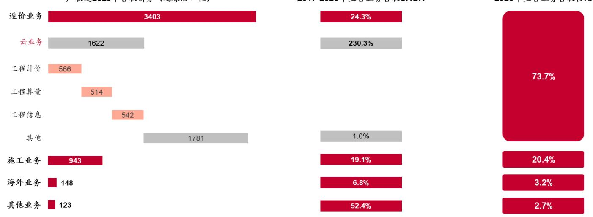
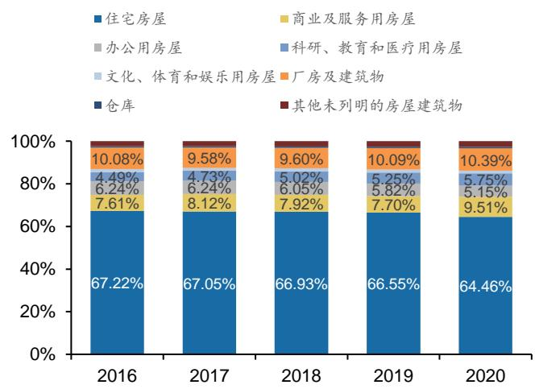
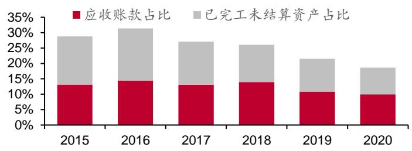
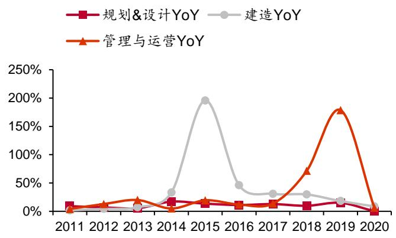
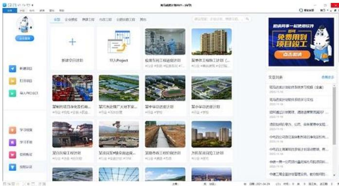
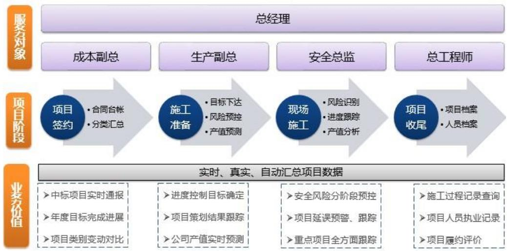
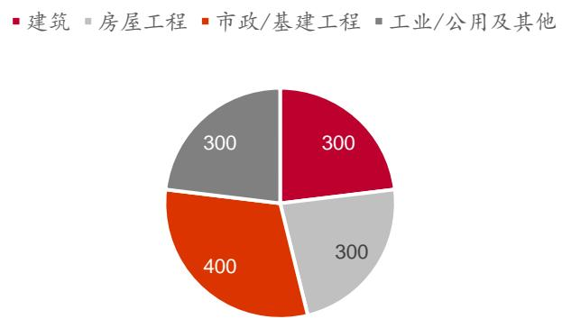

广联达（002410.SZ）/计算机

评级：买入(维持) 市场价格：57.00

<table><tr><td colspan="2">基本状况</td></tr><tr><td>总股本(百万股) 流通股本(百万股)</td><td>1,190</td></tr><tr><td>市价(元)</td><td>994 57.00</td></tr><tr><td>市值(百万元)</td><td>67,805</td></tr><tr><td>流通市值(百万元)</td><td>67,805</td></tr></table>

  
股价与行业-市场走势对比

# 相关报告

证券研究报告/公司深度报告

2022年02月17日

公司盈利预测及估值  

<table><tr><td>指标</td><td>2019A</td><td>2020A</td><td>2021E</td><td>2022E</td><td>2023E</td></tr><tr><td>营业收入（百万元）</td><td>3,464</td><td>3,947</td><td>5,216</td><td>6,551</td><td>8,263</td></tr><tr><td>增长率 yoy%</td><td>21.1%</td><td>13.9%</td><td>32.1%</td><td>25.6%</td><td>26.1%</td></tr><tr><td>归母净利润（百万元）</td><td>235</td><td>330</td><td>657</td><td>983</td><td>1,401</td></tr><tr><td>增长率 yoy%</td><td>-46.5%</td><td>40.5%</td><td>98.9%</td><td>49.6%</td><td>42.5%</td></tr><tr><td>每股收益（元）</td><td>0.20</td><td>0.28</td><td>0.55</td><td>0.83</td><td>1.18</td></tr><tr><td>每股经营现金流量（元）</td><td>0.54</td><td>1.58</td><td>0.99</td><td>1.54</td><td>1.92</td></tr><tr><td>净资产收益率</td><td>7.0%</td><td>5.0%</td><td>9.6%</td><td>12.6%</td><td>15.2%</td></tr><tr><td>P/E</td><td>288</td><td>205</td><td>103</td><td>69</td><td>48</td></tr><tr><td>P/B</td><td>21</td><td>11</td><td>10</td><td>9</td><td>7</td></tr></table>

备注：股价选取2022年2月17日收盘价。

# 报告摘要

公司作为国内建筑信息化的龙头企业，始终受到市场的紧密关注。本篇报告中，我们重新审视了公司的发展脉络，以较为完整的框架详细梳理了建筑业信息化、数字化转型的各个方面，并结合当前建筑地产形势，致力于厘清公司三大业务的发展现状、成长前景与发展路径。

建筑业数字化转型大势所趋，远期空间有望达到 5000 亿元。人类的绝大部分社会活动都需要在一定的基础设施空间上开展，这一属性就决定了建筑业的市场规模十分庞大，2020 年中国建筑业总产值26.4 万亿元，占GDP 比重约为 26%。建筑业具有高度定制，产业链玩家众多、分散且利益复杂，人员流动性大，变化多等属性，存在经营质量低，发展可持续性差，安全事故与质量事件频发等问题，这意味着数字化潜在作用空间巨大。劳动力压力以及地产洗牌倒逼建筑业转型升级，随着移动、云、物联网、BIM等技术的普及与成熟，中国建筑业信息化迎来黄金发展时期。根据我们的假设估算，中长期看我国建筑业信息化市场规模约为 5000 亿元，其中软件和服务约为 2000 亿元。

数字造价业务：云转型持续超预期，未来依然有较大空间。云转型有利于公司商业模式突破，使得造价业务成长驱动从增量走向存量，降低周期性，凸显成长性。2017 年公司造价业务开始分区域、分产品进行云化，2021 年云转型第一阶段基本完成，全国主要产品都已经实现了云化，转化率与续费率基本均超过了80%，收入规模持续超预期，2020 年造价返还收入达到了34 亿元，2017-2020 年 CAGR 为 24.3%，成长背后主要受益于盗版用户转化和工程信息业务的快速成长。我们认为，公司数字造价业务未来成长空间是70-100 亿元，具体会体现在 4 个方面：增值服务提升、应用领域突破、国际化进程以及公共资源交易管理系统的成长。

数字施工业务：千亿级蓝海市场，公司通过搭建“平台+组件”的产品体系，在客户覆盖率和渗透率实现双提升，第二增长曲线初露峥嵘。施工业务数字化是建筑业数字化的核心难点，在近十年以来科技出现重大应用突破后，施工数字化这一千亿元的庞大市场才得以正式打开。目前公司已形成了“平台+组件”较为完整的数字施工产品体系，覆盖企业级、项目级、岗位级三层和商务、技术、生产各业务线。我们认为，公司在施工数字化上拥有完整的产品体系，且能够快速不断地调整策略，在建筑业数字化转型的大背景下，施工业务有望引领公司第二增长曲线，并进一步夯实公司数字建筑平台服务商的地位。

数字设计业务：国产化+正版化为核心驱动力，“自研+并购”双线布局打造第三成长曲线。设计作为建筑业的上游环节，对下游施工、运维具有非常强的卡位效用，特别是在当前设计施工一体化下数据全流程贯通、前置模拟需求高增的情况下，设计的重要性更加凸显。我们预计 2026 年我国设计软件潜在市场规模为 300 亿元（由于大量盗版存在，实际市场规模小很多)，目前我国设计软件市场基本被国外厂商所垄断，在国产化和正版化的驱动下，行业需求有望持续释放。公司在数字设计业务上以“自研+并购”模式实施业务布局，并在2021 年正式发布自主研发的数维建筑设计软件。我们认为，公司凭借自主研发的三维图形平台，通过客户的快速迭代，有望构筑具有极高竞争壁垒的第三成长曲线。

盈利预测与投资建议：预测公司2021-2023 年营收分别为52.16/65.51/82.63 亿元，归母净利润分别为 6.57/9.83/14.01亿元，EPS分别为 0.55/0.83/1.18元，对应PE分别为103/69/48 倍，维持“买入”评级。

风险提示：建筑行业景气度下降、信息化进度不及预期；数字设计业务技术突破遇到瓶颈；研究报告使用的公开资料可能存在信息滞后或更新不及时的风险等。

# 内容目录

# 一、建筑信息化龙头，数字化驱动建筑产业整体升级…... …-13 -

# 二、建筑业信息化迎来黄金发展期，未来空间将突破千亿元……-19-

# 2.1 建筑业市场基本情况：规模大、参与者众，产业链面临变革……-19-

# 2.5.1 建筑业自身业务精细化管理的转型需求.. .- 8-

# 三、造价业务：云转型打开新成长空间... …- 58 -

# 四、施工业务：千亿级蓝海市场，第二增长曲线初露峥嵘.…. - 74 -

4.1 行业升级加速，施工数字化成长空间广阔 - 75 -  
4.2公司施工业务的发展历程.. …. - 77 -  
4.3公司数字施工业务聚焦工程项目建造过程，多层级产品实现突破..-81-  
4.3.1斑马进度计划：项目进度管理产品.. .- 82 -  
4.3.2 BIMMAKE：施工建模设计软件. …- 83 -  
4.3.3 协筑：简单高效的工程项目多方协同平台.. …- 83 -  
4.3.4 云图：CAD 快速看图. …- 4-  
4.3.5劳务管理产品：广联达BIM劳务管理系统. …- 5 -  
4.3.6 物料管理产品…. …- 7 -  
4.3.7 智能安全产品…. …- 91 -  
4.3.8广联达集采电商：“集中采购 $\scriptstyle +$ 企业电商”整体解决方案……- 93 -  
4.3.9 企业BI数据决策平台：基于BIM 的施工企业经营决策平台.- 94-  
4.3.10 GEPS：广联达梦龙综合项目管理系统.. …- 95 -  
4.3.11筑联：工业级物联网云平台. …- 95 -  
4.4AECORE：PaaS级平台赋能建筑行业数字化转型， …- 96-  
4.5 公司施工业务进展—广度与深度并重.. …- 99-  
4.5.1 施工数字化的四层结构.. …- 100 -  
4.5.2 施工数字化的五个一体化.. …- 101-  
五、设计业务：国产替代背景下“自研 $^ { \ast }$ 并购”引领第三成长曲线. …- 104 -  
5.1工程设计行业概况.. …- 104 -  
5.1.1工程设计业务的分类. …- 104 -  
5.1.2 海外建筑工程设计软件的两大巨头.. …- 105 -  
5.2 国内外工程设计市场概况... …- 108 -  
5.2.1 中外市场简要对比：集中度、国际化程度存在较大差距.-108 -  
5.2.2 中国工程设计行业现状… …- 110 -  
5.3工程设计软件市场规模以及发展驱动. . - 113 -  
5.3.1中国工程设计软件市场规模测算.. …- 13 -  
5.3.2 中国工程设计软件的发展驱动力主要来自政策端， …- 113 -  
政策驱动二：软件正版化…. …- 14-  
5.4广联达设计业务的发展路径与现状. …- 115 -  
5.4.1并购之 MagiCAD：功能强大的机电设计软件提供商. …- 15 -  
5.4.2 并购之鸿业科技：BIM 设计领域领先开发者.. - 117 -  
5.4.3自研之数维设计产品集：“端 $^ +$ 云”架构的数字化集成设计环境- 120-  
5.4.4自研之设计成果交付审查产品集... …- 122-  
5.5 设计的未来—市场呼唤全新的数字设计. - 123 -  
5.5.1 数字设计的定义与特征. …- 124 -  
5.5.2“平台 $\mathbf { + }$ 生态”是数字设计的核心构成. …- 126 -  
5.5.3 数字设计将推动建筑业务的四层变革. …- 128 -  
六、盈利预测及投资建议.. …- 129 -  
6.1盈利预测.. … …- 129 -  
6.2 投资建议. ……-130 -  
七、风险提示. -131-

# 图表目录

图表2：2020年广联达主营业务营收结构（单位：百万元）….. …-13 -图表3：广联达的总体发展战略方向. …-14-图表4.：广联达计划通过三个“三年战略”逐步向产品服务化方向转型升级..-14-图表5：广联达在“八三”规划中设立了 $" 3 + \times "$ 的业务发展目标 …-15 -图表 6：2011-2020 年广联达研发支出率与销售费用率整体走势相..-.15-图表7：2011-2020 年广联达研发人员与销售人员占比整体走势相反…- 15-图表8：2012年以来广联达股权激励措施... …- 16 -图表9：广联达员工人效不断提升，薪酬随之水涨船高（单位：万元）…-16-图表10：2020年计算机行业主要龙头公司员工平均薪酬（单位：万元）.-16-图表11：三维图形平台是数字设计中最核心的技术. …- 17 -图表12：广联达自主图形引擎技术支持核 $\therefore \because$ 产品. …- 17-图表13：数维设计产品集——数维建筑设计单机版.. …- 17-图表14：BIMFACE使用效果示例. …- 18-图表15：广联达拥有五项可行业数字化的核心技术的自主产权. …- 18 -图表 16：2018 年全球建筑业产值占全球 GDP 的 $13 \%$ （单位：万亿美元）.-19-图表17：中国建筑业总产值情况（单位：亿元） …- 19 -图表18：2018-2035年全球建筑业产值变化（单位：万亿美元）. …- 20-图表 19：2030 年全球建筑业产值结构预测.. ……- 20-图表20：建筑业市场按应用领域的分类结构. …- 1 -图表21：建筑业市场按应用领域的分类结构. …- 1 -图表22：2016-2020 年中国房建领域房屋竣工价值结构（按建筑功能）.-.22-图表23：2016-2020年中国房建领域房屋竣工面积结构（按建筑功能）.- 22-图表24：2020 年全球前250 大国际建筑承包商营收分布结构（百万美元）.- 23 -图表25：中国房屋新开工面积累计同比增长速度（单位：%）. …- 23 -图表26：近两年国家关于基础设施投资的重大支持促进政策.. …- 24 -图表 27.：麦肯锡预测未来的建筑业各环节间发生重大的、价值量转移…- 25 -图表 2.：麦肯锡预测各环节间发生重大价值量转移的情况及解释.…-.25-图表29：全国建筑施工承包企业数量众多且在仍在快速增加.. …- 25 -图表30：八大中字头公司国内新签合同占中国建筑业市场整体约三成…- 26-图表31：全球建筑市场集中度呈下降趋势（单位：万亿美元）. …- 26 -图表.2：.020年建筑业盈利质量排全行业倒数第二（单位：亿元）.-\* 28-图表33：施工国企的资金压力已然较重——中国建筑. …- 28 -图表34：施工国企的资金压力已然较重——中国中铁. …-\* 28 -图衣53：施上氏企的页金压刀迅甚国企——化几廷改.. …-20 -图表36：施工民企的资金压力远甚国企—宏润建设. .- 28 -图表37：我国工程资质概览.. …- 29 -图表38：不同级别资质的施工承包企业的年均合同额（亿元） …-.0图表39：施工总承包特级资质对工程施工企业的通用要求... …-.30-图表 40：2012-2020 年中国建设工程施工合同纠纷案件审结数量变化趋势.-31-图表41：2008-2020年中国建筑业从业人员结构 …- .2 -图表2：20.-020年中国建筑业工人年结构变化- .2-图表 43：建筑工程行业信息传递存在断层… …-.32 -图表 44：英、德两国建筑业劳动生产率增长远低于国家整体经济增速…-· 33-图表 45：中国建筑业整体利润水平仅约为工业企业平均利润水平的一半.…- 34 -图表46：海外典型施工企业的EBIT利润率同样较低.. …- 34 -图表 47：较大的建筑项超期与超支现象较为严重- 34-图表48：2018 年中国建筑全过程能耗总量及结构图示. .- 34 -图表49：2018年中国建筑全过程碳排放总量结构图示.. …- 34 -图表 50：2005-2018年中国建筑全过程能耗、碳排放占比的变化趋势….- 35-图表51：与建筑有关的污染与垃圾排放占全球的总比重.. …-.35 -图表52：.2010-.2019年中国房屋市政工程安全事故数量及对应死亡人数..- 36-图表53：2010-2019 年中国房屋市政工程较大安全事故数量及对应死亡人数-36-图表54：京沪两地近期抽查建筑施工的内容与结果...图表55：建筑业在全球全行业中的数字化水平位居倒数第二. …- 37-图表.6：在欧洲，建筑业的数字化程度位列所有主要行业的最后一名...-.37-图表57：在中国，建筑业的数字化程度位列所有行业的最后一名... …- 7-图表58：中国建筑业信息化投入水平远低于欧美发达国家.. …- 37 -图表5.9：中国建筑业的数字化水平距离世界主要经济体仍有较大差距.-.38-图表60：建筑业是典型的粗放管理型行业. …- 39 -图表61：中国适龄劳动人口数量与占比持续下滑（.单位：万人）……- 39-图表.：中国60岁及以上人口数量与占比变化趋势（单位：万人）…-.39-图表63：中国建筑业就业人口近年出现停滞和下降（单位：万人）……- 40-图表..：中国建筑高级从业者认为会影响未来建筑业发展的技术…- 40-图表65：部分技术在建筑业中的应用历史沿革... -40-图表6：三大运营商 2G/3G/4G技术的理论下行速率与带宽对比..- 1 -图表67：5G和4G 的性能对比. - 42 -图表68：Autodesk Docs 的功能特性.. …- 42 -图表：一体式钢筋扫描.… - 43 -图表71：启扬智能工地数字化管理解决方案.. …- 4 -图表72：BIM贯穿建筑生命周期全过程 - 44 -图表 7：全生命周期应用框架…- 44 -图表74：BIM 5D的内涵. …- 45 -图表75：GIS 技术图示. ……- 45 -图表76：全球遥感卫星发射数量.. …- 46 -图表 77：中国遥感卫星发射数量- 46-图表78：飞机的数字孪生体.. .- 47 -图表79：城市体的数字孪生仿真.. …- 47 -图表80：数字孪生体示意 .. …- 47 -图表81：VR 在游戏领域的应用：PlayStation 4.. …- 48-图表82：VR在建筑领域有很大应用潜力.. …- 48 -图表83：建筑机器人在进行建筑施工作业：砌墙. ……- 48-图表84：建筑机器人在进行建筑施工作业：内部组装， …- 48 -图表85：国家关于建筑数字化的部分政策.. ……- 49 -图表86：国家关于工程总承包（EPC）的部分政策. …- 50 -图表87：各地纷纷出台政策支持工程总承包模式发展（部分地区部分政策）-51-图表 88：中国PC装配式建筑方法与现场浇筑方法的对比. …- .52 -图表89：国家层面出台的支持装配式建筑发展的政策.. …- 52 -图表90：双碳“1+N”体系的两大纲领性政策 …- .53 -图表91：关于建筑工程质量与安全的部分政策. …- 54-图表92：2013.-2018年中国建筑业信息化市场规模变化（单位：亿元）.- 54-图表93：2020 年全球建筑业IT支出规模及软件TAM（单位：亿欧元）.- 54 -图表94：2020 年AEC 各板块软件市场TAM占比.. …- 55 -图表95：Nemetschek SE 各业务年度增速. - 5-图表96：2011-2020 年 Nemetschek SE各业务板块 CAGR.. …- 55 -图表97：Nemetscheck E 建造业务营收及增选（单位：百万欧元）….- 56 -图表98：广联达施工业务营收及增速（单位：百万元）. …- 56 -图表99：Procore 营收及增速（单位：百万美元）. …- 56-图表 100：Procore公司的Quality＆ Safety产品为用户创造的价值….- 57 -图表101：中国建筑业信息化市场规模及预测（单位：亿元）.. …- 57-图表102：公司造价业务结构及21H1对应营收（单位：亿元）. ……- .59 -图表103：广联达造价业务营收增速与房屋新开工面积增速关系……- 59-图表104：云转型下产品生命周期得到质变性延长. …- 60 -图表106：云转型下造价业务实际收入重新保持较高增速（单位：亿元）.-61-图表107：中国工程造价咨询企业营收（单位：亿元）.. …-.1 -图表.10.8：中国工程造价咨询企业的造价咨询业务营收（单位：亿元）.- 61 -图表109：广联达造价业务的未来发展路径探析... …- 2 -图表110：广联达推出的主要增值服务产品.. …- 63 -图表111：广材网主要功能 …- .63 -图表112：广材助手与广联达造价软件完美结合，大幅提升造价工作效率.-63-图表11.：广材数聚为企业实现工程造价数据管理提供整体解决方案.-.64-图表114：广联达指标神器可以实现快速分析造价综合指标.. …- 64 -图表 115：项目库帮助用户集中管理项目，推进云端协作.图表116：企业材料库实现材料自动分类及结构化，造价直接调用... …- .64 -图表 117：企业指标库可以对造价指标智能分析，助力精准估算.. …- 5 -图表118：广联达睿图的图纸管理功能.. …- 5 -图表119：广联达睿图的图纸翻模功能.. …- 65 -图表120：我国建筑工程造价逐步市场化的发展历程... …- 66-图表 121：定额计价模式的费用计算流程图.. …- 7-图表122：一个定额计价的费用计算举例... …- 67-图表123：清单计价下的分部分项综合工程量清单计价分析表示例... …- 8-图表124：2020 年中国各行业建筑总产值（亿元）. …- 69 -图表 125：中国工程造价咨询业务收入结构（亿元）…… …- 69 -图表126：广联达造价产品线目前已覆盖多个领域. …- 70 -图表127：Cubicost系列产品. …- 70 -图表.12.：国泰新点智慧公共资源交易平台各系统间业务流程图示- 71-图表 129：国家出台两大政策推动公共资源交易平台建设及其电子化发展..-.72-图表130：我国电子招标采购交易规模快速增长（亿元） …- 72-图表131：我国招投标行业电子化发展前景较大(亿元) …- .72 -图表132：广联达 $= 5 + 3 + 5 ^ { 3 }$ 公共资源智慧交易应用体系.. …- 73 -图表133：广联达公共资源智慧交易应用体系的组成. …- .73 -图表134：1996-2017 年中国固定投资项目数变化情况.. …- .5 -图表 135：近期智慧工地中标项目详情.. …- .5 -图表136：国家关于智慧工地的政策， …- .75 -图表137：各地关于智慧工地的部分政策 …- .76 -图表3：主要建筑企业纷纷开.数字化转型之…- 76-图表139：广联达施工业务营收保持较高增速（单位：百万元）.- 77-图衣140：王要于公可评情… …- 78 -图表141：数字项目管理平台的“114N”图示 …- 78 -图表142：广联达项企一.化解决方案的整体规划……- 80-图表143：公司在2020 年以后更加注重施工业务的营收质量. …- 0 -图表144：广联达数字施工业务聚焦建造过程，将各方联系在一起.. …- 1 -图表145：广联达数字施工业务覆盖维度图示... …- 1 -图表146：斑马进度计划提供多种进度管理模板... - 82 -图表147：在斑马进度计划中增删新的进度计划.. …- 82 -图表148：BIMMAKE 的产品特点. …- 3-图表149：协筑平台的协同运作模式.. …- 84 -图表150：协筑平台的八大功能 …- 84 -图表 151：CAD 快速看图是一款理想的看图工具. ……- 85-图表152：CAD快速看图的七大功能价值.. …- 5 -图表153：广联达BIM劳务管理系统的产品结构与服务模式.. …- .6 -图表154：广联达BIM 劳务管理系统的四大管理价值.. …- 6 -图表155：BIM 劳务管理系统的数字化系统功能... …- 87-图表156：BIM劳务管理系统的信息化工资代发功能.. …- 7 -图表157：BIM劳务管理系统的硬件解决方案功能 …- 87 -图表158：BIM劳务管理系统以闸机为主的硬件设备... …- 87 -图表159：智能物料验收系统应用多种前沿技术实现物料多维度精确管理..- 88-图表160：智能物料验收系统的智能监管功能. …- 88 -图表161：智能物料验收系统的智能分析功能.. …-.88 -图表162：智能物料验收系统的多种分析功能模块， …- 88 -图表163：智能物料验收系统的智能决策功能.. …-88-图表164：广联达现场物料追踪系统的产品结构... …- 89 -图表165：搅拌站材料核算系统的工作流程. …- 0-图表166：广联达搅拌站材料核算系统的核心功能.. …- 0 -图表167：广联达AI钢筋/钢管点根产品的工作流程机理.图表168：AI钢筋/钢管大幅提升钢筋、钢管计数效率.. .- 91 -图表169：.I 钢筋/钢管帮助施工人员便捷有效地管理钢筋、钢管……- 91 -图表170：施工安全管理系统结构.. …- 92 -图表171：广联达 $\mathsf { B I M } { \boldsymbol { + } } \mathsf { V R }$ 虚拟安全体验馆系统的三个核心价值... …- 92 -图表172：广联达 $\mathsf { B I M } { \boldsymbol { + } } \mathsf { V R }$ 虚拟安全体验馆系统的三个核心功能， …- 92 -图表173：广联达集采电商适用于采购相关全流程. …- 93 -图表174：广联达集采电商的业务流程图 ... …- 93 -囹衣113：丿联达果木电冏的广品朱构.. …-\*. 4 -图表176：广联达企业BI数据决策平台的服务流程模式. …- 95 -图表177：GPES的应用价值所在. …- 95 -图表178：筑联平台的产品架构…. …- 96-.图表179：AECORE九大服务产品模块. 97 -图表180：AECORE 四大云解决方案 …- 98 -图表181：广联达项目级产品渗透情况...图表1.2：项的字化离不…开多样的传感器的支持……-100-图表183：施工数字化的未来之四层结构. - 100 -图表184：广联达软硬一体化解决方案的结构图示.. .- 101 -图表185：广联达项企一体化整体规划.. - 102 -图表186：广联达项企一体化的具体应用... …- 102 -图表 17：广联达业财一体化解决方案的结构图示- 102 -图表188：广联达甲乙方一体化解决方案的结构图示. …- 103 -图表189：广联达设计施工一体化解决方案的结构图示... …- 103 -图表190：工程设计按应用行业可划分为6 大领域. …- 105 -图表191：工程设计按流程步骤可划分为四个设计阶段.. …- 105 -图表192：Autodesk营收与利润情况（单位：百万美元）.. …- 106 -图表193：.todes 建筑相关业务营收情况（单位：百万美元）….- 106-图表194：Autodesk 房建设计产品线. …- 106-图表195：Autodesk基建设计产品线. …-106-图表196：Bentley发展历程. …- 107 -图表197：Bentley 软件产品整体架构.… …- 107-图表198：Bentley 软件与解决方案架构.. …- 108 -图表199：全球工程设计市场头部效应不断加强（单位：亿美元）…-.109-图表200：中国工程设计市场集中度较低（单位：亿元）.. …- 109 -图表201：中外头部工程设计企业的业务国际化程度对比（单位：亿美元）-109-图表202：全球工程设计150 强上榜企业的中外结构差异... …-110-图表 203：2016-2020 年中国工程设计企业数量.. …- 110 -图表204：按主营业务划分，2017-2019 年工程勘察设计行业的企业分布.-110-图表205：2017-2019 年工程勘察设计行业的从业人员结构（单位：万人）-110-图表206：工程勘察设计行业的专业技术人员数量变动情况（单位：万人）-110-图表207：2016-2020 年工程勘察设计行业整体营收结构（单位：亿元）..-111-图表208：2017-2020 年中国工程设计行业新签合同金额（单位：亿元）..-111 -图表209：2016-2020 年工程勘察设计行业整体营收结构（单位：亿元）..-111 -

图表 .211：2018-2019年主营业务为设计的企业的主营领域分布结构...- 112 -图表212：2017-2019 年勘察设计业务各细分行业营收情况（单位：亿元）-112-图表213：2018-2019 年主营业务为设计的企业的营收分布（单位：亿元）-112 -图表214：2017、2019 年主营业务为设计的企业的毛利率变化.. …- 112 -图表215：全球设计领域数字化市场规模预测（亿美元）. …- 113 -图表 216：2026 年全球约 1200 万人从事设计工作. …- 113 -图表 17：关于支持促进工业软件发展的部分政策- 114-图表 218：关于推动建筑业研发应用自主可控软件与系统平台的部分政策..-114-图表219：关于软件正版化的部分政策.. …- 114 -图表220：广联达在设计业务上的“收购+自研”并行布局情况. …- 115 -图表221：MagiCAD 系列专业软件.. …- 116 -图表 222：MagiCAD Cloud 的两部分组成及其功能  
图表223：MagiCAD 机电深化解决方案 …- 17-图表 224：MagiCAD 支弔架解决方案. …- 117 -图表225：MagiCAD 二维出图解决方案...  
图表226：MagiCAD 机电算量解决方案. …-17-图表227：MagiCAD Cloud 的两部分组成及其功能. …-17-图表228：BIMSpace产品系列 …- 18 -图表229：广联达鸿业二维MEP 设计系列. …- 119 -图表 230：数维设计产品集的运行架构... …-120 -图表 231：广联达数维设计产品集的具体产品情况.. …-120 -图表232：广联达数维建筑设计产品应用图例. .- 121 -图表233：广联达构件坞的界面图示. …- 122 -图表234：广联达数字化审图系统图示.. …- 122 -图表 235：广联达BIM 模型审查的功能结构图示. …- 122-图表236：设计行业正在进入数字设计3.0 时代.. …-123 -图表 237：数字设计的定义与四大特征.. …- 124 -图表 238：数字设计的内涵.. …- 124 -图表239：数字设计以数据驱动协同，打通项目全流程. …- 125-图表240：数字设计实现一体化协同.. …- 125 -图表 .41：数字设计通过前置化模拟、低成本试错，大幅减少浪费-.126-图表 242：数字设计推动下的集成化交付模式. …-126 -图表 243：数字设计平台的架构 - 126 -图表.44：数字设计平台生态体系… …-128 -

图表245：广联达盈利预测表， …-129 -图表246：广联达历史PE 估值水平变化情况(TTM 规则) …-130-图表247：广联达历史 PS 估值水平变化情况(TTM 规则) .-131 -图表248：可比公司估值水平.. .-131 -

# 一、建筑信息化龙头，数字化驱动建筑产业整体升级

# 1.1 专注于建筑产业信息化，不断转型拓展业务边界

广联达成立于1998年，始终专注于建筑信息化领域，为国内领先的建筑信息化服务商。从最初的计价、算量、工程信息到工程施工再到设计业务，当前广联达已搭建起可服务于建筑产业全流程的数字建筑平台雏形。

坚定推进二次创业——基于云的业务转型。2015 年，广联达宣布向“数字建筑产业平台服务商"全面转型；2017年，广联达董事长刁志中先生正式提出“二次创业”的概念，将“让每一个工程项目成功”作为公司转型发展的新使命，大力推进公司软件产品的云服务化，并拓展服务边界，从造价预算向施工、设计渗透。

强大的产品与服务提供能力，使得公司的内生发展动力充足，以还原后口径计算，2006-2020 年公司的收入 CAGR 约为 $30 \%$ ，归母净利润CAGR约为 $32 \%$ 。

  
图表1：2006-2020 年广联达营收与利润情况（单位：百万元）  
资料来源：公司公告，Wind，中泰证券研究所（注：还原后的营业总收入 $=$ 表观营业总收入 $^ +$ 期末云预收-期初云预收；还原后的归母净利润 $=$ 表观归母净利润 $^ +$ （期末云预收-期初云预收） $^ { \star } 9 0 \%$ )  
图表2：2020 年广联达主营业务营收结构（单位：百万元）

造价业务与施工业务为公司主要营收驱动力。公司目前的收入主要来源于造价业务与施工业务，其中造价业务又占主要部分。

  
广联达2020年营收拆分（还原后口径）  
2017-2020年主营业务营收CAGR  
2020年主营业务营收占比

资料来源：公司公告，Wind，中泰证券研究所（注：还原后的营业总收入 ${ \bf \Psi } _ { \cdot } = { \bf \Psi } _ { \cdot }$ 表观营业总收入 $^ +$ 期末云预收-期初云预收）

  
图表3：广联达的总体发展战略方向  
资料来源：2021年中国数字建筑峰会，中泰证券研究所  
图表4：广联达计划通过三个“三年战略”逐步向产品服务化方向转型升级

通过三个“三年战略”成为全球领先的数字建筑平台服务商，驱动建筑产业整体升级。在 2021 年中国数字建筑峰会上，公司进一步明确其长远发展战略目标为打造全球领先的数字建筑平台服务商，以数字建筑平台打通建筑产业全过程，驱动建筑产业整体升级。在具体实施方略上，从2017年开启二次创业之旅时，公司以三个“三年战略”为指引，不断提升服务专业化与平台化的水平，一步步实现向产品服务化方向的转型升级。

  
资料来源：广联达 2020 年投资者大会演示文稿，中泰证券研究所

$3 + \tt X$ 业务目标推动业务持续健康快速增长。当前，公司正处在“八三”规划时期内，公司对应制定了 $\because + X ^ { \dag }$ 的业务目标:

■ 3：造价施工比翼双飞，设计软件战略突破，数字建筑平台成型，实现设计施工一体化;  
■ X：数字装修、数字供采、数字城市、数字金融、数字教育等创新业务实现突破，打造出新的（潜在）营收贡献点。

$\because + X ^ { \dag }$ 目标的设立推动公司在“八三”规划期内实现多品类的业务线条覆盖、多样的商业盈利模式，帮助公司打造持续内生发展、健康快速增长的经营体系。

  
图表5：广联达在“八三”规划中设立了 $\cos + \tt X ^ { \tt S }$ 的业务发展目标

资料来源：广联达 2020 年投资者大会演示文稿，中泰证券研究所

# 1.2 销售起家到研发巩固的导向转型，注重人才激励

# 1.2.1 销售起家开拓，研发投入夯筑竞争优势

在创业成立的初期，公司凭借强大的销售推广能力实现起家，其造价产品卡住了建筑造价领域的主要市场，奠定了第一次创业后的市场领先地位。在不断获取市场份额的同时，伴随着造价产品的云转型，以及施工业务、设计业务的相继布局，公司也在持续加大本身即较高水平的研发投入，提升产品与服务质量以巩固竞争优势。公司在销售、研发的费用率以及人员投入结构的对比即是很好的证明。

  
图表6：2011-2020 年广联达研发支出率与销售费用率整体走势相反  
资料来源：公司公告，Wind，中泰证券研究所

  
图表7：2011-2020 年广联达研发人员与销售人员占比整体走势相反  
资料来源：公司公告，Wind，中泰证券研究所

# 1.2.2注重人才激励，人效持续提升

公司注重团队建设与人才激励，在薪酬和股权等多方面不断提高激励力度，员工薪酬水平位居行业前列，员工人效也不断提升。自2012 年以来，公司已发布七次规模不一的股权激励方案，且公司员工的平均薪酬从2012 年的14.63 万元增至 2020 年的 32.25 万元，在计算机行业龙头公司中已经处于较高水平。在高待遇的激励下，公司的员工人效水平也持续提升，以还原后收入口径计算，公司人均创收从 2011 年的 25.07 万元增至 2020 年的56.21 万元。

图表8：2012 年以来广联达股权激励措施  

<table><tr><td>日期</td><td>主要激励內容</td></tr><tr><td>2012.12</td><td></td><td>⚫首期股权激励计划，授予 8500 万股限制性股票，7.85元/股</td></tr><tr><td>2015.07</td><td></td><td>⚫ 第一期员工持股计划，购买数量372.5 万股，25.21 元/股</td></tr><tr><td>2016.07</td><td></td><td>⚫ 部分董事增持，增持数量 1106 万股，增持均价14.47 元/股</td></tr><tr><td>2017.12</td><td></td><td>⚫第二期员工持股计划，购买数量239 万股，19 元/股</td></tr><tr><td>2018.01</td><td></td><td>⚫ 第二次股权激励计划，授予 1200 万份股票期权，行权价格 27.22 元/股；820 万股限制性股票，13.61 元/股</td></tr><tr><td>2020.11</td><td>●</td><td>第三次股权激励计划，授予123.50万份股票期权，行权价格55.39 元/股；501.80万股限制性股票，34.91元/</td></tr><tr><td>2021.09</td><td>●</td><td>发布新的股权激励计划草案，计划授予571万股，授予价格30.48元/股。拟回购公司股票总计不低于8亿元且</td></tr></table>

资料来源：公司公告，中泰证券研究所

  
图表9：广联达员工人效不断提升，薪酬随之水涨船高（单位：万元)  
资料来源：Wind，中泰证券研究所（注：人均创收选用还原后营收）

  
图表 10：2020 年计算机行业主要龙头公司员工平均薪酬（单位：万元）  
资料来源：Wind，中泰证券研究所

# 1.3公司掌握重要的自主核心技术

# 1.3.1 公司拥有自主核心知识产权的三维图形平台引擎

三维图形平台核心作用凸显，国产替代难度大。图形引擎、特别是三维图形平台引擎，是数字设计中最核心的技术。在设计软件中，三维图形平台承担了图形计算、三维展示等功能，是设计软件中的核心模块，而对应的三维图形平台引擎则是其核心技术，相当于数字设计里的“芯片”。而与芯片之于电子相关产业一样，目前我国很多BIM软件厂商的产品是基于国外图形平台/

BIM产品来做的二次开发，极易受到“卡脖子”的影响。而很多用户则干脆直接选用国外设计施工软件，在形成用户使用黏性的同时，大量项目数据积累在国外软件平台上，这也导致其国产替代的切换成本大增。

  
图表11：三维图形平台是数字设计中最核心的技术

资料来源：广联达2021 年投资者大会演示文稿，中泰证券研究所公司坚持自主研发，拥有自主核心知识产权的三维图形平台引擎。创立初期，公司便坚持投入研发三维图形平台。经过近20 年的积累，公司目前已拥有自主核心知识产权的三维图形平台引擎，并将自主引擎技术赋能于设计、施工、运维三个环节的核心产品，形成贯穿建筑生命周期的应用生态。2021年10月，公司正式发布基于自主三维引擎技术开发的数维设计产品集——建筑设计单机版，实现了国产自主设计软件产品上的一次突破。

  
图表12：广联达自主图形引擎技术支持核心产品  
资料来源：广联达2021年投资者大会演示文稿，中泰证券研究所

  
图表 13：数维设计产品集——数维建筑设计单机版

资料来源：广联达设计官网，中泰证券研究所

BIMFACE：国内领先的轻量化 BIM引I擎。BIMFACE是公司基于自主核心知识产权的三维图形平台而开发的BIM 轻量化BIM引擎，可帮助BIM 应用的开发者快速搭建自己的BIM应用平台。BIMFACE 专注建筑行业全生命周期解决方案，以模型及图纸轻量化解析与展示为基础，结合地理信息系统（GIS）、模型渲染与效果呈现、项目文档管理等扩展功能，助力开发者打造以建筑信息模型为核心的多元管理平台。BIM的功能特性如下：

支持 50 余种文件格式：BIMFAC 目前能够解析 50 余种常见工程图纸和模型，用户无需手动操作，只需上传原始文件，BIMFACE就能在云端自动发起转换。

极速顺畅的模型图纸浏览: BIMFACE使用WebGL技术在网页端渲染模型，最大支持10G模型（对应建筑面积超40万平方)，中等模型杜绝花、卡、闪。无需安装插件，用户可以流畅地在浏览器中进行查看模型、测量尺寸、剖切截面、漫游浏览等多种操作。

丰富易用的开放接口：BIMFACE 开放了丰富的二次开发接口，开发者可以基于这些接口进一步发挥模型的价值

  
图表14：BIMFACE使用效果示例  
资料来源：BIMFACE官网，中泰证券研究所

# 1.3.2 五项行业数字化的核心技术自主产权有效提升公司综合解决方案的提供能力

除了三维图形平台及引擎之外，公司同时还拥有五项可行业数字化的核心技术自主产权，分别是BIM/CIM技术、IoT技术、大数据技术、AI技术、云中立技术。当前建筑业的数字化转型趋势下，单个数字化技术不足以满足客户系统数字化转型的需求，利益相关方不再满足于单点产品与解决方案，而更加期盼综合性、多维度的整体解决方案。公司拥有的五大核心技术自主产权，结合自主三维图形平台引擎，可以有效地为用户提供更好的解决方案体系。

图表15：广联达拥有五项可行业数字化的核心技术的自主产权资料来源：2021中国数字建筑峰会，中泰证券研究所

  
广联达具备行业数字化的5项核心技术的自主产权

# 二、建筑业信息化迎来黄金发展期，未来空间将突破千亿元

# 2.1 建筑业市场基本情况：规模大、参与者众，产业链面临变革

根据一般定义，建筑业是指国民经济中从事建筑安装工程的勘察、设计、施工以及对原有建筑物进行维修活动的物质生产部门，主要对各种建筑材料和构件、机器设备等进行建筑安装活动，为国民经济建造生产性与非生产性固定资产。

因此，建筑业是国民经济各物质生产部门和交通运输部门进行生产的手段，是人民生活的重要物质基础，人民的绝大部分社会活动都需要在一定的基础设施空间上开展，这一属性就决定了建筑业的市场规模十分庞大。根据麦肯锡的报告，2018 年全球建筑业产值占全球 GDP 的比重为 $13 \%$ ，达到11.5万亿美元。而中国建筑业产值占GDP 比重甚至更高，2020 年占国内 GDP比重为 $2 5 . 9 8 \%$ ，总产值达到了26.39 万亿元；2010年以来中国建筑业产值始终占GDP 比重在 $20 \%$ 以上，以1：6.86汇率计算（2018年人民币兑美元年终汇率)，2018年中国建筑业产值占到全球建筑业产值约 $30 \%$ 。

  
图表16：2018 年全球建筑业产值占全球 GDP 的 $13 \%$ （单位：万亿美元)

  
图表17：中国建筑业总产值情况（单位：亿元）

资料来源：麦肯锡，中泰证券研究所资料来源：Wind，中泰证券研究所

如此之大的市场规模体量，注定了当前建筑业很难有较高的整体增速。根据麦肯锡的预计，2018-2035 年全球建筑业产值年复合增速约为 $3 \%$ 。

  
图表18：2018-2035 年全球建筑业产值变化（单位：万亿美元）  
资料来源：麦肯锡，中泰证券研究所

未来全球建筑业市场上，除了中美两大经济体以及日德英法等传统强国外，印度、印尼凭借较高的经济与人口增速，有望成为新的建筑业大国。根据由牛津经济研究院和 Marsh McLennan 公司 Marsh 和 GuyCarpenter 制作的预测，以 2017 年美元计价，到 2030 年中国建筑业市场占全球建筑业市场的比例将略下滑至 $24 \%$ ，仍为全球第一大建筑业市场，市场规模估算约为4.1万亿美元，较当前有约 $7 \%$ 的增长空间；美国以 $14 \%$ 位居第二，印度以 $7 \%$ 的占比成为第三，之后分别为日本、印尼、澳大利亚等国家。

  
图表19：2030 年全球建筑业产值结构预测  
资料来源：牛津经济研究院，中泰证券研究所

# 2.1.1建筑产业复杂：产业链参与方繁杂，建筑应用领域众多

一个项目的建成，通常需要众多参与方持续半年到一年甚至多年的合力协作，其间牵扯到的参与方包括但不限于业主、总承包商、专业/劳务承包商、建筑/结构设计师、融资方、物流服务提供商、材料供应商、工程监理方等。同时，根据模式不同，项目从立项招投标到建成运营，各参与方之间的利益关系极其复杂，很难用一张图来全面画出建筑产业各参与方之间的准确利益关系。

同样，根据建筑的不同用途，建筑产业也可以分为房屋建筑（房建）、土木工程建筑（基建）、建筑安装、建筑装饰装修等其他这四类方向，而房屋建筑、土木工程建筑各自又可细分为8个/5个细分领域。

  
图表20：建筑业市场按应用领域的分类结构

资料来源：中国建筑业统计年鉴，中泰证券研究所国内建筑市场——房建规模遥遥领先。与人们的印象一致，房屋建筑业始终占据中国建筑市场的最大份额，历年中国建筑业统计年鉴也显示，房屋建筑业的产值始终超过建筑业总产值的 $60 \%$ 。基建可细分为公路铁路、桥梁隧道、水利水运、管道架线等，细分领域众多，但各细分领域的产值相对较低，仅铁路、道路、隧道和桥梁工程市场规模相对较大。

图表21：建筑业市场按应用领域的分类结构资料来源：历年中国建筑业统计年鉴，中泰证券研究所住房建设的价值量占全建筑领域价值量的约 $40 \%$ 。根据中国建筑业统计年鉴的标准，我们将房屋建筑业再进行详细拆分，拆分后的房屋建筑业包括住宅房屋，商业及服务用房屋，办公用房屋，科研、教育和医疗用房屋，文化、体育和娱乐用房屋，厂房及建筑物，仓库等。

根据拆分结果我们可以看到，房建领域中，为百姓居住而建造的住宅房屋仍然是最大部分，无论是价值量还是面积占比均占房建总体的 2/3 左右，在全建筑领域中占价值量约 $40 \%$ 。以商业及服务用、办公用房为主的商用房建占据第二位，工业相关的工厂建筑物及仓库位居第三，以科研教育医疗、文体娱乐为主的公用事业建设占比位列第四。

  
图表 22：2016-2020 年中国房建领域房屋竣工价值结构（按建筑功能）  
资料来源：历年中国建筑业统计年鉴，中泰证券研究所

  
图表23：2016-2020 年中国房建领域房屋竣工面积结构（按建筑功能）

资料来源：历年中国建筑业统计年鉴，中泰证券研究所全球建筑业市场结构分布相对平均。全球建筑市场上，房建虽然也是重要的一个领域，但在全市场中的占比并没有中国这般大，工业、道路铁路、机场等基建领域同样占据较大份额。根据 ENR 的报告，以全球前250 大国际承包商的收入结构为代表，全球建筑市场上，交运、房建、油气石化、能源电力为四大需求领域，其中房建仅约占总市场的 1/4，这一结构与中国市场上房建“一家独大”的局面完全不同。

  
图表24：2020 年全球前 250 大国际建筑承包商营收分布结构（百万美元)  
资料来源：ENR，中泰证券研究所

基建迎来政策春风，地产低潮阶段下基建板块迎来发展机遇。“房住不炒”下政策持续收紧住宅为主的地产行业，2021 年下半年来地产行业也在连续政策重锤下出现经营状况同比下滑、债务危机频发的情形。与住宅地产的寒冬对应的，是基建行业连续迎来政策的春风。

中长期：2020 年两会上，政府提出“两新一重”，将重点支持国内新型基础设施建设、新型城镇化发展和交通、水利等重大工程建设。“十四五”规划的出台则进一步明确了新基建的范畴与目标。  
近期: 2021 年末召开的中央经济工作会议再度提出要适度超前开展基建投资。

一系列政策风口下，我们认为未来中国建筑业在新发展环境下有望在基建领域实现重大的增长突破。

图表25：中国房屋新开工面积累计同比增长速度（单位： $\%$ )

  
资料来源：Wind，中泰证券研究所

图表26：近两年国家关于基础设施投资的重大支持促进政策  

<table><tr><td>时间</td><td>政策/文件</td><td>主要内容</td></tr><tr><td>2020.05</td><td>《2020 年政府工作报告》</td><td>重点支持既促消费惠民生又调结构增后劲的“两新一重”建设，主要是： ⚫ 加强新型基础设施建设：发展新一代信息网络，拓展 5G 应用，建设数据中心，增加充电桩、换 电站等设施，推广新能源汽车，激发新消费需求、助力产业升级。 ● 加强新型城镇化建设：大力提升县城公共设施和服务能力，以适应农民日益增加的到县城就业安 家需求。新开工改造城镇老旧小区3.9 万个，支持管网改造、加装电梯等，发展居家养老、用餐、 保洁等多样社区服务。</td></tr><tr><td>2021.03</td><td>《中华人民共和国国民经济 和社会发展第十四个五年规</td><td>● 加强交通、水利等重大工程建设。 统筹推进传统基础设施和新型基础设施建设，打造系统完备、高效实用、智能绿色、安全可靠的现代</td></tr><tr><td></td><td>划和 2035 年远景目标纲要》</td><td>化基础设施体系。具体措施主要包括加快建设新型基础设施、加快建设交通强国、构建现代能源体系、 加强水利基础设施建设四方面。</td></tr><tr><td>2021.12</td><td>中央经济工作会议新闻通稿</td><td>会议提出要继续实施积极的财政政策，要适度超前开展基础设施投资。</td></tr></table>

资料来源：各政府机构官网，中泰证券研究所

# 2.1.2 建筑业价值链迎来重塑，价值重新分配在即

当全球制造业经历一轮又一轮技术与产业革命，逐步实现高效率、高质量的工业化、流水线生产制造模式时，建筑业却在这几百年间未能迎来商业模式上质的变化，更多的还是以堆人头式的传统现场浇灌为主。不过，即使再传统的行业也会多少受到工业流水线的影响，进而改变其生产方式。当以装配式建筑为代表的工业化建筑生产模式打开局面时，建筑业的产业链或将得到重塑，而行业的价值量也将在各参与方之间开始重新分配。

麦肯锡在《The Next Normal in Construction》报告里对未来建筑产业链的价值再分配做了一个预测。最为明显的变化即是因装配式建筑而产生的。未来装配式建筑的兴起，使得建筑施工更多是在工厂内对构件进行加工、然后运送到现场进行组装，原先占据较大价值量的现场施工总承包与专业分包环节将损失相当大的价值量，而场外预制（即工厂内加工构件）环节则将成为这一转变趋势下最大的赢家，从原来的几乎无价值直接变为获得 $20 \% - 3 0 \%$ 的建筑产业链价值量。我们将具体各环节的变化及原因列于下面两张图表中。

<table><tr><td rowspan="3"></td><td rowspan="3">软件供</td><td colspan="10">原材料、组件、机械设备供应</td></tr><tr><td rowspan="3">土地坡</td><td rowspan="3">设</td><td colspan="4"></td><td colspan="2"></td><td rowspan="3" colspan="2"></td></tr><tr><td colspan="2"></td><td colspan="2"></td><td colspan="2"></td></tr><tr><td></td><td></td><td></td><td></td><td></td><td>场外</td><td></td><td></td></tr><tr><td>初始期产业环节价值量</td><td>0-1000</td><td>9000-13000</td><td>12000</td><td>15000-18000</td><td>5000-9000</td><td>8000-120009000-13000</td><td></td><td>1000-4000</td><td>0-1000</td><td>240000</td><td>150000</td></tr><tr><td>初始占产业链总价值量比重</td><td>0-1%</td><td>8-12%</td><td>9-14%</td><td>13-17%</td><td>5-9%</td><td>6-11%</td><td>8-12%</td><td>1-3%</td><td>0-1%</td><td>20-25%</td><td>9-13%</td></tr><tr><td>未来占产业链总价值量比重</td><td>1-2%</td><td>5.9%</td><td>5-9%</td><td>11-15%</td><td>4-8%</td><td>5-12%</td><td>5.9%</td><td>1-3%</td><td>20-30%</td><td>5-10%</td><td>2-7%</td></tr><tr><td>占比变动方向</td><td>+</td><td>-</td><td>-</td><td>-</td><td>-</td><td>基本不变</td><td>-</td><td>基本不变</td><td>+</td><td>-</td><td>-</td></tr></table>

资料来源：麦肯锡，中泰证券研究所

图表28：麦肯锡预测各环节间发生重大价值量转移的情况及解释  

<table><tr><td>环节</td><td>变化前价值量占比</td><td>变化后价值量占比</td><td>变化的主要原因</td></tr><tr><td>软件提供</td><td>0-1%</td><td>1-2%</td><td>建筑业全流程的数字化发展推动软件提供服务获得更大的产业链价值量占比。</td></tr><tr><td>土地开发</td><td>8-12%</td><td>5-9%</td><td>建价值有展导向所创造的新增利润空间最终将流向消费者，因而地产开发商</td></tr><tr><td>设计与工程</td><td>9-14%</td><td>5-9%</td><td>准化工程模下，降设计师与结构工程师可获取溢价的能力下降，其所占价值份</td></tr><tr><td>基本材料生产</td><td>13-17%</td><td>11-15%</td><td>建筑材料的轻量化下，每个建筑项目的材料需求量有望下降，导致其价值占比小</td></tr><tr><td>组件生产</td><td>5-9%</td><td>4-5%</td><td>对于电梯、暖通、空调等组件而言，建筑的产品化和标准化以及在线渠道将提高 价格透明度并导致商品化。集成流程将提高大型承包商或模块化建筑公司的议价 能力，而国际化将导致更多的在低成本国家的采购。</td></tr><tr><td>机械设备制造</td><td>6-11%</td><td>5-12%</td><td>机械设备自动化带来的高效率将使得施工现场对机械的需求小幅下降，而机械设 备背后的增值服务所带来的价值量增加并不能完全抵消这一下降。</td></tr><tr><td>原材料配送与物流</td><td>8-12%</td><td>5-9%</td><td>工业化、模块化生产下，集中从工厂运送装配构件至现场大幅减少了物流服务商 的服务工作量。</td></tr><tr><td>机械设备租赁</td><td>1-3%</td><td>1-3%</td><td>影响较小，基本不变。</td></tr><tr><td>场外预制</td><td>0-1%</td><td>20-30%</td><td>转型下的最大赢家，工厂内加工建筑构件将极大提升该环节的价值量与占比。</td></tr><tr><td>现场施工总承包</td><td>20-25%</td><td>5-10%</td><td>受到场外预制的冲击，价值量占比大幅下降。</td></tr><tr><td>现场施工专业分包</td><td>9-13%</td><td>2-7%</td><td>同样受到场外预制的冲击，价值量占比大幅下降。</td></tr></table>

资料来源：麦肯锡，中泰证券研究所

# 2.2 建筑业市场格局分散，竞争极为激烈

国内拥有建筑不同级别资质的企业数量不断增加，建筑施工行业竞争日趋激烈。中国的建筑业市场本身即具有庞大的空间，再加以建筑业长期以来形成的以堆人头为主的生产模式，自然少不了数量众多的建筑企业，根据2020年中国建筑业统计年鉴的数据，仅建筑施工领域，2020 年底全国即有 71430家获得承包资质的施工总承包企业。值得一提的是，拥有特级施工承包资质的施工企业在 2016-2020 年期间数量从 298 家增长至 640 家，增速高于其他三个资质级别的数量增速。

图表29：全国建筑施工承包企业数量众多且在仍在快速增加数量众多的建筑企业导致的直接后果就是中国建筑业市场的集中度较低。中国的八大中字头施工企业，以新签合同口径计算，合计仅约占中国建筑市场份额的三成，不过也可以看到八大“中字头”的市场份额在稳定提升中。

  
资料来源：中泰证券研究所

全球建筑市场同样呈现集中度低的格局。根据麦肯锡对 2018-2020 年全球建筑市场规模的预测，ENR 全球前250大国际承包商的国际总营收仅占全球建筑市场总产值的 $3 \% { - } 4 \%$ 水平，且这一占比仍然在呈下降趋势。

  
图表30：八大中字头公司国内新签合同占中国建筑业市场整体约三成  
资料来源：历年建筑业统计年鉴，Wind，中泰证券研究所（注：八大中字头公司的新签合同额包括施工、设计、建材和设备制造与销售等）

  
图表31：全球建筑市场集中度呈下降趋势（单位：万亿美元）  
资料来源：ENR，麦肯锡，中泰证券研究所

从我国角度而言，我国建筑业、特别是建筑工程领域市场集中度较低的原因主要可以归结为以下几方面:

市场化程度有待进一步提升：1）改革开放以来我国长期实行定额计价，使得建筑业市场未能形成良好的市场竞争机制。21世纪以来我国开始大力推行清单计价模式，但长期以来的定额计价模式导致企业间的竞争更依赖于关系竞争，通过处理好与政府间的关系以及与业主间的关系来争夺定单，而不是注重通过提升企业技术水平与内部管理能力来提高企业竞争力。2)地方政府的保护主义、各地区存在的明里暗里的行政垄断也在阻碍建筑业市场集中化程度的提升。

建筑市场企业结构不合理：1）建筑行业内大中小型企业数量结构不合理，大型、特大型建筑企业数量过多，小型企业数目与所占比例偏低，导致市场竞争格局缺乏层次，没有形成合理的以总承包为龙头，以专业承包为依托，以劳务分包为基础的三层次承包服务、组织结构体系。2)行业内大小企业没有形成合理的分工协作关系，同层次、或相邻层次间企业竞争激烈。市场不成熟和企业家的不成熟，使大家热衷于做大做全，陷入恶性竞争，高利润的细分专业市场则发展不充分。

建筑业进入壁垒低：1）我国长期实行的定额计价模式使得建筑业企业缺乏动力追求规模经济发展。2）建筑业是典型的劳动密集型产业，资本密集度低，导致行业进入壁垒较低。3）建筑业与其他新兴产业相比，比较稳定成熟，长期以来技术进步缓慢，传统建筑业产品的施工生产技术和工艺并不复杂，进入普通领域的技术性壁垒很低。

在各家技术水平、施工能力相近的情况，我们认为建筑业的核心竞争要素就在于1）资金、2）资质。

# 2.2.1 建筑业核心竞争要素一：资金

一个项目的建成，背后总会涉及到上千万乃至以亿元为单位的资金调动，更何况建筑企业经常要同时承接多个项目，因此建筑行业对企业的资金实力、资金流通管理能力均有较高要求，以保证在需要的时候能够拿的出钱来维持项目正常运转。然而，建筑产业流程极其复杂，建筑产业链中的多个环节存在资金占用的情况:

招投标的投标保证金：投标方在提交投标文件时，需同时提交投标保证金，投标保证金不超过项目估算价的 $2 \%$ ，上限为80万元。项目竣工后预留的质量保证金：发包人与承包人可在合同上约定，在承包人完成建设工程合同后，发包人从应付的工程款中预留一定比例资金，以保证承包人在缺陷责任期内对建设工程出现的缺陷进行维修的资金。质量保证金预留比例不得高于工程价款结算总额的 $3 \%$ 。施工与结算支付进度不匹配：出于建筑项目的复杂性，加之安全考虑，发包人在建筑工程的验收过程中始终保持高度审慎态度，而发包人内部繁琐的付款流程则进一步加剧了完工与支付间的进度不匹配程度，最后出现完工与结算间、结算与付款间的两种不匹配。票据支付方式的大量使用：票据支付本身具有较强的灵活性，可以在资金有限的情况下，利用票据的远期付款属性采购更多货物与服务，为建筑业带来较高的扩张性。但票据自身的远期支付属性、较高的收益率、缺乏统一的规范流通平台等问题，使得票据本身的贴现与流通变现成为最大的挑战。地产开发商率先大量使用票据支付，层层背书转手后将建筑业大量参与方绑定在同一条利益线上，使得全行业资金压力倍增。

资金流转的层层“克扣”，导致建筑业公司经常出现“见收不见钱”的营收困境，营收、利润不能在现金流上反映出来。2020年中信行业指数对应的30个行业中，除去当年成份股整体净利润为负的综合（中信）指数，其他

29 个行业中建筑行业的现金盈利质量位列倒数第二，仅略高于农林牧渔。

  
图表32：2020 年建筑业盈利质量排全行业倒数第二（单位：亿元）  
资料来源：Wind，中泰证券研究所（注：2020 年综合（中信）指数内成份标的的整体净利润为负，经营性现金流为正，其比值为较大的负数，故未纳入比较)

各种应收/应到账的款项成为建筑企业资金周转困难的主要压力。我们分别选取两家施工承包国企和施工承包民企：中国建筑、中国中铁、龙元建设、宏润建设，对其应收款项进行分析。可以看到，在建筑产业链上具有较高地位的中字头国企，在2018 年以前也要承受 $2 5 { - } 3 0 \%$ 的应收账款压力，而施工承包民企则承受了更大的资金压力，特别是已完工未结算资产，这也反应出施工承包民企在产业链中的话语权相较国企更低。

  
图表33：施工国企的资金压力已然较重——中国建筑  
资料来源：Wind，中泰证券研究所（注：占比为当年末科目资产价值除以当年营收)

资料来源：Wind，中泰证券研究所（注：占比为当年末科目资产价值除以当年营收)

  
图表35：施工民企的资金压力远甚国企——龙元建设

  
图表34：施工国企的资金压力已然较重——中国中铁

  
图表36：施工民企的资金压力远甚国企——宏润建设

资料来源：Wind，中泰证券研究所（注：占比为当年末科目资产价值除以当年营收）

资料来源：Wind，中泰证券研究所（注：占比为当年末科目资产价值除以当年营收)

# 2.2.2 建筑业核心竞争要素二：资质

目前中国建筑企业的营业资质主要为施工资质、工程勘察资质、工资设计资质、工资监理资质，分别对应项目实地勘察、设计、施工以及第三方监理四部分。不同资质内部又分为不同领域、不同类别、不同等级的资质细分。

图表37：我国工程资质概览  

<table><tr><td>不同领域资质</td><td>细分版本</td><td>资质详情</td></tr><tr><td rowspan="4">施工承包资质</td><td>施工总承包企业特级资质</td><td>可承担各行业、各等级的施工业务。 分为12大行业：</td></tr><tr><td>施工总承包资质</td><td>● 建用与、工程、力程、矿山程、 ⚫施工总承包资质分为四个类别（特级、一级、二级、三级)。</td></tr><tr><td>施工专业承包资质</td><td>分为36类专业承包资质，包括地基基础工程、防水防腐保温工程、城市及道路照明工程、输变电 工程等。施工专业承包资质一般分为三个等级(一级、二级、三级）</td></tr><tr><td>施工劳务企业资质</td><td>为施工企业提供专业领域的技术人才。施工劳务企业资质不划分等级。</td></tr><tr><td rowspan="3">工程勘察资质</td><td>工程勘察综合资质</td><td>包括全部工程勘察专业资质的工程勘察资质。工程勘察综合资质不划分等级。 ⚫ 工程勘察专业资质包括：岩土工程专业资质、水文地质勘察专业资质和工程测量专业资质；其</td></tr><tr><td>工程勘察专业资质</td><td>中，岩土工程专业资质包括：岩土工程勘察、岩土工程设计、岩土工程物探测试检测监测等岩 土工程(分项）专业资质。 ⚫ 岩土工程、岩土工程设计、岩土工程物探测试检测监测专业资质设甲、乙两个级别；岩土工程 勘察、水文地质勘察、工程测量专业资质设甲、乙、丙三个级别。</td></tr><tr><td>工程勘察劳务资质</td><td>工程勘察劳务资质包括工程钻探和凿井。工程勘察劳务资质不分等级。</td></tr><tr><td rowspan="4">工程设计资质</td><td>工程设计综合资质</td><td>涵盖21个行业的设计资质。 盖某个行业资质标准中的全部设计类型的设计资质。21个行业包括：</td></tr><tr><td>工程设计行业资质</td><td>●煤炭、化工石化医药、石油天然气、电力（限送变电）、冶金、军工、机械、商务粮、核工业、 电子通信广电、轻纺、建材、铁道、公路、水运、民航、市政公用、农林、水利、海洋、建筑。 ⚫工程设计行业资质和工程设计专业资质设甲、乙两个级别；根据行业需要，建筑、市政公用、 水利、电力（限送变电）、农林和公路行业设立工程设计丙级资质。</td></tr><tr><td>工程设计专业资质</td><td>行资准某业设计资程设计专业资质设级。</td></tr><tr><td>工程设计专项资质</td><td>为适应和满足行业发展的需求，对已形成产业的专项技术独立进行设计以及设计、施工一体化而设 立的资质。专项资质共8项： ⚫装饰，智能化，幕墙，轻钢，照明，消防，风景园林，环境。 ⚫ 工程设计专项资质根据需要设置等级。</td></tr><tr><td rowspan="3">工程监理资质</td><td>工程监理综合资质</td><td>可以承接14个专业的所有监理工程业务。 按照工程性质和技术特点划分为14个专业工程类别：</td></tr><tr><td>工程监理专业资质</td><td>⚫房屋建筑工程、冶炼工程、矿山工程、化工石油工程、水利水电工程、电力工程、农林工程、 铁路工程、公路工程、港口与航道工程、航天航空工程、通信工程、市政公用工程、机电安装 工程。 ⚫ 其中，房屋建筑工程、水利水电工程、公路工程、市政公用工程分为甲乙丙三级，其他分为甲</td></tr><tr><td>工程监理事务所资质</td><td>乙两级。 承担三级建设工程项目的工程监理业务</td></tr></table>

资料来源：住建部官网，中泰证券研究所

资质是建筑业较为重要的竞争壁垒之一。对于建筑企业而言，能否取得相应领域的资质、以及取得资质的级别高低，决定了企业短期内可以参与的建筑产业链环节、经营的业务项目规模，从而限制企业营收与后续业务发展。

以施工承包为例，只有获得施工总承包的特级资质，企业才可承担本类别各等级工程的工程总承包、施工总承包和项目管理业务，不受项目规格限制，而级别较低的施工资质则会使企业受到项目选择与实施的限制。因此，获得施工特级资质企业，其合同获取能力也远高于另外三个资质等级的企业。

  
图表38：不同级别资质的施工承包企业的年均合同额（亿元）  
资料来源：历年建筑业统计年鉴，中泰证券研究所（注：统计口径为各资质级别企业当年所获合同额除以年底该资质级别存续企业数量）

一般来说，相同领域内，等级越高的资质，对企业自身条件与经营情况要求便越严苛，集中体现在企业曾经参与过的项目规模情况。想要申请获得更高级别的资质，需要更多参与大规模的项目，而这对企业自身的资金、管理能力要求甚高，无形中也形成了一种行业竞争壁垒。

  
图表 39：施工总承包特级资质对工程施工企业的通用要求  
资料来源：住建部，中泰证券研究所

# 2.3 建筑业的六大特征与四大发展问题

建筑业是自古以来即存在的一个行业，在长期的实践中已经形成了成熟的生产体系与商业模式，形成了属于自己行业的独有特征。而在当今生产力迅速发展的今天，建筑业整体偏传统的生产方式也导致建筑业存在了一些发展上的问题。

# 2.3.1 建筑业的六大特征

# 1.建筑业定制属性强

一般而言，每个建筑项目都是独一无二的，都需要项目专属的设计与施工方案，也都会有其独特的项目专业团队、材料、地形、法规和时间表等。

# 2.建筑业参与方较多且分散，充斥着大量人、材料、设备的协作

一个建筑项目的实施，通常需要众多参与方的协同才可完成。从直接参与建筑项目的业主、总承包、专业承包商，到物料与设备供应商，再到提供物流/融资服务的物流商与融资方等等，一个建筑项目的竣工涉及多个参与方以及成千上万的参与个体。多方的参与下，就产生了以下两方面的协作难点：

协作难点1——各参与方的主要作业地点不同：总承包、专业承包商在工地负责施工，物料与设备供应商在各自工厂加工生产，融资方在办公室内作出决策，物流商的物流交通工具则在交通网络上穿行。协作难点2——大量人、材料、设备：建筑工程项目的施工需要大量的工人，也需要大量的原材料、组件，以及施工机械设备与监测设备。人、材料、设备三种属性不同的工程元素需要很好的协作方式来统一管理。

# 3.建筑业利益关系复杂，错位的合同结构和激励措施

建筑业涉及众多上下游企业及第三方服务商，利益相关者范围较广、利益关系复杂，统一协作的管理难度极大。且由于项目实施周期较长，且账款流转速度慢、关系混乱，利益相关者产生利益冲突时若处置不当极易演变为复杂的诉讼纠纷，增添额外的项目负担。根据京师珠海的统计，2012 年以来中国在建设工程施工合同上审结的纠纷案件数量快速增长，到 2020 年已达到近22 万件。

  
图表 40：2012-2020 年中国建设工程施工合同纠纷案件审结数量变化趋势  
资料来源：京师珠海，中泰证券研究所

# 4.施工人员质量与稳定性较低

施工人员质量与稳定性较低主要体现在：

门槛低：建筑业所需施工人员数量较多，且工程技术相对简单稳定，技术进步缓慢，因而施工人员的就业门槛较低；流动性大：建筑施工人员一般以施工团队形式随项目而流动，且建筑施

工的体力劳动量较大，施工工作环境一般较苦，对应收入反而较低，从而造成施工人员的流动性较大，对于新入职年轻工人甚至经常出现“提桶跑路”的情形;

老龄化：建建筑业工人中，30岁及以上比例的占比逐年提升，目前已升至近8成；

受教育程度低：建筑施工一般以简单的重复性工作为主，简单枯燥且很难有较好的职业上升通道与机遇，也导致其从业施工人员的受教育程度普遍较低。

  
图表41：2008-2020 年中国建筑业从业人员结构  
资料来源：Wind，中泰证券研究所

  
图表42：2008-2020 年中国建筑业工人年龄结构变化  
资料来源：Wind，中泰证券研究所

# 5.建筑项目充满了不断的变化

建筑项目的设计、预算和时间表可能随时都有变化，而每次改变都会影响工期与成本。可能发生的变动包括但不限于：

业主对建筑的外形、承载功能产生需求变化；施工材料、施工技术不足以满足原有建筑设计的工程实现；政府监管要求变更；■ 施工现场环境气候因素导致进度不及预期。

# 6.设计管理与施工分离严重

一个建筑项目中，设计与管理工作人员通常在办公楼内工作，而建筑施工则必须在工地现场完成，这就导致两方经常处于地理分离状态，设计管理与施工的地理分离影响到双方的沟通即时性，易造成以下两方面后果：

现场施工团队在获取设计/管理人员的项目改动意见时出现信息滞后；  
设计、管理人员在获取现场施工信息时也出现信息滞后；

图表43：建筑工程行业信息传递存在断层

资料来源：《基于BIM的建筑工程信息集成和管理研究》，中泰证券研究所

无论以上哪种后果，都易造成信息获取方在基于信息作决策时出现决策滞后，多次的决策滞后可带来较高的沟通成本及衍生出的改动成本。

# 2.3.2 建筑业的四大发展问题

1.建筑业经营质量较低—一生产效率低，盈利水平低，项目超时超预算严重生产方式导致生产效率增长缓慢：建筑业生产中人力作业仍然占据较大比重，使得建筑业生产效率较低且无法取得较快提升。根据麦肯锡的报告分析，过去 20 年内建筑业的劳动生产率每年仅增长约 $1 \%$ ，远低于其他行业。以英德两国为例的研究也证实，两国的建筑业单位劳动时间附加值增长均低于国家的整体经济增速。

  
图表44：英、德两国建筑业劳动生产率增长远低于国家整体经济增速  
1Based on 2010 prices.   
资料来源：麦肯锡，中泰证券研究所

行业整体盈利水平低：相对传统的作业生产模式使得建筑业整体盈利空间较低，行业盈利水平随之也较低。2017-2019 年，中国建筑业平均利润水平约为 $3 . 5 \%$ ，仅约为中国工业企业平均利润水平的一半。同样，海外建筑施工企业的利润水平也大致处于这一水平。

  
图表45：中国建筑业整体利润水平仅约为工业企业平均利润水平的一半  
资料来源：Wind，中泰证券研究所（注：利润率为税前利润率）

  
图表46：海外典型施工企业的 EBIT 利润率同样较低  
资料来源：Wind，中泰证券研究所

项目超期与成本超支严重：建筑业项目超期与成本超支现象十分严重，根据麦肯锡的报告，大型建筑工程的实际工期通常会比事先预计的超出$20 \%$ ，而实际施工成本通常会比预算数字高 $80 \%$ 。超期与超支通常会令客户的满意度下降，甚至引发复杂的法律纠纷。

  
图表47：较大的建筑项目超期与超支现象较为严重  
资料来源：麦肯锡，中泰证券研究所

# 2. 建筑业可持续发展能力差，存在较为严重的能源资源浪费与环境污染

在中国，根据《中国建筑能耗研究报告（2020)》，2018年全国建筑全过程能耗总量为 21.47亿 tce，占全国能源消费总量比重为 $4 6 . 5 \%$ ；2018年全国建筑全过程碳排放总量为49.3亿吨二氧化碳，占全国碳排放的比重为$5 1 . 3 \%$ 。其中建材生产、后期建筑运营所耗能量占主要部分。

图表 48:2018 年中国建筑全过程能耗总量及结构图示图表 49:2018 年中国建筑全过程碳排放总量结构图示

资料来源：《中国建筑能耗研究报告（2020)》，中泰证券研究所将视角拉长到2005-2018 年，中国建筑业全过程能耗比重呈现上升趋势，碳排放比重呈现下降趋势，但距离当前世界平均水平仍有一定差距，能源消耗与碳排放控制水平有待进一步提升。

  
资料来源：《中国建筑能耗研究报告（2020)》，中泰证券研究所

  
图表50：2005-2018 年中国建筑全过程能耗、碳排放占比的变化趋势

资料来源：《中国建筑能耗研究报告（2020 )》，《2019 年建筑业全球形势报告》，中泰证券研究所全球范围内建筑业的资源浪费与环境污染也是较为严重的问题。据美国精益建筑协会研究，在美国通常人工的浪费占总人工费用的 $10 \% - 1 2 \%$ ，材料浪费占项目总成本的 $10 \%$ ，施工设计造成的浪费则占项目总成本的 $6 \% - 1 0 \%$ 。据前瞻产业研究院，全球与建筑有关的空气污染、光污染、电磁污染等占环境总体污染的 $34 \%$ ；建筑垃圾则占人类活动产生垃圾总量的 $40 \%$ 。

图表 51：与建筑有关的污染与垃圾排放占全球的总比重资料来源：前瞻产业研究院，中泰证券研究所

# 3.建筑业安全事故频发

建筑行业是对工人而言最危险的几个行业之一。2019 年美国私营行业工人的死亡中有 $2 2 \%$ 与建筑业有关。中国作为建筑业大国，行业内因工死伤人数始终较高，到 2020 年上半年为止，建筑业死亡事故总量已连续9 年排在工矿商贸事故第一位。

  
图表52：2010-2019 年中国房屋市政工程安全事故数量及对应死亡人数  
资料来源：住建部，中泰证券研究所

  
图表53：2010-2019 年中国房屋市政工程较大安全事故数量及对应死亡人数  
资料来源：住建部，中泰证券研究所

# 4.建筑工程质量问题时有发生，工程质量仍有提升空间

各种建筑是人类社会生活的空间载体，其质量与安全的重要性不言而喻。当前城市化加速、基建浪潮下中国建筑施工行业始终保持巨大的市场规模与较快的增长速度，但快速发展下以“豆腐渣工程”为代表的问题工程仍屡见不鲜。近年来部分地区的工程相关质量抽检结果显示，工程质量整体在进步但仍有提升空间。

图表54：京沪两地近期抽查建筑施工的内容与结果  

<table><tr><td></td><td>抽查时间</td><td>抽查内容</td><td>抽查结果与措施</td></tr><tr><td rowspan="2">北京</td><td rowspan="2">2018.08</td><td>房建工程86项</td><td>下发责令改正通知书 4 份，进行简易程序行政处罚 30起，拟按一般程序行政处罚进行立 案查处29起。</td></tr><tr><td>市政工程5项</td><td>进行简易程序行政处罚2起。</td></tr><tr><td>上海</td><td>2021.07-2021.08</td><td>在建装配式混凝土结 构工程30个</td><td>共开具质量问题整改通知单 30 份，局部暂缓施工指令单8份，并对6 个项目及相关的 15 家单位实施违规行为通报。</td></tr></table>

资料来源：各地方政府机构官网，中泰证券研究所

# 2.4建筑业信息化水平较低

现场施工、参与方分散的作业模式，以及项目复杂度高、各环节对接难度大的特点，使得建筑业的信息化进程一直落后于绝大多数主要行业。根据麦肯锡的报告，建筑业在全球几十个行业中的信息化程度位列倒数第二，仅高于农业与畜牧业。而在欧洲，建筑业更是直接成为所有主要行业大类中信息化、数字化程度最低的行业。

  
图表55：建筑业在全球全行业中的数字化水平位居倒数第二  
资料来源：麦肯锡，中泰证券研究所  
图表57：在中国，建筑业的数字化程度位列所有行业的最后一名  
图表58：中国建筑业信息化投入水平远低于欧美发达国家

  
图表56：在欧洲，建筑业的数字化程度位列所有主要行业的最后一名  
Construction is the least digitalised industry in Europe   
资料来源：Nemetschek SE，中泰证券研究所

在中国范围内，建筑业的信息化程度同样是非常的低。麦肯锡的报告《数字时代的中国：打造具有全球竞争力的新经济》指出，与欧洲一样，中国建筑业的信息化水平位居国内所有行业的最后一名。而在横向比较上，中国建筑业的信息化水平与国外发达国家也相差甚远。据中国建筑协会统计，我国建筑信息化投入在建筑业总产值中仅占 $0 . 0 8 \%$ ，欧美发达国家则为 $1 \%$ ；如果以BIM技术应用的渗透率作为建筑业信息化水平的量化指标，可以看到中国建筑业的信息化、数字化水平距离世界主要经济体仍有较大差距。

  
资料来源：麦肯锡，中泰证券研究所

资料来源：中国建筑业协会，中泰证券研究所资料来源：Autodesk，中泰证券研究所（注：中国BIM渗透率 $2 \%$ 为2019 年渗透率)

  
图表59：中国建筑业的数字化水平距离世界主要经济体仍有较大差距

# 2.5 建筑业信息化转型的驱动力

建筑业的数字化、信息化转型是确定性极高的趋势，我们要确定的就是，哪些力量推动了建筑业的数字化与信息化。从内外两个方面来讲，我们认为，建筑业信息化的内在驱动力在于建筑企业自身精细化管理的需求，外在驱动力则可以归为劳动力短缺与老龄化、信息技术与数字化技术的发展应用、行业政策的催化三方面。

# 2.5.1 建筑业自身业务精细化管理的转型需求

从之前提到的建筑业特征与问题来看，我们可以发现建筑业整体是一个偏重于粗放管理的行业，最直接的体现就是建筑行业作业效率低、资源浪费多、频繁的返工、超期超支严重，这一方面 Nemetscek 集团的一张概括图即已做

了很好的整体描述。

在当前，原有的粗放式运营已经不能满足经济、社会的需求，建筑业也必将要从粗放式运营向精细化运营转型。精细化的运营要求企业做到专业化、系统化、数据化和信息化，通过实时的数据采集、即时准确的沟通反应来实现各运营层面、各业务条线的精细化，进而实现企业整体的精细化运营。因此，建筑业的精细化运营转型离不开数字化、信息化手段的应用支撑。

  
图表 60：建筑业是典型的粗放管理型行业  
资料来源：Nemetschek SE，中泰证券研究所

# 2.5.2 劳动力的短缺与老龄化

劳动力的短缺、老龄化逼迫建筑企业尽可能用数字化手段代替人工作业。近年来，我国经济发展进入新常态，增长速度有所放缓，同时伴随着人口进入低生育阶段，人口增速放缓，老龄化现象有所加剧，“人口红利”即将成为过去式，适龄劳动力在近几年出现数量与占比的双下降。具体到建筑业上，建筑业整体从业人员数量在 2015 年前后达到顶峰后即停止增长并出现下滑。对于建筑业这种极其依赖人工现场作业的行业来说，适龄劳动力的减少是不可逆转的大趋势，意味着建筑业未来将继续面临劳动力短缺的困难。因此，以更多的数字化工具与手段来尽可能取代一些人工作业就成为了建筑业新的发展方向，这也逼迫建筑企业提升自身的数字化运营管理水平。

  
图表61：中国适龄劳动人口数量与占比持续下滑（单位：万人）  
资料来源：Wind，中泰证券研究所

  
图表62：中国60岁及以上人口数量与占比变化趋势（单位：万人）  
资料来源：Wind，中泰证券研究所

  
图表63：中国建筑业就业人口近年出现停滞和下降（单位：万人）  
资料来源：Wind，中泰证券研究所

# 2.5.3信息技术、数字化技术的发展与应用

信息技术、数字化技术的发展与应用，不断为建筑业提供数字化机遇。产业迈入新发展阶段，往往伴随着新技术的突破或商业化落地。以建筑业自身为例，个人PC的普及，直接带动了CAD 软件从设计院、科研院所走向个人设计师，成为CAD 软件商业化的直接推动因素。根据《中国建筑业BIM 应用分析报告（2020 )》编委会于2020 年一项针对建筑企业主要领导、部门或业务负责人的问卷调查显示，建筑企业普遍认为云计算、大数据、人工智能、物联网等是未来会显著影响建筑业发展的技术。

  
图表 64：中国建筑高级从业者认为会影响未来建筑业发展的技术

资料来源：《中国建筑业BIM应用分析报告（2020)》，中泰证券研究所经过分析，我们挑选了八项已经（或将要）作用于建筑业信息化的技术，分别是移动与5G、云计算、物联网、BIM、GIS、数字孪生、虚拟现实（VR）、机器人。从这些技术的发展与应用，结合建筑业信息化的发展情况，我们或许可以厘清一些关于建筑信息化的事实。

图表65：部分技术在建筑业中的应用历史沿革资料来源：《中国建筑业BIM应用分析报告（2020)》，中泰证券研究所通过对以上几项技术的重要事项梳理，我们可以发现，这些技术均在2012年前后有了重大的应用突破，而建筑施工领域的信息化正是在2012 年开始出现新的发展势头。

# 1.移动与5G：打破施工现场与办公室的沟通壁垒

4G移动时代，移动端的可访问性大幅提升。1-3G时代，数据的传输技术限制了数据的传输速度与容量。这一阶段里，现场技术人员更多采取通话、短信、邮件或拍摄清晰度一般的照片向设计管理人员反映问题，很难一次性清楚完整反映问题所在与关键，易形成双方的误解。2010年苹果推出 iPhone4，通过智能手机正式打开了庞大的移动互联世界的大门。2011 年韩国三大运营商开始全面部署 LTE-4G 网络，2013 年底中国颁布首块 4G运营牌照，自此全球全面进入4G 时代。

4G的高传输速度、高传输带宽、高抗干扰技术，使得实时分享成为现实，人们对高清图片、视频以至直播的移动数据使用需求猛增，全球移动数据流量使用量也呈爆发式增长。可以说，智能手机与4G 通信的普及，提升了移动端的沟通效率，有效解决了建筑业人与人之间远程实时交流的障碍。

图表66：三大运营商 2G/3G/4G技术的理论下行速率与带宽对比  

<table><tr><td colspan="2">2G</td><td>3G</td><td>4G</td></tr><tr><td>中国移动</td><td>GSM:236Kbps</td><td>TD-SCDMA：2.8Mbps</td><td>TDD-LTE: 100 Mbps</td></tr><tr><td>中国联通</td><td>GSM：236Kbps</td><td>WCDMA：14.4Mbps</td><td>TDD-LTE: 10 MBp</td></tr><tr><td>中国电信</td><td>CDMA 2000: 153 Kbps</td><td>CDMA 2000: 3.1Mbps</td><td>TBB-LTE: 10 Mbps</td></tr></table>

资料来源：华为云，简书，中泰证券研究所

5G的意义：人与物、物与物的万物互联。5G高上行速率、低时延、高可靠、海量连接、高能效、高安全等工业特性，使其拥有较强的传输确定性，成为面向各行业应用的工业级移动通信系统。5G技术将伴随AI、云计算、大数据、区块链等高精新技术协同发展，实现万物感知、万物互联、万物智能，推动全产业链创新融合发展，引领一场新的革命，给各行各业带来全新的发展机遇。2018年11月，美国率先发放5G牌照；2019 年4 月，韩国、瑞士正式宣布5G可用于商用；2019 年 6 月，我国工信部正式发放5G牌照，中国也正式进入5G时代。

5G之于建筑业：推进建筑业数字化、智能化、自动化。1）将5G技术与物联网技术深度融合，可以实现人与物的智能化识别、定位、跟踪、监控和管理，实现施工各流程、各环节数据的收集，并利用互联网的海量数据进行项目精细化、标准化管理。2）5G技术低延时、高带宽、稳定性的特点可以很好的保证项目现场与BIM模型实时交互的数字孪生场景的更好实现。3）5G网络环境将实现工程项目的多方协同，包括要素协同、数据协同、云边端的技术协同等。

目前，在智慧监控、高频扫描、数据实时传输与处理、无线传感四类场景上，5G已经得到了商业化落地应用，有效帮助了建筑业生产作业的精细化管理。

图表67：5G和4G的性能对比  

<table><tr><td>网络</td><td>流量密度</td><td>连接数密度</td><td>时延</td><td>移动性</td><td>能效</td><td>用戶体验速率</td><td>频谱效率</td><td>峰值速率</td></tr><tr><td>4G</td><td>0.1Mbps/m^{</td><td>10万/km</td><td>空口10ms</td><td>350Km/h</td><td>1倍</td><td>10Mbps</td><td>1倍</td><td>1Gbps</td></tr><tr><td>5G</td><td>10Mbps/m²</td><td>100万/km^$</td><td>空口1ms</td><td>500Km/h</td><td>100 倍提升</td><td>100Mbps</td><td>3倍提升</td><td>20Gbps</td></tr></table>

资料来源：《5G技术引领建筑业数字化发展白皮书》，中泰证券研究所

# 2.云计算：多方协同的有效实现

建筑业的特性决定了其协同难度远高于其他行业。建筑业本身的高度分散、以及各环节的高度专业化，加之一个项目本身的规模体量就很大，导致项目实施中一件小小的事项改动可能都需要走非常繁琐的流程，且很难快速走完。

云计算的快速发展，为异地团队协作办公提供了良好的解决方案。1999年SaaS服务商 Salesforce 和 laaS服务商 LoudCloud 成立，2006 年起，谷歌、亚马逊、微软先后发布自家的云服务平台/产品，到2008年时，云计算的三种服务形式（laaS、PaaS、SaaS）均已出现，云计算市场基本形成。云计算通过网络将分散的ICT资源集中起来形成共享的资源池，利用基于云的部署，用户可将工程中的各条专业业务线统一接入到一个云管理平台，不同业务线上的员工可同时对同一文件作出编辑、对流程进行协同决策，确保业务对所有参与方实时更新且全程透明。这方面的建筑业典型产品有Autodesk的云协同平台Autodesk Docs。

图表68：Autodesk Docs 的功能特性

连接设计与施工：• 通过云平台连接团队，轻松地将信息从设计传输到施工。

# 文档控制：

• 使用结构化文件夹和强大的权限工具，将适当的信息交由适当的人员。

# 文档审批：

• 减少手动操作，并在发布和共享之前自动审查图形、模型和文档。

全套标记工具：· 使用全套标记工具与项目团队进行沟通和协作。

# 集中跟踪问题：

• 从单一集中列表跟踪问题的解决进展。

创建和跟踪附函：· 轻松创建附函并将其与项目团队共享，使用全审核跟踪记录进行跟踪。

Desktop  
Connector:  
· 直接从桌面打开、保存、移动、重命名和删除文件。

# 与Autodesk工具集成：

• 与 AutoCAD和Revit 等Autodesk工具集成，简化工作流并减少重复。

支持二维和三维：• 无缝上传和查看二维工程图和三维模型。

# 资料来源：Autodesk官网，中泰证券研究所

# 3.物联网：实现建筑上的万物互联

物联网技术利用各种类型传感器、射频识别（RFID）和二维码等设备和技术，让互联网和物体之间通过网络相连，继而获取整个现实世界的信息，最终实现人与物、物与物之间的信息交流。物联网这一设想最早出自比尔盖茨 1995年出版的《未来之路》，21 世纪初期物联网开始引起世人关注，不过直到2009年，物联网才开始被多个国家纳入战略发展高度。2013 年谷歌眼镜(GoogleGlass）的发布是物联网和可穿戴技术的一个革命性进步，标志着物联网终端的商业化正式落地。随着2018 年6 月3GPP批准 5G 独立组网功能冻结，物联网的产业化基础得以建立。

传感器帮助用户高效收集建筑相关数据以辅助决策。对于建筑业，如何实时收集建筑内外各处的数据一直是个挑战，基于物联网技术的传感器为此提供了很好的解决方案。建筑业常用的物联网传感器包括针对物料、设备、环境的采集传感器，针对现场人员的可穿戴设备和出勤记录闸机，以及智能手机等智能移动终端。功能强大的传感器将现场数据收集起来并统一汇总于云端平台，经可视化后为管理决策者实时呈现施工进度与现状，便于其分析施工进展，针对情况进行统筹计划与作业调整。

  
图表69：一体式钢筋扫描仪  
资料来源：恒奥德，中泰证券研究所

  
图表70：工地扬尘视频监测设备  
资料来源：奥斯恩，中泰证券研究所

$\pmb { 5 6 } +$ 云 $^ { + }$ 物联网初步建立完整的工地数字化管理解决方案。在建筑项目中，5G提供强大的数据 传输能力支撑，云计算提供集中统一平台以实现高效的多方协作，多样的物联网设备则可以实现建筑工地数据的高频全采集，三者结合在一起，已经可以初步提供涵盖了人、物料、设备且完整高效的工地数字化管理解决方案。

  
图表71：启扬智能工地数字化管理解决方案  
资料来源：启扬智能，中泰证券研究所

# 4. BIM 技术：建筑全生命周期的集中管理

BIM（Building Information Model）技术是利用信息技术通过数字化处理后，将工程/设备的各式信息以3D的形式呈现与传输，用于协助或解决工程不同生命周期阶段各种工作的一种先进技术。BIM技术可打通项目设计、项目招标、项目施工及项目运维四个环节的信息壁垒，使建筑在其生命周期内持续积累数据信息，通过各环节、各专业软件共享信息提高建筑行业的生产经营效率。

  
图表72：BIM 贯穿建筑生命周期全过程  
图表73：BIM 全生命周期应用框架  
资料来源：艾三维技术，中泰证券研究所  
资料来源：头豹研究院，中泰证券研究所

BIM 应用起源于国外，20 世纪末，芬兰、挪威、新加坡等国家即已大力推广BIM 技术，美国、英国、日本、韩国等发达国家也逐步实现了BIM的应用推广。21世纪初，BIM 概念进入中国，其技术首先在水立方和上海世博会中国馆上得到应用。2010 年以后，中国开始在国家层面向全国推广BIM 技术的应用。2011 年，住建部发布了《2011-2015 年建筑业信息化发展纲要》，开始强调“十二五”期间要加快BIM的推广应用。不过相较国外市场而言，国内目前BIM 应用水平距离国外还是有较大差距。

5D 是BIM 的未来发展方向。下一代BIM5D 是任何项目物理和功能特征的五维表示，除了标准的 3D 空间设计参数外，它将项目的成本和进度也纳入考虑，形成五维立体考虑。5D BIM平台允许业主和承包商识别、分析和记录特定变更对项目成本和进度的影响，其视觉和直观性质使承包商有更好的机会及早识别风险，从而做出更好的决策。

  
图表74：BIM 5D的內涵  
资料来源：Gordian，中泰证券研究所

# 5.GIS：以三维视角整合空间信息数据

地理信息系统（Geographic Information System，GIS）是在计算机硬、软件系统支持下，对整个或部分地球表层、空中和地下空间中的有关地理分布数据进行采集、储存、管理、运算、分析、显示和描述的技术系统。GIS为一切事物都添加了地理标签，提供了与现实世界更加深刻的联系。

  
图表75：GIS 技术图示  
资料来源：geosys，中泰证券研究所

GIS 随着人类社会的发展而发展。20 世纪 70、80 年代开始，随着计算机图形工作站的研制和个人PC 的开始普及，以ArcGIS为代表的一系列高性能GIS 软件纷纷面世，极大地提升了GIS的工作效率。但当前GIS 的真正商业化普及还是取决于高精度遥感技术的普及，而这又取决于遥感卫星、特別是可用于民用商业化的遥感卫星数量的增加。2015 年全球民用（包括军民复用等方式）遥感卫星发射数量明显增长，而到了2017年，全球遥感卫星与民用（包括军民复用等方式）遥感卫星的发射数量同时迎来爆发式增长。遥感卫星是GIS的“基建”，遥感卫星数量的增加将为GIS的应用铺开长路。

  
图表76：全球遥感卫星发射数量  
资料来源：UCS，中泰证券研究所

  
图表77：中国遥感卫星发射数量  
资料来源：UCS，中泰证券研究所（注：其中包括由中国/意大利、中国/法国、中国/巴西共同控制的卫星)

对于建筑业而言，建筑项目的选址、设计、施工方案的确定都需要与地理环境信息紧密结合，随着3D建模的发展，更高精度、更全面、可提供三维空间信息的GIS系统将会在建筑乃至城市建设的规划、选址中发挥更大的作用。

# 6.数字孪生：打通物理与数字

数字孪生是一个充分利用物理模型、传感器更新、运行历史等数据，集成多学科、多物理量、多尺度、多概率的仿真过程，在虚拟空间中完成映射，从而反映相对应的实体装备的全生命周期过程。简单来说，数字孪生就是在一个设备或系统的基础上，创造一个数字版的“克隆体”，创造出来的数字孪生体，是现实世界中实体的动态仿真。数字孪生的概念起源于美国空军。2010年，“DigitalTwin”一词在NASA的技术报告中被正式提出，随后这一概念迅速延伸至工业并在工业中发扬光大，2014 年开始，西门子、达索、PTC、ESI、ANSYS等知名工业软件公司开始在市场宣传中使用“Digital Twin”。

如何理解数字孪生：一个概念，三个关键词。数字孪生最重要的一个概念就是“动态”，即本体的实时状态，还有外界环境条件，都会通过各种传感器的捕捉复现到“孪生体”身上。同时，数字孪生还有三个重要关键词：全生命周期、实时/准实时、双向。

全生命周期：数字孪生可以贯穿产品包括设计、开发、制造、服务、维护乃至报废回收的整个周期。它并不仅限于帮助企业把产品更好地造出来，还包括帮助用户更好地使用产品。

实时/准实时：本体和孪生体之间，可以建立全面的实时或准实时联系。  
两者并不是完全独立的，映射关系也具备一定的实时性。

双向：本体和孪生体之间的数据流动可以是双向的。并不是只能本体向孪生体输出数据，孪生体也可以向本体反馈信息。

  
图表78：飞机的数字孪生体  
资料来源：腾讯网，中泰证券研究所

  
图表79：城市体的数字孪生仿真  
资料来源：汉威科技，中泰证券研究所

  
图表80：数字孪生体示意图  
资料来源：优也科技，中泰证券研究所

当建筑业从各环节孤立作业向全生命周期打通管理发展后，数字孪生技术在建筑业的应用前景被初步打开。目前较热的数字孪生建筑，是建筑基于数字孪生体技术应用而形成的虛拟体，数字建筑通过利用物理建筑模型，使用各种传感器全方位获取数据及过程，可在虚拟空间中完成映射，来反映相对应的实体建筑的全生命周期过程。通过掌控数字建筑，用户可掌控其一切过程应用的数字动态，实时对建筑施工与运营过程中各项数字信息进行动态维护、实现有效预警并解决问题。

# 7.虚拟现实（VR)：沉浸式交互

虚拟现实（Virtual Reality，VR）是20世纪末新发展起来的一项实用技术。虚拟现实技术囊括计算机、电子信息、仿真技术，通过计算机模拟虚拟环境从而给人以环境沉浸感。从理论上来讲，虚拟现实技术是一种可以创建和体验虚拟世界的计算机仿真系统，它通过加工现实生活中的数据，利用计算机生成一种模拟环境，并以三维模型表现出来，使用户沉浸到该环境中。通过虚拟现实技术，用户可以在虚拟现实世界体验到最真实的感受，其模拟环境的真实性与现实世界难辨真假，让人有种身临其境的感觉；同时，虚拟现实具有一切人类所拥有的感知功能，如听觉、视觉、触觉、味觉、嗅觉等感知系统；最后，它具有超强的仿真系统，真正实现了人机交互，使人在操作过程中可以随意操作并得到环境最真实的反馈。

同其他技术一样，虚拟现实技术从概念设想到商业化落地的过程中也经历了无数次的失败。在经历几十年的技术积累与尝试后，2012 年初创公司Oculus推出了第一款VR产品，成功拉开了VR 商业化的时代。目前在建筑领域，VR主要应用在工人安全教育上，以虚拟形式为工人提供施工安全场景体验是目前VR 在安全教育上的主要形式。我们认为未来VR 将有望应用在更多建筑设计、可视化的领域上。

  
图表81：VR在游戏领域的应用：PlayStation 4  
资料来源：Sony，中泰证券研究所  
图表83：建筑机器人在进行建筑施工作业：砌墙  
图表84：建筑机器人在进行建筑施工作业：内部组装

  
图表82：VR 在建筑领域有很大应用潜力  
资料来源：锐弦科技，中泰证券研究所

# 8.建筑机器人：提升自动化、智能化

建筑领域是劳动密集型、自动化程度低、作业环境复杂的行业，难以避免安全风险、生产效率、建设成本、吸引力弱的困局。在技术升级、高层建筑占比增大的大环境下，过去粗放式、人力型的作业方式正在被逐渐淘汰，数字化、智能化的建筑机器人，已经成为这个行业可持续发展的必然选择。

建筑机器人最早可追溯至 1982 年日本清水建设公司率先在建筑施工中应用机器人。2005 年，澳洲公司 Fastbrick Robotics 生产出建筑机器人 Hadrian的原型机，并在一次建筑项目实施中证明其具有可用性。2012 年，挪威建筑机器人公司nLink 成立。2016 年，Fastbrick Robotics 的 Hadrian 105 建筑机器人在没有人工干预的情况下，借助3D CAD 模型完成了世界首个多房间结构的建造，再次实现了建筑机器人领域的重要突破。目前我国建筑机器人的领军企业为碧桂园旗下的博智林机器人有限公司，根据其披露的数据，楼层清洁与室内喷涂方面，该公司的机器人是人工效率的4倍，地砖、墙砖的铺贴上，该公司的机器人效率是人工的2倍。

当前市场上，建筑机器人的很多应用场景仍处于商业化探索阶段，但建筑机器人所带来的工作效率提升、经济效益与安全性的保障，使其仍然有着较大的潜在市场空间。

  
资料来源：腾讯网，中泰证券研究所

  
资料来源：友绿智库，中泰证券研究所

# 2.5.4行业政策的催化

产业的变革始终少不了政策面的推动与催化。对于建筑业而言，其数字化的动力不仅来自于市场面，政策面也在从各个方向为建筑业的数字化扫除障碍、提供动力。

# 1.建筑业数字化支持政策：推动数字化转型

虽然我国目前建筑业的整体数字化程度仍然相当低，但目前已实现应用的数字化手段，为建筑业带来了实质性的效率提升、节能减耗与管理变革。因此，国家也是先后出台多项直接支持政策，鼓励建筑企业向数字化转型。

图表85：国家关于建筑数字化的部分政策  

<table><tr><td>时间</td><td>发布政府机构</td><td>政策名称</td><td>关於建筑业数字化的主要內容</td></tr><tr><td>2016.08.23</td><td>住建部</td><td>《2016-2020 年建筑 业信息化发展纲要》</td><td>● “十三五&quot;时期，全面提高建筑业信息化水平，着力增强 BIM、大数据、智能化、移动通讯、云计 算、物联网等信息技术集成应用能力，建筑业数字化、网络化、智能化取得突破性进展，初步建 行业能和，资源用平和信息服能提，形有较强 业信息技术企业。</td></tr><tr><td>2017.02.24</td><td>国务院</td><td>《关于促进建筑业持 续健康发展的意见》</td><td>●加快推进建筑信息模型（BIM）技术在规划、勘察、设计、施工和运营维护全过程的集成应用， 实现工程建设项目全生命周期数据共享和信息化管理。 ● 到 2025 年，我国智能建造与建筑工业化协同发展的政策体系和产业体系基本建立，建筑工业化、</td></tr><tr><td>2020.07.03</td><td>发改委、住建部、 科技部、工信部 等13部委</td><td>《关于推动智能建造 与建筑工业化协同发 展的指导意见》</td><td>数字化、智能化水平显著提高，建筑产业互联网平台初步建立，产业基础、技术装备、科技创新 能力以及建筑安全质量水平全面提升。推动形成一批智能建造龙头企业，引领并带动广大中小企 业向智能建造转型升级，打造“中国建造”升级版。 ⚫ 到 2035 年，我国智能建造与建筑工业化协同发展取得显著进展，建筑工业化全面实现，迈入智 能建造世界强国行列。</td></tr><tr><td>2020.08.21</td><td>国务院国资委</td><td>《关于加快推进国有 企业数字化转型工作 的通知》</td><td>⚫ 打造建筑类企业数字化转型示范：重点开展建筑信息模型、三维数字化协同设计、人工智能等 技术的集成应用，提升施工项目数字化集成管理水平，推动数字化与建造全业务链的深度融合， 市建，高能技术覆率高，管理模式和手段，强化现场环监测、智 ⚫ 夯实标准化和数字化基础：加快推进建筑信息模型（BIM）技术在工程全寿命期的集成应用，健</td></tr><tr><td>2022.01.25</td><td>住建部</td><td>《“十四五”建筑业发 展规划》</td><td>全数据交互和安全标准，强化设计、生产、施工各环节数字化协同，推动工程建设全过程数字化 成果交付和应用。 ● 推广数字化协同设计：鼓励大型设计企业建立数字化协同设计平台，推进建筑、结构、设备管 线、装修等一体化集成设计，提高各专业协同设计能力。研发利用参数化、生成式设计软件，探 索人工智能技术在设计中应用。研究应用岩土工程勘测信息挖掘、集成技术和方法，推进勘测过 程数字化。</td></tr></table>

⚫ 打造建筑产业互联网平台：加大建筑产业互联网平台基础共性技术攻关力度，编制关键技术标准、发展指南和白皮书。开展建筑产业互联网平台建设试点，探索适合不同应用场景的系统解决方案，培育一批行业级、企业级、项目级建筑产业互联网平台，建设政府监管平台。鼓励建筑企业、互联网企业和科研院所等开展合作，加强物联网、大数据、云计算、人工智能、区块链等新一代信息技术在建筑领域中的融合应用。  
⚫ 加快建筑机器人研发和应用：加强新型传感、智能控制和优化、多机协同、人机协作等建筑机器人核心技术研究，研究编制关键技术标准，形成一批建筑机器人标志性产品。

资料来源：各政府机构官网，中泰证券研究所

# 2.工程总承包（EPC）政策：推进利益统一

前文里我们曾提到，建筑业因为参与方众多且各环节高度专业化导致各环节、各参与方的工作对接困难，且各专业利益出发点不一致，在复杂而漫长的施工流程中很难有较好的协调。建筑业的数字化不仅需要企业自身的数字化，更需要整个行业的数字化，而行业的数字化就需要行业各参与方有一套统一的数字化标准。很多参与方因为自身利益、业务模式等原因，对这种改变存在一定的抗拒，这种市场长久累积形成的障碍，需要来自政策上的力量来发挥作用，工程总承包模式的出现就提供了这样一个契机

工程总承包模式（EPC）下，总承包商直接对业主负责，并对建筑项目全流程、参与方工作分配做总体规划，各参与方则按照总承包商的规划安排从事各专业环节工作。统一管理规划下，EPC模式有效统一了各参与方的利益，而利益的统一，也便于建筑全流程数字化的推进。

EPC作用特别明显的一方面就是工程总承包可以促进设计、采购、施工等各阶段工作的深度融合，尤其是促进施工图设计与施工的融合。BIM 引进中国初期时推行效果一般，一个重要的原因就是设计院只愿意做设计工作，而并不十分愿意基于BIM去建模，这样下来BIM建模工作常常由施工企业完成，导致设计与施工间的BIM 衔接效果不佳。实行EPC后，理论上从设计到施工、运维的全流程都可以基于建模实现数字化。

图表86：国家关于工程总承包（EPC）的部分政策  

<table><tr><td>时间</td><td>发布政府机构</td><td>政策名称</td><td colspan="2">关于工程总承包（EPC）的主要內容</td></tr><tr><td>2014.07.09</td><td>住建部</td><td>《关于推进建筑业发展和改 革的若干意见》</td><td></td><td>● 要求加大工程总承包推行力度。倡导工程建设项目采用工程总承包模式，鼓励有实力的 工程设计和施工企业开展工程总承包业务。</td></tr><tr><td>2016.05.20</td><td>住建部</td><td>《关于进一步推进工程总承 包发展的若干意见》</td><td></td><td>● 《意见》要求开展工程总承包试点，并明确了联合体投标、资质准入、工程总承包商承 担的责任等问题。</td></tr><tr><td>2017.02.24</td><td>国务院办公厅</td><td>《关于促进建筑业持续健康 发展的意见》</td><td>●</td><td>《意见》要求加快推行工程总承包，并指出我们国家建筑行业发展组织方式落后，提出 采用推行工程总承包和培育全过程咨询的方式来解决上述问题。</td></tr><tr><td>2017.05.04</td><td>住建部</td><td>《建筑业发展“十三五”规划》</td><td></td><td>● “十三五&quot;时期，要发展行业的工程总承包管理能力，培育一批具有先进管理技术和国际 竞争力的总承包企业。</td></tr><tr><td>2017.05.04</td><td>住建部</td><td>《建设项目工程总承包管理</td><td></td><td> 对总承包相关的承发包管理、合同和结算、参建单位的责任和义务等方面作出了具体规</td></tr><tr><td>2019.12.23</td><td>发改委、住建部</td><td>《房屋建筑和市政基础设施 项目工程总承包管理办法》</td><td>●</td><td>《工程总承包管理办法》明确规定，主要工程材料、设备、人工价格与招标时基期价相 比，波动幅度超过合同约定幅度的部分，风险由建设单位承担。</td></tr><tr><td>2021.07.03</td><td>发改委、住建部、 科技部、工信部 等共13 部委</td><td>《推动智能建造与建筑工业 化协同发展的指导意见》</td><td></td><td>⚫ 加快培育具有智能建造系统解决方案能力的工程总承包企业，统筹建造活动全产业链， 推动企业以多种形式紧密合作、协同创新，逐步形成以工程总承包企业为核心、相关领 先企业深度参与的开放型产业体系。</td></tr><tr><td>2020.11.30</td><td>住建部</td><td>《建设工程企业资质管理制 度改革方案》</td><td></td><td>⚫ 《方案》明确：积极培育全过程工程咨询服务机构，为业主选择合格企业提供专业化服 务。大力推行工程总承包，引导企业依法自主分包。</td></tr></table>

资料来源：各政府机构官网，中泰证券研究所

图表87：各地纷纷出台政策支持工程总承包模式发展（部分地区部分政策）  

<table><tr><td>地区</td><td>时间</td><td>政策名称</td><td>关於工程总承包的主要內容</td></tr><tr><td>上海</td><td>2021.03.19</td><td>《上海市建设项目工程总承 包管理办法》</td><td>促进上海市建设项目设计、施工等各阶段的深度融合，提高工程建设效率，深入推进工程总承 包模式的应用和发展。鼓励建设内容明确、技术方案成熟的项目推行工程总承包模式。</td></tr><tr><td>浙江</td><td>2021.02.06</td><td>《关于进一步推进房屋建筑 和市政基础设施项目工程总 承包发展的实施意见》</td><td>到2022 年，全省培育 80 家以上具有独立工程总承包综合管理能力的骨干企业，发挥其引领示 范作用。 到 2025 年，全省培育200 家以上具有独立工程总承包综合管理能力的骨干企业，其中在国内 外有影响力的工程总承包企业 50 家以上，工程总承包配套政策基本健全，工程总承包市场基本 成熟。</td></tr><tr><td>湖北</td><td>2021.02.04</td><td>《湖北省房屋建筑和市政基 础设施项目工程总承包管理 实施办法》</td><td>建设内容明确、技术方案成熟、能够以工程项目清单描述发包人大部分要求的政府投资项目或 国有企业投资项目应优先采用工程总承包方式，鼓励社会投资项目采用工程总承包方式，装配 式建筑原则上采用工程总承包方式。</td></tr><tr><td>黑龙江</td><td>2021.02.26</td><td>《关于在全省房屋建筑和市 政基础设施领域工程项目实 行工程总承和全过程工程</td><td>政府投资工程要发挥引导作用，下列房屋建筑和市政基础设施工程项目，应当推行工程总承包： 1）政府投资或国有投资占主导的建筑面积1万平方米及以上的教育、卫生、科技、体育、文旅、 棚改、公租房等房屋建筑工程；2）政府投资或国有投资占主导的总投资额1000万元及以上市 政基础设施综合性工程；3）总投资额1000万元及以上的城镇老旧小区改造工程；4）装配式 建筑工程。 自2021 年3 月 1 日起，各地实施范围内的房屋建筑和市政基础设施领域工程项目，应当采用 工程总承包和全过程工程咨询模式</td></tr><tr><td>江苏</td><td>2020.07.22</td><td>《江苏省关于推进房屋建筑 和市政基础设施项目工程总 承包发展实施意见的通知》</td><td>政府投资项目、国有资金占控股或者主导地位的项目率先推行工程总承包方式。实行集中建设 的政府投资项目应当积极推行工程总承包方式，装配式建筑原则上采用工程总承包方式，鼓励 社会资本投资项目、政府和社会资本合作（PPP）项目采用工程总承包方式。 各地每年要明确不少于 20%的国有资金投资占主导的项目实施工程总承包。至 2025 年，政府 投资装配式建筑项目全部采用工程总承包方式，全省培育发展 200 家以上具有工程总承包能力</td></tr><tr><td>吉林</td><td>2020.04.14</td><td>《吉林省关于规范房屋建筑 和市政基础设施项目工程总</td><td>的单位。 建设内用技成的政府投资（以政府投资为主）项目应采用工程总承包模式，装</td></tr><tr><td>四川</td><td>2020.04.20</td><td>承包管理的通知》 《四川省房屋建筑和市政基 础设施项目工程总承包管理 办法》</td><td>建设范围、建设规模、建设标准、功能要求等前期条件明确、技术方案成熟的下列建设项目应 当优先采用工程总承包方式：1）政府投资项目、国有资金占控股或者主导地位的项目；2）抢</td></tr><tr><td>广东</td><td>2017.12.27</td><td>《关于房屋建筑和市政基础 设施工程总承包实施试行办 法(征求意见稿)》</td><td>险救灾项目；3）装配式建筑项目。 装配式建筑项目原则上应采用工程总承包模式。 政府投资工程项目应当优先采用工程总承包模式。社会投资项目可以根据项目特点和实际需要， 本着质量可靠、效率优先的原则，积极采用工程总承包模式。</td></tr></table>

资料来源：各政府机构官网，中泰证券研究所

# 3.装配式建筑：建筑工业化下的标准化、流水线建筑理念

装配式是指一种在工厂预制构件、在现场连接安装的建造方式，区别于传统建筑模式，装配式大大减少了人工作业和现场湿法作业，且融合了大量数字化技术，符合建筑业产业现代化、智能化、绿色化的发展方向。与传统建筑施工模式相比，装配式建筑的优势主要体现在：

- 工期缩短：装配式建筑的主要构件在工厂预制，现场施工时主体安装与水电管道安装可同步进行，大大缩短工期。品质可控性强：构件在工厂内的流水化生产，使其易形成工业化的质量体系，构件质量管控更规范。节能环保：装配式建筑在现场以干法作业为主，噪音与粉尘的环境污染大大减轻，且构件具有很高的可复用性。  
■ 成本降低：流水线式构件生产模式可以摊薄生产成本，同时减少传统模

式下所需的大量人工成本。

图表88：中国 PC装配式建筑方法与现场浇筑方法的对比  

<table><tr><td></td><td>PC装配式建筑</td><td>现场浇筑建筑</td><td>节约/改善</td></tr><tr><td>工期</td><td>160-210天</td><td>250-300天</td><td>20-45%</td></tr><tr><td>所需现场施工人数</td><td>40-50人</td><td>150-160人</td><td>60-75%</td></tr><tr><td>水资源消耗</td><td>0.051-0.067m^/m{2$</td><td>3 0.085-0.09m$</td><td>35-40%</td></tr><tr><td>能源资源</td><td>7.0-7.1 kh/^$</td><td>8.9-9. kh/^$</td><td>20-25%</td></tr><tr><td>建筑废物处置量</td><td>7.34.7.35 m$</td><td>23.75-23.80 kg/m2 2</td><td>65-70%</td></tr><tr><td>粉尘水平(PM 10)</td><td>60-75 μg/m³</td><td>85-100 μg/m³</td><td>20-30%</td></tr></table>

资料来源：Frost&Sullivan，远大住工招股说明书，中泰证券研究所（注：本表为 $3 5 \%$ 预制率下30层住宅的数据）

从政策角度看，2016 年是我国装配式建筑的发展元年，这一年国务院出台了《关于进一步加强城市规划建设管理工作的若干意见》，确立了到 2025 年装配式建筑占新建建筑面积 $30 \%$ 的发展目标。自此以后，国家在多项建筑、城乡政策中频繁提及促进装配式建筑的发展规划与举措。

图表89：国家层面出台的支持装配式建筑发展的政策  

<table><tr><td>时间</td><td>发布政府机构</td><td>政策名称</td><td>关於裝配式建筑的主要內容</td></tr><tr><td rowspan="2">2016.02.06</td><td rowspan="2">国务院</td><td>《关于深入推进新型 城镇化建设的若干意</td><td rowspan="2">推动分布式太阳能、风能、生物质能、地热能多元化规模化应用和工业余热供暖，推进既有建筑供 热计量和节能改造，对大型公共建筑和政府投资的各类建筑全面执行绿色建筑标准和认证，积极推</td></tr><tr><td>见》</td></tr><tr><td rowspan="3">2016.02.21</td><td rowspan="3">国务院</td><td></td><td rowspan="3">广应用绿色新型建材、装配式建筑和钢结构建筑。 推装配式建30%，建设国家级装配式建筑生产基地：力争用10年左右时间,使装配式建筑占新建</td></tr><tr><td></td></tr><tr><td></td></tr><tr><td rowspan="2">2016.03.05</td><td rowspan="2">全国两会</td><td></td><td rowspan="2">积极推广绿色建筑和建材，大力发展钢结构和装配式建筑，提高建筑工程标准和质量。</td></tr><tr><td>《政府工作报告》</td></tr><tr><td rowspan="2">2016.08.08</td><td rowspan="2">国务院</td><td></td><td rowspan="2">加能内外环质量绿建及技配式建筑等的规划设计、建造、运维一体化技</td></tr><tr><td>《“五》</td></tr><tr><td rowspan="2">2016.09.30</td><td rowspan="2">国务院办公厅</td><td></td><td>京津冀、长三角、珠三角三大城市群为重点推进地区，常住人口超过300 万的其他城市为积极推进</td></tr><tr><td>《关于大力发展装配 式建筑的指导意见》</td><td>地区，其余城市为鼓励推进地区，因地制宜发展装配式混凝土结构、钢结构和现代木结构等装配式 建筑。力争用10 年左右的时间，使装配式建筑占新建建筑面积的比例达到 30%。</td></tr><tr><td rowspan="2">2017.02.24</td><td rowspan="2">国务院办公厅</td><td>《关于促进建筑业持</td><td>大力发展装配式混凝土和钢结构建筑，在具备条件的地方倡导发展现代木结构建筑，不断提高装配</td></tr><tr><td>续健康发展的意见》</td><td>式建筑在新建建筑中的比例。力争用 10 年左右的时间，使装配式建筑占新建建筑面积的比例达到 30%。</td></tr><tr><td rowspan="3">2017.05.04</td><td rowspan="3">住建部</td><td></td><td>到2020 年，装配式建筑面积占新建建筑面积比例达到 15%。</td></tr><tr><td>《建筑业发展“十三</td><td>建立与装配式建筑相适应的工程建设管理制度。鼓励企业进行工厂化制造、装配化施工、减少建筑</td></tr><tr><td>五”规划》</td><td>垃圾，促进建筑垃圾资源化利用。建设装配式建筑产业基地，推动装配式混凝土结构、钢结构和现</td></tr><tr><td rowspan="3">2019.03.11</td><td rowspan="3"></td><td></td><td>代木结构发展。</td></tr><tr><td>《住房和城乡建设部</td><td>开展钢结构装配式住宅建设试点。在试点地区保障性住房、装配式住宅建设和农村危房改造、易地</td></tr><tr><td>建筑市场监管司</td><td>扶贫搬迁中，明确一定比例的工程项目采用钢结构装配式建造方式，跟踪试点项目推进情况，完善</td></tr><tr><td rowspan="2">2020.07.03 科技部、工信部</td><td rowspan="2">发改委、住建部、</td><td>2019 年工作要点》</td><td>相关配套政策，推动建立成熟的钢结构装配式住宅建设体系。</td></tr><tr><td>《关于推动智能建造 与建筑工业化协同发</td><td>大力发展装配式建筑，推动建立以标准部品为基础的专业化、规模化、信息化生产体系。</td></tr><tr><td rowspan="2">2020.07.15</td><td rowspan="2">等13部委</td><td>展的指导意见》</td><td>在装配式建筑工厂打造“机器代人”应用场景，推动建立智能建造基地。</td></tr><tr><td></td><td></td></tr><tr><td rowspan="2">建部、有部</td><td rowspan="2"></td><td>《绿色建策创建行动</td><td></td></tr><tr><td>《关加新型建筑</td><td>推广装配式混凝土建筑。完善适用于不同建筑类型的装配式混凝土建筑结构体系，加大高性能混凝 上、高强钢筋和消能诚霞、预技术的集成应用。在保性任房和商员住宅中积极应用装配式混</td></tr></table>

<table><tr><td colspan="3">单式全装修，满足消费者个性化需求。推进装配化装修方式在商品住房项目中的应用。 实行装配式建筑装饰装修与主体结构、机电设备协同施工，发挥结构与装修穿插施工优势</td></tr><tr><td>住建部、科技部、</td><td>《关碳于建加设强的县通域细绿征</td><td></td></tr><tr><td>2021.05.25 工信部等15部委</td><td>求意见稿)》</td><td>加快推进绿色建材产品认证，推广应用绿色建材。发展装配式钢结构等新型建造方式。</td></tr></table>

资料来源：各政府机构官网，中泰证券研究所

# 4.双碳政策：碳达峰、碳中和要求对企业经营的新要求

在双碳政策推出之前，我国已出台较多的绿色低碳政策，在企业经营考核与规范中通过多种方式不断强调环保、绿色、低碳的必要性。2021年10月，中共中央与国务院连续出台《中共中央、国务院关于完整准确全面贯彻新发展理念做好碳达峰碳中和工作的意见》与《2030 年前碳达峰行动方案》，关于双碳的“个 $+ \mathsf { N } ^ { \mathsf { s } }$ 政策体系得以完整建立进一步完善，中国的“双碳”路线图也逐步明晰。其中，《中共中央、国务院关于完整准确全面贯彻新发展理念做好碳达峰碳中和工作的意见》构成了贯穿碳达峰、碳中和两个阶段的顶层设计，被视为“1”的纲领性文件；《2030 年前碳达峰行动方案》是碳达峰阶段的总体部署，更加聚焦2030年前碳达峰目标，相关指标和任务更加细化、实化、具体化，被视为“N”的纲领性文件。

图表90：双碳 $^ { 6 6 } \neg + \mathsf { N } ^ { 5 5 }$ 体系的两大纲领性政策  

<table><tr><td>时间</td><td>发布政府机构</td><td>政策名称</td><td>主要内容</td></tr><tr><td>2021.10.24</td><td>中共中央、国务 院</td><td>《中共中央、国务院关于完整准 确全面贯彻新发展理念做好碳 达峰碳中和工作的意见》</td><td>到2060 年，绿色低碳循环发展的经济体系和清洁低碳安全高效的能源体系全面建立，能 源利用效率达到国际先进水平，非化石能源消费比重达到 80%以上，碳中和目标顺利实 现，生态文明建设取得丰硕成果，开创人与自然和谐共生新境界。</td></tr><tr><td>2021.10.26</td><td>国务院</td><td>《2030 年前碳达峰行动方案》</td><td>将碳达峰贯穿于经济社会发展全过程和各方面，重点实施能源绿色低碳转型行动、节能降 碳增效行动、工业领域碳达峰行动、城乡建设碳达峰行动、交通运输绿色低碳行动、循环 经济助力降碳行动、绿色低碳科技创新行动、碳汇能力巩固提升行动、绿色低碳全民行动、 各地区梯次有序碳达峰行动等“碳达峰十大行动”。</td></tr></table>

资料来源：各政府机构官网，中泰证券研究所

双碳目标下，建筑业将要承载巨大的绿色节能任务与压力。对于建筑业而言，在建材生产、现场施工与后期运营中存在大量的能耗与浪费，实现绿色建筑，首先就要实现资源的精细化使用与管理。数字化手段下，资源的管理可实现强实时性与高度的量化，建筑企业可通过数字化手段，在岗位层、项目层、企业层与产业协同层均可实现资源的最优利用与调配。

# 5.强监管政策：加强监管处罚力度，创新监管方式

建筑业安全事故的屡次发生，不断证明着加强建筑业监管的必要性。但长期以来建筑业的各环节流程较为孤立，数据与信息的透明度较低，经常导致权责不清，使得传统的监管方式也效率低下。建筑业的数字化运营，不但帮助建筑企业打通数据与信息孤岛，同时也通过数字化手段实现了每一岗位、每一次作业的权责归属确认，使得监管、执法机构更易进行责任归因。

另一方面，建筑业监管方自身也在尝试新的数字化监管手段。如2019 年住建部发布《关于完善质量保障体系提升建筑工程品质的指导意见》，就提出要在建筑业全面推行“双随机、一公开”检查方式和“互联网 $+ ,$ 监管”模式，

落实监管责任。

图表91：关于建筑工程质量与安全的部分政策  

<table><tr><td>时间</td><td>发布政府机构</td><td>政策名称</td><td>关于建筑质量与安全监管的主要内容</td></tr><tr><td>2017.08.25</td><td>住建部</td><td>《住房城乡建设部关于 开展工程质量安全提升 行动试点工作的通知》</td><td>在上海、江苏、浙江、安徽、山东、河南、广东、广西、四川九个地区试行工程质量保险试点工 作，探索起符合我国国情的工程质量保险制度。 加强社会监督，完善质量共治体系，建立建筑工程责任主体和责任人公示制度，推行建筑工程项</td></tr><tr><td>2019.09.24</td><td>住建部</td><td>《关于完善质量保障体 系提升建筑工程品质的 指导意见》</td><td>目质量信息公开。 突出建设单位首要责任，强化建设单位对工程建设全过程的质量管理； 通过建立工程质量信息公示制度，要求建设单位主动公开工程竣工验收等关键质量信息。 全面推行“双随机、一公开”检查方式和“互联网+监管”模式，落实监管责任。 推行工程担保与保险，完善建筑市场体系。</td></tr><tr><td>2019.09.30</td><td>住建部</td><td>《房屋建筑和市政基础 设施工程勘察质量管理 办法(征求意见稿)》</td><td>勘察单位项目负责人应签署质量终身责任承诺书，并在工程设计使用年限内对工程勘察质量承担 质量终身责任。</td></tr><tr><td>2019.11.20</td><td>住建部、应急管 理部</td><td>《关于加强建筑施工安 全事故责任企业人员处 罚的意见》</td><td>进一步强化事故责任追究： 吊销责任人员从业资格：对施工企业有关责任人员，主管部门要依法暂停或撤销其相关执业资格、 岗位证书，并依法实施职业禁入；对负有事故责任的勘察、设计、监理等单位有关注册执业人员， 也要依法责令停止执业直至吊销相关注册证书，不准从事相关建筑活动。 依法强化责任人员刑事责任追究：建筑施工企业有关人员涉嫌犯罪的，及时将有关材料或者其复 印件移交有管辖权的公安机关依法处理，地方主管部门积极配合司法机关依照刑法规定对负有重 大责任、构成犯罪的企业有关人员追究刑事责任。 强化责任人员失信惩戒：建立完善建筑施工领域安全生产不良信用记录和诚信“黑名单”制度，</td></tr><tr><td>2020.04.25</td><td>住建部</td><td>《住房和城乡建设部工 程质量安全监管司 2020 年工作要点》</td><td>将事故的相关企业相关人员纳入“黑名单”，进一步加强联合失信惩戒。 深入开展安全生产专项整治三年行动。贯彻落实全国安全生产专项整治三年行动计划工作部署， 制定并实施城市建设安全专项整治三年行动实施方案。</td></tr></table>

资料来源：各政府机构官网，中泰证券研究所

# 2.6建筑业信息化的未来空间有望突破千亿元

# 2.6.1当前建筑业信息化市场规模

  
图表92：2013-2018 年中国建筑业信息化市场规模变化（单位：亿元）

根据观研天下的数据，2018 年我国建筑业信息化的市场规模为245 亿元，2013-2018 年的年复合增长率为 $2 6 . 4 \%$ 。而根据RIB集团援引Gartner的数据，2020 年全球建筑业IT支出约为825 亿欧元，IT支出费用率约 $2 . 3 \%$ 。

  
图表93：2020 年全球建筑业 IT支出规模及软件 TAM（单位：亿欧元）

资料来源：观研天下，中泰证券研究所资料来源：RIB，中泰证券研究所

市场结构方面，根据 NemetschekSE的预测，2020 年全球AEC 板块的软件支出中，设计、施工、运维三部分的TAM占比分别为 $3 3 \% / 3 7 \% / 3 0 \%$ ，近似于三者平分。需要注意的是，设计、施工、运维三部分的信息化发展历程和当前所处阶段有所不同，比如CAD等建筑设计软件市场目前已经较为成熟，而施工信息化、运维信息化则起步较晚，未来可能会有较大变数，因此各方预测的市场结构数据仅在短期分析有较大参考价值。

  
图表 94：2020 年 AEC 各板块软件市场 TAM占比  
资料来源：Nemetschek SE，中泰证券研究所

  
图表95：Nemetschek SE各业务年度增速

资料来源：Nemetschek SE，中泰证券研究所

  
图表96：2011-2020 年 Nemetschek SE各业务板块CAGR  
资料来源：Nemetschek SE，中泰证券研究所

# 2.6.2 建筑信息化市场增长的驱动因素：数量与价格

对于任何一个领域的市场而言，其驱动因素都可以笼统地归为数量与价格两类因素。接下来我们将试着从这两个角度去发掘建筑业信息化的空间。

# 1.数量增长逻辑一：产品复杂度的提升

建筑业数字化从岗位数字化、项目/企业管理数字化到产业数字化，其所需的产品从工具到系统方案再到产业平台，场景复杂度的提升推动产品复杂度提升，产品内包含的功能、模块以及配套的硬件数量也随之快速提升。一般来说，工具软件主要提供岗位级解决能力，单价/年费在几百到几千元不等；系统解决方案可以提供项目、企业级解决能力，产品单价在数万元到数十万元水平；而可以给全产业赋能的产业平台则具有较强的溢价与定制属性，更重要的意义在于，后续产业链会将产业平台类产品的效能进行杠杆式放大，更多参与方使用产业平台进行数字化开发，可不断强化产业平台产品作为整条产业链的技术底座的地位。

# 数量增长逻辑二：新领域的开拓——建筑信息化从上游向下游延伸

从设计到施工、运维，建筑业的信息化从源头向下延伸覆盖建筑业全流程，带来建筑信息化的庞大增量空间。正如前文所提到的，建筑业各流程环节的信息化是发展不一的，当前设计领域信息化程度较高、较为成熟，而施工、运维的信息化程度较低，尚有较大发展空间。未来随着建筑业的信息化从设计向施工、运维拓展，建筑信息化的市场将产生大量的增量空间。

关于产业链信息化向下游延伸的对比：海外设计大幅领先中国，但施工业务的起步则与中国企业的起步时间相近。以Autodesk、Bentley 等为代表的海外设计企业在技术、产品线、市占等方面远远领先中国，在于海外有强大的基础学科研究积淀，前三次工业革命为发达国家积累了足够的工业制造Know-how，且发达国家的计算机应用起步早、投入大，率先形成了工业设计的行业标准。但从施工业务上，海外施工业务并未大幅领先中国，我们认为这其中的主要原因在于：1)施工业务的高度分散化对移动互联有极高的需求，在4G与智能手机真正普及前，并没有可以满足施工管理数字化、移动实时高速传输的技术手段相支撑；2)实时数据的采集需要传感器与物联网基础设施支撑，而在2010 年前并没有商业化落地效果较好的产品来应用。

  
图表97：Nemetscheck SE建造业务营收及增选（单 位：百万欧元)   
资料来源：Nemetschek SE，中泰证券研究所

  
图表98：广联达施工业务营收及增速（单位：百万元）  
图表99：Procore 营收及增速（单位：百万美元）

资料来源：公司公告，Wind，中泰证券研究所

  
资料来源：公司公告，Wind，中泰证券研究所

# 2.价格驱动逻辑：创造价值的能力决定定价水平

产品价格主要取决于产品为用户创造价值的能力。对于建筑业，产品最直接创造的价值可以体现在缩短工期、减少物料浪费、提高人工效率、提升产品质量等多方面。比如建筑业协同信息化领军公司 Procore 的产品具有较强的定价能力，主要就是因为该公司旗下的产品在协同方面可以为用户提高效率、节省时间，获得了美国主要建筑企业的认可。产品性能越好，为用户创造价值的能力越强，产品溢利就可以越多。

  
图表100：Procore公司的Quality & Safety产品为用户创造的价值  
资料来源：Procore，中泰证券研究所

# 2.6.3建筑信息化未来的市场空间

根据观研天下的数据，2018年中国建筑业信息化市场规模为245亿元，预计到 2025 年将增至 1299 亿元，年复合增长率为 $2 6 . 9 \%$ 。

图表101：中国建筑业信息化市场规模及预测（单位：亿元）

资料来源：建筑业信息化专业委员会，观研天下，中泰证券研究所中长期来看，我们做出以下三条假设：

2030年全球建筑市场规模预测为17.1万亿美元（麦肯锡）；建筑业 IT投入水平将追平制造业，达到 $2 \%$ .,软件与服务支出在IT支出中占比为 $40 \%$ 。

综上，我们计算得到全球建筑业信息化市场规模在 2030 年将达到 1368 亿美元。

同样，我们假设中国建筑信息化市场占全球比重与建筑业整体的占比相同，均为 $24 \%$ ，则可得2030 年中国建筑信息化市场规模约为 821 亿美元，即约为 5000 亿元人民币，相较前面 2025 年的预测值依然有约3 倍的增长空间。软件与服务部分的市场规模约为 328 亿美元，对应约 2000 亿元人民币。

但事实上，我们认为以上两个数字并不能完全反映建筑业信息化的实际市场规模，主要原因在于：

行业特性决定了建筑业的数字化与信息化需要大量的配套物联网硬件设备，“硬件 $+ .$ 软件”才是完整的建筑业信息化市场。  
建筑行业牵扯多条相关产业链，建筑业的信息化会同时带动多条相关产业链的协同信息化，创造大量增量市场空间。  
$40 \%$ 为2020年软件与服务支出占全球IT支出的比例，而全球范围内软件与服务的支出增速高于IT支出的整体增速，其占比也将逐年提升。

# 三、造价业务：云转型打开新成长空间

# 3.1公司造价业务云转型成果显著

云收入已成为造价业务收入的主要部分。数字造价业务主要为建设工程造价提供工具类软件产品及数据服务，根据是否为云服务，造价业务产品可分为云造价与非云业务两部分，其中云造价里包括云计价、云算量、工程信息三块产品。自从 2017 年公司开始大力推动造价业务云转型以来，云造价业务所占营收比重逐年上升，已成为公司造价业务的主要营收组成，21H1公司云造价业务实现营收 11.67 亿元，占同期造价业务营收的 $6 9 . 5 \%$ 。

  
图表102：公司造价业务结构及21H1 对应营收（单位：亿元）

资料来源：公司公告，公司官网，中泰证券研究所业务性质决定了历史上造价业务存在较为明显的周期性，云化转型后造价业务有望消除周期性波动。当前公司造价业务主要以销售造价工具软件为主，帮助客户对建筑工程进行算量、计价等工作。地产行业的强周期性下，房屋新开工面积增速呈现周期性波动。传统模式下，公司以一次性售卖永久许可证的形式销售造价软件，一次性的收益使得公司的造价业务在2017 年以前，在渗透率和市占率都很高情况下，与房屋新开工面积增速呈现较强的正相关性。2017 年公司开启造价业务云转型后，造价业务营收与房屋新开工面积增速的相关性有明显减弱。我们认为，云化之后造价业务的营收将主要来自存续期的订阅费用与更多基于云的模块的销售，也就意味着造价业务营收会更多和建筑业存量指标相关，从而大大降低该业务营收的周期性波动。

  
图表103：广联达造价业务营收增速与房屋新开工面积增速关系  
资料来源：公司公告，Wind，中泰证券研究所（注：造价业务营收采用还原下口径）

云转型帮助造价业务完成商业模式转变、实现跨越行业周期的成长路径。一般而言，传统模式下一款产品的生命周期大体可分为导入期、成长期、成熟期、衰退期四阶段，最终因失去竞争力而流失客户，逐渐在市场上销声匿迹。

公司的造价产品在云转型前同样如此，在云转型前，公司的造价产品：

存量市场趋于饱和，新用户开拓受限；  
用户软件采购受建筑行业周期性影响较大，收入波动大；  
一次性采购模式下，用户需求得到一次满足，可能缺乏产品升级或购买新版本的动力。

产品云转型后，公司的商业模式发生转变，可从较大的存量客户群中获得持续性较强的订阅续费收入，避免地产周期性带来的收入波动。同时，云服务模式下公司更易在云端灵活上线部署多样的增值服务模块，激发用户的购买需求。持续的订阅费用与新模块带来的upsell，为公司带来跨越建筑行业周期的成长性。

  
图表104：云转型下产品生命周期得到质变性延长  
资料来源：中泰证券研究所

造价业务云转型进入最后阶段，云转型效果持续超预期。2017 年起正式开启造价业务云转型以来，公司按照分地区、分产品的思路逐步推进转型。目前，造价业务云转型进入了最后阶段，绝大部分地区已经启动或完成初步转型，转化率与续费率基本均超过了 $80 \%$ 。2021年公司开启了最后四个地区（江苏、浙江、福建、安徽）的云转型，21H1即实现四地区收入正增长。

图表105：广联达造价业务云转型进度  

<table><tr><td>批次</td><td>地区</td><td>2017（6个地区）</td><td>2018（11个地区)</td><td>2019 (21 个地区)</td><td>2020（25个地区）</td><td>2021H1 (29 个地区)</td></tr><tr><td>1</td><td>吉林、南、西江湖北、</td><td>计价业务用户转化率 计价业务户要率</td><td>计价业务用户转化&gt;85%；</td><td rowspan="2"></td><td rowspan="2"></td><td rowspan="2"></td></tr><tr><td>2</td><td>重庆、广西、新疆、辽宁、 河南</td><td></td><td>计价用户转化率&gt;40%； 算量用户转化率&gt;50%；</td></tr><tr><td>3</td><td>北京、上海、广东、天津、 河北、陕西、甘肃、贵州、</td><td></td><td></td><td>云计价及云算量产品综合 转化率&gt;50%;</td><td>产品综合转换 率&gt;80%，续费率88%;</td><td>转化率、续费率 均&gt;85%</td></tr><tr><td>4</td><td>内蒙古、青海 湖南、江西、四川、山东</td><td></td><td></td><td></td><td>产品综合转化率达到 50%</td><td>转化率达到 70%，续费 率&gt;85%；</td></tr></table>

5 江苏、浙江、福建、安徽资料来源：公司公告，中泰证券研究所

而从营收上来看，从2015 年推出首款云计价产品、2017 年开始云转型起，造价业务实际营收始终保持较高增速，2017-2020 年公司造价业务营收CAGR为 $2 4 . 3 \%$ ，且云服务营收占比快速提升。我们认为，公司在云转型之后能获得较高的营收增长速度，原因主要在于：

盗版用户的转化：以云服务形式提供产品与增值服务有助于减少盗版用户的数量，倒逼其向正版用户转化，从而提高付费用户基数，扩大业务营收。

工程信息型业务的快速增长：工程信息是公司造价业务的新兴增长极，2017-2020 年期间，工程信息产品新签云合同金额CAGR 高达 $7 6 . 6 \%$ 资料来源：Wind，中泰证券研究所（注：造价业务实际营收为当期公告营收 $^ +$ 当期新签云合同金额）

# 3.2 造价业务的未来空间与四大未来发展方向

目前国内的造价专业人员主要集中在建筑项目甲乙方、第三方咨询公司这三方，为其提供造价咨询服务；另有少量造价专业人员供职于政府机关，主要在项目中发挥政府监管的职能。

  
图表106：云转型下造价业务实际收入重新保持较高增速（单位：亿元）  
图表107：中国工程造价咨询企业营收（单位：亿元）  
图表108：中国工程造价咨询企业的造价咨询业务营收（单位：亿元)

根据住建部的统计，2020 年全国工程造价咨询类企业总营收达到2571 亿元，2010-2020 年营收CAGR为 $1 5 . 2 \%$ ；其中2020年工程造价咨询业务营收为1003 亿元，2010-2020 年营收 CAGR为 $1 6 . 0 \%$ ，增速高于工程造价咨询企业营收的整体增速。

  
资料来源：住建部，中泰证券研究所

  
资料来源：住建部，中泰证券研究所

# 展望未来，我们认为公司的造价业务发展方向在于以下四个方面：

增值产品与服务：在造价产品云转型的基础上，提供更多基于云的增值服务，有效增强用户黏性，同时提升ARPU值；  
应用领域拓展：从单一的房建造价产品向交运、水利等行业进军，覆盖建筑业务全条线;  
国际化：不断打磨出海产品，国际化程度提升；  
电子政务：利用自身资源与行业沉淀，以公共资源交易系统为主体，实现在电子政务上的进一步突破。

公司的造价业务即将实现完全云化，中长期来看，我们认为以上四个发展方向将为公司的造价业务打开新的较大的市场空间。在计价软件产品坚实的基本盘之上，考虑到增值服务、领域拓展等带来的增量，我们认为公司造价业务中长期的空间在70-100 亿元。

  
图表109：广联达造价业务的未来发展路径探析  
资料来源：中泰证券研究所

# 3.2.1未来成长点之一：增值服务——增强客戶黏性，打通建筑成本管理的长线逻辑

随着公司云转型进入最后阶段，且21H1 最后四个地区云转型实现收入正增长，公司造价业务的发展进入到新阶段。造价产品的成功云转型，使得公司可以基于云服务为用户提供更多的增值服务，进一步增强客户黏性。具体而言，公司的造价增值服务产品主要有以下三类：

数据服务：主要包括广材网、广材助手、广材数聚、指标神器。

1造价云空间：为建筑业用户提供的云空间。  
I人工智能：面向图纸的AI翻模与处理。

  
图表110：广联达推出的主要增值服务产品  
资料来源：广联达官网，各产品官网，中泰证券研究所  
图表111：广材网主要功能  
图表112：广材助手与广联达造价软件完美结合，大幅提升造价工作效率

# 1.数据服务产品：

广材网：为用户提供覆盖全国30余个省市，3340 万条材料信息，1376万条厂商报价单，7万家供应商，4万个品牌的材料市场价，为用户提供钢材、水泥、混凝土、砂石、电缆、苗木、人工机械等大宗主材的每日价格及历史价格趋势。

广材助手：为工程造价提供全面、专业的建筑材料与价格数据参考和应用工具。广材助手内嵌入广联达造价软件中，与其完美结合，大幅提升了工作效率。目前广材助手已覆盖30 省 460 个市的940个区县，提供981类材料、36万供应商的2300多万条价格信息，并以数十名资深造价工程师提供专业测定价，其定额材料覆盖率达$9 9 \%$ 。

广材数聚：广材数聚是广材网的拓展，主要定位于企业造价数据管理系统。广材数聚以企业造价指标库的形式，为企业用户提供“30秒生成造价指标”的数据计算、“0损失”数据存储、海量数据准确快速调用、整体系统管理等解决方案。

指标神器：指标神器是一款自动进行指标计算和工程审核的神器，主要功能作用包括：1）针对土建算量、钢筋算量和计价的工程，指标神器可以快速分析成单方含量和单方造价；2)针对已经分析好的工程，指标神器可以进行横向对比，并调用广联达云指标库帮您进行工程的纵向对比审核是否有偏差。

# 市场价查询：

提供覆盖全国各省市的供应商市场报价，包含常用材料品牌，详细的规格参数，供应商盖章报价单及供应商联系信息，每月百万条材料更新，降低询价难度，提升工作效率。

# 价格行情：

提供钢材、水泥、混凝土、砂石、电缆、人工、机械台班、苗木、原材料等的每日价格行情，历史价格趋势，价格指数，实时了解材料价格波动情况。

# 人工询价：

广材网专业询价团队，解决材料价格不好找、非标定制类产品询价难度大、供应商配合度低、报价水平参差不齐等问题。

  
资料来源：广联达官网，中泰证券研究所

  
资料来源：广联达官网，中泰证券研究所

  
资料来源：广联达官网，中泰证券研究所

  
图表113：广材数聚为企业实现工程造价数据管理提供整体解决方案  
图表114：广联达指标神器可以实现快速分析造价综合指标  
资料来源：广联达官网，中泰证券研究所  
图表115：项目库帮助用户集中管理项目，推进云端协作  
图表116：企业材料库实现材料自动分类及结构化，造价直接调用

# 2. 造价云空间——云服务基础支撑：

造价云是公司为建筑业用户提供的云空间，以企业为用户单位提供服务、收取费用。用户可以将自身在建的项目文件与数据一并传入造价云空间中，造价云为用户提供：1）多终端移动办公的云浏览，2）网银级云存储，3）便于高效协作的分享工程三项功能。用户上传的项目文件与数据经积累后，造价云可以根据已有数据建立分析模型，进行项目及细分科目的分类、对比分析功能，并帮助用户优化后续项目的设计与施工建造。

造价云以企业数据库形式为用户提供服务，主要包括项目库、企业材料库、企业指标库，其中项目库帮助用户集中管理项目，推进云端协作；企业材料库实现材料自动分类及结构化，方便造价时直接调用；企业指标库则可以对造价指标进行智能分析，助力用户实现精准估算。

  
资料来源：广联达官网，中泰证券研究所  
图表117：企业指标库可以对造价指标智能分析，助力精准估算

  
资料来源：广联达官网，中泰证券研究所  
图表119：广联达睿图的图纸翻模功能

  
资料来源：广联达官网，中泰证券研究所  
图表118：广联达睿图的图纸管理功能

# 3.人工智能—一面向图纸的AI翻模与管理工具

公司主要的AI 图纸处理产品为 Iqcad广联达睿图。广联达睿图提供便捷的图纸解析能力，通过智能图纸拆分，图纸特征结构化，图纸知识提取等服务，实现图纸管理以及图纸自动翻模。广联达睿图主要具有以下功能：

表格识别：对图纸中的各类表格进行自动定位、分类，结构化输出表格类别以及表格内容，实现快速的表格数据提取。  
文本知识抽取：采用NLP技术对图纸文本中的实体进行识别和提取，结构化输出目标实体以及实体间的关系。  
图纸特征结构化：图纸特征结构化服务，对套图中的每张子图进行特征提取，通过标签方式索引图纸。

  
资料来源：广联达官网，中泰证券研究所

  
资料来源：广联达官网，中泰证券研究所

# 增值服务产品帮助客戶打通造价投标与施工成本管理，贯通建筑生命全周期的成本管理逻辑

在以往的理解中，造价更多是建筑施工前的一个预算活动节点，主要是根据施工图为招投标活动提供项目的预算参考。但是我们认为，造价的活动可以不局限于一个流程时点，而是可以将其贯穿建筑生命的设计施工全流程，为利益方提供成本费用管理的参照。若想理解造价以成本管理的形式贯通建筑设计施工全流程，首先要看一下造价的市场化发展。

复盘我国造价的市场化发展进程，我们可以清晰地捕捉到我国工程造价从定额计价逐步向清单计价逐步转变的过程脉络：

早期计划经济时期（1950-1976）：我国现代史上最早的工程造价概念与方法来自于20世纪50 年代从前苏联引进的概预算定额管理制度，其核心是“三性一静”，即定额的统一性、综合性、指令性，与工料机价格的静态。这一阶段我国在工程造价上实行完全的定额计价思想。

改革开放后计划经济时期（1977-1994）：1983年我国成立基本建设标准定额局，组织制定工程建设概预算定额、费用标准及工作制度，概预算定额统一归口。其后我国又陆续颁布了《基本建设设计工作管理暂行办法》、《关于控制建设工程造价的若干规定》等多项规定。这一阶段我国工程造价仍是定额计价模式为主导，虽然在多个环节引入一定的竞争机制，但效果相对一般。

早期市场经济时期（1995-2002)：进入市场经济时期后的第二年（1995年)，建设部即颁发了《国家建筑工程基础定额》。这一阶段内我国工程造价仍然未能摆脱定额计价模式的局限，而定额计价模式则得到了进一步发展与强化。

加入WTO后的市场经济时期（2003-至今)：加入WTO 意味着我国的各行各业要与世界接轨，其中自然也包括建筑业的工程造价业务。2003年7月我国发布了第一版清单计价规范《建设工程工程量清单计价规范》，正式提出了量价分离、企业自主报价的清单计价制度。随后在2008年、2013 年我国又相继颁布了第二、第三版国标清单计价规范，覆盖了更多专业领域，并将一些计算规则的制定权限下放给地方，给予企业更大的造价竞争空间。至此，我国以清单计价为核心的造价市场化变革基本定调。

图表120：我国建筑工程造价逐步市场化的发展历程首先来看盛行于我国几十年的定额计价模式，在该模式下，政府部门给出建筑施工的详细工料定额，施工方根据设计施工图进行工料算量后，得出由“人工费 $^ +$ 材料费 $+$ 机械费”组成的直接费用，并在直接费的基础上根据规定的比例计算间接费用、税金与利润的空间，汇总后得到建筑项目的安装工程费用。

<table><tr><td>20世纪50年代：引进前苏联的 概预算定额管理制度，核心是 “三性一静”(定额的统一性、 综合性、指令性，工料机价格 的静态)。 1958-1976：受国内社会剧烈 变动影响，概预算定额管理逐 渐机弱遭到作到严重破坏，</td><td>[改革开放后计划经济时期</td><td>· 1995：建设部颁发《国家建筑 ，程基定额布《工程造价咨 询单位资质管理办法》、《造 价工程师执业资格暂行制度》。 1·1999：《中华人民共和国招标| 投标法》、《中华人民共和国 合同法》颁布。</td><td>i加入WTO后的市场经济时期</td></tr><tr><td>1950-1976 早期计划经济时期</td><td>1977-1994 • 1977：恢复重建造价管理机构。</td><td>1995-2002 早期市场经济时期</td><td>2003-至今 2003年7月：《建设工程工程量清单 计价规范》(GB50500-2003)发布，</td></tr><tr><td></td><td>· 1979：重新颁发《建筑安装工 程统一劳动定额》。 · 1983：成立基本建设标准定额 局，颁发《基本建设设计工作 管理暂行办法》。 • 1985：决定对项目实行“先评 估、后决策”的制度。 1·1988：颁布《关于控制建设工 程造价的若干规定》。</td><td></td><td>量价分离、企业自主报价的清单计价 制度开始推广执行。 2008.12：《建设工程工程量清单计 价规范》(GB50500-2008)发布。 2013.07：《建设工程量清单计价规 范》（GB50500-2013）、《房屋建 筑与装饰工程工程量计算规范》 （GB50854-2013）等9本工程量计 算规范发布。</td></tr></table>

资料来源：中泰证券研究所

  
图表121：定额计价模式的费用计算流程图  
资料来源：中泰证券研究所

定额计价具有法定性和统一性：1）法定性：定额计价模式的主要依据为国家、省、有关专业部门制定的各种定额，确定工程造价时，建设单位和施工单位只能按照政府有关规定进行取费计算，不得自主定价。2)统一性：在相同工程量的情况下组成建筑产品中的定额直接费或定额人工费对于所有企业都是相同的，而对于同一类资质等级而言，其各项费率也是相同，因此工程造价也就相同。

定额计价的程序单一，操作简单，且市场成熟。

定额计价的定额价格固定，易与市场价脱节，造成效率降低。

图表 122：一个定额计价的费用计算举例相较定额计价模式，清单计价模式是竞争空间更大、更为市场化的工程造价模式。在该模式下，招标人公开提供建筑项目的工程量清单，投标人根据工程量清单自主报价或由招标人编制标底，双方签订合同价款，于工程竣工时结算。在清单计价中，招标人只提供需要完成的清单项目及项目要求，由承包人根据自身情况进行算量、形成工程量清单并进行计价，最后统一以综合清单价决算。一条清单下可以包括多条定额子目，每条清单的价格均来自定额子目的组价。

<table><tr><td rowspan="2">序号</td><td rowspan="2">定额编码</td><td rowspan="2">项定额称</td><td rowspan="2">计血监</td><td rowspan="2">数量</td><td colspan="4"></td><td rowspan="2"></td></tr><tr><td>人工费</td><td>料单价</td><td></td><td>小计</td></tr><tr><td>11-75</td><td></td><td>人工平整场地</td><td>1000m2</td><td>0.1</td><td>3762.50</td><td></td><td></td><td>3762.50</td><td>376.25</td></tr><tr><td>2</td><td>11-1</td><td>平层DSM20混凝</td><td>100m2</td><td>1</td><td>803.21</td><td>923.65</td><td>19.85</td><td>1746.71</td><td>1746.71</td></tr><tr><td>311-8</td><td></td><td>混地面ADSM20混凝土</td><td>100m2</td><td>1</td><td>1079.89</td><td>937.59</td><td>19.85</td><td>2037.33</td><td>2037.33</td></tr><tr><td>4</td><td>11-153</td><td>面层割缝</td><td>100m</td><td>1</td><td>186.00</td><td>15.18</td><td>19.56</td><td>220.74</td><td>220.74</td></tr><tr><td></td><td>5E1-110</td><td>乔木（带土球）胸径(cm）14</td><td>10株</td><td>1</td><td>930.00</td><td>17.08</td><td></td><td>184.36 1131.44</td><td>1131.44</td></tr><tr><td></td><td></td><td>6E1-2511.7换养护绿径(cm）20以</td><td>10株</td><td>1</td><td>818.98</td><td>51.56</td><td>79.14</td><td>949.68</td><td>949.68</td></tr><tr><td>7 主材</td><td></td><td>香樟，胸径12cm</td><td>株</td><td>10</td><td></td><td>298.00</td><td></td><td>298.00</td><td>2980.00</td></tr><tr><td colspan="8">合计</td><td></td><td>9442.15</td></tr></table>

资料来源：浙江农林大学暨阳学院，中泰证券研究所

<table><tr><td colspan="5">单位(专业)工程预算费用计算表</td></tr><tr><td>序号</td><td colspan="3">费用名称</td><td>计算公式</td><td>金额（元）</td></tr><tr><td>-</td><td colspan="2">分部分项工程费</td><td>按计价规则规定计算</td><td></td><td>9442.15</td></tr><tr><td></td><td colspan="3">其中 1.人工费+机械费</td><td>∑（定额人工费+定额机械费）</td><td>4516.50</td></tr><tr><td>=</td><td colspan="3">施工组织措施费</td><td></td><td>457.38</td></tr><tr><td rowspan="3"></td><td rowspan="3">其 中</td><td>2.安全文明施工费</td><td>1×9.52%</td><td></td><td>429.83</td></tr><tr><td>3.冬雨季施工增加费</td><td>1×0.11%</td><td></td><td>4.97</td></tr><tr><td colspan="2">4.二次搬运费</td><td>1×0.5%</td><td>22.58</td></tr><tr><td>三</td><td colspan="2">企业管理费</td><td>1×16.57%</td><td></td><td>748.38</td></tr><tr><td>四</td><td colspan="2">利润</td><td>1×8.1%</td><td></td><td>365.84</td></tr><tr><td>五</td><td colspan="2">规费</td><td>1×25.78%</td><td></td><td>1164.35</td></tr><tr><td>六</td><td colspan="2">税金</td><td>（一+二+三+四+五+)×9%</td><td></td><td>1096.03</td></tr><tr><td>七</td><td colspan="2">建设工程造价</td><td>一+二+三+四+五+六</td><td></td><td>13274.13</td></tr></table>

图表 123：清单计价下的分部分项综合工程量清单计价分析表示例  

<table><tr><td rowspan="2">序号</td><td rowspan="2">编号</td><td rowspan="2">名称</td><td rowspan="2">计量</td><td rowspan="2">数量</td><td colspan="6">综合单价（元）</td><td rowspan="2"></td></tr><tr><td>人工费</td><td>材料费</td><td>机械费</td><td>管理费</td><td>利润</td><td>小计</td></tr><tr><td></td><td></td><td></td><td></td><td></td><td></td><td></td><td></td><td></td><td></td><td></td><td>10554.20</td></tr><tr><td>1</td><td>010101001001</td><td>平整场地：找平找坡</td><td>m2</td><td>100.00</td><td>3.76</td><td></td><td></td><td>0.62</td><td>0.30</td><td>4.68</td><td>468.00</td></tr><tr><td></td><td>1-75</td><td>人工平整场地</td><td>1000m2</td><td>0.1d</td><td>3762.50</td><td></td><td></td><td>623.45</td><td>304.76</td><td>4690.71</td><td>469.07</td></tr><tr><td>2</td><td>011101001001</td><td>水泥砂浆楼地面：水泥砂浆20mm干混砂浆</td><td>m2</td><td>100.00</td><td>20.69</td><td>18.76</td><td>0.59</td><td>3.53</td><td>1.72</td><td>45.29</td><td>4529.00</td></tr><tr><td></td><td>11-1</td><td>砂浆我平层DSM20混凝土或硬基层上厚</td><td>100m2</td><td>1</td><td>803.21</td><td>923.65</td><td>19.85</td><td>136.37</td><td>66.66</td><td>1949.74</td><td>1949.74</td></tr><tr><td></td><td>11-8</td><td>干混砂浆楼地面DSM20混凝土或硬基层上</td><td>100m2</td><td>1</td><td>1079.89</td><td>937.59</td><td>19.85</td><td>182.21</td><td>89.07</td><td>2308.61</td><td>2308.61</td></tr><tr><td></td><td>11-153</td><td>面层割缝</td><td>100m</td><td>1</td><td>186.00</td><td>15.18</td><td>19.56</td><td>34.04</td><td>16.64</td><td>271.42</td><td>271.42</td></tr><tr><td>3</td><td>050102001001</td><td>栽植乔木：香樟，胸径12cm，养护2年</td><td>株</td><td>10</td><td>174.90</td><td>304.86</td><td>26.35</td><td>33.32</td><td>16.29</td><td>555.72</td><td>5557.20</td></tr><tr><td></td><td>E1-110</td><td>栽植乔木（带土球）胸径（cm）14以内</td><td>10株</td><td>1</td><td>930.00</td><td>17.08</td><td>184.36</td><td>184.46</td><td>90.17</td><td>1406.07</td><td>1406.07</td></tr><tr><td></td><td>E1-251*J1.7换</td><td>乔木养护常绿乔木胸径（cm) 20以内实际养</td><td>10株</td><td>1</td><td>818.98</td><td>51.56</td><td>79.14</td><td>148.75</td><td>72.72</td><td>1171.15</td><td>1171.15</td></tr><tr><td></td><td>主材</td><td>香樟，胸径12cm</td><td>株</td><td>10</td><td></td><td>298.00</td><td></td><td></td><td></td><td>298.00</td><td>2980.00</td></tr><tr><td colspan="10"></td><td></td><td>10554.20</td></tr></table>

资料来源：浙江农林大学暨阳学院，中泰证券研究所

清单计价具有竞争和通用性：1）竞争性：项目中的措施费用，如模板、脚手架、临时设施、施工排水、材料的二次搬运等详细内容在投标时投标单位可根据企业施工组织设计视具体情况自行报价，留给企业充分竞争的空间。投标企业可以依据企业定额来报价，也可以依据工程造价管理部门颁发的社会平均成本来报价。2）通用性：工程量清单计价与国际惯例接轨，工程量计算方法标准化，工程量清单计算规则统一化，工程造价确定市场化。

招投标单位各自的职责不同：招标单位负责工程量清单的完整性和准确性，承担工程量变化的风险；投标单位只对自己所报的报价负责。

清单计价法的优点：1）单独的分部分项的工程质量及计价便于控制，具有独立性；2）责任及权益较明确。

◼清单计价法的缺点：1）合同决算方式为固定综合单价方式，较为单一；

2）相对于定额计价方式，清单计价法所需的咨询费较高。

清单模式下的市场化投标报价倒逼企业主动进行价格体系发现。清单计价模式下，同一工程量的投标定价开始由企业与市场主导，但很多企业习惯于传统的统一定额计价，开放定价后难以适应新模式。以原材料价格为例，和企业相关的价格体系主要有三种：定额模式下的政府指导价，市场平均价格水平，企业历史上的采购价格水平。如何准确识别三种价格体系，并以此来指导自身后续采购，关系到企业在投标报价时能否获取到竞争优势、进而影响其投标成功率。公司的广材网、广材指标等数据增值产品拥有庞大的价格体系数据库，可有效帮助客户寻找不同价格体系下的价格差异，结合自身经营与采购情况，在清单计价模式下做出更有竞争力的投标报价，增加中标的概率。

清单模式赋予计价的自由度，使造价业务的思路同样适用于后续的施工阶段成本管理。在工程量确定的情况下，造价过程中的计价思路可同样拓展至施工中的成本管理阶段，从工程施工的分步确认，到工程的完工结算、决算，每一步都可以用到造价业务的思路进行实时的成本管理。

# 3.2.2 未来成长点之二：应用领域突破，实现全建筑领域造价产品覆盖

领域突破的必要性—一建筑业市场发生结构性变化趋势。根据建筑业统计年鉴，2020 年中国建筑业中房屋建筑总产值为15.42 万亿元占主要部分，而以道路、桥梁为主的交通基建产值为4.69 万亿元，其规模同样不可忽视。此外，其他细分行业的建筑产值累加也有约4.15 万亿元。而根据住建部的统计，与产值结构基本一致的是，中国工程造价行业主要的收入来源依然为房屋建筑工程与市政工程，但其他工程细分行业同样会产生较大的创收空间。在当前地产市场遭遇寒冬的形势下，基础设施建设市场的重要性愈发凸显。

  
图表124：2020 年中国各行业建筑总产值（亿元）

资料来源：2020 中国建筑业统计年鉴，中泰证券研究所公司造价产品实现多个领域的覆盖，未来将与房建业务协同推进，打造全行业造价龙头。在主攻房建领域造价产品的同时，公司也在积极布局推出基建等领域的造价软件。目前公司造价产品软件已实现对公路、水利工程、石油石化等重要领域的应用覆盖，可以满足对应行业的造价需求，并使自身造价业务的产品线不断完善。未来公司将以房屋建筑造价产品为基础，向交通基建、大型水利工程等方向加大拓展力度，致力于打造建筑全行业的造价产品龙头。

  
图表125：中国工程造价咨询业务收入结构（亿元）  
资料来源：住建部，中泰证券研究所

  
图表126：广联达造价产品线目前已覆盖多个领域  
资料来源：广联达官网，中泰证券研究所

# 3.2.3未来增长点之三：造价业务国际化

Cubicost系列产品适用性强，出海表现优异。造价产品的出海，很重要的一点就是要能适用于不同国家的算量计价规则。公司自身拥有国际化的造价产品——Cubicost系列造价技术产品，该产品系列契合全球建筑业BIM技术发展趋势，内置了多国计算规则以满足多国地区的造价业务需求，并可顺畅链接上下游企业。目前该产品系列里包含TAS国际土建算量，TRB国际钢筋算量，TME国际机电算量，TBQ国际计价和E-tender 国际分包询价，可适用于新加坡、马来西亚、中国香港、中国澳门等14个国家/地区，目前已向全球 6O0 多家公司提供了服务。Cubicost 在香港、马来西亚、新加坡等重点地区一贯拥有较好的市场表现，今年以来也实现了从疫情影响下的快速恢复。不过考虑到疫情及其后续不确定性的影响，公司目前暂时放缓海外造价业务的扩张速度，转而更加注重做实产品价值，培养良好的市场口碑。

  
图表127：Cubicost 系列产品  
资料来源：广联达官网，中泰证券研究所

# 3.2.4 未来成长点之四：公共资源交易管理系统

公共资源交易平台是适配各地公共资源交易中心内部的管理制度和工作流程，按照“政府引导市场、市场公开交易、交易规范运作、运作统一监督”的原则，并结合运用“互联网+”、人工智能、大数据等新技术，面向各类用户主体，建设的安全可靠、稳定高效、操作方便、可拓展的信息化平台。以国泰新点的公共资源交易平台产品为例，公共资源交易平台分为交易系统、服务系统、监管系统三个功能子系统：

交易系统：根据各类交易的特点、以数据电文形式完成公共资源交易活动的信息系统。智慧交易系统根据各交易类别的特性，实现各类交易全过程电子化，是智慧公共资源交易平台的数据基础。服务系统：负责联通智慧交易系统、智慧监管系统和其他子系统的枢纽系统，可实现公共资源交易信息数据的交换共享，并为市场主体、行政监督部门和社会公众提供信息服务，是各系统间的桥梁。监管系统：供政府有权部门对公共资源交易活动进行业务监督的信息系统，由交易监督部门及纪检监察部门使用，对交易全流程进行监控。

  
图表128：国泰新点智慧公共资源交易平台各系统间业务流程图示  
资料来源：新点软件招股说明书，中泰证券研究所

招采电子化成为公共资源交易平台的优势所在。在公共资源的交易中，如何以低成本的方式实现透明度高、公平性强的招投标一直是重要的难题，而公共资源平台的招采电子化正是针对这一问题的良好解决方案。具体而言：

招采电子化在降低招采交易成本、保证招采公平性等方面发挥重要作用。经实践证明，电子招标投标可以降低 $5 \% - 1 0 \%$ 的直接成本，节约 $1 \% - 2 \%$ 的人员和办公费用，平均每个招标项目节约交易成本约2.73万元。在确保公平性方面，招采全流程电子化可以有效避免因信息不对称造成的暗箱操作，同时提高了评审的客观公正性。  
在避免围标串标方面，电子化招采平台可以自动记录投标者的身份信息，实现有效锁定违规投标。

基于此，近年来国家也相继出台《“互联网+”招标采购行动方案》、《关于深化公共资源交易平台整合共享指导意见》等一系列政策方针，大力推进招采电子化程度高的公共资源交易平台，为公共资源交易行业带了更多、更深的变化，促进了公共资源配置效率和效益的提高。

图表129：国家出台两大政策推动公共资源交易平台建设及其电子化发展  

<table><tr><td>时间</td><td>政策</td><td>主要内容</td></tr><tr><td>2017.03</td><td>《“互联网+”招标采购行动 方案》</td><td>提出了电子招标投标体系建设在 2017-2019 年的三年目标： 1）2017 年：各央企、交易中心平台要求进场交易的必须招标项目，其招标采购活动基本实现全流程 电子化，全国各省（区、市）和地市的电子招标投标系统三平台体系的架构基本建立。 2）2018 年：电子招标投标交易平台实现建设专业化、选择和使用市场化、发展集约化。 3)2019 年：电子招标投标系统最终实现覆盖全国、分类清晰、透明规范、互联互通的总目标，招投 标行业彻底完成向信息化、智能化的转型，</td></tr><tr><td>2019.03</td><td>《关于深化公共资源交易 平台整合共享的指导意见》</td><td>《意见》提出，深化“放管服”改革，突出公共资源交易平台的公共服务职能定位，进一步精简办事 流程，推行网上办理，降低制度性交易成本，推动公共资源交易从依托有形场所向以电子化平台为主 转变。到2020 年，适合以市场化方式配置的公共资源基本纳入统一的公共资源交易平台体系，实行 目录管理；各级公共资源交易平台纵向全面贯通、横向互联互通，实现制度规则统一、技术标准统一、 信息资源共享；电子化交易全面实施，公共资源交易实现全过程在线实时监管。</td></tr></table>

资料来源：各政府机构官网，中泰证券研究所

公共资源交易规模庞大，招采电子化发展前景较大。公共资源是一个庞大的市场，根据国家信息中心披露的数据，全国每年进入公共资源交易平台的成交项目约100万个，交易规模更是高达17万亿元。而在庞大的公共资源交易市场背后，是并未及时配套的电子招采系统行业，根据中国招标投标协会数据，2019 年，中国招标投标公共服务平台对接的电子交易平台合计完成电子招标采购交易规模 40368亿元，较2018 年增加 $3 2 . 7 1 \%$ 。其中，全流程电子交易比例最高的城市达到 $93 \%$ ，最低的城市甚至还不足 $3 \%$ ，电子招标采购交易依然有着巨大的市场发展空间。据中研普华测算，2019 年我国电子招投标建设行业市场规模已达22.1亿元，2025 年有望达到 42.6 亿元，市场空间巨大。

  
图表130:我国电子招标采购交易规模快速增长(亿元)  
资料来源：中国招标投标协会，中研网，中泰证券研究所

  
表131:我国招投标行业电子化发展前景较大(亿元)  
资料来源：中研普华，新点软件招股说明书，中泰证券研究所

公司深耕电子招采领域 16 年，具备较强的公共资源交易系统建设能力。公司电子政务事业部聚焦公共资源交易领域，在该领域深耕16年，形成深厚专业积淀，并在北京、上海、西安、广州分别设立研发中心，拥有员工近600人，其中研发人员占比达到 $70 \%$ 。截至当前，公司已为全国超过200个行业主管部门、公共资源交易中心和建设工程交易中心提供信息化解决方案、信息化系统与服务，成功案例近700个。在BIM、大数据、互联网金融等方面有核心优势，主要产品均具有自主知识产权。2021 年8月，公司中标深圳交易平台项目，中标额高达1.0325亿元。该项目将成为公司的又一大标志性项目，成为创新公共资源交易与数字科技的深度融合、推进公共资源交易领域数字化转型的典例。

整体解决方案： $" 5 + 3 + 5 "$ 公共资源智慧交易应用体系。公司电子政务事业部通过对现有平台的升级改造，建成一套与实际业务和应用基础相适应，面向各类交易用户的公共资源交易五大应用（智慧交易、智慧服务、智慧监管、智慧办公、智慧决策）、三大环境（统一技术平台、数据中心、智能场地指挥中心）、五大保障（架构管理、标准管理、安全管理、运维管理和信息化综合管理)，形成 $^ { \cdot } 5 { + } 3 { + } 5 ^ { \cdot }$ 公共资源智慧交易应用体系，全面提升了公共资源交易服务规范化、便利化水平。

$" 5 + 3 + 5 "$ 公共资源交易应用体系以电子交易平台为核心，围绕“三横两纵”的五大应用搭建而成，13个组成系统有机连接，为企业和群众提供了更好的全流程一体化在线服务，也推动了政府治理的现代化。

  
图表132：广联达 $^ { 6 6 } 5 + 3 + 5 ^ { 9 }$ 公共资源智慧交易应用体系  
资料来源：广联达官网，中泰证券研究所

图表133：广联达公共资源智慧交易应用体系的组成  

<table><tr><td>组成系统</td><td>主要功能与特性</td></tr><tr><td>电子交易平台</td><td>为交易主体提供交易服务的综合性平台，涵盖了工程建设、政府采购、产权交易、土地矿业权等公共资源交易类别，提 供招投标、采购、挂牌、拍卖、竞价等各种方式的在线交易服务。依托互联网扁平化的设计理念，实现交易全流程电子 化，通过多种信息化手段保障交易过程安全可靠、科学公正、简单高效。</td></tr><tr><td>工程建设交易系统</td><td>涵盖了房建市政、交通、水利、园林、绿化、军队、民航、铁路等多个行业，从项目报建、招投标过程到项目归档，为交 易主体提供全业务场景、全流程、可定制的电子化交易服务。</td></tr><tr><td>政府采购交易系统</td><td>提供覆盖全业务场景的电子化交易服务，以全流程电子化为核心，与财政系统打通，实现了从采购计划到履约验收的业务 闭环，从预算到支付的资金闭环。并与大数据深度结合，形成数据闭环，以数据推动政府采购智慧交易。</td></tr><tr><td>权益类交易服务</td><td>面向国有产权、农村产权、土地使用权、矿业权、知识产权、海域权、排污权等全品类权益交易业务，提供基于全业务 场景的流程定制和信息解决方案，以及应用系统建设。目前已应用于福州、广州、浙江、山西、石家庄、天津等省市。</td></tr><tr><td>移动应用平台</td><td>实现公共服务平台、电子交易平台、行政监督平台在移动端的延伸。移动应用平台以开放可扩展为设计理念，基于统一规 范和标准，实现多方多端协同，保障公共资源交易各方主体及时获取动态信息、高效办理交易业务，助力提升交易效率。 公共资源交易体系的核心信息枢纽，通过与各电子系统的互联互通，实现公共资源交易信息数据的集中交换和同步共享。</td></tr><tr><td>公共服务平台</td><td>该公共服务平台以交易信息库、主体信息库、专家信息库、信用信息库、监管信息库为支撑，提供统一的交易事务管理、 统一信息发布、统一场地调度、统一基础数据库、统一资金管理、统一档案管理、统一CA互认等功能。</td></tr><tr><td>行政监督平台</td><td>为交易监督监管机构提供了交易全过程的在线监督通道。通过灵活可定制的电子监察模式和监察点设置，实现交易数据的 智能分析和交易各环节的实时监督。产品包含交易备案管理、过程监督管理、动态预警报警、交易视频监控、信用信息管 理、投诉举报处理和辅助决策分析等功能，并支持对历史项目的全过程调阅。</td></tr></table>

<table><tr><td>公共资源交易大数 据平台</td><td>基于各交易中心沉淀的电子数据，利用大数据技术推动公共资源交易由电子化阶段向大数据应用阶段的跨越。公共资源交 易电子化能够提供智慧决策、有效监管和精准服务数据应用。围绕“交易态势清晰可见、宏观决策有数可依、公共服务精 准有效、违规行为无处遁形”的核心理念，为各地公共资源交易中心提供大数据规划、咨询、产品、方案、建设、运维、 优化全链条服务。</td></tr><tr><td>BIM 电子招标投标 系统</td><td>将 BIM 技术引入招投标过程，基于三维成本模型与成本、进度相结合，以全新的五维视角，集成大数据研究成果，并与 空间地理信息平台对接，打造基于 BIM+大数据+GIS 的专业招标投标模式。BIM 招投标是招投标从电子化到智能化、可 视化的一次跨越式变革。目前，公司BIM 电子招标投标系统已在深圳、海南两个地区完成试点。</td></tr><tr><td>综合金融服务平台</td><td>依据行业政策，通过有效整合公共信用信息、社会征信服务、交易主体融资需求、金融机构融资产品等资源，立足“信用 -金融-市场”合作模式，以降低交易主体参与交易成本、解决交易主体“融资难、融资贵”问题、降低融资隐性成本、加 快企业信用体系建设为目的，建设的面向公共资源交易领域的服务型综合金融服务平台系统。可为各方交易主体在交易过 程中提供现金银行转账、电子保函、投标贷款等金融服务，助力进一步深化“放管服”改革，优化营商环境。</td></tr><tr><td>远程异地评标</td><td>依靠互联网，利用先进的网络通信技术、计算机技术、安全保障技术、构建多城市之间的远程评标网络系统。远程异地评 标实现了各地评标专家和交易中心评标设施、场所、监管环境等资源的共享，使异地评标工作更加高效、经济、安全、方 便、快捷；制定统一的异地评标工作流程与操作规程，使异地评标工作更加科学、规范、协调和统一；在多城市之间组建 评标委员会，构建更加公平、公正的评标环境，最大限度减少人为因素干扰。</td></tr><tr><td>综合诚信</td><td>公共资源交易综合诚信管理致力于探索、建立和实现主体信用数据的闭环应用。依托于信用信息共享平台，联通信息孤岛， 归集主体多维度的信用数据，依据有关政策法规、评价指标体系和方法，计算主体综合信用指数，对内应用于项目评审， 对外实行定期报送，实现主体信用的跨域应用，保障公共资源信用信息的公信力，推动公共资源交易生态的构建。</td></tr><tr><td>智能场地管理平台</td><td>针对公共资源交易场地及场内活动进行全过程管控。智能场地管理平台可实现：交易活动全程管控；标室预约分配智能 化；活动调度引导智能化；专家通行授权智能化；交易见证监督智能化。平台现已应用于北京市、天津市、湖南省、新疆 自治区等地区公共资源交易中心。</td></tr></table>

资料来源：广联达官网，中泰证券研究所

# 典型业务案例：贵州省“互联网 $\mathrel { + { \vphantom { \left( \sum _ { i } ^ { s } \right) } } }$ 公共资源交易系统

2017 年3 月，贵州省依托公司打造的“云上贵州”大数据服务平台，顺利通过全国公共资源交易平台整合试点验收工作，将贵州省建设成为践行全国公共资源平台整合精神的先行示范省。贵州省“互联网 $+ ^ { \dag }$ 公共资源交易系统充分发挥了互联互通和大数据的力量，在实际应用中其作用主要体现在三方面：

汇聚平台，消除体制羁绊，构建管理“新生态”：以管办分离为目标，整合建立各级公共资源交易中心；  
联通资源，打破时空限制，助推交易“加速度”：公共资源交易互联互通，实现平台上全省信息共享、实时联动；  
用活数据，融通信息孤岛，打造理政“黔之镜”：高效采集、有效整合平台上的全省交易数据资源并进行深入挖掘分析，清晰反映市场运行情况。

# 四、施工业务：千亿级蓝海市场，第二增长曲线初露峥嵘

在建筑全生命周期的三大环节（设计、施工、运维）中，施工是最难以进行数字化赋能的，其碎片化的分散场景、高度专业化的各岗位职能，加之以复杂交错的参与方利益关系，在21 世纪第一个10 年里，甚至没有什么非常有效的施工信息化产品出现。直到云计算、通信技术与智能终端等的出现与发展，解决了多端异地协同的实时性与实时传输的稳定性，施工信息化这一市场才正式被打开。

尽管如此，由于施工场景一项目一特点，且数字施工产品是流程管理类产品，这也决定了数字施工在发展初期很难有标准化的产品或解决方案出现。市场上众多企业也在分别探索这一蓝海市场，暂时未能形成明晰的竞争格局。

# 4.1行业升级加速，施工数字化成长空间广阔

整体而言，施工业务的数字化直接取决于每一个项目的数字化程度，因此，数字施工业务的市场空间直接取决于项目数量与项目的数字施工产品价值。

截至2017 年，我国每年新开工固定投资项目数为 64.7 万个，当年在施工中的项目个数为88.9 万个。中长期来看，随着地产热度退潮成为大趋势，我们认为我国每年新开工固定投资项目数将维持在 50-60 万个的水平。而在产品价值上，根据近期全国部分智慧工地中标项目的结果，结合项目规模来看，我们认为智慧工地项目的平均产品价值在20 万元/项目左右。因此，我们认为未来中国数字施工业务的潜在市场空间大概为 1000 亿元水平。

  
图表134：1996-2017 年中国固定投资项目数变化情况  
资料来源：国家统计局，中泰证券研究所

图表135：近期智慧工地中标项目详情  

<table><tr><td>中标公告时间</td><td>招标项目</td><td>中标厂商</td><td>中标金额（元）</td></tr><tr><td>2021.12.03</td><td>河南省安阳市汤阴县长虹路北棚户区改造二期惠安家园小区安 置房项目一期智慧工地设备采购</td><td>重庆攀迪科技</td><td>361491</td></tr><tr><td>2021.12.02</td><td>深圳东湖水厂扩能改造工程项目-智慧工地平台</td><td>广联达</td><td>287000</td></tr><tr><td>2021.12.01</td><td>广东省茂名高新区智慧工地综合管理平台项目</td><td>广东腾晖信息科技</td><td>296000</td></tr><tr><td>2021.12.01</td><td>天津市津静市域（郊）铁路智慧工地平台建设项目</td><td>苏州筑安科技</td><td>979000</td></tr><tr><td>2021.12.01</td><td>中国十九冶盐城项目智慧工地设备招标</td><td>南京福锐克斯电气</td><td>363040</td></tr></table>

资料来源：千里马招标网，中泰证券研究所

政策不断出台催化工地智慧化。近年来国家与地方各省市不断出台多项政策，对建设工地的智慧化程度提出要求，鼓励智慧工地产业发展。

图表136：国家关于智慧工地的政策  

<table><tr><td>时间</td><td>发布政府机构</td><td>政策名称</td><td>关於智慧工地的主要內容</td></tr><tr><td>2020.07.03</td><td>发改委、住建部、 科技部、工信部 等13部委</td><td>《关于推动智能建造 与建筑工业化协同发 展的指导意见》</td><td>⚫ 大力推进先进制造设备、智能设备及智慧工地相关装备的研发、制造和推广应用，提升各类施工 机具的性能和效率，提高机械化施工程度。加快传感器、高速移动通讯、无线射频、近场通讯及 二维码识别等建筑物联网技术应用，提升数据资源利用水平和信息服务能力。加快打造建筑产业 互联网平台，推广应用钢结构构件智能制造生产线和预制混凝土构件智能生产线。</td></tr></table>

<table><tr><td rowspan="7">2020.08.28</td><td rowspan="7">住建部</td><td></td><td>● 推广应用物联网技术。推动传感器网络、低功耗广域网、5G、边缘计算、射频识别（RFID）及</td></tr><tr><td>《关于加快新型建筑</td><td>二维码识别等物联网技术在智慧工地的集成应用，发展可穿戴设备，提高建筑工人健康及安全监</td></tr><tr><td>工业化发展的若干意</td><td>测能力，推动物联网技术在监控管理、节能减排和智能建筑中的应用。</td></tr><tr><td>见》</td><td>⚫ 加快新型建筑工业化与高端制造业深度融合，搭建建筑产业互联网平台。开展生产装备、施工设</td></tr><tr><td></td><td></td></tr><tr><td></td><td>备的智能化升级行动，鼓励应用建筑机器人、工业机器人、智能移动终端等智能设备。</td></tr><tr><td></td><td></td></tr></table>

资料来源：住建部官网，中泰证券研究所

图表137：各地关于智慧工地的部分政策  

<table><tr><td>地区</td><td>发布时间</td><td>政策名称</td><td>关於智慧工地的主要內容</td></tr><tr><td>北京</td><td>2021.01.26</td><td>《关于激励本市房屋 建筑和市政础设施 智慧工地的通知》</td><td>● 加快科技创新和智慧工地创建工作，在北京在建项目施工现场推广应用信息化管理方式，推荐采用物 联网智能技术及相应设备，推动构建覆盖金市在建工程的“政主推分业主，项目主建”三级智 施工现场与建筑市场信息互通。</td></tr><tr><td>安徽</td><td>2021.12.10</td><td>《关于展“道</td><td>● 改变传统的管理模式，利用“智慧+互联+协同”的现代管理理念和新一代信息技术，引导和推动建筑 施工现场质量安全管理实现数字化、智能化转型升级。通过建立以云计算、物联网、大数据等信息化 技术为基础的施工现场智慧管理系统，对从业人员、施工机具设备、建筑材料、施工工艺、施工环境 等进行动态管理，形成事前预防预控、事中智能管控、事后统计分析、过程智慧决策的闭环管理模式， 有效提升施工现场现代化管理水平。</td></tr><tr><td>山西</td><td>2020.04</td><td>慧工地”建设的通知》</td><td>《关于加快推进“智● 推进“智慧工地”建设，强化行业监管责任，要求所有在建项目于6 月底前全部接入、新开工项目须 在开工30 日内接入山西省建设工程质量安全监管信息系统。 ⚫ 按照建筑业高质量发展要求，综合利用物联网、互联网、大数据等现代技术手段，对工程建设项目施</td></tr><tr><td>河北邯郸</td><td>2020.09.04</td><td>《关工</td><td>现现场进行信息化管智能你、精细化管理，实行监管部门和项目参建各方对建筑工地的齐抓共管，实 ⚫ 建设“邯郸市智慧工地管理系统”，该智慧工地系统主要由系统软件和工地智能基础设施组成。 ● 将施工现场所应用的各类小而精（杂）的专业化系统集成整合，利用物联网等先进信息化技术手段，</td></tr><tr><td>江苏</td><td></td><td>《江苏省住建厅关于 2020.05.26 推进智慧工地建设的 指导意见》</td><td>提高数据获取的准确性、及时性、真实性和完整性，实现施工过程相关信息的全面感知、互联互通、 智能处理和协同工作。采集、集成和应用散落在项目、企业、政府等各个层级的建筑施工海量数据， 利用互联网、物联网、大数据分析等技术助力建筑产业的数字化、信息化变革，驱动产业转型升级， 建设形成涵盖现场应用、集成监管、决策分析、数据中心和行业监管等五个方面内容的智慧工地。</td></tr><tr><td>浙江</td><td>2019.08.23</td><td>《关于加快推进全省 “智慧工地”建设的 通知》</td><td> 用三年右时间，国地制宜建成《统基地”各子系统，建立完善省市县三级“智慧工地”监管平台，</td></tr><tr><td>辽宁</td><td>2020.04.27</td><td>《关于促进建筑业高 质量发展的意见》 《关于进一步加强全</td><td>⚫ 推进运用互联网、云计算、大数据、5G 等信息化技术对工程项目全过程控制。选择一批代表性项目进 行BIM 技术应用试点示范，形成可复制可推广的经验做法。积极推进“智慧工地”建设，实行劳务用 工实名制管理，实现信息技术与现场管理深度融合。</td></tr><tr><td>湖南</td><td>2020.02.18</td><td>工人实名制和“互联 网+智慧工地”管理 工作的通知》</td><td>● 湖南省“互联网+智慧工地”管理平台（项目级）可实现基于物联网技术的施工现场监测和线上协同管 理，各级住房城乡建设主管部门应推动辖区企业和施工项目部全面应用。</td></tr><tr><td>湖北</td><td>2020.06.04</td><td>《湖北省房屋市政工 三年行动任务清单》</td><td>程安全生产专项整治● 积极开展多层次的智慧工地、标准化工地观摩交流活动。</td></tr></table>

资料来源：各地政府机构官网，中泰证券研究所

在施工数字化转型的大趋势下，主要建筑企业纷纷提出企业数字化转型战略，开启数字化转型之路。

图表138：主要建筑企业纷纷开启数字化转型之路  

<table><tr><td>建筑企业发布时间</td><td></td><td>转型工程</td><td>关於智慧工地的主要內容</td></tr><tr><td></td><td></td><td></td><td>● 1个目标：以建成建筑产业互联网为目标；</td></tr><tr><td>中国建筑</td><td>2021</td><td>“136&quot;工程</td><td>⚫ 3大平台：技术、大数据和云计算三大平台；</td></tr><tr><td></td><td></td><td></td><td>⚫ 6大项目群：数字指挥决策、产业链数字化、海外信息化提升、企业管理协同、产业互联网奠基与信 息化基础设施云化这六大项目群。</td></tr></table>

<table><tr><td>中国中铁</td><td>2020</td><td>三横三纵三条主线</td><td>⚫ 三横：底部基础设施层、中间的应用层、上面的辅助决策层； ⚫ 三纵：管理类从上至下，业务类由下而上，创新类以点带面； ⚫ 三条主线：1）想办法让企业的所有管理流程通过信息化手段去落地，2）让所有数据成为企业的战略 资产，3）所有决策不能靠经验，而要靠数据辅助科学决策。</td></tr><tr><td>中国铁建</td><td>2017</td><td>以“MAS13N56工 程”为核心的信息化 “十三五”总体规划</td><td>⚫ M 代表治理体系，A 代表架构管控体系，S 代表安全与风控体系，1 代表一体化技术平台，3 代表“人 力资源、经济管理、财务管理”三大核心业务系统，N代表数量庞大的其他业务系统。 ⚫ 5 包括基础设施建设、运维体系建设、工作考核体系建设、队伍建设、新技术应用预研五项重要举措。 ● 6 代表六个实施策略：一是坚持“端到端”信息化实施总体策略，二是坚持“业务驱动、先纵后横” 的工作模式，三是立足现状、快速迭代，四是实现“制度镜像，业务替代”的应用效果，五是平台支 撑、标准管理、确保互联互通，六是试点先行、全面推广、少走弯路。</td></tr><tr><td>中国能建</td><td>2021</td><td>三大支柱平台、四个 一工程等</td><td>⚫ 三大支柱平台：财务一体化、项目管理一体化、供应链管理一体化。 ⚫ 四个一工程：一张网、一朵云、一组主数据、一个统一数字身份，构建公司业财一体化“殿堂图”； ● 加快推动数字产业化和产业数字化，创新智慧电厂、智慧电网、智慧工地、智能装备等产品，发挥规 划大数据、资源大数据、通道大数据、海上风电大数据等数据价值，实现数据到大数据、大数据资源、 大数据资产的全面飞跃。</td></tr></table>

资料来源：各公司官网，中泰证券研究所

# 4.2公司施工业务的发展历程

公司施工业务不断整合突破，近几年营收保持较高增速。公司2010 年收购了北京梦龙软件，获得其项目管理软件业务的产权。此后几年公司先后发布BIM5D、BIMFACE、筑联平台、“BIM $^ +$ 智慧工地”平台等，施工产品的整合度逐渐提高。2020 年，公司推出更高层级的项企一体化 1.0 解决方案，首次从企业级层面实现施工业务突破。

  
图表139：广联达施工业务营收保持较高增速（单位：百万元）  
资料来源：公司公告，Wind，中泰证券研究所

2010 年收购梦龙软件：梦龙软件成立于2006 年，主要为客户提供以项目管理为核心的信息化产品、解决方案和服务，是国内最早开展项目管理软件业务的服务商之一。梦龙软件主要产品线包括：梦龙T平台、梦龙 Linkworks协同工作软件、梦龙Linkproject企业级项目管理平台；以及网络计划产品、即时通信产品、网络招投标管理系统等。2010 年12 月，公司正式宣布收购梦龙软件，并于2011年完成收购兼并。并购后，梦龙原有的部分产品与技术积累成为广联达斑马进度计划产品研发的重要助力，另一部分则被公司整合后以GEPS(综合项目管理系统)产品推向市场。

子公司跑马制度的始末：施工业务直接面向项目施工现场，而施工现场场景复杂，单一主体开拓施工业务场景时难以起步。基于此，2016 年公司设立了多个子公司，在施工业务上实行多赛道跑马制度，每个子公司各自独立探索施工数字化的发展方向。经历了两年的“跑马”，2018 年公司陆续将几个子公司的少数股权收回，在公司集团层面对施工业务进行整合发展。

图表140：主要子公司详情  

<table><tr><td>主要子公司</td><td>设立时间</td><td>广联达完全控股时间</td><td>主要业务及产品</td></tr><tr><td>筑梦科技</td><td>2016.11.15</td><td>2018.06.12</td><td>主要产品：筑梦施工企业项目管理系统。</td></tr><tr><td>宜比木科技</td><td>2016.11.15</td><td>2018.06.12</td><td>宜比木科技主要负责推动广联达BIM 事业的商业化推进，及BIM 产品在建设行业的落地 应用。</td></tr><tr><td>众然科技</td><td>2017.05.19</td><td>2018.06.12</td><td>数字建筑平台服务商，专注于BIM产品的推广。</td></tr><tr><td>易联电子</td><td>2016.01.19</td><td>2018.05.14</td><td>立足建设领域，定位为建筑施工企业采购服务商，服务建筑施工企业和设材供应商、分包 商，为企业内部建设集中采购管理系统、外部搭建电子商务交易平台。</td></tr><tr><td>斑马科技</td><td>2016.03.22</td><td>2018.05.11</td><td>专注于研发进度计划编制及进度管理产品、推送工程资讯信息、且提供工程技术人员沟通 交流的服务平台。 主营产品：斑马进度计划软件。</td></tr></table>

资料来源：广联达官网，各公司官网，天眼查，中泰证券研究所

2019年推出“平台 $\pmb { + }$ 组件”的产品与服务模式。2019年6月28日，在中国数字建筑年度峰会上，广联达发布了为建筑产业数字化转型提供一站式服务的数字项目管理（BIM $^ +$ 智慧工地)平台。该平台的精髓为 $\yen 123,456$ ，即秉承一个理念，统一一个平台、依托四大技术、搭载N个应用，综合运用BIM和“云大物移智”等数字化技术，对施工现场“人机料法环”等关键要素做到全面感知和实时互联，实现施工项目管理的数字化、系统化、智能化，从而驱动施工项目管理转型升级。具体而言：

一个理念：数字建筑理念，是建筑产业转型升级的核心引擎。它结合先进的精益建造理论方法，集成人员、流程、数据、技术和业务系统，实现建筑的全过程、全要素、全参与方的数字化、在线化和智能化，构建项目、企业和行业的平台生态新体系，从而推动以新设计、新建造、新运维为代表的产业升级。

一个平台：广联达BIM $^ { + }$ 智慧工地平台，将现场系统和硬件设备集成到一个平台，将产生的数据汇总建模，形成数据中心，实现统一主数据、统一BI、统一入口、统一技术标准和数据接口。

四大技术：IOT、BIM、大数据和人工智能。IOT方面，能使筑联平台接入现场百种设备；BIM方面，iGMS、BIMFace使模型触手可及；大数据方面，提供智慧预测、科学分析；AI方面，赋能现场图片、影像信息的提取及应用。

N 个应用：一套兼容应用、开箱即用、开放给客户和生态伙伴的应用。它覆盖了BIM建造、智慧劳务、智慧安全、智慧物料、智慧质量、智慧生产、智慧商务等业务场景。

图表141：数字项目管理平台的“114N”图示资料来源：2019中国数字建筑年度峰会，广联达，中泰证券研究所数字项目管理平台可为施工项目部提供整体的数字化解决方案，对施工客户和合作伙伴的核心业务场景，充分释放客户价值和伙伴价值，实现“三个转化”和“三项赋能”。

客户价值的“三个转化：1）作业数字化，利用数字化技术，能实现信息实时传递与留存，保证工作结果有据可依的同时，还能收集到工地现场的所有数据，使管理更加立体，全面实时感知。2）管理系统化，面接入施工现场的塔吊、施工电梯、高支模、深基坑、环境监测、杂技等多种设备信息，并将作业在线数据按照不同的管理维度（如进度管理、安全管理、质量管理）抽提给项目部的各级管理层，实现统一数据标准，达成业务动态协同。3）决策智慧化，BIM $^ +$ 智慧工地平台使先进技术真正应用到项目管理，覆盖质量安全巡检、生产任务排分、安全教育、技术交底、物料验收等各种场景；有了业务应用的场景后即可产生海量数据，平台支持数据仓库的建立，有利于数据的存储、清洗、分析；筛选出有效数据后供项目负责人制定战略规划，合理高效决策，并及时预警风险。

伙伴价值的“三个赋能”：1）技术赋能，与合作伙伴共享三大数字化技术，共同创建生态化解决方案；2）营销赋能，公司成熟的营销渠道和行业资源，助力合作伙伴规模化推广；3）资金赋能，新金融 $\mathbf { \dot { \mathbf { + } } }$ 产业创投基金，推动互联网 $^ +$ 建筑领域创新性发展。

广联达数字建造的项企一体化解决方案持续引领行业发展。2020 年 9 月的中国数字建筑峰会上，公司正式发布数字建造·项企一体化解决方案。项企一体化解决方案利用新基建涉及的新技术，包括BIM、云计算、大数据、物联网、移动技术、人工智能六种核心技术，通过对项目的实体数字化、施工要素（人、机、料、法、环）的数字化以及项目全过程的数字化，实现对项目现场作业的可控、项目指挥的高效及企业决策的精准，从而最终实提高企业盈利能力。

项企一体化解决方案赋能数字化转型。项企一体化核心的价值之一就是将数据的填报变为智能采集，新一代项目管理系统通过智能硬件、BIM、移动端等技术来实现智能采集，提高数据的采集效率与准确性。具体而言，项企一体化解决方案的价值体现在：

■ 从信息孤岛到协同互联，实现数据互联互通，创造数据协同价值。项企一体化最直接的效果就是数据的互联互通。通过横向各部门之间的数据互联互通，以及纵向公司与项目之间的互联互通，来打通项目与企业数据，打通业务与职能数据，最终创造数据协同价值。从流程驱动到数据驱动，积累企业数据资产，为企业管理赋能。项企一体化更关注数据本身，从数据本身挖掘出更大的管理价值，用数据创造价值。同时，积累企业数据资产，用数据说话，为企业赋能。

应用项企一体化解决方案后，数据孤岛消失，数据全打通，数据被激活，项目和企业之间数据双向流动。业务的标准化体系固化在系统并能够持续优化，系统有足够的稳定性、灵活性和敏捷性应对业务的变化和创新。

  
图表142：广联达项企一体化解决方案的整体规划  
资料来源：2020中国数字建筑年度峰会，广联达，中泰证券研究所  
图表143：公司在2020 年以后更加注重施工业务的营收质量

施工业务经营策略的转变，反映公司更加注重施工业务的营收质量。经历了前期的探索与高增长后，2020 年起公司开始转变经营策略，更加注重施工业务的营收质量。

2020 年：20H1 抓营收，20H2 抓回款；  
2021 年：21H1冲合同，21H2 抓回款。

连续两年的下半年均强调抓回款，一方面体现了公司注重施工业务的营收质量问题，另一方面，公司施工业务的产品复杂度不断提升，从单一的岗位型硬件产品逐渐向综合系统解决方案发展，产品复杂度的提升带来产品/方案交付周期的拉长。连续两年的下半年强调回款，也正是凸显了公司对技术人员的产品实施能力的要求不断提高。

<table><tr><td colspan="4"></td><td></td></tr><tr><td>2020H1：营收</td><td>2020H2: 回款</td><td>2021H1: 合同</td><td>2021H2: 回款</td><td></td></tr><tr><td></td><td></td><td></td><td></td><td></td></tr></table>

资料来源：公司公告，中泰证券研究所

# 4.3公司数字施工业务聚焦工程项目建造过程，多层级产品实现突破

公司数字施工业务聚焦工程项目建造过程，围绕建筑过程有效连接各参与方，让每一个工程项目成功，并实现施工建造的多快好省：

多：多类型、多项目管理；  
快：项目进度平均加快 $50 \%$ .,  
好：二氧化碳排放量平均降低 $50 \%$ ，实现项目零质量缺陷、零安全事故；省：建筑工程施工成本平均降低1/3。

  
图表144：广联达数字施工业务聚焦建造过程，将各方联系在一起  
资料来源：广联达2020 年投资者大会演示文稿，中泰证券研究所  
图表145：广联达数字施工业务覆盖维度图示

公司的数字施工业务聚焦工程项目建造过程，通过“平台 $\pmb { + }$ 组件”的模式，覆盖企业级、项目级、岗位级三层和商务、技术、生产各业务线，为施工企业提供平台化解决方案以及软硬件产品销售。

<table><tr><td colspan="2"></td><td colspan="5">商务</td><td colspan="2">技术</td><td colspan="5">生产</td></tr><tr><td>层级</td><td>职能</td><td>投标</td><td></td><td>成本</td><td>资金 物资</td><td>施</td><td>林</td><td>质量</td><td>生</td><td>安全</td><td></td><td>机械</td><td>环境</td></tr><tr><td rowspan="3">企业级</td><td>决策分析</td><td></td><td></td><td></td><td></td><td></td><td></td><td>企业BI/项目BI</td><td></td><td></td><td></td><td></td><td></td></tr><tr><td>集约管理</td><td></td><td></td><td></td><td></td><td></td><td></td><td></td><td></td><td></td><td>集</td><td></td><td></td></tr><tr><td>项目管控 项目管理</td><td></td><td></td><td></td><td></td><td></td><td></td><td>质理</td><td></td><td></td><td></td><td></td><td>环理</td></tr><tr><td>项目级</td><td>现场管理</td><td></td><td></td><td></td><td></td><td>物料验收</td><td></td><td></td><td>斑</td><td></td><td></td><td></td><td></td></tr><tr><td>平治</td><td colspan="14">数字项目集成管理平台</td></tr></table>

资料来源：广联达2020 年投资者大会演示文稿，中泰证券研究所

复杂的施工业务产品架构下，如何实现有效的市场切入成为开拓业务的重点。在推进策略上，公司从岗位级产品入手，以最基础、最易被施工企业所应用的物料、劳务、安全产品以及项目进度管理为切入点，逐步推进更多产品与解决方案的应用。

目前，公司主要的产品包括斑马进度，BIMMAKE，协筑，云图，劳务，物料，安全，集采，BI，GEPS，筑联几类。

# 4.3.1斑马进度计划：项目进度管理产品

斑马进度计划——专业、智能、易用的进度计划编制与管理（PDCA）工具。广联达斑马进度计划为工程建设领域提供专业、智能、易用的进度计划编制与管理（PDCA）工具与服务，辅助项目从源头快速有效制定合理的进度计划，快速计算最短工期、推演最优施工方案，提前规避施工冲突；施工过程中斑马进度计划可辅助项目计算关键线路变化，及时准确预警风险，指导纠偏，提供索赔依据，最终达到有效缩短工期，节约成本，增强企业和项目竞争力、降低履约风险的目的。凭借优异的产品功能，斑马进度计划受到了企业用户的广泛欢迎，2020年，斑马进度计划新增8万多激活用户，覆盖2万多个项目；2021 年上半年斑马进度计划再次新增 8 万多激活用户，覆盖4万多个项目。

  
图表146：斑马进度计划提供多种进度管理模板  
资料来源：广联达官网，中泰证券研究所

  
图表147：在斑马进度计划中增删新的进度计划  
资料来源：广联达官网，中泰证券研究所

作为市面上性能优异的项目管理产品，斑马进度计划凭借其六大核心功能得到客户的认可，不断占据更大的市场份额。

全新“一表双图”编制方式：可以在表格中做计划，双代号网络图和横道图同步生成，也可以直接绘制双代号网络图，一种输入多种输出，一表双图实时联动计算。  
网络计划支持父子结构：计划表可粗可细、可拆可组，实现多级计划之间的联动计算，有效解决项目多级计划之间相互脱节、计划赶不上变化、计划和生产相脱节的问题。  
导入、导出Project：支持快速导入导出Project、Excel文件，同时支持导出图片，PDF，Excel 等格式文件。  
全新形象进度计划：在保留横轴是时间轴的基础上，将纵轴赋予了空间涵义，在投标和施工时具象化显示计划与进度。

前锋线 $^ { 1 \dagger }$ 关键线路动态管理：前锋线直观、全面反映计划与实际的差异，清晰展示作业性计划的执行情况对上级控制性计划的具体影响，方便项目及时发现进度提前和滞后偏差，分析原因并采取纠偏措施。

云端计划管理平台：企业管理者可足不出户了解项目进度情况，帮助集团、公司把控管理多项目进度。

# 4.3.2 BIMMAKE：施工建模设计软件

BIMMAKE是基于广联达自主知识产权图形和参数化建模技术，为BIM 工程师/技术工程师全新打造的聚焦于施工全过程的 BIM 建模及专业化应用软件。简单来说，BIMMAKE是一款参数化的构件级设计建模工具，同时也可以作为一个中介平台的存在，将不同模式的模型进行互相转化。BIMMAKE 的核心价值主要体现在：

一模多用，降低施工BIM 成本：减少重复建模，可节约 $50 \%$ 的建模时间。CAD识别翻模，高效创建模型：可平均每天为用户节省2小时手动建模时间。  
■ 参数化建模：2小时学习即可上手，极大缩短学习时间。  
■ 施工现场布置建模：快速实现美观、精细、真实的建模。工程量统计：方便施工过程成本的计划与核算。  
■ 深化设计：轻松实现对钢筋、模板、砌体工程的指导。可视化交底：支持实现简单轻量的交底

  
图表148：BIMMAKE的产品特点  
资料来源：广联达官网，中泰证券研究所

# 4.3.3 协筑：简单高效的工程项目多方协同平台

协筑是公司开发的简单高效的工程项目多方协同平台，为用户提供全方位的信息协同解决方案，满足项目生命周期中不同阶段、不同场景下的协作需求。协筑平台依托云计算及互联网技术，以“文档管理”、“任务流程”、“BIM协作”、“团队沟通”为核心，通过建立虚拟的项目协作环境，连接工程项目中的人员、数据和流程，帮助工程项目团队实现成员管理和信息沟通、项目图档的集中存储和高效分发共享、BIM的可视化交流以及各种工作任务流程(如批阅、变更、验收检查等）的执行协调和跟踪落地。

  
图表149：协筑平台的协同运作模式  
资料来源：广联达官网，中泰证券研究所

协筑平台通过八大功能，为用户带来四个方面的应用价值。

价值一：项目图档集中管理，便捷分发与共享。价值二：BIM可视化交流与协作。价值三：发起任务流程时多方快速响应。■ 价值四：随时随地移动办公。

  
图表150：协筑平台的八大功能  
资料来源：广联达官网，中泰证券研究所

# 4.3.4 云图：CAD快速看图

CAD 快速看图是一款小巧快捷的 CAD 看图软件，支持各个版本 DWG 图纸直接查看，并可直接打开AutoCAD 和天正图纸。CAD 快速看图以成熟的技术团队为保障，并为会员用户提供专属会员人工服务，始终致力于满足客户

的图纸查看相关需求。

CAD 快速看图以开图快捷，显示准确、功能实用、同步方便、编辑轻松为特点，并辅以七大功能价值，为建设单位、施工单位、监理单位和咨询公司等类型的客户提供性能优越的图纸查看工具。同时，CAD 快速看图提供PC端和手机端两个版本，支持全平台同步图纸和标注以及其他协同性工作。

  
图表151：CAD快速看图是一款理想的看图工具  
资料来源：广联达官网，中泰证券研究所

图表152：CAD快速看图的七大功能价值  

<table><tr><td>功能</td><td>功能价值</td></tr><tr><td>图纸表格一键提取</td><td>图纸内的表格可以方便的提取到Excel中，提升工作效率。</td></tr><tr><td>图形数量快捷统计</td><td>方便统计图纸构件，灯具、树木等也可以一网打尽。</td></tr><tr><td>图纸分割方便快捷</td><td>一键分图，轻松解决图纸太大的问题。</td></tr><tr><td>图纸文字一键提取</td><td>快速提取图纸中的文字，并可轻松复制，不必为资料太多而发愁。</td></tr><tr><td>异形面积轻松测量</td><td>弧线+直线的复杂图形，只需轻松点击轮廓即可测量。</td></tr><tr><td>天正图纸一键转换</td><td>天正图纸可一键转T3，轻松解决导入算量软件不识别的问题</td></tr><tr><td>编辑助手轻松编辑图纸</td><td>新增编辑助手功能，目前可以框选删除图元、修改文字、添加文字、复制图元、移动图元、炸开图块、 图层开关，查看内嵌的图片、表格、pdf，并对其进行快速保存。</td></tr></table>

资料来源：广联达官网，中泰证券研究所

# 4.3.5劳务管理产品：广联达BIM 劳务管理系统

广联达BIM劳务管理系统从原先的数字劳务信息管理系统升级而来，是一款依托物联网、大数据、云服务等多种技术组合的封装型闭环产品。在响应建筑行业政策要求的基础上，应用物联网和云计算技术，构建工人大数据库。帮助企业提升管理能力、有效评价和改善用工关系，切实保障项目履约，并为企业劳务管理提供切实帮助。

  
图表153：广联达 BIM 劳务管理系统的产品结构与服务模式  
资料来源：广联达官网，中泰证券研究所

  
图表154：广联达 BIM 劳务管理系统的四大管理价值  
资料来源：广联达官网，中泰证券研究所

将软件系统与硬件设备整合升级后的BIM劳务管理系统主要包含四大核心功能，分别是数字化系统、信息化工资代发、多样的解决方案、以闸机为主的硬件设备。

数字化系统：1）建立企业级管理平台，实现集团、公司、项目三级的管控；2）数据仓库：建立劳务数据库，积累企业数据资产；3）预警管控：规范劳务用工管理，风险控制关口前移；4）评价机制：资源共享，优胜劣汰，合作共赢。  
信息化工资代发：1）与考勤绑定，确保工资和考勤一一对应；2）线上开户、代发、贷款、还款，提高效率节省时间，共同确认使得可监管、可预警；3）保证金专户维护、工资发放按层级处理等定制化需求下，同时可为总包企业、劳务企业提供贷款服务。

硬件解决方案：1）速登宝：实名制快速识别，从源头控制实名登记信息，确保信息准确；电子合同当场确认。2)培训宝：建立数字化的培训教育体系，素材生动多元，场地无限制、轻便易携带。3）智能人脸门禁：4G无线同步，人脸快速识别，红外精准测温，健康码核验。4）投屏宝：无线大屏投屏，项目信息一览眼底，轻松显示人脸识别。5）智能安全帽：卫星定位技术的NB安全帽 $\mathbf { + }$ 智能安全帽双重方案，实现工人无感考勤，实时定位，SOS报警、静默检测等功能。

硬件设备：以闸机设备为主，包括三辊闸、翼闸、摆闸、半高摆闸、全高摆闸等主流闸机设备。

  
图表155：BIM 劳务管理系统的数字化系统功能  
资料来源：广联达官网，中泰证券研究所

  
图表156：BIM劳务管理系统的信息化工资代发功能  
资料来源：广联达官网，中泰证券研究所

  
图表157：BIM 劳务管理系统的硬件解决方案功能  
资料来源：广联达官网，中泰证券研究所

  
图表158：BIM劳务管理系统以闸机为主的硬件设备  
资料来源：广联达官网，中泰证券研究所

# 4.3.6 物料管理产品

# 1.物料管理产品之一——智能物料验收系统

当前竞争激烈的建筑行业中，提升公司及项目经营效益、精细管理成为提升企业竞争力的重中之重，物资成本占到了项目直接成本的 $50 \%$ 以上，做好物资成本的管控也成为了助力企业精细化管理，提高企业竞争力的重中之重。

广联达智能物料验收系统运用物联网技术，通过地磅周边硬件智能监控作弊行为，自动采集一手精准数据；通过数据集成和云计算，有效积累、保值、增值物料数据资产；同时应用互联网和大数据，支持多项目数据监测，全维度智能分析；移动应用随时随地掌控现场、识别风险，实现零距离集约管控、可视化决策的目的。智能物料验收系统的核心价值在于：

降成本：降低进场损失，减少结算损失，缩小处置损失；  
增效益：智能监控作弊，自动打印料单，自动生成报表；  
减风险：数字防控不当行为，远程管理堵塞漏洞，智能预警防止滞后；  
促进度：收料发料数字化，现场实况可视化，业务管控移动化。

  
图表159：智能物料验收系统应用多种前沿技术实现物料多维度精确管理  
资料来源：广联达官网，中泰证券研究所

广联达智能物料验收系统包含三大核心功能：管控终端的智能监管功能、数据分析平台的智能分析功能、移动平台的智能决策功能。其中，智能分析包括数据中心、材料分析、厂商分析、风险分析，智能决策则包括移动平台的数据分析与主动决策。

资料来源：广联达官网，中泰证券研究所资料来源：广联达官网，中泰证券研究所

  
图表160：智能物料验收系统的智能监管功能  
图表161：智能物料验收系统的智能分析功能  
图表163：智能物料验收系统的智能决策功能

  
图表162：智能物料验收系统的多种分析功能模块

  
资料来源：广联达官网，中泰证券研究所  
资料来源：广联达官网，中泰证券研究所

# 2.物料管理产品之二——现场物料追踪系统

广联达现场物料追踪系统是一款对现场材料全链条流转环节数量损失进行追踪定位的产品，通过对批次或单体物资唯一标识的信息加密携带，打通从订单开始直至实体消耗的闭环，控住一头一尾，实时、准确地实现现场物资全过程量控成本追溯，变结果监管为过程监管，变事后分析为事中控制、事前预控。现场物料追踪系统的核心价值体现在：

采购成本追踪：实现与供应商采购环节、对账环节过程追踪定位；  
库房成本追踪：及时掌握库存盈亏，实现库房的过程追踪定位；  
消耗成本追踪：实现材料现场工程实体消耗的过程追踪定位。

  
图表164：广联达现场物料追踪系统的产品结构  
资料来源：Wind，中泰证券研究所

# 3.物料管理产品之三——搅拌站材料核算系统

广联达搅拌站核算系统是一款自动进行搅拌站材料核算的产品，它可以无缝对接物料验收系统，采集及时准确的收料数据，对接机组获取生产数据，排除人为因素，堵塞管理漏洞，通过及时准确的数据，实现原材收支存、耗用盈亏及库存盈亏的核算，为搅拌站原材管理提供支撑。同时，按照材料、分包、部位多维混凝土台账分析，为验工计价、分包结算奖惩提供依据。

  
图表165：搅拌站材料核算系统的工作流程  
资料来源：广联达官网，中泰证券研究所

图表166：广联达搅拌站材料核算系统的核心功能  

<table><tr><td>主要核心功能</td><td>功能详情</td></tr><tr><td>智能集成</td><td>集成：直接取数扬，验特市，同取原材进出信息。</td></tr><tr><td>原材管控</td><td>动态库存：动态收发存监控，指导采购、促进生产，确保工程进度； 原材节超核算：自动核算、节超追溯，支持原材成本管控、经济活动分析。</td></tr><tr><td>半成品管控</td><td>自动台账：生产账、汇总账、单机分析、单人分析、单车分析一键生成，为做账、对账、车辆结算和人员绩效考核提供依据； 多维分析：材料、队伍、部位等，单维多维交叉分析，为对下验工计价、分包结算奖罚提供依据。</td></tr><tr><td>生产管控</td><td>实际生产耗料偏差监控半成品实际生产动态，防止盲目提标号、人为降标号。</td></tr><tr><td>主动报告</td><td>日/周/月报定时推送，数据自动分析搅拌站生产及材料情况。</td></tr><tr><td>单方核算</td><td>自动计算半成品单位成本，动态分析成本构成、趋势，综合衡量拌合站半成品生产效益能力。</td></tr><tr><td>收支一体化</td><td>整体核算拌合站收支经营情况，分析各成本比重及走势，支持拌合站独立核算精细化管理。</td></tr></table>

资料来源：广联达官网，中泰证券研究所

# 4.物料管理产品之四——AI钢筋/钢管点根

广联达AI钢筋/钢管点根通过拍照、圈定、计数三步，快速数钢筋、数钢管。同时可与物料验收结合使用，钢筋点数后可自动计算理重、生成台账、数据及照片上传至平台，提升效率、堵塞漏洞、规避风险。

图表167：广联达AI钢筋/钢管点根产品的工作流程机理

  
资料来源：广联达官网，中泰证券研究所

  
图表168：AI钢筋/钢管大幅提升钢筋、钢管计数效率  
资料来源：Wind，中泰证券研究所

AI钢筋/钢管点根大幅提升钢筋计数效率。根据产品官网的披露，使用公司的AI 钢筋/钢管点根产品可以大幅提升施工企业的钢筋计数与管理的效率，钢筋、钢管的计数效率提升了10倍之多，同时可自动进行钢筋理重计算、生成台账、数据及照片上传至平台，以方便实施可视化监管。

  
图表169：AI钢筋/钢管帮助施工人员便捷有效地管理钢筋、钢管  
资料来源：Wind，中泰证券研究所

# 4.3.7 智能安全产品

# 1.智能安全产品之一——施工安全管理系统

广联达施工安全管理系统为企业搭建风险分级管控与隐患排查治理双体系安全管控平台。施工安全管理系统采用“云大物移智”等先进技术，从使用者角度出发设计系统，固化企业管控流程，实现过程可预警、结果可分析，确保管理制度落地。

施工安全管理系统采取大数据 $^ +$ 移动应用的模式，将简单应用、高效管理的手段深入到现场一线；通过隐患排查与治理、危险源管理、危大工程专项管控，为施工企业提供管理抓手、为项目提供核心业务的深入管控；可形成企业大数据分析与精准指标；可与劳务系统组合对人员进行管理，形成施工安全的所有核心业务管理效果。施工安全管理系统拥有三大功能特点：

隐患排查与治理全程系统自动化，协作效率提升 $50 \%$ 以上，减少重复劳动；系统简单易用，操作步骤比同类产品减少 $60 \%$ 以上，学习5分钟即可使用，记录隐患仅需20秒；■ 系统可自动汇集安全数据、通过大数据自动分析安全管理状况。

  
图表170：施工安全管理系统结构  
资料来源：广联达官网，中泰证券研究所  
图表171：广联达 $\mathsf { B } | \mathsf { M } + \mathsf { V } \mathsf { R }$ 虚拟安全体验馆系统的三个核心价值  
图表172：广联达BIM+VR虚拟安全体验馆系统的三个核心功能

# 2.智能安全产品之二——广联达 $\mathsf { B I M } { \boldsymbol { + } } \mathsf { V R }$ 虚拟安全体验馆系统

广联达 $B | { \mathsf { M } } { + } { \mathsf { V R } }$ 虚拟安全体验馆系统基于施工现场BIM模型构件，通过现场BIM 模型和虚拟危险源的结合，让体验者可以走进真实的虚拟现实场景中，通过沉浸式和互动式体验让体验者得到更深刻的安全意识教育以提升全员的生产安全意识水平。相对于传统的实体安全体验区，该系统具有科技应用水平高、培训成效好、安装部署快，使用成本低等显著特点。广联达 $\mathsf { B } | \mathsf { M } { + } \mathsf { V } \mathsf { R }$ 虚拟安全体验馆系统具有三个核心价值与三项核心功能：

核心价值：基于BIM模型的仿真模拟；沉浸式的培训体验；低成本，高复用。  
核心功能：1）身份识别登录，配备身份识别设备满足多人同时教育培训登记；2）教育报表自动生成，自动生成包含时间、体验者信息、内容等表单档案存档记录；3）秒传劳务系统，对接劳务实名制系统，一键轻松上传，劳务信息管理更科学。

  
资料来源：广联达官网，中泰证券研究所

  
资料来源：广联达官网，中泰证券研究所

# 4.3.8广联达集采电商：“集中采购 $\scriptstyle +$ 企业电商”整体解决方案

公司的集采产品——广联达集采电商，脱胎整合自全资子公司易联电子的三项产品：易联集采、易联履约、易联商城。广联达集采电商整合以上三项产品，秉承“降本增效、规范内控、优化供应链”的采购管理理念，遵循“公开、公平、公正”的原则，为采购方、供应商打造先进、成熟的数字采购平台。广联达集采电商核心系统为采购管理系统V5.0，主要处理企业采购业务，涉及业务流程从采购计划开始到采购合同生成结束。集采电商可以根据企业需要进行电商化功能设计，适用于材料设备采购、工程（劳务）分包招标、服务采购、机械设备采购等领域。

  
图表173：广联达集采电商适用于采购相关全流程  
资料来源：广联达官网，中泰证券研究所

  
图表174：广联达集采电商的业务流程图  
资料来源：广联达官网，中泰证券研究所

广联达采购管理系统V5.0围绕采购交易主线，支持多层级组织采购协同，满足企业多种集采模式及采购方式，全面实现采购进度、数量、质量、成本管控，其下包括四大子系统与增值服务系列：

交易子系统：交易子系统是广联达集采的核心，从供需双方从制定来购计划开始，到签订采购合同为止，包括多种采购类型和采购方式。

供应商管理子系统：供应管理子系统能对供应商信息管理及分级评价。未来，基于广联达合作企业的供应库，还能为企业推荐供应商。  
数据分析子系统：数据分析子系统用于实现交易相关数据的实时监控、大数据分析报表展示。  
基础服务子系统：基础服务子系统提供采购过程中的基本资源管理。增值服务:基于采购业务场景和广联达全系列产品为用户提供信息支持、金融支持、数据支持等增值服务。

  
图表175：广联达集采电商的产品架构  
资料来源：广联达官网，中泰证券研究所

# 4.3.9企业 BI数据决策平台：基于BIM 的施工企业经营决策平台

广联达企业级大数据平台通过开放业务系统接口获取业务数据，并为用户提供基于公有云技术或私有云技术的云服务，企业用户可通过大屏、PC-WEB端、移动端三类端口实现企业级大数据平台的应用。广联达企业BI支持从BIM5D、GEPS项目管理系统、智慧工地以及其他填报工具中抓取数据；在数据仓库的不断完善下，将会有更多的信息化系统接入广联达企业BI中，最终使提供准确、可靠、稳定的决策依据成为可能。企业BI的产品价值点在于：

通过真实数据总览集团经营状况：包含当年经营状况、合同额完成情况分析、月度产值计划及完成率、施工阶段数量汇总、重大项目跟踪以及  
最新签约喜报等重要信息;  
经营动态：可直观了解企业当年产值完成情况，不同工程类别的项目占合同额比例，项目按合同额、产值等排名，收尾交付项目列表，以及项目的产值和收付款情况；  
进度管理：可通过企业项目施工状态统计、滞后项目统计、工期延误排  
名、新开工项目和项目的里程碑节点、项目施工计划总览进行直观了解企业所有项目的进度情况。  
质量安全：可及时掌握企业安全生产和质量情况，准确预估多发安全、  
质量问题的点，提早预防；让总工程师便捷进行企业技术相关文件的规

范化标准化管理，更好的进行新技术、新工艺、新设备、新材料的推广，提升企业的技术能力。

  
图表176：广联达企业 BI数据决策平台的服务流程模式  
资料来源：广联达官网，中泰证券研究所

# 4.3.10GEPS：广联达梦龙综合项目管理系统

GEPS——企业级综合项目管理信息系统。广联达梦龙综合项目管理产品（GEPS）基于北京梦龙软件的部分原有产品与技术整合开发而得，是一款面向建筑施工企业，以辅助企业经营决策为目的、以项目管理为核心的企业级综合项目管理信息系统，帮助企业建立企业经营管理平台和项目管理平台。GEPS以成本管理为中心，过程管理为手段，以成本、进度、质量为主要控制点，收集项目进度、设备管理、物资管理、分包管理、劳务管理等模块的实际数据，构架一个跨地域、跨层级、跨部门的项目数据中心，为用户构架战略管控和经营管控体系提供有效支撑手段。

图表177：GPES 的应用价值所在  

<table><tr><td>打造企业高执行力组织</td><td>实现企业项目管理“四通”</td><td>构筑企业核心竞争力</td><td>提高辅助决策支持能力</td></tr><tr><td>辅助打造辅助打造企业透明的 组织、辅助打造能干的组织、 辅助打造听话的组织。</td><td>项目生命周期前后打通 业务线前后打通 业务线之横向通间打通</td><td>通过提高企业所需的招投标管 理、知识管理、项目管理等能 争力来提高企业整体的核心竞</td><td>使决策层可以在广泛了解所需 信息的前提下进行决策，提高 了策的科学性和命理失误避</td></tr></table>

资料来源：广联达官网，中泰证券研究所

# 4.3.11筑联：工业级物联网云平台

智慧工地的物联技术中心。筑联是公司开发的工业级云平台，也是智慧工地的物联技术中心。作为面向建筑行业的工业级物联网云平台，筑联平台能帮助智慧工地解决方案开发者，快速高效地开发灵活、安全、可靠的工地智能设备和应用。其核心特性包括大规模设备接入、建模和控制，海量事件数据存储与规则联动，实时数据分析与应用接口。而应用筑联平台，将简化工业联网设备的开发，加速物联网解决方案交付，保障数据安全可靠。

简化工业联网设备的开发：物联网正在实体环境中掀起数字风暴，工业

设备数字化，在线化，智能化是大势所趋，通过高度可扩展，高度开放的平台，可以从小规模起步，然后迅速扩展。  
加速物联网解决方案交付：物联网解决方案交付复杂，涉及多方，多应用，多系统，并且从硬件，联网，网关，云端到设备端，在成熟架构，预集成的技术平台上开发，可以大幅度缩短方案交付时间。  
保障数据安全可靠：全链路高强度加密，基于单设备的认证和访问控制，基于角色的用户权限，数据加密存储。

  
图表178：筑联平台的产品架构  
资料来源：广联达官网，中泰证券研究所

基于平台的产品架构，筑联为用户提供了四种行业解决方案：

通用解决方案：提供一个完整的开发平台和相关技术组件，为各行业应用提供支撑。  
■ 智慧工地：通过对工地现场各要素，包括人员，材料，机械，环境，建筑等数据进行采集并建模，实现对施工现场的云端重现，提升管理水平，加速进度，保障安全。  
■ 工业设备云：为工业设备提供在线化方案，包括智能PLC，主动运维，远程控制等。  
■ PLC物联网：通过与PLC生产厂家/代理商合作，我们可以为工业领域PLC控制器用户提供整套的物联网服务，助力厂家迈入“工业 $4 . 0 ^ { \dag }$ 时代。

# 4.4 AECORE：PaaS 级平台赋能建筑行业数字化转型

一个行业的数字化，基础是要每个项目、每个业务、每个作业的数字化，但行业的数字化也意味着行业内每个参与方的业务数字化、参与方之间协同的数字化。而一个行业总有上下游、有参与方专业分工、也有规模大小之分，每个参与方需要数字化的业务求不同、预算不同，对数字化转型的定制化有较强的要求。总而言之，一个行业的数字化，不仅需要建立底层的统一标准与规范，也同样需要具体到每个参与方的应用工具定制化开发。

建筑行业的利益方众多、利益关系复杂的特点，使得建筑业的数字化尤为艰难。基于此，公司推出了AECORE 这一PaaS 级平台，为建筑行业的各种

参与方提供数字化转型的开发工具。

AECORE 是公司开发的建筑工业互联网 PaaS 平台，是数字建筑的基础设施，将自主知识产权的技术能力通过平台向全行业开放，赋能行业应用，加速数字化转型。AECORE 面向行业的开发者，汇集并向其提供领先的BIM技术、GIS 技术、图形技术、行业智能服务、行业大数据、物联网和云计算能力，让应用开发者将更多精力注重于业务与创新。AECORE 希望所有建筑行业的开发者，都能够借助AECORE的基础能力，高效快捷地为行业客户提供高质量的信息产品及服务，覆盖更广更深的需求场景，为建筑行业的客户提供更加丰富的解决方案。

目前，AECORE 为行业开发者提供九大服务模块与四大云解决方案，其中九大服务模块分别为BIM服务、图形服务、人工智能服务、图纸服务、文档服务、安全服务、通用服务、CIM服务、开发者基础服务；四大云解决方案则分别为设计云、施工云、运维云、构件云，覆盖产业从设计到运维的上下游全参与方。

图表179：AECORE九大服务产品模块  

<table><tr><td>服务模块</td><td>包括产品工具</td><td>功能概况</td></tr><tr><td rowspan="4">BIM 服务</td><td>BIMFACE</td><td>● 以模型及图纸轻量化解析与展示为基础，结合地理信息系统(GIS)、模型渲染与效果呈现、项目文档管理等 扩展功能，助力开发者打造以建筑信息模型为核心的多元管理平台。</td></tr><tr><td>BIMTwins</td><td>● 将不同数人机或持摄影设备等，拍分张或频生成三维网格模型，该数字模型可与现实</td></tr><tr><td>BIMVision广联达视界</td><td>●可视化展示BIM数据。</td></tr><tr><td>loT接入平台</td><td>⚫ 提供安全可靠的设备连接通信能力，支持多协议适配，海量设备接入，设备模型定义，数据结构化存储，和 远程调试和监控。同时提供可视化规则引擎，支持数据流转，为终端应用提供数据支持。</td></tr><tr><td rowspan="6">图形服务</td><td>广联达图形引擎</td><td>● 面向建设行业图形类产品研发的核心引擎平台，包含BIM建模，几何造型和渲染引擎。旨在为行业现在和未 来的图形应用相关的产品，提供可复用的图形技术公共组件和服务，支持图形相关类产品的快速开发，降低 开发成本及风险。</td></tr><tr><td>Shapespark</td><td>● 一款基于 Web 的即时渲染器，可以将 SketchUp、3DS max、MAYA、Cinema 4D 等格式文件通过云端分 享到任何终端设备上，接收者无需安装任何软件或插件，仅通过网络浏览器即可进行三维自由浏览照片级的 渲染场景。</td></tr><tr><td>模型简化</td><td>● 为产，提供權型角服务：模将模型能数据量网格，按照用户自定义的方式简化，并最大限度保留原有模型</td></tr><tr><td>云渲染</td><td>● 图形平台云渲染服务，以云+端的形式面向业务端三维产品，提供云端照片级真实感渲染服务。可交付高品 质的静帧效果图、全景图、效果动画等输出和相关渲染业务数据管理服务。</td></tr><tr><td>云材质</td><td>· 图形平合云材质库面向广联达各终逃品，提供统一的材质服条，产品集成云材质库，可轻松获得大量精美</td></tr><tr><td>人脸比对服务</td><td>●快速识别用户身份，便于客户进行考勤管理、人员验证等业务。</td></tr><tr><td></td><td>⚫ 利用机器学习、知识图谱、自然语言处理等人工智能技术，为建筑行业客户提供设计、造价、施工等阶段的 AI服务。帮助客户借助 AI 能力，实现智能现场管理、智能图纸识别、智能造价、智能问答等多种数字化建</td></tr><tr><td rowspan="2">人工智能服务</td><td>建筑行业AI服务 IQbots-广联达睿答平</td><td>筑场景。 ● 一个面向建筑领域的智能对话机器人平台。基于自然语言处理(NLP)等 AI技术，支持软硬件开发者零代码、</td></tr><tr><td>台 IQcad广联达睿图</td><td>低成本、高质量地创建专属的智能对话机器人，实现高效便捷、多样化的人机对话体验。可服务于设计、造 价、施工、运维等建筑全流程阶段，助力每一个工程项目成功。 ⚫ 提供便捷的图纸解析能力，通过智能图纸拆分，图纸特征结构化，图纸知识提取等服务，充分挖掘图纸信息，</td></tr><tr><td rowspan="2">图纸服务</td><td>BIMFACE</td><td>使图纸知识得到最大程度利用。 ● 以模型及图纸轻量化解析与展示为基础，结合地理信息系统(GIS)、模型渲染与效果呈现、项目文档管理等</td></tr><tr><td>图纸智能摘要</td><td>扩展功能，助力开发者打造以建筑信息模型为核心的多元管理平台。 ⚫ 提供图纸摘要信息的提取和语义分析，实现图纸文本的智能分析，为智能算量和建模提供数据信息。</td></tr></table>

<table><tr><td></td><td>图纸智能检索服务</td><td>●提供图纸关键信息的智能检索功能。</td></tr><tr><td rowspan="2">文档服务</td><td>云文档</td><td>· 览)能提供云端文档协同管理服务，支持面向应用和面向用户场景，默认提供基于BIMFACE的模型渲染预</td></tr><tr><td>可信数据身份平台</td><td>● 基于PKI体系、区块链、电子签名和实名认证等可信技术，提供实名认证，电子签章、区块链+司法存证、 版权保护等开放服务。</td></tr><tr><td rowspan="7"></td><td>UGC 内容安全审核</td><td>● 提供图片、文字等多媒体的内容安全审核服务，帮助产品降低色情、暴恐、涉政等违规风险，大幅度降低人 工审核成本。</td></tr><tr><td>产品运营服务</td><td>⚫ 提供多通道数据采集，多维度数据分析，全流程运营支撑，助力数字建筑业务成功。</td></tr><tr><td>用户中心</td><td>● 为广联达用户提供统一的登录标识，为应用提供高安全、高可用的账号服务，实现一个广联达账号在所有全 部广联达产品上通行。</td></tr><tr><td>授权中心</td><td>⚫ 为客户端/服务端产品提供一站式高可用高安全的授权解决方案。</td></tr><tr><td>支付服务</td><td>· 给有易业务的产线给服务支撑，具备多种支付方式，产品线可以通过接口方式快速对接，以实</td></tr><tr><td>短信邮件服务</td><td>⚫ 为应用提供通用的邮件和短信服务。 在多云战略指导下，以 Spring Cloud 为基础，发挥微服务架构优势，沉淀应用开发领域的通用技术，形成标</td></tr><tr><td>Spring Cloud Glodon</td><td>准化技术规范，实现一个可共享可复用的统一框架。</td></tr><tr><td>数据中台</td><td>⚫ 建筑行业的数据统一接入，数据价值发现，数据服务共享的数据中台，为业务应用提供数据分析、数据挖掘、 数据展现所需的数据和服务。</td></tr><tr><td rowspan="2">CIM服务</td><td>多源数据建模平台</td><td>● 城市综合大数据的统一接入、存储、访问、分析计算服务平台，容纳 2/3D 空间数据、IOT 数据、业务表格 数据、消息、视频、文件等。</td></tr><tr><td>3D GIS融合平台</td><td>多源空间数据的完美融合及高效管理，实现 BIM 与GIS 的无缝融合，实现从宏观走向微观、从室外走进室 内的一体化空间分析。</td></tr><tr><td>开发者基础服务</td><td>Apollo配置中心</td><td> Apollo配置中心集中化管理应用的各项配置，且配置修改后能够实时推送到应用端，适用于微服务配置管理。</td></tr></table>

资料来源：广联达官网，中泰证券研究所

图表180：AECORE四大云解决方案  

<table><tr><td>云解决方案</td><td>功能概况</td></tr><tr><td>设计云</td><td>提供建筑、结构、结构、市政设计软件，基于构件级设计数据，为用户提供全专业、全过程、全参与方的协同设计解决方案。 ⚫ 端+云架构：充分利用云端的数据集成和协同能力，建筑，结构，机电设计师基于一套设计数据完成全套设计。一处改动，处处更 新，提升多专业协同设计效率。 ● 面向项目全生命周期：提供完整的项目管理功能，从设计开始，覆盖施工，运维等项目全生命周期，让用户对项目进展一目了然。 ⚫ 设计数据二次消费：基于国家BIM标准体系，通过对设计、算量和施工的底层数据标准拉通，实现设计数据在全生命周期的无缝 对接，提升项目综合效益。</td></tr><tr><td>施工云</td><td>面向工程建造领域的产业互联网平台，包含技术中台、业务中台、数据中台、AI中台、开放平台、运营平台 6大板块。覆盖了从设计、 招投标到施工全过程的项目管理业务，打通数据流和业务流，为工程建造领域提供全面的数字化支撑能力。 ● BIM 技术：集成运维云、图形引擎能力，包含 BIM 轻量化，多端多平台展示和二次开发功能，以及具有独立知识产权的建模、造 型和渲染引擎能力。 ⚫ 大数据：提供数据集成、数据开发、数据分析和数据可视化的全套数据开发能力，提供 400 多种行业数据标准模型以及丰富的行 业知识库和行业数据算法。 ⚫ 人工智能：提供 50 余项行业级 AI能力、5 大类AI 自助服务平台，实现数据和算法的自学习闭环。</td></tr><tr><td>运维云</td><td>⚫ 物联网：融合物联网技术和边缘计算技术，打造云边一体的工业级物联网平台。 自主研发的轻量化引擎提供终端浏览轻量化图纸模型功能，辅助二次开发能力，结合物联网，AI等技术，帮助用户搭建数字化运维云 端系统，加速运维场景的数字化、智能化发展力。 ⚫ 多终端浏览：支持 web 端、移动端浏览，随时随地轻量化浏览模型，辅助功能性适应运维人员现场操作。 ⚫ 多场景加载：支持园区、城市级模型（GIS 场景）和单体建筑级模型（BIM场景）流畅加载，适应各种体量建筑物的运维场景。</td></tr><tr><td>构件云</td><td>⚫ 多格式支持：支持建筑、结构、机电、市政、机械等格式的模型及图纸浏览，适应各专业运维需求。 面向 BIM设计师的公共构件库，包含通用构件和厂商构件。针对工程师用户和制造商用户，提供私人空间、企业空间，构件管理后台 等服务，轻松实现构件管理，查询并辅助上层应用。 ⚫ 构件素材库：构件坞提供的构件累计近3万个，包含通用构件和厂商构件，覆盖了建筑、结构、机电、园林、装饰、施工及路桥9 大专业，270+品类。 ● 构件管理：针对工程师用户，构件坞提供私人空间和企业空间，方便用户及企业对构件进行管理和应用；针对制造商用户，构件 坞提供构件管理后台，可实现构件上传、编辑及发布等构件管理功能。</td></tr></table>

⚫ 构件搜索：用户可通过关键词、分类、标签及版本对需要的构件进行搜索使用，搜索准确率 $9 8 \%$ 以上。

资料来源：广联达官网，中泰证券研究所

# 4.5公司施工业务进展——广度与深度并重

客户覆盖率和渗透率双向提升。我们将公司在业绩报告中披露的项目级施工产品的历年客户拓展情况做了整理。通过分析我们认为，公司的施工业务从横向铺面覆盖到纵向深挖客户渗透并行阶段。我们试着以每年新增项目数除以新增客户数，作为渗透率指标。计算结果显示，2019 年到 2021 年上半年，公司施工业务上每个新增客户带来的新增项目从将近3个增至8.8个，再增至 2021 年上半年的 13.3 个，单个新增客户的项目复制性明显提升。

图表181：广联达项目级产品渗透情况  

<table><tr><td colspan="3"></td><td>2018</td><td>2019</td><td>2020</td><td>2021H1</td></tr><tr><td rowspan="3">项目</td><td>累计项目</td><td>BIM建造产品：1000+</td><td>BIM5D：2000+</td><td>23000</td><td>38000</td><td>46000</td></tr><tr><td rowspan="2">新增项目</td><td rowspan="2"></td><td>物资管理：1000+</td><td rowspan="2">3200+（特、一级2900+)</td><td rowspan="2">15000</td><td rowspan="2">8000</td></tr><tr><td>劳务管理：950+ 安全质量管理：3300+</td></tr><tr><td rowspan="4">客户</td><td rowspan="2">累计客户</td><td rowspan="3">业；</td><td>BIM5D：1000+</td><td rowspan="3">1700</td><td rowspan="3">3400</td><td rowspan="3">4000</td></tr><tr><td>BIM建造产品：130+标杆企 项目管理：特一级企业 200+</td></tr><tr><td>集采业务-企业整体解决方</td></tr><tr><td colspan="2">新增客戶</td><td>案：60+ 劳务管理：280+</td><td>1100+（特、一级990+) 安全质量管理：多家</td><td>1700</td><td>600</td></tr></table>

资料来源：公司公告，中泰证券研究所

# PaaS平台和BIM 技术是核心支撑。

建筑业的数字化，需要让更多建筑业参与方的业务实现数字化、信息化，而产业链各参与方的业务内容与重点不同，数字化进度与面临的挑战困难也不同。我们再次强调 AECORE 的重要性，就在于其 PaaS 平台的性质，AECORE 为行业提供全方位的数字化开发平台，各方可利用平台上的模块快速上手，对自己的业务实现数字化，这就意味着，基于AECORE的数字化转型具有同一技术底座，后续行业内各参与方的产业协同更顺畅。

从流程上，建筑产业的数字化转型，需要项目内从设计到制造再到运维的全流程数字化，而背后的支撑就是数据在全流程的无缝流动。BIM技术可以实现建筑项目数据从设计图、施工建模到运维管理的全流程无缝传导流动，避免环节间转换的效率浪费。

项目的数字化是建筑业数字化的中心，要素和作业的数字化是前提。建筑业的数字化，最集中、最直观的体现就是在一个个建筑项目的数字化上，包括建筑项目的设计、施工管理、运维的数字化。不过，项目的数字化，首先需要要素的数字化、作业的数字化，而这两者的数字化均需要有大量的传感器（loT设备）在终端进行高频数据的采集。具体而言：

要素数字化：要素包括人、机、料、法（工艺）、环（环境），需要利用复杂多样的传感器实现对要素数据的实时收集；作业数字化：利用传感器收集作业过程数据，视频实时监控作业。

要素和作业的数字化，为项目整体的数字化提供了最有力的数据支撑，帮助项目负责人实现管理与决策的数据化、智能化。

  
图表182：项目的数字化离不开多样的传感器的支持  
资料来源：中建集团，中泰证券研究所

未来，施工的数字化将会呈现“四层结构”与“五个一体化”发展趋势。

# 4.5.1施工数字化的四层结构

施工数字化的四层架构分别是岗位层、项目层、企业层、产业层，自下而上实现层级的逐级递进。

岗位——高效率：数据驱动的模块化与智能化。岗位级是基础，只要能解决用户问题，相对也容易推广。项目——高协同：跨专业、跨组织的数据融合。项目数据在不同参与方之间自由流动，且基于统一数据格式标准，便于更参与方的沟通。■ 企业—一高效益：数据资产的综合支撑。多个项目的数据在企业层面的汇总，便于管理层在企业层面对资源实施更高效的分配、对成本实施更综合的管控，实现整个企业层面上的资产配置最优，从而获得整体最大收益率。产业—一高水平：产业整体的数字化，不仅带来产业内个体的运营效率提升，同样将产业链上的资源进行了更有效率的再分配，实现结构效率提升。同时，产业的数字化有利于监管机构明确其职责边界、提升监管效率。

图表183：施工数字化的未来之四层结构

  
资料来源：中泰证券研究所

# 4.5.2 施工数字化的五个一体化

# 1.软硬一体化：

项目全程的精细化管理与决策，需要大量的硬件采集数据提供支撑。公司为用户提供的方案中，以大量物联网传感器为数据采集点，在高效协同的软件系统中将收集上来的数据进行智能填报与汇总，将管理的过程数字化，并以大量的数字为决策者作为决策提供便利。软硬一体化的解决方案结构帮助用户提高了财务核算等部门的工作效率，也规避了大量的人为产生错误的可能。

  
图表184：广联达软硬一体化解决方案的结构图示  
资料来源：广联达新建造，中泰证券研究所

# 2.项企一体化：

项企一体化的背景——建筑企业面临生存挑战。当前，建筑企业面临内外两方面的生存挑战:

企业自身存在的管理问题：1）企业和项目之间存在较为严重的信息不对称；2）企业管理效率随着工程项目增多而显著降低；3）管理决策缺乏项目的详实数据支撑;企业面临的外部竞争困局：1）市场竞争愈发激烈；2）疫情下人力、物料成本上升；3）资质改革后项目承接更看重此前的业绩积累。

项企一体化实现数据的互联互通，通过横向各部门之间的数据互联互通，以及纵向公司与项目之间的互联互通来打通项目与企业数据，打通业务与财务数据，最终创造数据协同价值。具体而言，数字化手段帮助建筑企业实现项目数据的智能采集，各流程的数字化表述下，企业由流程驱动变为数据驱动，传统作业管理方式下的信息孤岛得以打破，项目和企业之间数据双向流动，业务的标准化体系固化在系统并能够持续优化，企业系统拥有足够的稳定性、灵活性和敏捷性以应对业务的变化。

  
图表185：广联达项企一体化整体规划   
资料来源：广联达新建造，中泰证券研究所

  
图表186：广联达项企一体化的具体应用  
资料来源：广联达新建造，中泰证券研究所

# 3.业财一体化:

业财一体化主要解决数据不一致问题。施工企业管理层对数据存在真实、及时、准确、完整的需求，公司则通过业财一体化将业务数据与财务数据的关系打通，实现数据的完整性。具体而言，公司的业财一体化解决方案通过技术手段将财务软件打通，将主数据、收支数据、单据、费用等所有数据进行集成，项目管理系统中的人、材、机等数据可以发给财务管理系统，财务管理系统则将项目贷款利息、项目管理费用等需要分摊到项目中的财务数据反馈到项目管理系统中，形成完整的项目管理成本数据，供企业管理层决策参考。

  
图表187：广联达业财一体化解决方案的结构图示  
资料来源：广联达新建造，中泰证券研究所

# 4.甲乙方一体化：

甲乙双方存在天然的利益冲突，且施工企业存在业务向上游拓展的需求。建筑项目中，甲乙双方经常在施工期限、成本等方面产生利益冲突，开发商希望项目以尽可能低的成本尽快施工完成后拿去销售或使用，而施工方出于工程质量、安全等考虑，经常在施工中需要较大的资金与时间投入。同时，随着承包项目数量与规模的增长，部分施工总承包企业在保留原有承包业务的基础上，选择向上游地产开发商角色转型，更好地从源头控制项目开发。

甲乙方一体化下，企业身兼业主和施工承包商双重角色，从项目开发源头进入项目，有利于对项目实现纵深掌控，且不会出现甲乙双方的利益不一致冲突。此外，甲乙方一体化可以将开发商的已售、可售面积等销售信息与项目现场的进度、质量、安全、劳务等信息直接穿插融合，统一在中心控制屏上展示出来，便于企业统筹协调开发与销售业务的开展。

  
图表188：广联达甲乙方一体化解决方案的结构图示  
资料来源：广联达新建造，中泰证券研究所

# 5.设计施工一体化:

当前很多施工企业在向EPC 模式转型，而其中很重要的一点就是打通设计与施工的对接，EPC 模式的推行一方面推动着施工企业向设计业务领域拓展，另一方面也要求施工企业在EPC 模式中对设计、施工的对接实现更好的协同管理。通过设计施工一体化解决方案，公司可以满足施工企业从施工向设计扩张、施工企业承做EPC项目的需求，EPC项目涉及的业主、设计、监理、施工等多个参与方可在公司的设计施工一体化平台上沟通互动，及时发现并解决问题，从项目前期即可做到成本的控制。

图表189：广联达设计施工一体化解决方案的结构图示

  
资料来源：广联达新建造，中泰证券研究所

# 五、设计业务：国产替代背景下“自研+并购”引领第三成长曲线

# 5.1 工程设计行业概况

工程设计，是根据工程的要求，对建设工程所需的技术、经济、资源、环境等条件进行综合分析、论证，编制建设工程设计文件的活动。通俗来讲，工程设计就是为工程项目的建设提供有技术依据的设计文件和图纸的整个活动过程。虽然工程设计的费用往往只占最终产品项目成本的一小部分$8 \text{‰}$ )，然而它对项目建成后的运营性能却起着非常重要的影响，在建筑业全流程中具有较强的杠杆作用，并往往决定 $7 0 \sim 8 0 \%$ 的制造成本和营销服务成本。

# 5.1.1工程设计业务的分类

细分而言，工程设计业务可以按照应用行业划分、也可以按照流程进行分类。

1）按照应用行业划分，工程设计可以被划分为工业工程设计、交通设计、市政设计、建筑设计、专项设计和其他设计这6 大领域。

工业工程设计：主要为面向油气、电力、冶金、煤炭、医药等制造行业的制造加工厂房及相关基础设施的设计活动。交通设计：主要为面向铁道、公路、水运、民航等交通基础设施的设计活动。■ 市政设计：主要为面向城市给排水、电力暖通、防洪等市政基础设施的设计活动。建筑设计：主要为面向一般住宅建筑、商业写字楼等一般通用建筑的设计活动。专项设计：主要包括建筑装饰工程、环境工程、消防设施工程、风景园林工程、照明工程等专项领域的设计活动。其他设计：主要包括海洋、水利、农林领域以及设计施工一体化等设计活动。

  
图表190：工程设计按应用行业可划分为 6 大领域  
资料来源：中泰证券研究所

2）按照设计业务流程划分，工程设计可分为概念设计、方案设计、施工图设计、深化设计四步。

概念设计：由分析使用者需求到生成概念产品的一系列有序的、可组织的、有目标的设计活动，是对满足建筑使用功能且造型优美、技术先进的总建筑方案的确定。概念设计主要包括建筑概念设计、结构概念设计两种。

方案设计：在建筑项目实施之前，根据项目要求和所给定的条件来确立项目设计主题、项目构成、内容和形式的过程。方案设计生成初步设计图，为施工图设计奠定基础，业主基于方案设计图进行建设工程规划许可报批。方案设计包括建筑设计、结构设计、机电设计三类。

施工图设计：将方案设计中形成的各方设计图组合、协调到一起，并形成可供施工方阅读、实施落地性强的设计方案。施工图设计的重点在于打造方案设计中各方图纸的互动关联性，实现“一处修改其他自动修改”。施工图设计目前包括施工图协同设计与设计模型搭建两步。

施工深化设计：在已有施工图的基础上，结合各专业图纸及施工现场实际情况，对图纸进行细化、补充和完善。深化设计后的图纸满足业主或设计顾问的技术要求，符合相关地域的设计规范和施工规范，并通过审查，图形合一，能够直接指导现场施工，确保最终效果更加美观合理。根据深化领域，施工深化设计可以分为机电深化设计、钢结构深化设计、土建深化设计、模架体系深化设计、装饰装修深化设计、小市政深化设计六个类别。

  
图表 191：工程设计按流程步骤可划分为四个设计阶段  
资料来源：中泰证券研究所

# 5.1.2海外建筑工程设计软件的两大巨头

# 1.Autodesk——设计与制造技术领域的全球领导者

Autodesk 是三维设计、工程及娱乐软件的领导者，为制造业、工程建设行业、基础设施业以及传媒娱乐业等行业提供卓越的数字化设计、工程与娱乐软件服务和解决方案。Autodesk 针对全球最广泛的应用领域，研发出了最先进和完善的系列软件产品和解决方案，帮助各行业用户进行设计、可视化，并对产品和项目在真实世界中的性能表现进行仿真分析。Autodesk 于2014 年开始云转型，2016 年起不再出售永久许可证，全部改为云上订阅制销售。经历多年的阵痛期，2018 年（对应FY2019）Autodesk 开始实现营收显著正增长，2019 年（对应FY2020）Autodesk 开始实现利润翻正。

Autodesk 的主要建筑相关产品为AEC产品系列，其中包括AutoCAD系列及其他专业建筑设计施工软件。

  
图表192：Autodesk营收与利润情况（单位：百万美元）  
资料来源：Autodesk，Wind，中泰证券研究所

  
图表193：Autodesk建筑相关业务营收情况（单位：百万美元)  
资料来源：Autodesk，Wind，中泰证券研究所

具体而言，Autodesk 的建筑业务主要为建筑和建筑工程、基础设施设计、施工三部分，其中建筑和建筑工程、基础设施设计为设计相关业务。Autodesk在建筑设计领域以AutoCAD系列产品为主，同时其丰富的建筑设计与建模产品线形成了覆盖建筑设计全领域的产品工具包系列。

  
图表194：Autodesk 房建设计产品线  
资料来源：Autodesk，中泰证券研究所

  
图表195：Autodesk 基建设计产品线  
资料来源：Autodesk，中泰证券研究所

# 2. Bentley——基建设计龙头

Bentley Systems（BSY.O）是一家基础设施工程软件公司，其软件解决方案主要包括设计、建造和运营公路和桥梁、轨道交通、给排水、公共工程和公用事业、建筑和园区、采矿以及工业设施，对应产品包括基于开放平台MicroStation 的建模和专业模拟应用程序、助力项目交付的 ProjectWise，用于资产和网络性能管理的AssetWise，领先的地球科学软件产品组合Seequent，以及基础设施数字孪生 iTwin 平台。目前，Bentley Systems 拥有4000 余名员工，服务于172 个国家/地区，年营收逾8 亿美元。

Bentley的发展历程如下:

1984 年，Bentley 推出基础设施专用的2D 设计平台 MicroStation。20 世纪 90 年代，Bentley将GIS 融入产品线中，并将公司产品线升级为2.5D。1999 年，Bentley 推出项目交付领域的拳头产品ProjectWise。2000 年起， Bentley陆续推出 Open 系列专业领域建模应用软件， Bentley正式进入3D BIM 建模时代。2004 年起，Bentley 陆续推出Open 系列仿真分析应用软件。2009 年，Bentley 推出资产生命周期管理的拳头产品AssetWise，开始布局项目交付后资产运营管理领域。■ 2016 年，Bentley 推出实景建模产品，并于同年推出数字孪生云服务iTwin Cloud Services，正式开拓数字孪生市场。

  
图表196：Bentley 发展历程  
资料来源：Bentley，中泰证券研究所

Bentley 产品线结构：两个维度、四种分类。根据产品的功能形态，Bentley的产品可以按应用、系统划分为两个维度。同时，根据产品的应用阶段，Bentley 的产品可以划分为设计集成（Design Integration )、项目交付(ProjectDelivery )、资产与网络性能（Asset and Network Performance）与数字城市（Digital Cities）四部分。

图表 197：Bentley 软件产品整体架构产品整体结构：一个平台，一组数据，一个数据架构。Bentley 产品的整体架构可以概括为“一个平台，一组数据，一个数据架构”：

  
资料来源：Bentley 招股说明书，中泰证券研究所

一个平台：MicroStation 是 Bentley 的通用设计产品，也是各专业设计软件的运行环境，各专业设计应用均基于 MicroStation 而运行.一组数据，一个数据架构：Bentley 的设计文件格式统一为DGN，可实现各软件应用、各系统、各流程之间数据文件的无缝流动，无需格式转换，各专业软件之间的互操作性强。

  
图表198：Bentley 软件与解决方案架构  
资料来源：Bentley 官网，跨界科技官网，中泰证券研究所

# 5.2国内外工程设计市场概况

# 5.2.1中外市场简要对比：集中度、国际化程度存在较大差距

全球设计市场头部效应加强，中国工程设计市场集中度仍较低。全球工程设计市场的头部企业基于自身战略定位，近几年不断收购纳入优质业务资源，拓展自身设计业务线与营收。根据ENR 的数据，在历年全球工程设计行业150 强中，前10 强的设计业务营收占比逐渐增加。

与施工承包企业集中度低的原因相似，具有设计业务的企业数量较多，行业进入门槛低，企业设计服务同质化严重、大打价格战，具有一定规模的设计企业则有较强的地域经营属性。以上因素导致中国工程设计行业集中度较低。2016-2019 年，中国工程设计行业前 60 名企业的设计业务总营收约占中国工程设计行业总营收的1/3。

  
图表199: 全球工程设计市场头部效应不断加强（单位:亿美元）  
资料来源：ENR，中泰证券研究所

  
图表200：中国工程设计市场集中度较低(单位：亿元)  
资料来源：ENR，建筑时报，全国工程勘察设计统计公报，中泰证券研究所

头部企业上中国企业营收不输海外同级别公司，但国际化程度差距较大。头部工程设计企业上，中国企业营收规模不输海外工程设计巨头，但国际化程度上中国头部工程设计企业与海外同级别对手的差距相当大。根据ENR的数据，2019 年全球工程设计前10 强企业里中国占三位，但这三家企业在设计业务的海外营收占比均低于 $20 \%$ ，而其他七家海外公司的海外营收占比普遍在 $80 \%$ 以上，仅两家低于 $50 \%$ 。

  
图表201：中外头部工程设计企业的业务国际化程度对比（单位：亿美元）

资料来源：ENR，《工程勘察设计行业年底发展研究报告(2020)》，中泰证券研究所头部企业上中国设计重点领域与世界有所差别。交通运输、建筑、石油化工、电力为全球设计企业前 150 强的四大主要营收来源，2018、2019 年四大板块为TOP150设计企业的创收占所有行业创收的 $78 \%$ 左右。对比而言，中国头部工程设计企业中，电力创收占比明显高于世界TOP 平均水平，石油化

# 工创收占比则显著低于世界TOP平均水平。

  
图表202：全球工程设计 150 强上榜企业的中外结构差异

资料来源：ENR，《工程勘察设计行业年底发展研究报告(2020)》，中泰证券研究所

# 5.2.2 中国工程设计行业现状

行业稳步发展，设计企业占比较多。目前全国具有工程设计业务的企业数量基本稳定在两万家左右，其中很多企业都将设计业务作为经营的主营业务(或之一)，根据全国工程勘察设计统计公报，2019 年底全国主营业务为设计的企业共有16672家，占工程勘察设计行业所有参与调研的企业总数的 $7 0 . 2 \%$ ,数量与占比均有稳步提升。

  
图表203：2016-2020 年中国工程设计企业数量  
资料来源：全国工程勘察设计统计公报，中泰证券研究所

资料来源：全国工程勘察设计统计公报，中泰证券研究所设计相关从业人员持续增加。在工程勘察设计行业的所有企业里，设计人员从业人数与所占比重均稳步提升。根据全国工程勘察设计统计公报，2019年底全国工程勘察设计行业的设计从业人员数量为102.5 万人，占全行业从业人员数量的比重也从 2017 年的 $2 0 . 3 \%$ 提升至2019年的 $2 2 . 1 \%$ 。从专业技术人员角度来看，2019 年底全国工程勘察设计行业的专业技术人员数量为214.5万人，占总从业人数也在短暂回落后回升至 $4 8 . 8 \%$ 。

  
图表204：按主营业务划分，2017-2019 年工程勘察设计行业的企业分布  
图表205: 2017-2019 年工程勘察设计行业的从业人员结构（单位：万人）  
图表206：工程勘察设计行业的专业技术人员数量变动情况（单位：万人）

  
资料来源：全国工程勘察设计统计公报，中泰证券研究所

  
资料来源：全国工程勘察设计统计公报，中泰证券研究所

设计业务稳定增长，房建仍为设计业务主要营收来源。和企业众多的行业发展格局相反，在工程勘察设计行业里，所有企业的工程设计业务的总营收虽然稳定增长，但占比却逐年下降，占比下降的主要原因在于国家近年大力推行建筑行业EPC生产模式，对设计企业单独的设计业务营收形成了冲量，但设计业务营收的价值量仍然随建筑产值增长而稳定增长。

营收结构方面，房建仍然是中国工程设计行业的主要单一营收领域，不过该领域的新签合同于2020 年出现略微下滑，为 2371.6 亿元。

  
图表 207: 2016-2020 年工程勘察设计行业整体营收结构（单位：亿元）  
资料来源：全国工程勘察设计统计公报，中泰证券研究所

  
图表 208: 2017-2020 年中国工程设计行业新签合同金额（单位：亿元）  
资料来源：全国工程勘察设计统计公报，中泰证券研究所  
图表 209: 2016-2020 年工程勘察设计行业整体营收结构（单位：亿元）  
图表210: 2017-2020 年中国工程设计行业新签合同金额（单位：亿元）

盈利能力下滑，但科技创新投入与产出持续增加。近年来中国设计企业积极开拓业务，不过也造成了企业盈利能力下降的问题。根据全国工程勘察设计统计公报，2019年以设计为主营业务的企业，其毛利率/净利率分别为$1 5 . 7 \% / 5 . 0 \%$ ，分别较上年下滑2.2/0.8pct。不过，以设计为主营业务的企业近年来加大科技创新投入。根据《工程勘察设计行业年度研究报告(2020)》，2017-2019 年中国以设计为主营业务的企业不断加大科技创新投入，科技活动费用支出与科技成果转让收入的数值与营收占比均持续提升，反映出设计企业的科技创新投入与产出持续增加。

  
资料来源：《工程勘察设计行业年度研究报告(2020)》，中泰证券研究所

  
资料来源：《工程勘察设计行业年度研究报告(2020)》，中泰证券研究所

细分行业情况：同施工价值占比一样，建筑设计仍然是中国工程设计领域的主要营收部分。根据《工程勘察设计行业年度研究报告(2020)》，截至 2020年底中国设计行业中，从事专项设计、建筑设计、工业工程设计的企业数量位居前三，成为行业企业的主要构成。若考虑到专项设计内部又有多种细分子专项，则从事建筑设计的企业数量仍然是第一位。从收入上来看，建筑设计也仍然是设计领域的重要部分，2017-2019 年建筑设计营收在保持第一的同时，也实现了区间内细分领域间第二高的年复合增长率( $1 7 . 2 \%$ )

  
图表211:2018-2019 年主营业务为设计的企业的主营领域分布结构  
资料来源：《工程勘察设计行业年度研究报告(2020)》，中泰证券研究所（注：一家企业可能有多种细分行业设计资质，因此各行业企业数量之和不等于全体企业总数。)  
图表213: 2018-2019 年主营业务为设计的企业的营收分布（单位：亿元）  
图表214：2017、2019 年主营业务为设计的企业的毛利率变化

  
图表212: 2017-2019 年勘察设计业务各细分行业营收情况（单位：亿元）  
资料来源：《工程勘察设计行业年度研究报告(2020)》，中泰证券研究所（注：一家企业可能有多种细分行业设计资质，因此各行业企业营收之和不等于全行业总营收。)

细分行业财务情况：建筑、工业工程设计营收增加，但盈利能力显著承压。在各细分行业里，建筑设计领域企业营收增长明显，工业工程设计、交通设计领域企业的增长贡献位列二三位。但与营收增长相对应的是，建筑设计、工业工程设计两大营收大户的毛利率却有明显下滑，对应其设计业务盈利能力显著承压。2019年，建筑设计、工业工程设计业务的毛利率分别为$4 \% / 1 3 \%$ ，相较 2017 年分别下滑15pct/13pct。

  
资料来源：《工程勘察设计行业年度研究报告(2020)》，中泰证券研究所

  
资料来源：《工程勘察设计行业年度研究报告(2020)》，中泰证券研究所

# 5.3工程设计软件市场规模以及发展驱动

# 5.3.1 中国工程设计软件市场规模测算

根据Autodesk的预测，全球设计领域数字化市场规模在2026 年将达到约200 亿美元，届时全球将有约 1200 万人从事设计工作。同样根据Autodesk的预测，到2026 年全球设计软件市场规模将达到 200 亿美元，我们假设中国工程设计软件市场规模占比与中国建筑业市场规模占全球比重相同，即均为 $24 \%$ ，从而得到2026年中国工程设计软件市场潜在规模约为48亿美元，即约 300 亿元。但由于大量盗版的存在，真实市场规模可能会大幅低于 300亿元。

  
图表215: 全球设计领域数字化市场规模预测(亿美元）图表 216：2026 年全球约 1200 万人从事设计工作  
资料来源：Autodesk，中泰证券研究所

  
资料来源：Autodesk，中泰证券研究所（注：因数据源采用百万人为单位，四舍五入保留后，四者数量之和不等于1200 万)

# 5.3.2 中国工程设计软件的发展驱动力主要来自政策端

# 政策驱动一：工业软件的自主研发与国产替代

作为“卡脖子”的重点领域之一，工业软件近年来受到国家的高度关注，各级政府部委纷纷出台相关政策以保险、支持工业软件的国产研发应用，其中也包括CAX类工业软件。而具体到建筑业上，住建部也颁布了《关于推动智

能建造与建筑工业化协同发展的指导意见》这一政策来支持国内企业使用自主可控的建筑软件与系统平台。

图表217：关于支持促进工业软件发展的部分政策  

<table><tr><td>时间</td><td>发布政府机构</td><td>政策名称</td><td>关于工业软件的主要内容</td></tr><tr><td>2019.11.06</td><td>发改委</td><td>《产业结构调整指导目(2019 年本)》</td><td>● 明确了各行业鼓励类、限制类、淘汰类的具体内容。其中，电子设计自动 化(EDA)、制造执行系统（MES)，计算机辅助设计(CAD)、辅助工程 （CAE)、工艺规划（CAPP）等工业软件被划入“鼓励类”的信息产业。</td></tr><tr><td>2020.08.04</td><td>国务院</td><td>《关于新时期进集成产 政策的通知》</td><td> 芯片、集成路和工技、集成电路关料、集成电路</td></tr><tr><td>2021.01.13</td><td>工信部</td><td>《工业互联网创新发展行动计</td><td>● 到 2023 年，工业芯片、工业软件、工业控制系统等供给能力明显增强。</td></tr><tr><td>2021.04.14</td><td>工信部</td><td>《“十四五”智能制造发展规划 (征求意见稿)》</td><td>● 智能制造装备和工业软件技术水平和市场竞争力显著提升，国内市场满足 率分别超过70%和 50%。主营业务收入超 50 亿元的系统解决方案供应商 达到10家以上。</td></tr><tr><td>2021.09.10</td><td>上海市经信委</td><td>《上海市促进工业软件高质量 发展行动计划（2021-2023 年)》</td><td>⚫ 培育引进 200 家以上工业软件企业，培育10 家左右上市企业，培育 5 家 超10 亿元的重点工业软件企业，上海工业软件规模突破 500 亿元。</td></tr><tr><td rowspan="2">2021.11.30</td><td rowspan="2">工信部</td><td>《“十四五”信息化和工业化深 度融合发展规划》</td><td>⚫加快工业芯片、智能传感器、工业控制系统、工业软件等融合支撑产业培 育和发展壮大，增强工业基础支撑能力。 ⚫ 提升基础软件、工业软件等关键软件的供给能力。</td></tr><tr><td>《“十四五”软件和信息技术服 务业发展规划》</td><td>● 将工业软件作为重点突破的任务之一，研发推广计算机辅助设计、仿真、 计算等工具软件，大力发展关键工业控制软件，加快高附加值的运营维护 和经营管理软件产业化部署。</td></tr></table>

资料来源：各政府机构官网，中泰证券研究所

图表218：关于推动建筑业研发应用自主可控软件与系统平台的部分政策  

<table><tr><td>时间</td><td>发布政府机构</td><td>政策名称</td><td>关于建筑业软件系统自主可控的主要内容</td></tr><tr><td rowspan="3">2020.08.07</td><td>发改委、住建部、</td><td>《关于推动智能建造与建筑工</td><td>● 研发自主知识产权的系统性软件与数据平台、集成建造平台。</td></tr><tr><td>科技部、工信部</td><td></td><td>积极应用自主可控的BIM技术，加快构建数字设计基础平台和集成系统， ●</td></tr><tr><td>等13部委</td><td>业化协同发展的指导意见》</td><td>实现设计、工艺、制造协同。</td></tr></table>

资料来源：住建部官网，中泰证券研究所

# 政策驱动二：软件正版化

软件的正版化始终是 CAX 软件行业令人头疼的难题。近年来在以Autodesk等行业领先企业的云转型推动下，关于CAX类软件的正版化情况已经有了较为明显的改善，但由于软件价格仍然居高不下，更多中小企业、工作室仍然以盗版软件应用为主。在海外主流软件占据国内主要市场的情况下，盗版软件的猖獗将会挤占国产软件有限的生存起步空间，对国产软件的发展产生极大的抑制作用。

推行正版软件需要自上而下的发力。国家在鼓励工业软件自主可控研发的同时，也在不断强调、规范软件使用的正版化，意在为中国自主软件从研发、小规模替代之初即创造较好的发展环境。

图表219：关于软件正版化的部分政策  

<table><tr><td>时间</td><td>发布政府机构</td><td>政策名称</td><td>关于软件正版化的主要内容</td></tr><tr><td>2016.07.11</td><td>推进使用正版软</td><td>《正版软件管理工作指南》</td><td>● 推进各级政府机关和企事业单位落实较件正版化工作主体责准，加强正版</td></tr></table>

<table><tr><td colspan="3">会议办公室</td><td colspan="2">化工作规范化标准化。</td></tr><tr><td rowspan="5">2020.08.04</td><td rowspan="5">国务院</td><td rowspan="5">《关于新时期促进集成电路产 业和软件产业高质量发展若干 政策的通知》</td><td>● 积极开发和应用正版软件网络版权保护技术，有效保护集成电路和软件知 识产权。</td></tr><tr><td>● 探索建立软件正版化工作长效机制。凡在中国境内销售的计算机（含大型</td></tr><tr><td>计算机、服务器、微型计算机和笔记本电脑）所预装软件须为正版软件，</td></tr><tr><td>禁止预装非正版软件的计算机上市销售。全面落实政府机关使用正版软件</td></tr><tr><td>的政策措施，对通用软件实行政府集中采购，加强对软件资产的管理。推 动重要行业和重点领域使用正版软件工作制度化规范化。加强使用正版软</td></tr><tr><td>2020.11.30</td><td>工信部</td><td>《“十四五”软件和信息技术服 务业发展规划》</td><td>件工作宣传培训和督促检查，营造使用正版软件良好环境。 ●持续推进软件正版化，严厉打击各类软件侵权盗版行为。加大对软件领域 不正当竞争行为打击力度，依法保护软件行业企业商业秘密。</td></tr></table>

资料来源：各政府机构官网，中泰证券研究所

# 5.4广联达设计业务的发展路径与现状

发展路径：国产替代为主线。相较于施工业务的多维发展路径，设计业务的发展路径较为单一，中短期而言主要是以信创的国产替代起步，在重要客户上实现试点突破，通过大量迭代之后，在中长期实现全国设计企业的大范围替代。在国产化替代的同时，采取和造价业务一样的思路，以云转型逐步提升正版率，持续获得营收的稳定增长。

广联达在数字设计上的布局：收购与自研并行。如前文所说，公司从创立之初即开始坚持自研图形引擎，但对于从零起步的厂商来说，设计软件技术壁垒的克服并不是很快可以完成的。因此公司在坚持自研的同时，也在不断寻找合适的、可收购的设计类标的进行收购整合。经过近二十年的发展，公司目前在设计业务线产品上形成了“收购+自研”两个系列并行的布局，已然打好第三增长曲线的“雏形”。

图表220：广联达在设计业务上的“收购+自研”并行布局情况  

<table><tr><td>类型</td><td>产品/收购标的</td><td>关于建筑业软件系统自主可控的主要内容</td><td></td></tr><tr><td rowspan="3">收购</td><td>MagiCAD</td><td>MagiCAD 的完全产权。</td><td>2014 年 3 月，公司宣布以 1800 万欧元收购芬兰 Progman Oy 公司，获得其 BIM MEP 软件</td></tr><tr><td>洛阳鸿业科技</td><td>●</td><td>2020 年10 月，公司宣布以 4.08 亿元收购洛阳鸿业科技剩下90.67%的股权，实现对洛阳鸿业 的完全控股，并获得其CAD 设计及相关产品的完全产权。</td></tr><tr><td>广联达数维设计产品集</td><td>●</td><td>包括数维建筑设计、数维结构设计、数维机电设计、数维协同设计平台、构件坞，全部基于自 主研发的三维图形平台引擎而开发。</td></tr><tr><td>自研</td><td>广联达设计成果交付审查产品集</td><td></td><td>⚫ 包括数字化审图系统、BIM模型审查两个产品。</td></tr></table>

资料来源：公司公告，公司官网，中泰证券研究所

# 5.4.1并购之 MagiCAD：功能强大的机电设计软件提供商

MagiCAD 集团拥有超过36 年的机电行业经验，产品在全球包括中国均具有较高的知名度及影响力，是MEP 领域的知名品牌，提供全球领先的机电BIM解决方案，目前为超过80 个国家的数千家公司提供服务，其产品被欧洲 $90 \%$ 以上设计院所应用。其产品主要包括 MagiCAD 软件与 MagiCAD Cloud。

MagiCAD：基于Revit 与AutoCAD双平台，提供模型快速创建与专业计算功能，使得机电 BIM 设计更便捷、更灵活、更高效。MagiCAD 软

件系列包含八大细分专业设计软件：

  
图表221：MagiCAD系列专业软件  
资料来源：MagiCAD官网，中泰证券研究所

MagiCADCIoud：适配 MagiCAD 的、拥有百万级数量的云端 BIM 机电构件库，其构件库里的构件得到全球 300多家真实厂商的认证。MagiCADCloud 由两部分组成：BIM 构件库 $^ +$ 选型工具MagiCADConnect.

  
图表 222：MagiCAD Cloud 的两部分组成及其功能  
资料来源：MagiCAD官网，中泰证券研究所

MagiCAD具有以下三个特点：1）专业：拥有真实且标准化的庞大数据集成，支撑基础架构；2）高效：预判优化，多线协同，符合中国用户使用习惯；3)节约：合理配置，精细化内控，全面降低时间、空间、材料成本。

目前，MagiCAD 为用户提供了四种综合解决方案：

MagiCAD 机电深化解决方案：提供集专业机电产品库、模型创建、机电深化、系统复核，数据互通为一体的机电设计与深化解决方案。

MagiCAD 支吊架解决方案：MagiCAD支吊架辅助设计平台是一款基于Revit 平台的支吊架设计软件。提供集支吊架选型、安装生根、编辑调整、材料统计、安全校核、出图等功能为一体的支吊架设计方案，将支吊架从设计延续至施工，对管线综合进一步深化，精确展示施工场景，材料构件提前计划，提前预埋等，避免机电安装施工中的弊端。

MagiCAD二维出图解决方案: MagiCAD机电二维出图是一款基于Revit平台的二维出图输出工具，内置暖通（GB/T50114-2010）和给排水(GB/T50106-2010)制图规范、国内出图标准设置、二维图例、常用标记族.提供集企业配置集成、二维图例注入、批量和自动标注、自动生成剖面图纸等为一体的二维出图解决方案。标准、高效地输出符合国内制图标准的图纸。

MagiCAD机电算量解决方案: MagiCAD 机电算量软件基于Revit平台，软件内置国标清单计算规则，提供了基于Revit三维模型快速输出工程量的解决方案，全面解决机电BIM人员在施工前期、中期及后期物料采购、进度提量、商务组价等方面的问题，将技术模型延展到商务应用领域。

  
图表223：MagiCAD 机电深化解决方案  
资料来源：MagiCAD 官网，中泰证券研究所

  
图表224：MagiCAD支弔架解决方案  
资料来源：MagiCAD官网，中泰证券研究所

  
图表225：MagiCAD 二维出图解决方案  
资料来源：MagiCAD 官网，中泰证券研究所

  
图表226：MagiCAD 机电算量解决方案  
资料来源：MagiCAD 官网，中泰证券研究所

# 5.4.2 并购之鸿业科技：BIM设计领域领先开发者

鸿业科技服务于工程类CAD 设计领域和城市信息化建设领域，致力于市政、建筑、工厂和城市信息化建设领域应用软件的研发。鸿业科技基于BIM技术理念进行产品开发，其传统 CAD 设计产品、市政公路及管线设计产品、BIM设计产品在市场中均处于领先地位。基于鸿业原有产品体系，公司将鸿业完全控股后对其进行整合，打造出如今BIMSpace 建筑设计产品集、二维 MEP设计系列、CIVIL 市政设计产品集三大设计产品系列。

图表227：MagiCAD Cloud的两部分组成及其功能

  
资料来源：广联达设计官网，鸿业科技官网，中泰证券研究所

# 1）广联达鸿业 BIMSpace 建筑设计产品集

BIMSpace 建筑设计产品集是基于BIM 正向设计理念打造的全专业一体化BIM 正向设计解决方案。BIMSpace 汇集了建筑、结构、给排水、暖通、电气、管线综合、性能分析及云协同等产品，形成的一整套BIM解决方案。不仅满足单专业智慧化设计，同时实现专业之间的协同设计;不仅符合设计习惯与规范，同时关注提高设计效率与质量；不仅考虑设计阶段的需要，同时提供后续施工模型（编码、算量、工艺、工序、工法）的准备。BIMSpace建筑设计产品集包括六款系列软件：

BIMSpace 乐建：BIMSpace 乐建是一款建筑 BIM设计软件，在深度融合国家规范的基础上，为设计师提供设计、计算、检查及出图等高效便捷功能，界面简单易识别，操作灵活易上手，同时为下游预埋建筑数据，实现全专业高效协同，提升建筑设计效率与质量。

BIMSpace 乐构：BIMSpace乐构是基于Revit 平台开发的结构施工图设计、校审软件，致力于融合计算模型信息自动创建结构模型，进行结构施工图智能化设计和可靠校审，为设计工作提质增效。

BIMSpace 机电：BIMSpace 机电是一款BIM机电设计软件，为机电设计师提供以数据标准为基础，集高效建模、准确计算、快速出图于一身，可进行全专业协同的高效设计工具，从BIM正向设计实现模图一体化的角度出发，助力设计院向高效率、高质量转型。

BIMSpace 机电深化：BIMSpace 机电深化基于强大管综模块，新增碰撞检查、净高分析、支吊架设计功能。解决深化设计中的痛点和难点，大幅提升管综调整效率和深化设计质量，进而提升BIM应用价值，推动向下游施工延伸应用，促进BIM 成果落地。

建筑性能分析平台：建筑性能分析平台是支持基于BIM 模型及建筑群进行光环境、风环境、全年负荷、空调系统能耗等模拟分析的一模多算平台，采用权威、专业的计算核心，结合国内标准规范，简单易用，能够帮助设计师打造更优的设计方案，创建绿色、节能、舒适的人居环境。

广联达BIM设计管理平台：BIM设计管理平台是一款面向设计院，集资源管理、项目管理、信息交流、协同设计于一体的协同管理平台。平台目前主流的 BIM设计软件深度集成，打通设计过程于云端存储之间的壁垒。使项目参与人员可以基于平台进行实时沟通与协作，实现设计协同和管理协同。

图表228：BIMSpace产品系列

  
资料来源：广联达设计官网，中泰证券研究所

# 2）广联达鸿业二维MEP 设计系列

二维MEP 设计系列，即二维建筑设计产品系列，主要为多专业智能化的方案及施工图设计产品集。二维MEP设计产品集包括以下三款产品：

暖通空调设计软件：基于AutoCAD平台开发的暖通智能设计软件。软件以出施工图、专业计算为宗旨，符合国内规范、标准，兼有智能联动、三维建模、协同的功能。  
热力管网设计软件：热力管网设计，提供热力管道多种敷设方式和支座支架等热力附件布置，支持识别地形、自动标注、自动出纵断图，并能实现平面和纵断的联动编辑，高效易用。  
日照分析软件：日照分析软件是专为规划局、规划院、建筑院、房地产商等所设计的一套专业日照分析软件，软件认真研究了各地规划局有关日照规范条文的标准，计算分析方法可满足各地要求，全面解决了全国各地不同建筑气候区域内的建筑物日照分析问题。

  
图表229：广联达鸿业二维 MEP 设计系列  
资料来源：广联达设计官网，中泰证券研究所

# 3）广联达鸿业CIVIL  市政设计产品集

CIVIL 市政设计产品集是以 BIM技术理念为指导思想，以工程大数据为基础开发的一系列基础设施工程设计软件集成，为基础设施工程行业提供从规划、设计到施工、运维的全生命周期BIM 解决方案。CIVIL市政设计产品集包括：路易BIM道路设计软件、市政道路设计软件、管立得供水设计软件、管立得市政管网设计软件、海绵城市设计软件、电力隧道设计软件、综合管廊设计软件、鸿城 InfraFuser。

# 5.4.3自研之数维设计产品集：“端+云”架构的数字化集成设计环境

根据公司披露，公司的数维设计产品集将包括建筑设计、结构设计、机电设计三款设计应用，以及协同平台与构件坞两大支撑产品。总体产品结构上，数维设计产品集三款设计应用基于底层的数维设计协同平台而运行工作，同时构件坞产品作为三个专业的构件库提供支撑。

  
图表230：数维设计产品集的运行架构  
资料来源：广联达设计官网，中泰证券研究所

2021 年10 月，公司正式发布数维设计产品集里的第一款产品——数维建筑设计产品公测版，而其构件坞则于2017 年 6 月即正式发布。同时，公司后续也将陆续发布结构设计产品公测版和机电设计产品公测版。

图表231：广联达数维设计产品集的具体产品情况  

<table><tr><td>产品名称</td><td>产品宣传宗旨</td><td>软件介绍</td><td>核心价值</td></tr><tr><td>广联达数维建 筑设计</td><td>数字智能,赋予建 筑设计新生命</td><td>一款面向建筑设计师的新一代建筑施工图设计软件，遵循国 内设计规范，具备从三维建模到快速出图的全阶段能力。 软件以自主图形平台为基础，以参数化驱动为核心，融合二 三维设计优势，大幅降低使用门槛，更符合本地化设计习惯。</td><td>● 充分发挥二、三维优势，设计价值最大化； ● 聚焦服务国内建筑设计师，延续设计逻辑 和习惯； 着重提高设计效率，使设计师回归设计创 造。</td></tr><tr><td>广联达数维结 构设计</td><td>数据融合互通，提 升结构设计效能</td><td>● 以数据融合和协同为核心，以结构设计场景为基础，为结构 设计师打造的三维结构设计软件。</td><td>打通分析-设计-施工出图业务闭环； 设计模型根据分析模型增量更新； 施工图基于计算分析数据，自动校审。</td></tr><tr><td>广联达数维机 电设计</td><td>专业智能，数据驱 动机电设计新体 验</td><td>一款面向机电设计师的三维正向设计软件，提供以规范和标 准赋能机电设计的一体化解决方案。 • ●</td><td>多端协同管理机电项目配置； 计算结果驱动设计模型； 批量布置、标准连接及自动标注出图。 提供云+端数据服务；</td></tr><tr><td>广联达数维协 同设计平台</td><td>连接，让设计更有 价值 数字构件，构建未</td><td>以构件级设计数据为核心，提供全专业、全过程、全参与方 的协同设计解决方案。 • 为广联达数维设计产品集量身定制的数字设计资源平台，提 •</td><td>实时问题追踪； 开放的平台应用生态。 覆盖设计全过程所需的标准化通用构件；</td></tr><tr><td>广联达构件坞</td><td>来</td><td>供构件级项目协同解决方案，将设计中所需的高质量构件深</td><td>一站式构件资源管理；</td></tr></table>

<table><tr><td>度内嵌设计软件，提高项目构件协同管理效率，发挥构件数 据价值，为数字化高效设计提供支撑。</td><td>可视化快捷编辑，所见即所得。</td></tr></table>

资料来源：广联达设计官网，中泰证券研究所

# 1.广联达数维建筑设计：数字智能，赋予建筑设计新生命

广联达数维建筑设计是一款面向建筑设计师的新一代建筑施工图设计软件，遵循国内设计规范，具备从三维建模到快速出图的全阶段能力。数维建筑设计软件以自主图形平台为基础，以参数化驱动为核心，融合二三维设计优势，并支持云端构件库和公有云/私有云部署，大幅降低使用门槛，更符合本地化设计习惯。数维建筑设计产品在易用、高效、协同、数据融合、增值、本地化上做出了属于自己的特别之处，打造出了三方面的核心价值：

充分发挥二、三维联动的优势，实现设计价值的最大化；$\sqsubset$ 聚焦服务国内的建筑设计师，延续了国内行业常用的设计逻辑和习惯；着重于提高设计效率，使设计师的工作重心回归设计创造。

  
图表232：广联达数维建筑设计产品应用图例  
资料来源：广联达设计官网，中泰证券研究所

# 2.广联达构件坞：数字构件，构建未来

广联达构件坞是为广联达数维设计产品集量身定制的数字设计资源平台，提供构件级项目协同解决方案，将设计中所需的高质量构件深度内嵌设计软件，提高项目构件协同管理效率，发挥构件数据价值，为数字化高效设计提供支撑。构件坞可覆盖设计全过程所需的标准化通用构件，一站式对构件资源进行管理，并可对构件进行可视化快捷编辑，实现“所见即所得”。构件坞的六大特点包括:

海量构件全部免费下载：构件坞汇集九大专业构件，271种分类，近3万个Revit族文件，可在网站、Revit 软件（2014-2020版）中直接使用。多场景满足找构件需求：输入想查询的构件名称，构件坞即可帮用户在网站、Revit 插件中快速找到相应构件，多场景满足找构件需求。私人构件网盘不限容量且永久免费：构件坞为用户提供不限容量且免费使用的私人构件网盘，方便用户进行构件查找、载入项目，真正做到一键即可载入项目。

供应商真实产品构件，数据可靠：构件坞内均为供应商提供的真实构件，具有详细的技术参数和多个产品规格，方便BIM设计师进行高效选型和深化设计。专题构件，一键快速找到成套高质量严选构件：专题构件，一键帮用户快速找到需要的成套构件，且全部经过严选，质量可靠。  
」 辅助设计工作，建模效率提升 10 倍。

  
图表233：广联达构件坞的界面图示  
资料来源：广联达设计官网，中泰证券研究所

# 5.4.4 自研之设计成果交付审查产品集

广联达设计成果交付审查产品集基于自主知识产权的图形和AI技术，为项目各参与方打造的交付审查新模式，实现设计成果的专业智能审查和数据的高效率传递，推动行业数字化转型升级。设计成果交付审查产品集包括数字化审图系统、BIM模型审查两个产品。

广联达数字化审图系统是基于广联达自主知识产权的图形平台，利用BIM技术、AI技术为行管部门提供全过程、全要素、全参与方的BIM施工图审查新模式，实现施工图审查从二维向三维模型，从人工向智能审查转变，推动 BIM技术在工程建设项目全过程的应用。广联达BIM模型审查是基于自主成熟的BIM审查引擎，对BIM设计成果的基础信息、国家规范、定制规范及专项要点实现自动审查，推动BIM设计审查从人工向智能转变，促进设计成果的高质量交付。

图表234：广联达数字化审图系统图示图表235：广联达BIM模型审查的功能结构图示

  
资料来源：广联达设计官网，中泰证券研究所

  
资料来源：广联达设计官网，中泰证券研究所

# 5.5 设计的未来——市场呼唤全新的数字设计

回顾历史，中国的工程设计走过了1.0、2.0 两个时代，从甩图板的二维设计发展到自动化的三维设计。

设计1.0——甩图板的二维设计：20世纪 60 年代，美国MIT采用人机交互技术开发出第一款正式意义上的CAD。70 年代末，我国开始探索CAD 技术，1991年，时任国务委员的宋健提出了“甩图板”的口号，正式从国家层面开始重视CAD 技术的应用推广。在CAD 推广初期，由于国内软件开发水平相对落后，对AutoCAD 等国外主流 CAD 软件的二次开发成为这一阶段的主要市场化手段，这种方式以较低的成本促进了CAD 技术与产品在国内的推广与普及。

设计2.0——BIM一体化下的三维设计：二维设计虽然简单易懂，但建筑工程不断上升的复杂性与施工效率要求，决定了二维设计难以高效应用于更多的建筑工程。2002 年Autodesk 以 1.33 亿美元收购了RevitTech 及其Revit 应用程序，并以此大力推广BIM 技术下的设计建模一体化；竞争对手Bentley则在MicroStation一体化设计平台基础上推出Open 系列三维专业设计软件。在BIM一体化趋势下，设计工具可利用三维模型和其中的数据自动生成所需要的图档，并方便施工人员阅读，有效帮助建筑工程施工提高了作业质量。

全生命周期下的建筑市场需要全新的数字设计 3.0。自 21 世纪初期开始的设计2.0 时代已持续20 年，这期间设计单位积累了大量的工程项目数据，而这些数据也在帮助设计单位不断打磨设计技能。同时，设计流程在建筑生命全周期中的杠杆作用日益凸显，建筑工程项目在设计阶段即需要充分考虑项目全生命周期的投资、决策、风险和沟通问题，且设计阶段产生的数据在后续施工、运维中也在逐步发挥重要作用。在此背景下，以数据为中心、可帮助提高建筑全生命周期经济效益的数字设计 3.0 成为工程设计的新发展阶段。

图表236：设计行业正在进入数字设计 3.0 时代资料来源：广联达2021年投资者大会演示文稿，中泰证券研究所

# 5.5.1 数字设计的定义与特征

数字设计基于数字建筑理念，推动勘察设计业务数字化转型升级。数字设计是以数字化驱动设计和工程数据整合，建立设计全要素、全过程、全参与方的一体化协同工作模式，支撑施工和运维场景在设计阶段前置化模拟，打造全数字化样品，进行集成化交付，从而提升设计效率、增强项目协同、扩展企业业务、提高行业监管水平，最终赋能设计行业数字化转型升级，让每一个工程项目成功。

数字设计是建筑产业绿色化（主要为精益化）、数字化、工业化在设计业务阶段的深度融合。其中，数字设计：

以精益化为主线，对建筑物全生命周期进行模拟仿真与性能优化，实现绿色低碳；  
以工业化的设计业务流程，引领工业化的生产与建造过程，推进工业化的落地;  
以数字化的设计手段，实现设计生产力水平的大幅提升，为建筑产业的数字化转型奠定基础。

图表 237：数字设计的定义与四大特征图表238：数字设计的内涵资料来源：《2021数字建筑白皮书——数字设计》，中泰证券研究所基于上面对数字设计的定义，我们可以看到数字设计主要具有以下四大特征：数字化驱动、一体化协同、前置化模拟、集成化交付。

  
资料来源：《2021数字建筑白皮书——数字设计》，中泰证券研究所

数字化驱动：数字化驱动的业务模式，是数字设计的主要特征。数字设计下产生的数据不再是静态、粗略的，而是动态、构件级精度的。通过数字化技术，用户可高效利用数据，贯通技术、制造、建造到运维的全流程。各专业基于项目数据，以BIM模型作为数据载体，在统一平台上进行分工协作，通过数据的自动流动，驱动业务的推进，达成高效的协作。

一体化协同：1）横向：设计各专业通过云端协同平台以及构件级别的协同操作，实现数据同步推进，便于灵活发现和处理问题；2）纵向：各参与方之间都能基于云端的数字设计平台实现远程沟通、远程协作，通过多成员异地协同，平台统一设计管理，实现设计相关资源的跨地域调配和设计成果的最优化。

前置化模拟：基于数字设计平台，数字设计采取逆推式模式，在设计之初就将工程开发全过程中成本、施工、运维等各阶段所需信息提前集成在BIM模型中，实现成本的实时显示、无缝对接工厂构件加工系统、提供专业深化设计信息及运维系统自动化模拟信息等，便于提前发现与解决问题，大幅减少由设计导致的浪费，实现设计全过程的最优。

集成化交付：在数字设计模式下，建筑、结构、机电等各专业的设计成果均集成在同一模型中，下一环节的参与方将基于该模型进行相应信息的添加和迭代，充分发挥了BIM等数字化技术的价值，完成唯一模型在全过程中的使用，显著减少设计差异，将传统设计过程中相对独立的阶段、活动及信息有效结合起来，降低设计带来的浪费。通过集成化交付，还可实现分阶段、分图层出图，为建造过程中的生产、施工提供数据，提高设计效率与价值。

图表239：数字设计以数据驱动协同，打通项目全流程图表240：数字设计实现一体化协同

  
资料来源：广联达2021年投资者大会演示文稿，中泰证券研究所

  
图表241：数字设计通过前置化模拟、低成本试错，大幅减少浪费  
资料来源：广联达2021年投资者大会演示文稿，中泰证券研究所

  
资料来源：《2021数字建筑白皮书——数字设计》，中泰证券研究所

  
图表242：数字设计推动下的集成化交付模式  
资料来源：《2021数字建筑白皮书——数字设计》，中泰证券研究所

# 5.5.2“平台 $^ { + }$ 生态”是数字设计的核心构成

数字设计平台是数字设计的基础底座，为全专业提供统一的设计环境与软件集成，完成项目全过程的数据贯通。而在平台基础之上孕育出生态，通过“平台 $^ +$ 生态”的模式，可以使得数字设计迸发生机，成为具有强大生命力的新事物。

1.数字设计平台：数字设计的核心基础，其架构主要由技术平台、业务中台、强应用及管理后台四个部分组成，其各部分主要的定位及功能如下：

技术平台：构建数字设计平台的底座。技术平台涵盖云计算、图形平台、轻量化引擎等各类数字化技术，为数字设计平台提供技术支撑。  
业务中台：打造数字设计平台的中枢。业务中台布置在云端，使用户可以不受时空的限制，随时随地使用业务中台提供的服务。业务中台主要包括设计协同平台、设计资源平台、设计管理平台、算量平台、施工管理平台等不同类型的平台。  
端应用：构成数字设计平台的关键，提供设计建模出图的软件服务，核心由建筑设计、结构设计和机电设计构成。  
管理后台：发挥数字设计平台的价值。管理后面面向设计管理机构，提供设计企业经营管理、建设方审图等相关服务，包括BIM报审平台、建设方管理平台、企业经营管理平台及行业监管服务平台。

图表243：数字设计平台的架构资料来源：《2021数字建筑白皮书——数字设计》，中泰证券研究所数字设计平台集合“集成”、“协同”、“智能”等特征，实现多专业的统一设计环境、多参与方的高效协作、设计业务的数据驱动：

集成：基于数字设计平台，打造多专业信息的统一模型，整合不同救民于水火设计软件，提供统一的设计环境，构建统一的数据源。协同：基于数字设计平台，实现以项目为核心的全专业、全参与方、全过程的多边网络协同，有效减少因沟通造成的浪费，整体提升项目协同效率。智能：通过智能化设计工具，发挥数据生产要素作用，系统性地为项目全参与方提供模拟推演、智能优化、风险防控等智能化服务。

# 2.数字设计平台生态：包括以下四部分

数字设计门户：用户流量的主要入口。通过提供各种设计相关的应用软件和服务，汇聚用户和数据，为生态的形成提供驱动力和成长的土壤。三种类型的生态：分别为应用生态、内容生态和社群生态。1）应用生态包括应用商城（工具软件、插件、云应用等）、第三方应用（企业系统集成、通用系统集成）等，是对数字设计平台功能的丰富和完善，提升用户体验，吸引更多用户，形成正向循环机制。2）内容生态包括公共库、企业库，对应构件、户型、模块等进行收集和整理，为应用开发及用户使用提供设计资源，是对数字设计平台内容的补充和完善。3）社群生态提供各种针对终端用户、应用开发者的服务，包括培训、实施、二次开发等，是对生态体系的有力支撑。

集成开放平台：通过开放数字设计平台建模、数据、产品等服务的各种SDK服务，使第三方开发者根据需求实现直接调用，降低开发难度，减少开发成本，赋能开发者，丰富生态的应用与服务。

生态平台运营：对生态进行管理和运营，实现生态共赢。通过生态平台的运营，不断为生态注入新的能量，使生态获得足够数量的用户、保证用户的活跃程度，促使网络用户不断进行交互，为生态产生更多的核心

价值。

  
图表244：数字设计平台生态体系

资料来源：《2021数字建筑白皮书——数字设计》，中泰证券研究所

# 5.5.3 数字设计将推动建筑业务的四层变革

数字设计为勘察设计行业带来了新的活力，促进了设计相关业务的变革，提升了设计人员的设计水平和生产效率，提高了设计项目的协同合作水平，也增加了设计方、施工方、生产方、建设方等企业的经营收益，从整体上推动了勘察设计行业的转型升级。

岗位级一一更快：提升设计效率：通过易用、高效的设计工具，大幅提升设计效率与水平。设计师从低价值的重复劳动中解放出来，更专注于具有创造性的工作。

项目级——更强：增强项目协同：1）基于云端的数字设计平台与BIM技术可打通各环节工作内容，通过实时、透明、精准的构件级协同，显著提升协同效率和质量，助力项目实现精细化管理。2)数字设计打通设计业务与项目管理，将设计中的产生的BIM模型数据与项目管理(进度、质量、成本）数据融合，推动工程项目的管理与决策方式的变革，提升设计项目效益与客户满意度。

企业级—一更高：提高企业效益。1）通过标准化、可视化将业务最佳实践沉淀为软件功能，形成设计院的数据资产，并提升设计院专业设计能力。2)数字设计平台赋能设计企业实现项企一体化，设计企业作为数据模型的主要搭建者，通过设计造价施工一体化，赋能设计、工程总承包与全过程咨询业务，实现设计院设计能力的行业化发展。

行业级——更优：助力行业监管：1）数字设计模式下，监管方可从任意角度查看任意专业的信息无损BIM模型，极大提高审查工作效率。2)通过数字设计平台，BIM 模型的交付、审查、变更、批注等信息实现基于云平台的留痕管理，相关主管部门可在云端实时监控并保留 BIM 模型审查情况，从传统的“事后监管”转变为“事中监管”、“全程监管”，使信息更加公开透明。结合行业大数据建立智能化、精准化的监管系统，可进一步全面提升监管服务水平。

# 六、盈利预测及投资建议

# 6.1盈利预测

# 关键假设条件与依据：

行业背景：基于以下几点，我们短、中、长期均看好建筑业信息化与数字化的发展前景，公司则将受益于行业数字化水平提升，营收稳定增长。1)建筑业信息化水平距离工业制造业平均水平差距较大，未来建筑行业IT支出有望向制造业平均水平看齐，IT投入力度加大可期。2）地产调控趋紧的趋势下，建筑企业面临经营思路的转变，迫切需要通过数字化转型来实现精细化管理，从而有效控制经营成本开支，提升经营与盈利的质量。3）施工、运维信息化市场正当起步，全产业链的数字化将带来巨大的行业空间增量。4)我国加大在工业软件自主研发、国产替代的支持力度，国产自主设计软件迎来重大发展契机。

竞争格局：总体而言，公司作为国内建筑信息化的龙头企业，在行业竞争中处于领先地位。具体分业务线来看：1）造价业务：公司为国内造价业务市场上的龙头企业，占据较大市场份额。目前公司造价业务云转型接近尾声，各地区客户上云效果持续超预期，且公司有望通过基于云转型的多元化产品与服务组合，不断巩固竞争壁垒，扩大市占领先。2)施工业务：施工信息化市场的潜在空间很大，但在国内目前处于起步发展阶段，我们认为公司通过造价业务积累了建筑业足够的 Know-how与优质客户资源，且其施工业务目前已形成较为丰富的产品与解决方案矩阵，客户拓展上广度与深度并行，有望在施工信息化起步阶段形成较好的先发优势，实现较高的业务增速。3）设计业务：目前国内建筑业设计软件基本被国外厂商所垄断，国内的设计软件主要为基于AutoCAD、Revit 等国外软件的二次开发产品，掌握自主核心技术的国产软件的发展更多要靠信创等国家层面的举动来带动。我们认为公司凭借其自研三维图形引擎，有望在国产替代初期试点应用中获得头部建筑企业客户的优先选择，在不断磨合迭代中打磨产品，建立较深的技术与客户的护城河。

财务端影响：当前公司重点发展施工业务，而施工业务产品与解决方案中，传感器等硬件所占价值量比重较大，受此影响，公司施工业务毛利率短期将持续处于较低水平，即使未来稳定后其毛利水平也较难达到造价业务的高毛利水平，这可能会对公司的盈利数字造成一定影响。

综合以上因素，我们预计公司2021-2023年整体营收增速分别为$3 2 . 1 \% / 2 5 . 6 \% 2 6 . 1 \%$ ，对应营收分别为 $5 2 . 1 6 / 6 5 . 5 1 / 8 2 . 6 3$ 亿元，归母净利润分别为 $6 . 5 7 / 9 . 8 3 / 1 4 . 0 1$ 亿元，同比分别增长 $9 8 . 9 \% / 4 9 . 6 \% / 4 2 . 5 \%$ 摊薄EPS分别为 $0 . 5 5 / 0 . 8 3 / 1 . 1 8$ 元。

图表 245：广联达盈利预测表  

<table><tr><td>项目/年度</td><td>2019</td><td>2020</td><td>2021E</td><td>2022E</td><td>2023E</td></tr></table>

<table><tr><td>营业收入(百万元) 营业收入增长率YoY</td><td>3,464 21.1%</td><td>3,947 13.9%</td><td>5,216 32.1%</td><td>6,551 25.6%</td><td>8,263 26.1%</td></tr><tr><td>归母净利润(百万元)</td><td>235</td><td>330</td><td>657</td><td>983</td><td>1,401</td></tr><tr><td>归母净利润增长率YoY</td><td>-46.5%</td><td>40.5%</td><td>98.9%</td><td>49.6%</td><td>42.5%</td></tr><tr><td>EPS(摊薄)</td><td>0.20</td><td>0.28</td><td>0.55</td><td>0.83</td><td>1.18</td></tr><tr><td>毛利率</td><td>89.3%</td><td>88.5%</td><td>89.4%</td><td>88.5%</td><td>87.3%</td></tr><tr><td>ROE</td><td>7.0%</td><td>5.0%</td><td>9.6%</td><td>12.6%</td><td>15.2%</td></tr><tr><td>每股净资产（元）</td><td>2.75</td><td>5.38</td><td>5.61</td><td>6.43</td><td>7.61</td></tr><tr><td>PE</td><td>288</td><td>205</td><td>103</td><td>69</td><td>48</td></tr><tr><td>PB</td><td>21</td><td>11</td><td>10</td><td>9</td><td>7</td></tr><tr><td>PS</td><td>20</td><td>17</td><td>13</td><td>10</td><td>8</td></tr></table>

资料来源：Wind，中泰证券研究所（注：PE、PB、PS所用股价为2022 年2 月17日收盘价

# 6.2投资建议

盈利预测与估值：我们预测公司2021-2023年的EPS分别为0.55/0.83/1.18元，对应 PE分别为103/69/48倍。同时，公司2021-2023年PS分别为 13/10/8倍。

估值结论与投资建议：1）自身纵向比较：从公司自身来看，截至2022年2 月17 日公司 PS 为 13 倍，较最高水平有所回落，当前具备一定的估值安全边际。2）行业横向比较：我们选取建筑信息化行业较有代表性的品茗股份、盈建科，以及计算机其他部分细分赛道的龙头公司如恒生电子、用友网络、金山办公，将公司与其做估值情况对比。参照结果表明，公司在建筑信息化行业内均已获得一定的龙头公司估值溢价；且随着公司营收快速增长与盈利能力提升，特别是造价业务云转型的成功，相较于其他细分赛道上的龙头公司，公司的 PS估值水平仍有一定上行空间。

基于以上，我们维持公司“买入”评级。

  
图表246：广联达历史PE 估值水平变化情况（TTM规则）  
资料来源：Wind，中泰证券研究所（注：数据截至2022 年2月17日）

  
图表247：广联达历史PS估值水平变化情况（TTM规则）  
资料来源：Wind，中泰证券研究所（注：数据截至2022 年2月17日）

图表248：可比公司估值水平  

<table><tr><td>可比公司</td><td>证券代码</td><td>PE(2021E)</td><td>PS(2021E)</td></tr><tr><td>恒生电子</td><td>600570.SH</td><td>52.1</td><td>14.4</td></tr><tr><td>用友网络</td><td>600588.SH</td><td>118.0</td><td>11.4</td></tr><tr><td>金山办公</td><td>688111.SH</td><td>85.3</td><td>29.8</td></tr><tr><td>品茗股份</td><td>688109.SH</td><td>20.0</td><td>5.5</td></tr><tr><td>盈建科</td><td>300935.SZ</td><td>45.4</td><td>14.7</td></tr><tr><td>可比公司平均</td><td></td><td>64.2</td><td>15.2</td></tr><tr><td>广联达</td><td>002410.SZ</td><td>103</td><td>13</td></tr></table>

资料来源：Wind，中泰证券研究所（注：以上PE、PS 数值截至2022 年2月17 日）

# 七、风险提示

建筑行业景气度下降、信息化进度不及预期。中国的地产政策加码，导致建筑业整体景气度出现下降，各地的拿地面积与新开工面积均出现明显下滑。若地产企业经营压力持续传导给建筑业，则建筑业整体信息化进度可能出现节奏延后、潜在需求下降等不及预期的情况。

数字设计业务技术突破遇到瓶颈的风险。公司设计业务目前主要增长驱动力为信创下的建筑设计软件国产替代。但数字设计业务需要长期的高强度投入，且设计软件背后的技术壁垒较高、攻关难度较大，存在研发遇到瓶颈、产品性能不佳而失去市场先机的可能。

研究报告使用的公开资料可能存在信息滞后或更新不及时的风险。报告中一些宏观层面、行业层面的数据为数年前的公开数据，目前相关行业信息可能已发生较大变动，存在因信息滞后或更新不及时的风险。