# 广联达（002410.SZ)

# 国产数字建筑龙头，建筑产业转型升级核心引擎

# 投资要点：

➢国产数字建筑龙头，行业数字化转型升级领跑者。公司以DOS版“工程造价系列软件”为起点，立足于建筑产业，围绕工程项目的全生命周期，逐渐构建出一套高效敏捷的研营销服体系。2019年公司正式推出数字项目管理平台，给建筑产业提供了一站式服务，综合应用BIM等数字化技术，推动施工项目管理的转型升级。经过20多年发展，数字造价业务在国内具有显著竞争优势。

➢数字造价市占率持续领先，云转型未来可期。数字造价业务作为公司的成熟业务，牢牢占据国内数字造价领域龙头地位。当前主要以SaaS订阅制模式为客户提供产品和服务，该模式在全国29个区域全覆盖。上市初期公司数字造价业务市占率在 $60 \%$ 左右，历经十余年的发展，市场占比达到更高水平。2021年，最后四个地区包括江苏、浙江、安徽、福建全面进入云转型，数字造价业务云转型完成对全国的覆盖。2021年造价云收入同比增长 $58 \%$ ，占造价业务收入比例达到 $6 7 . 2 \%$

➢施工业务拓展迅猛，BIM市场前景明朗。公司已形成数字施工整体解决方案，在数字项目管理平台基础上，开发出来覆盖岗位级、项目级、企业级的多个数字化应用系统，给施工企业的数字化转型提供一站式服务。2021年，报告期内项目级产品项目数量突破5.5万个，新增客户数相比去年实现井喷式增长，达到1600家。公司在BIM软件上具有一定先发优势，涵盖工程建筑各流程领域，实现了全领域布局，在管理平台软件市场中具有极强的竞争力。公司于2020年收购了鸿业科技，完善了在数字建筑产业链的布局，有望在BIM市场规模扩张中持续获益。

➢盈利预测：我们预计公司2022-2024年营业收入复合增速为 $24 \%$ ，归母净利润复合增速为 $3 7 . 4 \%$ 。使用相对估值法，2022年可比公司平均PE为76倍。给与公司76倍PE，目标价63.1元，首次覆盖给予“买入”评级。

风险提示：可能存在技术及产品研发不及预期的风险。

# 买入(首次评级)

当前价格： 49.27元目标价格： 63.1元

<table><tr><td colspan="2">基本数据</td></tr><tr><td>总股本/流通股本(百万股)</td><td>1191/995</td></tr><tr><td>总市值/流通市值（百万元)</td><td>58,700/49,000</td></tr><tr><td>每股净资产（元）</td><td>4.66</td></tr><tr><td>资产负债率(%)</td><td>36.73</td></tr><tr><td>一年内最高/最低（元)</td><td>74.51/41.79</td></tr></table>

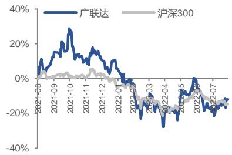  
一年内股价相对走势

# 团队成员

分析师 钱劲宇执业证书编号：S0210522050004邮箱：QJY3773@hfzq.com.cn

# 相关报告

<table><tr><td>财务数据和估值</td><td>2020A</td><td>2021A</td><td>2022E</td><td>2023E</td><td>2024E</td></tr><tr><td>营业收入(百万元)</td><td>3947</td><td>5562</td><td>7144</td><td>8859</td><td>10603</td></tr><tr><td>增长率(%)</td><td>14%</td><td>41%</td><td>28%</td><td>24%</td><td>20%</td></tr><tr><td>净利润(百万元)</td><td>330</td><td>661</td><td>988</td><td>1,396</td><td>1,713</td></tr><tr><td>增长率(%)</td><td>41%</td><td>100%</td><td>49%</td><td>41%</td><td>23%</td></tr><tr><td>EPS（元/股）</td><td>0.28</td><td>0.55</td><td>0.83</td><td>1.17</td><td>1.44</td></tr><tr><td>市盈率 (P/E)</td><td>182.5</td><td>91.2</td><td>61.0</td><td>43.2</td><td>35.2</td></tr><tr><td>市净率 (P/B)</td><td>9.4</td><td>10.4</td><td>9.3</td><td>7.9</td><td>6.7</td></tr></table>

数据来源：公司公告、华福证券研究所

# 投资要件

# 关键变量

广联达通过多年深耕的数字造价业务为基础，数字施工、设计以及创业业务单元为业务第二增长曲线的抓手，近年来完成了产品的 SaaS 化，横向、纵向交织构成建筑行业的 PaaS 平台。随着 SaaS 化+PaaS 化的深入，公司加强研发积累的红利将有望得到释放。我们预计 2022-2024 年，数字造价业务收入为49.6/62/74.4 亿元。数字施工业务收入为14.2/16.5/18.8 亿元。数字设计收入为1.9/2.7/3.6 亿元。海外业务收入为1.6/1.7/1.7亿元。其他业务收入为4.1/5.8/7.6亿元。

# 我们区别于市场的观点

市场认为公司业务受制于地产大环境；我们认为，市场大环境不好公司产品更利于降本增效，客户更愿意付费

# 股价上涨的催化因素

SaaS 化提高客户黏性同时降低销售费用，PaaS 化打通全栈需求、BIM 市场前景明朗，施工业务降本增效显著，带来更多标杆案例。

# 估值和目标价格

我们预计公司 2022-2024 年营业收入复合增速为 $2 4 \%$ ，归母净利润复合增速为$3 7 \%$ 。选取深信服、金山办公、用友网络为可比公司，2022 年可比公司平均PE76 倍。给予公司76 倍PE，目标价 63.1元，首次覆盖给予“买入”评级。

# 风险提示

技术及产品研发不及预期的风险：建筑业正在面临转型期，有客户需求未洞察，产品设计不佳、与客户需求契合度低的风险。

新冠疫情等不可抗力因素带来的不确定性风险:影响公司部分国内业务合同交付及海外业务的发展

# 正文目录

一、 广联达：国产数字建筑龙头，行业数字化转型升级领跑者... 5  
1.1 聚焦建筑行业信息化，争做全球领先数字建筑平台服务商.．. 5  
1.2 核心业务全面完成既定目标，给建筑企业持续提供数字化能力. 7  
1.3 财务表现亮眼，未来可期.．. 8  
二、 以“造价 $^ { + }$ 施工”为基，数字建筑转型带来巨大机遇 10  
2.1 数字造价市占率持续领先，云转型未来可期．. 10  
2.2 施工业务拓展迅猛，BIM市场前景明朗．．. 12  
2.3 建筑信息化市场蕴含巨大潜力，政策驱动建筑行业转型升级. 13  
三、 盈利预测与估值.... 14  
3.1 盈利预测... 14  
3.2 相对估值.. 16  
四、 风险提示.. 17

# 图表目录

图表1：公司发展历程 5  
图表2：公司股权结构. .6  
图表3：公司核心团队成员 .7  
图表4：公司产品体系.. ..8  
图表5：2019-2022Q1公司营业收入及增速 ..9  
图表6：2019-2022Q1 公司归母净利润及增速 ..9  
图表7：2019-2021按业务分营收结构. ..9  
图表8：2019-2021 按业务分毛利率.. .. 9  
图表9：2019-2022Q1公司毛利率和净利率 10  
图表10：2019-2022Q1公司期间费用率. 10  
图表11：2019-2021公司员工教育水平结构. 10  
图表12：2019-2021公司研发人员数量及占比. 10  
图表13：2020 年图形算量软件市场份额. 11  
图表14：2017-2021公司转云区域的转化率和续费率 12  
图表15：2017-2021 造价云收入、占造价业务收入比 12  
图表16：公司数字施工业务架构.. 12  
图表17：2019-2021 公司项目级产品项目数及新增情况 13  
图表18：2019-2021公司项目级产品客户数及新增情况. 13  
图表 19：2022-2026 全球BIM市场规模预测（单位：亿美元) .13  
图表20：2022-2026中国BIM行业市场规模预测. .13  
图表21：2022-2027 中国建筑业总产值及增速预测.. 14  
图表 22：2019-2025 中国建筑信息化市场规模及增速预测. .14  
图表23：国家智能建筑行业的重点政策. 14  
图表24：分业务收入及毛利率预测. .16  
图表25：可比公司估值表. 16  
图表26：财务预测摘要. 18

# 广联达：国产数字建筑龙头，行业数字化转型升级领跑者

# 1.1 聚焦建筑行业信息化，争做全球领先数字建筑平台服务商

助力行业数字化转型升级，逐步展现专业化全球影响力。自1998 年成立之初，以DOS版“工程造价系列软件”为起点，立足于建筑产业，围绕工程项目的全生命周期，逐渐构建出一套高效敏捷的研营销服体系。2004 年，广联达研发成功推出清单预算软件 GBQ4.0。2017 年，广联达首次推出 BIM 应用二次开发平台，提供 BIM应用开发涉及的技术以及平台，降低 BIM 技术开发的门槛。2019 年，公司正式推出数字项目管理平台，给建筑产业提供了一站式服务，综合应用BIM 等数字化技术，推动施工项目管理的转型升级。经过20 多年发展，数字造价业务在国内竞争优势明显，2021 年公司的核心产品“数字项目管理平台”“荣获中国数字与软件服务最具竞争力产品奖”。

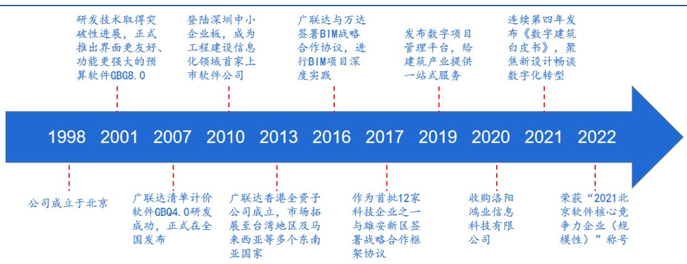  
图表1：公司发展历程  
数据来源：公司官网，华福证券研究所

股权结构稳定，员工持股计划有序开展。公司控股股东和实际控制人是刁志中先生。根据2021年报，作为公司创始人之一，刁志中持股比例达到 $1 5 . 9 8 \%$ ，。涂建华、陈晓红、王金洪、王晓芳、安景合也是公司创始人，并且都在公司任职，五人累计持股比例为 $1 6 . 3 1 \%$ 。2022年公司实施员工持股计划，参与对象为公司核心管理人员和核心技术人员，建立利益共享机制，凝聚复合型干部和业务领军人才，促进公司长期持续健康发展。

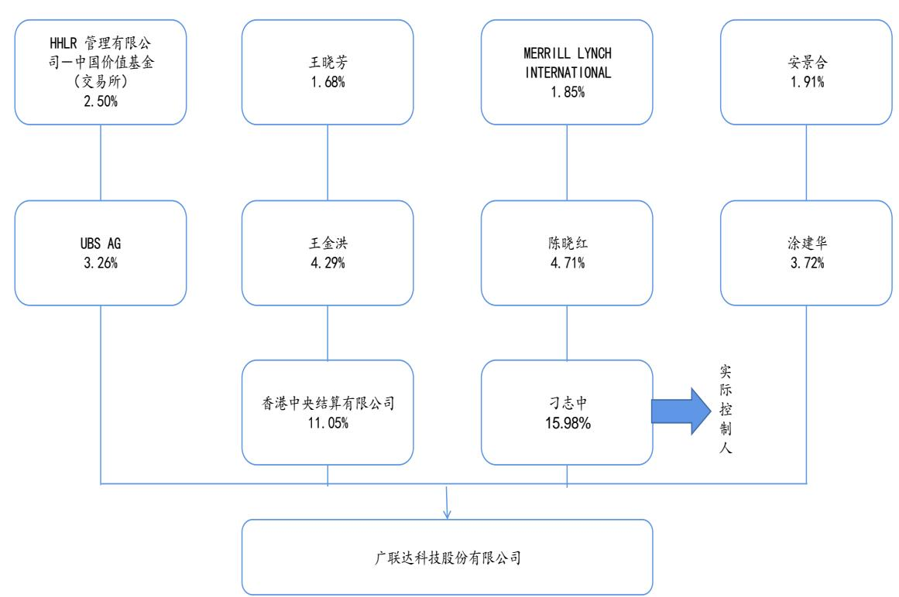  
图表2：公司股权结构  
数据来源：广联达 2021年报，华福证券研究所

核心团队稳定，行业经验丰富。公司核心团队长期聚焦建筑行业，对建筑行业特性和业务流程有全面的理解和把控。公司创始人刁志中先生曾担任北京石化工程公司计算中心工程师，深耕行业多年，行业经验丰富。

图表3：公司核心团队成员  

<table><tr><td>姓名</td><td>职务 个人简介</td><td></td></tr><tr><td>刁志中</td><td>董事长</td><td>曾任北京石化工程 公司计算中心工程师，现兼任中国建设教育协会副理事长、全联房地产商会副会长、 北京市软件和信息服务业协会会长、中关村数字建筑产业绿色发展联盟理事长</td></tr><tr><td>袁正刚</td><td>董事、总裁</td><td>曾任加拿大蒙特利尔大学博士后研究员、公司研发中心经理、高级副总裁</td></tr><tr><td>王爱华</td><td>董事、高级副总裁</td><td>曾任广联达梦龙总经理。现兼任北京云建信科技有限公司董事、东方上河（北京）科 技有限公司董事、考拉昆仑信用管理 有限公司董事、中关村海绵城市工程研究院有限公司董事、杭州筑峰科技有限公司董 事、中核弘盛智能 科技有限公司董事、上海智建美住科技有限责任公司董事、上海同是科技股份有限公 司董事</td></tr><tr><td>刘谦</td><td>董事、高级副总裁</td><td>曾任职西安石油勘探仪器总厂软件室工程师。现兼任中国土木工程学会建筑市场 与招标技研会副理事长、中关村数字建筑产业绿色发展联盟秘书长、中国大数 理事长、中国建设工程造价管理协会信息委员会委员、中关村人才协会常务理事</td></tr><tr><td>何平</td><td>事</td><td>北京城建集司团有限责任公司资部、财务部，加拿大BTI 技术公司财务部，加</td></tr><tr><td>吴佐民</td><td>董事、高级顾问</td><td>曾任国家建筑材料工业标准定额站站长，中国建设工程造价管理协会秘书长。现任北 京广惠创研科技中心主任，中国建设工程造价管理协会专家委员会常务副主任，住建 部高等教育工程管理专业评估委员会副主任，教育部高等教育工程管理和工程造价专 业指导委员会委员，北京市建设工程招标投标和造价协会专家委员会名誉主任，一带 一路（中国)仲裁院副院长</td></tr></table>

数据来源：广联达 2021年报，华福证券研究所

# 1.2 核心业务全面完成既定目标，给建筑企业持续提供数字化能力

夯实新建造业务，突破新设计业务，布局创新业务。公司自成立二十余年，始终专注于建筑信息化/数字化领域，现处于公司第八个三年战略规划期间，已逐步形成数字造价、数字施工、数字设计规划期间，业务逐步走向智能化。数字造价业务的海外业务板块还包括开拓东南亚业务板块，其他创新业务单元的产品线。数字造价业务作为公司的成熟业务，主要为建设工程参与方提供软件产品和数据服务，现主要以订阅制 SaaS 模式为客户提供产品和服务，战略市场的国际化系列产品Cubicost系列产品。数字施工业务作为公司重点突破的成长业务，专注工程项目建造的过程，为施工企业提供从企业管理到项目管理的平台化解决方案，包括项目端的 BIM，智慧工地系列产品和面向施工企业的项企一体化产品。数字施工业务的海外业务板块包括芬兰全资子公司经营 MagiCAD系列机电设计软件，以及覆盖欧洲市场的施工GlodonGsite国际化产品。“八三”战略规划期间，该业务着力于从“项目级应用”拓展为“企业级多项目应用”。数字设计业务作为公司着力发展的新兴业务，主要面向设计院客户，提供建筑设计、市政设计、建筑成果数字化交付审查等产品，具体包括BIMspace、Civil 市政系列产品等在市场上处于领军地位的产品，战略规划期间，致力于打造自主图形平台的建筑设计产品，在城市、供采、高校、金融等新业务领域竞相突破。创新业务单元作为公司孵化的新兴业务，面对建筑业不同细分市场，从CIM规建管、新城建、供应链服务和人才培养等诸多维度，对建筑业转型升级提供保障和支持，当前主要以产品打磨和标杆项目验证为主。

公司客户主体是建筑行业。2021 年建筑类客户营收同比增速达到 $4 0 . 9 5 \%$ ，毛利率也维持在较高水平，达到了 $8 3 . 9 5 \%$ 。2021年，公司加速“数字广联达”转型，初步建立起了客户成功指标体系驱动流程建设、牵引组织升级的闭环，客户服务实现全面落地数字化升级。2021 年公司自主轻量化 BIM 引擎 BIMFace 活跃应用达到500个，增加私有化客户十余家。

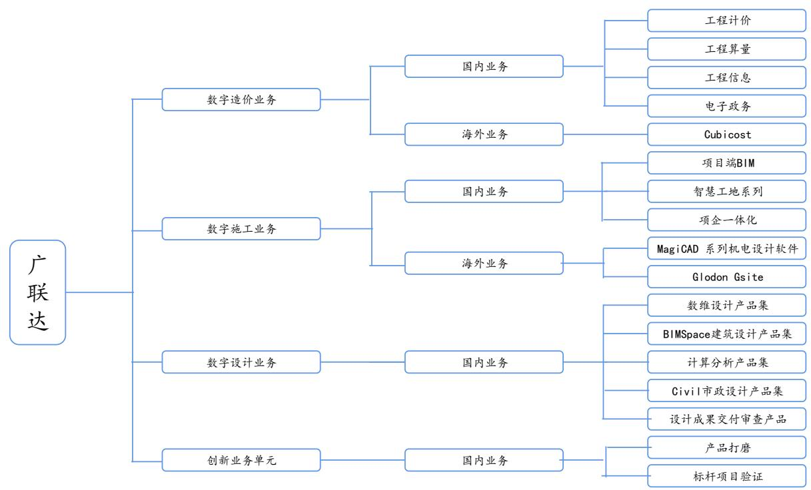  
图表4：公司产品体系  
数据来源：广联达 2021年报，华福证券研究所

# 1.3 财务表现亮眼，未来可期

营业收入高速增长，净利润表现亮眼。2019 至 2021 年公司的营业收入增速不断攀升，分别实现营业收入 $3 4 . 6 / 3 9 . 5 / 5 5 . 6$ 亿元，2021年营业收入同比增长了 $4 0 . 9 2 \%$ o从归母净利润方面来看，2019 至2021 年实现显著增长，其中2020 和2021 年同比增长分别为 $4 0 . 6 \% / 1 0 0 . 1 \%$ 。2022Q1营业收入和净利润依然保持稳定的增长趋势，报告期实现同比增长分别为 $3 4 . 7 \% / 4 1 . 9 \%$ 。公司营收增长和净利润增长步伐较为统一，凸显公司增长具有可持续性。

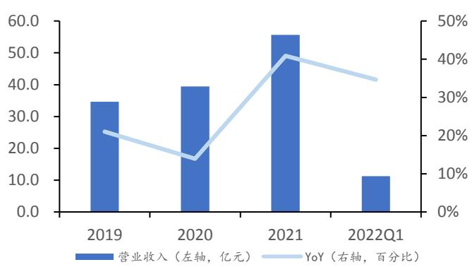  
图表5：2019-2022Q1公司营业收入及增速  
数据来源：广联达财报，华福证券研究所

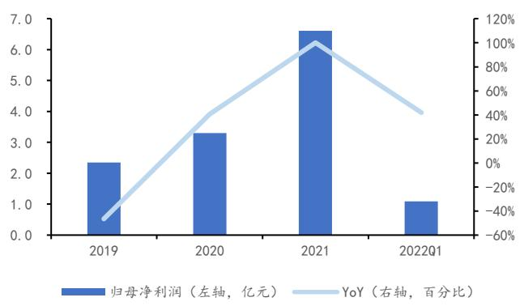  
图表6：2019-2022Q1 公司归母净利润及增速  
数据来源：广联达财报，华福证券研究所

数字造价业务为公司的核心业务。主要为参与建设工程造价的各方提供软件产品和数据服务，包括工程计价业务线、工程算量业务线、工程信息业务线和电子政务业务线等。其中，云计价，云算量主产品和工程信息中广材网等数据类服务应用率创新高，使得客户满意度、转型率、续费率均有提升，2019 至2021 该业务营收占比稳定在 $70 \%$ 左右，2021年达到了 $9 2 . 3 \%$ 。数字施工业务聚焦项目建造过程，利用“平台+组件”模式，为施工企业提供从项目管理到企业管理的平台化解决方案，2021 年新签署合同额快速放量，实现高速增长，该业务营收同比增长 $2 7 . 8 \%$ ，总体毛利率较高，达到 $6 5 . 8 \%$ 。数字设计业务属于公司着力发展新兴业务，提供建筑设计、市政设计和设计成果数字化交付审查等产品，2020 年10 月，公司收购洛阳鸿业信息科技有限公司，开始布局数字设计业务，2021 年该业务完成整合，自主数维建筑设计产品取得突破，在公司的营收占比不断增长，毛利率达到 $9 5 . 8 \%$ 。海外业务包括数字造价业务的国际化系列产品Cubicost以及数字施工业务的国际化产品，2021 年克服疫情困难，营收同比增长 $3 . 9 \%$ 。其他业务包括创新业务单元，主要是产品打磨和标杆项目验证，2021 年该业务营业成本快速增长，主要是数字城市业务部分完成初步验收，有关收入成本的确认所致。

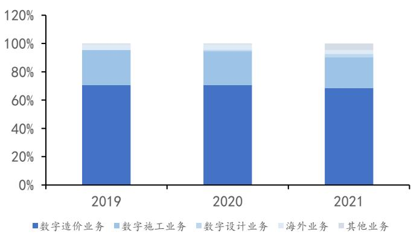  
图表7：2019-2021按业务分营收结构  
数据来源：广联达财报，华福证券研究所

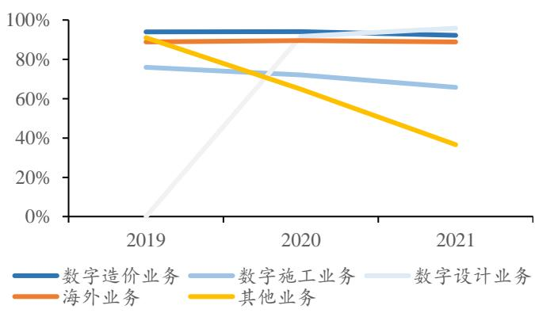  
图表8：2019-2021 按业务分毛利率  
数据来源：广联达财报，华福证券研究所

毛利率水平高，期间费用率稳定。从 2019 至 2022 第一季度公司毛利率一直保寺在 $85 \%$ 左右，维持在一个稳定高位。同时，净利率从2019 年的 $7 . 3 5 \%$ 上升至2021年的 $1 2 . 9 2 \%$ ，公司盈利能力逐渐增强。2021 年财务费用同比下降 $2 0 4 . 3 7 \%$ ，主要由于公司募集资金到位，归还长期借款，利息收入增加，利息费用减少。2021 年销售费用同比增加 $2 6 . 3 9 \%$ ，主要是造价业务转型市场费用上升，施工业务加强渠道建设人员增加所致，但整体销售费用率有所下降，凸出公司费用控制能力较强。

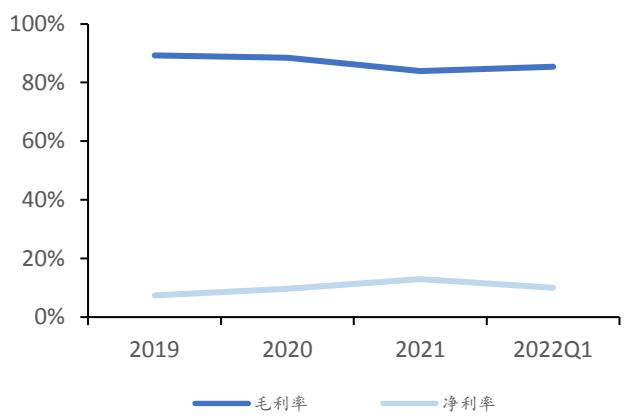  
图表9：2019-2022Q1公司毛利率和净利率  
数据来源：广联达财报，华福证券研究所

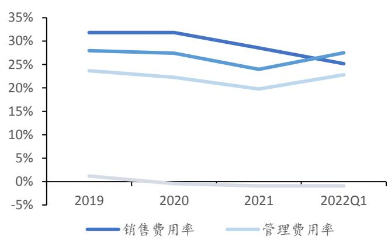  
图表10：2019-2022Q1公司期间费用率  
数据来源：广联达财报，华福证券研究所

高学历人才和研发人员占比提升，员工激励计划常态化。从 2019 至 2021，公司员工总数同比增加 $3 3 . 3 2 \%$ ，高学历人才占比显著提升。从员工结构角度看，研发人员数量不断上升，同时研发人员占比由 $3 8 . 6 4 \%$ 增加至 $4 1 . 4 6 \%$ 。公司使用常态化股权激励,G-TUP(Glodon Time Unit Plan)激励计划持续覆盖短、中、长期员工薪酬体系，推动人才和公司共同进退。

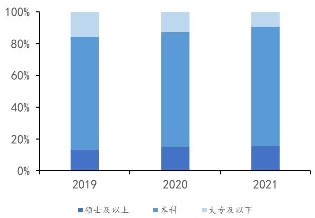  
图表11：2019-2021公司员工教育水平结构  
数据来源：公司年报，华福证券研究所

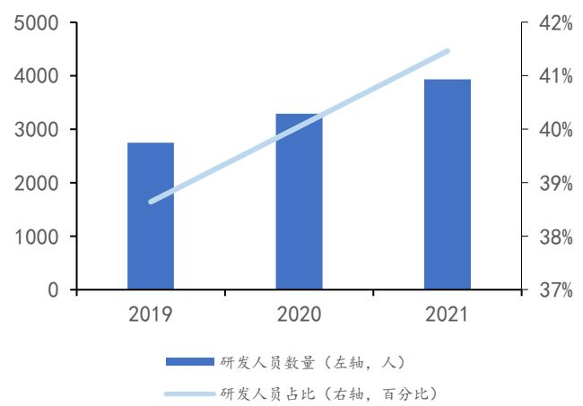  
图表12：2019-2021公司研发人员数量及占比  
数据来源：公司年报，华福证券研究所

# 二、 以“造价 $^ { \ast }$ 施工”为基，数字建筑转型带来巨大机遇2.1 数字造价市占率持续领先，云转型未来可期

数字造价数十年保持市占率绝对优势。广联达是国内信息化/数字化领域的领军者，坚持客户成功理念，用创新引领发展，逐渐形成了显著竞争优势。数字造价业务作为公司的成熟业务，牢牢占据国内数字造价领域龙头地位，包括工程计价、工程算量、工程信息、和电子政务业务线等，当前主要以 SaaS 订阅制模式为客户提供产品和服务，该模式在全国29 个区域全覆盖。根据2019 年公司披露的投资者交流纪要，上市初期公司数字造价业务市占率在 $60 \%$ 左右，历经十余年的发展，市场占比达到了更高水平。

主要产品市场份额保持稳定，算量软件市占率远超竞争对手。公司主要竞争对手包括鲁班、品茗、神机妙算等软件，但由于公司产品具备全产品流程服务能力，同时这些竞争对手尚未上市，广联达便成了A 股中唯一一家做算量软件的公司。据数据显示，公司图形算量软件市占率达到 $5 5 . 1 \%$ ，远超市场其他竞争对手。

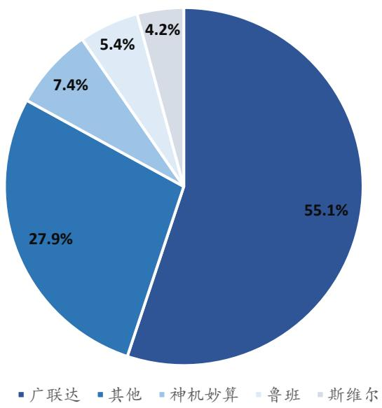  
图表13：2020 年图形算量软件市场份额  
数据来源：贝壳投研，华福证券研究所

布局云转型十载，云收入持续增长。公司在当前造价市场化转型的背景下，持续推进“数字造价管理”理念升级。2013 年，公司正式发布云战略；造价业务开始全面转云；2017 年，造价云产品开始在全国范围内推广；2021 年，最后四个地区包括江苏、浙江、安徽、福建全面进入云转型，数字造价业务云转型完成对全国的覆盖。新转型区域转化率以及旧转型区域的续费率实现双提升，主要是由订阅制模式提高产品和服务性价比，云计价、云算量主产品以及工程信息中广材网等数据类服务应用率创新高所致。云收入在造价业务收入占比持续提升，2021 年造价云收入同比增长 $58 \%$ ,占造价业务收入比例达到 $6 7 . 2 \%$ 。

图表14：2017-2021 公司转云区域的转化率和续费率  

<table><tr><td>转型地区</td><td>转化率</td><td>续费率</td></tr><tr><td>2017和2018年转型 区域</td><td>&gt;85%</td><td>&gt;85%</td></tr><tr><td>2019 年转型区域</td><td>&gt;85%</td><td>90%</td></tr><tr><td>2020 年转型区域</td><td>80%</td><td>&gt;85%</td></tr><tr><td>2021 年转型区域</td><td>&gt;60%</td><td></td></tr></table>

数据来源：广联达公司年报，华福证券研究所

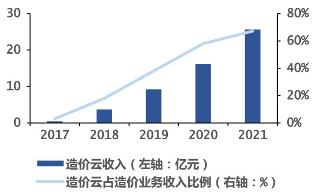  
图表15：2017-2021造价云收入、占造价业务收入比  
数据来源：广联达公司年报，华福证券研究所

# 2.2 施工业务拓展迅猛，BIM 市场前景明朗

公司施工业务包含岗位级、项目级、企业级三大类产品。其中岗位级产品主要是单点应用软件或协作平台，包括施工BIM 建模软件 BIMMAKE、斑马进度等；项目级产品是该业务的核心产品，主要包括 BIM 以及智慧工地系列产品，在不同类型产品中营业收入占比最高；企业级产品是项目级产品在企业业务方面的拓展，主要包括项目管理系统、协同办公系统等项企一体化产品。公司已形成数字施工整体解决方案，在数字项目管理平台基础上，开发出来覆盖岗位级、项目级、企业级的多个数字化应用系统，给施工企业的数字化转型提供一站式服务。

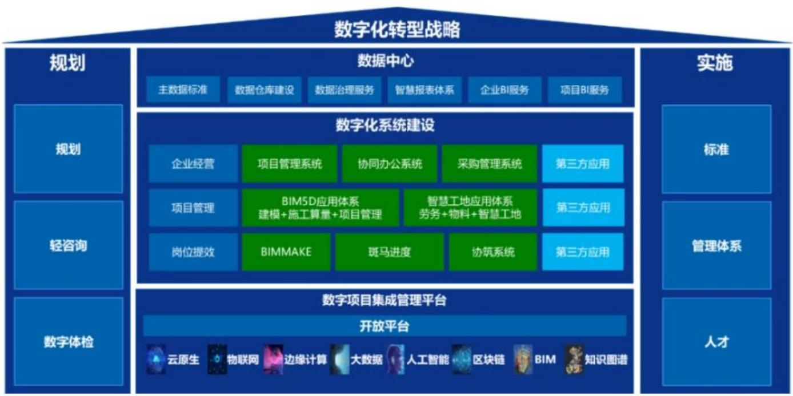  
图表16：公司数字施工业务架构  
数据来源：公司官网，华福证券研究所

公司项目级项目数量稳定增长，客户规模增长迅猛。2021 年，报告期内项目级产品项目数量突破5.5万个，新增数量保持稳定，达到1.6 万个；累计服务客户数量超过 5000 家，新增客户数相比去年实现井喷式增长，新增客户1600 家。在施工企业客户数字化转型的背景下，公司紧抓机遇，上半年优先对合同快速拓展，下半年重点落实交付保障收入和回款，加速合同向营业收入转化的进程，实现了业务规模化的扩张。在2021 全年新签合同中，企业和项企一体化的解决方案合同占比达到 $1 5 \%$ ,在头部客户取得了快速突破。

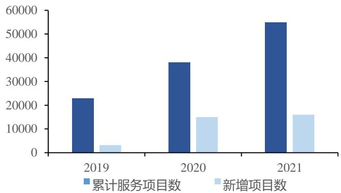  
图表17：2019-2021公司项目级产品项目数及新增情况  
数据来源：广联达公司年报，华福证券研究所  
图表19：2022-2026 全球BIM市场规模预测（单位：亿美元）

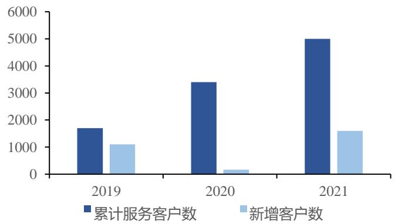  
图表18:2019-2021公司项目级产品客户数及新增情况  
数据来源：广联达公司年报，华福证券研究所  
图表20：2022-2026中国BIM行业市场规模预测

BIM 市场规模扩张给公司带来机遇。根据各家机构发布的全球 BIM 发展前景预测，从2022 至2026 年全球 BIM行业市场规模呈现稳定上升趋势，2026 年各家机构预测全球建筑信息模型市场规模平均值突破了130 亿美元，年均复合增长率达到$1 5 \%$ 左右，BIM 行业发展前景明朗。根据机构预测，2026 年BIM 行业市场规模达到371.3 亿元，虽然我国 BIM 研究起步较晚，但国内BIM 市场占全球市场比重逐渐上升，凸显在建筑行业信息化的大背景下，国内企业应用BIM比例将日益增长。在施工阶段，建筑企业更加重视组织合理性和效率，致力于用 BIM 技术提升项目管理水平和精细程度。而公司在BIM 软件上具有一定先发优势，涵盖工程建筑各流程领域，实现了全领域布局，在管理平台软件市场中具有极强的竞争力。公司于2020 年收购了鸿业科技，完善了在数字建筑产业链的布局，公司有望在BIM 市场规模扩张中持续获益。

# 2.3 建筑信息化市场蕴含巨大潜力，政策驱动建筑行业转型升级

建筑业体量大但信息化程度较低，未来提升空间巨大。根据国家统计局的数据，2021 年全国建筑业总产值为 29.3 万亿元，同比增长 $1 1 \%$ ，产业规模仍在不断扩大；建筑业总产值占GDP比重为 $2 5 . 6 \%$ ，作为国民经济发展支柱产业地位依然稳固。自新冠疫情爆发以来，建筑业面临开工率持续走低，供应链断裂，施工延期，劳动力成本显著提高等问题，在此背景下，建筑业信息化建设及数字化转型的需求进一步凸显，但相比于发达国家，我国建筑信息化水平比较落后，根据产业信息网数据显示，2018年我国建筑信息化投入占总产值的比重约为 $0 . 0 8 \%$ ，而发达国家这个数值则是 $1 \%$ ,由此可见我国建筑信息化行业存在巨大发展空间。从 2011 至 2018 年间，我国建筑信息化市场规模发展迅猛，从49.3 亿元增长至245亿元。随着建筑信息化低渗透率的叠加以及新科技浪潮推动产业变革，我国建筑信息化投入比例必将逐步提高，根据智研咨询的预测，截至2025 年，我国建筑信息化市场规模有望突破千亿，达到 1298.9亿元。公司作为国内数字建筑领军者，主要数字产品规模有望进一步扩大。

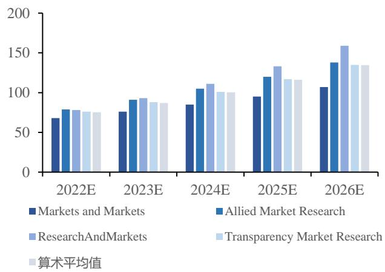  
数据来源：前瞻产业研究院，华福证券研究所

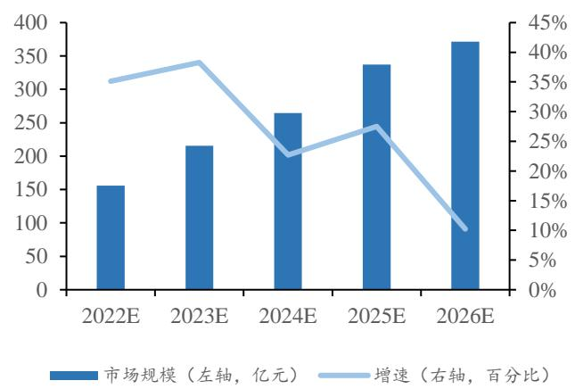  
数据来源：智研咨询，华福证券研究所

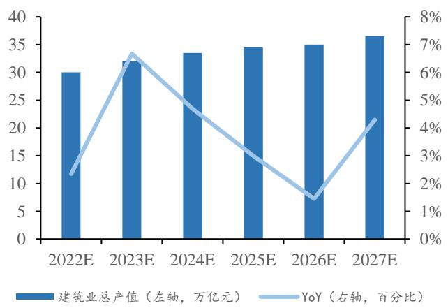  
图表21：2022-2027 中国建筑业总产值及增速预测  
数据来源：国家统计局，华福证券研究所

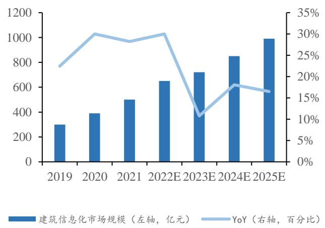  
图表22:2019-2025 中国建筑信息化市场规模及增速预测  
数据来源：智研咨询，华福证券研究所

政策助推建筑行业向信息化转型。2022 年1月，由国务院印发的《“十四五”数字经济发展规划》以及住房和城乡建设部印发的《“十四五”建筑业发展规划》，都提到了数字化的创新引领，数字技术与实体经济融合，建筑业和先进制造业、新一代信息技术深度融合等数字技术驱动传统产业转型升级的重要目标。

图表23：国家智能建筑行业的重点政策

# 三、 盈利预测与估值

# 3.1 盈利预测

公司多年深耕数字造价业务，逐渐发展出数字施工、数字设计、创新业务等多个板块。广联达正走在让公司发展成为建筑业产业平台型企业，逐步完成造价软件业务的云化、打造数字建筑产业平台、数字广联达的三大目标。进行中的项目集成管理平台将是广联达第二增长曲线的核心基础。PaaS化 $^ +$ 云化应用将为业务带来高速增长。随着转型期的渡过和新业务的稳定，毛利率将预计保持稳定。

<table><tr><td>时间</td><td>部门</td><td>政策法规</td><td>內容要点</td></tr><tr><td>2017年5月住建部</td><td></td><td>《建筑业发展 “十三五”规划》</td><td>推动建筑产业现代化，推广智能和装配式建筑，在 新建建筑和既有的建筑改造中推广普及智能化应用 完善智能化系统运行维护机制 以大力发展建筑工业化为载体，以数字化、智能化</td></tr><tr><td>2020年7月住建部等</td><td></td><td>《关于推动智能建 造与建筑工业化系 统发展的指导意 见》</td><td>升级胃动力，创新突破相关核心技术，加大智能建 造在工程建设各环节应用，形成涵盖科研、设计、 生产加工施工装配、运营等全产业链融合的智能建 造产业体系</td></tr><tr><td>2020年8月工信部</td><td></td><td>《关于加快新兴建 干意见》</td><td>推动传感器网络、低功耗广域网、5G、边缘计算、 射频识别（RFID)及二维码识别等物联网技术在智 筑工业化发展的若慧工地的集成应用，发展可穿戴设备，提供建筑工 人健康及安全监测能力，推动物联网技术在监控管 理、智能减排和智能建筑中的应用</td></tr><tr><td>2021年9月工信部</td><td></td><td>《物联网新型基础 设施建设三年行动 计划（2021-2023 年)》</td><td>加快智能传感器、射频识别（RFID）、二维码、近 场通信、低功耗广域网等物联网技术在建材物品生 产采购运输、BIM协同设计、智慧工地、智慧运 维、智慧建筑等方面的应用</td></tr><tr><td>2022年1月住建部</td><td></td><td>《“十四五”建筑 业发展规划》</td><td>智能建造与新型建筑工业化协同发展的政策体系和 产业体系基本建立，打造一批建筑产业互联网平 台，形成一批建筑机器人标志性产品，培育一批智 能建造和装配式建筑产业基地</td></tr></table>

数据来源：住建部，工信部，前瞻产业研究院，华福证券研究所

数字造价业务：自2017 年来，公司的造价业务的商业模式由产品销售模式转型为提供服务的 SaaS 模式。目前造价业务云转型已完成，SaaS模式将提高客户粘性，也将带来销售费用的增速降低，转型红利释放。我们预计公司2022-2024 数字造价业务增速将保持持续上升，分别为 $3 0 \% / 2 5 \% / 2 0 \%$ 。毛利率在公司的 SaaS 的竞争优势下将逐步提升，分别为 $9 2 . 9 \% / 9 3 . 3 \% / 9 3 . 7 \%$ 。

数字施工业务：公司已逐步完成施工业务市场的积累，有望继续维持较高增速。我们预计公司 2022-2024 数字施工业务增速将保持持续上升，分别为 $1 8 \% / 1 6 \% / 1 4 \%$ o随着施工业务的成熟和子行业经验的有效积累，毛利率维持稳定，分别为$6 5 . 2 \% / 6 4 . 6 \% / 6 4 . 3 \%$ 。

数字设计业务：公司处于设计业务的切入期，随着近两年的研发投入加大，产出已初见成效，将保持高速增长，我们预计公司2022-2024 数字设计业务收入增速分别为 $4 5 \% / 4 0 \% / 3 5 \%$ 。毛利率分别为 $9 5 . 8 \% / 9 5 . 8 \% / 9 5 . 8 \%$

海外业务：我们预计公司 2022-2024 海外业务收入增速分别为 $4 \% / 4 \% / 4 \%$ 。毛利率分别为 $8 9 \% / 8 9 . 1 \% / 8 9 . 2 \%$ 。

其他业务：作为公司的创新板块，业务还处于拓展期，投入进入大量增加的时间点。我们预计公司2022-2024 其他业务收入增速分别为 $6 0 \% / 4 0 \% / 3 0 \%$ 。毛利率分别为 $2 9 \% / 2 4 \% / 2 7 \%$

费用端由于公司还需要对产品的迭代创新进行研发人员和销售人员的储备，业务需要进行进一步的扩张。同时，SaaS 模式将提高客户粘性，也将带来销售费用的增速降低。因此，我们预计，随着转型的实现和新业务的稳定落地，研发费用增速将小于营收增速，公司研发费用率在2022-2024 年分别为 $2 3 \% / 2 2 \% / 2 1 . 8 \%$ ，呈逐步下降的趋势；销售费用率分别为 $2 8 \% / 2 7 \% / 2 7 \%$ 。

图表24：分业务收入及毛利率预测  

<table><tr><td colspan="2">单位百万元</td><td>2021A</td><td>2022E</td><td>2023E</td><td>2024E</td></tr><tr><td rowspan="3">数字造价</td><td>收入</td><td>3813.3</td><td>4957.3</td><td>6196.6</td><td>7435.9</td></tr><tr><td>YoY</td><td>36.6%</td><td>30.0%</td><td>25.0%</td><td>20.0%</td></tr><tr><td>毛利率</td><td>92.3%</td><td>92.9%</td><td>93.3%</td><td>93.7%</td></tr><tr><td rowspan="3">数字施工</td><td>收入</td><td>1205.6</td><td>1422.6</td><td>1650.2</td><td>1881.3</td></tr><tr><td>YoY</td><td>27.8%</td><td>18.0%</td><td>16.0%</td><td>14.0%</td></tr><tr><td>毛利率</td><td>65.8%</td><td>65.2%</td><td>64.6%</td><td>64.3%</td></tr><tr><td rowspan="3">数字设计</td><td>收入</td><td>130.8</td><td>189.7</td><td>265.5</td><td>358.5</td></tr><tr><td>YoY</td><td>250.7%</td><td>45.0%</td><td>40.0%</td><td>35.0%</td></tr><tr><td>毛利率</td><td>95.9%</td><td>95.8%</td><td>95.8%</td><td>95.8%</td></tr><tr><td rowspan="3">海外业务</td><td>收入</td><td>153.3</td><td>159.4</td><td>165.8</td><td>172.4</td></tr><tr><td>YoY</td><td>3.9%</td><td>4.0%</td><td>4.0%</td><td>4.0%</td></tr><tr><td>毛利率</td><td>88.9%</td><td>89.0%</td><td>89.1%</td><td>89.2%</td></tr><tr><td rowspan="3">其他业务</td><td>收入</td><td>259.3</td><td>414.9</td><td>580.8</td><td>755.1</td></tr><tr><td>YoY</td><td>816.3%</td><td>60.0%</td><td>40.0%</td><td>30.0%</td></tr><tr><td>毛利率</td><td>36.6%</td><td>28.7%</td><td>23.6%</td><td>26.5%</td></tr><tr><td rowspan="3">合计</td><td>收入</td><td>5562.2</td><td>7143.9</td><td>8859.0</td><td>10603.2</td></tr><tr><td>YoY</td><td>40.9%</td><td>28.4%</td><td>24.0%</td><td>19.7%</td></tr><tr><td>毛利率</td><td>84.0%</td><td>83.7%</td><td>83.4%</td><td>83.7%</td></tr></table>

数据来源：公司年报，华福证券研究所

# 3.2 相对估值

我们预计公司 2022-2024 年营业收入分别为 $7 1 . 4 / 8 8 . 6 / 1 0 6$ 亿元。归母净利润分别为 9.9/14.0/17.1亿元，同比增长 $4 9 . 4 \% / 4 1 . 3 \% / 2 2 . 7 \%$ 。我们选取深信服（解决方案提供商）、金山办公（基础软件）、用友网络（基础软件）为可比公司，2022 年平均PE 为76 倍。给予公司 76 倍PE，目标价 63.1 元，首次覆盖给予“买入”评级。

图表25：可比公司估值表

<table><tr><td>证券代码</td><td>证券简称</td><td>股价</td><td>市值</td><td></td><td>净利润</td><td>(亿元)</td><td></td><td></td><td>PE(倍）</td><td></td><td></td></tr><tr><td></td><td></td><td></td><td>(亿元)</td><td>2021A</td><td>2022E</td><td>2023E</td><td>2024E</td><td>2021A</td><td>2022E</td><td>2023E</td><td>2024E</td></tr><tr><td>300454</td><td>深信服</td><td>95.4</td><td>396.4</td><td>2.7</td><td>4.7</td><td>7.8</td><td>12.2</td><td>145.3</td><td>84.7</td><td>50.8</td><td>32.5</td></tr><tr><td>688111</td><td>金山办公</td><td>163.0</td><td>751.8</td><td>10.4</td><td>12.9</td><td>17.5</td><td>23.2</td><td>72.2</td><td>58.4</td><td>42.9</td><td>32.4</td></tr><tr><td>600588</td><td>用友网络</td><td>19.3</td><td>662.4</td><td>7.1</td><td>0.0</td><td>0.0</td><td>0.0</td><td>89.1</td><td>85.8</td><td>62.7</td><td>47.4</td></tr><tr><td></td><td></td><td></td><td>平均值</td><td></td><td></td><td></td><td></td><td>102.2</td><td>76.3</td><td>52.1</td><td>37.4</td></tr></table>

数据来源：wind，华福证券研究所注：股价为 $2 0 2 2 / 8 / 2 9$ 收盘价，可比公司使用Wind一致预期

# 四、 风险提示

技术及产品研发不及预期的风险：建筑业正在面临转型期，有客户需求未洞察，产品设计不佳、与客户需求契合度低的风险。

新冠疫情等不可抗力因素带来的不确定性风险:影响公司部分国内业务合同交付及海外业务的发展。

图表26：财务预测摘要  
资产负债表  

<table><tr><td>单位：百万元</td><td>2021A</td><td>2022E</td><td>2023E</td><td>2024E</td></tr><tr><td>货币资金</td><td>4,050</td><td>3,853</td><td>6,087</td><td>7,373</td></tr><tr><td>应收票据及账款</td><td>524</td><td>628</td><td>783</td><td>942</td></tr><tr><td>预付账款</td><td>36</td><td>83</td><td>82</td><td>110</td></tr><tr><td>存货</td><td>71</td><td>71</td><td>94</td><td>113</td></tr><tr><td>合同资产</td><td>30</td><td>26</td><td>40</td><td>43</td></tr><tr><td>其他流动资产</td><td>441</td><td>551</td><td>708</td><td>845</td></tr><tr><td>流动资产合计</td><td>5,122</td><td>5,186</td><td>7,754</td><td>9,382</td></tr><tr><td>长期股权投资</td><td>326</td><td>326</td><td>326</td><td>326</td></tr><tr><td>固定资产</td><td>824</td><td>1,171</td><td>1,551</td><td>1,962</td></tr><tr><td>在建工程</td><td>396</td><td>496</td><td>496</td><td>396</td></tr><tr><td>无形资产</td><td>531</td><td>648</td><td>748</td><td>869</td></tr><tr><td>商誉</td><td>961</td><td>961</td><td>961</td><td>961</td></tr><tr><td>其他非流动资产</td><td>1,909</td><td>1,908</td><td>1,915</td><td>1,919</td></tr><tr><td>非流动资产合计</td><td>4,946</td><td>5,509</td><td>5,996</td><td>6,432</td></tr><tr><td>资产合计</td><td>10,068</td><td>10,695</td><td>13,750</td><td>15,815</td></tr><tr><td>短期借款</td><td>0</td><td>10</td><td>0</td><td>0</td></tr><tr><td>应付票据及账款</td><td>268</td><td>300</td><td>376</td><td>467</td></tr><tr><td>预收款项</td><td>0</td><td>0</td><td>0</td><td>0</td></tr><tr><td>合同负债</td><td>2,127</td><td>1,143</td><td>2,403</td><td>2,286</td></tr><tr><td>其他应付款</td><td>319</td><td>319</td><td>319</td><td>319</td></tr><tr><td>其他流动负债</td><td>923</td><td>1,817</td><td>2,394</td><td>3,058</td></tr><tr><td>流动负债合计</td><td>3,637</td><td>3,589</td><td>5,491</td><td>6,130</td></tr><tr><td>长期借款</td><td>0</td><td>0</td><td>0</td><td>0</td></tr><tr><td>应付债券</td><td>0</td><td>0</td><td>0</td><td>0</td></tr><tr><td>其他非流动负债</td><td>158</td><td>158</td><td>158</td><td>158</td></tr><tr><td>非流动负债合计</td><td>158</td><td>158</td><td>158</td><td>158</td></tr><tr><td>负债合计</td><td>3,795</td><td>3,747</td><td>5,649</td><td>6,288</td></tr><tr><td>归属母公司所有者权益</td><td>5,788</td><td>6,454</td><td>7,592</td><td>9,001</td></tr><tr><td>少数股东权益</td><td>485</td><td>495</td><td>509</td><td>526</td></tr><tr><td>所有者权益合计</td><td>6,273</td><td>6,949</td><td>8,101</td><td>9,527</td></tr><tr><td>负债和股东权益</td><td>10,068</td><td>10,695</td><td>13,750</td><td>15,815</td></tr></table>

现金流量表  

<table><tr><td>单位：百万元</td><td>2021A</td><td>2022E</td><td>2023E</td><td>2024E</td></tr><tr><td>经营活动现金流</td><td>1,601</td><td>767</td><td>3,024</td><td>2,096</td></tr><tr><td>现金收益</td><td>766</td><td>1,020</td><td>1,447</td><td>1,798</td></tr><tr><td>存货影响</td><td>-45</td><td>0</td><td>-23</td><td>-19</td></tr><tr><td>经营性应收影响</td><td>-84</td><td>-142</td><td>-145</td><td>-178</td></tr><tr><td>经营性应付影响</td><td>110</td><td>32</td><td>76</td><td>91</td></tr><tr><td>其他影响</td><td>853</td><td>-143</td><td>1,668</td><td>404</td></tr><tr><td>投资活动现金流</td><td>-1,541</td><td>-685</td><td>-644</td><td>-638</td></tr><tr><td>资本支出</td><td>-546</td><td>-683</td><td>-639</td><td>-631</td></tr><tr><td>股权投资</td><td>-70</td><td>0</td><td>0</td><td>0</td></tr><tr><td>其他长期资产变化</td><td>-925</td><td>-2</td><td>-5</td><td>-7</td></tr><tr><td>融资活动现金流</td><td>-819</td><td>-279</td><td>-146</td><td>-172</td></tr><tr><td>借款增加</td><td>26</td><td>-19</td><td>-10</td><td>0</td></tr><tr><td>股利及利息支付</td><td>-354</td><td>-260</td><td>-307</td><td>-309</td></tr><tr><td>股东融资</td><td>636</td><td>0</td><td>0</td><td>0</td></tr><tr><td>其他影响</td><td>-1,127</td><td>0</td><td>171</td><td>137</td></tr></table>

数据来源：公司报告、华福证券研究所

利润表  

<table><tr><td>单位：百万元</td><td>2021A</td><td>2022E</td><td>2023E</td><td>2024E</td></tr><tr><td>营业收入</td><td>5,562</td><td>7,144</td><td>8,859</td><td>10,603</td></tr><tr><td>营业成本</td><td>893</td><td>1,168</td><td>1,472</td><td>1,725</td></tr><tr><td>税金及附加</td><td>46</td><td>59</td><td>73</td><td>87</td></tr><tr><td>销售费用</td><td>1,587</td><td>2,000</td><td>2,392</td><td>2,863</td></tr><tr><td>管理费用</td><td>1,099</td><td>1,400</td><td>1,683</td><td>2,004</td></tr><tr><td>研发费用</td><td>1,333</td><td>1,643</td><td>1,949</td><td>2,311</td></tr><tr><td>财务费用</td><td>-110</td><td>-97</td><td>-121</td><td>-131</td></tr><tr><td>信用减值损失</td><td>-25</td><td>-16</td><td>-16</td><td>-15</td></tr><tr><td>资产减值损失</td><td>-1</td><td>-9</td><td>-9</td><td>-8</td></tr><tr><td>公允价值变动收益</td><td>0</td><td>0</td><td>0</td><td>0</td></tr><tr><td>投资收益</td><td>-16</td><td>5</td><td>0</td><td>-4</td></tr><tr><td>其他收益</td><td>86</td><td>100</td><td>93</td><td>96</td></tr><tr><td>营业利润</td><td>758</td><td>1,049</td><td>1,479</td><td>1,813</td></tr><tr><td>营业外收入</td><td>1</td><td>1</td><td>1</td><td>1</td></tr><tr><td>营业外支出</td><td>10</td><td>10</td><td>10</td><td>10</td></tr><tr><td>利润总额</td><td>749</td><td>1,040</td><td>1,470</td><td>1,804</td></tr><tr><td>所得税</td><td>30</td><td>42</td><td>60</td><td>74</td></tr><tr><td>净利润</td><td>719</td><td>998</td><td>1,410</td><td>1,730</td></tr><tr><td>少数股东损益</td><td>58</td><td>10</td><td>14</td><td>17</td></tr><tr><td>归属母公司净利润</td><td>661</td><td>988</td><td>1,396</td><td>1,713</td></tr><tr><td>EPS(摊薄)</td><td>0.55</td><td>0.83</td><td>1.17</td><td>1.44</td></tr></table>

主要财务比率  

<table><tr><td></td><td>2021A</td><td>2022E</td><td>2023E</td><td>2024E</td></tr><tr><td>成长能力</td><td></td><td></td><td></td><td></td></tr><tr><td>营业收入增长率</td><td>40.9%</td><td>28.4%</td><td>24.0%</td><td>19.7%</td></tr><tr><td>EBIT 增长率</td><td>90.5%</td><td>47.7%</td><td>42.9%</td><td>24.0%</td></tr><tr><td>归母净利润增长率</td><td>100.1%</td><td>49.4%</td><td>41.3%</td><td>22.7%</td></tr><tr><td>获利能力</td><td></td><td></td><td></td><td></td></tr><tr><td>毛利率</td><td>84.0%</td><td>83.6%</td><td>83.4%</td><td>83.7%</td></tr><tr><td>净利率</td><td>12.9%</td><td>14.0%</td><td>15.9%</td><td>16.3%</td></tr><tr><td>ROE</td><td>10.5%</td><td>14.2%</td><td>17.2%</td><td>18.0%</td></tr><tr><td>ROIC</td><td>19.6%</td><td>24.0%</td><td>26.6%</td><td>25.7%</td></tr><tr><td>偿债能力</td><td></td><td></td><td></td><td></td></tr><tr><td>资产负债率</td><td>37.7%</td><td>35.0%</td><td>41.1%</td><td>39.8%</td></tr><tr><td>流动比率</td><td>1.4</td><td>1.4</td><td>1.4</td><td>1.5</td></tr><tr><td>速动比率</td><td>1.4</td><td>1.4</td><td>1.4</td><td>1.5</td></tr><tr><td>营运能力</td><td></td><td></td><td></td><td></td></tr><tr><td>总资产周转率</td><td>0.6</td><td>0.7</td><td>0.6</td><td>0.7</td></tr><tr><td>应收账款周转天数</td><td>30</td><td>28</td><td>28</td><td>28</td></tr><tr><td>存货周转天数</td><td>20</td><td>22</td><td>20</td><td>22</td></tr><tr><td>每股指标（元）</td><td></td><td></td><td></td><td></td></tr><tr><td>每股收益</td><td>0.56</td><td>0.83</td><td>1.17</td><td>1.44</td></tr><tr><td>每股经营现金流</td><td>1.34</td><td>0.64</td><td>2.54</td><td>1.76</td></tr><tr><td>每股净资产</td><td>4.86</td><td>5.42</td><td>6.38</td><td>7.56</td></tr><tr><td>估值比率</td><td></td><td></td><td></td><td></td></tr><tr><td>P/E</td><td>91</td><td>61</td><td>43</td><td>35</td></tr><tr><td>P/B</td><td>10</td><td>9</td><td>8</td><td>7</td></tr><tr><td>EV/EBITDA</td><td>29</td><td>22</td><td>16</td><td>13</td></tr></table>

# 分析师声明

本人具有中国证券业协会授予的证券投资咨询执业资格并注册为证券分析师，以勤勉的职业态度，独立、客观地出具本报告。本报告清晰准确地反映了本人的研究观点。本人不曾因，不因，也将不会因本报告中的具体推荐意见或观点而直接或间接收到任何形式的补偿。

# 一般声明

华福证券有限责任公司（以下简称“本公司"）具有中国证监会许可的证券投资咨询业务资格。本报告仅供本公司的客户使用。本公司不会因接收人收到本报告而视其为客户。在任何情况下，本公司不对任何人因使用本报告中的任何内容所引致的任何损失负任何责任。

本报告的信息均来源于本公司认为可信的公开资料，该等公开资料的准确性及完整性由其发布者负责，本公司及其研究人员对该等信息不作任何保证。本报告中的资料、意见及预测仅反映本公司于发布本报告当日的判断，之后可能会随情况的变化而调整。在不同时期，本公司可发出与本报告所载资料、意见及推测不一致的报告。本公司不保证本报告所含信息及资料保持在最新状态，对本报告所含信息可在不发出通知的情形下做出修改，投资者应当自行关注相应的更新或修改。

在任何情况下，本报告所载的信息或所做出的任何建议、意见及推测并不构成所述证券买卖的出价或询价，也不构成对所述金融产品、产品发行或管理人作出任何形式的保证。在任何情况下，本公司仅承诺以勤勉的职业态度，独立、客观地出具本报告以供投资者参考，但不就本报告中的任何内容对任何投资做出任何形式的承诺或担保。投资者应自行决策，自担投资风险。本报告版权归“华福证券有限责任公司”所有。本公司对本报告保留一切权利。除非另有书面显示，否则本报告中的所有材料的版权均属本公司。未经本公司事先书面授权，本报告的任何部分均不得以任何方式制作任何形式的拷贝、复印件或复制品，或再次分发给任何其他人，或以任何侵犯本公司版权的其他方式使用。未经授权的转载，本公司不承担任何转载责任。

# 特别声明

投资者应注意，在法律许可的情况下，本公司及其本公司的关联机构可能会持有本报告中涉及的公司所发行的证券并进行交易，也可能为这些公司正在提供或争取提供投资银行、财务顾问和金融产品等各种金融服务。投资者请勿将本报告视为投资或其他决定的唯一参考依据。

投资评级声明  

<table><tr><td>类别</td><td>评级</td><td colspan="2">评级说明</td></tr><tr><td rowspan="5">公司评级</td><td>买入</td><td>未来6个月内，个股相对市场基准指数涨幅在20%以上</td><td></td></tr><tr><td>持有</td><td></td><td>未来6个月内，个股相对市场基准指数涨幅介于10%与20%之间</td></tr><tr><td>中性</td><td></td><td>未来6个月内，个股相对市场基准指数涨幅介于-10%与10%之间</td></tr><tr><td>回避</td><td></td><td>未来6个月内，个股相对市场基准指数涨幅介于-20%与-10%之间</td></tr><tr><td>卖出</td><td></td><td>未来6个月内，个股相对市场基准指数涨幅在-20%以下</td></tr><tr><td rowspan="3">行业评级</td><td>强于大市</td><td>未来6个月内，行业整体回报高于市场基准指数 5%以上</td><td></td></tr><tr><td>跟随大市</td><td></td><td>未来6个月内，行业整体回报介于市场基准指数-5%与5%之间</td></tr><tr><td>弱于大市</td><td></td><td>未来6个月内，行业整体回报低于市场基准指数-5%以下</td></tr></table>

备注：评级标准为报告发布日后的 6\~12个月内公司股价（或行业指数）相对同期基准指数的相对市场表现。其中，A 股市场以沪深300 指数为基准；香港市场以恒生指数为基准；美股市场以标普 500 指数或纳斯达克综合指数为基准（另有说明的除外）。

# 联系方式

华福证券研究所上海  
公司地址：上海市浦东新区滨江大道5129 号陆家嘴滨江中心N1幢  
邮编：200120  
邮箱：hfyjs@hfzq.com.cn