证券研究报告

# 工业软件系列研究之六：广联达（002410）深度研究报告

# 长期空间与价值有望重估

# 如何看工程造价市场空间？

1）工程造价员数量或高于市场预期，房建造价ARPU值仍有提升空间，基建造价ARPU值有望更高。“十二五”末，全国从事工程造价的专业技术人员共计145 万人，假设人员未缩减，此数量高于目前市场认知。我们简单估算房建与基建造价员数分为110 万、35 万人。从ARPU 值来看，基建工程复杂程度高于房建，其ARPU值或更高。

2）降本增效、造价市场化改革驱动下企业成本管理需求。建筑行业产业利润率下滑使得企业对造价服务的需求不仅限于岗位端的产品和公司，而是以成本管控为核心的整体解决方案。此外，造价市场化改革目前虽处于试点阶段，但长远看必将对行业带来变革，工程造价咨询企业或依托其历史工程数据提供更多服务，由此催生造价咨询企业的数字化转型。

# 怎么看施工业务长期空间与盈利性？

1) 企业级：核心客户群体为近7000 家特一级企业，目前多数施工企业信息化建设仍处于部门级应用阶段，项目管理系统为其核心业务系统。  
2) 项目级：若以每年30-40 万个新开工项目、建设单价10 万计算，智慧工地潜在市场空间300-400亿元。  
3) 目前处于规模化前夜，盈亏平衡可期。

# 如何理解设计软件行业与广联达的优势?

1）下游客户群体为百万级，企业软件国产化意愿提升，软件正版化有望持续推进；  
2）广联达数维设计基于完全自主的底层图形平台，技术具备优势；市场方面，鸿业奠定客户基础，广联达造价软件的广泛应用使得设计软件与造价软件的打通较其他厂商具备天然优势。

# 如何看当前估值水平?

仅看表观利润，目前不仅处于PE可看阶段，且估值已处于过去5年相对低位。我们认为目前的市值未能充分体现造价业务的价值，随着公司施工业务这两年有望盈亏平衡、自主设计业务商业化产品随后推出并推广，公司价值有望重估。

投资建议：我们维持预计2022-2024 年归母净利润为9.91 亿元、12.99 亿元、15.69 亿元，对应增速分别为 $4 9 . 9 \%$ 、31.1%、 $2 0 . 8 \%$ ，对应EPS分别为 0.83元、1.09 元、1.32 元。参考可比公司 PS 估值水平，我们给予公司 2022 年11倍PS，维持目标价63 元，维持“强推”评级。

风险提示：施工与设计业务推进、需求释放存在不确定性；行业竞争加剧。

主要财务指标  

<table><tr><td></td><td>2021A</td><td>2022E</td><td>2023E</td><td>2024E</td></tr><tr><td>主营收入(百万)</td><td>5,562</td><td>6,839</td><td>8,293</td><td>9,971</td></tr><tr><td>同比增速(%)</td><td>40.9%</td><td>23.0%</td><td>21.3%</td><td>20.2%</td></tr><tr><td>归母净利润(百万)</td><td>661</td><td>991</td><td>1,299</td><td>1,569</td></tr><tr><td>同比增速(%)</td><td>100.1%</td><td>49.9%</td><td>31.1%</td><td>20.8%</td></tr><tr><td>每股盈利(元)</td><td>0.56</td><td>0.83</td><td>1.09</td><td>1.32</td></tr><tr><td>市盈率(倍)</td><td>89</td><td>59</td><td>45</td><td>37</td></tr><tr><td>市净率(倍)</td><td>10.1</td><td>9.1</td><td>8.3</td><td>7.5</td></tr></table>

资料来源：公司公告，华创证券预测 注：股价为2022年8月8日收盘价

强推(维持)

目标价：63元当前价：49.31元

# 华创证券研究所

证券分析师：王文龙 电话：021-20572572 邮箱：wangwenlong1@hcyjs.com 执业编号：S0360520070002

联系人：邓怡 邮箱：dengyi@hcyjs.com

<table><tr><td>公司基本数据</td><td></td></tr><tr><td>总股本(万股)</td><td>119,073.80</td></tr><tr><td>已上市流通股(万股)</td><td>99,477.20</td></tr><tr><td>总市值(亿元)</td><td>587.15</td></tr><tr><td>流通市值(亿元)</td><td>490.52</td></tr><tr><td>资产负债率(%)</td><td>36.73</td></tr><tr><td>每股净资产(元)</td><td>4.63</td></tr><tr><td>12个月内最高/最低价</td><td>74.51/41.79</td></tr></table>

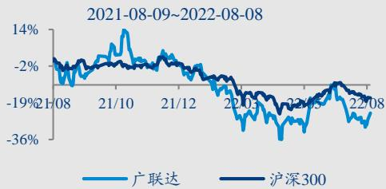  
市场表现对比图(近 12个月)

# 相关研究报告

《广联达（002410）重大事项点评：数字建筑平  
台初步成型，设计等业务值得期待》2022-06-17《广联达（002410）2021 年报点评：收入、利润  
亮眼，施工新签合同高增》2022-03-29《广联达（002410）2021年三季报点评：收入、  
利润高速增长，造价SaaS服务拉动合同负债增  
长》2021-10-27

# 投资主题

# 报告亮点

重点回答市场关注的几个问题：造价空间；施工市场规模与公司盈利性；设计下游市场与公司优势。

# 投资逻辑

造价：1）工程造价员数量或高于市场预期，基建造价ARPU值有望更高；2)降本增效、造价市场化改革驱动下企业成本管理需求。

施工：企业信息化建设需求释放，项目级潜在空间 300-400 亿，目前渗透率较低。

设计：下游客户数量百万级，公司设计底层平台自研，设计-造价打通具备天然优势。

# 关键假设、估值与盈利预测

我们维持预计公司2022-2024 年收入为 68.39 亿元、82.93 亿元、99.71亿元;归母净利润为9.91亿元、12.99亿元、15.69亿元，对应增速分别为49.9%、31.1%、20.8%，对应 EPS 分别为 0.83 元、1.09 元、1.32 元。参考可比公司 PS 估值水平，我们给予公司 2022 年 $1 1$ 倍PS，维持目标价63 元，维持“强推”评级。

# 目录

# 一、如何看工程造价市场空间？

（一）工程造价员数量或高于市场预期，基建造价产品ARPU值有望更高....（二）降本增效、造价市场化改革驱动下企业成本管理需求

二、怎么看施工长期空间与盈利性？ 9（一）企业级：核心客户群体为特一级企业，降本增效需求推动信息化建设，项目管理为核心业务系统. 9（二）项目级：潜在市场空间300-400 亿，目前市场渗透率低 0（三）目前处于规模化前夜，盈亏平衡可期 10

# 三、如何理解设计软件空间及广联达的机会？ 12

（一）下游客户为百万级设计师群体，企业软件国产化意愿提升，软件正版化持续推进. 12（二）底层图形平台自研，设计、造价打通具备先天优势 13

# 四、怎么看估值？ .15

# 五、盈利预测与评级. 17

# 17

# 图表目录

图表1建筑行业GDP. 5  
图表2 2021 年各专业划分工程造价咨询业务收入占比. 5  
图表3 部分客户采购广联达软件情况. 5  
图表4bentley，autodesk 部分软件价格对比. 6  
图表5建筑业产值利润率. /  
图表6工程造价咨询企业数量（家） 7  
图表7广联达端云大数据一体化解决方案. 7  
图表8工程造价咨询企业数字化转型历程（以捷宏公司为例） .8  
图表92018 年中国特、一级资质建筑企业指标分析 ..9  
图表10全球部分行业信息化程度 .9  
图表11新开工项目数量.. 10  
图表12智慧工地市场规模.. 10  
图表13公司施工业务营收增长情况 11  
图表14施工业务毛利率情况. 11  
图表15工程设计新签合同金额. 12  
图表16 我国设计师从业人员分布（%） 12  
图表172020 年设计企业常用的 3D建模软件 $. \%$ ) 12  
图表18建模软件使用情况. 12  
图表19国产软件使用情况. 13  
图表20企业正版BIM软件使用情况. 13  
图表212022 年7 月发布的设计产品 14  
图表22 公司大力打造数字建筑平台 14  
图表23广联达 PE band.. 15  
图表24广联达 PS band.. 15  
图表25公司造价业务收入. 16  
图表26可比公司估值水平（wind一致预期，8月8日收盘价） 16

# 一、如何看工程造价市场空间？

# （一）工程造价员数量或高于市场预期，基建造价产品ARPU值有望更高

工程造价员数量或高于市场预期，我们估算房建 110 万人，基建35 万人。住建部《工程造价事业发展“十三五”规划》显示，“十二五”末，全国从事工程造价的专业技术人员数量逐年攀升，共计 145 万人。虽然我国建筑行业已度过此前快速成长期进入平稳发展阶段，但仍为国家支柱产业之一。因此，我们认为目前工程造价员数量大概率没有缩减，“十二五”末的145 万人高于市场对工程造价员数量的认知。工程造价员结构方面，我们简单用工程造价咨询企业不同专业的业务收入占比来估算不同专业工程造价员的数量。2021 年数据显示，工程造价咨询企业业务收入中房建（含市政）收入占比 $7 6 \%$ 。

因此，我们假设：

1）目前全国工程造价员总数不变，仍为145万人;  
2）房建造价员占比 $7 6 \%$ ；基建造价员占比 $2 4 \%$ 。  
则，估算我国房建造价员数量约110 万；基建造价员数量为35万。

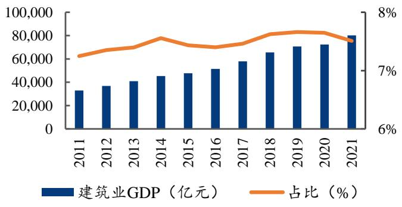  
图表1建筑行业GDP  
来源：WIND、华创证券

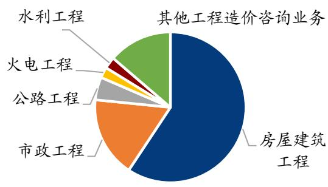  
图表22021 年各专业划分工程造价咨询业务收入占比  
资料来源：住建部、华创证券

# 房建造价ARPU值仍有上升空间，基建造价复杂程度高于房建造价，ARPU或更高。

1）房建造价：广联达深耕造价软件，尤其在房建领域优势大（招股书显示，上市时市占率超 $5 0 \%$ )。公司2020 年披露，造价云化部分的客单价在4000-5000 元，我们认为公司可以通过提升增值服务等来提升ARPU值。我们也收集了部分客户的实际采购情况，也显示公司ARPU值仍有望突破。

图表3部分客户采购广联达软件情况  

<table><tr><td>采购人</td><td>采购内容</td><td>预算金额</td></tr><tr><td>局</td><td>昆明市五华区审计计量软件（土建版）+计价软件（含云南省建设工程造价 2020 版计价标 准）+2个行业模块+其他增值服务</td><td>每套单价9 480元/年</td></tr><tr><td>保山学院</td><td>广联达 BIM土建计量平台GTJ2021 V1.0.25，网络版 22 节点； 广联达云计价平台软件GCCPV6.0，网络版20节点；</td><td>15.5万元</td></tr></table>

<table><tr><td></td><td>合肥铁路工程学校广联达云计价软件GCCP6.0（1.土建、装饰、安装、市政模块2.安徽省 最新新清单及定额；3.共 60 节点）</td><td>18万元</td></tr></table>

资料来源：昆明市五华区人民政府官网等，华创证券

2)基建造价：相比房建工程，基建工程复杂程度更高，预估对应造价软件价格也更贵（尤其算量环节)。此处，我们参考房建设计与基建设计软件的价格差异，Bentley 铁路设计软件年费超过 7000 美元，公路设计软件年费 5661 美元；Autodesk 官网显示，AutoCAD年费为 1865 美元，Revit 年费 2675 美元。基建领域设计软件价格普遍高于房建领域常用的设计软件。因此，我们认为基建造价产品的ARPU值大概率高于房建造价产品。

图表4bentley，autodesk 部分软件价格对比  

<table><tr><td>公司</td><td>部分产品</td><td>价格</td></tr><tr><td rowspan="2">Bentley</td><td>OpenRoads Designer</td><td>$5,661/year</td></tr><tr><td>OpenRail Designer</td><td>$7,046/year</td></tr><tr><td rowspan="2">Autodesk</td><td>AutoCAD</td><td>$1,865/year</td></tr><tr><td></td><td>$2,675/year</td></tr></table>

资料来源：各公司官网，华创证券

# （二）降本增效、造价市场化改革驱动下企业成本管理需求造价市场化改革、精细化管理大势下的成本大数据管理需求。

1）我国建筑行业已度过粗放式成长阶段，建筑业产值利润率在 2014年达到高点后呈现逐步走低趋势，2021 年为 $2 . 9 2 \%$ ，利润率的下滑使得精细化管理迫在眉睫。造价的本质是计算成本，企业对造价服务的需求开始不仅限于岗位端的产品和工具，而是以成本管控为核心的整体解决方案。

2) 2020 年7 月 24 日国家住建部发布《关于印发工程造价改革工作方案的通知》，虽然目前造价市场化改革仍处于试点阶段，但长远看必将给行业带来巨大变革。随着后续预算定额逐步取消发布，建设方、施工方、咨询方或将失去组价来源和依据，对各参与方的数据积累和分析能力提出更高要求，但目前大多数企业无法做到。而造价咨询企业的优势在于拥有大量工程的数据，为其核心竞争力，工程造价咨询企业数字化转型有望加速。

广联达目前可为咨询方、建设方、施工方等等提供端云大数据一体化解决方案，实现数据资产的激活，助力造价工作提质增效，最终实现以目标成本为导向的全过程造价管理。

  
图表5建筑业产值利润率  
资料来源：住建部，华创证券

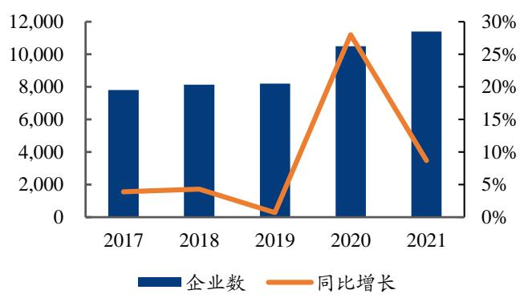  
图表6工程造价咨询企业数量（家）

资料来源：中国建筑业协会，华创证券

  
图表7广联达端云大数据一体化解决方案  
资料来源：公司官网

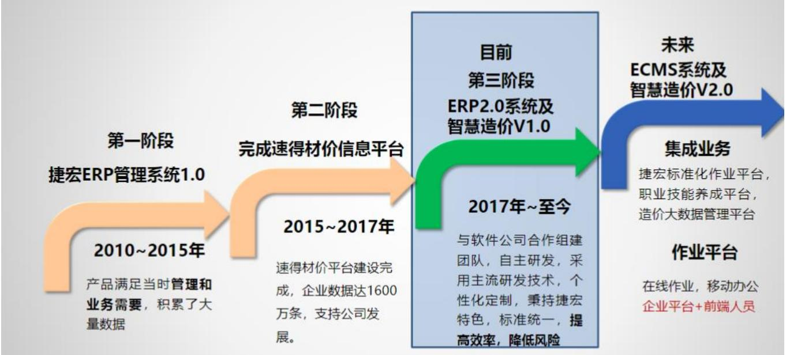  
图表8工程造价咨询企业数字化转型历程（以捷宏公司为例）  
资料来源：捷宏公司，华创证券

# 二、怎么看施工长期空间与盈利性？

# （一）企业级：核心客户群体为特一级企业，降本增效需求推动信息化建设，项目管理为核心业务系统

特、一级资质企业合同额、利润占比高，或为信息化建设主要客户。建筑施工总承包资质分为特级、一级、二级、三级。根据住建部汇总的 2018 年建筑企业指标，2018 年我国特、一级资质企业数量为 6782 家，占全部资质以上企业数量比重为 $7 . 1 1 \%$ ，但其新签工程承包合同额占比、利润总额占比分别高达 $7 0 . 3 3 \%$ 、 $8 5 . 6 6 \%$ 。特、一级资质企业或为建筑信息化不断推进的主力军。

图表92018 年中国特、一级资质建筑企业指标分析  

<table><tr><td rowspan="2">指标名称</td><td colspan="2">全部资质以上企业</td><td colspan="2">汇总的特、一级资质企业</td></tr><tr><td>2018 年</td><td>增速(%)</td><td>2018年</td><td>占比（%）</td></tr><tr><td>企业数量（个）</td><td>95400</td><td>8.34%</td><td>6782</td><td>7.11%</td></tr><tr><td>新签工程承包合同额（亿元）</td><td>272854</td><td>7.14%</td><td>191890.65</td><td>70.33%</td></tr><tr><td>建筑业总产值（亿元）</td><td>235085.53</td><td>9.88%</td><td>146515.7</td><td>63.32%</td></tr><tr><td>房屋建筑施工面积（万平方千米）</td><td>1408920.41</td><td>6.96%</td><td>912097.18</td><td>64.74%</td></tr><tr><td>房屋建筑竣工面积（万平方千米）</td><td>413508.79</td><td>-1.33%</td><td>230215.81</td><td>55.67%</td></tr><tr><td>利润总额（亿元）</td><td>8104</td><td>8.17%</td><td>6941.68</td><td>85.66%</td></tr></table>

资料来源：中国建设教育协会，中国建筑业协会，华创证券

我国建筑信息化水平较低，大多数施工企业信息化应用仍在部门级应用阶段。2021年，中国GDP 超过114万亿元，其中建筑业GDP约 8万亿元，占比为 $7 \%$ ，作为国民经济的支柱之一，建筑业地位依然稳固。全球范围，建筑行业信息化水平仅高于农业和屠宰业（资料来源：麦肯锡报告)。在我国，建筑施工企业信息化投入仅占总产值约 $0 . 0 8 \%$ ，相比发达国家 $1 \%$ 的投入，仍有较大差距。我国建筑施工企业数量超10 万，但大多数企业的信息化应用仍停留在企业部门级应用阶段。

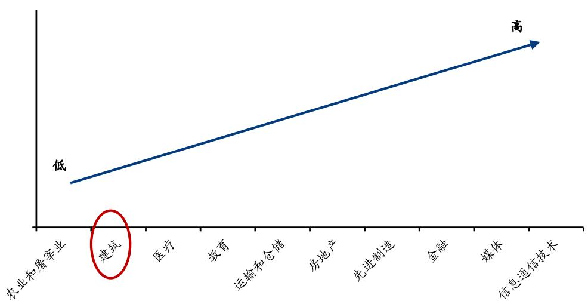  
图表10全球部分行业信息化程度  
资料来源：麦肯锡《Imagining construction's digital future》，华创证券

上海建工IT总监徐新认为，施工企业数字化转型必不可少的平台包括但不限于：

# 2）与业务系统紧密集成的“业务财务一体化”财务系统;

# 3）优化供应链的集采平台；

# 4）HRM、CRM、协同办公平台等

以集采平台为例，降本增效需求推动信息化建设。中国建筑业协会数据显示中国建筑企业平均净利率 $3 . 5 \%$ 左右；采购成本（材料、劳务、设备等）占项目总成本约 $8 0 \%$ 。近年来大型建筑企业逐步建设集采平台降低施工企业寻源周期与采购成本，如云筑网（中国建筑旗下）、华西云采平台等。以北京建工和兰格集采平台合作为例，2020 年北京建工与兰格合作达20 亿元（钢材接近一半），降本增效明显，平均降低成本达 $1 \%$ 至 $1 . 5 \%$ ,每吨钢铁降低成本 40 元至 50元不等。据不完全测算，实施供应链数字化（集采电商）后，平均采购成本降低约 $1 \% \sim 3 \%$ 左右，而采购成本每降低 $1 \%$ 利润率将增长 $5 \%$ 。

# （二）项目级：潜在市场空间300-400 亿，目前市场渗透率低

项目级市场空间潜在市场空间 300-400 亿，且有望持续扩容。我们在《广联达：跨越S型增长曲线，成为数字建筑平台服务商》中提到过，项目规模不同，智慧工地建设所需设备不同，子系统的模块也有差异，因此项目中标金额差异较大，除去大型项目，项目级智慧工地建设中标金额在10-30 万区间。2016-2017年，我国新开工项目数约60 万个，广联达公告中提到目前每年新开工数 30-40 万个。若以每年 30-40 万个新开工项目、建设单价 10 万计算，智慧工地潜在市场空间 300-400 亿元。随着智慧工地建设程度加深，子系统种类有望不断扩容，市场空间还有增长潜力。而目前，根据中研普华产业研究院数据显示智慧工地市场 2019 年市场规模为 120.9 亿元，目前渗透率较低。

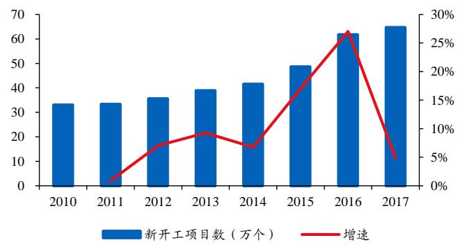  
图表11新开工项目数量  
资料来源：WIND，华创证券  
资料来源：中研普华产业研究院《2021-2026 年中国智慧工地行业市场竞争态势战略咨询报告》，华创证券

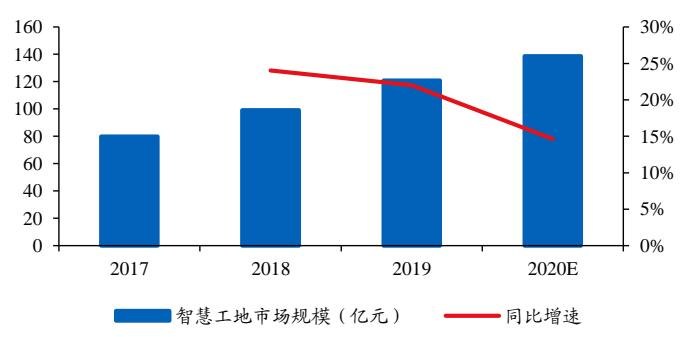  
图表12智慧工地市场规模

# （三）目前处于规模化前夜，盈亏平衡可期

施工合同高增，收入逐步释放，毛利率有望趋稳。公司施工业务目前处于加速扩张、跑马圈地阶段，2021 年公司新签合同依然实现高速增长，2021 年收入达到 12 亿，同比增长约 $2 8 \%$ ，2022 年公司仍朝着收入增速 $3 0 \%$ 的目标奋斗。由于目前施工业务项目级为主体，为解决方案类涉及实施及外采硬件等，毛利率相对纯软件较低，2021 年约为 $6 5 \%$ 。

随着解决方案类业务不断成熟，公司加强供应链管理等，毛利率有望逐步趋稳并保持在$6 0 \%$ 以上。

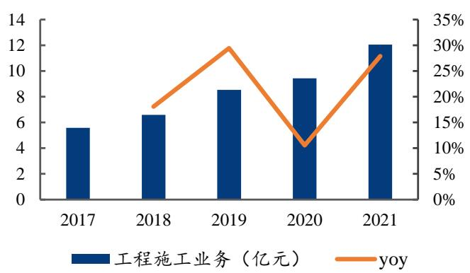  
图表13公司施工业务营收增长情况  
资料来源：WIND、华创证券

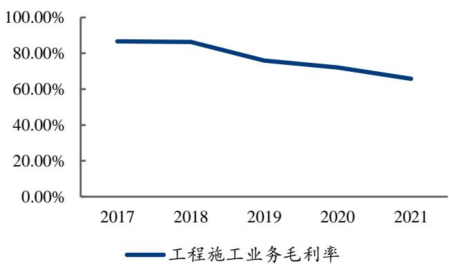  
图表14施工业务毛利率情况  
资料来源：WIND、华创证券

营销网络建设逐步显成效、平台效应发挥或带来盈利端改善。2019 年起，公司加大营销团队建设投入，加强重点区域业务覆盖程度，目前已基本形成覆盖全国的、较为完整的营销服务实施队伍。公司在施工领域的核心竞争力之一是其数字项目管理平台，目前这一平台逐步迭代升级为数字项目集成管理平台（2021 年初步成型），其平台效应或于 2-3年后开始显现，公司盈利表现有望改善。

# 三、如何理解设计软件空间及广联达的机会？

# （一）下游客户为百万级设计师群体，企业软件国产化意愿提升，软件正版化持续推进

下游为百万级设计师群体。《2020 年全国工程勘察设计统计公报》显示，2020 年我国建筑行业设计人员数量为105.5 万人，同比增长 $2 . 9 \%$ ；设计中国数据显示，我国设计师从业人数 1700 万，其中建筑行业占比 $6 \%$ ，对应人数约102 万人。

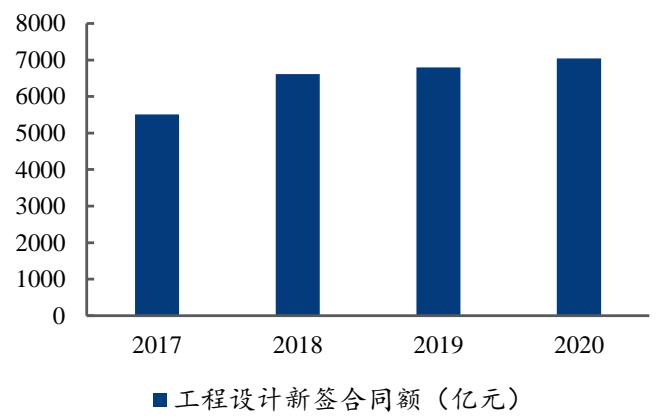  
图表15工程设计新签合同金额  
资料来源：全国工程勘察设计统计公报、华创证券

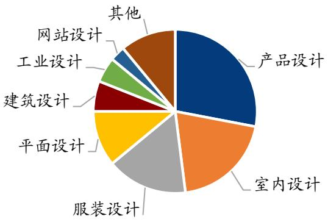  
图表 16我国设计师从业人员分布 $( \%$ )  
资料来源：设计中国等、华创证券

建模软件中，主流软件仍为Autodesk Revit。中国 BIM 草根报告显示，2021 年，在各类建模软件的使用中，企业在项目中的主流选择为Autodesk Revit，使用情况占比高达 $9 5 \%$ 2020 年，在设计企业中最常用的 3D 建模软件均为Autodesk 的产品（Revit，AutoCAD，Civil 3D，Infraworks 等)。

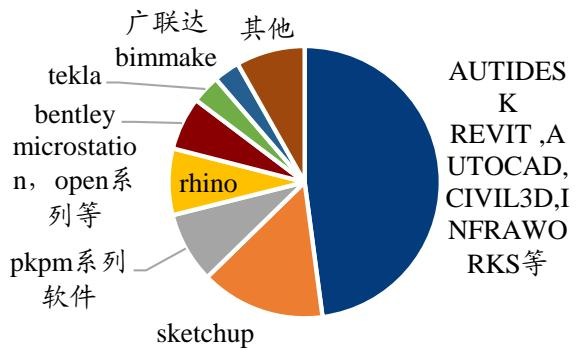  
图表 17 2020 年设计企业常用的 3D 建模软件 $( \%$   
资料来源：BIMBOX《中国BIM草根报告2020》，华创证券

  
图表18建模软件使用情况

资料来源：BIMBOX《中国BIM草根报告2021》、华创证券企业使用国产化软件意愿明显上升。中国 BIM 草根报告 2021 调研数据显示，企业有明确国产化软件要求的需求上升，从 2020 年的 $5 . 9 \%$ 上升到 2021 年的 $1 3 . 2 \%$ ，企业没有明确要求、但个人倾向于支持国产软件的选择从 $1 4 . 5 \%$ 上升到 $2 1 . 4 \%$ ，而完全不考虑软件是否国产的企业则是从 $6 2 . 4 \%$ 下降到 $4 6 . 6 \%$ 。

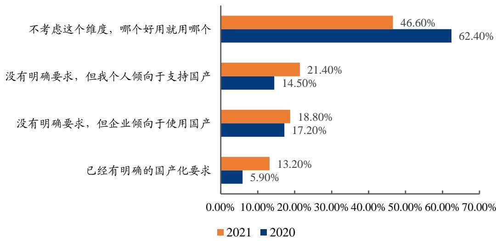  
图表 19国产软件使用情况  
资料来源：BIMBOX《中国BIM草根报告2021》、华创证券

目前企业对正版BIM软件意识较低，仍待提升。中国BIM草根报告2021 调研数据显示，仅有约五分之一的企业全部使用正版软件，占比近 $6 0 \%$ 的多数企业使用部分正版、部分盗版的BIM 软件，全部使用盗版软件和不使用BIM 软件的企业占比约 $2 0 \%$ 。企业对选择使用正版BIM软件的意识仍处于较低水平。

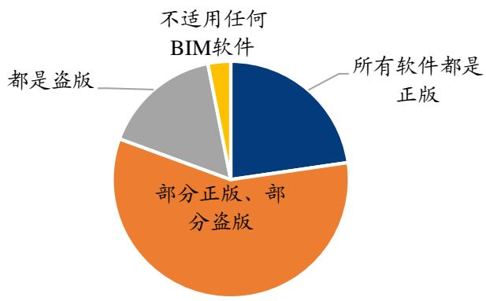  
图表20企业正版 BIM 软件使用情况

资料来源：BIMBOX《中国BIM草根报告2021》、华创证券

# （二）底层图形平台自研，设计、造价打通具备先天优势

独立自主的设计产品已推出。三维图形平台为设计软件的基础，其核心技术是三维图形引擎，公司2003年开始，广联达研发自己的图形引擎，目前在图形引擎的三个核心-图形相互关系、底层数据表达（图形数据库）、图形显示方面拥有完全自主的知识产权。2022 年 7 月 21 日，公司正式发布数维设计产品集，主要涵盖房建设计与市政设计。随着基于完全自主平台的设计产品的推出，经过试点打磨之后商业化产品推出指日可待。

图表212022 年7 月发布的设计产品  

<table><tr><td>系列</td><td>具体产品</td></tr><tr><td rowspan="4">广联达数维房建设计产品集</td><td>广联达数维建筑设计软件</td></tr><tr><td>广联达数维结构设计软件</td></tr><tr><td>广联达数维机电设计软件</td></tr><tr><td>广联达数维协同设计平台</td></tr><tr><td>广联达数维市政设计产品集</td><td>广联达数维道路设计软件</td></tr></table>

资料来源：广联达设计交流圈公众号，华创证券

设计、造价打通具备天然优势，有望成为建筑行业 PAAS 平台。广联达以造价软件为基础，后续拓展到施工领域，目前公司正在向设计高地进军。公司此前收购鸿业科技为自主设计软件后续推广奠定良好的客户基础，其造价软件的广泛应用使得设计软件与造价软件的打通较其他厂商具备天然优势。随着公司在建筑产业链的不断深耕，公司有望成为建筑行业的 PAAS 平台，设计、造价、施工等构建核心应用，与生态伙伴等的合作或带来新的商业模式。

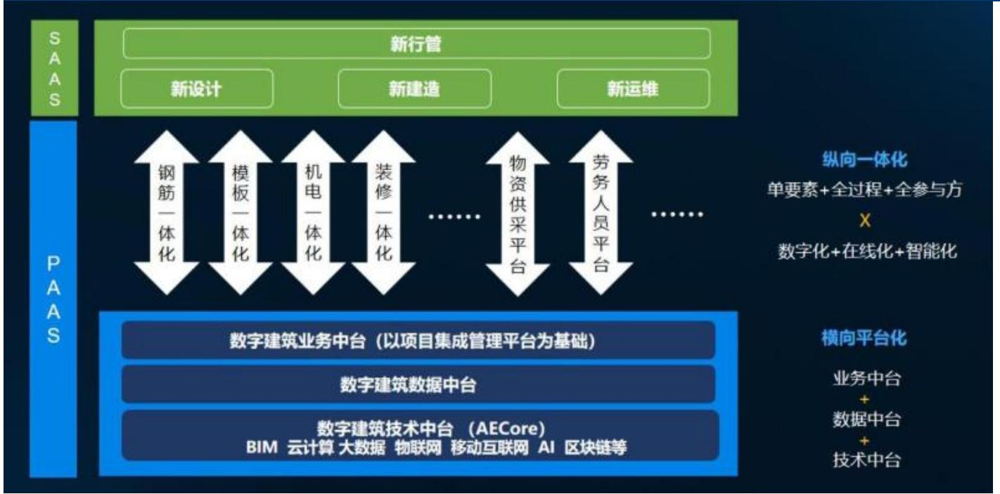  
图表22公司大力打造数字建筑平台  
资料来源：公司公告，华创证券

# 四、怎么看估值?

仅看表观利润，目前估值处于历史相对低位。仅看表观利润，广联达目前的估值水平PE（2022E）仅为50倍出头（我们预计公司2022 年归母净利润约10亿，增速 $5 0 \%$ )，不仅处于PE可看阶段，且估值已处于过去5年相对低位。

  
图表 23广联达 PE band

资料来源：WIND，华创证券

  
图表 24广联达 PS band  
  
资料来源：WIND，华创证券

公司三块业务处于不同发展阶段。广联达三块业务中，造价为公司相对成熟业务，但过去5年收入仍能实现 $2 0 + \%$ 的复合增长；施工处于规模化前夜，还未实现盈利；设计仍处于大力投入阶段。因此，公司造价稳健发展支持了施工和设计业务健康成长，造价实际盈利能力强于公司整体表观利润。

  
图表 25公司造价业务收入  
资料来源：WIND，华创证券

业务积极变化或带来价值重估。与可比公司对比，公司 PS/PE 水平相对较低，未来随着公司造价业务能力依旧优秀，施工业务进入规模化带来盈利能力改善，设计商业化产品推出并推广带来增长空间，公司价值有望重估。

图表26可比公司估值水平（wind一致预期，8月8日收盘价）  

<table><tr><td></td><td>PS(2022E)</td><td>PE(2022E)</td></tr><tr><td>金山办公</td><td>21.1</td><td>67.5</td></tr><tr><td>用友网络</td><td>7.0</td><td>87.3</td></tr><tr><td>石基信息</td><td>7.8</td><td>240.8</td></tr><tr><td>金蝶国际</td><td>9.8</td><td>-</td></tr></table>

资料来源：WIND，华创证券

# 五、盈利预测与评级

我们维持预计公司 2022-2024 年收入为 68.39 亿元、82.93 亿元、99.71 亿元；归母净利润为9.91亿元、12.99 亿元、15.69 亿元，对应增速分别为 $4 9 . 9 \%$ ， $3 1 . 1 \%$ ， $2 0 . 8 \%$ ，对应EPS分别为 0.83 元、1.09 元、1.32 元。参考可比公司 PS 估值水平，我们给予公司 2022 年 11倍PS，维持目标价63 元，维持“强推”评级。

# 六、风险提示

施工与设计业务推进、需求释放存在不确定性；行业竞争加剧。

# 附录：财务预测表

资产负债表  

<table><tr><td>单位：百万元</td><td>2021</td><td>2022E</td><td>2023E</td><td>2024E</td></tr><tr><td>货币资金</td><td>4,050</td><td>4,952</td><td>6,117</td><td>7,543</td></tr><tr><td>应收票据</td><td>29</td><td>14</td><td>19</td><td>28</td></tr><tr><td>应收账款</td><td>495</td><td>784</td><td>977</td><td>1,067</td></tr><tr><td>预付账款</td><td>36</td><td>105</td><td>108</td><td>133</td></tr><tr><td>存货</td><td>71</td><td>66</td><td>85</td><td>109</td></tr><tr><td>合同资产</td><td>30</td><td>13</td><td>19</td><td>29</td></tr><tr><td>其他流动资产</td><td>441</td><td>356</td><td>379</td><td>518</td></tr><tr><td>流动资产合计</td><td>5,122</td><td>6,277</td><td>7,685</td><td>9,398</td></tr><tr><td>其他长期投资</td><td>0</td><td>0</td><td>0</td><td>0</td></tr><tr><td>长期股权投资</td><td>326</td><td>326</td><td>326</td><td>326</td></tr><tr><td>固定资产</td><td>824</td><td>935</td><td>950</td><td>976</td></tr><tr><td>在建工程</td><td>396</td><td>396</td><td>396</td><td>396</td></tr><tr><td>无形资产</td><td>531</td><td>625</td><td>727</td><td>813</td></tr><tr><td>其他非流动资产</td><td>2,869</td><td>2,876</td><td>2,880</td><td>2,884</td></tr><tr><td>非流动资产合计</td><td>4,946</td><td>5,158</td><td>5,279</td><td>5,395</td></tr><tr><td>资产合计</td><td>10,068</td><td>11,435</td><td>12,964</td><td>14,793</td></tr><tr><td>短期借款</td><td>0</td><td>0</td><td>0</td><td>0</td></tr><tr><td>应付票据</td><td>0</td><td>2</td><td>1</td><td>1</td></tr><tr><td>应付账款</td><td>268</td><td>257</td><td>339</td><td>415</td></tr><tr><td>预收款项</td><td>0</td><td>0</td><td>0</td><td>0</td></tr><tr><td>合同负债</td><td>2,127</td><td>2,615</td><td>3,171</td><td>3,813</td></tr><tr><td>其他应付款</td><td>319</td><td>319</td><td>319</td><td>319</td></tr><tr><td>一年内到期的非流动负债</td><td>29</td><td>29</td><td>29</td><td>29</td></tr><tr><td>其他流动负债</td><td>894</td><td>1,026</td><td>1,218</td><td>1,439</td></tr><tr><td>流动负债合计</td><td>3,637</td><td>4,248</td><td>5,077</td><td>6,016</td></tr><tr><td>长期借款</td><td>0</td><td>0</td><td>0</td><td>0</td></tr><tr><td>应付债券</td><td>0</td><td>0</td><td>0</td><td>0</td></tr><tr><td>其他非流动负债</td><td>158</td><td>158</td><td>158</td><td>158</td></tr><tr><td>非流动负债合计</td><td>158</td><td>158</td><td>158</td><td>158</td></tr><tr><td>负债合计</td><td>3,795</td><td>4,406</td><td>5,235</td><td>6,174</td></tr><tr><td>归属母公司所有者权益</td><td>5,788</td><td>6,458</td><td>7,044</td><td>7,797</td></tr><tr><td>少数股东权益</td><td>485</td><td>571</td><td>685</td><td>822</td></tr><tr><td>所有者权益合计</td><td>6,273</td><td>7,029</td><td>7,729</td><td>8,619</td></tr><tr><td>负债和股东权益</td><td>10,068</td><td>11,435</td><td>12,964</td><td>14,793</td></tr></table>

现金流量表  

<table><tr><td>单位：百万元</td><td>2021</td><td>2022E</td><td>2023E</td><td>2024E</td></tr><tr><td>经营活动现金流</td><td>1,601</td><td>1,439</td><td>1,957</td><td>2,298</td></tr><tr><td>现金收益</td><td>766</td><td>1,202</td><td>1,552</td><td>1,852</td></tr><tr><td>存货影响</td><td>-45</td><td>5</td><td>-20</td><td>-23</td></tr><tr><td>经营性应收影响</td><td>-84</td><td>-341</td><td>-200</td><td>-123</td></tr><tr><td>经营性应付影响</td><td>110</td><td>-9</td><td>80</td><td>77</td></tr><tr><td>其他影响</td><td>853</td><td>581</td><td>544</td><td>515</td></tr><tr><td>投资活动现金流</td><td>-1,541</td><td>-331</td><td>-260</td><td>-266</td></tr><tr><td>资本支出</td><td>-546</td><td>-324</td><td>-256</td><td>-263</td></tr><tr><td>股权投资</td><td>-70</td><td>0</td><td>0</td><td>0</td></tr><tr><td>其他长期资产变化</td><td>-925</td><td>-7</td><td>-4</td><td>-3</td></tr><tr><td>融资活动现金流</td><td>-819</td><td>-206</td><td>-532</td><td>-606</td></tr><tr><td>借款增加</td><td>26</td><td>0</td><td>0</td><td>0</td></tr><tr><td>股利及利息支付</td><td>-354</td><td>-814</td><td>-928</td><td>-1,187</td></tr><tr><td>股东融资</td><td>636</td><td>0</td><td>0</td><td>0</td></tr><tr><td>其他影响</td><td>-1,127</td><td>608</td><td>396</td><td>581</td></tr></table>

资料来源：公司公告，华创证券预测

利润表  

<table><tr><td>单位：百万元</td><td>2021</td><td>2022E</td><td>2023E</td><td>2024E</td></tr><tr><td>营业收入</td><td>5,562</td><td>6,839</td><td>8,293</td><td>9,971</td></tr><tr><td>营业成本</td><td>893</td><td>1,075</td><td>1,336</td><td>1,656</td></tr><tr><td>税金及附加</td><td>46</td><td>79</td><td>87</td><td>99</td></tr><tr><td>销售费用</td><td>1,587</td><td>1,881</td><td>2,223</td><td>2,642</td></tr><tr><td>管理费用</td><td>1,099</td><td>1,231</td><td>1,451</td><td>1,715</td></tr><tr><td>研发费用</td><td>1,333</td><td>1,505</td><td>1,783</td><td>2,144</td></tr><tr><td>财务费用</td><td>-110</td><td>6</td><td>2</td><td>-4</td></tr><tr><td>信用减值损失</td><td>-25</td><td>0</td><td>0</td><td>0</td></tr><tr><td>资产减值损失</td><td>-1</td><td>-1</td><td>-1</td><td>-1</td></tr><tr><td>公允价值变动收益</td><td>0</td><td>0</td><td>0</td><td>0</td></tr><tr><td>投资收益</td><td>-16</td><td>-16</td><td>-16</td><td>-16</td></tr><tr><td>其他收益</td><td>86</td><td>86</td><td>86</td><td>86</td></tr><tr><td>营业利润</td><td>758</td><td>1,132</td><td>1,481</td><td>1,788</td></tr><tr><td>营业外收入</td><td>1</td><td>1</td><td>1</td><td>1</td></tr><tr><td>营业外支出</td><td>10</td><td>10</td><td>10</td><td>10</td></tr><tr><td>利润总额</td><td>749</td><td>1,123</td><td>1,472</td><td>1,779</td></tr><tr><td>所得税</td><td>30</td><td>46</td><td>60</td><td>73</td></tr><tr><td>净利润</td><td>719</td><td>1,077</td><td>1,412</td><td>1,706</td></tr><tr><td>少数股东损益</td><td>58</td><td>86</td><td>113</td><td>137</td></tr><tr><td>归属母公司凈利润</td><td>661</td><td>991</td><td>1,299</td><td>1,569</td></tr><tr><td>NOPLAT</td><td>613</td><td>1,083</td><td>1,414</td><td>1,702</td></tr><tr><td>EPS(摊薄)(元)</td><td>0.56</td><td>0.83</td><td>1.09</td><td>1.32</td></tr></table>

主要财务比率  

<table><tr><td></td><td>2021</td><td>2022E</td><td>2023E</td><td>2024E</td></tr><tr><td>成长能力</td><td></td><td></td><td></td><td></td></tr><tr><td>营业收入增长率</td><td>40.9%</td><td>23.0%</td><td>21.3%</td><td>20.2%</td></tr><tr><td>EBIT增长率</td><td>90.5%</td><td>76.7%</td><td>30.5%</td><td>20.4%</td></tr><tr><td>归母净利润增长率</td><td>100.1%</td><td>49.9%</td><td>31.1%</td><td>20.8%</td></tr><tr><td>获利能力</td><td></td><td></td><td></td><td></td></tr><tr><td>毛利率</td><td>84.0%</td><td>84.3%</td><td>83.9%</td><td>83.4%</td></tr><tr><td>净利率</td><td>12.9%</td><td>15.7%</td><td>17.0%</td><td>17.1%</td></tr><tr><td>ROE</td><td>10.5%</td><td>14.1%</td><td>16.8%</td><td>18.2%</td></tr><tr><td>ROIC</td><td>14.4%</td><td>21.1%</td><td>23.6%</td><td>24.1%</td></tr><tr><td>偿债能力</td><td></td><td></td><td></td><td></td></tr><tr><td>资产负债率</td><td>37.7%</td><td>38.5%</td><td>40.4%</td><td>41.7%</td></tr><tr><td>债务权益比</td><td>3.0%</td><td>2.7%</td><td>2.4%</td><td>2.2%</td></tr><tr><td>流动比率</td><td>1.4</td><td>1.5</td><td>1.5</td><td>1.6</td></tr><tr><td>速动比率</td><td>1.4</td><td>1.5</td><td>1.5</td><td>1.5</td></tr><tr><td>营运能力</td><td></td><td></td><td></td><td></td></tr><tr><td>总资产周转率</td><td>0.6</td><td>0.6</td><td>0.6</td><td>0.7</td></tr><tr><td>应收账款周转天数</td><td>30</td><td>34</td><td>38</td><td>37</td></tr><tr><td>应付账款周转天数</td><td>73</td><td>88</td><td>80</td><td>82</td></tr><tr><td>存货周转天数</td><td>20</td><td>23</td><td>20</td><td>21</td></tr><tr><td>每股指标(元)</td><td></td><td></td><td></td><td></td></tr><tr><td>每股收益</td><td>0.56</td><td>0.83</td><td>1.09</td><td>1.32</td></tr><tr><td>每股经营现金流</td><td>1.34</td><td>1.21</td><td>1.64</td><td>1.93</td></tr><tr><td>每股净资产</td><td>4.86</td><td>5.42</td><td>5.92</td><td>6.55</td></tr><tr><td>估值比率</td><td></td><td></td><td></td><td></td></tr><tr><td>P/E</td><td>89</td><td>59</td><td>45</td><td>37</td></tr><tr><td>P/B</td><td>10</td><td>9</td><td>8</td><td>8</td></tr><tr><td>EV/EBITDA</td><td>62</td><td>39</td><td>30</td><td>25</td></tr></table>

# 计算机组团队介绍

# 组长、首席分析师：王文龙

香港城市大学金融与精算数学硕士，6 年计算机研究经验，曾任职于广发证券、太平洋证券。2015-2017 年所在团队取得新财富第 6、第 4、第 3。2019 年金麒麟新锐分析师。2020 年加入华创证券研究所。

研究员：邓怡

厦门大学金融硕士。2020 年加入华创证券研究所。

研究员：戴晨

南京大学理学博士，2022 年 5 月加入华创证券研究所，主要覆盖网络安全、智能驾驶、电力信息化等领域。

助理研究员：梁佳

上海财经大学经济学硕士。2022 年加入华创证券研究所。

华创证券机构销售通讯录  

<table><tr><td>地区</td><td>姓名</td><td>职务</td><td>办公电话</td><td>企业邮箱</td></tr><tr><td rowspan="11">北京机构销售部</td><td>张昱洁</td><td>副总经理、北京机构销售总监</td><td>010-63214682</td><td>zhangyujie@hcyjs.com</td></tr><tr><td>张菲菲</td><td>公募机构副总监</td><td>010-63214682</td><td>zhangfeifei@hcyjs.com</td></tr><tr><td>侯春钰</td><td>高级销售经理</td><td>010-63214682</td><td>houchunyu@hcyjs.com</td></tr><tr><td>刘懿</td><td>高级销售经理</td><td>010-63214682</td><td>liuyi@hcyjs.com</td></tr><tr><td>过云龙</td><td>高级销售经理</td><td>010-63214682</td><td>guoyunlong@hcyjs.com</td></tr><tr><td>侯斌</td><td>销售经理</td><td>010-63214682</td><td>houbin@hcyjs.com</td></tr><tr><td>车一哲</td><td>销售经理</td><td></td><td>cheyizhe@heyjs.com</td></tr><tr><td>蔡依林</td><td>销售经理</td><td>010-66500808</td><td>caiyilin@hcyjs.com</td></tr><tr><td>刘颖</td><td>销售经理</td><td>010-66500821</td><td>liuying5 @heyjs.com</td></tr><tr><td>顾蓝</td><td>销售助理</td><td>010-63214682</td><td>gulinglan @hcyjs.com</td></tr><tr><td>张娟 段佳音</td><td>副总经理、广深机构销售总监</td><td>0755-82828570</td><td>zhangjuan @heyjs.com</td></tr><tr><td rowspan="11">广深机构销售部</td><td></td><td>资深销售经理</td><td>0755-82756805</td><td>duanjiayin@heyjs.com</td></tr><tr><td>汪丽燕</td><td>高级销售经理</td><td>0755-83715428</td><td>wangliyan @hcyjs.com</td></tr><tr><td>青</td><td>高级销售经理</td><td>0755-82756805</td><td>baoqingqing@hcyjs.com</td></tr><tr><td>董姝彤</td><td>销售经理</td><td>0755-82871425</td><td>dongshutong@hcyjs.com</td></tr><tr><td>巢莫雯</td><td>销售经理</td><td>0755-83024576</td><td>chaomowen@hcyjs.com</td></tr><tr><td>嘉慧</td><td>销售经理</td><td>0755-82756804</td><td>zhangjiahui1 @hcyjs.com</td></tr><tr><td>邓洁</td><td>销售经理</td><td>0755-82756803</td><td>dengjie @hcyjs.com</td></tr><tr><td>王春丽</td><td>销售助理</td><td>0755-82871425</td><td>wangchunli @hcyjs.com</td></tr><tr><td>周玮</td><td>销售助理</td><td></td><td>zhouwei@heyjs.com</td></tr><tr><td>许彩霞</td><td>上海机构销售总监</td><td>021-20572536</td><td>xucaixia@hcyjs.com</td></tr><tr><td>官逸超</td><td>销售副总监</td><td>021-20572551</td><td></td></tr><tr><td rowspan="11">上海机构销售部</td><td>曹静婷</td><td></td><td></td><td>caojingting@hcyjs.com</td></tr><tr><td></td><td>销售副总监</td><td>021-20572555</td><td>guanyichao @hcyjs.com</td></tr><tr><td>黄畅</td><td>资深销售经理</td><td>021-20572257-2552</td><td>huangchang @hcyjs.com</td></tr><tr><td>吴俊</td><td>高级销售经理</td><td>021-20572506</td><td>wujun1 @hcyjs.com</td></tr><tr><td>李凯</td><td>资深销售经理</td><td>021-20572554</td><td>likai@hcyjs.com</td></tr><tr><td>张佳妮</td><td>高级销售经理</td><td>021-20572585</td><td>zhangjiani@heyjs.com</td></tr><tr><td>婧</td><td>高级机构销售</td><td>021-20572560</td><td>shaojing@hcyjs.com</td></tr><tr><td>蒋瑜</td><td>销售经理</td><td>021-20572509</td><td>jiangyu @hcyjs.com</td></tr><tr><td>施嘉玮</td><td>销售经理</td><td>021-20572548</td><td>shijiawei@hcyjs.com</td></tr><tr><td>王世韬</td><td>销售助理</td><td></td><td>wangshitao1@hcyjs.com</td></tr><tr><td>朱涨雨</td><td>销售助理</td><td>021-20572573</td><td>zhuzhangyu@hcyjs.com</td></tr><tr><td rowspan="6"></td><td>李凯月</td><td>销售助理</td><td></td><td>likaiyue@hcyjs.com</td></tr><tr><td>潘亚琪 汪子阳</td><td>销售总监 高级销售经理</td><td>021-20572559 021-20572559</td><td>panyaqi@hcyjs.com</td></tr><tr><td>江赛专</td><td>高级销售经理</td><td>0755-82756805</td><td>wangziyang @hcyjs.com</td></tr><tr><td></td><td></td><td></td><td>jiangsaizhuan@hcyjs.com</td></tr><tr><td>汪戈</td><td>销售经理</td><td>021-20572559</td><td>wangge@hcyjs.com</td></tr><tr><td>宋丹 王卓伟</td><td>销售经理 销售助理</td><td>021-25072549 0755-82756805</td><td>songdanyu @hcyjs.com wangzhuowei@hcyjs.com</td></tr></table>

# 华创行业公司投资评级体系(基准指数沪深 300)

# 公司投资评级说明：

强推：预期未来6个月内超越基准指数 $2 0 \%$ 以上；推荐：预期未来6个月内超越基准指数 $1 0 \% - 2 0 \%$ 中性：预期未来6个月内相对基准指数变动幅度在 $. 1 0 \% - 1 0 \%$ 之间；回避：预期未来6个月内相对基准指数跌幅在 $1 0 \% - 2 0 \%$ 之间。

# 行业投资评级说明：

推荐：预期未来3-6个月内该行业指数涨幅超过基准指数 $5 \%$ 以上；中性：预期未来3-6 个月内该行业指数变动幅度相对基准指数 $- 5 \% - 5 \%$ .,回避：预期未来3-6个月内该行业指数跌幅超过基准指数 $5 \%$ 以上。

# 分析师声明

每位负责撰写本研究报告全部或部分内容的分析师在此作以下声明：

分析师在本报告中对所提及的证券或发行人发表的任何建议和观点均准确地反映了其个人对该证券或发行人的看法和判断；分析师对任何其他券商发布的所有可能存在雷同的研究报告不负有任何直接或者间接的可能责任。

# 免责声明

本报告仅供华创证券有限责任公司（以下简称“本公司”）的客户使用。本公司不会因接收人收到本报告而视其为客户。

本报告所载资料的来源被认为是可靠的，但本公司不保证其准确性或完整性。本报告所载的资料、意见及推测仅反映本公司于发布本告当日的判断。在不同时期，本公司可发出与本报告所载资料、意见及推测不一致的报告。本公司在知晓范围内履行披露义务。

报告中的内容和意见仅供参考，并不构成本公司对具体证券买卖的出价或询价。本报告所载信息不构成对所涉及证券的个人投资建议，也未考虑到个别客户特殊的投资目标、财务状况或需求。客户应考虑本报告中的任何意见或建议是否符合其特定状况，自主作出投资决策并自行承担投资风险，任何形式的分享证券投资收益或者分担证券投资损失的书面或口头承诺均为无效。本报告中提及的投资价格和价值以及这些投资带来的预期收入可能会波动。

本报告版权仅为本公司所有，本公司对本报告保留一切权利。未经本公司事先书面许可，任何机构和个人不得以任何形式翻版、复制、发表、转发或引用本报告的任何部分。如征得本公司许可进行引用、刊发的，需在允许的范围内使用，并注明出处为“华创证券研究”且不得对本报告进行任何有悖原意的引用、删节和修改。

证券市场是一个风险无时不在的市场，请您务必对盈亏风险有清醒的认识，认真考虑是否进行证券交易。市场有风险，投资需谨慎。

华创证券研究所  

<table><tr><td>北京总部</td><td>广深分部</td><td>上海分部</td></tr><tr><td>地址：北京市西城区锦什坊街26号 恆奧中心C座 3A</td><td>地址：深圳市福田区香梅路1061号中投国际 商务中心A座 19 楼</td><td>地址：上海市浦东新区花园石桥路33号 花旗大廈12层</td></tr><tr><td>邮编：100033 传真：010-66500801</td><td>邮编：518034 传真：0755-82027731</td><td>邮编：200120 传真：021-20572500</td></tr><tr><td>会议室：010-66500900</td><td>会议室：0755-82828562</td><td>会议室：021-20572522</td></tr></table>