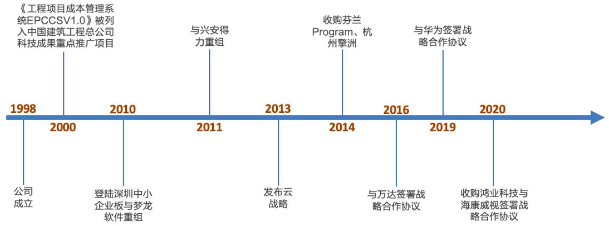
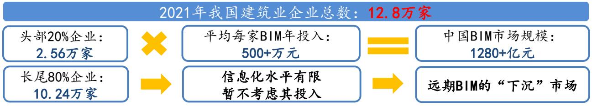

# cAToN SE探尊造价估值安全边际，数字建筑体化打开成长空间

# 核心观点

投资评级：增持(首次)  

<table><tr><td>基本数据</td><td>2022-06-10</td></tr><tr><td>收盘价（元）</td><td>52.11</td></tr><tr><td>流通股本（亿股）</td><td>9.94</td></tr><tr><td>每股净资产（元）</td><td>4.63</td></tr><tr><td>总股本（亿股）</td><td>11.90</td></tr></table>

  
最近 12 月市场表现

分析师杨烨  
SAC证书编号：S0160522050001  
yangye01@ctsec.com  
分析师罗云扬  
SAC证书编号：S0160522050002  
luoyy@ctsec.com

建筑数字化领航者。公司立足建筑产业，覆盖造价、施工、设计和创新业务四大业务版块，协同效应明显。随着 2021 年云转型逐步完成，业绩重回高增长轨道，2022Q1收入和归母净利润分别同比增长 $3 3 . 2 \%$ 和 $4 1 . 9 \%$ ，2022Q1毛利率 $8 5 . 4 1 \%$ ，我们预计未来有望逐步回升。公司费用控制良好，并持续保持了高强度的研发投入（2021 年研发支出占收入比重依然高达 $2 8 . 9 \%$ ），为持续的产品矩阵扩张打下了基础。

造价业务有望量价齐升，绝对估值734 亿元，安全边际较高。量升：短期看，随公司云转型逐步收尾，战略重心有望重回盗版替代；中长期看，公司通过内生 $\cdot ^ { + }$ 外部合作横向拓展细分基建领域，市占率有进一步提升空间；价升：短期看，云架构下存量产品加速迭代与衍生增值服务，产品提价有望常态化；中长期看，造价市场化 $+ \mathsf { A l }$ 应用，公司造价ARPU 值提升空间广阔。叠加云转型后造价盈利能力逐步回升，DCF 视角下公司造价业务估值安全边际为 734 亿元。

中国BIM 市场长期空间超干亿元，国产化浪潮推动下，公司依托数字建筑一体化平台有望受益。我们估算中国 BIM 市场远期空间超干亿元，对比现状有十倍成长空间。目前核心 BIM 建模类市场 revit 等国际厂商优势显著，公司正通过内生外延大力投入相关技术，力争弯道超车。展望未来，在BIM技术推动与下游需求升级背景下，“设计-造价一施工”一体化发展趋势明显，公司凭借数字造价近 $80 \%$ 市占率，有望乘软件国产化产业东风充分受益。

首次覆盖，给予“增持”评级。我们预计公司 2022-2024 年收入分别为 69.8亿元、85.3亿元和 102.4亿元，归母净利润为9.70 亿元、13.03亿元和 16.78亿元，目前公司处于历史估值底部。短期看，造价业务可持续增长能力被市场低估；长期看，“设计 $^ +$ 造价 $^ +$ 施工”一体化趋势下，公司背靠数字造价业务，有望成长为数字建筑产业主导者，打开成长空间。

风险提示：技术研发不及预期；疫情影响项目交付；建筑业景气度波动。

盈利预测：  

<table><tr><td></td><td>2020A</td><td>2021A</td><td>2022E</td><td>2023E</td><td>2024E</td></tr><tr><td>营业总收入(百万)</td><td>4,005</td><td>5,619</td><td>6,980</td><td>8,531</td><td>10,243</td></tr><tr><td>收入增长率(%)</td><td>13.1</td><td>40.3</td><td>24.2</td><td>22.2</td><td>20.1</td></tr><tr><td>归母净利润(百万)</td><td>330</td><td>661</td><td>970</td><td>1,303</td><td>1,678</td></tr><tr><td>净利润增长率(%)</td><td>40.5</td><td>100.1</td><td>46.8</td><td>34.3</td><td>28.8</td></tr><tr><td>EPS(元/股)</td><td>0.29</td><td>0.56</td><td>0.82</td><td>1.09</td><td>1.41</td></tr><tr><td>PE</td><td>274.6</td><td>113.5</td><td>63.9</td><td>47.6</td><td>37.0</td></tr><tr><td>ROE(%)</td><td>5.2</td><td>11.4</td><td>15.5</td><td>17.2</td><td>18.2</td></tr><tr><td>PB</td><td>14.6</td><td>13.1</td><td>9.9</td><td>8.2</td><td>6.7</td></tr></table>

数据来源：wind 数据，财通证券研究所

# 内容目录

1.建筑数字化领航者.. 4  
2.造价业务有望量价齐升，绝对估值视角下安全边际高... .8  
2.1．量：正版化率提升、基建领域横向拓展潜力，有望推动付费用户增长.8  
2.1.1．国家持续推进正版软件保护，云转型收尾后公司或将加强盗版打击 10  
2.1.2.内生 $^ +$ 合作拓展基建领域，公司造价客户覆盖面仍在不断扩大......11  
2.2．价：存量产品迭代、衍生增值服务和造价市场化，有望带来造价ARPU  
值提升的共振. ...13  
2.2.1．存量产品版本持续迭代，每年有望提高 ARPU 约 $5 \%$ ： ..13  
2.2.2.衍生增值服务以解决客户痛点，深度挖掘单客户价值... ..15  
2.2.3.“造价市场化 $+ \mathsf { A l }$ 应用”，公司造价ARPU 值中长期提升空间广阔.16  
2.3.造价云转型提升客户粘性，收入增长确定性大幅提升.. ...18  
2.3.1．造价云转型进入尾声，转化率、续费率维持高位. .18  
2.3.2.云转型与技术迭代，提升公司收入增长韧性. .18  
2.4.基础设施建设有望平滑地产业的扰动... .19  
2.5.绝对估值视角下，造价业务估值安全边际高... .20  
3.中国BIM市场空间超干亿，一体化 $^ +$ 国产化趋势下公司有望突围 ..22  
3.1．中国 BIM 市场空间超干亿，前景广阔... ..22  
3.2.海外厂商优势明显，国产化任重而道远，公司力争弯道超车. ...24  
3.3.布局“设计+造价 $^ +$ 施工”一体化，平台型策略打开长期成长空间...26  
4.盈利预测与估值评级. ...28  
5.风险提示. ..31

# 图表目录

图1.公司发展历程.. 4  
图 2.公司主营业务框架图 5  
图3.2017-2021 年公司分版块收入数据（亿元） 5  
图4.2017-2021 年公司收入构成结构.. 5  
图5.公司股权结构(截止 2022 年 3 月 31 日) 5  
图6.2017-2021 年公司营收数据... 6  
图7.2017-2021 年归母净利润数据. 6  
图8.2015-2021 年公司造价、施工以及综合毛利率 7  
图9.2017-2021 年公司三大费用率数据.. 7  
图 10.2017-2021年研发支出与占收入比.. 7  
图 11.2015年注册造价师企业分布.. 8  
图 12.2015-2020 年不同类型企业注册造价师人数变化（万人） 8  
图 13.我国造价员数量测算. 8  
图14.2021 年我国造价员使用软件分布情况计算与结果 9  
图 15.2021年我国造价人员使用造价软件情况 9  
图16.我国关于正版软件保护相关政策 .10  
图17.公司数字造价版块收入的云化比例（2017-2021年） .11  
图18.公司官网发布的盗版打击相关文章.. . 11  
图19.2020年工程造价咨询企业收入分布..  
图20.公司基建类造价产品发布与升级时间点， .12  
图21.广联达造价业务技术发展历程 .. 13  
图22．公司通用造价产品发布与升级时间点  
图23.品茗股份造价产品价格(2017-2019). ..14  
图24.新点软件造价产品价格(2018-2020..  
图25.公司通用造价产品发布与升级时间点..  
图26.广联达清标软件. ..15  
图27.国家造价市场化部分推动政策 ..16  
图28.造价市场化带来变化. ..17  
图29.公司造价智能化功能示意 ..17  
图30.公司造价云转型历程 .18  
图31．公司合同负债与应收账款. …..19  
图32.公司扣除金融业务后经营性净现金流. .19  
图 33.公司造价业务还原后收入增速与中国建筑业新开工地面积增速对比..19  
图34.中国建筑业产值分布(2020)... ..19  
图35.全国房建竣工面积构成(2020). . 19  
图36.2020-2022Q1 年中国建筑各类业务新签合同额增速， ..20  
图37.公司造价业务自由现金流增长预测，  
图38.公司未来现金流增长逻辑框架.. ..1  
图39.公司造价业务DCF估值敏感性分析. ..21  
图40.我国BIM 软件细分模块应用情况.. ..2  
图41．我国 BIM 市场空间测算. ..22  
图42.我国企业BIM应用资金投入情况， ..23  
图43．全球BIM市场规模及预测， ..23  
图44．中国BIM市场规模及预测， ..23  
图45.全球 BIM行业市占率(2020). ..24  
图46.我国 BIM 建模工具类软件品牌应用情况(2021) ..24  
图47.广联达 BIMspace 产品 ..24  
图48.品茗HiBIM产品 ..24  
图49.我国BIM相关推动政策.. ..25  
图50．公司数维建筑设计产品界面， ..26  
图51.建筑行业客户需求变化.. ..26  
图52.公司设计施工计量一体化解决方案. ..27  
图53.公司造价业务收入预测.. ..28  
图54.公司分项收入预测.. ….29  
图55.公司毛利率预测. ..29  
图56.公司三大费用率预测 ….29  
图57.广联达的 PE-band（2019.06-2022.06） ..30  
图58.可比公司 PE 估值对比(除广联达外，其余公司 2022-2023 年 EPS 为  
Wind一致预期)... ….0  
图59.可比公司 PS 估值对比(除广联达外，其余公司 2022-2023 年收入为  
Wind一致预期.…. .0

# 1．建筑数字化领航者

建筑数字化领航者。公司立足建筑产业，围绕工程全生命周期，为客户提供建设工程软硬件产品和解决方案，以及产业大数据、产业新金融等增值服务。成立至今，公司一直坚持自主研发、自建渠道，并通过覆盖全国的营销网络、一体化的运作支持满足用户需求、迭代产品，构建出一套敏捷高效的“研-营-销-服-”体系。

  
图 1.公司发展历程  
数据来源：公司官网、财通证券研究所

造价、施工、设计和创新业务构成四大业务版块，协同效应明显。

● 数字造价：计算工程项目所需建材、机械及其耗材、人工费用的量与价格，该版块是公司当前成长阶段的支柱版块，2021 年实现收入 38.1 亿元，同比增长 $3 6 . 6 \%$ 。数字施工：辅助施工过程中的劳务、物料管理、施工进度管控、成本管理等，2021 年该版块实现收入 12.1 亿元，同比增长 $2 7 . 8 \%$ 。数字设计：辅助建筑设计师进行建筑图纸设计，2021 年公司完成了鸿业科技的整合，设计版块实现收入 1.3 亿元，同比增长 $2 5 0 \%$ 。创新单元：数字城市(基于 CIM的城市管理)、数字供采(建材供采 B2B 信息平台)、数字高校(教学用建筑类软件)。

  
图 2.公司主营业务框架图

数据来源：公司年报、财通证券研究所数据来源：wind、财通证券研究所数据来源：wind、财通证券研究所

  
图 3.2017-2021 年公司分版块收入数据（亿元）

  
图 4.2017-2021 年公司收入构成结构  
数据来源：wind、财通证券研究所

  
图 5.公司股权结构（截止 2022 年3月 31日）

随着云转型逐步完成，业绩重回高增长轨道。2021 年，公司实现收入 56.2 亿元，同比增长 $40 \%$ ;实现归母净利润6.6亿元，同比增长 $100 \%$ 。2017年公司大力推动战略转型，投入加大，加之宏观经济影响，表观利润开始下滑;2020 年公司云转型逐见成效，利润重回高速增长轨道。我们认为，随着公司云转型全面完成，公司未来利润有望保持高速增长态势。

  
图 6.2017-2021 年公司营收数据  
数据来源：wind、财通证券研究所

  
图 7.2017-2021 年归母净利润数据  
数据来源：wind、财通证券研究所

业务拓展期毛利率暂时承压，未来有望企稳回升。一方面源于造价云转型完成后的价格提升，另一方面随设计、造价、施工业务一体化发展，公司“平台 $^ +$ 组件”模式有望平衡需求差异化与产品标准化，实现施工业务毛利率提升，从而带动整体毛利率上行。

造价业务：公司坚持标准化产品输出，毛利率早年均保持 $9 5 \%$ 以上，2015年以来因推动云转型战略，毛利率略有波动，但仍维持在高水平。施工业务：由于下游工地需求差异化较大，且近年来劳务、物料管理需求旺盛导致项目硬件占比提升，版块毛利率呈下滑趋势。设计业务，2021 年并表鸿业后，综合毛利率为 $9 5 . 8 4 \%$ 。

  
图 8.2015-2021 年公司造价、施工以及综合毛利率  
数据来源：wind、财通证券研究所

费用管控良好，持续保持高强度的研发投入力度。得益于公司收入快速增长与费用管控能力，公司三大费用率合计由 2017 年 $52 \%$ 下降至2021年 $4 8 \%$ ，其中管理费用率由 2017 年 $2 2 \%$ 下降至2021年 $1 9 . 5 \%$ ，财务费用率保持低水平，销售费用率在 2020 年云转型高峰期达到 $3 1 . 4 \%$ ，其后2021年下降至 $28 \%$ （前期研发投入逐步看到产出效应，2021 年收入明显提速导致)。此外，公司研发支出占收入比维持较高水平，持续加大对图形平台、AI、云计算的研发投入力度，2021 年研发支出占收入比下降，主要是由于同期收入加快增长。

  
图 9.2017-2021 年公司三大费用率数据  
数据来源：wind、财通证券研究所

  
图 10.2017-2021 年研发支出与占收入比

数据来源：wind、财通证券研究所

# 2.造价业务有望量价齐升，绝对估值视角下安全边际高

# 2.1.量：正版化率提升、基建领域横向拓展潜力，有望推动付费用户增长

2023 年，我们预计国内造价专业技术人员突破 200 万人。经测算，2020 年我国造价专业技术人员（以下简称“造价员”，而“注册造价师”须进一步通过专业考试并获得职称)人数约为181万人，2015-2020年该人数CAGR为 $4 . 5 \%$ 。我们假设 2020 年-2023 年造价员数每年保持 $4 \%$ 增速，预计 2023 年我国造价员数量将突破 200 万人。

  
图 11.2015 年注册造价师企业分布  
数据来源：中价协、住建部、财通证券研究所

  
图 12.2015-2020 年不同类型企业注册造价师人数变化（万人）  
数据来源：住建部、财通证券研究所

  
图 13.我国造价员数量测算  
数据来源：中价协、住建部、财通证券研究所

根据我们的测算，仅针对造价市场，2021 年公司合计付费用户数为 84.6 万人，在国内剩余的约 103.6 万个潜在付费用户中，63.9 万人为公司盗版用户，39.7万人暂未使用公司产品。公司的造价产品用户数存在约 1.2 倍提升空间。

图 14.2021 年我国造价员使用软件分布情况计算与结果  

<table><tr><td>项目</td><td>计算</td><td>备注</td></tr><tr><td>2021年我国造价 员总数</td><td>181万*(1+4%）≈188万人</td><td>2020 年我国造价员为181万人，假设21年 同比增长率为 4%。</td></tr><tr><td>广联达云造价付 费用户人数</td><td>31亿元/5,000元≈62万人</td><td>2021 年公司云造价收入为 31 亿元；平均客 单价格为 4000~5000元。</td></tr><tr><td>广联达传统造价 付费用户人数</td><td>39 亿元 ／17,500元≈22.6万人</td><td>公司过去三年传统造价收入为 39 亿元（公司 产品迭代促使用户购买新产品）；平均客单 价为 15,000～20,000元。</td></tr><tr><td>广联达云造价盗 版用户人数</td><td>62万人／60%－62万≈ 41.3万人</td><td>云造价业务正版转换率约为 60%。</td></tr><tr><td>广联达传统造价 盗版用户人数</td><td>22.6 万人 /50% - 22.6万人 ≈ 22.6 万人</td><td>传统造价业务正版转换率约为 50%。</td></tr><tr><td>其他品牌造价软 件用户人数</td><td>188 万人－(62万人+22.6万人+41.3万人+ 22.6万人）≈39.7万人</td><td></td></tr></table>

数据来源：Wind、公司公告、中价协、住建部、财通证券研究所

  
图 15.2021 年我国造价人员使用造价软件情况  
数据来源：公司公告、中价协、住建部、财通证券研究所

# 2.1.1．国家持续推进正版软件保护，云转型收尾后公司或将加强盗版打击

国家持续重视软件知识产权保护。2021 年11 月，工信部印发《“十四五”软件和信息技术服务业发展规划》，其中提到，将加大对软件的知识产权保护力度，鼓励企业加强软件知识产权合作，持续推进软件正版化。我们认为，随着知识产权保护政策的落实以及反盗版技术的革新，我国的软件盗版化率有望持续下降。

图 16．我国关于正版软件保护相关政策  

<table><tr><td>文件名称</td><td>发布时间</td><td>部门</td><td>内容</td></tr><tr><td>业和集成电路产业发展</td><td>《进一步鼓励软件产 2011年1 月</td><td>鼓励软件企业进行著作权登记。支持软件和集成电路企业依法到国外申请知 国务院</td><td>识产权，对符合有关规定的，可申请财政资金支持。严格落实软件和集成电</td></tr><tr><td>权战略行动计划（2014</td><td>2014年12</td><td>国务院</td><td>加强重点领域知识产权行政执法。积极开展执法专项行动，重点查办跨区域、 大规模和社会反响强烈的侵权案件，加大对民生、重大项目和优势产业等领</td></tr><tr><td>犯知识产权和制售假冒</td><td>2016年4 月</td><td>国务院 标准化。巩固政府机关软件正版化成果，加快推进企业软件正版化。</td><td>深入推进软件正版化工作。制定正版软件使用管理指南，推进软件使用管理</td></tr><tr><td>业发展规划（2016— 2020年)》</td><td>2016年12 月</td><td>工信部 知识产权创造、运用、保护、管理和服务能力。</td><td>深入推进软件正版化，鼓励企业联合建设软件专利池、知识产权联盟，提升</td></tr><tr><td>权保护和运用规划》</td><td>2016年12 月</td><td>加强新领域新业态知识产权保护。加大宽带移动互联网、云计算、物联网、 国务院 大数据、高性能计算、移动智能终端等领域的知识产权保护力度。</td><td></td></tr><tr><td>《“十四五”软件和信息 技术服务业发展规划》</td><td>2021年11 月</td><td>将加大对软件的知识产权保护力度，鼓励企业加强软件知识产权合作。持续 工信部</td><td>推进软件正版化，严厉打击各类软件侵权盗版行为。</td></tr></table>

数据来源：国务院、工信部、财通证券研究所

2021 年公司云转型收尾，战略重心或向盗版打击部分倾斜。公司于 2015 年开启造价云转型试点，2017-2021 年云收入占比快速提升，2021年公司已完成全国最后 4 个省份云转型，整体云转型战略进入收尾阶段。从公司官网信息上看，公司关于盗版打击相关文章集中在 2015 年及之前，我们认为，在公司云战略转型期间，为提升市占率和增强客户粘性，公司战略重心或向市场拓展与云转型倾斜，随着前述阶段的基本收尾，未来公司盗版打击力度有望加大。

  
图 17.公司数字造价版块收入的云化比例(2017-2021年）  
数据来源：Wind、财通证券研究所

  
图 18.公司官网发布的盗版打击相关文章  
数据来源：公司官网、财通证券研究所

# 2.1.2.内生 $^ +$ 合作拓展基建领域，公司造价客户覆盖面仍在不断扩大

我国建筑业约 $40 \%$ 为非房屋建筑的基础设施类工程，特定基建领域仍有垂直软件厂商占据一定市场。根据住建部数据，从造价咨询企业 2020 年营业收入分布中可以看出，房屋建筑及市政工程是主要部分，占比为 $5 9 . 6 \%$ ，市政工程占比$1 7 . 0 \%$ ，其他包括公路、火电水利等。而相比于建筑结构、用材、施工方式相对趋同的房屋类建筑工程项目，不同领域的基础设施工程项目在建筑结构、用材、施工方式、劳工计价等方面存在较大差异。在公路、水运、水力、铁道等细分市场仍有相应垂直厂商凭借多年深耕，占据一定市场份额。

  
图 19.2020 年工程造价咨询企业收入分布  
数据来源：住建部、财通证券研究所

内生 $+$ 外部合作，持续拓宽基建领域造价产品覆盖面。据年报等可查资料，公司在基建领域造价产品亦有较早布局和持续迭代。而除内生性研发外，公司亦与细分领域 know-how厂商合作，不断寻求突破。例如产品“水利水电云计价软件”GWH5.0即是由公司与长江设计集团（水利水电领域专业勘察设计企业）合作研发。我们认为，基建类造价市场的需求较房建类更分散，公司市占率提升相对缓慢，公司凭借资金、技术、人员规模等方面的明显优势，通过内生 $+$ 外延拓展，基建类造价软件市占率有望持续提升。

  
图 20．公司基建类造价产品发布与升级时间点  
数据来源：天眼查、财通证券研究所

# 2.2.价：存量产品迭代、衍生增值服务和造价市场化，有望带来造价 ARPU 值提升的共振

回顾公司造价业务发展历程，我们认为，ARPU值提升核心驱动力是基于需求深度挖掘后的技术迭代升级。随着公司云转型完成，其产品迭代有望加速，“全过程”计量升级、三维算量、AI等技术赋能带来的衍生增值服务以及造价市场化的持续推进，有望对公司 ARPU 值的提升形成共振。

  
图 21.广联达造价业务技术发展历程  
数据来源：公司公告、财通证券研究所

# 2.2.1．存量产品版本持续迭代，每年有望提高 ARPU约 $5 \%$

版本迭代升级和政策驱动带来提价空间。根据公司招股书，单个产品版本升级提高产品单价约 $10 \%$ 。同时，国家计价依据更新亦能推动公司产品提价（如住建部要求2008 年12 月起实施新规范替代 2003 年规范)。

  
图 22.公司通用造价产品发布与升级时间点  
数据来源：公司公告、住建部、财通证券研究所

造价软件提价是行业惯例。根据同类厂商品茗股份与新点软件招股书数据，它们的造价软件单品均价或公司产品的综合均价都在过去几年呈现出明显的提升态势。

  
图 23．品茗股份造价产品价格(2017-2019)  
数据来源：品茗股份招股书、财通证券研究所

  
图 24.新点软件造价产品价格(2018-2020)  
数据来源：新点软件招股书、财通证券研究所

我们认为，云架构下公司产品迭代有望加速，预计公司存量产品版本迭代间隔在2-3 年，每年提升公司造价产品 ARPU 值约 $5 \%$ 。

  
图 25.公司通用造价产品发布与升级时间点  
数据来源：天眼查、财通证券研究所

# 2.2.2.衍生增值服务以解决客户痛点，深度挖掘单客户价值

公司持续挖掘客户需求，针对性产品不断发布。我们认为，现阶段针对工程造价“全过程”，仍有存在大量细分环节现有造价软件未能触达，未来随新功能模块增加，公司单客户ARPU 值有望持续提升。

为解决部分无信息价建材报价依据问题，公司广材助手首个版本发布于2014年5月；  
为提升企业招投标成功率，清标软件GVB 首个版本则于2020年7月发布。为提升算量效率，避免二次建模，公司三维算量产品 BIM Q 于 2022 年完成首家样本客户合作实践。

  
图 26.广联达清标软件  
数据来源：广联达官网、财通证券研究所

# 2.2.3. “造价市场化 $+ \mathsf { A l }$ 应用”，公司造价ARPU值中长期提升空间广阔

造价市场化试点全面启动，公司已推出市场化计价产品。2020 年 7 月，住建部发布《工程造价改革工作方案》提出推行清单计量、市场询价、自主报价、竞争定价的工程计价方式。同时，住建部提出在全国房地产开发项目以及北京市、浙江省、湖北省、广东省、广西壮族自治区有条件的国有资金投资的房屋建筑、市政公用工程项目进行工程造价改革试点。2021 年1 月，公司发布市场化计价平台。

图 27. 国家造价市场化部分推动政策  

<table><tr><td>时间</td><td>地区</td><td>政策/会议</td><td>内容要点</td></tr><tr><td>2020年7月</td><td>全国</td><td>《工程造价改革 工作方案》</td><td>改进工程计量和计价规则，完善工程计价依据发布机制，加强工程造价数据 积累，强化建设单位造价管控责任，严格施工合同履约管理；北京市、浙江 省、湖北省、广东省、广西壮族自治区先行试点</td></tr><tr><td>2020年11月</td><td>广西壮族自 治区</td><td>《广西建设工程 造价改革试点实 施方案》</td><td>建立适应市场化要求的计价依据体系及评标办法，重视合同签订、严格施工 合同履约管理，加强对工程造价咨询行业的市场培育和监管力度</td></tr><tr><td>2021年7月</td><td>广东省</td><td>《广东省工程造 价改革试点工作 实施方案》</td><td>引导试点项目创新计价方式，改进工程计量和计价规则，创新工程计价依据 发布机制，强化建设单位造价管控责任，严格施工合同履约管理，探索工程 造价纠纷的市场化解决途径，完善协同监管机制</td></tr><tr><td>2021年9月</td><td>湖北省 上海市、浙江</td><td>《湖北省建设工 程造价改革试点 实施方案》</td><td>开展国有资金投资项目造价改革试点，推进工程造价信息化建设，强化施工 合同履约管理，加强造价咨询行业监管和信用体系建设</td></tr><tr><td>2021年10月</td><td>省、江苏省、 安徽省</td><td>长三角区域工程 造价管理一体化 第五次联席会议</td><td>研讨了《长三角区域工程造价管理一体化发展工作方案》、《长三角区域三 省一市建设工程主要施工机械租赁价格指数测算与发布工作实施方案》、《建 立“长三角区域工程造价专家库”实施方案》等</td></tr><tr><td>2021年11月</td><td>上海市</td><td>《上海市深化工 程造价管理改革 实施方案》</td><td>完善本市定额体系，完善本市工程量清单计价应用规则，建立政府投资工程 “人、材、机&quot;消耗量采集机制实行在编定额项目工地现场数据采集模式，建立 本市政府投资工程造价数据库，加强合同履约和竣工结算备案监管，推进本 市建设工程造价管理立法研究</td></tr></table>

数据来源：住建部、各地方政府官网、财通证券研究所

客户成本管控需求亟待满足。过去“定额”制度下的造价软件，其核心满足的是客户工作效率提升的需求。随着国家造价市场化逐步成熟，未来价格不再具有统一标准，客户成本管控和效率提升需求将进一步提升。造价市场化将极大提升造价员对软件工具的依赖，客户长期粘性提升，为 ARPU 值提升提供土壤。

图 28.造价市场化带来变化  

<table><tr><td colspan="2">非市场</td><td>市场</td></tr><tr><td rowspan="2">计价依据 价格变化</td><td>政府定额</td><td>市场化</td></tr><tr><td>静态</td><td>动态</td></tr><tr><td rowspan="3">客户痛点</td><td>手算效率低</td><td>手算效率低</td></tr><tr><td></td><td>价格变化快</td></tr><tr><td></td><td>成本管控难</td></tr><tr><td rowspan="3">广联达产品价值</td><td>自动化提效</td><td>自动化提效</td></tr><tr><td>一</td><td>实时跟踪价格</td></tr><tr><td></td><td>成本管控等等</td></tr></table>

数据来源：Wind、财通证券研究所

AI 技术应用打开长期 ARPU 值空间。未来随着 AI 技术的演进、迭代和成熟，算量、造价等工作有望进一步简化，同时将造价员从重复性工作中解脱出来，效率明显提升，AI技术将长期赋能市场化计价环境下的造价决策与成本管控，技术本身的演进和迭代也将同步打开客户的长期 ARPU 挖掘空间。

  
图 29．公司造价智能化功能示意  
数据来源：公司公告、财通证券研究所

2.3.造价云转型提升客户粘性，收入增长确定性大幅提升

# 2.3.1.造价云转型进入尾声，转化率、续费率维持高位

公司造价云产品已实现全国覆盖。公司于 2015 年开始推进造价云转型，采用分区域逐步推进的方式，截止 2021 年末，公司造价云产品覆盖全国，浙江、江苏等最后四省开始云转型，当年前述 4 个地区的转化率已超过 $60 \%$ 。从历年进程来看，新转型地区首年转化率持续提升，原转型地区续费率稳步增加。

图 30.公司造价云转型历程  

<table><tr><td>转型地区</td><td>开始转型时间</td><td>成效 2017</td><td>2018</td><td>年份 2019</td><td>2020</td><td></td><td>2021</td></tr><tr><td>湖北、云南、山西、</td><td>2017年及之前</td><td>转化率</td><td>80%</td><td>85+%</td><td>85+%</td><td>85+%</td><td>85+%</td></tr><tr><td rowspan="2">等。合计6个 河南、重庆、辽宁、</td><td rowspan="2"></td><td>续费率</td><td>85%</td><td>85+%</td><td>85+%</td><td>85+%</td><td>85+%</td></tr><tr><td>转化率</td><td></td><td>40+%</td><td>80+%</td><td>85+%</td><td>85+%</td></tr><tr><td>广西等。合计5个 北京、上海、广东、</td><td>2018年</td><td>续费率</td><td></td><td></td><td>80+%</td><td>85+%</td><td>85+%</td></tr><tr><td rowspan="2">等。合计10个</td><td rowspan="2">2019年</td><td>转化率</td><td></td><td></td><td>50+%</td><td>80+%</td><td>85+%</td></tr><tr><td>续费率</td><td></td><td></td><td></td><td>88+%</td><td>90+%</td></tr><tr><td rowspan="2">四川、湖南、江西、 山东。合计4个</td><td rowspan="2">2020年</td><td>转化率</td><td></td><td></td><td></td><td>50+%</td><td>80+%</td></tr><tr><td>续费率</td><td></td><td></td><td></td><td></td><td>90+%</td></tr><tr><td rowspan="2">江苏、浙江、福建、 安徽。合计4个</td><td rowspan="2">2021年</td><td>转化率</td><td></td><td></td><td></td><td></td><td>60+%</td></tr><tr><td>续费率</td><td></td><td></td><td></td><td></td><td></td></tr></table>

数据来源：公司公告、财通证券研究所

# 2.3.2．云转型与技术迭代，提升公司收入增长韧性

云转型后订阅模式平滑宏观变化影响，收入能见度提升、波动变小，抗风险能力和抗周期能力提升。得益于云化后订阅预收的商业模式，2017 年至 2021 年公司预收账款从 1.78 亿元大幅增长至 21.27 亿元。通过对比公司数字造价总收入（云还原后总收）与我国新开工地面积同比数据，我们发现随着云转型的深入推进公司造价收入增长与当年建筑业需求变化逐步脱钩。

  
图 31.公司合同负债与应收账款

数据来源：Wind、财通证券研究所

  
图 32.公司扣除金融业务后经营性净现金流  
数据来源：Wind、财通证券研究所

  
图 33．公司造价业务还原后收入增速与中国建筑业新开工地面积增速对比  
数据来源：Wind、财通证券研究所

# 2.4.基础设施建设有望平滑地产业的扰动

根据国家统计局及中国建筑业协会数据，2020 年，我国房建类产值占建筑业总产值的 $6 1 . 3 \%$ ，而房建中住宅房屋竣工面积占比为 $6 7 . 3 \%$ ，综合来看，我国基建与房建中工厂、医院等对建筑业景气度影响亦尤为重要。

  
图 34.中国建筑业产值分布(2020)  
数据来源：Wind、财通证券研究所

  
图 35．全国房建竣工面积构成(2020)  
数据来源：中国建筑业协会、财通证券研究所

基建与非住宅房建高景气平滑地产业扰动。根据中国建筑 2020-2022Q1 财报，2020-2022Q1 中国建筑基建业务新签合同额增速持续高于房建类，而房建类中医疗、工业、教育领域房屋建筑实现高速增长。我们认为，虽然当前地产业一定程度受到宏观冲击，但交通、电力等基础设施建设以及医院、工业厂房等非住宅类房屋建设的高景气有望平滑前述扰动。

  
图 36.2020-2022Q1 年中国建筑各类业务新签合同额增速  
数据来源：中国建筑 2020-2022Q1财报，财通证券研究所

# 2.5.绝对估值视角下，造价业务估值安全边际高

我们采用 DCF 对公司造价业务进行估值，考虑到造价业务当前的 OCF 贡献或大于公司表观经营性净现金流，我们假设前者 2021 年为18 亿元。增长率方面：

短期，正版化\*(版本迭代 $^ +$ 模块新增)\*云转型完成后盈利能力大幅回升。

中期，市占率逐步提升\*造价市场化\*盈利能力持续提升

长期，（ $\mathsf { A l + }$ 大数据增值服务）\*自然通胀

图 37.公司造价业务自由现金流增长预测  

<table><tr><td>各项因素对造价自由现金流增</td><td colspan="3">一阶段 二阶段 三阶段</td></tr><tr><td>速贡献 收入端</td><td>(2022 年-2024 年) 22.9%</td><td>(2025 年-2029 年) 16.5%</td><td>(永续) 3.5%</td></tr><tr><td>“量”升</td><td>11.5%</td><td>5.6%</td><td>0.0%</td></tr><tr><td>“价”升</td><td>10.3%</td><td>10.3%</td><td>3.5%</td></tr><tr><td>盈利能力提升</td><td>6.0%</td><td>2.5%</td><td>0.0%</td></tr><tr><td>通货膨胀</td><td>0.0%</td><td>0.0%</td><td>1.0%</td></tr><tr><td>造价自由现金流增速</td><td>30.2%</td><td>19.4%</td><td>4.6%</td></tr></table>

数据来源：财通证券研究所

  
图 38.公司未来现金流增长逻辑框架  
数据来源：中国建筑业协会、财通证券研究所

目前公司市值安全边际高，造价业务的合理估值为 734 亿元。我们认为，公司造价业务现金流短中长维度均具有强劲增长动力，长期配置价值高。

<table><tr><td colspan="12">图 39．公司造价业务 DCF 估值敏感性分析</td></tr><tr><td rowspan="2">造价业务折现价值(亿元)</td><td colspan="4">二阶段增长率</td><td colspan="2">造价业务折现价值(亿元)</td><td colspan="2">二阶段增长率</td><td colspan="2">造价业务折现价值(亿元）</td><td colspan="2">二阶段增长率</td></tr><tr><td>折现率12%，永续3%</td><td>15.0%</td><td>17.5%</td><td>20.0%</td><td>折现率12%，永续3.5%</td><td>15.0%</td><td>17.5%</td><td>20.0%</td><td>折现率12%，永续4%</td><td>15.0%</td><td>17.5%</td><td>20.0%</td></tr><tr><td rowspan="3">阶</td><td>25.0%</td><td>530</td><td>576</td><td rowspan="3">626 664 阶</td><td>25.0%</td><td>550</td><td>600</td><td rowspan="3">阶</td><td rowspan="3">25.0%</td><td>574</td><td>626</td><td>682</td></tr><tr><td>27.5%</td><td>561</td><td>610</td><td>27.5%</td><td>583</td><td>652 691</td><td>27.5% 608</td><td>663</td><td>722</td></tr><tr><td>30.0%</td><td>593</td><td>646 702</td><td>30.0%</td><td>617</td><td>635 672 731</td><td>30.0%</td><td>643</td><td>701 764</td></tr><tr><td colspan="2">造价业务折现价值(亿元)</td><td></td><td>二阶段增长率</td><td></td><td>造价业务折现价值(亿元)</td><td></td><td>二阶段增长率</td><td></td><td>造价业务折现价值(亿元)</td><td></td><td>二阶段增长率</td><td></td></tr><tr><td rowspan="3">阶</td><td>折现率11%，永续3%</td><td>15.0%</td><td>17.5%</td><td>20.0%</td><td rowspan="3">折现率11%，永续3.5%</td><td></td><td>15.0% 17.5%</td><td>20.0%</td><td rowspan="3">756</td><td>折现率11%，永续4%</td><td>15.0% 17.5% 668</td><td>20.0%</td></tr><tr><td>25.0%</td><td>607</td><td>662</td><td>721</td><td>25.0%</td><td>635</td><td>693</td><td>25.0%</td><td>729</td><td>796</td></tr><tr><td>27.5%</td><td>643</td><td>701</td><td>阶 27.5%</td><td>673</td><td>734</td><td>801 阶率</td><td>27.5% 707</td><td>773</td><td>844</td></tr><tr><td colspan="2">30.0%</td><td>680</td><td>742</td><td>808</td><td></td><td>30.0%</td><td>712</td><td>777 848</td><td></td><td>30.0% 749</td><td>818</td><td>893</td></tr><tr><td colspan="2">造价业务折现价值(亿元) 折现率10%，永续3%</td><td colspan="3">二阶段增长率</td><td>造价业务折现价值(亿元) 折现率10%，永续3.5%</td><td></td><td>二阶段增长率</td><td></td><td>造价业务折现价值(亿元) 折现率10%，永续4%</td><td></td><td>二阶段增长率</td><td></td></tr><tr><td rowspan="3">一阶段 增长率</td><td></td><td>15.0%</td><td>17.5%</td><td>20.0%</td><td>25.0%</td><td>15.0%</td><td></td><td>17.5%20.0%</td><td>25.0%</td><td>15.0%</td><td>17.5%</td><td>20.0%</td></tr><tr><td>25.0%</td><td>707</td><td>772</td><td>843</td><td>一阶段 增长率</td><td>747</td><td>817</td><td>893</td><td>一阶段</td><td>793</td><td>868</td><td>950</td></tr><tr><td>27.5% 30.0%</td><td>749 792</td><td>818 866</td><td>894 946</td><td>27.5% 30.0%</td><td>791 837</td><td>865 916</td><td>946 1001</td><td>增长率 27.5% 30.0%</td><td>840 889</td><td>920 974</td><td>1007 1066</td></tr></table>

数据来源：WIND、财通证券研究所

# 3.中国BIM市场空间超干亿，一体化 $^ +$ 国产化趋势下公司有望突围3.1.中国 BIM 市场空间超干亿，前景广阔

当前施工阶段的 BIM 需求旺盛，设计阶段的 BIM 潜在空间广阔。根据《中国建筑业 BIM应用分析报告2021》（以下简称“《BIM报告》”）调查的1098 家建筑业企业数据，目前着重致力于用 BIM 技术预先找出设计图纸不合理处，保证施工过程顺畅。总体来看，在施工阶段，目前建筑企业愈发重视施工组织合理性和效率、着力于用 BIM 技术提升项目管理水平以及精细度。

  
图 40．我国 BIM 软件细分模块应用情况  
数据来源：《中国建筑业BIM应用分析报告 $20 2 1 \mathbb { 1 } .$ 财通证券研究所

我国 BIM 市场空间超干亿。根据《BIM 报告》，2017-2021 年，接受调查的建筑企业对 BIM 应用的资金投入逐年加大，2021 年 BIM 投入 500 万以上的企业占比近 $20 \%$ 。

  
图 41. 我国 BIM 市场空间测算  
数据来源：《中国建筑业BIM应用分析报告2021》、中国建筑业协会、财通证券研究所

  
图42.我国企业 BIM 应用资金投入情况  
数据来源：《中国建筑业BIM应用分析报告2021》、财通证券研究所

当前我国 BIM 市场规模在 100 亿左右，长期空间大。根据智研咨询统计数据，2020 年中国BIM市场规模已增加至 86.28 亿元，预计2025 年达到 350.36 亿元，2020-2025年CAGR为 $3 2 . 3 \%$ 。

  
图 43.全球 BIM 市场规模及预测  
数据来源：前瞻产业研究院，M&M，TMR，财通证券研究所

  
图 44.中国 BIM 市场规模及预测

数据来源：智研咨询、财通证券研究所

# 3.2.海外厂商优势明显，国产化任重而道远，公司力争弯道超车

Autodesk(Revit)国内外优势显著，国产化趋势下本土厂商任重而道远。目前国内 BIM 建模仍较为依赖 Autodesk 等海外厂商，虽然以广联达为代表的国产厂商亦获得部分客户，但如广联达 BIMspace、品茗 HiBIM 等 BIM 建模产品，不过其底层图形平台依I旧基于 Revit。近几年国家出台了多个政策支持国内 BIM 市场的发展，无论是 2017 年住建部发布的《关于印发建筑业发展“十三五”规划的通知》提出“加快推进建筑信息模型（BIM）技术在规划、工程勘察设计、施工和运营维护全过程的集成应用，支持基于具有自主知识产权三维图形平台的国产BIM 软件的研发和推广使用”，还是2022 年住建部发布的《“十四五”建筑业发展规划》提出的“2025 年基本形成 BIM 技术框架和标准体系，推进自主可控BIM软件研发”等，国内公司面临难得的产业东风，不过客观来说，国产化之路依旧任重而道远。

  
图 45.全球 BIM 行业市占率(2020)  
数据来源：前瞻产业研究院，财通证券研究所

  
图 47.广联达 BIMspace产品

数据来源：广联达官网，财通证券研究所

  
图 46.我国 BIM建模工具类软件品牌应用情况(2021)  
数据来源：《中国建筑业 BIM应用分析报告2021》、财通证券研究所

# 图 48.品茗 HiBIM产品

# 品茗HiBIM土建版

HiBIM土建是集建模翻模、二次深化、出图出量于一身的BIM软件。可以直接在Revit平台上对CAD图纸进行识别和校对，实现建筑结构模型快速翻模，并大幅提高出图出量输出效率。

数据来源：品茗股份官网、财通证券研究所

图 49．我国 BIM 相关推动政策  

<table><tr><td>时间</td><td>部门</td><td>文件</td><td>內容</td></tr><tr><td>2017.2</td><td>国务院</td><td>《关于促进建筑业持</td><td>加快推进建筑信息模型（BIM）技术在规划、勘察、设计、施工和</td></tr><tr><td>2017.5</td><td>住建部</td><td>续健康发展的意见》 《关于印发建筑业发 展“十三五”规划的通</td><td>运营维护全过程的集成应用。 加快推进建筑信息模型（BIM)技术在规划、工程勘察设计、施工 和运营维护全过程的集成应用，支持基于具有自主知识产权三维图</td></tr><tr><td>2018.1 1</td><td>住建部</td><td>知》 《关于印发贯彻落实 城市安全发展意见实 施方案的通知》</td><td>形平台的国产BIM软件的研发和推广使用 推动装配式建筑、绿色建筑、建筑节能、建筑信息模型（BIM）技 术、大数据在建设工程中的应用，推动新型智慧城市建设。</td></tr><tr><td>2019.3</td><td>发改委、住 建部</td><td>《关于推进全过程工 程咨询服务发展的指 导意见》</td><td>大力开发和利用建筑信息模型(BIM)、大数据、物联网等现代信 息技术和资源。</td></tr><tr><td>2020.5</td><td>住建部</td><td>《关于推进建筑垃圾 减量化的指导意见》</td><td>推进建筑信息模型（BIM）等技术在工程设计和施工中的应用，减 少设计中的“错漏碰缺”，辅助施工现场管理，提高资源利用率。</td></tr><tr><td>2020.7</td><td>住建部等 13部门</td><td>《关于推动智能建造 与建筑工业化协同发 展的指导意见》</td><td>加快推动新一代信息技术与建筑工业化技术协同发展，在建造全过 程加大建筑信息模型(BIM）、互联网、物联网、大数据、云计算、 移动通信、人工智能、区块链等新技术的集成与创新应用。</td></tr><tr><td>2020.8</td><td>住建部等9 部门</td><td>《关于加快新型建筑 工业化发展的若干意 见》</td><td>大力推广建筑信息模型（BIM）技术。加快推进 BIM 技术在新型建 筑工业化全寿命期的一体化集成应用。</td></tr><tr><td>2021.1</td><td>住建部、应 急部</td><td>《关于加强超高层建 筑规划建设管理的通 知》</td><td>具备条件的，超高层建筑业主或其委托的管理单位应充分利用超高 层建筑信息模型( BIM)，完善运行维护平台，与城市信息模型(CIM) 基础平台加强对接。</td></tr><tr><td>2022.1</td><td>住建部</td><td>（“十四五”建筑业发 展规划》</td><td>2025 年，基本形成 BIM 技术框架和标准体系。推进自主可控 BIM软件研发；</td></tr></table>

数据来源：住建部、发改委、交通部等部门官网，BIM众包网，财通证券研究所

公司已具备基于自主图形平台的数维建筑设计产品。公司目前除 BIMspace 乐建、乐构、机电等基于 revit 平台的建模产品外，亦在持续开发基于自主图形平台的 3D 建模产品，2021 年 10 月，公司在房建领域正式发布了基于广联达自主图形平台的数维建筑设计产品（单机公测版），截止2021年末，数维建筑设计产品公测版装机量超过 1700 个。公司当前保持了 $2 8 . 9 \%$ 的研发投入力度，2019 年的26.6 亿定增项目中“BIM三维图形平台”与“BIM 专业设计专业软件”分别投入 2.5 亿元和 2.1 亿元，力争在 BIM 赛道弯道超车，对此我们报以期待。

  
图 50.公司数维建筑设计产品界面  
数据来源：公司官网、财通证券研究所

# 3.3.布局“设计+造价 $^ +$ 施工”一体化，平台型策略打开长期成长空间

从“单点”迈向“一体化”是建筑信息化的长期方向。在实际工程项目中，设计、造价、施工三项工作的结束时间并无时间先后，现有模式下，设计、造价、施工相应软件并无互通，上述过程中会浪费大量沟通和时间成本，进而造成延长工期、建材浪费、劳工成本增加。我们认为，随着云、BIM 等技术不断发展，设计、造价、施工软件融合发展大势所趋。

  
图 51．建筑行业客户需求变化  
数据来源：公司官网、财通证券研究所

融合发展趋势下，公司背靠数字造价，优势显著。

造价之于施工 $^ +$ 设计：技术、市场、资金多维度支撑两者快速发展。公司凭借其数字造价业务近 $80 \%$ 市占率，三者一体化趋势下，公司施工与设计业务拓展具备天然优势；

施工 $^ +$ 设计之于造价：持续提升客户粘性与ARPU值。随公司贯穿工程施工各环节的产品“嵌入”到客户工作流程中，客户依赖的不再仅限于造价产品带来的降本增效能力，而是一体化的数字建筑流程，亦有望是构筑其竞争壁垒的核心要素。

  
图 52.公司设计施工计量一体化解决方案  
数据来源：公司官网、财通证券研究所

# 4．盈利预测与估值评级

造价业务：未来随着公司造价业务未来量价齐升，我们预计 2022-2024 公司造价业务收入增速分别为 $2 5 . 8 \%$ $2 1 . 9 \%$ ， $2 0 . 0 \%$ 。

图 53.公司造价业务收入预测  

<table><tr><td></td><td>2021A</td><td>2022E</td><td>2023E</td><td>2024E</td></tr><tr><td>中国造价人员增速（万人)</td><td>188</td><td>196</td><td>204</td><td>212</td></tr><tr><td>增速</td><td>4.0%</td><td>4.0%</td><td>4.0%</td><td>4.0%</td></tr><tr><td>广联达云付费用户</td><td>62.0</td><td>75.2</td><td>87.3</td><td>97.9</td></tr><tr><td>传统造价付费用户数(万人)</td><td>22.6</td><td>20.6</td><td>20.4</td><td>19.6</td></tr><tr><td>云造价产品盗版用户数(万人)</td><td>41.3</td><td>44.2</td><td>45.0</td><td>46.1</td></tr><tr><td>传统造价盗版用户数(万人)</td><td>22.6</td><td>20.6</td><td>20.4</td><td>19.6</td></tr><tr><td>非广联达用户造价专业人员(万人）</td><td>39.7</td><td>35.2</td><td>30.5</td><td>28.6</td></tr><tr><td>云单价(万元)</td><td>0.5</td><td>0.6</td><td>0.6</td><td>0.7</td></tr><tr><td>传统单价(万元)</td><td>1.8</td><td>1.8</td><td>1.8</td><td>1.8</td></tr><tr><td>传统造价业务收入)</td><td>12.5</td><td>11.8</td><td>11.3</td><td>11.2</td></tr><tr><td>增速</td><td>7.1%</td><td>-6.0%</td><td>-3.5%</td><td>-1.6%</td></tr><tr><td>还原后的云收入</td><td>31.0</td><td>41.4</td><td>52.8</td><td>65.2</td></tr><tr><td>增速</td><td>38.8%</td><td>33.4%</td><td>27.7%</td><td>23.3%</td></tr><tr><td>云收入</td><td>25.6</td><td>36.2</td><td>47.1</td><td>59.0</td></tr><tr><td>增速</td><td>57.9%</td><td>41.3%</td><td>30.2%</td><td>25.2%</td></tr><tr><td>数字造价业务总收入</td><td>38.1</td><td>48.0</td><td>58.5</td><td>70.2</td></tr><tr><td>增速</td><td>36.6%</td><td>25.8%</td><td>21.9%</td><td>20.0%</td></tr></table>

数据来源：Wind、财通证券研究所

施工与设计业务：未来在BIM国产化的趋势以及“设计 $^ +$ 造价 $+$ 施工一体化”趋势下，我们预计公司 2022-2024 年，施工业务收入增速分别为 $2 5 \%$ $2 2 . 5 \%$ ， $20 \%$ 。；设计业务收入增速分别为 $100 \%$ ， $60 \%$ ， $40 \%$ 。

图 54.公司分项收入预测  

<table><tr><td></td><td>2020A</td><td>2021A</td><td>2022E</td><td>2023E</td><td>2024E</td></tr><tr><td>数字造价</td><td>27.9</td><td>38.1</td><td>48.0</td><td>58.5</td><td>70.2</td></tr><tr><td>增速</td><td>14.0%</td><td>36.6%</td><td>25.8%</td><td>21.9%</td><td>20.0%</td></tr><tr><td>云收入</td><td>16.2</td><td>25.6</td><td>36.2</td><td>47.1</td><td>59.0</td></tr><tr><td>非云收入</td><td>11.7</td><td>12.5</td><td>11.8</td><td>11.3</td><td>11.2</td></tr><tr><td>数字施工</td><td>9.43</td><td>12.05</td><td>15.07</td><td>18.46</td><td>22.15</td></tr><tr><td>增速</td><td>11</td><td>28%</td><td>25%</td><td>23%</td><td>20%</td></tr><tr><td>海外业务</td><td>1.48</td><td>1.54</td><td>1.60</td><td>1.66</td><td>1.72</td></tr><tr><td>增速</td><td></td><td>4%</td><td>4%</td><td>4%</td><td>4%</td></tr><tr><td>数字设计</td><td>0.37</td><td>1.30</td><td>2.59</td><td>4.15</td><td>5.80</td></tr><tr><td>增速</td><td></td><td>250%</td><td>100%</td><td>60%</td><td>40%</td></tr><tr><td>其他业务</td><td>0.28</td><td>2.59</td><td>2.59</td><td>2.59</td><td>2.59</td></tr><tr><td>增速</td><td></td><td></td><td>0%</td><td>0%</td><td>0%</td></tr><tr><td>总收入</td><td>39.5</td><td>55.6</td><td>69.8</td><td>85.3</td><td>102.4</td></tr><tr><td>增速</td><td></td><td>40.9%</td><td>25.5%</td><td>22.2%</td><td>20.1%</td></tr></table>

数据来源：Wind、财通证券研究所

毛利率预计：1.预计数字造价毛利率保持在较高水平，2022-2024 年维持在$9 3 \%$ ;2.预计数字施工业务企稳回升，,2022-2024 年分别为 $6 5 \% . 6 6 \% . 6 7 \% .$ 。3.预计数字设计业务 2022-2024 年维持在 $9 6 \%$ ，保持稳定。

图 55．公司毛利率预测  

<table><tr><td></td><td>2021A</td><td>2022E</td><td>2023E</td><td>2024E</td></tr><tr><td>数字造价</td><td>92.3%</td><td>93.0%</td><td>93.0%</td><td>93.0%</td></tr><tr><td>数字施工</td><td>65.8%</td><td>65.0%</td><td>66.0%</td><td>67.0%</td></tr><tr><td>数字设计</td><td>95.8%</td><td>96.0%</td><td>96.0%</td><td>96.0%</td></tr><tr><td>海外业务</td><td>88.9%</td><td>89.0%</td><td>89.0%</td><td>89.0%</td></tr><tr><td>其他业务</td><td>36.7%</td><td>36.7%</td><td>36.7%</td><td>36.7%</td></tr><tr><td>综合毛利率</td><td>84.0%</td><td>84.9%</td><td>85.5%</td><td>86.1%</td></tr></table>

数据来源：Wind、财通证券研究所

# 主要费用率测算如下：

<table><tr><td colspan="5">图 56．公司三大费用率预测</td></tr><tr><td colspan="2">2021A</td><td>2022E</td><td>2023E</td><td>2024E</td></tr><tr><td>销售费率</td><td>28.2%</td><td>27.8%</td><td>27.5%</td><td>27.1%</td></tr><tr><td>管理费率</td><td>19.6%</td><td>19.4%</td><td>19.0%</td><td>18.8%</td></tr><tr><td>研发费率</td><td>23.7%</td><td>23.5%</td><td>23.1%</td><td>22.9%</td></tr></table>

数据来源：Wind、财通证券研究所

首次覆盖，给予“增持”评级。我们预测公司 2022-2024 年收入为69.8 亿元、85.3亿元和 102.4亿元，归母净利润为9.70亿元、13.03 亿元和16.78亿元，目前公司股价处于估值的历史底部，短期看，造价业务可持续增长能力被低估，长期看，“设计 $^ +$ 造价 $^ +$ 施工”一体化趋势下，公司背靠数字造价业务，有望成长为数字建筑产业领导者，长期成长空间广阔，给予“增持”评级。

  
图 57. 广联达的 PE-band（2019.06-2022.06）  
数据来源：Wind、财通证券研究所

图 58. 可比公司 PE 估值对比(除广联达外，其余公司 2022-2023 年 EPS 为 Wind 一致预期)  

<table><tr><td>公司</td><td>总市值 （亿元）</td><td>收盘价</td><td></td><td>EPS（元）</td><td></td><td></td><td>PE</td><td></td></tr><tr><td>金山办公</td><td>981.3</td><td>212.9</td><td>2021A 2.26</td><td>2022E 2.95</td><td>2023E 3.98</td><td>2021A 94</td><td>2022E 72</td><td>2023E</td></tr><tr><td>用友网络</td><td>662.9</td><td>19.3</td><td>0.21</td><td>0.26</td><td>0.34</td><td>94</td><td>74</td><td>53 56</td></tr><tr><td>万兴科技</td><td>39.0</td><td>30.0</td><td>0.21</td><td>0.93</td><td>1.39</td><td>140</td><td>32</td><td>22</td></tr><tr><td>平均值</td><td>561.0</td><td>87.4</td><td>0.9</td><td>1.4</td><td>1.9</td><td>109</td><td>60</td><td>44</td></tr><tr><td>广联达</td><td>620.3</td><td>52.1</td><td>0.56</td><td>0.82</td><td>1.09</td><td>94</td><td></td><td></td></tr><tr><td></td><td></td><td></td><td></td><td></td><td></td><td></td><td>64</td><td>48</td></tr></table>

数据来源：Wind、财通证券研究所

图 59.可比公司 PS 估值对比(除广联达外，其余公司 2022-2023 年收入为Wind一致预期)  

<table><tr><td>公司</td><td>总市值</td><td>收盘价</td><td colspan="3">营业收入(亿元)</td><td colspan="3">PS</td></tr><tr><td></td><td>（亿元）</td><td></td><td>2021A</td><td>2022E</td><td>2023E</td><td>2021A</td><td>2022E</td><td>2023E</td></tr><tr><td>金山办公</td><td>981.3</td><td>212.86</td><td>32.8</td><td>43.3</td><td>57.5</td><td>30</td><td>23</td><td>17</td></tr><tr><td>用友网络</td><td>662.9</td><td>19.30</td><td>89.3</td><td>108.5</td><td>133.5</td><td>7</td><td>6</td><td>5</td></tr><tr><td>万兴科技</td><td>39.0</td><td>30.00</td><td>10.3</td><td>13.1</td><td>16.3</td><td>4</td><td>3</td><td>2</td></tr><tr><td>石基信息</td><td>316.0</td><td>15.05</td><td>32.1</td><td>37.7</td><td>44.8</td><td>10</td><td>8</td><td>7</td></tr><tr><td>金蝶国际</td><td>588.6</td><td>16.94</td><td>42.5</td><td>52.2</td><td>62.4</td><td>14</td><td>11</td><td>9</td></tr><tr><td>平均值</td><td>517.5</td><td>58.8</td><td>41.4</td><td>51.0</td><td>62.9</td><td>13</td><td>10</td><td>8</td></tr><tr><td>广联达</td><td>620.3</td><td>52.11</td><td>56.2</td><td>69.8</td><td>85.3</td><td>11</td><td>9</td><td>7</td></tr></table>

数据来源：Wind、财通证券研究所

# 5.风险提示

1．技术研发不及预期；公司造价产品量价齐升的一大前提是公司技术不断迭代，持续满足客户需求，如果技术研发不及预期，公司业绩会受到负面影响。

2.疫情影响项目交付；公司施工业务需要现场交付，如果疫情反复，将延缓相关项目交付，进而影响公司业绩。

3.建筑业景气度波动。下游建筑业企业对公司产品需求一定程度取决于自身项目需求，如果建筑业景气度波动，公司业绩亦会受到影响。

公司财务报表及指标预测  

<table><tr><td>公司财务报表反指标预测 利润表</td><td>2020A 2021A</td><td></td><td>2022E</td><td>2023E</td><td>2024E</td><td>财务指标</td><td>2020A</td><td>2021A</td><td>2022E</td><td>2023E</td><td>2024E</td></tr><tr><td>营业收入</td><td>4,005</td><td>5,619</td><td>6,980</td><td>8,531</td><td>10,243</td><td>成长性</td><td></td><td></td><td></td><td></td><td></td></tr><tr><td>减：营业成本</td><td>454</td><td>893</td><td>1,055</td><td>1,236</td><td>1,428</td><td>营业收入增长率</td><td>13%</td><td>40%</td><td>24%</td><td>22%</td><td>20%</td></tr><tr><td>营业税费</td><td>38</td><td>46</td><td>69</td><td>78</td><td>93</td><td>营业利润增长率</td><td>43%</td><td>83%</td><td>52%</td><td>34%</td><td>29%</td></tr><tr><td>销售费用</td><td>1,256</td><td>1,587</td><td>1,943</td><td>2,343</td><td>2,776</td><td>净利润增长率</td><td>41%</td><td>100%</td><td>47%</td><td>34%</td><td>29%</td></tr><tr><td>管理费用</td><td>879</td><td>1,099</td><td>1,354</td><td>1,621</td><td>1,926</td><td>EBITDA增长率</td><td>29%</td><td>69%</td><td>30%</td><td>31%</td><td>26%</td></tr><tr><td>研发费用</td><td>1,083</td><td>1,33</td><td>1,640</td><td>1,971</td><td>2,346</td><td>EBIT增长率</td><td>29%</td><td>77%</td><td>53%</td><td>33%</td><td>27%</td></tr><tr><td>财务费用</td><td>-17</td><td>-53</td><td>-75</td><td>-99</td><td>-141</td><td>NOPLAT增长率</td><td>34%</td><td>83%</td><td>49%</td><td>33%</td><td>27%</td></tr><tr><td>资产减值损失</td><td>-21</td><td>-1</td><td>-5</td><td>-5</td><td>-5</td><td>投资资本增长率</td><td>48%</td><td>-3%</td><td>9%</td><td>21%</td><td>22%</td></tr><tr><td>加：公允价值变动收益</td><td>0</td><td>0</td><td>0</td><td>0</td><td>0</td><td>净资产增长率</td><td>96%</td><td>-4%</td><td>9%</td><td>21%</td><td>22%</td></tr><tr><td>投资和汇兑收益</td><td>10</td><td>-16</td><td>14</td><td>17</td><td>20</td><td>利润率</td><td></td><td></td><td></td><td></td><td></td></tr><tr><td>营业利润</td><td>414</td><td>758</td><td>1,151</td><td>1,544</td><td>1,987</td><td>毛利率</td><td>88%</td><td>84%</td><td>85%</td><td>86%</td><td>86%</td></tr><tr><td>加：营业外净收支</td><td>-4</td><td>-9</td><td>-5</td><td>-5</td><td>-5</td><td>营业利润率</td><td>10%</td><td>14%</td><td>16%</td><td>18%</td><td>19%</td></tr><tr><td>利润总额</td><td>410</td><td>749</td><td>1,147</td><td>1,540</td><td>1,983</td><td>净利润率</td><td>10%</td><td>13%</td><td>15%</td><td>17%</td><td>18%</td></tr><tr><td>减：所得税</td><td>29</td><td>31</td><td>80</td><td>108</td><td>139</td><td>EBITDA/营业收入</td><td>14%</td><td>16%</td><td>17%</td><td>18%</td><td>19%</td></tr><tr><td>净利润</td><td>330</td><td>661</td><td>970</td><td>1,303</td><td>1,678</td><td>EBIT/营业收入</td><td>10%</td><td>13%</td><td>16%</td><td>17%</td><td>18%</td></tr><tr><td>资产负债表</td><td>2020A</td><td>2021A</td><td>2022E</td><td>2023E</td><td>2024E</td><td>运营效率</td><td></td><td></td><td></td><td></td><td></td></tr><tr><td>货币资金</td><td>4,797</td><td>4,050</td><td>5,331</td><td>7,550</td><td>10,232</td><td>固定资产周转天数</td><td>74</td><td>54</td><td>43</td><td>36</td><td>30</td></tr><tr><td>交易性金融资产</td><td>0</td><td>0</td><td>0</td><td>0</td><td>0</td><td>流动营业资本周转天数</td><td>-203</td><td>-167</td><td>-175</td><td>-179</td><td>-181</td></tr><tr><td>应收帐款</td><td>422</td><td>495</td><td>532</td><td>707</td><td>846</td><td>流动资产周转天数</td><td>494</td><td>333</td><td>341</td><td>383</td><td>423</td></tr><tr><td>应收票据</td><td>7</td><td>29</td><td>28</td><td>49</td><td>41</td><td>应收帐款周转天数</td><td>45</td><td>30</td><td>27</td><td>27</td><td>28</td></tr><tr><td>预付帐款</td><td>46</td><td>36</td><td>64</td><td>67</td><td>81</td><td>存货周转天数</td><td>19</td><td>20</td><td>25</td><td>26</td><td>26</td></tr><tr><td>存货</td><td>26</td><td>71</td><td>71</td><td>96</td><td>101</td><td>总资产周转天数</td><td>717</td><td>635</td><td>557</td><td>540</td><td>546</td></tr><tr><td>其他流动资产</td><td>37</td><td>335</td><td>335</td><td>335</td><td>335</td><td>投资资本周转天数</td><td>598</td><td>413</td><td>363</td><td>359</td><td>365</td></tr><tr><td>可供出售金融资产 持有至到期投资</td><td></td><td></td><td></td><td></td><td></td><td>投资回报率 ROE</td><td></td><td></td><td></td><td></td><td></td></tr><tr><td>长期股权投资</td><td>255</td><td>326</td><td>356</td><td>386</td><td>416</td><td>ROA</td><td>5% 3%</td><td>11% 7%</td><td>16% 8%</td><td>17% 9%</td><td>18% 10%</td></tr><tr><td>投资性房地产</td><td>0</td><td>0</td><td>0</td><td>0</td><td>0</td><td>ROIC</td><td>6%</td><td>11%</td><td>15%</td><td>16%</td><td>17%</td></tr><tr><td>固定资产</td><td>810</td><td>824</td><td>829</td><td>833</td><td>835</td><td>费用率</td><td></td><td></td><td></td><td></td><td></td></tr><tr><td>在建工程</td><td>184</td><td>396</td><td>426</td><td>456</td><td>486</td><td>销售费用率</td><td>32%</td><td>29%</td><td>28%</td><td>27%</td><td>27%</td></tr><tr><td>无形资产</td><td>368</td><td>531</td><td>541</td><td>551</td><td>561</td><td>管理费用率</td><td>22%</td><td>20%</td><td>19%</td><td>19%</td><td>19%</td></tr><tr><td>其他非流动资产</td><td>400</td><td>587</td><td>587</td><td>587</td><td>587</td><td>财务费用率</td><td>0%</td><td>-1%</td><td>-1%</td><td>-1%</td><td>-1%</td></tr><tr><td>资产总额</td><td>9,547</td><td>10,068</td><td>11,549</td><td>14,054</td><td>17,031</td><td>三费/营业收入</td><td>54%</td><td>47%</td><td>46%</td><td>45%</td><td>45%</td></tr><tr><td>短期债务</td><td>3</td><td>0</td><td>0</td><td>0</td><td>0</td><td>偿债能力</td><td></td><td></td><td></td><td></td><td></td></tr><tr><td>应付帐款</td><td>95</td><td>268</td><td>309</td><td>392</td><td>409</td><td>资产负债率</td><td>31%</td><td>38%</td><td>41%</td><td>41%</td><td>41%</td></tr><tr><td>应付票据</td><td>0</td><td>0</td><td>0</td><td>0</td><td>0</td><td>负债权益比</td><td>46%</td><td>60% 1.4</td><td>69%</td><td>70%</td><td>68% 1.8</td></tr><tr><td>其他流动负债 长期借款</td><td>1 0</td><td>2 0</td><td>2 0</td><td>2 0</td><td>2 0</td><td>流动比率 速动比率</td></table>

资料来源：wind 数据，财通证券研究所

# 信息披露

# 分析师承诺

作者具有中国证券业协会授予的证券投资咨询执业资格，并注册为证券分析师，具备专业胜任能力，保证报告所采用的数据均来自合规渠道，分析逻辑基于作者的职业理解。本报告清晰地反映了作者的研究观点，力求独立、客观和公正，结论不受任何第三方的授意或影响，作者也不会因本报告中的具体推荐意见或观点而直接或间接收到任何形式的补偿。

# 资质声明

财通证券股份有限公司具备中国证券监督管理委员会许可的证券投资咨询业务资格。

# 公司评级

买入：相对同期相关证券市场代表性指数涨幅大于 $10 \%$   
增持：相对同期相关证券市场代表性指数涨幅在 $5 \% \sim 1 0 \%$ 之间；  
中性：相对同期相关证券市场代表性指数涨幅在 $- 5 \% \sim 5 \%$ 之间；  
减持：相对同期相关证券市场代表性指数涨幅小于- $- 5 \%$ ;  
无评级：由于我们无法获取必要的资料，或者公司面临无法预见结果的重大不确定性事件，或者其他原因，致使我们无法给出明确的投资评级。

# 行业评级

看好：相对表现优于同期相关证券市场代表性指数；  
中性：相对表现与同期相关证券市场代表性指数持平；  
看淡：相对表现弱于同期相关证券市场代表性指数。

# 免责声明

本报告仅供财通证券股份有限公司的客户使用。本公司不会因接收人收到本报告而视其为本公司的当然客户。

本报告的信息来源于已公开的资料，本公司不保证该等信息的准确性、完整性。本报告所载的资料、工具、意见及推测只提供给客户作参考之用，并非作为或被视为出售或购买证券或其他投资标的邀请或向他人作出邀请。

本报告所载的资料、意见及推测仅反映本公司于发布本报告当日的判断，本报告所指的证券或投资标的价格、价值及投资收入可能会波动。在不同时期，本公司可发出与本报告所载资料、意见及推测不一致的报告。

本公司通过信息隔离墙对可能存在利益冲突的业务部门或关联机构之间的信息流动进行控制。因此，客户应注意，在法律许可的情况下，本公司及其所属关联机构可能会持有报告中提到的公司所发行的证券或期权并进行证券或期权交易，也可能为这些公司提供或者争取提供投资银行、财务顾问或者金融产品等相关服务。在法律许可的情况下，本公司的员工可能担任本报告所提到的公司的董事。

本报告中所指的投资及服务可能不适合个别客户，不构成客户私人咨询建议。在任何情况下，本报告中的信息或所表述的意见均不构成对任何人的投资建议。在任何情况下，本公司不对任何人使用本报告中的任何内容所引致的任何损失负任何责任。

本报告仅作为客户作出投资决策和公司投资顾问为客户提供投资建议的参考。客户应当独立作出投资决策，而基于本报告作出任何投资决定或就本报告要求任何解释前应咨询所在证券机构投资顾问和服务人员的意见；

本报告的版权归本公司所有，未经书面许可，任何机构和个人不得以任何形式翻版、复制、发表或引用，或再次分发给任何其他人，或以任何侵犯本公司版权的其他方式使用。