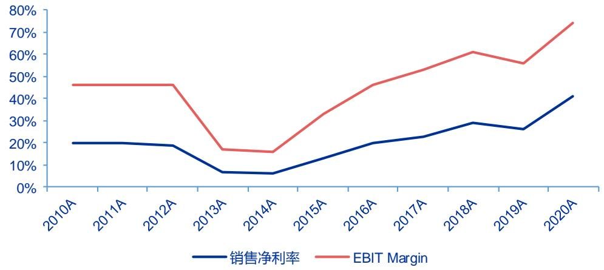

# 广联达 (002410)

-波士顿矩阵重磅升级，施工收入能稳定 $2 5 \%$ 吗？

# 报告原因：强调原有的投资评级买入(维持）

<table><tr><td>市场数据： 2022年04月01日</td></tr><tr><td>收盘价（元） 52.88 一年内最高/最低（元） 79.3/43.03</td></tr><tr><td>市净率 10.9</td></tr><tr><td>息率（分红/股价） 流通A股市值（百万元） 52580 上证指数/深证成指 3282.72/12227.93</td></tr></table>

注：“息率”以最近一年已公布分红计算

<table><tr><td>基础数据: 2021 年 12 月 31 日</td></tr><tr><td>每股净资产（元） 4.87</td></tr><tr><td>资产负债率% 37.69</td></tr><tr><td>总股本/流通A股(百万) 1190/994</td></tr><tr><td>流通B股/H股（百万） -/-</td></tr></table>

  
一年内股价与大盘对比走势：

相关研究  
《广联达(002410）点评：造价高歌，施  
工稳健，设计蓄力》 2022/03/29  
《广联达（002410）点评：转型已验证，  
利润再高增》 2021/10/26

证券分析师 黄忠煌A0230519110001 huangzh@swsresearch.com 刘洋A0230513050006 liuyang2@swsresearch.com

联系人   
黄忠煌   
(8621)23297818×转   
huangzh@swsresearch.com

# 投资要点：

● 2022 年，广联达产品接力矩阵更趋完整。广联达造价业务当前从明星类产品逐渐过渡到金牛类产品(长期复合增长率 $1 0 \% - 1 5 \%$ ），施工类业务从问题类产品逐渐过渡到明星类产品（空间大，目标市占率 $10 \%$ ），创新业务逐渐从瘦狗类成长为问题类产品，也是长期潜在的明星类产品（建管一体化、建设方一体化、全装一体化），设计类业务目前依然在培育阶段，仍属于瘦狗类产品。

• 造价中期：造价业务利润率已恢复至施工投入之前水平，预计中期利润率还将不断提升。2015 年之前，工程造价产品化程度高，使公司利润率达 $30 \%$ 以上。2017-2019年，公司在各地区分批推进造价业务云转型和渠道功能重构，加以研发持续投入，利润率近年处于较低水平。2019 年之后，随造价客户ARPU 值提升，利润率逐渐回升。参考海外典型云转型公司 Adobe，云化之后利润率水平新高，来自ARPU 值提升和销售费用率降低。

• 造价长期：业务横纵向复制仍将提升造价业务收入上限。横向：2022 年前，广联达造价业务主要集中在房建市场，未来向基建市场复制。纵向：设计-造价-招采-施工-运维一体化，是建筑信息化长期拓展方向，如设计过程，需要考虑建筑成本（造价）。

• 组织变革是施工业务 2018-2020 年收入增速偏慢原因。2018-2019 年，施工在整合为$" { \mathsf { B I M } } + { \mathsf { P M } } ^ { \prime \prime }$ ，形成“平台 $^ +$ 组件”的纵向结构。2020年后应当随着组件数量复制，开始出现加速。2020-2021 年，施工业务的“纵向结构”正在拓展内容，例如增加组件数量，增加 AI 功能，甚至为与造价/设计业务协同做准备。

• 施工业务是“慢-快-稳定”的三阶段，即先加快，再在较大规模时呈现对数曲线。施工业务收入加速趋势，在 2020-2021 年披露的累计用户、累计项目已经得到验证。预计ASP先低后高，公司2016-2017 年 BIM 的单项目目标是5 万元，2020 年认为施工的单项目目标是 10 万元，说明公司也认同 ASP 先降低、再提高的路径。

正常、保守、乐观情形下测算施工业务的利润率详见正文。

0 维持“买入”评级。造价高歌，施工稳健，设计蓄力，维持盈利预测，预计2022-2024年收入为 66.32、78.80、92.94 亿元，归母净利润为 9.86、14.08、17.73 亿元。维持“买入”评级。

风险提示：重点客户现金流由于宏观原因大幅恶化，导致回款困难。施工产品未能解决客户痛点，需求乏力。

财务数据及盈利预测  

<table><tr><td></td><td>2020</td><td>2021</td><td>2022E</td><td>2023E</td><td>2024E</td></tr><tr><td>营业总收入(百万元）</td><td>4,005</td><td>5,619</td><td>6,632</td><td>7,880</td><td>9,294</td></tr><tr><td>同比增长率(%)</td><td>13.1</td><td>40.3</td><td>18.0</td><td>18.8</td><td>18.0</td></tr><tr><td>归母净利润(百万元)</td><td>330</td><td>661</td><td>986</td><td>1,408</td><td>1,773</td></tr><tr><td>同比增长率(%)</td><td>40.6</td><td>100.1</td><td>49.2</td><td>42.8</td><td>25.9</td></tr><tr><td>每股收益（元/股）</td><td>0.28</td><td>0.56</td><td>0.83</td><td>1.18</td><td>1.49</td></tr><tr><td>毛利率(%)</td><td>88.5</td><td>84.0</td><td>84.0</td><td>87.5</td><td>87.6</td></tr><tr><td>ROE(%)</td><td>5.2</td><td>11.4</td><td>16.1</td><td>21.5</td><td>25.7</td></tr><tr><td>市盈率</td><td>191</td><td>95</td><td>64</td><td>45</td><td>35</td></tr></table>

注：“市盈率”是指目前股价除以各年每股收益；“净资产收益率”是指摊薄后归属于母公司所有者的ROE

申万宏源计算机团队历史 6 篇深度，预判 2 次反转，解答不同历史阶段预期差。其中，第一篇预判 2013 年盈利拐点，第二篇预判 2016 年盈利拐点，第三篇预判 2016 年盈利拐点并建议从“周期成长”的角度理解广联达，第四篇直接从中美产业对比角度回答市场对云计算技术疑虑，第五篇解答周期性/BIM 空间/运营业务/世界对手等重大预期差，第六篇回答广联达：1）如何依靠波士顿产品矩阵实现长期成长；2）施工信息化空间巨大，如何在产品和方案之间寻找平衡点;3)造价业务稳态经营性现金流如何从 30 亿提升到 50 亿，并向100亿进发。

表 1：7 年跟踪，5 篇深度，预判 2 次反转，解答不同历史阶段预期差  

<table><tr><td>日期</td><td>历史报告标题</td><td>报告类型</td><td>意义</td></tr><tr><td>2013.6</td><td>A股市场少见的优质套装软件厂商</td><td>深度报告</td><td>预判2013反转</td></tr><tr><td>2016.7</td><td>(“数据+产业术驱动超越周的感系列深度之十)</td><td>深度报告</td><td>预判 2016反转</td></tr><tr><td>2016.9</td><td>新业务里程碑发展！再思考“周期成长行业”红利 （三维研究体系系列深度之十一）</td><td>深度报告</td><td>理解周期成长</td></tr><tr><td>2017.7</td><td>微软云再超预期，广联达遥相呼应 “5CAVE”洞见全球TMT 产业链深度研究之六</td><td>深度报告</td><td>理解云计算</td></tr><tr><td>2017.9</td><td>5 年CAGR34%世界领军追求者（洞见系列深度之八）</td><td>深度报告</td><td>解答周期性/BIM空间/ 运营业务/世界对手等重大预期差</td></tr><tr><td>2020.8</td><td>波士顿产品矩阵接力成长</td><td>深度报告</td><td>造价施工空间解释/矩阵成长/管理变革</td></tr></table>

资料来源：申万宏源研究

本报告旨在解决以下问题：

1)毛利率下滑担忧，从“波士顿”产品矩阵解释造价/施工/设计都边际改善。从工具软件到大型软件，毛利率降低或为必然趋势。

2）造价业务横纵向复制可能性与长期利润率提升，类似 adobe 云化后利润率提升。

3)施工业务 2018-2020 低预期原因及 2021 年收入拐点原因。探讨施工收入增速应能稳定 $25 \%$ 以上，提供了模拟的施工业务盈亏平衡表。

# 1．毛利率回归的必然：工具软件到大型软件

本章论述广联达毛利率下降，或为领军成长过程必然趋势，从“波士顿”产品矩阵解释造价/施工/设计都边际改善。

# 1.1 毛利率下降换来的空间与粘性

从工具软件，到大型软件（早年的施工、未来的造价施工设计一体化）的发展过程中，毛利率降低或为必然趋势。

一方面，这来自软件渗透、业务增长过程中，客户使用的业务模块多了，产品协同和定制化增加，这些现场支持/硬件采购和集成/实施服务等均计入成本，影响毛利率。

另一方面，大型软件往往需要早年工具软件的盈利支持，因此投资者需要容忍一段毛利率/净利率下降的过程。这个过程与硬件/制造业/投资品的CAPEX 投入，有异曲同工之妙。

下表中，海康威视/用友网络/石基信息/金山办公/恒生电子/广联达，在拓展第二曲线过程中，不约而同的降低了扣非利润率和毛利率。我们认为，第二曲线已经较为成功的海康威视/恒生电子最终出现了利润率回归，并开始投入“下一轮成长曲线”。因此，广联达的毛利率下降，与其他领军成长过程是一致的。

表2：计算机部分重要公司的不同产品曲线，其中毛利率/扣非利润率的阶段性（或永续性）下行是常态，换来更大

规模和一定客户粘性(收入利润单位为百万元，其他为%）  

<table><tr><td>海康威视</td><td>2006</td><td>2012</td><td>2015</td><td>2016</td><td>2020</td><td></td></tr><tr><td>收入</td><td>702</td><td>7214</td><td>25271</td><td>31924</td><td>63503</td><td></td></tr><tr><td>扣非利润</td><td>205</td><td>2109</td><td>5605</td><td>7271</td><td>12806</td><td></td></tr><tr><td>扣非净利率</td><td>29.2%</td><td>29.2%</td><td>22.2%</td><td>22.8%</td><td>20.2%</td><td></td></tr><tr><td>毛利率</td><td>43.2%</td><td>49.2%</td><td>40.1%</td><td>41.6%</td><td>46.5%</td><td></td></tr><tr><td>产品</td><td>安防后端</td><td>增加前端</td><td>增加AI</td><td></td><td></td><td></td></tr><tr><td>成长曲线</td><td>第一起点</td><td>第一验证</td><td>第二起点</td><td></td><td>第二验证</td><td>第三起点</td></tr><tr><td>用友网络</td><td>2004</td><td>2009</td><td>2014</td><td>2017</td><td>2020</td><td></td></tr><tr><td>收入</td><td>726</td><td>2347</td><td>4374</td><td>6344</td><td>8525</td><td></td></tr><tr><td>扣非利润</td><td>70</td><td>286</td><td>518</td><td>293</td><td>904</td><td></td></tr><tr><td>扣非净利率</td><td>9.6%</td><td>12.2%</td><td>11.8%</td><td>4.6%</td><td>10.6%</td><td></td></tr><tr><td>毛利率</td><td>91.4%</td><td>83.3%</td><td>67.5%</td><td>71.4%</td><td>61.0%</td><td></td></tr><tr><td>产品</td><td></td><td>渗透+下沉</td><td>管理软件</td><td>再推进云</td><td>新平台+中端</td><td></td></tr><tr><td>成长曲线</td><td>第一起点</td><td>第一验证</td><td>第二起点</td><td>第二整合</td><td>第二进行</td><td></td></tr><tr><td>石基信息</td><td>2004</td><td>2012</td><td>2015</td><td>2016</td><td>2020</td><td></td></tr><tr><td>收入</td><td>109</td><td>790</td><td>1987</td><td>2663</td><td>3317</td><td></td></tr><tr><td>扣非利润</td><td>20</td><td>276</td><td>345</td><td>376</td><td>77</td><td></td></tr><tr><td>扣非净利率</td><td>18.4%</td><td>34.9%</td><td>17.4%</td><td>14.1%</td><td>2.3%</td><td></td></tr><tr><td>毛利率</td><td>50.9%</td><td>67.1%</td><td>40.3%</td><td>40.5%</td><td>40.8%</td><td></td></tr><tr><td>产品</td><td>酒店软件</td><td>渗透+下沉</td><td>增加互联网</td><td>增加海外</td><td></td><td></td></tr><tr><td>成长曲线</td><td>第一起点</td><td>第一验证</td><td>第二起点</td><td></td><td>第二进行</td><td></td></tr><tr><td>金山办公</td><td>2014</td><td>2018</td><td>2020</td><td>2021</td><td></td><td></td></tr><tr><td>收入</td><td>283</td><td>1130</td><td>2261</td><td>3280</td><td></td><td></td></tr><tr><td>扣非利润</td><td>2</td><td>270</td><td>612</td><td>840</td><td></td><td></td></tr><tr><td>扣非净利率</td><td>0.6%</td><td>23.9%</td><td>27.1%</td><td>25.6%</td><td></td><td></td></tr><tr><td>毛利率</td><td>92.8%</td><td>86.7%</td><td>87.7%</td><td>86.9%</td><td></td><td></td></tr><tr><td>产品</td><td>文档软件</td><td>增加 2C</td><td>增加2G</td><td></td><td></td><td></td></tr><tr><td>成长曲线</td><td>第一起点</td><td>第一验证</td><td>第二起点</td><td>第二进行</td><td></td><td></td></tr><tr><td>恒生电子</td><td>2005</td><td>2012</td><td>2015</td><td>2019</td><td>2021</td><td></td></tr></table>

<table><tr><td>收入</td><td>237</td><td>1006</td><td>2226</td><td>3872</td><td>5497</td></tr><tr><td>扣非利润</td><td>5</td><td>143</td><td>448</td><td>890 947</td><td></td></tr><tr><td>扣非净利率</td><td>2.2%</td><td>14.3%</td><td>20.1%</td><td>23.0%</td><td>17.2%</td></tr><tr><td>毛利率</td><td>51.3%</td><td>79.1%</td><td>92.7%</td><td>96.8%</td><td>73.0%</td></tr><tr><td>产品</td><td>基金交易</td><td>增加券商等</td><td>增加资管等</td><td></td><td>方案化，中台化</td></tr><tr><td>成长曲线</td><td>第一起点</td><td>第一验证</td><td>第二起点</td><td>第二验证 第三起点</td><td></td></tr><tr><td>广联达</td><td>2006</td><td>2011</td><td>2014</td><td>2017</td><td>2019 2021</td></tr><tr><td>收入</td><td>122</td><td>744</td><td>1760</td><td>2357</td><td>3541 5619</td></tr><tr><td>扣非利润</td><td>18</td><td>277</td><td>580</td><td>412</td><td>191 651</td></tr><tr><td>扣非净利率</td><td>14.9%</td><td>37.3%</td><td>33.0%</td><td>17.5%</td><td>5.4% 11.6%</td></tr><tr><td>毛利率</td><td>91.4%</td><td>97.5%</td><td>96.5%</td><td>93.1%</td><td>89.3% 84.0%</td></tr><tr><td>产品</td><td>造价</td><td></td><td>增加施工</td><td>云化验证</td><td></td></tr><tr><td>成长曲线</td><td>第一起点</td><td>第一验证 第二起点</td><td>第二进行</td><td>第二整合</td><td></td></tr></table>

注：已经进入第二阶段的海康威视，2020 年扣非利润率不高，主要原因是偶然汇兑损益，小部分原因是公司后续继续拓展了研发。研发费用率连续小幅度上行,还原后常规为 $2 2 \% - 2 3 \%$ 资料来源：Wind，各公司历年年报，申万宏源研究

如果将海康威视/用友网络/石基信息/金山办公/恒生电子/广联达的扣非利润率/毛利率历史趋势比较，结论会更加明显。每个阶段中，大概率都要先经历下降过程。其中，恒生电子的毛利率是例外：其 2021 年才加速发展解决方案（也是 2020H2 到 2021H1 股价低迷原因），之前以产品为主。其他公司都是更早拓展解决方案，即大型软件。

  
图1：计算机部分重要公司的扣非利润率，体现产品驱动的不同成长阶段

资料来源：Wind，各公司历年年报，申万宏源研究注：恒生电子是毛利率例外原因是，2021 年后加速完成解决方案，之前以产品为主。其他公司都是更早拓展解决方案，即大型软件资料来源：Wind，各公司历年年报，申万宏源研究

  
图2：计算机部分重要公司的不同成长阶段，软件公司经常毛利率下降。一部分是大型软件的原因，另一部分是财务口径原因

# 1.2进阶的“波士顿产品矩阵’

按照波士顿矩阵1，可根据销售增长率和市场占有率将公司产品分为四类：1）销售增长率和市场占有率“双高”的产品群（明星类产品）；2）销售增长率和市场占有率“双低"的产品群（瘦狗类产品）；3）销售增长率高、市场占有率低的产品群(问题类产品）；4）销售增长率低、市场占有率高的产品群（金牛类产品）。波士顿矩阵常用多业务线公司战略分析，帮助理解各业务线的关系与取舍。

2022 年，广联达产品接力矩阵更趋完整。广联达造价业务当前从明星类产品逐渐过渡到金牛类产品（长期复合增长率 $1 0 \% - 1 5 \%$ ），施工类业务从问题类产品逐渐过渡到明星类产品（空间大，目标市占率 $10 \%$ ），创新业务逐渐从瘦狗类成长为问题类产品，也是长期潜在的明星类产品（建管一体化、建设方一体化、全装一体化），设计类业务目前依然在培育阶段，仍属于瘦狗类产品。

成长本质是周期。单一产品线是螺旋成长，波动大；多产品线是接力成长，波动小。瘦狗类 问题类 明星类 金牛类，广联达未来 10年是多产品接力成长。

  
图3：广联达2019年成长矩阵图

资料来源：广联达年报，申万宏源研究资料来源：广联达年报，申万宏源研究

  
图4：广联达2022 年成长矩阵图

# 2．造价：中期看利润率提升，长期看横纵向复制

中期：利润率提升是造价业务利润兑现关键。

造价业务利润率已恢复至施工投入之前水平，预计中期利润率还将不断提升。 2015年之前，工程造价产品化程度高，使公司利润率达 $30 \%$ 以上。2017-2019年，公司在各地区分批推进造价业务云转型和渠道功能重构，加以研发持续投入，利润率近年处于较低水平。2019 年之后，随造价客户ARPU值提升，利润率逐渐回升。根据2019-2021年年报披露，云化还原后收入为 29.32/34.03/43.39 亿元，云化还原后利润为 6.66/8.85/11.43亿元（假设非造价业务盈亏平衡，即海外/设计/施工业务合计盈亏平衡），对应净利率分别为 $2 2 . 7 \% / 2 6 . 0 \% / 2 6 . 3 \%$ ，或为云化后净利率回升的支撑数据。

验证的云化数据，不仅与海外云领军 Adobe 的云化曲线类似，而且使造价成为金牛类业务，支撑施工/设计业务，后续章节会论述。

  
图5：施工研发投入前，广联达利润率在 $30 \%$ 以上

资料来源：广联达年报，申万宏源研究  
注1：造价业务收入，2011-2013 取整体收入，2014-2016 取造价部分收入，2017 年后取造价还原收入。  
注 2：假设非造价业务盈亏平衡，造价业务利润，2011-2016 取整体表观利润，2017 年后取为整体还原后利润

参考海外典型云转型公司Adobe，云化之后利润率水平新高，来自ARPU 值提升和销售费用率降低。

  
图6：Adobe 云转型后净利率提升至 $30 \%$ 以上，高于转型前水平

资料来源：Adobe 年报，申万宏源研究

Adobe 启示： $\mathbb { A } \mathbb { I } +$ 大数据切入内容领域是提升 ARPU 值关键。Adobe从设计工具转向设计营销后，实际是通过判断 PS 方案是否有效，直接切入数字营销内容领域。不同于传统造价产品， $\mathsf { A I } +$ 大数据方案基于用户数据积累，通过大数据、AI挖掘数据价值。使用工具标注数据，清洗数据，叠加算法，实现建模智能化（二维图纸翻三维模型）、分析智能化（引用历史工程的部分内容）、推送智能化（方案与需求匹配）。

  
图7：广联达 $\pmb { \mathbb { A } } \pmb { \mathbb { I } } +$ 大数据方案逐渐成熟

资料来源：广联达 2020 年投资者大会，申万宏源研究

# 长期：横纵向复制提升造价业务上限

2017 年之后，对于广联达来说，造价云化带来成长逻辑的直接变化，体现在目标用户数扩大和ARPU 值提升。转云后，造价上限提升，主要因为：1）用户粘性提升；2）ARPU值提升；3）用户数扩大。当前，造价业务云化转型已经进入尾声，预计 2022 年造价业务还原后收入超过 50 亿元。市场担心，造价业务最后转型省份完成云化转型和市占率提升，是否仍有成长空间。

# 实际，造价业务横纵向复制仍将提升造价业务收入上限。

横向：造价业务过去是清单模式，未来走向市场化。2022 年前，广联达造价业务主要集中在房建市场，未来向基建市场复制。房建市场造价已经较为市场化，铁路、公路等基建市场造价市场化程度较低。就造价业务而言，基建市场跟房建市场规模相当，广联达造价业务仍然有较大空间。

纵向：一方面，造价业务已开始向广材网、公共资源交易服务平台(招采）延伸；设计-造价-招采-施工-运维一体化，是建筑信息化长期拓展方向，如设计过程，需要考虑建筑成本（造价）。广联达依托造价业务优势与图形技术积累，将是建筑全生命周期信息化一体化最直接受益者。

  
图 8：传统建筑信息化单点突破，长期走向一体化  
资料来源：申万宏源研究

# 3．施工：收入增速能稳定 25%吗？

2018-2021 年，投资者关注施工业务收入增速。大家的质疑有：

1)收入增速。多个年度收入增速偏低，例如2018 年的 $1 8 \%$ 、2020年的 $14 \%$ 。即使2021年施工增速 $2 8 \%$ ，上半年却只有 $5 \%$ 。

2）合同与收入匹配度。2018-2019 年年报描述施工项目/客户数均高增，但公司施工收入增速以 $1 5 \% - 3 0 \%$ 为常态。

3）利润率。施工业务何时盈亏平衡，或能否亏损缩窄？

4）长期意义和前景。如果是一个不像造价（无论产品还是SaaS）的业务，会拉低公司整体净利率与ROE，施工业务的长期意义与前景是否明朗。

# 3.1 施工组织变革，或为 2018-2020 年偏慢原因

投资者固然对 2018-2020 年施工收入增速不快而心存芥蒂。实际上，组织结构变革迫在眉睫。变革期追求收入增速也未必妥当。

  
图 9：广联达 2016-2021 年年报关于施工的详细论述，实际包含了较大的组织变革，这或为 2018-2020整体偏慢的原因  
资料来源：wind，广联达 2016-2021 年报，广联达 2016-2021 年公开投资者交流文档，申万宏源研究

首先，2016-2017 年，施工主要是 BIM5D，且智慧工地/BIM 建造/数字企业并驾齐驱，可以概括为“横向架构”。根据 2016-2017 年报，套装软件性质的 BIM5D 是施工重要产出，2016 年报指出“其核心产品BIM5D围绕“多岗三端一云”产品架构持续迭代，以BIM云为协同应用中心，通过桌面端、WEB端和移动端的应用，使用户实现有效决策和精细管理。该业务线的企业级 BIM 云平台，将 BIM 应用拓展到企业层，将项目级 BIM5D信息提供给企业各管理部门，帮助企业管理者全面、实时把握企业工程进展和资源需要。

表3：以“岗位、部门、项目、集成”的四层产品解决活跃度问题  

<table><tr><td>产品</td><td colspan="2">岗位层级 介绍</td></tr><tr><td>企业BIM云 企业级</td><td colspan="2"></td></tr><tr><td>ERP</td><td colspan="2">企业级</td></tr><tr><td>BIM5D</td><td>项目级</td><td>施工阶段精细化管理平台</td></tr><tr><td rowspan="2">BIM 解决方案</td><td rowspan="2">项目级</td><td>施工阶段基于 BIM 的项目协同</td></tr><tr><td>管理信息系统。将 BIM5D 与 项目管理平台结合</td></tr><tr><td>BIM 审图</td><td>岗位级/项目级</td><td>BIM 模型检查专家 从投标阶段到施工阶段的现场</td></tr><tr><td>BIM 三维场布</td><td>项目级</td><td>布置设计产品，解决诸多问题</td></tr><tr><td>BIM 进度工具</td><td>岗位级</td><td></td></tr><tr><td>BIM 算量</td><td>岗位级</td><td>三维算量软件</td></tr><tr><td>BIM 建模</td><td colspan="2">岗位级</td></tr><tr><td>BIM模架</td><td>岗位级</td><td>模板脚手架专项工程方案设计、</td></tr><tr><td>MagicCAD</td><td rowspan="2">岗位级</td><td>材料用量计算、施工交底等各环节</td></tr><tr><td>BIM 应用各参与方</td><td>机电专业 BIM 解决方案引领者</td></tr><tr><td>BIM浏览器</td><td></td><td rowspan="2">轻量化的三维模型查看工具</td></tr><tr><td rowspan="2"></td><td>（建设、咨询、设计、</td></tr><tr><td>施工、监理、运维） 标准体系</td><td></td></tr><tr><td>BIM 构建库</td><td colspan="2"></td></tr></table>

资料来源：广联达 BIM 业务官方网站，申万宏源研究

其次，2018-2019年，施工在整合为“BIM $| + \mathsf { P } \mathsf { M } ^ { \prime \prime }$ ，形成“平台 $^ +$ 组件”的纵向结构。2018 年报指出，“对施工业务进行战略整合，公司非同一控制下合并了联营企业北京广联达易联电子商务有限公司、北京广联达斑马科技有限公司，其中：以对价515.58万元收购北京广联达易联电子商务有限公司 $51 \%$ 股权，收购后公司合并持有该公司 $100 \%$ 股权；以对价1,821.79万元收购北京广联达斑马科技有限公司 $60 \%$ 股权，收购后公司合并持有该公司 $100 \%$ 股权“。2019 年报指出，“公司进一步融合原BIM与智慧工地相关产品，发布针对项目的数字项目管理（BIM $^ +$ 智慧工地）平台”。

在这个阶段后，公司施工的产品，本质上从“横向架构”改为“纵向架构”。2019 年报指出，“在2019年6月发布的广联达数字项目管理（BIM $^ +$ 智慧工地）平台基础上，结合广联达对建造业务的理解，已经开发出覆盖岗位级、项目级、企业级的多个数字化应用系统“。

形成了基于项目集成管理平台的一系列产品应用资料来源：《广联达 2020 年 5 月 15 日调研活动附件之演示文稿》，申万宏源研究

  
图 10 :广联达 2020 年发布的数字项目集成管理平台，清晰绘制了岗位/项目/企业架构，实质是把 2016 年 BIM5D 的多层架构，从 BIM 拓展到了整个施工。

最后，2020-2021年，施工业务的“纵向结构”正在拓展内容，例如增加组件数量，增加 AI功能，甚至为与造价/设计业务协同做准备。2020 年报指出，“数字项目集成管理平台是一个服务于项目施工阶段的产品平台，基于平台可以快速开发各种专业应用“，“数字施工业务从「项目级应用’拓展至'企业级多项目应用'，同时在设计、装修、城市、供采等 新业务领域竞相突破”。2021 年报指出，“云AI从造价扩展到施工与设计”。

  
图 11：广联达以 2019-2020 年部分时间为例，论证组件数量快速增长

资料来源：《广联达 2020 年5 月15 日调研活动附件之演示文稿》，申万宏源研究

经过 2018-2019 年的施工组织变革，我们应当可理解 2018-2020 年施工收入的波动性。变革前，施工业务更贴近广联达自身业务结构；变革后，更贴近客户自身企业的组织结构。

# 3.2 施工成长是 S 曲线还是对数曲线？

不仅短期增速值得关注，投资者还关心其长期意义：是否会拉低公司整体经营质量，是否长期像大型管理软件一样增速缓慢（由于定制较多）。

公司的自我认知是一系列对数曲线。在《广联达 2020 年5 月 15日调研活动附件之演示文稿》中，公司对新业务的认知是对数曲线，只是一系列新业务迭加。这些新业务是由于不同业务互相协同、连接形成的，因此是上限体量较大的对数曲线。

  
图 12：广联达对新业务的认知是较高上限的对数曲线

资料来源：《广联达 2020 年5 月15 日调研活动附件之演示文稿》，申万宏源研究

我们认为是“慢-快-稳定”的三阶段，即先加快，再在较大规模时呈现对数曲线。由于之前章节介绍，施工组织结构变革后，2020 年后应当随着组件数量复制，开始出现加速。

  
图13：由于施工组织变革，预计其增速会“慢-快-稳定”三阶段

资料来源：《广联达 2020 年 5 月 15 日调研活动附件之演示文稿》，申万宏源研究

这个加速趋势在 2020-2021年披露的累计用户、累计项目已经得到验证。2020-2021年年报披露，新增项目数量分别为 1.5、1.6 万个，新增用户数量1700、1600 个，明显高于2019 年。假设我们计算每个项目平均金额（如果不考虑施工项目跨年），得到单项目金额为2-4万元，2020-2021 年略有下降。

单项目价值ASP较低或为当前“组件”业务渗透的新客户原因较多，而过去施工业务以”BIM5D 或项目管理“为主，ASP 较高。预计ASP 先低后高。由于”平台 $^ +$ 组件“策略，客户快速渗透。新客户仅仅使用一两个组件，自然ASP 较低。而2020 年前，尤其2017-2019 年，BIM5D、项目管理等主打产品有较多老客户，有业务粘性，粘性客户ASP较高。因此，施工业务ASP 当前下降应为正常过程，随着组件数量增加，预计长期乐观。公司 2016-2017 年 BIM 的单项目目标是 5 万元，2020 年认为施工的单项目目标是 10万元，说明公司也认同ASP 先降低、再提高的路径。

表4：由于组件数量丰富，触达大量新客户。新客户业务渗透率低，因此 ASP 下降正常  

<table><tr><td>2017A</td><td>2018A</td><td>2019A</td><td>2020A</td><td>2021A</td></tr><tr><td>收入（百万元）</td><td>659</td><td>853</td><td>943</td><td>1206</td></tr><tr><td>施工项目（个)</td><td>19800</td><td>23000</td><td>38400</td><td>54500</td></tr><tr><td>新增项目（个）</td><td></td><td>3200</td><td>15400</td><td>16100</td></tr><tr><td>ASP-项目（个）</td><td>33263</td><td>37105</td><td>24563</td><td>22121</td></tr><tr><td>ASP-项目（考虑年初年末平均）（元）</td><td></td><td>39879</td><td>30723</td><td>25954</td></tr></table>

注：假设 2019 年报披露的新增项目和客户，与 2020-2021 年的项目、客户属于同口径资料来源：广联达 2019-2021 年报，申万宏源研究

  
图 14：BIM 单项目价值目标是 5 万元  
BIM市场空间（以中国市场为例）

资料来源:广联达 2016 年 5 月6 日调研活动附件之演示文档》，《广联达 2017 年 5 月10 日调研活动附件之演示文档》，申万宏源研究

  
图15：施工单项目价值目标是 10 万元

资料来源：《广联达 2020 年5 月15 日调研活动附件之演示文稿》，申万宏源研究

# 3.3一种模拟的施工盈亏平衡表

投资者不仅好奇造价业务的内部利润率，还好奇施工业务何时能盈亏平衡。由于广联达的披露数据完备，且数据连续性好，测算具备可能。

推测公司不单独披露每块业务利润率的原因是前述波士顿矩阵：一个企业是有机的整体，协同效应关键；单独披露每块业务盈利情况不利于整体化发展和企业战略。

首先，由于广联达披露数据完备，可以较为清楚的两种方法分拆广联达薪酬结构。这样可以估算人均薪酬和人均费用。

表5：可以较为清楚的两种方法分拆广联达薪酬结构，误差较小（薪酬总额单位为百万元，人均薪酬单位为万元）  

<table><tr><td></td><td>2011A 2012A</td><td>2013A</td><td></td><td>2014A</td><td>2015A</td><td>2016A</td><td>2017A</td><td>2018A</td><td>2019A</td><td>2020A</td><td>2021A</td></tr><tr><td>现金流量表算法：</td><td></td><td>524.1</td><td>701.4</td><td>858.4</td><td>1017.7</td><td>1296.1</td><td>1472.2</td><td>1786.4</td><td>2287.9</td><td>2637.8</td><td>3234.4</td></tr><tr><td>支付给员工的薪酬</td><td>338.4</td><td>495.3</td><td>635.1</td><td>852.7</td><td>1007.9</td><td>1058.7</td><td>1410.0</td><td>1680.1</td><td>2114.0</td><td>2146.2</td><td>2752.2</td></tr><tr><td>T-1 年应付工资</td><td>59.1</td><td>89.1</td><td>117.8</td><td>184.1</td><td>189.8</td><td>155.8</td><td>353.5</td><td>354.5</td><td>385.5</td><td>440.7</td><td>668.9</td></tr><tr><td>T+0 年应付工资</td><td>89.1</td><td>117.8</td><td>184.1</td><td>189.8</td><td>155.8</td><td>353.5</td><td>354.5</td><td>385.5</td><td>440.7</td><td>668.9</td><td>796.7</td></tr><tr><td>当年资本化的</td><td></td><td></td><td></td><td></td><td></td><td></td><td></td><td></td><td></td><td></td><td></td></tr><tr><td>开发支出</td><td>0.0</td><td>0.0</td><td>0.0</td><td>0.0</td><td>43.8</td><td>39.7</td><td>61.2</td><td>75.4</td><td>118.6</td><td>263.5</td><td>354.4</td></tr><tr><td>利润表算法</td><td></td><td>518.1</td><td>681.5</td><td>830.5</td><td>1009.9</td><td>1279.8</td><td>1483.7</td><td>1783.4</td><td>2287.7</td><td>2648.8</td><td>3238.1</td></tr><tr><td>销售费用中薪酬</td><td></td><td>276.4</td><td>353.5</td><td>399.5</td><td>395.5</td><td>488.5</td><td>518.1</td><td>567.1</td><td>807.2</td><td>905.6</td><td>1092.5</td></tr><tr><td>研发费用中薪酬</td><td>101.5</td><td>190.3</td><td>247.4</td><td>295.5</td><td>345.2</td><td>406.2</td><td>528.4</td><td>635.6</td><td>859.6</td><td>897.6</td><td>1086.5</td></tr><tr><td>管理费用中薪酬</td><td></td><td></td><td></td><td></td><td></td><td></td><td></td><td></td><td></td><td></td><td></td></tr><tr><td>（2017 年前需拟合）</td><td>68.7</td><td>51.4</td><td>80.6</td><td>135.5</td><td>225.5</td><td>345.5</td><td>341.4</td><td>484.6</td><td>470.8</td><td>541.4</td><td>553.0</td></tr><tr><td>营业成本中人力薪酬</td><td></td><td></td><td></td><td></td><td></td><td></td><td>34.6</td><td>20.8</td><td>31.5</td><td>40.8</td><td>151.8</td></tr><tr><td>两种算法的误差</td><td></td><td>6.0</td><td>19.9</td><td>27.9</td><td>7.8</td><td>16.2</td><td>-11.5</td><td>3.0</td><td>0.2</td><td>-11.0</td><td>-3.7</td></tr><tr><td>人均薪酬（万元）</td><td></td><td>14.5</td><td>19.2</td><td>19.8</td><td>22.3</td><td>28.1</td><td>28.3</td><td>28.6</td><td>32.2</td><td>32.1</td><td>34.1</td></tr><tr><td>加权人均薪酬（万元）</td><td></td><td>15.9</td><td>19.3</td><td>21.5</td><td>22.9</td><td>28.3</td><td>30.0</td><td>31.2</td><td>34.3</td><td>34.4</td><td>36.5</td></tr></table>

注 1：2017-2018 年后，研发费用单独披露。2017 年之前管理费用中的薪酬既包括研发人员薪酬，还包括管理人员的。利用其历年披露“研发投入”和“研发人员薪酬”的比例关系，可以近似计算和分拆，这利用管理优秀公司的历年费用结构总是类似的原理。注 2：两种薪酬算法有误差，选择现金流量算法资料来源：Wind，广联达 2011-2021 年报，申万宏源研究

有了以上基础，可以模拟得到施工、非施工业务的盈亏平衡表。下表考虑了以下因素：

1）运营总费率是研发/销售/管理费用率之和，考虑了资本化。

2)考虑云业务对收入的影响。还原后运营总收入，指代云合同还原后的收入规模。例如公司 2021 年总收入 56.2 亿元，还原后为 61.6 亿元。同理，非施工业务也有相应还原。

3 )由于广联达披露数据完善，而且连续性好，其中大量数据来自历史数据的公式计算。人均非薪酬运营费用、人均薪酬、运营总费率均来自公式计算。

这样，在较为中性的假设下，即 2022 年施工收入增速与 2021 年一致，2023 年进入收获期进入 $30 \%$ ，得到2022-2024年施工业务净利率 $\cdot 2 4 . 6 \% / \cdot 1 1 . 6 \% / \cdot 2 . 3 \%$ ，这只是一种模拟测算。

在该种情况下，非施工(尤其造价)业务2019-2021年的利润率持续提升，体现云化效果。2019-2021 年云化还原后非施工利润率为 $2 0 . 9 \% / 2 5 . 6 \% / 3 0 . 7 \%$ 。

表6：模拟测算得到非施工业务利润率，和施工业务利润率（单位：百万元；人均费用和人均薪酬采用万元）  

<table><tr><td rowspan="15"></td><td></td><td></td><td>2018A 2019A 2020A</td><td></td><td>2021A  2022E</td><td></td><td>2023E</td><td>2024E</td></tr><tr><td>收入</td><td>659</td><td>853</td><td>943</td><td>1206</td><td>1541</td><td>2003</td><td>2560</td></tr><tr><td>yoy</td><td>18.0%</td><td>29.6%</td><td>10.5%</td><td>27.8%</td><td>27.8%</td><td>30.0%</td><td>27.8%</td></tr><tr><td>施工成本</td><td>427</td><td>827</td><td>1131</td><td>1496</td><td>1912</td><td>2235</td><td>2619</td></tr><tr><td>硬件成本</td><td>56</td><td>174</td><td>223</td><td>261</td><td>300</td><td>345</td><td>397</td></tr><tr><td>yoy 施工</td><td>-4.3%</td><td>211.5%</td><td>28.3%</td><td>17.2%</td><td>15.0%</td><td>15.0%</td><td>15.0%</td></tr><tr><td>薪酬</td><td>281</td><td>497</td><td>688</td><td>914</td><td>1201</td><td>1408</td><td>1668</td></tr><tr><td></td><td>人数 1000</td><td>1900</td><td>2100</td><td>2900</td><td>3480</td><td>4002</td><td>4602</td></tr><tr><td></td><td>yoy</td><td></td><td></td><td></td><td>20%</td><td>15%</td><td>15%</td></tr><tr><td>非薪酬运营费用</td><td></td><td>90</td><td>157</td><td>220</td><td>322</td><td>411</td><td>482 554</td></tr><tr><td>利润</td><td></td><td>232</td><td>26</td><td>-188</td><td>-291</td><td>-371 -232</td><td>-59</td></tr><tr><td>利润率</td><td></td><td></td><td>3.1%</td><td>-19.9%</td><td>-24.1%</td><td>-24.1% -11.6%</td><td>-2.3%</td></tr><tr><td rowspan="13">非施工、 （主要造 价，还有 国际业 务、设计 等）</td><td>收入</td><td>2246</td><td>2687</td><td>3061</td><td>4414</td><td></td><td></td><td></td></tr><tr><td>收入（云化还原）</td><td>2486</td><td>3168</td><td>3674</td><td>4949</td><td></td><td></td><td></td></tr><tr><td>非施工成本</td><td>2070</td><td>2505</td><td>2735</td><td>3431</td><td></td><td></td><td></td></tr><tr><td>硬件成本</td><td></td><td>81</td><td>148</td><td>163</td><td>293</td><td></td><td></td></tr><tr><td>薪酬</td><td>1505</td><td>1791</td><td>1949</td><td>2321</td><td></td><td></td><td></td></tr><tr><td>人数</td><td>5244</td><td>5215</td><td>6113</td><td>6586</td><td></td><td></td><td></td></tr><tr><td>非薪酬运营费用</td><td>483</td><td>565</td><td>623</td><td>817</td><td></td><td></td><td></td></tr><tr><td>利润</td><td>176</td><td>182</td><td>326</td><td>983</td><td></td><td></td><td></td></tr><tr><td>利润（云化还原）</td><td></td><td>417</td><td>663</td><td>939</td><td>1518</td><td></td><td></td></tr><tr><td>利润率 利润率（云化还原）</td><td></td><td>7.8%</td><td>6.8%</td><td>10.7%</td><td>22.3%</td><td></td><td></td></tr><tr><td>运营总收入</td><td></td><td>16.8%</td><td>20.9%</td><td>25.6%</td><td>30.7%</td><td></td><td></td></tr><tr><td rowspan="8">总计</td><td></td><td>2904</td><td>3541</td><td>4005</td><td>5619</td><td></td><td></td><td></td></tr><tr><td>还原后运营总收入</td><td>3145</td><td>4021</td><td>4617</td><td>6155</td><td></td><td></td><td></td></tr><tr><td>运营总费用 运营总费率</td><td>2360</td><td>3010</td><td>3481</td><td>4374</td><td></td><td></td><td></td></tr><tr><td>（考虑了资本化）</td><td>81.3%</td><td>85.0%</td><td>86.9%</td><td>77.8%</td><td></td><td></td><td></td></tr><tr><td>总薪酬</td><td>1786</td><td>2288</td><td>2638</td><td>3234</td><td></td><td></td><td></td></tr><tr><td>总非薪酬运营</td><td>574</td><td>722</td><td>843</td><td>1139</td><td></td><td></td><td></td></tr><tr><td>人均非薪酬运营费用(年初年末平均，万元）</td><td>10.0</td><td>10.8</td><td>11.0</td><td>12.9</td><td>12.9</td><td>12.9</td><td>12.9</td></tr><tr><td>人均薪酬（年初年末平均，万元）</td><td>31.2</td><td>34.3</td><td>34.4</td><td>36.5</td><td>37.6</td><td>37.6</td><td>38.8</td></tr></table>

注1：运营总费率是研发/销售/管理费用率之和，考虑了资本化。  
注2：还原后运营总收入，指代云合同还原后的收入规模  
注 3：由于广联达披露数据完善，而且连续性好，其中大量数据来自历史数据的公式计算。人均非薪酬运营费用、人均薪酬、运营总费率均来自公式计算。  
资料来源：Wind，广联达 2017-2021 年报，申万宏源研究

下表的敏感性分析，是保守/中性/乐观情况下施工业务的评判。保守情况下，2023-2024 年施工利润率略微提高。乐观情况下（2022-2024 年收入增速 $3 5 \% / 3 0 \% / 3 0 \%$ ),2024 年施工业务已经盈利。

表7：正常、保守、乐观情形下计算施工业务的利润率，其披露数字较多是模拟测算的基础（单位：百万元；人均费

用和人均薪酬採用万元）  

<table><tr><td colspan="3">正常</td><td colspan="3">保守</td><td colspan="5">乐观</td></tr><tr><td></td><td>2021A</td><td>22E</td><td>23E</td><td>24E</td><td>22E</td><td>23E</td><td>24E</td><td>22E</td><td>23E</td><td>24E</td></tr><tr><td>施工收入</td><td>1206</td><td>1541</td><td>2003</td><td>2560</td><td>1447</td><td>1736</td><td>2083</td><td>1628</td><td>2116</td><td>2751</td></tr><tr><td>yoy</td><td>27.8%</td><td>27.8%</td><td>30.0%</td><td>27.8%</td><td>20.0%</td><td>20.0%</td><td>20.0%</td><td>35.0%</td><td>30.0%</td><td>30.0%</td></tr><tr><td>施工成本</td><td>1496</td><td>1912</td><td>2235</td><td>2619</td><td>1912</td><td>2235</td><td>2619</td><td>1912</td><td>2235</td><td>2619</td></tr><tr><td>硬件成本</td><td>260.85</td><td>300</td><td>345</td><td>397</td><td>300</td><td>345</td><td>397</td><td>300</td><td>345</td><td>397</td></tr><tr><td>yoy</td><td>17.2%</td><td>15.0%</td><td>15.0%</td><td>15.0%</td><td>15.0%</td><td>15.0%</td><td>15.0%</td><td>15.0%</td><td>15.0%</td><td>15.0%</td></tr><tr><td>薪酬(年初年末平均)</td><td>914</td><td>1201</td><td>1408</td><td>1668</td><td>1201</td><td>1408</td><td>1668</td><td>1201</td><td>1408</td><td>1668</td></tr><tr><td>人数</td><td>2900</td><td>3480</td><td>4002</td><td>4602</td><td>3480</td><td>4002</td><td>4602</td><td>3480</td><td>4002</td><td>4602</td></tr><tr><td>yoy</td><td></td><td>20%</td><td>15%</td><td>15%</td><td>20%</td><td>15%</td><td>15%</td><td>20%</td><td>15%</td><td>15%</td></tr><tr><td>非薪酬运营费用（加权）</td><td>322</td><td>411</td><td>482</td><td>554</td><td>411</td><td>482</td><td>554</td><td>411</td><td>482</td><td>554</td></tr><tr><td>利润</td><td>-291</td><td>-371</td><td>-232</td><td>-59</td><td>-465</td><td>-499</td><td>-535</td><td>-284</td><td>-119</td><td>132</td></tr><tr><td>利润率 人均非薪酬运营费用</td><td>-24.1%</td><td>-24.1%</td><td>-11.6%</td><td>-2.3%</td><td>-32.1%</td><td>-28.7%</td><td>-25.7%</td><td>-17.5%</td><td>-5.6%</td><td>4.8%</td></tr><tr><td>(年初年末平均，万元）</td><td>12.9</td><td>12.9</td><td>12.9</td><td>12.9</td><td>12.9</td><td>12.9</td><td>12.9</td><td>12.9</td><td>12.9</td><td>12.9</td></tr><tr><td>人均薪酬(年初年末平</td><td></td><td></td><td></td><td></td><td></td><td></td><td></td><td></td><td></td><td></td></tr><tr><td>均，万元）</td><td>36.5</td><td>37.6</td><td>37.6</td><td>38.8</td><td>37.6</td><td>37.6</td><td>38.8</td><td>37.6</td><td>37.6</td><td>38.8</td></tr></table>

注 1：由于广联达公开披露数字较多，且一致性较高，因此较多内部指标可以估算。对于其他公司未必可行。注 2：由于广联达管理较好，假设不同事业部的同级别的薪酬结构一致，人均非薪酬运营费用也类似。这是可以把公司人均薪酬用户造价/施工/设计不同业务的原因。注 3：施工的硬件成本用施工总成本减去披露的人工费用。因为广联达业务中，目前需要实施的主要是施工业务，因此假设营业成本的人工主要是实施，具备合理性。资料来源：广联达历年年报，Wind，申万宏源研究

  
图 16：广联达不同业务内部利润率的一种模拟测算

注：推测公司不单独披露每块业务利润率的原因是前述波士顿矩阵：一个企业是有机的整体，协同效应关键。单独披露每块业务盈利情况不利于整体化发展和企业战略。因此这个测算只是一种基于公开数据推算的模拟参考  
资料来源：Wind，申万宏源研究

# 3.4 施工小结：收入CAGR 达 25%概率高

施工业务机遇与风险并存。机遇：作为产品线中波士顿矩阵的重要环节，连接了造价与设计。风险：一方面，施工业务的成长曲线可能是前快后慢的，这样商业模式恐怕不佳；另一方面，可能很长时间打磨产品也无法诱导需求，造成施工的软件需求不旺盛。我们上述模拟测算对未来投入和利润率的数据考虑了这些问题。

# 施工部分的结论是：

1)2018-2020 年施工收入增速偏慢，主要是组织结构变革。即施工业务“从纵向到横向”。

2)施工成长曲线，可能是“慢-快-稳定”的三阶段。即先加快，再在较大规模时呈现对数曲线，因此当 2022 年收入增速达到 2021 年水平是正常的。由于之前章节介绍，施工组织结构变革后，2020 年后应当随着组件数量复制，开始出现加速。

3 )模拟测算投资者好奇的不同业务盈亏平衡表。由于公司考虑整体战略一致而不披露分块利润率数据，这部分研究会是投资者可能需要的。

财务摘要   

<table><tr><td>百万元，百万股</td><td>2020A</td><td>2021A</td><td>2022E</td><td>2023E</td><td>2024E</td></tr><tr><td>营业总收入</td><td>4,005</td><td>5,619</td><td>6,632</td><td>7,880</td><td>9,294</td></tr><tr><td>其中：营业收入</td><td>3,947</td><td>5,562</td><td>6,309</td><td>7.,557</td><td>8,972</td></tr><tr><td>减：营业成本</td><td>454</td><td>893</td><td>1,013</td><td>942</td><td>1,110</td></tr><tr><td>减：税金及附加</td><td>38</td><td>46</td><td>54</td><td>64</td><td>75</td></tr><tr><td>主营业务利润</td><td>3,455</td><td>4,624</td><td>5,242</td><td>6,551</td><td>7,787</td></tr><tr><td>减：销售费用</td><td>1,256</td><td>1,587</td><td>1,791</td><td>2,128</td><td>2.,463</td></tr><tr><td>减：管理费用</td><td>879</td><td>1,099</td><td>1,260</td><td>1,458</td><td>1,673</td></tr><tr><td>减：研发费用</td><td>1,083</td><td>1,333</td><td>1,525</td><td>1,773</td><td>2,045</td></tr><tr><td>减：财务费用</td><td>-17</td><td>-53</td><td>-26</td><td>16</td><td>15</td></tr><tr><td>经营性利润</td><td>255</td><td>658</td><td>692</td><td>1,176</td><td>1,591</td></tr><tr><td>加：信用减值损失（损失以“-&quot;填列）</td><td>0</td><td>-25</td><td>0</td><td>0</td><td>0</td></tr><tr><td>加：资产减值损失（损失以“-&quot;填列）</td><td>-21</td><td>-1</td><td>0</td><td>0</td><td></td></tr><tr><td>加：投资收益及其他</td><td>123</td><td>70</td><td>105</td><td>100</td><td>93</td></tr><tr><td>营业利润</td><td>414</td><td>758</td><td>1,121</td><td>1,600</td><td>2,005</td></tr><tr><td>加：营业外净收入</td><td>-4</td><td>-9</td><td>-5</td><td>-5</td><td>4</td></tr><tr><td>利润总额</td><td>410</td><td>749</td><td>1,116</td><td>1,595</td><td>2,009</td></tr><tr><td>减：所得税</td><td>29</td><td>31</td><td>44</td><td>64</td><td>80</td></tr><tr><td>净利润</td><td>381</td><td>719</td><td>1,072</td><td>1,531</td><td>1,928</td></tr><tr><td>少数股东损益</td><td>51</td><td>58</td><td>86</td><td>123</td><td>155</td></tr><tr><td>归属于母公司所有者的净利润</td><td>330</td><td>661</td><td>986</td><td>1,408</td><td>1,773</td></tr><tr><td>全面摊薄总股本</td><td>1,186</td><td>1,189</td><td>1,190</td><td>1,190</td><td>1,190</td></tr><tr><td>每股收益（元）</td><td>0.29</td><td>0.56</td><td>0.83</td><td>1.18</td><td>1.49</td></tr></table>

资料来源：公司公告，申万宏源研究

【投资收益及其他】包括投资收益、其他收益、净敬口套期收益、公允价值变动收益、资产处置收益等【营业外净收入】营业外收入减营业外支出

# 信息披露

# 证券分析师承诺

本报告署名分析师具有中国证券业协会授予的证券投资咨询执业资格并注册为证券分析师，以勤勉的职业态度、专业审慎的研究方法，使用合法合规的信息，独立、客观地出具本报告，并对本报告的内容和观点负责。本人不曾因，不因，也将不会因本报告中的具体推荐意见或观点而直接或间接收到任何形式的补偿。

# 与公司有关的信息披露

本公司隶属于申万宏源证券有限公司。本公司经中国证券监督管理委员会核准，取得证券投资咨询业务许可。本公司关联机构在法律许可情况下可能持有或交易本报告提到的投资标的，还可能为或争取为这些标的提供投资银行服务。本公司在知晓范围内依法合规地履行披露义务。客户可通过 complince@swsresearch.com 索取有关披露资料或登录 www.swsresearch.com 信息披露栏目查询从业人员资质情况、静默期安排及其他有关的信息披露。

华东A组 陈陶 021-33388362 chentao1@swhysc.com 华东B组 谢文霓 18930809211 xiewenni@swhysc.com 华北组 李丹 010-66500631 lidan4@swhysc.com 华南组 李昇 0755-82990609 Lisheng5@swhysc.com

# 股票投资评级说明

证券的投资评级：

以报告日后的 6 个月内，证券相对于市场基准指数的涨跌幅为标准，定义如下：买入(Buy） ：相对强于市场表现 $20 \%$ 以上；增持(Outperform) ：相对强于市场表现 $5 \% \sim 2 0 \%$ 中性(Neutral) ：相对市场表现在- $5 \%sim + 5 \%$ 之间波动；减持(Underperform) ：相对弱于市场表现 $5 \%$ 以下。

行业的投资评级：

以报告日后的 6 个月内，行业相对于市场基准指数的涨跌幅为标准，定义如下：

看好（Overweight) ：行业超越整体市场表现；  
中性(Neutral) ：行业与整体市场表现基本持平；  
看淡(Underweight) ：行业弱于整体市场表现。

我们在此提醒您，不同证券研究机构采用不同的评级术语及评级标准。我们采用的是相对评级体系，表示投资的相对比重建议；投资者买入或者卖出证券的决定取决于个人的实际情况，比如当前的持仓结构以及其他需要考虑的因素。投资者应阅读整篇报告，以获取比较完整的观点与信息，不应仅仅依靠投资评级来推断结论。申银万国使用自己的行业分类体系，如果您对我们的行业分类有兴趣，可以向我们的销售员索取。

本报告采用的基准指数 ：沪深300指数

# 法律声明

本报告仅供上海申银万国证券研究所有限公司(以下简称“本公司”）的客户使用。本公司不会因接收人收到本报告而视其为客户。客户应当认识到有关本报告的短信提示、电话推荐等只是研究观点的简要沟通，需以本公司http://www.swsresearch.com网站刊载的完整报告为准，本公司并接受客户的后续问询。本报告首页列示的联系人，除非另有说明，仅作为本公司就本报告与客户的联络人，承担联络工作，不从事任何证券投资咨询服务业务。

本报告是基于已公开信息撰写，但本公司不保证该等信息的准确性或完整性。本报告所载的资料、工具、意见及推测只提供给客户作参考之用，并非作为或被视为出售或购买证券或其他投资标的的邀请或向人作出邀请。本报告所载的资料、意见及推测仅反映本公司于发布本报告当日的判断，本报告所指的证券或投资标的的价格、价值及投资收入可能会波动。在不同时期，本公司可发出与本报告所载资料、意见及推测不一致的报告。

客户应当考虑到本公司可能存在可能影响本报告客观性的利益冲突，不应视本报告为作出投资决策的惟一因素。客户应自主作出投资决策并自行承担投资风险。本公司特别提示，本公司不会与任何客户以任何形式分享证券投资收益或分担证券投资损失，任何形式的分享证券投资收益或者分担证券投资损失的书面或口头承诺均为无效。本报告中所指的投资及服务可能不适合个别客户，不构成客户私人咨询建议。本公司未确保本报告充分考虑到个别客户特殊的投资目标、财务状况或需要。本公司建议客户应考虑本报告的任何意见或建议是否符合其特定状况，以及（若有必要）咨询独立投资顾问。在任何情况下，本报告中的信息或所表述的意见并不构成对任何人的投资建议。在任何情况下，本公司不对任何人因使用本报告中的任何内容所引致的任何损失负任何责任。市场有风险，投资需谨慎。若本报告的接收人非本公司的客户，应在基于本报告作出任何投资决定或就本报告要求任何解释前咨询独立投资顾问。

本报告的版权归本公司所有，属于非公开资料。本公司对本报告保留一切权利。除非另有书面显示，否则本报告中的所有材料的版权均属本公司。未经本公司事先书面授权，本报告的任何部分均不得以任何方式制作任何形式的拷贝、复印件或复制品，或再次分发给任何其他人，或以任何侵犯本公司版权的其他方式使用。所有本报告中使用的商标、服务标记及标记均为本公司的商标、服务标记及标记。