# 深入核心工业软件，新成长曲线开启

# 华泰研究

2021年10月20日中国内地

更新报告计算机应用

# 设计软件开启工业软件领域新成长曲线，维持“买入”

据公司官微，2021年10月21日广联达建筑设计BIM 软件广联达数维设计-建筑公测版将线上发布。从产品布局看，广联达产品布局经历了从造价向施工，再到如今向设计软件拓展的发展历程，深入核心工业软件领域。我们认为，广联达在设计软件领域的突破，或将为公司打开新的成长曲线。预计2021-2023 年营业收入为 52.24/67.23/85.15 亿元(维持前值)。参考 2021年可比公司 Wind 一致预期 PS 均值 18.3 倍，给予 2021 年18.3 倍 PS，目标价80.56元（前值78.55元)，维持“买入”。

# 工业软件产品线覆盖建筑生命周期多个环节

广联达在工业软件产品方面积极布局数字造价、数字施工、数字设计等领域，形成了涵盖建筑生命周期多个环节。从发展历程看，广联达工业软件产品经历了从算量计价到施工，从施工到设计的拓展过程，在工业软件领域的布局覆盖面不断扩大。在商业模式方面，广联达积极推进数字造价业务的云转型，在数字施工领域打造“平台+组件”的业务模式。随着布局趋于完整，商业模式升级，工业软件或为广联达的业务增长提供进一步的动力。

# 通过设计软件触达核心工业软件领域

计价算量等软件的底层技术与设计软件有所区别。计价软件主要基于数据库的整理与搭建以及基于工程学的标准化计算分析能力，施工软件主要依靠数据模型可视化读取、构件库管理以及成本分析计算等技术，设计软件在底层技术为自主知识产权图形和参数化建模技术。广联达的产品布局从算量、计价、施工向设计软件延伸，不断深入核心工业软件领域。一方面自主开发底层BIM数据、建模平台，为产品拓展打下良好基础，另一方面积极吸收海外龙头先进经验，通过收购进一步完善产品矩阵，推动核心工业软件产品的发展，未来上层应用或将进一步丰富。

# 向核心设计软件拓展，业务空间或进一步拓展

广联达向核心设计软件拓展，切入建模技术等核心领域，有望为公司打开新的成长曲线。对标 Autodesk AEC 软件集，广联达有望通过核心能力打磨，逐渐完善BIM 能力圈，实现细分领域覆盖面的进一步拓宽。预计2021-2023年营业收入为 52.24/67.23/85.15 亿元，归母净利为7.07/9.40/12.15 亿元（维持前值)。

风险提示：施工业务收入确认低于预期，设计软件研发进度低于预期。

经营预测指标与估值   

<table><tr><td>会计年度</td><td>2019</td><td>2020</td><td>2021E</td><td>2022E</td><td>2023E</td></tr><tr><td>营业收入(人民币百万)</td><td>3,464</td><td>3,947</td><td>5,224</td><td>6,723</td><td>8,515</td></tr><tr><td>+/-%</td><td>21.06</td><td>13.94</td><td>32.34</td><td>28.71</td><td>26.65</td></tr><tr><td>归属母公司净利润 (人民币百万)</td><td>235.07</td><td>330.39</td><td>707.25</td><td>939.51</td><td>1,215</td></tr><tr><td>+/-%</td><td>(46.46)</td><td>40.55</td><td>114.07</td><td>32.84</td><td>29.33</td></tr><tr><td>EPS(人民币，最新摊薄)</td><td>0.20</td><td>0.28</td><td>0.60</td><td>0.79</td><td>1.02</td></tr><tr><td>ROE (%)</td><td>7.60</td><td>5.82</td><td>10.59</td><td>12.73</td><td>14.35</td></tr><tr><td>PE(倍)</td><td>339.45</td><td>241.52</td><td>112.82</td><td>84.93</td><td>65.67</td></tr><tr><td>PB(倍)</td><td>24.41</td><td>12.46</td><td>11.22</td><td>10.12</td><td>8.89</td></tr><tr><td>EV EBITDA (倍)</td><td>202.66</td><td>187.65</td><td>87.67</td><td>62.57</td><td>47.76</td></tr></table>

资料来源：公司公告、华泰研究预测

投资评级(维持)： 买入目标价(人民币): 80.56

基本数据  

<table><tr><td>目标价(人民币) 收盘价 (人民币截至10月19日)</td><td>80.56</td></tr><tr><td></td><td>67.20</td></tr><tr><td>市值 (人民币百万)</td><td>79,795</td></tr><tr><td>6 个月平均日成交额 (人民币百万) 52周价格范围 (人民币)</td><td>462.46</td></tr><tr><td></td><td>57.10-91.35</td></tr><tr><td>BVPS(人民币)</td><td>5.28</td></tr></table>

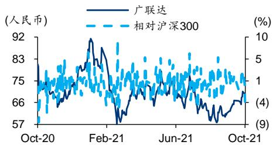  
股价走势图  
资料来源：Wind

# 广联达的工业软件产布局

# 在AEC（建筑、工程和施工行业）领域拥有较完整产品线

AEC（建筑、工程和施工行业）产品线链条较为完整。公司的工业软件产品包括数字造价、数字施工、数字设计等。数字造价主要涉及建设工程造价软件产品及数据服务，数字施工业务主要聚焦工程项目建造过程，通过“平台 $^ +$ 组件”的模式，为施工企业提供涵盖项目管理与企业管理的平台化解决方案。数字设计产品主要面向设计院客户，提供建筑设计一体化解决方案、基础设施设计一体化解决方案和设计成果数字化交付审查方案等。从产品布局看，形成了囊括建筑生命周期多个环节的完整产品线。

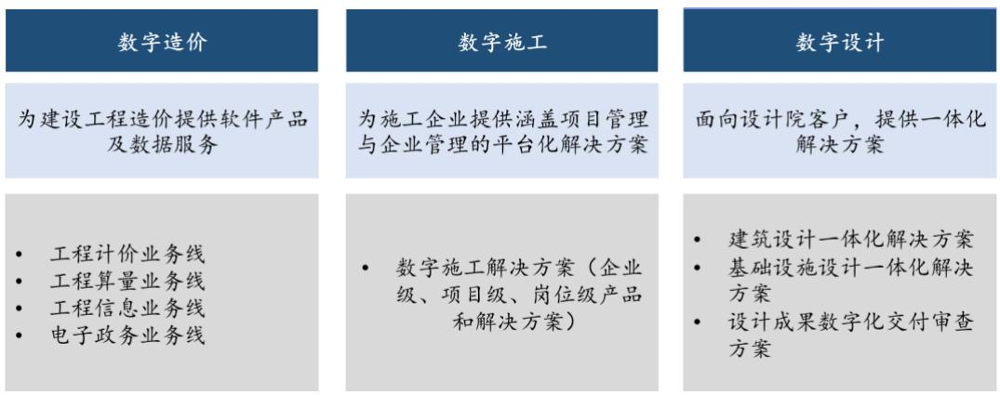  
图表1：广联达AEC产品线  
资料来源：公司官网、华泰研究

数字设计产品。2020 年 10 月，公司收购洛阳鸿业，增强了设计业务的渠道与市场能力，在数字设计产品领域加快布局。目前公司数字设计产品主要包含 BIMSpace 建筑设计产品集、广联达建筑设计产品集、二维建筑设计产品系列、Civil市政设计产品集、广联达设计成果交付审查产品集等。据公司官微，2021 年10 月21 日广联达建筑设计 BIM 软件广联达数维设计-建筑公测版将线上发布，数字设计产品布局持续推进。

  
图表2：广联达数字设计产品线  
资料来源：公司官网、华泰研究

数字施工产品。公司数字施工产品主要包括项目端的 $\mathsf { B I M + }$ 智慧工地系列产品，面向施工企业层级的项企一体化产品以及岗位级的施工建模设计BIMMAKE、斑马进度计划等。公司于2020 年 9 月发布的施工建模设计软件 BIMMAKE 是基于广联达自主知识产权图形和参数化建模技术，聚焦于施工全过程的 BIM 建模及专业化应用软件，旨在降低施工BIM 成本、减少重复建模、方便施工过程成本计划与核算。据公司财报，2020 年全年 BIMMAKE 新增 3万多名用户，2021 年上半年 BIMMAKE 通过样板渠道评审，用户数、项目数等多项业务指标相较去年的样板客户阶段实现翻倍增长，数字施工产品逐步推广。

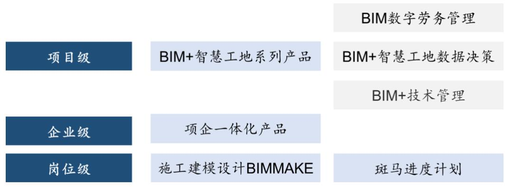  
图表3：广联达数字施工产品线  
资料来源：公司官网、华泰研究

数字造价产品。公司数字造价产品主要包括工程计价业务线、工程算量业务线、工程信息业务线和电子政务业务线等。工程计价业务线主要包含计价软件及云计价等。云计价GCCP6.0 推出量价一体化、云报表等新功能持续提升客户作业效率和便捷性。工程算量业务线主要包含算量软件及云算量等。目前算量全系列产品持续提升计算效率和稳定性。工程信息业务线主要包含广材网、广材助手、造价云空间等增值服务。

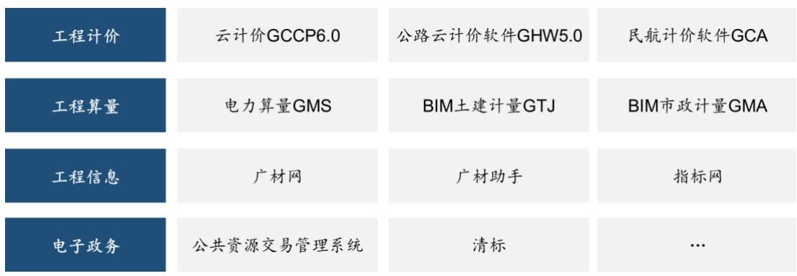  
图表4：广联达数字造价产品线  
资料来源：公司官网、华泰研究

# 广联达产品：从算量计价到施工，从施工到设计

通过自研、收购不断拓宽业务范围。公司在发展中内生发展与外延扩张并重，早期通过自研在计价、算量、招投标、项目管理等领域积累了清单计价软件GBQ、企业定额管理工具GBK、清单算量软件GCL，清单评标系统GXB 等系列产品。随后不断完善针对特定行业的计价算量、施工项目管理类应用。2010 年以来，外延并购成为公司发展的重要途径，一方面公司积极巩固原有领域的产品力，收购梦龙软件、兴安得力等造价、施工软件厂商，另一方面也通过收购向新领域拓展，如 2014 年收购全球领先的 MEP 设计和施工软件公司芬兰 Progman、2020 年收购洛阳鸿业信息，在加强 BIM 解决方案能力的同时，进一步向设计领域拓展，完善在数字建筑产业链的布局。

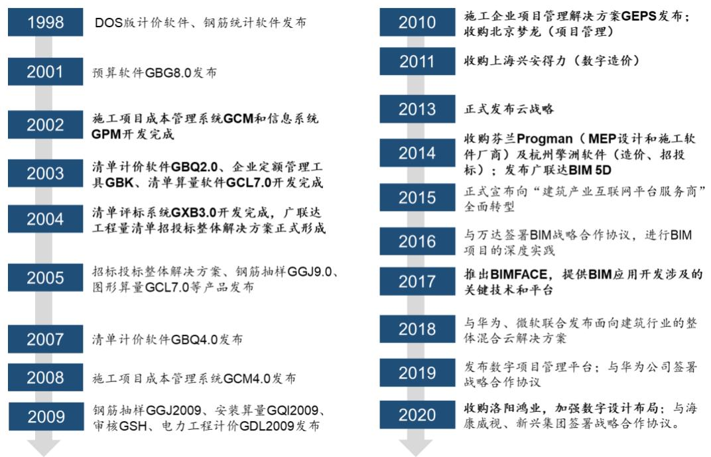  
图表5：广联达发展历程  
资料来源：公司官网、华泰研究

广联达产品从算量计价向设计等其他环节拓展。广联达从最初的算量计价不断拓展至设计、采购、施工、运营等环节，提供覆盖建筑生命周期多个环节的产品。在数字设计方面提供了涵盖市政、供水、建筑等多个领域的设计产品，采购环节的产品包含数字采购平台广联达集采电商，真实机电产品库 MagiCloud 等。施工环节产品包含施工建模设计软件BIMMAKE，BIM+智慧工地系列产品，进度计划与编制工具斑马进度计划等。运营环节的产品主要包括园区运营及水务管理相关产品。

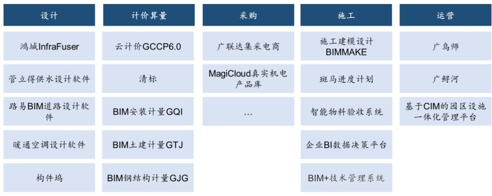  
图表6：广联达向建筑全生命周期拓展  
资料来源：公司官网、华泰研究

# 商业模式：数字造价云转型持续推进，施工业务打造平台 $^ { + }$ 组件模式

数字造价：云转型持续推进。公司积极推动造价业务的云转型，于2013 年正式发布云战略，2015 年成功发版云计价产品。此后云转型进程不断加速。据公司财报，自2017 年计价业务在 6 个试点地区逐步推广SaaS 模式以来，截至2021 年6 月底，最后4 个地区江苏、浙江、安徽、福建进入全面云转型，云转型推进顺利。从收入情况看，造价业务中云收入占比也在逐年提升，从2017 年的 $3 \%$ 上升至2021H1的 $70 \%$ 。

  
图表7：云转型完成度（按地区)  
注：图中指标为云转型完成省市数量/全国省市数量资料来源：公司财报、华泰研究

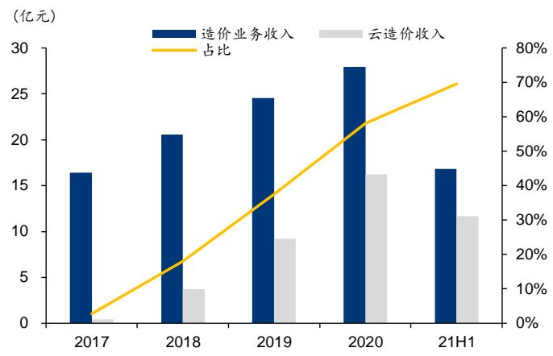  
图表8：造价业务云转型情况  
资料来源：公司财报、华泰研究

数字施工：打造“平台 $^ { + }$ 组件”模式。数字施工业务采取“平台 $^ +$ 组件”的业务模式，其中平台为2019 年公司发布的数字项目管理（BIM+智慧工地）平台，组件指劳务、项目BI等能够实现不同功能的各类软硬件组合。从业务模式看，公司积极完善平台底层建设，增强解决方案底层技术支持。据公司中报，2021H1 初步完成数据中台架构设计和关键技术突破，业务中台的施工领域知识图谱取得阶段性成果。“平台 $^ +$ 组件”模式有助于产品的快速规模化，满足客户的个性化需求。从商业模式看，公司积极打造整体解决方案。2021H1 发布了项目企业一体化1.0 解决方案。整体解决方案的商业模式是通过与客户签署的系统集成合同，向客户提供合同约定功能的信息系统解决方案（包括软件、硬件以及安装调试等)。其中每个组件模块可单独发挥功能、单独定价及交付，具备较强的灵活性。

# 设计软件：触达核心工业软件的新起点

# 设计软件：是工业的核心基础，底层为BIM 技术

向设计软件拓展，深入核心工业软件领域。工业软件根据针对环节不同可以划分为研发设计、生产控制、运营管理等，其中研发设计类软件的底层技术为各类数学、物理知识，具备技术壁垒较高的特点，属于工业软件中的核心类别。在AEC 行业内，计价、算量等软件的底层技术与设计软件有所区别。计价软件主要基于数据库的整理与搭建以及基于工程学的标准化计算分析能力，施工软件主要依靠数据模型可视化读取、构件库管理以及成本分析计算等技术，而设计软件则依托于三维建模、图形渲染和 GIS 能力。从底层技术的要求看，广联达的产品布局从算量、计价、施工向设计软件延伸，不断深入核心工业软件领域。

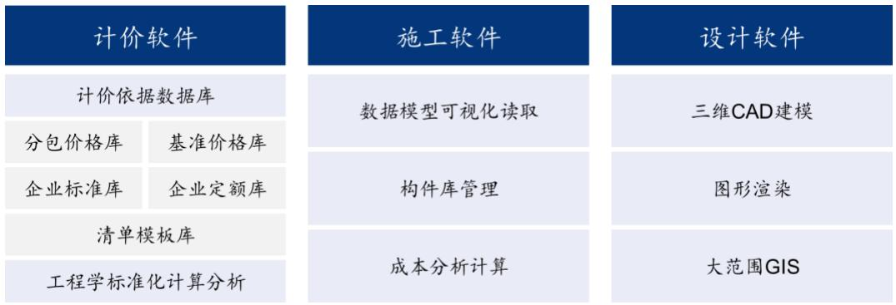  
资料来源：公司官网、华泰研究

AEC 领域设计软件关键技术为 BIM 技术。BIM（Building information model)技术为此类设计软件的关键技术。BIM 技术通过建筑、组件信息的传递、共享，实现项目全生命周期的数字化管理。BIM 系统的数据层包含BIM数据、文档、工程信息等数据，平台层对各类数据信息进行管理控制，网络层用于模型的分享，应用层则为涉及各个具体环节的应用软件如用于建模的设计软件、能进行模拟施工的施工软件等。关键技术方面，BIM技术包括BIM建模、服务技术架构、模型提取集成、约束规则等技术。

<table><tr><td>应用层</td><td>规划阶段</td><td>设计阶段</td><td>施工阶段</td><td>运营阶段</td></tr><tr><td>网络层</td><td colspan="4">网络平台</td></tr><tr><td rowspan="4">平台层</td><td colspan="4">异构工程信息</td></tr><tr><td colspan="4">过程控制与组织管理</td></tr><tr><td rowspan="4">非结构化信息管理</td><td colspan="2">BIM数据转化</td></tr><tr><td>提取与集成</td><td colspan="2">子模型信息 组织和过程信息存储</td></tr><tr><td rowspan="2"></td><td colspan="2">BIM信息访问与控制</td></tr><tr><td>非结构化信息仓库 BIM数据库</td></tr></table>

资料来源：公司官网、华泰研究

# 底层平台自主开发，外延内生并行发展

自主知识产权底层技术，打下良好技术基础。据公司年报，公司打造的建筑行业应用的图形引擎，有助于满足超大规模建设项目的应用需求，是结合多年建筑行业信息化/数字化的经验以及 BIM/CIM 技术等技术积累的研究成果。具备自主产权的图形平台为设计、招投标、施工、运维等多阶段的软件应用提供技术支撑。三维图形平台引擎可以为客户提供岗位级、企业级和行业级三种不同层面的应用，并且可移植用于运维和施工等多流程，成为广联达多种产品的技术支撑核心平台。

<table><tr><td rowspan="4">设计生态</td><td>应用生态</td><td>社区生态</td><td>內容生态</td></tr><tr><td>工具软件</td><td>设计师</td><td>构件库</td></tr><tr><td>插件</td><td>ISV</td><td>户型库</td></tr><tr><td>云应用</td><td>教育培训</td><td>模块库</td></tr><tr><td>应用平台</td><td>产品平台</td><td>数据平台</td><td>技术平台</td></tr><tr><td rowspan="5">底层技术</td><td></td><td>核心技术</td><td></td></tr><tr><td></td><td>三维图形平台引擎</td><td></td></tr><tr><td></td><td>通用技术</td><td></td></tr><tr><td>BIM技术</td><td>CIM技术</td><td>loT技术</td></tr><tr><td>大数据</td><td>人工智能</td><td>云中立</td></tr></table>

资料来源：公司官网、华泰研究

积极引进优秀人才，吸收海外龙头发展经验。公司积极引进优秀人才，管理层具有丰富建筑行业从业经验。通过积极引进具备海外龙头厂商工作经验的优秀人才，吸收先进经验。如2017 年2 月加入公司的副总裁云浪生先生曾在国际领先 CAD厂商欧特克（Autodesk)担任软件工程总监，具有扎实的技术背景及丰富的技术研发经验，

通过外延收购增强数字设计产品线。2020 年10 月，广联达以 4.08亿元购买洛阳鸿业约 $9 0 . 7 \%$ 的股权，达成战略重组。鸿业基于BIM 技术提供从规划、设计、施工、运维的全生命周期BIM 解决方案，并针对不同场景打造针对性应用。通过收购鸿业，广联达的数字设计产品线进一步加强，鸿业的丰富产品线与广联达自研的底层平台形成良好的协同效应，未来设计软件市场空间有望进一步打开。

<table><tr><td>BIM软件</td><td>BIMSpace</td><td>BIM云协同</td><td>鸿城Infrafuser</td><td>建筑性能分析</td></tr><tr><td></td><td>铝巨人BIM</td><td>装配式建筑平 台</td><td>机电设计深化</td><td></td></tr><tr><td>市政管线</td><td>路易2022</td><td>管立得</td><td>市政线路设计</td><td>电力浅沟软件</td></tr><tr><td>海绵城市</td><td>海绵道路设计 软件5.0</td><td>暴雨排水及低 影响开发模拟</td><td></td><td></td></tr><tr><td>绿色建筑</td><td>建筑风环境模 拟分析</td><td>负荷计算软件</td><td>日照分析软件</td><td></td></tr><tr><td>桥梁道路</td><td>互通立交软件</td><td>旧路改造软件</td><td>交通设施软件</td><td>土方计算软件</td></tr></table>

资料来源：公司官网、华泰研究

# 设计软件为上层应用软件产品扩展打下良好基础

完善底层技术，为上层应用产品拓展打下良好基础。底层平台是构建上层软件产品体系的基础，广联达通过设计软件不断完善底层 BIM 技术，有助于向其他领域进一步拓展。在设计软件方面，广联达已经推出了应用于市政管道、供暖系统、海绵城市、供水等多个具体应用，逐渐覆盖更多场景。除了针对场景的具体应用软件，广联达还基于自主知识产权图形和参数化建模技术开发出适用于施工全流程的 BIM 建模及专业化应用 BIMMAKE。该产品具备高精度CAD识别翻模和自动校核图纸功能，并模块化各种模型，快速实现场布建模。未来广联达在 BIM+领域的应用软件有望加速推进，有助于公司打开第二成长曲线。

图表13：广联达 BIMMAKE 产品框架  

<table><tr><td rowspan="4">施工深化 设计和</td><td>自研</td><td colspan="2">广联达生态</td><td>协同生态</td></tr><tr><td>砌体</td><td colspan="2">渲染/轻量化展示</td><td>模型渲染</td></tr><tr><td>模板</td><td colspan="2">施工模拟</td><td>BIM协调</td></tr><tr><td>...</td><td colspan="2">精细化项目管理</td><td>多元数据接口</td></tr><tr><td rowspan="3">建</td><td>建模、翻模</td><td colspan="2">施工模型细化</td><td>施工模型深化</td></tr><tr><td>场布建模</td><td colspan="2">一键处理与编辑</td><td>主体结构 钢筋</td></tr><tr><td></td><td colspan="2">扣减、打断、分拆</td><td>场地 二次结构</td></tr><tr><td rowspan="3">BIM模型 数据接入</td><td>设计数据接入</td><td colspan="2">算量数据接入</td><td colspan="2">通用数据接入</td></tr><tr><td>Sketchup</td><td colspan="2">GTJ</td><td colspan="2">PDF</td></tr><tr><td>Revit</td><td>GQI</td><td>GCL 云翻样</td><td colspan="2">CAD</td></tr></table>

资料来源：公司官网、华泰研究

# 从Autodesk设计类产品看广联达产品拓展性

# Autodesk AEC主要提供基於云的 BIM 和CAD工具

Autodesk AEC 软件集主要面向建筑设计、土木基础设施和施工行业提供集成式BIM和CAD工具。Autodesk工程建设软件集（Architecture，Engineering&Construction，简称AEC)为设计师、工程师和承包商提供了一套基于云的 BIM 和CAD 工具。AEC 软件集中的主要产品包括 AutoCAD、Revit 等数十种产品，覆盖建筑设计、基础设施设计和施工三大行业领域。

图表14：AEC 覆盖行业产品集合  

<table><tr><td rowspan="4">建筑</td><td>建筑</td><td>Revit</td><td>Formlt Pro</td><td>Dynano</td><td>Insight</td><td>3ds Max</td><td>AutoCAD</td></tr><tr><td>结构工程</td><td>Revit</td><td>RSA Pro</td><td>Advance</td><td>Dynadno</td><td>Naviswgrks</td><td>AutoCAD</td></tr><tr><td>MEP工程</td><td>Revit</td><td>Fabrication</td><td>Insight</td><td>Naviswgreks</td><td>AutoCAD</td><td></td></tr><tr><td>运输</td><td>Civil 3D</td><td>Infraworks</td><td>Revit</td><td>ReCap Pro</td><td>AutoCAD</td><td></td></tr><tr><td rowspan="3">基础 设施 设计</td><td>场地设计</td><td>Civil 3D</td><td>Infraworks</td><td>ReCap Pro</td><td>AutoCAD</td><td rowspan="9"></td></tr><tr><td>水利</td><td>Alant AD</td><td>Revit</td><td>Naviswgrks</td><td>Infraworks</td></tr><tr><td>总承包商</td><td>AutoCAD</td><td>Revit</td><td>Naviswgrks</td><td>ReCap Pro</td></tr><tr><td rowspan="2">施工</td><td>MEP承包商</td><td>Fabricationn</td><td>Navisworkss</td><td>Revit</td><td rowspan="2"></td></tr><tr><td>结构制造商</td><td>Revit</td><td>Advance</td><td>Navisworks</td></tr></table>

资料来源：Autodesk公司官网、华泰研究

# Autodesk AEC 软件集核心产品主要包括AutoCAD、Revit、Infraworks、Civil3D和Navisworks:

图表15：Autodesk AEC 软件集核心产品介绍  

<table><tr><td>核心产品</td><td>简介</td><td>产品功能</td></tr><tr><td>AutoCAD</td><td>设计(CAD)软件，主要用于</td><td>AutoCAD 是一款计算机辅助 AutoCAD 包含 Architeture 工具组合、Electical 工具组合在内的专业工具套件，为工程建设、机械设计、电气设计等行业 提供专业化功能和元件库。AutoCAD 主要功能包括实体、曲面和网格建模、三维导航、云渲染、2D/3D 制图等。</td></tr><tr><td>Revit</td><td>2D/3D 建模设计和可视化。</td><td>Revit 是一款建筑信息建模软 Revit 许用户以 3D 方式设计建筑和结构及其组件，并使用 2D 绘图对模型进行注释元素，支持从建筑模型的数据库中访</td></tr><tr><td>Civil3D</td><td>生式设计、参数化建模等</td><td>件（BIM)，主要能力包括衍问建筑信息。Revit 能够使用工具来规划和跟踪建筑物生命周期的各个阶段，包括从概念到施工以及后期维护和/或拆除，在 整个项目生命周期中提高设计效率和准确性。 CivI3D 主要用于土木工程设 Cii3D 是一款土木工程设计和施工文档编制软件，支持 BIM，能够通过集成功能来改善制图、设计和施工图纸编制。Ci 3D</td></tr><tr><td></td><td>计。</td><td>计，主要能力在于建模与设主要功能包括曲面建模、道路建模、场地设计、压力管网设计、桥梁设计等等。</td></tr><tr><td></td><td></td><td>Infraworks Inraworks 主要用于基础设 AutodeskInfraworks 是BIM工作流程的重要组成，可以在项目生命周期的更早阶段中直观有效地布置设计选项、确定项目</td></tr><tr><td></td><td></td><td>施项目规划和设计，主要能力可行性并与关键利益相关方协调一致。Infraworks 主要功能可以分类为：概念设计、基于真实环境建模、分析和模拟和可视</td></tr><tr><td></td><td></td><td></td></tr><tr><td></td><td></td><td></td></tr><tr><td></td><td>在于建模和仿真。</td><td></td></tr><tr><td></td><td></td><td>化，可以实现包括：聚合大量数据以生成丰富的上下文模型、将设计与地理空间GIS 数据无缝集成、对典型建筑和自然环</td></tr><tr><td></td><td></td><td>境的现有条件进行建模等。</td></tr><tr><td></td><td></td><td>Navisworks Navisworks 是一款 3D 模型 Autodesk Navisworks 软件能够将 AutoCAD和Revit系列等应用创建的设计数据，与来自其它设计工具的几何图形和信息相</td></tr><tr><td></td><td></td><td></td></tr><tr><td></td><td>审阅软件，主要用于改进</td><td>结合，将其作为整体的三维项目，通过多种文件格式进行实时审阅。Navisworks 允许用户打开和组合3D模型、实时浏览</td></tr><tr><td></td><td></td><td>BIM（建筑信息建模）协调。以及使用工具（包括注释、红线标注、视点和测量)检查模型。</td></tr><tr><td></td><td></td><td></td></tr></table>

资料来源：Autodesk公司官网、华泰研究

# 广联达 VS Autodesk：广联达设计软件可拓展性强，具备深度挖掘潜力

# 对比维度一：产品线布局广度

从产品线布局广度来看，广联达与Autodesk 建筑行业设计类软件产品布局均涉及三种核心能力及三大应用领域。

三种核心能力:聚焦设计、建模和仿真，核心能力打磨有望带动产品拓宽。广联达与Autodesk设计类产品均聚焦于设计、建模和仿真三种核心能力。Autodesk 在设计、建模和仿真方面的能力表现较为均衡，拥有ACIS 内核、爆款产品 AutoCAD 以及成熟的仿真能力，在建筑设计、基础设施设计、建筑性能分析等领域有着广泛应用。而广联达依靠自研底层技术，推出自主产权的几何内核、图形引擎等方式，正在加快追赶步伐，未来有望通过核心能力突破带动产品线拓展。

三大应用领域：集中覆盖建筑设计、基础设施设计以及交付审查三大领域，细分领域拓展可期。广联达与Autodesk 均对建筑设计主要需求场景实现了能力覆盖，包括建筑设计、结构设计、MEP工程（暖通、电气和给排水）三个主要方向。在各主要领域，二者均提供了专有产品，如广联达的建筑设计产品集、Autodesk 的 AutoCAD 等，但 Autodesk 细分领域覆盖面更广，并更多集中于建筑设计领域，如 Advance Steel 可以实现对预制钢结构数据的导入等。随着对细分领域的深入，以及对鸿业科技数字设计产品能力的进一步整合，广联达未来有望向更多细分领域进行拓展。

  
图表16：广联达与Autodesk 建筑行业设计类软件产品布局广度对比  
资料来源：公司官网、华泰研究

# 对比维度二：产品线布局深度

产品线布局深度来看，广联达与Autodesk 在技术、产品和市场维度上存在差距，但可拓展性强，具备深度挖掘潜力。

技术层面：3D设计与平台化能力存在差距，内生/外延拓展实现加速追赶。底层技术上，Autodesk 拥有ASIC 内核，在此基础上开发了AutoCAD、Revit 等众多知名产品，并在1999年前后开发出 3D 建模能力，2019 年推出 Construction Cloud 整合AEC 软件集与 BIM360，进一步强化了 BIM 平台能力。而广联达等国内厂商由于起步较晚，在 3D 建模能力和平台整合上慢于 Autodesk，但也正积极追赶，如广联达一方面通过近 20 年时间，自研三维图形引擎，于2019年6月正式推出“平台 $^ +$ 模块”架构，另一方面，收购鸿业科技、MagiCAD完善BIM 能力圈，实现外延拓展。未来随着广联达自身能力打磨以及技术整合推进，有望继续通过内生、外延式的技术拓展实现在技术层面的加速追赶。

产品层面：产品线丰富程度反映 know-how 差异，公司有望与客户共同打磨实现跨产品线拓展。产品层面来看，Autodesk AEC 软件集公有 Revit 等5 大核心软件，细分应用软件如钢结构设计、桥梁结构分析等数十项，产品线极其丰富。广联达设计类产品涵盖了主要的建筑、结构、机电等设计板块，但细分产品数量及覆盖的业务场景与Autodesk 相比仍有拓展空间。而新产品的推出往往依赖于行业经验的积淀，和与客户一同进行长期深度打磨，因此产品线丰富程度的差距反映了对细分领域 know-how 的差异。另一方面来看，近期公司也陆续发布设计类新品，如 2021 年 3 月发布广联达数字设计产品集邀请体验版，2021年6 月发布 BIMSpace2022 版。未来，公司有望通过与下游客户共同打磨自身产品，实现跨产品线拓展，进一步夯实产品能力。

市场层面：公司数字设计业务尚处起步阶段，市场空间具备较大拓展潜力。对比收入体量来看，Autodesk AEC产品系列2021 年上半年共实现营业收入9.21 亿美元，同比增长 $18 \%$ 。而广联达数字设计业务尚处于起步阶段，2021 年上半年实现营业收入0.59 亿元，其中子公司鸿业科技贡献收入0.57亿元，相较上年同期增长 $65 \%$ ，收入体量上二者差距近百倍。

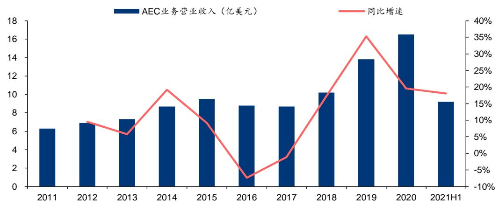  
图表17：2011-2021H1 Autodesk AEC 业务营收及增速变化趋势  
资料来源：Wind、华泰研究

数字设计软件可拓展市场空间广阔，海外市场可期。据 Autodesk 数据，预计到 2025 年建筑行业设计类软件产品用户数量将达1,200 万人。此外，目前广联达数字设计业务主要面向国内设计院客户，而 Autodesk AEC 产品通过云化已经实现全球布局。因此对于广联达而言，数字设计软件市场空间广阔，海外市场拓展可期。

总结来看，对标 Autodesk AEC 软件集，广联达数字设计系列软件可拓展性强，具备深度挖掘潜力。一方面，从产品线布局广度对比来看，广联达有望通过核心能力打磨，逐渐完善BIM 能力圈，实现细分领域覆盖面的进一步拓宽。另一方面，从产品线布局深度来看，广联达与Autodesk 在技术、产品、市场等层面存在一定差距，有望通过内生/外延式拓展实现技术追赶、产品拓宽以及市场空间的抬升。

# 盈利预测及估值

预计 2021-2023 年营业收入为 52.24/67.23/85.15 亿元(维持前值)。参考 2021 年可比公司Wind 一致预期 PS 均值 18.3 倍，给予 2021 年 18.3 倍 PS，目标价 80.56 元(前值78.55元)，维持“买入”。

图表18：可比公司 PS 估值表  

<table><tr><td colspan="5"></td><td colspan="3">营业收入（亿元）</td><td colspan="3">PS(倍)</td></tr><tr><td>证券简称</td><td>证券代码</td><td>股价(元)市值(亿元)</td><td></td><td>2020</td><td>2021E</td><td>2022E</td><td>2023E</td><td>2021E</td><td>2022E</td><td>2023E</td></tr><tr><td>恒生电子</td><td>600570CH</td><td>59.26</td><td>866</td><td>41.7</td><td>52.3</td><td>63.2</td><td>75.8</td><td>16.6</td><td>13.7</td><td>11.4</td></tr><tr><td>用友网络</td><td>600588CH</td><td>32.70</td><td>1,069</td><td>85.2</td><td>100.7</td><td>127.2</td><td>160.8</td><td>10.6</td><td>8.4</td><td>6.7</td></tr><tr><td>金山办公</td><td>688111CH</td><td>268.35</td><td>1,237</td><td>22.6</td><td>34.0</td><td>47.0</td><td>63.7</td><td>36.4</td><td>26.3</td><td>19.4</td></tr><tr><td>石基信息</td><td>002153CH</td><td>24.67</td><td>370</td><td>33.2</td><td>38.2</td><td>45.7</td><td>56.0</td><td>9.7</td><td>8.1</td><td>6.6</td></tr><tr><td>平均</td><td></td><td></td><td></td><td></td><td></td><td></td><td></td><td>18.3</td><td>14.1</td><td>11.0</td></tr></table>

注：股价采用2021/10/19收盘价，预测均为Wind一致预期资料来源：Wind、华泰研究

图表19：提及公司表  

<table><tr><td>公司名称</td><td>代码</td></tr><tr><td>Autodesk</td><td>ADSK US</td></tr><tr><td>洛阳鸿业</td><td>未上市</td></tr><tr><td>北京梦龙</td><td>未上市</td></tr><tr><td>上海兴安得力</td><td>未上市</td></tr><tr><td>Progman</td><td>未上市</td></tr><tr><td>杭州擎洲软件</td><td>未上市</td></tr></table>

资料来源：Bloomberg、华泰研究

# 风险提示

施工业务收入确认低于预期；

设计软件研发进度低于预期。

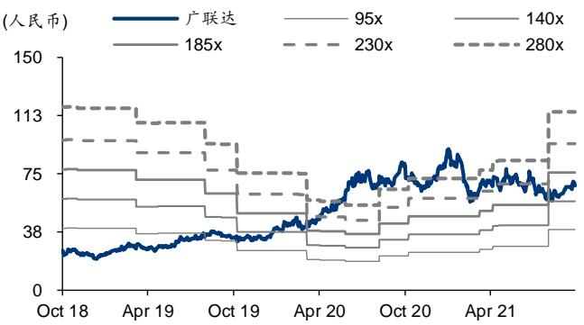  
图表20：广联达 PE-Bands

资料来源：Wind、华泰研究

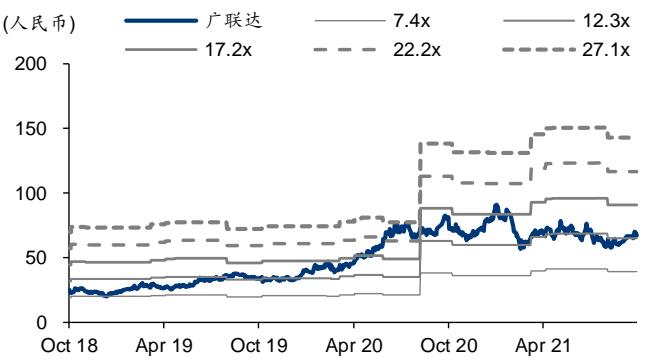  
图表21：广联达PB-Bands

资料来源：Wind、华泰研究

# 盈利预测

资产负债表  

<table><tr><td>会计年度 (人民币百万)</td><td>2019</td><td>2020</td><td>2021E</td><td>2022E</td><td>2023E</td></tr><tr><td>流动资产</td><td>2,950</td><td>5,420</td><td>7,243</td><td>9,299</td><td>11,739</td></tr><tr><td>现金</td><td>2,231</td><td>4,797</td><td>6,348</td><td>8,171</td><td>10,349</td></tr><tr><td>应收账款</td><td>559.41</td><td>422.12</td><td>737.09</td><td>836.70</td><td>1,140</td></tr><tr><td>其他应收账款</td><td>48.58</td><td>77.04</td><td>30.73</td><td>123.59</td><td>73.62</td></tr><tr><td>预付账款</td><td>30.59</td><td>46.21</td><td>50.98</td><td>75.14</td><td>85.12</td></tr><tr><td>存货</td><td>21.33</td><td>26.33</td><td>26.63</td><td>37.66</td><td>36.40</td></tr><tr><td>其他流动资产</td><td>59.34</td><td>50.96</td><td>49.20</td><td>54.41</td><td>55.62</td></tr><tr><td>非流动资产</td><td>3,217</td><td>4,127</td><td>4,454</td><td>4,870</td><td>5,313</td></tr><tr><td>长期投资</td><td>232.76</td><td>255.46</td><td>276.79</td><td>304.53</td><td>328.91</td></tr><tr><td>固定投资</td><td>802.87</td><td>810.23</td><td>1,065</td><td>1,362</td><td>1,723</td></tr><tr><td>无形资产</td><td>464.02</td><td>677.33</td><td>725.98</td><td>780.82</td><td>831.22</td></tr><tr><td>其他非流动资产</td><td>1,717</td><td>2,384</td><td>2,386</td><td>2,422</td><td>2,429</td></tr><tr><td>资产总计</td><td>6,167</td><td>9,547</td><td>11,697</td><td>14,168</td><td>17,052</td></tr><tr><td>流动负债</td><td>2,809</td><td>2,858</td><td>4,156</td><td>5,687</td><td>7,319</td></tr><tr><td>短期借款</td><td>1,089</td><td>3.00</td><td>1,604</td><td>1,786</td><td>2,468</td></tr><tr><td>应付账款</td><td>98.72</td><td>94.98</td><td>116.39</td><td>145.68</td><td>153.93</td></tr><tr><td>其他流动负债</td><td>1,622</td><td>2,760</td><td>2,436</td><td>3,755</td><td>4,697</td></tr><tr><td>非流动负债</td><td>8.91</td><td>131.01</td><td>204.44</td><td>261.15</td><td>287.52</td></tr><tr><td>长期借款</td><td>0.09</td><td>0.07</td><td>73.50</td><td>130.21</td><td>156.58</td></tr><tr><td>其他非流动负债</td><td>8.82</td><td>130.94</td><td>130.94</td><td>130.94</td><td>130.94</td></tr><tr><td>负债合计</td><td>2,818</td><td>2,989</td><td>4,360</td><td>5,948</td><td>7,607</td></tr><tr><td>少数股东权益</td><td>79.87</td><td>155.57</td><td>225.44</td><td>332.49</td><td>472.61</td></tr><tr><td>股本</td><td>1,129</td><td>1,186</td><td>1,187</td><td>1,187</td><td>1,187</td></tr><tr><td>资本公积</td><td>508.83</td><td>3,135</td><td>3,135</td><td>3,135</td><td>3,135</td></tr><tr><td>留存公积</td><td>1,709</td><td>1,957</td><td>2,544</td><td>3,378</td><td>4,485</td></tr><tr><td>归属母公司股东权益</td><td>3,269</td><td>6,402</td><td>7,111</td><td>7,887</td><td>8,973</td></tr><tr><td>负债和股东权益</td><td>6,167</td><td>9,547</td><td>11,697</td><td>14,168</td><td>17,052</td></tr></table>

现金流量表  

<table><tr><td>会计年度 (人民币百万)</td><td>2019</td><td>2020</td><td>2021E</td><td>2022E</td><td>2023E</td></tr><tr><td>经营活动现金</td><td>640.92</td><td>1,876</td><td>233.80</td><td>2,252</td><td>2,178</td></tr><tr><td>净利润</td><td>254.58</td><td>381.37</td><td>777.13</td><td>1,047</td><td>1,355</td></tr><tr><td>折旧摊销</td><td>105.73</td><td>134.07</td><td>125.73</td><td>147.44</td><td>183.06</td></tr><tr><td>财务费用</td><td>40.55</td><td>(17.42)</td><td>(61.51)</td><td>(19.88)</td><td>(13.84)</td></tr><tr><td>投资损失</td><td>(22.51)</td><td>(10.21)</td><td>(18.70)</td><td>(18.35)</td><td>(17.44)</td></tr><tr><td>营运资金变动</td><td>158.63</td><td>1,276</td><td>(586.27)</td><td>1,108</td><td>688.12</td></tr><tr><td>其他经营现金</td><td>103.95</td><td>112.10</td><td>(2.59)</td><td>(12.28)</td><td>(17.10)</td></tr><tr><td>投资活动现金</td><td>(227.31)</td><td>(696.50)</td><td>(437.82)</td><td>(544.10)</td><td>(608.48)</td></tr><tr><td>资本支出</td><td>243.07</td><td>439.06</td><td>435.03</td><td>534.67</td><td>601.51</td></tr><tr><td>长期投资</td><td>(10.78)</td><td>(31.18)</td><td>(21.33)</td><td>(27.74)</td><td>(24.38)</td></tr><tr><td>其他投资现金</td><td>26.54</td><td>(226.26)</td><td>18.54</td><td>18.31</td><td>17.41</td></tr><tr><td>筹资活动现金</td><td>(389.57)</td><td>1,357</td><td>154.94</td><td>(67.91)</td><td>(73.79)</td></tr><tr><td>短期借款</td><td>888.62</td><td>(1,086)</td><td>1,601</td><td>182.70</td><td>681.78</td></tr><tr><td>长期借款</td><td>(991.43)</td><td>(0.02)</td><td>73.43</td><td>56.71</td><td>26.37</td></tr><tr><td>普通股增加</td><td>1.98</td><td>57.19</td><td>1.70</td><td>0.00</td><td>0.00</td></tr><tr><td>资本公积增加</td><td>45.97</td><td>2,626</td><td>0.00</td><td>0.00</td><td>0.00</td></tr><tr><td>其他筹资现金</td><td>(334.70)</td><td>(240.33)</td><td>(1,521)</td><td>(307.32)</td><td>(781.94)</td></tr><tr><td>现金净增加额</td><td>19.48</td><td>2,522</td><td>(49.08)</td><td>1,640</td><td>1,496</td></tr></table>

资料来源：公司公告、华泰研究预测

利润表  

<table><tr><td>会计年度 (人民币百万)</td><td>2019</td><td>2020</td><td>2021E</td><td>2022E</td><td>2023E</td></tr><tr><td>营业收入</td><td>3,464</td><td>3,947</td><td>5,224</td><td>6,723</td><td>8,515</td></tr><tr><td>营业成本</td><td>370.66</td><td>454.50</td><td>552.63</td><td>669.51</td><td>760.95</td></tr><tr><td>营业税金及附加</td><td>43.01</td><td>37.90</td><td>72.30</td><td>86.92</td><td>103.86</td></tr><tr><td>营业费用</td><td>1,102</td><td>1,256</td><td>1,593</td><td>1,966</td><td>2,494</td></tr><tr><td>管理费用</td><td>819.76</td><td>879.19</td><td>1,003</td><td>1,277</td><td>1,618</td></tr><tr><td>财务费用</td><td>40.55</td><td>(17.42)</td><td>(61.51)</td><td>(19.88)</td><td>(13.84)</td></tr><tr><td>资产减值损失</td><td>(6.11)</td><td>(20.70)</td><td>(26.12)</td><td>(44.61)</td><td>(64.96)</td></tr><tr><td>公允价值变动收益</td><td>0.00</td><td>0.00</td><td>0.00</td><td>0.00</td><td>0.00</td></tr><tr><td>投资净收益</td><td>22.51</td><td>10.21</td><td>18.70</td><td>18.35</td><td>17.44</td></tr><tr><td>营业利润</td><td>290.37</td><td>414.21</td><td>856.27</td><td>1,151</td><td>1,486</td></tr><tr><td>营业外收入</td><td>0.83</td><td>2.30</td><td>1.86</td><td>1.83</td><td>1.92</td></tr><tr><td>营业外支出</td><td>7.44</td><td>6.11</td><td>6.45</td><td>6.50</td><td>6.42</td></tr><tr><td>利润总额</td><td>283.76</td><td>410.40</td><td>851.67</td><td>1,146</td><td>1,482</td></tr><tr><td>所得税</td><td>29.18</td><td>29.04</td><td>74.54</td><td>99.68</td><td>126.67</td></tr><tr><td>净利润</td><td>254.58</td><td>381.37</td><td>777.13</td><td>1,047</td><td>1,355</td></tr><tr><td>少数股东损益</td><td>19.51</td><td>50.98</td><td>69.88</td><td>107.05</td><td>140.11</td></tr><tr><td>归属母公司净利润</td><td>235.07</td><td>330.39</td><td>707.25</td><td>939.51</td><td>1,215</td></tr><tr><td>EBITDA</td><td>388.53</td><td>400.75</td><td>860.19</td><td>1,182</td><td>1,521</td></tr><tr><td>EPS(人民币，基本)</td><td>0.20</td><td>0.28</td><td>0.60</td><td>0.79</td><td>1.02</td></tr></table>

主要财务比率  

<table><tr><td>会计年度 (%)</td><td>2019</td><td>2020</td><td>2021E</td><td>2022E</td><td>2023E</td></tr><tr><td>成长能力</td><td></td><td></td><td></td><td></td><td></td></tr><tr><td>营业收入</td><td>21.06</td><td>13.94</td><td>32.34</td><td>28.71</td><td>26.65</td></tr><tr><td>营业利润</td><td>(40.08)</td><td>42.65</td><td>106.72</td><td>34.41</td><td>29.15</td></tr><tr><td>归属母公司净利润</td><td>(46.46)</td><td>40.55</td><td>114.07</td><td>32.84</td><td>29.33</td></tr><tr><td>获利能力 (%)</td><td></td><td></td><td></td><td></td><td></td></tr><tr><td>毛利率</td><td>89.30</td><td>88.49</td><td>89.42</td><td>90.04</td><td>91.06</td></tr><tr><td>净利率</td><td>7.35</td><td>9.66</td><td>14.88</td><td>15.57</td><td>15.91</td></tr><tr><td>ROE</td><td>7.60</td><td>5.82</td><td>10.59</td><td>12.73</td><td>14.35</td></tr><tr><td>ROIC</td><td>20.36</td><td>24.81</td><td>36.71</td><td>93.55</td><td>198.27</td></tr><tr><td>偿债能力</td><td></td><td></td><td></td><td></td><td></td></tr><tr><td>资产负债率 (%)</td><td>45.70</td><td>31.31</td><td>37.28</td><td>41.98</td><td>44.61</td></tr><tr><td>净负债比率 (%)</td><td>(33.85)</td><td>(72.41)</td><td>(62.82)</td><td>(75.10)</td><td>(80.75)</td></tr><tr><td>流动比率</td><td>1.05</td><td>1.90</td><td>1.74</td><td>1.63</td><td>1.60</td></tr><tr><td>速动比率</td><td>1.02</td><td>1.86</td><td>1.72</td><td>1.61</td><td>1.58</td></tr><tr><td>营运能力</td><td></td><td></td><td></td><td></td><td></td></tr><tr><td>总资产周转率</td><td>0.59</td><td>0.50</td><td>0.49</td><td>0.52</td><td>0.55</td></tr><tr><td>应收账款周转率</td><td>8.14</td><td>8.04</td><td>9.01</td><td>8.54</td><td>8.62</td></tr><tr><td>应付账款周转率</td><td>5.58</td><td>4.69</td><td>5.23</td><td>5.11</td><td>5.08</td></tr><tr><td>每股指标 (人民币)</td><td></td><td></td><td></td><td></td><td></td></tr><tr><td>每股收益(最新摊薄)</td><td>0.20</td><td>0.28</td><td>0.60</td><td>0.79</td><td>1.02</td></tr><tr><td>每股经营现金流(最新摊薄)</td><td>0.54</td><td>1.58</td><td>0.20</td><td>1.90</td><td>1.83</td></tr><tr><td>每股净资产(最新摊薄)</td><td>2.75</td><td>5.39</td><td>5.99</td><td>6.64</td><td>7.55</td></tr><tr><td>估值比率</td><td></td><td></td><td></td><td></td><td></td></tr><tr><td>PE(倍)</td><td>339.45</td><td>241.52</td><td>112.82</td><td>84.93</td><td>65.67</td></tr><tr><td>PB(倍)</td><td>24.41</td><td>12.46</td><td>11.22</td><td>10.12</td><td>8.89</td></tr><tr><td>EV EBITDA (倍)</td><td>202.66</td><td>187.65</td><td>87.67</td><td>62.57</td><td>47.76</td></tr></table>