证券研究报告|行业深度报告信息技术|计算机报告日期：2022年6月9日

# 广联达：乘云而上，再谱华章

# —一深度复盘系列（三）

招商证券 计算机2022年6月9日

刘玉萍 周翔宇   
liuyuping@cmschina.com.cn zhouxiangyu@cmschina.com.cnCMs招商证券   
S1090518120002 S1090518050001

# CMS招商证券要点概览

本篇报告对广联达历史行情进行详细复盘，并梳理总结了影响公司市值变化的主要原因。我们从相对申万计算机指数收益率与绝对收益率两个维度对广联达上市后行情进行复盘并得出以下结论：1）依靠产品竞争力渗透市场。“一次创业”期间公司相对收益与建筑业投资增速相关联，公司通过自主研发及投资并购不断打磨产品矩阵，把握建筑信息化高速发展的机遇产品迅速抢占市场，业绩快速增长带动公司市值提升；2）云转型带来商业模式的升级改变估值模式，凭借公司在“一次创业”期间积累的市场份额与自身极强的产品力，2017年广联达开启造价业务云转型，云计算的商业模式让广联达造价软件做到更快迭代，用户体验感更好，增强了用户粘性，并转化了部分潜在的盗版用户。公司在转云期间，合同负债快速增长，表观净利润逐渐失真，因此公司估值体系逐渐转变为PS估值。在公司转云初期，商业模式升级从而估值体系变化是公司股价上涨的主要原因，而后在转云过程中，公司产品的市场竞争力也愈加凸显；3）转云成功后净利率拐点的出现提升公司PS估值，通过测算，公司净利率拐点出现在2019/2020年，我们认为公司造价业务利润拐点意味着公司云业务续费率保持较高水平，续签合同销售费用率下降提升公司整体盈利能力，因此我们判断公司云转型正式进入收获期，公司PS估值在2020年快速提升。

云转型行情已经接近尾声，未来将更关注TAM的提升。截至2021年末，公司云造价业务收入25.61亿元，云造价业务收入占比由2018年 $1 8 \%$ 提升至2021年 $6 7 \%$ ；2021年新签云合同31亿元，2018至2021年新签云合同同比增速分别为 $2 7 4 \%$ 、 $1 1 4 \%$ 、 $6 0 \%$ 、 $3 9 \%$ ，因此我们判断公司云业务转型已经接近尾声。根据我们此前在《海外SaaS企业的估值差异——云计算专题系列（九）》中提出影响SaaS企业估值的关键要素为可达业务空间TAM和净利率提升潜力，我们认为广联达历史行情已经充分兑现转云红利，未来TAM变化才是把握公司投资时点的重要指标，建议关注：1）造价业务市场容量的提升，包括订阅客单价的提升以及在基建、成本管控等领域的新品拓展；2）智慧施工产品在建筑业渗透率提升；3）设计软件推出带动行业天花板打开。

投资建议：从PS估值角度看，目前公司估值低于历史平均水平，我们预计22至24年公司实现归母净利润9.60/13.33/16.89亿元，维持“强烈推荐”投资评级。

风险提示：造价业务续费率下降；施工业务推进不及预期；设计软件研发进度不及预期。

表：财务数据与估值  

<table><tr><td>会计年度</td><td>2020</td><td>2021</td><td>2022E</td><td>2023E</td><td>2024E</td></tr><tr><td>营业总收入(百万元)</td><td>4005</td><td>5619</td><td>7224</td><td>8999</td><td>10946</td></tr><tr><td>同比增长</td><td>13%</td><td>40%</td><td>29%</td><td>25%</td><td>22%</td></tr><tr><td>营业利润(百万元)</td><td>414</td><td>758</td><td>1094</td><td>1517</td><td>1920</td></tr><tr><td>同比增长</td><td>43%</td><td>83%</td><td>44%</td><td>39%</td><td>27%</td></tr><tr><td>归母净利润(百万元)</td><td>330</td><td>661</td><td>960</td><td>1333</td><td>1689</td></tr><tr><td>同比增长</td><td>41%</td><td>100%</td><td>45%</td><td>39%</td><td>27%</td></tr><tr><td>每股收益(元)</td><td>0.28</td><td>0.56</td><td>0.81</td><td>1.12</td><td>1.42</td></tr><tr><td>PE</td><td>190.2</td><td>95.0</td><td>65.4</td><td>47.1</td><td>37.2</td></tr><tr><td>PB</td><td>9.8</td><td>10.9</td><td>26.0</td><td>18.1</td><td>13.2</td></tr></table>

资料来源：公司数据、招商证券

# 一、广联达相对收益历史行情复盘

1.1广联达相对收益复盘

1.2 “一次创业”重点复盘

1.3 “二次创业”重点复盘

1.4 PS估值变化的测算印证

二、广联达绝对收益历史行情复盘三、云造价高歌猛进，施工业务砥砺前行四、估值、人效、持仓分析及投资建议

# CMS招商证券1.1 广联达相对收益复盘

，广联达发展至今，经历过两次创业。第一次创业（1998年至2016年）：提出了“让预算员甩掉计算器”的目标，2016年工程造价行业岗位级信息化实现全覆盖，标志着创业目标实现。

“一次创业”期间，公司把握建筑信息化快速发展机遇，造价软件快速切入市场并占据较高市场份额。在此期间公司的市值增长主要为业绩驱动，在基建投资持续高景气的大环境下公司业绩保持快速增长。

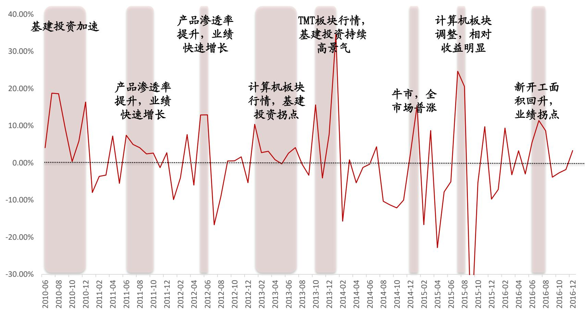  
图：2010年6月至2016年12月广联达相对申万计算机指数收益率分析（频率：月）  
资料来源：Wind、广联达官网、招商证券

# 1.1广联达相对收益复盘

• 第二次创业（2017年至今）：在广阔的建筑领域应用信息技术，不仅让造价员这个单一岗位实现电算化，还要让整个建筑全生命周期数字化，信息化。

“二次创业”期间，公司造业业务开启云转型，业务模式由传统license销售转变为订阅制，表观净利润失真，现金流逐渐改善，公司估值体系由PE转变为PS。

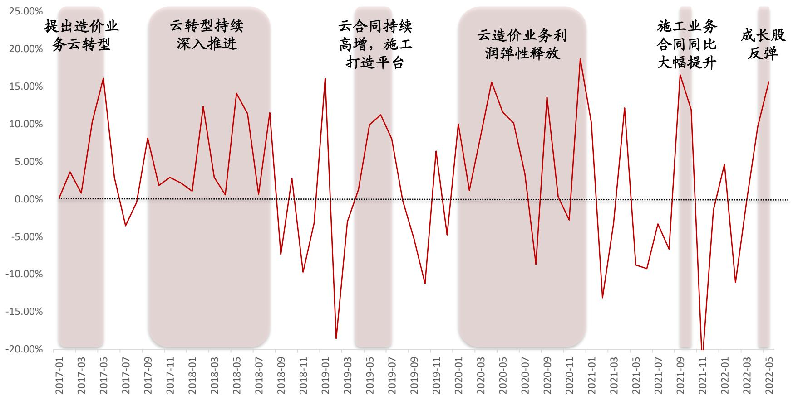  
图：2017年1月至2022年5月广联达相对申万计算机指数收益率分析（频率：月）  
资料来源：Wind、广联达官网、招商证券

# 1.1广联达相对收益复盘

上市至今，广联达相对申万计算机指数收益突出的行情阶段如下表所示，整体上可概括出以下特点。  
• “一次创业”期间，公司相对收益与建筑业投资增速相关联。2010至2016年，在我国基建投资保持快速增长的背景下公司软件产品快速渗透市场，取得了较高的市场份额，稳固行业龙头地位，带动公司估值提升。  
，商业模式变化带动估值提升。公司股价涨幅较多主要集中在“二次创业”阶段，随着2017年公司开启造价软件云转型，公司商业模式变化，估值体系由传统的PE估值转变为PS估值。  
• 盈利能力提升阶段有明显双击效应。2020/1至2021/1，公司相对收益率区间涨幅达到140.22%。2019年是公司业绩阵痛期，2020年公司业绩拐点出现，利润弹性释放，我们认为当公司转云进入收获期时，利润弹性释放将带来业绩及估值双向提升的双击效应。

表：上市至今广联达相对收益率突出行情汇总  

<table><tr><td rowspan="2">时间段</td><td rowspan="2">广达区 计算机指数</td><td rowspan="2"></td><td rowspan="2">联收区间持续时间</td><td rowspan="2"></td><td rowspan="2">行情主线</td></tr><tr><td></td></tr><tr><td>2010/6至2010/12</td><td>141.18%</td><td>24.49%</td><td>116.69%</td><td>7</td><td>新股红利期，基建投资加速。2008-2011年，我国4万亿元的投资规划以扩大 内需，基建投资增速保持快速增长</td></tr><tr><td>2011/6至2011/10</td><td>18.83%</td><td>-3.59%</td><td>22.42%</td><td>5</td><td>产品渗透率提升，业绩快速增长</td></tr><tr><td>2012/5至2012/6</td><td>25.08%</td><td>-2.12%</td><td>27.20%</td><td>2</td><td>产品渗透率提升，业绩快速增长</td></tr><tr><td>2013/1至2013/7</td><td>75.21%</td><td>40.84%</td><td>34.37%</td><td>7</td><td>算行情，从建资点，国要求推进“5)重大项目期实</td></tr><tr><td>2013/10至2014/1</td><td>78.93%</td><td>12.94%</td><td>65.99%</td><td>4</td><td>TMT板块行情，基建持续高景气</td></tr><tr><td>2014/12至2015/1</td><td>27.07%</td><td>9.66%</td><td>17.42%</td><td>2</td><td>牛市，全市场普涨</td></tr><tr><td>2015/7至2015/8</td><td>7.31%</td><td>-34.34%</td><td>41.64%</td><td>2</td><td>计算机板块大跌，同期广联达逆势上涨带来超额相对收益</td></tr><tr><td>2016/6至2016/8</td><td>32.87%</td><td>4.08%</td><td>28.79%</td><td>3</td><td>新开工面积回升，业绩拐点。2015年我国新开工面积同比下降影响公司业绩， 2016年国家开始推行PPP模式，基建投资增速高位企稳，同年新开工面积同 比增长，公司业绩出现拐点</td></tr><tr><td>2016/12至2017/6</td><td>21.90%</td><td>-15.37%</td><td>37.26%</td><td>7</td><td>值据价业务云转型。17年公司开启云转型试点，商业模式正式转变，</td></tr><tr><td>2017/9至2018/8</td><td>60.92%</td><td>-18.38%</td><td>79.31%</td><td>12</td><td>云转型持续深入</td></tr><tr><td>2019/4至2019/7</td><td>18.53%</td><td>-11.78%</td><td>30.30%</td><td>4</td><td>云合同持续高增，施工打造“平台+组件”。公司17/18年转云地区转化率及 续费率表现突出，转云进展顺利</td></tr><tr><td>2020/1至2021/1</td><td>144.72%</td><td>4.50%</td><td>140.22%</td><td>13</td><td>云造价业务利润弹性释放。受云转型影响，2019年公司净利润同比下滑， 2020年公司盈利能力拐点，云业务净利率开始提升，净利率提升趋势有望持</td></tr><tr><td>2021/9至2021/10</td><td>28.95%</td><td>-1.30%</td><td>30.26%</td><td>2</td><td>续贯穿“八三”规划。 施工业务合同同比大幅提升，拐点出现</td></tr><tr><td>2022/4至2022/5</td><td>9.08%</td><td>-15.22%</td><td>24.30%</td><td>2</td><td>成长股反弹</td></tr></table>

资料来源：Wind、招商证券

# 1.2“一次创业”重点复盘

广联达在第一次创业期间以造价软件业务为核心，公司通过自主研发及投资并购不断打磨产品矩阵，把握建筑信息化高速发展的机遇产品迅速抢占市场，截至2016年，公司已占据工程造价大部分市场。我们通过投资并购、业绩、行业及估值对公司2010至2016年收益进行复盘，并总结出以下特点。

• 上市初期借助资本力量实现快速扩张。上市之前，北京及华北地区是广联达优势区域，上市后，公司先后收购兴安得力软件及杭州掣洲软件，借助收购公司的在华东及华南地区的销售渠道及客户基础成功实现了造价业务的区域扩张。此外，公司收购芬兰ProgmanOy完成海外布局。

• 产品矩阵不断丰富，造价龙头地位确立。“一次创业”期间，公司基于已有成熟的计价和算量系列软件，积极孵化了工程造价新产品，从土建向水利、电力等多个领域拓展；材料信息采集业务于2011年开展，为后来公司云造价业务奠定了基础。

区域及产品双向扩张助力公司市占率快速提升，业绩快速增长是公司市值增长的主要驱动因素。“一次创业” 期间固定资产基础投资同比增速保持高位，造价软件渗透率持续提升。公司通过上市进一步提升企业知名度，产品快速抢占市场，截至2016年广联达造价软件占据了国内大部分造价市场。我们认为此时公司估值体系主要为PE估值，业绩快速增长是公司市值增长的主要驱动因素。在2012/2014/2015年，受宏观经济影响公司业绩表现不佳，公司相对收益率为负。

表：2010年至2016年广联达相对收益率逐年分析  

<table><tr><td></td><td>区间相对</td><td>年值</td><td></td><td>营收增速</td><td>凈利润增速</td><td>投资并购</td><td>固定资产基础设施投资</td></tr><tr><td>2010</td><td>116.70%</td><td></td><td>77.44</td><td>46.00%</td><td>57.63%</td><td>北京梦龙软件</td><td>21.61%</td></tr><tr><td>2011</td><td>4.99%</td><td>45.85</td><td>32.00</td><td>65.05%</td><td>68.89%</td><td>上海兴安得力软件</td><td>12.13%</td></tr><tr><td>2012</td><td>-16.45%</td><td>28.88</td><td>22.47</td><td>36.31%</td><td>10.77%</td><td></td><td>8.14%</td></tr><tr><td>2013</td><td>76.93%</td><td>14.21</td><td>34.67</td><td>37.43%</td><td>58.17%</td><td></td><td>23.73%</td></tr><tr><td>2014</td><td>-39.61%</td><td>28.41</td><td>28.27</td><td>26.33%</td><td>22.06%</td><td>杭州掣洲软件、芬兰 Progmanoy</td><td>21.28%</td></tr><tr><td>2015</td><td>-77.27%</td><td>69.64</td><td>84.78</td><td>-12.73%</td><td>-59.41%</td><td></td><td>19.09%</td></tr><tr><td>2016</td><td>11.85%</td><td>48.49</td><td>38.63</td><td>32.15%</td><td>74.85%</td><td></td><td>18.20%</td></tr></table>

资料来源：Wind、广联达年报、招商证券

# 1.3“二次创业”重点复盘

广联达在第二次创业期间股价表现尤为优异，我们认为公司“七三”规划（2017-2019年）中，将传统造价业务转变为Saa模式至关重要。我们通过业绩、估值以及公司基本面变化等多个维度对公司2017至2020年相对收益率进行逐年复盘。

• 2017年至今，公司市值提升的主要原因为估值体系的转变。“一次创业”期间，广联达造价产品已经有较高的市场地位，凭借自身极强的产品力，公司开启造价业务云转型。云计算的商业模式让广联达造价软件做到更快迭代，用户体验感更好，增强了用户粘性，并转化了部分潜在的盗版用户。我们认为广联达在转云期间，合同负债快速增长，表观净利润逐渐失真，因此公司逐渐转变为PS估值。2018至2020年公司签订云合同分别为6.55/14/22.34亿元，同比分别增长274%/114%/60%，云转型取得显著成效，是公司PS估值体系成立的关键。

利润弹性释放带动2020年PS估值快速提升。2020年公司云业务收入占比达到 $5 8 \%$ ，云转型已经取得阶段性成功，公司业绩在2019/2020年迎来拐点，我们认为公司造价业务利润拐点意味着公司云业务续费率保持较高水平，续签合同销售费用率下降提升公司整体盈利能力，现金流持续改善。此时我们判断公司云转型正式进入收获期，公司PS估值快速提升，公司2019年末PS静态估值为10.83倍，2020年末PS静态估值上涨至23.31倍，上涨超过 $1 0 0 \%$ 。

表：2017年至今广联达相对收益率逐年分析  

<table><tr><td></td><td>区间相对涨幅</td><td>年PS值PS</td><td></td><td>营收增速</td><td>凈利润增速</td><td>分析</td></tr><tr><td>2017</td><td>49.17%</td><td>6.93</td><td>9.31</td><td>15.28%</td><td>17.65%</td><td>2017年公司开启云转型试点，公司估值体 系变化。公司主要业绩仍来源于License销 售，营收利润保持稳定增长。</td></tr><tr><td>2018</td><td>30.33%</td><td>7.55</td><td>8.07</td><td>22.30%</td><td>-0.61%</td><td>2018年公司云业务占比逐步提升。公司营 收保持稳定增长，云转型持续投入净利润 同比持平。</td></tr><tr><td>2019</td><td>19.48%</td><td>6.62</td><td>10.83</td><td>21.06%</td><td>-53.36%</td><td>2019年公司优势地区基本完成云转型，云 收入占比快速提升。公司营收保持稳定增 长，云转型投入加大公司净利润同比下降。 2020年公司云转型进入搏杀地区，云收入</td></tr><tr><td>2020</td><td>121.11%</td><td>9.57</td><td>23.31</td><td>13.94%</td><td>57.95%</td><td>占比约6润大阅制模式平衡公司营收增， 公司利润弹性逐步释放。</td></tr></table>

资料来源：Wind、广联达年报、招商证券

# CMS招商证券 1.3“二次创业”重点复盘

• 2017至2020年期间，公司股价相对申万计算机指数收益率凸显，在48个月的时间中，共计35个月跑赢申万计算机指数，超额收益概率为72.91%。

• 逐年看，2017年公司共计10个月跑赢申万计算机指数，2018年共计9个月跑赢指数，2019年共计6个月跑赢指数，2020年共计10个月跑赢指数，超额收益率分别为83.33%、 $7 5 \%$ 、 $5 0 \%$ 、 $8 3 . ~ 3 3 \%$ 。

  
20%表：2017年广联达相对收益率（频率：月）

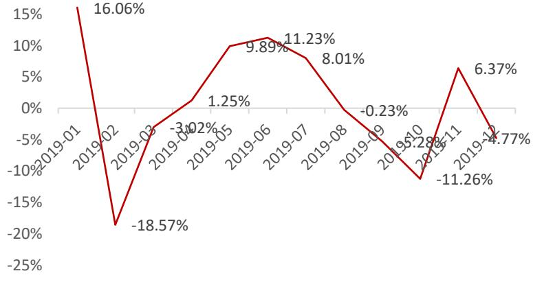  
$20 \%$ 表：2019年广联达相对收益率（频率：月）  
资料来源：Wind、广联达年报、招商证券

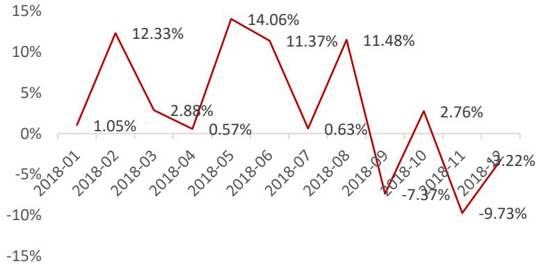  
表：2018年广联达相对收益率（频率：月）

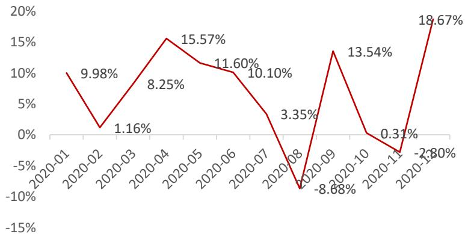  
表：2020年广联达相对收益率（频率：月）

# 1.4 PS估值变化的测算印证

前文所述，广联达在2017年后具备超额收益的主要原因在于估值体系变化及PS估值提升。广联达相对收益率可以分为两个阶段：稳定增长（2017-2019）；快速增长（2020），我们通过对比海外公司以及公司造价实际盈利能力测算侧面印证了我们的假设。

· 稳定增长（2017-2019)：我们认为商业模式以及估值方式的改变是公司该阶段具备超额相对收益的主要原因。2017年开始，公司造价业务的商业模式由传统License销售向订阅制转变，云产品可以做到即时更新迭代，带给用户更好的体验，加深了用户粘性，产品力优势进一步放大。转云前期公司表观净利润失真，因此公司估值方式由PE估值向PS估值改变。

· 快速增长（2020)：我们认为该阶段公司相对收益率快速提升的主要原因为净利率提升带来业绩估值双击效应。通过我们此前在《海外SaaS企业的估值差异——云计算专题系列（九）》中首次总结提出影响SaaS企业估值的关键要素：可达业务空间TAM和净利率提升潜力。其中，净利率提升一般主要由销售费用率削减、产品涨价、毛利率提升等因素主导。公司业绩在2019/2020年迎来拐点，现金流持续改善，由此我们判断公司云转型正式进入收获期，公司PS估值快速提升。

• 公司营业利润率在2020年触底反弹。参考我们此前发布的《广联达深度：云转型利润弹性如何？——云深知处系列(一)》，公司2017-2021年造价业务还原后营业利润率约为39.82%、36.55%、31.68%、37.28%、40.81%，我们认为造价业务因转云而导致的营业利润率短期下滑已于2020年触底反弹。其中，我们判断销售费用率下降是云业务利润率提升的关键。

  
50%图：2017-2021公司造价业务实际盈利能力测算  
资料来源：Wind、广联达年报、招商证券

表：2018-2021公司续签合同销售费用率测算（单位：亿元）  

<table><tr><td></td><td>2017</td><td>2018</td><td>2019</td><td>2020</td><td>2021</td></tr><tr><td>云业务销售费用 预测</td><td>0.57</td><td>1.8</td><td>3.9</td><td>5.81</td><td>7.44</td></tr><tr><td>新签云合同</td><td>1.75</td><td>5.06</td><td>8.76</td><td>10.02</td><td>11.34</td></tr><tr><td>新签云合同销售 费用率预测</td><td>32.60%</td><td>30%</td><td>32%</td><td>34%</td><td>35%</td></tr><tr><td>续签合同</td><td></td><td>1.49</td><td>5.24</td><td>12.32</td><td>19.66</td></tr><tr><td>续签合同销售费 用率测算</td><td></td><td>18.82%</td><td>20.94%</td><td>19.52%</td><td>17.63%</td></tr></table>

# 一、广联达相对收益历史行情复盘

二、广联达绝对收益历史行情复盘

2.1 商业模式创新公司表现逆经济周期行情

2.2广联达营收与新开工面积关联分析

2.3广联达与海外SaaS上市企业绝对收益对比

三、云造价高歌猛进，施工业务砥砺前行

四、估值、人效、持仓分析及投资建议

# 招商证券2.1 商业模式创新公司表现逆经济周期行情

广联达具备明显的抗经济周期属性。根据我们的报告《计算机何时会有超额收益——深度复盘系列（一）：计算机历史行情回顾》，当技术变革来临时，强成长性或是商业模式的创新改进会驱动板块/代表性个股的逆经济周期行情。

从下图中我们发现，上市至2018年，广联达绝对收益率与我国固定基础设施投资额同比增速有较强关联。从2010年5月至2017年12月，我国固定基础设施投资额同比增速平均值为17.41%，广联达累计绝对收益率达到353.38%。

2018年后，公司体现出较强的逆经济周期行情，在我国固定基础设施投资额投同比增速快速下滑的大环境下，广联达通过云转型等商业模式的创新降低了风险，股价反呈现快速增长表现。

# 图：广联达绝对收益率（累计值）vs我国固定基础设施投资额同比增速

10年5月至12月、13年1月至14年2月、15年1月至  
15年5月，公司绝对收益率与我国固定基础设施

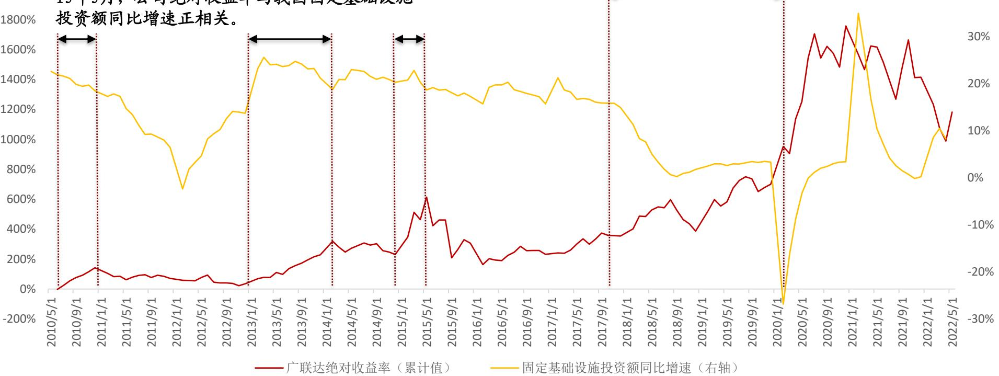  
2018年我国固定基础设施投资同比增速快速回落，但广联达股价走势强劲，并未受到宏观经济影响。  
资料来源：Wind、招商证券

# CMS招商证券2.2广联达营收与新开工面积关联分析

通过对比2010年至2021年新开工面积与公司营收情况，我们认为广联达营收与建筑业新开工面积相关联。

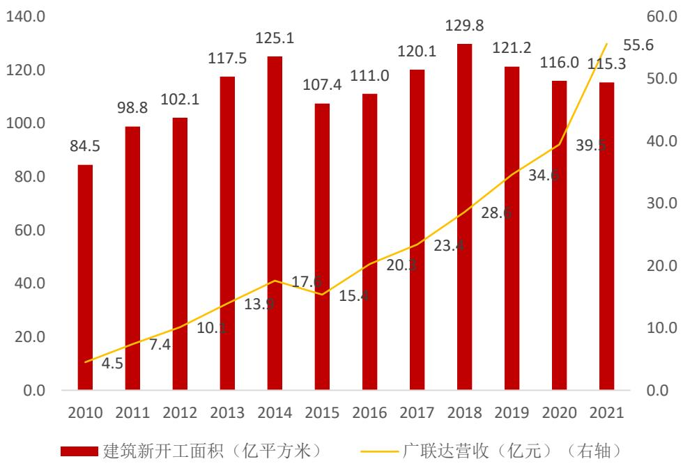  
图：2010至2021建筑新开工面积vs广联达营收

  
图：2011至2021建筑新开工面积同比vs广联达营收同比

· 阶段一（2010至2018年），广联达营收与我国建筑新开工面积成正比。2015年我国新开工面积同比下滑14.1%，同期广联达营收同比下滑12.8%。

· 阶段二（2018至2021年），随着广联达造价业务云转型顺利开展，订阅制收费模式客户粘性更强，付费稳定，公司营收与我国建筑业新开工面积关联减弱。2018年至2021年，我国新开工面积逐年下滑，但公司营收从2018年28.62亿元提升至2021年55.61亿元。

# 2.2广联达营收与新开工面积关联分析

为进一步证实云转型后公司营收与建筑业新开工面积关联度减弱。我们将广联达分季度营收同比增速设为Y，中国建筑业分  
季度新开工面积同比增速设为X，进行拟合。  
• 在广联达造价业务云转型之前，2011至2016年，我们得到回归方程Y=2.3673X+0.1962，R²为0.5219；广联达营收增速与建筑业新开工面积成正比。  
在广联达造价业务云转型之后，2010年至2021年，我们得到回归方程Y=1.5872X+0.2289，R²为0.3497，较之前有所下降；因此广联达营收增速与建筑业新开工面积关联度减弱。  
· 受疫情及财政影响，今年地方政府投资建设有所放缓；房地产公司在预售资金监管及保交付要求下，目前拿地意愿不强，新开工面积持续下滑，但我们认为广联达营收依然能保持稳定增长。

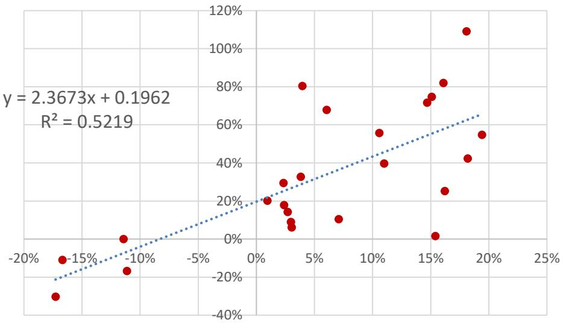  
图：2011至2016广联达营收增速与建筑新开工面积增速线性拟合图  
资料来源：Wind、招商证券

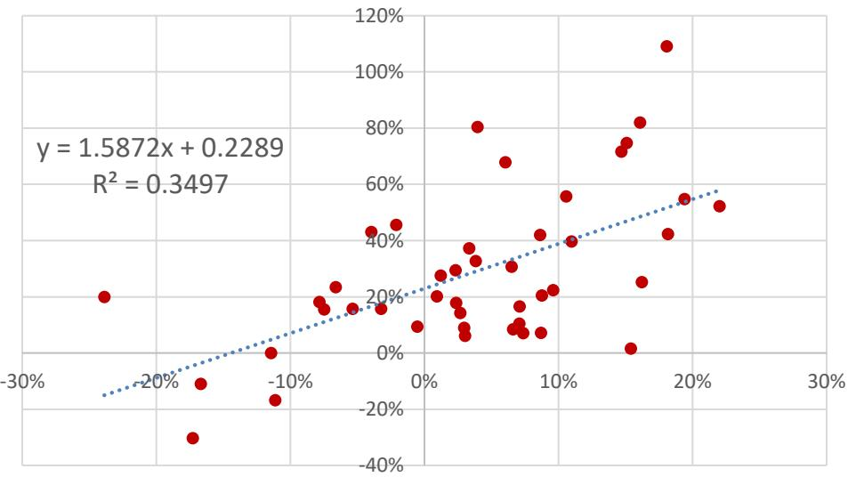  
图：2010至2021广联达营收增速与建筑新开工面积增速线性拟合图

# CMS招商证券2.3 广联达与海外SaaS上市企业绝对收益率对比

我们通过对比广联达与Autodesk、Salesforce、Adobe等全球头部SaaS公司2017年至今的绝对收益率曲线，我们发现广联达走势与全球头部SaaS公司基本一致，因此我们判断在2017年广联达开启云转型之后，市场已经认为广联达可以享有全球头部SaaS企业的估值。

• 2017年至今，A股头部SaaS公司中广联达绝对收益率最高，且与我们列举的海外头部SaaS公司期间绝对收益率平均值基本匹配。  
• 成长型公司更注重远期空间，本轮美国加息影响远期现金流折现，是海外SaaS过去半年下跌的主要原因，我们认为广联达同样受此影响。

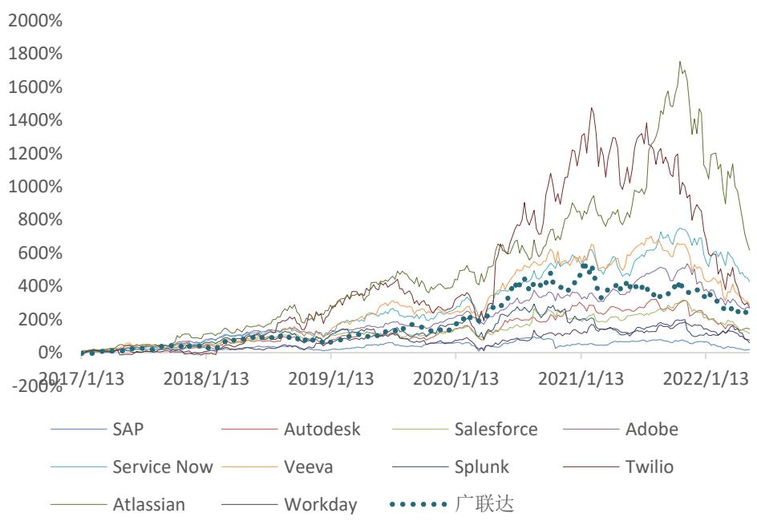  
图：2017至2022年5月全球SaaS龙头企业与广联达绝对收益率（累计值）曲线对比  
资料来源：Wind、招商证券

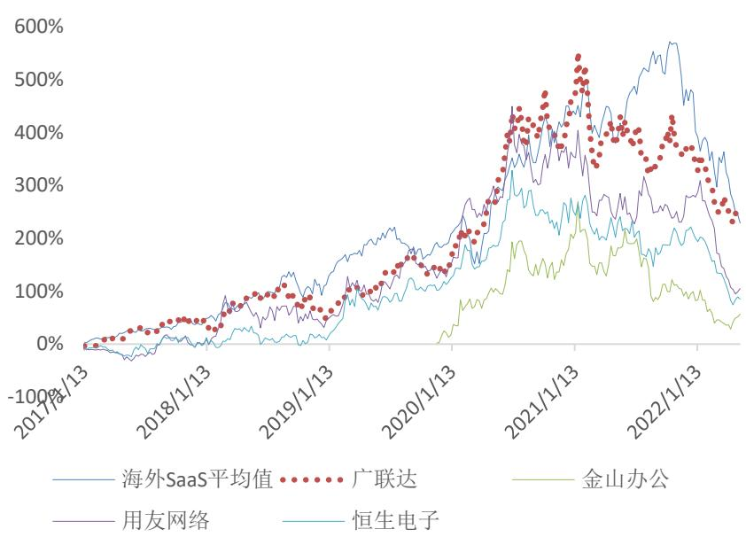  
图：2017至2022年5月全球SaaS龙头企业绝对收益率平均值与广联达、金山办公、用友网络、恒生电子绝对收益率（累计值）曲线对比

# 一、广联达相对收益历史行情复盘

二、广联达绝对收益历史行情复盘

三、云造价高歌猛进，施工业务砥砺前行

3.1 造价业务云转型效果显著

3.2 施工业务复盘，进入快速增长周期

四、估值、人效、持仓分析及投资建议

# CMS招商证券3.1造价业务云转型效果显著

下图对广联达造价业务云转型进行梳理。2021年，公司完成最后四个区域的造价业务云转型，至此云造价业务实现大陆区域 $1 0 0 \%$ 覆盖。

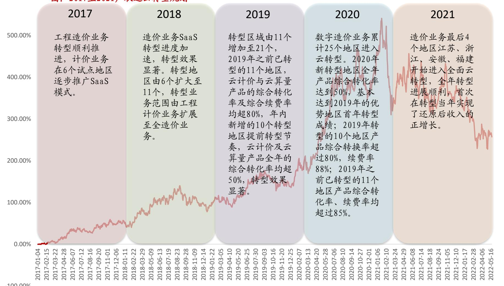  
资料来源：Wind、广联达年报、招商证券

# CMS招商证券3.1造价业务云转型效果显著

通过2017至2021五年时间，广联达基本完成造价业务云转型，转云效果显著。

表：造价业务云转型转化率及续费率（截至2021年）  

<table><tr><td>转型地区（按年份）</td><td>转云地区数</td><td>转化率</td><td>续费率</td></tr><tr><td>2017/2018</td><td>11</td><td>&gt;85%</td><td>&gt;85%</td></tr><tr><td>2019</td><td>10</td><td>&gt;85%</td><td>&gt;90%</td></tr><tr><td>2020</td><td>4</td><td>80%</td><td>&gt;85%</td></tr><tr><td>2021</td><td>4</td><td>&gt;60%</td><td>NA</td></tr></table>

截至2021年末，公司云造价业务收入25.61亿元，造价业务收入占比由2018年 $1 8 \%$ 提升至2021年 $6 7 \%$ 。2021年新签云合同31亿元，2018至2021年新签云合同同比增速分别为 $2 7 4 \%$ 、 $1 1 4 \%$ 、 $6 0 \%$ 、 $3 9 \%$ ，因此我们判断公司云业务转型已经接近尾声。

表：造价业务经营情况（单位：亿元）  

<table><tr><td></td><td>2018</td><td>2019</td><td>2020</td><td>2021</td></tr><tr><td>营业收入</td><td>20.57</td><td>24.52</td><td>27.91</td><td>38.13</td></tr><tr><td>同比</td><td>25%</td><td>19%</td><td>14%</td><td>37%</td></tr><tr><td>其中，云收入</td><td>3.7</td><td>9.21</td><td>16.22</td><td>25.61</td></tr><tr><td>同比</td><td>722%</td><td>149%</td><td>76%</td><td>58%</td></tr><tr><td>云收入占比</td><td>18%</td><td>38%</td><td>58%</td><td>67%</td></tr><tr><td>签署云合同</td><td>6.55</td><td>14</td><td>22.34</td><td>31</td></tr><tr><td>同比</td><td>274%</td><td>114%</td><td>60%</td><td>39%</td></tr><tr><td>期末云合同负债</td><td>4.14</td><td>8.94</td><td>15.06</td><td>20.47</td></tr><tr><td>同比</td><td>207%</td><td>116%</td><td>69%</td><td>36%</td></tr></table>

资料来源：Wind、广联达年报、招商证券

# 3.2 施工业务复盘，进入快速增长周期

“七三”规划至今，广联达施工业务形态不断转变，目前形成了 $\mathrm { B I M + }$ 智慧工地以及项企一体化双轨推进的发展模式。截至2021年末，数字施工项目级产品累计服务项目数突破5.5万个，累计服务客户超过5000家。

• 2017至2021年，公司智慧施工业务稳定增长，复合增速为 $2 1 . 2 5 \%$ 。

• 随着施工业务逐步放量，硬件设备在产品结构中占比提升，施工业务毛利率逐年下降。

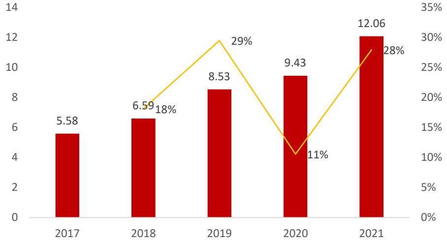  
图：2017至2021年施工业务及增速（单位：亿元）  
资料来源：Wind、广联达年报、招商证券

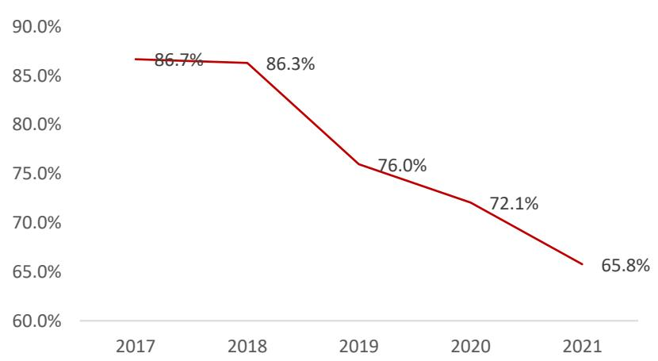  
图：2017至2021年施工业务毛利率

# 3.2 施工业务复盘，进入快速增长周期

2020年在疫情的影响下，公司调整施工业务战略，在经营过程中强化回款，在客户和项目规模化发展的同时保证经营性现金流的健康增长，保障了经营质量。未来公司将持续提升数字施工产品价值闭环，提升合同转化，并对外开放数字项目集成管理平台，2022年智慧施工业务增长目标为 $3 0 \%$ 。

• 2019年开始，公司应收账款占施工业务营收比重逐年下降，21年应收账款占施工业务营收 $4 1 \%$ ，占比较2020年下降4个百分点。公司通过上半年优先拓展合同扩大增量，下半年重点落实交付保障收入和回款的策略实现了业务的规模化扩张。• 2020年公司经营净现金流明显好转，除施工业务保障了项目回款外，造价业务云转型后逐渐演变为现金流业务也将为公司提供充足的现金保障。

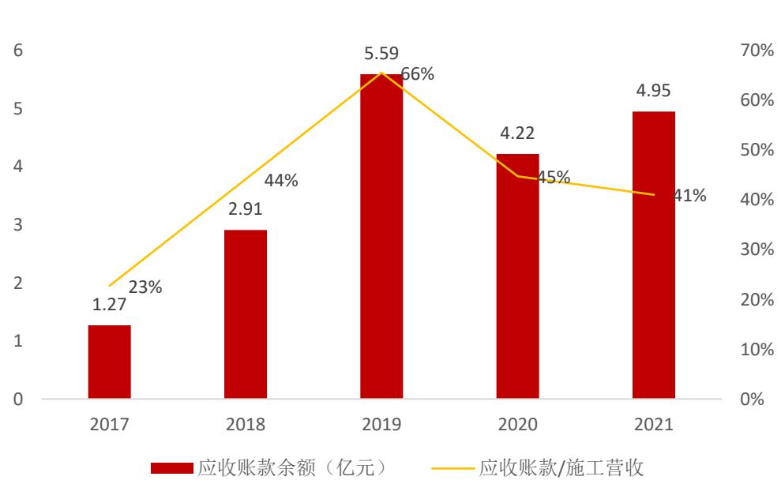  
图：2017至2021年公司应收账款变化  
资料来源：Wind、招商证券

  
图：2017至2021年公司经营净现金流及增值（单位：亿元）

一、广联达相对收益历史行情复盘  
二、广联达绝对收益历史行情复盘  
三、云造价高歌猛进，施工业务砥砺前行  
四、估值、人效、持仓分析及投资建议  
4.1PE、P/0CF、PS估值对比分析  
4.2 人效分析，造价业务进入收获期  
4.3 机构持仓保持在较高水平  
4.4复盘总结及投资建议

# 4.1 PE、P/OCF、PS估值对比分析

我们分析广联达上市以来动态估值情况，考虑到公司SaaS业务属性，我们认为目前PS估值及P/OCF估值较为适合公司，PE估值受季节性波动影响较大。  
• 目前公司PE（ttm）估值约为89.40倍，2010年6月30日至2022年3月31日平均值为84.96。  
• 目前公司Ρ/0CF（ttm）估值约为44.13倍，2010年6月30日至2022年3月31日平均值为49.40。  
• 目前公司PS（ttm）估值约为10.01倍，2010年6月30日至2022年3月31日平均值为13.13。

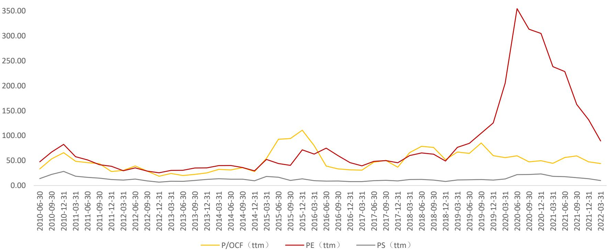  
图：2020/6/30至2022/3/31广联达动态估值对比分析  
资料来源：Wind、招商证券

# 4.2 人效分析，造价业务进入收获期

通过技术变革，广联达人效持续提升，造价业务已进入收获期。根据我们的报告《计算机何时会有超额收益——深度复盘系列（一)：计算机历史行情回顾》提出的“计算机企业的人效成长曲线”，结合不同企业员工数量和人均毛利的变化，企业可以分为黄金成长期、扩张期以及收获期。我们认为公司造价业务云转型已经成功，标志着造价业务正式进入收获期，暨投入出现回报，人员扩张需求减缓，人效转而提升，利润加速释放。

• 上市后公司人效整体保持增长趋势，2015年人均毛利下降主要系受我国新开工面积同比下降导致公司营收同比下降，但公司人员同期增长约5%。

• 软件特性助推公司人效稳定提升。公司造价软件前期快速渗透市场，规模化放量且维持高毛利率水平，是公司早期人效保持增长的主要原因。2017年后公司造价业务开启云转型，通过商业模式的改变公司能够更快将新研发的增值服务推送给用户，提升用户体验同时提升造价软件ARPU值，我们判断现阶段公司造价产品依然有较大成长空间。

· 施工业务处于扩张期。公司施工解决方案已经进入规模化放量阶段，施工业务人员正处于快速扩张期，暨新研发投入/拓展业务投入较高但短期无显著回报，人效下降，利润短期承压。

  
图：2010至2021年广联达人均创收、人均毛利、人均创利分析（单位：万元）  
资料来源：Wind、招商证券

# 4.3 机构持仓保持在较高水平

# 广联达机构持仓保持在较高水平。

· 截至2022Q1，广联达机构持仓占公司总股本 $3 9 . 3 \%$ ，仍处于历史较高水平。其中历史最高持仓比例发生在2021年6月30日，机构持仓占比达到了48.70%。

・ 截至2022年5月26日，广联达深港通持股占占公司总股本 $9 . 7 4 \%$ ，仍处于历史较高水平。其中历史最高持仓比例发生在2021年7月14日，深股通持仓占比达到了12.89%。

  
图：2017至2022Q1广联达机构持仓占比  
资料来源：Wind、招商证券

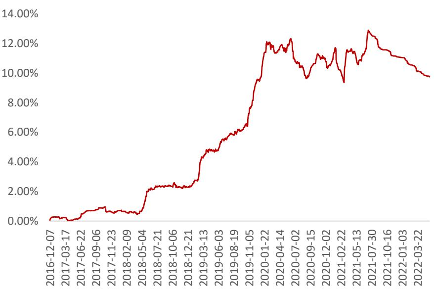  
图：2017至2022Q1深港通持股占比

# 4.4复盘总结及投资建议

# 通过分析广联达历史收益率，我们总结了一下几个要点。

• 广联达业绩表现及涨跌幅表现与经济周期关联度逐渐减弱。云转型前广联达涨幅与我国固定基础设施投资额同比增速有较强关联，云转型后公司商业模式转变为订阅制，与经济周期关联度逐渐减弱，在2018年后我国建筑业景气度下滑下公司依然有较大超额收益。

· 造价业务云转型净利率弹性拐点出现在2019/2020年，我们判断2022年公司云造价业务盈利能力仍将提升。在公司“七三”规划制定造价业务云转型目标后，公司呈现较强超额收益。我们认为公司造价业务云转型有两个拐点。第一个拐点出现在2016/2017年，公司开启转云，凭借已有的市场地位及市场份额，转云后公司云合同快速增长，商业模式升级带动估值由PE向PS转变。第二个拐点出现在2019/2020年，是公司转云后净利润拐点，我们认为公司造价业务利润拐点意味着公司云业务续费率保持较高水平，续签合同销售费用率下降提升公司整体盈利能力，现金流持续改善。此时我们判断公司云转型正式进入收获期，公司PS估值快速提升。通过测算，我们认为2022年公司云造价业务净利率仍将提升，业绩有望保持高速增长，公司仍具备利润、估值双向提升的潜力。

# 同时，我们认为关注公司以下几个要素点变化是把握公司投资机会的关键。

• 我们认为公司云转型红利已经兑现，未来应更关注TAM的提升。根据我们此前在《海外SaaS企业的估值差异——云计算专题系列（九)》中提出影响SaaS企业估值的关键要素为可达业务空间TAM和净利率提升潜力。其中，净利率提升潜力在2019/2020年迎来拐点，并逐步兑现；因此广联达TAM变化是把握广联达投资时点的重要指标，我们认为公司TAM变化受几个点影响，1）造价业务市场容量的提升；2）智慧施工产品在建筑业渗透率提升；3）设计软件推出，行业天花板打开。

• 因此，在造价业务端，我们认为公司应用AI技术为造价软件带来新增附加价值提升客户ARPU值至关重要要；此外，广联达近年来在基建领域不断探索新产品，造价业务拼图不断壮大；在成本管控端公司同样布局了新产品，有望在地产领域率先落地。在施工业务端，公司同样发力基建业务，产品不断丰富的同时积极寻求行业头部企业的合作。

投资建议：我们认为公司未来在造价业务端将重点推进增值服务提升ARPU值，造价业务天花板仍有较大提升空间；在施工业务端，公司将持续发力企项一体化战略，智慧施工将以中大企业为中心向中小企业及项目、工地辐射，施工业务有望保持快速增长。从PS估值角度看，目前公司估值低于历史平均水平，我们预计22至24年公司实现归母净利润9.60/13.33/16.89亿元，维持“强烈推荐”投资评级。

1、造价业务续费率下滑。若受宏观经济下滑影响，建筑业景气度下滑，建筑单位削切开支，公司云造价业务续费率下滑，则对公司营收及利润有较大影响。

2、施工业务推进不及预期。施工业务行业竞争较为激烈，若公司无法持续保持竞争力，则施工业务推进将面临重大挑战。  
若受宏观经济影响，我国建筑业景气度下滑，新开工项目减少，则施工业务推进可能不及预期。

3、设计软件研发进度不及预期。公司设计软件目前仍处于研发阶段，若公司设计软件研发进展低于预期，则会对公司未来CAD/BIM等业务技术迭代造成有较大影响。

1、《广联达深度：云转型利润弹性如何？——云深知处系列(一)》  
2、《海外SaaS企业的估值差异——云计算专题系列（九）》  
3、《计算机何时会有超额收益——深度复盘系列（一）：计算机历史行情回顾》  
4、《多因素共振，深度回调后长期配置价值凸显——深度复盘系列（二）：证券IT行情及展望》

# CMS招商证券 附：财务预测表

表：资产负债表  
表：利润表  

<table><tr><td colspan="10">表：资产负债表 表：利润表</td></tr><tr><td>单位：百万元</td><td>2020</td><td>2021</td><td>2022E</td><td>2023E</td><td>2024日</td><td>单位：百万元</td><td>2020</td><td>2021</td><td>2022E</td><td>2023E 202</td></tr><tr><td>流动资产</td><td>5420</td><td>5122</td><td>4341</td><td>4970</td><td>7081</td><td>营业总收入</td><td>4005</td><td>5619</td><td>7224</td><td>8999 109</td></tr><tr><td>现金</td><td>4797</td><td>4050</td><td>3000</td><td>3300</td><td>5047</td><td>营业成本</td><td>454</td><td>893</td><td>1119 1388</td><td>17</td></tr><tr><td>交易性投资</td><td>0</td><td>0</td><td>0</td><td>0</td><td>0</td><td>营业税金及附加</td><td>38</td><td>46</td><td>59</td><td>73</td></tr><tr><td>应收票据</td><td>7</td><td>29</td><td>38</td><td>47</td><td>57</td><td>营业费用</td><td>1256</td><td>1587</td><td>1965</td><td>2358 27</td></tr><tr><td>应收款项</td><td>422</td><td>495</td><td>611</td><td>762</td><td>926</td><td>管理费用</td><td>879</td><td>1099</td><td>1364 1623</td><td>19c</td></tr><tr><td>其它应收款</td><td>77</td><td>75</td><td>97</td><td>120</td><td>147</td><td>研发费用</td><td>1083</td><td>1333</td><td>1751 2154</td><td>26</td></tr><tr><td>存货</td><td>26</td><td>71</td><td>80</td><td>99</td><td>122</td><td>财务费用</td><td>(17)</td><td>(53)</td><td>(43)</td><td>(33)</td></tr><tr><td>其他</td><td>91</td><td>402</td><td>515</td><td>642</td><td>781</td><td>资产减值损失</td><td>(21)</td><td>(27)</td><td>(20)</td><td>(20)</td></tr><tr><td></td><td>425</td><td>4946</td><td>4759</td><td></td><td></td><td></td><td>0</td><td>0</td><td>0</td><td>0</td></tr><tr><td>非流动资投资</td><td></td><td></td><td></td><td>4591</td><td>4440</td><td>公允价值变动收</td><td></td><td></td><td></td><td></td></tr><tr><td>固定资产</td><td>810</td><td>824</td><td>837</td><td>848</td><td>858</td><td>其他收益</td><td>113</td><td>86</td><td>100</td><td>90 1</td></tr><tr><td>无形资产商誉</td><td>1653</td><td>1965</td><td>1768</td><td>1591</td><td>1432</td><td>投资收益</td><td>10</td><td>(16)</td><td>5</td><td>$10</td></tr><tr><td>其他</td><td>1409</td><td>1832</td><td>1829</td><td>1826</td><td>1824</td><td>营业利润</td><td>414</td><td>758</td><td>1094 1517</td><td>19</td></tr><tr><td>资产计</td><td>95</td><td></td><td>916</td><td></td><td>1521</td><td>营业外收</td><td>26</td><td>$1frac}$</td><td>1∞</td><td></td></tr><tr><td></td><td></td><td>106</td><td></td><td>95544</td><td></td><td></td><td></td><td></td><td></td><td>18</td></tr><tr><td></td><td></td><td></td><td></td><td></td><td></td><td></td><td></td><td></td><td></td><td>13116</td></tr><tr><td></td><td></td><td></td><td></td><td></td><td></td><td></td><td></td><td></td><td></td><td></td></tr><tr><td></td><td></td><td></td><td></td><td></td><td></td><td></td><td></td><td></td><td></td><td></td></tr><tr><td></td><td></td><td>0</td><td></td><td></td><td></td><td></td><td>102530</td><td></td><td></td><td></td></tr><tr><td></td><td></td><td></td><td></td><td></td><td></td><td></td><td></td><td></td><td></td><td></td></tr><tr><td>长期借</td><td>0</td><td>0</td><td>0</td><td>0</td><td>0</td><td></td><td></td><td></td><td></td><td></td></tr><tr><td>其他</td><td>131</td><td>158</td><td>158</td><td>158</td><td>158</td><td></td><td></td><td></td><td></td><td></td></tr><tr><td>负债合计</td><td>2989</td><td>3795</td><td>6113</td><td>5412</td><td>5935</td><td></td><td></td><td></td><td></td><td></td></tr><tr><td>股本</td><td>1186</td><td>1189</td><td>1189</td><td>1189</td><td>1189</td><td></td><td></td><td></td><td></td><td></td></tr><tr><td>资本公积金</td><td>2869</td><td>2201</td><td>2201</td><td>2201</td><td>2201</td><td></td><td></td><td></td><td></td><td></td></tr><tr><td>留存收益 少数股东权益</td><td>2347 156</td><td>2397 485</td><td>(972) 569</td><td>73 685</td><td>1363 833</td><td></td><td></td><td></td><td></td><td></td></tr><tr><td></td><td></td><td></td><td></td><td></td><td></td><td></td><td></td><td></td><td></td><td></td></tr><tr><td>归属于母公司所有者</td><td>6402</td><td>5788</td><td>2419</td><td>3464</td><td>4753</td><td></td><td></td><td></td><td></td><td></td></tr><tr><td>负债及权益合计</td><td>9547</td><td>10068</td><td>9100</td><td>9561</td><td>11521</td><td></td><td></td><td></td><td></td><td></td></tr></table>

资料来源：Wind、招商证券

# 附：财务预测表

表：现金流量表  

<table><tr><td>单位：百万元</td><td>2020</td><td>2021</td><td>2022E</td><td>2023E</td><td>2024E</td></tr><tr><td>经营活动现金流</td><td>1876</td><td>1601</td><td>1527</td><td>1982</td><td>2452</td></tr><tr><td>净利润</td><td>381</td><td>719</td><td>1044</td><td>1450</td><td>1837</td></tr><tr><td>折旧摊销</td><td>134</td><td>193</td><td>298</td><td>280</td><td>263</td></tr><tr><td>财务费用</td><td>26</td><td>18</td><td>(43)</td><td>(33)</td><td>(23)</td></tr><tr><td>投资收益</td><td>(10)</td><td>16</td><td>(105)</td><td>(100)</td><td>(115)</td></tr><tr><td>营运资金变动</td><td>1351</td><td>743</td><td>327</td><td>377</td><td>480</td></tr><tr><td>其它</td><td>(6)</td><td>(88)</td><td>6</td><td>8</td><td>9</td></tr><tr><td>投资活动现金流</td><td>(697)</td><td>(1541)</td><td>(7)</td><td>(12)</td><td>3</td></tr><tr><td>资本支出</td><td>(439)</td><td>(720)</td><td>(112)</td><td>(112)</td><td>(112)</td></tr><tr><td>其他投资</td><td>(257)</td><td>(821)</td><td>105</td><td>100</td><td>115</td></tr><tr><td>筹资活动现金流</td><td>1357</td><td>(819)</td><td>(2570)</td><td>(1670)</td><td>(707)</td></tr><tr><td>借款变动</td><td>696</td><td>3959</td><td>1716</td><td>(1415)</td><td>(330)</td></tr><tr><td>普通股增加</td><td>57</td><td>4</td><td>0</td><td>0</td><td>0</td></tr><tr><td>资本公积增加</td><td>2437</td><td>(668)</td><td>0</td><td>0</td><td>0</td></tr><tr><td>股利分配</td><td>(1887)</td><td>(4273)</td><td>(4329)</td><td>(288)</td><td>(400)</td></tr><tr><td>其他</td><td>54</td><td>159</td><td>43</td><td>33</td><td>23</td></tr><tr><td>现金净增加额</td><td>2537</td><td>(760)</td><td>(1050)</td><td>300</td><td>1747</td></tr></table>

表：主要财务比率  

<table><tr><td></td><td>2020</td><td>2021</td><td></td><td>2022E2023E2024E</td><td></td></tr><tr><td>年成长率</td><td></td><td></td><td></td><td></td><td></td></tr><tr><td>营业总收入</td><td>13%</td><td>40%</td><td>29%</td><td>25%</td><td>22%</td></tr><tr><td>营业利润</td><td>43%</td><td>83%</td><td>44%</td><td>39%</td><td>27%</td></tr><tr><td>归母净利润</td><td>41%</td><td>100%</td><td>45%</td><td>39%</td><td>27%</td></tr><tr><td>获利能力</td><td></td><td></td><td></td><td></td><td></td></tr><tr><td>毛利率</td><td>88.7%</td><td>84.1%</td><td>84.5%</td><td>84.6%</td><td>84.4%</td></tr><tr><td>净利率</td><td>8.3%</td><td>11.8%</td><td>13.3%</td><td>14.8%</td><td>15.4%</td></tr><tr><td>ROE</td><td>6.8%</td><td>10.8%</td><td>23.4%</td><td>45.3%</td><td>41.1%</td></tr><tr><td>ROIC</td><td>6.7%</td><td>10.5%</td><td>18.3%</td><td>30.9%</td><td>36.2%</td></tr><tr><td>偿债能力</td><td></td><td></td><td></td><td></td><td></td></tr><tr><td>资产负债率</td><td>31.3%</td><td>37.7%</td><td>67.2%</td><td>56.6%</td><td>51.5%</td></tr><tr><td>净负债比率</td><td>0.0%</td><td>0.3%</td><td>19.2%</td><td>3.5%</td><td>0.0%</td></tr><tr><td>流动比率</td><td>1.9</td><td>1.4</td><td>0.7</td><td>0.9</td><td>1.2</td></tr><tr><td>速动比率</td><td>1.9</td><td>1.4</td><td>0.7</td><td>0.9</td><td>1.2</td></tr><tr><td>营运能力</td><td></td><td></td><td></td><td></td><td></td></tr><tr><td>总资产周转率</td><td>0.5</td><td>0.6</td><td>0.8</td><td>1.0</td><td>1.0</td></tr><tr><td>存货周转率</td><td>19.1</td><td>18.4</td><td>14.9</td><td>15.5</td><td>15.5</td></tr><tr><td>应收账款周转率</td><td>8.1</td><td>11.8</td><td>12.3</td><td>12.3</td><td>12.2</td></tr><tr><td>应付账款周转率</td><td>4.7</td><td>4.9</td><td>3.7</td><td>3.7</td><td>3.7</td></tr><tr><td>每股资料(元)</td><td></td><td></td><td></td><td></td><td></td></tr><tr><td>EPS</td><td>0.28</td><td>0.56</td><td>0.81</td><td>1.12</td><td>1.42</td></tr><tr><td>每股经营净现</td><td>1.58</td><td>1.35</td><td>1.28</td><td>1.67</td><td>2.06</td></tr><tr><td>每股净资产</td><td>5.38</td><td>4.86</td><td>2.03</td><td>2.91</td><td>3.99</td></tr><tr><td>每股股利</td><td>2.31</td><td>3.64</td><td>0.24</td><td>0.34</td><td>0.43</td></tr><tr><td>估值比率</td><td></td><td></td><td></td><td></td><td></td></tr><tr><td>PE</td><td>190.2</td><td>95.0</td><td>65.4</td><td>47.1</td><td>37.2</td></tr><tr><td>PB</td><td>9.8</td><td>10.9</td><td>26.0</td><td>18.1</td><td>13.2</td></tr><tr><td>EV/EBITDA</td><td>134.1</td><td>75.1</td><td>44.7</td><td>34.2</td><td>27.9</td></tr><tr><td></td><td></td><td></td><td></td><td></td><td></td></tr></table>

# 分析师承诺

负责本研究报告的每一位证券分析师，在此申明，本报告清晰、准确地反映了分析师本人的研究观点。本人薪酬的任何部分过去不曾与、现在不与，未来也将不会与本报告中的具体推荐或观点直接或间接相关。

刘玉萍：计算机行业首席分析师，北京大学汇丰商学院金融学硕士。优势领域云计算，2017年加入招商证券研究所，2020年入围水晶球最佳分析师。

周翔宇：计算机行业分析师，一年计算机行业研究经验，三年中小市值行业研究经验，曾获新财富中小市值第二名。

孟林：计算机行业分析师，中科院信息工程研究所硕士，两年四大行技术部工作经验，两年一级市场投资经验，2020年加入招商证券研究所。

# 投资评级定义

报告中所涉及的投资评级采用相对评级体系，基于报告发布日后6-12个月内公司股价（或行业指数）相对同期当地市场基准指数的市场表现预期。其中，A股市场以沪深300指数为基准；香港市场以恒生指数为基准；美国市场以标普500指数为基准。具体标准如下：

股票评级

强烈推荐：预期公司股价涨幅超越基准指数 $2 0 \%$ 以上增持：预期公司股价涨幅超越基准指数 $5 \mathrm { - } 2 0 \%$ 之间中性：预期公司股价变动幅度相对基准指数介于土 $5 \%$ 之间减持：预期公司股价表现弱于基准指数 $5 \%$ 以上

行业评级

推荐：行业基本面向好，预期行业指数超越基准指数中性：行业基本面稳定，预期行业指数跟随基准指数回避：行业基本面转弱，预期行业指数弱于基准指数

# 重要声明

本报告由招商证券股份有限公司（以下简称“本公司”）编制。本公司具有中国证监会许可的证券投资咨询业务资格。本报告基于合法取得的信息，但本公司对这些信息的准确性和完整性不作任何保证。本报告所包含的分析基于各种假设，不同假设可能导致分析结果出现重大不同。报告中的内容和意见仅供参考，并不构成对所述证券买卖的出价，在任何情况下，本报告中的信息或所表述的意见并不构成对任何人的投资建议。除法律或规则规定必须承担的责任外，本公司及其雇员不对使用本报告及其内容所引发的任何直接或间接损失负任何责任。本公司或关联机构可能会持有报告中所提到的公司所发行的证券头寸并进行交易，还可能为这些公司提供或争取提供投资银行业务服务。客户应当考虑到本公司可能存在可能影响本报告客观性的利益冲突。

本报告版权归本公司所有。本公司保留所有权利。未经本公司事先书面许可，任何机构和个人均不得以任何形式翻版、复制、引用或转载，否则，本公司将保留随时追究其法律责任的权利。

# 感谢您宝贵的时间Thank You