推荐(维持)风险评级：中风险

# 广联达（002410）深度报告

2021年10月19日

造价云转型逐步迎来收获期，施工、设计进一步打开成长空间

# 投资要点：

信息化助力行业提效降本，国内市场仍有较大提升空间。建筑业是我国国民经济发展的重要支柱之一，经过多年发展，建筑业总产值以及利润总额的增速总体呈现下降的趋势，且建筑业利润率要低于同期的农业及工业。利润率偏低，一方面是劳动力成本上涨过快所致，另一方面，建筑项目难以精准预估成本和时间，也进一步拖累了行业的利润率水平。随着云计算、大数据、物联网等新兴技术渐趋成熟与广泛应用，信息化与建筑工程的融合有望成为提升建筑项目效率、降低项目成本的主要手段。同时，近年来国家陆续出台了一系列支持行业信息化发展的政策文件。目前国内建筑业信息化水平偏低，据产业信息网数据，2018年我国建筑信息化投入占总产值的比重仅为 $0 . 1 0 \%$ ，低于 $1 . 0 0 \%$ 的发达国家平均水平、且低于 $0 . 3 0 \%$ 的国际平均水平，未来仍有大幅提升的空间。

# 相关报告

数字造价业务：云转型逐步迎来收获期。2017年公司率先在全国6个试点地区拉开了造价业务云转型的序幕。通过上云，按年订阅持续付费的模式，能够平滑因开工项目的波动导致业绩的波动。同时，业务的市场空间进一步打开，一方面通过对盗版用户转化、激活存量的传统软件客户增加用户数量，另一方面提供丰富的增值服务进一步提升人均ARPU。随着2021年最后4个地区进入全面云转型，造价云业务转型进入尾声，前期转型地区的转型数据表现优异，公司表观利润逐步恢复，逐步迎来收获期。

<table><tr><td>主要数据（截止 2021/10/18）</td><td></td></tr><tr><td>收盘价（元）</td><td>69.30</td></tr><tr><td>总市值（亿元）</td><td>822.88</td></tr><tr><td>总股本（百万股）</td><td>1,187.42</td></tr><tr><td>流通股本（百万股）</td><td>991.52</td></tr><tr><td>ROE（TTM)</td><td>7.76%</td></tr><tr><td>12月最高价（元）</td><td>92.50</td></tr><tr><td>12月最低价（元）</td><td>55.37</td></tr></table>

数字施工业务：持续加快业务推进，未来市场空间广阔。数字施工业务主要聚焦工程项目建筑过程，通过"平台 $^ +$ 组件"的模式，为施工企业提供涵盖项目管理与企业管理的平台化解决方案。2020年公司数字施工项目级产品新增项目数1.5万个，同比增长超 $3 6 8 . 7 5 \%$ ，新增客户1700家，同比增加超 $5 4 . 5 5 \%$ 。假设未来每年新开工项目30-40万个，公司数字施工项目覆盖10万个，按照单个项目服务费10万元测算，市场空间可达100亿元，未来成长空间广阔。

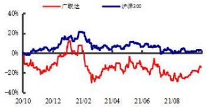  
股价走势   
资料来源：东莞证券研究所，Wind

数字设计业务：成立数字设计BG，加快鸿业科技整合。2021年公司对组织架构进行调整，在已有的数字造价、数字施工两大BG之外，增加了数字设计BG，显示出公司对设计业务的重视程度。随着公司加快对鸿业科技的整合，有望进一步补强公司在设计领域的布局。

投资策略：维持推荐评级。公司深耕建筑业信息化多年，2017年开启造价云转型，目前转云进展顺利，逐步迎来收获期。同时，公司持续推进施工、设计领域业务，有望进一步打开成长空间。预计公司2021-2022年EPS分别为0.56和0.84元，对应PE分别为123.75和82.50倍。

风险提示：行业数字化转型不及预期；业务推进不及预期；技术推进不及预期；行业竞争加剧等。

# 目录

1．公司深耕建筑工程信息化领域多年.  
2.信息化助力行业提效降本，国内市场仍有较大提升空间.. ….7  
3．数字造价业务：云转型逐步迎来收获期. … 12  
4．数字施工业务：持续加快业务推进，未来市场空间广阔. …15  
5．数字设计业务：成立数字设计BG，加快鸿业科技整合.  
6.投资策略. ….18  
7.风险提示. ….18

# 插图目录

图1：公司营业收入情况.  
图2：公司归母净利润情况.  
图3：公司扣非后归母净利润情况. ….5  
图4：2021H1公司业务结构情况..  
图5：数字造价业务收入情况. …….5  
图6：数字施工收入情况. …. 5  
图7：公司毛利率及净利率情况. ….5  
图8：公司期间费用率情况. ….6  
图9：公司研发费用率情况. ….6  
图10：公司经营性现金流净额情况. ….6  
图11：我国业总产值情况. ….7  
图12：我国建筑业利润总额情况. .7  
图13：我国建筑业、农业、工业利润率对比. ….8  
图14：我国建筑业就业人员平均工资情况.. …….8  
图15：2010及2020年人口普查各年龄组人口情况. ….  
图16：2010及2020年人口普查各年龄组人口占比. …….9  
图17：建筑项目超预算、工期延误情况. ….9  
图18：按行业分类，全球行业数字化水平 ….10  
图19：按行业分类，我国行业数字化水平. ….11  
图20：云计价GCCP6.0产品. 1  
图21：打造应用-数据-算法正向飞轮.  
图22：公司营业收入同比增速及建筑业新开工面积同比增速对比.. ….13  
图23：八三目标实现的两大基本路径.. .14  
图24：数字造价业务收入情况. … 15  
图25：数字造价业务云收入情况..  
图26：数字施工项目级及企业级产品. …15  
图27：人员管理的数字化.. ……16  
图28：材料管理的数字化.… …… 16  
图29：数字施工新增项目及客户情况. … 16  
图30：数字施工业务收入情况. ….16  
图31：数字施工业务市场空间预测. …. 17  
图32：数字设计系列产品. …. 17

# 表格目录

表1：支持建筑业信息化发展的相关政策文件. 10

表2：造价业务分批次云转型. ….14  
表3：公司盈利预测简表（截至2021/10/18） …. 19

# 1．公司深耕建筑工程信息化领域多年

公司深耕建筑工程信息化领域多年，产品覆盖工程项目的全生命周期管理。公司成立于1998年，多年来立足建筑产业，围绕工程项目的全生命周期，为客户提供建设工程领域专业的软硬件产品和解决方案。经过二十多年的发展，公司业务领域由招投标阶段进一步拓展至施工、设计阶段，构成了数字造价、数字施工、数字设计等三大业务BG，同时成立了数字供采、数字城市、数字金融、数字高校等多个创新业务单元。

数字造价逐渐进入收获期，数字施工、数字设计前景可期。公司的数字造价业务主要为建设工程造价提供软件产品及数据服务，2017年公司开启了造价软件云转型的序幕，截至2021上半年，全国29 个地区已进入全面云转型，转化率、续费率等指标表现优异，逐步进入收获期。施工业务方面，目前施工行业的数字化转型仍在持续提升中，公司主要聚焦工程项目建造过程，通过"平台 $+$ 组件"的模式，为施工企业提供涵盖项目管理与企业管理的平台化解决方案，该项业务是公司重点突破的成长业务。设计业务方面，公司通过收购洛阳鸿业进一步加强在数字设计领域的布局，主要面向设计院客户，提供建筑设计一体化解决方案、基础设施设计一体化解决方案和设计成果数字化交付审查方案等，该项业务是公司着力发展的新兴业务。

公司收入实现较快增长。2020 年公司营业收入达到 40.05 亿元，同比增长 $1 3 . 1 0 \%$ ,2016-2020年复合增速为 $1 8 . 3 8 \%$ 。分业务来看，2020年造价业务收入27.91亿元，2016-2020 年复合增速为 $2 0 . 4 5 \%$ ，其中云收入16.22亿元，2017-2020年复合增速高达$2 2 9 . 6 3 \%$ ；2020年施工业务收入为9.43亿元，2016-2020年复合增速为 $2 8 . 4 9 \%$ ；数字设计业务收入体量相对较小，2021上半年收入为0.59亿元，同比增长 $65 \%$ 。利润端方面，2020 年公司归母净利润、扣非后归母净利润分别为 3.30 和 3.02 亿元，同比分别增长$4 0 . 5 5 \%$ 和 $5 7 . 9 5 \%$ o

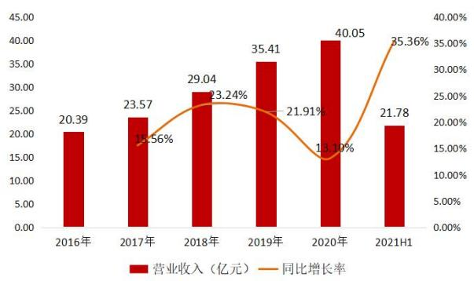  
图1：公司营业收入情况  
数据来源：wind，东莞证券研究所

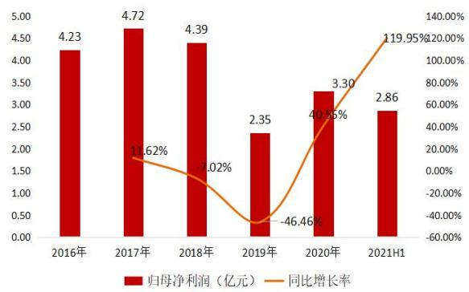  
图2：公司归母净利润情况  
数据来源：wind，东莞证券研究所

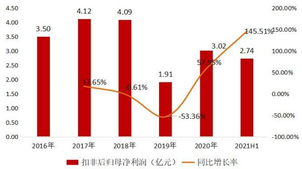  
图3：公司扣非后归母净利润情况  
数据来源：wind，东莞证券研究所

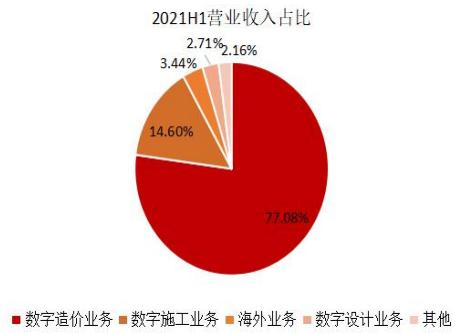  
图4：2021H1公司业务结构情况  
数据来源：wind，东莞证券研究所

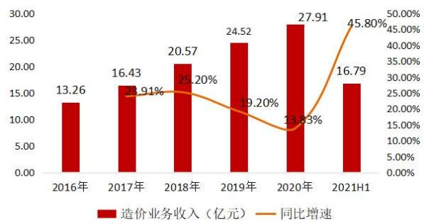  
图5：数字造价业务收入情况   
数据来源：wind，东莞证券研究所

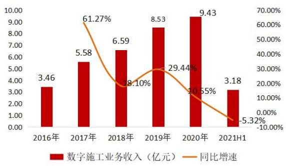  
图6：数字施工收入情况   
数据来源：wind，东莞证券研究所

毛利率基本稳定，净利率有望回升。2020年公司毛利率为 $8 8 . 4 9 \%$ ，近年基本稳定在 $90 \%$ 左右。公司近年的净利率则波动较大，主要原因是在造价业务云转型过程中，收入模式从一次性确认变为服务期内分期确认，此外，公司在云转型阶段加大了营销、研发等方面的投入，也使得净利率阶段承压。随着2021上半年最后4 个地区进入到全面云转型阶段，公司造价业务云转型进入尾声，后续利润端有望进一步改善，净利率也有望实现持续回升。

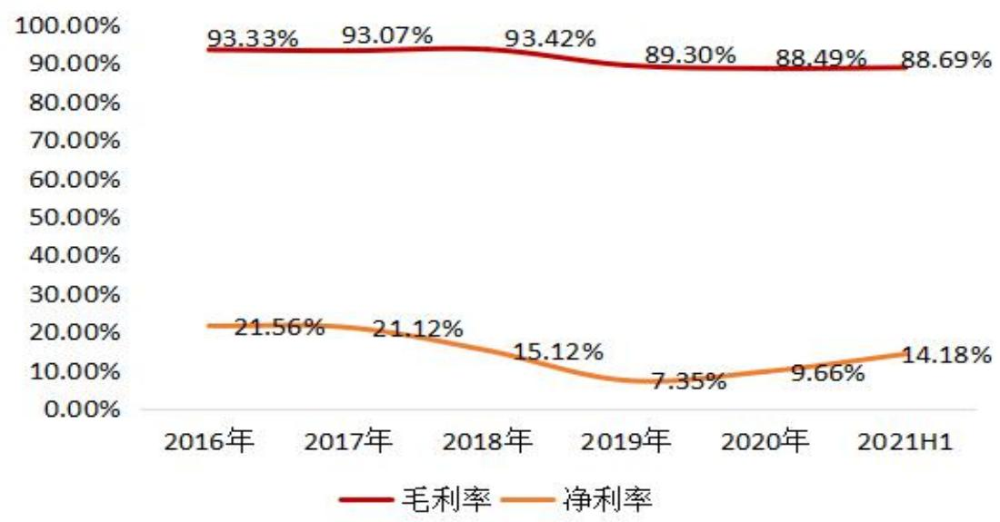  
图7：公司毛利率及净利率情况

资料来源：wind，东莞证券研究所

控费能力进一步提升，研发投入持续加大。2020年公司期间费用率为 $5 2 . 8 7 \%$ ，同比下降了2.56个百分点。其中，销售费用率为 $3 1 . 3 5 \%$ ，同比基本持平；管理费用率为 $2 1 . 9 5 \%$ ,同比下降1.20个百分点；财务费用率为 $. 0 . 4 4 \%$ ，同比下降了1.58个百分点。研发费用方面，公司持续加大研发投入，进一步打磨产品线以及新的技术领域，2020 年研发费用达到10.83亿元，同比增长 $1 1 . 7 2 \%$ ，研发费用率为 $2 7 . 0 4 \%$ ，同比下降0.33个百分点。

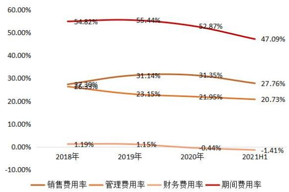  
图8：公司期间费用率情况  
数据来源：wind，东莞证券研究所

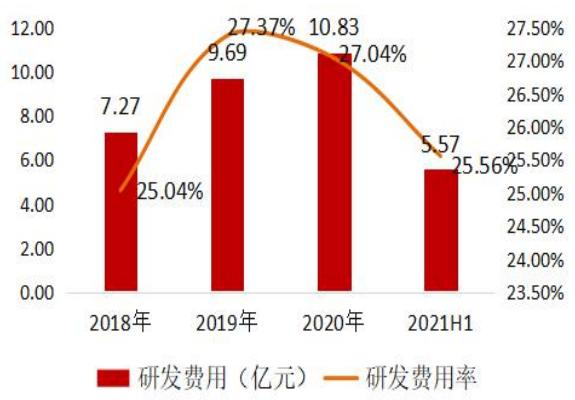  
图9：公司研发费用率情况  
数据来源：wind，东莞证券研究所

经营性现金流持续向好。2020 年公司经营性现金流净流入18.76 亿元，同比大幅增长$1 9 2 . 7 3 \%$ ，一方面是业务持续增长，造价云转型持续推进所致，另一方面主要是公司回款效率进一步提升。

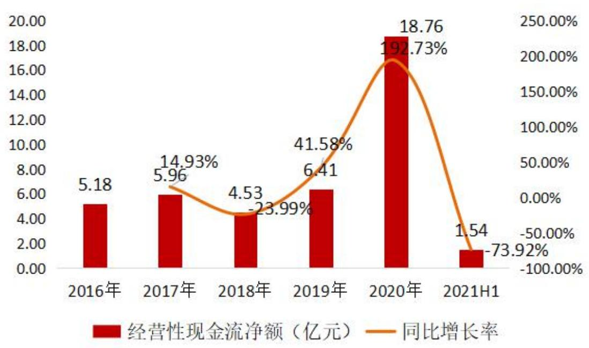  
图10：公司经营性现金流净额情况  
资料来源：wind，东莞证券研究所

# 2．信息化助力行业提效降本，国内市场仍有较大提升空间

建筑业逐渐进入到稳定发展期。建筑业是我国国民经济发展的重要支柱之一，整个建筑业的总产值从 2000 年的1.25 万亿元增长至2019 年的 24.84 万亿元，2000-2019 年复合增速为 $1 7 . 0 4 \%$ ，建筑业的利润总额从 2000年的192.10亿元增长至2019 年的 8280.00亿元，2000-2019年复合增速达 $2 1 . 9 1 \%$ 。经过多年的高速发展，建筑业总产值以及利润总额的增速总体呈现下降的趋势，其中利润总额同比增速从 2014 年开始进入到低个位数的增长阶段，行业发展逐渐进入到稳定期。

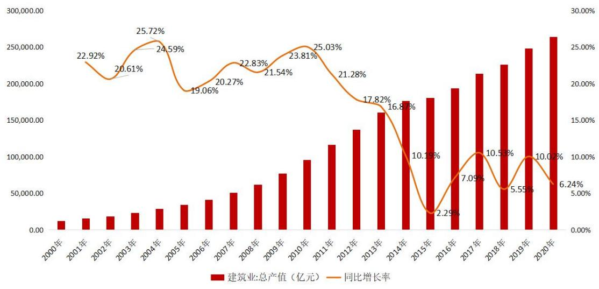  
图11：我国业总产值情况  
资料来源：wind，东莞证券研究所

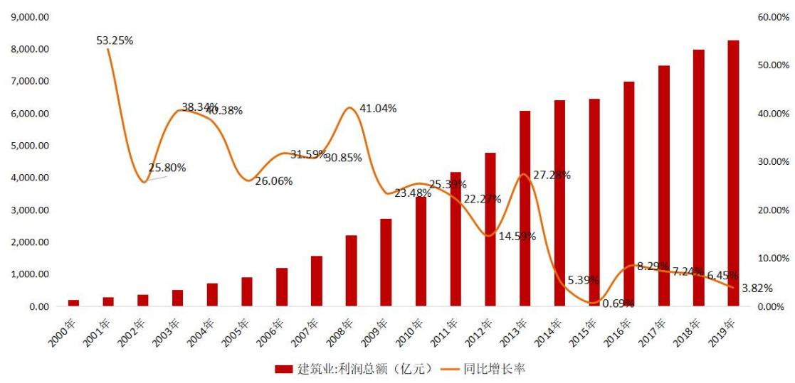  
图12：我国建筑业利润总额情况  
资料来源：wind，东莞证券研究所

建筑业利润率偏低，低于同期的农业及工业。自2000 年以来，我国建筑业利润率总体呈现不断提升的趋势，2019年我国建筑业利润率为 $3 . 3 3 \%$ ，较2000年提升了1.79个百分点。但与同期我国农业、工业的利润率进行对比，我国建筑业利润率总体偏低，

2015-2019 年建筑业利润率的平均值为 $3 . 5 1 \%$ ，分别低于15-19 年农业、工业利润率的平均值2.97和 4.03个百分点。

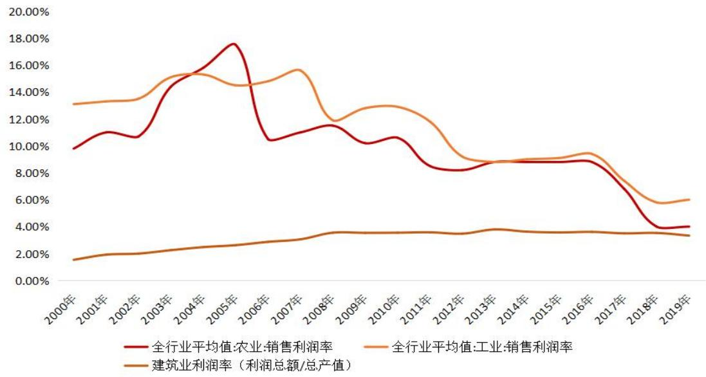  
图13：我国建筑业、农业、工业利润率对比  
资料来源：wind，东莞证券研究所

利润率偏低一方面是劳动力成本上涨过快所致。在我国建筑工程项目成本构成中，人工费和材料费合计占比在 $7 5 \%$ 左右（数据来源：公司公告），2019年建筑业从业人员平均工资65,580元/年，2015-2019年工资复合增速为 $7 . 6 2 \%$ ，高于同期建筑业 $6 . 4 4 \%$ 的利润增速，劳动力成本的提高挤压了行业的利润情况。目前我国劳动力红利逐渐消退，据第七次全国人口普查数据，15-59 岁人口作为目前及未来的潜在劳动力群体，人口占比从2010年的 $7 0 . 1 4 \%$ 下降至2020年的 $6 3 . 3 5 \%$ ，而60岁以上的人口占比从2010年的 $1 3 . 2 6 \%$ 进一步提升至2020年的 $1 8 . 7 0 \%$ ，人口结构老龄化有所加深。随着人口结构的变化、人□红利的消失，预计用工成本将进一步上升，建筑业行业的利润率或将进一步承压。

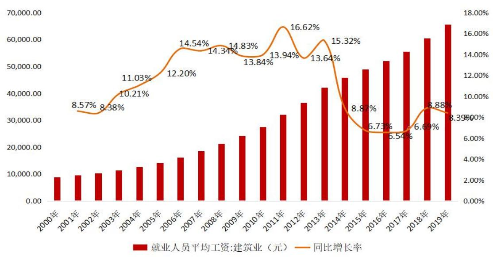  
图14：我国建筑业就业人员平均工资情况  
资料来源：wind，东莞证券研究所

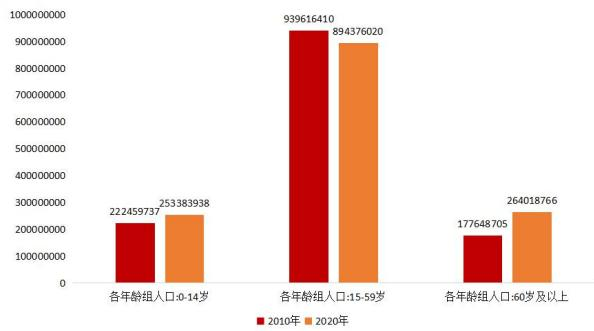  
图15：2010及2020年人口普查各年龄组人口情况  
数据来源：wind，莞证券研究所

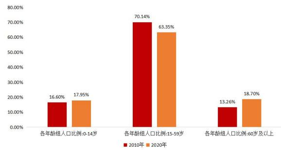  
图16：2010及2020年人口普查各年龄组人口占比  
数据来源：wind，莞证券研究所

另一方面，建筑项目难以精准预估成本和时间，也进一步拖累了行业的利润率水平。据麦肯锡发布的《想象建筑业数字化未来》，大型项目的建筑费用平均超标 $80 \%$ 、建筑时间平均超时 20 个月，建筑成本超预算、工期延误，整体效率较低，也使得行业的利润率水平受到压制。面对建筑人力成本上升、项目超预算超工期等情况，行业粗放式发展不可持续。随着云计算、大数据、物联网等新兴技术渐趋成熟与广泛应用，信息化与建筑工程的融合有望成为提升建筑项目效率、降低项目成本的主要手段，加速推进建筑行业信息化的改造刻不容缓。

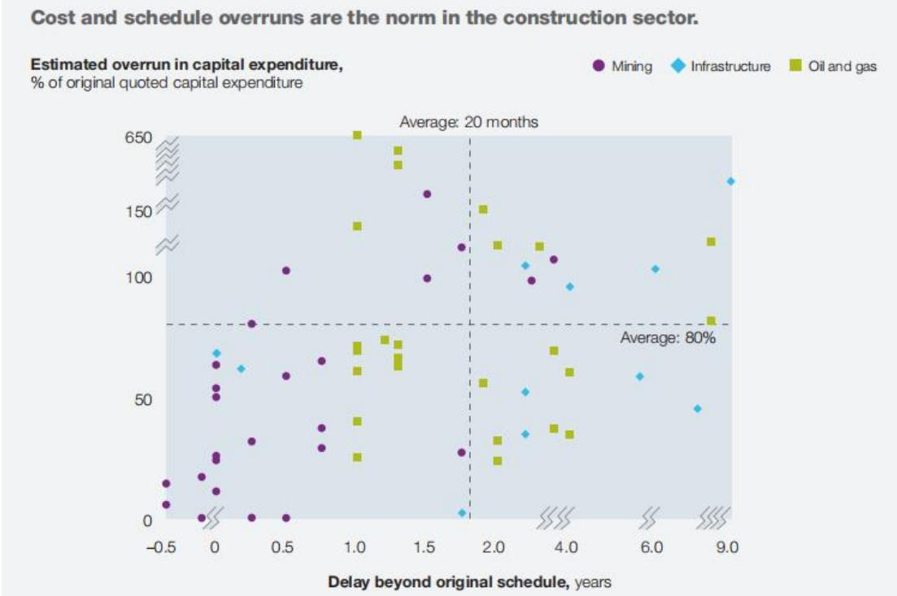  
图17：建筑项目超预算、工期延误情况  
Source: Global Projects Database, IHS Herold, Nov 19, 2013, herold.com; McKinsey analysis   
资料来源：麦肯锡，东莞证券研究所

国家政策支持建筑业信息化发展。近年来国家陆续出台了一系列支持行业信息化发展的政策文件，其中包括加快推进建筑信息模型（BIM）技术在工程项目中的运用。2021年

10 月，中共中央、国务院下发《国家标准化发展纲要》，指出要进一步加强标准化工作，推动智能建筑标准化，完善建筑信息模型技术、施工现场监控等标准。

表1：支持建筑业信息化发展的相关政策文件  

<table><tr><td colspan="2">时间 政策文件</td></tr><tr><td>2015年</td><td>《关于推进建</td><td>开展 BIM 应用示范，根据示范经验，逐步实现施工阶段的 BIM集成应用。根 据工程总承包项目的过程需求和应用条件确定BIM应用内容，分阶段（工程 启动、工程策划、工程实施、工程控制、工程收尾）开展BIM应用。到 2020</td></tr><tr><td>2016年</td><td>数字化交付、审查及存档系统，推进基于二维图的、探索基于BIM 的数字化 《2016-2020 年建筑业信息</td><td>成果交付、审查和存档管理。构建基于BIM、大数据、智能化、移动通讯、 云计算等技术的工程质量、安全监管模式与机制。研究探索基于物联网、大</td></tr><tr><td></td><td>的指导意见》 软件。 《“十三五”装</td><td>建立适合建筑信息模型（BIM）技术应用的装配式建筑工程管理模式，推进</td></tr><tr><td rowspan="3">2017年</td><td>方案》 《建筑业发展</td><td>过程的集成应用，实现工程建设项目全生命周期数据共享和信息化管理。 加快推进建筑信息模型（BIM）技术在规划、工程勘察设计、施工和运营维护</td></tr><tr><td>《关于促进建 筑业持续健康 发展的意见》</td><td>加快推进建筑信息模型（BIM）技术在规划、勘察、设计、施工和运营维护全 过程的集成应用，实现工程建设项目全生命周期数据共享和信息化管理。建 立全国建筑工人管理服务信息平台，开展建筑工人实名制管理，记录建筑工</td></tr><tr><td>《国家标准化 发展纲要》</td><td>人的身份信息、培训情况、职业技能、从业记录等信息，逐步实现全覆盖。 推动智能建造标准化，完善建筑信息模型技术、施工现场监控等标准。</td></tr></table>

资料来源：品茗股份招股书，互联网公开资料，东莞证券研究所

国内建筑业信息化水平较低，未来仍有较大提升空间。据麦肯锡调查的数据显示，全球范围来看，建筑业总体的数字化程度在统计的行业中排在倒数第二，数字化水平仅好于农业；而国内范围来看，建筑业的数字化程度在所有的行业中倒数第一。据中国产业信息网数据显示，2018年我国建筑信息化投入占总产值的比重仅为 $0 . 1 0 \%$ ，低于 $1 . 0 0 \%$ 的发达国家平均水平、低于 $0 . 3 0 \%$ 的国际平均水平。总体来看目前我国建筑业信息化的水平仍处于较低的水平，未来仍有大幅提升的空间。

图18：按行业分类，全球行业数字化水平

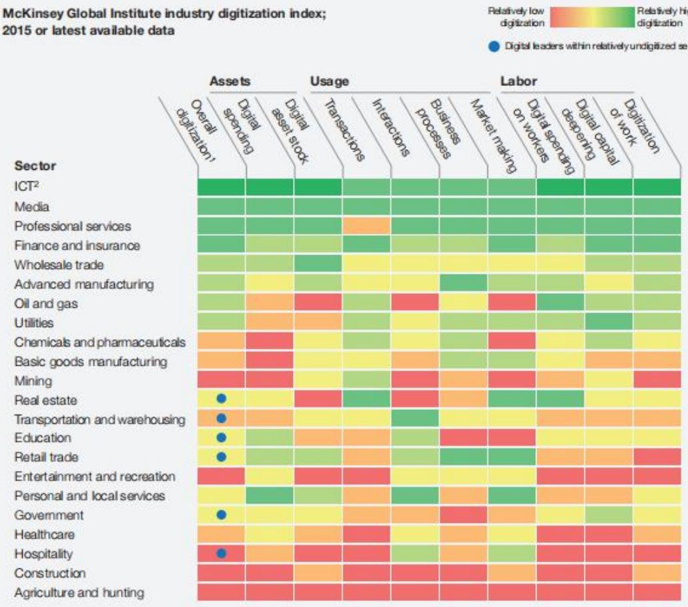  
The construction industry is among the least digitized.   
Basedon a set ofmetries to assessdigtization ofassets (8metrics), usage (1metrics), and abor(8meties). ²Infomation and communications technology. SourceAppBrai;Buewol;ComputerEonomics;eMarkeer;Gater;DCResearch;LiveCha;USBuaofEconomicAnalysis; US Bureau of Labor Statistics; US Census Burea; Me Kinsey Global Institute analysis   
资料来源：麦肯锡，东莞证券研究所  
图19：按行业分类，我国行业数字化水平

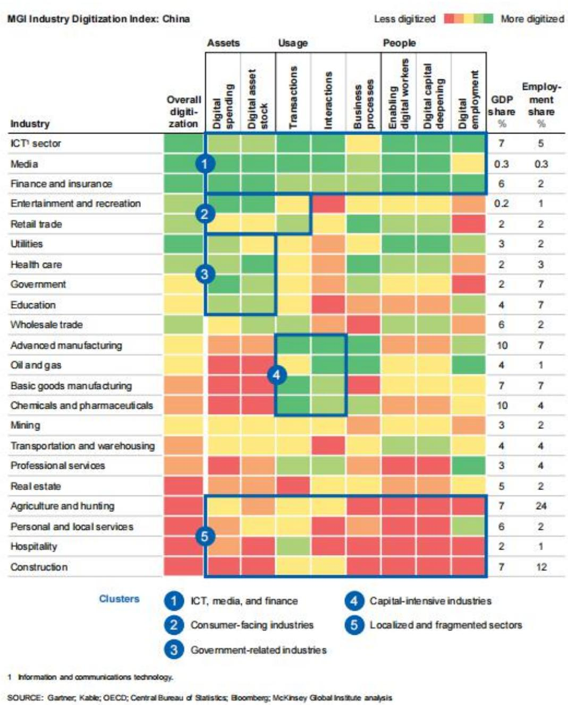  
资料来源：麦肯锡，东莞证券研究所

# 3．数字造价业务：云转型逐步迎来收获期

造价业务竞争优势明显。公司数字造价业务主要为工程造价提供软件产品及数据服务，包括工程计价业务线、工程算量业务线、工程信息业务线和电子政务业务线等，目前官网展示的数字造价产品已达到 27 款，产品矩阵不断丰富。经过二十多年发展，公司造价业务在国内竞争优势明显，据2010 年披露的招股说明书数据，公司在工程造价领域的市场占有率约 $53 \%$ ，已经占据主要地位。

全面推进造价云转型，上云优势逐步显现。2017 年公司率先在全国6个试点地区拉开了造价业务云转型的序幕。造价软件上云，对于客户来说能够实现数据互通、多人协作、持续升级，且借助云端强大的算力支持，大幅缩短了计算时间，提升了工作效率；对于公司来说，不同场景的数据聚集在云端，打破了数据孤岛，随着积累数据的增加，公司能够不断加深对用户的理解，进而进一步对产品及算法进行优化，提升客户的粘性。

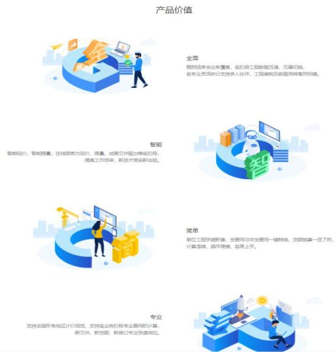  
图20：云计价GCCP6.0产品  
数据来源：公司官网，东莞证券研究所

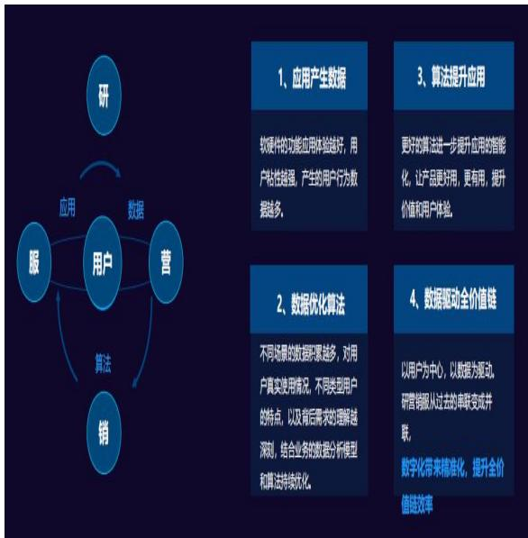  
图21：打造应用-数据-算法正向飞轮  
数据来源：公司公告，东莞证券研究所

业绩周期波动有望逐步平滑。过去造价业务产品主要通过 License 的形式进行销售，受下游开工项目的影响较大，因此公司 2017 年之前的收入也具有较强的周期属性。造价业务通过 SaaS 转变，相关收入由一次性确认转变为按服务期分期确认，按年订阅持续付费的模式，能够平滑因开工项目的波动导致业绩的波动，随着云转型的持续推进，公司2017年及之后营业收入的变动与下游开工项目的相关性逐渐减弱。

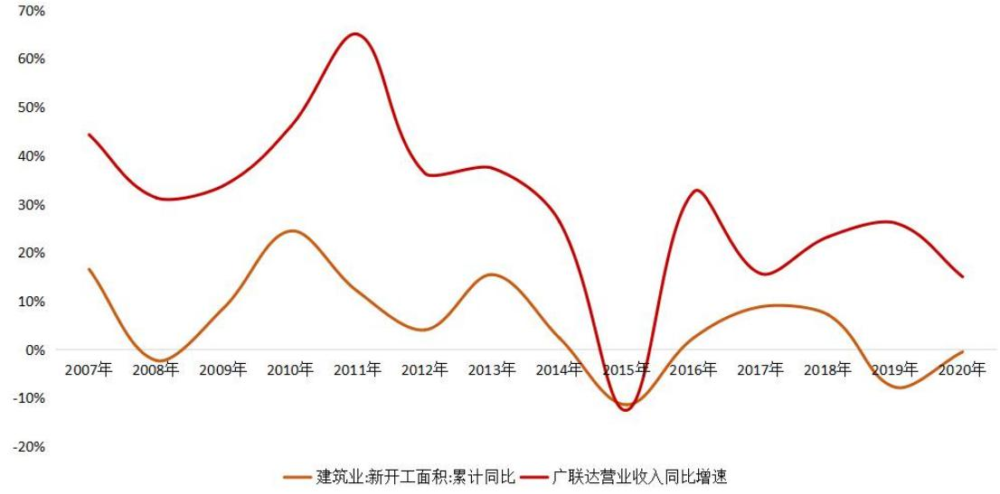  
图22：公司营业收入同比增速及建筑业新开工面积同比增速对比  
资料来源：wind，东莞证券研究所

造价市场空间进一步打开。造价业务收入可以简化为：用户数量\*人均ARPU。从用户数量来看，过去 License 模式下由于产品单价较高，市场存在部分使用盗版软件的客户。根据公司披露的数据，Saas 模式之下，产品的年费相当于原产品及升级费综合价格的三分之一，价格出现大幅下降，同时叠加上云后产品功能的诸多优势，一方面能够转化盗版用户为付费用户，目前正版用户与盗版用户的比例大致为1:0.8（数据来源：公司2019年12 月投资者关系活动记录表），转云前正版与盗版用户的比例大致为1:1；另一方面也能够激活存量的软件用户转向Saas 订阅模式，进一步扩大用户群体。

从人均 ARPU 来看，公司通过提供增值服务进一步提升人均 ARPU。公司目前较为成熟的增值服务包括广材助手、广材网、造价云空间等，同时也围绕AI、大数据等技术的应用陆续推出新的增值服务。其中，广材助手能够与云计价产品实现无缝结合，提供全面的建筑材料与设备价格数据参考，满足客户一键载价、比价、组价的需求，有助于提升客户的工作效率，截至2020 年底，广材助手自有数据载价量达到 1.7 亿次。据广联达公开披露的数据，目前数字造价云化部分的客单价维持在 4000-5000 元的区间，随着增值服务产品的不断打磨与丰富，人均ARPU有望得到进一步提升。

  
图23：八三目标实现的两大基本路径  
资料来源：公司公告，东莞证券研究所

分批次转型循序渐进，转型数据表现优异。公司从2017 年开始在全国地区推进造价业务分批次的云转型，一方面能够不断总结转型经验为下一批次的地区转型提供指导，另一方面也能够平滑部分地区因转型导致的收入模式从一次性确认转变为按服务期分期确认而出现的表观业绩大幅下滑。2021 年上半年，造价业务最后4个地区江苏、浙江、安徽、福建进入全面云转型，新转型地区的转化率超过 $40 \%$ ，并且实现了当期收入的正增长。前期2017、2018年转型区域的转化率超过 $8 5 \%$ 、续费率超过 $80 \%$ ，2019年转型地区的转化率、续费率均超过 $8 5 \%$ ，2020 年转型地区得转化率达到 $70 \%$ 、续费率超过$85 \%$ ，转型数据总体表现优异。

表2：造价业务分批次云转型  

<table><tr><td colspan="3">转型地区数 区域 转型效果</td></tr><tr><td>2017年转型区域</td><td>量（个） 6</td><td>计价业务用户转换率平均达到 80%，用户续费率约 85%</td></tr><tr><td>2018年转型区域</td><td>5</td><td>老转型 6个地区，计价用户转化率及续费率均超过85% 新转型5个地区，计价用户转化率超过40% 11个转型地区，算量用户转化率超过50%</td></tr><tr><td>2019年转型区域</td><td>10</td><td>2019 年之前已转型的11 个地区，云计价与云算量产品的综合转化率 和综合续费率均超 80% 新转型 10 个地区，云计价与云算量全年的综合转化率均超 50%</td></tr><tr><td>2020年转型区域</td><td>4</td><td>2019 年之前已转型的11个地区，产品综合转换率、续费率均超过85% 2019年转型的10个地区，产品综合转换率超过 80%，续费率 88% 2020 年新转型地区，产品综合转换率达到 50%</td></tr></table>

<table><tr><td>2021年转型区域</td><td>4</td><td>截至上半年，2017年和 2018 年转型区域的转化率&gt;85%，续费率&gt;80% 2019 年转型地区转化率、续费率均&gt;85% 2020 年转型地区转化率达到 70%，续费率&gt;85% 2021年新转型地区的转化率&gt;40%</td></tr></table>

资料来源：公司公告，东莞证券研究所

造价云转型逐步迎来收获期。公司造价业务云转型顺利推进，云业务收入从2017 年的0.45 亿元增长至2020年16.22亿元，2017-2020年复合增速高达 $2 2 9 . 6 3 \%$ ，云收入占造价业务收入的比重从2017年的 $2 . 7 6 \%$ 提升至2020年的 $5 8 . 1 2 \%$ ，2021H1进一步提升至$6 9 . 5 7 \%$ 。随着转型进入尾声，造价业务利润逐步释放，公司表观利润也逐步恢复，2020年归母净利润、扣非后归母净利润分别为3.30和3.02亿元，同比分别增长 $4 0 . 5 5 \%$ 和$5 7 . 9 5 \%$ ，2021H1 归母净利润、扣非后归母净利润分别为2.86 和2.74 亿元，同比分别增长 $1 1 9 . 9 5 \%$ 和 $1 4 5 . 5 1 \%$ 。未来随着造价业务云转型完成后，该项业务的利润有望持续释放。

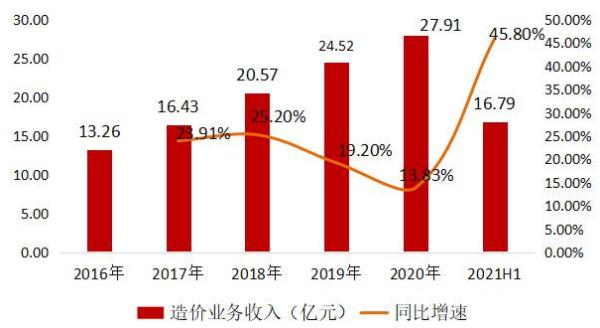  
图24：数字造价业务收入情况  
数据来源：wind，东莞证券研究所

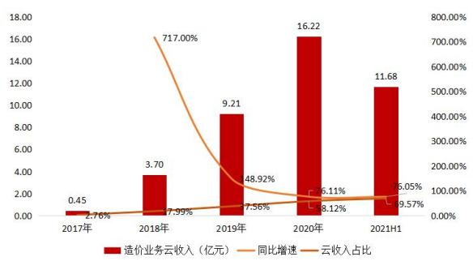  
图25：数字造价业务云收入情况  
数据来源：wind，东莞证券研究所

# 4.数字施工业务：持续加快业务推进，未来市场空间广阔

基于"平台 $^ +$ 组件"模式，切入工程建造过程。公司数字施工业务主要聚焦工程项目建筑过程，通过"平台 $^ +$ 组件"的模式，为施工企业提供涵盖项目管理与企业管理的平台化解决方案，包括项目端的BIM $^ +$ 智慧工地系列产品，以及面向施工企业层级的项企一体化产品。以智慧工地为例，借助 BIM、IoT、云计算、大数据、AI等技术，通过智慧硬件对工地场景的数据进行采集，对人员、材料、进度、安全等进行智能管理，通过自动分析建模，精准分析、智能决策、科学评价，形成一套数据驱动的新型管理模式，有助于施工企业生产提效、安全可控、成本节约。其中，物料管理产品实现无人/自助过磅项目的验证，平均为客户节约3%的材料成本。

图26：数字施工项目级及企业级产品

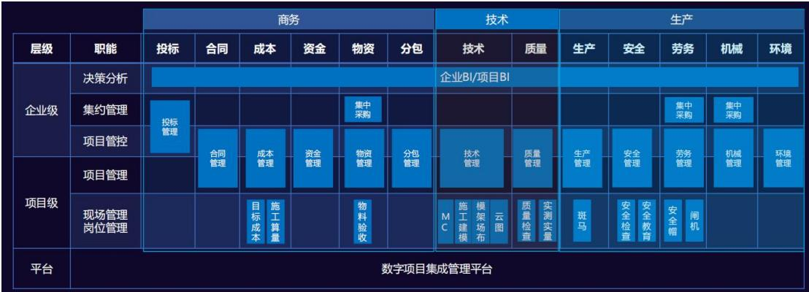  
资料来源：公司公告，东莞证券研究所

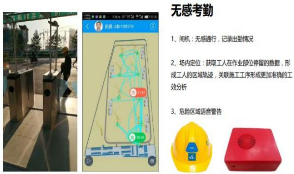  
图27：人员管理的数字化  
数据来源：公司公告，东莞证券研究所

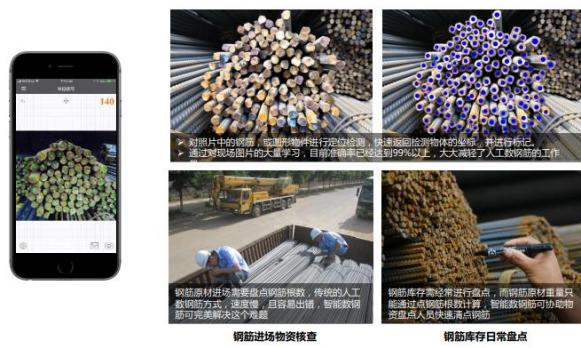  
图28：材料管理的数字化  
数据来源：公司公告，东莞证券研究所

持续加快业务推进。2020 年公司数字施工项目级产品新增项目数 1.5 万个，同比增长超$3 6 8 . 7 5 \%$ ，新增客户1700家，同比增加超 $5 4 . 5 5 \%$ 。2021上半年，公司加强企业级产品覆盖率和项目级单品渗透率，在特一级资质施工企业中实现了较好拓展，上半年新增项目覆盖 8000个，新增客户覆盖 600 家。随着项目的持续拓展，公司数字施工业务收入也实现较快增长，2020 年收入达到9.43 亿元，2016-2020 年复合增速达到 $2 8 . 4 9 \%$ 。2021上半年，公司调整数字施工业务的市场策略和业务节奏，优先拓展合同扩大增量，新签合同额较上年同期增长超过 $100 \%$ ，上半年数字施工业务收入同比下降 $5 . 3 2 \%$ 至3.18亿元。

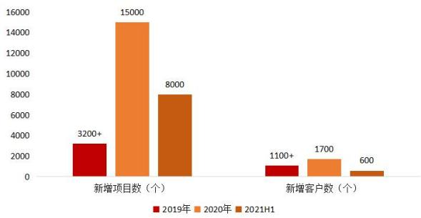  
图29：数字施工新增项目及客户情况  
数据来源：wind，东莞证券研究所

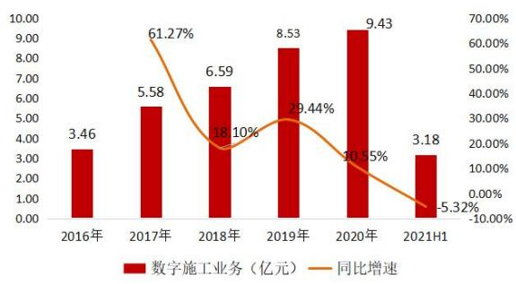  
图30：数字施工业务收入情况  
数据来源：wind，东莞证券研究所

未来市场空间广阔。公司的施工业务产品（含BIM系列产品）已应用在国内多家特级资质和一级资质企业，如中国建筑、中国中冶、中国核电等。假设未来每年新开工项目30-40万个，公司数字施工项目覆盖10万个，按照单个项目服务费10万元测算，市场空间可达100 亿元，未来成长空间广阔。

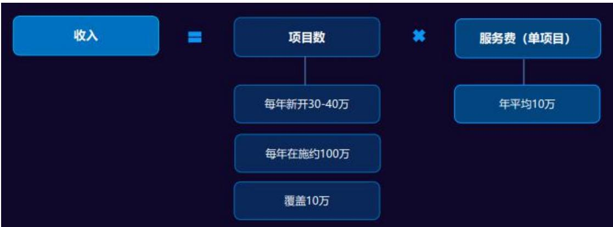  
图31：数字施工业务市场空间预测  
资料来源：公司公告，东莞证券研究所

# 5．数字设计业务：成立数字设计BG，加快鸿业科技整合

收购鸿业科技，深化设计业务布局。2020 年 10月，公司公告以4.08 亿元现金收购鸿业科技 $9 0 . 6 7 2 6 \%$ 的股权，公司原持有鸿业科技 $9 . 3 2 7 4 \%$ 的股权，本次交易完成后，鸿业科技将成为公司的全资子公司，纳入公司合并范围。鸿业科技深耕工程类CAD 设计领域和城市信息化建设领域，传统CAD 设计产品、市政公路及管线设计产品、BIM设计产品在市场中处于领先地位，此次收购有望进一步补强公司在设计领域的布局。

成立数字设计 BG，加快鸿业科技整合。2021 年公司对组织架构进行调整，在已有的数字造价、数字施工两大BG 之外，增加了数字设计 BG，显示出公司对设计业务的重视程度。公司上半年加快对鸿业科技全方位的整合，整合后的团队共享渠道和市场营销体系，在渠道组织融合、管理赋能的基础上，努力实现从产品到市场到渠道端的打通。产品端方面，3月发布了广联达数字设计产品集邀请体验版，上半年完成 8个完整试点项目；6月推出 BIMSpace2022 版正向设计产品，通过单品更新和协同平台的迭代，进一步提升用户应用率，新签约 6 家标杆客户。市场端方面，数字设计业务利用广联达渠道方法论分阶段建设数字化营销体系，完成鸿业科技历史客户数据迁移和客户画像验证；导入服务的目标与计划管理，逐步提升服务质量，重构数字设计客户服务体系。

图32：数字设计系列产品

<table><tr><td colspan="6">系列产品</td></tr><tr><td>BIM系列软件</td><td>CIVIL系列软件</td><td></td><td>MEP系列软件</td><td>①规划日照系列软件</td><td>@其他系列</td></tr><tr><td>铝巨人广联达鸿业铝模BIM软件 2018</td><td>路易2022 管得PRO2020</td><td></td><td>多联机软件防排烟计算</td><td>城市规划软件工业总图软件</td><td>城市信息化方案与产品</td></tr><tr><td>鸿城平台（BIM+GIS)</td><td>广联达鸿业海绵道路设计软件5.0</td><td>电气设计软件室外管线软件</td><td></td><td>土方计算软件控规辅助软件</td><td></td></tr><tr><td>广联达鸿业装配式建筑2018</td><td>Roadleader(路立得)软件</td><td></td><td>建筑给排水软件全年负荷能耗</td><td>电力工程项目建设用地指标计算</td><td></td></tr><tr><td>建筑性能分析平台2022</td><td>Pipingleader(管立得)软件</td><td></td><td>建筑风环境模拟分析软件</td><td>日照分析软件预评估软件</td><td></td></tr><tr><td>BIM云协同</td><td>互通立交软件旧路改造软件</td><td>(CFD)</td><td></td><td>容积率估算软件</td><td></td></tr><tr><td></td><td>电力浅沟软件 交通设施软件</td><td>负荷计算软件</td><td></td><td></td><td></td></tr><tr><td>BIMSpace机电深化设计软件</td><td>广联达鸿业综合管廊设计软件</td><td>设备设计暖通空调设计软件</td><td></td><td></td><td></td></tr><tr><td>BIMSpace2022</td><td>广联达鸿业电力隧道及电缆设计</td><td>广联达鸿业设备设计给排水软件</td><td></td><td></td><td></td></tr><tr><td>广联达鸿业云族360企业族库管理 系统--管·用</td><td>系统</td><td>热力管网软件屋面雨水软件</td><td></td><td></td><td></td></tr><tr><td></td><td>广联达鸿业暴雨排水及低影响开 发模拟系统</td><td>污水处理软件室外给排水</td><td></td><td></td><td></td></tr><tr><td></td><td>市政道路软件</td><td></td><td></td><td></td><td></td></tr><tr><td></td><td>市政管线设计软件</td><td></td><td></td><td></td><td></td></tr></table>

资料来源：公司官网，东莞证券研究所

# 6.投资策略

公司深耕建筑业信息化多年，2017 年开启造价云转型，目前转云进展顺利，逐步迎来收获期。同时，公司持续推进施工、设计领域业务，有望进一步打开成长空间。预计公司2021-2022年EPS 分别为0.56 和 0.84元，对应PE 分别为123.75 和82.50倍。

# 7.风险提示

行业数字化转型不及预期；业务推进不及预期；技术推进不及预期；行业竞争加剧等。

表3：公司盈利预测简表（截至2021/10/18)  

<table><tr><td>科目（百万元）</td><td>2020A</td><td>2021E</td><td>2022E</td><td>2023E</td></tr><tr><td>营业总收入</td><td>4004.64</td><td>4977.36</td><td>6187.60</td><td>7722.45</td></tr><tr><td>营业总成本</td><td>3692.38</td><td>4325.53</td><td>5138.24</td><td>6281.31</td></tr><tr><td>营业成本</td><td>454.50</td><td>592.51</td><td>782.16</td><td>1045.49</td></tr><tr><td>营业税金及附加</td><td>37.90</td><td>44.80</td><td>55.69</td><td>69.50</td></tr><tr><td>销售费用</td><td>1255.52</td><td>1428.50</td><td>1670.65</td><td>2007.84</td></tr><tr><td>管理费用</td><td>879.19</td><td>1045.25</td><td>1206.58</td><td>1428.65</td></tr><tr><td>研发费用</td><td>1082.69</td><td>1289.14</td><td>1515.96</td><td>1776.16</td></tr><tr><td>财务费用</td><td>(17.42)</td><td>(74.66)</td><td>(92.81)</td><td>(46.33)</td></tr><tr><td>资产减值损失</td><td>(20.70)</td><td>(14.93)</td><td>(18.56)</td><td>(23.17)</td></tr><tr><td>其他经营收益</td><td>123.10</td><td>130.00</td><td>130.00</td><td>130.00</td></tr><tr><td>公允价值变动净收益</td><td>0.00</td><td>0.00</td><td>0.00</td><td>0.00</td></tr><tr><td>投资净收益</td><td>10.21</td><td>10.00</td><td>10.00</td><td>10.00</td></tr><tr><td>其他收益</td><td>112.89</td><td>120.00</td><td>120.00</td><td>120.00</td></tr><tr><td>营业利润</td><td>414.21</td><td>766.90</td><td>1160.80</td><td>1547.97</td></tr><tr><td>加营业外收入</td><td>2.30</td><td>2.00</td><td>2.00</td><td>2.00</td></tr><tr><td>减营业外支出</td><td>6.11</td><td>6.00</td><td>6.00</td><td>6.00</td></tr><tr><td>利润总额</td><td>410.40</td><td>762.90</td><td>1156.80</td><td>1543.97</td></tr><tr><td>减所得税</td><td>29.04</td><td>53.40</td><td>80.98</td><td>108.08</td></tr><tr><td>净利润</td><td>381.37</td><td>709.50</td><td>1075.83</td><td>1435.89</td></tr><tr><td>减少数股东损益</td><td>50.98</td><td>49.66</td><td>75.31</td><td>100.51</td></tr><tr><td>归母公司所有者的净利润</td><td>330.39</td><td>659.83</td><td>1000.52</td><td>1335.38</td></tr><tr><td>基本每股收益（元）</td><td>0.28</td><td>0.56</td><td>0.84</td><td>1.12</td></tr><tr><td>PE（倍）</td><td>247.50</td><td>123.75</td><td>82.50</td><td>61.88</td></tr></table>

数据来源：wind，东莞证券研究所

公司投资评级  

<table><tr><td></td><td>月内，股价表现强于市场指数15%以上</td></tr><tr><td></td><td>月内，股价表现强于市场指数 5%-15%之间</td></tr><tr><td></td><td>月内，股价表现介于市场指数±5%之间</td></tr><tr><td></td><td>内，股价表现弱于市场指数5%以上</td></tr></table>