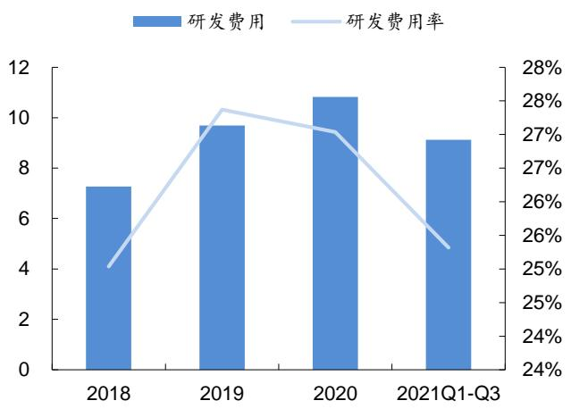
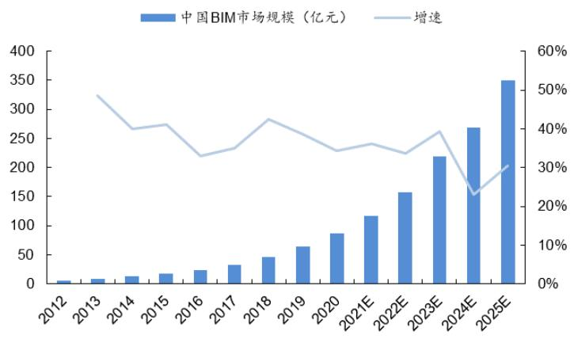

# 广联达：造价、施工、设计业务齐发力，打造数字建筑平台服务龙头

一广联达（002410.SZ）深度报告

证券研究报告

公司研究

# 广联达：造价、施工、设计业务齐发力，打造数字建筑平台服务龙头

深度报告广联达(002410.SZ)投资评级 买入

2022 年2 月10日

  
资料来源：WIND，信达证券研发中心  
资料来源：WIND，信达证券研发中心

收盘价（元） 59.40  
52周内股价 55.37-90.00  
波动区间(元)  
最近一月涨跌幅(%) -3.41  
总股本(亿股) 11.90  
流通A股比例(%) 83.53  
总市值(亿元) 707

# 本期内容提要：

数字造价：云转型成效显著，迎来业绩兑现期。公司自2017 年起开始造价云转型，2021 年最后四个地区进行转型，截止至 2021 年上半年，2017年和2018年转型地区的转化率 ${ > } 8 5 \%$ ，续费率 $\textgreater 8 0 \%$ ；2019年转型地区转化率、续费率均 ${ > } 8 5 \%$ ;2020年转型地区转化率达到 $70 \%$ ，续费率 ${ > } 8 5 \%$ ; 2021年新转型地区的转化率 ${ > } 4 0 \%$ ，成效显著。公司收费模式由传统的软件销售（一次性销售软件费 $^ +$ 后续升级服务费）转变为按年收费的SaaS模式，相关收入由一次确认转变为按服务期间分期确认，因此转型期利润承压。从业务发展角度来看，公司云转型后能够平滑业绩周期、提高软件和增值服务付费率、增加用户粘性和厂商市占率，进一步激发业务活力；从财务角度来看，公司数字造价业务毛利率超 $90 \%$ ，盈利能力优越；从行业空间来看，我们预计2025 年我国造价软件市场规模约 90 亿元，公司作为行业龙头有望尽享行业红利，实现长期可持续性发展。

数字施工：瞄准建筑信息化下智慧工地蓝海市场，成长空间广阔。建筑业是我国支柱产业之一，2020年建筑业增加值占我国GDP的 $7 . 2 \%$ ，从业人数占我国劳动人口的 $5 . 5 \%$ ，在保增长、稳就业中发挥了重要的作用。在我国人口老龄化和经济增长放缓大背景下，建筑业面临人力成本上升、信息化投入不足、利润率偏低的问题，传统的粗放式发展模式难以为继，亟待信息化转型。智慧工地是一种崭新的项目管理理念，将传感、移动互联网、大数据、云计算、AI、BIM 等先进技术融入到施工现场之中，使得建筑施工更安全、更高效，根据智研咨询和新思界统计数据，2020 年我国智慧工地市场规模为138.6 亿元，预计2025 年达到360 亿元，年复合增速为 $21 \%$ ，增长势头强劲。2014-2020 年公司数字施工业务由 0.83 亿元增加至9.43 亿元，年复合增速约 $50 \%$ ，智慧工地处于蓝海市场，公司市占率仅为 $6 . 8 \%$ ，成长空间广阔。

$\bullet$ 数字设计：政策推动的国产化浪潮下未来可期。建筑信息化工具BIM的基础软件被国外厂商Autodesk（全球市占率 $6 7 . 9 2 \%$ ）、Benteley（全球市占率 $1 4 . 3 7 \%$ ）所垄断，我国陆续出台建筑业信息化相关政策，我们认为一方面以BIM为核心的建筑信息化市场规模将快速增长，另一方面国内厂商有望乘政策春风，在国产替代趋势下实现弯道超车。2020 年全球BIM 软件市场规模约为56亿美元，公司作为深耕建筑信息化行业的造价软件龙头拥有服务的技术经验，又收购BIM设计厂商鸿业科技，未来可期。

$\bullet$ 首次覆盖，给予“买入”评级。公司是数字建筑平台服务龙头，产品覆盖数字造价、数字施工、数字设计。云造价转型成效显著，处于业绩兑现期；数字施工、数字设计业务行业空间广阔，增长潜力巨大。采用PEG估值法，给予 2023 年1.5 倍 PEG，对应 2023 年 91倍 PE 和 1249 亿元市值。

$\spadesuit$ 风险提示：1.造价云转型不及预期；2.建筑业信息化发展不及预期；3.行业竞争加剧。

<table><tr><td>主要财务指标</td><td>2019A</td><td>2020A</td><td>2021E</td><td>2022E</td><td>2023E</td></tr><tr><td>营业总收入(百万元)</td><td>3,541</td><td>4,005</td><td>5,153</td><td>6,397</td><td>7,867</td></tr><tr><td>增长率YoY%</td><td>21.9%</td><td>13.1%</td><td>28.7%</td><td>24.2%</td><td>23.0%</td></tr><tr><td>归属母公司净利润(百万元)</td><td>235</td><td>330</td><td>671</td><td>971</td><td>1,372</td></tr><tr><td>增长率 YoY%</td><td>-46.5%</td><td>40.5%</td><td>103.1%</td><td>44.7%</td><td>41.2%</td></tr><tr><td>毛利率(%)</td><td>89.5%</td><td>88.7%</td><td>85.6%</td><td>85.9%</td><td>86.4%</td></tr><tr><td>ROE(%)</td><td>7.2%</td><td>5.2%</td><td>9.5%</td><td>12.1%</td><td>14.6%</td></tr><tr><td>EPS(摊薄)元)</td><td>0.20</td><td>0.28</td><td>0.56</td><td>0.82</td><td>1.15</td></tr><tr><td>P/E</td><td>171.95</td><td>283.50</td><td>105.31</td><td>72.75</td><td>51.51</td></tr><tr><td>P/B</td><td>12.36</td><td>14.63</td><td>9.98</td><td>8.78</td><td>7.50</td></tr></table>

资料来源：WIND，信达证券研发中心预测；股价为2022年02月10日收盘价

一、国内领先的数字造价龙头，逐步拓展施工、设计领域， 71.1国内领先的数字造价龙头，逐步拓展数字施工、数字设计领域， … 71.2 营业收入高速增长，造价云业绩兑现进行时 ….91.3股权激励计划确定未来三年业绩指引， ..11  
二、云转型成效显著，数字造价业务打开新空间.. .122.1工程造价行业韧性十足，从业人员保持稳定增长 ..132.2云转型成效显著，数字造价业务打开新空间.. .14  
三、建筑信息化方兴未艾，核心企业充分享受行业红利. .193.1人口老龄化、劳动人口减少大背景下，建筑业亟待信息化转型， ….193.2 政策推动下，我国建筑业信息化市场呈现出规模增长快、国产替代加速的趋势3.3 市场空间广阔，数字施工、数字设计业务大有可为 .. 28  
四、盈利预测、估值与投资评级 .. 314.1盈利预测及假设. ..314.2估值与投资评级. .32  
风险因素. .33

# 表目录

表1：2021年公司限制性股票激励分配对象， 12  
表2：2021年公司限制性股票业绩考核目标， .12  
表3：公司云转型历年进展情况.. .17  
表4：2021-2025 年造价行业规模及公司收入预测. .19  
表5：2013年以来BIM相关政策. .23  
表6：2017年以来以BIM为核心的建筑业信息化相关标准. .24  
表7：BIM与CAD的区别. .24  
表8：BIM软件分类及竞争格局.. .28  
表9：公司分业务营收预测(亿元) 32  
表10：可比上市公司估值. 32

# 图目录

图1：公司上市以来相对申万计算机指数涨跌幅（周线，前复权） 7  
图2：公司发展历程.. .8  
图3：公司股权结构. ..8  
图4：公司主要业务板块. ..9  
图5：2015-2020年营收及增速， 10  
图6：2015-2020年归母净利润及增速， 10  
图7：2014-2020年公司分业务营收（亿元） 10  
图8：2014-2020 年公司分业务营收占比 10  
图9：公司主要产品毛利率. 11  
图10：2010-2020年公司费用率情况.. 11  
图11：2018-2020 年公司研发费用及研发费用率（亿元) 11  
图12：2015年注册造价师企业分布. 13  
图13：2015-2020 年不同类型企业注册造价师人数变化（万人） .13  
图14：2015-2020 年造价咨询企业营收情况.. 13  
图15：2015-2020年招标代理企业中标金额情况.. .13  
图16：2020年造价咨询企业营收分布.. .14  
图17：2020年招标代理企业代理中标金额分布 14  
图18：广联达数字造价产品矩阵.. 14  
图19：广联达云计价GCCP6.0产品示意图. 15  
图20：广联达BIM土建计量平台GTJ2018产品示意图 15  
图21：2016-2020年数字造价收入， .16  
图22：2016-2020 年还原云收入后的数字造价收入 16  
图23：2016-2020年传统及云收入占比. 16  
图24：2016-2020 年传统及还原云收入后的占比. 16  
图25：2017-2020 年公司云收入(亿元) 18  
图26：2017-2020年公司还原后的云收入. .18  
图27：2017-2020 年公司云合同负债(亿元) 18  
图28：2019-2020 年公司造价各板块云收入（亿元) .18  
图29：2010-2020年我国建筑业总产值及占GDP比重. .20  
图30：2010-2020年我国建筑业增加值及占GDP比重. 20  
图31：2010-2020年我国劳动人口数及占总人口比重. 20  
图32：2010-2020 年我国建筑业企业从业人数及占劳动人口比重 .20  
图33：我国各行业数字化水平.. .21  
图34：2014-2020年我国建筑业企业主营业务利润率. .22  
图35：BIM产业链. 25  
图36：2015-2026 年全球BIM 市场规模 .26  
图37：2012-2025 年中国BIM 市场规模 26  
图38：广联达智慧工地项目案例.. 26  
图39：2016-2025 年我国智慧工地市场规模 .27  
图40：我国建筑企业智慧工地应用情况图. .27  
图41：2020年全球BIM基础软件市场份额 .27  
图42：广联达数字施工产品矩阵.. .29  
图43：广联达BIM+智慧工地数据决策系统产品示意图， .29  
图44：广联达斑马进度计划产品示意图. .29  
图 45：2014-2020 年公司数字施工业务收入 (亿元) 30  
图46：2018-2020年公司累计服务客户和项目数. 30  
图47：广联达数字设计业务布局.. .31

# 与市场观点不同之处

市场应重视政策造价软件行业与数字造价收入增长的长期可持续性。市场普遍认为建筑业产值增速下滑的背景下，造价软件行业空间有限，公司作为行业龙头市占率极高，未来难以保持高速增长。我们认为：(1)行业远未至天花板，未来五年有望保持超 $1 5 \%$ 增速。根据我们预测，2020 年工程造价行业从业人数为181万人，其中注册造价师18.7万人，而造价软件使用数仅为 88.6 万人，综合渗透率不足 $50 \%$ ，随着从业人数增加、造价软件渗透率提高、造价软件单价提高三重因素推动，未来五年行业符合增速有望超 $1 5 \%$ 。（2)公司云转型成效显著，打开业绩增长空间。2021 年公司最后四个地区开始推进云转型，取得了良好的效果。云转型后能够平滑业绩周期、提高软件和增值服务付费率、增加用户粘性和厂商市占率，进一步激发业务活力。公司作为行业龙头企业，收入有望超越行业平均增速，我们预计未来三年数字造价业务的收入为 27.91、34.95、43.95 亿元，同比增长 $14 \%$ $2 5 \%$ $26 \%$ 。

市场应重视建筑业信息化、软件国产化浪潮下数字施工业务的潜在爆发力。房地产行业处于弱景气周期，公司数字施工业务收入2021 年H1 同比下滑，市场普遍担忧公司施工业务的未来增长潜力和回款状况。我们认为：（1）公司 2021 年H1 收入同比下滑为经营策略所致，不具有长期性。公司 2021 年策略为：H1 优先拓展合同扩大增量，H2 重点落实交付保障收入与回款，其中2021 年H1 公司新签合同额同比增长超 $100 \%$ ，取得了良好的开局，为后续收入增长奠定了基础。（2）公司执行大客户战略，回款有保障。一方面央行货币政策边际改善，房企资金流动性紧张局面有所缓解，另一方面公司执行大客户战略，合作企业以特一级企业等大客户为主，回款有保障。（3）建筑信息化、软件国产化浪潮下公司数字施工业务瞄准的智慧工地市场规模巨大。根据智研咨询和新思界统计数据，2020 年我国智慧工地市场规模为 138.6 亿元，预计 2025 年达到 360 亿元，年复合增速为 $2 1 \%$ ，增长势头强劲。2014-2020年公司数字施工业务由0.83亿元增加至9.43亿元，年复合增速约 $50 \%$ ,智慧工地处于蓝海市场，公司市占率仅为 $6 . 8 \%$ ，成长空间广阔。

# 一、国内领先的数字造价龙头，逐步拓展施工、设计领域

历史复盘：公司当前处于业绩兑现期。2010 年-2014 年2 月公司处于第一个业绩上升期，受宏观经济向好、行业政策推动、公司内生外延发展影响，公司业绩表现良好；2014 年2月-2016 年2 月公司处于第一个业绩承压期，受宏观经济增速放缓、建筑业总产值增速放缓、战略转型投入加大影响，公司2015 年营收、净利润双双承压，公司业绩出现下滑；2016年2 月-2018 年8 月公司处于第二个上升期，受宏观经济改善、行业总产值增速回暖、数字施工业务放量增长影响，公司业绩表现良好；2018 年 8 月-2020 年4 月，受公司云转型影响，部分收入不能当年确认，净利润承压，业绩出现下滑；我们认为 2020 年4 月以来公司处于第三个业绩上升期，公司云转型阵痛期已过，数字造价、数字施工业务增长势头良好，此外公司云转型后 SaaS 模式具有持续、稳定盈利特点，公司有望摆脱宏观经济、行业周期波动带来的影响，实现业绩的平稳、健康发展。

  
图1：公司上市以来相对申万计算机指数涨跌幅（周线，前复权）  
资料来源：WIND，公司官网，信达证券研发中心

1.1国内领先的数字造价龙头，逐步拓展数字施工、数字设计领域广联达是国内领先的数字建筑平台服务商。1998 年公司成立；2000 年《工程项目成本管理系统 EPCCSV1.0》被列入中国建筑工程总公司科技成果重点推广项目；2010 年公司登录深圳中小企业板并与北京梦龙软件技术有限公司完成战略重组；2011 年完成与上海兴安得力软件有限公司的战略重组，使之成为一个集市场营销、产品研发为一体的全资子公司；2013 年发布云战略；2014 年收购全球领先的 MEP 设计和施工软件公司芬兰 Progman，收购杭州擎洲软件有限公司；2016 年与万达签署 BIM 战略合作协议；2019 年广联达与华为公司签署战略合作协议；2020 年收购洛阳鸿业信息科技有限公司，与杭州海康威视数字技术股份有限公司签署战略合作协议。

  
图2：公司发展历程  
资料来源：公司官网，信达证券研发中心

股权结构清晰，实控人为刁志中。公司股权结构清晰，创始人刁志中控制公司 $16 \%$ 股份，自公司上市以来一直为实际控制人，陈晓红、王金洪、涂建华、安景合、王晓芳均为1998年广联达7个创始人之一，创始人团队合计控制公司 $3 2 . 2 6 \%$ 股份。高瓴资本控制公司 $2 . 5 0 \%$ 股份。

  
图3：公司股权结构  
资料来源：WIND，公司公告，信达证券研发中心（截止至2021年三季报）

公司主要业务分为数字造价、数字施工、数字设计、创新及海外业务四大板块。

1）数字造价：数字造价业务板块属于公司成熟业务，主要为建设工程造价提供工具类软件产品及数据服务，包括工程计价业务线、工程算量业务线和工程信息业务线等。商业模式正从传统的软件销售转向为客户提供服务的 SaaS 模式  
2）数字施工：数字施工业务板块是公司重点突破的成长业务，主要聚焦工程项目建造过程，通过“平台 $^ +$ 组件"的模式，开发覆盖岗位级、项目级、企业级的多个数字化应用系统，为施工企业数字化转型提供一站式服务。该板块业务的商业模式主要为提供平台化解决

方案，销售自主软件产品。

3）数字设计：数字设计业务板块是公司的新兴业务，主要包括建筑设计一体化解决方案、市政设计一体化解决方案、设计成果数字化交付审查方案。2020年收购洛阳鸿业信息科技有限公司，进一步提高公司数字设计业务核心竞争力。

4）创新及海外业务：创新业务单元是公司孵化的新兴业务，面向建筑业不同细分市场，从供应链服务、园区智慧化建设、人才培养等诸多维度为建筑业转型升级提供支持与保障，目前创新业务单元仍然以产品打磨和标杆项目验证为主，尚未形成大规模销售。海外业务一部分为数字造价业务的国际化系列产品Cubicost，主要开拓东南亚市场；另一部分依托芬兰子公司机电专业 BIM 相关业务，形成 MagiCAD 产品线，主要覆盖欧美等市场。

  
图4：公司主要业务板块  
资料来源：公司官网，信达证券研发中心

# 1.2 营业收入高速增长，造价云业绩兑现进行时

营业收入高速增长。营业收入上，公司营收由 2015 年的 15.4 亿元增加到 2020 年的 40.1亿元，年复合增速为 $2 0 . 1 \%$ ；2021年Q1-Q3，公司实现营收 36.0 亿元，同比增长 $3 9 \%$ o利润上，公司归母净利润由 2015 年的 2.4 亿元增加到 2020 年的 3.3 亿元，年复合增速为 $6 . 4 \%$ ；2021年Q1-Q3，公司实现利润4.8 亿元，同比增长 $107 \%$ 。2015 年公司进行战略转型，投入加大，加之宏观经济影响，利润下滑；2019 年公司进行云转型，部分收入以云合同负债形式呈现，当年不能确认，利润下滑；我们认为随着公司云转型全面完成，公司未来利润有望保持高速增长态势。

  
图5：2015-2020年营收及增速  
资料来源：WIND，信达证券研发中心

  
图6：2015-2020年归母净利润及增速  
资料来源：WIND，信达证券研发中心

公司营收以数字造价为主，数字施工业务增长较快。数字造价业务营收由 2014 年的 13.4亿元增加到2020  年的 27.9 亿元，年复合增速为 $13 \%$ ，占比由 $7 6 . 1 \%$ 下降至 $6 9 . 7 \%$ 数字施工业务营收由 2014 年的0.8亿元增加到 2020 年的9.4亿元，年复合增速为 $50 \%$ 保持高速增长，占比由 $4 . 7 \%$ 增加至 $2 3 . 5 \%$ ；海外业务营收由2014年的0.6亿元增加到2020 年的 1.5 亿元，年复合增速为 $1 5 \%$ ，占比保持在 $3 . 6 \%$ 左右。毛利率方面，2020年公司综合毛利率在 $90 \%$ 左右，其中数字造价毛利率约为 $94 \%$ ，近年有所下滑主要系造价云转型投入较大;数字施工毛利率约为 $8 8 \%$ ,2019 年有所下滑主要系解决方案占比提升。我们认为公司云转型结束，随着集采、规划采购的逐步推进，公司毛利率未来将有所回升。

  
图7：2014-2020年公司分业务营收（亿元）  
资料来源：WIND，信达证券研发中心

  
图8：2014-2020 年公司分业务营收占比  
资料来源：WIND，信达证券研发中心

  
图9：公司主要产品毛利率  
资料来源：WIND，信达证券研发中心

公司费用管控良好，近 5 年呈下滑趋势。公司近5 年费用管控良好，三费合计由 2015 年的 $87 \%$ 下降至2020年的 $80 \%$ ；其中销售费用由2015年的 $38 \%$ 下降至2020 年的 $31 \%$ ,主要系公司造价业务云化转型提质增效;管理费用由2015年 $50 \%$ 降低至2020年的 $49 \%$ ,公司在研发费用率增加的情况下管理费用率降低，体现了公司良好的管理能力；公司财务状况良好，财务费用率为负数。公司属于高科技企业，2020 共有研发人员3289 名，占总员工人数的 $4 0 . 0 5 \%$ ；2018-2020年公司研发费用逐年提高，研发费用率也呈上升趋势，主要系公司持续加大行业新技术和新产品投入所致。

  
图10：2010-2020 年公司费用率情况  
资料来源：WIND，信达证券研发中心

  
图11：2018-2020年公司研发费用及研发费用率（亿元）  
资料来源：WIND，信达证券研发中心

# 1.3 股权激励计划确定未来三年业绩指引

股权激励计划确定未来三年业绩指引。2021 年 9 月 2 日，公司发布《2021 年限制性股票

激励计划(草案)》，授予核心管理层和 343 名核心管理、技术骨干 571 万股，对应 2021-2023年业绩考核目标分别为 6.5、9.5、12.5 亿元，我们认为公司数字造价、数字施工、数字设计等业务具有良好的增长前景，能够完成相应的业绩考核目标。

表1：2021 年公司限制性股票激励分配对象  

<table><tr><td>姓名</td><td>职务</td><td>获授的限制性股票数量(万股)</td><td>占授予限制性股票总数的比例</td><td>占目前总股本的比例</td></tr><tr><td>袁正刚</td><td>董事、总裁</td><td>20.20</td><td>3.5377%</td><td>0.0170%</td></tr><tr><td>刘谦</td><td>董事、高级副总裁</td><td>14.00</td><td>2.4518%</td><td>0.0118%</td></tr><tr><td>王爱华</td><td>董事、高級副总裁</td><td>6.00</td><td>1.0508%</td><td>0.0051%</td></tr><tr><td>何平</td><td>董事、高级副总裁、财务 总监</td><td>6.40</td><td>1.1208%</td><td>0.0054%</td></tr><tr><td>李树剑</td><td>高级副总裁、董事会秘书</td><td>7.10</td><td>1.2434%</td><td>0.0060%</td></tr><tr><td>云浪生</td><td>高级副总裁</td><td>8.00</td><td>1.4011%</td><td>0.0067%</td></tr><tr><td>只飞</td><td>高级副总裁</td><td>6.50</td><td>1.1384%</td><td>0.0055%</td></tr><tr><td>汪少飞</td><td>高级副总裁</td><td>8.00</td><td>1.4011%</td><td>0.0067%</td></tr><tr><td>核心管理人员、核心技术（业务）骨干</td><td>(343人)</td><td>494.8</td><td>86.6550%</td><td>0.4167%</td></tr><tr><td></td><td>合计</td><td>571.00</td><td>100.0000%</td><td>0.4809%</td></tr></table>

资料来源：公司公告，信达证券研发中心

表2：2021年公司限制性股票业绩考核目标  

<table><tr><td>解除限售期</td><td>业绩考核目标</td><td>解除限售比例</td></tr><tr><td>限制性股票第一个接触限售期</td><td>2021 年净利润不低于 6.5 亿元</td><td>40%</td></tr><tr><td>限制性股票第二个接触限售期</td><td>2022 年净利润不低于 9.5 亿元</td><td>30%</td></tr><tr><td>限制性股票第三个接触限售期</td><td>2023 年净利润不低于 12.5 亿元</td><td>30%</td></tr></table>

资料来源：公司2021年股权激励报告，信达证券研发中心

# 二、云转型成效显著，数字造价业务打开新空间

# 2.1 工程造价行业韧性十足，从业人员保持稳定增长

工程造价领域注册造价师、专业技术人员人数持续增长。根据中国建设工程造价管理协会和住建部的统计数据，2015 年我国注册造价师 15 万人，其中造价咨询企业注册造价师人数7.36万人，占比为 $4 9 \%$ ，招标代理企业注册造价师人数5.47万人，占比为 $36 \%$ 。2020年造价咨询企业注册造价师人数为11.18万人，招标代理企业从业人数为5.36 万人，假设其他企业注册造价师人数保持不变，我们预计 2020 年全国注册造价师总人数为 18.71 万人；2015年中价协统计数据显示全国从事工程造价的专业技术人员数量为 145 万人，其中注册造价师15 万，假设注册造价师比例保持不变，我们预计 2020 年从事工程造价的专业技术人员数量为181万人。

  
图12：2015 年注册造价师企业分布  
资料来源：中价协，住建部，信达证券研发中心

  
图13：2015-2020年不同类型企业注册造价师人数变化（万人）  
资料来源：住建部，信达证券研发中心

企业运营情况是注册造价师人数增加的主要原因，造价咨询企业营收保持较快增长，从业人数相应较快增长；招标代理企业中标金额波动较大，总体趋于 10 万亿左右，从业人数随之波动。

  
图14：2015-2020 年造价咨询企业营收情况  
资料来源：住建部，信达证券研发中心

  
图15：2015-2020年招标代理企业中标金额情况  
资料来源：住建部，信达证券研发中心

从营业收入分布中可以看出，房屋建筑及市政工程是主要部分，2020 年造价咨询企业房屋建筑工程收入占比为 $5 9 . 6 \%$ ，市政工程占比 $1 7 . 0 \%$ ，公路工程占比 $5 . 0 \%$ ，火电工程占比 $2 . 6 \%$ ,水利工程占比 $2 . 5 \%$ ，其他工程占比 $1 3 . 3 \%$ ；招标代理企业中，房屋建筑和市政设施工程占比为 $7 7 \%$ ，其他工程占比为 $23 \%$ 。

  
图16：2020 年造价咨询企业营收分布  
资料来源：住建部，信达证券研发中心

  
图17：2020 年招标代理企业代理中标金额分布  
资料来源：住建部，信达证券研发中心

# 2.2 云转型成效显著，数字造价业务打开新空间

造价软件是工程造价中必不可少的工具，能够提高生产效率、节约成本和缩短工期。公司在国内工程造价领域处于绝对领先的地位，现有数字造价产品28 个，主要为建设工程造价提供工具类软件产品及数据服务，包括工程计价业务线、工程算量业务线和工程信息业务线等。

  
图18：广联达数字造价产品矩阵  
资料来源：公司官网，信达证券研发中心

工程计价业务线：以广联达云计价 GCCP6.0 产品为例，广联达云计价 GCCP6.0 满足国标清单及市场清单两种业务模式，覆盖了民建工程造价全专业、全岗位、全过程的计价业务场景，通过端·云·大数据产品形态，旨在解决造价作业效率低、企业数据应用难等问题，助力企业实现作业高效化、数据标准化、应用智能化，达成造价数字化管理的终极目标。2020年推出量价一体化、云报表等新功能持续提升客户作业效率和便捷性，并配合造价市场化改革，在部分地区逐步推出市场化计价产品，满足企业自主招标定价的客户群在招投标和数据沉淀等诉求；

工程算量业务线：以广联达 BIM 土建计量GTJ产品为例，BIM 土建计量GTJ 帮助工程造价企业和从业者解决土建专业估概算、招投标预算、施工进度变更、竣工结算全过程各阶段算量、提量、检查、审核全流程业务，实现一站式的 BIM 土建计量。2020 年算量全系列产品持续提升计算效率和稳定性，智能算量产品利用AI技术实现主体建模效率提升 $30 \%$ 以上。

工程信息业务线：以广材网为例，广材网为用户提供覆盖全国 30 余个省市，3340 万条材料信息，1376 万条厂商报价单，7 万家供应商，4万个品牌的材料市场价，为用户提供钢材、水泥、混凝土、砂石、电缆、苗木、人工机械等大宗主材的每日价格及历史价格趋势。2020年广材网、广材助手、造价云空间等成熟产品收入实现高速增长，产品应用率进一步提升，其中广材网搜索量超过 6300 万次，广材助手自有数据载价量 1.7 亿次；继续改进指标神器、广材数聚等新产品，其中指标神器能够大幅提升计算效率，并帮助用户对指标结果进行快速比对审核；广材数聚提供企业材料和造价数据的管理，能够帮助企业建立材料价格、指标价格等数据资产库，实现企业内部数据互通和共享，已经在全国建立百余个企业数据库的标杆项目。

  
图19：广联达云计价GCCP6.0产品示意图  
资料来源：公司官网，信达证券研发中心

  
图20：广联达BIM土建计量平台GTJ2018产品示意图  
资料来源：公司官网，信达证券研发中心

数字造价业务稳定增长，2020 年造价云收入占比达 $58 \%$ 。公司于2017 年正式开始推动造价云转型，收费模式由传统的软件销售（一次性软件销售费 $^ +$ 后续升级服务费）转变为按年收费的 SaaS 模式，相关收入由一次确认转变为按服务期间分期确认，（例如用户订阅 2019年5 月-2020 年5 月的服务，公司于 2019 年5 月收取费用，2019 年5-12 月部分的收入当年确认，2020 年 1-5 月部分的收入记为云合同负债，2020 年完成服务后确认)，公司云收入即为当年按确认的收入，还原后的云收入为云收入 $^ +$ 当年云合同负债净增加额。2016 年公司数字造价业务收入为 15.4 亿元，2020 年增加至 27.9 亿元，年复合增速约为 $16 \%$ ;2020年还原后的数字造价业务收入为34亿元，年复合增速约为 $22 \%$ 。2020 年云收入占数字造价业务收入的 $58 \%$ ，还原后的云收入占还原后的数字造价业务收入的 $66 \%$ 。公司数字造价业务盈利状况优越，整体毛利率在 $90 \%$ 以上。我们认为公司数字造价业务全国领先，收入增长较快，盈利状况优越，在云转型后能够进一步激发业务活力，是公司基本盘与核心看

点。

  
图21：2016-2020 年数字造价收入

资料来源：公司公告，信达证券研发中心资料来源：公司公告，信达证券研发中心

  
图22：2016-2020 年还原云收入后的数字造价收入

  
图23：2016-2020 年传统及云收入占比  
资料来源：公司公告，信达证券研发中心

  
图24：2016-2020年传统及还原云收入后的占比  
资料来源：公司公告，信达证券研发中心

云转型接近尾声，综合转化率、续费率维持高位。公司于2017 年正式推进造价云转型，采用分区域逐步推进的方式，2017 年先推出 5 个区域，之后陆续增加，2021 年最后四省开始云转型。公司云转型成效显著，截止至 2021 年上半年，2017 年和2018 年转型地区的转化率 $. > 8 5 \%$ ，续费率 ${ > } 8 0 \%$ ；2019年转型地区转化率、续费率均 ${ > } 8 5 \%$ ；2020年转型地区转化率达到 $70 \%$ ，续费率 ${ > } 8 5 \%$ ；2021年新转型地区的转化率 $540 \%$ 。公司续费率采用严格算法（例如某员工从A公司离职入职B公司，在均使用公司软件的情况下，记为A公司客户流失B公司新增客户)，实际上公司云造价软件使用人数逐步提升。公司造价业务不同板块云转型也逐步推进，2017 年推出云计价产品和工程信息服务，2018 年推出云算量产品，2020 年开始推出增值服务，以电子政务为代表，电子政务业务面向政府客户的公共资源交易管理系统，实现北上广等区域全覆盖，面向市场主体的清标产品快速增长。

表3：公司云转型历年进展情况  

<table><tr><td>时间</td><td>区域</td><td>产品</td><td>效果</td></tr><tr><td>2017</td><td>6个试点地区</td><td>云计价，工程信息作为增值服务</td><td>试点地区计价业务用户转化率平均达到 80%，用户续费率约 85%</td></tr><tr><td>2018</td><td>6个老转型地区+5个 新增地区</td><td>云计价、云算量、工程信息</td><td>老转型6 个地区计价用户转化率及续费率均超过85%，新转型5 个地区的计 价用户转化率超过 40%，11 个转型地区的算量用户转化率超过50%</td></tr><tr><td>2019</td><td>11 个老转型地区+10 个新增地区</td><td>云计价及云算量云转型加速、工 程信息业务实现较快增长，电子 政务和甲方成本大数据等解决 方案类业务也稳健增长</td><td>2019 年之前已转型的 11 个地区，云计价与云算量产品的综合转化率及综合 续费率均超 80%，年内新增的 10 个转型地区提前转型节奏，云计价及云算 量产品全年的综合转化率均超 50%</td></tr><tr><td>2020</td><td>除江苏、浙江、福建、 安徽外累计25 个地区</td><td>云计价、云算量、工程信息、电 子政务业务平台化继续加速、其 他增值服务</td><td>2020 年新转型地区全年产品综合转化率达到 50%，基本达到 2019 年的优势 地区首年转型成绩；2019 年转型的10 个地区产品综合转换率超过80%，续 费率 88%；2019 年之前已转型的 11 个地区产品综合转化率、续费率均超过 85% 受益于高端客户和大企业客户转云的带动，上半年这四个地区的转型速度相</td></tr><tr><td>2021H1</td><td>29 个地区全面云转型</td><td>云计价、云算量、工程信息、电 子政务业务平台化继续加速、其 他增值服务</td><td>较其他地区同期有所加快，其中浙江、江苏的老用户转化较快，福建、安徽 的新用户拓展较多。截至 2021 年上半年末，2017 年和 2018 年转型地区的 转化率&gt;85%，续费率&gt;80%；;2019 年转型地区转化率、续费率均&gt;85%; 2020 年转型地区转化率达到 70%，续费率&gt;85%；2021 年新转型地区的转化 率&gt;40%，并且实现了当期收入的正增长</td></tr></table>

资料来源：公司公告，信达证券研发中心

云收入快速增长，SaaS模式为公司带来持续稳定收入。公司云转型以来，公司云收入由2017年的 0.45 亿元增加至 2020 年的 16.22 亿元，还原后的云收入从 2017 年的 1.75 亿元增加至 2020 年的的 22.34 亿元，实现了十倍以上的增长。我们认为云转型能促进公司数字造价业务良性增长，理由如下：1）平滑业绩周期，公司传统软件销售模式受宏观经济环境影响大，当经济形势不好时，建筑企业往往削减开支，减少、延期购买造价软件，客户进行更新升级的意愿也较小，SaaS 模式下造价软件单个年份投入较低，且作为生产工具具有使用刚性，因此客户有意愿按年付费；2）提高软件付费率，传统软件销售模式下客户对厂商依赖性弱，存在大量的盗版、过期版本、共用账户等软件用户，SaaS 模式下软件需与厂商的云服务器连接，盗版、过期版本、共用账户等用户难以使用，从而提高付费率；3）提高增值服务付费率，传统软件销售模式下客户往往只购买所需的服务，而 SaaS 模式下一方面厂商可以根据大数据分析从而设计、开发更优质的增值服务，另一方面可以通过试用、赠送等方式培养客户的使用习惯，从而提高增值服务付费率。4）增加用户粘性和厂商市占率，传统软件销售模式厂商与用户联系较弱，仅提供升级、维护等有限服务，SaaS 模式下厂商可以分析用户的使用数据从而为客户提供定制化的服务，增加用户粘性和厂商市占率；我们认为，云转型后的 SaaS 模式能够增加客户满意度、付费率，提高厂商市占率，实现造价业务的量价齐升。

  
图25：2017-2020 年公司云收入(亿元)

资料来源：公司公告，信达证券研发中心

  
图27：2017-2020年公司云合同负债（亿元）  
资料来源：公司公告，信达证券研发中心（注：2021H1为环比）

  
图26：2017-2020 年公司还原后的云收入  
资料来源：公司公告，信达证券研发中心

  
图28：2019-2020年公司造价各板块云收入（亿元）  
资料来源：公司公告，信达证券研发中心

预计 2025 年造价软件行业规模达到 88 亿元，届时公司市占率约为 $90 \%$ 。假设：1）行业潜在用户为从事工程造价的专业技术人员，根据中价协数据2015 年为145 万人，我们预计2020年达到181万人，2015-2020年复合增速为 $4 . 5 \%$ ，注册造价师人数2015年为15万人，我们预计2020年为18.7万人，年复合增速为 $4 . 5 \%$ ，假设工程造价从业人员与注册造价师人数同步增长且 2021-2025 年增速均略低于 $4 . 5 \%$ ；2）假设注册造价师造价软件渗透率为 $100 \%$ ，从业人员渗透率为 $43 \%$ 并逐步提高；3）行业规模按公司产品价格计；4）2021年公司最后四个省份进行云转型，假设当年云用户数高增，公司为促进云转型仅涨价约 $2 \%$ ,2022 年一次性涨价 $10 \%$ 后维持每年 $8 \%$ 的涨价幅度。综上所述，我们预计2025 年行业规模为 88.4 亿元，届时公司还原后的数字造价收入为 79.6 亿元，市占率约为 $90 \%$ ,2021-2023年公司云收入为 27.2、38.1、49.7 亿元，增速分别为 $67 \%$ , $40 \%$ $30 \%$ 。

表4：2021-2025 年造价行业规模及公司收入预测  

<table><tr><td>类别</td><td>2020A</td><td>2021E</td><td>2022E</td><td>2023E</td><td>2024E</td><td>2025E</td></tr><tr><td>行业潜在用户 (万人)</td><td>181</td><td>189</td><td>197</td><td>205</td><td>213</td><td>222</td></tr><tr><td>增速</td><td></td><td>4.4%</td><td>4.3%</td><td>4.1%</td><td>4.0%</td><td>4.0%</td></tr><tr><td>注册造价师人数 （万人）</td><td>19</td><td>20</td><td>20</td><td>21</td><td>22</td><td>23</td></tr><tr><td>增速</td><td></td><td>4.4%</td><td>4.3%</td><td>4.1%</td><td>4.0%</td><td>4.0%</td></tr><tr><td>非注册造价师从业人数（万人)</td><td>162</td><td>169</td><td>177</td><td>184</td><td>191</td><td>199</td></tr><tr><td>从业人员造价软件渗透率</td><td>43%</td><td>47%</td><td>49%</td><td>51%</td><td>53%</td><td>54%</td></tr><tr><td>正版造价软件使用数 （万人)</td><td>88.6</td><td>98.3</td><td>106.9</td><td>114.0</td><td>122.4</td><td>130.3</td></tr><tr><td>增速</td><td></td><td>10.9%</td><td>8.7%</td><td>6.7%</td><td>7.4%</td><td>6.4%</td></tr><tr><td>行业规模（亿元)</td><td>42.5</td><td>48.2</td><td>57.6</td><td>66.4</td><td>76.9</td><td>88.4</td></tr><tr><td>增速</td><td></td><td>13%</td><td>20%</td><td>15%</td><td>16%</td><td>15%</td></tr><tr><td>公司造价软件市占率</td><td>80%</td><td>83%</td><td>86%</td><td>88%</td><td>89%</td><td>90%</td></tr><tr><td>公司云产品单价（元）</td><td>4800</td><td>4900</td><td>5390</td><td>5821</td><td>6287</td><td>6790</td></tr><tr><td>增速</td><td></td><td>2%</td><td>10%</td><td>8%</td><td>8%</td><td>8%</td></tr><tr><td>公司云产品渗透率</td><td>66%</td><td>80%</td><td>90%</td><td>95%</td><td>95%</td><td>95%</td></tr><tr><td>传统造价业务收入(亿元)</td><td>11.7</td><td>8.0</td><td>4.9</td><td>2.9</td><td>3.4</td><td>4.0</td></tr><tr><td>还原后的云收入(亿元)</td><td>22.3</td><td>32.0</td><td>44.3</td><td>55.2</td><td>64.7</td><td>75.6</td></tr><tr><td>增速</td><td>60%</td><td>43%</td><td>39%</td><td>24%</td><td>17%</td><td>17%</td></tr><tr><td>云收入(亿元)</td><td>16.2</td><td>27.2</td><td>38.1</td><td>49.7</td><td>59.9</td><td>70.2</td></tr><tr><td>增速</td><td>76%</td><td>67%</td><td>40%</td><td>30%</td><td>20%</td><td>17%</td></tr><tr><td>数字造价业务总收入(亿元)</td><td>27.9</td><td>35.2</td><td>43.1</td><td>52.6</td><td>63.3</td><td>74.1</td></tr><tr><td>增速</td><td>14%</td><td>26%</td><td>23%</td><td>22%</td><td>20%</td><td>17%</td></tr></table>

资料来源：中价协，WIND，信达证券研发中心（注：云用户数、产品单价采用信达证券研发中心预估数据，仅供参考：市占率、云产品渗透率均按还原后的数字造价收入、还原后的云收入计算)

# 三、建筑信息化方兴未艾，核心企业充分享受行业红利

3.1人口老龄化、劳动人口减少大背景下，建筑业亟待信息化转型建筑业是国民经济的支柱行业之一，在我国经济中的地位逐渐提高。2010 年我国建筑业总产值为 9.6 万亿元，2020 年增加至 26.4 亿元，年复合增速为 $1 0 . 6 \%$ ，同期GDP（国内生产总值）的年复合增速为 $9 . 4 \%$ ，建筑业增速超 GDP 增速 $1 . 2 \%$ ，占比也从 $2 3 . 3 \%$ 增加至 $2 6 . 0 \%$ 2010 年我国建筑业增加值为 2.7 亿元，2020 年增加至 7.3 亿元，年复合增速为 $1 0 . 4 \%$ ，占GDP比重由 $6 , 6 \%$ 增加至 $7 . 2 \%$ 。

  
图 29：2010-2020 年我国建筑业总产值及占GDP 比重  
资料来源：国家统计局，信达证券研发中心

  
图30：2010-2020 年我国建筑业增加值及占GDP比重  
资料来源：国家统计局，信达证券研发中心

我国劳动人口人数及其占比呈下滑趋势，建筑业从业人数及其占比呈上升趋势。我国的人口结构呈现出老龄化、劳动人口（15-64岁人口）比例下降的特点，2010 年我国劳动人口为 9.99 亿人，2020 年下降至9.69 亿人，劳动人口净减少 3000 万人，劳动人口比例也从$7 4 . 5 \%$ 下降至 $6 8 . 6 \%$ ；建筑业从业人数逐渐上升，2010年我国建筑业企业从业人员数为4160万人，2020年增加至5367万人，净增加1207万人，占劳动人口比例从 $4 . 2 \%$ 上升至 $5 . 5 \%$ o从上述数据可以看出，一方面建筑业的产值、从业人数增长意味着在我国经济发展、就业问题上发挥着越来越重要的作用，行业地位越来越重要；另一方面建筑业从业人数增加、劳动人口的下降会导致行业面临劳动力供应紧张、成本上升的问题，原有的粗放式发展模式难以为继。

  
图31：2010-2020 年我国劳动人口数及占总人口比重  
资料来源：国家统计局，信达证券研发中心

  
图32：2010-2020 年我国建筑业企业从业人数及占劳动人口比重  
资料来源：国家统计局，信达证券研发中心

建筑业信息化水平偏低，我国建筑业信息化投入远低于发达国家。根据中国建筑业协会统计数据，2018 年我国建筑施工企业信息化投入仅占总产值约 $0 . 0 8 \%$ ，而美国等发达国家可达 $1 \%$ ，仅为发达国家建筑信息化投入的十分之一；根据麦肯锡数据，我国建筑业数字化水平较低，在各行业排名中处于末位。我们认为无论是横向对比发达国家建筑业信息化投入，还是纵向对比我国其他行业数字化水平，都可以看出我国建筑业信息化市场空间广阔。

  
图33：我国各行业数字化水平  
资料来源：麦肯锡，信达证券研发中心

建筑业粗放式发展模式利润率偏低，亟待信息化转型。建筑业企业的业绩增长很大一部分来自于宏观政策和固定资产投资的拉动，发展方式呈现出依靠人力资源、生产资源不断扩张的模式，呈现出劳动密集型、科技含量低、发展粗放、毛利率低、盈利能力较弱的特点。由于劳动力成本上升、原材料价格波动等原因，2018-2020 年建筑业企业利润率连续三年下滑，而建筑业企业利润率也低于制造业等大部分行业，因此我们认为建筑行业亟待信息化转型以实现行业集约型发展。

  
图34：2014-2020 年我国建筑业企业主营业务利润率  
资料来源：国家统计局，信达证券研发中心

3.2 政策推动下，我国建筑业信息化市场呈现出规模增长快、国产替代加速的趋势以 BIM为代表的建筑信息化技术受到国家高度重视，陆续出台了相关政策与标准。2015 年，住建部发布《关于印发推进建筑信息模型应用指导意见的通知》，要求到 2020 年末，以下新立项项目勘察设计、施工、运营维护中，集成应用BIM 的项目比率达到 $90 \%$ ：以国有资金投资为主的大中型建筑；申报绿色建筑的公共建筑和绿色生态示范小区。2017 年，住建部发布《关于印发建筑业发展“十三五"规划的通知》，加快推进建筑信息模型（BIM）技术在规划、工程勘察设计、施工和运营维护全过程的集成应用，支持基于具有自主知识产权三维图形平台的国产 BIM 软件的研发和推广使用。我们认为随着国家政策的大力推动，一方面以 BIM为核心的建筑信息化市场规模将快速增长，另一方面国内厂商有望乘政策春风，在国产替代趋势下实现弯道超车。

表5：2013 年以来BIM 相关政策  

<table><tr><td>时间</td><td>发布单位</td><td>政策</td><td>主要內容</td></tr><tr><td>2013.3</td><td>住建部</td><td>《关于进一步促进工程勘察设计行 业改革与发展若干意见的通知》</td><td>积极推广三维设计、协同设计系统的建设与应用，大型建筑设计企业要积极应 用BIM等技术。</td></tr><tr><td>2014.7</td><td>住建部</td><td>《关于推进建筑业发展和改革的若 干意见》</td><td>推进建筑信息模型（BIM）等信息技术在工程设计、施工和运行维护全过程的 应用，提高综合效益。</td></tr><tr><td>2015.7</td><td>住建部</td><td>《关于印发推进建筑信息模型应用 指导意见的通知》</td><td>以工程建设法律法规、技术标准为依据，坚持科技进步和管理创新相结合，在 建筑领域普及和深化 BIM 应用，提高工程项目全生命期各参与方的工作质量和 效率，保障工程建设优质、安全、环保、节能。</td></tr><tr><td>2015.7</td><td>住建部</td><td>《关于印发推进建筑信息模型应用 指导意见的通知》</td><td>到 2020 年末，建筑行业甲级勘察、设计单位以及特级、一级房屋建筑工程施 工企业应掌握并实现 BIM与企业管理系统和其他信息技术的一体化集成应用。 到2020 年末，以下新立项项目勘察设计、施工、运营维护中，集成应用BIM 的项目比率达到 90%：以国有资金投资为主的大中型建筑；申报绿色建筑的公</td></tr><tr><td>2016.9</td><td>住建部</td><td>《关于印发 2016—2020 年建筑业 信息化发展纲要的通知》</td><td>共建筑和绿色生态示范小区。 建筑企业应积极探索“互联网+&quot;形势下管理、生产的新模式，深入研究BIM、物 联网等技术的创新应用，创新商业模式，增强核心竞争力，实现跨越式发展。</td></tr><tr><td>2017.1</td><td>交通部</td><td>《关于印发推进智慧交通发展行动 计划(2017-2020 年)的通知》</td><td>2020 年在基础设施智能化方面，推进建筑信息模型（BIM）技术在重大交通基 础设施项目规划、设计、建设、施工、运营、检测维护管理全生命周期的应用， 基础设施建设和管理水平大幅度提升。</td></tr><tr><td>2017.2</td><td>国务院</td><td>《关于促进建筑业持续健康发展的 意见》</td><td>加快推进建筑信息模型（BIM）技术在规划、勘察、设计、施工和运营维护全 过程的集成应用，实现工程建设项目全生命周期数据共享和信息化管理，为项 目方案优化和科学决策提供依据，促进建筑业提质增效。</td></tr><tr><td>2017.5</td><td>住建部</td><td>《关于印发建筑业发展“十三五&quot;规 划的通知》</td><td>加快推进建筑信息模型（BIM）技术在规划、工程勘察设计、施工和运营维护 全过程的集成应用，支持基于具有自主知识产权三维图形平台的国产BIM 软件</td></tr><tr><td>2018.11</td><td>住建部</td><td>《关于印发贯彻落实城市安全发展 意见实施方案的通知》</td><td>的研发和推广使用 推动装配式建筑、绿色建筑、建筑节能、建筑信息模型（BIM）技术、大数据 在建设工程中的应用，推动新型智慧城市建设。</td></tr><tr><td>2019.3</td><td>发改委、住 建部</td><td>《关于推进全过程工程咨询服务发 展的指导意见》</td><td>大力开发和利用建筑信息模型（BIM）、大数据、物联网等现代信息技术和资 源，努力提高信息化管理与应用水平，为开展全过程工程咨询业务提供保障。</td></tr><tr><td>2020.5</td><td>住建部</td><td>《关于推进建筑垃圾减量化的指导 意见》</td><td>在建设单位主导下，推进建筑信息模型（BIM）等技术在工程设计和施工中的 应用，减少设计中的“错漏碰缺”，辅助施工现场管理，提高资源利用率。</td></tr><tr><td>2020.7</td><td>住建部等 13部门</td><td>《关于推动智能建造与建筑工业化 协同发展的指导意见》</td><td>加快推动新一代信息技术与建筑工业化技术协同发展，在建造全过程加大建筑 信息模型（BIM）、互联网、物联网、大数据、云计算、移动通信、人工智能、 区块链等新技术的集成与创新应用。</td></tr><tr><td>2020.8</td><td>住建部等9 部门</td><td>《关于加快新型建筑工业化发展的 若干意见》</td><td>大力推广建筑信息模型（BIM）技术。加快推进BIM 技术在新型建筑工业化全 寿命期的一体化集成应用。</td></tr><tr><td>2021.1</td><td>住建部、应 急部</td><td>《关于加强超高层建筑规划建设管 理的通知》</td><td>具备条件的，超高层建筑业主或其委托的管理单位应充分利用超高层建筑信息 模型（BIM），完善运行维护平台，与城市信息模型（CIM）基础平台加强对 接。</td></tr><tr><td>2022.1</td><td>住建部</td><td>《“十四五”建筑业发展规划》</td><td>2025 年，基本形成 BIM 技术框架和标准体系。推进自主可控 BIM 软件研发； 完善 BIM 标准体系。引导企业建立 BIM 云服务平台，推动信息传递云端化， 实现设计、生产、施工环节数据共享;建立基于BIM 的区域管理体系；开展BIM</td></tr></table>

资料来源：住建部、发改委、交通部等部门官网，BIM众包网，信达证券研发中心

表6：2017年以来以BIM为核心的建筑业信息化相关标准  

<table><tr><td>归属期 归属时间</td><td>归属比例</td></tr><tr><td>2017.2 住建部</td><td>《建筑信息模型应用统一标准》</td></tr><tr><td>2017.6 住建部</td><td>《建筑信息模型施工应用标准》</td></tr><tr><td>2018.11 住建部</td><td>《“多规合一”业务协同平台技术标准》</td></tr><tr><td>2018.5 住建部</td><td>《住房城乡建设部办公厅关于印发城市轨道交通工程 BIM应用指南的通知》</td></tr><tr><td>2019.4 住建部</td><td>《建筑工程设计信息模型制图标准》</td></tr><tr><td>2019.4 住建部</td><td>《建筑信息模型设计交付标准》</td></tr></table>

资料来源：住建部官网，BIM众包网，信达证券研发中心

BIM 又称建筑信息模型，是一种应用于工程设计建造管理的数据化工具，通过参数模型整合各种项目的相关信息，在项目策划、运行和维护的全生命周期中进行共享和传递，使工程技术人员对各种建筑信息作出正确理解和高效应对，为设计团队以及包括建筑运营单位在内的各方建设主体提供协同工作的基础，在提高生产效率、节约成本和缩短工期方面发挥重要作用。BIM 是一个技术概念，类似应用较广的 CAD；它既不是一个软件，也不是一个标准。

表7：BIM与CAD的区别  

<table><tr><td>CAD</td><td>BIM</td></tr><tr><td>二维设计</td><td>三维设计</td></tr><tr><td>线条绘图</td><td>构件布置</td></tr><tr><td>单纯的几何表现</td><td>全信息模型集成</td></tr><tr><td>各工种单独完成项目</td><td>各工种协同完成项目</td></tr><tr><td>离散的分布设计</td><td>基于同一模型的全过程整体设计</td></tr><tr><td>单一的设计交付</td><td>建筑全生命周期支持</td></tr></table>

资料来源：智研咨询，信达证券研发中心

# 广联达等 BIM 软件商位于行业中游，是整个BIM 产业链的起点与核心。

行业上游：设备服务供应商提供设备、人工劳务、原材料等建筑项目实施的必需要素。设备包括项目施工过程中的机械设备、电气设备以及BIM所需的软硬件设备等；人工劳务为项目的实施提供劳动力，建筑项目通常涉及劳务分包，项目各环节通常由具有相关资质和经验的分包单位负责；原材料是指工程项目所需的钢筋、混凝土、钢管、砖等，以及BIM出图所必需的图纸等。上游市场供应充足，价格相对稳定，因此行业中游对于上游供应商的依赖较低。

行业中游：参与主体是设计方，主要包括工程设计商和BIM 咨询商等，主要负责将 BIM 应用于建筑设计，提供总体规划、设计、咨询等相关服务。中游参与主体在工程项目的实施过程中是BIM 的发起点，BIM设计模型的质量、可靠性、规范性和复用性对后期BIM模型的深化以及整体BIM工程量的影响较大。此外，中游参与主体通过BIM 应用串联上、下游。

行业下游：由施工方和业主方组成，施工方负责项目的施工工作，项目从设计阶段进入施工阶段后，施工方以总承包或者劳务分包的形式实施项目的施工工作，施工方在BIM 设计模型的基础上进行与实际情况相符的调整与完善，深化设计模型以生成施工图 BIM 模型，并在施工过程中保持模型的适时更新，此外，施工方还负责 BIM 模型中项目数据信息的收集与更新等。工程项目最终由业主方验收，业主方主要包括房地产开发商、政府部门和其他有BIM项目需求的主体。业主方提出项目总体需求，并在项目设计、实施等各阶段在进度、质量、成本等维度提出要求并加以监督，以确保项目BIM 顺利开展、推进和实施并取得预期效益。业主方在BIM 实施过程中起到主导作用，在行业产业链中具有较强的话语权，同时也是实施BIM的最大受益方。

  
图35：BIM产业链  
资料来源：乐图易筑，信达证券研发中心

BIM：迅速拓展，全球和中国市场规模均保持两位数以上增长。根据前瞻产业研究院、MarketsandMarkets、TransparencyMarketResearch 统计数据，2015 年全球 BIM 市场规模为 32.35 亿美元，2020 年增加至55.8 亿美元，年复合增速为 $1 1 . 5 \%$ ，预计2026 年进一步增加至 121 亿美元，2020-2026 年年复合增速为 $1 3 . 8 \%$ ；根据智研咨询统计数据，2012年我国 BIM 市场规模为 6.17 亿元，2020 年增加至 86.28 亿元，年复合增速为 $3 9 . 1 \%$ ，预计2025 年进一步增加至 350.36 亿元，2020-2025 年年复合增长率为 $3 2 . 3 \%$ 。我们认为在建筑行业信息化大背景下，随着 BIM 软件不断推进，市场规模能够保持长期稳定增长。

  
图36：2015-2026年全球BIM市场规模  
资料来源：前瞻产业研究院，M&M，TMR，信达证券研发中心

  
图37：2012-2025 年中国BIM 市场规模  
资料来源：智研咨询，信达证券研发中心

智慧工地利用先进的管理理念和技术使得建筑施工更安全、更高效。智慧工地是一种崭新的项目管理理念，将传感、移动互联网、大数据、云计算、AI、BIM等先进技术融入到施工现场之中，形成互联互通、信息共享、智能化的项目管理体系，更好地实现施工现场人、机、料、法、环的整合与控制，从粗放式转向精细化管理模式，使得建筑施工更安全、更高效。

  
图38：广联达智慧工地项目案例  
资料来源：广联达官网，信达证券研发中心

2025 年智慧工地市场规模可达 360 亿元。根据住建部信息中心统计数据，建筑企业智慧工地应用中，人员管理、进度管理应用水平较高在 $44 \%$ 左右，机械设备和物料管理、安全管理应用水平相对较低，约为 $38 \%$ 、 $39 \%$ ，有较大的提升空间。根据智研咨询、新思界统计数据，2016 年到 2020 年我国智慧工地市场规模由 62.1 亿元增加至138.6 亿元，年复合增速为 $2 2 . 2 \%$ ，预计2025年进一步增加至360亿元。

  
图39：2016-2025 年我国智慧工地市场规模  
资料来源：智研咨询，新思界产研中心，信达证券研发中心

  
图40：我国建筑企业智慧工地应用情况图  
资料来源：智研咨询，住建部，信达证券研发中心

BIM 基础软件基本被国外垄断，国内厂商中广联达处于领先地位。BIM 基础软件以国外厂商Autodesk（全球市占率 $6 7 . 9 2 \%$ )、Benteley（全球市占率 $1 4 . 3 7 \%$ )、Graphisoft为主，国内厂商有北京天正、北京理正、探索者等，广联达通过收购鸿业科技布局基础软件；BIM应用软件基于基础软件提供的模型数据，开展涵盖造价、施工中各类场景应用，国内有众多软件厂商参与；管理平台软件市场参与者较少，需涵盖工程建筑各流程领域，提供岗位级至项目级、企业级管理平台化发展，广联达具有一定先发优势；智慧工地产品能同时提供自主知识产权的嵌入式产品并进行系统架设的企业较少。我们认为，广联达在 BIM 软件全领域布局，又收购鸿业科技，具有先发优势和极强的竞争力，是国内当之无愧的龙头。

  
图41：2020年全球BIM基础软件市场份额  
资料来源：前瞻产业研究院，信达证券研发中心

表8：BIM软件分类及竞争格局  

<table><tr><td>分类</td><td>定义</td><td>竞争格局</td><td>代表厂商</td></tr><tr><td>基础软件 (设计)</td><td>可被多个应用软件所用的基础建模软件，包 括图形平台软件、建筑设计软件、结构设计 软件、设备设计软件等</td><td>主要被国外软件厂商垄断</td><td>国外如 Autodesk 的 AutoCAD、Revit; Benteley的基础设计软件;Graphisoft 的ArchiCAD 等；近年国内厂商如北 京天正、北京理正、探索者、盈建科、 北京构力、鸿业科技等</td></tr><tr><td>应用软件(施工运维)</td><td>利用基础软件所提供的模型数据，开展各种 应用型工作的软件，包括土建算量、安装算 量、安全计算软件、能耗分析软件、碰撞测 试软件、施工进度策划等</td><td>这一类软件通常于某一类型基 础软件的应用化开发，国内外均 有大量产品应用，国内企业的主科技、斯维尔、上海红瓦信息科技等 要竞争位于该领域</td><td>主要厂家有广联达、品茗股份、鸿业</td></tr><tr><td>管理平台软件</td><td>能对各类基础软件、应用软件数据及施工项 目进行有效管理，用以支持建筑全生命周期 数据的共享应用的软件。通常呈现为项目级、 企业级管理平台</td><td>N/A</td><td>国内厂家有广联达（BIM5D）、品茗 股份（智慧工地云平台）等</td></tr><tr><td>智慧工地产品</td><td>除涉及施工现场信息化管理以外，还涉及劳设备供应商较多，能同时提供自 务管理、安全施工监控设备、绿色施工监控 设备、物料管理等</td><td>主知识产权的嵌入式产品并进 行系统架设的企业较少</td><td>设备供应商：如海康威视、飞瑞斯科 技、成都鑫泰科技等；软硬一体嵌入 式产品提供商：主要为广联达、品茗 股份</td></tr><tr><td>BIM咨询公司</td><td>以咨询服务的方式助力BIM在施工项目中的 应用</td><td>国内项目各参与方信息化专业 人才缺乏，对咨询公司有需求</td><td>典型代表厂商如鲁班软件</td></tr></table>

资料来源：产业信息网，信达证券研发中心

# 3.3 市场空间广阔，数字施工、数字设计业务大有可为

数字施工业务公司重点突破的成长业务，主要聚焦工程项目建造过程，通过“平台 $^ { + }$ 组件”的模式，为施工企业提供平台化解决方案以及软硬件产品销售。现有产品27 个，代表性产品包括 BIM+智慧工地数据决策系统、斑马进度计划、BIM5D 等。截至2020 年末，数字施工项目级产品累计服务项目数3.8 万个，累计服务客户3400 家；2020 年新增项目数1.5 万个，新增客户1700 家。公司还强化了大客户业务的开发，对头部施工企业业务实现突破。陕西建工生产调度系统完成一期交付，覆盖集团 100多个重点项目；浙江建投经营管理系统完成第一阶段开发；广西建工的企业大数据平台、上海宝冶的项企一体化系统建设、中国五冶的企业集中管控平台也在 2020 年得到突破。

  
图42：广联达数字施工产品矩阵  
资料来源：公司官网，信达证券研发中心

BIM+智慧工地数据决策系统：利用IoT、BIM、大数据、AI等核心技术，实时采集现场数据，自动分析建模，精准分析、智能决策、科学评价，形成一套数据驱动的新型管理模式。为施工企业提供生产提效、安全可控、成本节约的项目企业一体化解决方案。

斑马进度计划：为工程建设领域提供最专业、智能、易用的进度计划编制与管理(PDCA)工具与服务。辅助项目从源头快速有效制定合理的进度计划，快速计算最短工期、推演最优施工方案，提前规避施工冲突;施工过程中辅助项目计算关键线路变化，及时准确预警风险，指导纠偏，提供索赔依据；最终达到有效缩短工期，节约成本，增强企业和项目竞争力、降低履约风险的目的。

  
图43：广联达BIM+智慧工地数据决策系统产品示意图  
资料来源：公司官网，信达证券研发中心

  
图44：广联达斑马进度计划产品示意图  
资料来源：公司官网，信达证券研发中心

数字施工业务瞄准智慧工地蓝海市场，成长空间广阔。2014 年至 2020 年公司施工业务由0.83 亿元增加值9.43 亿元，年复合增速为 $4 9 . 9 \%$ ，保持了强劲增长，其中2020 年毛利率为 $72 \%$ 。2021年H1公司施工业务下滑 $5 . 3 \%$ ，引起市场担忧，我们认为这是公司短期经营策略所致，2021 年H1 公司优先拓展合同扩大增量，2021 年H2 重点落实交付保障收入与回款，其中 2021 年 H1 公司新签合同额同比增长超 $100 \%$ ；部分投资者担忧在房地产行业不景气大背景下公司回款问题，我们认为一方面央行货币政策边际改善，房企资金流动性紧张局面有所缓解，另一方面公司执行大客户战略，合作企业以特一级企业等大客户为主，回款有保障。2018-2021H1 公司累计新增客户 3400 家，新增项目 2.62 万个，保持了良好的增长趋势，公司数字施工业务瞄准的智慧工地行业处于蓝海市场，2020 年市场规模达138.6 亿元，同年公司数字施工业务收入为 9.4 亿元，市占率仅为 $6 . 8 \%$ ，成长空间广阔。

  
图45：2014-2020年公司数字施工业务收入（亿元）  
资料来源：公司公告，信达证券研发中心

  
图46：2018-2020年公司累计服务客户和项目数  
资料来源：公司官网，信达证券研发中心

设立子公司，收购鸿业科技，全面布局数字设计业务。2018 年设立广联达数字科技（上海）有限公司，开始布局数字设计业务。广联达设计业务基于“数字建筑”理念，通过各种要素的数字，将设计变得可计算、可分析、可优化以及可自动化，以数据驱动一体化设计，打造全数字化样品，真正实现设计的全过程价值。数字设计业务包括建筑设计、市政设计、设计成果交付审查、通用平台与产品四大板块，为客户提供数位建筑设计产品、BIMspace 建筑设计产品、数维市政设计产品、CIVIL 市政设计产品等优质产品与服务。2020 年收购鸿业科技，鸿业科技主营业务为房屋建筑工程、市政辅助工程、模拟分析计算等软件的研发、销售及服务，以BIM设计软件为主，具备 BIM应用软件研发能力，2020 年收入约为1 亿，毛利率为 $8 0 - 9 0 \%$ 。我们认为数字设计市场空间巨大，在政策推动下国产BIM 软件厂商将迎来历史性机遇；公司通过收购鸿业科技一方面补强公司设计板块的技术实力，另一方面借助鸿业科技的渠道和客户资源能够实现设计业务的快速增长。

  
图47：广联达数字设计业务布局  
资料来源：公司官网，信达证券研发中心

# 四、盈利预测、估值与投资评级

# 4.1盈利预测及假设

# 收入及毛利率假设：

1）数字造价：考虑到造价软件行业仍将保持较快增长，公司云转型成效显著，预计2021-2023 年收入分别为 35.15、43.07、42.65 亿元。  
2）数字施工：智慧工地行业仍处于蓝海，市场空间广阔，公司有望凭借在业内长期技术积累取得领先地位，预计未来三年增长中枢在 $30 \%$ 左右，2021-2023 年收入分别为12.82、16.67、21.01 亿元。  
3）数字设计：BIM 软件市场空间巨大，在政策推动下国产厂商迎来历史性机遇，公司收购鸿业科技，有望整合双方技术、渠道优势取得良好发展势头，预计 2021-2023 年收入分别为0.99、1.49、2.08亿元。。

表9：公司分业务营收预测（亿元）  

<table><tr><td>盈利预测</td><td>2020A</td><td>2021E 2022E</td><td>2023E</td></tr><tr><td>数字造价</td><td>27.91</td><td>35.15 43.07</td><td>52.65</td></tr><tr><td>同比 数字施工</td><td>9.43</td><td>26% 23% 12.82 16.67</td><td>22% 21.01</td></tr><tr><td>同比</td><td></td><td>36% 30%</td><td>26%</td></tr><tr><td>数字设计</td><td>0.60</td><td>0.99 1.49</td><td>2.08</td></tr><tr><td>同比</td><td></td><td>65% 50%</td><td>40%</td></tr><tr><td>创新业务</td><td>0.06</td><td>0.36 0.38</td><td>0.40</td></tr><tr><td>同比</td><td></td><td>534% 5%</td><td>5%</td></tr><tr><td>海外业务</td><td>1.48</td><td>1.63 1.79</td><td>1.97</td></tr><tr><td>同比</td><td></td><td>10% 10%</td><td>10%</td></tr><tr><td>其他业务</td><td>0.58</td><td>0.58 0.58</td><td>0.58</td></tr><tr><td>同比</td><td></td><td></td><td></td></tr><tr><td>总收入</td><td>40.01</td><td>0% 0%</td><td>0%</td></tr><tr><td></td><td></td><td>51.53 63.97</td><td>78.67</td></tr><tr><td>同比</td><td></td><td>28.7% 24.2%</td><td>23.0%</td></tr></table>

资料来源：WIND，信达证券研发中心

# 4.2 估值与投资评级

PEG估值法：考虑到公司归母净利润增速较高，我们选取用友网络、金山办公、万兴科技、捷顺科技作为可比公司，2023 年可比公司 PEG 为 2.0。公司是数字建筑平台服务龙头，产品覆盖数字造价、数字施工、数字设计。云造价转型成效显著，处于业绩兑现期；数字施工、数字设计业务行业空间广阔，增长潜力巨大。采用 PEG 估值法，给予 2023 年 1.5 倍 PEG，对应2023 年91 倍 PE和1249 亿元市值。首次覆盖，给予“买入”评级。

表10：可比上市公司估值  

<table><tr><td rowspan="2">股票代码</td><td rowspan="2">公司名称</td><td rowspan="2">收盘价 2022/02/10</td><td rowspan="2">总市值 （亿元）</td><td colspan="3">归母净利润(亿元)</td><td colspan="3">PEG(相对 2020 年复合增速)</td></tr><tr><td>2021E</td><td>2022E</td><td>2023E</td><td>2021E</td><td>2022E</td><td>2023E</td></tr><tr><td>600588.SH</td><td>用友网络</td><td>35.50</td><td>1,220.0</td><td>9.35</td><td>11.64</td><td>15.15</td><td>-24.3</td><td>12.3</td><td>5.3</td></tr><tr><td>688111.SH</td><td>金山办公</td><td>213.88</td><td>986.0</td><td>11.79</td><td>15.94</td><td>21.70</td><td>2.4</td><td>1.8</td><td>1.3</td></tr><tr><td>300624.SZ</td><td>万兴科技</td><td>41.39</td><td>53.8</td><td>1.34</td><td>1.92</td><td>2.48</td><td>5.5</td><td>1.2</td><td>0.8</td></tr><tr><td>002609.SZ</td><td>捷顺科技</td><td>10.43</td><td>67.1</td><td>1.94</td><td>2.62</td><td>3.49</td><td>1.6</td><td>0.9</td><td>0.6</td></tr><tr><td></td><td></td><td></td><td>平均值</td><td></td><td></td><td></td><td></td><td>4.1</td><td>2.0</td></tr><tr><td>002410.SZ</td><td>广联达</td><td>59.40</td><td>706.6</td><td>6.71</td><td>9.71</td><td>13.72</td><td>1.0</td><td>1.0</td><td>0.8</td></tr></table>

资料来源：WIND，信达证券研发中心（市值截止日期为2022 年2月10日，营业收入中其他公司为WIND一致预期，广联达为信达研发中心预测）

# 风险因素

1.造价云转型不及预期；  
2.建筑业信息化发展不及预期；  
3.行业竞争加剧。