# 全面布局数字设计，开启第三增长曲线

# 买入|维持

# 报告要点：

# ● 建筑设计软件市场空间巨大，国内厂商迎来全新发展机遇

1）设计业务痛点：目前，设计机构普遍存在信息孤岛、业务与管理关系分离、专业协同低效等问题。此外，装配式建筑、BIM技术等新型理念、技术和业态快速发展，对建筑设计软件提出了更高的要求，工程设计亟需向数字化转型升级。2）设计软件百亿市场空间：住建部数据显示，2019 年，全国工程设计企业数量为21327个，设计人员数量达到102.5 万人。根据我们的测算，到2025 年，建筑行业设计类软件的市场规模有望达到百亿。目前，建筑设计软件主要被 Autodesk 等海外企业垄断，随着软件正版化等政策的持续推进，广联达等国内厂商陆续研发出具备自主知识产权的产品，凭借产品的安全性、高性价比等优势，有望在设计业务的数字化浪潮中充分受益。

# ● 内生外延双轮驱动发展，数字设计业务布局日益完善

1）内生动力：公司以自研的三维图形平台引擎为基础，依托BIM/CIM、IoT等5项自主核心技术，打造了BIMMAKE、广联达建筑设计等数字设计产品。今年，数字设计业务提升到BG层级，3月，广联达建筑设计产品集邀请体验版发布，包含：建筑、结构、机电设计工具、设计协同平台和设计资源平台，是具有完全自主知识产权的建筑设计类产品的第一步。2）外延发展：公司通过收购 Progman Oy 公司、鸿业科技等，进一步完善在数字设计领域的布局，提升产品和服务的竞争力。2021 年，鸿业科技与公司进行了全方位整合，形成了以BIMSpace为核心的建筑数字化正向设计解决方案。面向未来，双方有望发挥协同效应，打通设计、算量造价和施工一体化。

# ● 投资建议与盈利预测

公司深耕建筑信息化与数字化领域，顺应科技产业变革趋势，不断拓展业务边界，有望成长为全球第一数字建筑平台服务商。数字设计属于新兴业务，随着与鸿业科技的整合，长期成长空间已经逐步打开，公司在造价与施工之后开启第三增长曲线。预测公司 2021-2023 年营业收入为 49.55、60.49、72.89 亿元，归母净利润为6.58、9.52、12.49 亿元，EPS为0.55、0.80、1.05 元/股，对应 PE为135.38、93.58、71.32 倍。公司各大主要业务处于不同发展阶段，未来成长空间有较大差异，适用分部估值法，2021 年的目标市值为1080.52 亿元，对应的目标价为91.03 元。维持“买入”评级。

# ● 风险提示

新冠肺炎疫情反复；“八三”规划落地不及预期；数字造价业务云转型进展不及预期；数字施工业务拓展不及预期；数字设计业务整合及发展不及预期。

当前价/目标价：75.13元/91.03元目标期限：6个月

<table><tr><td>基本数据</td></tr><tr><td>52 周最高/最低价（元)：91.35/57.10</td></tr><tr><td>A股流通股(百万股)： 990.86</td></tr><tr><td>A股总股本（百万股）： 1187.01</td></tr><tr><td>流通市值（百万元)： 74443.43</td></tr><tr><td>总市值（百万元）： 89180.24</td></tr></table>

附表：盈利预测   

<table><tr><td>财务数据和估值</td><td>2019</td><td>2020</td><td>2021E</td><td>2022E</td><td>2023E</td></tr><tr><td>营业收入(百万元)</td><td>3540.65</td><td>4004.64</td><td>4955.46</td><td>6048.90</td><td>7289.14</td></tr><tr><td>收入同比(%)</td><td>21.91</td><td>13.10</td><td>23.74</td><td>22.07</td><td>20.50</td></tr><tr><td>归母净利润(百万元)</td><td>235.07</td><td>330.39</td><td>658.03</td><td>951.92</td><td>1249.14</td></tr><tr><td>归母净利润同比(%)</td><td>-46.46</td><td>40.55</td><td>99.17</td><td>44.66</td><td>31.22</td></tr><tr><td>ROE(%)</td><td>7.19</td><td>5.16</td><td>9.72</td><td>12.79</td><td>15.11</td></tr><tr><td>每股收益(元)</td><td>0.20</td><td>0.28</td><td>0.55</td><td>0.80</td><td>1.05</td></tr></table>

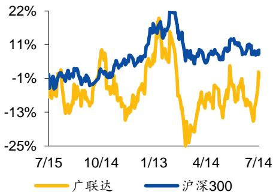  
过去一年股价走势   
资料来源：Wind

# 相关研究报告

《国元证券公司研究-广联达(002410.SZ)事件点评：八三开局良好，数字设计打开新空间》2021.05.24

《国元证券公司研究-广联达(002410.SZ)2020年年度报告点评：云转型推进顺利，现金流大幅增长》2021.03.31

# 目录

1．建筑设计：工程建设的基石，亟待数字化转型. 4  
1.1 建筑设计行业数字化转型需求迫切 4  
1.2中长期市场空间有望达到百亿以上， .7  
2.公司发展：布局数字设计，连接产业上下游， .. 9  
2.1 内生动力：基于图形平台打造自主产品.. .10  
2.1.1 BIMMAKE 重磅发布，迈出关键一步 ..11  
2.1.2数字设计 BG 成立，具有里程碑意义 .14  
2.2外延发展：通过战略并购扩充产品线... 17  
2.2.1 并购 Progman Oy，迈入国际市场.. .18  
2.2.2外延收购鸿业科技，协同效应明显 .19  
2.3生态建设：数字设计助力一体化平台构建. .21  
2.3.1 数字设计是数字建筑平台的重要组成部分 21  
2.3.2BIMFACE赋能开发者，促进生态繁荣.. 22  
3.海外启示：Autodesk 的成功因素分析.. 24

4.盈利预测与投资建议. .28

# 图表目录

图 1：设计阶段在建筑全生命周期中的位置 4  
图2：同一建筑物的建筑模型、结构模型、机电模型 4  
图3：我国工程勘察设计企业营业收入和利润总额情况 6  
图4：我国工程勘察设计企业与从业人员数量. 6  
图5：设计机构现状：业务与管理关系分离. 6  
图6：数字设计的发展阶段.. .7  
图7：二维与三维设计类软件采购费用.. 7  
图8：数字设计在公司BIM一体化解决方案中的位置， .9  
图 9：公司具备助力建筑行业数字化转型的5 项核心技术 10  
图10：BIMMAKE操作界面及主要功能 .11  
图11：BIMMAKE支持的数据格式.. 12  
图12：BIMMAKE深入施工深化设计场景， .12  
图13：BIMMAKE第一阶段与第二阶段推广成效.. 13  
图14：车用锂电正极材料产业化及环保技改项目工程.. .14  
图 15：BIMMAKE 有助于企业打造全程一体化的数字建筑解决方案 14  
图16：公司数字设计BG业务规划.. 15  
图17：建筑设计一体化解决方案架构.. 15  
图18：建筑设计一体化解决方案效果图， 16  
图19：广联达构件坞使用界面.. 16  
图20：专业软件可通过鸿城 InfraFuser进行集成融合 17  
图21：鸿城 InfraFuser全过程数据资产库. 17  
图22：MagiCAD产品线.. 18  
图23：MagiCAD 四大功能模块. .18  
图24：鸿业科技发展历程.. .19  
图25：广联达鸿业主要产品与解决方案， 19  
图26：基础设施一体化解决方案. 20  
图27：建筑数字化正向设计解决方案—BIMSpace. 21  
图28：数字设计是数字建筑平台的重要组成部分.. 22  
图29：基于数字设计平台，打造开放的内容、应用和社区生态 22  
图30：基于BIMFACE的设计协同平台.. 23  
图31：BIMFACE为发挥模型的应用价值创造了条件， 23  
图32：2019 年全球 CAD 市场份额占比 24  
图33：Autodesk主要产品及收入占比. 24  
图34：Autodesk依托Forge平台形成了完整的云服务生态. 25  
图35：Autodesk收费模式转型路径.. .26  
图36：Autodesk 销售渠道与服务模式. 26  
表1：部分主流建筑设计软件. 5  
表2：2025 年建筑行业设计软件市场空间测算 8  
表3：公司2020年数字设计领域在研项目状况. 10  
表4：公司业务拆分(单位：百万元) .29  
表5：可比公司估值情况.. .30

# 1．建筑设计：工程建设的基石，亟待数字化转型

# 1.1建筑设计行业数字化转型需求迫切

建筑设计是建筑工程建设的关键环节，不仅决定了建筑的外观、空间和使用功能，还决定了建筑施工成本、建筑质量安全、建筑施工进度以及建筑能耗等。例如，在施工成本方面，设计方案决定了建筑材料的选择和用量以及施工工艺，对工程总造价具有决定性影响。合理的设计可以有效地节约建筑材料、提升施工效率、缩短工期，从而降低建筑总成本。

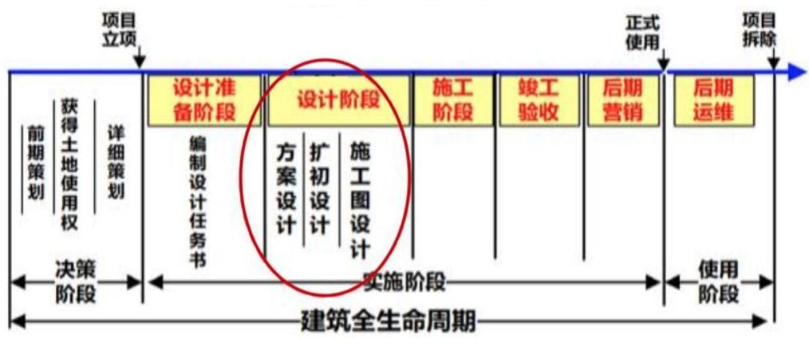  
图1：设计阶段在建筑全生命周期中的位置  
资料来源：盈建科招股说明书，国元证券研究所

建筑设计按照设计内容可细分为建筑专业设计、结构专业设计和机电专业设计三个方面。传统设计中常用的 AutoCAD 等软件通用性强、可以广泛应用于工业设计、园林设计、室内设计等多种领域，但专业性欠缺，而专用性软件能够提升结构设计、机电设计应用的可行性与易用性，如基于AutoCAD 和Revit 平台的机电设计与深化解决方案 MagiCAD。

  
图2：同一建筑物的建筑模型、结构模型、机电模型  
资料来源：筑龙学社，国元证券研究所

国产软件逐渐得到业内认可，自主创新能力成为破局关键。在大型建筑工程项目中，设计环节分为方案设计、扩初设计、施工图设计三个阶段。目前，方案设计软件市场主要被国外软件厂商所垄断，如 Autodesk 的 3DS MAX、Maya；Trimble Navigation的SketchUp等。在扩初设计和施工图设计领域，国内厂商如中望软件、探索者、盈建科、北京构力、广联达陆续研发出具备自主知识产权的产品，但仍处于市场拓展初期，暂时难以撼动Autodesk的行业领导地位。

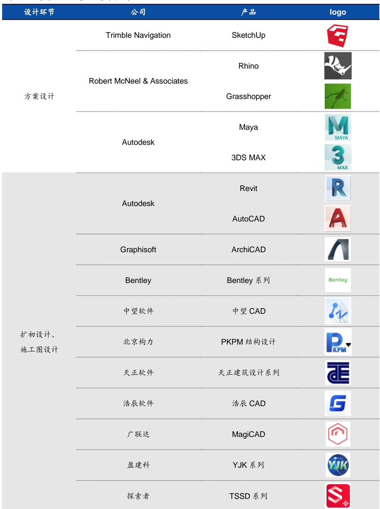  
资料来源：国元证券研究所整理

下游工程勘察设计行业空间巨大，工程设计环节市场规模达到五千亿元。我国工程勘察设计企业数量较为稳定，总体保持在 23000 家左右，受下游房地产开发行业集中度提升的影响，最近几年工程勘察设计企业数量有下降的趋势，行业集中度相应提升。2019 年，全国具有资质的工程勘察设计企业共23739 家，其中，工程设计企业

21327个，占总数的 $8 9 . 8 \%$ o

受固定资产投资规模的逐年增加以及下游的居住建筑、商业建筑、公共建筑的大量建设需求，我国工程勘察设计企业营业收入逐年上升，从 2012 年的16171 亿元提升至2019年的64201亿元，CAGR达到 $2 1 . 7 7 \%$ 。2019年，行业营业收入总计64201亿元，同比增长 $2 3 . 6 6 \%$ ，其中，工程设计收入为5095 亿元，同比增长 $1 0 . 5 \%$ ；行业营业利润达2803亿元，同比增长 $2 0 . 8 \%$ ，利润总额达2722亿元，同比增长 $1 0 . 9 \%$ 。随着我国固定资产投资规模的扩大，工程勘察设计行业市场空间有望继续增长。

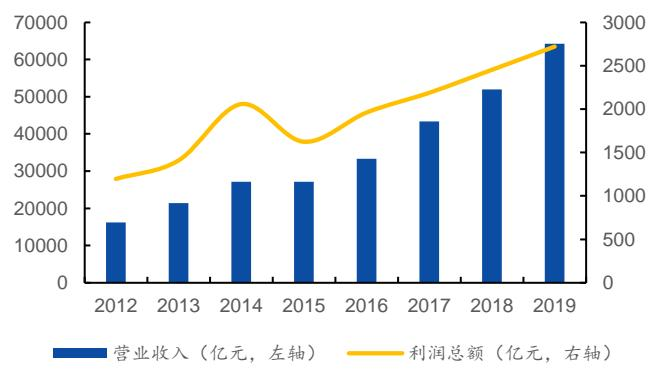  
图3：我国工程勘察设计企业营业收入和利润总额情况  
资料来源：中商产业研究院，住建部，国元证券研究所

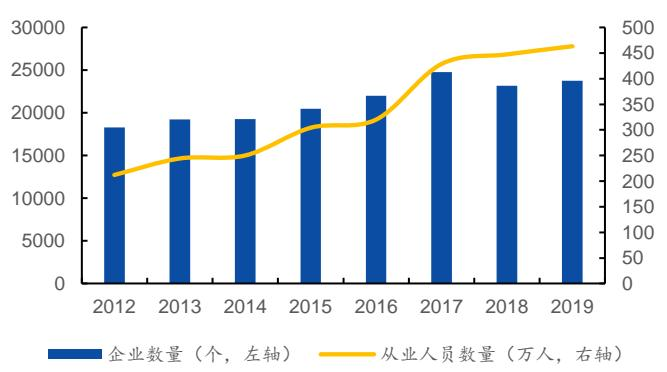  
图4：我国工程勘察设计企业与从业人员数量

资料来源：中商产业研究院，住建部，国元证券研究所

我国建筑信息化的渗透率仍处于较低水平，设计环节数字化转型后有望进一步打开市场空间。根据麦肯锡全球研究院 2017 年12 月发布的《数字时代的中国：打造具有全球竞争力的新经济》，建筑行业是中国数字化水平最低的行业之一。从设计环节来看，我国建筑工程设计数字化发展缓慢，设计机构普遍存在信息孤岛、业务与管理关系分离、专业协同低效、设计周期紧张、交付质量有待提高等问题。此外，装配式建筑、BIM技术、绿色建筑、工程总承包和全过程工程咨询等新型理念、技术和业态快速发展，对建筑设计软件提出了更高的要求，工程设计亟需向数字化转型升级。

  
图5：设计机构现状：业务与管理关系分离  
资料来源：2021广联达年度投资者大会演示文稿，国元证券研究所

# 数字设计的发展趋势：以数据为中心，打造建筑全数字化样品。

传统设计：以图纸、文字、图像等为载体，建筑工程信息在各阶段、各参与方之间传递时，需要进行重新解读和甄别，并经过多次迭代才能完成工程信息的积累

和存储。

新设计：新设计是基于“数字建筑”理念，立足全专业、全过程的数字化设计，打造全数字化样品，构建建筑设计互联网平台和设计市场生态。新设计服务于工程信息数字化，将建筑工程信息以数字化的方式组织、存储、共享、传递，实时验证数据的正确性、合规性，保证数据在整个生命周期流转的高效性。

  
图6：数字设计的发展阶段  
资料来源：2021广联达年度投资者大会演示文稿，国元证券研究所

# 1.2 中长期市场空间有望达到百亿以上

我们测算：到 2025 年，建筑设计软件的市场规模有望达到 110 亿元左右。其中，二维设计类软件（2DCAD 等）的市场空间有望达到 22 亿元，三维设计类软件（3DCAD、Revit、BIM 等）的市场空间有望达到 88亿元。

二维设计类软件年费：目前国产设计类软件的销售模式仍以 License 授权模式为主，根据中国招标投标公共服务平台的公开信息，2D CAD 产品的 License 平均售价在 6000 元左右，假设按照3 年的使用年限估算，则每用户每年平均付费为2000元左右。

三维设计类软件年费：三维设计类软件市场由海外厂商主导，多采用订阅模式。  
根据Autodesk 官网的信息，3DS MAX等三维设计类软件年费在8000元左右。

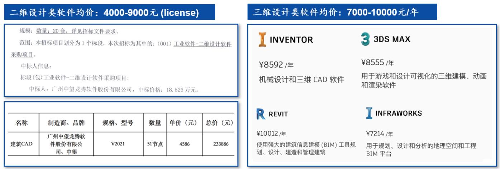  
图7：二维与三维设计类软件采购费用  
资料来源：中国招标投标公共服务平台，Autodesk 官网，国元证券研究所

设计人员数量：根据住建部《2019 年全国工程勘察设计统计公报》数据，2019年具有勘察设计资质的企业年末从业人员中，设计人员数量达到 102.5 万人，同比增长 $1 0 . 7 \%$ 。行业总体从业人员数量2012-2019 年的 CAGR 为 $1 1 . 7 8 \%$ ，假设未来五年设计人员数量的CAGR为 $5 \%$ ，则2025年设计人员数量约为137万人。

付费软件渗透率：考虑到企业软件正版化政策的推进、建筑设计从业人员对BIM等数字设计软件的需求提升等因素，假设到 2025 年付费设计软件的渗透率将达到 $80 \%$ 。

表2：2025 年建筑行业设计软件市场空间测算  

<table><tr><td>软件类型</td><td>设计人员（万人）</td><td>付费渗透率(%)</td><td>软件年费（元）</td><td>市场空间（亿元）</td></tr><tr><td>二维设计类软件(2D CAD)</td><td>137</td><td>80%</td><td>2000</td><td>22</td></tr><tr><td>三维设计类软件（3D CAD、Revit、BIM 等)</td><td>137</td><td>80%</td><td>8000</td><td>88</td></tr></table>

资料来源：国元证券研究所测算  
注1：住建部未披露2019 年之前的设计从业人员数量，故年复合增速参照整体从业人员数量增速进行估算。注2：渗透率 $80 \%$ 为假设，仅供投资者参考。

随着建筑行业标准陆续出台，叠加软件正版化政策的持续推进，国家从制度层面提供了保障建筑信息化行业蓬勃发展的良好环境。从企业层面看，广联达作为国内数字施工和造价软件的龙头企业，一方面基于自有的图形平台打造出BIMMAKE 等行业领先的数字设计产品；一方面通过收购鸿业科技等厂商完善数字设计业务布局，有望在设计业务的数字化浪潮中充分受益。

# 2.公司发展：布局数字设计，连接产业上下游

数字设计业务有望打通公司在建筑信息化领域的产业链布局。为满足建筑行业客户对单点信息化的需求上升为系统数字化转型的需求、解决客户对数字化的系统化需求与碎片化供应之间的矛盾，公司致力于打造项企一体化的方案——集成项目管理系统。集成项目管理系统将单点信息化升级至 BIM 一体化解决方案，基于企业 BIM资源中心和企业级 BIM 管理平台，进行全局优化，真正解决项目问题，满足客户需求。数字设计作为公司新的战略创新业务，为设计企业提供全专业的数字化设计解决方案，是BIM一体化解决方案上游的关键环节。

数字技术除了在设计前期有着大量应用，在后期的设计运算，交流表达，工程数据处理，施工建模等众多环节都有着广泛的应用场景。在建筑业设计端和施工端融合的趋势下，公司有望凭借在造价、算量等方面的优势，向上游的施工建模、深化设计领域拓展，为项目提供全生命周期的数字化服务。

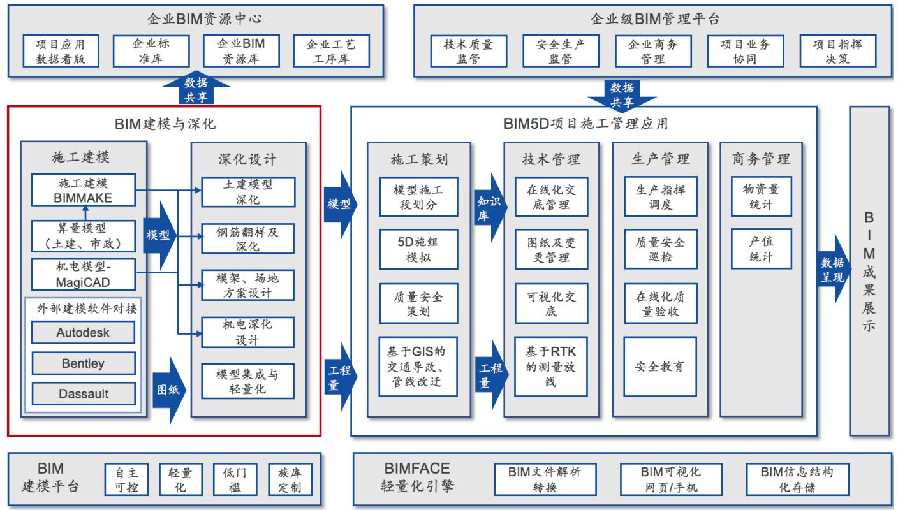  
图 8：数字设计在公司BIM一体化解决方案中的位置

资料来源：2021广联达年度投资者大会演示文稿，国元证券研究所公司的自主核心技术是支撑数字设计业务发展的基础。公司具备助力建筑行业数字化转型5 项自主产权的核心技术：BIM/CIM 技术、IoT技术、大数据、AI技术、云中立。数字设计的核心是数据和算法，基于数据和算法，数字设计软件能够实现实时精准的自动化协同设计，探索所有可能的设计方案，快速生成备选方案。

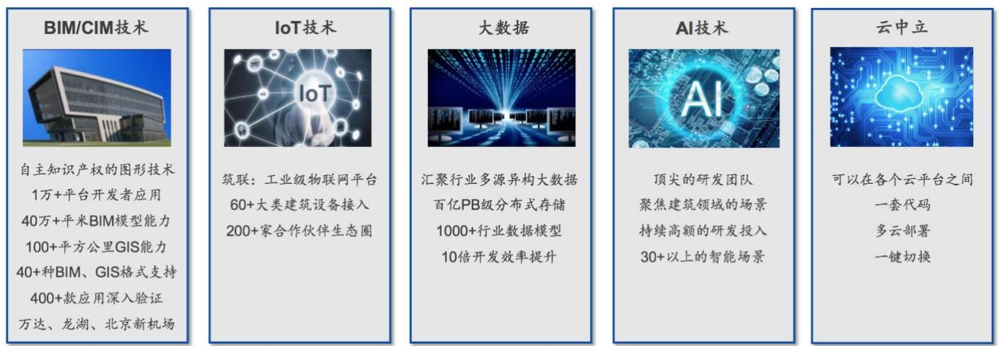  
图9：公司具备助力建筑行业数字化转型的5 项核心技术  
资料来源：2021广联达年度投资者大会演示文稿，国元证券研究所

底层图形运算算法和数据库的建立是建筑设计软件最核心的部分。从 2003 年开始，公司开始自主研发图形引擎，打造出了适合建筑业应用的图形引擎，能够满足超大规模建设项目应用需求。目前，广联达图形技术平台已成功地运用在设计建模平台和新设计、计量平台及计量产品线、国际化产品线、施工项目管理平台、BIMFACE等基于云的诸多产品和服务中。2020 年，公司在建模平台、BIM三维图形平台等领域持续投入研发，为数字设计业务的可持续发展奠定了基础。

表3：公司2020年数字设计领域在研项目状况  

<table><tr><td>项目名称</td><td>累计研发资本化金额(万元)</td><td>项目基本情况</td><td>实施进度</td></tr><tr><td>建模平台</td><td>1683.80</td><td>建模平台旨在为建筑行业提供一个支持多专业协同、云加端跨平台、面 向业务二次开发的设计建模平台。通过上层设计业务的构建，底层数据 的互通互用，形成一个建筑行业的BIM建模平台和BIM数据平台。</td><td>项目已完成</td></tr><tr><td>BIMDeco裝饰一 体化平台项目</td><td>1664.91</td><td>面向公共装饰领域的BIM一体化平台，以装饰BIM为基础，打通设计、 预算、施工的项目全过程，从而帮助公装领域相关企业，包括装饰企业、 材料供应商、建设单位等，逐步实现 BIM 化设计、数字化施工、工业 化生产与装配式施工。</td><td>开发过程中</td></tr><tr><td>BIM 三维图形平 台项目</td><td>7280.78</td><td>旨在开发具有自主知识产权的 BIM 三维图形平台，主要包括 BIM 三维 图形渲染引擎、BIM几何造型引擎和BIM建模平台三大模块，提供三 维图形渲染、曲线曲面造型、业务造型、参数化建模、构件编辑、BIM 数据扩展支持等功能。在公司内部开发的图形平台的基础上，用户可以 通过二次开发接口API快速开发各种具体的BIM应用及服务。</td><td>开发过程中</td></tr></table>

资料来源：公司公告，国元证券研究所

# 2.1 内生动力：基于图形平台打造自主产品

公司大量投入研发，通过对关键技术的不断积累突破，保持在行业领域的领先优势，旗下自主产品包括BIMMAKE、广联达建筑设计产品集等。与海外同类产品相比，公司的数字设计软件具有安全性高、适用性广、符合国内习惯等特点。

适用性：海外大多数软件只能用于设计建模，很难应用于施工之中。公司开发的

软件瞄准建筑全生命周期，可以应用于从设计、施工到运维、拆除等各个阶段。

安全性：国内软件在关键技术上仍面临着瓶颈，即自主BIM引擎问题和三维图形平台安全问题。公司率先研制出自主引擎的替代性产品，并发布了具有全部自主知识产权的数字建筑平台，在安全性方面相对于国外产品更有保障。

本土化：公司的施工图设计产品基于国产自主平台和云端协同平台，功能范围和能力更聚焦、更符合国内设计逻辑、设计习惯，能够更好地保证设计质量、提高设计效率、符合国内出图标准。

# 2.1.1 BIMMAKE 重磅发布，迈出关键一步

BIMMAKE 的前身是公司 2018 年推出的 BIM 构件族建模软件 GeoLab，经过两年的打磨，BIMMAKE于2020 年9 月在中国数字建筑（全国)峰会上正式发布，以完整、全新的形态面向全国用户。

作为一款施工建模设计软件，BIMMAKE 是基于公司自主知识产权图形和参数化建模技术，为 BIM 工程师/技术工程师全新打造的聚焦于施工全过程的 BIM 建模及专业化应用软件。BIMMIKE主打快速获取建筑的BIM模型，有助于建筑企业的精细化管理，提高建筑行业的整体数字化水平。

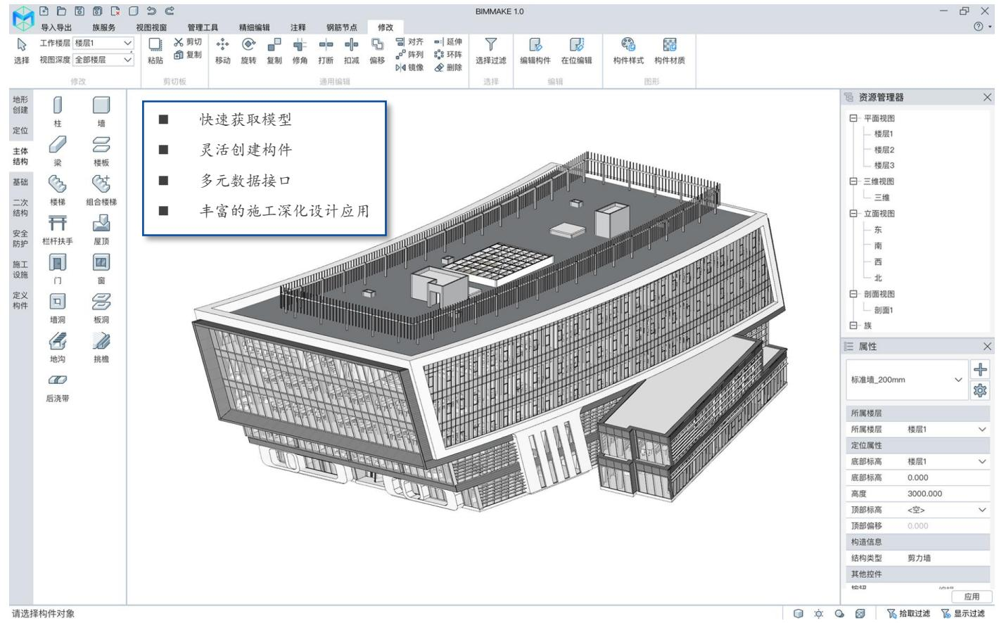  
图10：BIMMAKE操作界面及主要功能  
资料来源：广联达施工设计建模BIMMAKE微信公众号，国元证券研究所

快速获取模型：建模方面，BIMMAKE支持导入CAD 底图进行主体结构构件、基础构件等丰富构件的创建，软件界面及交互更符合国人习惯，易上手，使用更快捷。翻膜方面，BIMMAKE 集成GTJ产品CAD 翻模能力，快速识别图纸创建三维模型，图纸一键自动分割整理，识别快，整体识别率高达 $9 5 \%$ 。

多元数据接口：BIMMAKE支持8 种格式导入，6 种格式导出，快速获取施工BIM模型，减少重复建模，能够增强模型的上下游价值，实现模型更多应用的延展。

  
图11：BIMMAKE支持的数据格式  
资料来源：广联达施工设计建模 BIMMAKE微信公众号，国元证券研究所

丰富的施工深化设计应用：快速布置二次结构、排布砌体、出图出量；节点钢筋精细编辑，轻量化钢筋三维交底；设置木模配置参数，一键配模，出图出量。

灵活创建构件：轻量化参数化快速建族，持续更新的云端构件库；支持施工企业CI标准化族库创建，规范现场布置。

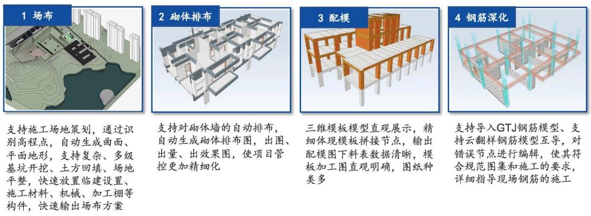  
图12：BIMMAKE深入施工深化设计场景  
资料来源：广联达施工设计建模 BIMMAKE微信公众号，国元证券研究所

产品推广进展：为使 BIMMAKE 软件能在施工阶段实现应用普及，公司推出了软件免费使用360 天、免费直播网课等推广策略。此外，公司通过收集用户反馈，持续打磨产品，BIMMAKE于2021 年4月更新至1.5 版本，新版本在二维出图能力、工程量统计等方面进行了优化，实用性更强。

第一阶段：2020 年1月，BIMMAKE 更新至Beta6 试用版，开始进行初步推广，应用企业和用户数量规模较小。

第二阶段：2020 年9 月，BIMMAKE产品正式发布，应用企业和用户数量相比第一阶段大幅增长：应用企业数达到386 家，应用项目数达到4500 个，应用用户数达到 26000 人，得到客户充分肯定和广泛好评。

第三阶段：2021 年5 月，公司开始全面推广BIMMAKE 应用。公司为各企业打造一系列专属培训，在中宙建工集团、中煤七十二处、湖南建工集团等企业组织培训共16 场，有近 500人参与学习。根据官网数据，BIMMAKE 的应用用户数已经从第二阶段的 26000人上升至目前的 40000人，推广进展良好。

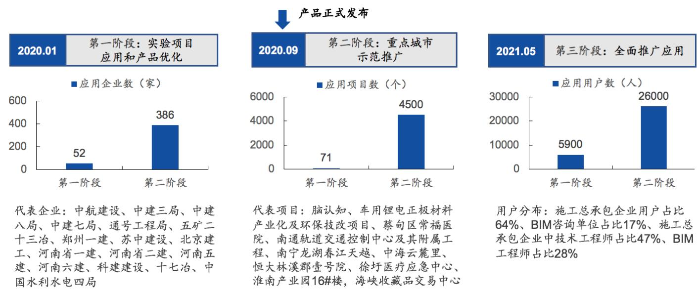  
图13：BIMMAKE第一阶段与第二阶段推广成效

资料来源：2021广联达年度投资者大会演示文稿，国元证券研究所

BIMMAKE 应用案例——五矿二十三冶三公司 BIM 组织架构与管理模式改革：五矿二十三冶三公司在项目实施中，发现了BIMMAKE在BIM多软件衔接应用中的使用价值，探索了一条设计、施工BIM一体化应用之路，可以降低BIM技术成本 $50 \%$ 以上，因此三公司率先对公司的 BIM 组织架构与管理模式进行了改革。革新后的 BIM组织架构有效地带动了自身商务、技术及其他部门的高效连接，成为企业技术的内核，为企业降本增效；带动了施工企业与上游设计的连接，提升了施工企业的竞争力。

目前，三公司已经在车用锂电项目、石厦小学、梅丽小学展开实施BIMMAKE一体化应用，预计 2021 年下半年铺开推广。在车用锂电正极材料产业化及环保技改工程项目中，三公司运用BIMMAKE进行项目实施，在园区建模上，减少了 $50 \%$ 的建模时间，提高工作效率一倍，在短时间内保证了工作的完成。

  
图14：车用锂电正极材料产业化及环保技改项目工程

# 难点：项目复杂，Revit建模时间紧张

项目性质特殊（国内首个大型锂电项目，设计施工均无相关经验)  
工期紧张（实际需要15个月完成16栋单体3256台设备安装，管线39148米施工，业主要求10个月完成)  
质量安全要求高（工艺复杂，设备多，重量大，管道多，设备安装精度要求高)

# 解决方案：利用BIMMAKE快速建模

利用BIMMAKE将GTJ模型转为Revit模型，很快获得Revit土建模型。只需要在Revit中完善外立面，补充环境即可完成整个园区模型，为项目节省了一半的时间

资料来源：广联达设计微信公众号，国元证券研究所

数字化设计是未来各设计企业转型升级的必然选择，也是实现建筑行业转型的最直接路径。作为拥有自主知识产权核心技术的 BIM 建模设计产品，施工建模设计软件BIMMAKE 的发布将有力地推动业内三维BIM 核心建模软件的普及和发展。公司未来将持续深入BIM 技术在建筑行业的落地应用，助力建筑行业数字化转型升级。

  
图15：BIMMAKE有助于企业打造全程一体化的数字建筑解决方案  
资料来源：2021广联达年度投资者大会演示文稿，国元证券研究所

# 2.1.2 数字设计 BG 成立，具有里程碑意义

广联达设计是公司的数字设计业务品牌，基于“数字建筑”理念，立足一体化数字设计，打造全数字化样品，构建中国设计互联网平台和生态，为行业提供全专业、全过程、全参与方的高效数字化设计整体解决方案，助力设计企业工业化转型升级。

广联达设计主要服务于建筑设计和市政设计，聚焦工程项目施工图设计阶段和施工深化设计阶段，旗下基于自主平台的产品主要包括面向建筑院的建筑设计一体化解决方案和面向市政规划院的鸿城 InfraFuser。随着对鸿业科技的收购和双方业务整合的推进，公司未来将对设计业务的战略方向进行更深一步的细化。

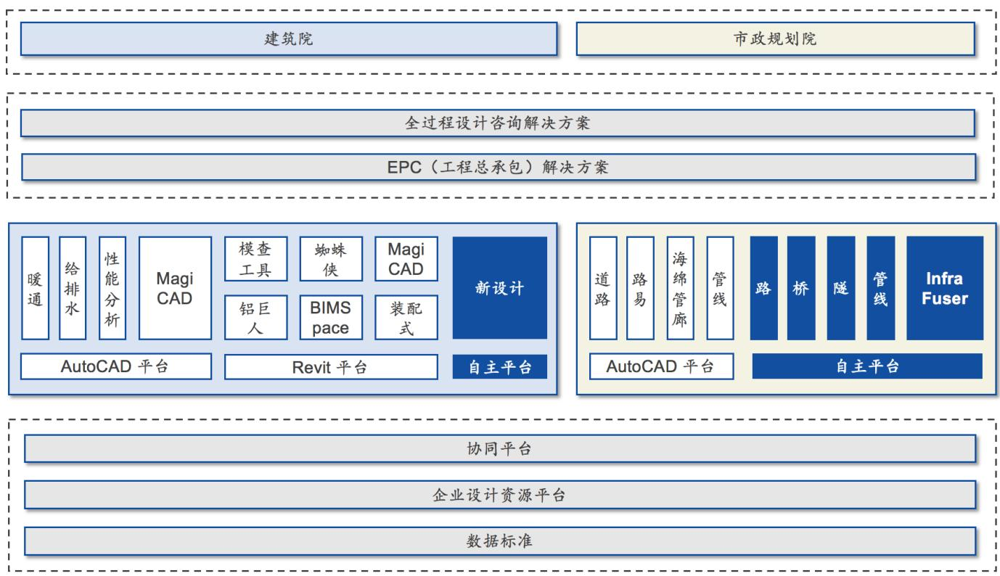  
图16：公司数字设计BG业务规划  
资料来源：广联达鸿业微信公众号，国元证券研究所

建筑设计一体化解决方案是广联达设计品牌的核心产品。广联达建筑设计产品集（邀请体验版)于2021 年3月正式发布，主要包括建筑、结构、机电三个专业设计工具，一个云端设计协同平台和一个以 BIM 构件为主要内容的云端设计资源平台，可覆盖广大设计师用户的工作使用场景。

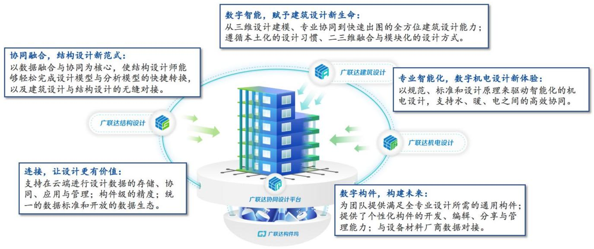  
图17：建筑设计一体化解决方案架构  
资料来源：广联达设计官网，国元证券研究所

根据公司发布的《2021 年5 月 18 日投资者关系活动记录表》，该邀请体验版本主要面向受邀的设计师群体开放，目前合作伙伴反馈情况良好。公司将根据反馈不断补齐功能、改进和完善产品，年内会基于此版本做进一步的升级。

  
图18：建筑设计一体化解决方案效果图

资料来源：广联达设计官网，国元证券研究所

一体化解决方案底层的构件坞是一个面向 BIM 设计师的公共构件库，设计师在进行BIM 建模时，可以在构件坞里搜索并下载 BIM 构件，减少重复劳动，提升建模效率。公司的构件坞汇集九大专业构件，271 种分类，近3 万个Revit 族文件，可在网站、Revit 软件（2014-2020 版）中直接使用。

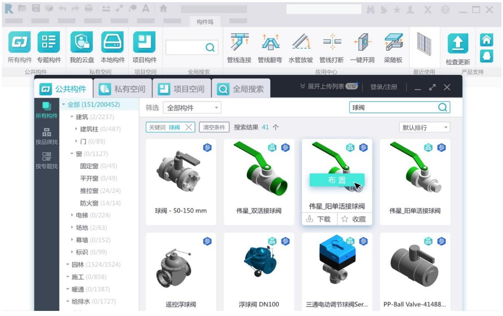  
图19：广联达构件坞使用界面  
资料来源：广联达构件坞官网，国元证券研究所

鸿城 InfraFuser：鸿城 InfraFuser 是具有国产自主知识产权的，为设计院提供的基础设施多专业综合设计系统。广联达鸿业的路易、市政道路、管立得等设计成果可通过鸿城进行集成融合，供设计院进行综合设计与汇报，且可通过二次开发组件进行业务拓展应用。

  
图20：专业软件可通过鸿城 InfraFuser 进行集成融合

资料来源：广联达鸿业微信公众号，国元证券研究所

鸿城 InfraFuser贯彻“一套标准、一种模式、一个平台”的理念，通过“现状、规划、设计、竣工、测绘”五图合一形成设计院全过程数据资产库，现状数据与规划、设计数据相融合，支撑咨询、设计等部门开展设计工作，并可对外提供数据服务。

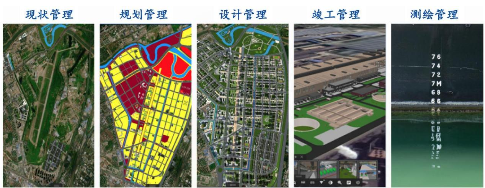  
图21：鸿城 InfraFuser 全过程数据资产库

资料来源：广联达鸿业微信公众号，国元证券研究所

根据广联达鸿业微信公众号，2021 年 3 月，广联达鸿业以 570 万元中标宝武集团“MapPlat宝武智慧总图空间信息服务平台开发及技术研究”项目，将以鸿城InfraFuser结合宝武集团“绿色发展、智慧制造”的战略思想，以实现工业数字化、智能化为目标，通过挖掘总图数据资源，打造共建共享的企业规划发展需要的总图平台，助力宝武集团实现与“两亿吨宝武”相匹配的总图空间专业化服务能力。

# 2.2 外延发展：通过战略并购扩充产品线

在数字设计领域，公司分别于 2014 年、2020 年全资收购了芬兰Progman Oy 公司和洛阳鸿业信息科技有限公司。上述两家公司的数字设计产品均具有较高的知名度及影响力，股权收购有助于将行业领先的 BIM 技术和产品与公司现有产品及方案进行深度整合，提升公司产品和服务的竞争力。

# 2.2.1 并购 Progman Oy，迈入国际市场

2014 年 3 月，公司宣布以 1800 万欧元收购芬兰 Progman Oy 公司 $100 \%$ 股权。Progman Oy 专注于MEP（面向建筑设备及管道工程的建筑信息模型）设计和施工软件，核心产品是基于Revit和AutoCAD 平台的机电和管道设计软件 MagiCAD。

对 MagiCAD 的收购有助于双方发挥协同效应，强化 BIM 技术优势。MagiCAD 是一款BIM 深化设计软件，可以提供专业、高效、节约的 BIM 解决方案，在北欧、俄罗斯和芬兰市占率排名前列。根据官网数据，MagiCAD目前覆盖全球 80 多个国家，被欧洲 $90 \%$ 以上设计院所应用，并广泛应用于中国 700 余家客户的上千个项目。

  
资料来源：MagiCAD官网，国元证券研究所

MagiCAD 原有的模块主要包括通风系统、水系统、电气系统等辅助设计模块，公司收购 Progman Oy 后，根据国内标准和工作流程深度定制开发了全新的功能模块。目前，MagiCAD 融合了管综深化设计、支吊架、机电算量、二维出图四大模块，协同MagiCAD产品库构成 MagiCAD 整体机电 BIM 解决方案。

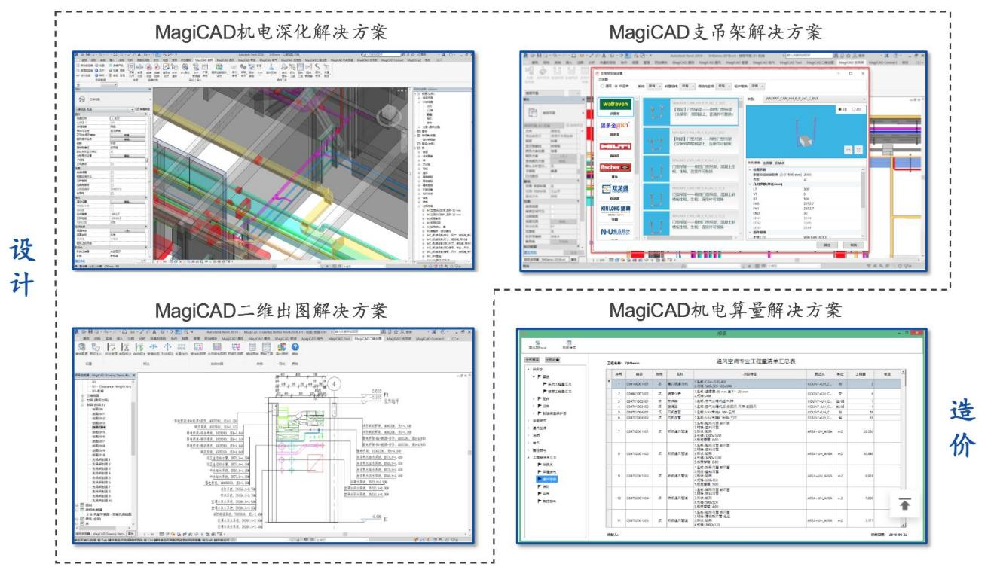  
图23：MagiCAD 四大功能模块  
资料来源：MagiCAD官网，国元证券研究所

# 2.2.2 外延收购鸿业科技，协同效应明显

2020 年 10 月，公司宣布以 4.08 亿元收购洛阳鸿业信息科技有限公司 $9 0 . 6 7 \%$ 的股权，鸿业科技成为公司的全资子公司。自1992 年成立以来，鸿业科技一直致力于建筑工程、市政工程等领域信息化应用软件的研发，拥有多项自主知识产权，为设计行业提供全方位的专业信息化产品与服务。通过与鸿业科技的业务整合，公司有望进一步完善在数字建筑产业链的布局，增强核心竞争力。

  
图24：鸿业科技发展历程

资料来源：广联达设计官网，广联达鸿业微信公众号，国元证券研究所公司有望借助鸿业科技的品牌与市场能力，推动设计业务加速发展。鸿业科技的主要产品及服务包括：建筑工程、市政工程辅助设计和模拟分析计算软件、BIM相关产品的研发、销售及大数据服务。在传统CAD设计产品、市政公路及管线设计产品、BIM 设计产品领域，鸿业科技在市场中均处于领先地位。

2021 年，鸿业科技与公司进行了全方位整合，形成了以 BIMSpace 为核心的建筑数字化正向设计解决方案、以 InfraFuser 为底层平台的基础设施一体化解决方案。面向未来，鸿业科技将结合公司图形平台，打通设计、算量造价和施工一体化，面向整个建筑行业打通相关数据，为建筑业未来数字化转型提供数据技术支持。

  
图25：广联达鸿业主要产品与解决方案  
资料来源：广联达设计官网，国元证券研究所

基础设施一体化解决方案：基础设施一体化解决方案基于底层的 BIM 技术支撑，形成数据无缝流转的一体化产品平台，涵盖基础设施设计各个专业模块，满足道路路线、立交、桥隧、交通设施等各个专业设计需要，以及城市供水、排水、防洪排涝、供电、供热、旧网改造等多种管网业务需求，囊括了项目前期方案阶段、初设、施工图及BIM交付等多个阶段，为设计单位承接各类业务提供完整、高效、一体化的解决方案和技术保障。

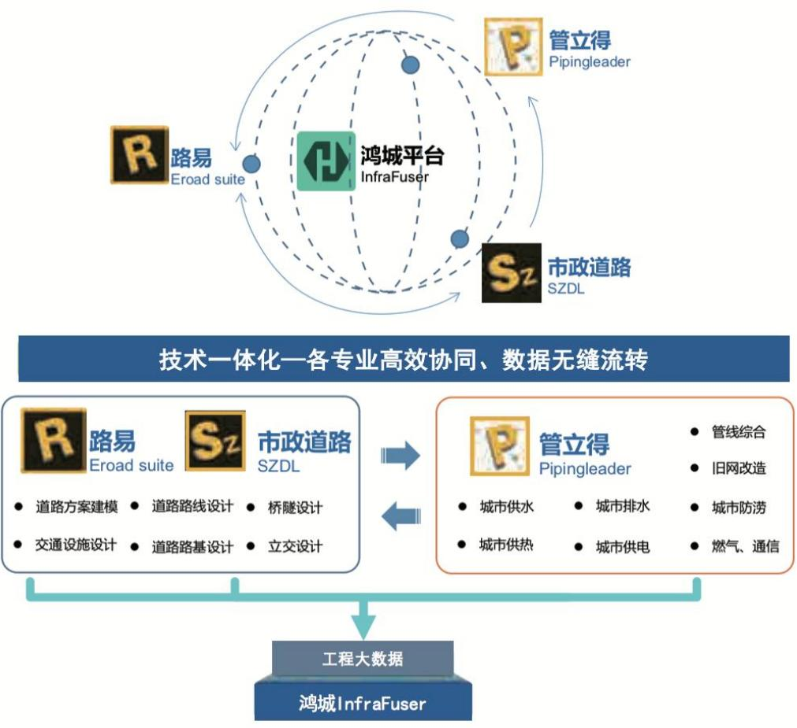  
图26：基础设施一体化解决方案  
资料来源：广联达设计官网，国元证券研究所

建筑数字化正向设计解决方案—BIMSpace:该解决方案涵盖了建筑、结构、给排水、暖通、电气等五个专业，设计应用囊括了项目前期方案阶段、初设、施工图及BIM交付等多个阶段，依托 BIM 设计管理平台，可以实现项目数据的集成管理。全过程一体化的应用设计理念为设计数据向下游阶段的无损传输提供了可靠的保障，同时设计—算量—施工一体化的框架设计为产业数字化转型提供了有效支撑。

2021 年 6 月，BIMSpace2022 正式开放下载。2022 版本围绕各专业出图、设计建模、规范校审、计算分析、深化设计、项目内外部高效协同等方面进行了大量升级和功能优化，不断强化正向设计应用能力。

  
图27：建筑数字化正向设计解决方案—BIMSpace

资料来源：广联达设计官网，国元证券研究所

公司的“八三”战略提出了 $3 { + } \times$ 的业务目标，即造价施工比翼双飞，造价业务提供更多云服务，施工业务快速实现规模化；设计软件实现战略突破，围绕建造阶段展开详细设计和深化设计；数字建筑平台成型，占领建筑产业平台制高点。我们认为，对鸿业的收购使公司加速切入设计领域，有助于公司业务目标的达成。

# 2.3生态建设：数字设计助力一体化平台构建

# 2.3.1 数字设计是数字建筑平台的重要组成部分

数字建筑平台将设计、采购、制造、建造、交付、运维等全过程一体化，有效地提高了产业链的生产效率。通过打造国内领先的数字建筑平台，公司有望助力建筑设计企业转型升级，提升设计业务价值。

数字建筑平台：在架构上，数字建筑平台是融合前沿数字技术与先进精益建造理论方法的建筑工业互联网平台；在功能上，它将贯穿工程项目全过程，升级产业全要素，连接工程项目全参与方，提供虚拟建造服务和虚实结合的孪生建造服务，系统性地实现全产业链的资源优化配置，最大化提升生产效率，赋能产业链各方，实现让每一个工程项目成功的产业目标。

数字设计环节：数字建筑平台中，产业链各方通过协同完成建筑的设计、采购、建造和运维，系统性地实现全产业链的资源优化配置。在设计阶段，设计各方通过平台进行协同设计、交付数字化样品。面向未来，基于国产自主平台，公司将打造以数字设计为代表的新型设计平台，助力建筑行业的数字化转型。

  
图 28：数字设计是数字建筑平台的重要组成部分

资料来源：2021广联达年度投资者大会演示文稿，国元证券研究所公司计划运用数据驱动协同打通全流程，基于数字设计平台，打造开放的内容、应用和社区生态，实时精准的数据协同，驱动设计—施工—运维一体化，实现与合作伙伴一起共建数字设计生态。

  
图29：基于数字设计平台，打造开放的内容、应用和社区生态  
资料来源：2021广联达年度投资者大会演示文稿，国元证券研究所

# 2.3.2 BIMFACE 赋能开发者，促进生态繁荣

公司始终坚持开放共赢的理念，致力于携手广大开发者进行共同创新。公司在 2017年建设行业峰会推出了BIM 应用二次开发平台BIMFACE，旨在帮助建设行业软件开发商、企业信息化管理人员，为其提供BIM 应用开发涉及的关键技术和平台，降低 BIM 应用开发的门槛。根据 BIMFACE 官网披露的数据，目前网站的应用开发者超过10000人，每月API调用次数超过1亿次，BIM数据条数超过300亿条。

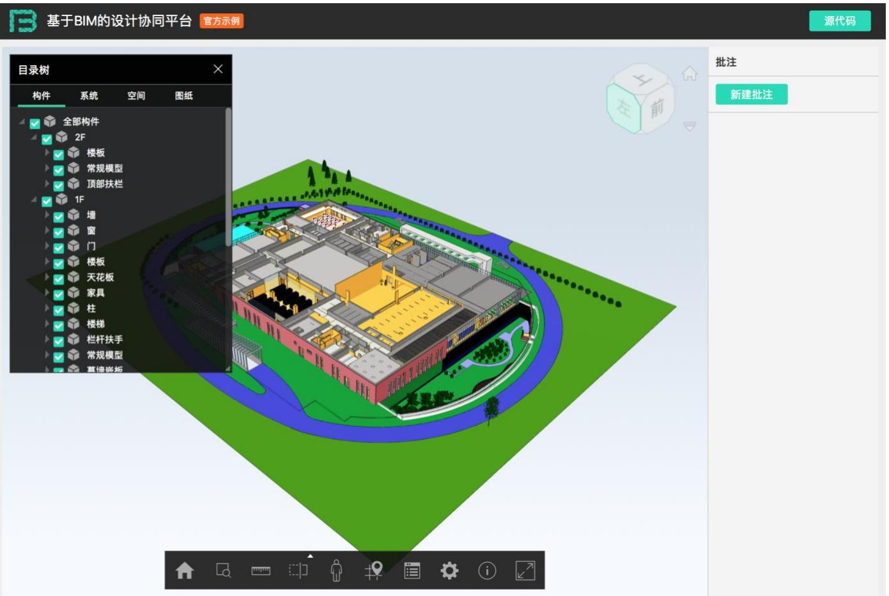  
图30：基于BIMFACE的设计协同平台  
资料来源：BIMFACE官网，国元证券研究所

BIMFACE 的业务起点发生在建模完成后，聚焦于模型的浏览与管理，旨在帮助用户最大化地发挥模型的应用价值。BIM 的价值链主要分两个阶段，一是模型创建阶段，二是模型应用阶段。发挥BIM 模型的价值需要发展轻量级的应用，因此需要对 BIM原始文件进行处理，如把文件级的数据解析成颗粒度更细的数据，并让数据在线化、结构化，让BIM模型在轻量级的设备里呈现。

  
图31：BIMFACE为发挥模型的应用价值创造了条件  
资料来源：广联达微信公众号，国元证券研究所

# 3．海外启示：Autodesk的成功因素分析

Autodesk 是全球最大的二维和三维设计、工程与娱乐软件公司，为制造业、工程建设行业、基础设施业以及传媒娱乐业提供数字化设计、工程与娱乐软件服务和解决方案。在近 40 年的发展历程中，Autodesk 适时调整发展战略，稳居行业领先地位，我们认为，研究Autodesk 的成功因素对广联达设计BG 的发展具有一定参考意义。

目前，以Autodesk 为代表的海外厂商在我国和全球的设计类软件市场中仍然占据主导地位，存在较大的替换空间。以CAD 软件为例，在2019 年全球CAD 软件市场中，Siemens、Dassault、Autodesk 合计占据了约 $70 \%$ 的市场份额。其中，Siemens的产品适用于通用机械设计，Dassault 的客户主要覆盖航空航天等高端装备制造领域，Autodesk 则在建筑设计领域处于行业领先地位。

  
图32：2019 年全球CAD市场份额占比  
资料来源：观研天下，国元证券研究所

# 成功因素一：实施多元化产品战略，持续拓宽产品线

Autodesk 在保持核心产品竞争力的同时，将产品线扩充至建筑设计软件、地理信息系统软件、制造业软件、数字媒体以及无线数据服务等方面，并于1996 年前瞻布局3D产品领域，目前已形成了工程建设软件、产品设计与制造软件、传媒与娱乐软件三大产品线（工程建设软件集、产品设计与制造软件集都包含AutoCAD)。

  
图33：Autodesk主要产品及收入占比  
资料来源：Autodesk官网，国元证券研究所  
注：收入占比为2021财年该业务收入占总营业收入比例，2021财年Autodesk 其他收入占比为 $0 . 6 4 \%$

# 成功因素二：顺应产业趋势，推出云化产品

PaaS层:Autodesk 于 2015 年正式推出了Forge 平台。Forge 是云服务的 PaaS平台，围绕设计、制造/建造、SaaS 系统集成、人工智能等方面提供单元化、模块化的功能，让合作伙伴、第三方应用程序可以按需集成到自己的系统中，打通数据的互联。

SaaS层：Autodesk 的 SaaS产品即基于Forge 的云服务，包括Fusion 360、BIM 360 等。例如，Fusion 360 作为一款用于产品设计的远程三维CAD/CAM/CAE软件，具备强大的的协作和数据管理功能，支持无限数量的可编辑活动文档、公共共享链接、多用户管理等操作。根据官网数据，与传统的CAD 产品相比，Fusion 360 将概念转化为三维模型的速度加快4 倍，创建设计的真实照片级渲染的速度加快 $7 5 \%$ 。

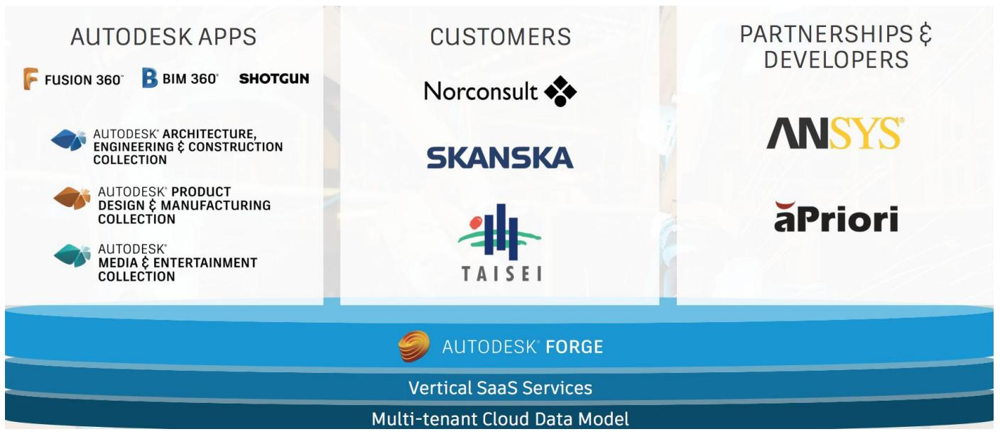  
图34：Autodesk 依托Forge 平台形成了完整的云服务生态  
资料来源：Autodesk 2020 年投资者交流资料，国元证券研究所

# 成功因素三：订阅模式带来更稳定的销售收入和现金流

收费模式转型前：2016 年前，Autodesk 的收费模式以 License 和 Maintenanceplan（提供 License 和永久软件升级）为主，2012-2015 年营业收入的CAGR为 $4 . 2 8 \%$ 。

收费模式转型后：随着云产品的推出，Autodesk 的收费模式逐渐向订阅模式转换。2016 年，Autodesk 宣布停售 License，积极推进订阅模式，并于 2020 年起推动 serialnumbers（基于序列号的使用授权）向 named users（指定用户使用授权)迁移。2021年，Autodesk实现营业收入37.90亿美元，同比增长 $1 5 . 7 6 \%$ ,2016-2021 年CAGR为 $8 . 6 4 \%$ ，转型成效良好。根据Autodesk 2020 年投资者大会交流资料，Autodesk 的经常性收入从2010 财年的 $40 \%$ 左右上升至2020财年的 $96 \%$ 。

  
图35：Autodesk 收费模式转型路径  
资料来源：Wind，Autodesk 公告，国元证券研究所

# 成功因素四：构建多层次销售渠道，直销收入占比上升

直销渠道：包括针对大中型客户的直销模式和在线商店销售模式。Autodesk自2014 年起推动数字直销，逐步减少对分销渠道的依赖。直销模式可以减少流通环节，节约金钱和时间成本，并有助于Autodesk 更直接地获得用户反馈。

间接渠道：包括一级分销（Autodesk 直接向经销商销售产品）和二级分销（分销商向经销商销售产品)。根据 Autodesk 2021 年年报，Autodesk 在全球拥有约1700家经销商和分销商网络，2020 和2021 财年来自间接渠道的销售收入占比分别为 $70 \%$ 和 $69 \%$ ，相比 2014 年之前的 $80 \%$ 左右显著下降。

图36：Autodesk销售渠道与服务模式  

<table><tr><td></td><td>NAMED ACCOUNT</td><td>MID-MARKET ACCOUNT</td><td>STRATEGIC TERRITORY ACCOUNT</td><td>TERRITORY ACCOUNT</td></tr><tr><td>Approach</td><td colspan="3">Account-Based Sales&amp; Marketing</td><td>Geographic</td></tr><tr><td>Human Touch</td><td colspan="4">Higher Lower</td></tr><tr><td>Digital Touch</td><td colspan="4">Lower →Higher</td></tr><tr><td>Sales Leads</td><td colspan="4"></td></tr><tr><td>Partner Roles</td><td colspan="2">Field Sales</td><td colspan="2">Inside sales</td></tr><tr><td></td><td colspan="2">Services</td><td colspan="2">Sales &amp; Services at Scale</td></tr><tr><td>Digital sales</td><td colspan="4">Lower → Higher</td></tr></table>

资料来源：Autodesk2020年投资者交流资料，国元证券研究所

作为建筑设计软件行业内的领军企业，Autodesk 敏锐地把握了三维建模技术、云计算和移动技术等新机遇，战略性地投入产品研发，并投资并购了 Delcam、NavisWorks等众多优秀的软件企业，逐步完善了自身的产品线。此外，Autodesk 非常重视产品平台化、通用性和可扩展性，其单机产品提供了大量的API，有效地解决了各细分领域和特定流程的行业需求。以广联达为代表的一众国内建筑信息化企业有望借鉴Autodesk 的云化产品战略、订阅模式转型、生态建设等思路，打开设计业务新的成长空间。

# 4.盈利预测与投资建议

# 核心假设：

公司作为中国建筑信息化与数字化领域的领先者，始终坚持以客户为中心，以创新引领发展，并在发展过程中逐步形成了显著的竞争优势。从产品角度来看，公司业务主要分为数字造价业务、数字施工业务、海外业务、其他业务四大部分，另外还有利息、手续费及佣金收入，我们按照这五个维度预测公司未来三年的收入和毛利率情况。

1．数字造价业务：该业务占公司收入的比重最大，近几年的主要任务是完成云化转型，收费由 License 模式转为订阅模式，相关收入由一次性确认转变为按服务期间分期确认，部分云服务费结转至预收款项，因此表观收入会暂时受到一定影响。2019-2020 年，该业务收入增速分别为 $1 9 . 1 7 \%$ 、 $1 3 . 8 3 \%$ ，另外，考虑到2020年还原云合同负债余额后的数字造价业务同口径同比增速为 $1 6 . 1 2 \%$ ，预测未来三年收入增速为 $2 2 . 3 8 \%$ $2 0 . 2 7 \%$ 、 $1 7 . 9 6 \%$ 。造价业务毛利率较高，2019-2020年分别为 $9 3 . 9 5 \%$ $9 4 . 1 7 \%$ ，预计未来三年将保持在2020 年的水平，维持在 94-$9 5 \%$ 的区间。

2.数字施工业务：该业务是全新的蓝海市场，市场空间有望达到千亿水平，是公司重点聚力突破的成长业务。2019-2020 年，施工业务稳健增长，收入增速分别为$2 9 . 5 8 \%$ $1 0 . 5 2 \%$ 。未来，数字施工业务将在继续夯实现有平台和产品的基础上，持续提升项企一体化能力，有望保持较高的增速，因此，我们预测未来三年收入增速分别为 $3 0 . 2 3 \% , 2 9 . 1 7 \% , 2 8 . 9 1 \%$ 过去两年该业务的毛利率分别为 $7 5 . 9 7 \%$ $7 2 . 0 7 \%$ ，预测未来三年将保持在2020 年的水平，维持在 $7 2 \mathrm { - } 7 3 \%$ 的区间。

3.海外业务：该业务体量较小，2019-2020 年营业收入保持稳健增长，增速分别为$1 1 . 2 9 \%$ $7 . 4 3 \%$ 。从公司的布局来看，MagiCAD产品线持续拓展全球业务，Cubicost产品线借力“一带一路”走向海外，因此，我们预计未来三年该业务仍将保持稳健的增长态势，增速分别为 $1 2 . 9 5 \%$ 、 $1 1 . 8 7 \%$ $1 0 . 4 6 \%$ 。过去两年该业务的毛利率分别为 $8 8 . 8 8 \% , 8 9 . 5 4 \%$ ，预测未来三年将保持在2020年的水平，维持在 $8 9 - 9 0 \%$ 的区间。

4.其他业务：该业务主要包含数字设计、数字城市等。数字设计方面，公司将持续推进与鸿业科技的全方位整合，快速建立统一的组织运营体系与数字设计品牌，有望带动收入快速增长。2019-2020年，该业务收入增速分别为 $- 2 . 6 2 \%$ $2 0 2 . 2 2 \%$ 。考虑到数字设计业务的快速成长，预测该业务未来三年收入增速分别为 $2 4 . 3 7 \% , 2 0 . 4 6 \% , 1 7 . 7 4 \%$ 过去两年该业务的毛利率分别为 $9 1 . 0 2 \% . 8 0 . 0 8 \%$ ,预测未来三年将保持在 2020 年的水平，维持在 $8 0 { - } 8 1 \%$ 的区间。

5.利息、手续费及佣金收入：该业务体量较小，主要由公司的产业新金融等业务产生，我们预计未来三年将保持稳健的增长态势，营业收入增速将保持在 $10 \%$ 左右。

表4：公司业务拆分（单位：百万元)  

<table><tr><td>项目</td><td>2019</td><td>2020</td><td>2021E</td><td>2022E</td><td>2023E</td></tr><tr><td colspan="6">数字造价业务</td></tr><tr><td>收入</td><td>2451.66</td><td>2790.64</td><td>3415.29</td><td>4107.56</td><td>4845.28</td></tr><tr><td>增长率</td><td>19.17%</td><td>13.83%</td><td>22.38%</td><td>20.27%</td><td>17.96%</td></tr><tr><td>毛利率</td><td>93.95%</td><td>94.17%</td><td>94.19%</td><td>94.22%</td><td>94.25%</td></tr><tr><td colspan="6">数字施工业务</td></tr><tr><td>收入</td><td>853.41</td><td>943.21</td><td>1228.34</td><td>1586.65</td><td>2045.35</td></tr><tr><td>增长率</td><td>29.58%</td><td>10.52%</td><td>30.23%</td><td>29.17%</td><td>28.91%</td></tr><tr><td>毛利率</td><td>75.97%</td><td>72.07%</td><td>72.12%</td><td>72.15%</td><td>72.21%</td></tr><tr><td colspan="6">海外业务</td></tr><tr><td>收入</td><td>137.34</td><td>147.55</td><td>166.66</td><td>186.44</td><td>205.94</td></tr><tr><td>增长率</td><td>11.29%</td><td>7.43%</td><td>12.95%</td><td>11.87%</td><td>10.46%</td></tr><tr><td>毛利率</td><td>88.88%</td><td>89.54%</td><td>89.57%</td><td>89.59%</td><td>89.61%</td></tr><tr><td colspan="6">其他业务</td></tr><tr><td>收入</td><td>21.73</td><td>65.69</td><td>81.70</td><td>98.41</td><td>115.87</td></tr><tr><td>增长率</td><td>-2.62%</td><td>202.22%</td><td>24.37%</td><td>20.46%</td><td>17.74%</td></tr><tr><td>毛利率</td><td>91.02%</td><td>80.08%</td><td>80.14%</td><td>80.19%</td><td>80.24%</td></tr><tr><td colspan="6">利息、手续费及佣金收入</td></tr><tr><td>收入</td><td>76.50</td><td>57.56</td><td>63.48</td><td>69.83</td><td>76.70</td></tr><tr><td>增长率</td><td>78.55%</td><td>-24.76%</td><td>10.28%</td><td>10.01%</td><td>9.83%</td></tr><tr><td>毛利率</td><td>100.00%</td><td>100.00%</td><td>100.00%</td><td>100.00%</td><td>100.00%</td></tr><tr><td colspan="6">合计</td></tr><tr><td>收入</td><td>3540.65</td><td>4004.64</td><td>4955.46</td><td>6048.90</td><td>7289.14</td></tr><tr><td>增长率</td><td>21.91%</td><td>13.10%</td><td>23.74%</td><td>22.07%</td><td>20.50%</td></tr><tr><td>毛利率</td><td>89.53%</td><td>88.65%</td><td>88.41%</td><td>88.12%</td><td>87.77%</td></tr></table>

资料来源：Wind，国元证券研究所

# 可比公司估值：

在国内上市公司中，用友网络、恒生电子、卫宁健康、石基信息等公司都是为特定行业或领域提供软件产品及相关的软件服务，并且在各自的领域都处于龙头地位，因此我们选择这四家公司为可比公司。从四家可比公司的PE来看，广联达2021-2022 年显著高于可比公司的平均水平，主要原因是数字造价业务处于云转型阶段，部分云服务费进入预收款项而不是收入，但费用会计入当期，因此利润会受到明显影响。随着云转型的逐步完成，广联达 2023 年的估值水平有望显著下降。

表5：可比公司估值情况  

<table><tr><td rowspan="2">股票代码</td><td rowspan="2">公司简称</td><td rowspan="2">收盘价</td><td rowspan="2">总市值（亿元)</td><td colspan="4">EPS</td><td colspan="4">PE</td></tr><tr><td>2020</td><td>2021E</td><td>2022E</td><td>2023E</td><td>2020</td><td>2021E</td><td>2022E</td><td>2023E</td></tr><tr><td>600588.SH</td><td>用友网络</td><td>32.49</td><td>1062.60</td><td>0.30</td><td>0.34</td><td>0.43</td><td>0.57</td><td>107.49</td><td>95.43</td><td>74.72</td><td>56.64</td></tr><tr><td>600570.SH</td><td>恒生电子</td><td>86.50</td><td>903.14</td><td>1.27</td><td>1.47</td><td>1.79</td><td>2.18</td><td>68.33</td><td>58.87</td><td>48.44</td><td>39.73</td></tr><tr><td>300253.SZ</td><td>卫宁健康</td><td>16.98</td><td>363.62</td><td>0.23</td><td>0.30</td><td>0.40</td><td>0.52</td><td>74.04</td><td>56.51</td><td>42.56</td><td>32.80</td></tr><tr><td>002153.SZ</td><td>石基信息</td><td>21.86</td><td>327.80</td><td>-0.06</td><td>0.18</td><td>0.32</td><td>0.44</td><td>-485.05</td><td>122.73</td><td>69.35</td><td>49.43</td></tr><tr><td>平均</td><td></td><td>-</td><td>-</td><td>-</td><td>-</td><td>-</td><td>-</td><td>83.29</td><td>83.39</td><td>58.77</td><td>44.65</td></tr><tr><td>002410.SZ</td><td>广联达</td><td>75.13</td><td>891.80</td><td>0.28</td><td>0.55</td><td>0.80</td><td>1.05</td><td>269.63</td><td>135.38</td><td>93.58</td><td>71.32</td></tr></table>

资料来源：Wind，国元证券研究所  
注：可比公司均采用Wind一致预期，收盘价的日期为2021年7月15日

# 投资建议：

公司深耕建筑信息化与数字化领域，顺应科技产业变革趋势，不断有效拓展业务边界，有望成长为全球第一数字建筑平台服务商。“八三”规划中，公司提出了$3 { + } \mathsf { X } '$ 的发展目标，有望在“八三”期间能够实现造价、施工两大业务比翼齐飞，设计软件战略突破，数字建筑平台成型，新业务竞相突破的局面，进而推动公司业务持续健康快速成长。

目前，公司收入主要来源于数字造价业务和数字施工业务。对于公司的估值，我们认为两大业务处于不同的发展阶段，用分部估值方法较为合适。对于处于云化转型进程中的数字造价业务，根据我们的预测，到2021 年基本转型完成后收入将达到34.15 亿元，根据公司披露的《2019 年6 月4 日投资者关系活动记录表(二)》：“我们历史上最高净利润率约 $38 \%$ ，转型完成之后我们希望能挑战历史最高点”，我们预测净利润率为 $38 \%$ ，则预期 2021 年该业务的净利润为12.98 亿元，目前计算机（申万）指数的 PETTM 为56.7 倍，考虑到商业模式升级后经营性现金流的显著改善、客户黏性提升带来的增值服务空间、中长期的持续成长空间、未来估值水平的不确定性等多重因素，维持该业务70倍的目标PE，则2021 年底数字造价业务的估值为 908.60 亿元。对于快速成长中的数字施工业务，根据我们的预测，2021 年该业务收入约为12.28亿元，由于公司未单独披露该业务的盈利状况，且处于加大研发投入和市场拓展阶段，我们参照成熟软件产品业务的净利润率一般为 $20 \%$ 左右来假设该业务处于稳态时的盈利能力（低于公司数字造价业务的净利润率)，同时考虑未来三年收入增速 $30 \%$ 左右的预期该业务未来广阔的成长空间、目前计算机（申万)指数的 PETTM为56.7 倍等因素，维持70 倍的目标 PE，则该业务估值约为171.92 亿元。对于海外业务及数字设计等业务，目前收入的体量较小，暂时不给予估值。综上，我们认为公司2021 年的合理估值为：1080.52 亿元，按照总股本 11.87 亿股来计算，对应的目标价约为91.03元。

备注：在上述分部估值中，我们做出的各分部的盈利预测值的前提条件是：不考虑公司为未来持续成长所额外投入的研发费用、管理费用、营业费用、财务费用等，而公司层面的归母净利润预测值是考虑上述费用的，因此，公司的归母净利润预测值小于各分部盈利预测值之和。请投资者注意上述差异，谨慎使用上述各项预测值。

财务预测表  

<table><tr><td colspan="5">资产负债表</td></tr><tr><td>会计年度</td><td>2019</td><td>2020</td><td>2021E 2022E</td><td>2023E</td></tr><tr><td>流动资产</td><td>2950.45</td><td>5419.60</td><td>5947.54 7076.33</td><td>8438.25</td></tr><tr><td>现金</td><td>2231.20 4796.95</td><td>5183.14</td><td>6146.78</td><td>7319.23</td></tr><tr><td>应收账款</td><td>559.41</td><td>422.12 521.78</td><td>635.78</td><td>764.33</td></tr><tr><td>其他应收款</td><td>48.58</td><td>77.04 95.64</td><td>117.95</td><td>143.60</td></tr><tr><td>预付账款</td><td>30.59</td><td>46.21</td><td>58.30 72.77</td><td>90.13</td></tr><tr><td>存货</td><td>21.33</td><td>26.33 33.09</td><td>41.16</td><td>50.72</td></tr><tr><td>其他流动资产</td><td>59.34</td><td>50.96</td><td>55.59 61.89</td><td>70.24</td></tr><tr><td>非流动资产</td><td>3216.86</td><td>4127.50</td><td>4292.61 4312.36</td><td>4323.91</td></tr><tr><td>长期投资</td><td>232.76</td><td>255.46</td><td>264.38 275.47</td><td>286.52</td></tr><tr><td>固定资产</td><td>802.87</td><td>810.23 854.96</td><td>865.16</td><td>872.13</td></tr><tr><td>无形资产</td><td>372.69</td><td>367.81</td><td>372.50 376.03</td><td>378.22</td></tr><tr><td>其他非流动资产</td><td>1808.54</td><td>2694.00 2800.77</td><td>2795.70</td><td>2787.04</td></tr><tr><td>资产总计</td><td>6167.32</td><td>9547.10</td><td>10240.15 11388.69</td><td>12762.16</td></tr><tr><td>流动负债</td><td>2809.31</td><td>2858.27</td><td>3073.44 3393.25</td><td>3749.21</td></tr><tr><td>短期借款</td><td>1088.62</td><td>3.00</td><td>0.00</td><td>0.00 0.00</td></tr><tr><td>应付账款</td><td>98.72</td><td>94.98</td><td>119.82 149.56</td><td>185.33</td></tr><tr><td>其他流动负债</td><td>1621.97</td><td>2760.29</td><td>2953.61 3243.69</td><td>3563.88</td></tr><tr><td>非流动负债</td><td>8.91</td><td>131.01</td><td>140.17 150.44</td><td>159.93</td></tr><tr><td>长期借款</td><td>0.09</td><td>0.07</td><td>0.07</td><td>0.07 0.07</td></tr><tr><td>其他非流动负债</td><td>8.82</td><td>130.94</td><td>140.10</td><td>150.37 159.86</td></tr><tr><td>负债合计</td><td>2818.22</td><td>2989.29</td><td>3213.61</td><td>3543.69 3909.14</td></tr><tr><td>少数股东权益</td><td>79.87</td><td>155.57</td><td>256.09</td><td>399.63 585.99</td></tr><tr><td>股本</td><td>1128.53</td><td>1185.71</td><td>1185.71</td><td>1185.71 1185.71</td></tr><tr><td>资本公积</td><td>508.83</td><td>3134.65</td><td>3134.65 3134.65</td><td>3134.65</td></tr><tr><td>留存收益</td><td>1709.45</td><td>1957.27</td><td>2318.88</td><td>2986.00 3802.20</td></tr><tr><td>归属母公司股东权益</td><td>3269.23</td><td>6402.24</td><td>6770.45</td><td>7445.36 8267.03</td></tr><tr><td>负债和股东权益</td><td>6167.32</td><td>9547.10</td><td>10240.15 11388.69</td><td>12762.16</td></tr></table>

<table><tr><td colspan="6">现金流量表 单位：百万元</td></tr><tr><td>会计年度</td><td>2019</td><td>2020</td><td>2021E</td><td>2022E</td><td>2023E</td></tr><tr><td>经营活动现金流</td><td>640.92</td><td>1876.13</td><td>812.93</td><td>1381.90</td><td>1769.00</td></tr><tr><td>净利润</td><td>254.58</td><td>381.37</td><td>758.55</td><td>1095.46</td><td>1435.50</td></tr><tr><td>折旧摊销</td><td>105.73</td><td>134.07</td><td>143.74</td><td>153.65</td><td>162.82</td></tr><tr><td>财务费用</td><td>40.55</td><td>-17.42</td><td>-24.88</td><td>-28.32</td><td>-33.66</td></tr><tr><td>投资损失</td><td>-22.51</td><td>-10.21</td><td>-12.31</td><td>-13.64</td><td>-15.01</td></tr><tr><td>营运资金变动</td><td>158.63</td><td>1276.22</td><td>-40.05</td><td>-22.57</td><td>-41.47</td></tr><tr><td>其他经营现金流</td><td>103.95</td><td>112.10</td><td>-12.11</td><td>197.33</td><td>260.82</td></tr><tr><td>投资活动现金流</td><td>-227.31</td><td>-696.50</td><td>-158.83</td><td>-169.62</td><td>-202.78</td></tr><tr><td>资本支出</td><td>243.07</td><td>439.06</td><td>13.46</td><td>31.28</td><td>56.52</td></tr><tr><td>长期投资</td><td>10.78</td><td>31.18</td><td>46.90</td><td>36.74</td><td>39.93</td></tr><tr><td>其他投资现金流</td><td>26.54</td><td>-226.26</td><td>-98.47</td><td>-101.60</td><td>-106.33</td></tr><tr><td>筹资活动现金流</td><td>-389.57</td><td>1357.03</td><td>-267.90</td><td>-248.65</td><td>-393.77</td></tr><tr><td>短期借款</td><td>888.62</td><td>-1085.62</td><td>-3.00</td><td>0.00</td><td>0.00</td></tr><tr><td>长期借款</td><td>0.09</td><td>-0.02</td><td>0.00</td><td>0.00</td><td>0.00</td></tr><tr><td>普通股增加</td><td>1.98</td><td>57.19</td><td>0.00</td><td>0.00</td><td>0.00</td></tr><tr><td>资本公积增加</td><td>45.97</td><td>2625.82</td><td>0.00</td><td>0.00</td><td>0.00</td></tr><tr><td>其他筹资现金流</td><td>-1326.23</td><td>-240.33</td><td>-264.90</td><td>-248.65</td><td>-393.77</td></tr><tr><td>现金净增加额</td><td>19.48</td><td>2522.45</td><td>386.20</td><td>963.64</td><td>1172.45</td></tr></table>

<table><tr><td colspan="6">利润表 单位：百万元</td></tr><tr><td>会计年度</td><td>2019</td><td>2020</td><td>2021E</td><td>2022E</td><td>2023E</td></tr><tr><td>营业收入</td><td>3540.65</td><td>4004.64</td><td>4955.46</td><td>6048.90</td><td>7289.14</td></tr><tr><td>营业成本</td><td>370.66</td><td>454.50</td><td>574.42</td><td>718.35</td><td>891.46</td></tr><tr><td>营业税金及附加</td><td>43.01</td><td>37.90</td><td>45.59</td><td>55.04</td><td>65.60</td></tr><tr><td>营业费用</td><td>1102.48</td><td>1255.52</td><td>1485.65</td><td>1769.30</td><td>2125.51</td></tr><tr><td>管理费用</td><td>819.76</td><td>879.19</td><td>1014.38</td><td>1180.14</td><td>1408.99</td></tr><tr><td>研发费用</td><td>969.11</td><td>1082.69</td><td>1152.54</td><td>1298.25</td><td>1421.88</td></tr><tr><td>财务费用</td><td>40.55</td><td>-17.42</td><td>-24.88</td><td>-28.32</td><td>-33.66</td></tr><tr><td>资产减值损失</td><td>-6.11</td><td>-20.70</td><td>-19.85</td><td>-19.64</td><td>-19.38</td></tr><tr><td>公允价值变动收益</td><td>0.00</td><td>0.00</td><td>0.00</td><td>0.00</td><td>0.00</td></tr><tr><td>投资净收益</td><td>22.51</td><td>10.21</td><td>12.31</td><td>13.64</td><td>15.01</td></tr><tr><td>营业利润</td><td>290.37</td><td>414.21</td><td>820.28</td><td>1182.58</td><td>1547.96</td></tr><tr><td>营业外收入</td><td>0.83</td><td>2.30</td><td>2.37</td><td>2.49</td><td>2.61</td></tr><tr><td>营业外支出</td><td>7.44</td><td>6.11</td><td>6.74</td><td>7.53</td><td>7.86</td></tr><tr><td>利润总额</td><td>283.76</td><td>410.40</td><td>815.91</td><td>1177.54</td><td>1542.71</td></tr><tr><td>所得税</td><td>29.18</td><td>29.04</td><td>57.36</td><td>82.07</td><td>107.22</td></tr><tr><td>净利润</td><td>254.58</td><td>381.37</td><td>758.55</td><td>1095.46</td><td>1435.50</td></tr><tr><td>少数股东损益</td><td>19.51</td><td>50.98</td><td>100.52</td><td>143.54</td><td>186.36</td></tr><tr><td>归属母公司净利润</td><td>235.07</td><td>330.39</td><td>658.03</td><td>951.92</td><td>1249.14</td></tr><tr><td>EBITDA</td><td>436.65</td><td>530.86</td><td>939.13</td><td>1307.91</td><td>1677.13</td></tr><tr><td>EPS（元）</td><td>0.21</td><td>0.28</td><td>0.55</td><td>0.80</td><td>1.05</td></tr></table>

主要财务比率  

<table><tr><td>会计年度</td><td>2019</td><td>2020</td><td>2021E</td><td>2022E</td><td>2023E</td></tr><tr><td>成长能力</td><td></td><td></td><td></td><td></td><td></td></tr><tr><td>营业收入(%)</td><td>21.91</td><td>13.10</td><td>23.74</td><td>22.07</td><td>20.50</td></tr><tr><td>营业利润(%)</td><td>-40.08</td><td>42.65</td><td>98.03</td><td>44.17</td><td>30.90</td></tr><tr><td>归属母公司净利润(%)</td><td>-46.46</td><td>40.55</td><td>99.17</td><td>44.66</td><td>31.22</td></tr><tr><td>获利能力</td><td></td><td></td><td></td><td></td><td></td></tr><tr><td>毛利率 (%)</td><td>89.53</td><td>88.65</td><td>88.41</td><td>88.12</td><td>87.77</td></tr><tr><td>净利率(%)</td><td>6.64</td><td>8.25</td><td>13.28</td><td>15.74</td><td>17.14</td></tr><tr><td>ROE(%)</td><td>7.19</td><td>5.16</td><td>9.72</td><td>12.79</td><td>15.11</td></tr><tr><td>ROIC(%)</td><td>30.16</td><td>17.77</td><td>35.49</td><td>51.46</td><td>66.15</td></tr><tr><td>偿债能力</td><td></td><td></td><td></td><td></td><td></td></tr><tr><td>资产负债率(%)</td><td>45.70</td><td>31.31</td><td>31.38</td><td>31.12</td><td>30.63</td></tr><tr><td>净负债比率(%)</td><td>38.63</td><td>0.11</td><td>0.01</td><td>0.00</td><td>0.00</td></tr><tr><td>流动比率</td><td>1.05</td><td>1.90</td><td>1.94</td><td>2.09</td><td>2.25</td></tr><tr><td>速动比率</td><td>1.04</td><td>1.89</td><td>1.92</td><td>2.07</td><td>2.24</td></tr><tr><td>营运能力</td><td></td><td></td><td></td><td></td><td></td></tr><tr><td>总资产周转率</td><td>0.60</td><td>0.51</td><td>0.50</td><td>0.56</td><td>0.60</td></tr><tr><td>应收账款周转率</td><td>7.82</td><td>7.63</td><td>9.74</td><td>9.70</td><td>9.67</td></tr><tr><td>应付账款周转率</td><td>5.58</td><td>4.69</td><td>5.35</td><td>5.33</td><td>5.32</td></tr><tr><td>每股指标（元）</td><td></td><td></td><td></td><td></td><td></td></tr><tr><td>每股收益(最新摊薄)</td><td>0.20</td><td>0.28</td><td>0.55</td><td>0.80</td><td>1.05</td></tr><tr><td>每股经营现金流(最新摊薄)</td><td>0.54</td><td>1.58</td><td>0.69</td><td>1.17</td><td>1.49</td></tr><tr><td>每股净资产(最新摊薄) 估值比率</td><td>2.76</td><td>5.40</td><td>5.71</td><td>6.28</td><td>6.97</td></tr><tr><td>P/E</td><td>378.96</td><td>269.63</td><td>135.38</td><td>93.58</td><td>71.32</td></tr><tr><td>P/B</td><td>27.25</td><td>13.91</td><td>13.16</td><td>11.96</td><td>10.78</td></tr><tr><td></td><td></td><td></td><td></td><td></td><td></td></tr><tr><td>EV/EBITDA</td><td>191.00</td><td>157.10</td><td>88.81</td><td>63.77</td><td>49.73</td></tr></table>