# 广联达 （002410）深度跟踪报告

# 数字建筑一体化领军

# 核心观点

核心结论：国内数字建筑平台型领军企业，致力于打通建筑行业设计、造价、施工全流程，推动数字建筑一体化发展，增强赛道把控力并巩固龙头地位，进而打开广阔市场空间。

# 敗字施工：千亿蓝海市场，方案类需求提升，项企一体化催化拐点加速到来

业务进展：处于成长初期，解决方案类需求快速提升。公司当前重点突破项企一体化方案，尤其在头部企业加速业务开展，对内实现规模化复制，对外树立标杆案例。我们推断施工业务21H1聚焦合同额，已进入整体试点和解决方案时期，伴随需求持续向好，施工业务将有望逐步加速。

落地打法：产品层面，公司运用“云+端”、“平台+组件”等架构，有利于功能扩展和数据流转，并提升产品竞争力，2020年研发人员约3300人，占比40%。客户层面，一方面上下兼攻，将自上向下的推广方式与以项目为核心的自下向上的方式相结合，实现业务快速扩张；另一方面，推出多款免费试用BIM工具类产品，培养客户使用习惯，增强客户粘性。长期看，千亿蓝海市场下公司收入或有望达到百亿元。

# 数字造价：转云持续兑现亮眼成果，增值服务打开业务天花板

转云成果：2020年，公司造价云收入16.2亿元，占造价业务收入比例达58%。2021年进入最后四个转云地区浙江、江苏、福建、安徽，21H1新转型地区实现收入正增长，表现亮眼，造价优势进一步扩大。公司2020年云合同额22.34亿元，指引|2021年30亿云合同额目标，中期造价收入有望达到50亿元。

未来看点：一方面，云空间、智能组价等增值服务需求有望快速提升，助推打开造价业务天花板；另一方面，造价市场化改革推动产品快速迭代更新。我们判断，在此基础下造价业务长期空间会更高。

# 文字设计：起步阶段，助力打通建筑行业全流程，推动数字建筑一体化发展

数字设计业务处于起步阶段，已从BU提升至BG。根据公司披露，预计2021年下半年建数字设计品牌。数字设计作为入口，致力于以数据驱动打通全流程。公司从BIM 3D切入，对下游造价、施工具备深刻理解，在一体化协同能力上具备天然优势。数字设计的布局有助于推动数字建筑一体化发展，巩固赛道把控力和龙头优势地位，并开启第三成长曲线。 1

# 投资建议

# 风险因素

、建筑行业景气度下行；建筑行业数字化转型速度不及预期；房屋新开工面积不及预期；施工信息化业务竞争加剧；设计业务产品研发推进速度不及预期。

# 投资建议

公司是国内领先的数字建筑平台型公司，致力于推动数字建筑一体化发展。施工业务正重点突破项企一体化方案，伴随需求持续向好，规模化复制在即。造价转云大局已定，增值服务需求下，成长天花板有望进一步打开。设计业务处于起步阶段，依靠强大的研发能力和对建筑行业的理解，料公司将成为行业劲旅，助推数字建筑一体化发展。我们微调公司2021-23年收入预测至50.2/63.5/80.5亿元（原预测为50.4/64.5/79.2亿元），新增2024年收入预测99.7亿元，维持2021-23年归母净利润预测6.9/11.1/14.6亿元，新增2024年归母净利润预测为17.4亿元，2021-2024年对应EPS预测为0.58/0.93/1.23/1.47元。基于公司业务进展情况、行业龙头估值、公司风险等因素（估值详见章节5.3），给予目标市值1035亿元，对应目标价87元（对应目标PS 21X），维持“买入”评级。

<table><tr><td>项目/年度</td><td>2019</td><td>2020</td><td>2021E</td><td>2022E</td><td>2023E</td><td>2024E</td></tr><tr><td>营业收入(百万元)</td><td>3,541</td><td>4,005</td><td>5,023</td><td>6,347</td><td>8,046</td><td>9,971</td></tr><tr><td>营业收入增长率YoY</td><td>21.9%</td><td>13.1%</td><td>25.4%</td><td>26.4%</td><td>26.8%</td><td>23.9%</td></tr><tr><td>净利润(百万元）</td><td>235</td><td>330</td><td>686</td><td>1,108</td><td>1,461</td><td>1743</td></tr><tr><td>净利润增长率YoY</td><td>-46.5%</td><td>40.5%</td><td>107.7%</td><td>61.5%</td><td>31.8%</td><td>19.3%</td></tr><tr><td>每股收益EPS(基本)(元)</td><td>0.20</td><td>0.28</td><td>0.58</td><td>0.93</td><td>1.23</td><td>1.47</td></tr><tr><td>毛利率</td><td>89.5%</td><td>88.7%</td><td>88.4%</td><td>86.9%</td><td>85.2%</td><td>84.7%</td></tr><tr><td>净资产收益率ROE</td><td>7.2%</td><td>5.2%</td><td>10.1%</td><td>14.8%</td><td>17.8%</td><td>19.7%</td></tr><tr><td>每股净资产（元）</td><td>2.75</td><td>5.39</td><td>5.72</td><td>6.29</td><td>6.90</td><td>7.46</td></tr><tr><td>PE</td><td>295.2</td><td>210.1</td><td>101.2</td><td>62.6</td><td>47.5</td><td>39.8</td></tr><tr><td>P B</td><td>21.2</td><td>10.8</td><td>10.2</td><td>9.3</td><td>8.5</td><td>7.8</td></tr><tr><td>PS</td><td>19.6</td><td>17.3</td><td>13.8</td><td>10.9</td><td>8.6</td><td>7.0</td></tr><tr><td>EV/EBITDA</td><td>169.1</td><td>145.8</td><td>97.1</td><td>60.7</td><td>46.9</td><td>39.6</td></tr></table>

资料来源：Wind，中信证券研究部预测注：股价为2021年8月20日收盘价

# CONTENTS目录

一、数字施工：千亿蓝海，项企一体化催化拐点加速到来  
二、数字造价：转云成果亮眼，增值服务打开天花板  
三、数字设计：起步阶段，助力打通建筑行业全流程  
四、风险因素  
五、盈利预测与估值评级  
附：财务报表

# 一张图看懂广联达数字建筑平台战略

公司致力于成为全球领先的数字建筑平台服务商。横向看，公司业务内容随建筑产业链延伸，覆盖设计、造价、施工等环节；纵向看，单业务面向不同岗位提供丰富模块，覆盖企业、项目、岗位等环节。各业务间协同效应通过一体化建设逐步体现。

  
数字建筑平台  
资料来源：公司公告，中信证券研究部

# 数字施工：千亿蓝海，拐点将至

1.1业务概述：面向建造阶段，产品体系逐步丰富  
1.2 发展现状：处于成长初期，规模化推广在即  
1.3产品体系：升级项企一体化，智慧工地是成长主驱动  
1.4公司优势：打磨优质产品服务，客户推广多措并举  
1.5空间测算：千亿市场拐点将至，百亿龙头扬帆起航

# 1.1 业务概述：一站式服务助力施工数字化转型

以作业数字化、管理系统化、决策智能化为核心特征覆盖商务、技术、生产各业务线为施工企业数字化转型升级提供整体解决方案和一站式服务

  
广联达施工数字化转型一站式服务  
施工数字化转型一站式服务  
资料来源：公司路演PPT材料

# 1.1 业务概述：面向建造阶段，产品体系逐步丰富

数字施工业务主要聚焦工程项目的建造阶段信息化。

主要客户为施工单位。

# 广联达施工业务发展路径

2014年，六三计划首年，鼓励创新、转型，施工业务巍新增长点之一。

2015-2018年数字企业+智慧工地+BIM建造

2018年开始，进入整合期，产品底层打通，BIM5D按模块售卖

  
广联达与施工阶段相关的收入（2007-2020）  
资料来源：公司公告，中信证券研究部

# 1.2 发展现状：数字施工作为成长型业务高速发展

2013年至2020年，公司施工业务从1.12亿收入增长至9.43亿元，年复合增速为 $36 \%$ 。

毛利率从2014年的96%下滑至2020年的 $72 \%$ ，主要由于智慧工地（含硬件）、解决方案类业务占比提升。  
2014年至2020年，占收入的比例从12%提升至 $24 \%$ ，是公司第二大业务板块，与造价业务两翼齐飞。

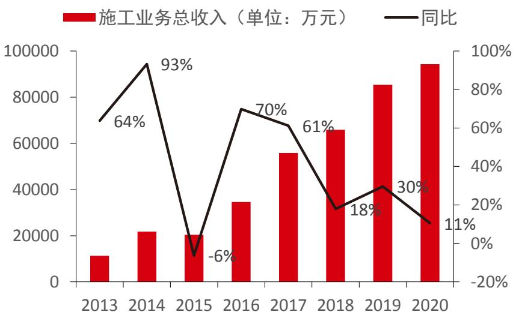  
数字施工业务收入及增速

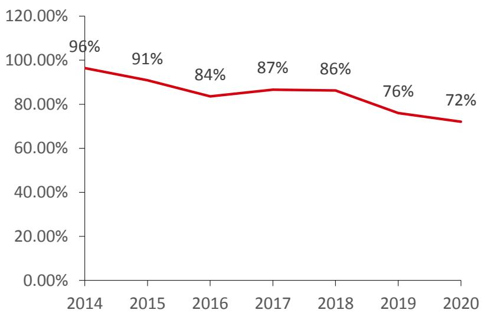  
数字施工业务毛利率

数字施工业务收入占比  

<table><tr><td></td><td>2014</td><td>2015</td><td>2016</td><td>2017</td><td>2018</td><td>2019</td><td>2020</td></tr><tr><td>施工业务收入（亿元）</td><td>2.17</td><td>2.04</td><td>3.46</td><td>5.58</td><td>6.59</td><td>8.53</td><td>9.43</td></tr><tr><td>收入占比(%)</td><td>12.4%</td><td>13.3%</td><td>17.0%</td><td>23.7%</td><td>22.7%</td><td>24.1%</td><td>23.6%</td></tr></table>

资料来源：公司公告，中信证券研究部

# 1.2 阶段进展：多管齐下，规模化推广在即

“平台+组件”模式进一步夯实，数字项目管理平台的多管齐下，助力规模化推广。  
斑马进度产品通过线上和线下结合，加速用户覆盖。  
强化大客户业务开发，对头部施工企业业务实现突破。  
对内强化系统建设，助力施工业务实现线索到回款的全流程业务闭环。

2020年数字施工部分业务进展  

<table><tr><td>类别</td><td>业务进展</td></tr><tr><td>基于数字项目管 理平台的产品</td><td>项目级核心产品应用率平稳上升，劳务、项目BI模块得到迅速发展。 项目级平台逐步拓展到支持企业级业务，发布了项目企业一体化1.0解决方案，实现对项目实 体、人、机、料、法、环以及项目全过程的数字化，实现项目现场作业可控、项目指挥高效以及 企业决策精准，从而最终实提高施工企业盈利能力。 基建业务以线性工程为核心，整合基建生产、基建BI后的基建解决方案突出数字化指挥调度功 能，为基建项目各层级管理者打造可视化管理现场。 平台底层建设方面，初步完成数据中台架构设计和关键技术突破，业务中台的施工领域知识图谱</td></tr><tr><td>斑马进度产品</td><td>取得阶段性成果。 202年余续新增8万多激活用户，覆盖2万多个项目，在部分标杆客户中实现了上百个项目的规模化</td></tr><tr><td>大客户开发</td><td>陕西建工生产调度系统完成一期交付，覆盖集团100多个重点项目； 浙江建的营业理系统成第上阶段开的项企一体化系统建设、中国五冶的企业集中管控平台也 在2020年得到突破。</td></tr><tr><td>内部运营管理</td><td>强化内部运营管理，上线数字化管理系统，围绕客户商机管理、报价合同管理、采购供应管理、项 实施管理施财务管理等流程组进行流程理务案设计，完善了数字施工业务对内的数字</td></tr></table>

资料来源：公司2020年年报，中信证券研究部

# 1.2 发展现状：覆盖率快速提升，质量效率兼顾

2020年，施工业务合同额大幅增长，回款约12.4亿元，质量效率兼顾。- 截至2020年末，数字施工项目级产品累计服务项目数3.8万个，累计服务客户3400家；2020年新增项目数1.5万个，新增客户1700家，2020年新增客户数过半。■ 千亿级的客户如浙江建投、广西建工、陕西建工、北京建工等正持续快速渗透。

  
数字施工业务解决方案类合同额和客户数量变化情况

# 1.2 方案升级：从单点需求升级系统化需求

需求：项目单点产品应用程度加深，从单点信息化需求上升为系统数字化转型需求。

技术：BIM、AI、大数据等技术方兴未艾，但技术协同性不高，难以有效满足系统需求。

解决方案：从单项目系统向集成项目系统升级，再与企业管理系统结合，形成项企一体化方案，旨在解决升级的系统化需求。

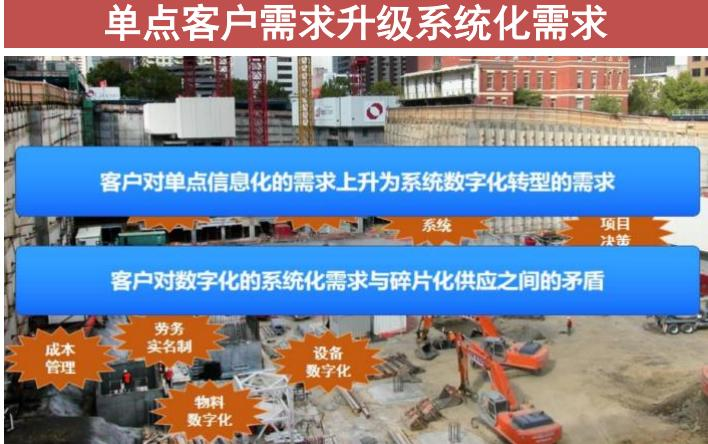

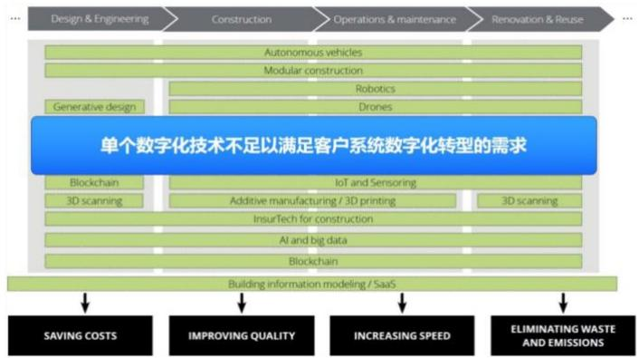  
单个数字化技术升级技术协同  
施工业务打造项企一体化方案

  
资料来源：广联达2021投资者大会

# 1.3 产品体系：数字企业、BIM建造、智慧工地三大类

# 主要产品：数字企业、BIM建造（包含岗位级）、智慧工地三大类。

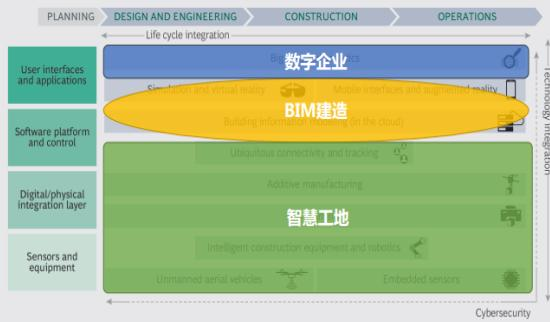  
ExHiBIT 1| Many Digital Technologies Can Be Applied Along the E&C Value Chain

  
2016-2018年施工业务构成

施工业务主要应用产品（部分）  

<table><tr><td rowspan="2">一、数字企业业务</td><td>1、采购管理系统</td><td>3、企业级BI</td></tr><tr><td>2、施工企业项目管理系统GEPS</td><td>4、协筑</td></tr><tr><td rowspan="3">B建造(包含岗</td><td>1、MagiCAD</td><td>4、斑马进度计划</td></tr><tr><td>2、BIM模板腳手架设计</td><td>5、BIMMAKE</td></tr><tr><td>3、BIM5D</td><td>6、BIM施工现场布置</td></tr><tr><td rowspan="3">三、智慧工地业务</td><td>1、广联达智慧工地平台</td><td>4、施工安全管理系统</td></tr><tr><td>2、智能安全帽</td><td>5、物料验收管控系统</td></tr><tr><td>3、协筑</td><td>6、现场劳务管理系统</td></tr></table>

资料来源：公司公告，中信证券研究部

# 1.3 项目级：智慧工地是施工业务主要驱动因素

# 2019年推出的新一代数字项目管理平台是BIM5D+智慧工地的整合。

智慧工地产品形态为软件或软硬结合，使用门槛较低，易理解，效果明显，占施工业务收入一半以上，预计将保持快速增长，如劳务实名制系统、物料管理系统、BI大屏等；➢ 与模型结合指导生产的BIM类产品（包含岗位级产品）形态为软件，需要长期培训，存在使用门槛，作为入口级产品，部分产品仍处于免费试用快速推广阶段，如BIMMAKE、BIM施工场布、斑马进度等；

  
BIM+智慧工地平台（数字项目管理平台）业务架构  
资料来源：公司公告

# 1.3 部分项目级产品展示

案例一：人员管理的数字化，通过无感考勤，解决用工结算及工作留痕问题

# 无感考勤

1、闸机：无感通行，记录出勤情况

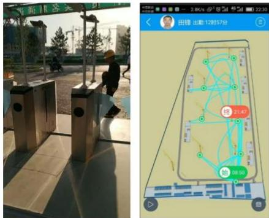

2、场内定位：获取工人在作业部位停留的数据，形成工人的区域轨迹，关联施工工序形成更加准确的工效分析

3、危险区域语音警告

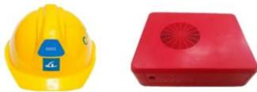

案例二：物料管理，通过物联网设备及AI技术，解决物料盘点、跑冒滴漏问题

  
钢筋进场物资核查

  
钢筋库存日常盘点

# 案例三：进度管理，通过现场数据的关联生成自动化周报，支持定期例会

# 1.4 公司优势：客户基础雄厚，产品能力突出

优势一：客户基础、规模实力（现金流强大，支撑研发与销售扩张）

优势二：产品能力、自主平台（通过数据积累、场景探索，沉淀产品能力）

# 客户基础，规模实力

# 产品能力，自主平台

客户覆盖率和项目渗透率较高。施工业务基本覆盖央企和地方Top10施工企业。部分产品的渗透率达到 $50 \%$ 。

服务能力和研发实力较强。大型客户更加重视供应商的服务能力和持续研发能力。公司销售和研发人员均超过3000人，2020年研发费用超10亿元。

国内其他施工软件厂商体量较小。品茗股份2020年收入额3.8亿元，斯维尔2020年收入额1.07亿元，鲁班软件、PKPM等公司未公开披露，预计收入规模较小。

海外龙头主要聚焦BIM建造。Autodesk其BIM软件Revit在房建领域具备一定优势，但主要聚焦设计阶段。

公司产品更加丰富。对比国内其他厂商，公司施工业务有超过20款产品，自下而上覆盖了岗位、项目和企业管理。

产品架构领先。运用“云 $^ +$ 端”、“平台+组件”架构，有利于功能扩展和数据流转，BIMFACE支持使用者进行二次开发。

具备自主图形平台。公司自主研发图形平台，自主性高，同时可兼容多种软件数据格式，适配性较好。

# 1.4 落地打法：上下兼攻，培养客户习惯

# 落地打法1：自下向上+自上向下

产品推广方面，公司早期重点是自下而上，以项目为核心，产品快速扩张。$\gtrdot$ 伴随规模化应用增长，公司2020年推出项企一体化，重视自上向下的推广方式，与各大建筑企业共同推进数字建筑。自上向下的推广方式价值量更大，服务周期和回款变长，中长期具备更大市场空间。

# 落地打法2：部分工具类产品免费试用，培养客户习惯

〉 推出多款免费试用工具类产品，一方面打击盗版，另一方面培养客户使用习惯，增强客户粘性。

  
广联达BIM工具类软件免费试用

  
数字建筑发展阶段  
资料来源：公司路演PPT材料，广联达2021数字建筑峰会

# 1.5 空间测算：千亿蓝海，未来可期

从项目信息化投入粗略测算市场容量

乐观测算：1000亿施工市场市场空间。根据市场调研，全国每年在施工项目约100万个，假设一个项目的信息化每年投入为10万，对应1000亿市场空间。

中性测算：约500亿市场空间（此方式只考虑单项目一次性投入）。发改委数据显示，2016年我国新增工地数超过60万个，假设近年来每年新开工项目数保持稳定，保守按照50万个计，平均支出以10万计，由此估算每年的市场空间约为500亿元。

  
数字施工市场空间乐观测算   
数字施工市场空间中性测算

资料来源：中信证券研究部测算

注：1.新开工工地数和在建工地数来源为市场专家调研、发改委数据整合结果，仅供参考，不代表真实情况  
2. 每个项目投入额实际差别较大，如大项目投入数百万，中型项目几十万，小项目几千至几万元不等，也有无信息化投入的，10万元基于市场调研，仅代表粗略判断  
3. 乐观测算方式将在建项目每年信息化投入考虑在内  
4. 中型测算方式仅考虑新开工项目一次性投入（实际上以后每年也会存在一定投入）

# 1.5 空间测算：百亿市场，拐点将至

公司发展路径如何看？我们认为，短期看智慧工地，中期看BIM，长期看数字建筑平台〉BIM应用、智慧工地发展正当时，拐点正逐步显现随着数字化程度加深，建筑行业向平台化模式发展，一体化协同有望成为建筑信息化未来趋势，纵向打通设计、造价、施工等环节，横向打通企业、项目、岗位等维度

公司空间如何看？长期收入或有望达到100亿元

公司施工业务主要目标客户为7000家左右特级、一级企业，其拥有的项目数量约在20-30万个。  
公司2020年服务项目数1.5万个，中长期预计每年服务项目数达到10万个，每个项目每年投入10万元，粗略测算对应市场空间100亿元。

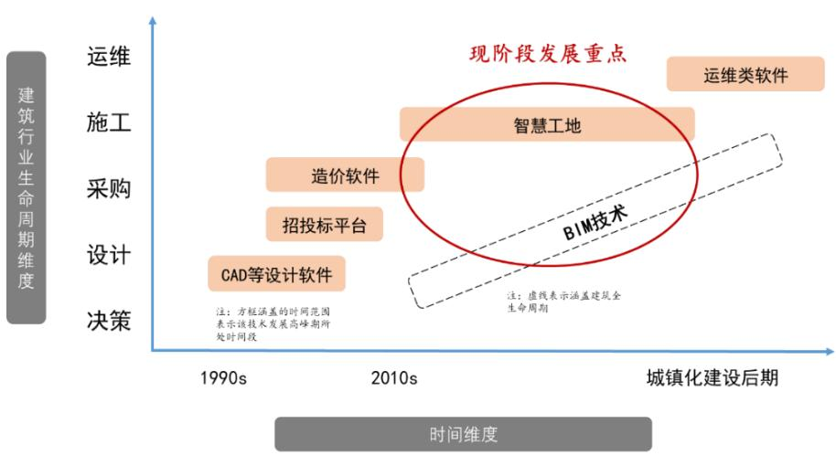  
建筑行业数字化发展阶段  
资料来源：品茗股份招股说明书，中信证券研究部测算

  
公司长期空间预测

# 二、数字造价：转云成果亮眼，增值服务打开天花板

2.1造价复盘：创造增量到激活存量  
2.2发展阶段：转云进入尾声，突破最后4个地区  
2.3转云成果：转云成功大局已定，各项指标健康发展  
2.4未来看点：增值服务助推造价业务天花板提升  
2.5空间测算：超50亿市场空间，势在必行

# 2.1 造价复盘：创造增量到激活存量

  
资料来源：公司公告，Wind，中信证券研究部

# 2.2 发展阶段：转云进入尾声，突破最后4个地区

# 2020年底，云收入16.2亿元，占造价业务收入的比例达58%，2021年进入最后四个地区。

转云区域 新增6省：云南、湖新增5省：辽宁、 新增10省：包括北 新增4个搏杀地 最后4个地区：北、宁夏、吉林、 新疆、重庆、河 京、上海等工程项目 区：湖南、安 浙江、福建、安山西、黑龙江 南、广 聚集的地域 徽、山东、四川 徽、江苏  
转云产品 云计价产品务 云算量产品 其他增值服务2017 2018 2019 2020 2021E 未来云合同额6.55亿元， 云合同额14亿元，云收云合同额22.34亿元，云 公司公告预计 预计未来云收入云合同额1.75亿元 云收入3.7亿元，云收 入9.21亿元，云收入占收入16.22亿元，云收入 新签云合同30 占比有望提升至入占造价业务比例18% 造价业务比例38%。 占造价业务比例58%。 亿元左右 造价总收入的80%。

  
造价业务转云指标（2017至2021Q1）  
资料来源：公司公告，中信证券研究部

# 2.3 转云成果：转云成功大局已定，各项指标健康发展

转云情况的主要考核指标：云合同额。2020年云合同额22.34亿元，同比 $+60 \%$ 。

# 2021年指引：云合同额全年约30亿元。

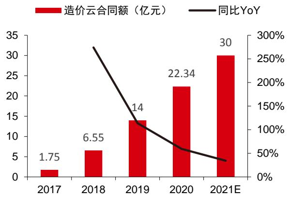  
造价业务云合同额及增速

  
造价业务云合同负债余额

造价转云转化率及续费率  

<table><tr><td></td><td colspan="5">2020</td></tr><tr><td></td><td>第第二</td><td></td><td>第三批 10个地 区</td><td>第四批最后 4个地 区</td><td>批4个 地区</td></tr><tr><td>计价转化 率(累计值) 算量转化 率(累计值)</td><td colspan="2">综合转化率 &gt;85%</td><td>&gt;80%</td><td>&gt;50%</td><td></td></tr><tr><td>续费率</td><td colspan="2">&gt;85%</td><td>88%</td><td></td><td></td></tr></table>

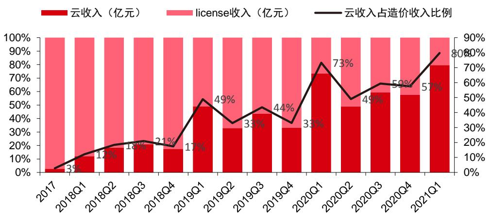  
造价业务收入拆分（云收入和license收入）  
资料来源：公司公告（含2021年造价业务云合同额指引数据），中信证券研究部

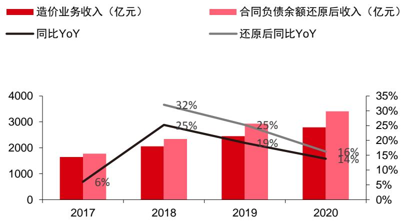  
造价业务合同负债还原后收入及同比

# 2.4 未来看点：增值服务助推造价业务天花板提升

未来看点一：数据类增值服务需求有望快速提升

未来看点二：造价市场化改革推动产品快速迭代更新

造价业务增值类产品服务进展  

<table><tr><td>分类</td><td>业务进展</td></tr><tr><td>计价</td><td>计区6 推出量场化计体化，云报表等新功能持续提升户作业效率和便捷性数，拼并配合造价市场化改革，在</td></tr><tr><td>算量</td><td>算量全系列产品持续提升计算效率和稳定性，智能算量产品利用AI技术实现主体建模效率提升30%以上。</td></tr><tr><td>工程信息</td><td>广材网、广材助手、造价云空间等成熟产品收入实现高速增长，产品应用率进一步提升，其中广材网搜索量超过 6300万次，广材助手自有数据载价量1.7亿次； 改进指标神器、广材数聚等新产品，其中指标神器能够大幅提升计算效率，并帮助用户对指标结果进行快速比对 审核；广材数聚提供企业材料和造价数据的管理，能够帮助企业建立材料价格、指标价格等数据资产库，实现企 业内部数据互通和共享，已经在全国建立百余个企业数据库的标杆项目。</td></tr></table>

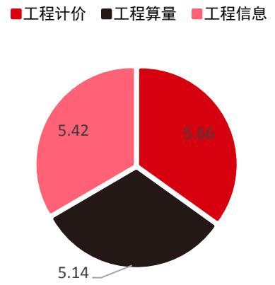  
2020造价业务按产品线占比  
资料来源：公司公告，中信证券研究部

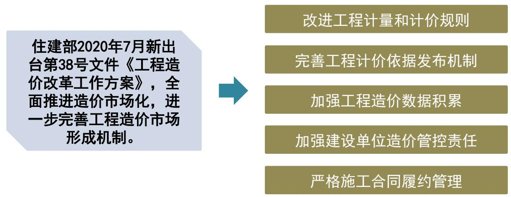  
第38号文工程造价工作改革主要内容

# 2.5 空间测算：超50亿市场空间，势在必行

根据产业调研，我国造价员数量大约100万，实际产生用户点数大于100万。根据我们测算，2020年，公司存量用户点数约70万，其中云用户约50万，授权存量用户约20万（其中2020年新增授权数约为10万），预计2023年公司云合同额有望达到50亿元。

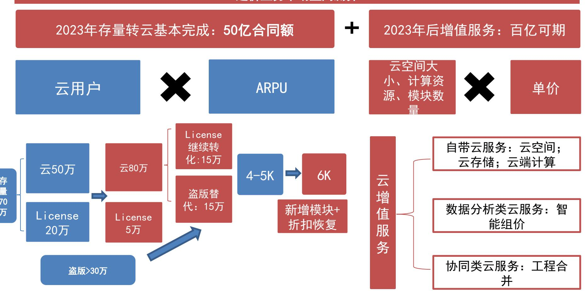  
造价业务市场空间测算   
资料来源：公司公告，中信证券研究部预测

# 三、数字设计：助力打通建筑行业全流程

3.1业务现状：起步阶段，设计品牌发布在即  
3.2产品定位：作为入口，以数据驱动打通全流程  
3.3格局推演：产业链布局完整者料将胜出

# 3.1 业务现状：起步阶段，设计品牌发布在即

数字设计：从业务单元BU到业务事业部BG根据公司披露，预计2021年下半年建立广联达数字设计品牌

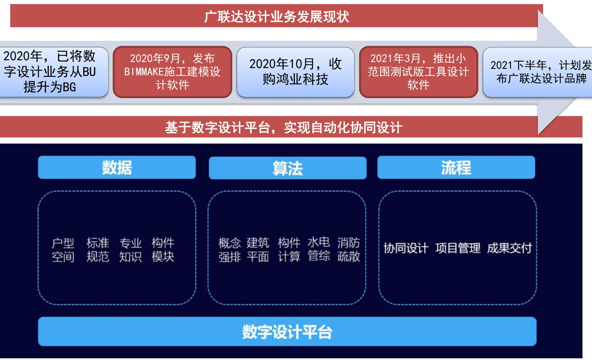  
注：BIMMAKE目前仍属于数字施工BG

资料来源：2021广联达投资者大会，公司公告，中信证券研究部

# 3.2 产品定位：作为入口，以数据驱动打通全流程

- 以自主三维图形引擎为基，作为底层支撑。核心是数据和算法，驱动流程自动化，打通设计、造价、施工、运维全流程。自研+合作：部分自研，部分支持伙伴快速开发，形成数字建筑生态体系。

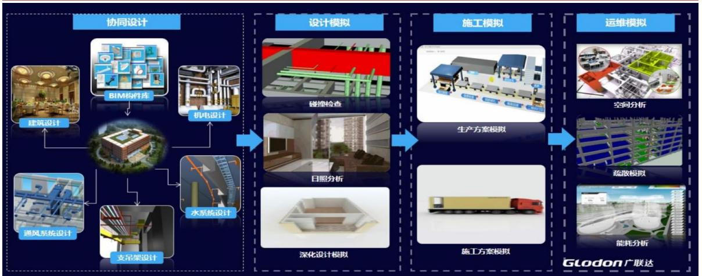  
数字设计以数据驱动打通全流程

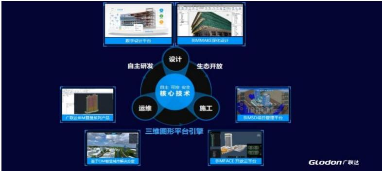  
图形引擎技术支撑核心产品  
资料来源：2021广联达投资者大会

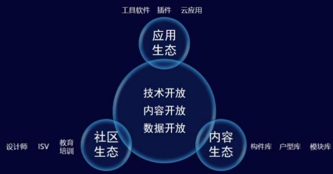  
打造开放数字设计生态

# 3.3 发展趋势：产业链布局完整者料将胜出

我国设计软件市场被海外龙头Autodesk占据。

国内企业聚焦某一专业或以二次开发为主，格局相对分散。

设计作为建筑入口环节至关重要，广联达从BIM 3D切入，对下游造价、施工具备深刻理解，在一体化协同能力上具备天然优势，长期有望对Autodesk形成换道超车，提升产品主导权和行业话语权。

我国建筑设计领域主要参与者  

<table><tr><td>参与者</td><td>成立时间</td><td>地区</td><td>收入</td><td>业务布局</td></tr><tr><td>Autodesk</td><td>1982年</td><td>美国特拉华州37.9亿美元</td><td></td><td>为制造业、工程建设行业、基础设施业以及传媒娱乐业等行业提供数字化设计、 工程与娱乐软件服务和解决方案。AutoCAD在1982年正式推向市场，2014年启动转 云，BIM产品Revit市场领先。</td></tr><tr><td>Bentley</td><td>1987年</td><td>美国特拉华州8.02亿美元</td><td></td><td>全球领先的基础设施工程软件供应商，聚焦BIM软件研发。</td></tr><tr><td>中望软件</td><td>1998年</td><td>广州</td><td>4.56亿元</td><td>国内领先的CAD/CAE/CAM公司，同时掌握CAD、CAM、CAE核心技术，产品包含中望 3D、中望CAD、中望仿真软件、中望教育系列等</td></tr><tr><td>浩辰软件</td><td>1992年</td><td>苏州</td><td>0.82亿元</td><td>主营业为结水、平台及、专软件。中专业软件包含应用在工程建设行业的建</td></tr><tr><td>盈建科</td><td>2010年</td><td>北京</td><td>1.50亿元</td><td>聚焦建筑结构设计软件，包括盈建科建筑结构计算软件(YJK-A)；盈建科基础设计 软件 (YJK-F)；盈建科砌体结构设计软件(YJK-M)等。</td></tr><tr><td>PKPM</td><td>2001年</td><td>北京</td><td></td><td>产品涵盖建筑、结构、机电、绿色建筑全专业应用，以及面向设计、生产、施工、 运维各阶段的应用软件或系统，其中PKPM结构设计软件市场领先。</td></tr><tr><td>鸿业科技</td><td>1992年</td><td>洛阳</td><td>1.06亿元</td><td>房屋建筑程市政工程辅助设计、模拟分析计算等软件，产品包括B系列、市</td></tr><tr><td>天正软件</td><td>1994年</td><td>北京</td><td></td><td>基于放、 平的建筑构、给排水、暖通、电气、节能、日照、</td></tr><tr><td>探索者</td><td>1999年</td><td>北京</td><td>0.55亿元</td><td>以结构绘图软件产品为基础，产品主要包括结构系列软件以及BIM三维结构系列软</td></tr></table>

资料来源：各公司官网，Wind，中信证券研究部为2018年收入，浩辰软件为2017年收入  
注：Autodesk、Bentley为2020财年收入，中望软件、盈建科为2020年收入，鸿业科技为2019年收入，探索者2E

# 四 风险因素

# 4 风险因素

建筑行业景气度下行；

建筑行业数字化转型速度不及预期；

房屋新开工面积不及预期；

施工信息化业务竞争加剧；

设计业务产品研发推进速度不及预期。

# 五、盈利预测与估值评级

# 5.1盈利预测

预计公司2021-24年收入为50.23/63.47/80.46/99.71亿元，同比增长27%/26%/27%/24%，2020-2024年CAGR为 $26 \%$ 。造价业务云收入占比提升，施工业务快速增长。

公司业务经营模型（单位：百万元）  

<table><tr><td></td><td>2017</td><td>2018</td><td>2019</td><td>2020</td><td>2021E</td><td>2022E</td><td>2023E</td><td>2024E</td></tr><tr><td>营业总收入</td><td>2356.72</td><td>2904.40</td><td>3540.65</td><td>4004.64</td><td>5,023.30</td><td>6,347.06</td><td>8,045.97</td><td>9,971.31</td></tr><tr><td>同比增长</td><td>16%</td><td>23%</td><td>22%</td><td>13%</td><td>27%</td><td>26%</td><td>27%</td><td>24%</td></tr><tr><td>综合毛利率</td><td>93%</td><td>93%</td><td>89%</td><td>88%</td><td>88%</td><td>87%</td><td>85%</td><td>85%</td></tr><tr><td>.工程造价业务</td><td></td><td></td><td></td><td></td><td></td><td></td><td></td><td></td></tr><tr><td>收入</td><td>1643.00</td><td>2057.22</td><td>2451.66</td><td>2790.64</td><td>3,383.22</td><td>3,966.65</td><td>4,793.53</td><td>5,767.57</td></tr><tr><td>同比</td><td>6%</td><td>25%</td><td>19%</td><td>14%</td><td>21%</td><td>17%</td><td>21%</td><td>20%</td></tr><tr><td>占比</td><td>70%</td><td>71%</td><td>69%</td><td>70%</td><td>67%</td><td>62%</td><td>60%</td><td>58%</td></tr><tr><td>毛利率</td><td>96%</td><td>96%</td><td>94%</td><td>94%</td><td>95%</td><td>95%</td><td>95%</td><td>95%</td></tr><tr><td>二.工程施工业务</td><td></td><td></td><td></td><td></td><td></td><td></td><td></td><td></td></tr><tr><td>收入</td><td>558.27</td><td>658.60</td><td>853.41</td><td>943.21</td><td>1,273.33</td><td>1,782.67</td><td>2,495.73</td><td>3,244.45</td></tr><tr><td>同比</td><td>61%</td><td>18%</td><td>30%</td><td>11%</td><td>35%</td><td>40%</td><td>40%</td><td>30%</td></tr><tr><td>占比</td><td>24%</td><td>23%</td><td>24%</td><td>24%</td><td>25%</td><td>28%</td><td>31%</td><td>33%</td></tr><tr><td>毛利率</td><td>87%</td><td>86%</td><td>76%</td><td>72%</td><td>72%</td><td>70%</td><td>68%</td><td>68%</td></tr><tr><td>三.海外业务</td><td></td><td></td><td></td><td></td><td></td><td></td><td></td><td></td></tr><tr><td>收入</td><td>121.06</td><td>123.41</td><td>137.35</td><td>147.55</td><td>169.68</td><td>203.62</td><td>244.35</td><td>293.22</td></tr><tr><td>同比</td><td>1%</td><td>2%</td><td>11</td><td>7%</td><td>15%</td><td>20%</td><td>20%</td><td>20%</td></tr><tr><td>占比</td><td>5%</td><td>4%</td><td>4%</td><td>4%</td><td>3%</td><td>3%</td><td>3%</td><td>3%</td></tr><tr><td>毛利率</td><td>81%</td><td>86%</td><td>89%</td><td>90%</td><td>90%</td><td>90%</td><td>90%</td><td>90%</td></tr><tr><td>四. 其他（包括创新业务)</td><td></td><td></td><td></td><td></td><td></td><td></td><td></td><td></td></tr><tr><td>收入</td><td>17.82</td><td>22.32</td><td>21.74</td><td>65.69</td><td>197.06</td><td>394.12</td><td>512.36</td><td>666.07</td></tr><tr><td>同比</td><td>29%</td><td>25%</td><td>-3%</td><td>202%</td><td>200%</td><td>100%</td><td>30%</td><td>30%</td></tr><tr><td>占比</td><td>1%</td><td>1%</td><td>1%</td><td>2%</td><td>5%</td><td>8%</td><td>8%</td><td>6%</td></tr><tr><td>毛利率</td><td>100%</td><td>99%</td><td>91%</td><td>80%</td><td>80%</td><td>80%</td><td>75%</td><td>75%</td></tr><tr><td>五.金融业务</td><td></td><td></td><td></td><td></td><td></td><td></td><td></td><td></td></tr><tr><td>收入</td><td>16.99</td><td>42.84</td><td>76.50</td><td></td><td></td><td></td><td></td><td></td></tr><tr><td>同比</td><td>73%</td><td>152%</td><td>79%</td><td></td><td></td><td></td><td></td><td></td></tr></table>

资料来源：公司公告，中信证券研究部预测

# 5.1 盈利预测

造价业务：我们预计2024年造价业务收入将达到58亿元，2020-2024年CAGR为 $20 \%$ ,其中云收入52亿元，2020-2024年CAGR为34%。

工程造价业务收入测算（百万元）  

<table><tr><td></td><td>2017</td><td>2018</td><td>2019</td><td>2020</td><td>2021E</td><td>2022E</td><td>2023E</td><td>2024E</td></tr><tr><td>造价业务合计收入(1+2+3)</td><td>1643.00</td><td>2057.22</td><td>2451.66</td><td>2,790.64</td><td>3,383.22</td><td>3,966.65</td><td>4,793.53</td><td>5,767.57</td></tr><tr><td>同比增长</td><td>6%</td><td>25%</td><td>19%</td><td>14%</td><td>21%</td><td>17%</td><td>21%</td><td>20.3%</td></tr><tr><td>1.造价产品云收入</td><td>45.29</td><td>370.00</td><td>921.00</td><td>1,622.00</td><td>2,565.17</td><td>3,312.21</td><td>4,269.98</td><td>5,249.26</td></tr><tr><td>同比增长</td><td></td><td>717%</td><td>149%</td><td>76%</td><td>58%</td><td>29%</td><td>29%</td><td>22.9%</td></tr><tr><td></td><td></td><td></td><td></td><td></td><td></td><td></td><td></td><td></td></tr><tr><td>2.他价员licens及电政务</td><td>1477.71</td><td>1547.22</td><td>1330.66</td><td>1,168.64</td><td>818.04</td><td>654.44</td><td>523.55</td><td>518.31</td></tr><tr><td>同比增长</td><td></td><td>5%</td><td>-14%</td><td>-12%</td><td>-30%</td><td>-20%</td><td>-20%</td><td>-1%</td></tr><tr><td>造价业务合计成本</td><td>64.00</td><td>80.73</td><td>148.38</td><td>162.57</td><td>169.16</td><td>198.33</td><td>239.68</td><td>288.38</td></tr><tr><td>毛利率</td><td>96%</td><td>96%</td><td>94%</td><td>94%</td><td>95%</td><td>95%</td><td>95%</td><td>95%</td></tr><tr><td></td><td></td><td></td><td></td><td></td><td></td><td></td><td></td><td></td></tr><tr><td></td><td>2017</td><td>2018</td><td>2019</td><td>2020</td><td>2021E</td><td>2022E</td><td>2023E</td><td>2024E</td></tr><tr><td>造价业务占总收入的比例</td><td>70%</td><td>71%</td><td>69%</td><td>70%</td><td>67%</td><td>62%</td><td>60%</td><td>58%</td></tr><tr><td>云收入占造价业务收入比例</td><td>3%</td><td>18%</td><td>38%</td><td>58%</td><td>76%</td><td>.84%</td><td>89%</td><td>91%</td></tr></table>

资料来源：公司公告，中信证券研究部预测

# 5.1 盈利预测

施工业务：我国施工环节的信息化渗透率低，我们中性估计中期每年市场空间超500亿元。预计2024年公司施工业务收入将达到32.4亿元，2020-2023年CAGR为 $36 \%$ 。

费用预测：我们认为费用率下降是长期趋势。一方面，公司开始对费用进行严格控制，另一方面，转云成功后，预计销售费用率将持续下降。长期看，公司研发费用率/管理费用率/销售费用率预计都将下降，但同时考虑股权激励在内，短期将增加一定管理费用。

工程施工业务收入测算（百万元）  

<table><tr><td></td><td>2017</td><td>2018</td><td>2019</td><td>2020</td><td>2021E</td><td>2022E</td><td>2023E</td><td>2024E</td></tr><tr><td>收入</td><td>558.27</td><td>658.60</td><td>853.41</td><td>943.21</td><td>1,273.33</td><td>1,782.67</td><td>2,495.73</td><td>3,244.45</td></tr><tr><td>同比</td><td>61%</td><td>18%</td><td>30%</td><td>11%</td><td>35%</td><td>40%</td><td>40%</td><td>30%</td></tr><tr><td>收入占比</td><td>24%</td><td>23%</td><td>24%</td><td>24%</td><td>25%</td><td>28%</td><td>31%</td><td>33%</td></tr><tr><td>成本</td><td>74.50</td><td>90.30</td><td>205.06</td><td>263.41</td><td>356.53</td><td>534.80</td><td>798.63</td><td>1,038.23</td></tr><tr><td>毛利</td><td>483.77</td><td>568.31</td><td>648.35</td><td>679.80</td><td>916.80</td><td>1,247.87</td><td>1,697.10</td><td>2,206.23</td></tr><tr><td>毛利占比</td><td>22%</td><td>21%</td><td>21%</td><td>19%</td><td>21%</td><td>23%</td><td>25%</td><td>26%</td></tr><tr><td>毛利率</td><td>87%</td><td>86%</td><td>76%</td><td>72%</td><td>72%</td><td>70%</td><td>68%</td><td>68%</td></tr></table>

公司整体费用预测（百万元）  

<table><tr><td></td><td>2017</td><td>2018</td><td>2019</td><td>2020</td><td>2021E</td><td>2022E</td><td>2023E</td><td>2024E</td></tr><tr><td>1.研发费用</td><td>598.09</td><td>727.21</td><td>969.06</td><td>1075.90</td><td>1274.70</td><td>1481.65</td><td>1810.97</td><td>2313.41</td></tr><tr><td>同比</td><td>30%</td><td>22%</td><td>33%</td><td>11%</td><td>18%</td><td>16%</td><td>22%</td><td>28%</td></tr><tr><td>研发费用率</td><td>26%</td><td>25%</td><td>28%</td><td>27%</td><td>25%</td><td>23%</td><td>23%</td><td>23%</td></tr><tr><td>2.管理费用</td><td>1115.32</td><td>764.71</td><td>819.8</td><td>879.2</td><td>1,110.3</td><td>1,210.2</td><td>1,410.0</td><td>1,746.7</td></tr><tr><td>同比</td><td>14%</td><td>-31%</td><td>7%</td><td>7%</td><td>26%</td><td>9%</td><td>17%</td><td>24%</td></tr><tr><td>管理费用率</td><td>39%</td><td>22%</td><td>21%</td><td>17%</td><td>22%</td><td>19%</td><td>18%</td><td>18%</td></tr><tr><td>3.销售费用</td><td>682.01</td><td>792.91</td><td>1102.48</td><td>1255.52</td><td>1450.96</td><td>1679.62</td><td>2095.81</td><td>2549.14</td></tr><tr><td>同比</td><td>2%</td><td>16%</td><td>39%</td><td>14%</td><td>16%</td><td>16%</td><td>25%</td><td>22%</td></tr><tr><td>销售费用率</td><td>29%</td><td>28%</td><td>32%</td><td>32%</td><td>29%</td><td>26%</td><td>26%</td><td>26%</td></tr></table>

资料来源：公司公告，中信证券研究部预测

# 5.2 分部估值

分部估值法：预计2024年造价业务存量转云基本完成，2024之前业务确定性高，之后主要靠增值服务驱动。2024年造价业务目标市值为1154亿元，施工业务目标市值为324亿元，其他业务目标市值96亿元。基于行业龙头预期收益率、国债收益率、公司业务高确定性等因素，我们按15%的折现率折现到2021年，目标市值1035亿元，目标股价87元。

公司估值测算（单位：百万元）  

<table><tr><td></td><td>2021E</td><td>2022E</td><td>2023E</td><td>2024E</td><td></td><td>假设依据</td></tr><tr><td>一、造价业务</td><td></td><td></td><td></td><td></td><td></td><td></td></tr><tr><td>营业收入</td><td>3,383.223,966.654,793.535,767.57</td><td></td><td></td><td></td><td>19%</td><td></td></tr><tr><td>预期净利率</td><td></td><td></td><td></td><td>50%</td><td></td><td>2010-2013年造价业务收入占比大于90%的时期，净利润率曾保持35%左右，同 期销售费用率在35%以上。在SaaS模式下，造价业务的销售费用率有显著降低 空间。在控人控费预期下，管理费用和研发费用率也有望进一步下降。</td></tr><tr><td>净利润</td><td></td><td></td><td></td><td>2883.79</td><td></td><td></td></tr><tr><td>目标市盈率PE</td><td></td><td></td><td></td><td>40</td><td></td><td>2024年计算机行务头公持平均市盈率超过40，2024年后，公司造价业务有</td></tr><tr><td>目标市值 二、施工业务</td><td>75,845</td><td>87,222</td><td>100,306</td><td>115, 351</td><td></td><td></td></tr><tr><td>营业收入</td><td></td><td></td><td>1273.33 1782.672495.73</td><td>3244.45</td><td>37%</td><td></td></tr><tr><td>预期净利率</td><td></td><td></td><td></td><td>20%</td><td></td><td>施工业务为软硬一体的解决方案，净利率类比同行业同类公司。</td></tr><tr><td>净利润</td><td></td><td></td><td></td><td>648.89</td><td></td><td>2024年计算机行业龙头公司平均市盈率超过40X，预计公司施工业务所在市场</td></tr><tr><td>目标市盈率PE</td><td></td><td></td><td></td><td>50</td><td></td><td>未来5年每年有超过500亿市场空间，2024年公司相关收入预测33亿元，渗透率 较低，有望继续维持高增长，因此给予一定溢价。</td></tr><tr><td>目标市值 三、海外及其它业务</td><td>21,333</td><td>24,533</td><td>28,213</td><td>32,445</td><td></td><td></td></tr><tr><td>营业收入</td><td>366.75</td><td>597.74</td><td>756.70</td><td>959.28</td><td>38%</td><td></td></tr><tr><td>目标市销率PS</td><td></td><td></td><td></td><td>10</td><td></td><td>海外及创新业务预期尚未盈利，从空间判断收入有望加速（包含设计业务）。</td></tr><tr><td>目标市值</td><td>6,307</td><td>7,254</td><td>8,342</td><td>9,593</td><td></td><td></td></tr><tr><td>目标市值合计</td><td>103,486</td><td></td><td></td><td>157,389</td><td></td><td></td></tr><tr><td>折现率</td><td></td><td></td><td></td><td>15%</td><td></td><td>计算机行业龙头公司未来预期收益率在15%左右，我们之前给予公司10%的折现 率是考虑了股票风险溢价、长期国债收益率等因素，低于行业平均水平主要是</td></tr><tr><td>目标股价</td><td>87</td><td></td><td></td><td></td><td></td><td>由于造价业务确定性较高，随着施工业务占比提升，我们保守采用15%折现率。</td></tr></table>

资料来源：公司公告，中信证券研究部预测  
注：股价为2021年8月20日收盘价

# 5.2核心观点

盈利预测：微调2021-2023年公司收入预测至50.2/63.5/80.5亿元（原预测为50.4/64.5/79.2亿元），新增2024年收入预测99.7亿元，现价对应当前PS为14/11/9/7X。因为施工业务解决方案需要部分硬件，毛利率低于原造价业务。公司施工业务的收入占比提升导致毛利率有所下降。维持2021-2023年归母净利润预测6.9/11.1/14.6亿元，对应EPS预测为0.58/0.93/1.23元，新增2024年归母净利润预测为17.4亿元，对应EPS预测为1.47元。

估值评级：我们预计2024年公司营业收入将达到100亿元，其中施工业务32亿元，造价业务58亿元，其它业务10亿元。我们使用分部估值法，认为2024年合理市值1574亿元，对应2024年PS为16X，其中造价业务合理市值为1154亿元，同年施工业务合理市值为324亿元，其他业务合理市值为96亿元。基于行业龙头预期收益率、国债收益率、公司业务高确定性等因素，按照折现率15%折现至2021年，目标市值为1035亿元，对应目标股价87元，对应目标PS为21X，维持“买入”评级。

公司盈利预测表  

<table><tr><td>项目/年度</td><td>2019</td><td>2020</td><td>2021E</td><td>2022E</td><td>2023E</td><td>2024E</td></tr><tr><td>营业收入(百万元)</td><td>3,541</td><td>4,005</td><td>5,023</td><td>6,347</td><td>8,046</td><td>9,971</td></tr><tr><td>营业收入增长率YoY</td><td>21.9%</td><td>13.1%</td><td>25.4%</td><td>26.4%</td><td>26.8%</td><td>23.9%</td></tr><tr><td>净利润（百万元)</td><td>235</td><td>330</td><td>686</td><td>1,108</td><td>1,461</td><td>1743</td></tr><tr><td>净利润增长率YoY</td><td>-46.5%</td><td>40.5%</td><td>107.7%</td><td>61.5%</td><td>31.8%</td><td>19.3%</td></tr><tr><td>每股收益EPS(基本)(元)</td><td>0.20</td><td>0.28</td><td>0.58</td><td>0.93</td><td>1.23</td><td>1.47</td></tr><tr><td>毛利率</td><td>89.5%</td><td>88.7%</td><td>88.4%</td><td>86.9%</td><td>85.2%</td><td>84.7%</td></tr><tr><td>净资产收益率ROE</td><td>7.2%</td><td>5.2%</td><td>10.1%</td><td>14.8%</td><td>17.8%</td><td>19.7%</td></tr><tr><td>每股净资产（元）</td><td>2.75</td><td>5.39</td><td>5.72</td><td>6.29</td><td>6.90</td><td>7.46</td></tr><tr><td>PE</td><td>295.2</td><td>210.1</td><td>101.2</td><td>62.6</td><td>47.5</td><td>39.8</td></tr><tr><td>P B$</td><td>21.2</td><td>10.8</td><td>10.2</td><td>9.3</td><td>8.5</td><td>7.8</td></tr><tr><td>PS</td><td>19.6</td><td>17.3</td><td>13.8</td><td>10.9</td><td>8.6</td><td>7.0</td></tr><tr><td>EV/EBITDA</td><td>169.1</td><td>145.8</td><td>97.1</td><td>60.7</td><td>46.9</td><td>39.6</td></tr></table>

资料来源：Wind，中信证券研究部预测注：股价为2021年8月20日收盘价

附：利润表和资产负债表  
利润表（百万元）  
资产负债表（百万元）  

<table><tr><td>指标名称</td><td>2019</td><td>2020</td><td>2021E</td><td>2022E</td><td>2023E</td><td>指标名称</td><td>2019</td><td>2020</td><td>2021E</td><td>2022E</td><td>2023E</td></tr><tr><td>营业收入</td><td>3,541</td><td>4,005</td><td>5,023</td><td>6,347</td><td>8,046</td><td>货币资金</td><td>2,231</td><td>4,797</td><td>6,409</td><td>8,025</td><td>10,627</td></tr><tr><td>营业成本</td><td>371</td><td>454</td><td>582</td><td>832</td><td>1,191</td><td>存货</td><td>21</td><td>26</td><td>32</td><td>47</td><td>67</td></tr><tr><td>毛利率</td><td>89.5%</td><td>88.7%</td><td>88.4%</td><td>86.9%</td><td>85.2%</td><td>应收账款</td><td>559</td><td>422</td><td>619</td><td>827</td><td>966</td></tr><tr><td>税金及附加</td><td>43</td><td>38</td><td>63</td><td>73</td><td>91</td><td>其他流动资产</td><td>139</td><td>174</td><td>194</td><td>260</td><td>334</td></tr><tr><td>销售费用</td><td>1,102</td><td>1,256</td><td>1,451</td><td>1,680</td><td>2,096</td><td>流动资产</td><td>2,950</td><td>5,420</td><td>7,254</td><td>9,159</td><td>11,994</td></tr><tr><td>销售费用率</td><td>31.1%</td><td>31.4%</td><td>28.9%</td><td>26.5%</td><td>26.0%</td><td>固定资产</td><td>803</td><td>810</td><td>769</td><td>728</td><td>687</td></tr><tr><td>管理费用</td><td>820</td><td>879</td><td>1,110</td><td>1,210</td><td>1,410</td><td>长期股权投资</td><td>233</td><td>255</td><td>255</td><td>255</td><td>255</td></tr><tr><td>管理费用率</td><td>23.2%</td><td>22.0%</td><td>22.1%</td><td>19.1%</td><td>17.5%</td><td>无形资产</td><td>373</td><td>368</td><td>341</td><td>311</td><td>278</td></tr><tr><td>财务费用</td><td>41</td><td>(17)</td><td>(123)</td><td>(159)</td><td>(205)</td><td>其他长期资产</td><td>1,809</td><td>2,694</td><td>3,072</td><td>3,542</td><td>4,045</td></tr><tr><td>财务费用率</td><td>1.1%</td><td>-0.4%</td><td>-2.5%</td><td>-2.5%</td><td>-2.5%</td><td>非流动资产</td><td>3,217</td><td>4,127</td><td>4,437</td><td>4,836</td><td>5,265</td></tr><tr><td>研发费用</td><td>969</td><td>1083</td><td>1275</td><td>1482</td><td>1811</td><td>资产总计</td><td>6,167</td><td>9,547</td><td>11,692</td><td>13,995</td><td>17,259</td></tr><tr><td>研发费用率</td><td>27.4%</td><td>27.0%</td><td>25.4%</td><td>23.3%</td><td>22.5%</td><td>短期借款</td><td>1,089</td><td>3</td><td>0</td><td>0</td><td>0</td></tr><tr><td>投资收益</td><td>23</td><td>10</td><td>18</td><td>17</td><td>15</td><td>应付账款</td><td>99</td><td>95</td><td>127</td><td>193</td><td>262</td></tr><tr><td>EBITDA</td><td>411</td><td>476</td><td>715</td><td>1,144</td><td>1,480</td><td>其他流动负债</td><td>1,622</td><td>2,760</td><td>4,438</td><td>5,888</td><td>8,206</td></tr><tr><td>营业利润</td><td>290</td><td>414</td><td>812</td><td>1,344</td><td>1,770</td><td>流动负债</td><td>2,809</td><td>2,858</td><td>4,565</td><td>6,081</td><td>8,468</td></tr><tr><td>营业利润率</td><td>8.20%</td><td>10.34%</td><td>16.17%21.17%</td><td></td><td>22.00%</td><td>长期借款</td><td>0</td><td>0</td><td>0</td><td>0</td><td>0</td></tr><tr><td>营业外收入</td><td>1</td><td>2</td><td>2</td><td>2</td><td>2</td><td>其他长期负债</td><td>9</td><td>131</td><td>131</td><td>131</td><td>131</td></tr><tr><td>营业外支出</td><td>7</td><td>6</td><td>6</td><td>7</td><td>6</td><td>非流动性负债</td><td>9</td><td>131</td><td>131</td><td>131</td><td>131</td></tr><tr><td>利润总额</td><td>284</td><td>410</td><td>808</td><td>1,339</td><td>1,765</td><td>负债合计</td><td>2,818</td><td>2,989</td><td>4,696</td><td>6,212</td><td>8,599</td></tr><tr><td>所得税</td><td>29</td><td>29</td><td>74</td><td>118</td><td>148</td><td>股本</td><td>1,129</td><td>1,186</td><td>1,186</td><td>1,186</td><td>1,186</td></tr><tr><td>所得税率</td><td>10.3%</td><td>7.1%</td><td>9.2%</td><td>8.8%</td><td>8.4%</td><td>资本公积</td><td>509</td><td>3,135</td><td>3,135</td><td>3,135</td><td>3,135</td></tr><tr><td>少数股东损益</td><td>20</td><td>51</td><td>48</td><td>112</td><td>157</td><td>归属于母公司所</td><td>3,269</td><td>6,402</td><td>6,792</td><td>7,468</td><td>8,187</td></tr><tr><td>归属于母公司股 东的净利润</td><td>235</td><td>330</td><td>686</td><td>1,108</td><td>1,461</td><td>有者权益合计 少数股东权益</td><td>80</td><td>156</td><td>203</td><td>315</td><td>472</td></tr><tr><td>净利率</td><td>6.6%</td><td>8.3%</td><td>13.7%</td><td>17.5%</td><td>18.2%</td><td>股东权益合计</td><td>3,349</td><td>6,558</td><td>6,995</td><td>7,783</td><td>8,660</td></tr><tr><td></td><td></td><td></td><td></td><td></td><td></td><td>色债股在权益单</td><td>6.167</td><td>9.547</td><td>11.692</td><td>13.995</td><td>17.250</td></tr><tr><td></td><td></td><td></td><td></td><td></td><td></td><td></td><td></td><td></td><td></td><td></td><td></td></tr></table>

资料来源：公司公告，中信证券研究部预测

# 附：现金流量表和主要财务指标

现金流量表（百万元）  

<table><tr><td>指标名称</td><td>2019</td><td>2020</td><td>2021E</td><td>2022E</td><td>2023E</td></tr><tr><td>税后利润</td><td>255</td><td>381</td><td>734</td><td>1,220</td><td>1,618</td></tr><tr><td>折旧和摊销</td><td>106</td><td>134</td><td>78</td><td>76</td><td>76</td></tr><tr><td>营运资金的变化</td><td>159</td><td>1,276</td><td>1,489</td><td>1,211</td><td>2,137</td></tr><tr><td>其他经营现金流</td><td>122</td><td>84</td><td>-143</td><td>-159</td><td>-204</td></tr><tr><td>经营现金流合计</td><td>641</td><td>1,876</td><td>2,157</td><td>2,348</td><td>3,627</td></tr><tr><td>资本支出</td><td>-243</td><td>-439</td><td>-123</td><td>-122</td><td>-136</td></tr><tr><td>投资收益</td><td>23</td><td>10</td><td>18</td><td>17</td><td>15</td></tr><tr><td>其他投资现金流</td><td>-7</td><td>-268</td><td>-265</td><td>-353</td><td>-369</td></tr><tr><td>投资现金流合计</td><td>-227</td><td>-697</td><td>-369</td><td>-458</td><td>-490</td></tr><tr><td>权益变化</td><td>23</td><td>3,040</td><td>0</td><td>0</td><td>0</td></tr><tr><td>负债变化</td><td>-112</td><td>-1,088</td><td>-3</td><td>0</td><td>0</td></tr><tr><td>股利支出</td><td>-225</td><td>-113</td><td>-296</td><td>-432</td><td>-742</td></tr><tr><td>其他融资现金流</td><td>-76</td><td>-483</td><td>123</td><td>159</td><td>205</td></tr><tr><td>融资现金流合计</td><td>-390</td><td>1,357</td><td>-176</td><td>-274</td><td>-536</td></tr><tr><td>现金及现金等价 物净增加额</td><td>24</td><td>2,537</td><td>1,612</td><td>1,616</td><td>2,601</td></tr></table>

资料来源：公司公告，中信证券研究部预测

主要财务指标  

<table><tr><td>指标名称</td><td>2019</td><td>2020</td><td>2021E</td><td>2022E</td><td>2023E</td></tr><tr><td>增长率(%)</td><td></td><td></td><td></td><td></td><td></td></tr><tr><td>营业收入</td><td>21.9%</td><td>13.1%</td><td>25.4%</td><td>26.4%</td><td>26.8%</td></tr><tr><td>营业利润</td><td>-40.1%</td><td>42.6%</td><td>96.2%</td><td>65.4%</td><td>31.7%</td></tr><tr><td>净利润</td><td>-46.5%</td><td>40.5%</td><td>107.7%</td><td>61.5%</td><td>31.8%</td></tr><tr><td>利润率（%)</td><td></td><td></td><td></td><td></td><td></td></tr><tr><td>毛利率</td><td>89.5%</td><td>88.7%</td><td>88.4%</td><td>86.9%</td><td>85.2%</td></tr><tr><td>EBITDA Margin</td><td>11.6%</td><td>11.9%</td><td>14.2%</td><td>18.0%</td><td>18.4%</td></tr><tr><td>净利率</td><td>6.6%</td><td>8.3%</td><td>13.7%</td><td>17.5%</td><td>18.2%</td></tr><tr><td>回报率（%)</td><td></td><td></td><td></td><td></td><td></td></tr><tr><td>净资产收益率</td><td>7.2%</td><td>5.2%</td><td>10.1%</td><td>14.8%</td><td>17.8%</td></tr><tr><td>总资产收益率</td><td>3.8%</td><td>3.5%</td><td>5.9%</td><td>7.9%</td><td>8.5%</td></tr><tr><td>其他（%)</td><td></td><td></td><td></td><td></td><td></td></tr><tr><td>资产负债率</td><td>45.7%</td><td>31.3%</td><td>40.2%</td><td>44.4%</td><td>49.8%</td></tr><tr><td>所得税率</td><td>10.3%</td><td>7.1%</td><td>9.2%</td><td>8.8%</td><td>8.4%</td></tr><tr><td>股利支付率</td><td>48.0%</td><td>89.7%</td><td>63.0%</td><td>66.9%</td><td>73.2%</td></tr></table>