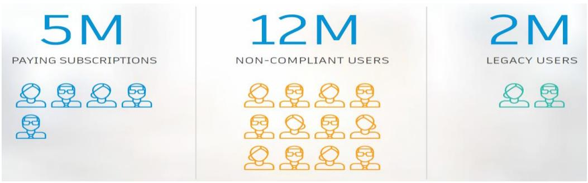
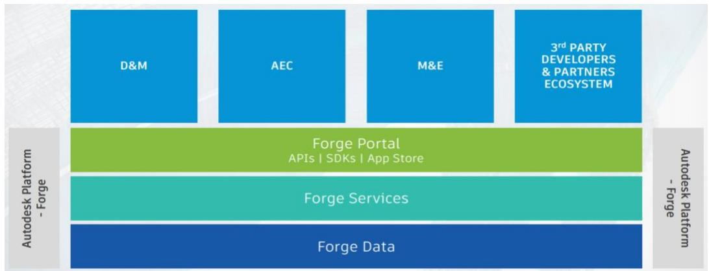

广联达（002410.SZ）深度跟踪报告|2022.3.18

# 核心观点

公司是国内数字建筑平台型领军企业，致力于打通建筑行业设计、造价、施工全流程，推动数字建筑一体化发展。数字设计是建筑行业入口环节，公司从BIM 3D 切入，以设计助推数字建筑一体化发展，巩固赛道把控力和龙头地位。给予目标价 92 元，维持“买入”评级。

- 战略定位：深化数字建筑一体化战略。公司致力于成为全球领先的数字建筑平台服务商。横向看，公司业务随建筑产业链延伸，覆盖设计、造价、施工等环节；纵向看，单业务面向不同岗位提供丰富模块，覆盖企业、项目、岗位等环节，各业务间协同效应通过一体化建设逐步体现。造价转云持续兑现亮眼成果，增值服务打开业务天花板。施工业务方案类需求提升，项企一体化催化拐点加速到来。设计布局有助于推动公司数字建筑一体化发展，巩固赛道把控力和龙头优势地位，并开启第三成长曲线。

- 建筑设计软件：源于 CAD 技术，云化、平台化、BIM 成重要趋势。建筑业设计主要可以分为建筑设计、结构设计以及机电设计三类，解决布局、效果、安全等问题。CAD技术起源于上世纪60年代，80年代起广泛应用于建筑行业，Autodesk、Bentley 等龙头公司相继进入市场并逐渐占据主导地位。在国内，“九五”期间，由建设部领导的“甩图板”开启了设计软件的发展之路，各国产CAD厂商逐步兴起，不断追赶海外巨头。近年来，建筑设计行业正不断向云化、平台化、BIM等方向探索发展，满足建筑企业深层次数字化需求，并试图打通从规划到运维的建筑全生命周期流程。

Autodesk：他山之石，建筑设计软件全球领军。Autodesk为全球设计软件龙头企业，自1982 年成立以来，其产品线从单一聚焦于建筑设计的AutoCAD，扩展至覆盖工程建设、产品设计与制造以及传媒与娱乐三大领域的产品体系。根据 Autodesk2021 年财报，FY2021，公司收入 37.9 亿美元 $( \mathsf { Y o Y } { + } 1 5 . 7 6 \% )$ 净利润12.08亿美元（Y $\prime 0 \mathsf { Y } + 4 6 3 \%$ ），其云战略大势已定，盈利能力持续优化，销售净利率达到近15年来最高水平。经历了近十年转云的探索与实践，Autodesk 已形成了一套完备的 SaaS+PaaS 产品体系，自身平台化能力不断提升，并不断寻求数字孪生等新兴方向布局。

- 广联达设计业务价值：助力打通建筑行业全流程，推动数字建筑一体化发展。广联达自 2010 年上市以来，持续将图形平台的研发与造价、施工等业务相结合，构建了自主研发图形平台的能力，为设计产品的发展奠定基础。同时，公司通过收购 Progman Oy 及鸿业科技等资产持续扩充自身设计软件能力。2021 年，公司发布了数维设计-建筑的单机公测版，且结构、机电板块已投入验证，并有望陆续发布。公司从 BIM 3D 切入，对下游造价、施工具备深刻理解，在一体化协同能力上具备天然优势，以布局设计推动数字建筑一体化发展。

<table><tr><td>广联达</td><td>002410</td></tr><tr><td>评级</td><td>买入 (维持)</td></tr><tr><td>当前价</td><td>49.17元</td></tr><tr><td>目标价</td><td>92.00元</td></tr><tr><td>总股本</td><td>1,190百万股</td></tr><tr><td>流通股本</td><td>994百万股</td></tr><tr><td>总市值</td><td>585亿元</td></tr><tr><td>近三月日均成交额</td><td>294百万元</td></tr><tr><td>52 周最高/最低价</td><td>78.3/44.52元</td></tr><tr><td>近1月绝对涨幅</td><td>-13.74%</td></tr><tr><td>近6月绝对涨幅</td><td>-19.92%</td></tr><tr><td>近12月绝对涨幅</td><td>-17.65%</td></tr></table>

风险因素：建筑行业景气度下行；建筑行业数字化转型不及预期；公司设计产品研发推进速度不及预期；市场竞争加剧。

投资建议：公司是国内数字建筑平台型领军企业，致力于打通建筑行业设计、造价、施工全流程，推动数字建筑一体化发展。数字设计是建筑行业入口环节，公司从 BIM 3D 切入，结合对下游造价、施工深刻理解，以布局设计助推数字建筑一体化发展，巩固赛道把控力和龙头优势地位。维持公司 2021/22/23 年收入预测 52.13/65.43/81.52 亿元，维持归母净利润预测 6.86/11.08/14.61 亿元，对应 EPS 为 0.58/0.93/1.23 元。采用分部估值法，基于公司业务进展情况、行业龙头估值水平、公司风险等因素，我们给予公司 2022 年目标市值为1089 亿元，对应目标价92 元，维持“买入”评级。

<table><tr><td>项目/年度</td><td>2019</td><td>2020</td><td>2021E</td><td>2022E</td><td>2023E</td></tr><tr><td>营业收入(百万元)</td><td>3,541</td><td>4,005</td><td>5,213</td><td>6,543</td><td>8,152</td></tr><tr><td>营业收入增长率 YoY</td><td>21.9%</td><td>13.1%</td><td>30.2%</td><td>25.5%</td><td>24.6%</td></tr><tr><td>净利润(百万元)</td><td>235</td><td>330</td><td>686</td><td>1,108</td><td>1,461</td></tr><tr><td>净利润增长率YoY</td><td>-46.5%</td><td>40.5%</td><td>107.7%</td><td>61.4%</td><td>31.8%</td></tr><tr><td>每股收益EPS(基本)(元)</td><td>0.20</td><td>0.28</td><td>0.58</td><td>0.93</td><td>1.23</td></tr><tr><td>毛利率</td><td>89.5%</td><td>88.7%</td><td>88.8%</td><td>87.6%</td><td>85.9%</td></tr><tr><td>净资产收益率 ROE</td><td>7.2%</td><td>5.2%</td><td>10.1%</td><td>14.8%</td><td>17.8%</td></tr><tr><td>每股净资产（元）</td><td>2.75</td><td>5.38</td><td>5.71</td><td>6.28</td><td>6.88</td></tr><tr><td>PE</td><td>245.9</td><td>175.6</td><td>84.8</td><td>52.9</td><td>40.0</td></tr><tr><td>PB</td><td>17.9</td><td>9.1</td><td>8.6</td><td>7.8</td><td>7.1</td></tr><tr><td>PS</td><td>16.5</td><td>14.6</td><td>11.2</td><td>8.9</td><td>7.2</td></tr><tr><td>EV/EBITDA</td><td>142.3</td><td>122.9</td><td>81.9</td><td>51.3</td><td>39.6</td></tr></table>

资料来源：Wind，中信证券研究部预测  
注：股价为2022年3月17日收盘价

# 目录

# 建筑设计软件：源于CAD，平台化/云化/BIM成重要趋势

# 他山之石—Autodesk：设计软件全球领军企业. .12

# 广联达设计业务：自研+收购，打造数字设计平台.. ..25

# 风险因素 .31

# 盈利预测与估值评级 ..31

# 插图目录

图1：一张图看懂广联达数字建筑平台战略. ..1图6：2017-2021Q3广联达造价业务转云指标 … ….图3：广联达施工数字化转型一站式服务.. 3图4：广联达与施工阶段相关的收入（2007-2020) …… ….图40：广联达设计产品架构.. ……3图41：广联达数字设计平台. … 4图1：Sketchpad 绘图展示…. …5图2：DAC-1绘图展示. … .5图3：1970sCAD的技术革新  
图4：小型机与工作站的介绍... …7图5：iTwin 功能示意图.. …………………………… …….9图6：基于中望CAD形成的产品生态. ……………………………………… … 1图7：2016-2018年全球CAD市场规模. 11图8：全球CAD 市场格局（2018 年） … ..11图9：中国CAD 市场格局（2018 年） 12图11：Autodesk 代表客户… 13图10：FY2017-2021Autodesk 收入结构（按产品） ………………… … 1图12：FY2015-2021Autodesk 收入结构（按地区）  
图13：Autodesk发展历程 ….14图14：Autodesk营业收入及其增速（FY1984-1990） ………  
图15：1985年美国PCCAD市场格局.. … 15图16：1985年AutoCAD客户使用原因的市场调研. … 15图17：Autodesk 经营收益及其增速（FY1986-1999)  
图18：Autodesk 营收结构（FY2012-2021，千万美元，按订阅、许可证以及维护三种收费模式分类）  
图19：Autodesk 用户规模增长逻辑… …… …… … … 19图20：AutoCAD LT首次安装耗时对比. ………………… … 19图21：Autodesk基于Forge平台的业务体系. ………………… … 20图 22：Autodesk 用户画像(2020 年) … 0图23：Autodesk Tandem 作界面…… … 21图24：Autodesk 营业收入及其增速（FY2015-2021) …… .1图25：Autodesk ARR及其增速（FY2015-2020） .1图26：Autodesk 销售净利率与毛利率势（FY2006-2021） … ….2图27：Autodesk销售、研发与管理费用规模（FY2015-2021）  
图28：Autodesk 销售、研发与管理费用率水平（FY2015-2021) ….22图29：Autodesk 产品架构… ……  
图30：Autodesk 营收构成（按渠道划分，FY2015-2021） ………… .图31：中国大陆地区Autodesk 经销商分布. ….24图 32：Autodesk 提供的解决方案。 …. 5图33：Autodesk Token 收费方案（部分） …… ….25图34：广联达2010-2020年图形平台相关研发成果. ……… ….6图35：联达BIMMAKE 平台功能示意图… …… ….

图36：2014-2020 年广联达海外业务贡献营收. .28  
图37：广联达构件坞主页 .29  
图38：鸿业科技产品版图 29  
图39：2021H1广联达数字设计业务营收占比与构成 .30  
图42：广联达数维设计链接设计工具到应用场景. 30

# 表格目录

表1：建筑业设计软件分类 5  
表2：1950s-1970s主要CAD产品 .5  
表3：主要几何内核介绍. ..7  
表4：三大几何内核主要用户.. .. 8  
表5：2000-2009 年 Bentley 主要并购事件 ..8  
表6：主要国产设计厂商成立时间. ..9  
表7：2010 年以来我国对建筑信息化的政策支持 .10  
表8：Autodesk产品体系. .. 12  
表9：1990-2009年Autodesk主要并购事件. ..15  
表10：1986-1990年Autodesk产品结构  
表11：1991-1999年Autodesk产品体系变化. ..17  
表12：2012-2014 年Autodesk 云相关的收购事件 .19  
表13：AutodeskForge平台提供的服务， ..23  
表14：广联达自主研发的软件开发架构. ..26  
表15：广联达BIM系列产品 ..26  
表16：广联达BIMFace主要功能介绍 ..27  
表17：公司业务经营模型. ..31  
表18：公司估值测算.. .. 32  
表19：公司盈利预测表， .33

# 战略定位：深化数字建筑一体化战略

# 深化数字建筑平台战略布局

公司致力于成为全球领先的数字建筑平台服务商。横向看，公司业务随建筑产业链延伸，覆盖设计、造价、施工等环节；纵向看，单业务面向不同岗位提供丰富模块，覆盖企业、项目、岗位等环节。各业务间协同效应通过一体化建设逐步体现。

  
图1：一张图看懂广联达数字建筑平台战略  
资料来源：公司公告，中信证券研究部

# 造价、施工、设计共进，引领数字建筑一体化

公司造价业务转云基本成功。据 2021 年半年报，公司于上半年最后开启转型的四个地区（江苏、浙江、安徽以及福建）已进入全面云转型阶段，转化率超过 $40 \%$ ;2017-2020年开启云转型的地区累计转化率均在 $70 \%$ 以上（2017-2019年的几个地区均已达到 $8 5 \%$ 以上），且续费率均超过 $80 \%$ 。预计公司将于2022 年完成造价业务云转型。

短期看，用户的自然增长仍是造价业务的核心增长驱动力。根据产业调研，我国造价员数量大约100 万人，一方面，仍有部分客户未使用造价软件或使用盗版软件，市场仍具备一定开拓空间；另一方面，公司在传统非优势地区市占率不高，通过加速开拓，竞争力有望快速提升。

中长期看：纵向推出新模块、横向拓展业务维度是两大看点。1）除了用户基数的自然增长外，造价业务未来的主要增长点在于现有产品的快速迭代与新模块的研发。2）作为造价领域龙头，预计公司可以凭借业务与市场数据的积累横向拓展解决方案类业务。

  
图2：2017-2021Q3广联达造价业务转云指标  
资料来源：公司公告，中信证券研究部

施工业务以作业数字化、管理系统化、决策智能化为核心特征，覆盖商务、技术、生产各业务线，为施工企业数字化转型升级提供整体解决方案和一站式服务。2013-2020 年，公司施工业务收入从 1.12 亿增长至 9.43 亿元，年复合增速为 $36 \%$ 。毛利率从2014 年的$9 6 \%$ 下滑至2020年的 $72 \%$ ，主要由于智慧工地（含硬件）、解决方案类业务占比提升。2014-2020 年，施工业务占收入的比例从 $12 \%$ 提升至 $24 \%$ ，是公司第二大业务板块，与造价业务两翼齐飞。

短期看，采购模式转变，高合同储备支撑，预计 2022 年起施工业务收入将持续高增。第一，采购模式转变，解决方案式采购需求增强，规模化采购占比快速提升。2021H1，公司施工业务新签合同中，项企一体化解决方案合同占比已达 $1 5 \%$ ，集采合同占总合同金额的比重达到 $30 \%$ 。客户对公司的产品需求进一步加深，单点工具不再满足客户需求，是公司施工业务持续增长的最根本原因。第二，新签合同额保持高增长，保障 2022 年收入来源。公司保交付的同时新签合同保持高增长，2021 年 1-9 月合同总额增幅翻倍，2022 年合同额与收入有望持续高增。

中长期看，施工业务有望借助数字建筑一体化趋势进一步打开广阔市场空间。公司施工业务主要目标客户为 7000 家左右特级、一级企业，其拥有的项目数量约在 20-30 万个。公司 2020 年服务项目数 1.5 万个，中长期预计每年服务项目数可以达到 10 万个，假设每个项目投入10万元，粗略测算对应市场空间100亿元。

  
图3：广联达施工数字化转型一站式服务  
资料来源：公司公告

  
图4：广联达与施工阶段相关的收入(2007-2020)  
资料来源：公司公告，中信证券研究部

设计业务体系包括建筑设计、市政设计与数字化交付。其中，数字化交付为公司自研产品，建筑设计中的 BIMSpace、二维建筑设计，市政设计中的 CIVIL 市政设计均为基于鸿业产品的整合与研发。2021 年公司发布数维设计-建筑的单机公测版，且结构、机电板块已投入验证。数维设计产品（建筑&市政）均为公司基于自主图形平台的自研产品。

图5：广联达设计产品架构  

<table><tr><td colspan="2">建筑设计 市政设计</td></tr><tr><td>自发 广联建数维建筑设产品设计，数维机电设计，数维协同设计 平台，构件坞。</td><td>广联达数维道政设计产品集：</td></tr><tr><td>BIMSpace建筑设计产品集： 基于鸿业整合 BIMSpace乐建，BIMSpace乐构，BIMSpace机电， BIMSpace机电深化，BIM设计管理平台，建筑性能分析平台。 二维建筑设计产品系列： 暖通空调设计软件，热力管网设计软件，日照分析软件。</td><td>CIVIL市政设计产品集： 路易BIM道路设计软件、市政道路设计软件、管立得供水 设计软件、管立得市政管网设计软件、海绵城市设计软件、 电力隧道设计软件、综合管廊设计软件、鸿城InfraFuser。</td></tr><tr><td colspan="2">数字化交付</td></tr></table>

资料来源：公司官网，中信证券研究部

相对于设计功能本身，协同是数字设计产品更重要的战略意义所在。

短期来看，在建筑设计产品率先发布的基础上，结构、机电有望紧随其后，形成一体化设计平台。广联达2021年发布的数维设计-建筑产品，基于自主研发的图形底层技术，打通了设计领域最核心的建筑、结构以及机电三大要素，并包含协同平台与构件坞两大组件，所有的工具、要素以及数据都将在云上运作。建筑、结构、机电设计的一体化将为客户带来更高价值。

长期来看，设计平台一体化能力的形成是实现设计、造价、施工乃至运维全流程协同的关键。一方面，协同平台通过标准化的数据传递，链接了设计工具与应用场景；另一方面，设计产品的独立自主保证了全流程的打通，原始的数据与模型从根源上解决了数据传递过程中因格式转换产生的精确度缺失与效率降低等问题。伴随设计一体化平台的逐步形成，设计平台有望作为入口，以数据驱动打通多元设计场景，实现全流程协同为目标。

  
图6：广联达数字设计平台  
资料来源：2021广联达投资者大会

# 建筑设计软件：源于CAD，平台化/云化/BIM 成重要趋势

分类：建筑、结构与机电三大类建筑业设计可以分为建筑设计、结构设计以及机电设计三类主要场景。

建筑设计：设计建筑物的总体布局，包括内外形状，大小，功能等。覆盖平面布局、竖向设计（如楼层划分等)以及立面效果等，代表产品包括 Autodesk 的 AutoCAD、达索的 CATIA、Bentley 的 OpenBuilding Designer 等；

结构设计：设计房屋建筑的承重构件的布置，包括构件形状、大小、材料、构造等。覆盖地基、柱、梁等构件的设计，并通过测算外力对结构的影响，保证建筑结构安全，代表产品包括 Autodesk 的 Robot Structural Analysis Professional、Bentley 的 ProStructures、MIDAS 的 Midas、CSI 公司的 Etabs、Trimble 的 Tekla 等，国产产品如构力科技的 PKPM系列与盈建科YJK系列。

机电设计：覆盖给排水、暖通、电气等场景。国产产品有浩辰、天正以及鸿业的水暖电系列产品，国外代表产品有 Autodesk 的 Fabrication 以及广联达收购的 MagiCAD 等。

表1：建筑业设计软件分类  

<table><tr><td>设计领域</td><td>覆盖场景</td><td>主要产品</td></tr><tr><td>建筑设计</td><td>平面布局、竖向设计以及立面效果 等</td><td>AutoCAD、CATIA、OpenBuildings Designer、中望 CAD、 浩辰CAD等</td></tr><tr><td>结构设计</td><td>地基、柱、梁、楼板等构件的设计</td><td>MIDAS Civil、Etabs、SAP2000、Tekla、PKPM、YJK、 中望结构等</td></tr><tr><td>机电设计</td><td>给排水、暖通、电气、消防等</td><td>浩辰CAD（给排水、暖通、电气、电力等）、天正建筑水 暖电、鸿业 MEP 系列软件、Fabrication（Autodesk）等</td></tr></table>

资料来源：ChinaRevit，中信证券研究部

# 发展历程：海外厂商技术领先，国内企业借势布局

当前，我国国产设计软件的产品水平正在向国际产品靠拢，龙头企业致力于构建覆盖建筑、结构以及机电等使用场景的设计软件生态圈。

# （一）海外：源于CAD 技术，寻求云化、平台化、BIM 机遇

1）1950-1980 年：技术创新引领CAD 产业成长，汽车、航空等行业是主要推动力

作为一项与实际生产制造紧密联系的技术，CAD 的研发-实践周期较短，迅速从科研成果转变为落地产品。1959 年，CAD 这一概念被初次提出。1963 年前后，Sketchpad（首款数字化制图软件）、DAC-1（Design Augmented by Computer，用于汽车前玻璃线性设计）等CAD/类CAD 软件便相继问世。技术从研发到产品实践的周期仅有 3-4 年。

  
图7：Sketchpad绘图展示

资料来源：Internet Archive

  
图8：DAC-1绘图展示  
资料来源：CADENAS

在CAD 技术的产品化和落地过程中，行业龙头公司扮演了重要角色，为技术改进提供了宝贵场景验证。在这一阶段，通用、福特以及达索等龙头公司纷纷投入CAD产品的研发，快速推动产品化。

表2：1950s-1970s主要CAD产品  

<table><tr><td>产品</td><td>出品方</td><td>说明</td></tr><tr><td>PRONTO</td><td>Dr. Patrick J. Hanratty</td><td>第一个商业化数控编程系统</td></tr></table>

<table><tr><td>产品</td><td>出品方</td><td>说明</td></tr><tr><td>DAC (Design Automated by Computer)</td><td>Dr. Patrick J. Hanratty, General Motors, IBM</td><td>早期图形CAD系统</td></tr><tr><td>Sketchpad</td><td>Ivan Sutherland</td><td>可用光笔在CRT显示屏上绘图</td></tr><tr><td>CADAM (Computer-graphics Augmented Design and Manufacturing)</td><td>IBM, Lockheed</td><td>将CAD 技术引入航空领域</td></tr><tr><td>CADD (Computer-Aided Design &amp; Drafting)</td><td>McDonnell Douglas (后被波音收购)</td><td>用于布局、几何类工作</td></tr><tr><td>PDGS (Product Design Graphics System)</td><td>Ford</td><td>Ford 的内部自用CAD系统</td></tr><tr><td>Digigraphics</td><td>Itek</td><td>首批商业化 CAD 系统之一，单套 售价50 万美元</td></tr><tr><td>Computervision</td><td>Phi e e atin</td><td>现归属于PTC</td></tr><tr><td>ADAM (Automated Drafting + Machinery)</td><td>Dr. Patrick J. Hanratty</td><td>基于 Fortran 语言，可搭载于当 时主流计算机上</td></tr><tr><td>Synthavision</td><td>MAGI</td><td>首个3D 实体模型系统</td></tr><tr><td>Unigraphics</td><td>United Computing</td><td>现属于西门子旗下的NX</td></tr></table>

资料来源：CADENAS，中信证券研究部

随着CAD投入实际生产制造环节，相关技术在产业催化下迅速突破。1970s，法国的雷诺公司推出了 UNISURF 系统，曲面造型技术落地；同期，Samuel Geisberg 于美国提出了全参数化设计，其后基于此成立了 PTC；1972 年，日本的 Norio Okino 也将实体概念引入到了三维模型中，推动了实体造型技术的发展。

  
图9：1970s CAD 的技术革新  
资料来源：CSDN，中信证券研究部

在这一阶段，CAD技术并未在建筑行业得到广泛使用。与建筑行业相比，汽车、航空等制造业行业的产品更为复杂，需求更为紧迫，并且计算机尚未普及，初代CAD产品研发投入、使用成本均较为昂贵，一般行业难以承担。

2）1980-2000 年：产品形式打破建筑场景壁垒，几何内核推动建筑设计软件成长

小型机、工作站以及 PC 等载体的出现降低了CAD 产品的使用成本，打破了使用场景的壁垒。

随着小型机、工程工作站以及 PC 的普及，CAD 的软硬件逐渐解绑，使用成本大幅降低。在小型机等产品出现之前，CAD 产品基本为软硬件捆绑销售，成本高昂。1980 年前后，CAD 系统售价单套超过 10 万美元，且需要专门的机房存放。另外，专业操作员的培训需要数周的时间，大部分系统需要 6 个月左右的时间才能达到 1:1 的生产率。小型机、工程工作站以及 PC 端使 CAD 产品摆脱了硬件的限制，降低了用户使用成本的同时提高了产品毛利率，打破了CAD 覆盖场景的壁垒。

  
图10：小型机与工作站的介绍  
资料来源：ETHW，中信证券研究部

Parasolid、ACIS 以及 OpenCASCADE 等几何内核的出现，赋予建筑设计软件更强的实体描述能力。1980-1990s，Parasolid（1986 年）、ACIS（1989 年）和 OpenCASCADE（1999年）三大几何内核相继出现。几何内核能够集成常规几何建模操作，供设计软件厂商直接调用，降低设计软件开发成本。其中，Parasolid、ACIS主要面向商业场景，性能、安全性、适用性较好，用户规模最大；OpenCASCADE为开源几何内核，在高校、科研以及中小企业中有较大影响力。

表3：主要几何内核介绍  

<table><tr><td>几何内核</td><td>所有者</td><td>特点</td></tr><tr><td>Parasolid</td><td>Siemens PLM</td><td>开发早：1986年即开始研发； 速度快：底层大部分数据结构以 C 语言编写，支持多线程，有最快 的几何造型和布尔运算速度，平均比ACIS快一倍； 用户：多为大体量建筑与工业公司； 缺点：易用性、封装安全性以及本土售后支持较弱。</td></tr><tr><td>ACIS</td><td>Dassault System</td><td>安全性和易用性更优：采用面向对象技术封装； 本土化：在国内有相应产品经理与客户经理进行销售与技术支持； 用户广泛：主流CAD软件内核多采用ACIS，用户规模大。</td></tr><tr><td>OpenCASCADE</td><td>开源</td><td>三款内核中唯一一款开源免费产品，性能相对较弱，但在高校和科 研领域以及中小企业中有较大影响力。</td></tr></table>

资料来源：BIM及建筑 CAD 软件中几何造型内核的评估及应用研究（作者：迟小羽等），中信证券研究部

在建筑场景，无论是建筑、结构还是机电设计，均对几何内核有较高的需求。对于建筑设计，高精度几何模型、复杂曲面上的几何布尔求交运算等，均需要几何内核所提供的底层函数；对于结构设计，几何内核能够实现复杂的几何曲面造型建模与表达能力，以构建复杂的结构模型；对于机电设计，几何内核一方面能提供碰撞检测、路径规划等能力以完成管线布局等工作，另一方面能够构建建筑模型图库，以供工程师直接调用设备模型。

在产品形式与几何内核的支持下，CAD在建筑产业得到迅速发展。Autodesk于1982年成立，其推出的 AutoCAD 与收购的 Revit 等产品均基于 ACIS 开发；Bentley 于1987年成立，1995 年收购 GEOPAK（于 1984 年成立，为 Intergraph IGDS 系统开发和销售工程软件)，构成其建筑设计能力。Bentley 的主要产品 Microstation 几何内核为 Parasolid。其中，Autodesk 的 AutoCAD 凭借其低廉的价格与优秀的轻量化迅速占领了 CAD 市场。

表4：三大几何内核主要用户  

<table><tr><td>几何内核</td><td>主要用户</td></tr><tr><td>Parasolid</td><td>Solidworks、Inventor、Solid Edge、VectorWorks、MicroStation、Tekla、ANSYS</td></tr><tr><td>ACIS</td><td>AutoCAD、CATIA、MIDAS Civil、 Pro/E、Solid Modeler、TurboCAD、Abaques、Fluent、 Intergraph</td></tr><tr><td>OpenCASCADE</td><td>4M Inteli-CAD、Smamtech、Any-Works、FreeCAD</td></tr></table>

资料来源：BIM 及建筑CAD 软件中几何造型内核的评估及应用研究（作者：迟小羽等），中信证券研究部

# 3）2000 年至今：寻求新的增长机会——BIM、上云与数字孪生

建筑设计市场空间有限，寻求新的增长机会是必然结果。建筑设计市场中，龙头厂商尽管凭借技术、市场先发优势占据龙头地位，但产品在功能、性能、适用场景等方面差异化较高，市场格局较为稳定，龙头厂商增长速度有所放缓。2000年以来，在既有产品体系下寻求新的增长机会成为建筑设计行业的主线。

其一，丰富产品线，打开新市场。Autodesk 在上世纪 90 年代便已开始拓展其在制造、传媒等领域的产品线，2002 年 Autodesk 收购 Revit，其后推出包括 Revit Structure、RevitMEP 等适用于结构设计、机电设计的专用模块，丰富了其建筑设计领域的能力，从而加速向 BIM 领域布局；Bentley 先后收购GEOPAK、Rebis、Infrasoft 等公司，丰富其在基础设施建设、地质勘探等方面的能力。

表5：2000-2009 年 Bentley 主要并购事件  

<table><tr><td>时间</td><td>被并购方</td><td>说明</td></tr><tr><td>2001/01</td><td>Intergraph</td><td>收购其土木、绘图、光栅转换等业务</td></tr><tr><td>2003/01</td><td>Infrasoft</td><td>主营土木工程设计与基础设施管理解决方案</td></tr><tr><td>2004/08</td><td>Haestad Method</td><td>主营水文相关解决方案</td></tr><tr><td>2006/06</td><td>GEF-RIS AG</td><td>Sis 系列产品为一种用于电力、燃气、水、供热网络等场景的集成解决方案</td></tr><tr><td>2007/01</td><td>KIWI Software</td><td>主营厂房等建筑物的结构建模与施工软件</td></tr><tr><td>2007/05</td><td>TDV GmbH</td><td>桥梁设计软件供应商</td></tr><tr><td>2008/01</td><td>LEAP Software</td><td>同为桥梁设计软件供应商</td></tr><tr><td>2008/01</td><td>Hevacomp</td><td>英国能源分析解决方案供应商</td></tr><tr><td>2008/05</td><td>Common Point</td><td>主营建筑仿真软件</td></tr><tr><td>2009/10</td><td>gINT Software</td><td>主营岩土工程与地质环境软件</td></tr></table>

资料来源：Bentley 官网，中信证券研究部

其二，软件上云，平滑营收周期波动，挖掘更多潜在客户。随着产品框架基本定型，营收增长的关键所在转移至潜在用户的深度挖掘。Autodesk（2009年）、Bentley（2013年)以及CATIA（2014 年)均先后开启了上云计划。

其三，致力于数字孪生平台建设，从设计环节向建筑全生命周期发展。2018年，Bentley发布其数字孪生云服务iTwin Services;2020 年,Autodesk 宣布启动数字孪生项目 Tandem。

iTwin 包括 iModel（建筑信息存储)、iModelBank（建筑信息管理）、iModel Bridges（建筑信息加载与转换）iModel.jis（开源应用库）等关键组件，试图打通从规划到运维的建筑全生命周期流程。

  
图11：iTwin 功能示意图  
资料来源：Bentley 官网

# （二）国内：政策引导下，各厂商借势布局优势领域

# 1）1990-1999年：国产软件萌芽，“甩图版”政策助力发展

国产设计软件的诞生集中在上世纪九十年代。建筑设计软件中，中望、浩辰等均在1992-1993 年创办或开始从事 CAD 软件相关业务；结构设计软件中，PKPM 则在更早的八十年代便已诞生；机电设计软件企业，如鸿业科技成立于1993 年，天正软件则成立于1994年。

表6：主要国产设计厂商成立时间  

<table><tr><td>设计领域</td><td>软件厂商</td><td>时间 具体事件</td><td></td></tr><tr><td rowspan="2">建筑设计</td><td>中望软件</td><td>1992 年</td><td>公司前身中望商业机器有限公司成立，基于AutoCAD 进行二次开发。</td></tr><tr><td>浩辰软件</td><td>1992年</td><td>公司成立，基于AutoCAD进行二次开发。</td></tr><tr><td>结构设计</td><td>构力科技</td><td>1988年</td><td>公司前身中国建筑科学研究院建筑工程软件研究所创立 PKPM。</td></tr><tr><td rowspan="2">机电设计</td><td>鸿业科技</td><td>1993 年</td><td>公司成立。</td></tr><tr><td>天正软件</td><td>1994年</td><td>公司成立。</td></tr></table>

资料来源：各公司官网，中信证券研究部

上世纪末设计软件的兴起主要依靠政府力量的支持。一方面，改革开放后，中央推出863 计划等一系列推动高新技术发展的改革措施，鼓励产研结合，为软件产业兴起创造了政策土壤。最先诞生的一批软件厂商中，数码大方便诞生于北航华正软件工程研究所。另一方面，“九五”期间由建设部领导的“甩图板”进一步推动了CAD的发展。

2）2000-2009 年：市场扩展阶段，头部厂商投入自主研发

在这一阶段，各大设计厂商纷纷开始拓展自己的产品市场。中望软件 2004 年开始进军东南亚等海外市场，并于2009年召开了第一届全球合作伙伴大会；华天软件于2003年建立了北京办事处，向全国推广设计软件。

部分头部设计厂商已开始进行独立的 CAD 研发工作。基于 AutoCAD 的二次开发难度相对较小，但难以支撑未来的生态构建，成长性有限。浩辰软件于 2001年建立了苏州软件基地，用于开发自主平台软件；中望软件于 2002 年也推出了自主研发的 CAD 平台软件中望CAD。

# 3）2010 至今：新玩家切入赛道，头部厂商构建软件生态闭环

政策引导建筑产业信息化，带动设计软件市场快速发展。相较于国际，我国建筑业信息化进程一直较为缓慢。2010 年前后，住建部等单位先后发布《建筑对象数字化定义》(2007 年4 月)、《2011-2015 年建筑业信息化发展纲要》(2011 年5 月)以及《关于推进建筑信息模型应用的指导意见》(2015 年 6月)等文件，引导建筑产业推进信息化建设。作为建筑信息化最为核心的一个环节，设计软件也得到了迅速的发展。

表7：2010 年以来我国对建筑信息化的政策支持  

<table><tr><td>时间</td><td>文件名称</td><td>发文单位</td><td>主要内容</td></tr><tr><td>2017年04月</td><td>《建筑业发展“十三五” 规划》</td><td>住建部</td><td>加快推进 BIM 技术在规划、工程勘察设计、施工和运营维护全过程的集成应 用，支持基于具有自主知识产权三维图形平台的国产BIM软件的研发和推广 使用。</td></tr><tr><td>2017年02月</td><td>《关于促进建筑业持续健 康发展的意见》</td><td>国务院</td><td>加快推进BIM技术在规划、勘察、设计、施工和运营维护全过程的集成应用， 实现工程建设项目全生命周期数据共享和信息化管理。</td></tr><tr><td>2016年08月</td><td>息2016-2020年建筑业信</td><td>住建部</td><td>普及项目管理信息系统，开展施工阶段的 BIM基础应用。有条件的企业应研 信息系条件下的施工管理模式和协同工作机制，建立基于BIM的项目管</td></tr><tr><td>2015年06月</td><td>《关于推进建筑信息模型 应用的指导意见》</td><td>住建部</td><td>到2020 年末，建筑行业甲级勘察、设计单位以及特级、一级房屋建筑工程施 工企业应掌握并实现BIM与企业管理系统和其他信息技术的一体化集成应用。</td></tr><tr><td>2011年05月</td><td>1215年建筑业信</td><td>住建部</td><td>期，实建$企业信息系统的普及应用，加快BIM、基于网络</td></tr><tr><td>2007年04月</td><td>《建筑对象数字化定义》</td><td>住建部</td><td>针对BIM平台数据标准进行了定义，在BIM 技术的发展过程中起到了引导</td></tr></table>

资料来源：住建部，中国政府网，中信证券研究部

新玩家切入设计赛道，市场竞争逐渐激烈。2010年，广联达上市，盈建科成立。前者从服务于造价软件的自主平台起步，投入自主图形平台的研发工作，并先后收购MagiCAD、鸿业科技等海内外设计软件公司，大力发展其设计软件研发能力；后者在结构设计场景迅速占领市场，2021 年盈建科上市时客户规模已达 4,300 家，按 2019 年末全国23,739 家的工程勘察设计企业规模计算，客户占有率已达 $1 7 \%$ 。

# 头部厂商继续打磨核心产品，不断构建建筑软件生态闭环。

中望软件发布面向建筑、机电等场景的专用模块或软件，浩辰软件则致力于打造全平台适用能力。2010 年以来，中望软件陆续发布中望 CAD 建筑版(2012 年 11 月)、中望水暖电（2014 年 8 月)等产品，其中，中望 CAD 建筑版为我国首款包含 CAD 平台的面向建筑设计领域的国产专业设计软件。浩辰软件则发布了浩辰CAD 看图王等产品，致力于打通各类终端间的 CAD 看图、操作等功能。

中望软件与浩辰软件均致力于构建基于自主底层平台的建筑软件生态闭环。以中望软件为例，近年来，中望软件依托其平台产品 ZWCAD，积累了 $^ { 5 0 + }$ 二次开发软件。大量建筑产业厂商，包括品茗、鸿业、天正等，均基于 ZWCAD 进行软件开发。中望软件构建的软件生态已覆盖了包括建筑、电器电网、市政、地质勘探等多个场景。

  
图12：基于中望 CAD 形成的产品生态  
资料来源：中望软件官网，中信证券研究部

# 市场格局：全球市场规模百亿美元，自主可控带来良机

从全球范围看，CAD 市场已较为成熟，规模增长有限且格局较为稳定。2018 年，全球CAD 市场规模约 74.7 亿美元，同比增速仅为 $6 . 2 6 \%$ 。Autodesk、达索以及西门子等公司占据龙头位置。2016 年，三者市场份额分别为 $2 9 \%$ $23 \%$ 与 $12 \%$ 。

  
图13：2016-2018年全球CAD市场规模（亿美元）

  
图14：全球CAD市场格局（2018年）

资料来源：Statista，中信证券研究部资料来源：Statista，中信证券研究部

在全球范围内较为通用的建筑设计软件包括“ABC"，即Autodesk、Bentley以及CATIA(Dassault)。与国内生态不同，由于发展时间较长，技术较为成熟，海外设计软件厂商的产品能力相对更加全面，如Autodesk 的工程建设软件集覆盖了包括建筑设计、结构设计、机电设计以及施工等多个场景。

国产软件产品、市场规模整体弱于海外，但依靠技术积累、场景验证、政策支持，正加速追赶海外龙头。根据中商产业研究院数据，2018 年国内 CAD 软件市场规模约为 7.33亿美元， $9 5 \%$ 以上的市场份额被国外软件所占据，主要包括达索（ $32 \%$ ,CATIA &SolidWorks)、PTC( $1 8 \%$ )、西门子（ $18 \%$ )、Autodesk( $14 \%$ )、Bentley $6 \%$ ）等。国内CAD软件公司主要有中望软件、山大华天和数码大方等，但是在功能性能上与国外软件仍有较大差距，未能实质性地打破国外软件的垄断。但近年来，伴随技术积累、场景验证、政策支持，国内设计软件公司正缩小与海外龙头企业的差距。

  
图15：中国CAD市场格局（2018年）

资料来源：中国工业技术软件化产业联盟，中信证券研究部

# 他山之石—Autodesk：设计软件全球领军企业

# 公司概述：设计软件全球领军企业，客户遍布各大领域

产品结构：覆盖建筑、制造与传媒三大领域。Autodesk 为全球CAD 软件龙头企业，自 1982 年成立以来，其产品线从单一聚焦于建筑设计的 AutoCAD，已扩展至覆盖了工程建设（Architecture，Engineering & Construction)、产品设计与制造（Product Design &Manufacturing）以及传媒与娱乐（Media & Entertainment）三大领域的产品体系。

表8：Autodesk 产品体系  

<table><tr><td>场景</td><td>产品</td><td></td></tr><tr><td rowspan="5">工程建设</td><td>建筑</td><td></td></tr><tr><td>结构设计</td><td></td></tr><tr><td>机电设计</td><td></td></tr><tr><td>施工</td><td>AutoCAD、Revit、Advance Steel、 Infraworks、Navisworks、Recap Pro、Point Layout。</td></tr><tr><td>基础设施 产品设计和</td><td>AutoCAD、Navisworks、Revit、Civil 3D、 Infraworks、Recap Pro、Vault、Structural Bridge Design、Point Layout。</td></tr><tr><td rowspan="3">产品设计</td><td>工程</td><td>Inventor、AutoCAD、Fusion 360、3DS MAX、Maya、Autodesk Rendering、Factory Design Utilities、Autodesk Drive、Vault、Alias、Vred、ShotGrid、Fusion Team、Point Layout。</td></tr><tr><td>仿真和分析</td><td></td></tr><tr><td>制造和生产</td><td>Inventor CAM、HSMworks、Fusion 360、Inventor Nesting、Factory Design Utities、PowerMil、PowerShape、</td></tr></table>

<table><tr><td colspan="3">Powerlnspect、 Netfabb、Trucomposites、FeatureCAM、within Medical。</td></tr><tr><td rowspan="2">媒体与娱 乐</td><td>电影和视觉</td><td>Maya、3DS MAX、Arnold、Flame、ShotGrid、Smoke、MotionBulider、Recap Pro、Autodesk Rendering。</td></tr><tr><td>游戏和VR</td><td>3DS MAX、Maya、Recap Pro、MotionBuilder、Autodesk Rendering、TinkerCAD。</td></tr></table>

资料来源：Autodesk 官网，中信证券研究部

客户体系：覆盖十大细分行业，包括建筑、基建、制造、电影以及游戏等，市场以欧美地区为主。在建筑方面，中国建筑、中国铁建等公司均为Autodesk 客户；在机械方面，Autodesk 的客户包括博世、现代汽车、本田汽车等国际知名厂商；在传媒娱乐方面，LAIKA动画工作室、伦敦国家剧院也均在使用Autodesk 的产品进行艺术创作。

  
图16:Autodesk 代表客户  
资料来源：Autodesk 官网

收入结构：Autodesk 收入结构较为稳定，建筑、工程与施工类软件贡献较高比例。FY2017 以来，公司建筑、工程与施工类软件贡献营收占比在 $40 \%$ 上下，波动较小，FY2021三项业务合计贡献营收 $4 3 . 4 9 \%$ ；AutoCAD及AutoCADLT营收贡献占比位列第二，FY2021 贡献营收约 $2 9 . 0 0 \%$ ；同年，制造业、媒体和娱乐类软件以及其它业务则分别贡献营收 $2 1 . 0 7 \%$ $5 . 0 9 \%$ 和 $0 . 6 4 \%$ 。

  
图17：FY2017-2021Autodesk 收入结构（按产品）  
资料来源：Autodesk 公告，中信证券研究部

地区结构：Autodesk 主要市场为美洲、欧洲等地，亚太区营收占比较小。FY2021，

Autodesk 在美洲地区营收占比为 $4 0 . 6 9 \%$ ，欧洲、中东以及非洲地区营收占比为 $3 8 . 8 5 \%$ ,在亚太区营收占比 $2 0 . 4 6 \%$ 。在我国大陆地区，由于建筑标准的差异以及未部署亚马逊云等原因，Autodesk 销售的产品以 AutoCAD、Revit、3D MAX 等基本产品为主，无法提供基于亚马逊云的软件生态。

  
图18：FY2015-2021Autodesk 收入结构（按地区）  
资料来源：Autodesk 公告，中信证券研究部

# 发展历程：起于AutoCAD，不断寻求云化平台化转型

我们将Autodesk 的发展历程划分为四个阶段：1982-1990 年，以 AutoCAD 为主要产品的初创期；1990-2009 年，横向&纵向丰富产品线的拓展期；2009-2020 年积极探索并成功落地的云转型期；2020 年以来，探索数字孪生等前沿技术的探索期。

  
图19：Autodesk发展历程

资料来源：Autodesk 官网，Autodesk 年报，中信证券研究部

# 1982-1990 年：初创期，专注于AutoCAD

Autodesk 成立于1982 年，同年公司发布AutoCAD。1982-1990 年间，AutoCAD 贡献了公司几乎所有的营收。1984 年，公司实现营收 0.01 亿美元，1990 年营收已达 1.79亿美元，复合增速达 $1 3 0 . 5 5 \%$ o

  
图20：Autodesk营业收入及其增速（FY1984-1990)  
资料来源：Autodesk 公告，中信证券研究部

低售价 $^ { + }$ 轻量化，迅速占据CAD市场。1982 年12，AutoCAD 次于COMDEX（ComputerDealer'sExpo，计算机经销商博览会)上展出。尽管彼时 AutoCAD 是一个无菜单，需要操作人员记忆命令的“简陋”产品，但相比于同期售价数万乃至数十万美元的 CAD 软件，AutoCAD1000 美元的售价极为低廉，且整体仅为一张容量 360Kb 的软盘。AutoCAD凭借低售价 $^ +$ 轻量化拉近了CAD软件与设计师的距离（彼时PC内存仅为Kb级），迅速占领了CAD 市场。1985 年，AutoCAD 占据了美国 PCCAD 约 $5 9 . 1 \%$ 的市场份额，据市场调研，约有 $3 3 . 7 \%$ 的客户是出于其定价与性能选择了AutoCAD这产品。

  
图21：1985 年美国PC CAD 市场格局

  
图22：1985 年AutoCAD 客户使用原因的市场调研

资料来源：1985 年 Autodesk 年报，中信证券研究部资料来源：1985 年 Autodesk 年报，中信证券研究部

# 1990-2009 年：拓展期，积极自研 $\mathbf { + }$ 并购拓展产品线

1990-2009 年，Autodesk 积极拓展产品线，初步形成了其工程建设 $+ .$ 产品设计与制造+影音与娱乐三大产品集的架构。公司采取了自研（如 1990 年自研推出动画设计软件 3DStudio）与并购相结合的拓展方式，在十九年中，公司成功收购了近 40 家公司。

表9：1990-2009 年 Autodesk 主要并购事件  

<table><tr><td>时间</td><td>被收购方</td><td>核心技术</td></tr><tr><td>1992年</td><td>Micro Engineering Solutions</td><td>机械和制造领域的设计产品</td></tr></table>

<table><tr><td colspan="2"></td><td></td></tr><tr><td>1993年</td><td>Ithaca Software</td><td>3D设计</td></tr><tr><td>1995年</td><td>Automated Methods</td><td></td></tr><tr><td>1996年</td><td>Softdesk</td><td>建筑、工程和施工软件</td></tr><tr><td rowspan="4">1997年</td><td>Creative Image &amp; CadZooks</td><td></td></tr><tr><td>Argus</td><td></td></tr><tr><td>Teleos Research</td><td></td></tr><tr><td>3D Eye</td><td></td></tr><tr><td>1998年</td><td>Genius CAD Software</td><td>制造业CAD</td></tr><tr><td rowspan="2">1999年</td><td>Discreet Logic</td><td>游戏及影视，3D 可视化能力</td></tr><tr><td>VISION</td><td>自动制图/设施管理/地理信息系统（AM/FM/GIS)</td></tr><tr><td rowspan="3">2001年</td><td>Buzzsaw</td><td>项目在线办公协同</td></tr><tr><td>Media 100</td><td>流媒体</td></tr><tr><td>Gentry Systems</td><td>电力公用事业行业专业软件工具和服务</td></tr><tr><td rowspan="3">2002年</td><td>Revit</td><td>BIM 参数化建模</td></tr><tr><td>truEInnovations</td><td>文件数据管理</td></tr><tr><td>CAiCE</td><td>基建相关软件</td></tr><tr><td>2003年</td><td>VIA Development</td><td>产线自动化</td></tr><tr><td rowspan="3">2004年</td><td>Linius</td><td>3D建模</td></tr><tr><td>DESC</td><td>GIS</td></tr><tr><td>Unreal Pictures</td><td>复杂场景设计</td></tr><tr><td rowspan="7">2005年</td><td>MechSoft</td><td>嵌入工程演算</td></tr><tr><td>Applied Spatial Technologies</td><td>设备管理</td></tr><tr><td>Engineering Intent</td><td>销售工程自动化</td></tr><tr><td>Solid Dynamics</td><td>高效固体力学仿真</td></tr><tr><td>C-plan</td><td>地理信息</td></tr><tr><td>Colorfront</td><td>电影及音像制品设计</td></tr><tr><td>Compass Systems</td><td>中小制造企业复杂数据管理</td></tr><tr><td rowspan="2">2006年</td><td>Alias Systems Holdings</td><td>动画、数据管理与可视化</td></tr><tr><td>Emerging Solutions</td><td>交流协同解决方案</td></tr><tr><td>2007年</td><td>Navisworks</td><td>建筑领域的3D协同</td></tr><tr><td rowspan="4">2008年</td><td>Hanna Strategies Holdings</td><td>曾长期为 Autodesk 提供软件开发服务</td></tr><tr><td>Robobat</td><td>建筑结构分析和零售方案</td></tr><tr><td>Softimage</td><td>面向影音的3D技术</td></tr><tr><td>Moldflow</td><td>注塑件成型设计与模拟</td></tr><tr><td rowspan="2">2009年</td><td>ALGOR</td><td>流体与热力学模拟</td></tr><tr><td>Plan Platform</td><td>SaaS 平台转云</td></tr></table>

资料来源：Autodesk 财报，Autodesk 官网，中信证券研究部

# 1）1980s，业务结构单一，寻求新增长点成为Autodesk 所面临的问题。

自1986年上市至1990年，Autodesk 的产品条线基本围绕AutoCAD 展开，如 AutoCADAEC 系列（AutoCAD AEC Architectural、AutoCAD AEC Mechanical 等建筑、机电设计工具）、AutoShade（基于 AutoCAD 渲染工具）以及 AutoFlix（AutoShade 渲染完成后的动画设计工具）等。Autodesk 急于寻求公司业务的全新增长点。

表10：1986-1990年Autodesk产品结构  

<table><tr><td>1986年</td><td>1987 年</td><td>1988 年</td><td>1989 年</td><td>1990 年</td></tr><tr><td>AutoCAD</td><td>AutoCAD</td><td>AutoCAD</td><td>AutoCAD</td><td>AutoCAD</td></tr><tr><td>AutoCAD AEC</td><td>AutoCAD AEC</td><td>AutoCAD AEC</td><td>AutoCAD AEC</td><td>AutoCAD AEC</td></tr><tr><td>CAD/camera</td><td>CAD/camera</td><td>CAD/camera</td><td>CAD/camera</td><td>CAD/camera</td></tr><tr><td></td><td></td><td>AutoShade</td><td>AutoShade</td><td>AutoShade</td></tr><tr><td></td><td></td><td>AutoFlix</td><td>AutoFlix</td><td>AutoFlix</td></tr><tr><td></td><td></td><td></td><td>AutoSketch</td><td>AutoSketch</td></tr><tr><td></td><td></td><td></td><td>AutoSolid</td><td>AutoSolid</td></tr><tr><td></td><td></td><td></td><td></td><td>Autodesk Animator</td></tr></table>

资料来源：Autodesk 公告，中信证券研究部

# 2）1990s，战略探索期，通用软件的产品基因使 Autodesk 难以纵深发展

1991-1999 年，Autodesk 处于产品战略的探索期，产品体系较模糊。前五年，公司产品主要包括 AutoCAD、Autodesk Retail Products（Generic CADD、AutoSketch 等面向大众市场的产品）、Multimedia（3DStudio 等多媒体产品）以及 ScientificModeling、Information Systems 等几个大类；后五年，公司产品则可分为 AEC（AutoCAD 及相关产品）、MCAD（机电设计产品）、GIS、Personal Solutions Group 以及 Kinetix（3D Studio等多媒体产品）等。

表11：1991-1999 年Autodesk 产品体系变化  

<table><tr><td>时间</td><td>产品体系</td></tr><tr><td>1991年</td><td>AutoCAD、Multimedia Software、Additional New Products</td></tr><tr><td>1992-1994年</td><td>AutoCAD、Autodesk Retail Products、Multimedia、Scientific Modeling、Informational Systems、Advanced Technology</td></tr><tr><td>1995 年</td><td>Design Automation、Multimedia</td></tr><tr><td>1996-1997年</td><td>AEC、MCAD、GIS、Data Management、Kinetix</td></tr><tr><td>1998-1999年</td><td>AEC、MCAD、GIS、Personal Solutions Group、Kinetix</td></tr></table>

资料来源：Autodesk 公告，中信证券研究部

通用软件的产品基因是 Autodesk 纵深发展时遭遇挫折的根本原因。与 Dassault 为军用飞机制造而开发的CATIA不同，AutoCAD 是一款通用型软件，“know-how”的缺失使 Autodesk 在各领域的成长并非全部一帆风顺。GIS 板块的 MAP 3D 以及 CAD/Camera等看图软件均逐渐被边缘化乃至消亡。

公司业绩也受到了产品战略的探索所带来的影响。1990-1999年间，Autodesk的经营利润出现了显著波动，1992、1993、1996 以及1997 年的经营利润同比增速均为负值，十年复合增速仅有 $7 . 8 \%$ o

  
图23：Autodesk经营收益及其增速（FY1986-1999)  
资料来源：Autodesk 公告，中信证券研究部

# 3）2000s，产品体系初步成型

2000s，经过探索，Autodesk 逐渐形成了按行业划分的产品体系。2001-2002 年，公司对原有的产品进行了一次全方位整合，形成了 Design Solutions 和 Discreet(即以 3DSMAX为核心的多媒体软件）两大产品集；2003年及以后，公司逐渐形成了工程建设 $+ .$ 产品设计与制造 $^ +$ 媒体与娱乐 $^ +$ 平台解决方案这一清晰的产品体系。

# 2009-2020 年：十年转云，成功落地

2009-2020 年为Autodesk 的转云期。2009-2011 年，Autodesk 公司逐渐意识到转云的重要性并开始加大相关投入；2012 年前后，公司推出了Autodesk 360、Fusion 360等基于云的产品，有针对性的开展了一系列并购活动，并开始产生订阅类收入；2014-2015年，公司正式提出转云战略，并推出 PaaS 平台Forge；2016 年及以后，公司收费模式迅速变革，FY2021，公司订阅类收入已达总营业收入的 $91 \%$ 。

  
图24：Autodesk 营收结构（FY2012-2021，千万美元，按订阅、许可证以及维护三种收费模式分类)  
资料来源：Autodesk 官网，中信证券研究部

注：2012-2013 年的营收结构为根据年报反算得出的结果，2014-2015 年订阅收入包含了订阅收入与维护收入。

转云流程：从 SaaS 到 PaaS，再到全面订阅。

# 1）缘起：寻求拓展客户规模的突破口

2010 年前后，Autodesk 的客户主要是企业与专业用户，而大众市场则仍有百万级别的空间尚未被渗透。基于云的设计产品能够大大减少用户安装成本，提高产品工作效率。公司意识到，想要实现用户规模的横向扩张与纵向拓展，除了依靠产品本身的技术迭代与销售层面的市场推广，产品上云与订阅制转型是关键要点。

  
图25：Autodesk 用户规模增长逻辑

资料来源：Autodesk 投资者日

  
图 26：AutoCAD LT 首次安装耗时对比  
资料来源：Autodesk 投资者日

# 2）自研+收购，强化自身 SaaS 能力

转云前期,Autodesk 收购了包括Vela Systems(2012,后并入 AEC)、Qontext(2012，后并入 PSEB）以及 Shotgun（2014，后并入 M&E）等多家公司，以强化其 SaaS 能力。除此之外，Autodesk 自研的 BIM360、PLM360（Product Lifecycle Management 360)以及Fusion 360 也自 2013 年陆续上线。

表12：2012-2014 年Autodesk 云相关的收购事件  

<table><tr><td>时间</td><td>被收购方</td><td>简介</td></tr><tr><td>2012年</td><td>Vela Systems</td><td>施工场景的信息传输平台。</td></tr><tr><td>2012年</td><td>Qontext</td><td>基于云的业务协作平台。</td></tr><tr><td>2014年</td><td>Shotgun</td><td>基于云的项目生产管理解决方案。</td></tr></table>

资料来源：Autodesk 公告，中信证券研究部

# 3）搭建 PaaS 平台，构造第三方开发商生态

2015 年，Autodesk 发布了自建的 PaaS 平台 Forge。Forge 可以通过 API 的形式调用Autodesk 产品，供用户构建符合自身需求的产品，或供第三方开发商基于Forge 平台二次开发新的设计软件，从而形成了一个庞大的、基于 Autodesk 产品版图的开发商生态。截至 2016 年，已有9,000 名开发人员基于Forge 创建了 $4 , 0 0 0 +$ 应用程序。

  
图27：Autodesk基于Forge 平台的业务体系  
资料来源：Autodesk 官网

# 4）全面转向订阅模式：2016 年与2020 年的两次变革

2016年，Autodesk停售永久许可证，全面转向固定期限许可证的销售模式；2020年，Autodesk 将订阅制从 Multi-user 转向 Named-user，并优化了产品付费套餐。

大量的不合规用户是 Autodesk 推进第二次变革的原因之一。据公司统计，截至 2020年，公司不合规用户约有 1200 万人，却仅有 500 万人付费订阅。从 Multi-user 向 Nameduser 的转变保证了账户与用户一一对应，优化后的产品付费模式给予用户更好的产品体验，从而驱使更多用户向云端迁移，并保证了公司的收费能力。

  
图28：Autodesk 用户画像（2020 年）  
资料来源：Autodesk 投资者日

# 2020 年至今：探索前沿科技，寻求数字孪生解决方案

2020 年，Autodesk 宣布启动 Tandem 数字孪生项目，通过记录跟踪设计到施工全流程的建筑数据实现建筑物的运维分析能力。Autodesk多年的数据沉淀与完备的$\mathsf { S a a S + P a a S }$ 产品体系使数字孪生成为可能。

  
图29:Autodesk Tandem 工作界面  
资料来源：Autodesk 官网

# 财务情况：转云大势已定，业绩逐步恢复释放

# 1）营收情况：业务转云落地，业绩恢复增长

营收跨过转云阵痛期，ARR 持续增长。FY2016-2018，由于公司正处于从 license 售卖模式到订阅模式的转型期间，营业收入出现了一定程度波动，其中 FY2017 营收同比减少了 $1 8 . 8 9 \%$ 。随着业务转云逐渐落地，FY2019-2021公司营收增速回到了 $20 \%$ 上下，同期的 ARR（年度经常性收入，Annualized Recurring Revenue）也保持快速增长。

  
图30：Autodesk 营业收入及其增速（FY2015-2021）  
资料来源：Autodesk 公告，中信证券研究部

  
图31：Autodesk ARR 及其增速(FY2015-2020)  
资料来源：Autodesk 公告，中信证券研究部

公司毛利率保持平稳，净利率恢复并持续优化，达到近年最高值。公司销售毛利率近年来保持平稳，FY2020-2021达到了 $90 \%$ 以上；公司销售净利率于FY2020转负为正，并于 FY2021 达到了 $3 1 . 8 8 \%$ ，为FY2006以来的最高值。伴随云化的持续深入，公司费用率有望持续优化，销售净利率有望进一步提升。

  
图32：Autodesk 销售净利率与毛利率走势（FY2006-2021）  
资料来源：Autodesk 公告，中信证券研究部

# 2）费用情况：三费整体呈平稳上升趋势，FY2017-2018 费用率显著提高

从 FY2015 到FY2021，公司三费平稳上升。FY2015，销售、研发与管理费用分别为9.98、7.25 与 2.83 亿美元；FY2021，三者分别为 14.4、9.33 与 4.14 亿美元，复合增长率分别为 $6 . 3 \%$ 、: $4 . 3 \%$ 与 $6 . 5 \%$ o

FY2017-2018，公司处于转云的关键时期，收入承压导致了三费率显著提高，其中销售费用率与研发费用率增长尤为突出。FY2017-2018，Autodesk销售费用率分别达到了$5 0 . 3 4 \%$ $5 2 . 8 7 \%$ ；研发费用率达到了 $3 7 . 7 2 \%$ , $3 6 . 7 4 \%$ 。但伴随云转型的逐步定型，费用率近年来得以优化，持续下降。

  
图33：Autodesk 销售、研发与管理费用规模（FY2015-2021)  
资料来源：Autodesk 公告，中信证券研究部

  
图34：Autodesk 销售、研发与管理费用率水平(FY2015-2021)  
资料来源：Autodesk 公告，中信证券研究部

# 战略打法：成熟的 SaaS+PaaS产品体系，探索商业模式新变革

# 1）产品体系：SaaS+PaaS

经历了近十年的转云的探索与实践，Autodesk 已形成了一套完备的 $\mathsf { S a a S + P a a S }$ 产品

体系。PaaS 平台 Forge 使不同场景、不同软件之间的数据流通成为可能，并通过 APl、SDK 以及 App Store 等形式，将AEC、D&M 与 M&E 三大 SaaS 产品集以及基于 Autodesk生态开发的第三方软件整合在一起。

  
图35：Autodesk 产品架构  
资料来源：Autodesk 投资者日

表13：Autodesk Forge 平台提供的服务  

<table><tr><td>客户类别</td><td>功能 具体内容</td><td></td></tr><tr><td rowspan="3">开发人员</td><td>在网页端实现2D&amp;3D模 型的可视化</td><td>开发人员能够借助嵌入网页的浏览器Viewer即时浏览可交互的 2D&amp;3D模型。</td></tr><tr><td>在云端可运行自动化脚本</td><td>开发人员能够在云端通过API 访问Autodesk 的核心产品，并大规 模实现工作流程的自动化。</td></tr><tr><td>开发BIM App</td><td>开发人员能够借助 BIM 360 API 集成 BIM 360 平台的功能。</td></tr><tr><td rowspan="3">建筑企业</td><td>数据共享平台</td><td>企业能够利用Forge 集成各设计软件数据并与客户共享设计信息。</td></tr><tr><td>数据云盘</td><td>企业能够将数据转移至Forge 云端，并保证项目相关方可以从任何 设备与位置访问数据。</td></tr><tr><td>集成VR/AR与BIM 技术</td><td>企业能够用移动设备将 3D 模型与AR/VR 环境带到施工现场。</td></tr></table>

资料来源：Autodesk 官网，中信证券研究部

# 2）销售渠道：间接渠道为主，直接渠道为辅

FY2015-2021，Autodesk 通过间接渠道实现的营收与通过直接渠道实现的营收之比基本稳定在7：3。其中，间接渠道主要包括各类经销商、分销商、计算机制造商以及其他软件开发商；直接渠道则包括解决方案实现的销售以及通过在线商店实现的销售等。

  
图36：Autodesk 营收构成（按渠道划分，FY2015-2021)  
资料来源：Autodesk 公告，中信证券研究部

尽管订阅制已占总营收的 $91 \%$ ，但间接渠道仍为Autodesk 主要营收来源。据 FY2021财报，公司通过前两大经销商 Tech Data 与 Ingram Micro 实现的营收占比达到 $3 7 \%$ 与 $10 \%$ 。公司在我国内地拥有 84 个经销商，其中北京、广东以及上海分别拥有 22、17 与14 家。

  
图37：中国大陆地区Autodesk 经销商分布

资料来源：Autodesk 官网，中信证券研究部

# 3）解决方案：灵活定制，探索代币支付机制

Autodesk 完备的产品体系与成熟的 SaaS+PaaS 框架使其能够向不同用户提供灵活的解决方案。用户能够灵活选择所购买的产品、订阅时间、增值服务以及付费方式，如大型企业批量订阅公司产品时，可以同时选择多种产品形成定制化的产品组合，一次订阅能够覆盖多个年份，并可以采购咨询服务等其他增值服务。

  
图 38：Autodesk 提供的解决方案。  
资料来源：Autodesk 投资者日

代币支付机制进一步提高了用户的自由度，拓宽了用户规模。Autodesk 自 2016 年便开始探索代币支付机制，现已有AutoCAD、Revit以及Maya等共计31款产品可以用Autodesk 的Token 购买。代币支付机制主要面向使用频率较低的一般消费者与企业客户(EBA，EnterpriseBusiness Agreement)。对于前者，产品使用成本降低，可选择范围更加广泛；对于后者，软件购置后闲置成本大大降低，能够有效降本增效。

  
图39：Autodesk Token 收费方案（部分)  
资料来源：Autodesk 官网

# ◼ 广联达设计业务：自研+收购，打造数字设计平台

# 自研图形平台，奠定设计软件基础能力

公司从造价与施工切入，持续积累图形平台能力，奠定设计产品底层能力。自2010年上市以来，广联达一直将图形平台的研发与造价、施工等业务相结合，持续推进图形平台与设计产品的研发工作，奠定了其底层设计产品的开发能力。

  
图40：广联达2010-2020 年图形平台相关研发成果  
资料来源：公司公告，中信证券研究部

造价：自主研发软件开发架构，形成初步的CAD 模型导入与识别功能，实现造价产品快速迭代与数据互通。为适应全国各地工程造价管理要求的差异，公司自主设计开发软件架构，以避免产品销售过程中的重复修改工作。该软件架构包含了广联达插件引擎(GPI)、广联达开发框架（GDF）以及广联达表达式引擎(GEP)等多项核心技术，但仅能满足造价产品的快速开发需求，实现造价算量软件的数据互通，难以实现设计功能。

表14：广联达自主研发的软件开发架构  

<table><tr><td>软件开发技术</td><td>说明</td></tr><tr><td>广联达插件引擎 (GPI)</td><td>预先规定接口规范并声明扩展点，在运行时将实现这些扩展点的扩展动态绑定，从而将 各种符合规范要求的插件集成到系统中来，使产品的扩展性和复用性大幅提高。</td></tr><tr><td>广联达开发框架 (GWF)</td><td>提供丰富的基础插件，并遵守GPI规范从而实现其扩展性；同时还提供完善的界面框架， 简单设置参数就可以实现客户端界面的自动生成。</td></tr><tr><td>广联达表达式引擎 (GEP)</td><td>提供了表达式解析功能，通过它提供的接口可完成简单的表达式计算，也可实现关系复 杂的表达式解析。同时还提供扩展机制，开发人员可以将自定义函数注册到表达式引擎 中，从而不断增强表达式引擎的能力。</td></tr></table>

资料来源：广联达招股说明书，中信证券研究部

开发 CAD 图纸识别技术，提高算量软件效率。2012 年，公司实现了包括三维设计模型一键导入等 CAD 图纸识别技术的突破，大幅提升了CAD 图纸的识别率，从而提高各类算量软件的建模与计算效率，节约了客户使用软件的时间成本。

施工：从产品到平台，打造施工场景建模设计软件。公司持续发布 BIM 系列产品，为BIM 平台积累数据与用户资源。2014 年以来，公司发布了包括 BIM 5D、BIMVR、BIM 脚手架设计等一系列 BIM 产品。截至2021H1，公司数字施工项目级产品累计服务项目数已达4.6 万个，累计服务客户已超过4000 家。

表15：广联达BIM系列产品  

<table><tr><td>BIM产品</td><td>说明</td></tr><tr><td>BIM+技术管理系 统</td><td>包含图纸问题协同管理、技术方案编制与交底、构件跟踪三大产品模块。通过BIM 可视化技术，模拟施工方案的可能出 现的问题和风险，降低项目实际成本；通过图纸问题的预警及管理，减少施工过程返工。</td></tr><tr><td>BIM+VR虚拟安 全体验馆系统</td><td>基于施工现场BIM模型构件，通过沉浸式和互动式体验进行安全意识教育。</td></tr><tr><td>BIM 模板脚手架</td><td>针对建筑工程模板脚手架专项，在支架与模板排布、安全验算、施工出图、材料统计等各环节辅助工程师设计安全经济的</td></tr></table>

<table><tr><td>BIM产品</td><td>说明</td></tr><tr><td>设计</td><td>模架专项方案。</td></tr><tr><td>BIM+智慧工地数 据决策系统</td><td>利用loT、BIM、大数据、AI 等技术，实时采集现场数据，进行风险识别，为管理者提供科学的解决方案辅助决策，为项 目提供降本提效、风险可控的智能化解决方案，</td></tr><tr><td>BIM5D</td><td>以基于BIM模型的三维虚拟建造为指导，以项目现场各岗位作业数字化为手段，实现虚实结合的项目现场过程精细化管控 以及数字化集成交付。</td></tr><tr><td>BIM施工现场布 置</td><td>通过内置构件库、CAD识别、导入GCL、OBJ、SKP等方式完成施工现场的数字化呈现，利用BIM模型输出各阶段 的二维图、三维图、各阶段的临建材料量及施工现场数字版航拍视频。</td></tr></table>

资料来源：公司官网，中信证券研究部

推出 BIMFace 平台，打造软件生态底座。2017 年，公司正式发布 BIMFace 平台。BIMFace 解决了 $^ { 5 0 + }$ 种文件格式的转换问题与图纸在网页端、手机端的浏览问题，为BIM软件开发者提供了一个开放的二次开发平台。当前 BIMFace 已向 $1 0 0 0 0 +$ 应用开发者提供服务，每月API 调用规模达上亿次，其主要伙伴包括万达、中国铁建、阿里巴巴以及明源云等各类企业。

表16：广联达 BIMFace 主要功能介绍  

<table><tr><td>分类</td><td>功能</td><td>功能简介</td></tr><tr><td rowspan="5">新特性</td><td>二三维联动</td><td>Revit 中由模型成的图纸可以与三维模型联动，BIMFACE在Web端实现了相同的功能。</td></tr><tr><td>离线数据包</td><td>将上传的模型或图纸生成离线数据包。</td></tr><tr><td>Revit 模型集成</td><td>合并Revit文件。</td></tr><tr><td>Revit 模型对比</td><td>对比两个Revit文件，标识修改后模型中新增、修改和删除的部分。</td></tr><tr><td>路径漫游</td><td>漫游时，通过多个视点自动生成一个连续的漫游路径（建筑物逃生模拟与动线设计)。</td></tr><tr><td rowspan="5">二维图纸</td><td>矢量图纸在线浏览</td><td>用户可以在浏览器中查看二维矢量图纸。</td></tr><tr><td>基于图纸二次开发</td><td>图纸二次开发接口列表。</td></tr><tr><td>按图层筛选</td><td>在图层列表中能查阅所有的图层信息并控制其可见性。</td></tr><tr><td>图纸测量</td><td>图纸的测量工具包括“距离测量”和“面积测量”两个功能。测量结果会根据视口的比例修正。</td></tr><tr><td>图纸批注</td><td>为了方便用户使用，BIMFACE 提供了丰富的批注样式，涵盖了大部分的批注场景。</td></tr><tr><td rowspan="4">三维图纸-显示</td><td>Revit空间浏览</td><td>用户可以在目录树中查看模型中的“房间”和“面积平面”信息，并查看空间的属性。</td></tr><tr><td>模型在线浏览</td><td>在浏览器中查看三维模型并进行二次开发。</td></tr><tr><td>目录树筛选器</td><td>通过目录树筛选器，按专业按楼层等多个维度的组合控制模型内容的显示效果。</td></tr><tr><td>Revit 图纸浏览</td><td>解析rvt 文件中的图纸并在线浏览。</td></tr><tr><td rowspan="6">三维图纸-拓展</td><td>基于模型二次开发</td><td>二次开发接口。</td></tr><tr><td>剖切盒剖切</td><td>剖切盒初始为包含所有构件的半透明长方体盒子，用户可以拖动剖切盒六个方向的面来剖切模型。</td></tr><tr><td>模型测量</td><td>模型的测量工具包括“距离测量”、“角度测量”和“最小距离”三个功能。</td></tr><tr><td>沉浸式漫游</td><td>在旅游、房产销售、展厅以及工程汇报等场景让用户获得更真实的浏览体验。</td></tr><tr><td>模型批注</td><td>提供丰富的批注样式。</td></tr><tr><td>小地图浏览</td><td>模型每层楼都会生成一张小地图，由楼层中关键构件的投影所产生。</td></tr></table>

资料来源：公司官网，中信证券研究部

充分集成已有技术与产品，打造施工场景建模设计软件。2020 年，公司发布 BIMMAKE。BIMMAKE 充分集成了公司现有的技术与 BIM 产品，支持多种设计数据导入导出，实现了更快更准确的模型创建功能，并提供了包括自研与生态内的各类 BIM 应用。

  
图41：广联达 BIMMAKE 平台功能示意图  
资料来源：公司官网，中信证券研究部

# 收购 Progman Oy+鸿业科技，扩充基本设计功能

公司此前的设计业务主要由近年收购的 Progman Oy 与鸿业科技构成。

Progman Oy：扩展国际业务，MagiCAD与自有产品形成协同效应。2014 年，公司以自有资金1,800 欧元收购Progman Oy1 $100 \%$ 股权。Progman Oy 旗下的 MagiCAD 为一款国际通用的机电类 BIM 软件，产品市场覆盖芬兰、瑞典、挪威、丹麦以及俄罗斯等地。被收购后，MagiCAD 每年贡献营收约1 亿元。

  
图42：2014-2020 年广联达海外业务贡献营收（千万元）  
资料来源：公司公告，中信证券研究部

相比于营收贡献，MagiCAD与公司自有产品形成的协同效应更为重要。2016年6月，MagiCAD 发布基于云的MagiCloud，年底便覆盖了70 多个国家，13,000 多家用户，为公司的转云战略提供了成功案例；2017 年 6 月，MagiCloud 在中国落地，当年构件库便已积累近1000 个本地系列案例。2020 年,MagiCloud 资源与公司构件库构件坞全面整合，当前构件坞能够提供覆盖建筑、结构、机电等场景共 $^ { 3 1 , 0 0 0 + }$ 个构件案例。

  
图43：广联达构件坞主页  
资料来源：公司官网

收购鸿业科技进一步提升设计能力。2020 年 10 月，公司以 4.08 亿元收购鸿业科技$9 0 . 6 7 2 6 \%$ 股权，交易完成后，鸿业科技成为公司全资子公司。鸿业科技成立于1992年，具备丰富的设计类产品，其中传统CAD设计产品、市政公路及管线设计产品、BIM 设计产品在市场中均处于领先地位。收购鸿业科技有助于拓展设计业务，完善公司在数字建筑产业链的布局，同时为公司业务发展积累更多人才与资源。广联达在建筑信息化行业深耕多年，拥有行业领先的 BIM 自主图形平台技术，公司有望结合自身对建筑行业的深入理解，充分发挥鸿业科技丰富的设计软件经验、设计客户关系及设计院市场强大的渠道能力，形成战略协同，进一步增强公司的核心竞争力。

  
图44：鸿业科技产品版图  
资料来源：鸿业科技官网

并入公司后，鸿业科技成为公司设计业务主要营收来源。2021H1，公司设计业务实现营收 0.59 亿元，其中鸿业科技贡献收入0.57 亿元，占比约 $9 6 \%$ 。

  
图 45：2021H1广联达数字设计业务营收占比与构成（千万元）  
资料来源：公司公告，中信证券研究部

收购鸿业科技后，公司积极推进业务整合与相关研发工作。产品方面，2021 年3月，公司发布了广联达数字设计产品集邀请体验版，并于上半年完成了8 个试点项目，6 月公司发布 BIMSpace2022 系列产品，并新签约 6 家标杆客户；市场方面，公司也完成了鸿业科技历史客户数据的迁移和客户画像验证。

公司从建筑行业下游切入设计领域，有望借助对行业的深刻理解实现对 Autodesk 的换道超车。我国设计软件市场被Autodesk 主导，国内企业聚焦某一专业或以二次开发为主，格局相对分散。设计作为建筑入口环节至关重要，广联达从 BIM 3D 切入，对下游造价、施工具备深刻理解，在一体化协同能力上具备天然优势，长期有望对Autodesk 形成换道超车，提升产品主导权和行业话语权。

  
图46：广联达数维设计链接设计工具到应用场景  
资料来源：公司产品发布会

# 风险因素

1）建筑行业景气度下行；2）建筑行业数字化转型不及预期；3）设计产品研发推进速度不及预期；4）市场竞争加剧。

# 盈利预测与估值评级

业务分拆预测。我们预计公司 2021-24 年收入为 52.13/65.43/81.52/98.98 亿元，同比增长 $3 0 \% / 2 6 \% / 2 5 \% / 2 1 \%$ 、1）造价业务：基于造价业务转云基本成功及增值服务、方案转型等带来的广阔市场增量，我们预计 2024 年造价业务收入将达到 60 亿元，2020-2024年CAGR为 $21 \%$ ；2）施工业务：我国施工环节的信息化渗透率低，我们中性估计中期每年市场空间超 500 亿元。基于公司目前客户覆盖率较低、单客户 ARPU 较低等情况，结合公司产品持续深化，客户价值逐步提升，渗透率有望加速提升，预计2024 年公司施工业务收入将达到 32.4 亿元，2020-2023 年CAGR为 $36 \%$ o

表17：公司业务经营模型（单位：百万元）  

<table><tr><td></td><td>2019</td><td>2020</td><td>2021E</td><td>2022E</td><td>2023E</td><td>2024E</td></tr><tr><td>营业总收入</td><td>3,540.65</td><td>4,004.64</td><td>5,213.18</td><td>6,543.34</td><td>8,152.36</td><td>9,897.96</td></tr><tr><td>同比%</td><td>21.91%</td><td>13.10%</td><td>30.18%</td><td>25.52%</td><td>24.59%</td><td>21.41%</td></tr><tr><td>综合毛利率</td><td>89%</td><td>88%</td><td>89%</td><td>88%</td><td>86%</td><td>85%</td></tr><tr><td>一、数字造价</td><td></td><td></td><td></td><td></td><td></td><td></td></tr><tr><td>收入</td><td>2,451.66</td><td>2,790.64</td><td>3,638.79</td><td>4,346.86</td><td>5,139.02</td><td>6,005.06</td></tr><tr><td>同比</td><td>30.4%</td><td>19.5%</td><td>18.2%</td><td>16.9%</td><td>30.4%</td><td>19.5%</td></tr><tr><td>占比</td><td>70%</td><td>66%</td><td>63%</td><td>61%</td><td>70%</td><td>66%</td></tr><tr><td>毛利率</td><td>95.0%</td><td>95.0%</td><td>95.0%</td><td>95.0%</td><td>95.0%</td><td>95.0%</td></tr><tr><td>二、数字施工</td><td></td><td></td><td></td><td></td><td></td><td></td></tr><tr><td>收入</td><td>853.41</td><td>943.21</td><td>1,273.33</td><td>1,782.67</td><td>2,495.73</td><td>3,244.45</td></tr><tr><td>同比</td><td>29.6%</td><td>10.5%</td><td>35.0%</td><td>40.0%</td><td>40.0%</td><td>30.0%</td></tr><tr><td>占比</td><td>24.1%</td><td>23.6%</td><td>24.4%</td><td>27.2%</td><td>30.6%</td><td>32.8%</td></tr><tr><td>毛利率</td><td>76.0%</td><td>72.1%</td><td>72.0%</td><td>70.0%</td><td>68.0%</td><td>68.0%</td></tr><tr><td>三、海外业务</td><td></td><td></td><td></td><td></td><td></td><td></td></tr><tr><td>收入</td><td>137.35</td><td>147.55</td><td>169.68</td><td>203.62</td><td>244.35</td><td>293.22</td></tr><tr><td>同比</td><td>11.3%</td><td>7.4%</td><td>15.0%</td><td>20.0%</td><td>20.0%</td><td>20.0%</td></tr><tr><td>占比</td><td>4%</td><td>4%</td><td>3%</td><td>3%</td><td>3%</td><td>3%</td></tr><tr><td>毛利率</td><td>88.9%</td><td>89.5%</td><td>90.0%</td><td>90.0%</td><td>90.0%</td><td>90.0%</td></tr><tr><td>四、其它（包括设业务和创新业务）</td><td></td><td></td><td></td><td></td><td></td><td></td></tr><tr><td>收入</td><td>21.74</td><td>65.69</td><td>131.37</td><td>210.20</td><td>273.26</td><td>355.24</td></tr><tr><td>同比</td><td>-2.6%</td><td>202.2%</td><td>100.0%</td><td>60.0%</td><td>30.0%</td><td>30.0%</td></tr><tr><td>占比</td><td>1%</td><td>2%</td><td>5%</td><td>8%</td><td>8%</td><td>6%</td></tr><tr><td>毛利率</td><td>91.0%</td><td>80.1%</td><td>80.0%</td><td>80.0%</td><td>75.0%</td><td>75.0%</td></tr></table>

资料来源：公司公告，中信证券研究部预测

分部估值。1）造价业务：2010-2013 年造价业务收入占比大于 $90 \%$ 的时期，公司净利润率曾保持 $3 5 \%$ 左右，同期销售费用率在 $3 5 \%$ 以上。在 SaaS 模式下，造价业务的销售费用率有显著降低空间。在控人控费预期下，管理费用和研发费用率也有望进一步下降，我们预计当期造价净利率为 $40 \%$ 。参考同类 SaaS 可比公司估值情况，考虑到公司造价业务仍处于利润释放阶段，净利率有望进一步提升，同时增值服务带来造价业务持续快速增长，给予造价业务 2022 年 40 倍 PE，对应目标市值 696 亿元；2）施工业务：公司施工业务实际处于亏损状态，我们参考品茗股份、海康威视等公司净利率情况，结合公司实际业务布局，假设未来施工业务的稳态净利率为 $20 \%$ 。考虑到施工业务高速增长，未来3 年CAGR 有望达到 $30 \% +$ ，给予施工业务 2022 年 $20 \%$ 利润率状态下的 50倍 PE，但由于暂未达到预期净利率，可换算成10倍PS，对应目标市值178亿元；3）其它业务（含设计）：海外及创新业务预期尚未盈利，其中包含设计业务，从空间和公司布局情况判断收入有望加速，给予其它业务 2022 年 10 倍 PS，对应目标市值 41 亿元。整体目标市值 915 亿元，对应目标价77 元。

表18：公司估值测算（单位：百万元）  

<table><tr><td>分部估值</td><td>2021E</td><td>2022E</td><td>2023E</td><td>2024E</td><td>2021-2024CAGR 假设说明</td></tr><tr><td colspan="4">一、造价业务</td><td colspan="3"></td></tr><tr><td>营业收入</td><td>3639</td><td>4347</td><td>5139</td><td>6005</td><td>18% 2010-2013年造价业务收入占比大于90%的</td><td>时期，净利润率曾保持 35%左右，同期销售</td></tr><tr><td>净利率</td><td></td><td>40%</td><td></td><td></td><td></td><td>费用率在 35%以上。在 SaaS 模式下，造价 业务的销售费用率有显著降低空间。在控人 控费预期下，管理费用和研发费用率也有望 进一步下降,我们预计当期造价净利率为 40%。</td></tr><tr><td>净利润</td><td colspan="4">1739</td><td colspan="2"></td></tr><tr><td>目标市盈率 PE</td><td rowspan="2"></td><td rowspan="2">50</td><td rowspan="2"></td><td rowspan="2"></td><td rowspan="2">有望进一步提升，同时增值服务带来造价业</td><td rowspan="2">参考同类 SaaS 可比公司估值情况，考虑到 公司造价业务仍处于利润释放阶段，净利率</td></tr><tr><td></td></tr><tr><td>目标市值 二、施工业务</td><td colspan="2">86937</td><td></td><td></td><td></td><td>务持续快速增长，给予 2022 年 40 倍 PE</td></tr><tr><td></td><td colspan="2"></td><td></td><td></td><td colspan="2"></td></tr><tr><td>营业收入</td><td>1273</td><td>1783</td><td>2496</td><td>3244</td><td>37%</td><td></td></tr><tr><td>净利率</td><td></td><td></td><td></td><td></td><td></td><td>公司施工业务实际处于亏损状态，但我们假 设未来施工业务的稳态净利率为 20%</td></tr><tr><td colspan="2">目标市盈率 PS</td><td>10</td><td></td><td></td><td colspan="2">考虑到施工业务高速增长，未来 3 年 CAGR 有望达到 30%+，给予2022年20%利润率 状态下的50 倍PE，但由于暂未达到预期净</td></tr><tr><td>目标市值</td><td colspan="2">17827</td><td></td><td></td><td colspan="2">利率，可换算成 10倍PS</td></tr><tr><td>三、海外及其它业</td><td colspan="2"></td><td></td><td></td><td colspan="2"></td></tr><tr><td>务（含设计） 营业收入</td><td colspan="2">301 414</td><td></td><td></td><td colspan="2"></td></tr><tr><td></td><td colspan="2"></td><td>518</td><td>648</td><td colspan="2">29%</td></tr><tr><td>目标市销率 PS</td><td colspan="2">10</td><td></td><td></td><td colspan="2">海外及创新业务预期尚未盈利，其中包含设 计业务，从空间和公司布局情况判断收入有</td></tr><tr><td>目标市值</td><td colspan="2">4138</td><td></td><td></td><td colspan="2">望加速，给予2022年10倍PS。</td></tr><tr><td>目标市值合计</td><td colspan="2">108902</td><td></td><td></td><td colspan="2"></td></tr><tr><td>目标股价</td><td colspan="2">92</td><td></td><td></td><td colspan="2"></td></tr><tr><td></td><td colspan="2"></td><td></td><td></td><td colspan="2"></td></tr></table>

资料来源：中信证券研究部预测

投资建议：公司是国内数字建筑平台型领军企业，致力于打通建筑行业设计、造价、施工全流程，推动数字建筑一体化发展。数字设计是建筑行业入口环节，公司从 BIM 3D切入，结合对下游造价、施工深刻理解，以布局设计助推数字建筑一体化发展，巩固赛道把控力和龙头优势地位。维持 2021/22/23 年收入预测 52.13/65.43/81.52 亿元，维持归母净利润预测 $6 . 8 6 / 1 1 . 0 8 / 1 4 . 6 1$ 亿元，对应EPS为 $0 . 5 8 / 0 . 9 3 / 1 . 2 3$ 元。采用分部估值法，基于公司业务进展情况、行业龙头估值、公司风险等因素，我们给予公司 2022 年目标市值为1089亿元，对应目标价92 元，维持“买入”评级。

表19：公司盈利预测表  

<table><tr><td>项目/年度</td><td>2019</td><td>2020</td><td>2021E</td><td>2022E</td><td>2023E</td></tr><tr><td>营业收入(百万元)</td><td>3,541</td><td>4,005</td><td>5,213</td><td>6,543</td><td>8,152</td></tr><tr><td>营业收入增长率 YoY</td><td>21.9%</td><td>13.1%</td><td>30.2%</td><td>25.5%</td><td>24.6%</td></tr><tr><td>净利润(百万元)</td><td>235</td><td>330</td><td>686</td><td>1,108</td><td>1,461</td></tr><tr><td>净利润增长率YoY</td><td>-46.5%</td><td>40.5%</td><td>107.7%</td><td>61.4%</td><td>31.8%</td></tr><tr><td>每股收益EPS(基本)(元)</td><td>0.20</td><td>0.28</td><td>0.58</td><td>0.93</td><td>1.23</td></tr><tr><td>毛利率</td><td>89.5%</td><td>88.7%</td><td>88.8%</td><td>87.6%</td><td>85.9%</td></tr><tr><td>净资产收益率 ROE</td><td>7.2%</td><td>5.2%</td><td>10.1%</td><td>14.8%</td><td>17.8%</td></tr><tr><td>每股净资产（元）</td><td>2.75</td><td>5.38</td><td>5.71</td><td>6.28</td><td>6.88</td></tr><tr><td>PE</td><td>248.8</td><td>177.0</td><td>85.2</td><td>52.8</td><td>40.0</td></tr><tr><td>PB</td><td>17.9</td><td>9.1</td><td>8.6</td><td>7.8</td><td>7.1</td></tr><tr><td>PS</td><td>16.5</td><td>14.6</td><td>11.2</td><td>8.9</td><td>7.2</td></tr><tr><td>EV/EBITDA</td><td>142.5</td><td>122.9</td><td>81.9</td><td>51.3</td><td>39.6</td></tr></table>

资料来源：公司公告，中信证券研究部预测