广联达（002410.SZ）跟踪报告|2021.12.8

# 核心观点

公司是建筑信息化龙头，目前主要客户是施工企业，受局部地产客户影响较小。其中造价业务转云成功，与新开工周期的相关性减弱；施工业务拐点已至，高合同储备支撑业绩高增长；设计业务加速布局，预计中长期内将进一步提高公司话语权和赛道把控力。我们维持公司 2021/22/23 年收入预测 52.13/65.43/81.52 亿元，维持归母净利润预测 6.86/11.08/14.61 亿元，维持目标价 94 元，维持“买入”评级。

问题一：如何看待公司的下游客户结构？—公司目前的主要客户是施工企业，地产开发商占比较小。1）公司目前的主要客户是施工企业，根据公司招股书数据，推断公司地产客户收入占比约 $10 \%$ ，而地产住宅类房建预计占比更低；2)造价业务转云后与新开工相关性减弱，施工业务渗透率不足 $3 \%$ ，因此预计新开工节奏对公司影响较小；3）部分地产厂商的阵痛对建筑厂商的传导影响有限，且公司严格把控回款，经营现金流稳定，受个别客户财务困境带来的压力不大；4）近期政策不断支持促进房地产业健康发展和良性循环，我们判断地产商有望持续加大 IT 投入，优化经营效率，建筑地产产业链数字化升级料将持续加速。

- 问题二：造价转云基本成功，如何看待未来增长点？——短期用户增长仍具备较大空间，新模块推出与业务维度拓展是未来重要看点。短期看，我国造价员约100万人，其中仍有部分客户未使用造价软件或使用盗版软件，用户自然增长是核心驱动力；中长期看，一方面，现有产品将保持快速迭代，新模块研发工作将持续进行，工程造价市场化改革将持续创造全新的产品需求，数据类增值服务需求也有望快速提升；另一方面，公司正从造价工具向造价解决方案拓展，最终有望实现覆盖全过程的造价管理解决方案，拓展造价业务边界。

问题三：施工 21Q3 开启高增，如何展望持续性？——Q3 高增是施工业务拐点的开始，合同及业绩快速增长有望持续。短期看，劳务、物料管理等智慧工地产品支撑公司营收高增长。展望 21Q4 与 22 年，一方面，2021H1 公司项企一体化解决方案合同占比达 $1 5 \%$ ，规划化采购合同占比达 $30 \%$ ，解决方案式采购、规模化采购的推广料将支撑业绩持续快速增长。另一方面，2021Q1-Q3 公司新增合同额同比增长翻倍，为 Q4 与 2022 年持续增长奠定了基础。

问题四：施工长期空间及盈利水平如何看？——长期百亿市场可期，盈利水平有望伴随软件价值提升而提升。2020 年，我国建筑业总产值已达 26.39 万亿元，基数大但信息化水平低，中长期看，按每年服务10 万个项目（目标客户特一级企业项目数20-30万个），每个项目投入10万元计算（对应1-2个模块），我们预计施工业务有百亿市场空间。伴随着公司 BIM 类等软件产品进一步渗透和价值提升，全流程议价能力建立，该业务盈利水平料将有较大提升空间。

<table><tr><td>广联达</td><td>002410</td></tr><tr><td>评级</td><td>买入 (维持)</td></tr><tr><td>当前价</td><td>64.95元</td></tr><tr><td>目标价</td><td>94.00元</td></tr><tr><td>总股本</td><td>1,188百万股</td></tr><tr><td>流通股本</td><td>987 百万股</td></tr><tr><td>总市值</td><td>772亿元</td></tr><tr><td>近三月日均成交额</td><td>333百万元</td></tr><tr><td>52 周最高/最低价</td><td>91.35/57.1元</td></tr><tr><td>近1月绝对涨幅</td><td>-5.32%</td></tr><tr><td>近6月绝对涨幅</td><td>-7.74%</td></tr><tr><td>近12月绝对涨幅</td><td>-3.64%</td></tr></table>

问题五：布局数字设计，价值意义何在？—不仅仅是第三成长曲线，协同是关键意义所在。2021 年10 月，公司发布数维设计-建筑的单机公测版，该款软件打通了从建模到出图的全流程设计功能，预计公司年底将发布结构、机电版本，实现建筑设计软件的全领域覆盖。随着未来数维建筑设计产品集的不断完善，数字设计在实现设计、造价、施工乃至运维全流程协同方面的作用将逐渐凸显，标准化的数据传输能够链接设计工具和应用场景，打通全流程将从根源上解决数据传递中精确度缺失和效率降低等问题。

风险因素：建筑行业景气度下行；建筑行业数字化转型不及预期；施工信息化业务竞争加剧；设计业务产品研发推进速度不及预期。

投资建议：公司目前的主要客户是施工企业，受部分地产商压力的影响有限。造价业务转云基本成功，与新开工周期的相关性减弱，业绩具备高确定性；施工业务拐点已至，短期与中长期内预计持续高增长；数字设计初步布局，未来料将打通建筑产业全场景，提升建筑行业价值。我们维持公司 2021/22/23 年收入预测 52.13/65.43/81.52 亿元，维持归母净利润预测 6.86/11.08/14.61 亿元，采用分部估值法，基于公司业务进展情况、行业龙头估值、公司风险等因素，我们认为公司 2024 年合理市值1470 亿元，基于行业龙头预期收益率、国债收益率、公司业务高确定性等因素，按照折现率 $1 5 \%$ 折现至2022年，目标市值为1112 亿元，6 个月目标价为 94 元，维持“买入”评级。

<table><tr><td>项目/年度</td><td>2019</td><td>2020</td><td>2021E</td><td>2022E</td><td>2023E</td></tr><tr><td>营业收入(百万元)</td><td>3,541</td><td>4,005</td><td>5,213</td><td>6,543</td><td>8,152</td></tr><tr><td>营业收入增长率 YoY</td><td>21.9%</td><td>13.1%</td><td>30.2%</td><td>25.5%</td><td>24.6%</td></tr><tr><td>净利润(百万元)</td><td>235</td><td>330</td><td>686</td><td>1,108</td><td>1,461</td></tr><tr><td>净利润增长率YoY</td><td>-46.5%</td><td>40.5%</td><td>107.7%</td><td>61.4%</td><td>31.8%</td></tr><tr><td>每股收益EPS(基本)(元)</td><td>0.20</td><td>0.28</td><td>0.58</td><td>0.93</td><td>1.23</td></tr><tr><td>毛利率</td><td>89.5%</td><td>88.7%</td><td>88.8%</td><td>87.6%</td><td>85.9%</td></tr><tr><td>净资产收益率 ROE</td><td>7.2%</td><td>5.2%</td><td>10.1%</td><td>14.8%</td><td>17.8%</td></tr><tr><td>每股净资产（元）</td><td>2.75</td><td>5.39</td><td>5.72</td><td>6.29</td><td>6.89</td></tr><tr><td>PE</td><td>324.8</td><td>232.0</td><td>112.0</td><td>69.8</td><td>52.8</td></tr><tr><td>PB</td><td>23.6</td><td>12.1</td><td>11.4</td><td>10.3</td><td>9.4</td></tr><tr><td>PS</td><td>21.8</td><td>19.3</td><td>14.8</td><td>11.8</td><td>9.5</td></tr><tr><td>EV/EBITDA</td><td>187.7</td><td>162.1</td><td>108.1</td><td>67.7</td><td>52.2</td></tr></table>

资料来源：Wind，中信证券研究部预测  
注：股价为2021年12 月7日收盘价

# 目录

创新之处  
问题一：如何看待公司的下游客户结构？  
问题二：造价转云基本成功，如何看待未来增长点？ 3问题三：施工业务收入21Q3高增，如何展望持续性？. 5问题四：施工业务长期空间及盈利水平如何看？.. 8问题五：布局数字设计，价值意义何在？ 9风险因素 11投资建议 .12

# 插图目录

图1：广联达2009年末工程造价软件客户占比（按软件套数） .2  
图2：广联达营业收入增速与房地产新开工面积增速的对比 .2  
图3：2017-2021H1广联达营收结构.. ..2  
图4：广联达造价业务收入拆分及增速（按传统收入与云收入拆分） ..2  
图5：2013-2021年广联达经营活动现金流（按季度） ..3  
图6：2017-2021Q3广联达造价业务转云指标.. .4  
图7：广联达数字造价端云大数据一体化解决方案， .5  
图8：2018-2021Q3广联达施工业务季度收入与同比增速 .6  
图9：广联达无感考勤产品. .. 7  
图10：广联达物料管理产品， .. 7  
图 11：广联达数字施工业务解决方案类合同额和客户数量变化情况 ..7  
图12：2012-2020 年我国建筑行业总产值增长情况. ..8  
图13：2016-2020 年广联达工程施工业务与品茗股份智慧工地业务毛利率对比 ..9  
图14：2016-2018年全球CAD市场规模.  
图15：广联达数维设计-建筑单机公测版全景图 10  
图16：广联达数维设计体系. .. 11  
图17：广联达数维设计链接设计工具到应用场景. .11

# 表格目录

表1：广联达各批次上云区域累计转化率与续费率情况. 4  
表 2：广联达增值类造价产品服务的创新 4  
表3：广联达施工业务组成部分.. .. 6  
表4：2014-2020 年广联达施工业务收入规模与营收占比 .8  
表 5：数字施工业务行业与公司空间测算 8

# 创新之处

我们通过五问五答的形式解答了市场核心关注的1）公司下游客户结构如何；2）造价未来增长如何看；3）施工景气是否持续；4）施工长期空间和盈利能力；5）布局设计的价值何在五个核心问题。我们认为公司目前主要客户是施工企业，地产商占公司收入比较较低，造价业务增长确定性高，施工业务拐点已至并有望持续高速增长。公司短中长期均具备较高成长性，当前股价已具备较高的估值性价比，重申对公司“买入”评级。

# 问题一：如何看待公司的下游客户结构？

结论：公司目前的主要客户是施工企业，地产开发商占比较小。

公司目前的主要客群是施工企业，商品房地产开发商占比较小。部分地产企业短期承压的背景下，市场对公司的核心问题主要集中在两方面：1）公司的客户结构究竟如何，地产行业局部拿地开工节奏放缓，对公司有多大影响；2）部分地产企业面临财务困境，对公司回款会造成多大压力。我们分别对这两个问题进行分析：

# 1）公司的客户结构究竟如何，地产行业局部拿地开工节奏放缓，对公司业绩影响有多大？

目前，施工企业是公司的主要客群，地产客户占比较小，对公司业绩影响有限。公司营收主要由建筑产业链厂商贡献，据公司招股书披露，2009年使用公司工程计价软件的客户结构为（按软件套数）：施工方（ $3 7 \%$ )，其他甲方（主要为地方城投城建等， $3 7 \%$ ),造价咨询等中介机构（ $1 5 \%$ )，地产商 $1 1 \%$ )，其中地产住宅类房建则预计占比更低。据此我们推算，公司客户结构变化较小，近年来伴随施工业务占比提升，预计地产客户占比更低。

短期看，部分地产企业项目开工进度或有所拉长，但考虑大多项目为住宅类房建，并非公司核心目标客户，判断对公司的影响有限。12 月 6 日，中共中央政治局会议提出“要推进保障性住房建设，支持商品房市场更好满足购房者的合理住房需求，促进房地产业健康发展和良性循环”。长期看，我们认为中国建筑及房地产行业有望健康良性发展，数字化程度有望持续提升，对公司业绩起到促进作用。

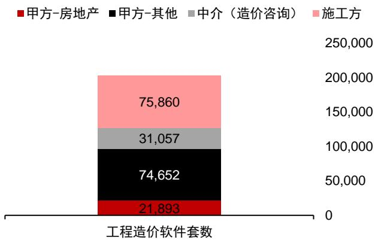  
图1：广联达2009年末工程造价软件客户占比（按软件套数）

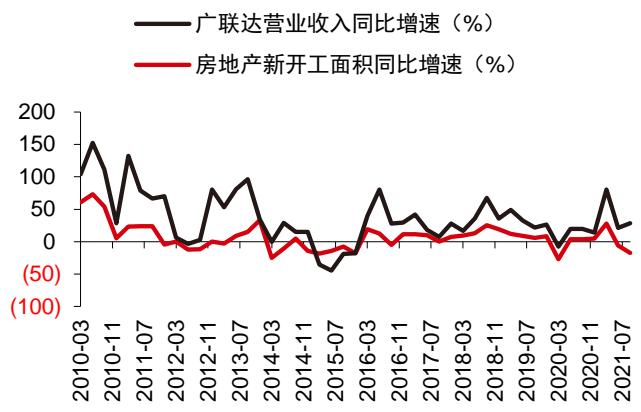  
图2：广联达营业收入增速与房地产新开工面积增速的对比

资料来源：公司招股书，中信证券研究部资料来源：公司公告，Wind，中信证券研究部

# 分业务看：

造价业务：转云之后与造价员数量挂钩，基本与新开工面积脱钩。造价软件上云后实行订阅制而非买断制，与新开工节奏相关性趋弱，与造价员“捆绑”得更为紧密。造价员只要有项目就需要使用造价软件，也就是说在行业低景气时造价员平均项目数会变少，但只要造价员数量不出现大幅波动，公司造价业务便不会受明显影响。我们认为，新开工节奏对未转云的造价业务有局部影响。

施工业务：渗透率较低，非住宅类房建是核心需求来源。一方面，按全国每年新开工50-70 万个房建项目计算，公司2020 年新增项目数为1.5 万个，占比不足 $3 \%$ ，因而地产行业的局部压力对施工业务影响较小。另一方面，地产厂商客群集中在居民住宅领域，而居民住宅的建造往往相对规范，对施工产品要求并不高，也并非公司施工业务的核心目标客户。而如体育馆、医院、学校、酒店、写字楼等公共建筑、商业建筑结构相对复杂，是施工产品的核心需求来源，但这类建筑的甲方多是地方政府、地方城投等，并非由房地产主导，因此不会明显受到局部地产企业的影响。

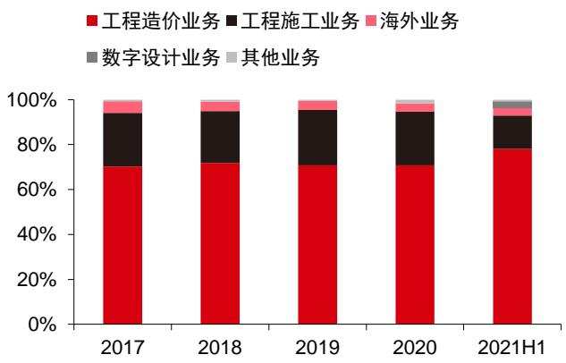  
图3：2017-2021H1广联达营收结构  
资料来源：公司公告，中信证券研究部

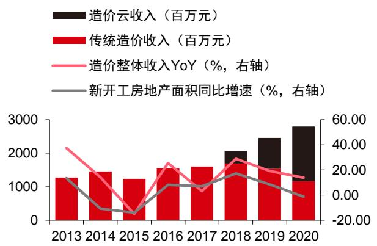  
图4：广联达造价业务收入拆分及增速（按传统收入与云收入拆分）

资料来源：公司公告，中信证券研究部

2）部分地产企业面临财务困境，对公司回款会造成多大压力？

部分地产企业的困境对建筑厂商的传导影响有限，同时公司严格把控回款，因此压力并不大。

第一，施工单位而非地产商是公司施工产品的主要客户。地产客户收入占比较小，且部分地产商的资金压力对建筑商的传导影响或有限。

第二，公司对回款把控严格，回款是考核指标之一。一方面，回款与一线销售人员绩效直接挂钩，激励销售人员完成回款指标；另一方面，公司订单规模相对小，标准化程度高，交付与回款周期短，多以银行回款形式完成。

第三，近年来我国对民营企业款项支付的要求更加严格。据《中小企业款项支付条例》，机关、事业单位从中小企业采购货物、工程、服务，应当自货物、工程、服务交付之日起30日内支付款项；合同另有约定的，付款期限最长不得超过 60日。

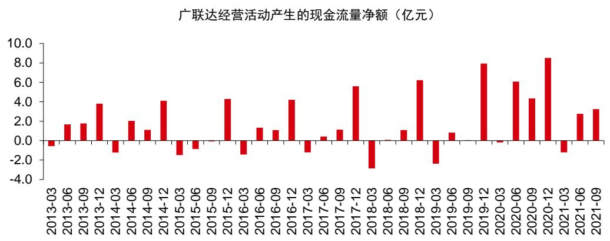  
图5：2013-2021年广联达经营活动现金流（按季度）  
资料来源：Wind，中信证券研究部 注：2020 年二三季度主要受金融业务影响

# 问题二：造价转云基本成功，如何看待未来增长点？

结论：用户增长仍存在较大空间，纵向推出新模块、横向拓展业务维度是未来重要看点。

公司造价业务转云基本成功。据 2021 年半年报，公司于上半年最后开启转型的四个地区(江苏、浙江、安徽以及福建)已进入全面云转型阶段，转化率超过了 $40 \%$ ; 2017-2020年开启云转型的地区累计转化率均达到了 $70 \%$ 以上（2017-2019年的几个地区均已达到$8 5 \%$ 以上），且续费率均超过了 $80 \%$ 。预计公司将于 2022 年完成造价业务云转型。

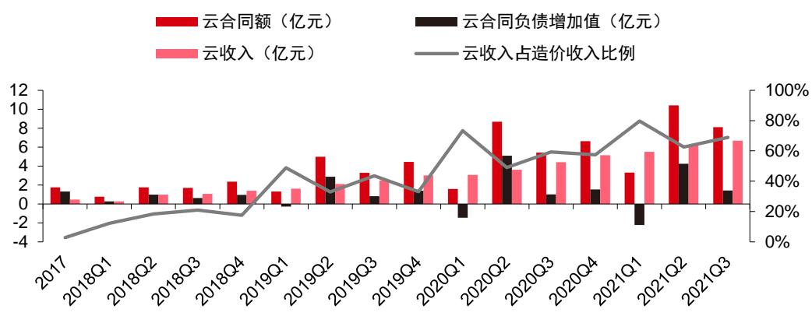  
图6：2017-2021Q3广联达造价业务转云指标  
资料来源：公司公告，中信证券研究部

表1：广联达各批次上云区域累计转化率与续费率情况  

<table><tr><td></td><td>2017年6个地 区</td><td>2018年5个地 区</td><td>2019年10个地 区</td><td>2020年4个地 区</td><td>2021H14个地 区</td></tr><tr><td>累计转化率</td><td>&gt;85%</td><td>&gt;85%</td><td>&gt;85%</td><td>&gt;70%</td><td>&gt;40%</td></tr><tr><td>续费率</td><td>&gt;80%</td><td>&gt;80%</td><td>&gt;85%</td><td>&gt;85%</td><td></td></tr></table>

资料来源：2021H1 公司半年报，中信证券研究部

短期看，用户的自然增长仍是造价业务的核心增长驱动力。根据产业调研，我国造价员数量大约100 万人，实际使用正版造价软件的造价员数量小于100 万。一方面，仍有部分客户未使用造价软件或使用盗版软件，具备较大开拓空间；另一方面，公司在传统非优势地区市占率不高，通过加速开拓，竞争力有望快速提升。

中长期看：纵向推出新模块、横向拓展业务维度是两大看点。

# 1）纵向推出造价新模块，强化造价软件功能。

除了用户基数的自然增长外，造价业务未来的主要增长点在于现有产品的快速迭代与新模块的研发。一方面，住建部 2020 年7 月新推出的《工程造价改革工作方案》，进一步完善了工程造价市场形成机制，现有的造价产品上云后能够快速迭代更新，满足造价规则的变动对产品提出的全新需求；另一方面，数据类增值服务需求有望快速提升，公司持续致力于产品新模块的研发工作。

表2：广联达增值类造价产品服务的创新  

<table><tr><td>分类</td><td>业务进展</td></tr><tr><td>计价</td><td>云计价GCCP6.0 推出量价一体化、云报表等新功能持续提升客户作业效率和便捷性，并配 合造价市场化改革，在部分地区逐步推出市场化计价产品，满足企业自主招标定价的客户群 在招投标和数据沉淀等诉求。</td></tr><tr><td>算量</td><td>算量全系列产品持续提升计算效率和稳定性，智能算量产品利用 AI技术实现主体建模效率提 升30%以上。</td></tr><tr><td>工程信息</td><td>广材网、广材助手、造价云空间等成熟产品收入实现高速增长，产品应用率进一步提升，其 中广材网搜索量超过6300万次，广材助手自有数据载价量1.7亿次； 改进指标神器、广材数聚等新产品，其中指标神器能够大幅提升计算效率，并帮助用户对指 标结果进行快速比对审核；广材数聚提供企业材料和造价数据的管理，能够帮助企业建立材 料价格、指标价格等数据资产库，实现企业内部数据互通和共享，已经在全国建立百余个企</td></tr></table>

<table><tr><td>分类 业务进展</td></tr><tr><td>业数据库的标杆项目。</td></tr></table>

资料来源：公司公告，中信证券研究部

# 2）横向进行业务外延，从造价工具向造价解决方案拓展。

作为造价领域龙头，公司可以凭借业务与市场数据的积累横向拓展解决方案类业务。公司积淀了地产、城投城建、造价咨询以及施工单位等领域的大量客户，未来或将能够向各领域横向拓展，提供数字化转型等解决方案类业务。2020 年 3 月，公司已发布端云大数据一体化解决方案，尝试推动咨询方、建设方、施工方、造价站以及交易中心等客户的数字化转型，实现以目标成本为导向的全过程造价管理。

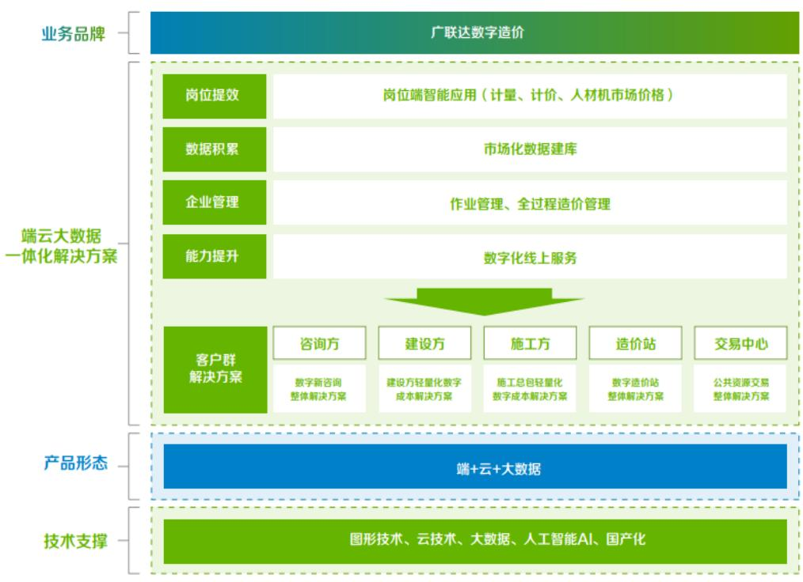  
图7：广联达数字造价端云大数据一体化解决方案  
资料来源：公司官网

# 问题三：施工业务收入 21Q3 高增，如何展望持续性？

结论：我们认为 Q3 高增是施工业务的拐点开始，合同及业绩快速增长有望持续。

公司施工业务 21Q3 收入实现接近翻倍的增长。施工业务 Q3 开始进入交付期，加速交付和确认，兑现新签合同额（21H1 新签合同额翻倍）的转化。2021 年 Q1-Q3，公司施工业务收入达6.72 亿元，同比增长 $2 8 . 8 5 \%$ ；Q3 单季收入3.54亿元，同比增长 $9 1 . 4 \%$ 。我们预计21年第四季度，公司在重视交付回款的同时，仍将保持较快的新签合同额增长，支撑施工业务景气增长的持续性。

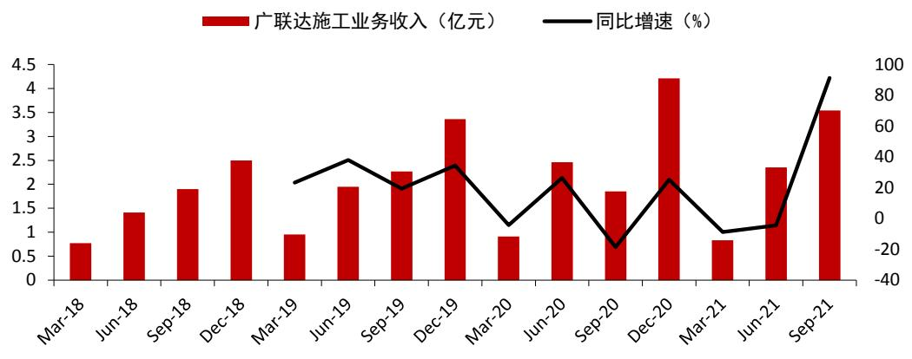  
图8：2018-2021Q3广联达施工业务季度收入与同比增速  
资料来源：公司公告，中信证券研究部

# 1）智慧工地产品支撑施工业务高增长，市场需求不断强化。

公司施工业务由数字企业、BIM 建造以及智慧工地三个部分组成。

表3：广联达施工业务组成部分  

<table><tr><td rowspan="2">一、数字企业业务</td><td>1、采购管理系统</td><td>3、企业级BI</td></tr><tr><td>2、施工企业项目管理系统GEPS</td><td>4、协筑</td></tr><tr><td rowspan="3">二、BIM建造（包含岗 位级）业务</td><td>1、MagiCAD（海外收入）</td><td>4、斑马进度计划</td></tr><tr><td>2、BIM 模板脚手架设计</td><td>5、BIMMAKE</td></tr><tr><td>3、BIM5D</td><td>6、BIM 施工现场布置</td></tr><tr><td rowspan="3">三、智慧工地业务</td><td>1、广联达智慧工地平台</td><td>4、施工安全管理系统</td></tr><tr><td>2、智能安全帽</td><td>5、物料验收管控系统</td></tr><tr><td>3、协筑</td><td>6、现场劳务管理系统</td></tr></table>

资料来源：公司公告，中信证券研究部

# 按产品分类，智慧工地劳务与物料等产品为收入的核心来源。

劳务：2016 年1月19 日，国务院办公厅发布《关于全面治理拖欠农民工工资问题的意见》，提出要全面实行农民工实名制管理制度，建立劳动计酬手册，记录施工现场作业农民工的身份信息、劳动考勤、工资结算等信息，逐步实现信息化实名制管理。劳务管理产品成为施工企业刚需。

物料：今年下半年，我国水泥等建筑原材料价格大幅上涨，倒逼施工单位加强物料成本管控，物料验收管控系统等产品的需求不断增强。

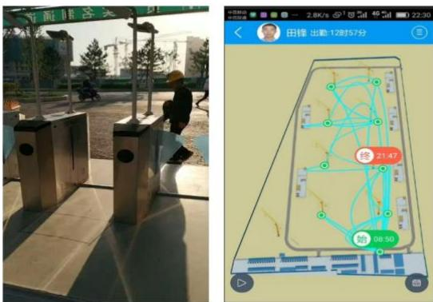  
图9：广联达无感考勤产品  
资料来源：公司公告

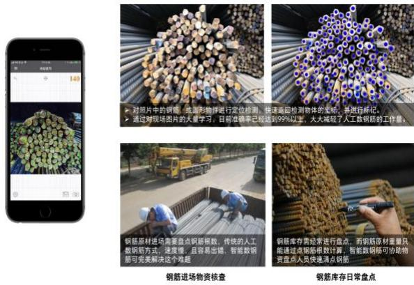  
图10：广联达物料管理产品  
资料来源：公司公告

按客户分类，民营企业与国企均存在较强产品需求。民营企业对物料管理等成本管控类产品需求较强，而国企对施工安全管理、智能安全帽等安全防护类产品具备刚性需求。

# 2）采购模式转变，高合同储备支撑，预计 Q4 与明年施工业务收入将持续高增。

第一，采购模式转变，解决方案式采购需求增强，规模化采购占比快速提升。2021 年，公司解决方案式采购与规模化采购占比快速提升，2021H1，公司施工业务新签合同中，项企一体化解决方案合同占比已达 $1 5 \%$ ，集采合同占总合同金额的比重达到 $30 \%$ 。这说明客户对公司的产品需求进一步加深，单点工具不再满足客户需求，客户需求的增强才是公司施工业务持续增长的最根本原因。

第二，新签合同额保持高增长，保障明年收入来源。公司保交付的同时保持新签合同高增长，今年 1-9 月合同总额增幅翻倍，2022 年合同额与收入有望持续高增。

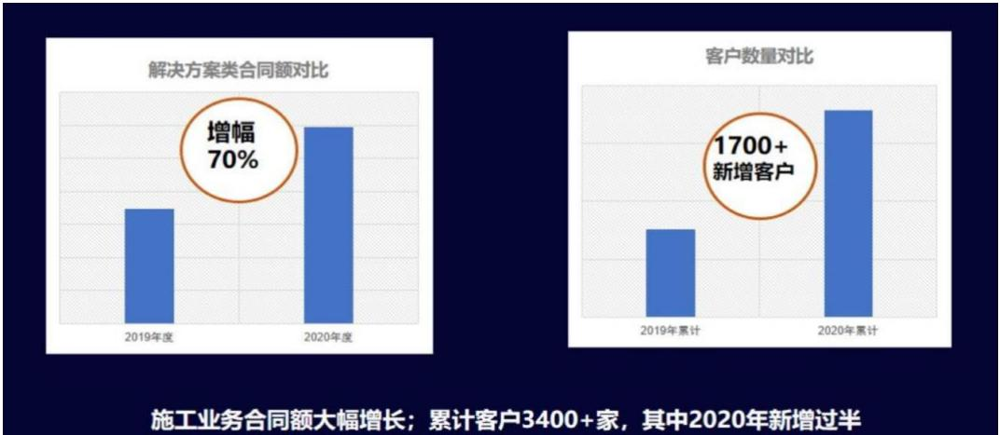  
图11：广联达数字施工业务解决方案类合同额和客户数量变化情况  
资料来源：广联达2021 投资者大会

# 问题四：施工业务长期空间及盈利水平如何看？

结论：长期百亿市场可期，盈利水平有望伴随软件价值的提升而提升。

施工业务已成为公司重要营收来源之一。2013-2020年，公司施工业务收入从0.83亿元增长至 9.43 亿元，年复合增速约为 $36 \%$ 。2020 年，公司施工业务收入占总营收的比重已达 $2 3 . 6 \%$ ，是公司第二大业务板块。

表4：2014-2020 年广联达施工业务收入规模与营收占比  

<table><tr><td>年份</td><td>2014</td><td>2015</td><td>2016</td><td>2017</td><td>2018</td><td>2019</td><td>2020</td></tr><tr><td>施工业务收入 (亿元)</td><td>2.17</td><td>2.04</td><td>3.46</td><td>5.58</td><td>6.59</td><td>8.53</td><td>9.43</td></tr><tr><td>收入占比(%)</td><td>12.4%</td><td>13.3%</td><td>17.0%</td><td>23.7%</td><td>22.7%</td><td>24.1%</td><td>23.6%</td></tr></table>

资料来源：公司公告，中信证券研究部

# 1）施工信息化是蓝海市场，公司施工业务仍有较大增长空间。

我国建筑业总产值高，基数大，粗略估算数字施工潜在市场空间超500 亿元。2020年，我国建筑业总产值达到了 26.39 万亿元，但信息化渗透率较低，施工场景仍有较大信息化空间。据发改委数据，2016 年我国新增工地数超过 60 万个，假设近年来每年新开工项目数保持稳定，保守按照 50 万个计，平均信息化支出以 10 万计，由此估算每年的市场空间约为500亿元。

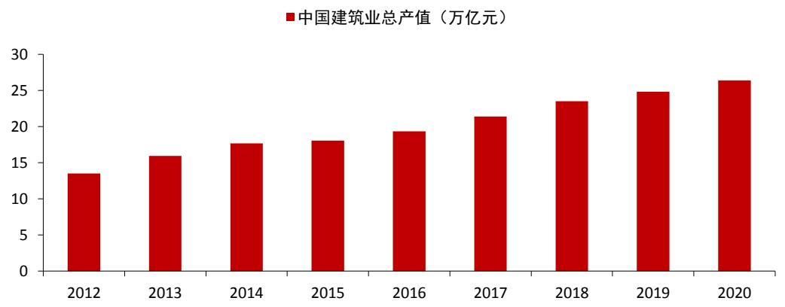  
图12：2012-2020 年我国建筑行业总产值增长情况  
资料来源：Wind，中信证券研究部

公司施工业务的市场空间预估约 100 亿元。公司施工业务主要目标客户为 7000 家左右特级、一级企业，其拥有的项目数量约在20-30 万个。公司2020 年服务项目数 1.5 万个，中长期预计每年服务项目数达到 10 万个，假设每个项目投入10 万元，粗略测算对应市场空间100亿元。

表5：数字施工业务行业与公司空间测算  

<table><tr><td></td><td>项目数量（个/年）</td><td>单个项目信息化投入（元/个)</td><td>市场空间（元/年）</td></tr><tr><td>行业市场空间测算</td><td>50万</td><td>10万</td><td>500亿</td></tr></table>

<table><tr><td></td><td>项目数量（个/年）单个项目信息化投入（元/个）市场空间（元/年）</td><td></td></tr><tr><td>公司市场空间测算</td><td>10万</td><td>100亿</td></tr><tr><td></td><td>10万</td><td></td></tr></table>

资料来源：中信证券研究部测算

# 2）产品软硬件结构调整，盈利能力预计仍有提升空间。

公司近年施工业务盈利能力有所调整，但仍居领先水平。公司 2020 年工程施工业务毛利率为 $7 2 . 0 7 \%$ ，这主要是由于硬件占比逐渐提高，其中销售情况最好的劳务和物料产品硬件比例有所提升。但同时，公司施工产品标准化率相对较高，实施周期较短，如软硬联调往往仅需要几天即可完成，交付较快，因而公司施工业务盈利能力仍处于较高水平，2016-2020 年间高于品茗智慧工地业务同期的毛利率。

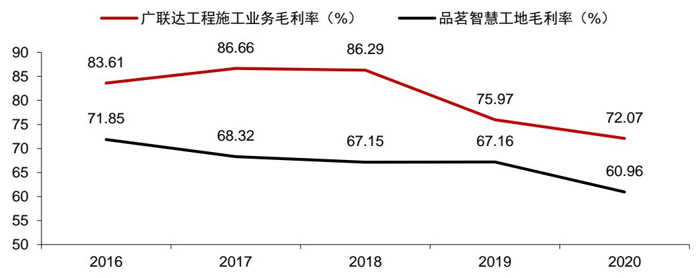  
图13：2016-2020 年广联达工程施工业务与品茗股份智慧工地业务毛利率对比

资料来源：公司公告，中信证券研究部

从中长期看，我们认为公司产品结构的调整与其产品体系的完善将进一步优化施工业务毛利率。

第一，随着软件比例提高，施工业务毛利率将自然上升。当前公司施工业务中，智慧工地贡献了大部分收入，这是因为其硬件占比较高，使用门槛较低，易理解且效果明显。随着数据逐渐积淀，客户粘性提高，预计软件占比将逐渐提升，BIM 产品与数字企业业务将贡献更多的营收。目前，BIMMAKE、BIM 施工场布以及斑马进度计划等产品已进入免费试用快速推广阶段。

第二，覆盖全流程的产品体系将提高公司的议价能力，进一步优化施工业务毛利率。随着在设计、造价以及施工等领域的产品布局进一步完善，广联达将成为国内稀缺的具备全流程建筑信息化能力的公司。

# 问题五：布局数字设计，价值意义何在？

结论：不仅仅是第三成长曲线，协同是关键意义所在。

设计赛道市场空间有限，广联达数字设计的核心竞争力并非设计本身。据 Statista 统

计，2018 年全球CAD 市场规模为74.7 亿美元。同时，设计产品的打磨需要较长周期，未来数字设计软件本身所带来的收入或有限。

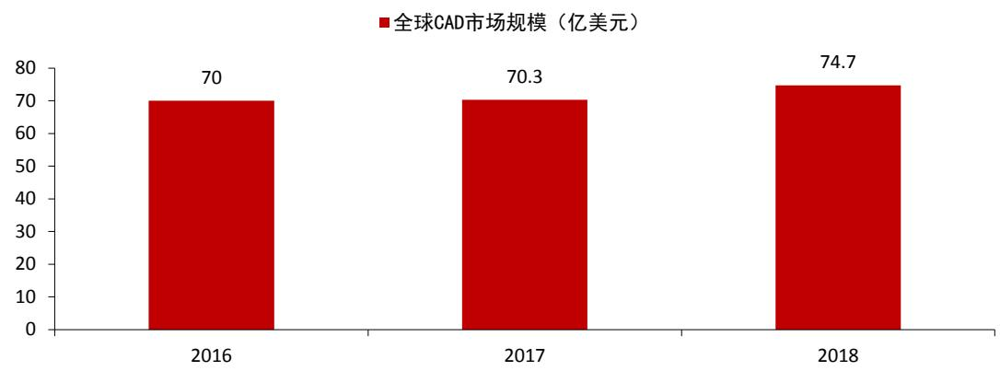  
图14：2016-2018年全球CAD 市场规模  
资料来源：Statista，中信证券研究部

# 相对于设计功能本身，协同才是数字设计产品的关键所在。

第一，2021 年公司发布的数维设计-建筑打通了从建模到出图的全流程设计功能。该款产品覆盖了建筑设计的通用能力、构件创建能力和二维出图能力。通用能力为一些设计功能与广联达自有的高价值业务的集成；构件创建能力则是指产品内置的构件库、材料库等，可供设计师快速调用。预计今年年底公司将陆续发布结构、机电版产品。

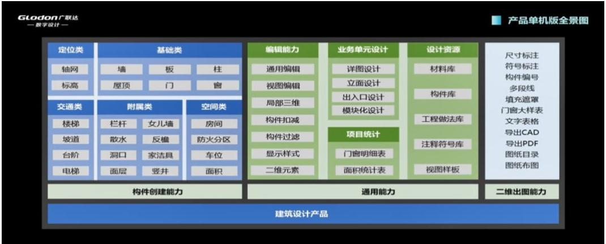  
图15：广联达数维设计-建筑单机公测版全景图

资料来源：广联达数维设计产品发布会

第二，随着产品体系不断完善，公司设计产品的协同作用预计将逐渐凸显。公司的数维建筑设计产品集基于广联达自主研发的图形底层技术，打通了设计领域最核心的建筑、结构以及机电三大要素，并包含协同平台与构件坞两大组件，所有的工具、要素以及数据都将在云上运作。建筑、结构、机电设计的一体化将为客户带来更高价值。

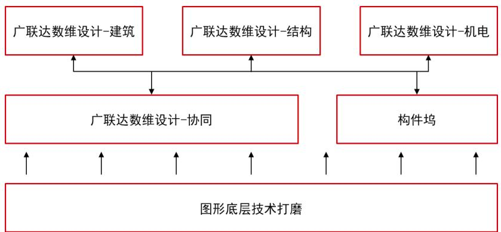  
图16：广联达数维设计体系

资料来源：广联达数维设计产品发布会，中信证券研究部

第三，长期来看，公司的数维建筑设计产品集是实现设计、造价、施工乃至运维全流程协同的关键产品。一方面，协同平台通过标准化的数据传递，链接了设计工具与应用场景；另一方面，设计产品的独立自主保证了全流程的打通，原始的数据与模型从根源上解决了数据传递过程中，因格式转换产生的精确度缺失与效率降低等问题。

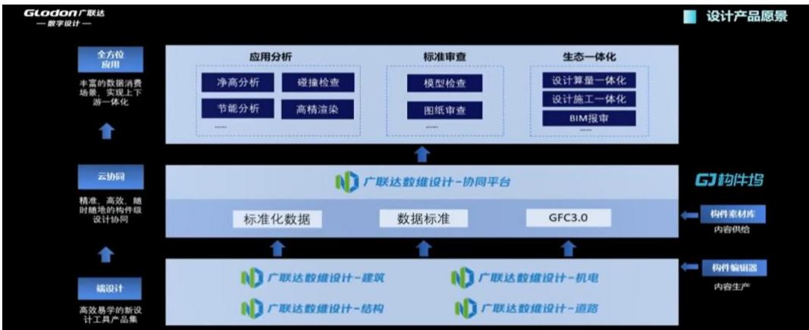  
图17：广联达数维设计链接设计工具到应用场景  
资料来源：公司数维设计产品发布会

综上所述，我们认为设计作为建筑入口环节至关重要，广联达从原生3D 切入，而非基于 2D 进行翻模，并且对下游造价、施工具备深刻理解，在一体化协同能力上具备天然优势，长期有望对 Autodesk 形成换道超车，提升产品主导权和行业话语权。

# 风险因素

1）建筑行业景气度下行；  
2）建筑行业数字化转型不及预期；  
3）施工信息化业务竞争加剧；

# 4）设计业务产品研发推进速度不及预期。

# 投资建议

公司目前的主要客户是施工企业，根据公司招股书数据，我们推算地产客户占公司收入比重约 $10 \%$ ，受地产行业局部公司的影响较小。其中，造价业务转云基本成功，与新开工周期的相关性减弱，成长性明确；施工业务拐点已至，高合同储备支撑业绩长期快速增长；数字设计初步布局，料未来将打通建筑产业全场景。

我们维持公司 2021/22/23 年收入预测 52.13/65.43/81.52 亿元，维持归母净利润预测$6 . 8 6 / 1 1 . 0 8 / 1 4 . 6 1$ 亿元，采用分部估值法，基于公司业务进展情况、行业龙头估值、公司风险等因素，我们认为公司 2024 年合理市值 1470 亿元，基于行业龙头预期收益率、国债收益率、公司业务高确定性等因素，按照折现率 $1 5 \%$ 折现至2022年，目标市值为1112亿元，6 个月目标价为94元，维持“买入”评级。