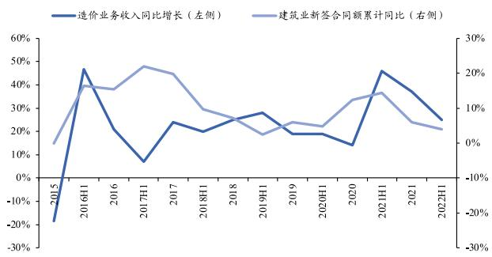
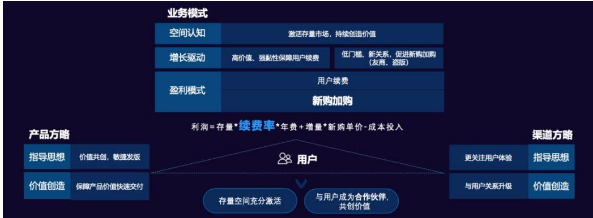

广联达(002410)

计算机

发布时间：2022-11-28

证券研究报告/ 公司深度报告

# 广联达:造价云化成果显著，数字施工行稳致远

# 报告摘要：

下游边际回暖，建筑行业数字化转型有望提速。建筑信息化可实现降本增效，在建筑业利润率持续下滑的背景下意义凸显。从政策端来看，我们通过历史复盘发现，建筑业及下游行业景气度与公司收入具有正相关性。2022年11月内“第二支箭”、《关于做好当前金融支持房地产市场平稳健康发展工作的通知》等多项地产融资利好政策频繁出台，地产行业出现回暖信号，在基建行业持续蓄力的背景下，我国建筑信息化发展有望提速。公司作为建筑信息化龙头企业，业务覆盖设计、造价、施工等多领域，数字建筑一体化布局有望率先受益于建筑信息化转型的时代浪潮。

数字造价：云转型开启成长新空间。公司造价业务云化转型已基本完成，SaaS 订阅模式在充分激活存量市场的同时，有望加速盗版软件使用者的转换；同时增值服务的日趋完善将进一步提高SaaS 单客费用。量价双升的新商业模式将会开启造价业务成长新空间，我们预计到 2025 年公司造价业务云规模将达到70 亿元。

数字施工：行稳致远，打开第二成长曲线。“平台 $^ +$ 组件”模式下公司项目级和企业级应用的渗透率和客户粘性持续提高，未来可覆盖的施工项目将持续增加；客户成功指标体系帮助公司实现客户价值感知，已在智慧物料领域得到验证，客户价值的创收有望提高施工项目服务费。量利双升路径清晰叠加基建行业的政策利好，数字施工业务将保持快速成长，我们预计数字施工业务 2023-2024 年或迎来盈亏平衡。

新兴业务：数字设计未来可期。工程设计处于工程建设行业的重要地位，其将影响建造成本 $7 0 \%$ 以上，对建筑行业数字化转型起着至关重要的作用。公司通过“并购 $^ +$ 自研”形成独特竞争力，有望利用客户多年积累和一体化解决方案将打开业务协同空间。我们认为数字设计业务将为公司业绩成长提供更多的想象空间。

投资建议：我们预计公司2022-2024 年分别实现收入68.40/82.87/98.21亿元，同比增长 $2 1 . 7 2 \% / 2 1 . 1 6 \% / 1 8 . 5 1 \%$ ;实现归母净利润9.56/12.56/15.30亿元，同比增长 $4 4 . 5 7 \% / 3 1 . 4 8 \% / 2 1 . 7 7 \%$ 。维持“买入”评级。

风险提示：建筑信息化转型不及预期，业务拓展不及预期。

买入上次评级：买入

<table><tr><td>股票数据</td><td>2022/11/28</td></tr><tr><td>6个月目标价(元) 收盘价(元)</td><td></td></tr><tr><td>12个月股价区间（元）</td><td>52.65</td></tr><tr><td>总市值(百万元)</td><td>41.79~68.21</td></tr><tr><td>总股本（百万股）</td><td>62,722</td></tr><tr><td>A股（百万股）</td><td>1,191</td></tr><tr><td>B股/H股（百万股）</td><td>1,191</td></tr><tr><td>日均成交量（百万股）</td><td>0/0 5</td></tr></table>

  
历史收益率曲线

<table><tr><td>涨跌幅（%)</td><td>1M</td><td>3M</td><td>12M</td></tr><tr><td>绝对收益</td><td>17%</td><td>5%</td><td>-17%</td></tr><tr><td>相对收益</td><td>13%</td><td>13%</td><td>6%</td></tr></table>

# 相关报告

《广联达（002410）：广联达：业绩稳健增长，公司韧性十足》--20221027

《广联达（002410）：广联达：云收入大幅提升公司业绩稳定性》--20220427

<table><tr><td>财务摘要（百万元）</td><td>2020A</td><td>2021A</td><td>2022E</td><td>2023E</td><td>2024E</td></tr><tr><td>营业收入</td><td>4,005</td><td>5,619</td><td>6,840</td><td>8,287</td><td>9,821</td></tr><tr><td>(+/-)%</td><td>13.10%</td><td>40.32%</td><td>21.72%</td><td>21.16%</td><td>18.51%</td></tr><tr><td>归属母公司凈利润</td><td>330</td><td>661</td><td>956</td><td>1,256</td><td>1,530</td></tr><tr><td>(+/-)%</td><td>40.55%</td><td>100.06%</td><td>44.57%</td><td>31.48%</td><td>21.77%</td></tr><tr><td>每股收益（元）</td><td>0.29</td><td>0.56</td><td>0.80</td><td>1.05</td><td>1.28</td></tr><tr><td>市盈率</td><td>274.64</td><td>113.52</td><td>65.64</td><td>49.92</td><td>41.00</td></tr><tr><td>市净率</td><td>14.58</td><td>13.15</td><td>10.80</td><td>8.88</td><td>7.30</td></tr><tr><td>净资产收益率(%)</td><td>5.16%</td><td>11.42%</td><td>16.45%</td><td>17.79%</td><td>17.80%</td></tr><tr><td>股息收益率(%)</td><td>0.47%</td><td>0.57%</td><td>0.00%</td><td>0.00%</td><td>0.00%</td></tr><tr><td>总股本 (百万股)</td><td>1,186</td><td>1,189</td><td>1,191</td><td>1,191</td><td>1,191</td></tr></table>

证券分析师：黄净执业证书编号：S055052201000118680586451 huangjing@nesc.cn

# 目录

# 1. 建筑行业数字化转型势在必行

# 2. 广联达：国内建筑信息化行业龙头… .16

# 数字造价：云转型开启成长新空间… 28

# 数字施工：行稳致远，打开第二成长曲线.… 34

# 新兴业务：数字设计未来可期，创新单元完善生态布局... 43

# 盈利预测&投资建议. 49

# 7. 风险提示…. 51

#

图表目录  
图1：建筑信息化的三个发展阶段.. …6图2：全球、我国各行业数字化水平…  
图3：我国建筑行业利润总额变化（亿元） ….8图4：我国建筑行业产值利润率逐步下滑…  
图5：全球建筑数字化市场规模与空间….  
图6：我国建筑数字化市场规模与空间.. 8图7：公司营收增速与建筑业 PMI增速变化.. .9图8：公司营收增速与建筑业新开工面积增速变化.  
图9：公司营收增速与建筑业新签合同额增速变化. …. 10图10：公司营收增速与房地产开发投资完成额增速变化….. … 0图11：公司营收增速与基础设施建设投资增速变化... ….1图12：造价业务收入增速与房地产开发投资完成额增速变化.. ….11图13：造价业务收入增速与建筑业 PMI增速.. …….12图14：造价业务收入增速与建筑业新开工面积增速…..  
图15：造价业务收入增速与建筑业新签合同增速  
图16：造价业务收入增速与基建投资增速。 12图17：施工业务收入增速与基建投资增速变化. …3图 18：施工业务收入增速与建筑业新签合同增速变化……13图19：施工业务收入增速与建筑业新开工面积增速变化.. ….13图20：施工业务收入增速与建筑业 PMII增速  
图21：施工业务收入增速与房地产开发投资增速..  
图22：广联达公司介绍. 16图23：广联达发展历程. 7图24：广联达的业务分布  
图25：广联达的股权结构（截至202年三季度）… 18图26：公司营业收入（亿元）及增速…  
图27：公司归母净利润（亿元）及增速…  
图28：公司各业务营收（亿元）及增速（右轴）  
图29：公司各业务营收占比  
图 30：公司各业务毛利率变化… 20图31：公司毛利率、净利率变化…… 21图32：公司期间费用率变化. …… 21图：公经营性净现金流（亿元）……21图 34：公司应收账款情况（亿元）……  
图35：公司“七三”、“八三”、“九三”战略规划… ….2图36：公司业务覆盖设计、造价、施工多个环节， 22图 37：公司数字建筑平台结构…  
图38：公司数字建筑平台价值量化指标. …… 23图39：公司数字建筑平台当前进展… 24图40：广联达“九三”计划业务模型定位。 ….24图41：数字广联达的实现路径 … 2 5图42：数字广联达提升业务效率 … 25

图 43：公司研发投入和研发费用率情况.. 6  
图44：公司人均创收（万元）… 7  
图 45：公司硕士学历工占比…… 27  
图46：广联达BIM 土建计量平台介绍.  
图 47：广联达云计价平台CCP6.介…29  
图 48：云化订阅商业模式激活存量市场… … 29  
图 49：云转型前后的感知差异…… 30  
图50：云转型后市场空间提升的量价两重逻辑….. 30  
图51：AI技术逐步成熟为造价业务带来成长空间. 30  
图52：公司造价业务云转型区域、产品和关键指标.. 31  
图 53：2017-2021年公司造价业务云转型区域 31  
图54：2021年公司各转型区域转化率和续费率情况.. …….31  
图 55：2017-2021 年公司造价业务收入（元） 32  
图 56：2017-2021年公云收入及云合同（元）… 32  
图 57：数字新成本平台主要构成及功能…… 32  
图58：工程造价咨询企业专业技术人员数量（万人） 3  
图59：我国基建产业发展现状 … 34  
图60：公司数字施工业务的作用…. … 35  
图 61：十四五期间基建项目数字化市场规模预测……35  
图62：公司全流程业务协同空间未来可期. 6  
图63：公司施工业务的发展历程. …36  
图64：公司施工业务的产品结构. … 37  
图 65：公司岗位级产品广情况 7  
图66：公司项目级产品的项目、客户推广情况. ….38  
图 67：项目级产品单新增客户带来的项目数提高……38  
图68：公司客户成功指标体系构成… … 39  
图 69：客户成功指标体系在智慧物料的应用…… 40  
图70：2017-2021E我国施工项目个数预测. … 41  
图71：公司施工业务空间推算 1  
图72：公司施工业务收入（亿元）及增速..  
图 73：公司施工业务毛利率 41  
图74：公司人均薪酬成本（亿元）及薪酬成本占比.. …… 42  
图75：公司总员工人数（人） 42  
图76：工程设计数字化发展三个阶段 43  
图 77：工程设计行业的痛点与诉求. … 43  
图78：中国工程设计行业收入及增速（亿元）…. ……44  
图7：中国工程勘察设计科技投入及占比（亿元）…… 4  
图 80：北辰东道道路、综合管廊及附属工程项目概况… 45  
图 81：数字设计是数字建筑平台重要组成部分…….46  
图82：公司创新业务单元业务构成. … 46  
图83：数字城市重庆广阳岛解决方案 … 47  
图84：平方网产品逻辑图… …7  
图 85：ios产品功能介紹…47  
图86：MagiCAD产品功能介绍. … 47  
图87：公司海外业务收入及增速（亿元） 48  
表1：公司营业收入与相关指标的回归分析结果. .9  
表2：公司造价业务收入与各行业指标相关性 ..11  
表3：公司施工业务收入与各行业指标相关性 ….12  
表4：我国近年发布的与建筑信息化相关的政策. . 15  
表5：公司董事会成员介绍 ….19  
表6：公司在图形平台、AI、物联网方面的投入概况、进展（截至2022H1） ….26  
表7：公司近年股权激励情况 ….27  
表8：公司近年开展的员工持股情况. …. .7  
表9：公司数字造价各业务线主要产品.. ….28  
表10：公司造价业务云规模空间预测.. ….33  
表11：公司施工业务盈利预测. .42  
表12：公司数字设计业务的产品布... …44  
表13：广联达核心指标预测（百万元) … 50

# 1．建筑行业数字化转型势在必行

# 1.1．需求端：我国建筑信息化程度较低，数字化转型空间广阔

建筑信息化指建筑行业运用信息技术，特别是计算机、网络、通信、控制、系统集成和信息安全等技术，实现信息化、数字化乃至智能化转型的过程。目前，建筑信息化已历经以手绘、CAD-2D 绘图为标志的1.0 和2.0 时代，步入以 BIM 为核心技术的 3.0 时代。BIM是实现数字建筑的重要手段，其以建筑工程项目的各项相关信息数据作为模型的基础，通过数字信息仿真模拟建筑物所具有的真实信息，从而实现建筑模型的建立，具有可视化、协同性、模拟性和连贯性的特点。

  
图1：建筑信息化的三个发展阶段  
数据来源：东北证券，筑信

与其他行业相比，建筑行业信息化程度仍处于较低水平。整体来看，我国及全球的建筑行业信息化相较其他行业发展较慢，据麦肯锡《想象建筑业数字化未来》报告，建筑业在全球及我国各行业数字化水平榜单中，分别排名倒数第二和倒数第一。

  
图2：全球、我国各行业数字化水平  
数据来源：东北证券，麦肯锡

与发达国家相比，我国建筑行业数字化投入仍有较大提升空间。据亿欧智库数据，2020 年中国商业建筑智能化率在新建楼宇占比小于 $5 0 \%$ ，低于美国( $7 0 \%$ ）及日本( $6 0 \%$ ）的建筑智能化率，我国建筑信息化水平相较美国日本等发达国家仍有较大提升空间。对标美国来看，据公司公告，2021 年美国建筑业规模约为我国的 $4 5 \%$ ,但是美国的建筑业信息化投入力度是我国的十倍以上，2021 年我国建筑业信息化投入约235亿元，占建筑业总产值的 $0 . 0 8 \%$ ，而欧美国家建筑信息化投入占比 $1 \%$ 以上。在建筑业需要以新型建筑工业化为核心，以数字化手段为有效支撑的转型升级之路上，建筑产业互联网和数字化支撑的新型智能建造必将带来更大的协同价值和模式创新，从而推动建筑产业数字化的快速发展。

从需求侧来看，传统粗放经营模式下的问题日渐显现。过去建筑业企业的业绩增长多来自于国家宏观政策和固定资产投资的拉动，发展方式呈现出依靠人力资源、生产资源不断投入的规模扩张模式，整体毛利率低、盈利能力较弱。然而近几年面对政策调控及疫情影响，建筑业产值增速逐步放缓，利润空间遭受挤压，据中国建筑业协会数据，2021年，全国建筑业企业实现利润 8554 亿元，增速仅 $1 . 2 6 \%$ ，比上年降低0.77 个百分点，增速连续五年放缓。面临日渐趋严的竞争态势，行业亟需调整至精益化的管理模式。

  
图3：我国建筑行业利润总额变化（亿元）  
数据来源：东北证券，中国建筑业协会

  
图4：我国建筑行业产值利润率逐步下滑  
数据来源：东北证券，中国建筑业协会

建筑信息化可实现降本提效，在我国建筑业利润率持续下滑的背景下意义凸显。企业可以借助大数据、物联网、云计算、BIM 等建筑数字化核心技术支持现场作业人员及项目管理者打通项目设计、招标、施工及运维等环节的信息壁垒，使建筑在其生命周期内持续积累数据信息，通过共享信息提高建筑行业的生产经营效率。现阶段我国建筑业利润率持续下滑，据中国建筑业协会报告显示，2021 年建筑业产值利润率仅有 $2 . 9 2 \%$ ，为近十年最低。在这样的背景下，建筑企业降本增效的需求持续增强，信息化手段可以帮助施工单位及建筑企业实现成本、安全、进度及品质的多维度提升，将成为我国建筑业发展的重要驱动因素。

需求持续催化，建筑数字化市场空间广阔。据 Markets and Markets、TransparencyMarket Research 数据，2015-2020 年全球 BIM 市场规模逐年上升，2020 年全球市场规模约54.0-57.6亿美元（均值为55.8亿美元)。结合多家海外机构预测，行业未来发展前景良好，预计2026 年全球行业市场规模在107-159 亿美元之间，2020-2026年 CAGR在 $1 5 \%$ 左右。据头豹研究院数据，我国BIM 行业市场规模从2016年的40.5 亿元增长至2020 年的119.1 亿元，随着渗透率持续提升，市场规模将继续增长，预计 2025 年我国市场规模可达 670 亿元，2020-2025 年CAGR 达 $4 1 . 3 \%$ 。

  
图5：全球建筑数字化市场规模与空间  
数据来源：东北证券，Markets and Markets 等

  
图6：我国建筑数字化市场规模与空间  
数据来源：东北证券，头豹研究院

# 1.2.政策端：地产、基建边际回暖，助力建筑信息化发展1.2.1．历史复盘：下游行业景气度与公司收入具有相关性

建筑行业景气度与公司收入增速显著正相关。建筑业 PMI 是反映建筑行业景气度的重要指标之一，通过历史数据对比发现，建筑业 PIMI 与公司营业收入增速在 $5 \%$ 的置信水平下呈现正显著关系，反映出公司收入一定程度上受建筑行业景气度影响。从开工面积和合同金额两个指标来看，建筑业新开工面积增速及新签合同增速和公司营业收入增速在 $5 \%$ 的置信水平下呈现显著性的正相关趋势，我们预计公司作为数字建筑领军企业，将充分受益于建筑信息化转型。

表1：公司营业收入与相关指标的回归分析结果  

<table><tr><td>行业</td><td>变量</td><td>系数</td><td>P值</td><td>95%置信区间下是否显著</td><td>相关性</td></tr><tr><td rowspan="3">建筑</td><td>建筑业 PMI</td><td>0.50</td><td>0.000</td><td>是</td><td>49%</td></tr><tr><td>建筑业新开工面积增速</td><td>1.41</td><td>0.000</td><td>是</td><td>55%</td></tr><tr><td>建筑业新签合同增速</td><td>1.56</td><td>0.000</td><td>是</td><td>55%</td></tr><tr><td>地产</td><td>房地产开发投资增速</td><td>1.36</td><td>0.000</td><td>是</td><td>51%</td></tr><tr><td>基建</td><td>基建投资增速</td><td>0.39</td><td>0.378</td><td>否</td><td>13%</td></tr></table>

数据来源：东北证券

  
图7：公司营收增速与建筑业 PMI增速变化  
数据来源：东北证券，国家统计局，Wind

  
图8：公司营收增速与建筑业新开工面积增速变化  
数据来源：东北证券，国家统计局，Wind

  
图9：公司营收增速与建筑业新签合同额增速变化  
数据来源：东北证券，国家统计局，Wind

从下游行业来看，房地产开发投资和公司收入变化存在一定联系。根据历史数据，公司营业收入增速与房地产开发投资完成额增速走势相近，并在 $5 \%$ 的置信水平下呈现正向显著关系。随着地产政策的逐步宽松，房地产开发投资有望恢复，公司也有望获益。基建投资增速变化与公司收入增速变化不显著，但最近几年两个指标拟合程度持续提高，2020-2022Q3 两指标相关性达到 $4 6 \%$ ，远高于 2011 年-2022 三季度 $1 3 \%$ 的相关性。我们认为主要是近年来政策提振，基建端持续发力，为公司带来了新的成长机会。整体来看，建筑信息化转型叠加地产及基建行业的需求修复有望进一步提升公司业务收入。

  
图10：公司营收增速与房地产开发投资完成额增速变化  
数据来源：东北证券，国家统计局，Wind

  
图11：公司营收增速与基础设施建设投资增速变化  
数据来源：东北证券，国家统计局，Wind

分业务来看，房地产开发投资增速和造价业务收入增速相关性较明显。考虑到各业务收入样本数据较少，回归分析会存在较大误差，我们通过相关性指标来判断各业务收入和行业指标的拟合度。我们发现，房地产开发投资完成额增速和公司造价业务收入增速关联度较为明显，相关性达到 $3 9 \%$ ，去年下半年，房地产开发投资完成额增速受监管影响相对低迷，而公司造价业务收入仍然保持稳健增长趋势，我们认为主要系公司造价业务云转型提供稳定收入支撑，平滑了地产监管层面的不利影响。建筑业指标及基建指标与造价业务收入变化关联度较弱，相关性在 $2 0 \% - 3 0 \%$ 之间。

表2：公司造价业务收入与各行业指标相关性  

<table><tr><td>行业</td><td>变量</td><td>相关性</td></tr><tr><td rowspan="3">建筑</td><td>建筑业 PMI</td><td>22%</td></tr><tr><td>建筑业新开工面积增速</td><td>29%</td></tr><tr><td>建筑业新签合同增速</td><td>27%</td></tr><tr><td>地产</td><td>房地产开发投资增速</td><td>39%</td></tr><tr><td>基建</td><td>基建投资增速</td><td>20%</td></tr></table>

数据来源：东北证券

  
图12：造价业务收入增速与房地产开发投资完成额增速变化  
数据来源：东北证券，国家统计局，Wind

  
图13：造价业务收入增速与建筑业 PMI增速  
数据来源：东北证券，国家统计局，Wind

  
图15：造价业务收入增速与建筑业新签合同增速  
数据来源：东北证券，国家统计局，Wind

  
图14：造价业务收入增速与建筑业新开工面积增速  
数据来源：东北证券，国家统计局，Wind

  
图16：造价业务收入增速与基建投资增速  
数据来源：东北证券，国家统计局，Wind

施工业务收入和建筑及基建行业表现关联更为紧密。从相关性来看，公司施工业务收入增速同建筑业新签合同增速关联较为紧密，相关性达 $5 1 \%$ ，我们认为主要原因是公司施工业务下游客户多为建筑施工单位，而新签合同又是建筑施工的核心指标，具有一定的指示性。从下游行业来看，相较于房地产，公司施工业务收入和基建板块的相关性更大，达到 $4 3 \%$ ，随着基建端持续发力，我们认为公司施工业务有望受益。

表3：公司施工业务收入与各行业指标相关性  

<table><tr><td>行业</td><td>变量</td><td>相关性</td></tr><tr><td rowspan="3">建筑</td><td>建筑业 PMI</td><td>5%</td></tr><tr><td>建筑业新开工面积增速</td><td>23%</td></tr><tr><td>建筑业新签合同增速</td><td>51%</td></tr><tr><td>地产</td><td>房地产开发投资增速</td><td>21%</td></tr><tr><td>基建</td><td>基建投资增速</td><td>43%</td></tr></table>

数据来源：东北证券

  
图17：施工业务收入增速与基建投资增速变化

数据来源：东北证券，国家统计局，Wind数据来源：东北证券，国家统计局，Wind数据来源：东北证券，国家统计局，Wind

  
图18：施工业务收入增速与建筑业新签合同增速变化

  
图19：施工业务收入增速与建筑业新开工面积增速变化

  
图20：施工业务收入增速与建筑业 PMI 增速  
数据来源：东北证券，国家统计局，Wind

  
图21：施工业务收入增速与房地产开发投资增速  
数据来源：东北证券，国家统计局，Wind

# 1.2.2.下游边际回暖，建筑信息化有望提速

融资利好密集出台，地产行业边际回暖。2022 年11 月内多项地产金融支持政策陆续落地，11月8日，中国银行间市场交易商协会为支持民营企业健康发展，提出继续推进并扩大民营企业债券融资支持工具（“第二支箭”），支持包括房地产企业在内的民营企业发债融资。11 月11日，银保监会发布《关于做好当前金融支持房地产市场平稳健康发展工作的通知》254 号文，从六个大方面保持房地产融资平稳有序、积极做好保交楼金融服务、积极配合做好受困房地产企业风险处置、依法保障住房金融消费者合法权益、阶段性调整部分金融管理政策、加大住房租赁金融支持力度展开。11月14日，银保监会、住建部、央行三部门联合发布《关于商业银行出具保函置换预售监管资金有关的工作通知》，支持优质房地产企业合理使用预售监管资金，或将帮助地产企业缓解流动型压力，促进房地产市场平稳健康发展。我们认为月内三大融资利好密集出台，极大程度利于地产市场恢复信心，据我们推测，地产行业作为公司的重要下游，房地产的开发投资增速与公司收入增速关联度较高边际回暖将促进公司业务的长久发展。

“稳增长”背景下，基建行业蓄势有望助力。在稳增长背景下，基建成为重要发力点。2022 年《政府工作报告》提出，“适度超前开展基础设施投资。建设重点水利工程、综合立体交通网、重要能源基地和设施”、“加强县城基础设施建设，启动乡村建设行动，强化规划引领，加强水电路气信邮等基础设施建设”。2022 年4 月，习近平在中央财经委员会第十一次会议上强调，基础设施是经济社会发展的重要支撑，构建现代化基础设施体系，为全面建设社会主义现代化国家打下坚实基础。2022年7月，农业农村部办公厅等四部门发布通知，在财政投入稳定增长基础上，聚焦农业农村基础设施重点领域。按照我们的推测，基建政策利好将助力公司施工业务的发展，有望进一步提高公司的业务收入。

建筑信息化转型纳入国家政策规划体系。十三五”以来，国家层面出台一系列政策推动建筑业信息化转型，密切协同推进新一代信息技术与建筑行业深度融合，聚焦BIM等建筑业技术创新和应用落地。2022 年1月，住建部发布《“十四五”建筑业发展规划》，明确指出，建筑业在与先进制造业、新一代信息技术融合发展方面有着巨大的潜力和发展空间，需要加快建筑业转型升级。建筑行业数字化转型已成为建设智慧城市、新型城镇化建设任务的重点板块，是未来产业发展升级的必经之路。建筑信息化政策提振叠加下游边际回暖，公司作为建筑信息化领军企业有望受益。

表4：我国近年发布的与建筑信息化相关的政策  

<table><tr><td>发布时间</td><td>政策名称</td><td>发布单位</td><td>主要內容</td></tr><tr><td>2022年</td><td>《“十四五”建筑业发 展规划》</td><td>住建部</td><td>加快推进建筑信息模型(BIM)技术在工程全寿命期的集成应用， 到2025 年，基本形成BIM技术框架和标准体系。推进自主可控 BIM 软件研发；完善BIM标准体系；引导企业建立BIM云服务 平台；建立基于BIM的区域管理体系；开展BIM报建审批试点。</td></tr><tr><td>2021年</td><td>《中国建筑业信息化 发展报告（2021 ))</td><td>住建部</td><td>主题为聚焦智能建造，旨在展现当前建筑业智能化实践，探索建 筑业高质量发展路径。大力发展数字设计、智能生产、智能施工 和智慧运维，加快BIM技术研发和应用。</td></tr><tr><td>2020 年</td><td>《住房和城乡建设部 工程质量安全监管司 2020 年工作要点》</td><td>住建部</td><td>试点推进 BIM 市图模式，提高信息化监管能力和审查效率，推 动BIM 技术在工程建设全过程的集成应用，开展建筑业信息化 发展纲要和建筑机器人发展研究工作，提升建筑业信息化水平。 试点推进BIM 市图模式，提高信息化监管能力和审查效率，推</td></tr><tr><td>2020年</td><td>《住房和城乡建设部 工程质量安全监管司 2020 年工作要点》 《关于推进全过程工</td><td>住建部</td><td>动BIM 技术在工程建设全过程的集成应用，开展建筑业信息化 发展纲要和建筑机器人发展研究工作，提升建筑业信息化水平。</td></tr><tr><td>2019 年</td><td>程咨询服务发展的指 导意见》</td><td>住建部、发改委</td><td>大力开发和利用BIM、大数据、物联网等现代信息技术和资源， 提高信息化管理和应用水平，为开展全过程工程咨询业务提供保 障。</td></tr><tr><td>2017年</td><td>《建筑信息模型施工 应用标准》</td><td>住建部</td><td>对施工阶段建筑信息模型的创建、使用和管理做规定，另指出 BIM 软件应具备的基本功能。 加快推动建筑信息模型BIM 技术在规划、勘察、设计、施工和</td></tr><tr><td>2017年</td><td>《促进建筑业务可持 续健康发展的意见》 《建筑信息模型应用</td><td>国务院</td><td>运营维护全国过程的集成应用，实现工程建设项目全生命周期 数据共享和信息化管理。</td></tr><tr><td>2016年</td><td>统一标准》</td><td>住建部</td><td>从标准层面推动BIM技术发展应用。 增强建筑业信息化发展能力，优化建筑业信息化发展环境，加快</td></tr><tr><td>2016年</td><td>《2016-2020 年建筑业 信息化发展纲要》</td><td>住建部</td><td>推动信息技术和建筑业发展深度融合，创新商业模式，实现跨越 式发展。</td></tr></table>

数据来源：东北证券，各政府部门

# 2.广联达：国内建筑信息化行业龙头

# 2.1．我国工程建设信息化第一股，业务高度多元化

我国工程建设信息化第一股，专注数字建筑二十年。公司成立于1998 年，是国内较早从事工程造价软件开发销售的企业。公司作为数字建筑平台服务商，专注建筑信息化行业20余年，围绕工程项目的全生命周期，为客户提供建设工程领域专业的软硬件产品和解决方案及产业大数据、产业新金融等增值服务。2010 年，公司在深交所上市，成为我国工程建设信息化领域首家A股上市公司。历经多年锤炼，公司已实现了由产品到服务、由工具软件到解决方案、由项目单一阶段到全生命周期的升级。如今，公司拥有员工9400余人，在全球建立了80 余家分子公司，服务客户遍布全球 100 多个国家，为 34万企业客户提供近百款专业应用产品及服务。

  
图22：广联达公司介绍  
数据来源：东北证券，公司官网

  
图23：广联达发展历程  
数据来源：东北证券，公司官网

业务高度多元化，涵盖众多环节、领域和业务形态。公司立足建筑业，正逐步由招投标阶段拓展至工程项目的全生命周期，业务覆盖设计、造价、施工、运维、供采、园区，以及金融、高校、投资并购等领域，涵盖工具软件、解决方案、大数据服务、移动APP、云计算服务、智能硬件设备、产业金融服务等业务形态。根据业务阶段及服务客户不同，公司业务可划分为数字造价、数字施工和数字设计三大业务板块和数字城市、数字供采、数字金融、数字高校、数字建设方等多个创新业务单元。根据业务区域不同，公司业务又分为国内业务和海外业务。

数字造价业务：公司成熟业务，主要为建设工程造价的各参与方提供软件产品及数据服务，包括工程计价、工程算量、工程信息和电子政务等业务线。经过20 多年发展，该业务在国内竞争优势明显，目前主要以订阅制 SaaS 模式为客户提供产品和服务；

数字施工业务：公司重点突破的成长业务，主要聚焦工程项目建造过程，通过“平台 $^ +$ 组件”的模式，为施工企业提供涵盖项目管理到企业管理的平台化解决方案，包括项目端的“BIM $\cdot +$ 智慧工地”系列产品以及面向施工企业的企业级软件和项企一体化产品。目前施工行业的数字化转型仍在持续提升中，该业务处在发展期;

数字设计业务：公司着力发展的新兴业务，主要面向设计院客户，提供建筑设计、市政设计和设计成果数字化交付审查等产品，具体包括了广联达数维设计产品集、BIMSpace 建筑设计产品集、计算分析产品集、市政设计产品集、广联达设计成果交付审查产品等，其中BIMSpace、市政系列产品在市场中处于领先地位;

创新业务单元：公司孵化的新兴业务，依托数字项目管理平台及相关产品的积累，面向建筑业不同细分市场，从CIM规建管和新城建、供应链服务、人才培养等诸多维度为建筑业转型升级提供支持与保障。报告期内，创新业务单元以产品打磨和标杆项目验证为主；

海外业务:其一为数字造价业务的国际化产品Cubicost，主要开拓东南亚市场；其二为数字施工业务的国际化产品，包括芬兰全资子公司经营的 MagiCAD 系列机电设计软件，以及施工 Glodon Gsite 国际化产品，主要覆盖欧洲市场。

  
图24：广联达的业务分布  
数据来源：东北证券，公司2021 年ESG报告

创始人控制公司，治理结构较为完善。截至2022 年三季度，公司创始人、董事长刁志中为公司实际控制人，持股 $1 5 . 9 5 \%$ ，其他股东陈晓红、王金洪、涂建华、安景合和王晓芳均为公司创始团队成员，合计控股 $1 6 . 2 7 \%$ 。

  
图25：广联达的股权结构（截至2022 年三季度）  
数据来源：东北证券，Wind

公司管理层技术出身，技术底蕴深厚。公司董事会成员大多以技术出身，长期扎根业务一线，对公司业务发展有着深刻理解。与此同时，公司管理层经验丰富且多元，为公司长期的战略部署和稳健经营奠定了夯实基础。

表5：公司董事会成员介绍  

<table><tr><td>姓名</td><td>职位</td><td>学历</td><td>简介</td></tr><tr><td>习志中</td><td>董事长</td><td>本科</td><td>曾任北京石化工程公司计算中心工程师。现任本公司董事长，兼任中国建设教育协 会副理事长、全联房地产商会副会长、北京市软件和信息服务业协会会长等。</td></tr><tr><td>袁正刚</td><td>董事、总裁</td><td>博士</td><td>曾任加拿大蒙特利尔大学博士后研究员，公司研发中心经理、高级副总裁。现任本 公司董事、总裁。</td></tr><tr><td>王爱华</td><td>董事</td><td>本科</td><td>曾任公司造价事业部经理、项目管理事业部经理。现任本公司董事，兼任北京云建 信科技有限公司董事、东方上河（北京）科技有限公司董事等。</td></tr><tr><td>刘谦</td><td>董事、高级副总裁本科</td><td></td><td>曾任职西安石油勘探仪器总厂软件室工程师，公司造价事业部营销中心经理、造价 事业部经理等。现任本公司董事、高级副总裁，兼任中国土木工程学会建筑市场与 招标投标研究分会副理事长、中关村数字建筑产业绿色发展联盟秘书长等。</td></tr><tr><td>何平</td><td>董事、高级副总裁、 财务总监</td><td>本科</td><td>曾任职北京城建集团有限责任公司投资部、财务部，加拿大BTI 技术公司财务部， 加拿大USG 工程公司财务部。现任本公司董事、高级副总裁、财务总监。</td></tr><tr><td>吴佐民</td><td>董事、高级顾问</td><td>本科</td><td>教授级高级工程师，中国注册造价工程师，咨询工程师，英国皇家特许测量师。曾 任国家建筑材料工业标准定额站站长，中国建设工程造价管理协会秘书长等。现任 中国建设工程造价管理协会专家委员会常务副主任，本公司董事、高级顾问等。</td></tr><tr><td>郭新平</td><td>独立董事</td><td>硕士</td><td>高级会计师，现任用友网络科技股份有限公司副董事长、本公司独立董事等。</td></tr><tr><td>马永义</td><td>独立董事</td><td>博士</td><td>管理学博士，教授，博士生导师，现任北京国家会计学院教师管理委员主任、航天 宏图信息技术股份有限公司独立董事，本公司独立董事。</td></tr><tr><td>柴敏刚</td><td>独立董事</td><td>硕士</td><td>曾任上海国际展览公司项目经理，永辉超市股份有限公司执行副总裁等。现任上海 恺讯企业管理咨询有限公司总裁、管理合伙人，本公司独立董事。</td></tr></table>

数据来源：东北证券，Wind

# 2.2．核心业务稳步增长，业绩不断兑现

公司近年来业绩良好。公司2021年实现营收56.19亿元，同比增长 $4 0 . 3 2 \%$ ,2017-2021年CAGR达 $2 4 . 2 6 \%$ 。净利润方面，2019 年公司归母净利润增速放缓，主要是业务云转型导致营销和研发费用增速高于营收增速，2019 年销售费用、研发费用分别同比增长 $3 9 \%$ $3 3 \%$ 。近年云转型成效显著，业绩加速兑现，2021 年实现归母净利润6.61 亿元，同比增长 $1 0 0 . 0 6 \%$ 。2022年在地产下行和疫情多点反复的背景下，公司业绩仍稳健增长，2022 年前三季度公司营收同比增长 $2 4 . 8 1 \%$ 达到44.38亿元；归母净利润实现 6.38 亿元，同比增长 $3 4 . 2 7 \%$ ，充分展现了公司云转型带来的良好韧性。

  
图26：公司营业收入（亿元）及增速  
数据来源：东北证券，Wind

  
图27：公司归母净利润（亿元）及增速  
数据来源：东北证券，Wind

数字造价 $^ +$ 施工业务贡献9成营收，各业务线的毛利率处于较高水平。从营收构成看，数字造价业务一直是公司基本盘，营收占比在 $7 0 \%$ 左右。数字施工业务是公司第二大收入来源，近年营收占比在 $2 0 \% - 2 5 \%$ 之间。数字设计业务 2021 年高速增长，实现营收1.31 亿元，同比增长 $2 5 0 . 1 2 \%$ 。从细分业务毛利率来看，各业务的毛利率基本都高於 $6 5 \%$ ，大体呈现“设计 $>$ 造价 $>$ 海外 $>$ 施工”的数量关系，其中设计业务的毛利率最高，2021 年的毛利率为 $9 5 . 8 4 \%$ 。

  
图28：公司各业务营收（亿元）及增速（右轴）

数据来源：东北证券，Wind，公司年报

  
图29：公司各业务营收占比  
数据来源：东北证券，Wind

  
图30：公司各业务毛利率变化  
数据来源：东北证券，Wind

毛利率保持高水平，期间费用率呈下降趋势。近年，公司的毛利率水平稳中有降，基本稳定在 $9 0 \%$ 左右，2021 年整体毛利率较 2020 年下降4.54 个百分点至 $8 3 . 9 5 \%$ ,主要系电子政务业务采购成本增加以及毛利率较低的施工业务快速增长所致。最近几年公司费用管控能力逐步加强，期间费用率呈现下行态势，2021 年期间费用率同比下降了9.41 个百分点至 $7 0 . 5 9 \%$ ，2022 年前三季度期间费用率为 $6 7 . 4 7 \%$ ，较上年同期下降了4.88 个百分点。盈利能力也向好发展，2021 年净利率达到 $1 2 . 9 2 \%$ ，相较上年增加了3.26 个百分点。2022 年前三季度公司盈利能力维稳，毛利率和净利率分别为 $8 3 . 3 6 \%$ 和 $1 4 . 7 6 \%$ 。

  
图31：公司毛利率、凈利率变化  
数据来源：东北证券，Wind

  
图32：公司期间费用率变化  
数据来源：东北证券，Wind

云转型顺利，公司相关指标表现良好。公司 2017-2021 年经营活动产生的现金流分别为5.96亿元、4.52亿元、6.41亿元、18.76 亿元、16.01 亿元，云转型背景下公司经营性现金流得到显著改善，2020 年公司经营性现金流同比增长 $1 9 2 . 7 3 \%$ ，随着造价业务云转型的进一步深化，公司经营性净现金流有望继续保持较高水平。云模式产生的云合同负债给公司带来了一定的递延收入，公司的应收账款有所增长，但仍保持稳健水平，2019-2021 年公司应收账款在 5 亿元上下波动。

  
图33：公司经营性净现金流（亿元）  
数据来源：东北证券，Wind

  
图34：公司应收账款情况（亿元）  
数据来源：东北证券，Wind

# 2.3．“七三”计划成功落地，“八三”计划进展顺利

造价、施工、设计业务共进，公司深化数字建筑一体化战略布局。2017 年公司开启二次创业，规划时间段为2017-2025 年，其中2017-2019 年为“七三”计划，2020-2022为“八三”计划，2023-2025年为“九三”计划。目前公司正处于“八三”计划途中跑阶段，通过 $\displaystyle { } ^ { 6 6 } 3 + \mathrm { X } ^ { 9 }$ 业务模式布局建筑信息化中设计、造价、施工三大环节，并在数字装修、供采、金融、教育和数字城市等新业务竞相突破，深化数字建筑一体化布局。目前，“八三”计划的落地执行进展顺利，数字建筑平台已初步成型。

  
图35：公司“七三”、“八三”、“九三”战略规划   
数据来源：东北证券，公司公告

  
图36：公司业务覆盖设计、造价、施工多个环节  
数据来源：东北证券，公司公告

响应客户系统化需求，公司前瞻布局数字建筑平台。据公司 2021年投资者交流大会报告，建筑行业客户对单点信息化的需求已经上升为对系统数字化转型的需求，公司积极推动数字建筑平台建设，从项目级部署向平台级部署转变，满足客户提质降本增效的需要。数字建筑平台是一个一横多纵的T型平台，其核心竞争力是横向的 PaaS平台，包含了基于数字项目集成管理平台打造的业务中台、数据中台以及集合了BIM、云计算、大数据、物联网、移动互联网、AI、区块链链技术的技术中台，全部具有自主知识产权。建筑产业有50多个垂直子行业，在这个横向的平台之上，公司通过自研、投资、合作布局了一系列纵向一体化平台，横纵一起组成了整个行业的 PaaS 平台。基于数字建筑平台，公司能与客户的信息化部门、数科公司和数字生态里的软件服务商一起为行业提供各环节的 SaaS 应用。

  
图37：公司数字建筑平台结构  
数据来源：东北证券，公司公告

从开发、部署、运行阶段助益客户创造价值。从开发阶段来看，公司数字建筑平台内置大量成熟、稳定的技术及业务组件，具备低代码开发能力，在提高软硬件开发效率的同时，可以降低客户端的人力成本 $2 0 \%$ 以上；与此同时，平台可以赋能客户自行开发，二次开发效率提升 $2 0 \%$ 左右。从部署阶段来看，数字建筑平台具备一站式 DevOps 能力，部署发布成本趋近于0，运营管理能力大幅提升。从运行阶段来看，数字建筑平台基于标准化的认证、消息及API集成，具备低代码的数据集成能力，在与客户端系统集成上能够有效的提高整体效率 $2 0 \%$ 左右。综合来看，数字建筑平台的价值量化指标已逐步在开发、部署、运行阶段得到验证，随着平台功能的日趋完善，公司数字建筑平台将持续为客户降本增效，创造更多的价值。

  
图38：公司数字建筑平台价值量化指标  
数据来源：东北证券，公司公告

从施工出发，数字建筑平台雏形已成。数字建筑平台发展可以从技术、业务、客户生态三个层面来看：1）技术层面：公司技术能力基本齐备，具备统一的技术标准和接口，形成了技术中台。随着技术的持续迭代，数字建筑平台在专业性、先进性、可靠性、扩展性和适应性上将会持续提升；2）业务层面：公司数字建筑平台以施工业务出发，从业务不通、数据分散初始阶段进阶到业务良好协同、数据增值的全新阶段，未来将进一步完善业务的协同布局，使得建设、设计、造价、施工、运维、监管等多个单元的数据能够统一并实现增值；3）客户生态层面：数字建筑平台客户当前集中于施工、造价及创新业务单元，未来随着开放平台的应用，会有更多的企业整合到客户生态领域，公司数字建筑平台也将为更多的企业赋能。

  
图39：公司数字建筑平台当前进展  
数据来源：东北证券，公司公告

持续践行“平台 $+$ 生态”理念，公司产业级平台将引领行业发展。作为“八三”计划的收官之年，公司已实现从项目级平台到企业级平台的过渡，以企业 $^ +$ 项目为中心，已经推出项企一体、企业级多项目管理的解决方案，为客户信息化转型赋能。随着“九三”计划的开启，公司将持续践行“平台 $^ +$ 生态”理念，积极整合造价、施工、设计各环节的优势，实现以产业链 $_ { \cdot + }$ 企业 $^ +$ 项目为中心的新一代产业级平台。公司作为数字建筑龙头企业，借助数字建筑平台的前瞻布局有望率先持续受益于建筑信息化转型的时代浪潮。

  
图40：广联达“九三”计划业务模型定位  
数据来源：东北证券，公司公告

# 2.4.高研发投入造就公司强大竞争力

公司在赋能他人的同时，也在进行自身的数字化转型。公司不仅致力于为建筑、施工企业的信息化、数字化赋能，也身体力行地进行数字化转型。“数字广联达”是公司在二次创业战略中对公司内部管理的数字化部署，数字广联达运用信息技术并结合先进的管理理念，以系统、流程、数据为驱动，实现管理的全要素、全过程的数字化、在线化、智能化，推动公司的业务、流程、组织不断优化、再造，提升公司的运行效能。数字广联达已经走过了从0-1和从1-10 的起步阶段。2021 年，公司加速数字广联达转型，自践数字化管理，初步建立起用客户成功指标体系驱动流程建设、牵引组织升级的闭环。从今年起，数字广联达进入从10-N的新阶段，致力于实现业务、数据的联通，并自我进化。

  
图41：数字广联达的实现路径  
数据来源：东北证券，公司公告

  
图42：数字广联达提升业务效率  
数据来源：东北证券，公司公告

公司坚持自主研发及技术创新，持续保持、巩固业内领先的竞争优势。近年公司对前瞻技术不断积累、突破和布局，加强重点领域的创新探索，研发投入不断增长，研发费用率维持较高水平，保持在 $3 0 \%$ 左右。2021年公司研发投入总额16.26亿元，占营业收入 $2 8 . 9 4 \%$ ，同比增长 $2 1 . 4 1 \%$ ；2022 年上半年公司研发投入达到7.90亿元，占营业收入 $2 8 . 6 8 \%$ ，同比增长 $1 9 . 1 4 \%$ 。公司持续在图形平台、AI、云计算、物联网等重点领域加大投入，已取得重要进展。

  
图43：公司研发投入和研发费用率情况  
数据来源：东北证券，公司财报

表6：公司在图形平台、AI、物联网方面的投入概况、进展（截至2022H1）  

<table><tr><td colspan="2">概况、进展</td></tr><tr><td>图形平台</td><td>通过图形引擎持续提升设计场景二、三维处理性能与图纸表达，支撑公司设计、造价、施工的全流程全场景 应用，既能满足二、三维的联动以及一些主流格式的互通，又能精准完成对复杂构件的定义，且全部拥有自</td></tr><tr><td>AI</td><td>主知识产权，位于行业领先水平。</td></tr><tr><td>物联网</td><td>云AI从造价扩展到施工与设计，边缘AI则基于软硬一体、端边云一体的技术体系以支撑业务的持续开展。 智慧视频中的人脸识别终端、数字哨兵，智慧 物料中的物料一体机、物资风控 AI 系统等CV 智能硬件也</td></tr><tr><td></td><td>取得重要进展。</td></tr></table>

数据来源：东北证券，公司财报

# 2.5．激励机制良好，多次开展股权激励和员工持股

公司多次开展股权激励和员工持股。对软件企业而言，人是最重要的资产。公司利用常态化股权激励、G-TUP激励计划等工具持续优化覆盖短、中、长期的薪酬体系，推进薪酬与考核体系的制度化、规范化建设。公司多次开展股权激励和员工持股计划，实现对员工长期的产出激励和利益捆绑。2022 年8 月23 日，公司发布股权激励计划，限制性股票三个限售期解除的对应业绩考核目标分别为：1）2022年净利润不低于9.5 亿元；2）2023年净利润不低于12.5 亿元；3）2024年净利润不低于15.6亿元。

表7：公司近年股权激励情况  

<table><tr><td>首次公告日</td><td>激励标的物</td><td>/万份）</td><td>激励总数（万股期权行权价格/股 票授予价格</td><td>首次公告 日股价</td><td>有效期（年）</td><td>业绩考核指标</td></tr><tr><td>2022-8-23</td><td>股票</td><td>775.95</td><td>25.04</td><td>50.07</td><td>4</td><td>净利润</td></tr><tr><td>2021-9-2</td><td>股票</td><td>571.00</td><td>30.48</td><td>61.88</td><td>4</td><td>营收增长率、扣非净利润 增长率</td></tr><tr><td rowspan="2">2020-11-10</td><td>股票</td><td>497.5</td><td>34.91</td><td>71.97</td><td>4</td><td rowspan="2">净利润</td></tr><tr><td>期权</td><td>123.5</td><td>55.39</td><td>71.97</td><td>4</td></tr><tr><td rowspan="2">2018-10-10</td><td>股票</td><td>819</td><td>13.61</td><td>24.75</td><td>5</td><td>营收与云转型相关预收款</td></tr><tr><td>期权</td><td>1,200</td><td>27.22</td><td>24.75</td><td>5</td><td>项之和的增长率</td></tr><tr><td>2012-12-12</td><td>股票</td><td>850</td><td>7.85</td><td>16.79</td><td>4</td><td>净利润、净资产收益率</td></tr></table>

数据来源：东北证券，公司公告

表8：公司近年开展的员工持股情况  

<table><tr><td>首次公告日</td><td>资金总额 （万元）</td><td>股票取得方式</td><td>管理机构</td><td>存续期（年）</td><td>参与员工 比例</td><td>股票购 买均价</td><td>股票出售均价</td></tr><tr><td>2022-4-14</td><td>6,779</td><td>二级市场购买</td><td>-</td><td>3</td><td>8.87%</td><td>49.28</td><td></td></tr><tr><td>2017-6-30</td><td>4,565</td><td>二级市场购买</td><td>中信证券</td><td>1.5</td><td>3.02%</td><td>19.00</td><td>28.77</td></tr><tr><td>2016-3-26</td><td>9,437</td><td>二级市场购买</td><td>德邦证券</td><td>3</td><td>9.07%</td><td>25.21</td><td>-</td></tr></table>

数据来源：东北证券，公司公告

在公司良好的激励机制之下，公司人均创收不断增长，高学历员工占比不断提高。在薪酬机制、股权激励的多重作用下，公司的人均效能不断提升，人均创收整体呈现快速增长趋势。与此同时，良好的激励机制和公司前瞻的战略理念也为吸引了大批优秀人才，公司硕士等高学历员工占比也在逐年提高。

  
图44：公司人均创收（万元）  
数据来源：东北证券，Wind

  
图45：公司硕士学历员工占比  
数据来源：东北证券，Wind

# 3．数字造价：云转型开启成长新空间

# 3.1．云化转型重塑造价业务商业模式

数字造价业务发展成熟，目前商业模式已成功转云。公司以造价业务起家，主要为建设工程造价的各参与方提供工程计价、工程算量、工程信息及电子政务方面的相关软件产品和数据服务，公司数字造价业务 2021 年实现收入38.13 亿元，占公司营业收入比重 $6 7 . 8 6 \%$ ；2022 年上半年实现收入20.99 亿元，占公司营业收入比重达到$7 5 . 7 5 \%$ ，是公司基石业务。公司数字造价业务在国内具有明显领先优势，据公司披露的 2019 年投资者调研纪要，上市初期公司数字造价业务市场占有率约 $6 0 \%$ ，经历十几年的产品迭代和云化转型，当前公司数字造价业务市占率预计达到了更高的水平。

表9：公司数字造价各业务线主要产品  

<table><tr><td>类别</td><td>主要产品 广联达煤炭计价软件GCN，广联达煤炭云计价平台 6.0，广联达水工云计价软件 GHC5.0-水工港口，广联达水工云计价软件 GHC5.0，</td></tr><tr><td>工程计价</td><td>广联达市场化计价平台，广联达清标，广联达云计价 GCCP6.0，广联达公路云计价软件 GHW5.0，广联达民航计价软件GCA，广 联达冶金计价软件 GMT，水工云计价软件 GHC5.0，地铁工程 GDT，广联达土地整理计价软件 GLC2014，广联达水利水电云计价</td></tr><tr><td>工程算量</td><td>广材网，广材助手，指标网，企业指标应用平台</td></tr><tr><td>工程信息</td><td>电子交易平台，工程建设交易系统，政府采购交易系统，权益类交易服务，移动应用平台，公共服务平台，行政监督平台，公共资</td></tr><tr><td>电子政务</td><td>源交易大数据平台，BIM 电子招标投标系统，综合金融服务平台，远程异地评标，综合诚信，智能场地管理平台</td></tr></table>

数据来源：东北证券，公司官网

算量和计价是工程造价的核心。算量是指企业和从业者在编制工程造价预结算工作时对所建设的工程所用耗材的计量，包括钢筋、土建、安装算量等。以广联达BIM土建计量GTJ产品为例，其可以帮助解决土建专业估概算、招投标预算、施工进度变更、竣工结算全过程各阶段算量、提量、检查、审核全流程业务，实现一站式的BIM 土建计量。计价则基于算量完成造价的概算、预算、结算等工作，广联达云计价GCCP6.0 满足国际清单及市场清单两种业务模式，覆盖了民建工程造价全专业、全岗位、全过程的计价业务场景，支持全国所有地区的计价规范。工程信息和电子政务是延展。工程信息通过为工程造价提供全面且专业的建筑材料与设备价格数据参考等增值服务，可以和计价软件等应用工具无缝结合。而电子政务业务主要是提供交易平台的搭建，2022 年上半年公司发布了发布了公共资源交易三平台一体化解决方案产品，支持万人单日投标，性能大幅提升。

  
图46：广联达BIM土建计量平台介绍  
数据来源：东北证券，公司官网

  
图47：广联达云计价平台GCCP6.0介绍  
数据来源：东北证券，公司官网

云转型带来公司量价双升。传统 License 商业模式一次性成本较高，导致市场上盗版不断，公司反盗版部门疲于应付。作为对比，SaaS 模式较低而灵活的年费使得客户接受度大为提高，据公司披露的2019 年投资者调研纪要，传统模式下公司正版用户与盗版用户的比例约为 1:1，通过云转型的方式，SaaS 产品将能带动部分盗版用户转换为付费用户，正版用户与盗版用户的比例大约为1:0.8，盗版替代为公司带来业务增量。此外，从存量市场来看，订阅模式更注重存量客户关系维系，多年SaaS模式下较高的收费将会为公司提供长久收入支撑。公司于2013 年首次提出“云战略”，2016 年底开始，公司造价业务开始分区域、分阶段实施云转型，将付费模式由一次性销售的 License 模式转变为订阅付费的 SaaS 模式，开辟市场新空间，同时提供多样化的增值服务，提高产品价值，量利双升重塑造价业务商业模式。

  
图48：云化订阅商业模式激活存量市场  
数据来源：东北证券，公司公告

  
图49：云转型前后的感知差异  
数据来源：东北证券，公司公告

  
图50：云转型后市场空间提升的量价两重逻辑  
数据来源：东北证券，公司公告

增值服务将持续提升ARPU值。随着技术的进步，造价业务产品及解决方案逐步丰富，相应数据积累也为增值服务奠定基础，当前共经历了三个阶段的发展：1）第一阶段：数字造价工具，主要包括算量、计价等一些列端型工具类产品，提供原始数据支持；2）第二阶段：数字造价管理，主要包括企业造价数据库、咨询效率平台、数字造价站、数字交易中心及财审造价管理平台等产品，而这些管理系统通过管理动作形成了评判机制，大大降低了数据清洗难度，并且能够通过数据分析结果继续服务管理系统，提高项目受益；3）第三阶段：大数据 $+ \mathbf { A I }$ ，通过前两个阶段的数据积累，AI平台可以为客户提供推荐方案，甚至直接给出部分结果，公司产品IQcad 广联达睿图基于大数据和AI技术，依托后台算法，帮助用户自动快速地完成图纸拆分、图纸特征提取、知识抽取等任务，提供相应的增值服务；此外，公司造价大数据及AI应用项目的研发仍在稳步推进，该项目不仅服务于工程造价咨询企业，其项目成果还可以向公司其他业务线提供 AI 能力复用。未来随着AI等前沿技术的逐步成熟，重复的算量组价等工作将会更多的交给机器来做，数据驱动将会高效地调配各类资源，向客户提供更有价值和针对性的服务，公司造价业务单客的ARPU也有望持续提高。

  
图51：AI技术逐步成熟为造价业务带来成长空间  
数据来源：东北证券，公司公告

# 3.2.云转型进展顺利，数字造价打开新空间

造价业务已实现全面云转型，新老区域转化率、续费率双提升。2021 年，造价业务最后4 个地区江苏、浙江、安徽、福建开始进入全面云转型，转型进展顺利，首次在转型当年实现了还原后收入的正增长。2022 年是数字造价业务云转型的收官之年，在全面云转型的带动下，公司数字造价重点落实大客户经营，巩固云计价、云算量核心产品的续费，基于云和大数据技术深挖产品价值，加速增值服务的规模化增长。截至2022H1，2021 年新转型地区的转化率超过 $6 0 \%$ ，首年度续费率超过 $8 0 \%$ 。

图52：公司造价业务云转型区域、产品和关键指标  

<table><tr><td></td><td>2017</td><td>2018</td><td>2019</td><td>2020</td><td>2021</td></tr><tr><td>云转型 区域</td><td>6省（云南、湖 北、宁夏、吉林、新疆、重庆、 山西、黑龙江）</td><td>5省（辽宁、 河南、广西）</td><td>10省，包括北 京、上海等</td><td>4省，湖南、安 徽、山东、四川建、安徽、江苏</td><td>4省，浙江、福</td></tr><tr><td>云转型</td><td>云社价忘服务</td><td>云算量产品</td><td></td><td></td><td>其他增值服务</td></tr></table>

数据来源：东北证券，公司公告

  
图53：2017-2021 年公司造价业务云转型区域  
数据来源：东北证券，公司公告

  
图54:2021 年公司各转型区域转化率和续费率情况  
数据来源：东北证券，公司年报

云转型助推数字造价业务收入高增长。2017 年以来，公司各区域造价业务云转型效果显著，云收入及云合同呈现高速增长趋势，2021 年公司云收入和云合同金额分别实现 25.61 亿元和31.00亿元，2017-2021 年公司云收入和云合同金额 CAGR 分别为$1 7 4 . 6 6 \%$ 和 $1 0 5 . 1 5 \%$ ，公司云化收入占造价业务收入比重也由 2017 年的 $2 . 7 4 \%$ 攀升至2021年的 $6 7 . 1 5 \%$ 。云收入快速增长也相应打开造价业务成长曲线，2021 年公司造价业务实现收入38.13 亿元，同比增长 $3 6 . 6 4 \%$ ，若将云合同负债差额还原后，调整后的造价业务收入为 43.53 亿元，同比同口径增长 $2 7 . 9 0 \%$ 。2022 年上半年公司数字造价业务收入为 20.99 亿元，同比增长 $2 5 \%$ 。其中，云收入和云合同分别达到15.60亿元和17.07亿元，分别同比增长 $3 3 . 5 8 \%$ 和 $2 4 . 5 8 \%$ ，期末云转型合同负债达到21.93亿元，较年初增加1.47亿元。

  
图55：2017-2021年公司造价业务收入（亿元）  
数据来源：东北证券，公司年报

  
图56：2017-2021年公司云收入及云合同（亿元）  
数据来源：东北证券，公司年报

公司推出数字新成本解决方案，助力企业达成精细化成本管理。2022 年3 月，数字造价业务推出数字新成本解决方案，从面向造价领域的岗位端产品和工具，转型升级为面向项目成本管控领域的企业级整体解决方案。数字新成本解决方案通过前台业务中心、数据中心、授权中心、云应用中心，打通数据编制、采集、再利用的闭环，实现无感化数据积累，为建设方和施工方提供精细化成本管理。截止2022H1，公司甲方成本样板客户价值验证通过3 家，产品和项目试点客户10 家。在数字化变革时代，建筑企业的作业方法和业务模式都要发生转变，公司数字新成本全面解决方案有望帮助建设方和施工方破除当前项目成本管控中的痛点、难点、堵点，提升企业项目成本管控的数字化水平。

  
图57：数字新成本平台主要构成及功能  
数据来源：东北证券，公司官网

公司造价业务云合同 2025 年预计达到近 70 亿元规模。云业务收入增长主要依赖于量和价的提高，具体来看主要和以下四方面因素相关：1）造价人员的规模扩充：据住房和城乡建设部《工程造价事业发展“十三五”规划》信息，“十二五”末，全国从事工程造价的专业技术人员已达到145 万人。造价专业技术人员分布于工程投资方、承包施工方和工程造价咨询公司，就工程造价咨询企业来说，2015-2019年其工程造价专业技术人员数量CAGR为 $5 . 9 3 \%$ ，2020 年专业技术人员扩张较快，同比增长 $3 3 . 1 8 \%$ 达到47.38 万人，2021年专业技术人员增速又回落到 $6 . 5 0 \%$ 。从增长趋势判断，我们推测当前全国从事工程造价的专业技术人员数量应高于145万人，假设2021 年造价专业技术人员为145 万人，并以 $3 \%$ 的CAGR 持续增长，预计2025年造价专业技术人员将达到163.20 万人，若专业技术人员均有造价软件需求，人员规模扩充将带来需求增量。2）公司市占率及转化率提升：据公司披露的 2019 年投资者调研纪要，上市初期公司数字造价业务市场占有率约 $6 0 \%$ ，随着云化转型的深入，数字造价业务市占率将持续提升，假设 2021 年公司造价业务占有率为 $6 5 \%$ ,预计到 2025 年将达到 $7 0 \%$ ；2021 年公司新转型区域转化率 $6 0 \%$ 以上，假设2021年整体转化率 $7 0 \%$ ，预计2022-2025 年整体转化率保持 $8 5 \%$ 。3）盗版软件使用者的转换：上云模式下盗版软件的功能使用会受到一定限制，同时相较 license一次性收费，SaaS 年费价格更为友好，将有部分使用盗版软件的用户转换为公司用户。据公司披露的 2019 年投资者调研纪要，SaaS 模式下公司正版用户与盗版用户的比例由传统模式下的1:1调整为1:0.8，转换率约 $1 1 \%$ ，假定每年非公司客户的盗版软件转换率为 $1 1 \%$ 。4）增值服务提升SaaS年费：据公司披露的2020年投资者调研纪要，云化部分客单价约 4000-5000 元，随着新兴技术发展和公司产品迭代升级，订阅模式年费将持续提高。假设 2021 年云化业务客单价 5000 元，并保持 $8 \%$ 的增速增长到 2025 年。综合四项驱动因素，我们测算到 2025 年公司造价业务云规模将达到 69.72亿元。

  
图58：工程造价咨询企业专业技术人员数量（万人）  
数据来源：东北证券，住建部

表10：公司造价业务云规模空间预测  

<table><tr><td></td><td>2021</td><td>2022E</td><td>2023E</td><td>2024E</td><td>2025E</td></tr><tr><td>工程造价潜在用户（万人）</td><td>145</td><td>149</td><td>154</td><td>158</td><td>163</td></tr><tr><td>YOY</td><td></td><td>3%</td><td>3%</td><td>3%</td><td>3%</td></tr><tr><td>公司造价软件市占率</td><td>65%</td><td>66%</td><td>67%</td><td>68%</td><td>70%</td></tr><tr><td>公司造价软件使用用户（万人）</td><td>94</td><td>99</td><td>103</td><td>108</td><td>114</td></tr><tr><td>公司造价业务云转换率</td><td>70%</td><td>85%</td><td>85%</td><td>85%</td><td>85%</td></tr><tr><td>公司造价业务云用户（万人）</td><td>66</td><td>84</td><td>88</td><td>92</td><td>97</td></tr><tr><td>非公司用户盗版软件转换率</td><td>11%</td><td>11%</td><td>11%</td><td>11%</td><td>11%</td></tr><tr><td>盗版软件转换用户（万人）</td><td>5</td><td>6</td><td>6</td><td>6</td><td>5</td></tr><tr><td>公司造价业务云用户总人数（万人）</td><td>71</td><td>89</td><td>93</td><td>97</td><td>102</td></tr><tr><td>公司造价业务云服务单价（元)</td><td>5000</td><td>5400</td><td>5832</td><td>6299</td><td>6802</td></tr><tr><td>YOY</td><td></td><td>8%</td><td>8%</td><td>8%</td><td>8%</td></tr><tr><td>公司造价业务云规模（亿元）</td><td>36</td><td>48</td><td>54</td><td>61</td><td>70</td></tr></table>

数据来源：东北证券，公司公告

# 4.数字施工：行稳致远，打开第二成长曲线

# 4.1．施工业务开启公司第二成长极

我国基建行业还存在不少亟待解决的问题，为信息化建设提供契机。基础设施指为直接生产部门和人民生活提供共同条件和公共服务的设施，主要包括建筑、交通、能源、水利等，是我国经济社会发展的重要支撑。一直以来，我国都有着“基建狂魔”的称号，在基建领域创造了不少瞩目成绩，但巨额数字的背后是高能耗和低利润率，从钢材消耗、碳排放、能耗等角度来看，建筑行业消耗占比居高不下；2021年，中国三大基建龙头企业的平均利润率均不足 $4 \%$ ，行业平均利润率为 $2 . 9 2 \%$ 。

  
图59：我国基建产业发展现状  
数据来源：东北证券，公司公告

施工建造是基建的核心，公司施工业务将受益于基建数字化转型。据历史复盘推测，基础建设投资增速与公司施工业务收入关联紧密，随着数字基建的持续发展，公司施工业务或将受益。基建业务的生命周期阶段主要分为可研规划阶段、设计咨询阶段、施工建造阶段和运营维护阶段，其中施工建造阶段是最核心的阶段。公司的数字施工业务可从以下四个方面助力降耗、增益、减负：1）成本管控精益化：通过数字测量，隧道施工每公里可减少 100 万元的损失。通过工艺优化，可使循环环比超欠挖损失减少 $5 0 \%$ 以上。2）质量控制自动化：路基压实度、路面温度和平整度可以实现 $1 0 0 \%$ 自测，机械完全可视化协同，大幅提升施工效率。3）施工过程可视化：对于构件、进度、偏差、资源和过程监测数据都实现可视化，提高透明度，有助于随时发现施工过程存在的问题。4）风险监测智能化：特种设备风险、关键部位/工序风险 $1 0 0 \%$ 智能监控，重大风险 $1 0 0 \%$ 提前预警，大幅提升风险可控性，有利于及时止损，降低公司损失。公司数字基建整体解决方案持续迭代升级，2022 年上半年基建相关合同占比快速提升至 $1 0 \%$ 以上，基建BI、基建劳务、基建物料等单品合同快速放量，随着基建行业的持续蓄力，公司施工业务有望加速成长。

  
图60：公司数字施工业务的作用  
数据来源：东北证券，公司公告

以交通为代表的新兴数字基建快速发展，十四五基建数字化规模将达到 172 亿元/年。根据中共中央、国务院引发的《国家综合立体交通网规划纲要》，预计到2035年，交通基础设施数字化率达到 $9 0 \%$ 。从细分板块来看，公司预计十四五期间公路、铁路和城市轨交的投资规模将分别达到 10000亿元/年、8000 亿元/年、6000亿元/年，相应的市场规模预计分别为120 亿元/年、40 亿元/年、12 亿元/年，合计规模达172 亿元/年，发展空间巨大，有望成为公司数字施工业务成长新助推器。

  
图61：十四五期间基建项目数字化市场规模预测  
数据来源：东北证券，公司公告

随着工程领域的扩充和建设阶段的投入加码，公司其他业务协同空间可期。长远来看，我国未来的基础设施将会是现代化、数字化的基建模式，随着数字基建转型持续深入，我国基建业务将会覆盖更多的工程领域、更多的建设阶段、采用更多的建设方式，涉及更多的参与方，市场空间值得期待。公司有望凭借数字建筑一体化的前瞻布局，将以施工建造为主导的建设阶段向全生命周期阶段延展，公司的数字造价及数字设计业务有望打开协同空间。

  
图62：公司全流程业务协同空间未来可期  
数据来源：东北证券，公司公告

数字施工业务是公司重点突破的成长业务。公司施工业务最早可追溯到2010年，其前身是项目管理业务。2017 年，公司该业务逐步形成了BIM 建造、智慧工地和数字企业三大解决方案。2019 年，公司融合原 BIM 与智慧工地相关产品，发布了针对项目的数字项目管理( $\mathbf { B I M + }$ 智慧工地）平台，并在此基础上结合应用组件，实现“平台 $^ +$ 组件”的业务形态，为项目管理提供可以快速规模化的综合解决方案。如今，公司该业务已形成以数字项目集成管理平台为核心的一系列产品应用，包括岗位级（如BIMMAKE、斑马、协筑、施工算量）、项目级（如BIM+智慧工地）和企业级（如项企一体化产品）等。

  
图63：公司施工业务的发展历程  
数据来源：东北证券，公司年报

  
图64：公司施工业务的产品结构  
数据来源：东北证券，公司公告

公司通过岗位级产品引流，不断提升项目级产品渗透率。公司岗位级产品主要包括斑马、协筑、施工算量和BIMMAKE，2020 年受疫情影响，这些岗位级产品免费提供，在施工客户拓展上起到了非常好的引流作用，例如，BIMMAKE第二阶段的应用企业、项目和用户数相比第一阶段均有大幅提升，斑马2021年的新增用户数和覆盖项目数相较上年也出现了翻倍增长。“平台 $^ +$ 组件”模式下，新产品推出的扩展性成本大大降低，发版节奏加快，使得项目级应用具备了快速规模化的能力。2019-2022 年上半年，公司产品接入的客户、项目数持续增长，且单新增客户对应的新增项目数也逐年提高，从 2019 年的 2.9 提高到 2022 年上半年的 20.0，表明更多的客户愿意把公司产品用在其更多的项目上，反映出客户复购率及粘性的增加。

  
图65：公司岗位级产品推广情况  
数据来源：东北证券，公司公告，公司年报

  
图66：公司项目级产品的项目、客户推广情况  
数据来源：东北证券，公司年报

  
图67：项目级产品单新增客户带来的项目数提高  
数据来源：东北证券，公司年报

数字项目集成管理平台夯实企业级应用基础。公司施工业务企业级应用项企一体化解决方案主要是利用技术实现数据的互联互通，通过横向各部门的数据互联互通以及纵向公司与项目之间的互联互通来打通项目和企业的数据，创造数据的协同价值。2021 年公司企业和项企一体化解决方案合同占新签合同比例约 $1 5 \%$ ，在头部客户上实现了较快突破。2022 年上半年新签署合同中，企业级产品占比仍维持 $1 5 \%$ 左右，其中生产管理和安全管理解决方案贡献较大。数字项目集成管理平台为企业级应用提供了PaaS平台底座支撑，其集合了BIM、云、大、物、移、智、链技术为一体，充分赋能企业数字化管理能力。截止2022 年上半年，数字项目集成管理平台初步具备了对外开放能力，对内平台全面支撑数字施工的全部应用，对外平台开始探索PaaS+SaaS 使能者模式的创新。作为数字建筑平台的中台底座，数字项目集成管理平台的日趋完善将助力公司业务的打通，更好的为企业提供建筑信息化服务。

除了项目级和企业级应用数量的扩张，公司构建了客户成功指标体系进行价值量化。数字化转型的根本是为客户创造价值，公司构建客户成功指标体系，穿透表象看实质，从客户侧和产品侧来锚定为客户创造的实际价值。客户成功指标体系从客户侧出发，了解客户业务流程和业务场景，厘清相应业务的客户需求，再从产品侧针对客户需求确定场景级和功能级的指标，并协同研发、营销、销售等各部门实现客户成功指标，精准地为客户创造价值。只有锚定客户价值，才能精准定位项目价值，公司有望通过客户成功指标体系的底层逻辑进一步明确各项目提价路径，提升单项目价值，从价的层面持续驱动施工业务收入增长。

  
图68：公司客户成功指标体系构成  
数据来源：东北证券，公司公告

客户成功指标体系已在智慧物料得到有效验证。智慧物料主要从两方面来帮助客户实现降本增效：一是通过系统应用减少人为因素带来的材料损耗，二是通过标准化、精细化的规范理使材料损耗率维持较低水平。

客户侧：据公司数据统计，智慧物料在实施工程中可以帮助客户节省1-28 万元/月，平均节省 2.6 万元/月，当每月节省成本超过3 万元时，会有 $7 0 \%$ 的客户进行加购。客户的加购行为可以看作业务价值的体现。

产品侧：根据客户侧的“加购”行为的业务价值，可制定产品级的项目效益达标率，即“当月节约 ${ > } 3$ 万元”，并且可由此可以延伸出单据量达标率和单据有效达标率的场景级指标，以及相应的称重单据量/过磅率、偏差设置率、运单填写率的功能级指标。公司发现，运单填写率对于项目效益达标率有着较大的影响，如果不填写运单，会导致大量的跑冒滴漏。因此公司在软件系统上增添运单必须填写的功能。

管理侧：为了推进新功能指标的实施，公司会对操作人员进行相应培训，帮助其快速上手，此外，公司也在积极探索其他技术手段提高填写效率，例如OCR技术。管理侧通过牵引整体公司各价值链单元形成合力，积极推进客户成功指标的达成。

效果:公司从智慧物料客户中选取了411个原本效果不佳的项目作为试点项目，并对其更换“规则判断运单必填”功能的新版本。经过2 个月的验证，运单填写达标项目从103 个变成了289 个，运单填写率从 $2 5 \%$ 提升到 $7 0 \%$ ，项目效益达标率（当月节约 ${ > } 3$ 万元)也从 $1 1 \%$ 提升到 $3 1 \%$ 。从最直观的客户加购行为来看，411个试点项目中，2022 年尚未完工的共有236个项目，归属于21家客户，2021年有加购的客户达到15家，加购率达 $7 1 . 4 \%$ ，客户成功指标体系在智慧物料得到了有效验证。

  
图69：客户成功指标体系在智慧物料的应用  
数据来源：东北证券，公司公告

随着客户成功指标体系在各项目的复用，施工业务服务价值有望持续提升。客户成功指标已经纳入公司战略管理体系和产品管理体系，按流程驱动运行和持续迭代。目前公司全产品线已导入客户成功指标体系，完成了6 个重点产品的客户成功关键指标的研讨，其中物料管理、劳务管理完成客户成功驱动的产渠协同的价值版本闭环。随着客户成功指标体系在个项目的成功应用，公司施工业务对客户价值的感知会越来越清晰，并有望借助客户成功指标体系持续为客户创造额外价值，进而提升施工单项目服务收入。

量价提升路径清晰，施工业务大有可为。在项目量的方面，随着“平台 $^ +$ 组件”模式进一步夯实以及新产品渗透率与客户粘性的增加等，产品、渠道端均具有规模化能力，公司产品未来可覆盖的项目数或持续提升；价格方面（即单项目服务费)，在客户成功指标体系的指引下，产品的升级优化将持续创造客户价值，单项目服务费上升将是必然趋势。据国家统计局数据，2017 年我国施工项目个数达 89 万个，总投资额达 131 万亿，平均单个项目投资额 1.47 万亿元。结合国家统计局披露的2017-2021 年施工项目投资额同比数据，我们可以推算出 2018-2021 年施工项目计划总投资额，假设单个施工项目投资额同 2017 年一致，我们推算出 2021 年施工项目个数约118 万个。据公司公告，公司预计每年新开工项目数为30-40 万，每年在施项目数约100 万个，同我们预测数据相近，假设公司数字施工项目覆盖10万，按单项目服务费 10 万测算，公司数字施工业务营收规模可达100 亿元，与 2021 年相比增长空间超过7 倍，发展空间广阔。

  
图70：2017-2021E我国施工项目个数预测  
数据来源：东北证券，国家统计局，Wind

  
图71：公司施工业务空间推算  
数据来源：东北证券，公司公告

# 4.2． 施工业务驶向快车道，23-24 年或将迎来盈亏平衡

从收入端来看，施工业务收入稳健增长。随着近年项目级产品的渗透和企业客户的覆盖，公司数字施工业务保持快速成长趋势，2021 年实现营业收入12.06 亿元，同比增长 $2 7 . 8 2 \%$ 。2022 年面对复杂多变的外部环境，公司着力推进头部客户和重点项目的深度经营，在交付端针对合同转化进行专项管理，提升合同交付效率，2022年上半年公司数字施工业务实现5 亿元，同比增长 $5 6 . 9 4 \%$ ，交付成效显著。随着项目规模化的扩张和客户成功指标体系的复用，我们认为公司施工业务收入增长将进一步提速，假设 2022-2024 年数字施工业务收入增速分别为 $3 5 \% / 3 5 \% / 3 0 \%$ 。公司施工业务毛利率呈现下降趋势，主要系施工业务由原来的软件交付形式转换为软硬件一体的解决方案交付形式，假设 2022-2024 年数字施工业务毛利率分别为$6 5 \% / 6 4 \% / 6 3 . 5 \%$ 。

  
图72：公司施工业务收入（亿元）及增速  
数据来源：东北证券，Wind

  
图73：公司施工业务毛利率  
数据来源：东北证券，Wind

从费用端来看，公司的主要费用来自于员工薪酬成本。2018-2021 年公司员工薪酬成本占整体费用（营业总成本-营业成本）的比重保持在 $7 3 \%$ 上下，2018-2021人均员工薪酬成本CAGR为 $2 . 8 7 \%$ ，我们假设，2022-2024 年施工业务员工薪酬成本占整体费用保持为 $7 3 \%$ ，施工业务人均员工薪酬成本同公司人均员工薪酬成本保持一致，并在 2022-2024 年保持 $2 . 8 7 \%$ 的增长率。

数字施工人员扩张高峰期已至，未来或将放缓。2018-2021 年公司人员规模增速较为稳定，年均增速稳定 $1 5 \%$ 左右，而数字施工业务人员扩张较快，我们估计，截至2022 年7月，公司数字施工业务人员规模已超过3000人，2021 年施工业务人员快速扩张，增幅约 $4 0 \%$ 。我们判断，随着施工业务的逐步成熟，其人员扩张速度将逐步放缓，我们假设，截至 2021 年底，公司施工业务人员规模为 2800 人，2022-2024年人员扩张规模增速分别为 $2 0 \% / 1 0 \% / 7 \%$ 。

  
图74：公司人均薪酬成本（亿元）及薪酬成本占比  
数据来源：东北证券，公司年报\*员工人均薪酬成本 $\underline { { \mathbf { \Omega } } } =$ 员工薪酬成本/总员工人数；员工薪酬成本占费用比重 $\mathop { : } \mathop { = }$ 员工薪酬成本/（营业总成本-营业成本）

  
图75：公司总员工人数（人）  
数据来源：东北证券，公司年报

# 结合收入端和费用端假设，我们预计公司数字施工业务 2023-2024 年或将迎来盈亏平衡。

表11：公司施工业务盈利预测  

<table><tr><td>2020</td><td>2021</td><td></td><td>2022E</td><td>2023E 2024E</td></tr><tr><td>施工业务收入（亿元） 9.43</td><td>12.06</td><td>16.28</td><td>21.98</td><td>28.57</td></tr><tr><td>YOY 10.52%</td><td>27.82%</td><td>35.00%</td><td>35.00%</td><td>30.00%</td></tr><tr><td>施工业务毛利（亿元) 6.80</td><td>7.93</td><td>10.58</td><td>14.07</td><td>18.14</td></tr><tr><td>施工业务毛利率 72.07%</td><td>65.77%</td><td>65.00%</td><td>64.00%</td><td>63.50%</td></tr><tr><td>员工人均薪酬成本（万元） 29.04</td><td>30.40</td><td>31.28</td><td>32.17</td><td>33.10</td></tr><tr><td>YOY -4.74%</td><td>4.69%</td><td>2.87%</td><td>2.87%</td><td>2.87%</td></tr><tr><td>施工业务人员数量（人） 2000</td><td>2800</td><td>3360</td><td>3696</td><td>3955</td></tr><tr><td>YOY</td><td></td><td>40.00%</td><td>20.00%</td><td>10.00% 7.00%</td></tr><tr><td>施工业务员工薪酬成本（亿元）</td><td>5.81 8.51</td><td>10.51</td><td>11.89</td><td>13.09</td></tr><tr><td>员工薪酬成本/整体费用</td><td>73.66%</td><td>71.90%</td><td>73.00% 73.00%</td><td>73.00%</td></tr><tr><td>施工业务整体费用（亿元）</td><td>7.89 11.84</td><td></td><td>14.40 16.29</td><td>17.93</td></tr><tr><td>施工业务净利润(亿元)</td><td>-1.09</td><td></td><td></td><td></td></tr><tr><td></td><td>-3.91</td><td>-3.81</td><td>-2.22</td><td>0.21</td></tr></table>

数据来源：东北证券，公司公告

# 5．新兴业务：数字设计未来可期，创新单元完善生态布局

5.1．数字设计：并购自研双管齐下，切入工程设计广阔市场工程设计是建筑产业链的数据之源。工程设计作为建筑信息化产业链的重要环节，为建筑设计提供空间数据，是建筑信息化的底层支撑。据公司2021年投资者交流大会数据，工程设计处于工程建设行业的重要地位，其将影响建造成本 $7 0 \%$ 以上，对建筑行业数字化转型发展起着至关重要的作用。

工程设计行业痛点清晰，市场呼唤新型数字化设计。工程设计的数字化发展经历了CAD 的 1.0 阶段和 RVT/MS 的 2.0 阶段，正向 3.0 的新型数字设计迈进。CAD 工具甩掉图版，借助二维辅助设计一定程度上提高了作图效率; Revit通过建筑信息建模，实现了更高质量和更高精确度的目标，但在 1.0 和2.0 阶段，设计机构信息孤岛的问题较为明显，不仅是设计各环节的协同低效，还包括各业务之间、业务与管理系统的相互割裂，进而造成设计周期紧张，交付质量不高等问题。而新型数字设计以数据为中心，旨在打造建筑全数字化样品，其依靠算法驱动设计自动化、优化，提升业务效率，同时依靠数据驱动打通全流程，提升项目管理以及成果质量。诉求刺激需求，3.0 阶段的新型数字设计有望指引未来数字技术的发展方向。

  
图76：工程设计数字化发展三个阶段  
数据来源：东北证券，公司公告

  
图77：工程设计行业的痛点与诉求  
数据来源：东北证券，公司公告

工程设计行业稳健增长，科技投入力度有望进一步加大。据住建部数据，我国工程设计业务收入保持稳健增长，从 2016 年的 3610.5 亿元逐步增长至 2020 年的 5482.7亿元，2016-2020 年复合增长率达 $1 1 . 0 1 \%$ 。工程勘察设计企业的科技投入规模也持续加大，2020 年达到 1867.6 亿元，2016-2020 年复合增长率高达 $2 1 . 4 4 \%$ ，但从投入力度来看，科技投入占工程勘察设计行业整体收入的比重相对较低，一直保持在$2 . 2 \% - 2 . 6 \%$ 的水平。随着工程设计行业规模持续扩大，新型数字设计的需求响应也将进一步加强，从现阶段来看，工程设计的数字化投入仍然有很大空间。

  
图78：中国工程设计行业收入及增速（亿元）  
数据来源：东北证券，住建部

  
图79：中国工程勘察设计科技投入及占比（亿元）  
数据来源：东北证券，住建部

数字设计业务板块是公司着力发展的新兴业务。该业务主要面向设计院客户，提供建筑设计、市政设计和设计成果数字化交付审查等产品，包括广联达数维设计产品集、BIMSpace 建筑设计产品集、计算分析产品集、市政设计产品集、广联达设计成果交付审查产品等，其中BIMSpace、市政系列产品在市场中处于领先地位。

表12：公司数字设计业务的产品布局  

<table><tr><td>产品大类</td><td>产品类型</td><td>产品名称</td></tr><tr><td rowspan="4">房建设计</td><td>广联达数维房建设计 产品集</td><td>广联达数维建筑设计、广联达数维结构设计、广 联达数维机电设计、广联达数维协同设计平台</td></tr><tr><td>BIMSpace房建设计产 品集</td><td>BIMSpace 乐建、BIMSpace 乐构、BIMSpace机 电、BIMSpace 机电深化、BIMSpace 设计管理平</td></tr><tr><td>二维暖通设计产品集</td><td>台 暖通空调设计、热力管网设计</td></tr><tr><td>计算分析产品集</td><td>建筑性能分析平台、全年负荷计算及能耗分析、 风环境模拟分析、采光模拟分析、日照分析、负 荷计算、防排烟计算</td></tr><tr><td>市政设计</td><td>广联达数维市政设计 产品集 CIVIL市政设计产品</td><td>广联达数维道路设计 管立得市政管网设计、路易BIM道路设计、市</td></tr><tr><td>设计成果交付审查施工图二三维联审</td><td>集</td><td>政道路设计、海绵城市设计、鸿城 InfraFuser 数字化审图业务系统、BIM施工图二三维联审系</td></tr><tr><td>通用平台与产品</td><td>通用平台与产品</td><td>统 广联达数维构件坞、广联达数维设计平台、广联 达数维构件设计</td></tr></table>

数据来源：东北证券，广联达数字设计官网

并购鸿业科技，拓展设计业务，实现“ $1 + 1 { > } 2 ^ { 9 9 }$ 。2020年10月，公司收购鸿业科技$9 0 . 6 7 \%$ 的股权，鸿业科技成为公司的全资子公司。鸿业科技致力于建筑工程、市政工程等领域信息化应用软件的研发，拥有多项自主知识产权，为设计行业提供全方位的专业信息化产品与服务。公司传统CAD 设计产品、市政公路及管线设计产品、BIM 设计产品在市场中均处于领先地位。收购鸿业科技有利于公司拓展设计业务，完善公司在数字建筑产业链的布局，发挥协同效应。

依托鸿业二十年累积，持续打造设计领域标杆项目。鸿业科技成立于1992 年，在工程设计领域累积深厚，公司依托其丰富的设计软件经验、设计客户关系及强大的设计院市场渠道能力，持续打造设计领域标杆项目，比如2021年公司承接的天津市“北辰东道道路、综合管廊及附属工程项目”荣获了“市政杯”奖项，该项目搭建以设计单位、施工单位、PPP 项目公司“三位一体”的全过程BIM平台，应用了广联达鸿业多款BIM产品，无论规模还是复杂程度都具有一定代表性。

  
图80：北辰东道道路、综合管廊及附属工程项目概况  
数据来源：东北证券，广联达设计官网

在自研层面，公司自主设计数维房建设计产品。2021 年 10 月，公司在房建领域正式发布了基于广联达自主图形平台的数维设计产品。通过“端 $^ +$ 云”产品架构的数字化集成设计环境，基于统一数据标准的构件级云端协同机制，数维设计产品集能够提供针对民用建筑中住宅建筑施工图设计的全专业设计协同解决方案，实现从项目策划、设计生产、成果交付、数据应用的全过程管理。截止2022 年上半年，公司数维房建产品已实现常规住宅建筑、结构、机电全专业施工图设计和出图，常规设计出图效率基本比肩海外同类产品。此外，公司数维房建设计已与18家设计院合作开展多项目协同设计的验证工作。

并购自研双管齐下，数字设计业务快速成长。得益于公司“并购 $^ +$ 自研”的双线路径，公司数字设计业务成长迅速，2021 年该业务实现收入1.31 亿元，同比增长$2 5 0 . 1 2 \%$ 。2022 年上半年实现收入 0.49 亿元，同比下降 $1 6 . 7 7 \%$ ，主要系市政设计部分产品在部分区域由一次性授权转为订阅模式，部分合同金额无法在当期确认所致。还原后同口径业务收入约 0.58 亿元，与去年同期持平。数字设计作为建筑信息化全流程产业链的重要一环，是公司数字建筑平台的重要组成部分，未来有望借助一体化的解决方案和公司造价、施工业务的客户积累加速渗透，我们认为数字设计业务有望加速成长，在未来成为公司业绩成长的又一抓手。

  
图81：数字设计是数字建筑平台重要组成部分  
数据来源：东北证券，公司公告

# 5.2．创新单元：主要孵化新产品，完善数字建筑生态布局

创新业务秉承公司数字建筑理念，打造数字化管理新方案。该业务在新空间、新客户、新业务、新模式等方面实现公司业务探索和布局，目前主要包括规建管一体化平台、建设方一体化平台、全装定制一体化平台等业务。创新业务单元业务依托数字项目管理平台及相关产品的积累，面向建筑业不同细分市场，从CIM规建管和新城建、供应链服务、人才培养等诸多维度为建筑业转型升级提供支持与保障。

  
图82：公司创新业务单元业务构成  
数据来源：东北证券，公司公告

多个创新业务单元为不同领域的数字化发展注入活力。1）数字城市业务：范围扩展到规建管、新城建领域，打造基于CIM 的规建管、基于CIM 的新城建等行业解决方案。2022 年上半年完成对伟景行核心资产的整合，CIM平台的GIS 能力和数据处理能力得到显著提升。产品端依托重庆广阳岛项目，完善了大型解决方案项目的交付体系，新中标成都新津项目，试点打造县域CIM应用示范样板。2)数字高校业务：围绕建筑类院校人才服务链，积极构建数字化人才培养平台。疫情期间，数字教学平台为来自700 所院校的 4000 多位建筑专业教师用户、8 万多建筑专业学子提供基于数字资源的线上教学和学习服务，助力院校搭建备-教-练-考-评在线教学体系。3）数字供采业务：主要为工程项目的采购与建材提供商提供双边服务。公司以平方网为载体，旨在打造中国建筑行业的建材交易服务平台，2021 年平方网已建立了多达30万家的供应商库信息，帮助采购方和供应商实现线上需求推荐和线下对接。4）数字金融业务：公司搭建了一个开放、共享的建筑产业信用体系和金融服务平台，致力于通过金融科技创新能力，帮助建筑产业参与方获得普惠金融服务。5）数字建设方业务：面向地产甲方、基建甲方、产投城投等建设方，以成本数据系统和工程管理系统为核心应用，提供工程产品、成本、BIM一体化等解决方案，并基于客户成功视角优化实施交付模式，探索业务深度经营。

  
图83：数字城市重庆广阳岛解决方案  
数据来源：东北证券，公司官网

  
图84：平方网产品逻辑图  
数据来源：东北证券，公司官网

# 5.3．海外业务：中国先进经验走出国门

Cubicost 产品影响力逐年提升，MagiCAD 业务持续稳健发展。公司的海外业务主要分为数字造价国际化和数字施工国际化两方面：1）数字造价国际化业务：以Cubicost 产品为主，重点布局英国及东南亚地区，随着Cubicost 产品在新加坡、马拉西亚、香港等东南亚重点区域不断渗透，其在东南亚的应用率和口碑均得到提升，目前已与新加坡国立大学、马来西亚理工大学等院校达成教育合作项目，为东南亚建筑行业持续注入力量。2)数字施工国际化业务:公司MagiCAD 业务持续在北欧、俄罗斯等优势市场开展深度经营，在英国，德国，意大利等主要市场加大新客户开拓力度。公司发布 MagiCAD2023 主版本，新增 AI/ML 辅助设计功能。

  
图85：Cubicost产品功能介绍  
数据来源：东北证券，公司官网

  
图86：MagiCAD产品功能介绍  
数据来源：东北证券，公司官网

积极应对地缘政治和疫情影响，海外业务稳健增长。受海外疫情影响，公司海外业务拓展受到一定影响，近两年增速有所放缓，2020 年和 2021 年分别同比增长 $7 . 4 3 \%$ 和 $3 . 8 9 \%$ ，2022 年上半年公司紧抓疫情后复工复产机会，实现收入0.78 亿元，同比增长 $3 . 6 8 \%$ 。随着海外疫情好转以及世界各国合作的持续深入，公司海外业务收入增速有望回升到疫情前的水平。

  
图87：公司海外业务收入及增速（亿元）  
数据来源：东北证券，Wind

# 6．盈利预测&投资建议

# 6.1．盈利预测

# 从主营业务来看：

1）数字造价业务：公司造价业务云转型已基本完成，随着云化模式的持续深入，公司造价业务有望稳健增长，我们预计2022-2024 年数字造价业务云收入增速分别为 $2 9 . 0 0 \% / 2 1 . 6 3 \% / 1 6 . 5 9 \%$ ，造价业务非云收入增速维持在 $4 \% / 0 \% / 0 \%$ 。随着云收入占比的提高，公司造价业务毛利率有望增长，我们预计2022-2024 年数字造价业务毛利率为 $9 2 . 5 0 \% / 9 2 . 8 0 \% / 9 3 . 0 0 \%$ 。

2）数字施工业务：随着“平台 $^ +$ 组件”模式进一步夯实以及新产品渗透率与客户粘性的增加，公司产品未来可覆盖的项目数或持续提升，服务费也将随着产品的迭代升级持续提升，叠加下游边际回暖，数字施工业务将保持快速增长态势。我们预计 2022-2024 年数字施工业务收入增速分别为 $3 5 \% / 3 5 \% / 3 0 \%$ ，毛利率分别为 $6 5 . 0 0 \% / 6 4 . 0 0 \% / 6 3 . 5 0 \%$ 。

3）数字设计业务：设计是数字建筑产业链重要一环，公司通过“并购 $^ +$ 自研”形成独特竞争力，利用多年的客户积累和产品经验将打开业务协同空间，我们预计2022-2024 年数字设计业务收入增速分别为 $5 \% / 7 0 \% / 5 5 \%$ ，毛利率稳定在 $9 5 \%$ 。

4）海外业务及其他业务：我们预计2022-2024年海外业务收入增速分别为$3 \% / 3 \% / 3 \%$ ，毛利率稳定在 $8 8 \%$ 。其他业务收入主要来自创新单元业务，随着公司在数字城市、数字供采等领域的持续扩张，其他业务将保持快速增长，我们预计2022-2024 年其他业务收入增速分别为 $2 0 \% / 2 0 \% / 2 0 \%$ ，毛利率维持 $3 5 \%$ 的水平。

综合来看，预计公司 2022-2024 年营业收入分别为 $6 8 . 4 0 / 8 2 . 8 7 / 9 8 . 2 1$ 亿元，同比增长 $2 1 . 7 2 \% / 2 1 . 1 6 \% / 1 8 . 5 1 \%$ ；归母净利润分别为 $9 . 5 6 / 1 2 . 5 6 / 1 5 . 3 0$ 亿元，同比增长$4 4 . 5 7 \% / 3 1 . 4 8 \% / 2 1 . 7 7 \%$ 。

表13：广联达核心指标预测（百万元）  

<table><tr><td>2021</td><td></td><td>2022E</td><td>2023E</td><td>2024E</td></tr><tr><td>数字造价业务</td><td>3813</td><td>4606</td><td>5321</td><td>5987</td></tr><tr><td>YOY</td><td>36.64%</td><td>20.79%</td><td>15.51%</td><td>12.53%</td></tr><tr><td>毛利率</td><td>92.31%</td><td>92.50%</td><td>92.80%</td><td>93.00%</td></tr><tr><td>数字施工业务</td><td>1206</td><td>1628</td><td>2197</td><td>2856</td></tr><tr><td>YOY</td><td>27.82%</td><td>35.00%</td><td>35.00%</td><td>30.00%</td></tr><tr><td>毛利率</td><td>65.77%</td><td>65.00%</td><td>64.00%</td><td>63.50%</td></tr><tr><td>数字设计业务</td><td>131</td><td>137</td><td>233</td><td>362</td></tr><tr><td>YOY</td><td>250.13%</td><td>5.00%</td><td>70.00%</td><td>55.00%</td></tr><tr><td>毛利率</td><td>95.84%</td><td>95.00%</td><td>95.00%</td><td>95.00%</td></tr><tr><td>海外业务</td><td>153</td><td>158</td><td>163</td><td>168</td></tr><tr><td>YOY</td><td>3.89%</td><td>3.00%</td><td>3.00%</td><td>3.00%</td></tr><tr><td>毛利率</td><td>88.89%</td><td>88.00%</td><td>88.00%</td><td>88.00%</td></tr><tr><td>其他业务</td><td>259</td><td>311</td><td>373</td><td>448</td></tr><tr><td>YOY</td><td>815.13%</td><td>20.00%</td><td>20.00%</td><td>20.00%</td></tr><tr><td>毛利率</td><td>36.59%</td><td>35.00%</td><td>35.00%</td><td>35.00%</td></tr><tr><td>营业收入</td><td>5619</td><td>6840</td><td>8287</td><td>9821</td></tr><tr><td>YOY</td><td>40.32%</td><td>21.72%</td><td>21.16%</td><td>18.51%</td></tr><tr><td>归母净利润</td><td>661</td><td>956</td><td>1256</td><td>1530</td></tr><tr><td>YOY</td><td>100.06%</td><td>44.57%</td><td>31.48%</td><td>21.77%</td></tr><tr><td>毛利率</td><td>83.95%</td><td>83.29%</td><td>82.53%</td><td>81.76%</td></tr></table>

数据来源：东北证券，公司年报

# 6.2.投资建议

公司作为国内建筑信息化龙头企业，在业务布局和战略部署上都有着深刻理解。在业务布局上，公司以造价业务起家，借助云化转型模式筑牢公司业绩基石，同时向产业链上下延展，积极开展施工和设计业务，在建筑信息化亟需转型的背景下，将开启公司新增长极；在战略部署上，公司前瞻布局数字建筑一体化，打造平台级应用响应客户系统性需求，公司亦有望率先受益于建筑信息化转型浪潮。我们预计公司2022-2024年归母净利润分别为9.56/12.56/15.30亿元，对应EPS分别为$0 . 8 0 / 1 . 0 5 / 1 . 2 8$ 。予以“买入”评级。

# 7.风险提示

1、建筑信息化转型不及预期；  
2、业务拓展不及预期；  
3、市场竞争加剧。

附表：财务报表预测摘要及指标   

<table><tr><td>资产负债表（百万元）</td><td>2021A</td><td>2022E</td><td>2023E</td><td>2024E</td></tr><tr><td>货币资金</td><td>4,050</td><td>4,661</td><td>6,856</td><td>9,313</td></tr><tr><td>交易性金融资产</td><td>0</td><td>0</td><td>0</td><td>0</td></tr><tr><td>应收款项</td><td>524</td><td>769</td><td>798</td><td>1,060</td></tr><tr><td>存货</td><td>71</td><td>113</td><td>120</td><td>168</td></tr><tr><td>其他流动资产</td><td>477</td><td>529</td><td>553</td><td>613</td></tr><tr><td>流动资产合计</td><td>5,122</td><td>6,072</td><td>8,327</td><td>11,154</td></tr><tr><td>可供出售金融资产</td><td></td><td></td><td></td><td></td></tr><tr><td>长期投资净额</td><td>326</td><td>326</td><td>326</td><td>326</td></tr><tr><td>固定资产</td><td>824</td><td>774</td><td>723</td><td>673</td></tr><tr><td>无形资产</td><td>531</td><td>531</td><td>531</td><td>531</td></tr><tr><td>商誉</td><td>961</td><td>961</td><td>961</td><td>961</td></tr><tr><td>非流动资产合计</td><td>4,946</td><td>5,108</td><td>5,269</td><td>5,430</td></tr><tr><td>资产总计</td><td>10,068</td><td>11,180</td><td>13,596</td><td>16,584</td></tr><tr><td>短期借款</td><td>0</td><td>0</td><td>0</td><td>0</td></tr><tr><td>应付款项</td><td>268</td><td>428</td><td>454</td><td>637</td></tr><tr><td>预收款项</td><td>0</td><td>0</td><td>0</td><td>o</td></tr><tr><td>一年内到期的非流动负债</td><td>29</td><td>29</td><td>29</td><td>29</td></tr><tr><td>流动负债合计</td><td>3,637</td><td>4,729</td><td>5,889</td><td>7,347</td></tr><tr><td>长期借款</td><td>0</td><td>0</td><td>0</td><td>0</td></tr><tr><td>其他长期负债</td><td>158</td><td>158</td><td>158</td><td>158</td></tr><tr><td>长期负债合计</td><td>158</td><td>158</td><td>158</td><td>158</td></tr><tr><td>负债合计</td><td>3,795</td><td>4,887</td><td>6,047</td><td>7,505</td></tr><tr><td>归属于母公司股东权益合计</td><td>5,788</td><td>5,808</td><td>7,064</td><td>8,594</td></tr><tr><td>少数股东权益</td><td>485</td><td>485</td><td>485</td><td>485</td></tr><tr><td>负债和股东权益总计</td><td>10,068</td><td>11,180</td><td>13,596</td><td>16,584</td></tr></table>

<table><tr><td>利润表（百万元）</td><td>2021A</td><td>2022E</td><td>2023E</td><td>2024E</td></tr><tr><td>营业收入</td><td>5,619</td><td>6,840</td><td>8,287</td><td>9,821</td></tr><tr><td>营业成本</td><td>893</td><td>1,143</td><td>1,448</td><td>1,791</td></tr><tr><td>营业税金及附加</td><td>46</td><td>52</td><td>63</td><td>75</td></tr><tr><td>资产减值损失</td><td>-1</td><td>0</td><td>0</td><td>0</td></tr><tr><td>销售费用</td><td>1,587</td><td>1,874</td><td>2,213</td><td>2,603</td></tr><tr><td>管理费用</td><td>1,099</td><td>1,272</td><td>1,459</td><td>1,670</td></tr><tr><td>财务费用</td><td>-53</td><td>0</td><td>0</td><td>0</td></tr><tr><td>公允价值变动净收益</td><td>0</td><td>0</td><td>0</td><td>0</td></tr><tr><td>投资净收益</td><td>-16</td><td>14</td><td>17</td><td>20</td></tr><tr><td>营业利润</td><td>758</td><td>996</td><td>1,310</td><td>1,595</td></tr><tr><td>营业外收支净额</td><td>-9</td><td>0</td><td>0</td><td>0</td></tr><tr><td>利润总额</td><td>749</td><td>996</td><td>1,310</td><td>1,595</td></tr><tr><td>所得税</td><td>31</td><td>41</td><td>53</td><td>65</td></tr><tr><td>净利润</td><td>719</td><td>956</td><td>1,256</td><td>1,530</td></tr><tr><td>归属於母公司凈利润</td><td>661</td><td>956</td><td>1,256</td><td>1,530</td></tr><tr><td>少数股东损益</td><td>58</td><td>0</td><td>0</td><td>0</td></tr></table>

资料来源：东北证券

<table><tr><td>现金流量表（百万元）</td><td>2021A</td><td>2022E</td><td>2023E</td><td>2024E</td></tr><tr><td>净利润</td><td>719</td><td>956</td><td>1,256</td><td>1,530</td></tr><tr><td>资产减值准备</td><td>27</td><td>0</td><td>0</td><td>0</td></tr><tr><td>折旧及摊销</td><td>193</td><td>50</td><td>50</td><td>50</td></tr><tr><td>公允价值变动损失</td><td>0</td><td>0</td><td>0</td><td>0</td></tr><tr><td>财务费用</td><td>18</td><td>0</td><td>0</td><td>0</td></tr><tr><td>投资损失</td><td>16</td><td>-14</td><td>-17</td><td>-20</td></tr><tr><td>运营资本变动</td><td>715</td><td>753</td><td>1,100</td><td>1,089</td></tr><tr><td>其他</td><td>-86</td><td>0</td><td>0</td><td>0</td></tr><tr><td>经营活动净现金流量</td><td>1,601</td><td>1,745</td><td>2,390</td><td>2,649</td></tr><tr><td>投资活动净现金流量</td><td>-1,541</td><td>-198</td><td>-195</td><td>-192</td></tr><tr><td>融资活动净现金流量</td><td>-819</td><td>-936</td><td>0</td><td>0</td></tr><tr><td>企业自由现金流</td><td>499</td><td>1,534</td><td>2,179</td><td>2,438</td></tr></table>

<table><tr><td>财务与估值指标</td><td>2021A</td><td>2022E</td><td>2023E</td><td>2024E</td></tr><tr><td>每股指标</td><td></td><td></td><td></td><td></td></tr><tr><td>每股收益（元）</td><td>0.56</td><td>0.80</td><td>1.05</td><td>1.28</td></tr><tr><td>每股净资产（元)</td><td>4.87</td><td>4.88</td><td>5.93</td><td>7.21</td></tr><tr><td>每股经营性现金流量（元）</td><td>1.35</td><td>1.46</td><td>2.01</td><td>2.22</td></tr><tr><td>成长性指标</td><td></td><td></td><td></td><td></td></tr><tr><td>营业收入增长率</td><td>40.3%</td><td>21.7%</td><td>21.2%</td><td>18.5%</td></tr><tr><td>净利润增长率</td><td>100.1%</td><td>44.6%</td><td>31.5%</td><td>21.8%</td></tr><tr><td>盈利能力指标</td><td></td><td></td><td></td><td></td></tr><tr><td>毛利率</td><td>84.0%</td><td>83.3%</td><td>82.5%</td><td>81.8%</td></tr><tr><td>净利润率</td><td>11.9%</td><td>14.0%</td><td>15.2%</td><td>15.6%</td></tr><tr><td>运营效率指标</td><td></td><td></td><td></td><td></td></tr><tr><td>应收账款周转天数</td><td>29.67</td><td>32.13</td><td>32.13</td><td>32.13</td></tr><tr><td>存货周转天数</td><td>19.60</td><td>28.99</td><td>28.99</td><td>28.99</td></tr><tr><td>偿债能力指标</td><td></td><td></td><td></td><td></td></tr><tr><td>资产负债率</td><td>37.7%</td><td>43.7%</td><td>44.5%</td><td>45.3%</td></tr><tr><td>流动比率</td><td>1.41</td><td>1.28</td><td>1.41</td><td>1.52</td></tr><tr><td>速动比率</td><td>1.28</td><td>1.17</td><td>1.32</td><td>1.43</td></tr><tr><td>费用率指标</td><td></td><td></td><td></td><td></td></tr><tr><td>销售费用率</td><td>28.5%</td><td>27.4%</td><td>26.7%</td><td>26.5%</td></tr><tr><td>管理费用率</td><td>19.8%</td><td>18.6%</td><td>17.6%</td><td>17.0%</td></tr><tr><td>财务费用率</td><td>-1.0%</td><td>0.0%</td><td>0.0%</td><td>0.0%</td></tr><tr><td>分红指标</td><td></td><td></td><td></td><td></td></tr><tr><td>股息收益率</td><td>0.6%</td><td>0.0%</td><td>0.0%</td><td>0.0%</td></tr><tr><td>估值指标 P/E（倍）</td><td></td><td></td><td></td><td></td></tr><tr><td>P/B（倍）</td><td>113.52</td><td>65.64</td><td>49.92</td><td>41.00</td></tr><tr><td></td><td>13.15</td><td>10.80</td><td>8.88</td><td>7.30</td></tr><tr><td>P/S（倍）</td><td>11.14</td><td>9.08</td><td>7.50</td><td>6.32</td></tr><tr><td>净资产收益率</td><td>11.4%</td><td>16.5%</td><td>17.8%</td><td>17.8%</td></tr></table>

# 研究团队简介:

黄净：MBA，东北证券计算机首席分析师，曾在埃森哲、百度等从事咨询业务，在国信证券、安信证券从事行业研究，2022年加入东北证券

# 重要声明

本报告由东北证券股份有限公司（以下称“本公司”）制作并仅向本公司客户发布，本公司不会因任何机构或个人接收到本报告而视其为本公司的当然客户。

本公司具有中国证监会核准的证券投资咨询业务资格。

本报告中的信息均来源于公开资料，本公司对这些信息的准确性和完整性不作任何保证。报告中的内容和意见仅反映本公司于发布本报告当日的判断，不保证所包含的内容和意见不发生变化。

本报告仅供参考，并不构成对所述证券买卖的出价或征价。在任何情况下，本报告中的信息或所表述的意见均不构成对任何人的证券买卖建议。本公司及其雇员不承诺投资者一定获利，不与投资者分享投资收益，在任何情况下，我公司及其雇员对任何人使用本报告及其内容所引发的任何直接或间接损失概不负责。

本公司或其关联机构可能会持有本报告中涉及到的公司所发行的证券头寸并进行交易，并在法律许可的情况下不进行披露；  
可能为这些公司提供或争取提供投资银行业务、财务顾问等相关服务。

本报告版权归本公司所有。未经本公司书面许可，任何机构和个人不得以任何形式翻版、复制、发表或引用。如征得本公司同意进行引用、刊发的，须在本公司允许的范围内使用，并注明本报告的发布人和发布日期，提示使用本报告的风险。

若本公司客户（以下称“该客户”）向第三方发送本报告，则由该客户独自为此发送行为负责。提醒通过此途径获得本报告的投资者注意，本公司不对通过此种途径获得本报告所引起的任何损失承担任何责任。

# 分析师声明

作者具有中国证券业协会授予的证券投资咨询执业资格，并在中国证券业协会注册登记为证券分析师。本报告遵循合规、客观、专业、审慎的制作原则，所采用数据、资料的来源合法合规，文字阐述反映了作者的真实观点，报告结论未受任何第三方的授意或影响，特此声明。

投资评级说明  

<table><tr><td rowspan="5">股票 投资 说明</td><td>买入</td><td>未来6个月内，股价涨幅超越市场基准15%以上。</td><td rowspan="5">投资评级中所涉及的市场基准： A股市场以沪深300指数为市场基 准，新三板市场以三板成指（针对协 议转让标的）或三板做市指数（针对 做市转让标的）为市场基准；香港市</td></tr><tr><td>增持</td><td>未来6个月内，股价涨幅超越市场基准5%至15%之间。</td></tr><tr><td>中性</td><td>未来6个月内，股价涨幅介于市场基准-5%至5%之间。</td></tr><tr><td>减持</td><td>未来6个月内，股价涨幅落后市场基准5%至15%之间。</td></tr><tr><td>卖出</td><td>未来6个月内，股价涨幅落后市场基准15%以上。</td></tr><tr><td rowspan="4">行业 投资 说明</td><td>优于大势</td><td>未来6个月内，行业指数的收益超越市场基准。</td><td rowspan="4">场以摩根士丹利中国指数为市场基 准；美国市场以纳斯达克综合指数或 标普 500 指数为市场基准。</td></tr><tr><td>同步大势</td><td>未来6个月内，行业指数的收益与市场基准持平。</td></tr><tr><td>落后大势</td><td></td></tr><tr><td></td><td>未来6个月内，行业指数的收益落后于市场基准。</td></tr></table>

东北证券股份有限公司网址：http://www.nesc.cn电话：400-600-0686  

<table><tr><td>地址</td><td>邮编</td></tr><tr><td>中国吉林省长春市生态大街 6666号</td><td>130119</td></tr><tr><td>中国北京市西城区锦什坊街28号恒奥中心D座</td><td>100033</td></tr><tr><td>中国上海市浦东新区杨高南路799号</td><td>200127</td></tr><tr><td>中国深圳市福田区福中三路1006号诺德中心34D</td><td>518038</td></tr><tr><td>中国广东省广州市天河区洗村街道黄埔大道西 122 号之二星辉中心 15 楼</td><td>510630</td></tr></table>

<table><tr><td colspan="2">中国上海市浦东新区杨高南路 799 号</td><td>200127</td></tr><tr><td colspan="2">中国深圳市福田区福中三路1006 号诺德中心34D</td><td>518038</td></tr><tr><td colspan="2">中国广东省广州市天河区洗村街道黄埔大道西 122 号之二星辉中心 15 楼</td><td>510630</td></tr><tr><td colspan="2">机构销售联系方式</td><td></td></tr><tr><td colspan="3">姓名 办公电话 手机 邮箱</td></tr><tr><td colspan="3">公募销售</td></tr><tr><td></td><td>华东地区机构销售</td><td></td></tr><tr><td>王一（副总监）</td><td>021-61001802 13761867866</td><td>wangyil @nesc.cn</td></tr><tr><td>吴</td><td>021-61001803 17717370432</td><td>wuxiaoyin@nesc.cn</td></tr><tr><td>李瑞暄</td><td>021-61001802 18801903156</td><td>lirx@nesc.cn</td></tr><tr><td></td><td>021-61001827 18516728369</td><td>zhoujq@nesc.cn</td></tr><tr><td>陈梓佳</td><td>021-61001887 19512360962</td><td>chen_zj@nesc.cn</td></tr><tr><td>屠诚</td><td>021-61001986 13120615210</td><td>tucheng@nesc.cn</td></tr><tr><td>康 丁园</td><td>021-61001986 18815275517 021-61001986</td><td>kangh@nesc.cn</td></tr><tr><td>吴</td><td>19514638854 021-20361258</td><td>dingyuan@nesc.cn</td></tr><tr><td></td><td>19821564226 021-61002073 17720152425</td><td>wuyifan@nesc.cn wangrz@nesc.cn</td></tr><tr><td colspan="3"></td></tr><tr><td>李航（总监）</td><td>华北地区机构销售</td><td></td></tr><tr><td></td><td>010-58034553 18515018255</td><td>lihang@nesc.cn</td></tr><tr><td>殷璐璐</td><td>010-58034557 18501954588 18501944669</td><td>yinlulu@nesc.cn</td></tr><tr><td>曾彦</td><td>010-58034563 010-58034553 15533699982</td><td>zengyg@nesc.cn lvyw@nesc.com</td></tr><tr><td>孙伟豪</td><td>010-58034553 18811582591</td><td>sunwh@nesc.cn</td></tr><tr><td>陈思</td><td>010-58034553 18388039903</td><td>chen_i@nesc.cn</td></tr><tr><td>徐鹏程</td><td>010-58034553 18210496816</td><td></td></tr><tr><td>曲浩蕴</td><td>010-58034555 18810920858</td><td>xupc@nesc.cn quhy@nesc.cn</td></tr><tr><td colspan="3"></td></tr><tr><td>刘璇（总监）</td><td>华南地区机构销售 0755-33975865 13760273833</td><td>liu_xuan@nesc.cn</td></tr><tr><td>刘曼</td><td>0755-33975865 15989508876</td><td>liuman@nesc.cn</td></tr><tr><td>王泉</td><td>0755-33975865 18516772531</td><td></td></tr><tr><td>雨</td><td>0755-33975865 13641400353</td><td>wangquan@nesc.cn wanggy@nesc.cn</td></tr><tr><td>张瀚波</td><td>0755-33975865 15906062728</td><td>zhang_hb@nesc.cn</td></tr><tr><td>然</td><td>0755-33975865 13266512936</td><td>wangxr_7561 @nesc.cn</td></tr><tr><td>阳晶晶</td><td>0755-33975865 18565707197</td><td>yang_j@nesc.cn</td></tr><tr><td>张楠淇</td><td>0755-33975865 13823218716</td><td>zhangnq@nesc.cn</td></tr><tr><td>云</td><td>0755-33975865 13923804000</td><td>zhongyk@nesc.cn</td></tr><tr><td>杨婧</td><td>010-63210892 18817867663</td><td>yangjing2@nesc.cn</td></tr><tr><td>梁家</td><td>0755-33975865 13242061327</td><td>liangjy@nesc.cn</td></tr><tr><td colspan="3">非公募销售</td></tr><tr><td>李茵茵（总监） 021-61002151</td><td>华东地区机构销售 18616369028</td><td>liyinyin@nesc.cn</td></tr><tr><td></td><td>021-61002136 15618139803</td><td>dujiachen @nesc.cn</td></tr><tr><td>王天</td><td>021-61002152 19512216027</td><td>wangtg@nesc.cn</td></tr><tr><td></td><td>021-61002135 18258963370</td><td>wangjiahao@nesc.cn</td></tr><tr><td>白梅</td><td>021-20361229 18717982570</td><td>baimk@nesc.cn</td></tr><tr><td>刘刚</td><td>021-61002151 18817570273</td><td>liugang @nesc.cn</td></tr><tr><td>曹李阳</td><td>021-61002151 13506279099</td><td>caoly@nesc.cn</td></tr><tr><td>曲林峰</td><td>021-61002151 18717828970</td><td>qulf@ nesc.cn</td></tr><tr><td colspan="3">华北地区机构销售</td></tr><tr><td>温中朝（副总监）</td><td>010-58034555 13701194494</td><td>wenzc@nesc.cn</td></tr><tr><td>王动</td><td>010-58034555 18514201710</td><td>wang_dong@nesc.cn</td></tr><tr><td>闫琳</td><td>010-58034555 17862705380</td><td>yanlin@nesc.cn</td></tr><tr><td>张煜苑</td><td>010-58034553 13701150680</td><td>zhangyy2@nesc.cn</td></tr></table>