# 影石创新 （688775.SH）高速成长的全景相机全球龙头

# 核心观点

影石创新：技术驱动下的智能影像设备龙头。影石创新主营全景相机、运动相机等智能影像设备的研发、生产和销售，在全球全景相机行业位居首位、运动相机领域位居全球前三。公司营收以消费级相机为主，2024年收入占比超过 $8 6 \%$ ；欧美等海外市场是收入的重要来源，占比接近 $80 \%$ 。2017-2024 年公司营收复合增长66.2%至55.7亿，归母利润复合增长 $1 0 6 . 5 \%$ 至9.9 亿。

智能便携影像设备：供给创造需求，行业仍处于产品周期的上升期。智能便携影像设备包含运动相机、全景相机及无人机等，近年来产品形态不断丰富，也催生了更多拍摄和分享需求。2024年我国智能便携影像设备销量预计约314万台，综合社交媒体创作者需求及智能便携影像设备的保有率，预计2024-2027年智能便携影像设备在我国复合增速有望达到 $41 \%$ 。海外市场，2024年便携智能影像设备规模预计超800万台，同样以视频创作者的数量及保有率作为测算，预计2024-2027年海外便携智能影像设备复合增速有望达到 $3 5 \%$ 。便携智能影像设备行业格局较为集中：在全景相机行业，2023年全球消费级全景相机市场龙头影石创新市占率高达 $6 7 . 2 \%$ ；运动相机领域，大疆、影石、GoPro在全球主要市场均位居行业前三，CR3预计超过 $80 \%$ 。

影石创新的竞争力和增长点。公司后来居上，成为全球全景相机龙头，离不开公司在技术研发、产品创新、运营管理团队、全方位的营销体系等方面所建立起的强大竞争优势。公司在产品方面的核心优势在于创新技术运用及先进的产品定义能力，首度实现了全景相机在移动端即插即用的功能、穿戴式运动相机GO系列以拇指大小尺寸并结合防抖技术打开可穿戴化的想象空间。公司还创新性地实现AI智能剪辑、自拍杆隐形、智能追踪、子弹时间等功能，相关技术及功能的实现具有较强的前瞻性。在底层技术上，公司通过自主研发形成了全景图像采集拼接技术、防抖技术、AI影像处理技术等，为公司各类产品线赋能。渠道方面，公司线上主要通过公司官方商城及亚马逊、天猫、京东等知名电商平台进行销售；线下则通过遍布全球60多个国家的销售网络，渠道布局均衡且广泛。公司建立多样化的全球市场推广渠道，依靠线上营销宣传和线下展会活动相结合的方式，迅速提升公司品牌影响力。

盈利预测与估值：智能便携影像设备行业正处于加速渗透期，公司产品力领先、全球渠道布局优势明显，基于产品、渠道和品牌优势有望实现持续高成长。预计公司2025-2027年公司归母净利润同比 $+ 1 6 \%$ 、 $+ 4 4 \%$ 、 $+ 4 2 \%$ 至 11.5、16.5、23.4 亿元，对应 EPS 为 $2 . 8 7 / 4 . 1 2 / 5 . 8 4$ ，对应 PE 为 61/42/30倍。通过多角度估值，预计公司合理估值 183.47-207.93 元/股，对应2026 年 PE 为 45-50 倍，首次覆盖，给予“优于大市”评级。

风险提示：行业竞争加剧；贸易摩擦及关税风险；原材料及汇率大幅波动。

# 公司研究·深度报告

# 电子·消费电子

证券分析师：陈伟奇 证券分析师：胡剑  
0755-81982606 021-60893306  
chenweiqi@guosen.com.cn hujian1@guosen.com.cn  
S0980520110004 S0980521080001  
证券分析师：王兆康 证券分析师：邹会阳  
0755-81983063 0755-81981518  
wangzk@guosen.com.cn zouhuiyang@guosen.com.cn  
S0980520120004 S0980523020001  
联系人：李晶  
lijing29@guosen.com.cn

<table><tr><td colspan="2">基础数据</td></tr><tr><td>投资评级</td><td>优于大市(首次)</td></tr><tr><td>合理估值</td><td>183.47-207.93元</td></tr><tr><td>收盘价</td><td>167.80元</td></tr><tr><td>总市值/流通市值</td><td>67288/5118 百万元</td></tr><tr><td>52 周最高价/最低价</td><td>204.22/161.80元</td></tr><tr><td>近3个月日均成交额</td><td>805.04 百万元</td></tr></table>

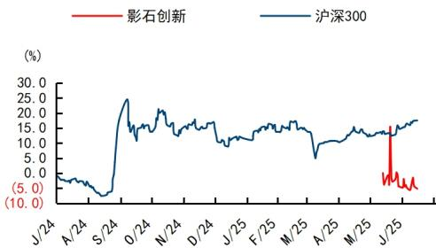  
市场走势  
资料来源：Wind、国信证券经济研究所整理

# 相关研究报告

<table><tr><td>盈利预测和财务指标</td><td>2023</td><td>2024</td><td>2025E</td><td>2026E</td><td>2027E</td></tr><tr><td>营业收入（百万元）</td><td>3,636</td><td>5,574</td><td>8,054</td><td>11,104</td><td>14,227</td></tr><tr><td>(+/-%)</td><td>78.2%</td><td>53.3%</td><td>44.5%</td><td>37.9%</td><td>28.1%</td></tr><tr><td>净利润(百万元)</td><td>830</td><td>995</td><td>1151</td><td>1652</td><td>2341</td></tr><tr><td>(+/-%)</td><td>103.7%</td><td>19.9%</td><td>15.7%</td><td>43.6%</td><td>41.7%</td></tr><tr><td>每股收益（元）</td><td>2.30</td><td>2.76</td><td>2.87</td><td>4.12</td><td>5.84</td></tr><tr><td>EBIT Margin</td><td>25.1%</td><td>18.1%</td><td>13.6%</td><td>15.3%</td><td>16.7%</td></tr><tr><td>净资产收益率（ROE)</td><td>38.0%</td><td>31.3%</td><td>19.4%</td><td>23.9%</td><td>28.1%</td></tr><tr><td>市盈率 (PE)</td><td>75.6</td><td>63.0</td><td>60.71</td><td>42.29</td><td>29.84</td></tr><tr><td>EV/EBITDA</td><td>68.4</td><td>62.3</td><td>64.1</td><td>41.8</td><td>30.3</td></tr><tr><td>市净率(PB)</td><td>28.69</td><td>19.71</td><td>11.79</td><td>10.10</td><td>8.40</td></tr></table>

资料来源：Wind、国信证券经济研究所预测  
注：摊薄每股收益按最新总股本计算

# 内容目录

# 一、影石创新：技术驱动下的智能影像设备龙头...

高速成长的全景相机龙头. . 5  
公司股权激励充分，年轻的管理层技术背景扎实。 .6  
高速成长势头不减，海外收入占比高.. 7

# 二、智能便携影像设备：供给创造需求，行业仍处于产品周期的上升期.

智能便携影像设备形态不断丰富，适配场景持续拓宽. .. 9  
行业规模：国内外年销量正在从百万台向千万级别增长. ..10  
行业格局：集中度较高，国内品牌逐渐占据主导地位.. ..14

# 三、影石创新的竞争力和增长点.... ..16

先进的技术优势和产品力. .. 16  
全球化完善的渠道布局.. .. 19  
品牌建设多维并举.. .. 21

# 四、财务表现.. 22

高毛利率高费用率，重研发投入.. .. 22  
现金流表现较好，存货周转天数整体稳定. .. 23

# 五、盈利预测与投资建议...... .24

盈利预测.. . 24  
盈利预测情景分析.. .. 27  
估值与投资建议... ... 27  
投资建议... .. 29

# 风险提示............ .31

# 附表：财务预测与估值... ..35

# 图表目录

图1： 影石创新股权结构较为分散（标红为员工持股平台，未列明的澜烽一号发行后持股 $0 . 1 9 \%$ ）........... 6  
图2： 公司收入高速成长......... ...... 7  
图3： 公司 2017-2024 年净利润复合增长超 $100 \%$ .. ...7  
图4： 公司收入以消费级相机为主.... ....... 8  
图5： 公司中美欧收入各占约 1/4... .... 8  
图6： 公司线上线下渠道布局广泛...... ...... 8  
图7： 公司在不同国家的线上线下渠道均有布局.. .....8  
图8： 公司毛利率较高、净利率先升后降.. .... 9  
图9： 公司近几年加大营销及研发投入..... ..... 9  
图10： 手持智能影像设备的几种形态..... ..... 9  
图11： 国内线上行业销量 2023-2024 年起高速增长.. .... 10  
图12： 龙头影石(GO 3S)、大疆(Pocket3)发布新产品拉动增长.... ......10  
图13： 美、德、日 2024 年线上销量预计约为 65、22、13 万台.... .....12  
图14： 参考影石外销结构，海外 2024 年销量约为 809万台...... .......12  
图15： 国内消费级民用无人机预计 2024年规模达 185亿元. .....14  
图16： 全球航拍无人机规模预计达 71 亿美元，未来平稳增长.... .......14  
图17： 影石创新位居全球消费级全景相机企业销额占比首位.. .....14  
图18： 公司位居全球专业级全景相机企业销额占比首位.... ....... 14  
图19： 美国线上 GoPro 仍在相对强势的地位.... ....... 15  
图20： 德国亚马逊市场大疆份额较高...... ........ 15  
图21： 日本线上大疆和影石份额较高...... ...... 15  
图22： 国内市场集中度较高....... ...... 16  
图23： 国内产品对比：GoPro 在同价位段参数较差.. ...... 16  
图24： 影石主要原材料采购比例：重要硬件产业链相对成熟....... .......16  
图25： 相比传统相机和手机，便携智能设备还需要有更细分的模块化、小型化、防水等硬件研发需求..16  
图26： 软件算法需要更多场景化能力................ ........ 17  
图27： 相比传统相机和手机，便携智能设备有细分的算法需求.. .....17  
图28： 影石近年的爆款全景相机和拇指相机..... ......... 18  
图29： 影石的产品利用 AI强化产品易用性.. ...... 18  
图30： 影石 2024年外销结构中，线下比例相对均衡. ....... 19  
图31： 影石在纽约的新品发布引发消费者排队购买.. ...... 19  
图32： 美亚 Best Seller 中影石 X5 排名第三，但相似产品几乎没有竞争对手，同类竞品仍以单侧运动相  
机为主...... .... 20  
图33： 影石外销线上官方商城和三方平台收入占比相对均衡.... ......20  
图34： 公司内销线上线下结构均衡... ................................. ...... 21  
图35： 影石国内线下直营店..... .................................................. ...... 21  
图36： 影石持续进行海外社群运营. ..... 22  
图37： 公司毛利率处于行业平均水平.. . 22  
图38： 公司期间费用率整体有所提升.... ..... 22  
图39： 公司研发费用率处于行业上游水平.. ... 23  
图40： 公司的净利率位于行业上游水平... .... 23  
图41： 公司现金流表现较好.. .... 23  
图42： 公司经营性净现金流稳中向上.. ... 23  
图43： 公司应收账款占收入比例相对较低.. ... 24  
图44： 公司存货周转和应收账款周转天数稳定. .24  
表1： 公司主要产品及应用. .. 5  
表2： 公司核心管理人员年轻、但在公司任职经验丰富. ....6  
表3： 国内智能便携影像设备行业规模测算.. .... 11  
表4： 海外智能便携影像设备行业规模测算. .... 13  
表5： 公司通过自主研发形成大量核心技术.. .... 18  
表6： 影石和 GoPro线下渠道对比：海外区域 GoPro的点位数量较高. ... 20  
表7： 影石在电商平台粉丝数远少于大疆和 GoPro，但在社媒运营方面做到了后发居上.. .... 21  
表8： 影石收入及毛利率预测.. ... 26  
表9： 影石创新盈利预测表... .... 27  
表10： 情景分析（在收入、成本、费用和所得税率全部同向变动 $5 \%$ 时，乐观、中性、悲观情景）.........27  
表11： 公司盈利预测假设条件（%） .... 27  
表12： 资本成本假设... ..... 28  
表13： 影石创新 FCFF估值表.. ... 28  
表14： 绝对估值相对折现率和永续增长率的敏感性分析（元） ..28  
表15： 同类公司估值比较. .. 29

# 一、影石创新：技术驱动下的智能影像设备龙头

高速成长的全景相机龙头

公司主营全景相机、运动相机等智能影像设备的研发、生产和销售。公司成立于2015年，是以全景技术为基点的全球知名智能影像设备提供商，主要产品包含消费级的全景相机、运动相机、手持摄影设备及网络摄像头、专业级的 VR全景相机和 AI 视频会议一体机等。品牌“Insta360 影石”产品通过线上、线下渠道相结合的方式进行全球销售，2024年收入中超 $70 \%$ 的收入来自于海外。

表1：公司主要产品及应用  

<table><tr><td>产品类别</td><td></td><td>功能属性相应系列均价（2024 年)</td><td>应用领域</td><td>对应产品</td></tr><tr><td rowspan="5">消费级智能影 像设备</td><td>运动相机</td><td>Ace系列：21240元/合</td><td>可适用于高强度运动状态下拍摄， 应用场景包括国防军事、政法警务、 户外动、日常生活娱场、的游以 拍摄</td><td></td></tr><tr><td>全景相机</td><td></td><td>360°全景拍摄，用于国防军事、政 法警务、日常生活娱乐、旅游、户 外运动以及VR看房等场景的全景内 容拍摄</td><td></td></tr><tr><td>全景运动相机</td><td>ONE X系列：2642元/台 ONE R系列：3225元/台</td><td>可拍摄 360°全景影像，并适用于高 强度运动状态，结合了全景相机及 运动相机的功能与场景</td><td></td></tr><tr><td></td><td></td><td>功能高度集成、操作便捷简单的 AI 手机稳定器，用于优化手机拍摄的</td><td></td></tr><tr><td>持影</td><td></td><td>效果体验高清智能云合 作、在线课堂等场景 主要用于专业VR 内容制作、直播、</td><td></td></tr><tr><td rowspan="2">专业级智能影 像设备</td><td></td><td></td><td>VR看房等</td><td></td></tr><tr><td></td><td>A视频会议一Connct列：1009元/台会议一体机，主要用于商务会议场</td><td>适用于中小型会议室的专业 AI 视频</td><td></td></tr><tr><td>配件及其他产品</td><td></td><td>142元/台</td><td>适配公司相机的自拍，电池、保</td><td></td></tr></table>

资料来源：公司公告，国信证券经济研究所整理

# 公司股权激励充分，年轻的管理层技术背景扎实。

截至 2025 年 6 月公司上市发行前，公司实际控制人、董事长刘靖康间接持有公司29.9%的股份，通过员工持股平台北京岚锋、岚沣管理可支配公司 $3 4 . 0 \%$ 的表决权。公司员工激励力度大，已设立五个员工持股平台，其中，控股股东北京岚锋主要是创始团队的持股平台；岚沣管理、岚烽管理、澜烽管理和澜烽一号为后期加入员工的持股平台。

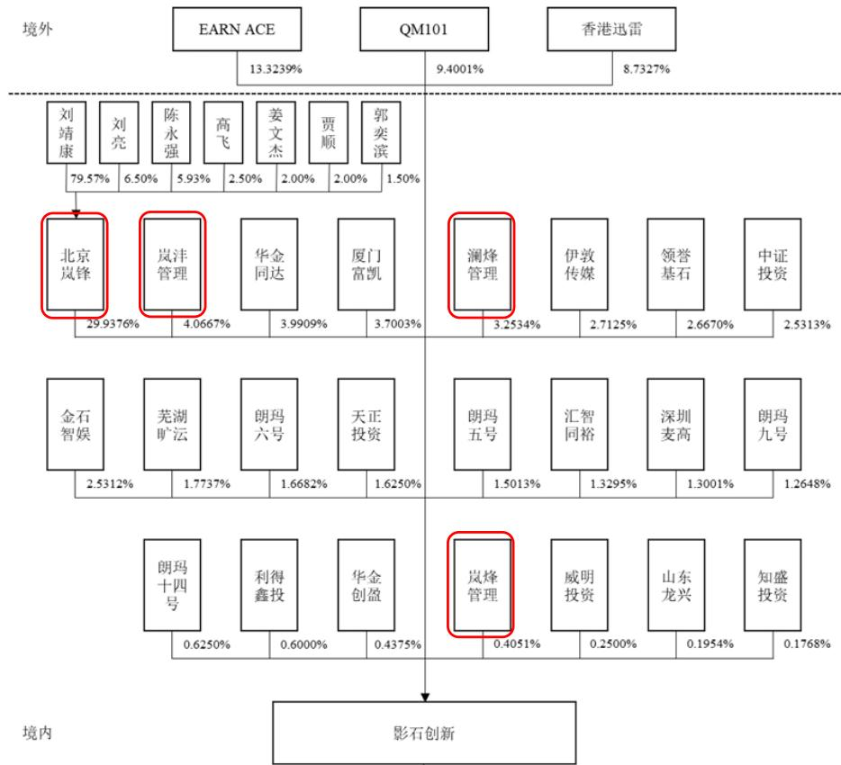  
图1：影石创新股权结构较为分散（标红为员工持股平台，未列明的澜烽一号发行后持股 $0 . 1 9 \%$ ）  
资料来源：公司公告，国信证券经济研究所整理

公司核心管理层均在 35 岁左右，陪伴公司成长至今，经验丰富，具备充足的创业精神。公司核心管理层刘靖康、陈永强、贾顺、刘亮、肖龙报等从 2015年公司成立起便加入公司，经营经验丰富；且均出生于 1990 年前后，较为年轻，有利于持续带领公司实现进一步发展。

表2：公司核心管理人员年轻、但在公司任职经验丰富  

<table><tr><td>姓名</td><td>职务</td><td>出生年份</td><td>简介</td></tr><tr><td>刘靖康</td><td>董事长，董事</td><td>1991</td><td>南京大学软件工程学士，2015 年7月创公司，历任执行董事兼经理、董事长并担任法定代表人至今；2016 年获 得第二届中国“互联网+”大学生创新创业大赛亚军；登上2017福布斯亚洲30位30岁以下精英榜；2019年，作 为当代创业青年的优秀代表被共青团中央、人力资源社会保障部授予第十届“中国青年创业奖”，并获得“广东 特支计划一科技创业领军人才”称号；2020年，获得“深圳市高层次人才”称号：2021年，作为第一完成人获得 广东省科技进步奖二等奖；2022年，作为发明人所发明的专利获得广东专利优秀奖；2024年，入选“2024 福布 斯中国·出海领军人物TOP30”榜单。</td></tr><tr><td>YEH KUANTAI</td><td>董事</td><td>1967</td><td>康奈尔大学电机学专业学士及硕士，1990年8月至1997年5月，在赛普拉斯半导体公司担任芯片研发经理和晶 广经理：19年本4年司在加帝国商业行世市场公司担任经理信；19年5至200年</td></tr></table>

<table><tr><td></td><td></td><td></td><td>月至2008年8月，在英特尔担任董事总经理；2008年9月至2014年3月，在高原资本担任董事总经理；2014 年5月至今，担任启明创投合伙人；2018年9月至今，兼任公司董事。</td></tr><tr><td>陈永强</td><td>董事首席行</td><td>1991</td><td></td></tr><tr><td>贾顺</td><td>莱核心技</td><td>1992</td><td>南京大学件工程今， 201任年司始，担任公司软件研发总监；2020年3月至今，兼任公司行业应用中心总 南京农业大学金融专业学士，2011年联合创立“开吃吧”，2014年担任“点我吧”合伙人、副总裁，并联合创建</td></tr><tr><td>刘亮</td><td>董事、总经理</td><td>1989</td><td>即时物流行业的独角兽企业“点我达”，先后获阿里巴巴集团、蚂蚁金服、菜鸟物流等企业超过5亿美金投资； 2016年至2020年1月，历任公司总裁、首席执行官；2018年10月，担任公司董事；2020年1月至今，担任公 司总经理。 同济大学信息安全专业学士，德国亚琛工业大学媒体信息专业硕士。2012年4月至2015年3月，在IDG资本投</td></tr><tr><td>童晨</td><td>董事</td><td>1985</td><td>资顾问（北京）有限公司任分析师；2015年4月至2016年3月，在爱奇创投咨询（北京）有限公司任副总裁； 2016年4月至2016年12月在和谐爱奇投资管理（北京）有限公司任副总裁；2017年1月至2019年4月，在和 谐卓然（珠海）投资顾问有限公司任董事总经理；2019年5月至2020年6月，在和谐卓睿（珠海）投资管理有 限公司任合伙人；2020年7月至2020 年10月，在和谐卓然（珠海）投资顾问有限公司任合伙人；2020年11月</td></tr><tr><td>黄蔚</td><td>财务负责人</td><td>1983</td><td>至今，在和谐爱奇投资管理（北京）有限公司任合伙人。 会股份，德年永会师务部经理责，2015年6至2019 中山大学法学学士、美国圣路易斯华盛顿大学知识产权与技术法硕士，2012年10月至2014年7月，任广东敬海</td></tr><tr><td>厉扬</td><td>董事会秘书</td><td>1989</td><td>师务执师2技限司16年，信息技术有限司法法年7至 08 月至今，担任公司董事会秘书。</td></tr><tr><td>肖龙报</td><td>研究院工程副</td><td>1986</td><td>中科技生命科学与技学生物医工，201年1至04年，担任为技术有限公司</td></tr></table>

资料来源：公司公告，国信证券经济研究所整理

# 高速成长势头不减，海外收入占比高

公司营收利润保持高速成长势头，2024 年增长依然强劲。公司 2024年实现营收55.7 亿元，同比增长 $5 3 . 3 \%$ ，2017-2024 年复合增长 $6 6 . 2 \%$ ；2025Q1 营收同比增长 $4 0 . 7 \%$ 至 13.6 亿元，收入保持快速成长。公司净利润实现更快的复合增长，2017-2024 年归母净利润复合增速达到 106.5%。2024年公司实现归母利润 9.9亿元，同比增长 $1 9 . 9 \%$ ；2025Q1 实现利润 1.8亿元，同比下降 $2 . 5 \%$ ，预计主要系公司因新品上市、人员扩张及研发储备，加大了营销及研发投入的力度。

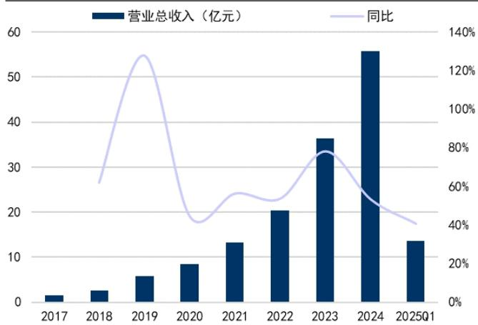  
图2：公司收入高速成长

资料来源:wind，国信证券经济研究所整理资料来源:wind，国信证券经济研究所整理

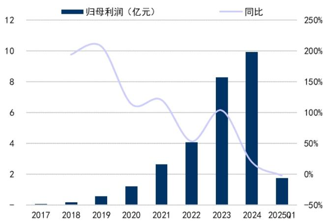  
图3：公司 2017-2024 年净利润复合增长超 $100 \%$

公司营收以消费级相机为主，海外收入占比较高。公司消费级智能影像设备是公司增长的主要来源，2024年实现收入 47.9亿元，占主营业务收入的 86. $6 \%$ 。专业级智能影像设备近几年规模有所下降，2024 年主营收入占比仅 $0 . 4 \%$ 。随着公司消费级相机规模持续壮大，公司相应的配件及其他产品收入迎来快速增长，2024年实现营收 7.2 亿元，占主营业务收入的 $1 3 . 0 \%$ 。

公司海外收入占比接近 $80 \%$ ，中美欧及其他各占约 1/4。2024 年公司来自于中国大陆、欧洲、美国的收入在 13亿元左右，主营业务收入占比在 $2 3 \% - 2 4 \%$ 之间；来自日韩的收入占比为 $7 . 8 \%$ ，其余地区（中国香港、澳大利亚、新加坡、加拿大、菲律宾等）收入占比 $2 1 . 9 \%$ 。

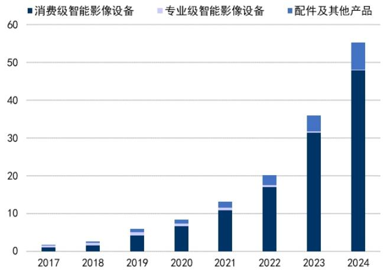  
图4：公司收入以消费级相机为主  
资料来源:公司公告，国信证券经济研究所整理

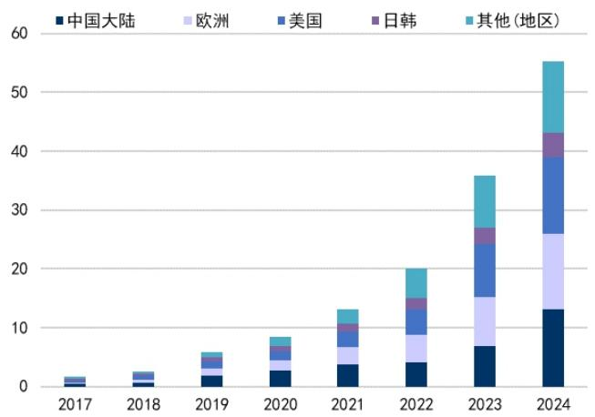  
图5：公司中美欧收入各占约1/4

资料来源:公司公告，国信证券经济研究所整理

公司渠道布局广泛，线上线下收入各占约一半，线下经销收入占比最高。分销售渠道，公司线下经销占比最高，达到 44. $4 \%$ ；其次为第三方电商和官方商城销售，占比分别为 24. $4 \%$ 和 $1 8 . 8 \%$ ；商超及专业销售渠道占比 $5 . 7 \%$ ，电商平台入仓占比$4 . 7 \%$ 。整体看，公司近几年线上线下渠道占比各一半左右。从不同国家的渠道结构看，公司线上线下的占比也相对均衡。2024 年国内线上占比 $5 0 . 0 \%$ ，线上主要为天猫、京东，线下主要通过经销商销售；美国线上占比 $5 4 . 9 \%$ ，主要通过官方商城及亚马逊，线下经销商和 KA 及专业销售渠道各占约 $20 \%$ ；德国、日本等国主要通过官方商城、电商及线下经销商来销售。

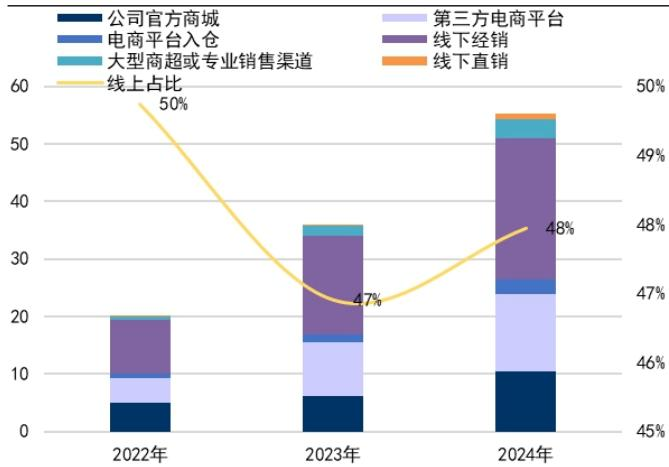  
图6：公司线上线下渠道布局广泛

资料来源:公司公告，国信证券经济研究所整理资料来源:公司公告，国信证券经济研究所整理

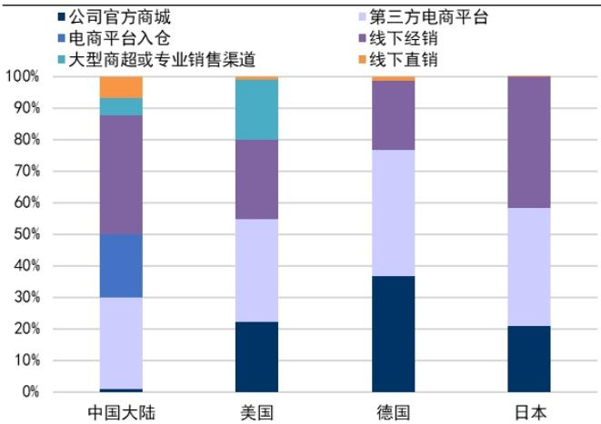  
图7：公司在不同国家的线上线下渠道均有布局

公司毛利率保持较高水平，近几年营销及研发投入力度较大。公司毛利率基本维持在 $50 \%$ 以上，毛利率波动主要受产品结构、渠道结构、汇率等因素影响。2024年公司毛利率同比下降 3.7pct至 $5 2 . 2 \%$ ，主要系毛利率较低的 Ace系列产品收入占比有所提高，及新品 ONE X4 系列处于量产初期，毛利率阶段性较低。

公司销售及研发费用率呈现先降后升的趋势，2017-2021 年，随着规模的壮大，公司费用率快速下降；2022年以来，公司逐步加大销售及研发投入力度，扩大市场占有率。受此影响，公司净利率呈现出先升后降的趋势，2017-2023 年净利率从 $3 . 9 \%$ 逐步提升至 $2 2 . 8 \%$ ，2024年净利率降至 $1 7 . 8 \%$ 。

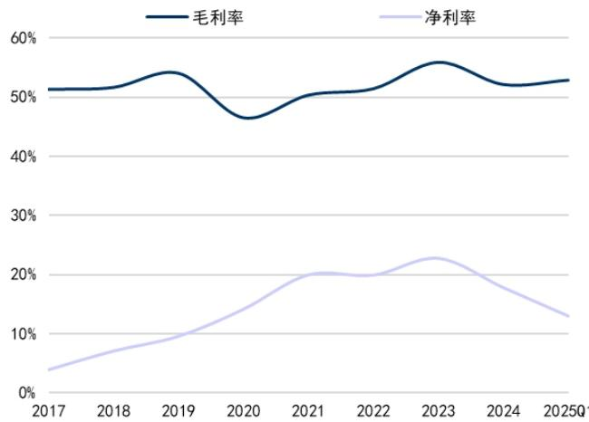  
图8：公司毛利率较高、净利率先升后降

资料来源:wind，国信证券经济研究所整理

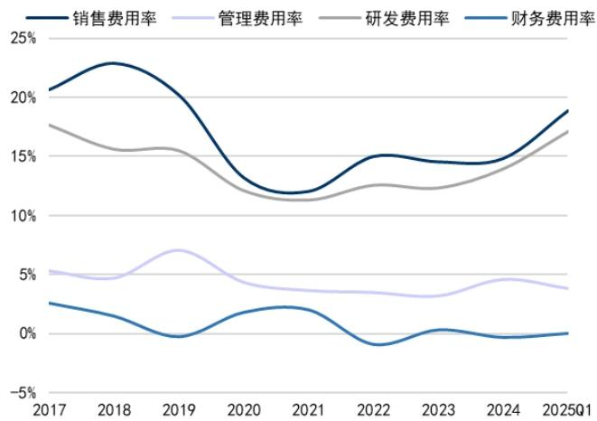  
图9：公司近几年加大营销及研发投入  
资料来源:wind，国信证券经济研究所整理

# 二、智能便携影像设备：供给创造需求，行业仍处于产品周期的上升期

智能便携影像设备形态不断丰富，适配场景持续拓宽智能便携影像设备根据形态，主要包含手持便携智能影像设备和无人机，手持又包含消费级的运动相机和全景相机，以及专业级的全景相机。便携智能设备主要满足的需求痛点是拍摄分享，且随着娱乐类型的不断丰富，设备适配的场景也从过去的极限运动等延展至日常运动、生活分享和视频日志（Vlog）等细分领域。

  
图10：手持智能影像设备的几种形态

资料来源：影石创新官网、大疆官网、国信证券经济研究所整理

# 行业规模：国内外年销量正在从百万台向千万级别增长

# 国内：智能便携影像设备 2024 年销量或超 300 万台，未来三年有望保持 $40 \% +$ 的复合增速。

根据久谦平台数据，2024年国内便携智能影像设备（运动相机、手持/拇指相机、全景相机）线上 GMV约为 37亿元/销量 157万台，同时参考影石创新线上线下相对均衡的渠道结构，我们预计 2024 年国内智能便携影像设备销量约为 314万台。行业 2023-2024 年以来，行业增速较快主要得益于主要玩家影石、大疆等品牌的产品形态不断丰富（如手持、拇指相机等产品），新品类对行业规模增长起到了有效拉动作用。

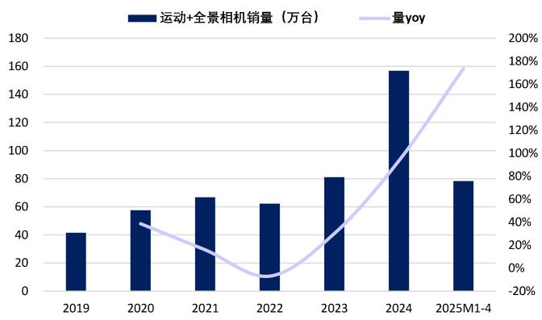  
图11：国内线上行业销量 2023-2024年起高速增长

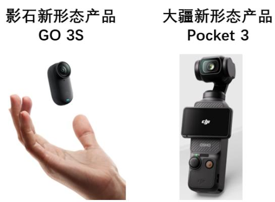  
图12：龙头影石(GO 3S)、大疆(Pocket3)发布新产品拉动增长

资料来源:久谦，国信证券经济研究所整理资料来源:各公司官网，国信证券经济研究所整理

未来测算方面，我们参考线上主流平台的销售情况，以及社交媒体创作者的数量来推导行业规模。需求属性来看，Vlog相关的拍摄场景是产品的核心渗透人群，因此参考中国网络视听发展研究报告(2024)、克劳锐指数研究院对国内短视频创作者数量，和不同类型创作者比例等数据，我们预计：

# 需求基数：对视频拍摄质量有要求的专业和业余创作者预计超 4000万人

（1）国内约 1500 万专业创作者（粉丝数量超 1 万）和 3 亿业余创作者；

（2）假设专业创作者中 43%对视频的拍摄质量有明确需求，业余创作者中约 12%对拍摄质量有要求（比例来自于克劳锐指数研究院统计的 2024年创作者所处赛道比例，假设生活记录、时尚、运动等对视频拍摄质量有要求，而游戏、搞笑、财经等内容更多采用视频生成/制作而非拍摄）；

（3）综合创作者数量和高质量拍摄需求，得到国内智能便携影像设备的用户基数预计为专业创作者 638 万人，业余创作者 3832万人。

# 保有率：专业创作者有望至少人手 1 台，业余创作者当前保有率或不足 $10 \%$

首先，这里我们需要厘清保有率和渗透率的概念，由于短视频创作者数量增长相对平稳，而已经购买设备的创作者仅会在未来成为更新需求的基数，因此我们只能通过假设保有率每年的增量来计算新增需求（即上述 4000多万人并非每年都可以乘一个假设的渗透率得到销量）；但其次，考虑到智能影像设备的形态仍在不断丰富，人手 1 台以上设备同样是有可能的（1 台全景 $+ 1$ 台拇指等），因此保有率理论上可以超过 $100 \%$ （尤其是对于专业创作者来说）。

（1）假设当前设备更新周期约为 3 年，则结合国内历史销量数据来看，预计 2024年对拍摄质量有要求的创作者（专业 $^ +$ 业余）保有率约为 $1 5 \%$ ，其中假设专业创作者保有率为 $50 \%$ ，业余创作者保有率约为 $9 \%$ 。

（2）由于 2023-24年以来产品形态不断丰富和强化，若假设更新周期保持不变，随着新产品形态的发布，新增需求持续唤醒从而拉动保有率加速提升，则预计2027 年国内两类创作者的保有率分别提升至 $105 \%$ 和 $3 5 \%$ （专业创作者的保有率是有望突破 $100 \%$ 的，业余创作者假设超过三分之一都保有一台），预计 2025-2027年的新增量约为 400-600 万台的水平。

结合保有率提升带来的增量，同时考虑 3 年的更新替代周期，预计 2025-27 年的销量预计为 511、699、854 万台，2024-2027 年的复合增速约为 41%。假设产品终端单价以 2500 元计，则行业 2027 年整体销额规模约为 214亿元。

表3：国内智能便携影像设备行业规模测算  

<table><tr><td></td><td>2023</td><td>2024</td><td>2025E</td><td>2026E</td><td>2027E备注</td></tr><tr><td>短视频创作者用户数量（亿）</td><td>3.10</td><td>3.24</td><td>3.39</td><td>3.54</td><td>3.70</td></tr><tr><td>万粉+创作者（专业创作者）（亿）</td><td>0.14</td><td>0.15</td><td>0.16</td><td>0.16</td><td>0.17参考克劳锐指数研究院对国内创作者的调查</td></tr><tr><td>高质量拍摄需求占比</td><td>43%</td><td>43%</td><td>44%</td><td>45%</td><td>46%参考克劳锐指数研究院对短视频内容的调查比例</td></tr><tr><td>专业创作者设备需求（万台）</td><td>606</td><td>638</td><td>682</td><td>729</td><td>779</td></tr><tr><td>业余创作者（亿）</td><td>2.96</td><td>3.09</td><td>3.23</td><td>3.38</td><td>3.53</td></tr><tr><td>高质量拍摄需求占比</td><td>12.4%</td><td>12.4%</td><td>12.9%</td><td>13.4%</td><td>13.9%</td></tr><tr><td>业余创作者设备需求（万台）</td><td>3668</td><td>3832</td><td>4167</td><td>4524</td><td>4905</td></tr><tr><td>创作者拍摄设备总需求（万台）</td><td>4274</td><td>4470</td><td>4849</td><td>5253</td><td>5684</td></tr><tr><td>智能便携影像设备总销量（万台）</td><td>162</td><td>314</td><td>511</td><td>699</td><td>854均参考谦，其中2317起0线上年假设线上占比70%，</td></tr><tr><td>yoy</td><td></td><td>94%</td><td>63%</td><td>37%</td><td>22%</td></tr><tr><td>其中：</td><td></td><td></td><td></td><td></td><td></td></tr><tr><td>新增需求（万台）</td><td>121</td><td>257</td><td>428</td><td>553</td><td>2024年起，随着疆Pocket3、影Go等新形态发 597布增量</td></tr><tr><td>更新需求 （万台)</td><td>41</td><td>57</td><td>83</td><td>146</td><td>257 200年，随着疆Aatio和影的A系</td></tr><tr><td>对应总保有量（万台）</td><td>414</td><td>671</td><td>1099</td><td>1652</td><td>2249</td></tr><tr><td>总保有率</td><td>10%</td><td>15%</td><td>23%</td><td>31%</td><td>40%</td></tr><tr><td>其中：</td><td></td><td></td><td></td><td></td><td></td></tr><tr><td>专业创作者保有率</td><td>40%</td><td>50%</td><td>65%</td><td>85%</td><td>105% 对摄质量有要求的专业创作者至少人手一台便携</td></tr><tr><td>业余创作者保有率</td><td>5%</td><td>9%</td><td>17%</td><td>26%</td><td>35%对拍摄质量有要求的业余创作者三分之一保有</td></tr></table>

资料来源：中国网络视听协会：《中国网络视听发展研究报告(2024)》，久谦，QuestMobile，克劳锐指数研究院，国信证券经济研究所整理及预测

# 海外：便携智能影像设备接受度更高，预计 2024 年销量超 800 万台，保有率约为 $21 \%$ ，未来三年有望保持约 35%的复合增速。

根据亚马逊平台爬虫数据，2024年美国、德国、日本的便携智能影像设备销量分别约为 65万、22万和 13万台，考虑到海外线下渠道占比相对更高，同时头部企业如影石、大疆和 GoPro 等官网销售比例同样较高，因此假设美国亚马逊销量约为全渠道销量 $2 5 \%$ ，德国（欧洲）、日本亚马逊销量占全渠道约 $30 \%$ ，则美、德、日全渠道销量预计约为 262、73、44万台。进一步参考影石欧洲整体销售规模约为德国的 3.3 倍、欧美日以外的区域销售规模与美国相当，因此我们推导得到海外 2024 年全渠道销售规模预计为：美国 262万台、欧洲 241万台、日本 44 万台、其他区域 262万台，合计约为 809万台。

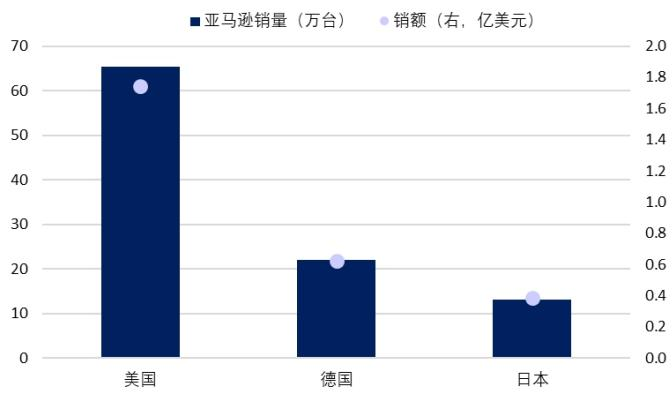  
图13：美、德、日 2024 年线上销量预计约为 65、22、13万台

资料来源:亚马逊，国信证券经济研究所整理资料来源:公司公告，国信证券经济研究所整理及预测我们以同样的思路来对海外主要市场进行测算。短视频创作者的数量、比例则主要参考 Tiktok的用户和内容结构。

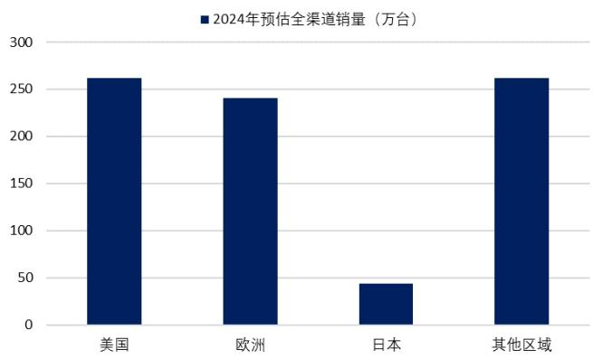  
图14：参考影石外销结构，海外 2024年销量约为 809万台

# 需求基数：海外对视频拍摄质量有要求的专业和业余创作者预计近 1亿人

其中Tiktok创作者数量我们采用海外媒体平台TechTipsWithTea给出的其全球月活数量 16 亿人，并参考国内抖音月活和创作者数量的关系（创作者约为月活的$4 1 \%$ ）得到创作者总数量基数约为 6.1亿人；以及 Sci tech发布的 YouTube 专业创作者数量约为 0.5亿人（我们假设 YouTube的专业创作者和 Tiktok 上的专业创作者是一批人）。

进一步参考 Tiktok和 YouTube 的内容结构统计，预计对拍摄质量有要求的专业创作者比例同样约为 $40 \%$ （集中在 Vlog、舞蹈、健康运动、时尚等领域），对应的需求基数约为 0.20 亿人；业余创作者则假设以健康运动、时尚等领域为主，其比例约为 $12 \%$ ，对应的需求基数约为 0.79 亿人。因此海外便携智能影音设备的总需求基数约为 1 亿人。

# 保有率：专业创作者有望至少人手 1 台，业余创作者当前保有率不到 20%

（1）假设设备更新周期和国内相仿约为 3 年，参考 2024 年海外的销量水平与国内 2027 年的预计水平相当，因此假设 2024年的海外保有量与国内 2027年的水平相当，即超过 2000万台，对应保有率假设为 $21 \%$ 。

新增需求方面，同样由于影石等新产品的渗透，预计 2025 年起海外保有率有望加速提升，预计 2027 年海外两类创作者的保有率分别提升至 110%和 $36 \%$ ，预计2025-2027 年的新增量约为 840-1400 万台的水平。而海外的更新需求假设占比高于国内，若假设年销量中 $30 \%$ 为更新需求，因此预计海外 2025-27 年的销量预计为 1190、1648、1959 万台，2024-2027 年的复合增速约为 $3 5 \%$ 。假设海外均价为3000 元人民币，则对应行业销额规模约为 588亿元人民币。

表4：海外智能便携影像设备行业规模测算  

<table><tr><td></td><td>2024 2025E</td><td>2026E</td><td>2027E</td></tr><tr><td>海外视频创作者数量（亿）</td><td>6.56 6.89</td><td>7.23</td><td>7.59</td></tr><tr><td>专业创作者数量（亿）</td><td>0.5 0.53</td><td>0.55</td><td>0.58</td></tr><tr><td>高质量拍摄需求占比</td><td>40% 40%</td><td>40%</td><td>40%</td></tr><tr><td>专业创作者设备需求（万台）</td><td>2000 2100</td><td>2205</td><td>2315</td></tr><tr><td>业余创作者数量（亿）</td><td>6.06 6.36</td><td>6.68</td><td>7.02</td></tr><tr><td>高清拍摄需求占比</td><td>13.0% 13.5%</td><td>14.0%</td><td>14.5%</td></tr><tr><td>业余创作者设备需求（万台）</td><td>7878 8590</td><td>9354</td><td>10172</td></tr><tr><td>创作者拍摄设备总需求（万台)</td><td>9878 10690</td><td>11559</td><td>12487</td></tr><tr><td>高质量便携设备总销量（万台）</td><td>809 1190</td><td>1648</td><td>1959</td></tr><tr><td>销量yoy</td><td>47%</td><td>38%</td><td>19%</td></tr><tr><td>其中：</td><td></td><td></td><td></td></tr><tr><td>新增需求 （万台)</td><td>566 839</td><td>1189</td><td>1393</td></tr><tr><td>更新需求 (万台)</td><td>243 351</td><td>459</td><td>566</td></tr><tr><td>总保有量（万台）</td><td>2095 2934</td><td>4123</td><td>5516</td></tr><tr><td>总保有率</td><td>21%</td><td>27% 36%</td><td>44%</td></tr><tr><td>其中：</td><td></td><td></td><td></td></tr><tr><td>专业创作者保有率</td><td>50%</td><td>65% 85%</td><td>110%</td></tr><tr><td>业余创作者保有率</td><td>14%</td><td>20% 28%</td><td>36%</td></tr></table>

资料来源：statusbrew，Sci tech，QuestMobile，TechTipsWithTea，卖家精灵，国信证券经济研究所整理及预测

# 消费级航拍无人机：存量规模预计相对较高，但未来增速预计有所放缓

无人机方面参考博研咨询，国内消费级民用无人机预计 2024年行业规模约为 185亿元，同比增长约 $1 6 \%$ ；全球方面参考公司招股说明书中 Valuates Report 的数据， 2023 年全球航拍无人机市场规模约为 71亿美元。

增长方面，参考国内线上主流平台的增速情况，2021-2024 销额复合增速约为 $26 \%$ ；全球规模增长一方面参考公司招股说明书中Statista统计的2017-2022年的复合增速 $20 \%$ ，另一方面 Valuates Report 的预测为 2023-2030 年复合增速约为 $8 \%$ 。

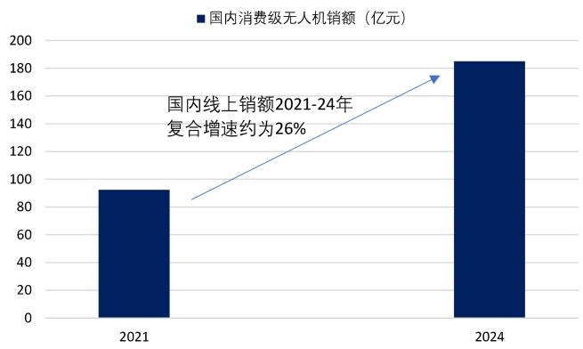  
图15：国内消费级民用无人机预计 2024年规模达185 亿元

资料来源:博研咨询，久谦，国信证券经济研究所整理

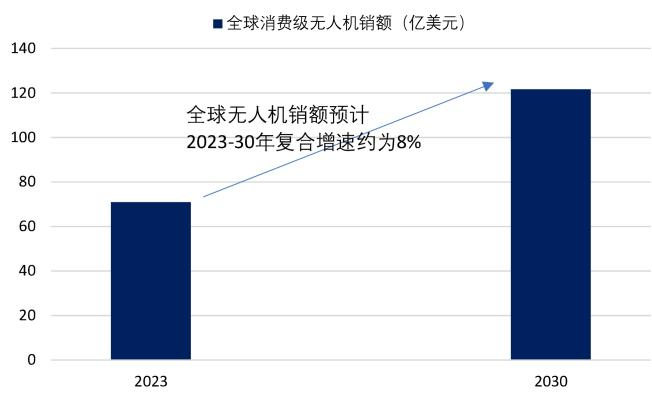  
图16：全球航拍无人机规模预计达 71 亿美元，未来平稳增长

资料来源:Valuates Report，国信证券经济研究所整理

# 行业格局：集中度较高，国内品牌逐渐占据主导地位

# 全球全景相机格局：影石领衔全景相机

目前全球消费级的全景相机领域领先企业包括中国的影石创新、日本的理光以及美国的 GoPro；专业级的 VR全景相机市场则主要由影石创新和深圳看到科技有限公司主导。根据 Frost & Sullivan 的数据，2023 年全球消费级全景相机市场份额前三位分别为影石创新、日本理光、GoPro，市场占有率分别为 $6 7 . 2 \%$ 、 $1 2 . 4 \%$ 和 $9 . 2 \%$ 。在专业级全景相机领域，2023年影石创新市占率为 $6 1 . 4 \%$ ，看到科技、视觉科技销售额占比分别为 $1 4 . 0 \%$ 、 $3 . 5 \%$ 。

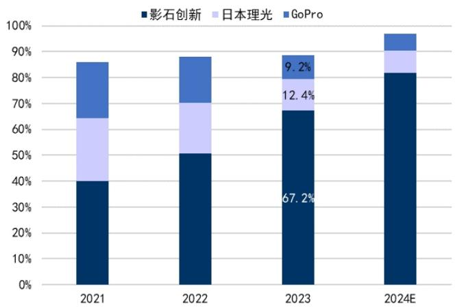  
图17：影石创新位居全球消费级全景相机企业销额占比首位  
资料来源:公司公告，Frost & Sullivan，国信证券经济研究所整理

资料来源:公司公告，Frost & Sullivan，国信证券经济研究所整理若将运动相机等便携智能影像设备全品类考虑进来，则行业集中度同样较高，头部企业仍集中在影石、大疆和 GoPro三家企业。

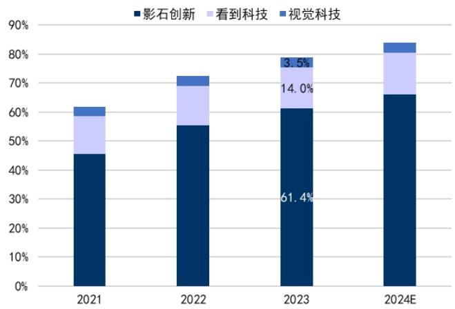  
图18：公司位居全球专业级全景相机企业销额占比首位

# 海外：美国 GoPro 相对强势，德国、日本线上格局与国内相似

参考美国亚马逊的销额份额数据，GoPro 作为本土品牌整体处于龙头地位，但近年影石份额快速提升，而大疆则受制于贸易政策壁垒，在亚马逊的销售额份额较低。德国和日本则和国内的格局变动趋势相对更类似，在产品力差异下，GoPro过往的强势份额近年有所降低。但尽管如此，几个主流市场的线上集中度依然较高，销额的 CR3普遍在 $8 0 - 9 0 \%$ 的水平。

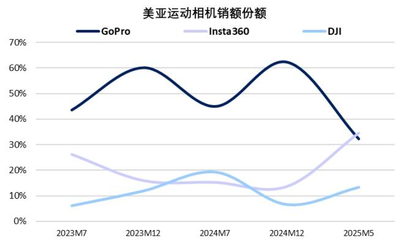  
图19：美国线上 GoPro仍在相对强势的地位

资料来源:亚马逊，国信证券经济研究所整理资料来源:亚马逊，国信证券经济研究所整理资料来源:亚马逊，国信证券经济研究所整理

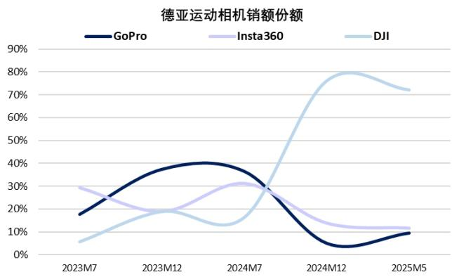  
图20：德国亚马逊市场大疆份额较高

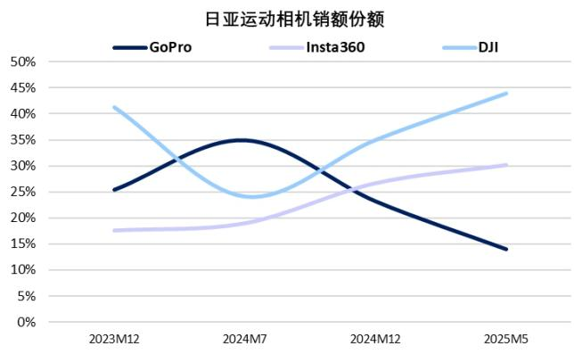  
图21：日本线上大疆和影石份额较高

# 国内：集中度较高，且影石和大疆产品和份额均强于 GoPro。

参考国内线上主流平台的数据，便携智能影像设备行业整体集中度较高，头部企业大疆、影石和 GoPro 基本占据行业超 $90 \%$ 的销额份额，但动态来看，近年传统龙头 GoPro 的销量份额持续下降，而大疆的份额迅速提升，我们预计短期份额的巨大变动主要来自于各品牌新品的拉动，GoPro 近年产品迭代速度相对较慢，同时产品性价比相比影石和大疆逐渐出现差距，而大疆 2023 年底发布的爆品Pocket3由于其创新的产品形态，以及突出的产品力（防抖、广角、1 英寸大感应器更清晰的拍摄等），有力拉动了大疆份额的提升。

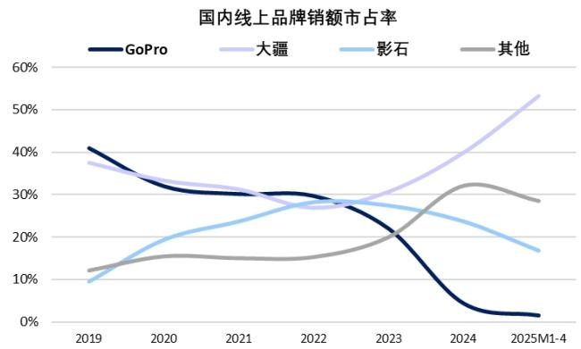  
图22：国内市场集中度较高

资料来源:久谦，国信证券经济研究所整理

图23：国内产品对比：GoPro 在同价位段参数较差  

<table><tr><td>产品对比</td><td></td><td>影石Ace Pro2 疆Action 5 ProGoPro Hero12</td><td></td></tr><tr><td>京东售价</td><td>2698</td><td>2598</td><td>2593</td></tr><tr><td>传感器尺寸</td><td>1/1.3&quot;</td><td>1/1.3&quot;</td><td>1/1.9&quot;</td></tr><tr><td>视频最高规格</td><td>8K@30os</td><td>4K@120fps</td><td>5.K@2Oos</td></tr><tr><td>电池容量(mAh)</td><td>1950</td><td>1800</td><td>1720</td></tr><tr><td>最高像素</td><td>5000万</td><td>4000万</td><td>2700万</td></tr><tr><td>防水深度 （米)</td><td>12</td><td>20</td><td>10</td></tr></table>

资料来源:京东，国信证券经济研究所整理

# 三、影石创新的竞争力和增长点

公司作为行业的后来者，能实现追赶上日本理光及 GoPro 等龙头企业，离不开公司在技术研发、产品创新、运营管理团队、全方位的营销体系等方面所建立起的强大竞争优势。

# 先进的技术优势和产品力

由于便携智能影像设备的硬件产业链相对成熟，因此软件算法和“软硬结合”的能力是企业竞争优势重要的来源之一。具体来看：

硬件方面，核心零部件包括 IC（集成电路）芯片和镜头模组等，其成本占比超过原材料的一半，在手机、传统数码相机等产业链发展的加持下，硬件的供应链体系目前已经相对完善和成熟；而其他原材料则主要为供应格局更分散的结构件、电池、LCD 等。整体来看，硬件的产业链相对成熟，但针对这一细分品类，依然要求企业在硬件小型化设计、防水等研发设计方面具备全面和创新的能力。

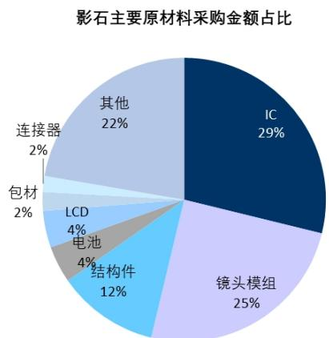  
图24：影石主要原材料采购比例：重要硬件产业链相对成熟

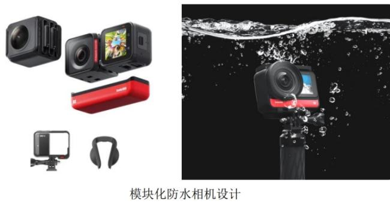  
图25：相比传统相机和手机，便携智能设备还需要有更细分的模块化、小型化、防水等硬件研发需求

资料来源:公司公告，国信证券经济研究所整理资料来源:公司公告，国信证券经济研究所整理

软件方面，便携智能拍摄设备主要涉及和传统拍摄设备类似的计算摄影技术、防抖技术和音频处理算法等，在此基础上，针对运动、便携和全景相机，还需要结合硬件的情况，强化防抖、视频处理技术，并新增全景影像采集和拼接技术、AI影像技术等。

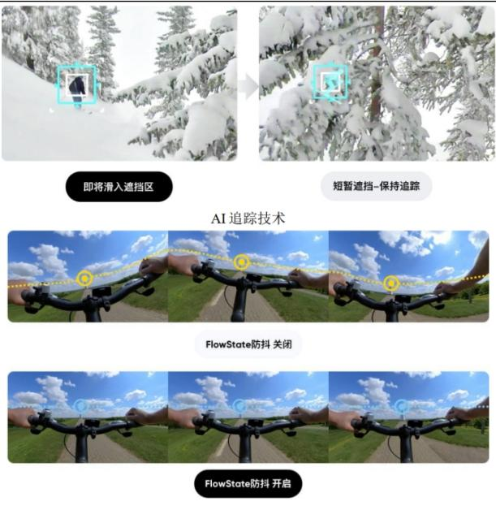  
图26：软件算法需要更多场景化能力  
防抖技术效果对比图

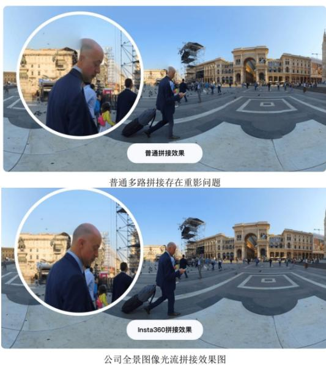  
图27：相比传统相机和手机，便携智能设备有细分的算法需求

资料来源:公司公告，国信证券经济研究所整理资料来源:公司公告，国信证券经济研究所整理

公司在产品方面的核心优势在于创新技术运用及先进的产品定义能力。公司 2016年发布了 Nano 全景相机，首度实现了全景相机在移动端即插即用的功能；2017年发布的 Pro 系列产品成为首款谷歌官方推荐的专业车载街景认证产品；2019 年发布的穿戴式运动相机 GO 以 18.3克重量、拇指大小尺寸的物理设计并结合防抖技术功能，为影像设备的微型化、可穿戴化提供了新的想象空间。

除了产品形态外，公司将自主研发的全景技术、防抖技术、AI影像技术等应用至各系列产品，创新性地实现了 AI 智能剪辑、“自拍杆隐形”、智能追踪、“子弹时间”等功能，使得产品的易用性和产出稳定性显著高于竞争对手。

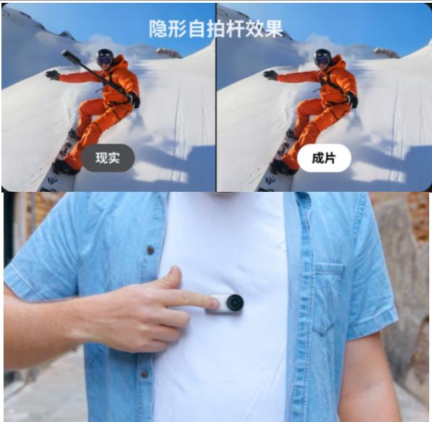  
图28：影石近年的爆款全景相机和拇指相机

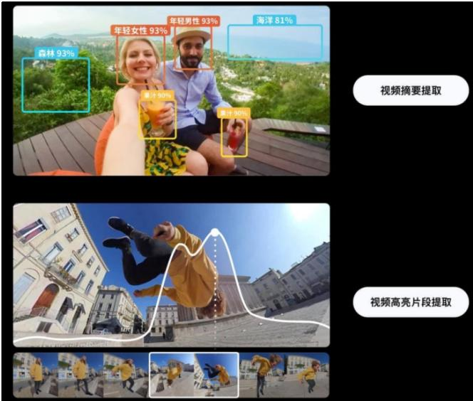  
图29：影石的产品利用 AI强化产品易用性

资料来源:公司公告，国信证券经济研究所整理资料来源:公司公告，国信证券经济研究所整理

# 底层支撑：全景技术及智能影像设备创新底层技术的持续投入

公司通过自主研发形成了全景图像采集拼接技术、防抖技术、AI 影像处理技术、计算摄影技术、软件开发技术框架、模块化防水相机设计技术、音频处理技术和框架等智能影像设备关键领域的核心技术。

表5：公司通过自主研发形成大量核心技术  

<table><tr><td>序号</td><td>技术名称</td><td>细分技术</td><td>主要用途</td></tr><tr><td rowspan="3">1</td><td></td><td>全景图像采集技术</td><td>用于双目或者多目架构全景相机的数据采集，通过自主研发的硬件同步方案，确保所有摄像头 曝光时刻差距在1ms以内、3A参数一致</td></tr><tr><td>全景图像采集拼接</td><td>全景图像拼接技术</td><td>于对输的服图像接，在保证实时性和稳定性的同时，优化拼缝处的重影和色差现</td></tr><tr><td></td><td>全景立体图像拼接技 术</td><td>用于对输入的鱼眼图像进行全景立体拼接，优化视差合成算法，提高视差还原准确性，输出符 合人眼视觉观感的质量全景体图像</td></tr><tr><td rowspan="3">2</td><td rowspan="3">防抖技术</td><td>防抖技术</td><td>用于对全景、广角视频进行防抖优化，消除拍摄过程不同因素带来的图像、画面抖动，输出具 有平滑稳定观感的视频成片</td></tr><tr><td>AI剪辑技术</td><td>通过大量图像数据的学习与训练，AI算法自动提取视频的精彩片段，并结合丰富的转场效果， 搭配合适的音乐与特效，一键生成精美的视频短片，帮助无剪辑经验的用户迅速准确出片</td></tr><tr><td>AI调色技术</td><td>用于对用户拍摄的视频或者图片进行调色，AI分析画面内容后，可感知场景信息智能调整出动 态范围宽广，色彩丰富鲜明且符合用户审美偏好的视频或图片结果，解决了传统滤镜、调色效</td></tr><tr><td rowspan="7">3</td><td rowspan="7">AI影像处理技术</td><td>AI追踪技术</td><td>果在多变的拍摄环境中无法满足用户需求的问题 对呈频动物进目标检测与追踪，将画面中心始终聚焦在目标物体，实现视频画</td></tr><tr><td>AI全景自动拍摄技术</td><td>通过对全景像序进行智能迹，我到目标兴趣点成运动动通过路径规划技术在3D</td></tr><tr><td>AI低光视频画质增强</td><td>通过端到端的深度神经网络，降低画面噪点的同时保留更多细节，还可以减少画面的运动模糊，</td></tr><tr><td>技术</td><td>提升暗光下画面的稳定性</td></tr><tr><td>图像消紫边技术</td><td>用于消除鱼眼图像中的紫边，节省硬件成本，提升用户观感</td></tr><tr><td>单帧 HDR 技术</td><td>用于对户拍摄的视频和图内容进动处理以实现提升画动态范围的效果。通过对户 拍摄内容的灰度、色彩分布等信息进行全面分析，自动调整曝光值和对比度，仅使用一帧图像</td></tr><tr><td>单帧超级夜景技术</td><td>即可实现媲美多帧HDR拍摄的画面效果 科用相机拍摄的 RAW文件保留信息丰富的特点，对用户在极暗、大光比环境下拍摄的 RAW文</td></tr><tr><td rowspan="2">4</td><td>计算摄影技术</td><td></td><td>智能调整，精准地对提亮欠曝区域并消除在过程中产生的画面噪点，在保留画面细节的同时对 画面高光区域进行修复，使用小尺寸传感器进行拍摄也可实现接近人眼所见的自然视觉体验</td></tr><tr><td></td><td>视频多帧堆叠降噪技 术 水下色彩还原技术</td><td>用于优化暗光环境下视频噪声大、颗粒感严重等问题，提升视频信噪比，输出更加柔和纯净的 视频 用于对用户在水下拍摄的视频进行色彩信息的重新平衡，实现更真实的色彩观感。通过对拍摄 素材的色彩信息进行分析，重新调整画面的白平衡以及色彩饱和度比例，对水中物体进行色彩</td></tr></table>

<table><tr><td colspan="4">还原同时水体可保持清澈的视觉观感</td></tr><tr><td></td><td></td><td>视频插帧技术</td><td>用于优化视频中运动物体因帧率不足引起的运动不连续现象，使视觉观看效果更流畅</td></tr><tr><td rowspan="2">5</td><td></td><td>智能设备通信技术</td><td>用于解决各平台客户端通过各种通信介质和相机之间进行高效率实时通信的问题 提供平台化的技术框架，实现在各计算平台对多媒体内容的后期剪辑处理。主要包括音视频编</td></tr><tr><td>软件开发技术框架跨平台多媒体框架技 术</td><td></td><td>解码余景的拼接、防抖、重新取景，视频添加贴纸和滤镜、转场动画、裁剪、倍速调节，全</td></tr><tr><td>6</td><td>计技术</td><td>模块化防水相机设模块化防水相机设计 技术</td><td>用于实现多模块复用以及产品的灵活升级。同一个主机可以实现全景、广角、大尺寸模组等不 同场景需求。给用户带来更灵活、更方便、更具性价比体验</td></tr><tr><td>7</td><td>音频处理技术和框</td><td>音频处理技术和框架</td><td>提语，频信号处理的技术通过自主研发的，在相机平台上实现拾噪，能</td></tr></table>

资料来源：公司公告，国信证券经济研究所整理

在此基础上，公司目前在研项目还包含了无人机、数码相机等品类，同时，考虑到当前公司的产品矩阵中，手持设备、便携类设备和运动相机等 SKU数量并不高，因此对标行业其他品牌的部分爆款产品（如大疆 Pocket 3，仅一款 SKU的线上销额即占到 2024年行业整体销额近四成），公司有望后续通过丰富品类和 SKU，进一步提升行业份额。

# 全球化完善的渠道布局

公司在国内外的渠道结构相对均衡，尤其在以欧美为代表的、线下渠道壁垒较高的区域，实现了较为全面的渠道入驻，包括 Apple Store 零售店、BestBuy、B&H、JB Hi-Fi、Media Markt、Sam's Club、Costco、Argos、Yodobashi Camera、BicCamera 等知名渠道，海外近年线下渠道占比保持约 $40 \% +$ 的水平。

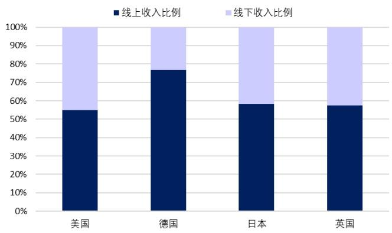  
图30：影石 2024年外销结构中，线下比例相对均衡  
资料来源:深圳发布公众号、深圳市青年商会公众号，国信证券经济研究所整理

  
图31：影石在纽约的新品发布引发消费者排队购买

资料来源:公司公告，国信证券经济研究所整理

尽管公司线下渠道已布局相对成熟，但线下网点数对比 GoPro 依然存在较大差距，根据 GoPro在其官网统计的全球线下网点（含专卖店和销售网点），除东南亚地区外，GoPro 的线下网点数量依然远高于影石，但这也意味着影石未来海外的线下渠道拓展空间依然充足。

表6：影石和 GoPro 线下渠道对比：海外区域 GoPro的点位数量较高  

<table><tr><td></td><td>线下主要区域门店合计</td><td>日本</td><td>北欧</td><td>西南欧</td><td>美国</td><td>东南亚</td></tr><tr><td>影石</td><td>2242 （总网点数超1万）</td><td>169</td><td>261</td><td>741</td><td>604</td><td>467</td></tr><tr><td>GoPro</td><td>16205</td><td>1466</td><td>980</td><td>5187</td><td>8088</td><td>484</td></tr></table>

资料来源：各公司官网，国信证券经济研究所整理注：影石的统计以官网的授权店为主，不包含更小的出样网点

线上方面，公司在以亚马逊为代表的三方电商平台运营成熟，主打产品 X5 在BestSeller 排行榜中位列前列，同时畅销的运动便携相机中，当前 GoPro 在美国亚马逊的畅销度依然较高，且星级评分较高（X5 评分 4.6，排名第二的 GoProHero13 评分 4.4，第七、八名大疆的 Action系列评分 4.4-4.6。另外排名第一的AKASO 主打低价低质量，其评分也为 4.4 分），但其形态仍具现在较为单一的传统运动相机领域。另外，影石官方商城的建设运营同样相对成熟，主流欧美市场的官网销售占比也保持较高的水平。

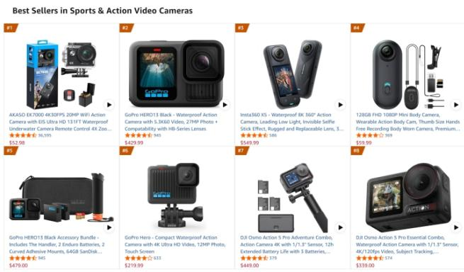  
图32：美亚 Best Seller 中影石 X5 排名第三，但相似产品几乎没有竞争对手，同类竞品仍以单侧运动相机为主

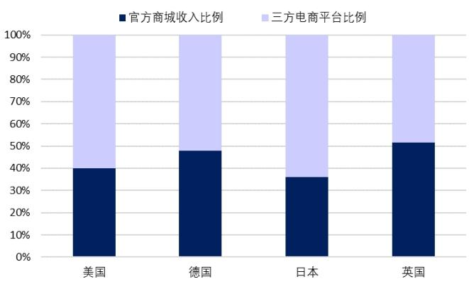  
图33：影石外销线上官方商城和三方平台收入占比相对均衡

资料来源:亚马逊美国站，国信证券经济研究所整理资料来源:公司公告，国信证券经济研究所整理

在国内公司同样全渠道布局，线上线下渠道结构均衡，参考公司官网公布的线下专卖店约 333 家（不含网点、综合商超等产品露出的点位），这一水平相比大疆在国内的线下网点预计超 700家（百度地图查询口径）相比，同样有提升空间。

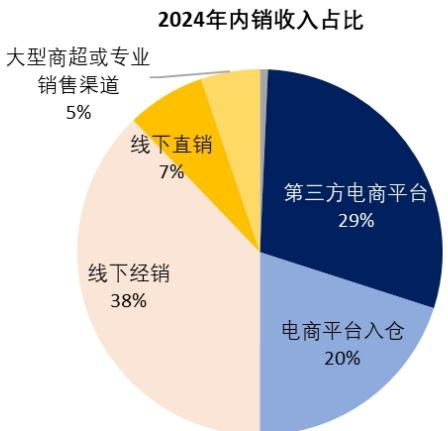  
图34：公司内销线上线下结构均衡

资料来源:公司公告，国信证券经济研究所整理资料来源:公司公告，国信证券经济研究所整理

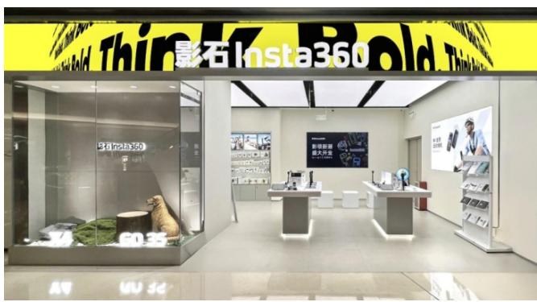  
图35：影石国内线下直营店

# 品牌建设多维并举

公司建立了多样化的全球市场推广渠道，依靠线上营销宣传和线下展会活动相结合的方式，通过新闻媒体报道、垂直行业 KOL 推荐、社交媒体广告和国内外知名展会等渠道，迅速提升公司品牌影响力，并受到众多科技、摄影、运动等不同领域的 KOL推荐。

从社媒运营情况来看，我们对比电商平台和主流社媒运营数据可以发现，大疆和GoPro 凭借自身多品类和长时间的电商销售及品牌积累，其电商平台粉丝数量数倍于后发的影石。但社媒运营数据方面（如在抖音、小红书等平台的粉丝数、转评赞数），影石与大疆和 GoPro的差距显著缩小，这也从侧面说明了影石对于社媒运营和品牌建设方面的重视。

表7：影石在电商平台粉丝数远少于大疆和 GoPro，但在社媒运营方面做到了后发居上  

<table><tr><td colspan="2"></td><td>影石</td><td>大疆</td><td>GoPro</td></tr><tr><td rowspan="3">电商平台数据</td><td>京东自营粉丝（万）</td><td>43</td><td>315</td><td>148</td></tr><tr><td>天猫官旗粉丝（万)</td><td>48</td><td>276</td><td>20</td></tr><tr><td>抖音粉丝（万）</td><td>94</td><td>197</td><td>20</td></tr><tr><td rowspan="4">社媒运营数据</td><td>抖音作品数</td><td>730</td><td>942</td><td>1504</td></tr><tr><td>抖音点赞量</td><td>1901万</td><td>1403万</td><td>141</td></tr><tr><td>小红书粉丝</td><td>41万</td><td>65万</td><td>9万</td></tr><tr><td>小红书笔记数</td><td>1052</td><td>1119</td><td>-</td></tr><tr><td></td><td>小红书点赞收藏量</td><td>597万</td><td>278万</td><td>42万</td></tr></table>

资料来源：京东，天猫，抖音，小红书，国信证券经济研究所整理

另外公司在海外的社区运营保持了相对较高的频率，同时也鼓励和组织用户进行原创作品的创作和摄影技巧交流，进一步提升了海外用户的粘性以及品牌和品类的认知。

  
图36：影石持续进行海外社群运营  
资料来源：公司官网、国信证券经济研究所整理

# 四、财务表现

# 高毛利率高费用率，重研发投入

我们选取从事智能电子消费品的全球化企业——小米集团、萤石网络、极米科技、安克创新、石头科技作为对比，尽管公司的产品和所处行业和其他企业有所差异，但作为重研发、全球化的消费品公司，我们着重对比盈利和各类投入方面各公司的异同。

公司毛利率及净利率稳中略升，位于上游水平。公司毛利率从 2020年 $4 7 \%$ 提升并稳定在 $50 \%$ 以上的水平，整体位于可比公司上游水平。费用方面，公司销售费用率处于可比公司的中游水平，研发费用率处于可比公司中较高的水平，管理费用率位于行业中游。因此，公司净利率基本位于行业上游水平。

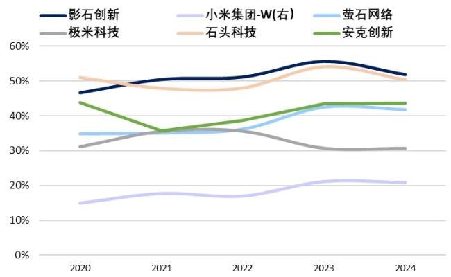  
图37：公司毛利率处于行业平均水平

资料来源：Wind，国信证券经济研究所整理资料来源：Wind，国信证券经济研究所整理资料来源：Wind，国信证券经济研究所整理资料来源：Wind，国信证券经济研究所整理

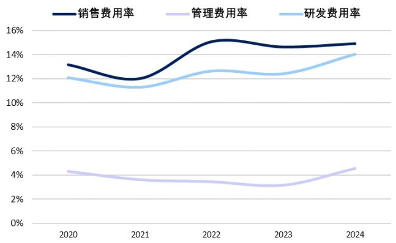  
图38：公司期间费用率整体有所提升

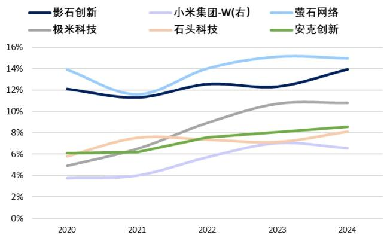  
图39：公司研发费用率处于行业上游水平

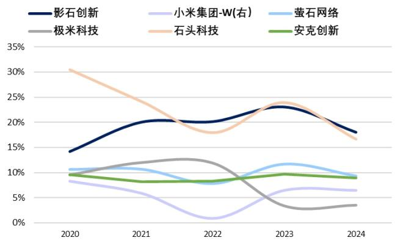  
图40：公司的净利率位于行业上游水平

# 现金流表现较好，存货周转天数整体稳定

公司现金流表现较好，营收的现金含量基本处于 $100 \%$ 以上，净利率的现金含量在2023 年有所波动，但 2024年也快速恢复至 $100 \%$ 以上。公司的应收账款周转天数和存货周转天数都基本稳定。

其中 2024 年末应收账款余额增长较多，主要由于 2024Q4 向北京字跳网络技术有限公司等客户销售消费级智能影像设备形成的应收账款于 2024 年末尚未结算，期后已正常回款。整体看应收账款整体规模较小，占营业收入的比例较低，主要由于公司对线上渠道客户及大部分经销商客户均采取先款后货的销售政策，尽管随着收入规模的扩大，公司给予部分大客户一定信用期，但整体应收占收入的比例仍处于相对较低的状态。

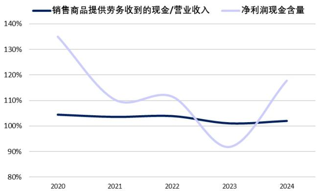  
图41：公司现金流表现较好

资料来源：Wind，国信证券经济研究所整理资料来源：Wind，国信证券经济研究所整理资料来源：Wind，国信证券经济研究所整理资料来源：Wind，国信证券经济研究所整理

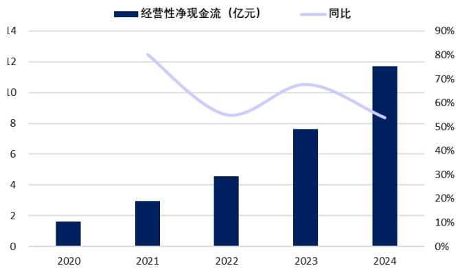  
图42：公司经营性净现金流稳中向上

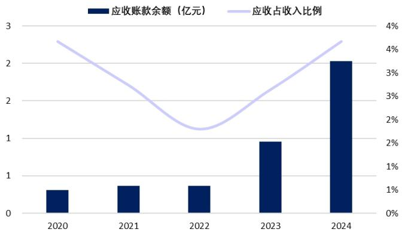  
图43：公司应收账款占收入比例相对较低

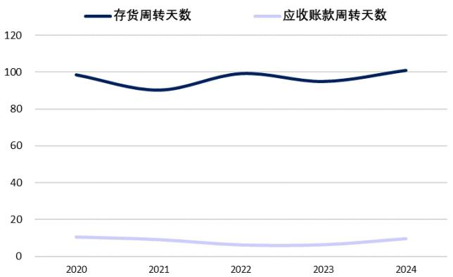  
图44：公司存货周转和应收账款周转天数稳定

# 五、盈利预测与投资建议

# 盈利预测

1）消费级全景相机——内销（中国大陆）：预计收入增长 41%、39%、25%至 16、  
23、28 亿元。

短期我们参考公司内销（中国大陆）线上主流平台的销售情况，中长期我们则通过对标竞争对手品类以及行业增速情况对公司内销进行预测。

2025年 1-4月公司内销线上销售额同比增速约为 $84 \%$ ，但由于新品 Ace Pro2、X5、Flow 2 等均在 2024 年底和 2025 上半年发布，使销额增速较快。考虑到 2025H2基数的提高，预计全年增速略有收窄，同时公司线上线下结构相对均衡，因此预计 2025 年全年内销增速约为 $4 1 \%$ ；

中长期来看，公司当前在运动相机、手持相机领域的 SKU相对大疆和 GoPro较少，参考两品牌爆款 SKU（大疆的手持便携产品 pocket3、运动相机 Action 5 Pro 以及 GoPro 的运动相机 Hero 12 在 2024 年线上年销量达 33 万、2.5 万（月销）、1.7 万台）国内线上的销量水平，若公司后续手持便携类产品和运动相机产品近一步补齐 2 款 SKU，则预计每年线上新形态产品增量有望达到 20-30 万台的水平，全渠道增量中枢预计在 50万台的水平。对比行业 2026-27年约 $26 \%$ 的销量复合增速，预计公司 2026-27年销售高于行业增速，收入增长 $3 9 \%$ 、 $2 5 \%$ 。

毛利率方面，受新品类扩充影响，预计新品爬坡期的毛利率会有所下降，同时预计便携类产品毛利率低于全景相机，因此预计 2025-27 年内销毛利率略有下降至$4 8 . 3 \%$ 、 $4 7 . 3 \%$ 、 $4 6 . 8 \%$ 。

综上预计 2025-27 年公司内销（中国大陆）收入分别为 16、23、28 亿元，同比增长 41%、 $3 9 \%$ 、 $2 5 \%$ 。

2）消费级全景相机——外销：预计收入增长 46%、37%、29%至 55、75、97亿元一方面外销公司同样具备品类扩充的潜力，即上文所述手持类产品和更丰富的运动相机等 SKU，另一方面海外区域和渠道扩张同样具备拉动增长的能力，具体来看：

美国：参考美国亚马逊的销售情况，影石 2025 年 1-5月美亚销额同比增长 $3 9 \%$ ，产品份额角度来看，影石 2023-2025 年以来销额份额从 $20 \%$ 的水平提升至 $30 \% +$ ，假设份额在扩 SKU 和扩渠道背景下（如前文所述，GoPro 在美国的线下网点数量是萤石的 10 倍以上）保持历史增速，假设 2027年影石在美国的全渠道销额份额提升至 $50 \%$ ，则预计公司 2025-2027 年公司美国收入同比提升 $38 \%$ 、 $40 \%$ 、 $36 \%$ 至16、22、30 亿元。

欧洲：同样地，短期我们参考德国、英国等亚马逊的销售增速情况预测 2025年增速，中长期来看，考虑到当前欧洲市场公司正在西班牙、法国、意大利等欧洲国家完成新市场推广与销售渠道建设，因此预计随着区域扩张，公司在欧洲的复合增速预计显著高于行业（欧洲 2020-2024年收入复合增速达 $66 \%$ ）。预计 2025-2027年欧洲收入同比提升 $56 \%$ 、 $3 8 \%$ 、 $2 7 \%$ 至 17、24、30 亿元。

其他区域：公司其他区域主要以日韩、中国香港、中国台湾、澳大利亚、加拿大为主，整体集中在经济水平相对较好的区域，而在以东南亚、中东等新兴市场的销售规模目前相对较少，但根据前文影石和 GoPro 的线下渠道对比，影石在日本市场的渠道数量较 GoPro同样有约 10倍的提升空间，而在东南亚两品牌的线下渠道网点数量相当，预计新兴市场的目前仍处于消费者教育阶段，因此预计其他区域前期增速慢于发达市场，后期增速相对较高，2025-2027 年收入增长 $4 4 \%$ 、 $61 \%$ 、$3 9 \%$ 至 21、28、35 亿元。

毛利率方面，外销毛利率历史上较内销更高，但同样预计在产品结构的影响下，毛利率 2025-2027 年略有降低至 $5 2 . 1 \%$ 、51. $2 \%$ 和 $5 0 . 6 \%$ 。

# 整体看预计消费级产品的外销预计收入增长 $46 \%$ 、 $3 7 \%$ 、29%至 55、75、97 亿元。

3）专业级全景相机：当前商用专业应用领域广泛，整体呈现出高单价、低数量的特点，近年公司专业级全景相机销售规模有所萎缩，预计随着技术升级和应用场景的拓展，专业级相机的销售规模有望实现平稳提升。预计 2025-27年专业级相机收入保持低个位数增长至 0.25、0.25、0.27亿元。毛利率维持稳定在 $5 6 . 5 \%$ 的水平。

4）配件及其他：该业务主要包含相机相关配件（如云台、转接器、补光灯、充电盒等），随着产品矩阵的不断丰富，预计配件种类会进一步丰富化，整体收入增速与消费级相机的收入基本匹配，预计 2025-2027 年收入增长 $4 4 \%$ 、 $38 \%$ 、 $28 \%$ 至10、14、18 亿元。毛利率同样基本维稳于 $5 7 . 3 \%$ 的水平。

整体来看，预计公司 2025-2027 年收入增长 $4 4 \%$ 、 $3 8 \%$ 、 $28 \%$ 至 81、111、142 亿元。毛利率则主要受产品结构结构影响有所下降，2025-2027 年为 $5 2 . 1 \%$ 、51.1%、$5 0 . 6 \%$ 。

表8：影石收入及毛利率预测  

<table><tr><td>单位：亿元</td><td>2023</td><td>2024</td><td>2025E</td><td>2026E</td><td>2027E</td></tr><tr><td>营业总收入</td><td>36.4</td><td>55.7</td><td>80.5</td><td>111.0</td><td>142.3</td></tr><tr><td>收入yoy</td><td>78%</td><td>53%</td><td>44%</td><td>38%</td><td>28%</td></tr><tr><td>综合毛利率</td><td>56.0%</td><td>52.2%</td><td>52.1%</td><td>51.1%</td><td>50.6%</td></tr><tr><td>消费级全景相机——内销（中国大陆）</td><td>6.0</td><td>11.5</td><td>16.2</td><td>22.6</td><td>28.2</td></tr><tr><td>内销收入 yoy</td><td>67%</td><td>90%</td><td>41%</td><td>39%</td><td>25%</td></tr><tr><td>内销毛利率</td><td>53.6%</td><td>48.8%</td><td>48.3%</td><td>47.3%</td><td>46.8%</td></tr><tr><td>消费级全景相机——外销</td><td>25.9</td><td>37.4</td><td>54.6</td><td>75.1</td><td>97.2</td></tr><tr><td>外销收入 yoy</td><td>81%</td><td>45%</td><td>46%</td><td>37%</td><td>29%</td></tr><tr><td>外销毛利率</td><td>56.5%</td><td>53.2%</td><td>53.2%</td><td>52.2%</td><td>51.7%</td></tr><tr><td>其中：</td><td></td><td></td><td></td><td></td><td></td></tr><tr><td>美国收入</td><td>6.2</td><td>11.4</td><td>15.7</td><td>22.0</td><td>29.9</td></tr><tr><td>欧洲收入</td><td>7.2</td><td>11.1</td><td>17.3</td><td>24.0</td><td>30.4</td></tr><tr><td>其他区域收入</td><td>12.1</td><td>14.2</td><td>20.5</td><td>27.7</td><td>35.0</td></tr><tr><td>专业级全景相机</td><td>0.3</td><td>0.2</td><td>0.2</td><td>0.3</td><td>0.3</td></tr><tr><td>专业级产品收入yoy</td><td>-29%</td><td>-29%</td><td>3%</td><td>3%</td><td>5%</td></tr><tr><td>配件及其他产品毛利率</td><td>60.6%</td><td>56.5%</td><td>56.5%</td><td>56.5%</td><td>56.5%</td></tr><tr><td>配件及其他</td><td>4.3</td><td>7.2</td><td>10.4</td><td>14.3</td><td>18.3</td></tr><tr><td>配件及其他收入yoy</td><td>66%</td><td>68%</td><td>44%</td><td>38%</td><td>28%</td></tr><tr><td>配件及其他毛利率</td><td>61.1%</td><td>57.3%</td><td>57.3%</td><td>57.3%</td><td>57.3%</td></tr><tr><td>其他业务</td><td>0.4</td><td>0.4</td><td>0.5</td><td>0.6</td><td>0.7</td></tr><tr><td>其他毛利率</td><td>60.1%</td><td>50.5%</td><td>50.5%</td><td>50.5%</td><td>50.5%</td></tr></table>

资料来源：公司公告、国信证券经济研究所整理及预测

# 费用及其他收益假设：

销售费用：考虑到公司目前在国内外均处于产品品类和渠道的扩张期，因此预计未来在渠道建设、人才引入及营销方面进行更大力度的投入，此后随着营收规模的上涨，费用率短期上升后规模效应逐步显现，预计 2025-2027 年销售费用率先升后稳，分别为 $1 7 . 5 \%$ 、 $1 6 . 5 \%$ 、 $1 6 . 0 \%$ 。

管理费用：公司管理费用率整体相对稳定，但短期考虑到上市相关费用（1.90亿元，但 2024 年已作部分计量和确认）预计影响 2025 年费用率，预计后续随着规模的扩张，管理费用将稳中略降，预计 2025-2027 年管理费用率为 $5 . 2 \%$ 、 $4 . 0 \%$ 、$3 . 6 \%$ 。

研发费用：公司研发费用率保持在 $12 \%$ 以上的较高水平，并且当前公司在各类新品的预研项目方面储备较多，预计未来研发投入依然保持较高的强度，但随着营收规模的增长，费用率预计略有降低，预计2025-2027年研发费用率分别为 $1 5 . 0 \%$ 、$1 4 . 5 \%$ 、 $1 3 . 5 \%$ 。

财务费用：公司此前财务费用受汇兑损益影响较大，考虑到公司上市融资之后资金储备较为充足，预计公司 2025-2027年财务费用率分别为- $- 0 . 7 \% . - 0 . 5 \% . - 0 . 6 \%$ 。

预计 2025-2027 年公司归母净利润同比分别 $+ 1 6 \%$ 、 $+ 4 4 \%$ 、 $+ 4 2 \%$ 至 11.5、16.5、23.4亿，对应 EPS 为 2.87、4.12、5.84。

表9：影石创新盈利预测表  

<table><tr><td>单位：亿元</td><td>2023</td><td>2024</td><td>2025E</td><td>2026E</td><td></td></tr><tr><td></td><td></td><td></td><td></td><td></td><td>2027E</td></tr><tr><td>营业收入</td><td>36.4</td><td>55.7</td><td>80.5</td><td>111.0</td><td>142.3</td></tr><tr><td>收入yoy</td><td>78%</td><td>53%</td><td>44%</td><td>38%</td><td>28%</td></tr><tr><td>毛利率</td><td>56.0%</td><td>52.2%</td><td>52.1%</td><td>51.1%</td><td>50.6%</td></tr><tr><td>销售费用率</td><td>14.5%</td><td>14.8%</td><td>17.5%</td><td>16.5%</td><td>16.0%</td></tr><tr><td>研发费用率</td><td>14.53%</td><td>14.81%</td><td>15.0%</td><td>14.5%</td><td>13.5%</td></tr><tr><td>管理费用率</td><td>3.44%</td><td>3.15%</td><td>5.20%</td><td>4.0%</td><td>3.6%</td></tr><tr><td>归母净利润</td><td>8.3</td><td>10.0</td><td>11.5</td><td>16.5</td><td>23.4</td></tr><tr><td>净利润yoy</td><td>103.7%</td><td>19.9%</td><td>15.7%</td><td>43.6%</td><td>41.7%</td></tr></table>

资料来源：Wind、国信证券经济研究所整理及预测

# 盈利预测情景分析

表10：情景分析（在收入、成本、费用和所得税率全部同向变动 $5 \%$ 时，乐观、中性、悲观情景）  

<table><tr><td></td><td>2023</td><td>2024</td><td>2025E</td><td>2026E</td><td>2027E</td></tr><tr><td>乐观预测</td><td></td><td></td><td></td><td></td><td></td></tr><tr><td>营业收入(百万元）</td><td>3,636</td><td>5,574</td><td>8,178</td><td>11,430</td><td>14,806</td></tr><tr><td>(+/-%)</td><td>78.2%</td><td>53.3%</td><td>46.7%</td><td>39.8%</td><td>29.5%</td></tr><tr><td>净利润(百万元)</td><td>830</td><td>995</td><td>1508</td><td>2168</td><td>3035</td></tr><tr><td>(+/-%)</td><td>103.7%</td><td>19.9%</td><td>51.6%</td><td>43.8%</td><td>40.0%</td></tr><tr><td>摊薄EPS</td><td>2.30</td><td>2.76</td><td>3.76</td><td>5.41</td><td>7.57</td></tr><tr><td>中性预测</td><td></td><td></td><td></td><td></td><td></td></tr><tr><td>营业收入(百万元）</td><td>3,636</td><td>5,574</td><td>8,054</td><td>11,104</td><td>14,227</td></tr><tr><td>(+/-%)</td><td>78.2%</td><td>53.3%</td><td>44.5%</td><td>37.9%</td><td>28.1%</td></tr><tr><td>净利润(百万元）</td><td>830</td><td>995</td><td>1151</td><td>1652</td><td>2341</td></tr><tr><td>(+/-%)</td><td>103.7%</td><td>19.9%</td><td>15.7%</td><td>43.6%</td><td>41.7%</td></tr><tr><td>摊薄EPS(元)</td><td>2.30</td><td>2.76</td><td>2.87</td><td>4.12</td><td>5.84</td></tr><tr><td>悲观的预测</td><td></td><td></td><td></td><td></td><td></td></tr><tr><td>营业收入(百万元）</td><td>3,636</td><td>5,574</td><td>7,930</td><td>10,783</td><td>13,664</td></tr><tr><td>(+/-%)</td><td>78.2%</td><td>53.3%</td><td>42.3%</td><td>36.0%</td><td>26.7%</td></tr><tr><td>净利润(百万元)</td><td>830</td><td>995</td><td>805</td><td>1070</td><td>1586</td></tr><tr><td>(+/-%)</td><td>103.7%</td><td>19.9%</td><td>-19.1%</td><td>32.9%</td><td>48.2%</td></tr><tr><td>摊薄EPS</td><td>2.30</td><td>2.76</td><td>2.01</td><td>2.67</td><td>3.95</td></tr></table>

资料来源：Wind、国信证券经济研究所预测

# 估值与投资建议

考虑公司的业务特点，我们采用绝对估值和相对估值两种方法来估算公司的合理价值区间。

绝对估值：143.84-195.25 元

基于行业的成长性和公司产品性能的领先，随着公司在品类上逐渐扩充和渠道的进一步扩张，我们预计公司营收的增长动力在未来三年仍保持相对充足。在利润端，公司 2025年研发及营销投入较大、利润基数较低，随着后续规模的扩大，盈利能力有望得到修复并提升。未来 10 年估值假设条件见下表：

表11：公司盈利预测假设条件（%）  

<table><tr><td></td><td>2023</td><td>2024</td><td>2025E</td><td>2026E</td><td>2027E</td><td>2028E</td><td>2029E</td><td>2030E</td><td>2031E</td><td>2032E</td><td>2033E</td><td>2034E</td></tr><tr><td>营业收入增长率</td><td>78.2%</td><td>53.3%</td><td>44.5%</td><td>37.9%</td><td>28.1%</td><td>25.0%</td><td>20.0%</td><td>15.0%</td><td>10.0%</td><td>7.0%</td><td>7.0%</td><td>7.0%</td></tr><tr><td>毛利率</td><td>56.0%</td><td>52.2%</td><td>52.1%</td><td>51.1%</td><td>50.6%</td><td>51.1%</td><td>51.1%</td><td>51.1%</td><td>51.1%</td><td>51.1%</td><td>51.1%</td><td>51.1%</td></tr></table>

<table><tr><td>管理费用/营业收入</td><td>15.9%</td><td>15.4%</td><td>18.4%</td><td>20.2%</td><td>18.5%</td><td>17.1%</td><td>16.8%</td><td>16.5%</td><td>16.2%</td><td>16.0%</td><td>16.0%</td><td>16.0%</td></tr><tr><td>销售费用/销售收入</td><td>15.0%</td><td>14.5%</td><td>14.8%</td><td>17.5%</td><td>16.5%</td><td>16.0%</td><td>16.0%</td><td>16.0%</td><td>16.0%</td><td>16.0%</td><td>16.0%</td><td>16.0%</td></tr><tr><td>所得税税率</td><td>5.9%</td><td>11.1%</td><td>6.0%</td><td>5.0%</td><td>5.0%</td><td>5.0%</td><td>10.0%</td><td>10.0%</td><td>15.0%</td><td>15.0%</td><td>15.0%</td><td>15.0%</td></tr><tr><td>股利分配比率</td><td>0.4%</td><td>0.0%</td><td>0.0%</td><td>30.0%</td><td>40.0%</td><td>40.0%</td><td>50.0%</td><td>50.0%</td><td>65.0%</td><td>65.0%</td><td>65.0%</td><td>70.0%</td></tr></table>

资料来源: Wind，国信证券经济研究所预测； 注：此处管理费用包含研发费用

表12：资本成本假设  

<table><tr><td>无杠杆 Beta</td><td>1.00</td><td></td><td>15.00%</td></tr><tr><td>无风险利率</td><td>2.20%</td><td>Ka</td><td>8.40%</td></tr><tr><td>股票风险溢价</td><td>6.20%</td><td>有杠杆 Beta</td><td>1.00</td></tr><tr><td>公司股价（元）</td><td>167</td><td>Ke</td><td>8.40%</td></tr><tr><td>发行在外股数（百万）</td><td>401</td><td>E/(D+E)</td><td>99.98%</td></tr><tr><td>股票市值(E，百万元)</td><td>66967</td><td>D/(D+E)</td><td>0.02%</td></tr><tr><td>债务总额(D，百万元)</td><td>12</td><td>WACC</td><td>8.40%</td></tr><tr><td>Kd</td><td>5.30%</td><td>永续增长率（10年后）</td><td>2.50%</td></tr></table>

资料来源：国信证券经济研究所假设

根据以上主要假设条件，采用FCFF估值方法，得出公司价值区间为143.84-195.25元。

表13：影石创新 FCFF 估值表  

<table><tr><td colspan="2"></td><td>2025E</td><td>2026E</td><td>2027E</td><td>2028E</td><td>2029E</td></tr><tr><td colspan="2">EBIT</td><td>1,093.3</td><td>1,693.7</td><td>2,374.9</td><td>3,199.8</td><td>4,010.2</td></tr><tr><td colspan="2">所得税税率</td><td>5.00%</td><td>5.00%</td><td>5.00%</td><td>10.00%</td><td>10.00%</td></tr><tr><td colspan="2">EBIT*(1-所得税税率)</td><td>1,038.6</td><td>1,609.0</td><td>2,256.2</td><td>2,879.8</td><td>3,609.2</td></tr><tr><td colspan="2">折旧与摊销</td><td>37.1</td><td>60.4</td><td>76.0</td><td>89.4</td><td>101.4</td></tr><tr><td colspan="2">营运资金的净变动</td><td>62.7</td><td>(157.4)</td><td>(150.3)</td><td>(160.8)</td><td>(195.2)</td></tr><tr><td colspan="2">资本性投资</td><td>(350.0)</td><td>(400.0)</td><td>(340.0)</td><td>(225.0)</td><td>(235.0)</td></tr><tr><td colspan="2">FCFF</td><td>788.4</td><td>1,112.0</td><td>1,841.8</td><td>2,583.4</td><td>3,280.4</td></tr><tr><td>PV(FCFF)</td><td></td><td>727.3</td><td>946.3</td><td>1,446.0</td><td>1,871.0</td><td>2,191.6</td></tr><tr><td>核心企业价值</td><td>62,345.5</td><td></td><td></td><td></td><td></td><td></td></tr><tr><td>减：净债务</td><td>(3,921.1)</td><td></td><td></td><td></td><td></td><td></td></tr><tr><td></td><td></td><td></td><td></td><td></td><td></td><td></td></tr><tr><td>股票价值 每股价值</td><td>66,266.7 165.25</td><td></td><td></td><td></td><td></td><td></td></tr></table>

资料来源: 国信证券经济研究所预测

# 绝对估值的敏感性分析

该绝对估值相对于 WACC 和永续增长率较为敏感，下表为敏感性分析。

表14：绝对估值相对折现率和永续增长率的敏感性分析（元）  

<table><tr><td rowspan="2" colspan="2"></td><td colspan="5">WACC变化</td></tr><tr><td>7.4%</td><td>7.9%</td><td>8.4%</td><td>8.9%</td><td>9.4%</td></tr><tr><td rowspan="5">永续增长</td><td>3.5%</td><td>240.41</td><td>211.35</td><td>188.30</td><td>169.58</td><td>154.08</td></tr><tr><td>3.0%</td><td>219.30</td><td>195.25</td><td>175.71</td><td>159.55</td><td>145.96</td></tr><tr><td>2.5%</td><td>202.51</td><td>182.12</td><td>165.25</td><td>151.08</td><td>139.01</td></tr><tr><td>2.0%</td><td>188.82</td><td>171.22</td><td>156.43</td><td>143.84</td><td>133.01</td></tr><tr><td>1.5%</td><td>177.45</td><td>162.02</td><td>148.89</td><td>137.58</td><td>127.76</td></tr></table>

资料来源：国信证券经济研究所分析

# 相对估值：183.47-207.93 元/股

公司主要业务为智能影像设备，我们选取从事智能电子消费品的全球化企业—小米集团、萤石网络、极米科技、安克创新、石头科技作为可比公司。

从行业的规模和增速角度来看，考虑到公司所处赛道尚处成长期，品类目前仍处于较低渗透率的状态，但产品的保有基数和小米集团、安克创新更为类似（都是以个人消费者为保有单位而非家庭，且个人的保有水平是可以超过 $100 \%$ 的）；

从行业的格局来看，由于公司目前在全景相机行业份额高、公司所面临的的竞争环境相比大多可比公司所处的环境预计相对温和、可拓展的份额相对更大，同时其他便携品类的扩张带来的增长预期更为强烈，因此成长性预计高于可比公司相对更成熟的品类。

基于此我们主要采用 PEG估值作为估值的参考。我们选取 PEG相对更高的区间作为公司的相对估值范围，给予公司 2025-27年对应增速下的 PEG 为 1.5-1.7 倍，同时考虑到公司的品类扩张和对应的财务贡献在 2026年会更加明显，因此我们以2026年的预测净利润为基础，结合 PEG估值以及公司所处赛道高景气以及细分领域的龙头地位带来的溢价，给予 2026 年 PE 为 45-50 倍，股价区间为 183.47-207.93元。

表15：同类公司估值比较  

<table><tr><td rowspan="2">公司代码公司名称主营业务</td><td rowspan="2"></td><td rowspan="2"></td><td rowspan="2"></td><td rowspan="2"></td><td colspan="3"></td><td colspan="2"></td><td colspan="2"></td><td rowspan="2"></td></tr><tr><td></td><td></td><td></td><td></td><td></td><td></td><td></td></tr><tr><td>1810.HK</td><td>-W</td><td>以手机、智能硬件和 IoT 平台为核心， 小米集团其目前尚未拥有全景相机和运动相机 品类，但其于2025 年发布AI 智能眼镜， 同样具备第一视角拍摄功能</td><td></td><td>57.4014,8970.931.522.002.48</td><td></td><td></td><td></td><td></td><td>38</td><td>29</td><td>23</td><td>1.4</td></tr><tr><td></td><td></td><td>以萤石云平台为中心，搭载智能家居摄 688475.H萤石网络机、智能入户，智能控都能服务 和机器视觉能力 主营业务是智能投影产品的研发、生产</td><td>31.70</td><td></td><td></td><td></td><td></td><td>249 0.64 0.84 1.041.26</td><td></td><td>38 30 25</td><td></td><td>1.7</td></tr><tr><td></td><td></td><td>688696.SH 极米科技 及销售，同时向消费者提供围绕智能投 106.06 影的互联网增值服务 家用智能清洁机器人及其他智能消费</td><td></td><td></td><td>751.755.156.66 7.74</td><td></td><td></td><td></td><td>21</td><td>16</td><td>14</td><td>0.9</td></tr><tr><td></td><td></td><td>688169.SH 头科技电器，具有较强的机器视觉能和家148.78 产品的AI 智能交互能力 主营智能充电、智能家居、安防等智能</td><td></td><td></td><td>388 10.717.779.77 11.90</td><td></td><td></td><td></td><td>19</td><td>15</td><td>12</td><td>0.8</td></tr><tr><td></td><td></td><td>300866.SZ 安克创新电产品，其销售渠道遍布全球，拥有 115.00 全球140多个国家与地区超1亿用户 平均</td><td></td><td></td><td></td><td></td><td></td><td>635 3.97 4.83 6.08 7.51</td><td>24 28</td><td>19 22</td><td>15 18</td><td>1.0</td></tr><tr><td></td><td></td><td>主营全景相机、运动相机等智能影像设 688775.SH 影石创新 备，产品通过线上、线下渠道相结合的 174.20 方式进行全球销售</td><td></td><td></td><td></td><td></td><td></td><td>6892.76 2.87 4.12 5.84</td><td>61</td><td>42</td><td>30</td><td>1.1 1.4</td></tr></table>

资料来源: WIND一致预测，国信证券经济研究所预测注：港股上市公司的数据采用币种为港元

综合绝对估值和相对估值，我们认为相对估值下，以 PEG为主导的估值方式更适合公司当下较高速成长的业务属性，而绝对估值体系下，未对公司中期的成长性给予更高权重，因此我们最终的估值结论更多考虑参考相对估值的结果。

考虑到当前公司仍处于渠道和产品的扩张期，短期（如以 2025年）的利润水平和增速情况不能充分反映公司在当前产品、渠道和品牌基础上相对明确的扩张预期。

因此我们主要参考相对估值中，以PEG估值为主导的估值方式，因此给予公司2025年 1.5-1.7 倍的 PEG。对应公司合理估值区间在 183.47-207.93 元/股之间，对应2026 年 PE 为 45-50 倍。

# 投资建议

公司所处赛道目前正处于产品周期的加速渗透期，而公司产品力领先、全球渠道先发优势较强，基于产品、渠道和品牌优势进一步扩份额的空间较高。预计2025-2027 年公司归母净利润同比 $+ 1 6 \%$ 、 $+ 4 4 \%$ 、 $+ 4 2 \%$ 至 11.5、16.5/23.4 亿元，对应 EPS 为 $2 . 8 7 / 4 . 1 2 / 5 . 8 4$ ，对应 PE 为 61/42/30倍。考虑到公司当前较高的利润增速和行业较强的成长性，我们更多参考相对估值中的 PEG 估值方式，给予公司合理估值 183.47-207.93 元/股，对应 2026 年 PE 为 45-50 倍，首次覆盖，给予“优于大市”评级。

# 风险提示

# 估值的风险

我们采取了绝对估值和相对估值方法，多角度综合得出公司的合理估值在183.47-207.93 元之间，但该估值是建立在相关假设前提基础上的，特别是对公司未来几年自由现金流的计算、加权平均资本成本（WACC）的计算、TV 的假定和可比公司的估值参数的选定，都融入了很多个人的判断，进而导致估值出现偏差的风险，具体来说：

可能由于对公司显性期和半显性期收入和利润增长率估计偏乐观，导致未来 10年自由现金流计算值偏高，从而导致估值偏乐观的风险；

加权平均资本成本（WACC）对公司绝对估值影响非常大，我们在计算 WACC时假设无风险利率为 $2 . 2 \%$ 、风险溢价 $6 . 2 \%$ ，可能仍然存在对该等参数估计或取值偏低、导致 WACC计算值偏低，从而导致公司估值高估的风险；

我们假定未来 10 年后公司 TV 增长率为 $2 . 5 \%$ ，公司所处行业可能在未来 10 年后发生较大的不利变化，公司持续成长性实际很低或负增长，从而导致公司估值高估的风险；

相对估值方面我们选取了与公司业务相同或相近的公司进行比较，选取了可比公司平均 PE做为相对估值的参考，可能未充分考虑市场整体估值偏高的风险。

# 交易及未来减持风险

公司除控股股东及其一致行动人外的持股 $5 \%$ 以上股东数量较多，且持有股份的平均成本远低于当前市值（第二大股东 EARN ACE 出资额 1295 万元，当前持股市值约 85 亿元、第三大股东 QM101 出资额 914 万元，当前持股市值约 60 亿元、第三大股东迅雷香港出资额 849万元，当前持股市值约 56 亿元），尽管股东已承诺自上市起（2025 年 6 月 11日）12 个月内不转让或者委托他人管理、或由公司回购首发前股份，但限售期结束后或存在股东减持压力，若股东采取二级市场集中竞价模式减持公司股份，或带来公司股价波动的风险。

# 盈利预测的风险

$\spadesuit$ 公司未来的高增长建立在全景相机行业保持增长、运动相机品类顺利开拓等基础上，若未来全景相机行业增长不及预期、或竞争格局出现较大变化、或公司运动相机产品销售不及预期，均会导致对公司未来的盈利预测过于乐观的风险；  
$\spadesuit$ 公司的期间费用率均采用随规模扩张而稳步下降的预测假设，但若未来公司在研发、营销等方面投入加大则有可能高于预测值，进而导致盈利预测不及预期的风险。

# 经营风险

# 国际贸易摩擦及关税风险

2018 年以来，国际贸易摩擦对中国企业开展海外市场业务造成了一定阻力，国际贸易及海外商业环境的不确定性风险上升。2025 年 2 月 1 日，美国政府宣布对进口自中国的商品加征 $10 \%$ 的关税；2025 年 3 月 4 日，美国对进口自中国的商品再次加征 $10 \%$ 的关税；2025 年 4 月 2 日，美国总统签署行政令，宣布对所有贸易伙伴征收最低为 $10 \%$ 的关税，并在后续对部分贸易伙伴征收税率更高的关税，中国大陆及中国香港面临被加征 $34 \%$ “对等关税”等更严厉的关税政策；2025 年 5 月 12 日，美国修改 4 月 2 日行政令中对中国商品加征的 $34 \%$ “对等关税”，将其中的 $2 4 \%$ 在初始的 90 天内暂停实施，保留加征剩余 $10 \%$ 的关税。由于美国关税政策变化频繁，公司难以预测未来美国关税变化及关税水平。该等关税政策将对全球贸易、经济环境以及消费需求产生潜在不利影响，从而影响公司的业务发展及经营状况。公司已采取相应措施积极应对。如果境外国家持续加大实施对公司出口明显不利的贸易、关税等政策，公司存在无法维持境外销售高速增长的风险甚至由此导致业绩下滑的风险。

# 境外经营风险

公司境外销售收入 2022-2024 年占主营业务收入比例分别为 $7 9 . 4 3 \%$ 、80.83%和 76. $3 5 \%$ 。2020 年全球经济环境变动，公司海外业务发展不确定性增加。此外，在后续的海外市场竞争中，不排除因国际市场产品设计理念及技术发展状况等因素发生重大变化，如果未来国际市场业务开拓不顺利或未能达到预期，将影响公司国际市场业务发展。

# 外协加工生产的风险

公司在生产环节主要通过与加工厂商合作的模式进行外协生产，由委外厂商负责镜头模组加工、SMT 贴片、电池等零部件加工、半成品及成品的组装测试等工序。公司消费级智能影像设备主要通过外协加工生产，专业级智能影像设备主要为自主生产。2022-2024 年，公司外协加工费用分别为 13,112.15万元、16,853.82 万元和 26,902.19 万元，占当期主营业务成本比例分别为14.97%、11. $80 \%$ 和 11. $1 7 \%$ 。在外协加工生产模式下，需委外厂商保证充足的产能，且公司需要持续有效地对生产流程进行管控。如果委外厂商无法满足公司快速发展的需求，出现产能不足、生产管理水平欠佳或公司与委外厂商合作发生摩擦而不能及时切换委外加工方的情形，则可能导致产品供应的延迟或产品质量的下降，从而对公司的经营业绩产生不利影响。

# 财务风险

# 汇率变动风险

2022-2024 年公司汇兑损益分别为-2,751.57 万元、182.95 万元和-2,831.55 万元。公司外销收入规模呈逐年上升趋势，随着公司出口业务的增长，如果未来人民币对美元等外汇的汇率波动幅度加大，可能对公司业绩产生一定影响。

# 毛利率较高无法维持的风险

2022-204 年公司毛利率分别为 51. $4 9 \%$ 、55. $9 5 \%$ 和 $5 2 . 2 0 \%$ ，公司毛利率在行业内保持较高水平，影响公司毛利率的主要因素包括公司产品定价能力、销售渠道等。消费电子产品的创新性、功能、质量、是否契合客户需求、以及客户对产品品牌的认可程度都决定了公司产品的定价能力，定价能力越高则毛利率越高。同时，公司线上销售收入占比较高，分别为 49. $7 5 \%$ 、46.91%和 $4 7 . 9 5 \%$ ，线上销售渠道毛利率高于线下销售渠道。未来公司若不能持续进行自主创新和技术研发，不能及时适应市场需求变化，或者产品销售渠道和产品销售价格出现较大不利变化，将使公司面临毛利率下滑的风险。

# 存货管理风险

2022-2024 年期末，公司存货账面价值分别为 35,089.03 万元、49,435.49 万元和100,007.98 万元，其中，公司原材料及委托加工物资合计占存货比例分别为59. $12 \%$ 、44. $23 \%$ 和 45. $16 \%$ 。随着公司销售规模扩大，需提前储备生产所需重要原材料，且委托加工物资存放于委外加工厂仓库，若公司存货管理不善，出现损失或损害等情况，将造成公司财产的直接损失，进而对经营业绩造成不利影响。另一方面，若公司重要原材料价格大幅下降，而公司储备量较大，则可能出现存货跌价的风险。

# 销售费用大幅上涨对发行人业绩影响的风险

公司通过入驻亚马逊、天猫、京东等第三方电商平台开展线上业务，同时积极拓展线下销售渠道，随着销售渠道的增加、营业收入的增长，销售费用也随之增加，2022-2024 年销售费用率分别为 $1 4 . 9 8 \%$ 、 $1 4 . 5 3 \%$ 和 $1 4 . 8 1 \%$ 。随着公司销售规模的扩大，公司销售费用将随之上涨，如公司不能有效控制各渠道销售费用，将可能对公司经营业绩造成不利影响。

# 税收政策变化风险

如果未来国家变更或取消高新技术企业税收优惠政策，或者公司未来不能通过高新技术企业认定相关审核，所得税率将由 $1 5 \%$ 提升至 $2 5 \%$ ，将对公司未来经营带来一定的负面影响。

# 涉美 337 调查及相关诉讼的风险

2024 年 3 月 29 日（美国时间），GoPro 依据《美国 1930 年关税法》第 337 节规定向美国国际贸易委员会提出 337调查申请，指控发行人及发行人美国子公司美国影石相关产品及配件、照相系统侵犯其在美知识产权；2024 年 5 月 1 日（美国时间），美国国际贸易委员会正式启动了本次 337调查。2024 年 4 月 5 日（美国时间），美国影石收到美国加利福尼亚中区联邦地区法院送达的民事诉讼传票及起诉状等诉讼材料，GoPro 起诉发行人及美国影石的相关产品、照相系统侵犯其在美知识产权。

若最终 337 调查结果对公司不利，公司声誉将受到负面影响，相关涉案产品可能无法继续在美国销售。虽然公司涉案产品均为通用产品，可面向全球市场客户进行销售，在涉案产品在美国被禁售的极端情形下可将涉案产品向非美国地区销售，但公司涉案产品在美国禁售仍可能会对公司经营业绩产生不利影响。此外，虽然337 调查不涉及经济赔偿，但 337 调查的结果将可能作为加州中区法院诉讼的重要参考。若最终 337 调查结果对公司不利，加州中区法院诉讼中公司将可能败诉，从而需要对 GoPro 进行经济赔偿并承担 GoPro 为此诉讼支付的律师费和案件费等支出，进而对公司业绩造成不利影响。同时无论 337调查和加州中区法院诉讼的结果如何，公司均需向此次其聘请的律师支付法律顾问费用，该等费用支出亦会对公司业绩造成不利影响。

# 实际控制人持股比例较低及公司治理风险

上市前，公司实际控制人刘靖康可支配公司 $3 4 . 0 0 4 3 \%$ 的表决权，间接持有公司29.8891%的股份，实际控制人配偶、一致行动人潘瑶间接持有公司 $0 . 0 0 0 2 2 \%$ 的股份。公司实际控制人刘靖康及其一致行动人潘瑶合计间接持有公司 $2 9 . 8 8 9 3 \%$ 的股份。本次发行上市后实际控制人的表决权、持股比例将进一步稀释。公司历史上曾存在董事会成员数量为偶数的情况，虽然截至目前董事会成员数量已变更为 9人，但仍可能存在董事会无法形成一致意见从而导致董事会僵局、公司治理有效

性或决策效率不足的风险。

# 技术风险

# 产品及技术研发风险

智能影像设备行业处于消费电子前沿领域，行业内的品牌供应商需要把握市场需求的变化趋势，不断进行技术创新及产品更新迭代，以巩固市场地位和竞争优势。截至 2024 年 12 月 31 日，公司主要在研项目报告期内研发费用合计 74,869.85 万元。2022-2024 年，包含上述新技术、新产品等方面的研发投入分别为 3,152.25 万元、13,638.55 万元和 58,079.05 万元，研发费用均在当期全部费用化。若公司对未来市场趋势预判失误，或新技术、新产品未达预期，将会对公司的业绩增长带来不利影响。

# 技术人才流失风险

公司所在行业属于技术密集型行业，产品的技术进步和创新依赖行业经验丰富、结构稳定的研发团队，高水平研发人才是公司在技术研究、产品开发上取得成功的关键。截至 2024 年底，公司的研发技术人员为 1367 人，占员工数的比例为 57. $6 8 \%$ 。目前，与快速变化和不断发展的市场相比，高端研发人才相对稀缺，同时行业内的人才竞争也较为激烈，技术人员流失时有发生。未来在业务发展过程中，若公司核心技术人员大量流失且未有合适替代者，则可能会削弱公司的市场竞争力，对公司生产经营产生不利影响。

# 产品迭代不及预期导致业绩增速放缓甚至下滑的风险

消费电子行业存在产品迭代速度快及消费者需求不断提升的特点。公司及市场主流消费电子产品品牌厂商推出新品的周期通常在半年至一年左右。公司陆续推出了 Nano 系列、ONE 系列、ONE X 系列、ONE R 系列、GO 系列和 Ace系列等消费级智能影像设备主要产品以及 Pro 系列、TITAN 系列、Connect 系列等专业级智能影像设备主要产品。各产品推出的当年及次年为其主要销售周期，并构成该等年度公司销售收入的重要来源，各产品通常在推出第三年开始被公司新品迭代，销售收入及占比逐渐下降。未来如果公司不能持续推出功能优异的创新型智能影像设备进行产品迭代，或不能持续满足市场及消费者不断提升的需求，则可能面临公司业绩增速放缓甚至下滑的风险。

附表：财务预测与估值   

<table><tr><td>资产负债表（百万元）</td><td>2023</td><td>2024</td><td>2025E</td><td>2026E</td><td>2027E</td></tr><tr><td>现金及现金等价物</td><td>825</td><td>280</td><td>3129</td><td>3987</td><td>4698</td></tr><tr><td>应收款项</td><td>116</td><td>294</td><td>374</td><td>537</td><td>680</td></tr><tr><td>存货净额</td><td>494</td><td>1000</td><td>1368</td><td>1956</td><td>2548</td></tr><tr><td>其他流动资产</td><td>329</td><td>792</td><td>1062</td><td>1487</td><td>1899</td></tr><tr><td>流动资产合计</td><td>1794</td><td>4004</td><td>7248</td><td>8961</td><td>11140</td></tr><tr><td>固定资产</td><td>285</td><td>367</td><td>577</td><td>703</td><td>789</td></tr><tr><td>无形资产及其他</td><td>12</td><td>15</td><td>15</td><td>164</td><td>284</td></tr><tr><td>投资性房地产</td><td>957</td><td>625</td><td>625</td><td>625</td><td>625</td></tr><tr><td>长期股权投资</td><td>0</td><td>10</td><td>10</td><td>10</td><td>10</td></tr><tr><td>资产总计</td><td>3047</td><td>5021</td><td>8475</td><td>10463</td><td>12847</td></tr><tr><td>短期借款及交易性金融</td><td></td><td></td><td></td><td></td><td></td></tr><tr><td>负债</td><td>12</td><td>18</td><td>12</td><td>14</td><td>15</td></tr><tr><td>应付款项</td><td>484</td><td>1197</td><td>1617</td><td>2304</td><td>2972</td></tr><tr><td>其他流动负债</td><td>332</td><td>576</td><td>873</td><td>1180</td><td>1486</td></tr><tr><td>流动负债合计</td><td>828</td><td>1791</td><td>2502</td><td>3499</td><td>4473</td></tr><tr><td>长期借款及应付债券</td><td>0</td><td>0</td><td>0</td><td>0</td><td>0</td></tr><tr><td>其他长期负债</td><td>32</td><td>49</td><td>49</td><td>49</td><td>54</td></tr><tr><td>长期负债合计</td><td>32</td><td>49</td><td>49</td><td>49</td><td>54</td></tr><tr><td>负债合计</td><td>861</td><td>1840</td><td>2550</td><td>3547</td><td>4527</td></tr><tr><td>少数股东权益</td><td>0</td><td>0</td><td>0</td><td>0</td><td>0</td></tr><tr><td>股东权益</td><td>2186</td><td>3181</td><td>5925</td><td>6916</td><td>8320</td></tr><tr><td>负债和股东权益总计</td><td>3047</td><td>5021</td><td>8475</td><td>10463</td><td>12847</td></tr></table>

<table><tr><td>关键财务与估值指标</td><td>2023</td><td>2024</td><td>2025E</td><td>2026E</td><td>2027E</td></tr><tr><td>每股收益</td><td>2.30</td><td>2.76</td><td>2.87</td><td>4.12</td><td>5.84</td></tr><tr><td>每股红利</td><td>0.00</td><td>0.00</td><td>0.86</td><td>1.65</td><td>2.33</td></tr><tr><td>每股净资产</td><td>6.07</td><td>8.84</td><td>14.77</td><td>17.25</td><td>20.75</td></tr><tr><td>ROIC</td><td>46%</td><td>51%</td><td>58%</td><td>45%</td><td>51%</td></tr><tr><td>ROE</td><td>38%</td><td>31%</td><td>19%</td><td>24%</td><td>28%</td></tr><tr><td>毛利率</td><td>56%</td><td>52%</td><td>52%</td><td>51%</td><td>51%</td></tr><tr><td>EBIT Margin</td><td>25%</td><td>18%</td><td>14%</td><td>15%</td><td>17%</td></tr><tr><td>EBITDA Margin</td><td>26%</td><td>19%</td><td>14%</td><td>16%</td><td>17%</td></tr><tr><td>收入增长</td><td>78%</td><td>53%</td><td>44%</td><td>38%</td><td>28%</td></tr><tr><td>净利润增长率</td><td>104%</td><td>20%</td><td>16%</td><td>44%</td><td>42%</td></tr><tr><td>资产负债率</td><td>28%</td><td>37%</td><td>30%</td><td>34%</td><td>35%</td></tr><tr><td>股息率</td><td>0.0%</td><td>0.0%</td><td>0.6%</td><td>1.1%</td><td>1.5%</td></tr><tr><td>P/E</td><td>75.6</td><td>63.0</td><td>60.7</td><td>42.3</td><td>29.8</td></tr><tr><td>P/B</td><td>28.7</td><td>19.7</td><td>11.8</td><td>10.1</td><td>8.4</td></tr><tr><td>EV/EBITDA</td><td>68.4</td><td>62.3</td><td>64.1</td><td>41.8</td><td>30.3</td></tr></table>

资料来源：Wind、国信证券经济研究所预测

<table><tr><td>利润表（百万元）</td><td>2023</td><td>2024</td><td>2025E</td><td>2026E</td><td>2027E</td></tr><tr><td>营业收入</td><td>3636</td><td>5574</td><td>8054</td><td>11104</td><td>14227</td></tr><tr><td>营业成本</td><td>1602</td><td>2665</td><td>3857</td><td>5430</td><td>7024</td></tr><tr><td>营业税金及附加</td><td>31</td><td>46</td><td>67</td><td>93</td><td>119</td></tr><tr><td>销售费用</td><td>528</td><td>826</td><td>1409</td><td>1832</td><td>2276</td></tr><tr><td>管理费用</td><td>562</td><td>1030</td><td>1627</td><td>2055</td><td>2433</td></tr><tr><td>财务费用</td><td>10</td><td>(19)</td><td>(54)</td><td>(51)</td><td>(81)</td></tr><tr><td>投资收益</td><td>22</td><td>33</td><td>105</td><td>35</td><td>49</td></tr><tr><td>资产减值及公允价值变 动</td><td></td><td>(43)</td><td></td><td></td><td></td></tr><tr><td>其他收入</td><td>(33) 42</td><td>42</td><td>(40) 0</td><td>(41)</td><td>(41)</td></tr><tr><td>营业利润</td><td>934</td><td>1058</td><td>1212</td><td>0 1739</td><td>0 2464</td></tr><tr><td>营业外净收支</td><td></td><td></td><td></td><td></td><td></td></tr><tr><td>利润总额</td><td>(2)</td><td>0 1059</td><td>(0)</td><td>(0)</td><td>(0)</td></tr><tr><td>所得税费用</td><td>933</td><td></td><td>1211</td><td>1739</td><td>2464</td></tr><tr><td>少数股东损益</td><td>103 0</td><td>64 0</td><td>61 0</td><td>87 0</td><td>123 0</td></tr><tr><td>归属于母公司净利润</td><td>830</td><td>995</td><td>1151</td><td>1652</td><td>2341</td></tr></table>

<table><tr><td>现金流量表（百万元）</td><td>2023</td><td>2024</td><td>2025E</td><td>2026E</td><td>2027E</td></tr><tr><td>净利润</td><td>830</td><td>995</td><td>1151</td><td>1652</td><td>2341</td></tr><tr><td>资产减值准备</td><td>13</td><td>6</td><td>63</td><td>23</td><td>18</td></tr><tr><td>折旧摊销</td><td>17</td><td>29</td><td>37</td><td>60</td><td>76</td></tr><tr><td>公允价值变动损失</td><td>33</td><td>43</td><td>40</td><td>41</td><td>41</td></tr><tr><td>财务费用</td><td>10</td><td>(19)</td><td>(54)</td><td>(51)</td><td>(81)</td></tr><tr><td>营运资本变动</td><td>(312)</td><td>163</td><td>63</td><td>(157)</td><td>(150)</td></tr><tr><td>其它</td><td>(13)</td><td>(6)</td><td>(63)</td><td>(23)</td><td>(18)</td></tr><tr><td>经营活动现金流</td><td>567</td><td>1230</td><td>1291</td><td>1596</td><td>2307</td></tr><tr><td>资本开支</td><td>(93)</td><td>(67)</td><td>(350)</td><td>(400)</td><td>(340)</td></tr><tr><td>其它投资现金流</td><td>(30)</td><td>(1607)</td><td>321</td><td>321</td><td>(321)</td></tr><tr><td>投资活动现金流</td><td>(123)</td><td>(1683)</td><td>(29)</td><td>(79)</td><td>(661)</td></tr><tr><td>权益性融资</td><td>7</td><td>0</td><td>1938</td><td>0</td><td>0</td></tr><tr><td>负债净变化</td><td>0</td><td>0</td><td>0</td><td>0</td><td>0</td></tr><tr><td>支付股利、利息</td><td>0</td><td>0</td><td>(345)</td><td>(661)</td><td>(936)</td></tr><tr><td>其它融资现金流</td><td>(84)</td><td>(91)</td><td>(6)</td><td>2</td><td>1</td></tr><tr><td>融资活动现金流</td><td>(77)</td><td>(91)</td><td>1587</td><td>(659)</td><td>(936)</td></tr><tr><td>现金净变动</td><td>368</td><td>(544)</td><td>2849</td><td>858</td><td>710</td></tr><tr><td>货币资金的期初余额</td><td>457</td><td>825</td><td>280</td><td>3129</td><td>3987</td></tr><tr><td>货币资金的期末余额</td><td>825</td><td>280</td><td>3129</td><td>3987</td><td>4698</td></tr><tr><td>企业自由现金流</td><td>424</td><td>1072</td><td>788</td><td>1112</td><td>1842</td></tr><tr><td>权益自由现金流</td><td>340</td><td>981</td><td>819</td><td>1182</td><td>1929</td></tr></table>

# 免责声明

# 分析师声明

作者保证报告所采用的数据均来自合规渠道；分析逻辑基于作者的职业理解，通过合理判断并得出结论，力求独立、客观、公正，结论不受任何第三方的授意或影响；作者在过去、现在或未来未就其研究报告所提供的具体建议或所表述的意见直接或间接收取任何报酬，特此声明。

国信证券投资评级  

<table><tr><td>投资评级标准</td><td>类别</td><td>级别</td><td>说明</td></tr><tr><td rowspan="5">报告中投资建议所涉及的评级（如有）分为股票评 级和行业评级(另有说明的除外评级标准为报 告发布日后的6到12个月内公司股价(或行业指数) 相对同期相关证券市场代表性指数的涨跌幅作为基 准。A股市场以沪深300指数（000300.SH）作为基 准；新三板市场以三板成指（899001.CSI）为基准； 香市场以生指数(H) )准：美国市场 (IXIC.GI）为基准。</td><td rowspan="4">股票 投资评级</td><td>优于大市</td><td>股价表现优于市场代表性指数10%以上</td></tr><tr><td>中性</td><td>股价表现介于市场代表性指数土10%之间</td></tr><tr><td>弱于大市</td><td>股价表现弱于市场代表性指数10%以上</td></tr><tr><td>无评级</td><td>股价与市场代表性指数相比无明确观点</td></tr><tr><td rowspan="3">投行业级</td><td>优于大市</td><td>行业指数表现优于市场代表性指数10%以上</td></tr><tr><td rowspan="2"></td><td>中性</td><td>行业指数表现介于市场代表性指数土10%之间</td></tr><tr><td>弱于大市</td><td>行业指数表现弱于市场代表性指数10%以上</td></tr></table>

# 重要声明

本报告由国信证券股份有限公司（已具备中国证监会许可的证券投资咨询业务资格）制作；报告版权归国信证券股份有限公司（以下简称“我公司”）所有。本报告仅供我公司客户使用，本公司不会因接收人收到本报告而视其为客户。未经书面许可，任何机构和个人不得以任何形式使用、复制或传播。任何有关本报告的摘要或节选都不代表本报告正式完整的观点，一切须以我公司向客户发布的本报告完整版本为准。

本报告基于已公开的资料或信息撰写，但我公司不保证该资料及信息的完整性、准确性。本报告所载的信息、资料、建议及推测仅反映我公司于本报告公开发布当日的判断，在不同时期，我公司可能撰写并发布与本报告所载资料、建议及推测不一致的报告。我公司不保证本报告所含信息及资料处于最新状态；我公司可能随时补充、更新和修订有关信息及资料，投资者应当自行关注相关更新和修订内容。我公司或关联机构可能会持有本报告中所提到的公司所发行的证券并进行交易，还可能为这些公司提供或争取提供投资银行、财务顾问或金融产品等相关服务。本公司的资产管理部门、自营部门以及其他投资业务部门可能独立做出与本报告中意见或建议不一致的投资决策。

本报告仅供参考之用，不构成出售或购买证券或其他投资标的要约或邀请。在任何情况下，本报告中的信息和意见均不构成对任何个人的投资建议。任何形式的分享证券投资收益或者分担证券投资损失的书面或口头承诺均为无效。投资者应结合自己的投资目标和财务状况自行判断是否采用本报告所载内容和信息并自行承担风险，我公司及雇员对投资者使用本报告及其内容而造成的一切后果不承担任何法律责任。

# 证券投资咨询业务的说明

本公司具备中国证监会核准的证券投资咨询业务资格。证券投资咨询，是指从事证券投资咨询业务的机构及其投资咨询人员以下列形式为证券投资人或者客户提供证券投资分析、预测或者建议等直接或者间接有偿咨询服务的活动：接受投资人或者客户委托，提供证券投资咨询服务；举办有关证券投资咨询的讲座、报告会、分析会等；在报刊上发表证券投资咨询的文章、评论、报告，以及通过电台、电视台等公众传播媒体提供证券投资咨询服务；通过电话、传真、电脑网络等电信设备系统，提供证券投资咨询服务；中国证监会认定的其他形式。

发布证券研究报告是证券投资咨询业务的一种基本形式，指证券公司、证券投资咨询机构对证券及证券相关产品的价值、市场走势或者相关影响因素进行分析，形成证券估值、投资评级等投资分析意见，制作证券研究报告，并向客户发布的行为。

# 国信证券经济研究所

深圳深圳市福田区福华一路 125 号国信金融大厦 36 层邮编：518046 总机：0755-82130833

上海  
上海浦东民生路 1199 弄证大五道口广场 1 号楼 12 层  
邮编：200135  
北京  
北京西城区金融大街兴盛街 6 号国信证券 9 层  
邮编：100032