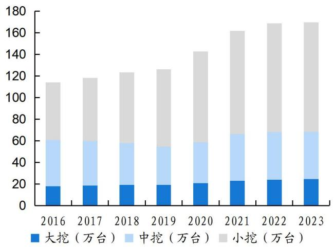
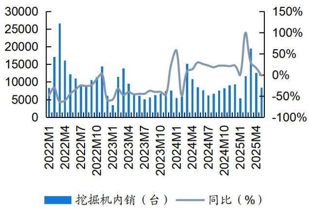
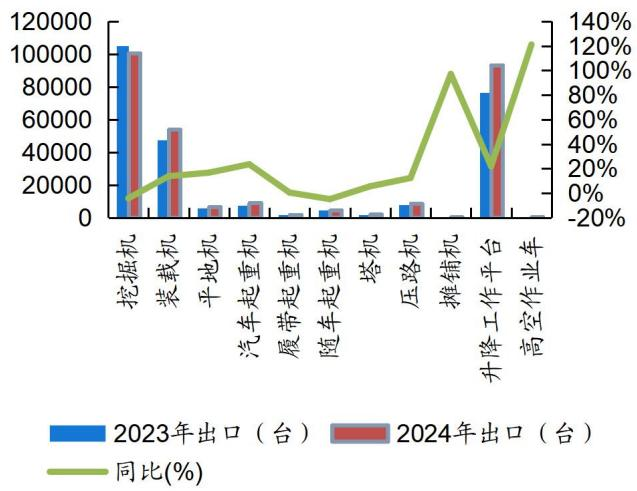
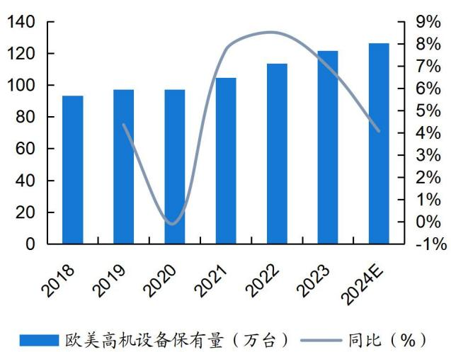

2025 年 07 月 16 日

公司研究

评级：买入(维持)

研究所：

证券分析师： 张钰莹 S0350524100004 zhangyy03@ghzq.com.cn

# 锦程新章启，登高望远行

# ——徐工机械（000425）公司深度研究

  
最近一年走势

<table><tr><td>相对沪深 300 表现</td><td></td><td>2025/07/16</td></tr><tr><td>表现</td><td>1M 3M</td><td>12M</td></tr><tr><td>徐工机械</td><td>7.1% -4.9%</td><td>30.2%</td></tr><tr><td>沪深300</td><td>3.4% 6.2%</td><td>14.5%</td></tr></table>

<table><tr><td>市场数据</td><td>2025/07/16</td></tr><tr><td>当前价格（元）</td><td>8.16</td></tr><tr><td>52周价格区间（元）</td><td>5.95-9.65</td></tr><tr><td>总市值（百万）</td><td>95,910.32</td></tr><tr><td>流通市值（百万)</td><td>66,070.20</td></tr><tr><td>总股本（万股）</td><td>1,175,371.58</td></tr><tr><td>流通股本（万股）</td><td>809,683.88</td></tr><tr><td>日均成交额（百万）</td><td>534.72</td></tr><tr><td>近一月换手(%)</td><td>0.83</td></tr></table>

# 投资要点:

市场的 $\beta$ —海内外共振：1）总结 2006 以来的工程机械行业的两轮周期及新一轮下行周期，我们认为国内需求复苏的政策刺激 $\cdot ^ { + }$ 存量替代需求两大因素已经具备，因此内需见底信号显现，存量替换走向上升趋势。2025 年开始的内需复苏拐点更为陡峭，2025 年 1-5 月挖机国内销量 57501 台，同比增长 $26 \%$ 。从产品结构来看，土方机械率先复苏，非土方机械有望企稳；2）从海外市场看，空间广阔，总体出口维持增长韧性，国内主机厂市场份额占比有较大提升空间。据 KHL 统计，2024 年卡特彼勒和小松工程机械销售额市占率合计占比达到 $2 7 . 1 \%$ ，国内龙头主机厂的市场份额与海外龙头（卡特彼勒、小松）仍有较大差距，徐工机械工程机械销售额市占率仅 $5 . 4 \%$ ，卡特彼勒和小松工程机械销售额市占率分别为 $1 5 . 9 \%$ 和 $1 1 . 2 \%$ 。

徐工机械的 $\alpha$ ：内部主动变革 $^ { + }$ 多产品线优势平滑周期：复盘徐工2021 年以来的超额利润，我们认为徐工 Alpha 的逻辑主要来自于两个方面：1）2020 年以来的一系列的主动动作，包括混改、资产重组和管理层更换等；2）公司多系列产品优势平滑周期性影响，徐工机械在各条主类产品线挖机、起重机、混凝土机械上稳居国内前列，稳固行业龙头地位，可以在内需复苏时获得市场较大市场份额，同时新兴板块高机、矿机持续发力。

矿机有望打造第二成长曲线。由于海外矿企的资本开支增多 $^ +$ 跟随中资企业出海 $^ { \cdot + }$ 徐工矿机上逐渐弥补的技术 $^ { + }$ 海内外逐渐完善的渠道建设，我们认为徐工的矿机有望快速得到增长。

# 相关报告

《徐工机械（000425）公司动态研究：多品类优势平滑行业下行周期，新兴业务并行打造第二成长曲线（买入）\*工程机械\*张钰莹》——2025-05-04盈利预测和投资评级：我们预计公司 2025-2027 年营收分别为$1 0 1 0 / 1 1 3 8 / 1 3 1 8$ 亿元，归母净利润分别为 81/101/125 亿元，分别同比 $+ 3 5 \% / + 2 5 \% / + 2 4 \%$ ，对应 PE 分别为 12/10/8X。公司上下齐心共发力，内部改革 $^ +$ 产品能够平滑周期下行，同时具备内需企稳 $+$ 报表改善 $+$ 矿机打造第二成长曲线逻辑，维持公司“买入”评级。

风险提示：政策风险；市场风险；海外拓展不及预期；供应链安全风险；汇率波动风险。

<table><tr><td>预测指标</td><td>2024A</td><td>2025E</td><td>2026E</td><td>2027E</td></tr><tr><td>营业收入（百万元)</td><td>91660</td><td>101026</td><td>113805</td><td>131805</td></tr><tr><td>增长率(%)</td><td>-1</td><td>10</td><td>13</td><td>16</td></tr><tr><td>归母净利润（百万元）</td><td>5976</td><td>8060</td><td>10067</td><td>12501</td></tr><tr><td>增长率(%)</td><td>12</td><td>35</td><td>25</td><td>24</td></tr><tr><td>摊薄每股收益（元)</td><td>0.51</td><td>0.69</td><td>0.86</td><td>1.06</td></tr><tr><td>ROE(%)</td><td>10</td><td>12</td><td>14</td><td>16</td></tr><tr><td>P/E</td><td>15.55</td><td>11.90</td><td>9.53</td><td>7.67</td></tr><tr><td>P/B</td><td>1.58</td><td>1.48</td><td>1.35</td><td>1.21</td></tr><tr><td>P/S</td><td>1.02</td><td>0.95</td><td>0.84</td><td>0.73</td></tr><tr><td>EV/EBITDA</td><td>9.23</td><td>7.45</td><td>6.34</td><td>5.30</td></tr></table>

资料来源：Wind资讯、国海证券研究所

# 内容目录

1、 徐工机械：上下齐心共发力 . 6  
1.1、 徐工机械股价复盘. .... 6  
1.2、 徐工机械发展历程. ... 7  
1.2.1、 老徐工的来时路. .... 7  
1.2.2、 新徐工的新蓝图. ..... 8  
1.3、 公司财务分析：海外营收占比加速提升. ...11  
2、 内需见底信号显现，存量替换走向上升趋势. .... 13  
2.1、 以挖掘机视角回顾工程机械周期. ... 13  
2.1.1、 自 2006 年以来两轮挖掘机的周期复盘 ....13  
2.1.2、 国内市场挖机销量结构变化.... .... 14  
2.2、 内需两大复苏因素已经具备.. ...15  
2.2.1、 万亿国债刺激基建，以旧换新政策不断加码. .................................................................. ..... 15  
2.2.2、 存量市场广阔，设备更新迎来新一轮替换周期. ................................................. .... 18  
2.3、 土方机械率先恢复，部分非土方产品有望企稳. ... 18  
3、 海外市场空间广阔，总体出口维持增长韧性.. ................................ .... 20  
3.1、 全球万亿市场规模，国内主机厂市场份额有较大提升空间. ... 20  
3.2、 非挖产品 2024 年同比增速正增长，出口主要集中在“一带一路”国家. .. 21  
3.3、 海外市场需求展望. ... 24  
3.3.1、 新兴市场需求展望. .. 24  
3.3.2、 欧美市场需求展望 ... 27  
4、 徐工的阿尔法：海外布局与多产品系列优势平滑下行周期. ... 28  
4.1、 徐工的出海历程.. ...28  
4.2、 多产品系列优势平滑国内下行周期... ...30  
4.2.1、 传统优势产品：稳固行业龙头地位. .. 31  
4.2.2、 新兴产品：有望打造第二成长曲线. ... 36  
5、 盈利预测与评级. ...42  
6、 风险提示..... . 43

# 图表目录

图 1： 2021 年以来徐工机械股价跑赢 SW 工程机械整机（截至 2025 年 5 月） ... 6  
图 2： 徐工机械股价整体走势跟随行业内销和出海景气度（股价截至 2025 年 6 月） ..7  
图 3： 徐工机械的发展历程.. ... 8  
图 4： 徐工机械 2022 年核心资产注入，产品结构更加多元化..... ........................................................................... 8  
图 5： 2021 年徐工机械营收占比... ...................................................................... 9  
图 6： 2022 年吸收徐工有限后的徐工机械营收占比 ........................................................................................... .........9  
图 7： 徐工混改前后的股权变化图..... .................................................................................... ......... 10  
图 8： 2016 年以来的公司营收及增速..... ......................................................................................... ....... 11  
图 9： 2016 年以来的公司归母净利润及增速. ..... 11  
图 10： 公司海外营收占比不断提升 ........................................................................................................................... 12  
图 11： 公司海外业务毛利率高于国内毛利率. ............................................................................. ....12  
图 12： 2023、2024 年公司毛利率和净利率抬升... ...................................................................................... .... 12  
图 13： 2016 年以来公司各项费用率情况 ............ ...................................................................................................... 12  
图 14： 以挖掘机为代表的工程机械周期复盘. ....................................................................................................... 14  
图 15： 国内挖机销量以小挖为主 ................................................................ .... 15  
图 16： 2024 年 3-12 月小挖内销同比增速较高 .........................................................................................................15  
图 17： 水利的投资对机械设备需求起支撑作用 .........................................................................................................17  
图 18： 2023 年挖掘机 8 年保有量约 170 万台 ....... ............................................................................................... 18  
图 19： 2023 年挖掘机 10 年保有量约 190 万台 ........................................................................................................18  
图 20： 2025Q1 挖掘机内销复苏明显.......... ...................................................................................................... 19  
图 21： 2025Q1 装载机内销同比迈向正增长 ............................................................................................................. 19  
图 22： 2025Q1 汽车起重机内销同比下降趋缓.. .............................................................................. ....... 19  
图 23： 2025Q1 高机内销同比仍未企稳...... .......................................................................................................... 19  
图 24： 2025 年 2 月小松（中国）挖机开工时间 56.8 小时 .......................................................................................19  
图 25： 2025 年 5 月庞源租赁吨米利用率 $5 3 . 1 \%$ ... ......................................................................................... 19  
图 26： 全球工程机械市场规模.. ............................................................................. .... 20  
图 27： 2024 年全球工程机械厂家竞争格局.... ....................................................................................................... 20  
图 28： 全球工程机械各市场区域销售额情况（亿美元） ................................................................................... .... 21  
图 29： 全球工程机械市场各产品销售额情况（亿美元） .......................................................................................... 21  
图 30： 2024 年工程机械产品出口额突破 500 亿美元 ............................................................................................... 21  
图 31： 2024 年出口产品金额占比情况....  
图 32： 2024 年出口产品销量及同比 ................ ................................. ........................................................... 22  
图 33： 2024 年主要产品出口金额及同比 ............... .... 22  
图 34： 2024 年，我国工程机械零部件对“一带一路”共建国家出口金额占总出口额的 $6 3 \%$ .. ... 23  
图 35： 2024 年我国工程机械全球各地区出口额占比.... .............. ...23  
图 36： 2024 年工程机械我国出口额前十的国家和地区（亿美元） ...................................................................... 23  
图 37： 2024 财年印度建筑机械设备同比 $+ 2 6 \%$ . .. 24  
图 38： 印度 2024 年主要产品销量及结构.. ..... 24  
图 39： 印尼市场工程机械设备规模预计到 2030 年将达到 25430 台，2024-2030 CAGR 达到 $4 . 1 2 \%$ . ... 24  
图 40： 印尼市场工程机械设备的核心组成部分... ..24  
图 41： 中东市场到 2027 年建筑业市场规模预计将达到 2.4 万亿美元. ...25  
图 42： 沙特的基础设施市场规模预计到 2028 年将达到 428.9 亿美元 ............................................................. ..... 25  
图 43： 拉美市场 2035 年底市场规模预计达到 181 亿美元.... ...................................................... ... 26  
图 44： 拉美市场主要以巴西、智利和哥伦比亚为主. .... 26

# 表 1： 徐工有限混改时间线.. .9

# 1、徐工机械：上下齐心共发力

# 1.1、徐工机械股价复盘

复盘徐工机械上市以来的股价走势，可以发现其股价整体走势跟随行业内销和出海景气度。我们认为，在 2005 年-2021 年期间，公司的股价主要受内需市场影响。两轮股价的上涨（2005 年-2011年和 2016 年-2021 年）和一轮股价的下跌（2021 年-2024 年）分别对应国内房地产市场的上行周期和下行周期。2021 年以来，公司的股价受内需下行和海外景气度抬升的双重因素影响，在正反向影响的作用下，公司的股价涨幅跑赢工程机械行业。

复盘徐工机械 2021 年以来的超额利润，我们认为公司 Alpha 的逻辑主要来自于两个方面：1）2020 年以来的一系列的主动动作。这包括混改、资产重组和股权激励等一系列主动的动作；2）公司多系列产品优势平滑周期性影响。公司在各条主类产品线挖机、起重机、混凝土机械上稳居国内前列，同时新兴板块高机、矿机持续发力。

本文以徐工机械 2020 年以来的一系列主动动作和多系列产品优势为切入点，深入探讨分析“新的徐工，新的征程”这一主题。

  
图 1：2021 年以来徐工机械股价跑赢 SW 工程机械整机（截至 2025 年 5 月）  
资料来源：iFinD，国海证券研究所

  
图 2：徐工机械股价整体走势跟随行业内销和出海景气度（股价截至 2025 年 6月）

资料来源：iFinD，中国工程机械工业协会公众号，国海证券研究所

# 1.2、徐工机械发展历程

徐工机械上市以来，2009 年和 2022 年这两个年份对于徐工来说有“崭新”的意义。2009 年，公司购买集团的起重机资产，并由“徐工科技”更名为“徐工机械”；2022 年，公司吸收合并“徐工有限”，实现了集团核心资产（挖机、矿机、塔机、施维英等资产）整体上市，成为了新的徐工。

# 1.2.1、老徐工的来时路

徐工机械发轫于起重机，于 1957 年建成了第一台塔式起重机。“三厂一所”（三大机械制造厂和机械研究所）为徐工奠定了研发 $\cdot ^ { + }$ 制造的基础，1989 年以“三厂一所”为核心组成的徐工集团，成为行业内首家集团公司。1996 年，公司成功上市。2009 年，公司定增购买集团的起重机资产，并由“徐工科技”更名为“徐工机械”。2012 年徐工机械收购了全球混凝土机械领军企业施维英。

  
图 3：徐工机械的发展历程  
资料来源：公司官网，国海证券研究所

# 1.2.2、新徐工的新蓝图

我们把徐工机械2020年以来由集团到上市公司再到管理层的一系列动作归纳为其迈向新蓝图的三条主线：1）核心资产注入，补齐产品线；2）进行体制改革，提高市场化程度；3）对内股权激励，对外回报投资者。

核心资产注入，补齐产品线：2022 年，上市公司通过发行股份吸收合并集团体内的徐工有限。注入的核心资产包括挖机、塔机、混凝土机械（包括徐工施维英）、矿机、农机等工程机械主机，组建了多维度的徐工产品系列线。在资产注入后，徐工的产品覆盖主要工程机械板块，产品结构更加多元化。具体来看，2021 年徐工机械起重机械营收占比 $32 \%$ ，2022 年土方机械和起重机械分别占比 $2 5 \%$ 和 $2 5 \%$ 。

  
图 4：徐工机械 2022 年核心资产注入，产品结构更加多元化  
资料来源：公司官网，国海证券研究所

  
图 5：2021 年徐工机械营收占比  
资料来源：iFinD，国海证券研究所

  
图 6：2022 年吸收徐工有限后的徐工机械营收占比  
资料来源：iFinD，国海证券研究所

混改增强市场竞争活力：2020 年 9月，徐工有限完成混改，混改采取股权协议转让和增资扩股相结合的方式，共引入 15 家国有和民营投资者，加上 1 个员工持股平台。混改完成后，徐工有限股权结构以“国有企业持股 $^ +$ 民营企业持股 $^ +$ 核心骨干持股”的三方利益共同体，这不仅实现国有资产保值增值，也形成多元化股权模式。

表 1：徐工有限混改时间线  

<table><tr><td>时间</td><td>事件概况</td></tr><tr><td>2018.8</td><td>徐工有限被纳入江苏省第一批混合所有制改革试点企业名单。</td></tr><tr><td>2019.7</td><td>公司控股股东徐工集团工程机械有限公司（简称徐工有限）混合所有制改革试点实施方案获得徐州市国资 委审批通过。</td></tr><tr><td>2020.4 2020.9</td><td>根据《实施方案》，徐工有限拟通过存量转让和增资扩股方式引入战略投资者。徐工有限混合所有制改革 的审计、评估工作已经完成，评估结果已于近日完成在徐州市国资委备案工作。</td></tr><tr><td></td><td>徐工有限完成混改，共引入15家国有和民营投资者，1个员工持股平台。具体来看：1）国有企业持股： 通过存量转让引入江苏省国信集团等3家国企，混改后持有徐工有限16.9%的股份。2）民营企业持股： 通过增资扩股引入天津茂信等 12 家民营企业，混改后持有徐工有限 46.3%的股份。3）员工持股平台控 股：本次增资完成后，徐工金帆作为员工持股平台，混改后持有徐工有限2.7%的股份。4)徐工集团控股： 混改后持有徐工有限 34.1%的股份。</td></tr></table>

资料来源：公司公告，江苏国资公众号，国海证券研究所

  
图 7：徐工混改前后的股权变化图

资料来源：iFinD，公司公告，今日工程机械公众号，国海证券研究所对内股权激励，对外回馈投资者：1）混改上市后，2023 年 2 月发布股权激励草案，ROE 考核目标彰显公司发展决 $\therefore$ 。其中计划拟授予的股票数量为 1.18 亿股，占公司公告时股本总额的 $1 \%$ ；计划授予的股票授予价格为 3.09 元/股；业绩考核目标其中之一是 2023/2024/2025 的净资产收益率分别不低于$9 \% / 9 . 5 \% / 1 0 \%$ 。2）以稳健的分红政策更好地回馈广大股东。2024 年 11月公司公告，在公司当年实现盈利，积极探索年内多次分红，如无重大投资计划或重大现金支出的情况下，未来三年（2025－2027 年度），公司每年度累计现金分红总额（含股份回购注销）不低于当年实现可供分配利润的 $40 \%$ 。

表 2：公司股权激励计划  

<table><tr><td>公告时间</td><td>股权数量</td><td>激励价格</td><td>激励人员</td><td>行权目标</td></tr><tr><td>2023.2</td><td>本激励计划拟授予的限 制性股票数量为 1.18 亿股，约占本激励计划 草案公告时公司股本总 额的 1.00%。 其中首次授予1.1亿股， 约占本激励计划拟授予 限制性股票总数的 93%。</td><td>3.09元/股</td><td>本计划首次授予 的激励对象共计 不超过2,000 人，具体包括公 司董事、高级管 理人员、中高层 管理人员、核心 技术及业务人 员。</td><td>第一个限售期：2023 年度净资产收益率不低于9%，且不低于同行 业平均水平或对标企业75分位水平；2023 年度净利润不低于53 亿元，且不低于同行业平均水平或对标企业75 分位水平；2023 年 度分红比例不低于当年实现的可供分配利润的30%。 第二个限售期：2024 年度净资产收益率不低于9.5%，且不低于同 行业平均水平或对标企业75 分位水平；2024 年度净利润不低于 58 亿元，且不低于同行业平均水平或对标企业75分位水平；或 2023-2024年净利润累计值不低于111亿元，且不低于同行业平均 水平或对标企业75分位水平；2024年度分红比例不低于当年实现 的可供分配利润的30%。 第三个限售期：2025 年度净资产收益率不低于10%，且不低于同 行业平均水平或对标企业75分位水平；2025年度净利润不低于 65 亿元，且不低于同行业平均水平或对标企业75分位水平；或</td></tr></table>

资料来源：公司公告，国海证券研究所

表 3：公司对全球投资者未来三年（2025-2027）回报计划  

<table><tr><td>股东回报方面</td><td>具体措施</td></tr><tr><td>现金分红</td><td>在公司当年实现盈利，积极探索年内多次分红，如无重大投资计划或重大现金支出的情况下，未来三年 （2025-2027 年度），公司每年度累计现金分红总额（含股份回购注销）不低于当年实现可供分配利润的 40%。</td></tr><tr><td>回购与增持</td><td>徐工集团承诺，未来三年，在履行必要的审批程序后，将平均每年获得的上市公司现金分红不低于20% 的额度（资金来源为自有资金或国家政策资金）用于增持上市公司徐工机械股票。</td></tr><tr><td>市值管理</td><td>制定公司市值管理制度，建立科学、规范、有效的市值管理机制，提升公司价值创造能力，促进公司可持 续发展，加强与资本市场良性互动，保护投资者合法权益。</td></tr><tr><td>其他回报措施</td><td>持有徐工机械股票满三个月的投资者/委派代表，每年有两次机会以员工内部价购买徐工文创产品（如徐 工产品模型)。徐工体验厅和徐工智能化领航工厂每年暑假或寒假可为当年持股满三个月的投资者/委派代 表及其子女免费提供一次“研学游”参观学习机会。</td></tr></table>

资料来源：公司公告，国海证券研究所

# 1.3、公司财务分析：海外营收占比加速提升

营收方面：2016年-2024年期间，公司的营收从169亿元上升至917亿元，CAGR约 $24 \%$ 。其中 2016-2021 年的营收受益于工程机械行业上行，公司的营收增速较快，CAGR 约 $38 \%$ ；2021 年开始由于行业下行，公司营收增速放缓。2025Q1年公司实现营收 268 亿元，同比 $+ 1 0 . 9 \%$ 。

归母净利润方面：2016-2024年期间，公司的归母净利润从 2.1 亿元上升至 59.8亿元，CAGR 约 $52 \%$ 。其中 2016-2021 年的归母净利润同样受益于工程机械行业上行，CAGR 约 $9 3 \%$ ，增速高于营收增速，规模效应明显；2021 年开始由于行业下行，公司在 2022 年的净利润也相应受到影响，随着混改 $^ +$ 资产注入 $^ +$ 股权激励等一系列主动动作，2025Q1 公司实现归母净利润 20.2 亿元，同比 $+ 2 6 . 4 \%$ 。

  
图 8：2016 年以来的公司营收及增速  
资料来源：iFinD，国海证券研究所

  
图 9：2016 年以来的公司归母净利润及增速  
资料来源：iFinD，国海证券研究所

国内外市场营收占比来看：1）2016-2021 年这一轮行业上行周期营收主要来自国内：由于新型城镇化对于工程机械设备的需求，国内工程机械行业处于上行周期，2016-2021 年公司国内收入占比始终保持在 $83 \%$ 以上。2）由于国内工程机械行业下行，公司加速拓展出海战略。海外营收占比从 2021 年的 $1 5 \%$ 提升至2024 的 $45 \%$ 。

海内外毛利率来看：1）海外市场的空间潜力大 $^ +$ 海外布局逐渐见效，使得公司海外毛利率不断提升。2021-2024 年海外毛利率由 $1 7 \%$ 上升至 $2 5 \%$ 。2）公司国内市场毛利率普遍低于海外毛利率。随着海外营收占比的提升及海外业务毛利率提升，公司的毛利水平得到改善。

  
图 10：公司海外营收占比不断提升  
资料来源：iFinD，国海证券研究所

  
图 11：公司海外业务毛利率高于国内毛利率  
资料来源：iFinD，国海证券研究所

从盈利能力来看：1）2016-2021 年：受益于行业上行 $^ +$ 规模效应 $^ +$ 费用端的管控，公司净利率由 2016 年的 $1 . 3 \%$ 迅速提升至 2021 年 $6 . 7 \%$ 。2）2022 年以来：出海战略逐步见效，海外营收占比提升 $^ +$ 海外市场更高的毛利率推动公司整体毛利率和净利率提升。2022 年到 2025Q1，公司毛利率、净利率分别由 $2 0 . 2 \% / 4 . 6 \%$ 提升至 $2 2 . 1 \% / 7 . 6 \%$ 。

  
图 12：2023、2024 年公司毛利率和净利率抬升  
资料来源：iFinD，国海证券研究所

  
图 13：2016 年以来公司各项费用率情况  
资料来源：iFinD，国海证券研究所

# 2、内需见底信号显现，存量替换走向上升趋势

# 2.1、以挖掘机视角回顾工程机械周期

挖掘机在工程机械中的销售金额占比最高，可以作为工程机械代表性的产品来反应该行业的周期变化。

# 2.1.1、自2006 年以来两轮挖掘机的周期复盘

1）2006—2011（上行期）：据中国工程机械工业协会数据，房地产和基建的固定投资提升 $^ +$ 四万亿刺激政策 $^ +$ 环保政策驱动，挖掘机内销量于 2011 年达到173787 台，达到阶段峰值。

2）2011-2016（下行期）：据中国工程机械工业协会数据，宏观经济增速放缓+上一轮增长周期透支，工程机械行业产能过剩，进入出清阶段。

3）2016-2021（上行期）：据中国工程机械工业协会数据，一带一路 $^ { + }$ 新型城镇化 $^ +$ 存量设备更新，行业迎来新一轮景气周期，挖掘机内销从 2016 年的 62993台上升至 2021 年的 274342 台，CAGR 为 $34 . 2 \%$ 。

4）2021-2023（下行期）：据中国工程机械工业协会数据，保有量过剩导致的供大于需 $+$ 房地产的下行，行业出于出清状态，挖掘机内销下滑至 2023 年的 89980台。

5）2024 至今（底部信号显现）：据中国工程机械工业协会数据，自 2024 年 3月份国内挖机内销同比增速转正以来，挖机正增速保持连续 10 个月的正增长。2025 年开始的复苏拐点更为陡峭，1-5 月份挖机国内销量 57501 台，同比增长$2 5 . 7 \%$ 。

  
图 14：以挖掘机为代表的工程机械周期复盘  
资料来源：iFinD，工程机械杂志公众号，国海证券研究所

# 2.1.2、国内市场挖机销量结构变化

按照吨位和需求，挖掘机可分为超大挖、大挖中挖、小挖和迷你挖等，超大挖主要用于矿山开采和岩石破碎领域，应用领域较为集中，周期性波动较强，中大挖主要用于城市、道路桥梁等大型基建领域，受整体基建需求影响较大，小挖和迷你挖主要用于农林、绿化等小型项目，应用领域广泛。

表 4：挖掘机分类及应用  

<table><tr><td>协会分类</td><td colspan="2">小挖（0-20吨)</td><td>中挖（20-30吨)</td><td colspan="2">大挖(30吨以上)</td></tr><tr><td>按用途分类</td><td>迷你挖（0-5t)</td><td>小挖（5-20t）</td><td>中挖（20-30t）</td><td>大挖（30-40t)</td><td>超大挖(40t以上)</td></tr><tr><td>用途/场景</td><td>农林、果园</td><td>城市基建、水利等</td><td>城市基建、地产、道 路等</td><td>大型基建、地产 等</td><td>矿山开采、石方破 碎</td></tr></table>

资料来源：观研天下，国海证券研究所

挖掘机市场销量结构呈现小挖占比远高于中大挖，增速上小挖快速复苏增长，中大挖尚未实现稳定增长。据中国工程机械工业协会数据，从占比上来看，2024年挖掘机内销中，小/中/大的占比分别为 $7 4 . 5 \% / 1 4 . 4 \% / 1 1 . 1 \%$ ，小挖占比领先；从增速来看，小挖贡献主要增速，2024 年 3 月-12 月小挖内销月度同比增速保持在 $20 \%$ 以上，中大挖内销的增速仍有波动性。

  
图 15：国内挖机销量以小挖为主  
资料来源：慧聪工程机械网公众号，中国工程机械工业协会公众号，国海证券研究所

  
图 16：2024 年 3-12 月小挖内销同比增速较高  
资料来源：中国工程机械工业协会公众号，国海证券研究所

# 2.2、内需两大复苏因素已经具备

这一轮（2021-2023）下行周期的调整比上一轮（2011-2016）更快。从量上来看，2011年-2016 年，挖机的销量从高点的 173787 台下降到 62993 台，下降幅度达到 $6 3 . 7 \%$ ；2021 年-2023 年，挖机的销量从高点的274342台下降到 89980台，下降幅度达到 $6 7 . 2 \%$ 。2024 年开始逐步出现磨底信号，2025 年的复苏拐点斜率更加陡峭。

工程机械板块是典型的需求周期驱动，总结 2006 以来的工程机械行业的两轮周期及新一轮下行周期的调整深度，我们认为国内需求复苏的政策刺激 $\cdot ^ { + . }$ 存量替代需求两大因素已经具备。补贴政策能够降低购机成本，加快行业的换新周期，刺激需求政策可以带动下游需求；同时在政策引导背后，行业也到了新一轮设备更新周期，需求释放有望加速。

# 2.2.1、万亿国债刺激基建，以旧换新政策不断加码

政策的刺激带来了工程机械的需求。一方面，万亿国债刺激基建，基建投资逐渐去地产化，水利方面的投资对机械设备需求起支撑作用；另一方面，以旧换新政策直接或间接涉及机械的设备更新，对需求起到正向作用。

表 5：2024 年以来相关支持机械设备的政策  

<table><tr><td>层级</td><td>发布时间</td><td>事件/文件</td><td>主要内容</td></tr><tr><td></td><td></td><td></td><td>市、相关县（市、区）人民政府 应当将工程机械新型技术改造、 设备以旧换新、新产品研发和推</td></tr><tr><td>地级市</td><td>2024.10</td><td>《长沙市促进工程机械产业发展条例》 《关于实施设备更新贷款财政贴息政策的通知》</td><td>广应用纳入工业经济发展重点， 推动工程机械产业高端化、智能 化、绿色化升级，加快形成新质 生产力。 推动大规模设备更新和消费品 以旧換新是加快构建新发展格 局、推动高质量发展的重要举 措。银行向经营主体发放的贷款</td></tr><tr><td>国家级 直辖市</td><td>2024.6 2024.5</td><td>《上海市推动工业领域大规模设备更新和创新产品 扩大应用的专项行动》</td><td>符合再贷款报销条件的，中央财 政对经营主体的银行贷款本金 贴息1个百分点。 到2027 年，实现本市工业领域 设备更新规模累计达2000 亿 元，设备投资规模较 2023 年增</td></tr><tr><td>省级</td><td>2024.4</td><td>《广东省推进工业设备更新和技术改造提质增效工 作方案》</td><td>长25%以上。 加强设备供给。围绕大规模设备 更新领域，聚集制造业领域、能 源领域、建筑领域、交通运输领 域、农业领域等重点设备生产企 业，摸清主要设备供给情况，并 综合运用各类政策，支持引导设 备生产企业扩大生产规模、提升</td></tr><tr><td>国家级</td><td>2024.3</td><td>七部门关于印发推动工业领域设备更新实施方案的 通知</td><td>为大规模设备更新提供充足优 质的设备产品供给。 针对工业母机、农机、工程机械、 电动自行车等生产设备整体处 于中低水平的行业，加快淘汰落 后低效设备、超期服役老旧设 备。重点推动工业母机行业更新 服役超过10 年的机床等；农机 行业更新柔性剪切、成型、焊接、 制造生产技术及装备等；工程机 械行业更新油压机、折弯机、工</td></tr><tr><td>国家级</td><td>2024.3</td><td>《推进建筑和市政基础设施设备更新工作实施方案》</td><td>艺陈旧产线和在线检测装备等 以住宅电梯、供水、供热、供气、 污水处理、环卫、城市生命线工 程、建筑节能改造等为重点，分</td></tr></table>

<table><tr><td></td><td></td><td></td><td>类推进建筑和市政基础设施设 备更新，着力扩内需、惠民生、 保安全，保障城市基础设施安 全、绿色、智慧运行，推进城市 高质量发展。</td></tr><tr><td>国家级</td><td>2024.3</td><td>发改委等五部委答记者问</td><td>2023年，工业、农业等重点领 域设备投资规模约 4.9 万亿元， 随着高质量发展深入推进，设备 更新需求会不断扩大，将是一个 年规模5 万亿以上的市场。到 2027年工业、农业、建筑、交 通、教育、文旅、医疗等领域设 备投资规模较2023 年增长25% 以上。</td></tr><tr><td>国家级</td><td>2024.3</td><td>《推动大规模设备更新和消费品以旧换新行动方案》</td><td>1)推进重点行业设备更新改造。 聚焦钢铁、有色、石化、化工、 建材、电力、机械、航空、船舶、 轻纺、电子等重点行业，大力推 动生产设备、用能设备、发输配 电设备等更新和技术改造。2) 加快建筑和市政基础设施领域 设备更新；3）支持交通运输设 备和老旧农业机械更新；4）提 升教育文旅医疗设备水平。</td></tr></table>

资料来源：各地方政府官网，中国政府网，国家发改委官网，澎湃新闻，国海证券研究所

固定资产投资需求来看，投资呈现去房地产化，基建投资尤其是水利方面投资对机械设备需求起支撑作用。

  
图 17：水利的投资对机械设备需求起支撑作用  
资料来源：iFinD，国海证券研究所

# 2.2.2、存量市场广阔，设备更新迎来新一轮替换周期

存量市场方面，设备更新周期迎来新一轮替换。挖掘机的使用寿命通常与其工作小时数密切相关，据汇租平台公众号，大多数挖掘机的使用寿命在8000-10000小时之间，取小松挖掘机在中国地区 2015-2024 近十年的开机时间平均值近1350 小时，可以测算得出挖掘机的设备平均更新周期约为 7-8 年，但实际使用寿命还需根据具体情况而定，如通过维修和零部件更换，我们认为实际使用时间可以达到 8-10 年。

据聪慧工程机械网公众号，截至 2023 年，挖掘机 8 年保有量约有 170 万台，10 年保有量约有 190 万台。上一轮周期的上行期从 2016 年开始，以 8-10 年的设备更新周期来看，目前已经进入存量设备的更换周期，我们认为 2024 年为存量替代元年，后续换机需求有望继续向上。

  
图 18：2023 年挖掘机 8 年保有量约 170 万台  
资料来源：聪慧工程机械网公众号，国海证券研究所

  
图 19：2023 年挖掘机 10 年保有量约 190 万台  
资料来源：聪慧工程机械网公众号，国海证券研究所

# 2.3、土方机械率先恢复，部分非土方产品有望企稳

土方机械作为工程中最先使用的设备，可以看作工程机械的先行指标。在建设项目中，工程机械按土方机械、起重机、混凝土机械、起重机械的顺序先后进行施工，路面机械、高空作业机械和工业车辆则在项目建设中或完成后，用于美化及材料运输等。

土方机械内销率先复苏，非土方产品有望企稳。据中国工程机械工业协会数据，我国挖掘机内销自2024年3月同比转正以来持续保持正增速，装载机内销2024年 4 月也迈向同比正增长。从 2025 年 1-5 月数据来看，挖机内销同比 $+ 2 6 \%$ ，装载机内销同比 $+ 2 5 \%$ 。非土方产品中，如汽车起重机降幅收窄，2024 年降幅收窄至 $- 3 7 \%$ ，高机内销仍未企稳，降幅仍较大。

下游开工时长来看，2024年下半年以来国内小松挖掘机开机时间逐步提升，2024下半年小松挖掘机平均开机时间达到 97.6 小时，同比 $+ 4 . 5 \%$ ；塔吊需求仍然承压，据庞源租赁官网，2025 年 5月庞源租赁吨米利用率 $5 3 . 1 \%$ 。

  
图 20：2025Q1 挖掘机内销复苏明显

资料来源：中国工程机械工业协会公众号，国海证券研究所资料来源：中国工程机械工业协会公众号，国海证券研究所资料来源：iFinD，国海证券研究所资料来源：小松官网，国海证券研究所资料来源：庞源官网，国海证券研究所

  
图 21：2025Q1 装载机内销同比迈向正增长

  
图 22：2025Q1 汽车起重机内销同比下降趋缓

  
图 23：2025Q1 高机内销同比仍未企稳  
资料来源：iFinD，国海证券研究所

  
图 24：2025 年 2 月小松（中国）挖机开工时间 56.8小时

  
图 25：2025 年 5 月庞源租赁吨米利用率 $5 3 . 1 \%$

# 3、海外市场空间广阔，总体出口维持增长韧性

# 3.1、全球万亿市场规模，国内主机厂市场份额有较大提升空间

工程机械全球市场规模庞大。KHL 每年发布的 Yellow Table 披露了上一年全球工程机械 50 强的销售额和市占率，我们可以通过当年销售额/市占率测算得到上一年全球工程机械行业的总市场规模。据 KHL 数据，2024 年全球工程机械市场规模达到 2380 亿美元，即市场规模超 1万亿元人民币。

国内主机厂市场份额占比有较大提升空间。据 KHL 统计，2024 年卡特彼勒和小松工程机械销售额市占率合计占比达到 $2 7 . 1 \%$ ，国内龙头主机厂的市场份额与海外龙头（卡特彼勒、小松）仍有较大差距。

  
图 26：全球工程机械市场规模  
资料来源：KHL，国海证券研究所

  
图 27：2024 年全球工程机械厂家竞争格局  
资料来源：KHL，国海证券研究所

欧美仍然是最大的市场。根据三一重工港股招股说明书，弗若斯特沙利文数据显示，拆分全球工程机械各市场区域销售额来看，2024 年全球工程机械主要市场集中在北美和欧洲，合计占比达到 $53 \%$ 。中国的全球市场占比在 2021 年开始受到国内需求下行影响，从 2021 年全球市场规模占比 $30 \%$ 下降到 2024 年占比$1 1 \%$ 。

核心品类方面，六大核心细分市场占绝对比重。根据三一重工港股招股说明书，弗若斯特沙利文数据显示，拆分全球工程机械市场各产品销售额情况来看，以挖掘机、装载机、起重机械、路面机械、混凝土机械和桩工机械为代表的全球工程机械行业核心市场，2024 年市场规模达到 1505 亿美元，并预计在 2030 年增长至 2189 亿美元，2024 年至 2030 年间的复合年增长率预计为 $6 . 4 \%$ 。

  
图 28：全球工程机械各市场区域销售额情况（亿美元）  
资料来源：弗若斯特沙利文，三一重工港股招股书，国海证券研究所

  
图 29：全球工程机械市场各产品销售额情况（亿美元）  
资料来源：弗若斯特沙利文，三一重工港股招股书，国海证券研究所

# 3.2、非挖产品2024 年同比增速正增长，出口主要集中在“一带一路”国家

据今日工程机械公众号，从整体出口金额来看，2024 年工程机械产品出口额首次突破 500 亿美元大关，已连续四年实现高位增长。

从出口产品的金额来看，2024 全年在工程机械整机和零部件出口规模中，据慧聪工程机械网公众号，出口额排名前五依次为零部件、工业车辆、挖掘机、铲运机械、起重机械。

  
图 30：2024年工程机械产品出口额突破500亿美元  
资料来源：iFinD，国海证券研究所

  
图 31：2024 年出口产品金额占比情况  
资料来源：慧聪工程机械网公众号，国海证券研究所

据工程机械杂志公众号，2024 年从出口产品的量上来看，非挖产品的增速相较于挖掘机增速更高，如较大销售量的装载机、平地机、汽车起重机、升降工作平台分别同比增长 $1 4 \% / 1 7 \% / 2 4 \% / 2 2 \%$ 。

据 iFinD 数据，从主要产品的出口金额及同比来看，2024 年非挖产品保持同比正增长，挖掘机出口金额同比- $. 0 . 6 \%$ 。

  
图 32：2024 年出口产品销量及同比  
资料来源：工程机械杂志公众号，国海证券研究所

  
图 33：2024 年主要产品出口金额及同比  
资料来源：iFinD，国海证券研究所

主要的工程机械产品出口国家中，印尼、俄罗斯、美国、巴西是相对重要的区域。

表 6：2024 年主要工程机械产品出口额排名靠前的国家和地区  

<table><tr><td>产品类型</td><td>主要出口市场国家/地区</td></tr><tr><td>挖掘机</td><td>印尼、俄罗斯、比利时、美国、沙特、菲律宾、加纳、巴西、土耳其、英国</td></tr><tr><td>装载机</td><td>俄罗斯、美国、巴西、哈萨克斯坦、印尼、比利时、沙特、阿联酋、澳大利亚</td></tr><tr><td>压路机</td><td>美国、俄罗斯、巴西、印尼、澳大利亚、哈萨克斯坦、沙特、墨西哥、菲律宾、加纳</td></tr><tr><td>汽车起重机</td><td>俄罗斯、巴西、印度、沙特、阿联酋</td></tr><tr><td>零部件</td><td>美国、日本、俄罗斯、印度、澳大利亚、巴西、印尼、韩国、泰国、英国</td></tr></table>

资料来源：工程机械杂志公众号，国海证券研究所

“一带一路”共建国家占比超 6 成，亚非拉地区成出口亮点。据中国机电产品进出口商会统计，2024 年 1-12 月，我国工程机械及零部件对“一带一路”共建国家出口 332.98 亿美元，同比上升 $1 4 . 0 9 \%$ ，占总出口额的 $6 2 . 9 7 \%$ ，出口地位进一步提升。我国工程机械及零部件出口 RCEP 国家(东盟 10 国 $^ +$ 日本、韩国、澳大利亚、新西兰)销售额为 121 亿美元，占比 $2 2 . 8 8 \%$ ，同比增速 $0 . 8 \%$ 。

  
图 34：2024 年，我国工程机械零部件对“一带一路”共建国家出口金额占总出口额的 $63 \%$   
资料来源：中国机电产品进出口商会，国海证券研究所

分地区看，出口区域仍以亚欧非为主。据今日工程机械公众号，2024 年全年出口亚洲 215.77 亿美元，同比增长 $9 . 8 1 \%$ ，占比 $4 0 . 8 2 \%$ ；出口非洲 59.03 亿美元，同比增长 $31 . 9 \%$ ，占比 $1 1 . 1 7 \%$ ；出口欧洲 131.32 亿美元，同比增长 $3 . 5 \%$ ，占比 $2 4 . 8 4 \%$ ；出口南美洲 56.54 亿美元，同比增长 $2 4 . 6 \%$ ，占比 $1 0 . 7 \%$ ；出口北美洲 47.87 亿美元，同比下降 $6 . 5 3 \%$ ，占比 $9 . 0 6 \%$ ；出口大洋洲 18.05 亿美元，同比下降 $1 3 . 1 \%$ ，占比 $3 . 4 2 \%$ 。

  
图 35：2024 年我国工程机械全球各地区出口额占比  
资料来源：今日工程机械公众号，国海证券研究所

  
图 36：2024 年工程机械我国出口额前十的国家和地区（亿美元）  
资料来源：今日工程机械公众号，国海证券研究所

# 3.3、海外市场需求展望

# 3.3.1、新兴市场需求展望

# （一）亚洲市场

1）印度市场：该市场人口众多、基建活动旺盛，且产品完全满足发展中国家需求。据 India Briefing 报道，2023 财年印度机械设备总销量超过 10 万台，这主要受国内市场需求推动。与此同时，印度中央和邦政府已开始将基础设施建设作为一项重要发展目标，包括扩大和现代化道路和高速公路的连通性以及城乡发展。据印度建筑设备制造商协会（ICEMA）指出，土方设备是建筑设备行业最大的细分市场，2024 财年的销量达到 93531 台，较 2023 财年的 77164 台增长 $2 1 \%$ 。2）印尼市场：根据 arizton 报告，2024 年印度尼西亚建筑设备市场规模估计为19960 台，预计到 2030 年将达到 25430 台，复合年增长率为 $4 . 1 2 \%$ 。

  
图 37：2024 财年印度建筑机械设备同比 $+26 \%$   
资料来源：India Briefing，印度建筑设备制造商协会（ICEMA），国海证券研究所

  
图 38：印度 2024 年主要产品销量及结构  
资料来源：India Briefing，印度建筑设备制造商协会（ICEMA），国海证券研究所

  
图 39：印尼市场工程机械设备规模预计到 2030 年将达到25430台，2024-2030 CAGR达到 $4 . 1 2 \%$   
资料来源：arizton

  
图 40：印尼市场工程机械设备的核心组成部分

资料来源：arizton，国海证券研究所

# （二）中东市场

1）据 Mordor Intelligence 2023 年的数据预测，到 2027 年中东的建筑业预计将达到2.4万亿美元的价值。据工程机械品牌网公众号2024年发布的文章显示，中东地区大约有 $30 \%$ 的建筑设备已经使用了超过 10 年，这意味着有很大一部分设备需要进行升级和替换。无论是从当前的需求还是从未来的前景来看，该市场都展现出了较大的潜力和机会。2）截至 2023 年，沙特的基础设施市场规模已达到 344.6 亿美元。近年来，沙特基础设施的快速发展，加上采矿业投资的增加，沙特建筑行业进入繁荣时期，带动了工程机械行业的迅猛发展。

  
图 41：中东市场到 2027 年建筑业市场规模预计将达到 2.4 万亿美元  
资料来源：Mordor Intelligence，阿中产业研究院公众号，国海证券研究所

  
图 42：沙特的基础设施市场规模预计到 2028 年将达到 428.9 亿美元  
资料来源：工程机械品牌网公众号，国海证券研究所

# （三）拉美市场

1）据 future market insights 报告预测，2025 年拉美市场规模将扩大至 99.941亿美元，2035 年底市场规模将达到 180.677 亿美元。2）巴西占据 $3 7 . 3 \%$ 的市场份额，因为该国有大量基础设施开发项目，并且在城镇化和工业化方面投入大量资金，增长加速计划 (PAC) 和国家物流计划等关键举措刺激了对重型机械的需求。3）智利占据约 $1 7 . 8 \%$ 的市场份额，这要归功于其强劲的采矿业。作为全球最大的铜生产国，智利在采矿基础设施方面投入巨资，对装载机、挖掘机和重型车辆的需求持续增长。4）哥伦比亚占比 $1 5 . 2 \%$ ，因为该国注重基础设施现代化，并有第四代公路基础设施计划的支持。

  
图 43：拉美市场 2035 年底市场规模预计达到 181亿美元  
资料来源：future market insights，国海证券研究所

  
图 44：拉美市场主要以巴西、智利和哥伦比亚为主

资料来源：future market insights，国海证券研究所

# （四）非洲市场

1）2023 年，“非洲采矿业、制造业和公用事业”、建筑业增速分别为 $2 \% 1 4 \%$ 。随着城市化进程的快速发展和对基础设施建设的需求不断增加，公共工程项目变得前所未有的重要。从道路和桥梁到机场和住房计划，许多建筑工程都是由公共部门牵头，私营部门投资。所有这些大规模的基础设施建设工程预计将在非洲大陆的未来发挥重要作用，因此需要大量可靠的建筑设备。2）据 Metastat 预计，到 2031 年，非洲公共工程和建筑设备贸易市场规模将达到 73.903 亿美元。

  
图 45：2023 年“非洲采矿业、制造业和公用事业”、建筑业增速分别为 $2 \% 1 4 \%$ ，带动机械设备需求  
资料来源：iFinD，国海证券研究所

  
图 46：2024-2031 年非洲的公共工程和建筑设备贸易市场规模 CAGR 达到 $5 . 6 \%$

资料来源：Metastat，国海证券研究所

# 3.3.2、欧美市场需求展望

1）从多家外资品牌 2024 年度和第四季度的业绩来看，北美与欧洲需求持续走弱。北美市场因需求下降、经销商库存变化和商业信心低迷而出现销售额下滑，比如卡特彼勒财报指出其工程机械板块 2024 年第四季度在北美市场下降 $14 \%$ ，主要是由于销售量减少以及价格实现不利。同时，凯斯、山猫、沃尔沃建筑设备等品牌第四季度在北美也面临销售额下滑的情况。欧洲市场因终端市场饱和而导致销售额减少。例如沃尔沃建筑机械 2024 年第四季度欧洲市场下降 $2 5 \%$ ，主要就是由于终端客户需求饱和。根据小松预计，未来将持续关注特朗普政策对需求的影响。欧洲需求预测为同比- $1 0 \%$ 至- $1 5 \%$ 。2）随着电动装载机的渗透率逐渐提升，我们认为在低市占率下有望通过电动化获取更多欧美市场份额。

  
图 47：小松全球工程机械分市场需求预测  
资料来源：小松官网，国海证券研究所

  
图 48：我国电动装载机各月销量（台）  
资料来源：慧聪工程机械网公众号，工程机械杂志公众号，国海证券研究所

# 4、徐工的阿尔法：海外布局与多产品系列优势平滑下行周期

# 4.1、徐工的出海历程

公司从上世纪 90 年代初，就踏上国际化征程，经过 30 多年的探索实践，公司走出了一条独具特色的国际化之路。近年来，公司坚定不移的推进“国际化主战略”，深耕国际化发展布局，徐工已经由最初贸易出口的“走出去”阶段，进入到深耕本地化的“走进去”，正加速向高质量发展“走上去”阶段迈进，形成了出口贸易、海外绿地建厂、跨国并购和全球研发“四位一体”的国际化发展模式。

近来来，徐工积极响应“一带一路”倡议，产品出口已覆盖沿线 $9 5 \%$ 以上国家和地区。截至目前，徐工拥有 300 多家经销商、2000 多个海外服务终端、50多个海外分子公司、10 余家境外工厂，业务遍及 190 多个国家和地区。

  
图 49：徐工机械出海历程  
资料来源：公司官网，徐州国资公众号，国海证券研究所

随着出海战略的推进，及国内市场的下行，近年来海外营收的增速逐渐提升，同时各个市场均有不同的特点。

表 7：公司出口主要国家/区域及特点  

<table><tr><td>国家</td><td>主要特点</td></tr><tr><td>印度</td><td>截至 2024 年5 月，徐工在印度拥有三个工厂、两个研发中心、一个培训中心和一个零配件中心，形成了完整的产业链 和服务体系。同时，其产品覆盖了挖掘机、起重机、自卸车、装载机、压路机、平地机、旋挖钻等多个品类，满足了 印度市场的多样化需求。2023 年 11 月 3 日，徐工印度工厂第 2000 台挖掘机下线，这标志着徐工进一步扎根于印度本</td></tr><tr><td>美国</td><td>地化运营。 2014 年，徐工成立美国研发中心，调研美国市场的标准、法规、使用习惯，针对美国市场定制研发，用了近十年时间 做技术储备和不间断的适应性提升，让产品线逐步拓宽，同时在美国建立施维英基地，成为推进北美战略的重要落子。 现在已经拓展涵盖研发中心、组装工厂、销售公司、融资租赁公司、备件中心，十余家经销商、近百个网点基本覆盖</td></tr><tr><td>巴西</td><td>了美国东部、中部、西部的核心区域，能够持续为美国客户提供高品质的全方位解决方案。 2012 年在巴西建设制造基地，2014 年制造基地开始投产，2020 年全球第一家中国制造业企业银行——徐工巴西银行 也正式获批经营，打开了徐工国际化金融新篇章。从 2014 年投产到 2024 年 12 月，从竣工投产到第 23456 台产品下 线，徐工巴西十年来主营收入年复合增长超 40%。 凭借着先进的产品技术、成套化矿山设备解决方案以及全面的售后服务保障，徐工巴西与世界矿业巨头淡水河谷(Vale) 达成战略合作，为客户量身定制批量矿用设备；针对日益蓬勃发展的风电行业，徐工巴西推出多款超大吨位起重装备，</td></tr><tr><td>中东</td><td>实现南美最大吨位 650吨全地面起重机交付，再次展现了徐工全面自主创新的技术实力。 徐工集团在中东的分支机构遍布阿联酋、伊朗、卡塔尔、沙特等关键国家，这些分支机构承担着销售和推广的重任， 也可以为客户提供了一站式的服务。具体来说，徐工已在中东地区建立了22 个经销网点和7 个服务备件中心。每一个 经销网点和服务备件中心都是徐工与当地客户紧密联系的桥梁，它们确保了徐工的产品能够迅速进入市场，同时为客 户提供持续、高效的服务支持。 针对中东地区特殊的沙漠性气候和工作条件，徐工集团对出口到该地区的设备进行了特殊设计和制造。起重机、随车 吊、履带吊和高空作业平台等主打产品，都能够在高温、高尘、高强度的环境中稳定运行，满足了当地对设备的高安</td></tr><tr><td>欧洲</td><td>全性、高可靠性的要求。 依托于德国施维英企业，2013 年在德国建立徐工欧洲研究中心。施维英是一家以生产混凝土机械设备为主的公司，是 著名的混凝土机械生产领导者。施维英产品线宽，产品技术先进，是世界顶级混凝土机械设备生产及输送方案的提供 者。在全球混凝土设备市场上与普茨迈斯特、CIFA 和利勃海尔等其他公司竞争，施维英混凝土泵车、混凝土拖泵、混 凝土搅拌车三大产品在全球市场有较高的占有率。 近年来，徐工电动装载机通过欧盟 CE安全标准，徐工纯电动抢滩登陆欧洲，截至2024 年8 月，徐工在欧洲的电动装 载机出口量已经超过100 台，最早一批销往欧洲的电动装载机，累计作业市场超过 5000 小时。</td></tr><tr><td>非洲</td><td>作为最早一批进入非洲市场的中国工程机械企业，徐工早在 2011 年就成立了肯尼亚分公司。2018 年，徐工在肯尼亚 内罗毕建立了第一个海外直营备件中心，面向东非五国的徐工客户提供优质、及时、专业的售后服务和全面的备件保 障。 徐工作为中国高端装备先行者，坚定不移地走国际化道路，将非洲列为徐工矿山机械登顶世界一线阵营的重要区域， 快速布局，高举高打，凭借卓越的产品品质与完善的服务保障体系快速打破当地市场垄断，成为当地矿山主要供应商 之一。</td></tr><tr><td>澳洲</td><td>作为全球高端工程机械市场之一，早在2004 年，徐工就已经开始布局谋划，经过十余年发展与深耕，先后与力拓、必 和必拓等国际知名矿业巨头紧密合作，高端定制平地机及装载机等系列产品。2024 年4 月，徐工澳洲研发中心正式成 立，2024 年 9 月，徐工金融澳大利亚有限公司揭牌成立，澳洲金融平台正式开启运营，将支撑大洋洲大区融资和风控 体系，为区域业务发展增添助力。 bauma CHINA 2024 现场，徐工集团携手总部位于西澳大利亚的福德士河（Fortescue)共同宣布双方的合作伙伴关系， 现场签署了30亿人民币的潜在绿色矿山设备供货合同。</td></tr></table>

资料来源：公司公告，徐工集团公众号，中国工程机械工业协会公众号，慧聪工程机械网公众号，阿中产业研究院公众号，徐工全球采购中心公众号，今日工程机械公众号，徐工装载机械公众号，工程机械CCM 公众号，国海证券研究所

2024 年，公司海外营收 417 亿元，同比增速 $+ 1 2 \%$ ，海外营收占比由 2020 年的$8 \%$ 提升至 2024 年的 $45 \%$ ；2024 上半年出口产品以土方机械和起重机械为主，两者占出口比例达到 $64 \%$ 。

  
图 50：海外营收占比由 2020 年的 $8 \%$ 提升至 2024年的 $45 \%$   
资料来源：ifind，国海证券研究所

  
图 51：2024H1 出口产品以土方和起重机械为主  
资料来源：公司公告，国海证券研究所

# 4.2、多产品系列优势平滑国内下行周期

2022 年到 2024 年，徐工机械的营收产品构成中，土方机械、起重机械和混凝土机械三者合计营收占比均高于 $57 \%$ ，我们将这三类归为徐工的传统优势产品，将矿机和高机归为新兴产品，分不同维度进一步讨论徐工的多产品系列优势，从而平滑国内下行周期。

表8：徐工多产品位居国内前二、全球前列，有效平滑行业周期性  

<table><tr><td>产品类型</td><td>市场格局</td><td>公司发展战略</td></tr><tr><td>土方机械</td><td>挖掘机位居全球第六，国内第 二；装载机位居国内第一，新 能源装载机全球第一</td><td>徐工挖机以行业最齐全的产品型谱、最完备的产品集成，为全球客户提供场景+产品的一体化 解决方案。“徐工全心+&quot;智慧终端，深度集成设备管理等综合服务功能，提升客户管理效率和 使用效益。 徐工装载机锚定绿色化、高质量发展，徐工大力推进产业“五化”转型升级，在新能源装载</td></tr><tr><td>起重机械</td><td>位居国内和全球第一</td><td>机赛道，形成纯电动、混动、氢燃料等多条技术路线，以成熟核心技术、完备的产品型谱、 健全的产业链配套体系，构建起领跑行业，极具国际竞争力的新能源产品集群。 徐工发轫于起重机，起重机械是公司最具竞争优势和规模优势的产品之一，受内需影响较大，</td></tr><tr><td>混凝土机械</td><td>位居全球第一阵营</td><td>行业复苏后弹性较大。 利用施维英平台全球销售，同时与施维英协同，通过国内生产施维英平台销售来提高毛利。</td></tr><tr><td>矿机</td><td>矿山露天挖运设备位居全球第 四</td><td>徐工联手力拓集团共同开发全球最大未开发铁矿西芒杜项目，充分证明徐工已经彻底改写全 球矿山机械领域新格局，成为全球高端矿山装备重要提供者。徐工露天矿山机械先后出口非 洲、欧洲、南美等市场，不断大扩充全球版图，夯实徐工全球前五大型露天矿山机械企业的</td></tr><tr><td>高机</td><td>位居全球第三，国内第一</td><td>地位。 徐工在墨西哥建设了生产基地，并且已经在当地取得了一定的市场影响力。</td></tr></table>

资料来源：公司公告，中国工程机械工业协会公众号，第一工程机械网公众号，徐工集团 XCMG 公众号，徐工矿机公众号，国海证券研究所

# 4.2.1、传统优势产品：稳固行业龙头地位

# （一）土方机械：挖机内需复苏拐点显现，电装打开出海第二成长曲线

# 1. 挖机

徐工挖机峥嵘奋进 17 载，从合资走向国内龙头。1994 年徐工集团和卡特彼勒组建合资企业卡特彼勒（徐州）有限公司，主要以组装为主；2008 年，徐工集团成立徐工挖机，开始进入自主创新，当年展出了第一代自主创新的系列产品；2010 年从与卡特的合资企业推出，从 70 吨、90 吨矿用挖掘机起步，迈开了自主研发大吨位挖掘机的脚步；2013 年徐工挖机产品销量达到 9000 台，跻身中国国内企业前两强；2018 年有着“神州第一挖”美誉的徐工 700 吨液压挖掘机下线，标志着中国成为世界上继德国、日本、美国后，第四个具备 700 吨级以上液压挖掘机研发制造能力的国家；2022 年吸收合并注入上市的徐工机械。

表 9：徐工挖机重要事件  

<table><tr><td>时间</td><td>事件</td></tr><tr><td>1994</td><td>徐工集团和全球最大的工程机械公司美国卡特彼勒公司组建了中国第一家生产高等级液压挖掘机的合资 企业卡特彼勒（徐州）有限公司，该公司由卡特彼勒控股，主要以组装为主。</td></tr><tr><td>2008</td><td>成立徐工挖机；当年上海宝马展，徐工挖机重磅展出了XE18、XE60、XE210 等7台产品，那是徐工自 主创新的第一代产品。</td></tr><tr><td>2009</td><td>徐工挖机加强对标，集众智聚合力，加大核心技术与关键液压件研发力度，将“高配、高效、节能、可靠” 的特性融入到C系列产品开发中，向“国内一流、国际知名”迈出了坚实步伐。</td></tr><tr><td>2010</td><td>徐工集团将剩余股份出让给卡特彼勒，正式从合资的卡特彼勒（徐州）有限公司退出；徐工挖机从70吨、 90吨矿用挖掘机起步，迈开了自主研发大吨位挖掘机的脚步。</td></tr><tr><td>2013</td><td>徐工挖机产品销量达到 9000 台，跻身中国国内企业前两强。</td></tr><tr><td>2014</td><td>徐工挖机紧抓矿山机械转型机遇，持续推进矿山机械产业化，征战“三高一大”，自主创新再攀高峰，成 功研制出300吨、400吨级超大型挖掘机。</td></tr><tr><td>2018</td><td>有着“神州第一挖&quot;美誉的徐工700 吨液压挖掘机下线，标志着中国成为世界上继德国、日本、美国后，第 四个具备 700吨级以上液压挖掘机研发制造能力的国家。</td></tr><tr><td>2022</td><td>吸收合并注入徐工机械。</td></tr></table>

资料来源：公司公告，徐工集团XCMG 公众号，中国外资 FIC公众号，国海证券研究所

徐工挖机作为中国挖掘机械行业的领先者和国际知名品牌，依托徐工全球协同研发平台，在核心技术和制造工艺方面持续突破、创新超越，有力推动了徐工挖掘机械产业化步伐，稳步提高徐工挖机的盈利能力。徐工挖机在国内挖掘机械市场的占有率排名第二，根据挖掘机行业协会统计，2021 年度徐工挖机市场占有率为 $1 8 . 1 \%$ ，市场占有率高、竞争能力强。

在吸收合并前，2021 年徐工挖机营收达到 253 亿元；2021 年-2024 年，内需下行，但挖机板块净利率仍能维持在 $7 . 2 \%$ 以上。

我们认为，随着内需挖机市场的拐点显现，国内挖掘机市场的需求复苏有望提供较大的挖机营收弹性。

  
图 52：徐工挖机在 2021-2024 的下行期仍能保持较高的净利率  
资料来源：公司公告，国海证券研究所

# 2. 装载机

成立徐工集团的“三厂一所”的其中一个厂是徐工装载机厂，徐工的装载机历史从“引进”到“自主研制”。1975 年，从第一台 ZL40 型 4吨装载机起步，徐州装载机厂先后研制了多功能、多机具、多种型号的 4 吨级装载机；1985 年，引进了具有国际 80 年代的先进水平的 KLD85Z 装载机；1988 年徐州装载机厂ZL50D 装载机研制成功，成为当时我国自主研发的最大吨位装载机；2010 年，徐工 12 吨级的 LW1200K 试制完成，徐工助力中国挣脱了 10 吨以上大吨位装载机空白的扼喉之痛，成为继美、日、欧后有实力制造 10 吨以上装载机的国家；2023 年以来，中国装载机板块，成为整个行业电动化趋势发展最快的领域。身处其中，徐工更是凭借整个行业最完善的新能源，尤其是电动化装载机产品线，借助最扎实的用户基础全面突围，一步步坐实“电动装载机年度销冠”位置。

表 10：徐工装载机重要事件  

<table><tr><td>时间</td><td>事件</td></tr><tr><td>1975</td><td>-台ZL40型4吨装载机起步。</td></tr><tr><td>1985</td><td>引进了具有国际80年代的先进水平的KLD85Z装载机。</td></tr><tr><td>1988</td><td>徐州装载机厂ZL50D 装载机研制成功，成为当时我国自主研发的最大吨位装载机。</td></tr><tr><td>1997</td><td>徐工在ZL60基础上开始了KLD85ZII和KLD95ZII装载机的研制，仅用时两个月，顺利通过省级鉴定， 自此奠定徐工中国大吨位装载机领导者的优势地位。</td></tr><tr><td>2010</td><td>徐工 12 吨级的 LW1200K 试制完成，徐工助力中国挣脱了 10 吨以上大吨位装载机空白的扼喉之痛，成为 继美、日、欧后有实力制造 10 吨以上装载机的国家。徐工也成为国内装载机行业技术最先进、系列最完 善的企业，行业领导者终于修成正果。</td></tr><tr><td>2023以来</td><td>中国装载机板块，成为整个行业电动化趋势发展最快的领域。身处其中，徐工更是凭借整个行业最完善的 新能源，尤其是电动化装载机产品线，借助最扎实的用户基础全面突围，一步步坐实“电动装载机年度销 冠”位置。自2024 年5月开始，徐工连连拿下“新赛点”：以电动装载机为主的新能源产品，月度产销均超 过500台，单月出口100台，创下行业历史新纪录。</td></tr></table>

资料来源：工程机械 CCMM 公众号，徐工集团公众号，国海证券研究所

电动化大势所趋，装载机龙头渗透率有望不断提升。从产品使用周期来看，相较于传统燃油装载机，电动装载机更具有经济性。装载机的运营成本主要包括燃料使用成本和维修保养成本。对于传统燃油装载机，随着柴油价格的不断上涨，导致其燃料使用成本逐年增加，根据电动装载机与柴油装载机的能耗对比数据可以发现，相同条件下，电动装载机消耗的电量是柴油车消耗燃油的 3倍，即油电比为 1L:3kW·h。柴油装载机的油耗为 15L/小时，油价为 7.92 元/L，作业一小时燃油花费为 118.8 元；电动装载机电耗为 $4 5 \mathsf { k W } \cdot \mathsf { h } / \mathsf { h }$ ，取全国平均商用电价为 0.68 元/kW·h，一个小时电量花费为 30.6 元，相比柴油装载机每小时节约88.2 元，假设 1年工作 3000 小时，那么全年可节约燃料使用成本约 26.5 万元。

表 11：柴油装载机和电动装载机使用成本对比表  

<table><tr><td>参数</td><td>柴油版</td><td>电动版</td><td>差值=电动-燃油</td></tr><tr><td>年工作小时</td><td>3000h</td><td>3000h</td><td></td></tr><tr><td>每小时能耗</td><td>15L/h</td><td>45kW·h/h</td><td></td></tr><tr><td>能耗单价（元）</td><td>7.92</td><td>0.68</td><td></td></tr><tr><td>燃料费用（元/h）</td><td>118.8</td><td>30.6</td><td>-88.2</td></tr><tr><td>年燃料费用（万元/年)</td><td>35.6</td><td>9.18</td><td>-26.5</td></tr></table>

资料来源：《电动装载机实际应用情况下的四大优势分析》李学等，国海证券研究所

据灼识咨询预计中国电动装载机市场将继续快速增长，其市场规模将从 2023 年的人民币 29 亿元增至 2028 年的人民币 224 亿元，复合年增长率为 $5 0 . 1 \%$ 。新能源渗透率从 2019 年的 $0 . 1 \%$ 增长至 2023 年的 $7 . 9 \%$ ，并预计继续增长到 2028年的 $4 1 . 5 \%$ 。

据今日工程机械公众号，Off-Highway Research 报告指出按美元计售出产品价值计算，2023 年电动装载机中国市场占 $52 \%$ ，欧洲市场占 $3 9 \%$ ，北美市场仅占$6 \%$ 。我们认为随着渗透率的提高，电动装载机有望打造国内 $^ { + }$ 出海双轮驱动的第二成长曲线。

  
图 53：我国电动装载机市场规模及预测  
资料来源：灼识咨询，国海证券研究所

  
图 54：2023 年电动装载机市场以中欧为主

# （二）起重机：徐工发轫于起重机，逐渐成为“全球第一”最有力的竞逐者

1957 年徐工研制第一台塔式起重机，开始涉足起重机械行业，之后陆续研制出汽车起重机、全地面起重机和履带起重机。随着技术不断创新，不断研制出超级起重装备和刷新世界记录的产品。

表 12：徐工起重机重要事件  

<table><tr><td>时间</td><td>事件</td></tr><tr><td>1957</td><td>成功研制第一台塔式起重机。</td></tr><tr><td>1963</td><td>成功研制中国首台5吨汽车起重机。</td></tr><tr><td>1995</td><td>成功研制亚洲最大160吨全地面起重机。</td></tr><tr><td>2012</td><td>全球首台覆盖 3.0MW 风电吊装的徐工全地面起重机XCA5000 成为央视《大国重器》的经典案例。作为 当时全球吨位最大，技术含量最高的全地面起重机，将上百台2.0MW、3.0MW 风机伫立祖国各大风电场， 展示了徐工在风电领域的吊装实力。</td></tr><tr><td>2013</td><td>徐工自主研制的“全球第一吊&quot;4000吨级履带式起重机首吊成功。</td></tr><tr><td>2016</td><td>依托于全新G技术平台，实现“减桥&quot;的轻量化技术，行业首款8 轴1200 吨级全地面起重机面世。彻底突 破了全球千吨级全地面起重机 9 桥的设计极限，12 项完全自主拥有的核心技术，成为中国超级起重装备 创新攻关的又一个里程碑。</td></tr><tr><td>2018</td><td>全球第一吊XCA1600 诞生。作为刷新世界纪录的产品，XCA1600 是世界唯一触及 140 米高度的超级全 地面起重机；世界唯一能够带载 268 吨重量，在15m 转弯半径，30%坡度的山地行驶的巨无霸；世界唯 一能在九轴、长21.6 米空间实现 1600吨吊重的起重机；世界唯一能在2 天时间完成一组风机安装，把 国际风机安装效率1周/台，提高到2天以内1台的超级装备。</td></tr></table>

资料来源：今日工程机械公众号，Off-Highway Research，国海证券研究所  
资料来源：公司官网，公司公众号，国海证券研究所

起重机市场仍然依靠国内市场，2024 年塔机、随车起重机和汽车起重机国内占比均在 $50 \%$ 以上。随着土方机械内需的企稳增长，我们认为起重机械的下降将会逐渐趋缓。未来随着行业的复苏，作为国内行业第一的徐工有望获得更大的复苏弹性。

  
图 55：2024 年各类型起重机国内销量  
资料来源：中国工程机械工业协会，国海证券研究所

  
图 56：2024 年各类型起重机出口销量  
资料来源：中国工程机械工业协会，国海证券研究所

# （三）混凝土机械：以施维英为平台，开启协同合作

徐工施维英纳入上市公司，将在各方面与上市公司各层级产生协同效应，有利于增强上市公司持续盈利能力：1）徐工施维英注入上市公司以后，将与徐工营销、徐工进出口合作更加紧密，对于央企大客户集中招标、开拓海外市场的合作将更顺畅，同时混凝土机械注入也将促进上市公司针对大项目各品类集中招标的竞争力；2）徐工施维英与上市公司在融资业务方面将更紧密，资金上可盘活存量，统筹使用上市公司资质和平台压降徐工施维英采购成本；3）将更有利于推进徐工供应及徐州工程机械保税有限公司集采业务，发挥整体优势推进采购降本。

徐工海外平均毛利率高于施维英毛利率，随着协同合作的开展，施维英的毛利率有望进一步提升。

  
图 57：施维英全球化战略布局  
资料来源：施维英官网

  
图 58：徐工机械海外毛利率高于施维英  
资料来源：公司公告，国海证券研究所

# 4.2.2、新兴产品：有望打造第二成长曲线

# （一）矿机：高壁垒的大赛道，景气周期高

在矿山机械领域，徐工以十年磨一剑的韧劲，构建起涵盖露天开采、地下掘进、智慧矿山等全场景解决方案的“中国方阵”，在全球矿业新秩序构建中刻下鲜明的“中国坐标”。公司秉持“三高一大”产品发展战略，致力于绿色化、智能化、成套化产品研发。现已形成 90-700 吨液压挖掘机、 $3 5 . 5 5 \mathsf { m } ^ { 3 }$ 电铲、100-360 吨刚性矿车、80-100 吨宽体自卸矿车、30-50 吨铰接式自卸矿车、装载机、平地机、推土机、钻机、破碎机等于一体的“挖装、运输、辅采”高端成套装备集群。2024 年，公司矿机收入 64 亿元。公司矿机业务产品主要为矿挖，2024 上半年收入占比超 $3 5 \%$ ，矿卡收入占比近 $50 \%$ ；其余为备品备件等。

露天矿机：大型露天矿业机械是高端装备行业“皇冠上明珠”，代表着行业最高的技术水准。徐工矿机自 2018 年起连续六年稳居“全球露天矿山挖运设备制造商 5强”榜单，成功破局，跻身全球一流矿山机械品牌阵营。徐工矿机已经形成覆盖“钻、挖、运、破、平、推、洒”全工艺全场景的大型露天矿山成套施工解决方案，是名副其实的露天矿山“全能王”。

地下矿机：随着国家“深地战略”的推进地下矿山资源的开发成为解决能源资源需求的关键，徐工积极响应国家号召，致力于地下矿山装备的研发与创新，成功打造集“掘、锚、采、装、运”于一体的矿山成套化装备，涵盖掘进钻车、锚杆钻车、地下铲运机等多种产品。

  
图 59：徐工矿机全场景解决方案  
资料来源：徐工集团官网，国海证券研究所

矿机赛道的壁垒在于技术研发深度、品牌国际影响力、全球市场布局等。1）技术研发来看：我国工业起步较晚，与国际上有上百年历史的企业相比，技术积累和更新还有一定差距。目前我国矿山机械制造行业的关键零部件依赖于进口产品，比如说很多关键的液压部件仍然需要进口，以及一些设备的发动机也是依赖于进口；2）从全球竞争格局来看：主要集中在头部外资企业。以露天矿机为例，大吨位露天矿机市场格局高度集中。据慧聪工程机械公众号，卡特彼勒、小松、日立、利勃海尔、别拉斯和沃尔沃六家企业国际市场份额高达 $90 \%$ 以上。

随着技术创新和全球矿业资本开支的高速增长，徐工快速切入矿机赛道，并逐步完善海内外销售渠道，有望提高矿机设备市场渗透率。1）技术创新方面：徐工 700 吨液压挖掘机的下线标志着中国在超大吨位液压挖掘机上取得突破，使中国成为继德国、日本、美国之后，第 4 个具备 700 吨级以上液压挖掘机研发制造能力的国家。从“神州第一挖”XE7000 矿用挖掘机到“全球最大后驱刚性矿车”XDE440，徐工不断突破技术瓶颈，实现了多项国际领先关键核心技术的突破；2）根据 S&P Global 统计，预计全球最大 30 家矿业公司的资本支出将在 2023 年增长 $6 . 2 \%$ ，达到 1092 亿美元，同时预计这些大公司的投资和扩张努力可能尚未达到顶峰。3）矿机设备空间：受益于全球矿业资本开支，矿机设备需求提升。据 Mordor Intelligence 统计，2024 年全球矿山机械市场空间达到980 亿美元，预计 2029 年将达到 1350 亿美元，5 年复合增长率约为 $5 . 1 2 \%$ 。全球矿山机械市场空间潜力较大。

  
图 60：全球最大 30 家矿业公司的资本支出  
资料来源：慧聪工程机械网公众号，Mordor Intelligence，国海证券研究所

  
图 61：全球矿山机械市场空间潜力较大

资料来源：S&P Global，国海证券研究所

表 13：徐工逐步完善矿机海内外销售渠道  

<table><tr><td>时间</td><td>事件</td></tr><tr><td>2018.10</td><td>徐工大型成套矿业装备顺利交付澳大利亚，实现高端市场中国企业批量出口成套化大型矿山设备的“零突 破”。</td></tr><tr><td>2019.10</td><td>徐工露天矿山无人驾驶运输系统示范工程首批无人装备在中国黄金集团装配完成，正式开启技术研究与市 场化应用相结合的重要篇章。</td></tr><tr><td>2020.10</td><td>中国首台大吨位矿用无人驾驶液压挖掘机——徐工智能液压挖掘机XE950DA成功交付江铜集团。</td></tr><tr><td>2022.11</td><td>在中国最大的矿业装备智能制造基地近百台徐工XDR9OT三桥刚性矿车批量交付紫金建设集团。</td></tr><tr><td>2023.8</td><td>“神州第一挖”徐工700吨级液压挖掘机XE7000在内蒙古成功交付。</td></tr><tr><td>2024.1</td><td>中煤平朔集团徐工 400吨超大型液压挖掘机发车仪式，在中国最大露天成套矿业机械智能制造基地隆重举 行。早在 2016 年，首台徐工 400 吨液压挖掘机投放中煤平朔集团东露天矿，凭借近 40000 小时的高效出 勤，年装载量超过550 万吨的产能贡献，一举打破了外资品牌垄断的格局。</td></tr><tr><td>2024.8</td><td>徐工与力拓和中铝集团合资的 Simfer 公司现场签署了几内亚矿山项目工作任务书，携手共助全球最大未 开发铁矿——西芒杜项目矿山开采。此次徐工成功中标几内亚西芒杜矿山项目，将提供成套核心矿山开采 设备，其中包括数十台 230 吨矿用卡车、350 马力及550马力大型矿用平地机，合同总金额近 8 亿元。</td></tr><tr><td>2024.9</td><td>徐工百台成套矿山装备交付西北市场，此次交付的设备涵盖徐工XE950G Pro、XE1350 矿用挖掘机、70-90 吨级矿用自卸车等“挖运”设备组合。</td></tr><tr><td>2024.11</td><td>徐工集团携手技术、能源和金属集团福德士河（Fortescue）共同宣布双方的合作伙伴关系现场签署了30 亿元人民币的潜在绿色矿山设备供货合同。</td></tr><tr><td>2024.12</td><td>超大吨级矿用挖掘机XE5600 顺利交付世界知名矿业公司这是徐工 500吨级矿用挖掘机首次走出国门、 走向世界级高端矿企。</td></tr><tr><td>2025.2</td><td>徐工高端露天矿山装备全球发车仪式在徐州徐工矿业机械有限公司举行，总价值3.18 亿元，涵盖 90 吨、 135 吨、400 吨矿用挖掘机及 130 吨级矿车等经典机型的系列高端露天矿山装备，将从徐州奔赴全球， 集中交付各地客户。</td></tr><tr><td>2025.3 2025.6</td><td>徐工超大型液压挖掘机XE4000 第三次交付中煤平朔集团。</td></tr><tr><td></td><td>徐工集团与全球顶级资源公司必和必拓（BHP）在徐州签署全球战略合作框架协议，基于双方高度契合的 技术创新和可持续发展理念，共同开启绿色智慧矿山领域战略合作新纪元。</td></tr></table>

资料来源：徐工集团 XCMG 公众号，徐工矿机公众号，慧聪工程机械网公众号，国海证券研究所

随着中国矿企的出海进程加快及对矿产资源的需求增加，我们预计中国矿山机械整体出海增速加大，作为国内矿机龙头徐工有望享受更多的市场份额。

  
图 62：2019 年以来国内矿企海外营收持续保持正向增长  
资料来源：iFinD，国海证券研究所

  
图 63：中国矿山机械出口金额及同比情况  
资料来源：中国重型机械工业协会公众号，国海证券研究所

# （二）高机：全球排名第三，行业长期机会强劲

全球高空作业平台竞争格局稳定。成熟市场设备保有量大，增速平稳，产品结构完善，市场需求主要来自更新替换需求；国内市场起步较晚，近年来随着生产厂商、租赁商竞争加剧，行业将呈现阶段性波动，但长期看新增及置换需求依然持续；新兴市场处于发展初期，市场规模较小，发展潜力大。

根据《IPAF Rental Market Report 2024》，2023 年全球高空作业平台租赁市场保有量约 223 万台。其中北美洲保有量约 94.89 万台，占比 $4 2 . 5 7 \%$ ，亚太地区保有量约72.5万台，占比 $3 2 . 5 2 \%$ ，EAME地区保有量47.54万台，占比 $2 1 . 3 3 \%$ ，拉丁美洲保有量 7.98 万台，占比 $3 . 5 8 \%$ 。

  
图 64：2023 年全球高空作业平台租赁市场设备保有量情况

资料来源：《IPAF Rental Market Report 2024》，国海证券研究所具体来看：1）欧美市场：根据《IPAF Rental Market Report 2024》，2023 年，继续受益于美国 DGP 增长及建筑领域投资增加等经济活动，美国高空作业平台租赁市场依旧表现出强劲的需求。2023 年美国租赁租赁市场保有量为 85.79 万台，同比增长 $8 \%$ ；2023 年欧洲十国高空作业平台租赁市场保有量为 35.74 万台，同比增长 $5 \%$ 。2）国内市场：根据《IPAF Rental Market Report 2024》，2023 年中国高空作业平台租赁市场实现收入约 148.82 亿元人民币，同比增长约$20 \%$ ；保有量为 52.46 万台，同比增长 $1 7 \%$ 。租赁公司对于机队规模扩充变得较为谨慎，但产品结构持续优化，臂式产品、电动产品及差异化产品需求仍不断增加。

  
图 65：欧美高机保有量及增速  
资料来源：《IPAF Rental Market Report 2024》，国海证券研究所

  
图 66：中国高机保有量及增速

资料来源：《IPAF Rental Market Report 2024》，国海证券研究所

徐工高机维持龙头地位。英国 KHL 集团旗下权威杂志《Access International》发布“2024年全球高空作业机械制造企业 20 强”榜单（Access M20），徐工蝉联中国第一、全球前三。我们认为，短期高机内外销会承压，但长期产品差异化需求仍增加，徐工有望继续维持领先地位。

表 14：2024 年全球高机前五排名  

<table><tr><td>排名</td><td>公司名称</td><td>国家</td><td>高机销售收入（亿美元）</td></tr><tr><td>1</td><td>JLG捷尔杰</td><td>美国</td><td>30.4</td></tr><tr><td>2</td><td>特雷克斯</td><td>美国</td><td>217</td></tr><tr><td>3</td><td>徐工机械</td><td>中国</td><td>13.9</td></tr><tr><td>4</td><td>浙江鼎力</td><td>中国</td><td>12.5</td></tr><tr><td>5</td><td>中联高机</td><td>中国</td><td>10.9</td></tr></table>

资料来源：《Access International》，国海证券研究所

# 5、盈利预测与评级

本轮的下行周期拐点信号越发明显，从行业的 $\beta$ 来看，我们认为内需见底信号显现，存量替换走向上升趋势，海外市场空间广阔，总体出口维持增长韧性。从徐工的 $\alpha$ 来看，我们认为 2020 年以来徐工一系列的主动动作和公司多系列产品优势平滑周期性影响可以给估值端更高的空间。

（1）土方机械：挖机内销复苏回暖，2025 年 1-5 月挖机国内销量 57501 台，同比增长 $26 \%$ 。我们预计公司 2025-2027 年土方机械营收 $y 0 y + 1 9 \%$ 、 $+ 1 6 \%$ 、$+ 1 6 \%$ ，毛利率随着内外共振下出口占比提升 $^ +$ 规模效应而提升，我们预计2025-2027 年毛利率分别为 $2 6 . 5 \%$ 、 $2 6 . 8 \%$ 、 $2 7 \%$ 。

（2）起重机械：内需仍然承压，我们预计 2025 年起降幅趋缓，逐步企稳，我们预计公司 2025-2027 年起重机械营收 yoy- $5 \%$ 、 $+ 5 \%$ 、 $+ 1 0 \%$ ，我们预计2025-2027 年毛利率分别为 $2 2 . 1 \%$ 、 $2 2 . 3 \%$ 、 $2 2 . 5 \%$ 。

（3）混凝土机械：内需仍然承压，我们预计 2025 年起降幅趋缓，逐步企稳，预计公司 2025-2027 年混凝土机械营收 yoy- $1 \%$ 、 $+ 5 \%$ 、 $+ 8 \%$ ，我们预计2025-2027 年毛利率分别为 $1 4 . 7 \%$ 、 $1 5 \%$ 、 $1 5 \%$ 。

（4）矿业机械：受益于全球矿企资本开支 $^ +$ 跟随中资外企出海 $^ { \cdot + }$ 徐工矿机上逐渐弥补的技术 $^ +$ 海内外逐渐完善的渠道建设，我们预计公司 2025-2027 年矿业机械营收 yoy $+ 4 0 \%$ 、 $+ 4 0 \%$ 、 $+ 5 0 \%$ ，我们预计 2025-2027 年毛利率分别为 $26 \%$ 、$28 \%$ 、 $30 \%$ 。

（5）高空作业机械：国内高机承压，海外有贸易摩擦的不确定性，预计公司2025-2027 年高空作业机械营收 yoy- $5 \%$ 、 $- 5 \%$ 、 $- 5 \%$ ，我们预计 2025-2027 年毛利率分别为 $2 9 . 5 \%$ 、 $2 9 . 3 \%$ 、 $2 9 \%$ 。

（6）道路机械：市场规模较小，公司相对领先，我们预计随内需恢复而逐渐恢复。我们预计公司 2025-2027 年道路机械营收 $y 0 y + 1 6 \%$ 、 $+ 1 5 \%$ 、 $+ 1 5 \%$ ，我们预计 2025-2027 年毛利率分别为 $26 \%$ 、 $26 \%$ 、 $26 \%$ 。

（7）工程机械备件及其他：随着工程机械主机增长而增长。我们预计公司2025-2027 年道路机械营收 $y 0 y + 1 2 \%$ 、 $12 \%$ 、 $12 \%$ ，我们预计 2025-2027 年毛利率分别为 $20 \%$ 、 $21 \%$ 、 $22 \%$ 。

我们预计公司 2025-2027 年营业收入为 1010、1138、1318 亿元，同比 $+ 1 0 \%$ 、$+ 1 3 \%$ 、 $+ 1 6 \%$ ；预计实现归母净利润 81、101、125 亿元，同比 $+ 3 5 \%$ 、 $+ 2 5 \%$ 、$+ 2 4 \%$ ，对应 PE 分别为 12/10/8X。公司上下齐心共发力，内部改革 $^ +$ 产品能够平滑周期下行，同时具备内需企稳 $+ .$ 报表改善 $^ { + }$ 矿机打造第二成长曲线逻辑，维持公司“买入”评级。

# 6、风险提示

1）政策风险：工程机械行业与基础建设密切相关，宏观政策不及预期可能会影响下游需求，从而影响公司收入。

2）市场风险：大国博弈及地缘政治和贸易保护给公司国际市场带来不确定性。  
同时国内市场存在竞争加剧而影响盈利能力的风险。

3）海外拓展不及预期：公司海外营收占比逐渐提升，如果海外拓展不及预期将影响公司盈利能力。

4）供应链安全风险：公司部分关键重点零部件和进口的材料采购周期较长，地缘冲突、自然灾害、物流受阻、需求波动等给供应链带来挑战，部分材料和零部件供应商产能和运输受限，供应链安全和经营成本面临一定程度的风险。

5）汇率波动风险：公司加大海外建厂、开拓海外产品市场多以被投资国币种或美元核算，受到复杂的国际形势影响，未来海外市场及汇率的走势不确定性较高，对公司的收益产生一定影响。

[附Ta表ble：_F徐or工ca机st]械盈利预测表  

<table><tr><td>证券代码：</td><td>000425</td><td>股价：</td><td></td><td>8.16</td></tr><tr><td>财务指标</td><td>2024A</td><td>2025E</td><td>2026E</td><td>2027E</td></tr><tr><td>盈利能力</td><td></td><td></td><td></td><td></td></tr><tr><td>ROE</td><td>10%</td><td>12%</td><td>14%</td><td>16%</td></tr><tr><td>毛利率</td><td>23%</td><td>23%</td><td>24%</td><td>25%</td></tr><tr><td>期间费率</td><td>11%</td><td>10%</td><td>10%</td><td>10%</td></tr><tr><td>销售净利率</td><td>7%</td><td>8%</td><td>9%</td><td>9%</td></tr><tr><td>成长能力</td><td></td><td></td><td></td><td></td></tr><tr><td>收入增长率</td><td>-1%</td><td>10%</td><td>13%</td><td>16%</td></tr><tr><td>利润增长率</td><td>12%</td><td>35%</td><td>25%</td><td>24%</td></tr><tr><td>营运能力</td><td></td><td></td><td></td><td></td></tr><tr><td>总资产周转率</td><td>0.57</td><td>0.61</td><td>0.64</td><td>0.68</td></tr><tr><td>应收账款周转率</td><td>2.30</td><td>2.42</td><td>2.45</td><td>2.49</td></tr><tr><td>存货周转率</td><td>2.19</td><td>2.31</td><td>2.38</td><td>2.41</td></tr><tr><td>偿债能力</td><td></td><td></td><td></td><td></td></tr><tr><td>资产负债率</td><td>62%</td><td>62%</td><td>61%</td><td>60%</td></tr><tr><td>流动比</td><td>1.35</td><td>1.36</td><td>1.37</td><td>1.40</td></tr><tr><td>速动比</td><td>0.85</td><td>0.88</td><td>0.88</td><td>0.91</td></tr></table>

<table><tr><td>资产负债表（百万元）</td><td>2024A</td><td>2025E</td><td>2026E</td><td>2027E</td></tr><tr><td>现金及现金等价物</td><td>20245</td><td>24415</td><td>24150</td><td>25761</td></tr><tr><td>应收款项</td><td>42388</td><td>46519</td><td>52644</td><td>60516</td></tr><tr><td>存货净额</td><td>32543</td><td>34461</td><td>38236</td><td>43964</td></tr><tr><td>其他流动资产</td><td>12911</td><td>11437</td><td>12363</td><td>13951</td></tr><tr><td>流动资产合计</td><td>108087</td><td>116832</td><td>127394</td><td>144192</td></tr><tr><td>固定资产</td><td>24431</td><td>24298</td><td>23728</td><td>22722</td></tr><tr><td>在建工程</td><td>2018</td><td>1917</td><td>1821</td><td>1730</td></tr><tr><td>无形资产及其他</td><td>22529</td><td>23989</td><td>24754</td><td>25611</td></tr><tr><td>长期股权投资</td><td>3904</td><td>4976</td><td>6581</td><td>7272</td></tr><tr><td>资产总计</td><td>160970</td><td>172011</td><td>184278</td><td>201527</td></tr><tr><td>短期借款</td><td>13686</td><td>13845</td><td>14004</td><td>14163</td></tr><tr><td>应付款项</td><td>41366</td><td>44546</td><td>50574</td><td>57644</td></tr><tr><td>合同负债</td><td>4923</td><td>5274</td><td>6055</td><td>6991</td></tr><tr><td>其他流动负债</td><td>19821</td><td>22351</td><td>22683</td><td>23837</td></tr><tr><td>流动负债合计</td><td>79795</td><td>86016</td><td>93317</td><td>102636</td></tr><tr><td>长期借款及应付债券</td><td>17831</td><td>17266</td><td>15561</td><td>15205</td></tr><tr><td>其他长期负债</td><td>2882</td><td>2970</td><td>3025</td><td>3097</td></tr><tr><td>长期负债合计</td><td>20713</td><td>20236</td><td>18586</td><td>18302</td></tr><tr><td>负债合计</td><td>100508</td><td>106252</td><td>111903</td><td>120938</td></tr><tr><td>股本</td><td>11816</td><td>11754</td><td>11754</td><td>11754</td></tr><tr><td>股东权益</td><td>60462</td><td>65760</td><td>72375</td><td>80589</td></tr><tr><td>负债和股东权益总计</td><td>160970</td><td>172011</td><td>184278</td><td>201527</td></tr></table>

资料来源：Wind资讯、国海证券研究所

<table><tr><td>投资评级：</td><td>买入</td><td></td><td>日期：</td><td>2025/07/16</td></tr><tr><td>每股指标与估值</td><td>2024A</td><td>2025E</td><td>2026E</td><td>2027E</td></tr><tr><td>每股指标</td><td></td><td></td><td></td><td></td></tr><tr><td>EPS</td><td>0.51</td><td>0.69</td><td>0.86</td><td>1.06</td></tr><tr><td>BVPS</td><td>5.02</td><td>5.50</td><td>6.06</td><td>6.76</td></tr><tr><td>估值</td><td></td><td></td><td></td><td></td></tr><tr><td>P/E</td><td>15.55</td><td>11.90</td><td>9.53</td><td>7.67</td></tr><tr><td>P/B</td><td>1.58</td><td>1.48</td><td>1.35</td><td>1.21</td></tr><tr><td>P/S</td><td>1.02</td><td>0.95</td><td>0.84</td><td>0.73</td></tr></table>

<table><tr><td>利润表（百万元）</td><td>2024A</td><td>2025E</td><td>2026E</td><td>2027E</td></tr><tr><td>营业收入</td><td>91660</td><td>101026</td><td>113805</td><td>131805</td></tr><tr><td>营业成本</td><td>70991</td><td>77354</td><td>86423</td><td>99172</td></tr><tr><td>营业税金及附加</td><td>415</td><td>458</td><td>515</td><td>597</td></tr><tr><td>销售费用</td><td>5309</td><td>6062</td><td>6828</td><td>7908</td></tr><tr><td>管理费用</td><td>2817</td><td>3233</td><td>3642</td><td>4218</td></tr><tr><td>财务费用</td><td>1935</td><td>1084</td><td>1015</td><td>991</td></tr><tr><td>其他费用/（-收入）</td><td>3738</td><td>4142</td><td>4666</td><td>5404</td></tr><tr><td>营业利润</td><td>6529</td><td>8995</td><td>11053</td><td>13801</td></tr><tr><td>营业外净收支</td><td>53</td><td>7</td><td>32</td><td>31</td></tr><tr><td>利润总额</td><td>6582</td><td>9001</td><td>11086</td><td>13831</td></tr><tr><td>所得税费用</td><td>599</td><td>932</td><td>1006</td><td>1315</td></tr><tr><td>净利润</td><td>5983</td><td>8070</td><td>10080</td><td>12516</td></tr><tr><td>少数股东损益</td><td>7</td><td>10</td><td>12</td><td>15</td></tr><tr><td>归属於母公司凈利润</td><td>5976</td><td>8060</td><td>10067</td><td>12501</td></tr></table>

<table><tr><td>现金流量表（百万元）</td><td>2024A</td><td>2025E</td><td>2026E</td><td>2027E</td></tr><tr><td>经营活动现金流</td><td>5720</td><td>14429</td><td>13673</td><td>14231</td></tr><tr><td>净利润</td><td>5976</td><td>8060</td><td>10067</td><td>12501</td></tr><tr><td>少数股东损益</td><td>7</td><td>10</td><td>12</td><td>15</td></tr><tr><td>折旧摊销</td><td>4106</td><td>5507</td><td>6035</td><td>6534</td></tr><tr><td>公允价值变动</td><td>2</td><td>0</td><td>0</td><td>0</td></tr><tr><td>营运资金变动</td><td>-5558</td><td>-1032</td><td>-4184</td><td>-6526</td></tr><tr><td>投资活动现金流</td><td>-1918</td><td>-7407</td><td>-7724</td><td>-6961</td></tr><tr><td>资本支出</td><td>-2644</td><td>-6634</td><td>-6154</td><td>-6240</td></tr><tr><td>长期投资</td><td>169</td><td>-1148</td><td>-1560</td><td>-706</td></tr><tr><td>其他</td><td>558</td><td>374</td><td>-9</td><td>-15</td></tr><tr><td>筹资活动现金流</td><td>-6659</td><td>-2852</td><td>-6213</td><td>-5659</td></tr><tr><td>债务融资</td><td>814</td><td>1133</td><td>-1491</td><td>-125</td></tr><tr><td>权益融资</td><td>85</td><td>0</td><td>0</td><td>0</td></tr><tr><td>其它</td><td>-7557</td><td>-3985</td><td>-4723</td><td>-5534</td></tr><tr><td>现金净增加额</td><td>-2958</td><td>4170</td><td>-265</td><td>1611</td></tr></table>

# 【机械小组介绍】

张钰莹，机械行业首席分析师，致力于前瞻研究及深度研究，擅长自上而下与自下而上相结合挖掘机械板块投资机会。

# 【分析师承诺】

张钰莹, 本报告中的分析师均具有中国证券业协会授予的证券投资咨询执业资格并注册为证券分析师，以勤勉的职业态度，独立，客观的出具本报告。本报告清晰准确的反映了分析师本人的研究观点。分析师本人不曾因，不因，也将不会因本报告中的具体推荐意见或观点而直接或间接收取到任何形式的补偿。

# 【国海证券投资评级标准】

行业投资评级

推荐：行业基本面向好，行业指数领先沪深 300 指数；  
中性：行业基本面稳定，行业指数跟随沪深 300 指数；  
回避：行业基本面向淡，行业指数落后沪深 300 指数。

股票投资评级

买入：相对沪深 300 指数涨幅 $20 \%$ 以上；  
增持：相对沪深 300 指数涨幅介于 $1 0 \% \sim 2 0 \%$ 之间；  
中性：相对沪深 300 指数涨幅介于- $. 1 0 \% \sim 1 0 \%$ 之间；  
卖出：相对沪深 300 指数跌幅 $10 \%$ 以上。

# 【免责声明】

本报告的风险等级定级为 R3，仅供符合国海证券股份有限公司（简称“本公司”）投资者适当性管理要求的客户（简称“客户”）使用。本公司不会因接收人收到本报告而视其为客户。客户及/或投资者应当认识到有关本报告的短信提示、电话推荐等只是研究观点的简要沟通，需以本公司的完整报告为准，本公司接受客户的后续问询。

本公司具有中国证监会许可的证券投资咨询业务资格。本报告中的信息均来源于公开资料及合法获得的相关内部外部报告资料，本公司对这些信息的准确性及完整性不作任何保证，不保证其中的信息已做最新变更，也不保证相关的建议不会发生任何变更。本报告所载的资料、意见及推测仅反映本公司于发布本报告当日的判断，本报告所指的证券或投资标的的价格、价值及投资收入可能会波动。在不同时期，本公司可发出与本报告所载资料、意见及推测不一致的报告。报告中的内容和意见仅供参考，在任何情况下，本报告中所表达的意见并不构成对所述证券买卖的出价和征价。本公司及其本公司员工对使用本报告及其内容所引发的任何直接或间接损失概不负责。本公司或关联机构可能会持有报告中所提到的公司所发行的证券头寸并进行交易，还可能为这些公司提供或争取提供投资银行、财务顾问或者金融产品等服务。本公司在知晓范围内依法合规地履行披露义务。

# 【风险提示】

市场有风险，投资需谨慎。投资者不应将本报告视为作出投资决策的唯一参考因素，亦不应认为本报告可以取代自己的判断。在决定投资前，如有需要，投资者务必向本公司或其他专业人士咨询并谨慎决策。在任何情况下，本报告中的信息或所表述的意见均不构成对任何人的投资建议。投资者务必注意，其据此做出的任何投资决策与

本公司、本公司员工或者关联机构无关。

若本公司以外的其他机构（以下简称“该机构”）发送本报告，则由该机构独自为此发送行为负责。通过此途径获得本报告的投资者应自行联系该机构以要求获悉更详细信息。本报告不构成本公司向该机构之客户提供的投资建议。

任何形式的分享证券投资收益或者分担证券投资损失的书面或口头承诺均为无效。本公司、本公司员工或者关联机构亦不为该机构之客户因使用本报告或报告所载内容引起的任何损失承担任何责任。

# 【郑重声明】

本报告版权归国海证券所有。未经本公司的明确书面特别授权或协议约定，除法律规定的情况外，任何人不得对本报告的任何内容进行发布、复制、编辑、改编、转载、播放、展示或以其他任何方式非法使用本报告的部分或者全部内容，否则均构成对本公司版权的侵害，本公司有权依法追究其法律责任。