# 电机主业地位稳固，机器人打造增长新引擎微光股份首次覆盖深度报告

# 核心观点

# 微光股份：业绩重回增长，产品矩阵和应用不断丰富

公司主要产品为制冷电机及风机、伺服电机。产品具有广泛的应用空间，制冷电机及风机主要应用于制冷、空调、通风等，并不断向储能、热泵、数据中心等领域拓展；伺服电机主要应用于工业自动化、机器人、纺织机械、数控机床等领域。2024 年公司营收约14.09 亿元，同比约 $+ 1 1 . 1 2 \%$ ；归母净利润约2.21亿元，同比约 $+ 8 2 . 1 6 \%$ o

基盘业务：制冷电机及风机保持稳健增长，伺服电机打造第二增长极一方面公司不断拓宽制冷电机及风机的应用领域，基本盘稳健发展；另一方面公司伺服电机进入放量阶段，未来有望成为第二增长极。

（1）冷链物流相关：制冷电机及风机销量稳中有升，2015\~2023年销量年复合增速约 $6 . 8 3 \%$ 。其中，高效节能电机ECM电机销量占比从2015年的约 $3 . 7 1 \%$ 提升到 2023 年的约 $1 4 . 2 4 \%$ 。2024年度公司制冷电机及风机在热泵、储能、现代农牧业、新风系统等行业开拓有成效，2024年销量约1469.33万台，同比约 $+ 9 . 1 4 \%$ 。（2）伺服电机：公司拥有4大系列产品，布局通用自动化以及工业机器人等市场。经过多年发展，2024年伺服电机销量约28.85万台，同比约 $+ 2 7 . 8 2 \%$ 。成本端，公司自制编码器并实现量产，公司未来计划编码器自制率提升到$1 0 0 \%$ ，从而降低成本，提升市场竞争力。

# 新兴业务：积极布局人形机器人以及空天海等智能驱动领域

公司丰富伺服电机产品系列，拓展应用领域，向伺服系统、运动控制、机器人与自动化拓展；公司加快人形机器人核心部件空心杯电机、无框力矩电机、关节模组等开发及产业化，不断提高机器人产业规模和市场竞争力。2024 年公司开发3 款空心杯电机、4 款无框力矩电机，主要辐射人形机器人、医疗设备、航空航天领域，预计可新增年销售分别约为0.3亿元、0.4亿元。

# 投资建议

我们预计公司 2025\~2027 年营收分别约为16.5 亿元、19.1亿元、22.3亿元，同比约 $+ 1 7 \%$ 、 $+ 1 6 \%$ 和 $+ 1 6 \%$ ；归母净利润分别约为3.5亿元、4.2亿元和4.9亿元，同比约 $+ 5 9 \%$ $+ 1 9 \%$ 和 $+ 1 7 \%$ 。公司主业受益于下游需求释放及新产品、新应用领域拓展，机器人核心部件及空天海智能驱动布局助力打开长期成长空间。截至 2025 年7月11日，股价对应2025\~2027年PE分别约为21.7倍、18.2倍、15.5 倍。首次覆盖，给予“买入”评级。

# 风险提示

地缘政治及关税调整、市场竞争加剧、毛利率下降、委托理财及证券投资的风险、对外投资项目的风险、汇率波动。

# 盈利预测与估值

# 买入(首次)

行业： 电力设备日期： 2025年07月14日

分析师： 王琎  
E-mail: wangjin@yongxingsec.com  
SAC编号: S1760523080002  
联系人： 狄德华  
E-mail: didehua@yongxingsec.com  
SAC编号: S1760124010004

<table><tr><td>基本数据 07月11日收盘价(元) 33.30</td></tr><tr><td>12mthA股价格区间(元) 16.32-43.77</td></tr><tr><td>总股本(百万股) 229.63</td></tr><tr><td>无限售A股/总股本 50.43%</td></tr><tr><td>流通市值 (亿元) 38.56</td></tr><tr><td></td></tr></table>

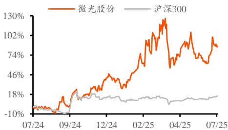  
最近一年股票与沪深 300比较  
资料来源：Wind，甬兴证券研究所

# 相关报告：

<table><tr><td>单位：百万元</td><td>2024A</td><td>2025E</td><td>2026E</td><td>2027E</td></tr><tr><td>营业收入</td><td>1,409</td><td>1,645</td><td>1,912</td><td>2,225</td></tr><tr><td>年增长率 (%)</td><td>11.1%</td><td>16.8%</td><td>16.2%</td><td>16.4%</td></tr><tr><td>归属于母公司的净利润</td><td>221</td><td>352</td><td>420</td><td>493</td></tr><tr><td>年增长率 (%)</td><td>82.2%</td><td>59.4%</td><td>19.3%</td><td>17.5%</td></tr></table>

<table><tr><td>每股收益（元）</td><td>0.96</td><td>1.53</td><td>1.83</td><td>2.15</td></tr><tr><td>市盈率 (X)</td><td>25.48</td><td>21.74</td><td>18.22</td><td>15.51</td></tr><tr><td>净资产收益率 (%)</td><td>13.3%</td><td>18.7%</td><td>19.5%</td><td>20.0%</td></tr></table>

资料来源：Wind，甬兴证券研究所 (2025 年07月11日收盘价)

# 正文目录

# 1.．微光股份：业绩重回增长，产品矩阵和应用不断丰富….

# 2．基盘业务：制冷电机及风机保持稳健增长，伺服电机打造第二增长极

#

# 3.新兴业务：积极布局人形机器人以及空天海等智能驱动领域….12

# 4．盈利预测与投资建议... .14

# 5.风险提示 .15

# 图目录

图1：公司营收情况（亿元）. 6  
图2：公司分产品营收情况（亿元）（原始口径） .6  
图3：公司分产品毛利率情况（原始口径）. .6  
图4：公司分产品营收情况（亿元）（重分类) .7  
图5：公司分产品毛利率情况（重分类）.. ..7  
图6：公司分地区营收情况.. ..7  
图7：公司分地区毛利率情况. ..7  
图8：公司盈利能力情况.. ..8  
图9：公司期间费用率情况... ..8  
图10：公司归母净利润情况(亿元) ..8  
图11：公司扣非归母净利润情况（亿元) ..8  
图12：全球冷链物流市场规模（亿美元） .9  
图13：中国冷链物流市场规模（亿美元) .9  
图14：全球伺服市场规模（亿美元) .9  
图15：中国伺服市场规模（亿元) ..9  
图16：中国通用伺服市场不同系别情况.. ..10  
图17: 2023年伺服市场竞争格局.. ..10  
图18：公司外转子风机销量情况（万台） ..11  
图19：公司ECM电机销量情况（万台） .11  
图20：公司冷柜电机销量情况（万台) .11  
图 21：公司伺服电机销量情况（万台） 11  
图22：全球人形机器人市场规模（亿美元） .12  
图23：中国人形机器人市场规模（亿元）. .12  
图 24：全球无框力矩电机市场规模(亿美元) .12  
图 25：全球空心杯电机市场规模（亿美元) .13  
图 26：中国空心杯电机市场规模(亿美元) .13  
图27: 2030年人形机器人各零部件价值量占比情况.. 13

# 表目录

表1：公司历史沿革. .5表2：公司主要产品. ..5表3：公司伺服电机产品系列. 11表4：公司项目情况..

表 5：公司盈利预测(亿元) .14

# 1.微光股份：业绩重回增长，产品矩阵和应用不断丰富

# 1.1.公司概况：专注冷链主业，拓宽业务边界

杭州微光电子股份有限公司是国家高新技术企业、工信部制造业单项冠军示范企业、中国电子元件百强企业，拥有国家认可实验室、省重点企业研究院，下设4 家全资子公司———杭州微光技术有限公司、杭州微光创业投资有限公司、杭州微光进出口有限公司、微光（泰国）有限公司。公司专业从事电机、风机、微特电机、泵、驱动与控制器、机器人与自动化装备的研发、生产和销售。

表1:公司历史沿革  

<table><tr><td>时间</td><td>事件</td></tr><tr><td>1986</td><td>杭州微光电子设备厂成立</td></tr><tr><td>1998</td><td>公司改制为股份合作制</td></tr><tr><td>2003</td><td>主要产品分别取得CE、VDE、UL、CCC 认证，与著名电机厂开始OEM生产</td></tr><tr><td>2014</td><td>年产200万台外转子风机、300万台ECM电机及研发中心建设项目”竣工</td></tr><tr><td>2016</td><td>深交所挂牌上市</td></tr><tr><td>2017</td><td>成立伺服电机事业部，投资年产30 万台伺服电机项目</td></tr><tr><td>2019</td><td>公司荣获“第四批制造业单项冠军示范企业”。</td></tr><tr><td>2022</td><td>公司注册设立全资子公司杭州微光创业投资有限公司、微光（泰国）有限公司</td></tr><tr><td>2023</td><td>年产670万台（套）电机、风机及自动化装备建设项目、微光（泰国）有限公 司年产800万台微电机项目开工建设</td></tr></table>

资料来源：微光股份官网，公司公告，甬兴证券研究所

公司围绕绿色低碳、智能制造，加快高效节能、智能新产品开发和产业化进程，丰富产品系列及品种。公司主要产品为制冷电机及风机、伺服电机。产品具有广泛的应用空间，制冷电机及风机主要应用于制冷、空调、通风等，并不断向储能、热泵、数据中心等领域拓展；伺服电机主要应用于工业自动化、机器人、纺织机械、数控机床等领域。

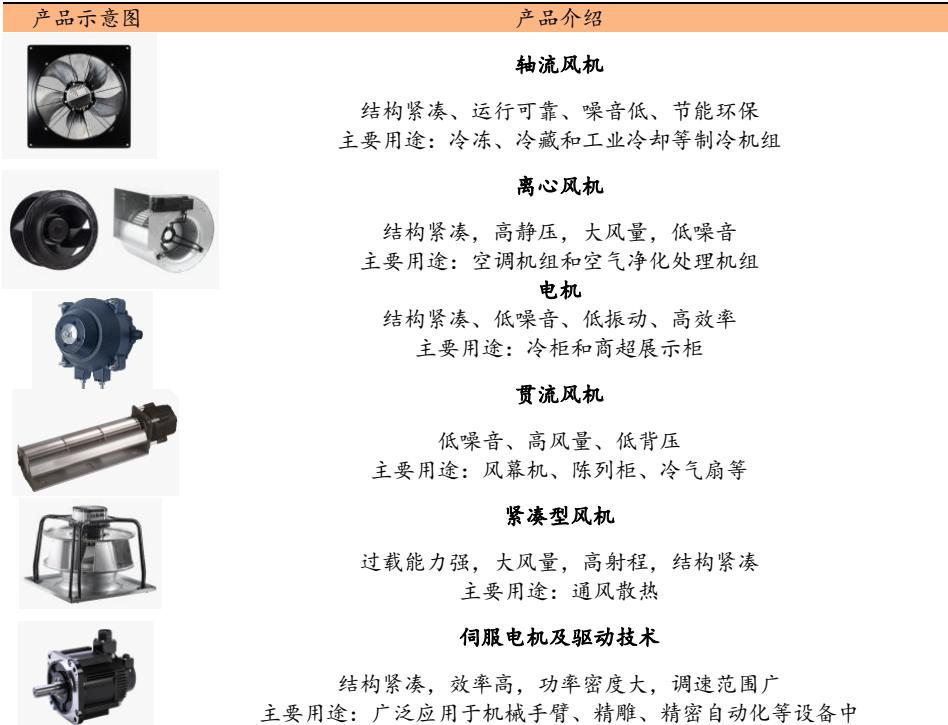  
表2:公司主要产品  
资料来源：微光股份官网，甬兴证券研究所

# 1.2.财务分析：产品结构优化，海内外市场齐头并进

公司营收稳健增长。2024 年，公司营收实现约 14.09 亿元，同比约$+ 1 1 . 1 2 \%$ ， $2 0 1 9 { \sim } 2 0 2 4$ 年 CAGR 约为 $1 2 . 1 5 \%$ 。

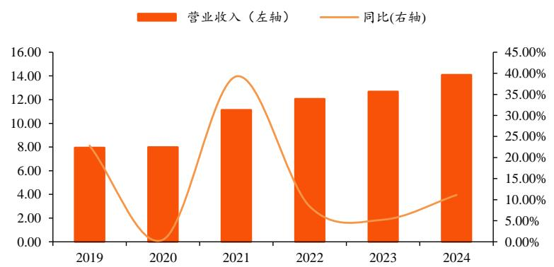  
图1:公司营收情况（亿元)  
资料来源：iFind，甬兴证券研究所

产品结构优化，伺服电机收入占比持续提升。冷柜电机、外转子风机与ECM电机为公司传统主业，2023 年三项业务合计占比达约 $8 9 . 6 2 \%$ ；伺服电机近年来收入占比持续提升，伺服电机收入占比由 2018 年的 $0 . 5 1 \%$ 提升至2024年的 $7 . 6 3 \%$ 。

公司海内外收入并驾齐驱。据公司投资者关系交流纪要，2020年受公共卫生事件影响，公司外销收入有所下滑，自 2020 年第四季度影响减弱，国外订单有所修复。2021年，国外同行头部企业受疫情影响较大，产能受到影响，交货不及时，部分客户转移到公司，公司市占率提升。2022 年公司积极开拓海外终端客户。2024 年度公司境外销售中各区域占比欧洲 $5 7 \%$ ,亚洲 $24 \%$ ，南美洲 $1 0 \%$ ，北美洲 $5 \%$ ，非洲 $3 \%$ ，大洋洲 $1 \%$ ，公司对美出口基数小且占比不高，此外泰国工厂的投产也将带来积极影响。

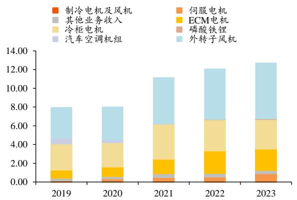  
图2:公司分产品营收情况（亿元）（原始口径）  
资料来源：iFind，甬兴证券研究所

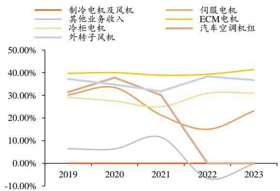  
图3:公司分产品毛利率情况（原始口径）  
资料来源：iFind，甬兴证券研究所

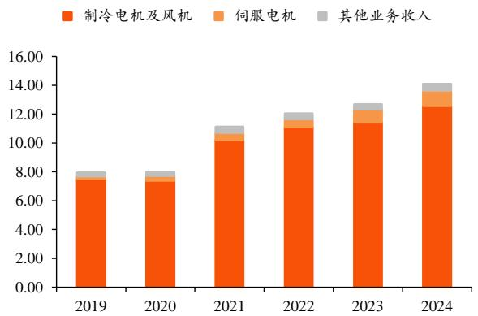  
图4:公司分产品营收情况（亿元）（重分类)  
资料来源：iFind，甬兴证券研究所注：2020年\~2023年制冷电机及风机采用ECM电机、冷柜电机、磷酸铁锂、汽车空调机组、外转子风机五项总和

  
图5:公司分产品毛利率情况（重分类）  
资料来源：iFind，甬兴证券研究所注：2020年\~2023年制冷电机及风机采用ECM电机、冷柜电机、磷酸铁锂、汽车空调机组、外转子风机五项总和

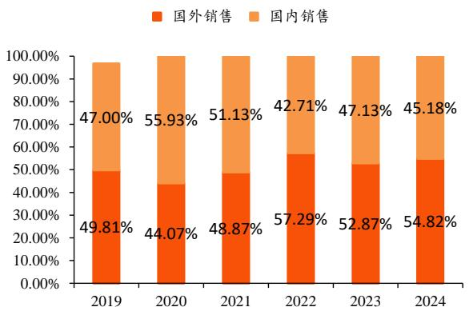  
图6:公司分地区营收情况  
资料来源：iFind，甬兴证券研究所

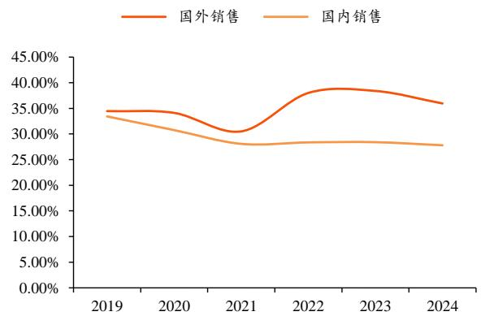  
图7:公司分地区毛利率情况  
资料来源：iFind，甬兴证券研究所

加强成本费用控制，各项费率均保持在较低水平。公司期间费用率由2019 年的约 $1 1 . 0 9 \%$ 下降至2024年的 $6 . 2 3 \%$ o

据公司 2023 年年报，由于公司及子公司购买的中融国际信托发行的信托产品合计约4.08亿元逾期/延期兑付，导致公司确认约 2.04亿元公允价值变动损失，拖累公司利润表现。据公司 2024 年年报，2024 年确认公允价值变动损失约1.10亿元。

2024 年，公司归母净利润实现约2.21 亿元,同比约 $+ 8 2 . 1 6 \%$ ,2019\~2024年CAGR约为 $6 . 0 2 \%$ ；公司扣非归母净利润实现约3.02亿元，同比约 $+ 8 . 3 9 \%$ ,$2 0 1 9 { \sim } 2 0 2 4$ 年CAGR 约为 $1 7 . 3 0 \%$ 。

  
图8:公司盈利能力情况  
资料来源：iFind，甬兴证券研究所

  
图9:公司期间费用率情况  
资料来源：iFind，甬兴证券研究所

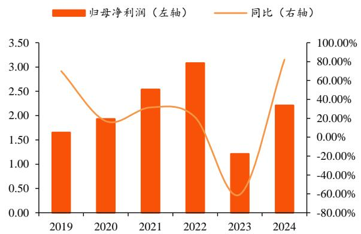  
图10:公司归母净利润情况（亿元)  
资料来源：iFind，甬兴证券研究所

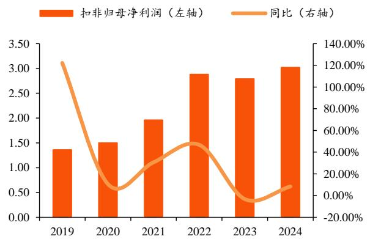  
图11:公司扣非归母净利润情况 (亿元)  
资料来源：iFind，甬兴证券研究所

# 2.基盘业务：制冷电机及风机保持稳健增长，伺服电机打造第二增长极

# 2.1.市场规模：冷链物流政策利好凸显，伺服系统国产替代加速

# (1）冷链物流：

据Global Market Insights，2024 年全球冷链物流市场规模约 3410亿美元，预计2034年将达约1.19万亿美元，2025年 ${ \sim } 2 0 3 4$ 年CAGR约 $1 5 . 3 \%$ 。据 Mordor Intelligence，预计2024 年中国冷链物流市场规模约为858.2 亿美元，预计到2029 年将达到约1386.6亿美元，2024 年 $\sim 2 0 2 9$ 年CAGR 约为$1 0 . 0 7 \%$ 。

  
图12:全球冷链物流市场规模（亿美元)

资料来源：Global Market Insights，甬兴证券研究所

  
图13:中国冷链物流市场规模（亿美元)  
资料来源：Mordor Intelligence，甬兴证券研究所

国家对冷链物流高度重视，支持冷链产业发展。据公司2024年年报，2019年“冷链物流”上了中央政治局会议，要求实施城乡冷链物流基础设施补短板工程。中央一号文件多次强调加强我国农产品冷链物流体系建设。2021年12月，国务院办公厅印发《“十四五”冷链物流发展规划》，为我国冷链物流行业发展营造良好的政策环境。国家发改委印发《国家骨干冷链物流基地建设实施方案》，到2025年布局建设100个国家骨干冷链物流基地。2024 年3 月5 日国务院政府工作报告也提到要加强冷链物流建设。公司的主要产品制冷电机及风机是冷链设备的主要零部件之一，冷链物流的发展将给公司带来发展机遇。

# (2）伺服系统：

据中研网，全球伺服控制市场规模在2024 年将超过150 亿美元，并预计到2030 年将超过 220 亿美元。2021 年中国伺服系统市场规模达约121.97亿元，2027 年市场规模预计将达到约 650 亿元人民币左右， $2 0 2 1 { \sim } 2 0 2 7$ 年CAGR 约为 $7 . 2 \%$ o

  
图14:全球伺服市场规模（亿美元)  
资料来源：中研网，甬兴证券研究所

  
图15:中国伺服市场规模（亿元)  
资料来源：中研网，甬兴证券研究所

通用伺服国产替代持续加速，国产品牌市场份额提升。国内厂商通过引进、消化吸收国际先进技术等举措，不断加强伺服系统相关的技术研发和生产能力，国产伺服系统的产品质量和技术水平不断提升，国产品牌市场份额持续提升。根据 MIR DATABANK 数据显示，2024 年中国（大陆及港澳台）厂商市场份额提升至约 $5 9 \%$ ，2027 年有望提升至 $6 5 \%$ 。

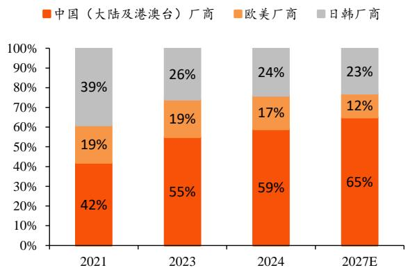  
图16:中国通用伺服市场不同系别情况  
资料来源：MIR睿工业，甬兴证券研究所

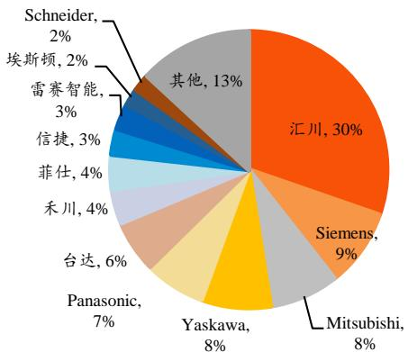  
图17:2023 年伺服市场竞争格局  
资料来源：格物致胜，甬兴证券研究所

# 2.2.公司：积极拓展产品应用领域，海内外产能陆续释放

一方面公司不断拓宽制冷电机及风机的应用领域，基本盘稳健发展；另一方面公司伺服电机进入放量阶段，未来有望成为第二增长极。

（1）冷链物流相关：制冷电机及风机销量稳中有升，2015\~2023年销量年复合增速约 $6 . 8 3 \%$ 。其中，2023年ECM电机销量占制冷电机及风机销量的约 $1 4 . 2 4 \% _ { \circ } 2 0 2 4$ 年度公司制冷电机及风机在热泵、储能、现代农牧业、新风系统等行业开拓有成效，2024年销量约1469.33 万台，同比约 $+ 9 . 1 4 \%$ o

（2）伺服电机：公司拥有4大系列产品，布局通用自动化以及工业机器人等市场。经过多年发展，2024 年伺服电机销量约28.85 万台，同比约$+ 2 7 . 8 2 \%$ 。成本端，公司自制编码器并实现量产，公司未来计划自制率提升到 $1 0 0 \%$ ，从而降低成本，提升市场竞争力。

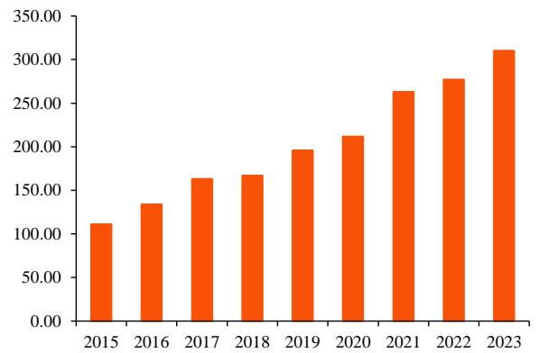  
图18:公司外转子风机销量情况（万台）  
资料来源：iFind，甬兴证券研究所

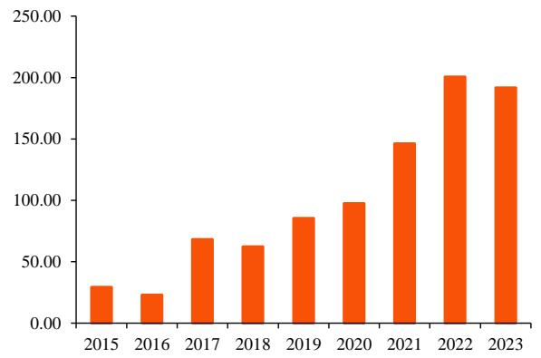  
图19:公司ECM电机销量情况（万台）  
资料来源：iFind，甬兴证券研究所

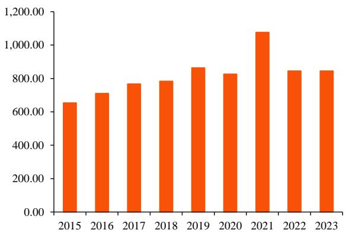  
图20:公司冷柜电机销量情况（万台）  
资料来源：iFind，甬兴证券研究所

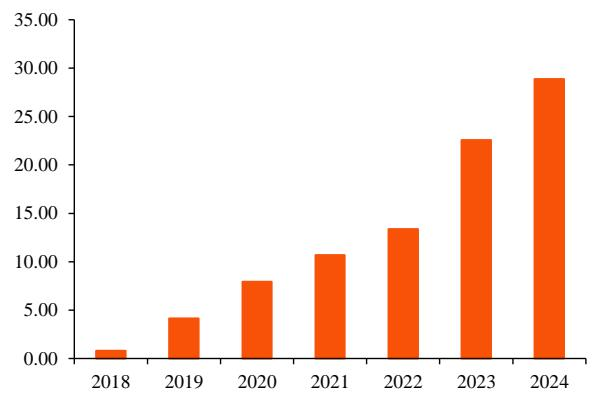  
图21:公司伺服电机销量情况（万台）  
资料来源：iFind，甬兴证券研究所

表3:公司伺服电机产品系列  

<table><tr><td>产品系列</td><td>应用领域</td></tr><tr><td>WA系列</td><td>纺织机械等通用自动化行业</td></tr><tr><td>WB系列</td><td>工业机器人、精雕等高端市场；</td></tr><tr><td>WD系列</td><td>中高端数控机床等防护要求和输出特性要求高的场所</td></tr><tr><td>WE系列</td><td>AGV小车、移动机器人等</td></tr></table>

资料来源：iFind，甬兴证券研究所

公司海内外产能陆续释放。据公司 2025 年4 月公告，公司泰国子公司已取得生产许可、通过了ISO9001质量管理体系认证，产品取得CE、UL、VDE认证，已正常生产，已形成销售。

公司泰国子公司计划全产业链生产，初步生产制冷电机及风机，现已投产，逐步扩大规模。国内新项目争取建设成“未来工厂”，计划生产ECM电机、伺服电机及机器人核心零部件等。

表4:公司项目情况  

<table><tr><td>项目名称</td><td>投武</td><td>贵金康</td><td>项目进度</td><td>预计收益</td></tr><tr><td>年产670万台（套）电机、风机及自动化装备</td><td>自建</td><td>自筹</td><td>主体结构已结，计划2025年</td><td>预计项目建成后新增年净利润1400</td></tr><tr><td>微光泰国年产800 万台微电机建设项目</td><td>自建</td><td>自筹</td><td>试产中</td><td>预计项目建成后新增年净利润 9000 万 元</td></tr></table>

资料来源：公司公告，iFind，甬兴证券研究所

# 3.新兴业务：积极布局人形机器人以及空天海等智能驱动领域

# 3.1.市场规模：2028 年全球人形机器人市场规模约 206 亿美元

据中商产业研究院，2024 年全球人形机器人产业规模约为 34 亿美元，预计2025 年、2028 年全球人形机器人产业规模将分别达约53 亿美元、206亿美元。2024 中国人形机器人产业规模约 27.6 亿元，预计2025 年、2028年中国人形机器人产业规模将将分别达约 53 亿元、387 亿元。

  
图22:全球人形机器人市场规模（亿美元)  
资料来源：中商产业研究院，甬兴证券研究所

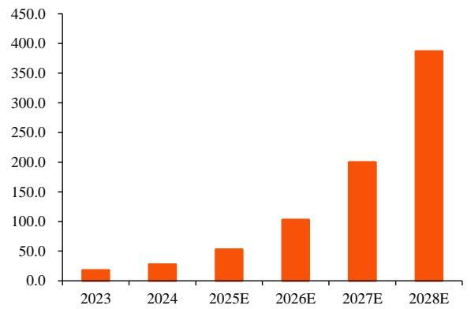  
图23:中国人形机器人市场规模（亿元）  
资料来源：中商产业研究院，甬兴证券研究所

据QYResearch 的统计及预测，2023 年全球无框电机市场规模约 6.7 亿美元，预计到2030年将达到约12亿美元， $2 0 2 4 { \sim } 2 0 3 0$ 年CAGR 约为 $9 . 0 \%$ o

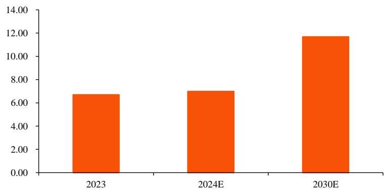  
图24:全球无框力矩电机市场规模（亿美元)

资料来源：QY Research，甬兴证券研究所

据QY Research 和中商情报网的统计及预测，2023 年全球空心杯电机市场规模约 8.1 亿美元，预计到 2028 年将达到约11.9 亿美元。2023 年中国空心杯电机市场规模约 2.9 亿美元，预计到 2028 年将达到约 4.7 亿美元。

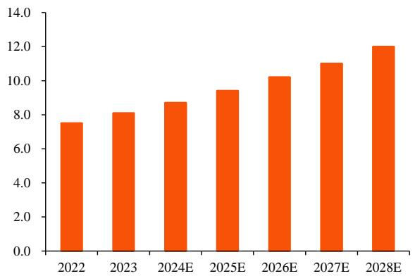  
图25:全球空心杯电机市场规模（亿美元)  
资料来源：QYResearch，中商情报网，甬兴证券研究所

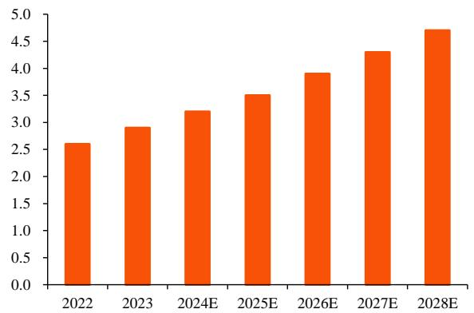  
图26:中国空心杯电机市场规模(亿美元)  
资料来源：QYResearch，中商情报网，甬兴证券研究所

在人形机器人产业链上游的核心零部件中，行星滚柱丝杠价值量占比较高。行星滚柱丝杠制造难度大、壁垒高，产能主要集中于欧洲、美国等，中国企业起步较晚，规模较小，国内市场主要依靠海外进口。据前瞻产业研究院及Tesla AI Day，预计 2030 年无框力矩电机、空心杯电机价值量占比分别约 $1 6 \%$ $8 \%$ 。

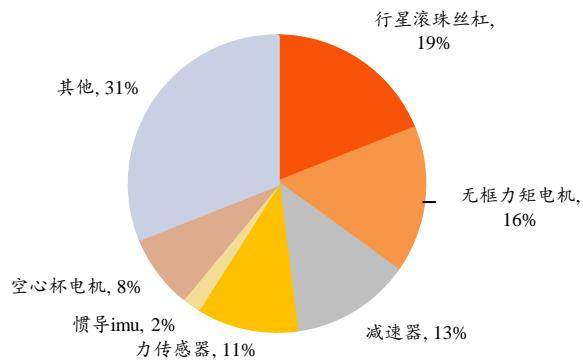  
图27:2030 年人形机器人各零部件价值量占比情况  
资料来源：前瞻产业研究院，Tesla AIDay，甬兴证券研究所

# 3.2.公司：积极布局人形机器人以及空天海等智能驱动领域

公司伺服电机、空心杯电机、无框力矩电机可应用于人形机器人。据公司投资者互动问答，公司丰富伺服电机产品系列，拓展应用领域，向伺服系统、运动控制、机器人与自动化拓展；公司加快人形机器人核心部件空心杯电机、无框力矩电机、关节模组等开发及产业化，三款产品在积极送样，不断提高机器人产业规模和市场竞争力。

据公司 2024 年年报，2024 年公司开发3 款空心杯电机、4 款无框力矩电机，主要辐射人形机器人、医疗设备、航空航天领域，预计可新增年销售分别约为0.3亿元、0.4亿元。

据微光股份微信公众号，2023 年9 月16日，公司与西北工业大学无人系统技术研究院签署合作协议，共建“智能电推进技术联合实验室”。鉴于当前数字经济、物联网、人工智能的蓬勃发展，为经济社会发展、产业技术升级提供了巨大的机遇，联合实验室将结合微光股份发展战略和市场需求，依托研究院的优势学科及科研能力，围绕空、天、海等智能驱动领域国家未来重点发展方向，开展产学研用成果转化、新产品新技术的研发等工作，旨在进一步深化校企合作，实现优势互补、合作共赢、与时俱进。

未来，双方将不断深化战略合作，积极构建多层次、多领域、多形式的合作交流机制，携手培养新一代信息技术的创新型科技人才，共同推进人工智能、大数据技术在智能驱动领域的应用研究和产业化，服务国家“双碳”战略发展需求。据iFind 2024 年11月消息，该产学研项目已取得阶段性成果。

# 4.盈利预测与投资建议

# 4.1.盈利预测

# 关键假设：

1）制冷电机及风机：公司冷链主业相关电机优势显著，保持国内市场销量领先地位，受益于我国冷链物流加速发展，以及新应用领域开拓，预计营收将迎来稳定增长，预计 2025\~2027 年收入同比增速保持约 $1 5 \%$ ，毛利率受益于规模效应，有小幅提升，预计 2025\~2027 年分别约为 $3 5 \% , 3 5 \%$ $3 6 \%$ 。

2）伺服电机：积极开发新产品，产品应用场景拓展至AGV、人形机器人等领域，此外泰国及国内产能基地陆续投产，有望增厚营收，预计2025-2027 年营收同比增速分别约 $40 \%$ $30 \%$ $30 \%$ ，毛利率受益于规模效应，有小幅提升，预计 $2 0 2 5 { \sim } 2 0 2 7$ 年分别约为 $2 5 \%$ $2 5 \%$ $2 6 \%$ o

3）其他产品：营收占比较低，24年营收占比约 $3 . 1 4 \%$ ，预计基本维持稳定，预计2025-2027年营收同比增速保持约 $1 0 \%$ ，毛利率维持约 $1 \%$ o

由此，我们预计公司 2025\~2027 年营收同比增速分别约为 $+ 1 6 . 7 5 \%$ $+ 1 6 . 2 2 \%$ , $+ 1 6 . 4 0 \%$ ，毛利率分别约为 $3 2 . 5 8 \%$ , $3 3 . 0 1 \%$ , $3 3 . 4 3 \%$ 。

表5:公司盈利预测（亿元）  

<table><tr><td></td><td>2020</td><td>2021</td><td>2022</td><td>2023</td><td>2024</td><td>2025E</td><td>2026E</td><td>2027E</td></tr><tr><td>公司整体</td><td></td><td></td><td></td><td></td><td></td><td></td><td></td><td></td></tr><tr><td>营业收入</td><td>7.98</td><td>11.12</td><td>12.05</td><td>12.68</td><td>14.09</td><td>16.45</td><td>19.12</td><td>22.25</td></tr><tr><td>yoy</td><td></td><td>39.27%</td><td>8.38%</td><td>5.25%</td><td>11.12%</td><td>16.75%</td><td>16.22%</td><td>16.40%</td></tr><tr><td>营业本</td><td>5.41</td><td>7.86</td><td>7.96</td><td>8.41</td><td>9.54</td><td>11.09</td><td>12.81</td><td>14.81</td></tr><tr><td>yoy</td><td></td><td>45.37%</td><td>1.30%</td><td>5.57%</td><td>13.50%</td><td>16.22%</td><td>15.48%</td><td>15.67%</td></tr><tr><td></td><td>32.24%</td><td>29.27%</td><td>33.89%</td><td>33.69%</td><td>32.27%</td><td>32.58%</td><td>33.01%</td><td>33.43%</td></tr><tr><td>制冷电机及风机</td><td></td><td></td><td></td><td></td><td></td><td></td><td></td><td></td></tr><tr><td>营业收入</td><td>7.38</td><td>10.21</td><td>11.10</td><td>11.41</td><td>12.57</td><td>14.46</td><td>16.63</td><td>19.12</td></tr><tr><td>yoy</td><td></td><td>38.38%</td><td>8.72%</td><td>2.82%</td><td>10.14%</td><td>15%</td><td>15%</td><td>15%</td></tr><tr><td>营业成本</td><td>4.94</td><td>7.11</td><td>7.08</td><td>7.35</td><td>8.27</td><td>9.47</td><td>10.81</td><td>12.33</td></tr></table>

<table><tr><td>毛利率</td><td>33.05%</td><td>30.36%</td><td>36.26%</td><td>35.60%</td><td>34.21%</td><td>35%</td><td>35%</td><td>36%</td></tr><tr><td>伺服电机</td><td></td><td></td><td></td><td></td><td></td><td></td><td></td><td></td></tr><tr><td>营业收入</td><td>0.35</td><td>0.50</td><td>0.56</td><td>0.90</td><td>1.08</td><td>1.51</td><td>1.96</td><td>2.54</td></tr><tr><td>yoy</td><td></td><td>41.25%</td><td>11.31%</td><td>62.27%</td><td>18.97%</td><td>40%</td><td>30%</td><td>30%</td></tr><tr><td>营业成本</td><td>0.24</td><td>0.39</td><td>0.47</td><td>0.69</td><td>0.82</td><td>1.14</td><td>1.47</td><td>1.90</td></tr><tr><td>毛利率</td><td>33.48%</td><td>21.31%</td><td>15.00%</td><td>23.12%</td><td>24.00%</td><td>25%</td><td>25%</td><td>26%</td></tr><tr><td>其他业务收入</td><td></td><td></td><td></td><td></td><td></td><td></td><td></td><td></td></tr><tr><td>营业收入</td><td>0.25</td><td>0.41</td><td>0.39</td><td>0.36</td><td>0.44</td><td>0.49</td><td>0.54</td><td>0.59</td></tr><tr><td>yoy</td><td></td><td>62.83%</td><td>-3.88%</td><td>-7.20%</td><td>22.46%</td><td>10%</td><td>10%</td><td>10%</td></tr><tr><td>营业成本</td><td>0.23</td><td>0.36</td><td>0.42</td><td>0.36</td><td>0.45</td><td>0.48</td><td>0.53</td><td>0.59</td></tr><tr><td>毛利率</td><td>6.36%</td><td>11.53%</td><td>-6.63%</td><td>-0.26%</td><td>-2.74%</td><td>1%</td><td>1%</td><td>1%</td></tr></table>

资料来源：iFind，甬兴证券研究所注：2020 年\~2023 年制冷电机及风机采用ECM 电机、冷柜电机、磷酸铁锂、汽车空调机组、外转子风机五项总和。

# 4.2.投资建议

公司主业受益于下游需求释放及新产品、新应用领域拓展，机器人核心部件及空天海智能驱动布局助力打开长期成长空间，我们预计公司$2 0 2 5 { \sim } 2 0 2 7$ 年营收分别约为16.5亿元、19.1亿元、22.3亿元，同比约 $+ 1 7 \%$ $+ 1 6 \%$ 和 $+ 1 6 \%$ ；归母净利润分别约为3.5亿元、4.2亿元和4.9亿元，同比约$+ 5 9 \%$ $+ 1 9 \%$ 和 $+ 1 7 \%$ ，公司 $2 0 2 5 { \sim } 2 0 2 7$ 年归母净利润CAGR约 $1 8 \%$ 。截至2025 年7月11日，股价对应2025\~2027年PE分别约为21.7倍、18.2倍、15.5 倍。综上考虑，首次覆盖给予“买入”评级。

# 5.风险提示

地缘政治及关税政策调整的风险：2024 年公司产品收入的 $5 4 . 8 2 \%$ 通过出口取得。在地缘政治及关税政策积极稳定、经济平稳发展时期，产品需求量会较大幅度增长；而在地缘政治动荡、关税风险不确定性显著增强、冲突不断时期，产品需求量将急剧下降，公司客户可能存在违约风险。

市场竞争加剧：汽车零部件行业参与者众多，若公司不能保持技术、成本和质量等方面的领先，将对公司业绩产生不利影响。

毛利率下降风险：公司产品的主要原材料是铜、钢材、铝、稀土、电子元器件等，若原材料价格大幅上升，公司与客户协商涨价，但涨价的幅度不能同步于生产成本的上升，公司存在毛利率下降的风险。

委托理财及证券投资的风险：公司委托理财及证券投资受宏观经济、行业政策、团队能力等多种因素影响，可能存在投资实际收益不及预期，本金无法按期收回的风险。

对外投资项目的风险：公司对外投资项目可能因市场、政策、业绩等因素造成发展进程与计划不符，投资回报期较长，退出困难等情况，可能产生投资回报不及预期的风险。

汇率波动：2024 年公司产品境外销售收入占公司营业收入的 $5 4 . 8 2 \%$ ,人民币汇率波动将对公司效益产生较大影响，若人民币持续升值，将给公司带来不利影响。

资产负债表 单位：百万元  

<table><tr><td>至12月31日</td><td>2023A2024A</td><td></td><td>2025E</td><td>2026E</td><td>2027E</td></tr><tr><td>流动资产</td><td>1,188</td><td>1,282</td><td>1,540</td><td>1,917</td><td>2,363</td></tr><tr><td>货币资金</td><td>505</td><td>623</td><td>827</td><td>1,119</td><td>1,460</td></tr><tr><td>应收及预付</td><td>210</td><td>260</td><td>300</td><td>350</td><td>408</td></tr><tr><td>存货</td><td>141</td><td>197</td><td>226</td><td>256</td><td>290</td></tr><tr><td>其他流动资产</td><td>332</td><td>202</td><td>186</td><td>192</td><td>206</td></tr><tr><td>非流动资产</td><td>611</td><td>827</td><td>855</td><td>843</td><td>824</td></tr><tr><td>长期股权投资</td><td>26</td><td>23</td><td>21</td><td>19</td><td>17</td></tr><tr><td>固定资产</td><td>180</td><td>293</td><td>388</td><td>439</td><td>460</td></tr><tr><td>在建工程</td><td>199</td><td>281</td><td>215</td><td>153</td><td>112</td></tr><tr><td>无形资产</td><td>69</td><td>69</td><td>71</td><td>73</td><td>75</td></tr><tr><td>其他长期资产</td><td>137</td><td>160</td><td>160</td><td>160</td><td>160</td></tr><tr><td>资产总计</td><td>1,800</td><td>2,109</td><td>2,394</td><td>2,760</td><td>3,187</td></tr><tr><td>流动负债</td><td>295</td><td>444</td><td>502</td><td>599</td><td>712</td></tr><tr><td>短期借款</td><td>0</td><td>0</td><td>0</td><td>0</td><td>0</td></tr><tr><td>应付及预收</td><td>219</td><td>336</td><td>370</td><td>438</td><td>514</td></tr><tr><td>其他流动负债</td><td>76</td><td>108</td><td>132</td><td>161</td><td>197</td></tr><tr><td>非流动负债</td><td>9</td><td>11</td><td>13</td><td>13</td><td>13</td></tr><tr><td>长期借款</td><td>0</td><td>0</td><td>0</td><td>0</td><td>0</td></tr><tr><td>应付债券</td><td>0</td><td>0</td><td>0</td><td>0</td><td>0</td></tr><tr><td>其他非流动负债</td><td>9</td><td>11</td><td>13</td><td>13</td><td>13</td></tr><tr><td>负债合计</td><td>304</td><td>455</td><td>514</td><td>612</td><td>724</td></tr><tr><td>股本</td><td>230</td><td>230</td><td>230</td><td>230</td><td>230</td></tr><tr><td>资本公积</td><td>115</td><td>115</td><td>115</td><td>115</td><td>115</td></tr><tr><td>留存收益</td><td>1,191</td><td>1,344</td><td>1,569</td><td>1,837</td><td>2,152</td></tr><tr><td>归属母公司股东权益</td><td>1,496</td><td>1,654</td><td>1,880</td><td>2,148</td><td>2,463</td></tr><tr><td>少数股东权益</td><td>0</td><td>0</td><td>0</td><td>0</td><td>0</td></tr><tr><td>负债和股东权益</td><td>1,800</td><td>2,109</td><td>2,394</td><td>2,760</td><td>3,187</td></tr></table>

利润表 单位：百万元  

<table><tr><td>至12月31日</td><td>2023A2024A</td><td></td><td>2025E</td><td>2026E</td><td>2027E</td></tr><tr><td>营业收入</td><td>1,268</td><td>1,409</td><td>1,645</td><td>1,912</td><td>2,225</td></tr><tr><td>营业成本</td><td>843</td><td>954</td><td>1,109</td><td>1,281</td><td>1,481</td></tr><tr><td>营业税金及附加</td><td>9</td><td>10</td><td>11</td><td>12</td><td>14</td></tr><tr><td>销售费用</td><td>19</td><td>21</td><td>25</td><td>29</td><td>34</td></tr><tr><td>管理费用</td><td>27</td><td>30</td><td>35</td><td>40</td><td>47</td></tr><tr><td>研发费用</td><td>60</td><td>57</td><td>66</td><td>82</td><td>100</td></tr><tr><td>财务费用</td><td>-14</td><td>-21</td><td>-22</td><td>-23</td><td>-24</td></tr><tr><td>资产减值损失</td><td>-8</td><td>-4</td><td>-5</td><td>-6</td><td>-8</td></tr><tr><td>公允价值变动收益</td><td>-207</td><td>-110</td><td>-30</td><td>-10</td><td>-5</td></tr><tr><td>投资净收益</td><td>20</td><td>4</td><td>5</td><td>2</td><td>2</td></tr><tr><td>营业利润</td><td>129</td><td>253</td><td>400</td><td>477</td><td>560</td></tr><tr><td>营业外收支</td><td>0</td><td>0</td><td>0</td><td>0</td><td>0</td></tr><tr><td>利润总额</td><td>129</td><td>253</td><td>400</td><td>477</td><td>560</td></tr><tr><td>所得税</td><td>14</td><td>33</td><td>48</td><td>57</td><td>67</td></tr><tr><td>净利润</td><td>115</td><td>221</td><td>352</td><td>420</td><td>493</td></tr><tr><td>少数股东损益</td><td>-6</td><td>0</td><td>0</td><td>0</td><td>0</td></tr><tr><td>归属母公司净利润</td><td>121</td><td>221</td><td>352</td><td>420</td><td>493</td></tr><tr><td>EBITDA</td><td>332</td><td>365</td><td>430</td><td>517</td><td>609</td></tr><tr><td>EPS（元）</td><td>0.53</td><td>0.96</td><td>1.53</td><td>1.83</td><td>2.15</td></tr></table>

资料来源：Wind，甬兴证券研究所

现金流量表 单位：百万元  

<table><tr><td>至12月31日</td><td></td><td>2023A 2024A 2025E</td><td></td><td>2026E</td><td>2027E</td></tr><tr><td>经营活动现金流</td><td>260</td><td>304</td><td>403</td><td>493</td><td>570</td></tr><tr><td>净利润</td><td>115</td><td>221</td><td>352</td><td>420</td><td>493</td></tr><tr><td>折旧摊销</td><td>28</td><td>26</td><td>53</td><td>64</td><td>72</td></tr><tr><td>营运资金变动</td><td>-48</td><td>-34</td><td>-35</td><td>-9</td><td>-12</td></tr><tr><td>其它</td><td>165</td><td>91</td><td>34</td><td>19</td><td>17</td></tr><tr><td>投资活动现金流</td><td>112</td><td>-129</td><td>-75</td><td>-50</td><td>-51</td></tr><tr><td>资本支出</td><td>-143</td><td>-154</td><td>-83</td><td>-54</td><td>-55</td></tr><tr><td>投资变动</td><td>236</td><td>17</td><td>2</td><td>2</td><td>2</td></tr><tr><td>其他</td><td>19</td><td>8</td><td>6</td><td>2</td><td>2</td></tr><tr><td>筹资活动现金流</td><td>-160</td><td>-68</td><td>-125</td><td>-152</td><td>-178</td></tr><tr><td>银行借款</td><td>0</td><td>0</td><td>0</td><td>0</td><td>0</td></tr><tr><td>股权融资</td><td>0</td><td>0</td><td>0</td><td>0</td><td>0</td></tr><tr><td>其他</td><td>-160</td><td>-68</td><td>-125</td><td>-152</td><td>-178</td></tr><tr><td>现金净增加额</td><td>217</td><td>113</td><td>204</td><td>292</td><td>341</td></tr><tr><td>期初现金余额</td><td>288</td><td>505</td><td>618</td><td>822</td><td>1,113</td></tr><tr><td>期末现金余额</td><td>505</td><td>618</td><td>822</td><td>1,113</td><td>1,454</td></tr></table>

主要财务比率  

<table><tr><td>至12月31日</td><td>2023A2024A</td><td></td><td>2025E</td><td>2026E</td><td>2027E</td></tr><tr><td>成长能力</td><td></td><td></td><td></td><td></td><td></td></tr><tr><td>营业收入增长</td><td>5.2%</td><td>11.1%</td><td>16.8%</td><td>16.2%</td><td>16.4%</td></tr><tr><td>营业利润增长</td><td>-62.8%</td><td>95.8%</td><td>57.9%</td><td>19.3%</td><td>17.5%</td></tr><tr><td>归母净利润增长</td><td>-60.7%</td><td>82.2%</td><td>59.4%</td><td>19.3%</td><td>17.5%</td></tr><tr><td>获利能力</td><td></td><td></td><td></td><td></td><td></td></tr><tr><td>毛利率</td><td>33.5%</td><td>32.3%</td><td>32.6%</td><td>33.0%</td><td>33.4%</td></tr><tr><td>净利率</td><td>9.0%</td><td>15.7%</td><td>21.4%</td><td>21.9%</td><td>22.1%</td></tr><tr><td>ROE</td><td>8.1%</td><td>13.3%</td><td>18.7%</td><td>19.5%</td><td>20.0%</td></tr><tr><td>ROIC</td><td>18.0%</td><td>17.8%</td><td>17.7%</td><td>18.6%</td><td>19.2%</td></tr><tr><td>偿债能力</td><td></td><td></td><td></td><td></td><td></td></tr><tr><td>资产负债率</td><td>16.9%</td><td>21.6%</td><td>21.5%</td><td>22.2%</td><td>22.7%</td></tr><tr><td>净负债比率</td><td></td><td>-33.8%-37.7% -44.0%-52.1% -59.3%</td><td></td><td></td><td></td></tr><tr><td>流动比率</td><td>4.03</td><td>2.89</td><td>3.07</td><td>3.20</td><td>3.32</td></tr><tr><td>速动比率</td><td>3.52</td><td>2.41</td><td>2.58</td><td>2.73</td><td>2.87</td></tr><tr><td>营运能力</td><td></td><td></td><td></td><td></td><td></td></tr><tr><td>总资产周转率</td><td>0.71</td><td>0.72</td><td>0.73</td><td>0.74</td><td>0.75</td></tr><tr><td>应收账款周转率</td><td>6.96</td><td>6.18</td><td>6.02</td><td>6.03</td><td>6.01</td></tr><tr><td>存货周转率</td><td>5.29</td><td>5.65</td><td>5.24</td><td>5.32</td><td>5.43</td></tr><tr><td>每股指标（元）</td><td></td><td></td><td></td><td></td><td></td></tr><tr><td>每股收益</td><td>0.53</td><td>0.96</td><td>1.53</td><td>1.83</td><td>2.15</td></tr><tr><td>每股经营现金流</td><td>1.13</td><td>1.33</td><td>1.76</td><td>2.15</td><td>2.48</td></tr><tr><td>每股净资产</td><td>6.51</td><td>7.20</td><td>8.19</td><td>9.35</td><td>10.72</td></tr><tr><td>估值比率</td><td></td><td></td><td></td><td></td><td></td></tr><tr><td>P/E</td><td>41.04</td><td>25.48</td><td>21.74</td><td>18.22</td><td>15.51</td></tr><tr><td>P/B</td><td>3.34</td><td>3.40</td><td>4.07</td><td>3.56</td><td>3.10</td></tr><tr><td>EV/EBITDA</td><td>13.54</td><td>13.68</td><td>15.86</td><td>12.62</td><td>10.17</td></tr></table>

# 分析师声明

本报告署名分析师具有中国证券业协会授予的证券投资咨询执业资格并注册为证券分析师，以勤勉尽责的职业态度，专业审慎的研究方法，独立、客观地出具本报告，保证报告采用的信息均来自合规渠道，并对本报告的内容和观点负责。负责准备以及撰写本报告的所有研究人员在此保证，本报告所发表的任何观点均清晰、准确、如实地反映了研究人员的观点和结论，并不受任何第三方的授意或影响。此外，所有研究人员薪酬的任何部分不曾、不与、也将不会与本报告中的具体推荐意见或观点直接或间接相关。

# 公司业务资格说明

甬兴证券有限公司经中国证券监督管理委员会核准，取得证券投资咨询业务许可，具备证券投资咨询业务资格。

投资评级体系与评级定义  

<table><tr><td>股票投资评级：</td><td>分析师给出下列评级中的其中一项代表其根据公司基本面及（或）估值预期以报告日起6 个月 内公司股价相对于同期市场基准指数表现的看法。</td></tr><tr><td></td><td>买入 股价表现将强于基准指数 20%以上</td></tr><tr><td></td><td>增持 股价表现将强于基准指数5-20%</td></tr><tr><td></td><td>中性 股价表现将介于基准指数土5%之间</td></tr><tr><td></td><td>减持 股价表现将弱于基准指数 5%以上</td></tr><tr><td>行业投资评级：</td><td>分析师给出下列评级中的其中一项代表其根据行业历史基本面及（或）估值对所研究行业以报告 日起12个月内的基本面和行业指数相对于同期市场基准指数表现的看法。</td></tr><tr><td></td><td>增持 行业基本面看好，相对表现优于同期基准指数</td></tr><tr><td></td><td>中性 行业基本面稳定，相对表现与同期基准指数持平</td></tr><tr><td></td><td>减持 行业基本面看淡，相对表现弱于同期基准指数</td></tr><tr><td></td><td>相关证券市场基准指数说明：A股市场以沪深 300 指数为基准；港股市场以恒生指数为基准；新三板市场以三板成 指（针对协议转让标的）或三板做市指数（针对做市转让标的）为基准指数。</td></tr></table>

投资评级说明：

不同证券研究机构采用不同的评级术语及评级标准，投资者应区分不同机构在相同评级名称下的定义差异。本评级体系采用的是相对评级体系。投资者买卖证券的决定取决于个人的实际情况。投资者应阅读整篇报告，以获取比较完整的观点与信息，投资者不应以分析师的投资评级取代个人的分析与判断。

# 特别声明

在法律许可的情况下，甬兴证券有限公司(以下简称“本公司”）或其关联机构可能会持有报告中涉及的公司所发行的证券或期权并进行交易，也可能为这些公司提供或争取提供投资银行、财务顾问以及金融产品等各种服务。因此，投资者应当考虑到本公司或其相关人员可能存在影响本报告观点客观性的潜在利益冲突，投资者请勿将本报告视为投资或其他决定的唯一参考依据。也不应当认为本报告可以取代自己的判断。

# 版权声明

本报告版权归属于本公司所有，属于非公开资料。本公司对本报告保留一切权利。未经本公司事先书面许可，任何机构或个人不得以任何形式翻版、复制、转载、刊登和引用本报告中的任何内容。否则由此造成的一切不良后果及法律责任由私自翻版、复制、转载、刊登和引用者承担。

# 重要声明

本报告由本公司发布，仅供本公司的客户使用，且对于接收人而言具有保密义务。本公司并不因相关人员通过其他途径收到或阅读本报告而视其为本公司的客户。客户应当认识到有关本报告的短信提示、电话推荐及其他交流方式等只是研究观点的简要沟通，需以本公司发布的完整报告为准，本公司接受客户的后续问询。本报告首页列示的联系人，除非另有说明，仅作为本公司就本报告与客户的联络人，承担联络工作，不从事任何证券投资咨询服务业务。

本报告中的信息均来源于我们认为可靠的已公开资料，本公司对这些信息的真实性、准确性及完整性不作任何保证。本报告中的信息、意见等均仅供客户参考，该等信息、意见并未考虑到获取本报告人员的具体投资目的、财务状况以及特定需求，在任何时候均不构成对任何人的个人推荐。客户应当对本报告中的信息和意见进行独立评估，并应同时思量各自的投资目的、财务状况以及特定需求，必要时就法律、商业、财务、税收等方面咨询专家的意见。客户应自主作出投资决策并自行承担投资风险。本公司特别提示，本公司不会与任何客户以任何形式分享证券投资收益或分担证券投资损失，任何形式的分享证券投资收益或者分担证券投资损失的书面或口头承诺均为无效。市场有风险，投资须谨慎。对依据或者使用本报告所造成的一切后果，本公司和关联人员均不承担任何法律责任。

本报告所载的意见、评估及预测仅反映本公司于发布本报告当日的判断。该等意见、评估及预测无需通知即可随时更改。过往的表现亦不应作为日后表现的预示和担保。在不同时期，本公司可发出与本报告所载意见、评估及预测不一致的研究报告。本公司不保证本报告所含信息保持在最新状态。同时，本公司的销售人员、交易人员以及其他专业人士可能会依据不同假设和标准、采用不同的分析方法而口头或书面发表与本报告意见及建议不一致的市场评论或交易观点。本公司没有将此意见及建议向报告所有接收者进行更新的义务。投资者应当自行关注相应的更新或修改。