普洛药业（000739.SZ）CDMO 四问四答

# 华丽蜕变，跻身国内CDMO 头部梯队

我们曾于2021 年发布《三问普洛药业CDMO：结构、兽药、优势》，时隔四年，我们再用四问四答更新普洛药业 CDMO 业务近年进展，并看好公司 CDMO业务的高潜力驱动公司持续发展。

□问一：为什么我们认为普洛药业已逐步进阶跻身国内CDMO 头部梯队？——经过二十多年的积累，以及近年的加速着力重点建设和实力提升，公司 2020年以来已连续 5 年位居《中国医药 CDMO 企业 20 强》榜单前 5 名。

□ 从行业横向对比来看，普洛药业CDMO业务的收入体量、增速、项目数量已处于行业头部梯队中；公司目标是2-3年后，CDMO 运营项目能达到 3000个，每年有10-20 个进入商业化。从公司自身业务趋势来看，CDMO收入、利润占比提升，已成为驱动公司业绩增长的主要力量，并有望在未来持续扩大占比。

□ 问二：研发D 端能力进度如何？——快速发展，漏斗前沿不断拓宽。公司以“M”端业务起家，因此市场亦非常关注公司“D”端能力进展。近年公司持续加大对CDMO研发费用投入，CDMO研发人员不断扩张（研发人员 $5 0 0 +$ ,预计未来2年内可能会扩展到1000人左右），增强了前端项目的承接能力及成本控制能力，导流效应逐步体现。公司已经形成全球三大研发中心、两大支持中心、八大技术平台（合成生物学及酶催化、流体化学、晶体粉体技术、泛偶联、高活、多肽技术等）的完整研发体系。

□问三：制造 M 端传统优势是否持续巩固？——大规模产能与先进灵活产能兼具，通过多个国际认证服务全球客户。公司CDMO 可与原料药业务协同发展，公司八家生产子公司总化学合成能力可达 $1 1 , 0 0 0 \mathsf { m } ^ { 3 }$ ，总生物发酵生产能力可达 $6 { , } 5 7 0 \mathsf m ^ { 3 }$ ，公司经营能力强；同时公司建设了流体化学、高活性化合物、CDMO柔性等多条技术水平高、市场稀缺性高的高端产能；质量及体系方面，公司通过了WHO、FDA、欧盟 EDQM、德国 EUGMP 及日本 PMDA 认证，优良的体系认证能够更好服务国内外客户的不同阶段项目。

□问四：如何看待普洛CDMO 未来的空间？——从项目、客户角度看，后劲充沛。1）从客户端看，截止24 年末公司已与 572 家国内外创新药企业签订保密协议，4 类客户共同发力（Bigpharma 为基石占比 $40 \% +$ ，国内创新药企占比 ${ \sim } 2 0 \%$ 有望继续提升，及海外Biotech、欧美CDMO），公司在美国波士顿、德国法兰克福、日本东京等地设立了BD 办公室推动业务发展。2）从项目端看，公司API项目22个已经进入商业化阶段，15个正在验证阶段，79个API项目处于小试研发阶段，为公司业务加速发展带来更强确定性。

□投资建议：我们认为普洛药业 CDMO 业务从技术投入到制造端体系进行了全面升级，成为驱动公司未来增长的重要动力。考虑到公司原料药业务结构调整和制剂集采续标影响，我们调整公司盈利预测，预计公司2025-2027 年归母净利润10.0、12.1、15.2亿元，同比 $- 3 \%$ $+ 2 1 \%$ $+ 2 5 \%$ ，对应当前PE17、14、11倍，维持“强烈推荐”投资评级。

】风险提示：原料药产品降价风险、集采续采等导致制剂价格降低、CDMO 项目推进进度低于预期、地缘政治风险等。

# 强烈推荐（维持)

消费品/生物医药目标估值：NA当前股价：14.8 元

# 基础数据

总股本（百万股） 1158已上市流通股(百万股) 1158总市值（十亿元） 17.1流通市值(十亿元） 17.1每股净资产(MRQ) 6.0ROE (TTM) 14.8资产负债率 $4 4 . 9 \%$ 主要股东 横店集团控股有限公司主要股东持股比例 $2 8 . 3 \%$

股价表现   

<table><tr><td>%</td><td>1m</td><td>6m</td><td>12m</td></tr><tr><td>绝对表现</td><td>2</td><td>-0</td><td>13</td></tr><tr><td>相对表现</td><td>-2</td><td>-6</td><td>-1</td></tr></table>

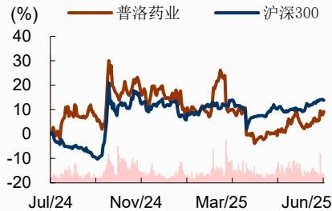  
资料来源：公司数据、招商证券

# 相关报告

1、《普洛药业(000739)—原料药、制剂短期承压，CDMO项目数量保持高速增长趋势》2025-03-182、《普洛药业(000739）—汇兑波动影响当期利润，2030 新战略引领各业务持续开拓新增长力量》2024-10-213、《普洛药业(000739)—高基数下实现增长，单季度利润再创新高》2024-08-16

梁广楷 S1090524010001 liangguangkai@cmschina.com.cn 许菲菲S1090520040003 xufeifei@cmschina.com.cn 侯彪 S1090525070010 houbiao@cmschina.com.cn

财务数据与估值  

<table><tr><td>会计年度</td><td>2023</td><td>2024</td><td>2025E</td><td>2026E</td><td>2027E</td></tr><tr><td>营业总收入(百万元)</td><td>11474</td><td>12022</td><td>10035</td><td>9505</td><td>10668</td></tr><tr><td>同比增长</td><td>9%</td><td>5%</td><td>-17%</td><td>-5%</td><td>12%</td></tr><tr><td>营业利润(百万元)</td><td>1220</td><td>1212</td><td>1180</td><td>1424</td><td>1782</td></tr><tr><td>同比增长</td><td>21%</td><td>-1%</td><td>-3%</td><td>21%</td><td>25%</td></tr><tr><td>归母净利润(百万元)</td><td>1055</td><td>1031</td><td>1002</td><td>1211</td><td>1519</td></tr><tr><td>同比增长</td><td>7%</td><td>-2%</td><td>-3%</td><td>21%</td><td>25%</td></tr><tr><td>每股收益(元)</td><td>0.91</td><td>0.89</td><td>0.87</td><td>1.05</td><td>1.31</td></tr><tr><td>PE</td><td>16.2</td><td>16.6</td><td>17.1</td><td>14.2</td><td>11.3</td></tr><tr><td>PB</td><td>2.8</td><td>2.5</td><td>2.3</td><td>2.1</td><td>1.8</td></tr></table>

资料来源：公司数据、招商证券

# 正文目录

一、为什么我们认为普洛逐步进阶跻身国内CDMO 头部梯队？ 5二、研发D端能力进度如何？——快速发展，漏斗前沿不断拓宽 ..10三、制造M端传统优势是否持续巩固？——大规模产能与先进灵活产能建设兼具，服务全球客户 14四、如何看待普洛CDMO 未来的空间？——从项目、客户角度看，后劲充沛..16五、投资建议. 19六、风险提示.. .20

# 图表目录

图1：一图看普洛CDMO业务发展历史.. 5  
图2：2019\~2024 年国内头部CDMO公司小分子业务收入情况对比. .6  
图3：2020\~2024年国内头部CDMO公司小分子业务项目情况对比.. . 7  
图 4：2019\~2024 年国内头部CDMO 公司小分子业务毛利率情况对比…..7  
图5：公司三大业务收入情况.. ..8  
图6：公司CDMO业务收入占比持续提升. .8  
图7：公司三大业务毛利润情况.. .8  
图8：公司CDMO业务毛利润占比持续提升. 8  
图9：公司已经建立起一站式服务的CDMO平台.. 9  
图10：公司研发投入持续增加. .10  
图11：2022年公司研发费用分布， .. 10  
图12：公司高学历员工数量持续增加 .10  
图13：公司研发人员数量占比持续提升， . 10  
图14：公司的流体化学平台.. .. 12  
图15：公司的晶体与粉体工程平台. .. 12  
图16：公司的合成生物学与酶催化平台. ..13  
图17：公司的多肽技术平台.. ..13  
图18：公司的高活化合物平台 .14  
图19：公司2020-2023 年保持高强度资本开支提升先进产能能力 .15  
图20：公司CDMO 商业化生产车间 16  
图21：公司连续化生产车间. .16  
图22：公司CDMO项目已形成漏斗结构，增长动力充沛 17  
图23：2021\~2024 年公司CDMO各阶段项目同比增速变化趋势. ..17  
图24：公司四个类别的CDMO客户 .18  
图25：公司2019 年以来与多家合作伙伴签订战略合作协议 .19  
图26：普洛药业历史PEBand. .19  
图27：普洛药业历史 PB Band .19  
表1：公司CDMO 研发人员逆势快速增加 .10  
表2：公司已在全球布局三大CDMO研发中心， 11  
附：财务预测表. ..21

# 一、为什么我们认为普洛逐步进阶跻身国内CDMO头部梯队?

我们认为，经过二十多年的深耕细作与积累，普洛药业已经从传统原料药公司进阶发展进入国内小分子CDMO 头部梯队。

从公司的 CDMO业务发展阶段来看，可以分为三个大的阶段:

1)2000-2017 早期积累，自2001 年上市以来，公司通过原料药中间体业务积累了丰富的化学合成与生产工艺经验，为后续 CDMO 业务发展奠定了坚实的基础；

2 )2017-2020 战略聚焦，2017年，公司实施组织管理结构和发展战略重大调整，实行“职能 $^ +$ 事业部”的统一管理模式，提出“做精原料药、做强CDMO、做优制剂”战略，单独成立CDMO 事业部，明确聚焦小分子CDMO 领域，目标成为国内领先的一站式服务提供商。初期重点发展覆盖临床前至商业化的化学合成技术，并布局连续化生产、酶催化等绿色工艺提升效率，同时与众多国内外BigPharma及Biotech公司建立了长期战略合作关系；

3）2020-至今，加速发展D 端能力，进一步强化M端优势，项目、BD、客户加速拓展，进入发展快车道。2021年，公司提出“强科技研发、高标准合规、低成本制造”发展理念，持续提升研发创新能力、先进制造能力、体系保障能力和运营效率，企业核心竞争力不断增强。

2020 年以来，公司连续5 年位居《中国医药CDMO 企业 20 强》榜单前5 名。

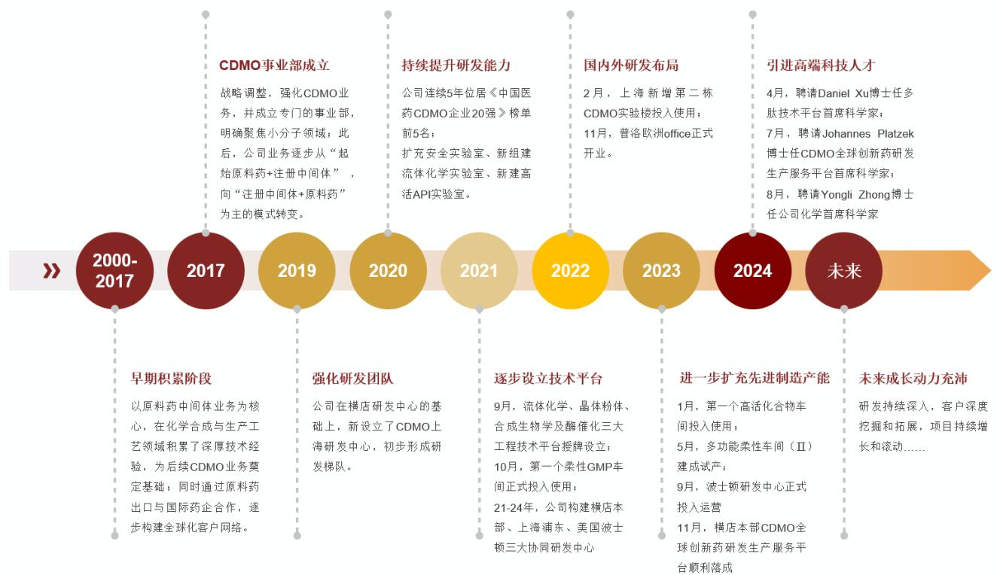  
图1：一图看普洛CDMO业务发展历史  
资料来源：公司公告、招商证券整理绘制

从行业横向对比来看，普洛药业 CDMO 业务的收入体量、增速、项目数量已在国内居前。

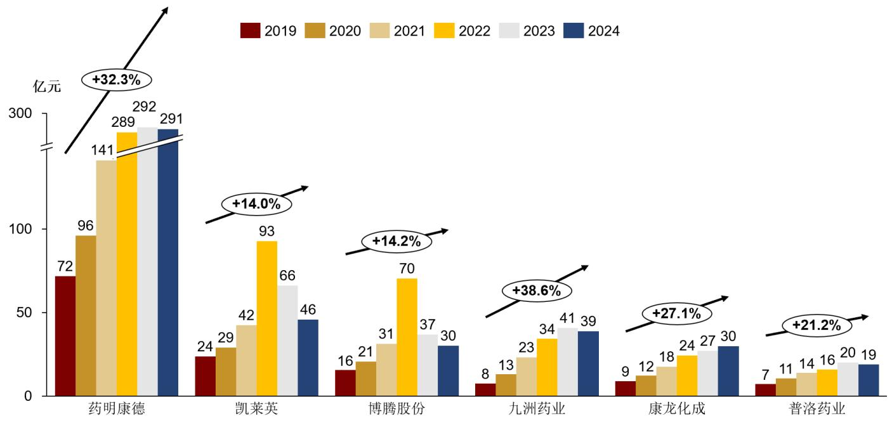  
图2：2019\~2024年国内头部CDMO公司小分子业务收入情况对比  
资料来源：各公司数据、招商证券（备注：药明康德为 Wuxi Chemistry 收入，凯莱英为临床+商业化阶段 CDMO 解决方案收入，康龙化成为小分子CDMO 收入，普洛药业和九洲药业为 CDMO 收入，博腾股份为总营收）

从项目数量看，普洛药业 CDMO 进行中项目数量已处于行业前列，以及验证阶段API数量亦提供更多后续动力。

图3：2020\~2024年国内头部CDMO公司小分子业务项目情况对比  

<table><tr><td>公司</td><td>项目阶段/类型</td><td>2020</td><td>2021H1</td><td>2021</td><td>2022H1</td><td>2022</td><td>2023H1</td><td>2023</td><td>2024H1</td><td>2024</td></tr><tr><td rowspan="5">药明康德（Wa 前及1期</td><td>R</td><td>-</td><td>-</td><td>310000+</td><td>349704</td><td>396773</td><td>424938</td><td>420000+</td><td>450000+</td><td>460000+</td></tr><tr><td></td><td>12</td><td></td><td></td><td></td><td></td><td></td><td></td><td></td><td></td></tr><tr><td></td><td></td><td>113</td><td>131</td><td>122</td><td>129</td><td>20</td><td>2728</td><td>2255</td><td>285</td></tr><tr><td>Ⅲ期</td><td>45</td><td>48</td><td>49</td><td>52</td><td>57</td><td>59</td><td>66</td><td>74</td><td>80</td></tr><tr><td>商业化</td><td>28</td><td>32</td><td>42</td><td>43</td><td>50</td><td>56 招商</td><td>61</td><td>67</td><td>72</td></tr><tr><td rowspan="4">康龙化成</td><td>临床前</td><td></td><td>467</td><td>754</td><td>500</td><td>809</td><td></td><td>659</td><td>498</td><td>782</td></tr><tr><td>I/Ⅱ期</td><td></td><td>197</td><td></td><td>182</td><td>230</td><td>136</td><td>170</td><td>162</td><td>242</td></tr><tr><td>Ⅲ期</td><td>47</td><td>27</td><td>30</td><td>22</td><td>24</td><td>24</td><td>27</td><td>19</td><td>23</td></tr><tr><td>工艺验证和商业化</td><td>3</td><td>4</td><td>5</td><td>10</td><td>15</td><td>29</td><td>29</td><td>16</td><td>19</td></tr><tr><td rowspan="3">凯莱英</td><td>IND前&amp;临床早期</td><td>147</td><td>115</td><td>235</td><td>172</td><td>297</td><td>224</td><td>317</td><td>249</td><td>383</td></tr><tr><td>Ⅲ期</td><td>42</td><td>36</td><td>55</td><td>48</td><td>62</td><td>52</td><td>69</td><td>61</td><td>73</td></tr><tr><td>商业化</td><td>32</td><td>28</td><td>38</td><td>34</td><td>40</td><td>34</td><td>40</td><td>43</td><td>48</td></tr><tr><td rowspan="4">九洲药业</td><td>I/期</td><td>438</td><td>471</td><td>582</td><td></td><td>764</td><td>839</td><td>902</td><td>988</td><td>1026</td></tr><tr><td>Ⅲ期</td><td></td><td>41</td><td>49</td><td>55</td><td>61</td><td></td><td>74</td><td>81</td><td>84</td></tr><tr><td>已上市</td><td></td><td>18</td><td></td><td>23</td><td>26</td><td>29 招商</td><td>32</td><td>34</td><td>35</td></tr><tr><td>Ⅱ期及之前</td><td>224</td><td>158</td><td>238</td><td>134</td><td>281</td><td>191</td><td>369</td><td>253</td><td>400</td></tr><tr><td rowspan="5">博腾股份 （原料药 CDMO)</td><td>Ⅲ期</td><td>41</td><td>29</td><td>42</td><td>31</td><td>55</td><td>45</td><td>67</td><td>44</td><td>69</td></tr><tr><td>新药申请及上市</td><td>94</td><td>69</td><td>89</td><td>83</td><td>113</td><td>87</td><td>154</td><td>111</td><td>157</td></tr><tr><td>API项目</td><td>92</td><td>79</td><td>105</td><td>93</td><td>127</td><td>106</td><td>181</td><td>146</td><td>206</td></tr><tr><td>工艺验证项目</td><td>-</td><td>-</td><td>-</td><td>19</td><td>28</td><td>20</td><td>33</td><td>19</td><td>3</td></tr><tr><td>报价项目</td><td>540</td><td>355</td><td>812</td><td>441</td><td>820</td><td>484</td><td>905</td><td>731</td><td>1601</td></tr><tr><td rowspan="10">普洛药业</td><td>进行中项目</td><td>200 招佛医药</td><td>250</td><td>323</td><td>405</td><td>524</td><td>610</td><td>736</td><td>876</td><td>996</td></tr><tr><td>研发阶段</td><td>88</td><td>93</td><td></td><td>203</td><td>298</td><td>363</td><td>451</td><td>559</td><td>641</td></tr><tr><td>商业化阶段</td><td></td><td></td><td>143</td><td></td><td></td><td>招商</td><td>285</td><td>317</td><td>355</td></tr><tr><td>人用药</td><td></td><td>157</td><td></td><td>202</td><td>226</td><td></td><td></td><td></td><td></td></tr><tr><td>兽药</td><td>74</td><td>103</td><td></td><td>138</td><td>154</td><td>171</td><td>200</td><td>228</td><td>262</td></tr><tr><td>其他</td><td>25</td><td>34</td><td>37</td><td>39</td><td>42</td><td>43</td><td>46</td><td>48</td><td>48</td></tr><tr><td></td><td>13</td><td>20</td><td>23</td><td>25</td><td>30</td><td>33</td><td>39</td><td>41</td><td>45</td></tr><tr><td>API项目</td><td>-</td><td>39</td><td>45</td><td>48</td><td>55</td><td>69</td><td>82</td><td>103</td><td>116</td></tr><tr><td>研发阶段</td><td>-</td><td>22</td><td>28</td><td>29</td><td>33</td><td>44</td><td>54</td><td>72</td><td>79</td></tr><tr><td>验证阶段</td><td></td><td>9</td><td>9</td><td>10</td><td>8</td><td>8</td><td>10</td><td>13</td><td>12</td></tr><tr><td>商业化阶段 签订保密协议客户数</td><td>- 70+</td><td>8 126</td><td>8 158</td><td>9 -</td><td>14</td><td>17 264</td><td>18 414</td><td>18 512</td><td>22 572</td></tr></table>

资料来源：各公司公告、招商证券

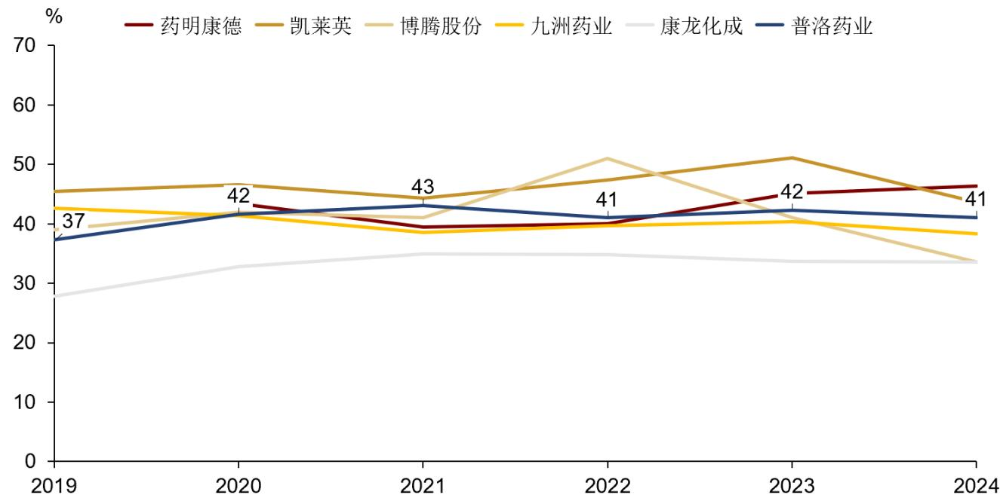  
图4：2019\~2024年国内头部CDMO公司小分子业务毛利率情况对比

资料来源：各公司数据、招商证券（备注：药明康德为 Wuxi Chemistry 毛利率，康龙化成为小分子 CDMO 毛利率，九洲药业和普洛药业为CDMO业务毛利率，凯莱英和博腾股份为总毛利率）

从公司业务自身纵向发展来看，CDMO业务实现了快速发展，CDMO收入占比、毛利润占比持续提升（2023 年受新冠项目高基数），对公司利润增长的贡献逐步扩大。

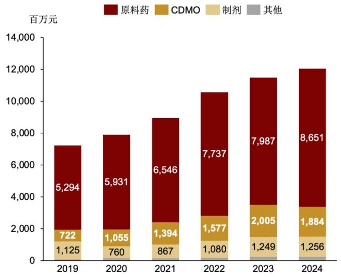  
图5：公司三大业务收入情况

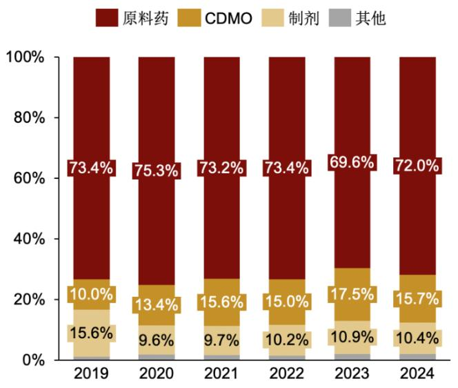  
图6：公司CDMO业务收入占比持续提升

资料来源：公司数据、招商证券资料来源：公司数据、招商证券

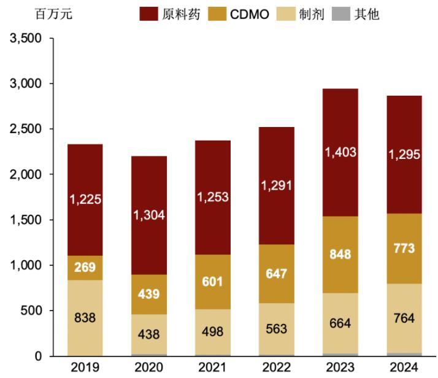  
图7：公司三大业务毛利润情况  
资料来源：公司数据、招商证券

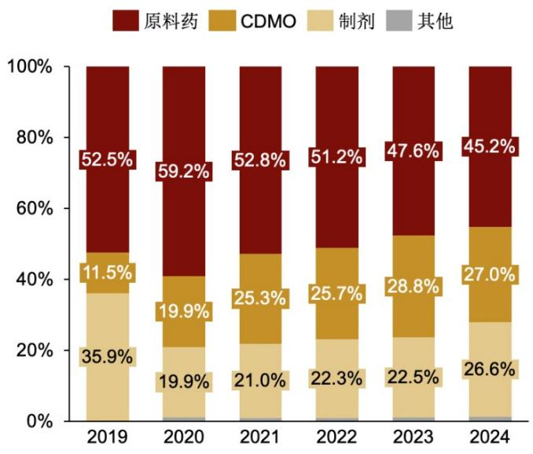  
图8：公司CDMO业务毛利润占比持续提升  
资料来源：公司数据、招商证券

# 从 CDMO 收入结构来看：

-根据公司公告，2022 年 CDMO 收入中 $87 \%$ 为国外客户业务， $13 \%$ 为国内客户业务；随着公司国内客户的持续开拓，国内客户收入占比有所提升，24 年国内业务量占比达到 $20 \%$ 。

-从产品结构看，公司还持续推进从“起始原料药 $^ +$ 注册中间体”到“起始原料药$^ +$ 注册中间体 $+ \mathsf { A P l + }$ 制剂”的业务转型升级。根据2024年年报，API项目总共116个，同比增长 $40 \%$ ；其中22个已经进入商业化阶段，15个正在验证阶段，还有79个API项目处于小试研发阶段。

从CDMO 业务范围来看，公司提供涵盖从药物发现到商业生产的整个生命周期的一站式服务，包括药物发现服务、化学研究、化学工艺研发、定制和商业生产等，能够为各研发阶段的创新药客户提供服务。

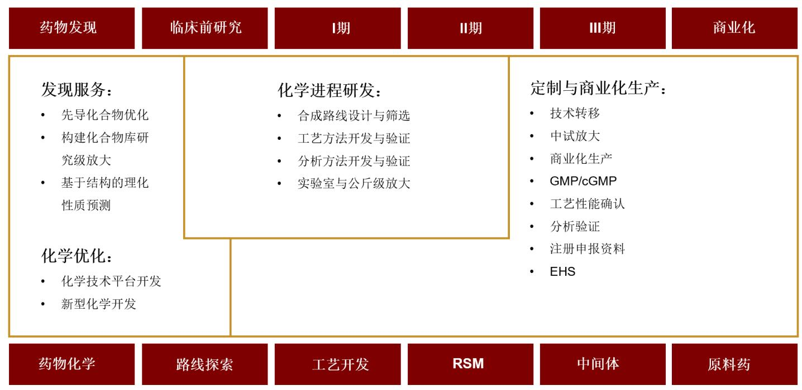  
图9：公司已经建立起一站式服务的CDMO 平台  
资料来源：公司官网、招商证券

# 二、研发D 端能力进度如何？——快速发展，漏斗前沿不断拓宽

在我们此前发布的《CDMO产业图谱：钻石赛道的“4C”分析框架》中分析，CDMO业务需要“D（Development）”端研发和“M（Manufacture）”端生产制造能力，公司传统优势在“M”端制造，因此我们也格外关注公司“D”端能力的发展。我们可以看到，近年公司持续加大研发投入，且研发费用主要投向CDMO发展“D”端能力，CDMO研发人员不断扩张、技术平台亦得到多方面夯实，增强了前端项目的承接能力及成本控制能力，导流效应逐步体现。

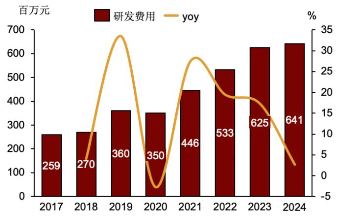  
图10：公司研发投入持续增加  
资料来源：公司数据、招商证券

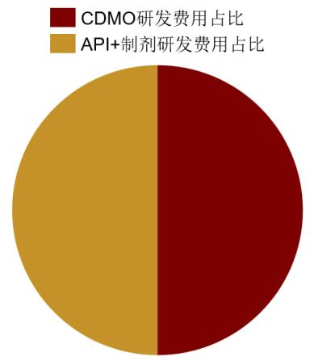  
图11：2022 年公司研发费用分布  
资料来源：公司公告、招商证券

公司高学历人才占比持续提升，CDMO 研发人员持续扩招，彰显发展信心。

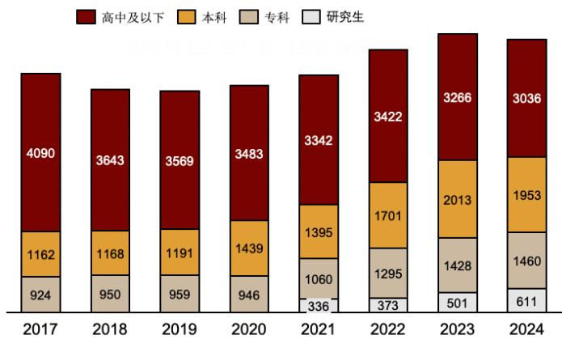  
图12：公司高学历员工数量持续增加  
资料来源：公司数据、招商证券

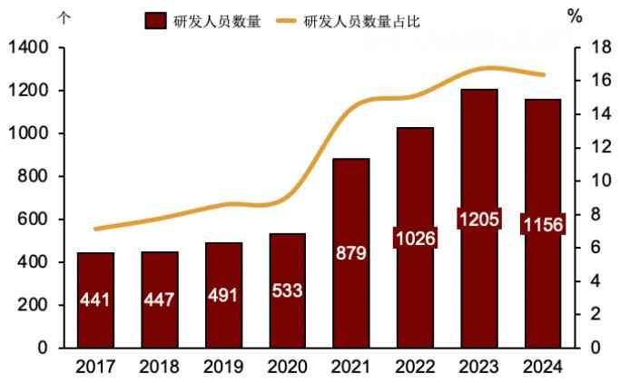  
图13：公司研发人员数量占比持续提升  
资料来源：公司数据、招商证券

普洛CDMO研发人员数量（个）

<table><tr><td>年份</td><td>普洛CDMO研发人员数量（个）</td></tr><tr><td>2018</td><td>50</td></tr><tr><td>2019</td><td>100</td></tr><tr><td>2020</td><td>160</td></tr><tr><td>2021</td><td>400+</td></tr><tr><td>2023</td><td>500+</td></tr><tr><td>2024</td><td>500+</td></tr><tr><td>2025.3</td><td>600+</td></tr><tr><td>未来2年</td><td>1000</td></tr></table>

资料来源：公司公告、招商证券

通过持续高强度投入，公司的D 端能力已得到快速提升，公司在横店本部、上海浦东、美国波士顿都设有研发中心，已具备一站式研发生产服务能力。此外，在美国波士顿、欧洲法兰克福、日本东京、印度孟买等多地设立了BDOffice，更好地服务、对接全球客户。

从项目数量结果看，公司项目数量得到快速增长，2024年报价项目数量1604个，同比增长 $7 7 \%$ ；进行中项目996个，同比增长 $3 5 \%$ 。

表2：公司已在全球布局三大CDMO 研发中心  

<table><tr><td>地点</td><td>面积/研发能力</td></tr><tr><td>横店本部研发中心</td><td>88,000ff²；250多名化学家；工艺优化/技术转移/CMC</td></tr><tr><td>上海研发中心</td><td>68,000f²；300多名化学家；筛选/工艺开发/优化/CMC</td></tr><tr><td>波士顿研发中心</td><td>2024 年Q2投入运营；16,000ft²；两年内招募40 多名化学家；技术开发 平台/先导物优化/筛选/毒性批次制备</td></tr></table>

资料来源：公司官网、招商证券

公司的各个技术平台不断完善，对CDMO 业务起到了重要的支持作用；比如合成生物学及酶催化、流体化学技术平台已经广泛应用于多个CDMO 项目中；多肽技术平台也有了实质性的进展。另外，公司还在着重建设PROTAC与ADC技术方向能力。公司已经形成两大支持中心(工艺安全实验室、分析测试中心)，八大技术平台的完整研发体系，技术平台包括：

流体化学平台：公司建立了行业领先的流动化学平台，提供从可行性、工艺开发和优化（PD&O）、放大到商业生产的服务。波士顿工厂在早期流动化学方面拥有领先的专业知识，上海和横店工厂在先进的分析技术和熟练的科学家的支持下，可以高效地开发克级到公斤级样品。

公司流体化学平台，涵盖整个生命周期，从早期开发到中间体和API的制造。提供以下服务：1）可行性研究（早期开发阶段的FTE/FFS）；2）流程开发和优化（PD&O）；3）扩大规模和概念验证研究；4）商业设备设计；5)可变规模的样品制备；6）非GMP和cGMP商业制造。

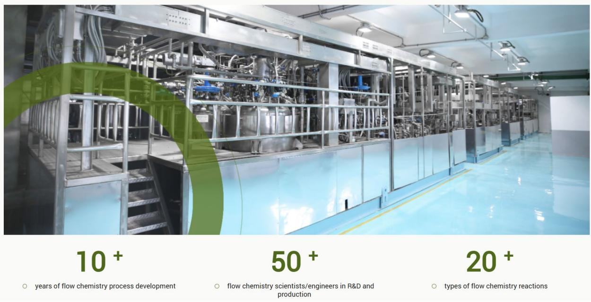  
图14：公司的流体化学平台  
资料来源：公司官网、招商证券

晶体与粉体工程平台（CPEP）：CPEP拥有一支由20多名结晶和粒子专家组成的团队，其中一半以上拥有化学、化工或制药工程领域的博士或硕士学位。

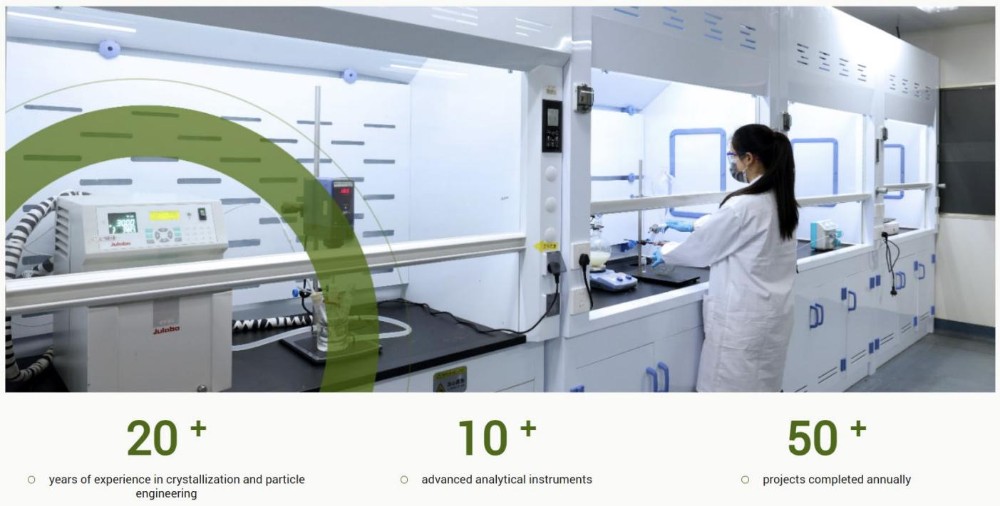  
图15：公司的晶体与粉体工程平台  
资料来源：公司官网、招商证券

合成生物学与酶催化平台：团队由70 多名科学家组成，包括菌株工程、生物转化、发酵和下游加工(DSP)方面的专家。公司在生物生产技术（包括发酵和酶生产）方面拥有20多年的经验，能够很好地处理复杂的生物生产项目。

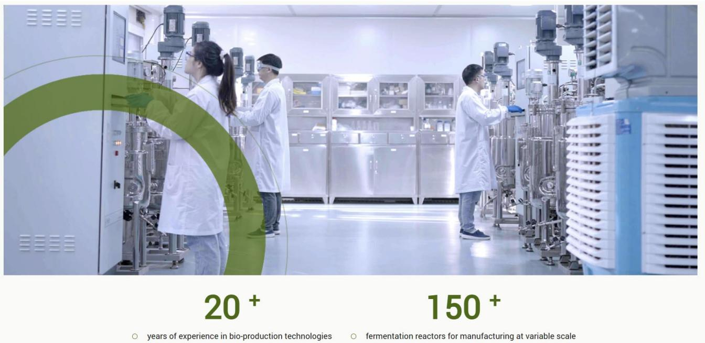  
图16：公司的合成生物学与酶催化平台  
资料来源：公司官网、招商证券

多肽技术平台：公司多肽平台提供从肽先导物优化到商业化生产的综合服务，具备线性、环状和修饰肽的固相肽合成、液相肽合成和混合肽合成方法，并延伸到肽药物偶联物 (PDC)、放射性核素药物偶联物 (RDC)以及非天然氨基酸和接头的合成。团队包括35名专门从事多肽研发的科学家。团队在多肽CMC领域拥有超过20年的经验。

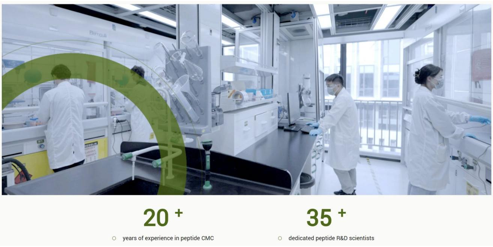  
图17：公司的多肽技术平台  
资料来源：公司官网、招商证券

高活化合物平台：该平台致力于开发和制造高效化合物（例如毒素和ADCIinker），公司开发了全面的EHS和安全系统，并结合使用隔离器和隔离技术的前沿制造套件来提供高质量的产品，能够提供以下服务：1）合成路线设计和选择；2）工艺方法开发和演示；3）分析方法开发和预验证；4)

扩大规模和商业生产。在ADC药物方面，2024 年3月，普洛药业与臻格生物签订战略合作协议，双方将通过密切合作联合打造一个多样化抗体、多样化高活小分子 payload 及 linker 技术平台，为ADC 制药客户提供更多优势技术选择，以及从研发到生产的高效、高品质一站式ADCCDMO服务。

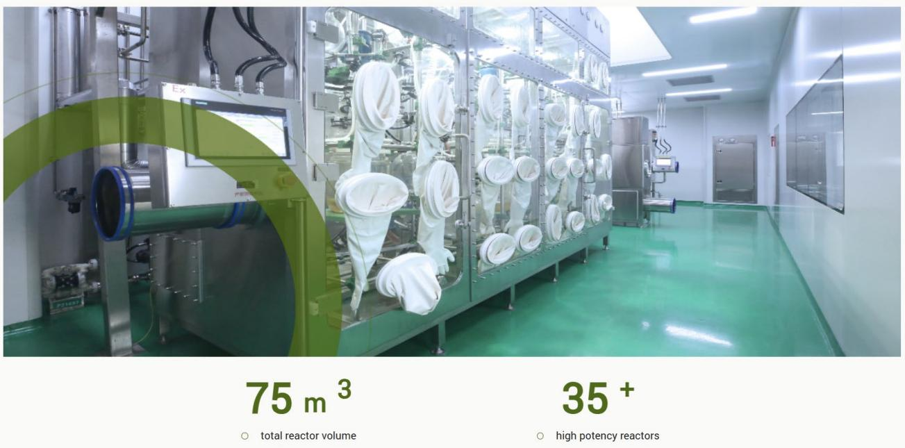  
图18：公司的高活化合物平台  
资料来源：公司官网、招商证券

PROTAC技术平台：该平台为靶向蛋白质降解疗法的开发提供全面的服务，包括 PROTAC。平台拥有 80 多名专注于 PROTAC 的科学家和两个位于波士顿和横店的化学服务团队，为整个PROTAC 药物开发过程提供从靶标验证、命中生成、先导化合物优化到临床开发的服务。

寡核苷酸合成平台，团队具备7年以上的工艺开发经验，成功制备并放大15个以上的公斤级核苷酸单体。

制备和纯化平台：该平台配有先进的纯化和分离设备，为API、中间体和多肽的纯化和分离提供全面的服务。

# 三、制造Μ端传统优势是否持续巩固？——大规模产能与先进灵活产能建设兼具，服务全球客户

制造端是公司的传统优势领域，公司在API中间体生产中的多年生产经验know-how可以迁移至CDMO/CMO生产中，这点从公司的毛利率亦能看到体现:在提供具备一定竞争力报价的同时亦能保持较好的毛利率水平。

公司持续加大技术投入、先进产能建设、质量/EHS体系建设，公司投资陆续建成了包括流体化学、高活性化合物、CDMO柔性等多条技术水平高、市场稀缺性高的高端产能，特别是新增柔性生产能力，使得公司对临床三期之前的项目承接能力大幅增强，成本也能得到很好的控制，公司在M 端的优势进一步强化，具备较强的市场竞争力。

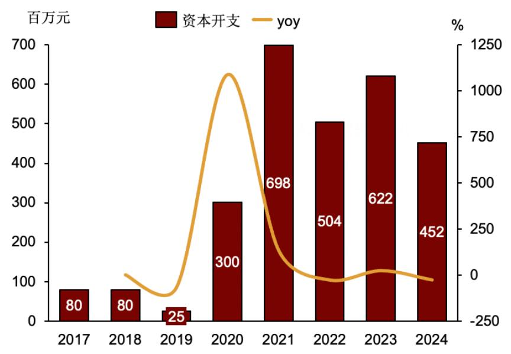  
图19：公司2020-2023 年保持高强度资本开支提升先进产能能力  
资料来源：公司数据、招商证券

公司生产基地主要在浙江东阳本部，并在浙江衢州、山东潍坊和安徽池州等地设有生产子公司，具备满足原料药中间体、CDMO和制剂三大业务板块的生产服务能力。公司逐步推进老车间升级改造，加快推进先进产能建设，投资新建了多条CDMO柔性生产线、多条高活性化合物生产线、多条流体化学生产线等一系列高端产能，可充分满足客户从临床早期、临床期到商业化全生命周期的生产服务。

在生产制造方面，公司多个 Site 通过FDA认证，具备灵活的生产条件，能够根据客户的需求实现快速的供应和产能放大：

8个生产基地通过了cGMP、ISO9001、ISO14001、OSHAS18001和IPMS认证，其中4 个基地通过了美国FDA认证，3 个基地通过了PMDA 认证，2 个基地通过了EDQM 认证。□ 总化学合成能力: $1 1 , 0 0 0 { \mathrm m } ^ { 3 }$ (不锈钢/玻璃/哈氏合金/钛合金/聚四氟乙烯)，总生物生产能力： $6 { , } 5 7 0 ~ \mathsf m ^ { 3 }$ （不锈钢）。新建3个多功能原料药车间，用于不同规模的并行生产（共计 $6 5 8 ~ \mathsf { m } ^ { 3 }$ )。用于临床和商业规模的高活API设施（总计 $7 5 ~ \mathsf { m } ^ { 3 }$ )。

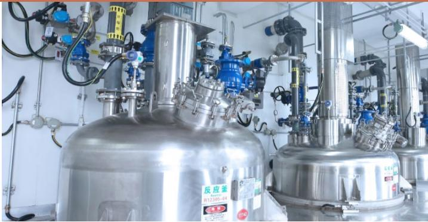  
图20：公司CDMO 商业化生产车间  
资料来源：公司官网、招商证券

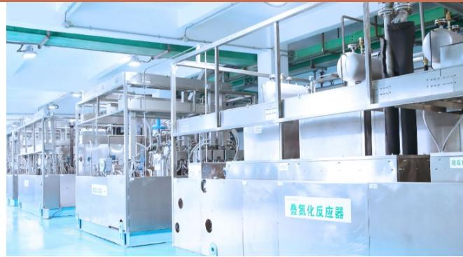  
图21：公司连续化生产车间  
资料来源：公司官网、招商证券

# 四、如何看待普洛 CDMO 未来的空间？ 一一从项目、客户角度看，后劲充沛

普洛药业CDMO业务的快速发展是从技术投入到制造端体系全面升级的结果，我们认为，从项目和客户两个维度来看，公司CDMO 业务增长确定性高、空间大，有望带动公司整体业绩和盈利水平持续增长。

# 项目维度

从项目结构来看，项目订单已形成漏斗形态，并在高速增加中，增长动力充沛。

从API项目数量来看，2024年API项目总共116个，同比增长 $40 \%$ ；其中22个已经进入商业化阶段，15 个正在验证阶段，还有79个API项目处于小试研发阶段。未来API项目逐步进入商业化阶段将带动CDMO 业务高速增长。

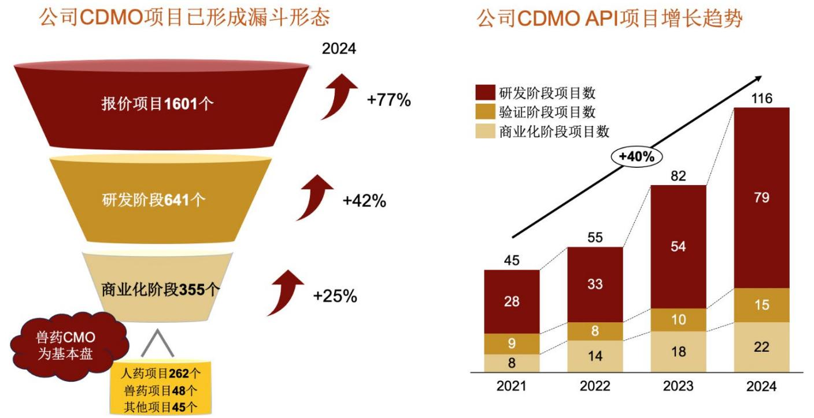  
图22：公司 CDMO 项目已形成漏斗结构，增长动力充沛

资料来源：公司公告、招商证券绘制

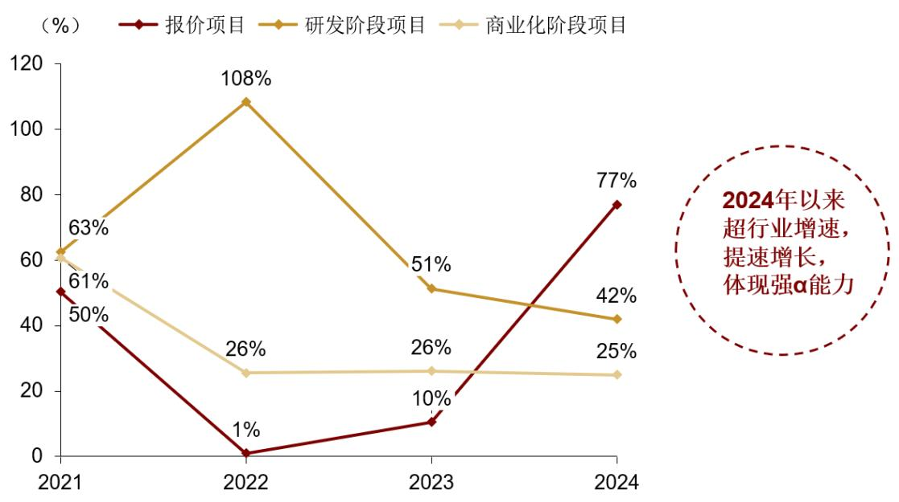  
图23：2021\~2024 年公司CDMO各阶段项目同比增速变化趋势  
资料来源：公司数据、招商证券

# 客户维度

公司CDMO 业务服务于全球超过420 家客户，客户已广泛覆盖以欧洲、北美、日本和中国为主的全球市场。

在BD 能力上，公司已在美国波士顿、德国法兰克福、日本东京等地设立了BD办公室，具有一支专业能力强、服务水平高、奋斗精神好的优秀商务发展团队，

国内市场已覆盖各大中型城市客户群。

# 公司具备四个类别的CDMO客户:

Pharma构成公司CDMO 收入基石，收入占比 $40 \%$ 以上：前二十大公司中有16 家公司有业务合作，人用药方面已有前期的研发订单，其中API项目占比较小；兽药方面与大药企有多个API合作。

国内创新药公司整体业务量占比 $20 \%$ 左右，包括头部大公司已经建立联系，超过 300 家公司签订保密协议，有业务合作的超过 100 家，其中头部几家客户的项目已进入API阶段。公司非常重视国内创新药业务，公司预计未来占比将可能达到 $50 \%$ 。

国外Biotech：随着研发能力提升以及波士顿研发中心运营，这类客户项目数占比超过 $10 \%$ ，目前以前期项目为主。

此外公司亦与欧美CDMO 有业务合作。

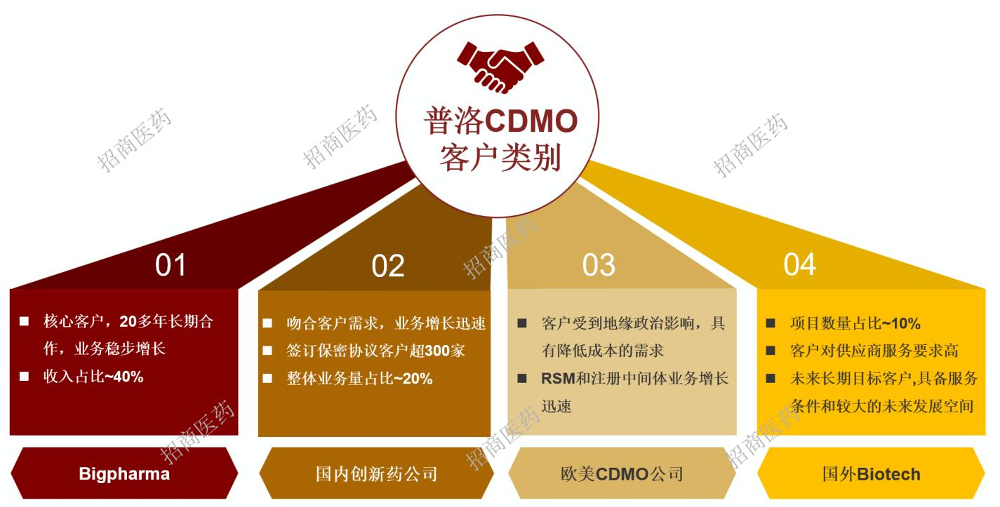  
图24：公司四个类别的CDMO 客户  
资料来源：公司公告、招商证券绘制

公司近年来与多家合作伙伴签订战略合作协议，客户圈持续拓展。

图25：公司2019 年以来与多家合作伙伴签订战略合作协议  

<table><tr><td>时间 合作公司</td><td>合作协议简要内容</td><td></td></tr><tr><td colspan="3">客户/药企</td></tr><tr><td>2024/11/28</td><td>箕星藥業香港有限公司</td><td>签署《战略合作框架协议》，就原料药及中间体CDMO项目的合作 关系达成共识，结成战略合作伙伴，开展CDMO项目的长期合作。</td></tr><tr><td>2024/9/26</td><td>百葵锐（深圳）生物科技有限公司</td><td>双方在现有产品、产能和技术上优势互补、强强合作，将有利于进 步增强公司合成生物学及酶催化技术平台和多肽技术平台的研发 能力，也有利于进一步加快拓展合成生物学领域业务。</td></tr><tr><td>2023/12/14</td><td>海森生物医药有限公司</td><td>就相关产品的技术转移、委托生产和项目合作（CDMO）等事项进 行洽谈，并签订项目合作协议。</td></tr><tr><td>2023/10/17</td><td>武汉合生科技有限公司</td><td>就研发与外包定制生产项目的合作关系达成共识，签订了《战略合 作框架协议》。</td></tr><tr><td>2023/6/12</td><td>苏州泽璟生物制药股份有限公司</td><td>结成战略合作关系，开展CDMO项目的长期合作,具体合作业务的价 格、数量、交货期等，由双方协商后签署具体项目协议。</td></tr><tr><td>2023/1/3</td><td>江苏先声药业有限公司</td><td>结成战略合作关系，开展CDMO项目的长期合作，实现利益共享。</td></tr><tr><td>2021/3/17</td><td>江西济民可信集团有限公司</td><td>深度推进研产销全方位合作平台建设,实现资源共享、优势互补和 融合发展。</td></tr><tr><td>2019/11/27</td><td>Bracco Imaging S.p.A.</td><td>就两个CDMO项目的生产和供应等条款达成约定。</td></tr><tr><td colspan="3">技术合作</td></tr><tr><td>2024/3/5</td><td>上海臻格生物技术有限公司</td><td>双方通过密切合作联合打造一个多样化抗体、多样化高活小分子 payload及linker技术平台，为ADC制药客户提供更多优势技术选 择，以及从研发到生产的高效、高品质一站式ADCCDMO服务。</td></tr><tr><td>2021/7/12</td><td>浙江中控技术股份有限公司</td><td>双就战略采购、创新应用和资本合作等方面达成了深度战略合作</td></tr></table>

资料来源：公司公告、招商证券

# 五、投资建议

普洛药业具有“化学合成 $^ { + }$ 生物发酵”双轮驱动的技术能力和“多客户、多产品”的竞争优势。我们认为普洛药业 CDMO 业务从技术投入到制造端体系进行了全面升级，驱动公司未来增长，短期原料药和制剂外部环境扰动不改公司中长期竞争力。考虑到公司原料药业务结构调整和制剂集采续标影响、新品投放进度，我们调整公司盈利预测，预计公司25-27 年归母净利润10.0、12.1、15.2 亿元，同比 $. 3 \%$ $+ 2 1 \%$ $+ 2 5 \%$ ，对应当前PE17、14、11倍，维持“强烈推荐”投资评级。

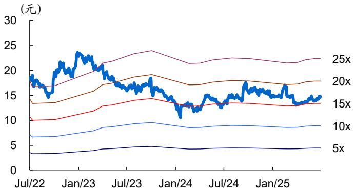  
图26：普洛药业历史PE Band  
资料来源：公司数据、招商证券

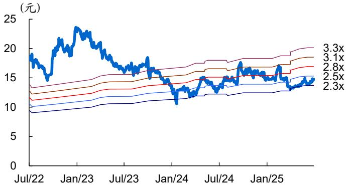  
图27：普洛药业历史PB Band

资料来源：公司数据、招商证券

# 六、风险提示

# 1、原料药产品降价风险

原料药产品价格受供给变化、终端需求变化影响，存在产品价格持续降低的风险。

# 2、集采续采等导致制剂价格降低

公司此前集采中选产品面临续标，可能存在价格继续下降的风险。

# 3、CDMO项目推进进度低于预期

CDMO项目推进进度与客户的临床试验进度，临床试验结果密切相关，可能存在低于预期的风险。

# 4、地缘政治风险等。

全球贸易环境变化、关税政策、地缘政治可能会对公司出口业务造成风险。

# 附：财务预测表

资产负债表  

<table><tr><td>单位：百万元</td><td>2023</td><td>2024</td><td>2025E</td><td>2026E</td><td>2027E</td></tr><tr><td>流动资产</td><td>8368</td><td>8187</td><td>8050</td><td>8988</td><td>10909</td></tr><tr><td>现金</td><td>3581</td><td>3662</td><td>4373</td><td>5585</td><td>7134</td></tr><tr><td>交易性投资</td><td>0</td><td>0</td><td>0</td><td>0</td><td>0</td></tr><tr><td>应收票据</td><td>411</td><td>319</td><td>266</td><td>252</td><td>283</td></tr><tr><td>应收款项</td><td>1695</td><td>1764</td><td>1473</td><td>1395</td><td>1566</td></tr><tr><td>其它应收款</td><td>33</td><td>90</td><td>75</td><td>71</td><td>79</td></tr><tr><td>存货</td><td>2083</td><td>1860</td><td>1463</td><td>1315</td><td>1437</td></tr><tr><td>其他</td><td>565</td><td>492</td><td>400</td><td>370</td><td>411</td></tr><tr><td>非流动资产</td><td>4400</td><td>4542</td><td>4373</td><td>4133</td><td>3836</td></tr><tr><td>长期股权投资</td><td>85</td><td>71</td><td>71</td><td>71</td><td>71</td></tr><tr><td>固定资产</td><td>3001</td><td>3347</td><td>3215</td><td>3008</td><td>2740</td></tr><tr><td>无形资产商誉</td><td>340</td><td>335</td><td>301</td><td>271</td><td>244</td></tr><tr><td>其他</td><td>974</td><td>789</td><td>786</td><td>783</td><td>781</td></tr><tr><td>资产总计</td><td>12768</td><td>12729</td><td>12423</td><td>13121</td><td>14746</td></tr><tr><td>流动负债</td><td>6308</td><td>5743</td><td>4851</td><td>4639</td><td>5109</td></tr><tr><td>短期借款</td><td>808</td><td>814</td><td>914</td><td>1054</td><td>1234</td></tr><tr><td>应付账款</td><td>4127</td><td>3633</td><td>2857</td><td>2568</td><td>2806</td></tr><tr><td>预收账款</td><td>430</td><td>514</td><td>404</td><td>364</td><td>397</td></tr><tr><td>其他</td><td>943</td><td>781</td><td>675</td><td>654</td><td>671</td></tr><tr><td>长期负债</td><td>230</td><td>236</td><td>236</td><td>236</td><td>236</td></tr><tr><td>长期借款</td><td>19</td><td>70</td><td>70</td><td>70</td><td>70</td></tr><tr><td>其他</td><td>211</td><td>166</td><td>166</td><td>166</td><td>166</td></tr><tr><td>负债合计</td><td>6537</td><td>5979</td><td>5088</td><td>4876</td><td>5345</td></tr><tr><td>股本</td><td>1179</td><td>1169</td><td>1169</td><td>1169</td><td>1169</td></tr><tr><td>资本公积金</td><td>238</td><td>94</td><td>94</td><td>94</td><td>94</td></tr><tr><td>留存收益</td><td>4806</td><td>5479</td><td>6065</td><td>6975</td><td>8130</td></tr><tr><td>少数股东权益</td><td>8</td><td>8</td><td>8</td><td>7</td><td>7</td></tr><tr><td>归属于母公司所有者权益</td><td>6223</td><td>6742</td><td>7328</td><td>8238</td><td>9393</td></tr><tr><td>负债及权益合计</td><td>12768</td><td>12729</td><td>12423</td><td>13121</td><td>14746</td></tr></table>

现金流量表  

<table><tr><td>单位：百万元</td><td>2023</td><td>2024</td><td>2025E</td><td>2026E</td><td>2027E</td></tr><tr><td>经营活动现金流</td><td>1031</td><td>1209</td><td>1544</td><td>1737</td><td>2007</td></tr><tr><td>净利润</td><td>1055</td><td>1031</td><td>1002</td><td>1211</td><td>1518</td></tr><tr><td>折旧摊销</td><td>559</td><td>584</td><td>669</td><td>640</td><td>597</td></tr><tr><td>财务费用</td><td>60</td><td>(5)</td><td>39</td><td>55</td><td>63</td></tr><tr><td>投资收益</td><td>18</td><td>2</td><td>(71)</td><td>(90)</td><td>(88)</td></tr><tr><td>营运资金变动</td><td>(665)</td><td>(404)</td><td>(95)</td><td>(78)</td><td>(83)</td></tr><tr><td>其它</td><td>4</td><td>1</td><td>0</td><td>0</td><td>0</td></tr><tr><td>投资活动现金流</td><td>(677)</td><td>(398)</td><td>(429)</td><td>(310)</td><td>(212)</td></tr><tr><td>资本支出</td><td>(630)</td><td>(461)</td><td>(500)</td><td>(400)</td><td>(300)</td></tr><tr><td>其他投资</td><td>(46)</td><td>63</td><td>71</td><td>90</td><td>88</td></tr><tr><td>筹资活动现金流</td><td>(301)</td><td>(582)</td><td>(403)</td><td>(216)</td><td>(246)</td></tr><tr><td>借款变动</td><td>(60)</td><td>(145)</td><td>52</td><td>140</td><td>180</td></tr><tr><td>普通股增加</td><td>0</td><td>(9)</td><td>0</td><td>0</td><td>0</td></tr><tr><td>资本公积增加</td><td>0</td><td>(144)</td><td>0</td><td>0</td><td>0</td></tr><tr><td>股利分配</td><td>(350)</td><td>(373)</td><td>(416)</td><td>(301)</td><td>(363)</td></tr><tr><td>其他</td><td>109</td><td>90</td><td>(39)</td><td>(55)</td><td>(63)</td></tr><tr><td>现金净增加额</td><td>53</td><td>229</td><td>712</td><td>1212</td><td>1549</td></tr></table>

资料来源：公司数据、招商证券

利润表  

<table><tr><td>单位：百万元</td><td>2023</td><td>2024</td><td>2025E</td><td>2026E</td><td>2027E</td></tr><tr><td>营业总收入</td><td>11474</td><td>12022</td><td>10035</td><td>9505</td><td>10668</td></tr><tr><td>营业成本</td><td>8529</td><td>9155</td><td>7199</td><td>6471</td><td>7070</td></tr><tr><td>营业税金及附加</td><td>56</td><td>56</td><td>47</td><td>45</td><td>50</td></tr><tr><td>营业费用</td><td>658</td><td>640</td><td>552</td><td>542</td><td>608</td></tr><tr><td>管理费用</td><td>467</td><td>481</td><td>442</td><td>418</td><td>501</td></tr><tr><td>研发费用</td><td>625</td><td>641</td><td>562</td><td>561</td><td>661</td></tr><tr><td>财务费用</td><td>(104)</td><td>(115)</td><td>39</td><td>55</td><td>63</td></tr><tr><td>资产减值损失</td><td>(105)</td><td>(69)</td><td>(85)</td><td>(80)</td><td>(20)</td></tr><tr><td>公允价值变动收益</td><td>(0)</td><td>8</td><td>(5)</td><td>1</td><td>1</td></tr><tr><td>其他收益</td><td>104</td><td>128</td><td>109</td><td>114</td><td>117</td></tr><tr><td>投资收益</td><td>(22)</td><td>(18)</td><td>(33)</td><td>(24)</td><td>(31)</td></tr><tr><td>营业利润</td><td>1220</td><td>1212</td><td>1180</td><td>1424</td><td>1782</td></tr><tr><td>营业外收入</td><td>1</td><td>2</td><td>3</td><td>2</td><td>2</td></tr><tr><td>营业外支出</td><td>17</td><td>10</td><td>11</td><td>13</td><td>11</td></tr><tr><td>利润总额</td><td>1205</td><td>1203</td><td>1172</td><td>1414</td><td>1773</td></tr><tr><td>所得税</td><td>149</td><td>172</td><td>170</td><td>203</td><td>255</td></tr><tr><td>少数股东损益</td><td>(0)</td><td>(0)</td><td>(0)</td><td>(0)</td><td>(0)</td></tr><tr><td>归属于母公司净利润</td><td>1055</td><td>1031</td><td>1002</td><td>1211</td><td>1519</td></tr></table>

主要财务比率  

<table><tr><td></td><td>2023</td><td>2024</td><td>2025E</td><td>2026E</td><td>2027E</td></tr><tr><td>年成长率</td><td></td><td></td><td></td><td></td><td></td></tr><tr><td>营业总收入</td><td>9%</td><td>5%</td><td>-17%</td><td>-5%</td><td>12%</td></tr><tr><td>营业利润</td><td>21%</td><td>-1%</td><td>-3%</td><td>21%</td><td>25%</td></tr><tr><td>归母净利润</td><td>7%</td><td>-2%</td><td>-3%</td><td>21%</td><td>25%</td></tr><tr><td>获利能力</td><td></td><td></td><td></td><td></td><td></td></tr><tr><td>毛利率</td><td>25.7%</td><td>23.8%</td><td>28.3%</td><td>31.9%</td><td>33.7%</td></tr><tr><td>净利率</td><td>9.2%</td><td>8.6%</td><td>10.0%</td><td>12.7%</td><td>14.2%</td></tr><tr><td>ROE</td><td>18.0%</td><td>15.9%</td><td>14.2%</td><td>15.6%</td><td>17.2%</td></tr><tr><td>ROIC</td><td>14.5%</td><td>12.7%</td><td>13.1%</td><td>14.4%</td><td>15.8%</td></tr><tr><td>偿债能力</td><td></td><td></td><td></td><td></td><td></td></tr><tr><td>资产负债率</td><td>51.2%</td><td>47.0%</td><td>41.0%</td><td>37.2%</td><td>36.2%</td></tr><tr><td>净负债比率</td><td>7.2%</td><td>7.3%</td><td>7.9%</td><td>8.6%</td><td>8.8%</td></tr><tr><td>流动比率</td><td>1.3</td><td>1.4</td><td>1.7</td><td>1.9</td><td>2.1</td></tr><tr><td>速动比率</td><td>1.0</td><td>1.1</td><td>1.4</td><td>1.7</td><td>1.9</td></tr><tr><td>营运能力</td><td></td><td></td><td></td><td></td><td></td></tr><tr><td>总资产周转率</td><td>0.9</td><td>0.9</td><td>0.8</td><td>0.7</td><td>0.8</td></tr><tr><td>存货周转率</td><td>4.4</td><td>4.6</td><td>4.3</td><td>4.7</td><td>5.1</td></tr><tr><td>应收账款周转率</td><td>5.7</td><td>5.7</td><td>5.3</td><td>5.6</td><td>6.1</td></tr><tr><td>应付账款周转率</td><td>2.0</td><td>2.4</td><td>2.2</td><td>2.4</td><td>2.6</td></tr><tr><td>每股资料(元)</td><td></td><td></td><td></td><td></td><td></td></tr><tr><td>EPS</td><td>0.91</td><td>0.89</td><td>0.87</td><td>1.05</td><td>1.31</td></tr><tr><td>每股经营净现金</td><td>0.89</td><td>1.04</td><td>1.33</td><td>1.50</td><td>1.73</td></tr><tr><td>每股净资产</td><td>5.37</td><td>5.82</td><td>6.33</td><td>7.11</td><td>8.11</td></tr><tr><td>每股股利</td><td>0.32</td><td>0.36</td><td>0.26</td><td>0.31</td><td>0.39</td></tr><tr><td>估值比率</td><td></td><td></td><td></td><td></td><td></td></tr><tr><td>PE</td><td>16.2</td><td>16.6</td><td>17.1</td><td>14.2</td><td>11.3</td></tr><tr><td>PB</td><td>2.8</td><td>2.5</td><td>2.3</td><td>2.1</td><td>1.8</td></tr><tr><td>EV/EBITDA</td><td>10.8</td><td>10.7</td><td>9.4</td><td>8.4</td><td>7.3</td></tr></table>

# 分析师承诺

负责本研究报告的每一位证券分析师，在此申明，本报告清晰、准确地反映了分析师本人的研究观点。本人薪酬的任何部分过去不曾与、现在不与，未来也将不会与本报告中的具体推荐或观点直接或间接相关。

# 评级说明

报告中所涉及的投资评级采用相对评级体系，基于报告发布日后 6-12 个月内公司股价（或行业指数）相对同期当地市场基准指数的市场表现预期。其中，A 股市场以沪深 300 指数为基准；香港市场以恒生指数为基准；美国市场以标普500 指数为基准。具体标准如下：

# 股票评级

强烈推荐：预期公司股价涨幅超越基准指数 $20 \%$ 以上增持：预期公司股价涨幅超越基准指数 $5 \text{‰}$ 之间中性：预期公司股价变动幅度相对基准指数介于 $\pm 5 \%$ 之间减持：预期公司股价表现弱于基准指数 $5 \%$ 以上

# 行业评级

推荐：行业基本面向好，预期行业指数超越基准指数中性：行业基本面稳定，预期行业指数跟随基准指数回避：行业基本面转弱，预期行业指数弱于基准指数

# 重要声明

本报告由招商证券股份有限公司（以下简称“本公司”）编制。本公司具有中国证监会许可的证券投资咨询业务资格。本报告基于合法取得的信息，但本公司对这些信息的准确性和完整性不作任何保证。本报告所包含的分析基于各种假设，不同假设可能导致分析结果出现重大不同。报告中的内容和意见仅供参考，并不构成对所述证券买卖的出价，在任何情况下，本报告中的信息或所表述的意见并不构成对任何人的投资建议。除法律或规则规定必须承担的责任外，本公司及其雇员不对使用本报告及其内容所引发的任何直接或间接损失负任何责任。

本公司关联机构可能会持有报告所提到的公司所发行的证券头寸，且本公司或关联机构可能会就这些证券进行交易，还可能为这些公司提供或争取提供投资银行业务服务，客户应当考虑到本公司可能存在影响本报告客观性的利益冲突。

本报告版权归本公司所有。本公司保留所有权利。未经本公司事先书面许可，任何机构和个人均不得以任何形式翻版。  
复制、引用或转载，否则，本公司将保留随时追究其法律责任的权利。