证券研究报告

机械行业深度研究报告

# 检测环节贯穿半导体产业链始终，专业化分工下第三方检测空间广阔

推荐(维持)

检测环节贯穿半导体产业链始终。集成电路测试对于集成电路设计、制造良率和品质控制至关重要，是产业必不可少的环节。从产业链的角度看，集成电路行业主要包括芯片设计、晶圆制造、芯片封装和集成电路测试。集成电路设计流程需要芯片验证分析;集成电路的生产流程包括晶圆制造和封装需进行前道量检测以及后道检测；实验室检测，包含失效分析、材料分析、以及可靠性检测等，需求则来自半导体产业链各类型客户，主要针对失效样品进行缺陷定位与故障分析。

集成电路产业趋向专业化分工，受益研发投入及制程发展，第三方实验室检测空间广阔。传统的集成电路产业最早采用IDM 的经营模式，随着集成电路技术的快速更新换代和下游应用的多元化，以Fabless+Foundry+OSAT为代表的集成电路专业分工模式应运而生，并推动集成电路产业向专业化分工的方向逐步发展，Labless 模式应运而生，目前半导体第三方检测分析服务主要集中于后道检测与实验室检测。半导体产业客户的检测分析需求主要来自研发过程的新产品设计与新工艺研究、新产品检测与新产线调试，受益于新兴产业驱动下半导体产业研发投入加大与产能扩张;先进制程对半导体测试服务提出了更高的要求；第三方检测实验室具备专业性、经济性和中立性优势，逐步替代传统in-lab 实验室，专业化的集成电路测试的市场需求面十分广泛。据QYResearch预计，2031年全球半导体测试服务市场规模将达到210.2 亿美元，未来几年CAGR 为 6.9%，其中半导体第三方实验室检测分析市场规模 2024 年已达44.31 亿美元，预计 2031 年将增长至 109.2 亿美元，2025-2031 年复合增长率为14%。

第三方实验室检测重点标的。1）胜科纳米。公司成立于2012年，是行业内知名的半导体第三方检测分析实验室，公司覆盖失效分析、材料分析、及可靠性分析，2024年公司实现收入4.15亿元，同比+5.4%。2）苏试试验。2019年，公司以 2.8 亿元收购宜特检测 100%的股权，正式进入集成电路检测领域，2024 年公司集成电路验证与分析服务实现收入2.88 亿元，同比+12.3%，占公司收入比重14.23%。3)广电计量。公司持续自主培育集成电路测试与分析业务，2024 年公司集成电路测试与分析实现收入2.56 亿元，同比+26.3%，占公司收入比重8%。4）华测检测。2022 年收购蔚思博切入半导体检测领域，持续加码FA和MA布局。

投资建议：第三方检测行业需求与下游产业链发展周期相关，新兴产业需求增长，下游集成电路企业持续加大研发投入及产能扩张推动检测需求的增长；随着半导体工艺不断进步，产品制程步骤增多，微观结构复杂，对半导体测试服务提出了更高的要求；在产业专业化分工趋势下，第三方检测分析行业凭借更强的专业性、更高的检测效率、更中立客观的测试结果，有望占据更多市场份额。综合以上，我们认为第三方半导体检测市场具备成长属性，给予“推荐”评级。

风险提示：市场需求不及预期，行业竞争加剧，技术更新迭代不及预期，产能扩张与需求不匹配等。

# 华创证券研究所

证券分析师：范益民 电话：021-20572562 邮箱：fanyimin@hcyjs.com 执业编号：S0360523020001 证券分析师：丁祎 邮箱：dingyi@hcyjs.com 执业编号：S0360523030001

# 行业基本数据

<table><tr><td></td><td></td><td>占比%</td></tr><tr><td>股票家数(只)</td><td>633</td><td>0.08</td></tr><tr><td>总市值(亿元)</td><td>51,816.49</td><td>4.90</td></tr><tr><td>流通市值(亿元)</td><td>42,633.94</td><td>5.13</td></tr></table>

相对指数表现  

<table><tr><td>%</td><td>1M</td><td>6M</td><td>12M</td></tr><tr><td>绝对表现</td><td>6.1%</td><td>12.9%</td><td>34.5%</td></tr><tr><td>相对表现</td><td>2.1%</td><td>7.0%</td><td>18.9%</td></tr></table>

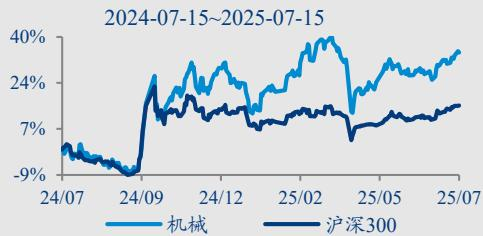

# 相关研究报告

《机械行业周报（20250707-20250713)：关注AI  
设备及耗材》2025-07-13  
《机械行业周报（20250630-20250706）)：关注长期  
竞争力企业，重视机器人场景落地》2025-07-06  
《“人形机器人的Optimus时刻”系列（十一):  
精密减速器：群雄逐鹿，新的篇章》2025-07-03

重点公司盈利预测、估值及投资评级  

<table><tr><td rowspan="2">简称</td><td rowspan="2">股价（元）</td><td colspan="3">EPS（元）</td><td colspan="3">PE(倍)</td><td>PB（倍）</td><td rowspan="2">评级</td></tr><tr><td>2025E</td><td>2026E</td><td>2027E</td><td>2025E</td><td>2026E</td><td>2027E</td><td>2025E</td></tr><tr><td>苏试试验</td><td>13.72</td><td>0.61</td><td>0.75</td><td>0.91</td><td>22.65</td><td>18.41</td><td>15.14</td><td>2.70</td><td>强推</td></tr><tr><td>广电计量</td><td>17.68</td><td>0.70</td><td>0.84</td><td>0.97</td><td>25.27</td><td>21.13</td><td>18.28</td><td>2.86</td><td>强推</td></tr><tr><td>华测检测</td><td>12.05</td><td>0.62</td><td>0.68</td><td>0.76</td><td>19.57</td><td>17.65</td><td>15.92</td><td>2.60</td><td>强推</td></tr></table>

资料来源：Wind，华创证券预测  
注：股价为2025年7月15日收盘价

# 投资主题

# 报告亮点

本报告梳理1）半导体检测的核心类型以及核心差异；2）半导体第三方检测的核心驱动力来自新兴产业带动半导体需求增长、产业加大研发投入与产能扩张、先进制程的要求提升、专业化分工Labless 模式占比提升；3）半导体第三方检测的市场规模。

# 投资逻辑

传统的集成电路产业最早采用IDM的经营模式，随着集成电路技术的快速更新换代和下游应用的多元化，以Fabless+Foundry+OSAT为代表的集成电路专业分工模式应运而生，并推动集成电路产业向专业化分工的方向逐步发展，Labless 模式应运而生，目前半导体第三方检测分析服务主要集中于后道检测与实验室检测。半导体产业客户的检测分析需求主要来自研发过程的新产品设计与新工艺研究、新产品检测与新产线调试，受益于新兴产业驱动下半导体产业研发投入加大与产能扩张；先进制程对半导体测试服务提出了更高的要求；第三方检测实验室具备专业性、经济性和中立性优势，逐步替代传统 in-lab实验室，专业化的集成电路测试的市场需求面十分广泛。据QYResearch预计，2031年全球半导体测试服务市场规模将达到210.2亿美元，未来几年CAGR为6.9%，其中半导体第三方实验室检测分析市场规模 2024年已达 44.31 亿美元，预计2031 年将增长至109.2 亿美元，2025-2031 年复合增长率为 14%。

# 目录

# 、半导体检测贯穿产业链始终. 6

# 二、集成电路产业趋向专业化分工，第三方实验室检测空间广阔. .8

（一）集成电路向专业化分工方向发展，In-HouseLab 正逐步转向Labless 模式….8  
（二）半导体第三方检测分析服务主要集中于后道检测与实验室检测 .9  
（三）研发投入&先进制程&专业化分工共同驱动第三方检测需求增长 11  
（四）半导体产业链国产化趋势加速我国半导体检测行业成长 12

# 三、第三方半导体实验室检测重点标的.. 16

1、胜科纳米：半导体第三方检测分析实验室 16  
2、苏试试验：2019 年收购宜特检测切入半导体检测环节 16  
3、广电计量：持续自主培育集成电路测试与分析业务 17  
4、华测检测：收购蔚思博进入半导体检测领域. 18

# 四、 风险提示... 20

# 图表目录

图表1半导体检测分析产业链结构 ….6  
图表2 实验室检测贯穿半导体产业链始终. .7  
图表 3三类半导体检测的具体差异. ….7  
图表4 Labless 与 Fabless 均为产业分工专业化的体现， …….8  
图表5第三方后道检测主要参与者梳理， ….9  
图表6中国半导体实验室检测产业发展历程.. ..10  
图表7 第三方实验室检测主要参与者梳理. . 10  
图表8WSTS 预测 2026 年全球半导体市场规模达7607 亿美元 11  
图表9全球半导体测试服务市场规模增速 .12  
图表10几类测试服务的全球市场规模 .12  
图表 11 全球半导体第三方实验室检测分析市场规模及预测 .. 12  
图表12我国集成电路产量及同比（亿块） .. 13  
图表13我国芯片设计及晶圆制造公司保持高研发费用率 .13  
图表14我国芯片设计市场规模及同比增速（亿元） .13  
图表15集成电路测试市场规模（亿元） .13  
图表16电子电器检测市场规模增速好于我国检验检测市场整体增速 ..14  
图表17中国半导体第三方实验室测试分析市场预测 ….14  
图表18我国可靠性分析市场规模及增速 15  
图表 19我国失效分析市场规模及增速 .15  
图表20我国材料分析市场规模及增速， . 15  
图表21胜科纳米营业收入及归母净利润情况. …. 16  
图表22胜科纳米毛利率及净利率情况.. . 16  
图表23胜科纳米业务结构拆分（亿元） .16  
图表24胜科纳米分业务毛利率情况. .16  
图表25 苏试试验营业收入及归母净利润情况. .17  
图表26苏试试验毛利率及净利率情况..  
图表 27苏试试验业务结构拆分... .17  
图表28苏试试验集成电路验证与分析服务收入情况 .17  
图表29广电计量营业收入及归母净利润情况. .18  
图表30广电计量毛利率及净利率情况. .18  
图表31广电计量业务结构拆分. .18  
图表 32广电计量集成电路验证与分析服务收入情况 ..18  
图表33华测检测营业收入情况.. ..19  
图表34华测检测归母净利润情况 19  
图表35 华测检测毛利率及净利率情况 19  
图表36华测检测业务结构拆分 19

# 一、半导体检测贯穿产业链始终

从半导体检测分析的产业链结构来看，行业上游主要是提供检测设备、化学试剂及其他耗材的生产制造商等；中游主要是半导体检测分析厂商；下游则是半导体产业链各类型的检测报告使用者，包括芯片设计、晶圆制造、芯片封装、原材料生产、半导体设备、模组及终端应用等。

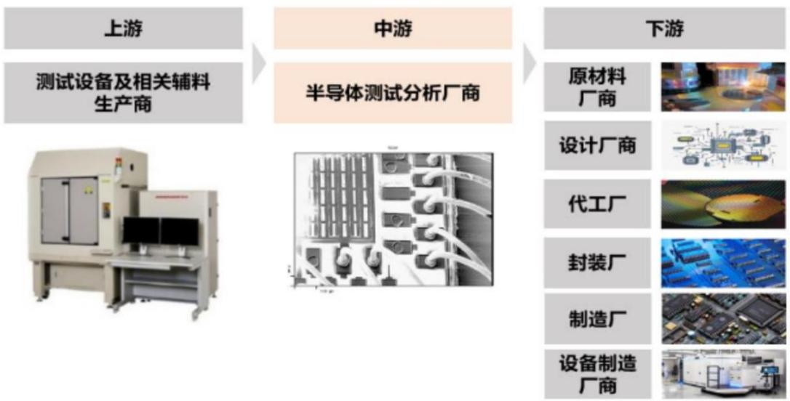  
图表1半导体检测分析产业链结构  
资料来源：胜科纳米招股说明书

集成电路测试对于集成电路设计、制造良率和品质控制至关重要，是产业必不可少的环节。从产业链的角度看，集成电路行业主要包括芯片设计、晶圆制造、芯片封装和集成电路测试。首先，集成电路设计流程需要芯片验证分析，即对晶圆样品和芯片成品样品进行设计正确性、有效性验证并分析；其次，集成电路的生产流程包括晶圆制造和封装，在这两个环节中可能由于设计不完善、制造工艺偏差、晶圆质量、环境污染等诸多因素，造成集成电路功能失效、性能降低等缺陷，需进行前道量检测以及后道检测。而实验室检测，包含失效分析、材料分析、以及可靠性检测等，需求则来自半导体产业链各类型客户，主要针对失效样品进行缺陷定位与故障分析，帮助客户实现问题判定，加速产品研发与工艺升级，提高产品良率，进一步提升生产效率。

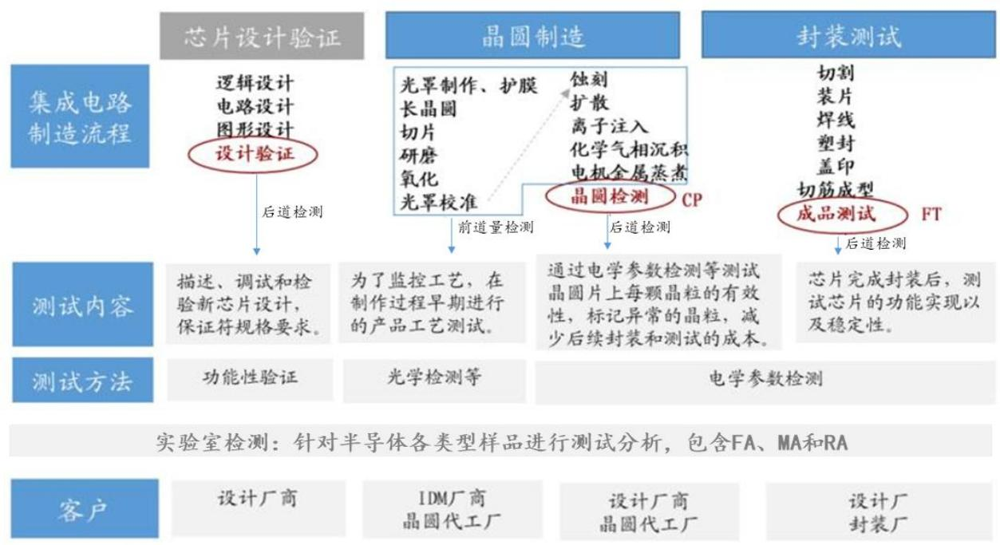  
图表 2实验室检测贯穿半导体产业链始终  
资料来源：胜科纳米招股说明书，华岭股份招股说明书，华创证券

图表3三类半导体检测的具体差异   

<table><tr><td colspan="2">项目</td><td>前道量检测</td><td>后道检测</td><td>实验室检测</td></tr><tr><td colspan="2">检测对象</td><td>工艺过程中的晶圆</td><td>晶圆测试：加工完成后的晶圆成品 测试：封装完成后的芯片</td><td>各类型样品：包括工艺过程中或完成 的晶圆、封装完成前或后的芯片、模 组、终端产品或材料等</td></tr><tr><td colspan="2">项目</td><td>前道量检测</td><td>后道检测</td><td>实验室检测 特定样品检测或小批量抽检，包括非</td></tr><tr><td colspan="2">业务模式</td><td>大批量全检，属于非破坏性测试</td><td>大批量全检，属于非破坏性测试</td><td>破坏性测试、破坏性测试 需结合物理、化学、结构、材料等多</td></tr><tr><td colspan="2">技术特点</td><td>量测与检测需在保证检测质量的同 时保证检测的效率，实现速度快、 标准一致的检测</td><td>需具备定制化测试方案软件开发能 力及大数据处理能力，主要关注测 试对象的电学性能及相关功能测试</td><td>学科知识，运用包括无损分析、物性 分析、电性分析、表面分析、化学分 析等在内的多类型检测技术进行具体 问题分析</td></tr><tr><td colspan="2">渗透难度</td><td>产线在线检测，较难脱离产线进行 测试，目前尚未有第三方承接批量 化的前道量检测业务</td><td>产线在线检测或委托第三方测试， 已形成一批专业从事第三方测试的 企业</td><td>测试需求来自于研发阶段或小批量试 产阶段，或来自于量产阶段，通常由 企业自有实验室检测或委托第三方测 试，目前第三方测试正逐步渗透</td></tr><tr><td rowspan="2">检测设备</td><td>主要 设备 类型 代表</td><td>关键尺寸扫描电子显微镜、套刻误 差量测设备、视觉识别检测缺陷设 备等</td><td>测试机、探针台、分选机等</td><td>主要为各类型分析仪器，包括扫描电 子显微镜、透射电子显微镜等</td></tr><tr><td>性供 应商</td><td>科磊半导体、应用材料等</td><td>爱德万、泰瑞达、东京精密等</td><td>赛默飞、蔡司、日立等</td></tr></table>

资料来源：胜科纳米招股说明书，华创证券

# 二、集成电路产业趋向专业化分工，第三方实验室检测空间广阔

# （一）集成电路向专业化分工方向发展，In-HouseLab 正逐步转向 Labless 模式

传统的集成电路产业最早采用IDM的经营模式。IDM模式下集成电路设计、晶圆制造、封装、测试等在企业内部进行一体化整合，业务几乎覆盖集成电路的全产业链环节，例如英特尔、索尼、海力士、美光等，其经营模式都是垂直整合型为主。在IDM 模式下公司需要投入大量的资金建立生产工厂和购买设备，承担芯片制造的全过程，同时还要持续投入巨额研发资金追赶先进工艺，风险高、资产重。

Fabless（指“没有制造业务、只专注于设计”的集成电路设计的一种运作模式）+Foundry（指在集成电路领域是指专门负责生产、制造芯片的厂家） ${ \bf \bf + 0 S A T }$ （指外包半导体封装和测试）的分工模式逐渐成为主流。随着集成电路技术的快速更新换代和下游应用的多元化，IDM 的问题逐渐凸显，以 Fabless+Foundry+OSAT为代表的集成电路专业分工模式应运而生，并推动集成电路产业向专业化分工的方向逐步发展。在专业分工模式中，Fabless 厂商将芯片设计环节独立开来经营，并由 Foundry厂商进行晶圆制造的代工服务，之后委托 OSAT厂商进行封装和测试，最终将芯片产品交付给终端应用厂商。目前，专业分工模式以其较高的研发效率和良好的产业链协同，更好地适应了集成电路产品的技术和产品趋势，正逐步成为行业的主流经营模式。

In-HouseLab（指厂内实验室）正逐步转向Labless（指无自建实验室）模式。传统的 In-HouseLab厂内分析实验室，承担产品纠错、工艺监控、仿真模拟、失效分析、辅助研发等诸多功能，但在成本控制、人才进步等方面或存在一定问题。驱动第三方检测企业发展原因：1）专业性，相较于第三方实验室专家团队所具备的丰富检测案例经验、综合分析技术，厂内检测分析人才通常局限于自身半导体产业环节，如封装厂商的工程师聚焦于封装环节，对于晶圆制造工艺的技术掌握程度有限，这可能导致其在分析失效样品时无法有效判断晶圆制造环节内含的缺陷。第三方检测分析实验室可以通过长时间案件检测的经验积累，不断精进检测分析技术；2）复杂性，生产部门会遇到各种各样的问题，比如污染物（来自操作员、机器、原材料的各种有机或无机污染物），生产部门很难鉴别问题来源；3）经济性，分析一个精细的案例可能需要动用成百万上千万的设备，而一年中发生次数较低，对于企业成本来说并不划算，因此会去寻找有经验、有资质第三方实验室去帮助分析和解决问题，第三方中立分析机构的需求顺势增加。

图表4Labless 与 Fabless 均为产业分工专业化的体现  

<table><tr><td>类型</td><td>Labless 模式</td><td>Fabless 模式</td></tr><tr><td>外包环节</td><td>失效分析等实验室测试需求</td><td>晶圆制造、封测需求</td></tr><tr><td>需求承接方</td><td>Lab（第三方实验室）</td><td>Foundry+OSAT（晶圆代工、封测厂商）</td></tr><tr><td>需求承接方所 需条件</td><td>①检测场地与检测设备仪器 ②检测分析产能 ③检测分析 技术</td><td>①制造、封测生产场地与生产设备②制造、封测产能 ③制造、封测技术</td></tr><tr><td>需求承接方 代表厂商</td><td>闳康、宜特、胜科纳米、苏试宜特</td><td>台积电、中芯国际、日月光、长电科技</td></tr><tr><td>运用该模式下 企业类型</td><td>覆盖全产业链，包括设计企业、制造企业、封测企业、材料 企业、设备企业等</td><td>设计企业</td></tr></table>

资料来源：胜科纳米招股说明书，华创证券

# （二）半导体第三方检测分析服务主要集中于后道检测与实验室检测

第三方后道检测。晶圆测试、成品测试等后道检测中的独立第三方服务模式诞生于半导体产业高度发达的中国台湾地区。1987 年，京元电子成立，与传统的封测一体厂商日月光等不同，京元电子主要承接芯片封测环节中的晶圆测试及成品测试，并最早开启了行业内的独立第三方测试服务模式。随着中国台湾地区半导体产业的不断成熟，矽格、欣铨等独立第三方测试厂商也纷纷占领半导体测试市场。在半导体产业迅速发展的过程中，大陆地区也涌现了华岭股份、伟测科技、利扬芯片等一批主营晶圆测试、成品测试等后道检测的半导体独立第三方检测厂商。

图表5第三方后道检测主要参与者梳理  

<table><tr><td>公司名称</td><td>成立时间</td><td>简介</td><td>主营业务</td></tr><tr><td>京元电子</td><td>1987</td><td>主要从事半导体产品的封装测试业务</td><td>晶圆针测、成品测试、预烧、系统级测试、扫 脚/打印/真空包装/仓储/代客出货</td></tr><tr><td>利扬芯片</td><td>2010</td><td>主营业务包括集成电路测试方案开发、12 英寸及8 英寸晶 圆测试服务、芯片成品测试服务以及与集成电路测试相关 的配套服务</td><td>集成电路测试方案开发、12英寸及8英寸晶圆 测试服务（CP）、芯片成品测试服务（FT）以 及与集成电路测试相关的配套服务</td></tr><tr><td>华岭集成</td><td>2001</td><td>国内知名的第三方集成电路专业测试企业，为集成电路企 事业单位提供优质、高效的测试解决方案，主营业务包 括：集成电路测试及与集成电路测试相关的配套服务。</td><td>技术创新、晶圆测试、成品测试、IT服务</td></tr><tr><td>华天科技</td><td>2003</td><td>主要从事集成电路封装测试业务。作为全球集成电路封测 知名企业，华天科技为客户提供封装设计、封装仿真、引 线框封装、基板封装、晶圆级封装、晶圆测试及功能测 试、物流配送等一站式服务。</td><td>半导体封测一站式服务、封装产品、测试服 务、仿真设计、FA&amp;RA</td></tr><tr><td>伟测科技</td><td>2016</td><td>公司是国内知名的第三方集成电路测试服务企业，主营业 务包括晶圆测试、芯片成品测试以及与集成电路测试相关 的配套服务。</td><td>晶圆测试、芯片成品测试</td></tr></table>

资料来源：各公司公告，各公司官网，华创证券

第三方实验室检测。我国半导体实验室第三方检测的发展历程主要可以划分为3 个阶段。20 世纪 50-80 年代，1955 年底中国亚热带电信器材研究所在广州成立，即现在的赛宝实验室；20 世纪 80 年代初，五所成立中国第一个成建制的失效分析实验室，专门开展电子元器件失效分析工作和相关技术开发；中国台湾地区的半导体第三方实验室宜特、闳康受益于当地繁荣的半导体产业，自20 世纪 90 年代以来得到迅速发展；21 世纪初开始，欧美、中国台湾地区等第三方检测机构进入中国大陆市场，并占据中国大陆半导体检测大部分市场份额，中国本土民营第三方检测机构也开始诞生发展。与此同时，国内众多实力强劲的综合性检测机构在洞察到半导体第三方实验室检测分析行业的广阔市场空间后，也通过自主投资、外延并购等方式积极布局。

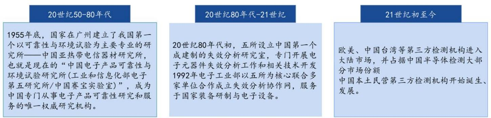  
图表6中国半导体实验室检测产业发展历程  
资料来源：前瞻产业研究院《2022 年中国半导体检测产业全景图谱》，华创证券

图表7第三方实验室检测主要参与者梳理  

<table><tr><td>名称</td><td>成立时间</td><td>简介</td><td>主营业务</td></tr><tr><td>闳康科技</td><td>2002</td><td>提供IC供应链上IC设计、制造、封装、测试等各阶段所 需的分析服务，具体业务范围涵盖电子产品设计阶段的快 速除错与实体验证，以及微、纳米产品元件故障区域的精 准定位、结构观察、材料成分等各种静态、动态测试分析 等，相关检测分析可应用于半导体相关产业</td><td>全产品分析项目、可靠性测试服务(RA)、非破坏 性分析、电性失效分析(EFA)、FIB线路修补、样 品制备处理、材料分析（MA)、表面分析(SA)、 物理化学特性分析（CA）、整合性分析</td></tr><tr><td>胜科纳米</td><td>2012</td><td>主要服务于半导体客户的研发环节，可以为半导体全产业 链客户提供样品失效分析、材料分析、可靠性分析等专 业、高效的检测实验。</td><td>失效分析、材料分析、可靠性分析</td></tr><tr><td>中国赛宝</td><td>1955</td><td>实验室可提供从材料到整机设备、从硬件到软件直至复杂 大系统的认证计量、试验检测、分析评价、数据服务、软 件评测、信息安全、技术培训、标准信息、工程监理、节 能环保、专用设备和专用软件研发等技术服务。</td><td>电路设计验证与测试程序开发、成品测试、设备 租赁、老化筛选、失效分析、质量与可靠性评 价、测试技术人才培训等服务。</td></tr><tr><td>苏试宜特</td><td>2002</td><td>苏试试验2019年9月向宜特全资收购上海宜特（目前已更 名为苏试宜特）切入半导体检测，自收购上海宜特后拓展 产业链，为客户提供从芯片到部件到终端整机产品全面 的、全产业链的环境与可靠性试验及验证分析服务。</td><td>工艺芯片线路修改、失效分析、可靠度验证、晶 圆微结构与材料分析、车用元器件可靠度验证、 板极可靠度验证等</td></tr><tr><td>广电计量</td><td>2002</td><td>2019 年起，广电计量在上海筹建集成电路分析测试平台， 其通过自建模式培育集成电路测试能力。可以为装备制 造、汽车、电力电子与新能源、5G通信、光电器件与传感 器、轨道交通与材料、晶圆厂等领域企业提供专业服务。</td><td>破坏性物理分析（DPA）、失效分析（FA）、晶圆级 材料及工艺分析（MA）、车规级电子元器件AEC-Q 认证测试、元器件筛选及国产化验证、可靠性测 试、工艺质量评价、寿命评估、电线电缆及连接 器检测、IS026262 功能安全认证审核等技术服务</td></tr><tr><td>华测检测</td><td>2003</td><td>2022 年底收购中国台湾地区第三方实验室蔚华科技 （3055.TW）的大陆地区子公司蔚思博检测技术（合肥）有态电性失效分析、IC 电路修补、AEC-Q100车用 限公司，现更名为“华测蔚思博检测技术有限公司”。</td><td>可靠性验证、静电防护能力检测、失效分析、动 电子可靠度试验</td></tr></table>

资料来源：各公司公告，各公司官网，华创证券

# （三）研发投入&先进制程&专业化分工共同驱动第三方检测需求增长

新兴产业带动半导体需求增长。虽然 PC/手机市场接近饱和，但随着5G应用的普及，智能汽车、智能家居、云服务、物联网、AI 等新兴产业蓬勃发展，对半导体产品的需求不断增加。根据WSTS数据，2025 年全球半导体市场规模达到7009亿美元，同比 $+ 1 1 . 2 \%$ ,2026 年全球半导体市场将进一步增长 $8 . 5 \%$ ，规模预计有望达 7607 亿美元，其中美洲与亚太市场增速较其他地区更快。美国云计算、AI技术投资（如英伟达、AMID 数据中心业务）及政策扶持（如《芯片法案》）是美洲市场主要驱动力，中国智能手机、服务器需求复苏，日本汽车半导体（如CIS芯片）需求回暖是亚太地区增长主要驱动力。

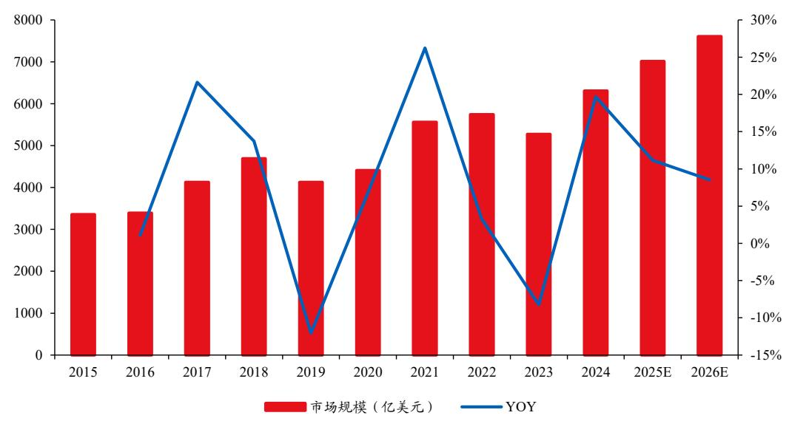  
图表8WSTS 预测 2026年全球半导体市场规模达7607 亿美元  
资料来源：WSTS，胜科纳米招股说明书，华创证券

半导体产业客户的检测分析需求主要来自研发过程的新产品设计与新工艺研究、新产品检测与新产线调试，受益于半导体产业持续加大研发投入与产能扩张。随着半导体工艺不断进步，产品制程步骤增多，微观结构复杂，材料多样化，生产成本提升。为获取高晶圆良品率，必须严格控制工艺一致性，对集成电路生产过程中的质量控制需求增大。同时，集成电路器件物理尺度缩小、向三维结构发展，需要检测的缺陷尺度和测量的物理尺度也在不断缩小，对缺陷检测和尺度测量的要求从二维平面拓展到三维空间，这使得先进制程对半导体测试服务提出了更高的要求；随着集成电路产业朝专业分工的趋势不断发展，专业化的集成电路测试的市场需求面十分广泛。据 QYResearch 预计 2031 年全球半导体测试服务市场规模将达到 210.2 亿美元，未来几年年复合增长率 CAGR 为 $6 . 9 \%$ 。

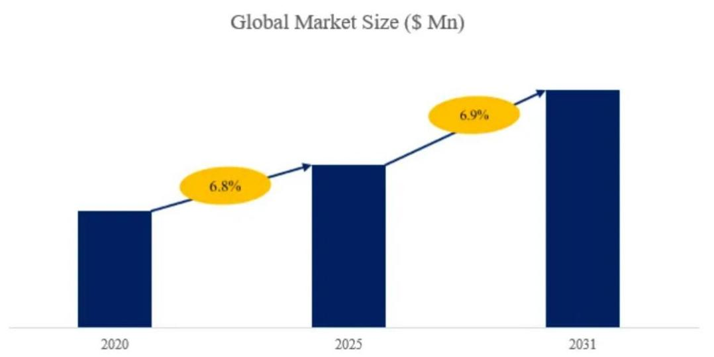  
图表 9全球半导体测试服务市场规模增速  
资料来源：QYResearch

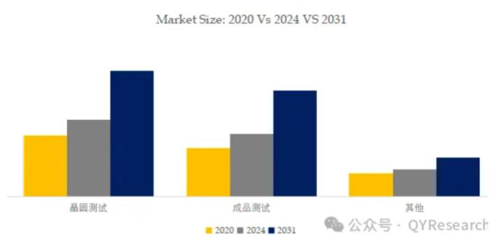  
图表10几类测试服务的全球市场规模  
资料来源：QYResearch

根据QY Research 数据，在全球半导体测试服务市场中，晶圆测试处于主导地位；2024年全球半导体第三方实验室检测分析市场规模目前已达到 44.31 亿美元，预计在 2031 年达到109.2 亿美元，2024 年至2031年CAGR 为 $14 \%$ 。

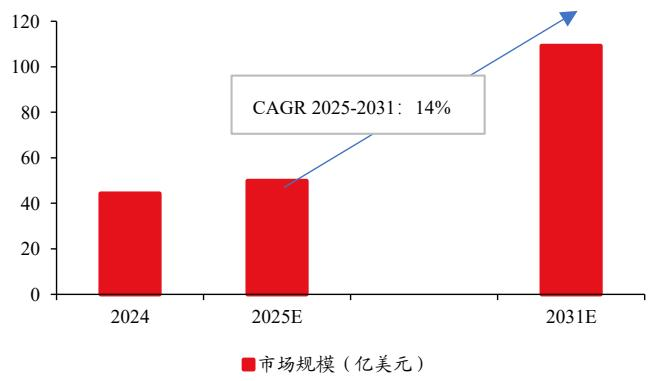  
图表11全球半导体第三方实验室检测分析市场规模及预测  
资料来源：QYResearch，胜科纳米招股说明书，华创证券

# （四）半导体产业链国产化趋势加速我国半导体检测行业成长

根据中国台湾地区工研院的统计，集成电路测试成本约占芯片设计公司营收的 $6 \% - 8 \%$ ,国产化进程加速推进，大陆芯片设计公司迎来大发展时代，测试需求随之增长。根据魏少军《主旨报告：中国芯片设计业要自强不息》，截至 2024 年底，我国芯片设计规模为6460 亿元，同比增长 $1 1 . 9 \%$ 。芯片设计公司的快速增长，使得芯片测试的市场需求随之增长。我们根据台湾工研院的统计，按照集成电路测试成本占芯片设计公司 $7 \%$ 进行测算，2024 年来自芯片设计企业的测试市场规模约为 452 亿元。此外晶圆制造以及封装环节企业的检测环节外包给第三方的趋势也逐步显现，市场空间进一步增大。

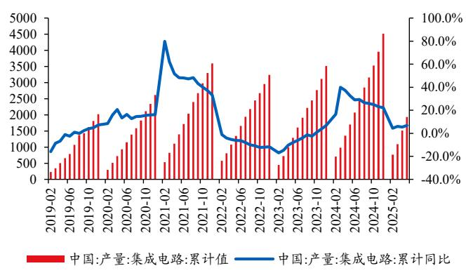  
图表12我国集成电路产量及同比（亿块）  
资料来源：Wind，华创证券

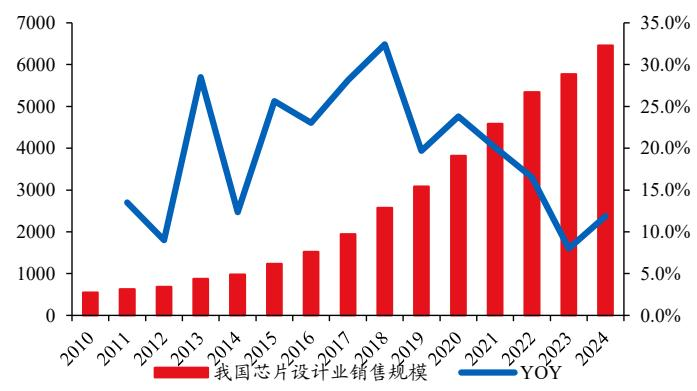  
图表14我国芯片设计市场规模及同比增速（亿元）  
资料来源：魏少军《主旨报告：中国芯片设计业要自强不息》，转引自芯智讯，台湾工研院、转引自利扬芯片招股书，华创证券注：根据台湾工研院，按照集成电路测试成本占芯片设计公司$7 \%$ 进行测算

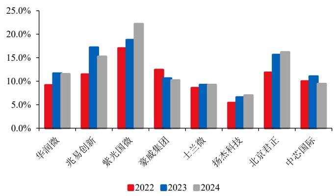  
资料来源：Wind，华创证券  
图表13我国芯片设计及晶圆制造公司保持高研发费用率

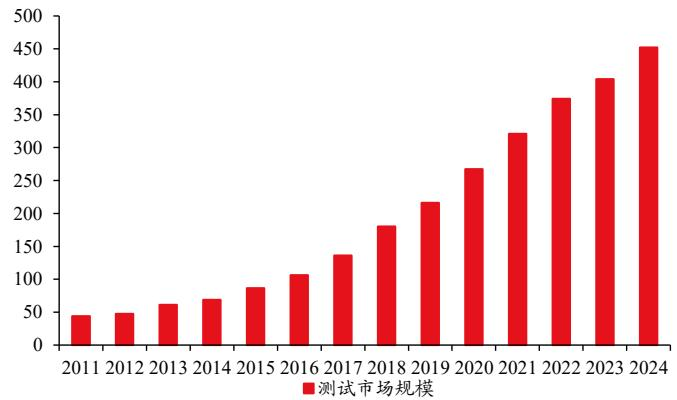  
资料来源：魏少军《主旨报告：中国芯片设计业要自强不息》，转引自芯智讯，华创证券  
图表15集成电路测试市场规模（亿元）

根据国家市场监管总局数据，我国电子电器检测市场规模增速除 2020 年以外，在 2018-2023 年增速均好于我国检测行业总体增速。2023 年我国电子电器检测市场规模已达 286亿元，占全检测行业规模 $6 . 1 \%$ 。

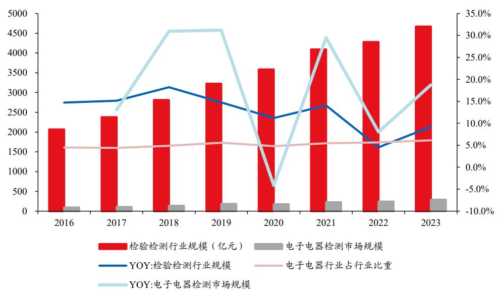  
图表 16电子电器检测市场规模增速好于我国检验检测市场整体增速

资料来源：国家市场监管总局《全国检验检测服务业统计报告》，华创证券根据中国半导体协会数据，预计到 2024 年，我国半导体第三方实验室检测分析市场规模将超过100亿元，2027 年行业市场空间有望达到180-200 亿元，CAGR 将超过 $1 0 \%$ 。

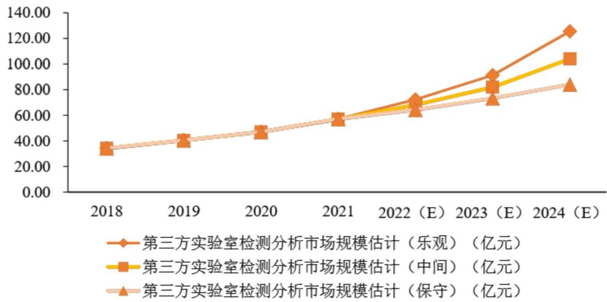  
图表17中国半导体第三方实验室测试分析市场预测  
资料来源：中国半导体行业协会，转引自胜科纳米招股说明书

半导体第三方实验室检测分析主要包括失效分析、材料分析以及可靠性分析。可靠性分析是指元器件在规定的条件下、在规定的时间内完成规定功能的能力，通常指标包括可靠度、不可靠度、失效概率密度、瞬时失效率及寿命；失效分析指通过非破坏性分析技术、静态电压电路比对实验、热点定位技术、化学法和物理法样品制备技术等技术手段判断集成电路失效的模式，查找失效原因，弄清失效机理。破坏性物理分析（DPA）是失效分析的补充手段，主要特点是对合格的元器件做分析。根据 QYResearch，2023 年我国可靠性、失效及材料分析规模分别为28.12/27.40/14.07 亿元，预计到 2028 年，可靠性、失效及材料分析规模将分别达到52.35/55.91/27.92亿元,CAGR分别为 $1 3 . 2 \% / 1 5 . 3 \% / 1 4 . 7 \% _ { \circ }$

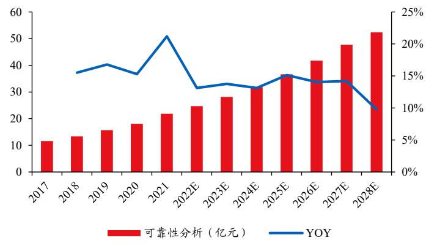  
图表 18我国可靠性分析市场规模及增速  
资料来源：QYResearch、转引自胜科纳米招股书，华创证券

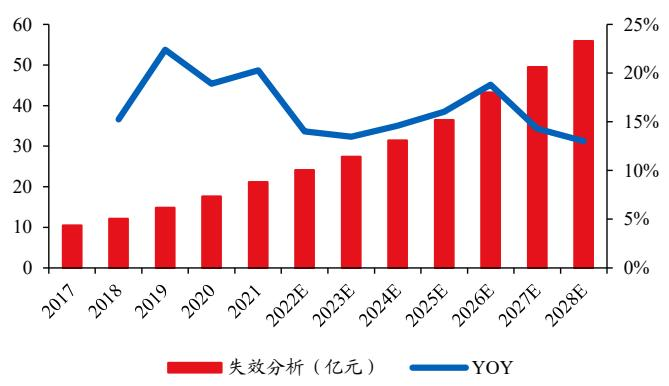  
图表19我国失效分析市场规模及增速  
资料来源：QYResearch、转引自胜科纳米招股书，华创证券

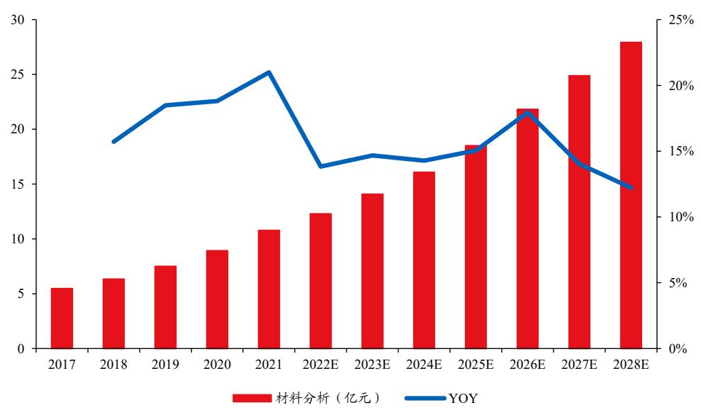  
图表 20我国材料分析市场规模及增速  
资料来源：QYResearch、转引自胜科纳米招股书，华创证券

# 三、第三方半导体实验室检测重点标的

# 1、胜科纳米：半导体第三方检测分析实验室

公司成立于 2012 年，是行业内知名的半导体第三方检测分析实验室，致力于为半导体产业链提供专业高效的第三方检测分析实验。公司主要服务于半导体客户的研发环节，提供样品失效分析、材料分析与可靠性分析等检测实验。2024 年公司实现收入 4.15 亿元，同比 $+ 5 . 4 \%$ ，实现归母净利润0.81亿元，同比- $1 7 . 6 \%$ 。公司覆盖失效分析、材料分析、及可靠性分析，2024 年H1收入占比分别为 $6 6 . 1 \% 3 1 . 0 \% / 2 . 9 1 \%$ 。

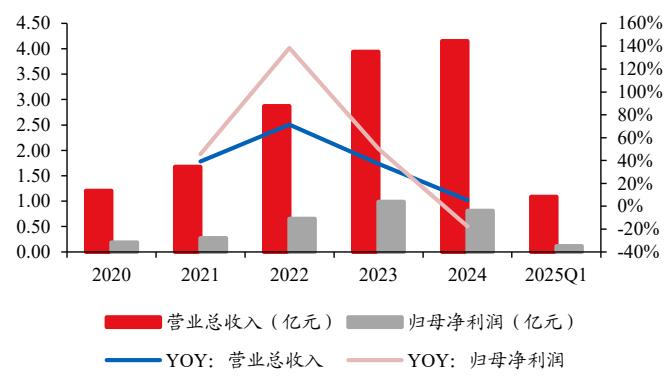  
图表21胜科纳米营业收入及归母净利润情况  
资料来源：Wind，华创证券

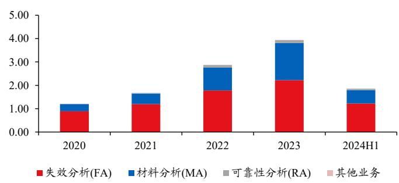  
图表23胜科纳米业务结构拆分（亿元）  
资料来源：Wind，华创证券

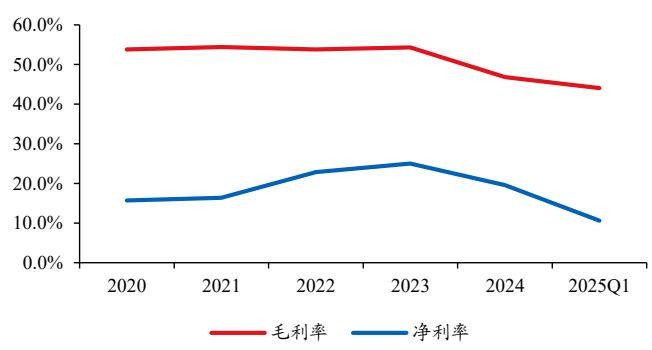  
图表 22胜科纳米毛利率及净利率情况  
资料来源：Wind，华创证券

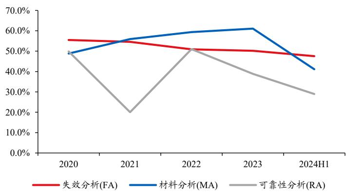  
图表 24胜科纳米分业务毛利率情况  
资料来源：Wind，华创证券

# 2、苏试试验：2019 年收购宜特检测切入半导体检测环节

2019 年，公司以 2.8 亿元收购宜特检测 $1 0 0 \%$ 的股权，正式进入集成电路检测领域，升级和开拓电子元器件可靠性分析、失效分析以及材料分析的技术和业务。2024 年公司集成电路验证与分析服务实现收入2.88 亿元，同比 $+ 1 2 . 3 \%$ ，占公司收入比重 $1 4 . 2 3 \%$ 。

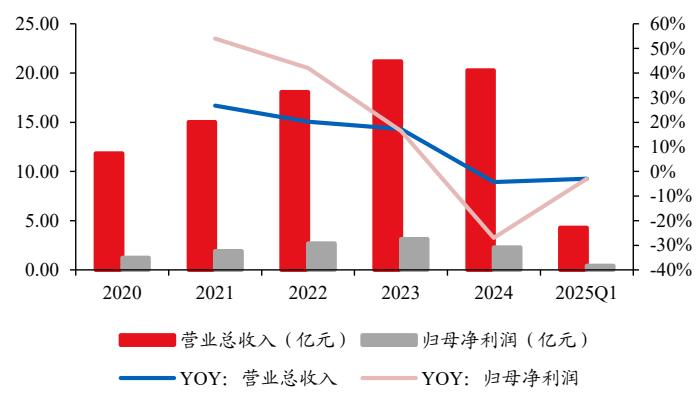  
图表 25苏试试验营业收入及归母净利润情况   
资料来源：Wind，华创证券

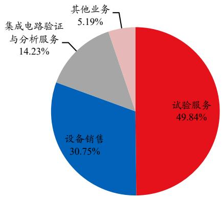  
图表 27苏试试验业务结构拆分  
资料来源：Wind，华创证券

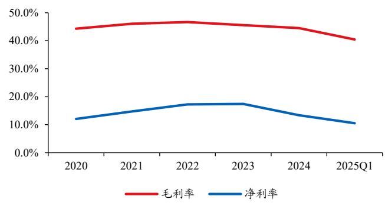  
图表26苏试试验毛利率及净利率情况   
资料来源：Wind，华创证券

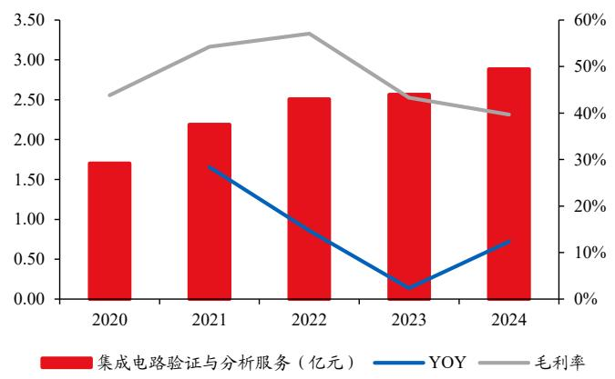  
图表28 苏试试验集成电路验证与分析服务收入情况  
资料来源：Wind，华创证券

# 3、广电计量：持续自主培育集成电路测试与分析业务

集成电路测试与分析是公司持续投入和培育的新兴产业领域，通过持续的技术研发和实验室建设，可以为装备制造、汽车、电力电子与新能源、5G通信、光电器件与传感器、轨道交通与材料、晶圆厂等领域企业提供专业的破坏性物理分析（DPA）、失效分析（FA）、晶圆级材料及工艺分析（MA）、车规级电子元器件AEC-Q 认证测试、元器件筛选及国产化验证、可靠性测试、工艺质量评价、寿命评估、电线电缆及连接器检测、ISO26262 功能安全认证审核等技术服务，并取得部分技术领先优势，帮助企业提升电子产品质量与可靠性。2024 年公司集成电路测试与分析实现收入2.56 亿元，同比 $+ 2 6 . 3 \%$ ，占公司收入比重 $8 \%$ 。

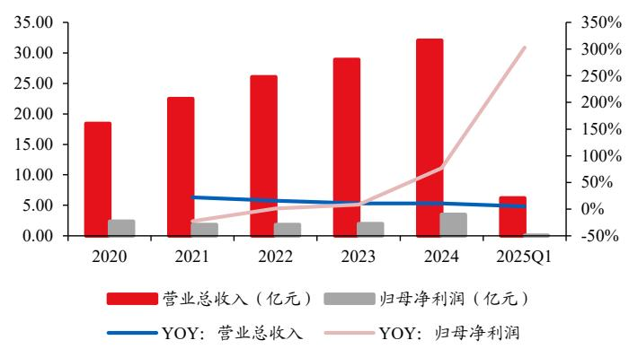  
图表29广电计量营业收入及归母净利润情况  
资料来源：Wind，华创证券

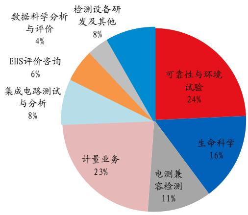  
图表31广电计量业务结构拆分  
资料来源：Wind，华创证券

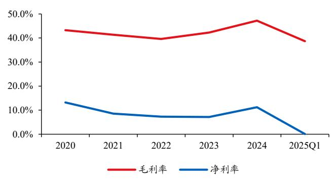  
图表 30广电计量毛利率及净利率情况  
资料来源：Wind，华创证券

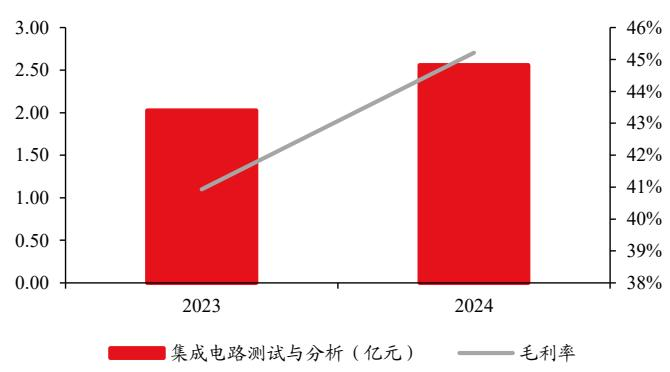  
图表 32广电计量集成电路验证与分析服务收入情况   
资料来源：Wind，华创证券

# 4、华测检测：收购蔚思博进入半导体检测领域

2022 年公司收购蔚思博检测技术(合肥)有限公司，拓展公司在半导体检测领域的发展。2024年公司持续加码对于蔚思博的 FA 和 MA 布局，加快推进转型，精细调整架构团队，以适应业务发展需求。

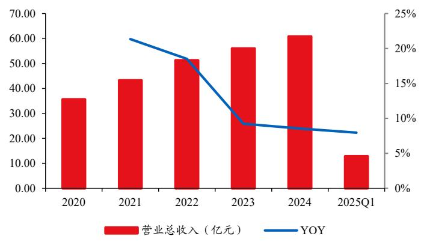  
图表 33华测检测营业收入情况  
资料来源：Wind，华创证券

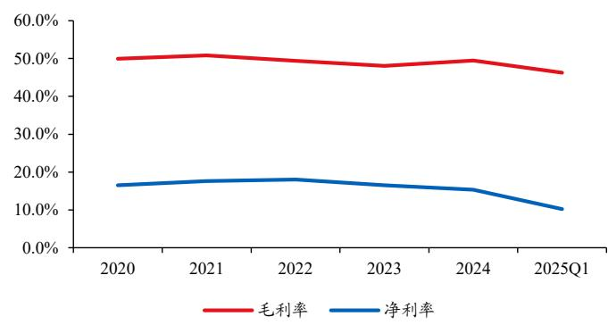  
图表35华测检测毛利率及净利率情况  
资料来源：Wind，华创证券

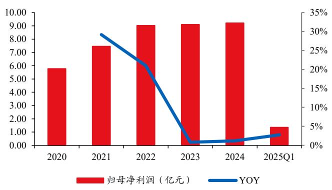  
图表34华测检测归母净利润情况  
资料来源：Wind，华创证券

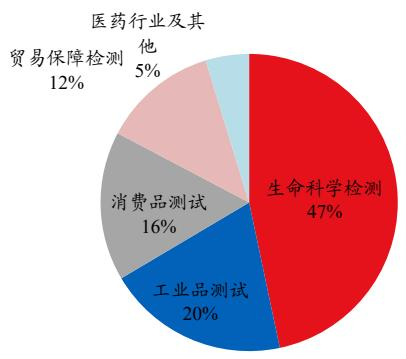  
图表 36华测检测业务结构拆分  
资料来源：Wind，华创证券

# 四、风险提示

1．市场需求不及预期。  
2.行业竞争加剧。  
3．技术更新迭代不及预期。  
4.产能扩张与需求不匹配等。

# 机械组团队介绍

# 组长、首席分析师：范益民

上海交通大学机械硕士，CFA，5 年工控产业经历，8 年机械行业研究经验，2023 年加入华创证券研究所。2019 年金牛奖机械行业最佳分析团队；2019、2022、2024 年 Choice 最佳分析师及团队。

分析师：丁祎

新南威尔士大学金融硕士，上海财经大学本科，曾任职于国海证券，华鑫证券，2023 年加入华创证券研究所。

# 分析师：胡明柱

哈尔滨工业大学金融工程博士，国信证券应用经济学博士后。具有机械本硕及金融博士复合学历背景。2023 年加入华创证券研究所。

# 助理分析师：陈宏洋

上海交通大学机械工程博士，曾就职于中泰证券研究所，2023 年加入华创证券研究所。

助理研究员：於尔东

南京大学工学硕士。2023 年加入华创证券研究所。

# 华创行业公司投资评级体系

# 基准指数说明：

A 股市场基准为沪深 300 指数，香港市场基准为恒生指数，美国市场基准为标普 500/纳斯达克指数。

# 公司投资评级说明：

强推：预期未来6个月内超越基准指数 $2 0 \%$ 以上；推荐：预期未来6 个月内超越基准指数 $1 0 \% - 2 0 \%$ 中性：预期未来6个月内相对基准指数变动幅度在 $. 1 0 \% - 1 0 \%$ 之间；回避：预期未来6个月内相对基准指数跌幅在 $1 0 \% - 2 0 \%$ 之间。

# 行业投资评级说明：

推荐：预期未来3-6个月内该行业指数涨幅超过基准指数 $5 \%$ 以上；中性：预期未来3-6 个月内该行业指数变动幅度相对基准指数 $- 5 \% - 5 \%$ .,回避：预期未来3-6个月内该行业指数跌幅超过基准指数 $5 \%$ 以上。

# 分析师声明

每位负责撰写本研究报告全部或部分内容的分析师在此作以下声明：

分析师在本报告中对所提及的证券或发行人发表的任何建议和观点均准确地反映了其个人对该证券或发行人的看法和判断；分析师时任何其他券商发布的所有可能存在雷同的研究报告不负有任何直接或者间接的可能责任。

# 免责声明

。本公司不会因接收人收到本报告而视其为客户。

本报告所载资料的来源被认为是可靠的，但本公司不保证其准确性或完整性。本报告所载的资料、意见及推测仅反映本公司于发布本及告当日的判断。在不同时期，本公司可发出与本报告所载资料、意见及推测不一致的报告。本公司在知晓范围内履行披露义务。

报告中的内容和意见仅供参考，并不构成本公司对具体证券买卖的出价或询价。本报告所载信息不构成对所涉及证券的个人投资建议，也未考虑到个别客户特殊的投资目标、财务状况或需求。客户应考虑本报告中的任何意见或建议是否符合其特定状况，自主作出投资决策并自行承担投资风险，任何形式的分享证券投资收益或者分担证券投资损失的书面或口头承诺均为无效。本报告中提及的投资价格和价值以及这些投资带来的预期收入可能会波动。

本报告版权仅为本公司所有，本公司对本报告保留一切权利。未经本公司事先书面许可，任何机构和个人不得以任何形式翻版、复制、发表、转发或引用本报告的任何部分。如征得本公司许可进行引用、刊发的，需在允许的范围内使用，并注明出处为“华创证券研究”且不得对本报告进行任何有悖原意的引用、删节和修改。

证券市场是一个风险无时不在的市场，请您务必对盈亏风险有清醒的认识，认真考虑是否进行证券交易。市场有风险，投资需谨慎。

# 华创证券研究所

<table><tr><td>北京总部</td><td>广深分部</td><td>上海分部</td></tr><tr><td>地址：北京市西城区锦什坊街 26号 恆奧中心C座 3A</td><td>地址：深圳市福田区香梅路1061号中投国 际商务中心A 座19 楼</td><td>地址：上海市浦东新区花园石桥路33号 花旗大廈12层</td></tr><tr><td>邮编：100033 传真：010-66500801</td><td>邮编：518034 传真：0755-82027731</td><td>邮编：200120 传真：021-20572500</td></tr><tr><td>会议室：010-66500900</td><td>会议室：0755-82828562</td><td></td></tr><tr><td></td><td></td><td>会议室：021-20572522</td></tr></table>