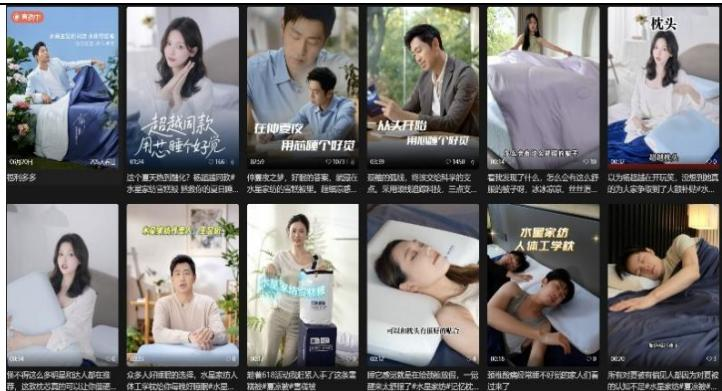

# 水星家纺（603365.SH） 家纺龙头推陈出新，深化大单品战略助力全品类发展

2025 年 07 月 10 日

公司首次覆盖报告

投资评级：买入（首次）

<table><tr><td>日期</td><td>2025/7/9</td></tr><tr><td>当前股价(元)</td><td>18.04</td></tr><tr><td>一年最高最低(元)</td><td>21.87/10.73</td></tr><tr><td>总市值(亿元)</td><td>47.39</td></tr><tr><td>流通市值(亿元)</td><td>46.87</td></tr><tr><td>总股本(亿股)</td><td>2.63</td></tr><tr><td>流通股本(亿股)</td><td>2.60</td></tr><tr><td>近3 个月换手率(%)</td><td>51.57</td></tr></table>

  
股价走势图  
数据来源：聚源

吕明（分析师）lvming@kysec.cn证书编号：S0790520030002

马宇轩 （联系人）mayuxuan@kysec.cn证书编号：S0790125050029

#  家纺龙头推陈出新，以大单品助全品类发展，首次覆盖，给予“买入”评级

水星家纺是国内家纺龙头公司，聚焦被芯优势品类，覆盖床上用品全品类产品矩阵。公司近年来在研发和营销端持续发力，传统优势被芯品类推陈出新；同时深化大单品战略，以爆品打开其他品类市场，有望进一步提升市场份额。公司积极布局电商渠道并高效营销，线下合理拓店，提质增效，预计公司未来 3-5年内有望保持稳健增长。公司上市以来累计分红超 14 亿元，累计分红率 $54 \%$ 。我们预计 2025-2027 年公司归母净利润 $3 . 9 / 4 . 4 / 4 . 8 $ 亿元，对应 EPS 为 1.48/1.67/1.84 元，当前股价对应PE为 $1 2 . 2 / 1 0 . 8 / 9 . 8 $ 倍，首次覆盖，给予“买入”评级。

#  家纺新机遇：线上化趋势 $^ { + + }$ 睡眠经济加速格局优化，记忆枕百亿市场可期

（1）行业规模稳中有升，线上化趋势优化原本分散的竞争格局：2024 年家纺市场规模 2516.8 亿元，行业格局分散，随线上销售占比提升，龙头通过供应链与渠道优势提升市占率，各品牌以差异化策略抢占市场，提升市占率。（2）睡眠经济催生助眠家纺新需求：超 $6 0 \%$ 国人存在睡眠困扰，睡眠经济蓬勃发展。多数消费者通过家居家纺改善睡眠，助眠家纺新市场空间广阔。（3）对标日本，记忆棉枕占据主导地位：日本居民睡眠困扰更为严重，记忆棉枕在改善睡眠途径中占据绝对优势，对标日本，我们测算中国记忆棉枕潜在空间或超百亿。（4）亚朵深睡枕的爆火加速记忆棉枕渗透率提升：亚朵深睡枕作为枕类消费者教育先驱，2024 年线上 GMV 达 15 亿元，记忆棉枕渗透率从 2021 年的 $4 \%$ 升至 2023 年的$23 \%$ ，预计友商跟进后预计进一步提升。

#  未来看点：深化大单品战略，以点带面驱动全品类稳健成长

（1）科技创新与性价比树立被芯品类心智：水星家纺主打“好被芯，选水星”，2024年被芯收入占比 $4 8 . 4 \%$ ，毛利率提升至 $4 1 . 6 \%$ 。公司产品定位中高端，兼具性价比与技术优势。（2）聚焦单品心智，打造明星爆品带动全品类发展：公司2025 年推出人体工学枕，5 月线上 GMV 达 411 万元，同时培育雪糕被 $5 . 0 / 5 . 0 \mathrm { P r o }$ 等单品，布局智能家纺。公司有望持续推进大单品战略，带动全品类发展提高市场占有率。（3）线下提质与线上精准营销双驱动：线下以加盟模式拓展三四线城市及下沉市场，以自营标杆性旗舰门店覆盖高线城市消费群体。未来将通过门店形象升级、精简SKU 等方式提升店效；公司深耕线上渠道。具备先发优势。2025年签约杨超越与王昱珩作为代言人，在内容平台发布种草内容，精准营销大单品。

 风险提示：宏观经济下行风险、市场竞争加剧风险、经销渠道管理风险

财务摘要和估值指标  

<table><tr><td>指标</td><td>2023A</td><td>2024A</td><td>2025E</td><td>2026E</td><td>2027E</td></tr><tr><td>营业收入(百万元)</td><td>4,211</td><td>4,193</td><td>4,638</td><td>5,107</td><td>5,610</td></tr><tr><td>YOY(%)</td><td>14.9</td><td>-0.4</td><td>10.6</td><td>10.1</td><td>9.8</td></tr><tr><td>归母净利润(百万元)</td><td>379</td><td>367</td><td>388</td><td>438</td><td>485</td></tr><tr><td>YOY(%)</td><td>36.2</td><td>-3.3</td><td>5.8</td><td>13.0</td><td>10.6</td></tr><tr><td>毛利率(%)</td><td>40.0</td><td>41.4</td><td>42.6</td><td>43.7</td><td>44.5</td></tr><tr><td>净利率(%)</td><td>9.0</td><td>8.7</td><td>8.4</td><td>8.6</td><td>8.6</td></tr><tr><td>ROE(%)</td><td>12.9</td><td>12.3</td><td>12.4</td><td>13.0</td><td>13.3</td></tr><tr><td>EPS(摊薄/元)</td><td>1.44</td><td>1.40</td><td>1.48</td><td>1.67</td><td>1.84</td></tr><tr><td>P/E(倍)</td><td>12.5</td><td>12.9</td><td>12.2</td><td>10.8</td><td>9.8</td></tr><tr><td>P/B(倍)</td><td>1.6</td><td>1.6</td><td>1.5</td><td>1.4</td><td>1.3</td></tr></table>

数据来源：聚源、开源证券研究所

# 目 录

1、 水星家纺：中高端家纺龙头，大单品战略驱动稳健增长.... ........................................................................ ..... 4  
1.1、 历史回顾：深耕家纺三十余年，线上线下多渠道布局. .. 4  
1.2、 股权结构：控股股东持股集中，股权结构稳定..... .................................................................. ..... 5  
1.3、 财务表现：大单品战略驱动业绩增长，盈利能力稳步提升.. .................................................................... .. 5  
1.4、 通过股权激励计划方案，彰显未来发展信心. .......................... ... 8  
2、 家纺行业：线上化趋势 $^ +$ 睡眠经济有望加速格局优化，记忆棉枕市场发展可期.. ... 8  
2.1、 行业整体稳健增长，线上销售占比持续提升...... ................................................ ..... 8  
2.2、 对高质量睡眠的诉求催生睡眠经济，家纺行业迎来新需求. ........................................... ... 10  
2.3、 以邻为鉴：日本记忆棉枕占据绝对优势，中国记忆棉枕潜在空间达百亿 ..................................................... ...... 11  
2.4、 亚朵引领国内枕头市场风潮，记忆棉枕渗透率有望持续提升.. .......................................... ... 14  
3、 未来看点：大单品战略以点带面，驱动家纺全品类成长..... ................................................................. ...... 17  
3.1、 以科技创新和性价比为基础，成功塑造被芯核心品类.. ............................................................................. ... 17  
3.2、 不断研发推出明星爆品，带动全品类发展.. ............................................................................. .... 18  
3.3、 线下渠道提质增效，线上渠道高效精准营销.. ................................................................................... .. 20  
4、 盈利预测与投资建议 ..... .......................................................................................................... ..... 22  
4.1、 关键假设 ... ........................................................................................................................................ .. 22  
4.2、 盈利预测与估值 . ........................................................................................................................................... .... 23  
5、 风险提示 ........ ............................................................................................................................................. .. 23  
附：财务预测摘要 .......................................................................................................................................................................... 25

# 图表目录

图 1： 公司深耕家纺三十余年，线上线下多渠道布局.. .. 5  
图 2： 李氏家族持股集中，实控人合计控股 $3 9 . 6 \%$ （截至 2025/3/31） ... 5  
图 3： 2017-2024 年营业收入 CAGR 达 $7 . 9 0 \%$ ... ... 6  
图 4： 2017-2024 年归母净利润 CAGR 达 $5 . 2 2 \%$ .. .... 6  
图 5： 2024 年被芯占比持续提升至 $4 8 \%$ ...... ........................................................................................................ ...... 6  
图 6： 2024 年电商收入占比持续提升至 $5 5 \%$ . .... 6  
图 7： 盈利能力总体呈现稳步提升态势... .... 7  
图 8： 费用率总体维持稳定.... .... 7  
图 9： 2024 年存货周转天数同比增长 4天.. .............................................................................................. .... 7  
图 10： 2024年经营性净现金流同比增加 $4 . 6 \%$ .... .... 7  
图 11： 2022-2024 年公司分红率维持较高水平，回馈投资者... .... 7  
图 12： 家纺行业市场规模平稳增长.. .. 8  
图 13： 天猫家纺销售额 2017-2024 年 CAGR 达 $7 . 3 \%$ . .... 8  
图 14： 国内家纺行业竞争格局较为分散... .... 9  
图 15： 头部家纺品牌线上集中度整体处于上升趋势. ... 9  
图 16： 我国睡眠困扰人群占比达 $62 \%$ ，且中/重度人群占比提升 .... 10  
图 17： 年轻代际人群的中重度睡眠困扰比例持续攀升，其中 00后/90后中重度困扰比例增长 $1 1 \% / \%$ .. ... 10  
图 18： 中国睡眠经济市场规模有望从 2023 年的 4955.8 亿元增长到 2027 年的 6586.8 亿元，CAGR 约 $7 . 4 \%$ ....... ..... 10  
图 19： $64 \%$ 的消费者会选择购买家居家纺类的产品改善睡眠 ... .... 11  
图 20： $5 9 . 5 \%$ 的受访者通过舒适寝具的方式改善睡眠 .. .. 11  
图 21： 日本政府为提高居民睡眠质量设定了提高的目标值. .. 11  
图 22： 日本 20 岁 ${ \sim } 4 0$ 岁年龄段人群中超过 $50 \%$ 存在失眠的可能.... ......................................................................... ...... 12  
图 23： 日本睡眠满意度较低.... .................................................................. ...... 12  
图 24： 横向对比中日两国的睡眠满意度，中国居民睡眠满意度略高于日本.... .......................................................... .... 13  
图 25： 日本人优先选择枕头（ $1 5 . 3 \%$ ）来提高睡眠质量 .. ........................................................ .. 13  
图 26： $2 9 . 3 \%$ 的日本人选择记忆棉（聚氨酯）作为枕头填充材料 ......................................................................... ...... 13  
图 27： 日本枕头市场规模约 900 亿日元... ....................................................... .... 14  
图 28： 枕头的单价相较其他品类床品更低.. ................... .. 14  
图 29： $6 7 . 7 \%$ 的受访者认为好枕头是睡眠的保障，愿意花费可观的时间精力和金钱选择枕头.... ...................... .... 14  
图 30： 2023年亚朵成功培育出爆品“深睡枕 PRO”系列，线上 GMV 爆发式增长.... ................................. .... 15  
图 31： 亚朵大单品第 2代深睡枕 PRO.. .. 15  
图 32： 亚朵深睡枕 PRO 系列累计销量超过 600万只.. .... 15  
图 33： 兴趣电商“货找人”模式...... .... 16  
图 34： 国内家纺龙头纷纷推出记忆棉枕新品，以多功能层的结构实现减压助眠，记忆棉枕渗透率有望继续向上 ........16  
图 35： 水星家纺被芯收入占比高于其他两家.. ... 17  
图 36： 水星家纺被芯毛利率持续提升..... ..................................................................................................... ..... 17  
图 37： 水星家纺天猫产品均价低于同业龙头公司... .......................................................................... ..... 18  
图 38： 水星家纺高端产品具备性价比.. ...... 18  
图 39： 公司被芯大单品雪糕被持续迭代，功能性不断优化... ... 19  
图 40： 水星商学院组织开展 2024 年牛皮席溯源游学活动，向消费者展示原材料溯源，提倡绿色可持续理念 .............19  
图 41： 公司自主研发的新爆品“人体工学枕” ..... 19  
图 42： 公司积极布局智能家纺领域... ..................................................................... .. 19  
图 43： 人体工学枕线上 GMV 迅速增长，有成为爆品的潜质 ............................................................. .. 19  
图 44： 水星家纺以线上渠道和加盟渠道为主.. ......................................................................................... 20  
图 45： 公司具备先发优势，积极调整把握渠道变革红利... .................................................................... .. 21  
图 46： 水星家纺 2025年 4月签约两位品牌形象代言人杨超越和王昱珩... ...................................................... ... 21  
图 47： 水星家纺在小红书上通过发帖种草引流宣传人体工学枕等大单品 ............................................................................ 22  
图 48： 水星家纺微信视频号大量发布有关人体工学枕和雪糕被的相关视频.... ........................................................... .. 22  
表 1： 股权激励计划方案彰显公司对于未来发展态势的信心..... .... 8  
表 2： 各龙头差异化布局抢占市场份额，水星家纺线上收入高增带动整体收入增速快于同行.. ... 9  
表 3： 科技创新赋能，被芯大单品战略抢占心智.... ............................. ..... 17  
表 4： 预计公司 2025-2027年分别实现归母净利润 $3 . 9 / 4 . 5 / 5 . 0$ 亿元（单位：亿元） ........................................... .. 22  
表 5： 水星家纺可比公司盈利预测与估值. .. 23

我们看好水星家纺在大单品战略驱动下，以被芯核心品类为支点，通过积极研发和精准营销发力其他品类大单品如人体工学枕、雪糕被等，带动全品类增长。水星家纺具备线上渠道先发优势，叠加睡眠经济红利释放市场潜力，记忆枕市场对标日本还有充足的渗透率提升空间，长期看公司在行业集中度提升趋势中市场份额和盈利水平有望双升。从行业发展和竞争格局看，传统家纺行业格局十分分散，头部家纺公司有望通过差异化战略抢占市场份额。

本文主要围绕家纺行业新趋势和水星家纺的大单品战略、产品布局、渠道打法等展开：

（1）行业层面，讨论当前传统家纺行业竞争格局分散的现状，未来有望随着线上销售趋势与睡眠经济扩容为行业带来增量空间，并利好头部公司提升市占率；对标邻国日本，探讨同样被睡眠障碍所困扰的日本居民优先选择记忆棉枕以改善睡眠，估算出我国记忆棉枕市场空间潜力超百亿元；以亚朵深睡枕爆品逻辑为引，论证国内记忆棉枕渗透率提升已经箭在弦上。

（2）公司层面，探讨水星家纺如何借“好被芯 选水星”品牌战略塑造被芯心智，同时贯彻大单品战略，以人体工学枕等新大单品打开增长空间，挖掘全品类扩张潜力；基于水星线上渠道先发优势，分析其在传统电商与兴趣电商双轮驱动下的对新大单品推广的流量运营逻辑。我们认为水星可凭借研发创新和性价比优势，有望在细分景气的记忆枕赛道中抢占先机。长期看，水星家纺的市场份额和盈利能力都有望实现显著改善。

# 1、 水星家纺：中高端家纺龙头，大单品战略驱动稳健增长

公司于 1987 年成立，于 2017 年上市，2021-2024 年全国被芯销量第一，2022-2024年全国结婚床品销量第一，2022-2024年全国健康睡眠床品销量第一。目前公司打造了“水星家纺”、“水星 STARZ HOME”、“水星kids” 、“百丽丝”等覆盖不同消费群体偏好的品牌系列。公司坚持“好被芯选水星”战略主线，聚焦于以被芯为代表的优势品类，覆盖床上用品全品类的产品矩阵，已成为家用纺织品行业龙头企业之一。

# 1.1、 历史回顾：深耕家纺三十余年，线上线下多渠道布局

公司在温州起家，深耕家纺三十余年，公司发展历程主要分为 3 个阶段：（1）创业起步阶段（1987-2004年）：1987年水星家纺前身龙港江南被服厂成立并于2000年迁至上海，成功跻身中国家纺行业销售前五名。（2）改革拓展阶段（2005-2017年）：2010年公司完成股份制改革并且布局电商，2017年成功登陆上交所。（3）多渠道发展阶段（2018年至今）：2020年公司推进三横一纵发展战略，提出“好被芯 选水星”的品牌战略，持续强化细分品类竞争力，2021-2024 年连续四年被芯全国销量第一；同时，积极发力电商业务，2015-2021年连续七年位列双十一天猫家纺类目单店、单品牌销售第一。

  
图1：公司深耕家纺三十余年，线上线下多渠道布局  
资料来源：公司公告、公司官网、开源证券研究所

# 1.2、 股权结构：控股股东持股集中，股权结构稳定

控股股东李氏家族持股集中，股权结构较为稳定。截至 2025Q1末，一致行动人李来斌、谢秋花、李裕陆和李裕高为公司实控人，直接及间接持股合计 $3 9 . 6 \%$ ，股权结构较为稳定。

  
图2：李氏家族持股集中，实控人合计控股 $3 9 . 6 \%$ （截至 2025/3/31）  
资料来源：公司公告、开源证券研究所

# 1.3、 财务表现：大单品战略驱动业绩增长，盈利能力稳步提升

公司近几年业绩维持稳健增长。公司近几年业绩稳步增长，营业收入从 2017年的 24.6 亿元增长至 2024 年的 41.9 亿元，2017-2024 年 CAGR 达 $7 . 9 \%$ ；归母净利润从 2017 年的 2.6 亿元增加至 2024 年的 3.7 亿元，2017-2024 年 CAGR 达 $5 . 2 \% _ { \circ } 2 0 2 5 \mathrm { Q l }$ 公司实现营业收入 9.3 亿元，同比增长 $1 . 2 \%$ ，归母净利润 0.9 亿元，同比下降 $3 . 8 \%$ ，毛利率达 $4 3 . 9 \%$ ，同比增长2.5pct，整体业绩保持稳健。

  
图3：2017-2024 年营业收入 CAGR 达 $7 . 9 0 \%$   
数据来源：Wind、开源证券研究所

  
图4：2017-2024 年归母净利润 CAGR 达 $5 . 2 2 \%$   
数据来源：Wind、开源证券研究所

分产品看，以被芯产品为主，带动其他品类共同增长。2024 年被芯/套件/枕芯实现营收 $2 0 . 3 / 1 4 . 6 / 3 . 2$ 亿元，2017-2024 年 CAGR 为 $1 0 . 3 \% / 3 . 9 \% / 1 0 . 3 \%$ ，大单品战略下被芯品类收入占比快速提升至 $4 8 \%$ ，同时带动其他品类共同增长。

分渠道看，电商业务快速增长，线下以加盟为主。2024 年电商/加盟/直营分别实现营收 $2 3 . 0 / 1 3 . 3 / 3 . 3$ 亿元，2020-2024 年 CAGR 为 $1 1 . 1 \% / 1 . 8 \% / 1 1 . 3 \%$ ，公司电商运营效率较高。叠加早期平台红利期优势，电商业务持续快速增长；线下以加盟为主，短期加盟商信心恢复中。

  
图5：2024年被芯占比持续提升至 $4 8 \%$   
数据来源：Wind、开源证券研究所

  
图6：2024年电商收入占比持续提升至 $5 5 \%$   
数据来源：公司公告、开源证券研究所

产品结构优化下，盈利能力总体呈现稳步提升态势。（1）毛利率：产品结构优化带动毛利率提升，2024 年毛利率为 $4 1 . 4 \%$ ，同比提升 $1 . 4 \mathrm { p c t }$ ，其中被芯/套件毛利率分别- $\cdot 0 . 3 / + 1 . 5 \mathrm { p c t }$ 至 $4 1 . 6 \% / 4 3 . 4 \%$ ，主要系高毛利产品持续推新，产品结构优化带动毛利率提升所致。（2）费用率：费用率总体维持稳定，2024年期间费用率为 $3 0 . 7 \%$ ，同比提升 $0 . 9 \mathrm { { p c t } }$ ，其中销售/管理/财务/研发费用率同比 $+ 0 . 3 / + 0 . 2 / + 0 . 3 / + 0 . 1 _ { \mathrm { F } }$ ct。（3）归母净利率：2024 年归母净利率为 $8 . 7 \%$ ，同比下降 0.3pct。

  
图7：盈利能力总体呈现稳步提升态势  
数据来源：Wind、开源证券研究所

  
图8：费用率总体维持稳定  
数据来源：Wind、开源证券研究所

公司营运能力总体良好。（1）存货：2024年末存货规模为 10.1亿元，同比增长$5 . 2 \%$ ；（2）存货周转天数：2024 年存货周转天数为 145 天，同比增长 4 天；（3）经营性净现金流：2024年经营性净现金流为 5.16亿元，同比增长 $4 . 6 \%$ 。

  
图9：2024 年存货周转天数同比增长 4 天  
数据来源：Wind、开源证券研究所

  
图10：2024 年经营性净现金流同比增加 $4 . 6 \%$   
数据来源：Wind、开源证券研究所

公司维持高比例现金分红政策，切实保障投资者利益。公司近年保持高比例现金分红，2022-2024年公司分红率分别为 $6 6 . 1 1 \% / 6 2 . 3 8 \% / 6 3 . 5 8 \%$ 。公司上市以来累计现金分红达 14.22亿元，约占上市以来累计净利润的 $54 \%$ ，公司长期以来都以较高的分红水平切实保障投资者利益。

  
图11：2022-2024年公司分红率维持较高水平，回馈投资者

数据来源：Wind、开源证券研究所

# 1.4、 通过股权激励计划方案，彰显未来发展信心

2024年 4月，公司审议通过了股权激励计划方案，充分激发了员工积极性，彰显公司对于未来发展态势的信心。公司本次授予限制性股票 467 万股，约占股本总额的 $1 . 7 8 \%$ ；计划激励对象为 70人，包括公司董事、高级管理人员及核心技术（业务）人员，授予价格为每股 8.16 元。公司针对 2024-2026 年净利润进行考核，第一个解除限售期（2024年）：2024年净利润相对2023年增长率为 $4 \% \sim 6 \%$ ，：第二个解除 限 售 期 （2024-2025 年 ）： $2 0 2 4 { \sim } 2 0 2 5$ 年 合 计 净 利 润 相 对 2023 年 增 长 率$1 1 2 . 2 \% { \sim } 1 1 8 . 4 \%$ ：第三个解除限售期（2024-2026年）： $2 0 2 4 { \sim } 2 0 2 6$ 年三年合计净利润相对 2023年增长率 $2 2 4 . 7 \% { \sim } 2 3 7 . 5 \%$ 。

表1：股权激励计划方案彰显公司对于未来发展态势的信心  

<table><tr><td rowspan="2">解除限售期</td><td rowspan="2">对应考核时间 区间</td><td colspan="2">净利润</td><td colspan="2">凈利润增长率考核目标</td><td rowspan="2">解除限售比 例</td></tr><tr><td>目标值（Am)</td><td>触发值(An)</td><td>目标值（Am)</td><td>触发值(An)</td></tr><tr><td>第一个解除限售期</td><td>2024年</td><td>3.41</td><td>3.47</td><td>6.0%</td><td>4.0%</td><td>40%</td></tr><tr><td>第二个解除限售期</td><td>2024~2025年</td><td>6.95</td><td>7.16</td><td>118.4%</td><td>112.2%</td><td>30%</td></tr><tr><td>第三个解除限售期</td><td>2024~2026年</td><td>10.64</td><td>11.06</td><td>237.5%</td><td>224.7%</td><td>30%</td></tr></table>

数据来源：公司公告、开源证券研究所；注：此处“净利润”指经审计的归属于上市公司股东的扣除非经常性损益后的净利润，并剔除公司全部在有效期内的股权激励计划和员工持股计划（若有）在对应考核时间区间所涉及的股份支付费用数值对净利润的影响作为计算依据。

# 2、 家纺行业：线上化趋势 $^ { \cdot + }$ 睡眠经济有望加速格局优化，记忆棉枕市场发展可期

# 2.1、 行业整体稳健增长，线上销售占比持续提升

家纺行业规模整体稳中有升，渠道变革下有望继续稳健成长。2015年以来，家纺行业进入平稳发展期，根据弗若斯特沙利文数据统计，2024 年家纺行业市场规模为 2516.8 亿元，2019-2024E 年 CAGR 为 $1 . 1 \%$ ，其中2024年天猫平台家纺销售额为545.7 亿元，2017-2024 年 CAGR 为 $7 . 3 \%$ ，增速快于大盘。由于家纺产品多为标品，适合线上渠道销售，线上渠道快速发展，市场规模有望持续稳健增长。

  
图12：家纺行业市场规模平稳增长

  
图13：天猫家纺销售额 2017-2024 年 CAGR 达 $7 . 3 \%$

数据来源：弗若斯特沙利文、开源证券研究所数据来源：久谦中台、开源证券研究所

国内家纺行业竞争格局较为分散。我们根据弗若斯特沙利文数据和各公司公告的家纺业务数据测算，2024 年家纺市占率第一为水星家纺，市场份额占比达 $1 . 7 \%$ ，其他两家龙头品牌罗莱生活/富安娜家纺业务市占率分别为 $1 . 4 \% / 1 . 0 \%$ ，竞争格局分散，主要系家纺行业进入门槛较低，规模化成本与管理难度均较高等因素所致。

家纺行业竞争格局正处于由分散到集中的发展过程中。分渠道来看，线下渠道：根据中华全国商业信息中心，2024 年全国重点大型零售企业床上用品套件市场和各种被市场前十品牌市场综合占有率的和值分别为 $4 6 . 2 \%$ 和 $4 4 . 5 \%$ ，相比上年分别提升了1.5和1.7个百分点，龙头家纺公司凭借供应链优势和经营管理能力提高市场份额；线上渠道：线上渠道可突破区域限制，以较低的管理成本高效辐射全国，头部品牌线上集中度持续提升。2024年水星家纺/亚朵星球/罗莱生活/富安娜/无印良品的线上市占率为 $2 . 7 \% / 2 . 1 \% / 1 . 7 \% / 1 . 3 \% / 1 . 3 \%$ ，较 2018 年变动 $+ 1 . 1 / + 2 . 1 / + 0 . 5 / + 0 . 2 / + 0 . 3$ pct。

  
图14：国内家纺行业竞争格局较为分散  
数据来源：弗若斯特沙利文、各公司公告、开源证券研究所

  
图15：头部家纺品牌线上集中度整体处于上升趋势  
数据来源：久谦中台、开源证券研究所

各家纺龙头以差异化策略和布局抢占市场份额，线上收入增速普遍高于线下。从定位来看，水星家纺定位中高端，聚焦追求性价比的客群，而罗莱生活和富安娜聚焦追求高端品质的消费者，对应的风格也各有不同；从品牌打法来看，水星家纺聚焦被芯大单品向其他品类拓展，抢占品类心智，罗莱生活聚焦超柔属性，富安娜聚焦艺术家纺；从渠道布局来看，水星家纺较早发力线上渠道和加盟渠道，罗莱生活和富安娜深耕城市线下渠道，并合作加盟商辐射低线城市；2019-2024 年水星家纺线上收入复合增速 $1 7 . 2 \%$ ，远高于罗莱生活和富安娜，带动线上收入占比提升至 $5 5 \%$ 。

表2：各龙头差异化布局抢占市场份额，水星家纺线上收入高增带动整体收入增速快于同行  

<table><tr><td>公司</td><td>品牌</td><td>特征</td><td>区域布局</td><td>收入增速 (2019-2024 年CAGR)</td><td>线上收入增速</td><td>线上收入占比 (2024年)</td></tr><tr><td rowspan="2">水星家纺</td><td>水星家纺、水星 STARZHOME、水星kids、保、时尚高品质床品</td><td>科技多功能、低碳环</td><td>华东地区为主</td><td>6.9%</td><td>17.2%</td><td>54.8%</td></tr><tr><td>百丽丝等 罗莱、罗莱儿童、LOVO、</td><td>“好被芯选水星”</td><td></td><td></td><td>5.3%</td><td></td></tr><tr><td>罗莱生活</td><td>恐龙、廊湾、内野 富安娜、VERSAI维莎、</td><td>超柔、科技床品 原创艺术、美学</td><td>华东地区为主 布局华南、华</td><td>-1.3%</td><td></td><td>37.0%</td></tr><tr><td>富安娜</td><td>馨而乐、酷奇智</td><td>艺术家纺+艺术家居</td><td>东、西南地区</td><td>1.5%</td><td>2.7%</td><td>37.2%</td></tr></table>

资料来源：公司公告、开源证券研究所

# 2.2、 对高质量睡眠的诉求催生睡眠经济，家纺行业迎来新需求

睡眠障碍已成为一种愈发严重的社会现象，对高质量的睡眠需求催生出广阔的睡眠经济市场。根据艾瑞咨询，我国超过 $60 \%$ 的人群正在经历睡眠困扰，并且相比2024 年，2025 年中、重度睡眠困扰人群占比分别提高了 2.1 个百分点，睡眠困扰的影响日益严重。年轻代际人群的中重度睡眠困扰比例持续攀升，其中 00 后/90 后中重度困扰比例增长 $1 1 \% / \% / 5 \%$ ，其作为未来的社会中坚人群的睡眠质量问题日趋严重，孕育着睡眠经济的发展潜力。据艾媒数据，随着睡眠产品市场渗透率不断提高，产品不断丰富，中国睡眠经济市场规模有望从 2023 年的 4955.8 亿元增长到 2027 年的6586.8 亿元，CAGR 约 $7 . 4 \%$ ，睡眠经济涵盖了家居类用品、家电产品、3C数码产品和助眠滋补保健品等。

  
图16：我国睡眠困扰人群占比达 $6 2 \%$ ，且中/重度人群占比提升  
数据来源：艾瑞咨询、开源证券研究所

  
图17：年轻代际人群的中重度睡眠困扰比例持续攀升，其中 00后/90后中重度困扰比例增长 $1 1 \% / 5 \%$   
数据来源：艾瑞咨询、开源证券研究所

  
图18：中国睡眠经济市场规模有望从 2023 年的 4955.8 亿元增长到 2027 年的 6586.8 亿元，CAGR 约7.4%  
数据来源：艾媒咨询、开源证券研究所

睡眠经济有望催生更多助眠家纺的新需求。根据艾瑞咨询，睡眠困扰人群中 $91 \%$ 曾购买或使用过助眠产品来改善自己的睡眠，其中 $6 4 \%$ 的消费者会选择购买家居家纺类的产品改善睡眠。据《2023 中国健康睡眠白皮书》， $5 9 . 5 \%$ 的受访者通过舒适寝具的方式改善睡眠。可见，大多消费者认为良好的寝具可以带来更好的睡眠，而睡眠的重要性也越来越深入人心，助眠家纺有望获得持续的发展动力。

  
图19： $6 4 \%$ 的消费者会选择购买家居家纺类的产品改善睡眠  
数据来源：艾瑞咨询、开源证券研究所

  
图20： $5 9 . 5 \%$ 的受访者通过舒适寝具的方式改善睡眠  
数据来源：艾瑞咨询、开源证券研究所

# 2.3、 以邻为鉴：日本记忆棉枕占据绝对优势，中国记忆棉枕潜在空间达百亿

日本人的睡眠时间较少，对睡眠的重要性认知不足。经济合作与发展组织(OEEC)2021 年发布的一项针对 30 个成员国的调查结果显示，30 个国家的平均睡眠时间为 8 小时 24 分钟，而日本人的平均睡眠时间则少了 1 个小时，只有 7 小时 22分钟，排在最末位。日本社会普遍对睡觉的重要性缺乏充分认识，午睡在日本会被认为是一种懒惰的行为。

为了扭转这种局面，日本政府编撰了改善居民睡眠的计划和指南，提升日本居民对睡眠的关注度。早在2017年，“睡眠负债”一词入选日本“U-CAN 新语·流行语大奖”前十，NHK 等媒体密集报道，引发公众对隐性健康风险的认知。2023 年，日本内阁将“睡眠健康”纳入《健康日本 21（第二次）》计划，要求企业定期实施员工睡眠质量调查。同年，日本厚生劳动省时隔 10 年再次修订发行了《健康促进睡眠指南 2023》，这份最新的指南特别包括了不同年龄段推荐的睡眠时间，分别为“增加自认为通过睡眠能获得充分休养者”以及“增加能保障充足睡眠时间者”设定了目标值，在日本社会引起极高的关注度。

图21：日本政府为提高居民睡眠质量设定了提高的目标值  

<table><tr><td>目標</td><td>指標</td><td>現状値 (令和元年)</td><td>目標値 （令和14年度）</td></tr><tr><td>睡眠で休養が とれている者の増加</td><td>睡眠で休養がとれている 者の割合</td><td>78.3% 20歳~5歳：70.4%</td><td>80% 20歳~59载：75%</td></tr><tr><td>睡眠時間が十分に 確保できている者の 增加</td><td>睡眠時間が６〜９時間 （60歳以上については, 6〜8時間）の者の割合</td><td>54.5% 20歳~59歳：53.2% 60歳以上：55.8%</td><td>60% 20歳~59歳：60% 60歳以上：60%</td></tr></table>

资料来源：日本厚生省《健康促进睡眠指南 $2 0 2 3$ 》、开源证券研究所

2024 年 $4 7 . 2 \%$ 的日本人存在睡眠障碍， ${ \bf 2 0 } { \bf \sim } { \bf 4 0 }$ 岁之间的人群失眠情况更加严重。参考日本睡眠科学研究所 2024 年发布的《睡眠白皮书 $2 0 2 4 \rangle \rangle$ ，其根据由世界卫生组织（WHO）成立的世界睡眠与健康研究所制定的世界通用的失眠判断方法 Atene 失眠量表的问题，对 10,000 人进行了调查，结果有 $4 7 . 2 \%$ 的人有失眠的可能性。分年龄段来看，20 岁 ${ \sim } 4 0$ 岁之间，有失眠可能性的人超过了 $50 \%$ ，与其他年龄段相比，怀疑失眠的人所占的比例越来越高。

  
图22：日本 20岁 ${ \sim } 4 0$ 岁年龄段人群中超过 $5 0 \%$ 存在失眠的可能  
资料来源：日本睡眠科学研究所《睡眠白皮书 $2 0 2 4 \rangle \rangle$ 》、开源证券研究所

睡眠时间满意度方面，仅 $3 4 . 5 \%$ 的日本人对睡眠时间表示满意。其中，男性 40岁、女性 30 岁 ${ \sim } 5 0$ 岁群体对于睡眠时间的满意比例低于 $30 \%$ ，与其他年龄相比，对睡眠时间的不满程度更高。男女70岁群体对睡眠时间满意的比例最高，达到 $50 \%$ 。

图23：日本睡眠满意度较低  

<table><tr><td colspan="3"></td><td colspan="2"></td><td colspan="2"></td><td></td><td>(%)</td></tr><tr><td colspan="3"></td><td>満足している</td><td colspan="2">少不満</td><td>かなり不満</td><td colspan="2"></td></tr><tr><td colspan="3">2018年全体</td><td>n= 10,000</td><td colspan="2">31.8</td><td></td><td colspan="2"></td></tr><tr><td colspan="2">2019年全体</td><td>10,000</td><td></td><td colspan="2">31.2</td><td>45.6</td><td>17.2 17.6</td><td>5.5</td></tr><tr><td colspan="2"></td><td>10,000</td><td></td><td colspan="2">32.3</td><td>44.9</td><td>16.7</td><td>6.3</td></tr><tr><td colspan="2">2020年全体</td><td>10,000</td><td></td><td colspan="2"></td><td>45.3</td><td></td><td>5.7</td></tr><tr><td colspan="2">2021年全体</td><td>10,000</td><td>31.7</td><td colspan="2"></td><td>44.3</td><td>17.8</td><td>6.2</td></tr><tr><td colspan="2">2022年全体</td><td></td><td>30.9</td><td colspan="2"></td><td>44.4</td><td>17.6</td><td colspan="2">7.2</td></tr><tr><td colspan="2">2023年全体</td><td>10,000</td><td>30.5</td><td colspan="2"></td><td>44.4</td><td>18.0</td><td colspan="2">7.2</td></tr><tr><td colspan="2">2024年全体</td><td>10,000</td><td></td><td colspan="2">34.5</td><td colspan="2">42.0</td><td>17.3 6.2</td></tr><tr><td rowspan="8">年代别</td><td>10代</td><td>133</td><td></td><td>45.1</td><td colspan="2">35.3</td><td>12.0</td><td>7.5</td></tr><tr><td>20代</td><td>1,401</td><td>31.8</td><td></td><td colspan="2">37.9</td><td>19.1</td><td>11.2</td></tr><tr><td>30代</td><td>1,622</td><td>26.5</td><td></td><td colspan="2">43.0</td><td>21.8</td><td>8.6</td></tr><tr><td>40代</td><td>1,911</td><td></td><td>26.6</td><td colspan="2">44.7</td><td>20.9</td><td>7.8</td></tr><tr><td>50代</td><td>1,604</td><td>32.5</td><td></td><td colspan="2">44.1</td><td>18.2</td><td>5.2</td></tr><tr><td>60代</td><td>1,879</td><td>40.3</td><td colspan="2"></td><td>43.1</td><td>13.6</td><td>3.0</td></tr><tr><td>70代</td><td>1,450</td><td colspan="2">50.0</td><td colspan="2">37.9</td><td>10.31</td></tr><tr><td></td><td></td><td></td><td></td><td colspan="2"></td><td></td></tr></table>

资料来源：日本睡眠科学研究所《睡眠白皮书 $2 0 2 4 \rangle \rangle$ 》、开源证券研究所

横向对比中日两国的睡眠满意度，中国居民睡眠满意度略高于日本。2019年至2024 年日本的睡眠满意率维持在 $30 \%$ 之间，相比之下，2024 年中国居民对睡眠完全满意的比例约 $3 9 \%$ ，略高于日本。

  
图24：横向对比中日两国的睡眠满意度，中国居民睡眠满意度略高于日本  
资料来源：日本睡眠科学研究所《睡眠白皮书 $2 0 2 4 \rangle$ 、艾瑞咨询、开源证券研究所

日本人优先选择枕头来提高睡眠质量，记忆枕是最主流的枕头填充材质选择，占比达 $2 9 . 3 \%$ 。根据《睡眠白皮书 $2 0 2 4 \rangle \rangle$ ， $1 5 . 3 \%$ 的日本人选择购买或使用枕头以改善睡眠障碍等问题，相比之下，选择床垫、助眠饮品、遮光窗帘、功能性寝具的人数占比分别是 $8 . 3 \%$ 、 $4 . 9 \%$ 、 $4 . 4 \%$ 、 $4 . 2 \%$ 。在多种不同填充材料的枕头中，日本人更加偏好记忆棉材质的枕头，其占比高达 $2 9 . 3 \%$ ，大幅高于聚酯纤维（占比 $9 . 2 \%$ ）、非聚氨酯低反弹材料（ $. 7 . 4 \%$ ）、羽毛（占比 $7 . 0 \%$ ）、荞麦壳（ $( 5 . 5 \%$ ）等填充材料枕。

  
图25：日本人优先选择枕头（ $1 5 . 3 \%$ ）来提高睡眠质量  
数据来源：日本睡眠科学研究所《睡眠白皮书 $2 0 2 4 \rangle$ 、开源证券研究所

  
图26： $2 9 . 3 \%$ 的日本人选择记忆棉（聚氨酯）作为枕头填充材料  
数据来源：日本睡眠科学研究所《睡眠白皮书 $2 0 2 4 \rangle$ 》、开源证券研究所

日本枕头市场规模约 900亿日元，我们估算日本记忆棉枕市场规模约 20亿元人民币，考虑人口差异等因素，估算中国记忆棉枕的潜在市场规模空间在百亿元人民币以上。根据《2024亚马逊日本机会品类动向调查报告》，日本枕头市场规模约 900亿日元上下，综合前文记忆棉枕占比约 $2 9 . 3 \%$ ，按照2025 年6月24 日日元兑人民币汇率（100日元兑4.91人民币）估算，日本记忆棉枕市场规模约 14亿元人民币。考虑到中日人口数量、老龄人口占比等差异，若全面对标日本市场，我们估算中国记忆棉枕市场的潜在市场空间将超过百亿元人民币。

  
图27：日本枕头市场规模约 900 亿日元  
数据来源：《2024亚马逊日本机会品类动向调查报告》、开源证券研究所

# 2.4、 亚朵引领国内枕头市场风潮，记忆棉枕渗透率有望持续提升

枕头具备刚需、强功能性、低单价等属性，随着优质产品的不断推陈出新，枕头市场的成长前景光明。根据京东消费及产业发展研究院数据， $6 7 . 7 \%$ 的受访者认为好枕头是睡眠的保障，重要性领先被子、床垫、四件套等床品。根据久谦中台，选取头部家纺品牌的均价平均值对比，乳胶枕、其他枕头（含记忆棉枕、中草药枕等）的均价分别为 178元、189元，明显低于床品套件（412元）、被芯（480元\~2035元）和床垫（3527 元）。我们认为，作为每天使用的刚需产品，枕头较低的单价意味着较低的更换门槛，随着龙头家纺公司不断推出高品质的枕头新品，大量对高质量睡眠有强烈诉求的消费者有望提高更换频率，综合来看，枕头市场的成长前景光明。

  
图28：枕头的单价相较其他品类床品更低  
数据来源：久谦中台、开源证券研究所；注：床垫均价数值取自慕思与喜临门的均价平均值，剩余品类均价数值取自亚朵星球、水星家纺、罗莱家纺的均价平均值

  
图29： $6 7 . 7 \%$ 的受访者认为好枕头是睡眠的保障，愿意花费可观的时间精力和金钱选择枕头

数据来源：京东消费及产业发展研究院、开源证券研究所

2023年亚朵成功培育出爆品“深睡枕 PRO”系列，打开记忆棉枕品类的市场天花板。亚朵于2016年开始零售业务，2022年推出慢回弹深睡枕 1.0初代深睡枕，2023年迭代至第 2代深睡枕PRO，一炮而红。亚朵深睡枕PRO 依靠记忆棉（聚氨酯）材质特有的慢回弹属性，采用分层设计，上层超柔记忆绵提供包裹感，下层强支撑记忆绵承托颈部，动态适应睡姿变化，放松头颈同时促进深睡。

根据久谦中台数据，亚朵星球枕头销售在2023-2024年迅速增长，线上 GMV从2021 年的 0.2 亿元增长到 2023/2024 年的 6.9/15.0 亿元，而除亚朵之外的记忆棉枕年均线上 GMV 合计仅亿元左右。亚朵几乎凭一己之力成功对广大消费者进行了记忆棉枕的市场教育，打开了记忆棉枕品类的市场天花板。

  
图30：2023年亚朵成功培育出爆品“深睡枕 PRO”系列，线上 GMV爆发式增长  
资料来源：久谦中台、开源证券研究所

  
图31：亚朵大单品第2代深睡枕PRO  
数据来源：公司公告

  
图32：亚朵深睡枕 PRO系列累计销量超过 600万只  
数据来源：公司公告

回顾亚朵深睡枕的成功经验，我们认为，以内容社交为核心的社交口碑裂变是其持续高增的重要原因。首先，亚朵作为中高端连锁酒店。拥有一批普遍存在睡眠困扰的商旅人士和追求品质的酒店客户，与亚朵深睡枕的目标市场高度契合。其次，亚朵在抖音、小红书等内容平台、兴趣电商平台上广泛发布种草帖和引流短视频，再凭借自身产品的优质品质，让积累的少量存量客户在内容帖的评论区表达好评，口口相传。抖音/小红书上“亚朵星球”、“亚朵枕头”的话题浏览量分别高达22.9亿/2.5 亿次、2.3亿/1 亿次，枕头整体话题的浏览量为141.2亿/7.5亿次，亚朵成功在抖音和小红书平台上塑造了亚朵枕头声量，形成社交口碑裂变。

内容平台和兴趣电商可以赋能高效、精准营销，降低消费者的决策门槛。抖音、小红书等新兴兴趣电商平台和内容平台为消费者提供了更加多元、详细的货品信息来源，降低消费者决策门槛；同时，内容平台和兴趣电商可以通过挖掘用户日常使用习惯和偏好，绘制用户画像，精准投放商品广告或种草文章，有利于家纺产品从传统的“人找货”模式向“货找人”模式演进，有助于发掘家纺行业中新兴需求背后蕴藏的更广阔的增量市场空间。

  
图33：兴趣电商“货找人”模式  
资料来源：《2021抖音电商商家经营方法论白皮书》

国内家纺龙头纷纷推出记忆棉枕新品，以多功能层结构同时实现表层减压和底层支撑，我们认为记忆棉枕的渗透率有望继续向上。2024 年底以来，水星、罗莱、梦百合等国内家纺龙头纷纷推出记忆棉枕新品，普遍以多功能层的结构实现减压和支撑功能，有望共同进一步推动记忆棉枕品类的渗透率提高。随着亚朵深睡枕的声量不断扩大，我们根据久谦中台数据估算，2021-2024 年记忆棉枕在线上枕头 GMV的占比从约 $4 \%$ 大幅跃升到 $23 \%$ ，我们认为在消费者广泛接受记忆棉枕的背景下，记忆棉枕渗透率有望继续向上。

资料来源：各品牌天猫旗舰店、开源证券研究所

# 3、 未来看点：大单品战略以点带面，驱动家纺全品类成长

# 3.1、 以科技创新和性价比为基础，成功塑造被芯核心品类

科技创新赋能，被芯大单品占领消费者心智。2020年公司提出“好被芯 选水星”的发展战略，持续打造爆款被芯产品，聚焦科技功能性提升，研发助剂、纤维材料与制造工艺，抢占品类心智。公司的被芯大单品包括：2021年采用3D 立体蓄热空间工艺设计的 3D鹅绒被、2022年采用公司自有国家专利技术蚕丝羽绒 $^ { \ d _ { 6 } } 1 + 1 + 1 \ d s ^ { \ d d }$ 叠加工艺的黄金搭档羽绒被等；并陆续研发新科技提升睡眠体验，满足睡眠需求，如3E 科技分区、3D经纬人体工学立体分区绗缝、创新三明治专利构型“蚕丝-鹅绒-蚕丝”等。2024年水星家纺的被芯收入占比为 $4 8 . 4 \%$ ，较 2020 年提升 3.1pct，高于罗莱生活、富安娜 5.9/8.8pct；而随着科技创新的赋能，产品附加值提升，2024 年毛利率为 $4 1 . 6 \%$ ，较 2020 年提升 6.6pct，但仍低于罗莱生活和富安娜 11.5/14.3pct，仍然具备提升空间。

  
图35：水星家纺被芯收入占比高于其他两家  
数据来源：Wind、开源证券研究所

  
图36：水星家纺被芯毛利率持续提升  
数据来源：Wind、开源证券研究所

表3：科技创新赋能，被芯大单品战略抢占心智  

<table><tr><td>年份</td><td>产品</td><td>技术</td><td>特点</td><td>材料</td></tr><tr><td colspan="5">大单品</td></tr><tr><td rowspan="3">2021 年</td><td>3D鹅绒被</td><td>3D 立体蓄热空间工艺设计</td><td></td><td>持久保暖、快速蓄热波兰进口科鲁达白鹅绒</td></tr><tr><td></td><td>黄金搭档·STAR玻尿自有国家专利技术蚕丝羽绒“1+1+1”叠加工艺、</td><td>双重亲肤、温润保暖、 厚薄适中</td><td>蚕丝+羽绒</td></tr><tr><td>2022 年 蚕丝被</td><td>酸抗菌蚕丝鲜羽绒被羽绒抗菌防臭专利技术、玻尿酸保湿技术等 萱·玻尿酸抗菌亲肤桑萱草花香氛缓释技术，玻尿酸保湿技术、抗菌技萱草芳香、自然怡人、</td><td></td><td>优质桑蚕丝</td></tr><tr><td rowspan="3"></td><td>双凈茶氨酸草本抗菌</td><td>术等 公司自主研发茶氨酸因子</td><td>吸湿透气 亲肤、高效抑菌</td><td>100%桑蚕丝（长丝)</td></tr><tr><td>蚕丝被 2023年星1号”金桑蚕丝</td><td></td><td>蓬松度/透气/透湿/抗氧</td><td></td></tr><tr><td>被</td><td></td><td>化/抗菌等功能性提升</td><td>天然金蚕丝</td></tr><tr><td>2025 年</td><td>雪糕被 5.0/5.0pro</td><td>自适应控温、170D 强冷感高透气纱线等</td><td>强冷触感、透气</td><td>聚酯纤维+莱赛尔纤维</td></tr></table>

<table><tr><td>年份</td><td>产品</td><td>技术</td><td>特点</td><td>材料</td></tr><tr><td colspan="5">科技新品</td></tr><tr><td></td><td>2021年富士山凌度涼感夏被</td><td>SEK抗菌除臭技术</td><td>涼感、抑菌</td><td>日本独特的持续冷感面料</td></tr><tr><td>2022年</td><td>贝加尔抗菌净洗大朵 白鹅绒被</td><td>3E科技分区</td><td>蓬松保暖，透气舒适</td><td>俄罗斯贝加尔湖进口大朵 白鹅绒</td></tr><tr><td rowspan="3">2023 年</td><td>3D经纬登峰白鹅绒被</td><td>3D 经纬人体工学立体分区绗缝:核心区+恒温温 区+立体肩颈防风区+足部保温区+锁温区</td><td>贴合人体睡眠行为轨 迹、加倍蓄热锁温</td><td>精选松花江白鹅绒</td></tr><tr><td>芯盖念水星X蚕丝白</td><td>创新三明治专利构型“蚕丝-鹅绒-蚕丝”，</td><td></td><td>保暖感+，透气感+、干青桑蚕丝-白绒吹雪鹅绒-</td></tr><tr><td>鹅绒被 静谧抗菌A类白羽珍</td><td>MER-Uptm 技术加工</td><td>爽感+、贴身感+</td><td>青桑蚕丝：6：7：6</td></tr><tr><td>2024 年</td><td>雁绒被</td><td>立体式绗缝方格设计</td><td>蓬松、轻盈、蓄热</td><td>100%白羽珍雁绒</td></tr></table>

资料来源：公司公告、公司官网、水星 STARZHOME 微博号、水星天猫旗舰店、开源证券研究所

水星家纺产品定位中高端，与其他头部品牌相比具备性价比。从均价来看，2024年水星家纺天猫销售均价为 302元，而罗莱生活、富安娜、亚朵星球的均价分别为544、368、367元，较水星家纺分别高出 $8 0 \%$ 、 $2 2 \%$ 、 $2 2 \%$ ；从高端产品价格来看，水星家纺的高端产品具备性价比，如进口 $9 5 \%$ 鹅绒冬被水星家纺的价格分别低于罗莱生活和富安娜 $3 9 \% / 4 4 \%$ ； $1 0 0 \%$ 桑蚕丝二合一被水星家纺的单克价格也明显低于另外两家。

  
图37：水星家纺天猫产品均价低于同业龙头公司  
数据来源：久谦中台、开源证券研究所

图38：水星家纺高端产品具备性价比   

<table><tr><td>品牌</td><td>弔牌价 折扣价</td><td>凈重/产地</td></tr><tr><td colspan="2">100 桑蚕丝二合一被（200*230cm)</td><td></td></tr><tr><td>罗莱生活</td><td>6295元</td><td>2599元 5100g</td></tr><tr><td>富安娜</td><td>4265元</td><td>1999元 4150g</td></tr><tr><td>水星家纺</td><td>3999元 1879元</td><td>4770g</td></tr><tr><td colspan="2">进口95 鹅绒冬被（200*230cm)</td><td></td></tr><tr><td>罗莱生活</td><td>12478元 4599元</td><td>意大利</td></tr><tr><td>富安娜</td><td>10665元 4999元</td><td>乌克兰</td></tr><tr><td>水星家纺</td><td>3829元</td><td>2799元 匈牙利</td></tr></table>

资料来源：各品牌官方天猫旗舰店、开源证券研究所

# 3.2、 不断研发推出明星爆品，带动全品类发展

公司研发创新实力出众，以科技功能和绿色环保为新爆品的研发目标，在全品类与大单品两个维度开展研发。公司从“睡眠健康”等多重细分需求出发，持续推出具有“含科量”的高品质产品、功能化产品，同时通过技术创新，引领行业向环保、健康升级。公司建有技术研发中心，下辖研发中心和技术中心两个分中心，主要致力于品牌专属创新花色、款式研发设计和原材料、工艺技术的研究和开发。截止 2024 年底，公司参与发布标准 36 项，其中牵头制定团标 3 项，参与制定国标 3项、行标 1 项，团标 29 项；拥有 PCT 专利 1 项，国内有效专利 158 项，其中发明61 项，实用新型47项，外观设计 50 项。

  
图39：公司被芯大单品雪糕被持续迭代，功能性不断优化  
资料来源：公司公告

  
图40：水星商学院组织开展 2024 年牛皮席溯源游学活动，向消费者展示原材料溯源，提倡绿色可持续理念  
资料来源：公司公告

2025 年以来，公司推出枕芯大单品“人体工学枕”，并积极布局智能家纺产品（智能枕、智能床垫等），向其他家纺品类拓展。“人体工学枕”由公司自主研发，主打促进深睡和保护脖颈的双重功能。该产品 2024 年获德国 IGR 人体工学认证，三层复合结构获实用新型专利，采用曲线切割三芯设计，具备颈线追踪科技，双面枕高及分区优势。此外，公司作为家纺头部企业，产品研发方面的技术储备和资金投入都颇具优势，积极布局智能家纺领域，进一步扩充产品品类。

  
图41：公司自主研发的新爆品“人体工学枕”  
资料来源：公司公告

  
图42：公司积极布局智能家纺领域  
资料来源：公司公告

人体工学枕线上 GMV迅速增长，有成为爆品的潜质。自2025年年初正式推出人体工学枕以来，其销售额按月持续爬坡，5月月销额提至 411万元，我们认为水星人体工学枕尚处于新品培育期，看好其在未来持续投入营销资源后扩大增长势能，成为一代记忆棉枕爆品。

  
图43：人体工学枕线上 GMV迅速增长，有成为爆品的潜质

数据来源：久谦中台、开源证券研究所

公司有望凭借家纺大单品促进全品类增长，在家纺行业集中度提升的趋势中，提高公司的市场占有率。依据如下：（1）研发和持续迭代此类功能性家纺产品需要更多的研发投入，带来行业进入门槛提高。传统家纺行业市场集中度低，主要系进入门槛低、产品同质化、客户忠诚度低等因素。（2）功能性家纺产品通常属于线上大单品，品牌具备先发优势。功能性家纺产品客单价通常相对更高，消费者为了降低试错成本，通常愿意接受有品牌口碑背书的产品，同时内容电商、兴趣电商也为高效“种草”社交传播提供了平台。水星家纺作为头部家纺公司，高度重视研发投入和品牌力的塑造，有望凭借人体工学枕和智能家纺等功能性大单品，提高公司的市场占有率。

# 3.3、 线下渠道提质增效，线上渠道高效精准营销

水星家纺线下渠道以加盟模式为主，近年来持续推进提质增效高质量发展。线下渠道中，公司加盟销售收入占比为 $32 \%$ 。公司与经销商合作快速拓展三四线城市及下沉市场，以高性价比产品满足消费者需求，近年来通过线下自营渠道进驻多个高线城市的核心商圈，打造标杆性终端门店，扩大了对高线城市消费群体的覆盖，进一步加深公司在高线城市的影响力。公司未来有望通过“水星 STARZHOME”形象升级、精简SKU 聚焦单品、新零售模式等措施提升门店店效，并整合供应链资源提质增效，从而推动线下渠道稳健良性增长。

  
图44：水星家纺以线上渠道和加盟渠道为主  
数据来源：各公司公告、开源证券研究所

公司在线上渠道具备先发优势，把握渠道变革红利。2024年公司线上销售占比为 $5 5 \%$ ，高于罗莱生活和富安娜。2008 年公司成立电商团队，率先布局电商渠道，把握住了淘宝、京东等传统电商平台高速发展的红利；2014-2017 年线上渠道收入CAGR 为 $3 8 . 5 \%$ 。2018 年受低价社交平台的冲击，中高端家纺销售承压，公司快速反应，积极入驻新兴社交电商，并调整百丽丝品牌定位，抢占性价比市场份额。2020年公司把握抖音、快手等直播电商的发展红利，成立直播中心，布局自播和第三方直播，2020-2024 年线上销售收入 CAGR 为 $1 1 . 1 \%$ ，实现持续增长。公司在电商渠道具备一定的先发优势，且针对渠道变革快速调整，线上渠道优势明显。

  
图45：公司具备先发优势，积极调整把握渠道变革红利  
资料来源：公司公告、公司官网、开源证券研究所

公司针对新推出的大单品人体工学枕与雪糕被 5.0 加大了宣传投放力度，精准定向营销。

（1）签约新品牌代言人，主打年轻化和科技感形象。2025 年 4 月公司签约新生代明星杨超越和“最强大脑”知名选手“水哥”王昱珩作为品牌代言人，并同步宣传大单品雪糕被和人体工学枕，提升大单品曝光度。我们认为两位代言人分别代表了品牌年轻化趋势和科技感属性，契合两款重要大单品的定位，与年轻一代的目标客群吻合，有望快速提升公司品牌知名度和大单品的影响力。

（2）内容平台种草引流，精准营销。公司通过在微信视频号、小红书等内容平台上积极发布种草帖、宣传短视频等方式，大力宣传大单品人体工学枕和雪糕被。通过官方发布的宣传视频或文案，向潜在消费者介绍大单品的功能详情，有望实现向目标年轻客群的精准营销；同时内容平台营销有望凭借大单品卓越的产品力在消费者之间实现裂变式传播，塑造大单品口碑。

  
图46：水星家纺 2025年 4月签约两位品牌形象代言人杨超越和王昱珩  
资料来源：水星家纺官方公众号

  
图47：水星家纺在小红书上通过发帖种草引流宣传人体工学枕等大单品  
资料来源：水星家纺小红书号

  
图48：水星家纺微信视频号大量发布有关人体工学枕和雪糕被的相关视频  
资料来源：水星家纺微信视频号

# 、 盈利预测与投资建议

# 4.1、 关键假设

收入端：（1）线下渠道：预计 2025-2027 年每年维持净开 $1 0 0 +$ 家门店，直营渠道重点发力直营店效提升，关闭绩差门店及扩大绩优门店面积，预计 2025 年直营/加盟收入分别增长 $9 \% / 8 \%$ 。（2）线上渠道：公司持续发力大单品策略，部分平台仍在培育期，未来有望实现快速增长，2025-2027 年收入预计分别增长 $1 4 \% / 1 3 \% / 1 3 \%$ 。

成本端：公司持续提升高毛利新品和线上渠道的销售占比，优化产品结构，预计 2025-2027年综合毛利率稳中有增，2027年提升至 $4 4 . 5 \%$ 。

费用端：考虑到公司新品营销推广、股权激励等导致相应费用有所提升，预计2025-2027 年期间费用分别为 $3 2 . 4 \% / 3 3 . 2 \% / 3 3 . 9 \%$ 。

表4：预计公司 2025-2027 年分别实现归母净利润 3.9/4.5/5.0 亿元（单位：亿元）  

<table><tr><td></td><td>2022A</td><td>2023A</td><td>2024A</td><td>2025E</td><td>2026E</td><td>2027E</td></tr><tr><td>营业收入</td><td>36.64</td><td>42.11</td><td>41.93</td><td>46.38</td><td>51.07</td><td>56.10</td></tr><tr><td>YOY</td><td>-3.6%</td><td>14.9%</td><td>-0.4%</td><td>10.6%</td><td>10.1%</td><td>9.8%</td></tr><tr><td>线上渠道</td><td>21.37</td><td>23.88</td><td>22.99</td><td>26.09</td><td>29.48</td><td>33.31</td></tr><tr><td>YOY</td><td>8.8%</td><td>11.7%</td><td>-3.8%</td><td>13.5%</td><td>13.0%</td><td>13.0%</td></tr><tr><td>毛利率</td><td>38.5%</td><td>39.8%</td><td>43.0%</td><td>44.5%</td><td>45.8%</td><td>46.9%</td></tr><tr><td>直营渠道</td><td>2.80</td><td>3.48</td><td>3.25</td><td>3.55</td><td>3.87</td><td>4.17</td></tr><tr><td>YOY</td><td>0.2%</td><td>24.4%</td><td>-6.5%</td><td>9.0%</td><td>9.0%</td><td>8.0%</td></tr><tr><td>毛利率</td><td>51.7%</td><td>53.9%</td><td>52.9%</td><td>53.6%</td><td>54.0%</td><td>54.3%</td></tr><tr><td>加盟渠道</td><td>11.84</td><td>13.13</td><td>13.33</td><td>14.32</td><td>15.18</td><td>15.94</td></tr><tr><td>YOY</td><td>-20.2%</td><td>10.9%</td><td>1.5%</td><td>7.5%</td><td>6.0%</td><td>5.0%</td></tr><tr><td>毛利率</td><td>36.8%</td><td>37.9%</td><td>37.4%</td><td>37.9%</td><td>38.3%</td><td>38.3%</td></tr><tr><td>其他渠道</td><td>0.55</td><td>1.53</td><td>2.30</td><td>2.42</td><td>2.54</td><td>2.67</td></tr><tr><td>YOY</td><td>-13.9%</td><td>178.1%</td><td>50.4%</td><td>5.0%</td><td>5.0%</td><td>5.0%</td></tr><tr><td>毛利</td><td>27.2%</td><td>33.0%</td><td>34.0%</td><td>35.0%</td><td>36.0%</td><td>37.0%</td></tr><tr><td>毛利</td><td>14.18</td><td>16.86</td><td>17.36</td><td>19.77</td><td>22.30</td><td>24.97</td></tr></table>

<table><tr><td>YOY</td><td>-1.7%</td><td>18.9%</td><td>3.0%</td><td>13.9%</td><td>12.8%</td><td>11.9%</td></tr><tr><td>综合毛利率</td><td>38.7%</td><td>40.0%</td><td>41.4%</td><td>42.6%</td><td>43.7%</td><td>44.5%</td></tr><tr><td>销售费用率</td><td>23.3%</td><td>24.1%</td><td>24.1%</td><td>26.1%</td><td>26.7%</td><td>27.1%</td></tr><tr><td>管理费用率</td><td>4.7%</td><td>4.3%</td><td>4.3%</td><td>4.6%</td><td>4.6%</td><td>4.6%</td></tr><tr><td>财务费用率</td><td>2.0%</td><td>1.8%</td><td>1.8%</td><td>2.1%</td><td>2.2%</td><td>2.3%</td></tr><tr><td>研发费用率</td><td>-0.4%</td><td>-0.5%</td><td>-0.5%</td><td>-0.4%</td><td>-0.5%</td><td>-0.5%</td></tr><tr><td>期间费用率</td><td>29.6%</td><td>29.8%</td><td>30.7%</td><td>32.4%</td><td>33.2%</td><td>33.9%</td></tr><tr><td>归母净利润</td><td>2.78</td><td>3.79</td><td>3.67</td><td>3.88</td><td>4.38</td><td>4.85</td></tr><tr><td>YOY</td><td>-27.9%</td><td>36.2%</td><td>-3.3%</td><td>5.8%</td><td>13.0%</td><td>10.6%</td></tr><tr><td>归母净利率</td><td>7.6%</td><td>9.0%</td><td>8.7%</td><td>8.4%</td><td>8.6%</td><td>8.6%</td></tr></table>

数据来源：公司公告、开源证券研究所

# 4.2、 盈利预测与估值

我们预计公司2025-2027年总营收分别为 $4 6 . 4 / 5 1 . 1 / 5 6 . 1 $ 亿元，同比变动 $+ 1 0 . 6 \%$ $+ 1 0 . 1 \% / + 9 . 8 \%$ ，归母净利润分别为 $3 . 9 / 4 . 4 / 4 . 9$ 亿元，同比变动 $+ 5 . 8 \% / + 1 3 . 0 \% / + 1 0 . 6 \%$ ，对应 EPS 为 $1 . 5 / 1 . 7 / 1 . 8$ 元，当前股价对应PE 为 12/11/10 倍。

水星家纺作为国内家纺龙头公司，有望进一步推进大单品战略打造明星爆品，巩固被芯品类心智，并以爆品突围其他品类，持续提升市场份额。公司积极布局电商渠道高效营销，同时线下合理拓店提效稳发展，我们预测公司未来 3-5 年有望保持稳健增长。相对于可比公司富安娜、罗莱生活，公司 2024-2026 年估值水平与可比公司平均值持平，考虑到公司是家纺龙头，近年来在研发和营销端持续发力，传统优势被芯品类推陈出新，其他品类以爆品（如人体工学枕）打开市场，有望在竞争格局持续优化的家纺行业中进一步提升市场份额，估值水平仍具备一定的提升空间。首次覆盖，给予“买入”评级。

表5：水星家纺可比公司盈利预测与估值  

<table><tr><td rowspan="2">公司名称</td><td rowspan="2">收盘价(元) 2025/7/9</td><td colspan="3">归母净利润（亿元)</td><td colspan="3">归母凈利润增速</td><td colspan="3">PE</td><td rowspan="2">总市值 （亿元）</td></tr><tr><td>2025E</td><td>2026E</td><td>2027E</td><td>2025E</td><td>2026E</td><td>2027E</td><td>2025E</td><td>2026E</td><td>2027E</td></tr><tr><td>罗莱生活</td><td>8.8</td><td>5.2</td><td>5.9</td><td>6.5</td><td>20.5%</td><td>12.8%</td><td>9.6%</td><td>14.1</td><td>12.5</td><td>11.3</td><td>73.6</td></tr><tr><td>富安娜</td><td>7.5</td><td>5.3</td><td>5.7</td><td>6.0</td><td>-2.0%</td><td>6.9%</td><td>6.2%</td><td>11.8</td><td>11.0</td><td>10.4</td><td>62.4</td></tr><tr><td>平均</td><td></td><td>5.3</td><td>5.8</td><td>6.3</td><td>9.2%</td><td>9.8%</td><td>7.9%</td><td>13.0</td><td>11.7</td><td>10.9</td><td>68.0</td></tr><tr><td>水星家纺</td><td>18.0</td><td>3.9</td><td>4.5</td><td>5.0</td><td>6.5%</td><td>14.0%</td><td>11.4%</td><td>12.1</td><td>10.6</td><td>9.6</td><td>47.4</td></tr></table>

数据来源：Wind、开源证券研究所（注：富安娜盈利预测来源于 Wind 一致预期，其余盈利预测均来自开源证券研究所）

# 5、 风险提示

宏观经济下行风险。若宏观经济显著下行，将对零售消费产生不利影响。公司作为家纺龙头，产品定位中高端，经营情况与居民消费能力和消费意愿高度相关。

市场竞争加剧风险。随着家纺行业竞争的不断深化，部分市场参与者因研发、生产及品控体系尚不健全，对营销环节的资源重度投入，使竞争态势更趋严峻且复杂。公司若不能确保品牌影响力、产品竞争优势及渠道覆盖能力获得足够资源支持，则面临着市场份额被现有同业及行业新入者挤占，最终可能导致公司业绩承压。

经销渠道管理风险。公司业务规模与门店数量的扩张对门店管理效能、供应链响应能力及品牌标准化管控提出了更高要求。若公司线下网络的拓展、精细化管理遭遇瓶颈，或管理体系构建滞后于发展速度，则可能引发多种风险，诱发终端运营与品牌信誉风险，对经营业绩构成压力。

附：财务预测摘要   

<table><tr><td>资产负债表(百万元)</td><td>2023A</td><td>2024A</td><td>2025E</td><td>2026E</td><td>2027E</td></tr><tr><td>流动资产</td><td>3006</td><td>3061</td><td>3140</td><td>3521</td><td>3984</td></tr><tr><td>现金</td><td>1124</td><td>894</td><td>658</td><td>1089</td><td>1196</td></tr><tr><td>应收票据及应收账款</td><td>333</td><td>303</td><td>421</td><td>365</td><td>505</td></tr><tr><td>其他应收款</td><td>84</td><td>57</td><td>99</td><td>73</td><td>116</td></tr><tr><td>预付账款</td><td>79</td><td>51</td><td>93</td><td>66</td><td>109</td></tr><tr><td>存货</td><td>962</td><td>1012</td><td>1126</td><td>1186</td><td>1316</td></tr><tr><td>其他流动资产</td><td>424</td><td>743</td><td>743</td><td>743</td><td>743</td></tr><tr><td>非流动资产</td><td>641</td><td>743</td><td>755</td><td>828</td><td>865</td></tr><tr><td>长期投资</td><td>0</td><td>0</td><td>0</td><td>0</td><td>0</td></tr><tr><td>固定资产</td><td>366</td><td>421</td><td>404</td><td>458</td><td>508</td></tr><tr><td>无形资产</td><td>112</td><td>137</td><td>132</td><td>126</td><td>121</td></tr><tr><td>其他非流动资产</td><td>163</td><td>185</td><td>219</td><td>244</td><td>235</td></tr><tr><td>资产总计</td><td>3647</td><td>3803</td><td>3895</td><td>4349</td><td>4848</td></tr><tr><td>流动负债</td><td>649</td><td>776</td><td>718</td><td>932</td><td>1162</td></tr><tr><td>短期借款</td><td>6</td><td>50</td><td>11</td><td>156</td><td>375</td></tr><tr><td>应付票据及应付账款</td><td>293</td><td>324</td><td>346</td><td>378</td><td>406</td></tr><tr><td>其他流动负债</td><td>350</td><td>401</td><td>361</td><td>398</td><td>382</td></tr><tr><td>非流动负债</td><td>53</td><td>50</td><td>49</td><td>47</td><td>45</td></tr><tr><td>长期借款</td><td>0</td><td>9</td><td>7</td><td>6</td><td>4</td></tr><tr><td>其他非流动负债</td><td>53</td><td>41</td><td>41</td><td>41</td><td>41</td></tr><tr><td>负债合计</td><td>702</td><td>826</td><td>766</td><td>979</td><td>1207</td></tr><tr><td>少数股东权益</td><td>0</td><td>0</td><td>0</td><td>0</td><td>0</td></tr><tr><td>股本</td><td>263</td><td>263</td><td>263</td><td>263</td><td>263</td></tr><tr><td>资本公积</td><td>843</td><td>830</td><td>830</td><td>830</td><td>830</td></tr><tr><td>留存收益</td><td>1839</td><td>1969</td><td>2135</td><td>2298</td><td>2484</td></tr><tr><td>归属母公司股东权益</td><td>2945</td><td>2978</td><td>3129</td><td>3370</td><td>3641</td></tr><tr><td>负债和股东权益</td><td>3647</td><td>3803</td><td>3895</td><td>4349</td><td>4848</td></tr></table>

<table><tr><td>现金流量表(百万元)</td><td>2023A</td><td>2024A</td><td>2025E</td><td>2026E</td><td>2027E</td></tr><tr><td>经营活动现金流</td><td>493</td><td>516</td><td>116</td><td>576</td><td>168</td></tr><tr><td>净利润</td><td>379</td><td>367</td><td>388</td><td>438</td><td>484</td></tr><tr><td>折旧摊销</td><td>70</td><td>67</td><td>64</td><td>49</td><td>56</td></tr><tr><td>财务费用</td><td>-19</td><td>-7</td><td>-18</td><td>-18</td><td>-18</td></tr><tr><td>投资损失</td><td>-1</td><td>-6</td><td>-2</td><td>-3</td><td>-3</td></tr><tr><td>营运资金变动</td><td>-11</td><td>29</td><td>-308</td><td>119</td><td>-343</td></tr><tr><td>其他经营现金流</td><td>76</td><td>66</td><td>-8</td><td>-9</td><td>-9</td></tr><tr><td>投资活动现金流</td><td>-298</td><td>-441</td><td>-67</td><td>-110</td><td>-82</td></tr><tr><td>资本支出</td><td>32</td><td>157</td><td>77</td><td>121</td><td>93</td></tr><tr><td>长期投资</td><td>-212</td><td>-337</td><td>0</td><td>0</td><td>0</td></tr><tr><td>其他投资现金流</td><td>-54</td><td>53</td><td>10</td><td>11</td><td>12</td></tr><tr><td>筹资活动现金流</td><td>-236</td><td>-305</td><td>-285</td><td>-178</td><td>-195</td></tr><tr><td>短期借款</td><td>6</td><td>44</td><td>-39</td><td>145</td><td>219</td></tr><tr><td>长期借款</td><td>0</td><td>9</td><td>-2</td><td>-2</td><td>-2</td></tr><tr><td>普通股增加</td><td>-4</td><td>0</td><td>0</td><td>0</td><td>0</td></tr><tr><td>资本公积增加</td><td>-52</td><td>-14</td><td>0</td><td>0</td><td>0</td></tr><tr><td>其他筹资现金流</td><td>-186</td><td>-344</td><td>-244</td><td>-321</td><td>-411</td></tr><tr><td>现金净增加额</td><td>-41</td><td>-230</td><td>-236</td><td>288</td><td>-109</td></tr></table>

数据来源：聚源、开源证券研究所

<table><tr><td>利润表(百万元)</td><td>2023A</td><td>2024A</td><td>2025E</td><td>2026E</td><td>2027E</td></tr><tr><td>营业收入</td><td>4211</td><td>4193</td><td>4638</td><td>5107</td><td>5610</td></tr><tr><td>营业成本</td><td>2525</td><td>2457</td><td>2661</td><td>2877</td><td>3113</td></tr><tr><td>营业税金及附加</td><td>27</td><td>30</td><td>31</td><td>36</td><td>38</td></tr><tr><td>营业费用</td><td>1015</td><td>1025</td><td>1211</td><td>1369</td><td>1526</td></tr><tr><td>管理费用</td><td>181</td><td>187</td><td>218</td><td>240</td><td>269</td></tr><tr><td>研发费用</td><td>78</td><td>82</td><td>93</td><td>107</td><td>123</td></tr><tr><td>财务费用</td><td>-19</td><td>-7</td><td>-18</td><td>-18</td><td>-18</td></tr><tr><td>资产减值损失</td><td>-22</td><td>-26</td><td>-28</td><td>-30</td><td>-34</td></tr><tr><td>其他收益</td><td>16</td><td>15</td><td>13</td><td>15</td><td>15</td></tr><tr><td>公允价值变动收益</td><td>6</td><td>9</td><td>7</td><td>8</td><td>8</td></tr><tr><td>投资净收益</td><td>1</td><td>6</td><td>2</td><td>3</td><td>3</td></tr><tr><td>资产处置收益</td><td>2</td><td>0</td><td>1</td><td>1</td><td>1</td></tr><tr><td>营业利润</td><td>407</td><td>426</td><td>439</td><td>494</td><td>551</td></tr><tr><td>营业外收入</td><td>51</td><td>18</td><td>32</td><td>34</td><td>34</td></tr><tr><td>营业外支出</td><td>7</td><td>1</td><td>3</td><td>3</td><td>4</td></tr><tr><td>利润总额</td><td>451</td><td>443</td><td>467</td><td>525</td><td>581</td></tr><tr><td>所得税</td><td>71</td><td>76</td><td>79</td><td>87</td><td>97</td></tr><tr><td>净利润</td><td>379</td><td>367</td><td>388</td><td>438</td><td>484</td></tr><tr><td>少数股东损益</td><td>0</td><td>-0</td><td>-0</td><td>-0</td><td>-0</td></tr><tr><td>归属母公司净利润</td><td>379</td><td>367</td><td>388</td><td>438</td><td>485</td></tr><tr><td>EBITDA</td><td>500</td><td>502</td><td>513</td><td>554</td><td>618</td></tr><tr><td>EPS(元)</td><td>1.44</td><td>1.40</td><td>1.48</td><td>1.67</td><td>1.84</td></tr></table>

<table><tr><td>主要财务比率</td><td>2023A</td><td>2024A</td><td>2025E</td><td>2026E</td><td>2027E</td></tr><tr><td>成长能力</td><td></td><td></td><td></td><td></td><td></td></tr><tr><td>营业收入(%)</td><td>14.9</td><td>-0.4</td><td>10.6</td><td>10.1</td><td>9.8</td></tr><tr><td>营业利润(%)</td><td>37.5</td><td>4.8</td><td>2.9</td><td>12.6</td><td>11.6</td></tr><tr><td>归属于母公司净利润(%)</td><td>36.2</td><td>-3.3</td><td>5.8</td><td>13.0</td><td>10.6</td></tr><tr><td>获利能力</td><td></td><td></td><td></td><td></td><td></td></tr><tr><td>毛利率(%)</td><td>40.0</td><td>41.4</td><td>42.6</td><td>43.7</td><td>44.5</td></tr><tr><td>净利率(%)</td><td>9.0</td><td>8.7</td><td>8.4</td><td>8.6</td><td>8.6</td></tr><tr><td>ROE(%)</td><td>12.9</td><td>12.3</td><td>12.4</td><td>13.0</td><td>13.3</td></tr><tr><td>ROIC(%)</td><td>12.0</td><td>11.7</td><td>11.7</td><td>11.9</td><td>11.6</td></tr><tr><td>偿债能力</td><td></td><td></td><td></td><td></td><td></td></tr><tr><td>资产负债率(%)</td><td>19.3</td><td>21.7</td><td>19.7</td><td>22.5</td><td>24.9</td></tr><tr><td>净负债比率(%)</td><td>-36.2</td><td>-26.5</td><td>-19.8</td><td>-26.9</td><td>-21.9</td></tr><tr><td>流动比率</td><td>4.6</td><td>3.9</td><td>4.4</td><td>3.8</td><td>3.4</td></tr><tr><td>速动比率</td><td>2.9</td><td>2.2</td><td>2.3</td><td>2.1</td><td>2.0</td></tr><tr><td>营运能力</td><td></td><td></td><td></td><td></td><td></td></tr><tr><td>总资产周转率</td><td>1.2</td><td>1.1</td><td>1.2</td><td>1.2</td><td>1.2</td></tr><tr><td>应收账款周转率</td><td>12.4</td><td>13.2</td><td>12.8</td><td>13.0</td><td>12.9</td></tr><tr><td>应付账款周转率</td><td>7.9</td><td>8.0</td><td>7.9</td><td>8.0</td><td>7.9</td></tr><tr><td>每股指标（元）</td><td></td><td></td><td></td><td></td><td></td></tr><tr><td>每股收益(最新摊薄)</td><td>1.44</td><td>1.40</td><td>1.48</td><td>1.67</td><td>1.84</td></tr><tr><td>每股经营现金流（最新摊薄)</td><td>1.88</td><td>1.96</td><td>0.44</td><td>2.19</td><td>0.64</td></tr><tr><td>每股净资产(最新摊薄)</td><td>11.21</td><td>11.34</td><td>11.91</td><td>12.83</td><td>13.86</td></tr><tr><td>估值比率</td><td></td><td></td><td></td><td></td><td></td></tr><tr><td>P/E</td><td>12.5</td><td>12.9</td><td>12.2</td><td>10.8</td><td>9.8</td></tr><tr><td>P/B</td><td>1.6</td><td>1.6</td><td>1.5</td><td>1.4</td><td>1.3</td></tr><tr><td>EV/EBITDA</td><td>6.6</td><td>7.0</td><td>7.2</td><td>6.1</td><td>5.7</td></tr></table>

# 特别声明

《证券期货投资者适当性管理办法》、《证券经营机构投资者适当性管理实施指引（试行）》已于2017年7月1日起正式实施。根据上述规定，开源证券评定此研报的风险等级为R3（中风险），因此通过公共平台推送的研报其适用的投资者类别仅限定为专业投资者及风险承受能力为C3、C4、C5的普通投资者。若您并非专业投资者及风险承受能力为C3、C4、C5的普通投资者，请取消阅读，请勿收藏、接收或使用本研报中的任何信息。因此受限于访问权限的设置，若给您造成不便，烦请见谅！感谢您给予的理解与配合。

# 分析师承诺

负责准备本报告以及撰写本报告的所有研究分析师或工作人员在此保证，本研究报告中关于任何发行商或证券所发表的观点均如实反映分析人员的个人观点。负责准备本报告的分析师获取报酬的评判因素包括研究的质量和准确性、客户的反馈、竞争性因素以及开源证券股份有限公司的整体收益。所有研究分析师或工作人员保证他们报酬的任何一部分不曾与，不与，也将不会与本报告中具体的推荐意见或观点有直接或间接的联系。

股票投资评级说明  

<table><tr><td></td><td>评级</td><td>说明</td></tr><tr><td rowspan="4">证券评级</td><td>买入(Buy)</td><td>预计相对强于市场表现20%以上；</td></tr><tr><td>增持（outperform)</td><td>预计相对强于市场表现5%～20%；</td></tr><tr><td>中性(Neutral)</td><td>预计相对市场表现在一5%～+5%之间波动；</td></tr><tr><td>减持（underperform)</td><td>预计相对弱于市场表现 5%以下。</td></tr><tr><td rowspan="3">行业评级</td><td>看好(overweight)</td><td>预计行业超越整体市场表现；</td></tr><tr><td>中性(Neutral)</td><td>预计行业与整体市场表现基本持平；</td></tr><tr><td>看淡（underperform)</td><td>预计行业弱于整体市场表现。</td></tr><tr><td colspan="3">备注：评级标准为以报告日后的 6~12 个月内，证券相对于市场基准指数的涨跌幅表现，其中A 股基准指数为沪 深 300 指数、港股基准指数为恒生指数、新三板基准指数为三板成指（针对协议转让标的)或三板做市指数（针 对做市转让标的)、美股基准指数为标普 500 或纳斯达克综合指数。我们在此提醒您，不同证券研究机构采用不同 的评级术语及评级标准。我们采用的是相对评级体系，表示投资的相对比重建议；投资者买入或者卖出证券的决 定取决于个人的实际情况，比如当前的持仓结构以及其他需要考虑的因素。投资者应阅读整篇报告，以获取比较 完整的观点与信息，不应仅仅依靠投资评级来推断结论。</td></tr></table>

# 分析、估值方法的局限性说明

本报告所包含的分析基于各种假设，不同假设可能导致分析结果出现重大不同。本报告采用的各种估值方法及模型均有其局限性，估值结果不保证所涉及证券能够在该价格交易。

# 法律声明

开源证券股份有限公司是经中国证监会批准设立的证券经营机构，已具备证券投资咨询业务资格。

本报告仅供开源证券股份有限公司（以下简称“本公司”）的机构或个人客户（以下简称“客户”）使用。本公司不会因接收人收到本报告而视其为客户。本报告是发送给开源证券客户的，属于商业秘密材料，只有开源证券客户才能参考或使用，如接收人并非开源证券客户，请及时退回并删除。

本报告是基于本公司认为可靠的已公开信息，但本公司不保证该等信息的准确性或完整性。本报告所载的资料、工具、意见及推测只提供给客户作参考之用，并非作为或被视为出售或购买证券或其他金融工具的邀请或向人做出邀请。本报告所载的资料、意见及推测仅反映本公司于发布本报告当日的判断，本报告所指的证券或投资标的的价格、价值及投资收入可能会波动。在不同时期，本公司可发出与本报告所载资料、意见及推测不一致的报告。客户应当考虑到本公司可能存在可能影响本报告客观性的利益冲突，不应视本报告为做出投资决策的唯一因素。本报告中所指的投资及服务可能不适合个别客户，不构成客户私人咨询建议。本公司未确保本报告充分考虑到个别客户特殊的投资目标、财务状况或需要。本公司建议客户应考虑本报告的任何意见或建议是否符合其特定状况，以及（若有必要）咨询独立投资顾问。在任何情况下，本报告中的信息或所表述的意见并不构成对任何人的投资建议。在任何情况下，本公司不对任何人因使用本报告中的任何内容所引致的任何损失负任何责任。若本报告的接收人非本公司的客户，应在基于本报告做出任何投资决定或就本报告要求任何解释前咨询独立投资顾问。投资者应自主作出投资决策并自行承担投资风险，任何形式的分享证券投资收益或者分担证券投资损失的书面或口头承诺均为无效。

本报告可能附带其它网站的地址或超级链接，对于可能涉及的开源证券网站以外的地址或超级链接，开源证券不对其内容负责。本报告提供这些地址或超级链接的目的纯粹是为了客户使用方便，链接网站的内容不构成本报告的任何部分，客户需自行承担浏览这些网站的费用或风险。

开源证券在法律允许的情况下可参与、投资或持有本报告涉及的证券或进行证券交易，或向本报告涉及的公司提供或争取提供包括投资银行业务在内的服务或业务支持。开源证券可能与本报告涉及的公司之间存在业务关系，并无需事先或在获得业务关系后通知客户。

本报告的版权归本公司所有。本公司对本报告保留一切权利。除非另有书面显示，否则本报告中的所有材料的版权均属本公司。未经本公司事先书面授权，本报告的任何部分均不得以任何方式制作任何形式的拷贝、复印件或复制品，或再次分发给任何其他人，或以任何侵犯本公司版权的其他方式使用。所有本报告中使用的商标、服务标记及标记均为本公司的商标、服务标记及标记。

# 开源证券研究所

上海 深圳  
地址：上海市浦东新区世纪大道1788号陆家嘴金控广场1号 地址：深圳市福田区金田路2030号卓越世纪中心1号  
楼3层 楼45层  
邮编：200120 邮编：518000  
邮箱：research@kysec.cn 邮箱：research@kysec.cn  
北京 西安  
地址：北京市西城区西直门外大街18号金贸大厦C2座9层 地址：西安市高新区锦业路1号都市之门B座5层  
邮编：100044 邮编：710065  
邮箱：research@kysec.cn 邮箱：research@kysec.cn