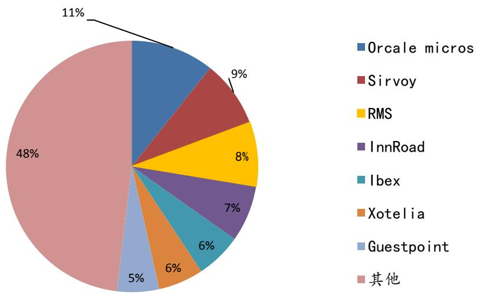
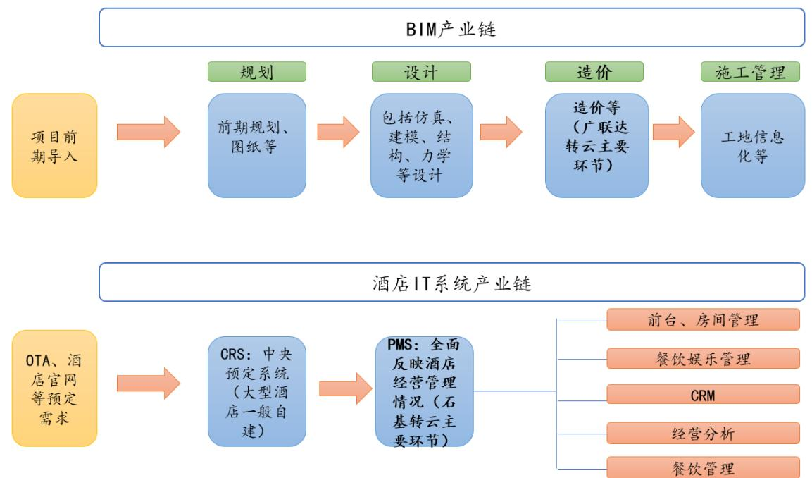
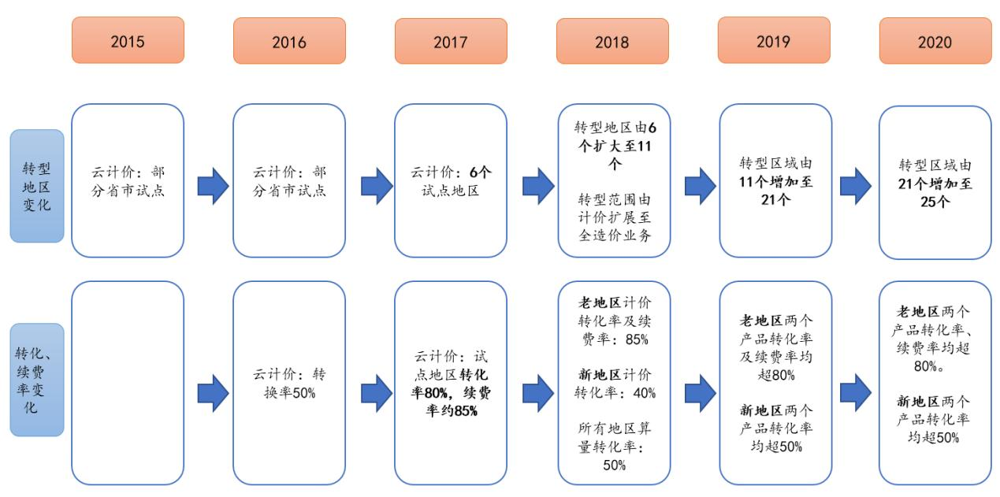
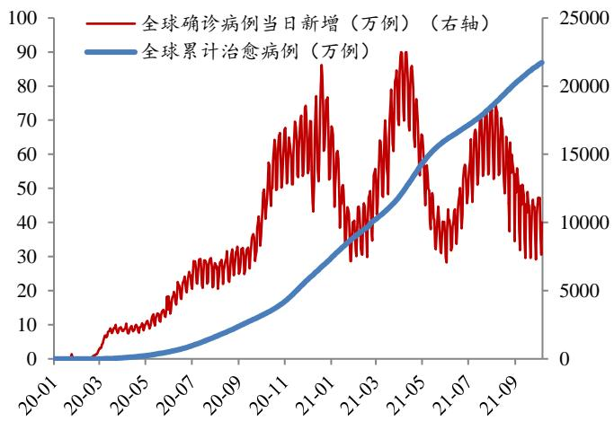

# SaaS 为王：剑指全球酒店市场下一个“广联达”一石基信息（002153）公司深度报告

深度研究报告/计算机

# 报告摘要：

# ● 云龙头出海标杆，架构领先海外龙头，销售、人员等全面对标

核心优势：真正的云化微服务架构领先海外龙头。酒店智能化趋势下，大量新增智能化功能待接入酒店系统，微服务架构更加契合，海外龙头公司虽云化但仍为传统架构。全面发力：销售、人员布局具有国际化&云化基因。公司海外国际化管理团队具备丰富酒店国际化运营经验，国际化基因奠定发展基础。

# ● 对标国内云化龙头：广联达成长之路有望复制

产品对标：标品与云更契合。两家公司均专注于细分领域，具有深刻的行业 know-how 积累，同时应用场景决策链条相对短，更容易形成标准化产品。  
行业地位对标：均为细分龙头，持续培养用户习惯，行业变革期教育能力强。广联达造价业务份额超 $5 0 \%$ ，石基信息在国内五星级酒店市场份额 $6 0 \%$ （公司2020年年报），且获得国际 Top 5 酒店多个订单；两家公司均参与行业白皮书等编写，凸显行业地位。标杆效应对标：大客户订单落地 vs 先行地区成功。广联达老地区先转型获得较高转化率续费率，树立示范效应。石基信息的标杆效应体现为大客户订单，云PMS/SEP 获得洲际、半岛酒店订单，云POS 获全球 TOP5 酒店集团三家订单.  
转云进度对标：规模偏小但成长空间已现，静待云占比提升。广联达转云分为四个时期，石基信息目前可与广联达第二时期对标，未来成长空间打开，静待ARR 等逐步验证。

● 公司 SaaS 年化订阅空间测算：洲际有望达10 亿级别，全球长期数倍增量可期洲际酒店SaaS订阅空间：全球空间6-18亿，国内需求空间1-2亿元。全球 Top5 酒店SaaS订阅空间：全球公司空间11-28亿，国内空间2-4亿元。全球Top 20酒店SaaS订阅空间：全球公司空间14-35亿，国内空间4-8亿元。国内、全球SaaS订阅空间：国内短、中、长期空间分别4/9/14亿元，全球短、中、长期空间分别20/35/51亿元。

# 投资建议

酒店IT 系统云化大势所趋，公司作为国内云龙头向海外拓展的标杆，获得洲际、半岛等大订单，具有较强的示范意义和长远影响。我们预计2021-2023 年营业收入为38.00/44.52/54.16亿元，归母净利润2.62/4.74/7.56亿元，当前股价对应 PE为168X/93X/58X，对应 PS为12X/10X/8X，PEG与可比公司相比具有优势。考虑到公司转云前景广阔，且PS、PEG较同行业公司相比具有优势，维持“推荐”评级。

# 风险提示

国际化酒店转云进度不及预期；国外疫情存在波动可能，疫情波动下酒店IT开支水平存在不确定性；后续订单落地节奏不确定。

盈利预测与财务指标   

<table><tr><td>项目/年度</td><td>2020</td><td>2021E</td><td>2022E</td><td>2023E</td></tr><tr><td>营业收入（百万元)</td><td>3,317</td><td>3,800</td><td>4,452</td><td>5,416</td></tr><tr><td>增长率(%)</td><td>-9.4%</td><td>14.6%</td><td>17.1%</td><td>21.7%</td></tr><tr><td>归属母公司股东净利润（百万元)</td><td>(68)</td><td>262</td><td>474</td><td>756</td></tr><tr><td>增长率（%）</td><td>-118.4%</td><td>487.8%</td><td>80.7%</td><td>59.6%</td></tr><tr><td>每股收益（元）</td><td>(0.06)</td><td>0.17</td><td>0.32</td><td>0.50</td></tr><tr><td>PE（现价）</td><td></td><td>167.9</td><td>92.9</td><td>58.2</td></tr><tr><td>PB</td><td>3.7</td><td>5.1</td><td>4.8</td><td>4.4</td></tr></table>

资料来源：公司公告，民生证券研究院

2021年11月23 日

推荐 维持评级当前价格：29.35 元

<table><tr><td>交易数据</td><td>2021-11-22</td></tr><tr><td>近12个月最高/最低(元）</td><td>29.35/17.08</td></tr><tr><td>总股本（百万股）</td><td>1,500</td></tr><tr><td>流通股本（百万股)</td><td>879</td></tr><tr><td>流通股比例（%)</td><td>58.60</td></tr><tr><td>总市值（亿元）</td><td>440</td></tr><tr><td>流通市值(亿元)</td><td>258</td></tr></table>

  
该股与沪深 300 走势比较  
资料来源：Wind，民生证券研究院

# 相关研究

1.石基信息（002153）公司事件点评：云化迎重要拐点，重要客户获取打开长期发展空间

# 目录

# 酒店信息化领军企业，云化&国际化开启新征程 3

1.1 基本情况：二十载积淀铸就行业龙头，云化、国际化时代标杆.. .3  
1.2 主营业务：立足酒店信息化，拓展餐饮、零售等板块.. .4  
1.3 业绩变化：整体稳步提升，国际化&云化持续推进 6

# 2 酒店云化大势所趋，行业龙头有望持续受益 8

2.1 市场需求：酒店信息化程度提升大势所趋，行业有望持续成长. ….8  
2.2 云化趋势：酒店成本承压下必然选择，消除数据孤岛实现智能决策. ..10  
2.3 竞争格局：市场整体分散，高端客户领域ORACLE明显领先.. .12

# 3 与海外龙头竞争：架构领先，销售、人员等方面全面对标 16

3.1 核心优势：微服务架构领先友商，云时代构筑真正优势， .1c  
3.2 全面对标：销售、人员等持续积累，国际化&云化基础坚实， 1

# 4 对标国内云化龙头：广联达成长之路有望复制， 22

4.1 产品对标：标品与云更契合，两家公司均专注细分打造标品， ..2  
4.2 行业地位对标：均为细分龙头，行业变革期教育能力更强， ….5  
4.3 标杆效应对标：石基重点项目示范效应VS广联达地区转型效果， .26  
4.4 未来潜力对标：更多功能+上下游延伸带来价值量提升潜力. ….8  
4.5 转云进度对标：石基当前或与广联达2018-2019 年时期可比.. ..1

# 5 云化空间测算：云化打开发展空间，长期数倍潜在增量可期 33

5.1 洲际酒店空间：全球可得空间6-18亿，国内1-2亿. ..3  
5.2 全球TOP5酒店空间：全球可得空间11-28亿，国内2-4亿.. ..3  
5.3 全球TOP20酒店空间：全球可得空间14-35亿，国内4-8亿. … ..35  
5.4 另一个视角：国内、国际转云空间不同阶段测算， ..5

# 其他业务：餐饮零售 IT 领先企业，平台化赋能行业成长 40

6.1 餐饮业务：行业地位领先，云业务 $^ +$ 供应链创新打开成长空间 ….0  
6.3 零售业：国内售百强覆，多细持续深耕长 …… 2\$  
6.4 旅游休闲及其他业务：保持稳步发展... .

# 7 盈利预测与投资建议 46

7.1 盈利预测... ..41   
7.2 投资建议…… ….4

# 8 风险提示 49

# 插图目录 51

表格目录 52

# 1 酒店信息化领军企业，云化&国际化开启新征程

# 1.1基本情况：二十载积淀铸就行业龙头，云化、国际化时代标杆

公司是酒店信息化领域领军企业，在中国星级酒店业信息管理系统市场领先地位，同时立足酒店信息化，向餐饮、零售、休闲娱乐等大消费行业拓展。1）酒店行业：公司在国内酒店行业居于领导地位，自主酒店软件在国内五星级酒店市场占有率（至少使用一种石基自主酒店软件)为 $6 0 \%$ ，国内的酒店客户总量超过13,000家，全球酒店客户超91000家。2）餐饮行业：中高端、连锁餐饮用户数量已超过1万家，标准化餐饮用户约20 万家，市场占有率处于相对领先水平。3）零售行业：累计零售客户总量约 60 万家，占中国零售百强客户群的$5 0 \%$ 以上。

  
图1：公司业务体系  
资料来源：石基信息公司官网，民生证券研究院

公司1998年成立，经历了三个发展阶段，目前处于云&国际化转型关键期。1）第一阶段：1998-2003 年，公司是系统集成商、服务商。2）第二阶段：2003-2016 年作为软件供应商，从酒店逐步拓展至餐饮、零售、休闲娱乐领域，并于2007年在A股上市。3）第三阶段：2016 年开始公司进入新的发展阶段，开启国际化、云化征程，并通过洲际、半岛等订单验证自身实力，具有长期发展潜力。

  
图2：公司发展历程  
资料来源：民生证券研究院整理

公司股权较为集中，第一大股东持股比例超 $5 0 \%$ 。公司第一大股东为董事长李仲初，持股比例 $5 4 . 5 \%$ ；第二大股东为淘宝（中国）软件有限公司，持股比例 $1 3 . 0 \%$ 。第三大股东焦梅荣为控股股东李仲初先生之岳母，持有 $3 . 6 \%$ 的股份。公司前十大股东持股比例达到 $8 2 . 9 \%$ o从机构投资者持股来看，截止到 2021 年6 月30日，基金持股比例为 $1 2 . 1 6 \%$ ，陆股通持股比例为 $4 . 8 0 \%$ 。

  
图3：公司股权结构  
资料来源：Wind，民生证券研究院

# 1.2 主营业务：立足酒店信息化，拓展餐饮、零售等板块

公司业务涉及酒店、餐饮、零售、休闲娱乐、支付等多个领域。按2020 年收入分布看，酒店行业收入占比 $2 6 \%$ ，酒店、餐饮、零售三个行业占比之和为 $4 8 \%$ 。同时，第三方硬件配套、自有智能商用设备占比分别为 $3 5 \%$ 和 $1 3 \%$ ，但利润率相对较低。

  
图4：公司各细分业务收入占比  
资料来源：Wind，民生证券研究院

核 $\therefore$ 业务保持较高毛利率。从毛利率来看，公司酒店、餐饮、零售、支付等核心业务，毛利率均在 $6 0 \%$ 以上，体现软件属性以及公司产品化能力；第三方硬件、智能设备毛利率较低，但未来公司发展以软件（云化）为主，预计低毛利率的业务占比将得到控制。

  
图5：公司各细分业务毛利率变化  
资料来源：Wind，民生证券研究院

酒店产品结构多层次，可以满足大中小型客户需求。1）PMS 领域，公司既有面向国际化大型酒店的解决方案，也有面向中国高端酒店市场的 Cambridge，纯本土酒店管理集团的西软 XMS 和千里马iPMS 解决方案。2) POS 领域，Infrasys 品牌面向全球高端酒店、餐饮及高端连锁社会餐饮客户，正品贵德主要面向国内大型快餐连锁，思迅软件面向餐饮全业态。3）其他领域，包括客户声誉管理和分析系统Review Pro、酒店高尔夫及SPA 信息系统CONCEPT、酒店视觉内容发布管理平台 ICE Portal 等功能，能够为大型国际化酒店集团提供全套服务。

  
图6：公司SEP 平台包含对不同层次酒店的服务解决方案  
资料来源：石基信息半年报，民生证券研究院

# 1.3 业绩变化：整体稳步提升，国际化&云化持续推进

近十年业绩整体稳步提升。2011-2020 年公司收入端复合增速 $1 8 \%$ ，利润端2020年出现波动，原因在于：1）受疫情影响，国内外酒店，特别是国外酒店IT开支承受压力。同时疫情也影响了零售、餐饮等行业IT 开支能力。2）StayNTouch 出售事项一次性减少公司净利润约1.7 亿元人民币。3）公司处于云转型关键期，研发、销售等投入持续。

2021H1 公司收入、利润两端扭转下滑趋势。2021 年上半年公司实现营收 13.9 亿元，增速 $1 . 8 1 \%$ ；归母净利润 5986 万元，增速 $3 . 3 \%$ ，扭转下滑趋势。

  
图7：2011-2020年、2021H1公司收入及增速  
资料来源：Wind，民生证券研究院

  
图8：011-2020年、2021H1公司归母净利润及增速  
资料来源：Wind，民生证券研究院

酒店业务收入整体保持稳定成长，2021H1 回暖。2020 年受疫情影响及 StayNTouch 出售等影响增速下滑，但 2021H1 增速出现回暖，增速近 $1 0 \%$ ，说明公司酒店业务整体仍保持健康发展态势。

过去几年人员持续扩张，预计未来规模有所控制。1）2016 年国际化、云化、平台化战略以来，公司人员进入了一轮持续扩张期。2020 年受疫情影响人员整体有所收缩，但销售人员数量仍呈现增长态势。2）公司表示，目前石基境外国际化业务团队人数超过 1000人，团队体量已经基本可以支撑海外业务发展。同时，公司在国内也已有较高市占率，因此预计公司未来整体人员规模增速将趋缓。

  
图9：2011-2020年、2021H1公司收入及增速  
资料来源：Wind，民生证券研究院

  
图10： 公司各类人员数量变化情况及整体人员增速  
资料来源：Wind，民生证券研究院

国际化拓展不断取得成就，洲际、半岛等订单验证实力。1）云平台SEP：已经获得洲际、半岛酒店订单。目前已经在欧洲上线10 个酒店并获得客户较好反馈。2)云POS：被超过 10 个知名酒店集团认证为集团标准，全球最具影响力的 Top5 酒店集团中有 3 家已经选择公司云POS。2020 年Top5 酒店集团中的 3 家酒店集团中，有410 家酒店（三大酒店下属）实现了云POS上线。

Oracle 影响逐渐消除，未来发展不受束缚。1）公司与 Oracle代理合同已于2020年5月 31日到期，年度维护合同到 2021 年6 月合作结束。2)即使公司从 2020 年 6 月1日起不再代理 Oracle 系统，目前公司自主酒店软件在中国五星级酒店市场的占有率仍约 $6 0 \%$ （至少使用了一种石基自主酒店软件)，在中国高星级酒店市场居领先地位，且依靠自主产品获得国际化头部酒店集团订单，验证自身实力。

# 2酒店云化大势所趋，行业龙头有望持续受益

# 2.1市场需求：酒店信息化程度提升大势所趋，行业有望持续成长

酒店系统：以 PMIS 为核心，POS 等为主要系统。由于客房是酒店业务中枢，并且连接所有其他环节数据，因此客房系统 PMS 是酒店管理核心，POS 等、财务、人力等系统为主要系统。大类系统下面会有不同功能模块，根据酒店规模和需求进行配置，大型酒店可能会有上百个功能模块。

表1：酒店主要管理系统  

<table><tr><td>名称</td><td>地位</td><td>功能</td></tr><tr><td>PMS</td><td>核心</td><td>客房管理，在酒店管理中居于核心地位，与所有数据</td></tr><tr><td>CRS</td><td>主要系统之一</td><td>中央预订系统</td></tr><tr><td>POS</td><td>主要系统之一</td><td>餐饮管理</td></tr><tr><td>财务系统</td><td>主要系统之一</td><td>财务管理</td></tr><tr><td>人力系统</td><td>主要系统之一</td><td>人管</td></tr><tr><td>采购与成本管控</td><td>主要系统之一</td><td>成本管理</td></tr><tr><td>高尔夫、水疗、酒店娱乐</td><td>主要系统之</td><td>娛乐管理</td></tr><tr><td>宾客满意度提升解决方案</td><td>综合解决方案</td><td>针对性解决方案</td></tr><tr><td>综合解决方案</td><td>综合解决方案</td><td>综合解决方案</td></tr></table>

资料来源：石基信息官网，民生证券研究院

行业规模：全球酒店业 IT 开支持续增加，2021-2023 年复合增速有望达到 $1 7 \%$ 。2018年全球酒店业 IT 支出规模已经达 326 亿美元，投入项目包括数据中心、硬件、软件、通讯设备、内部服务、IT服务等门类。根据华经情报网数据，预计全球酒店业IT支出有望在 2023年突破570亿，2021-2023年复合增速有望达到 $1 7 \%$ 。

未来行业需求提升因素之一：PMIS 以及云化渗透率仍有待提升。部分欧美国家 PMS 渗透率尚未达到饱和，仅有英国和美国PMS 渗透率超过 $8 0 \%$ ，云PMS渗透率则均未超过 $3 0 \%$ 。国内渗透率预计低于部分欧美国家，提升空间更大。同时，云化趋势有望带来需求长期释放。

  
图11： 全球酒店 IT 支出规模及增速  
资料来源：华经情报网，民生证券研究院

  
图12： 全球部分国家 PMS 渗透率及云 PMS占比

资料来源：华经情报网，民生证券研究院

未来行业需求提升因素之二：头部酒店通过收购整合扩大规模是大趋势，整合市场后信息化需求提升。以万豪酒店为例，收购成为了其成长和国际化拓展的重要手段。

表2:万豪酒店部分重要的收购  

<table><tr><td>时间</td><td>收购的公司</td><td>意义</td></tr><tr><td>1980</td><td>豪生酒店</td><td>收购豪生酒店及其旗下的连锁餐厅</td></tr><tr><td>1982</td><td>Host International</td><td>成为全美国最大的机场食品、饮料和商品供应商</td></tr><tr><td>1983</td><td>吉诺的连锁餐厅</td><td>收购吉诺的连锁餐厅，然后公司把313 家餐厅改名为 Roy Roger</td></tr><tr><td>1987</td><td>“旅居”连锁酒店</td><td>酒店房间全部为套房设施，主要为长住客人提供方便 实用的套房及相应服务</td></tr><tr><td>1995</td><td>丽嘉酒店</td><td>使万豪成为首家拥有各类不同档次优质品牌的酒店集 团</td></tr><tr><td>1997</td><td>万丽连锁酒店公司及其下属的 新世界连锁酒店，以及华美达</td><td>使万豪国际集团在全球的酒店数量实现了大幅增长， 特别在亚太地区一跃成为规模领先的酒店集团</td></tr><tr><td>2011</td><td>国际连锁酒店 西班牙AC酒店</td><td>进入西班牙市场</td></tr><tr><td>2012</td><td>盖洛德酒店</td><td>酒店大数据平台</td></tr><tr><td>2013</td><td>Protea Hotels</td><td>扩大在非洲影响力</td></tr><tr><td>2016</td><td>喜达屋酒店</td><td>并购后成为世界最大的酒店集团之一，亚太、非洲等 地区进一步延伸</td></tr></table>

资料来源：网易、搜狐，民生证券研究院

国内酒店业相关整合或为未来大趋势，连通改造带来持续信息化需求。国内大于50 间房间的单体酒店仅占 $2 0 \%$ 左右，同时参考《2019 年度全国星级饭店统计报告》，五星级饭店数量占星级饭店比例约为 $8 \%$ ，均说明国内规模较大酒店占比不高，长期看未来整合是大势所趋。国内酒店集团整合后，部分信息化程度较弱的小型酒店需要接入大型酒店平台系统，并实现统一标准的信息化建设，给整合行业带来增量。

  
图13: 2020 年中国单体酒店房间数量分布  
资料来源：艾媒网，民生证券研究院

# 2.2 云化趋势：酒店成本承压下必然选择，消除数据孤岛实现智能 决策

# 2.2.1酒店业成本承压，云架构明显节省 IT 成本

疫情恢复需要过程，酒店集团仍面临经营压力。从洲际、希尔顿、万豪、雅高、凯悦五大酒店集团的收入和利润情况看，2020 年受疫情影响严重，2021H1 虽开始缓解但压力持续，酒店集团具有削减成本动力。

  
图14： 全球五大酒店收入变化情况  
资料来源：Wind，民生证券研究院

  
图15： 全球五大酒店净利润变化情况  
资料来源：Wind，民生证券研究院

(注：2021 年中报，仅选取公布中报的希尔顿、万豪、雅悦三家公司，主要反映相关公司变化趋势)

# 云化架构能够减轻酒店成本：

节省员工培训等成本。传统系统都要培训一个月甚至两个月，而云产品大部分的工作和流程都直接转到客源的手机去解决，培训工作量大大减少。

节省IT 运维人员。1）酒店IT岗位目前仍以“专人专岗”为主，节省人员需求凸显。根据《酒店信息技术人才如何进行角色转型以适应行业数字化趋势》，近 $7 0 \%$ 的受访人员表示IT 部门仅管理一家酒店，同时超过 $8 0 \%$ 的受访者表示其所在的IT部门成员数量在2人或以上。以洲际酒店为例，洲际酒店 2020 年大中华区酒店数量约 400 家，总收入7700 万美元，平均每家酒店约120-150 万元收入，而单个IT人员成本在10 万或以上，节省人员需求凸显。

2) 云化带来运维人员的节省。因为服务器是云端化的，只需要在网页端对软件进行维护和设置，因此原本配置两个以上IT人员的酒店可以进行人员减少，甚至一个IT人员维护多个酒店。根据《酒店信息技术人才如何进行角色转型以适应行业数字化趋势》，随着系统云化，$8 0 \%$ 的受访者都认为酒店行业IT人员服务将更加集约化。

  
图16: 国内酒店IT经理工资情况  
资料来源：猎聘网，民生证券研究院

# 2.2.2消除数据孤岛，实现智能化分析决策

# 云架构能够适应酒店业发展大趋势：

第一，消除数据孤岛，实现智能化分析决策。跨国酒店在不同地区往往有多套线下系统，传统系统数据打通非常困难，往往依靠点对点对接。云系统可以通过 API 调用的方式就瞬时实现直连，进而方便酒店实现智能化分析决策。

第二，加强客户体验，更好满足C端需求。部分高级酒店传统架构难改变，新增功能困难，餐厅预订等新功能添加较慢，同时由于数据不连通更难以实现客户定制化服务（如防过敏、给客人准备符合生活习惯的吃住体验、客人重要事件等)。而转云后，不仅能够实现多种在线预订，而且有望实现更多客户定制化功能，加强客户体验。

第三，云化架构实现并行计算，系统性能提升。移动互联网、物联网时代，顾客需求快速增加带来数据量增加，同时需要增加功能模块，增加的越多则对传统架构负担越大；云化架构可以进行并行计算，保证功能模块更新、添加的同时系统稳定运行，系统性能提升。

除此之外，数据安全、产品易用性等方面均有提升。

  
图17： 云化系统与传统系统对比  
资料来源：民生证券研究院整理

从渗透率看，国内仅约 $1 0 \%$ 的酒店实现了转云的完成阶段 $. 9 0 \%$ 系统迁移到云上)，国内渗透率还有待进一步提升。

  
图18: 云化系统与传统系统对比

资料来源：《2021 年中国酒店业系统上云现状调查报告》，民生证券研究院

# 2.3 竞争格局：市场整体分散，高端客户领域 Oracle 明显领先

# 2.3.1 市场整体分散，但头部客户主要被 Oracle 等公司占据

市场整体仍相对分散。根据智研咨询，全球 PMS 市场相对分散，以 Oracle 的 Micros 为主，但尚无某一家厂商份额超 $1 5 \%$ ，市场仍相对分散。

  
图19： 全球 PMS 市场格局  
资料来源：智研咨询，民生证券研究院

国际化厂商中，真正服务大型国际酒店集团的云厂商数量较少。我们根据现有信息，对行业内主要公司进行了梳理总结，从中可以看出：第一，云架构已经基本普及，领军企业产品上未出现明显差异。大部分公司已经推出了以 PMS 为核心、包含多个系统的产品，云产品已经在领军企业中普及。第二，仅少数公司将大型国际酒店集团作为主要客户群体。石基信息、Oracle、Infor 等目标群体以国际化大型酒店为主，其他公司尽管具备全产品线及各类案例，但从官网上看缺少头部国际酒店集团案例，其中部分公司以中小型酒店为主要客户群体。

表3：同行业可比公司、云产品对比  
(注：部分公司存在信息较少等问题，并不代表相关公司没有相关产品)  

<table><tr><td></td><td>石基</td><td>0racle(多行</td><td></td><td>RMS</td><td>Techys</td><td>SkyTouch</td><td>Protel</td></tr><tr><td>是具有</td><td>有</td><td>OPERA Cloud 有</td><td>有</td><td>有</td><td></td><td>有</td><td>有</td></tr><tr><td>云产品涉</td><td>品</td><td>等多种产品集 成</td><td>PMS为核 多个系统</td><td>PMS为核 多个系统</td><td></td><td>为核多 个系统</td><td>为核多 个系统</td></tr><tr><td>市场覆盖</td><td>客戶遍及全 球，覆酒店 万</td><td>客户遍及超 地0个图数 量超480万间</td><td>客户遍及 177 个国</td><td>容户逼及 超过60 户</td><td>全球范围 超2.1万</td><td>超 7000 酒店 客户，遍布</td><td>客户遍及93 个国家，超 酒店客戶</td></tr><tr><td></td><td></td><td>东万 酒店</td><td>凯宾斯、 际化大酒 店</td><td></td><td>满足大中 小 型娱乐场 所</td><td>满小</td><td>满</td></tr></table>

资料来源：Oracle、Infor、RMS、eZee Technosys、SkyTouch、Protel、石基信息公司官网，民生证券研究院

总结：行业整体仍分散，但 Oracle 等厂商在头部客户领域具有优势。1）全球酒店信息化市场仍相对分散，主要由于酒店行业自身的地理分散性等原因导致。2）云化已是大势所趋，行业领军企业基本都推出云产品及解决方案。3)RMS 等公司虽然在全球份额相对较高，但更多面向的是大中型和小型酒店。将国际化大型酒店集团作为主要目标客戶的，主要是Oracle 旗下的 Micros，以及 Infor。

# 2.3.2 行业主要竞争者分析：Oracle 在高端酒店具有优势，国内石基领先行业

# 1）国外主要竞争者Micros：仍是全球最领先厂商之一，在高端酒店具有明显优势

2014 年公司收入达到 14.05 亿美元，净利润 1.82 亿美元，增速分别为 $1 1 \%$ 和 $6 \%$ 。（公司被Oracle 收购后未披露详细数据)。

  
图20： Micros 公司收入及增速  
资料来源：Wind，民生证券研究院

  
图21： Micros 公司净利润及增速  
资料来源：Wind，民生证券研究院

收入占比方面，服务业务始终保持较高占比，原因是维护费用以及SaaS 模式较早开始推行；毛利率方面，整体毛利率保持在 $5 0 { - } 5 5 \%$ ，其中硬件毛利率较低，软件毛利率较高。

  
图22： Micros公司收入占比变化情况（百万美元）

资料来源：Wind，民生证券研究院

  
图23： Micros 公司整体及各细分业务毛利率 $( \% )$

资料来源：Wind，民生证券研究院

Micros 仍是全球最领先的酒店信息化厂商之一，高端酒店覆盖较广。从客户群体看，2013 年时 Micros 就拥有全球 Top 20 酒店中的国际化高端酒店的大多数。整体看，无论是客户数量还是在高端酒店的覆盖程度看，Oracle 旗下的Micros 仍全球领先。

表4：全球 Top 20酒店中，Micro 覆盖的客户(2013 年)  

<table><tr><td></td><td>酒店集团</td><td>是是Micro</td><td></td><td>酒店集团</td><td>是是icros</td></tr><tr><td>1</td><td>万豪</td><td>是</td><td>6</td><td>雅高酒店集团</td><td>是</td></tr><tr><td>2</td><td>锦江之星</td><td></td><td>7</td><td>华住酒店集团</td><td></td></tr><tr><td>3</td><td>希尔顿</td><td>是</td><td>8</td><td>精选国际酒店集团</td><td></td></tr><tr><td>4</td><td>洲际酒店集团</td><td>是</td><td>9</td><td>首旅如家酒店集团</td><td></td></tr><tr><td>5</td><td>溫德姆酒店集团</td><td>是</td><td>10</td><td>贝斯特韦斯特国际酒店 集团</td><td>是</td></tr><tr><td>11</td><td>格林酒店集团</td><td></td><td>16</td><td>G6 Hospitality LLC</td><td>是</td></tr><tr><td>12</td><td>东呈国际集团</td><td></td><td>17</td><td>开元酒店集团</td><td></td></tr><tr><td>13</td><td>尚美生活集团</td><td></td><td>18</td><td>APA Group</td><td></td></tr><tr><td>14</td><td>凯悦酒店集团</td><td>是</td><td>19</td><td>韦斯特蒙特酒店集团</td><td></td></tr><tr><td>15</td><td>爱姆布瑞吉</td><td></td><td>20</td><td>美利亚酒店集团</td><td></td></tr></table>

资料来源：micros2013 年年报，民生证券研究院

(注：Micros 相关数据仅披露到 2014 年，在此并非与公司做业务规模对标，主要为了说明 Micros 在多年前就具有行业领先地位)。

# 2）国內酒店信息化竞争者：石基信息在行业内特别是高端酒店领域具有优势

国内酒店信息化厂商分为四个阵营：1)头部厂商石基以及其子公司在国内高端酒店具有较高份额。2）携程系，携程参股或合作，包括佳驰、云掌柜、住哲、客满满（去哪儿网旗下）、中软好泰等。3）美团系，包括别样红等。4）独立厂商，包括绿云、金天鹅、罗盘、众芸信息、盟广信息等。

其中我们可以看出，石基信息无论在客户数量，还是在高端酒店领域都处于领先地位。

表5：国内酒店信息化主要厂商情况  

<table><tr><td>品牌名称</td><td>客户数量</td><td>典型客户群体</td></tr><tr><td>石基及子公司</td><td>国内外超9万家客户</td><td>各类酒店，以高端为主，五星级酒店市占 率（至少使用一种产品）达到 60%</td></tr><tr><td>云掌柜</td><td>17万家</td><td>以民宿为主</td></tr><tr><td>住哲</td><td></td><td>连锁酒店为主</td></tr><tr><td>客满满</td><td></td><td>客栈为主</td></tr><tr><td>中好泰</td><td>是</td><td>服务多种类酒店</td></tr><tr><td>佳驰</td><td>超5万家</td><td>服务多种类酒店</td></tr><tr><td>别样红</td><td>超1.4万家</td><td>服务多种类酒店</td></tr><tr><td>绿云</td><td>超2.2万家</td><td>经0racle 授，施支持racl</td></tr><tr><td>金天鹅</td><td>超4万家</td><td>服务多种类酒店</td></tr><tr><td>罗盘</td><td>超5000家</td><td>服务多种类酒店</td></tr><tr><td>众芸信息</td><td>超1万家</td><td>服务多种类酒店，主要涉及酒店口碑管理 和住中智慧服务</td></tr><tr><td>盟广信息</td><td></td><td>服务多种类酒店</td></tr></table>

资料来源：石基信息年报、云掌柜、住哲、客满满等上表中所列公司的公司官网，民生证券研究院

# 3 与海外龙头竞争：架构领先，销售、人员等方面全面对标

# 3.1 核心优势：微服务架构领先友商，云时代构筑真正优势

# 3.1.1 酒店需求：数字化转型大势所趋，大型集团纷纷推出智能化改造措施

当前大型酒店集团将数字化转型作为重要竞争手段。洲际酒店 2020 年年报中将“创造数字化优势”作为公司发展的八大战略之一，其中提到将新的数字化功能作为留住客户、提升体验的重要手段。

洲际推出的主要系统包括全新客房娛乐数字解决方案IHG®Studio、酒店内无线网络系统IHG Connect 等。以 IHG $\textsuperscript { \textregistered }$ Studio 为例，1）将个人设备上的在线视频内容安全连接至客房电视并进行播放。2）进行酒店服务相关的操作，例如在客房内增加枕头、要求延迟退房、查看客房账单等。3）通过移动设备上的IHG 优悦会App遥控电视。4）预定客房送餐服务或购买客房用品。5）积分兑换试点项目，使用IHG优悦会积分抵扣酒店内产品或服务。

  
图24： 洲际酒店集团全新客房娱乐数字解决方案 $\mathbf { I H G } @$ Studio的显示页面  
资料来源：迈点网，民生证券研究院

其他大型酒店集团也有相关智能化规划。1)万豪酒店HDL智能控制系统:实现了灯光、窗帘、空调、音乐、视频、语音控制、场景、可视化对讲等的智能化控制。2）雅高数字密钥：顾客通过App 获得客房钥，然后，客户可通过使用智能手机获得进入客房，会议室和通过电梯进入楼层的权限。

数字化、智能化对于传统酒店来说是增量建设，如何实现大量新的功能模块与原有系统的完美融合？云化下的微服务架构的普及应用将是大势所趋。

# 3.1.2微服务架构：真正满足高端酒店需求，石基领先海外龙头

云化下微服务架构更便于更新或增加新的功能模块。传统应用架构是所有的子系统都集成在一个很繁杂的进程中，只要更新或增加新功能，就需要重新对软件编译打包部署。微服务架构则是将子系统拆分为更加细粒度的服务，独立部署，松耦合关系也便于添加新的功能模块，不会波及整个体系。

  
图25： 传统架构和微服务架构对比  
资料来源：民生证券研究院整理

酒店智能化趋势下，新模块预计大量添加，微服务架构大势所趋。1）传统酒店架构新增、改造子系统难。各个子系统都集成在一个大的整体中，项目模块之间紧密耦合，如果进行子系统拓展或增加新系统，需要对整个系统进行改造。2)云化微服务酒店架构新增、改造子系统更加容易。每个子系统 SaaS 化模块化，每个模块独立打包升级。如果需要添加新的模块，有大量 API开放，可以做到把酒店经营的每个场景都向外部去开放，便于接入大量新模块。

公司产品在架构上领先友商。根据公司2021年3月18日、3月23日、7月8日公开调研纪要，友商的产品虽然也已云化，但是他们底层的架构没有变化，跟 SEP 不是同一代产品。1）公司的产品是真正原生云架构的。石基信息的对外开放API 有 1500个，其他友商的API只是几十个这样的量级。2）公司的系统，每两个星期就会迭代一次，处于不断更新的状态，竞争壁垒不断加强。因此，公司在重要订单的落地上具有优势。

表6：公司与海外巨头在产品架构方面的对比  

<table><tr><td></td><td>公司</td><td>海外巨头</td></tr><tr><td>是否上云</td><td>已经上云</td><td>已经上云</td></tr><tr><td>底层架构</td><td>微服务架构</td><td>仍是传统架构</td></tr><tr><td>耦合关系</td><td>松耦合</td><td>紧耦合</td></tr><tr><td>更新或添加模块</td><td>无需改变底层架构</td><td>需要改变底层架构</td></tr><tr><td>更新迭代</td><td>每两个星期就会迭代一次</td><td>目前仍是传统架构，暂未见有改变趋势</td></tr></table>

资料来源：石基信息公司公开调研纪要，民生证券研究院

除此之外，在运营效率端，实现单一客户档案、数据安全等进步。1）单一客户档案。公司 SEP 的下一代云系统是单一客户档案，解决了集团酒店长期以来的客户档案无法统一的痛点。2）数据的汇聚和流动。云架构下数据（同行业甚至是跨行业的数据）的汇聚和流动更高效，提供智能化决策支撑。3）数据安全。平台可以按照客人档案自动区分客人所在国家（即数据来源)，把数据按照相应国家的法律法规保存。同时，公司开发的TOKEN 服务系统除了政府要求必须明码储存的数据以外，其他信息全都可以加密，安全等级提升。

表7：石基信息新一代云平台在多个领域实现突破  

<table><tr><td></td><td>传统模式</td><td>石基信息云架构新模式</td></tr><tr><td>单一客户档案</td><td>户档案分散在入住当地</td><td>由于不同地区系统多数不互通，客酒店集团餐只有一个客人档案，不同地区只会调 取一个地方的一个客人档案，大幅节省资源</td></tr><tr><td>数据的汇聚和流 动</td><td>酒店客人档案信息都是分别取储存 的，信息分散，难以调用和智能化 分析</td><td>客人档案统一存储，可以做到实时更新，极大的 提升酒店集团化管理和优化客人服务</td></tr><tr><td rowspan="2">数据安全</td><td rowspan="2">采取一般防护手段，出现多个数据 安全问题，如万豪酒店2018年5 亿名客人信息泄露、2020 年520 万 人信息泄露等</td><td>1．平台可以按照客人档案自动区分客人所在国 家（即数据来源），把数据按照相应国家的法律 法规保存</td></tr><tr><td>2.TOKEN服务系统，除了政府要求必须明码储存 的数据以外，其他信息全都可以加密，提升安全 等级</td></tr></table>

资料来源：石基信息公司公开调研纪要，民生证券研究院

# 3.2 全面对标：销售、人员等持续积累，国际化&云化基础坚实

# 3.2.1销售网络：石基国际化团队超千人，真正实现全球化布局

Oracle：国际化领先软件厂商，销售网络遍布全球，2020 年美洲之外地区收入占比已达到近 $5 0 \%$ ，相关收入近200亿美元，充分体现其国际化能力。

  
图26: Oracle美洲外收入占比近 $5 0 \%$ ，体现其全球化能力  
资料来源：Wind，民生证券研究院

石基信息：基本建成全球化销售网络。公司已在超过20个核心城市开设了办公室并在多地开设境外子公司，境外国际化业务团队人数超过 1000人。

表8：公司在全球各地有多个分支机构  

<table><tr><td>大区</td><td>国家/部门</td><td>所在城市</td></tr><tr><td rowspan="3">美洲区</td><td>美国</td><td>亚特兰大、华盛顿、纽约、迈阿密</td></tr><tr><td>加拿大</td><td>温哥华</td></tr><tr><td>拉丁美洲</td><td>墨西哥</td></tr><tr><td colspan="2">德国</td><td>柏林、慕尼黑、杜塞尔多夫</td></tr><tr><td rowspan="2">欧洲中东及 非洲区</td><td>波兰、奧地利、西班牙、葡萄牙、斯洛伐</td><td>多个城市</td></tr><tr><td>克、丹麦、以色列、阿联酋 非洲及中东地区</td><td></td></tr><tr><td rowspan="2">大中华区</td><td>总部</td><td>北京</td></tr><tr><td>分支机构</td><td>上海、广州、中国香港、中国 澳门、长沙、成都、大连等核心城市</td></tr><tr><td></td><td>新加坡</td><td>设有办公室，业务覆盖300+城市 负责其他亚太区域业务</td></tr><tr><td>亚太地区</td><td>马来西亚、澳大利亚（悉尼)、泰国、印 度、日本(东京)、韩国、越南、菲律宾</td><td>多个城市</td></tr></table>

资料来源：石基信息2021年半年度投资者交流会公开 PPT，民生证券研究院

# 3.2.2 产品丰富：具备全套云产品，与行业龙头对标不逊色

Oracle:从官网的信息来看，目前 Oracle 在酒店领域主要有两大产品线，即 OPERA(PMS等）以及 Simphony（POs 等)。

石基信息：所有 Oracle官网上列出的产品，大多数能够在石基的产品线中找到对标，产品丰富度不输 Oracle。

表9：公司在酒店领域具有细分领域全覆盖产品线  

<table><tr><td>平台/产品</td><td>石基对应品牌或产品</td><td>Oracle对应类似的品牌或产品</td></tr><tr><td>SEP平台</td><td>石基企业平台-酒店业解决方</td><td></td></tr><tr><td>PMS</td><td></td><td>OPERA 5 Property Management</td></tr><tr><td>POS</td><td>石基餐饮云管理系统 Infrasys Cloud</td><td>MICROS Simphony Cloud、 MICROS Kitchen Display Systems</td></tr><tr><td>财务管理系统</td><td>Shiji AC</td><td>OPERA 5 Vacation Ownership、 MICROS Reporting and Analytics</td></tr><tr><td>采购/仓库/成本控 制系统</td><td>Shiji PICC</td><td>OPERA 5 Vacation Ownership</td></tr><tr><td>人力资源系统</td><td>Shiji HRMS-</td><td>OPERA 5 Vacatin ounership Mt ROS Enterprise</td></tr><tr><td>在线酒店预订交易 处理平台</td><td>sSDs-Shisi distributin （畅联）升级更名</td><td>OPERA Distribution</td></tr><tr><td>酒店高尔夫及 SPA 信息系统</td><td>CONCEPT</td><td>MICROS Simphony Cloud</td></tr><tr><td>客戶声誉管理和分 析系统</td><td>Review Pro</td><td>OPERA 5 Sales and Catering、 OPERA Loyalty</td></tr><tr><td>全球支付解决方案</td><td>SPS-Shiji Payment Solutions</td><td></td></tr><tr><td>酒店中央预订系统/ 会员管理系统</td><td>CRS/Review Pro</td><td>OPERA Central Reservations</td></tr><tr><td>硬件设备</td><td>海信等负责</td><td>MICROS Workstation 6、MICROS Tablet 700 等</td></tr></table>

资料来源：石基信息公司年报、Oracle官网，民生证券研究院

# 3.2.3人员和架构：重视关键人才，国际化基因助力长期发展

Oracle：从 Micros 2014 年年报（最近的可查数据）可以看出，Micros 的高管相关人员具有以下特点：1）按照地区进行分工，体现对国际化战略的重视。2）兼具国际化背景和酒店IT 行业经验。相关地区负责人多数有海外酒店业工作背景，或者是之前在被 Micros 收购的公司工作，具有当地工作能力或资源。

表10：Oracle 海外业务部分高管人员及其工作背景情况  

<table><tr><td>高管人员</td><td>职位</td><td>主要经历</td></tr><tr><td>Peter A. Altabef</td><td>总裁兼首席执行官</td><td>2004 年至 2009 年，担任 Perot Systems 的总裁兼首席执行 官，被戴尔公司收购。此后，他担任 Dell Services (Dell，Inc.的子公司)的总裁</td></tr><tr><td>Bernard Jammet</td><td>北美地区执行副总裁</td><td>在加入 MICROS 之前，受雇于前 MICROS 法国经销商。1984 年7 月加入 Micros，2014 年担任拉丁美洲地区执行副总裁</td></tr><tr><td>Kaweh Niroomand</td><td>欧洲-非洲-中东地区 执行副总裁</td><td>从 2005 年到 2009 年 8 月，担任 MICR0S EAME 区域总裁。此 前，担任 EAME和管理执行副总裁，MICROS-Fidelio Software Deutschland GmbH 董事。他于 1993 年开始在 Fidelio Software GmbH(被 MICROS 收购)工作</td></tr><tr><td>Thomas L. Patz</td><td>战略计划执行副总裁 兼总法律顾问</td><td>曾担任 MICR0S 的各种法律职务。1995 年8 月首次加入 MICROS，毕业于布朗大学弗吉尼亚大学法学院，是马里兰律 师协会的成员</td></tr><tr><td>Gabriel Pestalardo</td><td>拉丁美洲和加勒比地 区高级副总裁</td><td>2000 年因收购而首次加入 MICROS。MICROS of Hospitality Technologies s.a.是原 MICROS 在阿根廷的授权经销商， Pestalardo 先生担任管理职位。1999 年之前，担任 Siemens S.A.在阿根廷的董事，领导 MICROS 经销商业务等</td></tr><tr><td>Peter J. Rogers, Jr.</td><td>投资者关系和业务发 展执行副总裁</td><td>从1996 年到 2007 年11 月，担任 MICR0S 的投资者关系和业 务发展高级副总裁。在此之前，曾担任MICROS的各种营销和 业务管理职务。于1987 年加入 MICR0S</td></tr><tr><td>Cynthia A. Russo</td><td>执行副总裁兼首席财 务官</td><td>2007年11 月至 2010 年4月，担任 MICROS 的高级副总裁和 公司总会计师。曾担任MC加O 的多种职务，于1996年1月</td></tr><tr><td>Nirmal Singh</td><td>亚太区高级副总裁</td><td>从 1999 年到 2014 年 6 月 30 日，曾任亚太区首席财务官。 他曾担任 MICROS 的各种职务。在加入MICROS 之前，是孟买 (印度)特许会计师 N.M.Raiji&amp;Co 的合伙人</td></tr></table>

资料来源：Micros 年报，民生证券研究院

石基信息：公司具有多位 Micros 或洲际酒店等行业背景的人才。公司首席运营官 KevinPatrick King曾任职于 Micros 公司亚太区副总裁。同时，日本、印度、美洲市场的负责人或主要领导来自于Micros 或具有洲际酒店集团工作经历。

表11：公司海外业务部分高管人员及其工作背景情况  

<table><tr><td>职位</td><td>人员</td><td>资历</td></tr><tr><td>首席运营官</td><td>Kevin Patrick King</td><td>曾任职于 Micros 公司亚太区副总裁</td></tr><tr><td>日本市场的负责人</td><td>中野平先生</td><td>洲际酒店集团东南亚及韩国区域任酒店及业主解决方案总监一职 达八年时间</td></tr><tr><td>印度市场负责人</td><td>Arup Banik 先生</td><td>从 2002 年起即在 Oberoi Hotels &amp; Resorts 所有的 ElH 公司中任 企业信息技术及战略相关职位；加入EIH之前，曾在归属于印度 酒店管理有限公司的 Taj Group 工作，并在 Galaxy Toyota 负责 信息系统架构和集成工作</td></tr><tr><td>美洲区高级副总裁</td><td>DanBell 先生</td><td>甲骨文酒店事业部北美区高级副总裁，2002 年加入 MICROS</td></tr></table>

资料来源：石基信息公司官网，民生证券研究院

公司对技术人才予以高度重视。技术人员占比持续超总人数 $7 0 \%$ ，同时硕士人员占比逐年提升，从 2013 年的 $2 \%$ 提升至 2020 年的 $1 0 \%$ 。

  
图27： 公司人员学历情况，以及硕士人员占公司总人数比重变化情况  
资料来源：Wind，民生证券研究院

海外业务由具有研发、市场经验的子公司组成，具有国际化发展基因。公司旗下的石基欧洲负责 SEP 平台研发推广，而石基欧洲是通过整合 Snapshot、AC Project GmbH 及石基德国的业务来推进国际化发展。1)石基德国：即原来的Hetras，欧洲领先的云PMS/CRS 厂商，在海外的客户主要是中小型的酒店客户，客户数量数百家；2）Snapshot：从事数据平台的技术分析、酒店商业策略等线上线下技术培训及酒店需求管理的咨询服务三大支柱产品等业务，全球签约了超 5000 多家酒店及 40 余家数据合作伙伴。3）ACProject GmbH：专注于海外系统研发。

  
图28： 石基欧洲致力于全新一代酒店云平台产品的相关组织架构  
资料来源：石基信息公司年报，民生证券研究院

# 4 对标国内云化龙头：广联达成长之路有望复制

# 4.1 产品对标：标品与云更契合，两家公司均专注细分打造标品

SaaS 模式的本质之一，是通过标准化实现规模效应。SaaS 模式是通过浏览器等渠道访问服务网站，节省了本地部署和定制化开发，进而实现规模化效应（可以快速复制到多个客户，实现快速覆盖与成本规模效应)。其产品形式是相对标准化的，根据客户需求不同配置不同模块，但很少或不进行定制化开发。

由于软件的工具性质，工具本身能否标准化，实际上是取决于其背后的业务能否标准化，即“复杂”程度。在此我们认为，“复杂”不仅仅指行业知识的复杂（细分龙头往往具有充分的行业 know-how)，更指行业的流程的链条复杂度。如果应用场景链条长且容易改变，则标准化较困难，相反则容易标准化。

# 因此，影响标准化的因素：

1．主观上：公司是否具有较强的行业 know-how，是否具有较高市占率，如果在行业发展中具有一定程度引领作用则效应更明显。2.客观上：背后的场景本身就是标准化的，决策链条短且相对固化。我们接下来就从这两个方向进行分析，并将石基信息与广联达等 SaaS 龙头进行对比。

# 4.1.1 专注于细分领域，持续深耕带来标准化

专注于细分领域更容易形成标准化产品。由于细分领域知识、流程相对有限，知识复用度高，且随行业发展认知不断加深，容易形成相对标准化的产品。

广联达 vs石基信息：均围绕细分领域长期深耕。广联达四条主要产品线，包括造价管理、BIM 建造、智慧工地、信息服务，均围绕建筑信息化展开。石基信息官网酒店业产品线的细分产品也均围绕酒店服务展开。两家公司均成立于1998 年，在相关细分领域具有超过20 年深耕，行业理解能力较强。

国外公司对比中也能看出相关趋势：Adobe 专注于 Photoshop 和PDF编写等图片处理类功能，Autodesk 涵盖从设计到制造等环节，但均集中于建筑领域。相比之下，SAP 具有 CRM、ERP、人力资源、供应链管理等多条产品线，涉及6 大类行业 30 余个细分行业。不同行业间业务流程、企业管理理念存在较大差异，定制化程度相对较高。进而，两类公司呈现出不同的转云进度。

  
图29： 广联达产品体系均围绕建筑信息化展开  
资料来源：广联达公司官网，民生证券研究院

  
图30： 石基信息酒店产品线均围绕酒店管理进行布局  
资料来源：石基信息公司年报，民生证券研究院

# 4.1.2 软件背后的流程复杂程度，决定了能否实现标准化

软件作为一种工具，能否标准化在一定程度上由背后应用场景的复杂度决定。在此我们认为，“复杂”不仅仅指行业知识的复杂（细分龙头往往具有充分的行业 know-how)，更指行业的流程是相对固化还是容易被改变。如果应用场景链条长且决策过程复杂，则标准化较困难，相反则容易标准化。

广联达vs 石基信息：均为业务人员使用，场景链条较短。广联达造价产品使用者是造价员，大多数场景下使用者即可决策。石基信息酒店IT系统的使用者主要是酒店IT主管或业务人员，大多数场景下由业务操作者自己决策。在行业经营模式没有发生根本变化的情况下，流程均相对固化，进而在软件产品专业 know-how 足够高后可实现标准化。

  
图31： 广联达造价软件界面，由业务人员操作  
资料来源：土木工程网，民生证券研究院

  
图32: 酒店PMIS使用界面，由业务人员操作  
资料来源：迎客公司官网，民生证券研究院

相比之下，ERP 等产品决策链条长且企业间差异明显，标准化相对较难。ERP 等产品往往与企业整体决策、运营相关，涉及销售、生产、成本、财务等多个环节，决策链条长且容易随使用者意志产生改变；同时不同行业、不同公司间管理理念、经营方法千差万别，高标准化难度较大。

  
图33： ERP 所涉及的企业决策环节和链条  
资料来源：天津创方多维信息技术有限公司官网，民生证券研究院

# 4.1.3 造价软件、PMS 均居于产业链核心位置且为独立环节

广联达：造价软件属于 Bim 产业链中重要且独立环节。造价软件属于Bim 产业链的重要环节之一，且独立于整个产业链，即在设计、施工等环节未实现信息化或使用其他产品的时候，也可以独立使用造价软件。处于重要且独立的环节，保证了广联达造价业务具有较高的客户接受度，同时不易受海外巨头的生态压力。

石基信息：PMS 属于酒店信息化管理的核心且独立环节。PMS 全面反映酒店经营管理情况，不但能准确及时地反映酒店业务状态，还能快速实现客人预定入住、餐饮娱乐到结账等操作，链接各个子系统，处于产业链核心环节。同时，PMS也可以作为产品，被酒店独立采购，避免受海外巨头的整体生态压力。

  
图34： 造价软件、PMIS 在整个产业链中所处位置  
资料来源：民生证券研究院整理

# 4.2 行业地位对标：均为细分龙头，行业变革期教育能力更强

细分龙头长期在行业内具有高份额，作为行业引导者能够持续培养用户习惯，逐渐统一行业认知，进而在行业变革期具有更强的引领和教育能力。

广联达：广联达造价领域 2010 年上市的时候市占率就达到 $5 0 \%$ ，多年在细分领域领先。

石基信息：1）国内：自主酒店软件在国内五星级酒店市场占有率（至少使用一种石基自主酒店软件）为 $6 0 \%$ ，总的客户数量超1.3万家，而国内高档及以上酒店（四星、五星）总数约1.9 万家；2）国外：云PMS 拿下洲际、半岛订单；2020年全球 Top5 酒店集团中的 3家酒店集团中，有410 家酒店（3 家酒店集团旗下的410 家）实现了云POS上线。

表12：石基信息在国内外酒店IT行业的份额或重点客户  

<table><tr><td></td><td>业务定位</td><td>用户数或市场占比</td></tr><tr><td>海外业务</td><td>国外大型酒店集团</td><td>云PMS：拿下洲际、半岛订单； 云POS：全球Top5 酒店集团中拿下 3 家中， 其他两家正在谈 除此之外有多家国际化酒店集团客戶</td></tr><tr><td>杭州西 广州万迅</td><td>本地中高档星级酒店信息系统业务</td><td>总用户数为8632家；</td></tr><tr><td></td><td>本地中高档星级酒店信息系统业务</td><td>酒店客戶总数 4288 家 专注于酒店会员管理系统、客户关在维酒店用户总数 1447家；石基昆仑中央预订</td></tr><tr><td>石基昆仑 航信华仪</td><td>业务</td><td>系管理系统与中央预订系统（CRS)系统（CRS)在国内高端酒店集团市场占有率保 持在80%</td></tr><tr><td></td><td>本地中高档星级酒店信息系统业务</td><td>酒店用戶总数 627 家</td></tr></table>

资料来源：石基信息公司年报、半年报，民生证券研究院

国外几家公司中，SAP、Oracle在全球 ERP 市场份额约为 $1 5 - 2 0 \%$ ，转云相对缓慢；Adobe全球份额超 $5 0 \%$ ，Autodesk全球 Bim 市场份额约 $4 0 \%$ ，转云相对顺利。

表13：全球软件领军企业转云情况及其标准化情况  

<table><tr><td></td><td>Adobe</td><td>SAP</td><td>Autodesk</td><td>广联达</td><td>石基信息</td></tr><tr><td>公司基本业务</td><td>PDF、Photoshop 软件等</td><td>面向多行业企业，核 心产品包括ERP、 CRM等</td><td>建筑信息化相 关软件</td><td>建筑信息化相 关软件</td><td>酒店信息化相 关软件</td></tr><tr><td>标准化程度</td><td>较高</td><td>一般，涉及多行业， 且涉及大客户定制化 开发</td><td>较高</td><td>较高</td><td>较高 国内五星级酒</td></tr><tr><td>市占率</td><td>全球份额超 50%</td><td>全球份额约 15-20%</td><td>全球Bi的 市场</td><td>计价软国内</td><td>店市场占有率 少 店软件）为 60%</td></tr><tr><td>转云成果</td><td>2020 年云收入 占比91%</td><td>2020 年云收入占比 约30%</td><td>2020年云收 入占比约 92%</td><td>2021H1云收 入占比超 50%</td><td>2021H1云收 入占比约16%</td></tr></table>

资料来源：Wind，前瞻产业研究院、中国报告网、中国产业信息网、广联达招股书、石基信息 2021 半年报，民生证券研究院

同时，广联达连续多年发布数字建筑白皮书，石基信息官网上也显示了30 余份白皮书或研究报告，显示了细分龙头在自身领域的引导能力，在行业变革期具有更强的教育能力。

表14：广联达、石基信息在行业研究方面的成果  

<table><tr><td></td><td>广联达</td><td>石基信息</td></tr><tr><td>白皮书</td><td>《数字建筑平台—构筑数字化转型的 新基建》等多篇</td><td>《从0 到1：酒店构建数字化业务分析体系 白皮书》等多篇</td></tr><tr><td>研究报告</td><td>《数字造价管理2020》、《中国建筑 业信息化发展报告2020—行业监管与 服务的数字化应用与发展》、《中国 建筑业BIM应用分析报告2020》、 《智慧园区应用与发展》、《5G与数 字建造》等</td><td>《面向未来，重构酒店技术组合》、《2021 年全球酒店业技术分销格局分布图》等 30 余份报告</td></tr></table>

资料来源：广联达公司年报、石基信息公司官网，民生证券研究院

# 4.3 标杆效应对标：石基重点项目示范效应 VS 广联达地区转型效果

# 广联达：转云并非一蹴而就，按地区推进逐步树立示范效应：

1）转云循序渐进。2018 年以前是在 6 个收入体量相对较小地区的计价业务进行转型试点，积累转型经验；2018 年转型业务范围扩大至计价、算量和工程信息，转型区域扩大到11个中等收入体量地区；2019 年继续扩大10 个地区，2020 年继续延伸至剩下未拓展区域。

2)老地区的标杆效应明显。广联达的地区拓展过程呈现如下规律：老地区（在当年年初已经转型区域)的转化率、续费率均在 $8 0 \%$ 以上，新地区（当年新转化的地区）的转化率、续费率虽当年在 $5 0 \%$ 左右，但第二年成为老地区之后就达到 $8 0 \%$ 以上。这说明，老地区的转型成功产生了充分的示范效应，公司积累经验和标杆效应后更有利于未来拓展。

  
图35： 广联达云业务地区拓展及续费率、转化率变化情况  
资料来源：广联达公司年报，民生证券研究院

石基信息大客户订单与广联达先转型地区效应可比。广联达云业务当前主要面对国内市场，因此先行转型地区的成功具有明显的示范效应；石基信息转云重点市场在海外大型集团客户，因此海外大型集团客户订单对于石基信息来说，在标杆效应层面可以与广联达对标。

# 石基信息目前已经在Top 5 酒店中取得了实质性突破：

订单方面：1）云POS：全球TOP5 酒店集团已有三家选择了石基餐饮云作为其全球标准，另外两家也正在开始谈判和测试之中，同时获得半岛、九龙仓、温德姆等知名酒店集团的标准。2）云PMIS/SEP：获得洲际、半岛酒店订单。

落地方面：1）云POS：累计上线总客户数达2154 家酒店及餐厅，包括万豪、香格里拉等；Top5酒店集团中的 3 家中，有410家酒店（3 家酒店集团旗下的 410 家）实现了云POS上线。2）云PMS/SEP：已经上线17家酒店，半岛酒店完成系统集成准备上线。

  
图36: 公司SEP 平台、PMIS、POS 选型、订单落地、实际落地情况梳理  
资料来源：石基信息公司年报、半年报，民生证券研究院

拿下国际头部酒店集团意义重大，云计算龙头向海外拓展的标杆树立。在酒店业，影响力前十大或前五大酒店集团的选择是决定性的，因为国际高端酒店流程相对规范，标准基本一致，所以头部客户标杆效应明显，公司有望成为国内云计算领域向海外拓展的标杆企业。

# 4.4 未来潜力对标：更多功能+上下游延伸带来价值量提升潜力

# 4.4.1模块更多：原有产品基础上增加功能模块，提升价值量

SaaS 模式的特点之一，是通过不断增加功能模块来提升价值量。从广联达转云期产品变化来看，一方面，先推出云计价，再推出云算量和工程信息，后续云算量和工程信息成为了重要的云收入支撑。另一方面，不断推出新的产品功能，包括钢筋土建二合一的云算量等。

  
图37： 广联达云业务细分产品线不断实现产品功能更新  
资料来源：广联达公司年报，民生证券研究院

  
图38： 广联达云造价业务细分收入拆分（亿元）  
资料来源：广联达年报，民生证券研究院

  
图39： 广联达云造价业务细分合同额拆分（亿元）  
资料来源：广联达年报，民生证券研究院

酒店信息化软件也有大量模块可以持续添加，进而提升产品价值。石基信息在酒店领域产品自身就在持续实现功能添加。

表15：石基信息在酒店信息化领域细分产品的新功能  

<table><tr><td></td><td>2018</td><td>2019</td><td>2020</td></tr><tr><td>杭州西软</td><td>数字签名、一点通、智能大 屏，升级客房通、移动SC 等移动产品</td><td>综合性景区一站式目的地 旅游和公寓型酒店的支持</td><td>各类餐饮、零售解决方案、收 银系统、智能硬件等</td></tr><tr><td>石基昆仑</td><td>大力推进新一代宴会销售系 统（KEH）的产品落地</td><td>适用於酒店集团和单体酒 店的行业数据业务解决方 案石基昆仑数据平台系统 (KDI)</td><td>目的地分销业务平台，适用于 景区、酒店、游乐园、剧场等 多种应用场景</td></tr><tr><td>Infrasys Cloud</td><td>完善依托微信、支付宝的线 上营销平台； 完善了 Shiji Cloud 移动客 户端软件功能</td><td></td><td>为餐饮商户提供一站式IT解决 方案</td></tr><tr><td>广州万迅</td><td></td><td>云端的工单任务平台及钉 钉版云 PMS</td><td>深化企业应用场景的发展； 云物资供应链系统在多个集团 得到应用</td></tr></table>

资料来源：石基信息公司年报，民生证券研究院

# 4.4.2上下游拓展：向产业链其他环节延伸，提升价值量

广联达：长期看云业务向其他产业链环节延伸将进一步打开空间。Bim 产业链分为规划、设计、施工、管理四大环节，其中当前广联达转云环节是造价环节。但广联达目前积极发展Bim 全产业链，包括设计、施工等业务，特别是设计类业务产品偏标准化，Autodesk 即有相关云产品。

  
图40： 广联达转云的核心环节，与未来可能拓展的潜在环节  
资料来源：Autodesk 官网、广联达公司年报，民生证券研究院

石基信息：大型酒店集团 IT 系统趋向于统一。从大型酒店集团的产品选择来看，PMS供应商为核心供应商，但并非所有细分产品都由 PMIS 厂商覆盖。在云化微服务架构普及趋势下，酒店信息互通与统一是大势所趋，因此 PMS 等核心供应商更有机会将更多产品进行渗透。

公司不断完善产业链产品布局，未来有望不断渗透。从石基信息发展来看，公司围绕云PMIS 等核心系统，不断推出酒店咨询、满意度管理、娱乐管理、目的地分销业务平台等功能或平台，未来对大型酒店集团的应用有望不断添加和丰富，进而提升产品价值。

  
图41： 石基信息在酒店信息化产业链上具有丰富的布局

资料来源：石基信息2021年半年度投资者交流会公开 PPT，民生证券研究院

# 4.5 转云进度对标：石基当前或与广联达2018-2019 年时期可比

广联达已经取得云转型的成功。广联达在 2015 年开启转云战略，2017 年云收入、云预收开始初具规模；2018 年云收入突破3 亿，2019 年云收入突破9 亿且占总收入比接近 $3 0 \%$ 2019年后云收入持续加速，到2021H1云收入已经占总收入超 $5 0 \%$ ，占造价业务收入近八成，且一直保持 $8 0 \%$ 以上的续费率。

表16：广联达云收入、云预收账款及收入相关情况  

<table><tr><td></td><td>2017</td><td>2018H1</td><td>2018</td><td>2019H1</td><td>2019</td><td>2020H1</td><td>2020</td><td>2021H1</td></tr><tr><td>云收入(亿元)</td><td>0.5</td><td>1.2</td><td>3.7</td><td>3.7</td><td>9.2</td><td>6.7</td><td>16.2</td><td>11.7</td></tr><tr><td>云收入增速</td><td></td><td></td><td>722%</td><td>197%</td><td>149%</td><td>80%</td><td>76%</td><td>75% 29（最后</td></tr><tr><td>试点地区数量 （个）</td><td>6</td><td>11</td><td>11</td><td>21</td><td>21</td><td>25</td><td>25</td><td>四个地</td></tr><tr><td>用户续费率</td><td>85%</td><td>80%+</td><td>85%</td><td>80%+</td><td>80%+</td><td>85%+</td><td>85%+</td><td>85%+</td></tr><tr><td>云预收款项余额</td><td>1.3</td><td>2.6</td><td>4.1</td><td>6.7</td><td>8.9</td><td>12.6</td><td>15.1</td><td>17.1</td></tr><tr><td>同期总收入(亿</td><td>23.6</td><td>10.7</td><td>29.0</td><td>13.8</td><td>35.4</td><td>16.1</td><td>40.0</td><td>21.8</td></tr><tr><td>云收入占总收入比</td><td>2%</td><td>12%</td><td>13%</td><td>27%</td><td>26%</td><td>41%</td><td>41%</td><td>54%</td></tr><tr><td>云收入占造价业务</td><td>6%</td><td>24%</td><td>14%</td><td>49%</td><td>25%</td><td>78%</td><td>38%</td><td>78%</td></tr></table>

资料来源：广联达历年年报、半年报，民生证券研究院

# 广联达股价与云转型的关系可以分为几个阶段：

第一阶段：2015 年9 月-2018年2月：宣布转云。产品全面转云后，股价开始缓慢上涨，但整体起伏不大。

第二阶段：2018 年2 月-2019 年2 月：云业务得到初步验证，但由于云收入绝对规模偏小，股价缓慢上涨。公司的 2017 年年报里面首次详细披露云数据，相关数据披露后公司股价上涨加速。但由于2018 年中报云收入、云预收绝对规模还相对较小，股价并未开启快速上涨。

第三阶段：2019 年 2 月-2020 年 2 月：2018 年年报成果显著，云收入绝对规模大幅提升，股价开启快速上涨。2018 年年报披露，公司云收入由 2017 年的 0.5 亿提升至 3.7 亿，云收入绝对规模首次出现较显著的提升，因此股价上涨加速。

第四阶段：2020 年 2 月-现在：19 年年报已经基本验证转云成功，云收入绝对规模继续大幅提升，股价继续加速上涨。公司 2020 年 2 月披露了 2019 年的业绩快报，云收入由 2018年的3 亿增长至9 亿，云预收也实现翻倍增长，云转型地区增长至21 个（目标共29 个)，续费率超 $8 0 \%$ ，云收入占总收入比已经接近三成，公司云转型已经基本成功，因此股价加速上涨而且斜率较之前更加明显。后续虽然由于估值较高，股价震荡，但由于云转型成果持续展现，股价具有一定支撑。

  
图42： 广联达股价变化与转云的标志性时点  
资料来源：Wind，民生证券研究院

石基信息当前或可对比广联达第二阶段，即云收入绝对规模不大，但未来成长预期空间已经打开，未来待规模提升后潜力可期。石基信息目前云收入（ARR）由 2017 年的 1 亿元增长至 2021H1 的 2 亿元（排除出售 StayNtouch、酒店IT 开支承压等因素)，我们认为可以类比广联达转云的第二阶段，即云业务快速发展但整体规模仍偏小。规模偏小的原因主要是由于受海外疫情等因素影响，国际酒店集团转云进度有所延迟。

由于洲际酒店下一代 PMS 订单、云 POS 在 Top 5 中的 3 家订单等，预计海外订单将打开公司成长空间，国内酒店由于示范效应也将加速转云，ARR 绝对规模有望持续提升。

  
图43： 公司可重复订阅费ARR（万元）变化及增速

资料来源：石基信息2021年半年度投资者交流会公开 PPT，民生证券研究院

（注：2020 年及2020H1数据已经剔除出售的StayNtouch公司影响；剔除后， $2 0 2 1 \mathrm { H } 1$ 增速为与2020 年年末情况相比的结果，非同比增速)

# 5 云化空间测算：云化打开发展空间，长期数倍潜在增量可期

根据确定性、可见性不同，分层次测算：1）短期、可见度较高的增量：此次洲际酒店订单带来的增量，包括全球范围内需求以及洲际酒店国内部分需求。2）长期潜在增量：进一步扩大范围，全球Top5 酒店集团需求，以及全球高端酒店集团需求。3）单独看国内：国内高端酒店市场是公司的传统优势市场，相关潜力也不可忽视。

选取保守/中性/乐观三个维度进行预测，主要是考虑国际酒店订单并未指明公司可得份额，我们仅按行业一般惯例，即一家大型国际酒店集团一般有两到三家供应商来进行测算。

# 5.1 洲际酒店空间：全球可得空间6-18亿，国内1-2亿

洲际酒店全球范围内的空间(公司已获得洲际酒店订单，则此部分可见度、确定性最高)：以及洲际酒店在国内的酒店转云空间（预计在国内的酒店预计将率先落地)。

酒店总数：1）存量酒店：酒店2020年年报或官网。2）新增酒店（在建或筹建酒店)：根据全球Top5 家酒店中有4 家酒店的可查数据，在建或筹建数量大约为存量的 $3 0 { - } 5 0 \%$ ，我们保守估计，对未知的相关的数据采用 $3 0 \%$ 的比例测算。

单价：一般云 PMS 系统单价在 20-30 万元/酒店/年，云POS 系统5-10 万元/酒店/年。多数酒店集团采购整套云系统，但以 PMS 和POS 为主，同时考虑石基信息云POS 已经获得成功。在此我们保守估计云替换空间就约等于 $\mathrm { P M S + P O S }$ ，假设单价整体为25/30/40万元。

公司份额：1）全球范围：大型国际酒店集团在全球一般选择两到三家供应商，但考虑到云化带来酒店IT 系统的集中化，预计份额可能将更加集中，预计公司在全球能够拿到的份额约为 $3 0 \% / 4 5 \% / 6 0 \%$ 。2）国内范围：地理位置等因素，国内酒店预计公司将具有全部份额，且将率先落地。

结论：洲际酒店全球每年释放的云化需求空间，公司可得的为 6-18 亿元。国内市场预计率先落地，每年需求空间在1-2亿元。

表17：洲际酒店订单对公司需求端影响测算  

<table><tr><td colspan="8">洲际酒店转云空间测算</td></tr><tr><td></td><td></td><td>单)万</td><td>公司份额</td><td>空间(保守)</td><td></td><td></td><td></td></tr><tr><td>洲际全球</td><td>7651</td><td>25/30/40</td><td>30%/45%/60 %</td><td></td><td>6</td><td>10</td><td>18</td></tr><tr><td>洲际国内</td><td>520</td><td>25/30/40</td><td>100%</td><td>1</td><td></td><td>2</td><td>2</td></tr></table>

资料来源：洲际酒店年报、搜狐网、《HOTELS》杂志、腾讯网，民生证券研究院

(注：全球空间中的测算中，实际包含了国内空间，即公司能够获得洲际酒店国内的份额，以及海外一部分份额。在此对国内和国外的需求分别测算主要考虑国内的空间预计将先落地，因此需要将相对近期的潜在增量表达清楚)。

# 5.2 全球Top 5 酒店空间：全球可得空间11-28 亿，国内 2-4 亿

# 5.2.1 全球空间：公司可得空间有望达到11-28 亿元

全球Top5 酒店是全球酒店业转云的先锋，其转云的可见度和确定性也相对较高。

酒店总数、单价：参照上述测算。

公司份额：考虑到公司洲际酒店、半岛酒店和云POS 订单，长期看守估计公司云SEP在Top5 酒店集团中能拿下2-3 家，每家能够获得约三分之一份额算，即整体份额约 $1 2 \% / 1 5 \% / 2 0 \%$ (未来具体订单尚不能确定，仅按照现有情况做合理推测)。

结论：全球Top5 酒店云替换，公司的空间为11-28 亿元。

表18：全球 Top5 酒店云 PMS 替换空间，以及公司所占份额测算  
Top5 酒店转云需求(全球范围)  

<table><tr><td></td><td>单价 (万元)</td><td>公司份额</td><td>空间(</td><td>间(性</td><td>空间()</td></tr><tr><td>万豪 10292</td><td>25/30/40</td><td>12%/15%/20 %</td><td>3</td><td>5</td><td>8</td></tr><tr><td>洲际 7651</td><td>25/30/40</td><td>12%/15%/20 %</td><td>2</td><td>3</td><td>6</td></tr><tr><td>凯越 1482</td><td>25/30/40</td><td>12%/15%/20 %</td><td>0</td><td>1</td><td>1</td></tr><tr><td>雅高 6547</td><td>25/30/40</td><td>12%/15%/20 %</td><td>2</td><td>3</td><td>5</td></tr><tr><td>希尔顿 9048</td><td>25/30/40</td><td>12%/15%/20 %</td><td>3</td><td>4</td><td>7</td></tr><tr><td>总计 35020</td><td></td><td></td><td>11</td><td>16</td><td>28</td></tr></table>

资料来源：列表中各家公司官网、年报、搜狐网、《HOTELS》杂志、腾讯网，民生证券研究院

# 5.2.2 国内空间：公司可得空间有望达到 2-4亿元

假设Top5 酒店里面公司能拿下两到三家，国内部分（国内数量一般是全球的 $5 \% - 1 0 \%$ ,未有公开数量的按 $5 \%$ 估计）均交给公司来做，即公司有国内部分的 $4 0 \% / 5 0 \% / 6 0 \%$ 份额。

结论：公司的空间在2-4亿元。

表19：全球 Top5 酒店云 PMS 替换空间中，国内酒店的空间  
  

<table><tr><td colspan="8">Top5酒店转云需求（国内范围）</td></tr><tr><td></td><td>酒店总数(20)</td><td>单(万</td><td>公司份额</td><td></td><td></td><td></td><td></td></tr><tr><td>万豪</td><td>520</td><td>25/30/40</td><td>40%/50%/60%</td><td>0.5</td><td>0.8</td><td></td><td>1.2</td></tr><tr><td>洲际</td><td>520</td><td>25/30/40</td><td>40%/50%/60%</td><td>0.5</td><td></td><td>0.8</td><td>1.2</td></tr><tr><td>凯越</td><td>130</td><td>25/30/40</td><td>40%/50%/60%</td><td>0.1</td><td></td><td>0.2</td><td>0.3</td></tr><tr><td>雅高</td><td>390</td><td>25/30/40</td><td>40%/50%/60%</td><td>0.4</td><td></td><td>0.6</td><td>0.9</td></tr><tr><td>希尔顿</td><td>260</td><td>25/30/40</td><td>40%/50%/60%</td><td>0.3</td><td></td><td>0.4</td><td>0.6</td></tr><tr><td>总计</td><td>1820</td><td></td><td></td><td>2</td><td></td><td>3</td><td>4</td></tr></table>

资料来源：列表中各家公司官网、年报、搜狐网、《HOTELS》杂志、腾讯网，民生证券研究院

# 5.3 全球Top 20 酒店空间：全球可得空间14-35 亿，国内 4-8 亿

# 全球前20 的酒店集团潛在需求：

全球需求：由于高端酒店基本集中在世界头部酒店集团，我们选取美国《HOTELS》杂志公布 2020 年“全球酒店 225”排行榜中前二十酒店集团，并在其中选择以高端酒店、全球化布局为主的 12 家，这12 家酒店集团拥有约 43590 家酒店。按上述方法测算（加上潜在新增酒店)，份额上保守假设公司份额在 $1 0 \% / 1 2 \% / 1 5 \%$ 左右（由于这些酒店均在海外，保守估计公司份额小幅下降)。

国内需求：Top5 酒店国内酒店数量一般是全球的 $5 \mathrm { - } 1 0 \%$ ，假设拓展到前 20 酒店也按照$5 \%$ 这个比例。同时，份额上假设公司能拿下 $5 0 \% / 5 5 \% / 6 0 \%$ 左右份额（即拿下约一半或超过一半的酒店客户)。

结论：1）全球空间：公司云业务空间为14-35亿元。2）国内空间：4-8亿元。

表20：美国《HOTELS》杂志公布的全球前二十酒店，云替换空间  

<table><tr><td></td><td>酒店集团</td><td></td><td>单(万</td><td>公司份额</td><td></td><td>市场</td><td>市</td></tr><tr><td></td><td>万豪</td><td>10292</td><td>25/30/40</td><td>10%/12%/15%</td><td>2.6</td><td>3.7</td><td>6.2</td></tr><tr><td>2</td><td>锦江之星</td><td></td><td></td><td></td><td></td><td></td><td></td></tr><tr><td>3</td><td>希尔顿</td><td>9048</td><td>25/30/40</td><td>10%/12%/15%</td><td>2.3</td><td>3.3</td><td>5.4</td></tr><tr><td>4</td><td>洲际酒店集团</td><td>7651</td><td>25/30/40</td><td>10%/12%/15%</td><td>1.9</td><td>2.8</td><td>4.6</td></tr><tr><td>5</td><td>溫德姆酒店集团</td><td>11623</td><td>25/30/40</td><td>10%/12%/15%</td><td>2.9</td><td>4.2</td><td>7.0</td></tr><tr><td>6</td><td>雅高酒店集团</td><td>6547</td><td>25/30/40</td><td>10%/12%/15%</td><td>1.6</td><td>2.4</td><td>3.9</td></tr><tr><td>7</td><td>华住酒店集团</td><td></td><td></td><td></td><td></td><td></td><td></td></tr><tr><td>8</td><td>精选国际酒店集团</td><td></td><td></td><td></td><td></td><td></td><td></td></tr><tr><td>9</td><td>首旅如家酒店集团</td><td></td><td></td><td></td><td></td><td></td><td></td></tr><tr><td>10</td><td>贝斯特斯特国</td><td>5243</td><td>25/30/40</td><td>10%/12%/15%</td><td>1.3</td><td>1.9</td><td>3.1</td></tr><tr><td>11</td><td>格林酒店集团</td><td></td><td></td><td></td><td></td><td></td><td></td></tr><tr><td>12</td><td>东呈国际集团</td><td></td><td></td><td></td><td></td><td></td><td></td></tr><tr><td>13</td><td>活集团</td><td></td><td></td><td></td><td></td><td></td><td></td></tr><tr><td>14</td><td>凯悅酒店集团</td><td>1474</td><td>25/30/40</td><td>10%/12%/15%</td><td>0.4</td><td>0.5</td><td>0.9</td></tr><tr><td>15</td><td>爱姆布瑞吉</td><td>2015</td><td>25/30/40</td><td>10%/12%/15%</td><td>0.5</td><td>0.7</td><td>1.2</td></tr><tr><td>16</td><td>G6 Hospitality LLC</td><td>1801</td><td>25/30/40</td><td>10%/12%/15%</td><td>0.5</td><td>0.6</td><td>1.1</td></tr><tr><td>17</td><td>开元酒店集团</td><td></td><td></td><td></td><td></td><td></td><td></td></tr><tr><td>18</td><td>APA Group</td><td>861</td><td>25/30/40</td><td>10%/12%/15%</td><td>0.2</td><td>0.3</td><td>0.5</td></tr><tr><td>19</td><td>韦斯特蒙特酒店集团</td><td>957</td><td>25/30/40</td><td>10%/12%/15%</td><td>0.2</td><td>0.3</td><td>0.6</td></tr><tr><td>20</td><td>美利亚酒店集团</td><td>412</td><td>25/30/40</td><td>10%/12%/15%</td><td>0.1</td><td>0.1</td><td>0.2</td></tr><tr><td></td><td>全球总计</td><td>57923</td><td></td><td></td><td>14</td><td>21</td><td>35</td></tr><tr><td></td><td>国内总计</td><td>2896</td><td>25/30/40</td><td>50%/55%/60%</td><td>4</td><td>6</td><td>8</td></tr></table>

资料来源：《HOTELS》杂志、腾讯网，民生证券研究院

# 5.4 另一个视角：国内、国际转云空间不同阶段测算

1．国内视角：按短期、中期、长期渗透率来看，公司的 SaaS 订阅空间预计分别为 4/9/14亿元。

测算转云空间不能忽略国内市场，因为云的微服务架构、成本节省等优势同样对国内酒店具有吸引力。公司在国内市场，特别是高端酒店市场具有明显优势，因此国内酒店市场有

望成为公司转云的另一个主战场。

  
图44： 国内不同星级酒店数量情况（家）  
资料来源：盈蝶咨询、中国饭店协会，民生证券研究院

客户数量：根据《中国饭店协会：2021 年中国酒店业发展报告》，国内高档（四星)、豪华（五星）饭店数量共19719 家，我们将此部分作为潜在转云群体。考虑到国内酒店对云的接受程度不同，我们按短期、中期、长期渗透率 $3 0 \%$ 、 $5 0 \%$ 、 $8 0 \%$ 来进行预测。根据《2021年中国酒店业系统上云现状调查报告》，国内酒店系统 $9 0 \%$ 以上已迁移至云端的占比为 $1 1 . 5 \%$ ,考虑到高档酒店信息化先行，综合预计目前四星、五星国内酒店云渗透率在 $1 5 \%$ 左右。

单价：假设公司在国内推进云 $\mathrm { P M S } +$ 云POS，单价保守估计按国际酒店集团的 $5 0 \%$ 预测，假设约15 万元。

份额：公司在国内五星级酒店份额 $6 0 \%$ （2020 年年报)，考虑公司已经具有大量标杆效应，假设公司在转云阶段份额在稳定在 $5 0 \mathrm { - } 6 0 \%$ 左右。

测算结果：按短期、中期、长期渗透率来看，公司的空间分别为4/9/14亿元。

表21：国内四星、五星酒店转云预测（亿元）  

<table><tr><td colspan="4">国内四星、五星酒店转云预测</td></tr><tr><td>渗透率 (不同阶段)</td><td>30%</td><td>50%</td><td>80%</td></tr><tr><td>四星、五星酒店总数19719家</td><td>5916</td><td>9860</td><td>15775</td></tr><tr><td>单价（万元）</td><td>15</td><td>15</td><td>15</td></tr><tr><td>份额</td><td>50%</td><td>60%</td><td>60%</td></tr><tr><td>公司空间(亿元)</td><td>4</td><td>9</td><td>14</td></tr></table>

资料来源：《中国饭店协会：2021年中国酒店业发展报告》，民生证券研究院

# 2．国际视角：短、中、长期全球公司可得的 SaaS 订阅空间预计分别为 20 亿、35 亿和51亿

根据《HOTELS》2020 年度全球酒店集团榜单，全球 top 200 酒店集团共有约 10.8 万家酒店（考虑全球存在大量民宿类酒店，难以统计，因此将此榜单作为测算依据)，按前文 $3 0 \%$ 筹建或新增的比例计算，全球 top 200 酒店集团潜在可转云的单体酒店数量达约 14万家。

1）渗透率：目前全球酒店转云仍处于初期，按短期、中期、长期渗透率 $4 0 \%$ $7 0 \%$ $1 0 0 \%$ 来进行预测（区别于国内测算，因为海外酒店对新技术架构接受较快，且测算范围仍集中在规模较大酒店，因此假设最终渗透率 $1 0 0 \%$ ；而国内少部分酒店则由于数据、成本等原因难以接受)。2）单价：由于包含不同规模酒店，假设单价按上述测算国际酒店的中性水平算，每年30 万/酒店。3）公司份额：由于在前文Top20 酒店测算中，我们假设公司份额为$1 0 \% / 1 2 \% / 1 5 \%$ ，假设公司走向全球化过程中仍能保持相关份额，取中性估计，预计公司份额达到 $1 2 \%$ 。

测算结果：公司在全球的 SaaS 订阅模式的短、中、长期全球空间分别为20 亿、35 亿和51亿。

(注：全球渗透率标准与国内不同，是因为全球的测算本身就基于Top 20，相关酒店全球领先，对云技术接受度更高；国内酒店由于数据、成本等原因则预计转云相对缓慢)。

下面是上述相关测算结果梳理。公司 2020 年云业务ARR 为 2 亿左右，根据上述测算，国际、国内酒店转云预计将给公司带来长期需求提振，公司云业务长期潜在数倍空间可期。

表22：公司SaaS 订阅空间测算梳理（亿元)  

<table><tr><td colspan="4">公司转云空间梳理（亿元）</td></tr><tr><td>测算项目</td><td>公司相关空间（保</td><td>公司相关空(中性)</td><td>公司相关空间(乐观)</td></tr><tr><td colspan="4">测算1：洲际酒店：实际落地的订单</td></tr><tr><td>全球公司可得收入(亿元)</td><td>6</td><td>10</td><td>18</td></tr><tr><td>国内公司可得收入(亿元)</td><td>1</td><td>2</td><td>2</td></tr><tr><td colspan="4">测算2：扩大范围：全球Top 5酒店</td></tr><tr><td>全球公司可得收入(亿元)</td><td>11</td><td>16</td><td>28</td></tr><tr><td>国内公司可得收入（亿元)</td><td>2</td><td>3</td><td>4</td></tr><tr><td colspan="4">测算 3：再次扩大范围：全球Top20 酒店</td></tr><tr><td>全球公司可得收入(亿元)</td><td>14</td><td>21</td><td>35</td></tr><tr><td>国内公司可得收入(亿元)</td><td>4</td><td>6</td><td>8</td></tr><tr><td colspan="4">测算4：另一个视角：国內四星、五星酒店转云空间</td></tr><tr><td>短期渗透率（假设 30%)</td><td></td><td>4</td><td></td></tr><tr><td>中期渗透率（假设 50%)</td><td></td><td>9</td><td></td></tr><tr><td>长期渗透率（假设 80%)</td><td></td><td>14</td><td></td></tr><tr><td colspan="4">测算5：另一个视角：国际视角：短、中、长期全球空间</td></tr><tr><td>短期渗透率（假设 40%)</td><td></td><td>20</td><td></td></tr><tr><td>中期渗透率（假设 70%)</td><td></td><td>35</td><td></td></tr><tr><td>长期渗透率（假设100%)</td><td></td><td>51</td><td></td></tr></table>

资料来源：民生证券研究院整理

海外疫情逐步缓解，公司全球化有望稳步推进。由于公司海外拓展进展受疫情影响相对明显，因此对海外疫情情况做一个梳理。1）整体看，海外疫情有所缓解，全球确诊新增人数不断下降，同时治愈人数持续增加。2）从部分欧美国家看，根据累计治愈人数在不断提升。

  
图45： 全球新冠确诊病例、累计治愈病例情况  
资料来源：Wind，民生证券研究院

  
图46: 欧美部分国家累计治愈人数变化情况（例)

资料来源：Wind，民生证券研究院

# 6其他业务：餐饮零售IT领先企业，平台化赋能行业成长

# 6.1 餐饮业务：行业地位领先，云业务+供应链创新打开成长空间

公司餐饮板块主要由Infrasys、思迅、正品贵德等部分组成。1）Infrasys：主要负责酒店餐饮，包括云POS等。2）正品贵德、思迅等：中高端、连锁餐饮以及标准化餐饮信息系统业务。

公司处于餐饮信息化行业领先地位。公司中高端、连锁餐饮用户数量已超过1万家，标准化餐饮用户约20 万家。根据《中国智慧餐饮行业研究报告(2018)》，公司在中高端及连锁餐饮市场以及在整个餐饮信息化市场的占有率均处于相对领先水平。

表23：国内餐饮信息化领域领先企业  

<table><tr><td>公司</td><td>客户数量</td><td>功能</td></tr><tr><td>客如云</td><td>超60万</td><td>各类餐饮、零售解决方案、收银系统、智能硬件等</td></tr><tr><td>美味不用等</td><td>超15万</td><td>排队、预定、点菜、推广、数据服务等</td></tr><tr><td>美团餐饮</td><td>超100万</td><td>为餐饮商户提供一站式 IT解决方案</td></tr><tr><td>哗啦啦</td><td>超40万</td><td>门店经营、线上经营、供应链、大数据等业务</td></tr><tr><td>石基信息旗下子公司等</td><td>超20万</td><td>中高端、连锁餐饮用户数量已超过1万家，标准化餐饮 用户约 20 万家，具备酒店餐饮+社会餐饮两方面能力</td></tr></table>

资料来源：客如云等上述列表公司的官网、石基信息年报，民生证券研究院

公司餐饮业务两大看点：第一，云业务已经获得成功。云POS 在全球 Top5里面签约三家，落地酒店超 400 家；同时签约多家国际酒店集团，上线总客户数达 2154 家酒店及餐厅。

第二，餐饮行业持续深耕供应链，不断实现创新，长期前景广阔。1）旅游休闲领域：大型旅游集散区的一体化餐饮智能解决方案日渐成熟，新签约网红旅游集散地秦皇岛阿那亚、成都机场等项目；2）持续创新：正品贵德通过“软件落地+咨询辅导”正品9C模式，致力于帮助客户实现毛利提升 $3 . 5 \%$ 的管理价值，并已经落地。正品贵德SaaS版G10供应链产品、Saas 版正品CRM会员管理系统等进入成熟应用阶段，获得徐记海鲜、鲁采等知名餐饮品牌认可。正品贵德研发的食材直连系统研发进入调试运营阶段，该系统拟实现上游食材与中大型餐饮企业内部供应链体系的直连交互。

表24：正品贵德业务亮点  

<table><tr><td>要点或解决方案</td><td>具体内容</td></tr><tr><td>客户数量</td><td>在维客户超过1万家，而且大多数是中国各个区域的标杆性连锁品牌， 连锁餐饮客户超过 300 家，在连锁餐饮及供应链应用领域继续保持行业 优势地位</td></tr><tr><td>大型旅游集散区</td><td>新签约网红旅游集散地秦皇岛阿那亚、成都机场等项目</td></tr><tr><td>供应链客户应用价值建设</td><td>通过“软件落地+咨询辅导”正品9C模式，致力于帮助客户实现毛利提 升3-5%的管理价值；获得徐记海鲜、鲁采、名人名家、椰林海鲜等知名 餐饮品牌认可</td></tr></table>

资料来源：石基信息年报，民生证券研究院

# 6.2 零售业务：国内零售百强覆盖超半数，多细分领域持续深耕

公司由控股子公司石基零售通过旗下全资子公司石基大商、富基信息、长益科技、上海时运、广州合光从事规模化零售信息系统业务，阿里SJ投资公司持有石基零售 $3 8 \%$ 股权，为石基零售第二大股东；公司控股子公司思迅软件主要从事标准化零售信息系统业务。

高端零售信息化行业领先，拥有国内零售百强客户群的 $5 0 \%$ 以上客户。公司累计零售客户门店总量约 60万家，占中国零售百强客户群的 $5 0 \%$ 以上。

表25：零售业务情况  

<table><tr><td>子公司或控股公司</td><td>负责业务</td><td>客户群体或业务进展</td></tr><tr><td>富基信息</td><td>全渠道解决方案，产品包括基于大连锁微 服务架构的 ROC产品、免税业务产品、百 购 MSS产品和全渠道产品等</td><td>集团客户总数769 家，有效客户门店总 数29887家。中国零售连锁百强客户占 42%，集团客户总数超750个</td></tr><tr><td>长益科技</td><td>零售、分销、物流、电子商务等流通业各集团客户总数734 家，有效客户门店总 个领域，可提供从供应端到销售端的全方 位一体化解决方案</td><td>数5953家；中外流通企业客户 1000+，服务客户门店总数5900+</td></tr><tr><td>上海时运</td><td>商业零售管理系统的自主研发以及国外 POS 产品的开发及实施</td><td>累计客户数 27 个，同时储备更多的海 外 POS产品的交付能力</td></tr><tr><td>广州合光</td><td>为售供信件和服务Sas在验善后</td><td></td></tr><tr><td>思迅软件</td><td>专注于为零售、餐饮、娱乐行业提供标准 化解决方案</td><td>支付业务、020 线上业务、SAAS 平台业 务等增长迅速；累积用户超60万家</td></tr></table>

资料来源：石基信息年报，民生证券研究院

组织架构上，公司整合了中国规模化零售信息系统行业领先的富基、长益等知名品牌，长益科技和思迅等品牌分别对大型、中型、小型零售商提供相关产品及解决方案。1）富基信息在中国零售和消费品解决方案市场的占有率始终维持领先地位，免税业务产品已应用于海发控、海旅投、深圳国免三家离岛免税企业，同时支持王府井等11家岛民免税企业。2）长益科技业务涉及零售、分销、物流、电子商务等流通业各个领域。3）上海时运主要业务包括商业零售管理系统的自主研发以及国外 POS 产品的开发及实施。4）广州合光为零售商提供信息软件和服务的 SaaS 服务，是基于云架构、微服务而设计的可应用于新零售模式，后续会在石基零售体系下的客户中推广应用。5）思迅软件专注于为零售、餐饮、娱乐行业提供标准化解决方案，支付业务、O2O 线上业务、SAAS 平台业务等销售增长迅速。

表26：零售业务各细分业务，客户数量等情况变化  

<table><tr><td>公司</td><td>2018</td><td>2019</td><td>2020</td><td>2021H1</td></tr><tr><td>富基信息</td><td>集团客戶总数 781家</td><td>集团客户总数量 690 家，有效客户总门店 数量29488家</td><td>集团客户总数 757 家， 有效客户门店总数 29567家</td><td>集团客户总数769 家， 有效客户门店总数 29887家</td></tr><tr><td>长益科技</td><td></td><td>门店总数5891家</td><td>集团客户总数 722家， 有效客户门店总数</td><td>集团客户总数 734家， 有效客户门店总数5953</td></tr><tr><td>上海时运</td><td></td><td>累计客户数 25 个</td><td>5936家 累计客户数 26 个</td><td>家 累计客户数 27 个</td></tr><tr><td>广州合光</td><td></td><td></td><td>SaaS 产品会在石基零 售体系下的客户中推广 应用</td><td>SaaS 产品会在石基零售 体系下的客户中推广应 用</td></tr><tr><td>思迅软件</td><td>累计客户总数 近60万家</td><td>软件新增78400 家； SaaS 新增 15000 家</td><td>软件新增6万多家， SaaS 新增3万多家， 新增付费商户数1 万多 家</td><td>软件新增约2万家； SaaS 新增1.8万多家</td></tr></table>

资料来源：石基信息公司年报、半年报，民生证券研究院

# 6.3平台化业务：赋能多方提升行业效能，基础数据保持快速增长

# 6.3.1 分销与数据业务：畅联 2021H1 翻倍增长，多点发力助力长期发展

连接多家大型酒店和网络等第三方平台。石基畅联分销解决方案始于CHINAonline，当时为洲际酒店集团和艺龙开发了第一个国际至中国境内的 OTA 连接项目。目前已有 80 多家酒店集团，200 多个分销渠道、2500 多家独立酒店、24000 多家直连酒店使用石基畅联分销解决方案，同时公司和飞猪、携程、艺龙、美团等这些规模超大的知名国内在线旅游分销平台以及微信等流量平台均有合作，实现了在线分销的全流程。

  
图47： 直连技术示意图  
资料来源：石基信息公司年报，民生证券研究院

公司畅联业务包括酒店业务和综合解决方案。1）酒店集团：促进全球酒店集团、单体酒店与旅行社、微信、第三方网站等连接，保证预订网站和酒店 PMS 系统的实施互联互通等功能。2）综合解决方案：PMS、POS、CRS、休闲娱乐及票务管理等系统均可以通过全方位整合方案来满足客户更为复杂和多元化的需求。

表27：公司畅联分销业务具体功能  

<table><tr><td>业务</td><td>功能</td></tr><tr><td>渠道直连</td><td>支持各种形式的直连，实现酒店数据的全方位实时交互，预订单的即时确认</td></tr><tr><td>渠道管理系统</td><td>通过单一界面操作实现多渠道管理，运用更为先进的功能帮助酒店优化库存管理</td></tr><tr><td>酒店静态信息直连</td><td>提供酒店内容、图片等信息与分销渠道直连的技术方案，解决酒店静态信息传输 的痛点</td></tr><tr><td>微信预订引擎</td><td>为酒店定制开发微信预订引擎，通过微信平台帮助酒店与消费者建立更深入便捷 的联系</td></tr><tr><td>旅行社预订引擎</td><td>为不具备API接口的旅行社提供专属互联网解决方案，查询实时房价、房态，生</td></tr><tr><td>中国企业客户资源对接</td><td>成订单并获得即时确认 与石基宝库差旅管理平台一起，为酒旅企业带来更多企业客户资源</td></tr></table>

资料来源：石基信息公司官网，民生证券研究院

畅联业务已经出现回暖，2021H1 同比翻倍增长。2020 年受疫情影响，但2020 年下半年就开始恢复，2020 年全年直连产量超过 757 万间夜。2021 年上半年直连产量超过 561 万间夜，同比增长约 $1 3 8 \%$ ，较 2019 年同期也增长了约 $3 7 \%$ 。增长背后缘于公司在行业的优势，公司国内星级酒店占有率 $6 0 \%$ ，同时海外资源丰富。2020 年以来，与Minor Hotel、PremierInn、韩国旅行社 HotelPass、Amadeus、保利集团酒店、凯宾斯基等展开合作。

  
图48： 公司畅联业务的间夜量（万间夜）及增速

资料来源：石基信息2021年半年度投资者交流会公开 PPT，民生证券研究院

整体看具有长期发展空间。1）目前24000多家直连酒店使用公司畅联分销解决方案，而国内酒店业设施 33.8 万家(根据《2020 中国酒店业发展报告》)，未来仍有较大空间，同时公司在海外酒店的直连也具有较大潜力。2）)创新业务多点开花，老版本的零供宝的SAAS是全国最大的零供协作平台，同时新版本的 iSRM 正在研发过程中。云端差旅费控制领域积极拓展大型企业，成功签约中国石化三期、白云航空二期等典型项目，2021H1 订单总量同比增长了 $6 3 \%$ ，在线客户总数358家。

# 6.3.2 支付业务：支付宝微信直连交易额保持快速增长

1）南京银石：支付宝微信直连保持快速增长。开发了石基支付平台，为商户提供集银行卡、预付卡、支付宝、微信等支付方式于一体的全方位、一体化的支付解决方案。截止2021H1，公司软件服务类客户总数为3104 个；支付平台及 SaaS 业务客户3436 个，门店总数 48858个；银行卡收单一体化（PGS）业务合计 1488家，石基下一代支付平台（PNG）酒店用户合计156家。

表28：公司支付业务主要数据变化情况  

<table><tr><td>业务</td><td>2018</td><td>2019</td><td>2020</td><td>2021H1</td></tr><tr><td>银行卡收单一体化(PGS)业务开通酒店数量 (家)</td><td>1333</td><td>1421</td><td>1488</td><td>1488</td></tr><tr><td>其中：开通DCC交易的酒店商户数量（家)</td><td>709</td><td>757</td><td>777</td><td>777</td></tr><tr><td>软件服务客户数量（家）</td><td></td><td>2685</td><td>2982</td><td>3104</td></tr><tr><td>支付平台及 SaaS业务服务客户数量（家）</td><td></td><td>2891</td><td>3353</td><td>3436</td></tr><tr><td>南京银石支付平台服务的商户门店数量 （家)</td><td>43751</td><td>53702</td><td>47988</td><td>48858</td></tr></table>

资料来源：石基信息公司年报、半年报，民生证券研究院

在支付宝微信直连支付领域，虽有疫情影响但持续保持高增，2016-2020年复合增速超过 $1 0 0 \%$ ，2021H1在基数加大情况下仍保持 $4 0 \%$ 增速，体现业务景气度。

  
图49： 公司支付宝微信直连交易额（亿元）

资料来源：石基信息2021年半年度投资者交流会公开 PPT，民生证券研究院

2）敏付科技：主要有国内支付业务、推单业务和收付汇业务构成。2021H1国内支付业务总交易额为 281 亿元，跨境电商海关推单总量1,091,102笔，月平均 181,850 笔，广西边境地区凭祥互市贸易付汇约2.2亿元人民币，并得到多家银行认可。

# 6.4 旅游休闲及其他业务：保持稳步发展

控股子公司石基环企致力于为大型主题公园、景区旅游小镇等复合型业态文化旅游目的地提供整体信息化管理解决方案，在国內大型主题公园和集团化大型旅游目的地项目市场居领先地位。累计客户逾 435 个，主要集中在京津冀、华东和华南地区，包括长隆、三亚亚特兰蒂斯、横店影视城、万达乐园等。

  
图50： 公司餐旅游休闲行业典型客户

资料来源：石基信息2021年半年度投资者交流会公开 PPT，民生证券研究院

第三方硬件配套及智能商用设备处于行业领先地位，保持稳定发展。1）第三方硬件配套业务：公司软件业务所配套的第三方硬件分销业务。2）智能商用设备：覆盖了商业软件、商用收款机、金融支付、体育彩票终端等产业。其POS 机连续15 年国内 POS 机品牌市场占有率第一，截止到 2021H1 末商业硬件客户门店总数约 37.89 万家；软件客户门店总数约 23 万家。

表29：公司旅游休闲、硬件配套、智能设备业务变化  

<table><tr><td>公司</td><td>2018</td><td>2019</td><td>2020</td><td>2021H1</td></tr><tr><td>银科环企（石 基环企)</td><td>累计客户数量 346 市场在主题公园项目 集团化大型项目的市 场占有率约 80%</td><td>累计客户数量逾 390个</td><td>累计客户数量逾 415个</td><td>累计客户数量逾 435个</td></tr><tr><td>宝库在线</td><td>在线累计客户310 家</td><td>在线重点客户307 家，全年处理订单 112.16万张，酒 店订单同比增长 106%</td><td>在线客户总数 349 家，全年处理订单 55.8万张（主要受 疫情影响)</td><td>在线客户总数 358 家</td></tr><tr><td>第三方硬件</td><td>交易客戶 2200 家</td><td>交易客戶3691 家</td><td>交易客戶 3151 家</td><td>报告期內新增客戶 535家，交易客户 1962家</td></tr><tr><td>智能设备</td><td></td><td>已连续多年位居国 内 POS 机品牌市场 占有率第一；商业 硬件客户门店总数 约37万家；软件 客户门店总数约 21万家</td><td>商业硬件客户门店 总数约36.5万 家；软件客户门店 总数约20.8万家</td><td>商业硬件客户门店 总数约37.89万 家；软件客户门店 总数约23万家</td></tr></table>

资料来源：石基信息公司年报、半年报，民生证券研究院

# 7盈利预测与投资建议

# 7.1盈利预测

酒店业务：1）收入：第一，考虑洲际酒店订单带来的国内增量、国外增量以及更长远空间。第二，考虑到增量将在明年开始逐步释放，特别是国内部分有望在明年开始集中落地，云POS 随疫情缓解也开始普及。第三，考虑疫情影响、高端酒店业务拓展先慢后快等特点。综合考虑，假设收入增速 21年 $2 5 \%$ ，22 年 $3 5 \%$ ，23 年 $4 5 \%$ ；2）毛利率：云化后公司硬件及实施比例减小，毛利率长期看提升，考虑到拓展期，假设21-23 年小幅度提升。

餐饮业务：1）收入：云POS 已获认可，持续推进，同时餐饮业逐渐从疫情中恢复，IT开支有望回暖，收入预计保持 $3 0 { - } 3 5 \%$ 增长。2）毛利率：云化后毛利率有望逐步提升，考虑到拓展期，小幅度提升。

零售业务：1）收入：零售业中长期看将逐步恢复，相关IT开支有望回暖，但短期仍承一定压力；同时，畅联连接间夜数快速提升等因素推动业务发展。整体考虑，预计 $1 0 { - } 1 5 \%$ 增速。2）毛利率：商业模式无明显变化，假设保持稳定。

支付业务：1）收入：支付业务稳步发展，支付宝、微信等交易额保持快速增长；加上新业务不断尝试，疫情影响已经逐步恢复，预计保持 $2 0 { - } 2 5 \%$ 增速。2）毛利率：商业模式无明显变化，假设保持稳定。

旅游休闲业务：1）收入：相关下游预计将从疫情中逐步恢复，加上公司持续拓展，预计保持 $1 0 { - } 1 5 \%$ 增速。2）毛利率：商业模式无明显变化，假设保持稳定。

第三方硬件业务：1）收入：配套公司业务，但规模或将有所控制，预计保持 $5 \%$ 增速，2）毛利率：商业模式无明显变化，假设保持稳定。

智能设备业务：1）收入：考虑到公司在相关市场的地位，预计保持 $5 \%$ 增速。2)毛利率，商业模式无明显变化，假设保持稳定。

表30：公司收入、毛利率预测  

<table><tr><td></td><td>2018</td><td>2019</td><td>2020</td><td>2021E</td><td>2022E</td><td>2023E</td></tr><tr><td>酒店（收入) (亿元)</td><td>10.6</td><td>11.1</td><td>8.6</td><td>10.8</td><td>14.5</td><td>21.0</td></tr><tr><td>yoy(%)</td><td></td><td>4%</td><td>-22%</td><td>25%</td><td>35%</td><td>45%</td></tr><tr><td>毛利率(%)</td><td>67%</td><td>60%</td><td>64%</td><td>64%</td><td>65%</td><td>66%</td></tr><tr><td>()</td><td>0.9</td><td>1.0</td><td>0.9</td><td>1.3</td><td>1.7</td><td>2.2</td></tr><tr><td>yoy(%)</td><td></td><td>12%</td><td>-9%</td><td>35%</td><td>35%</td><td>30%</td></tr><tr><td>毛利率(%) 零售（收入)</td><td>69%</td><td>70%</td><td>71%</td><td>72%</td><td>72%</td><td>73%</td></tr><tr><td>(亿元)</td><td>6.3</td><td>6.7</td><td>6.3</td><td>7.6</td><td>8.7</td><td>10.0</td></tr><tr><td>yoy(%)</td><td></td><td>5%</td><td>-5%</td><td>20%</td><td>15%</td><td>15%</td></tr><tr><td>毛利率(%) 支付(收入)</td><td>69%</td><td>70%</td><td>71%</td><td>71%</td><td>71%</td><td>71%</td></tr><tr><td>(亿元)</td><td>1.1</td><td>1.4</td><td>0.9</td><td>1.1</td><td>1.4</td><td>1.7</td></tr><tr><td>yoy(%)</td><td></td><td>24%</td><td>-37%</td><td>25%</td><td>25%</td><td>25%</td></tr><tr><td>毛利率(%)</td><td>84%</td><td>78%</td><td>72%</td><td>72%</td><td>72%</td><td>72%</td></tr></table>

<table><tr><td>旅游闲收</td><td>0.4</td><td>0.5</td><td>0.5</td><td>0.5</td><td>0.6</td><td>0.6</td></tr><tr><td>yoy(%)</td><td></td><td>15%</td><td>-2%</td><td>15%</td><td>10%</td><td>10%</td></tr><tr><td>毛利率(%)</td><td>68%</td><td>65%</td><td>58%</td><td>58%</td><td>58%</td><td>58%</td></tr><tr><td>第收</td><td>11.5</td><td>10.9</td><td>11.5</td><td>12.1</td><td>12.7</td><td>13.3</td></tr><tr><td>yoy(%)</td><td></td><td>-5%</td><td>5%</td><td>5%</td><td>5%</td><td>5%</td></tr><tr><td>毛利率(%)</td><td>5%</td><td>10%</td><td>4%</td><td>4%</td><td>4%</td><td>4%</td></tr><tr><td>智能设备收</td><td></td><td>5.0</td><td>4.3</td><td>4.5</td><td>4.8</td><td>5.0</td></tr><tr><td>yoy(%)</td><td></td><td></td><td>-13%</td><td>5%</td><td>5%</td><td>5%</td></tr><tr><td>毛利率(%) 其他（收入）</td><td></td><td>33%</td><td>34%</td><td>34%</td><td>34%</td><td>34%</td></tr><tr><td>(亿元)</td><td>0.1</td><td>0.2</td><td>0.2</td><td>0.2</td><td>0.2</td><td>0.2</td></tr><tr><td>yoy(%)</td><td></td><td>73%</td><td>-11%</td><td>10%</td><td>10%</td><td>10%</td></tr><tr><td>毛利率(%)</td><td>58%</td><td>51%</td><td>39%</td><td>39%</td><td>39%</td><td>39%</td></tr><tr><td>总计</td><td>31.0</td><td>36.6</td><td>33.2</td><td>38.0</td><td>44.5</td><td>54.2</td></tr><tr><td>yoy (%)</td><td></td><td>18%</td><td>-9%</td><td>15%</td><td>17%</td><td>22%</td></tr><tr><td>毛利率(%)</td><td>45%</td><td>44%</td><td>41%</td><td>43%</td><td>46%</td><td>49%</td></tr></table>

资料来源：Wind，民生证券研究院

费用率预测：公司表示，目前石基境外国际化业务团队人数超过 1000人，团队体量已经基本可以支撑海外业务发展，将此依据作为预测的整体思路。

销售费用率：由于国际化拓展尚处于初期，预计保持一定投入强度，但预计随着收入规模提升以及销售网络、渠道的逐步建立，相关占比有望逐步降低，预计 21-23 年销售费用率分别为 $8 \%$ $7 \%$ $7 \%$ 。

管理费用率：国际化、云化拓展，人员预计保持增长，但比率预计逐渐降低，预计21-23年管理费用率分别为 $2 1 \%$ 、 $1 9 \%$ 、 $1 9 \%$ .

研发费用率：云化阶段产品预计将不断丰富，保持一定研发投入，但随着收入提升，预计比例保持先前水平，预计21-23 年研发费用率保持 $9 \%$ 、 $9 \%$ 、 $8 \%$ 。

表31：公司主要费用率预测  

<table><tr><td></td><td>2018</td><td>2019</td><td>2020</td><td>2021E</td><td>2022E</td><td>2023E</td></tr><tr><td>销售费用(亿元)</td><td>2.3</td><td>3.2</td><td>2.6</td><td>2.9</td><td>3.3</td><td>3.9</td></tr><tr><td>销售费用率</td><td>7%</td><td>9%</td><td>8%</td><td>8%</td><td>7%</td><td>7%</td></tr><tr><td>管理费用（亿元）</td><td>5.5</td><td>7.9</td><td>7.1</td><td>7.9</td><td>8.6</td><td>10.0</td></tr><tr><td>管理费用率</td><td>18%</td><td>22%</td><td>21%</td><td>21%</td><td>19%</td><td>19%</td></tr><tr><td>研发费用（亿元）</td><td>2.6</td><td>2.8</td><td>3.1</td><td>3.5</td><td>4.1</td><td>4.5</td></tr><tr><td>研发费用率</td><td>8%</td><td>8%</td><td>9%</td><td>9%</td><td>9%</td><td>8%</td></tr><tr><td>三项费用总和（亿元)</td><td>10.4</td><td>13.8</td><td>12.7</td><td>14.3</td><td>16.0</td><td>18.4</td></tr><tr><td>三项费率总和</td><td>34%</td><td>38%</td><td>38%</td><td>38%</td><td>36%</td><td>35%</td></tr></table>

资料来源：Wind，民生证券研究院

估值分析：选取计算机行业云化标杆用友网络、金山办公、广联达为可比公司，公司估值（PE）高于可比公司，但我们认为可以从以下几个角度分析：

1）随转云不断推进，公司业绩持续释放消化估值，2023 年公司估值与行业平均水平接近。

2）考虑到云计算公司转云初期投入较大，PS或更能反映实际情况，根据Wind 一致预期，三家可比公司2021 年平均PS 为21X，公司2021 年PS 为12X，具有一定估值优势。

3）考虑到公司的成长性，我们采取PEG 方法估值，根据Wind一致预期，三家可比公司2021 年-2023 年平均 PEG 均高于石基信息。从成长的角度看，石基信息由于处于转云初期，成长性相对更高，因此从PEG指标考察看，公司估值具有一定优势。

表32：可比公司估值（截至11月22日）(PE)  

<table><tr><td rowspan="2">代码</td><td rowspan="2">公司</td><td colspan="3"></td><td colspan="3"></td><td rowspan="2">收盘价</td><td rowspan="2">市</td></tr><tr><td>2021E</td><td>2E</td><td>2023E</td><td>2021E</td><td>2E</td><td>2023E</td></tr><tr><td>600588.SH</td><td>用友网络</td><td>0.30</td><td>0.37</td><td>0.48</td><td>107</td><td>84</td><td>65</td><td>32.12</td><td>1050</td></tr><tr><td>688111.SH</td><td>金山办公</td><td>2.57</td><td>3.46</td><td>4.69</td><td>107</td><td>79</td><td>59</td><td>268.78</td><td>1239</td></tr><tr><td>002410.SZ</td><td>广联达</td><td>0.56</td><td>0.81</td><td>1.07</td><td>116</td><td>80</td><td>61</td><td>65.35</td><td>776</td></tr><tr><td>可比公司平均</td><td></td><td></td><td></td><td></td><td>110</td><td>81</td><td>62</td><td></td><td></td></tr><tr><td>002153.SZ石基信息</td><td></td><td>0.17</td><td>0.32</td><td>0.50</td><td>168</td><td>93</td><td>58</td><td>29.35</td><td>440</td></tr></table>

资料来源：Wind、民生证券研究院（可比公司2021、2022EPS根据Wind一致预期）

表33：可比公司估值（截至11月22日）(PS)  

<table><tr><td rowspan="2">代码</td><td rowspan="2">公司</td><td colspan="3"></td><td colspan="3"></td><td rowspan="2">收盘价</td><td rowspan="2">市(亿</td></tr><tr><td>2021E</td><td>收入(2)</td><td>2023E</td><td>2021E</td><td>222</td><td>2023E</td></tr><tr><td>600588.SH</td><td>用友网络</td><td>99.37</td><td>125.74</td><td>159.23</td><td>11</td><td>8</td><td>7</td><td>32.12</td><td>1050</td></tr><tr><td>688111.SH</td><td>金山办公</td><td>33.71</td><td>46.37</td><td>62.78</td><td>37</td><td>27</td><td>20</td><td>268.78</td><td>1239</td></tr><tr><td>002410.SZ</td><td>广联达</td><td>51.10</td><td>63.02</td><td>76.66</td><td>15</td><td>12</td><td>10</td><td>65.35</td><td>776</td></tr><tr><td>可比公司平均</td><td></td><td></td><td></td><td></td><td>21</td><td>16</td><td>12</td><td></td><td></td></tr><tr><td>002153.SZ</td><td>石基信息</td><td>38.00</td><td>44.52</td><td>54.16</td><td>12</td><td>10</td><td>8</td><td>29.35</td><td>440</td></tr></table>

资料来源：Wind、民生证券研究院（可比公司2021、2022收入根据Wind一致预期

表34：可比公司估值（截至 11月 22 日）(PEG)  

<table><tr><td rowspan="2">代码</td><td rowspan="2">公司</td><td colspan="3">2021 归母净利润增</td><td colspan="3"></td><td rowspan="2">收盘</td><td rowspan="2">市值(亿元)</td></tr><tr><td></td><td></td><td>2023E</td><td>2021E</td><td></td><td>2023E</td></tr><tr><td>600588.SH</td><td>用友网络</td><td>-2%</td><td>24%</td><td>31%</td><td>/</td><td>3.5</td><td>2.1</td><td>32.12</td><td>1050</td></tr><tr><td>688111.SH</td><td>金山办公</td><td>35%</td><td>35%</td><td>35%</td><td>3.1</td><td>2.3</td><td>1.7</td><td>268.78</td><td>1239</td></tr><tr><td>002410.SZ</td><td>广联达</td><td>102%</td><td>45%</td><td>31%</td><td>1.1</td><td>1.8</td><td>2.0</td><td>65.35</td><td>776</td></tr><tr><td>可比公司平均</td><td></td><td></td><td></td><td></td><td>2.1</td><td>2.5</td><td>1.9</td><td></td><td></td></tr><tr><td>002153.SZ石基信息</td><td></td><td>488%</td><td>81%</td><td>60%</td><td>0.3</td><td>1.2</td><td>1.0</td><td>29.35</td><td>440</td></tr></table>

资料来源：Wind、民生证券研究院（可比公司2021、2022收入根据Wind一致预期）

# 7.2 投资建议

酒店IT 系统云化大势所趋，且头部国际酒店集团开始推进云转型，公司作为国内云龙头向海外拓展的标杆，获得洲际、半岛等大订单，具有较强的示范意义和长远影响，根据我们上一章节预测，长期看洲际酒店订单需求达10 亿级别，全球潜在空间有望达到数十亿级别。

我们预计公司2021-2023 年营业收入为 $3 8 . 0 0 / 4 4 . 5 2 / 5 4 . 1 6$ 亿元,同比增长 $1 4 . 6 \% / 1 7 . 1 \% / 2 1 . 7 \%$ ,实现归母净利润2.62/4.74/7.56亿元，同比增长 $4 8 7 . 8 \% / 8 0 . 7 \% / 5 9 . 6 \%$ ，当前股价对应PE为168X/93X/58X，对应 PS 为12X/10X/8X，同时 PEG 与可比公司相比也具有优势。考虑到公司转云前景广阔，且PS 较同行业公司相比具有优势，维持“推荐”评级。

# 8 风险提示

1．国际化酒店转云进度不及预期：其他酒店转云进度难以确定，不同酒店数字化规划可能存在不同；

2.IT开支受疫情影响：国外疫情存在波动可能，疫情波动下酒店IT 开支水平存在不确定性。多数酒店特别是中小酒店成本端仍承压；

3. 后续订单落地节奏不确定：国内外重点客户出于自身发展考虑，订单落地节奏存在不确定性，不同客户对云架构认知可能存在差异。

公司财务报表数据预测汇总  

<table><tr><td>利润表 （百万元)</td><td>2020</td><td>2021E</td><td>2022E</td><td>2023E</td></tr><tr><td>营业总收入</td><td>3,317</td><td>3,800</td><td>4,452</td><td>5,416</td></tr><tr><td>营业成本</td><td>1,965</td><td>2,156</td><td>2,408</td><td>2,761</td></tr><tr><td>营业税金及附加</td><td>18</td><td>21</td><td>25</td><td>30</td></tr><tr><td>销售费用</td><td>256</td><td>287</td><td>330</td><td>393</td></tr><tr><td>管理费用</td><td>705</td><td>792</td><td>862</td><td>1,018</td></tr><tr><td>研发费用</td><td>305</td><td>353</td><td>405</td><td>458</td></tr><tr><td>EBIT</td><td>68</td><td>191</td><td>422</td><td>756</td></tr><tr><td>财务费用</td><td>(138)</td><td>(38)</td><td>(41)</td><td>(45)</td></tr><tr><td>资产减值损失</td><td>(26)</td><td>0</td><td>0</td><td>0</td></tr><tr><td>投资收益</td><td>(160)</td><td>20</td><td>50</td><td>50</td></tr><tr><td>营业利润</td><td>31</td><td>299</td><td>572</td><td>951</td></tr><tr><td>营业外收支</td><td>25</td><td>0</td><td>0</td><td>0</td></tr><tr><td>利润总额</td><td>56</td><td>349</td><td>632</td><td>1,011</td></tr><tr><td>所得税</td><td>45</td><td>17</td><td>31</td><td>49</td></tr><tr><td>净利润</td><td>11</td><td>332</td><td>601</td><td>962</td></tr><tr><td>归属於母公司凈利润</td><td>(68)</td><td>262</td><td>474</td><td>756</td></tr><tr><td>EBITDA</td><td>232</td><td>303</td><td>533</td><td>867</td></tr></table>

<table><tr><td>资产负债表 （百万元)</td><td>2020</td><td>2021E</td><td>2022E</td><td>2023E</td></tr><tr><td>货币资金</td><td>5118</td><td>5407</td><td>6054</td><td>7007</td></tr><tr><td>应收账款及票据</td><td>671</td><td>692</td><td>794</td><td>869</td></tr><tr><td>预付款项</td><td>53</td><td>61</td><td>67</td><td>78</td></tr><tr><td>存货</td><td>319</td><td>435</td><td>390</td><td>462</td></tr><tr><td>其他流动资产</td><td>45</td><td>45</td><td>45</td><td>45</td></tr><tr><td>流动资产合计</td><td>6426</td><td>6982</td><td>7615</td><td>8839</td></tr><tr><td>长期股权投资</td><td>377</td><td>397</td><td>447</td><td>497</td></tr><tr><td>固定资产</td><td>302</td><td>312</td><td>322</td><td>332</td></tr><tr><td>无形资产</td><td>976</td><td>943</td><td>923</td><td>914</td></tr><tr><td>非流动资产合计</td><td>4167</td><td>4310</td><td>4303</td><td>4371</td></tr><tr><td>资产合计</td><td>10593</td><td>11292</td><td>11918</td><td>13210</td></tr><tr><td>短期借款</td><td>0</td><td>0</td><td>0</td><td>0</td></tr><tr><td>应付账款及票据</td><td>255</td><td>294</td><td>320</td><td>372</td></tr><tr><td>其他流动负债</td><td>36</td><td>36</td><td>36</td><td>36</td></tr><tr><td>流动负债合计</td><td>1393</td><td>1760</td><td>1785</td><td>2115</td></tr><tr><td>长期借款</td><td>0</td><td>0</td><td>0</td><td>0</td></tr><tr><td>其他长期负债</td><td>37</td><td>37</td><td>37</td><td>37</td></tr><tr><td>非流动负债合计</td><td>37</td><td>37</td><td>37</td><td>37</td></tr><tr><td>负债合计</td><td>1430</td><td>1797</td><td>1822</td><td>2152</td></tr><tr><td>股本</td><td>1071</td><td>1500</td><td>1500</td><td>1500</td></tr><tr><td>少数股东权益</td><td>759</td><td>829</td><td>956</td><td>1163</td></tr><tr><td>股东权益合计</td><td>9163</td><td>9495</td><td>10096</td><td>11058</td></tr><tr><td>负债和股东权益合计</td><td>10593</td><td>11292</td><td>11918</td><td>13210</td></tr></table>

资料来源：公司公告、民生证券研究院

<table><tr><td>主要财务指标</td><td>2020</td><td>2021E</td><td>2022E</td><td>2023E</td></tr><tr><td>成长能力</td><td></td><td></td><td></td><td></td></tr><tr><td>营业收入增长率</td><td>-9.4%</td><td>14.6%</td><td>17.1%</td><td>21.7%</td></tr><tr><td>EBIT增长率</td><td>-62.9%</td><td>180.1%</td><td>120.7%</td><td>79.0%</td></tr><tr><td>凈利润增长率</td><td>-118.4%</td><td>487.8%</td><td>80.7%</td><td>59.6%</td></tr><tr><td>盈利能力</td><td></td><td></td><td></td><td></td></tr><tr><td>毛利率</td><td>40.8%</td><td>43.3%</td><td>45.9%</td><td>49.0%</td></tr><tr><td>净利润率</td><td>-2.0%</td><td>6.9%</td><td>10.6%</td><td>14.0%</td></tr><tr><td>总资产收益率 ROA</td><td>-0.6%</td><td>2.3%</td><td>4.0%</td><td>5.7%</td></tr><tr><td>净资产收益率ROE</td><td>-0.8%</td><td>3.0%</td><td>5.2%</td><td>7.6%</td></tr><tr><td>偿债能力</td><td></td><td></td><td></td><td></td></tr><tr><td>流动比率</td><td>4.6</td><td>4.0</td><td>4.3</td><td>4.2</td></tr><tr><td>速动比率</td><td>4.4</td><td>3.7</td><td>4.0</td><td>4.0</td></tr><tr><td>现金比率</td><td>3.8</td><td>3.1</td><td>3.5</td><td>3.4</td></tr><tr><td>资产负债率</td><td>0.1</td><td>0.2</td><td>0.2</td><td>0.2</td></tr><tr><td>经营效率</td><td></td><td></td><td></td><td></td></tr><tr><td>应收账款周转天数</td><td>70.8</td><td>62.4</td><td>66.6</td><td>64.5</td></tr><tr><td>存货周转天数</td><td>64.3</td><td>63.0</td><td>61.7</td><td>55.5</td></tr><tr><td>总资产周转率</td><td>0.3</td><td>0.3</td><td>0.4</td><td>0.4</td></tr><tr><td>每股指标（元)</td><td></td><td></td><td></td><td></td></tr><tr><td>每股收益</td><td>(0.1)</td><td>0.2</td><td>0.3</td><td>0.5</td></tr><tr><td>每股净资产</td><td>7.8</td><td>5.8</td><td>6.1</td><td>6.6</td></tr><tr><td>每股经营现金流</td><td>0.2</td><td>0.3</td><td>0.4</td><td>0.7</td></tr><tr><td>每股股利</td><td>0.0</td><td>0.0</td><td>0.0</td><td>0.0</td></tr><tr><td>估值分析</td><td></td><td></td><td></td><td></td></tr><tr><td>PE</td><td>/</td><td>167.9</td><td>92.9</td><td>58.2</td></tr><tr><td>PB</td><td>3.7</td><td>5.1</td><td>4.8</td><td>4.4</td></tr><tr><td>EV/EBITDA</td><td>72.4</td><td>58.9</td><td>40.5</td><td>27.9</td></tr><tr><td>股息收益率</td><td>0.1%</td><td>0.0%</td><td>0.0%</td><td></td></tr><tr><td></td><td></td><td></td><td></td><td>0.0%</td></tr></table>

<table><tr><td>现金流量表(百万</td><td>2020</td><td>2021E</td><td>2022E</td><td>2023E</td></tr><tr><td>净利润</td><td>11</td><td>332</td><td>601</td><td>962</td></tr><tr><td>折旧和摊销</td><td>190</td><td>112</td><td>111</td><td>111</td></tr><tr><td>营运资金变动</td><td>(83)</td><td>107</td><td>38</td><td>60</td></tr><tr><td>经营活动现金流</td><td>168</td><td>481</td><td>640</td><td>1,023</td></tr><tr><td>资本开支</td><td>425</td><td>180</td><td>(6)</td><td>70</td></tr><tr><td>投资</td><td>(1,254)</td><td>0</td><td>0</td><td>0</td></tr><tr><td>投资活动现金流</td><td>(1,407)</td><td>(180)</td><td>6</td><td>(70)</td></tr><tr><td>股权募资</td><td>46</td><td>0</td><td>0</td><td>0</td></tr><tr><td>债务募资</td><td>0</td><td>(11)</td><td>0</td><td>0</td></tr><tr><td>筹资活动现金流</td><td>(26)</td><td>(11)</td><td>(0)</td><td>(0)</td></tr><tr><td>现金净流量</td><td>(1,264)</td><td>290</td><td>646</td><td>954</td></tr></table>

# 插图目录

图 1：公司业务体系 3  
图2： 公司发展历程.. 4  
图3： 公司股权结构… ……4  
图4： 公司各细分业务收入占比..  
图5： 公司各细分业务毛利率变化... … 5  
图6： 公司SEP平台包含对不同层次酒店的服务解决方案， … 6  
图7：2011-2020年、2021H1公司收入及增速 … 6  
图 8：011-2020 年、20211公司归母净利润及增速…6  
图9： 2011-2020年、2021H1公司收入及增速. …7  
图10： 公司各类人员数量变化情况及整体人员增速  
图11： 全球酒店IT支出规模及增速  
图12： 全球部分国家 PMS 渗透率及云PMS 占比. …… ……  
图13： 2020 年中国单体酒店房间数量分布9  
图14 全球五大酒店收入变化情况. ….10  
图15： 全球五大酒店净利润变化情况10  
图16： 国内酒店经理工资情况……11  
图17 云化系统与传统系统对比.. … ….1  
图18: 云化系统与传统系统对比 …….1  
图20： Micros 公司收入及增速…… 14  
图21 Micros 公司净利润及增速 ….14  
图22: Micros 公司收入占比变化情况（百万美元）……14  
图23: Micros 公司整体及各细分业务毛利率（%) …14  
图24： 洲际酒店集团全新客房娛乐数字解决方案 $\mathrm { I H G @ }$ Studio的显示页面. ….16  
图25： 传统架构和微服务架构对比……… 17  
图26: Oracle美洲外收入占比近 $5 0 \%$ ，体现其全球化能力， 18  
图2 27: 公司人员学历情新以及酒人页占公司这人数比重变化情况21  
图29： 广联达产品体系均围绕建筑信息化展开23  
图30: 石基信息酒店产品线均围绕酒店管理进行布局. ………………………………… ..23  
图31： 广联达造价软件界面，由业务人员操作. …..3  
图32： 酒店 PMS 使用界面，由业务人员操作…… -23  
图33: ERP所涉及的企业决策环节和链条. …………………………………  
图34： 造价软件、PMS在整个产业链中所处位置. 25  
图35： 广联达云业务地区拓展及续费率、转化率变化情况27  
图36： 公司SEP平台、PMS、POS选型、订单落地、实际落地情况梳理28  
图37： 广联达云业务细分产品线不断实现产品功能更新， ….8  
图38: 广联达云造价业务细分收入拆分（亿元) ….29  
图39： 广联达云造价业务细分合同额拆分（亿元）……29  
图40： 广联达转云的核心环节，与未来可能拓展的潜在环节 …………………………… ….0  
图41： 石基信息在酒店信息化产业链上具有丰富的布局.. ……………………………………………… …….30  
图43: 联过股变化与转云的标克性时花及增速32  
图44： 国内不同星级酒店数量情况(家) …… 37  
图45： 全球新冠确诊病例、累计治愈病例情况. ….39  
图46： 欧美部分国家累计治愈人数变化情况（例）…… ….39  
图47： 直连技术示意图. 及垃42  
图48： 公司畅联业务的间夜量（万间夜）及增速. ….43  
图49： 公司支付宝微信直连交易额（亿元) 44

图50: 公司餐旅游休闲行业典型客户. .44

# 表格目录

表1：酒店主要管理系统. 8  
表2： 万豪酒店部分重要的收购  
表3： 同行业可比公司、云产品对比 ….13  
表4： 全球Top 20 酒店中，Micro 覆盖的客户(2013 年) 15  
表5： 国内酒店信息化主要厂商情况.. …… ….15  
表6： 公司与海外巨头在产品架构方面的对比. …17  
表7： 石基信息新一代云平台在多个领域实现突破18  
表8： 公司在全球各地有多个分支机构. ….19  
表9： 公司在酒店领域具有细分领域全覆盖产品线. .19  
表10: Oracle海外业务部分高管人员及其工作背景情况， ….20  
表11： 公司海外业务部分高管人员及其工作背景情况.. ….20  
表12: 石基信息在国内外酒店T行业的份额或重点客户…….25  
表13： 全球软件领军企业转云情况及其标准化情况.. ….26  
表14： 广联达、石基信息在行业研究方面的成果， …  
表15： 石基信息在酒店信息化领域细分产品的新功能， ….29  
表16： 广联达云收入、云预收账款及收入相关情况.. ….1  
表17： 洲际酒店订单对公司需求端影响测算.. …………………………………… ….  
表18： 全球 Top5 酒店云PMS 替换空间，以及公司所占份额测算…….34  
表19: 全球Top5 酒店云 PMS 替换空间中，国内酒店的空间….. 34  
表20: 美国《HOTELS》杂志公布的全球前二十酒店，云替换空间.. ….5  
表21： 国内四星、五星酒店转云预测（亿元) ….7  
表22: 公司 SaaS 订阅空间测算梳理(亿元) ……………………………………………… ….38  
表23： 国内餐饮信息化领域领先企业.. ….0  
表24： 正品贵德业务亮点. 40  
表25： 零售业务情况.. …..1  
表26: 零售业务各细分业务，客户数量等情况变化. .1  
表27： 公司畅联分销业务具体功能. ……………………………… ….42  
表28： 公司支付业务主要数据变化情况.. ….  
表29: 公司旅游休闲、硬件配套、智能设备业务变化. … ….5  
表30： 公司收入、毛利率预测…. 46  
表31： 公司主要费用率预测.. …… ….47  
表32: 可比公司估值(截至11月22日)(PE) …………………… ….8  
表33： 可比公司估值（截至11月22日)(PS) ….4  
表34： 可比公司估值(截至11月22日)(PEG) .48