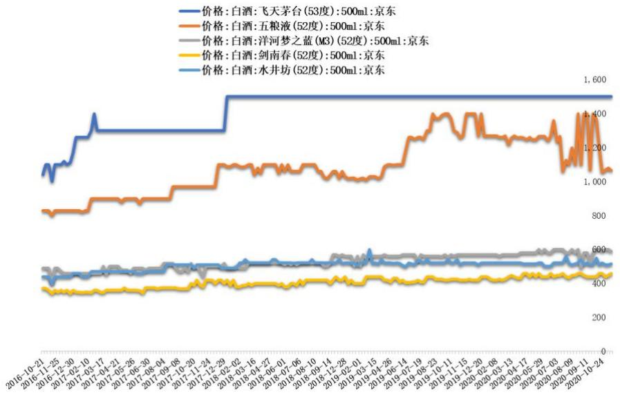

# 1食品饮料

发布时间：2020-11-16

证券研究报告 / 行业动态报告

# 关注酱酒崛起新趋势，乳业板块推荐伊利股份

优于大势 上次评级：优于大势

# 报告摘要:

本周观点：白酒：白酒行业呈现挤压式增长，疫情加剧行业分化，龙头集中度提升趋势明显。高端酒格局稳固，茅台一枝独秀，五粮液老窖向千元价格带迈进；次高端规模增速高，竞争呈加剧态势。茅台引领下酱酒已经初具规模，成为白酒消费新趋势，河南山东等地率先起势，郎酒国台等奋勇争先。本周白酒补涨趋势明显，部份小酒企上涨甚至带动黄酒、红酒板块，部份主要是资金炒作，建议关注估值过高风险。调味品：行业稳定性逐步加强，潜能充足的低估值龙头值得关注。部分企业需求端受到疫情红利影响，迎来新增长。成本端，原材料价格此消彼长，整体呈上涨趋势，短期来看调味品行业略有成本上涨压力。近期调味品板块经历估值下杀阶段。推荐涪陵榨菜，展望Q4公司将继续执行“四多两不”战略，强化自身优势。2019 年费用率是公司近年来峰值，基数较大，预计20Q4费用同比将减少3-4pct。叠加间接提价提升盈利能力，20Q4业绩有较大弹性。大众品：建议关注近期股价回调且需求逐季度复苏的大众品龙头，伊利未来增长确定性强，明年估值具备高性价比，奶价趋势上涨背景下，行业竞争促销趋于理性，伊利毛销差有望进一步扩大，重点推荐伊利股份。关注绝味食品单店收入同比变化，目前高势能门店不断恢复，且在门店数量高基数背景下，预计明年上半年增速有望保持较高水平，建议关注绝味食品。数据跟踪：截止11月14日，京东商城飞天茅台、五粮液、洋河梦之蓝、剑南春、水井坊价格分别为1499元、1064元、589元、458元、514元，价格相比上周分别变动 0 元、 $- 1 6$ 元、 $- 1 0$ 元、 $+ 1 0$ 元、 $+ 5$ 元。

重要研报：有友食品(603697.SH）品类扩张&渠道下沉，凤爪龙头迎来新成长。1）品类扩张：2016年起先后推出了猪皮晶、竹笋、豆干、鱿鱼、带鱼等新品类，实行差异化的经销商激励政策来推动新品的市场推广。2019年公司针对猪皮晶重点开发B端市场，以火锅食材切入，公司设立专门部门和近20人的团队负责火锅食材类产品的运营管理。火锅食材市场空间广阔，猪皮晶有望成为新的增长点。2）渠道下沉：公司不断加大渠道下沉和精耕细作，华东华南潜力巨大。2019年起对重庆地区继续细化成4个单元，在川渝以外将加大渠道下沉力度，要求部分地区下沉到县级市。渠道加速下沉带来新成长。

风险提示：食品安全风险，宏观经济增速放缓

  
历史收益率曲线

<table><tr><td>涨跌幅(%)</td><td>1M</td><td>3M</td><td>12M</td></tr><tr><td>绝对收益</td><td>1.50%</td><td>12.69%</td><td>57.85%</td></tr><tr><td>相对收益</td><td>1.14%</td><td>7.92%</td><td>33.32%</td></tr></table>

<table><tr><td colspan="2">行业数据</td></tr><tr><td>成分股数量（只）</td><td>107</td></tr><tr><td>总市值(亿)</td><td>0</td></tr><tr><td>流通市值（亿)</td><td>0</td></tr><tr><td>市盈率 (倍)</td><td>0.00</td></tr><tr><td>市净率(倍)</td><td>0.00</td></tr><tr><td>成分股总营收(亿)</td><td>7179</td></tr><tr><td>成分股总净利润（亿）</td><td>1179</td></tr><tr><td>成分股资产负债率(%)</td><td>35.15</td></tr></table>

重点公司主要财务数据  

<table><tr><td rowspan="2">重点公司</td><td rowspan="2">现价</td><td colspan="3">EPS</td><td colspan="3">PE</td><td rowspan="2">评级</td></tr><tr><td>2019A</td><td>2020E</td><td>2021E</td><td>2019A</td><td>2020E</td><td>2021E</td></tr><tr><td>贵州茅台</td><td>1705</td><td>32.8</td><td>36.9</td><td>41.19</td><td>51.98</td><td>46.21</td><td>41.39</td><td>买入</td></tr><tr><td>山西汾酒</td><td>250.1</td><td>2.22</td><td>3.11</td><td>3.78</td><td>112.66</td><td>80.42</td><td>66.16</td><td>买入</td></tr><tr><td>光明乳业</td><td>15.52</td><td>0.41</td><td>0.43</td><td>0.5</td><td>37.85</td><td>36.09</td><td>31.04</td><td>买入</td></tr><tr><td>恒顺醋业</td><td>21.19</td><td>0.32</td><td>0.35</td><td>0.41</td><td>66.22</td><td>60.54</td><td>51.68</td><td>买入</td></tr></table>

# 相关报告

《食品饮料行业周报：巴氏奶行业量价齐升，白酒动销好于预期》2020-11-10

《食品饮料行业周报：白酒动销恢复超预期，三季度业绩前瞻》2020-10-23

《低温奶风口已来，寻找乳业下一个结构增长点》2020-10-09

《食品饮料行业周报：白酒将迎来中秋国庆旺季，全面看好高端白酒》2020-09-10

证券分析师：李强执业证书编号：S0550515060001021-20361174 liqiang@nesc.cn

# 1．本周观点

白酒：白酒行业呈现挤压式增长，疫情加剧行业分化，龙头集中度提升趋势明显。高端酒格局稳固，茅台一枝独秀，五粮液老窖向千元价格带迈进；次高端规模增速高，竞争呈加剧态势。茅台引领下酱酒已经初具规模，成为白酒消费新趋势，河南山东等地率先起势，郎酒国台等奋勇争先。本周白酒补涨趋势明显，部份小酒企上涨甚至带动黄酒、红酒板块，部份主要是资金炒作，建议关注估值过高风险。调味品：行业稳定性逐步加强，潜能充足的低估值龙头值得关注。部分企业需求端受到疫情红利影响，迎来新增长。成本端，原材料价格此消彼长，整体呈上涨趋势，短期来看调味品行业略有成本上涨压力。近期调味品板块经历估值下杀阶段。推荐涪陵榨菜，展望Q4 公司将继续执行“四多两不”战略，强化自身优势。2019 年费用率是公司近年来峰值，基数较大，预计20Q4费用同比将减少3-4pct。叠加间接提价提升盈利能力，20Q4业绩有较大弹性。大众品：建议关注近期股价回调且需求逐季度复苏的大众品龙头，伊利未来增长确定性强，明年估值具备高性价比，奶价趋势上涨背景下，行业竞争促销趋于理性，伊利毛销差有望进一步扩大，重点推荐伊利股份。关注绝味食品单店收入同比变化，目前高势能门店不断恢复，且在门店数量高基数背景下，预计明年上半年增速有望保持较高水平，建议关注绝味食品。

# 2．市场观点

本周上证综指下跌 $0 . ~ 0 6 \%$ ，沪深300下跌 $0 . 5 9 \%$ ，食品饮料板块上涨 $0 . 6 4 \%$ ，强于上证综指和沪深300。食品饮料各子板块中，白酒上涨 $1 . 6 1 \%$ ，啤酒上涨 $0 . 6 2 \%$ ,其它酒类上涨 $1 0 . 3 3 \%$ ，软饮料上涨 $7 . 3 7 \%$ ，葡萄酒上涨 $1 . 9 2 \%$ ，黄酒上涨 $2 , 4 2 \%$ ,肉制品下跌 $0 . 5 7 \%$ ，调味发酵品下跌 $3 . 7 5 \%$ ，乳品下跌 $1 . 5 9 \%$ ，食品综合下跌 $1 . \ 0 6 \%$ 。

  
图1：食品饮料各子行业走势  
数据来源：东北证券，Wind

  
图2：各行业指数（申万）涨跌幅对比（%）  
数据来源：东北证券，Wind

从个股来看，上周涨幅前五名的公司为吉林森工、金徽酒、青青稞酒、煌上煌、

ST 椰岛，涨幅分别为 $3 4 . 2 9 \%$ ， $3 1 . \ 0 8 \%$ 、 $2 2 . 4 0 \%$ $1 6 . 9 0 \%$ 、 $1 5 . 1 2 \%$ ；跌幅前五名的公司为熊猫乳品、涪陵榨菜、三全食品、妙可蓝多、天味食品，跌幅分别为 $- 1 3 . 6 0 \%$ $- 1 1 . 1 6 \%$ $- 1 0 . 4 2 \%$ ， $- 6 . 4 2 \%$ $- 5 . 9 9 \%$ 。

表1：食品饮料本周涨跌幅前五名  

<table><tr><td colspan="4">涨幅前五名</td><td colspan="4">跌幅前五名</td></tr><tr><td>代码</td><td>股票名称</td><td>股价(元）</td><td>涨幅(%)</td><td>代码</td><td>股票名称</td><td>股价(元）</td><td>跌幅(%)</td></tr><tr><td>600189.SH</td><td>吉林森工</td><td>9.32</td><td>34.29</td><td>300898.SZ</td><td>熊猫乳品</td><td>54.69</td><td>-13.60</td></tr><tr><td>603919.SH</td><td>金徽酒</td><td>48.96</td><td>31.08</td><td>002507.SZ</td><td>涪陵榨菜</td><td>37.89</td><td>-11.16</td></tr><tr><td>002646.SZ</td><td>青青稞酒</td><td>13.82</td><td>22.41</td><td>002216.SZ</td><td>三全食品</td><td>28.12</td><td>-10.42</td></tr><tr><td>002695.SZ</td><td>煌上煌</td><td>23.59</td><td>16.89</td><td>600882.SH</td><td>妙可蓝多</td><td>31.91</td><td>-6.42</td></tr><tr><td>600238.SH</td><td>ST椰岛</td><td>5.71</td><td>15.12</td><td>603317.SH</td><td>天味食品</td><td>62.99</td><td>-5.99</td></tr></table>

数据来源：东北证券，Wind

表2：食品饮料本月至今涨跌幅前五名  

<table><tr><td colspan="4">涨幅前五名</td><td colspan="4">跌幅前五名</td></tr><tr><td>代码</td><td>股票名称</td><td>股价(元）</td><td>涨幅(%)</td><td>代码</td><td>股票名称</td><td>股价(元）</td><td>跌幅(%)</td></tr><tr><td>603919.SH</td><td>金徽酒</td><td>48.96</td><td>47.34</td><td>002557.SZ</td><td>洽洽食品</td><td>53.58</td><td>-10.01</td></tr><tr><td>603198.SH</td><td>迎驾贡酒</td><td>32.64</td><td>41.54</td><td>300858.SZ</td><td>科拓生物</td><td>59.66</td><td>-9.47</td></tr><tr><td>600189.SH</td><td>吉林森工</td><td>9.32</td><td>38.48</td><td>002507.SZ</td><td>涪陵榨菜</td><td>37.89</td><td>-9.31</td></tr><tr><td>002646.SZ</td><td></td><td>13.82</td><td>36.70</td><td>002216.SZ</td><td>三全食品</td><td>28.12</td><td>-8.73</td></tr><tr><td>600559.SH</td><td>老白干酒</td><td>16.47</td><td>29.48</td><td>600882.SH</td><td>妙可蓝多</td><td>31.91</td><td>-8.54</td></tr></table>

数据来源：东北证券，Wind

估值方面，截止到本周，食品饮料行业市盈率为47.08X，各子行业白酒、啤酒、其他酒类、软饮料、葡萄酒、黄酒、肉制品、调味发酵品、乳品、食品综合市盈率分别为48.55X、62.66X、85.29X、19.54X、21.88X、48.12X、26.48X、81.21X、38.24X、47.08X。

  
图3：食品饮料各子行业 TTM 市盈率  
数据来源：东北证券，Wind

  
图4：食品饮料各子行业估值溢价率   
数据来源：东北证券，Wind

# 3．数据跟踪

# 3.1．白酒

截止11月14 日，京东商城飞天茅台、五粮液、洋河梦之蓝、剑南春、水井坊价格分别为1499 元、1064元、589 元、458元、514元，价格相比上周分别变动0元、 $- 1 6$ 元、 $- 1 0$ 元、 $+ 1 0$ 元、 $+ 5$ 元。

  
图5：茅台、五粮液等白酒京东价格走势   
数据来源：东北证券，Wind

# 3.2．奶价

截止2020 年11月14日，生鲜乳主产区平均价为4.0元/千克，同比上涨 $4 . 7 \%$ 。

  
图6：生鲜乳主产区平均价  
数据来源：东北证券，Wind

# 3.3.猪价

截止2020年 11月14日，生猪价格同比下跌 $2 1 . 8 0 \%$ ，环比上涨 $0 . 1 \%$ ，为29.85元/千克；截止2020 年11月14日，仔猪价格同比上涨 $8 , 8 0 \%$ ，环比下跌 $2 . 7 0 \%$ ,为86.38元/千克；截止2020年11月14日，猪肉价格同比下跌 $1 9 . 9 0 \%$ ，环比下跌$1 . 3 0 \%$ ，为47.03元/千克。

  
图7：活猪、仔猪、猪肉平均价（元/千克）  
数据来源：东北证券，Wind

# 4.行业要闻

表3：本周重点新闻  

<table><tr><td>分类</td><td>日期</td><td>内容</td><td>来源</td></tr><tr><td rowspan="3"></td><td rowspan="3">食品饮料20201109</td><td>上周（2020年10月29日—2020年11月5日）“农产品批发价格200指数”为117.92， 比前一期下降0.43%，比去年同期下降1.06%。</td><td rowspan="3">佳酿网</td></tr><tr><td>畜禽产品除牛肉价格保持稳定外价格都呈现小幅下降，其中猪肉价格每公斤39.22 元，下降2.1%。5种水果产品平均价格为5.59公斤，环比上涨0.1%，同比上涨6.8%，</td></tr><tr><td>其中菠萝价格每公斤6.00元，增长2.7%，而富士苹果、香蕉、西瓜的价格则分别 下降了0.8%、1.3%、0.7%。19种蔬菜平均价格为3.68元/公斤，环下降0.7%，同 比上涨19.9%。上周洋白菜、茄子、韭菜、蒜苔和大葱价格环比涨幅较大，幅度分</td></tr><tr><td rowspan="3">食品饮料20201110</td><td rowspan="3"></td><td>比降幅较大，幅度分别为8.3%、6.0%、5.5%、3.4%、3.4%。 11月10日，全国农产品批发市场猪肉平均价格为39.26元，下降0.3%；牛肉75.98</td><td rowspan="3">糖酒快讯</td></tr><tr><td>元，下降0.6%；羊肉68.68元，下降0.1%；鸡蛋7.82元，下降0.1%；白条鸡15.93</td></tr><tr><td>元/公斤，下降2.0%。重点监测的28种蔬菜平均价格为4.47元/公斤，下降0.2%； 重点监测的6种水果平均价格为5.59元/公斤，比昨天上涨1.5%。国内鲜活农产品</td></tr></table>

<table><tr><td>2.2%和2.1%。</td><td>菠萝、莲藕和大黄花鱼。幅度分别为2.7%、2.7%、2.4%、2.3%和2.1%；价格降幅 前五名的是菠菜、莴笋、白鲢鱼、大带鱼和胡萝卜，幅度分别为3.0%、3.0%、2.4%、 11月2日至8日，全国食用农产品市场价格比前一周下降0.3%，生产资料市场价格</td></tr><tr><td>食品饮料20201111 11月12日“农产品批发价格200指数”为117.27，比昨天下降0.08%。全国农产品</td><td>比前一周（下同）上涨0.3%。30种蔬菜平均批发价格每公斤4.6元，比前一周下降 1.5%，其中莴笋、菠菜、菜花批发价格分别下降8.5%、7.9%和6.8%。6种水果平均 批发价格下降1.1%，其中苹果、柑橘、香蕉批发价格分别下降2.6%、2.3%和1.8%。 水产品价格有所下降，其中鲫鱼、鲤鱼、草鱼批发价格分别下降2.3%、0.9%和0.9%。 佳酿网 肉类价格略有波动，其中羊肉批发价格下降0.5%，牛肉批发价格持平，猪肉批发 价格每公斤39.36元，上涨0.3%。禽产品价格有涨有跌，其中白条鸡批发价格下降 0.4%，鸡蛋价格上涨0.6%。粮油价格稳中略涨，其中面粉批发价格与前一周持平， 豆油、菜籽油、花生油、大米批发价格分别上涨0.7%、0.4%、0.2%和0.2%。</td></tr><tr><td>食品饮料20201112</td><td>批发市场猪肉平均价格为39.73元，比昨天上涨1.0%；牛肉75.57元，比昨天上涨 0.3%；羊肉68.86元，比昨天下降0.6%；鸡蛋7.76元，比昨天下降0.5%；白条鸡15.99 元/公斤，比昨天下降0.9%。重点监测的28种蔬菜平均价格为4.46元/公斤，比昨 食研会 天上涨0.2%；重点监测的6种水果平均价格为5.62元/公斤，比昨天上涨1.8%；鲫 鱼平均价格为16.79公斤，比昨天上涨1.3%；鲤鱼12.18元/公斤，比昨天上涨0.4%； 白鲢鱼8.25元/公斤，比昨天下降1.7%；大带鱼37.60元/公斤，比昨天上涨2.4%。 2020年1月至9月，全国规模以上饮料制造企业营业收入3431.4亿元，同比下降</td></tr><tr><td>食品饮料20201113 品。</td><td>8.20%；利润总额368.5亿元，同比下降1.30%；全国规模以上饮料制造企业产量达 到1.29亿吨，同比下降6.10%。其中，9月当月饮料产量0.17亿吨，同比增长6.40%。 食品商务网 10月，有3个品牌在融资方面有进展，其中oatoat完成Pre-A轮融资，7分甜完成A 轮融资，精品咖啡品牌“鹰集”完成天使轮融资。农夫山泉、养元饮品等推出新</td></tr></table>

数据来源：东北证券，行业网站

# 5．重要研报

表4：近期主要报告  

<table><tr><td>报告类型</td><td>标题</td><td>报告摘要</td></tr><tr><td></td><td>低温奶行业深度报告：</td><td>巴氏奶行业量价齐升，驶入加速期。随着冷链设施逐步完善、生鲜电商兴起、消费者 加速培育和奶源质量提高，巴氏奶行业增速从2015年的6.1%提升到2019年的11.6%，</td></tr><tr><td>深度报告</td><td>低温奶风口已来，寻找 乳业下一个结构增长点</td><td>行业增长进入加速期。2015-2019年巴氏奶行业规模CAGR达9.2%，单价CAGR达3.2%， 销量CAGR达5.9%，呈现量价齐升态势。根据欧睿国际预测，2019-2024年销售额CAGR</td></tr><tr><td></td><td></td><td>为6.56%，2024年巴氏奶销售规模将达472亿元。</td></tr></table>

争要素为奶源、贴近消费市场的牧场、工厂布局和高效率的供应链（冷链建设和终端节奏把控）、渠道壁垒。目前巴氏奶行业难以突破“产地销”困境，集中度较低，以区域性企业为主，2019年CR3仅为 $2 7 \%$ 。前三大乳企分别为光明、三元和新希望，市占率分别为 $1 2 \%$ ， $9 \%$ 和 $6 \%$ 。受到奶源&冷链限制、以及营销具备短精快特点，导致巴氏奶企业短期很难实现全国规模化。我们认为未来巴氏奶行业发展主要通过两条路径，一是通过整合区域龙头最终形成行业巨头；另一种是区域化深耕，不断提高在当地市场的占有率，最终出现多个大规模的区域龙头乳企。

光明区域深耕，净利率有望提升；新乳业 $^ { \circ } 1 + \mathrm { N } ^ { \dag \circ }$ 并购外延，快速扩张低温版图。1)光明乳业作为低温行业龙头，充分享受行业加速增长红利。公司低温产品品质凸显，华东华中低温鲜奶市占率第一。2019 年低温鲜奶增速超 $2 0 \%$ 。在华东和华中地区，公司拥有多个围绕城市中心建设的牧场和工厂，自有物流配送子公司。高效率供应链体系和后端周转，使得光明退损率明显低于竞品。新管理层推动渠道、产品和营销升级，改革成效凸显，公司经营迎来拐点。未来公司对低温业务进行战略聚焦，深耕利基市场，将大力拓展送奶入户业务&推进空白市场建设&持续更新产品，未来低温业务有望迎来爆发，随着产品升级&管理优化&规模效应显现，光明乳业净利率有望持续提升。2）新乳业坚守鲜战略，注重产品创新和研发，主打低温产品，走差异化创新路线。实行 $1 + \mathrm { N } ^ { \ast }$ 并购战略快速进行全国化扩张。通过经验总结摸索出一套高效成熟的投后管理体系，管理整合能力优异。内生增长叠加外延并购，全国化低温版图快速扩张。

休闲食品行业深度报告：“品类扩张 $^ +$ 渠道多深度报告 样化”赋能休闲食品行业发展

休闲食品行业概况：休闲食品顾名思义，是人们在休息、闲暇时吃的食品，通常来说休闲食品可以细分为以下几个品类，包括烘焙、糖果、坚果、膨化、饼干、卤制品等。根据frost&sullivan统计，2019年我国休闲食品市场规模达到11555亿元，2015年-2019年CAGR为 $1 1 . 9 6 \%$ ，实现两位数以上增长，到2020年，预计休闲食品的市场规模将进一步增长至12984亿元。

细分行业发展情况：子行业发展阶段存在差异，传统的糖果品类在休闲食品中的市场份额占比最大，占比达到 $3 1 , 9 5 \%$ ，排在之后的分别是烘焙蛋糕、膨化食品、休闲卤制品、坚果炒货、饼干和其他，占比分别达到 $2 0 . 5 1 \%$ $1 3 . ~ 0 1 \%$ $9 . 5 1 \%$ ， $8 , 1 1 \%$ $7 , 8 3 \%$ 和 $9 , ~ 0 8 \%$ 。从增速来看，新兴的休闲卤制品增速最快，2015-2019 年CAGR为 $1 8 . 8 \%$ 其次是膨化食品，CAGR达到 $1 6 , 6 \%$ ;接下来是烘焙、坚果炒货、糖果和饼干，2013-2019年CAGR分别为 $1 1 . 4 \%$ ， $1 0 . ~ 6 \%$ $9 , 9 \%$ 和 $9 , 8 \%$ 。

行业增长动力：我们认为未来驱动休闲食品行业快速增长的因素主要有：1）经济的增长和可支配收入的提高，出于对更加优质、健康的休闲食品的追求，消费者将会选择产品更加健康、安全、和优质的休闲食品品牌；2）城镇化率的提升；3）随着休闲时间以及闲暇开支增加，休闲食品对主食的替代可能会同时发生。

行业未来发展方向：在行业层面，我们看到消费者的健康诉求和行业标准化程度的提高，打开了行业的向上空间。以坚果为例，其含有丰富的人体所需的营养元素，是典型的健康休闲食品，过去十年中尽管我国的坚果市场增长迅速，但主要品类如杏仁、碧根果、腰果和夏威夷果的人均消费量均显著低于成熟市场以及全球平均水平，中长期仍具有较大的增长空间。连锁品牌的出现和标准化生产能力的提升，则直接推动了休闲卤制品的全国化。另外我们看到，行业销售渠道从单一走向多样化，加之消费者对产品品质的关注度提高，行业的集中度有望持续提升，对于品牌企业而言是较大的行业性机会。

酒鬼酒（000799.SZ):独特馥郁香，高端酒内深度报告参闪耀崛起

中粮入主后治理全面提升，公司进入发展快车道。公司位于神秘湘西，独特的馥郁香$^ { \mathfrak { c } } 5 2 3 ^ { \mathfrak { s } }$ 工艺及独具匠心的文化酒定位赋予酒鬼酒强大的品牌力和生命力，1998年公司营收规模位居行业前列，利润规模仅次于五粮液，甚至高于茅台。其后到2014年，由于控股股东及经营团队的频繁变更，以及内部治理问题，公司错失白酒十年黄金发展期，营收/利润下降到 $3 . 8 8 / - 0 . 9 7$ 亿元，行业地位大幅下降。2015年，中粮集团成为控股股东，全方面对公司进行品牌拔高、市场聚焦、体制优化、内控提升、团队打造、产能扩张，公司再次进入发展的快车道。

内参销售模式转变释放经营活力，品牌拉力和渠道推力共同提升，短期翻倍增长提升盈利能力，长期全国化打开成长空间。2018 年底多位亿元白酒大商共同设立内参销售公司，对内参品牌进行单独运作，转变厂商关系、增长模式、经营机制，释放品牌活力。通过树立中国高端文化第一白酒品牌形象以及市场秩序管控维护经销商合理利润，内参品牌拉力及渠道推力明显提升，2019 年实现销量翻倍，2020H1在外部环境影响下仍大幅增长 $7 5 \%$ ，极大提升盈利能力。公司2019 年开始内参全国化进程，品牌力在省外提升明显，省外招商卓有成效，长期全国化空间逐步打开。

调整后将再起航，省内通过渠道精耕，市占率提升确定性高。2015 年以来公司梳理优化产品线，当前SKU总数已经从400多个控制到85个以内，酒鬼系列确大战略单品，稳步推进量价齐升。公司省内市占率当前仅 $5 \%$ 左右，2020年通过域、分产品招商，渠道精耕、终端培育将带动规模快速扩张，省内次高端酒集中，增长快，酒鬼系列将成为公司省内增长的重要抓手。

今世缘（603369.SH）:拉升品牌推动产品结构深度报告 优化，省内精耕渠道扩张提高市占率

高端国缘快速突破，营销力度加码，拟实施股权再激励激发战斗力，增长势不可挡。司源于江淮名酒扎根富裕江苏，以品牌、渠道差异化竞争优势成功突围，最具势能牌国缘系列定位次高端表现优异，2016 年-2019 年公司营业收入/归母净利润CARG别为 $2 4 \% / 2 4 . 6 \%$ ，业绩逐年提速，国缘系列销售占比提升至 $7 3 \%$ 以上。2020年公司实施股权再激励，2020-2022年3年复合增速目标为 $1 8 . 1 7 \%$ ，2022年目标营收80，2018年/2019年销售费用同比增长 $3 6 , 7 \% / 4 5 , 6 \%$ ，营销力度不断加码，增长势不挡。

司拉升品牌推动产品结构优化，产品梯队运作成效明显，盈利能力不断提升。白酒业整体呈现挤压式增长特征，次高端复合增速有望维持在 $2 0 \%$ ，江苏省人均可支配入及人口总量均位居全国前五，奠定苏酒进入全国前三的基础。2016-2018江苏省规上企业白酒利润从10.52元/升提升至18.97元/升，次高端占比 $2 2 \%$ 远超全国水。公司国缘系列定位升级为“中国高端中度白酒”开启品牌全国化步伐，推出水晶系定位千元价格带拔高品牌力，今世缘典藏及高沟青花实现产品聚焦实现梯队化运，2016-2019年特A类产品占比从74%提升至 $8 7 \%$ ，销售毛利率由 $7 0 . 9 6 \%$ 提升至$7 2 . 7 9 \%$ ，盈利能力不断提升。

省内精耕渠道扩张提高市占率，省外样板式发力更具成长性。公司省内市场占有率$1 0 \%$ 左右，苏北及南京地区稳扎稳打已经成为大本营，苏中苏南通过品牌培育、渠道下沉、组织提效、高渠道利润维持推力，已经到达临届放量时点。公司省外市场2019年战略地位再提升，省外扩张由粗放式向样板式聚焦，重点山东大区已实现市级覆盖率 $9 3 \%$ 左右。2019/2020H1省外经销商增加167/88家，营收增速分别为 $5 4 \% / 6 \%$ ，省外渠道信心势能充足。

<table><tr><td rowspan="2">深度报告 云</td><td rowspan="2">光明乳业（600597.SH）： 好风凭借力，送我上青</td><td>低温行业驶入加速期，行业分散以区域性乳企为主。随着冷链设施逐步完善、消费者 加速培育和奶源质量提高，巴氏奶行业增速从2015年的6.1%提升到2019年的11.6%， 行业增长进入加速期。2015-2019年巴氏奶行业规模CAGR达9.2%，单价CAGR达3.2%， 销量CAGR达5.9%，呈现量价齐升态势。我们认为巴氏奶行业三大竞争要素为奶源、 贴近消费市场的牧场和工厂布局和高效率的供应链(冷链建设和终端节奏把控)。目 前巴氏奶行业难以突破“产地销”困境，集中度较低，以区域性企业为主，2019 年 CR3仅为27%。</td></tr><tr><td>新管理层推动管理改革，拐点已现。新管理层推动渠道、产品和营销升级，改革成效 凸显。2020 年4月罗海担任新总裁后，优化考核机制，加强团队激励，管理明显改 善，公司经营迎来拐点。产品+品牌+渠道+供应链筑建核心壁垒，战略聚焦，低温龙 头再腾飞。公司作为低温行业龙头，充分享受行业加速增长红利。公司低温产品品质 凸显，华东华中低温鲜奶市占率第一。2019 年低温鲜奶增速超20%。华东、华中地区，</td></tr></table>

数据来源：东北证券

# 6．公司公告

表5：本周重要公告  

<table><tr><td>公司</td><td>日期</td><td>摘要</td><td>内容</td></tr><tr><td>青青稞酒</td><td>20201109</td><td>高管变动</td><td>张芬军辞去公司副总经理职务。</td></tr><tr><td>千禾味业</td><td>20201109</td><td>股东减持</td><td>伍建勇计划减持公司股份不超过1997.02万股，占其所持股份的20%。伍建勇 持有公司股份8175.39万股，占公司总股本的12.28%</td></tr><tr><td>华统股份</td><td>20201109</td><td>股份回购</td><td>公司首次及预留授予限制性股票回购注销数量合计调整为67.84万股，回购 价格均调整为每股4.3375元。</td></tr><tr><td>青海春天</td><td>20201109</td><td>股份转让</td><td>公司控股股东西藏荣恩科技有限公司收到了中国证券登记结算有限责任公 司出具的《过户登记确认书》，确认西藏荣恩本次转让公司33，000，000股股 份给红土红塔基金的过户登记手续已经办理完成。</td></tr><tr><td>古越龙山</td><td>20201109</td><td>理财收益</td><td>公司到期收回委托理财本金1.5亿元，获得实际收益624万元。</td></tr><tr><td>水井坊</td><td>20201110</td><td>议案审议</td><td>九届董事会审议通过了公司《关于调整公司九届董事会下属各专业委员会的 议案》。</td></tr><tr><td>香飘飘</td><td>20201110</td><td>股东大会</td><td>公司拟于11月1日召开2020年第一次临时股东大会，审议《关于调整公司2018 年限制性股票激励计划部分业绩考核指标的议案》以及《关于调整2018年限</td></tr></table>

<table><tr><td colspan="3"></td><td>制性股票激励计划实施考核管理办法的议案》。</td></tr><tr><td rowspan="3">龙大肉食</td><td rowspan="3">20201110</td><td rowspan="3">业绩公告</td><td>子公司龙大养殖10月份销售生猪3.91万头，环比增加46.99%，同比增加</td></tr><tr><td>191.79%；实现销售收入1.30亿元，环比增加28.50%，同比增加109.68%；销</td></tr><tr><td>售均价为33.68元/公斤（含仔猪），比2020年9月份下降12.75%。</td></tr><tr><td rowspan="2">元祖股份</td><td rowspan="2">20201110</td><td rowspan="2">股份减持</td><td>卓傲国际减持时间届满，通过集中竞价减持480万股，占公司总股本的2%。</td></tr><tr><td>卓傲国际现持有2003万股，占公司总股本的8.35%。</td></tr><tr><td rowspan="2">来伊份</td><td rowspan="2">20201110</td><td rowspan="2">政府补助</td><td>子公司于2020年10月27日至2020年11月9日，累计收到与收益相关的政府补</td></tr><tr><td>助323.27万元，超过2019年净利润1，037.07万元的10%。</td></tr><tr><td>金字火腿</td><td>20201110</td><td>股权回购</td><td>公司于今日收到中钰资本管理支付的股权回购款1000万元。</td></tr><tr><td rowspan="2">燕京啤酒</td><td rowspan="2">20201110</td><td rowspan="2">股份减持</td><td>2020年11月5日-2020年11月9日，上海重阳投资管理、上海重阳战略投资和</td></tr><tr><td>重阳集团减持股份达到公司总股本的1.4248%。</td></tr><tr><td rowspan="2">西麦食品</td><td rowspan="2">20201111</td><td rowspan="2">股份减持</td><td>BRF通过大宗交易减持公司股票218.50万股，超过公司总股本的1%。</td></tr><tr><td>公司实际控制人肖融解除其所持有的公司1700万股的质押，占公司总股本的</td></tr><tr><td rowspan="2">青海春天</td><td rowspan="2">20201111</td><td rowspan="2">解除质押</td><td>2.90%，本次办理股份解除质押业务后，肖融累计质押数量为0股。</td></tr><tr><td>公司已将募集资金2000万元提前归还至募集资金专用账户。</td></tr><tr><td>惠发食品 ST加加</td><td>20201111 20201111</td><td>募集资金 高管变动</td><td></td></tr><tr><td rowspan="2"></td><td rowspan="2"></td><td rowspan="2"></td><td>公司法定代表人已变更为周建文。</td></tr><tr><td>公司股票于2020年11月9日、11月10日、11月11日连续三个交易日收盘价格</td></tr><tr><td rowspan="2">*ST 西发</td><td rowspan="2">20201112</td><td rowspan="2">账户冻结</td><td>涨幅偏离值累计超过20%，股票交易异常波动。</td></tr><tr><td>因借款合同纠纷，公司3个主要银行账户和2个非主要银行账户被冻结，被冻</td></tr><tr><td rowspan="2">莫高股份</td><td rowspan="2">20201112</td><td rowspan="2"></td><td>结额度为2.37亿元，实际被冻结金额1.21万元。</td></tr><tr><td>公司股票于2020年11月10日、2020年11月11日、2020年11月12日连续三个交</td></tr><tr><td rowspan="3"></td><td rowspan="3"></td><td rowspan="3"></td><td>易日内日收盘价格涨幅偏离值累计达20%，股票交易异常波动。</td></tr><tr><td>公司股东中华传统食品投资转让其所持本公司股份1126.40万股给涌津滦海</td></tr><tr><td>1号，占公司总股本5.50%，转让价格为人民币13.50元/股。上述股份转让交</td></tr><tr><td rowspan="2"></td><td rowspan="2"></td><td rowspan="2"></td><td>易转让价款尚未支付。本次权益变动后，中华传统合计持有本公司股份</td></tr><tr><td>187.22万股，占公司总股本0.91%，不再是公司持股5%以上股东。</td></tr><tr><td rowspan="2">惠泉啤酒 会稽山</td><td rowspan="2">20201113</td><td rowspan="2">高管变动</td><td>许炎平因退休而申请辞去公司副总经理职务。</td></tr><tr><td>公司2020年第一次临时股东大会通过了《关于选举张伟夫先生为公司第五届 监事会主席的议案》。</td></tr><tr><td rowspan="2">*ST西发</td><td rowspan="2"></td><td rowspan="2"></td><td>公司今日通过委派律师取得民事判决书，一审判决驳回原告杨淋对西藏发展</td></tr><tr><td>的诉讼请求。公司3个主要银行账户和2个非主要银行账户被冻结，被冻结额</td></tr><tr><td rowspan="2">ST加加</td><td rowspan="2">20201113</td><td rowspan="2">股权投资</td><td>度为2.37亿元，实际被冻结金额1.21万元。</td></tr><tr><td>朴和基金拟以自有资金出资1.5亿元参与设立股权投资基金。</td></tr></table>

数据来源：东北证券，Wind

# 7．大事提醒

表6：下周大事提醒  

<table><tr><td>公司</td><td>股票代码</td><td>日期</td><td>内容</td></tr><tr><td>中宠股份</td><td>002891.SZ</td><td>2020-11-16</td><td>临时股东大会</td></tr><tr><td>龙大肉食</td><td>002726.SZ</td><td>2020-11-16</td><td>临时股东大会</td></tr><tr><td>科拓生物</td><td>300858.SZ</td><td>2020-11-16</td><td>临时股东大会</td></tr><tr><td>维维股份</td><td>600300.SH</td><td>2020-11-16</td><td>临时股东大会</td></tr><tr><td>安琪酵母</td><td>600298.SH</td><td>2020-11-16</td><td>临时股东大会</td></tr><tr><td>珠江啤酒</td><td>002461.SZ</td><td>2020-11-17</td><td>临时股东大会</td></tr><tr><td>香飘飘</td><td>603711.SH</td><td>2020-11-18</td><td>临时股东大会</td></tr><tr><td>今世缘</td><td>603369.SH</td><td>2020-11-19</td><td>临时股东大会</td></tr></table>

数据来源：东北证券，Wind

# 分析师简介:

李强：西南财经大学金融学硕士，电子科技大学金融学本科，现任东北证券食品饮料行业组长分析师。曾任华龙证券有限责任公司研究员，南京证券股份有限公司研究员。具有10年证券研究从业经历，荣获2019年金牛奖食品饮料行业最佳分析团队第1名，2019年Wind资讯金牌分析师第5名，2018年每市食品饮料行业年度组合收益第4名，2018年投研社最受机构欢迎分析师，2018年进门财经百佳分析师，2018年食品饮料研究Wind平台影响力排行榜第7名，2018年度知丘杯金测奖最佳分析师第3名，2017年卖方分析师水晶球奖食品饮料行业第2名，“2016年Wind资讯第四届金牌分析师全民票选”食品饮料行业第1名。

# 重要声明

本报告由东北证券股份有限公司（以下称“本公司”）制作并仅向本公司客户发布，本公司不会因任何机构或个人接收到本报告而视其为本公司的当然客户。

本公司具有中国证监会核准的证券投资咨询业务资格。

本报告中的信息均来源于公开资料，本公司对这些信息的准确性和完整性不作任何保证。报告中的内容和意见仅反映本公司于发布本报告当日的判断，不保证所包含的内容和意见不发生变化。

本报告仅供参考，并不构成对所述证券买卖的出价或征价。在任何情况下，本报告中的信息或所表述的意见均不构成对任何人的证券买卖建议。本公司及其雇员不承诺投资者一定获利，不与投资者分享投资收益，在任何情况下，我公司及其雇员对任何人使用本报告及其内容所引发的任何直接或间接损失概不负责。

本公司或其关联机构可能会持有本报告中涉及到的公司所发行的证券头寸并进行交易，并在法律许可的情况下不进行披露；可能为这些公司提供或争取提供投资银行业务、财务顾问等相关服务。

本报告版权归本公司所有。未经本公司书面许可，任何机构和个人不得以任何形式翻版、复制、发表或引用。如征得本公司同意进行引用、刊发的，须在本公司允许的范围内使用，并注明本报告的发布人和发布日期，提示使用本报告的风险。

本报告及相关服务属于中风险（R3)等级金融产品及服务，包括但不限于A股股票、B股股票、股票型或混合型公募基金、AA级别信用债或ABS、创新层挂牌公司股票、股票期权备兑开仓业务、股票期权保护性认沽开仓业务、银行非保本型理财产品及相关服务。

若本公司客户（以下称“该客户”）向第三方发送本报告，则由该客户独自为此发送行为负责。提醒通过此途径获得本报告的投资者注意，本公司不对通过此种途径获得本报告所引起的任何损失承担任何责任。

# 分析师声明

作者具有中国证券业协会授予的证券投资咨询执业资格，并在中国证券业协会注册登记为证券分析师。本报告遵循合规、客观、专业、审慎的制作原则，所采用数据、资料的来源合法合规，文字阐述反映了作者的真实观点，报告结论未受任何第三方的授意或影响，特此声明。

投资评级说明  

<table><tr><td rowspan="5">股票 投资 评级 说明</td><td>买入</td><td>未来6个月内，股价涨幅超越市场基准15%以上。</td></tr><tr><td>增持</td><td>未来6 个月内，股价涨幅超越市场基准5%至15%之间。</td></tr><tr><td>中性</td><td>未来6个月内，股价涨幅介于市场基准-5%至5%之间。</td></tr><tr><td>减持</td><td>在未来6个月内，股价涨幅落后市场基准 5%至15%之间。</td></tr><tr><td>卖出</td><td>未来6个月内，股价涨幅落后市场基准15%以上。</td></tr><tr><td rowspan="3">行业 投资 评级 说明</td><td>优于大势</td><td>未来6 个月内，行业指数的收益超越市场平均收益。</td></tr><tr><td>同步大势</td><td>未来 6 个月内，行业指数的收益与市场平均收益持平。</td></tr><tr><td>落后大势</td><td>未来 6 个月内，行业指数的收益落后于市场平均收益。</td></tr></table>

# 东北证券股份有限公司

网址：http://www.nesc.cn 电话：400-600-0686

<table><tr><td>地址</td><td>邮编</td></tr><tr><td>中国吉林省长春市生态大街 6666号</td><td>130119</td></tr><tr><td>中国北京市西城区锦什坊街 28 号恒奥中心D 座</td><td>100033</td></tr><tr><td>中国上海市浦东新区杨高南路 729 号</td><td>200127</td></tr><tr><td>中国深圳市福田区福中三路 1006号诺德中心 34D</td><td>518038</td></tr><tr><td>中国广东省广州市天河区洗村街道黄埔大道西 122 号之二星辉中心 15 楼</td><td>510630</td></tr></table>

机构销售联系方式  

<table><tr><td>姓名</td><td>办公电话</td><td>手机</td><td>邮箱</td></tr><tr><td colspan="4">公募销售</td></tr><tr><td></td><td>华东地区机构销售</td><td></td><td>ruanmin@nesc.cn</td></tr><tr><td>阮敏（副总监） 吴肖寅</td><td>021-20361121 021-20361229</td><td>13636606340 17717370432</td><td>wuxiaoyin@nesc.cn</td></tr><tr><td>齐健</td><td></td><td></td><td></td></tr><tr><td>陈希豪</td><td>021-20361258</td><td>18221628116</td><td>qijian@nesc.cn</td></tr><tr><td>李流奇</td><td>021-20361267</td><td>13262728598</td><td>chen_xh@nesc.cn</td></tr><tr><td>李瑞暄</td><td>021-20361258</td><td>13120758587</td><td>Lilq @nesc.cn lirx@nesc.cn</td></tr><tr><td>周嘉茜</td><td>021-20361112</td><td>18801903156</td><td></td></tr><tr><td>刘彦琪</td><td>021-20361133</td><td>18516728369</td><td>zhoujq@nesc.cn</td></tr><tr><td>金悦</td><td>021-20361133 021-20361229</td><td>13122617959 17521550996</td><td>liuyq@nesc.cn jinyue@nesc.cn</td></tr><tr><td colspan="4">华北地区机构销售</td></tr><tr><td>李航（总监）</td><td>010-58034553</td><td>18515018255</td><td>lihang@nesc.cn</td></tr><tr><td>殷璐璐</td><td>010-58034557</td><td>18501954588</td><td>yinlulu @nesc.cn</td></tr><tr><td>温中朝</td><td>010-58034555</td><td>13701194494</td><td>wenzc@nesc.cn</td></tr><tr><td>曾彦戈</td><td>010-58034563</td><td>18501944669</td><td>zengy g@nesc.cn</td></tr><tr><td>周颖</td><td>010-63210813</td><td>19801271353</td><td>zhouyingl @nesc.cn</td></tr><tr><td>过宗源</td><td>010-58034553</td><td>15010780605</td><td>guozy @nesc.cn</td></tr><tr><td colspan="4">华南地区机构销售</td></tr><tr><td>刘璇（副总监）</td><td>0755-33975865</td><td>18938029743</td><td>liu_xuan@nesc.cn</td></tr><tr><td>刘曼</td><td>0755-33975865</td><td>15989508876</td><td>liuman @nesc.cn</td></tr><tr><td>王泉</td><td>0755-33975865</td><td>18516772531</td><td>wangquan@nesc.cn</td></tr><tr><td>王谷雨</td><td>0755-33975865</td><td>13641400353</td><td>wanggy @nesc.cn</td></tr><tr><td>周金玉</td><td>0755-33975865</td><td>18620093160</td><td>zhoujy @nesc.cn</td></tr><tr><td>陈励</td><td>0755-33975865</td><td>18664323108</td><td>Chenlil @nesc.cn</td></tr><tr><td>张瀚波</td><td>0755-33975865</td><td>15906062728</td><td>zhang_hb@nesc.cn</td></tr><tr><td colspan="4">非公募销售</td></tr><tr><td>李茵茵（总监）</td><td>021-20361229</td><td>华东地区机构销售 18616369028</td><td>liyinyin@nesc.cn</td></tr><tr><td>杜嘉琛</td><td>021-20361229</td><td>15618139803</td><td>dujiachen@nesc.cn</td></tr><tr><td>王天鸽</td><td>021-20361229</td><td>19512216027</td><td></td></tr><tr><td></td><td></td><td></td><td>wangtg@nesc.cn</td></tr></table>