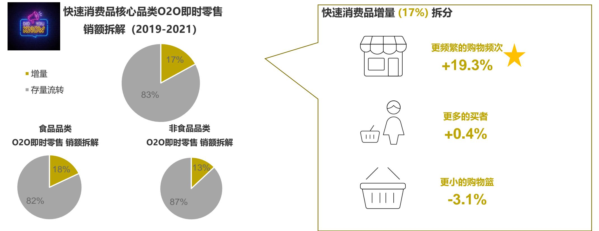
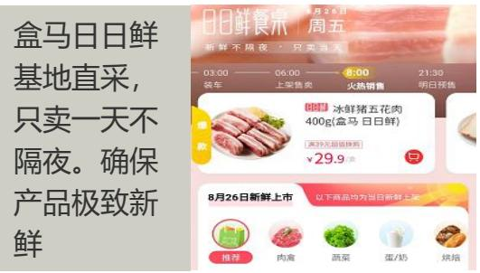

# KANTAR WORLDPANEL A CTR SERVICE IN CHINA

# 借力O2O即时零售解锁未来增长

O2O即时零售常温乳品白皮书

本报告由伊利、美团闪购和凯度消费者指数联合呈现

# 目录

# 1 前言

# 2 O2O即时零售既是“流量”也是“留量”渠道

# 1前言

数据指标说明及名词解释背景：O2O即时零售正迎来供需共振的时代机遇

# 名词定义

# 品类范围

快速消费品：包含固态或液态酒精/非酒精饮料、调味品、食用油、涂抹酱、乳制品、糖果、冰淇淋、饼干、膨化食品、沙琪玛、坚果、中式糕点等休闲食品、面粉、挂面、米、宠物食品、家庭清洁用品、空气清新剂、洗衣用品、柔顺剂、纸制品、头部护理、口腔护理、个人清洁、护肤品、化妆品、香氛、卫生用品、电池；不包含烟草品类、果蔬生鲜、鲜花绿植、数码图书等品

1

类常温乳品：储藏温度大于10度，包含包装液体牛奶（纯牛奶和含有其他添加成分的牛奶饮料、含乳饮料），和以鲜乳、奶粉或其他乳制品为原料， 加入水、糖液、乳酸菌或其他酸性添加剂(如: 酸性调节剂)的酸奶产品

# 渠道

快速消费品购买渠道包括：大卖场、大超市、小超市、便利店、食杂店、自由批发市场、新物种等线下实体和电商、O2O即时零售、社区团购和其他渠道

数字零售：包括在传统电商平台、微信微商、短视频平台，以及O2O即时零售平台和社区团购等线上下单购买商品的渠道类型

线下实体：指消费者在大卖场、大超市、小超市、便利店、食杂店、自由批发市场、新物种等实体店面直接购买商品的形式

# 时间范围

MAT21P9：指2020年9月12日-2021年9月10日的过去52周MAT22P9：指2021年9月11日-2022年9月9日的过去52周

# 主要指标

渗透率%：购买某产品的家庭户百分比，表现消费者群体大小，反映产品的消费者覆盖能力

购买频次：某产品购买者的平均购买次数，反应消费者的消费次数

单次购物篮：某产品购买者的平均每次购买花费，影响户均购买的因素之一，反应消费者单次购物篮大小

户均花费/购买量：购买某产品的消费者平均每个家庭的购买花费/购买量，表现消费者购物篮的大小

# 家庭形态

年轻单身/夫妇家庭：单身或年轻夫妇家庭（1-2人户），家庭成员年龄都介于18-34岁

年轻有孩家庭：家中小孩的年龄 $- 1$ 4岁（2人及以上户）青少年家庭：家中小孩的年龄在14-17岁

成年家庭：有3个及以上的家庭成员，且所有成员的年龄都大于18岁2个家庭成员，且所有家庭成员的年龄都在35-44岁1个家庭成员的年龄在18-34岁，其他家庭成员的年龄都大于35岁1个家庭成员的年龄在18-44岁，其他家庭成员的年龄都大于45岁空巢家庭：老年单身和夫妇，所有成员的年龄都大于45岁\*注：本报告中提及的O2O即时零售包含线下零售商自营平台、综合型平台、新物种到家业态和前置仓（仅限此次报告）

# 我们是谁?

凯度消费者指数以购买行为数据为核心，解析消费者所看、所想、所买与所用，是专注于全渠道消费者行为研究的全球领先机构

# 选取有代表性的样本

# 连续监测购买行为

# 全渠道覆盖

• 通过手机APP请消费者记录购买• 同时可以对消费者的媒介使用和行为态度进行洞察分析

• 超市\*  
• 大卖场\*  
• 便利店\*  
• 新物种\*  
• 食杂店  
• 自由市场  
• 批发  
• 单位发送  
• 礼品渠道  
• 直销  
• 电商\*  
• O2O即时零售  
• 社区团购  
• 家庭购物  
• 海外购买  
• 奶站  
• 其他渠道

# 投射出1.96亿中国城市家庭

# 4万个家庭样本户

• 中国大陆地区全部城市• 20个省份及4个直辖市• 5个城市级别覆盖128个快速消费品品类

\* 可细分零售商

# 本报告O2O即时零售定义及范围

2019年起凯度消费者指数开始监测消费者O2O即时零售购买数据，具体指线上平台下单，线下实体店铺或前置仓提供商品，通常在1小时内通过送货服务送达消费者的一种购物过程

# 为什么研究O2O即时零售?

供给端：中国数字零售风起云涌，从远距到近距再到微距快速演变，越来越多新玩家入局即时零售和社区团购等新业态，复杂的零售环境要求我们对渠道战略要有更细致和及时的了解

  
数字零售业年表

# 为什么研究O2O即时零售?

需求端：中国城市家庭购物渠道趋于多元，数字零售发挥越来越重要的作用；随着新型数字零售渠道的不断建设和完善，加之消费者对购买便利的持续追求，O2O即时零售未来潜力巨大

全国 快速消费品 基于自购买

  
消费者快速消费品渠道选择个数  
O2O即时零售购买快速消费品销售额占比  
\*预计2025年数字零售占比将达 $45 \%$

# 2O2O即时零售既是 “流量”也是“留量” 渠道

快速消费品市场O2O即时零售消费习惯已形成非零和游戏，O2O即时零售为快速消费品带来新增量O2O即时零售整合了大卖场和前置仓等，履约效能提升O2O即时零售逐步从高消费力人群向全客群拓展O2O即时零售用户不断沉淀，购买力将持续释放日常所需一键送达

# 快速消费品市场O2O即时零售消费习惯已形成

O2O即时零售在中国城市家庭的普及度及使用率已较高，接近便利店渠道，过去一年每十户家庭中有四户家庭每一个半月使用一次O2O即时零售购买快速消费品，高效、便捷的渠道优势逐步占领消费者心智

  
全国 | 快速消费品 | MAT22P9 | O2O即时零售 | 购买行为表现

# 非零和游戏，O2O即时零售为快速消费品带来新增量

O2O即时零售并非对实体及传统电商渠道的购物转移，17%是为快速消费品创造的全新增量，线上下单、即时送达的便捷性拓展了更多的购物场景

  
本页数据来自凯度消费者指数专家服务模型——Did you know系列分享核心品类： 糖果、乳制品、调味料、家庭清洁用品、食用油、饼干、非酒精饮料、洗发水、固体饮料、纸制品、洗衣用品、膨化零食、卫生用品

# O2O即时零售整合了大卖场和前置仓等，履约效能提升

线下大卖场产品质量优、种类全，前置仓配送及时、产品新鲜，提升了消费者在O2O即时零售的购物体验；未来随着履约效率的进一步提升，将从 “小时达”进阶到“分钟达”

  
全国 | MAT22P9 | 快速消费品 | 分渠道销售额占比% 基于自购买渠道  
020即时零售履约渠道分布（渠道加总 $= 1 0 0 \%$ )d)  
注：O2O即时零售履约渠道中前置仓主要包含朴朴、每日优鲜、叮咚买菜和美团买菜O2O即时零售履约渠道Index $\bf \Pi =$ O2O即时零售履约渠道销售额占比/渠道总体分布销售额占比\*100

# O2O即时零售逐步从高消费力人群向全客群拓展

高收入、1-2线城市是O2O即时零售的核心使用人群，但在加速向全人群覆盖

全国 | MAT22P9 | 快速消费品 | O2O即时零售 | 人群表现 | 基于自购买

# 销售额增速Index(vs.全渠道增速)

高收入家庭  
（家庭月收入大于12000元）  
O2O即时零售人群Index  
120  
1-2线城市家庭  
（重点城市 $\mathbf { + }$ 省会城市）  
O2O即时零售人群Index  
145

<table><tr><td></td><td></td><td></td><td></td><td></td></tr><tr><td></td><td>年轻单身/夫妇年轻有孩家庭青少年家庭</td><td></td><td>成年家庭</td><td>空巢家庭</td></tr><tr><td>405</td><td>1263</td><td>299</td><td>379</td><td>138</td></tr></table>

# O2O即时零售用户不断沉淀，购买力将持续释放

O2O即时零售的使用者中近六成为渠道的老用户，体验过O2O即时零售便捷优质的服务后老用户更忠诚于这一渠道，且他们消费能力更强。未来随着购物体验的不断优化消费习惯将进一步强化

全国 | MAT22P9 | 快速消费品 | O2O即时零售 | 用户表现

老用户vs.新用户

2.7倍

2.8倍

# 日常所需一键送达

O2O即时零售进入全品类发展期，万千好物即时可得；其中乳制品、方便食品、软饮等消费者日常所需、高频购买的品类更适合O2O即时零售

  
O2O即时零售 销售额占比%

  
全国 | MAT22P9 | 快速消费品 | 销售额占比%&偏好Index

  
线下实体 销售额占比%

# 3常温乳品O2O即时零售发展五大趋势

1.

2.

3.

4.

5.

风口已至，常温乳品蓄势而为

促招新、稳留存同样重要

大品牌与O2O即时零售互为天选

凑单推荐，优化跨品类购物体验

全渠道、多平台联动，共筑品类发展新格局

# #1:

# O2O即时零售风口已至，常温乳品蓄势而为

# 常温乳品O2O即时零售初露峥嵘，广阔蓝海刚起航

常温乳品线下实体渠道消费成熟度高，在消费者餐桌上扮演重要角色。过去一年有少部分的消费者在O2O即时零售购买过常温乳品，但O2O即时零售增长显著，未来仍有巨大的发展空间

O2O即时零售购买常温乳品全国 MAT22P9 销售额增速 vs.线下实体2.9倍

# 上线市场成熟度高，下线市场潜力更大

O2O即时零售在经济发达、渠道建设更完备的上线城市和东南沿海发展更成熟，中部常温乳品大省O2O即时零售持续扩张，需关注

常温乳品 | MAT22P9 | O2O即时零售 | 上下线主要购买指标表现

重点省份 | 常温乳品 | MAT22P9 | O2O即时零售渗透率%及渗透率变化

上线城市vs.下线城市 2.3倍

# O2O即时零售成熟区域

渗透率%较高 ${ \tt > } 2 0 \%$ 上海 北京 福建重庆 广东

上线城市vs.下线城市 1.4倍

# O2O即时零售潜力区域

渗透率提升广东 辽宁河北 湖北

# #2:

# 促招新、稳留存对O2O即时零售同样重要

# O2O即时零售疏通大卖场的客流“断点”，助力实体经济发展

O2O即时零售很好地承接了大卖场渠道流失掉的常温乳品客群，尤其是品类的重度消费者更愿意尝试O2O即时零售这一新型渠道

全国 | MAT22P9 | 常温乳品 | O2O即时零售 | 渠道销售额转换来源

全国 | MAT22P9 | 常温乳品 | 品类重度用户占比%

O2O即时零售 VS.大卖场实体

1.7倍

# O2O即时零售是品牌募新的重要渠道

对于常温乳品，O2O即时零售目前以募新为主。老用户占比不容小觑，未来老用户的留存是平台方和品牌方提升用户质量的重要课题

全国 | MAT22P9 | 常温乳品 | O2O即时零售 | 用户表现

老用户vs.新用户

1.9倍

新用户：MAT21P9未购买但MAT22P9在某个渠道购买了常温乳品的消费者；老用户：MAT21P9和MAT22P9最近两年都在某个渠道购买过常温乳品的消费者

2.0倍

# 年轻家庭招新潜力不容小觑

年轻单身/夫妇家庭是O2O即时零售招新的重点人群，有机&功能宣称、休闲口味型产品更好满足年轻人不同场景下的个性化需求

# 新用户

# 年轻单身/夫妇家庭 Index=126

  
新用户O2O即时零售购买偏好  
注：数据呈现分别为细分子类偏好IndexIndex=O2O即时零售新用户某细分子类销售额占比/total人群该细分销售额占比 $\star 1 0 0$

基于全渠道 常温乳品户均购买量指数75 (vs.全人群) 常温乳品购买频次89 (vs.全人群)

# 有孩家庭更易在O2O即时零售渠道沉淀

常温乳品的重度用户有孩家庭更容易沉淀为O2O即时零售的忠诚用户，更具性价比的基础产品，以及低脂无糖等健康功能型产品满足全家人的饮用需求

# 老用户

  
有孩家庭 Index=107

  
老用户O2O即时零售购买偏好  
注：数据呈现分别为细分子类偏好IndexIndex=O2O即时零售老用户某细分子类销售额占比/total人群该细分销售额占比 $\star 1 0 0$

基于全渠道

常温乳品户均购买量指数116 (vs.全人群) 常温乳品购买频次指数109 (vs.全人群)

有孩家庭：年轻有孩家庭&青少年家庭

# O2O即时零售全链路用户运营效率有待加强

品牌方、零售商和O2O即时零售平台应通力合作，在流量、履约、服务创新和赋能的合作上持续深化。亲朋或大V推荐帮助拉新，而丰富、新鲜的产品以及优质服务则是提升留存的重要手段

QQ星亲子乐园联合活动，亲子场景沉浸式渗透

盒马设置当天上市产品专栏，现制产品注明生产日期

# #3:

大品牌与O2O即时零售互为天选，大品牌持续加码O2O即时零售

# 大品牌走在渠道建设前列

出于对产品品质的担忧，消费者在O2O即时零售更愿意购买大品牌的产品，地方性厂商和网红品牌也在借助O2O即时零售渠道破圈

全国 | 常温乳品 | MAT22P9 | O2O即时零售 | 品牌渗透率及渗透率变化排名

# 大品牌积极引导搜索路径和标签建设

O2O即时零售也是以高端白奶、基础白奶和常温酸奶三大畅销品类为主，同时基础功能奶、有机、低脂牛奶也受欢迎，建议品牌方和平台通过标签建设，方便消费者快速搜索所需商品

全国 | 常温乳品 | MAT22P9 | 分子类销售额占比%

  
常温乳品子类销售额份额%  
Index=O2O即时零售某功能细分销售额占比/全渠道消费者该细分、子类销售额占比\*100

全国 | 常温乳品 | O2O即时零售 | MAT22P9 | 功能细分偏好Index 基于自购买

# 全景IP营销培养用户心智，助力品牌实现品效合一

美团闪购+大品牌丰富的IP活动持续占领消费者心智，积极的互动活动激发消费者的购买转化

  
母品牌冬奥营销

  
舒化职场奶线下快闪

  
金典姐姐IP营销

  
谷粒多胖虎新年礼盒

  
小黄人IP联名限定

# 个性化场景化营销实现用户精细化运营

金典携手美团外卖，联动美团单车、美团酒店、美团门票三大出行业态，开展精准出行人群渗透，声量共振，实现流量到销量的高效闭环

# #4:

凑单推荐，优化O2O即时零售跨品类购物体验

# 跨品类推荐为不同品牌提供了曝光机会

常温乳品是消费者在O2O即时零售购买的重要品类， 每100个购物篮中有16个出现了常温乳品，同时O2O即时零售多品类购买凑单的情况较普遍，品牌方洞察自身品类的“最佳搭档”有助实现高效增长

  
过去一年O2O即时零售购物篮中 常温乳品出现概率   
注：品类包含凯度消费者指数食品饮料所有二级科目品类

# 跨品类购买占比

单次购买食品饮料品类个数大于或等于2个的次数占比

# 常温乳品可利用关联品类强化曝光

与低温乳品、调味品等高频购买品类绑定可提升购买频次，与酒精饮料、冰淇淋和饼干等高关联品类联合营销可增加购物篮金额

# 不同需求场景创造更多跨界机会

节日主题、热门话题活动等增强消费者趣味性的同时能更方便消费者直接选购相关联的产品

# #5:

全渠道、多平台联动，共筑品类发展新格局

# 常温乳品闪购即达正当时

全渠道购物是大势所趋，虽然常温乳品目前仍以实体渠道为主，但加速向O2O即时零售转移，品牌方、平台及零售商三方共振、全渠道共创，进一步推动常温乳品实现效益最大化

  
全渠道购物

50%   
中国城镇全渠道消费者花费占比   
+7%   
总销售额增速, MAT Q3’20 vs PY

# O2O即时零售满足消费者随时随地的乳品需求

品牌方应通过差异化渠道策略，满足消费者不同场景下的差异化需求。O2O即时零售尤其需关注消费者即时满足、多场景购买等需求

基于新零售渠道中重度用户

  
基于新零售渠道中重度用户

# 综合型平台乃O2O即时零售主要业态

O2O即时零售不同业态各有优势，其中综合型平台流量广、品类全，是O2O即时零售最重要的业态，尤其在下线城市综合型平台是消费者进入O2O即时零售的最大入口

全国 | 常温乳品 | MAT22P9 | 销售额占比%

  
O2O即时零售分业态销售额占比%

# 多平台、立体化助力常温乳品O2O即时零售发展

不同综合型平台的流量入口不同，消费者画像和核心区域也有差异，品牌方应运用不同平台匹配合适的“人货场”运营策略，助力业务的持续增长

<table><tr><td colspan="3">美美团美团闪购</td><td>饿了么</td><td>京东到家</td><td>淘鲜达</td><td>点</td></tr><tr><td rowspan="2">人</td><td>人群画像</td><td>年轻、小家庭</td><td>成熟家庭</td><td>亲子大家庭</td><td>亲子小家庭</td><td>亲子大家庭</td></tr><tr><td>地域分布</td><td>区域发展相对均衡</td><td>集中在东区</td><td>集中在南区、西区</td><td>集中在东区</td><td>区域高度集中在京渝</td></tr><tr><td rowspan="2">场</td><td>零售商来源</td><td>合作商家更广泛，更综合</td><td>合作商家更广泛，更综合</td><td>以大型现渠为主</td><td>合作商家以大卖场为主</td><td>以大型现渠为主</td></tr><tr><td>购买特点</td><td>场景多元，需求碎片化，</td><td>场景多元，需求碎片化，</td><td>品类购买习惯相对成熟，</td><td>购买习惯相对成熟</td><td>购买惯最成用户</td></tr><tr><td>货</td><td>产品偏好</td><td>满足品质、休闲娱乐需求 大品项集中度：85% 小品项偏好：高端功能奶、高端成人酸 味奶、儿童酸味奶、早餐奶</td><td>满足多元化口味需求 大品项集中度：82% 小品项偏好：成人酸味奶、休闲口味奶、 常温乳酸菌</td><td>满足基础及细分化需求 大品项集中度：84% 小品项偏好：高端成人酸味奶、基础功 能奶</td><td>满足全家人需求 大品项集中度：83% 小品项偏好：高端功能奶、儿童液奶、 儿童酸味奶、普通成人酸味奶</td><td>满足基础及功能性需求 大品项集中度：84% 小品项偏好：高端功能奶、基础功能奶、 普通调味乳</td></tr></table>

注：大型现渠主要指大卖场、大超市大品项主要指常温乳品前三大品类：高端白奶、基础白奶和常温酸奶，小品项指除以上其他常温乳品子类小家庭是指三口之家，大家庭指人数在4人及以上的家庭

# 平台创新模式释放更大效能

智慧导购项目可突破空间和时间限制提供专业服务，美团闪电仓搭配平台的数字化运营解决供需错配。品牌方搭载平台能更有效实现全渠道、全链路竞争

智慧导购基于腾讯企业微信工作台，搭建导购管理小程序应用，实现门店、商品及订单与美团接口打通，导购通过工具发送产品营销内容可跳转平台实现线上支付到家或到店自提购买履约

乳汽赞助x-games赛事，线上曝光+线下快闪+美团闪电仓保障供给

  
美团闪购  
美团闪电仓：是一种前置仓新业态，由商家建仓，美团帮助商家线上经营，为用户提供更丰富、更精准、更高性价比的商品供应

# 启示

# O2O即时零售升级

O2O即时零售重要性在疫情后实现飞跃，品牌做强产品本身场景化沟通的同时，需要让消费者用得到、想得到、买得到

# 用得到

# 想得到

持续的到家服务的心智培养配送优势、便捷高效手机下单

日常购物需求激发生活场景需求激发APP内活动广告激发

O2O即时零售平台商品陈列门店按需备货关联品类推荐