# 港股贝塔下的 Local King，蚂蚁要约收购打开成长天花板

# 公司简介

公司是老牌香港本土券商，获有香港 SFC下发的第1/2/3/4/5/7/9类牌照。公司收入跟随港股波动，盈利能力较强，穿越港股牛熊周期，FY2025 净利润 6.2亿港元，净利率 $64 \%$ 。2025年4月25日，蚂蚁控股通过上海云进向公司发起要约收购，拟收购股东叶茂林先生及其一致行动人的所有股权，约8.58 亿股，占已发行股份总数 $5 0 . 5 5 \%$ ，要约收购价格为3.28港元/股，较公司最后交易日(2025年4月22日)在联交所的收盘价2.79港元/股溢价 $1 7 . 6 \%$ 。本次交易总现金代价为28.14亿港元，且已支付 $10 \%$ 的定金。

# 投资逻辑

1、港股交易贝塔：公司经纪佣金收入核心驱动为港股行情，与港股日均成交额走势趋同。2025年4-6月，港股日均成交额同比大增 $9 7 \%$ ，预计今年港股交易将持续火热，公司将直接受益。

2、蚂蚁赋能打开成长天花板：

a）依托于蚂蚁的技术优势，对公司现有交易平台进行数字化改造，拓宽用户群体并提升存量用户的使用体验，或将有助于公司拓宽客户覆盖从而提升市占率。  
b）依托于蚂蚁的客户基础，存在为公司导流的可能性，最先导流的或将是 AlipayHK，目前 AIipayHK 拥有超过 450万用户。更长远来看，蚂蚁海外业务版图沉淀了大量的资金，耀才的牌照或为蚂蚁全球财资管理的重要一环。  
c）依托于蚂蚁在web3.0技术、牌照等方面布局，或将打开耀才虚拟资产业务想象空间。耀才将现有的1号牌升级即可接入虚拟资产交易，包括稳定币；将现有的4号牌升级即可就虚拟资产提供意见；将现有的9号牌升级即可管理投资超过 $10 \%$ 于虚拟资产的投资组合；不排除耀才向SFC提交虚拟资产交易平台VATP牌照申请的可能性。

# 盈利预测、估值和评级

我们预测公司FY2026/FY2027/FY2028净利润分别为9.3/11.2/12.6亿港元，分别同比 $+ 5 0 \% / + 2 1 \% / + 1 2 \%$ 。对标互联网券商平台，给予FY2027 25XPE，目标价16.5 港元，首次覆盖，给予“买入”评级。

# 风险提示

要约收购进展不及预期；市场交易量低迷；行业竞争加剧。

海外和传媒互联网组 分析师：易永坚(执业S1130525020001) yiyongjian@gjzq.com.cn 分析师：柴梦婷(执业 S1130525030013) chaimengting@gjzq.com.cn

市价(港币)：13.820元目标价(港币)：16.50元

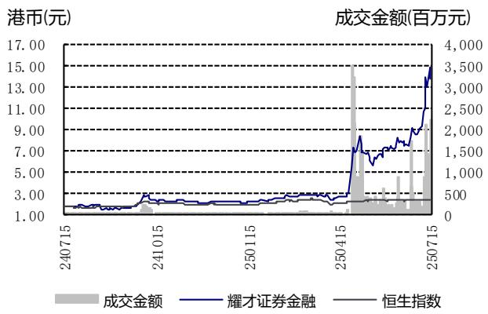

主要财务指标（公司财年以 3.31为止）  

<table><tr><td>项目</td><td>2024A</td><td>2025A</td><td>2026E</td><td>2027E</td><td>2028E</td></tr><tr><td>营业收入(百万元)</td><td>846</td><td>972</td><td>1,441</td><td>1,729</td><td>1,908</td></tr><tr><td>营业收入增长率</td><td>-4.03%</td><td>14.90%</td><td>48.17%</td><td>19.98%</td><td>10.38%</td></tr><tr><td>归母净利润(百万元)</td><td>559</td><td>618</td><td>925</td><td>1,119</td><td>1,255</td></tr><tr><td>归母净利润增长率</td><td>-9.95%</td><td>10.52%</td><td>49.83%</td><td>20.93%</td><td>12.14%</td></tr><tr><td>摊薄每股收益(元)</td><td>0.33</td><td>0.36</td><td>0.55</td><td>0.66</td><td>0.74</td></tr><tr><td>每股经营性现金流净额</td><td>0.83</td><td>-0.09</td><td>0.54</td><td>0.81</td><td>1.01</td></tr><tr><td>ROE(归属母公司)(摊薄)</td><td>38.69%</td><td>41.13%</td><td>38.07%</td><td>31.49%</td><td>26.08%</td></tr><tr><td>P/E</td><td>5.10</td><td>7.58</td><td>25.35</td><td>20.96</td><td>18.69</td></tr><tr><td>P/B</td><td>1.97</td><td>3.12</td><td>9.65</td><td>6.60</td><td>4.87</td></tr></table>

来源：公司年报、国金证券研究所

# 内容目录

一、耀才证券金融概况：牌照齐全的老牌香港本土券商，经纪佣金+孖展融资利息收入为最主要营收来源....4

1.1历史沿革：香港平佣始祖，香港地区牌照齐全. 4  
1.2股权结构：股权结构集中，创始人始终为第一大控股股东. 4  
1.3商业模式：经纪佣金 $^ { + }$ 利息收入为最主要营收来源. 5  
1.4财务情况：收入随市场行情波动，盈利能力较强. 6  
二、核心逻辑：港股交易贝塔 $^ +$ 蚂蚁赋能打开想象空间.. 6  
2.1港股交易贝塔，公司经纪佣金收入与港股大盘成交金额走势趋同. 6  
2.2 蚂蚁控股要约收购公司，打开成长天花板.. 7  
2.2.1要约细则：蚂蚁控股于2025年4月通过上海云进向公司发起要约收购. 7  
2.2.2 蚂蚁控股概况：组织架构调整，蚂蚁国际、OceanBase和蚂蚁数科独立运营， 7  
2.2.3要约收购完成后的想象空间：产品改造 $^ +$ 潜在导流 $^ +$ 虚拟资产业务. 10  
三、同业对比：香港券商市场始终竞争激烈，公司对比富途有较大空间. 11  
四、盈利预测及投资建议. 12  
4.1盈利预测. 12  
4.2投资建议. 13  
五、风险提示.. 13

# 图表目录

图表1：公司牌照列表. 4  
图表2：公司线下分行分布. 4  
图表3：公司股权结构（要约收购前) 5  
图表4：公司营收构成（FY2021-FY2025) 5  
图表5：公司商业模式拆解（FY2025 数据) 5  
图表6：公司开户数量变化趋势. 5  
图表7：公司客户资产变化趋势. 5  
图表8：公司日均孖展借贷变化趋势. 6  
图表9：测算的融资利率变化趋势. 6  
图表10：公司营收变化趋势. 6  
图表11：公司净利润变化趋势.. 6  
图表 12：公司佣金收入与港股大盘增速拟合程度.. 7  
图表13：公司日均孖展借贷与港股大盘增速拟合程度. 7  
图表14：蚂蚁控股股权结构. 8  
图表15：蚂蚁国际2024年回顾. 9  
图表16：OceanBase 客户数趋势及客户结构.. 9  
图表 17：Alipay HK 覆盖范围.. 10  
图表18：联交所各组别参与者市场占有率 11  
图表19：耀才证券金融与同业对比. 12  
图表20：分业务营收预测（单位：百万港元) 12  
图表21：历史上HIBOR 变化对公司孖展融资利率影响. 13  
图表22：成本和费用预测（单位：百万港元) 13  
图表23：估值对比. 13

# 一、耀才证券金融概况：牌照齐全的老牌香港本土券商，经纪佣金 $^ +$ 孖展融资利息收入为最主要营收来源

# 1.1历史沿革：香港平佣始祖，香港地区牌照齐全

公司成立于 1995 年；于 2003 年率先响应政府取消最低佣金制度的号召，将佣金由 0.25%大幅调低至 0.05%；于 2005 年推出网上证券交易服务；于 2010 年在香港联交所上市。公司在香港地区牌照齐全，获有香港证监会下发的第1/2/3/4/5/7/9 类牌照。

图表1：公司牌照列表  

<table><tr><td colspan="2">公司名称 牌照情况</td><td>获牌时间</td></tr><tr><td rowspan="2">耀才期货及商品有限公司</td><td>第2类 (期货合约交易)</td><td>2004年12月3日</td></tr><tr><td>第5类（就期货合约提供意见）</td><td>2011年2月15日</td></tr><tr><td rowspan="3"></td><td>第1类 （证券交易)</td><td>2004年12月3日</td></tr><tr><td>耀才证券国际（香港）有限公司第4类（就证券提供意见）</td><td>2009年10月5日</td></tr><tr><td>第7类（提供自动化交易服务)</td><td>2012年3月12日</td></tr><tr><td>耀才资产管理有限公司</td><td>第9类(提供资产管理）</td><td>2012年3月26日</td></tr><tr><td>耀才环球外汇有限公司</td><td>第3类 (杠杆外汇交易)</td><td>2013年3月11日</td></tr></table>

来源：SFC，国金证券研究所

公司于2007 年将香港总办事处选址中环永安集团大厦；于2009 年在荃湾开设首家分行；于2013 年在九龙区建立总办事处。截至目前，公司共有两处总办事处，共有9 家分行，其中九龙总办事处、上水、湾仔、旺角分行实施7天营业。

  
图表2：公司线下分行分布  
来源：公司公告，国金证券研究所

# 1.2 股权结构：股权结构集中，创始人始终为第一大控股股东

公司股权结构较为集中，创始人叶茂林先生始终为第一大控股股东，截至 2025 年4 月（要约收购前)，其持股比例为 50.55%。2025 年4 月，蚂蚁控股通过其全资子公司上海云进对叶茂林先生 50.55%股份发起要约收购。

  
图表3：公司股权结构（要约收购前）  
来源：公司公告，国金证券研究所

# 1.3商业模式：经纪佣金 $^ +$ 利息收入为最主要营收来源

经纪佣金+利息收入为最主要营收来源，占比营收始终维持在 $9 9 \%$ 左右，其中FY2025占收比下降主要由于收入口径确认变化，将手续费及结算费收入归类于营收所致。

根据FY2025 数据，1）经纪佣金收入中，证券经纪收入、香港期货及期权经纪收入为主要来源，分别占比总营收36%/12%；2）利息收入中，孖展融资利息收入为唯一来源；3）其他收入中，手续费及结算费收入为最主要来源。

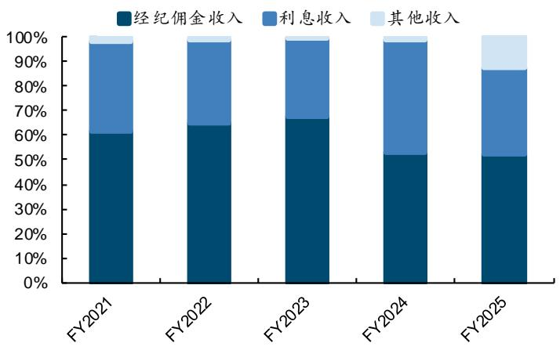  
图表4：公司营收构成（FY2021-FY2025)  
来源：公司公告，国金证券研究所

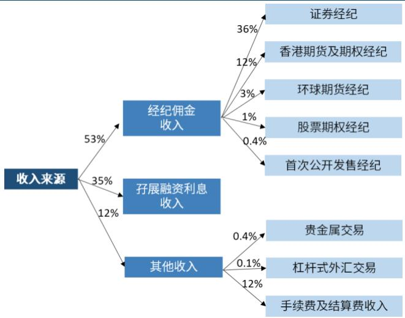  
图表5：公司商业模式拆解（FY2025数据）  
来源：公司公告，国金证券研究所

拆解主营业务背后驱动因素来看，1）经纪佣金收入主要由交易量和佣金率驱动，其中交易量可以进一步拆分为入金客户数\*客均资产\*换手率，该收入主要受入金客户数、客户资产以及市场情绪影响。公司仅披露了开户数量及客户资产，客户户口数从FY2015 的 14万提升至FY2025 的 59 万，CAGR 达到 16%；客户资产从 FY2015 末的 307亿港元提升至FY2025末的 642亿港元，CAGR达到 $8 \%$ 。

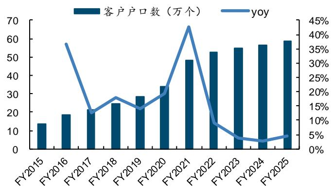  
图表6：公司开户数量变化趋势  
来源：公司公告，国金证券研究所

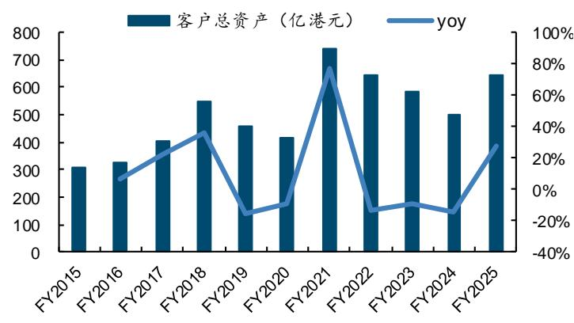  
图表7：公司客户资产变化趋势  
来源：公司公告，国金证券研究所

2）孖展融资利息收入主要由融资余额和利率驱动。公司日均孖展借贷由FY2017 的 45 亿港元提升至FY2025 的 49 亿港元，孖展借贷余额整体受股市活跃度影响。根据公司披露的孖展融资利息收入/日均孖展借贷测算得出公司FY2025 孖展借贷利率为 6.88%，该利率主要受到市场利率变化影响。

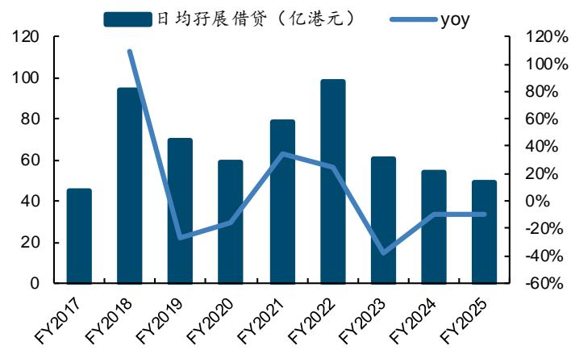  
图表8：公司日均孖展借贷变化趋势  
来源：公司公告，国金证券研究所（FY2017之前该指标未披露）

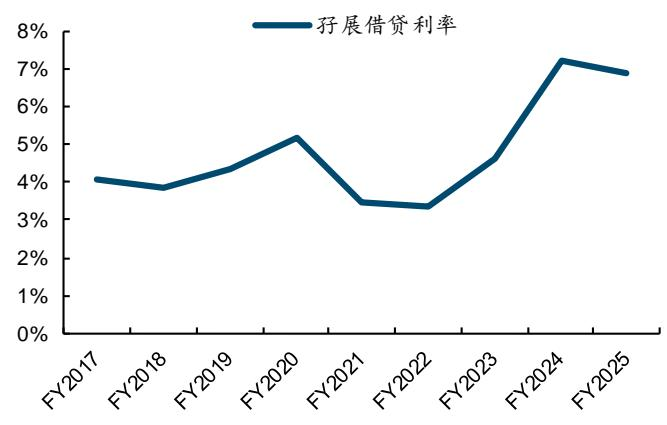  
图表9：测算的融资利率变化趋势

来源：公司公告，国金证券研究所（FY2017之前该指标未披露）

# 1.4 财务情况：收入随市场行情波动，盈利能力较强

公司营收和净利润整体受到市场行情波动影响，营收由FY2015的 5.2亿港元提升至FY2025的9.2 亿港元，CAGR 达到 $7 \%$ ；净利润由FY2015的2.2亿港元提升至FY2025的6.2亿港元，CAGR 达到 $1 1 \%$ 。

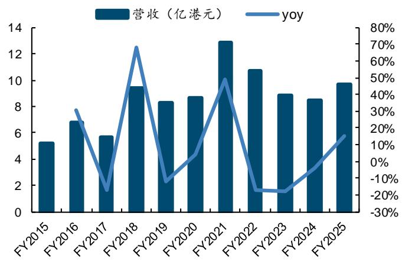  
图表10：公司营收变化趋势  
来源：公司公告，国金证券研究所

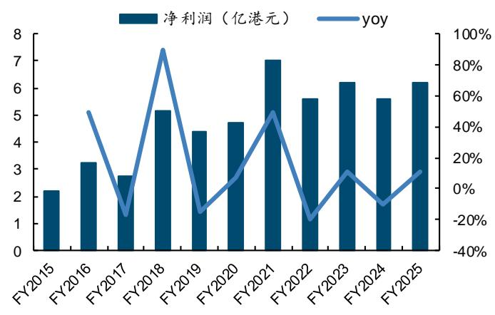  
图表11：公司净利润变化趋势  
来源：公司公告，国金证券研究所

# 二、核心逻辑：港股交易贝塔 $^ +$ 蚂蚁赋能打开想象空间

# 2.1港股交易贝塔，公司经纪佣金收入与港股大盘成交金额走势趋同

公司经纪佣金收入核心驱动为港股市场行情，经纪佣金收入大致与港股总成交金额走势趋同，尤其是经纪佣金收入中的证券经纪业务与大盘趋同性较强。公司孖展融资利息收入核心驱动为市场利率及市场行情，一般在股市较活跃的时候，投资者倾向于多做一些两融。

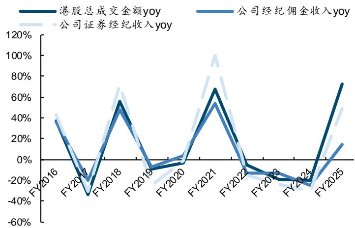  
图表12：公司佣金收入与港股大盘增速拟合程度  
来源：iFind，公司公告，国金证券研究所

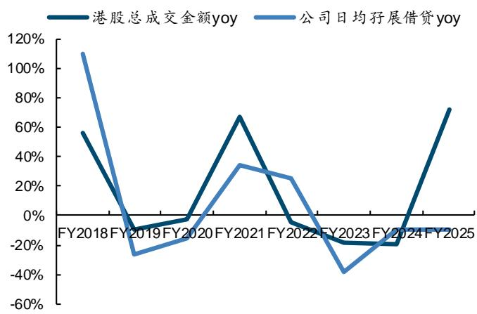  
图表13：公司日均孖展借贷与港股大盘增速拟合程度  
来源：iFind，公司公告，国金证券研究所

# 2.2 蚂蚁控股要约收购公司，打开成长天花板

# 2.2.1 要约细则：蚂蚁控股于 2025 年4 月通过上海云进向公司发起要约收购

2025 年4月25日，上海云进通过旗下子公司（Innovatech Empowerment CompanyLimited）向耀才证券金融发起要约收购。上海云进由蚂蚁控股全资拥有，且蚂蚁财富是上海云进的全资子公司。  
本次交易拟收购耀才证券金融控股股东叶茂林先生及其一致行动人的所有股权，交易股份约 8.58 亿股，占已发行股份总数约50.55%，要约收购价格为3.28 港元/股，较公司最后交易日(2025 年4 月 22 日)在联交所的收盘价 2.79 港元/股溢价约 17.6%。本次交易总现金代价为28.14亿港元，且已支付了10%的定金。  
根据公司FY2024 业绩，本次要约收购交易在 10X PE左右；根据 FY2025 业绩，则交易在9XPE左右。  
本次要约收购将1)巩固耀才证券金融作为香港本地领先零售经纪商的市场地位；2)加速公司的数字化转型；3）重新调整公司资金分配策略，投资于未来增长；4）截至公告日期（2025 年4 月25 日)，要约人打算在要约截止后维持股份在联交所的上市地位。  
本次收购目前进程：公司于2025 年6 月13 日公告：1）要约人已根据《证券及期货条例》第132（1）条向证监会申请批准各要约人及其他相关人士成为各受规管集团公司的主要股东；2）要约人已根据《企业境外投资管理办法》的规定，就购股协议项下拟进行的交易向中国国家发展和改革委员会提交初步报告文件。公司于 2025 年7月 11日公告：要约人一直与有关部门（即证监会及中国国家发展和改革委员会）保持积极沟通并取得进展。

# 2.2.2 蚂蚁控股概况：组织架构调整，蚂蚁国际、OceanBase 和蚂蚁数科独立运营

截至 2025 年 4 月，蚂蚁控股的前三大股东分别为阿里巴巴、杭州君瀚和杭州君澳，持股比例分别为 33%、31%和 22%。其中，杭州君瀚由马云、韩歆毅、张彧、黄辰立、周芸分别持股 20%；杭州君澳由井贤栋、邵晓锋、倪行军、赵颖、吴敏芝分别持股 20%。

  
图表14：蚂蚁控股股权结构  
来源：公司公告，国金证券研究所

蚂蚁集团于 2024 年3 月进行新一轮组织架构调整，任命韩歆毅为集团总裁，向董事长井贤栋汇报，此外，蚂蚁国际、OceanBase 和蚂蚁数科分别成立董事会，独立面向市场，实行董事会领导下的CEO 负责制。具体来看拆分出来独立运营的三大企业：

1）蚂蚁国际（董事长为井贤栋）：

总部位于新加坡，在全球30多处均有办公室。  
四大业务板块包括：全球整合钱包门户服务（Alipay+)、全球商家支付服务（Antom)、全球企业账户服务（WorIdFirst)及场景金融业务（Bettr)。Alipay+：通过与36个电子钱包及国家二维码支付体系合作，连接全球超 17亿用户和1亿商户。  
Antom（安通环球)：目前，Antom 的收单服务支持中国内地及香港、日本、泰国、马来西亚、印尼、菲律宾、越南、新加坡、美国、英国及欧盟等超过 50个国家及地区的商家，为它们连接包括银行卡、网银、电子钱包等在内的 300+国际主流和本地常用付款方式。  
WorldFirst（万里汇)：为全球中小企业提供优质的跨境收付兑服务，于2019 年加入蚂蚁集团。截至目前，WorldFirst 共计覆盖210+国家和地区，拥有全球 60+支付牌照，累计交易额超 3000 亿美元。  
Bettr：数字信贷平台，目前主要服务巴西、中国香港和泰国市场，即将拓展越南市场。  
区块链相关:蚂蚁国际推出的名为Whale的实时多币种清结算全球财资管理平台，运用区块链、加密技术和AI能力，支持全天候即时外汇结算，将原本1至3天的结算周期缩短至分钟级甚至秒级。2024 年，蚂蚁国际处理的1 万亿美元资金流中，有超过三分之一是通过Whale平台进行。  
稳定币相关：根据界面新闻，蚂蚁国际表示将在相关通道开启后尽快提交香港稳定币申请，正在全球财资管理方面加速投资、拓展合作，将AI、区块链和稳定币创新投入真实可靠的大规模应用。

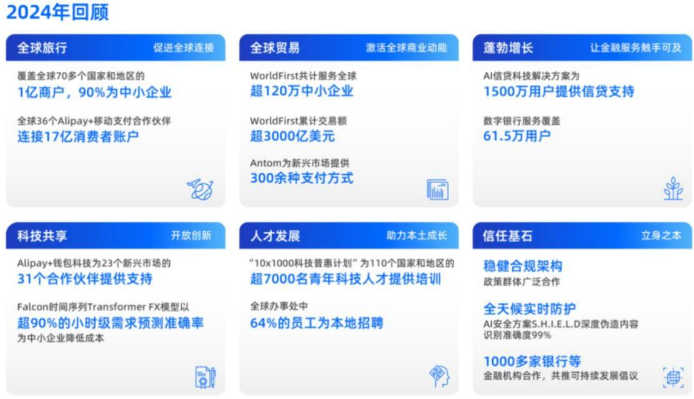  
图表15：蚂蚁国际2024年回顾  
来源：公司官网，国金证券研究所

2)OceanBase（董事长为倪行军):

) 创立于2010 年，是完全自主研发的企业级原生分布式数据库。两大部署场景包括：专有云和公有云。截至 2024 年 10 月，0ceanBase 客户数已突破2000 家，连续4 年客户数增速超过 $100 \%$ 。专有云领域：在金融领域，已实现从头部金融核心系统到中腰部金融机构的规模化复制，截止2024 年 10 月，正服务于全部政策性银行、5/6 国有大行，资产规模万亿以上银行客户超 20 家、千亿以上银行客户近 100 家，及 70%的头部保险、75%的头部证券、50%的头部基金公司。在政企领域，不仅支持运营商核心系统，还实现了服务各省人社、能源、交通、公共服务的新突破。公有云领域：在全球范围内提供一致的云数据库服务，覆盖美洲、欧洲、亚洲 30 余个地理区域的100 多个可用区，支持阿里云、亚马逊云科技、谷歌云、华为云、腾讯云等主流公有云基础设施。根据IDC发布的《中国金融行业分布式事务型数据库市场份额，2023:技术验证结束，迎接高速增长》，OceanBase已位列金融行业本地部署市场份额第一。

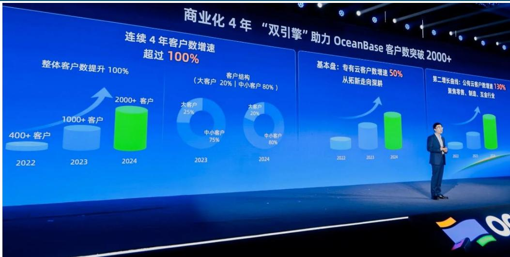  
图表16：0ceanBase客户数趋势及客户结构  
来源：公司官网，国金证券研究所

3）蚂蚁数科（董事长为韩歆毅）：

2025 年4月，蚂蚁数科宣布海外总部落户香港，成为香港特区政府“重点企业伙伴”。  
三大业务板块包括：云服务（包括云原生PaaS平台SOFAStack、移动开发产品mPaaS 等）、AI服务（安全风控蚁盾等）、区块链服务（蚂蚁链）。  
根据 IDC 发布的《中国 BaaS 市场份额，2023》，蚂蚁链以 26.5%的市场占有率位居中国 BaaS 市场份额首位，也是蚂蚁链连续第四年位列中国BaaS 市场第一。区块链相关：蚂蚁数科主要业务之一即是区块链，且深度参与了香港金管局EnsembIe项目，RWA跨境融资项目成为全球实体资产通证化标杆。  
稳定币相关：根据财新，蚂蚁数科已经启动申请香港稳定币牌照，目前已跟监管进行过多轮沟通。

# 2.2.3 要约收购完成后的想象空间：产品改造+潜在导流+虚拟资产业务

我们认为，在要约收购完成，蚂蚁入驻耀才后，或将从以下几个方面赋能耀才：

1）依托于蚂蚁的技术优势，对公司现有交易平台进行数字化改造，拓宽用户群体并提升存量用户的使用体验。公司公告里明确指出：

“借助要约人集团的产品及技术创新能力，本集团有望将其服务扩展至年龄层分布更广泛的客户，并提升现有客户的体验”。  
■ “要约人集团的实力将促进本集团的数字化及转型”。  
□ “要约人集团将加快本集团的业务转型，成为以尖端技术为后盾的领先交易平台”。

2）依托于蚂蚁的客户基础，存在为耀才导流的可能性。

公司公告里明确指出“凭借广泛的能力及基础设施，包括客户覆盖、智能决策、风险管理解决方案及创新产品开发等能力，要约人集团将加快本集团的业务转型”。  
最先导流的或将是AIipay HK，目前AIipay HK 拥有超过450 万用户和 17万商户。更长远来看，蚂蚁海外业务版图沉淀了大量的资金，耀才的牌照或为蚂蚁全球财资管理的重要一环。

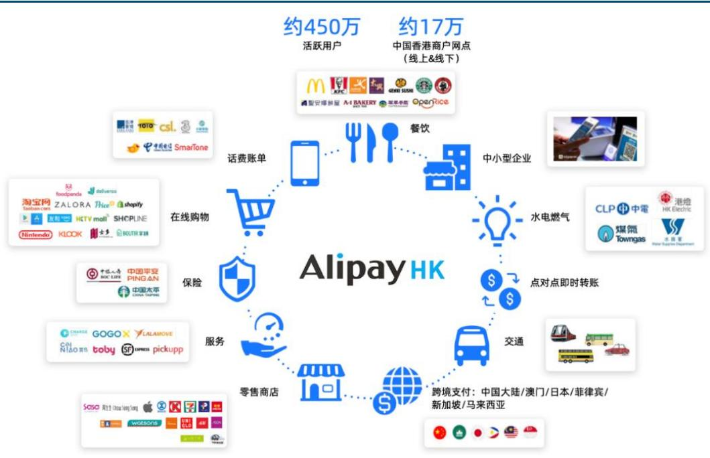  
图表17：Alipay HK覆盖范围  
来源：Antom官方公众号，国金证券研究所

3）依托于蚂蚁在 web3.0 技术、牌照等方面布局，或将打开耀才虚拟资产业务想象空间。

蚂蚁数科和蚂蚁国际正在积极布局香港稳定币发行，如若能拿到香港稳定币发行牌照，耀才将现有的1号牌进行升级即可接入SFC认可的虚拟资产交易，包括稳定币，耀才或将成为蚂蚁稳定币的主要分销商之一。截至 2025 年7月14 日，共有 43 家进行了 1 号牌的升级。  
耀才将现有的4号牌进行升级即可就虚拟资产提供意见。截至2025年7月14日，共有 37 家进行了4号牌的升级。  
耀才将现有的 9 号牌进行升级即可管理投资超过 10%于虚拟资产的投资组合。截至2025年7月14日，共有41家进行了9号牌的升级。  
不排除耀才向SFC提交虚拟资产交易平台VATP 牌照申请的可能性。

# 三、同业对比：香港券商市场始终竞争激烈，公司对比富途有较大空间

香港券商市场竞争始终较激烈，根据香港交易所官网，截至 2025 年6 月30 日，共计 519家持牌机构。此外，头部集中趋势显著，2025 年5 月，组别A（第 1-14 名）市占率高达71%。根据 AIP0，耀才证券金融位居 2025 年 6 月综合成交排行榜的第 21位。

图表18：联交所各组别参与者市场占有率  

<table><tr><td colspan="4">組別A (第1至14名)</td><td colspan="2">组別B (第15至65名)</td><td colspan="2">組別c (第65名以後)</td></tr><tr><td>月/年</td><td></td><td>範圍 (%)</td><td>佔總數百 分比(%)</td><td>範圍 (%)</td><td>佔總數百 分比(%)</td><td>範圍 (%)</td><td>佔總數百 分比(%)</td></tr><tr><td>6月</td><td>24</td><td>9.83-2.51</td><td>68.34</td><td>2.04-0.11</td><td>27.73</td><td>0.11-0.00</td><td>3.93</td></tr><tr><td>7月</td><td>24</td><td>9.04-2.45</td><td>67.97</td><td>2.01-0.12</td><td>28.24</td><td>0.11-0.00</td><td>3.79</td></tr><tr><td>8月</td><td>24</td><td>8.85-2.43</td><td>67.70</td><td>1.95-0.11</td><td>28.75</td><td>0.11-0.00</td><td>3.55</td></tr><tr><td>9月</td><td>24</td><td>10.37-2.79</td><td>69.53</td><td>2.19-0.12</td><td>26.81</td><td>0.12-0.00</td><td>3.66</td></tr><tr><td>10月</td><td>24</td><td>11.52 -2.36</td><td>69.20</td><td>2.35-0.11</td><td>27.08</td><td>0.10-0.00</td><td>3.72</td></tr><tr><td>11月</td><td>24</td><td>11.51-2.64</td><td>69.68</td><td>2.08-0.11</td><td>26.85</td><td>0.10-0.00</td><td>3.47</td></tr><tr><td>12月</td><td>24</td><td>11.12-2.47</td><td>69.61</td><td>2.00-0.10</td><td>26.89</td><td>0.10-0.00</td><td>3.50</td></tr><tr><td>1月</td><td>25</td><td>11.53-2.41</td><td>70.37</td><td>2.00-0.11</td><td>26.17</td><td>0.11-0.00</td><td>3.46</td></tr><tr><td>2月</td><td>25</td><td>12.61-2.36</td><td>71.09</td><td>2.30-0.11</td><td>25.39</td><td>0.11-0.00</td><td>3.52</td></tr><tr><td>3月</td><td>25</td><td>12.28-2.29</td><td>72.33</td><td>2.16-0.10</td><td>24.43</td><td>0.10-0.00</td><td>3.24</td></tr><tr><td>4月</td><td>25</td><td>14.31-2.37</td><td>74.15</td><td>1.94-0.10</td><td>22.75</td><td>0.10-0.00</td><td>3.10</td></tr><tr><td>5月</td><td>25</td><td>13.84-2.57</td><td>70.97</td><td>2.24-0.12</td><td>25.46</td><td>0.12-0.00</td><td>3.57</td></tr></table>

来源：香港交易所官网，国金证券研究所

我们将耀才证券金融与香港零售券商龙头富途控股(FUTU)和正在大力布局香港市场的互联网券商龙头老虎证券（TIGR）的关键指标对比来看，耀才目前与富途仍有较大空间（考虑到未来蚂蚁入驻或将改造耀才交易界面等)，详细对比见下表。

图表19：耀才证券金融与同业对比  

<table><tr><td>指标</td><td>富途控股</td><td>老虎证券</td><td>耀才证券金融</td></tr><tr><td>成立时间</td><td>2007</td><td>2014</td><td>1995</td></tr><tr><td>上市时间</td><td>2019</td><td>2019</td><td>2010</td></tr><tr><td>公司类别</td><td>全球拓张的互联网券商</td><td>全球拓张的互联网券商</td><td>香港本土券商</td></tr><tr><td>总市值（截至7.10)</td><td>200亿美元</td><td>18亿美元</td><td>231亿港元</td></tr><tr><td>PE估值(2025)</td><td>20X</td><td>17X</td><td>FY2026E：21X</td></tr><tr><td>营收（2024)</td><td>135.9亿港币(17.5亿美元，yoy+36%)</td><td>3.92亿美元(yoy+44%)</td><td>FY2025：9.72亿港元(1.24亿美元，yoy+15%)</td></tr><tr><td>2020-2024营收CAGR</td><td>42%</td><td>30%</td><td>FY2021-FY2025: -7%</td></tr><tr><td>净利润(2024)</td><td>54.3亿港币(7亿美元，yoy+27%)</td><td>6135万美元(yoy+86%)</td><td>FY2025：6.18亿港元（(0.79亿美元，yoy+11%)</td></tr><tr><td>2020-2024净利润CAGR</td><td>42%</td><td>34%</td><td>FY2021-FY2025: -3%</td></tr><tr><td>净利率 (2024)</td><td>40%</td><td>16%</td><td>FY2025:64%</td></tr><tr><td>经调整净利润（2024)</td><td>57.7亿港币（7.4亿美元，yoy+26%)</td><td>7046万美元(yoy+65%)</td><td>NA</td></tr><tr><td>经调整净利率</td><td>42%</td><td>18% 其他收 收入</td><td>NA</td></tr><tr><td>收入拆分(2024)</td><td>人 利息收入 佣全收入 49%</td><td>融责品 务费收 佣全数入 利息收入 49%</td><td></td></tr><tr><td>交易品类</td><td></td><td></td><td>包括股票（港股、美股、A股通、新加坡股、澳股）、期货包括股票（港股、A股通、美股、合 、新加坡股、日股、澳股、</td></tr><tr><td>交易费率（2024) 客户地区</td><td>混合佣金率0.078%</td><td>混合佣金率0.029% 中国、中国香港、新加坡、美国、澳大利亚、新西兰</td><td>NA</td></tr><tr><td></td><td>中国、中国香港、新加坡、马亚来、西亚、日本、美国、加拿</td><td></td><td>中国香港为主</td></tr><tr><td>客户数量(2024末）</td><td>入金客户：24万人次，yoy+42%</td><td>入金客户：1095人次，yoy+1%</td><td>开户客户：25Q1末：58.7万，yoy+4%</td></tr><tr><td>客户资产 (2024末)</td><td>总资产：7433港元(约5元4.)0+53%)；</td><td>总资产：47亿美元（(不到4成在盈，yoy+36%）</td><td>总资产（2501）642元(2亿元，yoy+28%）</td></tr></table>

来源：各公司公告，国金证券研究所

# 四、盈利预测及投资建议

# 4.1盈利预测

收入端：

公司经纪佣金收入大致与港股大盘行情走势相关，根据FY2026 至今为止港股大盘成交金额来看，2025 年 4-6 月港股日均成交金额同比大增 97%，我们假设 FY2026 后续月份港股维持该交易热度。根据历史数据来看，公司经纪佣金收入与港股大盘成交额趋势相同，据此，我们预计FY2026/FY2027/FY2028公司经纪佣金收入同比 $+ 6 5 \% / + 2 5 \% / + 1 5 \%$

公司孖展利息收入受到日均孖展余额和市场利率影响，日均孖展余额大致与市场成交活跃度相关，但考虑到后续降息（参考历史上降息，对公司的孖展融资利率有直接影响，详见图表21)，我们预计FY2026/FY2027/FY2028 公司孖展融资利息收入同比+30%/+11%/+1%。

我们假设其他收入FY2026/FY2027/FY2028分别同比 $+ 2 9 \% / + 1 9 \% / + 1 0 \%$ 。  
综上，公司FY2026/FY2027/FY2028总营收分别同比 $+ 4 8 \% / + 2 0 \% / + 1 0 \%$ 。

图表20：分业务营收预测（单位：百万港元）  

<table><tr><td></td><td>FY2024A</td><td>FY2025A</td><td>FY2026E</td><td>FY2027E</td><td>FY2028E</td></tr><tr><td>经纪佣金收入</td><td>446</td><td>511</td><td>843</td><td>1054</td><td>1212</td></tr><tr><td>yoy</td><td></td><td>15%</td><td>65%</td><td>25%</td><td>15%</td></tr><tr><td>孖展融资利息收入</td><td>392</td><td>339</td><td>441</td><td>487</td><td>490</td></tr><tr><td>yoy</td><td></td><td>-13%</td><td>30%</td><td>11%</td><td>1%</td></tr><tr><td>其他收入</td><td>7</td><td>122</td><td>157</td><td>188</td><td>206</td></tr><tr><td>yoy</td><td></td><td>1631%</td><td>29%</td><td>19%</td><td>10%</td></tr><tr><td>总收入</td><td>845</td><td>972</td><td>1441</td><td>1729</td><td>1908</td></tr><tr><td>yoy</td><td></td><td>15%</td><td>48%</td><td>20%</td><td>10%</td></tr></table>

来源：公司公告，国金证券研究所预测

图表21：历史上HIBOR变化对公司孖展融资利率影响  

<table><tr><td></td><td>FY2018</td><td>FY2019</td><td>FY2020</td><td>FY2021</td><td>FY2022</td><td>FY2023</td><td>FY2024</td><td>FY2025</td></tr><tr><td>HIBOR:1个月:平均值</td><td>0.6%</td><td>1.5%</td><td>2.0%</td><td>0.4%</td><td>0.1%</td><td>2.2%</td><td>4.7%</td><td>4.2%</td></tr><tr><td>公司孖展借贷利率</td><td>3.8%</td><td>4.4%</td><td>5.2%</td><td>3.5%</td><td>3.3%</td><td>4.6%</td><td>7.2%</td><td>6.9%</td></tr></table>

来源：Wind，公司公告，国金证券研究所

盈利端：

成本和费用按照性质来分，我们预测员工成本占收比，折旧及摊销占收比相对保持稳定。我们预计公司 FY2026/FY2027/FY2028 净利润分别为 9.3/11.2/12.6 亿港元，分别同比$+ 5 0 \% / + 2 1 \% / + 1 2 \%$ ，（注：以上预测均未考虑蚂蚁带来的潜在业务空间）

图表22：成本和费用预测（单位：百万港元）  

<table><tr><td></td><td>FY2024A</td><td>FY2025A</td><td>FY2026E</td><td>FY2027E</td><td>FY2028E</td></tr><tr><td>员工成本</td><td>139</td><td>161</td><td>224</td><td>280</td><td>307</td></tr><tr><td>占比营收</td><td>16%</td><td>17%</td><td>16%</td><td>16%</td><td>16%</td></tr><tr><td>摊销及折旧</td><td>66</td><td>59</td><td>88</td><td>105</td><td>116</td></tr><tr><td>占比营收</td><td>8%</td><td>6%</td><td>6%</td><td>6%</td><td>6%</td></tr><tr><td>其他经营开支</td><td>164</td><td>248</td><td>318</td><td>361</td><td>382</td></tr><tr><td>占比营收</td><td>19%</td><td>26%</td><td>22%</td><td>21%</td><td>20%</td></tr></table>

来源：公司公告，国金证券研究所预测

# 4.2 投资建议

我们选取与公司同类型的互联网券商富途控股、盈透证券和东方财富作为可比公司，行业平均 PE 为 2026 年平均 PE 为 26X PE。我们给予耀才证券金融 FY2027 25X PE，对应目标价为16.5 港元，首次覆盖给予“买入”评级。

图表23：估值对比  

<table><tr><td rowspan="2">代码</td><td rowspan="2">公司名称</td><td rowspan="2">股价(羌元元</td><td colspan="5">EPS（BBG一致预期）</td><td rowspan="2"></td><td colspan="4">PE</td></tr><tr><td>2023A</td><td>2024A</td><td>2025E</td><td>2026E</td><td></td><td></td><td>2025E</td><td>2026E</td><td>2027E</td></tr><tr><td>FUTU</td><td>富途控股</td><td>146.9</td><td>3.91</td><td>4.99</td><td>7.14</td><td>8.28</td><td>2027E 9.77</td><td>2023A 14</td><td>2024A 16</td><td>21</td><td>18</td><td>15</td></tr><tr><td>1BKR</td><td>盈透证券</td><td>59.6</td><td>1.43</td><td>1.71</td><td>1.92</td><td>2.1</td><td>2.14</td><td>14</td><td>26</td><td>31</td><td>28</td><td>28</td></tr><tr><td>300059.SZ东方财富</td><td></td><td>23.53</td><td>0.52</td><td>0.59</td><td>0.69</td><td>0.77</td><td>0.84</td><td>27</td><td>42</td><td>34</td><td>31</td><td>28</td></tr><tr><td></td><td></td><td></td><td></td><td>平均值</td><td></td><td></td><td></td><td></td><td></td><td>29</td><td>26</td><td>24</td></tr><tr><td>1428.HK</td><td>耀才证券金融</td><td>13.82</td><td>0.33</td><td>0.36</td><td>0.55</td><td>0.66</td><td>0.74</td><td>4</td><td>5</td><td>25</td><td>21</td><td>19</td></tr></table>

来源：BBG、国金证券研究所（注：股价截至 7.15，美股股价和 EPS 单位为美元，A 股为人民币，港股为港元；可比公司 2025E 对应耀才 FY2026，以此类推）

# 五、风险提示

1）要约收购进展不及预期。公司目前还处于被蚂蚁控股要约收购阶段，如若进展不及预期，或将影响公司潜在业务空间。

2）市场成交量低迷。公司业务性质具有强市场贝塔属性，如若港股及衍生品市场成交量低迷，或将影响公司业绩。

3）行业间竞争加剧。如若香港券商行业竞争进一步加剧，或将影响公司市占率。

# 附录：三张报表预测摘要

损益表(港币百万)   

<table><tr><td>主营业务收入</td><td>2023A</td><td>2024A 846</td><td>2025A 972</td><td>2026E 1,441</td><td>2027E 1,729</td><td>2028E</td></tr><tr><td></td><td>882 -17.4%</td><td>-4.0%</td><td>14.9%</td><td>48.2%</td><td>20.0%</td><td>1,908 10.4%</td></tr><tr><td>增长率 主营业务成本</td><td>0</td><td>0</td><td>0</td><td>0</td><td>0</td><td>0</td></tr><tr><td>%销售收入</td><td>0.0%</td><td>0.0%</td><td>0.0%</td><td>0.0%</td><td>0.0%</td><td>0.0%</td></tr><tr><td>毛利</td><td>0</td><td>0</td><td>0</td><td>0</td><td>0</td><td>0</td></tr><tr><td>%销售收入</td><td>0.0%</td><td>0.0%</td><td>0.0%</td><td>0.0%</td><td>0.0%</td><td>0.0%</td></tr><tr><td>营业税金及附加</td><td>0</td><td>0</td><td>0</td><td>0</td><td></td><td></td></tr><tr><td>%销售收入</td><td>0.0%</td><td>0.0%</td><td>0.0%</td><td></td><td>0</td><td>0</td></tr><tr><td>销售费用</td><td>0</td><td>0</td><td>0</td><td>0.0%</td><td>0.0%</td><td>0.0%</td></tr><tr><td>%销售收入</td><td>0.0%</td><td>0.0%</td><td>0.0%</td><td>0</td><td>0</td><td>0</td></tr><tr><td></td><td>0</td><td></td><td></td><td>0.0%</td><td>0.0%</td><td>0.0%</td></tr><tr><td>管理费用</td><td></td><td>0</td><td>0</td><td>312</td><td>385</td><td>423</td></tr><tr><td>%销售收入</td><td>0.0%</td><td>0.0%</td><td>0.0%</td><td>21.6%</td><td>22.3%</td><td>22.2%</td></tr><tr><td>研发费用 %销售收入</td><td>0</td><td>0</td><td>0</td><td>0</td><td>0</td><td>0</td></tr><tr><td>息税前利润（EBIT)</td><td>0.0% 806</td><td>0.0% 865</td><td>0.0%</td><td>0.0%</td><td>0.0%</td><td>0.0%</td></tr><tr><td>%销售收入</td><td>91.5%</td><td>102.2%</td><td>891</td><td>1,188</td><td>1,359</td><td>1,480</td></tr><tr><td>财务费用</td><td>114</td><td></td><td>91.6%</td><td>82.5%</td><td>78.6%</td><td>77.6%</td></tr><tr><td>%销售收入</td><td></td><td>260</td><td>214</td><td>180</td><td>140</td><td>110</td></tr><tr><td></td><td>13.0%</td><td>30.7%</td><td>22.0%</td><td>12.5%</td><td>8.1%</td><td>5.8%</td></tr><tr><td></td><td></td><td></td><td></td><td></td><td></td><td></td></tr><tr><td>投资收益 %税前利润</td><td>0</td><td>0</td><td>0</td><td>0</td><td>0</td><td>0</td></tr><tr><td>营业利润</td><td>0.0%</td><td>0.0%</td><td>0.0%</td><td>0.0%</td><td>0.0%</td><td>0.0%</td></tr><tr><td>营业利润率</td><td>696</td><td>624</td><td>631</td><td>1,188</td><td>1,359</td><td>1,480</td></tr><tr><td></td><td>78.9%</td><td>73.7%</td><td>64.9%</td><td>82.5%</td><td>78.6%</td><td>77.6%</td></tr><tr><td>营业外收支</td><td></td><td></td><td></td><td></td><td></td><td></td></tr><tr><td>税前利润</td><td>692</td><td>605</td><td>677</td><td>1,008</td><td>1,219</td><td>1,370</td></tr><tr><td>利润率</td><td>78.5%</td><td>71.5%</td><td>69.7%</td><td>70.0%</td><td>70.5%</td><td>71.8%</td></tr><tr><td>所得税</td><td>72</td><td>46</td><td>60</td><td>83</td><td>100</td><td>116</td></tr><tr><td>所得税率</td><td>10.3%</td><td>7.6%</td><td>8.8%</td><td>8.2%</td><td>8.2%</td><td>8.4%</td></tr><tr><td>净利润</td><td>621</td><td>559</td><td>618</td><td>925</td><td>1,119</td><td>1,255</td></tr><tr><td>少数股东损益</td><td></td><td></td><td></td><td></td><td></td><td></td></tr><tr><td></td><td>0</td><td>0</td><td>0</td><td>0</td><td>0</td><td>0</td></tr><tr><td>归属于母公司的净利润</td><td>621</td><td>559</td><td>618</td><td>925</td><td>1,119</td><td>1,255</td></tr><tr><td>净利率</td><td>70.4%</td><td>66.0%</td><td>63.5%</td><td>64.2%</td><td>64.7%</td><td>65.8%</td></tr></table>

现金流量表(港币百万)  

<table><tr><td></td><td>2023A</td><td>2024A</td><td>2025A</td><td>2026E</td><td>2027E</td><td>2028E</td></tr><tr><td>净利润</td><td>621</td><td>559</td><td>618</td><td>925</td><td>1,119</td><td>1,255</td></tr><tr><td>少数股东损益</td><td>0</td><td>0</td><td>0</td><td>0</td><td>0</td><td>0</td></tr><tr><td>非现金支出</td><td>-96</td><td>-79</td><td>-132</td><td>180</td><td>140</td><td>110</td></tr><tr><td>非经营收益 营运资金变动</td><td></td><td></td><td></td><td></td><td></td><td></td></tr><tr><td>经营活动现金净流</td><td>1,465</td><td>859</td><td>-703</td><td>-233</td><td>72</td><td>323</td></tr><tr><td></td><td>2,064</td><td>1,405</td><td>-159</td><td>923</td><td>1,371</td><td>1,723</td></tr><tr><td>资本开支</td><td>-15</td><td>-2</td><td>-6</td><td>-30</td><td>-30</td><td>-30</td></tr><tr><td>投资</td><td>-20</td><td>-1</td><td>90</td><td>0</td><td>0</td><td>0</td></tr><tr><td>其他</td><td>238</td><td>340</td><td>337</td><td>0</td><td>0</td><td>0</td></tr><tr><td>投资活动现金净流</td><td>203</td><td>338</td><td>421</td><td>-30</td><td>-30</td><td>-30</td></tr><tr><td>股权募资</td><td>0</td><td>0</td><td>0</td><td>0</td><td>0</td><td>0</td></tr><tr><td>债权募资</td><td>-805</td><td>-688</td><td>544</td><td>-600</td><td>-700</td><td>-700</td></tr><tr><td>其他</td><td>-1,472</td><td>-1,109</td><td>-774</td><td>-180</td><td>-140</td><td>-110</td></tr><tr><td>筹资活动现金净流</td><td>-2,277</td><td>-1,796</td><td>-230</td><td>-780</td><td>-840</td><td>-810</td></tr><tr><td>现金净流量</td><td>-20</td><td>-63</td><td>35</td><td>116</td><td>505</td><td>886</td></tr></table>

来源：公司年报、国金证券研究所

资产负债表(港币百万)   

<table><tr><td></td><td>2023A</td><td>2024A</td><td>2025A</td><td>2026E</td><td>2027E</td><td>2028E</td></tr><tr><td>货币资金</td><td>505</td><td>441</td><td>477</td><td>593</td><td>1,098</td><td>1,984</td></tr><tr><td>应收款项</td><td>7,019</td><td>6,370</td><td>7,049</td><td>7,257</td><td>7,267</td><td>6,961</td></tr><tr><td>存货</td><td>0</td><td>0</td><td>0</td><td>0</td><td>0</td><td>0</td></tr><tr><td>其他流动资产</td><td>66</td><td>75</td><td>4</td><td>16</td><td>25</td><td>18</td></tr><tr><td>流动资产</td><td>7,589</td><td>6,886</td><td>7,529</td><td>7,866</td><td>8,389</td><td>8,964</td></tr><tr><td>%总资产</td><td>98.2%</td><td>97.3%</td><td>97.9%</td><td>98.2%</td><td>98.5%</td><td>98.6%</td></tr><tr><td>长期投资</td><td>0</td><td>0</td><td>0</td><td>0</td><td>0</td><td>0</td></tr><tr><td>固定资产</td><td>89</td><td>112</td><td>62</td><td>42</td><td>32</td><td>27</td></tr><tr><td>%总资产</td><td>1.1%</td><td>1.6%</td><td>0.8%</td><td>0.5%</td><td>0.4%</td><td>0.3%</td></tr><tr><td>无形资产</td><td>6</td><td>6</td><td>6</td><td>6</td><td>6</td><td>6</td></tr><tr><td>非流动资产</td><td>140</td><td>192</td><td>161</td><td>141</td><td>131</td><td>126</td></tr><tr><td>%总资产</td><td>1.8%</td><td>2.7%</td><td>2.1%</td><td>1.8%</td><td>1.5%</td><td>1.4%</td></tr><tr><td>资产总计</td><td>7,729</td><td>7,078</td><td>7,691</td><td>8,007</td><td>8,521</td><td>9,090</td></tr><tr><td>短期借款</td><td>4,409</td><td>3,775</td><td>4,370</td><td>3,770</td><td>3,070</td><td>2,370</td></tr><tr><td>应付款项</td><td>1,464</td><td>1,703</td><td>1,664</td><td>1,610</td><td>1,659</td><td>1,635</td></tr><tr><td>其他流动负债</td><td>113</td><td>100</td><td>151</td><td>192</td><td>234</td><td>270</td></tr><tr><td>流动负债</td><td>5,986</td><td>5,577</td><td>6,185</td><td>5,573</td><td>4,963</td><td>4,274</td></tr><tr><td>长期贷款</td><td>0</td><td>0</td><td>0</td><td>0</td><td>0</td><td>0</td></tr><tr><td>其他长期负债</td><td>9</td><td>57</td><td>4</td><td>4</td><td>4</td><td>4</td></tr><tr><td>负债</td><td>5,995</td><td>5,634</td><td>6,189</td><td>5,577</td><td>4,967</td><td>4,278</td></tr><tr><td>普通股股东权益</td><td>1,734</td><td>1,444</td><td>1,502</td><td>2,431</td><td>3,553</td><td>4,812</td></tr><tr><td>其中：股本</td><td>509</td><td>509</td><td>509</td><td>509</td><td>509</td><td>509</td></tr><tr><td>未分配利润</td><td>1,225</td><td>935</td><td>993</td><td>1,922</td><td>3,044</td><td>4,303</td></tr><tr><td>少数股东权益</td><td>0</td><td>0</td><td>0</td><td>0</td><td>0</td><td>0</td></tr><tr><td>负债股东权益合计</td><td>7,729</td><td>7,078</td><td>7,691</td><td>8,007</td><td>8,521</td><td>9,090</td></tr><tr><td></td><td></td><td></td><td></td><td></td><td></td><td></td></tr></table>

比率分析  

<table><tr><td></td><td>2023A</td><td>2024A</td><td>2025A</td><td>2026E</td><td>2027E</td><td>2028E</td></tr><tr><td>每股指标</td><td></td><td></td><td></td><td></td><td></td><td></td></tr><tr><td>每股收益</td><td>0.37</td><td>0.33</td><td>0.36</td><td>0.55</td><td>0.66</td><td>0.74</td></tr><tr><td>每股净资产</td><td>1.02</td><td>0.85</td><td>0.88</td><td>1.43</td><td>2.09</td><td>2.84</td></tr><tr><td>每股经营现金净流</td><td>1.22</td><td>0.83</td><td>-0.09</td><td>0.54</td><td>0.81</td><td>1.01</td></tr><tr><td>每股股利</td><td>0.50</td><td>0.33</td><td>0.00</td><td>0.00</td><td>0.00</td><td>0.00</td></tr><tr><td>回报率</td><td></td><td></td><td></td><td></td><td></td><td></td></tr><tr><td>净资产收益率</td><td>35.78%</td><td>38.69%</td><td>41.13%</td><td>38.07%</td><td>31.49%</td><td>26.08%</td></tr><tr><td>总资产收益率</td><td>8.03%</td><td>7.89%</td><td>8.03%</td><td>11.56%</td><td>13.13%</td><td>13.80%</td></tr><tr><td>投入资本收益率</td><td>11.77%</td><td>15.31%</td><td>13.84%</td><td>17.58%</td><td>18.83%</td><td>18.87%</td></tr><tr><td>增长率</td><td></td><td></td><td></td><td></td><td></td><td></td></tr><tr><td>主营业务收入增长率</td><td>-17.44%</td><td>-4.03%</td><td>14.90%</td><td>48.17%</td><td>19.98%</td><td>10.38%</td></tr><tr><td>EBIT 增长率</td><td>3.29%</td><td>7.26%</td><td>3.03%</td><td>33.35%</td><td>14.40%</td><td>8.90%</td></tr><tr><td>净利润增长率</td><td>10.52%</td><td>-9.95%</td><td>10.52%</td><td>49.83%</td><td>20.93%</td><td>12.14%</td></tr><tr><td>总资产增长率</td><td>-20.87%</td><td>-8.42%</td><td>8.65%</td><td>4.12%</td><td>6.41%</td><td>6.68%</td></tr><tr><td>资产管理能力 应收账款周转天数</td><td>3,243.3 2,833.6 2,473.61,776.11,500.1</td><td></td><td></td><td></td><td></td><td></td></tr><tr><td>存货周转天数</td><td></td><td></td><td></td><td></td><td></td><td>1,329.5</td></tr><tr><td>应付账款周转天数</td><td></td><td></td><td></td><td></td><td></td><td>-</td></tr><tr><td>固定资产周转天数</td><td>45.9</td><td>42.7</td><td>32.2</td><td>12.9</td><td>7.6</td><td>5.5</td></tr><tr><td>偿债能力</td><td></td><td></td><td></td><td></td><td></td><td></td></tr><tr><td>净负债/股东权益</td><td>221.84%</td><td>231.18%</td><td>259.43%</td><td>130.81%</td><td>55.57%</td><td>8.07%</td></tr><tr><td>EBIT 利息保障倍数</td><td>7.1</td><td>3.3</td><td>4.2</td><td>6.6</td><td>9.7</td><td>13.5</td></tr><tr><td>资产负债率</td><td>77.56%</td><td>79.60%</td><td>80.47%</td><td>69.64%</td><td>58.30%</td><td>47.06%</td></tr></table>

# 投资评级的说明：

买入：预期未来 $^ { 6 - 1 2 }$ 个月内上涨幅度在 $1 5 \%$ 以上；增持：预期未来6—12个月内上涨幅度在 $5 \% - 1 5 \%$ 中性：预期未来6—12 个月内变动幅度在 $- 5 \% - 5 \%$ 减持：预期未来 $^ { 6 - 1 2 }$ 个月内下跌幅度在 $5 \%$ 以上。

# 特别声明：

国金证券股份有限公司经中国证券监督管理委员会批准，已具备证券投资咨询业务资格。

本报告版权归“国金证券股份有限公司”（以下简称“国金证券”）所有，未经事先书面授权，任何机构和个人均不得以任何方式对本报告的任何部分制作任何形式的复制、转发、转载、引用、修改、仿制、刊发，或以任何侵犯本公司版权的其他方式使用。经过书面授权的引用、刊发，需注明出处为“国金证券股份有限公司”，且不得对本报告进行任何有悖原意的删节和修改。

本报告的产生基于国金证券及其研究人员认为可信的公开资料或实地调研资料，但国金证券及其研究人员对这些信息的准确性和完整性不作任何保证。本报告反映撰写研究人员的不同设想、见解及分析方法，故本报告所载观点可能与其他类似研究报告的观点及市场实际情况不一致，国金证券不对使用本报告所包含的材料产生的任何直接或间接损失或与此有关的其他任何损失承担任何责任。且本报告中的资料、意见、预测均反映报告初次公开发布时的判断，在不作事先通知的情况下，可能会随时调整，亦可因使用不同假设和标准、采用不同观点和分析方法而与国金证券其它业务部门、单位或附属机构在制作类似的其他材料时所给出的意见不同或者相反。

本报告仅为参考之用，在任何地区均不应被视为买卖任何证券、金融工具的要约或要约邀请。本报告提及的任何证券或金融工具均可能含有重大的风险，可育不易变卖以及不适合所有投资者。本报告所提及的证券或金融工具的价格、价值及收益可能会受汇率影响而波动。过往的业绩并不能代表未来的表现。

客户应当考虑到国金证券存在可能影响本报告客观性的利益冲突，而不应视本报告为作出投资决策的唯一因素。证券研究报告是用于服务具备专业知识的投资者和投资顾问的专业产品，使用时必须经专业人士进行解读。国金证券建议获取报告人员应考虑本报告的任何意见或建议是否符合其特定状况，以及（若有必要）咨询独立投资顾问。报告本身、报告中的信息或所表达意见也不构成投资、法律、会计或税务的最终操作建议，国金证券不就报告中的内容对最终操作建议做出任何担保，在任何时候均不构成对任何人的个人推荐。

在法律允许的情况下，国金证券的关联机构可能会持有报告中涉及的公司所发行的证券并进行交易，并可能为这些公司正在提供或争取提供多种金融服务。

本报告并非意图发送、发布给在当地法律或监管规则下不允许向其发送、发布该研究报告的人员。国金证券并不因收件人收到本报告而视其为国金证券的客户。本报告对于收件人而言属高度机密，只有符合条件的收件人才能使用。根据《证券期货投资者适当性管理办法》，本报告仅供国金证券股份有限公司客户中风险评级高于 C3 级（含 C3 级）的投资者使用；本报告所包含的观点及建议并未考虑个别客户的特殊状况、目标或需要，不应被视为对特定客户关于特定证券或金融工具的建议或策略。对于本报告中提及的任何证券或金融工具，本报告的收件人须保持自身的独立判断。使用国金证券研究报告进行投资，遭受任何损失，国金证券不承担相关法律责任。

若国金证券以外的任何机构或个人发送本报告，则由该机构或个人为此发送行为承担全部责任。本报告不构成国金证券向发送本报告机构或个人的收件人提供投资建议，国金证券不为此承担任何责任。

此报告仅限于中国境内使用。国金证券版权所有，保留一切权利。

上海  
电话：021-80234211  
邮箱：researchsh@gjzq.com.cn  
邮编：201204  
地址：上海浦东新区芳甸路1088号紫竹国际大厦5楼  
北京  
电话：010-85950438  
邮箱：researchbj@gjzq.com.cn  
邮编：100005  
地址：北京市东城区建内大街26号新闻大厦8层南侧  
深圳  
电话：0755-86695353  
邮箱：researchsz@gjzq.com.cn  
邮编：518000  
地址：深圳市福田区金田路2028号皇岗商务中心18楼1806