# 联邦制药（03933.HK）

# 创新突破，三靶点战略联姻诺和诺德

买入（首次）

<table><tr><td>盈利预测与估值</td><td>2023A</td><td>2024A</td><td>2025E</td><td>2026E</td><td>2027E</td></tr><tr><td>营业总收入（百万元)</td><td>13,754</td><td>13,759</td><td>13,860</td><td>15,001</td><td>16,261</td></tr><tr><td>同比(%)</td><td>21.15</td><td>0.03</td><td>0.74</td><td>8.23</td><td>8.40</td></tr><tr><td>归母净利润（百万元)</td><td>2,701</td><td>2,660</td><td>3,112</td><td>3,102</td><td>3,384</td></tr><tr><td>同比(%)</td><td>70.85</td><td>(1.54)</td><td>17.00</td><td>(0.32)</td><td>9.09</td></tr><tr><td>EPS-最新摊薄（元/股）</td><td>1.49</td><td>1.46</td><td>1.71</td><td>1.71</td><td>1.86</td></tr><tr><td>P/E（现价&amp;最新摊薄）</td><td>8.73</td><td>8.87</td><td>7.58</td><td>7.60</td><td>6.97</td></tr></table>

# [Table_S投资要点

GLP-1千亿美金市场潜力无限，三靶点有望分得更大市场份额：据诺和诺德和礼来财报，司美 2025Q1 销售 78.64 亿美元，超过了 K 药 72.05亿美元，正式成为药王。而礼来的替尔泊肽2025Q1销售61.5亿美元，考虑到替尔泊肽上市时间相比司美晚1年，且凭借更优的减重效果，替尔泊肽销售增速比司美格鲁肽更快，未来潜力更大。据高盛预测，GLP-1药物市场高达千亿美金。从目前临床数据来看，主流 GLP-1 药物的迭代方式是多靶点迭代单靶点，参考司美格鲁肽（单靶点）、替尔泊肽（GLP-1/GIP 双靶点）、Retatrutide（GLP-1/GIP/GCGR 三靶点）的临床数据，多靶点的减重效果更好，起效更快。远期来看，我们认为三靶点GLP-1药物有望分得更大市场份额。

UBT251 与诺和诺德达成 20 亿美金 BD，三靶点研发进展全球领先：2025 年 2 月，联邦制药就 UBT251 与诺和诺德达成 2 亿美元首付款，总金额 20 亿美元的 BD。UBT251 为 GLP-1/GIP/GCGR 三靶点减重药物，GCG 具有一定的减少食物摄入、增加脂肪组织能量消耗、降低体脂的作用。适当的 GCG 具有提高血糖的作用，可以反馈胰岛素的调节，减少低血糖事件的发生。礼来同靶点的 Retatrutide海外已启动头对头替尔泊肽的 3期临床， 2 期数据显示 12mg 剂量 48 周减重 24.2%，24 周减重 17.5%。而 UBT251 中国 1b 期临床试验 1mg/3mg/6mg 剂量组 12 周平均体重较基线下降 15.1%，扣除安慰剂效应后减重 16.6%，起效速度更快，极有可能实现超越Retatrutide 的疗效。

联邦生物在研管线丰富，创新布局将成新增长极：公司在研管线丰富，小分子布局自身免疫、代谢、眼科、抗感染等领域，JAK1 抑制剂TUL01101 片剂和软膏剂的特应性皮炎适应症处在临床 2 期；生物药布局聚焦内分泌/代谢、自身免疫领域，拥有完善的糖尿病、体重管理研发管线，德谷胰岛素和司美格鲁肽生物类似药已申报BLA，UBT251的肥胖、MAFLD、CKD 适应症处在临床 2 期。二代胃肠道激素 UBT370347月4日获FDA 减重临床许可，联用 UBT251具备更大想象空间。

盈 利 预 测 与 投 资 评 级 ：我 们 预 计 公司 2025-2027 营 业 收 入为138.6/150.0/162.6 亿元，同比增速为 0.7%/8.2%/8.4%；净利润分别为31.1/31.0/33.8 亿元，同比增速为 17.0%/-0.3%/9.1%；对应 PE 分别为8/8/7 倍。基于公司 1）UBT251 研发进展顺利，在研管线布局丰富；2）胰岛素与动保制剂快速放量；3）抗生素原料药和中间体价格趋稳，首次覆盖，给予“买入”评级。

风险提示：研发进度不及预期风险、制剂集采风险、原料药需求不及预 期风险。

2025 年 07 月 12 日

证券分析师 朱国广  
执业证书：S0600520070004zhugg@dwzq.com.cn证券分析师 冉胜男  
执业证书：S0600522090008ranshn@dwzq.com.cn

  
股价走势

# 市场数据

收盘价(港元) 14.22  
一年最低/最高价 7.97/17.90  
市净率(倍) 1.64  
港股流通市值(百万港  
元) 23,525.61

# 基础数据

每股净资产(元) 7.92   
资产负债率 $( \% )$ 44.12   
总股本(百万股) 1,817.03   
流通股本(百万股) 1,817.03

# 相关研究

# 内容目录

1. 联邦制药：三十载筑基，三靶点破局.. . 4  
2. 三靶点GLP-1药物成功出海，创新管线引领突破. .. 7  
2.1. GLP-1药物将成“药王”，减重市场空间广阔. .. 7  
2.2. UBT251授权诺和诺德，三靶点减重药物具备 BIC 潜力. .... 8  
2.3. 在研管线丰富，布局多个热门领域.. ... 10  
3. 主业保持稳健，胰岛素类似物与动保业务引领增长. ... 12  
3.1. 抗生素原料药与中间体供需格局稳定，上游挺价意愿强烈. ..... 12  
3.2. 抗生素原料药制剂一体化，集采风险基本出清. ... 15  
3.3. 动保业务：专注兽用抗生素制剂，新产能年内落地. .. 16  
3.4. 胰岛素借集采放量，成为制剂业务增长极. ..... 18  
3.5. 胰岛素经历2轮集采，市场格局基本稳定. ... 19  
4. 盈利预测与投资评级.. ... 22  
4.1. 收入拆分..... .... 22  
4.2. 可比公司估值. .. 23  
4.3. 盈利预测与投资评级. .. 23  
5. 风险提示 . .23

# 图表目录

图 1： 公司发展历程. . 4  
图 2： 公司股权结构（截至 2024 年年报）.................................................................................. ... 4  
图 3： 公司营业收入及增速情况...... ........................................................................................... 6  
图 4： 公司归母净利润及增速情况. .. 6  
图 5： 公司利润率情况..... ..................................................................................... ...... 6  
图 6： 公司期间费用率情况... ... 6  
图 7： 公司简单收入拆分（按板块） ... 7  
图 8： 2024年公司收入按地区拆分（亿元）........ ..... 7  
图 9： 2018-2030E中国超重及肥胖人数统计（万人） ... 7  
图 10： GLP-1 类药物竞争格局. ... 8  
图 11： UBT-251减重适应症国内峰值测算. .... 10  
图 12： 公司生物药在研管线.. .. 10  
图 13： 公司小分子在研管线. .. 11  
图 14： 神经肽Y受体结构示意图. .... 11  
图 15： UBT37034 在 DIO 大鼠上的临床前结果 . 11  
图 16： pSTAT1 抑制率-时间图.. .. 12  
图 17： TUL01101 片 $7 0 \mathrm { m g }$ 组一例受试者用药前和用药 96天后药效对比. ... 12  
图 18： 2024年公司原料药、中间体外销收入拆分... .. 13  
图 19： 6-APA 价格情况... .... 14  
图 20： 2021 年 6-APA 产能格局. ... 14  
图 21： 青霉素工业盐价格情况.. ... 14  
图 22： 2024年公司制剂品种拆分... .... 15  
图 23： 2019-2024注射用亚胺培南西司他丁钠等级医院端市场规模. ... 15  
图 24： 公司动保产品介绍. ... 16  
图 25： 公司动保产品介绍. ... 17  
图 26： 2021、2030 年和 2045 年糖尿病成人（20-79 岁）估计总人数（百万人）和患病率.....18  
图 27： 国内胰岛素市场规模（亿元）及增速. .. 19  
图 28： 胰岛素使用量规模及增速. ... 19  
图 29： 胰岛素各类产品使用量及增速. .. 19  
图 30： 2021年/2024 年集采首年需求量二代/三代占比. .. 20  
图 31： 各企业三代胰岛素上市时间. .. 20  
图 32： 2021年/2024 年集采首年需求量外资/本土占比 .. 20  
图 33： 2021年/2024 年胰岛素集采企业需求量占比变化. . 20  
表 1： 公司管理层情况.. .. 5  
表 2： 印度 PLI 计划实行进展远不及预期. . 14  
表 3： 2024年胰岛素集采结果. .. 21  
表 4： 收入拆分...... .. 22  
表 5： 可比公司估值. .. 23

# 1. 联邦制药：三十载筑基，三靶点破局

联邦制药成立于1990年，2007 年在中国香港成功上市，业务涵盖原料药、制剂、生物制药及动物保健四大板块，已逐步成为大型综合性制药集团。公司制剂产品包括 12大系列、60多个品种，涉及降糖类、抗感染类、解热镇痛类、镇咳类、抗病毒类、皮肤病类、抗肝炎类、眼科类、保健食品类、神经系统类等多个治疗领域。原料药和中间体产品方面，主要为6-APA、青霉素工业盐、半合成青霉素类、头孢类、 $\beta$ -内酰胺酶抑制剂类、碳青霉烯类等。动保产品主要为抗生素制剂，包括畜禽、水产和宠物系列，并向其他宠物食品用品拓展中。联邦制药坚持以科技创新驱动高质量发展，建立了多个研发机构，涵盖化药、生物药研发等。截至 2024 年底，全品类在研产品 100 多个，获得专利100多项，适用范围包括糖尿病、体重管理、NASH、骨质疏松、干眼症、皮肤病等，为培育具有市场竞争力的核心技术产品奠定了坚实基础。公司在研管线 UBT251 于 2025年与诺和诺德达成总金额20亿美元的 BD，彰显公司优秀的研发能力。

  
图1：公司发展历程  
数据来源：联邦制药官网，东吴证券研究所

公司股权结构清晰，实控人控股比例集中。截至 2024 年年报，Heren Far East Limited机构持股占总股本比例 $4 5 . 9 1 \%$ ，最终控制人为 IQ EQ Services (HK) Limited，即蔡氏家族所设信托。蔡氏家族是联邦制药的实际控制人。

  
图2：公司股权结构（截至 2024 年年报）

数据来源：Wind，东吴证券研究所

核心管理层架构稳定，助力公司行稳致远发展。公司现任主席蔡海山先生毕业于同济医科大学，取得医学学士学位及外科学士学位，2000年加盟联邦制药任职品质控制部主任，其余高管均深耕行业多年，经验丰富，在公司任职时间均超过 20 年。整体看，公司核心管理层架构稳定，行业经验丰富，利于公司行稳致远发展。

表1：公司管理层情况  

<table><tr><td>姓名</td><td>职务</td><td>简历</td></tr><tr><td>蔡海山</td><td>董事会主席 执行董事</td><td>1998 年毕业于同济医科大学，取得医学学士学位及外科学士学位，2000 年加盟联邦制药任职品质控制部主任。 持有英国保顿大学(University of Bolton)的会计学文学士及英国莱斯特大学</td></tr><tr><td>梁永康</td><td>副主席 执行董事 财务总监 公司秘书</td><td>(University of Leicester)的工商管理学深造证书，是香港会计师公会资深会 员，同时为国际会计师公会资深会员及香港税务学会资深会员，拥有逾20 年会计、财务管理及工商管理经验。梁先生于一九九七年加入公司，负责 监察公司所有的财政事宜。</td></tr><tr><td>蔡绍哲</td><td>执行董事</td><td>2010 年修毕由北京大学举办的私募股权投资基金进阶课程，于1990 年加 入联邦制药。曾处理有关公司的阿莫西林原料药向美国食品及药物管理局 提交药物主文件申请的事宜，据此公司于2001 年成为有关阿莫西林原料 药的药物主文件第二类（编号DMF15377）的持有人。</td></tr><tr><td>方煜平</td><td>执行董事 副总裁</td><td>1986 年毕业于中国东南大学医学院(原南京铁道医学院)，获医学学士学位 并留校任教8 年。1995 年加入联邦制药，2008 年升任集团副总裁，2011 年至 2018 年曾任制剂产品制剂营销中心总经理。 1988 年毕业于中国东南大学医学院，2005 年取得南京大学商学院高级管</td></tr><tr><td>朱苏燕</td><td>执行董事 副总裁</td><td>理人员工商管理硕士学位。1988 年至1993 年在南京鼓楼医院担任神经外 科医生，1994 年加盟美国辉瑞制药有限公司(Pfizer)。1995 年初加入公 司，曾任江苏地区经理及制剂产品制剂营销中心总经理等职务。朱女士拥 有丰富的中国医药产品销售及市场推广经验，主要负责公司产品在中国的 销售及市场推广。</td></tr><tr><td>邹鲜红</td><td>执行董事 副总裁</td><td>1984 年于中国药科大学南京药学院毕业，2005 年取得湖南大学高级管理 人员工商管理硕士学位，2010 年6 月取得中南大学商学院管理科学与工程 博士学位。1988 年至 1993 年获湖南省医药中等专业学校聘任为教师， 1994 年加入联邦制药。</td></tr></table>

数据来源：Wind，东吴证券研究所

业绩快速增长，各业务板块齐发力。从收入端看，公司营业收入从 2019年的 84.24亿增至 2024 年的 137.59 亿，CAGR 为 $1 0 . 3 1 \%$ 。收入的高增长主要得益于：1）6-APA价格近年来需求旺盛，价格高位运行；2）人胰岛素和胰岛素类似物全面进入国家医保，上量迅速；3）动保制剂保持高增长。2024年收入同比微增 $0 . 0 3 \%$ ，增速放缓主要由于：1）胰岛素制剂执行集采，占比较高的人胰岛素降价；2）人用抗生素制剂他唑仙 2024年二次降价；3）下半年原料药板块价格略有波动。从利润端看，公司净利润从2019年6.42亿元增长至 2024 年的 26.60 亿元，CAGR 为 $3 2 . 8 8 \%$ 。主要得益于：1）抗生素中间体处在涨价区间，叠加需求旺盛放量；2）高毛利的人胰岛素和胰岛素类似物放量，销量提高；3）动保制剂贡献增量利润。2024 年净利润同比下滑 $1 . 5 4 \%$ ，主要为制剂板块阶段性承压以及研发费用的快速增长。我们预计随着集采影响消除，公司利润重回增长通道。

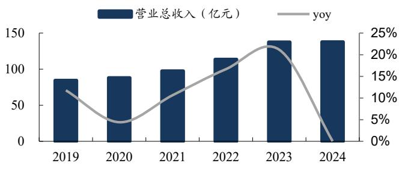  
图3：公司营业收入及增速情况  
数据来源：Wind，东吴证券研究所

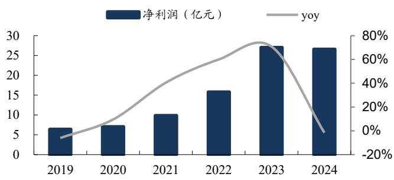  
图4：公司归母净利润及增速情况  
数据来源：Wind，东吴证券研究所

利润率大幅提升，研发投入力度加大。公司综合毛利率整体呈上升趋势，从 2019的$4 3 . 1 5 \%$ 增长至2024年的 $4 4 . 2 1 \%$ ，主要得益于中间体品种的毛利率提升，以及高毛利品种如胰岛素制剂的占比提升。净利率由 2019 年的 $7 . 6 2 \%$ 大幅提升至 2024 年的 $1 9 . 3 2 \%$ 。期间费用率方面，销售费用率持续下降，由 2019 年的 $1 7 . 5 \%$ 下降至 2024 年的 $1 0 . 2 \%$ ，销售费用绝对额没有明显扩大，但收入持续增长，彰显了公司优秀的费用控制能力和集采长期受益逻辑。研发费用率由 2019 的 $4 . 4 \%$ 增长至 2024 年的 $6 . 5 \%$ ，主要由于公司研发投入加大，布局了多个重磅 1 类新药（如 UBT251 和 TUL01101）和生物类似物等的研发。我们预计随着临床管线逐渐推向后期，研发费用率将进一步提升。

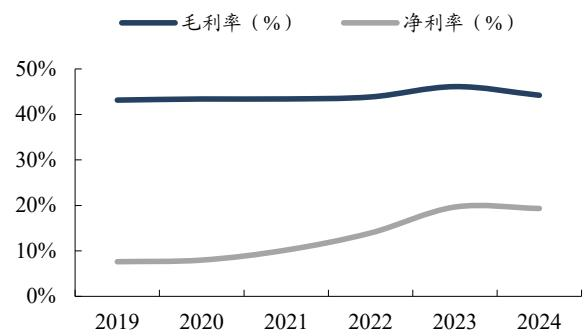  
图5：公司利润率情况  
数据来源：Wind，东吴证券研究所

  
图6：公司期间费用率情况  
数据来源：Wind，东吴证券研究所

三大业务板块稳健增长，内销为主，出口为辅。中间体方面，收入由2019年的12.80亿元增长至 26.59 亿元，CAGR 为 $1 5 . 7 4 \%$ 。主要得益于 6-APA 和青霉素工业盐近年来景气度高企，产销两旺，价格处于高位；原料药方面，收入由 2019年的35.93亿元增长至 2024 年的 63.73 亿元，CAGR 为 $1 2 . 1 4 \%$ 。2021 年开始原料药需求向好，价格上行。制剂板块收入由 2019 年的 35.19 亿元增长至 2024 年的 47.28 亿元，CAGR 为 $6 . 0 8 \%$ 。制剂板块分为人用抗生素制剂、胰岛素制剂、动保制剂。公共卫生事件后，人用抗生素制剂增长较快；胰岛素制剂受集采影响，业绩略有波动，但影响已基本消除；动保业务投入市场的时间不长，但呈现快速增长和发展趋势，预计随着动保新产能的投入，产能瓶颈突破，将继续带动制剂板块收入增长。分地区看，公司收入以国内为主，2024年录得国内收入 111.16亿元，占公司收入的 $8 1 \%$ ；出口地区以印度、欧洲、亚洲其他地区为主，直接出口至北美地区的占比极低，受地缘政治风险影响较小。目前公司亦在积极推进国际化业务，人胰岛素中标巴西卫生部标单，动保业务取得越南、澳大利亚共 6个产品批文等。

  
图7：公司简单收入拆分（按板块）  
数据来源：Wind，东吴证券研究所

  
图8：2024 年公司收入按地区拆分（亿元）  
数据来源：联邦制药投关材料，东吴证券研究所

# 2. 三靶点 GLP-1药物成功出海，创新管线引领突破

# 2.1. GLP-1药物将成“药王”，减重市场空间广阔

我国超重及肥胖患病人数快速增加，减肥药市场空间广阔。自 1990 年代以来，中国成年人中超重及肥胖患病率平均每年增长一个百分点。从 1992 年 $1 6 . 4 \%$ 和 $3 . 6 \%$ （合 计 $2 0 . 0 \%$ ）增 长 到 2004 年 的 $2 0 . 1 \%$ 和 $7 . 1 \%$ （合计 $2 7 . 2 \%$ ）；到 2018 年分别为 $3 4 . 3 \%$ 和 $1 6 . 4 \%$ （合计 $5 0 . 7 \%$ ）。研究预测，到 2030 年，中国成人中超重和肥胖患病率可能将达到 $6 5 . 3 \%$ ，在儿童青少年（7\~17岁）中将达到 $3 1 . 8 \%$ ，在学龄前儿童（ $\leqslant$ 6 岁）中将达到 $1 5 . 6 \%$ （WHO 标准）。国内肥胖（ $\mathrm { B M I } > = 2 8$ ）人群 1.5e-2e 人，超重（BMI24-28）6-7e，超重有 $5 0 \% r \lambda$ 上会发展成肥胖。按照中国超重和肥胖人口数变化计算，假设有减肥健康意识的人口大多来自城镇地区，根据我国的城镇化率，约占人口的$6 5 \%$ ；假设 15-59 岁的人口，可能有减肥体重管理的意识，这部分人口约占 $6 3 \%$ ，假设月均收入大于各城市工资中位数的人，才有经济实力每个月使用减肥产品；假设对这部分人GLP-1的渗透率缓慢提升达到 $20 \%$ ，另外随着竞品不断上市，月均使用价格预计逐步降低至 300元，平均每人一年使用 6 个月，则整个市场空间有望达到680亿元。

图9：2018-2030E 中国超重及肥胖人数统计（万人）

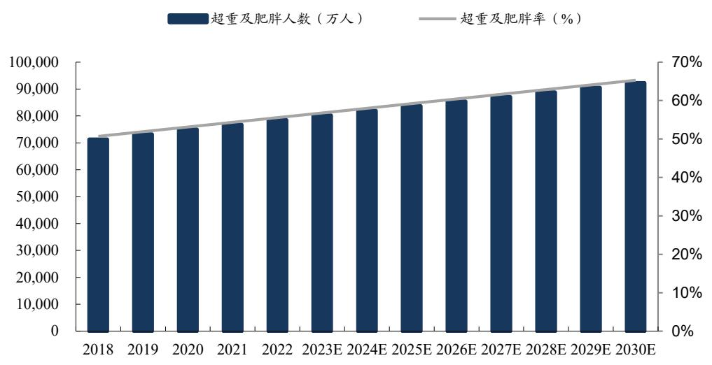  
数据来源：Morgan Stanly，东吴证券研究所

参考诺和诺德司美格鲁肽和礼来替尔泊肽销售情况，有望分得市场份额。主流GLP-1 药物快速放量，具备成为新一代“药王”的潜力。司美格鲁肽和替尔泊肽销售强劲，据诺和诺德和礼来财报，司美 2025Q1 销售 78.64 亿美元，超过了 K 药 72.05 亿美元，正式成为药王。而礼来的替尔泊肽 2025Q1 销售 61.5 亿美元，考虑到替尔泊肽上市时间相比司美晚 1 年，且凭借更优的减重效果，替尔泊肽销售增速比司美格鲁肽更快，未来潜力更大。糖尿病和减重适应症预计峰值分别约 260亿和331亿美金。除了糖尿病和减重适应症，潜在的 NASH 和 AD 的适应症目前已进入临床三期，预计成功后将进一步提高销售峰值。目前司美格鲁肽和替尔泊肽“蛋糕”极大的情况下，后续上市的玩家即便仅分得极小的市场份额都有望实现巨额销售。另外，双靶点 GLP-1 药物有望超越司美格鲁肽，获取更大市场份额。

# 2.2. UBT251 授权诺和诺德，三靶点减重药物具备 BIC 潜力

当前全球减重药物研发格局呈现“巨头主导、百花齐放”的态势。现阶段整体减重市场仍然以 GLP-1受体激动剂为主，例如诺和诺德的司美格鲁肽和礼来的替尔泊肽，占据了市场主导地位。其他管线则是在多靶点、联用、长效注射剂型、口服剂型等方向发起尝试。从疗效上看，多靶点减重药物似乎呈现靶点越多、疗效越好的趋势。替尔泊肽头对头司美格鲁肽的 SURMOUNT-5试验中，72周时，替尔泊肽组受试者的体重平均降幅为 $2 0 . 2 \%$ ，而司美格鲁肽组的平均降幅为 $1 3 . 7 \%$ 。

图10：GLP-1 类药物竞争格局

<table><tr><td>靶点进度</td><td>I期临床</td><td>Ⅱ期临床 度拉糖肽（EiLily）、聚乙二醇洛塞那肽（翰森制药)</td><td>Ⅲ期临床</td><td>申请上市</td></tr><tr><td>GLP-IR</td><td>CT-996（Roche）、ASC30（歌礼制药）</td><td rowspan="3">（Metsera)、TERN-601 (Tems Pharmaceuticals) HDM1005（华东医药）、NNC0519-0130（Novo 物制药）、CT-868(Roche)CT-388(Roche) cotadutide（AstraZeneca)，DD01（信立泰；D&amp;D</td><td></td><td></td></tr><tr><td>GLP-IR; GIPR</td><td>NN9389（Novo Nordisk）、LY3537031(Ei Lily)、 HZ012（和泽医药；道尔生物）、NN9542</td><td>HS-20094（翰森制药）、RAY1225（众生睿 Nordisk)、VK2735(Viking Therapeutics)、THDBH120创)、maridebart cafaghutide(Amgen) （药明康德；通化东宝）、GMA106（鸿运华宁；中国生HRS9531（Kalea；恒瑞医药）、BGM0504 （博瑞医药）</td><td></td></tr><tr><td>GLP-R</td><td>（Novo Nordisk）、KN069（康宁杰瑞；特宝生</td><td>puoda der  and</td><td>仕度肤（信达生</td></tr><tr><td></td><td></td><td>pemvidutide(Alimmune)、DR10624（道尔生物)</td><td></td><td></td></tr></table>

数据来源：医药魔方，东吴证券研究所

三靶点 GLP-1 中礼来进展最快，联邦 UBT251 具备 BIC 潜力。礼来的 Retatrutide全球处在 3期，国内处在1期，进展最快。联邦制药国内已进入 2 期。2025年2月，联邦制药就UBT251 与诺和诺德达成 2亿美元首付款，总金额20 亿美元的BD。目前三靶点 GLP-1 药物海外进度较快的还有赛诺菲和 Hanmi Pharmaceuticals，全球处在 1 期，国内进度较快的包括民为生物的 MWN101、康缘药业的 ZX2021 等。诺和诺德作为 GLP-1 领域的两大巨头之一，与联邦的 BD 交易体现出 UBT251 临床效果上有望赶超礼来Retatrutide 的潜力，同时诺和诺德的存在也保障了海外临床的高效推进与上市后销售的推广的速度。

机制上看 GCGR 靶点促进能量消耗，三靶点减重效果为当前最佳。葡萄糖依赖性促胰岛素释放多肽（GIP）、胰高血糖素样肽-1 受体（GLP-1）和胰高血糖素受体（GCG）是负责葡萄糖稳态的肽激素，多种GLP-1类似物成功应用于治疗 2型糖尿病（T2D）和肥胖症，凸显了这组药物靶点的临床价值。其中 GLP-1 具有促进胰岛素分泌（降低血糖）、延缓胃排空、降低食欲等作用，胰高血糖素参与血糖和能量调节（提高血糖），而GIP影响脂代谢与脂肪分布，过激活下丘脑中的GIP 受体神经元，减少食物摄入，减轻体重。GCG是一种含有29 个氨基酸的多肽，由胰高血糖素原基因在胰岛 a细胞中表达和分泌，主要作用于分布于肝脏和肾脏的胰高血糖素受体，刺激肝糖原分解，升高血糖，激活脂肪酶，促进脂肪分解，同时抑制肝脏脂肪合成，加强脂肪酸氧化。研究结果表明，GCG具有一定的减少食物摄入、增加脂肪组织能量消耗、降低体脂的作用。适当的 GCG提高血糖的作用，可以反馈胰岛素的调节，减少低血糖事件的发生。礼来 GLP-1R/GIPR/GCGR 三靶点激动剂 Retatrutide 海外已启动头对头替尔泊肽的 3 期临床，2 期数据显示 $1 2 \mathrm { m g }$ 剂量48周减重 $2 4 . 2 \%$ ，24周减重 $1 7 . 5 \%$ ，效果优于单靶点和双靶点 GLP-1 药物。而 UBT251 尚未披露完整的临床数据，但根据诺和诺德与联邦达成 BD 的官方通告中，中国 1b 期临床试验 $\mathrm { 1 m g / 3 m g / 6 m g }$ 剂量组 12 周平均体重较基线下降 $1 5 . 1 \%$ ，扣除安慰剂效应后减重 $1 6 . 6 \%$ ，起效速度更快，极有可能实现超越 Retatrutide的疗效。此外，临床前数据显示，低剂量用药时UBT251比Retatrutide 起效更快，DIO 小鼠模型中，总体减重效果相当。UBT251 目前国内糖尿病处在临床1 期，减重、CKD 和 MAFLD 处在临床 2期。经我们测算，UBT251 减重适应症国内销售峰值可在 2032年达43亿元，经研发风险系数调整后销售额为 21.5 亿元。

图11：UBT-251 减重适应症国内峰值测算  

<table><tr><td>研发调整后权益销售额（亿元）</td><td></td><td>单位</td><td>2024</td><td>2025E</td><td>2026E</td><td>2027E</td><td>2028E</td><td>2029E</td><td>2030E</td><td>2031E</td><td>2032E</td><td>2033E</td><td>2034E</td><td>2035E</td><td></td><td>2036E 2037E</td></tr><tr><td>UBT251-减重适应症（国内）</td><td></td><td></td><td></td><td></td><td></td><td></td><td></td><td></td><td></td><td></td><td></td><td></td><td></td><td></td><td></td><td></td></tr><tr><td>超重及肥胖人数（万人）</td><td></td><td>万人</td><td>81930.80</td><td>83649.46</td><td>85368.13</td><td>87086.79</td><td>88805.45</td><td>90524.12</td><td>92242.78</td><td>03165.21</td><td>94096.86</td><td>95037.83</td><td>95988.21</td><td>96948.09</td><td>97917.57</td><td>98896.75</td></tr><tr><td>城镇人口占比</td><td>b</td><td></td><td>65%</td><td>65</td><td>66%</td><td>66</td><td>67%</td><td>67h</td><td>68%</td><td>6e%</td><td>68%</td><td>68%</td><td>69%</td><td>68%</td><td>68%</td><td>68%h</td></tr><tr><td>15-50岁人口占比</td><td></td><td></td><td>63%</td><td>63%</td><td>62%</td><td>62%</td><td>62%</td><td>61%</td><td>61%</td><td>61%</td><td>60%</td><td>60%</td><td>60%</td><td>60%</td><td>60%</td><td>60</td></tr><tr><td>月收入大于中位数占比</td><td>d</td><td></td><td>50h</td><td>50h</td><td>50%</td><td>50%</td><td>50%</td><td>50%</td><td>50%</td><td>50h</td><td>50%</td><td>50%</td><td></td><td>50h</td><td>50%</td><td>50%</td></tr><tr><td>新药渗透率</td><td>e</td><td></td><td>4h</td><td>6h</td><td>B%</td><td>10%</td><td>12h</td><td>13%</td><td>14%</td><td>15%</td><td>16%</td><td>17%</td><td>18%</td><td>10%</td><td>20h</td><td>20h</td></tr><tr><td>三靶点占比</td><td></td><td></td><td></td><td>1%</td><td>4%</td><td>6</td><td>B%</td><td>12%</td><td>13%</td><td>15%</td><td>14%</td><td>13%</td><td>12%</td><td>12%</td><td>12%</td><td>11%</td></tr><tr><td>目标药物市占串</td><td>g</td><td></td><td></td><td>-</td><td>-</td><td></td><td>5%</td><td></td><td>14</td><td>18%</td><td>20%</td><td>22h</td><td>21%</td><td>20%</td><td>18%</td><td>17%</td></tr><tr><td>目标药物治疗人数（万人）</td><td>h=a+b+c+d+exfig</td><td>万人</td><td></td><td></td><td></td><td></td><td>8.85</td><td>25.97</td><td>48.75</td><td>78.26</td><td>86.00</td><td>94.26</td><td>88.82</td><td>90.18</td><td>86.29</td><td>75.45</td></tr><tr><td>目标药物年治疗费用（万元）</td><td>,</td><td>万元</td><td></td><td></td><td></td><td></td><td>0.60</td><td>0.60</td><td>0.50</td><td>0.50</td><td>0.50</td><td>0.40</td><td>0.40</td><td>0.40</td><td>0.40</td><td>0.40</td></tr><tr><td>关键事件</td><td></td><td></td><td></td><td></td><td></td><td></td><td>药品获批</td><td></td><td>竞争对手上市</td><td></td><td></td><td>竞争对手上市</td><td></td><td></td><td></td><td></td></tr><tr><td></td><td></td><td></td><td></td><td></td><td></td><td></td><td></td><td></td><td></td><td></td><td></td><td></td><td></td><td></td><td></td><td></td></tr><tr><td>目标药物年销售额 研发风险调整后销售额</td><td>j=hi</td><td>亿元</td><td></td><td></td><td></td><td></td><td>5.3</td><td>15.6</td><td>24.4</td><td>30.1</td><td>43.0</td><td>37.7</td><td>35.5</td><td>36.1</td><td>34.5</td><td>30.2</td></tr><tr><td>权益调整后销售额</td><td>k=jm</td><td>r1=50%</td><td></td><td></td><td></td><td></td><td>2.7 2.7</td><td>7.8 7.8</td><td>12.2 12.2</td><td>19.6 19.6</td><td>21.5 21.5</td><td>18. 18.9</td><td>17.8 17.8</td><td>18.0 18.0</td><td>17.3 17.3</td><td>15.1 15.1</td></tr><tr><td></td><td>1=kx{2</td><td>${2=100%</td><td></td><td></td><td></td><td></td><td></td><td></td><td></td><td></td><td></td><td></td><td></td><td></td><td></td><td></td></tr></table>

数据来源：东吴证券研究所测算

# 2.3. 在研管线丰富，布局多个热门领域

公司在研管线丰富，后续仍有潜力品种。公司在研管线聚焦内分泌/代谢、自免、眼科、抗感染等领域，后续仍有多个潜力品种。例如二代胃肠道激素 UBT37034用于体重管理、GLP-1口服制剂等，有望成为现有GLP-1药物的迭代产品。生物类似物中，德谷胰岛素和司美格鲁肽注射液已处在 NDA 阶段，短期内有望上市，带动公司制剂业务增长。

  
图12：公司生物药在研管线  
数据来源：联邦制药投关材料，东吴证券研究所

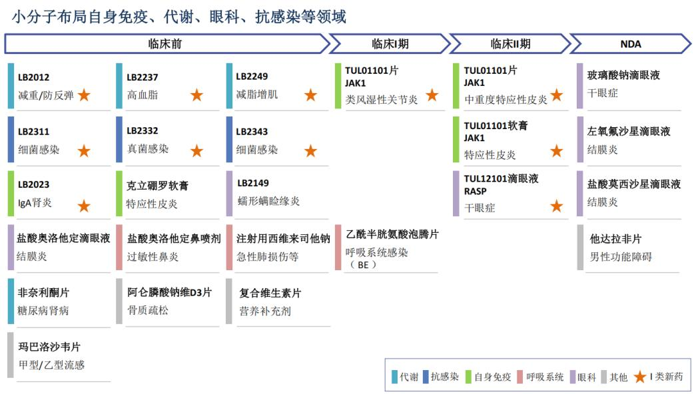  
图13：公司小分子在研管线  
数据来源：联邦制药投关材料，东吴证券研究所

UBT37034 获批美国临床，联用现有管线具备想象空间。2025 年 7 月 4 日，公司UBT37034 超重/肥胖适应症临床试验获 FDA 批准。UBT37034 作用于神经肽 Y2 受体（Neuropeptide Y2 receptor），其本质是 NPY 类多肽配体 PYY。神经肽 Y 受体参与调控食物摄取和能量消耗，是肥胖治疗药物的重要靶点。根据在饮食诱导肥胖大鼠（DIO Rats）上的临床前数据，21 天给药后，UBT37034 联用替尔泊肽减重 $1 3 . 6 \%$ ，相比 Petrelintide联用替尔泊肽（ $- 9 . 3 8 \%$ ）或 Cagrilintide 联用替尔泊肽 $( - 1 0 . 8 9 \% )$ 和替尔泊肽单药（ $- 3 . 0 2 \%$ ）具备优效潜力。考虑到公司拥有目前潜在的BIC减重药物UBT251，未来若 UBT37034联用UBT251，有望实现更优的减重效果，具备想象空间。

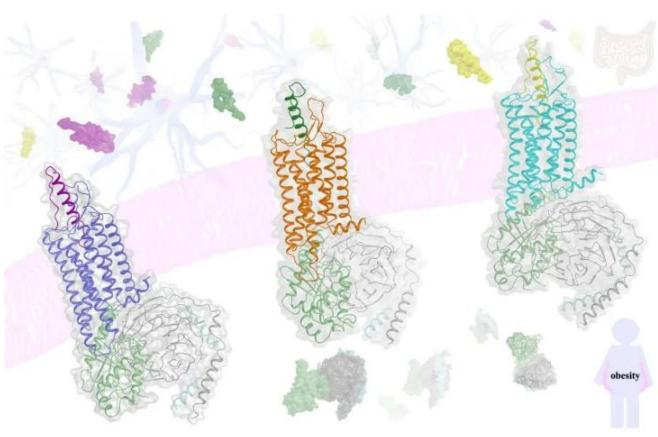  
图14：神经肽 $\mathbf { Y }$ 受体结构示意图   
数据来源：Science，东吴证券研究所 注：橙色为 Y2受体

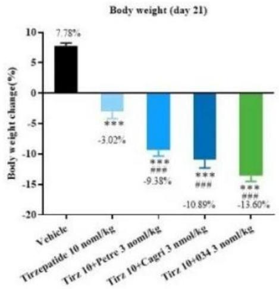  
图15：UBT37034 在 DIO 大鼠上的临床前结果  
数据来源：公司公众号，东吴证券研究所

自免药物 TUL01101 同时布局片剂和软膏，同时解决 JAK-1 抑制剂安全性问题。国内特应性皮炎患者约7000万人，其中中重度患者约2000万人，儿童和青少年占比高，约占到患病人群的 $50 \%$ 。根据临床指南，不同严重程度的患者采用不同的治疗方案：轻度患者:根据皮损及部位选择外用糖皮质激素(TCS)和外用钙调神经磷酸酶抑制剂(TCI)对症治疗，必要时口服抗组胺药治疗合并过敏症(荨麻疹、过敏性鼻炎)或止痒；中度患者额外考虑紫外线疗法(NB-UVB 或 UVA1)；重度患者额外考虑系统给药，使用环孢素、甲氨蝶呤等免疫抑制剂、度普利尤单抗和 Jak 抑制剂。同适应症其他靶点中，IL-13 明显差于IL-4Ra，IL-5和 IgE单抗处于临床 2期，尚无疗效数据披露。Jak1 抑制剂乌帕替尼和阿布昔替尼均在头对头击败度普利尤单抗。公司的 TUL01101同时布局片剂与软膏剂型，相较注射剂型的度普利尤单抗具备更好的依从性。Ia 期和 Ib 期临床结果显示，TUL01101 在人体内有着良好的量效关系，并且在患者中疗效显著，安全性良好。

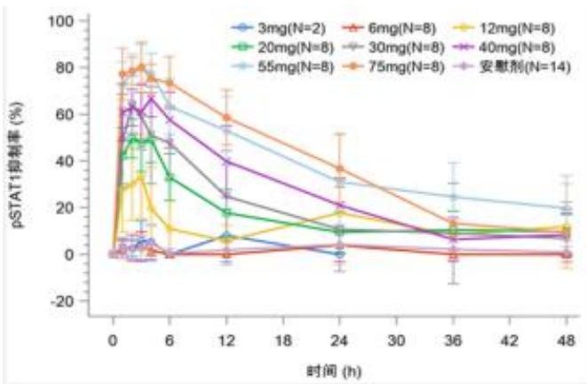  
图16：pSTAT1 抑制率-时间图  
数据来源：联邦制药投关材料，东吴证券研究所

  
图17：TUL01101 片 $7 0 \mathrm { m g }$ 组一例受试者用药前和用药96 天后药效对比  
数据来源：联邦制药投关材料，东吴证券研究所

# 3. 主业保持稳健，胰岛素类似物与动保业务引领增长

# 3.1. 抗生素原料药与中间体供需格局稳定，上游挺价意愿强烈

抗生素是由微生物（包括细菌、真菌、放线菌属）或高等动植物在生活过程中所产生的具有抗病原体或其它活性的一类次级代谢产物，能干扰其他生活细胞发育功能的化学物质。现临床常用的抗生素有微生物培养液中提取物以及用化学方法合成或半合成的化合物，已知天然抗生素不下万种。抗生素品种繁多，主要分为两大类：ß-内酰胺类和非 ß-内酰胺类，其中，ß-内酰胺类品种最多，临床应用最多、最广的一类。

表 1：主流抗生素种类  

<table><tr><td>大类</td><td>细类</td><td>代表品种</td></tr><tr><td>B-内酰胺类</td><td>青霉素</td><td>青霉素钠、青霉素钾、替卡西林、磺苄西林、阿莫西林、哌拉西林、</td></tr><tr><td></td><td>头孢菌素类 青霉素V钾等</td><td></td></tr><tr><td></td><td></td><td></td></tr></table>

<table><tr><td rowspan="5"></td><td>单环B-内酰胺类</td><td>氨曲南</td></tr><tr><td>B-内酰胺酶抑制剂</td><td>克拉维酸、舒巴坦、他唑巴坦</td></tr><tr><td>氧头孢烯类</td><td>拉氧头孢、氟氧头孢</td></tr><tr><td>碳青霉烯类</td><td>亚胺培南、帕尼培南、美洛培南等</td></tr><tr><td>氨基糖苷类</td><td>链霉素、庆大霉素、卡那霉素、阿米卡星、小诺米星等</td></tr><tr><td rowspan="5">非B-内酰胺类</td><td>四环素类</td><td>四环素、土霉素、多西环素、米诺环素等</td></tr><tr><td>大环内脂类</td><td>红霉素、琥乙红霉素、罗红霉素、麦迪霉素、乙酰螺旋霉素、吉他霉 素等</td></tr><tr><td>氯霉素类</td><td>氯霉素、琥珀氯毒素等</td></tr><tr><td>林</td><td>林可霉素、克林霉素等</td></tr><tr><td>其他</td><td>去甲万古霉素、磷霉素、卷曲霉素、利福平等</td></tr></table>

数据来源：川宁生物招股书，东吴证券研究所

公司原料药和中间体品种为抗生素 API 和中间体。其中中间体主要为 6-APA 和青霉素G钾盐，原料药主要为半合成青霉素类、 $\beta$ -内酰胺酶抑制剂类等。从2024年外销收入来看，6-APA 收入 18.58 亿元，半合成青霉素类 42.6 亿元， $\beta$ -内酰胺酶抑制剂类42.60亿元，为占比最高的三个品类。

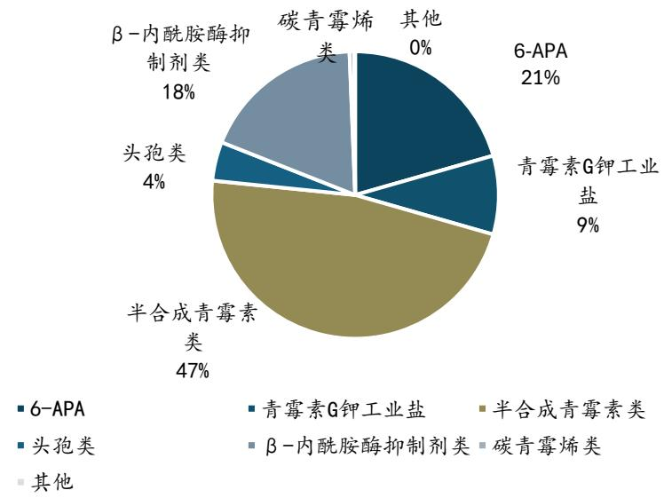  
图18：2024 年公司原料药、中间体外销收入拆分

数据来源：联邦制药投关材料，东吴证券研究所

6-APA价格处在历史高位，高壁垒下竞争格局稳定。公司中间体产品主要为 6-APA和青霉素 G 钾工业盐。6-APA 为抗生素三大母核之一，是制备半合成青霉素的基本原料，可以通过引入不同侧链，制得各种不同药效的青霉素，下游产品包括阿莫西林、氨苄西林等。国内 6-APA 和青霉素 G 钾盐一般共线生产，可以相互切换，对价格波动具有一定抵抗性。

行业高度集中，供需格局稳定。2015 年前后，我国 6-APA 行业面临严重的产能过剩和环保压力：生产过程产生的高污染特性迫使企业投入大量资金建设环保设施，而市场供大于求导致价格长期低迷，企业普遍陷入盈利困境。在此背景下，环保政策持续收紧，叠加国家《产业结构调整指导目录》将 6-APA 列为限制类发展产业，基本不再有新进产能的可能性。鲁抗医药、石药集团、哈药股份等大型企业于 2017 年前后陆续停产退出，产能加速出清，行业集中度提升。根据川宁生物招股书，6-APA 市场需求约为30000吨/年，国内企业中联邦制药产能最大，约为 24000 吨/年，威奇达产能约为 7000 吨/年（未满产），川宁生物产量约为6700吨/年。三家形成寡头竞争格局，合计占据全球 $9 0 \%$ 以上产能。产能的深度调整以及公共卫生事件导致的下游抗生素需求增长，使 6-APA 价格自2020年起进入上行周期。后因印度阿拉宾度新增产能预期回落，但根据路透社2025年 3 月的报道，印度 PLI 计划拟不再延期，预计后续影响有限。2024 年价格仍稳定在300元/千克上下，行业供需进入相对平衡状态，预计后续价格将在此位置盘整。

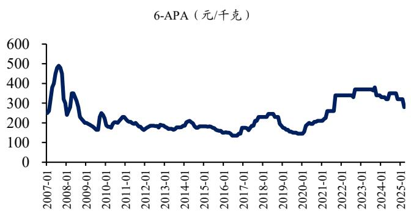  
图19：6-APA 价格情况  
数据来源：Wind，东吴证券研究所

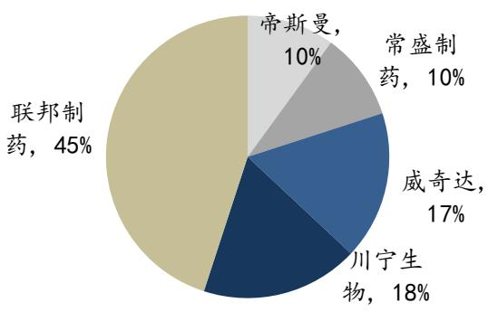  
图20：2021 年 6-APA 产能格局  
数据来源：川宁生物招股书，东吴证券研究所

印度 PLI 计划实质停摆，海外竞争影响弱于预期。2020 年印度政府为重构原料药产业链自主可控能力，于 2020 年启动生产关联激励（PLI）计划，通过财政补贴、产业园区建设和监管优化等组合政策，系统性推动活性药物成分（API）、关键起始物料（KSM）及药物中间体（DI）的国产化替代，但实际效果低于预期。2024年，印度议会化学品和肥料常设委员会指出截至 2024 年底，该计划仅批准了 9 家以发酵为基础的生产工厂，但只有3 家在运营。另外，用于关键 KSM、药物中间体和API 的国内生产的PLI计划的资金已连续三年未得到充分利用。2021-22年，修订后预算（RE）为 0.28亿卢比，与预算（BE）接近，但实际支出仅 0.22 亿卢比。2022-23 年，BE 为 39 亿卢比，RE 大幅降至1.46亿卢比，但实际支出仅 0.60亿卢比。2023-24年的 BE为 10亿卢比，后来RE减少到 1.61 亿卢比，但实际支出仅为 1.17 亿卢比。企业获得的资金补助远不及预期，将打击制造业扩产热情，预计竞争影响将逐渐弱化。2025年3 月国内青霉素工业盐报价120元/BOU，而阿拉宾度价格为 26美元（约182元），国内依然具备价格优势。

图21：青霉素工业盐价格情况表2：印度 PLI 计划实行进展远不及预期

<table><tr><td>财年</td><td></td><td>预算BE（亿卢比）修订后预算RE（亿卢比）实际支出（亿卢比）</td><td></td></tr><tr><td>2021-2022</td><td>0.28</td><td>0.28</td><td>0.22</td></tr><tr><td>2022-2023</td><td>39.00</td><td>1.46</td><td>0.60</td></tr><tr><td>2023-2024</td><td>10.00</td><td>1.61</td><td>1.17</td></tr></table>

数据来源：PHARMABIZ，东吴证券研究所

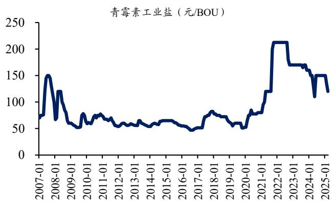  
数据来源：Wind，东吴证券研究所  
图23：2019-2024 注射用亚胺培南西司他丁钠等级医院端市场规模

# 3.2. 抗生素原料药制剂一体化，集采风险基本出清

联邦制药凭借原料药-制剂全产业链布局构建核心壁垒，形成覆盖青霉素类、头孢类、$\beta$ -内酰胺酶抑制剂类及碳青霉烯类四大领域的多种抗生素制剂矩阵，阿莫仙、他唑仙、强力阿莫仙依托原料制剂一体化优势稳居市场头部。由于流感发病率下降，抗生素终端需求阶段性下滑，公司人用抗生素制剂 2024 年销售额均呈现小幅下滑，其中半合成青霉素类抗生素实现收入 6.33亿元（ $- 4 . 6 \%$ ），头孢类抗生素实现收入 1.75亿元（ $- 1 0 . 7 \%$ ），$\beta$ -内酰胺酶抑制剂类抗生素实现收入 5.54 亿元（ $- 4 4 . 8 \%$ ），碳青霉烯类抗生素实现收入2.59 亿元（ $. 9 . 9 \%$ ）。其中 $\beta .$ -内酰胺酶抑制剂类抗生素的下滑主要是由于他唑仙（注射用哌拉西林钠他唑巴坦钠）二次降价。

仅倍能安存在集采风险，预计影响较低。2023年，注射用亚胺培南西司他丁钠在中国公立医疗机构终端实现了 31亿元的销售额。默沙东作为该产品的原研厂商，以约 $40 \%$ 的市场份额占据领先地位，但正面临来自华北制药（ $20 \%$ ）和石药集团（ $1 0 \%$ ）等本土企业的快速市场渗透。当前，国内通过仿制药一致性评价的企业包括华北制药、石药集团、健康元等。截至 2025 年 6 月，拥有批件的企业已达 7 家，因此我们预计倍能安将参与第十一批集采。2024 年倍能安销售收入同比下降 $8 \%$ ，至 2.6 亿元。相较于公司百亿级的营收规模，集采对整体业务影响有限。

图22：2024年公司制剂品种拆分

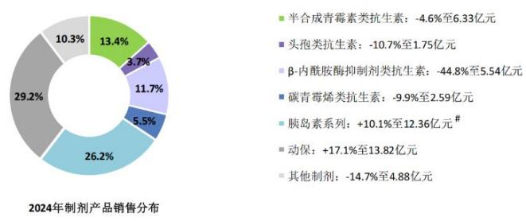  
数据来源：联邦制药投关材料，东吴证券研究所

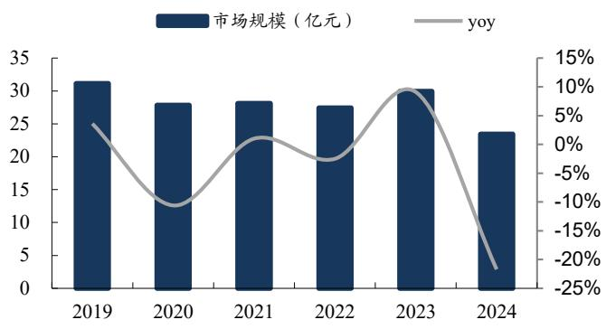  
数据来源：中康开思，东吴证券研究所

# 3.3. 动保业务：专注兽用抗生素制剂，新产能年内落地

2024年中国动保行业整体市场规模约 700亿元人民币，其中包括兽用生物制品（疫苗类产品）、兽用化学药品（抗生素及抗寄生虫药等）和中兽药三大类。其中兽用抗生素作为化药板块的核心品类，根据贝哲斯咨询最新调研，2024年全球兽用抗生素市场规模达 892.19 亿元（人民币），中国市场同期规模为 231.52 亿元。2024-2030 年全球兽用抗生素市场将以 $1 0 . 1 2 \%$ 的年均复合增长率持续扩容，至 2030 年总体量有望达到 1591.02亿元。兽用抗生素应用领域集中在家畜养殖（生猪与禽类为主）及快速扩张的宠物医疗市场。随着新版兽药GMP标准的全面实施，生产技术门槛显著提高，直接导致 2024年兽药企业数量同比减少 $3 5 \%$ ，中小企业加速退出市场。在此背景下，联邦制药的动物保健业务通过原料药与制剂垂直整合的资源优势、人药级质量控制体系以及差异化产品组合（包括阿莫西林可溶性粉、注射用青霉素钠、注射用阿莫西林钠、注射用氨苄西林钠及复方阿莫西林粉等系列产品），已成长为驱动企业发展的第二增长引擎。

图24：公司动保产品介绍

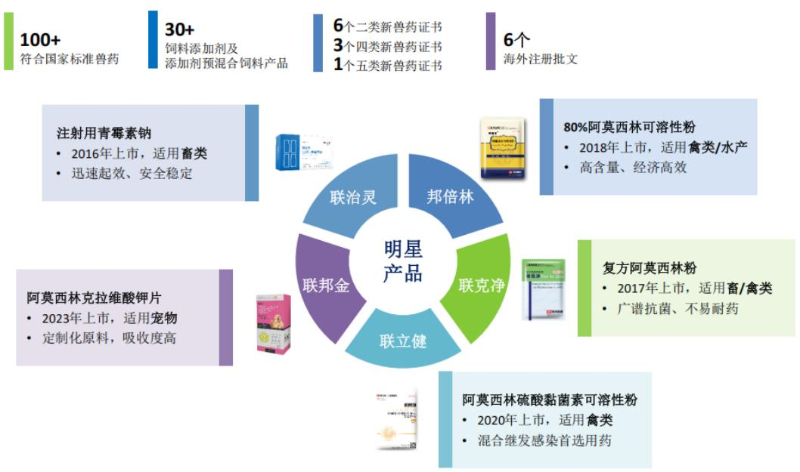  
数据来源：联邦制药投关材料，东吴证券研究所

三大新产能落地在即，有望带动动保板块进一步增长。公司 2024 年动保业务实现收入 13.82 亿元，同比增长 $1 7 . 1 \%$ 。内蒙古联邦动保新厂区、河南联牧兽药有限公司、珠海联邦动保有限公司三大新产能预计 2025 年建成投产，除各类兽药制剂外还包括宠物产品。2024年公司与新西兰RiverlandFoods签约引进宠物湿粮，并计划通过技术及产品输出拓展海外市场，实施动保全球化战略。

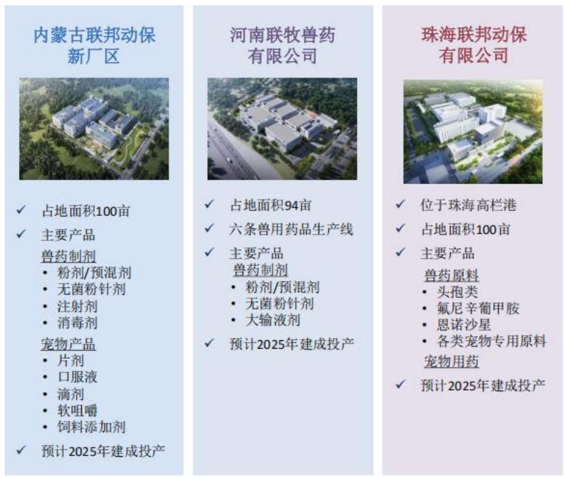  
图25：公司动保产品介绍  
数据来源：联邦制药投关材料，东吴证券研究所

# 3.4. 胰岛素借集采放量，成为制剂业务增长极

中国糖尿病患者人数全球最多，增速与患病率略高于全球平均水平。根据国际糖尿病（IDF）官网发布的全球糖尿病地图（IDF Diabetes Atlas），2021 年全球约 5.31 亿成年人（20-79岁）患有糖尿病，患病率为 $1 0 . 5 \%$ ；预计到2045年患病人数将增加至7.83亿，患病率上升至 $1 2 . 2 \%$ 。报告数据显示，2021年中国是20-79 岁人群中糖尿病患者人数最多的国家，患病人数为 1.41 亿，患病率为 $1 0 . 6 \%$ ；预计到 2045 年，中国患病人数增加至1.74 亿，患病率上升至 $1 2 . 5 \%$ 。

  
图26：2021、2030 年和 2045 年糖尿病成人（20-79 岁）估计总人数（百万人）和患病率  
数据来源：IDF，东吴证券研究所

2021年以前，我国胰岛素行业终端市场规模呈稳定增长态势，增速保持在 $1 3 . 0 \%$ 左右，市场扩展较为平稳，反映出胰岛素需求持续增长，受益于糖尿病患者基数增加和市场需求扩大。2021年胰岛素集采政策实施后，受集采降价影响，虽然销量有所提升，但整体市场规模增速明显下滑。胰岛素市场规模从 2021年的283.67 亿元，下降至2022年的220.43亿元，同比下降 $2 2 . 3 \%$ 。2024年第二轮胰岛素集采执行后，终端市场规模增速出现波动。胰岛素市场规模由 2023 年的 240.16 亿元下降至 2024 年的 200.15 亿元，同比下降 $1 6 . 7 \%$ 。尽管集采政策优化了胰岛素价格并提升了药品可及性，但价格压缩效应仍然对整体市场规模增长产生影响。本次胰岛素集采续约价格影响消化以后，预计整体胰岛素市场规模将恢复平稳增长。

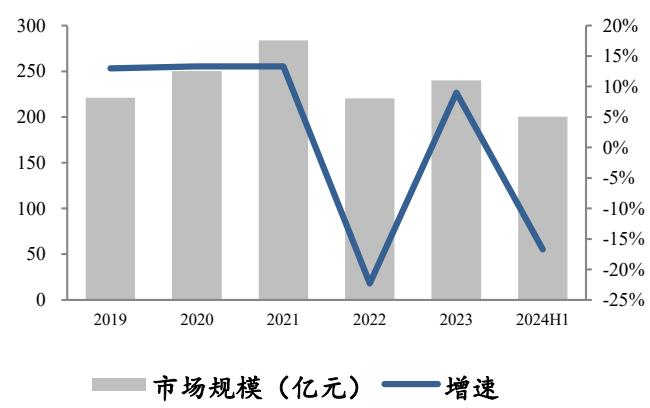  
图27：国内胰岛素市场规模（亿元）及增速  
数据来源：智研瞻产业研究院，东吴证券研究所

数据来源：智研瞻产业研究院，东吴证券研究所

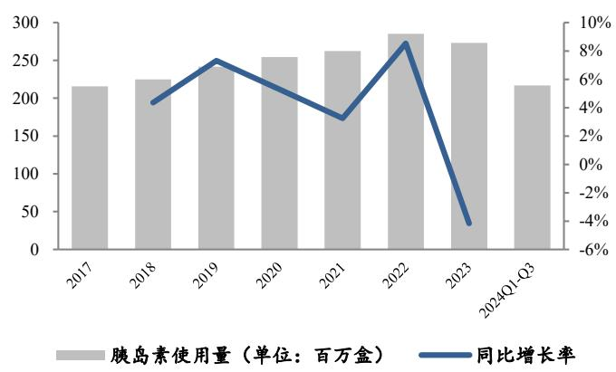  
图28：胰岛素使用量规模及增速

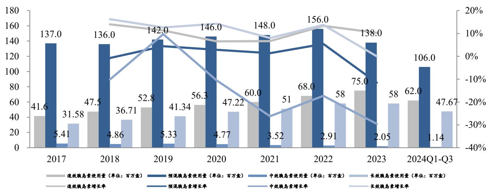  
图29：胰岛素各类产品使用量及增速  
数据来源：智研瞻产业研究院，东吴证券研究所

# 3.5. 胰岛素经历 2 轮集采，市场格局基本稳定

胰岛素经历 2 轮集采，市场格局基本稳定，短期内无降价风险。首轮胰岛素集中采购于 2021 年启动，并于2021年 11月公布中选结果，2022 年初开始执行，执行协议期为两年。首轮集采首年采购量总量为21384万支,中选均价为 36.64元。第二代胰岛素采购量为 0.9 亿支，第三代胰岛素采购量为 1.2 亿支，第二代胰岛素与第三代胰岛素集采配比为 4：6。其中，预混人胰岛素需求量为 $3 6 . 8 \%$ ，占比最高；预混胰岛素类似物需求量为 $2 8 . 5 \%$ ；基础胰岛素类似物需求量 $1 7 . 2 \%$ ；餐时人胰岛素类似物需求量为 $12 \%$ 。

第二轮胰岛素集采从 2024 年 3 月开始，4 月公布中选结果，5 月开始执行，执行协议期为三年。本轮续约集采首年采购量总量为2.41亿支，较上轮增长 $1 1 . 6 \%$ ；第三代胰岛素采购量为 1.7 亿支，较上轮增长约 0.5 亿支，采购占比上升至 $70 \%$ 。细分看，预混胰岛素类似物需求量为 $30 \%$ （同比增长 $3 7 \%$ ）；预混人胰岛素需求量为 $2 5 . 2 \%$ （同比减少 $2 2 \%$ ）；基础胰岛素类似物需求量 $2 3 . 4 \%$ （同比增加 $54 \%$ ）；餐时人胰岛素类似物需求量为 $1 6 \%$ ；餐时人胰岛素需求量 $4 . 7 \%$ ；基础人胰岛素需求量为 $0 . 0 4 \%$ 。

从集采报量来看，三代胰岛素份额继续提升。2024 年集采续约规则，在本次 A 类产品的价格线中，二代胰岛素与三代餐时和预混胰岛素类似物的价格线一致，进一步推动三代胰岛素替代二代胰岛素的进程。甘李药业自 2005年和 2006年首获甘精胰岛素和赖脯胰岛素的生产批文，到 2020 年获得甘精胰岛素的生产许可，公司均为首家获批的国内厂商，在国内三代胰岛素市场中处于领先地位。

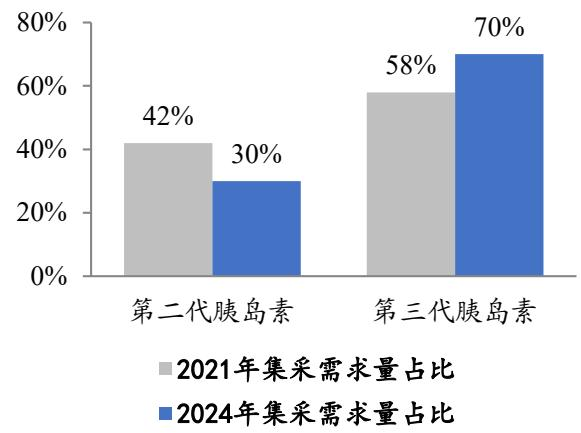  
图30：2021 年/2024 年集采首年需求量二代/三代占比  
数据来源：上海阳光医药采购所，东吴证券研究所

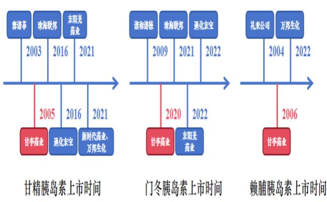  
图31：各企业三代胰岛素上市时间  
数据来源：医药魔方，东吴证券研究所

从集采报量来看，国产企业份额继续提升。2024 年集采较上轮，外资企业份额从$6 8 \%$ 减少到 $5 5 \%$ ，同时国产份额持续提升至 $45 \%$ 。甘李药业的 6 款产品全部A 类中标，本轮拟中标价格相比首轮中标价格有所上涨；通化东宝的全系列胰岛素产品以 A 类拟中标，其中甘精胰岛素和预混型门冬胰岛素这两款大品种胰岛素类似物以 A1类拟中选。联邦制药的 6 款产品全部以 A 组拟中标。从 2024 年相较于 2021 年的集采企业需求量占比来看，甘李药业占比大幅提升 $9 \%$ ，通化东宝提升 $1 \%$ 。

  
图32：2021年/2024 年集采首年需求量外资/本土占比  
数据来源：上海阳光医药采购所，东吴证券研究所

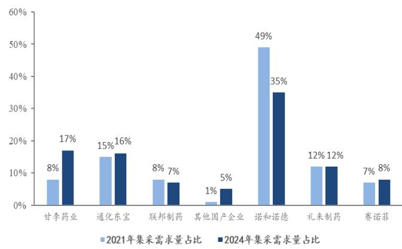  
图33：2021年/2024 年胰岛素集采企业需求量占比变化  
数据来源：上海阳光医药采购所，东吴证券研究所

从集采中标价来看，2024 年集采续约价格平均降幅为 $5 1 \%$ 。从各企业的平均降幅来看，甘李药业、通化东宝、联邦制药的平均变化幅度分别为 $3 1 \%$ 、 $- 1 3 \%$ 、 $- 1 7 \%$ 。进口企业方面，诺和诺德、礼来产品的平均降幅分别为 $- 5 \%$ 、 $5 5 \%$ 。

表3：2024 年胰岛素集采结果  

<table><tr><td>企 业</td><td>药品种类</td><td>药品名称</td><td>价格</td><td>降幅</td><td>平均 降幅</td><td>采购量</td><td>涨幅</td><td>平均 涨幅</td></tr><tr><td></td><td>预混人胰岛素</td><td>精蛋白人素混合注</td><td>25.9</td><td>45%</td><td></td><td>2,015,327</td><td>98%</td><td></td></tr><tr><td>甘</td><td>餐时胰岛素类似物</td><td>门冬胰岛素注射液</td><td>25.9</td><td>30%</td><td></td><td>5,459,891</td><td>96%</td><td></td></tr><tr><td>李</td><td>餐时胰岛素类似物</td><td>赖脯胰岛素注射液</td><td>35.55</td><td>48%</td><td>31%</td><td>1,735,894</td><td>25%</td><td>57%</td></tr><tr><td>药</td><td>基础胰岛素类似物</td><td>甘精胰岛素注射液</td><td>65.3</td><td>34%</td><td></td><td>17,015,590</td><td>25%</td><td></td></tr><tr><td>业</td><td>预混胰岛素类似物</td><td>门冬胰岛素 30 注射液</td><td>25.9</td><td>5%</td><td></td><td>13,278,307</td><td>87%</td><td></td></tr><tr><td></td><td>预混胰岛素类似物</td><td>精蛋白锌重组赖脯胰岛 素混合注射液（25R)</td><td>35.55</td><td>23%</td><td></td><td>2,264,364</td><td>12%</td><td></td></tr><tr><td>通化</td><td>人胰素</td><td>精注液</td><td></td><td>-10%</td><td></td><td>575953375</td><td>45%</td><td></td></tr><tr><td></td><td></td><td></td><td>25.933</td><td></td><td>-13%</td><td></td><td></td><td>15%</td></tr><tr><td>东</td><td>预混人胰岛素</td><td>精蛋白人胰岛素混合注 射液（30R）</td><td>25.93</td><td>-10%</td><td></td><td>21709467</td><td>4%</td><td></td></tr><tr><td>宝</td><td>基础胰岛素类似物</td><td>甘精胰岛素注射液</td><td>63.33</td><td>-19%</td><td></td><td>4,302,002</td><td>72%</td><td></td></tr><tr><td></td><td>餐时人胰岛素</td><td>人胰岛素注射液</td><td>25.91</td><td>-10%</td><td></td><td>870018</td><td>20%</td><td></td></tr><tr><td>联邦</td><td>基础人胰岛素</td><td>精蛋白人胰岛素注射液</td><td>25.91</td><td>-12%</td><td></td><td>202906</td><td>-33%</td><td></td></tr><tr><td></td><td>预混人胰岛素</td><td>蛋混合</td><td>25.91</td><td>-5%</td><td></td><td>9787322</td><td>-4%</td><td>34%</td></tr><tr><td>制 药</td><td>餐时胰岛素类似物</td><td>门冬胰岛素注射液</td><td>25.91</td><td></td><td>-17%</td><td>1044863</td><td></td><td></td></tr><tr><td></td><td>基础胰岛素类似物</td><td>甘精胰岛素注射液</td><td>65.31</td><td>-37% -2%</td><td></td><td>4617715</td><td>82% 58%</td><td></td></tr><tr><td></td><td>预混胰岛素类似物</td><td>门冬胰岛素 30 注射液</td><td>25.91</td><td></td><td></td><td>2829318</td><td></td><td></td></tr><tr><td></td><td>餐时人胰岛素</td><td>人胰岛素注射液</td><td>29.56</td><td>-37%</td><td></td><td>899701</td><td>86% -90%</td><td></td></tr><tr><td></td><td>基础人胰岛素</td><td>精蛋白人胰岛素注射液</td><td></td><td>-1%</td><td></td><td>413570</td><td>158</td><td></td></tr><tr><td>诺 和</td><td></td><td>精蛋白人胰岛素混合注</td><td>29.56</td><td>-1%</td><td></td><td></td><td>%</td><td></td></tr><tr><td>诺 德</td><td>预混人胰岛素</td><td>射液（30R）</td><td>29.56</td><td>-1%</td><td>-5%</td><td>14086953</td><td>-81%</td><td>-48%</td></tr><tr><td></td><td>餐时胰岛素类似物</td><td>门冬胰岛素注射液</td><td>35.55</td><td>-18%</td><td></td><td>21031129</td><td>5%</td><td></td></tr><tr><td></td><td>基础胰岛素类似物</td><td>德谷胰岛素注射液</td><td>77.11</td><td>-3%</td><td></td><td>7026907</td><td>66%</td><td></td></tr><tr><td></td><td>预混胰岛素类似物</td><td>门冬胰岛素 30 注射液</td><td>35.55</td><td>-22%</td><td></td><td>33923697</td><td>-30%</td><td></td></tr><tr><td></td><td>餐时人胰岛素</td><td>人胰岛素注射液 精蛋白人胰岛素注射液</td><td>31</td><td>-</td><td></td><td>-</td><td>-</td><td></td></tr><tr><td></td><td>基础人胰岛素</td><td>精蛋白人胰岛素混合注</td><td>31</td><td>-</td><td></td><td>-</td><td>- 133</td><td></td></tr><tr><td>礼 来</td><td>预混人胰岛素</td><td>射液（30R）</td><td>29.56</td><td>-1%</td><td>55%</td><td>3959362</td><td>%</td><td>-18%</td></tr><tr><td></td><td>餐时胰岛素类似物</td><td>赖脯胰岛素注射液 精蛋白锌重组赖脯胰岛</td><td>38.42</td><td>63%</td><td></td><td>6863442</td><td>50%</td><td></td></tr><tr><td></td><td>预混胰岛素类似物</td><td>素混合注射液（25R）</td><td>38.42</td><td>103%</td><td></td><td>11034180</td><td>30%</td><td></td></tr><tr><td></td><td>基础胰岛素类似物</td><td>甘精胰岛素注射液</td><td>77.11</td><td></td><td></td><td>393406</td><td></td><td></td></tr></table>

数据来源：上海阳光医药采购所，东吴证券研究所

# 4. 盈利预测与投资评级

# 4.1. 收入拆分

公司业务分为原料药和中间体、制剂以及其他业务，我们预计2025-2027年营业总收入分别为 $1 3 8 . 6 / 1 5 0 . 0 / 1 6 2 . 6 $ 亿元，对应增速 $1 \% / 8 \% / 8 \%$ 。其中：

原料药和中间体业务：考虑到 2024年下半年起6-APA等产品价格下行，终端抗生素需求偏弱，我们预计原料药和中间体业务短期承压，2025-2027 年收入增速分别为-$8 \% / 3 \% / 3 \%$ ；

制剂业务：考虑到人用抗生素制剂短期承压，但胰岛素制剂受益于集采放量，增速较快；动保制剂产能扩张，增速较快，我们预计制剂业务保持较快增速，2025-2027 年增速分别为 $1 4 \% / 1 7 \% / 1 6 \%$ ；

其他业务：我们预计 2025-2027 年其他业务略有增长，每年收入 1500 万元。

表4：收入拆分  

<table><tr><td></td><td>2022</td><td>2023</td><td>2024</td><td>2025E</td><td>2026E</td><td>2027E</td></tr><tr><td>营业总收入（百万元）</td><td>11358</td><td>13754</td><td>13759</td><td>13860</td><td>15001</td><td>16261</td></tr><tr><td>yoy</td><td>17%</td><td>21%</td><td>0%</td><td>1%</td><td>8%</td><td>8%</td></tr><tr><td>毛利率（%)</td><td>44%</td><td>46%</td><td>45%</td><td>45%</td><td>45%</td><td>45%</td></tr><tr><td>毛利（百万元）</td><td>4980</td><td>6342</td><td>6169</td><td>6176</td><td>6814</td><td>7393</td></tr><tr><td>营业总成本（百万元）</td><td>6379</td><td>7412</td><td>7590</td><td>7685</td><td>8187</td><td>8868</td></tr><tr><td>原料药和中间体</td><td></td><td></td><td></td><td></td><td></td><td></td></tr><tr><td>营业收入（百万元）</td><td>6774</td><td>8716</td><td>9033</td><td>8298</td><td></td><td></td></tr><tr><td></td><td></td><td>29%</td><td></td><td></td><td>8515</td><td>8738</td></tr><tr><td>yoy 毛利率</td><td></td><td></td><td>4%</td><td>-8%</td><td>3%</td><td>3%</td></tr><tr><td>毛利（百万元）</td><td>39% 2637</td><td>45% 3892</td><td>42% 3798</td><td>42%</td><td>43%</td><td>43%</td></tr><tr><td></td><td></td><td></td><td></td><td>3477</td><td>3673</td><td>3772</td></tr><tr><td>制剂</td><td></td><td></td><td></td><td></td><td></td><td></td></tr><tr><td>营业收入（百万元）</td><td>4560</td><td>5024</td><td>4728</td><td>5548</td><td>6472</td><td>7509</td></tr><tr><td>yoy</td><td></td><td>10%</td><td>-6%</td><td>14%</td><td>17%</td><td></td></tr><tr><td>毛利率(%)</td><td>54%</td><td>49%</td><td>50%</td><td>48%</td><td>48%</td><td>16%</td></tr><tr><td>毛利（百万元）</td><td>2447</td><td>2479</td><td>2360</td><td>2689</td><td></td><td>48%</td></tr><tr><td></td><td></td><td></td><td></td><td></td><td>3131</td><td>3611</td></tr><tr><td></td><td></td><td></td><td></td><td></td><td></td><td></td></tr><tr><td>其他业务</td><td></td><td></td><td></td><td></td><td></td><td></td></tr><tr><td>收入（百万元） yoy</td><td>24</td><td>15 -40%</td><td>0 -100%</td><td>15</td><td>15 0%</td><td>15 0%</td></tr></table>

<table><tr><td>毛利率(%)</td><td>70%</td><td>70%</td><td>70%</td><td>70%</td><td>70%</td><td>70%</td></tr><tr><td>毛利（百万元）</td><td>17</td><td>10</td><td>0</td><td>10</td><td>10</td><td>10</td></tr></table>

数据来源：Wind，东吴证券研究所

# 4.2. 可比公司估值

公司主营业务为抗生素原料药和中间体、抗生素制剂、胰岛素制剂等业务，同时积极布局新药研发，因此，我们选取了同样具有原料药、制剂业务并布局新药研发，在港股上市的传统制药企业石药集团、远大医药、东阳光长江药业为可比公司。公司 2025年PE为 8倍，低于行业平均估值。

表5：可比公司估值  

<table><tr><td rowspan="2">股票代码</td><td rowspan="2">公司</td><td rowspan="2">股价</td><td rowspan="2">市值 （亿元）</td><td colspan="5">归母净利润（亿元）</td><td colspan="4">PE</td></tr><tr><td>2024A</td><td></td><td>2025E</td><td>2026E</td><td>2027E</td><td></td><td></td><td>2026E</td><td>2027E</td></tr><tr><td></td><td>石药集团</td><td>8.09</td><td>850</td><td>43.28</td><td>52.91</td><td>55.79</td><td></td><td>60.38</td><td>2024A 20</td><td>2025E 16</td><td>15</td><td>14</td></tr><tr><td>1093.HK 0512.HK</td><td>远大医药</td><td>9.53</td><td>304</td><td>22.57</td><td>21.74</td><td>23.96</td><td></td><td>27.52</td><td>13</td><td>14</td><td>13</td><td>11</td></tr><tr><td>1558.HK</td><td>东阳光长</td><td>14.38</td><td>115</td><td>3.75</td><td>13.45</td><td>18.26</td><td></td><td>21.32</td><td></td><td></td><td></td><td></td></tr><tr><td></td><td>江药业</td><td></td><td></td><td></td><td></td><td></td><td></td><td>31</td><td>9</td><td></td><td>6</td><td>5</td></tr><tr><td>可比公司平均</td><td></td><td></td><td></td><td></td><td></td><td></td><td></td><td></td><td>21</td><td>13</td><td>11</td><td>10</td></tr><tr><td>3933.HK</td><td>联邦制药</td><td>14.26</td><td>236</td><td>26.6</td><td>31.12</td><td>31.02</td><td>33.84</td><td>9</td><td>8</td><td></td><td>8</td><td>7</td></tr></table>

数据来源： Wind，东吴证券研究所 注：股价数据截至 2025 年 7 月 9 日，石药集团、远大医药、东阳光长江药业为 Wind 一致预期数据，联邦制药为东吴证券研究所预测

# 4.3. 盈利预测与投资评级

我 们 预 计 公 司 2025-2027 营 业 收 入 为 138.6/150.0/162.6 亿 元 ， 同 比 增 速 为$0 . 7 \% / 8 . 2 \% / 8 . 4 \%$ ；净利润分别为31.1/31.0/33.8 亿元，同比增速为 $1 7 . 0 \% / - 0 . 3 \% / 9 . 1 \%$ ；对应 PE 分别为 8/8/7 倍。基于公司 1）UBT251 研发进展顺利，在研管线布局丰富；2）胰岛素与动保制剂快速放量；3）抗生素原料药和中间体价格趋稳，首次覆盖，给予“买入”评级。

# 5. 风险提示

研发进度不及预期风险：创新药研发具有高风险，成功与否较难预测，临床试验数据也可能不及预期；

制剂集采风险：目前公司仅剩倍能安未被集采，但集采政策存在不确定性，胰岛素等产品可能面临二次降价；

原料药需求不及预期：抗生素终端需求受流感因素影响，存在波动，可能导致原料药需求不及预期。

联邦制药三大财务预测表  

<table><tr><td>资产负债表（百万元）</td><td>2024A</td><td>2025E</td><td>2026E</td><td>2027E</td></tr><tr><td>流动资产</td><td>16,070.70</td><td>17,956.07</td><td>21,533.20</td><td>25,503.83</td></tr><tr><td>现金及现金等价物</td><td>6,329.84</td><td>8,370.18</td><td>11,191.71</td><td>14,304.71</td></tr><tr><td>应收账款及票据</td><td>5,725.96</td><td>5,681.92</td><td>6,160.48</td><td>6,655.41</td></tr><tr><td>存货</td><td>2,434.17</td><td>2,459.48</td><td>2,610.28</td><td>2,840.60</td></tr><tr><td>其他流动资产</td><td>1,580.73</td><td>1,444.49</td><td>1,570.73</td><td>1,703.11</td></tr><tr><td>非流动资产</td><td>9,762.36</td><td>9,764.63</td><td>9,766.50</td><td>9,768.58</td></tr><tr><td>固定资产</td><td>8,724.52</td><td>8,724.42</td><td>8,724.32</td><td>8,724.22</td></tr><tr><td>商誉及无形资产</td><td>228.96</td><td>228.86</td><td>228.76</td><td>228.66</td></tr><tr><td>长期投资</td><td>7.11</td><td>9.58</td><td>11.66</td><td>13.93</td></tr><tr><td>其他长期投资</td><td>0.00</td><td>0.00</td><td>0.00</td><td>0.00</td></tr><tr><td>其他非流动资产</td><td>801.76</td><td>801.76</td><td>801.76</td><td>801.76</td></tr><tr><td>资产总计</td><td>25,833.05</td><td>27,720.69</td><td>31,299.70</td><td>35,272.41</td></tr><tr><td>流动负债</td><td>8,772.55</td><td>7,548.65</td><td>8,026.06</td><td>8,615.03</td></tr><tr><td>短期借款</td><td>830.38</td><td>830.38</td><td>830.38</td><td>797.05</td></tr><tr><td>应付账款及票据</td><td>4,175.06</td><td>4,361.07</td><td>4,652.80</td><td>5,038.19</td></tr><tr><td>其他</td><td>3,767.11</td><td>2,357.20</td><td>2,542.88</td><td>2,779.79</td></tr><tr><td>非流动负债</td><td>2,625.26</td><td>2,625.26</td><td>2,625.26</td><td>2,625.26</td></tr><tr><td>长期借款</td><td>2,307.90</td><td>2,307.90</td><td>2,307.90</td><td>2,307.90</td></tr><tr><td>其他</td><td>317.36</td><td>317.36</td><td>317.36</td><td>317.36</td></tr><tr><td>负债合计</td><td>11,397.81</td><td>10,173.91</td><td>10,651.32</td><td>11,240.29</td></tr><tr><td>股本</td><td>16.97</td><td>16.97</td><td>16.97</td><td>16.97</td></tr><tr><td>少数股东权益</td><td>46.96</td><td>46.96</td><td>47.01</td><td>47.12</td></tr><tr><td>归属母公司股东权益</td><td>14,388.28</td><td>17,499.82</td><td>20,601.37</td><td>23,984.99</td></tr><tr><td>负债和股东权益</td><td>25,833.05</td><td>27,720.69</td><td></td><td>31,299.7035,272.41</td></tr></table>

<table><tr><td>利润表（百万元）</td><td>2024A</td><td>2025E</td><td>2026E</td><td>2027E</td></tr><tr><td>营业总收入</td><td>13,758.94</td><td>13,860.45</td><td>15,000.72</td><td>16,261.17</td></tr><tr><td>营业成本</td><td>7,676.55</td><td>7,684.74</td><td>8,187.16</td><td>8,868.42</td></tr><tr><td>销售费用</td><td>1,402.48</td><td>1,455.35</td><td>1,650.08</td><td>1,788.73</td></tr><tr><td>管理费用</td><td>894.11</td><td>831.63</td><td>900.04</td><td>975.67</td></tr><tr><td>研发费用</td><td>890.76</td><td>1,178.14</td><td>1,275.06</td><td>1,382.20</td></tr><tr><td>其他费用</td><td>81.70</td><td>17.50</td><td>18.36</td><td>19.50</td></tr><tr><td>经营利润</td><td>2,813.34</td><td>2,693.09</td><td>2,970.02</td><td>3,226.65</td></tr><tr><td>利息收入</td><td>0.00</td><td>0.00</td><td>0.00</td><td>0.00</td></tr><tr><td>利息支出</td><td>34.96</td><td>0.00</td><td>0.00</td><td>0.00</td></tr><tr><td>其他收益</td><td>510.52</td><td>1,185.49</td><td>889.87</td><td>986.65</td></tr><tr><td>利润总额</td><td>3,288.90</td><td>3,878.58</td><td>3,859.90</td><td>4,213.30</td></tr><tr><td>所得税</td><td>631.08</td><td>766.78</td><td>758.02</td><td>829.30</td></tr><tr><td>净利润</td><td>2,657.82</td><td>3,111.81</td><td>3,101.87</td><td>3,384.00</td></tr><tr><td>少数股东损益</td><td>(1.88)</td><td>0.00</td><td>0.05</td><td>0.11</td></tr><tr><td>归属母公司净利润</td><td>2,659.70</td><td>3,111.80</td><td>3,101.82</td><td>3,383.89</td></tr><tr><td>EBIT</td><td>3,323.86</td><td>3,878.58</td><td>3,859.90</td><td>4,213.30</td></tr><tr><td>EBITDA</td><td>3,939.40</td><td>3,878.78</td><td>3,860.10</td><td>4,213.50</td></tr></table>

<table><tr><td>现金流量表（百万元）</td><td>2024A</td><td>2025E</td><td>2026E</td><td>2027E</td></tr><tr><td>经营活动现金流</td><td>3,199.30</td><td>846.17</td><td>1,921.93</td><td>2,150.64</td></tr><tr><td>投资活动现金流</td><td>(1,728.09)</td><td>1,194.43</td><td>899.87</td><td>995.96</td></tr><tr><td>筹资活动现金流</td><td>596.91</td><td>0.00</td><td>0.00</td><td>(33.3)</td></tr><tr><td>现金净增加额</td><td>2,067.85</td><td>2,040.33</td><td>2,821.53</td><td>3,113.00</td></tr><tr><td>折旧和摊销</td><td>615.55</td><td>0.20</td><td>0.20</td><td>0.20</td></tr><tr><td>资本开支</td><td>(1,870.28)</td><td>0.00</td><td>0.00</td><td>0.00</td></tr><tr><td>营运资本变动</td><td>114.74</td><td>(1,080.34)</td><td>(290.27)</td><td>(246.91)</td></tr></table>

数据来源:Wind,东吴证券研究所，全文如无特殊注明，相关数据的货币单位均为人民币， 港元汇率为2025年7月9 日的0.91， 预测均为东吴证券研究所预测。

<table><tr><td>主要财务比率</td><td>2024A</td><td>2025E</td><td>2026E</td><td>2027E</td></tr><tr><td>每股收益(元)</td><td>1.46</td><td>1.71</td><td>1.71</td><td>1.86</td></tr><tr><td>每股净资产(元)</td><td>7.92</td><td>9.63</td><td>11.34</td><td>13.20</td></tr><tr><td>发行在外股份(百万股)</td><td>1,817.03</td><td>1,817.03</td><td>1,817.03</td><td>1,817.03</td></tr><tr><td>ROIC(%)</td><td>16.88</td><td>16.27</td><td>13.95</td><td>13.29</td></tr><tr><td>ROE(%))</td><td>18.49</td><td>17.78</td><td>15.06</td><td>14.11</td></tr><tr><td>毛利率(%)</td><td>44.21</td><td>44.56</td><td>45.42</td><td>45.46</td></tr><tr><td>销售净利率(%)</td><td>19.33</td><td>22.45</td><td>20.68</td><td>20.81</td></tr><tr><td>资产负债率(%)</td><td>44.12</td><td>36.70</td><td>34.03</td><td>31.87</td></tr><tr><td>收入增长率(%)</td><td>0.03</td><td>0.74</td><td>8.23</td><td>8.40</td></tr><tr><td>净利润增长率(%)</td><td>(1.54)</td><td>17.00</td><td>(0.32)</td><td>9.09</td></tr><tr><td>P/E</td><td>8.87</td><td>7.58</td><td>7.60</td><td>6.97</td></tr><tr><td>P/B</td><td>1.64</td><td>1.35</td><td>1.14</td><td>0.98</td></tr><tr><td>EV/EBITDA</td><td>4.38</td><td>4.73</td><td>4.02</td><td>2.94</td></tr></table>

# 免责声明

东吴证券股份有限公司经中国证券监督管理委员会批准，已具备证券投资咨询业务资格。

本研究报告仅供东吴证券股份有限公司（以下简称“本公司”）的客户使用。本公司不会因接收人收到本报告而视其为客户。在任何情况下，本报告中的信息或所表述的意见并不构成对任何人的投资建议，本公司及作者不对任何人因使用本报告中的内容所导致的任何后果负任何责任。任何形式的分享证券投资收益或者分担证券投资损失的书面或口头承诺均为无效。

在法律许可的情况下，东吴证券及其所属关联机构可能会持有报告中提到的公司所发行的证券并进行交易，还可能为这些公司提供投资银行服务或其他服务。

市场有风险，投资需谨慎。本报告是基于本公司分析师认为可靠且已公开的信息，本公司力求但不保证这些信息的准确性和完整性，也不保证文中观点或陈述不会发生任何变更，在不同时期，本公司可发出与本报告所载资料、意见及推测不一致的报告。

本报告的版权归本公司所有，未经书面许可，任何机构和个人不得以任何形式翻版、复制和发布。经授权刊载、转发本报告或者摘要的，应当注明出处为东吴证券研究所，并注明本报告发布人和发布日期，提示使用本报告的风险，且不得对本报告进行有悖原意的引用、删节和修改。未经授权或未按要求刊载、转发本报告的，应当承担相应的法律责任。本公司将保留向其追究法律责任的权利。

# 东吴证券投资评级标准

投资评级基于分析师对报告发布日后 6 至 12 个月内行业或公司回报潜力相对基准表现的预期（A 股市场基准为沪深 300 指数，香港市场基准为恒生指数，美国市场基准为标普500 指数，新三板基准指数为三板成指（针对协议转让标的）或三板做市指数（针对做市转让标的），北交所基准指数为北证 50指数），具体如下：

公司投资评级：

买入：预期未来 6个月个股涨跌幅相对基准在 $1 5 \%$ 以上；  
增持：预期未来 6个月个股涨跌幅相对基准介于 $5 \%$ 与 $1 5 \%$ 之间；  
中性：预期未来 6个月个股涨跌幅相对基准介于- $- 5 \%$ 与 $5 \%$ 之间；  
减持：预期未来 6个月个股涨跌幅相对基准介于- $1 5 \%$ 与 $- 5 \%$ 之间；  
卖出：预期未来 6 个月个股涨跌幅相对基准在- $. 1 5 \%$ 以下。

行业投资评级：

增持： 预期未来 6个月内，行业指数相对强于基准 $5 \%$ 以上；  
中性： 预期未来 6个月内，行业指数相对基准 $- 5 \%$ 与 $5 \%$ ；  
减持： 预期未来 6个月内，行业指数相对弱于基准 $5 \%$ 以上。

我们在此提醒您，不同证券研究机构采用不同的评级术语及评级标准。我们采用的是相对评级体系，表示投资的相对比重建议。投资者买入或者卖出证券的决定应当充分考虑自身特定状况，如具体投资目的、财务状况以及特定需求等，并完整理解和使用本报告内容，不应视本报告为做出投资决策的唯一因素。

东吴证券研究所  
苏州工业园区星阳街 5 号邮政编码：215021  
传真：（0512）62938527