# 商业化成绩显著，产品矩阵持续拓宽艾力斯（688578.SH）深度报告

# 核心观点

# 深耕非小细胞肺癌靶向药领域，商业化成绩显著

艾力斯为专注于肿瘤治疗领域的创新药企业，已在非小细胞肺癌靶向药领域构建了优势研发管线，核心产品伏美替尼 NSCLC 一线和二线适应症均已国内上市并纳入医保。得益于伏美替尼的快速放量，2021年以来公司利润端保持快速增长态势。

# 伏美替尼具备脑转强效、疗效优异、安全性佳、治疗窗宽特点，多项 适应症拓展持续推进

伏美替尼为公司原研第三代 EGFR-TKI，在已获批EGFR 突变NSCLC一/二线疗效显著，安全性优势明显。此外公司积极拓展伏美替尼适应症，1）在脑转移中表现出强效，III 期试验 IND 已于 2024 年获得批准；2）术后辅助治疗适应症III注册临床研究已于2024年上半年完成患者入组；3）针对EGFR PACC 突变晚期NSCLC 疗效突出，对比化疗 III 期临床已经启动；4）20 外显子插入 NSCLC 二线适应症有望2025年提交NDA，一线适应症预计 2027年获批上市。我们预计上述多项适应症若顺利获批，伏美替尼商业化销售仍将具备强劲增长动力。

# 持续丰富产品梯队，戈来雷塞等有望助力销售

除伏美替尼外，公司还通过引进方式扩充产品梯队。自加科思引进的戈来雷塞用于 KRAS G12C 突变二线 NSCLC 的 NDA 申请已于 2024年5 月获得优先审评，根据加科思 2024年交流材料预计于2025Q2 获批上市，对比竞品具备安全性优势；自基石药业引进的普拉替尼降价工作已完成，地产化顺利推进中。公司在研管线还布局有新一代EGFR抑制剂和自研KRAS G12D 抑制剂。

# 投资建议

我们预计公司 25/26/27 年收入分别为 45.3/55.4/66.2 亿元，同比增长$2 7 . 4 \% / 2 2 . 1 \% / 1 9 . 6 \%$ ；归母净利润为 17.7/20.9/25.0 亿元，同比增长$2 3 . 5 \% / 1 8 . 1 \% / 1 9 . 7 \%$ ，对应PE为 24/20/17倍。公司深耕肺癌市场，商业化成绩显著，考虑伏美替尼仍有 20 外插与辅助治疗等适应症拓展空间以及与可比公司平均对比 PE相对较低，维持“买入”评级。

# 风险提示

1）创新药临床推进进度不及预期；2）创新药临床数据不及预期；3）创新药上市后销售情况不及预期

# 盈利预测与估值

# 买入(维持)

行业： 医药生物日期： yxzqdatemark2025年07月07日

分析师： 彭波  
E-mail： pengbo@yongxingsec.com  
SAC编号： S1760524100001  
分析师： 陈灿  
E-mail： chencan2@yongxingsec.com  
SAC编号： S1760525010002  
相关报告：  
《伏美替尼持续放量，适应症拓展仍  
有空间》2025 年 05 月 06 日

<table><tr><td colspan="2">基本数据</td></tr><tr><td>07月04日收盘价(元)</td><td>94.61</td></tr><tr><td>12mthA股价格区间(元)</td><td>39.82-99.99</td></tr><tr><td>总股本(百万股)</td><td>450.00</td></tr><tr><td>无限售A股/总股本</td><td>100.00%</td></tr><tr><td>流通市值(亿元)</td><td>425.75</td></tr></table>

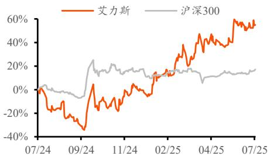  
最近一年股票与沪深 300比较  
资料来源：Wind，甬兴证券研究所

<table><tr><td>单位：百万元</td><td>2024A</td><td>2025E</td><td>2026E</td><td>2027E</td></tr><tr><td>营业收入</td><td>3,558</td><td>4,534</td><td>5,536</td><td>6,622</td></tr><tr><td>年增长率 (%)</td><td>76.3%</td><td>27.4%</td><td>22.1%</td><td>19.6%</td></tr><tr><td>归属于母公司的净利润</td><td>1,430</td><td>1,766</td><td>2,085</td><td>2,496</td></tr><tr><td>年增长率(%)</td><td>122.0%</td><td>23.5%</td><td>18.1%</td><td>19.7%</td></tr><tr><td>每股收益（元)</td><td>3.18</td><td>3.92</td><td>4.63</td><td>5.55</td></tr><tr><td>市盈率 (X)</td><td>18.84</td><td>24.11</td><td>20.42</td><td>17.06</td></tr><tr><td>净资产收益率 (%)</td><td>27.1%</td><td>27.0%</td><td>25.7%</td><td>25.0%</td></tr></table>

资料来源：Wind，甬兴证券研究所(2025 年07月04日收盘价)

# 正文目录

# 1. 深耕非小细胞肺癌靶向药领域，商业化成绩显著 ....

# 2. 伏美替尼具备脑转强效、疗效优异、安全性佳、治疗窗宽的优势 ...6

# 3. 商业化产品矩阵即将迎来扩充..

# 4. 盈利预测和投资建议.... 14

5. 风险提示 ..... .15

# 图目录

图 1: 艾力斯在研管线..  
图 2: 艾力斯发展历程.. .4  
图 3: 公司各季度营收（亿元） .4  
图 4: 公司各季度归母净利润（亿元） 4  
图 5: 公司历年盈利能力数据. .5  
图 6: 非鳞状细胞癌驱动基因阳性患者治疗流程图. .6  
图 7: 伏美替尼一线治疗不良反应谱（非头对头） .7  
图 8: 奥希替尼 ADAURA 研究 II-IIIA 期患者 DFS.. .8  
图 9: 阿美替尼 ARTS 研究 II-IIIB 期患者 DFS... .8  
图 10: EGFR PACC 突变简介......... ..9  
图 11: 伏美替尼 FURTHER 研究数据... ..9  
图 12: 伏美替尼 III 期 FURVENT 临床研究方案设计 .10  
图 13: 伏美替尼 Ib 期 FAVOUR 研究有效性数据.. ..10  
图 14: 伏美替尼 Ib 期 FAVOUR 研究安全性数据.. ..10  
图 15: 戈来雷塞和 AST24082（JAB-3312）的临床布局 . ... 11  
图 16: 戈来雷塞在胰腺癌及泛瘤种的临床数据..... ...12  
图 17: 戈来雷塞联合西妥昔单抗在 CRC的临床数据. ..12  
图 18: 普拉替尼国内已获批适应症.. 12

# 表目录

表 1: 部分第三代 EGFR-TKI 一线治疗 EGFR 突变 NSCLC 的 PFS 数据对比 ........ .......7

# 1. 深耕非小细胞肺癌靶向药领域，商业化成绩显著

# 1.1. 专注于肿瘤创新，核心产品为伏美替尼

根据艾力斯2024年年报，公司是一家专注于肿瘤治疗领域的创新药企业，当前战略性专注于肿瘤靶向创新药的研发，主要围绕肿瘤中常见的驱动基因靶点构建研发管线，已在非小细胞肺癌靶向药领域构建了优势研发管线。

商业化产品方面，公司核心产品伏美替尼一线和二线适应症均已国内上市并纳入医保，2023年 11 月引进基石药业普拉替尼大陆地区独家商业化推广权。在研管线方面，主要是伏美替尼的各项适应症拓展，如辅助治疗、20 外显子插入适应症等，此外自研注射用 AST2169 脂质体已于 2024 年 3月获得I 期临床试验批准。

图1:艾力斯在研管线  

<table><tr><td>药品</td><td>靶点</td><td></td><td>适应症</td><td>临床开展 临床前研究 ND请</td><td>临床1期 临床目期</td><td>临床川期 NDA申请 合作伙伴</td><td></td><td>备注</td></tr><tr><td rowspan="10">伏美替尼</td><td rowspan="10">EGFR</td><td>T790M突支非小细胞肺癌（二线）治疗</td><td>中国</td><td></td><td></td><td></td><td>已获批</td><td></td></tr><tr><td>EGFR敏感突变非小细胞肺癌（一线）治疗</td><td></td><td>中国</td><td></td><td></td><td></td><td>已获批</td></tr><tr><td>EGFR敏感突变非小细胞肺癌辅助治疗</td><td>中国</td><td></td><td></td><td></td><td></td><td>Ⅲ期</td></tr><tr><td>EGFR20外显子插入突变的NSCLC（二线）治疗</td><td>中国</td><td></td><td></td><td></td><td></td><td>Ⅱ期（注册临床）</td></tr><tr><td></td><td>EGFR20外显子插入突变的NSCLC（一线）治疗</td><td>全球</td><td></td><td></td><td>ARIVENTⅢ期</td><td></td></tr><tr><td>EGFR敏感突变阳性的非鳞NSCLC伴脑转移</td><td></td><td>中国</td><td></td><td></td><td></td><td>Ⅲ期</td></tr><tr><td></td><td>EGFR PAC突变或EGFR LS61Q突变的NSCLC</td><td>中国</td><td></td><td></td><td></td><td>Ⅲ期</td></tr><tr><td></td><td>非经典EGFR突变非小细胞肺癌的辅助治疗</td><td>中国</td><td></td><td></td><td></td><td>Ⅲ期</td></tr><tr><td>EGFR或HER2激活突变的非小细胞肺癌</td><td></td><td>全球</td><td></td><td></td><td>AARRVENT D期</td><td></td></tr><tr><td></td><td></td><td></td><td></td><td></td><td></td><td></td></tr><tr><td rowspan="3"></td><td></td><td></td><td></td><td></td><td></td><td></td><td></td><td></td></tr><tr><td></td><td></td><td></td><td></td><td></td><td></td><td></td><td></td></tr><tr><td></td><td></td><td></td><td></td><td></td><td></td><td></td><td></td></tr></table>

资料来源：艾力斯2024年年报，甬兴证券研究所

# 1.2. 二十余年发展历程，产品研发稳步推进

根据艾力斯官网，公司成立于 2004年 3月，由企业家杜锦豪先生与拥有美国国立卫生研究院终生科学家荣誉的郭建辉博士共同创立。根据艾力斯招股说明书以及年报公告，2012 年 7 月公司自研阿利沙坦酯国内获批上市，此后转让给信立泰；2021 年 3 月伏美替尼二线适应症获批、2022 年 6月一线适应症获批。

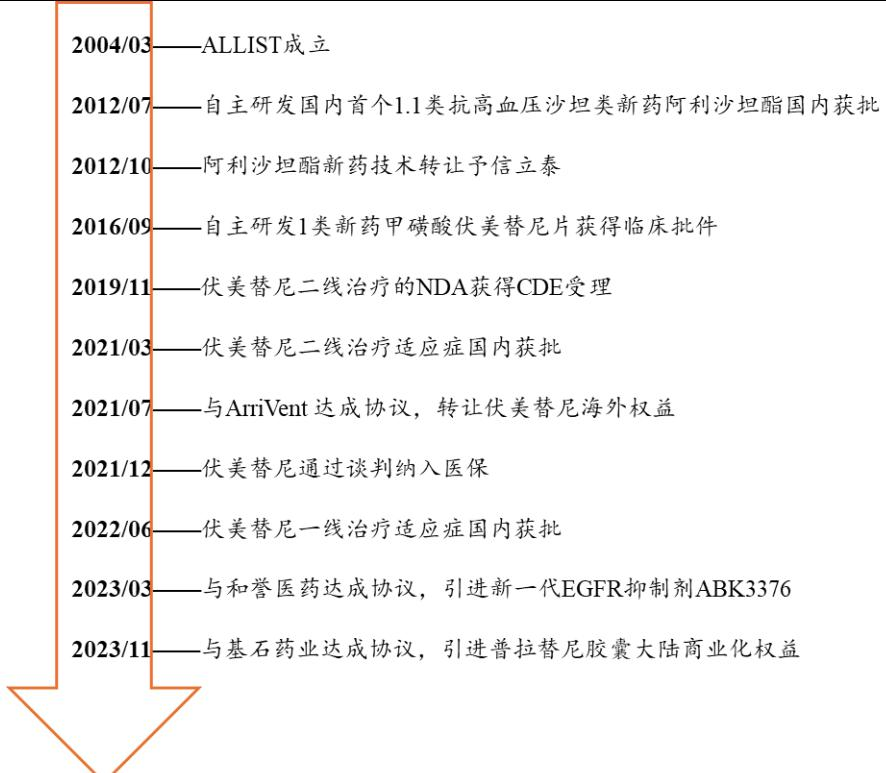  
图2:艾力斯发展历程  
资料来源：艾力斯招股说明书、历年财报与公告，甬兴证券研究所

# 1.3. 伏美替尼收入快速增长，2024 年利润率表现优异

根据艾力斯历年财报，公司自2021Q1伏美替尼上市起即有收入，此后收入基本逐季向上（仅2021Q3 因及海外授权相关收益有波动）。2024年公司实现收入35.58亿元（ $( + 7 6 . 2 9 \%$ ，同比增速，下同）、2025Q1收入10.98亿元（ $( + 4 7 . 8 6 \%$ ）。利润端，得益于伏美替尼的快速放量，公司于 2022Q2实现正常盈利（暂不考虑 2021Q3 授权收入所致盈利），此后利润端同样保持快速增长趋势，2024 年实现归母净利润 14.30 亿元（ $( + 1 2 1 . 9 7 \% )$ ）、 $2 0 2 5 \mathrm { Q } 1$ 归母净利润4.10亿元（ $( + 3 4 . 1 3 \%$ ）。

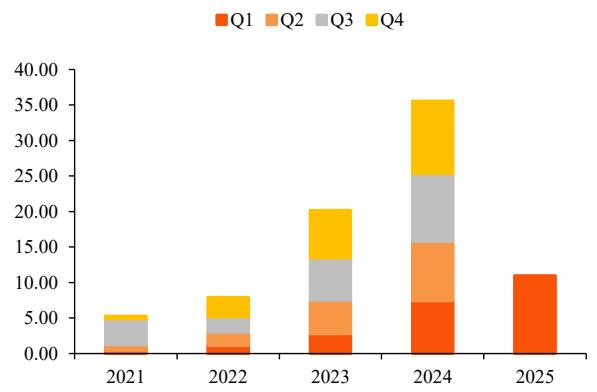  
图3:公司各季度营收（亿元）  
资料来源：Wind，甬兴证券研究所

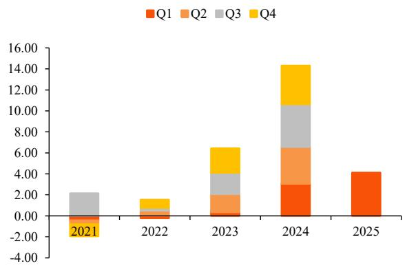  
图4:公司各季度归母净利润（亿元）  
资料来源：Wind，甬兴证券研究所

盈利能力方面，2021 年以来公司毛利率基本维持在 $9 5 \%$ 以上，波动较小。费用率上，得益于收入快速增长的规模效应，公司费用率合计逐年降低，2024年期间费用率合计为 $5 1 . 4 7 \% ( - 1 3 . 4 7 \mathrm { p c t } )$ ，主要是销售费用率，2024年为 $3 9 . 7 2 \%$ （-5.89pct），截至 2024 年报发布时（2025/04/23）公司拥有有超1200 人的营销团队，覆盖 31 个省市及约 4800 家医院，构建了遍及全国的销售网络；研发费用方面，2024 年公司研发支出共 4.82 亿元（ $+ 5 3 . 8 1 \% )$ ），其中费用化支出为 3.14 亿元，资本化主要是公司引进的戈来雷塞预计将于2025年内上市，对相关支出资本化。

净利率方面，得益于收入快速增长以及多项降本增效措施，公司 2024年归母净利率提升 8.27pct 至 $4 0 . 1 9 \%$ ，2025Q1 略有下降但整体仍维持相对较高水平。

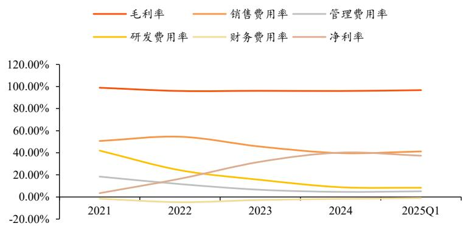  
图5:公司历年盈利能力数据  
资料来源：Wind，甬兴证券研究所

# 2. 伏美替尼具备脑转强效、疗效优异、安全性佳、治疗窗宽的优势

根据艾力斯公告，伏美替尼是公司原研第三代 EGFR-TKI，对 EGFRT790M 耐药突变阳性及EGFR 敏感突变具有显著的抑制活性，且对野生型EGFR抑制活性低，降低了对正常组织中EGFR 的功能干扰。伏美替尼主要用于 EGFR 突变阳性 NSCLC，并于 2021 年 3 月国内二线适应症获批、2022年 6 月国内一线适应症获批，目前均已纳入国家医保。2025 年伏美替尼将进行第二次医保续约工作，由于目前暂时没有新增适应症，预计此次续约仍为“简易续约”，因此2025 年伏美替尼的降价幅度不大。

为充分挖掘伏美替尼品种的临床优势，扩大伏美替尼的临床适用范围，公司积极开展针对伏美替尼各项适应症的临床试验，包括辅助治疗适应症、20外显子插入突变一线及二线治疗适应症、PACC突变的一线治疗适应症、针对 EGFR 敏感突变伴脑转移患者的治疗、EGFR 非经典突变的辅助治疗等均处于注册临床阶段。

# 2.1. EGFR 突变 NSCLC 领域安全性优势显著

根据益方生物招股说明书，NSCLC是最常见的肺癌类型，发病率占肺癌总数的 $8 5 \%$ 左右，全球/中国NSCLC新患人数在2020 年分别为188/79万人，逐年稳定增加；EGFR 基因突变占比约 $40 \%$ ，其中属于 EGFR 外显子19缺失或外显子21（L858R）置换的敏感突变类型约占 $8 5 \%$ 。

根据中华医学会肺癌临床诊疗指南（2024版），EGFR 敏感基因突变患者推荐一线使用EGFR-TKI。根据益方生物招股说明书，第三代EGFR-TKI较第一代在延长PFS和OS方面具有显著优势。若一线使用第一/二代TKI，有约 $50 \% { - } 6 0 \%$ 的患者会在治疗后出现 EGFR T790M 基因突变导致治疗失败，这部分患者推荐继续使用第三代TKI进行二线治疗。

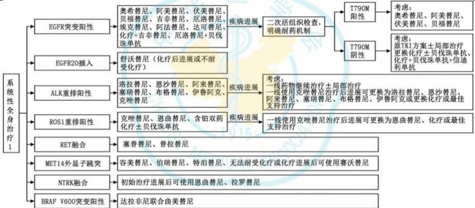  
图6:非鳞状细胞癌驱动基因阳性患者治疗流程图  
资料来源：《中华医学会肺癌临床诊疗指南(2024版)》（韩宝惠等，2024年9月)，甬兴证券研究所

根据同源康医药招股说明书，国产三代 EGFR-TKI 已获批阿美替尼、伏美替尼、贝福替尼和瑞齐替尼等多款，其中阿美替尼、伏美替尼和贝福替尼获批时间相对靠前。根据益方生物招股说明书以及各药物说明书信息，在二线治疗方面国产的 3 款药物在 ORR 和 PFS 数据上均与奥希替尼持平或更优（非头对头对比）；在一线治疗方面国产 3款药物相对对照药的 PFS 获益也大体与奥希替尼持平或更优（非头对头对比）。

表1:部分第三代 EGFR-TKI 一线治疗 EGFR 突变 NSCLC 的 PFS 数据对比  

<table><tr><td>药物</td><td>试验名</td><td>对照药</td><td>试验组 PFS（月数）</td><td>对照组组PFS（月数）</td><td>PFS 获益（月数）</td><td>HR值</td></tr><tr><td></td><td>FLAURA</td><td>吉非</td><td>18.9</td><td>10.2</td><td>8.7</td><td>0.46(0.37-0.57)</td></tr><tr><td>阿</td><td>AENEAS</td><td>吉非</td><td>19.3</td><td>9.9</td><td>9.4</td><td>0.46（0.36-0.60)</td></tr><tr><td>伏</td><td>FURLONG</td><td>吉非</td><td>20.8</td><td>11.1</td><td>9.7</td><td>0.44（0.34-0.58)</td></tr><tr><td>贝福替尼</td><td>IBIO-103</td><td></td><td>22.1</td><td>13.8</td><td>8.3</td><td>0.49（0.36-0.68)</td></tr></table>

资料来源：《Clinical benefit evaluation of drug treatment regimens for advanced lung cancer:based on ASCO-VF and ESMO-MCBS》(Jingdan Pang 等，2024 年)、同源康医药招股说明书、贝达药业官网、各药品说明书，甬兴证券研究所

根据《Clinical benefit evaluation of drug treatment regimens for advancedlung cancer:based on ASCO-VF and ESMO-MCBS》（Jingdan Pang 等，2024年），伏美替尼因在所有项目（疗效HR 值评分、毒性评分、缓解率评分、QoL 评分）均有突出表现，在ASCO-VF评分系统中以 70.98分的综合得分领先于竞争对手。

伏美替尼安全性优势明显，根据医脉通相关文章，伏美替尼 $\geqslant 3$ 级 AE为 $3 5 \%$ ，在不良反应谱上最常发生的 AE 为 ALT 升高（ $( 3 0 \% )$ ）、AST 升高（ $( 2 7 \%$ ）和腹泻（ $2 7 \%$ ），非头对头对比来看，ILD（间质性肺炎）发生率低于竞争对手。

图7:伏美替尼一线治疗不良反应谱（非头对头）  

<table><tr><td rowspan="3"></td><td colspan="4">奥希替尼</td><td colspan="2">阿美替尼</td><td colspan="2">伏美替尼*</td></tr><tr><td colspan="2">FLAURA ITT</td><td colspan="2">FLAURA中国</td><td colspan="2">AENEAS</td><td colspan="2">FURLONG</td></tr><tr><td>奥希替尼</td><td>代TKI</td><td>奥希替尼</td><td>吉非替尼</td><td>阿美替尼</td><td>吉非替尼</td><td>伏美替尼</td><td>吉非替尼</td></tr><tr><td>皮疹,%</td><td>59</td><td>79</td><td>37</td><td>39</td><td>23.4</td><td>41.4</td><td>17</td><td>40</td></tr><tr><td>腹泻，%</td><td>60</td><td>58</td><td>24</td><td>29</td><td>16.4</td><td>35.8</td><td>27</td><td>36</td></tr><tr><td>WBC减少，%</td><td>&lt;10</td><td>&lt;10</td><td>41</td><td>9</td><td>23.8</td><td>14.0</td><td>17</td><td>13</td></tr><tr><td>PLT减少，%</td><td>&lt;10</td><td>&lt;10</td><td>28</td><td>2</td><td>22.0</td><td>7.9</td><td>11</td><td>6</td></tr><tr><td>贫血，%</td><td>16</td><td>10</td><td>38</td><td>17</td><td>20.1</td><td>9.8</td><td>17</td><td>14</td></tr><tr><td>ALT升高，%</td><td>7</td><td>27</td><td>9</td><td>45</td><td>29.4</td><td>55.8</td><td>30</td><td>62</td></tr><tr><td>AST升高，%</td><td>10</td><td>25</td><td>16</td><td>43</td><td>29.9</td><td>54.0</td><td>27</td><td>56</td></tr><tr><td>QT延长，%</td><td>10</td><td>4</td><td>10</td><td>8</td><td>10.7</td><td>8.8</td><td>10</td><td>8</td></tr><tr><td>ILD,%</td><td>4</td><td>2</td><td>3</td><td>3</td><td>0.9</td><td>0.5</td><td>0.5</td><td>0.5</td></tr><tr><td>CPK升高，%</td><td></td><td>-</td><td></td><td></td><td>35.5</td><td>9.3</td><td>6</td><td>5</td></tr></table>

资料来源：《束永前教授：治疗EGFR敏感突变NSCLC，我更有可能选择伏美替尼》-医脉通肿瘤科公众号，甬兴证券研究所

# 2.2. 伏美替尼脑转强效，III 期试验 IND 已获得批准

根据艾力斯 2024 年年报，约 $2 5 \% \mathrm { E G F R }$ 突变 NSCLC 患者在初诊时发现具有脑部转移，在 3 年的随访中该比例可增加至 $50 \%$ ，对患者的生存时间和生活质量造成了较大挑战。在临床前研究中，伏美替尼原型药物及其主要活性代谢产物均能穿透血脑屏障。

伏美替尼在 FURLONG 研究中针对 CNS 的 cFAS 集取得了 $2 0 . 8 \mathrm { m }$ 的PFS 数据（对照组吉非替尼为 $9 . 8 \mathrm { m } \mathrm { . }$ ）， $\mathrm { H R } { = } 0 . 4$ 。2024 年 7 月伏美替尼用于治疗 EGFR 敏感突变阳性的非鳞 NSCLC 伴脑转移患者的 III 期临床试验IND 获得批准。

# 2.3. 术后辅助治疗 III 注册临床研究进展顺利

根据艾力斯2024年年报，术后辅助治疗是以外科手术为主的肺癌综合治疗的一部分，可以巩固手术治疗的成果。大约 $30 \%$ 的NSCLC 患者诊断时分期为I-IIIA，主要的治疗手段是手术切除。尽管接受根治性手术治疗的患者预后相对晚期患者较好，但单纯接受手术治疗的患者 5 年生存率仍然较低，从 $5 7 \%$ （IB 期）到 $23 \%$ （IIIA 期）。既往术后辅助治疗的选择主要是辅助化疗，但是辅助化疗获益有限，而且有较多的毒副反应，严重降低患者的生活质量。目前，三代 EGFR-TKI 辅助治疗已证实可以为 EGFR 突变阳性NSCLC 患者带来 DFS 获益。

伏美替尼术后辅助治疗适应症 III 注册临床研究进展顺利，已于 2024年上半年完成患者入组。2025 年 1 月，伏美替尼对比安慰剂辅助治疗携带EGFR 非经典突变且接受根治性切除术后伴或不伴辅助化疗的 IB-IIIB 期NSCLC受试者的III期临床试验 IND获得批准。

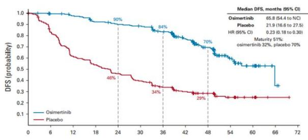  
图8:奥希替尼 ADAURA 研究 II-IIIA 期患者 DFS  
资料来源：医脉通呼吸频道，甬兴证券研究所

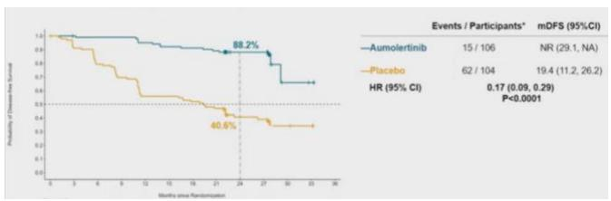  
图9:阿美替尼 ARTS 研究 II-IIIB 期患者 DFS  
资料来源：丁香园肿瘤时间，甬兴证券研究所

# 2.4. 针对 EGFR PACC 突变晚期 NSCLC 疗效突出

根据艾力斯 2024 年年报，EGFR 突变 NSCLC 中有超过 $12 \%$ 的 PACC突变患者，这类突变发生在 EGFR 18-21 号外显子，包括 G719X、L747X、

S768I、L792X 和 T854I 等，既往针对这类突变无有效治疗药物获批。

2024 年 9 月伏美替尼单药一线治疗 EGFR PACC 突变 NSCLC 的全球Ib 期临床 FURTHER 研究数据公布，经 BICR 评估的 $1 6 0 \mathrm { m g } / 2 4 0 \mathrm { m g }$ 的 cORR为 $3 4 . 8 \% / 6 3 . 6 \%$ ，一线脑转移的 ORR 为 $4 6 . 2 \%$ 。伏美替尼是目前唯一针对EGFR 靶点实现全覆盖的三代 EGFR-TKI，对比含铂化疗一线治疗 EGFRPACC 突变或 EGFR L861Q 突变局部晚期或转移性 NSCLC 的 III 期临床试验已经启动。

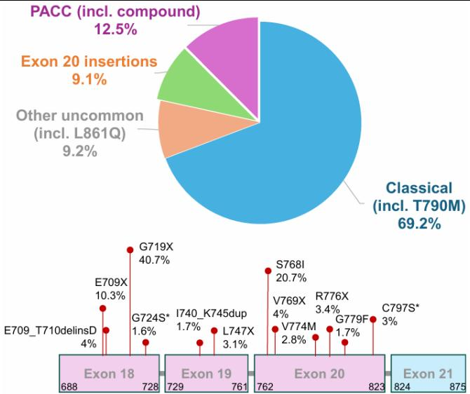  
图10:EGFR PACC 突变简介  
资料来源：Arrivent官网WCLC展示资料，甬兴证券研究所

图11:伏美替尼 FURTHER 研究数据  

<table><tr><td rowspan="2"></td><td colspan="2">BICR1</td></tr><tr><td>160mg QD N=23</td><td>240 mg QD $N=22$</td></tr><tr><td>Best ORR, % (95% CI1)2</td><td>47.8 (26.8-69.4)</td><td>81.8 (59.7-94.8)</td></tr><tr><td>Confirmed ORR, % (95% CI1)</td><td></td><td>34.8 (16.4-57.3) 63.6 (40.7-82.8)</td></tr><tr><td>Best Overall Response, n (%)</td><td></td><td></td></tr><tr><td>Partial response (PR)</td><td>8 (34.8)</td><td>14 (63.6)</td></tr><tr><td>Stable disease (SD)</td><td>13 (56.5)</td><td>8(36.4)</td></tr><tr><td>Progressive disease (PD)</td><td>2 (8.7)</td><td>0</td></tr><tr><td>Not Evaluable</td><td>0</td><td>0</td></tr><tr><td>DCR (CR+PR+SD), % (95% CI)</td><td>91.3 (72.0 - 98.9)</td><td>100 (84.6 - 100)</td></tr></table>

资料来源：Arrivent官网WCLC展示资料，甬兴证券研究所

# 2.5. 20 外显子插入 NSCLC 二线适应症有望 2025 年提交 NDA

根据艾力斯2024年年报，EGFR 20外显子插入突变约占所有EGFR 突变的 $4 \% - 1 2 \%$ ，是一类对当前治疗药物不敏感、预后较差的突变类型，存在巨大的未被满足的临床需求。

伏美替尼用于 EGFR 20 外显子插入突变 NSCLC 的二线适应症国内已完成注册性临床（FURMO-003）的入组工作，计划 2025 年提交 NDA；一线方面公司积极推动与 ArriVent合作的全球、多中心、III期 FURVENT临床研究，已于2025年初完成患者入组，预计 2027年获批上市。

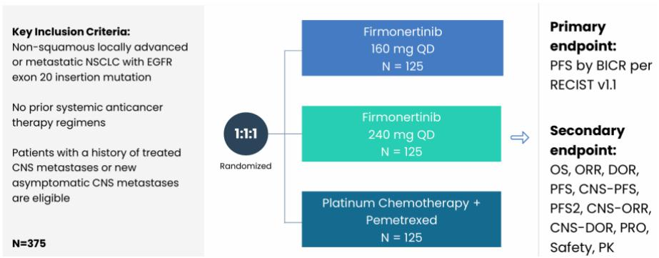  
图12:伏美替尼III期 FURVENT临床研究方案设计  
资料来源：Arrivent官网投资者交流材料，甬兴证券研究所

公司于 2023 年WCLC 上更新了伏美替尼治疗 EGFR 20 外显子插入突变晚期 NSCLC 的 Ib 期 FAVOUR 研究数据，IRC 评估伏美替尼初治 $2 4 0 \mathrm { m g }$ 组/经治 $2 4 0 \mathrm { m g }$ 组/经治 $1 6 0 \mathrm { m g }$ 组的确证ORR分别为 $7 8 . 6 \% / 4 6 . 2 \% / 3 8 . 5 \%$ ；DoR 则为 $1 5 . 2 / 1 3 . 1 / 9 . 7 $ 个月。

图13:伏美替尼 Ib 期 FAVOUR 研究有效性数据  

<table><tr><td>Effieaey by IRC</td><td>Treatment Naiv 240mgmg</td><td>Previously Teated 4omg</td><td>Previously Treaed 160mg</td></tr><tr><td>Confirmed ORR, % (95% C1)</td><td>78.6%(59.05%, 91.70%)</td><td>46.2%(26.59%.66.63%)</td><td>38.5% (20.23%, 59.43%)</td></tr><tr><td>Best Response, n(%)</td><td></td><td></td><td></td></tr><tr><td>Partial response (PR)</td><td>22 (78.6%)</td><td>12 (46.2%)</td><td>10(38.5%)</td></tr><tr><td>Stable disease (SD))</td><td>6(21.4%)</td><td>12(46.2%)</td><td>12(46.2%))</td></tr><tr><td>Progressivedisease (PD)</td><td>0</td><td>0</td><td>4 (15.4%)</td></tr><tr><td>Not evaluable/Not done</td><td>0/0</td><td>1 (3.8%)/ 1 (3.8%)</td><td>0/0</td></tr><tr><td>Dok medan (monthh)</td><td>15.2(8.74, 4.84)</td><td>13.1 5.62 13.80)</td><td>9.7 (.59, NA)</td></tr><tr><td>DCRCR+PR+SD) %</td><td>10.0% (87.6%, 00.00)</td><td>92.3%(74.87%,99.05%6)</td><td>84.6% (65.13%, 95.64%)</td></tr></table>

资料来源：Arrivent官网WCLC展示资料，甬兴证券研究所

图14:伏美替尼 Ib 期 FAVOUR 研究安全性数据  

<table><tr><td></td><td>Treatment Naive 240 mg N=30</td><td>Previously Treated 240 mg N=28</td><td>Previously Treated 160 mg N=28</td></tr><tr><td colspan="4">Overview of Treatment Related AEs (TRAEs) (# of Patient, %)</td></tr><tr><td>TRAE all grade</td><td>29(97%)</td><td>28 (100%)</td><td>25(89%)</td></tr><tr><td>TRAE Grade ≥3</td><td>4(13%)</td><td>8(29%)</td><td>5(18%)</td></tr><tr><td>Treatment-related SAE</td><td>1(3%)</td><td>5(18%)</td><td>0</td></tr><tr><td>TRAE eading to fatal outcome</td><td>0</td><td>0</td><td>0</td></tr><tr><td>TRAE leading to dose interruption</td><td>7 (23%)</td><td>9 (32%)</td><td>4(14%)</td></tr><tr><td>TRAE leading to dose reduction</td><td>4 (13%)</td><td>5(18%)</td><td>3(11%)</td></tr><tr><td>TiAE eadig nment</td><td>0</td><td>1(4%)</td><td>1(4%)</td></tr><tr><td>Treatment Duration (median)</td><td>8.4 months</td><td>5.7 months</td><td>4.0 months</td></tr><tr><td>Relative ose ntenst  mean</td><td>97.1% (8.0%)</td><td>94.9%(13.5%)</td><td>96.2% (9.4%)</td></tr></table>

资料来源：Arrivent官网WCLC展示资料，甬兴证券研究所

# 2.6. 积极开展伏美替尼联用进一步提升疗效

根据艾力斯公告，公司积极探索以伏美替尼为骨干药物的联合用药来应对耐药以期进一步提高治疗效果，公司已开展多项联合用药的临床研究，如联合 SHP2 抑制剂、安罗替尼、口服小分子 PD-L1 抑制剂等。其中有一些数据已经成熟并公布——2024ELCC 公布伏美替尼联合安罗替尼一线治疗 EGFR21 号外显子 L858R 突变阳性 NSCLC 数据，针对 EGFR21 号外显子 L858R 突变的患者，EGFR-TKI 的治疗效果普遍不佳，而伏美替尼联合安罗替尼展现出了良好的治疗潜力。

# 3. 商业化产品矩阵即将迎来扩充

# 3.1. 引进加科思戈来雷塞 $+ \mathbf { S } \mathbf { H } \mathbf { P } 2$ 抑制剂，持续丰富肺癌领域布局

根据艾力斯 2024 年年报，公司于 2024 年 8 月从加科思引进 KRASG12C 抑制剂戈来雷塞和 SHP2 抑制剂 AST24082。KRAS G12C 突变在NSCLC 发生率为 $4 \%$ ，对应约每年 2.5 万人晚期新发患者。戈来雷塞用于KRAS G12C 突变二线 NSCLC 的 NDA 申请已于 2024 年 5 月获得优先审评，有望成为国产第三家获批二线肺癌的产品，对比竞品具备安全性优势；一线则为戈来雷塞与AST24082联用，其III期注册性临床已于 2024年 8月完成首例患者给药，是该适应症国内首个实现患者入组的注册临床。

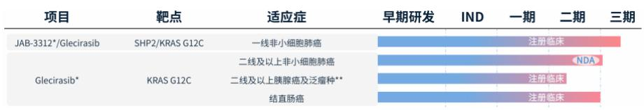  
图15:戈来雷塞和 AST24082（JAB-3312）的临床布局  
资料来源：加科思2024年投资者交流材料，甬兴证券研究所

根据加科思 2024 年投资者交流材料，戈来雷塞单药用于二线 KRASG12C 突变 NSCLC 的 IIb 期注册性临床数据在 ASCO2024 上公布，cORR为 $4 7 . 9 \%$ 、DCR 为 $8 6 . 3 \%$ 、mPFS 为 8.2 个月、 $\mathrm { m O S }$ 为 13.6 个月。戈来雷塞联合 AST24082 用于一线 KRAS G12C 突变 NSCLC 的 IIb 期临床数据也于 ASCO2024 上公布，最优剂量组的 cORR 为 $7 7 . 4 \%$ ，展示出优秀的治疗效果，并且安全性良好。除NSCLC 外，戈来雷塞胰腺癌及泛癌种单臂 II期注册性临床研究在中国进行中、联合西妥昔单抗用于结直肠癌的 III期注册性临床于2024年 5月获CDE批准。

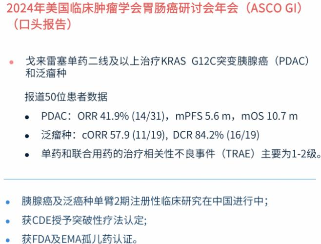  
图16:戈来雷塞在胰腺癌及泛瘤种的临床数据  
资料来源：加科思2024年投资者交流材料，甬兴证券研究所

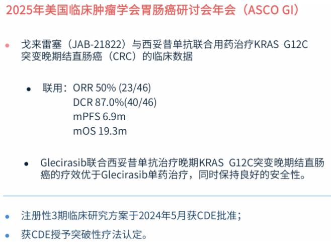  
图17:戈来雷塞联合西妥昔单抗在 CRC的临床数据  
资料来源：加科思2024年投资者交流材料，甬兴证券研究所

# 3.2. 普拉替尼降价工作已完成，地产化顺利推进中

根据艾力斯2024年年报，公司于2023年11月从基石药业引进中国大陆首款获批上市的RET 抑制剂普拉替尼，普拉替尼在中、美均获得了一线、二线 NSCLC 适应症的完全批准，并同时覆盖甲状腺癌。RET 融合是新近发现的肺癌驱动基因突变，在NSCLC中RET 融合患者约占 $1 \%$ ，国内每年新增患者约1-2 万人，RET融合一线治疗NSCLC 的市场空间广阔。

图18:普拉替尼国内已获批适应症  

<table><tr><td>药物名称</td><td>已获批适应症</td><td>合作伙伴</td></tr><tr><td rowspan="4">普拉替尼</td><td>RET基因融合阳性细胞肺癌（线治疗）</td><td rowspan="4">臣基石药业</td></tr><tr><td>RET基因融合阳细胞肺癌(一线治疗)</td></tr><tr><td></td></tr><tr><td>RET融合阳性甲状腺癌</td></tr></table>

资料来源：艾力斯2024年年报，甬兴证券研究所

根据艾力斯投关记录公告，普拉替尼的降价工作已于2025年4月完成，其地产化工作处于顺利推进过程中，后续生产成本将进一步下降。普拉替尼暂未纳入医保，受限于患者自费意愿和能力，RET 抑制剂患者使用人群占比较小，2024年公司推广服务收入（主要为普拉替尼）为 0.52亿元，毛利率 $3 2 . 1 5 \%$ 。

# 3.3. AST2303 为引进自和誉医药的新一代 EGFR 抑制剂

根据艾力斯 2024 年年报，公司于 2023 年 3 月从和誉医药引进高选择

性、可入脑的新一代 EGFR 口服小分子抑制剂 AST2303，2024 年 9 月其用于治疗携带 EGFR C797S 突变 NSCLC 的 I 期临床 IND 获得批准。

# 3.4. 自研 AST2169 脂质体针对 KRAS G12D 肿瘤

根据艾力斯公告，AST2169 脂质体为公司自研 KRAS G12D 选择性抑制剂，于2024年 3月获得针对 KRAS G12D 突变实体瘤的 I期临床批件。KRAS 是常见发生突变的驱动基因，癌症患者中KRAS突变发生率为 $14 \%$ -$3 0 \%$ 。KRAS G12D突变是KRAS 突变的一种常见的亚型，存在于非小细胞肺癌、结直肠癌、胰腺癌等多种类型癌症中，在大约 $30 \%$ 的胰腺癌、 $12 \%$ 的结直肠癌和 $4 \%$ 的非小细胞肺癌中可检测出。目前全球范围内尚无 KRASG12D抑制剂获批上市，该治疗领域存在巨大的未被满足的临床需求，市场空间广阔。公司将全速推进 AST2169的临床研究进度，积极探索其在肺癌、胰腺癌、结直肠癌中的治疗效果。

# 4. 盈利预测和投资建议

我们预计公司 25/26/27 年收入分别为 45.3/55.4/66.2 亿元，同比增长$2 7 . 4 \% / 2 2 . 1 \% / 1 9 . 6 \%$ ； 归 母 净 利 润 为 17.7/20.9/25.0 亿 元 ， 同 比 增 长$2 3 . 5 \% / 1 8 . 1 \% / 1 9 . 7 \%$ ，对应 PE 为 24/20/17 倍。公司深耕肺癌市场，商业化成绩显著，考虑伏美替尼仍有 20 外插与辅助治疗等适应症拓展空间以及与可比公司平均对比 PE 相对较低，维持“买入”评级。

# 5. 风险提示

1）创新药临床推进进度不及预期：国家药监局的审评标准动态调整可能延长研发周期；临床试验设计的复杂性可能使得临床进度不及预期。

2）创新药临床数据不及预期：关键指标未达预设目标等风险；临床试验设计与执行缺陷等影响最终临床数据。

3）创新药上市后销售情况不及预期：产品上市后可能面临市场准入、医保谈判与集采压力；产品销售额可能受企业商业化策略影响。

资产负债表 单位：百万元  

<table><tr><td>至12月31日</td><td>2023A2024A</td><td></td><td>2025E</td><td>2026E</td><td>2027E</td></tr><tr><td>流动资产</td><td>2,908</td><td>4,180</td><td>5,391</td><td>7,042</td><td>9,008</td></tr><tr><td>货币资金</td><td>1,862</td><td>587</td><td>696</td><td>1,007</td><td>1,342</td></tr><tr><td>应收及预付</td><td>294</td><td>485</td><td>547</td><td>634</td><td>703</td></tr><tr><td>存货</td><td>63</td><td>31</td><td>34</td><td>42</td><td>50</td></tr><tr><td>其他流动资产</td><td>688</td><td>3,078</td><td>4,114</td><td>5,358</td><td>6,913</td></tr><tr><td>非流动资产</td><td>1,469</td><td>1,736</td><td>1,854</td><td>1,887</td><td>1,925</td></tr><tr><td>长期股权投资</td><td>0</td><td>0</td><td>0</td><td>0</td><td>0</td></tr><tr><td>固定资产</td><td>506</td><td>510</td><td>512</td><td>519</td><td>530</td></tr><tr><td>在建工程</td><td>19</td><td>5</td><td>3</td><td>1</td><td>0</td></tr><tr><td>无形资产</td><td>66</td><td>65</td><td>63</td><td>62</td><td>60</td></tr><tr><td>其他长期资产</td><td>878</td><td>1,156</td><td>1,276</td><td>1,306</td><td>1,335</td></tr><tr><td>资产总计</td><td>4,376</td><td>5,916</td><td>7,245</td><td>8,929</td><td>10,934</td></tr><tr><td>流动负债</td><td>390</td><td>601</td><td>680</td><td>800</td><td>933</td></tr><tr><td>短期借款</td><td>0</td><td>0</td><td>0</td><td>0</td><td>0</td></tr><tr><td>应付及预收</td><td>53</td><td>82</td><td>99</td><td>119</td><td>143</td></tr><tr><td>其他流动负债</td><td>337</td><td>519</td><td>581</td><td>681</td><td>791</td></tr><tr><td>非流动负债</td><td>4</td><td>33</td><td>21</td><td>21</td><td>21</td></tr><tr><td>长期借款</td><td>0</td><td>0</td><td>0</td><td>0</td><td>0</td></tr><tr><td>应付债券</td><td>0</td><td>0</td><td>0</td><td>0</td><td>0</td></tr><tr><td>其他非流动负债</td><td>4</td><td>33</td><td>21</td><td>21</td><td>21</td></tr><tr><td>负债合计</td><td>394</td><td>633</td><td>701</td><td>822</td><td>955</td></tr><tr><td>股本</td><td>450</td><td>450</td><td>450</td><td>450</td><td>450</td></tr><tr><td>资本公积</td><td>3,175</td><td>3,254</td><td>3,254</td><td>3,254</td><td>3,254</td></tr><tr><td>留存收益</td><td>264</td><td>1,401</td><td>2,725</td><td>4,289</td><td>6,161</td></tr><tr><td>归属母公司股东权益</td><td>3,982</td><td>5,283</td><td>6,543</td><td>8,107</td><td>9,979</td></tr><tr><td>少数股东权益</td><td>0</td><td>0</td><td>0</td><td>0</td><td>0</td></tr><tr><td>负债和股东权益</td><td>4,376</td><td>5,916</td><td>7,245</td><td>8,929</td><td>10,934</td></tr></table>

利润表 单位：百万元  

<table><tr><td>至12月31日</td><td>2023A2024A</td><td></td><td>2025E</td><td>2026E2027E</td><td></td></tr><tr><td>营业收入</td><td>2,018</td><td>3,558</td><td>4,534</td><td>5,536</td><td>6,622</td></tr><tr><td>营业成本</td><td>78</td><td>143</td><td>177</td><td>214</td><td>257</td></tr><tr><td>营业税金及附加</td><td>27</td><td>49</td><td>61</td><td>75</td><td>89</td></tr><tr><td>销售费用</td><td>921</td><td>1,413</td><td>1,768</td><td>2,214</td><td>2,649</td></tr><tr><td>管理费用</td><td>132</td><td>165</td><td>204</td><td>249</td><td>298</td></tr><tr><td>研发费用</td><td>313</td><td>314</td><td>385</td><td>498</td><td>596</td></tr><tr><td>财务费用</td><td>-54</td><td>-61</td><td>-42</td><td>-44</td><td>-50</td></tr><tr><td>资产减值损失</td><td>0</td><td>0</td><td>0</td><td>0</td><td>0</td></tr><tr><td>公允价值变动收益</td><td>23</td><td>29</td><td>30</td><td>40</td><td>50</td></tr><tr><td>投资净收益</td><td>10</td><td>8</td><td>9</td><td>11</td><td>13</td></tr><tr><td>营业利润</td><td>658</td><td>1,635</td><td>2,064</td><td>2,435</td><td>2,912</td></tr><tr><td>营业外收支</td><td>-1</td><td>-16</td><td>-10</td><td>-10</td><td>-10</td></tr><tr><td>利润总额</td><td>656</td><td>1,619</td><td>2,054</td><td>2,425</td><td>2,902</td></tr><tr><td>所得税</td><td>12</td><td>189</td><td>288</td><td>339</td><td>406</td></tr><tr><td>净利润</td><td>644</td><td>1,430</td><td>1,766</td><td>2,085</td><td>2,496</td></tr><tr><td>少数股东损益</td><td>0</td><td>0</td><td>0</td><td>0</td><td>0</td></tr><tr><td>归属母公司净利润</td><td>644</td><td>1,430</td><td>1,766</td><td>2,085</td><td>2,496</td></tr><tr><td>EBITDA</td><td>611</td><td>1,577</td><td>2,054</td><td>2,426</td><td>2,903</td></tr><tr><td>EPS（元）</td><td>1.43</td><td>3.18</td><td>3.92</td><td>4.63</td><td>5.55</td></tr></table>

资料来源：Wind，甬兴证券研究所

现金流量表 单位：百万元  

<table><tr><td>至12月31日</td><td>2023A2024A2025E</td><td></td><td></td><td>2026E2027E</td><td></td></tr><tr><td>经营活动现金流</td><td>675</td><td>1,566</td><td>1,777</td><td>2,111</td><td>2,545</td></tr><tr><td>净利润</td><td>644</td><td>1,430</td><td>1,766</td><td>2,085</td><td>2,496</td></tr><tr><td>折旧摊销</td><td>40</td><td>40</td><td>42</td><td>45</td><td>51</td></tr><tr><td>营运资金变动</td><td>64</td><td>163</td><td>8</td><td>20</td><td>50</td></tr><tr><td>其它</td><td>-74</td><td>-67</td><td>-40</td><td>-40</td><td>-52</td></tr><tr><td>投资活动现金流</td><td>93</td><td>-1,835</td><td>-1,163</td><td>-1,278</td><td>-1,586</td></tr><tr><td>资本支出</td><td>-68</td><td>-270</td><td>-70</td><td>-59</td><td>-69</td></tr><tr><td>投资变动</td><td>0</td><td>0</td><td>-1,030</td><td>-1,230</td><td>-1,530</td></tr><tr><td>其他</td><td>161</td><td>-1,565</td><td>-64</td><td>11</td><td>13</td></tr><tr><td>筹资活动现金流</td><td>-2</td><td>-295</td><td>-504</td><td>-521</td><td>-624</td></tr><tr><td>银行借款</td><td>0</td><td>0</td><td>0</td><td>0</td><td>0</td></tr><tr><td>股权融资</td><td>0</td><td>0</td><td>0</td><td>0</td><td>0</td></tr><tr><td>其他</td><td>-2</td><td>-295</td><td>-504</td><td>-521</td><td>-624</td></tr><tr><td>现金净增加额</td><td>770</td><td>-561</td><td>109</td><td>312</td><td>335</td></tr><tr><td>期初现金余额</td><td>315</td><td>1,084</td><td>523</td><td>632</td><td>943</td></tr><tr><td>期末现金余额</td><td>1,084</td><td>523</td><td>632</td><td>943</td><td>1,278</td></tr></table>

主要财务比率  

<table><tr><td>至12月31日</td><td>2023A2024A</td><td></td><td>2025E</td><td>2026E</td><td>2027E</td></tr><tr><td>成长能力</td><td></td><td></td><td></td><td></td><td></td></tr><tr><td>营业收入增长</td><td>155.1%</td><td>76.3%</td><td>27.4%</td><td>22.1%</td><td>19.6%</td></tr><tr><td>营业利润增长</td><td>414.5%148.6%</td><td></td><td>26.2%</td><td>18.0%</td><td>19.6%</td></tr><tr><td>归母净利润增长</td><td>393.5%122.0%</td><td></td><td>23.5%</td><td>18.1%</td><td>19.7%</td></tr><tr><td>获利能力</td><td></td><td></td><td></td><td></td><td></td></tr><tr><td>毛利率</td><td>96.1%</td><td>96.0%</td><td>96.1%</td><td>96.1%</td><td>96.1%</td></tr><tr><td>净利率</td><td>31.9%</td><td>40.2%</td><td>38.9%</td><td>37.7%</td><td>37.7%</td></tr><tr><td>ROE</td><td>16.2%</td><td>27.1%</td><td>27.0%</td><td>25.7%</td><td>25.0%</td></tr><tr><td>ROIC</td><td>14.1%</td><td>25.7%</td><td>26.4%</td><td>25.2%</td><td>24.6%</td></tr><tr><td>偿债能力</td><td></td><td></td><td></td><td></td><td></td></tr><tr><td>资产负债率</td><td>9.0%</td><td>10.7%</td><td>9.7%</td><td>9.2%</td><td>8.7%</td></tr><tr><td>净负债比率</td><td></td><td>-46.7% -11.1% -10.6% -12.4% -13.4%</td><td></td><td></td><td></td></tr><tr><td>流动比率</td><td>7.46</td><td>6.96</td><td>7.93</td><td>8.80</td><td>9.65</td></tr><tr><td>速动比率</td><td>6.53</td><td>6.23</td><td>7.25</td><td>8.18</td><td>9.09</td></tr><tr><td>营运能力</td><td></td><td></td><td></td><td></td><td></td></tr><tr><td>总资产周转率</td><td>0.52</td><td>0.69</td><td>0.69</td><td>0.68</td><td>0.67</td></tr><tr><td>应收账款周转率</td><td>9.82</td><td>10.96</td><td>10.93</td><td>11.70</td><td>12.55</td></tr><tr><td>存货周转率</td><td>1.64</td><td>3.07</td><td>5.45</td><td>5.62</td><td>5.61</td></tr><tr><td>每股指标（元）</td><td></td><td></td><td></td><td></td><td></td></tr><tr><td>每股收益</td><td>1.43</td><td>3.18</td><td>3.92</td><td>4.63</td><td>5.55</td></tr><tr><td>每股经营现金流</td><td>1.50</td><td>3.48</td><td>3.95</td><td>4.69</td><td>5.65</td></tr><tr><td>每股净资产</td><td>8.85</td><td>11.74</td><td>14.54</td><td>18.02</td><td>22.18</td></tr><tr><td>估值比率</td><td></td><td></td><td></td><td></td><td></td></tr><tr><td>P/E</td><td>29.13</td><td>18.84</td><td>24.11</td><td>20.42</td><td>17.06</td></tr><tr><td>P/B</td><td>4.71</td><td>5.10</td><td>6.51</td><td>5.25</td><td>4.27</td></tr><tr><td>EV/EBITDA</td><td>27.65</td><td>16.72</td><td>20.39</td><td>17.13</td><td>14.20</td></tr></table>

# 分析师声明

本报告署名分析师具有中国证券业协会授予的证券投资咨询执业资格并注册为证券分析师，以勤勉尽责的职业态度，专业审慎的研究方法，独立、客观地出具本报告，保证报告采用的信息均来自合规渠道，并对本报告的内容和观点负责。负责准备以及撰写本报告的所有研究人员在此保证，本报告所发表的任何观点均清晰、准确、如实地反映了研究人员的观点和结论，并不受任何第三方的授意或影响。此外，所有研究人员薪酬的任何部分不曾、不与、也将不会与本报告中的具体推荐意见或观点直接或间接相关。

# 公司业务资格说明

甬兴证券有限公司经中国证券监督管理委员会核准，取得证券投资咨询业务许可，具备证券投资咨询业务资格。

投资评级体系与评级定义  

<table><tr><td>股票投资评级：</td><td>分析师给出下列评级中的其中一项代表其根据公司基本面及（或）估值预期以报告日起6 个月 内公司股价相对于同期市场基准指数表现的看法。</td></tr><tr><td></td><td>买入 股价表现将强于基准指数 20%以上</td></tr><tr><td></td><td>增持 股价表现将强于基准指数5-20%</td></tr><tr><td></td><td>中性 股价表现将介于基准指数土5%之间</td></tr><tr><td></td><td>减持 股价表现将弱于基准指数 5%以上</td></tr><tr><td>行业投资评级：</td><td>分析师给出下列评级中的其中一项代表其根据行业历史基本面及（或）估值对所研究行业以报告 日起12个月内的基本面和行业指数相对于同期市场基准指数表现的看法。</td></tr><tr><td></td><td>增持 行业基本面看好，相对表现优于同期基准指数</td></tr><tr><td></td><td>中性 行业基本面稳定，相对表现与同期基准指数持平</td></tr><tr><td></td><td>减持 行业基本面看淡，相对表现弱于同期基准指数</td></tr><tr><td></td><td>相关证券市场基准指数说明：A股市场以沪深 300 指数为基准；港股市场以恒生指数为基准；新三板市场以三板成 指（针对协议转让标的）或三板做市指数（针对做市转让标的）为基准指数。</td></tr></table>

投资评级说明：

不同证券研究机构采用不同的评级术语及评级标准，投资者应区分不同机构在相同评级名称下的定义差异。本评级体系采用的是相对评级体系。投资者买卖证券的决定取决于个人的实际情况。投资者应阅读整篇报告，以获取比较完整的观点与信息，投资者不应以分析师的投资评级取代个人的分析与判断。

# 特别声明

在法律许可的情况下，甬兴证券有限公司(以下简称“本公司”）或其关联机构可能会持有报告中涉及的公司所发行的证券或期权并进行交易，也可能为这些公司提供或争取提供投资银行、财务顾问以及金融产品等各种服务。因此，投资者应当考虑到本公司或其相关人员可能存在影响本报告观点客观性的潜在利益冲突，投资者请勿将本报告视为投资或其他决定的唯一参考依据。也不应当认为本报告可以取代自己的判断。

# 版权声明

本报告版权归属于本公司所有，属于非公开资料。本公司对本报告保留一切权利。未经本公司事先书面许可，任何机构或个人不得以任何形式翻版、复制、转载、刊登和引用本报告中的任何内容。否则由此造成的一切不良后果及法律责任由私自翻版、复制、转载、刊登和引用者承担。

# 重要声明

本报告由本公司发布，仅供本公司的客户使用，且对于接收人而言具有保密义务。本公司并不因相关人员通过其他途径收到或阅读本报告而视其为本公司的客户。客户应当认识到有关本报告的短信提示、电话推荐及其他交流方式等只是研究观点的简要沟通，需以本公司发布的完整报告为准，本公司接受客户的后续问询。本报告首页列示的联系人，除非另有说明，仅作为本公司就本报告与客户的联络人，承担联络工作，不从事任何证券投资咨询服务业务。

本报告中的信息均来源于我们认为可靠的已公开资料，本公司对这些信息的真实性、准确性及完整性不作任何保证。本报告中的信息、意见等均仅供客户参考，该等信息、意见并未考虑到获取本报告人员的具体投资目的、财务状况以及特定需求，在任何时候均不构成对任何人的个人推荐。客户应当对本报告中的信息和意见进行独立评估，并应同时思量各自的投资目的、财务状况以及特定需求，必要时就法律、商业、财务、税收等方面咨询专家的意见。客户应自主作出投资决策并自行承担投资风险。本公司特别提示，本公司不会与任何客户以任何形式分享证券投资收益或分担证券投资损失，任何形式的分享证券投资收益或者分担证券投资损失的书面或口头承诺均为无效。市场有风险，投资须谨慎。对依据或者使用本报告所造成的一切后果，本公司和关联人员均不承担任何法律责任。

本报告所载的意见、评估及预测仅反映本公司于发布本报告当日的判断。该等意见、评估及预测无需通知即可随时更改。过往的表现亦不应作为日后表现的预示和担保。在不同时期，本公司可发出与本报告所载意见、评估及预测不一致的研究报告。本公司不保证本报告所含信息保持在最新状态。同时，本公司的销售人员、交易人员以及其他专业人士可能会依据不同假设和标准、采用不同的分析方法而口头或书面发表与本报告意见及建议不一致的市场评论或交易观点。本公司没有将此意见及建议向报告所有接收者进行更新的义务。投资者应当自行关注相应的更新或修改。