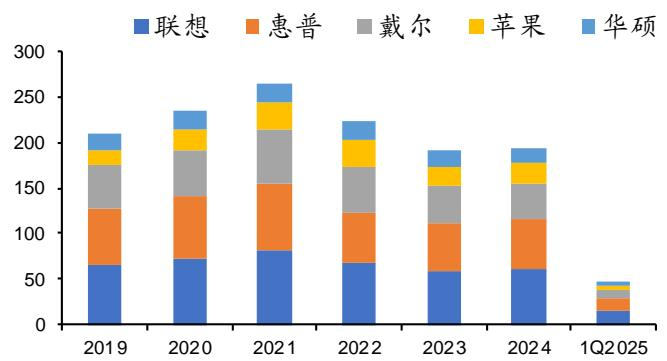
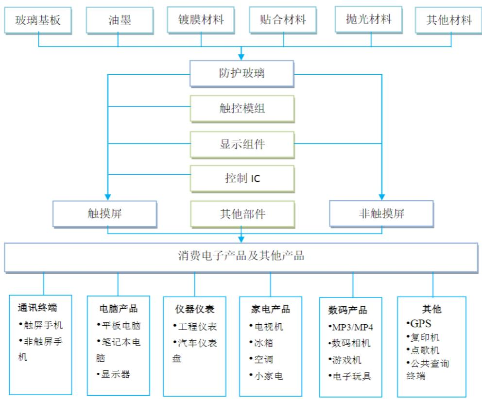
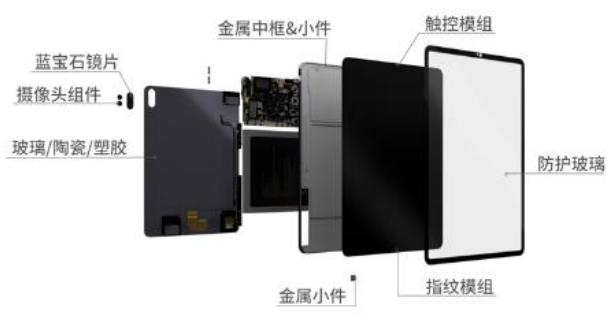
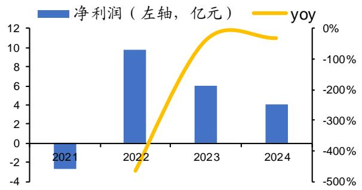
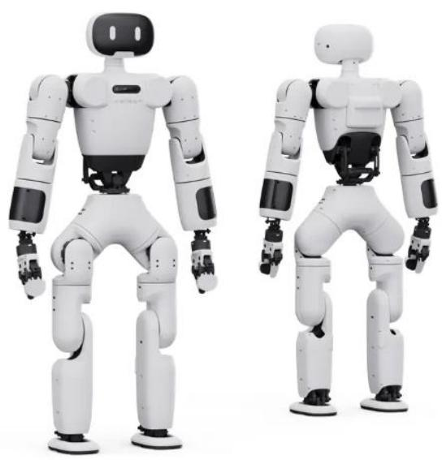

2025年07月11日

# 蓝思科技 (300433.SZ)

买入 (首次评级)公司深度研究证券研究报告

# 精密制造平台化龙头，

# AI驱动引领成长

# 公司简介：

公司以玻璃盖板业务为基础，依托大客户进行产业链上下游延伸、产品线拓展，同时拓展汽车、智慧零售、机器人等下游领域，打造平台化一站式精密制造企业。2025Q1 公司实现营收 170.63 亿元，同增 $1 0 . 1 0 \%$ ；归母净利润 4.29 亿元，同增 $3 8 . 7 1 \%$ 。

# 投资逻辑：

消费电子业务：根据 IDC，25Q1 中国智能手机出货量 7160 万部，同增 $3 . 3 \%$ ，全球增速 $1 . 5 \%$ ，全球 PC 出货量同增 $4 . 9 \%$ ，行业持续复苏。1）公司拓展蓝宝石、陶瓷等新材料的大规模生产和后道加工能力、金属中框精密加工和整机组装等新业务，全产业链布局助力公司品类拓展&价值量及份额提升。2）创新方向提供潜在成长曲线。折叠屏方面公司具备 UTG/CPI 核心技术储备，深度配套大客户及安卓进行研发生产，有望受益于苹果折叠屏的推出。AI/XR 眼镜拓展潜在客户，目前已与 Rokid 宣布达成深度战略合作，提供零部件、模组、整机组装服务，加速产业降本及新品类渗透。

汽车业务：根据盖世汽车，2024 年全液晶仪表的搭载量占比已超$80 \%$ ；10 英寸以上液晶仪表占比接近 $70 \%$ ，车载屏幕走向大屏化、多屏化。公司客户资源丰富，已与特斯拉、小米、比亚迪、宝马、奔驰、理想、蔚来等国内外头部厂商合作。公司产品品类拓展，覆盖中控屏、仪表盘、智能 $\mathtt { B } / \mathtt { C }$ 柱、精密结构件、充电桩等。2024年，公司智能汽车与座舱类业务实现营业收入 59.35 亿元，同比增长 $1 8 . 7 3 \%$ 。

新兴业务：1）智慧零售业务公司与支付宝“碰一下”智能终端产品合作，提供完整解决方案和规模化生产落地。2）公司在机器人领域积极布局，2025 年 1 月 21 日，公司与智元机器人公司在长沙举行了灵犀 X1 人形机器人套餐交付仪式，成功批量交付灵犀 X1人形机器人整机产品。

# 盈利预测、估值和评级

预测 2025-2027 年公司分别实现归母净利润 51.75、64.26、80.55亿元，同比增长 $4 2 . 8 1 \%$ 、 $2 4 . 1 7 \%$ 、 $2 5 . 3 5 \%$ ，我们给予公司 2025年29 倍 PE 估值，目标市值 1500.80 亿元，对应目标价格为 28.61元/股，首次覆盖给予“买入”评级。

电子组  
分析师：樊志远(执业 S1130518070003)  
fanzhiyuan@gjzq.com.cn  
分析师：丁彦文(执业 S1130524070002)  
dingyanwen@gjzq.com.cn

市价(人民币）：22.69元目标价(人民币)：28.61元

公司基本情况（人民币）  

<table><tr><td>项目</td><td>2023</td><td>2024</td><td>2025E</td><td>2026E</td><td>2027E</td></tr><tr><td>营业收入(百万元)</td><td>54,491</td><td>69,897</td><td>90,832</td><td>111,361</td><td>135,642</td></tr><tr><td>营业收入增长率</td><td>16.69%</td><td>28.27%</td><td>29.95%</td><td>22.60%</td><td>21.80%</td></tr><tr><td>归母净利润(百万元)</td><td>3,021</td><td>3,624</td><td>5,175</td><td>6,426</td><td>8,055</td></tr><tr><td>归母净利润增长率</td><td>23.42%</td><td>19.94%</td><td>42.81%</td><td>24.17%</td><td>25.35%</td></tr><tr><td>摊薄每股收益(元)</td><td>0.606</td><td>0.727</td><td>0.987</td><td>1.225</td><td>1.536</td></tr><tr><td>每股经营性现金流净额</td><td>1.87</td><td>2.19</td><td>0.94</td><td>1.34</td><td>1.61</td></tr><tr><td>ROE(归属母公司)(摊薄)</td><td>6.52%</td><td>7.45%</td><td>9.25%</td><td>10.75%</td><td>12.46%</td></tr><tr><td>P/E</td><td>37.42</td><td>31.20</td><td>23.00</td><td>18.52</td><td>14.77</td></tr><tr><td>P/B</td><td>2.44</td><td>2.32</td><td>2.13</td><td>1.99</td><td>1.84</td></tr></table>

来源：公司年报、国金证券研究所

# 风险提示

消电需求不及预期、关税风险、AI 端侧产品推广不及预期。

# 内容目录

一、深耕消费电子，横纵产业赛道布局... 5  
1.1 业务布局广泛，覆盖消费电子及汽车领域龙头客户 . 5  
1.2 业绩快速增长，盈利能力有望持续提升. . 8  
二、消费电子：AI 创新驱动成长，公司一体化平台持续受益. 10  
2.1 手机需求持续复苏，关注 AI 终端发展趋势.. 10  
2.2 苹果为 AI 端侧创新核心品牌，绑定大客户共同成长. 11  
2.3 收并购垂直整合优势突出，业务布局持续拓展.. 16  
三、持续扩充品类&开拓客户，车载业务有望加速放量. 20  
3.1 汽车智能化趋势加速. 20  
3.2 车载屏幕走向大屏化多屏化，多功能汽车玻璃需求升级. 21  
3.3 公司技术领先&垂直生产优势，车载业务快速增长.. 22  
四、新兴领域：人形机器人迎量产元年，公司具备垂直一体化生产优势.. 23  
五、盈利预测及估值.. 26  
5.1 盈利预测 .. 26  
5.2 估值与投资建议. 28  
六、风险提示... . 28

# 图表目录

图表 1： 公司主要产品. 5  
图表 2： 公司发展历程. 6  
图表 3： 公司股权结构 . 6  
图表 4： 2024 公司主营业务收入占比（按产品） 7  
图表 5： 2024 公司主营业务毛利占比（按产品） 7  
图表 6： 公司主要客户集中度.. 7  
图表 7： 公司主要供应商依赖度. 7  
图表 8： 公司全球化布局.. 7  
图表 9： 公司研发费用和研发费用率情况.. . 8  
图表 10： 研发人员数量及其占比 . 8  
图表 11： 公司历史投资项目情况 . 8  
图表 12： 公司历史营收情况 ... 9  
图表 13： 公司历史归母净利润情况.. 9  
图表 14： 公司销售毛利率及净利率情况. 9  
图表 15： 主要产品毛利率情况 . 9  
图表 16： 公司期间费用率情况 .. . 9  
图表 17： 2017-2024 年全球手机分季度出货量及增速.. 10  
图表 18： 2017-2024 年全球 PC 分季度出货量及增速.. . 10  
图表 19： 2017-2024 年全球各品牌手机分季度出货量（百万台） . 11  
图表 20： 2017-2024 年全球各品牌手机分季度增速.. 11  
图表 21： 2019-2025Q1 全球 PC 市场分品牌出货量（百万台） . 11  
图表 22： 2019-2025Q1 全球 PC 市场分品牌增速... . 11  
图表 23： 全球采用 MacOS 的 PC 比例持续提升 . . 12  
图表 24： 苹果 24年 iPhone 销量约 2.2 亿部，市占率保持较稳定（单位：百万部） . 12  
图表 25： 苹果 Mac 在 PC 市占率约 $10 \%$ ，市占率保持较稳定（单位：百万部）.. . 13  
图表 26： 公司历年新机发布情况 .. . 13  
图表 27： Apple Intelligence 五大定义.. . 14  
图表 28： Apple Intelligence 四大能力.. . 14  
图表 29： 苹果 25.2.28 发布 iPhone 16e.. . 14  
图表 30： 苹果部分专利 ... . 14  
图表 31： 中国折叠屏手机销量情况 . . 15  
图表 32： 苹果手机占据高端市场 . . 15  
图表 33： 玻璃盖板示意图 ... . 16  
图表 34： 玻璃盖板产业链示意图 . . 17  
图表 35： 公司手机产品示意图 . . 17  
图表 36： 公司手表产品示意图 . . 17  
图表 37： 公司笔记本电脑产品示意图 . . 18  
图表 38： 公司平板电脑产品示意图 .. . 18  
图表 39： 2015-2022 分业务占比.. . 18  
图表 40： 15-22 年玻璃业务收入及增速（单位：亿元） . 18  
图表 41： 苹果收入占比变化 ... . 19  
图表 42： 子公司蓝思精密（泰州）营业收入及同比增速. . 19  
图表 43： 子公司蓝思精密（泰州）净利润及同比增速 . . 19  
图表 44： 子公司蓝思精密（湘潭）营业收入 . . 20  
图表 45： 子公司蓝思精密（湘潭）净利润... . 20  
图表 46： 2017-2024 全球新能源汽车销量及增速.. . 20  
图表 47： 2017-2024 全球新能源汽车渗透率.. . 20  
图表 48： 2017-2024 中国新能源汽车销量及增速.. . 20  
图表 49： 2017-2024 中国新能源汽车渗透率.. . 20  
图表 50： 22-24 中国乘用车市场不同级别智驾渗透率.. 21  
图表 51： 2023-2024 中国分价格区间智能座舱渗透率.. 21  
图表 52： 22-24 乘用车车载显示屏搭载量及渗透率.. . 21  
图表 53： 不同尺寸中控屏占比情况.. . 21  
图表 54： 小米 YU7 致力于车内超静音. . 22  
图表 55： 静音需求带动玻璃持续升级. . 22  
图表 56： 公司汽车布局产品线丰富 .. . 22  
图表 57： 公司智能汽车与座舱收入及增速（亿元） . 22  
图表 58： 国内外人形机器人典型代表公司商业化进展情况. . 23  
图表 59： 公司参与核心部件.. . 24  
图表 60： 灵犀 X1 人形机器人. . 24  
图表 61： 灵宝 CASBOT-VLA 模型 . . 25  
图表 62： 灵宝 CASBOT 人形机器人 . . 25  
图表 63： 支付宝碰一碰用于零售支付.. . 25  
图表 64： 支付宝碰一碰多种类别可选择 . . 25  
图表 65： 公司与支付宝合作.. . 25  
图表 66： Meta-Rayban 销量持续增长.. . 26  
图表 67： Rokid Glasses 硬件处于行业领先地位. . 26  
图表 68： 公司营业收入分业务预测（亿元） . 27  
图表 69： 可比公司估值. . 28

# 一、深耕消费电子，横纵产业赛道布局

# 1.1 业务布局广泛，覆盖消费电子及汽车领域龙头客户

公司 1993 年成立于深圳，2006 年总部落户湖南长沙，2015 年在深交所创业板上市。业务涉及智能手机与电脑、新能源汽车及智能座舱、智能头显与智能穿戴等智能终端的结构件、模组及组装，涵盖玻璃、金属、蓝宝石、陶瓷、塑胶、碳纤维等新材料，以及与之配套的辅料、工装夹具模具、生产/检测/自动化设备、自主研发的工业互联网系统。同时公司多年来在消费电子和新能源汽车行业深耕，积累了苹果、三星、华为、小米、OPPO、vivo、荣耀、谷歌、Meta，特斯拉、宁德时代、宝马、奔驰、大众、理想、蔚来、比亚迪等客户。

图表1：公司主要产品  

<table><tr><td>覆盖下游</td><td>具体情况</td><td>产品示意图</td><td>客户资源</td></tr><tr><td>智能手机</td><td>产品涵盖玻璃、蓝宝石、陶瓷、金属、塑胶等材质的防护面 板、触控模组、生物识别等外观结构及功能组件。</td><td>金属中框私小件 塑胶件 pCBA 蓝宝石锁片 防护玻璃 指纹模组 陶瓷后盖 中框：金属&amp;陶瓷 敏控模组 金属小件</td><td rowspan="3">苹果、三星、华为、小 米、OPPO、vivo、荣 耀、谷歌、Meta</td></tr><tr><td></td><td>智能手表、AR/VR等AIoT品类拥有玻璃、蓝宝石、陶瓷（背盖 智能穿戴组件、表壳、表冠）、金属（表壳、表冠）、触控、贴合、镀膜 （玻璃、蓝宝石)等在内的一站式供应及组装能力。 提供基于不同金属材质的A、C、D壳解决方案，拥有高端玻</td><td>触控模组 前盖：蓝宝石&amp;玻璃 金属小件 贴合 触换条</td></tr><tr><td></td><td>璃、陶瓷、蓝宝石替代方案。满足客户多元化需求：从笔记本 笔记本电脑触控面板解决方案，到GF2、OGS、GFF等结构，固态光学胶、 液态光学胶与LCM、OLED 贴合，再到笔记本上触控板、触摸条 和主动笔等触控定制需求均可满足。</td><td>A键 前盖板玻璃 金国中框&amp;小件 燃控模组</td></tr><tr><td>平板电脑</td><td>与国内外头部品牌深度战略合作，集成防护玻璃、指纹模组、 蓝宝石镜片、触控模组、金属结构件等零组件，提供一站式解 决方案。</td><td>件 玻璃/西资/望较 防护玻璃 金黑小件 指纹模组</td><td></td></tr><tr><td>智能汽车</td><td>围绕辅助驾驶舱研发及批量生产车载电子玻璃及组件、车载中 控屏（结构与功能零部件及组装)、前挡玻璃/车窗玻璃、仪表 盘组件、B柱、车载装饰件、车身结构件、后视镜及导航仪等诸 多种类的汽车电子产品。</td><td>汽车天窗 新能源汽车新型玻璃</td><td>特斯拉、宁德时代、宝 马、奔驰、大众、理 想、蔚来、比亚迪</td></tr></table>

来源：公司招股说明书，公司年报，国金证券研究所

公司自成立以来，其业务拓展与产业趋势呈现出显著的协同发展轨迹。1993 年的 3 月 18日公司前身恒生玻璃表面加工厂在深圳成立，2002 年，公司率全球行业之先将玻璃应用到手机防护屏幕上，2003 年蓝思科技有限公司成立，2006 年在湖南浏阳设立蓝思科技总部，2015 年蓝思科技在深交所上市。2016 年并购连胜，加速华南地区布局。2020 年通过收购可胜/可利切入苹果金属中框供应链。2021 年成立新能源汽车子公司与蔚来、理想达成合作。

  
图表2：公司发展历程  
来源：公司官网，国金证券研究所

公司股权结构稳定，周群飞、郑俊龙做为一致行动人，通过蓝思科技（香港）有限公司、长沙群欣投资咨询有限公司间接持以及郑俊龙直接持有，共同持有本公司 62.13%的股份。公司董事长周群飞企业管理经验丰富，在长期实践中积累掌握了丰富的行业经验，任多家企业董事长，2011 年 6 月至今，担任公司董事长兼总经理，履行董事职责并全面负责公司的发展战略规划及经营管理工作。

  
图表3：公司股权结构  
来源：公司年报，国金证券研究所

公司的主营业务按产品种类可分为智能手机与电脑、新能源汽车及智能座舱、智能头显与智能穿戴、其他智能终端。2024 全年营收 698.97 亿元，智能手机与电脑类 577.54 亿元，占比达 82.63%，为公司贡献主要营收；毛利方面，智能手机与电脑类 87.27 亿元，占比分别为 78.57%，为公司贡献最多的毛利额。

  
图表4：2024公司主营业务收入占比 (按产品)  
来源：Wind，国金证券研究所

  
图表5：2024公司主营业务毛利占比（按产品）  
来源：Wind，国金证券研究所

业务布局广泛，覆盖消费电子及汽车领域龙头客户。1）公司多年来在消费电子和新能源汽车行业的深耕，积累了优质稳定的国际知名品牌客户，在手机领域，苹果公司始终为公司第一大客户，也与华为、小米达成了深度合作；新能源领域客户包括特斯拉、比亚迪、理想、宝马等头部企业在内的 30 多家国内外品牌。2）目前公司下游客户集中度高，2024年前五大客户占总营收的 81.13%，相较于 2021 年的 80.56%，基本保持平稳，2024 年第一大客户占总营收的比例高达 49.45%。

  
图表6：公司主要客户集中度  
来源：Wind，国金证券研究所

  
图表7：公司主要供应商依赖度  
来源：Wind，国金证券研究所

公司注重产品科技创新，进行全球化布局。2024 年公司研发人员为 24545 人，研发人员占比为 17.99%，研发人员同比增长 $5 , 2 5 \%$ ，曾成立蓝思创新研究院，聚焦脆性材料、金属材料、光学应用、新能源、镀膜技术、触控模组、智能制造、整机设计、人工智能等新项目、新材料、新工艺、新设备。全球化方面，2017 年公司开辟越南新生产基地，公司在美国、德国、日本、韩国拥有全球服务驻点。

  
图表8：公司全球化布局

来源：Wind，国金证券研究所

注重技术研发，研发人员占比逐年提升。公司对研发费用的投入逐年增长，产品持续迭代，从 2021 年至 2024 年，公司研发支出分别为 21.34 亿元、21.04 亿元、23.17 亿元和 27.85亿元，近几年研发费用率稳定在 $4 \% - 5 \%$ 。

  
图表9：公司研发费用和研发费用率情况  
来源：Wind，国金证券研究所

  
图表10：研发人员数量及其占比  
来源：Wind，国金证券研究所

图表11：公司历史投资项目情况  

<table><tr><td>项目名称</td><td>预计总投资规模</td><td>拟达到目标</td></tr><tr><td rowspan="3">2015年，上市首次</td><td rowspan="3">60亿元</td><td>看好3D曲屏市场前景，加大3D曲面玻璃研发生产投入；扩大</td></tr><tr><td>蓝宝石技术优势，打通产业链，维持优质客户资源并占据市场份</td></tr><tr><td>额；向市场传递积极信号，推动股价上升。</td></tr><tr><td rowspan="3">2020 年，第二次定增方案</td><td rowspan="3">150亿元</td><td>通过募资投资建设长沙（二）园项目，满足扩能需求，巩固市场</td></tr><tr><td>地位；优化资本结构，补充流动资金，增强偿债能力和抗风险能</td></tr><tr><td>力。</td></tr></table>

来源：公司公告，国金证券研究所

公司于 7 月 9 日发行境外上市外资股（H 股）股票并在香港联交所主板挂牌上市，发售数量 2.62 亿股，占扩大股本后的 5%，其中香港发行 2885 万股，占发行数量的 11%，本次 H股发行的最终价格为每股 18.18 港元。募集资金款项将用于丰富扩展公司产品及服务组合，补充核心产品类别（如智能手机、电脑、智能汽车和座舱的结构件及功能模组）的产能、升级生产基础设施和数字管理系统，用于智能终端折叠屏功能件、UTG 技术储备和产能建设，用于开发智能汽车外观结构件及配套产品，用于智能机器人的产能配套及研究开发。

# 1.2 业绩快速增长，盈利能力有望持续提升

收入逐年增加，归母净利润增速良好。2025Q1 公司实现营收 170.63 亿元，同增 10.10%；归母净利润 4.29 亿元，同增 38.71%。公司净利率从 2021 年的 4.68%增长至 2024 年的5.27%。公司将生产制造与工业互联网、大数据、云计算、人工智能等新技术进行深度融合，大幅提高数据自动化采集分析和反向控制水平，提高生产效率和良率，降低生产管理成本。

  
图表12：公司历史营收情况

  
图表13：公司历史归母净利润情况

来源：Wind，国金证券研究所来源：Wind，国金证券研究所

  
图表14：公司销售毛利率及净利率情况  
来源：Wind，国金证券研究所

  
图表15：主要产品毛利率情况  
来源：Wind，国金证券研究所

费用率有所改善，研发费用率逐渐稳定。从 2021-2024，公司对研发费用加以控制且公司规模效应逐步体现,公司控制研发成本初具成效。此外，公司实行精益化管理，费用控制持续取得成效，销售费用率、管理费用率都得到了一定程度的下降。

  
图表16：公司期间费用率情况  
来源：Wind，国金证券研究所

# 二、消费电子：AI创新驱动成长，公司一体化平台持续受益

# 2.1 手机需求持续复苏，关注AI 终端发展趋势

2024 年全球智能手机出货量同比转正，复苏趋势有望持续。据 IDC 数据，2024Q4 全球智能手机出货量同比增长 2.16%，达 3.77 亿部，2024 年全年同比增长 4.15%，出货量达到14.37 亿部，厂商通过促销、推出新品、以旧换新策略等举措提振需求。根据 IDC 数据，25Q1 中国智能手机出货量 7160 万部，同增 3.3%，全球增速为 1.5%，达到 3.05 亿部。

  
图表17：2017-2024年全球手机分季度出货量及增速  
来源：IDC，国金证券研究所

PC 市场缓慢恢复，25Q1 全球 PC 出货量同比增长 4.9%。根据 IDC 数据，2024 年PC 出货量在连续两年下滑后小幅回升，增长了 0.96%，增幅温和，2025Q1 全球 PC 出货量达 63.2亿台，同比增长 4.9%，超预期增长主要系美国和日本市场的出货量增加，美国地区厂商或为应对关税政策大幅增加库存，出货量至 1600 万台，同比增长 12.6%，日本市场则因为Windows 11 的替换需求刺激商用 PC 市场，日本 PC 出货量同比增长 15.6%。

  
图表18：2017-2024年全球PC分季度出货量及增速  
来源：IDC，国金证券研究所

在手机市场品牌方面，根据 IDC 数据，2025Q1 三星凭借 Galaxy S25 高端机型持续热销，以及主打 AI 功能的中端 Galaxy A 系列（特别是最新款 A36 和 A56）的强劲表现，重夺市场领导地位；苹果创下史上最佳 Q1 出货量，规避美关税风险，渠道商担忧供应链中断可能导致库存短缺和价格上涨，推动多区域集中备货；小米主要受益于国补政策，其中端产品销量获得显著提振，在中国市场实现增长。

  
图表19：2017-2024年全球各品牌手机分季度出货量（百万台)  
来源：IDC，国金证券研究所

  
图表20：2017-2024年全球各品牌手机分季度增速  
来源：IDC，国金证券研究所

  
图表21：2019-2025Q1全球PC市场分品牌出货量(百万台)  
来源：IDC，国金证券研究所

PC 市场品牌方面，2024 年全年，联想、惠普、戴尔、苹果、华硕排名全球 PC 市场前五，其中戴尔的出货量同比下滑，其余四个品牌均有增长。根据 IDC，联想全年出货量达 6180万台，同增 4.57%，市占率达 23.5%，继续保持市场领先地位。惠普以 5300 万台的出货量保持第二的位置，同增 0.19%。戴尔出货量达 3910 万台，同比下降 2.25%。苹果出货量增幅达 4.57%，达到 2290 万台。华硕增幅最大，达 6.55%，出货量达1790 万台,市场正在向主要厂商集中。

  
图表22：2019-2025Q1全球PC市场分品牌增速  
来源：IDC，国金证券研究所

# 2.2 苹果为 AI 端侧创新核心品牌，绑定大客户共同成长

目前全球活跃的苹果设备数量超 20 亿台，iPhone 活跃用户超 15 亿。根据 2025 年2月苹果公布的数据，包括 iPhone、iPad、Mac 等，全球活跃的苹果设备数量超过 23.5 亿台，较 23 年 1 月公布的 20 亿台活跃设备持续增长。活跃设备当中大部分为 iPhone。

在 PC 操作系统端，Mac 市占率持续提升。根据 statcounter 数据，2009 年 1 月全球PC当中采用 Windows 操作系统的占比达到 95.42%，采用 MacOS 的占比仅 3.68%；截至 2024 年12 月，采用 Windows 操作系统的 PC 占比下降至 73.38%，采用 MacOS 的比例提升至 14.16%。

  
图表23：全球采用MacOS的PC比例持续提升  
来源：statcounter，国金证券研究所

从收入来看，苹果 2024 年 iPhone 收入 2006.19 亿美元，同比下滑 1.9%，较出货量下滑幅度更大。从 ASP 来看，按照苹果所披露的 iPhone 销售收入，以及 IDC 的出货量来测算，苹果 24 年 iPhone ASP 为 896 美元，较 23 年的 908 美元有所下滑，23 年 Q1、Q2 苹果iPhone ASP 分别为 991、1072 美元，24Q1、Q2 分别为 912、859 美元，有较大幅度下降。24 年下半年 iPhone ASP 有较明显回升，23 年 Q3、Q4 苹果 iPhone ASP 分别为 848、822美元，24 年 Q3、Q4 分别为 908、899 美元。

  
图表24：苹果 24 年iPhone 销量约2.2 亿部，市占率保持较稳定(单位：百万部)  
来源：IDC，国金证券研究所

Mac 在全球 PC 市场市出货量市占率约 10%，保持较为稳定。根据 Statista 数据，2024年苹果 Mac 出货量为 2219 万部，同比下滑 2.38%，出货量市占率为 9.0%。收入来看，24 年苹果 Mac 收入为 311.91 亿美元，同比+6.1%。ASP 来看，24 年 Mac ASP 为 1401 美元，较23 年全年 ASP 的 1317 美元有所提升。

  
图表25：苹果Mac在 $\pmb { P C }$ 市占率约 $10 \%$ ，市占率保持较稳定（单位：百万部)  
来源：IDC，国金证券研究所

2025 年 3 月 31 日，苹果推出 apple Intelligence，apple Intelligence 只能用于 A17Pro（对应 iPhone 15 Pro）或更高版本手机、M 系列的 iPad、Mac。软件系统升级对算力要求更高，有助于带动新一波换机周期。

图表26：公司历年新机发布情况  

<table><tr><td>发布时间</td><td>mini款</td><td>基础款</td><td>PLUS</td><td>Pro</td><td>MAX</td><td>SE版本</td></tr><tr><td>2010.6.7</td><td></td><td>iPhone 4</td><td></td><td></td><td></td><td></td></tr><tr><td>2011.10.4</td><td></td><td>iPhone 4s</td><td></td><td></td><td></td><td></td></tr><tr><td>2012.9.13</td><td></td><td>iPhone 5</td><td></td><td></td><td></td><td></td></tr><tr><td>2013.9.11</td><td></td><td>iPhone 5s</td><td></td><td></td><td></td><td>iPhone 5c</td></tr><tr><td>2014.9.9</td><td></td><td>iPhone6</td><td>iPhone 6Plus</td><td></td><td></td><td></td></tr><tr><td>2015.9.8</td><td></td><td>iPhone 6s</td><td>iPhone 6s Plus</td><td></td><td></td><td></td></tr><tr><td>2016.9.8</td><td></td><td>iPhone 7</td><td>iPhone 7Plus</td><td></td><td></td><td>iPhone SE</td></tr><tr><td>2017.9.12</td><td></td><td>iPhone8</td><td>iPhone 8 Plus</td><td></td><td>iPhone X</td><td></td></tr><tr><td>2018.9.12</td><td></td><td>iPhone XR</td><td></td><td>iPhone XS</td><td>iPhone XS Max</td><td></td></tr><tr><td>2019.9.11</td><td></td><td>iPhone 11</td><td></td><td>iPhone 11 Pro</td><td>iPhone 11 Pro Max</td><td></td></tr><tr><td>2020.10.13</td><td>iPhone 12 mini</td><td>iPhone 12</td><td></td><td>iPhone 12 Pro</td><td>iPhone 12 Pro Max</td><td>iPhone SE 2</td></tr><tr><td>2021.9.15</td><td>iPhone 13 mini</td><td>iPhone 13</td><td></td><td>iPhone 13 Pro</td><td>iPhone 13 Pro Max</td><td></td></tr><tr><td>2022.9.8</td><td></td><td>iPhone 14</td><td>iPhone 14 Plus</td><td>iPhone 14 Pro</td><td>iPhone 14 Pro Max</td><td>iPhone SE 3</td></tr><tr><td>2023.9.15</td><td></td><td>iPhone 15</td><td>iPhone 15 Plus</td><td>iPhone 15 Pro</td><td>iPhone 15 Pro Max</td><td></td></tr><tr><td>2024.9.13</td><td></td><td>iPhone 16</td><td>iPhone 16 Plus</td><td>iPhone 16 Pro</td><td>iPhone 16 Pro Max</td><td></td></tr><tr><td>2025.2.28</td><td></td><td>iPhone 16E</td><td></td><td></td><td></td><td></td></tr></table>

来源：公司网站，国金证券研究所，SE 版本一般为 3、4 月发布

苹果生成式 AI 大模型 Apple Intelligence 正式登场，提出五大定义：功能强大、直观易用、融入产品体验、理解个人情景、注重个人隐私，核心能力涵盖语言文本、图片影像、跨应用操作、个人情景理解。

功能涵盖了 AI 回信、AI 抠图、AI 录音纪要摘要等功能，并集成了 ChatGPT。比较惊艳的功能包括基于个人情景实现跨 app 执行操作（比如邮件通知会议延期，可以直接问手机能否赶上和女儿之前约的话剧，这个过程知道用户的女儿是谁，调用了邮件、地图等工具）、支持自然语言理解、 制作个人回忆视频。

Apple Intelligence 只能用于 A17 Pro 芯片（对应 iPhone 15 Pro）或更高版本手机、M系列的 iPad、Mac。软件系统升级对算力要求更高。苹果在 2024 年 10 月 28 日正式发布了 iOS 18.1 版本，引入了 Apple Intelligence 功能，包括写作工具、新版 Siri 智能升级、智能摘要、智能回复及照片应用新功能等。

  
图表27：Apple Intelligence 五大定义  
来源：苹果官网，国金证券研究所

  
图表28：AppleIntelligence 四大能力  
来源：苹果官网，国金证券研究所

苹果已经正式发布 iPhone 16E 机型。iPhone 16E 具备较长电池续航时间，搭载性能强大的 A18 芯片，并配备高分辨率 4800 万像素二合一摄像头系统。考虑到 25 年 iPhone 16E机型的发布，以及 iPhone17 有望带来较多创新（如 Slim 版本），另外 apple intelligence逐渐成熟，我们认为 2025-2027 年 iPhone 有望迎来较大换机周期。

图表29：苹果25.2.28 发布 iPhone 16e

在 AI 眼镜、折叠屏方面，苹果有一定投入并且申请了相关专利，专利涉及外观设计、功能体验、屈光镜片等，从专利方面可以看出，苹果在 AI/AR 眼镜赛道筹备已久。

图表30：苹果部分专利  

<table><tr><td>适用范围</td><td>图片</td><td>作用</td></tr><tr><td>AI眼镜</td><td>22 42</td><td>于复杂以干扰虚像的问题，为此苹果的眼镜系统会感测环境光相</td></tr></table>

来源：公司网站，国金证券研究所

<table><tr><td>AI眼镜</td><td>Evewet sptei 1RLED222 320 315 RCa 20 310 -330 300 325 315a</td><td>该专利可用于MR 头显以及AR 眼镜，基于主动照明源和来自深度 传感器的深度信息闪光来确定第一位置（如角膜中心)，结合RGB 传感器和深度信息来确定第二位置（如眼球旋转中心），两者结 合以确定用户的注视方向。</td></tr><tr><td>AI眼镜</td><td>-.710 708- -720 702 -712 304 110—</td><td>该专利能够将镜腿展开到更宽的位置，这有利于适应更多头型。 铰链还具有多个稳定位置，可为头部提供不同的夹紧力。其他方 面，铰链结构允许电缆穿过，从而实现镜框跟镜腿间不同元器件 的连接。</td></tr><tr><td>AI眼镜</td><td>~298 ~298 100 10ra$ 08 104 104</td><td>该专利在眼镜镜腿以及镜框大量使用了可拆卸式设计，这能满足 不同用户在不同场景下的使用需求，如方便用户更换个性化镜 腿，自定义屈光镜片等。镜框集成电路芯片、处理器、存储单元 等，而镜腿则会放置各种生物传感器、操作按钮、电池等。镜腿 与镜框之间配备了机械连接结构和通信链路。</td></tr><tr><td>折叠屏</td><td>78 -10 70 -12 ←14</td><td>采用的是大折叠屏形态，由可折叠外壳所支撑的折叠显示屏，外 壳的第一部分和第二部分通过铰链连接。</td></tr></table>

来源：美国专利商标局 ，国金证券研究所

根据 IDC 数据，2024 年中国折叠屏销量达 916.74 万部，同比增长 $3 0 . 8 4 \%$ ；其中华为销量达到 445 万部，占比达 $4 9 \%$ 。Counterpoint Research 公布 2024 年全球高端手机市场数据，2024 年全球高端手机（售价 $\geqslant 6 0 0$ 美元）已占到整体智能手机市场的 $2 5 \%$ ，苹果在 2024年高端手机市场份额占比达到了 $60 \%$ 。看好苹果产品创新力以及在高端市场的影响力，若其发布折叠手机产品，将有望带动全球折叠机销量提升。

  
图表31：中国折叠屏手机销量情况  
来源：IDC，国金证券研究所

  
图表32：苹果手机占据高端市场  
来源：Counterpoint，国金证券研究所

2025 年 2 月 1 日，美国政府宣布对进口自中国的商品加征 $10 \%$ 关税；3 月 4日，再次加征10%的关税；4 月 2 日，美国总统签署行政令，中国大陆及中国香港加征 $34 \%$ 对等关税；4月 8 日，美国政府宣布对中国输美商品征收“对等关税”的税率由 34%提高至 84%；4 月

10 日，对中国的对等关税进一步上调至 125%；5 月 12 日，对等关税中的34%，其中的 24%在初始的 90 天内暂停实施，保留加征剩余 10%的关税。

针对美国政府可能的关税举措，苹果也在尽可能减少影响。海关数据显示，3 月份苹果公司在印度的主要供应商富士康和塔塔电子向美国运送了价值近 20 亿美元的 iPhone 手机，创下历史新高。苹果公司空运这些手机以避开美国总统特朗普（当时）即将实施的关税。苹果在印度的另一家供应商塔塔电子 3 月份对美国的出口额为 6.12 亿美元，较前一个月增长了约 63%。可以看出，由于担心特朗普关税会推高成本，苹果已提前布局，加大了在印度的生产力度，并承包了货运航班将 600 吨 iPhone 运往美国，以确保其最大的市场之一有足够的库存。

另外我们认为苹果可以依靠其他多种方式进一步降低关税影响，例如公司可以调整产品零部件选型，通过降低成本的方式抵消部分关税影响；供应链逐步推进全球布局，有望通过产地多元化降低关税影响。

苹果 25 年 2 月 24 日宣布，未来四年内将在美国支出和投资超过 5000 亿美元，这一举措预计将新增 2 万个就业岗位。5000 亿投资包括公司与全美 50 个州的数千家供应商的合作、直接就业、Apple Intelligence 基础设施和数据中心、公司设施以及 20 个州的 AppleTV+制作。苹果将与其合作伙伴在休斯敦建造一座占地 25 万平方英尺的工厂，组装用于数据中心的服务，用来生产支持 Apple Intelligence 的服务器。

# 2.3 收并购垂直整合优势突出，业务布局持续拓展

视窗防护玻璃又称为玻璃盖板，具有保护显示屏和触控模组的功能，可提升设备耐用性，是消费电子的重要零部件。一块玻璃盖板通常由导电层、加硬层、玻璃层、油墨层等多个层次构成。在性能方面，要求强度高、透光率高、韧性好、抗划伤、憎污性好、聚水性强等特点，起到对显示屏、触控模组的保护、产品标识和装饰功能，其内表面必须紧密贴合触控模组和显示屏，而外表面则需具备足够的强度，以保护平板显示屏、触控模组等核心部件，同时实现产品的标识和装饰功能。

  
图表33：玻璃盖板示意图  
来源：公司公告，国金证券研究所

玻璃盖板行业的上游行业主要为玻璃基板、油墨、抛光材料、镀膜材料、贴合材料等原材料的生产和供应行业。上游行业基本属于竞争性行业，目前市场供应相对充足。行业中游，目前行业内技术研发能力强并且具备较大规模生产能力的企业除了公司外，还有伯恩光学、星星科技、正达光电等少数几家，行业内中小企业较多，但其研发能力相对有限，规模化生产能力不足，难以与下游需求市场同步发展。

公司与下游行业的发展密切相关、相互促进，中游行业的进步和产品的革新可激发下游行业的设计升级和落地，提高下游行业产品的综合竞争力；下游行业的技术革新与发展一定程度上为中游行业提供新的产品研发方向和更广阔的市场空间。

  
图表34：玻璃盖板产业链示意图  
来源：公司公告，国金证券研究所

公司从玻璃业务起家，发展至今涵盖了玻璃、金属、蓝宝石、陶瓷、塑胶、碳纤维等新材料，以及与之配套的辅料、工装夹具模具、生产设备、检测设备、自动化设备、自主研发的工业互联网系统，可以满足智能手机、智能手表、笔记本电脑、平板电脑等多个终端客户不同需求。

  
图表35：公司手机产品示意图  
来源：公司官网，国金证券研究所

  
图表36：公司手表产品示意图

来源：公司官网，国金证券研究所

  
图表37：公司笔记本电脑产品示意图  
来源：公司官网，国金证券研究所

  
图表38：公司平板电脑产品示意图  
来源：公司官网，国金证券研究所

公司最初以及最核心的业务是盖板玻璃业务，从公司营收结构来看，大尺寸防护玻璃以及中小尺寸防护玻璃是公司营收的最主要来源。按照此前业务分类口径，中小尺寸防护玻璃是第一大营收来源，自 2015 年上市以来，从 2015 年的 110.04 亿元增长至 2022 年的315.18 亿元，营收占比始终在 60%以上；同时大尺寸防护玻璃业务收入从 2025 年的 18.33亿元增长至 2022 年的 60.15 亿元。2023 年之后，公司改变营收分类口径，2024 年智能手机与电脑类业务贡献营收 577.54 亿元，占公司总营收的 82.63%。

  
图表39：2015-2022分业务占比  
来源：Wind，国金证券研究所

  
图表40：15-22年玻璃业务收入及增速（单位：亿元）  
来源：Wind，国金证券研究所

技术创新是公司发展的核心驱动力。2006 年，公司开始与苹果接触，于 2007 年初通过苹果的供应商认证，正式建立合作关系，公司与苹果合作以来，一直是其视窗防护玻璃产品重要供应商。2010 年 iPhone 4 手机首次实现双面玻璃设计，替代塑料材质。2015 年，公司开始向触摸屏产业链延伸，推出了触控显示防护一体化的全贴合产品。2017 年（iPhoneX）使用 3D 曲面玻璃后盖。2021 年公司已与主要柔性屏手机终端品牌建立了在柔性屏外观防护技术和防护材料的深度合作，与终端客户共同为消费者提供可量产、可持续发展的技术方案和高质量的产品，包括且不限于用在折叠屏上的后盖 3D 玻璃、UTG 玻璃、CPI 膜等等。2015-2023 年，随着智能手机等产品市场快速成长以及公司单机产品价值的提升，公司对第一大客户销售额从 83 亿元增至 315 亿元，在营收占比始终在 50%以上。

  
图表41：苹果收入占比变化  
来源：公司公告，国金证券研究所

2020 年 8 月，公司收购可胜泰州和可利泰州，切入金属机壳中高端市场。2021 年 2 月，收购后的可胜科技（泰州）有限公司更名为蓝思旺精密（泰州）有限公司，可利科技（泰州）有限公司更名为蓝思精密（泰州）有限公司。

2023 年 4 月,公司为进一步优化产品和销售结构、提高市场份额，拟以自有资金和银行借款的方式投资建设精密部件生产项目及改扩建项目，项目主要扩充消费类电子产品合金机壳、铝合金机壳背盖组装件、模具、检治具、刀具、汽车及新能源金属结构件的产能。

在营业收入方面，2022 年蓝思精密（泰州）营收同比增加 27.32%，达 145 亿元，净利润 9.76 亿元；2024 年营收达 102.11 亿元，净利润 4.01 亿元，对于营业收入和净利润的下降主要公司为优化产能与业务布局，提高公司整体效率，将蓝思精密部分业务转移到上市公司其他子公司。

  
图表42：子公司蓝思精密（泰州）营业收入及同比增速  
来源：公司公告，国金证券研究所

  
图表43：子公司蓝思精密（泰州）净利润及同比增

来源：公司公告，国金证券研究所

2021 公司在湘潭投资建设智能终端设备智造一期项目，进入智能终端组装业务。2021 年刚投产时即获得部分智能手机客户的整机组装订单，并与智能穿戴、平板电脑、汽车电子、医疗设备等领域客户达成了较强的合作意向。

公司以组装为抓手，聚焦手机与 PC 两大核心赛道.2024 年依托在玻璃、金属、蓝宝石、陶瓷、触控模组、指纹模组等关键领域的领先优势，加速产业链垂直整合，向更多客户推介并提供了垂直整合方案，以 ODM 或 OEM 模式开发及量产智能手机、支付终端、PC、笔电、医疗、智能家居等智能设备，带动公司销售规模增长，促进结构件与模组的市场份额提升。

在营业收入方面，2023 公司手机组装业务大幅增长，从 2021 年刚开工亏损 2.4 亿元到2023 年下半年逐渐开始盈利，经营团队和技术逐渐成熟，经营规模逐渐扩大，规模效应开始体现，效率和良率达到行业先进水平，销售收入与盈利显著提升，2024 年已实现 4.03亿净利润贡献。

  
图表44：子公司蓝思精密（湘潭）营业收入  
来源：公司公告，国金证券研究所

  
图表45：子公司蓝思精密（湘潭）净利润  
来源：公司公告，国金证券研究所

# 三、持续扩充品类&开拓客户，车载业务有望加速放量

# 3.1 汽车智能化趋势加速

全球新能源汽车稳健增长，汽车智能化趋势明显。EVTank 数据显示，2024 年全球新能源汽车销量达到 1,823.6 万辆，同比增长 24.4%，渗透率达 20.49%，预计 2025 年进一步上升达到 2239.7 万辆。根据中汽协数据，国内新能源汽车 2024 年销量 1286.6 万辆，同比增长 34.09%；新能源汽车渗透率达 49.20%，同比增长 28.33%，再创历史新高。各大整车厂商在快速充电、超长续航、自动驾驶、娱乐影音等方面争先创新，不断提升了新能源汽车的产品竞争力。

  
图表46：2017-2024全球新能源汽车销量及增速

  
图表47：2017-2024全球新能源汽车渗透率

来源：国金证券研究所汽车组预测来源：国金证券研究所汽车组预测

  
图表48：2017-2024中国新能源汽车销量及增速  
来源：国金证券研究所汽车组预测

  
图表49：2017-2024中国新能源汽车渗透率  
来源：国金证券研究所汽车组预测

L2 级辅助驾驶指同时具备横向控制（方向）和纵向控制（加减速）的基础辅助驾驶功能，如车道保持（LCC）、自适应巡航（ACC）等，根据盖世汽车数据，整体乘用车市场方面，2024 年国内乘用车新车 L2 及以上 ADAS 装配量达 1098 万辆，渗透率为 47.9%，其中新能源车 L2 及以上渗透率为 56.9%，高于燃油车。

从品牌来看，新势力品牌渗透率普遍较高，2024 年 1-11 月，自主品牌 L2 总配套量为 571.9万套，比亚迪以 120.3 万套位居榜首，代表的车型有宋 PLUSDM、元 PLUS、唐 DM 等。

从价格看，30 万元以下车型渗透率增长显著，是智能座舱普及的主要推动力。其中，10 万元以下智能座舱渗透率近半，10-20 万元渗透率 77.5%，20-30 万元达到 78.1%，显示出智能座舱技术正通过规模化应用突破成本限制，逐步下沉至大众消费市场。

随着辅助驾驶和无人驾驶技术日益成熟及应用加速，智能座舱渗透率不断提升，整车的人机交互正向个性化、便捷化和多模态发展。而车载显示与感知系统作为车内人机交互体验的核心载体，将迎来黄金发展期，中控屏、仪表盘、智能 B 柱、投显等交互核心部件的智能化与驾乘体验的提高密不可分，将不断提升出行标准与用户体验

  
图表50：22-24中国乘用车市场不同级别智驾渗透率  
来源：盖世汽车，国金证券研究所

  
图表51：2023-2024中国分价格区间智能座舱渗透室  
来源：盖世汽车，国金证券研究所

# 3.2 车载屏幕走向大屏化多屏化，多功能汽车玻璃需求升级

车载屏幕呈现大屏化、多屏化趋势。车载显示是智能座舱中最重要的人机交互端口。以前车内的屏幕一般只有中控屏、仪表屏、副驾屏，部分车型会搭载后排屏。近两年，随着显示需求和场景的增多，显示品类也逐渐增多，拓展到了 HUD、流媒体后视镜、智慧表面等。未来还将拓展出透明 A 柱、透明车窗等新品类。此外，核心车载显示屏幕以及投影品类的投影画幅呈现出大尺寸的态势。根据盖世汽车，2024 年数据显示，中国市场中控屏搭载量达 2187 万辆，渗透率升至 $9 5 . 5 \%$ 。

2024 年，全液晶仪表的搭载量占比已超 80%；10 英寸以上液晶仪表占比接近 70%，约 68%；全液晶仪表在 10-20 万价格区间占比超 50%，在 20 万以内价格区间占比达到 64%。中控屏尺寸以 10\~15 英寸为主，15 英寸以上占比快速增加且加速向 10-20 万价格车型渗透。

车载显示屏品质不断提升。当前，主机厂对于车载显示产品的需求更加多元化，显示效果要求大幅提高，传统的显示产品已经不足以满足需求。目前来看，透明显示屏、多屏联动、屏机分离、一体大屏、防窥隐私屏等成为了未来几年内车载显示发展的主流趋势，而显示技术也开始从 LCD 向 LTPS LCD、OLED、MicroLED 等方向快速演进。

  
图表52： $2 2 - 2 4$ 乘用车车載显示屏搭载量及滲透率  
来源：盖世汽车，国金证券研究所

  
图表53：不同尺寸中控屏占比情况  
来源：盖世汽车，国金证券研究所

智能车载的静音需求对于玻璃性能的要求持续升级。以小米 YU7 为例，小米 YU7 全系标配静音夹层玻璃，连后三角窗均是，全车共做了 200 多处噪音优化，全方位阻隔噪音传递，YU7 Max 升级为超静音玻璃，采用全新配方的 PVB 夹胶，风噪能降低 2-3dB；天幕增加隔音膜，30 多处关键部位的隔音材料也升级成了目前行业一流的声学材料。

  
图表54：小米YU7致力于车内超静音  
来源：小米，国金证券研究所

  
图表55：静音需求带动玻璃持续升级  
来源：小米，国金证券研究所

# 3.3 公司技术领先&垂直生产优势，车载业务快速增长

公司具备技术基础与产能优势，新能源汽车领域加速突破。公司从 2015 年开始正式布局新能源汽车赛道，2021 年公司智能汽车组件与电子信息综合研发生产基地项目落地上海临港片区。2024 年，公司智能汽车与座舱类业务实现了营业收入 59.35 亿元，同比增长18.73%。

公司从玻璃业务逐步拓展，车载产品矩阵日趋完善。公司凭借全产业链垂直整合能力和全球化供应链布局，包括车载电子玻璃及组件、车载中控屏（结构与功能零部件及组装）、车窗玻璃、充电桩盖板、仪表盘组件、B 柱、车载装饰件、车身结构件、后视镜及导航仪等诸多种类的汽车电子产品，能够满足不同客户的差异化需求。

与国内外知名品牌开展合作，获客能力不断增强。公司合作客户覆盖特斯拉、奔驰、宝马、大众、比亚迪、理想、蔚来等国内外品牌，并陆续进入车企和零部件供应商的 T1/T2 供应链。公司与客户合作研发新款车型，推出多款中控模组产品，加强与整车厂商和汽车零部件集成商的合作。公司单车价值量持续提升，正在导入更多新品牌，包括比亚迪旗下高端品牌腾势搭载公司生产的侧窗玻璃和中控玻璃盖板，小米汽车已导入中控屏玻璃、无线充电模组等，单车价值量不断提升，公司车载业务保持较快增速。

  
图表56：公司汽车布局产品线丰富  
来源：公司官网，国金证券研究所

  
图表57：公司智能汽车与座舱收入及增速 (亿元)  
来源：公司公告，国金证券研究所

公司在超薄玻璃的后道加工方面有长期技术优势和积累，已进行多年汽车超薄夹胶玻璃开发，通过中国、欧盟、美国等车规认证，同步开发国内外各大客户，率先在国内头部新能源汽车品牌导入，进一步提升单车价值量。

性能角度，公司的超薄夹胶玻璃与传统车窗玻璃相比更加轻薄，通过减重增加汽车续航能力；具备隔音、隔热、防紫外线等功能，减少贴膜或维护成本；夹胶玻璃已通过各类车规认证，在强度、抗冲击力可以达到或超过传统车窗玻璃。

# 四、新兴领域：人形机器人迎量产元年，公司具备垂直一体化生产优势

预计 25 年是人形机器人量产元年、26 年产业商业化爆发。从国内外人形机器人厂商研发进展上看，国内外厂商进展几乎处于同一起跑线。2024 年是全球人形机器人原型机发布元年，例如 1XTech 发布双足人形机器人 NEO、开普勒发布先行者 K2、波士顿动力发布电动版人形机器人进入 atlas 等。2025 年，人形机器人产业有望进入量产、集中功能测试阶段，马斯克表示，特斯拉 25 年将生产 1 万台 Optimus 机器人，如果一切顺利，特斯拉可能 26 年中开始量产 1 万台/月机器人。

图表58：国内外人形机器人典型代表公司商业化进展情况  

<table><tr><td rowspan="2">机器人公司</td><td>成立时 间</td><td rowspan="2">产品名称</td><td>产品</td><td colspan="3">商业化计划（单位：台)</td></tr><tr><td></td><td>首发时间</td><td>2024A</td><td>2025E</td><td>2026E</td></tr><tr><td>特斯拉</td><td>2003 年</td><td>OptimusGen2</td><td>2022 年</td><td>测试</td><td>10000</td><td>10000月</td></tr><tr><td>FigureAl</td><td>2022年</td><td>Figure01/02</td><td>2023年</td><td>小批量</td><td></td><td></td></tr><tr><td>1XTechnologi</td><td>2014年</td><td>NEOBeta</td><td>2024年8月</td><td>20</td><td>1000</td><td></td></tr><tr><td>es</td><td></td><td></td><td></td><td></td><td></td><td></td></tr><tr><td>SanctuaryAl</td><td>2018年</td><td>PhoenixGen7</td><td>2023年1月</td><td>原型机</td><td>1000</td><td></td></tr><tr><td>Apptronik</td><td>2016年</td><td>Apollo</td><td>2023 年</td><td>原型机</td><td>小批量</td><td></td></tr><tr><td>AgilityRobot ics</td><td>2015年</td><td>Digitv4a</td><td>2019年</td><td>原型机</td><td>1000+</td><td></td></tr><tr><td>波士顿动力</td><td>1992年</td><td>电动版 atlas</td><td>2024年10月</td><td>原型机</td><td>试生产</td><td></td></tr><tr><td>优必选</td><td>2012年</td><td>WalkerS1</td><td>2024年10月</td><td>工厂测试</td><td>500</td><td></td></tr><tr><td>智元机器人</td><td>2023 年</td><td>远征A1/A2</td><td>2023年8月</td><td>累计生产近</td><td>规模化量产</td><td></td></tr><tr><td>宇树科技</td><td>2016年</td><td>UnitreeH1/G1</td><td>2023年8月</td><td>1000台 小批量</td><td></td><td></td></tr><tr><td>乐聚机器人</td><td>2023 年</td><td>夸父</td><td></td><td></td><td>截至1月17日已批量交</td><td></td></tr><tr><td>开普勒机器人</td><td>2023 年</td><td></td><td>2023年12月</td><td>小批量</td><td>付100台</td><td></td></tr><tr><td>小鹏汽车</td><td>2015年</td><td>先行者 K2</td><td>2024年10月</td><td>小批量</td><td>批量生产</td><td></td></tr><tr><td>魔法原子</td><td>2024年</td><td>Iron MagicBot</td><td>2024年11 月 2024年12 月</td><td>原型机</td><td>100</td><td>1000</td></tr><tr><td>傅利叶</td><td></td><td></td><td></td><td>原型机</td><td></td><td></td></tr><tr><td></td><td>2015年</td><td></td><td>2023 年7月</td><td>100</td><td></td><td></td></tr><tr><td>小米 星尘智能</td><td>2010年 2022 年</td><td>Cyberone AstribotS1</td><td>2022 年8月 2024年8月</td><td>原型机 原型机</td><td></td><td></td></tr><tr><td>银河通用机器</td><td>2023 年</td><td></td><td></td><td></td><td>小批量</td><td>量产</td></tr><tr><td>人 帕西尼感知科</td><td></td><td>Ga IbotG1</td><td>2024年6月</td><td>原型机</td><td></td><td></td></tr><tr><td>技</td><td>2021 年</td><td>TORA-ONE</td><td>2024年8月</td><td>原型机</td><td></td><td></td></tr><tr><td>星动纪元</td><td>2023 年</td><td>小星</td><td>2023年8月</td><td>原型机</td><td></td><td></td></tr><tr><td>天链机器人</td><td>2012年</td><td>T1</td><td>2024 年 8 月</td><td>小批量</td><td></td><td></td></tr></table>

来源：各公司官网，车家号，车质网，电子工程世界，界面新闻，The Motley Fool，卓乎，DeepTech 深科技，机器人大讲堂，澎湃新闻，CyberDaily，智源社区，人形机器人场景应用联盟，具身智能大讲堂，科技漩涡，中国机器人网，智教新媒，CNBC，高工人形机器人，维科网机器人，网界科技资讯，投资界，上海证券报，

上海人工智能研究院，EqualOcean，机器人技术与运用，财联社，36 氪，IT 之家，企查查等，国金证券研究所（灰色底纹是国外机器人公司），国金证券研究所公司自 2016 年起布局智能机器人领域，自主研发六轴机器人、AOI 视觉检测机器人等工业机器人，并逐步拓展至人形机器人核心部件研发。目前，公司已建立专门团队，为多家人形机器人公司提供关节模组、灵巧手、躯干壳体等结构件及整机组装服务。

公司凭借精密制造能力与垂直整合优势，已跻身全球人形机器人供应链领先地位，技术、规模及客户覆盖均居前列，凭借在新材料研发、结构件制造、触控与指纹模组、显示模组以及精密组装与数据测试等方面的综合优势，通过智能感知、智能分析和智能决策等软件交互，打造 AI 驱动的智能化装备与系统，能够为机器人产业提供从设计到量产的一站式垂直整合服务。结合公司自身丰富的生产应用场景与自动化需求，公司正逐步构建起一个涵盖产品集成与生态闭环的完整体系，全力支持机器人产业的创新发展。

在材料与工艺创新方面，公司通过独家开发的曲面玻璃显示技术、纳米微晶玻璃技术和轻量化高强度材料，为机器人外壳提供解决方案，其自主研发的六维力矩传感器、行星滚柱丝杠等核心零部件已进入量产阶段。

在合作客户方面，公司已与国内外头部人形机器人公司建立了紧密合作关系。其中，与智元机器人的合作成果尤为显著。2025 年 1 月 21 日，公司与智元机器人公司在长沙举行了灵犀 X1 人形机器人套餐交付仪式，成功批量交付灵犀 X1 人形机器人整机产品。公司深度参与了灵犀 X1 机器人的关节模组、DCU 控制器、OmniPicker（夹爪）等核心部件的生产组装与测试控制。

  
图表59：公司参与核心部件  
来源：公司微信公众号，国金证券研究所

  
图表60：灵犀X1人形机器人  
来源：公司微信公众号，国金证券研究所

6 月 26 日，人形机器人品牌灵宝 CASBOT 宣布完成近亿元天使+轮融资，本轮融资公司领投。灵宝 CASBOT 已成功发布首款双足人形机器人产品“CASBOT 01”，并快速迭代升级，推出搭载多模态感知系统及高算力 RCU 的“CASBOT 02”，采用视觉-语言-动作（VLA）模型，为人形机器人赋予聪明大脑，大幅提升其泛化能力和操作能力。灵宝 CASBOT 与山东招金集团、中矿集团、中信重工等产业巨头达成深度合作，共同探索人形机器人在矿业、特种场景等领域的应用，推动行业智能化变革进程。

  
图表61：灵宝CASB0T-VLA模型  
来源：公司微信公众号，国金证券研究所

  
图表62：灵宝CASBOT人形机器人  
来源：公司微信公众号，国金证券研究所

智慧零售：

支付宝为满足用户兼顾安全便捷的支付体验需求推出了“支付宝碰一下”设备，简化支付步骤，同时不涉及用户对刷掌、指纹等生物信息的隐私顾虑。满足用户不同场景下的不同需求，实现随处可用、快速结账。

  
图表63：支付宝碰一碰用于零售支付  
来源：支付宝，国金证券研究所

  
图表64：支付宝碰一碰多种类别可选择  
来源：支付宝，国金证券研究所

公司凭借强大的整机设计、精密制造、精湛工艺和自动化整机组装能力，在智慧零售领域展现出卓越的制造实力。如支付宝碰一下支付终端和电子价签等核心产品上，公司充分发挥技术优势，为客户提供高效、可靠的智慧零售解决方案。

  
图表65：公司与支付宝合作  
来源：公司官网，国金证券研究所

AI 眼镜：

据 IDC 的数据，24Q4 Meta Ray Ban 智能眼镜出货量达 92 万，同增 $1 5 6 \%$ ，环增 $91 \%$ 。目前 Meta Ray-Ban 智能眼镜仅支持英文对话，仅限美国和加拿大用户使用，国内市场已进入“百镜大战”的初期。

  
图表66：Meta-Rayban销量持续增长  
来源：IDC，国金证券研究所

6 月 24 日，公司与杭州 Rokid（灵伴科技）联合开发的 $\mathsf { A l } + \mathsf { A R }$ 眼镜 Rokid Glasses 在公司湘潭基地正式下线。

Rokid Glasses 作为全球首款实现规模化量产的消费级 AI+AR 眼镜，该产品凭借超 25 万台全球预售订单与全产业链国产化突破，公司作为 Rokid Glasses 的配件和整机组装独家供应商，为 Rokid Glasses 提供核心精密组件（塑胶、金属结构件）及全流程生产和整机组装，依托轻量化材料工艺，将产品重量控制在 49 克，接近普通眼镜佩戴体验，同时实现了减重、续航、显示三大要求。

双方合作加深，前瞻性布局眼镜方向技术。Rokid（灵伴科技）整合其在 AR 光学引擎、空间计算算法及多模态交互等领域的自研技术，主导产品定义与软硬一体化开发，双方通过垂直整合，实现“硬件制造+软件生态”双向赋能，打造兼具高性能与高性价比的消费级AI+AR 眼镜标杆。通过股权投资、合作基金等资本协同模式，推动 AI 眼镜“硬件+内容+服务”生态闭环成型，加速产业链本土化进程。

  
图表67：RokidGlasses硬件处于行业领先地位  
来源：公司微信公众号，国金证券研究所

# 五、盈利预测及估值

# 5.1 盈利预测

基于以上分析，我们分业务对公司营收及毛利率做出如下预测：

智能手机与电脑类：伴随着大模型成本降低，AI 端侧加速落地，消费电子整体需求逐步回暖，公司品类不断拓展，在玻璃、金属、陶瓷、蓝宝石等结构件和模组领域受益于产品升级和份额提升。在组装领域，公司获得批量组装手机、PC 项目，子公司优化效率、良率，提升盈利水平。预计公司智能手机与电脑类业务在2025-2027年实现营收753.26、926.51、1130.34 亿元，同比增长 30.42%、23%、22%。毛利率方面，零部件新产品放量产品结构改善，组装业务的毛利率低于零部件业务，随着组装份额提整体产品结构变化，同时考虑美国对华关税，我们预测 2025-2027 年毛利率分别达到 14.5%、14%、13.8%。

智能汽车与座舱类：公司储备客户丰富，同时产品线拓展，已与特斯拉、小米、比亚迪、宝马、奔驰、理想、蔚来等国内外头部厂商合作，覆盖中控屏、仪表盘、智能 B/C 柱、精密结构件、充电桩等，看好新品类进一步放量及客户份额提升。我们预计公司智能汽车与座舱类在 2025-2027 年将实现营收 74.18、91.25、111.32 亿元，同比增长 25%、23%、22%。毛利率方面，公司目前市场拓展顺利，随着规模上量有望持续降本，我们预测 2025-2027年毛利率分别达到 12%、12.5%、13%。

智能头显与智能穿戴类：AI/XR 眼镜方向公司拓展潜在客户，目前已与 Rokid 宣布达成深度战略合作，提供零部件、模组、整机组装服务，加速产业降本及推动品类渗透，除了 Rokid之外也在储备其他小客户以及核心大客户项目。我们预计公司智能头显与智能穿戴类2025-2027 年实现营收达 39.27、47.12、58.90 亿元，同比增长 12.57%、20%、25%，随着销量增加规模化效应，毛利率达 20%、20%、20%。

其他智能终端：其他智能终端产品主要是支付宝“碰一下”、电子价签、机器人等，公司凭借消费电子成熟产业链的自动化、规模化优势，向新兴领域客户提供完整解决方案和规模化生产落地。我们预计公司其他智能终端 2025-2027 年实现营收达 28.50、35.63、42.75亿元，同比增长 102.36%、25%、 $20 \%$ ，随着销量增加规模化效应，毛利率达 20%、20%、20%。

图表68：公司营业收入分业务预测（亿元）  

<table><tr><td></td><td>2022</td><td>2023</td><td>2024</td><td>2025E</td><td>2026E</td><td>2027E</td></tr><tr><td>合计</td><td></td><td></td><td></td><td></td><td></td><td></td></tr><tr><td>营业收入</td><td>466.99</td><td>544.91</td><td>698.97</td><td>908.32</td><td>1,113.61</td><td>1,356.42</td></tr><tr><td>yoy</td><td></td><td>16.69%</td><td>28.27%</td><td>29.95%</td><td>22.60%</td><td>21.80%</td></tr><tr><td>营业成本</td><td>377.28</td><td>454.28</td><td>587.90</td><td>768.64</td><td>947.95</td><td>1,157.64</td></tr><tr><td>毛利</td><td>89.71</td><td>90.63</td><td>111.07</td><td>139.68</td><td>165.66</td><td>198.79</td></tr><tr><td>毛利率</td><td>19.21%</td><td>16.63%</td><td>15.89%</td><td>15.38%</td><td>14.88%</td><td>14.66%</td></tr><tr><td>智能手机与电脑类</td><td></td><td></td><td></td><td></td><td></td><td></td></tr><tr><td>营业收入</td><td>382.14</td><td>449.01</td><td>577.54</td><td>753.26</td><td>926.51</td><td>1130.34</td></tr><tr><td>yoy</td><td></td><td>17.50%</td><td>28.63%</td><td>30.42%</td><td>23.00%</td><td>22.00%</td></tr><tr><td>营业成本</td><td>313.12</td><td>378.74</td><td>490.28</td><td>644.03</td><td>796.79</td><td>974.35</td></tr><tr><td>毛利</td><td>69.01</td><td>70.27</td><td>87.27</td><td>109.22</td><td>129.71</td><td>155.99</td></tr><tr><td>毛利率</td><td>18.06%</td><td>15.65%</td><td>15.11%</td><td>14.50%</td><td>14.00%</td><td>13.80%</td></tr><tr><td>智能汽车与座舱类</td><td></td><td></td><td></td><td></td><td></td><td></td></tr><tr><td>营业收入</td><td>35.84</td><td>49.98</td><td>59.35</td><td>74.18</td><td>91.25</td><td>111.32</td></tr><tr><td>yoy</td><td></td><td>39.47%</td><td>18.73%</td><td>25.00%</td><td>23.00%</td><td>22.00%</td></tr><tr><td>营业成本</td><td>28.66</td><td>42.25</td><td>53.31</td><td>65.28</td><td>79.84</td><td>96.85</td></tr><tr><td>毛利</td><td>7.17</td><td>7.73</td><td>6.04</td><td>8.90</td><td>11.41</td><td>14.47</td></tr><tr><td>毛利率</td><td>20.02%</td><td>15.47%</td><td>10.17%</td><td>12.00%</td><td>12.50%</td><td>13.00%</td></tr><tr><td>智能头显与智能穿戴类</td><td></td><td></td><td></td><td></td><td></td><td></td></tr><tr><td>营业收入</td><td>35.39</td><td>31.04</td><td>34.88</td><td>39.27</td><td>47.12</td><td>58.90</td></tr><tr><td>yoy</td><td></td><td>-12.29%</td><td>12.39%</td><td>12.57%</td><td>20.00%</td><td>25.00%</td></tr><tr><td>营业成本</td><td>29.39</td><td>26.30</td><td>27.99</td><td>31.41</td><td>37.70</td><td>47.12</td></tr><tr><td>毛利</td><td>5.99</td><td>4.74</td><td>6.89</td><td>7.85</td><td>9.42</td><td>11.78</td></tr><tr><td>毛利率</td><td>16.94%</td><td>15.27%</td><td>19.76%</td><td>20.00%</td><td>20.00%</td><td>20.00%</td></tr><tr><td>其他智能终端</td><td></td><td></td><td></td><td></td><td></td><td></td></tr><tr><td>营业收入</td><td>1.72</td><td>1.65</td><td>14.08</td><td>28.50</td><td>35.63</td><td>42.75</td></tr><tr><td>yoy</td><td></td><td>-4.04%</td><td>754.23%</td><td>102.36%</td><td>25.00%</td><td>20.00%</td></tr><tr><td>营业成本</td><td>1.42</td><td>1.43</td><td>11.29</td><td>22.80</td><td>28.50</td><td>34.20</td></tr></table>

<table><tr><td></td><td>2022</td><td>2023</td><td>2024</td><td>2025E</td><td>2026E</td><td>2027E</td></tr><tr><td>毛利</td><td>0.30</td><td>0.22</td><td>2.79</td><td>5.70</td><td>7.13</td><td>8.55</td></tr><tr><td>毛利率</td><td>17.38%</td><td>13.24%</td><td>19.81%</td><td>20.00%</td><td>20.00%</td><td>20.00%</td></tr><tr><td>其他业务收入</td><td></td><td></td><td></td><td></td><td></td><td></td></tr><tr><td>营业收入</td><td>11.90</td><td>13.23</td><td>13.11</td><td>13.11</td><td>13.11</td><td>13.11</td></tr><tr><td>yoy</td><td></td><td>11.14%</td><td>-0.91%</td><td>0.00%</td><td>0.00%</td><td>0.00%</td></tr><tr><td>营业成本</td><td>4.68</td><td>5.56</td><td>5.03</td><td>5.11</td><td>5.11</td><td>5.11</td></tr><tr><td>毛利</td><td>7.22</td><td>7.67</td><td>8.08</td><td>8.00</td><td>8.00</td><td>8.00</td></tr><tr><td>毛利率</td><td>60.69%</td><td>57.99%</td><td>61.65%</td><td>61.00%</td><td>61.00%</td><td>61.00%</td></tr></table>

来源：WIND，国金证券研究所预测

费用情况：（1）公司为保持其技术领先性，持续加大研发投入，优化研发流程，加强研发创新，不断推出新产品拓展应用领域。我们综合考虑公司新产品研发需求及规模效应影响，假设 2025-2027 年公司研发费用率为 3.8%、3.5%、3.3%。（2）随着公司销售规模扩张，销售费用受规模效应影响，假设 2025-2027 年公司销售费率为 1%、1%、1%。（3）公司业务规模持续扩张，持续优化管理环节，控制成本费用，整体管理效率较高，假设 2025-2027年管理费用率为 3.8%、3.5%、 $3 . 3 \%$ 。

合计我们预计公司 2025-2027 年整体实现营收达 908.32、1113.61、1356.42 亿元，同比增长 29.95%、22.60%、21.80%，毛利率达 15.38%、14.88%、14.66%。

# 5.2 估值与投资建议

预测 2025-2027 年公司分别实现归母净利润 51.75、64.26、80.55 亿元，同比增长 42.81%、24.17%、25.35%，选取歌尔股份、领益智造、东山精密、蓝特光学作为可比公司，截至 2025年 7 月 11 日，可比公司 2025 年市盈率中位数为 25.89倍，相较于可比公司，考虑到公司苹果大客户创新品类配套进展、拓展其他消费电子手机/PC 及汽车智慧零售等新兴领域机会，我们给予公司 2025 年 29 倍 PE 估值，目标市值 1500.80亿元，对应目标价格为 28.61元/股，首次覆盖给予买入评级。

图表69：可比公司估值  

<table><tr><td rowspan="2">证券代码</td><td rowspan="2">证券简称</td><td rowspan="2">市值 （亿元）</td><td rowspan="2">股价（元）</td><td colspan="5">EPS</td><td colspan="5">PE</td></tr><tr><td>2023A</td><td>2024</td><td>2025E</td><td>2026E</td><td>2027E</td><td></td><td></td><td></td><td>2023A 2024A 2025E 2026E 2027E</td><td></td></tr><tr><td>002241</td><td>歌尔股份</td><td>791.87</td><td>22.68</td><td>0.32</td><td>0.79</td><td>0.99</td><td>1.22</td><td>1.44</td><td>70.8828.71 22.90 18.53 15.72</td><td></td><td></td><td></td><td></td></tr><tr><td>002600</td><td>领益智造</td><td>621.63</td><td>8.87</td><td>0.29</td><td>0.25</td><td>0.35</td><td>0.44</td><td>0.56</td><td>30.59</td><td></td><td></td><td>35.4825.4920.0515.97</td><td></td></tr><tr><td>002384</td><td>东山精密</td><td>813.60</td><td>44.42</td><td>1.15</td><td>0.64</td><td>1.66</td><td>2.22</td><td>2.74</td><td>38.63</td><td>69.41</td><td></td><td>26.7920.0016.20</td><td></td></tr><tr><td>688127</td><td>蓝特光学</td><td>100.03</td><td>24.81</td><td>0.45</td><td>0.55</td><td>0.87</td><td>1.14</td><td>1.42</td><td>55.13</td><td></td><td></td><td>45.11 28.41 21.73 17.47</td><td></td></tr><tr><td></td><td></td><td></td><td>平均数</td><td></td><td></td><td></td><td></td><td></td><td>48.81</td><td></td><td></td><td>44.6825.8920.0816.34</td><td></td></tr><tr><td></td><td></td><td>300433蓝思科技1,175.05</td><td>22.69</td><td>0.61</td><td>0.73</td><td>0.99</td><td>1.23</td><td>1.54</td><td>37.42</td><td></td><td></td><td>31.2023.0018.5214.77</td><td></td></tr></table>

来源：WIND，国金证券研究所，数据截至 2025 年 7 月 11 日。

# 六、风险提示

消费电子终端需求不及预期：若消费电子行业需求恢复不及预期，终端销量不及预期，将给公司业绩增长带来影响。

国际贸易摩擦及关税风险：如果境外国家持续加大实施对公司出口明显不利的贸易、关税等政策，存在成本端增加导致业绩下滑的风险。

AI 端侧产品推广不及预期：行业技术迭代变化较快，若 AI 终端创新力度不及预期，或给公司业绩增长带来影响。

# 附录：三张报表预测摘要

损益表（人民币百万元）  

<table><tr><td colspan="2"></td><td>2022 2023</td><td>2024</td><td>2025E</td><td>2026E</td><td>2027E</td></tr><tr><td>主营业务收入</td><td>46,699</td><td>54,491</td><td>69,897</td><td></td><td>90,832111,361</td><td>135,642</td></tr><tr><td>增长率</td><td></td><td>16.7%</td><td>28.3%</td><td>30.0%</td><td>22.6%</td><td>21.8%</td></tr><tr><td>主营业务成本</td><td>-37,730</td><td>-45,429</td><td>-58,789</td><td></td><td>-76,864-94,795–115,764</td><td></td></tr><tr><td>%销售收入</td><td>80.8%</td><td>83.4%</td><td>84.1%</td><td>84.6%</td><td>85.1%</td><td>85.3%</td></tr><tr><td>毛利</td><td>8,969</td><td>9,062</td><td>11,108</td><td>13,968</td><td>16,566</td><td>19,879</td></tr><tr><td>%销售收入</td><td>19.2%</td><td>16.6%</td><td>15.9%</td><td>15.4%</td><td>14.9%</td><td>14.7%</td></tr><tr><td>营业税金及附加</td><td>-356</td><td>-471</td><td>-542</td><td>-727</td><td>-891</td><td>-1,085</td></tr><tr><td>%销售收入</td><td>0.8%</td><td>0.9%</td><td>0.8%</td><td>0.8%</td><td>0.8%</td><td>0.8%</td></tr><tr><td>销售费用</td><td>-727</td><td>-693</td><td>-706</td><td>-908</td><td>-1,114</td><td>-1,356</td></tr><tr><td>%销售收入</td><td>1.6%</td><td>1.3%</td><td>1.0%</td><td>1.0%</td><td>1.0%</td><td>1.0%</td></tr><tr><td>管理费用</td><td>-2,706</td><td>-2,543</td><td>-2,825</td><td>-3,452</td><td>-3,898</td><td>-4,476</td></tr><tr><td>%销售收入</td><td>5.8%</td><td>4.7%</td><td>4.0%</td><td>3.8%</td><td>3.5%</td><td>3.3%</td></tr><tr><td>研发费用</td><td>-2,105</td><td>-2,317</td><td>-2,785</td><td>-3,361</td><td>-3,898</td><td>-4,476</td></tr><tr><td>%销售收入</td><td>4.5%</td><td>4.3%</td><td>4.0%</td><td>3.7%</td><td>3.5%</td><td>3.3%</td></tr><tr><td>息税前利润（EBIT)</td><td>3,075</td><td>3,039</td><td>4,251</td><td>5,520</td><td>6,767</td><td>8,485</td></tr><tr><td>%销售收入</td><td>6.6%</td><td>5.6%</td><td>6.1%</td><td>6.1%</td><td>6.1%</td><td>6.3%</td></tr><tr><td>财务费用</td><td>-246</td><td>-244</td><td>47</td><td>23</td><td>-30</td><td>-80</td></tr><tr><td>%销售收入</td><td>0.5%</td><td>0.4%</td><td>-0.1%</td><td>0.0%</td><td>0.0%</td><td>0.1%</td></tr><tr><td>资产减值损失</td><td>-533</td><td>-446</td><td>-960</td><td>-569</td><td>-600</td><td>-544</td></tr><tr><td>公允价值变动收益</td><td>141</td><td>43</td><td>-38</td><td>10</td><td>10</td><td>10</td></tr><tr><td>投资收益</td><td>76</td><td>107</td><td>261</td><td>235</td><td>200</td><td>200</td></tr><tr><td>%税前利润</td><td>2.6%</td><td>3.3%</td><td>6.8%</td><td>4.3%</td><td>2.9%</td><td>2.3%</td></tr><tr><td>营业利润</td><td>2,966</td><td>3,277</td><td>3,871</td><td>5,520</td><td>6,846</td><td>8,571</td></tr><tr><td>营业利润率</td><td>6.4%</td><td>6.0%</td><td>5.5%</td><td>6.1%</td><td>6.1%</td><td>6.3%</td></tr><tr><td>营业外收支</td><td>-51</td><td>-23</td><td>-22</td><td>-30</td><td>-40</td><td>-50</td></tr><tr><td>税前利润</td><td>2,915</td><td>3,254</td><td>3,849</td><td>5,490</td><td>6,806</td><td>8,521</td></tr><tr><td>利润率</td><td>6.2%</td><td>6.0%</td><td>5.5%</td><td>6.0%</td><td>6.1%</td><td>6.3%</td></tr><tr><td>所得税</td><td>-395</td><td>-212</td><td>-172</td><td>-274</td><td>-340</td><td>-426</td></tr><tr><td>所得税率</td><td>13.6%</td><td>6.5%</td><td>4.5%</td><td>5.0%</td><td>5.0%</td><td>5.0%</td></tr><tr><td>净利润</td><td>2,520</td><td>3,042</td><td>3,677</td><td>5,215</td><td>6,466</td><td>8,095</td></tr><tr><td>少数股东损益</td><td>72</td><td>20</td><td>53</td><td>40</td><td>40</td><td>40</td></tr><tr><td>归属于母公司的净利润</td><td>2,448</td><td>3,021</td><td>3,624</td><td>5,175</td><td>6,426</td><td>8,055</td></tr><tr><td>净利率</td><td>5.2%</td><td>5.5%</td><td>5.2%</td><td>5.7%</td><td>5.8%</td><td>5.9%</td></tr></table>

现金流量表（人民币百万元）  

<table><tr><td></td><td>2022</td><td>2023</td><td>2024</td><td>2025E</td><td>2026E</td><td>2027E</td></tr><tr><td>净利润</td><td>2,520</td><td>3,042</td><td>3,677</td><td>5,215</td><td>6,466</td><td>8,095</td></tr><tr><td>少数股东损益</td><td>72</td><td>20</td><td>53</td><td>40</td><td>40</td><td>40</td></tr><tr><td>非现金支出</td><td>5,217</td><td>5,437</td><td>6,112</td><td>1,139</td><td>1,200</td><td>1,174</td></tr><tr><td>非经营收益</td><td>1,031</td><td>48</td><td>-251</td><td>72</td><td>147</td><td>155</td></tr><tr><td>营运资金变动</td><td>412</td><td>774</td><td>1,351</td><td>-1,504</td><td>-805</td><td>-972</td></tr><tr><td>经营活动现金净流</td><td>9,181</td><td>9,300</td><td>10,889</td><td>4,922</td><td>7,007</td><td>8,452</td></tr><tr><td>资本开支</td><td>-6,755</td><td>-5,372</td><td>-6,235</td><td>-5,310</td><td>-5,709</td><td>-6,150</td></tr><tr><td>投资</td><td>969</td><td>-100</td><td>-140</td><td>114</td><td>10</td><td>10</td></tr><tr><td>其他</td><td>209</td><td>105</td><td>324</td><td>235</td><td>200</td><td>200</td></tr><tr><td>投资活动现金净流</td><td>-5,577</td><td>-5,367</td><td>-6,050</td><td>-4,962</td><td>-5,499</td><td>-5,940</td></tr><tr><td>股权募资</td><td>0</td><td>62</td><td>0</td><td>4,174</td><td>0</td><td>0</td></tr><tr><td>债权募资</td><td>-394</td><td>-3,693</td><td>-1,543</td><td>-2,127</td><td>0</td><td>0</td></tr><tr><td>其他</td><td>-2,022</td><td>-1,506</td><td>-2,911</td><td>-2,396</td><td>-2,887</td><td>-3,537</td></tr><tr><td>筹资活动现金净流</td><td>-2,416</td><td>-5,137</td><td>-4,454</td><td>-349</td><td>-2,887</td><td>-3,537</td></tr><tr><td>现金净流量</td><td>1,466</td><td>-1,189</td><td>443</td><td>-389</td><td>-1,379</td><td>-1,025</td></tr></table>

来源：公司年报、国金证券研究所

资产负债表（人民币百万元）  

<table><tr><td></td><td>2022</td><td>2023</td><td>2024</td><td>2025E</td><td>2026E</td><td>2027E</td></tr><tr><td>货币资金</td><td>11,686</td><td>10,519</td><td>10,988</td><td>10,555</td><td>9,145</td><td>8,098</td></tr><tr><td>应收款项</td><td>9,400</td><td>10,044</td><td>11,370</td><td>13,289</td><td>16,293</td><td>19,845</td></tr><tr><td>存货</td><td>6,685</td><td>6,683</td><td>7,161</td><td>8,908</td><td>10,518</td><td>12,560</td></tr><tr><td>其他流动资产</td><td>840</td><td>835</td><td>1,254</td><td>1,109</td><td>1,250</td><td>1,396</td></tr><tr><td>流动资产</td><td>28,611</td><td>28,081</td><td>30,773</td><td>33,860</td><td>37,205</td><td>41,899</td></tr><tr><td>%总资产</td><td>36.5%</td><td>36.2%</td><td>38.0%</td><td>38.1%</td><td>38.3%</td><td>39.1%</td></tr><tr><td>长期投资</td><td>2,198</td><td>2,175</td><td>1,775</td><td>2,172</td><td>2,672</td><td>3,172</td></tr><tr><td>固定资产</td><td>36,983</td><td>36,876</td><td>37,698</td><td>40,829</td><td>44,050</td><td>47,260</td></tr><tr><td>%总资产</td><td>47.2%</td><td>47.6%</td><td>46.5%</td><td>45.9%</td><td>45.3%</td><td>44.1%</td></tr><tr><td>无形资产</td><td>8,468</td><td>8,410</td><td>8,156</td><td>8,694</td><td>9,162</td><td>9,830</td></tr><tr><td>非流动资产</td><td>49,734</td><td>49,389</td><td>50,243</td><td>55,007</td><td>59,976</td><td>65,346</td></tr><tr><td>%总资产</td><td>63.5%</td><td>63.8%</td><td>62.0%</td><td>61.9%</td><td>61.7%</td><td>60.9%</td></tr><tr><td>资产总计</td><td>78,346</td><td>77,470</td><td>81,016</td><td>88,868</td><td>97,181</td><td>107,245</td></tr><tr><td>短期借款</td><td>9,862</td><td>5,698</td><td>6,566</td><td>5,181</td><td>5,181</td><td>5,181</td></tr><tr><td>应付款项</td><td>10,589</td><td>11,595</td><td>14,518</td><td>17,002</td><td>20,966</td><td>25,600</td></tr><tr><td>其他流动负债</td><td>1,716</td><td>1,763</td><td>1,981</td><td>2,224</td><td>2,710</td><td>3,288</td></tr><tr><td>流动负债</td><td>22,167</td><td>19,056</td><td>23,065</td><td>24,407</td><td>28,856</td><td>34,069</td></tr><tr><td>长期贷款</td><td>9,123</td><td>9,588</td><td>7,808</td><td>7,808</td><td>7,808</td><td>7,808</td></tr><tr><td>其他长期负债</td><td>2,674</td><td>2,304</td><td>1,297</td><td>488</td><td>456</td><td>434</td></tr><tr><td>负债</td><td>33,964</td><td>30,948</td><td>32,170</td><td>32,702</td><td>37,120</td><td>42,311</td></tr><tr><td>普通股股东权益</td><td>44,173</td><td>46,339</td><td>48,657</td><td>55,936</td><td>59,792</td><td>64,624</td></tr><tr><td>其中：股本</td><td>4,973</td><td>4,983</td><td>4,983</td><td>5,245</td><td>5,245</td><td>5,245</td></tr><tr><td>未分配利润</td><td>16,511</td><td>18,331</td><td>20,236</td><td>23,341</td><td>27,197</td><td>32,029</td></tr><tr><td>少数股东权益</td><td>209</td><td>183</td><td>189</td><td>229</td><td>269</td><td>309</td></tr><tr><td>负债股东权益合计</td><td>78,346</td><td>77,470</td><td>81,016</td><td>88,868</td><td>97,181</td><td>107,245</td></tr></table>

比率分析  

<table><tr><td></td><td>2022</td><td>2023</td><td>2024</td><td>2025E</td><td>2026E</td><td>2027E</td></tr><tr><td>每股指标</td><td></td><td></td><td></td><td></td><td></td><td></td></tr><tr><td>每股收益</td><td>0.492</td><td>0.606</td><td>0.727</td><td>0.987</td><td>1.225</td><td>1.536</td></tr><tr><td>每股净资产</td><td>8.882</td><td>9.299</td><td>9.765</td><td>10.665</td><td>11.400</td><td>12.321</td></tr><tr><td>每股经营现金净流</td><td>1.846</td><td>1.866</td><td>2.185</td><td>0.938</td><td>1.336</td><td>1.612</td></tr><tr><td>每股股利</td><td>0.200</td><td>0.300</td><td>0.400</td><td>0.395</td><td>0.490</td><td>0.614</td></tr><tr><td>回报率</td><td></td><td></td><td></td><td></td><td></td><td></td></tr><tr><td>净资产收益率</td><td>5.54%</td><td>6.52%</td><td>7.45%</td><td>9.25%</td><td>10.75%</td><td>12.46%</td></tr><tr><td>总资产收益率</td><td>3.12%</td><td>3.90%</td><td>4.47%</td><td>5.82%</td><td>6.61%</td><td>7.51%</td></tr><tr><td>投入资本收益率</td><td>4.15%</td><td>4.57%</td><td>6.38%</td><td>7.54%</td><td>8.75%</td><td>10.29%</td></tr><tr><td>增长率</td><td></td><td></td><td></td><td></td><td></td><td></td></tr><tr><td>主营业务收入增长率</td><td>3.16%</td><td>16.69%</td><td>28.27%</td><td>29.95%</td><td>22.60%</td><td>21.80%</td></tr><tr><td>EBIT 增长率</td><td>30.69%</td><td>-1.16%</td><td>39.86%</td><td>29.85%</td><td>22.58%</td><td>25.39%</td></tr><tr><td>净利润增长率</td><td>18.25%</td><td>23.42%</td><td>19.94%</td><td>42.81%</td><td>24.17%</td><td>25.35%</td></tr><tr><td>总资产增长率</td><td>2.26%</td><td>-1.12%</td><td>4.58%</td><td>9.69%</td><td>9.36%</td><td>10.36%</td></tr><tr><td>资产管理能力</td><td></td><td></td><td></td><td></td><td></td><td></td></tr><tr><td>应收账款周转天数</td><td>73.2</td><td>61.4</td><td>52.6</td><td>50.0</td><td>50.0</td><td>50.0</td></tr><tr><td>存货周转天数</td><td>62.0</td><td>53.7</td><td>43.0</td><td>45.0</td><td>45.0</td><td>45.0</td></tr><tr><td>应付账款周转天数</td><td>98.3</td><td>85.4</td><td>78.0</td><td>78.0</td><td>78.0</td><td>78.0</td></tr><tr><td>固定资产周转天数</td><td>279.9</td><td>241.3</td><td>190.0</td><td>148.7</td><td>123.7</td><td>103.4</td></tr><tr><td>偿债能力</td><td></td><td></td><td></td><td></td><td></td><td></td></tr><tr><td>净负债/股东权益</td><td>15.65%</td><td>9.49%</td><td>6.21%</td><td>3.70%</td><td>5.81%</td><td>6.99%</td></tr><tr><td>EBIT利息保障倍数</td><td>12.5</td><td>12.5</td><td>-90.0</td><td>-239.0</td><td>222.9</td><td>106.3</td></tr><tr><td>资产负债率</td><td>43.35%</td><td>39.95%</td><td>39.71%</td><td>36.80%</td><td>38.20%</td><td>39.45%</td></tr></table>

市场中相关报告评级比率分析  

<table><tr><td>日期</td><td>一周内 一月内</td><td>二月内</td><td>三月内</td><td>六月内</td></tr><tr><td>买入</td><td>o</td><td>5 9</td><td>19</td><td>44</td></tr><tr><td>增持</td><td>0</td><td>0 o</td><td>1</td><td>0</td></tr><tr><td>中性</td><td>o</td><td>0 o</td><td>o</td><td>0</td></tr><tr><td>减持</td><td>0</td><td>0 0</td><td>0</td><td>0</td></tr><tr><td>评分</td><td>0.00</td><td>1.00 1.00</td><td>1.05</td><td>1.00</td></tr></table>

来源：聚源数据

# 投资评级的说明：

买入：预期未来 $^ { 6 - 1 2 }$ 个月内上涨幅度在 $1 5 \%$ 以上；  
增持：预期未来 $^ { 6 - 1 2 }$ 个月内上涨幅度在 $5 \% - 1 5 \%$ ；  
中性：预期未来 $^ { 6 - 1 2 }$ 个月内变动幅度在 $- 5 \% - 5 \%$ ；  
减持：预期未来 $^ { 6 - 1 2 }$ 个月内下跌幅度在 $5 \%$ 以上。

市场中相关报告评级比率分析说明：

市场中相关报告投资建议为“买入”得 1分，为“增持”得2 分，为“中性”得 3 分，为“减持”得 4 分，之后平均计算得出最终评分，作为市场平均投资建议的参考。

最终评分与平均投资建议对照：

1.00 =买入； $1 . 0 1 \widetilde { \ 2 } . 0 =$ 增持 ； $2 . 0 1 \ { } ^ { \sim } 3 . 0 { = }$ 中性 $3 . 0 1 \ \tilde { \ } 4 . 0 =$ 减持

# 特别声明：

国金证券股份有限公司经中国证券监督管理委员会批准，已具备证券投资咨询业务资格。

本报告版权归“国金证券股份有限公司”（以下简称“国金证券”）所有，未经事先书面授权，任何机构和个人均不得以任何方式对本报告的任何部分制作任何形式的复制、转发、转载、引用、修改、仿制、刊发，或以任何侵犯本公司版权的其他方式使用。经过书面授权的引用、刊发，需注明出处为“国金证券股份有限公司”，且不得对本报告进行任何有悖原意的删节和修改。

本报告的产生基于国金证券及其研究人员认为可信的公开资料或实地调研资料，但国金证券及其研究人员对这些信息的准确性和完整性不作任何保证。本报告反映撰写研究人员的不同设想、见解及分析方法，故本报告所载观点可能与其他类似研究报告的观点及市场实际情况不一致，国金证券不对使用本报告所包含的材料产生的任何直接或间接损失或与此有关的其他任何损失承担任何责任。且本报告中的资料、意见、预测均反映报告初次公开发布时的判断，在不作事先通知的情况下，可能会随时调整，亦可因使用不同假设和标准、采用不同观点和分析方法而与国金证券其它业务部门、单位或附属机构在制作类似的其他材料时所给出的意见不同或者相反。

本报告仅为参考之用，在任何地区均不应被视为买卖任何证券、金融工具的要约或要约邀请。本报告提及的任何证券或金融工具均可能含有重大的风险，可能不易变卖以及不适合所有投资者。本报告所提及的证券或金融工具的价格、价值及收益可能会受汇率影响而波动。过往的业绩并不能代表未来的表现。

客户应当考虑到国金证券存在可能影响本报告客观性的利益冲突，而不应视本报告为作出投资决策的唯一因素。证券研究报告是用于服务具备专业知识的投资者和投资顾问的专业产品，使用时必须经专业人士进行解读。国金证券建议获取报告人员应考虑本报告的任何意见或建议是否符合其特定状况，以及（若有必要）咨询独立投资顾问。报告本身、报告中的信息或所表达意见也不构成投资、法律、会计或税务的最终操作建议，国金证券不就报告中的内容对最终操作建议做出任何担保，在任何时候均不构成对任何人的个人推荐。

在法律允许的情况下，国金证券的关联机构可能会持有报告中涉及的公司所发行的证券并进行交易，并可能为这些公司正在提供或争取提供多种金融服务。

本报告并非意图发送、发布给在当地法律或监管规则下不允许向其发送、发布该研究报告的人员。国金证券并不因收件人收到本报告而视其为国金证券的客户。本报告对于收件人而言属高度机密，只有符合条件的收件人才能使用。根据《证券期货投资者适当性管理办法》，本报告仅供国金证券股份有限公司客户中风险评级高于 C3 级(含 C3 级）的投资者使用；本报告所包含的观点及建议并未考虑个别客户的特殊状况、目标或需要，不应被视为对特定客户关于特定证券或金融工具的建议或策略。对于本报告中提及的任何证券或金融工具，本报告的收件人须保持自身的独立判断。使用国金证券研究报告进行投资，遭受任何损失，国金证券不承担相关法律责任。

若国金证券以外的任何机构或个人发送本报告，则由该机构或个人为此发送行为承担全部责任。本报告不构成国金证券向发送本报告机构或个人的收件人提供投资建议，国金证券不为此承担任何责任。

此报告仅限于中国境内使用。国金证券版权所有，保留一切权利。

上海  
电话：021-80234211  
邮箱：researchsh@gjzq.com.cn  
邮编：201204  
地址：上海浦东新区芳甸路 1088 号紫竹国际大厦 5 楼  
北京  
电话：010-85950438  
邮箱：researchbj@gjzq.com.cn  
邮编：100005  
地址：北京市东城区建内大街 26 号新闻大厦 8 层南侧  
深圳  
电话：0755-86695353  
邮箱：researchsz@gjzq.com.cn  
邮编：518000  
地址：深圳市福田区金田路 2028 号皇岗商务中心18 楼 1806