# 蓝思科技（6613.HK）首次覆盖：新一轮创新周期催化成长机遇

首次覆盖港股蓝思科技（6613.HK），目标价23.3港元，潜在升幅25.2%。上调蓝思科技 $\pmb { \mathsf { A } }$ 股（300433.CH）目标价至人民币 26.6元，潜在升幅17.4%，维持“买入”评级。

 短中长期增长动能充裕：蓝思的成长动能来自于：1）未来三年超薄手机和折叠手机带动单机玻璃价值量提升，平均单价和毛利率将会再次提升。2）明年开始随着 UTG 玻璃在折叠手机中渗透，手机盖板玻璃动能将持续。3）汽车玻璃业务有望在明年开始进入收获期，提供中期成长动能。4）蓝思多材料布局，包括金属铝、钛等，维持上行势头。5）人形机器人、AI 眼镜等潜在新兴产业布局完善，长期港股市盈率为 17.3x，估值具备吸引力。

 消费电子玻璃步入新一轮创新周期：首先，超薄手机要求机身内部和摄像头拥有足够的空间。单机玻璃价值量有翻倍的潜力。其次，从超薄手机向折叠手机延伸，这种超薄手机的盖板玻璃的销量渗透率有持续提升空间。最后，UTG等适合柔性折叠的玻璃，有望给公司 汽车玻璃有望在明后两年放量：蓝思已经具备较大的汽车电子收入规模，与国内外头部新能源车企具备良好的业务基础。进一步看，借助消费电子的玻璃能力，蓝思积极布局汽车玻璃，包括车窗玻璃、天幕玻璃等。蓝思在电子、高精度、镀膜等玻璃加工环节的优势，有望进一步渗透汽车玻璃，行业空间大，利润较为丰厚。我们预期明年和后年随着新车型的上市和交付，蓝思的汽车玻璃将为汽车电子业务板块注入成长动能。 总近 注：市

2025 年智能手机与电脑类、新能源汽车及智能座舱、智能头显与智能穿戴类 26.0x、28.0x、30.0x 市盈率，得到蓝思科技港股（6613.HK）目标价 23.3 港元，潜在升幅 25.2%；蓝思科技 A 股（300433.CH）目标价人民币 26.6 元，潜在升幅 $1 7 . 4 \%$ 。

 投资风险：国内外宏观环境，包括关税政策等，具备不确定性。智能手机等消费电子产品需求恢复不如预期，增长较为乏力。国内外新能源汽车销量增长乏力。行业竞争再次加剧，公司利润率承压，复苏慢于预期。公司主要业务份额提升弱于预期。新产品落地慢于预期，或者增量动能弱于预期。公司多元化业务投入增加，费用增加较快，拖累业绩表现。

图表 1：盈利预测和财务指标（2023-2027E）  

<table><tr><td>人民币百万元</td><td>2023</td><td>2024</td><td>2025E</td><td>2026E</td><td>2027E</td></tr><tr><td>营业收入</td><td>54,491</td><td>69,897</td><td>83,476</td><td>92,944</td><td>102,924</td></tr><tr><td>营收同比增速</td><td>17%</td><td>28%</td><td>19%</td><td>11%</td><td>11%</td></tr><tr><td>毛利率</td><td>16.6%</td><td>15.9%</td><td>16.1%</td><td>16.5%</td><td>16.7%</td></tr><tr><td>净利润</td><td>3,021</td><td>3,624</td><td>5,093</td><td>6,275</td><td>7,593</td></tr><tr><td>净利润同比增速</td><td>23%</td><td>20%</td><td>41%</td><td>23%</td><td>21%</td></tr><tr><td>基本每股收益（元）</td><td>0.61</td><td>0.73</td><td>0.98</td><td>1.20</td><td>1.45</td></tr></table>

E=浦银国际预测 资料来源：公司公告、浦银国际

沈岱  
首席科技分析师  
tony_shen@spdbi.com  
(852) 2808 6435马智焱  
科技分析师  
ivy_ma@spdbi.com(852) 2809 0300  
黄佳琦  
科技分析师  
sia_huang@spdbi.com  
(852) 2809 0355

2025 年 7 月 14 日

# 蓝思科技（6613.HK）

# 买入

目标价（港元） 23.3  
潜在升幅/降幅 +25.2%  
目前股价（港元） 18.6  
52周内股价区间（港元） 18.5-19.9  
市值（百万港元） 128,694  
3 月日均成交额（百万港元） 1,159

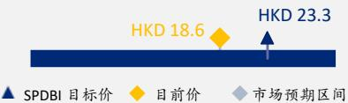  
截至 2025 年 7 月 11 日收盘价  
场预期区间  
资料来源：Bloomberg、浦银国际

<table><tr><td>蓝思科技(300433.CH)</td><td>买入</td></tr><tr><td>目标价(人民币）</td><td>26.6</td></tr><tr><td>潛在升幅/降幅</td><td>+17.4%</td></tr><tr><td>目前股价（人民币）</td><td>22.7</td></tr><tr><td>52周内股价区间（人民币）</td><td>14.9-32.0</td></tr><tr><td>总市值（百万人民币)</td><td>117,518</td></tr><tr><td>近3 月日均成交额(百万人民币)</td><td>1,347</td></tr></table>

注：截至 2025 年 7 月 11 日收盘价

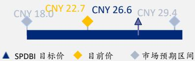  
市场预期区间  
资料来源：Bloomberg、浦银国际

# 财务报表分析与预测

利润表  

<table><tr><td>人民币百万元</td><td>2023</td><td>2024</td><td>2025E</td><td>2026E</td><td>2027E</td></tr><tr><td>营业收入</td><td>54,491</td><td>69,897</td><td>83,476</td><td>92,944</td><td>102,924</td></tr><tr><td>营业成本</td><td>(45,429)</td><td>(58,789)</td><td>(70,028)</td><td>(77,615)</td><td>(85,722)</td></tr><tr><td>毛利润</td><td>9,062</td><td>11,108</td><td>13,448</td><td>15,329</td><td>17,202</td></tr><tr><td>经营支出</td><td>(5,552)</td><td>(6,315)</td><td>(6,964)</td><td>(7,613)</td><td>(8,240)</td></tr><tr><td>销售费用</td><td>(693)</td><td>(706)</td><td>(775)</td><td>(850)</td><td>(930)</td></tr><tr><td>管理费用</td><td>(2,543)</td><td>(2,825)</td><td>(2,992)</td><td>(3,268)</td><td>(3,506)</td></tr><tr><td>研发费用</td><td>(2,317)</td><td>(2,785)</td><td>(3,197)</td><td>(3,494)</td><td>(3,805)</td></tr><tr><td>经营利润</td><td>3,510</td><td>4,793</td><td>6,484</td><td>7,716</td><td>8,962</td></tr><tr><td>非经营收入</td><td>(256)</td><td>(944)</td><td>(895)</td><td>(695)</td><td>(495)</td></tr><tr><td>财务费用</td><td>(244)</td><td>47</td><td>(40)</td><td>(40)</td><td>(40)</td></tr><tr><td>投资收益</td><td>150</td><td>223</td><td>216</td><td>216</td><td>216</td></tr><tr><td>其他</td><td>(162)</td><td>(1,214)</td><td>(1,070)</td><td>(870)</td><td>(670)</td></tr><tr><td>税前利润</td><td>3,254</td><td>3,849</td><td>5,589</td><td>7,021</td><td>8,467</td></tr><tr><td>税务费用</td><td>(212)</td><td>(172)</td><td>(425)</td><td>(675)</td><td>(803)</td></tr><tr><td>税后利润含少数股东权益</td><td>3,042</td><td>3,677</td><td>5,164</td><td>6,346</td><td>7,664</td></tr><tr><td>少数股东权益</td><td>20</td><td>53</td><td>71</td><td>71</td><td>71</td></tr><tr><td>净利润</td><td>3,021</td><td>3,624</td><td>5,093</td><td>6,275</td><td>7,593</td></tr><tr><td>基本股数（百万）</td><td>4,973</td><td>4,983</td><td>5,179</td><td>5,245</td><td>5,245</td></tr><tr><td>摊销股数（百万）</td><td>4,973</td><td>4,983</td><td>5,179</td><td>5,245</td><td>5,245</td></tr><tr><td>基本每股收益(元)</td><td>0.61</td><td>0.73</td><td>0.98</td><td>1.20</td><td>1.45</td></tr><tr><td>摊销每股收益(元)</td><td>0.61</td><td>0.73</td><td>0.98</td><td>1.20</td><td>1.45</td></tr></table>

资产负债表  

<table><tr><td>人民币百万元</td><td>2023</td><td>2024</td><td>2025E</td><td>2026E</td><td>2027E</td></tr><tr><td>货币资金</td><td>10,519</td><td>10,988</td><td>12,621</td><td>11,011</td><td>9,819</td></tr><tr><td>短期投资</td><td>350</td><td>355</td><td>424</td><td>472</td><td>523</td></tr><tr><td>应收账款和应收票据</td><td>9,308</td><td>10,866</td><td>12,977</td><td>14,448</td><td>16,000</td></tr><tr><td>存货</td><td>6,683</td><td>7,161</td><td>8,530</td><td>9,454</td><td>10,441</td></tr><tr><td>其他流动负债</td><td>817</td><td>952</td><td>1,137</td><td>1,266</td><td>1,402</td></tr><tr><td>流动资产合计</td><td>28,081</td><td>30,773</td><td>36,140</td><td>37,103</td><td>38,636</td></tr><tr><td>物业、厂房及设备</td><td>36,876</td><td>37,698</td><td>44,852</td><td>52,796</td><td>61,568</td></tr><tr><td>使用权资产</td><td>52</td><td>189</td><td>189</td><td>189</td><td>189</td></tr><tr><td>无形资产</td><td>5,227</td><td>5,075</td><td>501</td><td>49</td><td>5</td></tr><tr><td>长期投资收益</td><td>375</td><td>326</td><td>358</td><td>394</td><td>433</td></tr><tr><td>商誉</td><td>2,970</td><td>2,970</td><td>2,970</td><td>2,970</td><td>2,970</td></tr><tr><td>其他非流动资产</td><td>3,889</td><td>3,986</td><td>3,986</td><td>3,986</td><td>3,986</td></tr><tr><td>总资产</td><td>77,470</td><td>81,016</td><td>88,996</td><td>97,487</td><td>107,788</td></tr><tr><td>短期借贷</td><td>1,417</td><td>1,561</td><td>1,865</td><td>2,076</td><td>2,299</td></tr><tr><td>应付账款和应付票据</td><td>11,132</td><td>14,097</td><td>16,791</td><td>18,611</td><td>20,555</td></tr><tr><td>其他流动负债</td><td>6,507</td><td>7,407</td><td>8,889</td><td>10,666</td><td>12,800</td></tr><tr><td>流动负债合计</td><td>19,056</td><td>23,065</td><td>27,545</td><td>31,353</td><td>35,653</td></tr><tr><td>长期借款</td><td>9,588</td><td>7,808</td><td>7,921</td><td>8,034</td><td>8,147</td></tr><tr><td>其他非流动负债</td><td>2,304</td><td>1,297</td><td>1,297</td><td>1,297</td><td>1,297</td></tr><tr><td>总负债</td><td>30,948</td><td>32,170</td><td>36,763</td><td>40,684</td><td>45,097</td></tr><tr><td>股本</td><td>4,983</td><td>4,983</td><td>4,983</td><td>4,983</td><td>4,983</td></tr><tr><td>储备</td><td>20,808</td><td>20,919</td><td>24,193</td><td>28,650</td><td>34,424</td></tr><tr><td>少数股东权益</td><td>183</td><td>189</td><td>189</td><td>189</td><td>189</td></tr><tr><td>其他</td><td>20,548</td><td>22,755</td><td>22,755</td><td>22,755</td><td>22,755</td></tr><tr><td>股东权益总额</td><td>46,522</td><td>48,846</td><td>52,120</td><td>56,577</td><td>62,351</td></tr><tr><td>总负债和股东权益</td><td>77,470</td><td>81,016</td><td>88,883</td><td>97,261</td><td>107,449</td></tr></table>

现金流量表  

<table><tr><td>人民币百万元</td><td>2023</td><td>2024</td><td>2025E</td><td>2026E</td><td>2027E</td></tr><tr><td>经营活动现金流</td><td>9,300</td><td>10,889</td><td>10,579</td><td>8,254</td><td>9,557</td></tr><tr><td>税后利润</td><td>3,042</td><td>3,677</td><td>5,164</td><td>6,346</td><td>7,664</td></tr><tr><td>折旧</td><td>277</td><td>285</td><td>292</td><td>347</td><td>408</td></tr><tr><td>摊销</td><td>4,557</td><td>4,711</td><td>4,574</td><td>451</td><td>45</td></tr><tr><td>营运资金变动</td><td>776</td><td>420</td><td>512</td><td>1,072</td><td>1,402</td></tr><tr><td>应收账款减少（增加)</td><td>(286)</td><td>(1,557)</td><td>(2,111)</td><td>(1,472)</td><td>(1,551)</td></tr><tr><td>库存减少(增加)</td><td>101</td><td>(526)</td><td>(1,369)</td><td>(924)</td><td>(987)</td></tr><tr><td>应付账款增加（减少）</td><td>1,002</td><td>2,964</td><td>2,695</td><td>1,819</td><td>1,944</td></tr><tr><td>其他经营资金变动</td><td>(42)</td><td>(461)</td><td>1,296</td><td>1,649</td><td>1,997</td></tr><tr><td>利息收入（支出）</td><td>(43)</td><td>38</td><td>38</td><td>38</td><td>38</td></tr><tr><td>其他</td><td>5,249</td><td>6,469</td><td>-</td><td>-</td><td>-</td></tr><tr><td>投资活动现金流</td><td>(5,367)</td><td>(6,050)</td><td>(7,548)</td><td>(8,374)</td><td>(9,271)</td></tr><tr><td>资本支出</td><td>(5,372)</td><td>(6,235)</td><td>(7,446)</td><td>(8,291)</td><td>(9,181)</td></tr><tr><td>取得或购买长期投资</td><td>-</td><td>1</td><td>(33)</td><td>(36)</td><td>(39)</td></tr><tr><td>短期投资</td><td>6</td><td>(5)</td><td>(69)</td><td>(48)</td><td>(51)</td></tr><tr><td>其他</td><td>(1)</td><td>189</td><td>-</td><td>-</td><td>-</td></tr><tr><td>融资活动现金流</td><td>(5,137)</td><td>(4,454)</td><td>(1,398)</td><td>(1,490)</td><td>(1,478)</td></tr><tr><td>借款</td><td>(3,693)</td><td>(1,543)</td><td>416</td><td>325</td><td>336</td></tr><tr><td>发行股份</td><td>62</td><td>-</td><td>-</td><td>-</td><td>-</td></tr><tr><td>发行债券</td><td>-</td><td>113</td><td>113</td><td>113</td><td>113</td></tr><tr><td>现金股利</td><td>(1,482)</td><td>(1,927)</td><td>(1,927)</td><td>(1,927)</td><td>(1,927)</td></tr><tr><td>其他</td><td>(24)</td><td>(1,097)</td><td>-</td><td>-</td><td>-</td></tr><tr><td>外汇损益</td><td>15</td><td>59</td><td>-</td><td>-</td><td>-</td></tr><tr><td>现金及现金等价物净流量</td><td>(1,189)</td><td>443</td><td>1,633</td><td>(1,610)</td><td>(1,192)</td></tr><tr><td>期初现金及现金等价物</td><td>11,682</td><td>10,494</td><td>10,937</td><td>12,570</td><td>10,960</td></tr><tr><td>期末现金及现金等价物</td><td>10,494</td><td>10,937</td><td>12,570</td><td>10,960</td><td>9,768</td></tr></table>

E=浦银国际预测资料来源：公司资料、iFinD、浦银国际预测

主要财务比率  

<table><tr><td></td><td>2023</td><td>2024</td><td>2025E</td><td>2026E</td><td>2027E</td></tr><tr><td>营运指标增速</td><td></td><td></td><td></td><td></td><td></td></tr><tr><td>营业收入增速</td><td>16.7%</td><td>28.3%</td><td>19.4%</td><td>11.3%</td><td>10.7%</td></tr><tr><td>毛利润增速</td><td>1.0%</td><td>22.6%</td><td>21.1%</td><td>14.0%</td><td>12.2%</td></tr><tr><td>营业利润增速</td><td>2.3%</td><td>36.5%</td><td>35.3%</td><td>19.0%</td><td>16.2%</td></tr><tr><td>净利润增速</td><td>23.4%</td><td>19.9%</td><td>40.5%</td><td>23.2%</td><td>21.0%</td></tr><tr><td>盈利能力</td><td></td><td></td><td></td><td></td><td></td></tr><tr><td>净资产收益率</td><td>6.6%</td><td>7.6%</td><td>10.1%</td><td>11.5%</td><td>12.8%</td></tr><tr><td>总资产报酬率</td><td>3.9%</td><td>4.6%</td><td>6.0%</td><td>6.7%</td><td>7.4%</td></tr><tr><td>投入资本回报率</td><td>5.7%</td><td>7.9%</td><td>9.7%</td><td>10.5%</td><td>11.1%</td></tr><tr><td>利润率</td><td></td><td></td><td></td><td></td><td></td></tr><tr><td>毛利率</td><td>16.6%</td><td>15.9%</td><td>16.1%</td><td>16.5%</td><td>16.7%</td></tr><tr><td>营业利润率</td><td>6.4%</td><td>6.9%</td><td>7.8%</td><td>8.3%</td><td>8.7%</td></tr><tr><td>净利润率</td><td>5.5%</td><td>5.2%</td><td>6.1%</td><td>6.8%</td><td>7.4%</td></tr><tr><td>营运能力</td><td></td><td></td><td></td><td></td><td></td></tr><tr><td>现金循环周期</td><td>30</td><td>17</td><td>13</td><td>13</td><td>13</td></tr><tr><td>应收账款周转天数</td><td>61</td><td>53</td><td>52</td><td>54</td><td>54</td></tr><tr><td>存货周期天数</td><td>54</td><td>43</td><td>41</td><td>42</td><td>42</td></tr><tr><td>应付账款周转天数</td><td>85</td><td>78</td><td>80</td><td>83</td><td>83</td></tr><tr><td>净债务（净现金）</td><td>486</td><td>(1,619)</td><td>(2,835)</td><td>(901)</td><td>627</td></tr><tr><td>自由现金流</td><td>3,519</td><td>3,761</td><td>3,922</td><td>554</td><td>787</td></tr><tr><td>目标P/E(x)</td><td>43.9</td><td>36.6</td><td>27.1</td><td>22.3</td><td>18.4</td></tr><tr><td>目标P/B(x)</td><td>2.8</td><td>2.7</td><td>2.6</td><td>2.5</td><td>2.2</td></tr></table>

# 目录

创新与技术造就精密制造位于前沿科技产业核心地位. 4  
消费电子依然是新技术涌现和落地的最大场景 ............................................................................... 4  
新能源汽车对于电子制造需求加速提升. .6  
新兴行业不断涌现，扩张市场容量. . 8  
预测调整.. .9  
估值.. 1 0  
SPDBI 乐观与悲观情景假设.. 14

# 创新与技术造就精密制造位于前沿科技产业核心地位

# 消费电子依然是新技术涌现和落地的最大场景

在2024 年，全球消费电子产品合计出货量达 18.1 亿个，根据弗若斯特沙利文预测，2029 年出货量将达到 23.0 亿个，2025 年至 2029 年复合增长率达$4 . 8 \%$ 。其中，2024 年智能手机出货量达 12.4亿部，预计到 2029 年将达14.6亿部，2025 年至2029年复合增长率为 $3 . 1 \%$ 。技术创新带来产品体验改善，AI应用助推产品更新迭代。这是消费电子行业成长的基本动能。其中，智能手机依然是包括当前云端两侧 AI在内的前沿技术落地的重要载体和场景。

消费电子精密制造供应商具备提供结构件与功能模组的设计、制造及相关服务等一站式能力。根据弗若斯特沙利文预测，全球消费电子精密结构件及模组综合解决方案行业市场规模预计 2029 年达 8,350 亿美元，2025 年至2029 年复合增长率为 $4 . 8 \%$ 。其中，智能手机依然是最大的板块，2029 年规模将达 509 亿美元，复合增速为 $3 . 1 \%$ 。

# 蓝思科技凭借其玻璃、金属、模组、组装等能力，为智能手机、平板电脑、笔记本电脑等消费电子产品提供前沿技术落地，帮助改善用户体验。

今年下半年，蓝思有望在厚度较薄的手机中供应3D 曲面的后盖玻璃。这在降低机身厚度的同时为摄像头区域留下空间。与此前的玻璃后盖相比，超薄手机中的 3D 后盖玻璃有望实现价值量的翻倍。蓝思的该产品有望向折叠屏类同样需要较薄机身智能手机延伸。而且，超薄柔性玻璃（UTG）在折叠屏中的使用将再次推升单部手机的玻璃价值量。因此，蓝思的玻璃业务在未来三年放量的同时，有望提升其平均单价。

蓝思的金属产品出货量及份额也有望保持增长的态势。一体化成型等方案也有价值量提升的空间。同时，蓝思的金属钛开始在智能手表中得到应用。

图表 2：全球消费电子出货量及预测  

<table><tr><td>出量</td><td>2020</td><td>2024</td><td>2025E</td><td>2029E</td><td></td><td>205-02</td></tr><tr><td>智能手机</td><td>1,292.2</td><td>1,238.8</td><td>1.295.8</td><td>1,463.9</td><td>-1.0%</td><td>3.1%</td></tr><tr><td>平板电脑</td><td>164.0</td><td>140.1</td><td>151.0</td><td>180.0</td><td>-3.9%</td><td>4.5%</td></tr><tr><td>笔记本电脑</td><td>303.9</td><td>262.7</td><td>268.0</td><td>305.1</td><td>-3.6%</td><td>3.3%</td></tr><tr><td>智能穿戴</td><td>110.9</td><td>159.7</td><td>171.8</td><td>240.4</td><td>9.5%</td><td>8.8%</td></tr><tr><td>AI眼镜/XR头显</td><td>6.8</td><td>9.6</td><td>18.2</td><td>106.3</td><td>8.9%</td><td>55.5%</td></tr><tr><td>合计</td><td>1,877.8</td><td>1,810.8</td><td>1,904.8</td><td>2,295.7</td><td>-0.9%</td><td>4.8%</td></tr></table>

E=弗若斯特沙利文预测资料来源：行业专家访谈、弗若斯特沙利文、蓝思科技港股 IPO 招股书、浦银国际

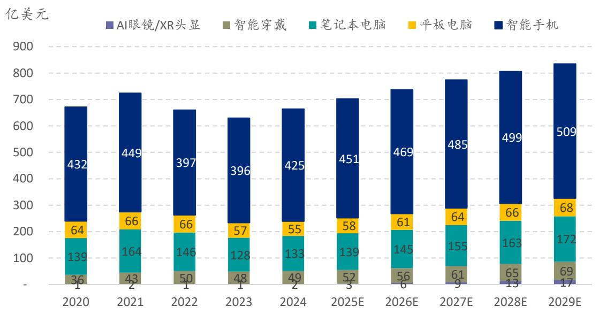  
图表 3：消费电子结构及模组市场规模 - 按应用拆分  
E=弗若斯特沙利文预测资料来源：行业专家访谈、弗若斯特沙利文、蓝思科技港股 IPO 招股书、浦银国际

图表 4：消费电子结构及模组市场规模复合增速 - 按应用拆分  

<table><tr><td></td><td>2020-2024 复合增速</td><td>2025E-2029E 复合增速</td></tr><tr><td>智能手机</td><td>-0.5%</td><td>3.1%</td></tr><tr><td>平板电脑</td><td>-3.8%</td><td>4.0%</td></tr><tr><td>笔记本电脑</td><td>-1.2%</td><td>5.5%</td></tr><tr><td>智能穿戴</td><td>8.0%</td><td>7.1%</td></tr><tr><td>AI眼镜/XR头显</td><td>13.1%</td><td>53.4%</td></tr><tr><td>合计</td><td>-0.4%</td><td>4.4%</td></tr></table>

E=弗若斯特沙利文预测资料来源：行业专家访谈、弗若斯特沙利文、蓝思科技港股 IPO 招股书、浦银国际

# 新能源汽车对于电子制造需求加速提升

中国汽车智能化趋势推动全球新能源车发展。汽车交互系统日趋智能化，以满足消费者对驾乘体验的更高需求。弗若斯特沙利文预测，全球智能汽车的销量将从 2024 年的 6,620 万辆增加到 2029 年的 9,210 万辆，2025 年至 2029年的复合增长率将达到 $5 . 9 \%$ 。

智能汽车交互系统综合解决方案是指围绕智能汽车交互系统，提供核心外观结构件及相关功能模组的设计、制造与集成的一站式解决方案。这些交互系统包括中控屏、智能仪表盘、智能 B 柱、HUD、流媒体后视镜等。此外，随着技术的发展，应用于车窗、挡风的多功能玻璃逐渐在智能汽车上使用。

蓝思在消费电子的玻璃供应方面具备在高精度、多层镀膜、化学强化等优势。借助这些优势，蓝思提供的汽车玻璃具备多种智能化和功能化服务能力，能为用户带来更好的体验，成为智能汽车重要的结构件。

全球智能汽车交互系统综合解决方案市场规模在 2024 年达到 40 亿美元，根据弗若斯特沙利文的预测，2029 年将达到 93 亿美元，2025 年至2029 年复合增长率为 $1 8 . 2 \%$ 。这主要受到智能座舱、自动驾驶、车载智能化等趋势推动行业需求保持较高增长。

蓝思的汽车玻璃有望在明年的新车型上车放量。同时，得益于智能化需求，蓝思的汽车玻璃价格有机会高于普通汽车玻璃价格，这有望推动蓝思汽车玻璃的毛利率高于此前消费电子玻璃的平均毛利率。中长期来看，汽车玻璃具备较大的市场空间。HUD、流媒体后视镜、智能 B柱等产品渗透率依然低于 $1 5 \%$ 。这为蓝思的第二增长曲线奠定基础。

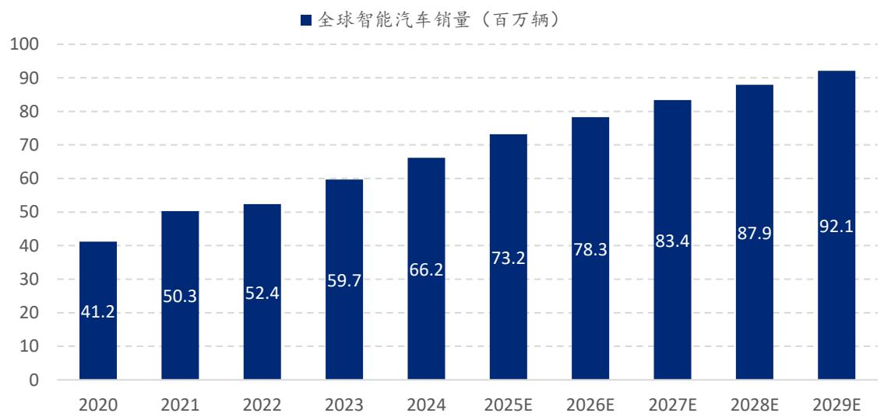  
图表 5：全球智能汽车销量：2020-2024 复合增速 $12 . 6 \%$ ，2025E-2029E 复合增速 $5 . 9 \%$   
E=弗若斯特沙利文预测资料来源：行业专家访谈、弗若斯特沙利文、蓝思科技港股 IPO 招股书、浦银国际

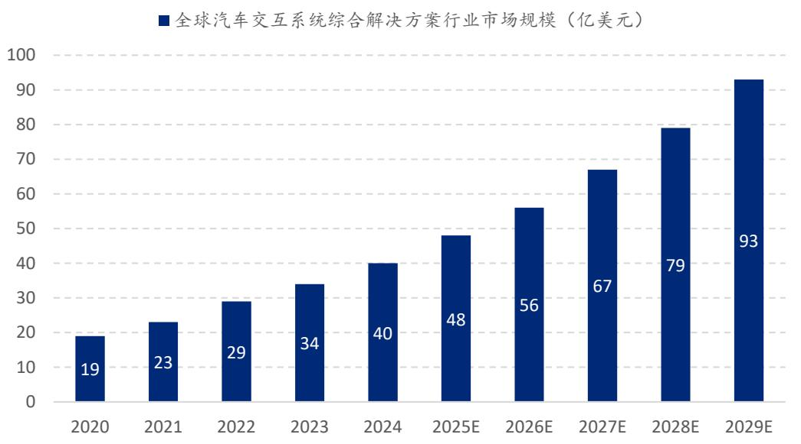  
图表 6：全球智能汽车交互系统：2020-2024 复合增速 $20 . 7 \%$ ，2025E-2029E 复合增速 $1 8 . 2 \%$   
E=弗若斯特沙利文预测资料来源：行业专家访谈、弗若斯特沙利文、蓝思科技港股 IPO 招股书、浦银国际

图表 7：全球智能汽车核心交互系统渗透率  

<table><tr><td>2020</td><td>2024 2029E</td></tr><tr><td>中控屏 70.0%</td><td>90.0% 98.5%</td></tr><tr><td>智能仪表盘 12.0%</td><td>40.0% 65.0%</td></tr><tr><td>HUD 4.2%</td><td>11.0% 50.0%</td></tr><tr><td>流媒体后视镜 0.7%</td><td>4.0% 25.0%</td></tr><tr><td>智能B柱 0.8%</td><td>15.0% 29.0%</td></tr></table>

E=弗若斯特沙利文预测资料来源：行业专家访谈、弗若斯特沙利文、蓝思科技港股 IPO 招股书、浦银国际

# 新兴行业不断涌现，扩张市场容量

全球智能机器人市场规模从 2020 年的 320 亿美元增长至 2024 年的 602 亿美元，复合增长率为 $1 7 . 1 \%$ ，根据弗若斯特沙利文预测，2029 年将达到1,239亿美元。人形机器人行业受到市场较大关注，预计其市场规模将从 2025 年的23 亿美元增长至2029 年的 129 亿美元，复合增长率为 $5 4 . 4 \%$ 。

人形机器人产业以结构件和功能模组为核心载体，其技术壁垒高、工艺难度大，因此关节模组、灵巧手、躯干等结构件倾向于交由专业精密制造厂商来生产和制造。

目前蓝思已经为智元机器人制造和交付人形机器人整机和核心零部件。公司已经充分布局潜在新兴行业，将会抓住行业爆发增长红利，并打开长期增长天花板。

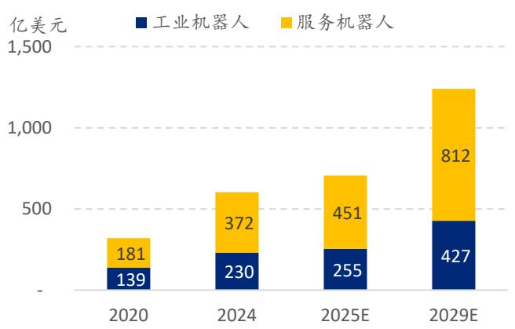  
图表 8：全球智能机器人市场规模：2020-2024 复合增速 $1 7 . 1 \%$ ，2025E-2029E 复合增速 $1 5 . 1 \%$   
E=弗若斯特沙利文预测资料来源：行业专家访谈、弗若斯特沙利文、蓝思科技港股 IPO 招股书、浦银国际整

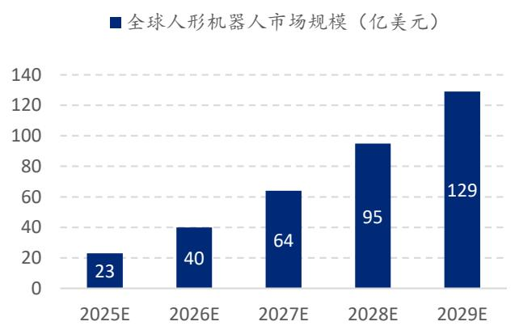  
图表 9：全球人形机器人市场规模：2025E-2029E复合增速 $5 4 . 4 \%$   
E=弗若斯特沙利文预测资料来源：行业专家访谈、弗若斯特沙利文、蓝思科技港股 IPO 招股书、浦银国际

# 预测调整

图表 10：蓝思科技盈利预测调整  

<table><tr><td colspan="4">2025E</td><td colspan="3">2026E</td><td colspan="3">2027E</td></tr><tr><td>人民币百万</td><td>新预测</td><td>前预测</td><td>差异</td><td>新预测</td><td>前预测</td><td>差异</td><td>新预测</td><td>前预测</td><td>差异</td></tr><tr><td>营业收入</td><td>83,476</td><td>91,280</td><td>(9%)</td><td>92,944</td><td>104,755</td><td>(11%)</td><td>102,924</td><td>113,435</td><td>(9%)</td></tr><tr><td>毛利润</td><td>13,448</td><td>13,930</td><td>(3%)</td><td>15,329</td><td>15,360</td><td>(0%)</td><td>17,202</td><td>16,431</td><td>5%</td></tr><tr><td>营业利润</td><td>6,484</td><td>6,325</td><td>3%</td><td>7,716</td><td>7,033</td><td>10%</td><td>8,962</td><td>7,674</td><td>17%</td></tr><tr><td>净利润</td><td>5,093</td><td>5,070</td><td>0%</td><td>6,275</td><td>5,783</td><td>9%</td><td>7,593</td><td>6,562</td><td>16%</td></tr><tr><td>基本每股收益</td><td>0.98</td><td>1.02</td><td>(3%)</td><td>1.20</td><td>1.16</td><td>3%</td><td>1.45</td><td>1.32</td><td>10%</td></tr><tr><td>（元） 利润率</td><td></td><td></td><td>百分点</td><td></td><td></td><td>百分点</td><td></td><td></td><td>百分点</td></tr><tr><td>毛利率</td><td>16.1%</td><td>15.3%</td><td>0.8</td><td>16.5%</td><td>14.7%</td><td>1.8</td><td>16.7%</td><td>14.5%</td><td>2.2</td></tr><tr><td>费用率</td><td>8.3%</td><td>8.3%</td><td>0.0</td><td>8.2%</td><td>7.9%</td><td>0.2</td><td>8.0%</td><td>7.7%</td><td>0.3</td></tr><tr><td>经营利润率</td><td>7.8%</td><td>6.9%</td><td>0.8</td><td>8.3%</td><td>6.7%</td><td>1.6</td><td>8.7%</td><td>6.8%</td><td>1.9</td></tr><tr><td>净利润率</td><td>6.1%</td><td>5.6%</td><td>0.5</td><td>6.8%</td><td>5.5%</td><td>1.2</td><td>7.4%</td><td>5.8%</td><td>1.6</td></tr></table>

E=浦银国际预测资料来源：浦银国际

# 估值

我们采用分部加总估值法对蓝思进行估值。分别给予蓝思 2025 年智能手机与电脑类、新能源汽车及智能座舱、智能头显与智能穿戴类 $2 6 . 0 \times$ 、 $2 8 . 0 \times$ 、30.0x市盈率，得到蓝思科技港股（6613.HK）目标价23.3 港元，潜在升幅 $2 5 . 2 \%$ ；蓝思科技 A 股（300433.CH）目标价人民币26.6 元，潜在升幅 $1 7 . 4 \%$ 。

图表 11：蓝思分部加总估值法（2025 年）  

<table><tr><td>人民币百万</td><td>收入</td><td>毛利率</td><td>净利润</td><td>凈利润增速</td><td>目标市盈率</td><td>估值</td></tr><tr><td>智能手机与电脑类</td><td>65,316</td><td>15.0%</td><td>3,831</td><td>35%</td><td>26.0</td><td>99,610</td></tr><tr><td>新能源汽车及智能座舱</td><td>6,825</td><td>11.2%</td><td>355</td><td>20%</td><td>28.0</td><td>9,933</td></tr><tr><td>智能头显与智能穿戴类</td><td>4,117</td><td>24.5%</td><td>330</td><td>22%</td><td>30.0</td><td>9,889</td></tr><tr><td>其他智能终端</td><td>4,703</td><td>20.5%</td><td>346</td><td>280%</td><td>35.0</td><td>12,123</td></tr><tr><td>其他业务</td><td>2,515</td><td>36.6%</td><td>231</td><td>92%</td><td>28.0</td><td>6,462</td></tr><tr><td>合计（人民币百万)</td><td>83,476</td><td>16.1%</td><td>5,093</td><td>41%</td><td>27.1</td><td>138,017</td></tr><tr><td>AH总股数（百万)</td><td></td><td></td><td></td><td></td><td></td><td>5,179</td></tr><tr><td>A股相对H股溢价</td><td></td><td></td><td></td><td></td><td></td><td>25%</td></tr><tr><td>A股目标价 （人民币)</td><td></td><td></td><td></td><td></td><td></td><td>26.6</td></tr><tr><td>潜在升幅</td><td></td><td></td><td></td><td></td><td></td><td>17.4%</td></tr><tr><td>港股目标价（港元)</td><td></td><td></td><td></td><td></td><td></td><td>23.3</td></tr><tr><td>潜在升幅</td><td></td><td></td><td></td><td></td><td></td><td>25.2%</td></tr></table>

资料来源：浦银国际预测

同时，我们参考了 DCF（Discounted Cash Flow，现金流量贴现法）估值方法。我们假设蓝思科技 2030 年-2034 年的营收增速为 $1 5 \%$ ，永续增长率为 $3 \%$ 。另外，我们假设 WACC（Weighted Average Cost of Capital，加权平均资金成本）是 $9 . 2 \%$ ，其他基本假设可以参考下方两个表格。得到蓝思科技港股（6613.HK）目标价 23.3 港元，潜在升幅 $2 5 . 3 \%$ ；蓝思科技 A 股（300433.CH）目标价人民币 26.7 元，潜在升幅 $1 7 . 5 \%$ ，与 SOTP 估值法得到的目标价接近。

图表 12：蓝思科技 WACC 假设  

<table><tr><td colspan="3">WACC 计算</td></tr><tr><td>Beta</td><td>0.9 债务成本</td><td>7.4%</td></tr><tr><td>无风险利率</td><td>1.7% 债务股本比</td><td>0.6%</td></tr><tr><td>股权风险溢价</td><td>8.2% 所得稅率</td><td>13.6%</td></tr><tr><td>股本成本</td><td>9.2% WACC</td><td>9.2%</td></tr></table>

注：WACC，Weighted Average Cost of Capital，加权平均资金成本资料来源：浦银国际预测

图表 13：蓝思科技自由现金流预测  

<table><tr><td>人民币百万</td><td>2025E</td><td>2026E</td><td>2027E</td><td>2028E</td><td>2029E</td><td>2030E</td><td>2031E</td><td>2032E</td><td>2033E</td><td>2034E</td><td>2035 往后</td></tr><tr><td>营业收入</td><td>83,476</td><td></td><td></td><td></td><td></td><td></td><td>92,944 102,924 113,365 128,732 148,042 170,249 195,786 225,154 258,927</td><td></td><td></td><td></td><td></td></tr><tr><td>营收增速</td><td>19%</td><td>11%</td><td>11%</td><td>10%</td><td>14%</td><td>15%</td><td>15%</td><td>15%</td><td>15%</td><td>15%</td><td></td></tr><tr><td>经营利润</td><td>6,484</td><td>7,716</td><td>8,962</td><td>10,117</td><td>11,588</td><td>13,326</td><td>15,325</td><td>17,624</td><td>20,267</td><td>23,308</td><td></td></tr><tr><td>经营利润率</td><td>7.8%</td><td>8.3%</td><td>8.7%</td><td>8.9%</td><td>9.0%</td><td>9.0%</td><td>9.0%</td><td>9.0%</td><td>9.0%</td><td>9.0%</td><td></td></tr><tr><td>加：销折旧及</td><td>4,865</td><td>799</td><td>453</td><td>481</td><td>536</td><td>616</td><td>708</td><td>815</td><td>937</td><td>1,077</td><td></td></tr><tr><td>EBITDA</td><td>11,349</td><td>8,514</td><td>9,415</td><td>10,598</td><td>12,124</td><td>13,942</td><td>16,034</td><td>18,439</td><td>21,204</td><td>24,385</td><td></td></tr><tr><td>EBITDA率</td><td>13.6%</td><td>9.2%</td><td>9.1%</td><td>9.3%</td><td>9.4%</td><td>9.4%</td><td>9.4%</td><td>9.4%</td><td>9.4%</td><td>9.4%</td><td></td></tr><tr><td>所得税率</td><td>7.6%</td><td>9.6%</td><td>9.5%</td><td>9.5%</td><td>9.5%</td><td>9.5%</td><td>9.5%</td><td>9.5%</td><td>9.5%</td><td>9.5%</td><td></td></tr><tr><td>资本支出</td><td>(7,446)</td><td>(8,291)</td><td>(9,181)</td><td>(8,090)</td><td>(9,186)</td><td>(8,378)</td><td></td><td>(9,551）(10,888)</td><td>(10,550)</td><td>(10,223)</td><td></td></tr><tr><td>资本支出占</td><td>8.9%</td><td>8.9%</td><td>8.9%</td><td>7.1%</td><td>7.1%</td><td>5.7%</td><td>5.6%</td><td>5.6%</td><td>4.7%</td><td>3.9%</td><td></td></tr><tr><td>营收比 净营运资本</td><td>512</td><td>1,072</td><td>1,402</td><td>1,830</td><td>2,015</td><td>2,318</td><td>2,665</td><td>3,065</td><td>3,525</td><td>4,054</td><td></td></tr><tr><td>自由现金流 永续增长率</td><td>3,922</td><td>554</td><td>787</td><td>3,379</td><td>3,854</td><td>6,618</td><td>7,695</td><td>8,944</td><td>12,257</td><td></td><td>16,005289,630 3.0%</td></tr></table>

E=浦银国际预测资料来源：浦银国际

图表 14：蓝思科技 DCF 估值预测（2025 年）  

<table><tr><td>WACC</td><td>自由现金流现值 (人民币百万）</td><td>净现金 (人民币百万)</td><td>权益价值 (人民币百万)</td><td>股数 (百万)</td><td>每股价值 (人民币元)</td><td>Ａ股 潛在增幅</td><td>每股价值 (港元)</td><td>H股 潛在增幅</td></tr><tr><td>9.2%</td><td>135,268</td><td>2,835</td><td>138,104</td><td>5,179</td><td>26.7</td><td>17.5%</td><td>23.3</td><td>25.3%</td></tr></table>

注：数据截至 2025 年 7 月 11 日收盘资料来源：浦银国际预测

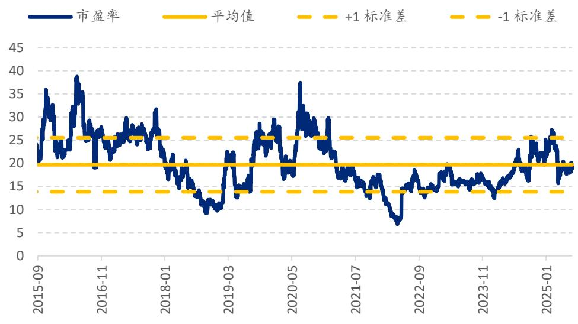  
图表 15：蓝思科技（300433.CH）当前远期市盈率 $\pmb { 1 9 . 0 \times }$ ，历史均值 19.7x  
资料来源：Bloomberg、浦银国际

截止到 7 月 9 日蓝思港股上市，蓝思是今年港股 IPO 市场消费科技类最大的IPO。作为智能手机结构件、外观件以及组装的综合优势制造平台，蓝思在港股市场中具备稀缺性，是本轮玻璃等材料创新周期的稀缺标的。

蓝思港股上市价格相较于 A 股价格有折价空间。我们预期该折价空间随着市场认知度的提高有望缩小。因此，从短期来看，我们认为蓝思港股具备更高的成长空间。

图表 16：2025 年以来 AH 股两地上市公司 AH 折价/溢价  

<table><tr><td>公司名称</td><td>香港上市</td><td>港股代码</td><td>A股代码</td><td>首发价格</td><td></td><td>股股相对A价</td><td></td><td></td></tr><tr><td>峰昭科技</td><td>2025-07-09</td><td>1304.HK</td><td>688279.SH</td><td>120.5</td><td>199.98</td><td>-40%</td><td>16%</td><td>-41%</td></tr><tr><td>蓝思科技</td><td>2025-07-09</td><td>6613.HK</td><td>300433.SZ</td><td>18.18</td><td>24.90</td><td>-27%</td><td>9%</td><td>-25%</td></tr><tr><td>安井食品</td><td>2025-07-04</td><td>2648.HK</td><td>603345.SH</td><td>60</td><td>83.82</td><td>-28%</td><td>-5%</td><td>-30%</td></tr><tr><td>三花智控</td><td>2025-06-23</td><td>2050.HK</td><td>002050.SZ</td><td>22.53</td><td>26.82</td><td>-16%</td><td>0%</td><td>-22%</td></tr><tr><td>海天味业</td><td>2025-06-19</td><td>3288.HK</td><td>603288.SH</td><td>36.3</td><td>42.34</td><td>-14%</td><td>1%</td><td>-21%</td></tr><tr><td>吉宏股份</td><td>2025-05-27</td><td>2603.HK</td><td>002803.SZ</td><td>7.68</td><td>15.31</td><td>-50%</td><td>39%</td><td>-49%</td></tr><tr><td>恒瑞医药</td><td>2025-05-23</td><td>1276.HK</td><td>600276.SH</td><td>44.05</td><td>59.33</td><td>-26%</td><td>25%</td><td>-21%</td></tr><tr><td>宁德时代</td><td>2025-05-20</td><td>3750.HK</td><td>300750.SH</td><td>306.2</td><td>286.83</td><td>7%</td><td>16%</td><td>18%</td></tr><tr><td>钧达股份</td><td>2025-05-08</td><td>2865.HK</td><td>002865.SZ</td><td>22.15</td><td>45.32</td><td>-51%</td><td>20%</td><td>-51%</td></tr><tr><td>赤峰黃金</td><td>2025-03-10</td><td>6693.HK</td><td>600988.SH</td><td>13.72</td><td>20.67</td><td>-34%</td><td>-1%</td><td>-37%</td></tr></table>

资料来源：iFinD，浦银国际

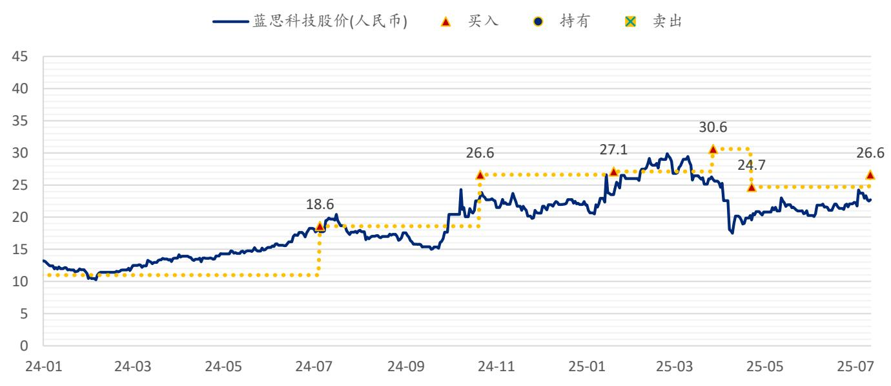  
图表 17：SPDBI 目标价：蓝思科技（300433.CH）  
注：截至 2025 年 7 月 11 日收盘价资料来源：Bloomberg、浦银国际

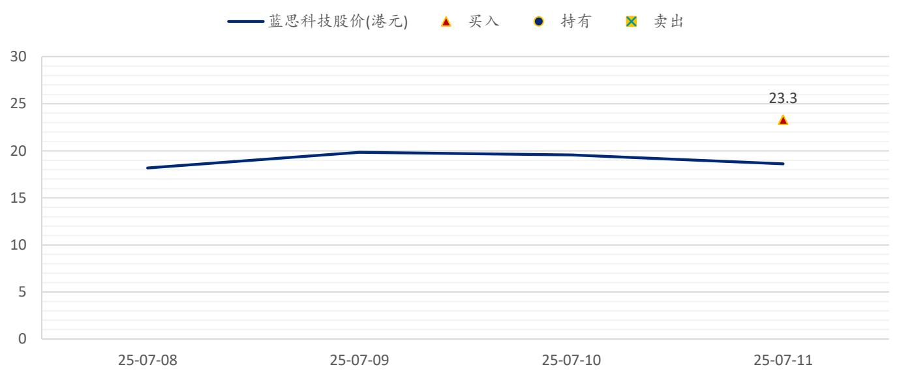  
图表 18：SPDBI 目标价：蓝思科技（6613.HK）  
注：截至 2025 年 7 月 11 日收盘价资料来源：Bloomberg、浦银国际

# SPDBI 乐观与悲观情景假设

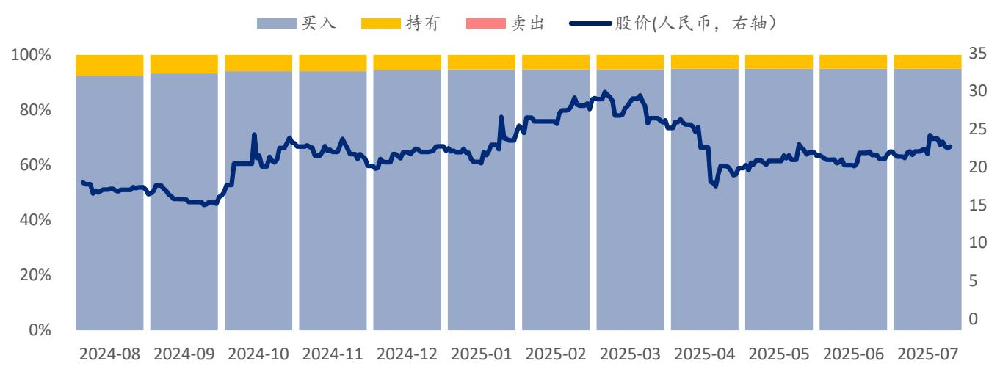  
图表 19：蓝思科技（300433.CH）市场普遍预期  
资料来源：Bloomberg、浦银国际

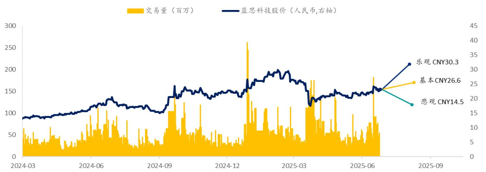  
图表 20：蓝思科技（300433.CH）SPDBI 情景假设

# 乐观情景：公司收入增长好于预期

# 目标价：人民币 30.3 元（概率： $15 \%$ ）

智能手机的金属、玻璃、组装等产品出货量高于预期，手机玻璃价值提升较大； 汽车业务增长强劲，汽车玻璃爆发增长； 机器人、AI 眼镜、PC 组装等爆发式成长； 公司费用控制较为优异。

# 悲观情景：公司收入增长不及预期

# 目标价：人民币 14.5 元（概率： $10 \%$ ）

受到美关税影响，智能手机的国内外客户需求走弱，导致金属、玻璃、组装等产品出货量偏弱； 汽车业务增长有限，受到客户增长拖累； 机器人、AI 眼镜、PC 组装等新兴业务体量较小； 公司费用增长高于预期。

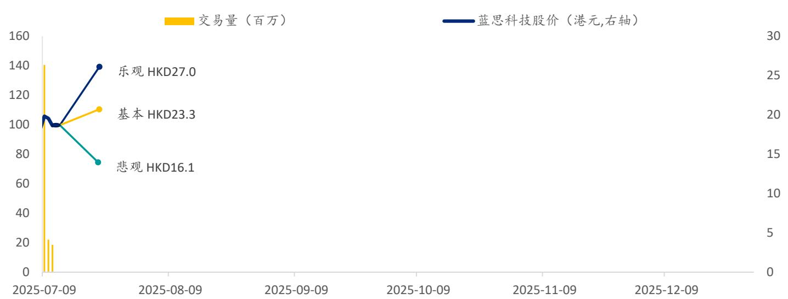  
图表 21：蓝思科技（6613.HK）SPDBI 情景假设  
目标价： 27.0 元（概率： $1 5 \%$ ）  
目标价： 16.1 港元（概率： $10 \%$ ）

# 乐观情景：公司收入增长好于预期

智能手机的金属、玻璃、组装等产品出货量高于预期，手机玻璃价值提升较大； 汽车业务增长强劲，汽车玻璃爆发增长； 机器人、AI 眼镜、PC 组装等爆发式成长；C 公司费用控制较为优异。

# 悲观情景：公司收入增长不及预期

受到美关税影响，智能手机的国内外客户需求走弱，导致金属、玻璃、组装等产品出货量偏弱； 汽车业务增长有限，受到客户增长拖累； 机器人、AI 眼镜、PC 组装等新兴业务体量较小；C 公司费用增长高于预期。

图表 22：SPDBI 科技行业覆盖公司  

<table><tr><td>股票代码</td><td>公司</td><td>现价（LC)</td><td>评级</td><td>目标价（LC)</td><td>评级及目标价</td><td>行业</td></tr><tr><td>1810 HK Equity</td><td>小米集团-W</td><td>57.4</td><td>买入</td><td>75.0</td><td>20/3/2025</td><td>手机品牌</td></tr><tr><td>688036 CH Equity</td><td>传音控股</td><td>75.4</td><td>买入</td><td>114.2</td><td>27/2/2025</td><td>手机品牌</td></tr><tr><td>AAPL US Equity</td><td>苹果</td><td>212.4</td><td>买入</td><td>236.3</td><td>8/5/2025</td><td>手机品牌</td></tr><tr><td>285 HK Equity</td><td>比亚迪电子</td><td>33.4</td><td>买入</td><td>40.7</td><td>28/4/2025</td><td>结构件、组装</td></tr><tr><td>600745 CH Equity</td><td>闻泰科技</td><td>34.4</td><td>买入</td><td>41.6</td><td>28/10/2024</td><td>ODM、功率半导体</td></tr><tr><td>002475 CH Equity</td><td>立讯精密</td><td>35.8</td><td>买入</td><td>37.2</td><td>28/4/2025</td><td>结构件、组装</td></tr><tr><td>300433 CH Equity</td><td>蓝思科技</td><td>22.7</td><td>买入</td><td>26.6</td><td>14/7/2025</td><td>结构件、组装</td></tr><tr><td>6613 HK Equity</td><td>蓝思科技</td><td>18.6</td><td>买入</td><td>23.3</td><td>14/7/2025</td><td>结构件、组装</td></tr><tr><td>2018 HK Equity</td><td>瑞声科技</td><td>40.0</td><td>买入</td><td>60.5</td><td>21/3/2025</td><td>声学、光学器件</td></tr><tr><td>2382 HK Equity</td><td>舜宇光学科技</td><td>74.6</td><td>买入</td><td>88.9</td><td>27/3/2025</td><td>手机光学、车载光学</td></tr><tr><td>1478 HK Equity</td><td>丘钛科技</td><td>10.5</td><td>买入</td><td>9.1</td><td>18/3/2025</td><td>手机光学</td></tr><tr><td>603501 CH Equity</td><td>韦尔股份</td><td>123.8</td><td>买入</td><td>153.0</td><td>30/4/2025</td><td>手机 CIS、车载CIS</td></tr><tr><td>NIO US Equity</td><td>蔚来</td><td>3.7</td><td>买入</td><td>4.1</td><td>25/6/2025</td><td>新能源汽车</td></tr><tr><td>9866 HK Equity</td><td>蔚来-SW</td><td>29.3</td><td>买入</td><td>32.0</td><td>25/6/2025</td><td>新能源汽车</td></tr><tr><td>XPEV US Equity</td><td>小鹏汽车</td><td>17.4</td><td>买入</td><td>25.6</td><td>22/5/2025</td><td>新能源汽车</td></tr><tr><td>9868 HK Equity</td><td>小鹏汽车-W</td><td>68.3</td><td>买入</td><td>97.0</td><td>22/5/2025</td><td>新能源汽车</td></tr><tr><td>LI US Equity</td><td>理想汽车</td><td>27.2</td><td>买入</td><td>32.7</td><td>30/5/2025</td><td>新能源汽车</td></tr><tr><td>2015 HK Equity</td><td>理想汽车-W</td><td>108.7</td><td>买入</td><td>126.6</td><td>30/5/2025</td><td>新能源汽车</td></tr><tr><td>9863 HK Equity</td><td>零跑汽车</td><td>57.8</td><td>买入</td><td>74.6</td><td>20/5/2025</td><td>新能源汽车</td></tr><tr><td>TSLA US Equity</td><td>特斯拉(TESLA)</td><td>309.9</td><td>持有</td><td>374.8</td><td>16/5/2025</td><td>新能源汽车</td></tr><tr><td>1211 HK Equity</td><td>比亚迪股份</td><td>120.1</td><td>买入</td><td>458.8</td><td>28/4/2025</td><td>新能源汽车</td></tr><tr><td>002594 CH Equity</td><td>比亚迪</td><td>323.9</td><td>买入</td><td>444.0</td><td>28/4/2025</td><td>新能源汽车</td></tr><tr><td>HSAI US Equity</td><td>禾赛科技</td><td>22.0</td><td>买入</td><td>25.5</td><td>27/5/2025</td><td>激光雷达</td></tr><tr><td>2498 HK Equity</td><td>速腾聚创</td><td>31.2</td><td>买入</td><td>39.5</td><td>2/6/2025</td><td>激光雷达</td></tr><tr><td>MBLY US Equity</td><td>Mobileye</td><td>16.7</td><td>买入</td><td>19.6</td><td>14/5/2025</td><td>智驾芯片</td></tr><tr><td>981 HK Equity</td><td>中芯国际</td><td>46.0</td><td>买入</td><td>49.7</td><td>12/5/2025</td><td>晶圆代工</td></tr><tr><td>688981 CH Equity</td><td>中芯国际</td><td>88.2</td><td>买入</td><td>99.4</td><td>12/5/2025</td><td>晶圆代工</td></tr><tr><td>1347 HK Equity</td><td>华虹半导体</td><td>35.4</td><td>买入</td><td>39.0</td><td>11/5/2025</td><td>晶圆代工</td></tr><tr><td>688347 CH Equity</td><td>华虹公司</td><td>55.6</td><td>买入</td><td>56.7</td><td>11/5/2025</td><td>晶圆代工</td></tr><tr><td>2330 TT Equity</td><td>台积电</td><td>1,100.0</td><td>买入</td><td>1,046.6</td><td>18/4/2025</td><td>晶圆代工</td></tr><tr><td>TSM US Equity</td><td>台积电</td><td>229.8</td><td>买入</td><td>188.4</td><td>18/4/2025</td><td>晶圆代工</td></tr><tr><td>688396 CH Equity</td><td>华润微</td><td>46.5</td><td>买入</td><td>52.9</td><td>30/4/2025</td><td>功率半导体</td></tr><tr><td>600460 CH Equity</td><td>士兰微</td><td>25.0</td><td>买入</td><td>30.5</td><td>20/9/2023</td><td>功率半导体</td></tr><tr><td>300373 CH Equity</td><td>扬杰科技</td><td>51.3</td><td>买入</td><td>60.9</td><td>9/7/2025</td><td>功率半导体</td></tr><tr><td>688187 CH Equity</td><td>时代电气A</td><td>43.3</td><td>买入</td><td>52.2</td><td>8/4/2025</td><td>功率半导体</td></tr><tr><td>3898 HK Equity</td><td>时代电气H</td><td>30.7</td><td>买入</td><td>33.4</td><td>8/4/2025</td><td>功率半导体</td></tr><tr><td>603290 CH Equity</td><td>斯达半导</td><td>82.2</td><td>买入</td><td>112.4</td><td>30/10/2024</td><td>功率半导体</td></tr><tr><td>605111 CH Equity</td><td>新洁能</td><td>31.1</td><td>买入</td><td>38.7</td><td>14/8/2024</td><td>功率半导体</td></tr><tr><td>688711 CH Equity</td><td>宏微科技</td><td>17.7</td><td>买入</td><td>67.1</td><td>20/9/2023</td><td>功率半导体</td></tr><tr><td>NVDA US Equity</td><td>英伟达</td><td>164.1</td><td>买入</td><td>143.0</td><td>28/2/2025</td><td>AI芯片</td></tr><tr><td>AMD US Equity</td><td>超威半导体</td><td>144.2</td><td>买入</td><td>134.2</td><td>16/5/2025</td><td>AI芯片</td></tr><tr><td>INTC US Equity</td><td>英特尔</td><td>23.8</td><td>卖出</td><td>20.4</td><td>28/11/2024</td><td>AI芯片</td></tr><tr><td>QcoM US Equity 2454 TT Equity</td><td>高通 联发科</td><td>159.1 1,420.0</td><td>买入 买入</td><td>178.3 1,820.8</td><td>14/5/2025 10/2/2025</td><td>AI芯片 AI芯片</td></tr></table>

注：A 股、港股截至 2025 年 7 月 11 日收盘价；美股截至 2025 年 7 月 10 日收盘价；资料来源：Bloomberg、浦银国际

# 免责声明

本报告之收取者透过接受本报告（包括任何有关的附件），表示及保证其根据下述的条件下有权获得本报告，且同意受此中包含的限制条件所约束。任何没有遵循这些限制的情况可能构成法律之违反。

本报告是由从事证券及期货条例(香港法例第 571 章)中第一类(证券交易)及第四类(就证券提供意见)受规管活动之持牌法团–浦银国际证券有限公司 （统称“浦银国际证券”）利用集团信息及其他公开信息编制而成。所有资料均搜集自被认为是可靠的来源，但并不保证数据之准确性、可信性及完整性，亦不会因资料引致的任何损失承担任何责任。报告中的资料来源除非另有说明，否则信息均来自本集团。本报告的内容涉及到保密数据，所以仅供阁下为其自身利益而使用。除了阁下以及受聘向阁下提供咨询意见的人士（其同意将本材料保密并受本免责声明中所述限制约束）之外，本报告分发给任何人均属未授权的行为。

任何人不得将本报告内任何信息用于其他目的。本报告仅是为提供信息而准备的，不得被解释为是一项关于购买或者出售任何证券或相关金融工具的要约邀请或者要约。阁下不应将本报告内容解释为法律、税务、会计或投资事项的专业意见或为任何推荐，阁下应当就本报告所述的任何交易涉及的法律及相关事项咨询其自己的法律顾问和财务顾问的意见。本报告内的信息及意见乃于文件注明日期作出，日后可作修改而不另通知，亦不一定会更新以反映文件日期之后发生的进展。本报告并未包含公司可能要求的所有信息，阁下不应仅仅依据本报告中的信息而作出投资、撤资或其他财务方面的任何决策或行动。除关于历史数据的陈述外，本报告可能包含前瞻性的陈述，牵涉多种风险和不确定性，该等前瞻性陈述可基于一些假设，受限于重大风险和不确定性。

本报告之观点、推荐、建议和意见均不一定反映浦银国际证券的立场。浦银国际控股有限公司及其联属公司、关联公司（统称“浦银国际”）及/或其董事及/或雇员，可能持有在本报告内所述或有关公司之证券、并可能不时进行买卖。浦银国际或其任何董事及/或雇员对投资者因使用本报告或依赖其所载信息而引起的一切可能损失，概不承担任何法律责任。

浦银国际证券建议投资者应独立地评估本报告内的资料，考虑其本身的特定投资目标、财务状况及需要，在参与有关报告中所述公司之证劵的交易前，委任其认为必须的法律、商业、财务、税务或其它方面的专业顾问。惟报告内所述的公司之证券未必能在所有司法管辖区或国家或供所有类别的投资者买卖。对部分的司法管辖区或国家而言，分发、发行或使用本报告会抵触当地法律、法则、规定、或其它注册或发牌的规例。本报告不是旨在向该等司法管辖区或国家的任何人或实体分发或由其使用。

# 美国

浦银国际不是美国注册经纪商和美国金融业监管局(FINRA)的注册会员。浦银国际证券的分析师不具有美国金融监管局(FINRA)分析师的注册资格。因此，浦银国际证券不受美国就有关研究报告准备和分析师独立性规则的约束。

本报告仅提供给美国 1934 年证券交易法规则 15a-6 定义的“主要机构投资者”，不得提供给其他任何个人。接收本报告之行为即表明同意接受协议不得将本报告分发或提供给任何其他人。接收本报告的美国收件人如想根据本报告中提供的信息进行任何买卖证券交易，都应仅通过美国注册的经纪交易商来进行交易。

# 英国

本报告并非由英国 2000 年金融服务与市场法(经修订)( 「FSMA」)第 21 条所界定之认可人士发布,而本报告亦未经其批准。因此，本报告不会向英国公众人士派发，亦不得向公众人士传递。本报告仅提供给合资格投资者(按照金融服务及市场法的涵义) ，即(i)按照 2000 年金融服务及市场法 2005 年(金融推广)命令(「命令」)第 19(5)条定义在投资方面拥有专业经验之投资专业人士或(ii)属于命令第 49(2)(a)至(d)条范围之高净值实体或(iii)其他可能合法与之沟通的人士(所有该等人士统称为「有关人士」)。不属于有关人士的任何机构和个人不得遵照或倚赖本报告或其任何内容行事。

本报告的版权仅为浦银国际证券所有，未经书面许可任何机构和个人不得以任何形式转发、翻版、复制、刊登、发表或引用，浦银国际证券对任何第三方的该等行为保留追述权利，并且对第三方未经授权行为不承担任何责任。

# 权益披露

1) 浦银国际并没有持有本报告所述公司逾 1%的财务权益。  
2) 浦银国际跟本报告所述公司在过去 12 个月内并没有任何投资银行业务的关系。  
3) 浦银国际并没有跟本报告所述公司为其证券进行庄家活动。

# 评级定义

# 证券评级定义:

“买入”：未来 12 个月，预期个股表现超过同期其所属的行业指数“持有”：未来 12个月，预期个股表现与同期所属的行业指数持平“卖出”：未来 12个月，预期个股表现逊于同期其所属的行业指数

# 行业评级定义（相对于 MSCI 中国指数）：

“超配”：未来 12个月优于 MSCI 中国 $10 \%$ 或以上“标配”：未来 12个月优于/劣于 MSCI 中国少于 $10 \%$ “低配”：未来 12 个月劣于 MSCI 中国超过 $10 \%$

# 分析师证明

本报告作者谨此声明：（i）本报告发表的所有观点均正确地反映作者有关任何及所有提及的证券或发行人的个人观点，并以独立方式撰写；（ii）其报酬没有任何部分曾经，是或将会直接或间接与本报告发表的特定建议或观点有关；（iii）该等作者没有获得与所提及的证券或发行人相关且可能影响该等建议的内幕信息／非公开的价格敏感数据。

本报告作者进一步确定（i）他们或其各自的关联人士（定义见证券及期货事务监察委员会持牌人或注册人操守准则）没有在本报告发行日期之前的 30 个历日内曾买卖或交易过本报告所提述的股票，或在本报告发布后 3 个工作日（定义见《证券及期货条例》（香港法例第 571 章））内将买卖或交易本文所提述的股票；（ii）他们或其各自的关联人士并非本报告提述的任何公司的雇员；及（iii）他们或其各自的关联人士没有拥有本报告提述的证券的任何金融利益。

# 浦银国际证券机构销售团队

# 浦银国际证券财富管理团队

杨增希 essie_yang@spdbi.com 852-2808 6469

王玥  
emily_wang@spdbi.com  
852-2808 6468

# 浦银国际证券有限公司

SPDB International Securities Limited

地址：香港轩尼诗道 1号浦发银行大厦 33楼