# 伊利中国消费升级指数

2018.10

作为受到国内外权威机构及媒体广泛认可及援引的新经济系列指数（NEI）的子指数，伊利中国消费升级指数（NECI） 利用网络大数据挖掘手段，同时量化中国消费结构及质量升级状况，力求全面、真实地展现居民消费升级趋势，准确把握市场消费升级的进展，也为政府、企业和投资者提供了重要参考依据。

消费升级指数计算：对于同一个品类的商品，我们将其按照单价排列在 0 到 1 的区间内，最低价为 0，最高价为 1，然后在相邻的两个时间段内观察消费者的消费结构，将总消费标准化为 1 后，计算每一个商品的消费占比。再将商品的消费占比向量乘以商品的价格百分位向量，得到一个点乘乘积。为了使消费升级纵向可比，我们需要计算相邻两个月一组相同商品的消费变化情况，即计算消费升级的月度环比。

消费升级的月度环比可以用下式表示：

$$
\mathsf { P _ { t } } = \frac { \int _ { 0 } ^ { 1 } \mathsf { \Pi } _ { \mathsf { \mu t } } ( \boldsymbol { \theta } ) \mathsf { R } _ { \mathsf { t } } ( \boldsymbol { \theta } ) \mathsf { d } \boldsymbol { \theta } } { \int _ { 0 } ^ { 1 } \mathsf { \Pi } _ { \mathsf { \mu t } - 1 } ( \boldsymbol { \theta } ) \mathsf { R } _ { \mathsf { t } - 1 } ( \boldsymbol { \theta } ) \mathsf { d } \boldsymbol { \theta } }
$$

其中，θ 表示在 t 时期和 t-1 时期重复的商品组合；  
$\mu \left( \theta \right)$ 表示每种商品的消费比例，有 $\int \mathbf { \Omega } ^ { 1 } \ \mu \left. \textbf { \Theta } \right. \mathsf { d } \ \Theta = 1$ ；  
R（θ）表示价格低于 θ 的商品比例，在 0 到 1 之间，价格最高的商品取值为 1.  
将基期指数设为 100，随后将每个月的消费升级指数环比连乘之后，便得到了消费升级指数。越高的消费升级指数，代表消费升级速度越快。

# 1. 指数概览

2018 年 10 月，消费升级指数录得 110.4，环比下降 1.0。其中，实物消费升级指数和服务消费升级指数相较上月均略微下降。

# 2017.05-2018.10 消费升级指数

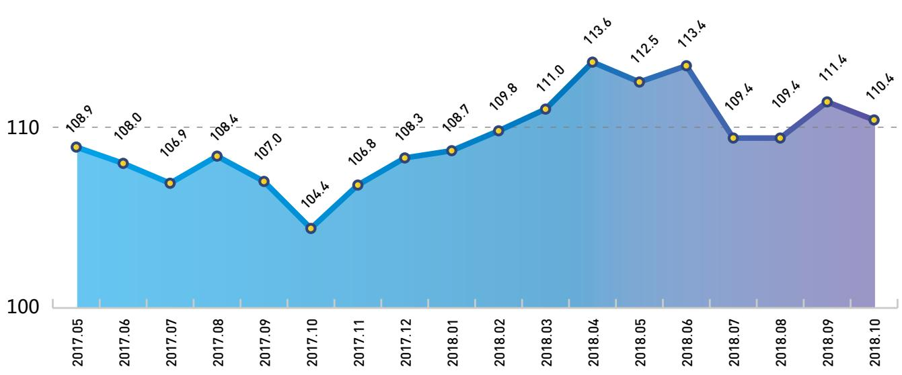  
数据来源： Caixin Insight  
伊利中国消费升级指数（试行版） 2018.10

# 2. 实物消费升级指数

# 2.1 实物总体消费升级指数

实物消费升级指数是根据京东集团提供的京东小类商品前十大交易商品每月的电商交易数据，采用固定篮子指数 框架计算得出。

2018 年 10 月实物消费升级指数录得 125.7，环比下降 1.2。通过观察指数近两年的走势发现，实物消费升级指数已从两年前的 100 左右稳步上升至 120 以上，且指数已持续半年稳定在 120 以上，表明我国实物消费升级已经迈上新台阶，升级步伐保持稳健。

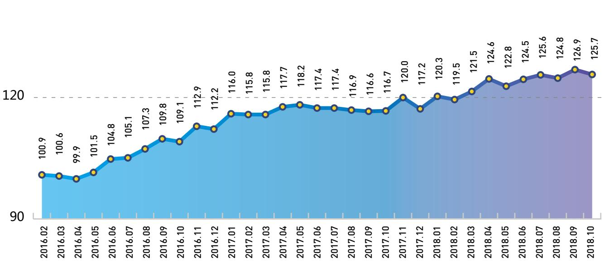  
2016.02-2018.10 实物总体消费升级指数  
数据来源： Caixin Insight  
伊利中国消费升级指数（试行版） 2018.10

# 2.2 实物大类消费升级指数

本月只有交通与通信类消费升级指数上升较多，其它类别消费升级指数下降较多。从消费分类来看，衣着类消费指数本月仍居于首位，继续引领消费升级。此外，生活用品及服务类消费升级指数上升趋势也较为明显，仅次于衣着类。

本月交通与通信类消费升级最为明显。交通与通信类消费升级指数由上月的 101.9 上升至本月的 118.9，环比上升17.0，是本月上升幅度最大的实物类别，跃居实物消费升级指数第四位。本月医疗保健类和衣着类实物消费升级指数下降较多。医疗保健类实物消费升级指数由上月的103.4 下降至本月的 97.5，环比下降 5.9，是本月下降幅度最大的类别。衣着类实物消费升级指数由上月的 144.1 下降至本月的 138.7，环比下降 5.4。生活用品及服务类消费升级指数本月录得 134.7，环比下降 1.0，目前排名第二。教育文化和娱乐类消费升级指数由上月的 132.7下降至本月的 132.1，环比下降 0.6，目前指数暂居第三位。本月食品烟酒类消费升级指数由上月的107.3下降至本月的105.2，环比下降2.1。本月居住类实物消费升级指数录得81.1，环比下降3.8，排在末位。

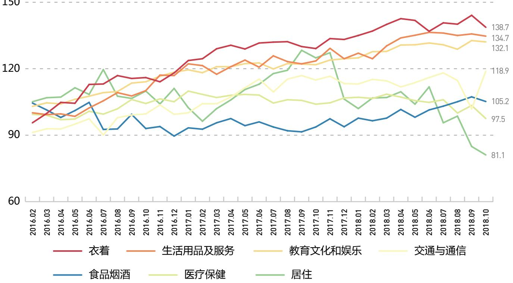  
2016.02-2018.10 实物大类消费升级指数  
数据来源： IBIBD  
伊利中国消费升级指数（试行版） 2018.10

# 2.3 实物商品消费情况变化

观察图 3 的实物大类消费升级指数走势发现，本月除交通与通信类实物消费升级指数上升之外，其它类别实物消费升级指数都有下降。所以本期选取了交通与通信类进行详细分析。此外，本月还选取了具有代表性的生活用品及服务类和居住类进行研究。交通与通信类中选取了汽车类商品；生活用品及服务类选取了家用电器类商品；居住类选取了家装建材类商品；进行详细分析。

1) 京东汽车用品类消费中，汽车服务和汽车装饰类商品消费「升级」较快。其中汽车服务类的保养维修、ETC 和清洗美容等小类商品均呈现升级趋势，而汽车装饰类的头腰靠枕类商品相较于其它小类升级更为迅速。

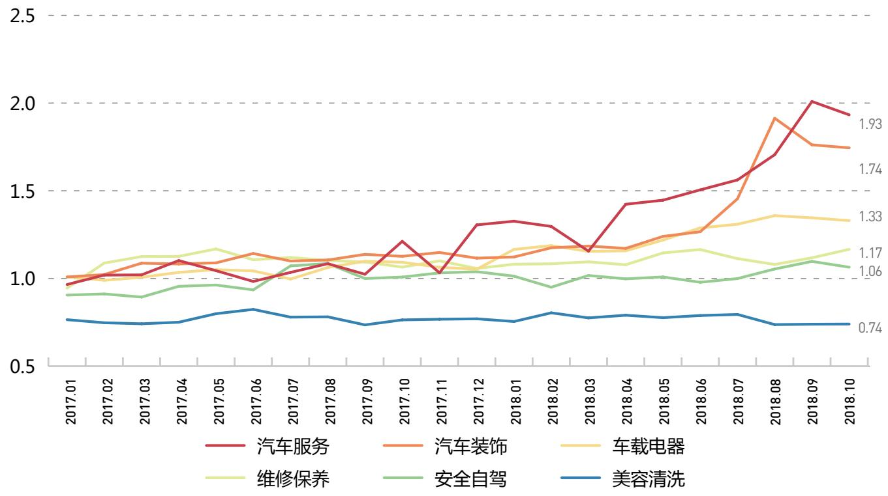  
2017.01-2018.10 汽车用品类商品消费升级指数   
数据来源： CatxIn Inslghf  
伊利中国消费升级指数（试行版） 2018.10

  
2017.01-2018.10 汽车服务类商品消费升级指数

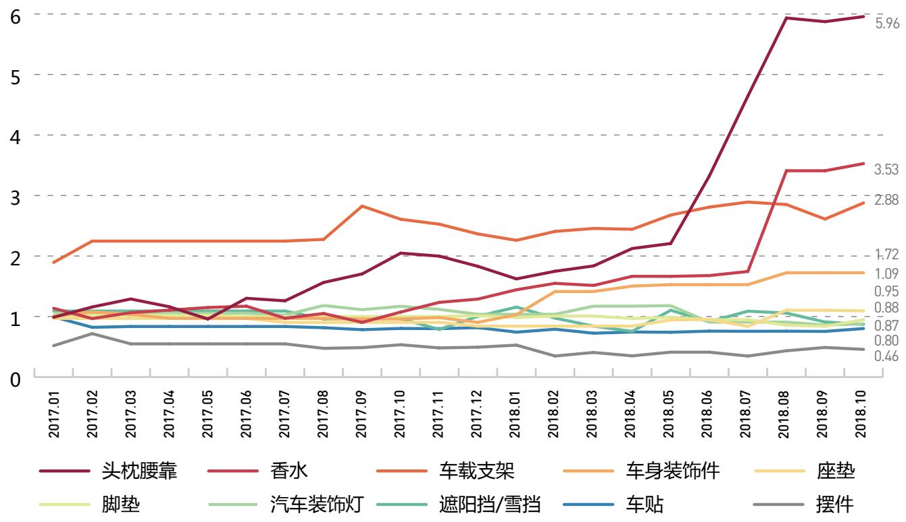  
2017.01-2018.10 汽车装饰类商品消费升级指数   
数据来源： IBIBIDColxIn Inslght

2) 京东家用电器类商品消费，厨房小电类商品「升级」迅速。其中，养生壶和面条机类商品升级尤其迅速。在厨房小电类商品越来越多样化的今天，人们更倾向于“专机专用”用专门的家电制作专门的料理或养生食品。这造就了各类细化功能的小家电在市场上成为人们争相关注焦点的局面。

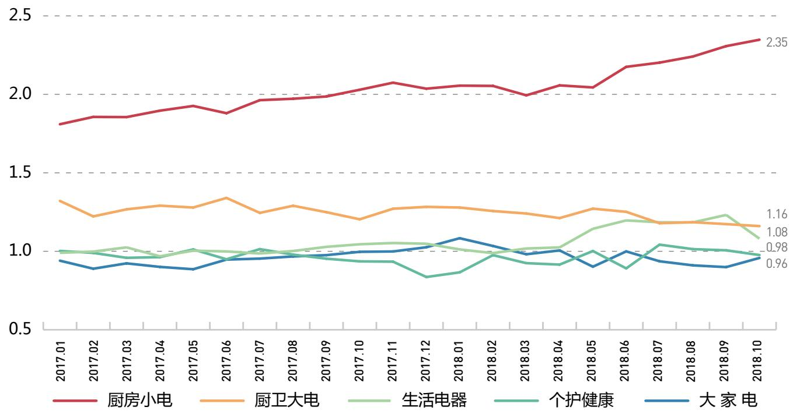  
2017.01-2018.10 家用电器类商品消费升级指数  
数据来源： Caixin Insight IBIBID  
伊利中国消费升级指数（试行版） 2018.10

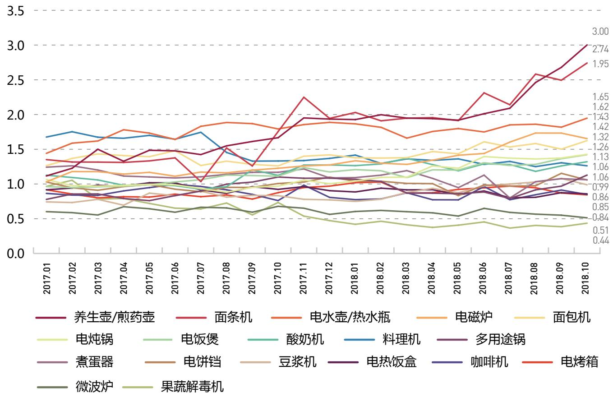  
2017.01-2018.10 厨房小电类商品消费升级指数   
数据来源： IRDCalxIn Inslght

3)京东家装建材类商品近半年来出现降级趋势。其中，灯饰照明和墙地面材料降级趋势明显。  
灯饰照明类的氛围照明类商品下降较为快速，墙地面材料类的瓷砖类商品降级趋势明显。

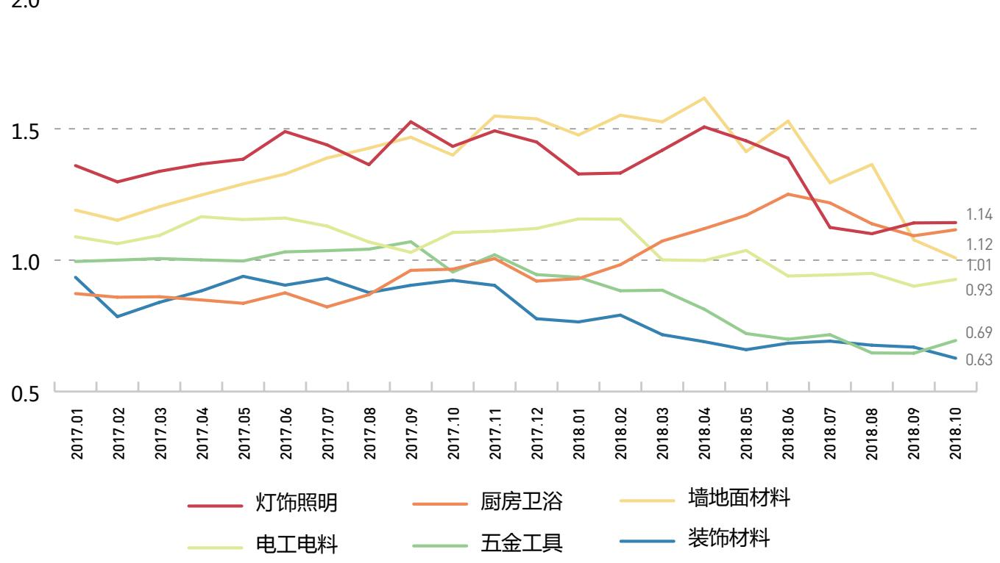  
2017.01-2018.10 家装建材类商品消费升级指数  
数据来源： IBIBIDCalxIn Inslght  
伊利中国消费升级指数（试行版） 2018.10

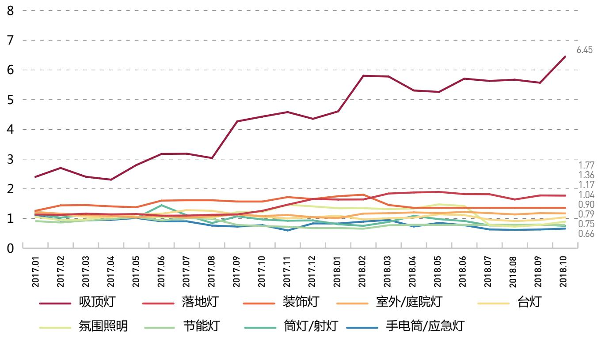  
2017.01-2018.10 灯饰照明类商品消费升级指数   
数据来源： IBIBID

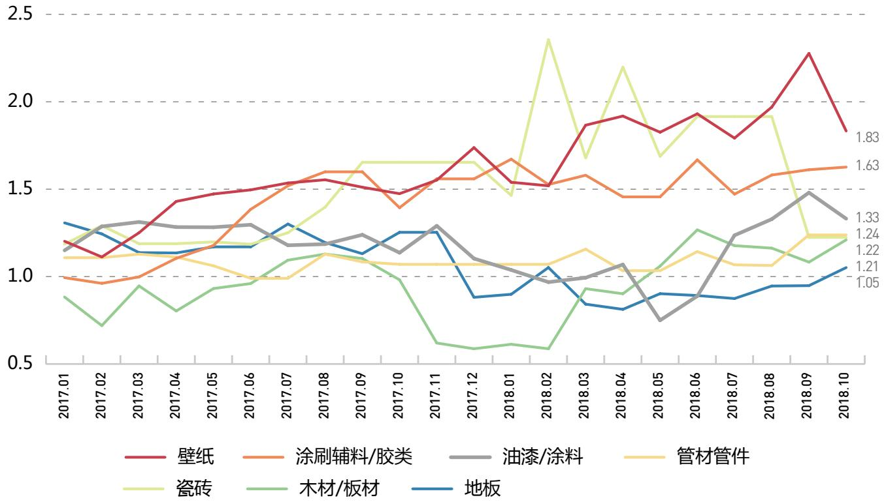  
2017.01-2018.10 墙地面材料类商品消费升级指数  
数据来源： Caixin Insight  
伊利中国消费升级指数（试行版） 2018.10

# 3. 服务消费升级指数

# 3.1 服务总体消费升级指数

2018年10月服务消费升级指数由上月的95.9下降至本月的95.1，环比下降 $0 . 8 \textdegree$ 本月服务消费升级指数波动不大。

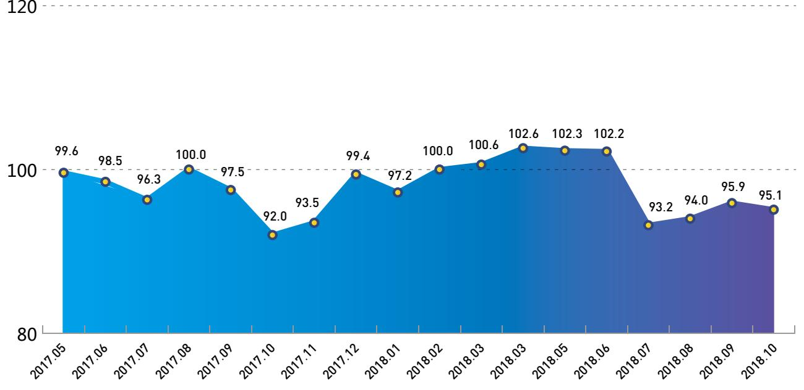  
服务消费升级指数（2017.05-2018.10）  
数据来源： Caixin Insight IBBD  
伊利中国消费升级指数（试行版） 2018.10

# 3.2 城市服务消费升级指数

从华北、中西部、华东和华南各选取两个代表城市进行对比分析。从样本城市来看，2018 年 10 月，北京、杭州和广州服务消费升级指数相比上月有所上升，其他城市的服务消费升级指数相比上月均有下降。本月，杭州服务消费升级指数继续位列第一，指数录得 159.5，环比上升 6.7；其次为北京，服务消费升级指数由上月的115.2上升至本月的148.2，环比上升33.0。成都服务消费升级指数本月录得125.9，环比下降3.9，位居第三位（图11）。

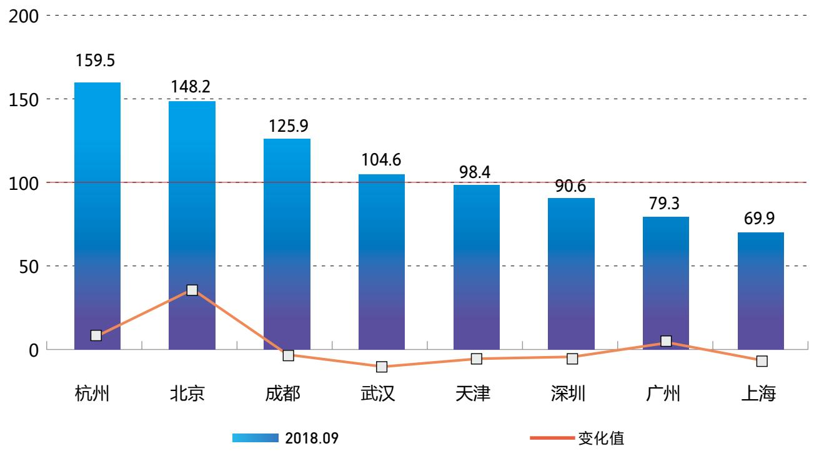  
城市服务消费升级指数（2018.10）  
数据来源： Caixin Insight IBIBD  
伊利中国消费升级指数（试行版） 2018.10

# 3.3 服务大类消费升级指数

从 2017 年 8 月到现在，服务大类消费升级指数中，居住类消费升级指数远高于其他类别，消费升级现象明显。  
此外，本月衣着类服务消费升级指数大幅上升，消费升级趋势明显。

本月衣着、居住以及医疗保健三类服务消费升级指数位于前三。本月衣着类服务消费升级指数由上月的161.9上升至本月的162.6，环比上升0.7，衣着类服务消费指数本月首次超过居住类，位居服务消费升级指数第一名。本月居住类服务消费升级指数由上月的182.2下降至本月的159.9，环比下降22.3，是本月下降幅度最大的类别。此外，本月教育、文化和娱乐类服务消费升级指数也略有下降，本月指数录得 92.2，环比下降 0.8。本月服务消费升级指数上升的品类还有医疗保健类、食品烟酒类和生活用品及服务类，其服务消费升级指数均略微上升0.7 左右。

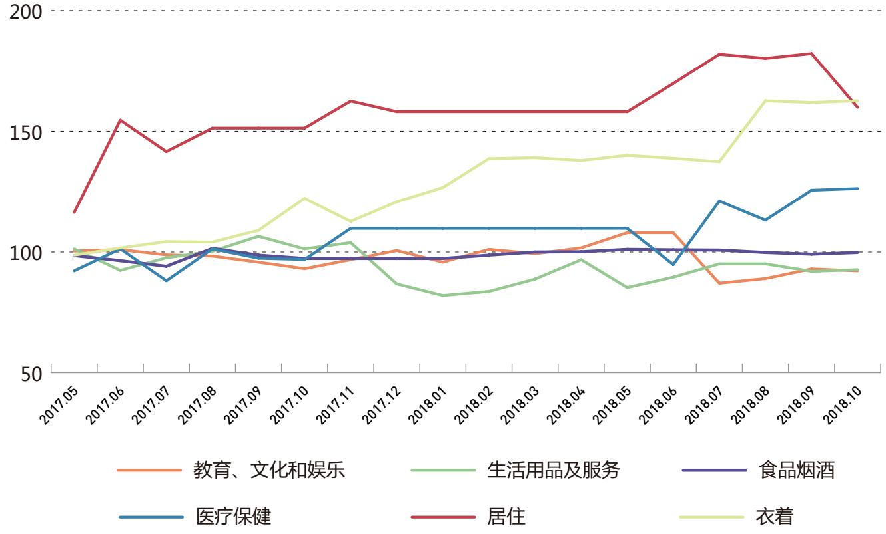  
服务大类消费升级指数（2017.05-2018.10）  
数据来源： BIBDCalxIn Insight  
伊利中国消费升级指数（试行版） 2018.10

# 3.4 服务总体消费升级指数

从部分具有消费升级特征的代表性服务中类看，本月衣着类、住房保养、维修及管理类、家庭服务类升级表现较为突出，服务消费升级指数位列前三。

• 本月衣着类服务消费升级指数录得 162.6，环比上升 0.7，首次超过住房保养、维修及管理类，跃居成为服务消费升级第一位。

• 本月住房保养、维修及管理类服务消费升级指数由上月的 182.2 下降至本月的 159.9，环比下降 22.3，是本月服务类中消费升级指数下降幅度最大的类别。

• 本月文化和娱乐服务消费升级指数也有下降。文化和娱乐服务消费升级指数由上月的 94.3 下降至本月的93.5，环比下降 0.8，排在第六位。

•本月服务消费升级指数上升的还有家庭服务、医疗服务、饮食服务、交通、个人护理用品和教育服务，均上升0.7左右。

  
服务中类消费升级指数（2017.05-2018.10）  
数据来源： 财新智库 IBIBDCalxIn Inslght  
伊利中国消费升级指数（试行版） 2018.10

# 查询详细数据，敬请联络：

伊利集团伊利集团副总裁张轶鹏电话：010-58640054邮箱：zhangyp@yili.com财新智库财新智库高级经济学家王喆电话：010-85905019邮箱：zhewang@caixin.com高级行业分析师尤越电话：010-85647243邮箱：yueyou@caixin.com

BBD( 数联铭品 )  
BBD(数联铭品 )首席经济学家陈沁  
电话 :028-65290823  
邮箱 :chenqin@bbdservice.com

# 版权声明 :

“伊利中国消费升级指数”由伊利集团冠名，财新智库和数联铭品（BBD）合作研发，按月度发布。该指数作为新经济系列指数（NEI）的最新子指数，利用网络大数据挖掘手段，量化中国消费结构及质量升级状况，力求全面、真实地展现居民消费升级趋势，准确把握市场消费升级的进展，为政府、企业和投资者提供了重要参考依据。详细信息，敬请浏览http://index.caixin.com/nei

# 关于伊利集团：

伊利集团连续位居全球乳业 8 强，蝉联亚洲乳业第一，也是中国规模最大、产品线最全的乳制品企业。同时，伊利还是中国唯一一家符合奥运会标准，为 2008 年北京奥运会提供服务的乳制品企业；是中国唯一一家符合世博会标准，为 2010 年上海世博会提供服务的乳制品企业。2017 年 8 月 30 日，北京冬奥组委与伊利集团正式签约并对外宣布：伊利集团成为北京 2022 年冬奥会和冬残奥会官方唯一乳制品合作伙伴。伊利成为全球唯一同时服务夏季奥运和冬季奥运的健康食品企业，成就中国乳业新的里程碑。

在发展历程中，伊利始终坚持“国际化”和“创新”两个轮子，固守“质量”和“责任”两个根本，以高品质、高科技含量、高附加值的多元化产品，赢得了消费者的高度信赖。每天，有 1 亿多份伊利产品到达消费者手中。每年，有超过 11 亿中国消费者享用到营养美味的伊利产品。详细信息，敬请浏览www.yili.com

# 关于财新智库：

财新智库成立于 2015 年 8 月，以“成为新经济时代中国金融基础设施建造商”为愿景，打造集研究、数据、指数为一体的高端金融服务平台。作为财新的重要一翼，财新智库致力于对中国宏观经济结构调整、资本市场国际化、中国产业走出去和金融科技健康发展的问题的一揽子解决方案，为金融机构和企业客户提供量身定制的合作方案，提升企业价值，实现突破性发展。

# 关于 BBD:

BBD（数联铭品）是行业领先的大数据解决方案提供商，紧密围绕新经济，通过动态尽调、信用评级、风险定价和经济指数四个步骤，BBD 提供从微观到宏观的大数据服务。详细信息，敬请浏览：http://www.bbdservice.com