# 连连数字（02598.HK）

# 全球化牌照与稳定币创新双轮驱动，跨境支付巨头迎盈利拐点

# 买入（首次）

<table><tr><td>盈利预测与估值</td><td>2023A</td><td>2024A</td><td>2025E</td><td>2026E</td><td>2027E</td></tr><tr><td>营业总收入（百万元)</td><td>1,028</td><td>1,315</td><td>1,705</td><td>2,152</td><td>2,624</td></tr><tr><td>同比(%)</td><td>38%</td><td>28%</td><td>30%</td><td>26%</td><td>22%</td></tr><tr><td>归母净利润（百万元）</td><td>-656</td><td>-168</td><td>1399</td><td>15</td><td>123</td></tr><tr><td>同比(%)</td><td>28%</td><td>74%</td><td>932%</td><td>-99%</td><td>692%</td></tr><tr><td>EPS-最新摊薄（元/股）</td><td>-0.66</td><td>-0.17</td><td>1.41</td><td>0.02</td><td>0.13</td></tr><tr><td>P/E（现价&amp;最新摊薄）</td><td>-17</td><td>-67</td><td>8</td><td>724</td><td>91</td></tr></table>

# [Table_S投资要点

连连数字作为中国领先的跨境数字支付平台，通过全球化布局和技术创新实现了稳健发展。①公司自 2009 年成立以来，已构建覆盖全球七大核心市场的支付网络，2024 年港交所上市后进一步强化国际竞争力；②在财务表现方面，2020-2024 年营收CAGR达 22%，核心的全球支付业务毛利率稳定在 70%以上，虽因业务结构调整导致整体毛利率短期承压，但亏损持续收窄；③公司股权结构稳定且集中，董事会由具备金融科技复合背景的专业人士组成，实控人章征宇通过集中股权和股权激励平衡公司治理。

政策与市场双轮驱动下，支付行业迎来合规化与数字化发展新阶段。①2023年国务院出台《非银行支付机构监督管理条例》，通过提高准入门槛和强化监管推动行业整合，促使资本充足的企业占据优势；②据弗若斯特沙利文预计，全球跨境电商 GMV 预计将以 19.3%的复合增速增长，中国数字支付市场TPV 到2027 年将达 354.1 万亿元，增值服务收入突破885亿元，展现出强劲增长潜力。③连连数字作为国内最大独立支付供应商，凭借牌照优势在细分市场占据 9.1%份额；④香港《稳定币条例草案》的通过进一步推动行业创新，通过低成本、高效率的跨境支付解决方案削弱美元主导地位，为商户提供费率优化与商业闭环的新机遇。

连连数字凭借全球化牌照布局和技术创新，构建了涵盖全球支付、境内支付及增值服务的综合数字支付生态。①2024年公司总营收达 13.15 亿元，其中全球支付业务表现突出，收入同比增长 23.1%至 8.08 亿元，TPV 突破2815亿元；②境内支付业务 TPV达3万亿元，增值服务收入1.46亿元，虚拟银行卡“越达卡”等创新产品推动业务多元化发展。③通过持续高研发投入和战略合作，公司强化了在跨境支付领域的领先优势，同时借助 Web3.0 和稳定币技术探索下一代支付解决方案，展现出从支付服务商向数字化生态平台升级的战略路径。

盈利预测与投资评级：考虑到公司目前尚未开始全面盈利，仍处于业务拓展阶段，我们首先考虑采用 P/S 估值法，参考可比公司的 P/S 估值，我们认为2025、2026年连连数字合理 P/S估值应在8.0x、7.0x，首次覆盖，给予“买入”评级。

◼ 风险提示：行业竞争加剧风险，政策合规风险，短期盈利风险。

2025 年 07 月 14 日

证券分析师 孙婷  
执业证书：S0600524120001sunt@dwzq.com.cn证券分析师 武欣姝  
执业证书：S0600524060001wuxs@dwzq.com.cn

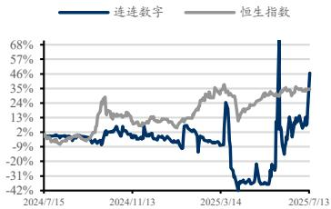  
股价走势

# 市场数据

收盘价(港元) 14.08 一年最低/最高价 5.50/18.00 市净率(倍) 11.18 港股流通市值(百万港   
5,368.45 元)

# 基础数据

每股净资产(元) 1.15   
资产负债率 $( \% )$ 91.50   
总股本(百万股) 1,079.06   
流通股本(百万股) 418.67

# 相关研究

# 内容目录

# . 公司概况：数字支付龙头，业绩稳步提升 ......

# 2. 行业发展：境内合规深化，跨境创新突破.

# 3. 连连看点：稳固支付基本盘，布局 Web3.0 新生态 ...... 14

# 4. 盈利预测与估值 ..... .24

# 4.1. 核心假设.. 24

# 4.2. 投资建议.. .25

# 5. 风险提示 ...... .. 26

# 图表目录

图 1： 连连数字发展历程. .. 5  
图 2： 连连数字股权结构（截至 2025年7月9日） .. 6  
图 3： 2020-2024 年连连数字营业收入及 yoy ..... .. 7  
图 4： 2020-2024年连连数字归母净利润（单位：百万元） ... 7  
图 5： 2020-2024 年连连数字各业务毛利率.. ... 8  
图 6： 2020-2024年连连数字销售、管理、研发费用率 .. 8  
图 7： 2020-2024 年连连数字各业务营业成本（百万元） ... 9  
图 8： 2020-2024 连连数字毛利润及 yoy ........ ... 9  
图 9： 2018-2027E 全球跨境电商 GMV 及渗透率 . . 10  
图 10： 2018-2027E全球贸易市场规模及中国贸易占比.. .10  
图 11： 中国数字支付服务市场 TPV（单位：万亿元） . 11  
图 12： 中国数字支付解决方案提供商增值服务收入（单位：十亿元） . 11  
图 13： 中国信用卡交易总额及高端卡占比... . 11  
图 14： 2025 年 7 月主流美元稳定币 USDT、USDC、DAI . . 13  
图 15： 连连数字服务范围.... .. 15  
图 16： 2020-2024连连数字主要业务营收（百万元） .......... .............................................. .. 15  
图 17： 2020-2024 年连连数字数字支付业务 TPV 及 yoy...... . 15  
图 18： 连连收单、收款、付款及汇兑服务典型交易流程.. . 16  
图 19： 2020-2024 年连连数字全球支付服务 TPV 及 yoy.... . 16  
图 20： 2020-2024年连连数字全球支付服务费率.. .. 16  
图 21： 境内支付业务场景解读... . 17  
图 22： 2020-2024 年连连数字境内支付服务 TPV 及 yoy.... . 18  
图 23： 2020-2024年连连数字境内支付服务费率. .. 18  
图 24： 连连全球支付牌照/资质及驻点 . .. 19  
图 25： 2020-2024 年连连数字增值服务业务营收及 yoy . . 19  
图 26： 2020-2023Q3 连连数字中国跨境商户活跃客户数量及平均 TPV扩展率. . 20  
图 27： 四方支付模式.. .. 21  
图 28： 2020-2024 年连连数字研发费用及 yoy .. .. 22  
图 29： 2023、2024年连连数字研发人员人数及占比.. . 22  
图 30： Web3.0 与 Web3 ... .23  
表 1： 连连数字董事会成员 . 6  
表 2： 国务院《非银行支付机构监督管理条例》核心内容. .. 9  
表 3： 2022年中国前十大数字支付解决方案提供商排名. . 12  
表 4： 2022年中国前十大独立数字支付解决方案提供商排名. .. 12  
表 5： 传统刷卡支付路径的交易成本.. .. 14  
表 6： 稳定币路径的交易成本.. .. 14  
表 7： 连连数字主要经营地区跨境支付牌照. .. 18  
表 8： 香港稳定币发行人“沙盒”参与者名单. .. 23  
表 9： 11家获得正式发牌的虚拟资产交易平台. .. 23  
表 10： 连连数字盈利预测表（截至 2025 年 7 月 14 日收盘）. .24  
表 11： 可比公司 P/S 估值（截至 2025 年 7 月 14 日收盘） . 25  
表 12： 连连数字盈利预测表（截至 2025年7月14 日，单位：百万元） .. 27

# 1. 公司概况：数字支付龙头，业绩稳步提升

# 1.1. 历史沿革：迈向全球的支付科技先锋

连连数字自 2009 年创立于杭州以来，已发展成为一家于全球各区域开展业务的数字支付解决方案提供商。①2009-2016 年：合规奠基，支付业务起步。连连数字于 2009年在杭州成立，早期以合规建设为核心战略。2011 年，公司取得中国人民银行颁发的《支付业务许可证》，正式进军第三方支付领域，为后续业务拓展奠定基础。②2016-2020年：技术创新，加速全球化。2016 年，公司迈出国际化第一步，在香港设立首家海外办事处；2017年，连连与浙江大学合作成立技术研究院，增强研发实力，并在香港建立境外业务中心，深化跨境支付能力。同年，公司与美国运通合资成立连通公司，布局银行卡清算业务。2018年，业务扩展至东南亚、巴西及亚太市场，全球支付网络初具规模。③2021-2023 年：深化合规性布局。2021 年，公司获得新加坡主要支付机构牌照及美国全境货币转移牌照；2022 年，公司累计获 64 张牌照，覆盖七大重要市场。④2024 年至今：Web3.0前瞻布局。2024年，连连数字全资子公司DFX 获得香港 VATP 牌照，正式进军虚拟资产交易领域。公司成功上市后，进一步整合全球支付、清算及数字金融服务，形成“支付 $+ .$ 金融科技+Web3.0”的生态体系。

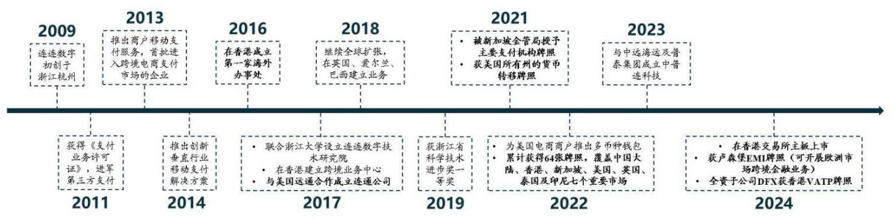  
图1：连连数字发展历程  
数据来源：公司官网，东吴证券研究所

# 1.2. 股东架构：股权集中与长效激励并重

股权集中度相对较高，长期实施股权激励计划。 $\textcircled{1}$ 股权情况：实控人主导。连连股权结构相对集中，截至 2025 年 7 月 9 日，公司实际控制人为集团董事会主席章征宇，其直接持股 $1 0 . 8 8 \%$ ，并通过杭州创连致新间接持股 $1 5 . 9 6 \%$ ，合计控制 $2 6 . 8 4 \%$ 股权；2021年1月 1 日，章征宇与吕钟霖（持股 $8 . 5 6 \%$ ）、肖瑟秋（持股 $1 . 1 9 \%$ ）签署一致行动协议，进一步强化主导权。 $\textcircled{2}$ 股权激励情况：长期绑定核心团队。连连数字在 2021年和 2023年先后实施了两轮上市前股权激励计划，旨在通过长期激励机制吸引核心人才、稳定团队，并推动公司战略目标的实现。截至2024年末，包括董事辛洁、魏萍、朱晓松、王愚在内的管理层及核心员工均已获得相应购股权。

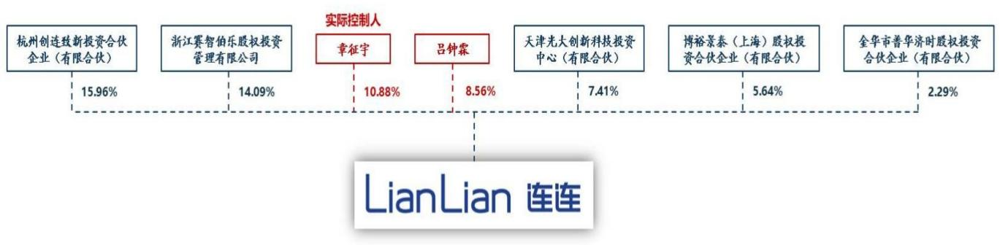  
图2：连连数字股权结构（截至 2025 年 7 月 9 日）  
数据来源：iFind，东吴证券研究所

# 1.3. 核心团队：深耕金融科技的多元化战略引擎

公司董事长兼董事会主席章征宇先生作为实际控制人，十余年来持续引领企业高质量发展。章征宇先生自 2004 年创立浙江连连以来，始终主导企业战略布局，2009年加入连连集团后进一步强化业务整合，并于 2018 年出任董事长全面统筹战略规划与经营管理。董事会成员均拥有超 20 年科技金融与企业管理复合经验，专业领域覆盖支付科技创新、国际资本运作、智能财务系统构建及金融学术研究，形成“技术 $^ { . + }$ 资本 $^ { + }$ 产业”的立体化决策体系。核心团队兼具实战深度与行业广度，通过技术创新与资源整合的双轮驱动，奠定了连连在跨境支付解决方案领域的标杆地位，持续推动连连在全球金融科技赛道稳步前进。

表1：连连数字董事会成员  

<table><tr><td>姓名</td><td>职务</td><td>出生时间</td><td>背景</td></tr><tr><td>章征宇</td><td>董事长、执行董事</td><td>1966 年</td><td>浙江大学计算机软件学士学位，美国南加州大学公共政策及管理硕 士学位；2004 年创办浙江连连，2009 年加入连连集团，具备丰富的</td></tr><tr><td>辛洁</td><td>事</td><td>首席执行官、执行董1974 年4 月</td><td>金融科技企业管理经验。 美国佐治亚大学工商管理学士学位，南开大学世界经济学硕士学 位；2007-2021年任职于中金公司，历任CFO、执行董事等职，资</td></tr><tr><td>魏萍</td><td>财务总监、执行董事</td><td>（53岁）</td><td>深上市公司管理经验。 中央财经大学学士学位，美国伊利诺伊州注册会计师资格；曾任达 内教育、十荟团、启今教育等上市公司CFO。</td></tr><tr><td>朱晓松</td><td>执行董事</td><td>（53岁）</td><td>清华大学机械设计与制造学士学位，美国加利福尼亚大学洛杉矶分 校工商管理硕士学位；20 余年科技、金融企业管理经验。</td></tr><tr><td>王愚</td><td>执行董事、副总经 理、CTO</td><td>（47岁）</td><td>南京大学地球化学学士学位，中国科学院大学计算机应用硕士学 位；曾任众安在线副总裁，蚂蚁科技、阿里巴巴技术专家。</td></tr><tr><td>Chun Chang</td><td>独立非执行董事</td><td>（68岁）</td><td>华东师范大学数学学士，美国俄勒冈大学理学硕士，西北大学凯洛 格商学院博士；曾任上海交通大学高金学院执行院长。</td></tr><tr><td>黄志坚</td><td>独立非执行董事</td><td>（51岁）</td><td>曾于INGBank、瑞银及摩根士丹利等多家知名银行以及香港的多家 主板上市公司任职，现任上市公司久融控股、中药集团等董事。</td></tr><tr><td>林兰芬</td><td>独立非执行董事</td><td>（55岁）</td><td>中国计算机学会会员、电气与电子工程师学会会员；1996 年起任职</td></tr></table>

浙江大学计算机科学与技术学院，担任博士生导师、浙大人工智能研究所教授及副所长

数据来源：Wind，东吴证券研究所

# 1.4. 盈利表现：营收增长迅速，基本面稳定向好

近五年来，公司营业收入保持良好增长态势。①2020-2022年平缓增长：从5.93亿元增长至 7.44 亿元，CAGR 为 $1 2 . 0 0 \%$ ； $\textcircled { 2 } 2 \mathbf { 0 } 2 2 { - } 2 \mathbf { 0 } 2 4$ 年高速增长：2022 年获得七大重要市场的多张牌照及资质后，营收开始起量，从 2022年 7.44 亿元增长至2024年 13.15亿元，CAGR 为 $3 2 . 9 4 \%$ 。2020-2024 年 CAGR 为 $2 2 . 0 2 \%$ ，2024 年同比增速为 $2 7 . 8 8 \%$ 。

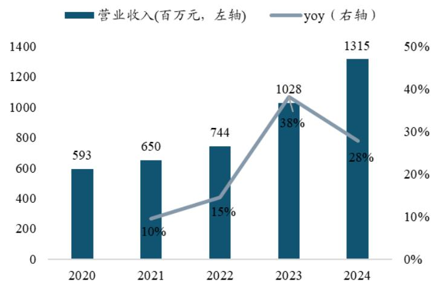  
图3：2020-2024 年连连数字营业收入及 yoy  
数据来源：Wind，东吴证券研究所

归母净利润方面，自 2022 年以来呈现显著改善趋势。①2020-2022 年战略投入期：2020 年归母净利润-3.68 亿元，至 2022 年进一步下滑至-9.17 亿元，主要受境内支付费率下行及连通公司清算业务拖累； $\textcircled { 2 } 2 \mathbf { 0 } 2 2 { - } 2 \mathbf { 0 } 2 4$ 年战略转型成效初显：2024年归母净利润大幅改善至-1.68亿元，主要受益于高毛利全球支付业务放量，若不计上市费用等非经常性开支，公司归母净利润将有望进一步改善，显示出连连数字盈利能力的显著提升。

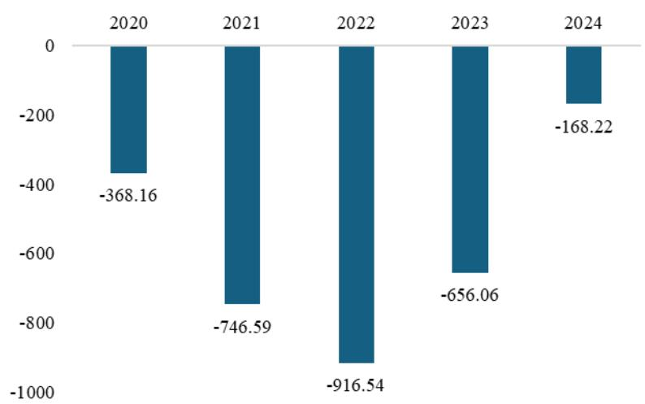  
图4：2020-2024 年连连数字归母净利润（单位：百万元）  
数据来源：Wind，东吴证券研究所

毛利率方面，自 2023年来总体维持稳定。①2021-2023年，公司毛利率由于业务结构调整整体呈现下降趋势。2022 年起低毛利业务如数字化营销服务业务扩张导致公司增值服务业务毛利率大幅下滑（从 2021 年的 $8 1 \%$ 降至 2023 年的 $3 3 \%$ ）。 $\textcircled{2} 2 \mathbf { 0 } 2 4$ 年起，公司毛利率逐渐稳定在 $5 0 + \%$ 水平。连连高毛利业务全球支付业务开始起量，2024年全球支付业务、境内支付业务及增值服务业务毛利率分别为 $7 1 . 9 7 \% / 1 9 . 7 2 \% / 1 9 . 1 2 \%$ ，同比分别 $+ 0 . 1 6 \mathrm { p c t } / - 5 . 8 9 \mathrm { p c t } / - 1 3 . 7 6 \mathrm { p c t } ,$ ，全球支付业务近年均稳定在 $70 \%$ 以上，作为核心盈利板块贡献较高。整体毛利率为 $5 1 . 9 0 \%$ ，同比-4.25pct。

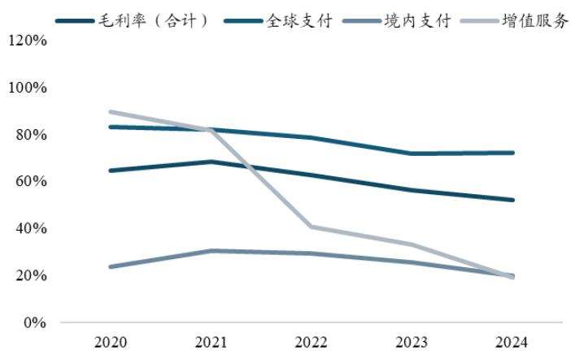  
图5：2020-2024 年连连数字各业务毛利率  
数据来源：Wind，东吴证券研究所

费用控制方面，近年来整体稳定维持在 $8 0 \% - 9 0 \%$ 区间内。 $\textcircled{1}$ 公司管理费用率波动较为明显：近五年最低为2022年的 $3 4 . 7 8 \%$ ，最高为2020年的 $4 9 . 2 8 \%$ ，2024年为 $4 2 . 6 5 \%$ ，同比-4.07pct； $\textcircled{2}$ 销售费用率趋于稳定：近三年均维持在 $1 9 \%$ 的水平，2024年为 $1 8 . 8 8 \%$ ，同比 $+ 0 . 2 3$ pct； $\textcircled{3}$ 研发费用率呈现小幅下滑的趋势：相较于 2022 年的 $2 8 . 3 3 \%$ ，2024 年研发费用率为 $2 4 . 2 6 \%$ 。成本结构方面，凸显连连业务重 $\therefore$ 的转移。早期以境内支付为主，2020 年占比 $6 5 \%$ ，2024 年下降至 $44 \%$ ；增值服务成本提升显著，是公司业务多元化的结果。

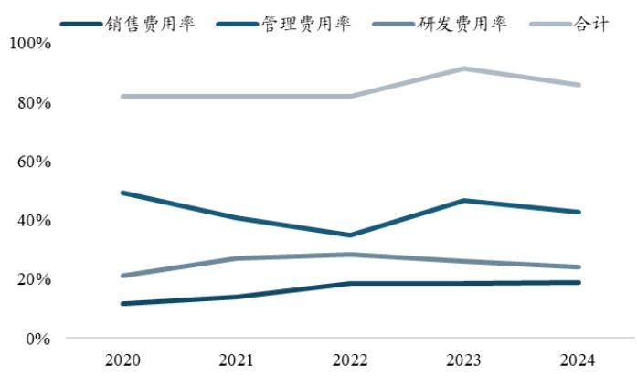  
图6：2020-2024 年连连数字销售、管理、研发费用率  
数据来源：Wind，东吴证券研究所

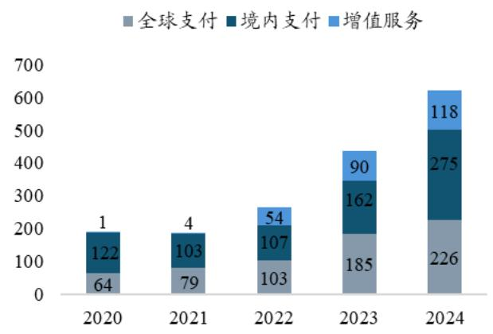  
图7：2020-2024 年连连数字各业务营业成本（百万元）  
数据来源：Wind，东吴证券研究所

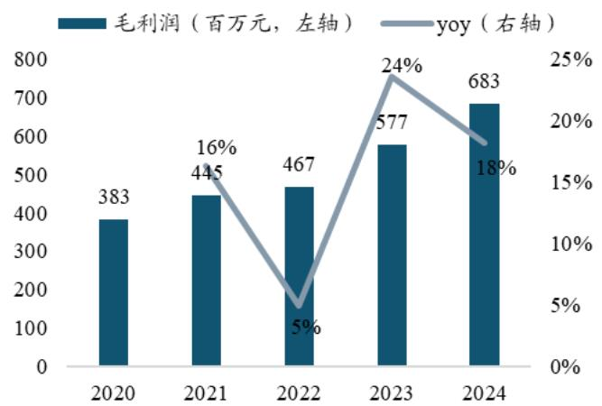  
图8：2020-2024 连连数字毛利润及 yoy  
数据来源：Wind，东吴证券研究所

# 2. 行业发展：境内合规深化，跨境创新突破

# 2.1. 监管政策，形成高标准严要求的新业态

政策引领行业进入合规成熟期。2023年12 月 17日，国务院发布《非银行支付机构监督管理条例》，于 2024 年 5 月 1 日实施，《条例》规定提高非银支付机构注册资本门槛至1亿元并将净资产与备付金挂钩，以及一系列审批、监管措施，新兴中小企业成长空间被挤压，业内公司积极推进合规牌照申请流程，满足监管要求。在准入门槛与合规要求更高的市场环境中，资本充沛、牌照齐全的存量企业发展空间更为广阔，或有望形成并驾齐驱的稳定新业态。

表2：国务院《非银行支付机构监督管理条例》核心内容  

<table><tr><td>要点</td><td>《非银行支付机构监督管理条例》</td></tr><tr><td>监管机构</td><td>中国人民银行（央行）负责监管，分支机构履行具体职责。</td></tr><tr><td rowspan="3">准入条件</td><td>1)注册资本1亿元及以上；</td></tr><tr><td>2)股东需自有资金出资，无重大违法违规记录；</td></tr><tr><td>3)需具备健全的公司治理、风控措施和用户权益保障机制。</td></tr><tr><td>审批流程 业务类别</td><td>央行6 个月内决定是否颁发支付业务许可证，注明业务类型和经营地域范围。</td></tr><tr><td rowspan="3">业务要求</td><td>储值账户运营和支付交易处理。</td></tr><tr><td>1)交易处理、资金结算和数据存储需在境内完成；</td></tr><tr><td>2)支付账户需实名开立，禁止买卖、出租账户；</td></tr><tr><td rowspan="2">用户权益</td><td>3)备付金需专户存放央行或商业银行，不得挪用或担保。</td></tr><tr><td>1)明示服务协议条款，变更需提前30日公告并征得用户同意；</td></tr><tr><td>监管措施</td><td>2)禁止收集无关用户信息，需保障数据安全，跨境数据传输需符合规定。 央行可现场检查、调查取证，实施分类评级管理，认定系统重要性支付机构。</td></tr></table>

数据来源：国务院，东吴证券研究所

# 2.2. 数字支付市场，贸易数字化持续推进

随着信息技术的发展和互联网基础设施的不断完善，全球贸易的数字化转型正在加速推进。全球贸易向数字化转型正推动价值链上的商户及企业从跨境线下贸易向跨境电商转型。据弗若斯特沙利文统计和预测，2022 年全球跨境电商 GMV 为 2.4 万亿美元，渗透率约为 $7 . 5 \%$ ，中国跨境电商渗透率约为 $1 4 . 3 \%$ ，远高于全球水平；预计到 2027 年全球跨境电商GMV为5.8万亿美元，2022-2027年CAGR为 $1 9 . 3 0 \%$ ，渗透率达到 $1 2 . 2 \%$ ，中国跨境电商渗透率将达 $2 7 . 7 \%$ 。

从历史数据看，链上企业从跨境线下贸易向跨境电商转型的趋势更为显著。2018-2022 年间，全球跨境电商 GMV 的 CAGR 为 $1 8 . 9 2 \%$ ，显著高于全球贸易规模的增速$5 . 8 4 \%$ ；预计 2022-2027 年，全球贸易规模 CAGR 为 $8 . 3 1 \%$ ，相较于全球跨境电商 GMV增长缓慢。

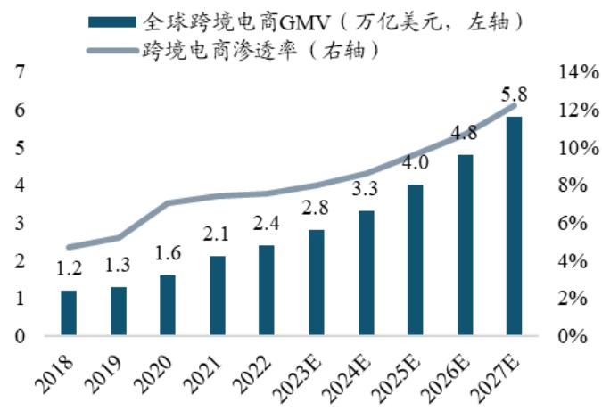  
图9：2018-2027E 全球跨境电商 GMV 及渗透率  
数据来源：弗若斯特沙利文，连连数字招股书，东吴证券研究所

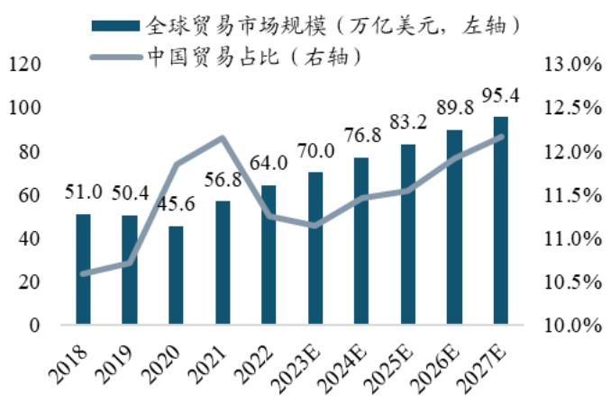  
图10：2018-2027E 全球贸易市场规模及中国贸易占比  
数据来源：弗若斯特沙利文，连连数字招股书，东吴证券研究所

中国数字支付市场正迎来境内外双轮驱动增长，展现出强劲的数字化发展潜力。随着数字化转型加速，中国数字支付市场 TPV 从 2018 年的 99.8 万亿元增至 2022 年的181.6 万亿元（CAGR $1 6 . 1 \%$ ），据弗若斯特沙利文预计，2027年将达 354.1万亿元（2022-2027 年 CAGR $1 4 . 3 \%$ ）；2018-2022 年增值服务收入从 147 亿元增长至 339 亿元（CAGR$2 3 . 2 \%$ ），2027 年有望突破 885 亿元（2022-2027 年 CAGR $2 1 . 2 \%$ ），商户对数字化服务具备持续需求。

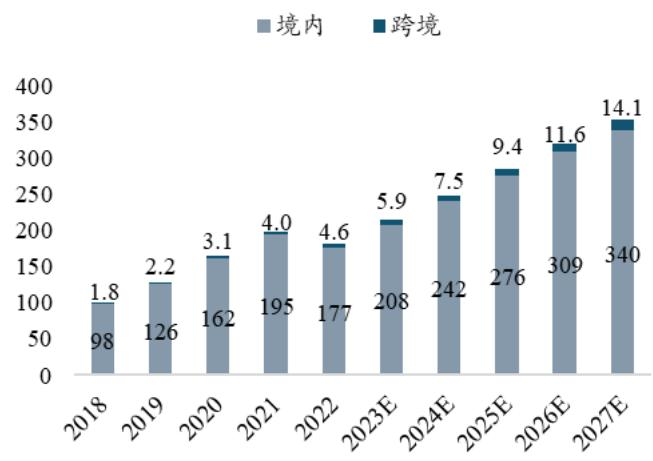  
图11：中国数字支付服务市场 TPV（单位：万亿元）  
数据来源：弗若斯特沙利文公众号，东吴证券研究所

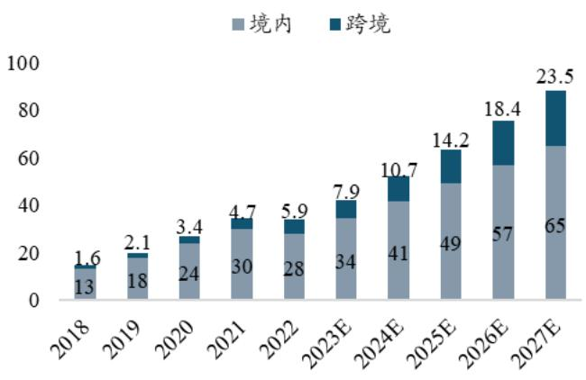  
图12：中国数字支付解决方案提供商增值服务收入（单位：十亿元）  
数据来源：弗若斯特沙利文公众号，东吴证券研究所

公司 2020年获得银行卡清算业务牌照，为中国首家中外合资（2017年与美国运通成立合资企业）银行卡清算机构。中国高端卡交易额由 2018 年的人民币 5.7 万亿元增加至 2022 年的人民币 7.0 万亿元，2018 年至 2022 年的复合年均增长率为 $5 . 3 \%$ ，高端卡的市场份额从 2018 年的 $1 5 . 0 \%$ 增加到 2022 年的 $1 7 . 0 ~ \%$ 。到 2027 年，高端卡交易额预计将进一步达到人民币 11.0 万亿元，连通公司的高端卡相关业务有望实现同步增长。

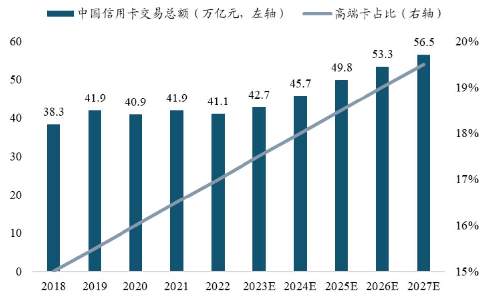  
图13：中国信用卡交易总额及高端卡占比  
数据来源：弗若斯特沙利文公众号，东吴证券研究所

连连数字是国内最大的第三方独立支付供应商。独立数字支付解决方案提供商是指不属于或不受控于金融机构、不高度依赖关连方（如大型电商平台）贡献的业务的提供商。独立数字支付解决方案提供商主要服务于与自身无关联的独立客户，专注于提供个性化的支付解决方案，以满足客户的多样化需求，通常会使商户及企业作为独立的一方接收来自多个发卡行的付款。2022 年中国数字支付服务市场的 TPV 为人民币 181.2 万亿元，其中前十大数字支付解决方案提供商占总市场份额的 $8 7 . 4 \%$ 。以 2022 年的 TPV计，连连数字是中国第七大数字支付解决方案提供商（前六均为非独立支付供应商），市场份额为 $0 . 6 \%$ 。

表3：2022 年中国前十大数字支付解决方案提供商排名  

<table><tr><td>排名</td><td>公司</td><td>性质</td><td>2022 年 TPV （十亿元）</td><td>市场份额</td><td>备注</td></tr><tr><td>1</td><td>蚂蚁集团</td><td>非独立</td><td>85,000</td><td>46.90%</td><td>2004 年成立的私营公司，领先的开放式互联网平台，提供数 字支付及数字金融服务，注册资本350亿元。</td></tr><tr><td>2</td><td>腾讯控股</td><td>非独立</td><td>54,600</td><td>30.10%</td><td>1998年成立的香港上市公司，互联网及科技巨头，主营数字 支付，注册资本超6.5亿元，2022年收入超5,540亿元。</td></tr><tr><td>3</td><td>中国银联</td><td>非独立</td><td>8,600</td><td>4.70%</td><td>2002 年成立的国有企业，提供银行卡及支付服务，注册资本 超90 亿元，拥有 36 家子公司及50 多家海外分支机构。</td></tr><tr><td>4</td><td>中国平安</td><td>非独立</td><td>3,200</td><td>1.70%</td><td>1988 年成立的香港上市公司，综合金融及医疗保健服务商， 注册资本超 180 亿元，2022 年收入超 1 万亿元。</td></tr><tr><td>5</td><td>阿里巴巴</td><td>非独立</td><td>2,100</td><td>1.20%</td><td>纳斯达克和香港双重上市公司，领先互联网公司及线上零售 商，注册资本10 亿元，2022 年收入超1 万亿元。</td></tr><tr><td>6</td><td>拼多多</td><td>非独立</td><td>2,000</td><td>1.10%</td><td>2018 年于纳斯达克上市的公众公司，领先电商平台，注册资 本超1亿元，2022 年收入超 1,000亿元。</td></tr><tr><td>7</td><td>连连数字</td><td>独立</td><td>1,150</td><td>0.60%</td><td>-</td></tr><tr><td>8</td><td>公司G</td><td>独立</td><td>1,020</td><td>0.60%</td><td></td></tr><tr><td>9</td><td>公司H</td><td>独立</td><td>600</td><td>0.30%</td><td></td></tr><tr><td>10</td><td>公司I</td><td>独立</td><td>400</td><td>0.20%</td><td></td></tr></table>

数据来源：弗若斯特沙利文，公司招股书，东吴证券研究所

连连数字各牌照齐全，市场份额领先。2022年，独立数字支付解决方案提供商为数字支付服务市场贡献的 TPV 为人民币 12.7 万亿元，占中国整体数字支付服务市场的TPV 约 $7 . 0 \%$ 。按2022年的TPV计，连连是中国最大的独立数字支付解决方案提供商，市场份额达到 $9 . 1 \%$ 。

表4：2022 年中国前十大独立数字支付解决方案提供商排名  

<table><tr><td>排名</td><td>公司</td><td>TPV （十亿元）</td><td>市场 份额</td><td>境内 支付</td><td>境外 支付</td><td>其他 牌照</td><td>持股 人民币</td><td>持股 外币</td><td>票据 服务</td><td>牌照数目</td></tr><tr><td>1</td><td>连连数字</td><td>1,150</td><td>9.10%</td><td>√</td><td>√</td><td>√</td><td>√</td><td>√</td><td>√</td><td>64</td></tr><tr><td>2</td><td>公司G</td><td>1,020</td><td>8.00%</td><td>√</td><td>√</td><td>√</td><td>√</td><td>√</td><td>×</td><td>3</td></tr><tr><td>3</td><td>公司H</td><td>600</td><td>4.70%</td><td>√</td><td>√</td><td>√</td><td>√</td><td>√</td><td>√</td><td>5</td></tr><tr><td>4</td><td>公司I</td><td>400</td><td>3.20%</td><td>√</td><td>√</td><td>√</td><td>√</td><td>√</td><td>√</td><td>4</td></tr><tr><td>5</td><td>公司J</td><td>231</td><td>1.80%</td><td>√</td><td>√</td><td>√</td><td>√</td><td>√</td><td>×</td><td>52</td></tr><tr><td>6</td><td>公司K</td><td>209</td><td>1.60%</td><td>×</td><td>×</td><td>×</td><td>√</td><td>√</td><td>×</td><td>54</td></tr><tr><td>7</td><td>公司L</td><td>192</td><td>1.50%</td><td>√</td><td>√</td><td>√</td><td>√</td><td>√</td><td>√</td><td>5</td></tr><tr><td>8</td><td>公司 M</td><td>175</td><td>1.40%</td><td>√</td><td>√</td><td>√</td><td>√</td><td>√</td><td>×</td><td>74</td></tr><tr><td>9</td><td>公司N</td><td>168</td><td>1.30%</td><td>√</td><td>√</td><td>√</td><td>√</td><td>√</td><td>×</td><td>3</td></tr></table>

<table><tr><td>10</td><td>公司0</td><td>105</td><td>0.80%</td><td>√</td><td>√</td><td>√</td><td>√</td><td>√</td><td>√</td><td>49</td></tr><tr><td></td><td></td><td></td><td></td><td></td><td></td><td></td><td></td><td></td><td></td><td></td></tr></table>

注：2024 年 5 月连连取得卢森堡 EMI 牌照；数据来源：弗若斯特沙利文，公司招股书，东吴证券研究所

# 2.3. 稳定币崛起，有望带动跨境业务

# 香港稳定币条例草案通过有望在宏微观层面起带动作用。

①政策引领：5月21 日，中国香港特区政府于 2024年底提交的《稳定币条例草案》经香港立法会通过。至此，香港成为全球首个为法币挂钩稳定币建立全面监管框架的司法管辖区，合规的香港稳定币有望在今年 8月1 日正式生效。

②监管特色：香港的稳定币监管框架以“同风险同规则”为核心原则，通过牌照管理、全额储备要求及严格审计机制，构建高标准的风险防控体系——既保障投资者权益，又有望为市场提供稳定可靠的交易环境。

③宏观影响：在推动人民币国际化进程中，香港可凭借其金融枢纽地位，成为人民币稳定币的“试验田”——促进人民币稳定币在跨境贸易、RWA 代币化等场景的应用，降低对 SWIFT 系统的依赖，提升跨境支付效率；目前全球 $9 9 \%$ 的稳定币以美元计价，香港《草案》的通过有望推动更多非美元稳定币的发行与流通，逐步削弱美元在加密经济中的垄断地位，为全球数字资产市场提供多元化选择。

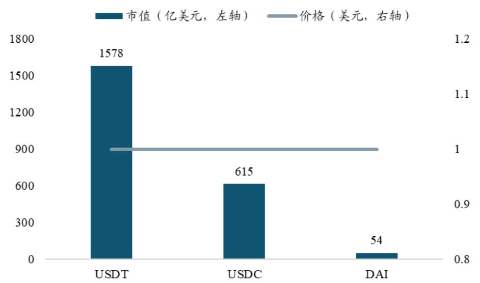  
图14：2025 年 7 月主流美元稳定币 USDT、USDC、DAI  
数据来源：CoinMarketCap，东吴证券研究所

# 稳定币应用场景广泛，在跨境支付领域更是具备天然优势。

①高效透明：稳定币基于区块链技术构建，实现分钟级到账和 $7 \times 2 4$ 小时不间断运行，突破传统跨境支付 SWIFT 时效限制。分布式账本特性确保交易全程透明可追溯，显著提升资金流转的安全性和可信度。

②风控属性：稳定币以其在加密货币中特有的锚定法币的机制有效规避价格波动风险。Fintech 的双重属性使其在贸易结算、跨境汇款等场景中保持支付效率的同时确保了价值的稳定。

③场景适配：稳定币有望通过更新传统跨境金融基础设施的形式重塑全球资金流动范式，从跨境电商货款结算到海外劳工汇款等多个领域，无缝衔接数字经济和实体经济。

表5：传统刷卡支付路径的交易成本  

<table><tr><td>收费环节</td><td>收费方</td><td>典型费率</td><td>功能</td></tr><tr><td>Interchange</td><td>发卡行</td><td>1.4%-1.9%</td><td>覆盖授信、积分、欺诈风险损失</td></tr><tr><td>Assessment/ Network</td><td>Visa/Mastercard</td><td>0.13%-0.16%</td><td>运行全球清算网、品牌、规则制定</td></tr><tr><td>Acquirer</td><td>收单行、支付网关</td><td>0.3%-0.6%</td><td>终端、客服、对账、风控</td></tr><tr><td>合计</td><td>-</td><td>≈2.1%-2.7%</td><td>-</td></tr></table>

数据来源：贝叶斯之美公众号，东吴证券研究所

# 稳定币为商户构建成本优化与商业闭环新范式。

①结构性成本优势：稳定币支付通过区块链架构直接剔除信用卡 Interchange 等传统中间环节，将跨境结算成本从 $2 \%$ 以上压缩至 $1 . 0 7 \%$ （含 $1 \%$ 法币兑换费），基础交易成本更降至 $0 . 0 \mathrm { x } \%$ 级别的Gas费。"去中介化"模式不仅消除 $1 . 5 \%$ 的发卡行分成，其 $7 \times$ 24 小时实时结算特性进一步降低资金占用成本。电商平台通过直接留存 USDC 用于供应链付款，可完全规避法币兑换摩擦，实现此项成本归零。

②商业生态再升级：Coinbase 等合规服务商以"零费率"策略倒逼传统支付商让利，而 Shopify 等平台将稳定币利息转化为 $1 \%$ 消费返现，本质上构建了"低成本支付-稳定币留存-收益再分配"的闭环体系。这种模式既覆盖残余交易成本，又通过数字营销支出增强用户粘性，使稳定币从支付工具升级为商业生态的价值循环节点，推动商户从单纯“降本”转向“增值”经营。

表6：稳定币路径的交易成本  

<table><tr><td>收费环节</td><td>收费机制</td><td>实际成本</td></tr><tr><td>L2 Gas</td><td>Base链打包费：0.03%</td><td>0.03%</td></tr><tr><td rowspan="2">稳定币转账/DEX兑换</td><td>USDC同链转账0费率；</td><td>≤0.04%</td></tr><tr><td>DEX稳定币池兑换USDT/DAI费率0.04%</td><td></td></tr><tr><td>收单</td><td>Shopify×Coinbase 试点称“商户0费率”</td><td>0</td></tr><tr><td>合计</td><td>-</td><td>≤0.07%</td></tr></table>

数据来源：贝叶斯之美公众号，东吴证券研究所

# 3. 连连看点：稳固支付基本盘，布局 Web3.0新生态

# 3.1. 体系覆盖全球，不断拓展新方向

连连数字依托其全球牌照、技术平台和合作网络，构建了覆盖全球的支付服务体系：为客户提供收款、付款、汇兑、虚拟银行卡等一站式数字支付解决方案，以及数字营销、运营支持等增值服务。

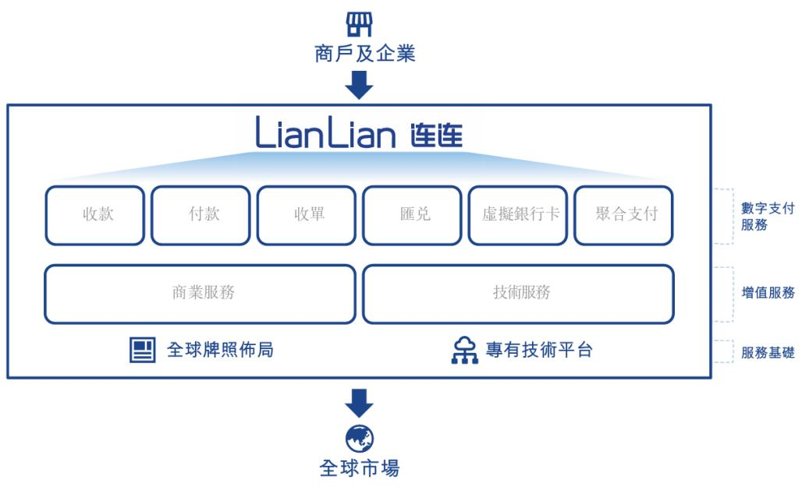  
图15：连连数字服务范围   
数据来源：公司招股书，东吴证券研究所

数字支付服务（包括全球支付与境内支付）是公司的核心业务，2024 年实现收入11.51亿元，占总营收的 $8 7 . 5 \%$ 。全球支付业务表现亮眼：2024 年收入达8.08亿元，同比增长 $2 3 . 1 \%$ ；TPV 突破2815亿元，同比增速高达 $5 5 . 7 7 \%$ 。

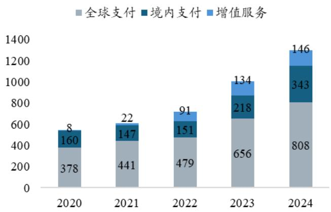  
图16：2020-2024 连连数字主要业务营收（百万元）  
数据来源：Wind，东吴证券研究所

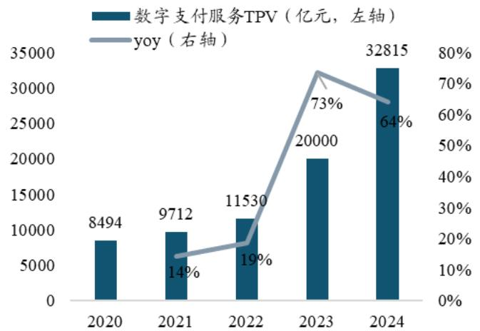  
图17：2020-2024 年连连数字数字支付业务 TPV 及 yoy  
数据来源：公司招股书，公司年报，东吴证券研究所

# （一） 全球支付业务

全球支付业务帮助跨境商户实现"本地收款 $+$ 全球结算"的一站式资金流转。其主要协助在各类全球及地区性电商平台上销售商品的商户（因未在境外当地注册而难以开立境外银行账户的商户），分配连连在境外当地银行账户下设置的虚拟账户给这些商户，从而使其能够实现在当地从电商平台收取资金，并将资金跨境转回其境内的银行账户。在此过程中，连连将现金流划分为收款和付款两个阶段，先收取资金，之后再将资金转入客户境内的银行账户或支付给第三方。

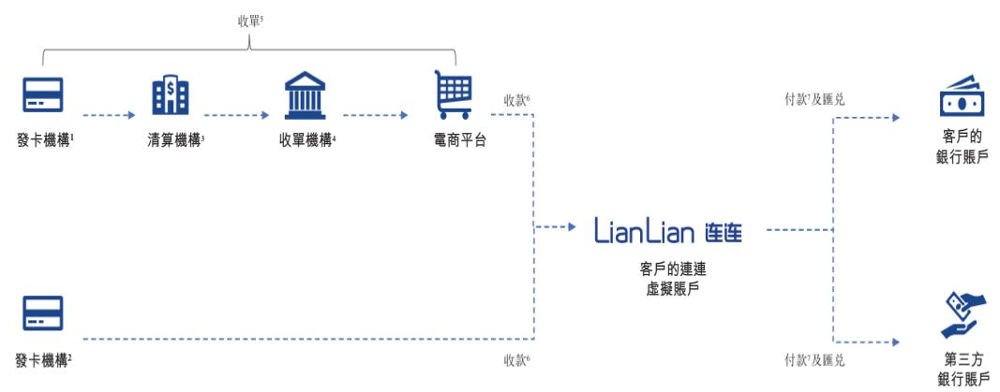  
图18：连连收单、收款、付款及汇兑服务典型交易流程  
数据来源：公司招股书，东吴证券研究所

全球支付业务贡献利润大，服务费率稳定。TPV（通过平台、产品或环境进行的交易总金额，在扣除费用、退款、拒付或扣除之前统计，反映业务规模）持续增长，从2020年的 1063 亿元增长至 2024 年的 2815 亿元，CAGR 为 $2 7 . 5 7 \%$ ，其中 2024 年同比增长$5 5 . 7 7 \%$ ，公司自 2016 年起布局海外市场生态的效果逐步显现。服务费率方面，全球业务基本维持稳定，2024年下滑至 $3 \text{‰}$ 以下显示出连连在全球业务方面的推广策略为以价换量、占领市场空间、建立客户生态。作为公司目前毛利率最高的业务（维持在 $70 \%$ 以上），全球支付业务是盈利的核心板块。

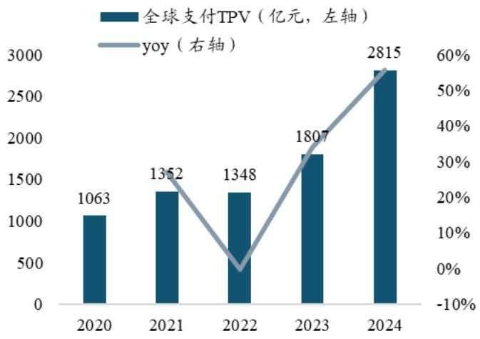  
图19：2020-2024 年连连数字全球支付服务 TPV 及 yoy  
数据来源：公司年报，公司招股书，东吴证券研究所

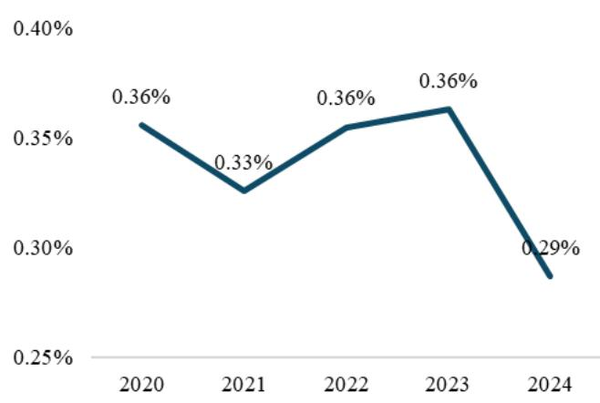  
图20：2020-2024 年连连数字全球支付服务费率  
数据来源：公司年报，公司招股书，东吴证券研究所

# （二） 境内支付业务

连连整合支付信息，简化流程，帮助客户高效完成支付。连连作为支付服务提供商，主要服务于企业客户，通过数字化平台整合终端买家在线上及线下发起的各类支付信息，简化客户的收款流程并降低运营成本。通过聚合多种支付方式，连连减轻了客户处理不同支付方式的管理负担，并在商户与银行或金融机构之间发挥桥梁作用，最终促进支付流程的顺利完成。

# 连连在商户与消费者之间搭建了高效的信息流和资金流处理平台。

①信息流处理：当消费者在商户平台下单后，连连支付会实时接收商户提交的订单信息，并将支付请求快速传递至银行或第三方支付渠道。平台即时向商户和消费者反馈支付状态，确保交易全流程透明可追溯。

②资金流运作：在资金流方面，平台通过银联等渠道接收消费者付款，经合作收单机构完成资金清分，最终将款项结算至商户的银行账户或指定第三方账户。

③支付方式整合：通过整合线上线下多种支付方式，连连不仅简化了商户的收款流程、降低了管理复杂度，还在支付信息传递和资金清算中发挥枢纽作用，从而提升交易效率和安全性。

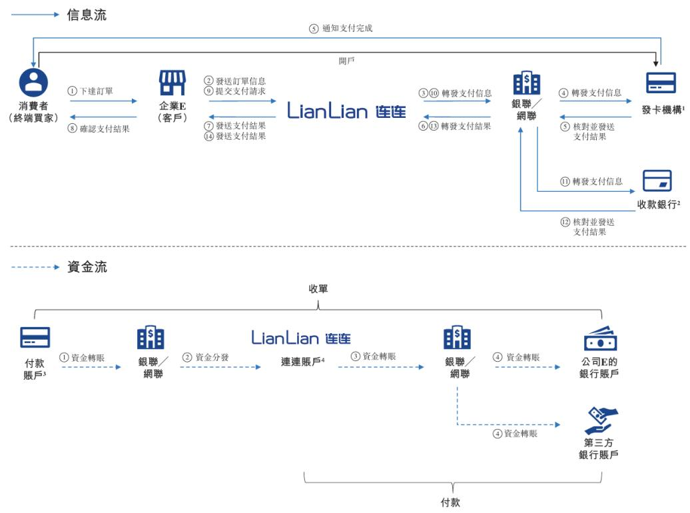  
图21：境内支付业务场景解读  
数据来源：公司招股书，东吴证券研究所

境内支付业务规模持续扩大，服务费率近两年维持稳定。TPV 持续增长，从 2020年的 7431 亿元增长至 2024 年的 3 万亿元，CAGR 为 $4 1 . 7 5 \%$ ，其中 2024 年同比增长$6 4 . 9 0 \%$ 。服务费率方面，由于近年来阿里入局，XTransfer、PingPong、PayPal 等以收购的形式拿下国内支付牌照，盈利能力有显著下降趋势，近两年稳定在千分之 0.1 以上。目前监管层面合规要求较高，新入局玩家前期投入较大，存量玩家较为稳定，预计未来竞争不会进一步扩大，服务费率已是较低水平。

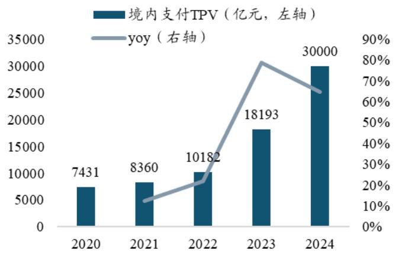  
图22：2020-2024 年连连数字境内支付服务 TPV 及 yoy  
数据来源：公司年报，公司招股书，东吴证券研究所

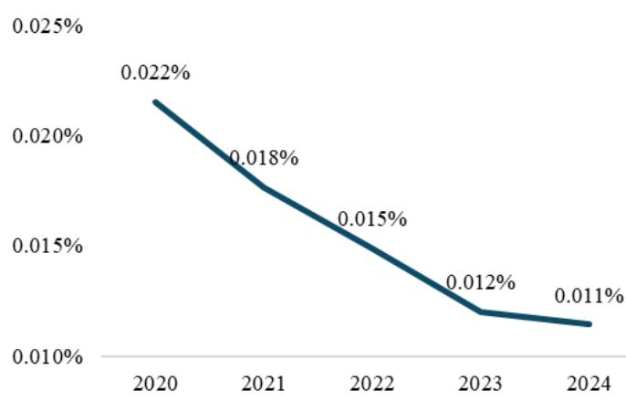  
图23：2020-2024 年连连数字境内支付服务费率  
数据来源：公司年报，公司招股书，东吴证券研究所

跨境支付领域连连牌照数目位列行业第一梯队。自 2011 年获得中国人民银行颁发的《支付业务许可证》以来，连连已接连获得中国香港、新加坡、美国、欧盟等主要业务区域的跨境支付牌照，截至 2025年7月累计已获得65张牌照和各项资质，全球化发展战略成果显著，完成了从区域性支付机构到综合性跨境支付解决方案提供商的转型升级。

表7：连连数字主要经营地区跨境支付牌照  

<table><tr><td>跨境支付业务牌照</td><td>发牌机构/国家/地区</td><td>內容</td></tr><tr><td>《支付业务许可证》</td><td>中国人民银行</td><td>网络支付；银行卡收单；预付卡发行与受理</td></tr><tr><td>MSO牌照</td><td>中国香港</td><td>货币服务：外汇兑换、转账汇款、电子支付等</td></tr><tr><td>MTL牌照</td><td>美国</td><td>数字货币交易、币币交易、法币交易等</td></tr><tr><td>EMI牌照</td><td>欧盟</td><td>支付机构所有服务、发放支付服务相关贷款、运营服务、支</td></tr><tr><td rowspan="2">MPI牌照</td><td rowspan="2">新加坡</td><td>付服务、已付款为目的的资金汇款发行</td></tr><tr><td>账户发行、国内汇款、跨境汇款、商家获取、电子货币发 行、数字支付代币服务、货币兑换</td></tr><tr><td>指定支付服务许可证</td><td>泰国</td><td>电子货币、电子支付、电子资金转账等</td></tr><tr><td>资金转账经营者牌照</td><td>印度尼西亚</td><td></td></tr><tr><td></td><td></td><td>在印尼开展境内转账、跨境汇款等业务</td></tr></table>

数据来源：连连数字公众号，连连数字官网，中国人民银行，知乎，东吴证券研究所

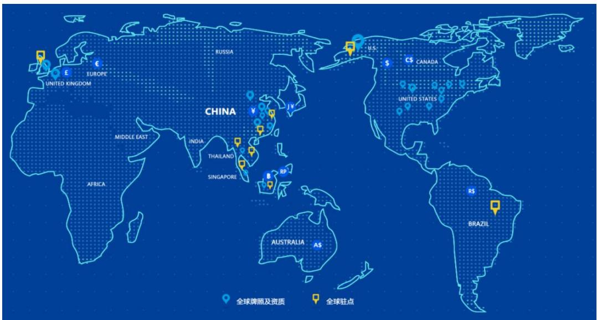  
图24：连连全球支付牌照/资质及驻点  
数据来源：连连数字官网，东吴证券研究所

# （三） 增值服务

连连增值服务包括商业服务与技术服务。其中商业服务包括数字化营销、运营支持（例如在电商平台开设店铺及安排发货）及引流服务；技术服务包括账户及电子钱包服务以及软件开发服务。

作为公司数字支付业务的衍生业务，近年来增值业务从小基数实现了高增长。2020-2024 年间，增值业务营收从 780 万元增长至 1.46 亿元，CAGR 为 $1 0 8 . 0 7 \%$ ，2024 年同比增长率为 $+ 9 . 4 7 \%$ ，增长主要来自于数字化营销服务的进一步拓展和虚拟银行卡业务的收入增长。

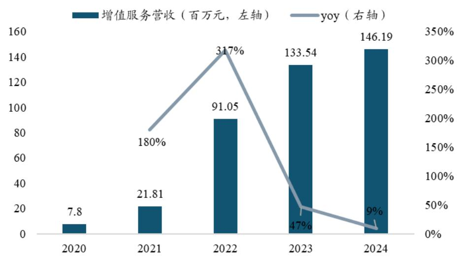  
图25：2020-2024 年连连数字增值服务业务营收及 yoy  
数据来源：Wind，东吴证券研究所

虚拟银行卡业务方面，连连携手 Visa及发卡机构发布“越达卡”。越达卡支持店铺回款在线充值并支付电商平台开店费用、海外营销推广费用、物流仓储费用、开发者费用等电子商务经营费用；支持专卡专用，多卡共享额度，无需单卡充值，充分提高账户管理效率，价格公开透明，是为跨境电商量身定制的全球付款解决方案。此外，越达卡还具备丰富的跨境支付场景，如外贸 B to B、留学、出国旅行等，能够满足用户在全球范围内的名种付款需求。

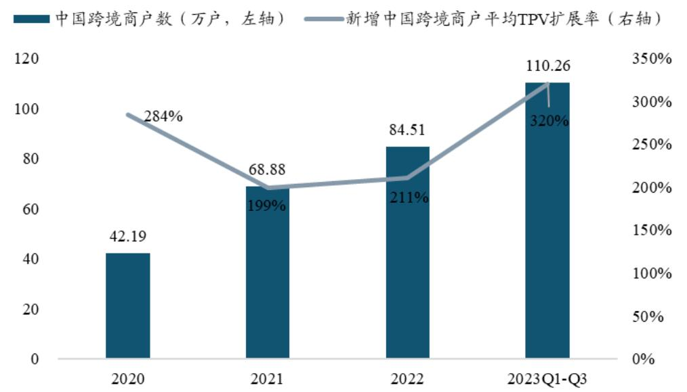  
图26：2020-2023Q3 连连数字中国跨境商户活跃客户数量及平均 TPV 扩展率  
数据来源：公司招股书，东吴证券研究所

银行卡清算业务是中国金融基础设施的重要一环，对支付行业价值链极为重要，连连参与清算业务具有战略价值。2017 年，连连与美国运通合资成立连通公司，2020 年6 月，连通公司获得银行卡清算业务牌照，成为中国首家中外合资银行卡清算机构。连通为中国发卡行发行的带有“美国运通”品牌名称的银行卡提供结算、清算及相关功能，为其网络内的发卡行和商户收单机构提供银行卡清算及结算服务，为中国乃至全球的中国消费者提供持卡人权益。连通公司银行卡清算服务包括：(1)授权参与银行发行美国运通品牌的银行卡；(2)向其网络内的发卡行及商户收单机构提供银行卡交易清算和结算服务；(3)操作相关银行卡清算系统；(4)协助资金结算的其他活动。

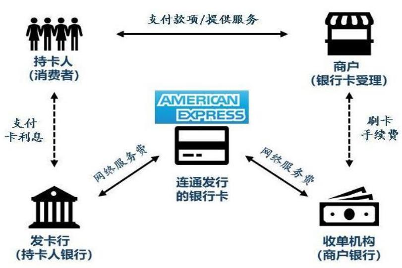  
图27：四方支付模式  
数据来源：公司招股书，东吴证券研究所

清算业务中，连通的收入包括发卡行及收单机构的网络清算费、品牌费及跨境交易服务费、发卡行的银行卡相关品牌特许权使用费等。由于过往 20 年里中国银联一直占据着中国银行卡清算市场的主导地位，而新参与者清算系统建设维护需高额初始投资，成本端控制困难，2023、2024 年连通公司接连亏损。2024 年底，连连宣布出售部分连通公司股份，交易后持有连通公司股份 $1 7 . 6 3 \%$ ，保留作为连通公司股东在清算业务领域的战略价值。

# 3.2. 技术研发引领服务升级

技术创新始终是连连公司发展的核心驱动力。公司长期坚持高强度的研发投入，这一战略在近年来的经营数据中得到充分体现。2024年，公司研发投入再创新高，达到3.2亿元人民币，较上年增长 $1 9 \%$ ，研发费用率保持在 $2 4 . 3 \%$ 的高位。2020至2024年期间，公司研发投入的 CAGR 高达 $2 6 . 6 4 \%$ 。在人才队伍建设方面，连连公司同样展现出强劲的发展态势。截至 2024年底，公司研发团队规模已达385人，同比增长 $1 6 . 3 \%$ ，占员工总数的 $3 4 . 9 \%$ 。

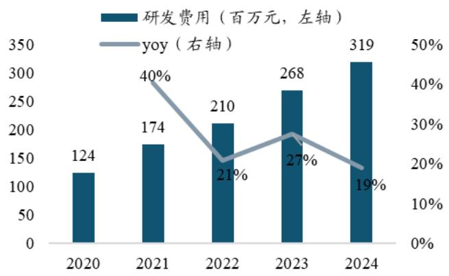  
图28：2020-2024 年连连数字研发费用及 yoy  
数据来源：Wind，东吴证券研究所

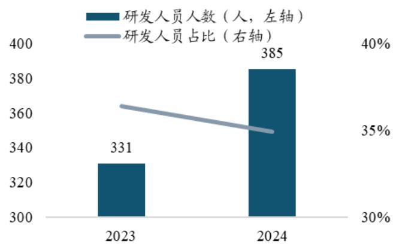  
图29：2023、2024 年连连数字研发人员人数及占比  
数据来源：公司 2023、2024 年年报，东吴证券研究所

随着全球数字经济的深入发展，跨境支付市场正经历结构性变革。传统银行电汇作为外贸收款的主流方式，因其人工操作繁琐、中间行层级复杂、手续费不透明、审核流程冗长等问题，已难以满足现代贸易小额高频、碎片化的结算需求。在支付效率、成本控制以及透明度方面，跨境电商等新业态对支付方式提出了新的要求。连连数字子公司连连国际推出全球支付服务产品 LGPS 解决方案，致力于为海外金融机构提供标准化、智能化的跨境支付赋能。该方案通过统一 API接口，使合作机构能够无缝接入对华及全球多地的支付网络，实现全链路透明、安全合规、高效可追溯的资金流转： $\textcircled{1}$ 全球本地化清算网络：深度整合全球主流清算体系，如东南亚的 PayNow、欧洲的 SEPA 等，大幅缩短中间环节、降低手续费； $\textcircled{2}$ 端到端透明化：支付状态实时可查，资金流向全程可追溯，有效解决传统模式下的信息不透明问题； $\textcircled{3}$ 多元化场景适配：支持 B2B 贸易结算、跨境电商平台收款、C 端跨境汇款等多种业务形态。

# 3.3. 前瞻性布局 Web3.0 领域

Web3.0是下一代互联网的演进方向，其核心在于去中心化、用户主权和智能互联。它基于区块链技术构建，通过智能合约、去中心化身份（DID）和通证经济等机制，打破传统互联网平台对数据和价值的垄断，使用户真正掌握自己的数字身份、资产和数据所有权，与跨境支付市场变革方向无比契合。Web3.0的应用场景涵盖DeFi、NFT、DAO等，实现了无需信任中介的点对点协作。同时，AI与语义网络的结合将赋予网络更强的理解与交互能力，推动互联网从“信息传递”升级为“价值与智能协同”的新生态。

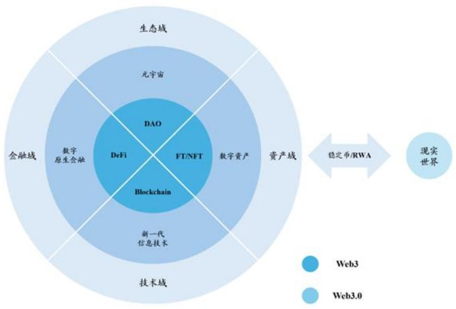  
图30：Web3.0 与 Web3  
数据来源：香港 Web3.0 标准化白皮书，东吴证券研究所

相较于以比特币为主的其他加密资产，稳定币具备一定的中心化属性。其价格稳定、通常与法定货币或资产挂钩，中国香港、美国、欧盟均出台法案监管稳定币发行和流动。可以说，稳定币是介于中心化货币与未来去中心化世界的“过渡态”，适合作为支付工具、交易媒介在市场中流动。连连国际与香港金融科技企业圆币科技（RD Technologies）正式达成战略合作，双方将共同探索稳定币在跨境支付领域的创新应用。圆币是香港首批参与金管局监管沙盒测试的机构之一，此次合作有望助力连连国际构建基于稳定币的新型结算网络，通过区块链技术显著提升跨境交易效率，同时有效降低传统支付模式下的中转成本，为全球商户提供更便捷、经济的资金清算解决方案。

表8：香港稳定币发行人“沙盒”参与者名单  

<table><tr><td>“沙盒”参与者</td><td>进入“沙盒”日期</td></tr><tr><td>京东币链科技（香港）有限公司</td><td>2024/7/18</td></tr><tr><td>圆币创新科技有限公司</td><td>2024/7/18</td></tr><tr><td>渣打银行（香港）有限公司</td><td></td></tr><tr><td>安拟集团有限公司</td><td>2024/7/18</td></tr><tr><td>Hong Kong Telecommunications Limited</td><td></td></tr></table>

数据来源：HKMA，东吴证券研究所

2024 年 12 月，连连数字的全资附属公司 DFX Labs Company Limited 成功获得香港证券及期货事务监察委员会颁发的 VATP 牌照：该牌照允许 DFX 在香港进行“证券交易”以及“提供自动化交易服务”业务，允许其在香港设立及营运合规的虚拟资产交易平台。据 SFC披露，获得正式发牌的虚拟资产交易平台目前仅有 11家。

表9：11 家获得正式发牌的虚拟资产交易平台  

<table><tr><td>中央编号</td><td>交易平台名称</td><td>发牌日期</td><td>备注</td></tr><tr><td>BPJ213</td><td>OSL Exchange</td><td>2020/12/15</td><td>OSL 集团(0863.HK)</td></tr><tr><td>BPL992</td><td>HashKey Exchange</td><td>2022/11/9</td><td>HashKey Group</td></tr></table>

<table><tr><td>BPW549</td><td>HKVAX</td><td>2024/10/3</td><td>香港虚拟资产交易所有限公司</td></tr><tr><td>BPO721</td><td>HKbitEX</td><td>2024/12/18</td><td>香港数字资产交易集团有限公司</td></tr><tr><td>BUA970</td><td>Accumulus</td><td>2024/12/18</td><td>云账户旗下</td></tr><tr><td>BUN619</td><td>DFX Labs</td><td>2024/12/18</td><td>连连数字旗下</td></tr><tr><td>BUT670</td><td>EX.IO</td><td>2024/12/18</td><td></td></tr><tr><td>BUY578</td><td>PantherTrade</td><td>2025/1/27</td><td>富途旗下</td></tr><tr><td>BUT913</td><td>YAX</td><td>2025/1/27</td><td>老虎旗下</td></tr><tr><td>BUQ956</td><td>Bullish</td><td>2025/2/18</td><td>Block.one的子公司</td></tr><tr><td>BSI739</td><td>BGE</td><td>2025/6/17</td><td>HKE Holdings旗下全资子公司</td></tr></table>

数据来源：SFC，东吴证券研究所

# 4. 盈利预测与估值

# 4.1. 核心假设

全球支付业务：随着全球化布局深化，预计在跨境电商等场景市占率提升，驱动全球支付收入增长，我们预计 2025-2027 年公司全球支付业务 TPV 同比 $+ 3 5 \% + 3 0 \% / + 2 5 \%$ ，服务费率维持千分之 2.9左右；境内支付业务：公司不断拓展新产品、升级本地化业务，考虑到蚂蚁集团、腾讯等具有体量优势，或形成垄断效应，我们预计2025-2027年公司境内支付业务 TPV分别同比 $+ 2 5 \% + 2 0 \% / + 1 5 \%$ ，服务费率维持千分之 0.11左右；增值业务得益于企业数字化转型需求放量以及公司业务拓展，我们预计该业务 2025-2027 年营收分别同比 $+ 1 5 \% / + 2 0 \% / + 2 0 \%$ 。

成本方面，考虑到经营的持续深化以及规模效应初显但数字支付业务价格竞争激烈，我们预计公司整体毛利率基本维持现有水平。

费用方面，随着各项业务营收的持续增长，以及全球经营的深化有助于降低渠道费用，预计公司三项费用率将持续下降。

基于以上假设，我们预测连连数字 2025-2027年营业收入分别为 17.05、21.52、26.24亿元，归母净利润分别为 13.99、0.15、1.23 亿元。2025 年归母净利润及营业总支出波动较大，主要系公司2025年将入账出售连通子公司股份的相关受益，且 2026年公司仍处快速增长的初期，盈利情况不稳定。

表10：连连数字盈利预测表（截至 2025 年 7 月 14 日收盘）  

<table><tr><td>单位：百万元</td><td>2020A</td><td>2021A</td><td>2022A</td><td>2023A</td><td>2024A</td><td>2025E</td><td>2026E</td><td>2027E</td></tr><tr><td>营业总收入</td><td>589</td><td>644</td><td>743</td><td>1028</td><td>1315</td><td>1705</td><td>2152</td><td>2624</td></tr><tr><td>同比增速</td><td></td><td>9%</td><td>15%</td><td>38%</td><td>28%</td><td>30%</td><td>26%</td><td>22%</td></tr><tr><td>数字支付服务</td><td>538</td><td>588</td><td>630</td><td>874</td><td>1151</td><td>1519</td><td>1932</td><td>2363</td></tr><tr><td>全球支付</td><td>378</td><td>441</td><td>479</td><td>656</td><td>808</td><td>1090</td><td>1418</td><td>1772</td></tr><tr><td>同比增速</td><td>160</td><td>17%</td><td>9%</td><td>37%</td><td>23%</td><td>35%</td><td>30%</td><td>25%</td></tr><tr><td>境内支付</td><td></td><td>147</td><td>151</td><td>218</td><td>343</td><td>429</td><td>514</td><td>591</td></tr><tr><td>同比增速</td><td></td><td>-8%</td><td>3%</td><td>44%</td><td>57%</td><td>25%</td><td>20%</td><td>15%</td></tr><tr><td>增值服务</td><td>8</td><td>22</td><td>91</td><td>134</td><td>146</td><td>168</td><td>202</td><td>242</td></tr></table>

<table><tr><td>同比增速</td><td></td><td>180%</td><td>317%</td><td>47%</td><td>9%</td><td>15%</td><td>20%</td><td>20%</td></tr><tr><td rowspan="2">其他 同比增速</td><td rowspan="2">43</td><td>34</td><td>22</td><td>21</td><td>18</td><td>18</td><td>18</td><td>18</td></tr><tr><td>-21%</td><td>-36%</td><td>-5%</td><td>-12%</td><td>-</td><td>-</td><td>-</td></tr><tr><td>营业总支出</td><td>-608</td><td>-709</td><td>-843</td><td>-1,005</td><td>-1,583</td><td>96</td><td>-2,161</td><td>-2,524</td></tr><tr><td>营业成本</td><td>-210</td><td>-204</td><td>-277</td><td>-451</td><td>-632</td><td>-801</td><td>-990</td><td>-1,181</td></tr><tr><td>销售费用</td><td>-69</td><td>-90</td><td>-139</td><td>-192</td><td>-248</td><td>-290</td><td>-344</td><td>-394</td></tr><tr><td>研发费用</td><td>-124</td><td>-174</td><td>-210</td><td>-268</td><td>-319</td><td>-375</td><td>-452</td><td>-525</td></tr><tr><td>管理费用</td><td>-290</td><td>-263</td><td>-258</td><td>-480</td><td>-561</td><td>-597</td><td>-689</td><td>-787</td></tr><tr><td>归母净利润</td><td>-368</td><td>-747</td><td>-917</td><td>-656</td><td>-168</td><td>1,399</td><td>15</td><td>123</td></tr><tr><td>同比增速</td><td></td><td>-103%</td><td>-23%</td><td>28%</td><td>74%</td><td>932%</td><td>-99%</td><td></td></tr><tr><td></td><td></td><td></td><td></td><td></td><td></td><td></td><td></td><td>692%</td></tr><tr><td>ROE</td><td></td><td>-33%</td><td>-62%</td><td>-80%</td><td>-19%</td><td>74%</td><td>1%</td><td>4%</td></tr></table>

数据来源：公司年报，Wind，东吴证券研究所注：全文如无特殊注明，相关数据的货币单位均为人民币，港元汇率为 2025 年 7月 14 日的 0.91，预测值均为东吴证券研究所预测

# 4.2. 投资建议

考虑到公司目前尚未开始盈利，仍处于业务拓展阶段，我们首先考虑采用P/S 法估值，参考可比公司 P/S 估值，2025、2026 年同业公司 P/S 均值为 $6 . 9 \mathrm { x }$ 、 $6 . 2 \mathrm { x }$ 。我们选取的同业公司中涵盖银行卡清算公司、跨境支付公司、境内支付服务商等，能够基本覆盖连连数字的业务体系。同业公司业务大多处于相对成熟的稳定发展期，而考虑到连连数字未来在 Web3.0 领域的成长性以及清算业务仍具一定的空间，结合连连数字当前的估值水平，我们认为公司的估值具有继续向上的空间，连连数字 2025、2026 年合理估值应在 $8 . 0 { \mathrm { x } } , \ 7 . 0 { \mathrm { x P / S } }$ ，首次覆盖，给予“买入”评级。

表11：可比公司 P/S 估值（截至 2025 年 7 月 14 日收盘）  

<table><tr><td>证券代码</td><td>证券简称</td><td>总市值 （亿元）</td><td>营业收入/PS</td><td>2023A</td><td>2024A</td><td>2025E</td><td>2026E</td></tr><tr><td rowspan="2">300773.SZ</td><td>拉卡拉</td><td>225.1</td><td>营业收入（亿元）</td><td>59.4</td><td>57.6</td><td>60.7</td><td>65.0</td></tr><tr><td></td><td></td><td>P/S 营业收入(亿元)</td><td>3.8</td><td>3.9</td><td>3.7</td><td>3.5</td></tr><tr><td rowspan="2">000997.SZ</td><td>新大陆</td><td>341.0</td><td>P/S</td><td>82.5 4.1</td><td>77.5 4.4</td><td>87.6 3.9</td><td>98.4</td></tr><tr><td></td><td></td><td>营业收入（亿元）</td><td>297.7</td><td>318.0</td><td>326.8</td><td>3.5 345.6</td></tr><tr><td rowspan="2">PYPL.O DLO.O</td><td>PAYPAL</td><td>694.0</td><td>P/S</td><td>2.3</td><td>2.2</td><td>2.1</td><td>2.0</td></tr><tr><td>DLOCAL</td><td>31.3</td><td>营业收入(亿元)</td><td>6.5</td><td>7.5</td><td>9.6</td><td>12.0</td></tr><tr><td>V.N</td><td></td><td></td><td>P/S 营业收入（亿元）</td><td>4.8 326.5</td><td>4.2 359.3</td><td>3.3 395.5</td><td>2.6</td></tr><tr><td rowspan="2">MA.N</td><td>Visa</td><td>6,419.9</td><td>P/S</td><td>19.7</td><td>17.9</td><td>16.2</td><td>437.3 14.7</td></tr><tr><td>万事达</td><td>4,995.9</td><td>营业收入（亿元）</td><td>251.0</td><td>281.7</td><td>318.7</td><td>356.8</td></tr><tr><td rowspan="2">AXP.N</td><td></td><td></td><td>P/S</td><td>19.9</td><td>17.7</td><td>15.7</td><td>14.0</td></tr><tr><td>美国运通</td><td>2,238.2</td><td>营业收入（亿元）</td><td>555.9</td><td>607.6</td><td>712.7</td><td>769.5</td></tr><tr><td rowspan="2"></td><td></td><td></td><td>P/S</td><td>4.0</td><td>3.7</td><td>3.1</td><td>2.9</td></tr><tr><td></td><td>P/S 均值 连连数字营业收入（亿元）</td><td></td><td>8.4 10.3</td><td>7.7 13.1</td><td>6.9</td><td>6.2</td></tr></table>

<table><tr><td>连连数字 P/S</td><td>4.3</td><td>3.3</td><td>2.6</td><td>2.0</td></tr><tr><td></td><td></td><td></td><td></td><td></td></tr></table>

数据来源：Wind，Bloomberg，东吴证券研究所  
注：A 股公司数据及一致预期来自 Wind，货币单位为人民币元；美股公司数据来自 Wind、一致预期来自  
Bloomberg，货币单位为美元，美元汇率为 2025 年 7 月 14 日的 7.15

# 5. 风险提示

# （一）行业竞争加剧风险

若行业引发价格战，支付费率持续下行，可能挤压利润空间，高毛利的全球支付业务或面临盈利收缩风险。

# （二）政策合规风险

公司依赖多国支付牌照开展业务，若全球监管趋严可能增加合规成本；若业务开展不及预期，可能拖累战略落地。

# （三）短期盈利风险

公司持续高研发投入和海外扩张导致现金流承压，而清算业务连续亏损，可能影响整体盈利兑现。

表12：连连数字盈利预测表（截至 2025 年 7 月 14 日，单位：百万元）  

<table><tr><td>合并资产负债表</td><td>2023A</td><td>2024A</td><td>2025E</td><td>2026E</td><td>2027E</td></tr><tr><td>非流动资产合计</td><td>754</td><td>875</td><td>869</td><td>863</td><td>858</td></tr><tr><td>固定资产-物业，厂房及设备</td><td>121</td><td>120</td><td>117</td><td>115</td><td>113</td></tr><tr><td>无形资产</td><td>17</td><td>19</td><td>19</td><td>19</td><td>19</td></tr><tr><td>递延税项资产-非流动资产</td><td>18</td><td>425</td><td>425</td><td>425</td><td>425</td></tr><tr><td>有使用权资产-非流动资产</td><td>19</td><td>29</td><td>29</td><td>29</td><td>29</td></tr><tr><td>投资性房地产</td><td>165</td><td>161</td><td>158</td><td>155</td><td>152</td></tr><tr><td>流动资产合计</td><td>9,713</td><td>13,664</td><td>17,132</td><td>19,759</td><td>22,850</td></tr><tr><td>分类为持作买卖透过损益按公平值 计量的金融资产-流动资产</td><td></td><td></td><td></td><td></td><td></td></tr><tr><td>交易性金融资产-资产</td><td>192</td><td>284</td><td>222</td><td>232</td><td>245</td></tr><tr><td>回购协议投资-流动资产</td><td>-</td><td>-</td><td>-</td><td>-</td><td>-</td></tr><tr><td>其他应收及预付款项-流动资产</td><td>68</td><td>251</td><td>140</td><td>209</td><td>314</td></tr><tr><td>定期存款</td><td>-</td><td>-</td><td>-</td><td>-</td><td>-</td></tr><tr><td>可收回所得税</td><td></td><td></td><td></td><td></td><td>-</td></tr><tr><td>受限制现金</td><td>9,184</td><td>12,607</td><td>14,750</td><td>17,258</td><td>20,191</td></tr><tr><td>货币资金</td><td>190</td><td>522</td><td>2,020</td><td>2,060</td><td>2,100</td></tr><tr><td>流动负债合计</td><td>9,709</td><td>13,139</td><td>15,273</td><td>17,810</td><td>20,757</td></tr><tr><td>短期借款-流动负债</td><td>290</td><td>342</td><td>316</td><td>329</td><td>323</td></tr><tr><td>应付账款</td><td>76</td><td>75</td><td>75</td><td>75</td><td>75</td></tr><tr><td>合同负债-流动负债</td><td>13</td><td>10</td><td>10</td><td>10</td><td>10</td></tr><tr><td>应交所得税-流动负债</td><td>9</td><td>7</td><td>10</td><td>10</td><td>10</td></tr><tr><td>租赁-流动负债</td><td>10</td><td>13</td><td>13</td><td>13</td><td>13</td></tr><tr><td>应计费用及其他流动负债</td><td>9,312</td><td>12,692</td><td>14,849</td><td>17,373</td><td>20,327</td></tr><tr><td>非流动负债合计</td><td>165</td><td>164</td><td>149</td><td>141</td><td>136</td></tr><tr><td>租赁-非流动负债</td><td>8</td><td>15</td><td>10</td><td>12</td><td>15</td></tr><tr><td>流动资产/（负债）净值</td><td></td><td></td><td>-</td><td>-</td><td>-</td></tr><tr><td>资产总额减流动负债</td><td></td><td></td><td>-</td><td>-</td><td>-</td></tr><tr><td>总资产减总负债</td><td>594</td><td>1,236</td><td>2,579</td><td>2,672</td><td>2,815</td></tr><tr><td>股东权益合计(含少数股东权益）</td><td>594</td><td>1,236</td><td>2,579</td><td>2,672</td><td>2,815</td></tr><tr><td>股东权益合计(不含少数股东权益)</td><td>589</td><td>1,228</td><td>2,571</td><td>2,663</td><td>2,805</td></tr><tr><td>股本</td><td>1,015</td><td>1,079</td><td>1,079</td><td>1,079</td><td>1,079</td></tr><tr><td>储备</td><td>2,255</td><td>2,998</td><td>3,000</td><td>3,000</td><td>3,000</td></tr><tr><td>少数股东权益</td><td>4</td><td>7</td><td>8</td><td>9</td><td>10</td></tr></table>

<table><tr><td>合并利润表</td><td>2023A</td><td>2024A</td><td>2025E</td><td>2026E</td><td>2027E</td></tr><tr><td>营业收入</td><td>1,028</td><td>1,315</td><td>1,705</td><td>2,152</td><td>2,624</td></tr><tr><td>营业成本</td><td>-451</td><td>-632</td><td>-801</td><td>-990</td><td>-1,181</td></tr><tr><td>毛利</td><td>577</td><td>683</td><td>904</td><td>1,162</td><td>1,443</td></tr><tr><td>其他收入-其他</td><td>108</td><td>212</td><td>267</td><td>323</td><td>375</td></tr><tr><td>销售费用</td><td>-192</td><td>-248</td><td>-290</td><td>-344</td><td>-394</td></tr><tr><td>研发费用</td><td>-268</td><td>-319</td><td>-375</td><td>-452</td><td>-525</td></tr><tr><td>管理费用</td><td>-480</td><td>-561</td><td>-597</td><td>-689</td><td>-787</td></tr><tr><td>减值拨回</td><td>-2</td><td>-6</td><td>-8</td><td>-10</td><td>-13</td></tr><tr><td>其他损失(收益)净额-经营</td><td>280</td><td>-28</td><td>1,900</td><td>0</td><td>0</td></tr><tr><td>信用减值损失</td><td>-</td><td>-</td><td>-</td><td>-</td><td>-</td></tr><tr><td>营业利润</td><td>23</td><td>-268</td><td>1,801</td><td>-10</td><td>100</td></tr><tr><td>财务费用</td><td>-10</td><td>-12</td><td>20</td><td>29</td><td>35</td></tr><tr><td>除税前溢利</td><td>-652</td><td>-572</td><td>1,721</td><td>19</td><td>135</td></tr><tr><td>所得税</td><td>-2</td><td>405</td><td>-320</td><td>-2</td><td>-10</td></tr><tr><td>净利润(含少数股东权益)</td><td>-654</td><td>-167</td><td>1,401</td><td>17</td><td>125</td></tr><tr><td>净利润(不含少数股东权益)</td><td>-656</td><td>-168</td><td>1,399</td><td>15</td><td>123</td></tr><tr><td>少数股东损益</td><td>2</td><td>2</td><td>2</td><td>2</td><td>2</td></tr><tr><td>算合收益-汇兑差额-海外业</td><td>-1</td><td>-2</td><td>0</td><td>0</td><td>0</td></tr><tr><td>其他综合收益</td><td>-5</td><td>8</td><td>8</td><td>8</td><td>8</td></tr><tr><td>综合收益总额</td><td>-659</td><td>-159</td><td>1,409</td><td>25</td><td>132</td></tr><tr><td>综合收益总额(母公司)</td><td>-661</td><td>-161</td><td>1,407</td><td>23</td><td>130</td></tr><tr><td>综合收益总额(少数股东)</td><td>2</td><td>3</td><td>2</td><td>2</td><td>2</td></tr><tr><td>职工薪酬</td><td>-671</td><td>-816</td><td>-980</td><td>-1,175</td><td>-1,411</td></tr><tr><td>折旧及摊销</td><td>-32</td><td>-35</td><td>-35</td><td>-35</td><td>-35</td></tr><tr><td>无形资产摊销</td><td>-5</td><td>-4</td><td>-4</td><td>-4</td><td>-4</td></tr><tr><td>折旧</td><td>-27</td><td>-31</td><td>-31</td><td>-31</td><td>-31</td></tr><tr><td>使用权资产折旧</td><td>-9</td><td>-13</td><td>-13</td><td>-13</td><td>-13</td></tr></table>

<table><tr><td>重要财务与估值指标</td><td>2023A</td><td>2024A</td><td>2025E</td><td>2026E</td><td>2027E</td></tr><tr><td>营业收入增长率</td><td>38%</td><td>28%</td><td>30%</td><td>26%</td><td>22%</td></tr><tr><td>归母净利润增速</td><td>28%</td><td>74%</td><td>932%</td><td>-99%</td><td>692%</td></tr><tr><td>归母净资产增速</td><td>-44%</td><td>108%</td><td>109%</td><td>4%</td><td>5%</td></tr><tr><td>EPS-最新股本摊薄（港元/股）</td><td>-0.67</td><td>-0.17</td><td>1.42</td><td>0.02</td><td>0.12</td></tr><tr><td>ROE</td><td>-80%</td><td>-19%</td><td>74%</td><td>1%</td><td>4%</td></tr><tr><td>P/E （H)</td><td>-17</td><td>-67</td><td>8</td><td>724</td><td>91</td></tr><tr><td>P/B（H)</td><td>19</td><td>9</td><td>4</td><td>4</td><td>4</td></tr></table>

<table><tr><td>合并现金流量表</td><td>2023A</td><td>2024A</td><td>2025E</td><td>2026E</td><td>2027E</td></tr><tr><td>经营活动产生的现金流量净额</td><td>95</td><td>-111</td><td>140</td><td>154</td><td>169</td></tr><tr><td>投资活动产生的现金流量净额</td><td>-202</td><td>-131</td><td>-79</td><td>-47</td><td>-28</td></tr><tr><td>筹资活动产生的现金流量净额</td><td>149</td><td>569</td><td>683</td><td>820</td><td>983</td></tr><tr><td>现金及现金等价物净增加额</td><td>42</td><td>327</td><td>744</td><td>926</td><td>1,125</td></tr><tr><td>期初现金及现金等价物余额</td><td>146</td><td>190</td><td>522</td><td>1,267</td><td>2,193</td></tr><tr><td>汇率变动对现金的影响</td><td>2</td><td>5</td><td>-</td><td>-</td><td>-</td></tr><tr><td>期末现金及现金等价物余额</td><td>190</td><td>522</td><td>1,267</td><td>2,193</td><td>3,318</td></tr></table>

数据来源：Wind，东吴证券研究所注：公司部分数据未披露，用“-”表示；全文如无特殊注明，相关数据的货币单位均为人民币，港元汇率为2025 年7 月 14 日的 0.91，预测值均为东吴证券研究所预测

# 免责声明

东吴证券股份有限公司经中国证券监督管理委员会批准，已具备证券投资咨询业务资格。

本研究报告仅供东吴证券股份有限公司（以下简称“本公司”）的客户使用。本公司不会因接收人收到本报告而视其为客户。在任何情况下，本报告中的信息或所表述的意见并不构成对任何人的投资建议，本公司及作者不对任何人因使用本报告中的内容所导致的任何后果负任何责任。任何形式的分享证券投资收益或者分担证券投资损失的书面或口头承诺均为无效。

在法律许可的情况下，东吴证券及其所属关联机构可能会持有报告中提到的公司所发行的证券并进行交易，还可能为这些公司提供投资银行服务或其他服务。

市场有风险，投资需谨慎。本报告是基于本公司分析师认为可靠且已公开的信息，本公司力求但不保证这些信息的准确性和完整性，也不保证文中观点或陈述不会发生任何变更，在不同时期，本公司可发出与本报告所载资料、意见及推测不一致的报告。

本报告的版权归本公司所有，未经书面许可，任何机构和个人不得以任何形式翻版、复制和发布。经授权刊载、转发本报告或者摘要的，应当注明出处为东吴证券研究所，并注明本报告发布人和发布日期，提示使用本报告的风险，且不得对本报告进行有悖原意的引用、删节和修改。未经授权或未按要求刊载、转发本报告的，应当承担相应的法律责任。本公司将保留向其追究法律责任的权利。

# 东吴证券投资评级标准

投资评级基于分析师对报告发布日后 6 至 12 个月内行业或公司回报潜力相对基准表现的预期（A 股市场基准为沪深 300 指数，香港市场基准为恒生指数，美国市场基准为标普500 指数，新三板基准指数为三板成指（针对协议转让标的）或三板做市指数（针对做市转让标的），北交所基准指数为北证 50指数），具体如下：

公司投资评级：

买入：预期未来 6个月个股涨跌幅相对基准在 $1 5 \%$ 以上；  
增持：预期未来 6个月个股涨跌幅相对基准介于 $5 \%$ 与 $1 5 \%$ 之间；  
中性：预期未来 6个月个股涨跌幅相对基准介于- $- 5 \%$ 与 $5 \%$ 之间；  
减持：预期未来 6个月个股涨跌幅相对基准介于- $1 5 \%$ 与 $- 5 \%$ 之间；  
卖出：预期未来 6 个月个股涨跌幅相对基准在- $. 1 5 \%$ 以下。

行业投资评级：

增持： 预期未来 6个月内，行业指数相对强于基准 $5 \%$ 以上；  
中性： 预期未来 6个月内，行业指数相对基准 $- 5 \%$ 与 $5 \%$ ；  
减持： 预期未来 6个月内，行业指数相对弱于基准 $5 \%$ 以上。

我们在此提醒您，不同证券研究机构采用不同的评级术语及评级标准。我们采用的是相对评级体系，表示投资的相对比重建议。投资者买入或者卖出证券的决定应当充分考虑自身特定状况，如具体投资目的、财务状况以及特定需求等，并完整理解和使用本报告内容，不应视本报告为做出投资决策的唯一因素。

东吴证券研究所  
苏州工业园区星阳街5 号邮政编码：215021  
传真：（0512）62938527