# [Table_Title] 存储需求扩张， “分销+产品”业务双受益

# [Table_Title2] 香农芯创(300475)

# 评级及分析师信息

[Table_Summary] ► 公司：国产电子元器件领先者，布局企业级 SSD 存储香农芯创是国内领先的电子元器件分销企业，深耕高端存储领域。公司主营业务为半导体元器件分销，2024 年半导体分销营收占比 97.15%。公司前身为聚隆科技，主营洗衣机减速离合器业务，2015 年创业板上市，后续公司向半导体行业转型，2021 年全资收购电子元器件分销商联合创泰，并正式更名为香农芯创。2023 年 5 月公司发布公告，联合大普微等设立子公司海普存储，进军企业级 SSD 领域，向产品化转型，逐步构建起“分销+自研”协同发展的能力体系，正加速向国产高端半导体解决方案提供商迈进。

当下在 AI的驱动下，存储芯片的市场规模和需求有望进一步扩大。根据 WSTS 数据，2024 年存储芯片市场规模为人民币11,897亿元，占集成电路市场的 $3 1 . 3 \%$ ，成为仅次于逻辑芯片的第二大细分领域；伴随端侧 AI 下沉，手机/PC/服务器等设备的单机存储搭载量将会提升，未来存储芯片有望进入周期上行与市场规模进一步扩张阶段。深度绑定原厂龙头，香农芯创子公司联合创泰拥有全球前三家全产业存储器供应商之一的 SK 海力士、全球著名主控芯片品牌 MTK 的授权代理权。香农芯创作为国内核心存储原厂分销商，有望充分受益行业周期上行以及存储市场规模增长带来的高端存储需求扩张。

# ► 电子元器件分销：深度绑定原厂龙头，受益存储需求增长与周期上行

# ► 企业级 SSD：企业级存储需求扩张，设立海普存储打开成长空间

根据 IDC 数据显示，中国企业级固态硬盘市场在 2024 年得到修复，市场规模达到 62.5 亿美元，与 2023 年相比增长 $1 8 7 . 9 \%$ 。IDC 预计 2029 年中国企业级固态硬盘市场规模将达到 91 亿美元。2023 年公司联合深圳大普微等公司共同成立海普存储，目前开发进展 顺利，已 完成企 业级 DDR4、DDR5、Gen4 eSSD 的研发、试产。用于云计算存储（数据中心服务器）等领域。目前已完成部分国内主要的服务器平台的认证和适配工作并正式进入产品量产阶段。伴随企业级存储需求的扩张，公司有望通过设立海普存储打开成长空间。

<table><tr><td>评级：</td><td>增持 首次覆盖</td></tr><tr><td>上次评级：</td><td></td></tr><tr><td>目标价格： 最新收盘价：</td><td>33.61</td></tr><tr><td></td><td></td></tr><tr><td>股票代码：</td><td>300475</td></tr><tr><td>52周最高价/最低价：</td><td>45.19/22.92</td></tr><tr><td>总市值(亿)</td><td>155.87</td></tr><tr><td>自由流通市值(亿)</td><td>150.05</td></tr><tr><td>自由流通股数(百万)</td><td>446.45</td></tr></table>

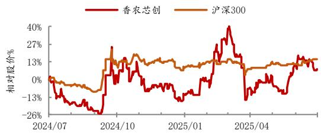

[Table_Author分析师：单慧伟  
邮箱：shanhw@hx168.com.cn  
SAC NO：S1120524120004  
联系电话：  
联系人：解丰源  
邮箱：xiefy1@hx168.com.cn  
SAC NO：  
联系电话：

# 投资建议

我们预计公司 2025-27 年营业收入分别为 300.60、326.80、402.18 亿元，同比 $2 3 . 9 \%$ 、 $8 . 7 \%$ 、 $2 3 . 1 \%$ ；归母净利润分别为4.83、6.86、9.27 亿元，同比 $8 3 . 0 \%$ 、 $4 2 . 0 \%$ 、 $3 5 . 0 \%$ ；EPS 分别为 1.04、1.48、2.0 元。2025 年 7 月 14 日股价为 33.61元，对应 PE 分别为 32.26X、22.71X、16.82X。首次覆盖，给予“增持”评级。

# 风险提示

供应商依赖风险；存货跌价风险；存储器产品价格波动导致毛利率波动风险等。

盈利预测与估值   

<table><tr><td>财务摘要</td><td>2023A</td><td>2024A</td><td>2025E</td><td>2026E</td><td>2027E</td></tr><tr><td>营业收入(百万元)</td><td>11,268</td><td>24,271</td><td>30,060</td><td>32,680</td><td>40,218</td></tr><tr><td>YoY (%)</td><td>-18.2%</td><td>115.4%</td><td>23.9%</td><td>8.7%</td><td>23.1%</td></tr><tr><td>归母净利润(百万元)</td><td>378</td><td>264</td><td>483</td><td>686</td><td>927</td></tr><tr><td>YoY(%)</td><td>20.3%</td><td>-30.1%</td><td>83.0%</td><td>42.0%</td><td>35.0%</td></tr><tr><td>毛利率 (%)</td><td>5.8%</td><td>4.3%</td><td>4.3%</td><td>4.8%</td><td>5.0%</td></tr><tr><td>每股收益（元）</td><td>0.84</td><td>0.58</td><td>1.04</td><td>1.48</td><td>2.00</td></tr><tr><td>ROE</td><td>14.4%</td><td>9.0%</td><td>14.3%</td><td>17.2%</td><td>19.2%</td></tr><tr><td></td><td>40.01</td><td>57.95</td><td>32.26</td><td>22.71</td><td>16.82</td></tr></table>

资料来源：Wind，华西证券研究所

# 正文目录

1. 国产电子元器件领先者，布局企业级SSD存储.. .....4  
1.1 发展历程：转型半导体分销，布局企业级存储.... ................................................................................................ .....4  
1.2 管理层与股权架构：引入国资与战略股东，多方协同增长. .................. .......... ...5  
1.3 主营业务：“分销+自研”双轮驱动，构建半导体产业竞争优势..... ............................................................................ .......6  
1.4 财务分析：业绩逐步修复，盈利能力稳步提升..... .................................................... .....7  
2.电子元器件分销：深度绑定原厂龙头，受益存储需求增长与周期上行. ........................................................ .... 10  
2.1.电子分销：产业链上下游传输重要纽带..... .............................................................. ...... 10  
2.2 公司：深度绑定原厂龙头，受益存储需求扩张... ......................................................................................... .... 11  
3.企业级 SSD：企业级存储需求扩张，打开成长空间............... ........................................................................................... .......... 14  
3.1.SSD：服务器重要存储设备，市场需求扩张.. ..................................................................................................... .... 14  
3.2 公司：携手行业龙头，进军企业级存储市场... ...................................................................................... ........ 17  
3.1.企业级 SSD 业务..... ................................................................................................................ ..... 17  
3.2.DRAM 业务 ........ ................. ................................................................................................................. .................... ...... 18  
4.盈利预测与估值. .............................................................................................................................................................. .... 19  
4.1.盈利 预测 ......... .................................................................................................................................................................. ............ 19  
4.2.相对估值 .. ............................................................................................................................................................ ... 19  
5.风险提 示............... .................. ................. .................. .................. .................. ................ ........... 20

# 图表目录

图 1 公司发展历程... ............................................................................................................... ....5  
图 2 公司股权结构..... .............................................................................................................................. .......6  
图 3 2020-2024 公司产品营收比（%） .......... ..................... ........................ ............................................ .................. ........7  
图 4 2020-2025Q1 营收（亿元）及增速（%） .... ................................................................................................. ......8  
图 5 2020-2025Q1归母净利（亿元）及增速（%） .................................................................................... .....8  
图 6 2020-2025Q1公司销售毛利率及净利率（%） ....9  
图 7 2020-2025Q1 年公司期间费用（万元） ...... ................................................................................................................ .......9  
图 8 2020-2025Q1 公司期间费率（%） ... .......................................................................................................... .......9  
图 9 电子产业链中的分销商.... .................................................................................................................................. ...... 10  
图 10 中国半导体存储器市场规模.. ........................................................................................................................ ...... 11  
图 11 2024 全球 DRAM 市场份额...... ...................................................................................................................................... ...... 12  
图 12 2024Q4 全 球 Nand 市场 份额........................................................................................................................................................ 12  
图 13 2025 一季度DRAM市场营收市占率（%） .... ................... ............................................... ....................... ................. ...... 12  
图 14 SSD 主要 组件 ....... ............................................................................................................ ....... 14  
图 15 SSD主要生产流程. ..... 14  
图 16 2016-2035部分年度全球产生数据量估算.. .................................................................................. ..... 15  
图 17 2005-2023年部分年度中国数字经济规模. ................................................................................. ..... 15  
图 18 中国企业级 SSD 市场规模... ........................................................................................ ...... 15  
图 19 2019-2026 中国企业级固态硬盘市场规模及市场结构. ................................................................................................ 16  
图 20 2024 上半年全球原厂企业级市场格局... ........................................................................................ ...... 17  
图 21 2024 企业级 SSD 下游应用..... ......................................................................................... ...... 17  
表 1 公司主要合作原厂 13  
表 2 大普微产品系列 . 17  
表 3 公司 DRAM 产品项目 1 8  
表 4 公司主营业务预测 . 19  
表 5 可比公司估值 ... 19

# 1.国产电子元器件领先者，布局企业级SSD 存储

# 1.1 发展历程：转型半导体分销，布局企业级存储

香农芯创是国内领先的电子元器件分销企业，深耕高端存储领域。通过战略转型切入半导体分销赛道，并积极布局企业级存储业务，逐步构建起“分销+自研”协同发展的能力体系，正加速向国产高端半导体解决方案提供商迈进。其前身为聚隆科技，成立于 1998 年，最初专注于洗衣机减速离合器业务，是海尔、美的等家电龙头的重要配套商。2015 年公司在深交所创业板上市。随着原有业务成长性减弱，2019年基石资本入主，成为公司实际控制人，推动公司战略转型。自 2020 年起，公司开启向半导体产业链的全面转型，先后投资甬矽电子、微导纳米、壁仞科技、好达电子等国内领先半导体企业，构建产业链协同能力。

2021 年，公司以 16 亿元全资收购电子元器件分销商联合创泰，切入半导体分销行业，并更名为“香农芯创”，标志着首次战略转型成功。联合创泰拥有 SK Hynix海力士、联发科、寒武纪等国际主流芯片品牌代理权，分销业务广泛覆盖服务器、手机、车载、IoT 等终端领域，是国内头部的电子元器件分销平台。2023 年，该平台为公司贡献超过 $86 \%$ 的净利润。

2023 年，公司迈出第二次战略转型步伐，设立控股子公司“海普存储”，进军企业级 SSD 赛道（香农芯创控股 35%），围绕数据中心等场景推进高性能国产存储产品的研发与产业化，逐步实现从“芯片分销”向“产品自研”能力的升级。至此，公司构建起“分销+产品”一体两翼的发展格局，分销业务与自研业务在渠道、研发、服务、供应链等环节协同推进，致力于成为半导体产业链的组织者与赋能者。

2024 年初，无锡地方国资背景的“新动能基金”与“新联普”通过协议转让方式合计受让公司股份 10.2%，成为重要股东，体现出地方政府对公司长期发展前景的高度认可。与此同时，核心管理层同步增持，进一步强化了公司治理结构与战略执行力。

当前，在产业周期复苏与国产替代加速的双轮驱动下，香农芯创在高端存储领域的布局迎来重要发展机遇。一方面，AI 应用快速扩展带动高端算力需求，公司作为核心存储原厂的分销商，有望充分受益于产业上行周期；另一方面，公司参股的海普存储已完成企业级 DDR4/DDR5 模组与 Gen4 eSSD 产品的研发试产，并进入量产阶段，正加快向数据中心和服务器市场提供高性能、高可靠性的国产存储解决方案，助力企业级 SSD 国产化进程。

同时，2024 年联合创泰获得 AMD 经销授权确认，将依托其成熟的渠道体系和优质客户资源，推动新产品在公司客户群中的广泛应用，进一步满足客户多元化需求，增强分销业务协同效应。

  
图 1 公司发展历程  
资料来源：公司年报，华西证券研究所

# 1.2 管理层与股权架构：引入国资与战略股东，多方协同增长

# 实际控制人及基石系布局:

张维先生作为公司的实际控制人，通过其控制的弘唯基石（ $. 3 . 8 7 \%$ ）、领汇基石 $( 3 . 1 0 \% )$ )、领驰基石 $( 4 . 5 2 \% )$ )和领泰基石（ $. 9 . 1 9 \%$ ）四只私募基金（互为一致行动人），间接持有公司 $2 0 . 6 8 \%$ 股权。基石资本是中国最早的创业投资与私募股权投资机构之一。

# 核心高管股权绑定:

公司董事兼联席董事长黄泽伟先生，原为联合创泰实控人，直接持有 $5 , 0 5 \%$ 股份，并通过其控股的新联普投资合伙企业间接持有 $5 , 0 0 \%$ 股份，两者合计$1 0 . 0 5 \%$ 。这一持股安排不仅使管理团队与公司利益高度一致，也保障了联合创泰分销平台与香农芯创战略协同的持续推进。

# 关键股权转让与结构优化:

为优化股东结构并引入重要合作方，2024 年 1 月公司发生三笔重要股权协议转让：1 月 12 日，领汇基石向无锡高新区新动能产业发展基金（无锡市新吴区政府 $100 \%$ 控股）转让 $5 . 2 0 \%$ 股份；1 月 16 日，领驰基石向新联普转让 $5 , 0 0 \%$ 股份；同日，领汇基石及弘唯基石合计向战略投资人方海波转让$5 , 0 0 \%$ 股份（分别为 3.64%和 $1 , 3 6 \%$ ）。  
三项转让合计 15. $20 \%$ 股权，均于报告期内完成过户，使基石系整体持股比例由 $3 5 . 8 8 \%$ 下降至 $2 0 . 6 8 \%$ 。同时，公司成功引入地方国资、管理层持股平台和外部战略投资人，进一步增强了治理结构的多元性与稳定性，并强化了与无锡地方政府及产业资源的深度绑定。

# 前十大股东分布:

截至 2024 年末，前十大股东合计持有公司 47.4%的股权，集中度较高，保障重大决策的稳定性；其中，基石系基金与管理层合计持股 $2 0 . 6 8 \%$ ，国资与战略股东合计持股 $1 6 . 7 9 \%$ ，其余股份由机构及公众投资者持有。

# 战略子公司与资产布局：

2024 年 6 月，公司在深圳海普存储科技有限公司业务基础上，与其他方共同出资设立了无锡海普芯创科技有限公司（以下简称“海普芯创”），香农芯创直接持股 $4 1 \%$ ，该公司专注于企业级存储的研发和产业化，以高性能、高可靠性存储解决方案驱动数据中心与云计算需求。与此同时，联合创泰已成为公司全资控股子公司，负责持续拓展高端芯片分销业务。

# 财务投资与聚焦主营：

自 2020 年以来，公司及其子公司陆续开展了一系列股权投资活动，累计投入约 2.7 亿元参股多家半导体企业，布局涵盖芯片设计、封装测试、半导体设备等多个关键环节。2021 年，公司进一步推动对联合创泰科技有限公司 $100 \%$ 股权的并购重组，深化在半导体产业链的战略布局。

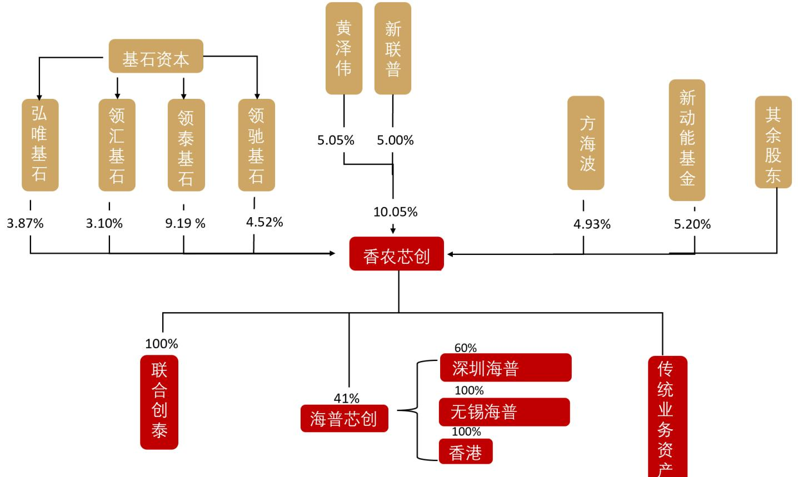  
图 2 公司股权结构  
资料来源：公司年报，华西证券研究所

# 1.3 主营业务：“分销+自研”双轮驱动，构建半导体产业竞争优势

# 主营业务定位：从制造向“分销+自研”双轮驱动转型

从行业来看，香农芯创当前主营业务聚焦于电子元器件分销（营业收入占比 $9 7 . 1 5 \%$ ）；近年来，公司成功实现从传统家电零部件制造商向半导体分销平台与自研高端存储产品提供商的战略转型，逐步形成“分销+自研产品”一体两翼的发展格局，具备较强的行业竞争力与成长韧性。

# 分销业务：稳定现金流与全球交付能力兼具

在分销业务方面，公司自 2021 年通过全资收购联合创泰，正式进入电子元器件分销赛道。公司分销业务聚焦于 SK 海力士的 DRAM 存储器与联发科的主控芯片，前者为全球三大 DRAM 厂商之一，后者为全球最大的智能手机芯片供应商。联合创泰作为核心授权分销商，与两大原厂建立了稳定的合作关系，覆盖中国主要互联网云服务企业，在产业链中承担产品、资金、信息等多重流通职能，渠道黏性强。

此外，公司分销业务面向全球市场，2024 年境外营业收入占比达 94. $1 8 \%$ ，显示出公司在全球交付与外汇收入能力方面的优势，有助于提升整体盈利的稳定性。

# 自研业务：打造高端企业级存储产品，推进国产替代

在自研产品方面，公司围绕“海普存储”品牌，专注企业级高性能存储解决方案的研发，积极服务于国家大数据战略及国产化替代趋势。截至目前，公司已完成企业级 DDR4、DDR5 内存模组以及 Gen4 eSSD 的研发和试产，产品性能优异，已通过部分国内主流服务器平台的兼容性验证并实现量产交付。这标志着公司已初步打通从分销到产品研发的技术路径，为未来构建技术壁垒和品牌护城河奠定坚实基础。

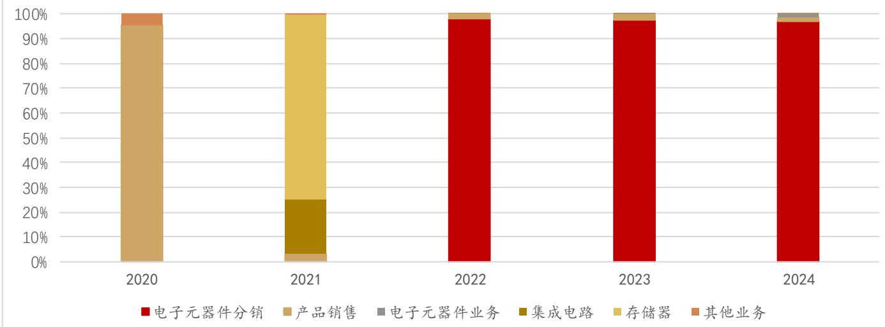  
图 3 2020-2024 公司产品营收比（%）  
资料来源：Wind，华西证券研究所

# 1.4 财务分析：业绩逐步修复，盈利能力稳步提升

2024 年，生成式 AI 与推理计算场景广泛落地，显著拉动高算力服务器与高性能存储（如 DDR5、Gen4/5 eSSD）需求，企业级 SSD 渗透率持续提升。伴随“自主可控”政策推进，叠加云厂商采购体系重构，具备分销与自研协同能力的厂商将在国产替代与全球交付双重趋势下获得竞争优势。

在此背景下，公司 2024 年实现营业收入 242.71 亿元，同比增长 $1 1 5 . 4 0 \%$ ，呈现出强劲的规模扩张态势；2025 年第一季度营收达 79.06 亿元，同比大增 $2 4 3 . 3 3 \%$ ，延续高增势头。分季度来看，2024 年收入节节攀升，分别为 $2 3 . 0 3 \textrm { / } 5 5 . 0 4 \textrm { / } 8 7 . 0 4 \textrm { / }$ 77.61 亿元，单季度同比增速均超过 $45 \%$ ，反映出 AI 驱动下需求的持续释放。

收入快速增长的主要来源为电子元器件分销业务，2024 年该板块收入占比达97. $1 5 \%$ ，同比增长 $1 1 5 . 2 3 \%$ ，其中联合创泰实现营收 231.08 亿元，占总营收的$9 5 . 2 1 \%$ ，净利润为 4.47 亿元，显示出其在全球芯片代理体系中的渠道稳定性和外汇交付能力。

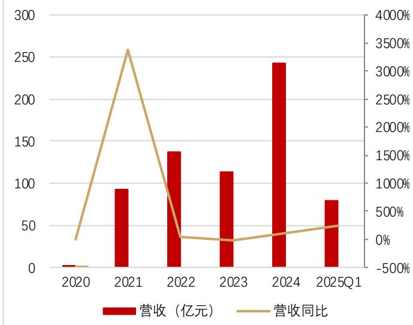  
图 4 2020-2025Q1 营收（亿元）及增速 $( \% )$ ）  
资料来源：Wind，华西证券研究所

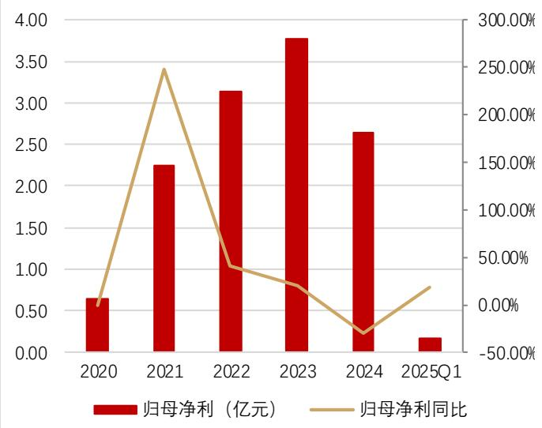  
图 5 2020-2025Q1 归母净利（亿元）及增速 $( \% )$   
资料来源：Wind，华西证券研究所

在盈利能力方面，公司正处于由传统制造向半导体分销与高端存储自研转型的关键期，盈利结构出现阶段性调整。

毛利率自 2020 年高点 $3 0 . 6 4 \%$ 持续回落，2024 年为 $4 , 3 0 \%$ ，同比下降 1.5 个百分点，2025 年一季度进一步降至 1. $98 \%$ 。主要原因在于分销业务低毛利特性占比提升，以及 2024 年存储芯片价格整体下行，同时资产和信用减值有所增加。

净利率走势与毛利率变化保持一致，自 2020 年的 $2 1 . 8 5 \%$ 逐年下行至 2024 年的$1 , 0 6 \%$ ，2025 年一季度为 $0 . 1 7 \%$ 。这一趋势反映出公司在快速扩张阶段仍面临短期盈利承压，但同时也体现了通过扩大营收基盘和布局自研产品来实现利润重构的战略意图。

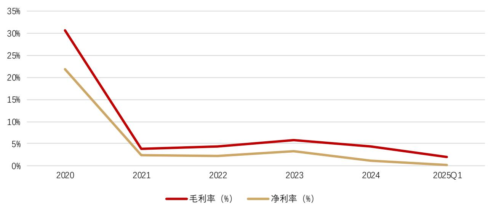  
图 6 2020-2025Q1 公司销售毛利率及净利率 $( \% )$ ）

资料来源：Wind，华西证券研究所资料来源：Wind，华西证券研究所资料来源：Wind，华西证券研究所

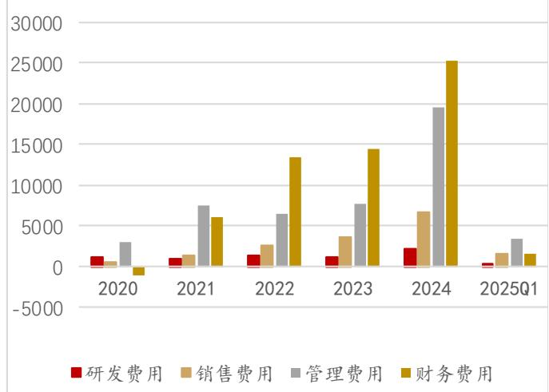  
图 7 2020-2025Q1 年公司期间费用（万元）

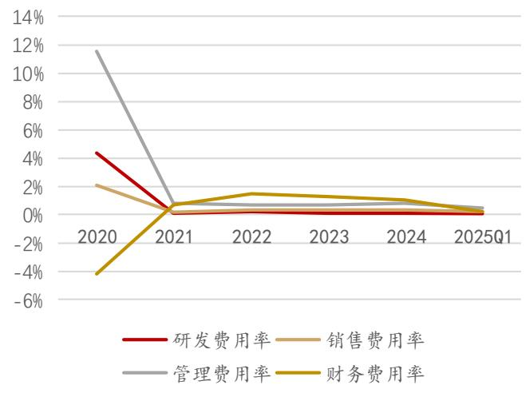  
图 8 2020-2025Q1 公司期间费率 $( \% )$

# 2.电子元器件分销：深度绑定原厂龙头，受益存储需求增长与周期上行

# 2.1.电子分销：产业链上下游传输重要纽带

电子元器件分销商是上游的电子元器件设计制造商和下游的电子产品制造商之间的纽带，是电子元器件产业链上的重要一环。分销商为上下游提供产品推广、方案开发、技术支持、交付服务等，在产业链中起到了不可或缺的作用。

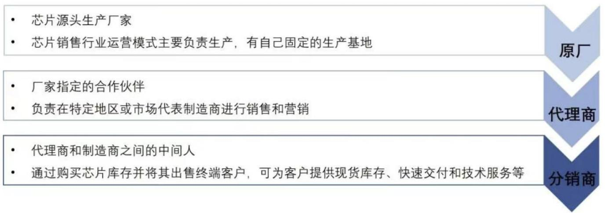  
图 9 电子产业链中的分销商  
资料来源：新汉科技，华西证券研究所

分销商在电子产业链中扮演着连接原厂与终端客户的关键枢纽角色，是产业生态不可或缺的重要环节。其核心价值体现在以下几个方面：

1）库存与资金压力缓冲: 分销商通过主动管理库存，有效调节市场供需波动。在供过于求时期吸纳过剩产能，减轻原厂库存与资金压力；在供不应求时期释放库存资源，保障市场供应稳定。

2）跨品牌与全球化供应平台：分销商具备非排他性特征，能够灵活供应多品牌电子元器件，不受限于特定原厂联盟。同时，其全球视野使其能高效整合来自原厂、OEM/CEM 剩余库存及其他代理商的全供应链库存资源。

3）市场覆盖与方案落地的延伸者：鉴于芯片应用的广泛性，单一半导体原厂难以全面覆盖所有客户及应用场景，亦难以追踪产品的最终落地方案。分销商凭借其广泛的市场触达和技术服务能力，有效延伸了原厂的产品服务范围，助力产品实现最终应用。

4）生态协同与资源共享纽带：分销商致力于与供应链上下游伙伴建立长期稳定的战略合作关系，促进技术资源、市场渠道及客户资源的深度共享，共同加速技术创新进程并拓展市场边界。

5）增值服务与客户价值提升：依托其综合服务能力，分销商可为终端客户提供定制化增值服务，显著提升客户满意度和忠诚度，并辅助客户发掘和把握商业机遇。

# 2.2 公司：深度绑定原厂龙头，受益存储需求扩张

2024 年，在 AI 的推动作用下，相关半导体需求持续激增和电子产品开始复苏，全球半导体市场呈现较强的增长态势。中商产业研究发布的《2025-2030 年中国存储芯片市场调查及发展趋势研究报告》显示，2023 年中国半导体存储器市场规模约为3943 亿元，2024 年市场规模约为 4267 亿元。中商产业研究院分析师预测，2025 年中国半导体存储器市场规模将达 4580 亿元。

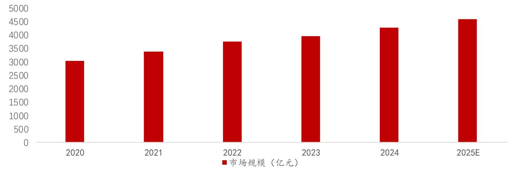  
图 10 中国半导体存储器市场规模

资料来源：中商产业研究院，华西证券研究所

# 存储芯片市场主高度集中，要由海外大厂垄断全球主要份额。

DRAM 主要被三星、SK 海力士和美光三者垄断，根据 Omdia 以及中商产业研究院数据显示，2024 年三星、海力士和美光市场份额分别为 $42 \%$ 、 $2 9 \%$ 和 $24 \%$ ，竞争格局稳定。南亚科技占比分别为 $3 \%$ 。国内 DRAM 厂商主要有兆易创新、北京君正、东芯股份、长鑫存储、紫光国微、福建晋华等企业。NAND Flash 全球市场 2024Q4 数据统计，前三企业分别为三星、SK 海力士、铠侠，市场份额分别为 $3 3 . 9 \%$ 、 $2 0 . 5 \%$ 、 $1 6 . 1 \%$ 。西部数据和美光市场份额分别为 11. $4 \%$ 、 $1 3 . 8 \%$ 。国内 Nand 厂商主要有长江存储、东芯股份、江波龙等企业。

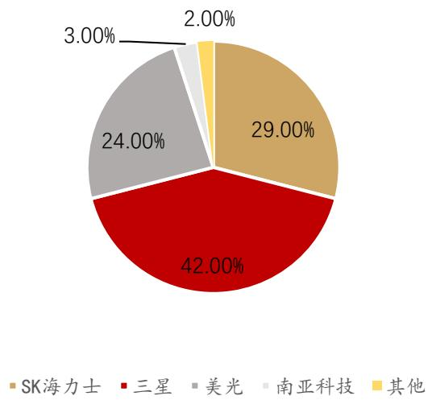  
图 11 2024 全球 DRAM 市场份额

资料来源：Omdia，中商产业研究院，华西证券研究所

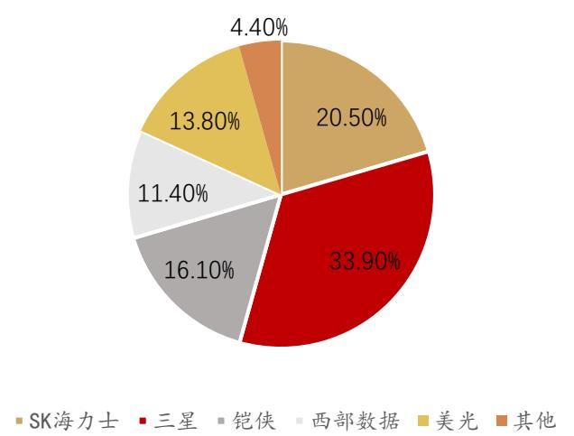  
图 12 2024Q4 全球 Nand 市场份额  
资料来源：Trend force，华西证券研究所

公司深度绑定的存储原厂龙头 SK 海力士，根据 Counterpoint Research 最新发布的 2025 年一季度 DRAM 市场追踪报告显示，已经成为全球第一大 DRAM 供应商。2025 年一季度 DRAM 市场追踪报告，SK 海力士以 $36 \%$ 的营收市占率首度超越三星电子，成为了全球第一大 DRAM 供应商。排名第二的三星，其市占率为 $34 \%$ ，低于 SK 海力士约 2 个百分点。紧随其后的美光市占率为 $2 5 \%$ ，其他厂商仅有 $5 \%$ 的份额。

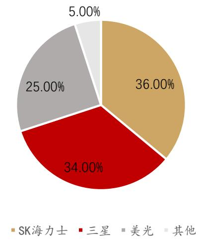  
图 13 2025 一季度 DRAM 市场营收市占率（%）

资料来源：CFM闪存，华西证券研究所

自成立以来，公司已积累了众多优质的原厂授权资质，先后取得全球全产业 存储器供应商之一的 SK 海力士、全球著名主控芯片品牌 MTK 的代理权以及 AMD 的经销商资质，形成了原厂线优势。

在销售网络布局上，公司依据核心客户群体的地域分布特点，构建了以深圳为枢纽、辐射客户所在地的“伞状”多点覆盖体系。依托中国香港、深圳和上海三大物流中心，业务主要划分为华东、华南及华北等核心销售区域。除深圳和中国香港外，公司还在上海、北京、杭州等国内电子产业聚集地设立了销售网点，形成了覆盖广泛、稳定高效的专业销售网络。

表 1 公司主要合作原厂  

<table><tr><td>品牌</td><td>简介</td><td>主要产品</td><td>应用领域</td></tr><tr><td>SK海力士</td><td>全球领先的存储芯片制造商，尤 其以 DRAM 和 NAND 闻名，是高端 HBM芯片的关键供应商</td><td>DRAM、Nand FIash、HBM</td><td>服务器数据库等企业级存 储场景</td></tr><tr><td>MTK 联发科</td><td>全球智能手机 SoC 芯片设计公司之 一，专注于为移动设备、智能家居 等提供芯片解决方案</td><td>SoC芯片</td><td>手机、移动设备、智能家 居等</td></tr><tr><td>AMD</td><td>全球主要的高性能计算与图形公司</td><td>CPU、MCU、图形处理器、 随机存储器等。</td><td>服务器、PC等处理器应用 场景</td></tr></table>

资料来源：公开资料整理，华西证券研究所整理

# 3.企业级 SSD：企业级存储需求扩张，打开成长空间

# 3.1.SSD：服务器重要存储设备，市场需求扩张

固态硬盘（SSD）是以闪存为存储介质的半导体存储器，其相对于机械硬盘（HDD）具备读写速度快、延迟低、抗震性好等优势。SSD 固态硬盘是服务器的重要数据存储设备，主要应用于互联网、云计算等各类企业的数据中心。

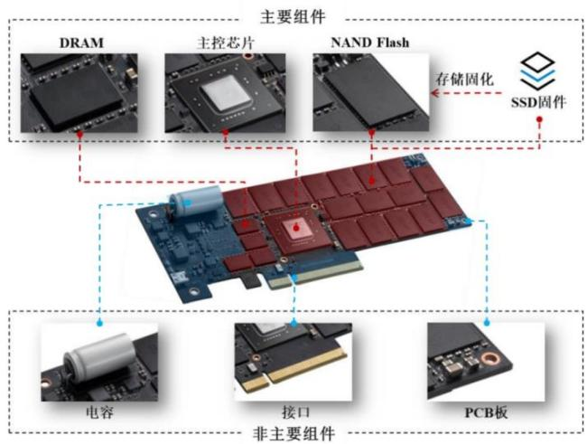  
图 14 SSD 主要组件  
资料来源：忆恒创源招股书，华西证券研究所

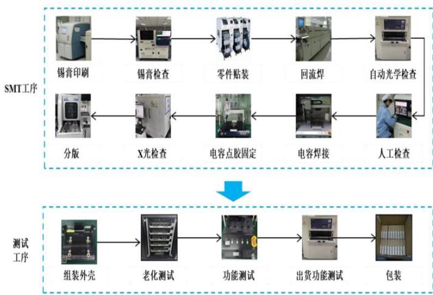  
图 15 SSD 主要生产流程

资料来源：忆恒创源招股书，华西证券研究所

信息化的不断发展是推动存储设备演化和进步的重要动力。随着全球范围内企业数字化转型的快速发展，数据将呈现海量增长趋势；大数据、云计算、人工智能、5G 通信等新兴技术的发展也在推动数据来源和结构愈加复杂多样，基于数据的新产品、新模式、新体验不断涌现，数据成为企业最重要的资产之一。根据艾瑞咨询数据，预计到 2035 年，全球每年产生的数据量将达到 2142ZB，约为 2020 年的 45 倍。与数据量规模共同增长还有上述前沿 IT 科技所推动的数字经济的市场规模，2021 年我国数字经济规模达到 45.5 万亿元，占当年 GDP 规模的比重由 2005 年的 14.2%攀升至$3 9 . 8 \%$ 。

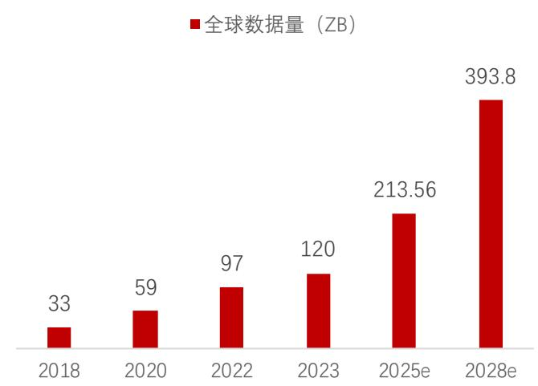  
图 16 2016-2035 部分年度全球产生数据量估算  
资料来源：艾瑞咨询，华西证券研究所

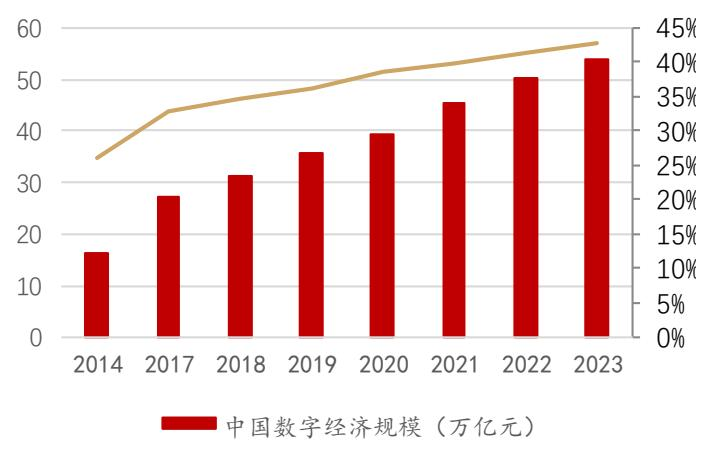  
图 17 2005-2023 年部分年度中国数字经济规模

资料来源：艾瑞咨询，华西证券研究所

国际数据公司（IDC）发布最新报告显示，中国企业级固态硬盘市场在 2024 年得到修复，市场规模达到 62.5 亿美元，与 2023 年相比增长 $1 8 7 . 9 \%$ 。IDC 预计，2029年中国企业级固态硬盘市场规模将达到 91 亿美元。从厂商销售额角度来看，Solidigm 和三星占据中国企业级固态硬盘市场中最大份额。

  
图 18 中国企业级 SSD 市场规模

资料来源：中商产业研究院，华西证券研究所

高性能存储是发展数字经济、建设数字中国的底层基建。根据艾瑞咨询预测到2026 年，国内企业级固态硬盘市场规模将增至 669 亿元，2022-2026 年期间复合增速约为 $2 3 . 7 \%$ ，而 PCIe 固态硬盘市场份额比例将进一步于 2026 年增至 $8 9 . 3 \%$ 。

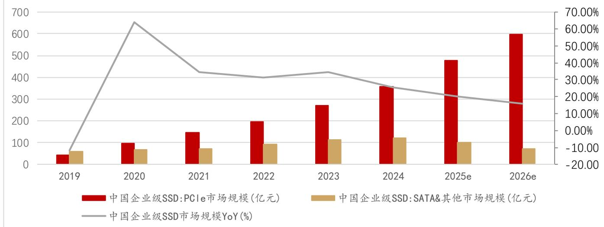  
图 19 2019-2026 中国企业级固态硬盘市场规模及市场结构  
资料来源：艾瑞咨询，华西证券研究所

根据智研咨询数据显示，2024 年上半年企业级固态硬盘市场份额占比达 $4 4 . 9 \%$ 。2024 年初北美库存去化完成，三星积极投资 AI 存储建设，企业级固态硬盘订单因此大幅增加。2024 年第二季三星企业级固态硬盘业务营收增长 $3 9 . 2 \%$ ，至 24.8 亿美元。SK 集团旗下的 Solidigm，作为最大 QLC 企业级固态硬盘 (ESSD)供应商，同样受惠于 AI 需求大幅增长，加上 SK hynix（SK 海力士）获得 Server 客户追加订单，2024年上半年 SK 集团企业级固态硬盘业务市占率为 $3 1 . 3 \%$ 。原厂企业级固态硬盘市场占比第三名为 Micron（美光），市场份额占比为 $1 2 . 1 \%$ 。

从企业级 SSD 的客户群体来看，2024 年云与互联网企业在我国企业级固态硬盘市场的占比达 $6 2 . 5 \%$ ，仍为最主要下游客户。与此同时，运营商云业务拓展迅速，天翼云等运营商云的快速崛起，叠加国资云建设的推进，带动运营商客户占比显著提升，2024 年占比已达 $1 7 . 5 \%$ 。金融与政企领域需求保持稳定，占比约 $7 \%$ 。

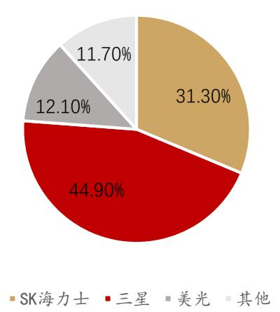  
图 20 2024 上半年全球原厂企业级市场格局

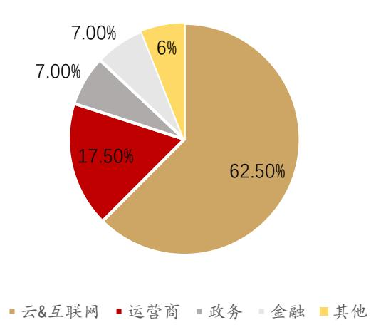  
图 21 2024 企业级 SSD 下游应用  
资料来源：艾瑞咨询，华西证券研究所

# 3.2 公司：携手行业龙头，进军企业级存储市场

# 3.1.企业级 SSD 业务

公司携手大普微，设立控股子公司“海普存储”，进军企业级 SSD 赛道。2023年 5 月 27 日，公司发布公告将出资 3500 万元，联合 SK 海力士、大普微电子等合作方共同设立子公司海普存储。

大普微是国际领先的存储主控芯片和企业级 SSD 供应商，前期主要负责企业级固态硬盘设计工作。自成立以来，大普微电子在短短不到十年的时间里，已成为国内头部企业级 SSD 厂商之一，全方位拓展并成功打造嵘神&蛟容系列、Xlenstor SLCeSSD 系列、海神系列、QLC eSSD 系列四大产品线，这四大产品线各具特色，各有所长，精准定位并满足了不同用户的多样化需求。

表 2 大普微产品系列  

<table><tr><td>产品系列</td><td>产品简介</td></tr><tr><td>嵘神&amp;蛟容系列</td><td>搭载 3D eTLC Nand Flash 和自研主控芯片，以高性能、自主可控等优势收获众多客户 青睐</td></tr><tr><td>Xlenstor SLC eSSD 系列</td><td>以极低的延时和超长的寿命，为对存储性能有极高要求的客户提供了理想的选择</td></tr><tr><td>海神系列</td><td>注重高性能表现，致力于为客户带来绿色节能的存储接近方案</td></tr><tr><td>QLC eSSD</td><td>具有高容量，低成本两大优势，满足AI训练数据存储空间的巨大需求</td></tr></table>

资料来源：公司公告，智研咨询，华西证券研究所  
资料来源：大普微，CFM，华西证券研究所整理

海普存储整合上游芯片资源与下游客户资源，在当下企业级存储需求快速增长和企业级存储国产化进程加速推进的大环境下，香农芯创有望凭借海普存储打造第二成长曲线，以此打开公司成长空间。

# 3.2.DRAM 业务

公司于 2024 年 6 月 设立海普芯创，在深圳海普业务基础上，公司将完善企业级 DRAM 产品线。借力于公司与原厂及核心客户的良好关系，海普系列产品在资源获取、产品研发、销售拓展、技术提升等方面，在行业内具有不可复制的核心竞争力。

表 3 公司 DRAM 产品项目  

<table><tr><td>研发项目</td><td>项目进展</td></tr><tr><td>DDR4 RDIMM 内存条</td><td>已经量产</td></tr><tr><td>DDR5 5600 RDIMM 内存条</td><td>已经量产</td></tr><tr><td>DDR5 6400 RDIMM 内存条</td><td>规划中，待立项</td></tr><tr><td>MRDIMM 内存条</td><td>规划中，待立项</td></tr></table>

资料来源：公司年报，华西证券研究所整理

# 4.盈利预测与估值

# 4.1.盈利预测

半导体分销业务：该业务占公司营业收入比重最大。随着存储周期向上、AI 服务器需求旺盛及手机复苏，预计 2025 年公司分销业务增速较快,我们预计 2025-2027 年营收可 达 282.6/326.8/402.18 亿 元， 同比 $2 3 . 9 \%$ 、 $8 . 7 \%$ 、 $2 3 . 1 \%$ 。毛利率分别为$4 . 3 2 \% / 4 . 8 3 \% / 4 . 9 7 \%$ 。

半导体产品业务：主要是企业级 SSD 等新业务，23 年公司开始布局。我们预计2025-2027 年营收可达 $4 / 5 / 6$ 亿元，同比增速 $3 6 . 9 8 \% / 2 5 . 0 0 \% / 2 0 . 0 0 \%$ 。毛利率方面，预计 2025-2027 年毛利率分别为 $5 \% / 6 . 4 \% / 7 . 5 \%$ 。

表 4 公司主营业务预测  

<table><tr><td>百万元</td><td>2022</td><td>2023</td><td>2024</td><td>2025E</td><td>2026E</td><td>2027E</td></tr><tr><td>营业收入</td><td>13,772</td><td>11,267</td><td>24,271</td><td>28,260</td><td>32,680</td><td>40,218</td></tr><tr><td>yoy</td><td>49.61%</td><td>-18.19%</td><td>115.40%</td><td>23.85%</td><td>8.72%</td><td>23.07%</td></tr><tr><td>毛利率</td><td>4.42%</td><td>5.80%</td><td>4.30%</td><td>4.32%</td><td>4.83%</td><td>4.97%</td></tr><tr><td>半导体分销</td><td>13,485</td><td>10,954</td><td>23,578</td><td>27,412.</td><td>31,700</td><td>39,000</td></tr><tr><td>yoy</td><td></td><td>-18.77%</td><td>115.23%</td><td>16.26%</td><td>15.64%</td><td>23.03%</td></tr><tr><td>毛利率</td><td>3.88%</td><td>5.25%</td><td>3.99%</td><td>4.20%</td><td>5.00%</td><td>5.13%</td></tr><tr><td>半导体产品</td><td></td><td>0.14</td><td>292.02</td><td>400.00</td><td>500.00</td><td>600.00</td></tr><tr><td>yoy</td><td></td><td></td><td>210615.18%</td><td>36.98%</td><td>25.00%</td><td>20.00%</td></tr><tr><td>毛利率</td><td></td><td>8.95%</td><td>2.75%</td><td>5.00%</td><td>6.40%</td><td>7.50%</td></tr></table>

资料来源：Wind，华西证券研究所

# 4.2.相对估值

我们选取国内存储模组公司江波龙和德明利作为可比公司进行估值对比，根据wind 一致预期可比公司 2025-2027 年 PE 均值为 43.7、29.66、25 倍。

我们预计公司 2025-27 年营业收入分别为 300.60、326.80、402.18 亿元；归母净利润分别为 4.83、6.86、9.27 亿元；EPS 分别为 1.04、1.48、2.0 元。2025 年 7 月14 日股价为 33.61 元，对应 PE 分别为 32.26X、22.71X、16.82X，低于可比公司估值。我们看好公司在利基型存储芯片分销与企业级 SSD 领域的发展，首次覆盖，给予“增持”评级。

表 5 可比公司估值  

<table><tr><td>公司</td><td>代码</td><td>收盘价（元)</td><td colspan="3">EPS（元)</td><td colspan="3">PE（倍）</td></tr><tr><td></td><td></td><td></td><td>2025E</td><td>2026E</td><td>2027E</td><td>2025E</td><td>2026E</td><td>2027E</td></tr><tr><td>江波龙</td><td>301308.SZ</td><td>81.36</td><td>1.65</td><td>2.51</td><td>3.14</td><td>53.06</td><td>34.80</td><td>27.82</td></tr><tr><td>德明利</td><td>001309.SZ</td><td>83.30</td><td>2.46</td><td>3.45</td><td>3.80</td><td>34.34</td><td>24.52</td><td>22.27</td></tr><tr><td>平均估值</td><td></td><td></td><td></td><td></td><td></td><td>43.7</td><td>29.66</td><td>25</td></tr><tr><td>香农芯创</td><td></td><td></td><td>1.04</td><td>1.48</td><td>2.0</td><td>32.26</td><td>22.71</td><td>16.82</td></tr></table>

资料来源：Wind，华西证券研究所注：时间截至 2025 年 7 月 14日

# 5.风险提示

供应商依赖风险：公司目前第一大供应商为 SK 海力士，公司向 SK 海力士采购的产品为数据存储器, 在存储器领域中， 三星、SK 海力士、美光占据着全球超过95%的 DRAM 市场份额，上游原厂的集中度高，存在一定供应商依赖。

存货跌价风险：如果未来下游市场出现周期性波动、供过于求导致产品价格持续下跌，或因商业判断出现失误，未能及时应对 IC 产品市场供需变化或其他难以预料的原因调整其购销计划，导致期后销售情况不达预期或存 货市场价格大幅下降，存货成本高于可变现净值，产品库存出现积压并需计提存货跌价准备，从而对公 司业绩产生不利影响。

存储器产品价格波动导致毛利率波动风险：公司目前分销的核心产品为存储器，该产品占分销业务收入的比重超过 $70 \%$ ，存储器产品的毛利率 波动对公司分销业务毛利率产生重大影响。

财务报表和主要财务比率  

<table><tr><td>利润表(百万元)</td><td>2024A</td><td>2025E</td><td>2026E</td><td>2027E</td><td>现金流量表（百万元)</td><td>2024A</td><td>2025E</td><td>2026E</td><td>2027E</td></tr><tr><td>营业总收入</td><td>24,271</td><td>30,060</td><td>32,680</td><td>40,218</td><td>净利润</td><td>258</td><td>474</td><td>673</td><td>909</td></tr><tr><td>YoY (%)</td><td>115.4%</td><td>23.9%</td><td>8.7%</td><td>23.1%</td><td>折旧和摊销</td><td>22</td><td>30</td><td>33</td><td>22</td></tr><tr><td>营业成本</td><td>23,229</td><td>28,760</td><td>31,100</td><td>38,220</td><td>营运资金变动</td><td>-732</td><td>-544</td><td>-1,126</td><td>-959</td></tr><tr><td>营业税金及附加</td><td>5</td><td>9</td><td>10</td><td>12</td><td>经营活动现金流</td><td>-48</td><td>185</td><td>-221</td><td>171</td></tr><tr><td>销售费用</td><td>66</td><td>150</td><td>163</td><td>201</td><td>资本开支</td><td>-20</td><td>-15</td><td>-15</td><td>-15</td></tr><tr><td>管理费用</td><td>196</td><td>301</td><td>327</td><td>402</td><td>投资</td><td>127</td><td>-60</td><td>-60</td><td>-60</td></tr><tr><td>财务费用</td><td>252</td><td>197</td><td>184</td><td>179</td><td>投资活动现金流</td><td>119</td><td>-76</td><td>-80</td><td>-80</td></tr><tr><td>研发费用</td><td>21</td><td>60</td><td>65</td><td>80</td><td>股权募资</td><td>33</td><td>0</td><td>0</td><td>0</td></tr><tr><td>资产减值损失</td><td>-150</td><td>0</td><td>0</td><td>0</td><td>债务募资</td><td>680</td><td>815</td><td>815</td><td>815</td></tr><tr><td>投资收益</td><td>12</td><td>0</td><td>0</td><td>0</td><td>筹资活动现金流</td><td>107</td><td>563</td><td>546</td><td>522</td></tr><tr><td>营业利润</td><td>303</td><td>592</td><td>841</td><td>1,136</td><td>现金净流量</td><td>185</td><td>672</td><td>245</td><td>613</td></tr><tr><td>营业外收支</td><td>1</td><td>0</td><td>0</td><td>0</td><td>主要财务指标</td><td>2024A</td><td>2025E</td><td>2026E</td><td>2027E</td></tr><tr><td>利润总额</td><td>304</td><td>592</td><td>841</td><td>1,136</td><td>成长能力</td><td></td><td></td><td></td><td></td></tr><tr><td>所得税</td><td>46</td><td>118</td><td>168</td><td>227</td><td>营业收入增长率</td><td>115.4%</td><td>23.9%</td><td>8.7%</td><td>23.1%</td></tr><tr><td>净利润</td><td>258</td><td>474</td><td>673</td><td>909</td><td>净利润增长率</td><td>-30.1%</td><td>83.0%</td><td>42.0%</td><td>35.0%</td></tr><tr><td>归属于母公司净利润</td><td>264</td><td>483</td><td>686</td><td>927</td><td>盈利能力</td><td></td><td></td><td></td><td></td></tr><tr><td>YoY (%)</td><td>-30.1%</td><td>83.0%</td><td>42.0%</td><td>35.0%</td><td>毛利率</td><td>4.3%</td><td>4.3%</td><td>4.8%</td><td>5.0%</td></tr><tr><td>每股收益</td><td>0.58</td><td>1.04</td><td>1.48</td><td>2.00</td><td>净利润率</td><td>1.1%</td><td>1.6%</td><td>2.1%</td><td>2.3%</td></tr><tr><td>资产负债表（百万元)</td><td>2024A</td><td>2025E</td><td>2026E</td><td>2027E</td><td>总资产收益率 ROA</td><td>4.3%</td><td>5.7%</td><td>7.1%</td><td>8.3%</td></tr><tr><td>货币资金</td><td>898</td><td>1,570</td><td>1,815</td><td>2,428</td><td>净资产收益率 ROE</td><td>9.0%</td><td>14.3%</td><td>17.2%</td><td>19.2%</td></tr><tr><td>预付款项</td><td>778</td><td>863</td><td>933</td><td>1,147</td><td>偿债能力</td><td></td><td></td><td></td><td></td></tr><tr><td>存货</td><td>2,858</td><td>3,196</td><td>3,456</td><td>4,247</td><td>流动比率</td><td>1.45</td><td>1.43</td><td>1.52</td><td>1.54</td></tr><tr><td>其他流动资产</td><td>1,660</td><td>2,099</td><td>2,285</td><td>2,782</td><td>速动比率</td><td>0.58</td><td>0.67</td><td>0.72</td><td>0.74</td></tr><tr><td>流动资产合计</td><td>6,194</td><td>7,727</td><td>8,488</td><td>10,603</td><td>现金比率</td><td>0.21</td><td>0.29</td><td>0.33</td><td>0.35</td></tr><tr><td>长期股权投资</td><td>0</td><td>0</td><td>0</td><td>0</td><td>资产负债率</td><td>60.4%</td><td>62.5%</td><td>59.4%</td><td>59.9%</td></tr><tr><td>固定资产</td><td>74</td><td>66</td><td>58</td><td>50</td><td>经营效率</td><td></td><td></td><td></td><td></td></tr><tr><td>无形资产</td><td>13</td><td>12</td><td>11</td><td>11</td><td>总资产周转率</td><td>4.00</td><td>3.60</td><td>3.43</td><td>3.65</td></tr><tr><td>非流动资产合计</td><td>1,391</td><td>1,404</td><td>1,442</td><td>1,490</td><td>每股指标（元)</td><td></td><td></td><td></td><td></td></tr><tr><td>资产合计</td><td>7,585</td><td>9,131</td><td>9,930</td><td>12,093</td><td>每股收益</td><td>0.58</td><td>1.04</td><td>1.48</td><td>2.00</td></tr><tr><td>短期借款</td><td>1,326</td><td>2,126</td><td>2,926</td><td>3,726</td><td>每股净资产</td><td>6.42</td><td>7.26</td><td>8.60</td><td>10.39</td></tr><tr><td>应付账款及票据</td><td>2,520</td><td>2,796</td><td>2,160</td><td>2,654</td><td>每股经营现金流</td><td>-0.10</td><td>0.40</td><td>-0.48</td><td>0.37</td></tr><tr><td>其他流动负债</td><td>439</td><td>470</td><td>486</td><td>525</td><td>每股股利</td><td>0.06</td><td>0.10</td><td>0.15</td><td>0.20</td></tr><tr><td>流动负债合计</td><td>4,285</td><td>5,392</td><td>5,572</td><td>6,905</td><td>估值分析</td><td></td><td></td><td></td><td></td></tr><tr><td>长期借款</td><td>261</td><td>261</td><td>261</td><td>261</td><td>PE</td><td>57.95</td><td>32.26</td><td>22.71</td><td>16.82</td></tr><tr><td>其他长期负债</td><td>36</td><td>53</td><td>68</td><td>83</td><td>PB</td><td>4.44</td><td>4.63</td><td>3.91</td><td>3.23</td></tr><tr><td>非流动负债合计</td><td>298</td><td>314</td><td>329</td><td>344</td><td></td><td></td><td></td><td></td><td></td></tr><tr><td>负债合计</td><td>4,583</td><td>5,706</td><td>5,901</td><td>7,249</td><td></td><td></td><td></td><td></td><td></td></tr><tr><td>股本</td><td>458</td><td>458</td><td>458</td><td>458</td><td></td><td></td><td></td><td></td><td></td></tr><tr><td>少数股东权益</td><td>65</td><td>56</td><td>42</td><td>24</td><td></td><td></td><td></td><td></td><td></td></tr><tr><td>股东权益合计</td><td>3,002</td><td>3,425</td><td>4,029</td><td>4,844</td><td></td><td></td><td></td><td></td><td></td></tr><tr><td>负债和股东权益合计</td><td>7,585</td><td>9,131</td><td>9,930</td><td>12,093</td></table>

# 分析师承诺

作者具有中国证券业协会授予的证券投资咨询执业资格或相当的专业胜任能力，保证报告所采用的数据均来自合规渠道，分析逻辑基于作者的职业理解，通过合理判断并得出结论，力求客观、公正，结论不受任何第三方的授意、影响，特此声明。

# 评级说明

<table><tr><td>公司评级标准</td><td>投资 说明 评级</td><td></td></tr><tr><td rowspan="5">以报告发布日后的6个 月内公司股价相对上证 指数的涨跌幅为基准。</td><td>买入</td><td>分析师预测在此期间股价相对强于上证指数达到或超过15%</td></tr><tr><td>增持</td><td>分析师预测在此期间股价相对强于上证指数在5%—15%之间</td></tr><tr><td>中性</td><td>分析师预测在此期间股价相对上证指数在-5%——5%之间</td></tr><tr><td>减持</td><td>分析师预测在此期间股价相对弱于上证指数5%—15%之间</td></tr><tr><td></td><td>卖出分析师预测在此期间股价相对弱于上证指数达到或超过 15%</td></tr><tr><td>行业评级标准</td><td></td><td></td></tr><tr><td rowspan="3">以报告发布日后的6个 月内行业指数的涨跌幅 为基准。</td><td></td><td>推荐分析师预测在此期间行业指数相对强于上证指数达到或超过10%</td></tr><tr><td></td><td>中性分析师预测在此期间行业指数相对上证指数在-10%——10%之间</td></tr><tr><td></td><td>回避分析师预测在此期间行业指数相对弱于上证指数达到或超过10%</td></tr></table>

# 华西证券研究所：

地址：北京市西城区太平桥大街丰汇园 11号丰汇时代大厦南座5 层

# 华西证券免责声明

华西证券股份有限公司（以下简称“本公司”）具备证券投资咨询业务资格。本报告仅供本公司签约客户使用。本公司不会因接收人收到或者经由其他渠道转发收到本报告而直接视其为本公司客户。

本报告基于本公司研究所及其研究人员认为的已经公开的资料或者研究人员的实地调研资料，但本公司对该等信息的准确性、完整性或可靠性不作任何保证。本报告所载资料、意见以及推测仅于本报告发布当日的判断，且这种判断受到研究方法、研究依据等多方面的制约。在不同时期，本公司可发出与本报告所载资料、意见及预测不一致的报告。本公司不保证本报告所含信息始终保持在最新状态。同时，本公司对本报告所含信息可在不发出通知的情形下做出修改，投资者需自行关注相应更新或修改。

在任何情况下，本报告仅提供给签约客户参考使用，任何信息或所表述的意见绝不构成对任何人的投资建议。市场有风险，投资需谨慎。投资者不应将本报告视为做出投资决策的惟一参考因素亦不应认为本报告可以取代自己的判断。在任何情况下，本报告均未考虑到个别客户的特殊投资目标、财务状况或需求，不能作为客户进行客户买卖、认购证券或者其他金融工具的保证或邀请。在任何情况下，本公司、本公司员工或者其他关联方均不承诺投资者一定获利，不与投资者分享投资收益，也不对任何人因使用本报告而导致的任何可能损失负有任何责任。投资者因使用本公司研究报告做出的任何投资决策均是独立行为，与本公司、本公司员工及其他关联方无关。

本公司建立起信息隔离墙制度、跨墙制度来规范管理跨部门、跨关联机构之间的信息流动。务请投资者注意，在法律许可的前提下，本公司及其所属关联机构可能会持有报告中提到的公司所发行的证券或期权并进行证券或期权交易，也可能为这些公司提供或者争取提供投资银行、财务顾问或者金融产品等相关服务。在法律许可的前提下，本公司的董事、高级职员或员工可能担任本报告所提到的公司的董事。

所有报告版权均归本公司所有。未经本公司事先书面授权，任何机构或个人不得以任何形式复制、转发或公开传播本报告的全部或部分内容，如需引用、刊发或转载本报告，需注明出处为华西证券研究所，且不得对本报告进行任何有悖原意的引用、删节和修改。